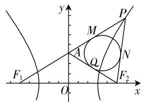
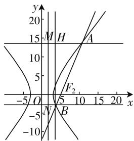

# 大概念视域下 利用双曲线定义求解离心率探析\*

● 河北师范大学教育学院 李保勤  
● 河北师范大学教育学院 冯振中  
山西大同大学数学与统计学院 康淑瑰  
山西大同大学数学与统计学院 刘宝亮

概念是数学学习的重要组成部分,按照大小范畴又可分为大概念和小概念.学科大概念是新课标中的重要理念,解析几何部分有必要在大概念理念下逐项整合.双曲线(Hyperbola)是解析几何的重要组成部分,离心率e>1.大概念范畴下,双曲线定义为一平面截一圆锥面,当截面与圆锥面的母线不平行也不通过圆锥面顶点,且与圆锥面的两个圆锥都相交时,交线称为双曲线.大概念下又分小概念,以下四种双曲线定义属于小概念,在求解离心率时应用广泛.

# 一、第一定义求解

第一定义符号语言：若 $||PF_1| - |PF_2|| = 2a(2a < |F_1F_2|)$ ，则点 $P$ 的轨迹称为双曲线。其中， $|F_1F_2| = 2c$ ，离心率 $e = \frac{2c}{2a} = \frac{c}{a}$ 。

例 1 已知双曲线 $C: \frac{x^{2}}{a^{2}} - \frac{y^{2}}{b^{2}} = 1 (a > 0, b > 0)$ 的左、右焦点分别为 $F_{1}, F_{2}, |F_{1}F_{2}| = 6, P$ 是 C 右支上的一点， $PF_{1}$ 与 y 轴交于点 A， $\triangle PAF_{2}$ 的内切圆与边 $AF_{2}$ 的切点为 Q. 若 $|AQ|=\sqrt{3}$ ，求 C 的离心率.

解析: 如图 1 所示, 设 $PF_{1}, PF_{2}$ 分别与 $\triangle PAF_{2}$

text_image

y
P
M
A
Q
N
F₁
O
x
F₂

图1

$$
\begin{array}{r l} & {\text {的内切圆切于} M, N, \text {依题意，有} | M A | = | A Q |,} \\ & {| N P | = | M P |, | N F _ {2} | = | Q F _ {2} |, | A F _ {1} | = | A F _ {2} | =} \\ & {| Q A | + | Q F _ {2} |, 2 a = | P F _ {1} | - | P F _ {2} | = (| A F _ {1} | +} \\ & {| M A | + | M P |) - (| N P | + | N F _ {2} |) = 2 | Q A | = 2} \end{array}
$$

$\sqrt{3}$ ，故 $a=\sqrt{3}$ ，从而 $e=\frac{c}{a}=\frac{3}{\sqrt{3}}=\sqrt{3}$ .

# 二、第二定义求解

第二定义符号语言: 若 $\frac{|PF|}{d}=e(e>1)$ ，则点 P 的轨迹称为双曲线。其中， $F(c,0)$ ， $l:x=\frac{a^{2}}{c}$ ，e 为双曲线的离心率。

例 2 已知双曲线 C: $\frac{x^{2}}{a^{2}} - \frac{y^{2}}{b^{2}} = 1 (a > 0, b > 0)$ 的右焦点为 $F_{2}$ ，过 $F_{2}$ 且斜率为 $\sqrt{3}$ 的直线交 C 于 A, B 两点，若 $\left|AF_{2}\right| = 4\left|F_{2}B\right|$ ，求 C 的离心率.

text_image

y
20
15 M H A
10
5
-5 O F₂ 5 10 x
-5 N B
-10

图2

解析:作双曲线的右准线 l, 过点 A, B 分别作 l 的垂线, 垂足为 M, N, 作 BH ⊥ AM 于 H. 令 $\left|F_{2}B\right|=2m$ , 则 $\left|AF_{2}\right|=8m$ , $\left|AB\right|=10m$ .

在 Rt△AHB 中，由已知得 $\angle ABH = 30^{\circ}$ ，则

$$
\mid A H \mid = 5 m.
$$

由双曲线第二定义, 得 $\frac{|AF_{2}|}{|AM|}=e$ , 则 $|AM|=\frac{8m}{e}$ . 同理, $|BN|=\frac{2m}{e}$ .

由 $|AH|=|AM|-|BN|$ ，得 $5m=\frac{8m}{e}-\frac{2m}{e}$ ，故 $e=\frac{6}{5}$ .

# 三、第三定义求解

第三定义符号语言: 若 $d_{1} \cdot d_{2} = \frac{a^{2} b^{2}}{c^{2}}$ (平面内任一点 P 到 $l_{1}: y = \frac{b}{a} x$ 与 $l_{2}: y = -\frac{b}{a} x$ 的距离分别为 $d_{1}, d_{2}, l_{1} \cap l_{2} = O$ ), 则点 P 的轨迹称为双曲线, 这两条定直线叫双曲线的渐近线.

在查阅文献时发现，史立新老师在《数学通报》(2004)“双曲线的第三种定义方法”一文中指出：“到两条相交定直线距离之积等于常数的点的轨迹叫双曲线，这两条定直线叫双曲线的渐近线。”厉倩老师在《中学数学》(2005)“质疑‘双曲线的第三种定义方法’”一文中，举例质疑史立新老师这一定义的科学性。当然，史立新老师在第三定义推导过程中主要关注到了曲线与方程的纯粹性，而文中疏忽了完备性。所谓曲线与方程的纯粹性（毫无例外），就是（曲线上的）点不比（方程的）解多，这一方面史立新老师做到了。

我们对厉倩老师一文的反例,非常赞赏其独到的发散性思维.其实稍加留意,便发现一些需商榷的细节.文中举到两条定直线x=0和y=x,它们是所举曲线 $f(x)=\left\{\begin{aligned}&x+\frac{1}{x}(x>0),\\&x-\frac{1}{x}(x<0)\end{aligned}\right.$ 的两条渐近线.虽然满足

曲线上任一点到两定直线距离之积等于常数 $\frac{\sqrt{2}}{2}$ ，但曲线不在两渐近线划分的两个对顶区域，而是相邻区域。何况此曲线无焦点、无对称性、无双顶点等。笔者无意质疑两位老师的大作，只是道理越辩越明，目的是为了完善定义、释疑解惑。数学研究除了要发散性思维，还要聚合性思维，两者结合的越佳，创造性思维发挥就越好.

例 3 过双曲线 $C: \frac{x^{2}}{a^{2}} - \frac{y^{2}}{b^{2}} = 1 (a > 0, b > 0)$ 上任一点 P 引两渐近线的垂线，垂足分别为 E, F，且 $PE \cdot PF = \frac{b^{2}}{9}$ ，求 C 的离心率.

解析:由第三定义得 $\frac{a^{2}b^{2}}{c^{2}}=\frac{b^{2}}{9}$ ，即 $\frac{c^{2}}{a^{2}}=9$ ，故e=3.

# 四、第四定义求解

第四定义符号语言: A, B 为平面内两定点, 若 $k_{PA} \cdot k_{PB} = \frac{b^{2}}{a^{2}}$ , 则点 P 的轨迹称为双曲线(除去 A, B 两点).

结论:若线段 MN 是过双曲线中心的任一条弦, P 是双曲线上异于 M, N 的任一点, 且 PM, PN 均与坐标轴不平行, 则有 $k_{PM} \cdot k_{PN} = e^{2} - 1$ .

例 4 设 A, B 分别为双曲线 $C: \frac{x^{2}}{a^{2}} - \frac{y^{2}}{b^{2}} = 1 (a > 0, b > 0)$ 左右顶点，O 为坐标原点，点 P 在双曲线上且异于 A, B 两点。若直线 PA, PB 的斜率之积为 $\sin 2\theta \left(0 < \theta < \frac{\pi}{4}\right)$ ，求双曲线 C 的离心率。

解析: 利用双曲线第四定义结论得, $e^{2}=k_{PA} \cdot k_{PB} + 1 = \sin 2\theta + 1 = (\sin \theta + \cos \theta)^{2}$ , 故 $e = \sin \theta + \cos \theta$ .

数学学习是需要概念引领的,概念的原型启发是提高发散性思维与聚合性思维的直接契机. 大概念教学为创造性思维的培养搭建了良好的平台,创造性思维的培养又为大概念教学定向导航.

# 参考文献：

[1] 史立新. 双曲线的第三种定义方法 [J]. 数学通报, 2004(4).  
[2] 厉倩. 质疑“双曲线的第三种定义方法”[J]. 中学数学, 2005(7).  
[3] Harlen Wynne. Principles and big ideas of science education[M]. Great Britain: The Association for Science Education, 2010. W