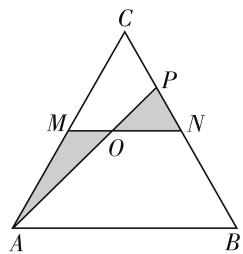

# 直击一轮复习中“解三角形”重点问题

# ● 江苏省无锡市玉祁高级中学 韦佳春

高考对解三角形的考查,重点放在正、余弦定理及三角形面积公式的应用上,涉及题目有大有小,形式多样,小题一般以小型计算题为主,求三角形的边长、内角、面积等元素,判断三角形的性状,也可能与其他知识综合,求与三角形有关的最值问题.当它出现在解答题中,并以实际问题的“面孔”出现时,它的难度往往有所上升;若以综合题的形式出现,则主要考查正、余弦定理及利用三角公式进行恒等变形的技能及运算能力,鉴于此,我们在第一轮复习中,一要熟练掌握和应用正、余弦定理及三角形面积公式;二要学会对公式的灵活应用,能根据具体问题,依据解三角形有关公式列出方程,通过解方程解决问题,同时注意解的检验.那么,在“解三角形”一轮复习时要抓住哪些重点问题呢?本文一一说明,供大家参考.

# 一、会利用边角关系判定三角形解的个数

无论是正弦定理和余弦定理,还是大边对大角和两边之和大于第三边,都体现了三角形中的边与角之间的关系,利用这些关系可以解决解三角形解的个数的判定问题.

例 1 在 $\triangle ABC$ 中, 若 $a=2\sqrt{2}$ , $b=2\sqrt{3}$ , $A=45^{\circ}$ , 则 c, B, C 的值分别是多少?

分析:题设中两边一对角已知,故可先依据正弦定理求出另一个对角,但必须注意解是唯一还是两解.

解:由正弦定理 $\frac{a}{\sin A}=\frac{b}{\sin B}$ ，得 $\sin B=\frac{b\sin A}{a}=$ $\frac{2\sqrt{3}\times\frac{\sqrt{2}}{2}}{2\sqrt{2}}=\frac{\sqrt{3}}{2}.$

因为 $b\sin A < a < b$ ，所以此三角形有两解，即 $B = 60^{\circ}$ 或 $B = 120^{\circ}$ .

因为 $A + B + C = 180^{\circ}$ ，所以当 $B = 60^{\circ}$ 时， $C = 180^{\circ} - (A + B) = 75^{\circ}$ ，由 $\frac{a}{\sin A} = \frac{c}{\sin C}$ 得 $c = \frac{a \sin C}{\sin A} =$

$$
\frac {2 \sqrt {2} \sin 7 5 ^ {\circ}}{\sin 4 5 ^ {\circ}} = \sqrt {6} + \sqrt {2};
$$

当 $B = 120^{\circ}$ 时， $C = 180^{\circ} - (A + B) = 15^{\circ}$ ，由 $\frac{a}{\sin A} = \frac{c}{\sin C}$ 得 $c = \frac{a\sin C}{\sin A} = \frac{2\sqrt{2}\sin 15^{\circ}}{\sin 45^{\circ}} = \sqrt{6} - \sqrt{2}$ .

综上可知,本题有两解,即 $B=60^{\circ}, C=75^{\circ}, c=\sqrt{6}+\sqrt{2}$ ; 或 $B=120^{\circ}, C=15^{\circ}, c=\sqrt{6}-\sqrt{2}$ .

点评:在解三角形问题中经常会出现“漏解”或“多解”现象,这时我们应利用三角形边角关系加以检验,主要看是否满足大边对大角的原则.

# 二、会利用公式对边角进行互化

在解三角形问题中,为了解决问题的方便,通常要把已知条件中的关系式化为角的关系式或边的关系式,这时就需要对“边”与“角”进行互化,而正、余弦定理和三角形面积公式恰好具有这个“功能”.这个方法主要用在三角形形状的判断和求三角形的边与角的问题中.

例 2 已知边 a, b, c 所对应的角分别为 A, B, C，且它们满足 $b^{2}\sin^{2}C + c^{2}\sin^{2}B = 2bc\cos B\cos C$ ，试问这个三角形是直角三角形吗.

分析:对于判断三角形形状问题,只需利用正、余弦定理将已知等式,或化为边的关系式,或化为角的关系式,进而判断出三角形的形状.

解法 1: 由正弦定理 $\frac{a}{\sin A} = \frac{b}{\sin B} = \frac{c}{\sin C} = 2R, R$ 为外接圆的半径，将原式等价变形为 $8R^{2}\sin^{2}B\sin^{2}C = 8R^{2}\sin B\sin C\cos B\cos C.$

因为 $\sin B\sin C \neq 0$ ，所以 $\sin B\sin C = \cos B\cos C$ .

即 $\cos(B+C)=0$ , 所以 $B+C=90^{\circ}, A=90^{\circ}$

故该三角形为直角三角形.

解法2: 将已知等式等价变为 $b^{2}(1-\cos^{2}C)+c^{2}(1-\cos^{2}B)=2bc\cos B\cos C$ ，由余弦定理可得 $b^{2}+c^{2}-b^{2}\cdot\left(\frac{a^{2}+b^{2}-c^{2}}{2ab}\right)^{2}-c^{2}\cdot\left(\frac{a^{2}+c^{2}-b^{2}}{2ac}\right)^{2}=2bc\cdot$

$\frac{a^{2}+c^{2}-b^{2}}{2ac}\cdot\frac{a^{2}+b^{2}-c^{2}}{2ab}$ ，整理得 $b^{2}+c^{2}=$ $\frac{\left[(a^{2}+b^{2}-c^{2})+(a^{2}+c^{2}-b^{2})\right]^{2}}{4a^{2}}$ ，即 $b^{2}+c^{2}=a^{2}$

所以该三角形是以 BC 为斜边的直角三角形.

点评: 解法 1 利用正弦定理将已知等式化为三角形的角之间的关系式, 而解法 2 则利用余弦定理将原等式化为三角形的三边之间的关系式, 这是判断三角形形状的两条基本途径.

# 三、会求解三角形的实际应用性问题

解三角形的实际应用往往出现在最优化问题中. 如何求这类应用问题中的最值, 关键是会列三角函数式, 会利用转化思想求最值, 会利用导数通过研究三角函数的单调性来求最值. 这类问题难度中等或中等偏上, 在一轮复习中应加强练习.

例 3 一位大学毕业生自主创业, 向村里租了一块边长为 4 百米的正三角形 ABC 的土地(如图 2 所示), 用来养蜂、产蜜并售蜜. 在这块正三角形的土地上准备修建直道小路 MN, AP, 其中 M, N 分别为 AC, BC 的中点, 点 P 在 BC 上.准备在直道 MN 与 AP 的交点 O(O 与 M, N 不重合) 处设立一个售蜜点, 图中阴影部分表示蜂巢区, 空白部分用来种植蜂源植物, A, N 是出入口 (直道宽度忽略不计). 为节省成本, 直道 MO 段与 OP 段建便道, 供蜂源植物培育之用, 费用忽略不计. 为了能让车辆安全出入, 直道 AO 段的建造费用定为每百米 4 万元, 直道 ON 段的建造费用为每百米 3 万元.

text_image

C
P
M
O
N
A
B

图1

(1) 如果准备修建的直道 AO 段的长是 $\sqrt{7}$ 百米，那么直道 ON 段的建造费用是多少；  
(2) 设 $\angle BAP = \theta$ . 请求出 $\cos\theta$ 的值, 使得直道 AO 段与直道 ON 段的建造总费用最小.

分析:(1) 在 $\triangle AOM$ 中,依据余弦定理列出关于 $|AM|$ 的方程,求出 $|AM|$ 的值,那么 $|ON|=|MN|-|AM|$ ;(2) 利用正弦定理写出直道 AO 段与直道 ON 段的建造总费用 $f(\theta)=4|AO|+3|ON|$ 关于 $\theta$ 的三角函数表达式,再利用导数求最值.

解：（1）在 $\triangle AOM$ 中， $|AO|^2 = |AM|^2 + |OM|^2 - 2|AM| \cdot |OM| \cos \angle AMO$ ，故 $(\sqrt{7})^2 = |OM|^2 + 2^2 - 2|OM|2\cos \frac{2\pi}{3}$ ，即 $|OM|^2 + 2|OM| - 3 = 0$ .

因为 $|OM| > 0$ ，所以 $|OM| = 1$ ，于是 $|ON| = |MN| - |OM| = 2 - 1 = 1, 3 \times 1 = 3$ ，

故直道 ON 段的建造费用为 3 万元.

(2) 由正弦定理得 $\frac{|AM|}{\sin\theta} = \frac{|AO|}{\sin\frac{2}{3}\pi} = \frac{|OM|}{\sin\left(\frac{\pi}{3} - \theta\right)}$

则 $|AO| = \frac{\sqrt{3}}{\sin\theta}, |OM| = \frac{\sqrt{3}\cos\theta - \sin\theta}{\sin\theta}, |ON| =$

$$
\mid M N \mid - \mid O M \mid = 2 - \frac {\sqrt {3} \cos \theta - \sin \theta}{\sin \theta} = \frac {3 \sin \theta - \sqrt {3} \cos \theta}{\sin \theta}.
$$

设直道 AO 段与直道 ON 段的建造总费用为 $f(\theta)$ ，则

$$
f (\theta) = 4 | A O | + 3 | O N | = \frac {9 \sin \theta - 3 \sqrt {3} \cos \theta + 4 \sqrt {3}}{\sin \theta}
$$

$\left(\frac{\pi}{6} < \theta < \frac{\pi}{3}\right), f'(\theta) = \frac{3\sqrt{3} - 4\sqrt{3}\cos\theta}{\sin^2\theta}$ ，若 $\theta_0$ 满足 $\cos \theta_0 = \frac{3}{4}$ ，且 $\frac{\pi}{6} < \theta_0 < \frac{\pi}{3}$ ，列表如下：

<table><tr><td> $\theta$ </td><td> $\left( \frac{\pi}{6},\theta_{0} \right)$ </td><td> $\theta_{0}$ </td><td> $\left( \theta_{0},\frac{\pi}{3} \right)$ </td></tr><tr><td> $f'(\theta)$ </td><td>—</td><td>0</td><td>+</td></tr><tr><td> $f(\theta)$ </td><td> $\searrow$ </td><td></td><td> $\nearrow$ </td></tr></table>

则当 $\theta=\theta_{0}$ 时， $f(\theta)$ 有极小值，此时也是 $f(\theta)$ 的最小值，此时 $\cos\theta=\cos\theta_{0}=\frac{3}{4}$ ，所以当 $\cos\theta=\frac{3}{4}$ ，直道 AO 段与直道 ON 段的建造总费用最小.

点评:一题多考是高考命题的原则,本题主要考查余弦定理与正弦定理在解三角形的实际问题中的应用,同时也体现了导数在高考解题中的“工具性作用”.

俗话说,纲举才能目张. 做任何事情都应该抓住重点与要领,数学一轮复习更是如此. 一轮复习时间紧任务重,要想提高复习率,我们必须研究考纲,抓住重点,熟悉常考题型. F