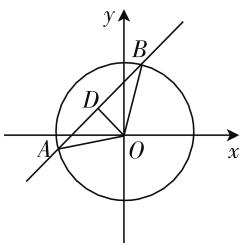
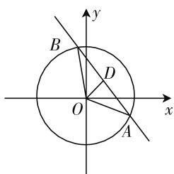
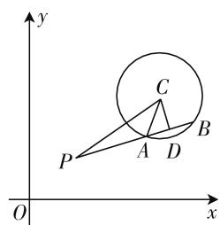
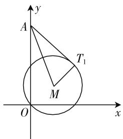
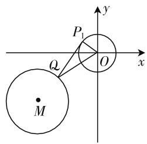

# 直线与圆综合应用问题研究

# ● 江苏省海安高级中学 汤连峰

直线的方程、圆的方程，在考纲的8个C级要求中占据两个，其重要性不言自明，而直线与圆的综合问题是江苏省近年来数学高考填空题后四题的重要题型。这类问题一般考查直线与圆的位置关系，圆与圆的位置关系，也可与向量等知识相结合命题。

# 一、直线与圆的位置关系问题

例1 若直线 $3x - 4y + 5 = 0$ 与圆 $x^{2} + y^{2} = r^{2}(r$

>0) 相交于 A, B 两点，且 $\angle AOB = 120^{\circ}$ (O 为坐标原点)，则 r = \_\_\_\_.

分析: 本题的关键是将 $\angle AOB = 120^{\circ}$ 这个条件转化为圆心到直线距离为 $\frac{r}{2}$ .

text_image

y
B
D
A
O
x

图1

解:如图1,取AB的中点 图1
D,连接OD.因为 $\angle AOB=120^{\circ}$ ,所以 $\angle BOD=60^{\circ}$ ,
则 $OD=\frac{r}{2}$ ，即 $\frac{|3\times0-4\times0+5|}{\sqrt{3^{2}+4^{2}}}=\frac{r}{2}$ ，解得 r=2.

变式:已知直线 $x+y-k=0(k>0)$ 与圆 $x^{2}+y^{2}=4$ 相交于 A, B 两点, O 为坐标原点，且有$|\overrightarrow{OA}+\overrightarrow{OB}|\geqslant\frac{\sqrt{3}}{3}|\overrightarrow{AB}|$ ，则实数k的取值范围为\_\_\_\_.

分析:本题的关键是如何将条件 $\left|\overrightarrow{OA}+\overrightarrow{OB}\right|\geqslant\frac{\sqrt{3}}{3}\left|\overrightarrow{AB}\right|$ 转化为圆心到直线距离的不等关系.

text_image

y
B
D
O
x
A

图 2

解: 如图 2, 取 AB 的中点 D, 连接 OD, 设 OD = d. 因为直线与圆相交于不同的两点, 所以 d < 2.

又因为 $|\overrightarrow{OA} + \overrightarrow{OB}| \geqslant \frac{\sqrt{3}}{3} |\overrightarrow{AB}|$ ，所以 $2|\overrightarrow{OD}| \geqslant \frac{\sqrt{3}}{3} |\overrightarrow{AB}|$ ，即 $2d \geqslant \frac{\sqrt{3}}{3} \times 2\sqrt{4 - d^2}$ ，即 $d \geqslant 1$ ，从而 $1 \leqslant d < 2$ ，即 $1 \leqslant \frac{k}{\sqrt{2}} < 2$ ，解得 $\sqrt{2} \leqslant k < 2\sqrt{2}$ .

例 2 在平面直角坐标系 xOy 中, 已知点 $P(2, 2)$ , $C(5, 6)$ , 若在以点 C 为圆心, r 为半径的圆上存在不同的两点 A, B, 使得 $\overrightarrow{PA} = 2\overrightarrow{AB}$ , 则实数 r 的取值范围为 \_\_\_\_.

分析: 本题关键是如何将 $\overrightarrow{PA}=2\overrightarrow{AB}$ 这样一个向量式表示的线段长度关系转化为圆心到直线的距离 d 与半径 r 之间的关系, 从而借助 d 的范围确定 r 的范围.

解:如图 3, 取 AB 的中点 D, 连接 CD, CA, CP, 设 CD =d. 因为 PA = 2AB，且 D 为 AB 的中点，所以 PD = 5AD，即 $\sqrt{PC^{2} - d^{2}} = 5\sqrt{r^{2} - d^{2}}$ ，即 $\sqrt{25 - d^{2}} = 5\sqrt{r^{2} - d^{2}}$ ，化简得 $d^{2} = \frac{25}{24}(r^{2} - 1)$ 。又 $0 \leqslant d^{2} < r^{2}$ ，则 $0 \leqslant \frac{25}{24}(r^{2} - 1) < r^{2}$ ，解得 $1 \leqslant r < 5$ 。

text_image

y
C
P
A D
B
O
x

图3

总结反思:通过这几道例题的分析我们可以发现,在考查直线与圆位置关系的问题中,我们都需要借助圆心到直线的距离 d 这个桥梁来转化某些条件或解决问题,特别涉及直线与圆相交的弦长问题,最后几乎都要交给这个 d,从而去确定直线或圆中的参数.

# 二、圆与圆的位置关系问题

例 3 在平面直角坐标系 xOy 中, 已知圆 $C: (x - a)^{2} + (y - a + 2)^{2} = 1$ , 点 $A(0, 2)$ , 若圆 C 上存在点 M, 满足 $MA^{2} + MO^{2} = 10$ , 则实数 a 的取值范围为 \_\_\_\_.

分析:本题的关键是由 $MA^{2} + MO^{2} = 10$ 确定点 M 的轨迹,从而将问题转化为研究圆与圆位置关系的问题.

解:设点 $M(x,y)$ ，由 $MA^{2}+MO^{2}=10$ ，代入坐标有 $x^{2}+(y-2)^{2}+x^{2}+y^{2}=10$ ，整理有 $x^{2}+(y-1)^{2}=4$ ，即点 M 在圆 E: $x^{2}+(y-1)^{2}=4$ 上，从而原问题等价于圆 E 与圆 M 有公共点，所以 $2-1\leqslant CE\leqslant2+$

1, 即 $1 \leqslant \sqrt{a^2 + (a - 3)^2} \leqslant 3$ , 解得 $0 \leqslant a \leqslant 3$ .

变式:在平面直角坐标系 xOy 中,已知圆 $O: x^{2} + y^{2} = 1$ , 圆 $M: (x - a)^{2} + (y - a + 4)^{2} = 1$ , 若圆 M 上存在点 P, 过点 P 作圆 O 的两条切线, 切点分别为 A, B, 使得 $\angle APB = 60^{\circ}$ , 则实数 a 的取值范围为 \_\_\_\_.

分析:本题的关键是由 $\angle APB = 60^{\circ}$ 确定点 P 的轨迹,从而将问题转化为研究圆与圆位置关系的问题.

解:由 $\angle APB=60^{\circ}$ ，有 OP=2，即点 P 在圆 O: $x^{2}+y^{2}=4$ 上，从而原问题等价于圆 O 与圆 M 有公共点，所以 $2-1\leqslant OM\leqslant2+1$ ，即 $1\leqslant\sqrt{a^{2}+(a-4)^{2}}\leqslant3$ ，解得 $2-\frac{\sqrt{2}}{2}\leqslant a\leqslant2+\frac{\sqrt{2}}{2}$ .

总结反思:这类问题主要考查轨迹思想和圆与圆的位置关系,往往都是考查某个点 M 的双重要求,一方面,我们需要根据题设条件求解出点 M 的相关轨迹,这是这类题目的重点,常常涉及一些隐藏的圆,我们需要对常见等式所揭示的圆有所了解;另一方面,点 M 往往在已知轨迹上,从而将所求问题转化为圆与圆位置关系问题,再进一步转化为圆心与圆心的距离及两圆半径关系求解.

# 三、可转化为点与圆心距离问题

例 4 已知点 A(0,2) 为圆 $M: x^{2} + y^{2} - 2ax - 2ay = 0 (a > 0)$ 外一点，圆 M 上存在点 T，使 $\angle MAT = 45^{\circ}$ ，则实数 a 的取值范围为 \_\_\_\_.

分析:本题的关键是将圆M上存在点T,使 $\angle MAT=45^{\circ}$ ,这个条件转化为最大角 $\angle MAT_{1}\geqslant45^{\circ}$ ,从而转化为关于AM的长的不等关系解题.

解:如图4,过A作圆M的切线 $AT_{1}$ , 切点为 $T_{1}$ , 连接 $MT_{1}$ . 在圆M上要存在点T,使 $\angle MAT = 45^{\circ}$ ，即要 $\angle MAT_{1} \geqslant 45^{\circ}$ ，则 $\frac{\sqrt{2}}{2} \leqslant \sin \angle MAT_{1} < 1$ ，即 $\frac{\sqrt{2}}{2} \leqslant \frac{MT_{1}}{AM} < 1$ ，又圆 $M$ 的圆心为 $(a, a)$ ，半径为 $\sqrt{2} a$ ，则有 $\sqrt{2} a < AM \leqslant 2a$ ，代入坐标有 $\sqrt{2} a < \sqrt{a^{2} + (a - 2)^{2}} \leqslant 2a$ ，又 $a > 0$ ，解得 $\sqrt{3} - 1 \leqslant a < 1$ .

text_image

A
y
T₁
M
O
x

图 4

变式: 在平面直角坐标系 xOy 中, 已知圆 $O: x^{2} + y^{2} = 1$ , 圆 $M: (x + a + 3)^{2} + (y - 2a)^{2} = 1$ , 若圆 O 与圆 M 上分别存在点 P, Q, 使得 $\angle OQP = 30^{\circ}$ , 则实数 a 的取值范围为 \_\_\_\_.

分析:本题可考虑点 Q 静止,圆 O 上存在点 P 使得 $\angle OQP = 30^{\circ}$ , 则只要 $\angle OQP_{1} \geqslant 30^{\circ}$ , 从而转化为 OQ 的限制条件, 再考虑 Q 的变化, 从而转化为 OM 的限制条件解决问题.

解:由题设可知圆心M在定直线 $2x+y+6=0$ 上,O到直线 $2x+y+6=0$ 的距离为 $\frac{6}{\sqrt{5}}>2$ ,则可知圆M与圆O始终相离.如图5,过点Q作圆O的切线,切点为 $P_{1}$ ,连接 $OP_{1}$ ,$OQ$ ，存在点 $P$ 使得 $\angle OQP = 30^{\circ}$ ，从而 $\sin \angle OQP_{1} \geqslant \frac{1}{2}$ 即 $\frac{1}{OQ} \geqslant \frac{1}{2}$ ，从而转化为在圆 $M$ 上存在点 $Q$ 满足 $OQ \leqslant 2.$ 又 $Q$ 在圆 $M$ 上，故 $OQ$ 的最小值为 $OM - 1$ ，从而 $OM \leqslant 3$ ，代入坐标有 $\sqrt{(a + 3)^2 + (2a)^2} \leqslant 3$ ，解得 $-\frac{6}{5} \leqslant a \leqslant 0.$

text_image

P₁
Q
M
O
x
y

图5

例5 在平面直角坐标系 $xOy$ 中，圆 $C: x^2 + y^2 - 8x + 15 = 0$ ，若直线 $y = kx - 2$ 上至少存在一点，使得以该点为圆心，1为半径的圆与圆 $C$ 有公共点，则 $k$ 的最大值为 \_\_\_\_.

分析:记直线上一点为 N, 本题关键是通过条件圆 C 与圆 N 有公共点, 得到 CN 的限制条件, 再通过 N 为直线上一动点, 转化为参数 k 的限制条件解决问题.

解: 记直线上一点为 N, 因为圆 C 与圆 N 有公共点, 从而 $1-1 \leqslant CN \leqslant 1+1$ , 即转化为在直线 y = kx - 2 上存在点 N 使得 $CN \leqslant 2$ , 又 CN 的最小值为圆心 $C(4,0)$ 到直线的距离 $d = \frac{|4k - 0 - 2|}{\sqrt{k^{2} + 1}}$ , 从而 $\frac{|4k - 0 - 2|}{\sqrt{k^{2} + 1}} \leqslant 2$ , 解得 $0 \leqslant k \leqslant \frac{4}{3}$ , 从而 k 的最大值为 $\frac{4}{3}$ .

总结反思:这类问题我们也可称为圆上某些点的存在性问题,一般要将题目中需要达到的条件转化为点与圆心距离的等量或不等关系,若题目中出现多个点的存在性问题,我们可先选择静止一个点,逐个处理,注意关注题目中所给的点与圆上一动点距离的最值问题. F