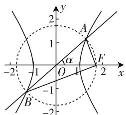

# 离心率巧破解,双曲线妙拓展

—— 对一道浙江模拟题的探究

● 江苏省六合高级中学 汤忠保

圆锥曲线中椭圆或双曲线的离心率问题一直是圆锥曲线中的一个热点问题,也是历年高考中比较常见的一类问题,可以直接求值,确定最值或取值范围等,方式多样,变化多端.此类问题可以综合解析几何中的基本知识,还可以涉及平面向量、解三角形等相关知识,知识板块融合巧妙,破解方法精彩多样,是考查创新意识与核心素养的好载体.

# 一、问题呈现

【问题】已知点 F 为双曲线 $C: \frac{x^{2}}{a^{2}} - \frac{y^{2}}{b^{2}} = 1 (a, b > 0)$ 的右焦点，直线 $y = kx, k \in \left[\frac{\sqrt{3}}{3}, \sqrt{3}\right]$ 与双曲线 C 交于 A, B 两点，若 $AF \perp BF$ ，则该双曲线 C 的离心率的取值范围是（）.

A. $[\sqrt{2},\sqrt{2} +\sqrt{6} ]$

B. $[\sqrt{2},\sqrt{3} +1]$

C. $\left[2,\sqrt{3}+1\right]$

D. $[2, \sqrt{2} + \sqrt{6}]$

此题以双曲线为载体,通过直线与双曲线的位置关系来巧妙设置,结合对应直线斜率的取值范围以及两直线垂直关系的应用,进而来求解双曲线的离心率的取值范围问题.破解问题的关键就是合理利用条件,通过双曲线的定义加以合理转化,从而得以破解;也可以借助直线斜率的取值范围的端点效应,结合分类讨论来分析与判断.

# 二、问题破解

# 思维视角一:定义思维

方法1:(余弦定理+双曲线的定义转化法)

解析: 如图 1 所示, 设直线 $y=kx, k \in \left[\frac{\sqrt{3}}{3}, \sqrt{3}\right]$ 的倾斜角为 $\alpha \in \left[\frac{\pi}{6}, \frac{\pi}{3}\right]$ , 由于$AF \perp BF$ , 可得 $|OA| = |OB| = |OF| = c$ , 结合余弦

text_image

y
2
1
A
α
O
1
F
-2
-1
2
x
-1
B
-2

图 1

定理可得 $|AF| = \sqrt{2c^2 - 2c^2\cos\alpha}$ , $|BF| = \sqrt{2c^2 + 2c^2\cos\alpha}$ , 利用双曲线的对称性质及双曲线的定义, 可得 $|BF| - |AF| = 2a$ , 即 $\sqrt{2c^2 + 2c^2\cos\alpha} - \sqrt{2c^2 - 2c^2\cos\alpha} = 2a$ , 那么该双曲线 $C$ 的离心率 $e = \frac{c}{a} = \frac{\sqrt{2}}{\sqrt{1 + \cos\alpha} - \sqrt{1 - \cos\alpha}} = \frac{\sqrt{2}}{\sqrt{2}\cos\frac{\alpha}{2} - \sqrt{2}\sin\frac{\alpha}{2}} = \frac{1}{\sqrt{2}\cos\left(\frac{\alpha}{2} + \frac{\pi}{4}\right)}$ , 由于 $\alpha \in \left[\frac{\pi}{6}, \frac{\pi}{3}\right]$ , 可得 $\frac{\alpha}{2} + \frac{\pi}{4} \in \left[\frac{\pi}{3}, \frac{5\pi}{12}\right]$ , 则有 $\cos\left(\frac{\alpha}{2} + \frac{\pi}{4}\right) \in \left[\frac{\sqrt{6} - \sqrt{2}}{4}, \frac{1}{2}\right]$ , 所以 $e = \frac{1}{\sqrt{2}\cos\left(\frac{\alpha}{2} + \frac{\pi}{4}\right)} \in [\sqrt{2}, \sqrt{3} + 1]$ , 故选择答案 B.

方法 2: (三角函数 + 双曲线的定义转化法)

解析:如图所示,设 $\angle ABF = \theta$ , 由于 $AF \perp BF$ , 可得 $|OA| = |OB| = |OF| = c$ , 结合三角函数的定义可得 $|AF| = 2c \sin \theta$ , $|BF| = 2c \cos \theta$ , 利用双曲线的对称性质及双曲线的定义, 可得 $|BF| - |AF| = 2a$ , 即 $2c \cos \theta - 2c \sin \theta = 2a$ , 那么该双曲线 C 的离心率 $e = \frac{c}{a} = \frac{1}{\cos \theta - \sin \theta} = \frac{1}{\sqrt{2} \cos \left( \theta + \frac{\pi}{4} \right)}$ , 由于直线 $y = kx$ , $k \in \left[ \frac{\sqrt{3}}{3}, \sqrt{3} \right]$ 的倾斜角为 $\alpha \in \left[ \frac{\pi}{6}, \frac{\pi}{3} \right]$ , 可得 $\theta \in \left[ \frac{\pi}{12}, \frac{\pi}{6} \right]$ , 即 $\theta + \frac{\pi}{4} \in \left[ \frac{\pi}{3}, \frac{5\pi}{12} \right]$ , 则有 $\cos \left( \theta + \frac{\pi}{4} \right) \in \left[ \frac{\sqrt{6} - \sqrt{2}}{4}, \frac{1}{2} \right]$ , 所以 $e = \frac{1}{\sqrt{2} \cos \left( \theta + \frac{\pi}{4} \right)} \in [\sqrt{2}, \sqrt{3} + 1]$ , 故选择答案 B.

# 思维视角二: 端点效应思维

方法 3: (端点效应分类讨论法)

解析：由于 $AF \perp BF$ ，可得 $|OA| = |OB| =$ $|OF|=c$ ，当 $k=\sqrt{3}$ 时，此时直线y=kx的倾斜角 $\alpha=\frac{\pi}{3}$ ，此时 $|AF|=c$ ， $|BF|=\sqrt{3}c$ ，利用双曲线的对称性质及双曲线的定义，可得 $|BF|-|AF|=\sqrt{3}c-c=2a$ ，那么该双曲线C的离心率 $e=\frac{c}{a}=\frac{2}{\sqrt{3}-1}=\sqrt{3}+1$ ；当 $k=\frac{\sqrt{3}}{3}$ 时，此时直线y=kx的倾斜角 $\alpha=\frac{\pi}{6}$ ，此时 $|AF|=2c\sin\frac{\pi}{12}$ ， $|BF|=2c\cos\frac{\pi}{12}$ ，利用双曲线的对称性质及双曲线的定义，可得 $|BF|-|AF|=2c\cos\frac{\pi}{12}-2c\sin\frac{\pi}{12}=2c\left(\frac{\sqrt{6}+\sqrt{2}}{4}-\frac{\sqrt{6}-\sqrt{2}}{4}\right)=\sqrt{2}c=2a$ ，那么该双曲线C的离心率 $e=\frac{c}{a}=\sqrt{2}$ ；结合端点效应可知， $e\in[\sqrt{2},\sqrt{3}+1]$ ，故选择答案B.

点评:根据解三角形中的余弦定理或三角函数的定义确定直角三角形式的对应边长,结合双曲线的对称性质及双曲线的定义建立相应的关系式,进而利用离心率的定义转化为含有相关角的正弦型(或余弦型)函数,利用三角函数的图像与性质来确定相应的取值范围问题;而通过端点效应来分类讨论,是借助两特殊端点来计算对应的离心率,结合条件加以确定相应的离心率的取值范围,只适用于小题的破解.

# 三、变式拓展

探究 1: 保留原来问题的部分条件, 改变其中“ $AF \perp BF$ ”的给出方式, 实质与原来问题是一致的, 进行最简单化的改编与变式:

【变式 1】已知点 F 为双曲线 $C: \frac{x^{2}}{a^{2}} - \frac{y^{2}}{b^{2}} = 1 (a, b > 0)$ 的右焦点，直线 $y = kx, k \in \left[\frac{\sqrt{3}}{3}, \sqrt{3}\right]$ 与双曲线 C 交于 A, B 两点，若 $\overrightarrow{FA} \cdot \overrightarrow{FB} = 0$ ，则该双曲线 C 的离心率的取值范围是（）.

A. $\left[\sqrt{2},\sqrt{2}+\sqrt{6}\right]$

B. $\left[\sqrt{2},\sqrt{3}+1\right]$

C. $\left[2,\sqrt{3}+1\right]$

D. $\left[2,\sqrt{2}+\sqrt{6}\right]$

探究 2:保留原来问题的部分条件,改变圆锥曲线的类似,将“双曲线”类比为“椭圆”,从而达到改编与变式:

【变式2】已知点F为椭圆 $C:\frac{x^{2}}{a^{2}}+\frac{y^{2}}{b^{2}}=1(a>b>$

0) 的右焦点, 直线 $y = kx, k \in \left[\frac{\sqrt{3}}{3}, \sqrt{3}\right]$ 与椭圆 C 交于 A, B 两点, 若 $AF \perp BF$ , 则该椭圆 C 的离心率的取值范围是().

A. $\left[\sqrt{3}-1,\frac{\sqrt{3}}{2}\right]$

B. $\left[\sqrt{3}-1,\frac{\sqrt{6}}{3}\right]$

C. $\left[4-2\sqrt{3},\frac{\sqrt{6}}{3}\right]$

D. $\left[4-2\sqrt{3},\frac{\sqrt{3}}{2}\right]$

解析:设直线 $y=kx, k \in \left[\frac{\sqrt{3}}{3}, \sqrt{3}\right]$ 的倾斜角为 $\alpha \in \left[\frac{\pi}{6}, \frac{\pi}{3}\right]$ ，由于 $AF \perp BF$ ，可得 $|OA| = |OB| = |OF| = c$ ，结合余弦定理可得 $|AF| = \sqrt{2c^{2} - 2c^{2}\cos\alpha}$ ， $|BF| = \sqrt{2c^{2} + 2c^{2}\cos\alpha}$ ，利用椭圆的对称性质及椭圆的定义，可得 $|BF| + |AF| = 2a$ ，即 $\sqrt{2c^{2} + 2c^{2}\cos\alpha} + \sqrt{2c^{2} - 2c^{2}\cos\alpha} = 2a$ ，那么该椭圆 C 的离心率 $e = \frac{c}{a} = \frac{\sqrt{2}}{\sqrt{1 + \cos\alpha} + \sqrt{1 - \cos\alpha}} = \frac{\sqrt{2}}{\sqrt{2}\cos\frac{\alpha}{2} + \sqrt{2}\sin\frac{\alpha}{2}} = \frac{1}{\sqrt{2}\sin\left(\frac{\alpha}{2} + \frac{\pi}{4}\right)}$ ，由于 $\alpha \in \left[\frac{\pi}{6}, \frac{\pi}{3}\right]$ ，可得 $\frac{\alpha}{2} + \frac{\pi}{4} \in \left[\frac{\pi}{3}, \frac{5\pi}{12}\right]$ ，则有 $\sin\left(\frac{\alpha}{2} + \frac{\pi}{4}\right) \in \left[\frac{\sqrt{3}}{2}, \frac{\sqrt{6} + \sqrt{2}}{4}\right]$ ，所以 $e = \frac{1}{\sqrt{2}\sin\left(\frac{\alpha}{2} + \frac{\pi}{4}\right)} \in \left[\sqrt{3} - 1, \frac{\sqrt{6}}{3}\right]$ ，故选择答案 B.

点评: 在破解以上椭圆中的离心率的取值范围问题, 同样可以借助以上双曲线问题中的其他的相关方法, 可以达到破解的目的. 两者实质上是相类似的, 只是涉及双曲线与椭圆的定义的差别, 建立关系式时要加以区别与注意, 不要混淆.

# 四、解后反思

圆锥曲线中的离心率问题, 常考常新, 变化较大, 破解的关键就是熟练掌握圆锥曲线的定义、方程与几何性质, 结合题目条件合理构建参数 a、c 之间的关系式或方程, 进而得以合理转化, 巧妙求解. 而通过圆锥曲线中离心率问题的“一题多解”“一题多变”等实践, 进一步熟练掌握圆锥曲线的相关知识, 并在此基础上, 培养学生的转向机智及思维的应变性、发散性, 进而真正提高发散思维的变通性, 从而有效提高数学知识与数学能力, 提升创新意识, 培养数学核心素养. F