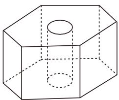
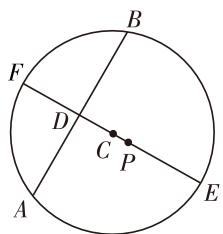

# 立足基础,强化思想,凸显能力,动态平衡

——2020年江苏高考试题评析

江苏省南菁高级中学 过家福

2020年江苏高考数学试卷坚持“立德树人，服务选才，引导教学”等核心立场，依旧是由易到难的命题规律，整体稳定，文理兼顾，紧扣大纲，结合教材，立足基础，适度创新。本套试卷在题型、题量（解答题第18、19、20题均为三小题配置）、分值上与前两年相比保持不变，整体难度与上一年基本相当。试卷注重“三基”的考查，对基础知识、基本技能、基本思想方法的考查占了较大比重。试卷充分体现了“依纲扣本，引导教学，科学选拔”的命题理念，践行了“有利于促进学生健康发展，有利于科学地选拔人才，有利于维护社会公平”的三项原则，充分体现新课程标准的理念，值得品味。

# 一、立足基础，突出主干

试卷中的不少试题都是由课本教材中的例(习)题、练习题等进行适当的变式、改编、重组、嫁接等再加工而来的,是考生比较熟悉的,主要考查基础知识、基本技能、基本思想方法,如填空题中的第1-10题和解答题第15、16题等,都是源于课本改编而来的相对比较基础的题目,试题情境熟悉,朴实灵活,充分考查了学生的数学素质、思维品质与学习潜能,保证基本分值.

例 1 （2020 年高考数学江苏卷第 7 题）已知 $y = f(x)$ 是奇函数，当 $x \geqslant 0$ 时， $f(x) = x^{\frac{2}{3}}$ ，则 $f(-8)$ 的值是 \_\_\_\_.

解析:由于 $y = f(x)$ 是奇函数,则 $f(-8) = -f(8) = -8^{\frac{2}{3}} = -4$ .

故填答案: -4.

点评:本题考查函数的奇偶性与解析式、函数值的求解,考查运算求解能力、数学运算等核心素养.函数作为高中数学的一条主线,串起高中数学的整个知识体系与架构,是高考中最基本的考点之一,作为基础性的知识,要加以熟练掌握与系统应用.

试卷对支撑高中数学课程的主干知识进行重点考查,函数与导数(第7、12、17、19题)、数列(第11、20题)、平面解析几何(第6、14、18题)、立体几何(第9、15题)、三角函数与平面向量(第8、10、13、16题)等,占了总题量的75%,总分值的84%还多(数学Ⅰ卷),对《考试说明》(数学)中的8个C级考点进行了全面反复考查,基本覆盖了B级考点,适当兼顾了A级考点,考查全面,不偏不漏.

# 二、强化思想，通性通法

数学思想方法引领着数学的教学与学习,是数学的灵魂,试卷进一步强化数学思想方法的考查:(1)函数与方程思想,如第7、8、10、11、14、17、18、19题等都有所涉及;(2)分类与整合思想,如第5、11、13、14、17、19、20题等都有所涉及;(3)化归与转化思想,如第7、8、9、10、11、12、13、14、15、17、18、19、20题等都有所涉及;(4)特殊与一般思想,如第11、13、20题等都有所涉及;(5)统计与概率思想,如第3、4题等都有所涉及.数学思想方法穿插于不同试题之间,形成一个完整和谐的整体,充分考查考生的“三基”.

试题淡化特殊性方面的技巧,突出试题最基本的通解通法的考查,没有特殊值验证、特殊模型应用等,有的只是最基本的数学方法,如第4题考查了列举法,第20题第(1)问涉及了反证法,第14、17、19、20题考查了构造法,而第12题中代数关系式的最值求解可以利用配凑法、消参法、待定系数法、判别式法、三角换元法及求导法等数学方法来处理与转化等.

例 2 （2020 年高考数学江苏卷第 12 题）已知 $5x^{2}y^{2} + y^{4} = 1 (x, y \in \mathbb{R})$ ，则 $x^{2} + y^{2}$ 的最小值是 \_\_\_\_.

解法 1: 根据条件 $5x^{2}y^{2} + y^{4} = 1$ ，利用基本不等式，可得 $4 = (5x^{2} + y^{2}) \cdot 4y^{2} \leqslant \left[\frac{(5x^{2} + y^{2}) + 4y^{2}}{2}\right]^{2}$

$= \frac{25}{4} (x^{2} + y^{2})^{2}$ ，当且仅当 $5x^{2} + y^{2} = 4y^{2} = 2$ ，结合 $5x^{2}y^{2} + y^{4} = 1$ ，即 $x^{2} = \frac{3}{10},y^{2} = \frac{1}{2}$ 时等号成立，所以有 $x^{2} + y^{2}\geqslant \frac{4}{5}$ ，即 $x^{2} + y^{2}$ 的最小值是 $\frac{4}{5}$ ，故填答案： $\frac{4}{5}$

解法2:根据条件 $5x^{2}y^{2}+y^{4}=1$ ，利用基本不等式，可得 $x^{2}+y^{2}=\left(x^{2}+\frac{1}{5}y^{2}\right)+\frac{4}{5}y^{2}\geqslant2\sqrt{\left(x^{2}+\frac{1}{5}y^{2}\right)\cdot\frac{4}{5}y^{2}}=2\sqrt{\frac{4}{25}(5x^{2}+y^{2})\cdot y^{2}}=2\times\frac{2}{5}=\frac{4}{5}$ ，当且仅当 $x^{2}+\frac{1}{5}y^{2}=\frac{4}{5}y^{2}=\frac{2}{5}$ ，结合 $5x^{2}y^{2}+y^{4}=1$ ，即 $x^{2}=\frac{3}{10},y^{2}=\frac{1}{2}$ 时等号成立，所以 $x^{2}+y^{2}$ 的最小值是 $\frac{4}{5}$ ，故填答案： $\frac{4}{5}$ .

解法 3: 当 y=0 时, 原式 $5x^{2}y^{2}+y^{4}=1$ 不成立, 则 $y\neq0$ , 利用基本不等式, 可得 $5x^{2}+5y^{2}=\frac{1-y^{4}}{y^{2}}+5y^{2}=\frac{1}{y^{2}}+4y^{2}\geqslant2\sqrt{\frac{1}{y^{2}}\cdot4y^{2}}=4$ , 当且仅当 $\frac{1}{y^{2}}=4y^{2}$ , 结合 $5x^{2}y^{2}+y^{4}=1$ , 即 $y^{2}=\frac{1}{2}, x^{2}=\frac{3}{10}$ 时等号成立, 所以有 $x^{2}+y^{2}\geqslant\frac{4}{5}$ , 即 $x^{2}+y^{2}$ 的最小值是 $\frac{4}{5}$ , 故填答案: $\frac{4}{5}$ .

点评:破解此类问题都是有效联系条件中的代数关系式与结论中的代数关系式两者之间的关系,结合认真审视试题,合理巧妙变换,借助比较常见的通性通法来处理与解决,为不同层次的学生破解问题提供条件.

# 三、凸显能力，突出创新

试卷秉承重基础、重本质的一贯命题思路，在此有效凸显数学能力与数学核心素养，对学生的能力有较高的要求。特别是一些试题涉及多个知识点，具有一定的综合性，试题表述简练精准，知识点清晰不堆砌，解答题设问清楚有梯度，对不同基础、不同能力水平的学生都提供了适当的思考空间与能力要求，让不同能力水平的考生都有充分发挥的空间。例如第20题的数列新定义问题，第(1)问作为基础性问题，给60%的考生提供思考与破解的能力要求；第(2)问作为中等提高性问题,给20%的考生提供更进一步的分析能力、推理能力的拓展空间;第(3)问作为竞赛性问题,给5%的考生提供创造性解决问题的空间,合理梯度设置,确保试卷的区分度,有利于选拔不同层次的优秀人才.

同时，试卷抓住数学教学必须源于教材，源于生活，比较贴近中学生的生活实际，突出创新意识，从课程改革的理念出发，充分体验数学在解决实际问题中的应用，以及数学与日常生活的密切联系，检测考生学以致用的能力，以及应用意识，促进学生逐步形成和发展数学的创新意识与应用意识。如第4题中的正方体骰子（考查古典概型的概率公式），第9题中的六角螺帽毛坯（考查空间几何体的体积），以及第17题桥梁建造中的“桥墩造价”（考查函数模型、导数与函数在实际问题中的应用），都充分扎根于生活，服务于实际，很好地考查数学知识与创新意识。

例 3 （2020 年高考数学江苏卷第 9 题）如图 1, 六角螺帽毛坯是由一个正六棱柱挖去一个圆柱所构成的. 已知螺帽的底面正六边形边长为 2cm, 高为 2cm, 内孔半轻为 0.5cm, 则此六角螺帽毛坯的体积是 \_\_\_\_ cm³.

natural_image

Simple line drawing of a 3D geometric shape resembling a cube with a cylinder inside, no text or symbols present.

图1

解析:根据题目条件可知此六角螺帽毛坯的体积为正六棱柱的体积减去圆柱的体积,所以该六角螺帽毛坯的体积是 $V=\frac{\sqrt{3}}{4}\times2^{2}\times6\times2-\pi\times0.5^{2}\times2=12\sqrt{3}-\frac{1}{2}\pi$ , 故填: $12\sqrt{3}-\frac{1}{2}\pi$ .

点评:以生活实际中经常可见的物品、实例等,通过数学抽象的升华、数学模型的建立等转化为对应的数学问题,破解时回归问题本质,借助生活实际,合理利用相关的数学知识来分析与处理即可达到目的.而这里涉及正六棱柱、圆柱的体积求解公式与应用等.

除了实际应用的创新,知识、方法等方面的创新也是试卷的一个亮点.如第20题,设计了一个新定义数列的创新题,充分体现对方程、代数思想的考查,特别是第(3)问,换元消元后,考查三次方程何时有一个正实数解,回归函数与方程,创新中有提升,创新中有内涵.

# 四、动态平衡，适当调整

试卷保持整体难度与上一年基本相当,而具体的题目的难度加以适当调整,保持整份试卷的动态平衡.比如第13题(平面向量)和第14题(平面解析几何)作为填空题的压轴题,难度较往年有所降低;而第19题和第20题作为解答题的压轴题,难度较往年有所上升,尤其是第20题第(3)问即使在教师群体中也少有教师能够完整做出来.

例 4 （2020 年高考数学江苏卷第 14 题）在平面直角坐标系 xOy 中，已知 $P\left(\frac{\sqrt{3}}{2},0\right)$ ，A, B 是圆 $C: x^{2} + \left(y - \frac{1}{2}\right)^{2} = 36$ 上的两个动点，满足 PA = PB，则 $\triangle PAB$ 面积的最大值是 \_\_\_\_.

解析:如图2所示,作PC所在的直径EF,交AB于点D,结合对称性可得PA=PB,此时CA=CB=r=6,且 $PC\perp AB$ ,要使得 $\triangle PAB$ 面积最大,数形结合可知P、D位于圆心C的两侧,设 $CD=t\in(0,6)$ ,结合条件可得 $PC=\sqrt{\left(\frac{\sqrt{3}}{2}-0\right)^{2}+\left(0-\frac{1}{2}\right)^{2}}=1$ ，则有 PD=1+t，而 AB=2AD=2 $\sqrt{36-t^{2}}$ ，所以 $S_{\triangle PAB}=\frac{1}{2}\cdot AB\cdot PD=(1+t)\sqrt{36-t^{2}}$ ，构造函数 $f(t)=(1+t)\cdot\sqrt{36-t^{2}}, t\in(0,6)$ ，求导可得 $f'(t)=\sqrt{36-t^{2}}-\frac{(1+t)t}{\sqrt{36-t^{2}}}$ ，令 $f'(t)=0$ ，解得 t=4 或 $t=-\frac{9}{2}$ （舍去），而函数 $f(t)$ 在区间 $(0,4)$ 上单调递增，在区间 $(4,6)$ 上单调递减，所以 $f(t)_{\max}=f(4)=10\sqrt{5}$ ，即 $\triangle PAB$ 面积的最大值是 $10\sqrt{5}$ ，故填答案： $10\sqrt{5}$ 。

text_image

B
F
D
C P
A
E

图2

点评: 解决此类线圆问题, 关键是引入弦心距这一参数 t, 利用弦心距这一参数 t 来表示对应的三角形面积, 从而建立起相应的函数关系式, 借助导数法, 利用函数求导处理, 结合函数的单调性与极值来确定相应的三角形面积的最值问题.

# 五、规律总结，启示教学

从 2004 年江苏开始独立命题以来,2008 年实行改“08 方案”,再到 2021 年江苏高考回归全国卷阶段,江苏高考经历过十年五改的疯狂年代,也有过十年不变的沉稳.对于 2020 年江苏高考试卷来说,这是一份“绝版”试卷,也为这么多年来的江苏独立命题画上一个圆满的句号.

回顾往事,总结规律,是为了更好地启航,开拓更加美好的未来.针对2020年江苏高考试卷的一些独有的特点,对于新一届2021届高三数学教师、学生,以及其他低年级的数学教师、学生来说,在平时的数学教学与学习中,在高三复习过程中,可以加以借鉴,做到以下几点:

(1)2020年江苏高考试卷中比较容易的试题基本上均改编自教材,中等难度题和难题的数学思想和知识背景也都来源于教材,这就要求我们加强高中数学教材的主导应用,引导平时的中学数学教学与学习真正以教材为蓝本,回归教材,回归现实,以本为本,把握基本.  
(2)2020年江苏高考试卷中大部分试题考查的都是数学的基础知识、基本技能、基本思想方法，这就要求我们加强高中数学的“三基”强化，重基础，重基本，扎根数学“三基”，充分理解与掌握数学的根本，把握数学问题的实质与根本，为实际应用、创新应用提供基础，从而真正全面提高能力，提升思维.  
(3)2020年江苏高考试卷中突出创新意识与应用意识的考查,这就要求我们平时回归生活实际,密切联系生活,注重设置新颖的问题情境,不断渗透在新情境中运用数学知识解决问题的能力,学以致用,提升应用能力,从而提升阅读理解能力、创新应用能力等.  
(4)2020年江苏高考试卷的压轴题对支撑高中数学课程的主干知识进行有针对性的考查,这就要求我们不断倡导学生围绕主干知识深入学习,充分理解与掌握,加强研究和探索,形成知识网络与体系,全面形成能力,培养自学能力和创新意识,提升数学核心素养.  
(5)2020年江苏高考试卷务实、创新,这就要求我们在平时数学教学与学习中、在高考复习过程中,注意基本数学问题理解的透彻与深入,举一反三,以不变应万变,不搞“题海战术”,不猜题,不押题.

随着 2021 年江苏高考数学进入全国卷阶段,以往江苏高考数学试卷也会给未来的全国数学试卷注入新的活力,以鲜明的特点(重基础知识点,重基础方法)、创新的意识(关注数学应用意识与创新意识),围绕主干知识命题,坚持试题原创,注重数学思维,立足数学知识的交汇与融合,凸显数学能力与应用能力的考查,体现较好的创新性与应用性.这些改革的亮点与优点也会融入并渗透到以后的全国数学试卷当中.F