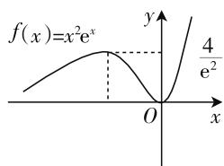
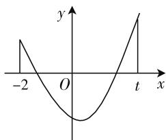
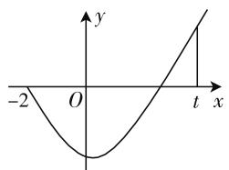

# 高中数学中函数重点题型解题技巧

# ● 安徽省马鞍山市第二中学郑蒲港分校 张毅

函数是高中数学的主线, 是高中数学前后知识内容融合巩固的纽带, 与此同时, 函数思想也丰富了高中的数学思想. 函数可以和高中所接触的几乎所有重要知识相结合, 融合成内容丰富且较难的综合性问题. 运用函数, 也会为高中数学中涉及的重要问题, 提供简洁有效的解决方法. 所以, 函数的学习在高中数学中极具重要性.

# 一、函数零点的取值范围问题的解析

函数的零点问题一直是近年来全国各地高考数学卷上的热门考点,解答函数零点的取值范围问题时,也可根据数形结合后的对应关系,挖掘题目中的几何背景,然后通过数与形的互相转化,就可达到事半功倍的效果.

例 1 已知 $f(x)=x^{2}\mathrm{e}^{x}$ ，若函数 $g(x)=f^{2}(x)-kf(x)+1$ 恰好有四个零点，则实数 k 的取值范围是（）.

A. $(- \infty, -2) \cup (2, +\infty)$

B. $\left(2,\frac{4}{\mathrm{e}^{2}}+\frac{\mathrm{e}^{2}}{4}\right)$

C. $\left(\frac{4}{e^{2}}+\frac{e^{2}}{4},+\infty\right)$

D. $\left(\frac{8}{\mathrm{e}^{2}},2\right)$

分析:对于有些复合函数的零点问题,往往是通过整体处理,利用换元法化成熟悉的函数零点问题来解决.而本题就是利用导数的性质判断 $f(x)$ 的单调性和极值,得出方程 $f(x)=t$ 的根的分布情况,从而得出关于 t 的方程 $t^{2}-kt+1=0$ 的根的分布情况,利用二次函数的性质列出不等式,求出 k 的范围.

解: $f'(x)=2xe^{x}+x^{2}e^{x}=x(x+2)e^{x}$ ，令 $f'(x)=0$ ，解得x=0或x=-2.

所以当 x<-2 或 x>0 时， $f'(x)>0$ ;

当-2<x<0时, $f'(x)<0$ .

所以 $f(x)$ 在 $(-∞,-2)$ 上单调递增，在 $(-2,0)$ 上单调递减，在 $(0,+∞)$ 上单调递增，所以当 x=-2 时，函数 $f(x)$ 取得极大值 $f(-2)=\frac{4}{\mathrm{e}^{2}}$ ，当 x=0 时，

$f(x)$ 取得极小值 $f(0)=0$ .

作出函数 $f(x)$ 的大致图像, 如图1所示, 令 $f(x)$

$=t$ , 则当 t=0 或 $t>\frac{4}{e^{2}}$ 时, 关于 x 的方程 $f(x)=t$ 只有 1 个解;

text_image

f(x)=x²e^x
y
4/e²
O
x

图1

当 $t=\frac{4}{e^{2}}$ 时, 关于 x 的方程 $f(x)=t$ 有 2 个解;

当 $0 < t < \frac{4}{e^{2}}$ 时, 关于 x 的方程 $f(x) = t$ 有 3 个解.

因为 $g(x)=f^{2}(x)-kf(x)+1$ 恰有 4 个零点，所以关于 t 的方程 $t^{2}-kt+1=0$ 在 $\left(0,\frac{4}{\mathrm{e}^{2}}\right)$ 上有 1 个解，在 $\left(\frac{4}{\mathrm{e}^{2}},+\infty\right)\cup\{0\}$ 上有 1 个解，显然 t=0 不是方程 $t^{2}-kt+1=0$ 的解，所以关于 t 的方程 $t^{2}-kt+1=0$ 在 $\left(0,\frac{4}{\mathrm{e}^{2}}\right)$ 和 $\left(\frac{4}{\mathrm{e}^{2}},+\infty\right)$ 上各有 1 个解，结合二次函数 $y=t^{2}-kt+1$ 的图像与性质，可得 $\frac{16}{\mathrm{e}^{4}}-\frac{4k}{\mathrm{e}^{2}}+1<0$ ，解得 $k>\frac{4}{\mathrm{e}^{2}}+\frac{\mathrm{e}^{2}}{4}$ ，故答案选 C.

# 二、函数证明题的解析

很多函数试题总是通过抽象函数来考查函数性质,这些抽象函数一般是由具体函数转变而来的,在对这种类型的问题进行解答时,可以使用特殊函数代替抽象函数,然后再对具体函数性质进行研究,最后再反追到抽象函数之中.

例 2 函数 f 符合以下这些条件: 其一是 $x \in R$ ，其二是对于任意实数有 $f(x + y) + f(x - y) = 2f(x)f(y)$ ，其三是存在一个正数 a，使得 $f\left(\frac{a}{2}\right) = 0$ 。请问 $f(x)$ 是周期函数吗？若是，请证明并且指出其中的一个周期；若不是，请说明。

分析: 这道函数问题的核心: 判断 $f(x)$ 是否是周期函数, 即是否存在一个非零常数 T, 当 $x \in R$ 时, 满足 $f(x + T) = f(x)$ . 而 $f(x)$ 是一个抽象函数, 若是没有任何依据去猜测其是否是周期函数, 并且指出其中的一个周期, 这个过程是非常复杂和困难的. 因此, 我们在解答的时候首先要观察函数 $f(x)$ 满足的另一个条件: $f(x + y) + f(x - y) = 2f(x)f(y)$ , 在这个条件的基础上就很容易想到三角函数差积公式能够符合条件, 也就是 $\cos(x + y) + \cos(x - y) = 2\cos x\cos y$ , 并且 $\cos x$ 也能够满足题目中的第一个与第二个条件, 也就是定义域是全部实数, 并且正数 $\pi$ , 满足 $\cos\left(\frac{\pi}{2}\right) = 0$ . 所以我们在解题时可将 $f(x)$ 化解成为 $\cos x$ , 这样就能够看出 $\cos x$ 是周期函数, 并且周期是 $2\pi$ , 通过这种方式就能够正确地做好这道证明题.

解:用 $x + \frac{a}{2}$ ， $\frac{a}{2}$ 分别替换条件中的 x, y 得 $f\left[\left(x+\frac{a}{2}\right)+\frac{a}{2}\right]+\quad f\left[\left(x+\frac{a}{2}\right)-\frac{a}{2}\right]=2f\left(x+\frac{a}{2}\right)f\left(\frac{a}{2}\right)=0$ ，即 $f(x+a)=-f(x)$ ，所有 $f(x+2a)=-f(x+a)=f(x)$ ，故 $f(x)$ 是周期函数，2a 是它的一个周期.

这类问题应仔细分析题设条件,通过类比分析,联想分析找到满足条件的函数模型,通过对函数模型的分析或赋值代换以获得问题的解答,要记住下列抽象函数模型:

(1) $f(x+y)+f(x-y)=2f(x)f(y)$ 的函数模型是余弦函数型；  
(2) $f(x-y)=\frac{1+f(x)f(y)}{f(x)-f(y)}$ 的函数模型是余切函数型；  
(3) $f(x-y)=\frac{f(x)-f(y)}{1+f(x)f(y)}$ 的函数模型是正切函数型，

它们的共同点是都具有周期性.

# 三、函数综合型问题的解析

函数经常与其他重要知识点糅合在一起,从而提出综合性问题,比如将函数、导数、方程和不等式等交汇在一起,突出考查学生分类讨论、推理论证能力以及综合运用知识解决复杂问题的能力,这类问题是高考的重要考点,它既注重基础突出能力,又彰显了数学思想方法,非常符合新课标理念.

例 3 已知函数 $f(x)=(x^{2}-3x+3)\mathrm{e}^{x}$ ，其定义域为 $[-2,t](t>-2)$ 。设 $f(x)=m, f(t)=n$ 。

(1) 试确定 t 的取值范围, 使得函数 $f(x)$ 在 $[-2, t]$ 上为单调函数;  
(2) 判断 m, n 的大小并说明理由;  
(3) 求证: 对于任意的 t > -2, 总存在 $x_{0} \in (-2, t)$ , 满足 $\frac{f'(x_{0})}{\mathrm{e}^{x_{0}}} = \frac{2}{3}(t - 1)^{2}$ , 并确定这样的 $x_{0}$ 的个数.

分析:(1)(2)略,此题着重分析第3问.依照题意就是要讨论关于x的方程 $\frac{f'(x)}{\mathrm{e}^{x}}=\frac{2}{3}(t-1)^{2}$ ，即 $x^{2}-x=\frac{2}{3}(t-1)^{2}$ 在 $(-2,t)$ 内根的个数，则只要讨论函数 $g(x)=x^{2}-x-\frac{2}{3}(t-1)^{2}$ 在 $(-2,t)$ 内零点的个数.因为 $g(-2)=6-\frac{2}{3}(t-1)^{2}=-\frac{2}{3}(t+2)(t-4)$ ， $g(t)=t^{2}-t-\frac{2}{3}(t-1)^{2}=\frac{1}{3}(t+2)(t-1)$ ，所以 $g(-2)g(t)=-\frac{2}{9}\cdot(t+2)^{2}(t-1)(t-4)$ ，接下来再按积的符号对t进行分类讨论.

这种解法以函数零点存在性定理和函数 $g(x)$ 的图像为依托，按 $g(-2)g(t)=-\frac{2}{9}(t+2)^{2}(t-1)(t-4)$ 的符号对参数 t 进行分类讨论，从而使问题得以解决.

解:(1)(2)略.

(3)① 因为 $t > -2$ ，由 $g(-2)g(t) = -\frac{2}{9}(t + 2)^2 (t - 1)(t - 4) > 0$ ，得 $1 < t < 4$ 。当 $1 < t < 4$ 时， $g(-2) > 0$ ， $g(t) > 0$ 。

line

| x | y |
|---|---|
| -2 | -2 |
| 0 | 0 |
| t | 2 |

图2

又因为 $g(0) = -\frac{2}{3}(t-1)^{2} < 0$ ，则 $g(x)$ 的图像如图 2 所示，由图像可知 $g(x)$ 在 $(-2, t)$ 内有两个零点.

② 当 t > -2 时，令 $g(-2)g(t) < 0$ ，得 t > 4 或 -2 < t < 1.

由零点存在性定理可知, 当 t > 4 或 -2 < t < 1 时, $g(x)$ 在 $(-2, t)$ 内至少有一个零点.

(下转第42页)

又因为 BD = CD，则 BHCD 是正方形，则 $DH \perp BC$ 。所以 $AD \perp BC$ 。

(2) 作 $BM \perp AC$ 于 $M$ , 作 $MN \perp AC$ 交 $AD$ 于 $N$ , 则 $\angle BMN$ 就是二面角 $B - AC - D$ 的平面角.

因为 AB = AC = BC = $\sqrt{2}$ ，所以 M 是 AC 的中点，且 MN // CD，则 $BM = \frac{\sqrt{6}}{2}$ ， $MN = \frac{1}{2}CD = \frac{1}{2}$ ， $BN = \frac{1}{2}AD = \frac{\sqrt{3}}{2}$ .

由余弦定理得 $\cos\angle BMN=\frac{BM^{2}+MN^{2}-BN^{2}}{2BM\cdot MN}=\frac{\sqrt{6}}{3}$ ，所以 $\angle BMN=\arccos\frac{\sqrt{6}}{3}$ .

总之,高中数学求解立体几何问题中妙用空间几何思想,能够将题目化繁为简,借助空间几何思想使得立体几何中相对复杂的问题逐渐简单化,从而使得题目能够简单地解答出来.

# 三、利用转化思想作答

“化曲为直”思想就是将题目中得到的图形转化成简单易懂的图形,在立体几何中许多错综复杂的图形可以转换成平面图形,从而能够得到简单的图形进行解答.

例 3 正三棱柱 $ABC-A_{1}B_{1}C_{1}$ 中, 各棱长均为 2, M 是 $AA_{1}$ 中点, N 是 BC 中点, 则表面上从 M 到 N 的最短距离是多少?

分析:这种题型大多数可以分为两大类,一类可以进行计算得到结果,另一类可以通过比较而得到结果.

解:(1) 将三个侧面展开, AM=1, AN=3, MN= $\sqrt{AM^{2}+AN^{2}}=\sqrt{10}$ .

(2) 将侧面展开后翻转到底面，

$$
A M = 1, A N = \sqrt {3}, \angle M A N = 1 2 0 ^ {\circ},
$$

$$
\begin{array}{r l} M N & = \sqrt {A M ^ {2} + A N ^ {2} - 2 A M \cdot A N \cos 1 2 0 ^ {\circ}} = \\ & \sqrt {4 + \sqrt {3}}, \end{array}
$$

所以比较两种情况得出最短距离为 $\sqrt{4+\sqrt{3}}$ .

除了此种题型外，“化曲为直”思想还可应用于解析几何中线段的量比关系题型中，教师们应在课堂上开展解题方法的有效课堂，帮助学生在解题速度方面有所提升.

总而言之,立体几何问题作为高中数学学科的重点与难点,教师与学生们都应在考试前做好充足准备,将题型牢记于心,在考试中能够快速想到解题方法,将立体几何的解题技巧应用到实处. F

# (上接第40页)

(i) 当 t > 4 时, $g(-2) < 0$ , $g(t) > 0$ , 又因为 $g(0) = -\frac{2}{3}(t-1)^{2} < 0$ , 则 $g(x)$ 的图像如图 3 所示, 由图像可知, $g(x)$ 在 $(-2, t)$ 内有且仅有一个零点.

text_image

-2
O
y
t
x

图3

text_image

y
-2 O t 1 x

图4

(ii) 当 $-2 < t < 1$ 时, $g(-2) > 0$ , $g(0) < 0$ , $g(1)$ 小于 0 , 则 $g(x)$ 的图像如图 4 所示, 由图像可知, $g(x)$ 在 $(-2, 1)$ 内有且仅有一个零点.

因为 $g(t)<0$ ，所以 $g(-2)g(t)<0$ ，于是 $g(x)$ 在 $(-2,t)$ 内必定有零点，而 $(-2,t)$ 在 $(-2,1)$ 之中，所以 $g(x)$ 在 $(-2,t)$ 内有且仅有一个零点.

③ 当 t=1 时， $g(x)=x^{2}-x=x(x-1)$ ，在 $(-2,1)$ 内有且仅有一个零点 $x_{0}=0$ ;

当 t=4 时， $g(x)=x^{2}-x-6=(x-3)(x+2)$ 在 $(-2,4)$ 内有且仅有一个零点 $x_{0}=3$ .

综上所述，对于任意的 t > -2，总存在 $x_{0} \in (-2, t)$ ，满足 $\frac{f'(x_{0})}{\mathrm{e}^{x_{0}}} = \frac{2}{3}(t - 1)^{2}$ ，且当 $t \geqslant 4$ 或 -2 < t $\leqslant 1$ 时，有唯一的 $x_{0}$ 符合题意，当 1 < t < 4 时，有两个 $x_{0}$ 符合题意.

在高中数学的学习之中, 函数知识在其中的地位之高是显而易见的. 我们在分析与处理函数问题时, 一定要在把握函数的整体知识框架的同时, 尽量做到挖掘函数内部之间的、函数与其他知识之间的关系, 以揭示其中规律, 并将其合理地运用于学习过程之中, 将艰难的学习过程变成一种有趣的探索过程, 从而在提升函数解题能力的过程之中, 提升我们对数学的喜爱. F