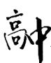

# 聚焦新定义问题

武敏 $^{1}$ 李鸿昌 $^{2}$

(1. 贵州省毕节七星关东辰实验学校 2. 北京师范大学贵阳附属中学)

新定义题经常以高等数学为背景,但它考查的重点不是高等数学知识,更不是高等数学知识的直接运用.新定义题主要考查的是考生的数学阅读能力、数学学习能力以及对数学符号的理解能力和表达能力.新定义问题主要涉及如下题型.

1) 新定义运算符号；

2)与集合有关的新定义问题；

3)与数论有关的问题,如高斯函数、二进制、同余等;

4) 数列与集合综合的新定义问题；

5)与函数有关的新定义问题；

6)与组合数学、信息论、图论等有关的新定义问题；

7)与行列式、矩阵、映射、线性相关、向量外积等

高等代数知识有关的新定义问题；

8)与泰勒公式、中值定理、曲率、拐点等数学分析知识有关的新定义问题；  
9)与康托尔函数、曼哈顿距离等有关的新定义问题；  
10)与极点极线、调和点列和调和线束等高等几何知识有关的新定义问题.

# 1 信息论新定义问题

例 1 汉明距离在信息编码中有广泛应用,表示两个相等长度的字符串中位置相同但字符不同置个数,如字符串“011001”与字符串“101100”之汉明距离为 4. 设集合 $X=\{1,2,\cdots,n\}$ ，若函数

例6 已知正项数列 $\{a_{n}\}$ 满足 $a_{n + 2} = \frac{a_{n + 1}}{a_n} (n\in$

$N^{*}$ ), 且 $a_{1}=1, a_{2}=2$ , 求 $a_{2024}$ .

解析

由 $a_1 = 1, a_2 = 2, a_{n+2} = \frac{a_{n+1}}{a_n} (n \in \mathbf{N}^*)$ ，可得

$a_{3}=2,a_{4}=1,a_{5}=\frac{1}{2},a_{6}=\frac{1}{2},a_{7}=1,a_{8}=2,\cdots,$ 分析数据发现: 正项数列 $\{a_{n}\}$ 为周期数列, 其周期为6, 故 $a_{2024}=a_{2}=2.$

点评

题目就是利用已知条件求出 $a_{3}=2, a_{4}=1$ ,

$a_{5}=\frac{1}{2},a_{6}=\frac{1}{2},a_{7}=1,a_{8}=2,\cdots,$ 这一过程

为收集和整理数据,然后提取信息,发现变化规律,推断出数列 $\{a_{n}\}$ 是以6为周期的数列,进而根据周期性计算 $a_{2024}=a_{2}=2$ .由此可知,凡是通过数据分析得出结论的题型均涉及对数据分析核心素养的考查,如求一组数据的中位数、独立性检验等问题.

拓展练习 已知等差数列 $\{a_{n}\}$ 的公差不为0, $S_{n}$ 为其前n项和，若 $S_{5}=0$ ，则 $S_{i}(i=1,2,\cdots,100)$ 中不同的数值有\_\_\_\_个.

解析

设等差数列 $\{a_{n}\}$ 的公差为 $d(d \neq 0)$ ，则 $S_{5} = 5a_{3} = 0$ ，所以 $a_{3} = 0$ ，即 $a_{1} + 2d = 0$ ，则$a_{1}=-2d$ .列举 $\{a_{n}\}$ 的前几项： $a_{1}=-2d,a_{2}=-d$ ， $a_{3}=0,a_{4}=d,a_{5}=2d,a_{6}=3d,a_{7}=4d$ ，则 $S_{1}=-2d,S_{2}=-3d,S_{3}=-3d,S_{4}=-2d,S_{5}=0,S_{6}=3d,S_{7}=7d$ .因为 $d\neq0$ ，所以 $S_{2}=S_{3},S_{1}=S_{4}$ ，当 $d>0,n\geqslant3$ 时，易知 $\{S_{n}\}$ 单调递增；当 $d<0,n\geqslant3$ 时，易知 $\{S_{n}\}$ 单调递减，所以 $S_{i}(i=1,2,\cdots,100)$ 中不同的数值有100-2=98个.

数学学科的六大核心素养是育人价值的集中体现,也是数学课程目标的集中体现,所以高考试题的命题者在命题时必然会将其作为重要考虑的因素之一.认真分析历年的高考试卷不难发现,数学学科的六大核心素养均以不同形式出现且依附不同的知识情境.上述以数列章节为例,结合《普通高中数学课程标准(2017年版2020年修订)》中六大核心素养的定义、表现,通过对不同的题型进行分析,明确了这六大核心素养的考查情况.

(完)

$f: X \to X$ ，且满足 $f(1), f(2), \cdots, f(n)$ 是 $1, 2, \cdots, n$ 的全排列，则称 f 是 X 上的置换，用 $2 \times n$ 的矩阵 $\begin{pmatrix} 1 & 2 & \cdots & n \\ f(1) & f(2) & \cdots & f(n) \end{pmatrix}$ 来表示该置换。设 X 上的所有置换构成的集合为 M，从 M 中随机选取一个元素 f，定义集合 $B(f) = \{i \in X \mid f(i) \neq i\}$ ，则汉明距离 $Y = |B(f)|$ 以及 $Y_j = \begin{cases} 1, & j \in B(f), \\ 0, & j \notin B(f) \end{cases}$ 为随机变量，其中 $|B(f)|$ 表示 $B(f)$ 的元素个数。

(1) 求 $X=\{1,2,3\}$ 的置换.

(2) 当 $X = \{1, 2, 3\}$ 时，求汉明距离 Y 的期望 $E(Y)$ .

(3) 当 $X=\{1,2,3,\cdots,n\}$ 时，证明：

(i) 对 $\forall i, j \in X$ ，且 $i \neq j$ ，事件“ $Y_{i}Y_{j} = 0$ ”的概率 $P(Y_{i}Y_{j} = 0) = \frac{2n - 3}{n(n - 1)}$ ;

(ii) 汉明距离 Y 的方差 $D(Y)=1$ .

（参考公式：事件 A, B 至少有一个发生的概率 $P(A \cup B) = P(A) + P(B) - P(A \cap B)$ ; 给定随机变量 $X_{1}, X_{2}, \cdots, X_{n}$ ，则 $Y = \sum_{i=1}^{n} X_{i}$ 的期望满足 $E(\sum_{i=1}^{n} X_{i}) = \sum_{i=1}^{n} E(X_{i}); D(Y) = E(Y^{2}) - (E(Y))^{2}.$

解析 (1) $X$ 的置换为 $\begin{pmatrix} 1 & 2 & 3 \\ 1 & 2 & 3 \end{pmatrix}, \begin{pmatrix} 1 & 2 & 3 \\ 1 & 3 & 2 \end{pmatrix}$ , $\begin{pmatrix} 1 & 2 & 3 \\ 2 & 1 & 3 \end{pmatrix}, \begin{pmatrix} 1 & 2 & 3 \\ 2 & 3 & 1 \end{pmatrix}, \begin{pmatrix} 1 & 2 & 3 \\ 3 & 1 & 2 \end{pmatrix}, \begin{pmatrix} 1 & 2 & 3 \\ 3 & 2 & 1 \end{pmatrix}$ .

(2) 方法 1 Y 的可能取值为 0, 2, 3, 则 Y 的分布列如表 1 所示.

表 1

<table><tr><td>Y</td><td>0</td><td>2</td><td>3</td></tr><tr><td>P</td><td> $\frac{1}{6}$ </td><td> $\frac{1}{2}$ </td><td> $\frac{1}{3}$ </td></tr></table>

$$
E (Y) = 0 \times \frac {1}{6} + 2 \times \frac {1}{2} + 3 \times \frac {1}{3} = 2.
$$

方法 2 由(1)知 $Y_{j}$ 的分布列如表 2 所示.

表 2

<table><tr><td> $Y_j$ </td><td>0</td><td>1</td></tr><tr><td>P</td><td> $\frac{1}{3}$ </td><td> $\frac{2}{3}$ </td></tr></table>

$$
E (Y) = E \left(\sum_ {j = 1} ^ {3} Y _ {j}\right) = \sum_ {j = 1} ^ {3} E \left(Y _ {j}\right) = 2.
$$

(3)(i)由题可知

$$
P \left(Y _ {j} = 1\right) = \frac {n - 1}{n}, P \left(Y _ {j} = 0\right) = \frac {1}{n},
$$

$$
P \left(Y _ {i} = 0 \cap Y _ {j} = 0\right) = \frac {1}{n (n - 1)}.
$$

由 $P(A \cup B) = P(A) + P(B) - P(A \cap B)$ ,
可得

$$
P \left(Y _ {i} Y _ {j} = 0\right) = P \left(Y _ {i} = 0 \bigcup Y _ {j} = 0\right) =
$$

$$
P \left(Y _ {i} = 0\right) + P \left(Y _ {j} = 0\right) - P \left(Y _ {i} = 0 \cap Y _ {j} = 0\right) =
$$

$$
\frac {1}{n} + \frac {1}{n} - \frac {1}{n (n - 1)} = \frac {2 n - 3}{n (n - 1)}.
$$

(ii) 由 (i) 可知

$$
P \left(Y _ {i} Y _ {j} = 1\right) = 1 - \frac {2 n - 3}{n (n - 1)},
$$

$$
E (Y _ {j}) = \frac {n - 1}{n}, E (Y _ {i} Y _ {j}) = 1 - \frac {2 n - 3}{n (n - 1)},
$$

所以

$$
E (Y) = E \left(\sum_ {i = 1} ^ {n} Y _ {i}\right) = \sum_ {i = 1} ^ {n} E \left(Y _ {i}\right) = \sum_ {i = 1} ^ {n} \frac {n - 1}{n} = n - 1,
$$

则

$$
E \left(Y ^ {2}\right) = E \left(\left(\sum_ {i = 1} ^ {n} Y _ {i}\right) ^ {2}\right) = E \left(\sum_ {i = 1} ^ {n} Y _ {i} ^ {2} + \sum_ {i \neq j} Y _ {i} Y _ {j}\right) =
$$

$$
\sum_ {i = 1} ^ {n} E \left(Y _ {i} ^ {2}\right) + \sum_ {i \neq j} E \left(Y _ {i} Y _ {j}\right) =
$$

$$
\sum_ {i = 1} ^ {n} E \left(Y _ {i}\right) + \sum_ {i \neq j} \left(1 - \frac {2 n - 3}{n (n - 1)}\right) =
$$

$$
n \cdot \frac {n - 1}{n} + n (n - 1) \left[ 1 - \frac {2 n - 3}{n (n - 1)} \right] =
$$

$$
n - 1 + n (n - 1) - (2 n - 3) = n ^ {2} - 2 n + 2,
$$

因此 $D(Y)=E(Y^{2})-(E(Y))^{2}=n^{2}-2n+2-(n-1)^{2}=1.$

本题以信息编码中的汉明距离为背景,考查对应关系、矩阵以及离散型随机变量的期望和方差.第(1)问的关键是理解汉明距离的定义.第(2)问是求离散型随机变量 $Y$ 的期望，方法1根据题意确定 $Y$ 的取值及其对应的概率，方法2利用 $Y = \sum_{j = 1}^{3}Y_{j}$ ，先求出 $E(Y_{j})$ ，再利用 $\sum_{j = 1}^{3}E(Y_{j})$ 求解，对第(3)问的证明有帮助.第(3)问先求出 $E(Y)$ ，再求出 $E(Y^2)$ ，最后根据参考公式求出 $D(Y)$

# 2 集合新定义问题

例2 设整数 $n, k$ 满足 $1 \leqslant k \leqslant n$ , 集合 $A = \{2^m \mid 0 \leqslant m \leqslant n - 1, m \in \mathbf{Z}\}$ . 从 $A$ 中选取 $k$ 个不同的元素并取它们的乘积,这样的乘积有 $C_{n}^{k}$ 个,设它们的和为 $a_{n,k}$ .例如, $a_{3,2}=2^{0}\times2^{1}+2^{0}\times2^{2}+2^{1}\times2^{2}=14$ .

(1) 若 $n \geqslant 2$ , 求 $a_{n,2}$ ;

(2) 记 $f_{n}(x)=1+a_{n,1}x+a_{n,2}x^{2}+\cdots+a_{n,n}x^{n}$ ，求 $\frac{f_{n+1}(x)}{f_{n}(x)}$ 和 $\frac{f_{n+1}(x)}{f_{n}(2x)}$ 的整式表达式；

(3)用含 $n, k$ 的式子来表示 $\frac{a_{n+1,k+1}}{a_{n,k}}$ .

(1) 由题意得

$$
a _ {n, 2} = \frac {1}{2} \left[ \left(\sum_ {k = 0} ^ {n - 1} 2 ^ {k}\right) ^ {2} - \sum_ {k = 0} ^ {n - 1} \left(2 ^ {k}\right) ^ {2} \right] =
$$

$$
\frac {1}{2} \left[ \left(\frac {2 ^ {n} - 1}{2 - 1}\right) ^ {2} - \frac {4 ^ {n} - 1}{4 - 1} \right] =
$$

$$
\frac {1}{2} \left[ (2 ^ {n} - 1) ^ {2} - \frac {4 ^ {n} - 1}{3} \right] = \frac {4 ^ {n}}{3} - 2 ^ {n} + \frac {2}{3}.
$$

(2) 因为

$$
f _ {n} (x) = \left(1 + 2 ^ {0} x\right) \left(1 + 2 ^ {1} x\right) \left(1 + 2 ^ {2} x\right) \dots \cdot \left(1 + 2 ^ {n - 1} x\right),
$$

$$
f _ {n + 1} (x) = \left(1 + 2 ^ {0} x\right) \left(1 + 2 ^ {1} x\right) \left(1 + 2 ^ {2} x\right) \dots
$$

$$
(1 + 2 ^ {n - 1} x) (1 + 2 ^ {n} x),
$$

所以 $\frac{f_{n + 1}(x)}{f_n(x)} = 1 + 2^n x$ ，又

$$
f _ {n} (2 x) = \left(1 + 2 ^ {0} \cdot 2 x\right) \left(1 + 2 ^ {1} \cdot 2 x\right) \left(1 + 2 ^ {2} \cdot 2 x\right) \dots
$$

$$
(1 + 2 ^ {n - 1} \cdot 2 x) = (1 + 2 ^ {1} x) (1 + 2 ^ {2} x) (1 + 2 ^ {3} x) \dots
$$

$$
(1 + 2 ^ {n - 1} x) (1 + 2 ^ {n} x),
$$

所以 $\frac{f_{n+1}(x)}{f_{n}(2x)}=1+x.$

(3) 记 $a_{n,0} = 1, a_{n+1,0} = 1$ ，由 (2) 得

$$
f _ {n} (x) = \sum_ {k = 0} ^ {n} a _ {n, k} x ^ {k}, \tag {①}
$$

$$
f _ {n + 1} (x) = \sum_ {k = 0} ^ {n + 1} a _ {n + 1, k} x ^ {k}, \tag {②}
$$

$$
f _ {n + 1} (x) = \left(1 + 2 ^ {n} x\right) f _ {n} (x) =
$$

$$
\sum_ {k = 0} ^ {n} a _ {n, k} x ^ {k} + 2 ^ {n} \sum_ {k = 0} ^ {n} a _ {n, k} x ^ {k + 1} =
$$

$$
\sum_ {k = 0} ^ {n} (a _ {n, k} + 2 ^ {n} a _ {n, k - 1}) x ^ {k}. \tag {③}
$$

由②和③, 比较 $x^{k+1}$ 的系数, 可得

$$
a _ {n + 1, k + 1} = a _ {n, k + 1} + 2 ^ {n} a _ {n, k}. \tag {④}
$$

因为

$$
f _ {n + 1} (x) = (1 + x) f _ {n} (2 x) =
$$

$$
\sum_ {k = 0} ^ {n} a _ {n, k} (2 x) ^ {k} + x \sum_ {k = 0} ^ {n} a _ {n, k} (2 x) ^ {k} = \sum_ {k = 0} ^ {n} a _ {n, k} 2 ^ {k} x ^ {k} +
$$

$$
\sum_ {k = 0} ^ {n} a _ {n, k} 2 ^ {k} x ^ {k + 1} = \sum_ {k = 0} ^ {n} \left(2 ^ {k} a _ {n, k} + 2 ^ {k - 1} a _ {n, k - 1}\right) x ^ {k},
$$

由②比较 $x^{k + 1}$ 的系数可得

$$
a _ {n + 1, k + 1} = 2 ^ {k + 1} a _ {n, k + 1} + 2 ^ {k} a _ {n, k}, \tag {⑤}
$$

由④⑤消去 $a_{n,k + 1}$ 可得

$$
(2 ^ {k + 1} - 1) a _ {n + 1, k + 1} = (2 ^ {n + k + 1} - 2 ^ {k}) a _ {n, k},
$$

所以 $\frac{a_{n + 1,k + 1}}{a_{n,k}} = \frac{2^{n + k + 1} - 2^k}{2^{k + 1} - 1}.$

# 点评

这是一道集合的新定义问题,意在考查学生的计算能力、转化能力和解决问题的能力,其中将新定义中的知识转化为已有的知识是考查的重点,需熟练掌握.

对于第(1)问,根据题意,直接代入计算即可得到结果.对于第(2)问,根据题意,由条件可得 $f_{n}(x)=(1+2^{0}x)(1+2^{1}x)(1+2^{2}x)\cdots\cdot(1+2^{n-1}x)$ ,从而表示出 $f_{n+1}(x)$ 与 $f_{n}(2x)$ ,然后相除,即可得到结果.对于第(3)问,记 $a_{n,0}=1,a_{n+1,0}=1$ ,再由(2)可得 $f_{n+1}(x)=\sum_{k=0}^{n}(a_{n,k}+2^{n}a_{n,k-1})x^{k}$ ,然后化简即可得到 $a_{n+1,k+1}=2^{k+1}a_{n,k+1}+2^{k}a_{n,k}$ ,从而得到结果.

# 3 数列新定义问题

例 3 （2022 年北京卷 21）已知 $Q: a_{1}, a_{2}, \cdots, a_{k}$ 为有穷整数数列.给定正整数 m，若对任意的 $n \in \{1, 2, \cdots, m\}$ ，在 Q 中存在 $a_{i}, a_{i+1}, a_{i+2}, \cdots, a_{i+j} (j \geqslant 0)$ ，使得 $a_{i} + a_{i+1} + a_{i+2} + \cdots + a_{i+j} = n$ ，则称 Q 为 m-连续可表数列.

(1) 判断 Q: 2, 1, 4 是否为 5-连续可表数列？是否为 6-连续可表数列？说明理由；  
(2) 若 $Q: a_{1}, a_{2}, \cdots, a_{k}$ 为 8-连续可表数列，求证：k 的最小值为 4；  
(3) 若 $Q: a_{1}, a_{2}, \cdots, a_{k}$ 为 20-连续可表数列，且 $a_{1} + a_{2} + \cdots + a_{k} < 20$ ，求证： $k \geqslant 7$ .

# 析

$$
(1) a _ {2} = 1, a _ {1} = 2, a _ {1} + a _ {2} = 3, a _ {3} = 4, a _ {2} +
$$

存在 i, j 使得 $a_{i} + a_{i+1} + \cdots + a_{i+j} = 6$ ，所以 Q 不是 6-连续可表数列.

(2) 若 $k \leqslant 3$ , 设为 $Q: a, b, c$ , 则至多有 $a + b, b + c, a + b + c, a, b, c$ 这 6 个数字, 没有 8 个, 矛盾, 故 $k \geqslant 4$ .

当 k=4 时，构造数列 Q:1,4,1,2，满足 $a_{1}=1$ ， $a_{4}=2$ ， $a_{3}+a_{4}=3$ ， $a_{2}=4$ ， $a_{1}+a_{2}=5$ ， $a_{1}+a_{2}+a_{3}=6$ ， $a_{2}+a_{3}+a_{4}=7$ ， $a_{1}+a_{2}+a_{3}+a_{4}=8$ ，即存在 k=4 满足题意，所以 k 的最小值为 4.

(3) $Q:a_{1},a_{2},\cdots,a_{k}$ ，若i=j，则最多有k种；若 $i\neq j$ ，则最多有 $C_{k}^{2}$ 种，故最多有 $k+C_{k}^{2}=\frac{k(k+1)}{2}$ 种.

若 $k \leqslant 5$ ，则 $a_{1}, a_{2}, \cdots, a_{k}$ 至多可表 $\frac{5(5+1)}{2} = 15$ 个数，矛盾，从而若 k < 7，即 k = 6, a, b, c, d, e, f 至多可表 $\frac{6(6+1)}{2} = 21$ 个数，而 $a + b + c + d + e + f < 20$ ，所以其中有负数，从而 a, b, c, d, e, f 可表 1～20 的正整数及那个负数（恰 21 个），这表明 $a \sim f$ 中仅有一个负数，没有 0，且在 $a \sim f$ 中这个负数的绝对值最小，同时 $a \sim f$ 中没有相同的两个数。设负数为 -m ( $m \geqslant 1$ )，则所有数之和 $S \geqslant m + 1 + m + 2 + \cdots + m + 5 - m = 4m + 15, 4m + 15 \leqslant 19$ ，解得 m = 1，则 $\{a, b, c, d, e, f\} = \{-1, 2, 3, 4, 5, 6\}$ 。再考虑排序，排序中不能有和相同，否则不足 20 个，因为 $1 = -1 + 2$ （仅一种方式），所以 -1 与 2 相邻，若 -1 不在两端，则有“x，-1，2，\_\_\_\_，\_\_\_\_，\_\_\_\_”的形式。若 x = 6，则 $5 = 6 + (-1)$ （有 2 种结果相同，矛盾），所以 $x \neq 6$ ，同理 $x \neq 5, 4, 3$ ，故 -1 在一端，不妨设为“-1，2，A，B，C，D”形式。若 A = 3，则 $5 = 2 + 3$ （有 2 种结果相同，矛盾），若 A = 4，同理不成立。若 A = 5，则 $6 = -1 + 2 + 5$ （有 2 种结果相同，矛盾），从而 A = 6。由于 $7 = -1 + 2 + 6$ ，由表法唯一知 3，4 不相邻，故只能为

$$
- 1, 2, 6, 3, 5, 4, \tag {①}
$$

$$
- 1, 2, 6, 4, 5, 3, \tag {②}
$$

这 2 种情形.

对于①, $9=6+3=5+4$ ,矛盾.

对于②, $8=2+6=5+3$ ,也矛盾.

综上， $k \neq 6$ .

当 k=7 时，数列 1,2,4,5,8,-2,-1 满足题意，所以 $k \geqslant 7$ .

先理解题意,是否为 m- 可表数列的核心:是否存在连续的几项(可以是一项)之和能表示从1到 $m$ 中间的任意一个值.本题第(2)问通过和值可能个数否定 $k \leqslant 3$ . 第(3)问先通过和值的可能个数否定 $k \leqslant 5$ , 再验证 $k = 6$ 时, 数列中的几项, 如果符合题意必然是 $\{-1, 2, 3, 4, 5, 6\}$ 的一个排序, 进而可验证这组数不符合题意.

# 4 组合数新定义问题

例4“ $q-$ 数”在量子代数研究中发挥了重要作

32

数理化

用.设 q 是非零实数, 对于任意 $n \in N^{*}$ , 定义 “q- 数” (n) $_{q} = 1 + q + \cdots + q^{n-1}$ . 利用 “q- 数” 可定义 “q- 阶乘” (n)! $_{q} = (1)_{q}(2)_{q} \cdots (n)_{q}$ , 且 (0)! $_{q} = 1$ , 和 “q- 组合数”, 即对任意 $k \in N, n \in N^{*}, k \leqslant n$ , 有

$$
\binom {n} {k} _ {q} = \frac {(n) ! _ {q}}{(k) ! _ {q} (n - k) ! _ {q}}.
$$

(1) 计算: $\begin{pmatrix}5\\3\end{pmatrix}_{2}$ ;

(2)证明:对于任意 $k, n \in N^{*}, k + 1 \leqslant n$ , 有

$$
\binom {n} {k} _ {q} = \binom {n - 1} {k - 1} _ {q} + q ^ {k} \binom {n - 1} {k} _ {q};
$$

(3)证明:对于任意 $k, m \in N, n \in N^{*}, k + 1 \leqslant n$ ,

$$
\binom {n + m + 1} {k + 1} _ {q} - \binom {n} {k + 1} _ {q} = \sum_ {i = 0} ^ {m} q ^ {n - k + i} \binom {n + i} {k} _ {q}.
$$

(1)由定义可知

解析

$$
\binom {5} {3} _ {2} = \frac {(5) ! _ {2}}{(3) ! _ {2} (2) ! _ {2}} =
$$

$$
\begin{array}{l} \frac {(1) _ {2} (2) _ {2} (3) _ {2} (4) _ {2} (5) _ {2}}{[ (1) _ {2} (2) _ {2} (3) _ {2} ] [ (1) _ {2} (2) _ {2} ]} = \frac {(4) _ {2} (5) _ {2}}{(1) _ {2} (2) _ {2}} = \\ \frac {(1 + 2 + 2 ^ {2} + 2 ^ {3}) (1 + 2 + 2 ^ {2} + 2 ^ {3} + 2 ^ {4})}{1 \times (1 + 2)} = 1 5 5. \\ \end{array}
$$

(2) 因为

$$
\binom {n} {k} _ {q} = \frac {(n) ! _ {q}}{(k) ! _ {q} (n - k) ! _ {q}} = \frac {(n) _ {q} \cdot (n - 1) ! _ {q}}{(k) ! _ {q} (n - k) ! _ {q}},
$$

$$
\binom {n - 1} {k - 1} _ {q} + q ^ {k} \binom {n - 1} {k} _ {q} =
$$

$$
\frac {(n - 1) ! _ {q}}{(k - 1) ! _ {q} (n - k) ! _ {q}} + \frac {q ^ {k} \cdot (n - 1) ! _ {q}}{(k) ! _ {q} (n - k - 1) ! _ {q}} =
$$

$$
\frac {(n - 1) ! _ {q}}{(k) ! _ {q} (n - k) ! _ {q}} \left[ (k) _ {q} + q ^ {k} \cdot (n - k) _ {q} \right],
$$

又

$$
(k) _ {q} + q ^ {k} \cdot (n - k) _ {q} = 1 + q + \dots + q ^ {k - 1} +
$$

$$
q ^ {k} (1 + q + \dots + q ^ {n - k - 1}) = 1 + q + \dots + q ^ {n - 1} = (n) _ {q},
$$

所以 $\binom{n}{k}_{q}=\binom{n-1}{k-1}_{q}+q^{k}\binom{n-1}{k}_{q}.$

(3)由定义得,对于任意 $k \in N, n \in N^{*}, k \leqslant n$ , $\binom{n}{k}_{q}=\binom{n}{n-k}_{q}$ . 结合(2)可知

$$
\begin{array}{l} \binom {n} {k} _ {q} = \binom {n} {n - k} _ {q} = \binom {n - 1} {n - k - 1} _ {q} + q ^ {n - k} \binom {n - 1} {n - k} _ {q} = \\ \binom {n - 1} {k} _ {q} + q ^ {n - k} \binom {n - 1} {k - 1} _ {q}, \\ \end{array}
$$

即 $\binom{n}{k}_{q}=\binom{n-1}{k}_{q}+q^{n-k}\binom{n-1}{k-1}_{q}$ ，也即

$$
\binom {n} {k} _ {q} - \binom {n - 1} {k} _ {q} = q ^ {n - k} \binom {n - 1} {k - 1} _ {q},
$$

所以

$$
\binom {n + m + 1} {k + 1} _ {q} - \binom {n + m} {k + 1} _ {q} = q ^ {n + m - k} \binom {n + m} {k} _ {q},
$$

$$
\binom {n + m} {k + 1} _ {q} - \binom {n + m - 1} {k + 1} _ {q} = q ^ {n + m - 1 - k} \binom {n + m - 1} {k} _ {q},
$$

$$
\bullet \quad \bullet \quad \bullet \quad \bullet \quad \bullet
$$

$$
\binom {n + 1} {k + 1} _ {q} - \binom {n} {k + 1} _ {q} = q ^ {n - k} \binom {n} {k} _ {q},
$$

将上述 $m + 1$ 个等式两边分别相加得

$$
\binom {n + m + 1} {k + 1} _ {q} - \binom {n} {k + 1} _ {q} = \sum_ {i = 0} ^ {m} q ^ {n - k + i} \binom {n + i} {k} _ {q}.
$$

点评 本题是新定义题, 记 $C_{n}^{k}=\binom{n}{k}$ , 易知题干的定义 $\binom{n}{k}_{q}=\frac{(n)!_{q}}{(k)!_{q}(n-k)!_{q}}$ 类比了组合数的定义： $\binom{n}{k}=\frac{n!}{k!(n-k)!}$ . 第(2)问由性质 $\binom{n}{k}_{q}=\binom{n-1}{k-1}_{q}+q^{k}\binom{n-1}{k}_{q}$ 类比了组合数的性质

$$
\binom {n} {k} = \binom {n - 1} {k - 1} + \binom {n - 1} {k}.
$$

# 5 二进制新定义问题

例5 德国数学家莱布尼茨是世界上第一个提出二进制记数法的人,用二进制记数只需数字0和1,对于整数可理解为逢二进一,例如,自然数1在二进制中就表示为 $(1)_{2}$ ,2表示为 $(10)_{2}$ ,3表示为 $(11)_{2}$ ,5表示为 $(101)_{2}$ ,发现若 $n\in N^{*}$ 可表示为二进制表达式 $(a_{0}a_{1}a_{2}\cdots a_{k-1}a_{k})_{2}$ ,则

$$
n = a _ {0} \times 2 ^ {k} + a _ {1} \times 2 ^ {k - 1} + \dots + a _ {k - 1} \times 2 ^ {1} + a _ {k},
$$

其中 $a_{0}=1, a_{i}=0$ 或 $1(i=1,2,\cdots,k)$ .

(1) 记 $S(n)=a_{0}+a_{1}+\cdots+a_{k-1}+a_{k}$ ，求证： $S(8n+3)=S(4n+3)$ .

(2) 记 $I(n)$ 为整数 $n$ 的二进制表达式中的 0 的个数, 如 $I(2) = 1, I(3) = 0$ .

(i) 求 $I(60)$ ;

(ii) 求 $\sum_{n=1}^{511}2^{I(n)}$ (用数字作答).

(1)由 $8n + 3 = a_{0}\times 2^{k + 3} + a_{1}\times 2^{k + 2} + \dots +$

解析 $a_{k}\times 2^{3} + 1\times 2^{1} + 1$ ，可得

$$
S (8 n + 3) = a _ {0} + a _ {1} + \dots + a _ {k} + 1 + 1 = S (n) + 2,
$$

由

$$
4 n + 3 = a _ {0} \times 2 ^ {k + 2} + a _ {1} \times 2 ^ {k + 1} + \dots +
$$

$$
a _ {k} \times 2 ^ {2} + 1 \times 2 ^ {1} + 1,
$$

可得 $S(4n+3)=a_{0}+a_{1}+\cdots+a_{k}+1+1=S(n)+2$ ，所以 $S(8n+3)=S(4n+3)$ .

(2)(i) 因为 $60 = 32 + 16 + 8 + 4 = 1 \times 2^{5} + 1 \times 2^{4} + 1 \times 2^{3} + 1 \times 2^{2} + 0 \times 2^{1} + 0 \times 2^{0} = (111100)_{2}$ ，所以 $I(60) = 2$ .

(ii) 因为

$$
1 = 1 \times 2 ^ {0} = (1) _ {2},
$$

$$
5 1 1 = 1 \times 2 ^ {8} + 1 \times 2 ^ {7} + 1 \times 2 ^ {6} + 1 \times 2 ^ {5} + 1 \times 2 ^ {4} +
$$

$$
1 \times 2 ^ {3} + 1 \times 2 ^ {2} + 1 \times 2 ^ {1} + 1 \times 2 ^ {0} = (1 1 1 1 1 1 1 1 1) _ {2},
$$

故在 n=1 到 n=511 中， $I(n)=0$ 有 $(1)_{2}$ ， $(11)_{2}$ ，…， $(11111111)_{2}$ 共 9 个， $I(n)=1$ 有 $C_{1}^{1}+C_{2}^{1}+\cdots+C_{8}^{1}=C_{9}^{2}$ 个， $I(n)=2$ 有 $C_{2}^{2}+C_{3}^{2}+\cdots+C_{8}^{2}=C_{9}^{3}$ 个，…， $I(n)=9$ 有 $C_{8}^{8}=C_{9}^{9}=1$ 个，因此

$$
\begin{array}{l} \sum_ {n = 1} ^ {5 1 1} 2 ^ {I (n)} = 9 \times 2 ^ {0} + \mathrm{C} _ {9} ^ {2} \times 2 ^ {1} + \mathrm{C} _ {9} ^ {3} \times 2 ^ {2} + \dots + \mathrm{C} _ {9} ^ {9} \times 2 ^ {8} = \\ \frac {\mathrm{C} _ {9} ^ {1} \times 2 ^ {1} + \mathrm{C} _ {9} ^ {2} \times 2 ^ {2} + \mathrm{C} _ {9} ^ {3} \times 2 ^ {3} + \cdots + \mathrm{C} _ {9} ^ {9} \times 2 ^ {9}}{2} = \\ \end{array}
$$

$$
\frac {\mathrm{C} _ {9} ^ {0} \times 2 ^ {0} + \mathrm{C} _ {9} ^ {1} \times 2 ^ {1} + \mathrm{C} _ {9} ^ {2} \times 2 ^ {2} + \cdots + \mathrm{C} _ {9} ^ {9} \times 2 ^ {9} - 1}{2} =
$$

$$
\frac {(1 + 2) ^ {9} - 1}{2} = 9 8 4 1.
$$

点评

求解最后一问的关键在于结合二进制的定义，得到 $1 = 1 \times 2^{0} = (1)_{2}, 511 =$ (111111111) $_{2}$ ，通过组合数的计算得到 $I(n)=0$ ， $I(n)=1,\cdots,I(n)=9$ 的个数，再结合组合数的性质计算得到结果.

自 2024 年 1 月九省联考出现新定义题之后,不少模拟卷都相继出现了新定义题. 新定义题一般是以高等数学为背景,给出新定义,要求考生结合所给定义来解题. 这类试题主要考查考生的数学阅读能力、数学学习能力和数学符号的转化与数学表达能力. 破解新定义题的关键就是认真审题、读懂题意、理解新定义、理解数学符号,然后根据定义利用所学的知识解决问题.

(完)