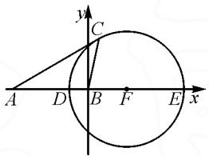

# 解三角形中最值问题几种模型及其推广

# 山东省东营市胜利第二中学 武桂花

解三角形中最值问题的处理策略主要是利用基本不等式、正弦定理和余弦定理等.此类问题主要涉及四种题型,即一角及对边为定值、一角及邻边为定值、两边之比为定值、两边之和为定值.下面笔者通过具体例题,先分析每种题型的解法,再将每一种题型进行提炼与推广.

# 1 一角及对边为定值

例 1 已知 $\triangle ABC$ 的内角 A, B, C 的对边分别为 a, b, c，且 $\frac{\sqrt{3}c}{a\cos B} = \tan A + \tan B$ .

(1)求角 A 的大小;  
(2) 若 a=2，求 $\triangle ABC$ 的面积和周长的最大值.

解:(1) $A=\frac{\pi}{3}$ (过程略).

(2)由余弦定理得 $a^{2}=b^{2}+c^{2}-2bc\cos A$ ，又 a=2, $A=\frac{\pi}{3}$ ，所以 $4=b^{2}+c^{2}-bc$ .

所以 $4=b^{2}+c^{2}-bc\geqslant2bc-bc=bc$ ，即 $bc\leqslant4$ ，当且仅当 b=c=2 时，等号成立.

因为 $\triangle ABC$ 的面积 $S = \frac{1}{2} bc\sin A = \frac{\sqrt{3}}{4} bc$ ，所以 $S_{\max} = \sqrt{3}$ ，此时 $b = c = 2$ 。

由 $4 = b^{2} + c^{2} - bc$ ，得 $(b + c)^{2} = 4 + 3bc\leqslant 4 + 3\times$ $\frac{(b + c)^2}{4}$ 即 $(b + c)^2\leqslant 16$ ，则 $0 <   b + c\leqslant 4$ ，当且仅当 $b = c = 2$ 时等号成立.所以△ABC周长的最大值为6.

点评: 已知三角形的一边及其对角时, 可以用正弦定理求其面积和周长的最大值, 也可以用余弦定理和基本不等式来求.

推广 1 在 $\triangle ABC$ 中,一角为定值 $\theta$ 及对边为定值 m,记 $\triangle ABC$ 的面积为 S,周长为 p,则

$$
S _ {\max} = \frac {m ^ {2}}{4 \tan \frac {\theta}{2}}, p _ {\max} = \frac {m + m \sin \frac {\theta}{2}}{\sin \frac {\theta}{2}}.
$$

推广的证明略,可扫码看证明.

# 2 一角及邻边为定值

例 2 $\triangle ABC$ 的内角 A, B, C 的对边分别为 a, b, c，已知 $a \sin \frac{A + C}{2} =$

看推广 1 与 4 的证明$b\sin A$

(1) 求 B;   
(2) 若 $\triangle ABC$ 为锐角三角形, 且 c=1, 求 $\triangle ABC$ 面积的取值范围.

解:(1) $B=\frac{\pi}{3}$ (过程略).

(2)由余弦定理得 $b^{2}=a^{2}+c^{2}-2ac\cos B$ ，即

$$
b ^ {2} = a ^ {2} - a + 1. \tag {①}
$$

因为 $\triangle ABC$ 为锐角三角形,所以有 $\cos A>0$ , $\cos C>0$ ,即

$$
b ^ {2} + 1 - a ^ {2} > 0, \tag {②}
$$

$$
a ^ {2} + b ^ {2} - 1 > 0. \tag {③}
$$

将①分别代入②③, 得 $\frac{1}{2}<a<2.$

结合 $S_{\triangle ABC}=\frac{\sqrt{3}}{4}a$ ，得 $\frac{\sqrt{3}}{8}<S_{\triangle ABC}<\frac{\sqrt{3}}{2}$ .

因此 $\triangle ABC$ 面积的取值范围是 $\left(\frac{\sqrt{3}}{8},\frac{\sqrt{3}}{2}\right)$ .

点评:本题是2019年全国Ⅲ卷的考题,参考答案是利用正弦定理来求解的,相对复杂,这里笔者利用余弦定理求解,较为简洁.

推广 2 $^{[1]}$ 在 $\triangle ABC$ 中, 一角为定值 $\theta$ 及邻边为定值 m, 记 $\triangle ABC$ 的面积为 S, 周长为 p.

(1)若 $\triangle ABC$ 为锐角三角形,则

$$
S \in \left(\frac {1}{4} m ^ {2} \sin 2 \theta , \frac {1}{2} m ^ {2} \tan \theta\right),
$$

$$
p \in \left(m + \sqrt {2} m \sin \left(\theta + \frac {\pi}{4}\right), \frac {m + \sqrt {2} m \sin \left(\theta + \frac {\pi}{4}\right)}{\cos \theta}\right);
$$

(2)若 $\triangle ABC$ 为钝角三角形,则

$$
S \in \left(0, \frac {1}{4} m ^ {2} \sin 2 \theta\right) \cup \left(\frac {1}{2} m ^ {2} \tan \theta , + \infty\right),
$$

$$
p \in \left(0, m + \sqrt {2} m \cdot \sin \left(\theta + \frac {\pi}{4}\right)\right) \cup
$$

$$
\left(\frac {m + \sqrt {2} m \sin \left(\theta + \frac {\pi}{4}\right)}{\cos \theta}, + \infty\right).
$$

推广 2 的证明参看文[1].

# 3 两边之比为定值

例 3 若 AB=2, AC= $\sqrt{2}$ BC，则 $S_{\triangle ABC}$ 的最大值是 \_\_\_\_.

解:以 AB 所在的直线为 x 轴, AB 的中垂线为 y 轴, 建立平面直角坐标系.

因为 AB=2，则 $A(-1,0)$ ， $B(1,0)$ 。设 $C(x,y)$ ，由 $AC=\sqrt{2}BC$ ，得

$$
\sqrt {(x + 1) ^ {2} + y ^ {2}} = \sqrt {2} \cdot \sqrt {(x - 1) ^ {2} + y ^ {2}}.
$$

化简得 $(x-3)^{2}+y^{2}=8(y\neq0)$ ，即点C的轨迹是半径为 $2\sqrt{2}$ 的一个圆（除去与x轴的两个交点）.

所以 $S_{\triangle ABC} = \frac{1}{2} AB\cdot |y| = |y|\leqslant r = 2\sqrt{2}.$

故 $S_{\triangle ABC}$ 的最大值为 $2\sqrt{2}$ .

点评:本题由 $AC=\sqrt{2}BC$ ，易知点 C 的轨迹是一个圆（挖去两点），称为阿波罗尼奥斯圆，这样很容易就可以得到 $\triangle ABC$ 面积的最大值.

推广 3 在 $\triangle ABC$ 中, 一边为定值 m, 另两边之比为定值 $\lambda (\lambda > 1)$ , 记 $\triangle ABC$ 的面积为 S, 周长为 p,则 $S_{\max} = \frac{\lambda m^2}{2(\lambda^2 - 1)}, p \in \left(2m, \frac{2\lambda m}{\lambda - 1}\right)$ .

证明：在 $\triangle ABC$ 中，设 AB = m, AC = $\lambda BC$ ，以 B 为原点，BA 为 x 轴负半轴，过点 B 垂直于 AB 的直线为 y 轴建立平面直角坐标系，如图 1，则 $B(0,0)$ ， $A(-m,0)$ ， $C(x,y)$ ，可得

text_image

y
C
A D B F E x

图1

$$
A C = \sqrt {(x + m) ^ {2} + y ^ {2}},
$$

$$
B C = \sqrt {x ^ {2} + y ^ {2}}.
$$

由 $AC=\lambda BC(\lambda>1)$ ，可得

$$
\left(x - \frac {m}{\lambda^ {2} - 1}\right) ^ {2} + y ^ {2} = \frac {\lambda^ {2} m ^ {2}}{(\lambda^ {2} - 1) ^ {2}},
$$

即点 C 在以 $F\left(\frac{m}{\lambda^{2}-1},0\right)$ 为圆心， $r=\frac{\lambda m}{\lambda^{2}-1}$ 为半径的圆周上（除去 D, E 两点）运动.

又 $S=\frac{1}{2}AB\cdot|y|=\frac{m}{2}\cdot|y|$ ，则 $|y|$ 当最大时，S 取得最大值，所以 $S_{\max}=\frac{m}{2}r=\frac{\lambda m^{2}}{2(\lambda^{2}-1)}$ .

由 $AC=\lambda BC(\lambda>1)$ 得知，当 BC 越大，AC 就越大，即周长 p 越大.

又点 C 在以 $F\left(\frac{m}{\lambda^{2}-1},0\right)$ 为圆心， $r=\frac{\lambda m}{\lambda^{2}-1}$ 为半径的圆周上（除去 D, E 两点）运动，则 BD<BC<BE，即 $\frac{m}{\lambda+1}<BC<\frac{m}{\lambda-1}$ .

所以 $p \in \left(2m, \frac{2\lambda m}{\lambda - 1}\right)$ .

# 4 两边之和为定值

例 4 设 $\triangle ABC$ 的角 A, B, C 所对的边分别为a, b, c，若 $(3 - \cos A) \sin B = \sin A (1 + \cos B)$ ， $a + c = 6$ ，则 $\triangle ABC$ 的面积的最大值为 \_\_\_\_.

解:由已知,得

$$
\begin{array}{c} 3 \sin B = \sin A + \sin A \cos B + \cos A \sin B = \\ \sin A + \sin (A + B) = \sin A + \sin C. \end{array}
$$

由正弦定理得 $3b = a + c$ ，又 $a + c = 6$ ，所以 b = 2。

根据 $BA + BC = 6 > AC$ ，可知点 B 的轨迹是以 A, C 为焦点的椭圆（除去两点），焦距为 2，长轴长为 6，即 $c' = 1, a' = 3$ ，易得 $b' = 2\sqrt{2}$ .

所以， $\triangle ABC$ 的面积的最大值为

$$
S = \frac {1}{2} A C \cdot b ^ {\prime} = \frac {1}{2} \times 2 \times 2 \sqrt {2} = 2 \sqrt {2}.
$$

点评: 当三角形中一边的长度已知, 另外两边的长度之和为定值时, 根据椭圆的定义可知, 运动的那个顶点的轨迹就是椭圆(注意三个顶点不共线). 这样就很容易得到三角形面积的最大值.

推广 4 在 $\triangle ABC$ 中, 一边为定值 m, 另两边之和为定值 $\lambda (\lambda > 1)$ , 记 $\triangle ABC$ 的面积为 S, 则 $S_{\max} = \frac{m}{4} \sqrt{\lambda^{2} - m^{2}}$ .

推广 4 的证明略, 扫本文中前面的二维码可以查看具体证明.

# 5 总结

解三角形中的最值问题需根据给定条件灵活选用几何与代数工具,核心思路在于将几何约束转化为可优化的数学表达式.针对三种典型模型归纳如下:

一角及对边为定值:此类问题可通过余弦定理结合基本不等式处理.通过设定角与对边固定,利用余弦定理建立余下两边的关系,再借助不等式(如均值不等式)确定极值条件.

一角及邻边为定值:需注意三角形的锐角或钝角属性对约束条件的影响.通过余弦定理联立方程,结合不等式分析边的范围,进而确定面积的取值区间.

两边之比为定值:此类问题可借助几何轨迹(如阿波罗尼奥斯圆)直观分析.通过建立坐标系,将几何条件转化为点的轨迹方程,结合距离公式或面积公式求解极值.

综上,解三角形最值问题的核心在于合理选择定理(余弦定理、正弦定理)与代数工具(不等式、坐标系建模),将几何条件转化为可计算的数学模型.教学中应注重引导学生识别问题类型,强化模型化思维,以提升解决实际问题的综合能力.

# 参考文献：

[1] 李鸿昌, 杨春波, 程汉波. 高中数学一点一题型 (新高考版) [M]. 合肥: 中国科学技术大学出版社, 2022. Z