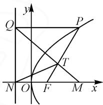
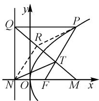

# 重心巧创新,向量妙“包装”

# 上海市华东师范大学第二附属中学临港奉贤分校 刘成坤

摘要:三角形的重心作为平面几何中的一个基本知识点,具有良好的几何性质与创设场景,往往在解三角形、平面向量、解析几何等相关问题中具有非常重要的价值.结合一道抛物线模拟题,就三角形重心背景下的解析几何问题加以剖析,多思维视角切入,多技巧方法破解,总结解题技巧规律,启示教学应用与解题研究.

关键词: 抛物线; 向量; 重心; 坐标; 面积

三角形中的“心”（重心、内心、外心、垂心、旁心）问题，是初中平面几何的一个重点与难点。而借助三角形中“心”的巧妙创设，合理融合初中与高中数学知识，形成二者之间的无缝结合，是一类非常不错的创新应用问题。

而对于三角形的重心,因其良好的几何性质、结构形式、向量形式、坐标形式等众多的识别特征,同时兼备“数”与“形”的双重特征,可以合理交汇起平面几何、解三角形、平面向量、三角函数以及解析几何等相关知识,情境创新,应用性强,是新高考数学命题中一类热点与创新问题,倍受各方关注.

# 1 问题呈现

问题〔2023届重庆市巴蜀中学高三(上)数学适应性试卷(四)]设抛物线 $y^{2}=4x$ 的焦点为F，准线为l，过抛物线上一点P作l的垂线，垂足为Q.若 $M(3,0),N(-1,0),PF$ 与MQ相交于点T，且 $\overrightarrow{TN}+\overrightarrow{TP}=\overrightarrow{MT}$ ，则 $\triangle TMF$ 的面积为\_\_\_\_.

此题以抛物线为问题场景进行创设,结合点的坐标、直线的交点、平面向量的线性关系式等要素,巧妙将三角形的重心这一平面几何的元素,借助平面向量的线性关系这一表述加以合理创新“包装”,正确转化与识别,巧妙挖掘与回归,问题的转化也就水到渠成了.

这里选用了解析几何中的抛物线作为载体,利用平面向量的线性关系与线性形式来表示三角形的重心,破解的关键在于正确剖析题设条件,做出正确的转化,借助三角形的重心的基本性质及相关应用,无论是平面几何中的相似比或性质法,还是解析几何中的坐标法等,都可以快速、准确地求出结果.

# 2 问题破解

# 2.1 平面几何思维

方法 1: 三角形相似转化法.

解析:由 $\overrightarrow{TN}+\overrightarrow{TP}=\overrightarrow{MT}$ ，可得 $\overrightarrow{TM}+\overrightarrow{TN}=-\overrightarrow{TP}$ .

又因为易知 $F(1,0)$ 为线段 MN 的中点，则 $\overrightarrow{TM} + \overrightarrow{TN} = 2\overrightarrow{TF}$ ，所以 $2\overrightarrow{TF} = -\overrightarrow{TP}$ .

所以 T 为 PF 的三等分点, 且 $\left|TP\right|=2\left|TF\right|$ , 如图 1 所示.

又因为 $PQ \parallel MF$ ，所以易证 $\triangle TMF \sim \triangle TQP$ ，则可得 $\frac{|MF|}{|QP|} = \frac{|TF|}{|TP|} = \frac{1}{2}$ ，可得 $|QP| = 2 |MF| = 4$ .

text_image

y
Q
P
T
N O F M x

图1

不失一般性，设 $P(x_0,y_0)$ ，且在第一象限.

由抛物线的定义, 得 $\left|QP\right|=x_{0}+1=4$ , 则 $x_{0}=3$ .

又因为点 $P(3, y_0)$ 在抛物线上，代入抛物线方程 $y^2 = 4x$ ，可得 $y_0 = 2\sqrt{3}$ ，所以 $P(3, 2\sqrt{3})$ 。

根据三角形的相似关系, 可得 $y_{T}=\frac{1}{3}y_{0}=\frac{2\sqrt{3}}{3}$ ,
所以 $S_{\triangle TMF}=\frac{1}{2}\times|MF|\times y_{T}=\frac{2\sqrt{3}}{3}$ . 故填答案: $\frac{2\sqrt{3}}{3}$ .

方法 2: 平行四边形转化法.

解析: 如图 2 所示, 设 $\overrightarrow{MT} = \overrightarrow{TR}$ , 连接 PR, NR,

根据 $\overrightarrow{TN} + \overrightarrow{TP} = \overrightarrow{MT}$ ，可得 $\overrightarrow{TN} + \overrightarrow{TP} = \overrightarrow{TR}$ ，所以可知四边形 TNRP 为平行四边形.

所以 $RN \parallel PT, |RN| = |PT|$ .

text_image

y
Q
P
R
T
N O F M x

图2

而 $F(1,0)$ 为 MN 的中点，结合三角形的中位线定理可得 $|RN|=2|TF|$ ，则知 T 是线段 PF 的三等分点.

又因为 $PQ \parallel MF$ ，所以 $\triangle TMF \sim \triangle TQP$ ，则 $\frac{|MF|}{|QP|} = \frac{|TF|}{|TP|} = \frac{1}{2}$ ，可得 $|QP| = 2 |MF| = 4$ .

不失一般性，设 $P(x_0,y_0)$ ，且在第一象限.

由抛物线的定义, 得 $\left|QP\right|=x_{0}+1=4$ , 则 $x_{0}=3$ .

又因为点 $P(3, y_{0})$ 在抛物线上，代入抛物线方程 $y^{2} = 4x$ ，可得 $y_{0} = 2\sqrt{3}$ ，所以 $P(3, 2\sqrt{3})$ .

根据三角形的相似关系, 可得 $y_{T}=\frac{1}{3}y_{0}=\frac{2\sqrt{3}}{3}$ ,
所以 $S_{\triangle TMF}=\frac{1}{2}\times|MF|\times y_{T}=\frac{2\sqrt{3}}{3}$ . 故填答案: $\frac{2\sqrt{3}}{3}$ .

方法 3: 重心性质转化法.

解析:由 $\overrightarrow{TN}+\overrightarrow{TP}=\overrightarrow{MT}$ ，可得 $\overrightarrow{TN}+\overrightarrow{TP}+\overrightarrow{TM}=0$ ，则知点T是 $\triangle PMN$ 的重心.

又因为 $PQ \parallel MF$ ，则有 $\frac{|MF|}{|QP|} = \frac{|TF|}{|TP|} = \frac{1}{2}$ ，所以 $|QP| = 2 |MF| = 4$ .

不失一般性，设 $P(x_{0}, y_{0})$ ，且在第一象限。

由抛物线的定义, 得 $QP = x_{0} + 1 = 4$ , 则 $x_{0} = 3$ .

又因为点 $P(3, y_{0})$ 在抛物线上，代入抛物线方程 $y^{2} = 4x$ ，可得 $y_{0} = 2\sqrt{3}$ ，所以 $P(3, 2\sqrt{3})$ .

根据三角形的相似关系, 可得 $y_{T}=\frac{1}{3}y_{0}=\frac{2\sqrt{3}}{3}$ ,
所以 $S_{\triangle TMF}=\frac{1}{2}\times|MF|\times y_{T}=\frac{2\sqrt{3}}{3}$ . 故填答案: $\frac{2\sqrt{3}}{3}$ .

解后反思:根据题设条件,借助平面几何思维,通过两个三角形相似、平行四边形的构建或三角形重心的确定等方式,结合相似比或基本性质,构建线段之间的倍数关系,进一步综合抛物线的定义与几何性质来确定对应点的坐标,结合三角形的面积公式来分析与求解.利用平面几何思维解决解析几何问题,其关键是数形结合,借助平面几何的基本性质来直观分析与巧妙转化.

# 2.2 解析几何思维

方法 4: 重心坐标法.

解析:由 $\overrightarrow{TN}+\overrightarrow{TP}=\overrightarrow{MT}$ ，可得 $\overrightarrow{TN}+\overrightarrow{TP}+\overrightarrow{TM}=0$ ，则知点T是 $\triangle PMN$ 的重心.

设点 $P(t^{2},2t)$ ，结合 $M(3,0)$ ， $N(-1,0)$ ，利用三角形的重心坐标公式可得 $T\left(\frac{t^{2}+2}{3},\frac{2t}{3}\right)$ ，如方法 1 中的图 1 所示.

而 $Q(-1,2t)$ ，结合 $k_{MQ}=k_{MT}$ ，可得 $\frac{2t-0}{-1-3}=$ $\frac{\frac{2t}{3}-0}{\frac{t^{2}+2}{3}-3}$ ，整理有 $t^{2}=3$ ，则 $|t|=\sqrt{3}$ .

所以 $S_{\triangle TMF}=\frac{1}{6}S_{\triangle PMN}=\frac{1}{6}\times\frac{1}{2}\times|MN|\times|2t|=\frac{2\sqrt{3}}{3}$ . 故填答案: $\frac{2\sqrt{3}}{3}$ .

解后反思:根据题设条件,通过平面向量的线性运算与转化,进行三角形重心的确定,结合三角形重心的几何性质与坐标公式来确定对应的重心坐标,利用三点共线时对应的直线斜率相等,结合直线的斜率公式、三角形的面积公式来分析与求解.利用解析几何思维来处理解析几何问题,回归本质与内涵,关键是合理设点或设线,并结合公式对参数进行转化与求值.

# 3 变式拓展

探究 1: 回归问题的实质, 将平面向量的线性关系式的“包装”直接换成三角形的重心这一条件, 得到以下更加直接的变式问题.

变式 1 设抛物线 $y^{2}=4x$ 的焦点为 F，准线为 l，过抛物线上一点 P 作 l 的垂线，垂足为 Q。若 $M(3,0)$ ， $N(-1,0)$ ，PF 与 MQ 相交于点 T，且点 T 恰好是 $\triangle PMN$ 的重心，则 $\triangle TMF$ 的面积为 \_\_\_\_.

答案: $\frac{2\sqrt{3}}{3}$ .

变式 2 设抛物线 $y^{2}=4x$ 的焦点为 F，准线为 l，过抛物线上一点 P 作 l 的垂线，垂足为 Q。若 $M(3,0)$ ， $N(-1,0)$ ，PF 与 MQ 相交于点 T，且 $\overrightarrow{TN} + \overrightarrow{TP} = \overrightarrow{MT}$ ，则点 T 的纵坐标为 \_\_\_\_.

答案: $\pm\frac{2\sqrt{3}}{3}.$

以上两个变式问题的具体解析过程,可以参照以上原问题的解析来展开,这里不多加叙述.

# 4 教学启示

# 4.1 掌握重心特征,寻觅切入视角

涉及三角形的重心的几何特征与基本性质主要包括以下几类:(1)长度比值的角度,表现为1∶2(或2∶1等)的比例关系;(2)坐标参数的角度,表示为坐标形式 $\left(\frac{x_{A}+x_{B}+x_{C}}{3},\frac{y_{A}+y_{B}+y_{C}}{3}\right)$ ;(3)平面向量的线性关系的角度,表示为 $\overrightarrow{GA}+\overrightarrow{GB}+\overrightarrow{GC}=\mathbf{0}$ (其中G为△ABC的重心)等.

借助以上三角形重心的几何特征加以挖掘,在此基础上寻觅合适的视角切入,结合平面几何、解析几何、解三角形等相关知识加以分析与处理,都会有不错的收获.

# 4.2 创新思维方法,提升关键能力

在实际分析与解决相关的数学问题时,关键在于合理挖掘题设条件,开阔并发散数学思维,从而形成多思维、多视角、多方法的解题与应用,一题多解,创新数学思维与技巧方法.

通过数学思维方法的创新与应用,结合“一题多解”,开阔解题思路,发散数学思维,使得我们学会多角度分析和解决问题.在此基础上,全面实现数学基础知识、数学思想方法的综合与应用,融合初中与高中相关数学之间的联系与应用,提升关键能力,培养数学核心素养.Z