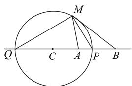
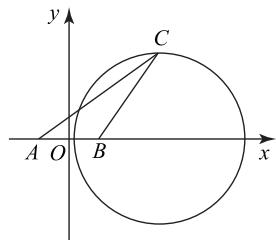
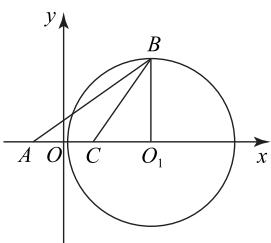
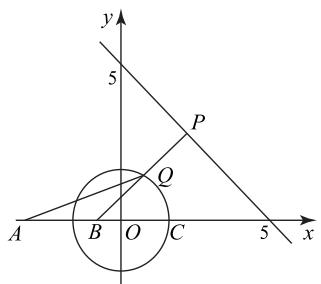
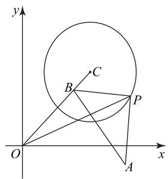
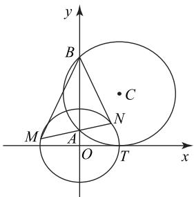

# 阿波罗尼斯圆应用举例

陈晓明

(安徽省宁国中学)

阿波罗尼斯圆(也称为“隐圆”)频繁出现在近几年的解析几何试题中,该类试题聚焦了轨迹方程、最值、定点、面积等解析几何的核心问题,难度属于中高档.鉴于“隐圆”具有隐蔽性,学生难以发现它,遇到它时不知所措,特别是它与其他知识点交会时学生更是一筹莫展,所以此类试题得分率往往很低.其实,阿波罗尼斯圆在教材中出现过(见引例1和引例2).

引例 1 （人教 A 版普通高中教科书数学选择性必修第一册第 89 页第 9 题）已知动点 M 与两个定点 $O(0,0)$ , $A(3,0)$ 的距离的比为 $\frac{1}{2}$ ，求动点 M 的轨迹方程，并说明轨迹的形状.

答案 点 M 的轨迹方程为 $(x+1)^{2} + y^{2} = 4$ ，该轨迹是以 $(-1,0)$ 为圆心、2 为半径的圆.

引例 2 （人教 A 版普通高中教科书数学选择性必修第一册第 97 页例 6）已知圆 O 的直径 AB = 4，动点 M 与点 A 的距离是它与点 B 的距离的 $\sqrt{2}$ 倍。试探究点 M 的轨迹，并判断该轨迹与圆 O 的位置关系。

答案 点 M 的轨迹方程为 $(x-6)^{2}+y^{2}=32$ ，该轨迹是以 $(6,0)$ 为圆心、 $4\sqrt{2}$ 为半径的圆，该圆与圆 O 相交.

结合上述引例给出阿波罗尼斯圆的定义.

阿波罗尼斯圆 如图1所示,平面内到两个定点 $A(-a,0)$ , $B(a,0)(a>0)$ 的距离之比为定值 $\lambda(\lambda>0$ 且 $\lambda\neq1)$ 的动点M的轨迹是以 $C(\frac{a(\lambda^{2}+1)}{\lambda^{2}-1},0)$ 为圆心、 $\frac{2a\lambda}{|\lambda^{2}-1|}$ 为半径的圆,称这个圆为阿波罗尼斯圆(简称阿氏圆),又称阿波罗尼斯轨迹定理.

text_image

M
Q C A P B

图1

下面给出它的一些基本性质.

性质 1 阿氏圆的圆心在两定点所在直线上.

性质 2 当 M, A, B 不共线时, MP, MQ 分别为 $\triangle MAB$ 的内、外角平分线(逆命题也成立).

性质 3 当 M, A, B 共线时(点 M 就是 P 或 Q)，则 $\left|CA\right|\left|CB\right|=R^{2}$ ，其中 R 为阿氏圆的半径(逆命题也成立).

下面对性质 3 进行证明.

证明 当 M, A, B 共线时, Q, A, P, B 构成调和点列, 将 $\frac{|PA|}{|PB|} = \frac{|QA|}{|QB|}$ 改写为

$$
\frac {| C P | - | C A |}{| C B | - | C P |} = \frac {| C P | + | C A |}{| C P | + | C B |},
$$

整理得 $|CA||CB|=|CP|^{2}=R^{2}$ .

接下来通过实例研究阿波罗尼斯圆的应用,探究此类问题的解题规律及求解策略,从而更好备考.

例 1 在 $\triangle ABC$ 中, 若 $|AB|=2, |AC|=$ $\sqrt{2}|BC|$ ，则 $\triangle ABC$ 的面积的最大值是\_\_\_\_.

解析

如图 2 所示, 以线段 AB 的中点为坐标原点 O, 以边 AB 所在直线为 x 轴, 以线段 AB 的中垂线为 y 轴, 建立平面直角坐标系, 则 A(-1,0), B(1,0). 设 $C(x,y)$ , 由 $|AC|=\sqrt{2}|BC|$ , 可得

$$
\sqrt {(x + 1) ^ {2} + y ^ {2}} = \sqrt {2} \cdot \sqrt {(x - 1) ^ {2} + y ^ {2}},
$$

化简并整理得 $(x-3)^{2}+y^{2}=8(y\neq0)$ ，即 $\triangle ABC$ 的顶点C在 $(x-3)^{2}+y^{2}=8$ （除去与直线AB的两个交点）上运动.由图2易知

$$
S _ {\triangle A B C} = \frac {1}{2} \times 2 \times | y _ {c} | = | y _ {c} | \leqslant 2 \sqrt {2},
$$

当 x=3 时， $y=\pm2\sqrt{2}$ ， $S_{\triangle ABC}$ 取得最大值 $2\sqrt{2}$ .

text_image

y
C
A O B x

图2

# 点评

该题的背景为解三角形，从表面上难以看到解析几何的影子。若对阿氏圆的知识不熟悉，更难看到阿氏圆的影子(这可能也是其被称为“隐圆”的原因).本解法充分利用条件“ $|AB|=2,|AC|=\sqrt{2}|BC|$ ”,把A,B两点看成定点,C看成动点,则动点C满足 $\frac{|CA|}{|CB|}=\sqrt{2}$ ,即点C的轨迹是一个圆.这样问题就转化为求圆上的动点C到边AB距离的最大值问题,用解析法处理此题简单明了.这种在没有解析几何相关内容的地方,能看出并运用解析几何的知识解决问题的能力,才是真正领悟了解析法(坐标法)的内涵.

例2 在 $\triangle ABC$ 中， $|AC| = 2, |AB| = \lambda |BC|$ $(\lambda > 1)$ , 当 $\triangle ABC$ 的面积取得最大值时, $B = \frac{\pi}{6}$ , 则 $\lambda =$ \_\_\_\_.

如图 3 所示, 以线段 AC 的中点为坐标原点,
析 以边 AC 所在直线为 x 轴, 以线段 AC 的中垂线为 $y$ 轴，建立平面直角坐标系，则 $A(-1,0), C(1,0)$ .

text_image

y
B
A O C O₁ x

图 3

设 $B(x,y)$ ，由 $\vert AB\vert = \lambda \vert BC\vert (\lambda >1)$ ，可得

$$
(x + 1) ^ {2} + y ^ {2} = \lambda^ {2} [ (x - 1) ^ {2} + y ^ {2} ],
$$

进一步整理为

$$
(x - \frac {\lambda^ {2} + 1}{\lambda^ {2} - 1}) ^ {2} + y ^ {2} = (\frac {2 \lambda}{\lambda^ {2} - 1}) ^ {2} (\lambda > 1),
$$

即点 $B$ 的轨迹为一个圆（除去与直线 $AC$ 的两个交点），且圆心为 $O_{1}(\frac{\lambda^{2} + 1}{\lambda^{2} - 1},0)$ ，半径为 $R = \frac{2\lambda}{\lambda^2 - 1}$ . 在 $\triangle ABC$ 中，令内角 $A$ 所对边为 $a$ ，即 $|BC| = a$ ， $|AB| = \lambda |BC| = \lambda a, |AC| = 2$ ，当 $\triangle ABC$ 的面积取得最大值时， $B = \frac{\pi}{6}$ . 由余弦定理得

$$
4 = a ^ {2} + (\lambda a) ^ {2} - 2 a \cdot \lambda a \cdot \cos \frac {\pi}{6},
$$

解得

$$
a ^ {2} = \frac {4}{\lambda^ {2} - \sqrt {3} \lambda + 1}. \tag {①}
$$

当 $\triangle ABC$ 的面积取得最大值时,点 $B$ 在圆心 $O_{1}$ 的正上方,连接 $BO_{1}$ ,所以 $\angle CO_{1}B=\frac{\pi}{2}$ .在 $\triangle BCO_{1}$ 中,由勾股定理得 $a^{2}=R^{2}+|CO_{1}|^{2}$ .又 $R=\frac{2\lambda}{\lambda^{2}-1},C(1,0)$ , $O_{1}(\frac{\lambda^{2}+1}{\lambda^{2}-1},0)$ ,所以

$$
a ^ {2} = \left(\frac {2 \lambda}{\lambda^ {2} - 1}\right) ^ {2} + \left(\frac {\lambda^ {2} + 1}{\lambda^ {2} - 1} - 1\right) ^ {2}. \tag {②}
$$

联立①和②消去 $a$ 得

$$
\frac {4}{\lambda^ {2} - \sqrt {3} \lambda + 1} = (\frac {2 \lambda}{\lambda^ {2} - 1}) ^ {2} + (\frac {\lambda^ {2} + 1}{\lambda^ {2} - 1} - 1) ^ {2},
$$

结合 $\lambda > 1$ ，解得 $\lambda = \sqrt{3}$ . 当 $\triangle ABC$ 的面积取得最大值时， $B = \frac{\pi}{6}$ ，此时 $\lambda = \sqrt{3}$ .

# 点评

本例其实是例1的逆应用（阿氏圆的逆应用），例1中给出了两定点及定比 $\lambda = \sqrt{2}$ ，求得阿氏圆(进一步得到动点在阿氏圆上的具体位置).而本例是给出两定点及动点在阿氏圆上的位置(最高或最低点),求定比 $\lambda$ .由上述解析过程可知,判断出动点B的轨迹为一个圆是解决问题的关键,然后分别在两个三角形中计算边长a(对边长a“算两次”),进一步通过等量代换得到关于参数m的方程,从而使问题迎刃而解.这种“算两次原理”在解题中经常用到,应引起重视.

例 3 已知点 A(-2,0)，点 P 为直线 $x + y -$ 上的一个动点，点 Q 为圆 $x^{2} + y^{2} = 1$ 上的一个，则 $|PQ| + \frac{1}{2}|AQ|$ 的最小值为（）.

A. $\frac{11\sqrt{2}}{4}$

B. $\frac{11\sqrt{2}}{2}$

C. $\frac{5\sqrt{2}-2}{2}$

D. $\frac{5\sqrt{2}+2}{2}$

如图 4 所示, 令 $\left|BQ\right|=\frac{1}{2}\left|AQ\right|$ , 因为点 Q的轨迹方程为 $x^{2} + y^{2} = 1$ （圆心在 $x$ 轴上），且点 $A(-2,0)$ 在 $x$ 轴上，由性质1可设点 $B(m,0)$ ， $Q(x,y)$ ，所以

$$
\sqrt {(x - m) ^ {2} + y ^ {2}} = \frac {1}{2} \sqrt {(x + 2) ^ {2} + y ^ {2}} (x \in [ - 1, 1 ]).
$$

又 $y^{2} = 1 - x^{2}$ ，代入整理得

$$
(4 + 8 m) x = 4 m ^ {2} - 1 (x \in [ - 1, 1 ]),
$$

即 $(4 + 8m)x = 4m^{2} - 1$ 在 $x\in [-1,1]$ 恒成立，所以

$m = -\frac{1}{2}$ ，故 $B(-\frac{1}{2},0)$ ，则

$$
\mid P Q \mid + \frac {1}{2} \mid A Q \mid = \mid P Q \mid + \mid B Q \mid .
$$

显然当 P, Q, B 三点共线，且 PB 垂直于直线 $x + y - 5 = 0$ 时， $|PQ| + |BQ|$ 取得最小值，即点 $B(-\frac{1}{2}, 0)$ 到直线 $x + y - 5 = 0$ 的距离为 $\frac{|-\frac{1}{2}-5|}{\sqrt{2}} = \frac{11\sqrt{2}}{4}$ ，故选 A.

text_image

y
5
P
Q
A B O C 5 x

图4

相对于前面的例题,此处的阿氏圆更为隐蔽,甚至要通过构造才能得到完整的阿氏圆(找到另一个定点).如果把阿氏圆看成4个元素:两个定点、定比 $\lambda$ 、圆,那么该题同样为例1的变式(即知道一个定点、定比 $\lambda$ 、圆,求另一个定点).另外,作为选择题,我们也可以更为快速地解决问题:因为 $|BQ|=\frac{1}{2}|AQ|$ 对点Q在圆上任意位置都成立,故当点Q在C(1,0)时,由 $|BC|=\frac{1}{2}|AC|$ 快速得到另一个定点 $B(-\frac{1}{2},0)$ (点B为AC的中点,由中点的坐标公式得 $x_{B}=\frac{x_{A}+x_{C}}{2}=\frac{-2+1}{2}=-\frac{1}{2}$ ).

例4 已知点 $P$ 是圆 $(x - 4)^2 +(y - 4)^2 = 8$ 上的动点, $A(6,-1)$ ,O为坐标原点,则 $|PO|+2|PA|$ 的最小值为\_\_\_\_.

如图 5 所示, 令 $B(m, n)$ , 使得 $\left|PB\right| =$ $\frac{1}{2} |PO|$ . 设 $P(x, y)$ , 则

$$
\sqrt {(x - m) ^ {2} + (y - n) ^ {2}} = \frac {1}{2} \sqrt {x ^ {2} + y ^ {2}},
$$

故

$$
x ^ {2} + y ^ {2} - \frac {8 m}{3} x - \frac {8 n}{3} y + \frac {4 m ^ {2} + 4 n ^ {2}}{3} = 0.
$$

由题意得该圆与已知圆 $(x-4)^{2}+(y-4)^{2}=8$ ，即

$x^{2}+y^{2}-8x-8y+24=0$ 是同一个圆，比较系数可得

$$
\left\{ \begin{array}{l} - \frac {8 m}{3} = - 8, \\ - \frac {8 n}{3} = - 8, \\ \frac {4 m ^ {2} + 4 n ^ {2}}{3} = 2 4, \end{array} \right.
$$

解得 m=n=3，即 $B(3,3)$ ，故

$$
\mid P O \mid + 2 \mid P A \mid = 2 (\frac {1}{2} \mid P O \mid + \mid P A \mid) =
$$

$$
2 (| P B | + | P A |) \geqslant 2 | A B | =
$$

$$
2 \sqrt {(6 - 3) ^ {2} + (- 1 - 3) ^ {2}} = 1 0,
$$

当点 P 在线段 AB 上时, 等号成立, 即 $\left|PO\right| + 2\left|PA\right|$ 的最小值为 10.

text_image

y
C
B
P
O
A
x

图5

# 点评

利用性质 1, 可设点 $B(m, m)$ , 这样计算变得评 简单. 本题与例 3 一样, 都是知道一个定点、定比 $\lambda$ 、圆, 求另一个定点, 例 3 的解析将问题转化为恒成立问题, 从而求得参数的值; 而本题的解析中运用同一法解决问题, 两者在本质上是一致的. 另外, 这里还出现了一件十分奇怪的事: 更多的同学 (也更自然的想法) 是设 $|PB| = 2|PA|$ , 结果行不通. 为什么呢? 我们来看看到底是什么原因. 令 $B(m, n)$ , 因为 $A(6, -1), |PB| = 2|PA|$ , 设 $P(x, y)$ , 所以

$$
(x - m) ^ {2} + (y - n) ^ {2} = 4 \left[ (x - 6) ^ {2} + (y + 1) ^ {2} \right],
$$

从而可得

$$
x ^ {2} + y ^ {2} + \frac {2 m - 4 8}{3} x + \frac {2 n + 8}{3} y + \frac {1 4 8 - m ^ {2} - n ^ {2}}{3} = 0.
$$

由题意得该圆与已知圆 $(x-4)^{2}+(y-4)^{2}=8$ ，即 $x^{2}+y^{2}-8x-8y+24=0$ 是同一个圆，比较系数可得

$$
\left\{ \begin{array}{l} \frac {2 m - 4 8}{3} = - 8, \\ \frac {2 n + 8}{3} = - 8, \\ \frac {1 4 8 - m ^ {2} - n ^ {2}}{3} = 2 4, \end{array} \right.
$$

进一步化简得 $\left\{\begin{aligned}m=12,\\ n=-16,\quad 显然方程组无解.\\ m^{2}+n^{2}=76,\end{aligned}\right.$ 问题到

底出在哪儿呢？问题应该出在阿氏圆的4个元素（两个定点、定比 $\lambda$ 、圆）之间的限制作用，也就是说，这里给出了一个定点、定比 $\lambda$ ，则对应的阿氏圆方程不可能是 $(x - 4)^2 +(y - 4)^2 = 8$ ，反过来也可以说给出定比 $\lambda$ ，阿氏圆方程 $(x - 4)^2 +(y - 4)^2 = 8$ ，则对应的定点不可能为 $A(6, - 1)$ .其实，若 $|PB| = 2|PA|$ ，则由阿氏圆的性质可知点 $A$ 在阿氏圆内，矛盾.如图5所示.学生在考试时，这两种构造方式都可能会想到，运用阿氏圆的性质可快速排除掉第二种构造，避免走弯路

例 5 如图 6 所示, 圆 C 与 x 轴相切于点 T(1,0)，与 $y$ 轴正半轴交于两点 $A, B$ （点 $B$ 在点 $A$ 的上方），且 $|AB| = 2$ .

(1)圆 C 的标准方程为 \_\_\_\_.

(2) 过点 A 任作一条直线与圆 $O: x^{2} + y^{2} = 1$ 相交于 M, N 两点, 下列三个结论:

① $\frac{|NA|}{|NB|}=\frac{|MA|}{|MB|}$ ;

② $\frac{|NB|}{|NA|}-\frac{|MA|}{|MB|}=2;$

③ $\frac{|NB|}{|NA|} +\frac{|MA|}{|MB|} = 2\sqrt{2}.$

其中正确的结论是\_\_\_\_（写出所有正确结论的序号）.

text_image

y
B
C
M
A
N
O
T
x

图6

(1)依题意可设圆心 $C(1,R)$ (R为圆C的半径)，利用垂径定理构造直角三角形，得

$$
R ^ {2} = \left(\frac {| A B |}{2}\right) ^ {2} + 1 ^ {2} = 2,
$$

解得 $R=\sqrt{2}$ ，故圆心 $C(1,\sqrt{2})$ ，所以圆 C 的标准方程为 $(x-1)^{2}+(y-\sqrt{2})^{2}=2$ .

(2) 在圆 $C: (x - 1)^2 + (y - \sqrt{2})^2 = 2$ 中，令 $x = 0$ ，得 $A(0, \sqrt{2} - 1), B(0, \sqrt{2} + 1)$ ，所以 $|OA||OB| =$

$(\sqrt{2} - 1)(\sqrt{2} + 1) = 1 = r^2 (r$ 为圆 $O$ 的半径).

由阿氏圆性质 3 的逆命题也成立可知圆 O 为定点 A, B 对应的阿氏圆, 所以

$$
\frac {| N A |}{| N B |} = \frac {| M A |}{| M B |} = \frac {| D A |}{| D B |} = \frac {1 - (\sqrt {2} - 1)}{\sqrt {2} + 1 - 1} = \sqrt {2} - 1,
$$

其中点 $D$ 为 $(0,1)$ ，故

$$
\frac {| N B |}{| N A |} - \frac {| M A |}{| M B |} = \frac {1}{\sqrt {2} - 1} - (\sqrt {2} - 1) = 2,
$$

$$
\frac {| N B |}{| N A |} + \frac {| M A |}{| M B |} = \frac {1}{\sqrt {2} - 1} + (\sqrt {2} - 1) = 2 \sqrt {2}.
$$

因此,正确的结论是①②③.

点评

本题言简意赅，朴实无奇，但内涵丰富。试题解法灵活，从不同的角度切入，可以运用不同的数学知识与方法求解(限于篇幅,这里没有提供其他解法,读者可自行探究),这样给学生提供充分展示自己解题能力的空间.而运用阿氏圆法较为简单,但是需要学生熟悉阿氏圆及其性质,特别是这里的两定点A,B的坐标不是直接给出,而是通过圆C与坐标轴交点的形式给出,而且需要通过 $|OA||OB|=(\sqrt{2}-1)(\sqrt{2}+1)=1=r^{2}$ 来判断圆O为阿氏圆,确实不太容易想到.由此可见命题人设置圆C的良苦用心.因此运用这种方法解决问题,需要在平时的学习中对阿氏圆及其性质加强研究,培养利用阿氏圆及其性质解题的意识.

由上述实例可见,有关阿氏圆的试题千变万化,而且有时阿氏圆还“藏得很深”,但根在教材,许多高考试题都源于教材的例题、习题,在教材中都能找到“影子”,体现了“源于教材而高于教材”的特点.因此,我们应重视对教材的研究.教材是众多专家集体智慧的结晶,经过长期使用、修改而不断完善,日臻成熟.只有认真研究教材,切实把握教材内容的内涵和外延,形成对所教内容的深刻感悟,才能在实践中充分利用教材所蕴藏的丰富资源,真正做到“用教材教”,最终达到提高学生综合能力的效果.学生应加强学习,把问题研究透,不仅要明白问题是“什么样”,还要清楚为什么“那样”,甚至还要了解问题的许多“花样”.

(完)