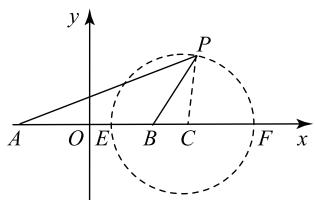
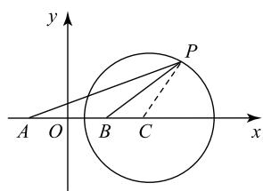
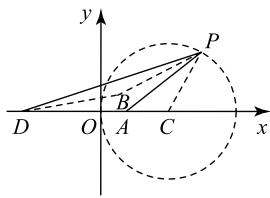
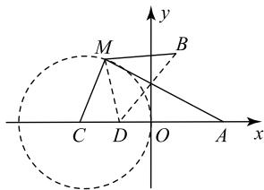
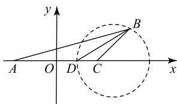
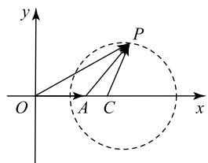
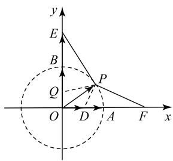

# 阿波罗尼斯圆模型的应用

王伯龙

(宁夏彭阳县第三中学)

在各级各类考试中,所涉及的一些求动点的轨迹问题、形如 $\lambda PA + PB (PA + \lambda PB) (\lambda > 0, \lambda \neq 1)$ 的最值问题、一些向量模长的最值或夹角范围问题、解三角形中的最值问题等,如果其背景是阿波罗尼斯圆(简称阿氏圆)模型,那么就可以运用转化的思想,通过模型来快速解答问题.

# 1 阿氏圆的性质

平面内与两定点 A, B 距离的比为常数 $k (k > 0, k \neq 1)$ 的点的轨迹是圆，人们将这个圆称为阿氏圆。人教 A 版普通高中教科书（数学）选择性必修第一册第 89 页拓广探索第 9 题就有阿氏圆的影子，阿氏圆到底是怎样的一个圆呢？

设 AB = 2a，动点 $P(x, y)$ ，建立平面直角坐标系，如图 1 所示，则 $A(-a, 0)$ ， $B(a, 0)$ 。由

$$
\frac {| P A |}{| P B |} = k (k > 0, k \neq
$$

1), 可得

text_image

y
P
A O E B C F x

图1

$$
\frac {\sqrt {(x + a) ^ {2} + y ^ {2}}}{\sqrt {(x - a) ^ {2} + y ^ {2}}} = k,
$$

化简得 $[x + \frac{a(1 + k^2)}{1 - k^2}]^2 +y^2 = \frac{4a^2k^2}{(1 - k^2)^2}$ . 它是以 $(\frac{a(1 + k^2)}{k^2 - 1},0)$ 为圆心，半径为 $r = \frac{2ak}{|1 - k^2|}$ 的圆.

在上面方程中，令 $y = 0$ ，解得 $x = \frac{a(k - 1)}{k + 1}$ 或 $\frac{a(k + 1)}{k - 1}.$ 因此， $E(\frac{a(k - 1)}{k + 1},0),F(\frac{a(k + 1)}{k - 1},0)$ ，而

$$
\left| A E \right| = \left| \frac {a (k - 1)}{k + 1} + a \right| = \frac {2 a k}{\left| k + 1 \right|},
$$

$$
\mid B E \mid = \mid a - \frac {a (k - 1)}{k + 1} \mid = \frac {2 a}{\mid k + 1 \mid},
$$

所以 $\frac{|AE|}{|BE|}=k$ ，同理有 $\frac{|AF|}{|BF|=k}$ .

设阿氏圆的圆心为 C，在图 1 中连接 PC，则

$$
\mid P C \mid = \frac {2 a k}{\left| 1 - k ^ {2} \right|},
$$

$$
\mid C B \mid = \left| \frac {a (1 + k ^ {2})}{k ^ {2} - 1} - a \right| = \frac {2 a}{\left| k ^ {2} - 1 \right|},
$$

$$
\mid C A \mid = \left| \frac {a (1 + k ^ {2})}{k ^ {2} - 1} + a \right| = \frac {2 a k ^ {2}}{\left| k ^ {2} - 1 \right|},
$$

于是 $\frac{|PC|}{|CB|}=\frac{|CA|}{|CP|}=k$ ，所以 $\triangle PCB\sim\triangle ACP$ ，于是有性质1.

性质 1 如图 1 所示, 阿氏圆 C 与坐标轴的两个交点 E, F 恰好分别是 $\angle APB$ 的平分线和 $\angle APB$ 的外角平分线与坐标轴的交点, 且 $\triangle PCB \sim \triangle ACP$ .

是不是任何一个圆都是阿氏圆？如果是，它满足怎样条件？

如图 2 所示, 设圆 C: $(x - a)^{2} + y^{2} = r^{2} (r > 0)$ , 点 B(t, 0), 点 P 为圆 C 上的动点, 则 $|PC| = r$ , $|CB| = |a - t|$ , 所以 $\frac{|PC|}{|CB|} = \frac{r}{|a - t|}$ , 要使

text_image

y
P
A O B C x

图2

$\triangle PCB \sim \triangle ACP$ ，只需满足 $\frac{|CA|}{|CP|} = \frac{r}{|a - t|}$ ，于是 $|CA| = \frac{r|CP|}{|a - t|} = \frac{r^2}{|a - t|}$ . 设 $A(x,0)$ ，有 $|a - x| = \frac{r^2}{|a - t|}$ ，由图示位置，得 $a - x = \frac{r^2}{a - t}$ ，即 $x = \frac{a^2 - at - r^2}{a - t}$ ，于是可得性质 2.

性质 2 圆 $C:(x-a)^{2}+y^{2}=r^{2}(r>0)$ 表示平面上动点 P 到两定点 $A\left(\frac{a^{2}-at-r^{2}}{a-t},0\right)$ ， $B(t,0)$ 的距离之比为常数 $k=\frac{r}{|a-t|}(k>0,k\neq1)$ 的阿氏圆.

# 2 阿氏圆模型的应用

# 2.1 形如 $\lambda PA \pm PB$ (或 $PA \pm \lambda PB$ ) 的最值

例1 已知点 $M(2, 2\sqrt{3})$ 和点 $N(6, -2\sqrt{3})$ ，且圆 C 为以 $\left|MN\right|$ 为直径的圆，点 P 为 C 上的动点，若点 A(2,0)，点 B(1,1)，则 $2\left|PA\right|-\left|PB\right|$ 的最大值为（）.

A. $\sqrt{26}$

B. $4 + \sqrt{2}$

C. $8 + 5\sqrt{2}$

D. $\sqrt{2}$

分析 由于点 $A(2,0)$ 在坐标轴上，求 $2|PA| - |PB|$ 最值的关键是利用阿氏圆的性质，在 $x$ 轴上找一个点 $D$ ，将 $2|PA|$ 转化为 $|PD|$ ，即 $|PD| = 2|PA|$ ，然后求最值.

解 根据题设条件可得 $C(4,0), |MN| = \sqrt{(2 - 6)^2 + (2\sqrt{3} + 2\sqrt{3})^2} = 8$ ，即半径 $r = 4$ ，所以圆$C:(x-4)^{2}+y^{2}=16.$ 如图3所示,由性质 2, 设 $D(-4,0)$ , 则 $\left|CA\right|=2,\left|PC\right|=4$ ,$|CD|=8$ , 故 $\frac{|CA|}{|PC|}=\frac{|PC|}{|CD|}=$ $\frac{1}{2}$ , 且 $\angle PCA$ 为公共角, 所以

text_image

y
P
B
D O A C x

图3

$\triangle PCA \sim \triangle DCP$ ，因而 $\frac{|PA|}{|PD|} = \frac{1}{2}$ ，即 $|PD| = 2|PA|$ ，所以 $2|PA| - |PB| = |PD| - |PB| \leqslant |DB|$ ，只有 $P, B, D$ 共线时， $2|PA| - |PB|$ 才有最大值，其最大值为 $|DB| = \sqrt{(-4 - 1)^2 + (1 - 0)^2} = \sqrt{26}$ ，故选 A.解答本题的关键是利用性质 2, 在 x 轴上找一个点 D, 将 $2 \mid PA \mid$ 转化为 $\left| PD \right|$ , 使得$2|PA|-|PB|=|PD|-|PB|$ ，再利用三点共线求得最大值.

例 2 在平面直角坐标系中, $A(4,0)$ , $B(1,4)$ ,点 M 在圆 $C: (x+4)^{2} + y^{2} = 16$ 上运动，则 $|MA| + 2|MB|$ 的最小值为 \_\_\_\_.

分析 点 A 在坐标轴上, 而点 B 不在坐标轴上, 根据阿氏圆的性质, 首先将 $\left|MA\right| + 2\left|MB\right|$ 变形为 $2\left(\frac{1}{2}\left|MA\right| + \left|MB\right|\right)$ , 其次在 x 轴上找一点 D, 使得 $\left|MD\right| = \frac{1}{2}\left|MA\right|$ , 然后利用阿氏圆的性质求解.

解 如图 4 所示，点 C（-4，0），点 A(4,0)， $|MC|=4$ ， $|CA|=8$ 。由性质可知，设 D(-2，0)，则 $|CD|=2$ ，于是 $\triangle DCM\sim\triangle MCA$ ，故 $\frac{|MD|}{|MA|}=\frac{|CD|}{|CM|}=\frac{1}{2}$ ，即 $|MD|=\frac{1}{2}|MA|$ ，于是

$$
\mid M A \mid + 2 \mid M B \mid = 2 \left(\frac {1}{2} \mid M A \mid + \mid M B \mid\right) =
$$

$$
2 (| M D | + | M B |) \geqslant 2 | D B |.
$$

text_image

y
M
B
C D O A x

图4

只有当 B, M, D 三点共线时， $|MA| + 2|MB|$ 有最小值，最小值为 $2|DB| = 2\sqrt{(-2-1)^{2} + (0-4)^{2}} = 10$ .

点评 将 $|MA| + 2|MB|$ 变形为 $2(\frac{1}{2}|MA| +$ $|MB|$ ), 再用性质 2 将 $\frac{1}{2}|MA|$ 转化为 $|MD|$ , 然后利用三点共线求解.

# 2.2 解三角形中的最值

例3 在 $\triangle ABC$ 中， $BD$ 为 $\angle ABC$ 的平分线，点D 在 AC 上, 且 AD = 3, DC = 1, 则 $\triangle ABC$ 面积的最大值为 \_\_\_\_.

分析 由角平分线的性质可知 $\frac{|BA|}{|BC|}=3$ ，将A，C看作两个定点，B为动点，则B的轨迹恰好是阿氏圆模型，进而利用阿氏圆模型的性质求解.

解 以 AC 为 x 轴，AC 的中点为原点建立平面直角坐标系，如图 5 所示，由题意可知 A(-2,0), C(2,0). 设 B(x, y)，由角平分线的性质可知 $\frac{|BA|}{|BC|} = \frac{|AD|}{|DC|} = 3$ ，易得

text_image

y
A O D C B
x

图5

点 B 的轨迹方程为 $(x-\frac{5}{2})^{2}+y^{2}=\frac{9}{4}$ . 显然当点 B 为上半圆弧的中点, 即 $\triangle ABC$ 的高为半径 $r=\frac{3}{2}$ 时, $\triangle ABC$ 面积最大, 最大面积为 $\frac{1}{2}\times4\times\frac{3}{2}=3$ .

点评 利用三角形角平分线的性质构造了动点 B 到两定点距离比为 3 的条件，结合阿氏圆的性质即可求解本题.

例4 在 $\triangle ABC$ 中， $AB = 2AC$ ，且 $\triangle ABC$ 的面积为 1, 则 BC 的最小值为( ).

A. 2

B. $\sqrt{3}$

C. 1

D. $\sqrt{2}$

分析 由 AB=2AC 可知, 点 A 的轨迹是阿氏圆, 由于 $\triangle ABC$ 的面积是定值, 只要高最大, 则 BC 有最小值, 于是利用阿氏圆模型的性质便可求解.

解 由 AB=2AC，得 k=2，由阿氏圆模型知点 A 的轨迹是阿氏圆。设 $\left|BC\right|=2a$ ，则阿氏圆的半径 $r=\frac{2ak}{\left|1-k^{2}\right|}=\frac{4a}{3}$ ，因而当 $\triangle ABC$ 的高为 $\frac{4a}{3}$ 时，BC 有最小值。由题设知 $1=\frac{1}{2}\left|BC\right|\cdot\frac{4a}{3}$ ，则 $\frac{1}{2}\cdot2a\cdot\frac{4a}{3}=1$ ，解得 $2a=\sqrt{3}$ ，所以 BC 的最小值为 $\sqrt{3}$ ，故选 B.

题设条件 AB=2AC 符合阿氏圆的条件, 因此求出阿氏圆,结合图形通过数形结合的思想方法即可求出底边的最小值.

# 2.3 向量问题中的范围或最值

例5 已知向量 $a, b$ 满足 $|a| = 1, |b| =$ $|2b-a|$ ，则 $|b|$ 的最大值为\_\_\_\_，a与b夹角的取值范围是\_\_\_\_。

分析 观察题设条件发现 $(2b - a) + a = 2b$ ，因而可构造三角形转化为阿氏圆模型求解.

解 如图 6 所示, 设 $\overrightarrow{OA} = a, \overrightarrow{AP} = 2b - a$ , 则 $\overrightarrow{OP} = 2b$ . 由 $|a| = 1$ , 得 A(1, 0). 由 $|b| = |2b - a|$ , 可得 $|\overrightarrow{AP}| = |b|$ , 且 $|\overrightarrow{OP}| = |2b| = 2|b|$ , 所以 $\frac{|\overrightarrow{PO}|}{|\overrightarrow{PA}|} =$

text_image

y
P
O A C x

图6

2, 易得点 $P$ 的轨迹方程为 $C: (x - \frac{4}{3})^2 + y^2 = \frac{4}{9}$ . 由于 $|\overrightarrow{OP}| - |\overrightarrow{AP}| \leqslant |\overrightarrow{OA}|$ , 即 $2|b| - |b| \leqslant 1$ , 则 $|b| \leqslant 1$ , 当 $O, A, P$ 共线时, $|b|$ 的最大值为 1. 此时 $a$ 与 $b$ 夹角的最小值为 0. 当 $OP$ 为圆 $C$ 的切线, 且 $P$ 为切点时, $a$ 与 $b$ 夹角最大, 易得最大值为 $\frac{\pi}{6}$ , 故 $a$ 与 $b$ 夹角的取值范围是 $[0, \frac{\pi}{6}]$ .

根据已知式子的结构特征,将向量模长构造成三角形转化为阿氏圆模型,再利用数形结合的思想求解.

例6 已知单位向量 $a, b, c$ 满足 $a \cdot b = 0$ ，则$|2c-a|+|\frac{1}{2}c-b|$ 的最小值为\_\_\_\_.

分析 将 $\left|2c-a\right|+\left|\frac{1}{2}c-b\right|$ 变形为 $2\left|c-\frac{1}{2}a\right|+\frac{1}{2}\left|c-2b\right|$ ，再利用阿氏圆模型解决问题.

解 由题设条件, 设 $\overrightarrow{OA} = a = (1, 0)$ , $\overrightarrow{OB} = b = (0, 1)$ , $c = \overrightarrow{OP}$ , 则点 P 在单位圆上, 如图 7 所示. 令 $\overrightarrow{OD} = \frac{1}{2}a = (\frac{1}{2}, 0)$ , $\overrightarrow{OE} = 2b = (0, 2)$ , 即 $|\overrightarrow{OD}| = \frac{1}{2}$ , $|\overrightarrow{OE}| = 2$ . 于是 $|2c - a| + |\frac{1}{2}c - b| = 2|c - \frac{1}{2}a| + \frac{1}{2}|c - 2b| = 2|PD| + \frac{1}{2}|PE|$ .

text_image

y
E
B
P
Q
O
D
A
F
x

图7

设 $F(2,0)$ ，则 $|OF| = 2$ ，由性质1和性质2可得 $\triangle ODP \sim \triangle OPF$ ，所以 $\frac{|PD|}{|PF|} = \frac{|OD|}{|OP|} = \frac{1}{2}$ ，即 $|PF| = 2|PD|$ .

设 $Q(0, \frac{1}{2})$ ，则 $|OQ| = \frac{1}{2}$ ，于是 $\triangle OQP \sim \triangle OPE$ ，所以 $\frac{|PQ|}{|PE|} = \frac{|OQ|}{|OP|} = \frac{1}{2}$ ，即 $|PQ| = \frac{1}{2}|PE|$ ，所以 $2|PD| + \frac{1}{2}|PE| = |PF| + |PQ|$ . 因此，当 $Q, P, F$ 共线时， $|PF| + |PQ|$ 有最小值，最小值为 $|QF| = \sqrt{(2 - 0)^2 + (0 - \frac{1}{2})^2} = \frac{\sqrt{17}}{2}$ ，故 $|2c - a| + |\frac{1}{2}c - b|$ 的最小值为 $\frac{\sqrt{17}}{2}$ .

# 点评

本题是将向量模长最值问题转化为折线最值问题.解题的关键是两次应用阿氏圆模型的性质, 将 $2 \mid PD \mid$ 转化为 $\left| PF \right|$ , 将 $\frac{1}{2} \mid PE \mid$ 转化为 $\left| PQ \right|$ , 然后利用三点共线求得最小值, 体现了化归与转化的数学思想.

(完)