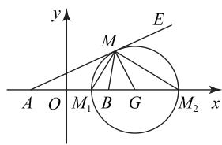
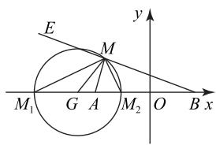
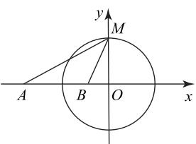
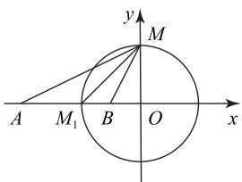

# 阿波罗尼斯圆的性质及其在解三角形中的应用

涂道新 $^{1}$ 徐春艳 $^{2}$

(1.四川省成都市郫都区第四中学 2.四川省成都市郫都区第一中学)

阿波罗尼斯圆(以下简称阿氏圆)是基于一个动点与两定点的距离之比为定值的视角,对圆本质特征的刻画.阿氏圆及其性质在解三角形中有着广泛的应用.下面对其进行拓广探究与迁移应用,以期实现模块知识融合,优化知识结构,提高解决问题能力.

# 1 问题背景

引例 1 （人教 A 版普通高中教科书数学选择性必修第一册 89 页第 9 题）已知动点 M 与两个定点 $O(0,0)$ , $A(3,0)$ 的距离的比为 $\frac{1}{2}$ ，求动点 M 的轨迹方程，并说明轨迹的形状.

引例 2 （人教 A 版普通高中教科书数学选择性必修第一册 97 页例 6）已知圆 O 的直径为 AB = 4，动点 M 与点 A 的距离是它与点 B 的距离的 $\sqrt{2}$ 倍，试探究点 M 的轨迹，并判断该轨迹与圆 O 的位置关系.

对于引例1，点 $M$ 的轨迹方程为 $(x + 1)^2 + y^2 = 4$ ，对于引例2，点 $M$ 的轨迹方程为 $(x - 6)^2 + y^2 = 32$ ，该轨迹与圆 $O$ 相交.两个引例都是关于“平面内一个动点与两个定点的距离之比为定值的动点轨迹”问题，与椭圆(或双曲线)的定义(平面内一个动点与两个定点的距离之和(或差)为定值的动点轨迹)形成一个有机的结构体.题目还凸显解析几何“方法论”（几何问题代数表达)的特征，旨在培养学生用数形结合思想思考和解决问题的思维习惯.接下来，笔者对阿氏圆进行拓广探究并应用其解三角形.

# 2 拓广探究

探究 1 （轨迹探究）平面内，已知点 M 与两个定点 A, B 的距离之比为 $\lambda (\lambda > 0)$ ，求点 M 的轨迹.

以线段 AB 的中点为原点, AB 所在的直线为 $x$ 轴， $AB$ 的垂直平分线为 $y$ 轴，建立平面直角坐标系.不妨设 $|AB|=2a$ , $M(x,y)$ , 则 $A(-a,$ 0), $B(a,0)$ . 由已知 $\frac{|MA|}{|MB|} = \lambda$ , 得 $\frac{\sqrt{(x + a)^2 + y^2}}{\sqrt{(x - a)^2 + y^2}} = \lambda$ ,

整理得

$$
(\lambda^ {2} - 1) x ^ {2} + (\lambda^ {2} - 1) y ^ {2} -
$$

$$
2 a \left(\lambda^ {2} + 1\right) x + a ^ {2} \left(\lambda^ {2} - 1\right) = 0.
$$

当 $\lambda=1$ 时, 动点 M 的轨迹方程为 x=0, 其轨迹是线段 AB 的垂直平分线.

当 $\lambda > 0$ 且 $\lambda \neq 1$ 时，动点 $M$ 的轨迹方程为 $(x - \frac{\lambda^2 + 1}{\lambda^2 - 1} a)^2 + y^2 = (\frac{2a\lambda}{\lambda^2 - 1})^2$ ，其轨迹是以 $(\frac{\lambda^2 + 1}{\lambda^2 - 1} a, 0)$ 为圆心、 $|\frac{2a\lambda}{\lambda^2 - 1}|$ 为半径的圆.

探究 2 （性质探究）在平面内，若动点 M 与两个定点 A, B ( $|AB|=2a$ ) 的距离之比 $\frac{|MA|}{|MB|}=\lambda (\lambda>0$ 且 $\lambda\neq1)$ ，则点 M 的轨迹是阿氏圆.

性质 1 对于圆 G 上任意一点 M，恒有 $\frac{|MA|}{|MB|} = \lambda$ (定值). 圆心 $G(\frac{\lambda^{2} + 1}{\lambda^{2} - 1}a, 0)$ ，半径 $R = \left|\frac{2a\lambda}{\lambda^{2} - 1}\right|$ . 当 $\lambda > 1$ 时，如图 1 所示，圆心 G 在线段 AB 的延长线上，点 A 在圆 G 外，点 B 在圆 G 内；当 $0 < \lambda < 1$ 时，如图 2 所示，圆心 G 在线段 BA 的延长线上，点 A 在圆 G 内，点 B 在圆 G 外.

text_image

y
E
M
A O M₁ B G M₂ x

图1

text_image

E
M
y
M₁ G A M₂ O B x

图2

性质 2 圆 G 与两定点 A, B 确定的直线 AB 交于 $M_{1}, M_{2}$ 两点. 当 $\lambda > 1$ 时, 如图 1 所示, $MM_{1}$ 平分 $\angle AMB, MM_{2}$ 平分 $\angle BME (\triangle AMB$ 的外角), 也即线段 AB 的内、外分点 (比值为 $\lambda$ ) 确定的线段 $M_{1}M_{2}$ 为圆 G 的直径, $|AM_{1}| = \frac{\lambda |AB|}{1 + \lambda}, |BM_{1}| = \frac{|AB|}{1 + \lambda}; |AM_{2}| = \frac{\lambda |AB|}{\lambda - 1}, |BM_{2}| = \frac{|AB|}{\lambda - 1}$ . 当 $0 < \lambda < 1$ 时, 如图 2 所示, $MM_{2}$ 平分 $\angle AMB, MM_{1}$ 平分 $\angle AME$ ( $\triangle AMB$ 的外角)，也即线段 AB 的内、外分点（比值为 $\lambda$ ）确定的线段 $M_{1}M_{2}$ 为圆 G 的直径，且

$$
\left| A M _ {1} \right| = \frac {\lambda | A B |}{1 - \lambda}, \left| B M _ {1} \right| = \frac {| A B |}{1 - \lambda};
$$

$$
\left| A M _ {2} \right| = \frac {\lambda | A B |}{1 + \lambda}, \left| B M _ {2} \right| = \frac {| A B |}{1 + \lambda}.
$$

证明 当 $\lambda > 1$ 时, 如图 1 所示, 因为

$$
\frac {| M A |}{| M B |} = \frac {| M _ {1} A |}{| M _ {1} B |} = \frac {| M _ {2} A |}{| M _ {2} B |} = \lambda ,
$$

由三角形的内角平分线性质定理的逆定理知 $MM_{1}$ 平分 $\angle AMB$ 。由三角形的外角平分线性质定理的逆定理知 $MM_{2}$ 平分 $\angle BME$ ，也即线段 $AB$ 的内、外分点（比值为 $\lambda$ ）确定的线段 $M_{1}M_{2}$ 为圆 $G$ 的直径。又 $|AM_{1}| + |BM_{1}| = |AB|$ ，所以 $|AM_{1}| = \frac{\lambda|AB|}{1 + \lambda}$ ， $|BM_{1}| = \frac{|AB|}{1 + \lambda}$ 。由 $|AM_{2}| - |BM_{2}| = |AB|$ ，得

$$
\left| A M _ {2} \right| = \frac {\lambda | A B |}{\lambda - 1}, \left| B M _ {2} \right| = \frac {| A B |}{\lambda - 1}.
$$

同理, 可证 $0 < \lambda < 1$ 时的结论.

性质3 $\frac{|AG|}{|MG|} = \frac{|AG|}{R} = \lambda, \frac{|BG|}{|MG|} = \frac{|BG|}{R} = \frac{1}{\lambda},$ $|AG||BG| = R^2.$

证明 当 $\lambda > 1$ 时, 如图 1 所示, 由性质 2 知 $MM_{1}$ 平分 $\angle AMB$ , 即 $\angle M_{1}MB = \angle M_{1}MA$ , 又 $GM = GM_{1}$ , 所以 $\angle GMM_{1} = \angle GM_{1}M$ , 而

$$
\angle G M M _ {1} = \angle G M B + \angle M _ {1} M B,
$$

$$
\angle G M _ {1} M = \angle M _ {1} M A + \angle M _ {1} A M,
$$

故 $\angle GMB = \angle GAM$ ，即 $\triangle GAM\sim \triangle GMB$ ，则 $\frac{GA}{GM} =$ $\frac{GM}{GB} = \frac{AM}{MB} = \lambda .$ 又 $|MG| = R$ ，所以 $\frac{|AG|}{|MG|} = \frac{|AG|}{R} = \lambda ,$ $\frac{|BG|}{|MG|} = \frac{|BG|}{R} = \frac{1}{\lambda},|AG||BG| = R^2.$

同理, 可证 $0 < \lambda < 1$ 时的结论.

# 3 应用阿氏圆解三角形

例 1 （1）在 $\triangle MAB$ 中，若 AB=2, MA=2MB,求 $\triangle MAB$ 面积的取值范围；

(2) 在 $\triangle MAB$ 中, 若 MA = 2MB, $\triangle MAB$ 的面积为 $\frac{4}{3}$ , 求边 AB 的最小值.

(1) 方法 1 以线段 AB 的中点为原点, AB所在的直线为 x 轴, 线段 AB 的垂直平分线

为 $y$ 轴，建立平面直角坐标系，则 $M$ 的轨迹是阿氏圆（不含直线 $AB$ 与圆的交点），圆心在直线 $AB$ 上.设该圆的半径为 $R$ ， $\triangle MAB$ 边 $AB$ 上的高为 $h$ .由 $MA = 2MB$ ，得 $\lambda = 2$ ，由性质1得 $R = \frac{\lambda|AB|}{|\lambda^2 - 1|} = \frac{4}{3}$ ，则 $0 < h\leqslant \frac{4}{3}$ 又 $AB = 2$ ，所以 $S_{\triangle MAB} = \frac{1}{2} AB\cdot h = h$ ，则 $0 < S_{\triangle MAB}\leqslant \frac{4}{3}$ ，故 $\triangle MAB$ 面积的取值范围为 $(0,\frac{4}{3} ]$

方法 2 设 MB = x，则 MA = 2x，由三角形三边的关系得 $\left\{\begin{aligned}x + 2x & > 2,\\ x + 2 & > 2x,\end{aligned}\right.$ 解得 $\frac{2}{3} < x < 2$ . 由余弦定理得

$$
\cos \angle A M B = \frac {5 x ^ {2} - 4}{4 x ^ {2}},
$$

$$
S _ {\triangle M A B} = \frac {1}{2} M A \cdot M B \sin \angle A M B =
$$

$$
x ^ {2} \sqrt {1 - \left(\frac {5 x ^ {2} - 4}{4 x ^ {2}}\right) ^ {2}} = \frac {\sqrt {- 9 x ^ {4} + 4 0 x ^ {2} - 1 6}}{4},
$$

则 $0 < S_{\triangle MAB} \leqslant \frac{4}{3}, \triangle MAB$ 面积的取值范围为 $(0, \frac{4}{3}]$ .

(2)以线段 $AB$ 的中点为原点， $AB$ 所在的直线为 $x$ 轴，线段 $AB$ 的垂直平分线为 $y$ 轴，建立平面直角坐标系。由题意可知点 $M$ 的轨迹是阿氏圆（不含直线 $AB$ 与圆的交点），圆心在直线 $AB$ 上。设半径为 $R$ ， $AB = m$ ， $\triangle MAB$ 的 $AB$ 边上的高为 $h$ 。由 $MA = 2MB$ ，得 $\lambda = 2$ ，由性质1得 $R = \frac{\lambda m}{|\lambda^2 - 1|} = \frac{2m}{3}$ 。由 $S_{\triangle MAB} = \frac{1}{2} mh = \frac{4}{3}$ ，得 $h = \frac{8}{3m}$ 。原命题等价于直线 $y = \frac{8}{3m}$ 与圆有公共点，则 $h \leqslant R$ ，即 $\frac{8}{3m} \leqslant \frac{2m}{3}$ ，解得 $m \geqslant 2$ ，故 $AB$ 的最小值为2。

# 点评

对于第(1)问,已知一边及其余两边之比,求解三角形的面积,利用阿氏圆的性质可以简化运算.对于第(2)问,巧用阿氏圆的性质进行数学抽象,将三角形的边长问题等价转化为直线与圆有公共点问题.

例 2 在等腰 $\triangle MAB$ 中, MA = MB, C 为边 MB上的点，且 $BC = 2CM, AC = 8$ ，求 $\triangle MAB$ 的面积的取值范围.

# 析

方法 1 以线段 AC 的中点为原点, AC 所在直线为 x 轴, 线段 AC 的垂直平分线为 y轴,建立平面直角坐标系.已知 MA = MB, BC =

2CM, 则 $MA = 3MC$ , 故 $M$ 的轨迹是阿氏圆, 设其圆心为 $D$ , 半径为 $R$ , $\triangle MAC$ 边 $AC$ 上的高为 $h$ . 由 $MA = 3MC$ , 得 $\lambda = 3$ , 则由性质 1 得 $R = \frac{\lambda |AC|}{|\lambda^2 - 1|} = 3$ . 又圆心 $D$ 在直线 $AC$ 上, 故当 $h = R$ 时, $\triangle MAC$ 面积取得最大值. 又 $AC = 8$ , 所以

$$
S _ {\triangle M A B} = 3 S _ {\triangle M A C} \leqslant 3 \times \frac {1}{2} | A C | \times R = 3 6.
$$

综上， $\triangle MAB$ 的面积的取值范围为(0,36].

方法 2 设 MA = MB = 3m，则由 $\left\{\begin{aligned} m+3m>8, \\ m+8>3m, \end{aligned}\right.$ 解得 2<m<4. 在 $\triangle AMC$ 中，由余弦定理可得 $\cos\angle AMC=\frac{5m^{2}-32}{3m^{2}}$ ，所以

$$
S _ {\triangle M A B} = 3 S _ {\triangle M A C} = 3 \times \frac {1}{2} \times 3 m ^ {2} \sin \angle A M C =
$$

$$
\frac {9 m ^ {2}}{2} \cdot \sqrt {1 - \left(\frac {5 m ^ {2} - 3 2}{3 m ^ {2}}\right) ^ {2}} = 6 \sqrt {- m ^ {4} + 2 0 m ^ {2} - 6 4},
$$

则 $0 < S_{\triangle MAB} \leqslant 36$ ，故 $\triangle MAB$ 的面积的取值范围为 $(0,36]$ .

方法 1 是建构阿氏圆模型, 利用其性质求解.
方法 2 是将三角形面积转化为关于 m 的函数关系,利用函数知识求解.

例 3 在 $\triangle MAB$ 中, AB=2, MA=mMB (m>1), 当 $M=\frac{\pi}{3}$ 时, $\triangle MAB$ 的面积取得最大值, 求此时 m 的值.

方法 1 设 MB = x，则 MA = mx。由余弦定理得 $\cos\angle AMB = \frac{x^{2} + m^{2}x^{2} - 4}{2mx^{2}}$ ，整理得

$$
x ^ {2} = \frac {4}{m ^ {2} + 1 - 2 m \cos \angle A M B},
$$

所以 $\triangle MAB$ 的面积 $S = \frac{1}{2} mx^{2} \sin \angle AMB = \frac{2m \sin \angle AMB}{m^{2} + 1 - 2m \cos \angle AMB}$ ，设 $S = f(M)$ ，则 $f'(\frac{\pi}{3}) = 0$ ，整理得 $m^{2} - 4m + 1 = 0$ ，又 m > 1，则 $m = 2 + \sqrt{3}$ .

方法 2 由阿氏圆的性质可知点 M 与圆心的连线与直线 AB 垂直.以线段 AB 所在直线为 x 轴,过点 M 与直线 AB 垂直的直线为 y 轴,建立平面直角坐标系,如图 3 所示,由性

text_image

y
M
A B O x

图3

质3得 $\tan \angle BMO = \frac{OB}{R} = \frac{1}{m},\tan \angle AMO = \frac{AO}{R} = m$ ，则

$$
\tan \frac {\pi}{3} = \tan (\angle A M O - \angle B M O) = \frac {m - \frac {1}{m}}{2} = \sqrt {3},
$$

解得 $m=2+\sqrt{3}$ (负值舍去).

方法 3 如图 4 所示，
由阿氏圆的性质 2 可知

$$
\angle A M M _ {1} = \angle B M M _ {1} = \frac {\pi}{6},
$$

又 $\angle M_{1}MO = \frac{\pi}{4}$ ，则$\angle ABM = \frac{7\pi}{12}, \angle M_{1}AM = \frac{\pi}{12}$ . 在 $\triangle ABM$ 中，由正弦定理得 $\frac{MA}{MB} = \frac{\sin\angle ABM}{\sin\angle BAM} = 2 + \sqrt{3}$ ，故 $m = 2 + \sqrt{3}$ .

text_image

y
M
A M₁ B O x

图 4

方法 1 是基于函数视角, 把三角形面积转化为关于 $\angle AMB$ 函数, 利用函数的性质求解.方法 2 巧用阿氏圆的性质, 结合最值取得的条件进行等价转化, 进而利用三角函数知识求解. 方法 3 巧用阿氏圆的性质进行转化, 再利用正弦定理求解.

阿氏圆及其性质在求解距离和差问题、与两边比例关系有关的解三角形问题等方面有广泛的应用.通过对阿氏圆性质的探究与应用,可以更好地理解圆的本质属性,培养学生学习探究的兴趣,提升分析和解决问题的能力,发展学生的高阶思维.

本文系四川省成都市教育科研一般课题“‘灵动三元’背景下的高中数学兴趣驱动课堂教学实践与研究”（课题编号：CY2020YB083）、四川省教育发展研究中心一般课题“五育并举视域下校本化育人体系构建实践研究”（课题编号：CJF23028）、四川省教育科研重点课题“县域普通高中多样化发展行动研究”子课题“指向学生灵动品质培养的高中数学结构化教学的区域实践”（课题编号：SCXZZX20241027）研究成果。

(完)

text_image

高
医療化

扫描二维码,观看相关视频