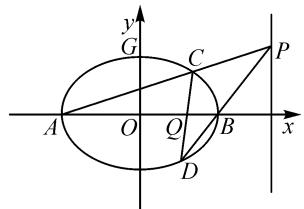

# 非对称性问题的处理策略

# 山东省桓台第一中学 王启华

直线与圆锥曲线的位置关系是解析几何中的重点问题,处理方法常常是联立直线与圆锥曲线的方程,通过消元,得到关于x或y的一个一元二次方程,比如得到 $Ax^{2}+Bx+C=0(A\neq0)$ ,根据根与系数的关系,有 $x_{1}+x_{2}=-\frac{B}{A},x_{1}x_{2}=\frac{C}{A}$ ,把 $x_{1}+x_{2},x_{1}x_{2}$ 看成整体,来处理问题.如果解题中出现了 $x_{1}^{2}+x_{2}^{2},\frac{x_{2}}{x_{1}}+\frac{x_{1}}{x_{2}},|x_{1}-x_{2}|,\frac{1}{x_{1}}+\frac{1}{x_{2}},\cdots$ 之类的代数式,把代数式中的 $x_{1}$ 与 $x_{2}$ 互换后,代数式不变,即具有对称性,此类问题称为对称性问题,可以直接利用韦达定理整体代入,快速解决.但有时会遇到两根不对称的结构,比如 $\frac{x_{2}}{x_{1}},mx_{1}+nx_{2}(m\neq n),\frac{my_{1}y_{2}+2y_{1}}{my_{1}y_{2}-3y_{2}},\cdots$ 之类的问题,这些问题我们称为非对称性问题.下面介绍该类问题的处理策略.

# 1 类型 1: 两根之比型

例 1 已知椭圆 C 的两个焦点为 $F_{1}(-1,0)$ ， $F_{2}(1,0)$ ，且经过点 $E\left(\sqrt{3},\frac{\sqrt{3}}{2}\right)$ .

(1)求椭圆 C 的方程;

(2) 过点 $F_{1}$ 的直线 l 与椭圆交于 A, B 两点 (点 A 位于 x 轴的上方), 若 $\overrightarrow{AF_{1}} = 2\overrightarrow{F_{1}B}$ , 求直线 l 的斜率 k 的值.

解析:(1) $\frac{x^{2}}{4}+\frac{y^{2}}{3}=1$ （过程略）.

(2) 设 $A(x_{1}, y_{1}), B(x_{2}, y_{2})$ ，其中 $y_{1} > 0, y_{2} < 0$ ，则 $\overrightarrow{AF_1} = (-1 - x_1, -y_1), \overrightarrow{F_1B} = (x_2 + 1, y_2)$ . 设直线 $l$ 的方程为 $x = my - 1, m > 0$ .

联立 $\left\{\begin{aligned}x&=my-1,\\ \frac{x^{2}}{4}&+\frac{y^{2}}{3}=1,\end{aligned}\right.$ 得 $(3m^{2}+4)y^{2}-6my-9=0.$

解得 $y_{1}=\frac{3m+6\sqrt{m^{2}+1}}{3m^{2}+4},y_{2}=\frac{3m-6\sqrt{m^{2}+1}}{3m^{2}+4}.$

因为 $\overrightarrow{AF_1} = 2\overrightarrow{F_1B}$ ，所以 $(-1 - x_{1}, - y_{1}) = 2(x_{2} + 1,y_{2})$ ，可得 $-y_{1} = 2y_{2}$

于是可得 $-\frac{3m + 6\sqrt{m^2 + 1}}{3m^2 + 4} = 2\times \frac{3m - 6\sqrt{m^2 + 1}}{3m^2 + 4},$ 解得 $m^2 = \frac{4}{5}$ ，因为 $m > 0$ ，所以 $m = \frac{2\sqrt{5}}{5}$

所以直线 l 的斜率 k 为 $\frac{\sqrt{5}}{2}$ .

上述解法涉及到求根,在实际解题中,很容易想到,但计算量较大,有时候不容易得到正确答案,可作如下优化.

非对称处理方法 1: 由 $\overrightarrow{AF_{1}} = 2\overrightarrow{F_{1}B}$ ，可以得到 $-y_{1} = 2y_{2}$ .

由韦达定理，得

$$
y _ {1} + y _ {2} = \frac {6 m}{3 m ^ {2} + 4}, y _ {1} y _ {2} = \frac {- 9}{3 m ^ {2} + 4}.
$$

将 $\frac{y_1}{y_2} = -2$ 取倒数后可得 $\frac{y_2}{y_1} = -\frac{1}{2}$ , 易得 $\frac{y_1}{y_2} + \frac{y_2}{y_1} = -\frac{5}{2}$ , 即 $\frac{(y_1 + y_2)^2}{y_1y_2} - 2 = -\frac{5}{2}$ . 把两根之和、两根之积代入解得 $5m^2 = 4$ , 因为 $m > 0$ , 所以 $m = \frac{2\sqrt{5}}{5}$ .

所以直线 l 的斜率 $k=\frac{\sqrt{5}}{2}$ .

评注: 此方法避开了解关于 y 的方程, 通过构造, 把非对称结构式 $\frac{y_{1}}{y_{2}} = -2$ 转化成对称结构式 $\frac{y_{1}}{y_{2}} + \frac{y_{2}}{y_{1}} = -\frac{5}{2}$ , 再利用韦达定理求解, 计算过程明显简化, 运算量变小. 其关键是如何构造出对称式.

非对称处理方法 2: 将 $-y_{1}=2y_{2}$ ，代入方程组 $\left\{\begin{aligned}y_{1}+y_{2}&=\frac{6m}{3m^{2}+4},\\ y_{1}y_{2}&=\frac{-9}{3m^{2}+4},\end{aligned}\right.$ 得 $\left\{\begin{aligned}-y_{2}&=\frac{6m}{3m^{2}+4},\\ -2y_{2}^{2}&=\frac{-9}{3m^{2}+4}.\end{aligned}\right.$

于是有 $2\left(\frac{6m}{3m^2 + 4}\right)^2 = \frac{9}{3m^2 + 4}$ ，可得 $5m^2 = 4$ ，因为 $m > 0$ ，所以 $m = \frac{2\sqrt{5}}{5}$ . 所以直线 $l$ 的斜率 $k = \frac{\sqrt{5}}{2}$ .

评注: 此方法是把 $-y_{1}=2y_{2}$ 与韦达定理相结合, 通过消去 $y_{1}$ 或 $y_{2}$ , 得到关于 m 的方程, 从而解决问题. 其本质为消元.

# 2 类型 $2: x_{1}, x_{2}$ (或 $y_{1}, y_{2}$ ) 系数不相等型

例 2 直线 l 过定点 $M(3,1)$ ，抛物线 $C: y^{2} = 4x$ ，直线 l 与抛物线交于 A, B 两点，且满足 $\overrightarrow{AM} = \frac{1}{11} \overrightarrow{MB}$ ，求直线 l 的斜率.

解析：设 $A(x_{1},y_{1}),B(x_{2},y_{2})$ ，则有 $\overrightarrow{AM} = (3 - x_1,1 - y_1),\overrightarrow{MB} = (x_2 - 3,y_2 - 1).$

由 $\overrightarrow{AM} = \frac{1}{11}\overrightarrow{MB}$ ，可得 $11y_{1} + y_{2} = 12.$

非对称处理方法 1: 设直线 l 的方程为 $x - 3 = m(y - 1)$ .

联立 $\left\{ \begin{array}{l} x - 3 = m(y - 1), \\ y^2 = 4x, \end{array} \right.$ 可得 $y^{2} - 4my + 4m - 12 = 0$ ，则 $y_{1} + y_{2} = 4m, y_{1}y_{2} = 4m - 12.$

因为 $\overrightarrow{AM} = \frac{1}{11}\overrightarrow{MB}$ ，所以 $1 - y_{1} = \frac{1}{11}(y_{2} - 1)$ 且 $y_{1}\neq 1$ ，则 $\frac{y_2 - 1}{y_1 - 1} = -11.$

上式取倒数后与原式相加,构造对称式,可得

$$
\frac {y _ {2} - 1}{y _ {1} - 1} + \frac {y _ {1} - 1}{y _ {2} - 1} = - 1 1 + \left(- \frac {1}{1 1}\right) = - \frac {1 2 2}{1 1}.
$$

又 $\frac{y_2 - 1}{y_1 - 1} +\frac{y_1 - 1}{y_2 - 1} = \frac{(y_1 - 1)^2 + (y_2 - 1)^2}{(y_1 - 1)(y_2 - 1)} =$ $\frac{(y_1 + y_2 - 2)^2}{y_1y_2 - (y_1 + y_2) + 1} -2 = -\frac{122}{11}$ ，将 $y_{1} + y_{2} = 4m$ $y_{1}y_{2} = 4m - 12$ 代入上式，得 $\frac{(4m - 2)^2}{-11} = -\frac{100}{11}$ ，解得 $m = 3$ 或 $m = -2$

所以直线 l 的斜率为 $\frac{1}{3}$ 或 $-\frac{1}{2}$ .

评注: 此方法根据题目中的题设条件, 得到非对称式 $11y_{1} + y_{2} = 12$ , 其中 $y_{1}, y_{2}$ 系数不相等, 如何拼凑出对称式是解决问题的关键. 把 $\frac{y_{2} - 1}{y_{1} - 1}$ 看成整体, 对其取倒数后与原式相加, 构造出对称式, 然后利用韦达定理求解.

非对称处理方法 2: 因为 $\overrightarrow{AM} = \frac{1}{11} \overrightarrow{MB}$ ，所以 $y_{2} = -11y_{1} + 12$ ，代入 $\left\{\begin{aligned} y_{1} + y_{2} &= 4m, \\ y_{1}y_{2} &= 4m - 12, \end{aligned}\right.$ 可得 $y_{1} + y_{2} = -10y_{1} + 12 = 4m$ ，所以 $y_{1} = \frac{6 - 2m}{5}$ .

于是 $y_{1}y_{2} = y_{1}(-11y_{1} + 12) = -11y_{1}^{2} + 12y_{1} = -11\left(\frac{6 - 2m}{5}\right)^{2} + 12\left(\frac{6 - 2m}{5}\right) = 4m - 12$ ，即 $m^2 - m - 6 = 0$ ，解得 $m = 3$ 或 $m = -2$

所以直线 l 的斜率为 $\frac{1}{3}$ 或 $-\frac{1}{2}$ .

评注: 此方法的本质为消元, 把 $y_{1}$ 与 $y_{2}$ 的关系 $y_{2} = -11y_{1} + 12$ 代到两根之和与两根之积中去, 消去 $y_{1}$ 或 $y_{2}$ , 得到关于 m 的方程, 进而解出 m 的值.

# 3 类型 3: 分式上下不对称型

例 3 （2020 全国 I 卷）已知 A, B 分别为椭圆 E: $\frac{x^{2}}{a^{2}} + y^{2} = 1 (a > 1)$ 的左、右顶点，G 为 E 的上顶点， $\overrightarrow{AG} \cdot \overrightarrow{GB} = 8, P$ 为直线 x = 6 上的动点，PA 与椭圆 E 的另一个交点为 C, PB 与椭圆 E 的另一个交点为 D.

(1)求椭圆 E 的方程;

(2) 证明: 直线 CD 过定点.

解析:(1) $\frac{x^{2}}{9}+y^{2}=1$ (过程略).

(2) 如图 1, 设 $P(6, n)$ , $C(x_{1},y_{1}), D(x_{2},y_{2})$ .

text_image

y
G
C
P
A
O
Q
B
x
D

图1

由 P, A, C 三点共线，可得 $\frac{y_{1}}{x_{1}+3}=\frac{n}{9}$ .

由 P, B, D 三点共线，可得 $\frac{y_{2}}{x_{2}-3}=\frac{n}{3}$ .

两式相除, 得 $\frac{y_{2}(x_{1}+3)}{y_{1}(x_{2}-3)}=3.$

非对称处理方法 1: 当直线 CD 的斜率不为 0 时, 设 CD 的方程为 $x = my + t$ .

联立 $\left\{\begin{aligned}x=my+t,\\ \frac{x^{2}}{9}+y^{2}=1,\end{aligned}\right.$ 得 $(m^{2}+9)y^{2}+2mty+t^{2}-9=0.$

由韦达定理，得 $y_{1}+y_{2}=-\frac{2mt}{m^{2}+9},y_{1}y_{2}=\frac{t^{2}-9}{m^{2}+9}.$

两式相除，得 $2mty_{1}y_{2} = (9 - t^{2})(y_{1} + y_{2})$ ，则

$$
\frac {y _ {2} \left(x _ {1} + 3\right)}{y _ {1} \left(x _ {2} - 3\right)} = \frac {y _ {2} \left(m y _ {1} + t + 3\right)}{y _ {1} \left(m y _ {2} + t - 3\right)} = \frac {m y _ {1} y _ {2} + (t + 3) y _ {2}}{m y _ {1} y _ {2} + (t - 3) y _ {1}} =
$$

$$
\begin{array}{l} \frac {2 m t y _ {1} y _ {2} + 2 t (t + 3) y _ {2}}{2 m t y _ {1} y _ {2} + 2 t (t - 3) y _ {1}} = \frac {(9 - t ^ {2}) (y _ {1} + y _ {2}) + 2 t (t + 3) y _ {2}}{(9 - t ^ {2}) (y _ {1} + y _ {2}) + 2 t (t - 3) y _ {1}} = \\ \frac {3 + t}{3 - t} \cdot \frac {(3 - t) (y _ {1} + y _ {2}) + 2 t y _ {2}}{(3 + t) (y _ {1} + y _ {2}) - 2 t y _ {1}} = \frac {3 + t}{3 - t} \cdot \frac {(3 - t) y _ {1} + (3 + t) y _ {2}}{(3 - t) y _ {1} + (3 + t) y _ {2}} = \frac {3 + t}{3 - t}. \end{array}
$$

所以 $\frac{3+t}{3-t}=3$ ，解得 $t=\frac{3}{2}$ 。所以直线CD的方程为 $x=my+\frac{3}{2}$ ，过定点 $\left(\frac{3}{2},0\right)$ 。

当直线 CD 的斜率为 0 时, 其方程为 y=0, 亦过定点 $\left(\frac{3}{2},0\right)$ .

综上, 直线 CD 过定点 $\left(\frac{3}{2}, 0\right)$ .

评注: 此方法借助 $2mty_{1}y_{2}=(9-t^{2})(y_{1}+y_{2})$ 进行转化, 消去 $2mty_{1}y_{2}$ 这个整体, 即利用纵坐标的和积关系进行积和转化, 转化后得到的代数式虽然仍为非对称式, 但分子分母具有比例关系, 从而达到化简目的.

非对称处理方法 2: $\frac{y_{2}(x_{1}+3)}{y_{1}(x_{2}-3)}=\frac{y_{2}(my_{1}+t+3)}{y_{1}(my_{2}+t-3)}=\frac{my_{1}y_{2}+(t+3)y_{2}}{my_{1}y_{2}+(t-3)y_{1}}=\frac{my_{1}y_{2}+(t+3)(y_{1}+y_{2}-y_{1})}{my_{1}y_{2}+(t-3)y_{1}}=\frac{my_{1}y_{2}+(t+3)(y_{1}+y_{2})-(t+3)y_{1}}{my_{1}y_{2}+(t-3)y_{1}}.$

把 $y_{1} + y_{2} = -\frac{2mt}{m^{2} + 9}, y_{1}y_{2} = \frac{t^{2} - 9}{m^{2} + 9}$ 代入上式，得

$$
\frac {y _ {2} \left(x _ {1} + 3\right)}{y _ {1} \left(x _ {2} - 3\right)} = \frac {m \left(\frac {t ^ {2} - 9}{m ^ {2} + 9}\right) + (t + 3) \left(\frac {- 2 m t}{m ^ {2} + 9}\right) - (t + 3) y _ {1}}{m \left(\frac {t ^ {2} - 9}{m ^ {2} + 9}\right) + (t - 3) y _ {1}} =
$$

$$
\frac {t + 3}{t - 3} \cdot \frac {\frac {- m (t + 3)}{m ^ {2} + 9} - y _ {1}}{\frac {m (t + 3)}{m ^ {2} + 9} + y _ {1}} = \frac {3 + t}{3 - t}.
$$

下同方法 1, 得到直线 CD 过定点 $\left(\frac{3}{2}, 0\right)$ .

评注: 此方法是保持 $my_{1}y_{2}$ 不变, 通过拼凑出 $y_{1} + y_{2}$ , 从而利用韦达定理, 代入两根之和与两根之积后, 代数式虽然仍有 $y_{1}$ , 但分子分母具有比例关系, 达到了化简目的.

非对称处理方法 3: 当直线 CD 的斜率不为 0 时，设 CD 的方程为 $x = my + t$ ，同方法 1，可知 $y_{1} + y_{2} = -\frac{2mt}{m^{2} + 9}$ ， $y_{1}y_{2} = \frac{t^{2} + 9}{m^{2} + 9}$ .

由 $\frac{y_{2}(x_{1}+3)}{y_{1}(x_{2}-3)}=3$ ，两边平方，可得

$$
\frac {y _ {2} ^ {2} (x _ {1} + 3) ^ {2}}{y _ {1} ^ {2} (x _ {2} - 3) ^ {2}} = 9. \tag {①}
$$

因为点 C, D 在椭圆上, 所以 $9y_{1}^{2}=(3+x_{1})(3-x_{1})$ , $9y_{2}^{2}=(3+x_{2})(3-x_{2})$ , 代入①式, 得 $\frac{3-x_{1}}{3+x_{1}}=\frac{3+x_{2}}{9(3-x_{2})}$ , 化简得

$$
4 x _ {1} x _ {2} - 1 5 (x _ {1} + x _ {2}) + 3 6 = 0. \tag {②}
$$

又 $x_{1} + x_{2} = m(y_{1} + y_{2}) + 2t = -\frac{2m^{2}t}{m^{2} + 9} +2t =$ $\frac{18t}{m^2 + 9},$

$$
\begin{array}{c} x _ {1} x _ {2} = (m y _ {1} + t) (m y _ {2} + t) = m ^ {2} y _ {1} y _ {2} + m t (y _ {1} + y _ {2}) + \\ t ^ {2} = m ^ {2} \left(\frac {t ^ {2} - 9}{m ^ {2} + 9}\right) + m t \left(- \frac {2 m t}{m ^ {2} + 9}\right) + t ^ {2} = \frac {- 9 m ^ {2} + 9 t ^ {2}}{m ^ {2} + 9}, \end{array}
$$

将上述两式代入②式，得 $2t^{2} - 15t + 18 = 0$ ，解得 $t = 6$ 或 $t = \frac{3}{2}$

当 t=6 时, CD 的方程为 $x=my+6$ , CD 过定点 $(-6,0)$ , 不符合题意, 舍去.

当 $t = \frac{3}{2}$ 时， $CD$ 的方程为 $x = my + \frac{3}{2}, CD$ 过定点 $\left(\frac{3}{2}, 0\right)$ .

当直线 CD 的斜率不存在时， $x_{1}=x_{2}, y_{1}=-y_{2}$ ，代入 $\frac{y_{2}(x_{1}+3)}{y_{1}(x_{2}-3)}=3$ 得 $x_{1}=x_{2}=\frac{3}{2}$ ，此时 CD 的方程为 $x=\frac{3}{2}$ ，过定点 $\left(\frac{3}{2},0\right)$ .

综上, 直线 CD 过定点 $\left(\frac{3}{2}, 0\right)$ .

评注: 此方法是根据非对称式 $\frac{y_{2}(x_{1}+3)}{y_{1}(x_{2}-3)}=3$ ，发现只要把非对称式两端平方处理，可以出现二次项，结合椭圆的方程形式，有 $9y_{1}^{2}=(3+x_{1})(3-x_{1})$ ， $9y_{2}^{2}=(3+x_{2})(3-x_{2})$ ，即可以消去 $y_{1}$ 与 $y_{2}$ ，得到 $x_{1}$

与 $x_{2}$ 的方程. 对于 $\frac{3-x_{1}}{3+x_{1}}=\frac{3+x_{2}}{9(3-x_{2})}$ ，仍然是一个非对称式，但只要交叉相乘，就可以出现对称式 $x_{1}+x_{2}$ ， $x_{1}x_{2}$ ，从而应用韦达定理解决问题. 此种方法需要较强的观察能力和转化能力.

非对称处理方法 4: 设 $P(6, n), C(x_1, y_1)$ , $D(x_2, y_2)$ , 则 $k_{AP} = \frac{n}{9}, k_{BP} = \frac{n}{3}$ , 所以 $k_{BP} = 3k_{AP}$ , 即 $k_{BD} = 3k_{AC}$ . 又因为 $k_{AC} \cdot k_{BC} = \frac{y_1}{x_1 + 3} \cdot \frac{y_1}{x_1 - 3} = \frac{y_1^2}{x_1^2 - 9} = \frac{1 - \frac{x_1^2}{9}}{x_1^2 - 9} = -\frac{1}{9}$ , 所以 $k_{BD} \cdot k_{BC} = -\frac{1}{3}$ .

当直线 $CD$ 得斜率不等于0时，设 $CD$ 的方程为 $x = my + t$

联立 $\left\{ \begin{array}{l} x = my + t, \\ \frac{x^2}{9} + y^2 = 1, \end{array} \right.$ 得 $(m^2 + 9)y^2 + 2mty + t^2 - 9 = 0$ ，则 $y_1 + y_2 = -\frac{2mt}{m^2 + 9}. y_1y_2 = \frac{t^2 - 9}{m^2 + 9}$ .

依题,可得

$$
k _ {B C} = \frac {y _ {1}}{x _ {1} - 3} = \frac {y _ {1}}{m y _ {1} + t - 3}, k _ {B D} = \frac {y _ {2}}{x _ {2} - 3} = \frac {y _ {2}}{m y _ {2} + t - 3}.
$$

所以， $k_{BD} \cdot k_{BC} = \frac{y_1}{my_1 + t - 3} \cdot \frac{y_2}{my_2 + t - 3} = \frac{y_1 y_2}{m^2 y_1 y_2 + m(t - 3)(y_1 + y_2) + (t - 3)^2} = \frac{t^2 - 9}{9(t - 3)^2}$ . 由 $\frac{t^{2}-9}{9(t-3)^{2}}=-\frac{1}{3}$ , 得 $t=\frac{3}{2}$ .

此时 CD 的方程为 $x=my+\frac{3}{2}$ ，直线过定点 $\left(\frac{3}{2},0\right)$ .

当直线 CD 的斜率等于 0 时, CD 的方程为 y=0, 直线也过定点 $\left(\frac{3}{2},0\right)$ .

综上, 直线 CD 过定点 $\left(\frac{3}{2}, 0\right)$ .

评注: 此方法利用 $k_{AC} \cdot k_{BC}$ 为定值, 转化为 $k_{BD} \cdot k_{BC}$ 为定值, 观察到 $k_{BD} \cdot k_{BC}$ 对应的代数式可以应用韦达定理, 从而找到关于 t 的方程, 解出 t 的值. 这个转化值得研究, 事实上, 若进一步推广, 可以得到圆锥曲线的一个重要模型“一般地, 若 $B(x_{0}, y_{0})$ 为圆锥曲线上的一个定点, C, D 为圆锥曲线上的两个动点, 若 $k_{BC} \cdot k_{BD}$ 等于不为 0 的一个定值, 则直线 CD 过定点”.

求解圆锥曲线题目时,所得的代数式往往具有对称性,利用韦达定理来处理这些代数式,会起到事半功倍的效果.但有时也会遇到非对称性问题,如何把非对称性问题转化成对称性问题,就显得尤为重要.本文中所谈到的几种处理策略,无论是构造,还是和积互换,其本质都是转化,即把非对称性问题转化为对称性问题,从而利用韦达定理求解.有时,也可通过消元,把非对称性问题简化,实现快速解题.Z