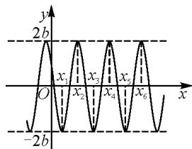
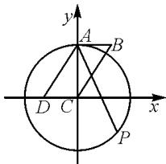
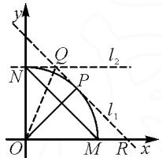

# 高中三角函数最值问题的四种求解思路

# ● 重庆市第一中学校 黄 艳

三角函数是高中数学五种基本函数之一,有自身独特的性质.在解答与之相关的最值问题时,需要根据具体的问题情境采取针对性的求解思路.数形结合、运用辅助角公式、运用不等式及运用导数是四种常用的思路,适宜不同的问题类型.教学过程中,教师应注重相关理论的讲解,提高学生的应用意识,并通过例题的讲解,帮助学生积累经验,掌握应用的细节及注意事项,不断提高解题水平.

# 1 数形结合

数形结合是解决数学问题的常用思路,通过数与形的对照或者转化,可以确保问题得以创造性解决 $^{[1]}$ .解答高中数学三角函数最值问题,通过数形结合,从图象中可以获得直观信息,简化计算.需要注意的是,部分习题涉及的三角函数属于复合函数,在画图的过程中应注意厘清内外函数之间的关系,联系 $y=\sin x$ , $y=\cos x$ 及 $y=\tan x$ 的函数特征,高效地画出正确的函数图象.

例 1 已知函数 $f(x)=a\sin\pi x+b\cos\pi x(b>0)$ 的图象关于点 $\left(\frac{1}{6},0\right)$ 对称，若 $\left|f\left(x_{1}\right)-f\left(x_{2}\right)\right|=$ $\left|f\left(x_{3}\right)-f\left(x_{4}\right)\right|=$ $\left|f\left(x_{5}\right)-f\left(x_{6}\right)\right|=4b$ ，且 $0<x_{1}<x_{2}<x_{3}<x_{4}<x_{5}<x_{6}$ ，则 $\sum_{i=1}^{6}x_{i}$ 的最小值为 \_\_\_\_.

解析:由函数 $f(x)$ 的图象关于点 $\left(\frac{1}{6},0\right)$ 对称可以得到 $f\left(\frac{1}{6}\right)=0$ ，即 $\frac{1}{2}a+\frac{\sqrt{3}}{2}b=0$ ，则 $a=-\sqrt{3}b$ ，

$$
f (x) = - \sqrt {3} b \sin \pi x + b \cos \pi x = 2 b \cos \left(\pi x + \frac {\pi}{3}\right).
$$

由三角函数的性质可得函数 $f(x)$ 的最大值为 2b，最小值为 -2b，作出函数 $f(x)$ 的大致图象，如图 1 所示。令 $\pi x + \frac{\pi}{3} = k\pi, k \in Z$ ，其对称轴方程为 $x = k - \frac{1}{3}, k \in Z$ 。

text_image

y
2b
O
x₁ x₂ x₃ x₄ x₅ x₆
-2b

图1

$$
\text {由} \mid f (x _ {1}) - f (x _ {2}) \mid = \mid f (x _ {3}) - f (x _ {4}) \mid =
$$

$|f(x_{5})-f(x_{6})|=4b$ 可以得到，当 $\sum_{i=1}^{6}x_{i}$ 最小时， $x_{i}$ 是函数 $f(x)$ 在 y 轴右侧连续的最值点，所以 $\sum_{i=1}^{6}x_{i}$ 的最小值为 $\left(1-\frac{1}{3}\right)+\left(2-\frac{1}{3}\right)+\left(3-\frac{1}{3}\right)+\left(4-\frac{1}{3}\right)+\left(5-\frac{1}{3}\right)+\left(6-\frac{1}{3}\right)=19.$

# 2 运用辅助角公式

辅助角公式是三角函数特有的公式,可以将看似复杂的三角函数加、减关系统一到一个三角函数中,运用三角函数的性质顺利解决相关的最值问题.但是对于部分习题而言,可能还会涉及正弦定理、余弦定理、向量等知识的考查,较为综合,解题时,需要先做好前期准备工作,对已知条件进行转化、计算,为应用辅助角公式做好铺垫.

例 2 在平行四边形 ABCD 中, $\angle BAD = \frac{2\pi}{3}$ , AB, AD 的长分别为 1, 2, P 是以点 C 为圆心, $\sqrt{3}$ 为半径的圆上一动点, 且 $\overrightarrow{AP} = \lambda \overrightarrow{AB} + \mu \overrightarrow{AD}$ , 则 $\lambda + \mu$ 的最大值为().

$$
\mathrm{A.} 2 + \sqrt {3}
$$

$$
\mathrm{B.} \sqrt {7} + \sqrt {3}
$$

$$
\mathrm{C.} 2 + \sqrt {7}
$$

$$
\mathrm{D}. 2 + \frac {\sqrt {2 1}}{7}
$$

解析:由平行四边形的性质可得 $\angle ADC = \frac{\pi}{3}$ ，AB = DC = 1。在 $\triangle ADC$ 中，由余弦定理可得 $AC^{2} = DA^{2} + DC^{2} - 2DA \times DC \times \cos \angle ADC = 3$ ，则 $AC = \sqrt{3}$ 。

显然 $AC^{2}+CD^{2}=AD^{2}$ ，则知 $AC\perp CD$ .

以 C 为坐标原点建立一个平面直角坐标系, 如图 2 所示.

易知 $D(-1,0)$ , $A(0,\sqrt{3})$ , $B(1,\sqrt{3})$ . 设点 $P(\sqrt{3}\cos\theta,\sqrt{3}\sin\theta)$ ,则 $\overrightarrow{AP} = (\sqrt{3}\cos \theta ,\sqrt{3}\sin \theta -\sqrt{3}),\overrightarrow{AB} = (1,0),\overrightarrow{AD} =$ $(-1, - \sqrt{3})$

由 $\overrightarrow{AP} = \lambda \overrightarrow{AB} +\mu \overrightarrow{AD} = \lambda (1,0) + \mu (-1, - \sqrt{3})$ 即 $(\sqrt{3}\cos \theta ,\sqrt{3}\sin \theta -\sqrt{3}) = (\lambda -\mu , - \sqrt{3}\mu)$ ，得$\left\{ \begin{array}{l} \sqrt{3}\cos \theta = \lambda - \mu, \\ \sqrt{3}\sin \theta - \sqrt{3} = -\sqrt{3}\mu, \end{array} \right.$ 则 $\left\{ \begin{array}{l} \lambda = 1 + \sqrt{3}\cos \theta - \sin \theta, \\ \mu = 1 - \sin \theta, \end{array} \right.$ 那

text_image

y
A
B
D C x
P

图2

$$
\text { 么 } \lambda + \mu = 2 + \sqrt {3} \cos \theta - 2 \sin \theta = 2 + \sqrt {7} \cos (\theta + \varphi) \leqslant
$$

$2+\sqrt{7}$ ，其中 $\cos\varphi=\frac{\sqrt{21}}{7}$ ， $\sin\varphi=\frac{2\sqrt{7}}{7}$ ，当且仅当 $\cos(\theta+\varphi)=1$ 时， $\lambda+\mu$ 有最大值 $2+\sqrt{7}$ . 故选：C.

# 3 运用不等式

不等式描述了实数、函数值、几何量等对象之间的大小关系，是解决最值问题的常用思路 $^{[2]}$ .在高中数学中，常用均值不等式解决三角函数最值问题.需要注意的是，均值不等式有其自身的特点，需要满足“一正二定三相等”.这里的“正”指不等式中涉及的对象是“正数”，“定”指不等式的两个对象的和或者积为定值；“相等”指取得最值时，两个对象的值相等.当然，在解答部分习题时，可能需要对要求解的问题进行整理、转化，使其满足均值不等式的形式.

例 3 如图 3 所示, 在面积为 $\pi$ 的扇形 OMN 中, M, N 分别在 x 轴、y 轴上, 点 P 在弧 MN 上 (点 P 不与 M, N 重合), 分别在点 P, N 处作扇形 OMN 所在圆的切线 $l_{1}$ 、 $l_{2}$ 交于点 Q, $l_{1}$ 与 x 轴交于点 R, 连接 OQ, 则 $|NQ| + |QR|$ 的最小值为 ( ).

text_image

y
Q
l₂
N
P
l₁
O
M
R
x

图3

A.4

B. $2\sqrt{3}$

C. $\sqrt{6}$

D.2

解析:由扇形 OMN 的面积为 $\pi$ , 可得 $\frac{1}{4}\pi|OP|^{2}=\pi$ , 解得 $|OP|=2$ . 设 $\angle POM=\theta$ , 在 Rt△OPR 中, $|PR|=2\tan\theta$ . 由圆切线的性质, 可得 $|QN|=|QP|$ , 则 $\angle NOQ=\frac{1}{2}\angle NOP=\frac{\pi}{4}-\frac{\theta}{2}$ .

在 Rt△NOQ 中， $|NQ|=2\tan\left(\frac{\pi}{4}-\frac{\theta}{2}\right)$ ，则 $|NQ|+QR|=2|NQ|+|PR|=4\tan\left(\frac{\pi}{4}-\frac{\theta}{2}\right)+2\tan\theta$ ，且 $\theta\in\left(0,\frac{\pi}{2}\right)$ .

令 $\alpha = \frac{\pi}{4} -\frac{\theta}{2}$ ，那么 $\theta = \frac{\pi}{2} -2\alpha$ ，且 $\alpha \in \left(0,\frac{\pi}{4}\right)$ 故 $|NQ| + |QR| = 4\tan \alpha +2\tan \left(\frac{\pi}{2} -2\alpha\right) = 4\tan \alpha +$ $\frac{2}{\tan 2\alpha} = 4\tan \alpha +\frac{1 - \tan^2\alpha}{\tan\alpha} = 3\tan \alpha +\frac{1}{\tan\alpha}\geqslant$ $2\sqrt{3\tan\alpha\cdot\frac{1}{\tan\alpha}} = 2\sqrt{3}$ ，当且仅当 $\frac{1}{\tan\alpha} = 3\tan \alpha$ ，即 $\tan \alpha = \frac{\sqrt{3}}{3}$ 时，等号成立.又 $\alpha \in \left(0,\frac{\pi}{4}\right)$ ，则 $\alpha = \frac{\pi}{6}$ ，此

时, $\theta=\frac{\pi}{6}$ , $|NQ|+|QR|$ 取得最小值 $2\sqrt{3}$ .故选:B.

# 4 运用导数

导数是高中数学的重点知识, 是研究函数的有力工具, 可用于解决很多高中数学问题 $^{[3]}$ . 三角函数本质上是函数, 因此, 可以使用函数解决三角函数最值问题. 运用导数解决三角函数最值问题的关键在于能够对所给的或者通过运算得出的三角函数进行正确求导. 同时, 理解导函数和原函数之间的关系, 根据导函数的值在定义域上的符号, 正确判断其单调性, 从而将对应的自变量代入原函数求出最值.

例 4 若 $\forall x \in R, x^{2} \geqslant -\frac{1}{2} \cos 2\omega x + \frac{1}{2}$ ，则实数 $\omega$ 的最大值为（）.

A.1

B.0

C. $\frac{\pi}{3}$

D. $\frac{\pi}{2}$

解析: 令 $y = -\frac{1}{2} \cos 2 \omega x + \frac{1}{2}$ ，易得其为偶函数，不妨取 $\omega > 0$ .

由 $x^{2} \geqslant -\frac{1}{2} \cos 2\omega x + \frac{1}{2}$ , 可以得到 $x^{2} \geqslant \sin^{2} \omega x$ , 即 $|x| \geqslant |\sin \omega x|$ . 由 $y = \sin \omega x$ 为奇函数, 且其值域为 $[-1, 1]$ , 则只需 $\forall x \in [0, 1], x \geqslant \sin \omega x$ , 则 $\omega x \geqslant \omega \sin \omega x$ .

当 $\sin \omega x \leqslant 0$ 时，不等式恒成立.

当 $\sin \omega x > 0$ 时， $\omega \leqslant \frac{\omega x}{\sin \omega x}$ . 令函数 $g(x) = x - \sin x, x > 0$ ，则 $g'(x) = 1 - \cos x \geqslant 0$ ，故函数 $g(x)$ 在 $(0, +\infty)$ 上单调递增，有 $g(x) > g(0) = 0$ ，则 $x > \sin x$ ，从而 $\frac{\omega x}{\sin \omega x} > 1$ ，则 $0 < \omega \leqslant 1$ .

当 $\omega=0$ 时， $x\geqslant0$ 在 $x\in[0,1]$ 上恒成立.

当 $\omega=1$ 时，由函数 $g(x)=x-\sin x$ 的单调性可知 $x\geqslant\sin x$ 在 $x\in[0,1]$ 上恒成立.

综上可得 $\omega$ 的最大值为 1. 故选: A.

综上所述,数形结合、运用辅助角公式、运用不等式及运用导数四种思路均能很好地解决三角函数最值问题.但是运用不同思路解题时在细节上存在差别,应认真体会、总结,并做好应用的训练,掌握不同解题思路适宜的问题情境、应用技巧.

# 参考文献：

[1]于飞.解三角函数最值问题的不同策略分析[J].数理天地(高中版),2024(1):41-42.

[2]查霖.求三角函数最值的三种措施[J].语数外学习(高中版中旬),2024(10):45.

[3]周静.三角函数式的最值问题探求策略[J].高中数理化，2024(17):59-60.Z