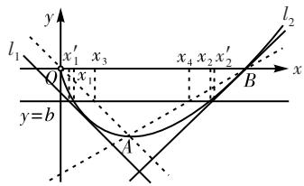

# 高中导函数多变量问题解题策略研究

广西柳州高级中学(545006) 谢颖

[摘 要]高中数学中,导函数多变量问题常见且复杂。这类问题不仅考查基础知识,还对学生的逻辑思维、问题分析和问题解决能力有较高要求。文章探讨高中导函数多变量问题的解题策略,通过案例分析、方法总结及技巧提炼,帮助学生更好地应对此类难题。

[关键词]导函数;多变量问题;解题策略

[中图分类号] G633.6 [文献标识码] A

[文章编号] 1674-6058(2025)02-0013-04

导函数作为微积分的基础,在高中数学中具有举足轻重的地位。多变量问题是导函数应用的一大难点,尤其在处理不等式、极值、最值等问题时,学生常常感到无从下手。本文将从六个方面探讨导函数多变量问题的解题策略,为学生提供有效的解题方法和思路。

# 一、利用韦达定理消元

韦达定理揭示了一元二次方程中根与系数之间的关系。利用韦达定理处理导函数多变量问题是一种巧妙的策略。当问题涉及多个变量且满足二次关系时，可构造一元二次方程，利用韦达定理将多变量问题转化为单变量问题。关键在于识别可构造的一元二次方程，并准确应用韦达定理。转化后，问题大大简化，此时可利用一元二次方程根的性质和导数工具求解。

[例1]已知函数 $f(x) = ax^{2} - 2x + \ln x (a \neq 0, a \in \mathbb{R})$ 。(1) 讨论函数 $f(x)$ 的单调性；(2) 若函数 $f(x)$ 有两个极值点 $x_{1}, x_{2}$ ，求证： $f(x_{1}) + f(x_{2}) < -3$ 。

解析:(1)由题意得,函数 $f(x)$ 的定义域是 $(0,+\infty)$ , $f'(x)=2ax-2+\frac{1}{x}=\frac{2ax^{2}-2x+1}{x}$ ，令 $g(x)=2ax^{2}-2x+1,\Delta=4-8a$ ，接下来可对a进行分类讨论，研究函数的单调性(过程略)。

(2)由(1)得 $0 < a < \frac{1}{2}$ 时，函数 $f(x)$ 有2个极值点 $x_{1}, x_{2}$ ，且 $x_{1} + x_{2} = \frac{1}{a}, x_{1}x_{2} = \frac{1}{2a}$ ，所以 $f(x_{1}) + f(x_{2}) = -\left(\ln a + \frac{1}{a}\right) - (1 + \ln 2)$ ，令 $h(a) = -\left(\ln a + \frac{1}{a}\right) - (1 + \ln 2)\left(0 < a < \frac{1}{2}\right)$ ，则 $h'(a) = -\left(\frac{1}{a} - \frac{1}{a^2}\right) =$

$\frac{1-a}{a^{2}}>0$ , 所以 $h(a)$ 在 $\left(0, \frac{1}{2}\right)$ 上递增, 则 $h(a)<h\left(\frac{1}{2}\right)=-\left(\ln\frac{1}{2}+2\right)-\left(1+\ln2\right)=-3$ , 即 $f(x_{1})+f(x_{2})<-3$ 。

评析: 第一问含参变量, 需要对其进行分类讨论; 第二问基于第一问, 进一步缩小参变量的取值范围。当函数存在导数时, 函数的极值点是其导函数变号的零点。利用韦达定理, 建立极值点与参变量的关系, 通过变形可将多变量化为单变量, 从而得出目标函数。

# 二、齐次化处理

齐次化是处理导函数多变量问题的有效策略。它通过代数变换，将多变量问题转化为单变量问题，简化求解过程。具体步骤包括：(1)观察与识别。观察题目，识别出可通过代数变换形成齐次形式的项。(2)代数变换。利用已知条件进行乘除、加减、换元等代数变换，使多变量表达式转化为齐次形式。(3)引入新变量。为简化问题，可引入新变量（如令某两个变量的比值为新变量），将多变量转化为单变量或更简单的多变量形式。(4)利用导数性质。齐次化后，利用链式法则、乘积法则等，对新的单变量函数求导，求解问题。(5)回代求解。如需求出原变量值，可将新变量或中间结果回代到原问题中求解。通过这些步骤，齐次化策略能有效地将复杂的多变量问题转化为更易解决的问题。

[例 2] 已知函数 $f(x)=x \ln x - 2ax^{2} + x, a \in \mathbf{R}$ 。(1) 若 $f(x)$ 在 $(0, +\infty)$ 内单调递减，求实数 a 的取值范围；(2) 若函数 $f(x)$ 有两个极值点 $x_{1}, x_{2}$ ，证明： $x_{1} + x_{2} > \frac{1}{2a}$ 。

解析:(1)令 $f'(x) \leqslant 0$ 在 $x \in (0, +\infty)$ 上恒成立, 分离参数得出 $4a \geqslant \frac{\ln x + 2}{x}$ , 利用函数单调性求出函数 $g(x) = \frac{\ln x + 2}{x}$ 的最大值即可得出 a 的取值范围。

(2) 因为 $f(x)$ 有两个极值点，所以 $f'(x) = \ln x + 2 - 4ax = 0$ 在 $(0, +\infty)$ 上有两个解，即 $4a = \frac{\ln x + 2}{x}$ 有两个解，由 (1) 可知 $0 < a < \frac{e}{4}$ 。由 $\ln x_{1} - 4ax_{1} + 2 = 0$ ， $\ln x_{2} - 4ax_{2} + 2 = 0$ ，可得 $\ln x_{1} - \ln x_{2} = 4a(x_{1} - x_{2})$ ，不妨设 $0 < x_{1} < x_{2}$ ，要证明 $x_{1} + x_{2} > \frac{1}{2a}$ ，只需证明 $\frac{x_{1} + x_{2}}{4a(x_{1} - x_{2})} < \frac{1}{2a(\ln x_{1} - \ln x_{2})}$ ，即证明 $\frac{2(x_{1} - x_{2})}{x_{1} + x_{2}} > \ln x_{1} - \ln x_{2}$ ，即证明 $\frac{2\left(\frac{x_{1}}{x_{2}} - 1\right)}{\frac{x_{1}}{x_{2}} + 1} > \ln \frac{x_{1}}{x_{2}}$ ，令 $h(x) = \frac{2(x - 1)}{x + 1} - \ln x (0 < x \leqslant 1)$ ，则 $h'(x) = -\frac{(x - 1)^{2}}{x(x + 1)^{2}} \leqslant 0$ ，故 $h(x)$ 在 $(0, 1]$ 上单调递减，所以当 $x \in (0, 1]$ 时， $h(x) > h(1) = 0$ ，即 $\frac{2(x - 1)}{x + 1} > \ln x$ 在 $(0, 1]$ 上恒成立，故不等式 $\frac{2\left(\frac{x_{1}}{x_{2}} - 1\right)}{\frac{x_{1}}{x_{2}} + 1} > \ln \frac{x_{1}}{x_{2}}$ 恒成立。综上， $x_{1} + x_{2} > \frac{1}{2a}$ 。

# 三、利用放缩法

在导函数多变量问题中,放缩法是一种有效简化复杂问题的策略。它通过放缩不等式,将多变量表达式转化为易处理的单变量表达式。具体过程为:首先,识别影响问题复杂度的关键变量或表达式;然后,利用不等式性质或函数单调性,对原表达式进行放大或缩小,使处理后的表达式仅关于一个变量。在这一过程中,需要巧妙选择放缩的“度”,既要保证放缩后的表达式易处理,又要不改变原问题的核心性质。

[例3]已知函数 $f(x)=x\ln x-x$ 。若 $f(x)=b$ 有两个实数根 $x_{1},x_{2}$ ，且 $x_{1}<x_{2}$ 。求证： $be+e<x_{2}-x_{1}<2b+e+\frac{1}{e}$ 。

解析: $f(x)$ 的定义域为 $(0,+\infty)$ , $f'(x)=\ln x$ 。令 $f'(x)>0$ ,得x>1;令 $f'(x)<0$ ,得0<x<1,所以 $f(x)$ 在区间 $(1,+\infty)$ 上单调递增，在 $(0,1)$ 上单调递减。因为 $f(x)=b$ 有两个实数根 $x_{1},x_{2}$ ，且 $x_{1}<x_{2}$ ，所以 $0<x_{1}<1<x_{2}$ 。

先证不等式 $x_{2} - x_{1} < 2b + \mathrm{e} + \frac{1}{\mathrm{e}}$ 。因为 $f(\mathrm{e}) = 0, f\left(\frac{1}{\mathrm{e}}\right) = -\frac{2}{\mathrm{e}}, f'(\mathrm{e}) = 1, f'\left(\frac{1}{\mathrm{e}}\right) = -1$ ，所以曲线 $y = f(x)$ 在 $x_{1} = \frac{1}{\mathrm{e}}$ 和 $x_{2} = \mathrm{e}$ 处的切线分别为 $l_{1}: y = -x - \frac{1}{\mathrm{e}}$ 和 $l_{2}: y = x - \mathrm{e}$ ，如图1所示。

text_image

y
l₁
x₁' x₃
x₄ x₂ x₂'
y=b
A
B
x
l₂

图1

令 $g(x)=f(x)-\left(-x-\frac{1}{\mathrm{e}}\right)=x\ln x+\frac{1}{\mathrm{e}},0<x<1$ ，则 $g'(x)=1+\ln x$ 。令 $g'(x)>0$ ，则 $\frac{1}{e}<x<1$ ，令 $g'(x)<0$ ，则 $0<x<\frac{1}{e}$ ，所以 $g(x)$ 在 $\left(0,\frac{1}{e}\right)$ 上单调递减，在 $\left(\frac{1}{e},1\right)$ 上单调递增，所以 $g(x)\geqslant g\left(\frac{1}{e}\right)=0$ ，所以 $f(x)\geqslant-x-\frac{1}{e}$ 在 $(0,1)$ 上恒成立。设直线 y=b 与直线 $l_{1}$ 交点的横坐标为 $x_{1}^{\prime}$ ，则 $x_{1}^{\prime}\leqslant x_{1}$ ；设直线 y=b 与直线 $l_{2}$ 交点的横坐标为 $x_{2}^{\prime}$ ，同理可证 $x_{2}\leqslant x_{2}^{\prime}$ 。因为 $x_{1}^{\prime}=-b-\frac{1}{e},x_{2}^{\prime}=b+e$ ，所以 $x_{2}-x_{1}<x_{2}^{\prime}-x_{1}^{\prime}=b+e-\left(-b-\frac{1}{e}\right)=2b+e+\frac{1}{e}$ （两个等号不同时成立），因此 $x_{2}-x_{1}<2b+e+\frac{1}{e}$ 。

再证不等式 $x_{2} - x_{1} > b\mathrm{e} + \mathrm{e}$ 。函数图象 $f(x)$ 上有两点 $A(1, - 1),B(\mathrm{e},0)$ ，设直线 $y = b$ 与直线OA： $y = -x$ ，直线 $AB:y = \frac{1}{\mathrm{e} - 1} (x - \mathrm{e})$ 的交点的横坐标分别为 $x_{3},x_{4}$ ，易证 $x_{1} <   x_{3} <   x_{4} <   x_{2}$ ，且 $x_{3} = -b,x_{4} =$ $(\mathrm{e} - 1)b + \mathrm{e}$ ，所以 $x_{2} - x_{1} > x_{4} - x_{3} = (\mathrm{e} - 1)b + \mathrm{e}-$ $(-b) = b\mathrm{e} + \mathrm{e}$ 。综上， $b\mathrm{e} + \mathrm{e} <   x_2 - x_1 <   2b + \mathrm{e} + \frac{1}{\mathrm{e}}$ 成立。

评析:本题涉及含有两个零点的 $f(x)$ 的解析式(可能含有参数 $x_{1},x_{2}$ ),已知方程 $f(x)=b$ 有两个实根,要证明这两个实根之差小于(或大于)某个表达式。求解策略:首先,画出 $f(x)$ 的图象,并求出 $f(x)$

在两个零点处(或曲线上的某两点)的切线方程(或找过曲线上某两点的直线);然后,严格证明曲线 $f(x)$ 在切线(或所找直线)的上方或下方;最后,对 $x_{1},x_{2}$ 进行适当的放大或者缩小,以精确证明所需结论。

# 四、利用主元法

主元法的核心在于选定或引入一个变量作为“主元”进行主要研究，而将其他变量视为参数或常量。求解时，可利用导数工具对主元求导、分析单调性、求极值等，得到主元的解。这种策略关键在于合理选择主元，并灵活处理其他变量与主元的关系。

# (一)确定主元

[例 4] 已知函数 $f(x)=a(x-1)-\ln x+1$ 。(1) 求 $f(x)$ 的单调区间；(2) 当 $a \leqslant 2$ 时，证明：当 x > 1 时， $f(x) < e^{x-1}$ 恒成立。

解析:(1)对函数直接求导,分 $a\leqslant0$ 和a>0两种情况讨论,根据导函数的正负得到函数的单调区间;(2)当 $a\leqslant2$ ,且x>1时, $e^{x-1}-f(x)=e^{x-1}-a(x-1)+\ln x-1\geqslant e^{x-1}-2x+1+\ln x$ ,令 $g(x)=e^{x-1}-2x+1+\ln x(x>1)$ ,下证 $g(x)>0$ 即可。 $g'(x)=e^{x-1}-2+\frac{1}{x}$ ,再令 $h(x)=g'(x)$ ,则 $h'(x)=e^{x-1}-\frac{1}{x^2}$ ,显然 $h'(x)$ 在 $(1,+\infty)$ 上递增,则 $h'(x)>h'(1)=e^0-1=0$ ,即 $g'(x)=h(x)$ 在 $(1,+\infty)$ 上递增,故 $g'(x)>g'(1)=e^0-2+1=0$ ,即 $g(x)$ 在 $(1,+\infty)$ 上单调递增,故 $g(x)>g(1)=e^0-2+1+\ln 1=0$ ,问题得证。

# (二)引入新主元

[例 5]设函数 $f(x)=(x+a)\ln(x+b)$ ，若 $f(x)\geqslant0$ 恒成立，则 $a^{2}+b^{2}$ 的最小值为\_\_\_\_。

解析: 引入新主元 t, 并令 $t = x + b$ , 则原式可变为 $F(t) = (t + a - b) \ln t (t > 0)$ , $F(t) \geqslant 0 = F(1)$ , 所以最小值落在了极值点处, 则只需 $F(1) = 0$ , 得出 $1 + a - b = 0$ , 所以 $a^{2} + b^{2} = a^{2} + (1 + a)^{2} = 2a^{2} + 2a + 1 \geqslant \frac{1}{2}$ , $a^{2} + b^{2}$ 的最小值为 $\frac{1}{2}$ 。这样就把多元问题最终化为一元问题。

# 五、利用单调性分析法

在解决导函数多变量复杂问题时,利用单调性分析法将其转化为单变量问题,是一种直观有效的策略。这种策略的核心在于通过导数判断函数的单调性,简化求解过程。其基础步骤为:首先,明确多变量函数及其定义域。然后,选取一个变量作为“主变量”,其余变量视为参数或常量。最后,对函数关于主变量求导,分析导数的符号变化,确定函数的单调性。这样处理,求解过程更加清晰。

[例6]已知函数 $f(x)=\frac{1}{3}ax^{3}-4x(a\in\mathbf{R})$ 。(1)讨论函数 $f(x)$ 的单调性；(2)若a=1， $\forall x_{1},x_{2}\in\left[1,\sqrt{2}\right]$ 且 $x_{1}\neq x_{2}$ ，都有 $\left|f(x_{1})-f(x_{2})\right|<m|\ln x_{1}-\ln x_{2}|$ 成立，求实数m的取值范围。

解析:(1)对函数 $f(x)$ 求导,讨论a的取值范围,得出单调性。

(2) 当 $a = 1$ 时, $f(x) = \frac{1}{3} x^3 - 4x$ , 由 (1) 可知 $f(x)$ 在 $\left[1, \sqrt{2}\right]$ 上单调递减, 不妨设 $1 \leqslant x_1 < x_2 \leqslant \sqrt{2}$ , 则原式转化为 $f(x_1) + m \ln x_1 < f(x_2) + m \ln x_2$ 对任意的 $x_1, x_2 \in \left[1, \sqrt{2}\right]$ 成立, 则 $g(x) = f(x) + m \ln x$ 在 $\left[1, \sqrt{2}\right]$ 单调递增, $g'(x) = f'(x) + \frac{m}{x} = x^2 - 4 + \frac{m}{x} \geqslant 0$ , 则 $m \geqslant -x^3 + 4x$ 对 $x \in \left[1, \sqrt{2}\right]$ 恒成立, 令 $h(x) = -x^3 + 4x$ , 求出 $h(x)$ 的最大值, 即可得出结果。

# 六、对称化构造函数

在解决极值点或拐点偏移问题时,对称化构造函数能够直观展现偏移规律,将复杂的双变量问题转化为易于处理的单变量问题。通过构造函数并对其求导,分析其在特定区间的单调性,可得出偏移的结论,彰显该策略的独特优势。

[例7]已知函数 $f(x)=xe^{2-x}$ 。(1)求 $f(x)$ 的极值；(2)若a>1,b>1, $a\neq b,f(a)+f(b)=4$ ，证明： $a+b<4$ 。

解析：(1) 因为 $f(x)=xe^{2-x}$ ，所以 $f'(x)=(1-x)e^{2-x}$ ，由 $f'(x)>0$ ，解得 x<1；由 $f'(x)<0$ ，解得 x>1，所以 $f(x)$ 在 $(-∞,1)$ 上单调递增，在 $(1,+∞)$ 上单调递减，又 $f(1)=e$ ，所以 $f(x)$ 在 x=1 处取得极大值 e，无极小值。

(2)由(1)可知, $f(x)$ 在 $(1,+\infty)$ 上单调递减, $f(2)=2$ ,且a>1,b>1, $a\neq b,f(a)+f(b)=4$ ,不妨设1<a<2<b,要证 $a+b<4$ ,只需证b<4-a,而b>2,2<4-a<3,且 $f(x)$ 在 $(1,+\infty)$ 单调递减,所以只需证 $f(b)>f(4-a)$ ,即证 $4-f(a)>f(4-a)$ ,即证 $f(a)+f(4-a)<4$ ,即证当1<x<2时， $f(x)+f(4-x)<4$ ，令 $F(x)=f(x)+f(4-x)$ ，1<x<2，则 $F'(x)=f'(x)-f'(4-x)=(1-x)\mathrm{e}^{2-x}-\mathrm{e}^{x-2}(x-3)$ ，令 $h(x)=(1-x)\mathrm{e}^{2-x}-\mathrm{e}^{x-2}(x-3)$ ，1<x<2，则 $h'(x)=\mathrm{e}^{2-x}(x-2)-\mathrm{e}^{x-2}(x-2)=(x-2)(\mathrm{e}^{2-x}-\mathrm{e}^{x-2})$ ，因为1<x<2，所以 $x-2<0,\mathrm{e}^{2-x}-\mathrm{e}^{x-2}>0$ ，所以 $h'(x)<0$ ，即 $h(x)$ 在(1,2)上单调递减，则 $h(x)>h(2)=0$ ，即 $F'(x)>0$ ，所以 $F(x)$ 在(1,2)上单调递增，所以 $F(x)<F(2)=2f(2)=4$ ，即当1<x<2时， $f(x)+f(4-x)<4$ ，所以原命题成立。

一般地,对称化构造函数常有下列两种情形:(1)对结论 $x_{1}+x_{2}>2x_{0}$ 的类型,构造函数 $F(x)=f(x)-f(2x_{0}-x)$ ;(2)对结论 $x_{1}x_{2}>x_{0}^{2}$ 的类型,构造函数 $F(x)=f(x)-f\left(\frac{x_{0}^{2}}{x}\right)$ ,通过求导研究 $F(x)$ 的单调性获得不等式。

导函数多变量问题是高中数学中的难点和重点。在处理这类问题时，韦达定理消元、齐次化处理、放缩法、主元法及单调性分析法、对称化构造函数等方法各有优势、相互补充,共同构成了解决导函数多变量问题的有效工具库。掌握并灵活运用这些方法,能实现多变量到单变量的有效转化,显著提升学生解决复杂导函数问题的能力。同时,这些方法不仅适用于导函数多变量问题,还可以推广到其他数学问题,帮助学生提升解题能力和数学素养。

# [参考文献]

[1] 向城, 安邦, 刘成龙. 例谈多元变量最值问题求解策略 [J]. 中学数学研究, 2020(5): 47-49.  
[2] 吴洪生. 多元变量最值问题探究性教学的实践与思考: 以一道高考试题的教学为例 [J]. 中国数学教育, 2018(1/2): 98-101.  
[3] 查晓东, 张玲. “单变量” 视角处理 “多变量” 最值和不等式问题 [J]. 数学通讯, 2016(10): 24-27.  
[4] 丁称兴. 解决“多元变量”最值问题的几种思想方法 [J]. 数学教学研究, 2016, 35(10): 62-65, 67.

(责任编辑 黄春香)

(上接第9页)

此过程中,学生抽象出了椭圆的几何要素,生成了椭圆的概念,有效突破了教学难点。然而,遗憾的是,学生动手操作的机会较少。

【改进】针对课本探究内容,增设一个学生动手操作的实验,明确实验方案,让学生通过小组合作交流,完成实验表格。在引导学生使用GGB几何软件时,教师应给予学生充分的探索时间,鼓励他们反复尝试、观察、讨论和思考。针对学生在实践中提出的问题,教师应及时引导解决,促进学生思维能力的提升。通过亲身经历椭圆的生成过程,学生可以深刻感受到信息技术在研究图象中的重要作用,体会到数学软件的强大功能,同时培养直观想象和数学抽象素养。

# 三、几点感悟

在本节课中,执教教师亲和力强,激情四溢,能熟练运用信息技术,问题导学及核心素养导向明确,有效促进了学生数学学科核心素养的提升。为进一步提升教学效果,教师需深入钻研教材,把握教材编排意图,同时加强对学生特点的研究,从学生角度出发设计教学环节,给予学生充足的思考时

间。在课堂教学中,数学学科核心素养的落实可从以下三个方面着手:(1)注重知识的前后联系,树立单元教学意识;(2)以问题为导向,培养学生的思维能力;(3)加强信息技术与课堂教学的融合。

在教学实践中,教师还应创设合适的情境,提出合理的问题,引入新的思路和方法。比如,化简带两个根号的等式的第三种方法(利用平方差公式去根号)的学习,需要较高的领悟能力,在课后供有学习潜力的学生练习,以激发学生思考和交流,发展学生的数学思维,促进学生数学学科核心素养的提升。

# [参考文献]

[1] 安振亚. 从课例点评谈青年教师如何上好一节课 [J]. 中国数学教育, 2020(6): 33-35, 39.  
[2] 常磊. 技术助力教学 探究提升素养: “函数 $y = x^{a} - \log_{b}^{x}$ 的图象与性质” 课例点评 [J]. 中国数学教育 (高中版), 2023(8): 40-42.

(责任编辑 黄春香)