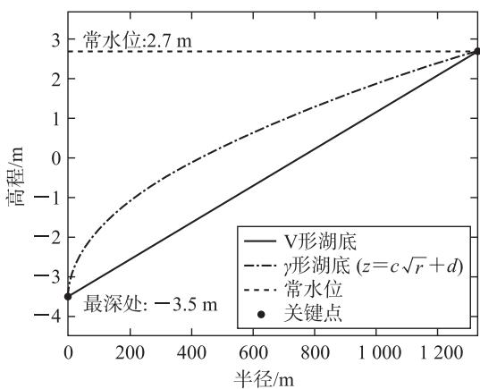
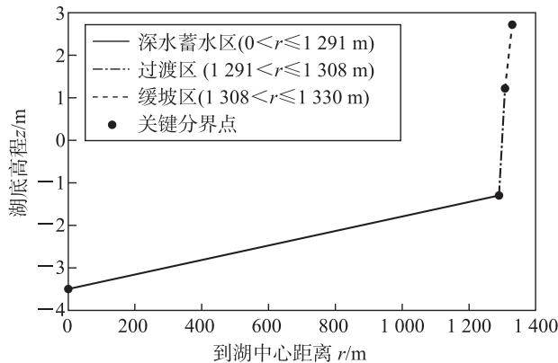

# 上海滴水湖的湖底形状探究与三个岛屿体积估算

高 丽 万福永

(上海东海职业技术学院教育学院)

对上海滴水湖的常规蓄水量与三个岛屿的体积进行估算,可为滴水湖的水资源管理与工程规划提供科学依据.本文基于上海滴水湖的地理与水文数据,首先证明了V形湖底、γ形湖底两种形态不适合滴水湖的情形;然后重点研究了锅形湖底、阶梯形湖底两种形态的适用性,分别给出了湖体体积估计与三个岛屿的体积估算.通过对湖底形状的数学建模与体积估算,结合旋转体体积的积分算法、分段函数拟合与约束优化算法,全面评估了不同湖底形态对湖水容量与岛屿体积估算的影响.

# 1 研究背景

滴水湖, 又名芦潮湖, 位于上海市浦东新区, 湖面呈圆形, 直径为 $2.66 \mathrm{~km}$ , 总面积为 $5.56 \mathrm{~km}^{2}$ , 平均水深为 $3.7 \mathrm{~m}$ , 最深处为 $6.2 \mathrm{~m}$ , 当常水位在 $+2.7 \mathrm{~m}$ 时, 湖水容量为 $1620 \mathrm{万} \mathrm{~m}^{3}$ , 水源是引黄浦江 (经大治河) 淡水. 湖中设有三个岛屿, 北岛的面积为 $23.5 \mathrm{万} \mathrm{~m}^{2}$ , 半岛形态, 主题为海洋文化游乐区; 南岛的面积为 $14 \mathrm{万} \mathrm{~m}^{2}$ , 主题为水上活动休闲区; 西岛的面积为 $6 \mathrm{万} \mathrm{~m}^{2}$ , 规划为高层商务建筑区.

先给出关于湖底侧面形状的几个定义.

V形湖底:中心最低点与常水位+2.7 m左右岸边的点连线是直线段: $z=\pm kx+b(k>0)$ ，又称圆锥形湖底；

γ形湖底:中心最低点与常水位+2.7 m左右岸边的点连线是抛物线段: $z=c\sqrt{|x|}+d$ ;

锅形湖底: 中心最低点与常水位 +2.7 m 左右岸边的点连线是抛物线段: $z = ex^{2} + f$ , 形状类似家庭常用铁锅;

阶梯形湖底: 中心最低点与常水位 +2.7 m 左右岸边的点连线是首尾相连接的三条线段:

$$
z = \left\{ \begin{array}{l l} \pm k _ {1} x + b _ {1}, & 0 \leqslant | x | \leqslant a _ {1}, \text {深水蓄水区,} \\ \pm k _ {2} x + b _ {2}, & a _ {1} <   | x | \leqslant a _ {2}, \text {过渡区,} \\ \pm k _ {3} x + b _ {3}, & a _ {2} <   | x | \leqslant 1 3 3 0, \text {缓坡区,} \end{array} \right.
$$

一般要求其中的 $k_{2}>k_{3}>k_{1}>0$ .

# 2 湖底形状不可能是 V 形湖底, 更不可能是 $\gamma$ 形湖底

关于湖底形状,一种简单的想法视其为 V 形湖底(圆锥状).下面证明这种假设不成立.设湖底中心最低点与常水位+2.7 m 右岸边的点连线是直线段 $z = kx + b (k > 0)$ .由于直线经过湖底中心最低点(0, -3.5)与右岸边的点(1 330, 2.7),如图1所示,故直接代入方程、联立方程组后,即可求出其中的两个参数b = -3.5, $k = \frac{6.2}{1330}$ ,于是 $z = \frac{6.2}{1330}x - 3.5$ ,可解出 $x = \frac{1330(z + 3.5)}{6.2}$ .

line

| 半径/m | V形湖底 | γ形湖底 (z=c√r+d) | 常水位 | 关键点 |
| ------ | ------- | ----------------- | ------ | ------ |
| 0      | -3.5    | -3.5              | 2.7    | -3.5   |
| 1200   | 3       | 3                 | 2.7    | 3      |

图1

V形湖底是 $x=\frac{1\ 330(z+3.5)}{6.2}$ 围绕 z 轴旋转的旋转体, 可用定积分计算湖的体积, 即

$$
\begin{array}{r l} V _ {\mathrm{V}} & = \int_ {- 3. 5} ^ {+ 2. 7} \pi x ^ {2}   \mathrm{d} z = \int_ {- 3. 5} ^ {+ 2. 7} \pi [ \frac {1 3 3 0 (z + 3 . 5)}{6 . 2} ] ^ {2}   \mathrm{d} z \approx \\ & \quad 1 1 4 8. 5 \text {万} \mathrm{m} ^ {3}. \end{array}
$$

这种情况也可以直接计算圆锥体的体积. 由于圆锥体的底面圆在常水位, 半径 R = 1330 m, 锥尖在湖底中心最低点, 高 H = 6.2 m, 故

$$
V _ {\mathrm{v}} = \frac {1}{3} \pi R ^ {2} H = \frac {1}{3} \pi \times 1 3 3 0 ^ {2} \times 6. 2 \approx 1 1 4 8. 5 \text {万} \mathrm{m} ^ {3}.
$$

有资料表明: 当常水位在 $+2.7 \, m$ 时, 湖水容量为 $1620 \, 万 \, m^{3}$ , 而现在求得的 V 形湖体积比它还小,

显然这是不可能的.

另一种想法是湖底形状为 $\gamma$ 形. 可以类似地证明这种假设也不成立. 设湖底中心最低点与常水位 $+2.7\mathrm{m}$ 右岸边的点连线是抛物线段 $z = c\sqrt{|x|} + d$ . 由于抛物线经过湖底中心最低点(0, -3.5)与右岸边的点(1330, 2.7), 故直接代入方程、联立方程组后, 即可求出其中的两个参数 $d = -3.5, c = \frac{6.2}{\sqrt{1330}}$ , 于是 $z = \frac{6.2\sqrt{x}}{\sqrt{1330}} - 3.5$ , 可解出 $x = 1330\left(\frac{z + 3.5}{6.2}\right)^2$ .

$\gamma$ 形湖底是 $x=1\ 330(\frac{z+3.5}{6.2})^{2}$ 围绕 z 轴旋转的旋转体，可用定积分计算湖的体积，即

$$
V _ {\gamma} = \int_ {- 3. 5} ^ {+ 2. 7} \pi x ^ {2} \mathrm{d} z =
$$

$$
\int_ {- 3. 5} ^ {+ 2. 7} \pi [ 1 3 3 0 (\frac {z + 3 . 5}{6 . 2}) ^ {2} ] ^ {2} \mathrm{d} z \approx 6 8 9 \text {万} \mathrm{m} ^ {3}.
$$

有资料表明: 当常水位在 $+2.7 \, m$ 时, 湖水容量为 1620 万 $m^{3}$ , 而现在求得的 $\gamma$ 形湖体积比 V 形湖体积还小, 小于湖水容量 1620 万 $m^{3}$ , 显然这也是不可能的.

# 3 湖底形状为锅形湖底时的岛屿体积探究与估算

关于湖底形状,一种流传的想法是锅形湖底.

下面我们将证明,对于滴水湖,这种想法成立.设湖底中心最低点与常水位+2.7 m左右岸边的点连线是抛物线段 $z=ex^{2}+f$ .由于抛物线经过湖底中心最低点(0,-3.5)与右岸边的点(1 330,2.7),故直接代入方程、联立方程组后,即可求出其中的两个参数f=-3.5,e= $\frac{6.2}{1\ 330^{2}}$ ,于是 $z=\frac{6.2x^{2}}{1\ 330^{2}}-3.5$ ,可解出

$$
x = \sqrt {\frac {1 3 3 0 ^ {2} (z + 3 . 5)}{6 . 2}}.
$$

锅形湖底是 $x=\sqrt{\frac{1\ 330^{2}(z+3.5)}{6.2}}$ 围绕 z 轴旋转的旋转体，可用定积分计算湖的体积，即

$$
V _ {G} = \int_ {- 3. 5} ^ {+ 2. 7} \pi x ^ {2} \mathrm{dz} = \int_ {- 3. 5} ^ {+ 2. 7} \pi \frac {1 3 3 0 ^ {2} (z + 3 . 5)}{6 . 2} \mathrm{dz} \approx
$$

$$
1 7 2 2. 7 \mathrm{万} \mathrm{m} ^ {3}.
$$

有资料表明: 当常水位在 $+2.7 \, m$ 时, 湖水容量为 $1620 \, 万 \, m^{3}$ , 而现在求得的锅形湖体积比它大, 可以猜想滴水湖很有可能是锅形湖底, 从而得到三个岛屿体积的估算值为 $1722.7 - 1620 = 102.7 \, 万 \, m^{3}$ .

# 4 湖底形状为阶梯形湖底时的岛屿体积探究与估算

关于湖底形状,特别是人工湖,通常其形状为阶梯形,涉及的计算量比较大.

有资料表明:缓坡区位于常水位下0 m至1.5 m处,而坡度限制 $\frac{1}{20}\leqslant k_{3}\leqslant\frac{1}{10}$ ;过渡区位于常水位下1.5 m至4.0 m处,坡度限制 $\frac{1}{8}\leqslant k_{2}\leqslant\frac{1}{5}$ ;深水蓄水区位于常水位下4.0 m至最深6.2 m处,坡度限制 $0\leqslant k_{1}\leqslant\frac{1}{100}$ ,滴水湖阶梯形湖底形状如图2所示.

line

| 到湖中心距离 r/m | 湖底高程 z/m |
| ---------------- | ------------ |
| 0                | -3.5         |
| 1300             | -1.5         |
| 1308             | 1.5          |
| 1330             | 2.5          |

图2

下面我们将证明,对于滴水湖,这种假设成立.

设湖底中心最低点与常水位+2.7 m左右岸边的点连线是首尾相连接的三条线段,因此完全可以仿照V形湖体积计算方法,即旋转体体积的定积分,或直接使用圆锥体体积公式.这里使用公式法,因为我们发现此时的湖体其实由2个圆台和1个圆锥三部分构成(单位:m).

圆台 1: 下底半径 $r_{3}=R=1\ 330$ ，上底半径 $r_{2}=a_{2}>0$ ，高 $H_{3}=1.5$ ，坡度 $k_{3}=\frac{1.5}{1\ 330-a_{2}}$ ;

圆台 2: 下底半径 $r_{2}=a_{2}>0$ ，上底半径 $r_{1}=a_{1}>0$ ，高 $H_{2}=2.5$ ，坡度 $k_{2}=\frac{2.5}{a_{2}-a_{1}}$ ;

圆锥:底面半径 $r_{1}=a_{1}>0$ ，高 $H_{1}=2.2$ ，坡度 $k_{1}=\frac{2.1}{a_{1}}$ .

于是可以使用 $V_{J}=V_{圆台1}+V_{圆台2}+V_{圆锥}$ 来计算湖体体积, 即

$$
V _ {J} = \frac {1}{3} \pi (r _ {3} ^ {2} + r _ {3} r _ {2} + r _ {2} ^ {2}) H _ {3} +
$$

$$
\frac {1}{3} \pi (r _ {2} ^ {2} + r _ {2} r _ {1} + r _ {1} ^ {2}) H _ {2} + \frac {1}{3} \pi r _ {1} ^ {2} H _ {1}.
$$

# 巧构示性函数,简化期望计算

楼思远

(浙江省杭州第十四中学)

# 1 示性函数是什么

设样本空间为 $\Omega$ ，样本点 $\omega \in \Omega$ ，随机事件 $A$ 为 $\Omega$ 的一个子集，令

$$
I _ {A} = \left\{ \begin{array}{l l} 1, & \omega \in A, \\ 0, & \omega \notin A. \end{array} \right.
$$

上式从数值上告诉我们,样本点 $\omega$ 是否属于子集 A, 因此称其为子集 A 的示性函数.

显然， $I_{A}$ 是一个只取 0 或 1 的二值随机变量，若事件 A 发生，则 $I_{A}=1$ ；若事件 A 不发生，则 $I_{A}=0$ 。若记随机事件 A 发生的概率为 $P(A)$ ，则根据上述定义不难得到 $E(I_{A})=P(A)$ ，即其期望值为对应随机事件发生的概率，这是示性函数非常重要的一条性质。

示性函数的实例广泛存在,如狄利克雷函数就是典型的示性函数: $D(x)=\begin{cases}1,&x\in\mathbf{Q},\\0,&x\notin\mathbf{Q}\end{cases}$ (Q为有理数集).此外,生活中的断电与通电状态,就可以分别用0和1表示,这也是计算机采用二进制的基础.实际上,任何仅含两种结果的随机事件(0-1事件)都可以用示性函数表述,例如,明天是否下雨、在某楼层出不出电梯、中国足球队能否进2030年世界杯等,其结果都可以用实数0或1来对应表示.

# 2 示性函数有何用

引入示性函数表示随机变量,有利于随机变量的表示,也有利于期望的计算.期望具有线性可加性,设

将所有参数代入上式,并进行整理,得到一个关于 $a_{1},a_{2}$ 的二元函数

$$
V _ {J} (a _ {1}, a _ {2}) = \frac {\pi}{3 0} (4 7 a _ {1} ^ {2} + 2 5 a _ {1} a _ {2} + 4 0 a _ {2} ^ {2} +
$$

$$
1 9 9 5 0 a _ {2} + 2 6 5 3 3 5 0 0),
$$

要求满足约束条件 $\frac{1}{20} \leqslant k_3 \leqslant \frac{1}{10}, \frac{1}{8} \leqslant k_2 \leqslant \frac{1}{5}, 0 \leqslant k_1 \leqslant \frac{1}{100}$ , 其中 $k_3 = \frac{1.5}{1330 - a_2}, k_2 = \frac{2.5}{a_2 - a_1}, k_1 = \frac{2.1}{a_1}$ .

这个问题是有解的,若令 $a_{1}=1\ 291, a_{2}=1\ 308$ , 可得 $V_{J}(1\ 291,1\ 308)\approx2\ 530$ 万 $m^{3}$ , 这时所有的坡度也满足约束条件.

有资料表明: 当常水位在 $+2.7 \, m$ 时, 湖水容量为 1620 万 $m^{3}$ , 而现在求得的阶梯形湖体积比它大, 可以猜想滴水湖湖底极有可能是阶梯形湖底, 从而得到三个岛屿体积的估算值为

$$
2 5 3 0 - 1 6 2 0 = 9 1 0 \text {   万   } \mathrm{m} ^ {3}.
$$

# 5 湖底形状为阶梯形湖底时的进一步研究

既然已经得到一个关于 $a_1, a_2$ 的二元函数 $V_J(a_1, a_2)$ ，人们自然会问，如果滴水湖按照阶梯形

湖底的方案重新开挖,能否选取更合适的 $a_{1}, a_{2}$ 值,使得整个滴水湖在常水位时取得最大蓄水量?

这个问题其实是一个有约束条件的二元函数最大值的约束优化问题，可以借助数学软件进行求解。这里选择LINGO软件求解，易求解得 $V_{J}(1302.5,1315)\approx2560$ 万 $m^{3}$ ，与 $V_{J}(1291,1308)\approx2530$ 万 $m^{3}$ 相比，大约多了30万 $m^{3}$ 。

# 6 结语

本文基于上海滴水湖的地理与水文数据，针对其湖底形状与岛屿体积估算问题，建立了多种几何与优化模型，系统分析了V形、γ形、锅形及阶梯形四种湖底形态的可能性，并估算了湖中三个岛屿的体积。通过对湖底形状的数学建模与体积估算，结合旋转体体积的定积分算法、分段函数拟合与约束优化算法，全面评估了不同湖底形态对湖水容量与岛屿体积估算的影响，为滴水湖的水资源管理与工程规划提供了科学依据。

(完)