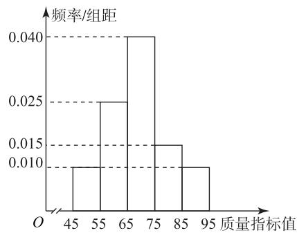

# 二项分布三类最值问题的解题策略

杨启超

(云南省泸西县第一中学)

在处理二项分布相关问题时,最值问题的求解常常是学生的难点.本文借助具体例题深入探讨二项分布中的三类最值问题,揭示如何巧妙运用数列、导数以及基本不等式等工具求解二项分布的最值问题.

# 1 二项分布的概率最值问题

由二项分布的分布列 $P(X=k)=\mathrm{C}_{n}^{k}p^{k}(1-p)^{n-k}(k=0,1,2,\cdots,n)$ 可以看出，其共有 3 个参数 n, k, p，故涉及二项分布的概率最值问题主要有以下三类：给定 n, p，给定 k, p 或给定 n, k.

例 1 若 $X \sim B(10, \frac{1}{3})$ ，则 $P(X = k)$ 取得最大，k = \_\_\_\_.

析 因为 $X \sim B(10, \frac{1}{3})$ ，所以 $P(X = k) = C_{10}^{k} \cdot \frac{2}{3}$ ，要使得 $P(X = k)$ 取得最大值，则

$$
\left\{ \begin{array}{l} P (X = k) \geqslant P (X = k - 1), \\ P (X = k) \geqslant P (X = k + 1), \end{array} \right.
$$

即 $\left\{\begin{aligned}C_{10}^{k}\left(\frac{1}{3}\right)^{k}\left(\frac{2}{3}\right)^{10-k}&\geqslant C_{10}^{k-1}\left(\frac{1}{3}\right)^{k-1}\left(\frac{2}{3}\right)^{11-k},\\ C_{10}^{k}\left(\frac{1}{3}\right)^{k}\left(\frac{2}{3}\right)^{10-k}&\geqslant C_{10}^{k+1}\left(\frac{1}{3}\right)^{k+1}\left(\frac{2}{3}\right)^{9-k},\end{aligned}\right.$ 解得 $\frac{8}{3}\leqslant k\leqslant\frac{11}{3}.$ 因为 $k\in Z$ ，所以 k=3.

例 2 若 $X \sim B(n, \frac{3}{4})$ ，则 $P(X = 8)$ 取得最大值 = \_\_\_\_.

依题意得 $X \sim B(n, \frac{3}{4})$ ，所以 $P(X = 8) = \frac{3}{4})^8 (\frac{1}{4})^{n - 8}$ . 令 $a_n = C_n^8 (\frac{3}{4})^8 (\frac{1}{4})^{n - 8}$ ，则

$$
\frac {a _ {n + 1}}{a _ {n}} = \frac {\mathrm{C} _ {n + 1} ^ {8} (\frac {3}{4}) ^ {8} (\frac {1}{4}) ^ {n - 7}}{\mathrm{C} _ {n} ^ {8} (\frac {3}{4}) ^ {8} (\frac {1}{4}) ^ {n - 8}} = \frac {n + 1}{4 (n - 7)}.
$$

令 $\frac{n+1}{4(n-7)}>1$ , 解得 $n\leqslant9$ . 令 $\frac{n+1}{4(n-7)}<1$ , 解得

$n \geqslant 10.$ 于是 $a_{1} < a_{2} < a_{3} \cdots < a_{10}, a_{10} > a_{11} > a_{12} > \cdots$ ，所以当 $n = 10$ 时， $a_{n}$ 最大，即 $n = 10$ 时， $P(X = 8)$ 取得最大值.

例3 若 $X \sim B(3, p) (0 < p < 1)$ , 则 $P(X = 2)$ 取得最大值时, $p=$ \_\_\_\_.

由题意知 $P(X = 2) = \mathrm{C}_3^2 p^2 (1 - p) =$ 析 $-3p^{3} + 3p^{2}(0 <   p <   1).$ 令 $f(p) = -3p^3+$ 则

$$
f ^ {\prime} (p) = - 9 p ^ {2} + 6 p = - 9 p \left(p - \frac {2}{3}\right).
$$

当 $p \in (0, \frac{2}{3})$ 时， $f'(p) > 0$ ，则 $f(p)$ 单调递增，
当 $p \in (\frac{2}{3}, 1)$ 时， $f'(p) < 0$ ，则 $f(p)$ 单调递减，所以当 $p = \frac{2}{3}$ 时， $P(X = 2)$ 取得最大值.

# 2 二项分布的数学期望最值问题

例 4 某企业对某品牌芯片开发了一条生产线试产,其芯片质量按等级划分为五个层级,分别如下五组质量指标值: $[45,55)$ , $[55,65)$ , $[65,75,85)$ , $[85,95]$ .根据长期检测结果,得到芯片量指标值 X 服从正态分布 $N(\mu,\sigma^{2})$ ,并把质量值不小于 80 的产品称为 A 等品,其他产品称为品.现从该品牌芯片的生产线中随机抽取 100 件样本,统计得到如图 1 所示的频率分布直方图.

histogram

| 质量指标值 | 频率/组距 |
| :--- | :--- |
| 45-55 | 0.010 |
| 55-65 | 0.025 |
| 65-75 | 0.040 |
| 75-85 | 0.015 |
| 95- | 0.010 |

图 1

(1)根据长期检测结果,该芯片质量指标值的标准差 s 的近似值为 11,用样本平均数 $\bar{x}$ 作为 $\mu$ 的近似值,用样本标准差 s 作为 $\sigma$ 的估计值.若从生产线中任取一件芯片,试估计该芯片为 A 等品的概率(结果精确到 0.01).

注:同一组中的数据用该组区间的中点值代表;若随机变量 $\xi$ 服从正态分布 $N(\mu,\sigma^{2})$ , 则 $P(\mu-\sigma<\xi<\mu+\sigma)\approx0.6827$ , $P(\mu-2\sigma<\xi<\mu+2\sigma)\approx0.9545$ , $P(\mu-3\sigma<\xi<\mu+3\sigma)\approx0.9973$ .

(2)(i)从样本的质量指标值在[45,55)和[85,95]的芯片中随机抽取3件,记其中质量指标值在[85,95]的芯片件数为 $\eta$ ,求 $\eta$ 的分布列和数学期望.  
（ii）该企业为节省成本，采用随机混装的方式将所有芯片按100件一箱包装。已知一个A等品芯片的利润是 $m(1<m<24)$ 元，一个B等品芯片的利润是 $\ln(25-m)$ 元，根据(1)的结果，试求m为多少时，每箱芯片的利润最大。

(1)0.16(求解过程略).

解析 (2)(i)(0.01+0.01)×10×100=20,所以抽取样本的件数为20,其中质量指标值在[85,95]的芯片件数为10,故η可能的取值为0,1,2,3,则

$$
P (\eta = 0) = \frac {\mathrm{C} _ {1 0} ^ {3} \mathrm{C} _ {1 0} ^ {0}}{\mathrm{C} _ {2 0} ^ {3}} = \frac {2}{1 9},
$$

$$
P (\eta = 1) = \frac {\mathrm{C} _ {1 0} ^ {2} \mathrm{C} _ {1 0} ^ {1}}{\mathrm{C} _ {2 0} ^ {3}} = \frac {1 5}{3 8},
$$

$$
P (\eta = 2) = \frac {\mathrm{C} _ {1 0} ^ {1} \mathrm{C} _ {1 0} ^ {2}}{\mathrm{C} _ {2 0} ^ {3}} = \frac {1 5}{3 8},
$$

$$
P (\eta = 3) = \frac {\mathrm{C} _ {1 0} ^ {0} \mathrm{C} _ {1 0} ^ {3}}{\mathrm{C} _ {2 0} ^ {3}} = \frac {2}{1 9},
$$

$\eta$ 的分布列为如表 1 所示.

表 1

<table><tr><td>η</td><td>0</td><td>1</td><td>2</td><td>3</td></tr><tr><td>P</td><td> $\frac{2}{19}$ </td><td> $\frac{15}{38}$ </td><td> $\frac{15}{38}$ </td><td> $\frac{2}{19}$ </td></tr></table>

$$
E (\eta) = 0 \times \frac {2}{1 9} + 1 \times \frac {1 5}{3 8} + 2 \times \frac {1 5}{3 8} + 3 \times \frac {2}{1 9} = \frac {3}{2}.
$$

(ii) 设每箱芯片中 A 等品有 Y 件, 则每箱芯片中 B 等品有 100-Y 件, 设每箱产品的利润为 Z 元, 由题意知

$$
Z = m Y + (1 0 0 - Y) \ln (2 5 - m) =
$$

$$
[ m - \ln (2 5 - m) ] Y + 1 0 0 \ln (2 5 - m).
$$

因为每箱芯片中 A 等品的概率为 0.16，所以 $Y \sim B(100, 0.16)$ ，则 $E(Y) = 100 \times 0.16 = 16$ ，故

$$
\begin{array}{l} E (Z) = E \left\{\left[ m - \ln (2 5 - m) \right] Y + 1 0 0 \ln (2 5 - m) \right\} = \\ [ m - \ln (2 5 - m) ] E (Y) + 1 0 0 \ln (2 5 - m) = \\ 1 6 [ m - \ln (2 5 - m) ] + 1 0 0 \ln (2 5 - m) = \\ 1 6 m + 8 4 \ln (2 5 - m). \\ \end{array}
$$

令 $f(x)=16x+84\ln(25-x)(1<x<24)$ ，则 $f'(x)=16-\frac{84}{25-x}$ ，令 $f'(x)=0$ ，得 $x=\frac{79}{4}$ 。当 $x\in(1,\frac{79}{4})$ 时， $f'(x)>0,f(x)$ 单调递增；当 $x\in(\frac{79}{4},24)$ 时， $f'(x)<0,f(x)$ 单调递减，故当 $x=\frac{79}{4}\in(1,24)$ 时， $f(x)$ 取得最大值，即当 $m=\frac{79}{4}$ 时，每箱芯片利润最大。

点评

本题以芯片生产与销售的实际商业场景为背景,第(2)问和第(3)问考查二项分布的数学期望在实际生活中的应用,利用导数求利润函数的最值是解题的关键.

# 3 二项分布的方差最值问题

例 5 随着生活水平的提高,家用小轿车进入千家万户,在给出行带来方便的同时也给交通造成拥堵.交通部门为解决某十字路口的拥堵问题,安装了红绿灯.通过测试后发现,私家车在此路口遇到红灯的概率为 $x(0<x<1)$ .当私家车遇到红灯的方差达到最大时,求5辆私家车遇到红灯的车辆数X的期望.

由题设可知路口遇到红灯私家车数量 $X \sim B(5, x)$ ，一辆私家车遇到红灯的方差为$5x(1-x)\leqslant5(\frac{x+1-x}{2})^{2}=\frac{5}{4}$ ，当且仅当x=1-x，
即 $x=\frac{1}{2}$ 时，方差达到最大，此时私家车遇到红灯的概率是 $\frac{1}{2}$ . 因此， $x\sim B(5,\frac{1}{2})$ ，故 $E(X)=\frac{5}{2}$ .

点评 本题以私家车遇到红灯这一现实生活场景为背景,考查二项分布的方差计算,并利用基本不等式求方差的最值,难度中等偏上,需要学生对知识有较为深入的理解.

求解二项分布最值问题常用数列、导数、基本不等式等工具,这些工具宛如精密的钥匙,能够开启二项分布最值问题的重重锁扣,希望读者能够熟练掌握并灵活运用.

(完)