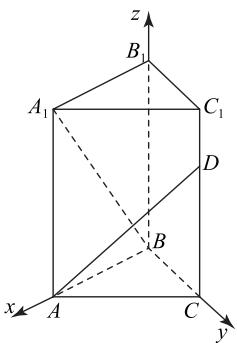
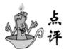
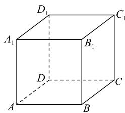
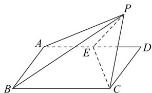
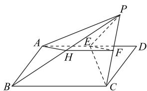

# 例析以立体图形为背景的概率问题

# 曹英

(山东省枣庄市第十六中学)

纵览历年数学高考试题,不难发现当今新高考命题已发生了微妙的变化,由原来的“知识立意”转变为“能力立意”,在知识的交会点上命题已成为高考命题的“常态”.基于此,以立体图形为背景的概率问题应运而生,这类问题将立体几何、排列组合和概率融合在一起,考查考生的数学能力和综合素养.下面举例加以说明.

# 1 以空间直线位置关系为样本

这类问题主要涉及两条直线平行(垂直)或异面的判断、事件的判断和概率的计算.

例 1 从正四棱台 $ABCD-A_{1}B_{1}C_{1}D_{1}$ 的 12 条任取 2 条，则这 2 条棱互相平行的概率为（）.

A. $\frac{1}{5}$

B. $\frac{1}{11}$

C. $\frac{5}{33}$

D. $\frac{2}{11}$

因为 $AD \parallel BC \parallel A_{1}D_{1} \parallel B_{1}C_{1}, AB \parallel CD \parallel A_{1}B_{1} \parallel C_{1}D_{1}$ ，所以这 2 条棱互相平行的概 $=\frac{2}{11}$ ，故选 D.

本题先确定正四棱台中的平行直线,再应用古典概型及组合数计算求解,属于简单题.

例 2 抛掷两枚质地均匀的骰子, 记这两枚骰子的点数分别为 a, b. 在直三棱柱 $ABC-A_{1}B_{1}C_{1}BA \perp BC$ , $BA = BC = \sqrt{6}$ , 点 D 在棱 $CC_{1}$ 上, =a, $BB_{1} = b$ . 设事件 M 为“异面直线 $BA_{1}$ 与 AD”, 则 $P(M) =$ \_\_\_\_.

在直三棱柱 $ABC-A_{1}B_{1}C_{1}$ 中， $BB_{1}\perp$ 平面 ABC，

$BA \subset$ 平面 $ABC, BC \subset$ 平面 $ABC$ , 所以 $BB_{1} \perp BA, BB_{1} \perp BC$ . 又 $BA \perp BC$ , 所以建立如图 1 所示的空间直角坐标系, 则 $B(0,0,0), A(\sqrt{6},0,0), D(0, \sqrt{6},a), A_{1}(\sqrt{6},0,b), \overrightarrow{BA_{1}} = (\sqrt{6},0,b), \overrightarrow{AD} = (-\sqrt{6},\sqrt{6},a)$ .

text_image

z
B₁
A₁
C₁
D
B
x
A
C
y

图1

当异面直线 $BA_{1}$ 与 AD 垂直时， $\overrightarrow{BA_{1}} \cdot \overrightarrow{AD} = 0$ ，即 $-6 + ab = 0$ ，则 ab = 6。显然 $a \leqslant b$ ，样本空间 $\Omega$ 的样本点个数为 $n(\Omega) = 36, M = \{(1, 6), (2, 3)\}, n(M) = 2$ 。由古典概型概率公式可知

$$
P (M) = \frac {n (M)}{n (\Omega)} = \frac {1}{1 8}.
$$

建立空间直角坐标系,根据空间向量垂直的坐标表示公式及古典概型运算公式进行求结合空间向量垂直的坐标表示考查古典概型概率计算.

# 2 以几何体为样本

这类问题要求学生求满足某种要求的几何体的概率,首先要用立体几何知识列举特殊几何体的个数,然后运用概率公式计算.

例 3 从正方体 $ABCD-A_{1}B_{1}C_{1}D_{1}$ 的 8 个顶点取 4 个点, 若这 4 个点能构成正三棱锥的顶点, 4 个点构成正四面体的顶点的概率为().

A. $\frac{1}{2}$

B. $\frac{1}{4}$

C. $\frac{1}{3}$

D. $\frac{1}{5}$

如图 2 所示,由 4 个顶点构成的正三棱锥的顶点有两类: 第一类是正四面体, 即四面体 $A_{1}BC_{1}D, AB_{1}CD_{1}$ , 共 2 个; 第二类是正三棱锥但非正四面体, 如正三棱锥 $A-BDA_{1}$ ,

text_image

D₁
A₁
B₁
C₁
D
A
B
C

图 2

$B-ACB_{1},\quad C-BDC_{1},\quad D-ACD_{1},\quad A_{1}-AB_{1}D_{1},$ $B_{1}-BC_{1}A_{1},C_{1}-CB_{1}D_{1},D_{1}-A_{1}C_{1}D$ ，共8个，则所求概率为 $\frac{2}{2+8}=\frac{1}{5}$ ，故选D.

本题根据图形确定正四面体及正三棱锥的个数,结合古典概率模型计算公式即可求解.本题考查棱锥的结构特征和分类、计算古典概型问题的概率,难度不大.

例 4 从 2,3,4 三个数中任选 2 个, 分别作为圆柱的高和底面半径, 则此圆柱的体积大于 $20\pi$ 的概率为 \_\_\_\_.

解析 从2,3,4三个数中任选2个，分别作为圆柱的高和底面半径 $(h,r)$ ，有(2,3)，(2,4)，(3,2)，(3,4)，(4,2)，(4,3)，共6个样本点.由题意知圆柱的体积 $V = \pi r^2 h > 20\pi$ ，即 $r^2 h > 20$ ，满足条件的样本点有(2,4)，(3,4)，(4,3)，共3个样本点，所以此圆柱的体积大于 $20\pi$ 的概率为 $P = \frac{3}{6} = \frac{1}{2}$

点评

本题只需利用样本空间、古典概型概率公式、圆柱体积公式运算求解即可.

# 3 立体几何与概率的综合应用

这类问题一般以解答题的形式出现,题目设置了2\~3个小问题,某一个小题涉及概率问题,一般不仅涉及古典概型,还涉及相互独立事件的概率、条件概率、全概率公式等.

例5 如图3所示，

在矩形 ABCD 中, AB = 1, AD = 2, AB ⊥ AD, E 为 AD 的中点, 将点 D 沿着 CE 翻折到点 P, 二面

text_image

Geometric diagram of a pyramid with labeled vertices and internal points, used in spatial geometry problems.

图3

角 $P - EC - D$ 的大小为 $\theta (0 < \theta < \frac{\pi}{2})$ ，连接 $PA, PB$ .

(1) 若 PC 的中点为 F，求证: $EF \parallel$ 平面 PAB.  
(2) 求四面体 $PABC$ 的外接球表面积的取值范围.  
(3)一个动点 M 从点 P 开始, 在四棱锥 P-ABCE 的棱上运动, 定义 1 步运动为: 在 M 所在顶点处随机选取一条与之相邻的棱, 从所在顶点运动到该棱的另一个顶点(例如, 若点 M 在点 P 处, 分别有 $\frac{1}{4}$ 的概率运动到点 A, B, C, E 处. 若点 M 在点 E 处, 分别有 $\frac{1}{3}$ 的概率运动到 A, P, C 处, 依此类推). 现有一个质地均匀的骰子(六个面上数字分别是 1, 1, 2, 3, 3, 3), 每掷一次骰子, 若骰子正面向上的点数为 $k (k = 1, 2, 3)$ , 则点 M 运动 k 步, 求掷 n 次骰子后动点 M 仍在点 P 处的概率.

(1)如图4所示,取PB的中点H.因为PC的中点为F,所以 $FH\parallel BC$ ,且 $FH=\frac{1}{2}BC$ .

又 $AE=1=\frac{1}{2}BC, AE \parallel BC$ ，所以 $AE \parallel FH, AE=FH$ ，故四边形 AEFH 为平行四边形，所以 $AH \parallel EF$ ，而 $AH \subset$ 平

text_image

Geometric diagram of a pyramid with labeled vertices and internal points, used for spatial geometry problems.

图4

面 $PAB, EF \not\subset$ 平面 $PAB$ , 所以 $EF \parallel$ 平面 $PAB$ .

(2) $(5\pi,\frac{11}{2}\pi)$ (求解过程略).   
(3)设掷 $n$ 次骰子后动点 $M$ 仍在点 $P$ 处的概率为 $p_n$ , 掷 $n$ 次骰子后动点 $M$ 仍在点 $P$ 处有两种情况: 一种是掷 $n - 1$ 次骰子后动点 $M$ 仍在点 $P$ , 一种是掷 $n - 1$ 次骰子后动点 $M$ 不在点 $P$ 处, 而点 $M$ 在 $A, B, C, E$ 处掷一次骰子到点 $P$ 的概率为

$$
\frac {1}{3} \times \frac {1}{3} + \frac {1}{6} \times \frac {2}{3} \times \frac {1}{3} + \frac {1}{2} \times
$$

$$
\left(\frac {2}{3} \times \frac {2}{3} \times \frac {1}{3} + \frac {1}{3} \times 1 \times \frac {1}{3}\right) = \frac {5}{1 8},
$$

而点 M 在 P 处掷一次骰子到点 P 处的概率为

$$
\frac {1}{6} \times 1 \times \frac {1}{3} + \frac {1}{2} \times 1 \times \frac {2}{3} \times \frac {1}{3} = \frac {1}{6},
$$

所以 $p_n = \frac{5}{18} (1 - p_{n-1}) + \frac{1}{6} p_{n-1}$ , 故 $p_n - \frac{1}{4} = -\frac{1}{9} (p_{n-1} - \frac{1}{4})$ . 又 $p_1 = \frac{1}{6}$ , 所以 $p_1 - \frac{1}{4} = -\frac{1}{12}$ , 故 $\{p_n - \frac{1}{4}\}$ 是以 $-\frac{1}{12}$ 为首项、 $-\frac{1}{9}$ 为公比的等比数列, 则

$$
p _ {n} - \frac {1}{4} = (- \frac {1}{1 2}) \times (- \frac {1}{9}) ^ {n - 1} = \frac {3}{4} \times (- \frac {1}{9}) ^ {n},
$$

所以 $p_{n}=\frac{1}{4}+\frac{3}{4}\times(-\frac{1}{9})^{n}$ .

点评

本题是立体几何背景下的综合题,涉及的考点较多,如球的表面积的有关计算、证明线面平行、计算古典概型问题的概率、独立事件的乘法公式、全概率公式和等比数列等，能全面考查考生的综合能力。概率计算出现在第(3)问，要求学生先利用全概率公式构建递推关系，再利用构造法求通项。

由此可见，以立体图形为背景的概率问题，内容十分广泛。学生在解决这类交会问题时既要分析几何图形的特征，又要判断事件的类型和概率的类型，从而选择准确的概率公式进行计算。

(完)