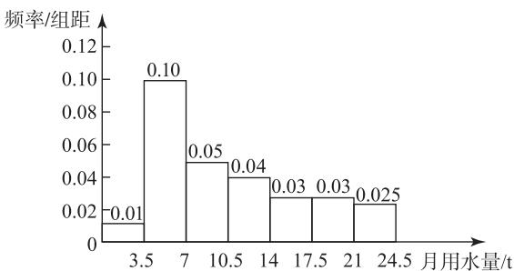
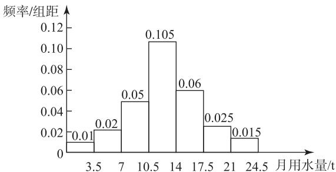
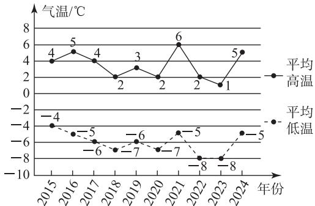
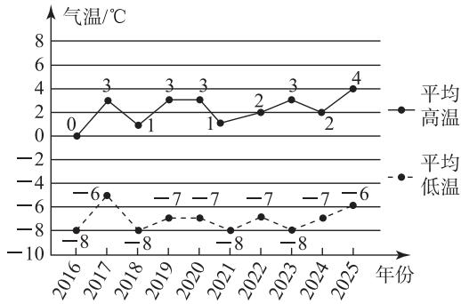
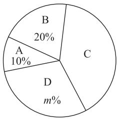

# 例谈统计图表的数据分析与应用

鲁柯新

(山东省济南第七中学)

在现实生活中,统计问题常常以图表的形式展现,直观形象,让读者一目了然.高考中统计试题常考查考生的识图能力、用图能力和数据分析能力,那么常用的统计图表有哪些呢?如何分析与应用这些图表中的数据呢?本文举例说明.

# 1 频率分布直方图

涉及频率分布直方图的考题难度一般不大,主要考查其应用,要求学生了解频率分布直方图的意义.

例 1 为了解本地区居民用水情况,甲、乙两个兴趣小组同学利用假期分别从 A, B 两个社区随机选择 100 户居民进行了“家庭月用水量”的调查统计，利用调查数据分别绘制成频率分布直方图（如图 1 和图 2）。甲组同学所得数据的中位数、平均数、众数、标准差分别记为 $a_{1}, x_{1}, b_{1}, s_{1}$ ，乙组同学所得数据的中位数、平均数、众数、标准差分别记为 $a_{2}, x_{2}, b_{2}, s_{2}$ ，则下列判断错误的有（）.

histogram

| 月用水量/t | 频率/组距 |
| :--- | :--- |
| 3.5 | 0.01 |
| 7 | 0.10 |
| 10.5 | 0.05 |
| 14 | 0.04 |
| 17.5 | 0.03 |
| 21 | 0.03 |
| 24.5 | 0.025 |

图1

histogram

| 月用水量/t | 频率/组距 |
| :--- | :--- |
| 3.5 | 0.01 |
| 7 | 0.02 |
| 10.5 | 0.05 |
| 14 | 0.105 |
| 17.5 | 0.06 |
| 21 | 0.025 |
| 24.5 | 0.015 |

图2

A. $a_1 < a_2$ 且 $x_1 < x_2$

B. $b_{1} < b_{2}$ 且 $s_1 > s_2$

C. $a_1 > x_1$ 且 $a_2 = x_2$

D. $b_{1}<a_{1}<x_{1}$

由图1可以判断，甲组数据的中位数 $a_1$ 在[7,10.5)内，则 $0.01 \times 3.5 + 0.10 \times 3.5+$

$(a_{1} - 7)\times 0.05 = 0.035 + 0.35 + (a_{1} - 7)\times 0.05 =$ 0.5，解得 $a_1 = 9.3.$ 由图2可以判断乙组数据的中位数 $a_2$ 在[10.5,14)内，则 $0.01\times 3.5 + 0.02\times 3.5+$ $0.05\times 3.5 + (a_2 - 10.5)\times 0.105 = 0.5$ ，解得 $a_2\approx$ 12.595，所以 $a_1 <   a_2$

甲组的平均数

$$
x _ {1} = (1. 7 5 \times 0. 0 1 + 5. 2 5 \times 0. 1 + 8. 7 5 \times 0. 0 5 +
$$

$$
1 2. 2 5 \times 0. 0 4 + 1 5. 7 5 \times 0. 0 3 + 1 9. 2 5 \times 0. 0 3 +
$$

$$
2 2. 7 5 \times 0. 0 2 5) \times 3. 5 \approx 1 0. 8 1 1.
$$

乙组的平均数

$$
x _ {2} = (1. 7 5 \times 0. 0 1 + 5. 2 5 \times 0. 0 2 + 8. 7 5 \times 0. 0 5 +
$$

$$
1 2. 2 5 \times 0. 1 0 5 + 1 5. 7 5 \times 0. 0 6 + 1 9. 2 5 \times 0. 0 2 5 +
$$

$$
2 2. 7 5 \times 0. 0 1 5) \times 3. 5 \approx 1 2. 6 4 8,
$$

所以 $x_{1} < x_{2}$ . 由图1可得甲组数据的众数 $b_{1} = \frac{3.5 + 7}{2} = 5.25$ . 由图2可得乙组数据的众数 $b_{2} = \frac{10.5 + 14}{2} = 12.25$ , 所以 $b_{1} < b_{2}$ . 因为甲组数据分布相对分散, 乙组数据相对集中在中间区间, 所以 $s_{1} > s_{2}$ .

综上,选 C.

# 2 折线图

折线图主要反映统计数据的上升或下降趋势,以及数据大小的波动程度等.除此以外,学生还需关注折线上的点的横坐标与纵坐标数据的实际意义.

例 2 已知近 10 年北京市 12 月和 1 月历史气温分别如图 3、图 4 所示.

line

| 年份 | 平均高温 (°C) | 平均低温 (°C) |
| ---- | ------------- | ------------- |
| 2015 | 4             | -4            |
| 2016 | 5             | -5            |
| 2017 | 4             | -6            |
| 2018 | 2             | -7            |
| 2019 | 3             | -6            |
| 2020 | 2             | -7            |
| 2021 | 6             | -5            |
| 2022 | 2             | -8            |
| 2023 | 1             | -8            |
| 2024 | 5             | -5            |

图3

line

| 年份 | 平均高温 | 平均低温 |
| ---- | -------- | -------- |
| 2016 | 0        | -8       |
| 2017 | 3        | -6       |
| 2018 | 1        | -8       |
| 2019 | 3        | -7       |
| 2020 | 3        | -7       |
| 2021 | 1        | -8       |
| 2022 | 2        | -7       |
| 2023 | 3        | -8       |
| 2024 | 2        | -7       |
| 2025 | 4        | -6       |

图4

(1)从 2016—2024 年这 9 年中随机抽取一年,求该年 12 月平均高温和平均低温都低于前一年的概率.  
(2) 将当年 12 月和次年 1 月作为当年的冬季周期, 记当年 12 月平均高温与平均低温的差值为 $a$ (单位: $\mathrm{^\circ C}$ ), 次年 1 月平均高温与平均低温的差值为 $b$ (单位: $\mathrm{^\circ C}$ ). 从 2015—2024 年这 10 个冬季周期中随机抽取 3 个, 求至少有 2 个冬季周期中 $a = b$ 的概率.  
(3)依据图 4 中信息,能否预测北京市 2026 年 1 月平均高温低于 $4^{\circ}C$ ? 请说明理由.

(1)由图可知从 2016—2024 年 12 月平均高温和平均低温都低于前一年的年份有 2017，2018, 2020, 2022, 所以从 2016—2024 年这 9 年中随机抽取一年, 该年 12 月平均高温和平均低温都低于前一年的概率为 $\frac{4}{9}$ .

(2)由已知可得从 2015—2024 年这 10 个冬季周期平均高温与平均低温的差值分别为 (8,8)，(10,9)，(10,9)，(9,10)，(9,10)，(9,9)，(11,9)，(10,11)，(9,9)，(10,10)，满足 a=b 的有 4 个，从 2015—2024 年这 10 个冬季周期中随机抽取 3 个，故至少有 2 个冬季周期中 a=b 的概率为 $\frac{C_{4}^{2}C_{6}^{1}+C_{4}^{3}}{C_{10}^{3}}=\frac{40}{120}=\frac{1}{3}$ .  
(3)从图 4 可以看出,1 月平均高温数据虽有波动,但没有明显的单调递增或单调递减的线性趋势,数据的波动是随机的,没有足够的依据从过去 10 年的数据直接推断 2026 年 1 月平均高温低于 4℃.

# 3 扇形图(饼状图)

扇形图(饼状图)能直观反映各个类别在总体中的占比,通过这个比例可以求得各个类别的相关数据.

例 3 2023 年以来, 某居民小区把垃圾分类纳入积分,建立文明账户,市民以行动换积分.为了解甲、乙两个社区居民垃圾分类换积分的情况,分别从甲、

乙两个社区中各抽取10人，记录下他们的积分（单位：分），并进行整理和分析（积分用 $x$ 表示，共分为4组：A. $x < 70$ ，B. $70 \leqslant x < 80$ ，C. $80 \leqslant x < 90$ ，D. $90 \leqslant x \leqslant 100$ )，下面给出了部分信息。甲社区10人的积分为47,56,68,71,83,83,85,90,91,94；乙社区10人的积分在C组中的积分为81,83,84,84。两组数据的平均数、中位数、众数如表1所示。

表 1

<table><tr><td>社区</td><td>平均数</td><td>中位数</td><td>众数</td></tr><tr><td>甲</td><td>76.8</td><td>83</td><td>b</td></tr><tr><td>乙</td><td>76.8</td><td>a</td><td>84</td></tr></table>

乙社区积分等级扇形图如图 5 所示.

(1) 填空: a = \_\_\_\_, b = \_\_\_\_, m = \_\_\_\_;   
(2)根据以上数据,判断哪个社区在此次垃圾分类换积分活动中表现更好,说明理由;  
(3) 若 4 月份甲社区有 700 人参与活动, 乙社区有 800

人参与活动,请估计该月甲、乙两个社区积分在80分以上(包括80分)的一共有多少人.

pie

| Category | Value (%) |
|---|---|
| A | 10 |
| B | 20 |
| C | |
| D | m |

图 5

# 解析

(1) 因为甲社区中出现次数最多的数据为 83, 所以 $b = 83$ . 由图 5 可得乙社区积分在 A 组人数为 $10 \times 10\% = 1$ , 积分在 B 组人数为 $10 \times 20\% = 2$ . 因为乙社区在 C 组中的积分为 81, 83, 84, 84, 所以乙社区的积分从小到大排列, 第 5 个和第 6 个数据分别为 83, 84, 故 $a = \frac{1}{2} \times (83 + 84) = 83.5$ . 乙社区 D 组人数为 $10 - 1 - 2 - 4 = 3$ , 所以积分在 D 组的人数所占的百分比为 $\frac{3}{10} \times 100\% = 30\%$ , 故 $m = 30$ .

(2) 因为甲、乙两个社区积分的平均数相同, 但是乙社区的中位数和众数均比甲社区高, 所以乙社区在此次垃圾分类换积分活动中表现更好.  
(3) 因为甲社区积分在 80 分以上 (包括 80 分) 的人数所占的比例为 0.6, 乙社区积分在 80 分以上 (包括 80 分) 的人数所占的比例为 0.7, 所以 4 月份甲、乙两个社区积分在 80 分以上 (包括 80 分) 的大约有 $0.6 \times 700 + 0.7 \times 800 = 980$ 人.

综上,求解这类问题的本质就是将已知条件“图表化”,从图表中准确获得数据信息.因此,识图与用图是解决这类问题的关键. (完)