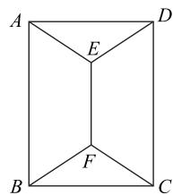

# 关键能力的培育路径探究 ——以错位排列问题为例

邬仁勇 $^{1}$ 沈新权 $^{2}$

(1. 浙江省玉环中学 2. 浙江省嘉兴市第一中学)

2020年教育部考试中心发布了《中国高考评价体系》，为中国的新高考改革吹响了冲锋的号角。《中国高考评价体系》的一大亮点就是强调培养学生的关键能力，其指出“关键能力是指即将进入高等学校的学习者在面对与学科相关的生活实践或学习探索问题情境时，高质量地认识问题、分析问题、解决问题所必须具备的能力。”具体来讲，关键能力是指学生对信息识别与加工、逻辑推理与论证、科学探究与思维建模、语言组织与表达、独立思考与质疑（提出问题、开放作答、合理论证）、批判性思维等。

从 2020—2025 年的新高考数学卷来看,新高考数学试卷呈现出“低分不低,高分难高”的这样一种令人“尴尬”且又较难“突破”的局面.其主要原因是新高考数学试卷在注重考查高中数学必备知识的同时,又通过数学题型的创新与试卷结构的调整考查学生的关键能力.尤其是一些中高难度的试题,通过多个主线内容的交叉,多知识点综合的方式,突出高中数学不同模块内容之间的融合,使得试题更具综合性;同时,新高考数学试题在素养立意下,通过多项关键能力的整合,多种思维过程的联动,强化检测学生数学思维的深度和广度、探索性和创新性,这意味着试题将更加灵活.由此可见,新高考数学试题的基础性、综合性、应用性与创新性对学生的思维品质提出了更高的要求.因此,“题海战术”不再是“熟能生巧”的敲门砖,也不再是提高数学成绩的“灵丹妙药”.

为顺应这种变化,教学也要审时度势,要在培养学生的数学阅读和表达等学习习惯上下功夫,要在培养学生的独立思考、数学运算、逻辑推理、数学探究、批判性思维与数学应用意识等数学关键能力上做文章,要引导学生改变以“刷”代“学”的不良的学习方法.这就需要我们向学生提供一些高质量的数学问题,给学生的深度学习与自主探究提供必要的外部条件.下面以错位排列问题的教与学为例,阐述关键能力的培育路径.

# 1 4个元素的错位排列模型

例1 将数字 $1,2,3,4$ 填入标号为 $1,2,3,4$ 的四个方格里,每格填1个数字,则每个方格的标号与所填的数字均不相同的填法有().

A. 6 种

B. 9 种

C. 11 种

D. 23 种

分析 本题的背景是数学史上非常著名的“n个元素的错位排列问题”的特殊情况.

分类加法计数原理与分步乘法计数原理是解决排列组合问题的两种常用方法,即分类处理或分步解决,使用时要注意类与类之间相互独立,步与步之间相互联系,即“类类独立,步步关联”的基本原则.

排列组合应用题基本的解法有直接法与间接法. 直接法又包括元素分析法与位置分析法, 所谓元素分析法就是以元素为考查对象, 优先满足特殊元素的要求, 再考虑一般元素; 所谓位置分析法, 就是以位置为考查对象, 优先满足特殊位置的要求, 再考虑一般位置; 间接法是一种“正难则反”的方法, 先不考虑附加条件, 计算总排列数, 再减去不符合要求的排列数.

本题难度并不高,由于本题有着深刻的数学背景,教师在平时的教学中应引导学生从不同的角度思考与求解,以加深对问题的理解,培养学生的发散思维.

本题可以采用分类讨论、排除法进行求解, 还可以借助容斥原理以及数列递推求解.

# 方法 1 分类讨论

编号为1的方格可以填入2,3,4这3个数，有3种不同的方法，比如填了2，则2号方格可以填1,3,4三个数，也有3种方法，2号方格所填的数确定后（比如1），则3,4号方格所填的数也随之确定（分别为4,3).由分步计数原理，每个方格的标号与所填的数字均不相同的填法共有 $3\times3\times1\times1=9$ 种.

# 方法 2 排除法

数字 1,2,3,4 填入标号为 1,2,3,4 的 4 个方格里共有 $A_{4}^{4}=24$ 种填入方法，4 个数字与方格的标号有 1 个一样的有 $C_{4}^{1}\cdot2=8$ 种；4 个数字与方格的标号有 2 个一样的有 $C_{4}^{2}=6$ 种；4 个数字与方格的标号有 3 个一样的也就是 4 个数字与方格的标号全部一样。因此，每个方格的标号与所填的数字均不相同的填法有 24-8-6-1=9 种。

# 方法 3 容斥原理

记 $A_{i}$ 为满足条件 $t_i = i$ 的1,2,3,4共4个元素全排列的总和，用 $\left|A_{i}\right|$ 表示集合 $A_{i}$ 的元素个数.数字1,2,3,4填入标号为1,2,3,4的4个方格里共有 $\mathrm{A}_4^4 = 24$ 种填入方法，且

$$
\left| A _ {i} \right| = \mathrm{A} _ {3} ^ {3} (i = 1, 2, 3, 4),
$$

$$
\left| A _ {i} \cap A _ {j} \right| = \mathrm{A} _ {2} ^ {2} (1 \leqslant i <   j \leqslant 4),
$$

$$
\left| A _ {i} \cap A _ {j} \cap A _ {k} \right| = A _ {1} ^ {1} (1 \leqslant i <   j <   k \leqslant 4), \dots ,
$$

$$
\left| A _ {1} \cap A _ {2} \cap A _ {3} \cap A _ {4} \right| = 1,
$$

所以由容斥原理得满足条件的填法总数为 $A_{4}^{4}-C_{4}^{1}A_{3}^{3}+C_{4}^{2}A_{2}^{2}-C_{4}^{3}A_{1}^{1}+C_{4}^{4}=9$ 种.

# 方法 4 数列递推

设 n 个元素的错位排列数为 $a_{n}$ ，则 $a_{1}=0, a_{2}=1, a_{3}=2$ 。编号为 1 的方格可以填入 2, 3, 4 这 3 个数，有 3 种不同的方法，比如填了 2，若 2 号方格填了 1，则剩下的 2 个数字的错位排列数为 $a_{2}$ ；若 2 号方格不填 1，则剩下的 3 个数字的错位排列数为 $a_{3}$ ，所以 $a_{4}=3(a_{2}+a_{3})=9$ 。因此，每个方格的标号与所填的数字均不相同的填法有 9 种。

# 2 5个元素的错位排列模型

例2 将数字1,2,3,4,5填入标号为1,2,3,4,5的 5 个方格里, 每格填 1 个数字, 则每个方格的标号与所填的数字均不相同的填法有 \_\_\_\_ 种.

分析 本题对例 1 进行了简单的拓展与推广,与例 1 相比,多了 1 个方格和 1 个元素.那么上面的解法中,哪些方法仍旧是可以用来解决此题的?例 1 中的方法 1 在分步时,由于元素增多,处理时相对较为烦琐;方法 2 与方法 3 本质上有相似之处,但方法 3 由于有容斥原理的加持更容易处理元素更多的情况,因此在这里方法 2 与方法 3 依然可行,但方法 3 更优;方法 4 把问题往前推两步,本质上是建立递推关系,因此在掌握前面几种初始状态的计数以及递推数列通项公式的求解方法时,方法 4 依然有效.

根据上面的分析,我们可以得到下面四种求解

方法.

# 方法1 分类讨论

1号方格有 $\mathrm{C}_4^1$ 种填法，比如，1号方格里填了2，接下来看2号方格中所填的数，如果2号方格中填了1，则剩下的3个数字有2种错位排列（实际上是3个元素的错位排列）；如果2号方格中没有填1，则其他的数字相当于2,3,4,5与1,3,4,5的错位排列（实际上是4个元素的错位排列).因此，满足条件的填法数有 $\mathrm{C}_4^1 (2 + 9) = 44$ 种.

# 方法 2 排除法

将数字 1,2,3,4,5 填入标号为 1,2,3,4,5 的 5 个方格里，共有 $A_{5}^{5}=120$ 种填入方法，5 个数字与方格的标号有 1 个一样的有 $C_{5}^{1}\cdot9=45$ 种；5 个数字与方格的标号有 2 个一样的有 $C_{5}^{2}\cdot2=20$ 种；5 个数字与方格的标号有 3 个一样的有 $C_{5}^{3}=10$ 种；5 个数字与方格的标号有 4 个一样也就是 5 个数字与方格的标号全部一样。因此，每个方格的标号与所填的数字均不相同的填法有 120-45-20-10-1=44 种。

# 方法 3 容斥原理

记 $A_{i}$ 为满足条件 $t_{i}=i$ 的 1,2,3,4,5 共 5 个元素全排列的总和，用 $\left|A_{i}\right|$ 表示集合 $A_{i}$ 的元素个数. 数字 1,2,3,4,5 填入标号为 1,2,3,4,5 的 5 个方格里共有 $A_{5}^{5}=120$ 种填入方法，且

$$
\left| A _ {i} \right| = \mathrm{A} _ {4} ^ {4} (i = 1, 2, 3, 4, 5),
$$

$$
\left| A _ {i} \cap A _ {j} \right| = \mathrm{A} _ {3} ^ {3} (1 \leqslant i <   j \leqslant 5),
$$

$$
\left| A _ {i} \cap A _ {j} \cap A _ {k} \right| = A _ {2} ^ {2} (1 \leqslant i <   j <   k \leqslant 5), \dots ,
$$

$$
\left| A _ {i} \cap A _ {j} \cap A _ {k} \cap A _ {l} \right| = \mathrm{A} _ {1} ^ {1} (1 \leqslant i <   j <   k <   l \leqslant 5),
$$

$$
\left| A _ {1} \cap A _ {2} \cap \dots \cap A _ {5} \right| = 1.
$$

由容斥原理得满足条件的填法总数为 $A_{5}^{5}-C_{5}^{1}\cdot A_{4}^{4}+C_{5}^{2}A_{3}^{3}-C_{5}^{3}A_{2}^{2}+C_{5}^{4}A_{1}^{1}-C_{5}^{5}=44$ 种.

# 方法4 数列递推

设 n 个元素的错位排列数为 $a_{n}$ ，则 $a_{1}=0, a_{2}=1, a_{3}=2, a_{4}=9$ ，编号为 1 的方格可以填入 2, 3, 4, 5 四个数，有 4 种不同的方法，比如填了 2，若 2 号方格填了 1，则剩下的 3 个数字的错位排列数为 $a_{3}$ ；若 2 号方格不填 1，则剩下的 4 个数字的错位排列数为 $a_{4}$ ，所以 $a_{5}=4(a_{3}+a_{4})=44$ 。因此，每个方格的标号与所填的数字均不相同的填法有 44 种。

# 3 拓展与推广

# 3.1 $n$ 个元素的错位排列

例 1 和例 2 本质上是一样的, 是被著名数学家欧拉称为组合数论的一个妙题的“n 个元素的错位排列问题”的两个特例. 这个问题是由当时有名的数学家约翰·伯努利的儿子丹尼尔·伯努利提出来的, 即“装错信封问题”: 一个人写了 n 封信及 n 个对应的信封, 这个人随机将这 n 封信分别装入这 n 个信封, 问都装错的情况有多少种?

丹尼尔·伯努利只是提出了这个问题,但他并没有解决这个问题.后来,欧拉对此题产生了兴趣,在与丹尼尔·伯努利毫无联系的情况下,独自解出了这道难题,给出了“n个元素的错位排列问题”的答案.那么数学家是如何解决这个问题的呢?

# 3.2 递推数列方法

欧拉用递推数列的方法解决了这个问题.设 n 个信封都装错的情况数为 $a_{n}$ ，那么

$$
a _ {n} = n! \left[ 1 - \frac {1}{1 !} + \frac {1}{2 !} - \frac {1}{3 !} + \dots + \frac {(- 1) ^ {n - 1}}{(n - 1) !} + \frac {(- 1) ^ {n}}{n !} \right].
$$

用 $a_{n}$ 表示 n 封信与信封都不匹配的放法种数，则 $a_{1}=0, a_{2}=1, a_{3}=2$ 。当 $n \geqslant 3$ 时，首先将编号为 1 的信放入信封中，有 n-1 种放法；再考虑另外 n-1 封信的放法，若编号为 1 的信放到编号为 k 的信封中，那么编号为 k 的信的放法可以分为两种：编号为 k 的信恰好放进编号为 1 的信封中，则剩下的 n-2 封信都与信封的编号不匹配（错位），有 $a_{n-2}$ 种；编号为 k 的信没放进编号为 1 的信封，那么问题等价于求 n-1 封信都与信封的编号不匹配（错位）的放法数，有 $a_{n-1}$ 种。

由分类分步计数原理可知:n 封信都没有放入相应编号的信封中的放法种数为

$$
a _ {n} = (n - 1) \left(a _ {n - 1} + a _ {n - 2}\right),
$$

所以

$$
\begin{array}{l} a _ {n} - n a _ {n - 1} = - a _ {n - 1} + (n - 1) a _ {n - 2} = \\ - \left[ a _ {n - 1} - (n - 1) a _ {n - 2} \right], \\ \end{array}
$$

从而数列 $\{a_{n} - na_{n - 1}\}$ 是首项为 $a_2 - 2a_1$ 、公比为-1的等比数列，所以 $a_{n} - na_{n - 1} = (-1)^{n}$ .两边同时除以 $n!$ ，有

$$
\frac {a _ {n}}{n !} - \frac {a _ {n - 1}}{(n - 1) !} = \frac {(- 1) ^ {n}}{n !},
$$

则

$$
\begin{array}{l} \frac {a _ {n}}{n !} = \frac {a _ {1}}{1 !} + (\frac {a _ {2}}{2 !} - \frac {a _ {1}}{1 !}) + \\ \left(\frac {a _ {3}}{3 !} - \frac {a _ {2}}{2 !}\right) + \dots + \left[ \frac {a _ {n}}{n !} - \frac {a _ {n - 1}}{(n - 1) !} \right] = \\ \end{array}
$$

$$
\left[ \frac {1}{2 !} - \frac {1}{3 !} + \dots + \frac {(- 1) ^ {n - 1}}{(n - 1) !} + \frac {(- 1) ^ {n}}{n !} \right],
$$

所以

$$
a _ {n} = n! \left[ 1 - \frac {1}{1 !} + \frac {1}{2 !} - \frac {1}{3 !} + \dots + \frac {(- 1) ^ {n - 1}}{(n - 1) !} + \frac {(- 1) ^ {n}}{n !} \right].
$$

注:1) 结论对于任意 $n \in N^{*}$ 都成立; 2) 由结论可知, $a_{2}=1, a_{3}=2, a_{4}=9, a_{5}=44$ .

# 3.3 容斥原理

记 $A_{i}$ 为满足条件 $t_{i}=i$ 的 $1,2,\cdots,n$ 共 n 个元素全排列的总和.

因为 $|I|=A_{n}^{n}$ ，且

$$
\left| A _ {i} \right| = \mathrm{A} _ {n - 1} ^ {n - 1} (i = 1, 2, \dots , n),
$$

$$
\left| A _ {i} \cap A _ {j} \right| = \mathrm{A} _ {n - 2} ^ {n - 2} (1 \leqslant i <   j \leqslant n),
$$

$$
\left| A _ {i} \cap A _ {j} \cap A _ {k} \right| = \mathrm{A} _ {n - 3} ^ {n - 3} (1 \leqslant i <   j <   k \leqslant n), \dots ,
$$

$$
\left| A _ {1} \cap A _ {2} \cap \dots \cap A _ {n} \right| = 1.
$$

由容斥原理,有

$$
a _ {n} = \mathrm{A} _ {n} ^ {n} - \mathrm{C} _ {n} ^ {1} \mathrm{A} _ {n - 1} ^ {n - 1} + \mathrm{C} _ {n} ^ {2} \mathrm{A} _ {n - 2} ^ {n - 2} - \mathrm{C} _ {n} ^ {3} \mathrm{A} _ {n - 3} ^ {n - 3} + \dots +
$$

$$
(- 1) ^ {n - 1} \mathrm{C} _ {n} ^ {n - 1} \mathrm{A} _ {1} ^ {1} + (- 1) ^ {n} \mathrm{C} _ {n} ^ {n} \mathrm{A} _ {0} ^ {0}.
$$

注意到 $\forall 1\leqslant i\leqslant n,\mathrm{C}_n^i (n - i)!$ $= \frac{n!}{i!}$ ，所以

$$
a _ {n} = n! \left[ 1 - \frac {1}{1 !} + \frac {1}{2 !} - \frac {1}{3 !} + \dots + (- 1) ^ {n} \cdot \frac {1}{n !} \right].
$$

注:对于容斥原理,我们可以通过人教 A 版普通高中教科书数学必修第一册第一章第 15 页阅读与思考“集合中元素的个数”的结论进行拓展与推广得到.

令 card(A) 表示集合 A 中元素的个数, 则

$$
\begin{array}{l} \operatorname{card} \left(A _ {1} \cup A _ {2} \cup \dots \cup A _ {m}\right) = \\ \sum_ {1 \leqslant i \leqslant m} \operatorname{card} (A _ {i}) - \sum_ {1 \leqslant i <   j \leqslant m} \operatorname{card} (A _ {i} \cap A _ {j}) + \\ \sum_ {1 \leqslant i <   j <   k \leqslant m} \operatorname{card} \left(A _ {i} \cap A _ {j} \cap A _ {k}\right) - \dots + \\ (- 1) ^ {m - 1} \operatorname{card} (A _ {1} \cap A _ {2} \cap \dots \cap A _ {m}). \\ \end{array}
$$

# 4 总结与反思

例 1 是一道普通的高考题,但这道题又不太普通,它的“背景”深厚,因此值得我们仔细研究.

教学理论与实践告诉我们,分析典型问题的解题过程是引导学生学会解题、培育学生关键能力的有效途径.关键能力本身具有开放、发展的特点,而不是一成不变的,它随着具体问题与情境的变化而变化,有时也随着思考问题方式的变化而变化.因此,在高中数学教学中,教师可以选择一些典型的数学问题,引导学生分析、思考、探究,从不同的角度寻求问题的解决方法,这样不仅可以开拓学生的解题思路,而且通过思考与探究能让学生体会到问题中所蕴含的数学思想方法,从而为揭示数学本质,甚至为数学命题的拓展与推广、数学模型的构建提供方向与路径.

# 4.1 一题多解有利于探究问题的本质

例 1 的 4 种方法实际上也是解决排列组合问题的常用方法, 在高中数学中一题多解探究的优势有很多, 通过一题多解, 可以防止“思维僵化”, 防止单一套路; 可以加深对知识点的理解, 知其然更知其所以然, 提升解题效率; 也可以通过一题多解, 探求问题解决最简的方法; 更重要的是通过一题多解, 可以提升数学思维的灵活性和发散性, 对培育学生的关键能力与提升学生的数学学科素养有着不可忽视的作用.

# 4.2 模型构建体现特殊到一般的思想

数学中存在各种各样的模型,比如,函数就是数学中的一个极其重要的数学模型,再比如,圆锥曲线中的椭圆、双曲线、抛物线等也是解析几何中非常重要的数学模型,把数学模型思想融入数学解题与教学过程具有深远的教育意义.

例 1 是“n 个元素的错位排列问题”的特殊情况，该问题本质上是一个非常重要的数学模型。在数学的学习过程中，数学模型扮演着至关重要的角色，数学模型有着结构有序、结果优美的特点，构建恰当的数学模型，有利于将实际问题与数学问题抽象化、结构化。对于一些复杂的数学问题，教师应有意识地引导学生从简单情况入手，然后根据问题特点逐级而上，逐步拓展，进而得到一般的结论。将特殊的数学问题一般化，体现了从特殊到一般的数学思想。从例 1 到例 2 再到 n 个元素的错位排列，可以让学生体会到数学的发现与推广不再是高不可攀的“创举”。

由此可见，模型思想是数学学科的高阶思维，但这种高阶思维的培养，离不开学生对数学基础知识、基本方法、思想的学习和理解。例1的4种解法不仅有助于学生对求解排列问题通性通法的学习与理解，更有利于对学生的信息识别与加工、逻辑推理与论证等关键能力的培育。只有重视各种数学概念和方法的学习与运用，依据数学概念与通性通法进行思考与探究，才有可能建立起良好的模型思维，促进数学建模这一学科核心素养的发展，那种脱离探究，死记硬背的所谓模型，是无源之水无本之木。

# 4.3 数学模型助力“一览众山小”

数学模型的力量是巨大的,当我们对“n 个元素的错位排列问题”这一模型“滚瓜烂熟”时，对于以此为情境的问题，便可以“庖丁解牛”般地解决，真正实现“一览众山小”.

# 5 变式练习

变式 1 将字母 a, a, b, b, c, c，排成三行两列，要求每行的字母互不相同，每列的字母也互不相同，则不同的排列方法共有（）.

A. 12 种

B. 18 种

C. 24 种

D. 36 种

根据题意,先排第一列,即将 a,b,c 进行全排列,共有 $A_{3}^{3}$ 种排法.再排第二列,此时问题相当于“n 个元素的错位问题”n=3 时的情形,对应有2 种方法,故不同的排列方法共有 $A_{3}^{3} \cdot 2 = 12$ 种,故选 A.

变式 2 如图 1 所示,用四种不同颜色给图中的 A, B, C, D, E, F 六个点涂色,要求每个点涂一种颜色,且图中每条线段的两个端点涂不同颜色,则不同的涂色方法共有().

text_image

A
E
D
B
F
C

图1

A. 288 种

B. 264 种

C. 240 种

D. 168 种

第一步,先给 A,D,E 三点涂色,共有 $A_{4}^{3}=24$ 种方法.

第二步, 给 B, F, C 三点涂色, 此时需分类: 若不用第四种颜色, 相当于“n 个元素的错位排列问题” n=3 时的情形, 对应有 2 种涂法; 若用到第四种颜色, 则还需从 A, D, E 三点涂好的颜色中选择两种, 共 $C_{3}^{2}=3$ 种, 不妨设点 D 的颜色不再用, 则第四种颜色若涂在 C 处, 相当于“n 个元素的错位排列问题” n=2 时的情形, 对应有 1 种涂法, 若不涂在 C 处, 相当于“n 个元素的错位排列问题” n=3 时的情形, 对应有 2 种涂法.

综上,不同的涂色方法共有 $\mathrm{A}_{4}^{3}\left[2+\mathrm{C}_{3}^{2}(1+2)\right]=264$ 种,故选 B.

变式 3 有 4 位同学在同一天的上、下午参加“身高与体重”“立定跳远”“肺活量”“握力”“台阶”五个项目的测试，每位同学上、下午各测试一个项目，且不重复。若上午不测“握力”项目，下午不测“台阶”项目，其余项目上、下午都各测试一人，则不同的安排方式共有 \_\_\_\_ 种（用数字作答）。

# 从英语“七选五”题的蒙题到“可选性错排”问题的探究

林国红

(广东省佛山市乐从中学)

# 1 问题的提出

高考英语中有一类叫“七选五”的试题,这类题是给出一篇缺少5个句子的文章,要求从文后的7个选项中选出5个最佳选项填入文中相应空缺处,使文章完整、连贯通顺.

在做“七选五”试题时,若通过蒙题的方式做题,在不考虑同一选项被多次选择(即选项不能重复)的情况下,全部选错的情形有多少种?

注:所谓的蒙题,是指在5个空缺处分别随便填入1个选项.

# 2 问题的数学化

为表述方便,在“七选五”试题中,不妨假设正确答案为 ABCDE,且选项不能重复.也就是说 A 对应的正确位置是位置 1,B 对应的正确位置是位置 2,以此类推,E 对应的正确位置是位置 5(如表 1).如果某位同学很不幸 5 个空全错,也就是说他填下的答案必须满足“A 不对应位置 1,B 不对应位置 2,C 不对应位置 3,D 不对应位置 4,E 不对应位置 5,F 和 G 可以出现在任意位置”的条件,则这位同学全错的排列数是

多少？

表 1

<table><tr><td>位置</td><td>1</td><td>2</td><td>3</td><td>4</td><td>5</td></tr><tr><td>答案</td><td>A</td><td>B</td><td>C</td><td>D</td><td>E</td></tr></table>

# 3 问题的解答

本问题的解法有很多,下面给出一种借助“全错排”问题公式求解的方法.

根据“A 不对应位置 1, B 不对应位置 2, C 不对应位置 3, D 不对应位置 4, E 不对应位置5”，填入的答案可分为三类.

1) 若填入的答案不含 F 与 G，此时就是 n=5 的“全错排”，其方法数为 $D(5)=44$ .  
2) 若填入的答案只含 F, G 中的一个, 即从 A, B, C, D, E 中选择 4 个, 从 F, G 中选 1 个, 共有 $C_{5}^{4}C_{2}^{1}=10$ 选法.

不妨设选择的是 A, B, C, D, F, 先考虑 F 的放置情况.

若 F 填在位置 5, 剩余的 A, B, C, D 不填入对应的位置, 此时就是 n = 4 的“全错排”, 其方法数为 $D(4) = 9$ .

为方便叙述,把题设的 4 位同学分别记为甲、乙、丙、丁,把“身高与体重”“立定跳远”

“肺活量”“握力”“台阶”这五个项目依次记为 A, B, C, D, E. 依题意，上午安排 A, B, C, E 各一项，下午安排 A, B, C, D 各一项，且同一人的上、下午不能测同一个项目.

第一步,给甲、乙、丙、丁安排上午的 A, B, C, E 项目,此时有 $A_{4}^{4}$ 种方法.

第二步,给上午测试项目的同学安排下午的测试项目,分为以下两类.

当 D 与 E 安排给同一人时, 下午的 A, B, C 项

目不能与上午的此项目安排给同一人,此时问题相当于“n个元素的错位排列问题”n=3时的情形,对应有2种安排方法.

当 D 与 E 不安排给同一人时, 把 D 与 E 视为同类, 把 A, B, C 与自身视为同类, 则下午的 A, B, C, D 不能与上午的同类项目安排给同一人. 此时问题相当于“n 个元素的错位排列问题” n = 4 时的情形, 对应有 9 种安排方法.

根据乘法原理和加法原理,可得不同的安排方法共有 $A_{4}^{4}(2+9)=24\times(2+9)=264$ 种.

(完)