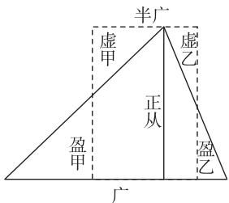
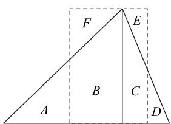
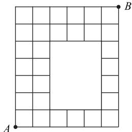
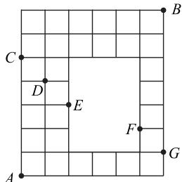
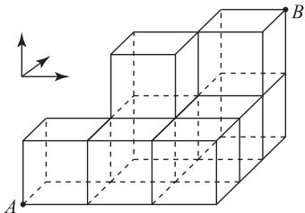
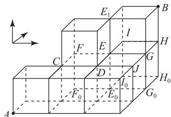

# 几何图形中的计数问题探究

卢国红

(山东省济南市章丘区章丘中学)

几何图形中的计数问题是高中数学各级各类考试中较为常见的一类问题,主要考查两个计数原理和排列组合知识与方法的灵活应用,本文探究这类问题的求解策略.

# 1 平面区域中的涂色问题

这类问题平面区域形状不一,但题目要求大同小异.题目往往给出几种颜色,要求按照规则对各区域涂色,计算涂色的方法总数.这种题型在考试中较为常见.

例 1 如图 1 所示,《九章算术》第一章“方田”问题二十五、二十六指出了三角形田面积算法:“半广以乘正从”.数学社团拟制作板报向全校师生介绍这一结论,如图 2 所示,给证明图形的六个区域 A,B,C,D,E,F 涂色,有三种颜色可用,要求有相邻边的区域颜色不同,则不同的涂色方法有().

A. 48 种  
B. 96 种  
C. 102 种  
D. 120 种

# 解析

因为图2中的六个区域分别为A, B, C, D, E, F, 可按照
A, E 是否同色, 分两类.

A, E 不同色, 先给 B, C 涂色, 有 $A_{3}^{2}$ 种涂法, 再根据 A, E 是否用余下那种颜色分两种情况. A, E 不用第三种颜色, 即 A 用 C 的颜色, E 用 B 的颜色, D 有 $C_{2}^{1}$ 种涂法, F 有 $C_{2}^{1}$ 种涂法, 则有 $C_{1}^{1}C_{1}^{1}C_{2}^{1}C_{2}^{1}$ 种涂法; A, E 用第三种颜色, 即 A 用第三种颜色, E 用 B 的颜色, D 有 $C_{2}^{1}$ 种涂法, F 有 $C_{2}^{1}$ 种涂法, 或 E 用第三种颜色, A 用 C 的颜色, 则有 $2C_{1}^{1}C_{2}^{1}C_{2}^{1}$ 种涂法, 所以 A, E 不同色的涂法有

$A_{3}^{2}(C_{1}^{1}C_{1}^{1}C_{2}^{1}C_{2}^{1}+2C_{1}^{1}C_{2}^{1}C_{2}^{1})=72$ 种.

A, E 同色, 先给 B, C 涂色, 有 $A_{3}^{2}$ 种涂法, 则 A,

text_image

半广
虚甲
虚乙
正从
盈甲
盈乙
广

图1  

text_image

A
B
C
D
E
F

图 2

E 只能用第三种颜色, D 有 $C_{2}^{1}$ 种涂法, F 有 $C_{2}^{1}$ 种涂法, 所以 A, E 同色的涂法有 $A_{3}^{2}C_{2}^{1}C_{2}^{1}=24$ 种.

综上,不同的涂色方法有 $72+24=96$ 种,故选 B.

求解本题需先观察题目所给平面区域,按照A,E 是否同色分两类讨论,再结合分步乘法计数原理运算求解.本题主要考查两个计数原理、排列组合知识以及分类讨论思想的应用.

# 2 网格图形中的路径计数问题

这类问题往往给出一张网格图,已知某个点的起始位置、终点位置以及该点移动或跳动的规则,要求计算移动或跳动路径的总数.

例 2 如图 3 所示, 机器人从点 A 出发, 每次可以向右或向上沿着线走一个单位(每个小正方形的一条边长为一个单位), 要走到点 B, 共有 \_\_\_\_ 种不同的走法.

# 听

如图 4 所示, 当路线经过点 $C$ 时，从A 到 C 有 1 种走法，从 C 到 B 有 $C_{8}^{2}$ 种走法；当路线经过点 D 时，从 A 到 D 有 $C_{5}^{1}$ 种走法，从 D 到 B 有 $C_{7}^{2} + C_{6}^{2}$ 种走法；当路线经过点 E

natural_image

Geometric grid pattern with a central square and corner cells, no text or symbols present

图 3

text_image

B
C
D
E
F
G
A

图4

时，从 A 到 E 有 $C_{5}^{2}$ 种走法，从 E 到 B 有 $C_{6}^{2}$ 种走法；当路线经过点 F 时，从 A 到 F 有 $C_{6}^{1}$ 种走法，从 F 到 B 有 $C_{6}^{1}$ 种走法；当路线经过点 G 时，从 A 到 G 有 $C_{7}^{1}$ 种走法，从 G 到 B 有 1 种走法。

综上,不同的走法共有

$$
\begin{array}{l} 1 \times \mathrm{C} _ {8} ^ {2} + \mathrm{C} _ {5} ^ {1} (\mathrm{C} _ {7} ^ {2} + \mathrm{C} _ {6} ^ {2}) + \mathrm{C} _ {5} ^ {2} \mathrm{C} _ {6} ^ {2} + \mathrm{C} _ {6} ^ {1} \mathrm{C} _ {6} ^ {1} + 1 \times \mathrm{C} _ {7} ^ {1} = \\ 2 8 + 1 8 0 + 1 5 0 + 3 6 + 7 = 4 0 1 \text {   种   }. \\ \end{array}
$$

求解本题,只需根据给定条件,利用分类加法计数原理、分步乘法计数原理进行计算即可.这类问题属于受条件限制的排列、组合题，通常有直接法(合理分类)和间接法(排除法)，分类时标准应统一，避免出现重复或遗漏的情况.

# 3 平面散点中的计数问题

这类问题往往给出一个平面图形和几个点,要求将点连成线段,计算取若干点构成的某种图形的个数.

例3 如图5所示，

在十等分圆周中（10个点依次为 $A_{1}, A_{2}, \cdots, A_{10}$ ），取4个点构成凸四边形且为梯形的有几种？

分三种情况讨论:1)以十边形

的一条边为底（如

$A_{1}A_{2}$ ), 则构成的梯形有 $3 \times 10 = 30$ 个; 2) 以类似 $A_{1}A_{3}$ 为底, 则构成的梯形有 $2 \times 10 = 20$ 个; 3) 以类似 $A_{1}A_{4}$ 为底, 则构成的梯形有 $1 \times 10 = 10$ 个, 所以构成凸四边形且为梯形的共有 $30 + 20 + 10 = 60$ 种.

这类问题结合几何图形,考查采用分类讨论思想求解计数问题,通常采用直接法和排除法两种方法.

# 4 立体几何图形中的计数问题

这类问题以立体几何图形为背景,与平面几何问题类似,包括涂色问题、路径问题、取点构成特殊几何体问题等,将立体图形平面化和合理分类讨论是求解此类问题的基本方法.

例4 现有一只

蜜蜂沿如图 6 所示的用 8 个完全一样的正方体搭建的几何体的棱并按照箭头所指的相互垂直的三个方向

natural_image

3D geometric diagram of stacked cubes with labeled vertices A and B, and a directional arrow indicating rotation (no text or symbols beyond labels)

图6

从点 A 飞行到点 B, 可能的飞行路径共有 \_\_\_\_ 种 (用数字作答).

如图 7 所示,从高度为 1 的顶点沿竖直向上的棱飞到高度为 2 的顶点,一共有 7 处,起点分别记为 C, D, E, F, G, H, I，记点 E, F, G, H, I 下方的点为 $E_{0}, F_{0}, G_{0}, H_{0}, I_{0}$ ，记点 E 上方的点为 $E_{1}$ .

从 A 到 C 有 $A_{3}^{3}=6$ 种路径, 从 C 沿竖直的棱向

上飞再到 $E_{1}$ 有 $A_{2}^{2}=2$ 种路径；从A到D有 $C_{4}^{2}C_{2}^{1}=12$ 种路径，从D沿竖直的棱向上飞再到 $E_{1}$ 有1种路径；从A到C再到F有 $6\times1=6$ 种路径，

text_image

E₁
B
I
H
C
F
E
G
D
J
H₀
F₀
E₀
I₀
G₀
A

图 7

从 A 到 $F_{0}$ 再到 F 有 $A_{2}^{2} \times 1 \times 1 = 2$ 种路径，则从 A 到 F 有 $6 + 2 = 8$ 种路径，从 F 沿竖直的棱向上飞再到 $E_{1}$ 有 1 种路径，则从 A 到 F 再到 E 有 $8 \times 1 = 8$ 种路径；从 A 到 D 再到 E 有 $12 \times 1 = 12$ 种路径，从 A 到 $E_{0}$ 再到 E 有 $(\mathrm{C}_{4}^{2} - 1) \times 1 = 5$ 种路径，则从 A 到 E 有 $8 + 12 + 5 = 25$ 种路径，从 E 再到 $E_{1}$ 有 1 种路径。又从 $E_{1}$ 到 B 有 $A_{2}^{2} = 2$ 种路径，则从 A 到 $E_{1}$ 再到 B 有 $(6 \times 2 + 12 \times 1 + 8 \times 1 + 25 \times 1) \times 2 = 114$ 种路径。从 A 到 E 到 G 有 $25 \times 1 = 25$ 种路径，从 A 到 J 再到 G 有 $C_{5}^{3} C_{2}^{1} \times 1 = 20$ 种路径，从 A 到 $G_{0}$ 再到 G 有 $(\mathrm{C}_{5}^{3} - 1) \times 1 = 9$ 种路径，从 G 沿竖直的棱向上飞再到 B 有 1 种路径，则从 A 到 G 竖直向上再到 B 有 $(25 + 20 + 9) \times 1 = 54$ 种路径。从 A 到 E 再到 I 有 $25 \times 1 = 25$ 种路径，从 A 到 $E_{0}$ 再到 $I_{0}$ 到 I 有 $5 \times 1 \times 1 = 5$ 种路径，从 I 沿竖直的棱向上飞再到 B 有 1 种路径，则从 A 到 $I_{0}$ 竖直向上再到 B 有 $(25 + 5) \times 1 = 30$ 种路径。从 A 到 I 再到 H 有 $30 \times 1 = 30$ 种路径，从 A 到 G 再到 H 有 $54 \times 1 = 54$ 种路径，从 A 到 $I_{0}$ 再到 $H_{0}$ 到 H 有 $5 \times 1 \times 1 = 5$ 种路径，从 A 到 $G_{0}$ 到 $H_{0}$ 到 H 有 $9 \times 1 \times 1 = 9$ 种路径，从 H 再到 B 有 1 种路径，则从 A 到 H 再到 B 有 $(30 + 54 + 5 + 9) \times 1 = 98$ 种路径。

综上，从 A 到 B 可能的飞行路径共有 $114 + 54 + 30 + 98 = 296$ 种.

# 点评

求解复杂排列组合问题的关键在于做好分类讨论,找到合适的分类标准非常重要.本题先找到从高度 1 飞到高度 2 的路径, 以此作为分类标准去讨论, 可以找到合适且清晰的思路.

与计数问题有关的几何图形还有很多,这里不再一一列举.但无论图形如何变化,合理应用两个计数原理和排列组合知识,并辅以数形结合思想和分类讨论思想,是破解这类问题的基本方法.这类问题虽然具有一定难度,但对于培养数学思维的条理性与严谨性大有裨益.

(完)