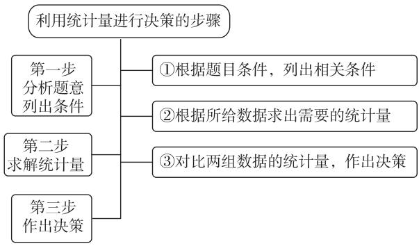
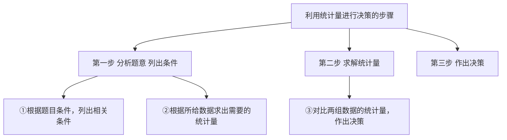
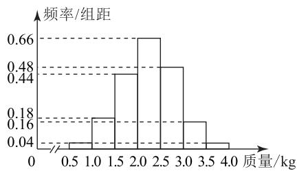

# 利用统计量进行决策

逄志伟

(江苏无锡外国语学校)

在现实生活中,有时需要根据数据进行决策.例如,企业在选择原材料供应商时,需依据不同供应商提供的产品质量数据进行抉择;学校在评估学生成绩时,要考虑成绩的整体水平与波动情况.统计量作为描述数据特征的重要工具,在这些决策过程中发挥着关键作用.平均数和方差是众多统计量中极为重要的两个统计量,平均数能反映数据的集中趋势,让我们了解数据的一般水平;方差则体现数据的离散程度,帮助我们知晓数据的稳定性.掌握利用平均数与方差进行决策的方法,不仅有助于我们解决数学问题,更能提升我们应对生活中实际决策问题的能力,因此有必要对其展开深入研究.

# 1 利用统计量进行决策的步骤

利用统计量(平均数和方差)进行决策的步骤如图 1 所示.

flowchart

图1

# 2 平均数在决策中的作用

平均数可以作为评估整体水平的重要指标.例如,学校在评估学生成绩时,班级平均成绩得分能反映本班学生的整体水平.

例 1 为响应政府号召,增加农民收入,某村委会指导当地村民在果园里进行生态鸡的养殖.在2025年8月初,为了解所养殖的生态鸡的质量(单位:kg)情况,养殖负责人随机抓取了一部分鸡进行称重,得

到如图 2 所示的频率分布直方图(同一组中的数据用该组区间的中点值代替),以样本估计总体.

histogram

| 质量 (kg) | 频率/组距 |
| :--- | :--- |
| 0.5 | 0.04 |
| 1.0 | 0.18 |
| 1.5 | 0.48 |
| 2.0 | 0.66 |
| 2.5 | 0.48 |
| 3.0 | 0.16 |
| 3.5 | 0.04 |
| 4.0 | 0.04 |

图2

该地现养殖有 5 000 只鸡,为减轻养殖压力,养殖负责人计划卖掉一部分鸡,另一部分计划春节再卖掉.若现在卖掉,价格为 20 元·kg $^{-1}$ ,到春节卖掉,预估价格为 22 元·kg $^{-1}$ .现有以下两种方案.

方案 1: 体重不低于 2.5 kg 的现在卖掉, 其余的养殖到春节再卖, 剩余的鸡平均每只需要 10 元养殖费用, 到春节时, 平均质量可以达到 2.5 kg.

方案 2: 体重不低于 2 kg 的现在卖掉, 其余的养殖到春节再卖, 剩余的鸡平均每只需要 10 元养殖费用, 到春节时, 平均质量可以达到 3 kg.

从经济收益的角度来看,选择哪种方案更合适?

  
解析

方案 1: 现在卖掉的鸡的数量为

$$
5 0 0 0 \times (0. 4 8 \times 0. 5 + 0. 1 6 \times 0. 5 +
$$

$$
0. 0 4 \times 0. 5) = 1 7 0 0 \text { 只 },
$$

现在卖鸡的收益为

$$
5 0 0 0 \times (0. 4 8 \times 0. 5 \times 2. 7 5 + 0. 1 6 \times 0. 5 \times 3. 2 5 +
$$

$$
0. 0 4 \times 0. 5 \times 3. 7 5) \times 2 0 = 9 9 5 0 0 \text {   元   },
$$

春节卖鸡的收益为

$$
(5 0 0 0 - 1 7 0 0) \times (2. 5 \times 2 2 - 1 0) = 1 4 8 5 0 0 \text {   元   },
$$

总收益为 $148\ 500 + 99\ 500 = 248\ 000$ 元.

方案 2: 现在卖掉的鸡的数量为

$$
5 0 0 0 \times (0. 6 6 \times 0. 5 + 0. 4 8 \times 0. 5 + 0. 1 6 \times 0. 5 +
$$

$$
0. 0 4 \times 0. 5) = 3 3 5 0 \text {只，}
$$

现在卖鸡的收益为

$$
5 0 0 0 \times (0. 6 6 \times 0. 5 \times 2. 2 5 + 0. 4 8 \times 0. 5 \times 2. 7 5 +
$$

$$
0. 1 6 \times 0. 5 \times 3. 2 5 + 0. 0 4 \times
$$

$$
0. 5 \times 3. 7 5) \times 2 0 = 1 7 3 7 5 0 \text {   元   },
$$

春节卖鸡的收益为

$$
(5 0 0 0 - 3 3 5 0) \times (3 \times 2 2 - 1 0) = 9 2 4 0 0 \text {元，}
$$

总收益为 $173\ 750 + 92\ 400 = 266\ 150$ 元.

由 266 150 > 248 000, 可知选择方案 2 的经济收益更高.

# 3 方差在决策中的作用

方差反映了数据的稳定性.方差小意味着数据较为稳定,风险相对较小.例如,在选择供应商时,产品质量的方差小说明供应商的产品质量更稳定.

例 2 某杨梅种植户从购买客户中随机抽取 20位客户进行质量随访调查,其中购买 A 系列(大棚种植)的 10 位,购买 B 系列(自然种植)的 10 位,从杨梅的大小、口感、水分、甜度进行综合打分(满分 100 分),打分结果记录如表 1 所示.

表 1

<table><tr><td>A系列(大棚种植)</td><td>84</td><td>81</td><td>79</td><td>76</td><td>95</td><td>88</td><td>93</td><td>86</td><td>86</td><td>92</td></tr><tr><td>B系列(自然种植)</td><td>92</td><td>95</td><td>80</td><td>75</td><td>83</td><td>87</td><td>90</td><td>80</td><td>85</td><td>93</td></tr></table>

分别求出这两个系列综合打分的平均数与方差，通过上述数据结果进行分析，你认为推广哪种系列种植更合适？

随机抽取 20 位客户进行调查, 购买 A 系列 (大棚种植)、B 系列 (自然种植) 各 10 位, A系列的打分结果从小到大排列为 76, 79, 81, 84, 86, 86, 88, 92, 93, 95. B 系列的打分结果从小到大排列为 75, 80, 80, 83, 85, 87, 90, 92, 93, 95.

A 系列综合打分的平均数

$$
\bar {x} _ {\mathrm{A}} = \frac {7 6 + 7 9 + 8 1 + 8 4 + 8 6 + 8 6 + 8 8 + 9 2 + 9 3 + 9 5}{1 0} = 8 6,
$$

方差

$$
s _ {\mathrm{A}} ^ {2} = \frac {1}{1 0} [ (- 1 0) ^ {2} + (- 7) ^ {2} + (- 5) ^ {2} + (- 2) ^ {2} + 0 ^ {2} +
$$

$$
\left. 0 ^ {2} + 2 ^ {2} + 6 ^ {2} + 7 ^ {2} + 9 ^ {2} \right] = 3 4. 8.
$$

B 系列综合打分的平均数

$$
\bar {x} _ {\mathrm{B}} = \frac {7 5 + 8 0 + 8 0 + 8 3 + 8 5 + 8 7 + 9 0 + 9 2 + 9 3 + 9 5}{1 0} = 8 6,
$$

方差

$$
s _ {\mathrm{B}} ^ {2} = \frac {1}{1 0} [ (- 1 1) ^ {2} + (- 6) ^ {2} + (- 6) ^ {2} + (- 3) ^ {2} +
$$

$$
(- 1) ^ {2} + 1 ^ {2} + 4 ^ {2} + 6 ^ {2} + 7 ^ {2} + 9 ^ {2} ] = 3 8. 6.
$$

因为 $\overline{x}_{A}=\overline{x}_{B}, s_{A}^{2}<s_{B}^{2}$ ，所以推广 A 系列种植更合适.

例 3 甲、乙两种冬小麦实验品种连续 5 年的平位面积产量(单位: $t \cdot ha^{-1}$ )如表 2 所示.

表 2

<table><tr><td>品种</td><td>第1年</td><td>第2年</td><td>第3年</td><td>第4年</td><td>第5年</td></tr><tr><td>甲</td><td>9.8</td><td>9.9</td><td>10.1</td><td>10</td><td>10.2</td></tr><tr><td>乙</td><td>9.4</td><td>10.3</td><td>10.8</td><td>9.7</td><td>9.8</td></tr></table>

某村从中引进哪种冬小麦大量种植更合适？

由题意得

$$
\overline {{{x}}} _ {\text {甲}} = \frac {1}{5} \times (9. 8 + 9. 9 + 1 0. 1 + 1 0 + 1 0. 2) = 1 0,
$$

$$
\overline {{x}} _ {\text {乙}} = \frac {1}{5} \times (9. 4 + 1 0. 3 + 1 0. 8 + 9. 7 + 9. 8) = 1 0,
$$

$$
s _ {\text {甲}} ^ {2} = \frac {1}{5} \times [ (9. 8 - 1 0) ^ {2} + (9. 9 - 1 0) ^ {2} + (1 0. 1 - 1 0) ^ {2} +
$$

$$
(1 0 - 1 0) ^ {2} + (1 0. 2 - 1 0) ^ {2} ] = 0. 0 2,
$$

$$
s _ {\text {乙}} ^ {2} = \frac {1}{5} \times [ (9. 4 - 1 0) ^ {2} + (1 0. 3 - 1 0) ^ {2} +
$$

$$
(1 0. 8 - 1 0) ^ {2} + (9. 7 - 1 0) ^ {2} + (9. 8 - 1 0) ^ {2} ] = 0. 2 4 4.
$$

因为 $\overline{x}_{甲} = \overline{x}_{乙}$ ，甲、乙两种冬小麦平均产量相同，且 $s_{甲}^{2} < s_{乙}^{2}$ ，甲种冬小麦产量比较稳定，故推荐引进甲种冬小麦大量种植.

通过对利用平均数与方差进行决策的探讨,我们清晰地认识到这两个统计量在解决实际问题中的重要作用.平均数提供了数据集中趋势,帮助我们快速把握数据的总体水平;方差则从离散程度的角度,让我们洞察数据的稳定性与可靠性.在实际决策过程中,这两个统计量相互补充,为我们提供了全面且深入的数据分析视角.

对于高中学生而言,学习利用统计量进行决策,不仅是数学知识的拓展,更是培养数据分析观念和科学决策能力的重要途径.通过解决这类实际问题,学生能够更好地理解数学与生活的紧密联系,体会数学在现实世界中的广泛应用价值.同时,这也有助于提升学生运用数学思维解决实际问题的能力,为未来步入社会应对各种决策挑战奠定坚实基础.

(完)