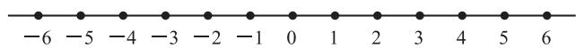
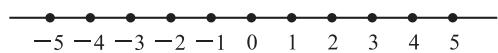
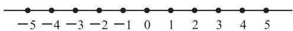
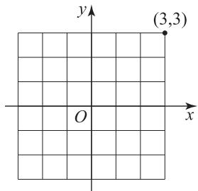
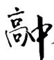
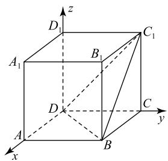

# 对课本一道习题的多维度探究

杨华文 $^{1}$ 郝新秀 $^{2}$ 杨列敏 $^{3}$

(1. 山东省枣庄市第三中学

2. 山东省枣庄市教育科学研究院

3.山东省滕州市第一中学)

在概率论教学中,随机游走模型是理解二项分布、组合计数和随机过程的重要载体.本文以一道经典的课本题目(例1)为例进行多维度探究.

例 1 如图 1 所示,一个质点在随机外力的作用下,从原点 0 出发,每隔 1 s 等可能地向左或向右移动一个单位,共移动 6 次.求下列事件的概率.

text_image

-6 -5 -4 -3 -2 -1 0 1 2 3 4 5 6

图1

(1)质点回到原点；  
(2)质点位于4的位置.

这是人教 A 版普通高中教科书数学选择性必修第三册第 81 页习题 7.4 的第 3 题. 本文将从基础解法、组合计数、模型推广、可达性与对称性分析、内部变式、外部拓展延伸等维度展开探究, 每个维度均提供解析和点评, 旨在深化问题理解, 培养多角度思维. 这种“题根研究”方法有助于学生掌握问题本质, 提升解决变式问题的能力.

# 1 基础解法(二项分布视角)

解法 1 设质点向右移动的次数为 X，又质点每隔 1 s 等可能地向左或向右移动一个单位，共移动 6 次，且每次移动是相互独立的，则 $X \sim B(6, \frac{1}{2})$ .

(1)若移动6次后,质点回到原点的位置,则质点向右移动3次,向左移动3次,所以第6次移动后回到原点的概率为 $P(X=3)=C_{6}^{3}\times(\frac{1}{2})^{3}\times(\frac{1}{2})^{3}=\frac{5}{16}$ .  
(2)若移动6次后,质点位于4的位置,则质点向右移动5次,向左移动1次,所以第6次移动后位于4的位置的概率为 $P(X=5)=C_{6}^{5}\times(\frac{1}{2})^{5}\times(\frac{1}{2})^{1}=\frac{3}{32}$ .

解法 1 直接使用二项分布公式, 步骤简捷, 适合概率论初学者. 核心在于将位置问题转化为成功次数(向右移动)问题,体现了概率计算的基

本框架.这能帮助学生建立“事件分解”思维,但需注意位置函数的推导是关键,易错点在于忽略位置与移动次数的线性关系(例如,位置4对应向右移动5次,而非直观猜测的向右移动4次).此方法在移动次数少时高效,但推广到n时可能烦琐.

# 2 组合计数视角(路径枚举与对称性)

解法 2 质点移动路径可视为长度是 6 的序列（左或右），总路径数为 $2^{6}=64$ （样本空间）。位置由净向右移动次数决定。

(1)质点回到原点,需左、右移动次数相等,即3次右和3次左.选择3个位置为右(其余自动为左)的路径数为 $C_{6}^{3}$ ,则 $P=\frac{20}{64}=\frac{5}{16}$ .   
(2)质点位于4的位置,需净向右移动4个单位,即右5次、左1次.路径数为 $C_{6}^{5}$ (或等价于 $C_{6}^{1}$ ,选择左的位置),则 $P=\frac{6}{64}=\frac{3}{32}$ .

本解法从组合数切入,强调“计数”而非直接利用概率公式,适合培养枚举和分类思想.优点是将概率问题转化为路径计数，直观展示了样本空间的均匀性（所有路径等可能）。在教学中，教师可引导学生用树状图或帕斯卡三角形验证，例如， $\mathrm{C}_6^3 = 20$ 可通过组合性质（如 $\mathrm{C}_n^k = \mathrm{C}_n^{n - k}$ ）强化理解。缺点是在路径数大时计算量大，但能深化对“概率是比值”的认识。

# 3 模型推广(一般化到 n 步移动)

变式 1 将原题推广,质点移动 n 次,求质点回到原点的概率,并讨论其性质.

设移动 n 次, 向右移动 k 次, 位置 S = 2k - n. 回到原点需 S = 0, 即 2k - n = 0, 故 $k = \frac{n}{2}$ .

若 n 为偶数（令 n=2m），则 k=m，回到原点的概率为 $P=C_{2m}^{m}\times\left(\frac{1}{2}\right)^{2m}$ .

在例 1 中, 令 n=6 (即 m=3), 得

$$
P = \mathrm{C} _ {6} ^ {3} \times (\frac {1}{2}) ^ {6} = \frac {2 0}{6 4} = \frac {5}{1 6}.
$$

若 n 为奇数, 则 $k=\frac{n}{2}$ 非整数, 事件不可能发生, 概率为 0 (如移动 5 次时无法回到原点).

对质点位于位置 4 的事件, 需 S=4, 即 $k=\frac{n+4}{2}$ . 仅当 $n+4$ 为偶数且 k 在 $[0, n]$ 内时, 事件可能发生. 在例 1 中, n=6, k=5, 概率为 $P=C_{6}^{5}\times\left(\frac{1}{2}\right)^{6}=\frac{3}{32}$ .

推广维度将具体问题抽象化,揭示一般规律.例如,回原点概率仅当 n 为偶数时非零,且随 n 增大而减小（由斯特林公式， $\frac{C_{2m}^{m}}{4^{m}}\sim\frac{1}{\sqrt{\pi m}}(m\rightarrow+\infty)$ ，收敛于 0）。这体现了随机游走的“扩散性”。教学上，此维度可培养学生从特殊到一般的归纳能力。在实际应用中，这关联着物理学中的布朗运动或金融中的随机模型。

# 4 可达性与对称性分析(随机游走理论视角)

变式 2 将例 1 推广, 分析位置的可达性和对称性.

可达性 位置 S 由 2k-n 决定, 故 S 与 n 的奇偶性相同. 原题 n=6 为偶数, 原点 (S=0)和位置 $4(S = 4)$ 均为偶数，故可达；若求位置3（奇数），则不可达.

对称性 随机游走具有空间对称性, 故 $P(S=i)=P(S=-i)$ . 原题中位置 4 的对称点为 -4, 概率也为 $\frac{3}{32}$ , 但事件 “位于 4 的位置” 特指正方向.

回原点概率的对称 当 $n$ 为偶数时，回原点概率最大（因为 $k = \frac{n}{2}$ 对应二项分布的峰值）.

本维度结合随机过程理论,突出内在对称性.
可达性分析是易忽略的关键点(如学生可能误求位于位置 3 的概率), 教学中可结合实例强化理解. 对称性则简化计算(例如, 位置概率成对出现). 此视角将离散概率与连续模型(如热方程)连接, 适合高阶课程. 但需注意对称性依赖于步长相等和概率均等, 若问题改为不等概率或步长, 则需调整.

通过以上多维度探究,一道简单的随机游走题目展现出丰富内涵:从基础二项分布到组合计数,从具

体计算到一般化推广,再到对称性分析.这种“题根研究”方法不仅提供多种解法,还揭示了数学的统一性(如概率、组合、物理模型的交融).

# 5 随机游走理论的一维线性变式

例 2 （多选题）如图 2 所示，一个质点在随机外力的作用下,从原点0出发,每隔1 s向左或向右移动一个单位,向左移动的概率为 $\frac{3}{8}$ ,向右移动的概率为 $\frac{5}{8}$ ,则下列结论正确的有().

  
图 2

A. 第 8 次移动后位于原点 0 的概率为

$$
(\frac {5}{8}) ^ {4} \times (\frac {3}{8}) ^ {4}
$$

B. 第 6 次移动后位于 4 的概率为 $C_{6}^{5} \times \left( \frac{5}{8} \right)^{5} \times \frac{3}{8}$

C. 第 1 次移动后位于 -1 且第 5 次移动后位于 1 的概率为 $C_{4}^{3} \times \left(\frac{5}{8}\right)^{3} \times \left(\frac{3}{8}\right)^{2}$

D. 已知第 2 次移动后位于 2, 则第 6 次移动后位于 4 的概率为 $\mathrm{C}_{4}^{3} \times \left(\frac{5}{8}\right)^{3} \times \frac{3}{8}$

对于选项 A, 在 8 次移动中, 设变量 X 为质点向右运动的次数,则 $X \sim B(8, \frac{5}{8})$ . 若移动8 次后, 质点位于 0 的位置, 则质点向右移动 4 次, 向左移动 4 次, 所以第 8 次移动后位于原点 0 的概率为 $C_{8}^{4} \times \left(\frac{5}{8}\right)^{4} \times \left(\frac{3}{8}\right)^{4}$ , 故选项 A 错误.

对于选项 B, 在 6 次移动中, 设变量 X 为质点向右运动的次数, 则 $X \sim B(6, \frac{5}{8})$ , 若移动 6 次后, 质点位于 4 的位置, 则质点向右移动 5 次, 向左移动 1 次, 所以第 6 次移动后位于 4 的概率为 $C_{6}^{5} \times (\frac{5}{8})^{5} \times \frac{3}{8}$ , 故选项 B 正确.

对于选项 C, 记“第 1 次移动后位于 -1”为事件 A, “第 5 次移动后位于 1”为事件 B. 由题意知质点先向左移动 1 次, 剩余的 4 次中质点向右移动 3 次, 向左移动 1 次, 所以第 1 次移动后位于 -1 且第 5 次移动后位于1的概率为 $P(AB) = \mathrm{C}_4^3\times (\frac{5}{8})^3\times (\frac{3}{8})^2$ 故选项C正确.

对于选项 D, 记“第 2 次移动后位于 2”为事件 M, “第 6 次移动后位于 4”为事件 N, 当第 2 次移动后位于 2 且第 6 次移动后位于 4 时, 质点先向右移动 2 次, 剩余的 4 次中, 质点向右移动 3 次, 向左移动 1 次, 所以 $P(MN) = \left(\frac{5}{8}\right)^{2} \times C_{4}^{3} \times \left(\frac{5}{8}\right)^{3} \times \frac{3}{8}$ , $P(M) = \left(\frac{5}{8}\right)^{2}$ , 故已知第 2 次移动后位于 2, 则第 6 次移动后位于 4 的概率为

$$
P (N \mid M) = \frac {P (M N)}{P (M)} =
$$

$$
\frac {(\frac {5}{8}) ^ {2} \times \mathrm{C} _ {4} ^ {3} \times (\frac {5}{8}) ^ {3} \times \frac {3}{8}}{(\frac {5}{8}) ^ {2}} = \mathrm{C} _ {4} ^ {3} \times (\frac {5}{8}) ^ {3} \times \frac {3}{8},
$$

故选项 D 正确.

综上,故选 BCD.

本题考查命题真假性的判断,本质是例1的变式.

例 3 （多选题）如图 3 所示，在一条无限长的轨道上,一个质点在随机外力的作用下,从位置0出发,每次等可能地向左或向右移动一个单位,设移动n次后质点位于位置 $X_{n}$ ,则下列命题正确的是().

  
图3

A. $P(X_{4} = -2) = \frac{1}{4}$   
B. $E(X_{n})=0$   
C. 移动 n 次后, 当 n 为奇数时, 质点最有可能回到原点  
D. 移动 n 次后, 当 n 为偶数时, 质点最有可能回到原点

对于选项 A, 设质点 n 次移动中向右移动的次数为 Y, 显然每移动 1 次的概率为 $\frac{1}{2}$ , 则$Y \sim B(n, \frac{1}{2}), X_{n} = Y - (n - Y) = 2Y - n$ ，所以

$$
P \left(X _ {4} = - 2\right) = P (Y = 1) = \mathrm{C} _ {4} ^ {1} \times \left(\frac {1}{2}\right) \times \left(\frac {1}{2}\right) ^ {3} = \frac {1}{4},
$$

故选项 A 正确.

30

数理化

对于选项 B, 由选项 A 知 $Y \sim B(n, \frac{1}{2})$ , $E(Y) = n \cdot \frac{1}{2} = \frac{n}{2}$ . 又 $X_{n} = 2Y - n$ , 所以 $E(X_{n}) = 2E(Y) - n = 0$ , 故选项 B 正确.

对于选项 C 和选项 D, 由选项 A 可知

$$
P (Y = k) = \mathrm{C} _ {n} ^ {k} (\frac {1}{2}) ^ {k} (\frac {1}{2}) ^ {n - k} = \frac {\mathrm{C} _ {n} ^ {k}}{2 ^ {n}} (k \in \mathbf {N}, k \leqslant n).
$$

当 n 为奇数时， $\{C_{n}^{k}\}$ 中间的两项 $C_{n}^{\frac{n-1}{2}}$ ， $C_{n}^{\frac{n+1}{2}}$ 取得最大值，即 $Y=\frac{n-1}{2}$ 或 $Y=\frac{n+1}{2}$ 时概率最大，此时 $X_{n}=-1$ 或 $X_{n}=1$ ，所以 $P(X_{3}=0)=0$ ，且质点最有可能位于位置 -1 或 1。当 n 为偶数时， $\{C_{n}^{k}\}$ 中间的一项 $C_{n}^{\frac{n}{2}}$ 取得最大值，即 $Y=\frac{n}{2}$ 时概率最大，此时 $X_{n}=0$ ，所以质点最有可能位于位置 0，故选项 C 错误，选项 D 正确。

综上,故选 ABD.

点评

本题考查命题真假性的判断,是例1的变式,涉及系数最大项问题.

# 6 随机游走理论的二维平面演变

例4“随机游走”在空气中的烟雾扩散等动态随机现象中有重要应用.如图 4 所示,在平面直角坐标系中,一个质点在随机外力的作用下,从原点出发,每隔 1 s 等可能地向左、向右、向上或向下移动一个单位.

(1)求质点移动6次后位于(3,3)的概率;  
(2)设质点 2 s 后移动到点 $(x, y)$ ，记 xy 的取值为随机变量 X，求 X 的分布列和数学期望 $E(X)$ ;  
(3) 记 $n$ s 后质点回到原点的概率为 $p_n$ , 求 $p_2$ , $p_4$ , $p_{2n}$ .

参考公式： $\sum_{k = 0}^{n}(\mathrm{C}_{n}^{k})^{2} = \mathrm{C}_{2n}^{n}$ (1)由题意知,质点应向右移动3次,向上移动3次,设A表示事件“质点移动6次后位于 $(3,3)$ ”，则

text_image

y
(3,3)
O
x

图4

$$
P (A) = \mathrm{C} _ {6} ^ {3} \times (\frac {1}{4}) ^ {3} \times (\frac {1}{4}) ^ {3} = \frac {5}{1 0 2 4}.
$$

(2)质点 2 s 可能运动到点 $(-1,1)$ , $(1,1)$ , $(1,-1)$ , $(-1,-1)$ ; $(0,2)$ , $(2,0)$ , $(0,-2)$ , $(-2,0)$ ; $(0,0)$ , 故 X 的可能取值为 -1, 0, 1.

当质点位于 $(-1,1)$ ， $(1,1)$ ， $(1,-1)$ ， $(-1,-1)$ 时，每个位置各有2种移动情形；位于 $(0,2)$ ， $(2,0)$ ， $(0,-2)$ ， $(-2,0)$ 时，每个位置各有1种移动情形；位于 $(0,0)$ 时，有4种移动情形，共计16种移动情形，且

$$
P (X = - 1) = \frac {4}{1 6} = \frac {1}{4},
$$

$$
P (X = 0) = \frac {4 \times 2}{1 6} = \frac {1}{2},
$$

$$
P (X = 1) = \frac {4}{1 6} = \frac {1}{4},
$$

故 $X$ 的分布列如表1所示.

表 1

<table><tr><td>X</td><td>-1</td><td>0</td><td>1</td></tr><tr><td>P</td><td> $\frac{1}{4}$ </td><td> $\frac{1}{2}$ </td><td> $\frac{1}{4}$ </td></tr></table>

$$
E (X) = - 1 \times \frac {1}{4} + 0 \times \frac {1}{2} + 1 \times \frac {1}{4} = 0.
$$

(3) 因为 1 s 后质点等可能地出现在 $(1,0)$ ， $(-1,0)$ ， $(0,1)$ ， $(0,-1)$ 四点，所以 2 s 后质点在每个位置都有 $\frac{1}{4}$ 的可能回到原点，故 $p_{2}=\frac{1}{4}\times\frac{1}{4}\times4=\frac{1}{4}$ .

质点在 4 s 后回到原点, 分 2 种情况: 移动方向均不相同, 如“上、下、左、右”, 共有 $A_{4}^{4}$ 种情形; 移动方向来自两对相反方向, 如“左、左、右、右”, 共有 $2C_{4}^{2}$ 种情形, 故 $p_{4} = \frac{A_{4}^{4} + 2C_{4}^{2}}{4^{4}} = \frac{9}{64}$ .

质点在 2n s 后回到原点，则 2n 次移动中左、右方向移动次数相同，上、下方向移动次数相同。设质点在 2n 次移动中向左移动了 k 步 $(k=0,1,2,\cdots,n)$ ，则向右移动了 k 步，向上移动了 n-k 步，向下移动了 n-k 步，故

$$
p _ {2 n} = \sum_ {k = 0} ^ {n} \frac {\mathrm{C} _ {2 n} ^ {k} \mathrm{C} _ {2 n - k} ^ {k} \mathrm{C} _ {2 n - 2 k} ^ {n - k}}{4 ^ {2 n}} =
$$

$$
\frac {1}{4 ^ {2 n}} \sum_ {k = 0} ^ {n} \left[ \frac {(2 n) !}{k ! (2 n - k) !} \cdot \frac {(2 n - k) !}{k ! (2 n - 2 k) !} \cdot \right.
$$

$$
\frac {(2 n - 2 k) !}{(n - k) ! (n - k) !} ] =
$$

$$
\frac {1}{4 ^ {2 n}} \sum_ {k = 0} ^ {n} \frac {(2 n) !}{(k !) ^ {2} [ (n - k) ! ] ^ {2}} = \frac {1}{4 ^ {2 n}} \cdot \frac {(2 n) !}{(n !) ^ {2}} \cdot
$$

$$
\sum_ {k = 0} ^ {n} \frac {(n !) ^ {2}}{(k !) ^ {2} [ (n - k) ! ] ^ {2}} = \frac {1}{4 ^ {2 n}} \cdot C _ {2 n} ^ {n} \sum_ {k = 0} ^ {n} \left(C _ {n} ^ {k}\right) ^ {2} =
$$

$$
\frac {1}{4 ^ {2 n}} \cdot \left(\mathrm{C} _ {2 n} ^ {n}\right) ^ {2} = \frac {1}{1 6 ^ {n}} \cdot \frac {[ (2 n) ! ] ^ {2}}{(n !) ^ {4}}.
$$

如果质点移动6次后位于(2,4)，那么它的概率为 $C_{6}^{2}\times(\frac{1}{2})^{4}\times(\frac{1}{2})^{2}=\frac{15}{64}$ .如果移动6次后位于(4,2)，那么它的概率为 $\mathrm{C}_{6}^{4}\times\left(\frac{1}{2}\right)^{2}\times\left(\frac{1}{2}\right)^{4}=$ $\frac{15}{64}$ ，体现出对称性.本题主要考查离散型随机变量的分布列和期望，考查组合数公式的应用.

# 7 随机游走理论的跨界知识融合

例5（多选题）已知正方体 $ABCD - A_{1}B_{1}C_{1}D_{1}$ 的棱长为 1, 点 P 是正方形 $A_{1}B_{1}C_{1}D_{1}$ 上的一个动点, 初始位置位于点 $A_{1}$ 处, 每次移动都会到达另外三个顶点. 向相邻两个顶点移动的概率均为 $\frac{1}{4}$ , 向对角顶点移动的概率为 $\frac{1}{2}$ , 如当点 P 在点 $A_{1}$ 处时, 向点 $B_{1}$ , $D_{1}$ 移动的概率均为 $\frac{1}{4}$ , 向点 $C_{1}$ 移动的概率为 $\frac{1}{2}$ , 则 ( ).

A. 移动两次后，“ $|PC|=\sqrt{3}$ ”的概率为 $\frac{3}{8}$   
B. 对任意 $n \in N^{*}$ ，移动 n 次后，“PA // 平面 $BDC_{1}$ ”的概率均小于 $\frac{1}{3}$   
C. 对任意 $n \in \mathbf{N}^*$ , 移动 $n$ 次后, “ $PC \perp$ 平面 $BDC_1$ ” 的概率均小于 $\frac{1}{2}$   
D. 对任意 $n \in N^{*}$ ，移动 n 次后，四面体 $P-BDC_{1}$ 的体积 V 的数学期望 $E(V) < \frac{1}{5}$ （注：当点 P 在平面 $BDC_{1}$ 上时，四面体 $P-BDC_{1}$ 的体积为 0）

# 解析

设移动 n 次后，点 P 在点 $A_{1}, B_{1}, C_{1}, D_{1}$ 的概率分别为 $a_{n}, b_{n}, c_{n}, d_{n}$ ，其中 $a_{1} = 0, b_{1} =$

$\frac{1}{4}, c_{1} = \frac{1}{2}, d_{1} = \frac{1}{4}, a_{n} + b_{n} + c_{n} + d_{n} = 1$ ，所以

$$
\left\{ \begin{array}{l} a _ {n} = \frac {1}{4} b _ {n - 1} + \frac {1}{4} d _ {n - 1} + \frac {1}{2} c _ {n - 1}, \\ b _ {n} = \frac {1}{4} a _ {n - 1} + \frac {1}{4} c _ {n - 1} + \frac {1}{2} d _ {n - 1}, \\ c _ {n} = \frac {1}{4} b _ {n - 1} + \frac {1}{4} d _ {n - 1} + \frac {1}{2} a _ {n - 1}, \\ d _ {n} = \frac {1}{4} a _ {n - 1} + \frac {1}{4} c _ {n - 1} + \frac {1}{2} b _ {n - 1}, \end{array} \right.
$$

解得 $\left\{\begin{aligned}a_{n}&=\frac{1}{4}+\frac{1}{2}\times(-\frac{1}{2})^{n},\\ c_{n}&=\frac{1}{4}-\frac{1}{2}\times(-\frac{1}{2})^{n},\\ b_{n}&=\frac{1}{4},\\ d_{n}&=\frac{1}{4}. \end{aligned}\right.$

对于选项 A, 移动两次后, “ $|PC|=\sqrt{3}$ ” 表示点 P 移动两次后到达点 $A_{1}$ , 所以概率为 $a_{2}=\frac{1}{4}+\frac{1}{2}\times(-\frac{1}{2})^{2}=\frac{3}{8}$ , 故选项 A 正确.

对于选项 B, 以 D 为坐标原点, 建立空间直角坐标系, 如图 5 所示, 则 A(1,0,0), D(0,0,0), B(1,1,0), C(0,1,0), A₁(1,0,1), D₁(0,0,1), B₁(1,1,1), C₁(0,1,1). 因为 $\overrightarrow{DB} = (1,1,0)$ , $\overrightarrow{DC_1} = (0,1,1)$ , $\overrightarrow{B_1A} = (0,-1,-1)$ , $\overrightarrow{D_1A} = (1,0,-1)$ , $\overrightarrow{A_1C} = (-1,1,-1)$ . 设平面 $BDC_1$ 的法向量为 $\boldsymbol{n} = (x,y,z)$ , 则 $\left\{\begin{aligned}\boldsymbol{n} & \cdot \overrightarrow{DB} = x + y = 0, \\ \boldsymbol{n} & \cdot \overrightarrow{DC_1} = y + z = 0,\end{aligned}\right.$ 取 y = 1, 则 $\boldsymbol{n} = (-1,1,-1)$ . 因为 $\overrightarrow{B_1A} \cdot \boldsymbol{n} = 0$ , $\overrightarrow{D_1A} \cdot \boldsymbol{n} = 0$ , $\overrightarrow{B_1A} \not\subsetneq$ 平面 $BDC_1$ , $\overrightarrow{D_1A} \not\subsetneq$ 平面 $BDC_1$ , 所以当点 P 位于点 B₁ 或点 D₁ 处时, PA // 平面 $BDC_1$ . 当点 P 移动 1 次后到达点 B₁ 或 D₁ 处时, 概率为 $\frac{1}{4} \times 2 = \frac{1}{2} > \frac{1}{3}$ , 故选项 B 错误.

text_image

z
D₁
C₁
A₁
B₁
D
C
y
A
B
x

图5

对于选项 $C, \overrightarrow{A_1C} = (-1, 1, -1) = n$ ，所以当点 $P$ 位于点 $A_1$ 处时， $PC \perp$ 平面 $BDC_1$ ，所以移动 $n$ 次

后点 P 位于点 $A_{1}$ 处，则 $a_{n}=\frac{1}{4}+\frac{1}{2}\times(-\frac{1}{2})^{n}<\frac{1}{2}$ ，故选项 C 正确.

对于选项 D, 四面体 $P-BDC_{1}$ 的体积 V 的数学期望为

$$
E (V) = a _ {n} \cdot V _ {A _ {1} - B D C _ {1}} + b _ {n} \cdot V _ {B _ {1} - B D C _ {1}} + c _ {n} \cdot V _ {C _ {1} - B D C _ {1}} +
$$

$$
d _ {n} \cdot V _ {D _ {1} - B D C _ {1}},
$$

$$
S _ {\triangle B D C _ {1}} = \frac {\sqrt {3}}{4} \times (\sqrt {2}) ^ {2} = \frac {\sqrt {3}}{2}.
$$

因为 $\overrightarrow{DA_{1}}=(1,0,1)$ ，所以点 $A_{1}$ 到平面 $BDC_{1}$ 的距离

$$
d _ {1} = \frac {| \overrightarrow {D A _ {1}} \cdot \boldsymbol {n} |}{| \boldsymbol {n} |} = \frac {2}{\sqrt {3}} = \frac {2 \sqrt {3}}{3}.
$$

同理, 点 $B_{1}, C_{1}, D_{1}$ 到平面 $BDC_{1}$ 的距离分别为 $\frac{\sqrt{3}}{3}, 0, \frac{\sqrt{3}}{3}$ , 所以

$$
V _ {A _ {1} - B D C _ {1}} = \frac {1}{3} \times \frac {\sqrt {3}}{2} \times \frac {2 \sqrt {3}}{3} = \frac {1}{3},
$$

$$
V _ {B 1 - B D C 1} = V _ {D 1 - B D C 1} = \frac {1}{3} \times \frac {\sqrt {3}}{2} \times \frac {\sqrt {3}}{3} = \frac {1}{6},
$$

$$
V _ {C _ {1} - B D C _ {1}} = 0,
$$

所以

$$
E (V) = \left[ \frac {1}{4} + \frac {1}{2} \times \left(- \frac {1}{2}\right) ^ {n} \right] \times \frac {1}{3} + \frac {1}{4} \times \frac {1}{6} + 0 +
$$

$$
\frac {1}{4} \times \frac {1}{6} = \frac {1}{6} + \frac {1}{6} \times (- \frac {1}{2}) ^ {n}.
$$

当 n=2 时,有

$$
E (V) = \frac {1}{6} + \frac {1}{6} \times (\frac {1}{2}) ^ {2} = \frac {5}{2 4} > \frac {1}{5},
$$

选项 D 错误.

综上,故选 AC.

点评

本题考查正方体的结构特征、点到平面的距离公式、四面体的体积公式等基础知识，考查学生运算求解能力以及灵活应用知识的能力,属于难题.

本文系山东省枣庄市基础教育教学改革项目“高中数学大单元整体教学范式的实践研究”（课题编号：ZZS202237）和山东省教育教学研究课题“大单元视域下普通高中数学任务链进阶驱动教学的实践研究”（课题编号：2023JXY343）的研究成果.

(完)