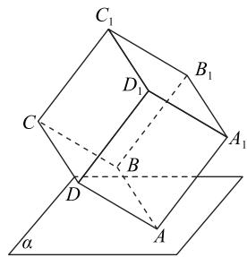
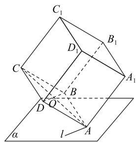
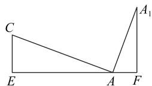

# 探秘四类开放型问题

王启贵

(山东省济南市章丘区第五中学)

开放性试题能充分考查考生分析问题和解决问题的能力,因而备受命题者青睐.它可以分为条件开放型问题、结论开放型问题、条件和结论同时开放型问题等,每种题型的求解策略有所不同,笔者探讨常见的几类开放型问题.

# 1 条件开放型问题

条件开放型问题是指在结论已知的前提下,要求学生能够根据这些结论逆推条件,如求函数解析式、数列通项等,条件开放型问题的答案往往不唯一,考查学生的逆向思维、发散思维等.

例1 已知函数 $f(x)$ 满足下列条件：

① $f(x)$ 的图像是由 $y = \cos x$ 的图像经过变换得到的；

② 对任意的 $x \in \mathbf{R}$ , 均满足 $f(-\frac{\pi}{4}) \leqslant f(x) \leqslant f(\frac{\pi}{4})$ ;  
③ $f(x)$ 的值域为 $[-1,3]$ .

请写出符合上述条件的一个函数解析式.

由①可设 $f(x)=A\cos(\omega x+\varphi)+B$ . 由③可知 $f(x)$ 的值域为 $[-1,3]$ ，不妨设 A>0，则

$$
A = \frac {3 - (- 1)}{2} = 2, B = \frac {3 + (- 1)}{2} = 1,
$$

所以 $f(x) = 2\cos (\omega x + \varphi) + 1.$ 由②可知

$$
T = 2 \left[ \frac {\pi}{4} - (- \frac {\pi}{4}) \right] = \pi ,
$$

所以 $\omega = \frac{2\pi}{T} = 2$ ，则 $f(x) = 2\cos (2x + \varphi) + 1.$ 又 $2\cdot \frac{\pi}{4} +\varphi = 2k\pi (k\in \mathbf{Z})$ ，则 $\varphi = 2k\pi -\frac{\pi}{2} (k\in \mathbf{Z})$ ，所以可取 $\varphi = -\frac{\pi}{2}$ ，则函数 $f(x)$ 的一个解析式为

$$
f (x) = 2 \cos \left(2 x - \frac {\pi}{2}\right) + 1 = 2 \sin 2 x + 1,
$$

故 $f(x)=2\sin2x+1$ （答案不唯一）.

条件开放型问题往往以选择题或填空题的形式呈现.求解条件开放型问题的一般思路：

以题目的结论为出发点,结合结论挖掘条件,执果索

因,体现了对学生逆向思维、发散思维的考查.

# 2 结论开放型问题

结论开放型问题要求学生从已知的数学条件出发探究结论,再与题目给出的结论进行对比,以判断多个结论的真假,此类问题常以选择题的形式呈现.

例 2 （多选题）如图 1所示，在正方体 ABCD-A\$\_{1}\$B\$\_{1}\$C\$\_{1}\$D\$\_{1}\$ 中，顶点 A 在平面 $\alpha$ 内，其余顶点在 $\alpha$ 的同侧，顶点 A\$\_{1}\$, B, C 到 $\alpha$ 的距离分别为 $\sqrt{6}$ , 1, 2，则（ ）.

A. $BD \parallel$ 平面 $\alpha$   
B. 平面 $ACB_{1} \perp$ 平面 $\alpha$   
C. 正方体的棱长为 $2\sqrt{2}$   
D. 直线 $C_1D$ 与 $\alpha$ 所成角比直线 $BB_{1}$ 与 $\alpha$ 所成角小

对于 A, 设 AC 与 BD 相交于点 O, 则 O 是 AC 和 BD 的中点, 顶点 A 在平面 $\alpha$ 内, 点 C到平面 $\alpha$ 的距离为 2，则点 O 到平面 $\alpha$ 的距离为 1。又点 B 到平面 $\alpha$ 的距离为 1，所以 BO // 平面 $\alpha$ ，即 BD // 平面 $\alpha$ ，故 A 正确。

对于 B, 如图 2 所示, 设平面 $ABCD \cap \alpha = l$ , 因为 $BD \subset$ 平面 ABCD, $BD \parallel$ 平面 $\alpha$ , 所以 $BD \parallel l$ . 因为四边形 ABCD 是正方形, 所以 $AC \perp BD$ . 在正方体 $ABCD - A_{1}B_{1}C_{1}D_{1}$ 中, 有 $AA_{1} \perp$ 平面 ABCD, $BD \subset$

text_image

C₁
D₁
B₁
C
A₁
B
D
A
a

图1

text_image

C₁
D₁
B₁
C
B
Q
D
A
l
α

图2

平面 $ABCD$ ，所以 $AA_{1} \perp BD$ . 因为 $AA_{1} \cap AC = A$ ， $AA_{1} \subset$ 平面 $A_{1}AC, AC \subset$ 平面 $A_{1}AC$ ，所以 $BD \perp$ 平面 $A_{1}AC$ ，故 $l \perp$ 平面 $A_{1}AC$ . 而 $l \subset$ 平面 $\alpha$ ，所以平面 $A_{1}AC \perp$ 平面 $\alpha$ . 若平面 $ACB_{1} \perp$ 平面 $\alpha$ ，则由平面 $ACB_{1} \cap$ 平面 $A_{1}AC = AC$ ，应有 $AC \perp$ 平面 $\alpha$ ，显然

AC 与平面 $\alpha$ 不垂直, 故 B 错误.

对于 C, 因为平面 $A_{1}AC \perp$ 平面 $\alpha$ , 点 A 在平面 $\alpha$ 内, 所以点 C, $A_{1}$ 在平面 $\alpha$ 内的射影 E, F 与点 A 共线. 设正方体 $ABCD-A_{1}B_{1}C_{1}D_{1}$ 的棱长为 a, 显然 CE=2, $A_{1}F=\sqrt{6}$ , $AC=\sqrt{2}a$ , $AA_{1}=a$ , $AA_{1}\perp AC$ , 如图 3 所示.

由 $\angle ECA + \angle CAE = \angle CAE + \angle A_{1}AF$ ，得 $\angle ECA = \angle A_{1}AF.$ 易知

text_image

C
E
A
F
A₁

图3

$$
\cos \angle E C A = \frac {C E}{A C}, \sin \angle A _ {1} A F = \frac {A _ {1} F}{A A _ {1}}.
$$

由 $\cos^{2}\angle ECA+\sin^{2}\angle A_{1}AF=1$ ，得 $\frac{4}{2a^{2}}+\frac{6}{a^{2}}=1$ ，解得 $a=2\sqrt{2}$ （负值舍去），即正方体的棱长为 $2\sqrt{2}$ ，故C正确.

对于 D, 在正方体 $ABCD-A_{1}B_{1}C_{1}D_{1}$ 中, $C_{1}D \parallel AB_{1}, BB_{1} \parallel AA_{1}$ , 要证直线 $C_{1}D$ 与 $\alpha$ 所成角比直线 $BB_{1}$ 与 $\alpha$ 所成角小, 即证直线 $AB_{1}$ 与 $\alpha$ 所成角比直线 $AA_{1}$ 与 $\alpha$ 所成角小. 设点 $B_{1}$ 到平面 $\alpha$ 的距离为 d. 因为四边形 $AA_{1}B_{1}B$ 是正方形, 点 A 在平面 $\alpha$ 内, 点 $A_{1}, B$ 到 $\alpha$ 的距离分别为 $\sqrt{6}, 1$ , 所以 $\frac{d}{2} = \frac{\sqrt{6} + 1}{2}$ , 解得 $d = \sqrt{6} + 1$ . 设直线 $AB_{1}$ 与 $\alpha$ 所成角为 $\beta$ , 所以 $\sin \beta = \frac{\sqrt{6} + 1}{AB_{1}} = \frac{\sqrt{6} + 1}{4}$ . 设直线 $AA_{1}$ 与 $\alpha$ 所成角为 $\gamma$ , 所以 $\sin \gamma = \frac{\sqrt{6}}{AA_{1}} = \frac{\sqrt{6}}{2\sqrt{2}}$ . 因为 $\frac{\sqrt{6} + 1}{4} < \frac{\sqrt{6}}{2\sqrt{2}}$ , 所以 $\sin \beta < \sin \gamma, \beta < \gamma$ , 故 D 正确.

综上,选 ACD.

求解结论开放型问题的一般路径:充分利用题设条件进行猜想、分析,推导出题设给定条件下可能存在的结论,然后经过论证作出取舍.

# 3 条件和结论同时开放型问题

条件和结论同时开放型问题给出多个条件和结论,要求学生选出能推出某个结论的几个条件,形成正确的命题,这类问题的答案往往不唯一.

例3 已知函数 $f(x) = \sin (2x + \varphi)(|\varphi| < \frac{\pi}{2})$ ，给出下面三个论断：

① $f(x)$ 在 $\left[-\frac{\pi}{6},\frac{\pi}{6}\right]$ 上单调递增；

② $f(x)$ 的图像关于点 $(- \frac{\pi}{12}, 0)$ 中心对称：

③ $f(x)$ 的图像关于直线 $x=\frac{\pi}{6}$ 对称.

以其中一个论断作为条件,另两个论断作为结论,写出你认为正确的一个命题(用论断的序号表示为形如“④ $\Rightarrow$ ⑤⑥”的形式).

情形 1:②⇒①③.

以②作为条件, 即 $f(x)$ 的图像关于点 $(- \frac{\pi}{12}, 0)$ 中心对称, 则 $f(-\frac{\pi}{12}) = \sin(-\frac{\pi}{6} + \varphi) = 0$ . 由 $-\frac{\pi}{2} < \varphi < \frac{\pi}{2}$ , 得 $-\frac{2\pi}{3} < \varphi - \frac{\pi}{6} < \frac{\pi}{3}$ , 则 $\varphi - \frac{\pi}{6} = 0$ , 所以 $\varphi = \frac{\pi}{6}$ , 故 $f(x) = \sin(2x + \frac{\pi}{6})$ . 由 $x \in [-\frac{\pi}{6}, \frac{\pi}{6}]$ , 可得 $2x + \frac{\pi}{6} \in [-\frac{\pi}{6}, \frac{\pi}{2}]$ , 则 $f(x)$ 是单调递增函数, 故①正确. 当 $x = \frac{\pi}{6}$ 时, $f(\frac{\pi}{6}) = \sin \frac{\pi}{2} = 1$ , 故③正确.

情形 2:③⇒①②.

以③作为条件, 即 $f(x)$ 的图像关于直线 $x=\frac{\pi}{6}$ 对称, 则 $2 \times \frac{\pi}{6} + \varphi = k\pi + \frac{\pi}{2} \Rightarrow \varphi = k\pi + \frac{\pi}{6} (k \in \mathbf{Z})$ .

因为 $-\frac{\pi}{2} < \varphi < \frac{\pi}{2}$ , 所以令 $k = 0$ , 可得 $\varphi = \frac{\pi}{6}$ , 故 $f(x) = \sin(2x + \frac{\pi}{6})$ . 由 $x \in [-\frac{\pi}{6}, \frac{\pi}{6}]$ , 可得 $2x + \frac{\pi}{6} \in [-\frac{\pi}{6}, \frac{\pi}{2}]$ , 则 $f(x)$ 是单调递增函数, 故①正确. 又 $f(-\frac{\pi}{12}) = \sin(-\frac{\pi}{6} + \frac{\pi}{6}) = 0$ , 所以 $f(x)$ 的图像关于点 $(- \frac{\pi}{12}, 0)$ 中心对称, 故②正确.

综上，②⇒①③或③⇒①②.

条件和结论同时开放型问题需要学生去思考、分析、尝试、猜想、论证，具有一定的挑战性,体现了对学生空间想象能力、逻辑思维能力、发散思维能力的考查.

数学开放性问题虽然新颖独特,对数学思维的要求较高,有一定难度,但也有规律可循,只要学会执果索因、顺藤摸瓜和分类讨论,这类问题便可迎刃而解.

(完)

[Non-Text]