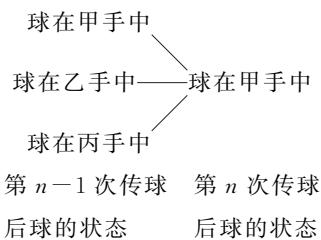
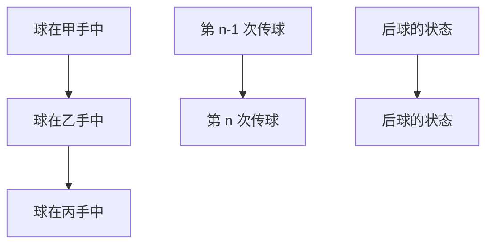
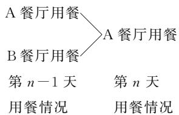
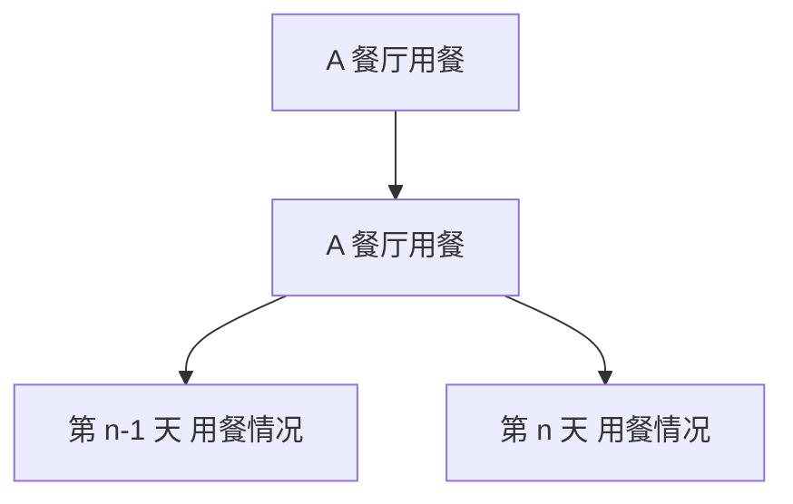

# 概率中的线性递推问题探究

涂道新 $^{1}$ 周华林 $^{2}$ 谭金国 $^{3}$

(1.四川省成都市郫都区第四中学 2.四川省成都市茶店子小学校清淳分校 3.四川省成都市三原外国语学校)

概率中的线性递推问题是概率与数列的综合问题,是新高考背景下的一个高频考点,对数学知识、能力与思维要求较高.本文以人教 A 版普通高中教科书数学选择性必修第三册 91 页第 10 题为例,探究一阶、二阶线性递推概率模型,剖析解题思路,形成一般解题策略,助力学生理解其数学本质、掌握其内核思想,提高学生分析和解决复杂概率问题的能力.

# 1 问题背景

引例 （人教 A 版普通高中教科书数学选择性必修第三册第 91 页第 10 题）甲、乙、丙三人相互做传球训练，第 1 次由甲将球传出，每次传球时，传球者都等可能地将球传给另外两个人中的任何一人。求 n 次传球后球在甲手中的概率。

要求解 n 次传球后球在甲手中的概率 $P_{n}$ ，就需要知道“n 次传球后球在甲手中”之前球的状态, 即“第 n-1 次球在哪里”, 与其他状态无关. 这是著名的马尔科夫链问题. 其数学定义为: 假设序列状态是 $X_{1}, X_{2}, \cdots, X_{n-2}, X_{n-1}, X_{n}, X_{n+1}, \cdots$ , 那么 $X_{n+1}$ 时刻的状态的条件概率仅依赖前一状态 $X_{n}$ , 即 $P(X_{n+1} \mid X_{1}, X_{2}, \cdots, X_{n-2}, X_{n-1}, X_{n}) = P(X_{n+1} \mid X_{n})$ . 其数学本质是构造完备划分组, 将复杂事件进行“分割”, 运用全概率公式计算复杂事件的概率.

依据第 $n - 1$ 次与第 $n$ 次传球后球的状态关系，构建递推关系求解，如图1所示.

flowchart

图1

设 $A_{n}$ 为“n 次传球后球在甲手中”，设 $P(A_{n}) = p_{n}$ ，则 $p_{1} = 0, A_{n} = A_{n-1} A_{n} + \overline{A_{n-1}} A_{n}$ .

由全概率公式得

$$
P \left(A _ {n}\right) = P \left(A _ {n - 1}\right) P \left(A _ {n} \mid A _ {n - 1}\right) +
$$

$$
P \left(\overline {{A _ {n - 1}}}\right) P \left(A _ {n} \mid \overline {{A _ {n - 1}}}\right).
$$

已知甲、乙、丙三人相互做传球训练时，传球者都等可能地将球传给另外两个人中的任何一人，故从一种状态转移到另一种状态的概率(转移概率)为 $\frac{1}{2}$ ，则

$$
p _ {n} = p _ {n - 1} \times 0 + (1 - p _ {n - 1}) \times \frac {1}{2},
$$

即 $p_{n + 1} - \frac{1}{3} = -\frac{1}{2} (p_n - \frac{1}{3})$ ，数列 $\{p_n - \frac{1}{3}\}$ 是以 $p_1 - \frac{1}{3} = -\frac{1}{3}$ 为首项、 $-\frac{1}{2}$ 为公比的等比数列，故 $p_n - \frac{1}{3} = -\frac{1}{3}\times (-\frac{1}{2})^{n - 1}$ ，解得

$$
p _ {n} = \frac {1}{3} \left[ 1 - \left(- \frac {1}{2}\right) ^ {n - 1} \right].
$$

引例是概率中线性递推的典型问题,背景是马尔科夫链问题,本质是考查全概率公式.

为进一步探究此类问题的解题思路与方法,促进对其数学本质的理解,下面将对此进行深度探究与拓展.

# 2 一阶线性递推概率模型

例 1 某学校有 A, B 两家餐厅, 王同学午餐时都在学校餐厅用餐.第1天午餐时随机地选择一家餐厅用餐.如果第 $n$ 天去A餐厅,那么第 $n + 1$ 天去A餐厅的概率为0.6;如果第 $n$ 天去B餐厅,那么第 $n + 1$ 天去A餐厅的概率为0.8.记王同学第 $n$ 天去A餐厅用餐的概率为 $p_n$ .

(1) 求 $p_{2}, p_{3}$ ;

(2) 求 $p_{n}$ ;

(3) 记前 n 天(即从第 1 天到第 n 天)中王同学去 A 餐厅用餐的天数为 X, 求 $E(X)$ .

(1)记事件 $A_{i}$ 为“王同学第 $i(i=1,2,\cdots,n)$

解析 天去 A 餐厅用餐”， $B_{i}$ 为“王同学第 $i(i=1,2,\cdots,n)$ 天去 B 餐厅用餐”，则 $P(A_{i})=p_{i}, P(B_{i})=P(\overline{A_{i}})=1-p_{i}$ .

由于第1天午餐时随机地选择一家餐厅用餐，所以 $p_1 = 0.5$ . 已知 $P(A_2 | A_1) = 0.6, P(A_2 | B_1) = 0.8$ ，由条件概率公式和全概率公式可知 $A_2 = A_1A_2 + B_1A_2$ ，则

$$
p _ {2} = P \left(A _ {1} A _ {2}\right) + P \left(B _ {1} A _ {2}\right) =
$$

$$
P \left(A _ {1}\right) P \left(A _ {2} \mid A _ {1}\right) + P \left(B _ {1}\right) P \left(A _ {2} \mid B _ {1}\right) =
$$

$$
0. 5 \times 0. 6 + 0. 5 \times 0. 8 = 0. 7.
$$

同理,有

$$
p _ {3} = P \left(A _ {2}\right) P \left(A _ {3} \mid A _ {2}\right) + P \left(B _ {2}\right) P \left(A _ {3} \mid B _ {2}\right) =
$$

$$
0. 7 \times 0. 6 + (1 - 0. 7) \times 0. 8 = 0. 6 6.
$$

(2)要求王同学第 n 天去 A 餐厅用餐的概率, 就需要知道“第 n-1 天王同学在哪里用餐”, 与之前的其他状态无关, 由此构建递推关系. 这就是一个著名的马尔科夫链问题. 状态关系如图 2 所示, 则

$$
p _ {n} = P \left(A _ {n - 1} A _ {n}\right) + P \left(B _ {n - 1} A _ {n}\right) =
$$

$$
P \left(A _ {n - 1}\right) P \left(A _ {n} \mid A _ {n - 1}\right) + P \left(B _ {n - 1}\right) P \left(A _ {n} \mid B _ {n - 1}\right) =
$$

$$
p _ {n - 1} \times 0. 6 + (1 - p _ {n - 1}) \times 0. 8 = - 0. 2 p _ {n - 1} + 0. 8,
$$

即 $p_n = -0.2p_{n-1} + 0.8$ .

flowchart

图2

这是典型的一阶线性递推,解决此类问题,主要思路与方法是通过“待定系数法”构建关于 $p_{n}$ 的等比数列.

将 $p_n = -0.2p_{n-1} + 0.8$ 通过“待定系数法”恒等变形为 $p_n + \lambda = -0.2(p_{n-1} + \lambda)$ （ $\lambda$ 为待定参数），整理得 $p_n = -0.2p_{n-1} - 1.2\lambda$ 。又 $p_n = -0.2p_{n-1} + 0.8$ ，所以 $-1.2\lambda = 0.8$ ，解得 $\lambda = -\frac{2}{3}$ ，即 $p_n - \frac{2}{3} = -\frac{1}{5}(p_{n-1} - \frac{2}{3})$ ，故数列 $\{p_n - \frac{2}{3}\}$ 是以 $p_1 - \frac{2}{3} = -\frac{1}{6}$ 为首项、 $-\frac{1}{5}$ 为公比的等比数列。由等比数列的通项公式得 $p_n - \frac{2}{3} = -\frac{1}{6} \times (-\frac{1}{5})^{n-1}$ ，所以 $p_n = -\frac{1}{6} \times (-\frac{1}{5})^{n-1} + \frac{2}{3}$ 。

(3) 王同学前 n 天 (从第 1 天到第 n 天) 中去 A 餐厅用餐的天数 X 是一个随机事件序列, 既不是 n 重伯努利试验模型, 也不是超几何分布模型, 若由定义直接计算期望 $E(X)$ , 则非常困难. 因此需要进行化归

与转化,联想到两点分布,将随机变量 X 分解为 n 个简单随机变量的和,即定义

$X_{i}=\begin{cases}1,&\text{第 }i\text{ 天去 A 餐厅用餐,}\\0,&\text{第 }i\text{ 天去 B 餐厅用餐}\end{cases}(i=1,2,\cdots,n),$

则 $X = X_{1} + X_{2} + \cdots + X_{n}, E(X_{i}) = p_{i}$ . 由离散型随机变量的性质得

$$
E (X) = E \left(X _ {1}\right) + E \left(X _ {2}\right) + \dots + E \left(X _ {n}\right) =
$$

$$
p _ {1} + p _ {2} + \dots + p _ {n} =
$$

$$
- \frac {1}{6} \left[ \left(- \frac {1}{5}\right) ^ {0} + \left(- \frac {1}{5}\right) + \dots + \left(- \frac {1}{5}\right) ^ {n - 1} \right] + \frac {2 n}{3} =
$$

$$
- \frac {5}{3 6} \times \left[ 1 - \left(- \frac {1}{5}\right) ^ {n} \right] + \frac {2 n}{3}.
$$

综上， $E(X)=-\frac{5}{36}\times\left[1-(-\frac{1}{5})^{n}\right]+\frac{2n}{3}.$

解决问题的关键在于厘清“状态转移”关系，

利用全概率公式建立一阶线性递推关系,用数列表达递推关系,从而通过数列知识求解概率.关于第(3)问,通过“新定义”将教材中的两点分布知识进行了有效迁移与应用.

高考链接 1 （2023 年新高考 I 卷 21）甲、乙两人投篮，每次由其中一人投篮，规则如下：若命中则此人继续投篮，若未命中则换为对方投篮。无论之前投篮情况如何，甲每次投篮的命中率均为 0.6，乙每次投篮的命中率均为 0.8。由抽签确定第 1 次投篮的人选，第 1 次投篮的人是甲、乙的概率各为 0.5。

(1)求第2次投篮的人是乙的概率;

(2)求第 i 次投篮的人是甲的概率;

(3) 已知: 若随机变量 $X_{i}$ 服从两点分布, 且 $P(X_{i}=1)=1-P(X_{i}=0)=q_{i}(i=1,2,\cdots,n)$ , 则 $E\left(\sum_{i=1}^{n}X_{i}\right)=\sum_{i=1}^{n}q_{i}$ , 记前 n 次 (即从第 1 次到第 n 次投篮) 中甲投篮的次数为 Y, 求 $E(Y)$ .

答案 (1)0.6.(2) $\frac{1}{3}+\frac{1}{6}\times(\frac{2}{5})^{i-1}(i\in\mathbf{N}^{*})$ .

(3) $E(Y)=\frac{n}{3}+\frac{5}{18}\times\left[1-\left(\frac{2}{5}\right)^{n}\right].$

# 3 二阶线性递推概率模型

例 2 某答题挑战赛规则如下: 比赛按轮依次进行,只有答完一轮才能进入下一轮,若连续两轮均答错,则挑战终止;每一轮系统随机地给出一道通识题或专识题,给出通识题的概率为 $\frac{1}{3}$ ,给出专识题的概率为 $\frac{2}{3}$ .已知某选手答对通识题与专识题的概率分别为 $\frac{3}{5},\frac{1}{5}$ ，且各轮答题正确与否相互独立.

(1)求该选手在一轮答题中答对题目的概率.

(2)记该选手在第 n 轮答题结束时挑战依然未终止的概率为 $p_{n}$ .

(i) 求 $p_{3}, p_{4}$ ;

(ii) 求 $p_{n}$ .

(1)设事件 A 为“一轮答题中系统随机地给出通识题”，事件 B 为“该选手在一轮答题中答对题目”，则 $P(A)=\frac{1}{3}, P(B|A)=\frac{3}{5}, P(B|\overline{A})=\frac{1}{5}$ . 由互斥事件概率加法公式、条件概率公式和全概率公式得

$$
P (B) = P (A B) + P (\overline {{{A}}} B) = P (A) P (B \mid A) +
$$

$$
P (\overline {{{A}}}) P (B | \overline {{{A}}}) = \frac {1}{3} \times \frac {3}{5} + \frac {2}{3} \times \frac {1}{5} = \frac {1}{3}.
$$

(2)设事件 $B_{i}$ 为“选手在第 $i(i=1,2,3,\cdots,n)$ 轮中答对题目”.

由于选手在各轮答题中正确与否相互独立,由(1)知 $P(B_{i})=\frac{1}{3}$ , 则

$$
P \left(\overline {{{B _ {i}}}}\right) = 1 - P \left(B _ {i}\right) = \frac {2}{3} (i = 1, 2, 3, \dots , n).
$$

(i) 由题知 $p_1 = 1$ , $p_2 = 1 - P(\overline{B_1} \overline{B_2}) = 1 - P(\overline{B_1})P(\overline{B_2}) = \frac{5}{9}$ .

在第 3 轮答题结束时挑战未终止分为两类情况：第 3 轮答对，且第 2 轮结束时挑战未终止；第 3 轮答错，第 2 轮答对，且第 1 轮结束时挑战未终止。从而，由互斥事件概率加法公式、条件概率公式和全概率公式得

$$
p _ {3} = P \left(B _ {3}\right) p _ {2} + P \left(B _ {2} \overline {{{B _ {3}}}}\right) p _ {1} =
$$

$$
P \left(B _ {3}\right) p _ {2} + P \left(B _ {2}\right) P \left(\overline {{B _ {3}}}\right) p _ {1} =
$$

$$
\frac {1}{3} \times \frac {5}{9} + \frac {1}{3} \times \frac {2}{3} \times 1 = \frac {1 1}{2 7}.
$$

同理，有

$$
p _ {4} = P \left(B _ {4}\right) p _ {3} + P \left(B _ {3} \overline {{B _ {4}}}\right) p _ {2} =
$$

$$
P \left(B _ {4}\right) p _ {3} + P \left(B _ {3}\right) P \left(\overline {{B _ {4}}}\right) p _ {2} =
$$

$$
\frac {1}{3} \times \frac {1 1}{2 7} + \frac {1}{3} \times \frac {2}{3} \times \frac {5}{9} = \frac {7}{2 7}.
$$

(ii) 选手在第 $n$ 轮答题结束时挑战未终止分为两类情况: 第 n 轮答对, 且第 n-1 轮结束时挑战未终止; 第 n 轮答错, 第 n-1 轮答对, 且第 n-2 轮结束时挑战未终止.

已知各轮答题正确与否相互独立,则由互斥事件概率加法公式、条件概率公式和全概率公式得

$$
p _ {n} = P \left(B _ {n}\right) p _ {n - 1} + P \left(B _ {n - 1} \overline {{{B _ {n}}}}\right) p _ {n - 2} =
$$

$$
P \left(B _ {n}\right) p _ {n - 1} + P \left(B _ {n - 1}\right) P \left(\overline {{B _ {n}}}\right) p _ {n - 2},
$$

即 $p_n = \frac{1}{3} p_{n-1} + \frac{1}{3} \times \frac{2}{3} p_{n-2} = \frac{1}{3} p_{n-1} + \frac{2}{9} p_{n-2}$ .

这是典型的二阶线性递推,解决此类问题,主要通过待定系数法,构造新数列,先将二阶线性递推转化为一阶线性递推,再求 $p_{n}$ .

将 $p_n = \frac{1}{3} p_{n-1} + \frac{2}{9} p_{n-2}$ 通过“待定系数法”恒等变形为 $p_n + \lambda p_{n-1} = u(p_{n-1} + \lambda p_{n-2})$ （ $\lambda, u$ 为待定参数），则 $u - \lambda = \frac{1}{3}, u\lambda = \frac{2}{9}$ ，解得 $u = \frac{2}{3}, \lambda = \frac{1}{3}$ 或 $u = -\frac{1}{3}, \lambda = -\frac{2}{3}$ . 当 $u = \frac{2}{3}, \lambda = \frac{1}{3}$ 时，有

$$
p _ {n} + \frac {1}{3} p _ {n - 1} = \frac {2}{3} \left(p _ {n - 1} + \frac {1}{3} p _ {n - 2}\right),
$$

则数列 $\{p_{n}+\frac{1}{3}p_{n-1}\}$ 是以 $p_{2}+\frac{1}{3}p_{1}=\frac{8}{9}$ 为首项、 $\frac{2}{3}$ 为公比的等比数列，故

$$
p _ {n} + \frac {1}{3} p _ {n - 1} = \frac {8}{9} \times (\frac {2}{3}) ^ {n - 2} = \frac {4}{3} \times (\frac {2}{3}) ^ {n - 1}.
$$

这是典型的一阶线性递推,再进一步通过“待定系数法”恒等变形得

$$
p _ {n} - \frac {4}{3} \times (\frac {2}{3}) ^ {n} = - \frac {1}{3} \left[ p _ {n - 1} - \frac {4}{3} \times (\frac {2}{3}) ^ {n - 1} \right],
$$

则数列 $\{p_n - \frac{4}{3} \times (\frac{2}{3})^n\}$ 是以 $p_1 - \frac{4}{3} \times \frac{2}{3} = \frac{1}{9}$ 为首项、 $-\frac{1}{3}$ 为公比的等比数列，所以 $p_n - \frac{4}{3} \times (\frac{2}{3})^n = \frac{1}{9} \times (-\frac{1}{3})^{n-1}$ ，即 $p_n = \frac{4}{3} \times (\frac{2}{3})^n - \frac{1}{3} \times (-\frac{1}{3})^n$ 。

同理，当 $u = -\frac{1}{3}, \lambda = -\frac{2}{3}$ 时，有 $p_n - \frac{2}{3} p_{n-1} = -\frac{1}{3}(p_{n-1} - \frac{2}{3} p_{n-2})$ ，仍可得

$$
p _ {n} = \frac {4}{3} \times (\frac {2}{3}) ^ {n} - \frac {1}{3} \times (- \frac {1}{3}) ^ {n}.
$$

点评

这是典型的二阶线性递推,解决此类问题,主要通过“待定系数法”,构造新数列,先将二阶线性递推转化为一阶线性递推,再用一阶线性递推知识求解.

高考链接 2 （2019 年全国 I 卷理 21）为治疗某种疾病，研制了甲、乙两种新药，希望知道哪种新药更有效，为此进行动物试验。试验方案如下：每一轮选取两只白鼠对药效进行对比试验。对于两只白鼠，随机选一只施以甲药，另一只施以乙药。一轮的治疗结果得出后，再安排下一轮试验。当其中一种药治愈的白鼠比另一种药治愈的白鼠多 4 只时，就停止试验，并认为治愈只数多的药更有效。为方便描述问题，约定：对于每轮试验，若施以甲药的白鼠治愈且施以乙药的白鼠未治愈则甲药得 1 分，乙药得 -1 分；若施以乙药的白鼠治愈且施以甲药的白鼠未治愈则乙药得 1 分，甲药得 -1 分；若都治愈或都未治愈则两种药均得 0 分。甲、乙两种药的治愈率分别记为 α 和 β，一轮试验中甲药的得分记为 X。

(1) 求 X 的分布列.

(2) 若甲药、乙药在试验开始时都赋予 4 分， $p_{i} (i=0,1,\cdots,8)$ 表示“甲药的累计得分为 i 时，最终认为甲药比乙药更有效”的概率，则 $p_{0}=0, p_{8}=1, p_{i}=ap_{i-1}+bp_{i}+cp_{i+1} (i=1,2,\cdots,7)$ ，其中 $a=P(X=-1), b=P(X=0), c=P(X=1)$ 。假设 $\alpha=0.5, \beta=0.8$ 。

(i) 证明: $\{p_{i+1}-p_{i}\}(i=0,1,2,\cdots,7)$ 为等比数列;  
(ii) 求 $p_{4}$ ，并根据 $p_{4}$ 的值解释这种试验方案的合理性.

答案 (1) $X$ 的分布列如表1所示.

表 1

<table><tr><td>X</td><td>-1</td><td>0</td><td>1</td></tr><tr><td>P</td><td>(1-α)β</td><td>αβ+(1-α)(1-β)</td><td>α(1-β)</td></tr></table>

(2) (i) $\{p_{i+1}-p_{i}\}(i=0,1,2,\cdots,7)$ 是首项为 $p_{1}$ 、公比为 4 的等比数列.  
(ii) $p_{4}=\frac{1}{257}$ . 在甲药治愈率为 0.5，乙药治愈率为 0.8 时，认为甲药更有效的概率为 $p_{4}=\frac{1}{257}\approx0.0039$ ，此时得出错误结论的概率非常小，说明这种实验方案合理.

递推公式 $p_{i}=ap_{i-1}+bp_{i}+cp_{i+1}(i=0,1,2,\cdots,7)$ 刻画了试验本轮得分 (i 分) 状态与上一轮得

分 $(i-1,i$ 或 $i+1$ 分)状态的转移关系,a,b,c是相应状态的“转移概率”,其数学本质是基于“状态转移”的全概率公式.

# 链接练习

1. 甲、乙、丙、丁4个人相互做传球训练，第1次由甲将球传出，每次传球时，传球者都等可能地将球传给另外3个人中的任何一人。记 $n$ 次传球后球在甲手中的概率为 $p_n$ 。

(1) 求 $p_{1}, p_{2}, p_{3}$ ;   
(2) 求 $p_n$ ，以及经过多少次传球后，球在甲手中的概率最大.  
2. 甲、乙、丙、丁等 $m$ 个人相互做传球训练，第1次由甲将球传出，每次传球时，传球者都等可能地将球传给其他 $m - 1$ 个人中的任何一人. 求 $n$ 次传球后球在甲手中的概率为 $p_n$ .  
3. 小明同学在学了概率统计的知识后, 设计了如下的掷骰子跳台阶的游戏: 台阶从下往上依次编号为 1, 2, 3, …, n, 选手掷两颗骰子, 若点数之和大于或等于 10, 则可以跳 2 级台阶, 点数之和小于 10, 则只可以跳 1 级台阶, 选手初始位置记为 0, 记跳到 n 级台阶的概率为 $p_{n}$ .

(1) 求 $p_{1}, p_{2}, p_{3}$ ;   
(2) 求概率 $p_{n}, p_{n-1}, p_{n-2}$ 满足的关系式；  
(3) 求 $p_{n}$ 的最大值与最小值.

# 链接练习参考答案

1. (1) $p_{1}=0, p_{2}=\frac{1}{3}, p_{3}=\frac{2}{9}.$   
(2) $p_{n}=\frac{1}{4}-\frac{1}{4}\times(-\frac{1}{3})^{n-1}$ ，经过2次传球后，球在甲手中的概率最大，最大值为 $\frac{1}{3}$ .

2. $p_n = -\frac{1}{m} \times (-\frac{1}{m-1})^{n-1} + \frac{1}{m}$ .

3. (1) $p_{1}=\frac{5}{6},p_{2}=\frac{31}{36},p_{3}=\frac{185}{216}.$   
(2) $p_n = \frac{5}{6} p_{n - 1} + \frac{1}{6} p_{n - 2}$ .   
(3) $p_{n}$ 的最大值为 $\frac{31}{36}$ , 最小值为 $\frac{5}{6}$ .

本文系成都市教育科研一般课题“‘灵动三元’背景下的高中数学兴趣驱动课堂教学实践与研究”（课题编号：CY2020YB083）、四川省教育科研重点课题“县域普通高中多样化发展行动研究”子课题“指向学生灵动品质的高中数学结构化教学区域实践”（课题编号：SCXZZX20241027）的研究成果.

(完)