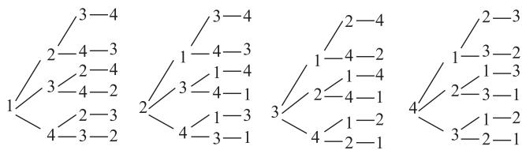
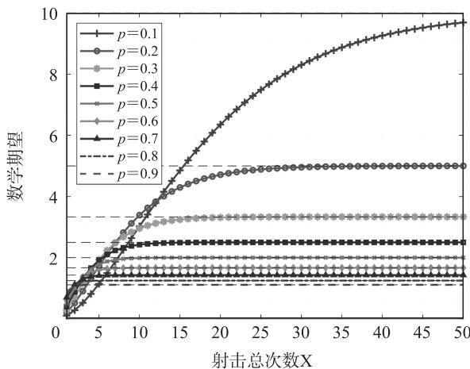

# 概率统计中的无分布列求期望问题研究

胡坤

(江苏省外国语学校)

概率统计是高中数学的重点内容,近年来,随着对期望的深入考查,会出现随机变量无法列出所有可能取值的情形,导致期望无法计算.在这类问题中,已有学者提出建立递推关系式,将期望转化为数列求通项.该方法虽能奏效,但仍存在明显的不足:若递推关系式十分复杂,求数列通项将会十分困难.对于这个问题,笔者提出使用逐项期望累加法和全期望公式法,能在不使用递推关系的基础上回避求分布列,从而快速求期望.

# 1 逐项期望累加法

例 1 随机选取 $1,2,3,\cdots,n$ 的一个排列 $x_{1},x_{2}$ ,$x_{3},\cdots,x_{n}$ . 若 $x_{i}=i$ ，则称 i 是排列 $x_{1},x_{2},x_{3},\cdots,x_{n}$ 的一个不动点. 将 $x_{1},x_{2},x_{3},\cdots,x_{n}$ 中的不动点个数记作随机变量 $X_{n}$ ，试求 $X_{n}$ 的数学期望.

分析 常规方法是写出 $X_{n}$ 的分布列, 再利用分布列求期望, 但由于排列中的项数 n 可能很大, 故可以尝试先将 n 取较小的数, 得出期望, 看其是否有规律可循. 下面分别以 n=1, n=2, n=3, n=4 为例.

当 n=1 时，排列 $x_{1}$ 为 1，不动点个数 $X_{1}=1, X_{1}$ 的分布列如表 1 所示.

表 1

<table><tr><td>$ X_{1} $</td><td>1</td></tr><tr><td>P</td><td>1</td></tr></table>

$$
E (X _ {1}) = 1 \times 1 = 1.
$$

当 n=2 时，排列 $x_{1}, x_{2}$ 有两种情况：1,2 或 2,1，故不动点个数 $X_{2}=2$ 或 0, $X_{2}$ 的分布列如表 2 所示.

表 2

<table><tr><td> $X_{2}$ </td><td>0</td><td>2</td></tr><tr><td>P</td><td> $\frac{1}{2}$ </td><td> $\frac{1}{2}$ </td></tr></table>

$$
E (X _ {2}) = 0 \times \frac {1}{2} + 2 \times \frac {1}{2} = 1.
$$

当 n=3 时，排列 $x_{1}, x_{2}, x_{3}$ 有 6 种情况：1, 2, 3 或 1, 3, 2 或 2, 1, 3 或 2, 3, 1 或 3, 1, 2 或 3, 2, 1，不动点个数依次为 3,1,1,0,0,1，故 $X_{3} = 0$ 或1或3， $X_{3}$ 的分布列如表3所示.

表3

<table><tr><td> $X_3$ </td><td>0</td><td>1</td><td>3</td></tr><tr><td>P</td><td> $\frac{1}{3}$ </td><td> $\frac{1}{2}$ </td><td> $\frac{1}{6}$ </td></tr></table>

$$
E \left(X _ {3}\right) = 0 \times \frac {1}{3} + 1 \times \frac {1}{2} + 3 \times \frac {1}{6} = 1.
$$

当 n=4 时，排列 $x_{1}, x_{2}, x_{3}, x_{4}$ 有 $A_{4}^{4}=24$ 种情况，分别用树状图和表格将所有情况列出来，如图 1 和表 4 所示.

图1  
表 4

<table><tr><td>排列</td><td>不动点个数</td><td>排列</td><td>不动点个数</td><td>排列</td><td>不动点个数</td><td>排列</td><td>不动点个数</td></tr><tr><td>1,2,3,4</td><td>4</td><td>2,1,3,4</td><td>2</td><td>3,1,2,4</td><td>1</td><td>4,1,2,3</td><td>0</td></tr><tr><td>1,2,4,3</td><td>2</td><td>2,1,4,3</td><td>0</td><td>3,1,4,2</td><td>0</td><td>4,1,3,2</td><td>1</td></tr><tr><td>1,3,2,4</td><td>2</td><td>2,3,1,4</td><td>1</td><td>3,2,1,4</td><td>2</td><td>4,2,1,3</td><td>1</td></tr><tr><td>1,3,4,2</td><td>1</td><td>2,3,4,1</td><td>0</td><td>3,2,4,1</td><td>1</td><td>4,2,3,1</td><td>2</td></tr><tr><td>1,4,2,3</td><td>1</td><td>2,4,1,3</td><td>0</td><td>3,4,1,2</td><td>0</td><td>4,3,1,2</td><td>0</td></tr><tr><td>1,4,3,2</td><td>2</td><td>2,4,3,1</td><td>1</td><td>3,4,2,1</td><td>0</td><td>4,3,2,1</td><td>0</td></tr></table>

$X_{4}=0$ 或 1 或 2 或 4, $X_{4}$ 的分布列如表 5 所示.

表 5

<table><tr><td> $X_{4}$ </td><td>0</td><td>1</td><td>2</td><td>4</td></tr><tr><td>P</td><td> $\frac{9}{24}$ </td><td> $\frac{8}{24}$ </td><td> $\frac{6}{24}$ </td><td> $\frac{1}{24}$ </td></tr></table>

$$
E (X _ {4}) = 0 \times \frac {9}{2 4} + 1 \times \frac {8}{2 4} + 2 \times \frac {6}{2 4} + 4 \times \frac {1}{2 4} = 1.
$$

可以看出,每种情况的期望都是1,因此猜想当n为任意的正整数,随机选取 $1,2,3,\cdots,n$ 的一个排列 $x_{1},x_{2},x_{3},\cdots,x_{n}$ 的不动点个数的期望均为1.

当 n 更大时,继续由列举法通过分布列求期望显然不可行,这时要另辟蹊径.一个可行的方法是定义一个不动点函数,再根据期望的线性可加性,直接研究不动点函数的期望,详解如下.

随机选取 $1, 2, 3, \cdots, n$ 的一个排列 $x_{1}, x_{2}, x_{3}, \cdots, x_{n}$ ，定义一个不动点函数

$$
I _ {k} = \left\{ \begin{array}{l l} 1, & x _ {k} = k, \\ 0, & x _ {k} \neq k \end{array} (k = 1, 2, \dots , n). \right.
$$

意思是对 $1,2,3,\cdots,n$ 以任意顺序形成的一个排列 $x_{1},x_{2},x_{3},\cdots,x_{n}$ 从头至尾进行排查，从第一项到最后一项，检查每一项的值是否等于该项的序数，若是，则该项记录为一个不动点 $(I_{k}=1)$ ，否则该项不记录为不动点 $(I_{k}=0)$ 。当排列的每一项都检查完毕后，这个排列的不动点个数就是 $I_{k}(k=1,2,3,\cdots,n)$ 之和，即 $X_{n}=I_{1}+I_{2}+\cdots+I_{n}$ 。

根据期望的线性可加性得

$$
E (X _ {n}) = E (I _ {1} + I _ {2} + \dots + I _ {n}) =
$$

$$
E \left(I _ {1}\right) + E \left(I _ {2}\right) + \dots + E \left(I _ {n}\right).
$$

由于 n 个数的全排列共有 $A_{n}^{n}=n!$ 种情况，故可以认为对某一个特定排列，它的每一项实际上都有 n 个数可以选，因此上式中的每一项 $E(I_{1}), E(I_{2}), \cdots, E(I_{n})$ 都是同一个关于 n 的函数。对于某一个 $I_{k}$ 而言，只能是 1 或 0，若为 1，则说明 $X_{k}=k$ ，即在 n 个数里选一个数与该项的序数一致，这样的概率为 $\frac{1}{n}$ ，即 $P(I_{k}=1)=\frac{1}{n}, P(I_{k}=0)=1-\frac{1}{n}$ ，故

$$
E \left(I _ {k}\right) = 1 \times \frac {1}{n} + 0 \times \left(1 - \frac {1}{n}\right) = \frac {1}{n} (k = 1, 2, 3, \dots , n),
$$

即 $E(I_{1})=E(I_{2})=\cdots=E(I_{n})=\frac{1}{n}.$

综上，有

$$
E (X _ {n}) = E (I _ {1} + I _ {2} + \dots + I _ {n}) =
$$

$$
E (I _ {1}) + E (I _ {2}) + \dots + E (I _ {n}) =
$$

$$
\frac {1}{n} + \frac {1}{n} + \dots + \frac {1}{n} = n \times \frac {1}{n} = 1.
$$

此方法巧妙避开分布列,并用到了期望的线性可加性,因此可称为逐项期望累加法.

# 2 全期望公式法

例 2 现有一个射击选手,一次接一次地向同一个目标射击,各次射击之间相互独立.每射击一次击中目标的概率是 p,直到首次击中才停止射击.以 X 表示射击的总次数,求 X 的数学期望.

分析 与例1类似,本题射击的总次数X的取值可以无限大,与例1不同的是,在进行前几次演算后,每次得到的 $E(X)$ 的值并不相同,但这些值有一定的收敛特征.当 $n\to+\infty$ 时,由表6的分布列可得

$$
E (X) = \sum_ {n = 1} ^ {+ \infty} n P (X = n) = \sum_ {n = 1} ^ {+ \infty} n (1 - p) ^ {n - 1} p,
$$

这是一个无穷项级数,求值需要用到高等数学知识,超出了高中生的能力范围.

表 6

<table><tr><td>X</td><td>1</td><td>2</td><td>3</td><td> $\cdots$ </td><td>n</td></tr><tr><td>P</td><td>p</td><td> $(1-p)p$ </td><td> $(1-p)^{2}p$ </td><td> $\cdots$ </td><td> $(1-p)^{n-1}p$ </td></tr></table>

虽然用纸笔手算的方式很难进行下去,但是可以采用 MATLAB 辅助研究 X 取较大数时所对应的期望,并且可以将击中目标的概率 p 取不同的值,以观察期望的收敛速度、收敛近似值和收敛误差.如图 2 所示,当 p 取较大的数时(如 0.7), $E(X)$ 收敛速度很快,几乎只要 5 次射击就能接近收敛值 1.4286;相反,当 p 取较小的数时(如 0.1), $E(X)$ 收敛速度很慢,50 次射击后都尚未接近收敛值 10.

line

| 射击总次数X | p=0.1 | p=0.2 | p=0.3 | p=0.4 | p=0.5 | p=0.6 | p=0.7 | p=0.8 | p=0.9 |
| ----------- | ----- | ----- | ----- | ----- | ----- | ----- | ----- | ----- | ----- |
| 0           | 0     | 0     | 0     | 0     | 0     | 0     | 0     | 0     | 0     |
| 5           | 1.5   | 1.5   | 1.5   | 1.5   | 1.5   | 1.5   | 1.5   | 1.5   | 1.5   |
| 10          | 3.0   | 3.0   | 3.0   | 3.0   | 3.0   | 3.0   | 3.0   | 3.0   | 3.0   |
| 15          | 4.5   | 4.5   | 4.5   | 4.5   | 4.5   | 4.5   | 4.5   | 4.5   | 4.5   |
| 20          | 6.0   | 6.0   | 6.0   | 6.0   | 6.0   | 6.0   | 6.0   | 6.0   | 6.0   |
| 25          | 7.5   | 7.5   | 7.5   | 7.5   | 7.5   | 7.5   | 7.5   | 7.5   | 7.5   |
| 30          | 8.5   | 8.5   | 8.5   | 8.5   | 8.5   | 8.5   | 8.5   | 8.5   | 8.5   |
| 35          | 9.0   | 9.0   | 9.0   | 9.0   | 9.0   | 9.0   | 9.0   | 9.0   | 9.0   |
| 40          | 9.5   | 9.5   | 9.5   | 9.5   | 9.5   | 9.5   | 9.5   | 9.5   | 9.5   |
| 45          | 9.8   | 9.8   | 9.8   | 9.8   | 9.8   | 9.8   | 9.8   | 9.8   | 9.8   |
| 50          | 10    | 10    | 10    | 10    | 10    | 10    | 10    | 10    | 10    |

图 2

抛开数值实验,重新回顾例2,射击总次数X的取值是全体正整数集,即 $n\in N^{*}$ ,而对于某一个n而言,X=n表示前n-1次均未击中,第n次恰好击中.由于击中的概率是p,那么未击中的概率就是1-p,并且每次射击相互独立,所以 $P(X=n)=(1-p)^{n-1}p$ ,该分布列的结果是一个关于p的等比数列,也称为几何级数,因此这样的分布称为几何分布,记作 $X\sim GE(p)$ .由于X表示的是射击的总次数,虽无法列出X的所有可能取值,但可以换个角度,不妨按照如下思路进行.

假设第 1 次就击中了目标,那么射击的总次数就是 1, 即 X=1, 且 $P(X=1)=p$ . 若第 1 次没有击中,

# 三大概率分布的最可能成功次数及其应用

李鸿昌 $^{1}$ 童加林 $^{1}$ 陈超 $^{2}$

(1. 北京师范大学贵阳附属中学 2. 广东省中山市烟洲中学)

概率分布在统计学、物理学、经济学、信息技术、生物医学等多个学科领域中具有广泛的应用。二项分布、泊松分布和超几何分布作为三种常见的离散型概率分布，其最可能成功次数不仅是描述随机事件集中趋势的关键指标，还在跨学科的实际问题建模与推断中发挥着重要作用。研究最可能成功次数有助于深入理解不同概率分布的形态特征，为工业质量控制、风险评估、生物种群研究、数据科学等领域的概率推断提供理论支持。本文系统阐述三种分布的最可能成功次数的数学表达式，分析其内在联系与数值规律，并结合典型实例说明其在实际跨学科问题中的应用。

# 1 三大概率分布的最可能成功次数

# 1.1 二项分布的最可能成功次数

设随机变量 X 服从二项分布, 即 $P(X=k)=$

$C_{n}^{k}p^{k}q^{n-k}(k=0,1,2,\cdots,n)$ ，0<p<1,q=1-p.记 $b(k,n,p)=C_{n}^{k}p^{k}q^{n-k}$ ，则

$$
\frac {b (k , n , p)}{b (k - 1 , n , p)} = \frac {\mathrm{C} _ {n} ^ {k} p ^ {k} q ^ {n - k}}{\mathrm{C} _ {n} ^ {k - 1} p ^ {k - 1} q ^ {n - k + 1}} =
$$

$$
\frac {(n - k + 1) p}{k q} = 1 + \frac {(n + 1) p - k}{k q}.
$$

当 $k<(n+1)p$ 时， $b(k,n,p)>b(k-1,n,p)$ ，此时后项大于前项， $b(k,n,p)$ 随着 k 的增大而增大.

当 $k>(n+1)p$ 时， $b(k,n,p)<b(k-1,n,p)$ .
此时后项小于前项， $b(k,n,p)$ 随着 k 的增大而减小.

当 $k=(n+1)p$ 时， $b(k,n,p)=b(k-1,n,p)$ ，此时 $b((n+1)p,n,p)$ 与 $b((n+1)p-1,n,p)$ 两项相等且最大.

由此得出结论:二项分布的最可能成功次数(记为 $k_{0}$ ) 存在, 即 $k_{0}$ 满足

相当于第1次的努力白费，得从头再来，此时射击的总次数与 $X+1$ 同分布，且发生这个事件的概率是 $(1-p)^{1}=1-p$ .类似地，若前两次都没有击中，相当于前两次的努力都白费，还得重新来，此时射击的总次数与 $X+2$ 同分布，且发生这个事件的概率是 $(1-p)^{2}$ .

从第1次射击开始，只有两种结果，击中（记为 $Z_{1}$ )或未击中(记为 $Z_{0}$ )，击中即停止. $Z_{1}$ 发生的概率是 $P(Z_{1}) = p$ ，此时 $X$ 的期望是 $E(X) = 1,Z_0$ 发生的概率是 $P(Z_0) = 1 - p$ ，此时 $X$ 的期望是 $E(X + 1)$ .用类似推导全概率公式的方法可得

$$
E (X) = p \cdot 1 + (1 - p) \cdot E (X + 1) =
$$

$$
p + (1 - p) \cdot [ E (X) + 1 ],
$$

解得随机变量 X 的数学期望是 $E(X)=\frac{1}{p}$ .

由于应用了类似推导全概率公式的方法,故该方法称为全期望公式法.在互斥和独立的前提下,以 $E(X)=p\cdot1+(1-p)\cdot E(X+1)$ 的形式回避分布列,直接将 $E(X)$ 看成一个整体进行运算,这使得问题被巧妙解决,并且可得到推广结论:若 $X \sim GE(p)$ , 则 $E(X) = \frac{1}{p}$ .

# 3 结语

本文在数学期望的框架内,针对随机变量的取值有无穷多项的问题,提供了两种新思路.教师在讲授相关问题时,应跟紧高频考点和热点,引领学生从不同的视角观察问题、思考问题、解决问题,将不同的知识、思想和方法相互融合,这样才能切实提升学生的综合能力.

本文系苏州市教育科学“十四五”规划2024年度课题“苏州市高中数学课堂教学方式创新的现状调查研究”（课题编号：2024/JK—dc/02/010/09)与2022年度“姑苏教育人才”项目“基于‘自研·共习·自求’的中学数学教师协同发展路径的实践研究”（项目编号：RCZZ202209）两项课题的阶段性研究成果。

(完)