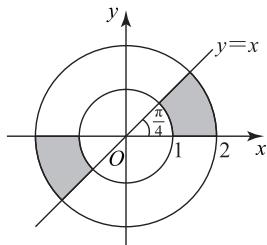
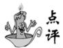

# 概率题型梳理及其解题策略探究

张瑞华 $^{1}$ 龙成芳 $^{2}$

(1. 山东省寿光现代中学 2. 贵州省天柱民族中学)

概率作为高中数学的核心模块,其知识体系与思维方法对学生数学核心素养的培养起着至关重要的作用.在《普通高中数学课程标准(2017年版2020年修订)》中,概率与统计是五大必修课程主题之一,在每年高考中均有考查,且呈现出题型稳定但情境创新的命题趋势.本文基于对高考真题的分析,围绕概率的考查形式展开探究,系统梳理题型并总结答题策略,旨在为高考备考提供指导.

基于 2021—2025 年高考真题的纵向对比分析，系统梳理了概率考查的三大命题维度：基础概念辨析（占 32%）、数学模型应用（占 45%）和实际问题转化（占 23%），并创新性地提出“情境识别—模型构建—算法选择”的三阶解题框架。探究发现，新时代高考概率题呈现从单一计算向综合推理转型的特征，本文从三大命题维度展开探究。

# 1 基础概念辨析

基础概念辨析主要考查概率的基础知识与基本原理,题型包括古典概型、几何概型、条件概率和全概率公式的应用.

# 1.1 古典概型

古典概型是一种基础的具有等可能性的随机实验模型.解题的关键在于识别模型,并利用概率公式 $P(A)=\frac{n}{N}$ (其中n是事件A包含的基本事件数,N为试验的基本事件总数)计算.此类问题常融合事件关系(如包含、互斥、对立)的考查.

例 1 （2024 年全国甲卷文 5）某独唱比赛的决赛阶段共有甲、乙、丙、丁四人参加，每人出场一次，出场次序由随机抽签确定，则丙不是第一个出场，且甲或乙是最后一个出场的概率是（）.

A. $\frac{1}{6}$

B. $\frac{1}{4}$

C. $\frac{1}{3}$

D. $\frac{1}{2}$

由已知,四人随机抽签确定出场次序,共有 $A_{4}^{4}=24$ 个基本事件.丙不是第一个出场,且

甲或乙是最后一个出场，共包含 $C_{2}^{1}C_{2}^{1}A_{2}^{2}=2\times2\times2\times1=8$ 个基本事件，所以丙不是第一个出场，且甲或乙是最后一个出场的概率 $P=\frac{8}{24}=\frac{1}{3}$ ，故选 C.

本题属于典型的古典概型问题,其解题步骤可归纳为三个关键环节:首先,需明确模型特征,即基本事件有限且具有等可能性;其次,通过排列组合或列举法精确计算基本事件总数及所求事件数;最后,运用古典概型公式求解.

# 1.2 几何概型

几何概型与古典概型的区别在于基本事件空间，通常古典概型的基本事件是有限可数的，几何概型的基本事件是无限不可数的。正因为几何概型的基本事件为无限不可数的，所以在计算概率时，往往利用长度、面积或体积等测度计算。

例 2 （2023 年全国乙卷理 5）设 O 为平面坐标系的坐标原点，在区域 $\{(x,y)\mid1\leqslant x^{2}+y^{2}\leqslant4\}$ 内随机取一点，记该点为A，则直线OA的倾斜角不大于 $\frac{\pi}{4}$ 的概率为（ ）.

A. $\frac{1}{8}$

B. $\frac{1}{6}$

C. $\frac{1}{4}$

D. $\frac{1}{2}$

如图 1 所示, 已知 $\{(x,y) \mid 1 \leqslant x^{2} + y^{2} \leqslant 4\}$ 表示的是以 $O(0,0)$ 为圆心、外圆半径为 R = 2、内圆半径为 r=1 的圆环, 所以直线 OA 的倾斜角不大于 $\frac{\pi}{4}$ 表示点 A 在阴影部分, 占圆环面积的 $\frac{1}{4}$ , 则直线 OA 的倾斜角不大于 $\frac{\pi}{4}$ 的概率为 $\frac{1}{4}$ , 故选 C.

text_image

y
y=x
π/4
O
1
2
x

图1

本题是几何概型问题,属于基础题型.题目是考查直线倾斜角的取值范围,利用面积度量样本空间,最后利用概率公式计算即可.

# 1.3 条件概率

条件概率是教材新增的内容,也是近几年考查的热点.这种题型的标志是:“在事件 A 发生的条件下,求事件 B 发生的概率”.求概率时直接利用条件概率公式 $P(B|A)=\frac{P(AB)}{P(A)}$ 计算即可,其中 $P(AB)$ 是事件 A,B 同时发生的概率, $P(A)$ 是事件 A 发生的概率.

例 3 袋中有 6 个球, 其中红、黄、绿、蓝、白、黑球各一个,甲、乙两人按顺序从袋中有放回地随机摸出一球,记事件A为“甲和乙至少一人摸到红球”,事件B为“甲和乙摸到的球颜色不同”,则条件概率 $P(B|A)=$ \_\_\_\_.

因为事件 A 为“甲和乙至少一人摸到红球”，事件 B 为“甲和乙摸到的球颜色不同”，所以事件 AB 为甲和乙只有一人摸到红球.由题意得

$$
P (A) = 1 - \frac {5}{6} \times \frac {5}{6} = \frac {1 1}{3 6},
$$

$$
P (A B) = \frac {\mathrm{C} _ {5} ^ {1} \mathrm{A} _ {2} ^ {2}}{6 \times 6} = \frac {1 0}{3 6} = \frac {5}{1 8},
$$

所以 $P(B \mid A)=\frac{P(AB)}{P(A)}=\frac{\frac{5}{18}}{\frac{11}{36}}=\frac{5}{18}\times\frac{36}{11}=\frac{10}{11}.$

# 点评

条件概率有两种计算方法:一是利用公式$P(B|A)=\frac{P(AB)}{P(A)}$ ，其中 $P(AB)$ 是事件A，B 同时发生的概率, $P(A)$ 是事件 A 发生的概率; 二是利用公式 $P(B \mid A) = \frac{n(AB)}{n(A)}$ , 其中 $n(AB)$ 是事件 AB 包含的基本事件数, $n(A)$ 是事件 A 包含的基本事件数. 解决这类问题的难点是计算 $P(AB)$ 或 $n(AB)$ . 很多学生对同时发生的事件不理解, 导致求不出 $P(AB)$ 或 $n(AB)$ . 若事件 A, B 独立, 则 $P(AB) = P(A)P(B)$ .

# 1.4 全概率公式

全概率公式也是教材新增的知识点,值得关注.
全概率公式 $P(A)=\sum_{i=1}^{n}P(A\mid B_{i})P(B_{i})$ ，其中 A 是需要计算事件的概率， $B_{i}(i=1,2,\cdots,n)$ 是一组两两

互斥的事件, $B_{1}\cup B_{2}\cup\cdots\cup B_{n}=\Omega$ ,且 $P(B_{i})>0(i=1,2,\cdots,n)$ .此外,也可根据事件的具体特征,结合计数原理,通过分析所有可能情形的数量关系来求解概率,体现方法的灵活性与多样性.

例 4 （2025 年天津卷 13，节选）小桐操场跑圈，一周 2 次,一次 5 圈或 6 圈.第一次跑 5 圈或 6 圈的概率均为 0.5,若第一次跑 5 圈,则第二次跑 5 圈的概率为 0.4,跑 6 圈的概率为 0.6;若第一次跑 6 圈,则第二次跑 5 圈的概率为 0.6,跑 6 圈的概率为 0.4.小桐一周跑 11 圈的概率为 \_\_\_\_.

# 解析

方法 1 记事件 $A_{1}$ : 小桐第一次跑 5 圈; 事件 $A_{2}$ : 小桐第一次跑 6 圈; 事件 $B_{1}$ : 小桐第二次跑 5 圈;事件 $B_{2}$ : 小桐第二次跑 6 圈,事件 C: 小桐一周跑 11 圈.由已知,小桐一周跑 11 圈有两种情况:第一种情况是第一次跑 5 圈,第二次跑 6 圈;第二种情况是第一次跑 6 圈,第二次跑 5 圈.由题意可得

$$
P \left(A _ {1}\right) = P \left(A _ {2}\right) = 0. 5,
$$

$$
P \left(B _ {2} \mid A _ {1}\right) = 0. 6,
$$

$$
P \left(B _ {1} \mid A _ {2}\right) = 0. 6.
$$

由全概率公式有

$$
P (C) = P \left(A _ {1}\right) P \left(B _ {2} \mid A _ {1}\right) + P \left(A _ {2}\right) P \left(B _ {1} \mid A _ {2}\right) =
$$

$$
0. 5 \times 0. 6 + 0. 5 \times 0. 6 = 0. 6,
$$

故小桐一周跑 11 圈的概率为 0.6.

方法 2 由已知,小桐一周跑两次,一次跑 5 圈或 6 圈,所以小桐一周跑 11 圈的情况有两种,第一种是第一次跑 5 圈,第二次跑 6 圈,概率为

$$
P _ {1} = 0. 5 \times 0. 6 = 0. 3;
$$

第二种是第一次跑6圈,第二次跑5圈,概率为

$$
P _ {2} = 0. 5 \times 0. 6 = 0. 3,
$$

故小桐一周跑 11 圈的概率

$$
P = P _ {1} + P _ {2} = 0. 3 + 0. 3 = 0. 6.
$$

# 点评

本题考查全概率公式问题,全概率公式在人教 A 版教材中属于必修知识. 对全概率公式深入理解后,除了可以利用全概率公式计算概率外,还可以利用分类和分步计数原理进行计算,如本例的方法2.

# 2 数学模型应用

概率模型众多,除古典概型、几何概型外,高考还重点考查二项分布、超几何分布、正态分布、贝叶斯公式.

# 2.1 二项分布(独立重复试验)

二项分布的主要考查形式是求分布列、期望和方差.在考查二项分布相关问题的同时,会伴随概率的计算,计算时按照二项分布的概率公式进行计算即可.

例 5 （2025 年新高考Ⅱ卷 19, 节选）甲、乙两人进行乒乓球练习,每个球胜者得1分,负者得0分.设每个球甲胜的概率为 $p(\frac{1}{2}<p<1)$ ,乙胜的概率为 $q,p+q=1$ ,且各球的胜负相互独立,对正整数 $k\geqslant2$ ,记 $p_{k}$ 为打完k个球后甲比乙至少多得2分的概率, $q_{k}$ 为打完k个球后乙比甲至少多得2分的概率.求 $p_{3},p_{4}$ (用p表示).

因为 $p_k$ 为打完 $k$ 个球后甲比乙至少多得2分的概率,所以 $p_{3}$ 为打完 3 个球后甲比乙至少多得 2 分的概率, 则只能打 3 个球, 且 3 个球都是甲胜, 因此 $p_{3} = C_{3}^{3} p^{3}(1 - p)^{0} = p^{3}$ . 同理, $p_{4}$ 为打完 4 个球后甲比乙至少多得 2 分的概率, 则有两种可能: 甲胜 4 个球或甲胜 3 个球乙胜 1 个球, 因此

$$
p _ {4} = \mathrm{C} _ {4} ^ {4} p ^ {4} (1 - p) ^ {0} + \mathrm{C} _ {4} ^ {3} p ^ {3} (1 - p) ^ {1} =
$$

$$
p ^ {4} + 4 p ^ {3} (1 - p) = p ^ {3} (4 - 3 p).
$$

本题涉及独立重复试验(各球胜负独立),需要计算特定得分差的概率.净得分的变化可以视为随机游走问题,然后利用二项分布概率公式 $P(n=k)=C_{n}^{k}p^{k}(1-p)^{n-k}$ 计算.

# 2.2 超几何分布

超几何分布描述的是不放回抽样问题,它广泛应用于产品抽检、质量控制等问题.

例6 某校团委决定举办“鉴史知来”读书活动，经过选拔,共10件学生的作品被选为优秀作品,其中高一年级5件作品,高二年级5件作品,现从10件优秀作品中随机抽出7件,求高二年级5件优秀作品被抽中3件的概率.

从 10 件作品中随机抽出 7 件, 共有 $C_{10}^{7}=120$ 种抽取方法,其中从高二年级5件优秀作品中抽出 3 件, 共有 $C_{5}^{3}C_{5}^{4}=50$ 种抽取方法, 故从 10 件优秀作品中随机抽出 7 件时, 高二年级 5 件优秀作品被抽中 3 件的概率为

$$
\frac {\mathrm{C} _ {5} ^ {3} \mathrm{C} _ {5} ^ {4}}{\mathrm{C} _ {1 0} ^ {7}} = \frac {5 0}{1 2 0} = \frac {5}{1 2}.
$$

点评

本题考查超几何分布的概率计算,需要考虑分类计数原理.解题步骤如下:一是识别问题,准确判断问题属于超几何分布(不放回抽取、总体由两类组成、关注其中一类被抽中的数量);二是根据超几何分布概率的计算方法,统计事件数;三是利用概率计算公式计算概率.

# 2.3 正态分布

正态分布是重要的连续型概率分布,历年高考频繁考查,要求学生了解正态分布的特征,会求正态分布的均值、方差,并了解其含义.

例 7 （2024 年新高考 I 卷 9, 多选题）随着“一“带一路”国际合作的深入，某茶叶种植区多措并举推动茶叶出口。为了解推动出口后的亩收入（单位：万元）情况，从该种植区抽取样本，得到推动出口后亩收入的样本均值 $\bar{x} = 2.1$ ，样本方差 $s^2 = 0.01$ 。已知该种植区以往亩收入 $X$ 服从正态分布 $N(1.8,0.1^2)$ ，假设推动出口后的亩收入 $Y$ 服从正态分布 $N(\bar{x},s^2)$ ，则（）（若随机变量 $Z$ 服从正态分布 $N(\mu ,\sigma^2)$ $P(Z <   \mu +\sigma)\approx 0.8413)$

A. $P(X>2)>0.2$   
B. $P(X > 2) <   0.5$   
C. $P(Y>2)>0.5$   
D. $P(Y>2)<0.8$

解析

因为推动出口后亩收入的样本均值 $\bar{x}=2.1$ ,样本方差 $s^{2}=0.01$ ，所以推动出口后的亩收入 Y 服从正态分布 $N(2.1,0.1^{2})$ ，所以

$$
P (Y > 2) = P (Y > \bar {x} - s) = 1 - P (Y > \bar {x} + s) =
$$

$$
1 - P (Y > 2) = P (Y <   2. 2) \approx 0. 8 4 1 3 > 0. 8,
$$

故 C 正确, D 错误. 又该种植区以往亩收入 X 服从正态分布 $N(1.8, 0.1^{2})$ , 所以

$$
P (X > 2) = P (X > 1. 8 + 0. 1 \times 2).
$$

因为 $P(X<1.8+0.1)=P(X<1.9)=P(X>1.7)\approx$ 0.8413, 所以

$$
P (X > 1. 8 + 0. 1) = P (X > 1. 9) \approx
$$

$$
1 - 0. 8 4 1 3 = 0. 1 5 8 7,
$$

因为 $P(X>2)<P(X>1.9)<0.2$ ，所以 B 正确，A 错误.

综上,选 BC.

点评

本题主要考查正态分布的概率计算.在解决问题时,要准确理解与应用正态分布的性质,如单峰性、对称性和渐近性等.同时,要掌握“3σ”准则,即

$$
P (\mu - \sigma <   X <   \mu + \sigma) \approx 0. 6 8 2 7,
$$

$$
P (\mu - 2 \sigma <   X <   \mu + 2 \sigma) \approx 0. 9 5 4 5,
$$

$$
P (\mu - 3 \sigma <   X <   \mu + 3 \sigma) \approx 0. 9 9 7 3.
$$

正态分布的“3σ”准则常用于质量控制、异常值检测等.

# 2.4 贝叶斯概率公式

贝叶斯概率模型虽然在教材中作为选学内容出现,但近年高考也偶有出现.贝叶斯概率模型其实质是全概率公式的逆向推理,所以可以利用全概率模型理解贝叶斯概率模型.

例 8 袋中装有 4 个红球、6 个白球, 不放回地摸两次球,一次只摸1个球,已知第二次摸到红球,求第一次也摸到红球的概率.

设事件 A 表示“第一次摸到红球”，则事件 $\overline{A}$ 表示“第一次摸到白球”，事件 B 表示“第二次摸到红球”，则事件 $\bar{B}$ 表示“第二次摸到白球”。由已知可得 $P(A)=\frac{C_{4}^{1}}{C_{10}^{1}}=\frac{2}{5}$ ，则

$$
P (\overline {{{A}}}) = 1 - \frac {2}{5} = \frac {3}{5}.
$$

根据全概率公式得

$$
P (B) = \frac {2}{5} \times \frac {\mathrm{C} _ {3} ^ {1}}{\mathrm{C} _ {9} ^ {1}} + \frac {3}{5} \times \frac {\mathrm{C} _ {4} ^ {1}}{\mathrm{C} _ {9} ^ {1}} = \frac {2}{5}.
$$

根据条件概率,得出在第一次摸到红球的条件下,第二次也摸到红球的概率为

$$
P (B \mid A) = \frac {P (A B)}{P (A)} = \frac {1}{3}.
$$

由贝叶斯公式,已知第二次摸到红球,第一次也摸到红球的概率

$$
P (A \mid B) = \frac {P (A) P (B \mid A)}{P (B)} = \frac {1}{3}.
$$

点评

本题主要考查条件概率、贝叶斯公式、全概率公式.在解题过程中,需要注意抽取方式,同时，准确理解并应用公式.

# 3 实际问题转化

概率在实际生活中的应用非常广泛,在解题时需要先将实际问题转化为数学问题,再利用数学知识与方法解决.

# 3.1 频率估计概率

利用频率估计概率的问题常出现在统计题中.统计问题中,为了估算概率,往往需要通过样本频率推断总体概率.

例 9 （2025 年北京卷 18，节选）某次考试中，只有一道单项选择题考查了某个知识,甲、乙两校的高一年级学生都参加了这次考试.为了解学生对该知识点的掌握情况,随机抽查了甲、乙两校高一年级各100名学生该题的答题数据,其中甲校学生答题正确的人数为80,乙校学生答题正确的人数为75.假设学生之间答题相互独立,用频率估计概率.估计甲校高一年级学生答对该题的概率.

解析

由已知甲校学生答对该题的频率为 $\frac{80}{100} =$

$\frac{4}{5}$ , 所以估计甲校高一年级学生答对该题的概率为 $\frac{4}{5}$ .

点评

本题是频率估计概率的直接应用,需紧扣“用频率估计概率”的统计思想,避免将问题复杂化.

# 3.2 利用递推公式进行转化

这类题型也是近几年考查的热点,将概率问题与数列相关知识结合,解题时需根据题设条件得出递推公式,然后利用这个公式求指定概率.

例 10 甲、乙、丙三人相互进行传球训练, 第 1次由甲将球传出,每次传球时,甲传给乙、丙的概率均为 $\frac{1}{2}$ ,乙传给甲、丙的概率分别为 $\frac{2}{3}$ , $\frac{1}{3}$ ,丙传给甲、乙的概率分别为 $\frac{2}{3}$ , $\frac{1}{3}$ ,则n次传球后,球在甲手中的概率为\_\_\_\_.

解析

记事件 $A_{n}$ 为“ $n(n \in \mathbf{N}^{*})$ 次传球后球在甲手中”，设 $P(A_{n}) = p_{n}$ . 由题意知

$$
P \left(A _ {n + 1} \mid A _ {n}\right) = 0,
$$

$$
P \left(A _ {n + 1} \mid \overline {{{A _ {n}}}}\right) = \frac {1}{2} \times \frac {2}{3} + \frac {1}{2} \times \frac {2}{3} = \frac {2}{3}.
$$

由全概率公式得

$$
P \left(A _ {n + 1}\right) = P \left(A _ {n}\right) P \left(A _ {n + 1} \mid A _ {n}\right) +
$$

$$
P \left(\overline {{{A _ {n}}}}\right) P \left(A _ {n + 1} \mid \overline {{{A _ {n}}}}\right),
$$

即 $p_{n + 1} = -\frac{2}{3} p_n + \frac{2}{3}$ 即

$$
p _ {n + 1} - \frac {2}{5} = - \frac {2}{3} (p _ {n} - \frac {2}{5}).
$$

因为 $p_{1}=0$ ，所以数列 $\left\{p_{n}-\frac{2}{5}\right\}$ 是以 $-\frac{2}{5}$ 为首项、 $-\frac{2}{3}$ 为公比的等比数列，则

$$
p _ {n} - \frac {2}{5} = - \frac {2}{5} \times (- \frac {2}{3}) ^ {n - 1},
$$

因此 $p_n = \frac{2}{5} [1 - (-\frac{2}{3})^{n-1}]$ .

本题考查条件概率、全概率公式.解题时先根据条件概率公式求出 $P(A_{n + 1}\mid A_n)$ 和$P(A_{n+1}|\overline{A_{n}})$ ，再根据全概率公式推导出递推公式，最后利用已知递推公式求解即可.

# 3.3 比赛问题转化

比赛问题是概率试题中常见的问题,在转化为数学问题时,特别要注意赛制规则,解题时需要结合赛制规则分类讨论获胜路径.

例 11 甲、乙、丙三位同学进行乒乓球比赛，约定赛制如下: 比赛前抽签决定首先比赛的两人, 另一人轮空, 每局比赛的胜者与轮空者进行下一局比赛, 负者下一局轮空, 直至一人累计胜两局, 此人最终获胜, 比赛结束. 已知每局比赛甲胜乙的概率为 $\frac{2}{3}$ , 甲胜丙的概率为 $\frac{1}{2}$ , 乙胜丙的概率为 $\frac{1}{3}$ , 每局比赛没有平局, 且比赛结果相互独立.

(1)若甲、乙先比赛,求甲最终获胜的概率;   
(2)求乙最终获胜的概率.

(1)甲、乙先比赛,甲最终获胜的情况有三种:第一种是甲第一局和第二局都获胜,概率为 $\frac{2}{3}\times\frac{1}{2}=\frac{1}{3}$ ;第二种是甲第一局和第四局获胜,概率为 $\frac{2}{3}\times\frac{1}{2}\times\frac{1}{3}\times\frac{2}{3}=\frac{2}{27}$ ;第三种是甲第三局和第四局获胜,概率为 $\frac{1}{3}\times\frac{2}{3}\times\frac{1}{2}\times\frac{2}{3}=\frac{2}{27}$ ,故甲、乙先比赛,甲最终获胜的概率为 $\frac{1}{3}+\frac{2}{27}+\frac{2}{27}=\frac{13}{27}$ .

(2)由于谁先比赛需要抽签决定,所以有三种情况.

一是甲、乙先比赛，此时乙最终获胜的情况有三种：第一局和第二局乙都获胜，概率为 $\frac{1}{3} \times \frac{1}{3} = \frac{1}{9}$ ；第三局和第四局乙获胜，概率为 $\frac{2}{3} \times \frac{1}{2} \times \frac{1}{3} \times \frac{1}{3} = \frac{1}{27}$ ；第一局和第四局乙获胜，概率为 $\frac{1}{3} \times \frac{2}{3} \times \frac{1}{2} \times \frac{1}{3} = \frac{1}{27}$ ，故甲、乙先比赛，乙最终获胜的概率为 $(\frac{1}{9} + \frac{1}{27} + \frac{1}{27}) \times \frac{1}{3} = \frac{5}{81}$ .

二是甲、丙先比赛,此时乙最终获胜的情况有两种:第一局甲胜的条件下第二局和第三局乙获胜,概率为 $\frac{1}{2}\times\frac{1}{3}\times\frac{1}{3}=\frac{1}{18}$ ;第一局丙获胜的条件下第二局和第三局乙获胜,概率为 $\frac{1}{2}\times\frac{1}{3}\times\frac{1}{3}=\frac{1}{18}$ ,故甲、丙先比赛,乙最终获胜的概率为 $\frac{1}{3}\times(\frac{1}{18}+\frac{1}{18})=\frac{1}{27}$ .

三是乙、丙先比赛，此时乙最终获胜的情况有三种：第一局和第二局乙获胜，概率为 $\frac{1}{3}\times\frac{1}{3}=\frac{1}{9}$ ；第一局和第四局乙获胜，概率为 $\frac{1}{3}\times\frac{2}{3}\times\frac{1}{2}\times\frac{1}{3}=\frac{1}{27}$ ；第三局和第四局乙获胜，概率为 $\frac{2}{3}\times\frac{1}{2}\times\frac{1}{3}\times\frac{1}{3}=\frac{1}{27}$ ，故乙、丙先比赛，乙最终获胜的概率为 $\frac{1}{3}\times(\frac{1}{9}+\frac{1}{27}+\frac{1}{27})=\frac{5}{81}$ .

综上,乙最终获胜的概率为 $\frac{5}{81}+\frac{1}{27}+\frac{5}{81}=\frac{13}{81}$ .

本题以三位同学进行乒乓球比赛为情境,求其中某位同学最终获胜的概率.在解决问题时，需特别注意事件的连续性，从第一局到最后一局，整个过程是连续的，计算概率时要考虑这一情境，如第(1)问中的第三局和第四局甲获胜，意味着进行了四局比赛，第一局甲输了和第二局甲轮空且乙输，所以概率为 $\frac{1}{3}\times\frac{2}{3}\times\frac{1}{2}\times\frac{2}{3}=\frac{2}{27}$ .

本文基于对近年高考真题的系统分析,将概率考查内容梳理为基础概念辨析、数学模型应用和实际问题转化三大核心模块,并针对各模块下的具体题型进行分析,旨在帮助学生快速定位问题本质,选择有效路径求解.研究揭示,新时代高考概率命题正经历由单一计算向综合推理的转型,对学生理解深度与思维灵活性提出了更高要求.通过系统梳理题型特征、解题方法与易错警示,师生可更精准地把握高考脉搏,显著提升概率问题的解题效率与准确率.

(完)