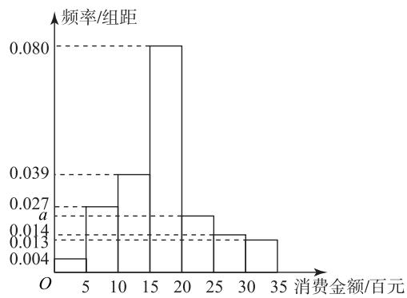

# 独立性检验与统计概率综合问题探析

李雪松

(山东省实验中学德润校区)

独立性检验在高考解答题中一般不会单独命题，通常以概率统计综合题的形式出现，以现实生活为背景，考查多个数学基础知识点及其应用，考查考生的数学建模、数据分析和数学运算的素养。独立性检验是如何与概率统计综合的呢？本文举例说明。

# 1 独立性检验与统计的交会

该类问题涉及统计图表、随机抽样、统计数字特征等统计知识,考查独立性检验与统计的交会.

例 1 为了解大学生的消费情况,对某大学的6 000名男生和4 000名女生按不同性别进行分层抽样，抽取了1 000名学生进行问卷调查，其中一项调查统计了他们每月的消费金额，通过整理得到如图1所示的频率分布直方图。已知在抽取的样本中，有150名女生的月消费金额超过2 000元。

histogram

| 消费金额/百元 | 频率/组距 |
| ------------ | --------- |
| 5            | 0.004     |
| 10           | 0.027     |
| 15           | 0.039     |
| 20           | 0.080     |
| 25           | 0.013     |
| 30           | 0.014     |
| 35           | 0.013     |

图1

附： $\chi^{2}=\frac{n(ad-bc)^{2}}{(a+b)(c+d)(a+c)(b+d)}$ ，其中 $n=a+b+c+d$ .

表 1

<table><tr><td> $P(\chi^{2} \geqslant x_{0})$ </td><td>0.15</td><td>0.10</td><td>0.05</td><td>0.025</td><td>0.010</td><td>0.005</td><td>0.001</td></tr><tr><td> $x_{0}$ </td><td>2.072</td><td>2.706</td><td>3.841</td><td>5.024</td><td>6.635</td><td>7.879</td><td>10.828</td></tr></table>

(1) 求 $a$ 的值；

(2)估计月消费金额的中位数；

(3)在犯错误的概率不超过0.001的前提下,分析大学生月消费金额在2000元以上与性别是否

有关?

(1)由概率分布直方图可知

$$
(0. 0 0 4 + 0. 0 1 3 + 0. 0 1 4 + a + 0. 0 2 7 +
$$

$$
0. 0 3 9 + 0. 0 8) \times 5 = 1,
$$

解得 a=0.023.

(2)由频率分布直方图可知前 3 个矩形面积之和为

$$
(0. 0 0 4 + 0. 0 2 7 + 0. 0 3 9) \times 5 = 0. 3 5 <   0. 5;
$$

前 4 个矩形面积之和为

$$
(0. 0 0 4 + 0. 0 2 7 + 0. 0 3 9 + 0. 0 8) \times 5 = 0. 7 5 > 0. 5.
$$

设中位数为 m，则 $m \in (15, 20)$ ，因为

$$
(0. 0 0 4 + 0. 0 2 7 + 0. 0 3 9) \times 5 + (m - 1 5) \times 0. 0 8 = 0. 5,
$$

所以 m=16.875，故月消费金额的中位数为 16.875 百元，即 1687.5 元.

(3)月消费金额超过2000元的大学生人数为 $(0.023+0.014+0.013)\times5\times1000=250$ ，则月消费金额超过2000元的男生人数为100，由分层随机抽样可知男生、女生抽样的人数分别为600和400。由条件可以列如表2所示的列联表。

表 2

<table><tr><td></td><td>男生/名</td><td>女生/名</td><td>合计/名</td></tr><tr><td>消费金额不超过2 000元</td><td>500</td><td>250</td><td>750</td></tr><tr><td>消费金额超过2 000元</td><td>100</td><td>150</td><td>250</td></tr><tr><td>合计</td><td>600</td><td>400</td><td>1 000</td></tr></table>

零假设 $H_{0}$ : 月消费金额在 2 000 元以上的大学生与性别无关. 因为

$$
\chi^ {2} = \frac {1 0 0 0 \times (5 0 0 \times 1 5 0 - 2 5 0 \times 1 0 0) ^ {2}}{6 0 0 \times 4 0 0 \times 7 5 0 \times 2 5 0} =
$$

$$
\frac {5 0 0}{9} \approx 5 5. 5 6 > 1 0. 8 2 8,
$$

所以在犯错的概率不超过 0.001 的前提下可以判断月消费金额在 2000 元以上的大学生与性别有关.

# 2 独立性检验与概率的交会

该类问题涉及古典概率、条件概率、离散型随机变量的概率分布等概率知识,考查独立性检验与概率

的交会.

例2 为考查一种新疫苗预防某一疾病的效果，研究人员对一地区某种动物(数量较大)进行试验,从该试验群中随机抽查了50只,得到如表3所示的样本数据(单位:只).

表 3

<table><tr><td></td><td>发病</td><td>没发病</td><td>合计</td></tr><tr><td>接种疫苗</td><td>7</td><td>18</td><td>25</td></tr><tr><td>没接种疫苗</td><td>19</td><td>6</td><td>25</td></tr><tr><td>合计</td><td>26</td><td>24</td><td>50</td></tr></table>

(1)能否在犯错误的概率不超过 0.001 的前提下,认为接种该疫苗与预防该疾病有关?

(2)从该地区此动物群中任取一只,记 A 表示此动物发病, $\overline{A}$ 表示此动物没发病,B 表示此动物接种疫苗,定义事件 A 的优势 $R_{1}=\frac{P(A)}{1-P(A)}$ ,在事件 B 发生的条件下 A 的优势 $R_{2}=\frac{P(A|B)}{1-P(A|B)}$ ,利用抽样的样本数据,求 $\frac{R_{2}}{R_{1}}$ 的估计值.

(3)若把表中的频率视作概率,现从该地区没发病的动物中抽取3只,记抽取的3只动物中接种疫苗的只数为X,求随机变量X的分布列和数学期望.

附： $\chi^2 = \frac{n(ad - bc)^2}{(a + b)(c + d)(a + c)(b + d)}$ ，其中 $n = a + b + c + d$

表 4

<table><tr><td> $P(\chi^{2} \geqslant x_{0})$ </td><td>0.050</td><td>0.010</td><td>0.001</td></tr><tr><td> $x_{0}$ </td><td>3.841</td><td>6.635</td><td>10.828</td></tr></table>

(1)零假设 $H_{0}$ :接种该疫苗与预防该疾病无关.根据列联表可得

$$
\chi^ {2} = \frac {5 0 \times (1 9 \times 1 8 - 7 \times 6) ^ {2}}{2 6 \times 2 4 \times 2 5 \times 2 5} \approx 1 1. 5 3 8 > 1 0. 8 2 8,
$$

所以能够在犯错误的概率不超过 0.001 的前提下, 认为接种该疫苗与预防该疾病有关.

(2)由于

$$
1 - P (A \mid B) = 1 - \frac {P (A B)}{P (B)} = \frac {P (B) - P (A B)}{P (B)} =
$$

$$
\frac {P (\bar {A} B)}{P (B)} = P (\bar {A} \mid B),
$$

所以

$$
R _ {2} = \frac {P (A \mid B)}{1 - P (A \mid B)} = \frac {P (A \mid B)}{P (\overline {{{A}}} \mid B)},
$$

$$
R _ {1} = \frac {P (A)}{1 - P (A)} = \frac {P (A)}{P (\overline {{{A}}})},
$$

$$
\frac {R _ {2}}{R _ {1}} = \frac {\frac {P (A \mid B)}{P (\overline {{A}} \mid B)}}{\frac {P (A)}{P (\overline {{A}})}} = \frac {P (A \mid B) P (\overline {{A}})}{P (\overline {{A}} \mid B) P (A)} =
$$

$$
\frac {\frac {P (A B)}{P (B)} P (\overline {{A}})}{\frac {P (\overline {{A}} B)}{P (B)} P (A)} = \frac {\frac {P (A B)}{P (A)}}{\frac {P (\overline {{A}} B)}{P (\overline {{A}})}} = \frac {P (B | A)}{P (B | \overline {{A}})}.
$$

由列联表中的数据得 $P(B \mid A) = \frac{7}{26}$ , $P(B \mid \overline{A}) = \frac{18}{24}$ , 所以 $\frac{R_{2}}{R_{1}} = \frac{14}{39}$ .

(3)由题可知,抽取的24只没发病的动物中接种疫苗和没接种疫苗的动物分别为18只和6只,所以从没发病的动物中随机抽取1只,抽取的是接种了疫苗的动物的概率为 $\frac{18}{18+6}=\frac{3}{4}$ .由题意可知X=0,1,2,3,且 $X\sim B(3,\frac{3}{4})$ ,则

$$
P (X = 0) = \mathrm{C} _ {3} ^ {0} \left(\frac {1}{4}\right) ^ {3} = \frac {1}{6 4},
$$

$$
P (X = 1) = \mathrm{C} _ {3} ^ {1} (\frac {3}{4}) ^ {1} (\frac {1}{4}) ^ {2} = \frac {9}{6 4},
$$

$$
P (X = 2) = \mathrm{C} _ {3} ^ {2} \left(\frac {3}{4}\right) ^ {2} \left(\frac {1}{4}\right) ^ {1} = \frac {2 7}{6 4},
$$

$$
P (X = 3) = \mathrm{C} _ {3} ^ {3} (\frac {3}{4}) ^ {3} = \frac {2 7}{6 4},
$$

所以 X 的分布列如表 5 所示.

表 5

<table><tr><td>X</td><td>0</td><td>1</td><td>2</td><td>3</td></tr><tr><td>P</td><td> $\frac{1}{64}$ </td><td> $\frac{9}{64}$ </td><td> $\frac{27}{64}$ </td><td> $\frac{27}{64}$ </td></tr></table>

$$
E (X) = 3 \times \frac {3}{4} = \frac {9}{4}.
$$

综上,独立性检验与概率综合的问题,题干信息量丰富,重点考查考生的数学阅读能力、数据分析能力和数学应用能力,该类问题反映了新高考命题的基础性和知识的交会性,在复习备考时应加以关注.

(完)