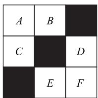
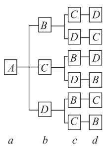
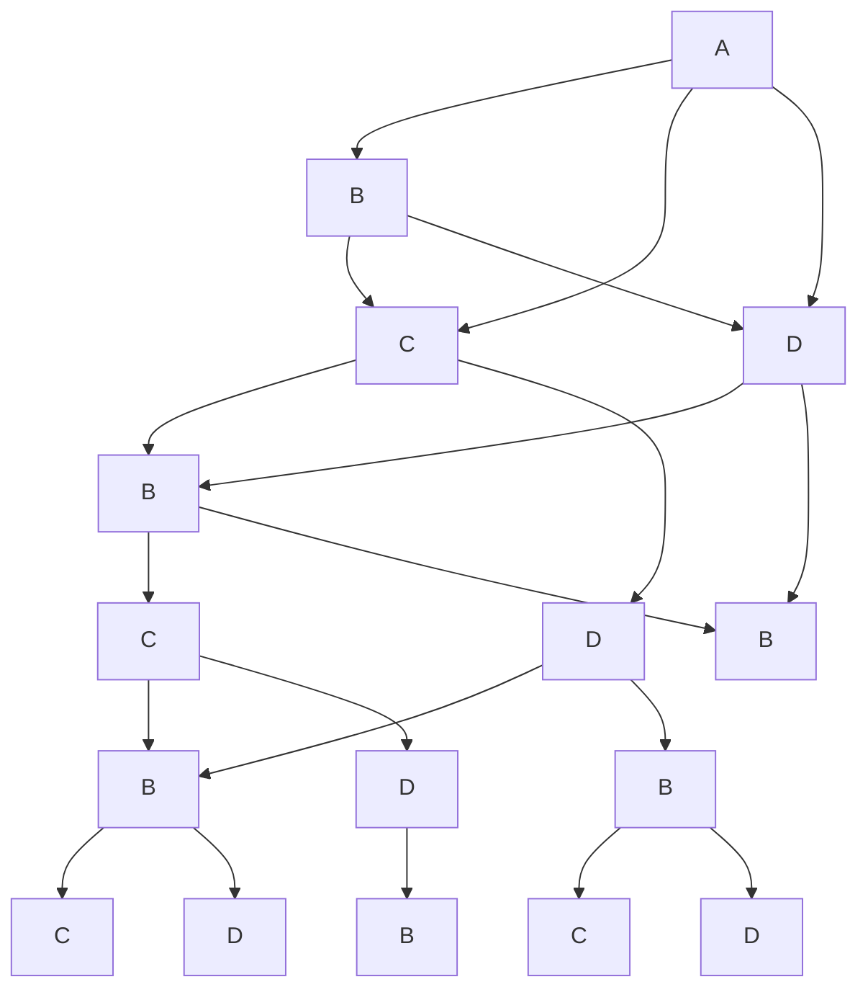
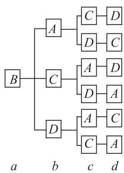
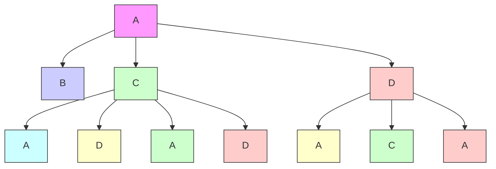
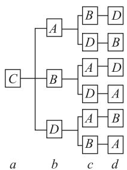
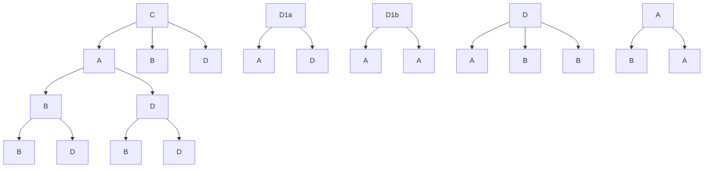
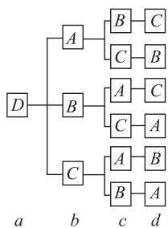
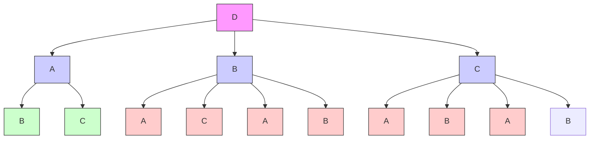

# 用列举法求解概率中的一类问题

李发光

(云南师范大学实验中学)

列举法是求解概率问题的常用方法,尤其适用于求解一些较为复杂的古典概型问题.当概率问题中样本空间中的样本点较少或样本点呈现出一定规律时,列举法是首选.如何将样本点一一列举,并做到不重不漏呢?教材介绍了列举法的三种常见形式:枚举法、列表法和树状图法,本文举例说明.

# 1 枚举法

枚举法是根据题意直接将样本点一一列举的方法.列举时要找到规律,避免重复或遗漏.

例 1 高一某班数学学习小组有 3 名男生, 2 名女生,现从中随机抽取3名学生去参加学校组织的数学竞赛(被选到的可能性相同).

(1)求参赛学生中至少有2名男生的概率;   
(2) 求参赛学生中恰有 2 名男生和 1 名女生的概率.

记 3 名男生分别为 $A_{1}, A_{2}, A_{3}$ ，2 名女生分别为 $B_{1}, B_{2}$ ，则从 5 名学生中选取 3 名学生参赛，可能的结果有 $A_{1}A_{2}A_{3}, A_{1}A_{2}B_{1}, A_{1}A_{2}B_{2}, A_{1}A_{3}B_{1}, A_{1}A_{3}B_{2}, A_{1}B_{1}B_{2}, A_{2}A_{3}B_{1}, A_{2}A_{3}B_{2}, A_{2}B_{1}B_{2}, A_{3}B_{1}B_{2}$ ，共10种.

(1)设事件 A 为“参赛学生中至少有 2 名男生”，则事件 A 包含的基本事件有 $A_{1}A_{2}A_{3}, A_{1}A_{2}B_{1}, A_{1}A_{2}B_{2}, A_{1}A_{3}B_{1}, A_{1}A_{3}B_{2}, A_{2}A_{3}B_{1}, A_{2}A_{3}B_{2}$ ，共 7 个，故参赛学生中至少有 2 名男生的概率为

$$
P (A) = \frac {7}{1 0}.
$$

(2)设事件 B 为“参赛学生中恰有 2 名男生和 1 名女生”，则事件 B 包含的基本事件有 $A_{1}A_{2}B_{1}$ ， $A_{1}A_{2}B_{2}$ ， $A_{1}A_{3}B_{1}$ ， $A_{1}A_{3}B_{2}$ ， $A_{2}A_{3}B_{1}$ ， $A_{2}A_{3}B_{2}$ ，共 6 个，故参赛学生中恰有 2 名男生和 1 名女生的概率为

$$
P (B) = \frac {3}{5}.
$$

本题利用枚举法列举样本点时,需注意样本点书写的规律,避免重复或遗漏.

变式 柜子里有 3 双不同的鞋子, 分别用 $a_{1}, a_{2}, b_{1}, b_{2}, c_{1}, c_{2}$ 表示 6 只鞋, 从中有放回地取出 2 只, 记事件 M 为“取出的鞋是一只左脚的和一只右脚的, 但不是一双鞋”, 求事件 M 的概率.

答案 $\frac{1}{3}$ .

# 2 列表法

列表法是借助表格列举样本点的方法,这种方法既能让人对样本点一目了然,又能避免样本点的重复或遗漏.

例 2 甲、乙、丙三人进行投篮游戏,规则如下:先抽签确定三人的投篮顺序,每次投篮,若投中,则该人继续投篮,直至未投中,若未投中,则换下一个人投篮.已知甲每次投篮投中的概率均为 $\frac{4}{5}$ ,乙每次投篮投中的概率均为 $\frac{3}{5}$ ,丙每次投篮投中的概率均为 $\frac{1}{2}$ ,且甲、乙、丙每次投篮的结果都相互独立.若三人投篮的顺序是甲、乙、丙,求第5次是丙投篮的概率.

析

由题可得第 5 次是丙投篮的所有情况如表 1 所示.

表 1

<table><tr><td>投篮次数</td><td>第1次</td><td>第2次</td><td>第3次</td><td>第4次</td><td>第5次</td></tr><tr><td>情况1</td><td>甲(投中)</td><td>甲(投中)</td><td>甲(未投中)</td><td>乙(未投中)</td><td>丙</td></tr><tr><td>情况2</td><td>甲(投中)</td><td>甲(未投中)</td><td>乙(投中)</td><td>乙(未投中)</td><td>丙</td></tr><tr><td>情况3</td><td>甲(未投中)</td><td>乙(投中)</td><td>乙(投中)</td><td>乙(未投中)</td><td>丙</td></tr><tr><td>情况4</td><td>甲(投中)</td><td>甲(未投中)</td><td>乙(未投中)</td><td>丙(投中)</td><td>丙</td></tr><tr><td>情况5</td><td>甲(未投中)</td><td>乙(投中)</td><td>乙(未投中)</td><td>丙(投中)</td><td>丙</td></tr><tr><td>情况6</td><td>甲(未投中)</td><td>乙(未投中)</td><td>丙(投中)</td><td>丙(投中)</td><td>丙</td></tr></table>

因此,第5次是丙投篮的概率为

$$
(\frac {4}{5}) ^ {2} \times \frac {1}{5} \times \frac {2}{5} + \frac {4}{5} \times \frac {1}{5} \times \frac {3}{5} \times \frac {2}{5} + \frac {1}{5} \times
$$

$$
(\frac {3}{5}) ^ {2} \times \frac {2}{5} + \frac {4}{5} \times \frac {1}{5} \times \frac {2}{5} \times \frac {1}{2} + \frac {1}{5} \times \frac {3}{5} \times
$$

$$
\frac {2}{5} \times \frac {1}{2} + \frac {1}{5} \times \frac {2}{5} \times (\frac {1}{2}) ^ {2} = \frac {2 4 3}{1 2 5 0}.
$$

# [Non-Text]

本题主要考查独立重复事件的概率,三人投篮次数和是否投中的情况比较复杂,故考虑用表格来列举.一般地,当样本点有两个方面的因素确定时,列举样本点可考虑用列表法.

变式 在 $3 \times 3$ 正方形方格中, 有 3 个小正方形被涂成了黑色, 所形成的图案如图 1 所示, 图中每块小正方形除颜色外完全相同.

(1)一个小球在这个正方形方格上自由滚动,那么小球停在黑色小正方形的概率是多少?  
(2)现从方格内空白的小正方形 $(A,B,C,D,E,F)$ 中任取2个涂黑,得到新图案,请用列表或

画树状图的方法求新图案是中心对称图形的概率.

text_image

A B
C D
E F

图1

答案 (1) $\frac{1}{3}$ . (2) $\frac{1}{5}$ .

# 3 树状图法

树状图法,就是把样本点用树干和分支的形式呈现,其目的也是让人对样本点一目了然,且避免样本点的重复与遗漏.

例 3 A, B, C, D 这 4 位贵宾, 应分别坐在 a, b,$c, d$ 这4个席位上，现在这4人均未留意，在4个席位上随便就座时，求这4人中至少有2人坐在自己的席位上的概率.

将 A, B, C, D 这 4 位贵宾就座情况用树状图表示, 如图 2 所示, 样本点的总数为 24.

flowchart

flowchart

flowchart

flowchart

图2

方法 1 设事件 M 为“这 4 人中至少有 2 人坐在自己的席位上”，事件 E 为“这 4 人恰好都坐在自己的席位上”，则事件 E 只包含 1 个样本点，所以 $P(E)=\frac{1}{24}$ ，事件 F 为“这 4 人中有 2 人坐在自己的席位上”，则事件 F 包含 6 个样本点，则 $M=E+F$ ，且事件 E 与 F 为互斥事件，所以

$$
P (M) = P (E \bigcup F) = P (E) + P (F) =
$$

$$
\frac {1}{2 4} + \frac {6}{2 4} = \frac {7}{2 4}.
$$

方法 2 设事件 G 为“这 4 人恰好都没有坐在自己的席位上”，则事件 G 包含 9 个样本点，所以 $P(G)=\frac{9}{24}=\frac{3}{8}$ . 设事件 H 为“这 4 人中恰好有 1 人坐在自己的席位上”，则事件 H 包含 8 个样本点，所以 $P(H)=\frac{8}{24}=\frac{1}{3}$ ，且事件 G 与 H 为互斥事件. 设事件 M 为“这 4 人中至少有 2 人坐在自己的席位上”，则 $\overline{M}=G\cup H$ ，所以

$$
P (M) = 1 - P (G \bigcup H) = 1 - P (G) - P (H) =
$$

$$
1 - \frac {3}{8} - \frac {1}{3} = \frac {7}{2 4}.
$$

# [Non-Text]

本题考查互斥事件与独立事件的概率计算，求解时先统计样本点的总数，由于涉及4个座位的不同分布,所以采用了树状图法,从数学思想看,它就是将分类讨论思想图形化.

变式 甲、乙、丙3人玩“剪刀、石头、布”游戏（剪刀赢布，布赢石头，石头赢剪刀），规定每局中，3人出现同一种手势，则每人各得1分；3人出现两种手势，则赢者得2分，输者负1分；3人出现三种手势，则均得0分。当有人累计得3分及以上时，游戏结束，得分最高者获胜，已知3人之间及每局游戏互不影响。

(1)求甲在一局中得2分的概率 $P_{1}$ ;

(2) 求游戏经过两局后甲恰得 3 分且为唯一获胜者的概率 $P_{2}$ .

答案 (1) $\frac{1}{3}$ .(2) $\frac{1}{81}$ .

总而言之,在概率问题中,当试验的结果,即样本空间中的样本点是有限个,而且受到多个条件的限制,用计数原理求解较为复杂时,我们不妨试试列举法.

(完)