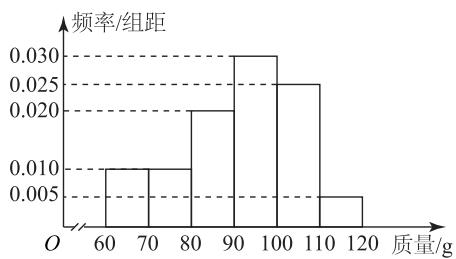
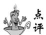

# 直击概率与统计中的决策问题

姚健

(福建省福州民族中学)

概率与统计是高中数学的重要内容,也是高考命题的重要考点,考查考生数据分析和数学建模等核心素养.学以致用,是新高考命题的重要原则之一,而利用概率与统计的知识对生活中的某些问题进行决策,正与之契合.这类问题主要有哪些呢?笔者结合典例进行探讨.

# 1 利用平均数决策

平均数是衡量一个样本数据大小的重要指标,因此有些问题可以通过比较平均数的大小进行决策.

例 1 某收购商为了解某种植基地的红心猕猴桃品质，从该基地的8000个猕猴桃中随机抽取100个进行测量，其质量全部分布在区间[60,120]内（单位：g），将所得数据分成6组：[60,70)，[70,80)，[80,90)，[90,100)，[100,110)，[110,120]，得到频率分布直方图，如图1所示.

histogram

| 质量/g | 频率/组距 |
| :--- | :--- |
| 60-70 | 0.010 |
| 70-80 | 0.010 |
| 80-90 | 0.020 |
| 90-100 | 0.030 |
| 100-110 | 0.025 |
| 110-120 | 0.005 |

图1

若该收购商准备收购这批猕猴桃，并提出了以下两种收购方案，请你就这两种方案，通过计算为该猕猴桃基地选择最佳的出售方案（同一组中的数据用该组区间的中点值代表）.

方案 1: 所有猕猴桃均以 10 元·kg $^{-1}$ 收购；

方案 2: 小于 90 g 的猕猴桃以 5 元·kg $^{-1}$ 收购, 不小于 90 g 的猕猴桃以 15 元·kg $^{-1}$ 收购.

方案 1: 由频率分布直方图可估计每个猕猴桃的平均质量 $\bar{x}=65\times0.1+75\times0.1+85\times$ $0.2+95\times0.3+105\times0.25+115\times0.05=91.5\ g.$ 收入约为 $\frac{8\ 000}{1\ 000}\times91.5\times10=7\ 320\ 元.$

方案2:由频率分布直方图可知质量小于90 g的每个猕猴桃的平均质量约为 $\frac{1}{0.1+0.1+0.2}\times(0.1\times65+0.1\times75+0.2\times85)=77.5\ g$ ，质量不小于90克的每个猕猴桃的平均质量约为 $\frac{1}{0.6}\times(0.3\times95+0.25\times105+0.05\times115)\approx100.8\ g$ ，收入约为 $\frac{77.5\times5\times0.4\times8\ 000}{1\ 000}+\frac{100.8\times15\times0.6\times8\ 000}{1\ 000}=8\ 497.6$ 元.

因为 8497.6 > 7320，所以方案 2 为最佳的出售方案.

本题先求出平均重量,再计算收入,然后分别求出两种方案的所得收入,最后比较收入

的大小即可得到最佳方案.

# 2 利用期望与方差决策

在离散型随机变量问题中,数学期望可以衡量一组数据平均值,方差可以衡量一组数据的离散度,因此期望与方差也是决策问题的重要指标.

例 2 某市拟建立一个博物馆,采取竞标的方式从甲、乙两家建筑公司选取一家,招标方案如下:两家公司从6个招标问题中随机抽取3个问题,已知这6个招标问题中,甲公司能正确回答其中4道题目,而乙公司能正确回答每道题目的概率均为 $\frac{2}{3}$ ,甲、乙两家公司对每道题的回答都相互独立,互不影响.

(1)求甲公司答对题数的分布列、期望及方差；

(2)请从期望和方差的角度分析,甲、乙两家哪家公司竞标成功的可能性更大?

(1)设甲公司答对题数为随机变量 $X$ ，则 $X$ 的可能取值为 1,2,3, 则 $P(X=1)=\frac{C_{4}^{1}C_{2}^{2}}{C_{6}^{3}}=$ $\frac{1}{5}, P(X=2)=\frac{C_{4}^{2}C_{2}^{1}}{C_{6}^{3}}=\frac{3}{5}, P(X=3)=\frac{C_{4}^{3}}{C_{6}^{3}}=\frac{1}{5}$ ，所以X的分布列如表1所示.

表 1

<table><tr><td>X</td><td>1</td><td>2</td><td>3</td></tr><tr><td>P</td><td> $\frac{1}{5}$ </td><td> $\frac{3}{5}$ </td><td> $\frac{1}{5}$ </td></tr></table>

$$
E (X) = 1 \times \frac {1}{5} + 2 \times \frac {3}{5} + 3 \times \frac {1}{5} = 2,
$$

$$
D (X) = (1 - 2) ^ {2} \times \frac {1}{5} + (2 - 2) ^ {2} \times \frac {3}{5} +
$$

$$
(3 - 2) ^ {2} \times \frac {1}{5} = \frac {2}{5}.
$$

(2)设乙公司答对题数为随机变量 Y，则 Y 的可能取值为 0,1,2,3，故

$$
P (Y = 0) = \mathrm{C} _ {3} ^ {0} (\frac {2}{3}) ^ {0} (1 - \frac {2}{3}) ^ {3} = \frac {1}{2 7},
$$

$$
P (Y = 1) = \mathrm{C} _ {3} ^ {1} \left(\frac {2}{3}\right) ^ {1} \left(1 - \frac {2}{3}\right) ^ {2} = \frac {2}{9},
$$

$$
P (Y = 2) = \mathrm{C} _ {3} ^ {2} (\frac {2}{3}) ^ {2} (1 - \frac {2}{3}) ^ {1} = \frac {4}{9},
$$

$$
P (Y = 3) = \mathrm{C} _ {3} ^ {3} \left(\frac {2}{3}\right) ^ {3} \left(1 - \frac {2}{3}\right) ^ {0} = \frac {8}{2 7},
$$

所以 Y 的分布列如表 2 所示.

表 2

<table><tr><td>Y</td><td>0</td><td>1</td><td>2</td><td>3</td></tr><tr><td>P</td><td> $\frac{1}{27}$ </td><td> $\frac{2}{9}$ </td><td> $\frac{4}{9}$ </td><td> $\frac{8}{27}$ </td></tr></table>

$$
E (Y) = 0 \times \frac {1}{2 7} + 1 \times \frac {2}{9} + 2 \times \frac {4}{9} + 3 \times \frac {8}{2 7} = 2,
$$

$$
D (Y) = (0 - 2) ^ {2} \times \frac {1}{2 7} + (1 - 2) ^ {2} \times \frac {2}{9} +
$$

$$
(2 - 2) ^ {2} \times \frac {4}{9} + (3 - 2) ^ {2} \times \frac {8}{2 7} = \frac {2}{3},
$$

由 $E(X)=E(Y)$ ，且 $D(X)<D(Y)$ ，所以甲公司竞标成功的可能性更大.

本题主要考查求二项分布和超几何分布的均值和方差，并比较期望与方差的大小得出结论.

# 3 利用概率决策

概率表示事件发生的可能性大小.对于随机事件，有时可通过比较相关事件发生概率的大小来进行决策.

例 3 甲、乙两人进行乒乓球比赛,每局比赛中甲胜乙的概率为 $\frac{3}{5}$ .

(1)采取五局三胜制,即在不超过5局的比赛中先累计胜3局者赢得比赛,比赛结束.

(i) 求一场比赛中, 甲以 3:2 的比分赢得比赛的概率;  
（ii）求一场比赛中(不一定打满5局)，甲最终赢得比赛的概率.  
(2) 判断“五局三胜制”和“三局两胜制”哪一种赛制对乙赢得比赛更有利,说明理由.

解析

(1)(i)前4局比赛中甲乙各胜2局,最后1局甲胜乙,则甲以 3:2 的比分赢得比赛,概率为

$$
\mathrm{C} _ {4} ^ {2} \left(\frac {3}{5}\right) ^ {2} \left(1 - \frac {3}{5}\right) ^ {2} \frac {3}{5} = \frac {6 4 8}{3 1 2 5}.
$$

（ii）甲赢得比赛分三种情况：以3:0的比分赢得比赛，概率为 $p_{1}=(\frac{3}{5})^{3}=\frac{27}{125}$ ；以3:1的比分赢得比赛，概率 $p_{2}=C_{3}^{2}(\frac{3}{5})^{2}\times(1-\frac{3}{5})\times\frac{3}{5}=\frac{162}{625}$ ；以3:2的比分赢得比赛，概率由（i）已得， $p_{3}=\frac{648}{3125}$ .甲赢得比赛的概率

$$
p = p _ {1} + p _ {2} + p _ {3} = \frac {2 7}{1 2 5} + \frac {1 6 2}{6 2 5} + \frac {6 4 8}{3 1 2 5} = \frac {2 1 3 3}{3 1 2 5}.
$$

(2)由(1)可知在“五局三胜制”比赛中,乙赢得比赛的概率为 $1-\frac{2133}{3125}=\frac{992}{3125}$ . 在“三局两胜制”比赛中,乙赢得比赛分两种情况:以 2:0 的比分赢得比赛,概率为 $p_{4}=(\frac{2}{5})^{2}=\frac{4}{25}$ ; 以 2:1 的比分赢得比赛,概率为 $p_{5}=C_{2}^{1}(\frac{2}{5})^{1}\times(1-\frac{2}{5})\times\frac{2}{5}=\frac{24}{125}$ , 所以在“三局两胜制”比赛中,乙赢得比赛的概率

$$
p = p _ {4} + p _ {5} = \frac {4}{2 5} + \frac {2 4}{1 2 5} = \frac {4 4}{1 2 5}.
$$

因为 $\frac{44}{125}>\frac{992}{3\ 125}$ ，所以选择“三局两胜制”对乙赢得比赛更有利.

点评

本题主要考查独立事件的乘法公式、独立重复试验的概率问题.先求解两种情况下的概率,再比较大小即可进行决策.

由此可见,求解概率与统计中的决策问题关键要抓住三点:一是针对不同的问题选择相应的统计量;二是根据统计量的意义或公式进行精准计算;三是通过统计量大小的比较或与临界值的比较进行决策.

(完)