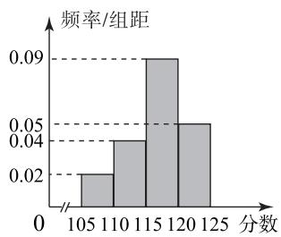
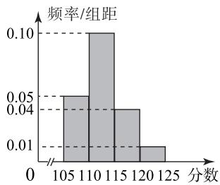

# 直击独立性检验热点题型

江虹玲

(山东省青岛市城阳区第二实验中学)

独立性检验是统计中的重要知识点之一,它可以判断两个分类变量之间是否显著具有某种关联性.虽然其内容比较简单,但往往与概率统计中的其他知识交会,具有一定的综合性.那么它通常与哪些知识交会呢?本文列举两种热点题型加以分析探讨.

# 1 独立性检验与频率分布直方图交会

在这类问题中,独立性检验中需用到的数据由频率分布直方图提供,既能考查考生的识图与用图能力、数据分析能力,又能考查数学运算能力和数学判断能力.这类问题虽属于综合题,但难度不大.

例1 为研究高一学生整理数学错题与提高数学成绩的相关性,某小组通过随机抽样,获得了每天整理错题和未每天整理错题的各20名学生3次数学考试成绩的平均分,绘制了如图1和图2所示的频率分布直方图,并且已知高一学生3次数学考试成绩的总体均分为115分.

histogram

| 分数 | 频率/组距 |
| :--- | :--- |
| 105 | 0.02 |
| 110 | 0.04 |
| 115 | 0.09 |
| 120 | 0.05 |
| 125 | 0.00 |

图1

histogram

| 分数 | 频率/组距 |
| :--- | :--- |
| 105 | 0.05 |
| 110 | 0.10 |
| 115 | 0.04 |
| 120 | 0.01 |
| 125 | 0.01 |

图2

(1)依据频率分布直方图,完成如表1所示的 $2\times2$ 列联表;

表 1

<table><tr><td></td><td>成绩不低于总体均分</td><td>成绩低于总体均分</td><td>合计</td></tr><tr><td>每天整理错题</td><td></td><td></td><td></td></tr><tr><td>未每天整理错题</td><td></td><td></td><td></td></tr><tr><td>合计</td><td></td><td></td><td></td></tr></table>

(2)依据小概率值 $\alpha=0.01$ 的独立性检验, 分析数学成绩不低于总体均分是否与每天整理数学错题有关.

附： $\chi^{2}=\frac{n(ad-bc)^{2}}{(a+b)(c+d)(a+c)(b+d)}$ ，其中 $n=a+b+c+d$ .

表 2

<table><tr><td> $\alpha$ </td><td>0.10</td><td>0.01</td><td>0.001</td></tr><tr><td> $\chi_{\alpha}$ </td><td>2.706</td><td>6.635</td><td>10.828</td></tr></table>

(1)根据频率分布直方图,可得 $2\times2$ 列联表,如表3所示.

表 3

<table><tr><td></td><td>成绩不低于总体均分</td><td>成绩低于总体均分</td><td>合计</td></tr><tr><td>每天整理错题</td><td>14</td><td>6</td><td>20</td></tr><tr><td>未每天整理错题</td><td>5</td><td>15</td><td>20</td></tr><tr><td>合计</td><td>19</td><td>21</td><td>40</td></tr></table>

(2) 假设 $H_{0}$ : 数学成绩不低于总体均分与每天整理数学错题无关. 计算可得

$$
\chi^ {2} = \frac {4 0 \times (1 4 \times 1 5 - 5 \times 6) ^ {2}}{2 0 \times 2 0 \times 1 9 \times 2 1} \approx 8. 1 2 > 6. 6 3 5,
$$

根据小概率值 $\alpha=0.01$ 的独立性检验, 可推断假设 $H_{0}$ 不成立, 即认为数学成绩不低于总体均分与每天整理错题有关.

第(1)问只需根据频率分布直方图分析计算即可补全列联表；第(2)问利用卡方计算公

式及独立性检验思想分析即可.

# 2 独立性检验与相关系数的交会

相关系数 r 是研究变量线性相关程度的量， $|r|$ 越靠近 1，成对样本数据的线性相关程度越强；r 越靠近 0，线性相关程度越弱。

例 2 A 市某个景点自从取消门票实行免费开放后,迅速成为网红打卡点,不仅带动了 A 市淡季的旅游,而且优化了旅游产业的结构.该景点免费开放后前五个月的打卡人数 y(万人)与第 x 个月的数据如表 4 所示.

表 4

<table><tr><td>x</td><td>1</td><td>2</td><td>3</td><td>4</td><td>5</td></tr><tr><td>y</td><td>23.1</td><td>37.0</td><td>62.1</td><td>111.6</td><td>150.8</td></tr></table>

(1)根据表4中的数据可用一元线性回归模型刻画变量 $y$ 与变量 $x$ 之间的线性相关关系，且回归方程 $\hat{y} = \hat{b} x + \hat{a}$ 中的 $\hat{b} = 32.88$ ，请计算相关系数 $r$ （精确到0.01），并判断是否可以认为 $y$ 与 $x$ 的线性相关性较强（若 $|r|\geqslant 0.75$ ，则认为 $y$ 与 $x$ 线性相关性较强，否则认为 $y$ 与 $x$ 线性相关性较弱).

(2)为调查游客对该景点的评价情况,随机抽查了200名游客,得到如表5所示列联表,请填写 $2\times2$ 列联表,并判断能否有99.9%的把握认为“游客是否喜欢该网红景点与性别有关”.

表 5

<table><tr><td></td><td>喜欢</td><td>不喜欢</td><td>总计</td></tr><tr><td>男</td><td></td><td></td><td>100</td></tr><tr><td>女</td><td></td><td>60</td><td></td></tr><tr><td>总计</td><td>110</td><td></td><td></td></tr></table>

参考公式：相关系数

$$
r = \frac {\sum_ {i = 1} ^ {n} (x _ {i} - \bar {x}) (y _ {i} - \bar {y})}{\sqrt {\sum_ {i = 1} ^ {n} (x _ {i} - \bar {x}) ^ {2}} \sqrt {\sum_ {i = 1} ^ {n} (y _ {i} - \bar {y}) ^ {2}}},
$$

回归方程 $\hat{y}=\hat{b}x+\hat{a}$ 中 $\hat{b}$ 的最小二乘法估计公式为

$$
\hat {b} = \frac {\sum_ {i = 1} ^ {n} \left(x _ {i} - \bar {x}\right) \left(y _ {i} - \bar {y}\right)}{\sum_ {i = 1} ^ {n} \left(x _ {i} - \bar {x}\right) ^ {2}} = \frac {\sum_ {i = 1} ^ {n} x _ {i} y _ {i} - n \bar {x} \bar {y}}{\sum_ {i = 1} ^ {n} x _ {i} ^ {2} - n \bar {x} ^ {2}}.
$$

$$
\chi^ {2} = \frac {n (a d - b c) ^ {2}}{(a + b) (c + d) (a + c) (b + d)},
$$

其中 $n = a + b + c + d$

表6

<table><tr><td> $\alpha$ </td><td>0.01</td><td>0.005</td><td>0.001</td></tr><tr><td> ${\chi }_{a}$ </td><td>6.635</td><td>7.879</td><td>10.828</td></tr></table>

参考数据： $\sum_{i = 1}^{5}y_{i} = 384.6,\overline{y}\approx 77,\sum_{i = 1}^{5}x_{i}^{2} = 55,$ $\sum_{i = 1}^{5}y_{i}^{2}\approx 40954,\sqrt{113090}\approx 336.3.$

(1)由题意可知

$$
\bar {x} = \frac {1 + 2 + 3 + 4 + 5}{5} = 3, \bar {y} \approx 7 7,
$$

$$
\sum_ {i = 1} ^ {5} x _ {i} ^ {2} - 5 \overline {{{x}}} ^ {2} = 5 5 - 5 \times 3 ^ {2} = 1 0,
$$

$$
\sum_ {i = 1} ^ {5} y _ {i} ^ {2} - 5 \overline {{{y}}} ^ {2} \approx 4 0 9 5 4 - 5 \times 7 7 ^ {2} = 1 1 3 0 9.
$$

因为

$$
\hat {b} = \frac {\sum_ {i = 1} ^ {5} \left(x _ {i} - \bar {x}\right) \left(y _ {i} - \bar {y}\right)}{\sum_ {i = 1} ^ {5} \left(x _ {i} - \bar {x}\right) ^ {2}} = \frac {\sum_ {i = 1} ^ {5} x _ {i} y _ {i} - 5 \bar {x} \bar {y}}{\sum_ {i = 1} ^ {5} x _ {i} ^ {2} - 5 \bar {x} ^ {2}} = 3 2. 8 8,
$$

所以 $\sum_{i=1}^{5} x_i y_i - 5\overline{x}\overline{y} = 328.8$ ，故

$$
r = \frac {\sum_ {i = 1} ^ {5} x _ {i} y _ {i} - 5 \bar {x} \bar {y}}{\sqrt {\sum_ {i = 1} ^ {5} x _ {i} ^ {2} - 5 \bar {x} ^ {2}} \sqrt {\sum_ {i = 1} ^ {5} y _ {i} ^ {2} - 5 \bar {y} ^ {2}}} \approx
$$

$$
\frac {3 2 8 . 8}{\sqrt {1 1 3 0 9 0}} \approx \frac {3 2 8 . 8}{3 3 6 . 3} \approx 0. 9 8 > 0. 7 5,
$$

可以认为 y 与 x 有较强的线性相关性.

(2) $2 \times 2$ 列联表如表 7 所示.

表 7

<table><tr><td></td><td>喜欢</td><td>不喜欢</td><td>总计</td></tr><tr><td>男</td><td>70</td><td>30</td><td>100</td></tr><tr><td>女</td><td>40</td><td>60</td><td>100</td></tr><tr><td>总计</td><td>110</td><td>90</td><td>200</td></tr></table>

计算可得

$$
\chi^ {2} = \frac {2 0 0 \times (7 0 \times 6 0 - 3 0 \times 4 0) ^ {2}}{1 0 0 \times 1 0 0 \times 1 1 0 \times 9 0} \approx 1 8. 1 8 2 > 1 0. 8 2 8,
$$

所以有 99.9% 的把握认为“游客是否喜欢该网红景点与性别有关”.

第(1)问根据题设所给数据算出平均数 $\bar{x}$ ，再根据参考数据 $\bar{y}$ 及 $\hat{b}$ 求 $\sum_{i=1}^{5}x_{i}^{2}-5\bar{x}^{2}$ 和

$\sum_{i=1}^{5} y_i^2 - 5\overline{y}^2$ 的值, 即可得到 $\sum_{i=1}^{5} x_i y_i - 5\overline{x}\overline{y}$ 的值, 再根据相关系数公式求解; 第(2)问先完成列联表, 再根据 $\chi^2 = \frac{n(ad - bc)^2}{(a + b)(c + d)(a + c)(b + d)}$ 公式代值求解, 最后与临界值表比较得出结论. 本题主要考查相关系数的计算、卡方的计算, 属于基础题.

从以上两种独立性检验的热点题型可以看出,求解这类问题,一要重视 $\chi^{2}$ 的计算和相关性的判断;二要重视题目的交会性,熟练掌握统计与概率中基本问题的解法.

(完)

(完)