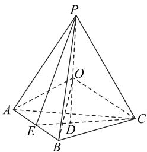
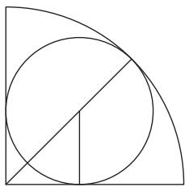

# 空间几何体放置问题常见类型及策略突破

钟 永

(安徽省亳州市蒙城县第六中学)

在高中数学课程体系中,立体几何占据着重要地位,而空间几何体放置问题作为其中的关键内容,综合考查了学生的空间想象能力、逻辑推理能力和数学运算能力.这类问题形式多样、难度较大,学生在解题时往往感到困惑.根据《普通高中数学课程标准(2017年版2020年修订)》要求,立体几何部分需聚焦数学抽象、逻辑推理、直观想象等核心素养的培养,引导学生从空间视角认识事物的位置关系、形态变化和运动规律,强调通过对空间几何体的观察、操作、分析,提升学生用数学语言表达和交流的能力,发展几何直观和空间想象能力.本文聚焦空间几何体放置问题,通过对各类题型特征的精准把握,总结出相应的解题策略.

# 1 判断几何体能否放入另一个几何体

此题型通常给出两个不同类型的几何体,要求学生判断其中一个几何体是否能够完整地放入另一个几何体内部,解题时应重点关注两个几何体在空间中的包容关系.

例 1 （多选题）已知球的半径为 1（单位：m），该球能够整体放入下列几何体容器(容器壁厚度忽略不计)的是().

A. 棱长为 2.1 的正方体  
B. 底面边长为 2.1 的正方形, 高为 1.1 的长方体  
C. 底面边长为 $4 \sqrt{3}$ , 高为 $2 \sqrt{3}$ 的正三棱锥  
D. 底面边长为 $4\sqrt{3}$ ，高为 $\log_{2}12$ 的正三棱锥

球的半径为 $1 \, m$ ，则直径为 2.

解析 对于 A, 棱长为 2.1 的正方体内切球直径为 2.1 > 2, A 正确.

对于 B, 长方体高为 1.1, 高小于球的直径, B 错误.

对于 C, 如图 1 所示, 设正三棱锥为 P-ABC, O 为三棱锥的内切球的球心, D 为 $\triangle ABC$ 的中心. 因为 $\triangle ABC$ 为正三角形, 所以 PD 为正三棱锥的高, $PD = 2\sqrt{3}$ . 设 E 是 AB 的中点, 正三棱锥的底面边长

为 $4\sqrt{3}$ ，则 $CE=\frac{\sqrt{3}}{2}BC=\frac{\sqrt{3}}{2}\times4\sqrt{3}=6,DE=\frac{1}{3}CE=$

2. 因为 PD 为正三棱锥的高, 所以

$$
P E = \sqrt {P D ^ {2} + D E ^ {2}} = \sqrt {(2 \sqrt {3}) ^ {2} + 2 ^ {2}} = 4.
$$

text_image

Geometric diagram of a pyramid with labeled vertices and internal points, used in spatial geometry problems.

图1

由正三棱锥的性质可知

$$
S _ {\triangle P A B} = S _ {\triangle P A C} = S _ {\triangle P C B} = \frac {1}{2} \times 4 \sqrt {3} \times 4 = 8 \sqrt {3},
$$

$$
S _ {\triangle A B C} = \frac {\sqrt {3}}{4} \times (4 \sqrt {3}) ^ {2} = 1 2 \sqrt {3},
$$

$$
V _ {P - A B C} = \frac {1}{3} \times 1 2 \sqrt {3} \times 2 \sqrt {3} = 2 4.
$$

设内切球半径为 $r$ ，则

$$
V _ {P - A B C} = V _ {O - A B C} + V _ {O - P B C} + V _ {O - P B A} + V _ {O - P A C} =
$$

$$
(\frac {1}{3} \times 1 2 \sqrt {3} + 3 \times \frac {1}{3} \times 8 \sqrt {3}) r = 2 4,
$$

解得 $r=\frac{2}{\sqrt{3}}>1$ ，故 C 正确.

对于 D, 和 C 中的正三棱锥相比, 底面边长相同, 只需比较高的大小, 即比较 $\log_{2}12$ 和 $2\sqrt{3}$ 的大小. 由于 $\log_{2}12 = 2 + \log_{2}3 > 2 + \log_{2}2\sqrt{2} = 2 + \frac{3}{2} = \frac{7}{2} > 2\sqrt{3}$ , 故 D 正确.

综上,故选 ACD.

点评

本题通过“化空间为长度”降低空间想象难度.解题时无需构建完整空间模型,只需提炼几何体核心的约束条件,用数值比较快速判断.这是解决几何放置问题的通用“降维”策略,能帮助学生建立“抓关键、简运算、定结论”的解题路径.

# 2 确定放置后相关量的计算

这类题型是在明确一个几何体已放置在另一个几何体内部的前提下,要求计算与之相关的量,如体积、表面积、半径、棱长等.题目通常会给出部分几何量的信息,需要学生根据放置的条件和几何关系来求解其他未知量.

# 1) 等体积(或等面积)构建方程法

利用体积或面积在不同状态下的不变性进行求解.在一些情况下,若直接计算目标几何体的相关量较为困难,但依据几何体放置后的位置关系和几何性质,挖掘其中的等量关系,就考虑列方程求解未知量.

例2 一个底面边长为 $2 \mathrm{~cm}$ 的正四棱柱形状的容器内装有一些水(底面放置于桌面上), 现将一个底面半径为 $1 \, cm$ 的铁制实心圆锥放入该容器内, 圆锥完全沉入水中且水未溢出, 并使得水面上升了 $\frac{\pi}{2} \, cm$ . 若该容器的厚度忽略不计, 则该圆锥的侧面积为().

A. $\sqrt{37}\pi \mathrm{cm}^2$

B. $6\pi \, cm^{2}$

C. $2\sqrt{10}\pi cm^{2}$

D. $2\sqrt{37}\pi \mathrm{cm}^2$

析 设圆锥的高为 h，则圆锥的体积 $V=\frac{\pi h}{3}\ cm^{3}$ .由题意可知正四棱柱中水上升的体积即为圆锥的体积，所以 $2 \times 2 \times \frac{\pi}{2} = \frac{\pi h}{3}$ ，解得 $h = 6 \mathrm{~cm}$ ，则圆锥的母线长为 $\sqrt{1 + 36} = \sqrt{37} \mathrm{~cm}$ ，故圆锥的侧面积为 $\frac{1}{2} \times 2\pi \times \sqrt{37} = \sqrt{37} \pi \mathrm{~cm}^2$ ，故选A.

# 点评

本题考查圆锥的侧面积计算,涉及在正四棱柱容器中圆锥浸没导致水面上升的情境.通过等体积构建方程法,利用圆锥体积等于正四棱柱中水面上升的体积这一关系构建方程求出圆锥的高,进而求出母线长和侧面积.题目难度中等,主要考查学生对体积关系的理解和运用能力.

# 2)借助截面与几何关系法

分析几何图形特征,仔细研究给定几何体的形状、尺寸、各部分之间的位置关系等,明确已知条件.若求解的是几何体内部点、线、面之间的距离关系,可尝试作过相关点或线的截面;若涉及几何体的体积、表面积等与整体相关的量,可选择能展现关键几何元素的截面.对于具有对称性的几何体,借助其对称面

作截面,能简化几何关系.当几何体中存在球与其他几何体相切、多个几何体相交等情况时,过切点、交线作截面,有助于清晰呈现几何关系.解题时需挖掘截面中的几何关系,根据挖掘出的几何关系,结合已知数据进行计算.

例 3 如图 2 所示, 现有一个半球容器(有盖),其表面积为 $300\pi \, dm^{2}$ ,忽略容器的厚度,若在该容器内放入两个半径均为 r dm 的球,则 r 的最大值为 \_\_\_\_ (结果精确到 0.1).

  
图2

设半球容器对应的半球的半径为 $R\mathrm{dm}$ ，则该容器的表面积为 $2\pi R^2 +\pi R^2 = 300\pi \mathrm{dm}^2$ 得 $R = 10\mathrm{dm}$ . 根据对称性可知, 当两个球外切且均与半球相切 (与球面相切, 且与半球的盖所在平面相切) 时, $r$ 取得最大值, 这也相当于求半径为 $10\mathrm{dm}$ 的 $\frac{1}{4}$ 个球的内切球, 如图3所示. 由 $\sqrt{2} r + r = 10$ , 得 $r = 10(\sqrt{2} - 1) \approx 4.1\mathrm{dm}$ .

natural_image

Geometric diagram showing a circle inscribed in a quarter-circle with an arc, no text or symbols present

图3

# 点评

本题考查在半球容器内放置两球时球半径最大值的求解,涉及半球与球体的位置关系及表面积计算.通过分析半球表面积求出半球半径,再依据球与半球的相切关系即可确定半径的最大值,需具备一定的空间想象和几何运算能力,解题的关键在于把握几何图形间的位置与数量关系.

空间几何体放置问题作为立体几何中的难点内容,主要涉及几何体能否放置于另一个几何体的判断,以及确定放置后相关量的计算等内容.在空间几何体放置问题的学习中,这一理念尤为重要.本文通过对各类题型进行深入剖析,总结出了相应的解题策略和方法,期望学生能熟练掌握空间几何体放置问题的解题技巧.

(完)