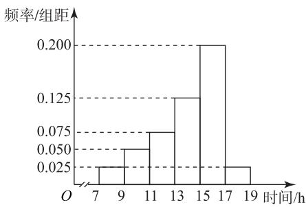
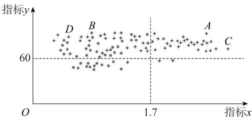
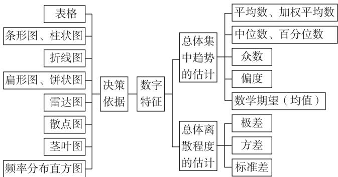
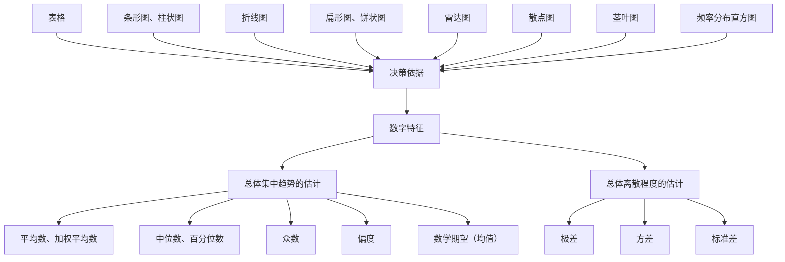

# 统计量的比较与分析研究

郑尚昆 $^{1}$ 贾娅峰 $^{2}$

(1. 北京中学 2. 清华大学附属中学望京学校)

借助统计与概率知识解决现实生活中的开放性问题,是近年北京高考中常见的创新应用题型.此类题目背景多样,但核心均是对给定数据进行处理与分析,并依据统计与概率知识得出正确结论.本文旨在对常见统计量进行比较分析,并强调在阐述理由时,应紧扣数据分析结果,做到言之有据、逻辑严谨、表达准确.

# 1 统计量的分类及对比

# 1.1 描述数据集中趋势的量

平均数、中位数、众数、百分位数.

# 1.2 描述数据离散程度的量

方差、标准差、极差.

# 1.3 统计量的意义、优缺点及适用范围

表 1

<table><tr><td>统计量</td><td>平均数</td><td>中位数/百分位数</td><td>方差/标准差</td></tr><tr><td>意义</td><td>数据的集中趋势</td><td>描述数据百分位置的量</td><td>描述数据相对于平均数的离散程度的量</td></tr><tr><td>优点</td><td>计算方便、应用广泛</td><td>受极端值影响小</td><td>计算方便、性质优良、应用广泛</td></tr><tr><td>缺点</td><td>数据中有极端值时,平均数的代表性差</td><td>没有利用数据的全部信息,不方便计算</td><td>方差受数据单位或量纲的影响</td></tr><tr><td>适用范围</td><td>反映随机变量的一般水平,常用于比较</td><td>确定定额,制订标准</td><td>反映随机变量的离散程度,常用于波动情况分析</td></tr></table>

# 2 应用实例与分析

# 2.1 加权平均值

例 1 （2020 年北京卷 18, 节选）某校为举办甲、乙两项不同活动,分别设计了相应的活动方案:方案一、方案二.为了解该校学生对活动方案是否支持,对学生进行简单随机抽样,获得数据如表2所示.

假设所有学生对活动方案是否支持相互独立.将该校学生支持方案二的概率估计值记为 $p_{0}$ ，假设该校

一年级有 500 名男生和 300 名女生,除一年级外其他年级学生支持方案二的概率估计值记为 $p_{1}$ ,试比较 $p_{0}$ 与 $p_{1}$ 的大小(结论不要求证明).

表 2

<table><tr><td rowspan="2"></td><td colspan="2">男生</td><td colspan="2">女生</td></tr><tr><td>支持</td><td>不支持</td><td>支持</td><td>不支持</td></tr><tr><td>方案一</td><td>200人</td><td>400人</td><td>300人</td><td>100人</td></tr><tr><td>方案二</td><td>350人</td><td>250人</td><td>150人</td><td>250人</td></tr></table>

$p_{1}<p_{0}$ ，理由如下.

解析 方法1 由已知得男生支持方案二的概率估计值为 $\frac{350}{600} = \frac{7}{12}$ , 女生支持方案二的概率估计值为 $\frac{150}{400} = \frac{3}{8}$ . 根据频率估计概率得 $p_0 = \frac{350 + 150}{1000} = \frac{1}{2}$ , 该校一年级学生支持方案二的概率估计值为

$$
\frac {5 0 0 \times \frac {7}{1 2} + 3 0 0 \times \frac {3}{8}}{5 0 0 + 3 0 0} = \frac {9 7}{1 9 2} > \frac {1}{2},
$$

故除一年级外其他年级学生支持方案二的概率估计值 $p_{1}<\frac{1}{2}$ ，故 $p_{1}<p_{0}$ .

方法 2 由已知得男生支持方案二的概率估计值为 $\frac{350}{600}=\frac{7}{12}$ ，女生支持方案二的概率估计值为 $\frac{150}{400}=\frac{3}{8}$ .根据频率估计概率得

$$
p _ {0} = \frac {6 0 0}{1 0 0 0} \times \frac {7}{1 2} + \frac {4 0 0}{1 0 0 0} \times \frac {3}{8},
$$

该校一年级学生支持方案二的概率估计值为

$$
\frac {5 0 0}{8 0 0} \times \frac {7}{1 2} + \frac {3 0 0}{8 0 0} \times \frac {3}{8}.
$$

因为数值 $\frac{7}{12}>\frac{3}{8}$ ，且权数 $\frac{5}{8}>\frac{3}{5}$ ，所以

$$
\frac {5 0 0}{8 0 0} \times \frac {7}{1 2} + \frac {3 0 0}{8 0 0} \times \frac {3}{8} > p _ {0},
$$

故除一年级外其他年级学生支持方案二的概率估计值 $p_{1}<\frac{1}{2}$ ，故 $p_{1}<p_{0}$ .

# 点评

本题借助平均数或加权平均值分析实际问题,阐释了平均数作为数据“代表”的意义,并凸显了加权平均数中“权数”在简化分析过程中的作用.通过深入理解平均数的特性,可以在不完全依赖精确计算的情况下,实现对数量关系的有效比较与推断.

# 2.2 样本估计总体

例 2 “双减”政策执行以来,中学生有更多的时间参加志愿服务和体育锻炼等课后活动.某校为了解学生课后活动的情况,从全校学生中随机选取100人,统计了他们一周参加课后活动的时间(单位:h),分别位于区间[7,9),[9,11),[11,13),[13,15),[15,17),[17,19],用频率分布直方图表示,如图1所示,假设用频率估计概率,且每个学生参加课后活动的时间相互独立.设全校学生一周参加课后活动的时间的众数、中位数、平均数的估计值分别为a,b,c,求这三个数的大小关系(样本中同组数据用区间的中点值替代).

histogram

| 时间/h | 频率/组距 |
|---|---|
| 7 | 0.025 |
| 9 | 0.050 |
| 11 | 0.075 |
| 13 | 0.125 |
| 15 | 0.200 |
| 17 | 0.025 |
| 19 | 0.025 |

图1

方法1 由题意得 $a = 16$ ，且

$$
(0. 0 2 5 + 0. 0 5 0 + 0. 0 7 5) \times 2 = 0. 3 <   0. 5,
$$

$$
(0. 0 2 5 + 0. 0 5 0 + 0. 0 7 5 + 0. 1 2 5) \times 2 = 0. 5 5 > 0. 5,
$$

则

$$
(b - 1 3) \times 0. 1 2 5 = 0. 5 - 0. 3 = 0. 2,
$$

解得 b=14.6. 又

$$
c = 8 \times 0. 0 2 5 \times 2 + 1 0 \times 0. 0 5 0 \times 2 + 1 2 \times 0. 0 7 5 \times 2 +
$$

$$
1 4 \times 0. 1 2 5 \times 2 + 1 6 \times 0. 2 0 0 \times 2 + 1 8 \times 0. 0 2 5 \times 2 = 1 4,
$$

故 $c < b < a$

方法 2 一般来说, 若一个单峰的频率分布直方图在两侧“拖尾”, 平均数总是在“长尾巴”那边, 故 c < b < a.

# 点评

本题展示了如何利用样本数据估计总体的集中趋势特征.通过计算样本的众数、中位数和平均数,并结合频率分布直方图的偏度特征,直观

地比较了这三个统计量的大小关系,体现了众数、中位数和平均数在描述数据分布特征时的应用.

# 2.3 数学期望

例 3 （2021 年北京卷 18, 节选）在核酸检测中，“k 合 1” 混采核酸检测是指: 先将 k 个人的样本混合在一起进行 1 次检测, 如果这 k 个人都没有感染新冠病毒, 则检测结果为阴性, 得到每人的检测结果都为阴性, 检测结束; 如果这 k 个人中有人感染新冠病毒, 则检测结果为阳性, 此时需对每人再进行 1 次检测, 得到每人的检测结果, 检测结束. 现有 100 人, 已知其中 2 人感染病毒.

(1) 将 100 人随机分成 10 组, 每组 10 人, 且对每组都采用“10 合 1”混采核酸检测. 已知感染新冠病毒的 2 人分在同一组的概率为 $\frac{1}{11}$ , 设 X 是检测的总次数, 求 X 的分布列与数学期望 $E(X)$ .  
(2) 将这 100 人随机分成 20 组, 每组 5 人, 且对每组都采用“5 合 1”混采核酸检测. 设 Y 是检测的总次数, 试判断数学期望 $E(Y)$ 与 (1) 中 $E(X)$ 的大小 (结论不要求证明).

(1)由题意可得 X 的可能取值为 20,30,则

$$
P (X = 2 0) = \frac {1}{1 1},
$$

$$
P (X = 3 0) = 1 - \frac {1}{1 1} = \frac {1 0}{1 1},
$$

则 X 的分布列如表 3 所示.

表3

<table><tr><td>X</td><td>20</td><td>30</td></tr><tr><td>P</td><td>1/11</td><td>10/11</td></tr></table>

$$
E (X) = 2 0 \times \frac {1}{1 1} + 3 0 \times \frac {1 0}{1 1} = \frac {3 2 0}{1 1}.
$$

(2) 方法 1 由题意可得 Y 的可能取值为 25,30,两名感染者在同一组的概率为

$$
P _ {1} = 2 0 \times \frac {\mathrm{C} _ {2} ^ {2} \mathrm{C} _ {9 8} ^ {3}}{\mathrm{C} _ {1 0 0} ^ {5}} = \frac {4}{9 9},
$$

不在同一组的概率为 $P_{2} = 1 - P_{1} = \frac{95}{99}$ ，则

$$
E (Y) = 2 5 \times \frac {4}{9 9} + 3 0 \times \frac {9 5}{9 9} = \frac {2 9 5 0}{9 9} > E (X).
$$

方法 2 数学期望反映随机变量的平均水平,采用“5 合 1”混采核酸检测的平均检测次数会比采用“10 合 1”检测的次数多,因此 $E(Y) > E(X)$ .

数学期望是衡量随机变量平均水平的统计量.本题通过计算比较不同分组策略下的检测总次数期望,清晰地展示了如何利用数学期望分析和评估不同情境的预期成本或平均效率,为方案比较和优化提供了重要的量化依据.

# 2.4 方差

例 4 （2017 年北京卷理 17, 节选）为研究一种新药的疗效,选100名患者随机分成两组,每组各50名,一组服药,另一组不服药.一段时间后,记录了两组患者的生理指标x和y的数据,并制成图2,其中“\*”表示服药者,“+”表示未服药者.试判断这100名患者中服药者指标y数据的方差与未服药者指标y数据的方差的大小(只需写出结论).

scatter

| Point | x    | y    |
|-------|------|------|
| A     | 1.7  | 60   |
| B     | 1.7  | 60   |
| C     | 1.7  | 60   |
| D     | 1.7  | 60   |

图2

在这 100 名患者中,服药者指标 y 数据的方差大于未服药者指标 y 数据的方差.

例 5 （2018 年北京卷理 17, 节选）电影公司随集了电影的有关数据，经分类整理得到表 4.

表 4

<table><tr><td>电影类型</td><td>第一类</td><td>第二类</td><td>第三类</td><td>第四类</td><td>第五类</td><td>第六类</td></tr><tr><td>电影部数</td><td>140</td><td>50</td><td>300</td><td>200</td><td>800</td><td>510</td></tr><tr><td>好评率</td><td>0.4</td><td>0.2</td><td>0.15</td><td>0.25</td><td>0.2</td><td>0.1</td></tr></table>

好评率是指一类电影中获得好评的部数与该类电影的部数的比值.

假设所有电影是否获得好评相互独立. 假设每类电影得到人们喜欢的概率与表格中该类电影的好评率相等, 用“ $\xi_{k}=1$ ”表示第 $k$ 类电影得到人们喜欢, “ $\xi_{k}=0$ ”表示第 $k$ 类电影没有得到人们喜欢 ( $k=1,2,3,4,5,6$ ), 写出方差 $D(\xi_{1}), D(\xi_{2}), D(\xi_{3}), D(\xi_{4}), D(\xi_{5}), D(\xi_{6})$ 的大小关系.

由题意可知 $\xi_{k}(k=1,2,3,4,5,6)$ 服从两点分布，则

$$
D \left(\xi_ {1}\right) = 0. 4 \times 0. 6 = 0. 2 4,
$$

$$
D \left(\xi_ {2}\right) = 0. 2 \times 0. 8 = 0. 1 6,
$$

$$
D \left(\xi_ {3}\right) = 0. 1 5 \times 0. 8 5 = 0. 1 2 7 5,
$$

$$
D \left(\xi_ {4}\right) = 0. 2 5 \times 0. 7 5 = 0. 1 8 7 5,
$$

$$
D \left(\xi_ {5}\right) = 0. 2 \times 0. 8 = 0. 1 6,
$$

$$
D \left(\xi_ {6}\right) = 0. 1 \times 0. 9 = 0. 0 9,
$$

故

$$
D \left(\xi_ {1}\right) > D \left(\xi_ {4}\right) > D \left(\xi_ {2}\right) = D \left(\xi_ {5}\right) > D \left(\xi_ {3}\right) > D \left(\xi_ {6}\right).
$$

  
点评

方差是衡量数据离散程度的统计量.本题说明,在比较不同数据组或评估方案的稳定性时,方差提供了重要的分析依据.当不同选项的数学期望相同时,方差的大小成为比较其波动性的关键指标.需要强调的是,对方差大小的解读应结合具体问题背景,其优劣并非绝对.

# 2.5 概率值

例 6 （2025 年北京卷 18, 节选）某次考试中，只道单项选择题考查了某个知识点，甲、乙两校的年级学生都参加了这次考试。为了解学生对该知的掌握情况，随机抽查了甲、乙两校高一年级各名学生该题的答题数据，其中甲校学生选择正确数为 80，乙校学生选择正确的人数为 75。假设学问答题相互独立，用频率估计概率。假设：如果没握该知识点，学生就从题目给出的四个选项中随择一个作为答案；如果掌握该知识点，甲校学生正确的概率为 100%，乙校学生选择正确的概率%。设事件甲、乙两校高一年级学生掌握该知识概率估计值分别为 $p_1$ ， $p_2$ ，判断 $p_1$ 与 $p_2$ 的大小（不要求证明）。

设事件 D 为 “甲校掌握该知识点的学生做析该题”, 因为甲校学生掌握该知识点, 所以有100%的概率做对该题目,未掌握该知识点的学生都是从四个选项里面随机选择一个,故

$$
P (D) + \frac {1}{4} (1 - P (D)) = 0. 8,
$$

即 $p_1 + \frac{1}{4} \times (1 - p_1) = 0.8$ ，则 $p_1 = \frac{11}{15}$ .

同理,若乙校学生掌握该知识点,则有85%的概率做对该题目,未掌握该知识点的学生都是从四个选项里面随机选择一个,故

$$
0. 8 5 p _ {2} + \frac {1}{4} \times (1 - p _ {2}) = 0. 7 5,
$$

则 $p_2 = \frac{5}{6}$ ，所以 $p_1 < p_2$

例 7 （2022 年北京卷 18，节选）在校运动会上，只有甲、乙、丙三名同学参加铅球比赛，比赛成绩达到

9.50 m 以上(含 9.50 m)的同学将获得优秀奖.为预测获得优秀奖的人数及冠军得主,收集了甲、乙、丙以往的比赛成绩,并整理得到如下数据(单位:m).

甲：9.80，9.70，9.55，9.54，9.48，9.42，9.40，9.35，9.30，9.25；

乙:9.78,9.56,9.51,9.36,9.32,9.23;

丙:9.85,9.65,9.20,9.16.

假设用频率估计概率,且甲、乙、丙的比赛成绩相互独立.在校运动会铅球比赛中,甲、乙、丙谁获得冠军的概率估计值最大?

设事件 M 为 “甲的成绩比其他两名同学的成绩高”，则样本空间的样本点个数为 $10 \times$ $6 \times 4 = 240$ ，当甲的成绩为9.80时， $P(M) = \frac{1 \times 6 \times 3}{10 \times 6 \times 4} = \frac{3}{40}$ ；当甲的成绩为9.70时， $P(M) = \frac{1 \times 5 \times 3}{10 \times 6 \times 4} = \frac{1}{16}$ ；当甲的成绩为9.55时， $P(M) = \frac{1 \times 4 \times 2}{10 \times 6 \times 4} = \frac{1}{30}$ ；当甲的成绩为9.54时， $P(M) = \frac{1 \times 4 \times 2}{10 \times 6 \times 4} = \frac{1}{30}$ ；当甲的成绩为9.48时， $P(M) = \frac{1 \times 3 \times 2}{10 \times 6 \times 4} = \frac{1}{40}$ ；当甲的成绩为9.42时， $P(M) = \frac{1 \times 3 \times 2}{10 \times 6 \times 4} = \frac{1}{40}$ ；当甲的成绩为9.40时， $P(M) = \frac{1 \times 3 \times 2}{10 \times 6 \times 4} = \frac{1}{40}$ ；当甲的成绩为9.35时， $P(M) = \frac{1 \times 2 \times 2}{10 \times 6 \times 4} = \frac{1}{60}$ ；当甲的成绩为9.30时， $P(M) = \frac{1 \times 1 \times 2}{10 \times 6 \times 4} = \frac{1}{120}$ ；当甲的成绩为9.25时， $P(M) = \frac{1 \times 1 \times 2}{10 \times 6 \times 4} = \frac{1}{120}$ .

甲获得冠军的概率可以估计为 $\frac{6\times3+5\times3+4\times2\times2+3\times2\times3+2\times2+1\times2\times2}{4\times6\times10}=$

$\frac{75}{240}$ ，乙获得冠军的概率可以估计为 $\frac{9\times3+8\times2+6\times2+3\times2+2\times2}{4\times6\times10}=\frac{65}{240}$ ，丙获得冠军的概率可以估计为 $\frac{6\times10+5\times8}{4\times6\times10}=\frac{100}{240}$ .丙夺冠概率估计值最大.

例 8 （2019 年北京卷 17, 节选）改革开放以来，的支付方式发生了巨大转变。近年来，移动支付

12

数理化

已成为主要支付方式之一.为了解某校学生上个月 A, B 两种移动支付方式的使用情况,从全校学生中随机抽取了 100 人,发现样本中 A,B 两种支付方式都不使用的有 5 人,样本中仅使用 A 和仅使用 B 的学生的支付金额人数(单位:人)分布情况如表 5 所示.

表5

<table><tr><td rowspan="2">支付方式</td><td colspan="3">支付金额/元</td></tr><tr><td>(0,1 000]</td><td>(1 000,2 000]</td><td>大于2 000</td></tr><tr><td>仅使用A</td><td>18</td><td>9</td><td>3</td></tr><tr><td>仅使用B</td><td>10</td><td>14</td><td>1</td></tr></table>

已知上个月样本学生的支付方式在本月没有变化.现从样本仅使用 A 的学生中,随机抽查 3 人,发现他们本月的支付金额都大于 2 000 元.根据抽查结果,能否认为样本仅使用 A 的学生中本月支付金额大于 2 000 元的人数有变化?说明理由.

解析

记事件 E 为“从样本仅使用 A 的学生中随机抽查 3 人,他们本月的支付金额都大于 2000元”.假设样本仅使用 A 的学生中,本月支付金额大于 2000 元的人数没有变化,则由上个月的样本数据得

$$
P (E) = \frac {1}{\mathrm{C} _ {3 0} ^ {3}} = \frac {1}{4 0 6 0}.
$$

可以认为有变化.理由如下: $P(E)$ 比较小,概率比较小的事件一般不容易发生.一旦发生,就有理由认为本月的支付金额大于2 000元的人数发生了变化,所以可以认为有变化.

无法确定有没有变化.理由如下:事件 E 是随机事件, $P(E)$ 比较小,一般不容易发生,但还是有可能发生的,所以无法确定有没有变化.

点评

概率是量化随机事件发生可能性的核心工具.本题通过不同情境下概率值的计算与比

较,展示了如何运用概率模型分析和推断实际问题.

# 2.6 新统计量

例 9 在测试中, 客观题难度的计算公式为 $P_{i}=$ $\frac{R_{i}}{N}$ ，其中 $P_{i}$ 为第 i 题的难度， $R_{i}$ 为答对该题的人数，N 为参加测试的总人数。现对某校高三年级 240 名学生进行一次测试，共 5 道客观题。测试前根据对学生的了解，预估了每道题的难度，如表 6 所示。

表6

<table><tr><td>题号</td><td>1</td><td>2</td><td>3</td><td>4</td><td>5</td></tr><tr><td>考前预估难度 $P_{i}$ </td><td>0.9</td><td>0.8</td><td>0.7</td><td>0.6</td><td>0.4</td></tr></table>

测试后,随机抽取了20名学生的答题数据进行统计,结果如表7所示.

表 7

<table><tr><td>题号</td><td>1</td><td>2</td><td>3</td><td>4</td><td>5</td></tr><tr><td>实测答对人数</td><td>16</td><td>16</td><td>14</td><td>14</td><td>4</td></tr></table>

试题的预估难度和实测难度之间会有偏差，设 $P_{i}^{\prime}$ 为第i题的实测难度，请用 $P_{i}$ 和 $P_{i}^{\prime}$ 设计一个统计量，并制订一个标准来判断本次测试对难度的预估是否合理.

方法 1 将抽样的 20 名学生中第 i 题的实测难度作为 240 名学生第 i 题的实测难度.

定义统计量

$$
S = \frac {1}{n} \left[ \left(P _ {1} ^ {\prime} - P _ {1}\right) ^ {2} + \left(P _ {2} ^ {\prime} - P _ {2}\right) ^ {2} + \dots + \right.
$$

$$
\left. \left(P _ {n} ^ {\prime} - P _ {n}\right) ^ {2} \right],
$$

其中 $P_{i}$ 为第 i 题的预估难度.并规定:若 S<0.05,则称本次测试的难度预估合理,否则不合理.因为

$$
S = \frac {1}{5} \left[ (0. 8 - 0. 9) ^ {2} + (0. 8 - 0. 8) ^ {2} + (0. 7 - 0. 7) ^ {2} + \right.
$$

$$
(0. 7 - 0. 6) ^ {2} + (0. 2 - 0. 4) ^ {2} ] = 0. 0 1 2,
$$

0.012<0.05,所以本次测试的难度预估是合理的.

方法 2 将抽样的 20 名学生中第 i 题的实测难度作为 240 名学生第 i 题的实测难度. 定义统计量

$$
S = \left(P _ {1} ^ {\prime} - P _ {1}\right) ^ {2} + \left(P _ {2} ^ {\prime} - P _ {2}\right) ^ {2} + \dots + \left(P _ {n} ^ {\prime} - P _ {n}\right) ^ {2},
$$

其中 $P_{i}$ 为第 i 题的预估难度.并规定: 若 S<0.1, 则称本次测试的难度预估合理, 否则不合理. 因为

$$
S = (0. 8 - 0. 9) ^ {2} + (0. 8 - 0. 8) ^ {2} + (0. 7 - 0. 7) ^ {2} +
$$

$$
(0. 7 - 0. 6) ^ {2} + (0. 2 - 0. 4) ^ {2} = 0. 0 6,
$$

0.06<0.1,所以本次测试的难度预估是合理的.

方法 3 将抽样的 20 名学生中第 i 题的实测难度作为 240 名学生第 i 题的实测难度. 定义统计量

$$
S = \left| P _ {1} ^ {\prime} - P _ {1} \right| + \left| P _ {2} ^ {\prime} - P _ {2} \right| + \dots + \left| P _ {n} ^ {\prime} - P _ {n} \right|,
$$

其中 $P_{i}$ 为第 i 题的预估难度. 并规定: 若 $S \leqslant 0.5$ , 则称本次测试的难度预估合理, 否则不合理. 因为

$$
S = | 0. 8 - 0. 9 | + | 0. 8 - 0. 8 | + | 0. 7 - 0. 7 | +
$$

$$
\vert 0. 7 - 0. 6 \vert + \vert 0. 2 - 0. 4 \vert = 0. 4.
$$

0.4<0.5,所以本次测试的难度预估是合理的.

方法 4 将抽样的 20 名学生中第 i 题的实测难度作为 240 名学生第 i 题的实测难度. 定义统计量

$$
S = \frac {1}{n} \left[ \left| P _ {1} ^ {\prime} - P _ {1} \right| + \left| P _ {2} ^ {\prime} - P _ {2} \right| + \dots + \left| P _ {n} ^ {\prime} - P _ {n} \right| \right],
$$

其中 $P_{i}$ 为第 i 题的预估难度. 并规定: 若 $S \leqslant 0.1$ , 则称本次测试的难度预估合理, 否则不合理. 因为

$$
S = \frac {1}{5} [ | 0. 8 - 0. 9 | + | 0. 8 - 0. 8 | + | 0. 7 - 0. 7 | +
$$

$$
\left. \left| 0. 7 - 0. 6 \right| + \left| 0. 2 - 0. 4 \right| \right] = 0. 0 8,
$$

0.08<0.1,所以本次测试的难度预估是合理的.

本题答案不唯一,可构造其他统计量和临界值来进行判断.

点评

本题展示了如何通过类比已有统计量进行知识迁移,创造性地构建新统计量以解决实际问题.这一过程不仅要求学生深刻理解各类统计量的数学本质、计算方法和适用条件,更需要具备将理论知识灵活转化为实践工具的能力.通过设计不同的比较统计量和评判标准,学生能够根据具体问题情境选择或构建合适的分析工具,体现了统计思维在解决新颖问题中的应用.

# 3 回顾与总结

通过对不同数据的呈现方式进行分析,学生能认识到用统计思想解决实际问题的作用.除此以外,通过对加权平均数、数学期望、方差、概率值等多种统计量的系统比较与实例分析,如图3所示,本文揭示了不同统计量在数据分析中的独特价值与应用场景.这些案例表明,针对不同的问题背景和数据特征,选择合适的统计量进行比较分析,是得出科学结论的关键.这一过程不仅可以培养学生的统计思维和量化分析能力,更重要的是可以培养学生根据具体情境灵活运用统计工具的能力.

flowchart

图3

(完)