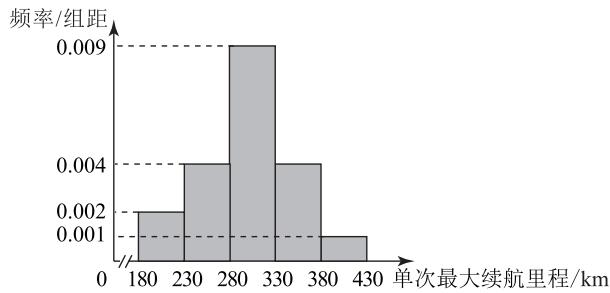

# 聚焦概率统计 提升数学素养

郭芳

(山东省邹平市第二中学)

概率统计问题是近几年高考数学的热点题型,其综合性强、灵活度高.命题通常以现实生活为背景,着重考查学生运用数学知识解决实际问题的能力.求解这类问题,学生需从题目中提取关键信息,运用所学概率知识分析数据特征,发现问题规律,进而建模分析问题.本文剖析近几年高考重点考查的热点题型,为读者提供参考.

# 1 与独立性检验相结合

概率与统计中的独立性检验问题是教材新增的一个知识点,也是新高考中的常见热点问题.求解该题型的关键在于依据概率统计知识,结合题目给出的条件,找出列联表中的所有数据.然后,利用卡方公式计算出数值,并运用所学知识对该数值进行分析,从而判断两个变量之间的独立性,并求解其他相关综合问题.

例 1 2024 年末 DeepSeek R1 一经发布, 引发全球轰动, 其科技水准直接对标美国的 OpenAI GPT4.0. 对于人工智能公司而言, 不同的客户使用需求不同, 造成公司运营的技术成本不同. 某调研公司对 DeepSeek 和 OpenAI 的客户使用技术成本进行调研, 随机抽取 200 个客户, 将客户在使用时产生的技术成本分为高昂、较高、低廉三个类别进行数据统计, 如表 1 所示, 其中技术成本高昂和较高情况下都称为高成本运营, 低廉称为低成本运营.

表 1

<table><tr><td></td><td>高昂</td><td>较高</td><td>低廉</td><td>总计</td></tr><tr><td>DeepSeek</td><td>36</td><td>14</td><td>50</td><td>100</td></tr><tr><td>OpenAI</td><td>46</td><td>24</td><td>30</td><td>100</td></tr></table>

(1)请填写如表 2 所示的列联表,并判断能否有 99% 的把握认为 DeepSeek 和 OpenAI 的运营成本存在差异.

表 2

<table><tr><td></td><td>高成本运营</td><td>低成本运营</td></tr><tr><td>DeepSeek</td><td></td><td></td></tr><tr><td>OpenAI</td><td></td><td></td></tr></table>

(2)对于技术成本而言,高成本运营占比越低,则认为技术水平越高.已知 DeepSeek R1 发布前 OpenAI 高成本运营占比为 $m_{0}=0.7$ , 设 m 为 DeepSeek R1 发布后这两家公司抽取的 n 个客户使用时的高成本运营占比, 若 $m<m_{0}-\frac{m_{0}(1-m_{0})\sqrt{2n}}{n}$ , 则可以认为 DeepSeek 的技术水平高于 OpenAI.根据抽取的 200 个客户信息, 是否能够认为 DeepSeek 的技术水平高于 OpenAI?

附: $K^{2}=\frac{n(ad-bc)^{2}}{(a+b)(c+d)(a+c)(b+d)}$ .

表3

<table><tr><td> $P(K^{2} \geqslant k)$ </td><td>0.050</td><td>0.010</td><td>0.001</td></tr><tr><td> $k$ </td><td>3.841</td><td>6.635</td><td>10.828</td></tr></table>

(1)根据题意可得列联表如表4所示. 由此

不难求出 $K^2 = \frac{200(50\times 30 - 50\times 70)^2}{100\times 100\times 120\times 80} =$

$\frac{25}{3}\approx8.33.$ 又 $8.33>6.635$ ，所以有 99% 的把握认为两家公司的运营成本存在差异.

表 4

<table><tr><td></td><td>高成本运营</td><td>低成本运营</td></tr><tr><td>DeepSeek</td><td>50</td><td>50</td></tr><tr><td>OpenAI</td><td>70</td><td>30</td></tr></table>

(2) 因为 DeepSeek R1 发布后这两家公司的高成本运营占比为 $\frac{120}{200}=0.6$ ，故用频率估计概率可得 m=0.6。又 $m_{0}=0.7$ ，从而 $m_{0}-\frac{m_{0}(1-m_{0})\sqrt{2n}}{n}=0.7-\frac{0.7(1-0.7)\sqrt{2\times200}}{200}=0.7-0.021=0.679$ ，则 $m<m_{0}-\frac{m_{0}(1-m_{0})\sqrt{2n}}{n}$ ，故能够认为 DeepSeek 的技术水平高于 OpenAI。

与独立性检验相结合的问题,一般先由题意完成列联表,根据公式求出 $K^{2}$ ,再对照临界值表进行判断,然后求解有关综合问题.

# 2 与回归分析相结合

与回归分析相关的统计问题是研究两个具有相关关系的变量的常见题型.这类问题主要涉及线性回归分析.对于非线性回归模型,可通过对数变换将其转化为线性回归模型,再根据给定的参考公式计算出线性回归方程的系数,从而得出线性回归方程.

例 2 某学校为丰富学生的课后活动内容,增强学生体质,决定组织乒乓球活动社.表 5 是 7 个星期 (x=1 表示第 1 个星期,x=2 表示第 2 个星期,以此类推) 参加活动的累计人数 y(人) 的统计数据.

表 5

<table><tr><td>x</td><td>1</td><td>2</td><td>3</td><td>4</td><td>5</td><td>6</td><td>7</td></tr><tr><td>y</td><td>6</td><td>14</td><td>20</td><td>37</td><td>74</td><td>108</td><td>203</td></tr></table>

(1)根据表中数据可判断 $y$ 与 $x$ 大致满足回归模型 $y = cd^{x}$ ，试建立 $y$ 与 $x$ 的回归方程（精确到0.01）.  
(2)为更好地开展体育类型活动,学校继续调查全校学生的身高情况,采用按比例分层抽样抽取了男生30人,其身高的平均数和方差分别为171.5和13.0;抽取了女生20人,其身高的平均数和方差分别为161.5和27.0.试估计全体学生身高的平均数和方差.

参考数据： $\bar{y}=66,\bar{z}=\frac{1}{7}\sum_{i=1}^{7}z_{i}\approx1.57,\sum_{i=1}^{7}x_{i}y_{i}=2681,\sum_{i=1}^{7}x_{i}z_{i}=50.95$ ，其中 $z_{i}=\lg y_{i}$ .

参考公式:对于一组数据 $(u_{1},v_{1}),(u_{2},v_{2}),\cdots,(u_{n},v_{n})$ ，其回归直线 $\hat{v}=\hat{\alpha}+\hat{\beta}u$ 的斜率和截距的最小二乘估计公式分别为 $\hat{\beta} = \frac{\sum_{i=1}^{n} u_i v_i - n\overline{u}\overline{v}}{\sum_{i=1}^{n} u_i^2 - n\overline{u}^2}, \hat{\alpha} = \overline{v} - \hat{\beta}\overline{u}$ .

(1)根据题意有 $y=cd^{x}$ ，将该式两边同时取对数有 $\lg y = \lg (cd^x) = \lg c + x\lg d.$ 设 $z =$ $\lg y, a = \lg c, b = \lg d$ , 则回归方程转化为 $z = a + bx$ .
先计算：

$$
\sum_ {i = 1} ^ {7} x _ {i} ^ {2} = 1 ^ {2} + 2 ^ {2} + 3 ^ {2} + 4 ^ {2} + 5 ^ {2} + 6 ^ {2} + 7 ^ {2} =
$$

$$
1 + 4 + 9 + 1 6 + 2 5 + 3 6 + 4 9 = 1 4 0,
$$

$$
n = 7, \bar {x} = \frac {1 + 2 + 3 + 4 + 5 + 6 + 7}{7} = 4.
$$

根据参考公式有

$$
b = \frac {\sum_ {i = 1} ^ {7} x _ {i} z _ {i} - 7 \bar {x} \bar {z}}{\sum_ {i = 1} ^ {7} x _ {i} ^ {2} - 7 \bar {x} ^ {2}} =
$$

$$
\frac {5 0 . 9 5 - 7 \times 4 \times 1 . 5 7}{1 4 0 - 7 \times 4 ^ {2}} = \frac {6 . 9 9}{2 8} \approx 0. 2 5,
$$

$$
a = \bar {z} - b \bar {x} \approx 1. 5 7 - 0. 2 5 \times 4 = 0. 5 7,
$$

则 $z = 0.25x + 0.57$ 。因为 $a = \lg c, b = \lg d$ ，所以 $\lg c \approx 0.57$ ，则 $c \approx 10^{0.57}$ ； $\lg d \approx 0.25$ ，则 $d \approx 10^{0.25}$ ，故 $y$ 与 $x$ 的回归方程为 $\hat{y} = 10^{0.57} \times 10^{0.25x}$ ，即 $\hat{y} = 10^{0.25x + 0.57}$ 。

(2)全体学生身高的平均数

$$
\overline {{X}} = \frac {3 0 \times 1 7 1 . 5 + 2 0 \times 1 6 1 . 5}{3 0 + 2 0} = \frac {8 3 7 5}{5 0} = 1 6 7. 5,
$$

根据方差公式得

$$
S ^ {2} = \frac {n _ {1} \left[ S _ {1} ^ {2} + (\bar {X} _ {1} - \bar {X}) ^ {2} \right] + n _ {2} \left[ S _ {2} ^ {2} + (\bar {X} _ {2} - \bar {X}) ^ {2} \right]}{n _ {1} + n _ {2}}
$$

(其中 $n_{1}, n_{2}$ 为各层人数, $S_{1}^{2}, S_{2}^{2}$ 为各层方差, $\overline{X}_{1}, \overline{X}_{2}$ 为各层平均数, $\overline{X}$ 为总平均数). 又 $n_{1}=30, S_{1}^{2}=13, \overline{X}_{1}=171.5, n_{2}=20, S_{2}^{2}=27, \overline{X}_{2}=161.5, \overline{X}=167.5$ , 则 $S^{2}=42.6$ , 所以全体学生身高的平均数为 167.5, 方差为 42.6.

解决与非线性回归相结合的问题,需要通过取对数将非线性回归方程转化为线性回归

方程.

# 3 与数列相结合

对于与数列相结合的概率统计问题,一般需要根据题意合理提取数据或分解事件,明确所研究的概率类型并进行求解;或建立数列模型,求出该数列的通项公式或递推关系式.

例 3 某汽车公司研发了一款新能源汽车,并在出厂前对 100 辆汽车进行了单次最大续航里程的测试. 现对测试数据进行整理, 得到如图 1 所示的频率分布直方图.

histogram

| 单次最大续航里程 (km) | 频率/组距 |
|---|---|
| 180 | 0.002 |
| 230 | 0.004 |
| 280 | 0.009 |
| 330 | 0.004 |
| 380 | 0.001 |
| 430 | 0.001 |

图1

(1)估计这 100 辆汽车的单次最大续航里程的平均值 $\bar{x}$ (同一组中的数据用该组区间的中点值代表).

(2)由频率分布直方图计算得样本标准差 s 的近似值为 49.75，根据大量的汽车测试数据，可以认为这款汽车的单次最大续航里程 X 近似地服从正态分布 $N(\mu, \sigma^{2})$ ，其中 $\mu$ 的近似值为样本平均数 $\overline{x}, \sigma$ 的近似值为样本标准差 s.

(i) 利用该正态分布, 求 $P(X \leqslant 250.25)$ ;

（ii）假设某企业从该汽车公司购买了20辆该款新能源汽车，记 $Z$ 表示这20辆新能源汽车中单次最大续航里程 $X \leqslant 250.25$ 的车辆数，求 $E(Z)$

参考数据: 若随机变量 $\xi$ 服从正态分布 $N(\mu, \sigma^{2})$ ，则 $P(\mu - \sigma < \xi < \mu + \sigma) \approx 0.6827, P(\mu - 2\sigma < \xi < \mu + 2\sigma) \approx 0.9545, P(\mu - 3\sigma < \xi < \mu + 3\sigma) \approx 0.9973.$

(3)为迅速抢占市场举行促销活动,销售公司现面向意向客户推出“玩游戏,赢大奖”活动,客户可根据抛掷骰子向上的点数,遥控汽车模型在方格图上行进,若汽车模型最终停在“幸运”方格,则可获得购车优惠券3万元;若最终停在“赠送汽车模型”方格,则可获得汽车模型一个.方格图上标有第0格,第1格,第2格,…,第25格,第26格.汽车模型开始在第0格,客户每掷一次骰子,汽车模型向前移动一次.若掷出1,2,4,5点,汽车模型向前移动1格(从第k格到第 $k+1$ 格),若掷出3,6点,汽车模型向前移动两格(从第k格到第 $k+2$ 格),直到移到第25格(“幸运”)或第26格(“赠送汽车模型”)时游戏结束.设汽车模型移到第 $n(1\leqslant n\leqslant26)$ 格的概率为 $P_{n}$ ,试证明数列 $\{P_{n}-P_{n-1}\}(2\leqslant n\leqslant25)$ 是等比数列,求出数列 $\{P_{n}\}$ 的通项公式,并比较 $P_{25}$ 和 $P_{26}$ 的大小.

(1)根据已知条件有 $\bar{x}=0.002\times50\times205+$

$$
0. 0 0 4 \times 5 0 \times 2 5 5 + 0. 0 0 9 \times 5 0 \times 3 0 5 + 0. 0 0 4 \times
$$

$$
5 0 \times 3 5 5 + 0. 0 0 1 \times 5 0 \times 4 0 5 = 3 0 0 \mathrm{km}.
$$

(2)(i)因为 X 服从正态分布 $N(300,49.75^{2})$ ，
所以 $P(X \leqslant 250.25) \approx \frac{1 - 0.6827}{2} = 0.15865.$

（ii）因为 Z 服从二项分布 B(20,0.15865)，所以 $E(Z)=20\times0.15865=3.173$ .

(3)由题意可知 $P_{1}=\frac{2}{3}, P_{2}=\frac{1}{3}+(\frac{2}{3})^{2}=\frac{7}{9}$ . 因为汽车模型移动到第 $n(3\leqslant n\leqslant25)$ 格的情况有且只有两种：1) 汽车模型先到第 n-2 格，又掷出 3,6 点，

其概率为 $\frac{1}{3} P_{n - 2}$ . 2) 汽车模型先到第 $n - 1$ 格，又掷出 1,2,4,5 点，其概率为 $\frac{2}{3} P_{n - 1}$ ，所以 $P_{n} = \frac{2}{3} P_{n - 1} + \frac{1}{3} P_{n - 2}$ ，则 $P_{n} - P_{n - 1} = -\frac{1}{3} (P_{n - 1} - P_{n - 2})$ . 又 $P_{2} - P_{1} = \frac{1}{9}, P_{n - 1} - P_{n - 2} \neq 0$ ，则 $\frac{P_n - P_{n - 1}}{P_{n - 1} - P_{n - 2}} = -\frac{1}{3}$ ，所以数列 $\{P_n - P_{n - 1}\} (2 \leqslant n \leqslant 25)$ 是以 $\frac{1}{9}$ 为首项、 $-\frac{1}{3}$ 为公比的等比数列，则

$$
P _ {n} - P _ {n - 1} = \frac {1}{9} \times (- \frac {1}{3}) ^ {n - 2} (2 \leqslant n \leqslant 2 5),
$$

$$
P _ {n} = P _ {1} + \left(P _ {2} - P _ {1}\right) + \left(P _ {3} - P _ {2}\right) + \dots + \left(P _ {n} - P _ {n - 1}\right) =
$$

$$
\frac {2}{3} + \frac {1}{9} \times \left[ (- \frac {1}{3}) ^ {0} + (- \frac {1}{3}) ^ {1} + \dots + (- \frac {1}{3}) ^ {n - 2} \right] =
$$

$$
\frac {3}{4} - \frac {1}{1 2} \times (- \frac {1}{3}) ^ {n - 1} (2 \leqslant n \leqslant 2 5),
$$

当 n=1 时， $P_{1}=\frac{3}{4}-\frac{1}{12}\times(-\frac{1}{3})^{0}=\frac{2}{3}$ 也满足上式，所以 $P_{n}=\frac{3}{4}-\frac{1}{12}\times(-\frac{1}{3})^{n-1}$ . 特别地，汽车模型移动到第 26 格的情况仅有 1 种：从第 24 格连跳 2 格至第 26 格. 因为

$$
P _ {2 4} = \frac {3}{4} + \frac {1}{1 2} \times (\frac {1}{3}) ^ {2 3}, P _ {2 5} = \frac {3}{4} - \frac {1}{1 2} \times (\frac {1}{3}) ^ {2 4},
$$

$$
P _ {2 6} = \frac {1}{3} P _ {2 4} = \frac {1}{4} + \frac {1}{1 2} \times (\frac {1}{3}) ^ {2 4},
$$

则 $P_{25}-P_{26}=\frac{3}{4}-\frac{1}{12}\times(\frac{1}{3})^{24}-\frac{1}{4}-\frac{1}{12}\times(\frac{1}{3})^{24}=$ $\frac{1}{2}-\frac{1}{6}\times(\frac{1}{3})^{24}>0$ ,所以 $P_{25}>P_{26}$ .

与概率统计有关的数列问题,常涉及平均数、均值、方差、正态分布、二项分布等基础知识的综合考查,需要列出概率递推关系式,进而通过构造等比数列求得通项公式,然后解决有关实际问题.

综上所述,概率与统计注重以生活中的实际问题情境为背景命题.这要求学生运用所学知识来推测或解释问题的发展趋势,或预测问题的大致结果.为更好地处理这类问题,学生需在掌握基础知识的前提下,提升阅读理解和解题技能,增强数学运算能力,注重积累解题方法技巧,同时在日常学习中应多关注社会热点问题,不断提高自身的数学素养和解题能力.

(完)