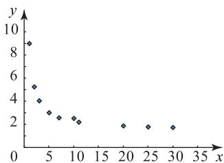

# 聚焦非线性回归模型

# 袁媛 陈楚薇

(广东外语外贸大学数学与统计学院)

线性回归分析是指根据散点图位于某条直线附近的特征,利用最小二乘法求出直线方程,进而由线性方程中变量 y 与 x 之间的关系对未来进行预测.若散点图不具备线性回归的特征,该如何处理呢?本文介绍几个非线性回归模型及其应用,供参考.

# 1 指数模型 $y = c\mathrm{e}^{dx} (c > 0, d$ 为常数）

对于这种模型, 只需对两边同时取对数, 可得 $\ln y = \ln c + dx$ , 令 $\ln y = z, a = \ln c, b = d$ , 则 $z = a + bx$ , 于是非线性回归方程即可转化为线性回归方程 $z = bx + a$ .

例 1 有一种速度叫中国速度,有一种骄傲叫中国高铁.截至2020年,中国高铁运营的里程数已达到3.9万km.2013—2020年我国高铁每年的运营里程如表1所示.

表 1

<table><tr><td>年份</td><td>2013</td><td>2014</td><td>2015</td><td>2016</td><td>2017</td><td>2018</td><td>2019</td><td>2020</td></tr><tr><td>年份代码x</td><td>1</td><td>2</td><td>3</td><td>4</td><td>5</td><td>6</td><td>7</td><td>8</td></tr><tr><td>运营里程y/万km</td><td>1.3</td><td>1.6</td><td>1.9</td><td>2.2</td><td>2.5</td><td>2.9</td><td>3.5</td><td>3.9</td></tr></table>

根据以上数据,回答下面的问题.

(1)甲同学用线性回归模型 $y=bx+a$ 对数据进行拟合，并算出相关系数 $r_{1}=0.97$ ; 乙同学用指数模型 $y=ce^{dx}$ 对数据进行拟合，并算出转化为线性回归方程所对应的相关系数 $r_{2}=0.99$ . 请判断哪一个模型更适合作为 y 关于 x 的回归方程，并说明理由.  
(2)根据(1)的判断结果及表中数据,求 y 关于 x 的回归方程(系数精确到 0.01).  
(3)请基于已确定的回归方程,预测2030年中国高铁运营里程.

参考公式:用最小二乘法求线性回归方程的系

数，公式为 $\hat{b} = \frac{\sum_{i=1}^{n}(x_i - \bar{x})(y_i - \bar{y})}{\sum_{i=1}^{n}(x_i - \bar{x})^2}, \hat{a} = \bar{y} - \hat{b}\bar{x}$ .

参考数据： $\overline{y} = 2.48,\sum_{i = 1}^{8}(x_{i} - \overline{x})(y_{i} - \overline{y}) =$ $15.50,\sum_{i = 1}^{8}(x_{i} - \overline{x})^{2} = 42$ ，令 $w = \ln y,\overline{w} = 0.84,$ $\sum_{i = 1}^{8}(x_{i} - \overline{x})(w_{i} - \overline{w}) = 6.5,\sum_{i = 1}^{8}(w_{i} - \overline{w}) = 1.01,$ $\mathrm{e}^{0.14}\approx 1.15,\mathrm{e}^{2.7}\approx 15.$

(1) 因为 $0 < r_{1} < r_{2} < 1$ ，所以乙同学的指数模型更适合作为 y 关于 x 的回归方程.

(2) $\bar{x}=\frac{1+2+3+4+5+6+7+8}{8}=4.5$ ，由y=c $e^{dx}$ ，得 $\ln y=\ln c+dx$ ，即 $\omega=\ln c+dx$ ，则

$$
d = \frac {\sum_ {i = 1} ^ {8} \left(x _ {i} - \bar {x}\right) \left(\omega_ {i} - \bar {w}\right)}{\sum_ {i = 1} ^ {8} \left(x _ {i} - \bar {x}\right) ^ {2}} = \frac {1 3}{8 4} \approx 0. 1 5,
$$

$$
\ln c = \overline {{w}} - d \overline {{x}} = 0. 8 4 - \frac {1 3}{8 4} \times 4. 5 \approx 0. 1 4,
$$

所以 $\hat{y}=c\mathrm{e}^{dx}=\mathrm{e}^{0.14+0.15x}=\mathrm{e}^{0.14}\mathrm{e}^{0.15x}=1.15\mathrm{e}^{0.15x}$

(3)2030年对应的年份代码为18,代入(2)中y关于x的回归方程,得

$$
\hat {y} = 1. 1 5 \mathrm{e} ^ {0. 1 5 \times 1 8} = 1. 1 5 \mathrm{e} ^ {2. 7} \approx 1. 1 5 \times 1 5 = 1 7. 2 5,
$$

预测 2030 年中国高铁运营里程将达到 17.25 万 km.

# 2 对数模型 $y=c\ln x+d(c,d$ 为常数

对于这种模型,需应用换元法,令 $u=\ln x$ , 原方程就可转化为 y 关于 u 的线性回归方程.

例2 某企业最近十年的年份编号 $x$ 与利润 $y$ (单位:万元)的统计数据如表2所示.若y与x满足经验回归方程 $\hat{y}=\hat{b}\ln x+\hat{a}$ ，令 $u=\ln x$ .

表 2

<table><tr><td>x</td><td>1</td><td>2</td><td>3</td><td>4</td><td>5</td><td>6</td><td>7</td><td>8</td><td>9</td><td>10</td></tr><tr><td>ln x</td><td>0</td><td>0.7</td><td>1.1</td><td>1.4</td><td>1.6</td><td>1.8</td><td>1.9</td><td>2.1</td><td>2.2</td><td>2.3</td></tr><tr><td>y</td><td>10</td><td>25</td><td>35</td><td>42</td><td>48</td><td>54</td><td>58</td><td>60</td><td>62</td><td>56</td></tr></table>

(1)根据提供的数据及最小二乘原理,求 y 关于 x 的经验回归方程(系数精确到 1);

(2)若企业利润的残差 $\hat{e}_i\sim N(\mu ,\sigma^2)$ ，其中 $\mu = 0,\sigma = 1.6$ ，残差值落在 $(\mu -3\sigma ,\mu +3\sigma)$ 外，就认为该年的利润统计数据有误，现对数据进行核查，发现在最后五年中有一年数据有误，其真实数据为66万元，求修正数据后的经验回归方程(系数精确到1).

附： $\sum_{i = 1}^{10}u_iy_i\approx 790.2,\sum_{i = 1}^{10}u_i^2\approx 27.7,\overline{u}\approx 1.5,$

$$
\hat {b} = \frac {\sum_ {i = 1} ^ {1 0} (u _ {i} - \bar {u}) (y _ {i} - \bar {y})}{\sum_ {i = 1} ^ {1 0} (u _ {i} - \bar {u}) ^ {2}}, \hat {a} = \bar {y} - \hat {b} \bar {u}, \ln 1 0 \approx 2. 3.
$$

(1)由题意可知

$$
\hat {y} = \hat {b} u + \hat {a},
$$

$$
\bar {y} = \frac {1 0 + 2 5 + 3 5 + 4 2 + 4 8 + 5 4 + 5 8 + 6 0 + 6 2 + 5 6}{1 0} = 4 5,
$$

所以

$$
\hat {b} = \frac {\sum_ {i = 1} ^ {1 0} u _ {i} y _ {i} - 1 0 \bar {u} \bar {y}}{\sum_ {i = 1} ^ {1 0} u _ {i} ^ {2} - 1 0 \bar {u} ^ {2}} \approx \frac {7 9 0 . 2 - 1 0 \times 1 . 5 \times 4 5}{2 7 . 7 - 1 0 \times 1 . 5 ^ {2}} \approx 2 2,
$$

所以 $\hat{a}=\bar{y}-\hat{b}\bar{u}\approx45-22\times1.5=12$ ，故所求经验回归方程为 $\hat{y}=22\ln x+12$ .

(2) 观察发现第 10 个数据有“离群现象”，猜想第 10 年数据有误。第十年的残差值 $\hat{e}_{10} = 56 - (22\ln 10 + 12) \approx 56 - (22 \times 2.3 + 12) = -6.6$ 。由于 $(\mu - 3\sigma, \mu + 3\sigma) = (-4.8, 4.8)$ ，故 $\hat{e}_{10}$ 不在 $(-4.8, 4.8)$ 内，所以第 10 年的数据有误，故 $y_{10} = 66$ 万元，修正后有

$$
\sum_ {i = 1} ^ {1 0} u _ {i} y _ {i} \approx 7 9 0. 2 + (6 6 - 5 6) \ln 1 0 \approx 8 1 3. 2,
$$

修正后的平均数 $\bar{y} = \frac{45\times 10 + 66 - 56}{10} = 46$ ，所以

$$
\hat {b} = \frac {8 1 3 . 2 - 1 0 \times 1 . 5 \times 4 6}{2 7 . 7 - 1 0 \times 1 . 5 ^ {2}} \approx 2 4,
$$

所以 $\hat{a}=\bar{y}-\hat{b}\bar{u}\approx46-24\times1.5=10$ ，所以修正数据后的经验回归方程为 $\hat{y}=24\ln x+10$ .

# 3 反比例模型 $y = a + \frac{b}{x} (a, b$ 为常数）

对于这种模型,需应用换元法,令 $u=\frac{1}{x}$ , 原方程就可转化为关于 y 与 u 线性回归方程.

例 3 某出版社单册图书的成本费 y(单位:元)与印刷册数 x（单位：千册）有关，经统计得到如表 3 和表 4 所示的数据.

表 3

<table><tr><td>x</td><td>y</td></tr><tr><td>1</td><td>9.02</td></tr><tr><td>2</td><td>5.27</td></tr><tr><td>3</td><td>4.06</td></tr><tr><td>5</td><td>3.03</td></tr><tr><td>7</td><td>2.59</td></tr><tr><td>10</td><td>2.28</td></tr><tr><td>11</td><td>2.21</td></tr><tr><td>20</td><td>1.89</td></tr><tr><td>25</td><td>1.80</td></tr><tr><td>30</td><td>1.75</td></tr></table>

表 4

<table><tr><td> $\overline{x}$ </td><td>11.4</td></tr><tr><td> $\overline{y}$ </td><td>3.39</td></tr><tr><td> $\overline{w}$ </td><td>0.249</td></tr><tr><td> $\sum_{i=1}^{10}(x_i - \overline{x})^2$ </td><td>934.4</td></tr><tr><td> $\sum_{i=1}^{10}(w_i - \overline{w})^2$ </td><td>0.825</td></tr><tr><td> $\sum_{i=1}^{10}(x_i - \overline{x})(y_i - \overline{y})$ </td><td>-139.03</td></tr><tr><td> $\sum_{i=1}^{10}(w_i - \overline{w})(y_i - \overline{y})$ </td><td>6.196</td></tr></table>

其中 $w_{i}=\frac{1}{x_{i}}$ .

(1)根据数据画出散点图,并由散点图判断 y=ax+b 与 $y=\frac{a}{x}+b$ 中哪个更适宜作为回归方程模型;  
(2)根据(1)的判断结果,试建立成本费 y 关于印刷册数 x 的回归方程;  
(3) 利用回归方程估计印刷 26 000 册图书的单册成本(结果精确到 0.01).

# 解析

(1)由表3中数据可得散点图如

图 1 所示, 故 $y=\frac{a}{x}+b$ 更适宜作为回归方程模型.

(2) 令 $w_{i} = \frac{1}{x_{i}} (i =$

scatter

| x  | y  |
|----|----|
| 2  | 9  |
| 4  | 5  |
| 6  | 4  |
| 8  | 3  |
| 10 | 2  |
| 12 | 2  |
| 20 | 2  |
| 25 | 2  |
| 30 | 2  |

图1

$1, \cdots, 10)$ , 设回归方程为 $\hat{y} = \hat{a} + \hat{b}\omega$ , 则由表 4 可知

$$
\overline {{w}} = \frac {1}{1 0} \sum_ {i = 1} ^ {1 0} \frac {1}{x _ {i}} = 0. 2 4 9, \bar {y} = \frac {1}{1 0} \sum_ {i = 1} ^ {1 0} y _ {i} = 3. 3 9,
$$

$$
\sum_ {i = 1} ^ {1 0} \left(w _ {i} - \bar {w}\right) \left(y _ {i} - \bar {y}\right) = 6. 1 9 6,
$$

$$
\sum_ {i = 1} ^ {1 0} \left(w _ {i} - \bar {w}\right) ^ {2} = 0. 8 2 5,
$$

所以 $\hat{b}=\frac{\sum_{i=1}^{10}(w_{i}-\overline{w})(y_{i}-\overline{y})}{\sum_{i=1}^{10}(wi-\overline{w})^{2}}=\frac{6.196}{0.825}\approx7.51,\hat{a}=$ $\overline{y} - \hat{b}\overline{w} \approx 1.52$ ，故回归方程为 $y = \frac{7.51}{x} + 1.52$ .

(3) 将 x=26 代入回归方程得 $y=\frac{7.51}{26}+1.52\approx$ 1.81元，故印刷26000册图书的单册成本约为1.81元.
(完)