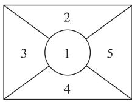
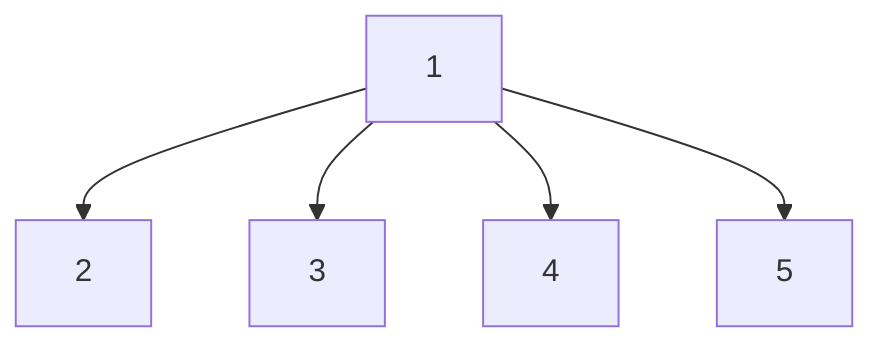
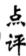

# 计数原理中的易错点分类剖析

吴书滨

(山东省济南市章丘区第一中学)

计数原理是高考必考内容,常以选择题、填空题的形式出现,考查难度不大,但易错点多.基于此,本文结合一些典型例题,对计数原理中的易错点进行分类剖析,为同学们备考提供一些参考.

# 1 混淆两个计数原理

求解计数问题,首先要想到两个计数原理,即分类加法原理和分步乘法原理.两个原理看似简单,但容易混淆,究竟是分步还是分类,需要仔细斟酌,反复推敲.

例 1 2025 年有 3 部贺岁片引爆电影市场, 小明和他的同学一行五人决定去看这三部电影,每人只看一部电影,则不同的选择共有\_\_\_\_种.

错解 因为小明和他的同学一行五人中,每一个人都有3种选择,所以他们总共有 $3+3+3+3+3=3\times5=15$ 种选择.

剖析 错解将事件看成一个人选电影,误用分类加法原理,事实上,五个人都选好电影才是一个事件.因此,求解时要用分步乘法原理.

正解 由题意可知每人都有 3 种选择, 所以总共有 $3 \times 3 \times 3 \times 3 \times 3 = 243$ 种选择.

对于两个计数原理的应用,必须清楚计数的事件是一次性完成,还是分几步完成,避免两个计数原理应用时“张冠李戴”.

# 2 分步不合理导致重复或遗漏

解答计数问题必须讲究策略,尤其是对于涂色问题,求解时需明确涂色步骤,先涂哪块,再涂哪块,要有先后次序,否则易出现分步不合理问题,会导致计数重复或遗漏.

例 2 某学校为培养学生的动手能力、合作能力和环保意识,在新的学期建立了一块劳动基地,形状如图1所示,并进行花卉种植活动.现有4种不同的花卉,在基地的5个区域种植,要求相邻区域种植不同的花卉,则不同的种植方法共有\_\_\_\_种.

flowchart

图1

错解 依题意可按照 $3 \rightarrow 1 \rightarrow 5 \rightarrow 2 \rightarrow 4$ 的顺序分为5步进行种植，区域3有4种选择，区域1和区域5都有3种选择，区域2与区域4都只有1种选择，所以由分步计数原理可得不同的种植方法共有 $4 \times 3 \times 3 \times 1 \times 1 = 36$ 种.

剖析 由于 5 个区域的相对位置有差异,尤其是区域 1 处于正中间,而区域 3 与区域 5 不相邻,区域 2 与区域 4 也不相邻,所以分步求解时要考虑分步的合理性,注意分类讨论.

正解 依题意可按照 $1 \to 2 \to 3 \to 4 \to 5$ 的顺序分为5步进行种植，区域1,2,3各有4种、3种、2种不同的花卉供选择.若区域4与区域2种植相同的花卉，则区域4有1种选择，区域5有2种选择.若区域4与区域2种植不同的花卉，则区域4有1种选择，区域5有1种选择.由分步计数原理可得不同的种植方法共有 $4 \times 3 \times 2 \times (1 \times 2 + 1 \times 1) = 72$ 种.

点评

不同区域种植不同的花卉,即涂色问题,是两个计数原理的常考题型,求解这类问题应从特殊的区域着手,对于不相邻区域的涂色必须分类讨论,这类问题的求解往往会同时用到分步乘法原理和分类加法原理.

# 3 忽视特殊元素或特殊位置

特殊元素应区别于普通元素,特别对待.对于排列组合问题中的特殊元素和特殊位置应注意区分进行分析,否则会出错.

例 3 从 0,1,2,3 中任选 3 个数字组成一个三位数,组成的偶数的个数为\_\_\_\_.

错解 因为 0,1,2,3 中有两个偶数, 即 0 和 2. 先选一个作为个位数,有 2 种选法;再在剩下的三个数中选两个数作为十位数和百位数,共有 $A_{3}^{2}=6$ 种选法,由乘法计数原理得组成的偶数的个数为 $2\times6=12$ .

剖析 在 0,1,2,3 中,0 最特殊,它是偶数,当把它放在三位数的个位数上时,可以使三位数成为偶数,同时它又不能是百位数,即不能出现在三位数的百位上.而错解忽视了后一种特殊性,导致计数错误.

正解 若 3 个数字中没有 0, 则组成的偶数的个数为 $A_{2}^{2}=2$ ; 若 3 个数字中有 0 和 2, 则组成的偶数的个数为 $C_{2}^{1}(A_{2}^{2}+1)=6$ ; 若 3 个数字中有 0, 没有 2, 则组成的偶数的个数为 $A_{2}^{2}=2$ . 因此, 从 0, 1, 2, 3 中任选 3 个数字组成一个三位数, 组成的偶数的个数为 $2+6+2=10$ .

对于计数问题,要厘清某些元素和位置的特殊性,解答时应从“特殊”情况入手,并注意分类讨论思想的应用.如本例中,0和2都是特殊元素,故解答时需对0和2分类讨论,再按照分类加法计数原理进行计算.

# 4 忽视排列数组合数公式的隐含条件

排列数 $A_{m}^{n}$ 和组合数 $C_{m}^{n}$ 有独特的数学意义, 它们的上标和下标必须满足一定的条件, 即所谓的隐含条件, 求解相关问题时忽视这些条件, 往往会把增根当成解, 同学们应引起注意.

例 4 若 $C_{18}^{3n+6}=C_{18}^{4n-2}$ ，则 $C_{9}^{n}=$ \_\_\_\_.

错解 因为 $C_{18}^{3n+6}=C_{18}^{4n-2}$ ，所以 $3n+6=4n-2$ 或 $3n+6+4n-2=18$ ，解得 n=8 或 2，所以 $C_{9}^{8}=C_{9}^{1}=9$ 或 $C_{9}^{2}=\frac{9\times8}{2\times1}=36$ .

剖析 当 n=8 时, 不难发现本题中条件等式的组合数的上标大于下标, 所以 n=8 不符合要求, 应舍去.

正解 由组合数的性质可得 $\left\{ \begin{array}{l}3n + 6\leqslant 18,\\ 4n - 2\leqslant 18, \end{array} \right.$ 解得 $n\leqslant 4.$ 因为 $\mathrm{C}_{18}^{3n + 6} = \mathrm{C}_{18}^{4n - 2}$ ，所以 $3n + 6 = 4n - 2$ 或 $3n+$ $6 + 4n - 2 = 18$ ，解得 $n = 8$ （舍）或2，所以 $\mathrm{C}_9^2 =$ $\frac{9\times 8}{2\times 1} = 36.$

排列数和组合数公式中含有隐含条件,即它们的上标和下标都是正整数,且组合数的上标可以为 0, 它们的上标的大小不能超过下标的大小, 所以解这类方程或不等式, 必须进行检验.

# 5 分组问题混淆“均分”与“非均分”

分组分配问题也是较为常见的一类计数问题,求解这类问题一般分两步,即先分组,再分配.而“分组”是关键的一步,也是易错的一步.分组一般有三种情形:均分、局部均分和非均分,针对不同的情形应采用不同的方法,否则容易出错.

例 5 某中学在学校发展目标的引领下,不断推育教学工作的高质量发展,学生社团得到迅猛发有高一新生中的五名同学打算参加“地理行知英语 ABC”“篮球之家”“生物研启社”四个社团.个社团至少有一名同学参加,每名同学至少参加社团且只能参加一个社团,且同学甲不参加“生启社”,则不同的参加方法的种数为 \_\_\_\_.

错解 将 5 人分成 4 组,由题可知有一组必有 2 人,若甲单独成组,有 $C_{4}^{2}C_{2}^{1}=12$ 种分法,若甲不单独成组,则有 $C_{4}^{1}C_{3}^{1}C_{2}^{1}=24$ 种分法,将 4 个组分到 4 个社团,因为同学甲不参加“生物研启社”,所以有 $C_{3}^{1}A_{3}^{3}=18$ 种分法,故不同的参加方法的种数为 $(12+24)\times18=648$ .

剖析 上述错解忽视了分组问题有“均分”与“非均分”之分，对于“均分”计数问题，必须除以阶乘数。如本例中甲单独成组余下4人分3组，必有2组为1人，应除以2！，若甲不单独成组，则余下3人分3组，应除以3！，否则会出现重复计数。

正解 将 5 人分成 4 组,由题可知有一组必有 2 人,若甲单独成组,有 $\frac{C_{4}^{2}C_{2}^{1}}{A_{2}^{2}}=6$ 种分法.若甲不单独成组,则有 $\frac{C_{4}^{1}C_{3}^{1}C_{2}^{1}}{A_{3}^{3}}=4$ 种分法,将 4 个组分到 4 个社团,因为同学甲不参加“生物研启社”,所以有 $C_{3}^{1}A_{3}^{3}=18$ 种分法,故不同的参加方法的种数为 $(6+4)\times18=180$ .

均匀分组和部分均匀分组在计数过程中易出现重复现象,注意计算公式的应用.重复的次数是均匀分组的阶乘数,即若有 m 组元素个数相等,则分组时应除以 $m!$ .

由此可见,求解计数原理问题,学生应厘清各种易于混淆的概念和定理,掌握相关的基本概念和基本运算,并认真审题,这是避开“易错点”的有效策略.

(完)