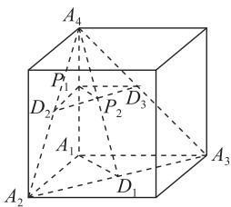
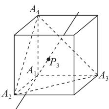
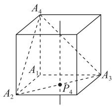

# 计数问题破解有招

# 高先波

(山东省济南市章丘区第一中学)

计数问题是高考中的常客,这类问题与实际生活联系紧密,题型多样,思路灵活,求解时首先要认真审题,弄清楚是排列问题、组合问题还是排列与组合综合问题;其次要抓住问题的本质特征,采用合理恰当的方法来处理.那么破解高考计数问题有哪些基本方法呢?让我们一起去探究.

# 1 枚举法

枚举法,也叫列举法.对于较为复杂的计数问题,直接应用排列公式或组合公式计数往往不奏效,这时不妨将结果一一列出,然后加以计数.

例1 已知三棱锥 $A_{1} - A_{2}A_{3}A_{4}$ 的侧棱长相等，且侧棱两两垂直.设 P 为该三棱锥表面(含棱)上异于顶点 $A_{1}, A_{2}, A_{3}, A_{4}$ 的点, 记 $D = \{d \mid d = |PA_{i}|, i = 1, 2, 3, 4\}$ . 若集合 D 中有且只有 2 个元素, 则符合条件的点 P 有( )个.

A. 3

B. 6

C. 7

D. 10

设 $d_{i} = |PA_{i}|$ ，分类讨论.

解析 若点 P 到其中的两个顶点的距离为 a，到另外两个顶点的距离为 b，且 $a \neq b$ 。由 $A_{1}, A_{2}, A_{3}, A_{4}$ 具

有对称性,不妨讨论 $d_{1}=d_{4}, d_{2}=d_{3}$ , 满足题意的点 P 应同时在线段 $A_{1}A_{4}, A_{2}A_{3}$ 的中垂线面和三棱锥表面上, 即中垂面交线与三棱锥表面的交点, 如图 1 中的 $P_{1}, P_{2}$ 两点, 同理 $d_{1}=d_{2}$ ,

$d_{3}=d_{4}$ 和 $d_{1}=d_{3}, d_{2}=d_{4}$ 也各有 2 个符合条件的点 P，故共 6 个符合条件的点 P.

若点 P 到其中三个顶点的距离为 c，到另一个顶点的距离为 e，且 $c \neq e$ 。若点 P 到点 $A_{2}, A_{3}, A_{4}$ 的距离相等，即 $d_{2} = d_{3} = d_{4}$ ，则 P 为过 $\triangle A_{2}A_{3}A_{4}$ 外心所在的垂线与三棱锥表面的交点，如图 2

text_image

A₄
P₁
D₂
P₂
D₃
A₁
A₂
D₁
A₃

图1

text_image

A₄
P₃
A₁
A₂
A₃

图2

中的 $P_{3}$ 和 $A_{1}$ (舍).

若点 P 到点 $A_{1}$ 和点 P 到点 $A_{2}, A_{3}, A_{4}$ 中的两个距离相等，由 $A_{1}, A_{2}, A_{3}, A_{4}$ 具有对称性，不妨讨论 $d_{1} = d_{2} = d_{3}$ ，则 P 为过 $\triangle A_{2}A_{3}A_{4}$ 外心所在垂线与三棱锥表面的交点，如图 3 中的点 $P_{4}$ . 同理， $d_{1} = d_{3} = d_{4}$

text_image

A₄
A₁
A₂
P₄
A₃

图3

和 $d_{1} = d_{2} = d_{4}$ 也各有1个满足题意的点 $P$ ，共3个.

综上,共有10个符合条件的点P,故选D.

点评

依据题意将问题分类讨论,结合对称性枚举出符合条件的点是问题求解的关键.

# 2 排除法

排除法,也叫去杂法.当题目中出现“至多”“至少”字样,或正面求解问题比较困难时,可根据“正难则反”的原则利用排除法分析问题.

例 2 （1）用 0,1,2,3,4 可以组成 \_\_\_\_ 个无(2)4 名同学去参加 3 个不同的社团组织, 每名同学只能参加其中一个社团组织, 且甲、乙两名同学不参加同一个社团组织, 则共有 \_\_\_\_ 种结果.

析

(1)从 0,1,2,3,4 中任选两个数字,有 $A_{5}^{2}=$ 20 种选法,其中数字 0 排首位的有 4 种,所条件的两位数有 20-4=16 个.

(2)4 名同学去参加 3 个不同的社团组织, 每名同学只能参加其中一个社团组织有 $3^{4}$ 种情况, 其中甲与乙参加同一社团组织有 $3^{3}$ 种情况, 故满足条件的方法共有 $3^{4}-3^{3}=54$ 种.

点评

排除法体现了数学解题的整体思维,避免了列举法的烦琐,从而优化解题过程.

# 3 捆绑法

在排列或组合时有些元素必须相邻或“待在一起”，这时不妨先把它们看成一个元素来处理。

例 3 （1）有 3 对双胞胎站成一排拍照，恰有一胞胎相邻的站法有\_\_\_\_种.

(2) 把除颜色外完全相同的 5 个红球和 4 个白球排成一行, 则恰有 3 个红球相邻在一起的不同排法有 \_\_\_\_ 种.

# 解析

(1) 将位置从左往右依次编号为 1, 2, 3, 4, 5, 6, 当恰有一对双胞胎站在 1, 2 号, 则再选一对双胞胎站在3,5号，另外一对双胞胎站在4,6号即可，且每对双胞胎中的两人可以交换位置，从而有 $\mathrm{C}_{3}^{1}\mathrm{A}_{2}^{2}\mathrm{C}_{2}^{1}\mathrm{A}_{2}^{2}\mathrm{A}_{2}^{2}$ 种站法.当恰有一对双胞胎站在2,3号、4,5号或5,6号时，情况与前面一样，从而共有 $3\mathrm{C}_{3}^{1}\mathrm{A}_{2}^{2}\mathrm{C}_{2}^{1}\mathrm{A}_{2}^{2}\mathrm{A}_{2}^{2}$ 种站法.当恰有一对双胞胎站在3,4号，则从余下的两对双胞胎中各任选一人站在1,2号即可，从而有 $\mathrm{C}_{3}^{1}\mathrm{A}_{2}^{2}\mathrm{C}_{2}^{1}\mathrm{C}_{2}^{1}\mathrm{A}_{2}^{2}\mathrm{A}_{2}^{2}$ 种站法.

综上，站法有 $4\mathrm{C}_3^1\mathrm{A}_2^2\mathrm{C}_2^1\mathrm{A}_2^2\mathrm{A}_2^2 +\mathrm{C}_3^1\mathrm{A}_2^2\mathrm{C}_2^1\mathrm{C}_2^1\mathrm{A}_2^2\mathrm{A}_2^2 =$ 288种.

(2)分两类.第一类,3个红球“捆绑”在一起,另外2个红球也“捆绑”在一起,然后让4个白球排列后形成5个空位,从中选出2个空位让这两个“捆绑”的红球排列即可,此时有 $A_{5}^{2}=20$ 种排法.第二类,3个红球“捆绑”在一起,另外2个红球不相邻,此时让4个白球排列后形成5个空位,从中选出1个空位放“捆绑”的红球,再从剩下的4个空位中选出2个空位放不相邻的红球即可,此时有 $C_{5}^{1}C_{4}^{2}=30$ 种排法.

综上，共有 $20 + 30 = 50$ 种排法.

利用捆绑法解题,先将必须相邻或“待在一起”的几个元素捆绑,再与其他元素排序,需注意捆绑元素内部的顺序.

# 4 插空法

对于排列问题,当若干个元素不能相邻时,不妨将其他元素先排列,然后将这几个元素插入它们的“空档”中.

例 4 某校田径队有十名队员, 分别记为 A, B,C, D, E, F, G, H, J, K，为完成某训练任务，现将十名队员分成甲、乙两队，其中将 A, B, C, D, E 五人排成一行形成甲队，要求 A 与 B 相邻，C 在 D 的左边，剩下的五位同学排成一行形成乙队，要求 F 与 G 不相邻，则有 \_\_\_\_ 种不同的排列方法。

甲队:先用捆绑法,将 A 与 B 捆绑,有 $A_{2}^{2}=2$ 种排法，将 $A$ 与 $B$ 看成一个整体与 $C, D, E$

排成一行，且 C 在 D 左边，用除序法得有 $\frac{A_{4}^{4}}{A_{2}^{2}}=12$ 种排法，则一共有 $2\times12=24$ 种排法。乙队：利用插空法得有 $A_{3}^{3}A_{4}^{2}=72$ 种排法。

综上，一共有 $24 \times 72 = 1728$ 种排法.

# 点评

利用插空法解题时,一定要注意有多少个空档可插,有些问题不能忽视最前和最后这两个特殊的空档.

# 5 优先法

求解计数问题的原则是先特殊,后一般,所以对于特殊元素或特殊位置应优先考虑.

例5 (1)某次联欢会要安排3个歌舞类节目$A_{1}, A_{2}, A_{3}, 2$ 个小品类节目 $B_{1}, B_{2}$ 和1个相声类节目C的演出顺序，若2个小品类节目 $B_{1}, B_{2}$ 不能排在第一位和最后一位，一共有\_\_\_\_种排法.

(2)从 A, B, C, D, E 这 5 个人中选出 4 个人, 安排在甲、乙、丙、丁 4 个岗位上, 如果 A 不能安排在甲岗位上, 则有 \_\_\_\_ 种不同的安排方法.

# 解析

(1)因为共有6个位置,2个小品类节目 $B_{1}$ ,$B_{2}$ 不能排在第一位和最后一位，先将 $B_{1}$ ，$B_{2}$ 排好，有 $A_{4}^{2}$ 种排法，剩下 4 个节目和 4 个位置，则有 $A_{4}^{4}$ 种排法，故共有 $A_{4}^{4}A_{4}^{2}=288$ 种排法.

(2)根据 A 是否入选进行分类, 若 A 入选, 则先给 A 从乙、丙、丁 3 个岗位中安排 1 个岗位, 有 3 种安排方法, 再给剩下 3 个岗位安排人, 有 $A_{4}^{3}=4\times3\times2=24$ 种安排方法, 则共有种 $3\times24=72$ 种安排方法. 若 A 不入选, 则 4 个人 4 个岗位全排, 有 $A_{4}^{4}=4\times3\times2\times1=24$ 种安排方法, 所以共有 $72+24=96$ 种不同的安排方法.

# 点评

对于有限制条件的计数问题,一般都采用优先法，而这种方法的本质是分类讨论，在各种情形的讨论中需找到符合条件的种类,所以分类时需特别小心,做到不重不漏.

当然,求解计数问题的方法还有很多,如定序问题公式法、多排问题直排法,限于篇幅,这里不再展开,但无论采用何种方法,必须分清是排列问题,还是组合问题,然后再选择恰当的方法进行运算.

(完)

64

数理化