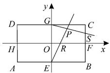

# 高考导数试题的常用解法分析

# ■郑州市第一零一中学

# 冯连福

新课标要求同学们能够应用高中阶段的函数观点与导数方法解决函数(实际)问题,感受导数在研究函数性质中的作用,能够运用导数研究简单的函数性质及变化规律,体会导数的几何意义。近两年的高考导数试题非常精彩,所有处理方法及手段均为通性通法,强调对基础知识和基本概念的深入理解和灵活掌握,注重考查学科知识的综合应用能力,重点考查逻辑推理的学科素养。试题涉及求导运算、用导数研究函数性质等,常用方法有分类讨论法、必要性探路法、主参分离法等,需要同学们认真钻研,举一反三。

# 一、分类讨论法

分类讨论的标准是不重不漏,从最简单处开始讨论,最后讨论复杂情况。

例 1 （2024 年全国甲卷理科第 21 题）已知函数 $f(x)=(1-ax)\ln(1+x)-x$ 。

(1) 当 a = -2 时, 求 $f(x)$ 的极值;  
(2) 当 $x \geqslant 0$ 时, $f(x) \geqslant 0$ 恒成立, 求 a 的取值范围。

分析:(1)求出函数的导数,根据导数的单调性可求函数的极值。(2)求出函数的二阶导数,分类讨论 $a \leqslant -\frac{1}{2}$ 、 $-\frac{1}{2} < a < 0$ 、 $a \geqslant 0$ ,即可得参数的取值范围。

解:(1)当 a=-2 时, $f(x)=(1+2x)\cdot\ln(1+x)-x,x\in(-1,+\infty)$ 。

故 $f'(x)=2\ln(1+x)+\frac{1+2x}{1+x}-1=$ $2\ln(1+x)-\frac{1}{1+x}+1$ 。

因为 $f''(x)=\frac{2}{1+x}+\frac{1}{(1+x)^{2}}>0$ ，所以 $f'(x)$ 在 $(-1,+\infty)$ 上为增函数。而 $f'(0)=0$ ，故当 -1<x<0 时， $f'(x)<0$ ；当 x>0 时， $f'(x)>0$ 。

所以 $f(x)$ 在 x=0 处取极小值，且极小值为 $f(0)=0$ ，无极大值。

$$
\begin{array}{l} f ^ {\prime} (x) = - a \ln (1 + x) + \frac {1 - a x}{1 + x} - 1 = \tag {2} \\ - a \ln (1 + x) - \frac {(a + 1) x}{1 + x}, x \geqslant 0 。 \\ \end{array}
$$

设 $s(x)=-a\ln(1+x)-\frac{(a+1)x}{1+x},x\geqslant$ 0, 则 $s' \left( x \right) = \frac{-a}{x+1} - \frac{a+1}{(1+x)^2} = \frac{-a(x+1)+a+1}{(1+x)^2} = -\frac{ax+2a+1}{(1+x)^2}$ 。

当 $a \leqslant -\frac{1}{2}$ 时， $s'(x) \geqslant 0, s(x)$ 在 $[0, +\infty)$ 上为增函数，故 $s(x) \geqslant s(0) = 0$ ，即 $f'(x) \geqslant 0$ 。所以 $f(x)$ 在 $[0, +\infty)$ 上为增函数， $f(x) \geqslant f(0) = 0$ 。

当 $-\frac{1}{2}<a<0$ 时，则当 $0\leqslant x<-\frac{2a+1}{a}$ 时， $s'(x)<0,s(x)$ 在 $\left[0,-\frac{2a+1}{a}\right)$ 上为减函数，故在 $\left[0,-\frac{2a+1}{a}\right)$ 上 $s(x)\leqslant s(0)=0$ ，即在 $\left[0,-\frac{2a+1}{a}\right)$ 上 $f'(x)\leqslant0,f(x)$ 为减函数。故在 $\left[0,-\frac{2a+1}{a}\right)$ 上 $f(x)\leqslant f(0)=0$ ，不符合题意，舍去。

当 $a \geqslant 0$ 时， $s'(x) < 0$ 在 $[0, +\infty)$ 上恒成立， $s(x)$ 在 $[0, +\infty)$ 上为减函数， $s(x) \leqslant s(0) = 0$ ，即 $f'(x) \leqslant 0$ ，所以 $f(x)$ 在 $[0, +\infty)$ 上为减函数， $f(x) \leqslant f(0) = 0$ ，不符合题意，舍去。

综上，a 的取值范围是 $\left(-\infty, -\frac{1}{2}\right]$ 。

例 2 （2023 年全国甲卷理科第 21 题）已知函数 $f(x) = ax - \frac{\sin x}{\cos^{3}x}, x \in$

$\left(0,\frac{\pi}{2}\right)$ 。

(1) 当 a=8 时, 讨论 $f(x)$ 的单调性;  
(2) 若 $f(x) < \sin 2x$ 恒成立, 求 a 的取值范围。

分析:(1)对函数 $f(x)$ 求导,然后令 $t=\cos^{2}x$ ,讨论导数的符号即可。(2)构造 $g(x)=f(x)-\sin2x$ ,计算 $g'(x)$ 的最大值,然后与0比较大小,得出a的分界点,再对a讨论即可。

$$
\begin{array}{r l} & {\text {解}: (1) \text {当} a = 8 \text {时,} f ^ {\prime} (x) = 8 -} \\ & {\frac {\cos x \cos^ {3} x + 3 \sin x \cos^ {2} x \sin x}{\cos^ {6} x} = 8 -} \\ & {\frac {\cos^ {2} x + 3 \sin^ {2} x}{\cos^ {4} x} = 8 - \frac {3 - 2 \cos^ {2} x}{\cos^ {4} x}.} \end{array}
$$

令 $\cos^{2}x=t,t\in(0,1)$ ，则上式可化为 $8-\frac{3-2t}{t^{2}}=\frac{8t^{2}+2t-3}{t^{2}}=\frac{(2t-1)(4t+3)}{t^{2}}$ 。

当 $t \in \left(0, \frac{1}{2}\right)$ ，即 $x \in \left(\frac{\pi}{4}, \frac{\pi}{2}\right)$ 时， $f'(x) < 0$ ；当 $t \in \left(\frac{1}{2}, 1\right)$ ，即 $x \in \left(0, \frac{\pi}{4}\right)$ 时， $f'(x) > 0$ 。

所以 $f(x)$ 在 $\left(0, \frac{\pi}{4}\right)$ 上单调递增，在 $\left(\frac{\pi}{4}, \frac{\pi}{2}\right)$ 上单调递减。

（2）设 $g(x) = f(x) - \sin 2x$ ，则 $g^{\prime}(x) = f^{\prime}(x) - 2\cos 2x = a - \frac{3 - 2\cos^{2}x}{\cos^{4}x} -$ $2(2\cos^2 x - 1)$ 。令 $\cos^2 x = t,t\in (0,1)$ ，则上式可化为 $\frac{at^2 + 2t - 3}{t^2} -2(2t - 1) = a + 2-$ $4t + \frac{2}{t} -\frac{3}{t^2}$

设 $\varphi(t)=a+2-4t+\frac{2}{t}-\frac{3}{t^{2}}, t\in(0,1)$ ,
则 $\varphi'(t)=-4-\frac{2}{t^{2}}+\frac{6}{t^{3}}=\frac{-4t^{3}-2t+6}{t^{3}}=$ $-\frac{2(t-1)(2t^{2}+2t+3)}{t^{3}}>0.$

所以 $\varphi(t)<\varphi(1)=a-3$ 。

下面对 a-3 的正负进行讨论, 先讨论特殊情况, 即 $a-3 \leqslant 0$ 。

若 $a \in (-\infty, 3]$ , 则 $\varphi(t) < a - 3 \leqslant 0$ , 即

$g(x)$ 在 $\left(0, \frac{\pi}{2}\right)$ 上单调递减，所以 $g(x) < g(0) = 0$ 。

所以当 $a \in (-\infty, 3]$ , $f(x) < \sin 2x$ , 符合题意。

若 $a \in (3, +\infty)$ , 当 $t \to 0$ 时, $\frac{2}{t} - \frac{3}{t^2} = -3\left(\frac{1}{t} - \frac{1}{3}\right)^2 + \frac{1}{3} \to -\infty$ , 所以 $\varphi(t) \to -\infty$ 。

又 $\varphi(1)=a-3>0$ ，所以存在 $t_{0}\in(0,1)$ ，使得 $\varphi(t_{0})=0$ ，即存在 $x_{0}\in\left(0,\frac{\pi}{2}\right)$ ，使得 $g'(x_{0})=0$ 。

当 $t \in (t_{0}, 1)$ 时， $\varphi(t) > 0$ ，即当 $x \in (0, x_{0})$ 时， $g'(x) > 0$ ， $g(x)$ 单调递增， $g(x) > g(0) = 0$ ，不符合题意。

综上，a 的取值范围为 $(-∞,3]$ 。

# 二、必要性探路法

必要性探路法是先通过一个满足条件的特殊值代入已知条件得出参数的取值范围，再分类讨论找出满足条件的取值范围。这种解法的计算量比直接分类讨论要小。

例 3 （2024 年新课标 I 卷第 18 题）
已知函数 $f(x)=\ln\frac{x}{2-x}+ax+b(x-1)^{3}$ 。

(1) 若 b=0，且 $f'(x) \geqslant 0$ ，求 a 的最小值；  
(2)证明:曲线 $y=f(x)$ 是中心对称图形;  
(3) 当且仅当 1 < x < 2 时, $f(x) > -2$ , 求 b 的取值范围。

分析:(1)若 $f'(x) \geqslant 0$ ，则 $f'(x)$ 的最小值大于等于 0 即可。(2)从定义域入手，先猜出曲线 $y = f(x)$ 关于点 $(1, f(1))$ 中心对称，再证明 $f(2 - x) + f(x)$ 等于定值。(3)先由条件求出 a 的值，再由端点成立求出 b 的取值范围，然后证明充分性。

解:(1)由 $\left\{\begin{aligned}\frac{x}{2-x}&>0,\\ 2-x&\neq0,\end{aligned}\right.$ 解得0<x<2。所以函数 $f(x)$ 的定义域为(0,2)。

当 $b = 0$ 时， $f(x) = \ln \frac{x}{2 - x} + ax, 0 <$

$x < 2$ 。所以 $f^{\prime}(x) = \frac{1}{x} +\frac{1}{2 - x} +a =$ $\frac{2}{x(2 - x)} +a\geqslant 0$ 恒成立。

因为 $x \in (0, 2)$ , 所以 $x(2 - x) \leqslant \left[\frac{x + (2 - x)}{2}\right]^2 = 1$ , 当且仅当 $x = 1$ 时取等号。

所以 $f'(x)=\frac{2}{x(2-x)}+a\geqslant2+a\geqslant0$ 即 $a \geqslant -2$ 。

所以 a 的最小值为 -2。

(2) 易知 $f(x) = \ln \frac{x}{2 - x} + ax + b(x - 1)^3$ , $f(2 - x) = \ln \frac{2 - x}{x} + a(2 - x) + b(1 - x)^3$ 。

所以 $f(2-x)+f(x)=\ln\frac{2-x}{x}+a(2-x)+b(1-x)^{3}+\ln\frac{x}{2-x}+ax+b(x-1)^{3}=2a$ 。

又 $f(1)=a$ ，故 $f(x)$ 关于点 $(1,a)$ 中心对称。

(3) 因为当且仅当 1 < x < 2 时， $f(x) > -2$ ，且 $f(x)$ 关于点 $(1, a)$ 中心对称，所以当且仅当 0 < x < 1 时， $f(x) < -2$ ， $f(1) = a = -2$ 。

所以 $f(x)=\ln\frac{x}{2-x}-2x+b(x-1)^{3}>$ -2 对任意的 $x \in (1, 2)$ 恒成立。

$$
\begin{array}{r l} & f ^ {\prime} (x) = \frac {1}{x} + \frac {1}{2 - x} - 2 + 3 b (x - 1) ^ {2} = \\ & (x - 1) ^ {2} \left[ \frac {2}{x (2 - x)} + 3 b \right] _ {\circ} \end{array}
$$

令 $g(x) = \frac{2}{x(2 - x)} + 3b$ ，则 $g(1) = 2 + 3b \geqslant 0$ ，即 $b \geqslant -\frac{2}{3}$ 。

否则，若 $b<-\frac{2}{3}$ ，则存在 $x_{0}\in(1,2)$ ，使得当 $x\in(1,x_{0})$ 时， $f'(x)<0,f(x)$ 在 $(1,x_{0})$ 上单调递减， $f(x_{0})<f(1)=-2$ ，不符合题意。

当 $b \geqslant -\frac{2}{3}$ 时，因为 $1 < x < 2$ ，所以

$(x - 1)^{3} > 0$ ，则 $b(x - 1)^{3}\geqslant -\frac{2}{3} (x - 1)^{3}$ ，故 $f(x)\geqslant \ln \frac{x}{2 - x} -2x - \frac{2}{3} (x - 1)^{3}$

令 $h(x)=\ln\frac{x}{2-x}-2x-\frac{2}{3}(x-1)^{3}$ ，则 $h'(x)=\frac{2(x-1)^{2}}{x(2-x)}-2(x-1)^{2}=\frac{2(x-1)^{4}}{x(2-x)}>0$ ，所以 $h(x)$ 在 $(1,2)$ 上单调递增。

则 $h(x) > h(1) = -2$ ，故 $f(x) > -2$ 在 $(1, 2)$ 上恒成立。

综上， $b$ 的取值范围为 $\left[-\frac{2}{3}, +\infty\right)$ 。

例 4 （2023 年新课标Ⅱ卷第 22 题）

(1) 证明: 当 $0 < x < 1$ 时, $x - x^2 < \sin x < x$ ;  
(2) 已知函数 $f(x) = \cos ax - \ln (1 - x^2)$ ，若 $x = 0$ 是 $f(x)$ 的极大值点，求 $a$ 的取值范围。

分析:(1)分别构建函数 $F(x)=x-\sin x, x\in(0,1), G(x)=x^{2}-x+\sin x, x\in(0,1)$ ，利用导数判断函数的单调性，进而可得证。(2)先根据 x=0 是 $f(x)$ 的极大值点及 $f'(x)$ 和 $f''(x)$ 的表达式，得到 $f'(0)=0$ 且 $f''(0)\leqslant0$ ，解得 $a\geqslant\sqrt{2}$ 或 $a\leqslant-\sqrt{2}$ ，即求出 x=0 是 $f(x)$ 的极大值点的必要条件；再分 $a^{2}=2$ 和 $a^{2}>2$ 讨论，验证 x=0 是 $f(x)$ 的极大值点，即求出 x=0 是 $f(x)$ 的极大值点的充分条件。

解:(1)设 $F(x)=x-\sin x, x\in(0,1)$ ，则 $F'(x)=1-\cos x>0$ 对 $\forall x\in(0,1)$ 恒成立。

所以 $F(x)$ 在 $(0,1)$ 上单调递增， $F(x)>F(0)=0$ ，即 $x>\sin x, x\in(0,1)$ 。

设 $G(x)=\sin x-(x-x^{2})=x^{2}-x+\sin x, x\in(0,1)$ ，则 $G'(x)=2x-1+\cos x, x\in(0,1)$ 。

令 $g(x) = G'(x), x \in (0,1)$ ，则 $g'(x) = 2 - \sin x > 0$ 对 $\forall x \in (0,1)$ 恒成立。

所以 $g(x)$ 在 $(0,1)$ 上单调递增， $g(x)>g(0)=0$ ，即 $G'(x)>0$ 对 $\forall x\in(0,1)$ 恒成立。

所以 $G(x)$ 在 $(0,1)$ 上单调递增， $G(x)>G(0)=0$ ，即 $\sin x>x-x^{2},x\in(0,1)$ 。

综上，当 0 < x < 1 时， $x - x^{2} < \sin x < x$ 。

(2) 显然函数 $f(x)$ 在定义域 $(-1,1)$ 内是偶函数。

$$
\begin{array}{r l} & f ^ {\prime} (x) = - a \sin a x + \frac {2 x}{1 - x ^ {2}}, f ^ {\prime \prime} (x) = \\ & - a ^ {2} \cos a x + \frac {2 + 2 x ^ {2}}{(1 - x ^ {2}) ^ {2}}. \end{array}
$$

因为 x=0 是 $f(x)$ 的极大值点，所以 $f'(0)=0, f''(0)=-a^{2}+2\leqslant0$ ，解得 $a\geqslant\sqrt{2}$ 或 $a\leqslant-\sqrt{2}$ 。

①当 $a = \pm \sqrt{2}$ 时， $f'(x) = -\sqrt{2} \sin (\sqrt{2} x) + \frac{2x}{1 - x^2}, x \in (0,1)$ 。

由(1)得， $f'(x) > -\sqrt{2} \times (\sqrt{2} x) + \frac{2x}{1 - x^2} = \frac{2x^3}{1 - x^2} > 0, x \in (0,1)$ 。

故 $f(x)$ 在 $(0,1)$ 上单调递增，此时与 x=0 是 $f(x)$ 的极大值点相矛盾，舍去。

② 当 $a > \sqrt{2}$ 或 $a < -\sqrt{2}$ 时，存在 $\varepsilon > 0$ ，使得当 $x \in (-\varepsilon, \varepsilon)$ 时， $f''(x) < 0$ ，所以 $f'(x)$ 在 $(- \varepsilon, \varepsilon)$ 上单调递减。

又 $f'(0)=0$ ，所以当 $x\in(-\varepsilon,0)$ 时， $f'(x)>0,f(x)$ 在 $(- \varepsilon,0)$ 上单调递增；当 $x\in(0,\varepsilon)$ 时， $f'(x)<0,f(x)$ 在 $(0,\varepsilon)$ 上单调递减。此时 x=0 是 $f(x)$ 的极大值点。

故 a 的取值范围是 $(-∞, -\sqrt{2}) ∪ (\sqrt{2}, +∞)$ 。

# 三、主参分离法

先将题述条件化简为 $a = h(x)$ 或 $a \geqslant h(x)$ ，再转化为 y = a 与 $y = h(x)$ 两个函数的图像有交点或直线 y = a 在函数 $y = h(x)$ 图像的上方，通过导数求出函数 $y = h(x)$ 的值域，从而求出参数 a 的取值范围。

例 5 （2023 年全国乙卷理科第 21 题）已知函数 $f(x)=\left(\frac{1}{x}+a\right)\ln(x+1)$ 。

(1) 当 a = -1 时, 求曲线 $y = f(x)$ 在点 $(1, f(1))$ 处的切线方程。

(2) 是否存在 a, b，使得曲线 $y = f\left(\frac{1}{x}\right)$ 关于直线 x = b 对称？若存在，求 a, b 的值；若不存在，请说明理由。

(3) 若 $f(x)$ 在 $(0, +\infty)$ 上存在极值点，

求 $a$ 的取值范围。

分析:(1)由题意先求导,然后由导数的几何意义确定切线的斜率和切点坐标,最后写出切线方程。(2)先令函数 $g(x)=f\left(\frac{1}{x}\right)$ ,再根据函数的对称性得 $g(x)=g(2b-x)$ ,然后得到方程组,解出 a,b 的值。(3)原问题等价于导函数方程有正解,先主参分离得到 $a=h(x)$ ,再对函数 $y=h(x)$ 求导,得出函数 $y=h(x)$ 的单调性和端点值,根据 y=a 与 $y=h(x)$ 图像有交点求得实数 a 的取值范围。

解：（1）当 $a = -1$ 时， $f(x) = \left(\frac{1}{x} - 1\right)\ln (x + 1)$ 。则 $f'(x) = -\frac{1}{x^2}\ln (x + 1) + \left(\frac{1}{x} - 1\right) \cdot \frac{1}{x + 1}$ 。

故 $f(1)=0, f'(1)=-\ln 2$ 。

所以函数 $y=f(x)$ 在点 $(1,f(1))$ 处的切线方程为 $y-f(1)=f'(1)(x-1)$ ，即 $y=-\ln2(x-1)$ 。

(2) 因为 $f(x)=\left(\frac{1}{x}+a\right)\ln(x+1)$ ，所以 $f\left(\frac{1}{x}\right)=(x+a)\ln\left(1+\frac{1}{x}\right)$ 。

设 $g(x) = (x + a)\ln \left(1 + \frac{1}{x}\right)$ ，定义域为 $(- \infty, -1) \cup (0, +\infty)$ ，则 $g(2b - x) = (2b - x + a)\ln \left(1 + \frac{1}{2b - x}\right)$ 。

若 $y=f\left(\frac{1}{x}\right)$ 关于直线 x=b 对称，则 $g(x)=g(2b-x)$ ，即 $(x+a)\ln\left(1+\frac{1}{x}\right)=$ $(2b+a-x)\ln\left(1+\frac{1}{2b-x}\right)$ 。

则 $(x+a)\ln\frac{x+1}{x}=(x-2b-a)\cdot$ $\ln\frac{x-2b}{x-2b-1}$ ，所以 $\left\{\begin{aligned}a&=-2b-a,\\ 1&=-2b,\end{aligned}\right.$ 解得 $\left\{\begin{aligned}a=\frac{1}{2},\\ b&=-\frac{1}{2}.\end{aligned}\right.$

(下转第12页)

BC 上的动点分别为 R, S, 且满足 $\overrightarrow{OR} = \lambda \overrightarrow{OF}, \overrightarrow{CS} = \lambda \overrightarrow{CF} (\lambda \in \mathbf{R})$ 。

text_image

y
D	G	C
H	O	R	F	x
A	E	B

图5

(1)求直线 ER 与直线 GS 的交点 P 的轨迹方程；  
(2) 当 $\lambda = -\frac{\sqrt{6}}{3}$ 时, 过点 R 的直线 m (与 x 轴不重合) 和点 P 的轨迹交于 M, N 两点, 过点 N 作直线 l: x = -3 的垂线, 垂足为点 Q, 设直线 MQ 与 x 轴交于点 K, 求 $\triangle KMN$ 面积的最大值。

19.(本小题17分) $(a,b)$ 表示正整数a，b的最大公约数，若 $\{x_{1},x_{2},\cdots,x_{k}\}\subseteq\{1,2,\cdots,m\}(k,m\in\mathbf{N}^{*})$ ，且任意的 $x\in\{x_{1},x_{2},\cdots,x_{k}\},(x,m)=1$ ，则将k的最大值记为 $\varphi(m)$ ，例如： $\varphi(1)=1,\varphi(5)=4$ 。

(1) 求 $\varphi(2)$ , $\varphi(3)$ , $\varphi(6)$ 。  
(2) 已知当 $(m, n) = 1$ 时， $\varphi(mn) = \varphi(m)\varphi(n)$ 。

①求 $\varphi(6^{n})$ ;

②设 $b_{n}=\frac{1}{3\varphi(6^{n})-1}$ ，数列 $\{b_{n}\}$ 的前 n 项和为 $T_{n}$ ，证明： $T_{n}<\frac{6}{25}$ 。

(责任编辑 赵倩)

(上接第9页)

$$
\begin{array}{l} \left(x + \frac {1}{2}\right) \ln \left(1 + \frac {1}{x}\right), g (- 1 - x) = \\ \left(- x - \frac {1}{2}\right) \ln \frac {- x}{- 1 - x} = \left(x + \frac {1}{2}\right) \ln \left(1 + \frac {1}{x}\right) = \\ g (x) _ {\circ} \\ \end{array}
$$

当 $a = \frac{1}{2}, b = -\frac{1}{2}$ 时， $g(x) =$

所以存在 $a=\frac{1}{2}, b=-\frac{1}{2}$ ，使得曲线 $y=f\left(\frac{1}{x}\right)$ 关于直线 $x=-\frac{1}{2}$ 对称。

(3) 因为 $f(x)=\left(\frac{1}{x}+a\right)\ln(1+x)$ 在 $(0,+\infty)$ 上存在极值点，所以 $f'(x)=-\frac{1}{x^{2}}\ln(x+1)+\left(\frac{1}{x}+a\right)\frac{1}{1+x}=0$ 有正解。

则 $a = \frac{(x + 1)\ln(x + 1)}{x^2} -\frac{1}{x} =$ $\frac{(x + 1)\ln(x + 1) - x}{x^2} (x > 0)$ 。

设 $h(x)=\frac{(x+1)\ln(x+1)-x}{x^{2}}(x>0)$ ,
则函数 y=a 与 $y=h(x)$ 的图像有交点。

$$
\begin{array}{r l} h ^ {\prime} (x) & = \frac {- (x + 2) \ln (x + 1) + 2 x}{x ^ {3}} = \\ & \frac {x + 2}{x ^ {3}} \left[ - \ln (x + 1) + \frac {2 x}{x + 2} \right] _ {\circ} \end{array}
$$

设 $\varphi (x) = -\ln (x + 1) + \frac{2x}{x + 2} (x > 0)$

则 $\varphi^{\prime}(x) = -\frac{1}{x + 1} +\frac{4}{(x + 2)^{2}} =$

$$
\frac {- x ^ {2}}{(x + 1) (x + 2) ^ {2}} <   0 。
$$

所以 $\varphi(x)$ 在 $(0, +\infty)$ 上单调递减， $\varphi(x)<\varphi(0)=0$ 。

故 $h'(x)<0,h(x)$ 在 $(0,+\infty)$ 上单调递减。

$$
\begin{array}{l} \lim _ {x \rightarrow 0 ^ {+}} \frac {(x + 1) \ln (x + 1) - x}{x ^ {2}} = \lim _ {x \rightarrow 0 ^ {+}} \frac {\ln (x + 1)}{2 x} = \\ \lim _ {x \rightarrow 0 ^ {+}} \frac {1}{2 (x + 1)} = \frac {1}{2}, \lim _ {x \rightarrow + \infty} h (x) = \\ \lim _ {x \rightarrow + \infty} \frac {\ln (x + 1)}{2 x} = \lim _ {x \rightarrow + \infty} \frac {1}{2 (x + 1)} = 0 。 \\ \end{array}
$$

由洛必达法则得， $\lim_{x\to0^{+}}h(x)=$

所以 $0 < a < \frac{1}{2}$ ，即 a 的取值范围是 $\left(0, \frac{1}{2}\right)$ 。

同学们在导数学习中应该注意对教材中概念、公式、定理等数学知识的深刻理解，理解数学思想的本质，掌握通性通法，提升自己的逻辑推理和数学运算素养。

(责任编辑 赵倩)