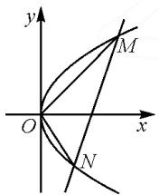
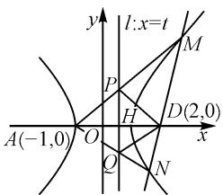
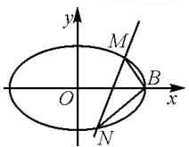

# 齐次化思想在解析几何中的应用

# 江苏省启东市吕四中学 张红生

数学运算是数学核心素养之一.运算过程的繁与简,结果能否正确呈现,反映了学生运算能力的高低.不同的方法选择,运算的难易程度往往差别较大.这正是教师要教会学生的地方.如何去突破运算瓶颈?怎样选择解题方法?为什么这么选?要用到什么技巧?需要多总结体会,做到心中有底,手中有法.

# 1 运算的难点与解决策略

高三解析几何的复习教学中,常会遇到像斜率之和、斜率之积为常数,定点、定值等问题.对于这类问题,基础一般的学生往往困惑于找不到突破口,或者用常规思路,苦于计算能力的薄弱,花时长,最终仍是半途而废.

多数学生会被 $\frac{y_{1}-b}{x_{1}-a}\cdot\frac{y_{2}-b}{x_{2}-a}$ 和 $\frac{y_{1}-b}{x_{1}-a}+\frac{y_{2}-b}{x_{2}-a}$ $(a\neq0,b\neq0)$ 的化简“卡”住，选择放弃，而在化简 $\frac{y_{1}}{x_{1}}\cdot\frac{y_{2}}{x_{2}}$ 和问题 $\frac{y_{1}}{x_{1}}+\frac{y_{2}}{x_{2}}$ 时，准确率明显提升.针对这一现象，笔者发现：恰当引入齐次化方案，教学效果明显.

# 2 多视角呈现解题思路

借助“一题多解”，合理关注不同层次学生理解的契合度。帮助学生及时发现自身运算的不足，并学会另辟蹊径，突破运算瓶颈，真正达到听懂，会做，有效提升运算技巧、运算方法、运算能力。

例如图1,已知直线 $l$ 与抛物线 $C:y^{2} = 2px$ $(p\neq 0)$ 相交，交点为 $M,N$ ，又 $O$ 为原点， $OM\bot ON$ 则直线 $l$ 必过定点

法一:常规思路之一.

设 $MN: x = my + n, M(x_1, y_1)$ , $N(x_2, y_2)$ . 联立 $\left\{ \begin{array}{l} x = my + n, \\ y^2 = 2px, \end{array} \right.$ 消元得 $y^2 - 2pmy - 2pn = 0$ , 则

$$
y _ {1} + y _ {2} = 2 p m, y _ {1} y _ {2} = - 2 p n.
$$

所以 $k_{OM} \cdot k_{ON} = \frac{y_{1}}{x_{1}} \cdot \frac{y_{2}}{x_{2}} = \frac{2py_{1}}{y_{1}^{2}} \cdot$

text_image

y
M
O
x
N

图 1

$$
\frac {2 p y _ {2}}{y _ {2} ^ {2}} = \frac {4 p ^ {2}}{y _ {1} y _ {2}} = - \frac {2 p}{n} = - 1.
$$

所以 n=2p.

故直线 l 必过定点 $(2p,0)$ .

法二:齐次化思路.

易知 MN 不过坐标原点，设 $MN: mx + ny = 1$ ， $M(x_{1},y_{1}), N(x_{2},y_{2})$ . 联立 $\left\{\begin{aligned}mx+ny=1,\\ y^{2}=2px.\end{aligned}\right.$

（通过一次项乘 $mx + ny$ ，常数项乘 $(mx + ny)^{2}$ 的手段，进行齐次化。）

易得 $y^{2}-2px(mx+ny)=0.$

整理为 $\left(\frac{y}{x}\right)^2 - 2pn\left(\frac{y}{x}\right) - 2pm = 0$ ，方程的两根为 $\frac{y_1}{x_1}, \frac{y_2}{x_2}$ .

所以 $k_{OM} \cdot k_{ON} = \frac{y_1}{x_1} \cdot \frac{y_2}{x_2} = -2pm = -1.$

所以 $m=\frac{1}{2p}$ . 故直线 l 必过定点 $(2p,0)$ .

点评: 比较两种方法, 因 O 为原点, 所以运算量相差不大. 但命题者常会利用平移等手段, 设计出 $\frac{y_{1}-b}{x_{1}-a} \cdot \frac{y_{2}-b}{x_{2}-a}$ 或 $\frac{y_{1}-b}{x_{1}-a} + \frac{y_{2}-b}{x_{2}-a} (a \neq 0, b \neq 0)$ 的题型, 制造运算难度来考查学生. 那么反其道而行, 利用平移, 就可达到简化的目的.

# 3 变式拓展与灵活运用

变式 1 已知抛物线 $C: y^{2} = 4x$ 及点 $M(1, 2)$ ，点 A, B 为抛物线 C 上的两动点，若 $k_{MA} + k_{MB} = \lambda$ ，求证：直线 AB 过定点，或 AB 的斜率为定值.

解析: 将图形向左平移 1 个单位长度, 向下平移 2 个单位长度, 则平移后曲线方程为 $(y+2)^{2}=4(x+1)$ , 整理得 $y^{2}+4y-4x=0$ .

平移后，设 $A^{\prime}B^{\prime}: mx + ny = 1, A^{\prime}(x_{1}, y_{1}), B^{\prime}(x_{2}, y_{2}), M^{\prime}(0, 0)$ .

联立 $\left\{\begin{aligned}mx+ny=1,\\ y^{2}+4y-4x=0,\end{aligned}\right.$ 得

$$
y ^ {2} + (4 y - 4 x) (m x + n y) = 0.
$$

整理为 $(1 + 4n)\left(\frac{y}{x}\right)^2 + (4m - 4n)\left(\frac{y}{x}\right) - 4m = 0$ ，方程的两根为 $\frac{y_1}{x_1}, \frac{y_2}{x_2}$ .

易得 $k_{M'A'} + k_{M'B'} = \frac{y_1}{x_1} +\frac{y_2}{x_2} = \frac{4n - 4m}{1 + 4n} = \lambda .$

所以 $-4m + 4(1 - \lambda)n = \lambda$

当 $\lambda=0$ 时，有 m=n，此时 $k_{A'B'}=-1$ ，直线 $A'B'$ 向右移 1 个单位长度，向上移 2 个单位长度后，可知 $k_{AB}=-1$ ；

当 $\lambda \neq 0$ 时， $\frac{-4}{\lambda} \cdot m + \frac{4(1 - \lambda)}{\lambda} n = 1$ ，直线 $A'B'$ 过定点 $\left(\frac{-4}{\lambda}, \frac{4}{\lambda} - 4\right)$ ，则直线 $AB$ 过定点 $\left(1 - \frac{4}{\lambda}, \frac{4}{\lambda} - 2\right)$ .

点评:若用常规方法求解,需化简 $\frac{y_{1}-2}{x_{1}-1}+\frac{y_{2}-2}{x_{2}-1}$ .而通过平移,将 $M(1,2)$ 转化为 $M'(0,0)$ 后,齐次化将斜率和、斜率积的运算难点化于无形,达到减少运算的目的.这手段本质上是平移坐标轴,重建坐标系.平移后的新曲线方程的口诀可记为“左加右减、上减下加”.遇到直线过定点问题,需再次平移复原.平移的过程中,有关的斜率、长度、夹角等数值不变.

变式 2 已知双曲线 $C: \frac{x^{2}}{2}-\frac{y^{2}}{1}=1$ ，点 $M(2,0)$ ，A, B 为双曲线 C 上的两点，点 A, B, M 不在同一直线上，若 $k_{MA} \cdot k_{MB} = \frac{1}{2}$ ，求证：直线 AB 过定点.

解析: 将图形向左平移 2 个单位长度, 则平移后的曲线方程为 $\frac{(x+2)^{2}}{2}-\frac{y^{2}}{1}=1$ , 即 $x^{2}-2y^{2}+4x+2=0$ .

平移后，设直线 $A^{\prime}B^{\prime}:mx+ny=1, A^{\prime}(x_{1},y_{1}), B^{\prime}(x_{2},y_{2}), M^{\prime}(0,0)$ .

联立 $\left\{\begin{aligned}mx+ny&=1,\\ x^{2}-2y^{2}+4x+2&=0,\end{aligned}\right.$ 得

$$
x ^ {2} - 2 y ^ {2} + 4 x \cdot (m x + n y) + 2 (m x + n y) ^ {2} = 0.
$$

整理为 $(2n^{2} - 2)\left(\frac{y}{x}\right)^{2} + 4n(m + 1)\left(\frac{y}{x}\right) + 1 + 4m + 2m^{2} = 0$ ，方程的两根为 $\frac{y_1}{x_1},\frac{y_2}{x_2}$

所以 $k_{M'A'} \cdot k_{M'B'} = \frac{y_1}{x_1} \cdot \frac{y_2}{x_2} = \frac{1 + 4m + 2m^2}{2n^2 - 2} = \frac{1}{2}$ .

化简, 得 $2(1+m)^{2}=n^{2}$ .

所以 $n=\sqrt{2}m+\sqrt{2}$ ，或 $n=-\sqrt{2}m-\sqrt{2}$ .

当 $n=\sqrt{2}m+\sqrt{2}$ 时， $A^{\prime}B^{\prime}:mx+(\sqrt{2}m+\sqrt{2})y=1$ 过定点 $\left(-1,\frac{\sqrt{2}}{2}\right)$ ，则AB必过定点 $\left(1,\frac{\sqrt{2}}{2}\right)$ ;

当 $n = -\sqrt{2}m - \sqrt{2}$ 时 $A'B': mx - (\sqrt{2}m + \sqrt{2})y = 1$ 过定点 $\left(-1,-\frac{\sqrt{2}}{2}\right)$ ，则AB必过定点 $\left(1,-\frac{\sqrt{2}}{2}\right)$ .

点评: 齐次化思想适用于研究直线 AB 与圆锥曲线相交, 特别当点 M 不在曲线上, 又涉及到 MA, MB 斜率和、斜率积的问题. 采用平移、齐次化、恢复, 这一解法的优势明显, 并能将斜率和、斜率积的问题并类化处理.

变式 3 如图 2, 已知双曲线 $C: \frac{x^{2}}{1} - \frac{y^{2}}{2} = 1$ , 左顶点 A, 过点 $D(2,0)$ 的动直线交双曲线 C 于 M, N 两点, AM, AN 分别与直线 l: x = t 交于点 P, Q. 若 $PD \perp QD$ 恒成立, 求 t 的值.

text_image

l: x=t
M
P
H
D(2,0)
A(-1,0)
O
Q
N
x
y

图2

解析: 将图形向右平移 1 个单位长度, 则平移后的曲线方程为 $\frac{(x-1)^{2}}{1}-\frac{y^{2}}{2}=1$ , 整理得

$$
2 x ^ {2} - y ^ {2} - 4 x = 0.
$$

平移后，设直线 $M^{\prime}N^{\prime}: mx + ny = 1, M^{\prime}(x_{1}, y_{1}), N^{\prime}(x_{2}, y_{2}), A^{\prime}(0, 0), D^{\prime}(3, 0)$ .

因为 $M^{\prime}N^{\prime}$ 过 $D^{\prime}(3,0)$ ，所以 $m=\frac{1}{3}$ .

联立 $\left\{ \begin{array}{l} mx + ny = 1, \\ 2x^2 - y^2 - 4x = 0, \end{array} \right.$ 经齐次化可得 $\left(\frac{y}{x}\right)^2 + 4n\left(\frac{y}{x}\right) + 4m - 2 = 0$ ，方程的两根为 $\frac{y_1}{x_1}, \frac{y_2}{x_2}$ .

所以 $k_{A'M'} \cdot k_{A'N'} = \frac{y_1}{x_1} \cdot \frac{y_2}{x_2} = 4m - 2 = -\frac{2}{3}$ .

记 $H(t,0)$ ，又 $k_{A'M'} = k_{A'P'} = k_{AP} = \frac{|PH|}{t + 1}, k_{P'D'} = k_{PD} = -\frac{|PH|}{2 - t}$ 所以 $k_{A'M'} = \frac{t - 2}{t + 1} k_{P'D'}$

同理 $k_{A'N'}=\frac{t-2}{t+1}k_{Q'D'}$ .

易得 $k_{A'M'} \cdot k_{A'N'} = \left(\frac{t - 2}{t + 1}\right)^2 k_{P'D'} \cdot k_{Q'D'}$ ，所以可得 $-\frac{2}{3} = \left(\frac{t - 2}{t + 1}\right)^2 \times (-1)$ .

化简得 $t^{2}-16t+10=0$ ，故 $t=8\pm3\sqrt{6}$ .

点评:由斜率积为常数,可得动直线过定点;反之,也可推.将条件“过点 $D(2,0)$ 的动直线交双曲线C于M,N两点”转化为“AM,AN斜率积的问题”.运用齐次化思想,规避计算难点.结合几何法,在两个直角三角形中,发现 $k_{A'P'}$ 与 $k_{P'D'}$ 之间的关系, $k_{A'Q'}$ 与 $k_{Q'D'}$ 之间的关系,成功解答. (下转第124页)

其实，在确定 $\frac{c^{2}+2}{bc}\geqslant2$ 时，除以上相关的“巧技妙法”外，也可以通过函数的构建并利用导数法进行处理，还可以通过等差中项的引入并利用判别式法进行处理等，都可以达到解决问题的目的，这里不再加以展开与应用.

# 5 教学启示

在新教材(人民教育出版社2019年国家教材委员会专家委员会审核通过)、新课程(《普通高中数学课程标准(2017年版2020年修订》)、新高考的“三新”背景下,高考试题更加注重思维品质、关键能力以及核心素养等方面的考查,更加关注数学中的创新意识与创新应用,数学的魅力不仅仅在于不断的“变化”,有“变”才能“活”,有“活”才能创新,凸显教师与学生对新高考考试方向与命题思路的适应程度,反映教考衔接环节之间的匹配度 $^{[2]}$ .

数学教学不仅要解决数学问题,还要注重数学问题的探究、变式与拓展等,引导学生积极探索“一题多解”“一题多变”“一题多用”等,真正合理下稳“本手”,科学实施“妙手”.这样既能巩固数学基础知识,开拓数学解题思路,又提高了发现问题、分析问题和解决问题等方面的能力,同时达到了举一反三、触类旁通的目的.

# 参考文献：

[1]孔令磊.以2022年高考I卷第21题的探究为例谈数学解题的本手、妙手与俗手[J].数学通讯,2022(15):54-57.[2]中华人民共和国教育部.普通高中数学课程标准(2017年版)[S].北京:人民教育出版社,2017.Z

# (上接第101页)

变式 4 如图 3, 已知椭圆 C: $\frac{x^{2}}{2} + \frac{y^{2}}{1} = 1$ , B 为右顶点, M, N 为椭圆 C 上的两点, 若 $\overrightarrow{BM} \cdot \overrightarrow{BN} = 0$ , 求三角形 BMN 面积的最大值.

  
图3

解析: 将图形向左平移 $\sqrt{2}$ 个单位长度, 则平移后的曲线方程为 $\frac{(x+\sqrt{2})^{2}}{2}+\frac{y^{2}}{1}=1$ , 即

$$
x ^ {2} + 2 y ^ {2} + 2 \sqrt {2} x = 0.
$$

平移后，设 $M^{\prime}N^{\prime}: mx + ny = 1, M^{\prime}(x_{1}, y_{1}), N^{\prime}(x_{2}, y_{2}), B^{\prime}(0, 0)$ .

联立 $\left\{\begin{aligned}mx+ny=1,\\ x^{2}+2y^{2}+2\sqrt{2}x=0,\end{aligned}\right.$ 经齐次化得

$$
2 \left(\frac {y}{x}\right) ^ {2} + 2 \sqrt {2} n \left(\frac {y}{x}\right) + 1 + 2 \sqrt {2} m = 0.
$$

所以 $k_{B'M'} \cdot k_{B'N'} = \frac{y_1}{x_1} \cdot \frac{y_2}{x_2} = \frac{1 + 2\sqrt{2}m}{2} = -1.$

解得 $m = -\frac{3\sqrt{2}}{4}$

所以 $M^{\prime}N^{\prime}:\frac{3\sqrt{2}}{4}x+ny=1$ ，则直线 $M^{\prime}N^{\prime}$ 过定点 $H^{\prime}\left(-\frac{2\sqrt{2}}{3},0\right)$ .

再设 $M^{\prime}N^{\prime}:x=ty-\frac{2\sqrt{2}}{3}$ ，联立 $\left\{\begin{aligned}x&=ty-\frac{2\sqrt{2}}{3},\\ x^{2}&+2y^{2}+2\sqrt{2}x=0,\end{aligned}\right.$

消元得 $(t^2 + 2)y^2 + \frac{2\sqrt{2}}{3} ty - \frac{16}{9} = 0.$

所以 $S_{\triangle BMN}=S_{\triangle B'M'N'}=\frac{1}{2}|B'H'| \cdot |y_{1}-y_{2}|=$ $\frac{1}{2}\times\frac{2\sqrt{2}}{3}\times\frac{\sqrt{\frac{8}{9}(9t^{2}+16)}}{t^{2}+2}=\frac{4}{9}\times\frac{\sqrt{9t^{2}+16}}{t^{2}+2}.$

令 $\sqrt{9t^2 + 16} = u\geqslant 4$ ，则 $S_{\triangle BMN} = \frac{4}{u + \frac{2}{u}}\leqslant \frac{8}{9}$ 当且仅当 $u = 4$ ，即 $t = 0$ 时，等号成立.

故三角形 BMN 面积的最大值为 $\frac{8}{9}$ .

点评:从上述过程可以看出,齐次化适应于处理曲线上的点与坐标系原点连线有关的斜率运算问题.常见类型如 $k_{OA} + k_{OB}, k_{OA} \cdot k_{OB}, k_{OA}^{2} + k_{OB}^{2}$ , 等角、定点等问题.有一定的局限性.遇到弦长、面积等,仍需结合常规思路,消元求解.

总之运算能力的提升是有法可练的,是思维力、理解力、观察力等相互渗透的过程.平时的教学过程中多注意齐次化的适用情形,并熟练运用它.对众多运算力一般的学生而言,无疑是掌握了一种神兵利器,增强了解析几何计算的信心;对教师而言,通过斜率和、斜率积、定点、等角等并类化的设计,必将起到事半功倍、获益满满的教学效果.Z