# 教材习题答案

# 第一章 集合与常用逻辑用语

# 1.1 集合的概念

# 练习

1. 解析 (1) 是. 满足集合中元素的确定性.

(2)不是.“游泳能手”无明确的标准,因此“高中学生中的游泳能手”不能组成集合.

2. 答案 $\in ; \notin ; \notin ; \notin ; \in ; \in$

3. 解析 (1) 方程 $x^{2}-9=0$ 的根为 3 与 -3, ∴ 该集合为 $\{3,-3\}$ .

(2)集合中的元素是点,用坐标表示,也可表示为 $\left\{(x,y)\mid\begin{cases}y=x+3\\y=-2x+6\end{cases}\right.$ ,

∴该集合为 $\{(1,4)\}$ .

(3)集合中的元素满足 $4x - 5 < 3$ ，即为 $x < 2$ 的实数，∴该集合为 $\{x\mid x < 2\}$

# 习题 1.1

# 复习巩固

1. 答案 (1) $\in ; \notin ; \in ; \notin$

(2) $\notin$ (3) $\notin$ (4) $\in$ ; $\notin$

2. 解析 (1) 大于 1 且小于 6 的整数有 4 个: 2,3,4,5,∴ 集合为 $\{2,3,4,5\}$ .

(2) $(x-1)(x+2)=0$ 的解为 x=1 或 x=-2，
∴ 集合 $A=\{1,-2\}$ .

(3) 由 -3 < 2x - 1 < 3, 得 -1 < x < 2. ∵ $x \in Z$ , ∴ x = 0 或 x = 1.

∴ 集合 $B=\{0,1\}$ .

# 综合运用

3. 解析 (1) $\{x \mid x = 2n, n \in \mathbf{Z}$ 且 $1 \leqslant n \leqslant 5\}$ .

(2) {1, 2, 3, 12, 21, 13, 31, 23, 32, 123, 132, 213, 231, 312, 321}.

(3) $\{4,5,6\}$ .

(3) {造纸术, 印刷术, 指南针, 火药}.

4. 解析 (1) $\{y \mid y = x^2 - 4, x \in \mathbf{R}\} = \{y \mid y \geqslant -4\}$ .

(2) $x\neq0$ 时,函数 $y=\frac{2}{x}$ 有意义,

∴ 集合为 $\{x \mid x \neq 0\}$ .

(3)由 $3x \geqslant 4 - 2x$ 得 $x \geqslant \frac{4}{5}$ ,

∴ 集合为 $\left\{x \mid x \geqslant \frac{4}{5}\right\}$ .

# 拓广探索

# 5.略.

# 1.2 集合间的基本关系

# 练习

1. 解析 $\varnothing, \{a\}, \{b\}, \{c\}, \{a, b\}, \{a, c\}, \{b, c\}, \{a, b, c\}$ .

2. 答案 (1) ∈ (2) ∈ (3) = (4) ⊃
(5) ⊃ (6) =

3. 解析 (1) $A \subsetneq B$ .

(2) $A=\{x\mid x=3k,k\in\mathbf{N}\}$ 是由自然数中3的倍数构成的集合, $B=\{x\mid x=6z,z\in\mathbf{N}\}$ 是由自然数中6的倍数构成的集合,6的倍数一定是3的倍数,但3的倍数不一定是6的倍数, $\therefore A\nsupseteq B.$

(3)4 和 10 的公倍数是 20 的倍数, 因而 $A = \{x \mid x$ 是 4 与 10 的公倍数, $x \in \mathbf{N}_{+}\} = \{x \mid x$ 是 20 的倍数, $x \in \mathbf{N}_{+}\} = \{x \mid x = 20m, m \in \mathbf{N}_{+}\} = B$ .

# 习题 1.2

# 复习巩固

1. 答案 (1) $\notin ; \notin ; \subsetneq ; \subsetneq$ (2) $\in ; \subsetneq ; \subsetneq ; =$ (3) $\subsetneq ; \supsetneq$

2. 解析 $D \subsetneq C \subsetneq B \subsetneq A,$

Venn 图如图所示.

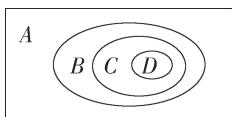

# 综合运用

3. 解析 (1) $\{x \mid x$ 是立德中学高一一班的学生.
(2) $\{x\mid x$ 是等边三角形 $\}$ .

(3)∅.

(4) {4}. (答案不唯一)

4. 解析 集合 D 表示直线 2x-y=1 与直线 $x+4y=5$ 的交点 $(1,1)$ ，而 $(1,1)$ 在直线 y=x 上，∴ $D \not\subseteq C$ .

# 拓广探索

5. 解析 (1) $\because P = Q$ ,

$$
\therefore \left\{ \begin{array}{l} {a = - 1,} \\ {1 = - b,} \end{array} \text {即} \left\{ \begin{array}{l} a = - 1, \\ b = - 1, \end{array} \right. \therefore a - b = 0. \right.
$$

(2) $\because B\subseteq A,$

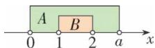

∴ 利用数轴分析法(如图), 可知 $a \geqslant 2$ .

# 1.3 集合的基本运算

# 练习

1. 解析 $A \cap B = \{3, 5, 6, 8\} \cap \{4, 5, 7, 8\} = \{5, 8\}$ ; $A \cup B = \{3, 5, 6, 8\} \cup \{4, 5, 7, 8\} = \{3, 4, 5, 6, 7, 8\}$ .

2. 解析 $A=\{x \mid x^{2}-4x-5=0\}=\{x \mid (x-5) \cdot (x+1)=0\}=\{5,-1\}, B=\{x \mid x^{2}=1\}=\{-1,1\},$ $\therefore A \cup B = \{5, -1\} \cup \{-1, 1\} = \{-1, 1, 5\}, A \cap B = \{5, -1\} \cap \{-1, 1\} = \{-1\}.$

3. 解析 $A \cap B = \{x \mid x \text{ 是等腰三角形, 且 } x \text{ 是直角三角形}\} = \{x \mid x \text{ 是等腰直角三角形}\}$ . $A \cup B = \{x \mid x \text{ 是等腰三角形, 或 } x \text{ 是直角三角形}\} = \{x \mid x \text{ 是等腰三角形或直角三角形}\}$ .

4. 解析 $A \cup B = \{x \mid x \text{ 是幸福农场的汽车或拖拉机}\}$ .

# 练习

1. 解析 $\complement_U A = \{1, 3, 6, 7\}, \complement_U B = \{2, 4, 6\}$ , $\therefore A \cap (\complement_U B) = \{2, 4, 5\} \cap \{2, 4, 6\} = \{2, 4\}$ , $(\complement_U A) \cap (\complement_U B) = \{1, 3, 6, 7\} \cap \{2, 4, 6\} = \{6\}$ .

2. 解析 $B \cap C = \{x \mid x \text{ 是菱形, 且 } x \text{ 是矩形}\} = \{x \mid x \text{ 是正方形}\}$ ,

$\complement_{A}B=\{x|x$ 是平行四边形,但 x 不是菱形 $\}=\{x|x$ 是邻边不相等的平行四边形 $\}$ , $\complement_{S}A=\{x|x$ 是平行四边形或梯形,但 x 不是平行四边形 $\}=\{x|x$ 是梯形 $\}$ .

# 3. 解析

(1)

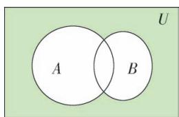

text_image

A
B
U

(2)

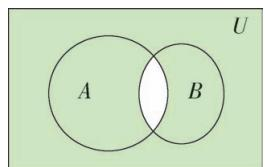

text_image

A
B
U

# 习题 1.3

# 复习巩固

1. 解析 $B = \{x \mid 3x - 7 \geqslant 8 - 2x\}$

$= \{x\mid x\geqslant 3\}$ ，借助数轴得

$$
A \cup B = \{x \mid 2 \leqslant x <   4 \} \cup \{x \mid x \geqslant 3 \}
$$

$$
= \{x \mid x \geqslant 2 \},
$$

$$
A \cap B = \{x \mid 2 \leqslant x <   4 \} \cap \{x \mid x \geqslant 3 \}
$$

$$
= \{x \mid 3 \leqslant x <   4 \}.
$$

2. 解析 $A = \{1, 2, 3, 4, 5, 6, 7, 8\}, B = \{1, 2,$

$3\}, C = \{3, 4, 5, 6\}, \therefore A \cap B = \{1, 2, 3\}, A \cap C = \{3, 4, 5, 6\}$ ,

$$
B \cup C = \{1, 2, 3, 4, 5, 6 \}, B \cap C = \{3 \},
$$

$$
\therefore A \cap (B \cup C) = \{1, 2, 3, 4, 5, 6 \}
$$

$$
A \cup (B \cap C) = \{1, 2, 3, 4, 5, 6, 7, 8 \}.
$$

3. 解析 “每位同学最多只能参加两项比赛” 表示为 $A \cap B \cap C = \varnothing$ .

(1) $A \cup B$ 表示参加 100 m 或参加 200 m 跑的同学.

(2) $A \cap C$ 表示既参加 100 m 又参加 400 m 跑的同学.

# 综合运用

4. 解析 因为 \(A = \{x \mid 3 \leqslant x < 7\}\), \(B = \{x \mid 2 < x < 10\}\), 所以 \(A \cup B = \{x \mid 2 < x < 10\}\), \(A \cap B = \{x \mid 3 \leqslant x < 7\}\), \(\complement\_{\mathbb{R}} A = \{x \mid x < 3\}\), 或 \(x \geqslant 7\}\), \(\complement\_{\mathbb{R}} B = \{x \mid x \leqslant 2\}\), 或 \(x \geqslant 10\}\), 所以 \(\complement\_{\mathbb{R}} (A \cup B) = \{x \mid x \leqslant 2\}\), 或 \(x \geqslant 10\}\); \(\complement\_{\mathbb{R}} (A \cap B) = \{x \mid x < 3\}\), 或 \(x \geqslant 7\}\); (\(\complement\_{\mathbb{R}} A\)) \(\cap B = \{x \mid 2 < x < 3\}\), 或 \(7 \leqslant x < 10\}\); \(A \cup (\complement\_{\mathbb{R}} B) = \{x \mid x \leqslant 2\}\), 或 \(3 \leqslant x < 7\)\), 或 \(x \geqslant 10\}\).

5. 解析 当 a=3 时, $A=\{3\}$ , $B=\{1,4\}$ , $A\cup B=\{1,3,4\}$ , $A\cap B=\varnothing$ ;

当 a=1 时, $A=\{1,3\}$ , $B=\{1,4\}$ , $A\cup B=\{1,3,4\}$ , $A\cap B=\{1\}$ ;

当 a=4 时, $A=\{3,4\}$ , $B=\{1,4\}$ , $A\cup B=\{1,3,4\}$ , $A\cap B=\{4\}$ ;

当 $a \neq 1, a \neq 3$ 且 $a \neq 4$ 时， $A \cup B = \{1, 3, 4, a\}$ ， $A \cap B = \varnothing$ .

# 拓广探索

6. 解析 $U = \{0, 1, 2, 3, 4, 5, 6, 7, 8, 9, 10\}$ , ∵ A $\cap(\complement_{U}B)=\{1,3,5,7\},\therefore1,3,5,7\in\complement_{U}B.$ ∴ $B=\complement_{U}(\complement_{U}B)=\{0,2,4,6,8,9,10\}$ .

# 1.4 充分条件与必要条件

# 1.4.1 充分条件与必要条件

# 练习

1. 解析 (1) 是充分条件. (2) 不是充分条件. (3) 是充分条件.

2. 解析 (1) 是必要条件。(2) 不是必要条件.

3. 解析 充分条件: (1) $\angle1 = \angle4$ , (2) $\angle1 = \angle2$ , (3) $\angle1 + \angle3 = 180^{\circ}$ .

必要条件:(1) $\angle1=\angle4,(2)\angle1=\angle2,(3)$ $\angle1+\angle3=180^{\circ}$ .

# 1.4.2 充要条件

# 练习

1. 解析 (1) $p$ 是 $q$ 的充要条件. (2) $p$ 是 $q$ 的

充要条件.(3)p不是q的充要条件.

2. 解析 “两个三角形全等”的充要条件:

(1)两个三角形三边对应相等.  
(2)两个三角形的两边及夹角对应相等. “两个三角形相似”的充要条件:  
(1)两个三角形三边对应成比例.  
(2)两个三角形三角对应相等.

3. 证明 作 $AE \perp BC$ 于 $E, DF \perp BC$ 于 $F$ . $\because AD \parallel BC, \therefore AE = DF$ .

(1) 充分性. 由 AE = DF, AC = BD 知, Rt△AEC ≅ Rt △DFB, ∴ ∠ACE = ∠DBF, ∴ △ABC ≅ △DCB, ∴ AB = DC, ∴ 梯形 ABCD 是等腰梯形.

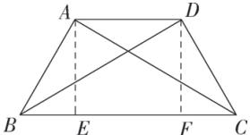

text_image

A
D
B
E
F
C

(2) 必要性. 由等腰梯形知 AB = DC,
Rt△ABE≌Rt△DCF, ∴∠ABE=∠DCF,
∴ △ABC≌△DCB, ∴ AC=DB.

# 习题 1.4

复习巩固

1. 解析 (1) $p: 0 < x < 1, q: 0 < x < 2$ .

(2) $p:0<x<2,q:0<x<1.$   
(3) $p:x>1,q:x-1>0.$

2. 解析 (1) $p$ 是 $q$ 的必要不充分条件. (2) $p$ 是 $q$ 的充要条件. (3) $p$ 是 $q$ 的充分不必要条件. (4) $p$ 是 $q$ 的必要不充分条件. (5) $p$ 是 $q$ 的既不充分又不必要条件.

3. 解析 (1) 真. (2) 假. (3) 假. (4) 假.

综合运用

4. 解析 (1) 充分条件. (2) 必要条件. (3) 充要条件.

$$
\begin{array}{l} a c - b c = 0 \Leftrightarrow \frac {(a - b) ^ {2}}{2} + \frac {(b - c) ^ {2}}{2} + \frac {(c - a) ^ {2}}{2} = 0 \Leftrightarrow \\ \left\{ \begin{array}{l} a - b = 0, \\ b - c = 0, \Leftrightarrow a = b = c. \\ c - a = 0 \end{array} \right. \\ \end{array}
$$

5. 证明 $a^2 + b^2 + c^2 = ab + ac + bc \Leftrightarrow a^2 + b^2 + c^2 - ab -$

拓广探索

6. 解析 若 $\triangle ABC$ 是锐角三角形, 则 $a^{2} + b^{2} > c^{2}$ ;

若 $\triangle ABC$ 是钝角三角形, $\angle C$ 为钝角,则有 $a^{2}+b^{2}<c^{2}$ .

证明: 当 $\triangle ABC$ 是锐角三角形时, 过点 A 作 $AD \perp BC$ , 垂足为 D, 设 CD = x, 则有 BD = a - x, 根据勾股定理, 得 $b^{2} - x^{2} = c^{2} - (a - x)^{2}$ ,
整理得 $a^{2}+b^{2}=c^{2}+2ax$

$$
\because a > 0, x > 0, \therefore 2 a x > 0, \therefore a ^ {2} + b ^ {2} > c ^ {2}.
$$

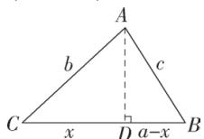

当 $\triangle ABC$ 是钝角三角形时,过B作 $BD\perp AC$ ,交AC的延长线于D.

设 CD=y，则有 $BD^{2}=a^{2}-y^{2}$ ，

根据勾股定理, 得 $(b+y)^{2}+(a^{2}-y^{2})=c^{2}$ , 即 $a^{2}+b^{2}+2by=c^{2}, \because b>0, y>0, \therefore 2by>0, \therefore a^{2}+b^{2}<c^{2}$ .

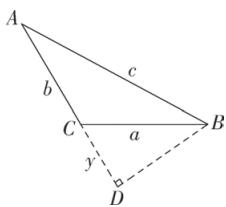

text_image

A
b
c
C
a
B
y
D

# 1.5 全称量词与存在量词

# 1.5.1 全称量词与存在量词

练习

1. 解析 (1) 真.(2) 假.(3) 假.  
2. 解析 (1) 真. (2) 假. (3) 真.

# 1.5.2 全称量词命题和存在量词命题的否定

练习

1. 解析 (1) $\exists x \in \mathbf{Z}, n \notin \mathbf{Q}$ .

(2) 存在一个奇数, 它的平方不是奇数.  
(3) 存在一个平行四边形不是中心对称图形.

2. 解析 (1) 所有三角形都不是直角三角形.

(2) 所有梯形都不是等腰梯形.  
(3)任意实数的绝对值都是正数.

# 习题 1.5

复习巩固

1. 解析 (1) 真.(2) 真.(3) 真.(4) 假  
2. 解析 (1) 真. (2) 真. (3) 真. (4) 假.

(4) 若 $n = 2k, k \in Z$ ，则 $n^{2} + 1 = 4k^{2} + 1$ 不是 4 的倍数；

若 $n=2k-1, k \in Z$ ，则 $n^{2}+1=4k^{2}-4k+2$ ，不是 4 的倍数，故命题为假命题.

3. 解析 (1) $\exists x \in \mathbf{Z}, |x| \notin \mathbf{N}$ .

(2)有些可以被5整除的整数,末位数字不是0.  
(3) $\forall x\in \mathbf{R},x + 1 <   0.$   
(4) 所有的四边形, 它们的对角线不互相垂直.

综合运用

4. 解析 (1) 假. 平面直角坐标系下, 有些直线不与 $x$ 轴相交.

(2) 真. 有些二次函数的图象不是轴对称图形.  
(3) 假. 任意一个三角形的内角和都不小于 $180^{\circ}$ .  
(4) 真. 任意一个四边形, 它的四个顶点都在同一个圆上.

5. 解析 (1) 所有的平行四边形的对角线互相平分.

否定:有的平行四边形的对角线不互相平分.

(2)任意三个连续整数的乘积是6的倍数. 否定:存在三个连续整数的乘积不是6的倍数.

(3) 至少有一个三角形不是中心对称图形.

否定:所有的三角形都是中心对称图形.

(4)有些一元二次方程没有实数根.

否定:任意一个一元二次方程都有实数根.

拓广探索

6. 解析 (1) 不对.

①的否定是: $\exists x>1$ , 使 $2x+1\leqslant5$ (真命题).  
②的否定是:至少有一个等腰梯形的对角线不相等(假命题).  
(2) 略.

复习参考题1

复习巩固

1. 解析 (1) $A = \{-3, 3\}$ . (2) $B = \{1, 2\}$ .   
(3) $C = \{1,2\}$ .   
2. 解析 (1) $\{P \mid PA = PB\}$ 表示到两定点距离相等的点的集合, 即 $AB$ 的垂直平分线.  
(2) $\{P|PO=3\ cm\}$ 表示到定点 O 的距离等于 3 cm 的点的集合, 即以 O 点为圆心, 3 cm 为半径的圆.

3. 解析 $\triangle ABC$ 的外心.

4. 答案 (1) 充要条件

(2) 充分不必要条件  
(3) 必要不充分条件  
(4)既不充分也不必要条件

5. 答案 (1) 假 (2) 假 (3) 假 (4) 真

6. 解析 (1) $\forall x \in \mathbf{R}, x^2 \geqslant 0$ . 是真命题.

(2) $\forall a \in \mathbf{R}$ , 二次函数 $y = x^2 + a$ 的图象关于 $y$ 轴对称. 是真命题.  
(3) $\exists x, y \in \mathbf{Z}$ , 使 $2x + 4y = 3$ . 是假命题.  
(4) $\exists x \in \{\text{无理数}\}, x^3 \in \mathbf{Q}$ . 是真命题.

7. 解析 (1) $\exists a \in \mathbf{R}$ , 一元二次方程 $x^{2} - ax - 1 = 0$ 没有实根. 是真命题.

(2) 至少有一个正方形不是平行四边形. 是假命题.  
(3) $\forall m\in \mathbf{N},\sqrt{m^2 + 1}\notin \mathbf{N}.$ 是假命题.  
(4)任意一个四边形ABCD的内角和都等于 $360^{\circ}$ .是真命题.

综合运用

8. 解析 $A \cap B =$

$$
\begin{array}{l} \left\{(x, y) \mid \left\{ \begin{array}{l} 2 x - y = 0 \\ 3 x + y = 0 \end{array} \right. \right\} = \{(0, 0) \}, \\ A \cap C = \left\{(x, y) \middle | \left\{ \begin{array}{l} 2 x - y = 0 \\ 2 x - y = 3 \end{array} \right. \right\} = \varnothing . \\ \end{array}
$$

$A \cap B = \{(0,0)\}$ 的几何意义: 直线 2x - y = 0
与直线 $3x + y = 0$ 交于坐标原点.

$A \cap C = \varnothing$ 的几何意义: 直线 $2x - y = 0$ 与直线 $2x - y = 3$ 平行.

9. 解析 $\because A \cup B = A, \therefore B \subseteq A, \therefore a + 2 \in A.$

当 $a+2=3$ ，即 a=1 时， $A=\{1,3,1\}$ ，不满足集合中元素的互异性，不符合题意；

当 $a+2=a^{2}$ 时, a=-1(舍), a=2.

此时 $A=\{1,3,4\}$ , $B=\{1,4\}$ , 符合题意.

∴ 存在实数 a=2，使得 $A \cup B = A$ .

10. 解析 (1) 任意一个直角三角形的两直角边的平方和等于斜边的平方.

(2)任意一个三角形的内角和都等于 $180^{\circ}$ .

拓广探索

11. 解析 设只参加田径一项比赛的有 x 人. 根据题意作出如图所示的 Venn 图.

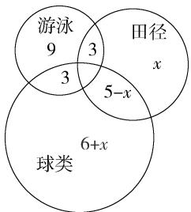

other

| Category | Count |
| -------- | ----- |
| 游泳     | 9     |
| 田径     | 3     |
| 球类     | 6+x   |
| 5-x      | 3     |

由 Venn 图知只参加游泳一项比赛的有 9 人，

又由题意知 $9+3+3+x+5-x+6+x=28$ ，解得 x=2.

故同时参加田径和球类比赛的有 3 人.

12. 解析 (1) $\forall n \in \mathbf{N}_{+}, 1 + 3 + 5 + \dots + (2n - 1) = n^{2}$ .

(2)任意一个三角形三边上的高交于一点.

# 第二章 一元二次函数、方程和不等式

# 2.1 等式性质与不等式性质

练习

1. 解析 (1) $h \leqslant 4$ .

(2) $a+b\geqslant0.$

(3) $\left\{ \begin{array}{l}(L + 10)(W + 10) <   350,\\ L > 4W. \end{array} \right.$

2. 解析 $\because (x + 3)(x + 7) - (x + 4)(x + 6)$

$$
= x ^ {2} + 1 0 x + 2 1 - x ^ {2} - 1 0 x - 2 4
$$

$$
= - 3 <   0,
$$

$$
\therefore (x + 3) (x + 7) <   (x + 4) (x + 6).
$$

3. 证明 $\because a > b, \therefore a - \frac{a + b}{2} = \frac{a - b}{2} > 0,$

$$
\therefore a > \frac {a + b}{2},
$$

又 $\frac{a + b}{2} - b = \frac{a - b}{2} > 0, \therefore \frac{a + b}{2} > b,$

$$
\therefore a > \frac {a + b}{2} > b.
$$

练习

1. 解析 性质 $1:a>b \Leftrightarrow a-b > 0 \Leftrightarrow b-a < 0 \Leftrightarrow b < a.$

性质 3: $\because (a+c)-(b+c)=a-b>0, \therefore a+c>b+c.$

性质 4:ac-bc=(a-b)c,∵a>b,∴a-b>0,

又 $c > 0, \therefore (a - b)c > 0,$

$\therefore ac - bc > 0$ ，即 $ac > bc$

性质 6: $\left.\begin{aligned}a>b&>0,c>0\Rightarrow ac>bc\\ c&>d>0,b&>0\Rightarrow bc>bd\end{aligned}\right\}\Rightarrow ac>bd.$

2. 答案 (1) > (2) < (3) < (4) <

# 习题2.1

复习巩固

1. 略.

2. 解析 经 n 年后, 方案 B 的投入不少于方案 A 的投入,

所以 $100+10(n-1)\geqslant500$ ，即 $n\geqslant41$ .

3. 解析 (1) 因为 $2x^{2} + 5x + 9 - (x^{2} + 5x + 6) = x^{2} + 3 > 0$ ，所以 $2x^{2} + 5x + 9 > x^{2} + 5x + 6$ .

(2) 因为 $(x-3)^{2}-(x-2)(x-4)=(x^{2}-6x+9)$

$$
- (x ^ {2} - 6 x + 8) = 1 > 0,
$$

所以 $(x-3)^{2}>(x-2)(x-4)$ .

(3) 因为 $x^{2}-(x^{2}-x+1)=x-1, x>1$ ,

所以 x-1>0，所以 $x^{2}>x^{2}-x+1$ .

(4) 因为 $x^{2}+y^{2}+1-2(x+y-1)$

$$
= x ^ {2} + y ^ {2} + 1 - 2 x - 2 y + 2
$$

$$
= (x - 1) ^ {2} + (y - 1) ^ {2} + 1 > 0,
$$

所以 $x^{2}+y^{2}+1>2(x+y-1)$ .

4. 解析 由题意得 $b=a+2,50<10a+b<60, a \in N^{*}, b \in N, \therefore a=5, b=7$ ，即这个两位数是 57.

5. 解析 $\because 2 < a < 3, \therefore 4 < 2a < 6,$

又∵ -2<b<-1,∴ $2<2a+b<5$ .

6. 证明 $\left.\begin{aligned}c<b&\Rightarrow c-b<0\\ b&<a\Rightarrow b-a<0\end{aligned}\right\}\Rightarrow(c-b)+(b-a)<0,$

即 $c - a < 0, \therefore c < a$ .

综合运用

7. 证明 $\because c < d < 0, \therefore -c > -d > 0,$

又∵ a > b > 0, ∴ a - c > b - d > 0,

$$
\therefore 0 <   \frac {1}{a - c} <   \frac {1}{b - d}, \text {又} e <   0,
$$

$$
\therefore \frac {e}{a - c} > \frac {e}{b - d}.
$$

8.B 对于 A, $c^{2}=0$ 时不成立; 对于 B,

$\because a>b>0,\therefore a^{2}-b^{2}=(a+b)(a-b)>0,\therefore a^{2}>b^{2},\therefore B$ 成立；对于 C, $a<b<0\Rightarrow a^{2}>ab>b^{2}$ ,

∴ C不成立; 对于 D, ∵ a < b < 0, ∴ $\frac{1}{a} > \frac{1}{b}$ ,

∴ D不成立.

9. 证明 设周长为 l，则圆的半径为 $\frac{l}{2\pi}$ ,

$$
S _ {\text {圆}} = \pi \left(\frac {l}{2 \pi}\right) ^ {2} = \frac {l ^ {2}}{4 \pi}.
$$

正方形的边长为 $\frac{l}{4}$

$$
S _ {\text {正方形}} = \left(\frac {l}{4}\right) ^ {2} = \frac {l ^ {2}}{1 6}.
$$

$\because \frac{l^{2}}{4\pi} > \frac{l^{2}}{16}, \therefore$ 圆的面积更大.

原因:自来水管的横截面是圆形的,可以最大面积地使水通过,减少阻力.

10. 解析 $\frac{a+m}{b+m} > \frac{a}{b}.$

证明： $\because \frac{a + m}{b + m} -\frac{a}{b} = \frac{(b - a)m}{b(b + m)} >0,$

$$
\therefore \frac {a + m}{b + m} > \frac {a}{b}.
$$

拓广探索

11. 证明 假设 $\sqrt{a} \leqslant \sqrt{b}$ .

由性质7知 $(\sqrt{a})^2 \leqslant (\sqrt{b})^2$

即 $a \leqslant b$ ，这与已知 $a > b$ 矛盾，

故假设不正确,从而 $\sqrt{a}>\sqrt{b}$ .

12. 解析 设安排 A 型货箱 x 节, B 型货箱 y 节, 总运费为 z (万元).

由题意可得 $\left\{\begin{aligned}&35x+25y\geqslant1\ 530,\\ &15x+35y\geqslant1\ 150,\\ &x+y=50,\\ &x,y\in\mathbf{N}^{*},\end{aligned}\right.$

解得 $28 \leqslant x \leqslant 30$ ,

所以 $\left\{\begin{aligned}x=28,\\ y=22\end{aligned}\right.$ 或 $\left\{\begin{aligned}x=29,\\ y=21\end{aligned}\right.$ 或 $\left\{\begin{aligned}x=30,\\ y=20.\end{aligned}\right.$

所以共有三种方案,方案一:安排 A 型货箱 28 节,B 型货箱 22 节;方案二:安排 A 型货箱 29 节,B 型货箱 21 节;方案三:安排 A 型货箱 30 节,B 型货箱 20 节.

当 $\left\{\begin{aligned}x=30,\\ y=20\end{aligned}\right.$ 时，总运费 $z=0.5\times30+0.8\times20=$ 31(万元)，此时运费最少.

# 2.2 基本不等式

练习

1. 证明 $\because \left(\frac{a + b}{2}\right)^2 - ab = \frac{a^2 + b^2 - 2ab}{4} = \frac{(a - b)^2}{4} \geqslant 0, \therefore ab \leqslant \left(\frac{a + b}{2}\right)^2.$

2. 证明 (1) $\because x, y \in \mathbf{R}_{+}$ , 且 $x \neq y$ , $\therefore \frac{x}{y} + \frac{y}{x} > 2$

$\sqrt{\frac{x}{y}\cdot\frac{y}{x}}=2,$ 即 $\frac{x}{y}+\frac{y}{x}>2.$

(2) $\because x + y > 2\sqrt{xy} > 0, \therefore \frac{1}{x + y} < \frac{1}{2\sqrt{xy}}, \therefore \frac{2xy}{x + y} <$

$\frac{2xy}{2\sqrt{xy}}=\sqrt{xy}$ ，即 $\frac{2xy}{x+y}<\sqrt{xy}$ .

3. 解析 $x^{2}+\frac{1}{x^{2}}\geqslant2\sqrt{x^{2}\cdot\frac{1}{x^{2}}}=2$ ，当且仅当 $x=\pm1$ 时，等号成立，故 $x=\pm1$ 时，取小值，最小值是 2.

4. 解析 $1 - x^{2} = (1 + x)(1 - x) \leqslant$

$\left[\frac{(1 + x) + (1 - x)}{2}\right]^2 = 1,$

当且仅当 $1 - x = 1 + x$ ，即 $x = 0$ 时，等号成立， $\therefore$ 当 $x = 0$ 时， $1 - x^2$ 取最大值1.

5. 解析 设两条直角边的长分别为 a cm、b cm, a > 0 且 b > 0.

因为直角三角形的面积等于50，

即 $\frac{1}{2} ab = 50\mathrm{cm}^2$

所以 $a + b \geqslant 2\sqrt{ab} = 2\sqrt{100} = 20$

当且仅当 a=b=10 时等号成立.

所以当两条直角边的长均为 $10 \, cm$ 时, 两条直角边的和最小, 最小值是 $20 \, cm$ .

练习

1. 解析 设矩形的长、宽分别为 $a \mathrm{~cm}, b \mathrm{~cm}, a > 0, b > 0$

因为周长等于 $20 \, cm$ ，所以 $a + b = 10$ 。

所以 $S = ab \leqslant \left(\frac{a + b}{2}\right)^2 = \left(\frac{10}{2}\right)^2 = 25$

当且仅当 a=b=5 时等号成立.

所以折成长与宽均为 $5 \, cm$ 的矩形, 面积最大.

2. 解析 设矩形的长为 $x \, m$ ，宽为 $y \, m$ ，菜园的面积为 $S \, m^{2}$ ，

则 $x+2y=30$ ,

由基本不等式与不等式的性质,可得

$$
S = \frac {1}{2} \cdot x \cdot 2 y \leqslant \frac {1}{2} \left(\frac {x + 2 y}{2}\right) ^ {2}
$$

$$
= \frac {1}{2} \times \frac {9 0 0}{4} = \frac {2 2 5}{2},
$$

当且仅当 x=2y，即 $x=15, y=\frac{15}{2}$ 时，等号成立，此时菜园的面积最大，最大面积是 $\frac{225}{2}$ m $^{2}$ .

3. 解析 设底面的长、宽分别为 $a \, m, b \, m, a > 0, b > 0.$

因为体积等于 $32 \, m^{3}$ ，高为 $2 \, m$ ，所以底面积为 $16 \, m^{2}$ ，即 ab = 16。

所以用纸面积为 $2ab+4b+4a=32+4(a+b)\geqslant$ $32+4\times2\sqrt{ab}=32+32=64,$

当且仅当 a=b=4 时等号成立.

所以当底面的长与宽均为 $4 \, m$ 时, 用纸最少.

4. 解析 设矩形的长和宽分别为 $x \, cm$ 和 $y \, cm$ ，圆柱的侧面积为 $z \, cm^{2}$ ，因为 $2(x + y) = 36$ ，即 $x + y = 18$ ，

所以 $z = 2\pi \cdot x\cdot y\leqslant 2\pi \left(\frac{x + y}{2}\right)^{2} = 162\pi ,$

当且仅当 x=y=9 时, 等号成立, 即长、宽均为 9 cm 时, 圆柱的侧面积最大.

# 习题2.2

复习巩固

1. 解析 (1) $\because x > 1, \therefore x - 1 > 0,$

$$
\therefore x + \frac {1}{x - 1} = (x - 1) + \frac {1}{x - 1} + 1 \geqslant 2.
$$

$$
\sqrt {(x - 1) \cdot \frac {1}{x - 1}} + 1 = 3.
$$

当且仅当 $x-1=\frac{1}{x-1}$ ，即 $x=2(x=0$ 舍去）时，
等号成立,此时 $x+\frac{1}{x-1}$ 取最小值 3.

(2) $\because x(10 - x) \leqslant \left[\frac{x + (10 - x)}{2}\right]^2 = 25,$

当且仅当 x=10-x，即 x=5 时，等号成立，
∴ $x(10-x)$ 的最大值为 25，

∴ $\sqrt{x(10-x)}$ 的最大值为 5.

2. 解析 (1) 设两个正数分别为 $a, b$ , 且 $ab = 36$ ,

所以 $a+b \geqslant 2\sqrt{ab} = 2\sqrt{36} = 12$ ,

当且仅当 a=b=6 时等号成立.

所以当这两个正数均为6时,它们的和最小.

(2)设两个正数分别为 a、b，且 $a+b=18$ ，

所以 $ab \leqslant \left(\frac{a + b}{2}\right)^2 = \left(\frac{18}{2}\right)^2 = 81$

当且仅当 a=b=9 时等号成立.

所以当这两个正数均为9时,它们的积最大.

3. 解析 设房屋垂直于墙的边长为 $x \, m$ 、平行于墙的边长为 $y \, m$ ，总造价为 z 元，

则 $xy = 48$ ，即 $y = \frac{48}{x}$

$$
\begin{array}{l} z = 3 y \times 1 2 0 0 + 6 x \times 8 0 0 + 5 8 0 0 \\ = \frac {4 8 \times 3 6 0 0}{x} + 4 8 0 0 x + 5 8 0 0 \\ \geqslant 2 \sqrt {3 6 0 0 \times 4 8 \times 4 8 0 0} + 5 8 0 0 \\ = 6 3 4 0 0. \\ \end{array}
$$

当且仅当 $\frac{48\times3\ 600}{x}=4\ 800x$ ，即x=6时，等号成立，此时y=8，最小值为63 400，则当房屋垂直于墙的边长为6 m，平行于墙的边长为8 m时，房屋总造价最低，最低总造价为63 400元。

# 综合运用

4. 解析 $\because x>0, y>0, \therefore x+y\geqslant2\sqrt{xy}$ ,

同理 $y + z \geqslant 2\sqrt{yz}, z + x \geqslant 2\sqrt{zx}$ ,

$\therefore (x+y)(y+z)(x+z)\geqslant8xyz,$

当且仅当 x=y=z 时等号成立.

5. 解析 $\because x > 0, \therefore 3x + \frac{4}{x} \geqslant 2\sqrt{3x \cdot \frac{4}{x}} =$

$4\sqrt{3}$ ，当且仅当 $3x = \frac{4}{x}$ ，即 $x = \frac{2\sqrt{3}}{3}$ $\left(x=-\frac{2\sqrt{3}}{3}\text{舍去}\right)$ 时，等号成立，

$\therefore -3x - \frac{4}{x} \leqslant -4\sqrt{3}, \therefore 2 - 3x - \frac{4}{x} \leqslant 2 - 4\sqrt{3}$ , 即 $2 - 3x - \frac{4}{x}$ 的最大值是 $2 - 4\sqrt{3}$ .

6. 解析 仓库应建在距离车站 x 千米处.

由题意设 $y_{1}=\frac{k_{1}}{x}$ ，当 x=10 时， $y_{1}=\frac{k_{1}}{10}=2$ ，

$$
\therefore k _ {1} = 2 0, \therefore y _ {1} = \frac {2 0}{x}.
$$

设 $y_{2}=k_{2}x$ ，当 x=10 时， $y_{2}=10k_{2}=8$ ，

$$
\therefore k _ {2} = \frac {4}{5}, \therefore y _ {2} = \frac {4}{5} x.
$$

两项费用之和 $y = y_{1} + y_{2} = \frac{20}{x} + \frac{4}{5} x \geqslant$

$$
2 \sqrt {\frac {2 0}{x} \cdot \frac {4}{5} x} = 8 (\text {万元}),
$$

当且仅当 $\frac{20}{x}=\frac{4}{5}x$ ，即 $x=5(x=-5$ 舍去 $)$ 时，

等号成立,∴仓库应建在距离车站5 km处,才能使两项费用之和最小,最小费用为8万元.

# 拓广探索

7. 解析 设天平的左臂长为 a, 右臂长为 b, 不妨设 a > b, 第一次称得的黄金为 x g, 第二次为 y g, 则 5a = bx, ya = 5b,

$$
\therefore x + y = \frac {5 a}{b} + \frac {5 b}{a} > 5 \times 2 \sqrt {\frac {a}{b} \cdot \frac {b}{a}} = 1 0,
$$

所以顾客实际所得黄金大于 $10 \, g$ .

8. 解析 如图, AB = x cm, 则 $BC = (12 - x) \, \text{cm} \, (0 < x < 12)$ ,

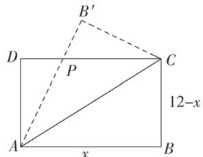

text_image

B'
D
P
C
12-x
A
x
B

$$
A P = x - D P, \because D P ^ {2} + (1 2 - x) ^ {2} = (x - D P) ^ {2},
$$

$$
\therefore D P = 1 2 - \frac {7 2}{x},
$$

$$
\therefore S _ {\triangle A D P} = \frac {1}{2} \cdot A D \cdot D P = \frac {1}{2} (1 2 - x) \cdot
$$

$$
\left(1 2 - \frac {7 2}{x}\right) = 1 0 8 - \left(6 x + \frac {4 3 2}{x}\right) (0 <   x <   1 2).
$$

$$
\because x > 0, \therefore 6 x + \frac {4 3 2}{x} \geqslant 2 \sqrt {6 x \cdot \frac {4 3 2}{x}} = 7 2 \sqrt {2},
$$

$$
\therefore S = 1 0 8 - \left(6 x + \frac {4 3 2}{x}\right) \leqslant 1 0 8 - 7 2 \sqrt {2},
$$

当且仅当 $6x = \frac{432}{x}$ 即 $x = 6\sqrt{2} (x = -6\sqrt{2}$ 舍去)时，等号成立，即 $\triangle ADP$ 面积的最大值为 $(108 - 7\sqrt{2})\mathrm{cm}^2$ ，此时 $x = 6\sqrt{2}$

# 2.3 二次函数与一元二次方程、不等式

练习

1. 解析 (1) $\{x \mid x < -2, \text{或 } x > 3\}$ .

(2) $\left\{x\mid -1\leqslant x\leqslant \frac{10}{3}\right\} .$

(3) $\{x\mid x\neq2\}$ .

(4) ∅.

(5) $\left\{x\mid x\leqslant-1,或x\geqslant\frac{3}{2}\right\}.$

(6) R.

2. 解析 (1) 使 $y = 3x^{2} - 6x + 2$ 的值等于 0 的 $x$ 的取值集合是 $\left\{1 - \frac{\sqrt{3}}{3}, 1 + \frac{\sqrt{3}}{3}\right\}$ ;

使 $y=3x^{2}-6x+2$ 的值大于 0 的 x 的取值集合
是 $\left\{x\mid x<1-\frac{\sqrt{3}}{3},\text{或} x>1+\frac{\sqrt{3}}{3}\right\}$ ;

使 $y=3x^{2}-6x+2$ 的值小于 0 的 x 的取值集合
是 $\left\{x\mid1-\frac{\sqrt{3}}{3}<x<1+\frac{\sqrt{3}}{3}\right\}$ .

(2) 使 $y=25-x^{2}$ 的值等于 0 的 x 的取值集合是 $\{-5,5\}$ ;

使 $y=25-x^{2}$ 的值大于 0 的 x 的取值集合是 $\{x\mid-5<x<5\}$ ;

使 $y=25-x^{2}$ 的值小于 0 的 x 的取值集合是 $\{x \mid x<-5, \text{或 } x>5\}$ .

(3) 因为对于方程 $x^{2}+6x+10=0, \Delta=36-40<0$ ，所以使 $y=x^{2}+6x+10$ 的值等于 0 的 x 的取值集合为 $\varnothing$ ；使 $y=x^{2}+6x+10$ 的值小于 0 的 x 的取值集合为 $\varnothing$ ；使 $y=x^{2}+6x+10$ 的值大于 0 的 x 的取值集合为 R.

(4) 使 $y = -3x^{2} + 12x - 12$ 的值等于 0 的 x 的取值集合为 $\{2\}$ ;

使 $y = -3x^{2} + 12x - 12$ 的值小于 0 的 x 的取值集合为 $\{x \mid x \neq 2\}$ ;

使 $y=-3x^{2}+12x-12$ 的值大于 0 的 x 的取值集合为 $\varnothing$ .

练习

1. 解析 令 $x^{2} + x - 12 \geqslant 0$ ，解得 $x \leqslant -4$ 或 $x \geqslant 3$ ，即当 $x \leqslant -4$ 或 $x \geqslant 3$ 时， $\sqrt{x^2 + x - 12}$ 有意义.

2. 解析 设花卉带的宽度为 x 米, 则草坪面积为 $(8-2x)(6-2x)$ ,

由题意得 $(8-2x)(6-2x)\leqslant24$ ，即 $x^{2}-7x+6\leqslant0$ ，解得 $1\leqslant x\leqslant6$ ，

又∵ $\left\{\begin{aligned}8-2x&>0,\\ 6-2x&>0,\end{aligned}\right.$ ∴x<3,

综上,花卉带的宽度应在1 m到3 m之间(包括1 m,不包括3 m).

3. 解析 设每个削笔器售价 x 元，

由题意得 $\left\{\begin{aligned}x&\geqslant15,\\ x[30-2(x-15)]&>400,\end{aligned}\right.$

解得 $15 \leqslant x < 20$ ,

所以售价应大于或等于 15 元,且小于 20 元.

# 习题2.3

# 复习巩固

1. 解析 (1) $\left\{x \mid -\frac{\sqrt{13}}{2} < x < \frac{\sqrt{13}}{2}\right\}$ .

(2) $\{x\mid3<x<7\}$ .

(3) $\{x \mid x < -2$ 或 $x > 5\}$ .

(4) ∅.

2. 解析 (1) 令 $x^{2} - 4x + 9 = 0$

因为 $\Delta = -20 < 0$ ，所以方程 $x^{2} - 4x + 9 = 0$ 无实数根，

所以不等式 $x^{2}-4x+9\geqslant0$ 的解集是 R.

所以当 $x \in \mathbf{R}$ 时， $\sqrt{x^2 - 4x + 9}$ 有意义.

(2) 令 $-2x^{2}+12x-18 \geqslant 0$ ，即 $(x-3)^{2} \leqslant 0$ ，
所以 x=3 时， $\sqrt{-2x^{2}+12x-18}$ 有意义.

# 综合运用

3. 解析 $\because M=\left\{x\mid x<-\frac{3}{2}$ 或 $x>\frac{5}{2}\right\}, N=\{x\mid x<-1$ 或 $x>6\}$ ,

$\because M\cap N=\left\{x\middle|x<-\frac{3}{2}或x>6\right\},$

$M\cup N = \left\{x\middle | x <   - 1\text{或} x > \frac{5}{2}\right\} .$

4. 解析 $h = v_{0}t - \frac{1}{2} \times 10t^{2} = 12t - 5t^{2}$ ，由 h > 2 得 $12t - 5t^{2} > 2$ ，

即 $5t^{2}-12t+2<0$ ，解得 $\frac{6-\sqrt{26}}{5}<t<\frac{6+\sqrt{26}}{5}$ ，即 0.18<t<2.22，

∴ 2.22-0.18=2.04, 最多停留 2.04 s.

5. 解析 $\because A=\{x\mid x^{2}-16<0\}=\{x|-4<x<4\}$ , $B=\{x\mid x^{2}-4x+3>0\}=\{x\mid x<1\text{ 或 }x>3\}$ ,

$\therefore A \cup B = \{x \mid -4 < x < 4\} \cup \{x \mid x < 1 \text{ 或 } x > 3\}$ $= \mathbf{R}$ .

# 拓广探索

6. 解析 设风暴中心坐标为 $(a, b)$ ，则 $a = 300\sqrt{2}$ ，

所以 $\sqrt{(300\sqrt{2})^{2}+b^{2}}<450$ , 即 -150<b<150.

而 $\frac{300\sqrt{2} - 150}{20} = \frac{15}{2}(2\sqrt{2} - 1) \approx 13.7$

$$
\frac {3 0 0}{2 0} = 1 5. 0,
$$

所以经过 13.7 小时后码头将受到风暴的影响, 影响时间为 15.0 小时.

# 复习参考题 2

# 复习巩固

1. 解析 A 型号帐篷有 x 顶, 则 B 型号帐篷有 $(x+5)$ 顶,

$$
\left\{ \begin{array}{l} x > 0, x \in \mathbf {N} ^ {*}, \\ x + 5 > 0, \\ 4 x <   4 8, \\ 0 <   5 x - 4 8 <   5, \\ 3 (x + 5) <   4 8, \\ 4 (x + 5) > 4 8. \end{array} \right.
$$

2. 答案 (1) < (2) > (3) >

解析 (1) $\frac{1}{a} - \frac{1}{b} = \frac{b - a}{ab} > 0$ .

$$
\because a > b, \therefore b - a <   0, \therefore a b <   0.
$$

(2) 解法一: $\frac{a}{c-a}-\frac{b}{c-b}=\frac{ac-ab-bc+ab}{(c-a)(c-b)}$

$$
= \frac {(a - b) c}{(c - a) (c - b)},
$$

$$
\because c > a > b > 0, \therefore c - a > 0, c - b > 0, a - b > 0,
$$

$$
\therefore \frac {(a - b) c}{(c - a) (c - b)} > 0, \therefore \frac {a}{c - a} > \frac {b}{c - b}.
$$

解法二：∵ c > a > b > 0，

$$
\therefore c - b > c - a > 0,
$$

$$
\left. \begin{array}{l} \therefore \frac {1}{c - a} > \frac {1}{c - b} > 0 \\ a > b > 0 \end{array} \right\} \Rightarrow \frac {a}{c - a} > \frac {b}{c - b}.
$$

(3) $\frac{a}{b} -\frac{a + c}{b + c} = \frac{ab + ac - ab - bc}{b(b + c)}$

$$
= \frac {(a - b) c}{b (b + c)},
$$

$$
\because a > b > c > 0, \therefore a - b > 0, b + c > 0,
$$

$$
\therefore \frac {(a - b) c}{b (b + c)} > 0, \therefore \frac {a}{b} > \frac {a + c}{b + c}.
$$

3. 解析 (1) $\frac{1}{2} lR = S$ , 周长 $y = 2R + l \geqslant 2\sqrt{2Rl} = 2$ $\sqrt{4S} = 4\sqrt{S}$ , 当且仅当 $R = \sqrt{S}$ 时, 周长最小.

(2) $2R+l=P$ , 面积 $S=\frac{1}{2}lR\leqslant\left(\frac{R+\frac{1}{2}l}{2}\right)^{2}=\frac{P^{2}}{16}$ ,

当且仅当 $R=\frac{P}{4}$ 时, 面积最大, 为 $\frac{P^{2}}{16}$ .

4. 解析 (1) $\left\{x \mid -2 \leqslant x \leqslant \frac{7}{4}\right\}$ .

(2) $\{x\mid5\leqslant x\leqslant9\}$ .

(3) R.

(4) $\left\{x\mid x<-\frac{1}{2}或x>1\right\}.$

综合运用

5. 解析 $\because a, b > 0, \therefore ab - 3 = a + b \geqslant 2\sqrt{ab}$ ,

$$
\therefore a b - 2 \sqrt {a b} - 3 \geqslant 0,
$$

$\therefore \sqrt{ab} \leqslant -1$ (舍) 或 $\sqrt{ab} \geqslant 3$ ,

∴ $ab \geqslant 9$ , 当且仅当 a = b = 3 时等号成立,

所以 ab 的取值范围是 $ab \geqslant 9$ .

6. 解析 由题意可得 $k \neq 0$ ,

$\because 2kx^{2}+kx-\frac{3}{8}<0$ 对一切实数 x 都成立，

∴ k<0，且对于方程 $2kx^{2}+kx-\frac{3}{8}=0$ ，

$$
\Delta = k ^ {2} - 4 \cdot 2 k \left(- \frac {3}{8}\right) <   0,
$$

解得-3<k<0.

综上所述， $k$ 的取值范围是 $-3 < k < 0$ .

7. 解析 (1) 设窗户面积至少为 $x$ 平方米, 则地板面积为 $(220 - x)$ 平方米.

由题意可得 $\left\{\begin{aligned}x<220-x,\\ \frac{x}{220-x}\geqslant10\%,\\ x>0,\\ 220-x>0,\end{aligned}\right.$ 解得 $20\leqslant x$ <110,

故窗户面积至少为 20 平方米.

(2)公寓的采光效果变好了.

设公寓原来的窗户面积和地板面积分别为 $x,y(x>0,y>0,x<y)$ ，增加的面积为m平方米 $(m>0)$ ，

由题意可得 $\frac{x+m}{y+m}-\frac{x}{y}=\frac{m(y-x)}{(y+m)y}>0,$

即增加 m 平方米之后, 比值变大了, 故采光效果变好了.

8. 解析

<table><tr><td>相等关系</td><td colspan="2">不等关系</td></tr><tr><td>相等关系的命题</td><td>不等关系的命题</td><td>判断正误</td></tr><tr><td>(1)若 $x = y$ ,则 $x^3 = y^3$ </td><td>(1)若 $x >y$ ,则 $x^3 >y^3$ </td><td>正确</td></tr><tr><td>(2)若 $x = y$ ,则 $|x| = |y|$ </td><td>(2)若 $x >y$ ,则 $|x| >|y|$ </td><td>错误</td></tr><tr><td>(3)若 $x = y$ ,则 $x^2 = y^2$ </td><td>(3)若 $x >y$ ,则 $x^2 >y^2$ </td><td>错误</td></tr><tr><td>(4)若 $x = y \neq 0$ ,则 $\frac{1}{x} = \frac{1}{y}$ </td><td>(4)若 $x >y >0$ ,则 $\frac{1}{x} >\frac{1}{y}$ </td><td>错误</td></tr></table>

理由略.

拓广探索

9. 解析 设 AM=y m,

则 $x^{2}+4xy=200$ ,

从而 $y=\frac{200-x^{2}}{4x}$ ，于是

$$
S = 4 2 0 0 x ^ {2} + 2 1 0 \times 4 x y + 8 0 \times 2 y ^ {2}
$$

$$
= 4 2 0 0 x ^ {2} + 2 1 0 \times 4 x \cdot \frac {2 0 0 - x ^ {2}}{4 x} + 8 0 \times
$$

$$
2 \left(\frac {2 0 0 - x ^ {2}}{4 x}\right) ^ {2}
$$

$$
= 3 8 0 0 0 + 4 0 0 0 x ^ {2} + \frac {4 0 0 0 0 0}{x ^ {2}}
$$

$$
\geqslant 3 8 0 0 0 + 2 \sqrt {4 0 0 0 x ^ {2} \cdot \frac {4 0 0 0 0 0}{x ^ {2}}}
$$

$$
= 1 1 8 0 0 0,
$$

当且仅当 $4\ 000x^{2}=\frac{400\ 000}{x^{2}}$ ,

即 $x = \sqrt{10} (x = -\sqrt{10}$ 舍去)时等号成立，

由上可知,当 AD 为 $\sqrt{10}$ m 时,休闲场所总造价 S 取最小值,为 118 000 元.

10. 解析 按第一种策略购物, 设第一次购物时价格为 $P_{1}$ 元, 购 n kg, 第二次购物时价格为 $P_{2}$ 元, 仍购 n kg ( $P_{1}>0, P_{2}>0, n>0$ ),

两次购物的平均价格为 $\frac{P_{1}n+P_{2}n}{2n}=\frac{P_{1}+P_{2}}{2}$ ，若按第二种策略购物，第一次花m元，能购 $\frac{m}{P_{1}}$ kg物品，第二次仍花m元，能购 $\frac{m}{P_{2}}$ kg物品，两次购物的平均价格为 $\frac{2m}{\frac{m}{P_{1}}+\frac{m}{P_{2}}}$

$$
= \frac {2 P _ {1} P _ {2}}{P _ {1} + P _ {2}},
$$

比较两次购物的平均价格.

解法一: $\frac{P_{1}+P_{2}}{2}-\frac{2P_{1}P_{2}}{P_{1}+P_{2}}=\frac{\left(P_{1}+P_{2}\right)^{2}-4P_{1}P_{2}}{2\left(P_{1}+P_{2}\right)}$

$$
= \frac {\left(P _ {1} - P _ {2}\right) ^ {2}}{2 \left(P _ {1} + P _ {2}\right)} \geqslant 0,
$$

$\therefore \frac{P_{1}+P_{1}}{2}\geqslant\frac{2P_{1}P_{2}}{P_{1}+P_{2}}$ 当且仅当 $P_{1}=P_{2}$ 时取等号.

解法二： $\frac{2P_1P_2}{P_1 + P_2}\leqslant \frac{2P_1P_2}{2\sqrt{P_1P_2}} = \sqrt{P_1P_2}$

$$
\leqslant \frac {P _ {1} + P _ {2}}{2},
$$

当且仅当 $P_{1}=P_{2}$ 时等号成立，

所以用第二种购物策略比较经济.

一般地,如果 n 次购买同一种物品,用第二种策略购买比较经济.

# 第三章 函数的概念与性质

# 3.1 函数的概念及其表示

# 3.1.1 函数的概念

练习

1. 解析 定义域为 $A=\{t\mid0\leqslant t\leqslant26\}$ ,

值域为 $B = \{h\mid 0\leqslant h\leqslant 845\}$

从问题的实际意义可知,对于数集 A 中的任意一个时间 t, 按照对应关系, 在数集 B 中都有唯一确定的高度 h 和它对应.

2. 解析 (1) 由图可知函数的定义域为 $\{t \mid 8 \leqslant t \leqslant 08\}$ ,

值域为 $\{y\mid2\leqslant y\leqslant12\}$ .

(2) 当 t=12 时, $y=9^{\circ}C$ .

3. 解析 是. 定义域 $\{1,2,3,4,5\}$ ,

值域 $\{2,3,4,5\}$ .对应关系略.

4. 略.

练习

1. 解析 (1) 由 $4x + 7 \neq 0$ , 得 $x \neq -\frac{7}{4}$ ,

所以函数 $f(x) = \frac{1}{4x + 7}$ 的定义域为

$$
\left\{x \mid x \neq - \frac {7}{4} \right\}.
$$

(2)由 $\left\{\begin{aligned}1-x&\geqslant0,\\ x+3&\geqslant0\end{aligned}\right.$ 得 $-3\leqslant x\leqslant1.$

所以函数 $f(x) = \sqrt{1 - x} + \sqrt{x + 3} - 1$ 的定义域为 $\{x \mid -3 \leqslant x \leqslant 1\}$ .

2. 解析 (1) $f(2) = 3 \times 2^3 + 2 \times 2 = 28$ ,

$$
f (- 2) = 3 \times (- 2) ^ {3} + 2 \times (- 2) = - 2 8,
$$

$f(2) + f(-2) = 28 + (-28) = 0.$

(2) $f(a) = 3 \times a^3 + 2 \times a = 3a^3 + 2a$ ,

$$
f (- a) = 3 \times (- a) ^ {3} + 2 \times (- a) = - (3 a ^ {3} + 2 a),
$$

$$
f (a) + f (- a) = 3 a ^ {3} + 2 a + \left[ - \left(3 a ^ {3} + 2 a\right) \right] = 0.
$$

3. 解析 由实际意义知, 前者定义域为 $\{t \mid 0 \leqslant t \leqslant 26\}$ , 而后者定义域为 R, 两函数定义域不同, ∴ 两函数不是同一个函数.

(2) $f(x)=1$ 的定义域为 R, $g(x)=x^{0}$ 的定义域为 $\{x|x\neq0\}$ . 定义域不同, ∴ 两函数不是同一个函数.

# 3.1.2 函数的表示法

练习

1. 解析 如图, 圆的直径 $AC = 50 \, cm$ , 边 AB = x cm, 在 Rt $\triangle ABC$ 中, 由勾股定理, 知 BC = $\sqrt{2500 - x^{2}} \, cm$ .

∴ 矩形 ABCD 的面积 $y = AB \cdot BC = x \sqrt{2500 - x^{2}}$ .

$$
\because 0 <   A B <   A C = 5 0,
$$

$$
\therefore 0 <   x <   5 0.
$$

$$
\therefore y = x \cdot \sqrt {2 5 0 0 - x ^ {2}} (0 <   x <   5 0).
$$

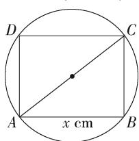

text_image

D
C
A
x cm
B

2. 解析 $y = |x - 2| = \begin{cases} x - 2, & x \geqslant 2, \\ 2 - x, & x < 2 \end{cases}$ 的图象如图.

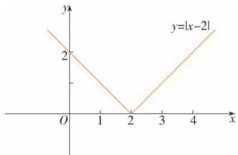

line

| x | y |
|---|---|
| 0 | 3 |
| 1 | 2 |
| 2 | 0 |
| 3 | 2 |
| 4 | 3 |

3. 解析

(1)

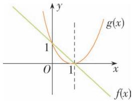

text_image

y
1
O
1
x
g(x)
f(x)

(2)

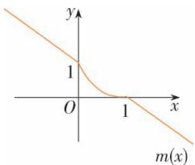

text_image

y
1
O
1
x
m(x)

$$
m (x) = \left\{ \begin{array}{l} - x + 1, x \leqslant 0, \\ (x - 1) ^ {2}, 0 <   x <   1, \\ - x + 1, x \geqslant 1. \end{array} \right.
$$

练习

1. 解析 (1) 与 D 图; (2) 与 A 图; (3) 与 B 图吻合得最好. 与 C 图相符的一件事可能为: 我以一定的速度出发, 后来发现时间还很充裕, 于是, 放慢了速度.

2. 解析 设票价为 y 元, 里程为 x 元, 由题意可知, 自变量 x 的取值范围是 $(0, 20]$ ,

∴ 函数解析式为 $y=\begin{cases}2,0<x\leqslant5,\\3,5<x\leqslant10,\\4,10<x\leqslant15,\\5,15<x\leqslant20.\end{cases}$

根据这个解析式,可画出函数图象,如图所示.

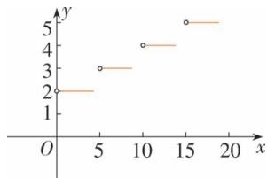

scatter

| x | y |
|---|---|
| 0 | 2 |
| 5 | 3 |
| 10 | 4 |
| 15 | 5 |
| 20 | 5 |

# 习题 3.1

# 复习巩固

1. 解析 (1) 要使分式 $\frac{3x}{x - 4}$ 有意义，

应满足 $x-4 \neq 0$ ,

即 $x \neq 4$

∴ 函数 $f(x)=\frac{3x}{x-4}$ 的定义域为 $\{x \mid x \neq 4\}$ .

(2) 因为对于 $x \in \mathbf{R}$ 的任何一个值 $f(x) = \sqrt{x^2}$ 都有意义, 所以 $f(x) = \sqrt{x^2}$ 的定义域为 $\mathbf{R}$ .

(3)要使分式 $\frac{6}{x^{2}-3x+2}$ 有意义，

应满足 $x^{2}-3x+2\neq0$ ,

即 $x \neq 1$ ，且 $x \neq 2$ ，

∴ 函数 $f(x)=\frac{6}{x^{2}-3x+2}$ 的定义域为 $\{x\in R \mid x \neq 1, \text{且 } x \neq 2\}$ .

(4)要使 $\frac{\sqrt{4 - x}}{x - 1}$ 有意义，

应有 $\left\{\begin{aligned}4-x&\geqslant0,\\ x-1&\neq0,\end{aligned}\right.$

∴ $x \leqslant 4$ , 且 $x \neq 1$ ,

∴ 函数 $f(x)=\frac{\sqrt{4-x}}{x-1}$ 的定义域为 $\{x\in R \mid x\leqslant 4,$ 且 $x\neq1\}$ .

2. 解析 (3) 中的两函数相等.

(1) $f(x)$ 的定义域为 R, $g(x)$ 的定义域为 $\{x \mid x \neq 0\}$ , 它们的定义域不同,

∴ $f(x)$ 与 $g(x)$ 不相等.

(2) $f(x)$ 的定义域为 R, $g(x)$ 的定义域为 $[0, +\infty)$ , 它们的定义域不同,

∴ $f(x)$ 与 $g(x)$ 不相等.

(3) $f(x)$ 与 $g(x)$ 的定义域都是R,

$$
\because \sqrt [ 3 ]{x ^ {6}} = x ^ {2},
$$

∴ 它们的对应关系相同，

∴ $f(x)$ 与 $g(x)$ 相等.

3. 解析 (1) 如图①, 定义域为 $\mathbf{R}$ , 值域为 $\mathbf{R}$ .

(2)如图②,定义域为 $\{x\mid x\neq0\}$ ,值域为 $\{y\mid y\neq0\}$ .

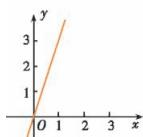  
图①

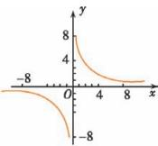  
图②

(3)如图③,定义域为 R,值域为 R.

(4)如图④,定义域为R,值域为 $\{y|y\geqslant-2\}$ .

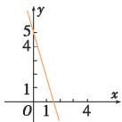  
图③

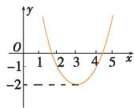  
图④

4. 解析 $f(-\sqrt{2}) = 3 \times (-\sqrt{2})^{2} - 5 \times (-\sqrt{2}) + 2 = 8 + 5\sqrt{2}$ ;

$$
f (- a) = 3 \times (- a) ^ {2} - 5 \times (- a) + 2 = 3 a ^ {2} + 5 a + 2;
$$

$$
\begin{array}{l} f (a + 3) = 3 \times (a + 3) ^ {2} - 5 \times (a + 3) + 2 = 3 a ^ {2} + 1 3 a \\ + 1 4; \end{array}
$$

$$
\begin{array}{l} f (a) + f (3) = 3 a ^ {2} - 5 a + 2 + 3 \times 3 ^ {2} - 5 \times 3 + 2 = 3 a ^ {2} \\ - 5 a + 1 6. \end{array}
$$

5. 解析 (1) $\because f(3)=\frac{3+2}{3-6}=-\frac{5}{3}\neq14$

∴ 点 $(3,14)$ 不在 $f(x)$ 的图象上.

(2) $f(4)=\frac{4+2}{4-6}=-3.$

(3) 由 $f(x)=\frac{x+2}{x-6}=2$ , 解得 x=14.

6. 解析 解法一:

由 $\left\{\begin{aligned}f(1)&=1^{2}+b\cdot1+c=b+c+1=0,\\ f(3)&=3^{2}+b\cdot3+c=3b+c+9=0,\end{aligned}\right.$

解得 $\left\{\begin{aligned}b&=-4,\\ c&=3.\end{aligned}\right.$

$$
\therefore f (x) = x ^ {2} - 4 x + 3,
$$

$$
\therefore f (- 1) = (- 1) ^ {2} - 4 \times (- 1) + 3 = 8.
$$

解法二:由 $f(1)=f(3)=0$ 知,

1、3 是 $x^{2}+bx+c=0$ 的两个根.

$$
\therefore b = - (1 + 3) = - 4, c = 1 \times 3 = 3.
$$

$$
\therefore f (x) = x ^ {2} - 4 x + 3,
$$

$$
\therefore f (- 1) = (- 1) ^ {2} - 4 \times (- 1) + 3 = 8.
$$

解法三:由 $f(1)=f(3)=0$ 知,

1、3 是 $x^{2}+bx+c=0$ 的两个根.

$$
\therefore f (x) = x ^ {2} + b x + c = (x - 1) (x - 3),
$$

$$
\therefore f (- 1) = (- 1 - 1) \times (- 1 - 3) = 8.
$$

7. 解析 (1) 是分段函数, 图象由两条射线 (y

$= 0, x \leqslant 0$ 含端点, $y = 1, x > 0$ 不含端点) 组成 (图1).

(2) 图象由 $(1,4)$ 、 $(2,7)$ 、 $(3,10)$ 三个点组成(图 2).

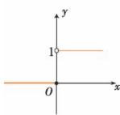  
图1

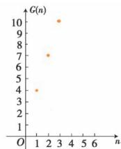  
图 2

综合运用

8. 解析 由题意得 $\left\{\begin{aligned}xy&=10,\\ d^{2}&=x^{2}+y^{2},\\ l&=2x+2y,\\ x&>0,d>0.\end{aligned}\right.$ 由此可得 x、y、d、l

任意两个量的函数关系式.

例如: $y=\frac{10}{x}(x>0)$ , $l=2x+\frac{20}{x}(x>0)$ , l=

$$
2 \sqrt {d ^ {2} + 2 0}.
$$

9. 解析 依题意得 $\pi\left(\frac{d}{2}\right)^{2}x=vt$ ,

$$
\therefore x = \frac {4 v}{\pi d ^ {2}} t.
$$

由题意可知函数的值域为 $[0, h]$ , ∴ 函数的定义域为 $\left[0, \frac{h\pi d^2}{4v}\right]$ .

10. 解析

<table><tr><td>x</td><td>1</td><td>2</td><td>3</td><td>4</td><td>5</td><td>6</td></tr><tr><td>y</td><td>5</td><td>3</td><td>4</td><td>2</td><td>4</td><td>5</td></tr></table>

y 是 x 的函数.

定义域是 $\{1,2,3,4,5,6\}$ ,

值域是 $\{2,3,4,5\}$ .

11. 解析 定义域是自变量的取值范围, 值域是函数值的集合.

(1)由题图可知,自变量 $p\in[-5,0]\cup[2,6)$ ,∴定义域为 $[-5,0]\cup[2,6)$ .

值域为 $[0,+\infty)$ .

(2) 当 $r \in [0, 2) \cup (5, +\infty)$ 时, $r$ 的值只与 $p$ 的一个值对应.

12. 解析 满足条件的一个函数的图象如图.

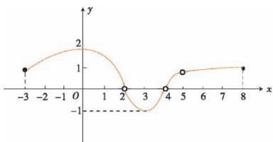

line

| x | y |
|---|---|
| -3 | 1 |
| -2 | 1.5 |
| -1 | 2 |
| 0 | 2 |
| 1 | 1.5 |
| 2 | 0 |
| 3 | -0.5 |
| 4 | 0 |
| 5 | 0.75 |
| 6 | 1 |
| 7 | 1.25 |
| 8 | 1 |

(1) 略.

(2) 定义域为 $\{x \mid -3 \leqslant x \leqslant 8, \text{且 } x \neq 5\}$ ，图象在 $-3 \leqslant x \leqslant 8$ 范围内，

且横坐标为 5 的点不在图象上；

值域为 $\{y \mid -1 \leqslant y \leqslant 2, y \neq 0\}$ ，图象在 $-1 \leqslant y \leqslant 2$ 范围内，

且所有纵坐标为 0 的点不在图象上.

13. 解析 $f(x)$

$$
= \left\{ \begin{array}{l} - 3, x \in (- 2. 5, - 2), \\ - 2, x \in [ - 2, - 1), \\ - 1, x \in [ - 1, 0), \\ 0, x \in [ 0, 1), \\ 1, x \in [ 1, 2), \\ 2, x \in [ 2, 3), \\ 3, x \in \{3 \}. \end{array} \right.
$$

则 $f(x)$ 的图象如图.

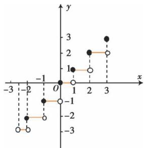

scatter

| x | y |
|---|---|
| -2 | -2 |
| -1 | -1 |
| 0 | 0 |
| 1 | 1 |
| 2 | 2 |
| 3 | 3 |

14.略.

拓广探索

15. 解析 (1) 如图, $\because \angle APB = 90^{\circ}$ ,

$$
\therefore A B = \sqrt {x ^ {2} + 4} \mathrm{km},
$$

∴ 由 A 到 B 所用的时间为 $\frac{\sqrt{x^{2}+4}}{3}h$ .

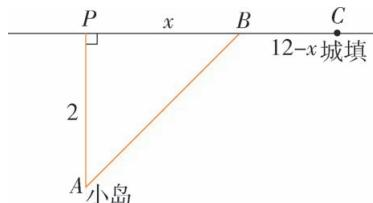

text_image

P
x
B
C
12-x城填
2
A
小岛

$$
B C = (1 2 - x) \mathrm{km},
$$

∴ 由 B 到 C 所用的时间为 $\frac{12-x}{5}$ h.

∴ 从小岛到城镇共用的时间为 $t = \left( \frac{\sqrt{x^{2} + 4}}{3} + \frac{12 - x}{5} \right) h.$

由题意知 $0 \leqslant x \leqslant 12$ .

∴ 函数关系式为 $t(x)=\frac{\sqrt{x^{2}+4}}{3}+\frac{12-x}{5},0 \leqslant x \leqslant 12.$

(2)由(1)及题意,可得 $t(4) \approx 3 \text{ h}$ .

16. 解析 (1) $v = -\frac{1}{2} u^2$ , 是函数.

(2) $u=\pm\sqrt{-2v},v\in(-\infty,0]$ ，不是函数.

17. 解析 (1) 存在满足条件的函数. 如: $f(x) = x, g(x) = x + 1$ .

(2)存在满足条件的函数.如: $f(x)=x^{2},x\in(-\infty,0]$ ,

$$
g (x) = x ^ {2}, x \in \mathbf {R}.
$$

18. 解析 y 是 n 的函数.

定义域为 $x \in N^{*}$ ，值域为 [1,9].

<table><tr><td>1</td><td>2</td><td>3</td><td>4</td><td>5</td><td>6</td><td>7</td><td>8</td><td>9</td><td>10</td><td>11</td><td>12</td><td>13</td><td>14</td><td>...</td></tr><tr><td>1</td><td>4</td><td>1</td><td>5</td><td>9</td><td>2</td><td>6</td><td>5</td><td>3</td><td>5</td><td>8</td><td>9</td><td>7</td><td>9</td><td>...</td></tr></table>

# 3.2 函数的基本性质

# 3.2.1 单调性与最大(小)值

# 习题 1.1

练习

1. 解析 由图象先上升后下降可知,工人数在一定范围内时,生产效率随着工人数的增加而提高,而当工人数超过某一数量后,随着工人数的增加,生产效率反而降低.

2. 证明 任取 $x_{1}, x_{2} \in \mathbf{R}$ , 且 $x_{1} < x_{2}$ , 则 $f(x_{2}) - f(x_{1}) = 3x_{2} + 2 - 3x_{1} - 2 = 3(x_{2} - x_{1}) > 0$ ,

$$
\therefore f (x _ {1}) <   f (x _ {2}),
$$

$\therefore f(x)=3x+2$ 是 R 上的增函数.

3. 证明 任取 $x_{1}, x_{2} \in (-\infty, 0)$ , 且 $x_{1} < x_{2}$ ,

则 $f(x_{2}) - f(x_{1}) = -\frac{2}{x_{2}} +\frac{2}{x_{1}} = \frac{2(x_{2} - x_{1})}{x_{1}x_{2}} >0,$

$$
\therefore f \left(x _ {1}\right) <   f \left(x _ {2}\right),
$$

$\therefore f(x) = -\frac{2}{x}$ 是 $(- \infty, 0)$ 上的增函数.

4. 解析

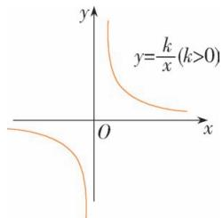

text_image

y
y=k/x (k>0)
O
x

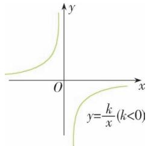

text_image

y
O
x
y=k/x (k<0)

(1) 定义域 $\{x \mid x \neq 0\}$ .  
(2) 当 $k > 0$ 时, $y = \frac{k}{x}$ 在 $(- \infty, 0)$ 和 $(0, +\infty)$

上单调递减；

当 k<0 时, $y=\frac{k}{x}$ 在 $(-∞,0)$ 和 $(0,+∞)$ 上单调递增.

证明:任取 $x_{1}, x_{2} \in (-\infty, 0)$ ，且 $x_{1} < x_{2}$ ，

则 $f(x_{2})-f(x_{1})=\frac{k}{x_{2}}-\frac{k}{x_{1}}=\frac{k(x_{1}-x_{2})}{x_{1}x_{2}}.$

又 $x_{1}-x_{2}<0, x_{1}x_{2}>0, \therefore$ 当 k>0 时， $f(x_{1})>f(x_{2})$ ;

当 k<0 时， $f(x_{1})<f(x_{2})$ .

∴ 当 $k>0, y=\frac{k}{x}$ 在 $(-∞,0)$ 上单调递减；当 k<0 时， $y=\frac{k}{x}$ 在 $(-∞,0)$ 上单调递增.

同理可证, $y=\frac{k}{x}$ 在 $(0,+\infty)$ 上的单调性.

练习

1. 解析 函数图象可能如图所示.

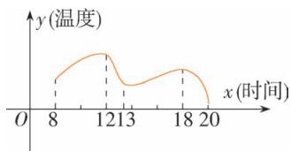

line

| x (时间) | y (温度) |
| -------- | -------- |
| 8        | -        |
| 12       | +        |
| 18       | -        |
| 20       | -        |

由图可知,增区间为[8,12],[13,18];减区间为[12,13],[18,20].

2. 答案 最小值

解析 $f(x)$ 在 $[-6,11]$ 上的大致图象如图.

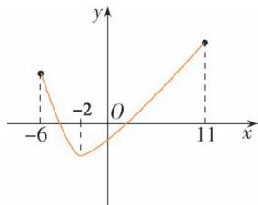

line

| x | y |
|---|---|
| -6 | 0 |
| -2 | -1 |
| 0 | 0 |
| 11 | 1 |

由图可知 $f(-2)$ 是函数 $f(x)$ 的一个最小值.

3. 解析 $\because$ 函数 $f(x)=\frac{1}{x}$ 在区间 [2,6] 单调递减，

$$
\therefore f (x) _ {\max} = f (2) = \frac {1}{2}, f (x) _ {\min} = f (6) = \frac {1}{6}.
$$

# 3.2.2 奇偶性

练习

1. 解析 $\because f(x)$ 是偶函数，

∴ $f(x)$ 的图象关于 y 轴对称, 补充后的图象如图 1.  
∵ $g(x)$ 是奇函数，  
∴ $g(x)$ 的图象关于原点对称, 补充后的图象如图 2.

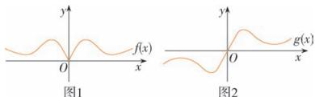

text_image

y
f(x)
x
O
图1
y
g(x)
x
O
图2

2. 解析 (1) 函数 $f(x)$ 的定义域为 R, 关于原点对称.

$$
\begin{array}{l} \because f (- x) = 2 (- x) ^ {4} + 3 (- x) ^ {2} = 2 x ^ {4} + 3 x ^ {2} = \\ f (x), \therefore f (x) = 2 x ^ {4} + 3 x ^ {2} \text {为偶函数.} \end{array}
$$

(2) 函数 $f(x)$ 的定义域为 R, 关于原点对称. $\because f(-x)=(-x)^{3}-2(-x)=-x^{3}+2x=-(x^{3}-2x)=-f(x),\therefore f(x)=x^{3}-2x$ 为奇函数.

3. 证明 (1) 充分性: 如果 $f(x)$ 的图象关于 $y$ 轴对称, 则 $f(x) = f(-x)$ , $\therefore f(x)$ 是偶函数.

必要性:由偶函数的定义知,任取 $x \in A$ ,都有 $-x \in A$ 且 $f(-x) = f(x)$ ,

$\therefore P(x,f(x))$ 与 $P'(-x,f(-x))$ 关于 y 轴对称.

由任意性可得 $f(x)$ 的图象关于y轴对称.

(2) 充分性: 如果 $f(x)$ 的图象关于原点对称,

则 $f(-x) = -f(x)$ ,

$\therefore f(x)$ 是奇函数.

必要性:由奇函数的定义知,任取 $x \in A$ ,都有 $-x \in A$ 且 $f(-x) = -f(x)$ ,

$\therefore P(x,f(x))$ 与 $P'(-x,f(-x))$ 关于 $(0,0)$ 对称，

由任意性可得 $f(x)$ 的图象关于(0,0)对称.

# 习题 3.2

复习巩固

1. 解析 单调区间为 $[-1,0], [0,2], [2,4], [4,5]$ .

函数在 $[-1,0]$ 上是减函数,在 $[0,2]$ 上是增函数,在 $[2,4]$ 上是减函数,在 $[4,5]$ 上是增函数.

2. 解析 (1) 函数 $y = x^{2} - 5x - 6$ 的图象如图所示.

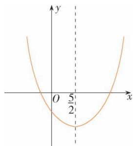

text_image

y
O 5/2
x

由图象可知，

单调减区间是 $\left(-\infty,\frac{5}{2}\right]$ ,

单调增区间是 $\left[\frac{5}{2}, +\infty\right)$ .

(2) 函数 $y=9-x^{2}$ 的图象如图所示.

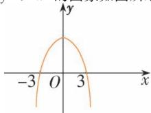

由图象可知，

单调增区间是 $(-∞,0]$ ，单调减区间是 $[0,+∞)$ .

3. 证明 (1) 任取 $x_{1}, x_{2} \in \mathbf{R}$ , 且 $x_{1} < x_{2}$ ,

则 $f(x_{1}) - f(x_{2}) = 2(x_{2} - x_{1})$

因为 $x_{1}<x_{2}$ ,

所以 $x_{2}-x_{1}>0$ ,

即 $2(x_{2}-x_{1})>0$ ,

即 $f(x_{1})>f(x_{2})$ ,

所以 $f(x)=-2x+1$ 在 R 上是减函数.

(2)任取 $x_{1}, x_{2} \in (0, +\infty)$ , 且 $x_{1} < x_{2}$ ,

则 $f(x_{1}) - f(x_{2}) = (x_{1}^{2} + 1) - (x_{2}^{2} + 1)$

$$
= \left(x _ {1} + x _ {2}\right) \left(x _ {1} - x _ {2}\right),
$$

$$
\because x _ {2} > x _ {1} > 0,
$$

$$
\therefore x _ {1} + x _ {2} > 0, x _ {1} - x _ {2} <   0.
$$

$\therefore f(x_{1})-f(x_{2})<0$ , 即 $f(x_{1})<f(x_{2})$ .

$\therefore f(x)=x^{2}+1$ 在 $(0,+\infty)$ 上是增函数.

(3)任取 $x_{1}, x_{2} \in (-\infty, 0)$ , 且 $x_{1} < x_{2}$ , 则

$$
f \left(x _ {1}\right) - f \left(x _ {2}\right) = 1 - \frac {1}{x _ {1}} - \left(1 - \frac {1}{x _ {2}}\right)
$$

$$
= \frac {1}{x _ {2}} - \frac {1}{x _ {1}} = \frac {x _ {1} - x _ {2}}{x _ {1} x _ {2}},
$$

$$
\because x _ {1} <   x _ {2} <   0,
$$

$$
\therefore x _ {1} - x _ {2} <   0, x _ {1} x _ {2} > 0,
$$

$$
\therefore f \left(x _ {1}\right) - f \left(x _ {2}\right) = \frac {x _ {1} - x _ {2}}{x _ {1} x _ {2}} <   0,
$$

即 $f(x_{1})<f(x_{2})$ .

$\therefore f(x) = 1 - \frac{1}{x}$ 在 $(- \infty, 0)$ 上是增函数.

4. 解析 $y=-\frac{x^{2}}{50}+162x-21\ 000$

$$
= - \frac {1}{5 0} (x ^ {2} - 8 1 0 0 x) - 2 1 0 0 0
$$

$$
= - \frac {1}{5 0} (x - 4 0 5 0) ^ {2} + 3 0 7 0 5 0.
$$

所以当 x = 4050 时, y 取得最大值, $y_{max} = 307050$ .

故每辆车的月租金为 4 050 元时,租赁公司的月收益最大,为307 050元.

5. 解析 (1) 函数 $f(x) = x^2 + 1$ 的定义域为 $\mathbf{R}$ , 关于原点对称.

∵ 对定义域内每一个 x, 都有 $f(-x) = (-x)^{2}$

$$
+ 1 = x ^ {2} + 1 = f (x),
$$

∴ 函数 $f(x)=x^{2}+1$ 为偶函数.

(2) 函数 $f(x)=\frac{x}{x^{2}+1}$ 的定义域为 R, 关于原点对称.

∵ 对定义域内每一个 x, 都有

$$
f (- x) = \frac {- x}{(- x) ^ {2} + 1} = - \frac {x}{x ^ {2} + 1} = - f (x),
$$

∴ 函数 $f(x)=\frac{x}{x^{2}+1}$ 为奇函数.

# 综合运用

6. 解析 心率关于时间的一个可能的图象如图.

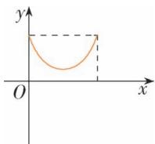

心率减慢,则图象下降;心率升高,则图象上升.

7. 解析 (1) $f(x) = x^{2} - 2x = (x - 1)^{2} - 1$ ,

故 $f(x)$ 的单调递增区间为 $[1, +\infty)$ ,

单调递减区间为 $(-∞,1]$ .

$g(x) = x^{2} - 2x = (x - 1)^{2} - 1, x \in [2,4]$ ,

故 $g(x)$ 的单调递增区间为 [2,4].

(2)由(1)知,当x=1时, $f(x)$ 取最小值-1.

当 x=2 时, $g(x)$ 取最小值 0.

8. 解析 (1) 证明: 任取 $x_{1}, x_{2} \in [3, +\infty)$ , 且 $x_{1} < x_{2}$ ,

则 $f(x_{2})-f(x_{1})$

$$
= x _ {2} + \frac {9}{x _ {2}} - x _ {1} - \frac {9}{x _ {1}}
$$

$$
= x _ {2} - x _ {1} + \frac {9 \left(x _ {1} - x _ {2}\right)}{x _ {1} x _ {2}}
$$

$$
= \left(x _ {2} - x _ {1}\right) \left(1 - \frac {9}{x _ {1} x _ {2}}\right)
$$

$$
= \left(x _ {2} - x _ {1}\right) \cdot \left(\frac {x _ {1} x _ {2} - 9}{x _ {1} x _ {2}}\right).
$$

$\because x_{1}\geqslant3,x_{2}\geqslant3,$ 且 $x_{2}>x_{1},\therefore x_{2}-x_{1}>0,x_{2}x_{1}>9,$

$\therefore f(x_{1})<f(x_{2}),\therefore y=x+\frac{9}{x}$ 在 $[3,+\infty)$ 上单调递增.

(2)任取 $x_{1}, x_{2} \in (0, +\infty)$ , 且 $x_{1} < x_{2}$ ,

由（1）知 $f(x_{2}) - f(x_{1}) = (x_{2} - x_{1})$

$$
\cdot \left(\frac {x _ {1} x _ {2} - 9}{x _ {1} x _ {2}}\right),
$$

因为 $0 < x_{1} < x_{2}$ ，所以 $x_{2} - x_{1} > 0, x_{1}x_{2} > 0$ ，

当 $x_{1}, x_{2} \in (0,3]$ 时， $x_{1}x_{2} - 9 < 0$

所以 $f(x_{2})-f(x_{1})<0$ ，即 $f(x_{1})>f(x_{2})$ ，

此时函数 $f(x)$ 为减函数；

当 $x_{1}, x_{2} \in (3, +\infty)$ 时， $x_{1}x_{2} - 9 > 0$

所以 $f(x_{2})-f(x_{1})>0$ ，即 $f(x_{1})<f(x_{2})$

此时函数 $f(x)$ 为增函数.

综上,函数 $f(x)=x+\frac{9}{x}$ 在区间 $(0,3]$ 上为减函数,在区间 $(3,+\infty)$ 为增函数.

(3) 设 $x_{1}, x_{2} \in (0, +\infty)$ ，且 $x_{1} < x_{2}$ ，则

$$
f \left(x _ {2}\right) - f \left(x _ {1}\right) = \left(x _ {2} + \frac {k}{x _ {2}}\right) - \left(x _ {1} + \frac {k}{x _ {1}}\right) = \left(x _ {2} - \right.
$$

$$
\left. x _ {1}\right) + \left(\frac {k}{x _ {2}} - \frac {k}{x _ {1}}\right) = \left(x _ {2} - x _ {1}\right) + k \cdot \frac {x _ {1} - x _ {2}}{x _ {1} x _ {2}} = \left(x _ {2} - \right.
$$

$$
\left. x _ {1}\right) \cdot \frac {x _ {1} x _ {2} - k}{x _ {1} x _ {2}},
$$

因为 $0 < x_{1} < x_{2}$ ，所以 $x_{2} - x_{1} > 0, x_{1} x_{2} > 0$ ，

当 $x_{1}, x_{2} \in (0, \sqrt{k}]$ 时， $x_{1}x_{2} - k < 0$

所以 $f(x_{2})-f(x_{1})<0$ ，即 $f(x_{1})>f(x_{2})$ ，

此时函数 $f(x)$ 为减函数；

当 $x_{1}, x_{2} \in (\sqrt{k}, +\infty)$ 时， $x_{1}x_{2} - k > 0$

所以 $f(x_{2})-f(x_{1})>0$ ，即 $f(x_{1})<f(x_{2})$ ，

此时函数 $f(x)$ 为增函数.

综上, 函数 $f(x) = x + \frac{k}{x} (k > 0)$ 在区间

$(0, \sqrt{k})$ 上为减函数，在 $(\sqrt{k}, +\infty)$ 上为增函数.

9. 证明 (1) 充分性: $\forall x_{1}, x_{2} \in D, x_{1} \neq x_{2}$ 都有

$\frac{\Delta y}{\Delta x}>0$ 得 $\left\{\begin{aligned}\Delta x&>0,\\ \Delta y&>0\end{aligned}\right.$ 或 $\left\{\begin{aligned}\Delta x&<0,\\ \Delta y&<0,\end{aligned}\right.$

即 $x_{1}>x_{2}$ 时， $f(x_{1})>f(x_{2})$ 或 $x_{1}<x_{2}$ 时， $f(x_{1})<f(x_{2})$ .

由增函数的定义可知, $y=f(x)$ 在D上单调递增.

必要性: 设 $\forall x_{1}, x_{2} \in D, x_{1} \neq x_{2}, \because y = f(x)$ 在 D 上单调递增，

∴ 当 $\Delta x = x_{1} - x_{2} > 0$ 时, $\Delta y = f(x_{1}) - f(x_{2}) > 0$ ,

$$
\therefore \frac {\Delta y}{\Delta x} > 0.
$$

∴ 当 $\Delta x = x_{1} - x_{2} < 0$ 时, $\Delta y = f(x_{1}) - f(x_{2}) < 0$ ,

$$
\therefore \frac {\Delta y}{\Delta x} > 0.
$$

综上， $\forall x_{1}, x_{2} \in D, x_{1} \neq x_{2}$ ，都有 $\frac{\Delta y}{\Delta x} > 0$ .

(2) 同理可证.

10. 解析 设每间熊猫居室的面积为 $y \, m^{2}$ ,

由宽为 $x \, m$ ，得每间熊猫居室的长为 $\frac{30-3x}{2} \, m$ ，那么

$$
y = x \cdot \frac {3 0 - 3 x}{2} = - \frac {3 (x ^ {2} - 1 0 x)}{2} = \frac {- 3 (x - 5) ^ {2} + 7 5}{2}
$$

$$
(0 <   x <   1 0).
$$

所以当 x=5 时, y 有最大值 37.5.

故宽为 $5 \, m$ 时才能使所建造的每间熊猫居室面积最大, 最大面积是 $37.5 \, m^{2}$ .

11. 解析 因为 $f(x)$ 是 R 上的奇函数，

所以有 $f(-x) = -f(x)$ .

因为当 $x \geqslant 0$ 时， $f(x) = x(1 + x)$ ，

所以当 x<0 时，-x>0，

所以 $f(-x)=(-x)(1-x)$

$$
= - x (1 - x),
$$

所以 $f(x) = -f(-x) = x(1 - x)$ .

所以 $f(x)=\left\{\begin{aligned}x(1+x),&x\geqslant0,\\ x(1-x),&x<0.\end{aligned}\right.$

它的图象如图所示.

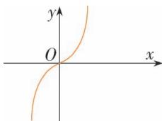

# 拓广探索

12. 解析 偶函数 $f(x)$ 在 $(0, +\infty)$ 上是减函数, 那么 $f(x)$ 在 $(-∞, 0)$ 上是增函数.

证明如下：

任取 $x_{1}, x_{2} \in (-\infty, 0)$ , 且 $x_{1} < x_{2}$ ,

则 $-x_{1}>-x_{2}>0.$

因为函数 $f(x)$ 在 $(0,+\infty)$ 上是减函数，

所以 $f(-x_{1})<f(-x_{2})$ .

又因为 $f(x)$ 是偶函数，

所以 $f(-x_{1})=f(x_{1})$ ,

$$
f (- x _ {2}) = f (x _ {2}).
$$

于是 $f(x_{1})<f(x_{2})$ ,

所以偶函数 $f(x)$ 在 $(-∞,0)$ 上是增函数.

13. 解析 (1) $\because f(x + a) = (x + a)^{3} - 3(x + a)^{2}$

$$
= x ^ {3} + 2 a x ^ {2} + a ^ {2} x + a x ^ {2} + 2 a ^ {2} x + a ^ {3} - 3 x ^ {2} - 6 a x - 3 a ^ {2}
$$

$$
= x ^ {3} + (3 a - 3) x ^ {2} + (3 a ^ {2} - 6 a) x + a ^ {3} - 3 a ^ {2},
$$

$$
\therefore y = f (x + a) - b
$$

$= x^{3} + (3a - 3)x^{2} + (3a^{2} - 6a)x + a^{3} - 3a^{2} - b$ 是奇函数，

$$
\therefore \left\{ \begin{array}{l} 3 a - 3 = 0, \\ a ^ {3} - 3 a ^ {2} - b = 0, \end{array} \right. \therefore \left\{ \begin{array}{l} a = 1, \\ b = - 2. \end{array} \right.
$$

$\therefore f(x) = x^{3} - 3x^{2}$ 的对称中心为 $(1, -2)$ .

(2) 函数 $f(x)$ 的图象关于直线 x=a 对称的充要条件是 $y=f(x+a)$ 为偶函数.

# 3.3 幂函数

# 练习

1. 解析 设所求幂函数的解析式为 $y=f(x)=x^{\alpha}$ . 因为幂函数的图象过点 $(2,\sqrt{2})$ ，所以有 $\sqrt{2}=2^{\alpha}$ ，解得 $\alpha=\frac{1}{2}$ ，所以所求函数解析式为 $y=f(x)=x^{\frac{1}{2}}(x\geqslant0)$ .

2. 解析 (1) 令 $f(x)=x^{3}$ .

∵ $f(x)$ 在 R 上单调递增, 且 -1.5<-1.4,

$$
\therefore f (- 1. 5) <   f (- 1. 4), \text {即} (- 1. 5) ^ {3} <   (- 1. 4) ^ {3}.
$$

(2) 令 $g(x)=\frac{1}{x}$ .

$\because g(x)$ 在 $(-∞,0)$ 上单调递减，且 -1.5 <

$$
- 1. 4, \therefore g (- 1. 5) > g (- 1. 4), \therefore \frac {1}{- 1 . 5} > \frac {1}{- 1 . 4}.
$$

3. 证明 设 $x_{1}, x_{2}$ 是 $\mathbf{R}$ 上任意两个不相等的实数, 且 $x_{1} < x_{2}$ ,

$$
\therefore f (x _ {2}) - f (x _ {1}) = x _ {2} ^ {3} - x _ {1} ^ {3}
$$

$$
= \left(x _ {2} - x _ {1}\right) \left(x _ {2} ^ {2} + x _ {1} x _ {2} + x _ {1} ^ {2}\right)
$$

$$
= \left(x _ {2} - x _ {1}\right) \left[ \left(x _ {2} ^ {2} + x _ {1} x _ {2} + \frac {1}{4} x _ {1} ^ {2}\right) + \frac {3}{4} x _ {1} ^ {2} \right]
$$

$$
= \left(x _ {2} - x _ {1}\right) \left[ \left(x _ {2} + \frac {1}{2} x _ {1}\right) ^ {2} + \frac {3}{4} x _ {1} ^ {2} \right],
$$

$$
\because x _ {2} > x _ {1}, \therefore x _ {2} - x _ {1} > 0, \therefore f (x _ {1}) <   f (x _ {2}),
$$

$\therefore f(x)=x^{3}$ 在 R 上单调递增.

$\because f(x)=x^{3}$ 的定义域 R 关于原点对称，

又 $f(-x)=(-x)^{3}=-x^{3}=-f(x)$ ，∴ $f(x)$ 是R上的奇函数.

# 习题 3.3

# 复习巩固

1. 解析 函数 $y = \sqrt{|x|}$ 的图象, 如图.

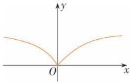

text_image

y
O
x

∵ 函数 $y=f(x)=\sqrt{|x|}$ 的定义域为 R, 关于原点对称,

又 $f(-x) = \sqrt{|-x|} = \sqrt{|x|} = f(x)$

$\therefore y = \sqrt{|x|}$ 为偶函数，

函数 $y=f(x)$ 在 $(-∞,0)$ 上单调递减，

在 $(0,+\infty)$ 上单调递增.

# 综合运用

2. 解析 (1) 由题意得 $v = k \cdot r^4 (k > 0)$ .

(2) 将 r=3, v=400 代入 $v=k\cdot r^{4}$ 得

$$
k = \frac {4 0 0}{8 1},
$$

故流量速率 v 的表达式为 $v=\frac{400}{81}r^{4}$ .

(3) 当 $r=5 \, cm$ 时，

$$
v = \frac {4 0 0}{8 1} r ^ {4} = \frac {4 0 0}{8 1} \times 5 ^ {4} \approx 3 0 8 6 (\mathrm{cm} ^ {3} / \mathrm{s}).
$$

3. 解析 利用函数解析式列出表格.

<table><tr><td>x</td><td>...</td><td>-2</td><td>-1</td><td> $-\frac{1}{2}$ </td><td> $\frac{1}{2}$ </td><td>1</td><td>2</td><td>...</td></tr><tr><td>y</td><td>...</td><td> $\frac{1}{4}$ </td><td>1</td><td>4</td><td>4</td><td>1</td><td> $\frac{1}{4}$ </td><td>...</td></tr></table>

根据表中的数据作出函数图象如图所示:

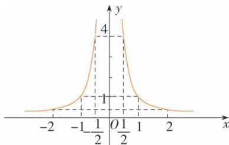

line

| x     | y |
|-------|---|
| -2    | 0 |
| -1/2  | 1 |
| 0     | 4 |
| 1/2   | 1 |
| 2     | 0 |

通过观察图象得函数的定义域为 $\{x \mid x \neq 0\}$ ，值域为 $(0, +\infty)$ ，

∵ 函数的定义域关于原点对称, 且 $f(x)=f(-x)$ , ∴ $f(x)=x^{-2}$ 为偶函数,

在 $(-∞,0)$ 上单调递增，在 $(0,+∞)$ 上单调

递减.

证明:任取 $x_{1}, x_{2} \in (-\infty, 0)$ ，且 $x_{1} < x_{2}$ .

$$
\therefore f \left(x _ {2}\right) - f \left(x _ {1}\right) = \frac {1}{x _ {2} ^ {2}} - \frac {1}{x _ {1} ^ {2}} = \frac {x _ {1} ^ {2} - x _ {2} ^ {2}}{x _ {1} ^ {2} x _ {2} ^ {2}}
$$

$$
= \frac {\left(x _ {1} + x _ {2}\right) \left(x _ {1} - x _ {2}\right)}{x _ {1} ^ {2} x _ {2} ^ {2}},
$$

$$
\because x _ {1}, x _ {2} <   0, \therefore x _ {1} + x _ {2} <   0, x _ {1} - x _ {2} <   0,
$$

$\therefore f(x_{1})<f(x_{2}),\therefore f(x)=x^{-2}$ 在 $(-∞,0)$ 上单调递增，同理可证： $f(x)=x^{-2}$ 在 $(0,+∞)$ 上单调递减.

# 3.4 函数的应用（一）

# 练习

1. 解析 由 $\frac{20}{10^{3}}=(60)^{2}a$ 得 $a=\frac{1}{36\times5\times10^{3}}$ ,

由 $\frac{50}{10^3} = \frac{1}{36\times 5\times 10^3} x^2$ 得 $x = 30\sqrt{10}$

$$
\because 3 0 \sqrt {1 0} \mathrm{km/h} <   1 0 0 \mathrm{km/h},
$$

∴这辆车没有超速行驶.

2. 解析 设矩形广告牌的长为 x，则其宽为 $\frac{l-2x}{2}$ .

$$
\therefore S = x \cdot \left(\frac {l - 2 x}{2}\right) = - x ^ {2} + \frac {l}{2} x
$$

$$
= - \left(x ^ {2} - \frac {l}{2} x + \frac {l ^ {2}}{1 6}\right) + \frac {l ^ {2}}{1 6}
$$

$$
= - \left(x - \frac {l}{4}\right) ^ {2} + \frac {l ^ {2}}{1 6}.
$$

∴ 当 $x=\frac{l}{4}$ 时, 广告牌的面积 S 最大, 且 $S_{max}$

$$
= \frac {l ^ {2}}{1 6}.
$$

3. 解析 (1) 由题意可得

$$
y _ {1} = 1 5 0 + 0. 2 5 x (x \geqslant 0), y _ {2} = \frac {1 5 0}{x} + 0. 2 5 (x > 0),
$$

$$
y _ {3} = 0. 3 5 x (x \geqslant 0),
$$

$y_{4} = 0.35x - (150 + 0.25x) = 0.1x - 150(x\geqslant 0).$

(2) 画出 $y_{4}=0.1x-150(x\geqslant0)$ 的图象如图.

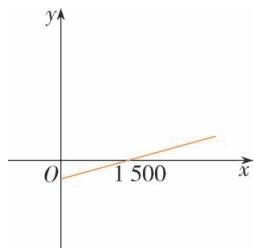

line

| x | y |
|---|---|
| 0 | 0 |
| 1500 | 1.5 |

由图象可知, 当 $0 \leqslant x < 1500$ 件时, 该公司亏损;

当 x=1 500 件时,该公司不赔不赚;

当 x>1 500 件时,该公司赢利.

# 习题 3.4

# 综合运用

1. 解析 根据题意得, 距离 x 的解析式为

$$
x = \left\{ \begin{array}{l} 6 0 t (0 \leqslant t \leqslant 2. 5), \\ 1 5 0 (2. 5 <   t \leqslant 3. 5), \\ 3 2 5 - 5 0 t (3. 5 <   t \leqslant 6. 5). \end{array} \right.
$$

函数图象为图1.

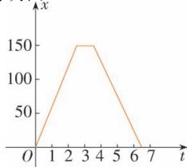

line

| t | x |
|---|---|
| 0 | 0 |
| 1 | 50 |
| 2 | 100 |
| 3 | 150 |
| 4 | 150 |
| 5 | 100 |
| 6 | 50 |
| 7 | 0 |

图1

由题意得, 车速 v 的解析式为 v

$$
= \left\{ \begin{array}{l} 6 0 (0 \leqslant t \leqslant 2. 5), \\ 0 (2. 5 <   t \leqslant 3. 5), \\ - 5 0 (3. 5 <   t \leqslant 6. 5). \end{array} \right.
$$

函数图象为图 2.

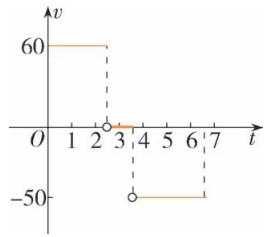

line

| t | v |
|---|---|
| 1 | 60 |
| 2 | 60 |
| 3 | -50 |
| 4 | -50 |
| 5 | -50 |
| 6 | -50 |
| 7 | -50 |

图2

2. 解析 设水池底的长、宽分别为 $x \, m$ 、 $y \, m$ ，总造价为 $\omega$ 元，

根据题意知 $x \cdot y = \frac{1200}{6} = 200$ ,

$$
\therefore y = \frac {2 0 0}{x}.
$$

∵ 底面积为 $200 \, m^{2}$ ,

侧面积为 $2 \cdot x \cdot 6 + 2 \cdot y \cdot 6 = 12(x + y) m^{2}$ ,

∴ 总造价为 $\omega=12(x+y)\times95+200\times135$ ,

$$
\therefore \omega = 1 1 4 0 \left(x + \frac {2 0 0}{x}\right) + 2 7 0 0 0 (x > 0).
$$

要使总造价 $\omega < 70000$

则 $1\ 140\left(x+\frac{200}{x}\right)+27\ 000<70\ 000.$

$$
\because x > 0, \therefore 1 1 4 x ^ {2} - 4 3 0 0 x + 2 2 8 0 0 <   0,
$$

$$
\therefore 6. 4 <   x <   3 1. 3.
$$

∴ 水池的长在 $(6.4, 31.3)$ (m) 范围内变化时, 总造价可控制在 7 万元以内.

3. 解析 设每户每月用水量为 $x \, m^{3}$ ，需交纳的水费为 $f(x)$ 元，则

$$
f (x) = \left\{ \begin{array}{l} 3 x, x \leqslant 1 2, \\ 3 6 + 6 (x - 1 2), 1 2 <   x \leqslant 1 8, \\ 7 2 + 9 (x - 1 8), x > 1 8, \end{array} \right.
$$

若该居民交纳的水费为 48 元,那么用水量 $x \in (12,18]$ ,

令 $36+6(x-12)=48$ 得 x=14,

∴该居民本月用水量为 $14 \, m^{3}$ .

# 拓广探索

4. 解析 根据图象可得出:

(1) 点 A 的实际意义为当乘客量为 0 时, 亏损 1 (单位); 点 B 的实际意义为当乘客量为 1.5 (单位) 时, 收支持平; 射线 AB 上的点的实际意义为当乘客量小于 1.5 时公司将亏损, 当乘客量大于 1.5 时公司将赢利.

(2) 图 2 的建议是降低成本且保持票价不变; 图 3 的建议是提高票价且保持成本不变.

5. 解析 由题中表格画出散点图, 如图所示.
由图可考虑以 $F=kx+b$ 作为刻画长度与拉力的函数模型.

取两组数据(14.2,1),(57.5,4),

有 $\left\{\begin{aligned}14.2k+b=1,\\ 57.5k+b=4\end{aligned}\right.\Rightarrow\left\{\begin{aligned}k\approx0.069,\\ b\approx0.016.\end{aligned}\right.$

$\therefore F=0.069x+0.016.$

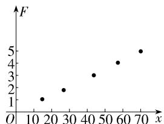

scatter

| x  | F |
|----|---|
| 10 | 1 |
| 20 | 2 |
| 30 | 2 |
| 40 | 3 |
| 50 | 4 |
| 60 | 4 |
| 70 | 5 |

将已知数据代入解析式,或作出图象,可以发现,这个模型与已知数据拟合程度较好,说明它能较好地反映弹簧伸长长度与拉力的关系.

# 复习参考题3

复习巩固

1. 解析 (1) 由 $\left\{ \begin{array}{l} x - 2 \geqslant 0, \\ x + 5 \geqslant 0 \end{array} \right.$ 得 $x \geqslant 2$

故所求定义域为 $\{x\mid x\geqslant2\}$ .

(2)由 $\left\{\begin{aligned}x-4&\geqslant0,\\ |x|-5&\neq0\end{aligned}\right.$ 得 $x\geqslant4$ ，且 $x\neq5$ ，

故所求定义域为 $\{x\mid x\geqslant 4$ ，且 $x\neq 5\}$

2. 解析 (1) $f(a) + 1 = \frac{1 - a}{1 + a} + 1 = \frac{2}{1 + a} (a \neq -1)$ .

(2) $f(a + 1) = \frac{1 - (a + 1)}{1 + (a + 1)} = \frac{-a}{a + 2} (a \neq -2).$

3. 证明 (1) $f(-x) = \frac{1 + (-x)^2}{1 - (-x)^2} = \frac{1 + x^2}{1 - x^2} = f(x)$ .

(2) $f\left(\frac{1}{x}\right)=\frac{1+\left(\frac{1}{x}\right)^{2}}{1-\left(\frac{1}{x}\right)^{2}}=\frac{x^{2}+1}{x^{2}-1}$

$$
= - \frac {1 + x ^ {2}}{1 - x ^ {2}} = - f (x) (x \neq 0).
$$

4. 解析 函数 $f(x)$ 的图象的对称轴是直线 x $=\frac{k}{8}.$

当 $\frac{k}{8}\leqslant5$ ,或 $\frac{k}{8}\geqslant20$ ,

即 $k \leqslant 40$ ，或 $k \geqslant 160$ 时， $f(x)$ 在 [5,20] 上是单调函数.

所以,实数 k 的取值范围为 $\{k \mid k \leqslant 40$ 或 $k \geqslant 160\}$ .

5. 解析 令 $f(x) = x^{\alpha}$ ，已知 $f(x)$ 的图象过点 $\left(2, \frac{\sqrt{2}}{2}\right)$ ，

∴ 得 $\frac{\sqrt{2}}{2}=2^{\alpha}$ ，解得 $\alpha=-\frac{1}{2}$ ，

$$
\therefore f (x) = x ^ {- \frac {1}{2}}.
$$

根据函数解析式作出函数的图象.

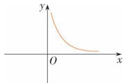

text_image

y
O
x

∵ $f(x)$ 的定义域为 $(0, +\infty)$ ，不关于原点对称，∴ 该函数为非奇非偶函数，

由图象得 $y=f(x)$ 在 $[0,+\infty)$ 上单调递减.

6. 解析 (1) $\because P(x) = R(x) - 100x - 20000$ ,

$$
\therefore P (x) = \left\{ \begin{array}{l} - \frac {1}{2} x ^ {2} + 3 0 0 x - 2 0 0 0 0, 0 \leqslant x \leqslant 4 0 0, \\ 6 0 0 0 0 - 1 0 0 x, x > 4 0 0. \end{array} \right.
$$

(2) 当 $0 \leqslant x \leqslant 400$ 时，

$$
P (x) = - \frac {1}{2} [ (x ^ {2} - 6 0 0 x + 9 0 0 0 0) - 9 0 0 0 0 ] -
$$

$$
2 0 0 0 0
$$

$$
= - \frac {1}{2} (x - 3 0 0) ^ {2} + 2 5 0 0 0,
$$

∴ 当 x=300 时, $P(x)_{\max}=25\ 000$ 元;

当 x>400 时, $P(x)=60\ 000-100x<60\ 000-100\times400=20\ 000$ 元,

∵ 25 000 > 20 000, ∴ 月产量 300 台时, 利润最大.

# 综合运用

7. 解析 $f(1)=5$ ; $f(-3)=21$ ;

$$
f (a + 1) = \left\{ \begin{array}{l} (a + 1) (a + 5), a \geqslant - 1, \\ (a + 1) (a - 3), a <   - 1. \end{array} \right.
$$

8. 证明 (1) $f\left(\frac{x_1 + x_2}{2}\right) = a\left(\frac{x_1 + x_2}{2}\right) + b$

$$
= \frac {a x _ {1} + b}{2} + \frac {a x _ {2} + b}{2}
$$

$$
= \frac {f \left(x _ {1}\right)}{2} + \frac {f \left(x _ {2}\right)}{2} = \frac {f \left(x _ {1}\right) + f \left(x _ {2}\right)}{2}.
$$

(2) $g\left(\frac{x_{1}+x_{2}}{2}\right)=\frac{1}{4}(x_{1}^{2}+x_{2}^{2}+2x_{1}x_{2})+a\left(\frac{x_{1}+x_{2}}{2}\right)$

$$
+ b,
$$

$$
\frac {g \left(x _ {1}\right) + g \left(x _ {2}\right)}{2}
$$

$$
= \frac {1}{2} \left[ \left(x _ {1} ^ {2} + a x _ {1} + b\right) + \left(x _ {2} ^ {2} + a x _ {2} + b\right) \right]
$$

$$
= \frac {1}{2} \left(x _ {1} ^ {2} + x _ {2} ^ {2}\right) + a \left(\frac {x _ {1} + x _ {2}}{2}\right) + b.
$$

因为 $\frac{1}{4} (x_1^2 + x_2^2 + 2x_1x_2) - \frac{1}{2} (x_1^2 + x_2^2)$

$$
= - \frac {1}{4} \left(x _ {1} - x _ {2}\right) ^ {2} \leqslant 0,
$$

即 $\frac{1}{4} (x_1^2 + x_2^2 + 2x_1x_2) \leqslant \frac{1}{2} (x_1^2 + x_2^2)$ ,

所以 $g\left(\frac{x_1 + x_2}{2}\right) \leqslant \frac{g(x_1) + g(x_2)}{2}$ .

9. 解析 (1) 奇函数 $f(x)$ 在 $[-b, -a]$ 上是减函数. 证明如下:

任取 $x_{1}, x_{2} \in [-b, -a]$ , 且 $x_{1} < x_{2}$ ,

则 $a \leqslant -x_{2} < -x_{1} \leqslant b$ .

因为 $f(x)$ 在 $[a,b]$ 上是减函数，

所以 $f(-x_{2})>f(-x_{1})$ .

又因为 $f(x)$ 是奇函数，

所以 $f(-x)=-f(x)$ ,

于是 $-f(x_{2})>-f(x_{1})$ ，即 $f(x_{1})>f(x_{2})$ .

所以 $f(x)$ 在 $[-b, -a]$ 上是减函数.

(2) 偶函数 $g(x)$ 在 $[-b, -a]$ 上是增函数.

证明如下:任取 $x_{1}, x_{2} \in [-b, -a]$ ，且 $x_{1} < x_{2}$ ，则 $a \leqslant -x_{2} < -x_{1} \leqslant b$ .

因为 $g(x)$ 在 $[a,b]$ 上是减函数，

所以 $g(-x_{2})>g(-x_{1})$ .

又因为 $g(x)$ 是偶函数, 所以 $g(-x)=g(x)$ .

于是 $g(x_{2}) > g(x_{1})$

所以 $g(x)$ 在 $[-b, -a]$ 上是增函数.

10. 解析 (1) 设下调后的电价为 $x$ 元 $/ \mathrm{kW} \cdot \mathrm{h}$ ,

依题意知用电量增至 $\left(\frac{k}{x-0.4}+a\right)kW\cdot h,$

则电力部门的收益为 $y=\left(\frac{k}{x-0.4}+a\right)(x-0.3)(0.55\leqslant x\leqslant0.75)$ .

(2)依题意有

$$
\left\{ \begin{array}{l} \left(\frac {0.2 a}{x - 0.4} + a\right) (x - 0.3) \geqslant [ a (0.8 - 0.3) ] (1 + 20\%) \\ 0.55 \leqslant x \leqslant 0.75, \end{array} \right.
$$

整理得 $\left\{\begin{aligned}x^{2}-1.1x+0.3&\geqslant0,\\ 0.55&\leqslant x\leqslant0.75,\end{aligned}\right.$

解此不等式组的 $0.60 \leqslant x \leqslant 0.75$ ,

∴ 当电价最低定为 0.6 元/kW·h 仍可保证电力部门的收益比上年至少增长 20%.

# 拓广探索

11. 解析 厂商希望产品价格低的时候, 卖出的产品少, 价格高的时候, 卖出的多; 而客户希望价格低时多买入, 价格高时少买入. 故厂商希望的是图 1 曲线, 客户希望的是图 2 曲线.

12. 解析 $y = x - \frac{1}{x}$ 的定义域为 $\{x \mid x \neq 0\}$ ，值域为 R.

∵ 函数 y 的定义域关于原点对称, 且 $f(-x)$

$$
= - x + \frac {1}{x} = - \left(x - \frac {1}{x}\right) = - f (x),
$$

$\therefore y = x - \frac{1}{x}$ 为奇函数, 函数 $y = x - \frac{1}{x}$ 在 $(-∞, 0)$ 和 $(0, +∞)$ 上单调递增.

任取 $x_{1}, x_{2} \in (0, +\infty)$ , 且 $x_{1} < x_{2}$ ,

$$
f \left(x _ {2}\right) - f \left(x _ {1}\right) = \left(x _ {2} - \frac {1}{x _ {2}}\right) - \left(x _ {1} - \frac {1}{x _ {1}}\right)
$$

$$
= x _ {2} - x _ {1} + \frac {1}{x _ {1}} - \frac {1}{x _ {2}}
$$

$$
= \left(x _ {2} - x _ {1}\right) \cdot \frac {x _ {1} x _ {2} + 1}{x _ {1} x _ {2}},
$$

$$
\because x _ {1}, x _ {2} \in (0, + \infty), \therefore x _ {1} x _ {2} > 0.
$$

又 $x_{1} < x_{2}, \therefore x_{2} - x_{1} > 0$

$$
\therefore f (x _ {1}) <   f (x _ {2}),
$$

∴ 函数 $y=x-\frac{1}{x}$ 在 $(0,+\infty)$ 上单调递增，

同理函数 $y=x-\frac{1}{x}$ 在 $(-∞,0)$ 上是单调递增, 函数图象如图.

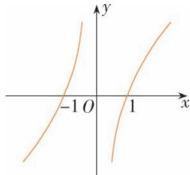

line

| x | y |
|---|---|
| -1 | 0 |
| 0 | 1 |
| 1 | 2 |

13. 解析 $y = f(t) =$

$$
\left\{ \begin{array}{l} \frac {\sqrt {3}}{2} t ^ {2}, 0 <   t \leqslant 1, \\ - \frac {\sqrt {3}}{2} (t - 2) ^ {2} + \sqrt {3}, 1 <   t \leqslant 2, \\ \sqrt {3}, t > 2. \end{array} \right.
$$

函数的图象如图.

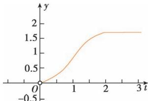

line

| t   | y    |
| --- | ---- |
| 0   | 0.0  |
| 1   | 1.0  |
| 2   | 1.7  |
| 3   | 1.7  |

14. 解析 （1）由题表中所给数据，在平面直角坐标系中作出（30, 60），（40, 30），（45, 15），（50, 0）的对应点，它们近似地分布在一条直线上，如图所示.

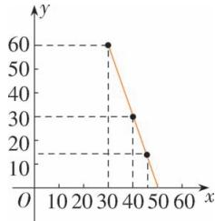

line

| x | y |
|---|---|
| 30 | 60 |
| 40 | 30 |
| 50 | 15 |

设 $y=kx+b(k\neq0)$ ，则 $\left\{\begin{aligned}50k+b&=0,\\ 45k+b&=15,\end{aligned}\right.$

解得 $\left\{\begin{aligned}k&=-3,\\ b&=150,\end{aligned}\right.$

$\therefore y=-3x+150(0\leqslant x\leqslant50,$ 且 $x\in N^{*}$ .

(2)依题意 $P=y(x-30)$

$$
= (- 3 x + 1 5 0) (x - 3 0)
$$

$$
= - 3 (x - 4 0) ^ {2} + 3 0 0,
$$

∴ 当 x=40 时, P 有最大值 300.

故销售单价为 40 元时,才能获得最大日销售利润.

# 第四章 指数函数与对数函数

# 4.1 指数

# 4.1.1 $n$ 次方根与分数指数幂

练习

1. 解析 (1) $a^{\frac{1}{2}} = \sqrt{a}$ . (2) $a^{\frac{3}{4}} = \sqrt[4]{a^{3}}$ .

(3) $a^{-\frac{3}{5}}=\frac{1}{\sqrt[5]{a^{3}}}.$ (4) $a^{-\frac{2}{3}}=\frac{1}{\sqrt[3]{a^{2}}}$ .

2. 解析 (1) $\sqrt[3]{x^2} = x^{\frac{2}{3}} (x > 0)$ .

(2) $\sqrt[5]{(m - n)^4} = (m - n)^{\frac{4}{5}}(m > n)$ .

(3) $\sqrt{p^6}\sqrt{p^5} = p^3\cdot p^{\frac{5}{2}} = p^{\frac{11}{2}}(p > 0).$

(4) $\frac{a^3}{\sqrt{a}} = a^{3 - \frac{1}{2}} = a^{\frac{5}{2}}(a > 0)$ .

3. 解析 (1) $\left(\frac{36}{49}\right)^{\frac{3}{2}} = \left[\left(\frac{6}{7}\right)^2\right]^{\frac{3}{2}} = \left(\frac{6}{7}\right)^3$

$$
= \frac {2 1 6}{3 4 3}.
$$

(2) $2\sqrt{3}\times3\sqrt[3]{1.5}\times\sqrt[6]{12}$

$$
= 2 \times 3 ^ {\frac {1}{2}} \times 3 \times \sqrt [ 3 ]{\frac {3}{2}} \times (2 ^ {2} \times 3) ^ {\frac {1}{6}}
$$

$$
= 2 \times 3 ^ {\frac {1}{2}} \times 3 \times 3 ^ {\frac {1}{3}} \times 2 ^ {- \frac {1}{3}} \times 2 ^ {\frac {1}{3}} \times 3 ^ {\frac {1}{6}}
$$

$$
= 2 ^ {1 - \frac {1}{3} + \frac {1}{3}} \times 3 ^ {1 + \frac {1}{2} + \frac {1}{3} + \frac {1}{6}}
$$

$$
= 2 \times 3 ^ {2} = 1 8.
$$

(3) $a^{\frac{1}{2}}a^{\frac{1}{4}}a^{-\frac{1}{8}}$

$$
= a ^ {\frac {1}{2} + \frac {1}{4} - \frac {1}{8}} = a ^ {\frac {5}{8}}.
$$

(4) $2x^{-\frac{1}{3}}\left(\frac{1}{2} x^{\frac{1}{3}} - 2x^{-\frac{2}{3}}\right) = x^{-\frac{1}{3} + \frac{1}{3}} - 4x^{-\frac{1}{3} - \frac{2}{3}} =$

$$
1 - 4 x ^ {- 1}.
$$

# 4.1.2 无理数指数幂及其运算性质

练习

1. 解析 (1) $(2^{\sqrt{3}}\sqrt{m^{\sqrt{3}}})^{2\sqrt{3}}$

$$
= 2 ^ {\sqrt {3} \times 2 \sqrt {3}} \cdot m ^ {\frac {\sqrt {3}}{2} \times 2 \sqrt {3}}
$$

$$
= 2 ^ {6} \cdot m ^ {3} = 6 4 m ^ {3}.
$$

(2) $a^{\frac{\pi}{3}}\cdot a^{\frac{2\pi}{3}}\cdot a^{-\pi}$

$$
= a ^ {\frac {\pi}{3} + \frac {2 \pi}{3} - \pi} = a ^ {0} = 1.
$$

2. 解析 (1) 当 $x$ 趋向负无穷大时, $2^{x}$ 的值不断变小, 并且趋近于 0.

(2) 当 x 趋向正无穷大时, $\left(\frac{1}{2}\right)^{x}$ 的值不断变小, 并且趋近于 0.

# 习题 4.1

复习巩固

1. 解析 (1) 原式 = 100.

(2) 原式 = -0.1.

(3) 原式 = 4 - π.

(4) 原式 = |x - y|.

2. 答案 (1) D (2) A

解析 (1) 对于 A, $a^{\frac{4}{3}}a^{\frac{3}{4}} = a^{\frac{4}{3} + \frac{3}{4}} = a^{\frac{25}{12}}$ ; 对于 B, $a \div a^{\frac{2}{3}} = a^{1 - \frac{2}{3}} = a^{\frac{1}{3}}$ ; 对于 C, $a^{\frac{2}{3}}a^{-\frac{2}{3}} = a^{0} = 1$ ; 对于 D, $(a^{\frac{1}{4}})^{4} = a$ . 故选 D.

(2) $\because a^{\frac{m}{n}} = \sqrt[n]{a^{m}}$

$a^0 = 1, a^{-\frac{m}{n}} = \frac{1}{\sqrt[n]{a^m}}$ ，故选A.

3. 答案 (1) $\left(\frac{1}{2}\right)^{-1}$

(2) $2^{\sqrt{3}}<3^{\sqrt{2}}<2^{\pi}<\pi^{\sqrt{5}}$

4. 解析 (1) 原式 $= \left(\frac{b^3}{a} \cdot \sqrt{\frac{a^2}{b^6}}\right)^{\frac{1}{2}}$

$$
= \left(\frac {b ^ {3}}{a}\right) ^ {\frac {1}{2}} \cdot \left(\frac {a ^ {2}}{b ^ {6}}\right) ^ {\frac {1}{4}}
$$

$$
= \frac {b ^ {\frac {3}{2}} a ^ {\frac {1}{2}}}{a ^ {\frac {1}{2}} b ^ {\frac {3}{2}}} = 1.
$$

(2) 原式 $= (a^{\frac{1}{2}} \cdot \sqrt{a^{\frac{1}{2}}\sqrt{a}})^{\frac{1}{2}}$

$$
= a ^ {\frac {1}{4}} \cdot \left(a ^ {\frac {1}{4}} \cdot \sqrt [ 4 ]{a}\right) ^ {\frac {1}{2}}
$$

$$
= a ^ {\frac {1}{4}} \cdot a ^ {\frac {1}{8}} \left(a ^ {\frac {1}{4}}\right) ^ {\frac {1}{2}} = a ^ {\frac {1}{2}}.
$$

(3) 原式= $\frac{m^{\frac{1}{2}}\cdot m^{\frac{1}{3}}\cdot m^{\frac{1}{4}}}{m^{\frac{5}{6}}\cdot m^{\frac{1}{4}}}$

$$
= m ^ {\frac {1}{2} + \frac {1}{3} + \frac {1}{4} - \frac {5}{6} - \frac {1}{4}} = m ^ {0} = 1.
$$

5. 解析 (1) 原式 $= a^{\frac{1}{3} + \frac{3}{4} + \frac{7}{12}} = a^{\frac{5}{3}}$ .

(2) 原式 $= a^{\frac{2}{3} + \frac{3}{4} - \frac{5}{6}} = a^{\frac{7}{12}}$ .

(3) 原式 $= x^{\frac{1}{3} \times 12} \cdot y^{-\frac{3}{4} \times 12} = x^{4}y^{-9}$ .

(4) 原式 $= (-6)a^{\frac{2}{3} + \frac{1}{3}}b^{-\frac{1}{3} + \frac{1}{3}}$

$$
= - 6 a b ^ {0} = - 6 a.
$$

综合运用

6. 答案 64

解析 ∵ 细菌每 10 min 分裂 1 次, 1 h 共分裂 6 次, ∴ 1 个细菌分裂成 $2^{6}=64$ 个.

7. 解析 (1) $\because 10^{m} = 2, 10^{n} = 3$ ,

$$
\begin{array}{l} \therefore 1 0 ^ {\frac {3 m - 2 n}{2}} = (1 0 ^ {3 m - 2 n}) ^ {\frac {1}{2}} = \left(\frac {1 0 ^ {3 m}}{1 0 ^ {2 n}}\right) ^ {\frac {1}{2}} \\ = \left[ \frac {\left(1 0 ^ {m}\right) ^ {3}}{\left(1 0 ^ {n}\right) ^ {2}} \right] ^ {\frac {1}{2}} = \left(\frac {2 ^ {3}}{3 ^ {2}}\right) ^ {\frac {1}{2}} = \frac {2 \sqrt {2}}{3}. \\ \end{array}
$$

(2) $\because a^{2x}=3,\therefore\frac{a^{3x}+a^{-3x}}{a^{x}+a^{-x}}=\frac{(a^{x})^{3}+(a^{-x})^{3}}{a^{x}+a^{-x}}$

$$
= a ^ {2 x} - a ^ {x} \cdot a ^ {- x} + a ^ {- 2 x} = 3 - 1 + \frac {1}{3} = \frac {7}{3}.
$$

8. 解析 已知 $a^{\frac{1}{2}} + a^{-\frac{1}{2}} = 3$ ,

(1) $a + a^{-1} = (a^{\frac{1}{2}} + a^{-\frac{1}{2}})^2 - 2a^{\frac{1}{2}} \cdot a^{-\frac{1}{2}}$

$$
= 3 ^ {2} - 2 \cdot a ^ {0} = 7.
$$

(2) $a^{2}+a^{-2}=(a+a^{-1})^{2}-2a\cdot a^{-1}$

$$
= 4 9 - 2 = 4 7.
$$

拓广探索

9. 解析 (1) 当进行 1 次之后, 容器中酒精含量为 $\frac{2}{3}$ 升; 第 2 次之后为 $\frac{2}{3} \times \frac{2}{3} = \frac{4}{9}$ 升; ……; 第 5 次之后为 $\left(\frac{2}{3}\right)^{5}$ 升.

(2)由(1)得出第 $n$ 次之后为 $\left(\frac{2}{3}\right)^n$ 升.

10. 解析 (1) 略.

(2) 当 n 越来越大时, $\left(1+\frac{1}{n}\right)^{n}$ 也会越来越大.

# 4.2 指数函数

# 4.2.1 指数函数的概念

练习

1. C A 为一次函数图象, B 为二次函数图象, D 可以为 $y = x^{3}$ 的图象.

2. 解析 $f(0)=3 \cdot 2^{0}$ ;

$$
f (0. 5) = 2 f (0) = 3 \cdot 2 ^ {1};
$$

$$
f (1) = 2 f (0. 5) = 4 f (0) = 3 \cdot 2 ^ {2};
$$

$$
f (1. 5) = 2 f (1) = 8 f (0) = 3 \cdot 2 ^ {3};
$$

$$
\dots
$$

$$
f (0. 5 n) = 2 f (0. 5 (n - 1)) = 3 \cdot 2 ^ {n}.
$$

所以函数 $y=f(x)$ 的一个解析式为 $f(x)=3 \cdot 2^{2x}=3 \cdot 4^{x}$ .

3. 解析 令 $f(x)=(1+6.25\%)^{x}$ ,

则 $f(30)=(1+6.25\%)^{30}\approx6.16,$

答:该湖泊的蓝藻变为原来的6.16倍.

# 4.2.2 指数函数的图象和性质

练习

1. 解析 在同一平面直角坐标系中, 函数 $y = 3^{x}$ , $y = \left(\frac{1}{3}\right)^{x}$ 的图象如图所示. 它们的图象关于 y 轴对称.

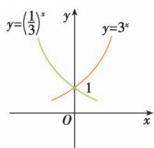

line

| Point | y (x) | y (y) |
|---|---|---|
| 1 | -2.5 | -1.0 |
| 2 | 0 | 0.5 |
| 3 | 2.5 | 1.0 |
| 4 | 5 | 2.5 |
| 5 | 7.5 | 4.0 |
| 6 | 10 | 5.5 |
| 7 | 12.5 | 7.0 |
| 8 | 15 | 8.5 |
| 9 | 17.5 | 10.0 |
| 10 | 20 | 11.5 |
| 11 | 22.5 | 13.0 |
| 12 | 25 | 14.5 |
| 13 | 27.5 | 16.0 |
| 14 | 30 | 17.5 |
| 15 | 32.5 | 19.0 |
| 16 | 35 | 20.5 |
| 17 | 37.5 | 22.0 |
| 18 | 40 | 23.5 |
| 19 | 42.5 | 25.0 |
| 20 | 45 | 26.5 |
| 21 | 47.5 | 28.0 |
| 22 | 50 | 29.5 |
| 23 | 52.5 | 31.0 |
| 24 | 55 | 32.5 |
| 25 | 57.5 | 34.0 |
| 26 | 60 | 35.5 |
| 27 | 62.5 | 37.0 |
| 28 | 65 | 38.5 |
| 29 | 67.5 | 40.0 |
| 30 | 70 | 41.5 |
| 31 | 72.5 | 43.0 |
| 32 | 75 | 44.5 |
| 33 | 77.5 | 46.0 |
| 34 | 80 | 47.5 |
| 35 | 82.5 | 49.0 |
| 36 | 85 | 50.5 |
| 37 | 87.5 | 52.0 |
| 38 | 90 | 53.5 |
| 39 | 92.5 | 55.0 |
| 40 | 95 | 56.5 |
| 41 | 97.5 | 58.0 |
| 42 | 100 | 59.5 |
| 43 | 102.5 | 61.0 |
| 44 | 105 | 62.5 |
| 45 | 107.5 | 64.0 |
| 46 | 110 | 65.5 |
| 47 | 112.5 | 67.0 |
| 48 | 115 | 68.5 |
| 49 | 117.5 | 70.0 |
| 50 | 120 | nan |
The chart is a line graph with x-axis labeled 'x' and y-axis labeled 'y'. The lines are labeled with equations: y = (1/3)², y = (3/x), and y = (x^3). The chart is divided into three quadrants by the origin point at (x=0, y=0).

2. 解析 (1) 由函数 $y = 6^x$ 、 $y = 7^x$ 的图象可知 $6^{\sqrt{2}} < 7^{\sqrt{2}}$ .

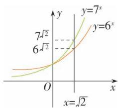

line

| x | y = 6^x | y = 7^x |
|---|---|---|
| 0 | √2 | √2 |
| √2 | √2 | √2 |

(2) 由函数 $y = 0.3^x$ 的图象可知 $0.3^{-3.5} > 0.3^{-2.3}$ .

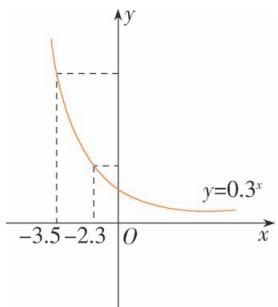

line

| x | y |
|---|---|
| -3.5 | y=0.3^x |
| -2.3 | y=0.3^x |
| 0 | y=0.3^x |
| >0 | y=0.3^x |

(3) 由函数 $y=1.2^{x}$ 、 $y=0.5^{x}$ 的图象可知 $1.2^{0.5}>1>0.5^{1.2}$ ，即 $1.2^{0.5}>0.5^{1.2}$ .

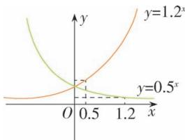

line

| x | y=0.5^x | y=1.2^x |
|---|---|---|
| 0.0 | 0 | 0 |
| 0.5 | 0.5 | 1 |
| 1.2 | 1 | 2 |

3. 略

# 习题 4.2

复习巩固

1. 解析 (1) 对任意的 $x \in \mathbf{R}$ , 函数 $y = 2^{3 - x}$ 都有意义, 所以 $y = 2^{3 - x}$ 的定义域为 $(- \infty, + \infty)$ .

(2) 对任意的 $x \in R$ ，函数 $y = 3^{2x+1}$ 都有意义，所以 $y = 3^{2x+1}$ 的定义域为 $(-∞, +∞)$ .

(3) 对任意的 $x \in \mathbf{R}$ , 函数 $y = \left(\frac{1}{2}\right)^{5x}$ 都有意义,所以 $y=\left(\frac{1}{2}\right)^{5x}$ 的定义域为 $(-∞,+∞)$ .

(4)由题意知 $x \neq 0$ ，所以 $y = 0.7^{\frac{1}{x}}$ 的定义域为 $(-∞, 0) ∪ (0, +∞)$ .

2. 解析 由题意可得，

经过 1 年后, 年产量为 $a + a \cdot p\% = a (1 + p\%)$ ;

经过 2 年后, 年产量为 $a(1+p\%) + a(1+p\%)$

$$
\cdot p \% = a (1 + p \%) ^ {2};
$$

经过 3 年后, 年产量为 $a(1 + p\%)^{2} +$

$$
a (1 + p \%) ^ {2} \cdot p \% = a (1 + p \%) ^ {3};
$$

$$
\dots
$$

经过 x 年后,年产量为 $a(1+p\%)^{x}$ .

$$
\therefore y = a (1 + p \%) ^ {x} (x \in \mathbf {N} ^ {*}, x \leqslant m).
$$

3. 解析 (1) $m < n$ . (2) $m > n$ . (3) $m > n$ . (4) $m > n$ .

4. 解析 (1) $20.23 = Q_{0}(1 + r)^{10}$ , ①

$$
2 3. 2 6 = Q _ {0} (1 + r) ^ {1 1}, \tag {②}
$$

②得 $\frac{23.26}{20.23} = 1 + r, \therefore r = \frac{23.26}{20.23} - 1 \approx 0.15.$

(2)由(1)知, $Q_{0}\approx5,f(12)=5\times(1+r)^{12}=5\times$

$$
1. 1 5 ^ {1 2} \approx 2 6. 7 5.
$$

# 综合运用

5. 解析 (1) 设 $f(x)=3.5 \cdot a^{x}$ ,

由 $f(1)=4.20$ , $f(2)=5.04$ 得 a=1.2,

$$
\therefore f (x) = 3. 5 \times 1. 2 ^ {x}.
$$

(2) 设 $g(x) = c \cdot a^x$ ,

由 $f(-1)=8,f(1)=2$ ,得

$$
\left\{ \begin{array}{l} c \cdot a ^ {- 1} = 8, \\ c \cdot a = 2, \end{array} \right.
$$

解得 $a=\frac{1}{2}, c=4,$

$$
\therefore g (x) = 4 \cdot \left(\frac {1}{2}\right) ^ {x}.
$$

6. 解析 (1) $\because y = 3^{x}$ 是增函数, 且 $0.8 > 0.7$ ,

$$
\therefore 3 ^ {0. 8} > 3 ^ {0. 7}.
$$

(2) $\because y=0.75^{x}$ 是减函数,且-0.1<0.1,

$$
\therefore 0. 7 5 ^ {- 0. 1} > 0. 7 5 ^ {0. 1}.
$$

(3) $\because y=1.01^{x}$ 是增函数,且2.7<3.5,

$$
\therefore 1. 0 1 ^ {2. 7} <   1. 0 1 ^ {3. 5}.
$$

(4) $\because y=0.99^{x}$ 是减函数,且3.3<4.5,

$$
\therefore 0. 9 9 ^ {3. 3} > 0. 9 9 ^ {4. 5}.
$$

7. 解析 能. 设原来碳 14 的含量为 1, 则经过 9

个“半衰期”后,碳14的含量为 $\left(\frac{1}{2}\right)^{9}=\frac{1}{512}$

$>\frac{1}{1\ 000}$ ,所以能探测到.

8. 解析 (1) 本利和 y 关于存期 x 变化的函数解析式为 $y = a(1 + r)^{x}$ .

(2) 当 $a = 1000, r = 2.25\%$ , $x = 5$ 时, $y = 1000$

$\times(1+2.25\%)^{5}=1000\times1.0225^{5}\approx1118(\text{元}).$

答:5 期后的本利和约为 1 118 元.

# 拓广探索

9. 解析 (1) 由题意, 得 $\left\{ \begin{array}{l} f(0) = 0, \\ b = 2, \end{array} \right.\therefore \left\{ \begin{array}{l} a = -2, \\ b = 2, \end{array} \right.$

$$
\therefore y = - 2 \cdot \left(\frac {1}{2}\right) ^ {| x |} + 2.
$$

图象如图所示:

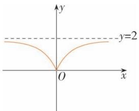

text_image

y
y=2
O
x

(2)该函数是偶函数.在 $(-∞,0)$ 上单调递减,在 $(0,+∞)$ 上单调递增.

10. 解析 (1) 当 a > 1 时, $f(x)$ 单调递增, $g(x)$ 单调递减;

当 0 < a < 1 时, $f(x)$ 单调递减, $g(x)$ 单调递增.

(2)

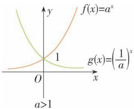

text_image

f(x)=a^x
g(x)=(1/a)^x
a>1

图①

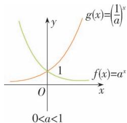

line

| x    | g(x)        | f(x)        |
| ---- | ----------- | ----------- |
| 0    | 0           | 0           |
| 1    | 1           | 1           |

图②

当 a>1 时, 若 $f(x)<g(x)$ , 由图①, 得 x<0; 当 0<a<1 时, 若 $f(x)<g(x)$ , 由图②, 得 x>0.

# 4.3 对数

# 4.3.1 对数的概念

练习

1. 解析 (1) $\log_{2}8 = 3$ .

(2) $\ln m = \sqrt{3}$ .   
(3) $\log_{27}\frac{1}{3} = -\frac{1}{3}$ .   
(4) $3^{2}=9.$   
(5) $10^{2.3}=n.$   
(6) $3^{-4}=\frac{1}{81}.$

2. 解析 (1) $\because 5^{2} = 25$

$$
\therefore \log_ {5} 2 5 = 2.
$$

$$
\therefore \log_ {0. 4} 1 = 0.
$$

(2) $\because 0.4^{0}=1,$   
(3) $\because \mathrm{e}^{-1} = \frac{1}{\mathrm{e}}, \therefore \ln \frac{1}{\mathrm{e}} = -1.$   
(4) $\because 10^{-3} = 0.001, \therefore \lg 0.001 = -3.$

3. 解析 (1) $\log \frac{1}{3} x = -3, \therefore x = \left(\frac{1}{3}\right)^{-3} = 27$ .

(2) $\because\log_{x}49=4,\therefore x^{4}=49$ ,又x>0且 $x\neq1$ , $\therefore x=\sqrt{7}.$   
(3) $\because \lg 0.00001 = x, \therefore x = \lg 10^{-5} = -5.$   
(4) $\because \ln \sqrt{\mathrm{e}} = -x, \therefore x = -\ln \mathrm{e}^{\frac{1}{2}} = -\frac{1}{2}$ .

# 4.3.2 对数的运算

练习

1. 解析 (1) $\log_3(27 \times 9^2) = \log_3 3^3 + \log_3 3^4 = 3 + 4 = 7$ .

(2) $\lg 5 + \lg 2 = \lg (5 \times 2) = \lg 10 = 1$ .   
(3) $\ln 3 + \ln \frac{1}{3} = \ln \left(3 \times \frac{1}{3}\right) = \ln 1 = 0.$   
(4) $\log_35 - \log_315 = \log_3\frac{5}{15} = \log_3\frac{1}{3} = -1.$

2. 解析 (1) $\lg (xyz) = \lg x + \lg y + \lg z$ .

(2) $\lg \frac{xy^2}{z} = \lg (xy^2) - \lg z$

$$
= \lg x + \lg y ^ {2} - \lg z
$$

$$
= \lg x + 2 \lg y - \lg z.
$$

(3) $\lg \frac{xy^3}{\sqrt{z}} = \lg (xy^3) - \lg \sqrt{z}$

$$
= \lg x + \lg y ^ {3} - \frac {1}{2} \lg z
$$

$$
= \lg x + 3 \lg y - \frac {1}{2} \lg z.
$$

(4) $\lg \frac{\sqrt{x}}{y^2z} = \lg \sqrt{x} - \lg (y^2z)$

$$
= \frac {1}{2} \lg x - \lg y ^ {2} - \lg z
$$

$$
= \frac {1}{2} \lg x - 2 \lg y - \lg z.
$$

3. 解析 (1) 原式= $\frac{\lg 3}{\lg 2} \cdot \frac{\lg 4}{\lg 3} \cdot \frac{\lg 5}{\lg 4} \cdot \frac{\lg 2}{\lg 5} = 1$ .

(2) 原式 =

$$
2 \left(\frac {1}{2} \log_ {2} 3 + \frac {1}{3} \log_ {2} 3\right) \left(\log_ {3} 2 + \frac {1}{2} \log_ {3} 2\right)
$$

$$
= 2 \cdot \frac {5}{6} \log_ {2} 3 \cdot \frac {3}{2} \log_ {3} 2 = \frac {5}{2}.
$$

# 习题 4.3

复习巩固

1. 解析 (1) $\log_{3}1 = x$ .

(2) $\log_{4}\frac{1}{6}=x.$

(3) $\lg 6=x.$

(4) $\ln 25 = x.$

(5) $5^{x}=27.$

(6) $7^{x}=\frac{1}{3}.$

(7) $10^{x} = 0.3$ .

(8) $e^{x}=\sqrt{3}.$

2. 答案 (1) D (2) C

解析 (1) 根据题意, 知 $\left\{ \begin{array}{l} 2 - x > 0, \\ 2x - 1 > 0, \\ 2x - 1 \neq 1 \end{array} \right. \Rightarrow \frac{1}{2} < x <$

2 且 $x \neq 1$ , 故选 D.

(2)∵ $\lg a+\lg b=0$ , 且 a>0, b>0, ∴ ab=1, 故选 C.

3. 解析 (1) $\log_{a}2 + \log_{a}\frac{1}{2}$

$$
= \log_ {a} \left(2 \times \frac {1}{2}\right) = \log_ {a} 1 = 0.
$$

(2) $\log_3 18 - \log_3 2 = \log_3 \frac{18}{2} = \log_3 9 = 2.$

(3) $\lg \frac{1}{4} - \lg 25 = \lg \frac{1}{4 \times 25} = \lg \frac{1}{100} = -2.$

(4) $2\log_{5}25 - 3\log_{2}64 = 2 \times 2 - 3 \times 6 = 4 - 18 = -14.$

(5) $\log_2(\log_216) = \log_24 = 2.$

(6) $\log_225\times \log_34\times \log_59$

$$
= \frac {\lg 2 5}{\lg 2} \times \frac {\lg 4}{\lg 3} \times \frac {\lg 9}{\lg 5}
$$

$$
= \frac {2 \lg 5}{\lg 2} \times \frac {2 \lg 2}{\lg 3} \times \frac {2 \lg 3}{\lg 5} = 8.
$$

4. 解析 (1) $\ln x = \ln a + \ln b = \ln ab$ ,

$$
\therefore x = a b.
$$

(2) $\lg x = 3\lg n - \lg m = \lg n^3 - \lg m = \lg \frac{n^3}{m}, \therefore x$

$$
= \frac {n ^ {3}}{m}.
$$

(3) $\log_a x = \frac{1}{2} \log_a b - \log_a c = \log_a \sqrt{b} - \log_a c$

$$
= \log_ {a} \frac {\sqrt {b}}{c}, \therefore x = \frac {\sqrt {b}}{c}.
$$

(4) $\log_2[\log_3(\log_4x)] = 0$

$$
\therefore \log_ {3} (\log_ {4} x) = 1,
$$

$$
\therefore \log_ {4} x = 3, \therefore x = 4 ^ {3}.
$$

综合运用

5. 解析 (1) $\lg 6 = \lg 2 + \lg 3 = a + b$ .

(2) $\log_34 = \frac{\lg 4}{\lg 3} = \frac{2\lg 2}{\lg 3} = \frac{2a}{b}$ .

(3) $\log_212 = \frac{\lg 12}{\lg 2} = \frac{\lg 3 + \lg 4}{\lg 2} = \frac{\lg 3 + 2\lg 2}{\lg 2}$

$$
= \frac {2 a + b}{a}.
$$

(4) $\lg \frac{3}{2} = \lg 3 - \lg 2 = b - a.$

6. 解析 (1) $x \log_{3} 4 = 1, \therefore x = \log_{4} 3,$

$$
\therefore 4 ^ {x} + 4 ^ {- x} = 4 ^ {\log_ {4} 3} + 4 ^ {- \log_ {4} 3} = 3 + \frac {1}{3} = \frac {1 0}{3}.
$$

(2) $f(\log_{3}2)=3^{\log_{3}2}=2.$

7. 证明 (1) 左边 = $\frac{\lg b}{\lg a} \cdot \frac{\lg c}{\lg b} \cdot \frac{\lg a}{\lg c} = 1$ ,

$$
\therefore \log_ {a} b \cdot \log_ {b} c \cdot \log_ {c} a = 1.
$$

(2) $\log_{a^{\infty}}b^{n} = \frac{\lg b^{n}}{\lg a^{m}} = \frac{n}{m}\cdot \frac{\lg b}{\lg a}$

$$
= \frac {n}{m} \log_ {a} b.
$$

8. 解析 设 x 年后该地 GDP 会翻两番.

由题意知， $(1 + 6.5\%)^{x} = 4$

$$
\therefore x = \log_ {1. 0 6 5} 4 \approx 2 2. 0 1.
$$

∴ 23 年后该地 GDP 会翻两番.

拓广探索

9. 解析 $(1)x=\frac{1.01^{365}}{0.99^{365}}\approx1480.66.$

(2) $1.01^{x_1} = 10 \times 0.99^{x_1}$ ,

$$
\therefore x _ {1} = 1 1 5.
$$

答:大约经过 115 天后“进步”的是“落后”的 10 倍.同理可得,大约经过 231 天、346 天后“进步”的是“落后”的 100 倍、1 000 倍.

10. 解析 设经过 x 小时才能驾驶, 由题意, 得 $100 \times (1 - 30\%)^{x} \leqslant 20$ ,

$$
\therefore x \geqslant \frac {\lg 0 . 2}{\lg 0 . 7} \approx 4. 5.
$$

答:他至少经过5小时才能驾驶.

# 4.4 对数函数

# 4.4.1 对数函数的概念

练习

1. 解析 (1) 由 $1 - x > 0$ , 得 $x < 1$ ,

故 $y=\ln(1-x)$ 的定义域为 $\{x\mid x<1\}$ .

(2)由 $\left\{\begin{aligned}x&>0,\\ \lg x&\neq0,\end{aligned}\right.$ 得 $\left\{\begin{aligned}x&>0,\\ x&\neq1,\end{aligned}\right.$

$\therefore y = \frac{1}{\lg x}$ 的定义域为 $\{x \mid x > 0, \text{且} x \neq 1\}$ .

(3)由 $\frac{1}{1-3x}>0$ ,得1-3x>0,

$$
\therefore x <   \frac {1}{3}.
$$

$\therefore y = \log_7\frac{1}{1 - 3x}$ 的定义域为 $\left\{x\mid x <   \frac{1}{3}\right\} .$

(4) $y=\log_{a}|x|(a>0, \text{且 } a\neq1)$ 的定义域为 $\{x|x\neq0\}$ .

2. 解析 (1) 函数 $y = \lg 10^{x} = x$ 的图象如图所示.

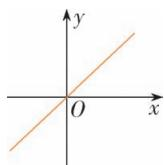

(2) $y=10^{\lg x}=x(x>0)$ 的图象如图所示.

3. 答案 ①

# 4.4.2 对数函数的图象和性质

练习

1. 解析 函数 $y=\log_{3}x$ 和 $y=\log_{\frac{1}{3}}x$ 的图象如图所示.

line

| x    | y=log₃x | y=log₃x |
| ---- | ------- | ------- |
| 0    | 1.5     | -1.5    |
| 1    | 0.0     | 0.0     |
| 2    | -1.0    | 0.5     |
| 3    | -1.5    | 1.0     |

$y=\log_{3}x$ 的图象与 $y=\log_{\frac{1}{3}}x$ 的图象关于 x 轴对称.

2. 解析 (1) $\because y = \lg x$ 在 $(0, +\infty)$ 上是增函数, 且 $0.6 < 0.8$ ,

∴ lg 0.6<lg 0.8.

(2) $\because y=\log_{0.5}x$ 在 $(0,+\infty)$ 上是减函数,且6>4,

$\therefore \log_{0.5}6 < \log_{0.5}4.$

(3) 当 m>1 时, $y=\log_{m}x$ 是增函数.

$\because 5<7, \therefore \log_{m}5<\log_{m}7;$

当 0<m<1 时, $y=\log_{m}x$ 是减函数.

$\because 5<7, \therefore \log_{m}5>\log_{m}7.$

3. 解析 (1) 由题意得, $y = 3000(1 + 6.8\%)^x$ , $1 \leqslant x \leqslant 5$ 且 $x \in \mathbf{N}^*$ .

(2) 3000(1+6.8%) $^{x}$ =3900,

解得 $x \approx 3.98$ ,

∴ 经过 4 年该地区 GDP 能达到 3900 亿元人民币.

# 4.4.3 不同函数增长的差异

练习

1. 解析 由表中的数据可知, 关于 x 呈指数增长的变量是 $y_{2}$ .

2. 解析 由题图(1)知 $0 < x < 0.27$ 时 $3^{x} > 5x$ ，由题图(2)(3)知， $x > 2.17$ 时 $3^{x} > 5x$ ， $\therefore$ 使 $3^{x} > 5x$ 的 $x$ 的取值范围是 $(0, 0.27) \cup (2.17, +\infty)$ .

3. 解析 由题图可知 $A(1,0)$ , $B(2,\lg 2)$ .
设一次函数解析式为 $f(x)=kx+b(k\neq0)$ ,

由题意得 $\left\{\begin{aligned}0&=k+b,\\ \lg2&=2k+b,\end{aligned}\right.$

$$
\therefore b = - \lg 2, k = \lg 2,
$$

$$
\therefore f (x) = x \lg 2 - \lg 2.
$$

4. C 根据 $f(2) < 1, f(3) > 1$ 可知 $y = \ln x$ 满足.

# 习题4.4

复习巩固

1. 解析 (1) 由题意知 x > 0,

所以函数的定义域为 $(0,+\infty)$ .

(2)由 $\left\{\begin{aligned}\log_{0.5}(4x-3)\geqslant0,\\ 4x-3>0,\end{aligned}\right.$

得 $\left\{\begin{aligned}0&<4x-3\leqslant1,\\ 4x&-3>0,\end{aligned}\right.$

解得 $\frac{3}{4}<x\leqslant1$ .故函数的定义域是 $\left(\frac{3}{4},1\right]$ .

2. 解析 (1) $m < n$ . (2) $m > n$ .

(3) m > n. (4) m > n.

3. 解析 若火箭的最大速度 v=12 km/s,

那么 $2000\ln \left(1 + \frac{M}{m}\right) = 12$

则 $\ln \left(1 + \frac{M}{m}\right) = \frac{3}{500},$

即 $1 + \frac{M}{m} = \mathrm{e}^{\frac{3}{500}}$

所以 $\frac{M}{m} \approx 0.006$ .

答: 当燃料质量为火箭质量的 0.6% 时, 火箭的最大速度可达 12 km/s.

4. 解析 (1) ① 对应函数 $y = \lg x$ , ② 对应函数 $y = \log_3 x$ , ③ 对应函数 $y = \log_2 x$ . 当底数大于 1 时, 图象在 $x = 1$ 的右侧, 底数越大的图象越在下方.

(2)如图，

line

| x | y=log₂x | y=log₅x | y=log₁₀x |
|---|---|---|---|
| 0 | 1 | 1 | 1 |
| 1 | 0 | 0 | 0 |

(3)从图中发现, $y=\log_{2}x,y=\log_{5}x,y=\lg x$ 的图象分别与 $y=\log_{\frac{1}{2}}x,y=\log_{\frac{1}{5}}x,y=\log_{\frac{1}{10}}x$ 的图象关于x轴对称.

可推广到一般情况.

$\because \log_{\frac{1}{a}}x = -\log_{a}x (a > 0, \text{且 } a \neq 1)$ ,

$\therefore y=\log\frac{1}{a}x(a>0, \text{且 } a\neq1)$ 的图象与 $y=\log_{a}x$ $(a>0, \text{且 } a\neq1)$ 的图象关于 x 轴对称，它们的单调性相反.

5. 解析 (1) 令 O=2700,

则 $v=\frac{1}{2}\log_{3}\frac{2700}{100}=1.5\ m/s.$

答:一条鱼的耗氧量为 2 700 个单位时,它的游速为 1.5 m/s.

(2) 令 $v = 0$ ，则 $\frac{1}{2} \log_3 \frac{O}{100} = 0$ ，解得 $O = 100$ .

答:一条鱼静止时的耗氧量为 100 个单位.

6.B

综合运用

7. 解析 (1) 互为反函数.

$y=\ln x$ 的定义域为 $(0,+\infty)$ ，值域为 R； $y=e^{x}$ 的定义域为 R，值域为 $(0,+\infty)$ .

(2) 互为反函数.

由 $y=-\log_{a}x$ , 得 $\log_{a}x=-y$

$\therefore x = a^{-y} = \left(\frac{1}{a}\right)^y, \therefore y = -\log_a x$ 的反函数是 $y$

$$
= \left(\frac {1}{a}\right) ^ {x}.
$$

$y=-\log_{a}x$ 的定义域为 $(0,+\infty)$ ，值域为 R;

$y=\left(\frac{1}{a}\right)^{x}$ 的定义域为 R, 值域为 $(0,+\infty)$ .

8. 解析 (1) $y = g(x)$ 表示该学校男生体重为 $x \mathrm{~kg}$ 时, 平均身高为 $\mathrm{y} \mathrm{~cm}$ .

(2) $\because f(170)=55,\therefore g(55)=170.$

其实际意义是男生体重为 $55 \, kg$ 时的平均身高为 $170 \, cm$ .

9. 解析 设疾病的患病率与经过的年数的函数关系式为 $f(x)=(1-15\%)^{x}$ ,

依题意得 $(1-15\%)^{x}=50\%$ ,

即 $0.85^{x}=0.5$ ,

$$
\therefore x = \frac {\lg 0 . 5}{\lg 0 . 8 5} \approx 4. 2 6 5.
$$

答:要将当前的患病率降低一半,大约需要5年.

10. 解析 (1) $\because L_{I} = 10\lg \left(\frac{I}{10^{-12}}\right)$ 为增函数，

$$
\begin{array}{l} \therefore \left(L _ {I}\right) _ {\max} = 1 0 \lg \left(\frac {1}{1 0 ^ {- 1 2}}\right) = 1 2 0, \\ \left(L _ {I}\right) _ {\min} = 1 0 \lg \left(\frac {1 0 ^ {- 1 2}}{1 0 ^ {- 1 2}}\right) = 0, \\ \end{array}
$$

∴ 人听觉的声强级范围为 [0,120] (单位: dB).

$$
(2) L _ {I} = 1 0 \lg \left(\frac {1 0 ^ {- 6}}{1 0 ^ {- 1 2}}\right) = 6 0 \mathrm{dB}.
$$

11. 解析 (1) 设 $P_{1}=f(t)=kt+b(k\neq0)$ ,

由 $f(0)=20, f(10)=40,$

得 $\left\{\begin{aligned}b=20,\\ 10k+b=40,\end{aligned}\right.$ $\therefore k=2,b=20.$

$\therefore P_{1} = f(t) = 2t + 20(t > 0)$ .

(2) 设 $P_{2}=g(t)=c\cdot a^{t}(c>0,a>0,$ 且 $a\neq1)$ ,

由 $g(0) = 20, g(10) = 40$ ，得

$$
\left\{ \begin{array}{l} c \cdot a ^ {0} = 2 0, \\ c \cdot a ^ {1 0} = 4 0, \end{array} \right. \therefore c = 2 0, a = 2 ^ {\frac {1}{1 0}},
$$

$$
\therefore P _ {2} = g (t) = 2 0 \cdot \left(2 ^ {\frac {1}{1 0}}\right) ^ {t} (t > 0).
$$

(3) 补全表格如下:

<table><tr><td> $t$ </td><td>0</td><td>5</td><td>10</td><td>15</td><td>20</td></tr><tr><td> $P_{1}$ </td><td>20</td><td>30</td><td>40</td><td>50</td><td>60</td></tr><tr><td> $P_{2}$ </td><td>20</td><td> $20\sqrt{2}$ </td><td>40</td><td> $20 \cdot 2^{\frac{3}{2}}$ </td><td>80</td></tr></table>

图象如下：

line

| t    | P     |
| ---- | ----- |
| 0    | 20    |
| 10   | 40    |
| >10  | >40   |

当 0<t<10 时, $P_{1}>P_{2}$ ;

当 t>10 时, $P_{1}<P_{2}$ .

拓广探索

12. 解析 $\log_a \frac{1}{2} < 1 = \log_a a$ ,

当 $a > 1$ 时， $a > \frac{1}{2}$ ；

当 $0 < a < 1$ 时, $a < \frac{1}{2}$ .

∴ a>1 或 $0<a<\frac{1}{2}$ .

$$
\because \left(\frac {1}{2}\right) ^ {a} <   1 = \left(\frac {1}{2}\right) ^ {0},
$$

$$
\therefore a > 0.
$$

$\because a^{\frac{1}{2}}<1,$ 即 $\sqrt{a}<1,$ $\therefore\left\{\begin{aligned}a<1,\\ a\geqslant0,\end{aligned}\right.$

$$
\therefore 0 \leqslant a <   1.
$$

综上,实数 a 的取值范围是 $0 < a < \frac{1}{2}$ .

13. 解析 (1) 解法一: 如图,

line

| x    | y=log₀.₂x | y=log₀.₃x | y=log₀.₄x |
| ---- | --------- | --------- | --------- |
| 0    | 1.0       | 1.0       | 1.0       |
| 6    | 0.5       | 0.3       | 0.2       |

由图象可知, $\log_{0.2}6>\log_{0.3}6>\log_{0.4}6.$

解法二： $\because \log_{6}0.2 < \log_{6}0.3 < \log_{6}0.4 < 0$

$\therefore \frac{1}{\log_60.2} > \frac{1}{\log_60.3} > \frac{1}{\log_60.4}$ , 即 $\log_{0.2} 6 > \log_{0.3} 6$

$$
> \log_ {0. 4} 6.
$$

(2)如图，

line

| x | y=log₂x | y=log₃x | y=log₄x |
|---|---|---|---|
| 0 | 0 | 0 | 0 |
| 3 | ~1.2 | ~0.8 | ~0.6 |
| 4 | ~1.8 | ~1.2 | ~0.9 |
| 5 | ~2.5 | ~1.6 | ~1.2 |

由图象可知, $\log_{2}3>\log_{3}4>\log_{4}5.$

# 4.5 函数的应用（二）

# 4.5.1 函数的零点与方程的解

练习

1. 解析 不能. 不能仅根据其中一个图象得出函数 $y=f(x)$ 在某个区间只有一个零点的判断, 应结合函数零点存在定理和函数单调性判断.

2. 解析 （1）作出函数图象（如图1），因为 $f(1)=1>0, f(1.5)=-2.875<0$ ，所以 $f(x)=-x^{3}-3x+5$ 在区间 $(1,1.5)$ 上有一个零点。又因为 $f(x)$ 是 $(-∞,+∞)$ 上的减函数，所以 $f(x)=-x^{3}-3x+5$ 在区间 $(1,1.5)$ 上有且只有一个零点。

(2)作出函数图象(如图2)，因为 $f(3)<0$ ， $f(4)>0$ ，所以 $f(x)=2x\cdot\ln(x-2)-3$ 在区间(3,4)上有一个零点.

又因为 $f(x)=2x\cdot\ln(x-2)-3$ 在 $(2,+\infty)$ 上是增函数,所以 $f(x)$ 在 $(2,+\infty)$ 上有且仅有一个 $(3,4)$ 上的零点.

(3)作出函数图象(如图3)，因为 $f(0)<0$ ， $f(1)>0$ ，所以 $f(x)=\mathrm{e}^{x-1}+4x-4$ 在区间 $(0,1)$ 上有一个零点.

又因为 $f(x)=\mathrm{e}^{x-1}+4x-4$ 在 $(-∞,+∞)$ 上是增函数,所以 $f(x)$ 在 $(-∞,+∞)$ 上有且仅有一个零点.

(4)作出函数图象(如图4)，因为 $f(-4)<0$ ， $f(-3)>0$ ， $f(-2)<0$ ， $f(2)<0$ ， $f(3)>0$ ，所以 $f(x)=3(x+2)(x-3)\cdot(x+4)+x$ 在 $(-4,-3)$ ， $(-3,-2)$ ， $(2,3)$ 上各有一个零点.

  
图 1

  
图 2

  
图3

  
图 4

# 4.5.2 用二分法求方程的近似解

练习

1. 解析 由题设可知 $f(0) = -1.4 < 0$ , $f(1) = 1.6 > 0$ , 于是 $f(0) \cdot f(1) < 0$ , 所以函数 $f(x)$ 在区间 (0,1) 内有一个零点. 下面用二分法求函数 $f(x) = x^3 + 1.1x^2 + 0.9x - 1.4$ 在区间 (0,1) 内的零点.

取区间 $(0,1)$ 的中点 $x_{1}=0.5$ ，用计算器可算得 $f(0.5)=-0.55$ .

因为 $f(0.5)\cdot f(1)<0$ ，所以 $x_{0}\in(0.5,1)$ .

再取区间(0.5,1)的中点 $x_{2}=0.75$ ,

用计算器可算得 $f(0.75)\approx0.32$ ,

因为 $f(0.5)\cdot f(0.75)<0,$

所以 $x_{0} \in (0.5, 0.75)$ .

同理可得 $x_{0} \in (0.625, 0.75)$ ,

$$
x _ {0} \in (0. 6 2 5, 0. 6 8 7 5).
$$

由于 $|0.687\ 5-0.625|=0.062\ 5<0.1$ .

所以原函数在区间 $(0,1)$ 内精确度0.1内零点的近似值约为0.6875.

2. 解析 原方程可化为 $x + \lg x - 3 = 0$ ，令 $f(x) = x + \lg x - 3$ ，用计算器可算得 $f(2) \approx -0.70$ ， $f(3) \approx 0.48$ 。于是 $f(2) \cdot f(3) < 0$ ，所以这个方程在区间 $(2, 3)$ 内有一个解。

下面用二分法求方程 $x = 3 - \lg x$ 在区间 (2, 3) 内的近似解.

取区间(2,3)的中点 $x_{1}=2.5$ ，用计算器可算得 $f(2.5)\approx-0.10$ .

因为 $f(2.5)\cdot f(3)<0,$

所以 $x_{0} \in (2.5,3)$ .

再取区间(2.5,3)的中点 $x_{2}=2.75$ ，用计算器可算得 $f(2.75)\approx0.19$ .

因为 $f(2.5)\cdot f(2.75)<0,$

所以 $x_{0} \in (2.5, 2.75)$ .

同理可得 $x_0 \in (2.5, 2.625)$ ,

$$
x _ {0} \in (2. 5 6 2 5, 2. 6 2 5).
$$

由于 $|2.625-2.5625|=0.0625<0.1$ ，

此时区间(2.562 5, 2.625)中任意一个值都是零点 $x_{0}$ 满足精确度的近似值, 所以原方程的近似解可取为2.6.

# 4.5.3 函数模型的应用

练习

1. 解析 （1）根据马尔萨斯人口增长模型 $y = y_{0} e^{rt}$ ，对于 1650 年， $y_{0} = 5$ 亿，r = 0.003，∴ $y = 5 \times e^{0.003t}$ .

要使世界人口是 1650 年的 2 倍，

则 y=10 亿, ∴ $10=5e^{0.003t}$ 年,

解得 $t \approx 231$ 年，

∴ 1881 年的世界人口是 1650 年的 2 倍.

同理,对于1970年, $y_{0}=36$ 亿,r=0.021,

$\therefore y=36e^{0.021t}$ . 令 y=72 亿, 则 $72=36\cdot e^{0.021t}$ , 解得 $t\approx33$ 年,

∴ 约 2003 年的世界人口是 1970 年的 2 倍.

(2)根据实际情况,对于1650年得到的结论,公式中的增长速度要小于实际的增长速度,而对于1970年得到的结论,公式中的增长速度要大于实际的增长速度.可见近几十年,各国为控制人口增长而采取了一定的措施,已经有了一定成效,或者此模型不太适宜估计时间跨度非常大的人口增长情况.

2. 解析 设野兔基数为 m, 增长率为 a 则 $m \cdot (1 + a)^{21} = 2m$ ,

$$
\therefore (1 + a) ^ {2 1} = 2, \therefore 1 + a = 2 ^ {\frac {1}{2 1}}.
$$

设1万只野兔增长到1亿只野兔需要t个月,依题意,有 $10^{8}=10^{4}\cdot(2^{\frac{1}{21}})^{t}$ ,解得 $t\approx279,\therefore\frac{279}{12}\approx23.25$ (年).

答:1万只野兔增长到1亿只野兔大约需要24年.

3. 解析 能. 设样本中碳 14 的初始量为 k, 衰减率为 $p(0 < p < 1)$ , 经过 x 年后, 残余量为 y. 由碳 14 的半衰期 5730 年, 得

$$
k (1 - p) ^ {5 7 3 0} = \frac {1}{2} k, \text {于是} 1 - p = \sqrt [ 5 7 3 0 ]{\frac {1}{2}},
$$

所以 $y=k\left(\sqrt[5730]{\frac{1}{2}}\right)^x$ .

由样本中碳 14 的残余量约为初始量的 62.76%, 可知

$$
\begin{array}{l} k \left(\sqrt [ 5   7 3 0 ]{\frac {1}{2}}\right) ^ {x} = 6 2. 7 6 \% k, \text {即} \left(\sqrt [ 5   7 3 0 ]{\frac {1}{2}}\right) ^ {x} = \\ 0. 6 2 7 6. \end{array}
$$

解得 $x=\log\sqrt[5730]{\frac{1}{2}}0.6276.$

由计算工具得 $x \approx 385$ 1.

因为 1959 年之前的 3851 年是公元前 1892 年, 所以推理二里头遗址大概是公元前 1892 年建成的.

练习

1. 解析 乙选择的模型更符合实际.

对于甲选择的模型 $y=ax^{2}+bx+c$ ，代入数据 $(1,52)$ ， $(2,61)$ ， $(3,68)$ ，

得 $\left\{\begin{aligned}52&=a+b+c,\\ 61&=4a+2b+c,\\ 68&=9a+3b+c,\end{aligned}\right.$ 解得 $\left\{\begin{aligned}a&=-1,\\ b&=12,\\ c&=41.\end{aligned}\right.$

$$
\therefore y = - x ^ {2} + 1 2 x + 4 1,
$$

检验：

$$
\text { 当 } x = 4 \text { 时 }, y = 7 3,
$$

$$
\text { 当 } x = 5 \text { 时 }, y = 7 6,
$$

$$
\text { 当 } x = 6 \text { 时 }, y = 7 7.
$$

$$
\text { 当 } x = 6 \text { 时   ,   偏   差   较   大 }.
$$

对于乙的模型 $y = pq^{x} + r$ ，代入数据

$$
\text {有} \left\{ \begin{array}{l l} 5 2 = p q + r, \\ 6 1 = p q ^ {2} + r, \\ 6 8 = p q ^ {3} + r, \end{array} \right.
$$

$$
\therefore \left\{ \begin{array}{l} p = - \frac {7 2 9}{1 4}, \\ q = \frac {7}{9}, \\ r = \frac {1 8 5}{2}. \end{array} \right.
$$

$$
\therefore y = - \frac {7 2 9}{1 4} \left(\frac {7}{9}\right) ^ {x} + \frac {1 8 5}{2}.
$$

检验: 当 x=4 时, $y \approx 73.44$ ,

$$
\text { 当 } x = 5 \text { 时 }, y \approx 7 7. 6 8, \text { 当 } x = 6 \text { 时 }, y \approx 8 0. 9 7.
$$

与实际数据相差都不算太大，

所以乙选择的模型较好.

2. 解析 (1) 记 2008 年为第一年. 设第 x 年的肉鸡数量为 y 吨, 由第一个表中的数据可

知,每一年的肉鸡数量比上一年平均增长155吨,则

$$
y = 7 6 9 0 + 1 5 5 (x - 1) = 7 5 3 5 + 1 5 5 x.
$$

设第 x 年的人口数为 z 万人,由同期该地人口数表中的数据可知 $z=100(1+1.2\%)^{x-1}=\frac{25\ 000}{253}\times1.012^{x}$ .

(2)设人均消费 t kg 肉鸡,由题意,得1 113t =9 080,∴ $t \approx 8.16$ .

2018 年的肉鸡需求量为 $1127 \times 8.16 = 9196.32$ （吨），小于 2018 年的产量 9230 吨，故 2018 年能满足市场要求.

(3)由两表的变化趋势,2018年后可先减少增加量,而后再增大增长量.

# 习题 4.5

练习

复习巩固

1. 答案 ①③

解析 了解二分法求函数的近似零点的条件.图①③中不存在区间 $[a,b]$ , 使 $f(a) \cdot f(b) < 0$ .

2. 解析 函数 $f(x)$ 在区间 $(2,3)$ , $(3,4)$ , $(4,5)$ 内有零点.

理由如下: 由 x、 $f(x)$ 的对应值表可得 $f(2) \cdot f(3) < 0$ , $f(3) \cdot f(4) < 0$ , $f(4) \cdot f(5) < 0$ , 又根据“如果函数 $y = f(x)$ 在区间 $[a, b]$ 上的图象是连续不断的一条曲线, 并且有 $f(a) \cdot f(b) < 0$ , 那么, 函数 $y = f(x)$ 在区间 $(a, b)$ 内有零点”可知函数 $f(x)$ 分别在区间 $(2, 3)$ , $(3, 4)$ , $(4, 5)$ 内有零点.

3. 证明 $f(x) = x \Longleftrightarrow f(x) - x = 0$ .

令 $g(x)=f(x)-x=x^{3}-3x+1.$

$$
\because g (- 1) = 3 > 0,
$$

$$
g \left(\frac {1}{2}\right) = \left(\frac {1}{2}\right) ^ {3} - \frac {3}{2} + 1 = - \frac {3}{8} <   0,
$$

$$
g (2) = 8 - 6 + 1 = 3 > 0.
$$

$$
\therefore g (- 1) g \left(\frac {1}{2}\right) <   0, g \left(\frac {1}{2}\right) g (2) <   0.
$$

由函数零点存在定理知，

$g(x)$ 在 $\left(-1, \frac{1}{2}\right)$ 内至少存在一个零点，

在 $\left(\frac{1}{2},2\right)$ 内至少存在一个零点，

综上, $f(x)=x$ 在 $(-1,2)$ 内至少有两个实数解.

4. 解析 由题设有 $f(2) \approx -0.31 < 0$ ,

$$
f (3) \approx 0. 4 3 > 0,
$$

于是 $f(2)\cdot f(3)<0,$

所以函数 $f(x)$ 在区间(2,3)内有一个零点.

下面用二分法求函数 $f(x)=\ln x-\frac{2}{x}$ 在区间(2,3)内的近似解.

取区间(2,3)的中点 $x_{1}=2.5$ ,

用计算器可算得 $f(2.5)\approx0.12$ ,

因为 $f(2)\cdot f(2.5)<0,$

所以 $x_{0} \in (2,2.5)$ .

再取区间 $(2,2.5)$ 的中点 $x_{2}=2.25$ ,

用计算器可算得 $f(2.25)\approx-0.08$ .

因为 $f(2.25)\cdot f(2.5)<0,$

所以 $x_{0} \in (2.25, 2.5)$ .

同理可得 $x_{0} \in (2.25, 2.375)$ ,

$$
x _ {0} \in (2. 3 1 2 5, 2. 3 7 5),
$$

由于 $|2.375-2.312\ 5|=0.062\ 5<0.1$ ，

所以函数在区间 $(2,3)$ 内精确度0.1的零点可取为2.375.

5. 解析 原方程可化为 $0.8^{x}-1-\ln x=0$ ,

令 $f(x)=0.8^{x}-1-\ln x$ , $f(0)$ 没有意义,

用计算器算得 $f(0.5)\approx0.59,f(1)=-0.2$

于是 $f(0.5)\cdot f(1)<0,$

所以这个方程在区间(0.5,1)内有一个解.

下面用二分法求方程 $0.8^{x}-1=\ln x$ 在区间 $(0,1)$ 内的近似解. 取区间 $(0.5,1)$ 的中点 $x_{1}=0.75$ , 用计算器可算得 $f(0.75)\approx0.13$ .

因为 $f(0.75)\cdot f(1)<0,$

所以 $x_{0} \in (0.75,1)$ .

再取区间(0.75,1)的中点 $x_{2}=0.875$ ,

用计算器可算得 $f(0.875) \approx -0.04$ .

因为 $f(0.875)\cdot f(0.75)<0,$

所以 $x_{0} \in (0.75, 0.875)$ .

同理可得 $x_{0} \in (0.8125, 0.875)$ .

由于 $|0.8125-0.875|=0.0625<0.1$ ，

所以原方程精确度 0.1 的近似解为 0.875.

6. 解析 设复制次数为 n.

则 $2 \times 2^{n} = 64 \times 1024$ ,

$$
\therefore n = 1 5, 1 5 \times 3 = 4 5,
$$

∴ 开机后 45 分,该病毒会占据 64 MB 内存.

综合运用

7. 证明 $\because f(1) = a + b + c = -\frac{a}{2}$ ,

$$
\therefore 3 a + 2 b + 2 c = 0 \text {, 即} 2 b = - 3 a - 2 c.
$$

$$
\because f (0) \cdot f (1) = - \frac {a c}{2},
$$

$$
f (1) \cdot f (2) = - \frac {a}{2} (4 a + 2 b + c) = - \frac {a}{2} (a - c).
$$

当 c>0 时, $f(0)\cdot f(1)<0$ ,

∴ $f(x)$ 在 $(0,1)$ 内存在一个零点.

当 $c \leqslant 0$ 时，

$$
f (1) \cdot f (2) = - \frac {a}{2} (a - c) <   0,
$$

∴ $f(x)$ 在 $(1,2)$ 内存在一个零点.

综上所述,函数 $f(x)$ 在(0,2)内至少有一个零点.

8. 解析 (1) 由题设有 $g(x) = 2 - [f(x)]^2 = 2 - (x^2 + 3x + 2)^2 = -x^4 - 6x^3 - 13x^2 - 12x - 2$ .

(2) 函数图象如图所示.

line

| x    | y     |
| ---- | ----- |
| -6   | -6.0  |
| -4   | -1.0  |
| -2   | 2.0   |
| 0    | 2.0   |
| 2    | 0.0   |
| 4    | -6.0  |

(3)由图象可知,函数 $g(x)$ 分别在区间(-3,-2)和区间(-1,0)内各有一个零点.

取区间 $(-3,-2)$ 的中点 $x_{1}=-2.5$ ，用计算器可算得 $g(-2.5)=1.437\ 5$ .

因为 $g(-3) \cdot g(-2.5) < 0,$

所以 $x_{0} \in (-3, -2.5)$ .

再取区间 $(-3,-2.5)$ 的中点 $x_{2}=-2.75$ ，用计算器可算得 $g(-2.75)\approx0.28$ ，

因为 $g(-3) \cdot g(-2.75) < 0$ ,

所以 $x_{0} \in (-3, -2.75)$ .

同理可得 $x_{0} \in (-2.875, -2.75)$ ,

$$
x _ {0} \in (- 2. 8 1 2 5, - 2. 7 5).
$$

由于 $|-2.75-(-2.8125)|$

$$
= 0. 0 6 2 5 <   0. 1.
$$

所以函数在区间 $(-3,-2)$ 内精确度0.1的零点约为-2.8.同样可求得函数在区间 $(-1,0)$ 内精确度0.1的零点约为-0.2.所以函数 $g(x)$ 精确度0.1的零点约为-2.8,-0.2.

9.C 由 $f(1)=2$ , 得 a=2,

$\therefore y=2^{t}$ ，①正确；

$f(5)=2^{5}=32>30$ , 故②正确;

$f(2) - f(1) = 2^{2} - 2^{1} = 2,$

$f(3) - f(2) = 2^{3} - 2^{2} = 4,$

∴浮萍每月增加的面积不断增长,③错误;

$2^{t_{1}} = 2, 2^{t_{2}} = 3, 2^{t_{3}} = 6,$

$\therefore t_{1} + t_{2} = \log_{2}2 + \log_{2}3 = \log_{2}6 = t_{3},$

$\therefore t_{1}+t_{2}=t_{3}$ 成立，④正确.故选 C.

10. 解析 设应在病人注射这种药 t 小时后再向病人的血液补充这种药.

依题意, 可得 $500 \leqslant 2\ 500 (1 - 20\%)^{t} \leqslant 1\ 500$ ,

整理, 得 $\frac{1}{5} \leqslant \left(\frac{4}{5}\right)^{t} \leqslant \frac{3}{5}$ ,

$$
\therefore \log_ {\frac {4}{5}} \frac {3}{5} \leqslant t \leqslant \log_ {\frac {4}{5}} \frac {1}{5},
$$

∴ $2.3 \leqslant t \leqslant 7.2.$

答:应在用药后 2.3 小时至 7.2 小时再向病人的血液补充这种药.

11. 解析

<table><tr><td>年份</td><td>2008</td><td>2009</td><td>2010</td><td>2011</td><td>...</td><td>2020</td></tr><tr><td>y/ZB</td><td>0.49</td><td>0.8</td><td>1.2</td><td>1.82</td><td>...</td><td>1.82×44</td></tr></table>

根据表格中数据可选 $g(x)=a \cdot b^{x}$ 模型.

则 $\left\{\begin{aligned}a\cdot b^{2}&=0.8,\\ a\cdot b^{3}&=1.2,\end{aligned}\right.$ 解得 $\left\{\begin{aligned}a&=\frac{16}{45},\\ b&=\frac{3}{2},\end{aligned}\right.$

$\therefore g(x) = \frac{16}{45} \cdot \left( \frac{3}{2} \right)^x.$

12. 解析 （1）以身高为横坐标, 平均体重为纵坐标, 画出散点图如图所示. 根据点的分布特征, 可考虑以 $y = a \cdot b^{x}$ 作为刻画这个地区未成年男性平均体重与身高关系的函数模型.

如果取其中的两组数据(70,7.90)，(160,47.25)，

代入 $y=a\cdot b^{x}$ 得 $\left\{\begin{aligned}&7.9=a\cdot b^{70},\\ &47.25=a\cdot b^{160},\end{aligned}\right.$

用计算器算得 $a \approx 2, b \approx 1.02$ .

这样,就得到了一个函数模型 $y=2\times1.02^{x}$ .

(2) 将 x = 175 代入 $y = 2 \times 1.02^{x}$ ，得 $y = 2 \times 1.02^{175}$ ，

由计算器算得, $y\approx63.98$ .

由于 $78 \div 63.98 \approx 1.22 > 1.2$ ，所以这个男生偏胖。

拓广探索

13. 解析 不正确. 理由如下:

$f(-1)f(1)<0$ 仅说明变号零点的性质,还应讨论不变号零点的情况.

由 $\left\{\begin{aligned}a\neq0,\\ \Delta=16+4\times24a=0\end{aligned}\right.$ 得 $a=-\frac{1}{6}$ ,

此时 $f(x)=-4x^{2}+4x-1$ ，零点为 $\frac{1}{2}$ .

符合题意.

所以，实数 $a$ 的取值范围是 $\left(-\frac{1}{8}, \frac{5}{24}\right) \cup \left\{\frac{1}{2}\right\}$ .

14. 解析 (1) 由题意可知, 符合题意的函数模型必须满足 2 个条件: 定义域为 [0, 120]; 在 [0, 120] 上为增函数. 而 $y = 0.5^x + a$ 在 [0, 120] 为减函数, 故不符合题意.

又 $y=k\log_{a}v+b$ 的定义域为 $(0,+\infty)$ . 也不满足题意, 故选 $Q=av^{3}+bv^{2}+cv$ .

由已知数据：

得 $\left\{\begin{aligned}&8.125=a\cdot60^{3}+b\cdot60^{2}+c\cdot60,\\ &10=a\cdot80^{3}+b\cdot80^{2}+c\cdot80,\\ &20=a\cdot120^{3}+b\cdot120^{2}+c\cdot120,\end{aligned}\right.$

$\therefore a = \frac{1}{38400}, b = -\frac{1}{240}, c = \frac{7}{24}.$

$\therefore Q = \frac{1}{38400} v^3 -\frac{1}{240} v^2 +\frac{7}{24} v,v\in [0,120].$

(2)设该汽车从甲地到乙地总耗油量为 y，
行驶时间为 t，则

$$
y = Q \cdot t = \frac {2 4 0}{v} \left(\frac {1}{3 8 4 0 0} v ^ {3} - \frac {1}{2 4 0} v ^ {2} + \frac {7}{2 4} v\right)
$$

$= \frac{v^2}{160} - v + 70 = \frac{1}{160}(v - 80)^2 +$

$30, v \in [0, 120]$ .

$\because 0 \leqslant v \leqslant 120, \therefore$ 当 $v = 80$ 时, $y_{\min} = 30$ .

∴ 该汽车以 80 km/h 的速度行驶才能使总耗油量最少.

# 复习参考题 4

复习巩固

1. 答案 (1) C (2) B (3) C

解析 (1) $y=2^{x}$ 中用-x代替x,用-y代替y,则得到 $y=-2^{-x}$ ,所以函数 $y=-2^{-x}$ 与 $y=2^{x}$ 的图象关于原点对称.

(2) $\because y=2^{x},y=6^{x},y=\left(\frac{1}{2}\right)^{x}$ 都是指数函数,它们的图象过定点(0,1),而②的图象不过点(0,1).故选B.

(3) ①②③④分别为函数 $y = \log \frac{1}{2} x, y = \log \frac{1}{3} x, \log_3 x, \log_2 x$ ，故选 C.

2. 答案 (1) > (2) < (3) > (4) > (5) > (6) <

3. 解析 (1) 令 $f(x) = 2x^{3} - 4x^{2} - 3x + 1$ ，函数图象如图所示：

line

| x | y |
|---|---|
| -2.0 | -6 |
| -1.0 | -2 |
| 0.0 | 1 |
| 1.0 | -2 |
| 2.0 | -6 |
| 3.0 | 4 |
| 4.0 | 3 |

函数分别在区间 $(-1,0)$ 、 $(0,1)$ 和区间 $(2,3)$ 内各有一个零点，

所以方程 $2x^{3}-4x^{2}-3x+1=0$ 的最大的根应在区间 $(2,3)$ 内.

取区间(2,3)的中点 $x_{1}=2.5$ ，用计算器可算得 $f(2.5)=-0.25$ .

因为 $f(2.5)\cdot f(3)<0,$

所以 $x_{0} \in (2.5,3)$ .

再取 $(2.5,3)$ 的中点 $x_{2}=2.75$ ,

用计算器可算得 $f(2.75)\approx4.09$ .

因为 $f(2.5)\cdot f(2.75)<0,$

所以 $x_{0} \in (2.5, 2.75)$ .

同理可得 $x_0 \in (2.5, 2.625), x_0 \in$

(2.5,2.562 5), $x_{0}\in(2.5,2.531\ 25)$ ,

$x_0\in (2.515625,2.53125)$

$x_0\in (2.515625,2.5234375)$

由于|2.523 437 5-2.515 625|

=0.007 812 5<0.01.

所以方程 $2x^{3}-4x^{2}-3x+1=0$ 精确度0.01的最大根约为2.52.

(2) 令 $\lg x = \frac{1}{x}$ , 即 $\lg x - \frac{1}{x} = 0$ ,

令 $g(x)=\lg x-\frac{1}{x}$ ，用二分法求得交点的横坐标约为2.5.

4. 解析 画出 $f(x)$ 的图象与直线 $y = k (k < 0)$ ，如图.

line

| x | y |
|---|---|
| -3 | -1 |
| 0 | -4 |
| e² | -3 |

由图象可知，

当 k<-4 时, $f(x)=k(k<0)$ 有 1 个解;

当 k=-4 或 -3<k<0 时, $f(x)=k$ 有 2 个解;

当 $-4 < k \leqslant -3$ 时， $f(x) = k$ 有3个解.

综合运用

5. 答案 (1) A (2) D (3) B

解析 (1) $A = \{y \mid y = \log_2 x, x > 1\} = \{y \mid y >$

$0\}, B = \left\{y \mid y = \left(\frac{1}{2}\right)^x, x > 1\right\}$

$= \left\{y\mid 0 <   y <   \frac{1}{2}\right\} ,$

所以 $A \cap B = \left\{y \mid 0 < y < \frac{1}{2}\right\}$ . 故选 A.

(2) $f(x)=|\lg x|$ 的图象如图所示，

由图象知 $f(x)$ 在 $(0,1)$ 上单调递减，

$$
c = f (2) = | \lg 2 | = \left| \lg \frac {1}{2} \right| = f \left(\frac {1}{2}\right),
$$

$$
\because \frac {1}{4} <   \frac {1}{3} <   \frac {1}{2}, \therefore f \left(\frac {1}{4}\right) > f \left(\frac {1}{3}\right) >
$$

$f\left(\frac{1}{2}\right)$ ，即 $a > b > c$ ，故选D.

(3) 在同一直角坐标系中分别作出函数 $y = 2^x$ , $y = \log_2 x$ , $y = x^3$ 及 $y = -x$ 的图象, 如图所示.

line

| Point | x-axis | y-axis (arbitrary units) |
|---|---|---|
| a | 0 | 1 |
| b | 0 | 1 |
| c | 0 | 1 |
| d | 1 | 1 |
| e | 1 | 1 |
| f | 1 | 1 |
| g | 1 | 1 |
| h | 1 | 1 |
| i | 2 | 1 |
| j | 2 | 1 |
| k | 2 | 1 |
| l | 2 | 1 |
| m | 2 | 1 |
| n | 2 | 1 |
| O | 2 | 1 |
| P | 2 | 1 |
| Q | 2 | 1 |
| R | 2 | 1 |
| S | 2 | 1 |
| T | 2 | 1 |
| U | 2 | 1 |
| V | 2 | 1 |
| W | 2 | 1 |
| X | -2 | -2 |
| Y | -2 | -2 |
| Z | -2 | -2 |
The chart displays the intersection of three curves: y=x², y=log₂x, and y=-x. The x-axis is labeled 'x', and the y-axis is labeled 'y'. The curves are symmetric about the origin, with each curve having a distinct vertex at its respective x and y positions.

由图象可知 b>c>a, 故选 B.

6. 证明 (1) 因为 $g(x) = \frac{\mathrm{e}^x + \mathrm{e}^{-x}}{2}$ ,

$$
f (x) = \frac {\mathrm{e} ^ {x} - \mathrm{e} ^ {- x}}{2},
$$

所以 $[g(x)]^2 - [f(x)]^2$

$$
\begin{array}{l} = \left(\frac {\mathrm{e} ^ {x} + \mathrm{e} ^ {- x}}{2}\right) ^ {2} - \left(\frac {\mathrm{e} ^ {x} - \mathrm{e} ^ {- x}}{2}\right) ^ {2} \\ = \frac {\mathrm{e} ^ {2 x} + 2 + \mathrm{e} ^ {- 2 x}}{4} - \frac {\mathrm{e} ^ {2 x} - 2 + \mathrm{e} ^ {- 2 x}}{4} = 1. \\ \end{array}
$$

(2) 因为 $f(2x)=\frac{\mathrm{e}^{2x}-\mathrm{e}^{-2x}}{2}$ ,

而 $2f(x) \cdot g(x) = 2 \cdot \frac{\mathrm{e}^x - \mathrm{e}^{-x}}{2} \cdot \frac{\mathrm{e}^x + \mathrm{e}^{-x}}{2}$

$$
= \frac {\mathrm{e} ^ {2 x} - \mathrm{e} ^ {- 2 x}}{2},
$$

所以 $f(2x)=2f(x)\cdot g(x)$ .

(3) 因为 $g(2x)=\frac{\mathrm{e}^{2x}+\mathrm{e}^{-2x}}{2}$ ,

又 $[g(x)]^2 + [f(x)]^2$

$$
= \frac {\mathrm{e} ^ {2 x} + \mathrm{e} ^ {- 2 x} + 2}{4} + \frac {\mathrm{e} ^ {2 x} + \mathrm{e} ^ {- 2 x} - 2}{4}
$$

$$
= \frac {\mathrm{e} ^ {2 x} + \mathrm{e} ^ {- 2 x}}{2},
$$

所以 $g(2x) = [g(x)]^2 + [f(x)]^2$ .

7. 解析 由指数函数 $y = \left(\frac{b}{a}\right)^x$ 的图象可知，

$$
0 <   \frac {b}{a} <   1,
$$

$$
\therefore - \frac {1}{2} <   - \frac {b}{2 a} <   0,
$$

∴ 二次函数 $y=ax^{2}+bx$ 的图象的横坐标的取值范围是 $\left(-\frac{1}{2},0\right)$ .

8. 解析 $(1-2.47\%)^{800}\times100\%=0.9753^{800}\times100\%\approx0.000000204\%$ .

答：800 年后，原有的锶 90 还剩 0.000 000 204%.

9. 解析 (1) 当 $t = 0$ 时, $P = P_{0} \cdot \mathrm{e}^{-k \cdot 0} = P_{0}$ .

当 t = 5 时, 由题意得 $\frac{P_{0} \cdot e^{-5k}}{P} = \frac{P_{0} \cdot e^{-5k}}{P_{0}} = 90\%$ ,

即 $\mathrm{e}^{-5k} = 0.9$ ，则 $k = -\frac{1}{5}\ln 0.9.$

当 t=10 时， $\frac{P_{0}\cdot e^{-10k}}{P_{0}}=e^{-10k}=(e^{-5k})^{2}=0.9^{2}=0.81.$

答:10 h 后,还剩 81% 的污染物.

(2) 设污染物减少 50% 需经过 t h, 则有 $e^{-kt} = 0.5$ ,

两边取 e 为底的对数, 得 $-kt = \ln 0.5$ .

所以 $t=-\frac{\ln 0.5}{k}=-\frac{\ln 0.5}{-\frac{1}{5}\ln 0.9}\approx33.$

答:经过 33 h 污染物减少 50%.

(3) 函数图象如图所示.

line

| t/h | P |
|---|---|
| 0 | 3/2P₀ |
| 10 | 1/2P₀ |
| 30 | 1/2P₀ |

10. 解析 (1) 将 $\theta_{1} = 62, \theta_{0} = 15, t = 1, \theta = 52$ 代入 $\theta = \theta_{0} + (\theta_{1} - \theta_{0})\mathrm{e}^{-kt}$ 中，得 $52 = 15 + (62 - 15)\mathrm{e}^{-k}$ ，所以 $\mathrm{e}^{-k} = \frac{37}{47}$ ，

两边取以10为底的对数，

得 $-k\cdot \lg \mathrm{e} = \lg \frac{37}{47}.$

所以 $k=-\frac{\lg\frac{37}{47}}{\lg e}\approx0.239\ 3\approx0.24.$

(2) 把 $\theta - \theta_{0} = (\theta_{1} - \theta_{0}) e^{-kt}$ ,

两边同时取以10为底的对数，

得 $\lg (\theta -\theta_0) = \lg (\theta_1 - \theta_0) - kt\lg e,$

所以 $t=\frac{\lg(\theta_{1}-\theta_{0})-\lg(\theta-\theta_{0})}{k\cdot\lg e}$

$$
\approx \frac {\lg \left(\theta_ {1} - \theta_ {0}\right) - \lg \left(\theta - \theta_ {0}\right)}{0 . 1 0 3 9}.
$$

把 $\theta_{1} = 62, \theta_{0} = 15$ 代入上式，得

$$
t \approx \frac {\lg 4 7 - \lg (\theta - 1 5)}{0 . 1 0 3 9}
$$

$$
\approx \frac {1 . 6 7 2 1 - \lg (\theta - 1 5)}{0 . 1 0 3 9}.
$$

当 $\theta = 42$ 时， $t \approx \frac{1.6721 - \lg 27}{0.1039}$

$\approx2.317(\min),2.317\min\approx2\min19\ s.$

当 $\theta = 32$ 时， $t \approx \frac{1.6721 - \lg 17}{0.1039} \approx 4.251(\min)$ ，

4.251 min≈4 min 15 s.

答: 冷却 2 min 19 s 后, 物体温度为 42 ℃; 冷却 4 min 15 s 后, 物体温度为 32 ℃.

# 拓广探索

11. 解析 $(1)f(x)+g(x)=\log_{a}(x+1)+\log_{a}(1-x)(a>0,$ 且 $a\neq1$ ).

要使该函数有意义,应满足 $\left\{\begin{aligned}x+1&>0,\\ 1-x&>0,\end{aligned}\right.$

所以 $-1 < x < 1$ ，故所求函数的定义域为 $\{x \mid -1 < x < 1\}$ .

(2) 令 $f(x) + g(x) = M(x)$ ,

则 $M(x)=\log_{a}(x+1)+\log_{a}(1-x)$ ,

则 $M(-x)=\log_{a}(-x+1)+\log_{a}(1+x)$

$= \log_a(x + 1) + \log_a(1 - x) = M(x).$

故 $M(x)$ 为偶函数. 即 $f(x) + g(x)$ 为偶函数.

12. 解析 (1) 易知函数 $f(x) = a - \frac{2}{2^x + 1}$ 的定义域为 $\mathbf{R}$ , 而 $y = 2^x$ 为增函数, 所以 $y = \frac{2}{2^x + 1}$ 为减函数, 故 $f(x) = a - \frac{2}{2^x + 1}$ 是增函数. 证明

如下：

任取 $x_{1}, x_{2} \in \mathbf{R}$ , 且 $x_{1} < x_{2}$ , 则 $f(x_{2}) - f(x_{1})$

$$
= \left(a - \frac {2}{2 ^ {x _ {2}} + 1}\right) - \left(a - \frac {2}{2 ^ {x _ {1}} + 1}\right)
$$

$$
= \frac {2}{2 ^ {x _ {1}} + 1} - \frac {2}{2 ^ {x _ {2}} + 1} = \frac {2 \left(2 ^ {x _ {2}} - 2 ^ {x _ {1}}\right)}{\left(2 ^ {x _ {1}} + 1\right) \left(2 ^ {x _ {2}} + 1\right)}
$$

因为 $x_{2}>x_{1}$ ,

所以 $2^{x_{2}}-2^{x_{1}}>0$ ,

又 $2^{x_1} + 1 > 1, 2^{x_2} + 1 > 1$

所以 $\frac{2(2^{x_{2}}-2^{x_{1}})}{(2^{x_{1}}+1)(2^{x_{2}}+1)}>0,$

所以 $f(x_{2}) > f(x_{1})$ ，故 $f(x)$ 在 $\mathbf{R}$ 上是增函数.

(2) 存在. 假设存在实数 a, 使 $f(-x)$

$= -f(x)$

则 $a - \frac{2}{2^{-x} + 1} = -a + \frac{2}{2^x + 1}$

即 $2a=\frac{2}{2^{x}+1}+\frac{2}{2^{-x}+1}=2$ ,

所以 a=1.

故存在实数 a=1，使函数 $f(x)$ 为奇函数.

13. 解析 (1) 当 $0 \leqslant x \leqslant 2$ 时,

令 $f(x)=a^{x}+b(a>0)$ .

由 $f(0)=0,f(2)=3,$

得 $\left\{\begin{aligned}1+b=0,\\ a^{2}+b=3\end{aligned}\right.$

$$
\therefore b = - 1, a = 2,
$$

$$
\therefore f (x) = 2 ^ {x} - 1;
$$

当 $2 \leqslant x \leqslant 5$ 时，令 $f(x) = kx + m (k \neq 0)$ .

由 $f(2)=3,f(5)=0,$

得 $\left\{\begin{aligned}2k+m=3,\\ 5k+m=0,\end{aligned}\right.$

$$
\therefore k = - 1, m = 5, \therefore f (x) = - x + 5,
$$

$$
\therefore f (x) = \left\{ \begin{array}{l} 2 ^ {x} - 1, 0 \leqslant x <   2, \\ - x + 5, 2 \leqslant x \leqslant 5. \end{array} \right.
$$

(2) 略.

# 第五章 三角函数

# 5.1 任意角和弧度制

# 5.1.1 任意角

练习

1. 解析 锐角是第一象限角, 第一象限角不一定是锐角, 例如 $400^{\circ}$ 角的终边与 $40^{\circ}$ 角的终边相同, 都是第一象限角, 但 $400^{\circ}$ 角不是锐角. 直角不属于任何一个象限, 直角的终边在第一象限与第二象限的分界线上 (y 轴的非负半轴上), 但是在第一象限与第二象限的分界线上的角不一定是直角, 例如 $-270^{\circ}$ , $450^{\circ}$ 等角的终边都在第一象限与第二象限的分界线上, 它们都不是直角. 钝角是第二象限角, 但第二象限角不一定是钝角, 例如 $-200^{\circ}$ , $460^{\circ}$ 角是第二象限角, 但它们都不是钝角.

2. 解析 今天是星期三, 那么 $7k (k \in \mathbf{Z})$ 天后的那一天是星期三, $7k (k \in \mathbf{Z})$ 天前的那一天也是星期三, 100天后的那一天是星期五. 可以先把 $7k (k \in \mathbf{Z})$ 天换为7天, 14天来判断, 由 $100 = 7 \times 14 + 2$ 可知, 100天后的那一天相当于是 $7 \times 14$ 天后的两天后, 故为星期五.

3. 解析 (1) 第一象限角. (2) 第四象限角. (3) 第二象限角. (4) 第三象限角. 如下图中的①\~④.

text_image

y
420°
O
x
①
y
855°
O
x
②
③
y
O
-75°
x
④

4. 解析 (1) $-54^{\circ}18' = 305^{\circ}42' + (-1) \times 360^{\circ}$ , $\therefore$ 在 $0^{\circ} \sim 360^{\circ}$ 范围内, 与 $-54^{\circ}18'$ 角的终边相同的角是 $305^{\circ}42'$ , 是第四象限的角.

(2) $395^{\circ}8' = 35^{\circ}8' + 360^{\circ}$

∴ 在 $0^{\circ} \sim 360^{\circ}$ 范围内, 与 $395^{\circ}8'$ 角的终边相同的角是 $35^{\circ}8'$ , 是第一象限的角.

(3) $-1190^{\circ}30' = 249^{\circ}30' + (-4)\times 360^{\circ},$

∴ 在 $0^{\circ} \sim 360^{\circ}$ 范围内，与 $-1\ 190^{\circ}30'$ 角的终边相同的角是 $249^{\circ}30'$ ，是第三象限的角.

5. 解析 （1） $\{\beta\mid\beta=1\ 303^{\circ}18'+k\cdot360^{\circ},k\in\mathbf{Z}\}$ 或 $\{\beta\mid\beta=223^{\circ}18'+k\cdot360^{\circ},k\in\mathbf{Z}\}$ . 由 $-720^{\circ}\leqslant\beta<360^{\circ}$ 得 $-720^{\circ}\leqslant1\ 303^{\circ}18'+k\cdot360^{\circ}<360^{\circ}$ ,

解得 $-2\ 023^{\circ}18'\leqslant k\cdot360^{\circ}<-943^{\circ}18'$ ，又 $k\in$ Z，所以k=-5,-4,-3.

当 k = -5 时， $1303^{\circ}18' + k \cdot 360^{\circ} = 1303^{\circ}18' + (-5) \times 360^{\circ} = -496^{\circ}42'$ ;

当 k=-4 时， $1\ 303^{\circ}18'+k\cdot360^{\circ}=1\ 303^{\circ}18'$ $+(-4)\times360^{\circ}=-136^{\circ}42'$ ;

当 k=-3 时, $1\ 303^{\circ}18'+k\cdot360^{\circ}=1\ 303^{\circ}18'$ $+(-3)\times360^{\circ}=223^{\circ}18'$ .

所以适合不等式 $-720^{\circ}\leqslant\beta<360^{\circ}$ 的元素 $\beta$ 是 $-496^{\circ}42',-136^{\circ}42',223^{\circ}18'$ .

(2) $\{\beta | \beta = -225^{\circ} + k \cdot 360^{\circ}, k \in \mathbf{Z}\}$ .

由 $-720^{\circ} \leqslant \beta < 360^{\circ}$ 得 $-720^{\circ} \leqslant -225^{\circ} + k \cdot 360^{\circ} < 360^{\circ}$ ,

解得 $-495^{\circ} \leqslant k \cdot 360^{\circ} < 585^{\circ}$ , 又 $k \in \mathbf{Z}$ ,

所以 k = -1, 0, 1.

当 $k = -1$ 时， $-225^{\circ} + k\cdot 360^{\circ} = -225^{\circ} + (-1)$

$$
\times 3 6 0 ^ {\circ} = - 5 8 5 ^ {\circ};
$$

当 $k = 0$ 时， $-225^{\circ} + k\cdot 360^{\circ} = -225^{\circ} + 0\times 360^{\circ}$

$$
= - 2 2 5 ^ {\circ};
$$

当 $k = 1$ 时， $-225^{\circ} + k\cdot 360^{\circ} = -225^{\circ} + 1\times 360^{\circ}$

$$
= 1 3 5 ^ {\circ}.
$$

所以适合不等式 $-720^{\circ} \leqslant \beta < 360^{\circ}$ 的元素 $\beta$ 是

$$
- 5 8 5 ^ {\circ}, - 2 2 5 ^ {\circ}, 1 3 5 ^ {\circ}.
$$

# 5.1.2 弧度制

# 练习

1. 解析 (1) $22^{\circ}30' = \frac{\pi}{180} \times \frac{45}{2} = \frac{\pi}{8}$ .

(2) $-210^{\circ} = \frac{\pi}{180}\times (-210) = -\frac{7}{6}\pi .$

(3) $1200^{\circ} = \frac{\pi}{180}\times 1200 = \frac{20}{3}\pi .$

2. 解析 (1) $\frac{\pi}{12} = \left(\frac{180}{\pi}\right)^{\circ} \times \frac{\pi}{12} = 15^{\circ}$ .

(2) $-\frac{4\pi}{3} = \left(\frac{180}{\pi}\right)^{\circ} \times \left(-\frac{4\pi}{3}\right) = -240^{\circ}$ .

(3) $\frac{3\pi}{10} = \left(\frac{180}{\pi}\right)^{\circ} \times \frac{3\pi}{10} = 54^{\circ}$ .

3. 解析 (1) $\{\alpha | \alpha = 2k\pi, k \in \mathbf{Z}\} \cup \{\alpha | \alpha = 2k\pi + \pi, k \in \mathbf{Z}\} = \{\alpha | \alpha = k\pi, k \in \mathbf{Z}\}$ .

(2) $\left\{\alpha \mid \alpha = 2k\pi +\frac{\pi}{2},k\in \mathbf{Z}\right\} \cup \left\{\alpha \mid \alpha = \right.$

$$
2 k \pi + \frac {3 \pi}{2}, k \in \mathbf {Z} \Bigg \} = \left\{\alpha \mid \alpha = k \pi + \frac {\pi}{2}, \right.
$$

$$
\left. k \in \mathbf {Z} \right\}.
$$

4. 解析 (1) $\because \cos 0.75^{\circ} \approx 1.000,$

$$
\cos 0. 7 5 \approx 0. 7 3 2,
$$

$$
\therefore \cos 0. 7 5 ^ {\circ} > \cos 0. 7 5.
$$

$$
(2) \because \tan 1. 2 ^ {\circ} \approx 0. 0 2 1,
$$

$$
\tan 1. 2 \approx 2. 5 7 2,
$$

$$
\therefore \tan 1. 2 ^ {\circ} <   \tan 1. 2.
$$

5. 解析 角度制下: $r=1\ m, \theta=60^{\circ}$ ,

∴弧长 $l=\frac{\pi\theta r}{180}=\frac{\pi\times60\times1}{180}=\frac{\pi}{3}(m)$ .

弧度制下: r=1 m, $\theta=\frac{\pi}{3}$ ,

∴弧长 $l=\theta r=\frac{\pi}{3}$ (m).

6. 解析 $\alpha=\frac{l}{R}=\frac{144}{120}=1.2$ ,

即该弧所对的圆心角(正角)的弧度数为1.2.

# 习题5.1

# 复习巩固

1. 解析 (1) $-265^{\circ}=-1\times360^{\circ}+95^{\circ}$ ，故在 $0^{\circ}\sim360^{\circ}$ 范围内与 $-265^{\circ}$ 角终边相同的角为 $95^{\circ}$ ，为第二象限角.

(2) $-1\ 000^{\circ}=-3\times360^{\circ}+80^{\circ}$ ，故在 $0^{\circ}\sim360^{\circ}$ 范围内与 $-1\ 000^{\circ}$ 角终边相同的角为 $80^{\circ}$ ，为第一象限角.

(3) $-843^{\circ}10'=-3\times360^{\circ}+236^{\circ}50'$ ，故在 $0^{\circ}\sim360^{\circ}$ 范围内与 $-843^{\circ}10'$ 角终边相同的角为 $236^{\circ}50'$ ，为第三象限角.

(4) $3\ 900^{\circ}=10\times360^{\circ}+300^{\circ}$ ，故在 $0^{\circ}\sim360^{\circ}$

范围内与 $3900^{\circ}$ 角终边相同的角为 $300^{\circ}$ ，为第四象限角.

2. 解析 (1) $\{\beta \mid \beta = k \cdot 360^{\circ} + 60^{\circ}, k \in \mathbf{Z}\}$ , 在 $-360^{\circ} \leqslant \beta < 360^{\circ}$ 范围内, $\beta$ 为 $60^{\circ}, -300^{\circ}$ .

(2) $\{\beta | \beta = k \cdot 360^\circ - 75^\circ, k \in \mathbf{Z}\}$ , 在 $-360^\circ \leqslant \beta < 360^\circ$ 范围内, $\beta$ 为 $285^\circ, -75^\circ$ .

(3) $\{\beta | \beta = k \cdot 360^\circ - 824^\circ 30', k \in \mathbf{Z}\}$ , 在 $-360^\circ \leqslant \beta < 360^\circ$ 范围内, $\beta$ 为 $255^\circ 30'$ , $-104^\circ 30'$ .

(4) $\{\beta | \beta = k \cdot 360^\circ + 475^\circ, k \in \mathbf{Z}\}$ ,

在 $-360^{\circ} \leqslant \beta < 360^{\circ}$ 范围内， $\beta$ 为 $115^{\circ}, -245^{\circ}$ .

(5) $\{\beta | \beta = k \cdot 360^\circ + 90^\circ, k \in \mathbf{Z}\}$ ,

在 $-360^{\circ} \leqslant \beta < 360^{\circ}$ 范围内， $\beta$ 为 $90^{\circ}, -270^{\circ}$ .

(6) $\{\beta | \beta = k \cdot 360^\circ + 270^\circ, k \in \mathbf{Z}\}$ ,

在 $-360^{\circ} \leqslant \beta < 360^{\circ}$ 范围内， $\beta$ 为 $-90^{\circ}, 270^{\circ}$ .

(7) $\{\beta | \beta = k \cdot 360^\circ + 180^\circ, k \in \mathbf{Z}\}$ ,

在 $-360^{\circ} \leqslant \beta < 360^{\circ}$ 范围内， $\beta$ 为 $180^{\circ}, -180^{\circ}$ .

(8) $\{\beta | \beta = k \cdot 360^\circ, k \in \mathbf{Z}\}$ ,

在 $-360^{\circ} \leqslant \beta < 360^{\circ}$ 范围内， $\beta$ 为 $0^{\circ}, -360^{\circ}$ .

3. 解析 第一象限角: $\{\beta|k\cdot360^{\circ}<\beta<k\cdot360^{\circ}$ $+90^{\circ}, k \in Z \mid$ 或 $\left\{\beta\mid2k\pi<\beta<2k\pi+\frac{\pi}{2}, k \in Z\right\}$ ;

第二象限角： $\left\{\beta\mid k\cdot360^{\circ}+90^{\circ}<\beta<k\cdot360^{\circ}+180^{\circ},k\in\mathbf{Z}\right\}$ 或 $\left\{\beta\mid2k\pi+\frac{\pi}{2}<\beta<2k\pi+\pi,k\in\mathbf{Z}\right\}$ ;

第三象限角： $\left\{\beta\mid k\cdot360^{\circ}+180^{\circ}<\beta<k\cdot360^{\circ}\right.$ $+270^{\circ}, k \in Z$ 或 $\left\{\beta\mid2k\pi+\pi<\beta<2k\pi+\frac{3\pi}{2},k\in Z\right\}$ ;

第四象限角： $\left\{\beta\mid k\cdot360^{\circ}+270^{\circ}<\beta<k\cdot360^{\circ}\right.$ $+360^{\circ}, k \in Z$ 或 $\left\{\beta\mid2k\pi+\frac{3\pi}{2}<\beta<2k\pi+2\pi,\right.$ $k \in Z \bigg\}$ .

4. 解析 不等于 1 弧度. 这是因为等于半径长的弧所对的圆心角为 1 弧度的角, 而等于半径长的弦所对的弧比半径长, 所以等于半径长的弦所对的圆心角大于 1 弧度.

5. 解析 (1) $36^{\circ} = \frac{\pi}{180} \times 36 = \frac{\pi}{5}$ .

(2) $-150^{\circ} = \frac{\pi}{180}\times (-150) = -\frac{5\pi}{6}.$

(3) $1095^{\circ} = \frac{\pi}{180}\times 1095 = \frac{73\pi}{12}.$

(4) $1440^{\circ} = \frac{\pi}{180}\times 1440 = 8\pi .$

6. 解析 (1) $-\frac{7}{6}\pi = \left(-\frac{7\pi}{6}\right) \times \left(\frac{180}{\pi}\right)^{\circ} = -210^{\circ}$ . (2) $-\frac{10}{3}\pi = \left(-\frac{10\pi}{3}\right) \times \left(\frac{180}{\pi}\right)^{\circ} = -600^{\circ}$ .

(3) $1.4 = 1.4 \times \left(\frac{180}{\pi}\right)^{\circ} \approx 80.21^{\circ}$ .

(4) $\frac{2}{3} = \frac{2}{3} \times \left(\frac{180}{\pi}\right)^{\circ} \approx 38.20^{\circ}$ .

# 综合运用

7. 答案 (1) C (2) D

解析 （1）因为 $0^{\circ}<\alpha<90^{\circ}$ ，所以 $0^{\circ}<2\alpha<180^{\circ}$ ，故选 C.

(2) 因为 $k \cdot 360^{\circ} < \alpha < 90^{\circ} + k \cdot 360^{\circ}, k \in Z$ ，所以 $k \cdot 180^{\circ} < \frac{\alpha}{2} < 45^{\circ} + k \cdot 180^{\circ}, k \in Z.$

当 $k$ 为奇数时, $\frac{\alpha}{2}$ 是第三象限角; 当 $k$ 为偶数时, $\frac{\alpha}{2}$ 是第一象限角. 故选 D.

8. 解析 设 $\angle AOB = \alpha$ .

解法一:由 $l=\alpha R$ , 得 $112=100\alpha$ ,

$$
\therefore \alpha = \frac {1 1 2}{1 0 0} = 1. 1 2 (\mathrm{rad}) \approx 6 4 ^ {\circ}.
$$

解法二:由 $l=\frac{\pi\alpha R}{180}$ ，得 $112=\frac{\pi\alpha\times100}{180}$ ，

$$
\therefore \alpha \approx 6 4 ^ {\circ}.
$$

9. 解析 $200^{\circ}=200\times\frac{\pi}{180}=\frac{10\pi}{9}$ (rad),

∴ 所求半径为 $r=\frac{50}{\frac{10\pi}{9}}\approx14(\text{cm})$ .

# 拓广探索

10. 解析 设半径为 R, 扇子的圆心角为 $\theta$ , 则剩余部分的圆心角为 $2\pi - \theta$ .

(1) $\frac{S_1}{S_2} = \frac{\frac{1}{2}\theta R^2}{\frac{1}{2}(2\pi - \theta)R^2} = \frac{\theta}{2\pi - \theta}$ .

(2)由 $\frac{S_1}{S_2} = \frac{\theta}{2\pi - \theta} = 0.618$

可得 $\theta = 0.618(2\pi -\theta)$ ，则 $\theta \approx$ $\frac{1.236}{1.618}\pi \approx 138^{\circ}.$

11. 解析 （1）时针转了 $-120^{\circ}$ ，等于 $-\frac{2\pi}{3}$ 弧度；分针转了 $-1440^{\circ}$ ，等于 $-8\pi$ 弧度.

(2)设从午夜零时算起,经过 t min 分针就与时针重合,n 为两针一天内重合的次数.
因为分针旋转的角速度为

$$
\frac {2 \pi}{6 0} = \frac {\pi}{3 0} (\mathrm{rad/min}),
$$

时针旋转的角速度为

$$
\frac {2 \pi}{1 2 \times 6 0} = \frac {\pi}{3 6 0} (\mathrm{rad/min}),
$$

所以 $\left(\frac{\pi}{30} -\frac{\pi}{360}\right)t = 2\pi n$ ，所以 $t = \frac{720}{11} n.$

时针旋转一天所需的时间为 $24 \times 60 = 1440 \, (\text{min})$ ,

令 $\frac{720}{11}n\leqslant1\ 440$ , 解得 $n\leqslant22$ .

故时针与分针一天内只会重合 22 次.

12. 解析 (1) ∵ 相互啮合的两个齿轮, 大轮有 48 齿, 小轮有 20 齿,

∴ 当大轮转动一周时, 小轮转动 $\frac{48}{20} = \frac{12}{5}$ 周, 即 $\frac{12}{5} \times 360^{\circ} = 864^{\circ}$ ,

∴ 小轮转动的角度为 $864^{\circ}$ .

(2)∵ 大轮的转速为 180 r/min,

∴ 小轮的转速为 $\frac{12}{5} \times 180 = 432 \, (\text{r/min})$ .

∴ 小轮周上一点每 1 s 转过的弧度为 $432 \times 2\pi \div 60 = \frac{72}{5}\pi.$

∵ 小轮的半径为 10.5 cm,

∴ 小轮周上一点每 1 s 转过的弧长为 $\frac{72}{5}\pi \times 10.5 = 151.2\pi \approx 475 \, (\text{cm})$ .

# 5.2 三角函数的概念

# 5.2.1 三角函数的概念

练习

1. 解析

<table><tr><td>α</td><td>0</td><td> $\frac{\pi}{2}$ </td><td>π</td><td> $\frac{3\pi}{2}$ </td></tr><tr><td>sin α</td><td>0</td><td>1</td><td>0</td><td>-1</td></tr><tr><td>cos α</td><td>1</td><td>0</td><td>-1</td><td>0</td></tr><tr><td>tan α</td><td>0</td><td>不存在</td><td>0</td><td>不存在</td></tr></table>

2. 解析 设 $\frac{7}{6}\pi$ 角的终边与单位圆的交点是

$P(x,y)$ ，则 $y=-\frac{1}{2}$ ，

$$
\therefore x = - \sqrt {1 - \left(- \frac {1}{2}\right) ^ {2}} = - \frac {\sqrt {3}}{2},
$$

即 $P\left(-\frac{\sqrt{3}}{2}, - \frac{1}{2}\right),$

$$
\therefore \sin \frac {7}{6} \pi = - \frac {1}{2}, \cos \frac {7}{6} \pi = - \frac {\sqrt {3}}{2},
$$

$$
\tan \frac {7}{6} \pi = \frac {\sqrt {3}}{3}.
$$

3. 解析 点 P 到原点的距离是 $r = \sqrt{(-12)^{2} + 5^{2}} = 13$ ,

$$
\therefore \sin \theta = \frac {5}{1 3}, \cos \theta = - \frac {1 2}{1 3}, \tan \theta = - \frac {5}{1 2}.
$$

4. 解析 设 r 为圆的半径, $\alpha$ 为一个任意角, 由题知, $r=2, \alpha=2$ rad, $\therefore x=r\cos \alpha=2\cos 2, y=r\sin \alpha=2\cos 2, \therefore$ 点 P 的坐标为 $(2\cos 2, 2\sin 2)$ .

练习

1. 答案

<table><tr><td>α</td><td>2π</td><td> $\frac{13\pi}{6}$ </td><td>-π</td><td> $-\frac{4\pi}{3}$ </td><td> $\frac{15\pi}{4}$ </td></tr><tr><td>sin α</td><td>0</td><td> $\frac{1}{2}$ </td><td>0</td><td> $\frac{\sqrt{3}}{2}$ </td><td> $-\frac{\sqrt{2}}{2}$ </td></tr><tr><td>cos α</td><td>1</td><td> $\frac{\sqrt{3}}{2}$ </td><td>-1</td><td> $-\frac{1}{2}$ </td><td> $\frac{\sqrt{2}}{2}$ </td></tr><tr><td>tan α</td><td>0</td><td> $\frac{\sqrt{3}}{3}$ </td><td>0</td><td> $-\sqrt{3}$ </td><td>-1</td></tr></table>

2. 解析 $\because 0<\alpha<\pi, \therefore \sin \alpha>0, 0<\frac{\alpha}{2}<\frac{\pi}{2},$

$\therefore \tan \frac{\alpha}{2} > 0.$ 当 $\alpha$ 为钝角时, $\cos \alpha < 0$ , $\tan \alpha < 0$ , 即 $\cos \alpha$ 与 $\tan \alpha$ 有可能取负值.

3. 解析 (1) $156^{\circ}$ 角的终边在第二象限, $\therefore \sin 156^{\circ} > 0$ .

(2) $\cos \frac{16}{5}\pi = \cos \left(\frac{6}{5}\pi + 2\pi\right) = \cos \frac{6}{5}\pi < 0.$

(3) $\cos (-450^{\circ}) = \cos (270^{\circ} - 720^{\circ})$ $= \cos 270^{\circ} = 0.$

(4) $\tan \left(-\frac{17}{8}\pi\right) = \tan \left(\frac{15}{8}\pi - 4\pi\right)$

$$
= \tan \frac {1 5}{8} \pi <   0.
$$

(5) $-\frac{4\pi}{3}$ 角的终边在第二象限，

$$
\therefore \sin \left(- \frac {4 \pi}{3}\right) > 0.
$$

(6) $\tan 556^{\circ} = \tan (196^{\circ} + 360^{\circ}) = \tan 196^{\circ} > 0.$

4. 答案 (1) ①③(或①⑤或③⑤)

(2)①④(或①⑥或④⑥)

(3)②④(或②⑤或④⑤)

(4)②③(或②⑥或③⑥)

5. 解析 (1) $\cos 1109^{\circ} = \cos (29^{\circ} + 3 \times 360^{\circ}) = \cos 29^{\circ} \approx 0.8746$ .

(2) $\tan \frac{19\pi}{3} = \tan \left(\frac{\pi}{3} + 6\pi\right) = \tan \frac{\pi}{3} = \sqrt{3}$ .

(3) $\sin (-1050^{\circ}) = \sin (30^{\circ} - 3\times 360^{\circ}) = \sin$ $30^{\circ} = \frac{1}{2}$ .

(4) $\tan \left(-\frac{31\pi}{4}\right) = \tan \left(\frac{\pi}{4} - 8\pi\right) = \tan \frac{\pi}{4} = 1.$

# 5.2.2 同角三角函数的基本关系

练习

1. 解析 $\because \cos \alpha = -\frac{4}{5}$ ，且 $\alpha$ 为第三象限角，

$$
\therefore \sin \alpha = - \sqrt {1 - \cos^ {2} \alpha} = - \frac {3}{5}.
$$

$$
\therefore \tan \alpha = \frac {\sin \alpha}{\cos \alpha} = \frac {3}{4}.
$$

2. 解析 $\because \tan \varphi = -\sqrt{3} < 0,$

$\therefore \varphi$ 为第二或第四象限角.

$$
\because \tan \varphi = \frac {\sin \varphi}{\cos \varphi} = - \sqrt {3},
$$

$$
\therefore \sin \varphi = - \sqrt {3} \cos \varphi ,
$$

代入 $\sin^{2}\varphi+\cos^{2}\varphi=1$ 得 $\cos^{2}\varphi=\frac{1}{4}$ . 当 $\varphi$ 为第

二象限角时, $\cos\varphi=-\frac{1}{2},\sin\varphi=\frac{\sqrt{3}}{2};$

当 $\varphi$ 为第四象限角时, $\cos \varphi = \frac{1}{2}$ ,

$$
\sin \varphi = - \frac {\sqrt {3}}{2}.
$$

3. 解析 由题可知 $\theta$ 为第一或第二象限角.

当 $\theta$ 为第一象限角时, $\cos\theta=\sqrt{1-\sin^{2}\theta}=\sqrt{1-0.35^{2}}\approx0.94$ , 又 $\sin\theta=0.35,\therefore\tan\theta=\frac{\sin\theta}{\cos\theta}\approx0.37;$

当 $\theta$ 为第二象限角时， $\cos \theta = \sqrt{1 - \sin^2\theta} = \sqrt{1 - 0.35^2} \approx -0.94$ ，又 $\sin \theta = 0.35, \therefore \tan \theta \frac{\sin \theta}{\cos \theta} \approx -0.37.$

4. 解析 (1) $\cos \theta \tan \theta = \cos \theta \cdot \frac{\sin \theta}{\cos \theta} = \sin \theta.$

(2) $\frac{2\cos^2\alpha - 1}{1 - 2\sin^2\alpha} = \frac{2\cos^2\alpha - (\sin^2\alpha + \cos^2\alpha)}{(\sin^2\alpha + \cos^2\alpha) - 2\sin^2\alpha}$

$$
= \frac {\cos^ {2} \alpha - \sin^ {2} \alpha}{\cos^ {2} \alpha - \sin^ {2} \alpha} = 1.
$$

(3) $(1 + \tan^2\alpha)\cos^2\alpha$

$$
= \left(1 + \frac {\sin^ {2} \alpha}{\cos^ {2} \alpha}\right) \cos^ {2} \alpha
$$

$$
\begin{array}{l} = \cos^ {2} \alpha + \sin^ {2} \alpha \\ = 1. \end{array}
$$

5. 证明 左边 = $\sin^{2}\alpha\left(\sin^{2}\alpha+\cos^{2}\alpha\right)+\cos^{2}\alpha=$ $\sin^{2}\alpha+\cos^{2}\alpha=1=$ 右边.

所以,原式成立.

# 习题 5.2

复习巩固

1. 解析 (1) $\because -\frac{17}{3}\pi = -6\pi + \frac{\pi}{3}$ ,

$$
\therefore \sin \left(- \frac {1 7 \pi}{3}\right) = \frac {\sqrt {3}}{2}, \cos \left(- \frac {1 7 \pi}{3}\right) = \frac {1}{2},
$$

$$
\tan \left(- \frac {1 7 \pi}{3}\right) = \sqrt {3}.
$$

(2) $\because\frac{21\pi}{4}=4\pi+\frac{5\pi}{4},$

$$
\therefore \sin \frac {2 1 \pi}{4} = - \frac {\sqrt {2}}{2}, \cos \frac {2 1 \pi}{4} = - \frac {\sqrt {2}}{2},
$$

$$
\tan \frac {2 1 \pi}{4} = 1.
$$

(3) $\because-\frac{23\pi}{6}=-4\pi+\frac{\pi}{6},$

$$
\therefore \sin \left(- \frac {2 3 \pi}{6}\right) = \frac {1}{2}, \cos \left(- \frac {2 3 \pi}{6}\right) = \frac {\sqrt {3}}{2},
$$

$$
\tan \left(- \frac {2 3 \pi}{6}\right) = \frac {\sqrt {3}}{3}.
$$

(4) $\because 1\ 500^{\circ}=4\times360^{\circ}+60^{\circ},$

$$
\therefore \sin 1 5 0 0 ^ {\circ} = \frac {\sqrt {3}}{2}, \cos 1 5 0 0 ^ {\circ} = \frac {1}{2},
$$

$$
\tan 1 5 0 0 ^ {\circ} = \sqrt {3}.
$$

2. 解析 $\because P(3a,4a)$ ,

$$
\therefore | O P | = 5 | a |.
$$

$$
\therefore \sin \alpha = \frac {4 a}{5 | a |}, \cos \alpha = \frac {3 a}{5 | a |}.
$$

当 a>0，即 $\alpha$ 为第一象限角时，

$$
\sin \alpha = \frac {4}{5}, \cos \alpha = \frac {3}{5}, \tan \alpha = \frac {4}{3};
$$

当 a<0，即 $\alpha$ 为第三象限角时，

$$
\sin \alpha = - \frac {4}{5}, \cos \alpha = - \frac {3}{5}, \tan \alpha = \frac {4}{3}.
$$

3. 解析 (1) 原式 = $6 \times (-1) + 3 \times 0 - 8 \times (-1) + 12 \times (-1) = -10$ .

(2) 原式 = $10 \times 0 + 4 \times 0 + 9 \times 0 + 15 \times 1 = 15$ .

(3) 原式 $= 2 \times 0 - 1 + \frac{3}{4} \times \left(\frac{\sqrt{3}}{3}\right)^{2} - \frac{1}{2} + \left(\frac{\sqrt{3}}{2}\right)^{2}$

$$
+ (- 1) = - \frac {3}{2}.
$$

(4) 原式 $= \left(\frac{\sqrt{3}}{2}\right)^{2} + 0^{4} - (\sqrt{3})^{2} = -\frac{9}{4}$ .

4. 解析 (1) 原式 = $a \cdot 0 + b \cdot 0 + c \cdot 0 = 0$ .

(2) 原式 $= -p^{2} \times (-1) + q^{2} \times 1 - 2pq \times 1 = (p - q)^{2}$ .

(3) 原式 $= a^{2} \times 1 - b^{2} \times (-1) + ab \times (-1) - ab \times 1 = (a - b)^{2}$ .

(4) 原式 = $m \times 0 + n \times 0 - p \times 0 - q \times 0 - r \times 0 = 0$ .

5. 解析 (1) $\because 186^{\circ}$ 角的终边在第三象限, $\therefore \sin 186^{\circ} < 0$ .

(2) $\tan 505^{\circ} = \tan (145^{\circ} + 360^{\circ}) = \tan 145^{\circ} < 0.$

(3) $\sin 7.6\pi = \sin (1.6\pi + 6\pi) = \sin 1.6\pi$

$$
\because 1. 6 \pi \in \left(\frac {3 \pi}{2}, 2 \pi\right), \therefore \sin 7. 6 \pi <   0.
$$

(4) $\tan \left(-\frac{23}{4}\pi\right) = \tan \left(\frac{\pi}{4} - 6\pi\right) = \tan \frac{\pi}{4} > 0.$

(5) $\cos 940^{\circ} = \cos (220^{\circ} + 720^{\circ}) = \cos 220^{\circ} < 0.$

(6) $\cos \left(-\frac{59}{17}\pi\right) = \cos \left(\frac{9}{17}\pi - 4\pi\right)$

$$
= \cos \frac {9}{1 7} \pi <   0.
$$

6. 解析 (1) $\because \alpha$ 为第四象限角，

$$
\therefore \cos \alpha = \sqrt {1 - \sin^ {2} \alpha} = \sqrt {1 - \left(- \frac {\sqrt {3}}{2}\right) ^ {2}} = \frac {1}{2},
$$

$$
\tan \alpha = \frac {\sin \alpha}{\cos \alpha} = \left(- \frac {\sqrt {3}}{2}\right) \times 2 = - \sqrt {3}.
$$

(2) $\because \alpha$ 为第二象限角，

$$
\therefore \sin \alpha = \sqrt {1 - \cos^ {2} a} = \sqrt {1 - \left(- \frac {5}{1 3}\right) ^ {2}} = \frac {1 2}{1 3},
$$

$$
\tan \alpha = \frac {\sin \alpha}{\cos \alpha} = \frac {1 2}{1 3} \times \left(- \frac {1 3}{5}\right) = - \frac {1 2}{5}.
$$

(3) $\because \tan \alpha = -\frac{3}{4} < 0,$

$\therefore \alpha$ 为第二或第四象限角.

当 $\alpha$ 为第二象限角时, $\cos \alpha = -\frac{4}{5}$ ,

$\sin\alpha=\frac{3}{5}$ ; 当 $\alpha$ 为第四象限角时,

$$
\cos \alpha = \frac {4}{5}, \sin \alpha = - \frac {3}{5}.
$$

(4) $\because\cos\alpha=0.68>0,\therefore\alpha$ 为第一或第四象限角.

当 $\alpha$ 为第一象限角时, $\sin \alpha \approx 0.73$ , $\tan \alpha \approx 1.07;$

当 $\alpha$ 为第四象限角时, $\sin \alpha \approx -0.73$ , $\tan \alpha \approx -1.07.$

# 综合运用

7. 解析 (1) 当 $x = \frac{\pi}{4}$ 时, $f(x) = f\left(\frac{\pi}{4}\right) = \sin \frac{\pi}{2} + 2 \sin 0 - 4 \cos \frac{\pi}{2} + 3 \cos \pi = 1 + 0 - 0 + 3 \times (-1) = -2.$

(2) 当 $x=\frac{3\pi}{4}$ 时， $f(x)=f\left(\frac{3\pi}{4}\right)=\sin\pi+2\sin\frac{\pi}{2}-4\cos\frac{3\pi}{2}+3\cos\frac{3\pi}{2}=0+2-0+0=2.$

8. 解析 (1) $\because \tan 125^{\circ} < 0, \sin 273^{\circ} < 0,$ $\therefore \tan 125^{\circ} \sin 273^{\circ} > 0.$

(2) $\tan 108^{\circ}<0, \cos 305^{\circ}>0,$

$$
\therefore \frac {\tan 1 0 8 ^ {\circ}}{\cos 3 0 5 ^ {\circ}} <   0.
$$

(3) $\sin \frac{5}{4}\pi < 0, \cos \frac{4}{5}\pi < 0, \tan \frac{11}{6}\pi < 0,$

$$
\therefore \sin \frac {5 \pi}{4} \cos \frac {4 \pi}{5} \tan \frac {1 1 \pi}{6} <   0.
$$

(4) $\cos \frac{5}{6}\pi < 0, \tan \frac{11}{6}\pi < 0, \sin \frac{2}{3}\pi > 0,$

$$
\therefore \frac {\cos \frac {5 \pi}{6} \tan \frac {1 1 \pi}{6}}{\sin \frac {2 \pi}{3}} > 0.
$$

9. 解析 (1) $\sin \left(-\frac{67}{12} \pi\right)$

$$
= \sin \left(- 6 \pi + \frac {5}{1 2} \pi\right) = \sin \frac {5}{1 2} \pi \approx 0. 9 6 5 9.
$$

(2) $\tan \left(-\frac{15}{4}\pi\right) = \tan \left(-4\pi + \frac{\pi}{4}\right)$

$$
= \tan \frac {\pi}{4} = 1.
$$

(3) $\cos 398^{\circ}13' = \cos (360^{\circ} + 38^{\circ}13')$

$$
= \cos 3 8 ^ {\circ} 1 3 ^ {\prime} \approx 0. 7 8 5 7.
$$

(4) $\tan 766^{\circ}15' = \tan (720^{\circ} + 46^{\circ}15')$

$$
= \tan 4 6 ^ {\circ} 1 5 ^ {\prime} \approx 1. 0 4 4 6.
$$

10. 证明 (1) $\sin \theta \cdot \tan \theta = \frac{\sin^2\theta}{\cos\theta}$ .

若 $\theta$ 为第二或第三象限角, 则 $\cos \theta < 0, \sin^{2} \theta > 0, \therefore \sin \theta \cdot \tan \theta < 0.$

反过来, 若 $\sin\theta\cdot\tan\theta<0$ , 则 $\cos\theta<0$ ,
那么 $\theta$ 必为第二或第三象限角.

(2)(3)(4)可仿证(略).

11. 解析 $\because \sin x = -\frac{1}{3} < 0, \therefore x$ 是第三或第四象限角.

当 x 为第三象限角时, $\cos x = -\frac{2\sqrt{2}}{3}$ ,

$$
\tan x = \frac {\sqrt {2}}{4};
$$

当 x 为第四象限角时, $\cos x=\frac{2\sqrt{2}}{3}$ ,

$$
\tan x = - \frac {\sqrt {2}}{4}.
$$

12. 解析 $\because \tan \alpha = \sqrt{3}, \pi < \alpha < \frac{3}{2}\pi,$

$$
\therefore \alpha = \frac {4 \pi}{3}, \therefore \cos \alpha = - \frac {1}{2}, \sin \alpha = - \frac {\sqrt {3}}{2}.
$$

$$
\therefore \cos \alpha - \sin \alpha = - \frac {1}{2} - \left(- \frac {\sqrt {3}}{2}\right) = \frac {\sqrt {3} - 1}{2}.
$$

13. 解析 (1) $\because \sin^{2}\alpha + \cos^{2}\alpha = 1$

$$
\begin{array}{l} \therefore \sin \alpha = \pm \sqrt {1 - \cos^ {2} \alpha}, \\ \tan \alpha = \frac {\sin \alpha}{\cos \alpha} = \pm \frac {\sqrt {1 - \cos^ {2} \alpha}}{\cos \alpha}. \end{array}
$$

$$
\begin{array}{l} \therefore \cos \alpha = \pm \sqrt {1 - \sin^ {2} \alpha}, \\ \tan \alpha = \frac {\sin \alpha}{\cos \alpha} = \pm \frac {\sin \alpha}{\sqrt {1 - \sin^ {2} \alpha}}. \\ \end{array}
$$

(2) $\therefore \sin^2\alpha + \cos^2\alpha = 1$

14. 证明 (1) 左边 =

$$
\begin{array}{l} \frac {\left(\sin^ {2} x + \cos^ {2} x\right) - 2 \sin x \cos x}{\cos^ {2} x - \sin^ {2} x} \\ = \frac {(\cos x - \sin x) ^ {2}}{(\cos x + \sin x) (\cos x - \sin x)} \\ = {\frac {\cos x - \sin x}{\cos x + \sin x}} = {\frac {1 - \tan x}{1 + \tan x}} = \text {右边}. \\ \end{array}
$$

所以,原式成立.

(2) 左边 = $\frac{\sin^{2}\alpha}{\cos^{2}\alpha} - \sin^{2}\alpha = \frac{\sin^{2}\alpha(1 - \cos^{2}\alpha)}{\cos^{2}\alpha} = \tan^{2}\alpha \sin^{2}\alpha =$ 右边.

所以,原式成立.

(3) 左边 = $\cos^{2}\beta - 2\cos\beta + 1 + \sin^{2}\beta = 2 - 2\cos\beta$ =右边.

所以,原式成立.

(4) 左边 $= \sin^4 x + \cos^4 x + 2\sin^2 x\cos^2 x - 2\sin^2 x\cos^2 x = (\sin^2 x + \cos^2 x)^2 - 2\sin^2 x\cos^2 x = 1 - 2\sin^2 x\cos^2 x =$ 右边.

所以,原式成立.

15. 解析 $\because \tan \alpha = 2,$

$$
\therefore \text {   原式   } = \frac {\tan \alpha + 1}{\tan \alpha - 1} = \frac {3}{1} = 3.
$$

# 拓广探索

16. 解析 $\because \alpha$ 为第二象限角，

$$
\begin{array}{l} \therefore \text {原式} = \sqrt {\frac {(1 + \sin \alpha) ^ {2}}{(1 - \sin \alpha) (1 + \sin \alpha)}} \\ - \sqrt {\frac {(1 - \sin \alpha) ^ {2}}{(1 + \sin \alpha) (1 - \sin \alpha)}} \\ = \sqrt {\frac {(1 + \sin \alpha) ^ {2}}{\cos^ {2} \alpha}} - \sqrt {\frac {(1 - \sin \alpha) ^ {2}}{\cos^ {2} \alpha}} \\ = - \frac {1 + \sin \alpha}{\cos \alpha} + \frac {1 - \sin \alpha}{\cos \alpha} \\ = - 2 \tan \alpha . \\ \end{array}
$$

17. 解析 如 $\sin^{4}x + \cos^{4}x = 1 - 2\sin^{2}x \cdot \cos^{2}x$ 也是 $\sin^{2}x + \cos^{2}x = 1$ 的一个变形； $\frac{1}{\cos^{2}x} = 1 + \tan^{2}x$ 是 $\sin^{2}x + \cos^{2}x = 1$ 和 $\frac{\sin x}{\cos x} = \tan x$ 的变形等.

18. 解析 (1) $\because \sin^4\frac{\pi}{3} -\cos^4\frac{\pi}{3}$

$$
= \left(\frac {\sqrt {3}}{2}\right) ^ {4} - \left(\frac {1}{2}\right) ^ {4} = \frac {1}{2},
$$

$$
\sin^ {2} \frac {\pi}{3} - \cos^ {2} \frac {\pi}{3} = \left(\frac {\sqrt {3}}{2}\right) ^ {2} - \left(\frac {1}{2}\right) ^ {2} = \frac {1}{2},
$$

$$
\therefore \sin^ {4} \frac {\pi}{3} - \cos^ {4} \frac {\pi}{3} = \sin^ {2} \frac {\pi}{3} - \cos^ {2} \frac {\pi}{3}.
$$

(2) 当 $\alpha=\frac{\pi}{4}$ 时，

$$
\sin^ {4} \frac {\pi}{4} - \cos^ {4} \frac {\pi}{4} = \left(\frac {\sqrt {2}}{2}\right) ^ {4} - \left(\frac {\sqrt {2}}{2}\right) ^ {4} = 0,
$$

$$
\sin^ {2} \frac {\pi}{4} - \cos^ {2} \frac {\pi}{4} = \left(\frac {\sqrt {2}}{2}\right) ^ {2} - \left(\frac {\sqrt {2}}{2}\right) ^ {2} = 0,
$$

$$
\therefore \sin^ {4} \frac {\pi}{4} - \cos^ {4} \frac {\pi}{4} = \sin^ {2} \frac {\pi}{4} - \cos^ {2} \frac {\pi}{4}.
$$

(3) 证明: $\forall x \in \mathbf{R}, \because \sin^{4}x - \cos^{4}x$

$$
= \left(\sin^ {2} x + \cos^ {2} x\right) \left(\sin^ {2} x - \cos^ {2} x\right)
$$

$$
= \sin^ {2} x - \cos^ {2} x,
$$

$$
\therefore \sin^ {2} x - \cos^ {2} x = \sin^ {4} x - \cos^ {4} x.
$$

# 5.3 诱导公式

# 练习

1. 答案 (1) $\cos \frac{5}{9} \pi$ (2) $-\sin 1$

(3) $-\sin \frac{\pi}{5}$ (4) $-\tan 70^{\circ}6'$

(5) $-\cos \frac{\pi}{7}$ (6) $-\tan 79^{\circ}39'$

2. 解析 (1) $\cos (-420^{\circ}) = \cos 420^{\circ}$

$$
= \cos (1 \times 3 6 0 ^ {\circ} + 6 0 ^ {\circ}) = \cos 6 0 ^ {\circ} = \frac {1}{2}.
$$

(2) $\sin \left(-\frac{7}{6}\pi\right) = -\sin \frac{7}{6}\pi$

$$
= - \sin \left(\pi + \frac {\pi}{6}\right) = \sin \frac {\pi}{6} = \frac {1}{2}.
$$

(3) $\tan (-1.140^{\circ}) = \tan (-60^{\circ} - 3\times 360^{\circ})$

$$
= \tan (- 6 0 ^ {\circ}) = - \tan 6 0 ^ {\circ} = - \sqrt {3}.
$$

(4) $\cos \left(-\frac{77}{6}\pi\right)=\cos \frac{77}{6}\pi$

$$
= \cos \left(1 2 \pi + \frac {5}{6} \pi\right) = \cos \left(\pi - \frac {\pi}{6}\right)
$$

$$
= - \cos \frac {\pi}{6} = - \frac {\sqrt {3}}{2}.
$$

(5) $\tan 315^{\circ} = \tan (360^{\circ} - 45^{\circ})$

$$
= - \tan 4 5 ^ {\circ} = - 1.
$$

(6) $\sin \left(-\frac{11}{4}\pi\right) = -\sin \left(2\pi + \frac{3\pi}{4}\right)$

$$
= - \sin \frac {3 \pi}{4} = - \sin \left(\pi - \frac {\pi}{4}\right) = - \frac {\sqrt {2}}{2}.
$$

3. 解析 (1) 原式 = $\sin\left[-\left(\alpha+180^{\circ}\right)\right]$

$$
\begin{array}{l} \cos (- \alpha) \sin (1 8 0 ^ {\circ} - \alpha) = - \sin (\alpha + 1 8 0 ^ {\circ}) \cdot \\ \cos (- \alpha) \sin (1 8 0 ^ {\circ} - \alpha) = \sin \alpha \cdot \cos \alpha \cdot \sin \alpha \\ = \sin^ {2} \alpha \cos \alpha . \end{array}
$$

(2) 原式 $= -\cos^3 \alpha \sin \alpha \tan^3 (\alpha + \pi) = -\cos^3 \alpha \sin \alpha \tan^3 \alpha = -\sin^4 \alpha.$

# 4. 答案

<table><tr><td> $\alpha$ </td><td> $-\frac{4\pi}{3}$ </td><td> $-\frac{5\pi}{4}$ </td><td> $-\frac{5\pi}{3}$ </td><td> $-\frac{7\pi}{4}$ </td><td> $-\frac{8\pi}{3}$ </td><td> $-\frac{11\pi}{4}$ </td></tr><tr><td> $\sin \alpha$ </td><td> $\frac{\sqrt{3}}{2}$ </td><td> $\frac{\sqrt{2}}{2}$ </td><td> $\frac{\sqrt{3}}{2}$ </td><td> $\frac{\sqrt{2}}{2}$ </td><td> $-\frac{\sqrt{3}}{2}$ </td><td> $-\frac{\sqrt{2}}{2}$ </td></tr><tr><td> $\cos \alpha$ </td><td> $-\frac{1}{2}$ </td><td> $-\frac{\sqrt{2}}{2}$ </td><td> $\frac{1}{2}$ </td><td> $\frac{\sqrt{2}}{2}$ </td><td> $-\frac{1}{2}$ </td><td> $-\frac{\sqrt{2}}{2}$ </td></tr><tr><td> $\tan \alpha$ </td><td> $-\sqrt{3}$ </td><td> $-1$ </td><td> $\sqrt{3}$ </td><td> $1$ </td><td> $\sqrt{3}$ </td><td> $1$ </td></tr></table>

# 练习

1. 解析 (1) $-\frac{\sqrt{3}}{2}$ ; (2) $\frac{\sqrt{2}}{2}$ ;

$$
(3) - 0. 2 1 1 6; (4) - 0. 7 5 8 7; (5) \sqrt {3};
$$

$$
(6) 0. 8 4 9 6.
$$

2. 证明 (1) $\cos \left(\frac{5}{2} \pi - \alpha\right)$

$$
= \cos \left[ 2 \pi + \left(\frac {\pi}{2} - \alpha\right) \right]
$$

$$
= \cos \left(\frac {\pi}{2} - \alpha\right) = \sin \alpha .
$$

$$
(2) \cos \left(\frac {7}{2} \pi + \alpha\right)
$$

$$
= \cos \left[ 3 \pi + \left(\frac {\pi}{2} + \alpha\right) \right]
$$

$$
= - \cos \left(\frac {\pi}{2} + \alpha\right) = \sin \alpha .
$$

$$
(3) \sin \left(\frac {9}{2} \pi - \alpha\right)
$$

$$
= \sin \left[ 4 \pi + \left(\frac {\pi}{2} - \alpha\right) \right]
$$

$$
= \sin \left(\frac {\pi}{2} - \alpha\right) = \cos \alpha .
$$

$$
(4) \sin \left(\frac {1 1 \pi}{2} - \alpha\right)
$$

$$
= \sin \left[ 5 \pi + \left(\frac {\pi}{2} - \alpha\right) \right]
$$

$$
= - \sin \left(\frac {\pi}{2} - \alpha\right) = - \cos \alpha .
$$

3. 解析 (1) 原式 $= \frac{\cos\left(\frac{\pi}{2} - \alpha\right)}{\sin\left(\frac{\pi}{2} + \alpha\right)} \cdot \sin (\alpha - 2\pi)$

$$
\cdot \cos (2 \pi - \alpha) = \frac {\sin \alpha}{\cos \alpha} \cdot \sin \alpha \cdot \cos \alpha = \sin^ {2} \alpha .
$$

(2) 原式 $= \cos^2\alpha - \frac{\tan\alpha}{-\sin\alpha} = \frac{\cos^3\alpha + 1}{\cos\alpha}$ .

(3) 原式= $\frac{-\cos\alpha\cdot(-\sin\alpha)}{\cos^{2}\alpha}=\frac{\sin\alpha}{\cos\alpha}=\tan\alpha.$

# 习题 5.3

# 复习巩固

1. 解析 (1) 原式 $= \cos \frac{17}{4} \pi = \cos \left(4\pi + \frac{\pi}{4}\right) =$ $\cos \frac{\pi}{4} = \frac{\sqrt{2}}{2}$ .

(2) 原式 $= -\sin 1574^{\circ} = -\sin (4 \times 360^{\circ} + 134^{\circ})$ $= -\sin 134^{\circ} = -\sin 46^{\circ} \approx -0.7193.$

(3) 原式 $= -\sin 2160^{\circ}52' = -\sin (6 \times 360^{\circ} + 52') = -\sin 52' \approx -0.0151$ .

(4) 原式= $\cos 1751^{\circ}36'=\cos(4\times360^{\circ}+311^{\circ}36')$ $=\cos(360^{\circ}-48^{\circ}24')=\cos48^{\circ}24'\approx0.6639.$

(5) 原式= $\cos(4\times360^{\circ}+175^{\circ}8')$

$$
= \cos 1 7 5 ^ {\circ} 8 ^ {\prime} = \cos (1 8 0 ^ {\circ} - 4 ^ {\circ} 5 2 ^ {\prime})
$$

$$
= - \cos 4 ^ {\circ} 5 2 ^ {\prime} \approx - 0. 9 9 6 4.
$$

(6) 原式 $= -\sin \left(10\pi - \frac{4\pi}{3}\right) = \sin \frac{4\pi}{3}$

$$
= \sin \left(\pi + \frac {\pi}{3}\right) = - \sin \frac {\pi}{3} = - \frac {\sqrt {3}}{2}.
$$

2. 证明 (1) 左边 $= \sin [360^{\circ} + (-\alpha)] = \sin (-\alpha) = -\sin \alpha =$ 右边.

(2) 左边 = $\cos\left[360^{\circ}+(-\alpha)\right]=\cos(-\alpha)=$ $\cos \alpha =$ 右边.

(3) 左边 = $\tan\left[360^{\circ}+(-\alpha)\right]=\tan(-\alpha)=-\tan\alpha=$ 右边.

3. 解析 (1) 原式 $= 1 + \left[-\sin (2\pi - \alpha)\right] \cdot \sin (\pi + \alpha) - 2\cos^2\alpha = 1 - \sin \alpha \cdot \sin \alpha - 2\cos^2\alpha = -\cos^2\alpha.$

(2) 原式 = $(-\sin 1071^{\circ}) \cdot \sin 99^{\circ} + (-\sin 171^{\circ}) \cdot (-\sin 261^{\circ}) = -\sin (2 \times 360^{\circ} + 351^{\circ}) \cdot \sin (90^{\circ} + 9^{\circ}) + [-\sin (180^{\circ} - 9^{\circ})] \cdot [-\sin (270^{\circ} - 9^{\circ})] = -\sin 351^{\circ} \cdot \cos 9^{\circ} - \sin 9^{\circ} \cos 9^{\circ} = \sin 9^{\circ} \cos 9^{\circ} - \sin 9^{\circ} \cos 9^{\circ} = 0.$

4. 解析 ∵ 角 $\alpha$ 的终边与单位圆的交点为 P

$\left(-\frac{3}{5}, \frac{4}{5}\right)$ , 由三角函数的定义可知, $\sin \alpha$

$$
= \frac {4}{5}, \cos \alpha = - \frac {3}{5}, \therefore \sin (\pi + \alpha) = - \sin \alpha =
$$

$$
- \frac {4}{5},
$$

$$
\cos (\pi + \alpha) = - \cos \alpha = \frac {3}{5},
$$

$$
\sin (- \alpha) = - \sin \alpha = - \frac {4}{5},
$$

$$
\cos (- \alpha) = \cos \alpha = - \frac {3}{5},
$$

$$
\sin \left(\frac {\pi}{2} + \alpha\right) = \cos \alpha = - \frac {3}{5},
$$

$$
\cos \left(\frac {\pi}{2} + \alpha\right) = - \sin \alpha = - \frac {4}{5}.
$$

# 综合运用

5. B $\because \sin\left(\frac{7\pi}{2}+\alpha\right)=\sin\left[3\pi+\left(\frac{\pi}{2}+\alpha\right)\right]$

$$
= - \sin \left(\frac {\pi}{2} + \alpha\right) = - \cos \alpha = \frac {3}{5}.
$$

$\therefore \cos \alpha = -\frac{3}{5}.$ 故选 B.

6. 解析 $\because \sin(\pi+\alpha)=-\sin\alpha=-\frac{1}{2}$ ,

$$
\therefore \sin \alpha = \frac {1}{2}.
$$

(1) 原式 $= \sin \alpha = \frac{1}{2}$ .

(2) 原式= $\cos\alpha=\left\{\begin{aligned}\frac{\sqrt{3}}{2},&\alpha 为第一象限角,\\-\frac{\sqrt{3}}{2},&\alpha 为第二象限角.\end{aligned}\right.$

(3) 原式 = -sin $\alpha = -\frac{1}{2}$ .

(4) 原式 $= \frac{\cos \alpha}{\sin \alpha} = \begin{cases} \sqrt{3}, & \alpha \text{ 为第一象限角,} \\ -\sqrt{3}, & \alpha \text{ 为第二象限角.} \end{cases}$

7. 解析 (1) 不成立.

$$
\because \cos (A + B) = \cos (\pi - C) = - \cos C,
$$

∴ 不成立.

(2) 成立.

$$
\because \sin (A + B) = \sin (\pi - C) = \sin C,
$$

∴ 成立

(3) 不成立.

$$
\because \sin \frac {A + B}{2} = \sin \left(\frac {\pi}{2} - \frac {C}{2}\right) = \cos \frac {C}{2},
$$

∴ 不成立.

(4) 不成立.

$$
\because \cos \frac {A + B}{2} = \cos \left(\frac {\pi}{2} - \frac {C}{2}\right) = \sin \frac {C}{2},
$$

∴ 不成立.

8. 解析 $\because \sin\left(\frac{\pi}{3}-x\right)=\frac{1}{3}$ ，且 $0<x<\frac{\pi}{2}$ ,

$$
\therefore \sin \left(\frac {\pi}{6} + x\right) = \sin \left[ \frac {\pi}{2} - \left(\frac {\pi}{3} - x\right) \right]
$$

$$
= \cos \left(\frac {\pi}{3} - x\right) = \sqrt {1 - \left(\frac {1}{3}\right) ^ {2}} = \frac {2 \sqrt {2}}{3}.
$$

$$
\cos \left(\frac {2 \pi}{3} + x\right) = \cos \left[ \pi - \left(\frac {\pi}{3} - x\right) \right]
$$

$$
= - \cos \left(\frac {\pi}{3} - x\right) = - \frac {2 \sqrt {2}}{3}.
$$

# 拓广探索

9. 解析 (1) 当 $n=4k, k \in Z$ 时，

$$
\sin \left(\frac {n \pi}{2} + \alpha\right) = \sin (2 k \pi + \alpha) = \sin \alpha ;
$$

当 $n = 4k + 1, k \in \mathbf{Z}$ 时，

$$
\sin \left(\frac {n \pi}{2} + \alpha\right) = \sin \left(2 k \pi + \frac {\pi}{2} + \alpha\right)
$$

$$
= \sin \left(\frac {\pi}{2} + \alpha\right) = \cos \alpha ;
$$

当 $n = 4k + 2, k \in \mathbf{Z}$ 时

$$
\sin \left(\frac {n \pi}{2} + \alpha\right) = \sin (2 k \pi + \pi + \alpha)
$$

$= \sin (\pi +\alpha) = -\sin \alpha ;$

当 $n=4k+3, k \in Z$ 时，

$$
\sin \left(\frac {n \pi}{2} + \alpha\right) = \sin \left(2 k \pi + \frac {3 \pi}{2} + \alpha\right)
$$

$$
= \sin \left(\frac {3 \pi}{2} + \alpha\right) = - \cos \alpha .
$$

(2) 当 $n = 4k, k \in \mathbf{Z}$ 时，

$$
\cos \left(\frac {n \pi}{2} + \alpha\right) = \cos (2 k \pi + \alpha) = \cos \alpha ;
$$

当 $n = 4k + 1, k \in \mathbf{Z}$ 时，

$$
\cos \left(\frac {n \pi}{2} + \alpha\right) = \cos \left(2 k \pi + \frac {\pi}{2} + \alpha\right)
$$

$$
= \cos \left(\frac {\pi}{2} + \alpha\right) = - \sin \alpha ;
$$

当 $n = 4k + 2, k \in \mathbf{Z}$ 时，

$$
\cos \left(\frac {n \pi}{2} + \alpha\right) = \cos (2 k \pi + \pi + \alpha)
$$

$$
= \cos (\pi + \alpha) = - \cos \alpha ;
$$

当 $n = 4k + 3, k \in \mathbf{Z}$ 时，

$$
\cos \left(\frac {n \pi}{2} + \alpha\right) = \cos \left(2 k \pi + \frac {3 \pi}{2} + \alpha\right)
$$

$$
= \cos \left(\frac {3 \pi}{2} + \alpha\right) = \sin \alpha .
$$

10.略.

# 5.4 三角函数的图象与性质

# 5.4.1 正弦函数、余弦函数的图象

练习

1. 解析 可以用单位圆中的三角函数线作出它们的图象, 也可以用“五点法”作出它们的图象. 两条曲线形状相同、位置不同. 例如函数 $y = \sin x, x \in [0, 2\pi]$ 的图象, 可以通过将函数 $y = \cos x, x \in \left[-\frac{\pi}{2}, \frac{3\pi}{2}\right]$ 的图象向右平行移动 $\frac{\pi}{2}$ 个单位长度而得到(如下图所示).

line

| x | y |
|---|---|
| -π/2 | 0 |
| 0 | 1 |
| π/2 | 0 |
| π | 0 |
| 3/2 | 1 |
| 2π | 0 |

2. 解析 (1)

<table><tr><td>x</td><td>-π</td><td>-π/2</td><td>0</td><td>π/2</td><td>π</td></tr><tr><td>y</td><td>0</td><td>1</td><td>0</td><td>-1</td><td>0</td></tr></table>

line

| x | y |
|---|---|
| -π | 0 |
| -π/2 | 1 |
| 0 | 0 |
| π | 0 |
| π | -1 |

(2)

<table><tr><td>x</td><td>-π</td><td>-π/2</td><td>0</td><td>π/2</td><td>π</td></tr><tr><td>y</td><td>3</td><td>2</td><td>1</td><td>2</td><td>3</td></tr></table>

line

| x | y |
|---|---|
| -π | 3 |
| -π/2 | 1 |
| O | 1 |
| π/2 | 1 |
| π | 3 |

3. 解析 把 $y = \sin x$ 在 x 轴下方的部分翻折到 x 轴上方, 就得到 $y = |\sin x|$ 的图象. 如图所示:

text_image

-2π
-π
O
π
2π
x
y

4. ABC 函数 $y=1+\cos x, x\in\left(\frac{\pi}{3},2\pi\right)$ 的图象如图所示，当 t<0 或 $t\geqslant2$ 时，无交点；当 t=0 或 $\frac{3}{2}\leqslant t<2$ 时，只有 1 个交点；当 0<t< $\frac{3}{2}$ 时，有 2 个交点，故选 ABC.

line

| x | y |
|---|---|
| 0 | 3/2 |
| π/3 | 1 |
| π | 0 |
| 3π/2 | 1 |
| 2π | 3/2 |

# 5.4.2 正弦函数、余弦函数的性质练习

1. 解析 等式 $\sin\left(\frac{\pi}{6}+\frac{2}{3}\pi\right)=\sin\frac{\pi}{6}$ 成立. 但不能说 $\frac{2}{3}\pi$ 是 $y=\sin x, x\in R$ 的一个周期，因为不满足函数周期的定义，对定义域内任意 $x, \sin\left(x+\frac{2}{3}\pi\right)$ 不一定等于 $\sin x$ ，如 $\sin\left(\frac{\pi}{3}+\frac{2}{3}\pi\right)\neq\sin\frac{\pi}{3}$ ，故 $\frac{2}{3}\pi$ 不是正弦函数 $y=\sin x, x\in R$ 的一个周期.

2. 解析 画图略. (1) 因为 $\sin \frac{3}{4} x = \sin \left(\frac{3}{4} x + 2\pi\right) = \sin \left[\frac{3}{4}\left(x + \frac{8\pi}{3}\right)\right]$ , 所以由周期函数的定义可知, 原函数的周期为 $\frac{8\pi}{3}$ . (2) 因为 $\cos 4x = \cos (4x + 2\pi) = \cos \left[4\left(x + \frac{\pi}{2}\right)\right]$ , 所以由周期函数的定义可知, 原函数的周期为 $\frac{\pi}{2}$ .

(3) 因为 $\frac{1}{2}\cos\left(2x-\frac{\pi}{3}\right)=\frac{1}{2}\cdot\cos\left(2x-\frac{\pi}{3}+2\pi\right)=\frac{1}{2}\left[2(x+\pi)-\frac{\pi}{3}\right]$ ，所以由周期函数的定义可知，原函数的周期 $\pi.$ (4) 因为 $\sin\left(\frac{1}{3}x+\frac{\pi}{4}\right)$

$$
\begin{array}{l} = \sin \left[ \left(\frac {1}{3} x + \frac {\pi}{4}\right) + 2 \pi \right] \\ = \sin \left[ \frac {1}{3} (x + 6 \pi) + \frac {\pi}{4} \right], \\ \end{array}
$$

所以由周期函数的定义可知,原函数的周期为 $6\pi$ .

3. 解析 (1) 奇函数 (2) 偶函数 (3) 奇函数 (4) 奇函数

4. 解析 $\because T=2,$

$$
\therefore f (3) = f (1) = 0,
$$

$$
f \left(\frac {7}{2}\right) = f \left(\frac {7}{2} - 2\right)
$$

$$
= f \left(\frac {3}{2}\right) = \left(\frac {3}{2} - 1\right) ^ {2} = \frac {1}{4}.
$$

练习

1. 解析 (1) $(2k\pi, 2k\pi + \pi) (k \in \mathbf{Z})$

(2) $(2k\pi-\pi,2k\pi)(k\in\mathbf{Z})$ ;   
(3) $\left(2k\pi - \frac{\pi}{2}, 2k\pi + \frac{\pi}{2}\right) (k \in \mathbf{Z})$ ;   
(4) $\left(2k\pi + \frac{\pi}{2}, 2k\pi + \frac{3}{2}\pi\right) (k \in \mathbf{Z})$ .

2. 解析 (1) 当 $x \in \left\{ x \mid x = \frac{\pi}{2} + 2k\pi, k \in \mathbf{Z} \right\}$ 时，函数取得最大值 2；当 $x \in \left\{ x \mid x = -\frac{\pi}{2} + 2k\pi, k \in \mathbf{Z} \right\}$ 时，函数取得最小值 -2.

(2) 当 $x \in \{x \mid x = 6k\pi + 3\pi, k \in Z\}$ 时，函数取得最大值 3；当 $x \in \{x \mid x = 6k\pi, k \in Z\}$ 时，函数取得最小值 1.

3.C 由函数在 $[0,2\pi]$ 上的图象可知选C.

4. 解析 (1) $\cos\left(-\frac{3\pi}{5}\right)=\cos\frac{3\pi}{5}$ ,

$$
\because 0 <   \frac {2 \pi}{7} <   \frac {3 \pi}{5} <   \pi .
$$

函数 $y=\cos x$ 在 $[0,\pi]$ 上单调递减，

$$
\therefore \cos \frac {2 \pi}{7} > \cos \frac {3 \pi}{5} = \cos \left(- \frac {3 \pi}{5}\right).
$$

(2) $\because 90^{\circ}<250^{\circ}<260^{\circ}<270^{\circ},$

函数 $y=\sin x$ 在 $[90^{\circ},270^{\circ}]$ 上单调递减，

$$
\therefore \sin 2 5 0 ^ {\circ} > \sin 2 6 0 ^ {\circ}.
$$

5. 解析 令 $z = 2x + \frac{\pi}{4}$ , 易知函数 $y = 3\sin z$ 的单调递减区间为 $\left[2k\pi + \frac{\pi}{2}, 2k\pi + \frac{3}{2}\pi\right], k \in \mathbf{Z}$ , 由 $2k\pi + \frac{\pi}{2} \leqslant 2x + \frac{\pi}{4} \leqslant 2k\pi + \frac{3}{2}\pi$ ,

得 $k\pi + \frac{\pi}{8} \leqslant x \leqslant k\pi + \frac{5}{8}\pi.$

设 $A = [0,\pi ]$

$$
B = \left\{x \mid k \pi + \frac {\pi}{8} \leqslant x \leqslant k \pi + \frac {5}{8} \pi , k \in \mathbf {Z} \right\}.
$$

易知 $A \cap B = \left[\frac{\pi}{8}, \frac{5}{8} \pi\right]$ .

故函数 $y=3\sin\left(2x+\frac{\pi}{4}\right)$ , $x\in[0,\pi]$ 的单调递减区间为 $\left[\frac{\pi}{8},\frac{5}{8}\pi\right]$ .

# 5.4.3 正切函数的性质与图象

1. 解析 由 $y = \tan x$ 的图象可知，

不等式 $\tan x \geqslant -1, x \in \left[0, \frac{\pi}{2}\right) \cup \left(\frac{\pi}{2}, \pi\right)$

的解集为 $\left[0, \frac{\pi}{2}\right) \cup \left[\frac{3\pi}{4}, \pi\right)$ .

line

| x | y |
|---|---|
| 0 | 0 |
| π/2 | 3π/4 |
| π | -1 |

2. 解析 (1) $\left(k\pi, k\pi + \frac{\pi}{2}\right) (k \in \mathbf{Z})$ ;

(2) $\{x \mid x = k\pi, k \in \mathbf{Z}\}$ ;   
(3) $\left(k\pi - \frac{\pi}{2}, k\pi\right) (k \in \mathbf{Z})$ .

3. 解析 由 $3x \neq k\pi + \frac{\pi}{2} (k \in \mathbf{Z})$ ，得 $x \neq \frac{k}{3}\pi + \frac{\pi}{6} (k \in \mathbf{Z})$ ，所以函数 $y = \tan 3x$ 的定义域为 $\left\{x \mid x \neq \frac{k}{3}\pi + \frac{\pi}{6}, k \in \mathbf{Z}\right\}$ .

4. 解析 （1）因为 $\tan 2x = \tan(2x + \pi) = \tan\left[2\left(x + \frac{\pi}{2}\right)\right]$ ，所以函数 $y = \tan 2x, x \neq \frac{\pi}{4} + \frac{k\pi}{2} (k \in \mathbf{Z})$ 的周期为 $\frac{\pi}{2}$ .

(2) 因为 $5\tan\frac{x}{2}=5\tan\left(\frac{x}{2}+\pi\right)=5\tan\frac{x+2\pi}{2}$ ，所以函数 $y=5\tan\frac{x}{2}, x \neq (2k+1)\pi (k \in \mathbf{Z})$ 的周期为 $2\pi$ .

5. 解析 (1) $\because -90^{\circ} < -52^{\circ} < -47^{\circ} < 0^{\circ}$ ,

函数 $y=\tan x$ 在 $[-90^{\circ},0^{\circ}]$ 上单调递增，
∴ $\tan(-52^{\circ})<\tan(-47^{\circ})$ .

$$
\begin{array}{l} = \tan \left(3 \pi + \frac {2 \pi}{5}\right) \\ = \tan \frac {2 \pi}{5}. \\ \end{array}
$$

(2) $\tan \frac{13\pi}{4} = \tan \left(3\pi + \frac{\pi}{4}\right) = \tan \frac{\pi}{4}, \tan \frac{17\pi}{5}$

$\because 0 < \frac{\pi}{4} < \frac{2\pi}{5} < \frac{\pi}{2}$ , 函数 $y = \tan x$ 在 $\left(0, \frac{\pi}{2}\right)$ 上单调递增, $\therefore \tan \frac{\pi}{4} < \tan \frac{2\pi}{5}$ ,

$$
\therefore \tan \frac {1 3 \pi}{4} <   \tan \frac {1 7 \pi}{5}.
$$

# 习题5.4

复习巩固

1. 解析 (1) 如下图所示.

line

y=1-sin x,x∈[0,2π]
| x-axis value | y-axis value |
| :--- | :--- |
| 0 | 1 |
| π/2 | 0 |
| π | 1 |
| 3π/2 | 2 |
| 2π | 1 |

(2) 如下图所示.

line

y=3cos x+1,x∈[0,2π]
| x-axis position | y-value |
| :--- | :--- |
| 0 | 4 |
| π/2 | 1 |
| π | -2 |
| 3π/2 | 1 |
| 2π | 4 |

2. 解析 (1) $T = 3\pi$ . (2) $T = \frac{\pi}{2}$ .

可直接由函数 $y = A\sin (\omega x + \varphi)$ 或 $y =$

$A\cos(\omega x+\varphi)$ 的周期 $T=\frac{2\pi}{|\omega|}$ 来求解

3. 解析 (1) 偶函数

(2) 偶函数  
(3) 奇函数  
(4)既不是奇函数,也不是偶函数

4. 解析 (1) $x \in \{x \mid x = 6k + 3, k \in \mathbf{Z}\}$ 时, 函数取最大值, $y_{\max} = \frac{3}{2}$ ;

$x \in \{x \mid x = 6k, k \in \mathbf{Z}\}$ 时，函数取最小值， $y_{\min} = \frac{1}{2}$ .

(2) $x \in \left\{x \mid x = k\pi + \frac{\pi}{8}, k \in Z\right\}$ 时, 函数取最大值, $y_{max} = 3$ ;

$x \in \left\{ x \mid x = k\pi - \frac{3\pi}{8}, k \in Z \right\}$ 时，函数取最小值， $y_{\min} = -3$ .

(3) $x\in\left\{x\mid x=4k\pi+\frac{7}{3}\pi,k\in\mathbf{Z}\right\}$ 时,函数取最大值, $y_{max}=\frac{3}{2}$ ;

$x \in \left\{x \mid x = 4k\pi + \frac{\pi}{3}, k \in Z\right\}$ 时, 函数取最小值, $y_{\min} = -\frac{3}{2}$ .

(4) $x \in \left\{x \mid x = 4k\pi + \frac{\pi}{3}, k \in Z\right\}$ 时, 函数取最大值, $y_{max} = \frac{1}{2}$ ;

$x \in \left\{ x \mid x = 4k\pi - \frac{5}{3}\pi, k \in Z \right\}$ 时，函数取最小值， $y_{\min} = -\frac{1}{2}$ .

5. 解析 (1) $\because 90^{\circ} < 103^{\circ}15' < 164^{\circ}30' < 180^{\circ}$ , 且 $y = \sin x$ 在 $x \in \left(\frac{\pi}{2}, \pi\right)$ 内为减函数,

$$
\therefore \sin 1 0 3 ^ {\circ} 1 5 ^ {\prime} > \sin 1 6 4 ^ {\circ} 3 0 ^ {\prime}.
$$

(2) $\because-\pi<-\frac{4\pi}{9}<-\frac{3\pi}{10}<0,$

函数 $y=\cos x$ 在 $[-π,0]$ 上单调递增，

$$
\therefore \cos \left(- \frac {3 \pi}{1 0}\right) > \cos \left(- \frac {4 \pi}{9}\right).
$$

(3) $\sin 508^{\circ} = \sin (360^{\circ} + 148^{\circ}) = \sin 148^{\circ}$ ,

$$
\because 9 0 ^ {\circ} <   1 4 4 ^ {\circ} <   1 4 8 ^ {\circ} <   1 8 0 ^ {\circ},
$$

且 $y = \sin x$ 在 $x\in \left(\frac{\pi}{2},\pi\right)$ 内为减函数，

∴ $\sin 144^{\circ} > \sin 148^{\circ}$ ，即 $\sin 508^{\circ} < \sin 144^{\circ}$ .

(4) $\cos \left(\frac{47}{10}\pi\right) = \cos \left(5\pi - \frac{3\pi}{10}\right) = -\cos \frac{3\pi}{10}$ .

$$
\cos \left(\frac {4 4}{9} \pi\right) = \cos \left(5 \pi - \frac {\pi}{9}\right) = - \cos \frac {\pi}{9},
$$

$\because 0<\frac{\pi}{9}<\frac{3\pi}{10}<\frac{\pi}{2}$ ，且 $y=\cos x$ 在 $\left[0,\frac{\pi}{2}\right]$ 上单调递减，

$$
\therefore \cos \frac {\pi}{9} > \cos \frac {3 \pi}{1 0}, \therefore - \cos \frac {\pi}{9} <   - \cos \frac {3 \pi}{1 0},
$$

$$
\therefore \cos \left(\frac {4 7}{1 0} \pi\right) > \cos \left(\frac {4 4}{9} \pi\right).
$$

6. 解析 (1) 单调递增区间为

$$
\left[ 0, \frac {\pi}{2} \right] \text {和} \left[ \frac {3 \pi}{2}, 2 \pi \right];
$$

单调递减区间为 $\left[\frac{\pi}{2},\frac{3\pi}{2}\right]$ .

(2) 单调递增区间为 $[0, \pi]$ ;
单调递减区间为 $\left[\pi,2\pi\right]$ .

7. 解析 由 $x + \frac{\pi}{6} \neq \frac{\pi}{2} + k\pi (k \in \mathbf{Z})$ 得 $x \neq \frac{\pi}{3} + k\pi (k \in \mathbf{Z})$ ，∴ 原函数的定义域为 $\left\{x \mid x \neq \frac{\pi}{3} + k\pi, k \in \mathbf{Z}\right\}$ .

8. 解析 所求函数的周期 $T=\frac{\pi}{|\omega|}=\frac{\pi}{2}$ .

9. 解析 (1) $\tan \left(-\frac{1}{5} \pi\right) = -\tan \frac{\pi}{5}$ ,

$$
\tan \left(- \frac {3}{7} \pi\right) = - \tan \frac {3}{7} \pi .
$$

$$
\because 0 <   \frac {\pi}{5} <   \frac {3}{7} \pi <   \frac {\pi}{2},
$$

且 $y = \tan x$ 在 $x\in \left(0,\frac{\pi}{2}\right)$ 内为增函数，

故 $\tan\frac{\pi}{5}<\tan\frac{3}{7}\pi,$

故 $\tan\left(-\frac{1}{5}\pi\right)>\tan\left(-\frac{3}{7}\pi\right).$

(2) $\tan 1519^{\circ} = \tan (4\times 360^{\circ} + 79^{\circ}) = \tan 79^{\circ}$ , $\tan 1493^{\circ} = \tan (4\times 360^{\circ} + 53^{\circ}) = \tan 53^{\circ}$ .

$$
\because 0 ^ {\circ} <   5 3 ^ {\circ} <   7 9 ^ {\circ} <   9 0 ^ {\circ},
$$

且 $y = \tan x$ 在 $x\in \left(0,\frac{\pi}{2}\right)$ 内为增函数，

∴ $\tan 53^{\circ}<\tan 79^{\circ}$ ，即 $\tan 1519^{\circ}>\tan 1493^{\circ}$ .

(3) $\tan 6\frac{9}{11}\pi = \tan \frac{9}{11}\pi, \tan \left(-5\frac{3}{11}\pi\right) =$

$\tan \frac{8}{11}\pi .\because \frac{\pi}{2} <  \frac{8}{11}\pi <  \frac{9}{11}\pi <  \frac{3}{2}\pi ,$

且 $y = \tan x$ 在 $x\in \left(\frac{\pi}{2},\frac{3}{2}\pi\right)$ 内为增函数，

$$
\therefore \tan \frac {8}{1 1} \pi <   \tan \frac {9}{1 1} \pi ,
$$

即 $\tan 6\frac{9}{11}\pi >\tan \left(-5\frac{3}{11}\pi\right).$

(4) $\tan \frac{7\pi}{8} = \tan \left(\pi - \frac{\pi}{8}\right) = \tan \left(-\frac{\pi}{8}\right)$ ,

$$
\because - \frac {\pi}{2} <   - \frac {\pi}{8} <   \frac {\pi}{6} <   \frac {\pi}{2},
$$

且 $y = \tan x$ 在 $x\in \left(-\frac{\pi}{2},\frac{\pi}{2}\right)$ 内为增函数，

∴ $\tan\left(-\frac{\pi}{8}\right)<\tan\frac{\pi}{6}$ ，即 $\tan\frac{7}{8}\pi<\tan\frac{\pi}{6}$ .

综合运用

10. 解析 (1) $\because x \in \left[\frac{\pi}{4}, \frac{5\pi}{4}\right], \therefore -\frac{\sqrt{2}}{2} \leqslant \sin x \leqslant 1, \therefore y = \sin x, x \in \left[\frac{\pi}{4}, \frac{5\pi}{4}\right]$ 的值域为 $\left[-\frac{\sqrt{2}}{2}, 1\right]$ .

(2) $\because 0 \leqslant x \leqslant \frac{\pi}{2}, \therefore \frac{\pi}{3} \leqslant x + \frac{\pi}{3} \leqslant \frac{5\pi}{6},$

$$
\therefore - \frac {\sqrt {3}}{2} \leqslant \cos \left(x + \frac {\pi}{3}\right) \leqslant \frac {1}{2},
$$

$\therefore y = \cos \left(x + \frac{\pi}{3}\right), x \in \left[0, \frac{\pi}{2}\right]$ 的值域

$$
\text {为} \left[ - \frac {\sqrt {3}}{2}, \frac {1}{2} \right].
$$

11. 解析 (1) $\left\{x\mid \frac{\pi}{3} +2k\pi \leqslant x\leqslant \frac{2\pi}{3} +2k\pi ,k\right.$ $\in \mathbf{Z}\}$

(2) $\left\{x\left| -\frac{3\pi}{4} + 2k\pi \leqslant x \leqslant \frac{3\pi}{4} + 2k\pi, k \in \mathbf{Z}\right. \right\}$ .

12.A $y = |\sin x|$ 的最小正周期为1，且在 $\left(\frac{\pi}{2},\pi\right)$ 上单调递减；

$y=\cos x$ 的最小正周期为 $2\pi$ ;

$y=\tan x$ 在 $\left(\frac{\pi}{2},\pi\right)$ 上单调递增；

$y=\cos\frac{x}{2}$ 的最小正周期为 $4\pi$ .故选A.

13. 解析 (1) $\left(k\pi + \frac{\pi}{2}, k\pi - \frac{3}{4}\pi\right)(k \in \mathbf{Z})$

(2) $\left[k\pi + \frac{\pi}{3}, k\pi + \frac{\pi}{2}\right)(k \in \mathbf{Z})$

14. 解析 单调减区间为 $\left(\frac{k\pi}{2}+\frac{\pi}{8},\frac{k\pi}{2}+\frac{5\pi}{8}\right), k\in\mathbf{Z}.$

15. 解析 $\because f(x)$ 的周期为 2 的奇函数，

$$
\therefore f (1) = f (1 - 2) = f (- 1) = - f (1),
$$

$$
\therefore 2 f (1) = 0, \therefore f (1) = 0,
$$

$$
f (3. 5) = f (3. 5 - 4) = f (- 0. 5) = - f (0. 5) = - 1.
$$

16. 解析 (1) $T = \frac{2\pi}{2} = \pi$ .

(2) $-\frac{\pi}{4}\leqslant x\leqslant\frac{\pi}{4},\therefore-\frac{5\pi}{6}\leqslant2x-\frac{\pi}{3}\leqslant\frac{\pi}{6},$

$$
\therefore - 1 \leqslant \sin \left(2 x - \frac {\pi}{3}\right) \leqslant \frac {1}{2},
$$

$$
\therefore - \frac {1}{2} \leqslant \frac {1}{2} \sin \left(2 x - \frac {\pi}{3}\right) \leqslant \frac {1}{4},
$$

$$
\therefore f (x) _ {\max} = \frac {1}{4}, \text {此时} x = \frac {\pi}{4};
$$

$f(x)_{\min} = -\frac{1}{2}$ , 此时 $x = -\frac{\pi}{12}$ .

拓广探索

17. 解析 设 $\odot O$ 的半径为 r, 由三角函数的定义, 知 $\sin x = \frac{y}{r}$ , 又 r = 2, $\therefore y = 2\sin x$ . 画图略.

18. 解析 (1) T=2.

(2) $y=f(x+1)$ 的图象如下图所示.

line

| x | y |
|---|---|
| -3 | 0 |
| -2 | 1 |
| -1 | 0 |
| 0 | 1 |
| 1 | 0 |
| 2 | 1 |
| 3 | 0 |
| 4 | 1 |
| 5 | 0 |

(3) $y = |x - 2k|$ , $x \in [2k - 1, 2k + 1]$ , $k \in Z$ .

19. 解析 正弦曲线是中心对称图形, 它有无数个对称中心, 对称中心坐标为 $(k\pi,0)$ , $k \in Z$ ; 正弦曲线也是轴对称图形, 有无数条对称轴, 对称轴方程为 $x = \frac{\pi}{2} + k\pi, k \in Z$ .
由余弦函数和正切函数的周期性可知, 余弦曲线的对称中心为 $\left(\frac{\pi}{2}+k\pi,0\right)(k\in\mathbf{Z})$ , 对称轴方程为 $x=k\pi, k \in Z$ ; 正切曲线的对称中心为 $\left(\frac{k\pi}{2},0\right)(k \in \mathbf{Z})$ , 正切曲线不是轴对称图形.

# 5.5 三角恒等变换

# 5.5.1 两角和与差的正弦、余弦和正切公式

练习

1. 证明 (1) $\cos \left(\frac{3\pi}{2} - \alpha\right) = \cos \frac{3\pi}{2}\cos \alpha +$

$$
\sin \frac {3 \pi}{2} \sin \alpha = - \sin \alpha .
$$

(2) $\cos (-\alpha) = \cos (0 - \alpha)$

$$
= \cos 0 \cos \alpha + \sin 0 \sin \alpha = \cos \alpha .
$$

2. 解析 $\cos 15^{\circ} = \cos (45^{\circ} - 30^{\circ})$

$$
= \cos 4 5 ^ {\circ} \cos 3 0 ^ {\circ} + \sin 4 5 ^ {\circ} \sin 3 0 ^ {\circ}
$$

$$
= \frac {\sqrt {2}}{2} \times \frac {\sqrt {3}}{2} + \frac {\sqrt {2}}{2} \times \frac {1}{2} = \frac {\sqrt {6} + \sqrt {2}}{4}.
$$

3. 解析 $\because \cos \alpha = -\frac{3}{5}, \alpha \in \left(\frac{\pi}{2}, \pi\right)$ ,

$$
\therefore \sin \alpha = \frac {4}{5},
$$

$$
\therefore \cos \left(\frac {\pi}{4} - \alpha\right) = \cos \frac {\pi}{4} \cos \alpha + \sin \frac {\pi}{4} \cdot
$$

$$
\sin \alpha = \frac {\sqrt {2}}{2} \times \left(- \frac {3}{5}\right) + \frac {\sqrt {2}}{2} \times \frac {4}{5} = \frac {\sqrt {2}}{1 0}.
$$

4. 解析 $\because \sin \theta = \frac{15}{17}, \theta$ 是第二象限角，

$$
\therefore \cos \theta = - \frac {8}{1 7},
$$

$$
\therefore \cos \left(\theta - \frac {\pi}{3}\right) = \cos \theta \cos \frac {\pi}{3} + \sin \theta \sin \frac {\pi}{3}
$$

$$
= - \frac {8}{1 7} \times \frac {1}{2} + \frac {1 5}{1 7} \times \frac {\sqrt {3}}{2} = \frac {1 5 \sqrt {3} - 8}{3 4}.
$$

5. 解析 $\because \sin \alpha = -\frac{2}{3}, \alpha \in \left(\pi, \frac{3\pi}{2}\right)$ ,

$$
\therefore \cos \alpha = - \frac {\sqrt {5}}{3}.
$$

$$
\because \cos \beta = \frac {3}{4}, \beta \in \left(\frac {3 \pi}{2}, 2 \pi\right), \therefore \sin \beta = - \frac {\sqrt {7}}{4}.
$$

$$
\therefore \cos (\beta - \alpha) = \cos \beta \cos \alpha + \sin \beta \sin \alpha
$$

$$
= \frac {3}{4} \times \left(- \frac {\sqrt {5}}{3}\right) + \left(- \frac {\sqrt {7}}{4}\right) \times \left(- \frac {2}{3}\right)
$$

$$
= \frac {2 \sqrt {7} - 3 \sqrt {5}}{1 2}.
$$

练习

1. 解析 (1) $\sin 15^{\circ} = \sin (45^{\circ} - 30^{\circ})$

$$
= \sin 4 5 ^ {\circ} \cos 3 0 ^ {\circ} - \cos 4 5 ^ {\circ} \sin 3 0 ^ {\circ}
$$

$$
= \frac {\sqrt {2}}{2} \times \frac {\sqrt {3}}{2} - \frac {\sqrt {2}}{2} \times \frac {1}{2} = \frac {\sqrt {6} - \sqrt {2}}{4}.
$$

(2) $\cos 75^{\circ} = \cos (45^{\circ} + 30^{\circ}) = \cos 45^{\circ} \cdot \cos 30^{\circ} -$

$$
\sin 4 5 ^ {\circ} \sin 3 0 ^ {\circ} = \frac {\sqrt {2}}{2} \times \frac {\sqrt {3}}{2} - \frac {\sqrt {2}}{2} \times \frac {1}{2} = \frac {\sqrt {6} - \sqrt {2}}{4}.
$$

(3) $\sin 75^{\circ} = \sin (45^{\circ} + 30^{\circ}) = \sin 45^{\circ}\cdot$

$$
\cos 3 0 ^ {\circ} + \cos 4 5 ^ {\circ} \sin 3 0 ^ {\circ} = \frac {\sqrt {2}}{2} \times \frac {\sqrt {3}}{2} + \frac {\sqrt {2}}{2} \times \frac {1}{2}
$$

$$
= \frac {\sqrt {6} + \sqrt {2}}{4}.
$$

(4) $\tan 15^{\circ} = \tan (60^{\circ} - 45^{\circ}) =$

$$
\frac {\tan 6 0 ^ {\circ} - \tan 4 5 ^ {\circ}}{1 + \tan 6 0 ^ {\circ} \tan 4 5 ^ {\circ}} = \frac {\sqrt {3} - 1}{1 + \sqrt {3}}
$$

$$
= \frac {(\sqrt {3} - 1) ^ {2}}{(\sqrt {3} + 1) (\sqrt {3} - 1)} = \frac {4 - 2 \sqrt {3}}{2} = 2 - \sqrt {3}.
$$

2. 解析 (1) $\because \cos \theta = -\frac{3}{5}, \theta \in \left(\frac{\pi}{2}, \pi\right)$ ,

$$
\therefore \sin \theta = \sqrt {1 - \cos^ {2} \theta} = \frac {4}{5},
$$

$$
\therefore \sin \left(\theta + \frac {\pi}{3}\right) = \sin \theta \cos \frac {\pi}{3} + \cos \theta \sin \frac {\pi}{3} =
$$

$$
\frac {4}{5} \times \frac {1}{2} + \left(- \frac {3}{5}\right) \times \frac {\sqrt {3}}{2}
$$

$$
= \frac {4 - 3 \sqrt {3}}{1 0}.
$$

(2) $\because\sin\theta=-\frac{12}{13},\theta$ 是第三象限角，

$$
\therefore \cos \theta = - \sqrt {1 - \sin^ {2} \theta} = - \frac {5}{1 3},
$$

$$
\therefore \cos \left(\frac {\pi}{6} + \theta\right) = \cos \frac {\pi}{6} \cos \theta - \sin \frac {\pi}{6} \sin \theta =
$$

$$
\frac {\sqrt {3}}{2} \times \left(- \frac {5}{1 3}\right) - \frac {1}{2} \times \left(- \frac {1 2}{1 3}\right) = \frac {1 2 - 5 \sqrt {3}}{2 6}.
$$

(3) $\because \tan \alpha = 3, \therefore \tan \left( \alpha + \frac{\pi}{4} \right) =$

$$
\frac {\tan \alpha + \tan \frac {\pi}{4}}{1 - \tan \alpha \tan \frac {\pi}{4}} = \frac {3 + 1}{1 - 3 \times 1} = - 2.
$$

3. 解析 (1) 原式 = $\sin(72^{\circ} + 18^{\circ})$

$$
= \sin 9 0 ^ {\circ} = 1.
$$

(2) 原式 $= \cos (72^{\circ} - 12^{\circ}) = \cos 60^{\circ} = \frac{1}{2}$ .

(3) 原式 $= \tan (12^{\circ} + 33^{\circ}) = \tan 45^{\circ} = 1.$

(4) 原式 $= \sin (14^{\circ} - 74^{\circ}) = \sin (-60^{\circ}) = -\frac{\sqrt{3}}{2}$ .

(5) 原式 = - ( $\cos 34^{\circ} \cos 26^{\circ} - \sin 34^{\circ} \cdot \sin 26^{\circ}$ )

$$
= - \cos (3 4 ^ {\circ} + 2 6 ^ {\circ}) = - \cos 6 0 ^ {\circ} = - \frac {1}{2}.
$$

(6) 原式 $= -\sin 20^{\circ} \cos 70^{\circ} - \cos 20^{\circ} \sin 70^{\circ} = -(\sin 20^{\circ} \cos 70^{\circ} + \cos 20^{\circ} \sin 70^{\circ})$

$$
= - \sin (2 0 ^ {\circ} + 7 0 ^ {\circ}) = - \sin 9 0 ^ {\circ} = - 1.
$$

4. 解析 (1) 原式 $= \cos \frac{\pi}{3} \cos x - \sin \frac{\pi}{3} \sin x =$

$$
\cos \left(\frac {\pi}{3} + x\right).
$$

(2) 原式 $= 2\left(\frac{\sqrt{3}}{2}\sin x + \frac{1}{2}\cos x\right)$

$$
= 2 \left(\sin x \cos \frac {\pi}{6} + \cos x \sin \frac {\pi}{6}\right)
$$

$$
= 2 \sin \left(x + \frac {\pi}{6}\right).
$$

(3) 原式 $= 2\left(\frac{\sqrt{2}}{2}\sin x - \frac{\sqrt{2}}{2}\cos x\right)$

$$
= 2 \left(\sin x \cos \frac {\pi}{4} - \cos x \sin \frac {\pi}{4}\right)
$$

$$
= 2 \sin \left(x - \frac {\pi}{4}\right).
$$

(4) 原式 $= 2\sqrt{2}\left(\frac{1}{2}\cos x - \frac{\sqrt{3}}{2}\sin x\right)$

$$
= 2 \sqrt {2} \left(\cos \frac {\pi}{3} \cos x - \sin \frac {\pi}{3} \sin x\right)
$$

$$
= 2 \sqrt {2} \cos \left(\frac {\pi}{3} + x\right).
$$

5. 解析 由已知得 $\sin (\alpha - \beta) \cos \alpha - \cos (\alpha - \beta)$

$$
\cdot \sin \alpha = \frac {3}{5},
$$

即 $\sin [(\alpha -\beta) - \alpha ] = \frac{3}{5}$ 即 $\sin (-\beta) = \frac{3}{5},$

所以 $\sin \beta = -\frac{3}{5}$

又 $\beta$ 是第三象限角，所以 $\cos \beta = -\sqrt{1 - \sin^2\beta}$

$$
= - \sqrt {1 - \left(- \frac {3}{5}\right) ^ {2}} = - \frac {4}{5},
$$

因此， $\sin \left(\beta +\frac{5\pi}{4}\right) = \sin \beta \cos \frac{5\pi}{4} +$

$$
\cos \beta \sin \frac {5 \pi}{4} = \left(- \frac {3}{5}\right) \times \left(- \frac {\sqrt {2}}{2}\right) + \left(- \frac {4}{5}\right)
$$

$$
\times \left(- \frac {\sqrt {2}}{2}\right) = \frac {7 \sqrt {2}}{1 0}.
$$

练习

1. 解析 $\because 8\pi < \alpha < 12\pi, \therefore 2\pi < \frac{\alpha}{4} < 3\pi,$

$$
\pi <   \frac {\alpha}{8} <   \frac {3 \pi}{2}.
$$

又 $\cos \frac{\alpha}{8} = -\frac{4}{5}, \therefore \sin \frac{\alpha}{8} = -\frac{3}{5}$ ,

$$
\therefore \sin \frac {\alpha}{4} = 2 \sin \frac {\alpha}{8} \cos \frac {\alpha}{8} = \frac {2 4}{2 5}, \cos \frac {\alpha}{4} =
$$

$$
2 \cos^ {2} \frac {\alpha}{8} - 1 = \frac {7}{2 5}, \tan \frac {\alpha}{4} = \frac {2 4}{7}.
$$

2. 解析 $\because \sin (\alpha - \pi) = \frac{3}{5}, \therefore \sin \alpha = -\frac{3}{5}$ .

$$
\therefore \cos 2 \alpha = 1 - 2 \sin^ {2} \alpha = \frac {7}{2 5}.
$$

3. 解析 $\because \sin 2\alpha = -\sin \alpha,$

$\therefore 2 \sin \alpha \cos \alpha = -\sin \alpha.$

又 $\alpha \in \left(\frac{\pi}{2},\pi\right),\therefore \sin \alpha \neq 0,$

从而有 $\cos \alpha = -\frac{1}{2}$

$$
\therefore \sin \alpha = \frac {\sqrt {3}}{2}, \tan \alpha = - \sqrt {3}.
$$

4. 解析 $\because \tan 2\alpha=\frac{2\tan\alpha}{1-\tan^{2}\alpha}=\frac{1}{3}$ ,

$$
\therefore \tan^ {2} \alpha + 6 \tan \alpha - 1 = 0,
$$

$$
\therefore \tan \alpha = - 3 \pm \sqrt {1 0},
$$

$$
\therefore \tan \alpha = - 3 + \sqrt {1 0} \text {或} \tan \alpha = - 3 - \sqrt {1 0}.
$$

5. 解析 (1) $\sin 15^{\circ} \cos 15^{\circ} = \frac{1}{2} \sin 30^{\circ} = \frac{1}{4}$ .

(2) $\cos^2\frac{\pi}{8} -\sin^2\frac{\pi}{8} = \cos \frac{\pi}{4} = \frac{\sqrt{2}}{2}.$

(3) $\frac{\tan 22.5^{\circ}}{1 - \tan^{2}22.5^{\circ}} = \frac{1}{2}\tan 45^{\circ} = \frac{1}{2}.$

(4) $2\cos^2 22.5^\circ - 1 = \cos 45^\circ = \frac{\sqrt{2}}{2}$ .

# 5.5.2 简单的三角恒等变换

练习

1. 证明 $\tan \frac{\alpha}{2} = \frac{\sin \frac{\alpha}{2}}{\cos \frac{\alpha}{2}} = \frac{2\sin \frac{\alpha}{2}\cos \frac{\alpha}{2}}{2\cos^2\frac{\alpha}{2}} =$

$$
\frac {\sin \alpha}{1 + \cos \alpha}, \tan \frac {\alpha}{2} = \frac {\sin \frac {\alpha}{2}}{\cos \frac {\alpha}{2}} = \frac {2 \sin^ {2} \frac {\alpha}{2}}{2 \sin \frac {\alpha}{2} \cos \frac {\alpha}{2}}
$$

$$
= \frac {1 - \cos \alpha}{\sin \alpha}, \therefore \tan \frac {\alpha}{2} = \frac {\sin \alpha}{1 + \cos \alpha} = \frac {1 - \cos \alpha}{\sin \alpha}.
$$

2. 解析 $\because 270^{\circ}<\theta<360^{\circ},\cos\theta=\frac{1}{3}$ ,

$$
\therefore 1 3 5 ^ {\circ} <   \frac {\theta}{2} <   1 8 0 ^ {\circ},
$$

$$
\therefore \sin \frac {\theta}{2} = \sqrt {\frac {1 - \cos \theta}{2}},
$$

$$
= \sqrt {\frac {1 - \frac {1}{3}}{2}} = \frac {\sqrt {3}}{3}.
$$

$$
\cos \frac {\theta}{2} = - \sqrt {\frac {1 + \cos \theta}{2}}
$$

$$
= - \sqrt {\frac {1 + \frac {1}{3}}{2}} = - \frac {\sqrt {6}}{3}.
$$

3. 解析 设等腰三角形的顶角为 $\theta$ ,

则 $\cos \theta = \frac{7}{25}$ , 底角为 $\frac{\pi}{2} - \frac{\theta}{2}$ ,

$$
\therefore \sin \left(\frac {\pi}{2} - \frac {\theta}{2}\right) = \cos \frac {\theta}{2} = \sqrt {\frac {1 + \cos \theta}{2}} =
$$

$$
\sqrt {\frac {1 + \frac {7}{2 5}}{2}} = \frac {4}{5}, \cos \left(\frac {\pi}{2} - \frac {\theta}{2}\right) = \frac {3}{5},
$$

$$
\therefore \tan \left(\frac {\pi}{2} - \frac {\theta}{2}\right) = \frac {4}{3}.
$$

4. 证明 (1) $\because \sin (\alpha + \beta) = \sin \alpha \cos \beta +$

$$
\cos \alpha \sin \beta ,
$$

$$
\sin (\alpha - \beta) = \sin \alpha \cos \beta - \cos \alpha \sin \beta ,
$$

$$
\therefore \sin (\alpha + \beta) - \sin (\alpha - \beta) = 2 \cos \alpha \sin \beta ,
$$

即 $\cos\alpha\sin\beta=\frac{1}{2}\left[\sin(\alpha+\beta)-\sin(\alpha-\beta)\right]$ .

(2) $\because \cos (\alpha +\beta) = \cos \alpha \cos \beta -\sin \alpha \sin \beta ,$

$$
\cos (\alpha - \beta) = \cos \alpha \cos \beta + \sin \alpha \sin \beta ,
$$

$$
\therefore \cos (\alpha + \beta) + \cos (\alpha - \beta) = 2 \cos \alpha \cos \beta ,
$$

即 $\cos \alpha \cos \beta = \frac{1}{2} [\cos (\alpha +\beta) + \cos (\alpha -\beta)]$

(3)由(2)得 $\cos(\alpha+\beta)-\cos(\alpha-\beta)$

$$
= - 2 \sin \alpha \sin \beta ,
$$

即 $\sin \alpha \sin \beta = -\frac{1}{2} [\cos (\alpha +\beta) - \cos (\alpha -\beta)]$

5. 证明 (1) 令 4(1) 题中 $\alpha + \beta = \theta, \alpha - \beta = \varphi$ ,

则 $\alpha=\frac{\theta+\varphi}{2},\beta=\frac{\theta-\varphi}{2}.$

从而有 $\cos\frac{\theta+\varphi}{2}\sin\frac{\theta-\varphi}{2}=\frac{1}{2}(\sin\theta-\sin\varphi)$ ,

即 $\sin \theta -\sin \varphi = 2\cos \frac{\theta + \varphi}{2}\sin \frac{\theta - \varphi}{2}.$

(2) 令 4(2) 题中 $\alpha + \beta = \theta, \alpha - \beta = \varphi$ , 则

$$
\alpha = \frac {\theta + \varphi}{2}, \beta = \frac {\theta - \varphi}{2}.
$$

从而有 $\cos\frac{\theta+\varphi}{2}\cos\frac{\theta-\varphi}{2}=\frac{1}{2}(\cos\theta+\cos\varphi)$ ,

即 $\cos\theta+\cos\varphi=2\cos\frac{\theta+\varphi}{2}\cos\frac{\theta-\varphi}{2}.$

(3) 令 4(3) 题中 $\alpha + \beta = \theta, \alpha - \beta = \varphi$ ,

则 $\alpha=\frac{\theta+\varphi}{2},\beta=\frac{\theta-\varphi}{2}.$

从而有 $\sin \frac{\theta + \varphi}{2}\sin \frac{\theta - \varphi}{2} = -\frac{1}{2} (\cos \theta - \cos \varphi)$ ，

即 $\cos\theta-\cos\varphi=-2\sin\frac{\theta+\varphi}{2}\sin\frac{\theta-\varphi}{2}.$

练习

1. 解析 (1) $y = 5\cos x - 12\sin x = 13\cos (x + \varphi)$

$\left(\text{其中}\cos \varphi = \frac{5}{13},\sin \varphi = \frac{12}{13}\right),\therefore T = 2\pi ,$

$$
y _ {\max} = 1 3, y _ {\min} = - 1 3.
$$

(2) $y=\cos x+2\sin x=\sqrt{5}\sin(x+\varphi)$ （其中 $\sin x$

$$
\varphi = \frac {\sqrt {5}}{5}, \cos \varphi = \frac {2 \sqrt {5}}{5}),
$$

$$
\therefore T = 2 \pi ,
$$

$$
y _ {\max} = \sqrt {5}, y _ {\min} = - \sqrt {5}.
$$

2. 解析 如图, BD = 2R,

设 $\angle DBC = \theta$

则 $BC=2R\cos\theta, CD=2R\sin\theta,$

$$
\therefore S _ {\text {花坛}} = 2 R \cos \theta \cdot 2 R \sin \theta = 2 R ^ {2} \sin 2 \theta .
$$

当 $\theta=\frac{\pi}{4}$ 时, $\sin 2\theta=1$ .

$$
\therefore S _ {\text { 花坛 } \max} = 2 R ^ {2}.
$$

此时 $BC = CD = \sqrt{2} R.$

3. 解析 如图, AB 为正 n 边形的一条边, OA = R, OM = r,

$$
\angle A O M = \frac {\pi}{n},
$$

$$
\therefore R + r = \frac {\frac {a}{2}}{\sin \frac {\pi}{n}} + \frac {\frac {a}{2}}{\tan \frac {\pi}{n}}
$$

$$
= \frac {a (1 + \cos \frac {\pi}{n})}{2 \sin \frac {\pi}{n}}
$$

$$
= \frac {a}{2 \cdot \frac {\sin \frac {\pi}{n}}{1 + \cos \frac {\pi}{n}}} = \frac {a}{2 \tan \frac {\pi}{2 n}}
$$

# 习题 5.5

复习巩固

1. 解析 $\because \sin \alpha = \frac{2}{3}, \alpha \in \left(\frac{\pi}{2}, \pi\right)$ ,

$$
\cos \beta = - \frac {3}{4}, \beta \in \left(\pi , \frac {3 \pi}{2}\right),
$$

$$
\therefore \cos \alpha = - \frac {\sqrt {5}}{3}, \sin \beta = - \frac {\sqrt {7}}{4},
$$

$$
\therefore \cos (\alpha - \beta) = \cos \alpha \cos \beta + \sin \alpha \sin \beta
$$

$$
= \left(- \frac {\sqrt {5}}{3}\right) \times \left(- \frac {3}{4}\right) + \frac {2}{3} \times \left(- \frac {\sqrt {7}}{4}\right)
$$

$$
= \frac {3 \sqrt {5} - 2 \sqrt {7}}{1 2}.
$$

2. 解析 $\because \alpha, \beta$ 都是锐角，

$$
\therefore 0 <   \alpha + \beta <   \pi .
$$

又 $\cos\alpha=\frac{1}{7},\cos(\alpha+\beta)=-\frac{11}{14}$ ,

$$
\therefore \sin \alpha = \frac {4 \sqrt {3}}{7}, \sin (\alpha + \beta) = \frac {5 \sqrt {3}}{1 4},
$$

$$
\therefore \cos \beta = \cos [ (\alpha + \beta) - \alpha ] = \cos (\alpha + \beta) \cos \alpha +
$$

$\sin (\alpha + \beta) \cdot \sin \alpha = -\frac{11}{14} \times \frac{1}{7} + \frac{5\sqrt{3}}{14} \times \frac{4\sqrt{3}}{7} = \frac{1}{2}$ .

3. 解析 $\because 60^{\circ}<\alpha<150^{\circ}$ ,

$$
\therefore 9 0 ^ {\circ} <   \alpha + 3 0 ^ {\circ} <   1 8 0 ^ {\circ},
$$

又 $\sin(\alpha+30^{\circ})=\frac{3}{5}$ ,

$$
\therefore \cos (\alpha + 3 0 ^ {\circ}) = - \frac {4}{5}.
$$

于是 $\cos \alpha = \cos [(\alpha + 30^{\circ}) - 30^{\circ}] = \cos (\alpha + 30^{\circ})\cos 30^{\circ} + \sin (\alpha + 30^{\circ})\sin 30^{\circ}$

$$
= \frac {3 - 4 \sqrt {3}}{1 0}.
$$

4. 解析 ∵ 在△ABC 中, $\cos B = \frac{3}{5}$ ,

$\therefore B$ 为锐角，

$$
\therefore \sin B = \frac {4}{5}.
$$

$$
\because \sin A = \frac {5}{1 3},
$$

$$
\therefore \cos A = \pm \sqrt {1 - \sin^ {2} A} = \pm \frac {1 2}{1 3}.
$$

当 $\cos A=\frac{12}{13}$ 时, A 为锐角,

$$
\therefore \cos C = - \cos (A + B)
$$

$$
= - \left(\frac {1 2}{1 3} \times \frac {3}{5} - \frac {5}{1 3} \times \frac {4}{5}\right) = - \frac {1 6}{6 5}.
$$

当 $\cos A = -\frac{12}{13}$ 时, A 为钝角,

此时 $\sin(A+B)=\frac{5}{13}\times\frac{3}{5}+\left(-\frac{12}{13}\right)\times\frac{4}{5}<0,$

这与 $\sin(A+B)>0(0<A+B<\pi)$ 矛盾, 此情形不存在.

综上可知, $\cos C=-\frac{16}{65}$ .

5. 解析 由于 $\tan (\alpha + \beta) = 3, \tan (\alpha - \beta) = 5$ ，于是 $\tan 2\alpha = \tan [(\alpha + \beta) + (\alpha - \beta)]$

$= \frac{\tan(\alpha + \beta) + \tan(\alpha - \beta)}{1 - \tan(\alpha + \beta)\tan(\alpha - \beta)} = -\frac{4}{7}$ , 同理 $\tan 2\beta =$

$$
\tan [ (\alpha + \beta) - (\alpha - \beta) ] = - \frac {1}{8}.
$$

6. 解析 (1) $\sin 347^{\circ} \cos 148^{\circ} + \sin 77^{\circ} \cos 58^{\circ}$

$$
= (- \cos 7 7 ^ {\circ}) (- \sin 5 8 ^ {\circ}) + \sin 7 7 ^ {\circ} \sin 5 8 ^ {\circ}
$$

$$
= \cos 7 7 ^ {\circ} \sin 5 8 ^ {\circ} + \sin 7 7 ^ {\circ} \cos 5 8 ^ {\circ}
$$

$$
= \sin (7 7 ^ {\circ} + 5 8 ^ {\circ}) = \sin 1 3 5 ^ {\circ} = \frac {\sqrt {2}}{2}.
$$

(2) $\sin 164^{\circ}\sin 224^{\circ} + \sin 254^{\circ}\sin 314^{\circ}$

$$
= \cos 7 4 ^ {\circ} (- \sin 4 4 ^ {\circ}) + (- \sin 7 4 ^ {\circ})
$$

$$
(- \cos 4 4 ^ {\circ}) = \sin (7 4 ^ {\circ} - 4 4 ^ {\circ}) = \sin 3 0 ^ {\circ} = \frac {1}{2}.
$$

(3) $\sin (\alpha +\beta)\cos (\gamma -\beta) - \cos (\beta +\alpha)\sin (\beta -\gamma)$

$$
= \sin (\alpha + \beta) \cos (\gamma - \beta) + \cos (\alpha + \beta) \sin (\gamma - \beta)
$$

$$
= \sin (\alpha + \beta + \gamma - \beta) = \sin (\alpha + \gamma).
$$

(4) $\sin (\alpha -\beta)\sin (\beta -\gamma) - \cos (\alpha -\beta)\cos (\gamma -\beta)$

$$
= \sin (\alpha - \beta) \sin (\beta - \gamma) - \cos (\alpha - \beta) \cos (\beta - \gamma)
$$

$$
= - \left[ \cos (\alpha - \beta) \cos (\beta - \gamma) - \sin (\alpha - \beta) \cdot \right.
$$

$$
\sin (\beta - \gamma) ]
$$

$$
= - \cos (\alpha - \beta + \beta - \gamma) = - \cos (\alpha - \gamma).
$$

$$
(5) \frac {\tan \frac {5 \pi}{4} + \tan \frac {5 \pi}{1 2}}{1 - \tan \frac {5 \pi}{1 2}} = \frac {\tan \frac {\pi}{4} + \tan \frac {5 \pi}{1 2}}{1 - \tan \frac {5 \pi}{1 2}}
$$

$$
= \frac {\tan \frac {\pi}{4} + \tan \frac {5 \pi}{1 2}}{1 - \tan \frac {\pi}{4} \cdot \tan \frac {5 \pi}{1 2}}
$$

$$
= \tan \left(\frac {\pi}{4} + \frac {5 \pi}{1 2}\right) = \tan \frac {2 \pi}{3} = - \sqrt {3}.
$$

(6) $\frac{\sin(\alpha + \beta) - 2\sin\alpha\cos\beta}{2\sin\alpha\sin\beta + \cos(\alpha + \beta)}$

$$
= \frac {\sin \alpha \cos \beta + \cos \alpha \sin \beta - 2 \sin \alpha \cos \beta}{2 \sin \alpha \sin \beta + \cos \alpha \cos \beta - \sin \alpha \sin \beta}
$$

$$
= \frac {\cos \alpha \sin \beta - \sin \alpha \cos \beta}{\cos \alpha \cos \beta + \sin \alpha \sin \beta}
$$

$$
= \frac {\sin (\beta - \alpha)}{\cos (\beta - \alpha)} = \tan (\beta - \alpha).
$$

7. 解析 $\because \sin \alpha = 0.80 = \frac{4}{5}, \alpha \in \left(0, \frac{\pi}{2}\right)$ ,

$$
\therefore \cos \alpha = \frac {3}{5}, \therefore \sin 2 \alpha = 2 \sin \alpha \cos \alpha = \frac {2 4}{2 5} =
$$

$$
0. 9 6, \cos 2 \alpha = 2 \cos^ {2} \alpha - 1 = - 0. 2 8.
$$

8. 证明 (1) 左边 $= \sin^2 2\alpha + \cos^2 2\alpha - 2\sin 2\alpha \cos 2\alpha = 1 - \sin 4\alpha =$ 右边.

(2) 左边 = $\frac{\tan \frac{x}{2} + 1}{1 - \tan \frac{x}{2}} + \frac{\tan \frac{x}{2} - 1}{1 + \tan \frac{x}{2}} = \frac{4 \tan \frac{x}{2}}{1 - \tan^{2} \frac{x}{2}} = 2 \tan x = \text{右边.}$

(3) 左边 = $\frac{\sin^{2}\varphi + 2\sin\varphi\cos\varphi + \cos^{2}\varphi}{\cos\varphi + \sin\varphi}$ $=\sin\varphi + \cos\varphi=$ 右边.

(4) 左边 = $\frac{\sin^{2}\alpha + \cos^{2}\alpha - 2\sin\alpha\cos\alpha}{\cos^{2}\alpha - \sin^{2}\alpha}$ $=\frac{\cos\alpha - \sin\alpha}{\cos\alpha + \sin\alpha} = \frac{1 - \tan\alpha}{1 + \tan\alpha} =$ 右边.

(5)左边= $\frac{1-(1-2\sin^{2}\theta)}{1+2\cos^{2}\theta-1}=\tan^{2}\theta=$ 右边.

(6) 左边 = $\frac{1 - \cos 2\theta + \sin 2\theta}{1 + \cos 2\theta + \sin 2\theta}$ $= \frac{2\sin^{2}\theta + 2\sin\theta\cos\theta}{2\cos^{2}\theta + 2\sin\theta\cos\theta}$ $= \frac{\sin\theta(\sin\theta + \cos\theta)}{\cos\theta(\sin\theta + \cos\theta)} = \tan\theta = \text{右边}.$

9. 证明 (1) $\because \sin (\alpha + \beta) = \sin \alpha \cos \beta + \cos \alpha \sin \beta = \frac{1}{2}, \sin (\alpha - \beta) = \sin \alpha \cos \beta - \cos \alpha \sin \beta = \frac{1}{3}$ ,

$\therefore \sin \alpha \cos \beta = \frac{5}{12}, \cos \alpha \sin \beta = \frac{1}{12}.$ $\therefore \sin \alpha \cos \beta = 5 \cos \alpha \sin \beta.$

(2) $\sin \alpha \cos \beta = 5\cos \alpha \sin \beta$ 两边同时除以 $\cos \alpha \cos \beta$ ，得 $\tan \alpha = 5\tan \beta .$

$$
\begin{array}{l} \therefore \tan 2 \theta = \frac {2 \tan \theta}{1 - \tan^ {2} \theta} = \frac {- 1}{1 - \frac {1}{4}} = - \frac {4}{3}, \\ - 4 \tan \left(\theta + \frac {\pi}{4}\right) = - 4 \times \frac {\tan \theta + 1}{1 - \tan \theta} \\ = - 4 \times \frac {- \frac {1}{2} + 1}{1 - \left(- \frac {1}{2}\right)} = - \frac {4}{3}, \\ \therefore \tan 2 \theta = - 4 \tan \left(\theta + \frac {\pi}{4}\right). \\ \end{array}
$$

10. 证明 $\because \frac{1 - \tan \theta}{2 + \tan \theta} = 1, \therefore \tan \theta = -\frac{1}{2},$

11. 解析 设这段弧所对的圆心角为 $\alpha$ ，则其所对的圆周角为 $\frac{\alpha}{2}$ .

$$
\therefore \sin \alpha = \frac {3}{5}, 0 <   \alpha <   \pi .
$$

当 $0 < \alpha < \frac{\pi}{2}$ 时， $\cos \alpha = \frac{4}{5}$ ，

$$
\sin \frac {\alpha}{2} = \sqrt {\frac {1 - \cos \alpha}{2}} = \sqrt {\frac {1 - \frac {4}{5}}{2}} = \frac {\sqrt {1 0}}{1 0}.
$$

$$
\cos \frac {\alpha}{2} = \sqrt {\frac {1 + \cos \alpha}{2}} = \sqrt {\frac {1 + \frac {4}{5}}{2}} = \frac {3 \sqrt {1 0}}{1 0},
$$

$$
\tan \frac {\alpha}{2} = \frac {\sin \frac {\alpha}{2}}{\cos \frac {\alpha}{2}} = \frac {1}{3}.
$$

当 $\frac{\pi}{2} < \alpha < \pi$ 时, $\cos \alpha = -\frac{4}{5}$ ,

同理, 得 $\sin\frac{\alpha}{2}=\sqrt{\frac{1+\frac{4}{5}}{2}}=\frac{3\sqrt{10}}{10}$ , $\cos\alpha=\sqrt{\frac{1-\frac{4}{5}}{2}}=\frac{\sqrt{10}}{10},$ $\tan\frac{\alpha}{2}=3.$

12. 解析 (1) $3\sqrt{15}\sin x + 3\sqrt{5}\cos x$

$$
\begin{array}{l} = 6 \sqrt {5} \left(\frac {\sqrt {3}}{2} \sin x + \frac {1}{2} \cos x\right) \\ = 6 \sqrt {5} (\sin x \cos 3 0 ^ {\circ} + \cos x \sin 3 0 ^ {\circ}) \\ = 6 \sqrt {5} \sin (x + 3 0 ^ {\circ}). \\ \end{array}
$$

(2) $\frac{3}{2}\cos x - \frac{\sqrt{3}}{2}\sin x$

$$
= \sqrt {3} \left(\frac {\sqrt {3}}{2} \cos x - \frac {1}{2} \cdot \sin x\right)
$$

$$
= \sqrt {3} (\cos 3 0 ^ {\circ} \cos x - \sin 3 0 ^ {\circ} \sin x)
$$

$$
= \sqrt {3} \cos (x + 3 0 ^ {\circ}).
$$

(3) $\sqrt{3}\sin \frac{x}{2} +\cos \frac{x}{2}$

$$
= 2 \left(\frac {\sqrt {3}}{2} \sin \frac {x}{2} + \frac {1}{2} \cos \frac {x}{2}\right)
$$

$$
= 2 \left(\sin \frac {x}{2} \cos 3 0 ^ {\circ} + \cos \frac {x}{2} \sin 3 0 ^ {\circ}\right)
$$

$$
= 2 \sin \left(\frac {x}{2} + 3 0 ^ {\circ}\right).
$$

(4) $\frac{\sqrt{2}}{4}\sin \left(\frac{\pi}{4} -x\right) + \frac{\sqrt{6}}{4}\cos \left(\frac{\pi}{4} -x\right)$

$$
= \frac {\sqrt {2}}{2} \left[ \frac {1}{2} \sin \left(\frac {\pi}{4} - x\right) + \frac {\sqrt {3}}{2} \cos \left(\frac {\pi}{4} - \right. \right.
$$

$$
x) \Bigg ] = \frac {\sqrt {2}}{2} \left[ \sin \frac {\pi}{6} \sin \left(\frac {\pi}{4} - x\right) + \cos \frac {\pi}{6} \cdot \right.
$$

$$
\cos \left(\frac {\pi}{4} - x\right) \Bigg ]
$$

$$
= \frac {\sqrt {2}}{2} \cos \left[ \frac {\pi}{6} - \left(\frac {\pi}{4} - x\right) \right]
$$

$$
= \frac {\sqrt {2}}{2} \cos \left(x - \frac {\pi}{1 2}\right).
$$

综合运用

13. 解析 由根与系数的关系可得 $\tan A + \tan B$

$$
\begin{array}{l} = - p, \tan A \cdot \tan B = 1 + p. \\ \therefore \tan (A + B) = \frac {\tan A + \tan B}{1 - \tan A \tan B} = 1, \\ \end{array}
$$

$$
\text { 又 } 0 <   A + B <   1 8 0 ^ {\circ},
$$

$$
\therefore A + B = 4 5 ^ {\circ}.
$$

$$
\text {又} A + B + C = 1 8 0 ^ {\circ}, \therefore C = 1 3 5 ^ {\circ}.
$$

14.C 设 AD=h，则 BD=AD=h.

$$
\because B C = 3 h,
$$

$$
\therefore D C = 2 h, \therefore A C = \sqrt {5} h,
$$

$$
\therefore \cos C = \frac {2 \sqrt {5}}{5}, \sin C = \frac {\sqrt {5}}{5}.
$$

$$
\therefore \cos A = - \cos (B + C)
$$

$$
= - \cos \frac {\pi}{4} \cos C + \sin \frac {\pi}{4} \sin C
$$

$$
= - \frac {\sqrt {2}}{2} \times \frac {2 \sqrt {5}}{5} + \frac {\sqrt {2}}{2} \times \frac {\sqrt {5}}{5}
$$

$$
= - \frac {\sqrt {1 0}}{1 0}. \text { 故选   C }.
$$

15. 证明 (1) 左边 = $3 + 2\cos^{2} 2\alpha - 1 - 4\cos 2\alpha =$

$$
\begin{array}{l} 2 \cos^ {2} 2 \alpha - 4 \cos 2 \alpha + 2 \\ = 2 (1 - 2 \sin^ {2} \alpha) ^ {2} - 4 (1 - 2 \sin^ {2} \alpha) + 2 \\ = 2 - 8 \sin^ {2} \alpha + 8 \sin^ {4} \alpha - 4 + 8 \sin^ {2} \alpha + 2 \\ = 8 \sin^ {4} \alpha = \text { 右边 }. \\ \end{array}
$$

(2) 左边 = $\frac{\frac{\sin \alpha}{\cos \alpha} \cdot \frac{\sin 2\alpha}{\cos 2\alpha}}{\frac{\sin 2\alpha}{\cos 2\alpha} - \frac{\sin \alpha}{\cos \alpha}} - \sqrt{3} \cos 2\alpha$

$$
= \frac {\sin \alpha \sin 2 \alpha}{\sin 2 \alpha \cos \alpha - \cos 2 \alpha \sin \alpha} - \sqrt {3} \cos 2 \alpha
$$

$$
= \sin 2 \alpha - \sqrt {3} \cos 2 \alpha
$$

$$
= 2 \left(\frac {1}{2} \sin 2 \alpha - \frac {\sqrt {3}}{2} \sin 2 \alpha\right)
$$

$$
= 2 \sin \left(2 \alpha - {\frac {\pi}{3}}\right) = \text {右边}.
$$

16. 解析 假设存在锐角 $\alpha, \beta$ ，使 $\alpha + 2\beta = \frac{2\pi}{3}$ ， $\tan\frac{\alpha}{2}\tan\beta=2-\sqrt{3}$ 同时成立，则 $\frac{\alpha}{2}+\beta=$

$\frac{\pi}{3}$ , 从而有 $\tan \left(\frac{\alpha}{2} + \beta\right) = \frac{\tan \frac{\alpha}{2} + \tan \beta}{1 - \tan \frac{\alpha}{2} \tan \beta}$

$$
= \frac {\tan \frac {\alpha}{2} + \tan \beta}{1 - (2 - \sqrt {3})}
$$

$$
= \frac {\tan \frac {\alpha}{2} + \tan \beta}{\sqrt {3} - 1} = \tan \frac {\pi}{3} = \sqrt {3},
$$

$$
\therefore \tan \frac {\alpha}{2} + \tan \beta = 3 - \sqrt {3}.
$$

$$
\text {由} \left\{ \begin{array}{l} \tan \frac {\alpha}{2} + \tan \beta = 3 - \sqrt {3}, \\ \tan \frac {\alpha}{2} \tan \beta = 2 - \sqrt {3}, \end{array} \right.
$$

得 $\left\{\begin{aligned}\tan\frac{\alpha}{2}&=1,\\ \tan\beta&=2-\sqrt{3}\end{aligned}\right.$ 或 $\left\{\begin{aligned}\tan\frac{\alpha}{2}&=2-\sqrt{3},\\ \tan\beta&=1.\end{aligned}\right.$

若 $\tan \frac{\alpha}{2} = 1$ ，则 $\frac{\alpha}{2} = \frac{\pi}{4}, \therefore \alpha = \frac{\pi}{2}$ ，与已知条件矛盾.

若 $\tan \beta = 1$ ，则 $\beta = \frac{\pi}{4}$

此时 $\tan\alpha=\frac{2\tan\frac{\alpha}{2}}{1-\tan^{2}\frac{\alpha}{2}}=\frac{\sqrt{3}}{3},\therefore\alpha=\frac{\pi}{6},$

∴ 存在 $\alpha=\frac{\pi}{6},\beta=\frac{\pi}{4}$ 满足题意.

17. 解析

(1) $f(x) = 2\sin \frac{\left(\frac{\pi}{3} + 4x\right) + \left(4x - \frac{\pi}{6}\right)}{2}$

$$
\cos \frac {\left(\frac {\pi}{3} + 4 x\right) - \left(4 x - \frac {\pi}{6}\right)}{2}
$$

$$
= 2 \sin \left(4 x - \frac {\pi}{6}\right) \cos \frac {\pi}{4}
$$

$$
= \sqrt {2} \sin \left(4 x - \frac {\pi}{6}\right),
$$

$$
\therefore T = \frac {2 \pi}{4} = \frac {\pi}{2},
$$

$$
\because - \frac {\pi}{2} + 2 k \pi \leqslant 4 x - \frac {\pi}{6} \leqslant \frac {\pi}{2} + 2 k \pi , k \in \mathbf {Z},
$$

(2) $f(x)=a\sin x+b\cos x$

$$
= \sqrt {a ^ {2} + b ^ {2}} \left(\frac {a}{\sqrt {a ^ {2} + b ^ {2}}} \sin x + \frac {b}{\sqrt {a ^ {2} + b ^ {2}}} \cos x\right)
$$

$$
= \sqrt {a ^ {2} + b ^ {2}} \sin (x + \varphi),
$$

其中 $\sin\varphi=\frac{b}{\sqrt{a^{2}+b^{2}}}$ ,

$$
\cos \varphi = \frac {a}{\sqrt {a ^ {2} + b ^ {2}}},
$$

$$
\therefore f (x) _ {\max} = \sqrt {a ^ {2} + b ^ {2}},
$$

$$
f (x) _ {\min} = - \sqrt {a ^ {2} + b ^ {2}}.
$$

拓广探索

18. 解析 $\sin^{2}\alpha+\cos^{2}(\alpha+30^{\circ})+\sin\alpha\cdot\cos(\alpha+$

$$
3 0 ^ {\circ}) = \frac {3}{4}.
$$

证明： $\sin^2\alpha + (\cos \alpha \cos 30^\circ - \sin \alpha \sin 30^\circ)^2$

$+\sin\alpha\cdot(\cos\alpha\cos30^{\circ}-\sin\alpha\sin30^{\circ})=$

$$
\sin^ {2} \alpha + \frac {3 \cos^ {2} \alpha}{4} + \frac {\sin^ {2} \alpha}{4} - \frac {\sqrt {3}}{2} \sin \alpha \cos \alpha +
$$

$\frac{\sqrt{3}}{2}\sin \alpha \cos \alpha -\frac{1}{2}\sin^2\alpha = \frac{3}{4}.$

19. 解析 能. A、B 是单位圆上的点, 角 $\alpha$ 、 $\beta$ 的终边分别为射线 OA、OB, M 是 AB 的中点, OC 平分 $\angle AOB$ , 如下图.

text_image

B(cos β,sin β)
C(cos1/2(α+β),sin1/2(α+β))
A(cos α,sin α)
O
N
x
y
M
1/2(β-α)

则 $M\left(\frac{\cos \alpha + \cos \beta}{2}, \frac{\sin \alpha + \sin \beta}{2}\right)$ .

又 $OM = OA\cos \frac{\beta - \alpha}{2} = \cos \frac{\beta - \alpha}{2}$ ,

$$
\therefore O N = O M \cos \frac {\alpha + \beta}{2} = \cos \frac {\beta - \alpha}{2} \cos \frac {\alpha + \beta}{2} = x _ {M}
$$

$$
= \frac {\cos \alpha + \cos \beta}{2},
$$

即 $\frac{1}{2} (\cos \alpha +\cos \beta) = \cos \frac{\alpha + \beta}{2}\cos \frac{\beta - \alpha}{2}$

$$
= \cos \frac {\alpha + \beta}{2} \cos \frac {\alpha - \beta}{2}.
$$

同理可证 $\frac{1}{2} (\sin \alpha +\sin \beta) = \sin \frac{\alpha + \beta}{2}$

$$
\cos \frac {\alpha - \beta}{2}.
$$

20. 解析 当 x=2 时, $f(\alpha)=\sin^{2}\alpha+\cos^{2}\alpha=1$ .

当 $x = 4$ 时， $f(\alpha) = \sin^4\alpha + \cos^4\alpha = (\sin^2\alpha +$

$$
\left. \cos^ {2} \alpha\right) ^ {2} - 2 \sin^ {2} \alpha \cos^ {2} \alpha = 1 - \frac {1}{2} \sin^ {2} 2 \alpha .
$$

当 $x = 6$ 时， $f(\alpha) = \sin^6\alpha + \cos^6\alpha$

$$
= \left(\sin^ {2} \alpha + \cos^ {2} \alpha\right) \left(\sin^ {4} \alpha - \sin^ {2} \alpha \cos^ {2} \alpha + \cos^ {4} \alpha\right)
$$

$= (\sin^2\alpha + \cos^2\alpha)^2 - 3\sin^2\alpha \cos^2\alpha = 1 - \frac{3}{4}\sin^2 2\alpha.$

可知,当 x=2 时, $f(\alpha)=1$ ;

当 $x = 4$ 时， $\frac{1}{2} \leqslant f(\alpha) \leqslant 1$ ;

当 $x = 6$ 时， $\frac{1}{4}\leqslant f(\alpha)\leqslant 1$

猜想: 当 $x \in \{n \mid n = 2k, k \in N_{+}\}$ 时, $\frac{1}{2^{k-1}} \leqslant f(\alpha) \leqslant 1$ .

# 5.6 函数 $y = A \sin(\omega x + \varphi)$

练习

1. 解析 各函数在长度为一个周期的闭区间上的简图分别如下图(1)\~(4).

  
(1)

  
(2)

  
(3)

  
(4)

2. 答案 (1) C (2) B (3) C

解析 (1) $y = 3\sin \left(x + \frac{\pi}{5}\right)$ 的图象向右平移 $\frac{\pi}{5} + \frac{\pi}{5} = \frac{2\pi}{5}$ 个单位长度, 得到 $y = 3\sin \left(x - \frac{2\pi}{5} + \frac{\pi}{5}\right) = 3\sin \left(x - \frac{\pi}{5}\right)$ 的图象.

(2) $y=3\sin\left(x+\frac{\pi}{5}\right)$ 的图象上所有点的横坐标缩短到原来的 $\frac{1}{2}$ （纵坐标不变），得到y= $3\sin\left(2x+\frac{\pi}{5}\right)$ 的图象.

(3) $y=3\sin\left(x+\frac{\pi}{5}\right)$ 的图象上所有点的纵坐标伸长到原来的 $\frac{4}{3}$ 倍(横坐标不变),得到 $y=4\sin\left(x+\frac{\pi}{5}\right)$ 的图象.

(要分清 $\omega$ 、 $\varphi$ 、A 到底是哪个发生了变化,才能得出正确的结论)

3. 解析 $\because A=\frac{2}{3},\omega=\frac{1}{2},\therefore$ 振幅为 $\frac{2}{3}$ ，周期 $T=\frac{2\pi}{\omega}=4\pi,\therefore$ 频率 $f=\frac{1}{T}=\frac{1}{4\pi}.$

$y=\frac{2}{3}\sin\left(\frac{1}{2}x-\frac{\pi}{4}\right)$ 的图象与 $y=\sin x$ 的图象的关系:先将 $y=\sin x$ 图象上所有的点向右平移 $\frac{\pi}{4}$ 个单位长度,得到 $y=\sin\left(x-\frac{\pi}{4}\right)$ 的图象;然后在纵坐标保持不变的情况下将各点的横坐标伸长到原来的2倍,得到函数 $y=\sin\left(\frac{1}{2}x-\frac{\pi}{4}\right)$ 的图象;最后在横坐标保持不变的情况下将各点的纵坐标缩短到原来的 $\frac{2}{3}$ ,得到 $y=\frac{2}{3}\sin\left(\frac{1}{2}x-\frac{\pi}{4}\right)$ 的图象.

4. 解析 将正弦曲线在区间 $\left[\frac{\pi}{12}, +\infty\right)$ 内的所有点向左平移 $\frac{\pi}{12}$ 个单位长度, 就得到 $y = \sin\left(x + \frac{\pi}{12}\right), x \in [0, +\infty)$ 的图象.

# 习题

# 复习巩固

1. 答案 (1) C (2) A (3) D

2. 解析 各个函数在长度为一个周期的闭区间上的简图分别如下图(1)\~(4).

  
(1)

  
(2)

  
(3)

  
(4)

3. 解析 （1）先将正弦曲线上所有的点向右平移 $\frac{\pi}{8}$ 个单位长度，得到 $y = \sin\left(x - \frac{\pi}{8}\right)$ ， $x \in R$ 的图象；然后将所得图象上各点的横坐标伸长到原来的 4 倍（纵坐标不变），得到 $y = \sin\left(\frac{x}{4} - \frac{\pi}{8}\right)$ ， $x \in R$ 的图象；再将所得图象上各点的纵坐标伸长到原来的 8 倍（横坐标不变），得到 $y = 8\sin\left(\frac{x}{4} - \frac{\pi}{8}\right)$ ， $x \in R$ 的图象；最后将所得函数的图象在 y 轴左侧的部分抹去，就得到 $y = 8\sin\left(\frac{x}{4} - \frac{\pi}{8}\right)$ ， $x \in [0, +\infty)$ 的图象.

(2)先将正弦曲线上所有的点向左平移 $\frac{\pi}{7}$ 个单位长度, 得到 $y = \sin \left(x + \frac{\pi}{7}\right), x \in \mathbf{R}$ 的图象; 然后将所得图象上各点的横坐标缩短到原来的 $\frac{1}{3}$ (纵坐标不变), 得到 $y = \sin \left(3x + \frac{\pi}{7}\right), x \in \mathbf{R}$ 的图象; 再将所得图象上各点的纵坐标缩短到原来的 $\frac{1}{3}$ (横坐标不变), 得到 $y = \frac{1}{3} \sin \left(3x + \frac{\pi}{7}\right), x \in \mathbf{R}$ 的图象; 最后将所得函数的图象在 $y$ 轴左侧的部分抹去, 就得到 $y = \frac{1}{3} \sin \left(3x + \frac{\pi}{7}\right), x \in [0, +\infty)$ 的图象.

# 综合运用

4. 答案 $y=2\sin\left(2x+\frac{2\pi}{3}\right)$

解析 $T=2\left(\frac{5\pi}{12}+\frac{\pi}{12}\right)=\pi,$

$$
\therefore w = 2 \text {, 又} A = 2 \text {,} \therefore y = 2 \sin (2 x + \varphi) \text {,}
$$

$$
\therefore 2 \sin \left(- \frac {\pi}{1 2} \times 2 + \varphi\right) = 2,
$$

$$
\therefore \varphi = \frac {2 \pi}{3},
$$

$$
\therefore y = 2 \sin \left(2 x + \frac {2 \pi}{3}\right).
$$

5. 解析 $g(x)=3\sin\left[2\left(x+\frac{\pi}{3}\right)+\frac{\pi}{4}\right]$

$$
= 3 \sin \left(2 x + \frac {1 1 \pi}{1 2}\right).
$$

6. 答案 $10\sin\frac{\pi t}{60}$

解析 $\because \angle AOB=\frac{t}{60}\times2\pi=\frac{\pi t}{30},$

$$
\therefore d = 2 \times 5 \times \sin \frac {1}{2} \angle A O B
$$

$$
= 1 0 \sin {\frac {\pi t}{6 0}}.
$$

7. 解析 (1) $A = 3, K = 2.2$ .

$$
\because T = \frac {6 0}{1 . 5} = 4 0, \therefore w = \frac {\pi}{2 0}.
$$

$$
d = 3 \sin \left(\frac {\pi}{2 0} t + \varphi\right) + 2. 2,
$$

当 t=0 时, $3\sin\varphi+2.2=0$ ,

$$
\therefore \sin \varphi \approx - 0. 7 3 3 3,
$$

$$
\therefore \varphi \approx - 0. 8 2 3 1.
$$

(2) 令 $d = 3\sin \left( \frac{\pi}{20} t + \varphi \right) + 2.2 = 5.2$ ,

$$
\therefore \sin \left(\frac {\pi}{2 0} t + \varphi\right) = 1, \therefore \frac {\pi}{2 0} t + \varphi = \frac {\pi}{2},
$$

$$
\therefore t = \left(\frac {\pi}{2} + 0. 8 2 3 1\right) \times \frac {2 0}{\pi} \approx 1 5. 2 8.
$$

# 5.7 三角函数的应用

练习

1. 解析 (1) A=3, T=4, $f=\frac{1}{4}$ .

(2) $y = 3\sin \left(\frac{\pi}{2} x + \varphi\right)$ ,

$$
3 \sin \left(\frac {\pi}{2} \times 2. 2 + \varphi\right) = - 3, \therefore \frac {2 . 2 \pi}{2} + \varphi = \frac {3 \pi}{2} +
$$

$2k\pi, k \in \mathbf{Z}, \therefore \varphi$ 可取 $\frac{2}{5}\pi$ ,

$$
\therefore y = 3 \sin \left(\frac {\pi}{2} x + \frac {2}{5} \pi\right).
$$

2. 解析 (1) 设最大偏角为 $g$ , 则 $\sin \frac{\theta}{2} = \frac{1.5}{25} =$

$$
0. 0 6, \therefore \frac {\theta}{2} \approx 3. 4 4 ^ {\circ}, \therefore \theta \approx 6. 8 8 ^ {\circ}, \therefore \theta = 6. 8 8 \times
$$

$$
\frac {\pi}{1 8 0} \approx 0. 1 2 0 1 \mathrm{rad}.
$$

(2) $T = 2\pi \sqrt{\frac{l}{g}} = 1$ ,

$$
\therefore l = \frac {g}{4 \pi^ {2}} = \frac {9 . 8}{4 \pi^ {2}} \approx 0. 2 4 8 (\mathrm{m}),
$$

∴ 线的长度应是 24.8 cm.

3. 解析 $T=0.02, f=\frac{1}{0.02}=50, U_{\max}=311(\mathrm{~V})$ ,

$$
w = \frac {2 \pi}{T} = \frac {2 \pi}{0 . 0 2} = 1 0 0 \pi ,
$$

$$
\therefore U = 3 1 1 \sin 1 0 0 \pi t.
$$

练习

1. 解析 乙点的位置将移至它关于 x 轴的对称点处, 因为波从乙点传到戊点正好经过一个周期, 所以经过 $\frac{1}{2}$ 周期后, 波正好从乙点传到丁点. 又因为在波的传播过程中, 绳上各点只是上下振动, 纵坐标在变, 横坐标不变, 所以经过 $\frac{1}{2}$ 周期后, 乙点将移至它关于 x 轴的对称点处, 即横坐标不变, 纵坐标与图中的丁点的纵坐标相同.

2. 解析 同学们可以上网下载有关人体节律的软件,利用软件就能方便地作出自己某一时间段的三条人体节律曲线,它们都是正弦型函数图象,根据曲线不难回答题中的问题,并可以指导自己的生活.

# 习题 5.7

综合运用

1. 解析 约为 5.5 天; 约为 3.7 等星; 约为 4.4 等星.

2. 解析 函数 $h = 2\sin\left(t + \frac{\pi}{4}\right)$ 在 $[0, 2\pi]$ 上的图象如下图.

line

| t | h |
|---|---|
| 0 | 2 |
| π/4 | 1 |
| 3π/4 | -1 |
| 5π/4 | -2 |
| 7π/4 | -1 |
| 9π/4 | 1 |

(1)t=0 时, $h=2\sin\frac{\pi}{4}=\sqrt{2}$ ，即小球在开始

振动时的位置在平衡位置的上方 $\sqrt{2}$ 厘米处.

(2) 小球的最高点和最低点与平衡位置的距离都是 2 厘米.

(3) $T=2\pi$ (秒), ∴ 经过 $2\pi$ 秒小球往复运动一次.

(4) 每秒钟小球能往复振动 $\frac{1}{2\pi}$ 次.

拓广探索

3. 解析 可到网上搜索有关数据, 然后根据数据画散点图, 再根据散点图的变化规律确定模拟函数, 并作出有关预测.

4. 解析 根据供电部门统计的每天用电数据作出用电量随时间变化的图象,根据图象确定“波峰”时间段和“波谷”时间段,然后制定方案.

# 复习参考题 5

复习巩固

1. 解析 (1) $S = \left\{\beta \mid \beta = \frac{\pi}{4} + 2k\pi, k \in \mathbf{Z}\right\}$ ,

其中适合不等式 $-2\pi\leqslant\beta<4\pi$ 的元素 $\beta$ 为 $-\frac{7\pi}{4},\frac{\pi}{4},\frac{9\pi}{4};$

(2) $S = \left\{\beta \mid \beta = -\frac{2}{3}\pi + 2k\pi, k \in \mathbf{Z}\right\}$ , 其中适合不等式 $-2\pi \leqslant \beta < 4\pi$ 的元素 $\beta$ 为 $-\frac{2}{3}\pi$ , $\frac{4}{3}\pi, \frac{10}{3}\pi$ ;

(3) $S=\left\{\beta\left|\beta=\frac{12}{5}\pi+2k\pi,k\in\mathbf{Z}\right.\right\}$ ，其中适合不等式 $-2\pi\leqslant\beta<4\pi$ 的元素 $\beta$ 为 $-\frac{8}{5}\pi$ ， $\frac{2}{5}\pi,\frac{12}{5}\pi;$

(4) $S=\left\{\beta\mid\beta=2k\pi,k\in\mathbf{Z}\right\}$ ，其中适合不等式 $-2\pi\leqslant\beta<4\pi$ 的元素 $\beta$ 为 $-2\pi,0,2\pi$ .

2. 解析 由题意得 $\left\{\begin{aligned}l&=\alpha r=5,\\ S&=\frac{1}{2}\alpha r^{2}=5,\end{aligned}\right.$

解得 $\alpha = \frac{5}{2} = \frac{5}{2}\times \left(\frac{180}{\pi}\right)^{\circ}\approx 143^{\circ}.$

3. 解析 (1) $\because \cos \varphi = \frac{1}{4} > 0$ ,

$\therefore \varphi$ 是第一或第四象限角.

当 $\varphi$ 为第一象限角时, $\sin \varphi = \frac{\sqrt{15}}{4}$ ,

$$
\tan \varphi = \sqrt {1 5};
$$

当 $\varphi$ 为第四象限角时, $\sin \varphi = -\frac{\sqrt{15}}{4}$ , $\tan \varphi = -\sqrt{15}$ .

(2) $\because \sin x=2\cos x,\therefore \tan x=2>0,$ 则x为第一或第三象限角.

当 x 为第一象限角时, $\tan x = 2$ ,

由 $\left\{\begin{aligned}\sin x&=2\cos x,\\ \sin^{2}x&+\cos^{2}x=1,\end{aligned}\right.$

解得 $\sin x=\frac{2\sqrt{5}}{5},\cos x=\frac{\sqrt{5}}{5};$

当 x 为第三象限角时, $\tan x = 2$ , $\sin x = -\frac{2\sqrt{5}}{5}$ ,

$$
\cos x = - \frac {\sqrt {5}}{5}.
$$

4. 解析 (1) 原式 $= \frac{\tan \alpha + 2}{5 - \tan \alpha} = \frac{-\frac{1}{3} + 2}{5 + \frac{1}{3}} = \frac{5}{16}$ .

(2) 原式= $\frac{\sin^{2}\alpha+\cos^{2}\alpha}{2\sin\alpha\cos\alpha+\cos^{2}\alpha}$

$$
= \frac {\tan^ {2} \alpha + 1}{2 \tan \alpha + 1} = \frac {\left(- \frac {1}{3}\right) ^ {2} + 1}{- \frac {2}{3} + 1} = \frac {1 0}{3}.
$$

（3）原式 $= \frac{\sin\alpha\cos\alpha}{\sin^2\alpha + \cos^2\alpha} = \frac{\tan\alpha}{\tan^2\alpha + 1}$

$$
\begin{array}{l} = \frac {- \frac {1}{3}}{\left(- \frac {1}{3}\right) ^ {2} + 1} \\ = - \frac {3}{1 0}. \\ \end{array}
$$

(4) 原式 $= \frac{\sin^2\alpha + 2\sin\alpha\cos\alpha + \cos^2\alpha}{\sin^2\alpha + \cos^2\alpha}$

$$
= \frac {\tan^ {2} \alpha + 2 \tan \alpha + 1}{\tan^ {2} \alpha + 1}
$$

$$
= \frac {\left(- \frac {1}{3}\right) ^ {2} + 2 \left(- \frac {1}{3}\right) + 1}{\left(- \frac {1}{3}\right) ^ {2} + 1}
$$

$$
= \frac {2}{5}.
$$

5. 解析 (1) 原式 = $\sin\left(4\pi + \frac{\pi}{6}\right) +$

$$
\cos \left(8 \pi + \frac {\pi}{3}\right) - \tan \left(6 \pi + \frac {\pi}{4}\right)
$$

$$
= \sin \frac {\pi}{6} + \cos \frac {\pi}{3} - \tan \frac {\pi}{4}
$$

$$
= \frac {1}{2} + \frac {1}{2} - 1 = 0.
$$

(2) 原式≈1.077 1.

(3) $\cos (\sin 2)\approx 0.6143.$

6. 答案

<table><tr><td>x</td><td> $\frac{7\pi}{6}$ </td><td> $\frac{5\pi}{4}$ </td><td> $\frac{4\pi}{3}$ </td><td> $\frac{3\pi}{2}$ </td><td> $\frac{7\pi}{4}$ </td><td> $\frac{11\pi}{6}$ </td></tr><tr><td>sin x</td><td> $-\frac{1}{2}$ </td><td> $-\frac{\sqrt{2}}{2}$ </td><td> $-\frac{\sqrt{3}}{2}$ </td><td>-1</td><td> $-\frac{\sqrt{2}}{2}$ </td><td> $-\frac{1}{2}$ </td></tr><tr><td>cos x</td><td> $-\frac{\sqrt{3}}{2}$ </td><td> $-\frac{\sqrt{2}}{2}$ </td><td> $-\frac{1}{2}$ </td><td>0</td><td> $\frac{\sqrt{2}}{2}$ </td><td> $\frac{\sqrt{3}}{2}$ </td></tr><tr><td>tan x</td><td> $\frac{\sqrt{3}}{3}$ </td><td>1</td><td> $\sqrt{3}$ </td><td>不存在</td><td>-1</td><td> $-\frac{\sqrt{3}}{3}$ </td></tr></table>

7. 解析 (1) 最大值为 $\sqrt{2} + \frac{1}{\pi}$ , 此时 $x$ 的集合

为 $\left\{x\mid x=\frac{\pi}{2}+2k\pi,k\in\mathbf{Z}\right\}$ ;

最小值为 $\sqrt{2} -\frac{1}{\pi}$ ，此时 $x$ 的集合为

$\left\{x \mid x = -\frac{\pi}{2} + 2k\pi, k \in \mathbf{Z}\right\}$ .

(2) 最大值为 5, 此时 x 的集合为 $\{x \mid x = (2k + 1)\pi, k \in \mathbf{Z}\}$ ;

最小值为 1, 此时 x 的集合为 $\{x \mid x = 2k\pi, k \in Z\}$ .

8. 解析 各函数在长度为一个周期的闭区间上的图象分别为图(1)\~(4). 图象变换略.

  
(1)

  
(2)

  
(3)

  
(4)

9. 解析 (1) 函数 $y = \sin x, x \in \left[0, \frac{\pi}{2}\right]$ 的图象如下图所示.

line

| x | y |
|---|---|
| 0 | 0 |
| π/6 | 0.5 |
| π/3 | 0.75 |
| π/2 | 1 |
The chart displays a smooth curve of y = (π/6 + π/3) * (1/2). The x-axis is labeled 'x' and the y-axis is labeled 'y'. The data points are marked with black dots along the curve.

(2) 由 $\sin (\pi - x) = \sin x$ ，可知 $y = \sin x, x \in [0, \pi]$ 的图象关于直线 $x = \frac{\pi}{2}$ 对称，据此可得出函数 $y = \sin x, x \in [0, \pi]$ 的图象；又由 $\sin (2\pi - x) = -\sin x$ ，可知函数 $y = \sin x, x \in [0, 2\pi]$ 的图象关于点 $(\pi, 0)$ 对称，据此可得出函数 $y = \sin x, x \in [0, 2\pi]$ 的图象.

(3)先把 $y$ 轴向左（当 $\varphi >0$ 时）或向右（当 $\varphi < 0$ 时)平行移动 $|\varphi |$ 个单位长度，再把所得图象向上（当 $k > 0$ 时）或向下（当 $k < 0$ 时）平移 $|k|$ 个单位长度，最后根据周期性，把图象向右或向左扩展，抹去 $[0,2\pi ]$ 之外的部分，就可得到函数 $y = \sin (x + \varphi) + k,x\in [0,2\pi ]$ 的图象.

10. 解析 (1) 振幅是 1, 周期是 $\frac{2\pi}{5}$ , 初相是 $\frac{\pi}{6}$ . 把正弦曲线向左平行移动 $\frac{\pi}{6}$ 个单位长度, 可以得到函数 $y = \sin \left(x + \frac{\pi}{6}\right), x \in \mathbf{R}$ 的图象, 再把所得图象上所有点的横坐标缩短到原来的 $\frac{1}{5}$ (纵坐标不变), 就可得到函数 $y = \sin \left(5x + \frac{\pi}{6}\right), x \in \mathbf{R}$ 的图象.

(2)振幅是2,周期是 $12\pi$ ,初相是0.
把正弦曲线上所有点的横坐标伸长到原来的6倍(纵坐标不变),可以得到函数 $y=\sin\frac{1}{6}x,x\in R$ 的图象,再把所得图象上所有点的纵坐标伸长到原来的2倍(横坐标不变),就可得到函数 $y=2\sin\frac{1}{6}x,x\in R$ 的图象.

11. 解析 (1) $\because \alpha, \beta$ 都是锐角, 且 $\sin \alpha = \frac{4}{5}$ , $\cos (\alpha + \beta) = \frac{5}{13}$ ,

$$
\therefore \cos \alpha = \frac {3}{5}, \sin (\alpha + \beta) = \frac {1 2}{1 3},
$$

$$
\therefore \sin \beta = \sin [ (\alpha + \beta) - \alpha ] = \sin (\alpha + \beta) \cos \alpha -
$$

$$
\cos (\alpha + \beta) \sin \alpha = \frac {1 2}{1 3} \times \frac {3}{5} - \frac {5}{1 3} \times \frac {4}{5} = \frac {1 6}{6 5}.
$$

(2) $\because \alpha \in \left(\frac{\pi}{4}, \frac{3\pi}{4}\right), \beta \in \left(0, \frac{\pi}{4}\right)$ ,

$$
\therefore \frac {\pi}{4} - \alpha \in \left(- \frac {\pi}{2}, 0\right), \frac {5 \pi}{4} + \beta \in \left(\frac {5 \pi}{4}, \right.
$$

$$
\frac {3 \pi}{2} \Bigg).    \text {又}    \cos    \left(    \frac {\pi}{4}   -   \alpha    \right)    =    \frac {3}{5},
$$

$$
\sin \left(\frac {5 \pi}{4} + \beta\right) = - \frac {1 2}{1 3}, \therefore \sin \left(\frac {\pi}{4} - \alpha\right) =
$$

$$
- \frac {4}{5}, \cos \left(\frac {5 \pi}{4} + \beta\right) = - \frac {5}{1 3}.
$$

$$
\because \sin (\pi + \alpha + \beta) = \sin \left[ \left(\frac {5 \pi}{4} + \beta\right) - \left(\frac {\pi}{4} - \right. \right.
$$

$$
\left. \alpha\right) \biggr ]
$$

$$
= \sin \left(\frac {5 \pi}{4} + \beta\right) \cos \left(\frac {\pi}{4} - \alpha\right) - \cos \left(\frac {5 \pi}{4} + \beta\right)
$$

$$
\cdot \sin \left(\frac {\pi}{4} - \alpha\right)
$$

$$
= - \frac {1 2}{1 3} \times \frac {3}{5} - \left(- \frac {5}{1 3}\right) \times \left(- \frac {4}{5}\right) = - \frac {5 6}{6 5},
$$

$$
\therefore \sin (\alpha + \beta) = - \sin (\pi + \alpha + \beta) = \frac {5 6}{6 5}.
$$

(3) $\because \alpha,\beta$ 都是锐角, $\tan\alpha=\frac{1}{7},\sin\beta=$ $\frac{\sqrt{10}}{10},\therefore\tan\beta=\frac{1}{3},$

$$
\therefore \tan (\alpha + \beta) = \frac {\tan \alpha + \tan \beta}{1 - \tan \alpha \tan \beta} = \frac {\frac {1}{7} + \frac {1}{3}}{1 - \frac {1}{7} \times \frac {1}{3}}
$$

$$
= \frac {1}{2}.
$$

$$
\therefore \tan (\alpha + 2 \beta) = \frac {\tan (\alpha + \beta) + \tan \beta}{1 - \tan (\alpha + \beta) \tan \beta} =
$$

$$
\frac {\frac {1}{2} + \frac {1}{3}}{1 - \frac {1}{2} \times \frac {1}{3}} = 1.
$$

12. 解析 (1) 证明: 左边 = tan(α + β) (1 - tan αtan β) = tan(α + β) - tan αtan βtan(α + β) = 右边.

(2) $\because \tan 60^{\circ} = \frac{\tan 20^{\circ} + \tan 40^{\circ}}{1 - \tan 20^{\circ} \tan 40^{\circ}} = \sqrt{3}$ ,

$$
\begin{array}{l} \therefore \tan 2 0 ^ {\circ} + \tan 4 0 ^ {\circ} = \sqrt {3} - \sqrt {3} \tan 2 0 ^ {\circ} \cdot \\ \tan 4 0 ^ {\circ}, \end{array}
$$

$$
\therefore \tan 2 0 ^ {\circ} + \tan 4 0 ^ {\circ} + \sqrt {3} \tan 2 0 ^ {\circ} \tan 4 0 ^ {\circ} = \sqrt {3}.
$$

(3) $\because \tan (\alpha +\beta) = \frac{\tan\alpha + \tan\beta}{1 - \tan\alpha\tan\beta} = \tan \frac{3\pi}{4} =$

$$
- 1, \therefore \tan \alpha + \tan \beta - \tan \alpha \tan \beta + 1 = 0,
$$

即 $(1-\tan\alpha)(1-\tan\beta)=1-(\tan\alpha+\tan\beta)+\tan\alpha\tan\beta=2.$

(4) 原式 =

$$
\frac {\tan 6 0 ^ {\circ} (1 - \tan 2 0 ^ {\circ} \tan 4 0 ^ {\circ}) - \sqrt {3}}{\tan 2 0 ^ {\circ} \tan 4 0 ^ {\circ}} = - \sqrt {3}.
$$

13. 解析 (1) 原式 =

$$
\frac {\cos 1 0 ^ {\circ} - \sqrt {3} \sin 1 0 ^ {\circ}}{\sin 1 0 ^ {\circ} \cos 1 0 ^ {\circ}} = \frac {4 \sin 2 0 ^ {\circ}}{\sin 2 0 ^ {\circ}} = 4.
$$

(2) 原式 $= \sin 40^{\circ} \cdot \frac{\sin 10^{\circ} - \sqrt{3} \cos 10^{\circ}}{\cos 10^{\circ}}$

$$
= \frac {2 \sin 4 0 ^ {\circ} \sin (1 0 ^ {\circ} - 6 0 ^ {\circ})}{\cos 1 0 ^ {\circ}}
$$

$$
= - \frac {2 \sin 4 0 ^ {\circ} \cos 4 0 ^ {\circ}}{\cos 1 0 ^ {\circ}} = - \frac {\sin 8 0 ^ {\circ}}{\cos 1 0 ^ {\circ}}
$$

$$
= - 1.
$$

(3) 原式 $= \frac{\sin 70^{\circ}}{\cos 70^{\circ}} \cdot \cos 10^{\circ} \cdot \left(\sqrt{3} \cdot \frac{\sin 20^{\circ}}{\cos 20^{\circ}} - \right.$

$$
1 \Big)
$$

$$
= \frac {\cos 2 0 ^ {\circ}}{\sin 2 0 ^ {\circ}} \cdot \cos 1 0 ^ {\circ} \cdot \left(\frac {\sqrt {3} \sin 2 0 ^ {\circ}}{\cos 2 0 ^ {\circ}} - 1\right)
$$

$$
= \sqrt {3} \cos 1 0 ^ {\circ} - \frac {\cos 2 0 ^ {\circ} \cos 1 0 ^ {\circ}}{\sin 2 0 ^ {\circ}}
$$

$$
= \sqrt {3} \cos 1 0 ^ {\circ} - \frac {\cos 2 0 ^ {\circ}}{2 \sin 1 0 ^ {\circ}}
$$

$$
= \frac {\sqrt {3} \sin 2 0 ^ {\circ} - \cos 2 0 ^ {\circ}}{2 \sin 1 0 ^ {\circ}} = \frac {\sin (2 0 ^ {\circ} - 3 0 ^ {\circ})}{\sin 1 0 ^ {\circ}}
$$

$$
= - 1.
$$

(4) 原式 $= \sin 50^{\circ} \cdot \frac{\cos 10^{\circ} + \sqrt{3} \sin 10^{\circ}}{\cos 10^{\circ}}$

$$
= 2 \sin 5 0 ^ {\circ} \cdot \frac {\sin 4 0 ^ {\circ}}{\cos 1 0 ^ {\circ}} = \frac {\sin 8 0 ^ {\circ}}{\cos 1 0 ^ {\circ}} = 1.
$$

14. 解析 (1) 由题意得 $\sin \theta = -\frac{4}{5}$ ,

$$
\therefore \left(\sin \frac {\theta}{2} - \cos \frac {\theta}{2}\right) ^ {2} = 1 - 2 \sin \frac {\theta}{2} \cdot
$$

$$
\cos \frac {\theta}{2} = 1 - \sin \theta = 1 + \frac {4}{5} = \frac {9}{5}.
$$

(2) $\left(\sin \frac{\alpha}{2} -\cos \frac{\alpha}{2}\right)^{2} = 1 - \sin \alpha = \frac{1}{25},$

$$
\therefore \sin \alpha = \frac {2 4}{2 5}.
$$

(3) $(\sin^2\theta +\cos^2\theta)^2 = \sin^4\theta +\cos^4\theta +$ $2(\sin \theta \cos \theta)^{2}$

$$
= \frac {5}{9} + 2 \left(\frac {\sin 2 \theta}{2}\right) ^ {2} = 1, \therefore \sin 2 \theta = \pm \frac {2 \sqrt {2}}{3}.
$$

(4) $\because \cos 2\theta = \frac{3}{5}, \therefore \sin 2\theta = \pm \frac{4}{5}$ ,

$$
\therefore \sin^ {4} \theta + \cos^ {4} \theta = 1 - 2 \left(\frac {\sin 2 \theta}{2}\right) ^ {2} = \frac {1 7}{2 5}.
$$

15. 解析 (1) 由题意得

$$
\left\{ \begin{array}{l} \cos \alpha \cos \beta - \sin \alpha \sin \beta = \frac {1}{5}, \\ \cos \alpha \cos \beta + \sin \alpha \sin \beta = \frac {3}{5}, \end{array} \right.
$$

$$
\therefore \cos \alpha \cos \beta = \frac {2}{5}, \sin \alpha \sin \beta = \frac {1}{5},
$$

$$
\therefore \tan \alpha \tan \beta = \frac {1}{2}.
$$

$$
(2) \text {已知} \left\{ \begin{array}{l} \cos \alpha + \cos \beta = \frac {1}{2}, \\ \sin \alpha + \sin \beta = \frac {1}{3}, \end{array} \right.
$$

两式分别平方得

$$
\left\{ \begin{array}{l l} \cos^ {2} \alpha + \cos^ {2} \beta + 2 \cos \alpha \cos \beta = \frac {1}{4}, & ① \\ \sin^ {2} \alpha + \sin^ {2} \beta + 2 \sin \alpha \sin \beta = \frac {1}{9}, & ② \end{array} \right.
$$

①+②得 $2+2(\cos\alpha\cos\beta+\sin\alpha\sin\beta)=\frac{13}{36}$ ,

$$
\therefore \cos (\alpha - \beta) = - \frac {5 9}{7 2}.
$$

综合运用

16. 证明 (1) 左边 $= 2\cos^2 2\alpha + 2 + 4\cos 2\alpha = 2(\cos 2\alpha + 1)^2 = 2(2\cos^2 \alpha)^2 = 8\cos^4 \alpha =$ 右边.

(2)左边 $= \frac{(\sin\alpha + \cos\alpha)^2}{2\cos\alpha(\sin\alpha + \cos\alpha)}$

$$
= \frac {\sin \alpha + \cos \alpha}{2 \cos \alpha} = \frac {1}{2} \tan \alpha + \frac {1}{2} = \text {右边}.
$$

(3)左边=

$$
\frac {\sin \alpha \cos (\alpha + \beta) + \sin (\alpha + \beta) \cos \alpha - 2 \sin \alpha \cos (\alpha + \beta)}{\sin \alpha}
$$

$$
= \frac {\sin (\alpha + \beta - \alpha)}{\sin \alpha} = \frac {\sin \beta}{\sin \alpha} = \text {右边}.
$$

(4) 左边 = $\frac{2\cos^{2}2A-4\cos2A+2}{2\cos^{2}2A+4\cos2A+2}$ =

$$
\left(\frac {\cos 2 A - 1}{\cos 2 A + 1}\right) ^ {2} = \left(\frac {- 2 \sin^ {2} A}{2 \cos^ {2} A}\right) ^ {2} = \tan^ {4} A =
$$

右边.

17. 解析 由已知及平方关系式得

$$
\left\{ \begin{array}{l} \sin \alpha - \cos \alpha = \frac {1}{5}, \\ \sin^ {2} \alpha + \cos^ {2} \alpha = 1, \end{array} \right.
$$

解得 $\left\{\begin{aligned}\sin\alpha&=\frac{4}{5},\\ \cos\alpha&=\frac{3}{5}\end{aligned}\right.$ 或 $\left\{\begin{aligned}\sin\alpha&=-\frac{3}{5},\\ \cos\alpha&=-\frac{4}{5}.\end{aligned}\right.$

$$
\because 0 \leqslant \alpha \leqslant \pi , \therefore 0 \leqslant \sin \alpha \leqslant 1,
$$

$\therefore \left\{ \begin{array}{l} \sin \alpha = -\frac{3}{5}, \\ \cos \alpha = -\frac{4}{5} \end{array} \right.$ 舍去，

$$
\therefore \left\{ \begin{array}{l} \sin 2 \alpha = \frac {2 4}{2 5}, \\ \cos 2 \alpha = - \frac {7}{2 5}, \end{array} \right.
$$

$$
\therefore \sin \left(2 \alpha - \frac {\pi}{4}\right) = \sin 2 \alpha \cos \frac {\pi}{4} - \cos 2 \alpha \cdot
$$

$$
\sin \frac {\pi}{4} = \frac {2 4}{2 5} \times \frac {\sqrt {2}}{2} + \frac {7}{2 5} \times \frac {\sqrt {2}}{2} = \frac {3 1 \sqrt {2}}{5 0}.
$$

18. 解析 $\because 2\cos^2\left(\frac{\pi}{4} + x\right) - 1 = -\sin 2x =$

$$
- \frac {7}{2 5}, \therefore \sin 2 x = \frac {7}{2 5}.
$$

$$
\because x \in \left(\frac {1 7 \pi}{1 2}, \frac {7 \pi}{4}\right), \cos \left(x + \frac {\pi}{4}\right) = \frac {3}{5},
$$

$$
\therefore \cos x - \sin x = \frac {3}{5} \sqrt {2}, \sin \left(x + \frac {\pi}{4}\right) = - \frac {4}{5},
$$

$$
\therefore \sin x + \cos x = - \frac {4}{5} \sqrt {2},
$$

$$
\therefore \frac {\sin 2 x + 2 \sin^ {2} x}{1 - \tan x} = \frac {2 \sin x (\sin x + \cos x)}{\frac {\cos x - \sin x}{\cos x}}
$$

$$
= \frac {\sin 2 x (\sin x + \cos x)}{\cos x - \sin x}
$$

$$
= \frac {\frac {7}{2 5} \times \left(- \frac {4 \sqrt {2}}{5}\right)}{\frac {3 \sqrt {2}}{5}}
$$

$$
= - \frac {2 8}{7 5}.
$$

19. 解析 由题得 $\sin^2\theta + \cos^2\theta + 2\sin\theta\cos\theta = 4\sin^2\alpha$

又∵ $\sin\theta\cos\theta=\sin^{2}\beta,\therefore1+2\sin^{2}\beta=4\sin^{2}\alpha,$

∴ $2 - 2\cos 2\alpha = 2 - \cos 2\beta$ ，即 $4\cos^{2}2\alpha = \cos^{2}2\beta$ .

20. 解析 $f(x) = \cos^4 x - 2\sin x\cos x - \sin^4 x$

$$
= \left(\cos^ {2} x + \sin^ {2} x\right) \left(\cos^ {2} x - \sin^ {2} x\right) - \sin 2 x
$$

$$
= \cos 2 x - \sin 2 x
$$

$$
= - \sqrt {2} \sin \left(2 x - \frac {\pi}{4}\right).
$$

(1) $T = \frac{2\pi}{\omega} = \frac{2\pi}{2} = \pi.$

(2) $\because x\in \left[0,\frac{\pi}{2}\right],$

$$
\therefore 2 x - \frac {\pi}{4} \in \left[ - \frac {\pi}{4}, \frac {3 \pi}{4} \right].
$$

$\therefore -\frac{\sqrt{2}}{2} \leqslant \sin \left(2x - \frac{\pi}{4}\right) \leqslant 1,$

$$
\therefore - \sqrt {2} \leqslant - \sqrt {2} \sin \left(2 x - \frac {\pi}{4}\right) \leqslant 1.
$$

$$
\therefore f (x) _ {\min} = - \sqrt {2}.
$$

此时 $\sin\left(2x-\frac{\pi}{4}\right)=1$ , 即 $2x-\frac{\pi}{4}=\frac{\pi}{2}+2k\pi(k\in\mathbf{Z})$

$$
\therefore x = \frac {3 \pi}{8} + k \pi (k \in \mathbf {Z}).
$$

$\because x \in \left[0, \frac{\pi}{2}\right], \therefore f(x)$ 取最小值时 $x$ 的集合为 $\left\{\frac{3}{8} \pi\right\}$ .

21. 解析 $f(x) = \sin \left( x + \frac{\pi}{6} \right) + \sin \left( x - \frac{\pi}{6} \right) +$

$$
\cos x + a = 2 \sin x \cos \frac {\pi}{6} + \cos x + a = \sqrt {3} \sin x +
$$

$$
\cos x + a = 2 \sin \left(x + \frac {\pi}{6}\right) + a.
$$

(1) $\because y_{\max} = 2 + a = 1, \therefore a = -1.$

(2)由(1)知, $f(x)=2\sin\left(x+\frac{\pi}{6}\right)-1$ ,由正弦曲线可知, $\frac{\pi}{2}+2k\pi\leqslant x+\frac{\pi}{6}\leqslant\frac{3\pi}{2}+2k\pi,k\in Z$ ,

即 $\frac{\pi}{3} + 2k\pi \leqslant x \leqslant \frac{4}{3}\pi + 2k\pi, k \in \mathbf{Z}$ ,

所以 $f(x)$ 的单调减区间为 $\left[\frac{\pi}{3} + 2k\pi, \frac{4\pi}{3} + 2k\pi\right] (k \in \mathbf{Z})$ .

(3) $\because f(x)\geqslant0,$

$\therefore 2\sin \left(x + \frac{\pi}{6}\right) - 1 \geqslant 0,$

即 $\sin \left(x + \frac{\pi}{6}\right) \geqslant \frac{1}{2}$ ,

$$
\therefore \frac {\pi}{6} + 2 k \pi \leqslant x + \frac {\pi}{6} \leqslant \frac {5 \pi}{6} + 2 k \pi , k \in \mathbf {Z},
$$

$$
\therefore 2 k \pi \leqslant x \leqslant \frac {2 \pi}{3} + 2 k \pi , k \in \mathbf {Z},
$$

∴适合题意的 x 的取值集合为

$$
\left\{x \left| 2 k \pi \leqslant x \leqslant \frac {2 \pi}{3} + 2 k \pi , k \in \mathbf {Z} \right. \right\}.
$$

22. 解析 $f(x)=\sqrt{3}\sin2x+\cos2x+m+1$

$$
= 2 \sin \left(2 x + \frac {\pi}{6}\right) + m + 1.
$$

$$
\because x \in \left[ 0, \frac {\pi}{2} \right],
$$

$$
\therefore \frac {\pi}{6} \leqslant 2 x + \frac {\pi}{6} \leqslant \frac {7 \pi}{6},
$$

∴ $\sin\left(2x+\frac{\pi}{6}\right)\left(0\leqslant x\leqslant\frac{\pi}{2}\right)$ 的最大值为 1,

$$
\therefore f (x) _ {\max} = 3 + m = 6, \therefore m = 3,
$$

$$
\therefore f (x) = 2 \sin \left(2 x + \frac {\pi}{6}\right) + 4,
$$

$$
\therefore \text {当} 2 x + \frac {\pi}{6} = 2 k \pi - \frac {\pi}{2}, k \in \mathbf {Z},
$$

即 $x=k\pi-\frac{\pi}{3}(k\in\mathbf{Z})$ 时， $f(x)_{\min}=2.$

故 $f(x)$ 取最小值2时,相应的x的集合为

$$
\left\{x \mid x = k \pi - \frac {\pi}{3}, k \in \mathbf {Z} \right\}.
$$

23. 解析 设 $AP = x, AQ = y, \angle BCP = \alpha, \angle DCQ = \beta$ ，则 $\tan \alpha = 1 - x, \tan \beta = 1 - y$ ，于是 $\tan (\alpha + \beta) = \frac{2 - (x + y)}{(x + y) - xy}$ .

又 $\triangle APQ$ 的周长为2，即 $x + y + \sqrt{x^2 + y^2} = 2$ 化简变形可得 $xy = 2(x + y) - 2.$

于是 $\tan (\alpha +\beta) = \frac{2 - (x + y)}{(x + y) - [2(x + y) - 2]} = 1$

又 $0 < \alpha + \beta < \frac{\pi}{2}$ , 所以 $\alpha + \beta = \frac{\pi}{4}$ , 所以 $\angle PCQ$

$$
= \frac {\pi}{2} - (\alpha + \beta) = \frac {\pi}{4}.
$$

拓广探索

24. 解析 (1) 由 $\left\{ \begin{array}{l} \sin \beta + \cos \beta = \frac{1}{5}, \\ \sin^2 \beta + \cos^2 \beta = 1 \end{array} \right.$ , 可得 $25\sin^2\beta - 5\sin \beta - 12 = 0$ ,

解得 $\sin \beta = \frac{4}{5}$ 或 $\sin \beta = -\frac{3}{5}$ (舍去).

所以 $\cos\beta=\frac{1}{5}-\sin\beta=-\frac{3}{5}.$

于是 $\tan\beta=-\frac{4}{3}.$

(2)根据所给条件可求出仅由 $\sin \beta, \cos \beta, \tan \beta$ 表示的三角函数的值. 例如, $\sin \left(\beta + \frac{\pi}{3}\right)$ , $\cos 2\beta + 2$ , $\frac{\sin \beta + \cos \beta}{2\tan \beta}$ ,

$$
\frac {\sin \beta - \cos \beta}{3 \sin \beta + 2 \cos \beta} \text {等}.
$$

25. 解析 如下图, 设 $\angle EAC = \alpha$ , 在 Rt $\triangle AEC$ 和 Rt $\triangle ADB$ 中, $\angle ABD = \angle EAC = \alpha$ ,

$$
\therefore A C = \frac {h _ {1}}{\cos \alpha}, A B = \frac {h _ {2}}{\sin \alpha},
$$

$$
\therefore S _ {\triangle A B C} = \frac {1}{2} A C \cdot A B = \frac {h _ {1} h _ {2}}{2 \sin \alpha \cos \alpha} = \frac {h _ {1} h _ {2}}{\sin 2 \alpha}
$$

$$
\left(0 <   \alpha <   \frac {\pi}{2}\right),
$$

∴ 当 $\alpha=\frac{\pi}{4}$ 时， $(S_{\triangle ABC})_{\min}=h_{1}h_{2}$ .

26.略

27.略