# 答案与解析

# 第一章 集合与常用逻辑用语

<table><tr><td>1.B</td><td>2.B</td><td>3.B</td><td>4.C</td><td>5.A</td><td>6.B</td></tr><tr><td>7.A</td><td>8.A</td><td>9.ABD</td><td>10.ABC</td><td>11.AC</td><td></td></tr></table>

1.B $\because A = \{x\mid x^2 -1 = 0\} = \{1, - 1\}$

$\therefore 1 \in A, \{-1\} \subseteq A, \varnothing \subseteq A, \{-1, 1\} \subseteq A.$ 故 B 错误.

2.B 由题意,全集 $U=\{x\in N^{*}\mid x<8\}=\{1,2,3,4,5,6,7\}$ ,

因为 $A = \{1,3,6\}$ ， $B = \{3,5,7\}$ ，所以 $A\cup B = \{1,3,5,6,7\}$

所以 $\complement_U(A\cup B) = \{2,4\}$ ，所以 $\complement_U(A\cup B)$ 的子集个数为 $2^{2} = 4$

3.B 设 $A = \{x\} - 1 < x < 4$ ，则使 $-1 < x < 4$ 成立的一个充分不必要条件对应的集合是集合 $A$ 的真子集。对照选项知只有 B 符合题意。

4.C 由 $\{-1,1\} \subseteq M \subseteq \{-4, -1,1,2\}$ 可得， $M = \{-1,1\}, \{-1,1,2\}, \{-1,1,-4\}, \{-1,1,2,-4\}$ ，故不同的 $M$ 的个数为 4.

5.A 若方程 $x^{2} - ax + 1 = 0$ 有实根，则 $\Delta = (-a)^{2} - 4\geqslant 0$ ，即 $a\leqslant -2$ 或 $a\geqslant 2$

由于 $\{a|a\geqslant 2\}$ 是 $\{a|a\geqslant 2$ 或 $a\leqslant -2\}$ 的真子集，

所以“ $a \geqslant 2$ ”是“方程 $x^{2} - ax + 1 = 0$ 有实根”的充分不必要条件.

6.B 对于命题 p，当 x=1 时， $x^{2}=x$ ，所以 p 为假命题，则 $\neg p$ 为真命题；

对于命题 $q$ ，当 $x = -\frac{1}{2}$ 时， $x^3 + 1 = \frac{7}{8} > 0$ ，所以 $q$ 为真命题，

综上可知， $\neg p$ 和 $q$ 均为真命题.

7.A 当 $a = b$ ，且 $a, b \in G$ 时， $a - b = 0 \in G$

所以 0 是任何数域的元素, 故①正确;

当 $a = b \neq 0$ ，且 $a, b \in G$ 时，由数域的定义知 $\frac{a}{b} = 1 \in G$

所以 $1+1=2\in G,1+2=3\in G,\cdots,1+2\ 023=2\ 024\in G$ ，故②正确；

当 $a = 2, b = 4$ 时， $\frac{a}{b} = \frac{1}{2} \notin P$ ，故③错误；

如果 $a, b \in \mathbf{Q}$ , 那么 $a + b, a - b, ab \in \mathbf{Q}$ , 且当 $b \neq 0$ 时, $\frac{a}{b} \in \mathbf{Q}$ , 所以有理数集是一个数域, 故④正确.

8.A 由 $a_1 + a_3 = 0$ 得 $a_1 = -a_3$ ，所以 $a_1^2 = a_3^2$

又 $a_1 < a_2 < a_3 < a_4$ ，所以 $a_1 < 0, a_3 > 0$

因为 $A \cap B = \{a_{2}, a_{3}\} \subseteq \{a_{1}^{2}, a_{2}^{2}, a_{4}^{2}\}$ , 所以 $a_{2} \geqslant 0$ .

①若 $a_2 > 0$ ，由 $a_2 \in \mathbf{Z}$ ，得 $a_2 \geqslant 1$ ，则 $a_4 > a_3 > 1$

所以 $a_4^2 > a_4 > a_3 > a_2$ ，即 $a_4^2 \notin \{a_2, a_3\}$ ，从而 $\{a_2, a_3\} = \{a_1^2, a_2^2\}$ ，因为 $a_1^2 = a_3^2 >$

$a_2^2$ ，所以 $\left\{ \begin{array}{l}a_{2} = a_{2}^{2},\\ a_{3} = a_{1}^{2} = a_{3}^{2}, \end{array} \right.$ 又 $a_2\geqslant 1,a_3 > 1$ ，所以方程组无解

②若 $a_2 = 0$ ，则 $a_4 > a_3 > a_2 = 0$ ，所以 $a_4^2 > a_4 > a_3 > a_2$ ，即 $a_4^2 \notin \{a_2, a_3\}$

从而 $\{a_{2}, a_{3}\} = \{a_{1}^{2}, a_{2}^{2}\}$ ，所以 $a_{2} = 0 = a_{2}^{2}, a_{3} = a_{1}^{2} = a_{3}^{2}$ ，所以 $a_{3} = 0$ 或 $a_{3} = 1$

又 $a_3 > a_2 = 0$ ，所以 $a_3 = 1, a_1 = -a_3 = -1$ ，则 $a_4^2 > a_4 > 1$

则 $A = \{-1,0,1,a_4\}$ ， $B = \{1,0,a_4^2\}$ 易得 $A\cup B = \{-1,0,1,a_4,a_4^2\}$

所以 $-1 + 0 + 1 + a_{4} + a_{4}^{2} = 56$ ，所以 $a_4 = 7$ 或 $a_4 = -8$ （舍），所以 $a_3 + a_4 = 8$

9.ABD 作出 Venn 图,如图所示:

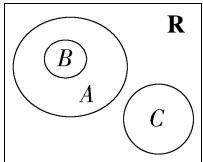

由图可知 $A \cup B = A, A \cap (\complement_{\mathbb{R}} C) = A, B \cap C = \varnothing, B \cap (\complement_{\mathbb{R}} C) = B$ ，因此 A、B、D 正确，C 错误.

10.ABC 对于 A, 命题 p 的否定应该是 $\forall x \in R, x^{2} + 3x + 4 \geqslant 0, A$ 错误.

对于 B, 取 x = -2, y = 1, 满足 $\left|x\right| > \left|y\right|$ , 但是 x < y. 反之, 当 x > y 时, 取 x = 1, y = -2, 此时 $\left|x\right| < \left|y\right|$ .

所以“ $|x|>|y|$ ”是“x>y”的既不充分也不必要条件，B错误.

对于 C, 当 x=0 时, $x \in Z$ , 但是 $x^{2}=0$ , 不满足 $x^{2}>0$ .

所以命题“ $\forall x \in \mathbf{Z}, x^2 > 0$ ”是假命题，C 错误.

对于 D, 若方程 $x^{2}-2x+m=0$ 有一正一负两个根, 则 $\left\{\begin{aligned}\Delta&=4-4m>0,\\ m&<0,\end{aligned}\right.$ 解得 m<0.

所以“ $m < 0$ ”是“关于 $x$ 的方程 $x^{2} - 2x + m = 0$ 有一正一负两个根”的充要条件，D正确.

11. AC 对于 A, 若数集 A 中有 2024 个元素, 则数集 A 中的元素一定有最大值, 所以数集 A 一定有上确界, 故 A 正确;

对于 B, 若 $A=\left\{x\mid x=\frac{1}{n},n>1\right\}$ ，当 n>1 时， $x=\frac{1}{n}<1$ ，

所以 $\sup A = 1$ ，即数集 $A$ 有上确界，故B错误；

对于 C, 若数集 A, B 均有上确界, 则设 $\sup A = p, \sup B = q$ ,

由上确界的定义可知， $\forall a \in A, b \in B$ ，都有 $a \leqslant p, b \leqslant q$

所以 $a + b \leqslant p + q$ ，即 $\sup \{a + b \mid a \in A, b \in B\} = p + q = \sup A + \sup B$ ，故 $\mathbb{C}$ 正确；

对于 D, 若 $A = \{-2, -1\}$ , $B = \{1, 2\}$ ，则数集 A, B 有上确界，且 $\sup A = -1$ , $\sup B = 2$ ，此时 $\{ab \mid a \in A, b \in B\} = \{-4, -2, -1\}$ ,

则 $\sup \{ab\mid a\in A,b\in B\} = -1$ ，而 $\sup A\sup B = -2$ ，故D错误

12. 答案 $\{m \mid m > 3 \text{ 或 } m \leqslant -3\}$

解析 显然集合 $B = \{x \mid m - 1 \leqslant x < m + 2\} \neq \emptyset$ ，要使 $A \cap B = \emptyset$

应有 $m - 1 > 2$ 或 $m + 2 \leqslant -1$ , 解得 $m > 3$ 或 $m \leqslant -3$ .

13. 答案 $\{a \mid a < -4\}$

解析 若“ $\exists x \in \{x \mid 1 \leqslant x \leqslant 4\}$ , $x + a \geqslant 0$ ”是假命题，

则“ $\forall x \in \{x \mid 1 \leqslant x \leqslant 4\}$ , $x + a < 0$ ”是真命题,所以 $4 + a < 0$ , 即 $a < -4$ .

14. 答案 5

解析 解 $x^{2} - 2024x - 2025 = 0$ 得 $x = 2025$ 或 $x = -1$ ，即 $C(A) = 2$

$\because A*B=|C(A)-C(B)|=1,\therefore C(B)=3$ 或 $C(B)=1$ .

由 $(2x^{2} + ax)(x^{2} + 2ax + 6) = 0$ 得 $x(2x + a)(x^2 +2ax + 6) = 0.$ ①

当 $a = 0$ 时，方程为 $2x^{2}(x^{2} + 6) = 0$ ，所以 $x = 0$

此时 $B = \{0\}$ , $C(B) = 1$ , 符合题意.

当 $a \neq 0$ 时，由①得 $x = 0$ 或 $x = -\frac{a}{2}$ 或 $x^2 + 2ax + 6 = 0$

因为 $-\frac{a}{2} \neq 0$ ，所以 $C(B) \neq 1$ ，故 $C(B) = 3$ .

当方程 $x^{2} + 2ax + 6 = 0$ 有两个不等实根时， $\Delta = (2a)^{2} - 4\times 6 > 0$ ，解得 $a <$

$-\sqrt{6}$ 或 $a > \sqrt{6}$ , 显然 $x = 0$ 不是 $x^{2} + 2ax + 6 = 0$ 的实根, 则 $x = -\frac{a}{2}$ 是方程 $x^{2} +$

$2ax+6=0$ 的其中一个实根,则 $\left(-\frac{a}{2}\right)^{2}+2a\left(-\frac{a}{2}\right)+6=0$ ,解得 $a=\pm2\sqrt{2}$ ,经检验,满足题意;

当方程 $x^{2} + 2ax + 6 = 0$ 有两个相等实根时， $\Delta = (2a)^{2} - 4\times 6 = 0$ ，得 $a = \pm \sqrt{6}$ ，经检验，满足题意.

综上所述， $M = \{0,\sqrt{6}, - \sqrt{6},2\sqrt{2}, - 2\sqrt{2}\} ,\therefore C(M) = 5.$

15. 解析 (1) 当 $a = 3$ 时, $A = \{x \mid -1 \leqslant x \leqslant 5\}$ . (2分)

因为 $B = \{x \mid x \leqslant 1$ 或 $x \geqslant 4\}$ ，所以 $A \cap B = \{x \mid -1 \leqslant x \leqslant 1$ 或 $4 \leqslant x \leqslant 5\}$ (4分)

(2) 因为 $B = \{x \mid x \leqslant 1$ 或 $x \geqslant 4\}$ , 所以 $\complement_{\mathbb{R}} B = \{x \mid 1 < x < 4\}$ . (5 分)

因为“ $x \in A$ ”是“ $x \in (\complement_{\mathbb{R}} B)$ ”的充分不必要条件，所以 $A \subsetneq (\complement_{\mathbb{R}} B)$ . (7分)

当 $A=\varnothing$ 时, 符合题意, 此时有 $2+a<2-a$ , 解得 a<0. (9 分)

当 $A \neq \emptyset$ 时，要使 $A \subsetneqq (\complement_{\mathbb{R}} B)$ ，只需 $\left\{ \begin{array}{l} 2 + a \geqslant 2 - a, \\ 2 + a < 4, \\ 2 - a > 1, \end{array} \right.$ 解得 $0 \leqslant a < 1$ . （12分）

综上,实数 a 的取值范围为 $\{a \mid a < 1\}$ . (13 分)

16. 解析 (1) $x^{2} - 3x + 2 = 0$ 即 $(x - 1)(x - 2) = 0$ ，解得 $x = 1$ 或 $x = 2$

所以 $A = \{1,2\}$ ， (2分)

又 $B = \{x\mid x^2 +(a - 1)x + a^2 -5 = 0\} ,A\cap B = \{2\}$

所以 $4 + 2(a - 1) + a^2 -5 = 0$ ，即 $a^2 +2a - 3 = 0$ ，解得 $a = 1$ 或 $a = -3$ ，（5分）

当 $a = 1$ 时， $B = \{x \mid x^2 - 4 = 0\} = \{-2, 2\}$ ，符合 $A \cap B = \{2\}$ ；

当 $a = -3$ 时， $B = \{x \mid x^2 - 4x + 4 = 0\} = \{2\}$ ，符合 $A \cap B = \{2\}$ .

综上, a=1 或 a=-3. (7 分)

(2) 若 $A \cup B = A$ ，则 $B \subseteq A$ 。由 (1) 知 $A = \{1, 2\}$ ，则 $B = \{1\}$ 或 $B = \{2\}$ 或 $B = \{1, 2\}$ 。
(8 分)

当 $B = \{1\}$ 时，有 $\left\{ \begin{array}{l} 1 + 1 = 1 - a, \\ 1 \times 1 = a^2 - 5, \end{array} \right.$ 无解； (10分)

当 $B = \{2\}$ 时，有 $\left\{ \begin{array}{l} 2 + 2 = 1 - a, \\ 2 \times 2 = a^2 - 5, \end{array} \right.$ 得 $a = -3$ ； (12分)

当 $B = \{1,2\}$ 时，有 $\left\{ \begin{array}{l}1 + 2 = 1 - a,\\ 1\times 2 = a^2 -5, \end{array} \right.$ 无解. (14分)

综上,实数 a 的值为 -3. (15 分)

17. 证明 充分性: 若 $a^2 - b^2 = 1$ , 则 $a^4 - b^4 - 2b^2 = (a^2 - b^2)(a^2 + b^2) - 2b^2 = a^2 + b^2$

$-2b^{2}=a^{2}-b^{2}=1$ , 充分性成立. (6 分)

必要性: 若 $a^{4}-b^{4}-2b^{2}=1$ ，则 $a^{4}-b^{4}-2b^{2}-1=0$ ，即 $a^{4}-(b^{4}+2b^{2}+1)=0$ ，

$\therefore a^{4} - (b^{2} + 1)^{2} = 0, \therefore (a^{2} + b^{2} + 1)(a^{2} - b^{2} - 1) = 0,$ (10分)

$\because a^{2} + b^{2} + 1 \neq 0, \therefore a^{2} - b^{2} - 1 = 0,$ (12分)

即 $a^2 - b^2 = 1$ ，必要性成立. (14分)

综上, $a^{4}-b^{4}-2b^{2}=1$ 成立的充要条件是 $a^{2}-b^{2}=1$ . (15分)

18. 解析 (1) $\because 8 = 3^{2} - 1, 9 = 5^{2} - 4^{2}, \therefore 8 \in A, 9 \in A,$ (2分)

若 $10 = m^2 - n^2, m, n \in \mathbf{Z}$ , 则 $(|m| + |n|) (|m| - |n|) = 10$ , 且 $|m| + |n| > |m| - |n| > 0$ , (4分)

由 $10 = 1 \times 10 = 2 \times 5$ ，得 $\left\{\begin{aligned}|m| + |n| &= 10, \\ |m| - |n| &= 1\end{aligned}\right.$ 或 $\left\{\begin{aligned}|m| + |n| &= 5, \\ |m| - |n| &= 2,\end{aligned}\right.$ 显然均无整数解，因此 $10 \notin A.$ (6 分)

(2) 证明: $\because 2k+1=(k+1)^{2}-k^{2}, k \in \mathbf{Z}$ ,

$\therefore 2k + 1 \in A, k \in \mathbf{Z}$ , 即一切奇数都属于 $A$ , 故 $B \subseteq A$ , (9 分)

又∵ $8\in A,8\notin B,\therefore B\nsubseteq A$ ，故“ $x\in A$ ”的充分不必要条件是“ $x\in B$ ”.

(11 分)

(3) 由 $m^2 - n^2 = (m + n)(m - n)$ 可得， (12分)

①当 m, n 同奇或同偶时, $m+n$ , m-n 均为偶数, $(m+n)(m-n)$ 为 4 的倍数; (14 分)  
②当 m, n 一奇一偶时, $m+n$ , m-n 均为奇数, $(m+n)(m-n)$ 为奇数.
(16 分)

综上,所有满足集合 A 的偶数构成的集合为 $\{x \mid x = 4k, k \in Z\}$ . (17 分)

19. 解析 (1) $\alpha - \beta = (1, 1, 0)$ , $d(\alpha, \beta) = 2$ . (3分)

(2) 当 $\alpha = (0,0)$ 时，由 $d(\alpha, \beta) = 2$ 可得 $\beta = (1,1)$ ； (5 分)

当 $\alpha=(0,1)$ 时，同理可得 $\beta=(1,0)$ ; (7 分)

当 $\alpha=(1,1)$ 时， $\beta=(0,0)$ ；当 $\alpha=(1,0)$ 时， $\beta=(0,1)$ .

所以集合 $S$ 中元素个数的最大值是2， (9分)

此时 $S = \{(0,0),(1,1)\}$ 或 $S = \{(0,1),(1,0)\}$ . (10分)

(3) 证明: 设 $\alpha = (a_{1}, a_{2}, \cdots, a_{n}), \beta = (b_{1}, b_{2}, \cdots, b_{n}), \gamma = (c_{1}, c_{2}, \cdots, c_{n})$

所以 $a_{i}, b_{i}, c_{i} \in \{0,1\}, |a_{i}-c_{i}|, |b_{i}-c_{i}| \in \{0,1\} (i=1,2,3,\cdots,n)$ ,
(12 分)

则 $\alpha-\gamma=(|a_{1}-c_{1}|,|a_{2}-c_{2}|,\cdots,|a_{n}-c_{n}|)\in M_{n},\beta-\gamma=(|b_{1}-c_{1}|,|b_{2}-c_{2}|,\cdots,|b_{n}-c_{n}|)\in M_{n}$ ，所以 $d(\alpha-\gamma,\beta-\gamma)=||a_{1}-c_{1}|-|b_{1}-c_{1}||+||a_{2}-c_{2}|-|b_{2}-c_{2}||+\cdots+||a_{n}-c_{n}|-|b_{n}-c_{n}||$ ，(14分)

当 $c_{i}=0$ 时， $\left|\left|a_{i}-c_{i}\right|-\left|b_{i}-c_{i}\right|\right|=\left|a_{i}-b_{i}\right|(i=1,2,3,\cdots,n)$ ;

当 $c_{i}=1$ 时， $\left|\left|a_{i}-c_{i}\right|-\left|b_{i}-c_{i}\right|\right|=\left|\left(1-a_{i}\right)-\left(1-b_{i}\right)\right|=\left|a_{i}-b_{i}\right|(i=1,2,3,\cdots,n)$ .

所以 $d(\alpha - \gamma, \beta - \gamma) = d(\alpha, \beta)$ . (17分)

# 第二章 一元二次函数、方程和不等式

<table><tr><td>1.D</td><td>2.D</td><td>3.B</td><td>4.A</td><td>5.A</td><td>6.C</td></tr><tr><td>7.D</td><td>8.D</td><td>9.ABD</td><td>10.ABD</td><td>11.ABC</td><td></td></tr></table>

1. D $m-n=x^{2}+y^{2}+19-4(2y-x)+1=(x+2)^{2}+(y-4)^{2}\geqslant0$ 当且仅当 x=-2, y=4 时取得等号，所以 $m \geqslant n$ .  
2. D $a^{2}+b^{2}\geqslant2ab$ , 当且仅当 a=b 时取“=”, 故 A 错误; ab>0 只能说明 a 和 b 同号, 即 a 和 b 同为正数或同为负数, 所以当 a<0, b<0 时, B, C 错误; 由 a, b 同号知 $\frac{b}{a}$ 和 $\frac{a}{b}$ 都是正数, 根据基本不等式可得 $\frac{b}{a}+\frac{a}{b}\geqslant2\sqrt{\frac{b}{a}\cdot\frac{a}{b}}=2$ , 当且仅当 a=b 时取“=”, 故 D 正确.  
3.B 由已知可得 1,2 为方程 $x^{2}+mx+n=0$ 的根，
所以 $\left\{\begin{aligned}&1+2=-m,\\ &1\times2=n,\end{aligned}\right.$ 解得 $\left\{\begin{aligned}&m=-3,\\ &n=2.\end{aligned}\right.$   
4.A $\frac{36}{a} +\frac{a}{b} = \frac{4a + 4b}{a} +\frac{a}{b} = 4 + \frac{4b}{a} +\frac{a}{b}\geqslant 4 + 2\sqrt{4} = 8,$ 当且仅当 $\frac{4b}{a} = \frac{a}{b},a + b = 9$ ，即 $a = 2b = 6$ 时等号成立，则 $\frac{36}{a} +\frac{a}{b}$ 的最小值为8.  
5.A 当 $a = 0$ 时, 原不等式为 $1 \geqslant 0$ , 显然恒成立. 当 $a \neq 0$ 时, 若 $ax^2 - 2ax + 1 \geqslant 0$ 对任意 $x \in \mathbf{R}$ 恒成立, 则 $\left\{ \begin{array}{l} a > 0, \\ \Delta = 4a^2 - 4a \leqslant 0, \end{array} \right.$ 得

$0 < a \leqslant 1$ ，所以 $0 \leqslant a \leqslant 1$

所以“ $0<a\leqslant1$ ”是“关于x的不等式 $ax^{2}-2ax+1\geqslant0$ 对任意的 $x\in R$ 恒成立”的充分不必要条件.

6.C 由题意可得 1,2 是对应方程 $ax^{2}+bx+c=0$ 的两个根，且 a<0，

所以 $\left\{\begin{aligned}1+2&=-\frac{b}{a},\\ 1\times2&=\frac{c}{a},\end{aligned}\right.$ 则b=-3a,c=2a,

所以 $bx^{2} + ax + c < 0$ 即为 $-3ax^{2} + ax + 2a < 0$ ，即 $3x^{2} - x - 2 < 0$

解得 $-\frac{2}{3} < x < 1$ ，所以不等式的解集为 $\left\{x \mid -\frac{2}{3} < x < 1\right\}$ .

7.D 由题意得 $ab = k_1^2$ ①, $a + b = 2k_2$ ②, $\sqrt{a^2 + b^2} = \sqrt{2} k_3$ ③, $\frac{ab}{a + b} = \frac{k_4^2}{2k_4} = \frac{k_4}{2}$ ④，且 $a, b > 0$

易知 $a + b \geqslant 2\sqrt{ab}, a^2 + b^2 \geqslant \frac{(a + b)^2}{2}, \frac{ab}{a + b} \leqslant \frac{ab}{2\sqrt{ab}} = \frac{\sqrt{ab}}{2}$ , 当且仅当 $a = b$ 时等号全部成立,

则由①②得 $2k_{2} \geqslant 2k_{1}$ , 所以 $k_{2} \geqslant k_{1}$ ⑤,

由②③得 $2k_{3}^{2}\geqslant \frac{4k_{2}^{2}}{2}$ 所以 $k_{3}\geqslant k_{2}$ ⑥，

由①④得 $\frac{k_{4}}{2}\leqslant\frac{k_{1}}{2}$ ，所以 $k_{4}\leqslant k_{1}⑦$ ，

综合⑤⑥⑦可得 $k_{4} \leqslant k_{1} \leqslant k_{2} \leqslant k_{3}$ .

8.D 因为 x, y 为正数, 所以 $\sqrt{x} + \sqrt{y} > 0$ ,

所以 $t \leqslant \frac{\sqrt{2} \cdot \sqrt{x+y}}{\sqrt{x} + \sqrt{y}}$ 对所有的正实数 x, y 恒成立，则 $t \leqslant \left( \frac{\sqrt{2} \cdot \sqrt{x+y}}{\sqrt{x} + \sqrt{y}} \right)_{\min}$ ，
令 $m=\frac{\sqrt{2}\cdot\sqrt{x+y}}{\sqrt{x}+\sqrt{y}}$ ，则 $\frac{1}{m}=\frac{\sqrt{x}+\sqrt{y}}{\sqrt{2}\cdot\sqrt{x+y}}$ , m>0,

所以 $\frac{1}{m^2} = \frac{x + y + 2\sqrt{xy}}{2(x + y)} = \frac{1}{2} +\frac{\sqrt{xy}}{x + y}\leqslant \frac{1}{2} +\frac{\sqrt{xy}}{2\sqrt{xy}} = 1$ ，当且仅当 $x = y$ 时，等号成立，所以 $\frac{1}{m^2}\leqslant 1$ ，则 $m^2\geqslant 1$

又 $m > 0$ ，所以 $m\geqslant 1$ ，即 $\frac{\sqrt{2}\cdot\sqrt{x + y}}{\sqrt{x} + \sqrt{y}}\geqslant 1$ ，所以 $\frac{\sqrt{2}\cdot\sqrt{x + y}}{\sqrt{x} + \sqrt{y}}$ 的最小值为1，所以 $t\leqslant 1$ ，即 $t$ 的最大值为1.

9.ABD 对于 A, 由 c<0<b<a, 得 $b^{3}<a^{3}, c^{3}<0$ , 因此可得 $b^{3}+c^{3}<a^{3}$ , 故 A 正确;

对于 B, 由 c<0<b<a, 得 $0<\sqrt{b}<\sqrt{a}$ , 所以 $\frac{1}{\sqrt{b}}>\frac{1}{\sqrt{a}}>0$ , 又 c<0, 所以 $\frac{c}{\sqrt{a}}>\frac{c}{\sqrt{b}}$ , 故 B 正确;

对于 C, $\frac{a+m}{b+m}-\frac{a}{b}=\frac{m(b-a)}{b(b+m)}$ , 由 a>b>0, m>0, 得 b-a<0, 所以 $\frac{m(b-a)}{b(b+m)}<0$ , 即 $\frac{a+m}{b+m}<\frac{a}{b}$ , 故 C 错误;

对于D，若 $a = 3,b = 2,m = 1$ ，则 $\frac{b - m}{a - m} = \frac{2 - 1}{3 - 1} = \frac{1}{2},\frac{b}{a} = \frac{2}{3}$ 则 $\frac{b - m}{a - m} <  \frac{b}{a},$

即 $\exists a > b > 0$ ，当 $m > 0$ 时， $\frac{b - m}{a - m} < \frac{b}{a}$ 故D正确.

10.ABD 对于 A, 由 $\frac{1-2x}{3x+1}>1$ , 得 $\frac{5x}{3x+1}<0$ , 解得 $-\frac{1}{3}<x<0$ ,

即不等式 $\frac{1-2x}{3x+1}>1$ 的解集是 $\left\{x\left|\begin{array}{l}-\frac{1}{3}<x<0\end{array}\right.\right\}$ ，故A正确；

对于B，因为 $\sqrt{a} +\sqrt{b} = 1$ ，所以 $a + b = (\sqrt{a})^2 +(\sqrt{b})^2\geqslant \frac{(\sqrt{a} + \sqrt{b})^2}{2} = \frac{1}{2},$

当且仅当 $\sqrt{a} = \sqrt{b}$ ，即 $a = b = \frac{1}{4}$ 时取等号，所以 $a + b$ 的最小值为 $\frac{1}{2}$ ，故B

正确；

对于 C, 令 $2x + y = m(x + y) + n(x - y) = (m + n)x + (m - n)y$ ,

所以 $\left\{\begin{aligned}m+n=2,\\ m-n=1,\end{aligned}\right.$ 解得 $\left\{\begin{aligned}m=\frac{3}{2},\\ n=\frac{1}{2},\end{aligned}\right.$ 所以 $2x+y=\frac{3}{2}(x+y)+\frac{1}{2}(x-y)$ ,

因为 $0 \leqslant x + y \leqslant 2, -1 \leqslant x - y \leqslant 1$

所以 $0 \leqslant \frac{3}{2} (x + y) \leqslant 3, -\frac{1}{2} \leqslant \frac{1}{2} (x - y) \leqslant \frac{1}{2}$ ,

所以 $-\frac{1}{2} \leqslant \frac{3}{2}(x + y) + \frac{1}{2}(x - y) \leqslant \frac{7}{2}$ , 即 $-\frac{1}{2} \leqslant 2x + y \leqslant \frac{7}{2}$ , 故 C 错误;

对于 D, 因为正数 a, b 满足 $\frac{1}{a} + \frac{1}{b} = 1$ ,

所以 $a+b=ab$ ，即 $(a-1)(b-1)=1$ ，

所以 $\frac{1}{a - 1} +\frac{1}{b - 1}\geqslant 2\sqrt{\frac{1}{a - 1}\cdot\frac{1}{b - 1}} = 2$ ，当且仅当 $\frac{1}{a - 1} = \frac{1}{b - 1}$ 即 $a = b = 2$ 时取等号，所以 $\frac{1}{a - 1} +\frac{1}{b - 1}$ 的最小值为2，故D正确.

11.ABC 因为 x>1, y>1, 所以 x-1>0, y-1>0,

则 $\frac{x^2}{y - 1} +\frac{y^2}{x - 1} = \frac{[(x - 1) + 1]^2}{y - 1} +\frac{[(y - 1) + 1]^2}{x - 1}$

$= \frac{(x - 1)^2}{y - 1} +\frac{1}{y - 1} +\frac{(y - 1)^2}{x - 1} +\frac{1}{x - 1} +\frac{2(x - 1)}{y - 1} +\frac{2(y - 1)}{x - 1}$

$\geqslant 2\sqrt{\frac{(x - 1)^2}{y - 1}\cdot\frac{1}{y - 1}} +2\sqrt{\frac{(y - 1)^2}{x - 1}\cdot\frac{1}{x - 1}} +2\sqrt{\frac{2(x - 1)}{y - 1}\cdot\frac{2(y - 1)}{x - 1}}$

$= 2\left(\frac{x - 1}{y - 1} +\frac{y - 1}{x - 1}\right) + 4\geqslant 2\times 2\sqrt{\frac{x - 1}{y - 1}\cdot\frac{y - 1}{x - 1}} +4 = 8,$

当且仅当 x=y=2 时等号全部取到, 所以 $\left(\frac{x^{2}}{y-1}+\frac{y^{2}}{x-1}\right)_{\min}=8.$

又不等式 $\frac{x^{2}}{y-1}+\frac{y^{2}}{x-1}\geqslant3m^{2}-1$ 对任意的x>1,y>1恒成立，

所以 $3m^{2} - 1\leqslant 8$ ，解得 $-\sqrt{3}\leqslant m\leqslant \sqrt{3}$ ，对比选项可知A,B,C满足要求.

12. 答案 -5

解析 $\because x < -1, \therefore x + 1 < 0, \therefore \frac{x^2 + x + 4}{x + 1} = x + 1 + \frac{4}{x + 1} - 1 \leqslant$

$-2\sqrt{-(x+1)\cdot\frac{4}{-(x+1)}}-1=-5$ , 当且仅当 x=-3 时等号成立, $\therefore \frac{x^{2}+x+4}{x+1}$ 的最大值为 -5.

13. 答案 $\{a \mid -5 \leqslant a < 3 \text{ 或 } 4 < a \leqslant 5\}$

解析 因为关于 $x$ 的不等式组 $\left\{ \begin{array}{l} \frac{x + 2}{4 - x} < 0, \\ 2x^2 + (2a + 7)x + 7a < 0 (a \in \mathbf{R}) \end{array} \right.$ 有且仅有

一个整数解,所以不等式 $\frac{x+2}{4-x}<0$ 的解集与不等式 $2x^{2}+(2a+7)x+7a<0$ $(a\in\mathbf{R})$ 的解集的交集中只有一个整数.

易得不等式 $\frac{x + 2}{4 - x} < 0$ 的解集为 $\{x\mid x > 4$ 或 $x < -2\}$

不等式 $2x^{2} + (2a + 7)x + 7a < 0$ 可化为 $(x + a)\left(x + \frac{7}{2}\right) < 0.$ ①

当 $-a < -\frac{7}{2}$ , 即 $a > \frac{7}{2}$ 时, 不等式①的解集为 $\left\{x \mid -a < x < -\frac{7}{2}\right\}$ ,

要使 $\{x \mid x > 4 \text{ 或 } x < -2\}$ 与 $\left\{x \mid -a < x < -\frac{7}{2}\right\}$ 的交集中只有一个整数，此整数只能为 -4，因此有 $-5 \leqslant -a < -4$ ，解得 $4 < a \leqslant 5$ .

当 $-a > -\frac{7}{2}$ , 即 $a < \frac{7}{2}$ 时, 不等式①的解集为 $\left\{x \mid -\frac{7}{2} < x < -a\right\}$ ,

要使 $\{x \mid x > 4 \text{ 或 } x < -2\}$ 与 $\left\{x \mid -\frac{7}{2} < x < -a\right\}$ 的交集中只有一个整数，此整数只能为 -3，所以 $-3 < -a \leqslant 5$ ，即 $-5 \leqslant a < 3$ .

当 $-a = -\frac{7}{2}$ , 即 $a = \frac{7}{2}$ 时, 不等式①的解集为 $\varnothing$ , 不满足题意, 舍去.

综上所述， $a$ 的取值范围为 $\{a\mid -5\leqslant a < 3$ 或 $4 < a\leqslant 5\}$

14. 答案 $\frac{5}{3}$

解析 $\frac{2a^2 + 1}{a} +\frac{b^2 - 2}{b + 2} = 2a + \frac{1}{a} +\frac{b^2 - 4 + 2}{b + 2} = 2a + \frac{1}{a} +(b - 2) + \frac{2}{b + 2}$

$$
= 2 a + b - 2 + \frac {1}{a} + \frac {2}{b + 2} = 1 - 2 + \frac {1}{a} + \frac {2}{b + 2} = - 1 + \frac {1}{a} + \frac {2}{b + 2},
$$

$$
\because 2 a + b = 1, \therefore 2 a + (b + 2) = 3.
$$

又 $a > 0, b + 2 > 0, \therefore [2a + (b + 2)]\left(\frac{1}{a} + \frac{2}{b + 2}\right) = 2 + 2 + \frac{b + 2}{a} + \frac{4a}{b + 2} \geqslant 4+$

$2\sqrt{\frac{b + 2}{a} \cdot \frac{4a}{b + 2}} = 8$ ，当且仅当 $b + 2 = 2a$ ，即 $a = \frac{3}{4}, b = -\frac{1}{2}$ 时取等号，

$\therefore \frac{1}{a} + \frac{2}{b + 2} \geqslant \frac{8}{3}, -1 + \frac{1}{a} + \frac{2}{b + 2} \geqslant \frac{5}{3}$ , 故 $\frac{2a^2 + 1}{a} + \frac{b^2 - 2}{b + 2}$ 的最小值为 $\frac{5}{3}$ .

15. 解析 (1) 令 $3a + b = m(a + b) + n(b - a), m, n \in \mathbf{R}$ , 即 $(m - n)a + (m + n)b = 3a + b$ , 则 $\left\{ \begin{array}{l} m - n = 3, \\ m + n = 1, \end{array} \right.$ 解得 $\left\{ \begin{array}{l} m = 2, \\ n = -1, \end{array} \right.$ 则 $3a + b = 2(a + b) - (b - a)$ . (3分)

又 $0 < a + b < 2, -2 < b - a < 1$ ，所以 $0 < 2(a + b) < 4, -1 < -(b - a) < 2$ ，所以 $-1 < 2(a + b) - (b - a) < 6$ ，即 $-1 < 3a + b < 6$ . (6分)

(2) $\frac{a^{2}}{b}+\frac{b^{2}}{a}-(a+b)=\frac{a^{3}+b^{3}-a^{2}b-ab^{2}}{ab}=\frac{(a-b)^{2}(a+b)}{ab}.$ (9分)

因为 a>0, b>0, 所以 $a+b>0$ , ab>0.

当 a=b 时， $\frac{a^{2}}{b}+\frac{b^{2}}{a}-(a+b)=0$ ，即 $\frac{a^{2}}{b}+\frac{b^{2}}{a}=a+b$ ；(11 分)

当 $a \neq b$ 时, $\frac{a^2}{b} + \frac{b^2}{a} - (a + b) > 0$ , 即 $\frac{a^2}{b} + \frac{b^2}{a} > a + b$ .

综上所述，当 $a = b$ 时， $\frac{a^2}{b} +\frac{b^2}{a} = a + b$ ；当 $a\neq b$ 时， $\frac{a^2 + b^2}{b} >a + b.$ （13分）

16. 解析 (1) 当 $a = 1$ 时, $A = \{x \mid a \leqslant x \leqslant 3a - 1\} = \{x \mid 1 \leqslant x \leqslant 2\}$ , (2 分)

$B = \left\{x\mid \frac{x - 5}{x + 2} >0\right\} = \{x|x <   - 2$ 或 $x > 5\}$ ，则 $\mathbb{L}_{\mathbb{R}}B = \{x| - 2\leqslant x\leqslant 5\}$ ，（5分）

故 $(\complement_{\mathbf{R}}B)\cap A = \{x|1\leqslant x\leqslant 2\}$ （7分）

(2)由(1)得 $\complement_{R}B=\{x\mid-2\leqslant x\leqslant5\}$ .因为“ $x\in A$ ”是“ $x\in(\complement_{R}B)$ ”的充分不必要条件,所以 $A\subsetneqq(\complement_{R}B)$ , (9分)

若 $A = \emptyset$ ，则 $a > 3a - 1$ ，解得 $a < \frac{1}{2}$ ，满足 $A \subsetneq (\complement_{\mathbb{R}} B)$ （11分）

若 $A \neq \emptyset$ ，则 $a \leqslant 3a - 1$ ，可得 $a \geqslant \frac{1}{2}$ ，

因为 $A \subsetneq (\complement_{\mathbb{R}} B)$ , 所以 $\left\{\begin{aligned} a & \geqslant -2, \\ 3a & -1 \leqslant 5, \end{aligned}\right.$ 且等号不同时取到, 解得 $-2 \leqslant a \leqslant 2$ , 故

$\frac{1}{2}\leqslant a\leqslant2.$ (14分)

综上所述,实数 a 的取值范围是 $\{a \mid a \leqslant 2\}$ . (15 分)

17. 解析 (1) 当 $m = 2$ 时, 不等式可化为 $(x - 1)(x - 5) \geqslant 0$ , 解得 $x \leqslant 1$ 或 $x \geqslant 5$ , 所以当 $m = 2$ 时, 不等式的解集是 $\{x \mid x \leqslant 1$ 或 $x \geqslant 5\}$ . (3分)

(2) 当 $m = 0$ 时, 原不等式可化为 $-2(x + 1) \geqslant 0$ , 解得 $x \leqslant -1$ . (4 分)

当 $m < 0$ 时，原不等式可化为 $\left(x - \frac{2}{m}\right)[x - (3m - 1)] \leqslant 0$

令 $\frac{2}{m} = 3m - 1$ ，解得 $m = -\frac{2}{3}$ 或 $m = 1$ （舍去）. (6分)

当 $m < -\frac{2}{3}$ 时， $3m - 1 < \frac{2}{m}$ ，故原不等式的解集为 $\left\{x \mid 3m - 1 \leqslant x \leqslant \frac{2}{m}\right\}$ ；(7分)

当 $m = -\frac{2}{3}$ 时，原不等式为 $(x + 3)^2 \leqslant 0$ ，解得 $x = -3$ ；(8分)

当 $-\frac{2}{3}<m<0$ 时， $\frac{2}{m}<3m-1$ ，原不等式的解集为 $\left\{x\mid\frac{2}{m}\leqslant x\leqslant3m-1\right\}$ .
(9 分)

当 $m > 0$ 时，原不等式可化为 $\left(x - \frac{2}{m}\right)[x - (3m - 1)]\geqslant 0,$

令 $\frac{2}{m} = 3m - 1$ ，解得 $m = -\frac{2}{3}$ （舍去）或 $m = 1$ （11分）

当 0<m<1 时， $\frac{2}{m}>3m-1$ ，原不等式的解集为 $\left\{x\mid x\geqslant\frac{2}{m}$ 或 $x\leqslant3m-1\right\}$ ;
(12 分)

当 $m = 1$ 时，原不等式为 $(x - 2)^{2} \geqslant 0$ ，解得 $x \in \mathbf{R}$ （13分）

当 $m > 1$ 时， $\frac{2}{m} < 3m - 1$ ，原不等式的解集为 $\left\{x\mid x\geqslant 3m - 1\text{或} x\leqslant \frac{2}{m}\right\} .$ （14分）

综上所述,当 $m<-\frac{2}{3}$ 时,原不等式的解集为 $\left\{x\mid3m-1\leqslant x\leqslant\frac{2}{m}\right\}$ ;

当 $m = -\frac{2}{3}$ 时，原不等式的解集为 $\{x \mid x = -3\}$ ；

当 $-\frac{2}{3} < m < 0$ 时，原不等式的解集为 $\left\{x\mid \frac{2}{m}\leqslant x\leqslant 3m - 1\right\}$

当 $m = 0$ 时，原不等式的解集为 $\{x\mid x\leqslant -1\}$

当 $0 < m < 1$ 时，原不等式的解集为 $\left\{x\mid x\geqslant \frac{2}{m}\text{或} x\leqslant 3m - 1\right\}$

当 $m = 1$ 时，原不等式的解集为 $\mathbf{R}$

当 $m > 1$ 时，原不等式的解集为 $\left\{x\mid x\geqslant 3m - 1\text{或} x\leqslant \frac{2}{m}\right\} .$ (15分)

18. 解析 （1）由矩形周长为 40 cm，可知 $AD = (20 - x) \, \text{cm}$ ，由 AB > AD > 0 得 10 < x < 20，设 DP = a cm，则 $PC = (x - a) \, \text{cm}$ ，易得 $\triangle ADP \cong \triangle CEP$ ，∴ $AP = PC = (x - a) \, \text{cm}$ . (3 分)

在 Rt△ADP 中， $AD^{2}+DP^{2}=AP^{2}$ ，即 $(20-x)^{2}+a^{2}=(x-a)^{2}$

得 $a = 20 - \frac{200}{x}$ （5分）

由题意得 $20 - \frac{200}{x} >\frac{1}{3} x$ ，即 $x^{2} - 60x + 600 <   0$ （6分）

解得 $30 - 10\sqrt{3} < x < 30 + 10\sqrt{3}$ 又 $10 < x < 20, \therefore 30 - 10\sqrt{3} < x < 20$ （8分）

∴ x 的取值范围是 $\{x \mid 30 - 10\sqrt{3} < x < 20\}$ . (9 分)

(2) 由 (1) 得 $AD = (20 - x)\mathrm{cm}, DP = \left(20 - \frac{200}{x}\right)\mathrm{cm}, 10 < x < 20$

故 $S = \frac{1}{2} AD\cdot DP = \frac{1}{2} (20 - x)\left(20 - \frac{200}{x}\right) = 300 - 10\left(x + \frac{200}{x}\right),10 <   x <   20.$ （12分）

$\because x > 0, \therefore x + \frac{200}{x} \geqslant 2\sqrt{x \cdot \frac{200}{x}} = 20\sqrt{2}$ , (14分)

当且仅当 $x = \frac{200}{x}$ 即 $x = 10\sqrt{2}$ 时取等号， $\therefore \left(x + \frac{200}{x}\right)_{\min} = 20\sqrt{2}$ ，

$\therefore S_{\max} = 300 - 200\sqrt{2}$ ，此时 $x = 10\sqrt{2}$ （17分）

19. 解析 (1) 当 $b^2 - 4ac \geqslant 0$ 时, 方程 $ax^2 + bx + c = 0$ 的根为 $\frac{-b \pm \sqrt{b^2 - 4ac}}{2a}$ , (2分)

不妨设 $x_{1}=\frac{-b-\sqrt{b^{2}-4ac}}{2a}$ ， $x_{2}=\frac{-b+\sqrt{b^{2}-4ac}}{2a}$ ，则 $d=|x_{1}-x_{2}|=\frac{\sqrt{b^{2}-4ac}}{|a|}$ .
(4 分)

(2)由题意得 $k - 1\neq 0,\Delta = (2k^{2} - 3k + 1)^{2} - 4(k - 1)^{2}(k^{2} - 2k + 3) = (k - 1)^{2}\cdot$

$(4k - 11) > 0$ ，可得 $k > \frac{11}{4}$ （6分）

所以 $d = |x_{1} - x_{2}| = \frac{\sqrt{(k - 1)^{2}(4k - 11)}}{(k - 1)^{2}} = \frac{\sqrt{4k - 11}}{k - 1},$

设 $\sqrt{4k - 11} = t$ ，则 $k = \frac{t^2 + 11}{4}, t > 0$ ，所以 $d = \frac{4t}{t^2 + 7} = \frac{4}{t + \frac{7}{t}} \leqslant \frac{4}{2\sqrt{t \cdot \frac{7}{t}}} = \frac{2}{\sqrt{7}}$

当且仅当 $t = \frac{7}{t}$ 即 $k = \frac{9}{2}$ 时等号成立，

因为 $k = \frac{9}{2} >\frac{11}{4}$ 所以 $d\in \left(0,\frac{2}{\sqrt{7}}\right]$ （9分）

因为 $\frac{2}{\sqrt{7}} \in [0,1)$ ，所以此方程的“根距” $d$ 是 0 级. (10 分)

(3) 由 $2m^{3} - 3m^{2} + 1 = 0$ ，得 $(m - 1)^{2}(2m + 1) = 0$ ，所以 $m = 1$ 或 $m = -\frac{1}{2}$ ，则

$$
a, b \in \left\{- \frac {1}{2}, 1 \right\},
$$

因为当 $x_{1} < x_{2}$ 时， $\forall x \in (x_{1}, x_{2}), ax^{2} + bx + c > 0$ ，所以 $a < 0$ ，因为 $a \neq b$ ，所以 $a = -\frac{1}{2}, b = 1$ ，(12分)

所以关于 $x$ 的方程 $ax^2 + bx + c = 0$ 的“根距” $d = |x_1 - x_2| = \frac{\sqrt{1 + 2c}}{\frac{1}{2}} = 2\sqrt{1 + 2c}$ ，

由 $2\sqrt{1 + 2c}\in [n,n + 1)$ ，得 $c\in \left[\frac{n^2 - 4}{8},\frac{(n + 1)^2 - 4}{8}\right),$ (14分）

当 $\frac{(n + 1)^2 - 4}{8} -\frac{n^2 - 4}{8}\leqslant 1$ ，即 $n\leqslant \frac{7}{2},n\in \mathbf{N}$ 时， $c$ 至多有1个整数值；

若 $n = 4$ ，则 $c\in \left[\frac{3}{2},\frac{21}{8}\right),c$ 仅有1个整数值2；

若 $n = 5$ ，则 $c\in \left[\frac{21}{8},4\right),c$ 仅有1个整数值3；

若 $n = 6$ ，则 $c\in \left[4,\frac{45}{8}\right),c$ 有2个整数值4和5.

综上,当关于 x 的方程 $ax^{2}+bx+c=0$ 的“根距” d 的级数 n 的最小值为 6 时,c 至少可以取到两个整数值. (17 分)

# 第三章 函数的概念与性质

<table><tr><td>1.A</td><td>2.D</td><td>3.B</td><td>4.C</td><td>5.A</td><td>6.B</td></tr><tr><td>7.B</td><td>8.B</td><td>9.CD</td><td>10.BD</td><td>11.ABD</td><td></td></tr></table>

1.A 对于函数 $f(x) = \sqrt{1 - x^2} + \frac{1}{\sqrt{x}}$ ，令 $\left\{ \begin{array}{l} 1 - x^2 \geqslant 0, \\ x > 0, \end{array} \right.$ 解得 $0 < x \leqslant 1$ ，

所以函数 $f(x) = \sqrt{1 - x^2} + \frac{1}{\sqrt{x}}$ 的定义域为(0,1].

2.D 易知 $f(x)$ 的定义域为 R, 由奇函数的定义可知, $f(-x) = -f(x)$ , 则 $\frac{(a+3)(-x)^{2}+(a+1)(-x)}{|-x|+1} = -\frac{(a+3)x^{2}+(a+1)x}{|x|+1}$ ,

整理得 $2(a+3)x^{2}=0$ 恒成立, 所以 $2(a+3)=0$ , 解得 a=-3.

3.B $f(x)$ 的定义域为 $\mathbf{R}$ , 且 $f(-x) = -x| - x| + 2x = -(x|x| - 2x) = -f(x)$ , 所以函数 $f(x)$ 为奇函数,

$$
f (x) = x \mid x \mid - 2 x = \left\{ \begin{array}{l} x ^ {2} - 2 x, x \geqslant 0, \\ - x ^ {2} - 2 x, x <   0, \end{array} \right.
$$

画出函数 $f(x)$ 的图象,如图,观察图象可知, $f(x)$ 在 $(-1,1)$ 上单调递减.

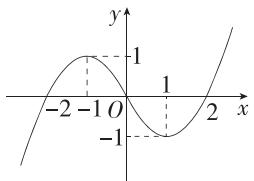

4.C 由函数 $f(x)$ 在 R 上单调递增, 得 $\left\{\begin{aligned}2a-1&>0,\\ a&\leqslant2,\\ 2(2a-1)&\leqslant4-4a+6a-3,\end{aligned}\right.$ 解得 $\frac{1}{2}<a$ $\leqslant\frac{3}{2}$ , 故 $a$ 的取值范围是 $\left(\frac{1}{2},\frac{3}{2}\right]$ .

5.A 在 $f(x) = x^3 f\left(\frac{1}{x}\right)$ 中，令 $x = -1$ ，则 $f(-1) = -f(-1)$ ，则 $f(-1) = 0$ ，在 $f(x) + f(y) - 2xy = f(x + y)$ 中，令 $x = y = 0$ ，则 $f(0) = 0$ ，令 $x = 1, y = -1$ ，则 $f(1) + f(-1) + 2 = f(0) = 0$ ，即 $f(1) + f(-1) = -2$ ，故 $f(1)$

$$
= - 2,
$$

令 $x = y = 1$ ，则 $f(2) = 2f(1) - 2 = -6$ ，令 $x = y = 2$ ，则 $f(4) = 2f(2) - 8 = -20.$

6.B 函数 $f(x)$ 的图象可由函数 $y = x^3$ 的图象平移得到，

则 $f(x) = (x - 1)^{3} + a$ 的图象关于点 $(1, a)$ 对称，

因为 $g(x)+g(2-x)=\frac{bx^{2}}{x^{2}-2x+2}+\frac{b(2-x)^{2}}{(2-x)^{2}-2(2-x)+2}=\frac{b(2x^{2}-4x+4)}{x^{2}-2x+2}=2b$ 所以 $g(x)$ 的图象关于点 $(1, b)$ 对称，

要使 AB=BC 恒成立, 则点 B 为 $f(x)$ 图象的对称中心, 也为 $g(x)$ 图象的对称中心, 所以 a=b, 即 $\frac{a}{b}=1$ . 验证可知 a=b 符合题意.

7.B 当 $x > 2$ 时， $f(x) > 0 \Rightarrow x \mid x - a \mid > 2a^2$ ，即当 $x$

>2 时, $|x-a|>\frac{2a^{2}}{x}$ ,当 a=0 时,恒成立,当 $a\neq$

0 时, $y=|x-a|$ 与 $y=\frac{2a^{2}}{x}$ 的图象如图,

则有 $\left\{\begin{aligned}a<2,\text{且}a\neq0,\\ 2-a\geqslant a^{2},\end{aligned}\right.$ 解得 $-2\leqslant a\leqslant1$ ，且 $a\neq0$ .

综上， $-2 \leqslant a \leqslant 1$ .

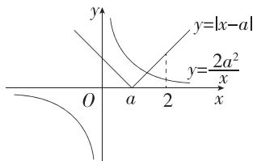

8.B 对于 A, 若 $\left|S\right|=1$ , 不妨设 $S=\{x\mid f(x)=M\}$ 中仅有 1 个元素 t, 即 $f(x)$ 的最小值为 $f(t)=M$ , 若 $S\subseteq(a,b)$ , 则 a<t<b,

根据 $\left\{x\mid f(x)>f\left(\frac{1}{1-x}\right)\right\}=(a,b)(1<a<b)$ ，得 $f(t)>f\left(\frac{1}{1-t}\right)$ ，与 $f(t)$ 为最小值矛盾，故 A 错误；

对于 B, 若 $\left|T\right|=1$ , 不妨设 $T=\{x\mid f(x)=N\}$ 中仅有 1 个元素 $t_{1}$ , 即 $f(x)$ 的最大值为 $f(t_{1})=N$ , 若 $T\subseteq(a,b)$ , 则 $a<t_{1}<b$ ,

根据 $\left\{x\left|f(x)>f\left(\frac{1}{1-x}\right)\right.\right\}=(a,b)(1<a<b)$ ，得 $f(t_{1})>f\left(\frac{1}{1-t_{1}}\right)$ ,

若 $t_1 = \frac{1}{1 - t_1}$ 则 $t_1^2 - t_1 + 1 = 0$ ，无解，故 $t_1 \neq \frac{1}{1 - t_1}$

因为 $f(t_{1})$ 为最大值,所以不等式 $f(t_{1})>f\left(\frac{1}{1-t_{1}}\right)$ 必成立,故B正确;

对于 C, 若 $|S| \neq 1$ , 则 $|S| \geqslant 2$ , 由 A 可得 C 错误;

对于 D, 若 $|T| \neq 1$ , 则 $|T| \geqslant 2$ , 不妨设 $f(x) = N$ 有两根 $x_{1}, x_{2}$ , 且 $x_{1} < x_{2}$ , 若 $T \subseteq (a, b)$ , 则 $a < x_{1} < x_{2} < b$ , 则若存在 $x_{0} \in (x_{1}, x_{2})$ , 使得 $f(x_{0}) = M$ , 则由 A 可得 $x_{0} \notin (a, b)$ , 矛盾, 故 D 错误.

9.CD 由题图知 $f(0) = -2$ , 故 A 错误;

函数的定义域为 $[-3,2]$ ，故B错误；

函数的值域为[-3,2],故C正确;

当 $0 \leqslant x \leqslant 1$ 时，由 $f(0) = -2$ 和 $f(1) = 2$ 易知 $f(x) = 4x - 2$ ，令 $4x - 2 = 0$ ，得 $x = \frac{1}{2}$ ，因此若 $f(x) = 0$ ，则 $x = \frac{1}{2}$ 或 $x = 2$ ，故D正确.

10.BD 因为 $y=x^{2}+1$ 在定义域 R 上不是单调函数, 所以函数 $y=x^{2}+1$ 不是闭函数, A 错误.

$y=-x^{3}$ 在定义域 R 上是减函数, 若 $y=-x^{3}$ 是闭函数, 则存在区间 $[a,b]$ ,

使得函数的值域为 $[a, b]$ ，即 $\left\{ \begin{array}{l} b = -a^3, \\ a = -b^3, \\ b > a, \end{array} \right.$ 解得 $\left\{ \begin{array}{l} a = -1, \\ b = 1, \end{array} \right.$ 因此存在区间 $[-1, 1]$ ，使 $y = -x^3$ 在 $[-1, 1]$ 上的值域为 $[-1, 1]$ ，B 正确.

$y = \frac{x}{x + 1} = 1 - \frac{1}{x + 1}$ 在 $(-\infty, -1)$ 上单调递增，在 $(-1, +\infty)$ 上单调递增，函

数在定义域上不单调,从而该函数不是闭函数,C 错误.

易知 $y = k + \sqrt{x + 2}$ 在定义域 $[-2, +\infty)$ 上单调递增，若 $y = k + \sqrt{x + 2}$ 是闭函数，则存在区间 $[a, b] \subseteq [-2, +\infty)$ ，使函数的值域为 $[a, b]$ ，即 $\left\{ \begin{array}{l} a = k + \sqrt{a + 2}, \\ b = k + \sqrt{b + 2}, \end{array} \right.$ 所以 $a, b$ 为方程 $x = k + \sqrt{x + 2}$ 的两个实数根，即方程 $x^2 - (2k + 1)x + k^2 - 2 = 0 (x \geqslant -2, x \geqslant k)$ 有两个不等的实数根.

设 $g(x) = x^{2} - (2k + 1)x + k^{2} - 2$

当 $k \leqslant -2$ 时，有 $\left\{\begin{aligned}\Delta &>0,\\ g(-2) &\geqslant 0,\\ \frac{2k+1}{2} &>-2,\end{aligned}\right.$ 解得 $k >-\frac{9}{4}$ ，又 $k \leqslant -2$ ，所以 $-\frac{9}{4} < k \leqslant -2$ ;

当 $k > -2$ 时，有 $\left\{ \begin{array}{l} \Delta > 0, \\ g(k) \geqslant 0, \\ \frac{2k + 1}{2} > k, \end{array} \right.$ 解得 $-\frac{9}{4} < k \leqslant -2$ ，与 $k > -2$ 矛盾.

综上所述, $k\in\left(-\frac{9}{4},-2\right]$ ,D正确.

11.ABD 对于 A, 因为 $f(x)$ 是定义域为 R 的偶函数, 所以 $f(-x)=f(x)$ , 由 $f(1-x)=f(1+x)$ 可知 $f(x)$ 图象的对称轴为直线 x=1, 且 $f(-x)=f(x+2)$ , 即 $f(x+2)=f(x)$ , 则 $f(x)$ 的一个周期为 2, 故 A 正确;

对于 B, 由 A 可得 $f\left(\frac{25}{2}\right)=f\left(\frac{1}{2}\right)=\frac{1}{2}$ , $f\left(-\frac{13}{3}\right)=f\left(-\frac{1}{3}\right)=f\left(\frac{1}{3}\right)=\frac{1}{3}$ ,
因为 $\frac{1}{2}>\frac{1}{3}$ ，所以 $f\left(\frac{25}{2}\right)>f\left(-\frac{13}{3}\right)$ ，故B正确；

对于 C, 根据题意, 可以作出函数 $f(x)$ 的图象和直线 $y=\frac{1}{2}$ , 如图:

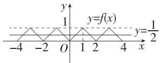

当 $0 \leqslant x \leqslant 1$ 时， $f(x) = x$ ，则由 $f(x) = \frac{1}{2}$ 可得 $x = \frac{1}{2}$ ，

根据对称性知当 $1 < x \leqslant 2$ 时， $f(x) = \frac{1}{2}$ 的解为 $x = \frac{3}{2}$ ，

当 $0 \leqslant x \leqslant 2$ 时，由图可得 $f(x) > \frac{1}{2}$ 的解集为 $\left(\frac{1}{2}, \frac{3}{2}\right)$ ，

又 $f(x)$ 的一个周期为2，所以 $f(x)>\frac{1}{2}$ 的解集为 $\left(\frac{1}{2}+2k,\frac{3}{2}+2k\right),k\in\mathbf{Z}$ ，故C错误；

对于 D, 由图知对于任意 $k \in Z$ , 必有 $f(2k) = 0$ , 故 D 正确.

12. 答案 3

解析 在同一直角坐标系中画出函数 $y = x + 2$ 和 $y = x^2 - 3x + 5$ 的图象，则 $f(x)$ 的图象如图中实线部分所示，

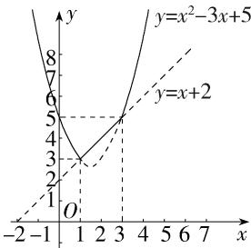

line

| x | y = x² - 3x + 5 | y = x + 2 |
|---|---|---|
| -1 | 8 | 6 |
| 1 | 4 | 3 |
| 3 | 5 | 5 |
| 7 | 9 | 1 |

由图象可得， $f(x)_{\min} = f(1) = 3.$

13. 答案 $f(x) = 3^{2x + 1}$

解析 由 $f(0) = 3, \frac{f\left(\frac{1}{2}\right)}{f(0)} = 3, \frac{f(1)}{f\left(\frac{1}{2}\right)} = 3, \dots, \frac{f\left(\frac{n}{2}\right)}{f\left(\frac{n-1}{2}\right)} = 3$ ,

相乘得 $f(0) \times \frac{f\left(\frac{1}{2}\right)}{f(0)} \times \frac{f(1)}{f\left(\frac{1}{2}\right)} \times \cdots \times \frac{f\left(\frac{n}{2}\right)}{f\left(\frac{n-1}{2}\right)} = f\left(\frac{n}{2}\right) = 3^{n+1}$ ,

令 $\frac{n}{2} = x$ ，则 $n = 2x$ ，所以 $f(x) = 3^{2x + 1}$

14. 答案 (1,2); (0,2]

解析 当 a=2 时， $f(x)=\left\{\begin{aligned}-x+2,x&\leqslant1,\\ -2(x-2)^{2}+1,x&>1,\end{aligned}\right.$

故 $f(x)$ 在 $(-∞,1]$ 上单调递减，在 $(1,2)$ 上单调递增，在 $[2,+∞)$ 上单调递减，故 $f(x)$ 的单调递增区间是 $(1,2)$ .

易知 $y = -x + a$ 在 $(- \infty, 1]$ 上的值域为 $[a - 1, +\infty)$ ，

若 $f(x)$ 的值域为R,

则需 $y = -a(x - 2)^2 + 1$ 在 $(1, +\infty)$ 上的值域包含 $(- \infty, a - 1)$ 即可，

所以 $\left\{\begin{aligned}-a<0,\\1&\geqslant a-1,\end{aligned}\right.$ 解得 $0<a\leqslant2.$

15. 解析 (1) 由 $f(2) = 0$ ，得 $2a - 1 = 0$ ，解得 $a = \frac{1}{2}$ ，

所以 $f(x)=\left\{\begin{aligned}&\frac{1}{2}x-1,x\geqslant0,\\&\frac{1}{x},x<0.\end{aligned}\right.$ (3分)

(2)由(1)得 $f(1)=\frac{1}{2}-1=-\frac{1}{2}$ ，(5分)

则 $f(f(1)) = f\left(-\frac{1}{2}\right) = -2.$ (7分)

(3) 当 $m \geqslant 0$ 时, $\frac{1}{2} m - 1 = m$ , 解得 $m = -2$ , 舍去. (9 分)

当 $m < 0$ 时， $\frac{1}{m} = m$ ，解得 $m = 1$ （舍去）或 $m = -1$ （12分）

综上, m = -1. (13 分)

16. 解析 (1) 由不等式 $f(x) < 1$ 的解集为 $\mathbf{R}$ , 可得 $(m + 1)x^{2} - (m - 1)x + m - 2 < 0$ 的解集为 $\mathbf{R}$ .

当 $m + 1 = 0$ ，即 $m = -1$ 时，不等式为 $2x - 3 < 0$ ，得 $x < \frac{3}{2}$ ，不合题意；(2分)

当 $m + 1 \neq 0$ ，即 $m \neq -1$ 时，可得 $\left\{ \begin{array}{l} m + 1 < 0, \\ \Delta = (m - 1)^2 - 4(m + 1)(m - 2) < 0, \end{array} \right.$

即 $\left\{ \begin{array}{l} m < -1, \\ 3m^2 - 2m - 9 > 0, \end{array} \right.$ 解得 $m < \frac{1 - 2\sqrt{7}}{3}$ . (5分)

综上所述， $m$ 的取值范围为 $\left(-\infty ,\frac{1 - 2\sqrt{7}}{3}\right).$ (6分)

(2) 由 $(m + 1)x^{2} - (m - 1)x + m - 1 \geqslant 0$ ，得 $m(x^{2} - x + 1) \geqslant -x^{2} - x + 1$

因为 $x^{2} - x + 1 = \left(x - \frac{1}{2}\right)^{2} + \frac{3}{4} >0$ ，所以 $m\geqslant \frac{-x^2 - x + 1}{x^2 - x + 1} = -1 + \frac{2(1 - x)}{x^2 - x + 1},$ 由已知得 $m\geqslant \left[-1 + \frac{2(1 - x)}{x^2 - x + 1}\right]_{\max},x\in \left[-\frac{1}{2},\frac{1}{2}\right].$ (9分)

设 $1 - x = t$ ，则 $t\in \left[\frac{1}{2},\frac{3}{2}\right],x = 1 - t,$ （10分）

可得 $\frac{1 - x}{x^2 - x + 1} = \frac{t}{(1 - t)^2 - (1 - t) + 1} = \frac{t}{t^2 - t + 1} = \frac{1}{t + \frac{1}{t} - 1}$ ,

因为 $t + \frac{1}{t} \geqslant 2$ ，当且仅当 $t = 1$ 时取等号， (13分)

所以 $\frac{1 - x}{x^2 - x + 1} \leqslant 1$ ，当且仅当 $x = 0$ 时取等号，

故 $x \in \left[-\frac{1}{2}, \frac{1}{2}\right]$ 时， $\left[-1 + \frac{2(1 - x)}{x^2 - x + 1}\right]_{\max} = -1 + 2 = 1$ ，可得 $m \geqslant 1$ ，所以 $m$ 的取值范围为 $[1, +\infty)$ . (15分)

17. 解析 (1) $p(6)=60-16=44$ , (2分)

$p(6)$ 的实际意义: 当发车时间间隔为 6 分钟时, 该路公交车的载客量为 44 人.
(5 分)

(2) $\because p(t) = \begin{cases} 60 - (t - 10)^2, & 5 \leqslant t < 10, \\ 60, & 10 \leqslant t \leqslant 20, \end{cases}$ $t \in \mathbf{N}$ ,

∴ 当 $5 \leqslant t < 10$ 时， $y = \frac{6[60 - (t - 10)^2] + 24}{t} - 10 = 110 - \left(6t + \frac{216}{t}\right) \leqslant 110 -$

$2\sqrt{6t\cdot\frac{216}{t}}=38$ , 当且仅当 $6t=\frac{216}{t}$ , 即 t=6 时, 等号成立, 此时 y 的最大值为 38; (9 分)

当 $10 \leqslant t \leqslant 20$ 时, $y = \frac{360 + 24}{t} - 10 = \frac{384}{t} - 10$ ,

易知 $y = \frac{384}{t} - 10$ 在 $t \in [10, 20]$ 上单调递减，

∴ 当 t=10 时, y 取最大值, 为 28.4.
(13 分)

∵ 38 > 28.4, ∴ 当发车时间间隔为 6 分钟时, 该路公交车每分钟的净收益最大, 最大净收益为 38 元. (15 分)

18. 解析 (1) $f(x)$ 是偶函数. 证明如下:

$f(x)$ 的定义域为 $[-1, 1]$ , 关于原点对称.

对于 $f(xy) = f(x) + f(y), x, y \in [-1, 1], x, y \neq 0,$

令 $x = y = 1$ ，则 $f(1) = f(1) + f(1),\therefore f(1) = 0.$

令 $x = y = -1$ ，则 $f(1) = f(-1) + f(-1) = 0, \therefore f(-1) = 0.$

令 $y = -1$ ，则 $f(-x) = f(x) + f(-1) = f(x)$

$\therefore f(x)$ 为定义在 $[-1,1]$ 上的偶函数. (3分)

(2)证明:任取 $x_{3},x_{4}\in(0,1)$ ，且 $x_{3}<x_{4}$ ，由偶函数的性质可得，当 $x\in(0,1)$ 时， $f(x)>0$ ，(4分)

对于 $f(xy) = f(x) + f(y)$ ，令 $x = \frac{x_3}{x_4}, y = x_4$ ，则 $f(x_3) = f\left(\frac{x_3}{x_4}\right) + f(x_4)$ ，即

$$
f \left(x _ {3}\right) - f \left(x _ {4}\right) = f \left(\frac {x _ {3}}{x _ {4}}\right).
$$

$\because 0 < x_{3} < x_{4} < 1, \therefore \frac{x_{3}}{x_{4}} \in (0,1)$ , (6分)

又当 $x \in (0,1)$ 时， $f(x) > 0, \therefore f\left(\frac{x_3}{x_4}\right) > 0$ ，即 $f(x_3) - f(x_4) > 0$ ，即 $f(x_3) > f(x_4), \therefore f(x)$ 在 $(0,1)$ 上单调递减. (8分)

(3) 记 $g(x)$ 在 $[0,1]$ 上的值域为 $B$ , $f(x)$ 在 $\left[\frac{1}{2}, 1\right]$ 上的值域为 $A$ , $\because$ 对任意 $x_1 \in [0,1]$ , 总存在 $x_2 \in \left[\frac{1}{2}, 1\right]$ , 使得 $g(x_1) = f(x_2)$ , $\therefore B \subseteq A$ .

由(1)(2)知 $f(x)$ 在(0,1)上单调递减，且 $f(1)=0$ ，

又 $f\left(\frac{1}{2}\right)=3,\therefore$ 当 $x\in\left[\frac{1}{2},1\right]$ 时， $f(x)\in[0,3],\therefore A=[0,3].$

$\because g(x)$ 的图象关于点 $\left(\frac{1}{2}, \frac{1}{2}\right)$ 中心对称，且 $g\left(\frac{1}{2}\right) = \frac{1}{2}, \therefore g(x)$ 的图象恒过 $\left(\frac{1}{2}, \frac{1}{2}\right)$ ，当 $x \in [0, 1]$ 时， $g(x)_{\max} + g(x)_{\min} = 1.$ (10分)

①当 $\frac{m}{4} \leqslant 0$ ，即 $m \leqslant 0$ 时， $g(x)$ 在 $[0,1]$ 上单调递增， $\therefore g(x)_{\min} = g(0) =$

$$
\frac {1}{2} m, \therefore g (x) _ {\max} = 1 - \frac {1}{2} m, \therefore B = \left[ \frac {1}{2} m, 1 - \frac {1}{2} m \right],
$$

由 $B \subseteq A$ 得 $\left\{\begin{aligned}\frac{1}{2}m &\geqslant 0,\\ 1 - \frac{1}{2}m &\leqslant 3,\end{aligned}\right.$ 解得 $m \geqslant 0$ ，又 $m \leqslant 0$ ，所以 m = 0；（12 分）

②当 $0 < \frac{m}{4} < \frac{1}{2}$ , 即 $0 < m < 2$ 时, $g(x)$ 在 $\left[0, \frac{m}{4}\right)$ 上单调递减, 在 $\left(\frac{m}{4}, 1 - \frac{m}{4}\right]$ 上单调递增, 在 $\left(1 - \frac{m}{4}, 1\right]$ 上单调递减,

$$
\therefore g (x) _ {\min} = \min \left\{g \left(\frac {m}{4}\right), g (1) \right\}, g (x) _ {\max} = \max \left\{g (0), g \left(1 - \frac {m}{4}\right) \right\},
$$

由 $B \subseteq A$ 得 $\left\{\begin{aligned} g\left(\frac{m}{4}\right) &= -\frac{m^{2}}{8} + \frac{1}{2} m \geqslant 0, \\ g(1) &= 2 - m + \frac{1}{2} m \geqslant 0, \\ g\left(1 - \frac{m}{4}\right) &= 1 - g\left(\frac{m}{4}\right) = 1 + \frac{m^{2}}{8} - \frac{1}{2} m \leqslant 3, \\ g(0) &= \frac{1}{2} m \leqslant 3, \end{aligned}\right.$ 解得 $0 \leqslant m < 4$ ,

又 $0 < m < 2$ ，所以 $0 < m < 2$ （14分）

③当 $\frac{m}{4}\geqslant\frac{1}{2}$ ，即 $m\geqslant2$ 时， $g(x)$ 在 $\left[0,\frac{1}{2}\right]$ 上单调递减， $\therefore g(x)_{\max}=g(0)$

$= \frac{1}{2} m, \therefore g(x)_{\min} = 1 - \frac{1}{2} m$ ，即 $B = \left[1 - \frac{1}{2} m, \frac{1}{2} m\right]$ ，

由 $B \subseteq A$ 得 $\left\{ \begin{array}{l} 1 - \frac{1}{2} m \geqslant 0, \\ \frac{1}{2} m \leqslant 3, \end{array} \right.$ 解得 $m \leqslant 2$ ，又 $m \geqslant 2$ ，所以 $m = 2$ . (16分)

综上所述,实数 m 的取值范围为 $[0,2]$ . (17 分)

19. 解析 (1) $\because P(-1, 1), Q(3, -2), \therefore |PQ|^{+} = |-1 + 3| + |1 - 2| = 3.$ (2分)

(2) 证明: ∵ 点 N 在直线 $y = x + 2$ 上, ∴ 设 $N(x, x + 2)$ .

$\because M(1,0), \therefore |MN|^{+} = |x + 1| + |x + 2|$ . (4分)

易知 $|MN|^{+}=|x+1|+|x+2|\geqslant|(x+1)-(x+2)|=1$

当且仅当 $(x + 1)(x + 2)\leqslant 0$ ，即 $-2\leqslant x\leqslant -1$ 时等号成立，

$$
\therefore | M N | ^ {+} \geqslant 1. \tag {6分}
$$

(3)∵ 动点 T 在函数 $y=x^{2}, x\in[-1,1]$ 的图象上，∴ 设 $T(x,x^{2}), x\in[-1,1]$ ，则 $|KT|^{+}=|x|+|x^{2}+k|, x\in[-1,1]$ . (7 分)

设 $g(x) = |x| + |x^2 + k|, x \in [-1, 1]$ ，则 $g(x)$ 的定义域关于原点对称，且 $g(-x) = |x| + |x^2 + k| = g(x)$ ， $\therefore$ 函数 $g(x) = |x| + |x^2 + k|, x \in [-1, 1]$ 为偶函数，

故只需研究函数 $g(x) = |x| + |x^2 + k|$ 在 $[0,1]$ 上的最大值即可. (9分) 当 $k \geqslant 0$ 时， $g(x) = |x| + |x^2 + k| = x^2 + x + k, x \in [0,1]$ ，

$g(x)$ 的图象开口向上, 对称轴方程为 $x = -\frac{1}{2}$ , 故函数 $g(x)$ 在 $[0,1]$ 上单调递增, $\therefore g(x)_{\max} = g(1) = 2 + k$ .

当 $k \leqslant -1$ 时， $g(x) = |x| + |x^2 + k| = -x^2 + x - k, x \in [0, 1]$ ，

$g(x)$ 的图象开口向下，对称轴方程为 $x=\frac{1}{2}$ ，故函数 $g(x)$ 在 $\left[0,\frac{1}{2}\right]$ 上单调递增，在 $\left[\frac{1}{2},1\right]$ 上单调递减，∴ $g(x)_{\max}=g\left(\frac{1}{2}\right)=\frac{1}{4}-k.$ （10 分）当 -1<k<0 时，令 $\left|x^{2}+k\right|=0$ ，得 $x=\pm\sqrt{-k}$ ，

$$
\therefore g (x) = | x | + \left| x ^ {2} + k \right| = \left\{ \begin{array}{l} - x ^ {2} + x - k, 0 \leqslant x \leqslant \sqrt {- k}, \\ x ^ {2} + x + k, \sqrt {- k} <   x \leqslant 1, \end{array} \right.
$$

$y=-x^{2}+x-k$ 的图象开口向下,对称轴方程为 $x=\frac{1}{2}$ ,

$y=x^{2}+x+k$ 的图象开口向上,对称轴方程为 $x=-\frac{1}{2}$ , 故 $y=x^{2}+x+k$ 在 $(\sqrt{-k},1]$ 上单调递增. (12 分)

①当 $\sqrt{-k} \leqslant \frac{1}{2}$ ，即 $-\frac{1}{4} \leqslant k < 0$ 时， $y = -x^{2} + x - k$ 在 $[0, \sqrt{-k}]$ 上单调递增，
此时 $g(1)=2+k\geqslant\frac{7}{4},g(\sqrt{-k})=\sqrt{-k}\leqslant\frac{1}{2},\therefore g(x)_{\max}=g(1)=2+k;$ (13 分)

②当 $\frac{1}{2} < \sqrt{-k} < 1$ ，即 $-1 < k < -\frac{1}{4}$ 时， $y = -x^2 + x - k$ 在 $\left[0, \frac{1}{2}\right]$ 上单调递增，在 $\left(\frac{1}{2}, \sqrt{-k}\right]$ 上单调递减， $\because g(1) = 2 + k \in \left(1, \frac{7}{4}\right), g\left(\frac{1}{2}\right) = \frac{1}{4} - k \in$

$$
\left(\frac {1}{2}, \frac {5}{4}\right), \therefore g (x) _ {\max} = \left\{ \begin{array}{l} \frac {1}{4} - k, - 1 <   k <   - \frac {7}{8}, \\ 2 + k, - \frac {7}{8} \leqslant k <   - \frac {1}{4}. \end{array} \right.
$$

综上， $f(k) = \left\{ \begin{array}{l} \frac{1}{4} - k, k < -\frac{7}{8}, \\ 2 + k, k \geqslant -\frac{7}{8}. \end{array} \right.$ (15分）

当 $k < -\frac{7}{8}$ 时， $f(k) = \frac{1}{4} - k$ 在 $\left(-\infty, -\frac{7}{8}\right)$ 上单调递减， $f(k) = \frac{1}{4} - k > f\left(-\frac{7}{8}\right) = \frac{9}{8}$ ;

当 $k \geqslant -\frac{7}{8}$ 时， $f(k) = 2 + k$ 在 $\left[-\frac{7}{8}, +\infty\right)$ 上单调递增， $f(k) = 2 + k \geqslant$

$$
f \left(- \frac {7}{8}\right) = \frac {9}{8}.
$$

∴ 函数 $y=f(k)$ 的最小值为 $\frac{9}{8}$ . (17 分)

# 第四章 指数函数与对数函数

<table><tr><td>1.A</td><td>2.C</td><td>3.C</td><td>4.D</td><td>5.B</td><td>6.B</td></tr><tr><td>7.A</td><td>8.D</td><td>9.ABD</td><td>10.ACD</td><td>11.ACD</td><td></td></tr></table>

1.A 当 $1 < n < m$ 时, $\log_m n < \log_m m = 1$ , 所以充分性成立;

若 $\log_m n < 1$ ，即 $\log_m n < \log_m m$

当 0<m<1 时, n>m, 当 m>1 时, n<m, 所以 1<n<m 不一定成立, 故必要性不成立.

综上，“ $1 < n < m$ ”是“ $\log_m n < 1$ ”的充分不必要条件.

2.C 因为 $f(x)$ 的图象是一条连续不断的曲线，

且 $f(0)f(1) > 0, f(1)f(2) > 0, f(2)f(3) < 0, f(3)f(4) > 0,$

所以由函数零点存在定理可知一定包含 $f(x)$ 零点的区间是(2,3).

3. C $\because 0 < a = 0.5^{0.4} < 0.5^{0} = 1, b = \log_{0.5} 0.3 > \log_{0.5} 0.5 = 1, c = \log_{8} 0.4 < \log_{8} 1 = 0,$ $\therefore c < a < b.$

4. D $\because f(x)=x\left(\mathrm{e}^{x}-\mathrm{e}^{-x}\right)$ 的定义域为 R，且 $f(-x)=-x\left(\mathrm{e}^{-x}-\mathrm{e}^{x}\right)=x\left(\mathrm{e}^{x}-\mathrm{e}^{-x}\right)=f(x)$ ，∴ $f(x)$ 为偶函数，排除 B, C;

取特殊值： $f(0)=0$ , $f(1)=\mathrm{e}-\frac{1}{\mathrm{e}}$ , $f(2)=2\mathrm{e}^{2}-\frac{2}{\mathrm{e}^{2}}$ , 易得 $f(2)-f(1)>f(1)-f(0)$ , ∴ 当 x>0 时, $f(x)$ 增加的速度越来越快, 即函数图象越来越陡, 排除 A.

5.B $\because f(x)$ 的定义域为 $\{x\mid x\neq 0\}$ ，且 $f(-x) = \mathrm{e}^{-x} + \mathrm{e}^{x} + \lg | - x| = \mathrm{e}^{x} + \mathrm{e}^{-x}+$ $\lg |x| = f(x),\therefore f(x)$ 为偶函数.

当 $x > 0$ 时， $f(x) = \mathrm{e}^x + \mathrm{e}^{-x} + \lg x$

令 $t = \mathrm{e}^{x}(x > 0)$ ，则 $t > 1$

由 $y=t+\frac{1}{t}$ 的图象知, 函数 $y=t+\frac{1}{t}$ 在 $(1,+\infty)$ 上单调递增, 且 $t=e^{x}$ 是增函数, ∴ 函数 $f(x)=\mathrm{e}^{x}+\mathrm{e}^{-x}+\lg|x|$ 在 $(0,+\infty)$ 上单调递增,

因此，不等式 $f(x + 1) > f(2x - 1) \Leftrightarrow |x + 1| > |2x - 1|$ ，且 $x + 1 \neq 0, 2x - 1 \neq 0$

解得 $0 < x < \frac{1}{2}$ 或 $\frac{1}{2} < x < 2$ ，即不等式 $f(x + 1) > f(2x - 1)$ 的解集为 $\left(0, \frac{1}{2}\right) \cup \left(\frac{1}{2}, 2\right)$ .

6.B 依题意有 $a\mathrm{e}^{-7b} = \frac{1}{2} a$ ，即 $\mathrm{e}^{-7b} = \frac{1}{2}$ ，

两边取对数得 $-7b = \ln \frac{1}{2} = -\ln 2$ ，所以 $b = \frac{\ln 2}{7}$ ，则 $y = ae^{-\frac{\ln 2}{7}t}$ ，

当上方细沙只有开始时的 $\frac{1}{8}$ 时， $a\mathrm{e}^{-\frac{\ln 2}{7} t} = \frac{1}{8} a$ ，所以 $\mathrm{e}^{-\frac{\ln 2}{7} t} = \frac{1}{8}$ ，

两边取对数得 $-\frac{\ln 2}{7} t = \ln \frac{1}{8} = -3\ln 2$ ，所以 $t = 21$ .

所以经过 21 min 后, 上方细沙是开始时的 $\frac{1}{8}$ .

7.A 因为 $\forall x_{1} \in [a - 1, a + 1]$ , $\exists x_{2} \in [0, +\infty)$ , 使得 $f(x_{1}) = g(x_{2})$ 成立, 所以 $f(x)$ 在 $[a - 1, a + 1]$ 上的值域为 $g(x)$ 在 $[0, +\infty)$ 上的值域的子集.

易知 $y = 3^{1 - x}$ 在 $\mathbf{R}$ 上单调递减， $y = \log_3(x + 2)$ 在 $(-2, +\infty)$ 上单调递增，

当 $x = 1$ 时， $3^{1 - x} = \log_3(x + 2) = 1$ ，故 $g(x) = \begin{cases} 3^{1 - x}, & x \leqslant 1, \\ \log_3(x + 2), & x > 1, \end{cases}$

则 $g(x)$ 在 $[0,1)$ 上单调递减，在 $(1, +\infty)$ 上单调递增，

故 $g(x)$ 在 $[0, +\infty)$ 上的最小值为 $g(1) = 1$ ，即 $g(x)$ 在 $[0, +\infty)$ 上的值域为 $[1, +\infty)$ .

$$
f (x) = - x ^ {2} - 7 x - 5 = - \left(x + \frac {7}{2}\right) ^ {2} + \frac {2 9}{4} \leqslant \frac {2 9}{4},
$$

令 $f(x) = -x^{2} - 7x - 5 = 1$ ，则 $x^{2} + 7x + 6 = (x + 1)(x + 6) = 0$ ，则 $x = -1$ 或 $x = -6$ ，因为 $f(x)$ 在 $[a - 1, a + 1]$ 上的值域为 $[1, +\infty)$ 的子集，

所以 $\left\{\begin{aligned}a+1&\leqslant-1,\\ a-1&\geqslant-6,\end{aligned}\right.$ 解得 $-5\leqslant a\leqslant-2$ ，即a的取值范围是 $[-5,-2]$ .

8.D 当 $0 < x_{1} < x_{2} < 1$ 时, 若 $f(x_{2}) = 2f(x_{1}) \in (0,1)$ ,

则 $f(x_{1})\in \left(0,\frac{1}{2}\right)$ ，即 $x_1^2\in \left(0,\frac{1}{2}\right)$ ，所以 $x_{1}\in \left(0,\frac{\sqrt{2}}{2}\right),$

此时 $x_{1} \cdot f(x_{2}) = 2x_{1}f(x_{1}) = 2x_{1}^{3}$

因为 $y = x^3$ 在 $\left(0, \frac{\sqrt{2}}{2}\right)$ 上单调递增，所以 $x_1 \cdot f(x_2) = 2x_1^3 \in \left(0, \frac{\sqrt{2}}{2}\right)$ .

当 $0 < x_{1} < 1 \leqslant x_{2}$ 时， $f(x_{1}) = x_{1}^{2} \in (0,1)$ ， $f(x_{2}) = 2^{x_{2}} \in [2, +\infty)$ ，所以 $f(x_{2}) > 2f(x_{1})$ ，故不存在 $0 < x_{1} < 1 \leqslant x_{2}$ ，使得 $f(x_{2}) = 2f(x_{1})$

当 $1 \leqslant x_{1} < x_{2}$ 时， $f(x_{1}) = 2^{x_{1}}$

若 $f(x_{2}) = 2f(x_{1})$ ，则 $x_{1}\cdot f(x_{2}) = 2x_{1}f(x_{1}) = 2x_{1}\cdot 2^{x_{1}}$

令 $g(x) = 2x \cdot 2^x, x \in [1, +\infty)$ ，易知 $g(x)$ 在 $[1, +\infty)$ 上单调递增，所以 $g(x) \geqslant g(1) = 4$ ，即 $x_1 \cdot f(x_2) \in [4, +\infty)$ .

综上所述, $x_{1}\cdot f(x_{2})$ 的取值范围是 $\left(0,\frac{\sqrt{2}}{2}\right)\cup\left[4,+\infty\right)$ .

9.ABD 由 $f(x) = \log_2(1 - x) + \log_2(1 + x)$ ，可得 $\left\{ \begin{array}{l} 1 - x > 0, \\ 1 + x > 0, \end{array} \right.$ 解得 $-1 < x < 1$

故函数 $f(x)$ 的定义域为 $(-1,1)$ ，因此A正确；

由 A 知 $f(x)$ 的定义域为 $(-1,1)$ ，关于原点对称，又 $f(-x)=\log_{2}(1+x)+\log_{2}(1-x)=f(x)$ ，所以 $f(x)$ 是偶函数，因此 B 正确；

$f(x)=\log_{2}(1-x^{2})$ ，由复合函数的单调性可知， $f(x)$ 在 $(0,1)$ 上单调递减，因此C错误；

易知 $f(x) = \log_2(1 - x^2)\leqslant \log_21 = 0$ ，因此D正确.

10.ACD 设 $t=x^{2}-4x+3$ .

对于 A, $t = x^{2} - 4x + 3$ 的图象开口向上，对称轴为直线 x = 2，则 $t = x^{2} - 4x + 3$ 在 $[2, +\infty)$ 上单调递增，又 $y = 2^{t}$ 在 R 上单调递增，所以 $f(x)$ 在 $[2, +\infty)$ 上单调递增，A 正确.

对于 B, $t = x^{2} - 4x + 3 = (x - 2)^{2} - 1 \geqslant -1$ , 则 $y = 2^{t} \geqslant \frac{1}{2}$ , 故 $f(x)$ 的值域为 $\left[\frac{1}{2}, +\infty\right)$ , B 错误.

对于 C, 不等式 $f(x) < 256 = 2^{8}$ ，即 $x^{2} - 4x + 3 < 8$ ，解得 -1 < x < 5，即原不等式的解集为 $(-1, 5)$ ，C 正确.

对于 $\mathrm{D}, g(x) = 2^{-ax} \cdot f(x) = 2^{x^2 - (4 + a)x + 3}$ , 设 $m = x^2 - (4 + a)x + 3$ ,

若 $g(x) = 2^{-ax} \cdot f(x)$ 在 $(- \infty, 1]$ 上单调递减，则 $m = x^2 - (4 + a)x + 3$ 在 $(- \infty, 1]$ 上单调递减，必有 $\frac{1}{2}(4 + a) \geqslant 1$ ，解得 $a \geqslant -2$ ，即实数 $a$ 的取值

范围为 $[-2, +\infty)$ , D 正确.

11.ACD 对于 A, 令 $ax - (1 + a^2)x^2 > 0$ , 其中 $a > 0$ , 解得 $0 < x < \frac{a}{1 + a^2}$ , 故 $f(x)$ 的定义域为 $\left(0, \frac{a}{1 + a^2}\right)$ , 故 $L(a) = \frac{a}{1 + a^2}$ , A 正确;

对于 B, 因为 a > 0, 所以 $L(a) = \frac{a}{1 + a^{2}} = \frac{1}{a + \frac{1}{a}} \leqslant \frac{1}{2\sqrt{a \cdot \frac{1}{a}}} = \frac{1}{2}$ , 当且仅当

$a = \frac{1}{a}$ 即 $a = 1$ 时，等号成立，又 $L(a) = \frac{a}{1 + a^2} >0$ ，故 $L(a)$ 的值域为 $\left(0,\frac{1}{2}\right],\mathrm{B}$ 错误；

对于 C, 任取 $a_{1}, a_{2} \in (0,1)$ 且 $a_{1} < a_{2}$ ,

$$
\begin{array}{l} \text {则} L \left(a _ {1}\right) - L \left(a _ {2}\right) = \frac {a _ {1}}{1 + a _ {1} ^ {2}} - \frac {a _ {2}}{1 + a _ {2} ^ {2}} = \frac {a _ {1} \left(1 + a _ {2} ^ {2}\right) - a _ {2} \left(1 + a _ {1} ^ {2}\right)}{\left(1 + a _ {1} ^ {2}\right) \left(1 + a _ {2} ^ {2}\right)} = \frac {a _ {1} + a _ {1} a _ {2} ^ {2} - a _ {2} - a _ {2} a _ {1} ^ {2}}{\left(1 + a _ {1} ^ {2}\right) \left(1 + a _ {2} ^ {2}\right)} \\ = \frac {\left(a _ {1} - a _ {2}\right) \left(1 - a _ {1} a _ {2}\right)}{\left(1 + a _ {1} ^ {2}\right) \left(1 + a _ {2} ^ {2}\right)}, \\ \end{array}
$$

因为 $a_1, a_2 \in (0, 1)$ 且 $a_1 < a_2$ ，所以 $a_1 - a_2 < 0, 1 - a_1 a_2 > 0$

故 $L(a_{1}) - L(a_{2}) = \frac{(a_{1} - a_{2})(1 - a_{1}a_{2})}{(1 + a_{1}^{2})(1 + a_{2}^{2})} < 0$ ，即 $L(a_{1}) < L(a_{2})$

故 $L(a) = \frac{a}{1 + a^2}$ 在 $(0,1)$ 上单调递增，C正确；

对于 D, 和 C 选项同理, 由定义法可知 $L(a) = \frac{a}{1 + a^2}$ 在 $(1, +\infty)$ 上单调递减, 结合 C 选项知, 给定常数 $k \in (0, 1)$ , 当 $a \in [1 - k, 1]$ 时, $L(a)$ 单调递增, 当 $a \in [1, 1 + k]$ 时, $L(a)$ 单调递减, 故 $L(a)$ 的最小值为 $L(1 - k)$ 或 $L(1 + k)$ ,

$$
L (1 - k) - L (1 + k) = \frac {1 - k}{k ^ {2} - 2 k + 2} - \frac {1 + k}{k ^ {2} + 2 k + 2}
$$

$$
= \frac {(1 - k) (k ^ {2} + 2 k + 2) - (1 + k) (k ^ {2} - 2 k + 2)}{(k ^ {2} - 2 k + 2) (k ^ {2} + 2 k + 2)}
$$

$$
= \frac {k ^ {2} + 2 k + 2 - k ^ {3} - 2 k ^ {2} - 2 k - \left(k ^ {2} - 2 k + 2 + k ^ {3} - 2 k ^ {2} + 2 k\right)}{\left(k ^ {2} - 2 k + 2\right) \left(k ^ {2} + 2 k + 2\right)}
$$

$$
= \frac {- 2 k ^ {3}}{\left(k ^ {2} - 2 k + 2\right) \left(k ^ {2} + 2 k + 2\right)},
$$

因为 $k \in (0,1)$ ，所以 $-2k^{3} < 0$ ，

又 $k^2 - 2k + 2 = (k - 1)^2 + 1 > 0, k^2 + 2k + 2 = (k + 1)^2 + 1 > 0,$

所以 $\frac{-2k^{3}}{(k^{2}-2k+2)(k^{2}+2k+2)}<0$ ，即 $L(1-k)<L(1+k)$ ，

所以 $L(a)$ 的最小值为 $\frac{1-k}{k^{2}-2k+2}$ ，D 正确.

12. 答案 4

解析 由题意知 $g(-x) = f(-x)(\mathrm{e}^{-x} - \mathrm{e}^x) + 2 = -f(x)(\mathrm{e}^x - \mathrm{e}^{-x}) + 2 = -g(x) + 4$ ，故 $g(x) + g(-x) = 4$ ，则 $g(-2024) + g(2024) = 4$ .

13. 答案 (1,4)

解析 设 t=4-ax. 因为 a>0 且 $a\neq1$ ，所以函数 t=4-ax 在 $[0,1]$ 上单调递减，又函数 $f(x)=\log_{a}(4-ax)$ (a>0 且 $a\neq1$ ) 在区间 $[0,1]$ 上单调递减，所以函数 $y=\log_{a}t$ 在定义域上单调递增，则 a>1，且对任意的 $x\in[0,$

1], $t = 4 - ax > 0$ 恒成立，即 $t_{\min} = 4 - a > 0$ ，解得 $a < 4$

综上所述,实数 a 的取值范围是(1,4).

14. 答案 $\{-4,-3,1\}$

解析 由 $x^{2} - 9 = 1(x\leqslant -3)$ ，解得 $x = -\sqrt{10}$ 或 $x = \sqrt{10}$ （舍去），

因为 $-\sqrt{10}\in(-4,-3)$ ，所以k=-4。

易知 $x = 0$ 不是方程 $x\lg (x + 3) = 1$ 的根，当 $x > -3$

且 $x \neq 0$ 时，由 $x \lg (x + 3) = 1 (x > -3)$ 得 $\lg (x + 3) =$

$\frac{1}{x}$ 作出 $y = \lg (x + 3)$ 和 $y = \frac{1}{x}$ 在 $(-3,0) \cup (0,$

$+\infty$ )上的图象,如图.

结合图象知,方程 $\lg(x+3)=\frac{1}{x}$ 在区间 $(-3,-2)$

上有且只有一个实根.

故方程 $x\lg (x + 3) = 1$ 在区间 $(-3, -2)$ 内有且仅有一个实根，此时 $k = -3$

令 $g(x) = \lg (x + 3) - \frac{1}{x}$ , 则 $g(1) = \lg 4 - 1 < 0, g(2) = \lg 5 - \frac{1}{2} = \frac{1}{2} (\lg 25 - 1) > 0$ , 即 $g(1)g(2) < 0$ ,

故函数 $g(x) = \lg (x + 3) - \frac{1}{x}$ 在区间(1,2)内仅有一个零点，

即方程 $\lg (x + 3) = \frac{1}{x}$ 在区间(1,2)内有且仅有一个实根，此时 $k = 1$

综上, $k$ 的所有可能取值构成的集合为 $\{-4, -3, 1\}$ .

15. 解析 (1) $\left(2\frac{1}{4}\right)^{\frac{1}{2}} - (-9.6)^{0} - \left(3\frac{3}{8}\right)^{-\frac{2}{3}} + 1.5^{-2}$

$$
= \left(\frac {9}{4}\right) ^ {\frac {1}{2}} - 1 - \left(\frac {2 7}{8}\right) ^ {- \frac {2}{3}} + \left(\frac {3}{2}\right) ^ {- 2} \tag {3分}
$$

$$
= \frac {3}{2} - 1 - \left(\frac {3}{2}\right) ^ {- 2} + \left(\frac {3}{2}\right) ^ {- 2} = \frac {3}{2} - 1 = \frac {1}{2}. \tag {6分}
$$

$$
(2) \log_ {2 5} \frac {1}{2} \cdot \log_ {4} 5 - \log_ {\frac {1}{3}} 3 - \log_ {2} 4 + 5 ^ {\log_ {5} 2}
$$

$$
= - \frac {1}{2} \log_ {5} 2 \cdot \frac {1}{2} \log_ {2} 5 + \log_ {3} 3 - 2 \log_ {2} 2 + 2 \tag {10分}
$$

$$
= - \frac {1}{4} + 1 - 2 + 2 = \frac {3}{4}. \tag {13分}
$$

16. 解析 (1) 函数 $y = f(x)$ 是奇函数. (1 分)

证明: 因为 $\sqrt{4x^{2}+1} > \sqrt{4x^{2}} = 2|x| \geqslant 2x$ ,

所以函数 $f(x) = \lg (\sqrt{4x^2 + 1} - 2x)$ 的定义域为R， (3分)

$$
\text {又} f (- x) + f (x) = \lg \left[ \sqrt {4 (- x) ^ {2} + 1} - 2 (- x) \right] + \lg \left(\sqrt {4 x ^ {2} + 1} - 2 x\right)
$$

$$
= \lg \left\{\left[ \sqrt {4 (- x) ^ {2} + 1} - 2 (- x) \right] \left(\sqrt {4 x ^ {2} + 1} - 2 x\right) \right\} = \lg 1 = 0,
$$

所以函数 $y = f(x)$ 是奇函数. (5分)

(2) 函数 $y = f(g(x))$ 的单调递减区间为 $[1, +\infty)$ ，单调递增区间为 $(-∞, 1)$ .
(10 分)

(3) 因为 $\forall x \in [0, \log_2 3]$ , $g(x) \geqslant a \cdot 2^x - 1$ 成立, $g(x) = 4^x - 2^{x + 2} + 3$ , 所以 $4^x - (4 + a)2^x + 4 \geqslant 0$ ,

令 $t = 2^{x}$ ，则 $t\in [1,3]$ ，因此 $t^2 -(4 + a)t + 4\geqslant 0,t\in [1,3]$ 恒成立，所以 $a\leqslant t + \frac{4}{t} -4,$ (13分）

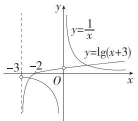

又 $t + \frac{4}{t} - 4 \geqslant 2\sqrt{t \cdot \frac{4}{t}} - 4 = 0$ ，当且仅当 $t = 2$ 时，等号成立，

所以 $a \leqslant 0$ ，故 $a$ 的取值范围为 $(- \infty, 0]$ . (15 分)

17. 解析 (1) 由题意得函数 $y = f(x)$ 的定义域为 $(0, +\infty)$ ,

$$
f (x) = \left(\log_ {2} x - 2\right) \log_ {2} \frac {x}{2} = \left(\log_ {2} x - 2\right) \left(\log_ {2} x - 1\right),
$$

令 $s = \log_2x$ ，则 $s\in \mathbf{R}$ ，故求 $f(x)$ 的最小值即求 $y = (s - 2)(s - 1) = s^2 -3s + 2$ 在 $\mathbf{R}$ 上的最小值. (3分）

由 $y = s^2 - 3s + 2 = \left(s - \frac{3}{2}\right)^2 - \frac{1}{4}$ 结合二次函数的性质得当 $s = \frac{3}{2}$ 时， $y_{\min} = -\frac{1}{4}$ ，故 $f(x)_{\min} = -\frac{1}{4}$ . (5分)

(2) 由 $f(x) < m \log_4 x$ ，得 $(\log_2 x - 2)(\log_2 x - 1) < \frac{m}{2} \log_2 x$ .

令 $t = \log_2x$ ，由 $x\in [2,16]$ ，得 $t\in [1,4]$

由题意可知,对于任意的 $t \in [1,4]$ , $(t-2)(t-1) < \frac{m}{2}t$ 恒成立, 即 $t + \frac{2}{t} - 3 < \frac{m}{2}$ 恒成立. (7 分)

令 $h(t) = t + \frac{2}{t} - 3, t \in [1,4]$ ，则 $h(t)_{\max} < \frac{m}{2}$ .

由对勾函数的单调性可知 $h(t)$ 在 $[1, \sqrt{2}]$ 上单调递减，在 $[\sqrt{2}, 4]$ 上单调递增，且 $h(1) = 0, h(4) = \frac{3}{2}$ ，

所以当 $t \in [1,4]$ 时， $h(t)_{\max} = h(4) = \frac{3}{2}$ . (9分)

因此 $\frac{3}{2} < \frac{m}{2}$ , 解得 $m > 3$ , 即 $m$ 的取值范围是 $(3, +\infty)$ . (10分)

(3) 结合 (1) 可知, $y = \left(s - \frac{3}{2}\right)^2 - \frac{1}{4}$ 在 $\left(-\infty, \frac{3}{2}\right)$ 上单调递减, 在 $\left(\frac{3}{2}, +\infty\right)$ 上单调递增, 令 $\log_2 x = \frac{3}{2}$ , 得 $x = 2^{\frac{3}{2}} = 2\sqrt{2}$ , 结合复合函数的单调性可知 $f(x)$ 在 $(0, 2\sqrt{2})$ 上单调递减, 在 $(2\sqrt{2}, +\infty)$ 上单调递增, 且 $f(2\sqrt{2}) = -\frac{1}{4}$ , 令 $f(x) = 0$ , 得 $x = 2$ 或 $x = 4$ . 画出函数 $|f(x)| = \left| (\log_2 x - 2)\log_2 \frac{x}{2} \right|$ 的大致图象如图:

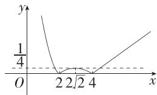

(12 分)

则函数 $y = |f(x)|$ 在(0,2)上单调递减，在 $(2,2\sqrt{2})$ 上单调递增，在 $(2\sqrt{2},4)$ 上单调递减，在 $(4, +\infty)$ 上单调递增， (13分)

因此当 $b \in \{0\} \cup \left(\frac{1}{4}, +\infty\right)$ 时，关于 $x$ 的方程 $|f(x)| = b$ 有两个不同的实数解. (15分)

18. 解析 (1) 因为函数 $g(x)$ 是 $\mathbf{R}$ 上的增函数，

所以 $\left\{\begin{aligned}\frac{k}{2}&\geqslant1,\\ -1+k-2&\leqslant\ln1,\end{aligned}\right.$ 即 $\left\{\begin{aligned}\frac{k}{2}&\geqslant1,\\ k-3&\leqslant0,\end{aligned}\right.$ (4分)

解得 $2 \leqslant k \leqslant 3$ ，故 $k$ 的取值范围为 $[2,3]$ . (6分)

(2) 因为 $f(x)$ 的定义域为 $(0, +\infty)$ ，所以 $\left\{\begin{aligned}a &>0,\\ (2-a)\mathrm{e}^{x} &-1 > 0,\end{aligned}\right.$ (8 分)

由 $(2 - a)\mathrm{e}^{x} - 1 > 0$ 得 $a <   2 - \frac{1}{\mathrm{e}^x}$ 在 $x\in (0, + \infty)$ 上恒成立，

因为 $x > 0$ ，所以 $\mathrm{e}^x >1$ ，所以 $0 <   \frac{1}{\mathrm{e}^x} <  1$ ，所以 $2 - \frac{1}{\mathrm{e}^x} >1$ ，所以 $0 <   a\leqslant 1.$ (11分)

因为对任意的正数 $x$ ，不等式 $f((2 - a)\mathrm{e}^x -1)\leqslant f(a) + 2x$ 恒成立，

所以 $f((2 - a)\mathrm{e}^{x} - 1)\leqslant f(a\mathrm{e}^{2x})$

因为 $f(x)$ 在 $(0, +\infty)$ 上为增函数，

所以 $(2 - a)\mathrm{e}^{x} - 1\leqslant a\mathrm{e}^{2x}$ 在 $(0, + \infty)$ 上恒成立，

所以 $a \geqslant \frac{2\mathrm{e}^x - 1}{\mathrm{e}^{2x} + \mathrm{e}^x}$ 在 $(0, +\infty)$ 上恒成立， (13分)

令 $t = 2\mathrm{e}^{x} - 1, t \in (1, +\infty)$ ，则 $\mathrm{e}^x = \frac{t + 1}{2}$ ，

所以 $a \geqslant \frac{4t}{t^2 + 4t + 3}$ 在 $t \in (1, +\infty)$ 上恒成立，

因为 $\frac{4t}{t^2 + 4t + 3} = \frac{4}{t + \frac{3}{t} + 4} \leqslant \frac{4}{2\sqrt{3} + 4} = 4 - 2\sqrt{3}$ , 当且仅当 $t = \sqrt{3}$ 时, 等号成立,

所以 $a \geqslant 4 - 2\sqrt{3}$ . (16分)

综上, $a$ 的取值范围为 $[4 - 2\sqrt{3},1]$ . (17分)

19. 解析 (1) 对于 $f(x) = x^2 - 1$ , $f(0) = -1$ , 又 $g(x) = |x| \geqslant 0$ , 所以 $g(x)$ 不是 $f(x)$ 的“2 重覆盖函数”. (2 分)

(2) 易知 $f(x) = \log_2 \frac{2^x + 2}{2^x + 1} = \log_2 \left(1 + \frac{1}{2^x + 1}\right)$ 的定义域为 $\mathbf{R}$ ,

则对任意 $x_0 \in \mathbf{R}$ , 存在 2 个不同的实数 $x_1, x_2 \in [-2, +\infty)$ ,

使得 $g(x_{i}) = f(x_{0})$ （其中 $i = 1,2$ ），（3分）

由 $2^{x} > 0$ ，得 $2^{x} + 1 > 1 \Rightarrow 0 < \frac{1}{2^{x} + 1} < 1 \Rightarrow 1 < 1 + \frac{1}{2^{x} + 1} < 2,$

故 $0 < \log_{2}\left(1 + \frac{1}{2^{x} + 1}\right) < 1$ ，即 $\forall x_0 \in \mathbf{R}, \log_2\left(1 + \frac{1}{2^{x_0} + 1}\right) \in (0, 1)$ ，

即对任意 $k \in (0,1), g(x) = k$ 有2个实根，

当 $x > 1$ 时， $x - 1 > 0, g(x) = x - 1 = k$ 有一个根，

故只需 $-2 \leqslant x \leqslant 1$ 时， $g(x) = k(0 < k < 1)$ 仅有1个根. (5分)

当 $-a \geqslant 0$ ，即 $a \leqslant 0$ 时， $g(x) = 2^x - a \in [g(-2), g(1)] = \left[\frac{1}{4} - a, 2 - a\right]$ ，

则 $\left\{\begin{aligned}\frac{1}{4}-a&\leqslant0,\\ 2-a&\geqslant1,\\ a&\leqslant0,\end{aligned}\right.$ 此不等式组无解. (6分)

当-a<0，即a>0时，令 $g(x)=|2^{x}-a|=0$ ，解得 $x=\log_{2}a$ ，

当 $\log_2a\leqslant -2 = \log_2\frac{1}{4}$ 即 $0 < a\leqslant \frac{1}{4}$ 时， $g(x) = 2^x -a\in [g(-2),g(1)] =$

$\left[\frac{1}{4}-a,2-a\right]$ ，所以 $\left\{\begin{aligned}\frac{1}{4}-a&\leqslant0,\\ 2-a&\geqslant1,\end{aligned}\right.$ 解得 $a=\frac{1}{4}.$ $0<a\leqslant\frac{1}{4},$ (7分)

当 $-2 = \log_2\frac{1}{4} < \log_2a < \log_22 = 1$ ，即 $\frac{1}{4} < a < 2$ 时，不满足 $g(x) = k(0 < k < 1)$

仅有1个根. (8分)

当 $\log_2a\geqslant 1 = \log_22$ ，即 $a\geqslant 2$ 时， $g(x) = a - 2^{x}\in [g(1),g(-2)] =$

$\left[a-2,a-\frac{1}{4}\right]$ ，所以 $\left\{\begin{aligned}a-2&\leqslant0,\\ a-\frac{1}{4}&\geqslant1,\end{aligned}\right.$ 解得a=2. (9分)

综上所述, $a=\frac{1}{4}$ 或a=2. (10分)

(3) 对于 $f(x) = \frac{x}{x^2 + 1}, x \in [0, +\infty)$ ,

当 $x = 0$ 时， $f(0) = 0$ ； (11分)

当 $x > 0$ 时， $f(x) > 0$ 且 $f(x) = \frac{x}{x^2 + 1} = \frac{1}{x + \frac{1}{x}} \leqslant \frac{1}{2\sqrt{x \cdot \frac{1}{x}}} = \frac{1}{2}$ ，（12分）

当且仅当 $x = 1$ 时取等号，所以 $0 < f(x) \leqslant \frac{1}{2}$ .

综上, $0 \leqslant f(x) \leqslant \frac{1}{2}$ ，即 $\forall x_{0} \in [0, +\infty)$ ， $f(x_{0}) = \frac{x_{0}}{x_{0}^{2} + 1} \in \left[0, \frac{1}{2}\right]$ ，(14分)

则对任意 $m \in \left[0, \frac{1}{2}\right], g(x) = m, x \in [0, 2)$ 有2024个根，

$g(x) = ax - [ax] = \left\{ \begin{array}{l}ax,x\in \left[0,\frac{1}{a}\right),\\ ax - 1,x\in \left[\frac{1}{a},\frac{2}{a}\right),\\ ax - 2,x\in \left[\frac{2}{a},\frac{3}{a}\right),\\ \dots \end{array} \right.$ (16分）

作出函数 $g(x)$ 的部分图象，如图，要使 $g(x) = m, m \in \left[0, \frac{1}{2}\right], x \in [0,$

2)有2024个根,则 $\frac{4047}{2a}<2\leqslant\frac{2024}{a}$ （点拨: $y=g(x)$ 的图象与直线 $y=\frac{1}{2}$ 的交点的横坐标依次为 $\frac{1}{2a},\frac{3}{2a},\frac{5}{2a},\cdots$ ），

又 $a > 0$ ，所以 $\frac{4047}{4} < a \leqslant 1012$ ，故正实数 $a$ 的取值范围是 $\left(\frac{4047}{4}, 1012\right]$ .

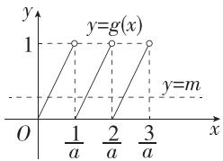

(17 分)

第五章 三角函数

<table><tr><td>1.B</td><td>2.B</td><td>3.D</td><td>4.B</td><td>5.A</td><td>6.B</td></tr><tr><td>7.A</td><td>8.C</td><td>9.BC</td><td>10.BD</td><td>11.ACD</td><td></td></tr></table>

1.B 根据题意可知 $\frac{y}{\sqrt{2^2 + y^2}} = -\frac{\sqrt{5}}{5}$ , 所以 $y = -1$ .

2.B 设扇形的圆心角为 $\alpha$ rad, 则半径为 $\frac{2}{\alpha}$ , 所以扇形的面积为 $\frac{1}{2} \times 2 \times \frac{2}{\alpha} = 1$ , 可得 $\alpha = 2$ .

3.D 将函数 $f(x) = \sin (2x + \varphi)$ 的图象向左平移 $\frac{\pi}{6}$ 个单位长度可得函数 $y = \sin \left(2x + \frac{\pi}{3} + \varphi\right)$ 的图象，

由已知得函数 $y = \sin \left(2x + \frac{\pi}{3} +\varphi\right)$ 的图象关于直线 $x = \frac{\pi}{6}$ 对称，

所以 $2 \times \frac{\pi}{6} + \frac{\pi}{3} + \varphi = k\pi + \frac{\pi}{2}, k \in \mathbf{Z}$ , 所以 $\varphi = k\pi - \frac{\pi}{6}, k \in \mathbf{Z}$ ,

又 $0 < \varphi < \pi$ ，所以 $\varphi = \frac{5\pi}{6}$

4.B 因为 $f(x)$ 的定义域为 $[-3, 3]$ ，关于原点对称，且 $f(-x) = \frac{\mathrm{e}^{-x} + \mathrm{e}^{x}}{4} \cdot \sin (-\pi x) = -\frac{\mathrm{e}^{x} + \mathrm{e}^{-x}}{4} \cdot \sin \pi x = -f(x)$ ，所以函数 $f(x)$ 为奇函数，其图象关于原点对称，排除A和C；

当 $2 < x < 3$ 时， $\frac{\mathrm{e}^x + \mathrm{e}^{-x}}{4} > 0, \sin \pi x > 0$ ，所以 $f(x) = \frac{\mathrm{e}^x + \mathrm{e}^{-x}}{4} \cdot \sin \pi x > 0$ ，排除D.

5.A 由题意得 $\sqrt{3}\sin \alpha -\left(\frac{\sqrt{3}}{2}\sin \alpha +\frac{1}{2}\cos \alpha\right) = \frac{3}{5},$

得 $\frac{\sqrt{3}}{2}\sin \alpha -\frac{1}{2}\cos \alpha = \frac{3}{5}$ 即 $\sin \left(\alpha -\frac{\pi}{6}\right) = \frac{3}{5},$

故 $\cos \left(\frac{4\pi}{3} - 2\alpha\right) = -\cos \left(\frac{\pi}{3} - 2\alpha\right) = -\cos \left[2\left(\frac{\pi}{6} - \alpha\right)\right] = 2\sin^2\left(\alpha - \frac{\pi}{6}\right) - 1 = 2 \times$ $\left(\frac{3}{5}\right)^2 - 1 = -\frac{7}{25}$ .

6.B $f(x) = \sin \omega x + \cos \omega x = \sqrt{2}\sin \left(\omega x + \frac{\pi}{4}\right),\therefore f(x)_{\max} = \sqrt{2},f(x)_{\min} = -\sqrt{2},$ 若存在 $x_{1},x_{2}\in \left(0,\frac{\pi}{2}\right)$ ，且 $x_{1} <   x_{2}$ ，使得 $f(x_{1}) - f(x_{2}) = -2\sqrt{2}$ ，则 $f(x_{1}) =$ $-\sqrt{2},f(x_2) = \sqrt{2}.$

当 $0 < x < \frac{\pi}{2}, \omega > 0$ 时， $\frac{\pi}{4} < \omega x + \frac{\pi}{4} < \frac{\pi \omega}{2} + \frac{\pi}{4}, \therefore \frac{\pi \omega}{2} + \frac{\pi}{4} > \frac{5\pi}{2}$ ，解得 $\omega > \frac{9}{2}$ .

7.A $\because \sin A = \sin (B + C) = 3\cos B\cos C, \therefore \sin B\cos C + \cos B\sin C = 3\cos B \cdot \cos C, \therefore \tan B + \tan C = 3, \therefore \tan B\tan C \leqslant \left(\frac{\tan B + \tan C}{2}\right)^{2} = \frac{9}{4}$ , 当且仅当 $\tan B = \tan C$ , 即 $B = C$ 时, 等号成立.

易知 $\tan A\tan B\tan C = -\tan (B + C)\tan B\tan C = \frac{\tan B + \tan C}{\tan B\tan C - 1}\cdot \tan B\tan C =$ $\frac{3\tan B\tan C}{\tan B\tan C - 1} = 3 + \frac{3}{\tan B\tan C - 1},$

$$
\because \tan B \tan C \leqslant \frac {9}{4}, \therefore \tan A \tan B \tan C \geqslant \frac {2 7}{5}.
$$

8. C $f(x) = 4\cos\left(\frac{\pi}{2}-\frac{\omega x}{2}\right) \cdot \cos\left(\frac{\omega x}{2}-\frac{\pi}{6}\right) - 1 = 4\sin\frac{\omega x}{2}\left(\frac{\sqrt{3}}{2}\cos\frac{\omega x}{2} + \frac{1}{2}\sin\frac{\omega x}{2}\right) - 1 = 2\sqrt{3}\sin\frac{\omega x}{2}\cos\frac{\omega x}{2} + 2\sin^{2}\frac{\omega x}{2} - 1 = \sqrt{3}\sin\omega x - \cos\omega x = 2\sin\left(\omega x - \frac{\pi}{6}\right).$

由 $x \in \left[-\frac{\pi}{3}, \frac{3\pi}{4}\right], \omega > 0$ ，得 $\omega x - \frac{\pi}{6} \in \left[-\frac{\pi}{3}\omega - \frac{\pi}{6}, \frac{3\pi}{4}\omega - \frac{\pi}{6}\right]$ .

因为 $f(x)$ 在区间 $\left[-\frac{\pi}{3},\frac{3\pi}{4}\right]$ 上单调递增，

所以 $-\frac{\pi}{3}\omega -\frac{\pi}{6}\geqslant -\frac{\pi}{2}$ 且 $\frac{3\pi}{4}\omega -\frac{\pi}{6}\leqslant \frac{\pi}{2}$ 所以 $0 <   \omega \leqslant \frac{8}{9}.$

当 $x \in [0, \pi]$ , $\omega > 0$ 时, $\omega x - \frac{\pi}{6} \in \left[-\frac{\pi}{6}, \omega \pi - \frac{\pi}{6}\right]$ .

要使函数 $f(x)$ 在 $[0, \pi]$ 上只取得一次最大值，

则 $\frac{\pi}{2} \leqslant \omega \pi - \frac{\pi}{6} < \frac{5\pi}{2}$ , 解得 $\frac{2}{3} \leqslant \omega < \frac{8}{3}$ .

综上, $\omega$ 的取值范围为 $\left[\frac{2}{3},\frac{8}{9}\right]$ .

9.BC 对于 A, 因为 $-\frac{7\pi}{6} = \frac{5\pi}{6} - 2\pi$ 且 $\frac{5\pi}{6}$ 为第二象限角,

所以 $-\frac{7\pi}{6}$ 是第二象限角，A错误；

对于 B, 若圆心角为 $\frac{\pi}{3}$ 的扇形的弧长为 $\pi$ , 则该扇形的半径 $r = \frac{\pi}{\frac{\pi}{3}} = 3$ ,

因此该扇形的面积 $S=\frac{1}{2}\pi r=\frac{1}{2}\pi \times 3=\frac{3\pi}{2}$ ，B 正确；

对于C,若角 $\alpha$ 的终边上有一点 $P(-3,4)$ , 则 $\cos \alpha = \frac{-3}{\sqrt{(-3)^2 + 4^2}} = -\frac{3}{5}$ ,

C 正确；

对于 D, 若 $\beta$ 为锐角, 不妨取 $\beta = \frac{\pi}{4}$ , 则 $2\beta = \frac{\pi}{2}$ , 为直角, D 错误.

10.BD 对于 A, 由题意得 $\sin \alpha, \cos \alpha$ 是方程 $3x^{2}-x-m=0$ 的两根,

$$
\text {则} \left\{ \begin{array}{l} \sin \alpha + \cos \alpha = \frac {1}{3}, \\ \sin \alpha \cos \alpha = - \frac {m}{3}, \end{array} \right.
$$

由 $\sin \alpha +\cos \alpha = \frac{1}{3}$ 得 $(\sin \alpha +\cos \alpha)^2 = \frac{1}{9}$ 即 $\sin^2\alpha +\cos^2\alpha +2\sin \alpha \cos \alpha =$ $\frac{1}{9}$ ，解得 $\sin \alpha \cos \alpha = -\frac{4}{9}$ ，则 $-\frac{m}{3} = -\frac{4}{9}$ 解得 $m = \frac{4}{3}$ 故A错误；

对于 B, $(\sin\alpha-\cos\alpha)^{2}=\sin^{2}\alpha+\cos^{2}\alpha-2\sin\alpha\cos\alpha=1-2\times\left(-\frac{4}{9}\right)=\frac{17}{9}$

因为 $\alpha \in (0, \pi)$ , 所以 $\sin \alpha > 0$ , 又 $\sin \alpha \cos \alpha = -\frac{4}{9} < 0$ , 所以 $\cos \alpha < 0$ ,

则 $\sin \alpha -\cos \alpha >0$ ，因此 $\sin \alpha -\cos \alpha = \sqrt{\frac{17}{9}} = \frac{\sqrt{17}}{3}$ 故B正确；

对于C，由 $\left\{ \begin{array}{l}\sin \alpha +\cos \alpha = \frac{1}{3},\\ \sin \alpha -\cos \alpha = \frac{\sqrt{17}}{3}, \end{array} \right.$ 解得 $\left\{ \begin{array}{l}\sin \alpha = \frac{1 + \sqrt{17}}{6},\\ \cos \alpha = \frac{1 - \sqrt{17}}{6}, \end{array} \right.$

则 $\tan \alpha = \frac{\sin \alpha}{\cos \alpha} = -\frac{9 + \sqrt{17}}{8}$ 故C错误；

对于 D, $\cos^{2}\alpha - \sin^{2}\alpha = (\cos\alpha + \sin\alpha) (\cos\alpha - \sin\alpha) = \frac{1}{3} \times \left(-\frac{\sqrt{17}}{3}\right) = -\frac{\sqrt{17}}{9}$ ，故 D 正确.

11.ACD A 选项, 设 $f(x)$ 的最小正周期为 T, 由题图可知, $T=2\times(4-1)=6$ , 即 $\omega=\frac{2\pi}{T}=\frac{\pi}{3}$ , A 正确;

B 选项,由题图可知 A=2, 故 $f(x)=2\sin\left(\frac{\pi}{3}x+\varphi\right)$ ,

将(1,2)代入解析式得 $2\sin\left(\frac{\pi}{3}+\varphi\right)=2$ ，即 $\sin\left(\frac{\pi}{3}+\varphi\right)=1$ ，所以 $\frac{\pi}{3}+\varphi=\frac{\pi}{2}+2k\pi,k\in\mathbf{Z}$ ，则 $\varphi=\frac{\pi}{6}+2k\pi,k\in\mathbf{Z}$ ，

又 $\varphi \in (0,\pi)$ ，所以 $\varphi = \frac{\pi}{6}$ ,B错误；

C 选项,由以上分析知 $f(x)=2\sin\left(\frac{\pi}{3}x+\frac{\pi}{6}\right)$ ,

当 $x \in (0, m)$ 时， $\frac{\pi}{3} x + \frac{\pi}{6} \in \left(\frac{\pi}{6}, \frac{\pi}{3} m + \frac{\pi}{6}\right)$ ，

因为 $f(x)$ 在 $(0,m)$ 上恰好有三个零点，所以 $\frac{\pi}{3} m + \frac{\pi}{6}\in (3\pi ,4\pi ]$ ，解得 $\frac{17}{2} <  m\leqslant \frac{23}{2},\mathbb{C}$ 正确；

D 选项,由 A 知 $f(x)$ 的最小正周期为 6,

易知 $f(1) = 2, f(2) = 2\sin \frac{5\pi}{6} = 1, f(3) = 2\sin \left(\pi + \frac{\pi}{6}\right) = -1,$

$$
f (4) = - 2, f (5) = 2 \sin \left(\frac {5 \pi}{3} + \frac {\pi}{6}\right) = - 1, f (6) = 2 \sin \left(2 \pi + \frac {\pi}{6}\right) = 1,
$$

故 $f(1)+f(2)+f(3)+f(4)+f(5)+f(6)=0$ ,

所以 $f(1)+f(2)+f(3)+\cdots+f(2025)=337\times[f(1)+f(2)+f(3)+f(4)+f(5)+f(6)]+f(1)+f(2)+f(3)=0+2+1-1=2$ , D 正确.

12. 答案 $\left\{x\mid x=2k\pi+\frac{\pi}{6},k\in\mathbf{Z}\right\}$

解析 由 $\lg (\sqrt{3}\sin x) = \lg (\cos x)$ ，得 $\sqrt{3}\sin x = \cos x$ ，即 $\tan x = \frac{\sqrt{3}}{3}$

所以 $x = k\pi + \frac{\pi}{6}, k \in \mathbf{Z}$ . ①

易知 $\sin x > 0, \cos x > 0$ ，所以 $2k\pi < x < 2k\pi + \frac{\pi}{2}, k \in \mathbf{Z}$ .②

由①②得 $x = 2k\pi + \frac{\pi}{6}, k \in \mathbf{Z}$ , 故方程的解构成的集合为 $\left\{x \mid x = 2k\pi + \frac{\pi}{6}, \right.$

$$
\left. k \in \mathbf {Z} \right\}.
$$

13. 答案 $3\pi - \frac{9\sqrt{3}}{4}$

解析 设扇形的半径为 r，则扇形的弧长为 $\frac{2\pi}{3} \times r = 2\pi$ ，解得 r = 3，扇形面积为 $\frac{1}{2} \times 2\pi \times 3 = 3\pi$ ，取 AB 的中点 E，连接 OE，如图所示：

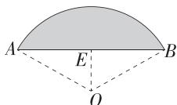

因为 OA = OB = 3，所以 $OE \perp AB$ ，

又因为 $\angle AOB = \frac{2\pi}{3}$ 所以 $\angle OAE = \frac{\pi}{6}$

所以 $OE = \frac{1}{2} OA = \frac{3}{2}, AE = OA\cos \frac{\pi}{6} = 3 \times \frac{\sqrt{3}}{2} = \frac{3\sqrt{3}}{2}$ , 则 $AB = 2AE = 3\sqrt{3}$ ,

所以 $S_{\triangle AOB}=\frac{1}{2}AB\cdot OE=\frac{1}{2}\times3\sqrt{3}\times\frac{3}{2}=\frac{9\sqrt{3}}{4}$ ,

因此弧田的面积 $S = 3\pi - \frac{9\sqrt{3}}{4}$ .

14. 答案 $\left(0, \frac{1}{3}\right] \cup \left[\frac{2}{3}, \frac{5}{6}\right]$

解析 令 $\omega x + \frac{\pi}{3} = k\pi, k \in \mathbf{Z}$ , 得 $x = -\frac{\pi}{3\omega} + \frac{k\pi}{\omega}, k \in \mathbf{Z}$ ,

由题意可知, $\frac{2\pi}{\omega}\times\frac{1}{2}\geqslant2\pi-\pi$ ,且 $\omega>0$ ,即 $0<\omega\leqslant1$ ,

若 $x = -\frac{\pi}{3\omega} + \frac{k\pi}{\omega} \in (\pi, 2\pi), k \in \mathbf{Z}$ , 则 $\omega + \frac{1}{3} < k < 2\omega + \frac{1}{3}, k \in \mathbf{Z}$ ,

因为函数 $f(x)$ 在区间 $(\pi,2\pi)$ 内没有零点，所以区间 $\left(\omega+\frac{1}{3},2\omega+\frac{1}{3}\right)$ 内不存在整数，

所以 $\left(\omega +\frac{1}{3},2\omega +\frac{1}{3}\right)\subseteq (0,1)$ 或 $\left(\omega +\frac{1}{3},2\omega +\frac{1}{3}\right)\subseteq (1,2),$

$$
\text {即} \left\{ \begin{array}{l} 0 <   \omega \leqslant 1, \\ 0 \leqslant \omega + \frac {1}{3} <   2 \omega + \frac {1}{3} \leqslant 1 \end{array} \right. \text {或} \left\{ \begin{array}{l} 0 <   \omega \leqslant 1, \\ 1 \leqslant \omega + \frac {1}{3} <   2 \omega + \frac {1}{3} \leqslant 2, \end{array} \right.
$$

解得 $0 < \omega \leqslant \frac{1}{3}$ 或 $\frac{2}{3} \leqslant \omega \leqslant \frac{5}{6}$ ,

所以 $\omega$ 的取值范围是 $\left(0, \frac{1}{3}\right] \cup \left[\frac{2}{3}, \frac{5}{6}\right]$ .

15. 解析 (1) 选条件①: 由角 $\alpha$ 的终边与单位圆的交点为 $M\left(x, \frac{\sqrt{5}}{5}\right)$ ,

可得 $x^{2} + \left(\frac{\sqrt{5}}{5}\right)^{2} = 1$ ，则 $x = \pm \frac{2\sqrt{5}}{5}$ （3分）

由三角函数的定义可得 $\tan \alpha = \pm \frac{1}{2}$ . (6分)

选条件②:由 $3\sin^{2}\alpha-2\cos^{2}\alpha+1=0$

得 $3\sin^2\alpha - 2\cos^2\alpha + \sin^2\alpha + \cos^2\alpha = 0$ ，可得 $4\sin^2\alpha = \cos^2\alpha$ ， (3分)

$$
\therefore \tan^ {2} \alpha = \frac {1}{4}, \text {即} \tan \alpha = \pm \frac {1}{2}. \tag {6分}
$$

(2)无论选择①还是②均可得到 $\tan \alpha = \pm \frac{1}{2}$ ,

$$
\sin \alpha \cos \alpha - \sin^ {2} \alpha = \frac {\sin \alpha \cos \alpha - \sin^ {2} \alpha}{\sin^ {2} \alpha + \cos^ {2} \alpha} = \frac {\tan \alpha - \tan^ {2} \alpha}{\tan^ {2} \alpha + 1}, \tag {9分}
$$

$$
\text {当} \tan \alpha = \frac {1}{2} \text {时,} \frac {\tan \alpha - \tan^ {2} \alpha}{\tan^ {2} \alpha + 1} = \frac {\frac {1}{2} - \frac {1}{4}}{\frac {1}{4} + 1} = \frac {1}{5}; \tag {11分}
$$

$$
\text {当} \tan \alpha = - \frac {1}{2} \text {时,} \frac {\tan \alpha - \tan^ {2} \alpha}{\tan^ {2} \alpha + 1} = \frac {- \frac {1}{2} - \frac {1}{4}}{\frac {1}{4} + 1} = - \frac {3}{5}. \tag {13分}
$$

16. 解析 (1) $f(x) = \sin x \cos x - \sqrt{3} \cos^2 x + \frac{\sqrt{3}}{2} = \frac{1}{2} \times 2 \sin x \cos x - \frac{\sqrt{3}}{2} (2 \cos^2 x - 1) = \frac{1}{2} \sin 2x - \frac{\sqrt{3}}{2} \cos 2x = \sin \left(2x - \frac{\pi}{3}\right)$ , (2分)

所以 $f(x)$ 的最小正周期 $T=\frac{2\pi}{2}=\pi$ ，(3 分)

令 $\frac{\pi}{2} + 2k\pi \leqslant 2x - \frac{\pi}{3} \leqslant \frac{3\pi}{2} + 2k\pi, k \in \mathbf{Z}$ , 可得 $\frac{5\pi}{12} + k\pi \leqslant x \leqslant \frac{11\pi}{12} + k\pi, k \in \mathbf{Z}$ ,

所以 $f(x)$ 的单调递减区间为 $\left[\frac{5\pi}{12} + k\pi, \frac{11\pi}{12} + k\pi\right](k \in \mathbf{Z})$ 。（5分）

(2) 易知函数 $f(x)$ 的单调递增区间为 $\left[k\pi - \frac{\pi}{12}, k\pi + \frac{5\pi}{12}\right], k \in \mathbf{Z}$ ,

所以 $f(x)$ 在 $\left[-\frac{\pi}{12},\frac{\pi}{4}\right]$ 上单调递增，在 $\left[-\frac{\pi}{6}, - \frac{\pi}{12}\right]$ 上单调递减，（7分）

又 $f\left(-\frac{\pi}{12}\right) = -1, f\left(\frac{\pi}{4}\right) = \sin \frac{\pi}{6} = \frac{1}{2}, f\left(-\frac{\pi}{6}\right) = \sin \left(-\frac{2\pi}{3}\right) = -\frac{\sqrt{3}}{2},$

所以 $f(x)$ 在 $\left[-\frac{\pi}{6},\frac{\pi}{4}\right]$ 上的最小值为-1，最大值为 $\frac{1}{2}$ . (10分)

(3) 由 $f(x) = \sin \left(2x - \frac{\pi}{3}\right)$ 可得 $f\left(\frac{\alpha}{2}\right) = \sin \left(\alpha - \frac{\pi}{3}\right) = \frac{2}{3}$ , (12分)

所以 $\sin \left(2\alpha +\frac{5\pi}{6}\right) = \sin \left[\frac{3\pi}{2} +\left(2\alpha -\frac{2\pi}{3}\right)\right] = -\cos \left(2\alpha -\frac{2\pi}{3}\right)$

$$
= - \left[ 1 - 2 \sin^ {2} \left(\alpha - \frac {\pi}{3}\right) \right] = - \left[ 1 - 2 \times \left(\frac {2}{3}\right) ^ {2} \right] = - \frac {1}{9}. \tag {15分}
$$

17. 解析 (1) 因为 $\triangle OAB$ 为等腰直角三角形, $OA = \sqrt{2}$ , $M$ 为线段 $AB$ 的中点, 所以 $OM = 1$ , $\angle AOM = \frac{\pi}{4}$ , $OM \perp AB$ . (3分)

因为点 $P$ 在线段 $AM$ 上运动, 所以 $\theta \in \left[0, \frac{\pi}{4}\right]$ . (4分)

因为 $\angle AOP = \theta$ ，所以 $\angle POM = \frac{\pi}{4} -\theta ,$ (5分)

所以 $PM = OM \cdot \tan \angle POM = \tan \left( \frac{\pi}{4} - \theta \right)$ ，即 $f(\theta) = \tan \left( \frac{\pi}{4} - \theta \right)$ ， $\theta \in \left[ 0, \frac{\pi}{4} \right]$ .
(7 分)

(2) 因为 $\angle POQ = \frac{\pi}{4}$ , 所以 $\angle QOM = \theta$ ,

所以 $QM = OM\cdot \tan \angle QOM = \tan \theta ,$ （10分）

所以 $PQ = PM + QM = \tan\left(\frac{\pi}{4} - \theta\right) + \tan \theta,$ (12 分)

易得 $\tan \theta \in [0,1]$

所以 $S_{\triangle OPQ} = \frac{1}{2} PQ\cdot OM = \frac{1}{2}\left[\tan \left(\frac{\pi}{4} -\theta\right) + \tan \theta \right] = \frac{1}{2}\left(\frac{1 - \tan\theta}{1 + \tan\theta} +\tan \theta\right)$

$$
= \frac {1}{2} \left(\frac {2}{1 + \tan \theta} + 1 + \tan \theta - 2\right) \geqslant \frac {1}{2} \times (2 \sqrt {2} - 2) = \sqrt {2} - 1,
$$

当且仅当 $\tan \theta = \sqrt{2} - 1$ 时，等号成立，

所以 $\triangle OPQ$ 面积的最小值为 $\sqrt{2} - 1$ . (15分)

18. 解析 (1) 由题图得 $\left\{ \begin{array}{l} A + B = \frac{3}{2}, \\ -A + B = \frac{1}{2}, \end{array} \right.$ 则 $\left\{ \begin{array}{l} A = \frac{1}{2}, \\ B = 1. \end{array} \right.$

设 $f(x)$ 的最小正周期为 $T$ ，由题图得 $\frac{T}{2} = \frac{7\pi}{12} -\frac{\pi}{12} = \frac{\pi}{2}$ 所以 $T = \pi$ ，所以 $\omega$

$$
= \frac {2 \pi}{T} = 2, \text {所以} f (x) = \frac {1}{2} \sin (2 x + \varphi) + 1, \tag {3分}
$$

因为 $f(x)$ 的图象过点 $\left(\frac{\pi}{12},\frac{3}{2}\right)$ ，所以 $\frac{3}{2} = \frac{1}{2}\sin \left(2\times \frac{\pi}{12} +\varphi\right) + 1,$

即 $\sin \left(\frac{\pi}{6} +\varphi\right) = 1$ ，所以 $\frac{\pi}{6} +\varphi = \frac{\pi}{2} +2k\pi ,k\in \mathbf{Z},$ 解得 $\varphi = \frac{\pi}{3} +2k\pi ,k\in \mathbf{Z},$

又 $|\varphi| < \frac{\pi}{2}$ , 所以 $\varphi = \frac{\pi}{3}$ , 所以 $f(x) = \frac{1}{2} \sin\left(2x + \frac{\pi}{3}\right) + 1$ . (5分)

(2)①由已知得 $g(x) = \frac{1}{2}\sin \left(x + \frac{\pi}{6}\right) + 1$ ， (7分)

当 $x \in \left[-\frac{\pi}{3}, \frac{\pi}{2}\right]$ 时， $x + \frac{\pi}{6} \in \left[-\frac{\pi}{6}, \frac{2\pi}{3}\right]$ ，

所以 $\sin \left(x + \frac{\pi}{6}\right) \in \left[-\frac{1}{2}, 1\right]$ , 所以 $\frac{1}{2} \sin \left(x + \frac{\pi}{6}\right) + 1 \in \left[\frac{3}{4}, \frac{3}{2}\right]$ ,

所以函数 $g(x)$ 的值域为 $\left[\frac{3}{4},\frac{3}{2}\right]$ . (9分)

②当 $x \in \left[0, \frac{7\pi}{3}\right]$ 时， $x + \frac{\pi}{6} \in \left[\frac{\pi}{6}, \frac{5\pi}{2}\right]$ ，令 $t = x + \frac{\pi}{6}$ ，则 $t \in \left[\frac{\pi}{6}, \frac{5\pi}{2}\right]$ ，

令 $h(t) = \frac{1}{2}\sin t + 1$ ，易得 $h\left(\frac{\pi}{6}\right) = \frac{1}{2}\sin \frac{\pi}{6} +1 = \frac{5}{4},h\left(\frac{3\pi}{2}\right) = \frac{1}{2}\sin \frac{3\pi}{2} +1$

$= \frac{1}{2}, h\left(\frac{5\pi}{2}\right) = \frac{1}{2} \sin \frac{5\pi}{2} + 1 = \frac{3}{2}$ , 画出函数 $h(t)$ 的图象, 如图所示,

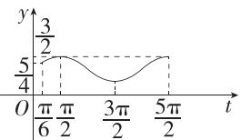

由已知得 $h(t) - m = 0$ 有三个不同的实数根，分别设为 $t_1, t_2, t_3 (t_1 < t_2 < t_3)$ ，由图可得 $t_1 + t_2 = 2 \times \frac{\pi}{2} = \pi, t_2 + t_3 = 2 \times \frac{3\pi}{2} = 3\pi$ ，所以 $t_1 + 2t_2 + t_3 = 4\pi$

即 $\left(x_{1} + \frac{\pi}{6}\right) + 2\left(x_{2} + \frac{\pi}{6}\right) + \left(x_{3} + \frac{\pi}{6}\right) = 4\pi$ ，所以 $x_{1} + 2x_{2} + x_{3} = \frac{10\pi}{3}$ （15分）

所以 $\tan (x_{1} + 2x_{2} + x_{3}) = \tan \frac{10\pi}{3} = \tan \left(4\pi -\frac{2\pi}{3}\right) = \sqrt{3}.$ (17分）

19. 解析 (1) 由已知得 $f(1) + f(1) = f(3) = 2$ ，则 $f(1) = 1$ ，

所以 $f(x) + f(-x) = f(x - x + 1) = f(1) = 1$ ， (2分)

$$
\forall i \in \mathbf {Z}, \cos \frac {i \pi}{2 0 2 5} + \cos \frac {(2 0 2 5 - i) \pi}{2 0 2 5} = 0,
$$

故 $f\left(\cos \frac{i\pi}{2025}\right) + f\left(\cos \frac{(2025 - i)\pi}{2025}\right) = 1,$

所以 $f\left(\cos \frac{\pi}{2025}\right) + f\left(\cos \frac{2\pi}{2025}\right) + f\left(\cos \frac{3\pi}{2025}\right) + \dots +f\left(\cos \frac{2024\pi}{2025}\right) =$

$$
1 0 1 2 \times \left[ f \left(\cos \frac {\pi}{2 0 2 5}\right) + f \left(\cos \frac {2 0 2 4 \pi}{2 0 2 5}\right) \right] = 1 0 1 2. \tag {4分}
$$

(2) 证明: 由已知得 $f(x+y+1)-f(y)=f(x)$ ,

任取 $x_{1}, x_{2} \in \mathbf{R}$ , 且 $x_{2} > x_{1}$ , 则 $f(x_{2}) - f(x_{1}) = f(x_{2} - x_{1} - 1)$ , (6分)

结合 $f(3) = 2$ 可知 $f(x_{2} - x_{1} - 1) = f(x_{2} - x_{1} - 1) + f(3) - f(3) = f(x_{2} - x_{1} + 3) - 2$ ,

因为 $x_{2} > x_{1}$ ，所以 $x_{2} - x_{1} + 3 > 3$ ，所以 $f(x_{2} - x_{1} + 3) > 2$ ，即 $f(x_{2} - x_{1} + 3) - 2 > 0$ 即 $f(x_{2}) - f(x_{1}) > 0$ ，所以 $f(x_{2}) > f(x_{1})$ ，所以 $f(x)$ 在 $\mathbf{R}$ 上单调递增. (8分)

(3) 设 $u(\theta) = f(12 + 4\cos 4\theta) - 2f\left(\frac{1}{2} + \frac{1}{4\tan^2\theta} + \frac{\tan^2\theta}{4}\right)$ , 由 $f(x) + f(y) = f(x)$ .

$+y + 1)$ 得 $2f\left(\frac{1}{2} +\frac{1}{4\tan^2\theta} +\frac{\tan^2\theta}{4}\right) = f\left(2 + \frac{1}{2\tan^2\theta} +\frac{\tan^2\theta}{2}\right),$

所以 $u(\theta) = f(12 + 4\cos 4\theta) - f\left(2 + \frac{1}{2\tan^2\theta} +\frac{\tan^2\theta}{2}\right)$

$$
= f \left(4 \cos 4 \theta - \frac {1}{2 \tan^ {2} \theta} - \frac {\tan^ {2} \theta}{2} + 9\right), \tag {11分}
$$

设 $h(\theta)=4\cos4\theta-\frac{1}{2\tan^{2}\theta}-\frac{\tan^{2}\theta}{2}+9$

则 $h(\theta) = 4\cos 4\theta - \frac{\cos^2\theta}{2\sin^2\theta} - \frac{\sin^2\theta}{2\cos^2\theta} + 9 = 4\cos 4\theta - \frac{\sin^4\theta + \cos^4\theta}{2\sin^2\theta\cos^2\theta} + 9$

$$
= 4 \cos 4 \theta - \frac {\left(\sin^ {2} \theta + \cos^ {2} \theta\right) ^ {2} - 2 \sin^ {2} \theta \cos^ {2} \theta}{2 \sin^ {2} \theta \cos^ {2} \theta} + 9 = 4 \cos 4 \theta - \frac {1}{2 \sin^ {2} \theta \cos^ {2} \theta} + 1 0
$$

$$
= 4 (1 - 2 \sin^ {2} 2 \theta) - \frac {2}{\sin^ {2} 2 \theta} + 1 0 = 1 4 - 2 \left(4 \sin^ {2} 2 \theta + \frac {1}{\sin^ {2} 2 \theta}\right),
$$

因为 $\theta$ 为锐角，所以 $\theta \in \left(0, \frac{\pi}{2}\right)$ ，所以 $2\theta \in (0, \pi)$ ，所以 $\sin 2\theta \in (0, 1]$ .

由基本不等式可得 $4\sin^2 2\theta + \frac{1}{\sin^2 2\theta} \geqslant 2\sqrt{4\sin^2 2\theta \cdot \frac{1}{\sin^2 2\theta}} = 4,$

当且仅当 $\sin 2\theta=\frac{\sqrt{2}}{2}$ ，即 $\theta=\frac{\pi}{8}$ 或 $\theta=\frac{3\pi}{8}$ 时取“=”，

所以 $h(\theta) \leqslant 14 - 2 \times 4 = 6.$ (14分)

由于 $f(x)$ 单调递增，所以 $u(\theta) = f(h(\theta)) \leqslant f(6)$ ，故 $u(\theta)$ 的最大值为 $f(6)$ ，

由已知得 $f(5) = f(1 + 3 + 1) = f(1) + f(3) = 1 + 2 = 3$ ，

所以 $f(2) + f(2) = f(2 + 2 + 1) = f(5) = 3$ ，则 $f(2) = \frac{3}{2}$

所以 $f(6) = f(2 + 3 + 1) = f(2) + f(3) = \frac{3}{2} + 2 = \frac{7}{2}$ ,

所以 $u(\theta)$ 的最大值为 $\frac{7}{2}$ ,

所以 $\frac{1}{2} f(12 + 4\cos 4\theta) - f\left(\frac{1}{2} +\frac{1}{4\tan^2\theta} +\frac{\tan^2\theta}{4}\right)$ 的最大值为 $\frac{7}{4}$ . (17分)

# 全书综合测评

<table><tr><td>1.C</td><td>2.D</td><td>3.A</td><td>4.C</td><td>5.B</td><td>6.C</td></tr><tr><td>7.D</td><td>8.C</td><td>9.ACD</td><td>10.ABD</td><td>11.ACD</td><td></td></tr></table>

1.C $A = \{x\mid -3 <   x <   1\} ,B = \{x\mid 0\leqslant x\leqslant 2\}$ ，则 $A\cup B = \{x\mid -3 <   x\leqslant 2\}$

2.D 由幂函数的定义知 $m^2 - m - 1 = 1$ ，解得 $m = -1$ 或 $m = 2$ . 因为 $f(x)$ 为偶函数，所以 $m^2 - 2m - 2$ 为偶数，故 $m = 2$ .

3.A $y = \sin \left(5x - \frac{\pi}{3}\right) = \sin \left[5\left(x - \frac{\pi}{15}\right)\right]$ ，所以为了得到 $y = \sin \left(5x - \frac{\pi}{3}\right)$ 的图象，只需将函数 $y = \sin 5x$ 的图象向右平移 $\frac{\pi}{15}$ 个单位长度.

4.C A 选项, $y=\sqrt{x}$ 的定义域为 $[0,+\infty)$ ，不关于原点对称，故不是奇函数，A 错误；

B 选项, $y=-\frac{1}{x}$ 的定义域为 $(-∞,0)∪(0,+∞)$ ,

易知 $y=-\frac{1}{x}$ 在 $(-∞,0)$ 和 $(0,+∞)$ 上均单调递增，但在定义域上不单调递增，B 错误；

C 选项, $y=x^{3}$ 的定义域为 R,且 $(-x)^{3}=-x^{3}$ ,

所以 $y=x^{3}$ 在定义域内为奇函数, 易知 $y=x^{3}$ 在 R 上单调递增, C 正确;

D 选项, $y=\sin x$ 在定义域 R 上不单调,D 错误.

5.B 因为 $x+\frac{2025}{x}\geqslant a$ 恒成立,所以 $\left(x+\frac{2025}{x}\right)_{\min}\geqslant a$ ,

因为 $x > 0$ ，所以 $x + \frac{2025}{x}\geqslant 2\sqrt{x\cdot\frac{2025}{x}} = 90$ ，当且仅当 $x = \frac{2025}{x}$ 即 $x = 45$ 时等号成立，所以 $\left(x + \frac{2025}{x}\right)_{\min} = 90$ ，所以 $a\leqslant 90$ ，因为 $\{a\mid a <   80\} \subsetneq \{a\mid a$ $\leqslant 90\}$

所以 $x + \frac{2025}{x} \geqslant a$ 恒成立的一个充分条件为 $a < 80$ .

6.C 由题意可得 $(1 + 10\%)^n \geqslant 2$ ，即 $1.1^n \geqslant 2$

两边取对数可得 $\lg 1.1^n \geqslant \lg 2$ ，即 $n\lg 1.1 \geqslant \lg 2$

因为 $\lg 1.1 > 0$ ，所以 $n\geqslant \frac{\lg 2}{\lg 1.1} = \frac{\lg 2}{\lg 11 - 1}\approx \frac{0.3}{0.04} = 7.5,$

因为 $n \in N^{*}$ ，所以 $n_{\min}=8$ .

7.D 因为 $f(3+x)=f(3-x)$ ，所以直线 x=3 是函数 $f(x)$ 图象的对称轴.

因为 $\forall x_{1},x_{2}\in [3, + \infty)$ ，当 $x_{1}\neq x_{2}$ 时， $\frac{f(x_1) - f(x_2)}{x_1 - x_2} >0$

所以 $f(x)$ 在 $[3, +\infty)$ 上单调递增，所以 $f(x)$ 在 $(- \infty, 3]$ 上单调递减. 由 $f(4) = 0$ 得 $f(2) = 0$

所以当 $x \in (-\infty, 2)$ 时， $x - 3 < 0$ ， $f(x) > 0$ ，满足 $(x - 3)f(x) < 0$

当 $x \in [2,3]$ 时， $x - 3 \leqslant 0$ ， $f(x) \leqslant 0$ ，不满足 $(x - 3)f(x) < 0$

当 $x \in (3,4)$ 时， $x - 3 > 0$ ， $f(x) < 0$ ，满足 $(x - 3)f(x) < 0$

当 $x \in [4, +\infty)$ 时， $x - 3 > 0$ ， $f(x) \geqslant 0$ ，不满足 $(x - 3)f(x) < 0$

所以不等式 $(x - 3)f(x) < 0$ 的解集为 $(- \infty, 2) \cup (3, 4)$ .

8.C $a = 2^{\frac{3}{4}} = (2\sqrt{2})^{\frac{1}{2}}.$

函数 $y = \sqrt{x}$ 在 $[0, +\infty)$ 上单调递增， $\frac{9}{4} < 2\sqrt{2} < 3$ ，所以 $\frac{3}{2} < (2\sqrt{2})^{\frac{1}{2}} < 3^{\frac{1}{2}}$ ，即 $b > a > \frac{3}{2}$ .

函数 $y = \log_4 x$ 在 $(0, +\infty)$ 上单调递增， $\log_4 3 > 0, \log_4 5 > 0$ ，所以 $2 = \log_4 16 > \log_4 15 = \log_4 3 + \log_4 5 = (\sqrt{\log_4 3} - \sqrt{\log_4 5})^2 + 2\sqrt{\log_4 3} \cdot \sqrt{\log_4 5} > 2\sqrt{\log_4 3} \cdot \sqrt{\log_4 5}$ ，所以 $\log_4 3 \times \log_4 5 < 1$ ，即 $\log_4 5 < \frac{1}{\log_4 3} = \log_3 4$ ，即 $c > d$ .

函数 $y = \log_3 x$ 在 $(0, +\infty)$ 上单调递增，且 $4 < 3\sqrt{3}$ ，所以 $\log_3 4 < \log_3 3\sqrt{3} = \frac{3}{2}$ ，即 $c < \frac{3}{2}$ .

综上, $b>a>\frac{3}{2}>c>d.$

9.ACD 对于 A, 因为 x>0, y>0, $x+y=1$ , 所以 $\frac{4}{x}+\frac{1}{y}=\left(\frac{4}{x}+\frac{1}{y}\right)(x+y)=5+\frac{4y}{x}+\frac{x}{y}\geqslant5+2\sqrt{\frac{4y}{x}\cdot\frac{x}{y}}=9$ , 当且仅当 $x=\frac{2}{3}$ , $y=\frac{1}{3}$ 时等号成立, 故 A 正确;

对于 B, 因为 x>0, y>0, $x+y=1$ , 所以 $(\sqrt{x}+\sqrt{y})^{2}=x+y+2\sqrt{xy}\leqslant1+x+y=2$ ,
故 $\sqrt{x}+\sqrt{y}\leqslant\sqrt{2}$ ，当且仅当 $x=y=\frac{1}{2}$ 时等号成立，故B错误；

对于 C, 因为 x>0, y>0, $x+y=1$ , 所以 $xy \leqslant \left(\frac{x+y}{2}\right)^{2} = \frac{1}{4}$ , 当且仅当 $x=y=\frac{1}{2}$ 时等号成立, 故 $\log_{2}x + \log_{2}y = \log_{2}(xy) \leqslant -2$ , 故 C 正确;

对于 D, 因为 x, y > 0, $x + y = 1$ , 所以 0 < x < 1, 0 < y < 1, 故 $\frac{\lg y}{\lg x} > 0$ , $\frac{\lg x}{\lg y} > 0$ ,

$\log_x y + \log_y x = \frac{\lg y}{\lg x} + \frac{\lg x}{\lg y} \geqslant 2\sqrt{\frac{\lg y}{\lg x} \cdot \frac{\lg x}{\lg y}} = 2$ ，当且仅当 $x = y = \frac{1}{2}$ 时等号成立，故 D 正确.

10.ABD 由题意得 $f(0) = 3$ ，则 $f(f(0)) = f(3) = 9 - 6a + 2a = 0$ ，得 $a = \frac{9}{4}$ ，A 正确.

若 $f(x)$ 在 $\mathbf{R}$ 上单调递增，则 $\left\{ \begin{array}{l}a > 0,\\ -\frac{-2a}{2\times 1}\leqslant 2,\\ 2a + 3\leqslant 4 - 4a + 2a, \end{array} \right.$ 得 $0 <   a\leqslant \frac{1}{4},B$ 正确.

若 $f(x)$ 在 $(-∞,3]$ 上单调递减，则 $\left\{\begin{aligned}a<0,\\ -\frac{-2a}{2×1}&\geqslant3,\\ 2a+3&\geqslant4-4a+2a,\end{aligned}\right.$ 不等式组无解，C

错误.

若 $f(x)$ 的值域为R,则a>0,所以 $f(x)$ 在 $(-∞,2)$ 上单调递增.

当 $0 < a \leqslant 2$ 时， $f(x)$ 在 $[2, +\infty)$ 上单调递增，则 $2a + 3 \geqslant 4 - 4a + 2a$ ，得 $a \geqslant \frac{1}{4}$ ，故 $\frac{1}{4} \leqslant a \leqslant 2$ .

当 $a > 2$ 时， $f(x)$ 在 $(2, a)$ 上单调递减，在 $(a, +\infty)$ 上单调递增，则 $2a + 3 \geqslant a^2 - 2a^2 + 2a$ ，得 $a^2 + 3 \geqslant 0$ ，显然恒成立，故 $a > 2$ .

综上, a 的取值范围为 $\left[\frac{1}{4}, +\infty\right)$ , D 正确.

11.ACD 由题图知 $\left\{ \begin{array}{l} T = \frac{2\pi}{\omega} = 15 - 3 = 12, \\ A + b = 8, \\ -A + b = 2, \end{array} \right.$ $\therefore \omega = \frac{\pi}{6}, A = 3, b = 5.$

由“五点作图法”知, $\frac{\pi}{6}\times3+\varphi=\frac{\pi}{2}$ ,解得 $\varphi=0$ .

$\therefore f(t) = 3\sin \frac{\pi}{6} t + 5(0 \leqslant t \leqslant 24)$ , 故 A 正确.

$f(12)=5\neq0,\therefore$ 函数 $f(t)$ 的图象不关于点 $(12,0)$ 对称,故 B 错误.

$f(5)=3\sin\frac{5\pi}{6}+5=\frac{3}{2}+5=6.5$ , 即当 t=5 时, 水深达到 $6.5 \, m$ , 故 C 正确.

$\because g(t)$ 的定义域为 $[0,6]$ , $\therefore 0 \leqslant 2t \leqslant 6$ , 解得 $0 \leqslant t \leqslant 3$ .

令 $g(2t) = f(2t) - n = 0$ ，得 $n = f(2t) = 3\sin \frac{\pi}{3} t + 5,$

$$
\therefore \frac {n - 5}{3} = \sin \frac {\pi}{3} t (0 \leqslant t \leqslant 3).
$$

$\because \frac{\pi}{3} t \in [0, \pi], t_1, t_2$ 为 $g(2t) = f(2t) - n$ 的2个零点，

$\therefore \frac{\pi}{3} t_{1} + \frac{\pi}{3} t_{2} = \frac{\pi}{2}\times 2 = \pi ,\therefore t_{1} + t_{2} = 3,\therefore \tan \frac{\pi}{t_{1} + t_{2}} = \tan \frac{\pi}{3} = \sqrt{3},$ 故D正确.

12. 答案 $2\ln x (x > 0)$

解析 令 $t = \mathrm{e}^{x}$ , 则 $x = \ln t, t > 0$ , 所以 $f(t) = 2\ln t$ , 所以 $f(x) = 2\ln x (x > 0)$ .

13. 答案 $y = 2\cos \left(2x + \frac{\pi}{6}\right)$

解析 由题图知 $A = 2, \frac{T}{2} = \frac{5\pi}{12} - \left(-\frac{\pi}{12}\right) = \frac{\pi}{2}$ , 所以 $T = \pi$ , 即 $\frac{2\pi}{\omega} = \pi$ , 所以 $\omega = 2$ , 所以 $y = 2\cos(2x + \varphi)$ .

由 $2\cos \left[2\times \left(-\frac{\pi}{12}\right) + \varphi \right] = 2$ ，且 $0 <   \varphi <  \frac{\pi}{2}$ 可得 $\varphi = \frac{\pi}{6}.$

所以 $y=2\cos\left(2x+\frac{\pi}{6}\right)$ .

14. 答案 ①④

解析 对于①, 当 $y=f(x)=\frac{1}{3}x$ 时, 因为 $|y|-|x|=\frac{1}{3}|x|-|x|=-\frac{2}{3}|x|$ $\leqslant0$ 恒成立,所以 $f(x)=\frac{1}{3}x$ 具有“线性控制”性质;

对于②, 当 $y=f(x)=\sqrt{x}$ 时, $|y|-|x|=\sqrt{x}-x=\sqrt{x}(1-\sqrt{x})$ ,

当 $0 \leqslant x < 1$ 时， $1 - \sqrt{x} > 0$ ，此时 $|y| - |x| > 0$ ，即 $|y| > |x|$ ，所以 $f(x) = \sqrt{x}$ 不具有“线性控制”性质；

对于③,在同一坐标系中作出 $y=x(x \geqslant 0)$ 和 $y=\left(\frac{1}{2}\right)^{x}(x \geqslant 0)$ 的图象,如图1,

由图1知 $y = x(x\geqslant 0)$ 与 $y = \left(\frac{1}{2}\right)^x (x\geqslant 0)$ 的图象相交于一点，设该点的横坐标为 $x_0$ ，易知当 $0\leqslant x <   x_0$ 时， $\left(\frac{1}{2}\right)^x >|x|$

所以当 $0 \leqslant x < x_0$ 时， $|y| \leqslant |x|$ 不成立，故 $f(x) = \left(\frac{1}{2}\right)^x (x \geqslant 0)$ 不具有“线性控制”性质；

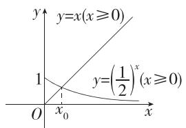  
图 1

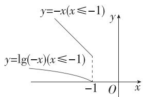  
图 2

对于④,在同一坐标系中作出 $y=-x(x \leqslant -1)$ 和 $y=\lg(-x)(x \leqslant -1)$ 的图象,如图2所示,

由图2知，当 $x \leqslant -1$ 时， $y = \lg (-x)$ 的图象恒在射线 $y = -x$ 的下方，即 $\lg (-x) < -x = |x|$ ，所以 $f(x) = \lg (-x) (x \leqslant -1)$ 具有“线性控制”性质.

15. 解析 由题意得 $\left\{ \begin{array}{l} 4x - 3 > 0, \\ \log_{0.5}(4x - 3) \geqslant 0, \end{array} \right.$ 则 $\frac{3}{4} < x \leqslant 1$ ，所以 $A = \left\{ x \mid \frac{3}{4} < x \leqslant 1 \right\}$ ，(3分)

由 $x^{2} - (2m + 1)x + m^{2} + m\leqslant 0$ ，得 $(x - m)[x - (m + 1)]\leqslant 0,$

解得 $m \leqslant x \leqslant m + 1$ ，所以 $B = \{x \mid m \leqslant x \leqslant m + 1\}$ . (6分)

(1) 当 m=0 时, $B=\{x\mid0\leqslant x\leqslant1\}$ ,

所以 $(\complement_{U}A)\cap B = \left\{x\mid x\leqslant \frac{3}{4}\text{或} x > 1\right\} \cap \{x|0\leqslant x\leqslant 1\} = \left\{x\mid 0\leqslant x\leqslant \frac{3}{4}\right\} .$ (9分)

(2) 因为 $A \cap B = \varnothing$ , 所以 $m + 1 \leqslant \frac{3}{4}$ 或 $m > 1$ , (11 分)

解得 $m \leqslant -\frac{1}{4}$ 或 $m > 1$

所以 $m$ 的取值范围是 $\left\{m\mid m\leqslant -\frac{1}{4}\text{或} m > 1\right\} .$ (13分)

16. 解析 (1) 当 $0 \leqslant x < 40, 100x \in N$ 时，

$P=80x-x^{2}-20x-100-500=-x^{2}+60x-600,$ (3分)

当 $40 \leqslant x \leqslant 100, 100x \in \mathbf{N}$ 时，

$P = 80x - \left(\frac{165}{2} x + \frac{9000}{x} - 1150\right) - 500 = -\frac{5}{2} x - \frac{9000}{x} + 650,$ (6分）

故 $P = \left\{ \begin{array}{l} - x^2 + 60x - 600, 0 \leqslant x < 40, 100x \in \mathbf{N}, \\ -\frac{5}{2} x - \frac{9000}{x} + 650, 40 \leqslant x \leqslant 100, 100x \in \mathbf{N}. \end{array} \right.$ (7分)

(2) 当 $0 \leqslant x < 40, 100x \in \mathbf{N}$ 时, $P = -(x - 30)^2 + 300$ ,

故当 x=30 时, P 取得最大值, 最大值为 300. (10 分)

当 $40 \leqslant x \leqslant 100, 100x \in \mathbf{N}$ 时，

$P = -\frac{5}{2} x - \frac{9000}{x} +650\leqslant -2\sqrt{\frac{5}{2} x\cdot\frac{9000}{x}} +650 = 350,$

当且仅当 $\frac{5x}{2}=\frac{9\ 000}{x}$ ，即x=60时，等号成立，(13分)

因为 350 > 300, 所以当年产量为 60 百台时, 企业所获年利润最大, 最大年利润为 350 万元. (15 分)

17. 解析 (1) $f(x) = 2\sin x \sin \left( x + \frac{\pi}{3} \right) + \cos 2x = 2\sin x \left( \frac{1}{2}\sin x + \frac{\sqrt{3}}{2}\cos x \right) + \cos 2x = \sin^2 x + \frac{\sqrt{3}}{2}\sin 2x + \cos 2x = \frac{1 - \cos 2x}{2} + \frac{\sqrt{3}}{2}\sin 2x + \cos 2x = \frac{\sqrt{3}}{2}\sin 2x + \frac{1}{2}\cos 2x + \frac{1}{2} = \sin \left( 2x + \frac{\pi}{6} \right) + \frac{1}{2}.$ (4分)

令 $-\frac{\pi}{2} + 2k\pi \leqslant 2x + \frac{\pi}{6} \leqslant \frac{\pi}{2} + 2k\pi, k \in \mathbf{Z}$ , 解得 $-\frac{\pi}{3} + k\pi \leqslant x \leqslant \frac{\pi}{6} + k\pi, k \in \mathbf{Z}$ , 故 $f(x)$ 的单调递增区间为 $\left[-\frac{\pi}{3} + k\pi, \frac{\pi}{6} + k\pi\right], k \in \mathbf{Z}$ . (6分)

易得 $f(x)$ 的最大值为 $\frac{3}{2}$ ，最小值为 $-\frac{1}{2}$ . (8分)

(2) 若函数 $g(x) = f(x) - a$ 在 $x \in \left[0, \frac{\pi}{2}\right]$ 上有且仅有两个零点，

则函数 $y = f(x), x \in \left[0, \frac{\pi}{2}\right]$ 的图象与直线 $y = a$ 有两个交点. (10分)

由(1)可得, 当 $x \in \left[0, \frac{\pi}{2}\right]$ 时, $f(x)$ 在 $\left[0, \frac{\pi}{6}\right]$ 上单调递增, 在 $\left[\frac{\pi}{6}, \frac{\pi}{2}\right]$ 上单调递减, (13分)

又 $f(0) = 1, f\left(\frac{\pi}{6}\right) = \frac{3}{2}, f\left(\frac{\pi}{2}\right) = 0,$

所以实数 $a$ 的取值范围为 $\left[1, \frac{3}{2}\right)$ . (15分)

18. 解析 (1) 根据题意, 得 $f(x)_{\max} = f(\pi) = 3$ , $f(x)_{\min} = f(6\pi) = -3$ , 所以 $A = 3$ , 因为当 $x \in (0,7\pi)$ 时, $f(x)$ 只取到一个最大值和一个最小值, 所以最小正周期 $T = \frac{2\pi}{\omega} = 2 \times (6\pi - \pi) = 10\pi$ , 所以 $\omega = \frac{1}{5}$ . (3 分)

由“五点作图法”知 $\frac{1}{5} \times \pi + \varphi = \frac{\pi}{2}$ , 所以 $\varphi = \frac{3\pi}{10}$ , (4分)

所以 $f(x) = 3\sin \left(\frac{1}{5} x + \frac{3\pi}{10}\right)$ . (5分)

(2)根据题意得 $\left\{\begin{aligned}-m^{2}+2m+3&\geqslant0,\\ -m^{2}+4&\geqslant0,\end{aligned}\right.$ 解得 $-1\leqslant m\leqslant2.$ (7分)

则 $-m^2 + 2m + 3 = -(m - 1)^2 + 4 \leqslant 4$ ，所以 $0 \leqslant \sqrt{-m^2 + 2m + 3} \leqslant 2$ .

同理, $0 \leqslant \sqrt{-m^{2}+4} \leqslant 2.$

所以 $\frac{3\pi}{10} \leqslant \frac{1}{5}\sqrt{-m^2 + 2m + 3} + \frac{3\pi}{10} \leqslant \frac{2}{5} + \frac{3\pi}{10} < \pi, \frac{3\pi}{10} \leqslant \frac{1}{5}\sqrt{-m^2 + 4} + \frac{3\pi}{10} \leqslant \frac{2}{5} + \frac{3\pi}{10} < \pi,$

易知函数 $f(x)$ 在区间 $[-4\pi, \pi]$ 上单调递增，

所以 $f(\sqrt{-m^2 + 2m + 3}) > f(\sqrt{-m^2 + 4})$ 等价于 $\sqrt{-m^2 + 2m + 3} > \sqrt{-m^2 + 4}$ ，解得 $m > \frac{1}{2}$ . (10分)

综上,存在 $m \in \left(\frac{1}{2}, 2\right]$ ，使不等式 $f(\sqrt{-m^{2}+2m+3}) > f(\sqrt{-m^{2}+4})$ 成立.
(11 分)

(3) 根据题意, 得 $g(x)=\sin\left(\frac{1}{5}x+\frac{3\pi}{10}\right)$ , $h(x)=\sin\left(\frac{1}{5}x+\frac{3\pi}{10}+\frac{1}{5}\varphi_{0}\right)$ .
(13 分)

因为函数 $y=e^{x}$ 与函数 $y=\lg x$ 均为增函数，且 $-1\leqslant g(x)\leqslant1,0<h(x)\leqslant1$

所以当 $g(x) = \sin \left(\frac{1}{5} x + \frac{3\pi}{10}\right) = 1$ 与 $h(x) = \sin \left(\frac{1}{5} x + \frac{3\pi}{10} + \frac{1}{5}\varphi_0\right) = 1$ 同时成立时，函数 $F(x)$ 取得最大值e. (15分)

由 $g(x) = \sin \left(\frac{1}{5} x + \frac{3\pi}{10}\right) = 1$ ，得 $\frac{1}{5} x + \frac{3\pi}{10} = \frac{\pi}{2} + 2k\pi, k \in \mathbf{Z},$

此时 $h(x) = \sin \left(\frac{1}{5} x + \frac{3\pi}{10} +\frac{1}{5}\varphi_{0}\right) = \sin \left(\frac{\pi}{2} +2k\pi +\frac{1}{5}\varphi_{0}\right) = 1,k\in \mathbf{Z},$

所以 $\cos \frac{1}{5}\varphi_0 = 1$ ，所以 $\frac{1}{5}\varphi_0 = 2n\pi ,n\in \mathbf{Z},$ 所以 $\varphi_0 = 10n\pi ,n\in \mathbf{Z}.$

又因为 $\varphi_0 > 0$ ，所以 $\varphi_0$ 的最小值为 $10\pi .$ (17分)

19. 解析 (1) $\because f(x)$ 是定义在 $\mathbf{R}$ 上的奇函数,

$\therefore f(-x) = -f(x)$ , 且 $f(0) = 0$ , (1分)

当 x>0 时，-x<0，

$\therefore f(x) = -f(-x) = -[-2(-x)^{2} - 4(-x) - 3] = 2x^{2} - 4x + 3.$ (3分）

综上， $f(x)=\left\{\begin{aligned}&2x^{2}-4x+3,x>0,\\ &0,x=0,\\ &-2x^{2}-4x-3,x<0.\end{aligned}\right.$ (4分)

(2)① $g(x)+\frac{1}{2}=\frac{\left(\mathrm{e}^{x}-\mathrm{e}^{-x}\right)^{2}+\mathrm{e}^{x}+\mathrm{e}^{-x}}{2}+\frac{1}{2}=\frac{\left(\mathrm{e}^{x}+\mathrm{e}^{-x}\right)^{2}+\mathrm{e}^{x}+\mathrm{e}^{-x}-3}{2},$

令 $t = \mathrm{e}^{x} + \mathrm{e}^{-x}$ ，则 $t\in [2, + \infty)$ ， $g(x) + \frac{1}{2} = \frac{t^2 + t - 3}{2},$

易知 $y = \frac{t^2 + t - 3}{2}$ 在 $[2, +\infty)$ 上单调递增，

∴ 当 t=2 时， $y_{\min}=\left[g(x)+\frac{1}{2}\right]_{\min}=\frac{3}{2}$ ,

∵ 不等式 $f(m) \leqslant g(x) + \frac{1}{2}$ 恒成立, ∴ $f(m) \leqslant \frac{3}{2}$ , (7 分)

当 $m < 0$ 时， $f(m) = -2m^2 - 4m - 3 = -2(m + 1)^2 - 1 < 0 \leqslant \frac{3}{2}$ 恒成立；

当 $m = 0$ 时， $f(m) = 0 \leqslant \frac{3}{2}$ 恒成立；

当 $m > 0$ 时， $f(m) = 2m^2 - 4m + 3$ ，令 $2m^2 - 4m + 3 \leqslant \frac{3}{2}$ ，则 $\frac{1}{2} \leqslant m \leqslant \frac{3}{2}$ .

综上, m 的取值范围是 $(-∞,0]∪\left[\frac{1}{2},\frac{3}{2}\right]$ . (10 分)

②不妨设 $f(g(x_{1}))\leqslant f(g(x_{2}))\leqslant f(g(x_{3}))$ .

由已知得 $f(g(x_{1}))+f(g(x_{2}))>f(g(x_{3}))$ ,

则 $\forall x\in D$ ，都有 $2f(g(x))_{\min} > f(g(x))_{\max}$ （13分）

由①可得 $g(x) \geqslant 1$ ，令 $k = g(x)$ ，则 $k \geqslant 1$ ， $f(g(x)) = f(k) = 2k^2 - 4k + 3 = 2(k - 1)^2 + 1 \geqslant 1$ ，

$\therefore f(g(x))_{\min} = 1$ ， (15分)

$\because 2f(g(x))_{\min} > f(g(x))_{\max},$

∴ $2 > 2k^{2} - 4k + 3$ ，即 $2k^{2} - 4k + 1 < 0$ ，解得 $1 - \frac{\sqrt{2}}{2} < k < 1 + \frac{\sqrt{2}}{2}$ ，又 $k \geqslant 1$ ，所以 $1 \leqslant k < 1 + \frac{\sqrt{2}}{2}$ ，即 $1 \leqslant g(x) < 1 + \frac{\sqrt{2}}{2}$ ，

$\therefore M = \left[1, 1 + \frac{\sqrt{2}}{2}\right)$ , 则 $\|M\| = \frac{\sqrt{2}}{2}$ . (17分)