# 第一章 集合与常用逻辑用语

# 1.1 集合的概念

# 基础过关练

Q 对应主书 P1

<table><tr><td>1.D</td><td>2.C</td><td>3.BD</td><td>4.A</td><td>5.D</td><td>7.C</td><td>8.CD</td><td>9.ABD</td></tr></table>

1.D A, B, C 均不满足集合中元素的确定性. 方程 $x^{2}=1$ 的实数根为 -1, 1, 满足集合中元素的特性, 能构成集合.

# 解后反思

判断某些对象能否构成集合,即看是否给出一个明确的标准,使得任何一个对象都能按此标准确定它是不是给定集合的元素,若具有此“标准”,就可以构成集合;否则,不能构成集合.

2.C 由 $x^{2} - 5x - 6 = 0$ ，可得 $x = -1$ 或 $x = 6$ ，由 $x^{2} - x - 2 = 0$ ，可得 $x = -1$ 或 $x = 2$ ，根据集合中元素的互异性可知集合 $M$ 一共有3个元素.  
3.BD 对于 A, 集合 $\{y \mid y = x^{2}\}$ 中的元素为实数, 集合 $\{(x, y) \mid y = x^{2}\}$ 中的元素为点, 集合中元素的属性不同, 不是同一个集合, 故 A 错误;

对于 B, 由集合中元素的无序性可得 B 正确;

对于 C, 素数又称质数, 是指在大于 1 的自然数中, 除了 1 和它本身外不再有其他因数的自然数, 所以 9 以内的素数组成的集合是 $\{2,3,5,7\}$ , 故 C 错误;

对于 D, 由集合中元素的互异性可得 a, b, c 均不相等, 故 D 正确.

4.A 易知仅有 $\pi \in \mathbf{R}$ 正确.  
5.D 因为 $1 \in A, 2 \notin A$ ，所以 $\left\{ \begin{array}{l} 2 - a < 0, \\ 4 - a \geqslant 0, \end{array} \right.$

解得 $2 < a \leqslant 4$ .

6. 答案 $\{-2,0\}$

解析 依题意可得 $a - 1 = 0$ 或 $a^2 - 1 = 0$ , 所以 $a = 1$ 或 $a = -1$ , 又 $a^2 - 1 \neq a - 1$ , 所以 $a = -1, \{a - 1, a^2 - 1\} = \{-2, 0\}$ .

7.C 由题可知 $\{x\in \mathbf{N}|3x <   25 - 2x\} = \{x\in \mathbf{N}|x <   5\} = \{0,1,2,$ $3,4\}$   
8. CD 联立 $\left\{ \begin{array}{l} y = x - 3, \\ y = -2x, \end{array} \right.$ 解得 $\left\{ \begin{array}{l} x = 1, \\ y = -2, \end{array} \right.$ 故一次函数 $y = x - 3$ 与 $y = -2x$ 的图象的交点组成的集合是 $\left\{ (x, y) \mid \left\{ \begin{array}{l} y = x - 3 \\ y = -2x \end{array} \right. \right\}$ 或 $\{(1, -2)\}$ , 而 $\{1, -2\}, \{x = 1, y = -2\}$ 不是点集, 故不符合题意.  
9.ABD 选项 A, 集合 M 的元素为 3, -1, 集合 P 的元素为点 $(3, -1)$ , 所以 A 符合题意;

选项 B, 集合 M 的元素为点 $(3,1)$ , 集合 P 的元素为点 $(1,3)$ , 所以 B 符合题意;

选项 C, 易知集合 M, P 为同一集合, 所以 C 不符合题意;

选项 D, 集合 M 的元素为实数 y, 集合 P 的元素为点 $(x, y)$ , 所以 D 符合题意.

10. 答案 $\{-16, -6, -4, -2, 0, 2, 4, 14\}$

解析 $\because \frac{15}{m + 1} \in \mathbf{Z}, m \in \mathbf{Z}$ ,

$$
\therefore m + 1 = - 1 5, - 5, - 3, - 1, 1, 3, 5, 1 5,
$$

$$
\therefore m = - 1 6, - 6, - 4, - 2, 0, 2, 4, 1 4,
$$

$$
\therefore M = \{- 1 6, - 6, - 4, - 2, 0, 2, 4, 1 4 \}.
$$

11. 解析 (1) ∵ 不在第一、三象限内的点分布在第二、四象限内或在坐标轴上，

∴ 所有不在第一、三象限内的点组成的集合为 $\{(x,y)\mid xy\leqslant0,x\in\mathbf{R},y\in\mathbf{R}\}$ .

(2) 要使 $y = \frac{1}{x^{2} + x - 6}$ 有意义, 则需 $x^{2} + x - 6 \neq 0$ , 解得 $x \neq 2$ 且 $x \neq -3$ .  
∴ 使 $y=\frac{1}{x^{2}+x-6}$ 有意义的实数 x 组成的集合为 $\{x \mid x \neq 2$ 且 $x \neq -3\}$ .  
(3) 由 $(x - 2)^{2} + (y + 3)^{2} = 0$ ，解得 $x = 2, y = -3$ ，∴ 方程的解组成的集合为 $\{(x, y) | x = 2, y = -3\}$ .

# 能力提升练

Q 对应主书 P2

<table><tr><td>1.B</td><td>4.D</td><td>5.ABD</td><td></td><td></td><td></td><td></td><td></td></tr></table>

1.B 根据元素相同的条件及分式 $\frac{b}{a}$ 有意义可知 $a \neq 0, \frac{b}{a} = 0$ ，则 $b = 0$ ，代入集合得 $\{a, 0, 1\}$ 与 $\{a^2, a, 0\}$ 相等，则 $\left\{ \begin{array}{l} a^2 = 1, \\ a \neq 1, \end{array} \right.$ 得 $a = -1$ ，因此 $a^{2025} + b^{2025} = (-1)^{2025} + 0^{2025} = -1$ .

2. 答案 30

解析 由题意得 z 的取值分别为 $(-1+2)^{2}=1, (-1+3)^{2}=4, (1+2)^{2}=9, (1+3)^{2}=16$ ,

故 $A\odot B = \{1,4,9,16\}$

所以 $A \odot B$ 中所有元素之和为 $1 + 4 + 9 + 16 = 30$ .

3. 答案 6

解析 若仅有①正确,则 a=1, b=1, $c \neq 2$ , d=4, 此时 a=b, 不满足集合中元素的互异性, 故此种情况不成立.

若仅有②正确,则 $a \neq 1, b \neq 1, c \neq 2, d = 4$ , 此时有 $(2, 3, 1, 4), (3, 2, 1, 4)$ 两种情况.

若仅有③正确,则 $a \neq 1, b = 1, c = 2, d = 4$ , 此时仅有 $(3, 1, 2, 4)$ 一种情况.

若仅有④正确,则 $a \neq 1, b = 1, c \neq 2, d \neq 4$ , 此时有 $(2, 1, 4, 3), (3, 1, 4, 2), (4, 1, 3, 2)$ 三种情况.

综上,符合条件的所有有序数组 $(a,b,c,d)$ 的个数是6.

# 方法技巧

先用肯定条件确定参数的值,再用否定条件进行讨论.

4.D 若 a=1，则 $a^{3}=1$ ，此时不满足集合中元素的互异性.

若 a=2，则 $a^{3}=8$ ，此时集合为 $\{1,2,8\}$ ，满足题意.

若 $a = a^3$ ，即 $a = 0$ 或 $a = -1$ 或 $a = 1$ （舍去），

当 a=0 时, 集合为 $\{0,1,2\}$ , 满足题意;

当 $a = -1$ 时，集合为 $\{-1,1,2\}$ ，满足题意

综上, $a$ 的取值集合为 $\{0, -1, 2\}$ .

# 解题模板

由集合中元素的特性求参数的值的步骤

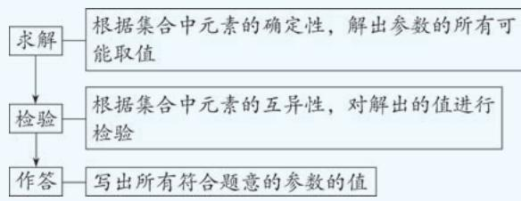

flowchart

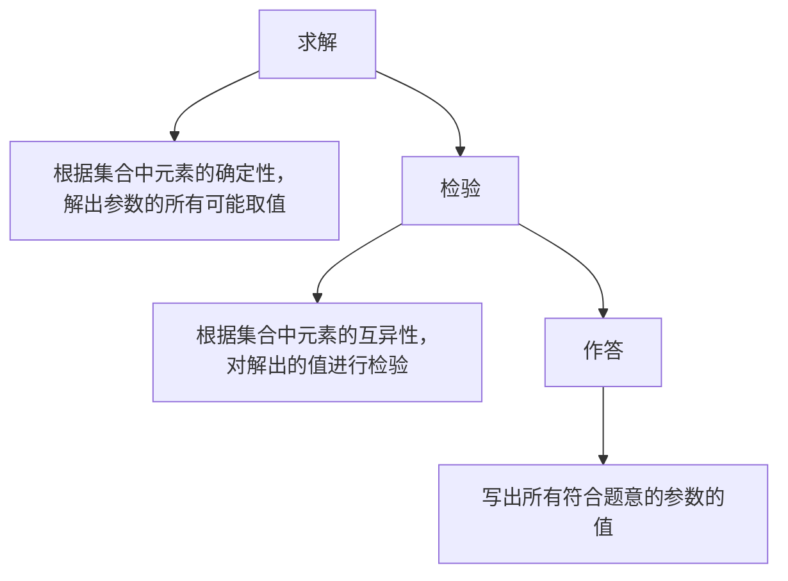

5.ABD 因为 $a \in A, b \in B, c \in C$ ，所以设 $a = 3k_0 - 1, k_0 \in \mathbf{Z}$ ， $b = 3k_1 + 1, k_1 \in \mathbf{Z}, c = 3k_2, k_2 \in \mathbf{Z}$ .

对于 A, $2a = 2(3k_{0} - 1) = 6k_{0} - 2 = 6k_{0} - 3 + 1 = 3(2k_{0} - 1) + 1$ , $2k_{0}-1\in Z$ ，则 $2a\in B$ ，故 A 正确；

对于 B, $2b = 2(3k_{1} + 1) = 6k_{1} + 2 = 6k_{1} + 3 - 1 = 3(2k_{1} + 1) - 1$ , $2k_{1} + 1 \in Z$ , 则 $2b \in A$ , 故 B 正确;

对于 C, $b+c=3k_{1}+1+3k_{2}=3(k_{1}+k_{2})+1$ , $k_{1}+k_{2}\in Z$ , 则 $b+c\in B$ , 故 C 错误;

对于 D, $a+b=3k_{0}-1+3k_{1}+1=3(k_{0}+k_{1})$ , $k_{0}+k_{1}\in Z$ , 则 $a+b\in C$ , 故 D 正确.

6. 答案 $\{0, -1, -4\}$

解析 当 4a=0, 即 a=0 时, 方程为 8x-1=0, 解得 $x=\frac{1}{8}$ ,
此时 $A=\left\{\frac{1}{8}\right\}$ ，符合题意；

当 $4a\neq0$ 时,因为集合A中只有一个元素,所以关于x的方程 $4ax^{2}+4(a+2)x-1=0$ 有两个相等的解,则 $\Delta=16(a+2)^{2}+16a=0$ ,解得a=-1或a=-4,

当 $a = -1$ 时， $A = \left\{\frac{1}{2}\right\}$ ，当 $a = -4$ 时， $A = \left\{-\frac{1}{4}\right\}$ ，均符合题意.

综上, $a$ 的所有可能取值组成的集合为 $\{0, -1, -4\}$ .

7. 答案 2

解析 当 x=1, y=1, 2, 4 时, x-y=0, -1, -3, 均不满足 $x-y \in A$ ;

当 $x = 2, y = 1$ 时， $x - y = 1 \in A$ ;

当 $x = 2, y = 2, 4$ 时， $x - y = 0, -2$ ，均不满足 $x - y \in A$ ;

当 $x = 4, y = 2$ 时， $x - y = 2 \in A$ ;

当 $x = 4, y = 1, 4$ 时， $x - y = 3, 0$ ，均不满足 $x - y \in A$ .

所以 $B = \{(2,1),(4,2)\}$ ，故集合 $B$ 中的元素有2个.

8. 答案 {4}

解析 $\because 4\in A,\therefore a^{2} - 3a = 4$ 或 $a + \frac{2}{a} +7 = 4.$

当 $a^{2}-3a=4$ 时, 解得 a=-1 或 a=4,

当 a = -1 时, $a + \frac{2}{a} + 7 = 4$ , 不满足集合中元素的互异性, 舍去;

当 $a = 4$ 时， $A = \left\{2,3,4,\frac{23}{2}\right\}, B = \{2,3\}$ ，满足题意.

当 $a + \frac{2}{a} + 7 = 4$ 时，解得 $a = -1$ （舍去）或 $a = -2$

当 $a = -2$ 时， $B = \{4,3\}$ ，不满足题意，舍去。

综上所述， $a$ 的取值构成的集合为 $\{4\}$

9. 解析 (1) 证明: 由 $2 \in A$ 得 $\frac{1}{1 - 2} = -1 \in A$ ;

由 $-1\in A$ 得 $\frac{1}{1 - (-1)} = \frac{1}{2}\in A$ ；由 $\frac{1}{2}\in A$ 得 $\frac{1}{1 - \frac{1}{2}} = 2\in A$

所以集合 A 中还有另外两个元素 -1 和 $\frac{1}{2}$ .

(2)集合 $A$ 不是双元素集合.理由如下：

由题意得, 若 $x \in A (x \neq 1 \text{ 且 } x \neq 0)$ , 则 $\frac{1}{1-x} \in A$ , 则 $\frac{1}{1-\frac{1}{1-x}} = 1 - \frac{1}{x} \in A$ , 若 $1 - \frac{1}{x} \in A$ , 则 $x \in A$ , 所以集合 A 中应包含 x, $\frac{1}{1-x}, 1 - \frac{1}{x}$ , 且它们互不相等 (方程 $x = \frac{1}{1-x}, x = 1 - \frac{1}{x}, \frac{1}{1-x} = 1 - \frac{1}{x}$ 均无解),

故集合 A 不是双元素集合.

(3)由(2)得集合 A 中的元素个数应为 3 或 6(一个元素 x 可生成另外 2 个不同的元素, 因此 A 中元素的个数可为 3, 6, 9, …, 又 A 中元素不超过 8 个, 故 A 中元素个数为 3 或 6),

因为 $x \cdot \frac{1}{1-x} \cdot \left(1 - \frac{1}{x}\right) = -1$ ，且 A 中有一个元素的平方等于所有元素的积，

所以 A 中应有 6 个元素(若只有 3 个元素, 则所有元素之积为 -1, 不是平方数), 且其中一个元素为 -1 (6 个元素的积为 1, 则其中一个元素的平方为 1, 而由题干中范围知该元素不是 1),

由 $-1\in A$ 结合条件可得 $\frac{1}{2}\in A,2\in A$ ，又因为 $-1+\frac{1}{2}+2=\frac{3}{2}$ ，所以剩余三个元素的和为 $\frac{14}{3}-\frac{3}{2}=\frac{19}{6}$ ，

即 $x + \frac{1}{1 - x} +\frac{x - 1}{x} = \frac{19}{6}$ 解得 $x = -\frac{1}{2}$ 或 $x = 3$ 或 $x = \frac{2}{3}$

故 $A = \left\{-1, \frac{1}{2}, 2, -\frac{1}{2}, 3, \frac{2}{3}\right\}$ .

# 目方法技巧

题干给出的是集合中元素的关系,即给定一个元素可以求出下一个元素,解题关键是找到元素的规律,由此分析元素的特点,结合已知就可以解决问题.

10. 解析 (1) 假设 $x = 4, y = 1$ , 则 $\frac{y^2}{x - y} = \frac{1}{3} \notin \{1, 2, 4\}$ , 故 $\{1, 2, 4\}$ 不是“双 $J$ 集合”.

(2) 设 $M = \{x, y\}, x > y, x, y \in \mathbf{N}^*$ .

因为 $2 \in M$ , 所以 $x = 2$ 或 $y = 2$ .

当 $x = 2$ 时，若 $\frac{y^2}{2 - y} = 2$ ，则 $y = -1\pm \sqrt{5}$ ，不符合题意；

若 $\frac{y^2}{2 - y} = y$ ，则 $y = 1$ 或 $y = 0$ （舍去），此时 $M = \{1,2\}$

当 $y = 2$ 时，若 $\frac{2^2}{x - 2} = x$ ，则 $x = 1\pm \sqrt{5}$ ，不符合题意；

若 $\frac{2^2}{x - 2} = 2$ ，则 $x = 4$ ，符合题意，此时 $M = \{2,4\}$

综上, $M=\{1,2\}$ 或 $M=\{2,4\}$ .

(3)若满足条件的“双 $J$ 集合”只有两个元素，由(2)可得符合题意的“双 $J$ 集合”有 $\{k, 2k\} (k \in \mathbf{N}^*)$ 。

当“双 J 集合”有两个以上的元素时, 设最大的元素为 a, 其次为 n, 最小的元素为 b,

可得 $\frac{b^2}{a - b},\frac{n^2}{a - n}$ 是“双 $J$ 集合”中的元素，

所以 $\frac{b^{2}}{a-b}\geqslant b(b$ 是集合中最小的元素 $)$ ，解得 $a\leqslant2b$ ，

若 $\frac{n^2}{a - n} \leqslant n$ ，解得 $a \geqslant 2n$ ，由 $2n \leqslant a \leqslant 2b$ 得 $n \leqslant b$ ，与假设矛盾，

故 $\frac{n^{2}}{a-n}=a\left(\frac{n^{2}}{a-n}\right)$ 小于或等于n不成立，则 $\frac{n^{2}}{a-n}$ 等于最大的元素），

解得 $n=\frac{\sqrt{5}-1}{2}a$ ，显然 a 与 n 不可能同时为正整数，
故假设不成立，

所以“双 $J$ 集合”不可能有两个以上的元素，

故所有满足条件的“双 $J$ 集合”为 $\{k,2k\} (k\in \mathbf{N}^{*})$

# 目 主编点睛

遇到新定义问题,应耐心读题,分析新定义的特点,弄清新定义的性质,按新定义的要求,逐条分析、验证、运算,使问题得以解决.

# 1.2 集合间的基本关系

# 基础过关练

Q 对应主书 P3

<table><tr><td>1.D</td><td>2.B</td><td>3.B</td><td>4.B</td><td>7.B</td><td>8.C</td><td></td><td></td></tr></table>

1.D 对于①,由集合中元素的无序性可知①正确;

对于②,由①知 $\{a,b\}=\{b,a\}$ ，根据任何一个集合是它本

身的子集可知②正确；

对于③④, $\varnothing$ 是不含有任何元素的集合,而 $\{\varnothing\}$ 是以空集为元素的一个集合, $\{0\}$ 是只有一个元素0的集合,故③④错误;

对于⑤,空集是任何集合的子集,故⑤正确;

对于⑥,0 是 $\{0\}$ 的一个元素,所以⑥正确.

综上,不正确的有③④.

2.B 由 $x^{2} - x = 0$ 得 $x = 0$ 或 $x = 1$ , 故 $N = \{1,0\}$ , 所以 $N \subsetneq M$ .

3.B $B = \left\{(x,y)\mid \frac{y}{x} = 1\right\} = \{(x,y)|y = x,$ 且 $x\neq 0\}$ ，而 $A =$ $\{(x,y)|y = x\}$ ，所以 $B\subseteq A$

4.B 易得 $D = \left\{(x,y) \mid \left\{ \begin{array}{l} y = x \\ x^2 + y = 2 \end{array} \right\} = \{(1,1), (-2,-2)\}\right.$ ，因为 $C = \{(x,y) | y = x\}$ ，所以 $D \subseteq C$ .

# 小题速解

集合 C 表示直线 y=x 上的所有点, 集合 D 表示直线 y=x 与曲线 $x^{2}+y=2$ 的交点, 所以 $D \subseteq C$ .

5. 答案 7

解析 $M = \{x\in \mathbf{N}|2x - 3 <   2\} = \left\{x\in \mathbf{N}\middle |x <   \frac{5}{2}\right\} = \{0,1,2\} ,$

集合 M 中有 3 个元素, 则 M 的真子集的个数是 $2^{3}-1=7$ .

6. 答案 7

解析 因为 $A=\{x\mid x^{2}-5x+6=0\}=\{2,3\}$ ， $B=\{x|-1<x<5, x\in N\}=\{0,1,2,3,4\}$ ，所以满足 $A\subseteq C\not\subseteq B$ 的集合 C 中必有元素 2,3，所以求满足 $A\subseteq C\not\subseteq B$ 的集合 C 的个数，即求集合 $\{0,1,4\}$ 的真子集的个数，所以满足 $A\subseteq C\not\subseteq B$ 的集合 C 的个数为 $2^{3}-1=7$ .

7.B 由 $A \subseteq B$ ，得 $0 \in B$ ，若 $a - 2 = 0$ ，则 $a = 2$ ，此时 $A = \{0, -2\}$ ， $B = \{1, 0, 2\}$ ，不满足 $A \subseteq B$ ，不合题意；若 $2a - 2 = 0$ ，则 $a = 1$ ，此时 $A = \{0, -1\}$ ， $B = \{1, -1, 0\}$ ，满足 $A \subseteq B$

综上, a=1.

8.C 对于集合 A, 当 $k=2n(n \in \mathbf{Z})$ 时, $A=\left\{x\mid x=\frac{4}{9}n+\frac{1}{9},\quad n \in \mathbf{Z}\right\}$ , 当 $k=2n-1(n \in \mathbf{Z})$ 时, $A=\left\{x\mid x=\frac{4}{9}n-\frac{1}{9},n \in \mathbf{Z}\right\}$ , 所以 A=B.

9. 答案 1

解析 $A = \{x\mid x > - 1\} ,B = \{x\mid x\geqslant -a\}$

$$
\because A \subseteq B, \therefore - a \leqslant - 1,
$$

∴ $a \geqslant 1$ , 故 a 的最小值为 1.

10. 答案 $\left\{m \mid m \leqslant \frac{3}{2}\right\}$

解析 当 $B = \emptyset$ 时, $m > 2m - 1$ , 即 $m < 1$ , 满足 $B \subseteq A$ ;

当 $B \neq \emptyset$ 时，由 $B \subseteq A$ 得 $\left\{ \begin{array}{l} -3 \leqslant m, \\ 2m - 1 \leqslant 2, \\ m \geqslant 1, \end{array} \right.$ 解得 $1 \leqslant m \leqslant \frac{3}{2}$ .

综上所述, m 的取值范围是 $\left\{m \mid m \leqslant \frac{3}{2}\right\}$ .

# 易错警示

含有参数的集合 B 满足 $B \subseteq A$ ，解题时要考虑 B = ∅ 的情况.

11. 解析 (1) 当 $a = 5$ 时, $A = \{x \mid x^2 + 4x - 5 = 0\} = \{-5, 1\}$ , 所以集合 $A$ 的子集有 $\varnothing, \{-5\}, \{1\}, \{-5, 1\}$ .

(2) 易得 $B = \{x \mid x^2 + 2x = 0\} = \{-2, 0\}$ .

①当 $A = \emptyset$ 时，满足 $A \subseteq B$ ，此时方程 $x^{2} + 4x - a = 0$ 无解，故 $\Delta = 16 + 4a < 0$ ，解得 $a < -4$   
②当集合 A 只有一个元素时, 方程 $x^{2}+4x-a=0$ 有两个相等的实根, 故 $\Delta=16+4a=0$ , 可得 a=-4,

此时 $A = \{x\mid x^2 +4x + 4 = 0\} = \{-2\}$ ，满足 $A\subseteq B$

③当集合 A 有两个元素时, 因为 $A \subseteq B$ , 所以 A = B, 即 $A = \{-2, 0\}$ , 即关于 x 的方程 $x^{2} + 4x - a = 0$ 的两根分别为 -2, 0, 所以 $\left\{\begin{aligned}&4 - 8 - a = 0,\\ &-a = 0,\end{aligned}\right.$ 无解.

综上所述,实数 a 的取值范围是 $\{a \mid a \leqslant -4\}$ .

# 能力提升练

Q 对应主书 P4

<table><tr><td>1.B</td><td>2.A</td><td>6.BCD</td><td>7.A</td><td>8.AC</td><td></td><td></td><td></td></tr></table>

1.B 由集合 $M = \left\{-1,0,\frac{1}{4},\frac{1}{3},1,2\right\}$ 及新定义可知当 $x = 0$ 时， $\frac{1}{x}$ 无意义；当 $x = \frac{1}{4},\frac{1}{3},2$ 时， $\frac{1}{x}\notin M$ ；当 $x = -1,1$ 时， $\frac{1}{x}\in M$ ，因此 $x$ 可取-1和1.

所以符合题意的集合为 $\{-1\}, \{1\}, \{-1, 1\}$ ,

所以具有伙伴关系的集合的个数为 3.

2.A (列举法) $M=\{-2,5,12,19,26,33,\cdots\}$ ,

$$
P = \{5, 1 2, 1 9, 2 6, 3 3, \dots \},
$$

$$
S = \{5, 1 9, 3 3, \dots \}, \therefore S \subseteq P \subseteq M.
$$

3. 答案 63

解析 因为 $x \in \mathbf{Z}, a \in \mathbf{Z}$ , 所以 $\frac{4}{a} \in \mathbf{Z}$ , 所以 $a = -4, -2, -1$ ,

1,2,4,经检验,均满足题意,所以 $A=\{-4,-2,-1,1,2,4\}$ , 所以集合 A 的真子集有 $2^{6}-1=63$ 个.

4. 答案 175

解析 从反面入手,考虑集合 M 中不含有奇数、只含有 1 个奇数两种情况.

若 M 中不含有奇数, 则集合 M 的个数等于集合 $\{2,4,6,8\}$ 的子集的个数, 为 $2^{4}=16$ ;

若 M 中只含有 1 个奇数, 则这个奇数有 4 种可能, 故集合 M 的个数等于集合 $\{2, 4, 6, 8\}$ 的子集的个数的 4 倍, 为 $2^{4} \times 4 = 64$ .

易得 $\{1,2,3,4,5,6,7,8\}$ 的真子集的个数为 $2^{8} - 1 = 255$ 所以当 $M$ 中至少含有两个奇数时，满足条件的集合 $M$ 的个数为 $255 - 16 - 64 = 175.$

5. 答案 20

分析 根据给定条件,求出含每个元素的集合个数,再进行求和即可.

解析 集合 S 的所有非空真子集中含有 $a_{1}$ 的有 $2^{4}-1=15$ 个（即 $\{a_{2},a_{3},a_{4},a_{5}\}$ 的真子集的个数），同理，集合 S 的所有非空真子集中含有 $a_{2},a_{3},a_{4},a_{5}$ 的均各有 15 个，

由 $15(a_{1} + a_{2} + a_{3} + a_{4} + a_{5}) = 300$ ，得 $a_1 + a_2 + a_3 + a_4 + a_5 = 20.$

6. BCD ∵ 集合 A 有且仅有 2 个子集, ∴ A 有且仅有 1 个元素.

当 a=0 时, 集合 $A=\{0\}$ , 符合题意.

当 $a \neq 0$ 时, $\Delta = 4 - 4a^2 = 0$ , 解得 $a = \pm 1$ ,

当 a=1 时, $A=\{-1\}$ , 符合题意;

当 $a = -1$ 时， $A = \{1\}$ ，符合题意。

故 a 的取值可以为 -1, 0, 1.

7.A 当 $a = 0$ 时, $ax \leqslant 4$ 即 $0 \leqslant 4$ , 显然恒成立, 故 $A = \mathbf{R}$ , 满足 $B \subseteq A$ ;

当 $a > 0$ 时，由 $ax \leqslant 4$ 得 $x \leqslant \frac{4}{a}$ ，故 $A = \left\{x \mid x \leqslant \frac{4}{a}\right\}$ ，

因为 $B \subseteq A$ ，所以 $\left\{\begin{aligned}\frac{4}{a} &\geqslant 4,\\ a &>0\end{aligned}\right.\Rightarrow 0 < a \leqslant 1;$

当 $a < 0$ 时，由 $ax \leqslant 4$ 得 $x \geqslant \frac{4}{a}$ ，故 $A = \left\{x \mid x \geqslant \frac{4}{a}\right\}$ ，

因为 $B \subseteq A$ ，所以 $\left\{ \begin{array}{l} \frac{4}{a} \leqslant \sqrt{2}, \\ a < 0 \end{array} \right. \Rightarrow a < 0.$

综上,实数 a 的取值范围为 $\{a \mid a \leqslant 1\}$ .

# 考场速决

由 $B \subseteq A$ 得 $4 \in A, \sqrt{2} \in A$ , 所以 $4a \leqslant 4$ , 且 $\sqrt{2} a \leqslant 4$ , 所以 $a \leqslant 1$ .

8. AC 当 a=0 时, $B=\{1\}$ , 满足条件;

当 $a \neq 0$ 时，由 $A \supseteq B$ ，可得 $B = \{1\}$ 或 $B = \{0\}$ 或 $B = \{0,1\}$ 或 $B = \varnothing$

若 $B = \{1\}$ ，则 $\left\{ \begin{array}{l} \Delta = 1 + 4a = 0, \\ a + 1 - 1 = 0, \end{array} \right.$ 无解；

若 $B = \{0\}$ ，则 $\left\{ \begin{array}{l} \Delta = 1 + 4a = 0, \\ -1 = 0, \end{array} \right.$ 无解；

若 $B = \{0,1\}$ ，则 $\left\{ \begin{array}{ll}\Delta = 1 + 4a > 0,\\ -1 = 0, & \text{无解;}\\ a + 1 - 1 = 0, \end{array} \right.$

若 $B = \emptyset$ ，则 $\Delta = 1 + 4a < 0$ ，得 $a < -\frac{1}{4}$

综上, a 的取值范围是 $\left\{a \mid a < -\frac{1}{4}\right\} \cup \{0\}$ .

结合选项知 a 的值可以为 0 或 -1.

# 目考场速决

可把 a 的值逐个代入检验, 易知 a=0, a=-1 符合.

9. 解析 (1) 由 $-1 \leqslant x + 1 \leqslant 4$ 得 $-2 \leqslant x \leqslant 3$ , 当 $x \in \mathbf{N}$ 时, 可得 $A = \{0, 1, 2, 3\}$ , 所以 $A$ 的非空真子集的个数为 $2^4 - 2 = 14$ .

(2) 若 $B = \varnothing$ ，则 $2m + 1 \leqslant m - 1$ ，可得 $m \leqslant -2$ ；

若 $B \neq \emptyset$ ，则 $\left\{ \begin{array}{l} m > -2, \\ -2 \leqslant m - 1, \\ 2m + 1 \leqslant 3, \end{array} \right.$ 解得 $-1 \leqslant m \leqslant 1$ .

综上,实数 m 的取值范围为 $\{m \mid -1 \leqslant m \leqslant 1 \text{ 或 } m \leqslant -2\}$ .

10. 解析 (1) 证明: 任取 $x_0 \in A$ , 则 $x_0^2 + a = x_0$ ,

将 $x = x_0$ 代入 $(x^{2} + a)^{2} + a = x$ ，等式成立，

$\therefore x_{0}$ 是方程 $(x^{2} + a)^{2} + a = x$ 的解， $\therefore x_0\in B$ ，因此 $A\subseteq B$

(2) $\because A \neq \varnothing, \therefore x^2 - x + a = 0$ 有实根, $\therefore \Delta = 1 - 4a \geqslant 0$ ,

$$
\therefore a \leqslant \frac {1}{4}.
$$

∵ 方程 $(x^{2}+a)^{2}+a=x$ 即 $x^{4}+2ax^{2}-x+a^{2}+a=0$ 的解组成的集合为 B，且 $A\subseteq B$ ，

∴ 因式 $x^{4}+2ax^{2}-x+a^{2}+a$ 分解后必定含有因式 $x^{2}-x+a$ ,

由多项式的除法得 $x^{4}+2ax^{2}-x+a^{2}+a=(x^{2}-x+a)(x^{2}+x+a+1)$ （类比数的除法，列竖式求解），

∵ A=B, ∴ $x^{2}+x+a+1=0$ 无实根或其根为方程 $x^{2}-x+a=0$ 的根.

当 $x^{2}+x+a+1=0$ 无实根时, $\Delta=1-4(a+1)<0$ , 解得 a > - $\frac{3}{4}$ .

当 $x^{2} + x + a + 1 = 0$ 的根为方程 $x^{2} - x + a = 0$ 的根时，

①若 $x^{2}+x+a+1=0$ 有两个不等实根,由根与系数的关系知,其根不可能与 $x^{2}-x+a=0$ 的根相同;

②若 $x^{2}+x+a+1=0$ 有两个相等实根, 则 $\Delta=1-4(a+1)=0$ , 得 $a=-\frac{3}{4}$ ,

此时 $x^{2}+x+a+1=0$ 即 $x^{2}+x+\frac{1}{4}=0$ 的根为 $x_{1}=x_{2}=-\frac{1}{2}$ ，这 2 个根恰好是 $x^{2}-x+a=0$ 的根，满足条件.

综上,实数 a 的取值范围是 $\left\{a\left|\frac{-3}{4}\leqslant a\leqslant\frac{1}{4}\right.\right\}$ .

# 1.3 集合的基本运算

# 基础过关练

对应主书P5

<table><tr><td>1.C</td><td>2.BC</td><td>3.B</td><td>4.B</td><td>5.D</td><td>6.A</td><td>7.B</td><td>8.D</td></tr><tr><td>9.D</td><td>10.ACD</td><td></td><td></td><td></td><td></td><td></td><td></td></tr></table>

1.C 易得 $N = \{x\mid |x| - 3 <   0\} = \{x\mid -3 <   x <   3\}$

因为 $M = \{x\mid -2 <   x\leqslant 4\}$ ，所以 $M\cup N = \{x\mid -3 <   x\leqslant 4\}$

2.BC 因为 $M = \{x \mid x = 2m - 1, m \in \mathbf{Z}\}, N = \{x \mid x = 2(n + 1) - 1, n \in \mathbf{Z}\}$ , 所以 $M = N$ .

因为 $P = \{x \mid x = 2(2p - 1) - 1, p \in \mathbf{Z}\}$ , $2p - 1$ 为奇数, 所以 $P \subseteq M$ , 故 $P \subseteq M = N$ , 从而 $N \cap P = P$ .

3.B 联立 $\left\{\begin{aligned}y&=x^{2}-2x+1,\\ y&=2x-3,\end{aligned}\right.$ 整理得 $x^{2}-4x+4=0$ ,

所以 $x = 2$ ，则 $C = \{(2,1)\}$ ，故 $C$ 的真子集的个数为1.

4.B 依题意得 $A = \{-1,0,1\}$ , 因为 $U = \{-1,0,1,2\}$ , 所以 $\complement_U A = \{2\}$ , 又 $B = \{1,2\}$ , 所以 $(\complement_U A) \cup B = \{1,2\}$ .

# 易错警示

求某一集合的补集的前提是明确全集,同一集合在不同全集下的补集是不同的.

5.D 由已知得 $M \cup N = \{x \mid x > 1\}$ , 题图中阴影部分表示的集合为 $\complement_{U}(M \cup N) = \{x \mid x \leqslant 1\}$ .

6.A 因为 $(\complement_{\mathbf{R}} Q) \cup P = \mathbf{R}$ , 所以 $Q \subseteq P$ , 如图所示,

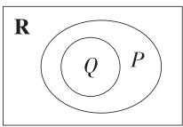

所以 $(\complement_{\mathbb{R}}P)\cap Q = \varnothing .$

7.B 易知 $U = \{1,2,3,4,5,6,7,8\}$ , 根据题意作出 Venn 图, 如图, 可知 $B = \{1,4,6\}$ .

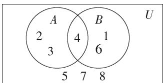

text_image

A
2
3
4
B
1
6
U
5 7 8

8.D 因为 $A \cap B = \{9\}$ ，所以 $9 \in A$ ，所以 2a - 1 = 9 或 $a^{2} = 9$ .

若 2a-1=9，则 a=5，此时 $A=\{9,25,0\}$ ， $B=\{-4,0,9\}$ ，故 $A\cap B=\{0,9\}$ ，不满足题意.

若 $a^2 = 9$ ，则 $a = 3$ 或 $a = -3$

当 a=3 时,1-a=-2,a-5=-2,不满足集合中元素的互异性,故舍去;

当 $a = -3$ 时， $A = \{-7, 9, 0\}$ ， $B = \{4, -8, 9\}$ ，此时 $A \cap B = \{9\}$ ，满足题意.

综上, $a=-3$ .

9.D 由 $(\complement_{U}A)\cup B=R$ ，知 $A\subseteq B$ ，所以a<1.

10.ACD 由 $(\complement_{\mathbb{R}}A)\cap B = \varnothing$ ，知 $B\subseteq A$

易得 $A = \{x\mid x^2 -2x - 8 = 0\} = \{-2,4\}$

当 $B = \emptyset$ 时， $m = 0$ ，满足 $B \subseteq A$ ；

当 $B \neq \emptyset$ 时, $m \neq 0$ , 则 $B = \left\{x \mid x = \frac{4}{m}\right\}$ , 由 $B \subseteq A$ 可得 $\frac{4}{m} = -2$ 或 $\frac{4}{m} = 4$ , 解得 $m = -2$ 或 $m = 1$ .

综上, m 的值为 0 或 -2 或 1.

# 目解后反思

解题时要注意集合关系的转化, 即 $(\complement_{\mathbb{R}}A) \cap B = \varnothing \Leftrightarrow A \cap B = B \Leftrightarrow B \subseteq A$ , 从而将集合运算问题转化为子集问题.

11. 解析 由 $|2x - 1| \leqslant 7 \Leftrightarrow -7 \leqslant 2x - 1 \leqslant 7$ ，解得 $-3 \leqslant x \leqslant 4$

即 $A = \{x\mid -3\leqslant x\leqslant 4\}$

(1) 当 $m = 2$ 时, $B = \{x \mid 3 \leqslant x \leqslant 6\}$ , 所以 $A \cap B = \{x \mid 3 \leqslant x \leqslant 4\}$ , $\complement_U B = \{x \mid x < 3 \text{ 或 } x > 6\}$ , $A \cup (\complement_U B) = \{x \mid x \leqslant 4 \text{ 或 } x > 6\}$ .

(2)由 $A \cup B = A$ ，得 $B \subseteq A$

当 $B = \emptyset$ 时， $2m - 1 > 4m - 2$ ，得 $m < \frac{1}{2}$ ，满足 $B \subseteq A$ ；

当 $B \neq \emptyset$ 时，由 $B \subseteq A$ 可得 $\left\{ \begin{array}{l} 2m - 1 \leqslant 4m - 2, \\ 2m - 1 \geqslant -3, \\ 4m - 2 \leqslant 4, \end{array} \right.$

解得 $\frac{1}{2}\leqslant m\leqslant\frac{3}{2}.$

综上, m 的取值范围是 $m \leqslant \frac{3}{2}$ .

# 能力提升练

Q 对应主书 P6

<table><tr><td>1.C</td><td>2.AD</td><td>3.CD</td><td>5.ABC</td><td>6.C</td><td></td><td></td><td></td></tr></table>

1.C 对于 A, 取 $A=\{1,2,3\}$ , $B=\{1\}$ , $C=\{1,2\}$ , 满足 $A \cap B = B \cap C$ , 但 $A \neq C$ , 故 A 错误;

对于 B, 取 $A=\{1\}$ , $B=\{1,2,3\}$ , $C=\{1,2\}$ , 满足 $A \cup B = B \cup C$ , 但 $A \neq C$ , 故 B 错误;

对于 C, 由于 $C \subseteq (B \cup C)$ , $A \cap B = B \cup C$ , 所以 $C \subseteq (A \cap B)$ , 则 $C \subseteq B$ 成立, 故 C 正确;

对于 D, 取 $A=\{1\}$ , $B=\{1,2,3\}$ , $C=\{1,2,3,4\}$ , 满足 $A \cup B = B \cap C$ , 但 $B \subseteq C$ , 故 D 错误.

2. AD 在题图的阴影部分所表示的集合中任取一个元素 $x$ ，则 $x \in A$ 且 $x \notin B$ ，或 $x \in A$ 且 $x \notin (A \cap B)$ ，

因此阴影部分所表示的集合为 $(\complement_U B) \cap A$ 或 $A \cap \complement_U (A \cap B)$ .

3. CD 依题意, $M=\{x\mid x\geqslant2\}$ , $N=\{y\mid y\geqslant5\}$ ，则 $C_{U}M=\{x\mid0<x<2\}$ , $C_{U}N=\{x\mid0<x<5\}$ .

对于 A, $M \cap N = \{x \mid x \geqslant 5\}$ , A 错误;

对于 B, $M \cup N = \{x \mid x \geqslant 2\}$ , B 错误;

对于 $\mathrm{C}, (\complement_U M) \cup (\complement_U N) = \{x \mid 0 < x < 5\}$ , $\mathbf{C}$ 正确;

对于 $\mathrm{D}, (\complement_U M) \cap (\complement_U N) = \{x \mid 0 < x < 2\}$ , D 正确.

4. 答案 12

解析 由题意得集合 C 是 A 的子集,且与 B 的交集不为空集,集合 A 的子集有 $2^{4}=16$ 个.

A 的子集中与 B 的交集为空集的集合是 $\{3,4\}$ 的子集，有 $2^{2}=4$ 个，故满足题意的集合 C 的个数为 16-4=12.

# 目解后反思

从正面求解复杂,则从反面入手,把不符合条件的剔除,体现了“正难则反”的解题策略.

5. ABC $N=\{x\mid(x-4)(x-1)=0\}=\{1,4\}$ ，若 $M\cup N$ 有 4 个元素，则集合 $M=\{x\mid(x-a)(x-3)=0\}=\{a,3\}$ ，且 $a\notin\{1,3,4\}$ ，∴ $M\cap N=\varnothing$ ，故 A 中说法错误；

若 $M \cap N \neq \emptyset$ ，则 $a \in \{1, 4\}$ ， $\therefore M \cup N = \{1, 3, 4\}$ ， $\therefore M \cup N$ 有 3 个元素，故 B 中说法错误，D 中说法正确；

当 $a = 3$ 时，满足 $M \cup N = \{1,3,4\}$ ，但 $M \cap N = \varnothing$ ，故 $\mathbb{C}$ 中说法错误.

6.C 设集合 A, B, C 分别表示参加田径、游泳、球类比赛的学生.

解法一:作出 Venn 图,由图可得高一年级参加比赛的学生人数为 $46+37+1+12+2+6+2=106$ .

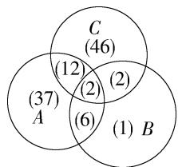

other

| Set | Count |
|-----|-------|
| A ∩ B | 37    |
| A ∩ C | 46    |
| B ∩ C | 46    |
| A ∩ B ∩ C | 12    |
| B ∩ C ∩ A | 6     |
| A ∩ B ∩ C | 2     |
| B ∩ C ∩ A ∩ B | 2     |

解法二: $\mathrm{card}(A \cup B \cup C) = \mathrm{card}(A) + \mathrm{card}(B) + \mathrm{card}(C) - \mathrm{card}(A \cap B) - \mathrm{card}(A \cap C) - \mathrm{card}(B \cap C) + \mathrm{card}(A \cap B \cap C) = 57 + 11 + 62 - 8 - 14 - 4 + 2 = 106.$

# 名师点评

1. 解决有关集合的实际应用题时, 要学会将文字语言转化为集合语言. 涉及有交叉的有限集的元素个数问题时, 用 Venn 图法处理较为方便.  
2. 用 card(A) 来表示有限集合 A 中元素的个数, 对于任意的有限集合 A, B, C, 结论如下:

(1) $\operatorname{card}(A \cup B) = \operatorname{card}(A) + \operatorname{card}(B) - \operatorname{card}(A \cap B)$ .

(2) $\operatorname{card}(A \cup B \cup C) = \operatorname{card}(A) + \operatorname{card}(B) + \operatorname{card}(C) - \operatorname{card}(A \cap B) - \operatorname{card}(A \cap C) - \operatorname{card}(B \cap C) + \operatorname{card}(A \cap B \cap C)$ .

7. 答案 $\left\{m\mid-\frac{1}{2}\leqslant m\leqslant1\right\}$

解析 易得 $A \cup B = \{x \mid -1 < x < 2\}$ .

①当 $m < 0$ 时，集合 $C = \left\{x \mid x < -\frac{1}{m}\right\}$ ，若 $(A \cup B) \subseteq C$

则 $-\frac{1}{m} \geqslant 2$ ，解得 $-\frac{1}{2} \leqslant m < 0$ .

②当 m=0 时, 集合 C=R, 满足题意.  
③当 $m > 0$ 时，集合 $C = \left\{x\mid x > - \frac{1}{m}\right\}$ ，若 $(A\cup B)\subseteq C,$

则 $-\frac{1}{m} \leqslant -1$ ，解得 $0 < m \leqslant 1$ .

综上所述,实数 m 的取值范围是 $\left\{m\left|-\frac{1}{2}\leqslant m\leqslant1\right.\right\}$ .

8. 解析 依题意得 $A = \{x \mid x^2 + 4x = 0\} = \{0, -4\}$ , 由 $A \cap B = B$ 知 $B \subseteq A, \therefore B = \{0\}$ 或 $B = \{-4\}$ 或 $B = \{0, -4\}$ 或 $B = \varnothing$ .

当 $B=\{0\}$ 时， $x^{2}+2(a+1)x+a^{2}-1=0$ 有两个相等的根 0，
则 $\left\{\begin{aligned}&0+0=-2(a+1),\\ &0\times0=a^{2}-1,\end{aligned}\right.$ $\therefore a=-1;$

当 $B=\{-4\}$ 时， $x^{2}+2(a+1)x+a^{2}-1=0$ 有两个相等的根
-4, 则 $\left\{\begin{aligned}-4+(-4)&=-2(a+1),\\ -4\times(-4)&=a^{2}-1,\end{aligned}\right.$ 无解；

当 $B=\{0,-4\}$ 时， $x^{2}+2(a+1)x+a^{2}-1=0$ 有两个不相等的根 0 和 -4，则 $\left\{\begin{aligned}-4+0&=-2(a+1),\\ -4\times0&=a^{2}-1,\end{aligned}\right.$ $\therefore a=1;$

当 $B = \emptyset$ 时， $x^{2} + 2(a + 1)x + a^{2} - 1 = 0$ 无实数根，则 $\Delta = [2(a + 1)]^2 - 4(a^2 - 1) = 8a + 8 < 0$ ，得 $a < -1$ .

综上, a 的取值范围为 $\{a \mid a = 1 \text{ 或 } a \leqslant -1\}$ .

9. 解析 (1) $A$ 不具有孪生性质, $B$ 具有孪生性质. 理由如下: 由题意得 $A^{+} = \{0,4,8\}, A^{-} = \{0,4\}, B^{+} = \{2,6,7,10,11,12\}, B^{-} = \{0,1,4,5\}$ ,

故 $A^{+} \cap A^{-} = \{0, 4\} \neq \varnothing, B^{+} \cap B^{-} = \varnothing$ (根据新定义直接验证, 注意计算绝对值时要考虑全面), 所以 A 不具有孪生性质, B 具有孪生性质.

(2)由题意得 $C^{-}=\{0,1,2,\cdots,2\ 024-n\}$ ， $C^{+}=\{2n,2n+1$

$\cdots,4\ 048\ }$ ,

易知 $C^{+} \cap C^{-} = \emptyset$ ，所以 $2024 - n < 2n$ ，得 $n > \frac{2024}{3}$ ，

所以 $\frac{2024}{3} < n \leqslant 2024, n \in \mathbf{N}$ , 所以 $n$ 的最小值是675.

(3) 证明: 因为 $D = \{x_{1}, x_{2}, x_{3}, x_{4}\}, x_{1} < x_{2} < x_{3} < x_{4}$ ,

所以 $0, x_{2} - x_{1}, x_{3} - x_{1}, x_{4} - x_{1}, x_{3} - x_{2}, x_{4} - x_{2}, x_{4} - x_{3}$ 都属于集合 $D^{-}$ ，又 $0 < x_{2} - x_{1} < x_{3} - x_{1} < x_{4} - x_{1}, D^{-} = D$ ，所以 $D^{-} = \{0, x_{2} - x_{1}, x_{3} - x_{1}, x_{4} - x_{1}\}$ （集合 $D$ 中有 4 个元素，故选一定不相等的 4 个值即可），

又 $0 < x_{3} - x_{2} < x_{4} - x_{2} < x_{4} - x_{1}$ , 所以 $x_{4} - x_{2} = x_{3} - x_{1}$ , 所以 $x_{1} + x_{4} = x_{2} + x_{3}$ .

# 解后反思

根据第(3)问中 $D^{-}=D$ 可得 $\left\{\begin{aligned}x_{1}&=0,\\ x_{4}&-x_{2}=x_{3}-x_{1},\\ x_{3}&-x_{2}=x_{2}-x_{1},\end{aligned}\right.$ 即

$$
\left\{ \begin{array}{l} {x _ {1} = 0  ,} \\ {x _ {3} = 2 x _ {2}  ,   \text {则}    x _ {1} + x _ {4} = x _ {2} + x _ {3}.} \\ {x _ {4} = 3 x _ {2}  ,} \end{array} \right.
$$

# 单元整合练 集合的综合应用

Q 对应主书 P7

<table><tr><td>1.AD</td><td>2.C</td><td>3.C</td><td>4.D</td><td></td><td></td><td></td><td></td></tr></table>

1. AD 对于 A, 因为 $M \subseteq N$ , 所以 $M \cup N = N$ , A 正确;

对于 B, 因为 $M \subseteq N$ , 所以 $M \cap N = M$ , 故 $(M \cap N) \subseteq N$ , B 错误;

对于 C, 因为 $M \subseteq N$ , 所以 $(\complement_{U} M) \supseteq (\complement_{U} N)$ , C 错误;

对于 D, 由 C 可得, $(\complement_{U}N) \subseteq (\complement_{U}M)$ , 因为 $M \cup N = N$ , 所以 $\complement_{U}(M \cup N) \subseteq (\complement_{U}M)$ , D 正确.

# 小题速解

可根据 $M \subseteq N \subseteq U$ ，画出 Venn 图观察求解.

2. C 当 a=0 时, $B=\varnothing$ , 满足 $B\subseteq A$ .

当 $a \neq 0$ 时, $B = \left\{x \mid x = \frac{1}{a}\right\}$ , 要使 $B \subseteq A$ , 则 $\frac{1}{a} = -2$ 或 $\frac{1}{a} = 1$ , 解得 $a = -\frac{1}{2}$ 或 $a = 1$ .

综上, a 的所有可能的取值组成的集合为 $\left\{-\frac{1}{2}, 0, 1\right\}$ .

3. C $2023=5\times404+3$ , 故 $2023\in[3]$ , A 中判断正确; 全体整数被 5 除所得的余数只能是 0, 1, 2, 3, 4, 故 $Z=[0]\cup[1]\cup[2]\cup[3]\cup[4]$ , B 中判断正确; $-2=5\times(-1)+3$ , 故 $-2\in[3]$ , C 中判断错误; 由题意可知 a-b 能被 5 整除, 故 a, b 分别被 5 除所得的余数相同, 故整数 a, b 属于同一类, D 中判断正确.

4.D 集合 $A = B = \{x\in \mathbf{N}|1 <   x <   4\} = \{2,3\}$

由 $\frac{x}{2} \in A$ 可得 $\frac{x}{2} = 2$ 或 $\frac{x}{2} = 3$ , 则 $x = 4$ 或 $x = 6$ ,

由 $\frac{2}{y} \in B$ 可得 $\frac{2}{y} = 2$ 或 $\frac{2}{y} = 3$ , 则 $y = 1$ 或 $y = \frac{2}{3}$ .

所以 $A*B=\left\{(4,1),(6,1),\left(4,\frac{2}{3}\right),\left(6,\frac{2}{3}\right)\right\}$

对于方程 $y=-\frac{1}{6}x+\frac{5}{3}$ ,

当 x=4 时, $y=-\frac{1}{6}\times4+\frac{5}{3}=1$ ,

当 $x = 6$ 时， $y = -\frac{1}{6} \times 6 + \frac{5}{3} = \frac{2}{3}$ ，

所以 $(4,1),\left(6,\frac{2}{3}\right)\in C,$

因此 $(A*B)\cap C = \left\{(4,1),\left(6,\frac{2}{3}\right)\right\} .$

5. 答案 $\left\{-\sqrt{2}-1,1-\frac{\sqrt{2}}{2},\sqrt{2}\right\}$

解析 因为 $\sqrt{2} \in A$ ，所以 $\frac{1}{1 - \sqrt{2}} = -\sqrt{2} - 1 \in A$

所以 $\frac{1}{1 - (-\sqrt{2} - 1)} = \frac{1}{2 + \sqrt{2}} = 1 - \frac{\sqrt{2}}{2}\in A,$

又 $\frac{1}{1 - \left(1 - \frac{\sqrt{2}}{2}\right)} = \sqrt{2},$

所以集合 A 中必含有的元素组成的集合是 $\left\{-\sqrt{2}-1,1-\frac{\sqrt{2}}{2},\sqrt{2}\right\}$ .

6. 解析 (1) $B = \{x \mid |2x - 3| \leqslant 7\} = \{x \mid -7 \leqslant 2x - 3 \leqslant 7\} = \{x \mid -2 \leqslant x \leqslant 5\}$ ,

由 $A = \{x\mid 2 <   x <   9\}$ ，得 $\complement_U A = \{x\mid x\leqslant 2$ 或 $x\geqslant 9\}$

则 $B \cup (\complement_U A) = \{x \mid x \leqslant 5 \text{或} x \geqslant 9\}$ .

(2) 由 (1) 得 $\complement_U B = \{x \mid x < -2$ 或 $x > 5\}$ ,

当 $M = \emptyset$ 时， $a \geqslant 2a - 2$ ，得 $a \leqslant 2$ ，满足 $M \subseteq (\complement_U B)$ ；

当 $M \neq \emptyset$ 时，由 $M \subseteq (\complement_U B)$ 得 $\left\{ \begin{array}{l} a > 2, \\ 2a - 2 \leqslant -2 \end{array} \right.$ 或 $\left\{ \begin{array}{l} a > 2, \\ a \geqslant 5, \end{array} \right.$

所以 $a \geqslant 5$ .

综上可得, $a$ 的取值范围为 $\{a \mid a \leqslant 2 \text{ 或 } a \geqslant 5\}$ .

# 目解后反思

解决与不等式相关的集合问题,常画出数轴,利用数轴时要注意考虑端点值,确定端点“等”还是“不等”.

7. 解析 (1) 集合 $U$ 中, $x = (a \oplus b) + (a \otimes b) = ab + \frac{a - b}{(a + b)^2 + 1}$ , $\because -2 < a \leqslant b < 1$ 且 $a, b \in \mathbf{Z}$ ,

∴ ①a = -1, b = 0 或 b = -1，此时 $x = -\frac{1}{2}$ 或 x = 1；

② $a = 0, b = 0$ ，此时 $x = 0, \therefore U = \left\{-\frac{1}{2}, 0, 1\right\}$ .

集合 A 中, $x=2(a\oplus b)+\frac{a\otimes b}{b}=2ab+\frac{a-b}{b(a+b)^{2}+b}$ ,

$$
\because - 1 <   a <   b <   2, a, b \in \mathbf {Z},
$$

$\therefore a = 0, b = 1$ ，此时 $x = -\frac{1}{2}, \therefore A = \left\{-\frac{1}{2}\right\}$ .

(2) 由 (1) 得 $\complement_U A = \{0, 1\}$ , $\therefore$ 当 $(\complement_U A) \cap B = \varnothing$ 时, $B \subseteq A$ 关键点.

当 $B = \emptyset$ 时， $x^{2} - 3x + m = 0$ 无实根， $\therefore \Delta = (-3)^{2} - 4m < 0$ ， $\therefore m > \frac{9}{4}$ ；

当 $B \neq \emptyset$ 时，由 $B \subseteq A$ 可知 $B = \left\{-\frac{1}{2}\right\}$ ，故 $x^{2} - 3x + m = 0$ 有两个相等的根 $-\frac{1}{2}$ ，

∴ $\left\{\begin{aligned}\Delta&=9-4m=0,\\ -\frac{1}{2}\times\left(-\frac{1}{2}\right)=m,\end{aligned}\right.$ 此时 m 的值不存在.

综上, $m>\frac{9}{4}$ 时,集合A,B能满足 $(\complement_{U}A)\cap B=\varnothing.$

# 1.4 充分条件与必要条件

# 1.4.1 充分条件与必要条件 1.4.2 充要条件

# 基础过关练

Q 对应主书 P8

<table><tr><td>1.B</td><td>2.C</td><td>3.B</td><td>4.AD</td><td>5.A</td><td>6.D</td><td>7.A</td><td>9.B</td></tr><tr><td>10.BD</td><td>13.AD</td><td>14.ABC</td><td></td><td></td><td></td><td></td><td></td></tr></table>

1.B 因为 $\{x\mid-3<x\leqslant1\}\not\supseteq\{x\mid-3<x<0\}$ ，所以 p 是 q 的必要不充分条件.  
2. C “故不积跬步,无以至千里”,即“要至千里,必需积跬步”,而“至千里”还可能有其他必备因素.  
3.B 若 $\triangle ABC$ 中有一个角是 $36^{\circ}$ 且 $\triangle ABC$ 不是等腰三角形, 则 $\triangle ABC$ 不是黄金三角形, 充分性不成立;

反之,若 $\triangle ABC$ 为黄金三角形,则 $\triangle ABC$ 中必有一个角是 $36^{\circ}$ ,必要性成立,因此,“ $\triangle ABC$ 中有一个角是 $36^{\circ}$ ”是“ $\triangle ABC$ 为黄金三角形”的必要不充分条件.

4.AD 由 p, q 都是 r 的充分条件, s 是 r 的必要条件, q 是 s 的必要条件, 可得 $p \Rightarrow r, q \Rightarrow r, r \Rightarrow s, s \Rightarrow q$ .

对于 A, $p \Rightarrow q$ , 所以 p 是 q 的充分条件, 所以 A 正确;

对于 B, $p \Rightarrow r \Rightarrow s$ , 所以 p 是 s 的充分条件, 所以 B 不正确;

对于 C, $r \Leftrightarrow q$ , 所以 r 是 q 的充要条件, 所以 C 不正确;

对于 D, $s \Leftrightarrow q$ , 所以 s 是 q 的充要条件, 所以 D 正确.

5.A 由题意知当 $a = \sqrt{2}$ 时， $N = \{2\}$ ，此时 $N \subseteq M$ ，故充分性成立；

当 $N \subseteq M$ 时, $a^{2} = 1$ 或 $a^{2} = 2$ , 即 $a = \pm 1$ 或 $a = \pm \sqrt{2}$ , 故必要性不成立.

综上，“ $a=\sqrt{2}$ ”是“ $N\subseteq M$ ”的充分不必要条件.

6.D 当 x=0.5, y=0.6 时, 满足 $[x]=[y]=0$ ,

此时 $x - [x] = 0.5, y - [y] = 0.6$ ，即 $x - [x] \neq y - [y]$ ，

所以“ $[x] = [y]$ ”不是“ $x - [x] = y - [y]$ ”的充分条件；

当 $x = 0.5, y = 1.5$ 时， $[x] = 0, [y] = 1$

此时 $x - [x] = 0.5, y - [y] = 0.5$ ，即 $x - [x] = y - [y]$ ，但 $[x] \neq [y]$ ，

所以“ $[x] = [y]$ ”不是“ $x - [x] = y - [y]$ ”的必要条件.

综上，“ $[x] = [y]$ ”是“ $x - [x] = y - [y]$ ”的既不充分也不必

要条件.

7.A 当 $a = 0$ 时, 方程为 $x + 2 = 0$ , 此时方程有实数解 $x = -2$ ; 当 $a \neq 0$ 时, 若 $ax^2 + x + 2 = 0$ 有实数解, 则 $\Delta = 1 - 4 \times a \times 2 \geqslant 0$ , 则 $a \leqslant \frac{1}{8}$ 且 $a \neq 0$ .

综上,方程 $ax^{2}+x+2=0$ 有实数解的充要条件是 $a\leqslant\frac{1}{8}$ ,

所以“ $a=\frac{1}{8}$ ”是“方程 $ax^{2}+x+2=0$ 有实数解”的充分不必要条件.

# 解题模板

解决充分条件、必要条件的判定问题,常先把问题等价转化.

8. 答案 充分不必要

解析 由 $x^{2} + y^{2} < 1$ ，可得 $x^{2} < 1$ 且 $y^{2} < 1$ ，所以 $|x| < 1$ 且 $|y| < 1$

所以“ $x^{2}+y^{2}<1$ ”是“ $|x|<1$ 且 $|y|<1$ ”的充分条件；

当 $x = y = \frac{\sqrt{2}}{2}$ 时，满足 $|x| < 1$ 且 $|y| < 1$ ，但 $x^{2} + y^{2} = 1$

所以“ $x^{2}+y^{2}<1$ ”不是“ $|x|<1$ 且 $|y|<1$ ”的必要条件.

综上，“ $x^{2}+y^{2}<1$ ”是“ $|x|<1$ 且 $|y|<1$ ”的充分不必要条件.

9.B 由 $x^{2} < 9$ 得 $-3 < x < 3$ ，由题意得，使 $x^{2} < 9$ 成立的充分不必要条件对应的集合为 $\{x \mid -3 < x < 3\}$ 的真子集，只有 B 符合.

# 目解题模板

一般将充分、必要条件的探求问题转化为集合间的关系问题,根据“小充分、大必要”求解.

10.BD 对于 A, 若 a<0, b>0, 满足 $\frac{1}{a}<\frac{1}{b}$ , 但得不出 a>b, 故 A 错误;

对于 B, 由 $at^{2}>bt^{2}$ 得 $(a-b)t^{2}>0$ , 易知 $t^{2}>0$ , 所以 a-b>0, 可得 a>b, 故 B 正确;

对于 C, 若 a = -2, b = 1, 满足 $\left|a\right| > \left|b\right|$ , 但得不出 a > b, 故 C 错误;

对于 D, $a^{3}-b^{3}=(a-b)(a^{2}+ab+b^{2})$ (立方差公式) = (a-b) $\left[\left(a+\frac{b}{2}\right)^{2}+\frac{3}{4}b^{2}\right]>0$ , 所以 a-b>0, 可得 a>b, 故 D 正确.

11. 答案 (1)

解析 题图(1)中,开关S闭合则灯泡L亮,反之,灯泡L亮不一定有开关S闭合,

$\therefore p \Rightarrow q$ ，但 $q \nRightarrow p, \therefore p$ 是 $q$ 的充分不必要条件.

题图(2)中,开关S与灯泡L串联, $\therefore p\Leftrightarrow q,\therefore p$ 是q的充要条件.

题图(3)中,开关 $S, S_{1}$ 与灯泡 L 串联, $\therefore p \neq q, q \Rightarrow p, \therefore p$ 是 q 的必要不充分条件.

12. 证明 必要性: 因为 $a+b=1$ , 所以 $a+b-1=0$ ,

所以 $a^3 + b^3 + ab - a^2 - b^2 = (a + b)(a^2 - ab + b^2) - (a^2 - ab +$

$b^{2})=(a+b-1)(a^{2}-ab+b^{2})=0$ , 必要性成立;

充分性: 因为 $a^{3}+b^{3}+ab-a^{2}-b^{2}=0$ ,

所以 $(a+b-1)(a^{2}-ab+b^{2})=0$ ,

又 $ab \neq 0$ ，所以 $a \neq 0$ 且 $b \neq 0$

则 $a^2 - ab + b^2 = \left(a - \frac{b}{2}\right)^2 + \frac{3}{4} b^2 > 0$

所以 $a+b-1=0$ ，即 $a+b=1$ ，充分性成立。

综上可得, 当 $ab \neq 0$ 时, $a + b = 1$ 的充要条件是 $a^{3} + b^{3} + ab - a^{2} - b^{2} = 0$ .

# 易错警示

有关充要条件的证明,要从两个方面考虑,即充分性和必要性,缺一不可,解题时还要注意不能将充分性与必要性弄反.

13. AD 由题可得 $A = \{x \mid x^2 - x - 6 = 0\} = \{-2, 3\}$ , $B = \{x \mid ax - 1 = 0$ 且 $a \neq 0\} = \left\{\frac{1}{a}\right\}$ ,

因为 $x \in B$ 是 $x \in A$ 的充分不必要条件, 所以 $B \subsetneq A$ ,
所以 $B=\{3\}$ 或 $B=\{-2\}$ .

当 $B = \{3\}$ 时， $\frac{1}{a} = 3$ ，所以 $a = \frac{1}{3}$

当 $B = \{-2\}$ 时， $\frac{1}{a} = -2$ ，所以 $a = -\frac{1}{2}$

所以 $a$ 的值为 $\frac{1}{3}$ 或 $-\frac{1}{2}$ .

14. ABC 由题意可得 $\{x \mid 0 < x < 1\}$ 是 $\{x \mid x > m^2 - 2\}$ 的真子集，所以 $m^2 - 2 \leqslant 0$ ，解得 $-\sqrt{2} \leqslant m \leqslant \sqrt{2}$ ，结合选项可知A,B,C正确,D错误.

15. 答案 $\{m \mid m > 1\}$

解析 由 $0 < \frac{x + 1}{2} < 1$ 得 $-1 < x < 1$ ，由 $1 - m < x + m < 2m$ 得 $1 - 2m < x < m$ ，

因为“ $1-m<x+m<2m$ ”是“ $0<\frac{x+1}{2}<1$ ”的必要不充分条件，
所以 $\{x\mid-1<x<1\}\subsetneq\{x\mid1-2m<x<m\}$

所以 $\left\{\begin{aligned}m&\geqslant1,\\ 1-2m&\leqslant-1,\end{aligned}\right.$ 且等号不同时成立,所以m>1,

所以实数 $m$ 的取值范围为 $\{m \mid m > 1\}$ .

16. 解析 因为 $m > 1$ ，所以 $3m - 2 > 1 > 1 - m$ ，故 $B \neq \emptyset$ .

选①: 充分不必要条件.

由题意得 $A \subsetneq B$ ，故 $\left\{ \begin{array}{l} -3 \geqslant 1 - m, \\ 4 \leqslant 3m - 2, \end{array} \right.$ 且等号不同时成立，所以 $m \geqslant 4$ ，即 $m$ 的取值范围为 $\{m \mid m \geqslant 4\}$ .

选②: 必要不充分条件.

由题意得 $B \subsetneq A$ ，故 $\left\{ \begin{array}{l} -3 \leqslant 1 - m, \\ 4 \geqslant 3m - 2, \end{array} \right.$ 且等号不同时成立，所以 $m \leqslant 2$ ，又 $m > 1$ ，所以 $m$ 的取值范围为 $\{m \mid 1 < m \leqslant 2\}$ .

选③:充要条件.

由题意得 A=B，故 $\left\{\begin{aligned}1-m&=-3,\\ 3m-2&=4,\end{aligned}\right.$ 无解，故不存在实数 m，使

得 $x \in A$ 是 $x \in B$ 的充要条件.

# 目 解题模板

在研究条件的充分性和必要性时,可以转化为集合间的关系.若条件 p,q 对应的集合分别为 P,Q,则 p 是 q 的充分不必要条件 $\Leftrightarrow P\not\subseteq Q$ ; p 是 q 的必要不充分条件 $\Leftrightarrow P\not\supseteq Q$ ; p 是 q 的充要条件 $\Leftrightarrow P=Q$ .

# 1.5 全称量词与存在量词

# 1.5.1 全称量词与存在量词

# 1.5.2 全称量词命题和存在量词命题的否定

# 基础过关练

Q 对应主书 P10

<table><tr><td>1.B</td><td>2.C</td><td>3.C</td><td>4.BC</td><td>5.ABD</td><td>6.AD</td><td>8.D</td><td>9.C</td></tr><tr><td>10.C</td><td>11.A</td><td>12.BCD</td><td>14.A</td><td>15.BCD</td><td>16.A</td><td></td><td></td></tr></table>

1.B 对于 A, C, D, 含有存在量词“有些”“存在一个”“有一条”, 为存在量词命题;

对于 B, 含有全称量词“所有的”, 为全称量词命题.

2. C

3. C 当 $A \neq \varnothing$ 时, $\varnothing \subsetneq A$ , 是存在量词命题, 且为真命题.

4. BC 对于 $x^{2}+x+3=0,\Delta=1-12=-11<0$ ，所以方程无实数解，故 A 是假命题.

$\forall x \in \mathbf{Q}, \frac{1}{3} x^2, \frac{1}{2} x, 1$ 都是有理数，故它们的和也为有理数，故B是真命题.

当 x=4, y=1 时, 3x-2y=10, 故 C 是真命题.

当 $x = \frac{1}{2}$ 时， $x^2 < |x|$ ，故D是假命题.

5.ABD 对于 A, 因为 $A \subseteq B$ , 所以对任意 $x \in A$ , 都有 $x \in B$ , 故 A 是真命题; 对于 B, 因为 A 不包含于 B, 所以存在 $x \in A$ , 使得 $x \notin B$ , 故 B 是真命题; 对于 C, 当 $x = \sqrt{2} + 1$ 时, $x^{2} = 3 + 2\sqrt{2}$ , 是无理数, 故 C 是假命题; 对于 D, 当 $x = \sqrt{2}$ 时, $x^{3} = 2\sqrt{2}$ , 是无理数, 故 D 是真命题.

6.AD 易知 A 是真命题; 当 $x=\sqrt{2}$ , $y=\sqrt{3}$ 时, $xy=\sqrt{6}$ , 是无理数, 所以 B 是假命题; 由关于 x 的方程 $x^{2}+2x+m=0$ 有两个负根, 得 $\left\{\begin{aligned}m&>0,\\ \Delta&=4-4m\geqslant0,\end{aligned}\right.$ 解得 $0<m\leqslant1$ , 所以 C 是假命题; 两个相似三角形的周长之比等于它们的对应边之比, 所以 D 是真命题.

7. 解析 （1）存在量词命题. 梯形不是平行四边形, 所以该命题为真命题.

(2) 全称量词命题. 与 x 轴平行的直线与 x 轴无交点, 所以该命题为假命题.

(3) 全称量词命题. 对于 $y = ax^{2} + bx + c (a \neq 0)$ ，当 a < 0 时，其图象有最高点无最低点，所以该命题为假命题.

(4)命题可以改写为“所有的矩形都有一个外接圆”，含有全称量词“所有的”，故是全称量词命题。以矩形的对角线为直径的圆是其外接圆，所以该命题为真命题。

8.D 全称量词“任意”改为存在量词“存在”，另一方面“至

多有三个”的否定是“至少有四个”.

9.C

10. C “∃”改为“∀”, 否定结论即可.

11.A 对于 A, 其否定: $\forall x \in R, x^{2} - x + \frac{1}{4} \geqslant 0$ , 即 $\left(x - \frac{1}{2}\right)^{2} \geqslant 0$ , 显然恒成立, 故是真命题, A 正确;

对于 B, 其否定为存在量词命题, B 错误;

对于 C, 其否定: $\forall x \in R, x^{2} + 2x + 2 \leqslant 0$ , 即 $(x + 1)^{2} + 1 \leqslant 0$ ,
显然不成立, 故是假命题, C 错误;

对于 D, 其否定: 对任意实数 x, 都有 $x^{3} + 1 \neq 0$ , 将 x = -1 代入, 显然不成立, 故是假命题, D 错误.

# 目方法技巧

在判断命题的否定的真假时,可以先判断原命题的真假,利用原命题与其否定的真假相反得到否定的真假;也可以先写出原命题的否定,再判断否定的真假,视情况合理选择.

12. BCD 命题 $q: \exists x > 0, x^2 > x$ ，则 $\neg q: \forall x > 0, x^2 \leqslant x$ ，故 A 错误；

当 $x = 0$ 时， $|x + 1| = 1$ ，故命题 $p$ 为假命题，则 $\neg p$ 是真命题，故 B 正确；

$\neg q:\forall x>0,x^{2}\leqslant x,$ 当x=2时, $x^{2}>x,$ 故 $\neg q$ 是假命题,q为真命题,故C,D正确.

13. 答案 存在能被 4 整除的正整数不能被 2 整除

解析 全称量词改为存在量词,并否定结论,即“存在能被4整除的正整数不能被2整除”.

14.A 由题意得 $\neg p: \forall x \in \mathbf{R}, x^2 + 8x + a \neq 0$ , 因为 $p$ 是假命题, 所以 $\neg p$ 是真命题, 则 $\Delta = 64 - 4a < 0$ , 解得 $a > 16$ .

15. BCD 当 a=0 时, -4x-4=0, 得 x=-1, 故 p 为真命题, 则 a=0 成立;

当 $a \neq 0$ 时, 若 $p$ 为真命题, 则 $\Delta = 16 + 16a \geqslant 0$ , 解得 $a \geqslant -1$ , 故 $a \geqslant -1$ 且 $a \neq 0$ .

综上, 当 p 为真命题时, a 的取值范围为 $a \geqslant -1$ , 结合选项可知 B, C, D 正确.

16.A 由题意可知, $3x^{2}\geqslant a,x\in\{x\mid1\leqslant x\leqslant3\}$ 恒成立,故只需 $a\leqslant(3x^{2})_{\min}$ ,即 $a\leqslant3\times1^{2}=3$ .

结合选项可知， $\{a\mid a\leqslant 3\} \subsetneq \{a\mid a\leqslant 4\}$

因此 $a \leqslant 4$ 是命题“ $\forall x \in \{x \mid 1 \leqslant x \leqslant 3\}$ ， $3x^{2} - a \geqslant 0$ ”为真命题的一个必要不充分条件.

17. 答案 $m \leqslant 3$

解析 由已知得 $\neg p: \forall x > 3, x > m$ ，因为 $\neg p$ 为真命题，所以 $m \leqslant 3$ .

18. 答案 $1 \leqslant a < 3$ 或 $a \leqslant -4$

解析 由 $B \neq \emptyset$ ，可得 $2a < a + 3$ ，解得 $a < 3$

由命题 $p: \forall x \in A, x \notin B$ 是真命题，可得 $A \cap B = \varnothing$

故 $2a \geqslant 2$ 或 $a + 3 \leqslant -1$ , 解得 $a \geqslant 1$ 或 $a \leqslant -4$ .

综上, a 的取值范围是 $1 \leqslant a < 3$ 或 $a \leqslant -4$ .

19. 解析 (1) 由 $p$ 为假命题, 得 $\neg p$ 为真命题, 即 $\exists x \in \{x\}$

$1 \leqslant x \leqslant 2$ , $x^{2} + x - a < 0$ , 即 $a > x^{2} + x$ 在 $x \in \{x \mid 1 \leqslant x \leqslant 2\}$ 上有解(参变分离), 所以 $a > (x^{2} + x)_{\min}, x \in \{x \mid 1 \leqslant x \leqslant 2\}$ , 易知当 x = 1 时, $(x^{2} + x)_{\min} = 2$ , 所以 a > 2.

(2)由(1)可知,当p为假命题时,a>2;当p为真命题时,a≤2(p为真命题和p为假命题对应的参数范围互为补集).

当 q 为真命题时, 方程 $x^{2}+3x+2-a=0$ 在 $x \in R$ 上有解, 故 $\Delta=9-4(2-a) \geqslant 0$ , 解得 $a \geqslant -\frac{1}{4}$ ; 当 q 为假命题时, $a < -\frac{1}{4}$ .

所以当 p 为真命题, q 为假命题时, $a < -\frac{1}{4}$ ; 当 p 为假命题, q 为真命题时, a > 2.

所以当 $p$ 和 $q$ 中有且只有一个是真命题时， $a$ 的取值范围是 $\left\{a \mid a < -\frac{1}{4}\right.$ 或 $a > 2\}$ .

# 本章复习提升

# 易混易错练

Q 对应主书 P12

1.C 2.ACD 7.B

1.C 由题意知集合 A 是由整数的 2 倍组成的集合，

由 $B=\{x\mid x=4k+2, k\in\mathbf{Z}\}=\{x\mid x=2(2k+1), k\in\mathbf{Z}\}$ ，可知 B 是由奇数的 2 倍，易错点组成的集合，故 $B\not\subseteq A$ ，则 $A\cup B=A$ 。

# 易错警示

集合 A, B 中元素的表达形式不一致, 需要将其转化为一致的形式再求解, 准确理解集合的含义是解题的关键.

2.ACD 对于 A, 根据定义, 由 $a \in P (a \neq 0)$ , 可得 $a - a = 0 \in P$ , $\frac{a}{a} = 1 \in P$ , 则 0, 1 是任何数域中的元素, 故 A 是真命题;

对于 B, 不妨设 $M = \{a + \sqrt{2}b \mid a, b \in Q\}$ , $N = \{c + \sqrt{3}d \mid c, d \in Q\}$ ,

取 $x=1+\sqrt{2}\in M, y=1+\sqrt{3}\in N$ ，则 $x-y=\sqrt{2}-\sqrt{3}\notin(M\cup N)$ ，故 $M\cup N$ 不是一个数域，故 B 是假命题；

对于 C, 由题可知, 任何一个形如 $\{a+b\sqrt{k}|a,b\in Q\}$ (k 是素数) 的集合都是数域, 因为素数有无穷多个, 且 k 不同时集合也不同, 所以存在无穷多个数域, 故 C 是真命题; 对于 D, 由 0, 1 是任何数域中的元素可得 $1+1=2,0-1=-1$ 也是任何数域中的元素, ……, 依次类推, 整数集是任何数域的子集, 若数集 M, N 都是数域, 则 $Z \subseteq M, Z \subseteq N$ , 则 $Z \subseteq (M \cap N)$ , 故 D 是真命题.

3. 答案 0

解析 因为 $2 - m \in A$ ，所以 $2 - m = 1$ 或 2 或 3.

若 $2 - m = 1$ ，则 $m = 1$ ，不满足集合中元素的互异性易错点，

舍去；

若 $2 - m = 2$ ，则 $m = 0$ ，此时 $B = \{1,0,2\}$ ，满足题意；

若 2-m=3，则 m=-1，此时 $m+2=1$ ，不满足集合中元素的互异性。易错点，舍去。

综上所述, m=0.

# 易错警示

在有限集中,已知集合中的某个元素或已知集合之间的关系求解参数时,一定要检验所得结果是否满足集合中元素的互异性.

# 4. 答案 1

解析 由 $B \subseteq A$ ，可得 $a^2 - a + 2 = a^2$ 或 $a^2 - a + 2 = 2a$ .

当 $a^{2}-a+2=a^{2}$ 时, 解得 a=2, 此时 $a^{2}=2a=4$ , 不满足集合中元素的互异性易错点, 舍去;

当 $a^2 - a + 2 = 2a$ 时, 解得 $a = 1$ 或 $a = 2$ (舍去),

当 $a = 1$ 时， $A = \{0,1,2\}$ ， $B = \{0,2\}$ ，满足 $B \subseteq A$ .

综上所述, a=1.

# 5. 答案 0 或 1 或 4

解析 $\because B = \{x\mid ax^2 = 1,a\geqslant 0\}$

∴ 若 a=0，则 $B=\varnothing$ ，满足 B 为 A 的子集，此时 A 与 B 构成“全食”；

若 $a > 0$ ，则 $B = \left\{\frac{1}{\sqrt{a}}, - \frac{1}{\sqrt{a}}\right\}$

若 A 与 B 构成“全食”或“偏食”，则 $\frac{1}{\sqrt{a}} = 1$ 或 $\frac{1}{\sqrt{a}} = \frac{1}{2}$ ，解得 a = 1 或 a = 4.

综上, $a$ 的值为0或1或4.

# 易错警示

因为空集是任何集合的子集,是任何非空集合的真子集,所以解决含参数的集合与确定集合之间的关系问题时,要注意含参数的集合是空集的特殊情况.

6. 解析 (1) 因为 $a = \frac{1}{2}$ , 所以 $B = \left\{x \mid -\frac{9}{2} < x < \frac{3}{2}\right\}$ ,

又 $A = \{x\mid -2\leqslant x\leqslant 3\}$

所以 $A \cup B = \left\{x \mid -\frac{9}{2} < x \leqslant 3\right\}, A \cap B = \left\{x \mid -2 \leqslant x < \frac{3}{2}\right\}$ .

(2) 因为 $B \cap (\complement_U A) = B$ , 所以 $B \subseteq (\complement_U A)$ ,

因为 $A = \{x \mid -2 \leqslant x \leqslant 3\}$ , $U = \mathbf{R}$ , 所以 $\int_{U} A = \{x \mid x < -2$ 或 $x > 3\}$ .

当 $B = \emptyset$ 时易错点，可得 $3a\leqslant a - 5$ ，解得 $a\leqslant -\frac{5}{2}$ 满足 $B\subseteq (\complement_U A)$

当 $B \neq \emptyset$ 时，由 $B \subseteq (\complement_U A)$ 可得 $\left\{ \begin{array}{l}3a > a - 5, \\ 3a \leqslant -2 \end{array} \right.$ 或 $\left\{ \begin{array}{l}3a > a - 5, \\ a - 5 \geqslant 3, \end{array} \right.$ 解得 $-\frac{5}{2} < a \leqslant -\frac{2}{3}$ 或 $a \geqslant 8$ .

综上, a 的取值范围是 $\left\{a \mid a \leqslant -\frac{2}{3}$ 或 $a \geqslant 8\right\}$ .

7.B 由命题 $p: \forall x \in \{x \mid 2 < x < 3\}, 3x^2 - a > 0$ 为真命题, 可知当 $2 < x < 3$ 时, 不等式 $a < 3x^2$ 恒成立,

易知 $3x^{2}>3\times2^{2}=12$ ，所以 $a\leqslant12$ 易错点。

# 易错警示

本题中 x 取不到 2, 所以 $3x^{2}$ 取不到 12, 故 a 可以取到 12. 解题时可以单独分析端点值, 判断能否取到.

8. 解析 (1) $\because$ 集合 $A = \{x \mid 2 \leqslant x < 6\}$ , $B = \{x \mid 3 < x < 9\}$ ,

$\therefore A \cap B = \{x \mid 3 < x < 6\}, \complement_{\mathbb{R}} B = \{x \mid x \geqslant 9 \text{ 或 } x \leqslant 3\}$

$\therefore \complement_{\mathbf{R}}(A \cap B) = \{x \mid x \leqslant 3 \text{ 或 } x \geqslant 6\}$ ,

$(\complement_{\mathbf{R}}B)\cup A = \{x|x <   6$ 或 $x\geqslant 9\}$

(2) $\because C \subseteq B, \therefore \left\{ \begin{array}{l} a \geqslant 3, \\ a + 1 \leqslant 9, \end{array} \right.$ 解得 $3 \leqslant a \leqslant 8$ 易错点，

故实数 $a$ 的取值范围为 $\{a \mid 3 \leqslant a \leqslant 8\}$ .

# 易错警示

已知含参的无限集合的关系求解参数的取值范围时,借助数轴较为直观,空心圈和实心点要标注明确,要注意检验端点值能否取到.

# 思想方法练

Q 对应主书 P13

<table><tr><td>1.AD</td><td>2.ABC</td><td>6.B</td><td>7.C</td><td>8.C</td><td></td><td></td><td></td></tr></table>

1.AD 由题图可知阴影部分区域用集合符号可以表示为 $(A\cap B)\cup (B\cap C)$ 或 $B\cap (A\cup C)$

(数与图形之间的相互转化, 是数形结合思想的基础, 题图的阴影部分中的元素一定在 B 中, 还要在 A 中或 C 中, 表示为集合运算式子可以是先交后并: $(A \cap B) \cup (B \cap C)$ , 也可以是先并后交: $B \cap (A \cup C)$ )

2. ABC 全集 $U = \{x \mid x < 10, x \in \mathbf{N}^* \} = \{1, 2, 3, 4, 5, 6, 7, 8, 9\}$ ，由题意作出 Venn 图：

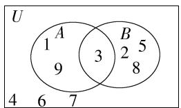

由 Venn 图知 $A=\{1,3,9\}$ , $B=\{2,3,5,8\}$ ，(将条件表示到 Venn 图中，得到集合 A、B，由此解决问题)

因此 $8 \in B$ ，故 $\mathsf{A}$ 正确；

集合 A 中有 3 个元素, 故 A 的不同子集的个数为 $2^{3}=8$ , 故 B 正确;

$\because 9 \in A, \therefore \{9\} \subseteq A,$ 故 C 正确；

由 Venn 图知 $\complement_{U}(A\cup B)=\{4,6,7\}$ ，∴ $6\in\complement_{U}(A\cup B)$ ，故 D 错误.

3. 答案 $\left\{a\left|-\frac{2}{3}\leqslant a<0\text{ 或 }a\leqslant-4\right.\right\}$

解析 记 $A = \{x \mid x \leqslant 3a$ 或 $x \geqslant a\} (a < 0)$ , $B = \{x \mid -4 \leqslant x < -2\}$ , 则“ $q$ 是 $p$ 的充分不必要条件”等价于“ $B$ 是 $A$ 的真子集”, 利用数轴表示 $B \subsetneq A$ , 如图所示,

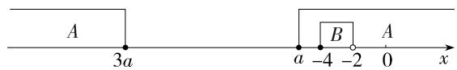

text_image

A
3a
a -4 -2
0
x
B
A

或 A B 3a a 0 x

(利用数轴直观表示集合间的关系,从而确定参数满足的条件)

则 $\left\{\begin{aligned}a&\leqslant-4,\\ a&<0\end{aligned}\right.$ 或 $\left\{\begin{aligned}3a&\geqslant-2,\\ a&<0,\end{aligned}\right.$ 解得 $a\leqslant-4$ 或 $-\frac{2}{3}\leqslant a<0,$

所以实数 $a$ 的取值范围为 $\left\{a\mid -\frac{2}{3}\leqslant a <   0\text{或} a\leqslant -4\right\} .$

# 目 思想方法

数形结合包括两种情形:第一种情形是“以数解形”,第二种情形是“以形助数”.求解与集合有关的问题时,常常借助数轴和 Venn 图,从而使问题直观、形象,便于求解.

# 4. 答案 $\{0,1, - 2\}$

解析 由已知得 $|A|=2, A$ ※B=1，所以 $|B|=1$ 或 $|B|=3$ 。（对 $||A|-|B||=1$ 进行分类讨论）

当 $|B|=1$ 时，a=0或 $a=1$ （方程 $(ax-1)(x-1)(x^{2}-ax+1)=0$ 有明确的解x=1，所以ax-1=0和 $x^{2}-ax+1=0$ 的解为1或不存在）.

当 $|B|=3$ 时,关于x的方程 $(ax-1)(x-1)(x^{2}-ax+1)=0$ 有3个不相等的实数解,

所以关于 x 的方程 $x^{2}-ax+1=0$ 有两个相等的解,且这两个相等的解不为 1 和 $\frac{1}{a}$ (由于 $a\neq0$ 且 $a\neq1$ , 方程 $(ax-1)\cdot$

$(x-1)(x^{2}-ax+1)=0$ 有明确的解 x=1 和 $x=\frac{1}{a}$

则 $\Delta=a^{2}-4=0$ , 解得 $a=\pm2\left(\text{要验证 }x^{2}-ax+1=0\right.$ 的解是不是 $1,\frac{1}{a}\right)$ .

当 a=2 时, $x^{2}-2x+1=0$ 的两个解均为 1,不符合题意;

当 a = -2 时, $x^{2} + 2x + 1 = 0$ 的两个解均为 -1, 符合题意.

综上, $a$ 的所有可能的取值构成的集合为 $\{0,1,-2\}$ .

# 5. 解析 (1) 由 $m + 1 > m - 1$ 可知, $B \neq \emptyset$ ,

易知 $\complement_{\mathbb{R}}A = \{x\mid x\leqslant -3$ 或 $x\geqslant 0\}$

因为 $(\complement_{\mathbb{R}}A)\cap B = \emptyset$ ，所以 $\left\{ \begin{array}{l}m - 1\geqslant -3,\\ m + 1\leqslant 0, \end{array} \right.$

解得 $-2 \leqslant m \leqslant -1$ .

(2) $A=\{x\mid-3<x<0\}$ 中的整数元素为-2,-1,

因为集合 $A \cap B$ 中仅有一个整数元素(对 $A \cap B$ 中的整数进行分类讨论), 所以这个整数元素为 -2 或 -1.

当这个整数元素为-2时, $m-1<-2<m+1\leqslant-1$ ,解得-3<m≤-2,则 $\left\{\begin{aligned}-4<m-1&\leqslant-3,\\ -2<m+1&\leqslant-1,\end{aligned}\right.$

所以 $A \cup B = \{x \mid m - 1 < x < 0\}$ ;

当这个整数元素为-1时， $-2 \leqslant m - 1 < -1 < m + 1$ ，解得 $-1 \leqslant m < 0$ ，

则 $\left\{\begin{aligned}-2\leqslant m-1<-1,\\0\leqslant m+1<1,\end{aligned}\right.$ 所以 $A\cup B=\left\{x\mid-3<x<1+m\right\}$ .

综上, 当 $A \cap B$ 中仅有整数 -2 时, $A \cup B = \{x \mid m - 1 < x < 0\}$ ; 当 $A \cap B$ 中仅有整数 -1 时, $A \cup B = \{x \mid -3 < x < 1 + m\}$ .

# 目一题多解

对于(1)，由 $(\complement_{\mathbb{R}}A)\cap B = \emptyset$ 可知 $B\subseteq A$ ，又 $B\neq \emptyset$ 故 $\left\{ \begin{array}{ll}m - 1\geqslant -3,\\ m + 1\leqslant 0, \end{array} \right.$ 解得 $-2\leqslant m\leqslant -1.$

# 思想方法

分类讨论的关键是确定逻辑划分的标准,通过对问题的分类依次求解(或证明),综合各类结论,进而得到问题的解.在本章中主要是对集合是不是空集、方程与不等式的最高次项系数是不是0、元素与集合之间的关系等进行讨论.

# 6.B 因为 p 是假命题, 所以 $\neg p: \forall x \in R, x^{2} + 4x + a \neq 0$ 是真命题.

(由命题与命题的否定的真假相反进行转化, p 假和 $\neg p$ 真对应参数的范围是一致的)

所以方程 $x^{2}+4x+a=0$ 没有实数根, 即 $\Delta=16-4a<0$ , 得 a>4.

# 7.C 若命题“ $\forall x \in A, x^2 - a \leqslant 0$ ”为真命题，则 $a \geqslant x^2$ 在 $x \in \{x \mid 1 \leqslant x \leqslant 2\}$ 时恒成立，所以 $a \geqslant (x^2)_{\max}, 1 \leqslant x \leqslant 2$

(将命题是真命题转化为不等式恒成立问题,进一步转化为最大(小)值问题)

易知当 $x \in \{x \mid 1 \leqslant x \leqslant 2\}$ 时， $(x^2)_{\max} = 4$ ，所以 $a \geqslant 4$

又因为 $\{a \mid a \geqslant 5\} \subsetneq \{a \mid a \geqslant 4\}$ ，

(将充分不必要条件的判断转化为集合间关系的判断)

所以命题“ $\forall x \in A, x^2 - a \leqslant 0$ ”是真命题的一个充分不必要条件为 $a \geqslant 5$ .

# 目方法点拨

不等式恒成立问题转化为函数的最大(小)值问题的方法: y > a 恒成立等价于 $y_{\min} > a$ , y < a 恒成立等价于 $y_{\max} < a$ .

# 8.C 由题设可知, $A=\{x\in\mathbf{Z}|0<[x]<3\}=\{1,2\}$ ,

因为 $A \cap (\complement_{\mathbb{R}} B) = \varnothing$ ，所以 $A \subseteq B$

$(A \cap (\complement_{\mathbb{R}} B) = \varnothing$ 的意思是集合 A 与集合 $\complement_{R} B$ 没有公共元素，则集合 A 的元素都在 $\complement_{R} B$ 的补集中，即 $A \subseteq \complement_{\mathbb{R}} (\complement_{\mathbb{R}} B)$ ，而 $B = \complement_{\mathbb{R}} (\complement_{\mathbb{R}} B)$ ，因此 $A \subseteq B$

因为 $x^{2}+ax=0$ 的解为 x=0 或 $x=-a, x^{2}+2x+b=0$ 的两根 $x_{1}, x_{2}$ 满足 $x_{1}+x_{2}=-2$ ，所以 1,2 不同时为方程 $x^{2}+ax=0$ 或 $x^{2}+2x+b=0$ 的根，

若 1 是 $x^{2}+ax=0$ 的根, 2 是 $x^{2}+2x+b=0$ 的根,

则有 $\left\{\begin{aligned}1^{2}+1\times a&=0,\\ 2^{2}+2\times2+b&=0,\end{aligned}\right.$ 解得 $\left\{\begin{aligned}a&=-1,\\ b&=-8,\end{aligned}\right.$

故 $B = \{x \mid (x^2 - x)(x^2 + 2x - 8) = 0\} = \{0, 1, 2, -4\}$ ;

若 2 是 $x^{2}+ax=0$ 的根, 1 是 $x^{2}+2x+b=0$ 的根,

则有 $\left\{\begin{aligned}2^{2}+2\times a&=0,\\ 1^{2}+2\times1+b&=0,\end{aligned}\right.$ 解得 $\left\{\begin{aligned}a&=-2,\\ b&=-3,\end{aligned}\right.$

故 $B = \{x\mid (x^2 -2x)(x^2 + 2x - 3) = 0\} = \{0,1,2, - 3\}$

所以集合 B 总是有 4 个元素, 所以集合 B 的子集的个数为 $2^{4} = 16$ .

# 方法技巧

一个集合与其补集是互为补集的关系,因此对集合关系的理解可以借助集合及其补集间的互相转化来完成,如 $A\cap(\complement_{\mathbb{R}}B)=\varnothing$ 等价于 $A\subseteq B$ ,进而解决问题.

9. 解析 (1) 由 $A \cap B = A$ 可知 $A \subseteq B$ , (将集合的运算转化为集合间的关系, 利用子集解决问题)

所以 $\left\{\begin{aligned}-2m-1&\leqslant-3,\\ m+1&\geqslant4,\end{aligned}\right.$ 解得 $m\geqslant3$ ,

因此实数 $m$ 的取值范围是 $\{m \mid m \geqslant 3\}$ .

(2) $(A\cup B\neq A$ 对应情况复杂,从其对立面 $A\cup B=A$ 入手,利用补集思想将复杂问题转化为简单问题)

从反面入手:由 $A \cup B = A$ 得 $B \subseteq A$ .

若 $B = \emptyset$ ，满足 $B\subseteq A$ ，则 $m + 1 <   - 2m - 1$ ，解得 $m <   - \frac{2}{3}$

若 $B \neq \emptyset$ ，因为 $B \subseteq A$ ，所以 $\left\{ \begin{array}{l} m + 1 \geqslant -2m - 1, \\ m + 1 \leqslant 4, \\ -2m - 1 \geqslant -3, \end{array} \right.$ 解得 $-\frac{2}{3} \leqslant m \leqslant 1.$

综上, 当 $A \cup B = A$ 时, m 的取值范围是 $\{m \mid m \leqslant 1\}$ , 所以 $A \cup B \neq A$ 时, m 的取值范围是 $\{m \mid m > 1\}$ .

# 思想方法

转化与化归思想在本章中的应用主要体现在集合的运算性质与集合之间关系的转化,充分条件、必要条件与集合间关系的转化,命题的真假与相关知识的转化,即利用集合、方程、不等式等知识求解参数的值或取值范围等方面.

# 综合拔高练

# 五年高考练

Q 对应主书 P14

<table><tr><td>1.A</td><td>2.A</td><td>3.D</td><td>4.C</td><td>5.A</td><td>6.A</td><td>7.A</td><td>8.A</td></tr><tr><td>9.B</td><td>10.C</td><td></td><td></td><td></td><td></td><td></td><td></td></tr></table>

1.A

# 考教衔接

<table><tr><td>关键信息</td><td>信息处理</td><td>链接教材</td></tr><tr><td> $A = \{ x\mid -5 < {x}^{3} < 5\}$ </td><td>开立方,进行估算</td><td>集合的表示:描述法</td></tr><tr><td> $B = \{-3,-1,0,2,3\}$ </td><td>均为整数,所以开立方估算时,要和整数对比</td><td>集合的表示:列举法</td></tr><tr><td> $A \cap B$ </td><td>选取共同元素</td><td>集合的运算:交集运算</td></tr></table>

第一步:解不等式.

$$
A = \{x \mid - 5 <   x ^ {3} <   5 \} = \{x \mid - \sqrt [ 3 ]{5} <   x <   \sqrt [ 3 ]{5} \},
$$

第二步:估算范围.

因为 $1=\sqrt[3]{1}<\sqrt[3]{5}<\sqrt[3]{8}=2$ (估算范围时,从 $1^{3}=1,2^{3}=8$ 等立方的形式着手),

所以 A 中包含的整数有 -1, 0, 1,

第三步:交集运算.

故 $A \cap B = \{-1, 0\}$ .

# 目考场速决

因为 $(A\cap B)\subseteq B$ ，所以可以将集合 $B$ 中的5个元素分别代入不等式 $-5 < x^{3} < 5$ ，只有-1,0符合.

2.A 依题意得,集合 B 中的元素 x 满足 $x+1=1,2,3,4,5$ , 9, 则 x 可能的取值为 0,1,2,3,4,8,

即 $B = \{0,1,2,3,4,8\}$

所以 $A \cap B = \{1, 2, 3, 4\}$ .

# 名师点津

越交越小,越并越大.

3.D 因为 $A = \{1,2,3,4,5,9\}, B = \{x \mid \sqrt{x} \in A\}$ , 所以 $B = \{1, 4,9,16,25,81\}$ ,

则 $A \cap B = \{1, 4, 9\}, \complement_A(A \cap B) = \{2, 3, 5\}$ .

4.C 利用数轴可得 $M \cup N = \{x \mid -3 < x < 4\}$ .

5.A 由题意知 $M = \{x\mid x\geqslant -2\}$ ， $N = \{x\mid x <   1\}$

则 $M \cap N = \{x \mid -2 \leqslant x < 1\}$ .

6.A 由已知得 $M \cup N = \{x \mid x = 3k + 1$ 或 $x = 3k + 2, k \in \mathbf{Z}\}$ , $\therefore \complement_U(M \cup N) = \{x \mid x = 3k, k \in \mathbf{Z}\}$ .

# 思维提升

集合 M、N 的意义分别是被 3 除余 1 的整数、被 3 除余 2 的整数，故 $\complement_{U}(M \cup N)$ 的意义是除去上述两类整数的整数，即能被 3 整除的整数.

7.A 由题意得 $M \cup N = \{x \mid x < 2\}$ , $M \cap N = \{x \mid -1 < x < 1\}$ , $\complement_U M = \{x \mid x \geqslant 1\}$ , $\complement_U N = \{x \mid x \leqslant -1$ 或 $x \geqslant 2\}$ ,

则 $\complement_U(M \cup N) = \{x \mid x \geqslant 2\}$ , $\complement_U(M \cap N) = \{x \mid x \leqslant -1$ 或 $x \geqslant 1\}$ , $N \cup \complement_U M = \{x \mid x > -1\}$ , $M \cup \complement_U N = \{x \mid x < 1$ 或 $x \geqslant 2\}$ .

# 目考场速决

观察发现：“ $x \geqslant 2$ ”在 $C_{U}N$ 中，也在 $C_{U}M$ 中，因此在 $(\complement_{U}M) \cap (\complement_{U}N)$ ，即 $\complement_{U}(M \cup N)$ 中.

8.A 因为全集 $U = \{1,2,3,4,5\},\complement_U M = \{1,3\}$

所以 $M = \{2,4,5\}$ ，结合选项知A正确，B、C、D错误

# 目一题多解

逐项分析各数与 $\complement_{U}M$ 的关系，“ $\in$ ”→“ $\notin M$ ”，“ $\notin$ ”→“ $\in M$ ”.

9.B

真题降维

<table><tr><td>关键信息</td><td>信息处理</td><td>思维方法</td></tr><tr><td>命题p:∀x∈R,|x+1|&gt;1</td><td>判断全称量词命题真假的方法:“全真为真,一假为假”</td><td>可以通过找反例判定为假命题</td></tr><tr><td>命题q:∃x&gt;0,x3=x</td><td>判断存在量词命题真假的方法:“全假为假,一真为真”</td><td>可以通过找特例判定为真命题</td></tr><tr><td>¬p和¬q的真假性</td><td>命题与命题的否定的真假相反</td><td>将原命题的真假转化为否定的真假</td></tr></table>

对于 $p$ 而言，取 $x = -1$ ，则有 $|x + 1| = 0 < 1$ ，故 $p$ 是假命题， $\neg p$ 是真命题，

对于 q 而言, 取 x=1, 则有 $x^{3}=1^{3}=1=x$ , 故 q 是真命题, $\neg q$ 是假命题.

综上， $\neg p$ 和 $q$ 都是真命题.

10.C 由 $a^3 = b^3$ 可得 $a = b$ ，由 $3^{a} = 3^{b}$ 可得 $a = b$ ，所以二者互为充要条件.

11. 答案 272

解析 集合 $M = \{1,2,3,5,6\}$ 的子集有以下情形：

含有元素 1 的子集有 $2^{4}=16$ 个(若包含元素 1, 则元素 2 有包含、不包含两种情况, 元素 3, 5, 6 同理, 相当于 $\{2, 3, 5, 6\}$ 的子集个数); 同理, 含有元素 2, 3, 5, 6 的子集均有 $2^{4}=16$ 个,

故所有非空子集的元素的和为 $16 \times (1 + 2 + 3 + 5 + 6) = 272$ .

12. 答案 $\{-2, -1, 1, 3, 5\}$

解析 A 的所有三元子集共有 10 个(可按规律列举计数),

A 中的每个元素在这些三元子集中均出现了 6 次(若包含 $a_{1}$ ，则需要从 $a_{2}, a_{3}, a_{4}, a_{5}$ 四个中选两个，共 6 种情况，所以包含 $a_{1}$ 的三元子集共 6 个，其余元素同理)，

故 $(a_{1}a_{2}a_{3}a_{4}a_{5})^{6}=(-30)\times(-15)\times(-10)\times(-6)\times(-5)\times(-3)\times2\times6\times10\times15$ （题目给的信息是三元子集的元素之积，所以研究总的乘积），则 $|a_{1}a_{2}a_{3}a_{4}a_{5}|=30$ ，

因为集合 B 中的元素有 6 个负数 4 个正数，

所以集合 A 中的元素有 2 个负数 3 个正数或 1 个负数 4 个正数, 所以 $a_{1}a_{2}a_{3}a_{4}a_{5}=\pm30$ ,

不妨设 $|a_{1}|\leqslant|a_{2}|\leqslant|a_{3}|\leqslant|a_{4}|\leqslant|a_{5}|$ ,

当三个元素之积的绝对值最大时(从元素之积的绝对值最大、最小两种角度综合分析)， $a_{3}a_{4}a_{5}=-30$ ， $a_{1}a_{2}=\frac{a_{1}a_{2}a_{3}a_{4}a_{5}}{a_{3}a_{4}a_{5}}=-1$ 或 $a_{1}a_{2}=1$ （此时 $a_{1}=a_{2}=1$ 或 $a_{1}=a_{2}=$

-1, 不满足集合中元素的互异性, 故舍去),

又 A 为整数集合, 所以 $a_{1}=1, a_{2}=-1$ 或 $a_{1}=-1, a_{2}=1$ ;

当三个元素之积的绝对值最小时， $a_1a_2a_3 = 2$ ，又 $a_1a_2 = -1$ ，所以 $a_3 = -2, a_4a_5 = 15$

由上述分析知集合 A 中的元素有 2 个负数 3 个正数, 故 $a_{4}$ 、 $a_{5}$ 均为正整数, 所以 $a_{4}=3$ , $a_{5}=5$ ,

故 $A = \{-2, -1, 1, 3, 5\}$ .

13. 答案 506

解析 由 A 中的任意两个数不互素可知存在素数 p，使得 A 中的每个数均能被 p 整除，

在数集 $\{1,2,3,\cdots,2\ 024\}$ 的 $n(n\in\mathbf{N}^{*})$ 元子集中,使得任意两个数不互素的元素最多的子集是偶数子集(先从元素不互素入手) $\{2,4,\cdots,2\ 024\}$ ,共有1012个元素,显然其中有的元素满足整除关系,注意到1012的2倍是2024(小于或等于1012的偶数全部要剔除),

于是集合 $A=\{1\ 014,1\ 016,\cdots,2\ 024\}$ ，其中任意两个数既不互素又不存在整除关系，此时 A 中有 506 个元素.

若从 $\{2k|1\leqslant k\leqslant 506\}$ 中任取一数，则它与 $A$ 中的某个数存在整除关系.

因此, $n$ 的最大值是506.

# 三年模拟练

Q 对应主书 P15

1.D 2.B 3.BCD

1.D 设参与“数学建模选修课”“语文素养选修课”“国际视野选修课”的学生分别构成集合 A, B, C,

则 $\operatorname{card}(A \cup B \cup C) = 400 - 20 = 380$

又 $\operatorname{card}(A \cup B \cup C) = \operatorname{card}(A) + \operatorname{card}(B) + \operatorname{card}(C) - \operatorname{card}(A \cap B) - \operatorname{card}(B \cap C) - \operatorname{card}(A \cap C) + \operatorname{card}(A \cap B \cap C)$ ,

所以 $380 = 169 + 158 + 146 - \mathrm{card}(A\cap B) - \mathrm{card}(B\cap C) -$ $\operatorname {card}(A\cap C) + 30$ ，所以 $\operatorname {card}(A\cap B) + \operatorname {card}(B\cap C) + \operatorname {card}(A$ $\cap C) = 123,$

则只参与两门选修课的学生人数为 $\operatorname{card}(A \cap B) + \operatorname{card}(B \cap C) + \operatorname{card}(A \cap C) - 3\operatorname{card}(A \cap B \cap C) = 123 - 3 \times 30 = 33.$

2. 答案 B

信息提取 要使 n 最大,需保证各集合的特征值 $X_{A_{n}} = M - m (n \in \mathbf{N}^{*})$ 尽量小.根据各个集合中的元素个数均不相同,以及 $X_{A_{n}}$ 尽量小,可以取连续正整数,依次构成集合 $A_{i} (i = 1, 2, \cdots, n)$ , 如: $A_{1} = \{1\}, A_{2} = \{2, 3\}, A_{3} = \{4, 5, 6\}$ , ……,进而分析 n 的取值.

解析 由题可知 $A_{1}, A_{2}, A_{3}, \cdots, A_{n}$ 中都至少有一个元素，且元素个数互不相同，

要使 n 最大, 则各集合的特征值 $X_{A_{n}} = M - m (n \in \mathbf{N}^{*})$ 尽量小,

所以集合 $A_{1}, A_{2}, A_{3}, \cdots, A_{n}$ 的元素个数尽量少且数值尽可能连续，

不妨设 $X_{A_{1}}=0,X_{A_{2}}=1,X_{A_{3}}=2,\cdots\cdots,X_{A_{n}}=n-1$ ，依次计算 $X_{A_{1}}+X_{A_{2}}+X_{A_{3}}+\cdots+X_{A_{n}}$

当 n=1 时, $X_{A_{1}}=0<60$ ,

当 n=11 时， $X_{A_{1}}+X_{A_{2}}+X_{A_{3}}+\cdots+X_{A_{11}}=0+1+2+\cdots+10=55<60$ ，

当 n=12 时， $X_{A_{1}}+X_{A_{2}}+X_{A_{3}}+\cdots+X_{A_{12}}=0+1+2+\cdots+11=66>60$ ，

只需在 n=11 时, 在上述特征值最小的情况下, 使其中一个集合的特征值增加 5 即可, 故 n 的最大值为 11.

3.BCD 对于 A, 若 $A=\{1,2\}$ , 则 $B=\{1,3,-1\}$ , 因为 $3=1\times3,-1=-1\times1,1=1\times1$ , 所以不可能存在 k=2 满足题意, 故 A 错误.

对于 B, 若 $A=\{1,2,3\}$ ，则 $B=\{-2,-1,1,2,3,4,5\}$ ，则当 m=3, c=1, k=3 时，A 具有性质 $M(3)$ ，故 B 正确.

对于 C, 将整数分成 $5k, 5k+1, 5k+2, 5k+3, 5k+4, k \in Z$ 这五类, 依次组成集合 C、D、E、F、G. 当 n=4 时, $a_{1}, a_{2}, a_{3}, a_{4}$ 肯定是这 5 类中的一类, 如果 $a_{1}, a_{2}, a_{3}, a_{4}$ 所属种类各不相同, 比如 $a_{1} \in D, a_{2} \in E, a_{3} \in F, a_{4} \in G$ , 那么 $a_{1} + a_{4}$ 肯定是 5 的倍数, 且 $a_{1} + a_{4} \in B$ , 满足 M(5) 的定义; 如果 $a_{1}, a_{2}, a_{3}, a_{4}$ 中有两个或两个以上所属种类相同, 比如 $a_{1}, a_{2} \in G$ , 那么 $a_{1} - a_{2}$ 也是 5 的倍数, 故 C 正确.

对于 D, 将整数分成 10 类, 同 C 中分析思路, 可知 D 正确.

4. 答案 $\{a \mid a \leqslant -1\}$

分析 根据 $p$ 是真命题可得 $a \leqslant (x^2 + 1)_{\min}, x \in \{x \mid 1 \leqslant x \leqslant 2\}$ , 再分析当 $q$ 是真命题时 $a > (1 - 2x)_{\min}, x \in \{x \mid -1 \leqslant x \leqslant 1\}$ , 进而求得 $q$ 是假命题时 $a$ 的取值范围即可.

解析 因为命题 $p: \forall x \in \{x \mid 1 \leqslant x \leqslant 2\}, x^2 + 1 \geqslant a$ 是真命题, 所以 $a \leqslant (x^2 + 1)_{\min} = 2$ ,

若命题 $q: \exists x \in \{x \mid -1 \leqslant x \leqslant 1\}$ , 使得 $2x + a - 1 > 0$ 成立是真命题, 则 $a > (1 - 2x)_{\min} = 1 - 2 = -1$ ,

所以命题 q 是假命题时, $a \leqslant -1$ .

综上,实数 a 的取值范围为 $\{a \mid a \leqslant -1\}$ .

5. 解析 (1) 由 $A = \{x \mid x^2 - 3x + 2 = 0\}$ 可得 $A = \{1, 2\}$ ,

因为 $\forall x\in A,x\in B$ ，所以 $A\subseteq B$

因此 $B = \{1,2\}$ ，故 $1 + 2 = m + 1$ 且 $1\times 2 = m^2 -2$ ，故 $m = 2$

(2) 因为 $p$ 是 $q$ 的必要不充分条件, 所以 $C \subsetneq A$ ,

因为 $A = \{1,2\}$ ，所以 $C = \{2\}$ 或 $C = \{1\}$ 或 $C = \varnothing$

当 $C = \{2\}$ 时， $\left\{ \begin{array}{l} \Delta = 4 - 4(n - 1) = 0, \\ 2^2 - 2 \times 2 + n - 1 = 0, \end{array} \right.$ 无解；

当 $C = \{1\}$ 时， $\left\{ \begin{array}{l} \Delta = 4 - 4(n - 1) = 0, \\ 1^2 - 2 \times 1 + n - 1 = 0, \end{array} \right.$ 解得 $n = 2$

当 $C = \emptyset$ 时， $\Delta = 4 - 4(n - 1) < 0$ ，解得 $n > 2$ .

综上, n 的取值范围是 $\{n \mid n \geqslant 2\}$ .

6. 解析 (1) $B = \{10, 14, 35\}$ .

(2) 设 $A=\left\{a_{1},a_{2},a_{3},a_{4},a_{5}\right\}$ ，不妨设 $0<a_{1}<a_{2}<a_{3}<a_{4}<a_{5}$ ，因为 $a_{1}a_{2}<a_{1}a_{3}<a_{1}a_{4}<a_{1}a_{5}<a_{2}a_{5}<a_{3}a_{5}<a_{4}a_{5}$ ，所以 B 中元素个数大于或等于 7，

取 $A = \{2^{1}, 2^{2}, 2^{3}, 2^{4}, 2^{5}\}$ ，则 $B = \{2^{3}, 2^{4}, 2^{5}, 2^{6}, 2^{7}, 2^{8}, 2^{9}\}$ ，此时 $B$ 中元素共7个，

所以孪生集 B 中元素个数的最小值为 7, B 的子集个数的最小值为 $2^{7} = 128$ .

(3)不存在,理由如下:

假设存在由 4 个正实数构成的集合 A, 使其孪生集 $B = \{6, 8, 14, 16, 21, 24\}$ ,

不妨设 $A = \{a, b, c, d\}$ , $0 < a < b < c < d$ , 则集合 $A$ 的孪生集 $B = \{ab, ac, ad, bc, bd, cd\}$ , 则 $ab < ac < ad < bd < cd$ , $ac < bc < bd$ , 则必有 $ab = 6, cd = 24$ , 集合 $B$ 中其余 4 个正实数的乘积为 $ac \cdot ad \cdot bc \cdot bd = (abcd)^2 = 8 \times 14 \times 16 \times 21$ , 所以 $abcd = 112\sqrt{3} \neq 6 \times 24$ , 矛盾.

所以假设不成立,故不存在由4个正实数构成的集合A,
使其孪生集 $B=\{6,8,14,16,21,24\}$ .

# 目素养评析

(1) 由集合 A 中的元素得到集合 B 中的元素, 主要考查数学运算; (2) 由集合 B 的定义知, 当集合 A 有 5 个元素时, 集合 B 最多有 10 个元素, 利用不等关系得到 B 中最少有 7 个元素, 举特例得到 B 中元素可以是 7, 主要考查逻辑推理; (3) 类似 (2) 得到由集合 A 确定的集合 B, 进而分析与条件中的集合 B 的关系, 运用反证法推出矛盾, 主要考查逻辑推理.

# 第二章 一元二次函数、方程和不等式

# 2.1 等式性质与不等式性质

基础过关练 对应主书P16

<table><tr><td>3.C</td><td>5.D</td><td>6.BC</td><td>8.AC</td><td></td><td></td><td></td><td></td></tr></table>

1. 答案 $\frac{40 - 5}{60} + \frac{5}{x} < 1$

解析 由题意得,汽车所用时间加上摩托车所用时间应小于1小时,即 $\frac{40-5}{60}+\frac{5}{x}<1$ .

2. 答案 $\left\{\begin{aligned}&30(x-1)<213\\ &30x>213\end{aligned}\right.$

解析 由最后一辆车不空,可得不等式 $30(x-1)<213$ ,
由最后一辆车不满,可得不等式30x>213,

因此,不等关系为 $\left\{\begin{aligned}&30(x-1)<213,\\ &30x>213.\end{aligned}\right.$

3. C $P-Q=\left(a^{2}+b^{2}+\frac{1}{c^{2}}+c^{2}\right)-(2a+2b)=(a-1)^{2}+(b-1)^{2}+\left(c-\frac{1}{c}\right)^{2}\geqslant0$ , 故 $P-Q\geqslant0$ , 所以 $P\geqslant Q$ .

# 解题模板

在比较两个代数式的大小关系时,若两个代数式作差后可以进行配方或因式分解,则优先选择作差法,将结果与0进行比较.

4. 答案 $\frac{a^{2}-b^{2}}{a^{2}+b^{2}}>\frac{a-b}{a+b}$

解析 $\because a > b > 0, \therefore a + b > 0, a - b > 0, ab > 0,$

$$
\therefore \frac {a ^ {2} - b ^ {2}}{a ^ {2} + b ^ {2}} = \frac {(a + b) (a - b)}{a ^ {2} + b ^ {2}} > 0, \frac {a - b}{a + b} > 0,
$$

$$
\therefore \frac {\frac {a ^ {2} - b ^ {2}}{a ^ {2} + b ^ {2}}}{\frac {a - b}{a + b}} = \frac {(a + b) ^ {2}}{a ^ {2} + b ^ {2}} = 1 + \frac {2 a b}{a ^ {2} + b ^ {2}} > 1,
$$

$$
\therefore \frac {a ^ {2} - b ^ {2}}{a ^ {2} + b ^ {2}} > \frac {a - b}{a + b}.
$$

# 目解题模板

在比较两个代数式的大小关系时,若同号,则可利用作商法,将结果与1进行比较.

5.D 对于 A, 若 a = -1, b = 1, 满足 a < b, 但是 $\frac{1}{a} < \frac{1}{b}$ , 故 A 错误;

对于 B, 若 a=1, b=-1, 满足 $\frac{1}{a} > \frac{1}{b}$ , 但是 a > b, 故 B 错误;

对于 C, 当 c=0 时, $ac^{2}=bc^{2}=0$ , 故 C 错误;

对于 D, 因为 $\frac{a}{c^{2}} > \frac{b}{c^{2}}$ , 所以 $c \neq 0$ , 所以 $c^{2} > 0$ ,

所以 $\frac{a}{c^{2}}\cdot c^{2}>\frac{b}{c^{2}}\cdot c^{2}$ ，即a>b，故D正确.

6.BC 对于 A, 取 a=2, b=1, c=4, d=3, 满足 a>b, c>d, 但不满足 a-c>b-d, 故 A 错误;

对于 B, 由 a<b<0, 得 a-b<0, 故 $a^{2}-ab=a(a-b)>0$ ,

$ab-b^{2}=b(a-b)>0$ , 故 $a^{2}>ab>b^{2}$ , 故 B 正确;

对于 C, $\frac{c}{a-c}-\frac{b}{a-b}=\frac{c(a-b)-b(a-c)}{(a-c)(a-b)}=\frac{a(c-b)}{(a-c)(a-b)}$ ,

因为 $a > b > c > 0$ ，所以 $c - b < 0, a - c > 0, a - b > 0,$

故 $\frac{a(c-b)}{(a-c)(a-b)}<0$ , 即 $\frac{c}{a-c}<\frac{b}{a-b}$ , 故 C 正确;

对于 D, 由 $\frac{1}{a} > \frac{1}{b}$ , 得 $\frac{1}{a} - \frac{1}{b} = \frac{b - a}{ab} > 0$ , 由 a > b 得 b - a < 0, 故 ab < 0, 故 D 错误.

7. 证明 (1) 因为 $0 > a > b$ ，所以 $\frac{1}{a} < \frac{1}{b}$ ，

又 $c < 0$ ，所以 $\frac{c}{a} >\frac{c}{b}$

(2) 因为 $a > b > c > d$ ，所以 $a - d > b - c > 0$

所以 $\frac{1}{a - d} < \frac{1}{b - c}$ .

(3) $\frac{c}{a - c} -\frac{c}{b - c} = \frac{c(b - c) - c(a - c)}{(a - c)(b - c)} = \frac{c(b - a)}{(a - c)(b - c)},$

因为 $a > b > c, a + b + c = 0$

所以 $c < 0, b - a < 0, a - c > 0, b - c > 0$

所以 $\frac{c}{a - c} -\frac{c}{b - c} = \frac{c(b - a)}{(a - c)(b - c)} >0$ ，即 $\frac{c}{a - c} >\frac{c}{b - c}$

8. AC 由 $15 < b < 18$ ，可得 $\frac{1}{18} < \frac{1}{b} < \frac{1}{15}$ ，又 $6 < a < 60$ ，所以 $\frac{1}{3} < \frac{a}{b} < 4$ ，故 A 正确；

由 15<b<18, 可得 30<2b<36, 又 6<a<60, 所以 $36<a+2b<96$ , 故 B 错误;

由 15<b<18, 可得 -18<-b<-15, 又 6<a<60, 所以 -12<a-b<45, 故 C 正确;

因为 $\frac{a + b}{b} = \frac{a}{b} + 1, \frac{1}{3} < \frac{a}{b} < 4$ ，所以 $\frac{4}{3} < \frac{a + b}{b} < 5$ ，故D错误.

9. 答案 $-3 < a - b < 0$

解析 因为-1<a<b<2，所以 $\left\{\begin{aligned}a-b&<0,\\ -1&a&<2,\\ -2&<-b&<1,\end{aligned}\right.$ 所以 $\left\{\begin{aligned}a-b&<0,\\ -3&a-b&<3,\end{aligned}\right.$ 所以-3<a-b<0.

10. 答案 $3 \leqslant \frac{y}{x} \leqslant 8$

解析 因为 $1 \leqslant x \leqslant 2$ ，所以 $\frac{1}{2} \leqslant \frac{1}{x} \leqslant 1$

又因为 $6 \leqslant y \leqslant 8$ ，所以 $\frac{1}{2} \times 6 \leqslant \frac{y}{x} \leqslant 1 \times 8$ ，即 $3 \leqslant \frac{y}{x} \leqslant 8$ .

# 能力提升练

Q 对应主书 P17

<table><tr><td>1.C</td><td>2.A</td><td>5.B</td><td>6.C</td><td>7.ABD</td><td></td><td></td><td></td></tr></table>

1. C 设手机原价为 x，由题意知 a > b，且 $a + b < 100$ ，不妨设 a = 20, b = 10，则

① $x(1-a\%) (1-b\%) = x(1-20\%) (1-10\%) = 0.8 \times 0.9x = 0.72x$ ;   
② $x\left(1-\frac{a+b}{2}\%\right)(1-a\%)=x(1-0.15)\times(1-0.2)=0.85\times$ $0.8x=0.68x;$   
③ $x\left(1-\frac{a+b}{2}\%\right)\left(1-\frac{a+b}{2}\%\right)=x(1-0.15)\times(1-0.15)=0.85\times$ $0.85x=0.722\ 5x;$   
④ $x[1 - (a + b)\%] = 0.7x.$

因为 0.722 5x>0.72x>0.7x>0.68x, 所以方案③降价幅度最小.

# 目 方法技巧

对于复杂的代数式的比较大小问题,可以考虑使用特殊值法进行比较.

2.A 设选辩题 A 的男生有 x 人, 选辩题 A 的女生有 y 人, 选辩题 B 的男生有 m 人, 选辩题 B 的女生有 n 人.

由该班女生人数多于男生人数, 得 $y+n>x+m$ .

由选辩题 A 的人数多于选辩题 B 的人数, 得 $x + y > m + n$ .

将这两个不等式相加可得 $2y + x + n > 2m + x + n$ ，即 $y > m$

故选辩题 A 的女生人数多于选辩题 B 的男生人数.

3. 答案

解析 $a = \sqrt{10} -\sqrt{6} = \frac{(\sqrt{10} - \sqrt{6})(\sqrt{10} + \sqrt{6})}{\sqrt{10} + \sqrt{6}} = \frac{4}{\sqrt{10} + \sqrt{6}},$

$$
b = \sqrt {6} - \sqrt {2} = \frac {(\sqrt {6} - \sqrt {2}) (\sqrt {6} + \sqrt {2})}{\sqrt {6} + \sqrt {2}} = \frac {4}{\sqrt {6} + \sqrt {2}},
$$

因为 $\sqrt{10} > \sqrt{2}$ ，所以 $\sqrt{10} + \sqrt{6} > \sqrt{6} + \sqrt{2} > 0$ ，

所以 $\frac{1}{\sqrt{10} + \sqrt{6}} < \frac{1}{\sqrt{6} + \sqrt{2}}$ ，所以 $\frac{4}{\sqrt{10} + \sqrt{6}} < \frac{4}{\sqrt{6} + \sqrt{2}}$ ，所以 $a < b$ .

# 目一题多解

$$
a - b = \sqrt {1 0} + \sqrt {2} - 2 \sqrt {6}, (\sqrt {1 0} + \sqrt {2}) ^ {2} = 1 2 + 4 \sqrt {5},
$$

$$
(2 \sqrt {6}) ^ {2} = 2 4, (\sqrt {1 0} + \sqrt {2}) ^ {2} - (2 \sqrt {6}) ^ {2} = 4 \sqrt {5} - 1 2 = 4 \times (\sqrt {5} -
$$

$$
3) <   0, \text {   故   } a <   b.
$$

4. 解析 (1) 由题意, 可得不等式 $\frac{a}{b} < \frac{a + m}{b + m} (m > 0, b > a > 0)$ .

证明： $\frac{a}{b} -\frac{a + m}{b + m} = \frac{ab + am - ab - bm}{b(b + m)} = \frac{(a - b)m}{b(b + m)},$

由 $b > a > 0, m > 0$ ，可得 $a - b < 0, b + m > 0$

所以 $\frac{a}{b} -\frac{a + m}{b + m} < 0$ ，即 $\frac{a}{b} <  \frac{a + m}{b + m}$

(2) 由 $M = \frac{20\ 192\ 020}{20\ 232\ 024} = \frac{20\ 192\ 017 + 3}{20\ 232\ 021 + 3}, N = \frac{20\ 192\ 017}{20\ 232\ 021}$ 及  
(1) 中的结论, 可得 $\frac{20\ 192\ 017 + 3}{20\ 232\ 021 + 3} > \frac{20\ 192\ 017}{20\ 232\ 021}$ , 即 $M > N$ .  
(3) 证明: 由 x > 0, y > 0, z > 0 及 (1) 中的结论, 可得 $\frac{x}{x + y} <$

$$
\frac {x + z}{x + y + z}, \frac {y}{y + z} <   \frac {y + x}{y + z + x}, \frac {z}{z + x} <   \frac {z + y}{z + x + y},
$$

所以 $\frac{x}{x + y} +\frac{y}{y + z} +\frac{z}{z + x} <  \frac{x + z}{x + y + z} +\frac{y + x}{y + z + x} +\frac{z + y}{z + x + y} = 2①.$

因为 $\frac{x}{x + y} = \frac{x + y - y}{x + y} = 1 - \frac{y}{x + y},\frac{y}{y + z} = 1 - \frac{z}{y + z},\frac{z}{z + x} = 1 - \frac{x}{z + x},$

所以 $\frac{x}{x + y} +\frac{y}{y + z} +\frac{z}{z + x} = 3 - \left(\frac{y}{x + y} +\frac{z}{y + z} +\frac{x}{z + x}\right),$

由上述结论,可得 $\frac{y}{x+y}+\frac{z}{y+z}+\frac{x}{z+x}<2$ ,

所以 $\frac{x}{x+y}+\frac{y}{y+z}+\frac{z}{z+x}>1②.$

综合①②, 得 $1 < \frac{x}{x+y} + \frac{y}{y+z} + \frac{z}{z+x} < 2.$

5.B 由 a > b，且 $(c - a)(c - b) < 0$ ，

得 $c - a < 0, c - b > 0$ ，即 $b < c < a$

$\because (d-a)(d-b)>0,$ 且 $d>c>b,\therefore d>a,$

$$
\therefore d > a > c > b.
$$

6. C $\because a>b>0,\therefore b-a<0,a-b>0.$

对于 A, $\frac{b}{a}-\frac{b+1}{a+1}=\frac{b(a+1)-a(b+1)}{a(a+1)}=\frac{b-a}{a(a+1)}<0,$

$\therefore \frac{b}{a}<\frac{b+1}{a+1}$ , 故 A 错误.

对于 B, 取 $a=\frac{1}{2}$ , $b=\frac{1}{3}$ , 满足 a>b>0, 但是 $a+\frac{1}{a}=\frac{1}{2}+2=\frac{5}{2}$ , $b+\frac{1}{b}=\frac{1}{3}+3=\frac{10}{3}$ , $\therefore a+\frac{1}{a}<b+\frac{1}{b}$ , 故 B 错误.

对于 $\mathbb{C},\left(a - \frac{b}{a}\right) - \left(b - \frac{a}{b}\right) = a - b + \frac{a}{b} -\frac{b}{a} = a - b + \frac{a^2 - b^2}{ab} = (a-$ $b)\left(1 + \frac{a + b}{ab}\right) > 0,\therefore a - \frac{b}{a} >b - \frac{a}{b},$ 故 $\mathbb{C}$ 正确.

对于 D, $\frac{2a+b}{a+2b}-\frac{a}{b}=\frac{b(2a+b)-a(a+2b)}{b(a+2b)}=\frac{b^{2}-a^{2}}{b(a+2b)}=$ $\frac{(b+a)(b-a)}{b(a+2b)}<0,\therefore\frac{2a+b}{a+2b}<\frac{a}{b},$ 故 D 错误.

7.ABD 设安排 A 种型号的车厢 x 节, B 种型号的车厢 y 节, 则 $x + y = 50, x, y \in N$ .

由已知得 $\left\{\begin{aligned}&7x+5(50-x)\geqslant306,\\ &3x+7(50-x)\geqslant230,\end{aligned}\right.$ 则 $28\leqslant x\leqslant30,x\in N,$ $x \in N,$

所以 $\left\{ \begin{array}{l}x = 30,\\ y = 20 \end{array} \right.$ 或 $\left\{ \begin{array}{l}x = 29,\\ y = 21 \end{array} \right.$ 或 $\left\{ \begin{array}{l}x = 28,\\ y = 22, \end{array} \right.$ 结合选项知A，B，D

正确.

8. 答案 $-\frac{1}{3}<\frac{b}{a}<1$

解析 因为 $a + 2b + c = 0, a < b < c$ ，所以 $a < 0, c > 0$

由 $a + 2b + c = 0$ 得 $c = -a - 2b$

则 $c = -a - 2b > 0$ ，解得 $\frac{b}{a} > -\frac{1}{2}$

由 b<c 得 b<-a-2b，整理得 a<-3b，解得 $\frac{b}{a} > -\frac{1}{3}$ .

由 $a < b$ 得 $\frac{b}{a} < 1$ .

综上， $-\frac{1}{3}<\frac{b}{a}<1.$

9. 答案 $-2 \leqslant 3a - 2b \leqslant 10$

解析 令 $3a - 2b = m(a + b) + n(a - b)(m, n \in \mathbf{R})$

即 $3a - 2b = (m + n)a + (m - n)b$

则 $\left\{\begin{aligned}m+n=3,\\ m-n=-2,\end{aligned}\right.$ 解得 $\left\{\begin{aligned}m=\frac{1}{2},\\ n=\frac{5}{2}.\end{aligned}\right.$

易得 $\frac{1}{2} \leqslant \frac{1}{2}(a + b) \leqslant \frac{5}{2}, -\frac{5}{2} \leqslant \frac{5}{2}(a - b) \leqslant \frac{15}{2}$ ,

所以 $-\frac{5}{2} + \frac{1}{2} \leqslant \frac{5}{2}(a - b) + \frac{1}{2}(a + b) \leqslant \frac{15}{2} + \frac{5}{2}$ ,

即 $-2 \leqslant 3a - 2b \leqslant 10$ .

# 2.2 基本不等式

# 第 1 课时 基本不等式、求最大（小）值及其应用

# 基础过关练

Q 对应主书 P18

<table><tr><td>1.D</td><td>2.D</td><td>3.A</td><td>4.ABC</td><td>5.A</td><td>6.C</td><td>7.B</td><td>10.B</td></tr><tr><td>11.D</td><td>12.B</td><td></td><td></td><td></td><td></td><td></td><td></td></tr></table>

1.D 对于 A, 取 a = -2, 则 $a + \frac{4}{a} = -4$ , 故 A 错误;

对于 B, 取 a=b=1, 则 $a^{2}+b^{2}<4ab$ , 故 B 错误;

对于 C, 当 a>0, b<0 时, $\sqrt{ab}$ 无意义, 故 C 错误;

对于 D, $\frac{3}{x^{2}} + x^{2} \geqslant 2\sqrt{3}$ ，当且仅当 $\frac{3}{x^{2}} = x^{2}$ ，即 $x = \pm \sqrt[4]{3}$ 时取等号，故 D 正确.

# 易错警示

利用基本不等式解题要注意验证“一正、二定、三相等”，只有三个条件同时满足才能得出结论.

2.D 该不等式等号成立的条件为 $a^2 = \frac{4}{a^2}$ , 即 $a = \pm \sqrt{2}$ .

3.A 当 $a > 0, b > 0$ 时, $\frac{b}{a} + \frac{a}{b} \geqslant 2\sqrt{\frac{b}{a} \cdot \frac{a}{b}} = 2$ , 当且仅当 $\frac{b}{a} = \frac{a}{b}$ , 即 $a = b$ 时取等号, 所以充分性成立;

(举特例)当 a=b=-1 时, $\frac{b}{a}+\frac{a}{b}\geqslant2$ 成立,但不满足 a>0, b>0,所以必要性不成立.

所以“ $a > 0, b > 0$ ”是“ $\frac{b}{a} + \frac{a}{b} \geqslant 2$ ”的充分不必要条件.

4. ABC 对于 A, 由 x > 1, 得 x - 1 > 0, 则 $x + \frac{1}{x - 1} = x - 1 + \frac{1}{x - 1} + 1 \geqslant 2\sqrt{(x - 1) \cdot \frac{1}{x - 1}} + 1 = 3$ , 当且仅当 $x - 1 = \frac{1}{x - 1}$ , 即 x = 2 时等号成立, 所以 A 正确.

对于 B, 当 x<0 时, -x>0,

所以 $x + \frac{1}{x} = -\left[(-x) + \frac{1}{-x}\right] \leqslant -2\sqrt{(-x) \cdot \frac{1}{-x}} = -2,$

当且仅当 $-x=\frac{1}{-x}$ ，即x=-1时等号成立，所以B正确.

对于 C, $\sqrt{x(10-x)} \leqslant \frac{x+10-x}{2} = 5$ , 当且仅当 x = 10 - x, 即 x = 5 时等号成立, 所以 C 正确.

对于 $\mathrm{D}, (x^2 + 2) + \frac{1}{x^2 + 2} \geqslant 2\sqrt{(x^2 + 2) \cdot \frac{1}{x^2 + 2}} = 2$

但 $x^{2} + 2 = \frac{1}{x^{2} + 2}$ 无解，所以等号不成立，所以D错误

5.A 因为 $m < 10$ ，所以 $10 - m > 0$ ，则 $m + \frac{9}{m - 10} = m - 10 + \frac{9}{m - 10} + 10 = 10 - \left(10 - m + \frac{9}{10 - m}\right) \leqslant 10 - 2 \times \sqrt{(10 - m) \cdot \frac{9}{10 - m}} = 10 - 6 = 4$ ，当且仅当 $10 - m = \frac{9}{10 - m}$ ，即 $m = 7$ 时取等号，所以 $m + \frac{9}{m - 10}$ 的最大值为 4.

# 易错警示

求整式+分式形式的代数式的最大(小)值时,要检验各项是不是正数,若均不是正数,则可提取负号后再用基本不等式,如本题中将所求式子变形为10 $-\left(10-m+\frac{9}{10-m}\right)$ 求解.

6.C 因为 0 < a < 2,

所以 $\frac{4}{a} +\frac{1}{2 - a} = \frac{1}{2}\left(\frac{4}{a} +\frac{1}{2 - a}\right)(a + 2 - a) = \frac{1}{2}\left[5 + \frac{4(2 - a)}{a} +\right.$

$$
\left. \frac {a}{2 - a} \right] \geqslant \frac {1}{2} \left[ 5 + 2 \sqrt {\frac {4 (2 - a)}{a} \cdot \frac {a}{2 - a}} \right] = \frac {9}{2},
$$

当且仅当 $\frac{4(2 - a)}{a} = \frac{a}{2 - a}$ 即 $a = \frac{4}{3}$ 时取等号，

故 $\frac{4}{a}+\frac{1}{2-a}$ 的最小值是 $\frac{9}{2}$ .

# 解题模板

解决分式形式的代数式的最大(小)值问题时,常需找出各个分式间的关系,即“隐含条件”,如本题中的 $a+(2-a)$ 是定值2,从而得到解决问题的方法.

# 7.B 解法一(常值代换):

由 $a, b > 0, a + 2b - 2ab = 0$ 得 $\frac{1}{a} + \frac{1}{2b} = 1$ ,

则 $8a + b = \left(\frac{1}{a} +\frac{1}{2b}\right)(8a + b) = \frac{17}{2} +\left(\frac{b}{a} +\frac{4a}{b}\right)\geqslant \frac{17}{2}+$ $2\sqrt{\frac{b}{a}\cdot\frac{4a}{b}} = \frac{25}{2}$ ，当且仅当 $\frac{b}{a} = \frac{4a}{b}$ 即 $a = \frac{5}{4},b = \frac{5}{2}$ 时取等号，故 $8a + b$ 的最小值为 $\frac{25}{2}$

# 解法二(消元法):

由 $a + 2b - 2ab = 0$ 得 $a = \frac{2b}{2b - 1}$

由 $a, b > 0$ 得 $2b - 1 > 0$ , 故 $b > \frac{1}{2}$ .

$8a+b=\frac{16b}{2b-1}+b=\frac{8(2b-1)+8}{2b-1}+b=8+\frac{8}{2b-1}+\frac{2b-1}{2}+\frac{1}{2}\geqslant\frac{17}{2}+$ $2\sqrt{\frac{8}{2b-1}\cdot\frac{2b-1}{2}}=\frac{17}{2}+4=\frac{25}{2}$ ，当且仅当 $\frac{8}{2b-1}=\frac{2b-1}{2}$ ，即a= $\frac{5}{4}, b=\frac{5}{2}$ 时取等号，故 $8a+b$ 的最小值为 $\frac{25}{2}$ .

8. 答案 $\frac{2}{3}$

解析 $\because 0 < x < 1, \therefore 4 - 3x > 0, \therefore x(4 - 3x) = \frac{1}{3} \cdot 3x \cdot (4 - 3x) \leqslant \frac{1}{3} \cdot \left[\frac{3x + (4 - 3x)}{2}\right]^2 = \frac{4}{3},$

当且仅当 3x=4-3x，即 $x=\frac{2}{3}$ 时取等号.

9. 答案 4

解析 解法一(配凑法):

当 x > -1 时, $x + 1 > 0$ ,

则 $\frac{2x^2 + 4x + 4}{x + 1} = \frac{2(x + 1)^2 + 2}{x + 1} = 2(x + 1) + \frac{2}{x + 1}$

$$
\geqslant 2 \sqrt {2 (x + 1) \cdot \frac {2}{x + 1}} = 4,
$$

当且仅当 $2(x + 1) = \frac{2}{x + 1}$ ，即 $x = 0$ 时取等号，

所以 $\frac{2x^2 + 4x + 4}{x + 1}$ 的最小值为4.

# 解法二(换元法):

令 $t = x + 1$ ，则 $t > 0, x = t - 1$

则 $\frac{2x^2 + 4x + 4}{x + 1} = \frac{2(t - 1)^2 + 4(t - 1) + 4}{t} = \frac{2t^2 + 2}{t} = 2t + \frac{2}{t}\geqslant$

$2\sqrt{2t\cdot\frac{2}{t}}=4$ , 当且仅当 $2t=\frac{2}{t}$ , 即 t=1, x=0 时取等号,

所以 $\frac{2x^2 + 4x + 4}{x + 1}$ 的最小值为4.

10.B 因为 x>2, 所以 x-2>0,

则 $x + \frac{4}{x - 2} = x - 2 + \frac{4}{x - 2} + 2 \geqslant 2\sqrt{(x - 2) \cdot \frac{4}{x - 2}} + 2 = 6,$

当且仅当 $x - 2 = \frac{4}{x - 2}$ 即 $x = 4$ 时取等号，

故 $x + \frac{4}{x - 2}$ 的最小值为6.

因为 $\forall x > 2$ ，不等式 $x + \frac{4}{x - 2} \geqslant a$ 恒成立，

所以 $a \leqslant \left( x + \frac{4}{x - 2} \right)_{\min}$ , 即 $a \leqslant 6$ ,

所以实数 a 的最大值为 6, 没有最小值, 故 B 正确.

11.D 因为 $x+y=xy, x>0, y>0$ ，所以 $\frac{1}{x}+\frac{1}{y}=1$ ，

所以 $4x + 9y = (4x + 9y)\left(\frac{1}{x} +\frac{1}{y}\right) = 13 + \frac{9y}{x} +\frac{4x}{y}\geqslant 13+$

$$
2 \sqrt {\frac {9 y}{x} \cdot \frac {4 x}{y}} = 2 5,
$$

当且仅当 $\frac{9y}{x} = \frac{4x}{y}$ 即 $x = \frac{5}{2}, y = \frac{5}{3}$ 时，等号成立，

故 $4x + 9y$ 的最小值为25.

又不等式 $4x + 9y - 5t \geqslant 0$ 恒成立，所以 $(4x + 9y)_{\min} \geqslant 5t$ （参变分离），即 $25 \geqslant 5t$ ，因此 $t \leqslant 5$ ，故实数 $t$ 的最大值为5.

# 解题模板

解决不等式恒成立问题时,常将不等式变形(分离变量等),再将不等式恒成立问题转化为最大(小)值问题,符合“一正、二定、三相等”的则利用基本不等式求解最大(小)值.

12.B 由 $a > 0, b > 0$ ，得 $a + b > 0$ ，所以不等式 $\frac{m}{a + b} \leqslant \frac{4a + 9b}{ab}$ 恒成

立即 $m \leqslant \frac{4a + 9b}{ab} \cdot (a + b)$ 恒成立，故 $m \leqslant \left[\frac{4a + 9b}{ab} \cdot (a + b)\right]_{\min}$ . 易得 $\frac{4a + 9b}{ab} \cdot (a + b) = \left(\frac{4}{b} + \frac{9}{a}\right)(a +$

$$
b) = 1 3 + \frac {4 a}{b} + \frac {9 b}{a} \geqslant 1 3 + 2 \sqrt {\frac {4 a}{b} \cdot \frac {9 b}{a}} = 2 5,
$$

当且仅当 $\frac{4a}{b} = \frac{9b}{a}$ 即 $b = \frac{2}{3} a$ 时等号成立，

故 $\frac{4a+9b}{ab}\cdot(a+b)$ 的最小值为25，

所以 $m \leqslant 25$ ，即实数 $m$ 的最大值为 25.

# 能力提升练

Q 对应主书 P19

<table><tr><td>1.B</td><td>2.BD</td><td>3.A</td><td>4.C</td><td>5.C</td><td>10.B</td><td>11.B</td><td>12.A</td></tr><tr><td>14.BC</td><td>15.BCD</td><td></td><td></td><td></td><td></td><td></td><td></td></tr></table>

1.B 由 a > b > 0 , 得 $\sqrt{ab} < \frac{a + b}{2}$ , 则 $q \Rightarrow p, p \not\Rightarrow q$ ,

所以 p 是 q 的必要不充分条件.

2.BD 因为 a>0, b>0, 所以 $a+b=2 \geqslant 2\sqrt{ab}$ , 所以 $ab \leqslant 1$ , 当且仅当 a=b=1 时取等号, 故 A 错误;

$a^{2}+b^{2}\geqslant2\left(\frac{a+b}{2}\right)^{2}=2$ ，当且仅当a=b=1时取等号，故B正确；

令 $a = b = 1$ ，则 $\sqrt{a} +\sqrt{b}\leqslant \sqrt{2}$ 不成立，故C错误；

$\frac{1}{a} + \frac{1}{b} = \frac{1}{2}\left(\frac{a + b}{a} + \frac{a + b}{b}\right) = \frac{1}{2}\left(1 + 1 + \frac{b}{a} + \frac{a}{b}\right) = 1 +$

$\frac{1}{2}\left(\frac{b}{a}+\frac{a}{b}\right)\geqslant1+\frac{1}{2}\times2\sqrt{\frac{b}{a}\cdot\frac{a}{b}}=2$ , 当且仅当 a=b=1 时取等号, 故 D 正确.

3.A $\because x>-1,y>2,\therefore x+1>0,y-2>0,$

则 $x + y = (x + 1) + (y - 2) + 1$

$= [ (x + 1) + (y - 2)] \left( \frac{1}{x + 1} + \frac{1}{y - 2} \right) + 1$ (“1”的代换）

$= 3 + \frac{y - 2}{x + 1} +\frac{x + 1}{y - 2}\geqslant 3 + 2\sqrt{\frac{y - 2}{x + 1}\cdot\frac{x + 1}{y - 2}} = 5,$

当且仅当 $\frac{y-2}{x+1}=\frac{x+1}{y-2}$ ，即x=1,y=4时等号成立，

所以 $x + y$ 的最小值为5.

4.C 因为 $0 < x < \frac{3}{2}$ , 所以 $3 - 2x > 0$ , 所以 $\frac{1}{x} + \frac{2}{3 - 2x} = \frac{2}{2x} +$

$\frac{2}{3 - 2x} = \frac{1}{3}\left(\frac{2}{2x} +\frac{2}{3 - 2x}\right)[2x + (3 - 2x)]$ 利用 $\frac{1}{3}[2x + (3-$

$2x) = 1$ 进行代换

$$
= \frac {1}{3} \left[ 2 + \frac {2 (3 - 2 x)}{2 x} + \frac {4 x}{3 - 2 x} + 2 \right]
$$

$$
\geqslant \frac {1}{3} \left[ 4 + 2 \sqrt {\frac {2 (3 - 2 x)}{2 x} \cdot \frac {4 x}{3 - 2 x}} \right] = \frac {8}{3},
$$

当且仅当 $\frac{2(3 - 2x)}{2x} = \frac{4x}{3 - 2x}$ 即 $x = \frac{3}{4}$ 时等号成立，

所以 $\frac{1}{x} +\frac{2}{3 - 2x}$ 的最小值为 $\frac{8}{3}$

5.C $\because a > b > 0, \therefore a - b > 0$ ，则 $b(a - b) \leqslant \left(\frac{b + a - b}{2}\right)^2 = \frac{a^2}{4}$ ,

$\therefore a^{2} + \frac{16}{b(a - b)}\geqslant a^{2} + \frac{16}{\frac{a^{2}}{4}} = a^{2} + \frac{64}{a^{2}}\geqslant 2\sqrt{a^{2}\cdot\frac{64}{a^{2}}} = 16$ ，当且仅

当 $\left\{\begin{aligned}a-b=b,\\ a^{2}=\frac{64}{a^{2}},\end{aligned}\right.$ 即 $\left\{\begin{aligned}a=2\sqrt{2},\\ b=\sqrt{2}\end{aligned}\right.$ 时，等号成立，故 $a^{2}+\frac{16}{b(a-b)}$ 的最

小值为 16.

# 易错警示

两次利用基本不等式求最大(小)值时要注意两点:一是不等号的方向相同,二是不等式中的等号能同时成立.

6. 答案 $2\sqrt{10}$

解析 由 $x, y, z$ 均为正数， $(x + 2y)(x + 3z) = 10$

得 $2x + 2y + 3z = (x + 2y) + (x + 3z) \geqslant 2\sqrt{(x + 2y)(x + 3z)} =$

$2\sqrt{10}$ ，当且仅当 $x+2y=x+3z=\sqrt{10}$ 时取等号，

所以 $2x+2y+3z$ 的最小值为 $2\sqrt{10}$ .

7. 答案 2; $-\frac{1}{6}$

解析 由 $x^{2} + 4y^{2} - 2xy = 1$ 以及 $x^{2} + 4y^{2}\geqslant 2x\cdot 2y = 4xy$ ，可得 $x^{2} + 4y^{2} - 1 = 2xy\leqslant \frac{x^{2} + 4y^{2}}{2}$ 即 $x^{2} + 4y^{2}\leqslant 2$ ，当且仅当 $x = 2y$

即 $x = 1, y = \frac{1}{2}$ 或 $x = -1, y = -\frac{1}{2}$ 时取等号，故 $x^{2} + 4y^{2}$ 的最大值是2.

因为 $x, y \in R, x^{2} + 4y^{2} = 1 + 2xy \geqslant -4xy$ （易错： $x^{2} + 4y^{2} \geqslant 4xy$ 和 $x^{2} + 4y^{2} \geqslant -4xy$ 均成立，但是由 $x^{2} + 4y^{2} \geqslant 4xy$ 得到 $xy \leqslant \frac{1}{2}$ ，求出的是最大值），所以 $xy \geqslant -\frac{1}{6}$ ，

当且仅当 $x = -2y$ ，即 $x = \frac{\sqrt{3}}{3}, y = -\frac{\sqrt{3}}{6}$ 或 $x = -\frac{\sqrt{3}}{3}, y = \frac{\sqrt{3}}{6}$ 时取等号，故 $xy$ 的最小值是 $-\frac{1}{6}$ .

8. 解析 (1) 因为 $a + 2b = 2, a > 0, b > 0$ ,

所以 $\frac{1}{a} +\frac{1}{b} = \frac{1}{2}(a + 2b)\left(\frac{1}{a} +\frac{1}{b}\right) = \frac{1}{2}\left(\frac{a}{b} +\frac{2b}{a} +3\right)\geqslant$

$$
\frac {1}{2} \left(2 \sqrt {\frac {a}{b} \cdot \frac {2 b}{a}} + 3\right) = \frac {2 \sqrt {2} + 3}{2},
$$

当且仅当 $\left\{\begin{aligned}\frac{a}{b}&=\frac{2b}{a},\\ a+2b&=2,\end{aligned}\right.$ 即 $\left\{\begin{aligned}a&=2\sqrt{2}-2,\\ b&=2-\sqrt{2}\end{aligned}\right.$ 时等号成立，

所以 $\frac{1}{a} +\frac{1}{b}$ 的最小值为 $\frac{2\sqrt{2} + 3}{2}$

(2) 因为 $a + 2b = 2$ ，所以 $a = 2 - 2b$

因为 a>0, b>0, 所以 0<b<1,

所以 $a-\frac{4}{b+1}=2-2b-\frac{4}{b+1}=2-\left[2(b+1)+\frac{4}{b+1}-2\right]$ 关键点

$$
= 4 - \left[ 2 (b + 1) + \frac {4}{b + 1} \right] \leqslant 4 - 2 \sqrt {2 (b + 1) \cdot \frac {4}{b + 1}} = 4 - 4 \sqrt {2},
$$

当且仅当 $\left\{\begin{aligned}&2(b+1)=\frac{4}{b+1},\\&a+2b=2,\end{aligned}\right.$ 即 $\left\{\begin{aligned}a=4-2\sqrt{2},\\b=\sqrt{2}-1\end{aligned}\right.$ 时取等号,所以

$a - \frac{4}{b + 1}$ 的最大值为 $4 - 4\sqrt{2}$ .

(3)由(2)知 $a = 2 - 2b,0 <   b <   1$

所以 $\frac{ab}{a^2 - 2b + 4} = \frac{(2 - 2b)b}{(2 - 2b)^2 - 2b + 4} = \frac{b - b^2}{2b^2 - 5b + 4} =$

$$
\frac {- \frac {1}{2} (2 b ^ {2} - 5 b + 4) - \frac {5}{2} b + 2 + b}{2 b ^ {2} - 5 b + 4} = - \frac {1}{2} + \frac {- \frac {3}{2} b + 2}{2 b ^ {2} - 5 b + 4},
$$

令 $-\frac{3}{2} b + 2 = t$ ，则 $b = \frac{4}{3} -\frac{2}{3} t,$

所以原式化为 $-\frac{1}{2} + \frac{t}{2\left(\frac{4}{3} - \frac{2}{3}t\right)^2 - 5\left(\frac{4}{3} - \frac{2}{3}t\right) + 4}$

$$
= - \frac {1}{2} + \frac {t}{\frac {8}{9} t ^ {2} - \frac {2}{9} t + \frac {8}{9}} = - \frac {1}{2} + \frac {1}{\frac {8}{9} t + \frac {8}{9 t} - \frac {2}{9}},
$$

因为 0<b<1, 所以 $\frac{1}{2}<t<2$ , 所以 $\frac{8}{9}t>0, \frac{8}{9t}>0$ ,

所以 $-\frac{1}{2} + \frac{1}{\frac{8}{9}t + \frac{8}{9t} - \frac{2}{9}} \leqslant -\frac{1}{2} + \frac{1}{2\sqrt{\frac{8}{9}t \cdot \frac{8}{9t}} - \frac{2}{9}} = \frac{1}{7}$ ,

当且仅当 $\frac{8}{9} t = \frac{8}{9t}$ 即 $t = 1$ 时，等号成立，

所以 $\frac{ab}{a^2 - 2b + 4} \leqslant \frac{1}{7}$ , 当且仅当 $a = b = \frac{2}{3}$ 时, 等号成立,

所以 $\frac{ab}{a^2 - 2b + 4}$ 的最大值为 $\frac{1}{7}$ .

9. 解析 (1) $\because a + b = 4, a > 0, b > 0,$

$$
\therefore \frac {1}{2 a} + \frac {2}{b} = \frac {1}{4} \left(\frac {1}{2 a} + \frac {2}{b}\right) (a + b) = \frac {5}{8} + \frac {b}{8 a} + \frac {a}{2 b} \geqslant \frac {5}{8} +
$$

$2\sqrt{\frac{b}{8a}\cdot\frac{a}{2b}}=\frac{9}{8}$ ，当且仅当 $4a^{2}=b^{2}$ ，即 $a=\frac{4}{3}$ ， $b=\frac{8}{3}$ 时取等号， $\therefore\frac{1}{2a}+\frac{2}{b}$ 的最小值为 $\frac{9}{8}$ ，此时 $a=\frac{4}{3}$ ， $b=\frac{8}{3}$ .

(2) $\because 2a^{2} + b^{2} = 4a + 4b$

$$
\therefore \frac {1}{a} + \frac {1}{b} = \frac {a + b}{a b} = \frac {\frac {2 a ^ {2} + b ^ {2}}{4}}{a b} = \frac {a}{2 b} + \frac {b}{4 a} \geqslant 2 \sqrt {\frac {a}{2 b} \cdot \frac {b}{4 a}} = \frac {\sqrt {2}}{2},
$$

当且仅当 $2a^{2} = b^{2}$ ，即 $a = 1 + \sqrt{2}, b = \sqrt{2} + 2$ 时取等号，

∴ $\frac{1}{a} + \frac{1}{b}$ 的最小值为 $\frac{\sqrt{2}}{2}$ ，此时 $a = 1 + \sqrt{2}, b = \sqrt{2} + 2.$

(3) $\because a^{2} + 3b^{2} + 4ab - 6 = 0, \therefore (a + 3b)(a + b) = 6,$

$$
\therefore 5 a + 9 b = 2 (a + 3 b) + 3 (a + b) \geqslant 2 \sqrt {6 (a + 3 b) (a + b)} = 1 2,
$$

当且仅当 $2(a + 3b) = 3(a + b)$ ，即 $a = \frac{3}{2}, b = \frac{1}{2}$ 时取等号，

∴ 5a+9b 的最小值为 12, 此时 $a=\frac{3}{2}$ , $b=\frac{1}{2}$ .

10.B 因为 $x+y=5$ ，所以 $x+1+y+2=8$ ，又 x>0, y>0，

所以 $\frac{4}{x + 1} +\frac{1}{y + 2} = \frac{1}{8}\left(\frac{4}{x + 1} +\frac{1}{y + 2}\right)\left[(x + 1) + (y + 2)\right] = \frac{1}{8}\left[5+\right.$

$$
\left. \frac {4 (y + 2)}{x + 1} + \frac {x + 1}{y + 2} \right] \geqslant \frac {1}{8} \left[ 5 + 2 \sqrt {\frac {4 (y + 2)}{x + 1} \cdot \frac {x + 1}{y + 2}} \right] = \frac {9}{8},
$$

当且仅当 $\left\{\begin{aligned}\frac{4(y+2)}{x+1}&=\frac{x+1}{y+2},\\ x+y&=5,\end{aligned}\right.$ 即 $x=\frac{13}{3},y=\frac{2}{3}$ 时取等号,所以 $\frac{4}{x+1}+\frac{1}{y+2}$ 的最小值为 $\frac{9}{8}.$

因为 $\frac{4}{x + 1} +\frac{1}{y + 2}\geqslant 2m + 1$ 恒成立，所以 $2m + 1\leqslant \frac{9}{8}$ ，解得 $m\leqslant \frac{1}{16}.$

11.B 因为 $a, b$ 为正实数，且 $a^5 + b^5 \geqslant \lambda ab$ 恒成立，所以 $\frac{a^4}{b} + \frac{b^4}{a} \geqslant \lambda$ 恒成立，所以 $\lambda \leqslant \left(\frac{a^4}{b} + \frac{b^4}{a}\right)_{\min}$ .

因为 $a+b=3$ ，

所以 $\frac{a^4}{b} +\frac{b^4}{a} = \frac{\left(\frac{a^4}{b} + \frac{b^4}{a}\right)(a + b)}{3} = \frac{\frac{a^5}{b} + \frac{b^5}{a} + a^4 + b^4}{3}$

$$
\geqslant \frac {2 \sqrt {\frac {a ^ {5}}{b} \cdot \frac {b ^ {5}}{a} + a ^ {4} + b ^ {4}}}{3} = \frac {a ^ {4} + b ^ {4} + 2 a ^ {2} b ^ {2}}{3} = \frac {(a ^ {2} + b ^ {2}) ^ {2}}{3}
$$

$$
= \frac {\left(\frac {a ^ {2} + b ^ {2}}{2} + \frac {a ^ {2} + b ^ {2}}{2}\right) ^ {2}}{3} \geqslant \frac {\left(\frac {a ^ {2} + b ^ {2}}{2} + \frac {2 a b}{2}\right) ^ {2}}{3} = \frac {(a + b) ^ {4}}{1 2} = \frac {2 7}{4},
$$

当且仅当 $a = b$ ，即 $a = \frac{3}{2}, b = \frac{3}{2}$ 时，等号同时成立，故 $\frac{a^4}{b} + \frac{b^4}{a}$ 的最小值为 $\frac{27}{4}$ ，所以 $\lambda$ 的取值范围为 $\lambda \leqslant \frac{27}{4}$ .

12.A

分析 由已知式联想基本不等式,因为不等式左侧只有两项:ab,3bc,所以把 $b^{2}$ 拆成两项: $mb^{2}$ , $(1-m)b^{2}$ ,分别与 $a^{2}$ , $c^{2}$ 相加应用基本不等式,构成形式上的一致,再利用系数关系求得参数m,最后由不等式恒成立可得结论.

解析 由题意得 $t \geqslant \left(\frac{ab + 3bc}{a^2 + b^2 + c^2}\right)_{\max}$ .

设 $a^2 + b^2 + c^2 = a^2 + mb^2 + (1 - m)b^2 + c^2, 0 < m < 1$ .

因为 $a^2 + mb^2 \geqslant 2\sqrt{m}ab, (1 - m)b^2 + c^2 \geqslant 2\sqrt{1 - m}bc,$

所以 $a^{2}+b^{2}+c^{2}\geqslant2\sqrt{m}ab+2\sqrt{1-m}bc$ ，当且仅当 $a=\sqrt{m}b$ ， $c=\sqrt{1-m}b$ 时取等号.

令 $\frac{2\sqrt{1 - m}}{2\sqrt{m}} = 3$ ，解得 $m = \frac{1}{10}$

所以 $a^2 + b^2 + c^2 \geqslant \frac{\sqrt{10}}{5} ab + \frac{3\sqrt{10}}{5} bc$ ，即 $\frac{ab + 3bc}{a^2 + b^2 + c^2} \leqslant \frac{\sqrt{10}}{2}$ ，故 $\frac{ab + 3bc}{a^2 + b^2 + c^2}$ 的最大值为 $\frac{\sqrt{10}}{2}$ .

所以 $t \geqslant \frac{\sqrt{10}}{2}$ , 故 $t$ 的最小值为 $\frac{\sqrt{10}}{2}$ .

13. 答案 $k < 0$ 或 $k \geqslant \frac{1}{4}$

解析 因为 $a > 0, b > 0$ ，所以由 $a^2 + 4b^2 \geqslant \frac{1}{k} ab$ 恒成立，得 $\frac{a}{b} + \frac{4b}{a} \geqslant \frac{1}{k}$ 恒成立，所以 $\frac{1}{k} \leqslant \left(\frac{a}{b} + \frac{4b}{a}\right)_{\min}$ .

由基本不等式得 $\frac{a}{b} +\frac{4b}{a}\geqslant 2\sqrt{\frac{a}{b}\cdot\frac{4b}{a}} = 4$ ，当且仅当 $\frac{a}{b} =$ $\frac{4b}{a}$ 即 $a = 2b$ 时，等号成立，

因此 $\frac{a}{b} +\frac{4b}{a}$ 的最小值为4，则 $\frac{1}{k}\leqslant 4$ ，解得 $k <   0$ 或 $k\geqslant \frac{1}{4}$

14. BC $\because AB=AC+CB=a+b,\therefore DO=\frac{1}{2}AB=\frac{a+b}{2}.$

连接 AD, BD, 易知 $\angle ADB = 90^{\circ}$ .

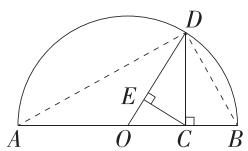

在 Rt△ADB 中,由射影定理可知 $CD^{2}=AC\cdot CB$ ,

$$
\therefore C D = \sqrt {a b}.
$$

∵ OD>CD, ∴ $\frac{a+b}{2}>\sqrt{ab}(a>0, b>0, a\neq b)$ , 故 B 正确.

同理,在 Rt△OCD 中,由射影定理可知 $CD^{2}=DE\cdot OD$ ,

即 $DE=\frac{CD^{2}}{OD}=\frac{ab}{\frac{a+b}{2}}=\frac{2}{\frac{1}{a}+\frac{1}{b}}$ ,

∵ CD>DE, ∴ $\sqrt{ab} > \frac{2}{\frac{1}{a} + \frac{1}{b}}$ , ∴ $\frac{2ab}{a+b} < \sqrt{ab}$ , 故 C 正确.

对于 A、D 选项,根据图中的线段无法判断.

# 知识链接

平均值不等式:利用几何关系得出 OD>CD>DE，
即 $\frac{a+b}{2}>\sqrt{ab}>\frac{2}{\frac{1}{a}+\frac{1}{b}}(a>0,b>0,a\neq b)$ ，其中 $\frac{a+b}{2}$ 、

$\sqrt{ab}, \frac{2}{\frac{1}{a} + \frac{1}{b}}$ 分别为 $a, b$ 的算术平均数、几何平均数和

调和平均数.

15. BCD

信息提取 AF 是斜边上的高, AD 是斜边上的中线, AE 是正方形的对角线, AE 等于正方形边长的 $\sqrt{2}$ 倍.

解析 由题图(1)和题图(2)的面积相等可得 $ab = (a + b)d$ ，得 $d = \frac{ab}{a + b}$ ，故A错误；

由题意知题图(3)的面积为 $\frac{1}{2}ab=\frac{1}{2}\sqrt{a^{2}+b^{2}}\cdot AF$ ，故 $AF=\frac{ab}{\sqrt{a^{2}+b^{2}}}$ ，由D是斜边BC的中点得 $AD=\frac{1}{2}BC=\frac{1}{2}\sqrt{a^{2}+b^{2}}$ ，

易知题图(3)中正方形的边长为 $d=\frac{ab}{a+b}$ ，则 $AE=\frac{\sqrt{2}ab}{a+b}$ ，
由 $AE \geqslant AF$ 可得 $\frac{\sqrt{2}ab}{a+b} \geqslant \frac{ab}{\sqrt{a^{2}+b^{2}}}$ ，化简可得 $\sqrt{\frac{a^{2}+b^{2}}{2}} \geqslant \frac{a+b}{2}$ ，故 B 正确；

由 $AD \geqslant AE$ 可得 $\frac{1}{2}\sqrt{a^2 + b^2} \geqslant \frac{\sqrt{2}ab}{a + b}$ , 化简可得 $\sqrt{\frac{a^2 + b^2}{2}} \geqslant \frac{2}{\frac{1}{a} + \frac{1}{b}}$ , 故 $\mathbb{C}$ 正确;

由 $AD \geqslant AF$ 可得 $\frac{1}{2}\sqrt{a^2 + b^2} \geqslant \frac{ab}{\sqrt{a^2 + b^2}}$ , 化简可得 $a^2 + b^2 \geqslant 2ab$ , 故 D 正确.

# 第2课时 基本不等式的其他应用

基础过关练 对应主书 P21

<table><tr><td>1.C</td><td>8.B</td><td>9.B</td><td></td><td></td><td></td><td></td><td></td></tr></table>

1.C 由 $a > b > 0$ ，得 $\frac{a + b}{2} >\sqrt{ab} >\sqrt{b^2} = b.$

2. 答案 $ab \geqslant xy$

解析 因为 $a > 0, b > 0, \frac{1}{a} + \frac{1}{b} = 1$ ，所以 $ab = ab \cdot \left(\frac{1}{a} + \frac{1}{b}\right) = a + b \geqslant 2\sqrt{ab}$ ，所以 $ab \geqslant 4$ ，当且仅当 $a = b = 2$ 时等号成立。因为 $xy \leqslant \frac{x^2 + y^2}{2} = 4$ ，当且仅当 $x = y = 2$ 时等号成立，所以 $ab \geqslant xy$ 。

3. 答案 乙

解析 不妨设原价为1,则按方案甲提价后的价格为 $(1+p\%)(1+q\%)$ ,按方案乙提价后的价格为 $\left(1+\frac{p+q}{2}\%\right)^{2}$ ,

易知 $\sqrt{(1 + p\%)(1 + q\%)}\leqslant \frac{1 + p\% + 1 + q\%}{2} = 1 + \frac{p\% + q\%}{2}$ 当且仅当 $1 + p\% = 1 + q\%$ ，即 $p = q$ 时等号成立，又 $p\neq q$ ，所以 $(1 + p\%)(1 + q\%) <   \left(1 + \frac{p + q}{2}\%\right)^2$ ，所以提价较多的方案是乙.

4. 答案 充分不必要

解析 由 a, b, c 都是正实数可得 $a + b \geqslant 2\sqrt{ab}$ （当且仅当 a = b 时取“=”）， $b + c \geqslant 2\sqrt{bc}$ （当且仅当 b = c 时取“=”）， $a + c \geqslant 2\sqrt{ac}$ （当且仅当 a = c 时取“=”），

所以 $2(a + b + c) \geqslant 2(\sqrt{ab} + \sqrt{bc} + \sqrt{ac})$ ，即 $a + b + c \geqslant \sqrt{ab} + \sqrt{bc} + \sqrt{ac}$ ，

又因为 abc=1，所以 $a+b+c \geqslant \frac{1}{\sqrt{a}} + \frac{1}{\sqrt{b}} + \frac{1}{\sqrt{c}}$ ，当且仅当 a=b=c=1 时取“=”，所以充分性成立；

取 $a = 1, b = 1, c = 2$ ，可知不等式 $a + b + c \geqslant \frac{1}{\sqrt{a}} + \frac{1}{\sqrt{b}} + \frac{1}{\sqrt{c}}$ 成立，此时 $abc = 2 \neq 1$ ，所以必要性不成立.

故“ $abc=1$ ”是“ $a+b+c\geqslant\frac{1}{\sqrt{a}}+\frac{1}{\sqrt{b}}+\frac{1}{\sqrt{c}}$ ”的充分不必要条件.

5. 证明 $\because a, b, c$ 是三个不全相等的正数，

∴ 三个不等式 $\frac{b}{a} + \frac{a}{b} \geqslant 2, \frac{c}{a} + \frac{a}{c} \geqslant 2, \frac{c}{b} + \frac{b}{c} \geqslant 2$ (待证不等式左侧拆分后可得证明方向) 的等号不能同时成立，

则 $\frac{b}{a} +\frac{a}{b} +\frac{c}{a} +\frac{a}{c} +\frac{c}{b} +\frac{b}{c} >6,$

$$
\therefore \left(\frac {b}{a} + \frac {c}{a} - 1\right) + \left(\frac {a}{b} + \frac {c}{b} - 1\right) + \left(\frac {a}{c} + \frac {b}{c} - 1\right) > 3,
$$

即 $\frac{b+c-a}{a}+\frac{a+c-b}{b}+\frac{a+b-c}{c}>3.$

6. 证明 (1) 因为 $a > 0, b > 0$ , 所以 $a + b = ab \leqslant \left(\frac{a + b}{2}\right)^2$ , 所以 $a + b \geqslant 4$ , 当且仅当 $a = b = 2$ 时取等号.

(2) 因为 a>0, b>0，所以 $ab=a+b\geqslant2\sqrt{ab}$ ，所以 $ab\geqslant4$ ，当且仅当 a=b=2 时取等号，

所以 $\left(1+\frac{1}{a}\right)\left(1+\frac{1}{b}\right)=1+\frac{1}{a}+\frac{1}{b}+\frac{1}{ab}=1+\frac{a+b}{ab}+\frac{1}{ab}=2+\frac{1}{ab}\leqslant$ $2+\frac{1}{4}=\frac{9}{4}.$

7. 证明 (1) 因为 $a, b, c$ 均为正实数, 且 $a + b + c = 1$ ,

所以 $\left(\frac{1}{a} - 1\right)\left(\frac{1}{b} - 1\right)\left(\frac{1}{c} - 1\right)$

$$
= \left(\frac {a + b + c}{a} - 1\right) \left(\frac {a + b + c}{b} - 1\right) \left(\frac {a + b + c}{c} - 1\right)
$$

$$
= \frac {(b + c) (a + c) (a + b)}{a b c}
$$

$\geqslant\frac{2\sqrt{bc}\cdot2\sqrt{ac}\cdot2\sqrt{ab}}{abc}=\frac{8abc}{abc}=8$ , 当且仅当 a=b=c= $\frac{1}{3}$ 时等号成立.

(2) 因为 $a, b, c$ 均为正实数，且 $a + b + c = 1$

所以 $\frac{1}{a} +\frac{1}{b} +\frac{1}{c} = \frac{a + b + c}{a} +\frac{a + b + c}{b} +\frac{a + b + c}{c}$

$$
= \left(\frac {b}{a} + \frac {a}{b}\right) + \left(\frac {c}{a} + \frac {a}{c}\right) + \left(\frac {c}{b} + \frac {b}{c}\right) + 3
$$

$\geqslant2\sqrt{\frac{b}{a}\cdot\frac{a}{b}}+2\sqrt{\frac{c}{a}\cdot\frac{a}{c}}+2\sqrt{\frac{c}{b}\cdot\frac{b}{c}}+3=2\times3+3=9$ ，当
且仅当 $a=b=c=\frac{1}{3}$ 时等号成立.

8.B 依题意得 s>0，则 $C=\frac{800}{s}+2s+2\ 000\geqslant2\sqrt{\frac{800}{s}\cdot2s}+2\ 000=2\ 080$ ,

当且仅当 $\frac{800}{s} = 2s$ ，即 $s = 20$ 时取等号，

所以当 C 最小时, s 的值为 20.

9.B 设平均每件产品的生产准备费用与仓储费用之和为 $y$

元, 则 $y=\frac{\frac{x}{4}\times x\times1+900}{x}=\frac{x}{4}+\frac{900}{x}\geqslant2\sqrt{\frac{x}{4}\cdot\frac{900}{x}}=30$ , 当且仅当 $\frac{x}{4}=\frac{900}{x}$ , 即 x=60 时等号成立,

故每批应生产产品 60 件.

10. 答案 2

解析 当 t=0 时, C=0;

当 $t > 0$ 时， $C = \frac{20t}{t^2 + 4} = \frac{20}{t + \frac{4}{t}} \leqslant \frac{20}{2\sqrt{t \cdot \frac{4}{t}}} = 5$

当且仅当 $t = \frac{4}{t}$ 即 $t = 2$ 时取等号.

因此经过 2 h 后池水中药品的浓度达到最大.

11. 解析 设保留旧墙 x 米, 易知 $0 < x \leqslant 12$ ,

利用旧料来砌的新墙长度为 $(12-x)$ 米，

又新屋的面积预定为 112 平方米, 所以用新料砌墙的长

度应为 $2 \times \frac{112}{x} + x - (12 - x) = \left(\frac{224}{x} + 2x - 12\right)$ 米，

因此总费用(单位:元)为 $25\% \cdot ax + (12 - x) \cdot 50\% \cdot a +$

$$
\left(\frac {2 2 4}{x} + 2 x - 1 2\right) a = \left(\frac {2 2 4}{x} + \frac {7 x}{4} - 6\right) a, 0 <   x \leqslant 1 2.
$$

利用基本不等式可得 $\frac{224}{x} +\frac{7x}{4}\geqslant 2\sqrt{\frac{224}{x}\cdot\frac{7x}{4}} = 28\sqrt{2},$

当且仅当 $x = 8\sqrt{2}$ 时，等号成立，

又 $x = 8\sqrt{2} \approx 11.3 < 12$ ，满足题意，

所以旧墙保留约 11.3 米最为合算.

12. 解析 (1) 依题意得 $xy = 3000$ , 则 $y = \frac{3000}{x}$ ,

由已知得 $\left\{\begin{aligned}y&=\frac{3000}{x}>6,\\ x&>6,\end{aligned}\right.$ 解得6<x<500.

由 $2a+3\times2=x$ , 得 $a=\frac{x-6}{2}$

则 $S = \frac{x - 6}{2}\times (y - 4) + \frac{x - 6}{2}\times (y - 6) = \frac{(x - 6)(2y - 10)}{2}$

$$
= (x - 6) (y - 5) = (x - 6) \left(\frac {3 0 0 0}{x} - 5\right)
$$

$$
= 3 0 0 0 - 5 x - 6 \times \frac {3 0 0 0}{x} + 3 0
$$

$$
= 3 0 3 0 - \left(5 x + \frac {1 8 0 0 0}{x}\right), 6 <   x <   5 0 0.
$$

(2)由(1)得 $S = 3030 - \left(5x + \frac{18000}{x}\right), 6 < x < 500,$

所以 $S = 3030 - \left(5x + \frac{18000}{x}\right) \leqslant 3030 - 2\sqrt{5x \cdot \frac{18000}{x}}$

$$
= 3 0 3 0 - 2 \times 3 0 0 = 2 4 3 0,
$$

当且仅当 $5x = \frac{18000}{x}$ 即 $x = 60, y = 50$ 时等号成立.

所以当 x=60, y=50 时, S 取得最大值 2430.

# 能力提升练

Q 对应主书 P23

1.D 2.A 3.C 6.B 7.B 8.B

1.D 选项 A 中, $a+b\geqslant2\sqrt{ab}$ , 当且仅当 a=b 时取“=”, $2\sqrt{ab}+\frac{1}{\sqrt{ab}}\geqslant2\sqrt{2}$ , 当且仅当 $ab=\frac{1}{2}$ 时取“=”,

$\therefore a+b+\frac{1}{\sqrt{ab}}\geqslant2\sqrt{ab}+\frac{1}{\sqrt{ab}}\geqslant2\sqrt{2}$ ，当且仅当 $a=b=\frac{\sqrt{2}}{2}$ 时取“=”，∴A中不等式成立；

选项 B 中， $(a+b)\left(\frac{1}{a}+\frac{1}{b}\right)=2+\frac{b}{a}+\frac{a}{b}\geqslant4$ ，当且仅当 a=b 时取“=”，∴ B 中不等式成立；

选项 C 中, $\frac{a^{2}+b^{2}}{\sqrt{ab}}\geqslant\frac{2ab}{\sqrt{ab}}=2\sqrt{ab}$ ，当且仅当 a=b 时取“=”，
∴ C 中不等式成立；

选项 D 中, $\frac{2ab}{a+b}\leqslant\frac{2ab}{2\sqrt{ab}}=\sqrt{ab}$ ，当且仅当 a=b 时取“=”，

∴ D 中不等式不成立.

2.A 设从甲地到乙地的距离为 c，则小王从甲地到乙地往返的时间分别是 $\frac{c}{a}$ 和 $\frac{c}{b}$ ，

所以 $v=\frac{2c}{\frac{c}{a}+\frac{c}{b}}=\frac{2}{\frac{1}{a}+\frac{1}{b}}=\frac{2ab}{a+b}$ ,

由 $0 < a < b$ ，得 $\frac{1}{a} +\frac{1}{b} >2\frac{1}{\sqrt{ab}}$ ，可得 $\frac{2}{\frac{1}{a} + \frac{1}{b}} <  \sqrt{ab}$ ，即 $v <   \sqrt{ab}$

故 B 错误;

$v-a=\frac{2ab}{a+b}-a=\frac{2ab-a^{2}-ab}{a+b}=\frac{a(b-a)}{a+b}$ ，由0<a<b，得 $\frac{a(b-a)}{a+b}>0$ ，即a<v，故A正确；

由 $a + b > 2\sqrt{ab}$ ，得 $\frac{a + b}{2} >\sqrt{ab} >v,\sqrt{\frac{a^2 + b^2}{2}} >\sqrt{ab} >v$ ，故C、D错误.

3.C 由已知得 $m_{1} = \frac{2\times 6000}{\frac{6000}{a} + \frac{6000}{b}} = \frac{2}{\frac{1}{a} + \frac{1}{b}} = \frac{2ab}{a + b},$

$$
m _ {2} = \frac {8 0 a + 8 0 b}{1 6 0} = \frac {a + b}{2},
$$

因为 $a \neq b$ ，所以 $\frac{m_1}{m_2} = \frac{4ab}{(a + b)^2} = \frac{4ab}{a^2 + b^2 + 2ab} < \frac{4ab}{2ab + 2ab} = 1$

$\frac{\left( \text{或直接用调和平均数与算术平均数的关系得} \frac{2ab}{a+b}< \frac{a+b}{2} \right)}{a+b}$

所以 $m_{1}<m_{2}$ .

4. 证明 (1) 因为 $a > 0, b > 0, c > 0$ ，所以 $\frac{a^2}{c} + c + \frac{b^2}{a} + a + \frac{c^2}{b} + b \geqslant 2\sqrt{a^2} + 2\sqrt{b^2} + 2\sqrt{c^2} = 2(a + b + c)$ ，当且仅当 $a = b = c$ 时等号成立，故 $\frac{a^2}{c} + \frac{b^2}{a} + \frac{c^2}{b} \geqslant a + b + c = 1$ ，当且仅当 $a = b = c = \frac{1}{3}$ 时等号成立。

$$
\begin{array}{l} (2) (1 + a) (1 + b) (1 + c) = (2 a + b + c) (2 b + a + c) (2 c + a + b), \\ 2 b + a + c = b + c + b + a \geqslant 2 \sqrt {(b + c) (a + b)}, \\ 2 c + a + b = c + a + c + b \geqslant 2 \sqrt {(a + c) (c + b)}, \\ \end{array}
$$

由基本不等式得 $2a + b + c = a + c + a + b \geqslant 2\sqrt{(a + c)(a + b)}$

故 $(1+a)(1+b)(1+c)\geqslant8(a+b)(b+c)(c+a)=8(1-a)$

$(1-b)(1-c)$ ，当且仅当 $a=b=c=\frac{1}{3}$ 时等号成立.

5. 解析 (1) 证明: 由基本不等式得 $a + \frac{b}{2} \geqslant \sqrt{2ab}, \frac{b}{2} + c \geqslant \sqrt{2bc}$ , 所以 $a + b + c \geqslant \sqrt{2ab} + \sqrt{2bc}$ , 当且仅当 $a = \frac{b}{2} = c$ 时等号成立, 问题得证.

(2) 要证 $\frac{a + b + c}{3} \geqslant \sqrt[3]{abc}$ , 即证 $a + b + c \geqslant 3\sqrt[3]{abc}$ , 即证 $a^3 + b^3 + c^3 \geqslant 3abc$ , 即证 $a^3 + b^3 + c^3 - 3abc \geqslant 0$ . 证明如下:

$$
\begin{array}{l} a ^ {3} + b ^ {3} + c ^ {3} - 3 a b c = (a + b) ^ {3} - 3 a ^ {2} b - 3 a b ^ {2} + c ^ {3} - 3 a b c \\ = (a + b) ^ {3} + c ^ {3} - 3 a ^ {2} b - 3 a b ^ {2} - 3 a b c \\ = (a + b + c) \left[ (a + b) ^ {2} - (a + b) c + c ^ {2} \right] - 3 a b (a + b + c) \\ = (a + b + c) \left(a ^ {2} + 2 a b + b ^ {2} - a c - b c + c ^ {2} - 3 a b\right) \\ = (a + b + c) \left(a ^ {2} + b ^ {2} + c ^ {2} - a b - b c - c a\right) \\ = \frac {1}{2} (a + b + c) [ (a - b) ^ {2} + (b - c) ^ {2} + (c - a) ^ {2} ] \geqslant 0, \\ \end{array}
$$

当且仅当 $a = b = c$ 时等号成立，

所以不等式 $a^3 + b^3 + c^3 \geqslant 3abc$ 成立.

故不等式 $\frac{a + b + c}{3} \geqslant \sqrt[3]{abc}$ 成立.

$$
\begin{array}{l} \because m > 2, \therefore m - 2 > 0, \therefore 2 m + \frac {1}{(m - 2) ^ {2}} = (m - 2) + (m - 2) + \\ \frac {1}{(m - 2) ^ {2}} + 4 \geqslant 3 \sqrt [ 3 ]{(m - 2) \cdot (m - 2) \cdot \frac {1}{(m - 2) ^ {2}}} + 4 = 7, \\ \end{array}
$$

当且仅当 $m - 2 = \frac{1}{(m - 2)^2}$ 即 $m = 3$ 时，等号成立，

$\therefore 2m + \frac{1}{(m - 2)^2}$ 的最小值为7.

(3) 证明: 令 $a = \left|\frac{y}{x}\right|, b = \left|\frac{x}{z}\right|, c = \left|\frac{z}{y}\right|, x, y, z$ 均不为 0,
则 $\frac{1}{a\sqrt{c^2+1}}=\frac{1}{\left|\frac{y}{x}\right|\sqrt{\frac{z^2}{y^2}+1}}=\frac{|x|}{\sqrt{z^2+y^2}}=\frac{x^2}{|x|\sqrt{z^2+y^2}},$

由基本不等式得 $|x|\sqrt{z^2 + y^2}\leqslant \frac{z^2 + y^2 + x^2}{2},\therefore \frac{1}{a\sqrt{c^2 + 1}} =$

$$
\frac {x ^ {2}}{| x | \sqrt {z ^ {2} + y ^ {2}}} \geqslant \frac {2 x ^ {2}}{z ^ {2} + y ^ {2} + x ^ {2}},
$$

同理, $\frac{1}{b\sqrt{a^{2}+1}}\geqslant\frac{2z^{2}}{z^{2}+y^{2}+x^{2}},\frac{1}{c\sqrt{b^{2}+1}}\geqslant\frac{2y^{2}}{z^{2}+y^{2}+x^{2}},$

所以 $\frac{1}{a\sqrt{c^2 + 1}} +\frac{1}{b\sqrt{a^2 + 1}} +\frac{1}{c\sqrt{b^2 + 1}}\geqslant \frac{2(z^2 + y^2 + x^2)}{z^2 + y^2 + x^2} = 2,$

当且仅当 $\left\{\begin{aligned}x^{2}&=y^{2}+z^{2},\\ y^{2}&=x^{2}+z^{2},\\ z^{2}&=y^{2}+x^{2},\\ x,y,z\text{均不为}0\end{aligned}\right.$ 时取“=”，显然不存在这种

情况，

所以 $\frac{1}{a\sqrt{c^2 + 1}} +\frac{1}{b\sqrt{a^2 + 1}} +\frac{1}{c\sqrt{b^2 + 1}} >2.$

# 名师点津

当 $a_{1}, a_{2}, \cdots, a_{n}$ 均大于 0 时， $\frac{n}{\frac{1}{a_{1}} + \frac{1}{a_{2}} + \cdots + \frac{1}{a_{n}}} \leqslant$

$\sqrt[n]{a_{1}a_{2}\cdots a_{n}}\leqslant\frac{a_{1}+a_{2}+\cdots+a_{n}}{n}\leqslant\sqrt{\frac{a_{1}^{2}+a_{2}^{2}+\cdots+a_{n}^{2}}{n}}$ ，当且仅当 $a_{1}=a_{2}=\cdots=a_{n}$ 时取等号.

6.B 由题意设 $y_{1} = \frac{k_{1}}{x}, y_{2} = k_{2}x, k_{1} > 0, k_{2} > 0$ ,

∵ 在距离车站 6 km 处建仓库时， $y_{2}=4y_{1}$ ，∴ $6k_{2}=\frac{4k_{1}}{6}$ ，
∴ $k_{1}=9k_{2}$ ，则 $y_{1}+y_{2}=\frac{9k_{2}}{x}+k_{2}x\geqslant2\sqrt{\frac{9k_{2}}{x}\cdot k_{2}x}=6k_{2}$

当且仅当 $\frac{9k_2}{x} = k_2x$ ，即 $x = 3$ 时等号成立，

所以要使这两项费用之和最小,则仓库到车站的距离应为3 km.

7.B 由题意可知, $p=\frac{a+b+c}{2}=5$ ,

$$
\begin{array}{l} \text {所以} S = \sqrt {5 \times (5 - 4) \times (5 - b) \times (5 - c)} \\ = \sqrt {5 [ 2 5 - 5 (b + c) + b c ]} = \sqrt {5 b c - 2 5}, \\ \end{array}
$$

又 $bc \leqslant \left(\frac{b + c}{2}\right)^2 = 9$ ，所以 $S \leqslant \sqrt{5 \times 9 - 25} = 2\sqrt{5}$ ，当且仅当 $b = c = 3$ 时等号成立，所以三角形面积的最大值为 $2\sqrt{5}$ .

8. B 问题甲中， $\pi\left(\frac{a}{2}\right)^{2}+\pi\left(\frac{b}{2}\right)^{2}=2\pi\left(\frac{x}{2}\right)^{2}$ ，则 x= $\sqrt{\frac{a^{2}+b^{2}}{2}}$ ,

问题乙中,设每次购买该物品花的钱为 c 元,则 $y=\frac{2c}{\frac{c}{a}+\frac{c}{b}}=\frac{2}{\frac{1}{a}+\frac{1}{b}}$ ,

问题丙中,设天平左、右两侧的臂长分别为 m, n, 则 $\left\{\begin{aligned}mz&=na,\\ nz&=mb\end{aligned}\right.$ (杠杆原理), 故 $z=\sqrt{ab}$ .

因为 $a > 0, b > 0, a \neq b$ ，所以 $\frac{a^2 + b^2}{2} > ab, \frac{2}{\frac{1}{a} + \frac{1}{b}} < \frac{2}{2\sqrt{\frac{1}{a} \cdot \frac{1}{b}}} = \sqrt{ab}$ ，因此 $x > z > y$ .

9. 解析 （1）设天平左臂长为 m，右臂长为 $n (m \neq n)$ ，第一次放的黄金为 x g，第二次放的黄金为 y g，

则 $5m = xn, my = 5n$ ，得 $x = \frac{5m}{n}, y = \frac{5n}{m}$ ，

所以 $x + y = \frac{5m}{n} +\frac{5n}{m}\geqslant 2\sqrt{\frac{5m}{n}\cdot\frac{5n}{m}} = 10,$

当且仅当 $\frac{5m}{n} = \frac{5n}{m}$ 即 $m = n$ 时取等号，

又 $m \neq n$ ，所以 $x + y > 10$ ，因此顾客购得的黄金大于 $10\mathrm{g}$

(2)设第三次放的黄金为 $z\mathrm{g}$ , 则 $10m = zn$ (杠杆原理),

代入 $\frac{m}{n}=\frac{x}{5}$ ，可得2x=z，

故三次黄金质量总和为 $x + y + z = 3x + y \geqslant 2\sqrt{3xy} = 10\sqrt{3}$ ，当且仅当 $3x = y$ ，即 $x = \frac{5\sqrt{3}}{3}, y = 5\sqrt{3}$ 时取等号，

此时 $\lambda=\frac{m}{n}=\frac{x}{5}=\frac{\sqrt{3}}{3}$ ,

因此当 $\lambda=\frac{\sqrt{3}}{3}$ 时,三次黄金质量总和最小.

10. 解析 (1) 因为 $AD = x \mathrm{~cm}$ , 所以 $AB = (2 - x) \mathrm{~cm}$ .

由 AD>AB>0 得 1<x<2.

设 $ED = a$ cm, 则 $AE = (x - a)$ cm.

因为 $\angle AEB = \angle C'ED, \angle EAB = \angle DC'E, AB = DC'$ ,

所以 $\triangle BAE\cong \triangle DC'E$ ，所以 $BE = ED = a~\mathrm{cm}$

在 Rt△BAE 中,由勾股定理得 $BA^{2}+AE^{2}=BE^{2}$ ,

即 $(2 - x)^{2} + (x - a)^{2} = a^{2}$ ，解得 $a = \frac{x^2 - 2x + 2}{x},$

所以 $AE = x - a = \frac{2x - 2}{x}\mathrm{cm},$

所以 $\triangle BAE$ 的面积 $S = \frac{1}{2} AB\cdot AE = \frac{1}{2} (2 - x)\cdot \frac{2x - 2}{x} =$ $\frac{-x^2 + 3x - 2}{x} = \left[3 - \left(x + \frac{2}{x}\right)\right]\mathrm{cm}^2 (1 <   x <   2).$

(2)设会徽的镀金费用为 $y$ 元，

则 $y = 6\cdot S_{\triangle BAE}\cdot 2 = 12\times \left[3 - \left(x + \frac{2}{x}\right)\right]\leqslant 12\times (3 - 2\sqrt{2}) =$

$36-24\sqrt{2}$ ，当且仅当 $x=\frac{2}{x}$ ，即 $x=\sqrt{2}$ 时等号成立，

所以会徽的镀金部分所需的最大费用为 $(36-24\sqrt{2})$ 元.

# 专题强化练1 利用基本不等式求含条件的最大

(小) 值 …… Q 对应主书 P25

<table><tr><td>1.D</td><td>2.B</td><td>3.D</td><td>4.A</td><td>5.B</td><td>6.ABC</td><td></td><td></td></tr></table>

1.D 因为 x>0, y>0, $x+y=1$ ,

所以 $\frac{2x^2 - x + 1}{xy} = \frac{2x^2 - x(x + y) + (x + y)^2}{xy} = \frac{2x^2 + xy + y^2}{xy} = \frac{2x}{y} +\frac{y}{x} +$

$1 \geqslant 2 \sqrt{\frac{2x}{y} \cdot \frac{y}{x}} + 1 = 2\sqrt{2} + 1$ , 当且仅当 $\frac{2x}{y} = \frac{y}{x}$ 且 $x + y = 1$ , 即 $x = \sqrt{2} - 1, y = 2 - \sqrt{2}$ 时取等号,

所以 $\frac{2x^2 - x + 1}{xy}$ 的最小值为 $2\sqrt{2} + 1$

# 方法技巧

目标式是分母为单项式的分式,可利用条件配凑为齐次分式,再进行变形化为可用基本不等式的形式,进而求出最值.

2.B 由 $x > 0, y > 0$ ，且 $x^2 + 2xy - 3 = 0$ ，可得 $y = \frac{3 - x^2}{2x}, 0 < x < \sqrt{3}$ ，

则 $2x+y=2x+\frac{3-x^{2}}{2x}=\frac{3+3x^{2}}{2x}=\frac{3}{2x}+\frac{3x}{2}\geqslant2\sqrt{\frac{3}{2x}\cdot\frac{3x}{2}}=3$ ，当且仅当 x=1, y=1 时取“=”.

故 $2x + y$ 的最小值是3.

# 目 规律方法

求含有条件的关于两个变量的式子的最大(小)值,可先利用条件消去一个变量,转化为可用基本不等式的形式求最值,要注意消元时变量取值范围的转化.

3.D 设 $5a-4b=s(a-b)+t(a+b)=(s+t)a-(s-t)b$ ,

则 $\left\{\begin{aligned}s+t=5,\\ s-t=4,\end{aligned}\right.$ 解得 $\left\{\begin{aligned}s=\frac{9}{2},\\ t=\frac{1}{2},\end{aligned}\right.$

则 $5a - 4b = \frac{9}{2} (a - b) + \frac{1}{2} (a + b)$

$$
\begin{array}{l} = \frac {1}{4} \left[ \frac {9}{2} (a - b) + \frac {1}{2} (a + b) \right] \left(\frac {1}{a - b} + \frac {1}{a + b}\right) \\ = \frac {1}{4} \left[ 5 + \frac {a + b}{2 (a - b)} + \frac {9 (a - b)}{2 (a + b)} \right] \\ \geqslant \frac {1}{4} \left[ 5 + 2 \sqrt {\frac {a + b}{2 (a - b)} \cdot \frac {9 (a - b)}{2 (a + b)}} \right] = 2, \\ \end{array}
$$

当且仅当 $\frac{a+b}{2(a-b)}=\frac{9(a-b)}{2(a+b)}$ ，即 $a=\frac{2}{3},b=\frac{1}{3}$ 时，等号成立，
所以 5a-4b 的最小值为 2.

# 方法技巧

将所求式进行变形,使其恰好为题目中分式分母的形式,再运用基本不等式求解.

4.A $\because x+y=1,\therefore x+y+1=2,$

$$
\begin{array}{l} \because y > 0, x > 0, \therefore \frac {1}{2 x} + \frac {x}{y + 1} = \frac {\frac {1}{2} (x + y + 1)}{2 x} + \frac {x}{y + 1} = \frac {1}{4} + \frac {y + 1}{4 x} + \frac {x}{y + 1} \\ \geqslant \frac {1}{4} + 2 \sqrt {\frac {y + 1}{4 x} \cdot \frac {x}{y + 1}} = \frac {5}{4}, \\ \end{array}
$$

当且仅当 $\frac{y + 1}{4x} = \frac{x}{y + 1}$ 即 $x = \frac{2}{3}, y = \frac{1}{3}$ 时等号成立，故 $\frac{1}{2x} + \frac{x}{y + 1}$ 的最小值为 $\frac{5}{4}$ .

5.B 由题意可知, $a_{1},a_{2},a_{3}$ 中有2个负数,1个正数,假设 $a_{1},a_{2}$ 是负数, $a_{3}$ 是正数,则 $M=a_{3}$ ,

所以 $a_3 = -a_1 - a_2 \geqslant 2\sqrt{(-a_1)(-a_2)}$ ，则 $a_1a_2 \leqslant \frac{a_3^2}{4}$ ，

又 $a_1a_2a_3 = 2$ ，所以 $a_1a_2a_3 = 2 \leqslant \frac{a_3^3}{4}$ 即 $a_3 \geqslant 2$ 所以 $M$ 的最小值为2.

6. ABC 对于 A, 由已知得 x > 0, y > 0, 所以 $x + 2y = 2 \geqslant 2\sqrt{2xy}$ , 故 $xy \leqslant \frac{1}{2}$ , 当且仅当 x = 2y = 1, 即 x = 1, $y = \frac{1}{2}$ 时等号成立, 故 A 正确;

对于 B, $\frac{2y}{x} + \frac{1}{y} = \frac{2 - x}{x} + \frac{1}{y} = \frac{2}{x} + \frac{1}{y} - 1 = \left( \frac{2}{x} + \frac{1}{y} \right) \cdot \frac{x + 2y}{2} - 1 = \frac{2y}{x} + \frac{x}{2y} + 1 \geqslant 2\sqrt{\frac{2y}{x} \cdot \frac{x}{2y}} + 1 = 3$ , 当且仅当 $\frac{2y}{x} = \frac{x}{2y}$ , 即 x = 1, $y = \frac{1}{2}$ 时等号成立, 故 B 正确;

对于 C, $x^{2}+4y^{2}=(x+2y)^{2}-4xy=4-4xy\geqslant4-4\times\frac{1}{2}=2$ ，当且仅当 $x=1, y=\frac{1}{2}$ 时等号成立，故 C 正确；

对于 D, $\left(x^{2}+\frac{1}{5}\right)\left(4y^{2}+\frac{1}{5}\right)=4x^{2}y^{2}+\frac{1}{5}\left(x^{2}+4y^{2}\right)+\frac{1}{25}=4x^{2}y^{2}+\frac{1}{5}\left[(x+2y)^{2}-4xy\right]+\frac{1}{25}=4x^{2}y^{2}-\frac{4}{5}xy+\frac{1}{25}+\frac{4}{5}=\left(2xy-\frac{1}{5}\right)^{2}+\frac{4}{5}$ ，结合 A 选项可知 $0<xy\leqslant\frac{1}{2}$ ，因此当 xy= $\frac{1}{10}$ ，即 $x=\frac{5+2\sqrt{5}}{5}$ ， $y=\frac{5-2\sqrt{5}}{10}$ 时， $\left(x^{2}+\frac{1}{5}\right)\left(4y^{2}+\frac{1}{5}\right)$ 取得最小值，为 $\frac{4}{5}$ ，故 D 错误.

7. 答案 27

解析 因为 $0 < x < \frac{1}{3}$ ，所以 0 < 1 - 3x < 1，

所以 $\frac{1}{x} +\frac{12}{1 - 3x} = [(1 - 3x) + 3x]\left(\frac{1}{x} +\frac{12}{1 - 3x}\right) = 15 + \frac{36x}{1 - 3x} +$ $\frac{1 - 3x}{x}\geqslant 15 + 2\sqrt{\frac{36x}{1 - 3x}\cdot\frac{1 - 3x}{x}} = 27,$

当且仅当 $\left\{\begin{aligned}\frac{36x}{1-3x}&=\frac{1-3x}{x},\\0&<x<\frac{1}{3},\end{aligned}\right.$ 即 $x=\frac{1}{9}$ 时,等号成立,

因此 $\frac{1}{x} +\frac{12}{1 - 3x}$ 的最小值为27.

8. 答案 18

解析 因为 $a > 0, b > 0$ ，所以 $16 = (a + 3b) + \left(\frac{1}{a} + \frac{3}{b}\right) \geqslant 2\sqrt{(a + 3b)\left(\frac{1}{a} + \frac{3}{b}\right)} = 2\sqrt{10 + 3\left(\frac{a}{b} + \frac{b}{a}\right)}$

所以 $\frac{a}{b} +\frac{b}{a}\leqslant 18$ ，当且仅当 $a + 3b = \frac{1}{a} +\frac{3}{b} = 8$ 时取等号，故 $\frac{a}{b} +\frac{b}{a}$ 的最大值是18.

9. 答案 13

解析 解法一(消参): 由 $2a+b+6=ab$ 可得 $a(b-2)=b+6$ ，因为 a>0, b>0，所以 b-2>0，且 $a=\frac{b+6}{b-2}$ ,

故 $a + 2b = \frac{b + 6}{b - 2} + 2b = \frac{8}{b - 2} + 2(b - 2) + 5 \geqslant 2\sqrt{16} + 5 = 13$ ，当且仅当 $a = 5, b = 4$ 时等号成立，故 $a + 2b$ 的最小值为13.

解法二(因式分解): 因为 $2a+b+6=ab$ ，所以 $(a-1)(b-2)=8$ ，即 $(a-1)(2b-4)=16\leqslant\left[\frac{(a-1)+(2b-4)}{2}\right]^{2}=\left(\frac{a+2b-5}{2}\right)^{2}$ ，所以 $a+2b-5\geqslant8$ ，即 $a+2b\geqslant13$ ，当且仅当 a=5, b=4 时等号成立，故 $a+2b$ 的最小值为 13.

10. 解析 因为 x>0, y>0,

所以 $x + 3y - 1 > -1,2x + y - 1 > -1$

因为 $(x + 3y - 1)(2x + y - 1) = 1$

所以 $x+3y-1>0,2x+y-1>0,$

因此 $x + y = \frac{1}{5} (x + 3y - 1) + \frac{2}{5} (2x + y - 1) + \frac{3}{5}$

$$
\geqslant 2 \sqrt {\frac {2}{2 5} (x + 3 y - 1) (2 x + y - 1)} + \frac {3}{5} = \frac {3 + 2 \sqrt {2}}{5},
$$

当且仅当 $\frac{1}{5} (x + 3y - 1) = \frac{2}{5} (2x + y - 1)$

即 $\left\{\begin{aligned}x+3y-1&=\sqrt{2},\\ 2x+y&= \frac{\sqrt{2}}{2},\end{aligned}\right.$ 即 $\left\{\begin{aligned}x&=\frac{2}{5}+\frac{\sqrt{2}}{10},\\ y&=\frac{1}{5}+\frac{3\sqrt{2}}{10}\end{aligned}\right.$ 时取等号，

所以 $x+y$ 的最小值为 $\frac{3+2\sqrt{2}}{5}$ .

# 名师点睛

题中条件是积 $(x + 3y - 1)(2x + y - 1)$ 为定值，求和 $x + y$ 的最小值，关键是将 $x + y$ 用条件中的两个因式表示，可用待定系数法求解，令 $x + y = m(x + 3y) + n(2x + y)$ ，可得 $m = \frac{1}{5}, n = \frac{2}{5}$ ，故 $x + y = \frac{1}{5}(x + 3y) + \frac{2}{5}(2x + y) = \frac{1}{5}(x + 3y - 1) + \frac{2}{5}(2x + y - 1) + \frac{3}{5}$ .

11. 解析 (1) 因为 $x \geqslant 0$ , 所以 $x^4 + 1 + 1 + 1 \geqslant 4x$ , 即 $x^4 -$

$4x \geqslant -3$

当且仅当 x=1 时取等号, 故 $x^{4}-4x$ 的最小值为 -3.

(2) 因为 $x \geqslant 0$ , 所以 $\frac{1}{3} x^3 + \frac{1}{3} + \frac{1}{3} \geqslant x$ , 即 $\frac{1}{3} x^3 - x \geqslant -\frac{2}{3}$ ,

当且仅当 $x = 1$ 时取等号，故 $\frac{1}{3} x^3 - x$ 的最小值为 $-\frac{2}{3}$ .

(3) 因为 $x \geqslant 0$ ，且 $a > 0$ ，所以 $x^3 + \frac{a\sqrt{a}}{3\sqrt{3}} + \frac{a\sqrt{a}}{3\sqrt{3}} \geqslant ax$ （要想使

目标不等式的右侧为 $ax$ ，可令 $x^3 + m + m \geqslant 3\sqrt[3]{x^3 \cdot m \cdot m} = ax$ ，由此求出 $m = \frac{a\sqrt{a}}{3\sqrt{3}}$ ，即 $x^3 - ax \geqslant -\frac{2a\sqrt{a}}{3\sqrt{3}}$

当且仅当 $x=\frac{\sqrt{a}}{\sqrt{3}}=\frac{\sqrt{3a}}{3}$ 时取等号，故 $x^{3}-ax$ 的最小值为 $-\frac{2a\sqrt{3a}}{9}$ .

# 2.3 二次函数与一元二次方程、不等式

# 基础过关练

Q 对应主书 P26

<table><tr><td>1.D</td><td>2.B</td><td>3.D</td><td>7.D</td><td>8.C</td><td>9.C</td><td>12.A</td><td>13.A</td></tr><tr><td>14.A</td><td>15.D</td><td>18.C</td><td></td><td></td><td></td><td></td><td></td></tr></table>

1.D 由 $x^{2} - \frac{5}{6} x + \frac{1}{6} >0$ ，得 $\left(x - \frac{1}{2}\right)\left(x - \frac{1}{3}\right) > 0$ ，解得 $x < \frac{1}{3}$ 或 $x > \frac{1}{2}$ ，所以不等式的解集是 $\left\{x\mid x <   \frac{1}{3}\text{或} x > \frac{1}{2}\right\}$

2.B 由题图可知阴影部分表示的集合为 $M \cap (\complement_{\mathbb{R}} N)$ ,

又 $M = \{x\mid 5 + 4x - x^2\geqslant 0\} = \{x\mid (x - 5)(x + 1)\leqslant 0\} = \{x\mid$ $-1\leqslant x\leqslant 5\} ,\complement_{\mathbf{R}}N = \{x\mid x\leqslant 2\}$

所以 $M \cap (\complement_{\mathbf{R}} N) = \{x \mid -1 \leqslant x \leqslant 2\}$ .

3.D 由 $\frac{3x}{x - 2} \leqslant 1$ 得 $\frac{2x + 2}{x - 2} \leqslant 0$ , 所以 $\left\{ \begin{array}{l} (x - 2)(2x + 2) \leqslant 0, \\ x - 2 \neq 0, \end{array} \right.$ 解得 $-1 \leqslant x < 2$ , 所以 $\frac{3x}{x - 2} \leqslant 1$ 成立的一个充分不必要条件为 $\{x| - 1 \leqslant x < 2\}$ 的真子集, 结合选项可知 D 符合.

# 易错警示

解分式不等式,若右侧不为零,则要移项、通分,然后将分式不等式转化为一元二次不等式,需要注意分母不能为零.

4. 答案 $\left\{x \mid 1 < x < \frac{3}{2}\right\}$

解析 由 $\frac{2x - 3}{x - 1} < 0$ ，得 $(x - 1)(2x - 3) < 0$ ，解得 $1 < x < \frac{3}{2}$

故不等式的解集为 $\left\{x\mid1<x<\frac{3}{2}\right\}$ .

5. 解析 (1) 因为 $\frac{x - 1}{2x - 1} > 0$ , 所以 $(x - 1)(2x - 1) > 0$ , 解得 $x > 1$ 或 $x < \frac{1}{2}$ , 所以 $A = \left\{x \mid x > 1 \text{ 或 } x < \frac{1}{2}\right\}$ .

(2) 因为 $a + 1 > a$ 恒成立, 所以 $(x - a)(x - a - 1) > 0 \Leftrightarrow x > a + 1$ 或 $x < a$ , 所以 $B = \{x \mid x > a + 1 \text{ 或 } x < a\}$ .

因为 $x \in B$ 是 $x \in A$ 的充分不必要条件, 所以 $B \subsetneq A$ ,

所以 $\left\{\begin{aligned}a+1&\geqslant1,\\ a&\leqslant\frac{1}{2},\end{aligned}\right.$ 等号不同时取到,解得 $0\leqslant a\leqslant\frac{1}{2}$ ,

所以 a 的取值范围是 $\left\{a \mid 0 \leqslant a \leqslant \frac{1}{2}\right\}$ .

6. 解析 令 $x^{2} + (1 - 2a)x - 2a = 0$ ，得 $(x - 2a)(x + 1) = 0$ ，解得 $x = -1$ 或 $x = 2a$ ，

当 $2a < -1$ ，即 $a < -\frac{1}{2}$ 时，不等式的解集为 $\{x \mid x < 2a$ 或 $x > -1\}$ ；

当 $2a = -1$ ，即 $a = -\frac{1}{2}$ 时，不等式的解集为 $\{x\mid x\neq -1\}$

当 $2a > -1$ ，即 $a > -\frac{1}{2}$ 时，不等式的解集为 $\{x \mid x < -1$ 或 $x > 2a\}$ .

7.D 由已知得二次方程 $(k-3)x^{2}+2x+1=0$ 有解，

所以 $k - 3 \neq 0$ ，且 $4 - 4(k - 3) \geqslant 0$

所以 $k \leqslant 4$ 且 $k \neq 3$ .

8.C 因为不等式 $ax^{2}+bx-1>0$ 的解集为 $\left\{x\left|-\frac{1}{2}<x<-\frac{1}{3}\right.\right\}$ ，
所以 a<0，且方程 $ax^{2}+bx-1=0$ 的两根分别为 $-\frac{1}{2}, -\frac{1}{3}$ ,

由根与系数的关系可得 $\left\{\begin{aligned}-\frac{1}{2}\times\left(-\frac{1}{3}\right)&=-\frac{1}{a},\\-\frac{1}{2}+\left(-\frac{1}{3}\right)&=-\frac{b}{a},\end{aligned}\right.$ 解得 $\left\{\begin{aligned}a&=-6,\\ b&=-5,\end{aligned}\right.$

所以不等式 $x^{2}-bx-a\geqslant0$ 即为 $x^{2}+5x+6\geqslant0$ , 解得 $x\leqslant-3$ 或 $x\geqslant-2$

因此,不等式 $x^{2}-bx-a\geqslant0$ 的解集为 $\{x\mid x\leqslant-3$ 或 $x\geqslant-2\}$ .

# 目 规律总结

一元二次不等式大于0的解集取两边,则二次项系数为正,大于0的解集取中间,则二次项系数为负;一元二次不等式小于0的解集取两边,则二次项系数为负,小于0的解集取中间,则二次项系数为正.

9.C 关于 $x$ 的不等式 $ax - b > 0$ 的解集为 $\{x \mid x > 1\}$ , 则 $a = b > 0$ , 所以不等式 $\frac{ax + b}{x - 2} > 0$ 可化为 $\frac{a(x + 1)}{x - 2} > 0$ , 即 $a(x + 1)(x - 2) > 0$ , 解得 $x > 2$ 或 $x < -1$ .

10. 答案 6

解析 因为二次不等式 $ax^2 + bx + 1 > 0$ 的解集为 $\left\{x \mid -1 < x < \frac{1}{3}\right\}$ ,

所以 $a < 0$ ，且 $ax^2 + bx + 1 = 0$ 的两个根为-1和 $\frac{1}{3}$

所以 $\left\{\begin{aligned}-1+\frac{1}{3}&=-\frac{b}{a},\\-\frac{1}{3}&=\frac{1}{a},\end{aligned}\right.$ 解得 $\left\{\begin{aligned}a&=-3,\\ b&=-2,\end{aligned}\right.$ 所以ab=6.

11. 解析 因为关于 $x$ 的不等式 $ax^2 + bx - 12 \geqslant 0$ 的解集为 $\{x \mid x \leqslant -3 \text{ 或 } x \geqslant 4\}$ ,

所以-3,4是方程 $ax^{2}+bx-12=0$ 的两根，且a>0，

所以 $\left\{\begin{aligned}-3+4&=-\frac{b}{a},\\ -3\times4&=-\frac{12}{a},\end{aligned}\right.$ 解得 $\left\{\begin{aligned}a=1,\\ b=-1,\end{aligned}\right.$

所以不等式 $bx^{2}+ax+6\geqslant0$ 即 $-x^{2}+x+6\geqslant0$ ，即 $x^{2}-x-6\leqslant0$ ，即 $(x-3)(x+2)\leqslant0$ ，解得 $-2\leqslant x\leqslant3$

所以不等式 $bx^{2} + ax + 6\geqslant 0$ 的解集为 $\{x\mid -2\leqslant x\leqslant 3\}$

12.A 不等式 $-x^{2}+mx-1\geqslant0$ 有解等价于方程 $-x^{2}+mx-1=0$ 有根,所以 $\Delta=m^{2}-4\geqslant0$ ,解得 $m\geqslant2$ 或 $m\leqslant-2$ .

13.A 对于方程 $x^{2} - 4x + 2m = 0$ ，因为命题 $p$ 为真命题，所以 $\Delta = 16 - 8m\leqslant 0$ ，解得 $m\geqslant 2$ ，因为 $\{m|m\geqslant 3\} \subsetneqq \{m|m\geqslant 2\}$ ，所以“ $m\geqslant 3$ ”是“命题 $p$ 为真命题”的充分不必要条件.

14.A 若 k=0，则不等式为 $8 \geqslant 0$ ，显然恒成立，满足条件；若 $k \neq 0$ ，要使不等式恒成立，

只需满足 $\left\{\begin{aligned}k&>0,\\ \Delta&=36k^{2}-4k(k+8)\leqslant0,\end{aligned}\right.$

即 $\left\{\begin{aligned}k&>0,\\ k^{2}&-k\leqslant0,\end{aligned}\right.$ 则 $\left\{\begin{aligned}k&>0,\\ 0&\leqslant k\leqslant1,\end{aligned}\right.$ 所以 $0<k\leqslant1$ .

综上,实数 k 的取值范围为 $0 \leqslant k \leqslant 1$ .

15.D 因为命题“ $\exists x \in \mathbf{R}, x^2 + (a + 1)x + 1 < 0$ ”是假命题，

所以命题“ $\forall x \in \mathbf{R}, x^2 + (a + 1)x + 1 \geqslant 0$ ”是真命题，

对于方程 $x^{2}+(a+1)x+1=0$ ，只需 $\Delta=(a+1)^{2}-4\leqslant0$ ，解得 $-3\leqslant a\leqslant1$ .

16. 答案 $-1 \leqslant a \leqslant 4$

解析 关于 $x$ 的不等式 $-x^{2} + 4x \geqslant a^{2} - 3a$ 在 $\mathbf{R}$ 上有解，即 $x^{2} - 4x + a^{2} - 3a \leqslant 0$ 在 $\mathbf{R}$ 上有解，

对于方程 $x^{2}-4x+a^{2}-3a=0$ ，只需 $\Delta=(-4)^{2}-4\times(a^{2}-3a)\geqslant0$ ，即 $a^{2}-3a-4\leqslant0$ ，即 $(a-4)(a+1)\leqslant0$ ，解得 $-1\leqslant a\leqslant4$ ，

所以实数 a 的取值范围是 $-1 \leqslant a \leqslant 4$ .

17. 答案 $0 \leqslant k < 1$

解析 当 k=0 时, 不等式为 $\frac{1}{8} \leqslant 0$ , 解集为空集, 符合题意;

当 $k \neq 0$ 时, 若不等式的解集为空集, 只需 $\left\{ \begin{array}{l} k > 0, \\ \Delta = k^2 - k < 0, \end{array} \right.$ 解得 $0 < k < 1$ .

综上所述, $k$ 的取值范围是 $0 \leqslant k < 1$ .

18. C 依题意得每天有(300-10x)套礼服被租出，

该礼服租赁公司每天租赁礼服的收入为 $(300-10x)$ ·

$(200 + 10x) = (-100x^{2} + 1000x + 60000)$ 元.

由题意知 $-100x^{2} + 1000x + 60000 > 62400$

即 $x^{2}-10x+24<0$ , 解得 4<x<6.

因为 $1 \leqslant x \leqslant 20$ 且 $x \in \mathbf{Z}$ , 所以 $x = 5$ ,

故要使该礼服租赁公司每天租赁礼服的收入超过6.24万元,则每套礼服每天的租价应定为250元.

19. 解析 (1) 设购买该批小型货车后的第 $n(n \in \mathbf{N}^*)$ 年的利润为 $M$ 万元, 由题意, 得 $M = 69n - 192 - 12n - 3n(n - 1) = -3n^2 + 60n - 192$ , 令 $M > 0$ , 得 $n^2 - 20n + 64 < 0$ , 解得 $4 < n < 16$ .

又 $n \in \mathbf{N}^*$ , 所以 $n_{\min} = 5$ .

所以购买该批小型货车后的第 5 年开始盈利.

(2) 结合 (1) 可得 $y = \frac{-3n^{2} + 60n - 192}{n} = -3\left(n + \frac{64}{n}\right) + 60 \leqslant -3 \times 2\sqrt{64} + 60 = 12$ ，当且仅当 $n = \frac{64}{n}$ ，即 n = 8 时取“=”，

所以购买该批小型货车后的年平均利润的最大值是 12 万元.

# 能力提升练

Q 对应主书 P28

1.D | 2.C | 7.AC | 8.C | 9.ACD | 10.BC | 12.A

1. D $x^{2}-(m+1)x+m<0\Leftrightarrow(x-1)(x-m)<0,$

①当 m=1 时, 不等式为 $(x-1)^{2}<0$ , 解集为空集, 不符合题意;  
②当 $m > 1$ 时，不等式的解集为 $\{x\mid 1 <   x <   m\}$

因为不等式的解集中恰有三个整数,所以整数为 2,3,4,故 $4<m\leqslant5$ ;

③当 m<1 时, 不等式的解集为 $\{x \mid m<x<1\}$ ,

因为不等式的解集中恰有三个整数,所以整数为0,-1,-2,故 $-3\leqslant m<-2$ .

综上,实数 m 的取值范围为 $\{m\mid-3\leqslant m<-2$ 或 $4<m\leqslant5\}$ .

2.C 由 $0 < a < 1$ ，得 $a - 1 < 0$ ，则不等式 $(x - 2)[(a - 1)x + (2 - a)] > 0$ 可化为 $(x - 2)\left(x - \frac{a - 2}{a - 1}\right) < 0$

易知方程 $(x - 2)\left(x - \frac{a - 2}{a - 1}\right) = 0$ 的两个根分别为 $2, \frac{a - 2}{a - 1}$ ,

因为 $2 - \frac{a - 2}{a - 1} = \frac{a}{a - 1} < 0$ ，所以 $2 < \frac{a - 2}{a - 1}$

所以原不等式的解集为 $\left\{x\mid2<x<\frac{a-2}{a-1}\right\}$ .

3. 答案 $m \leqslant -3$

解析 由 $\frac{x - 1}{2x - 1} \leqslant 0$ 得 $\left\{ \begin{array}{l}(x - 1)(2x - 1) \leqslant 0, \\ 2x - 1 \neq 0, \end{array} \right.$ 解得 $\frac{1}{2} < x \leqslant 1$

所以 $A = \left\{x\mid \frac{1}{2} <  x\leqslant 1\right\} .$

要使 $A \subseteq B$

则 $\left\{\begin{aligned}1^{2}+2\times1+m&\leqslant0,\\ \left(\frac{1}{2}\right)^{2}+2\times\frac{1}{2}+m&\leqslant0,\end{aligned}\right.$ 得 $\left\{\begin{aligned}m&\leqslant-3,\\ m&\leqslant-\frac{5}{4},\end{aligned}\right.$ 所以 $m\leqslant-3.$

4. 答案 $\{x \mid 2 \leqslant x < 4\}$

解析 $[x]^2 - 5[x] + 6 \leqslant 0 \Leftrightarrow ([x] - 2) ([x] - 3) \leqslant 0 \Leftrightarrow 2 \leqslant [x] \leqslant 3$ ，所以 $2 \leqslant x < 4$ . (把 $[x]$ 作为一个未知数解不等式，然后根据取整函数的定义得结论)

5. 答案 $\{x \mid -4 \leqslant x < 1 \text{ 或 } x \geqslant 3\}$

解析 解法一: 原不等式可化为 $\left\{\begin{aligned}(x+4)(x-3)&\geqslant0,\\ x-1&>0\end{aligned}\right.$ 或 $\left\{\begin{aligned}(x+4)(x-3)&\leqslant0,\\ x-1&<0,\end{aligned}\right.$ 解得 $x\geqslant3$ 或 $-4\leqslant x<1$ ，故原不等式的解集为 $\{x\mid-4\leqslant x<1$ 或 $x\geqslant3\}$ .

解法二:由 $\frac{(x+4)(x-3)}{x-1}\geqslant0$ 得 $(x+4)(x-3)(x-1)\geqslant0$ 且 $x-1\neq0$ ，(将分式不等式等价转化为高次不等式,注意分母不为0)

利用穿针引线法,如图,

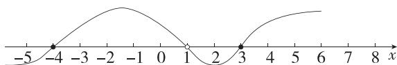

line

| x | y |
|---|---|
| -5 | 0 |
| -4 | 1 |
| -3 | 2 |
| -2 | 3 |
| -1 | 4 |
| 0 | 3 |
| 1 | 2 |
| 2 | 1 |
| 3 | 0 |
| 4 | 1 |
| 5 | 2 |
| 6 | 3 |
| 7 | 4 |
| 8 | 5 |

故不等式的解集为 $\{x\mid -4\leqslant x < 1$ 或 $x\geqslant 3\}$

6. 解析 (1) 当 $a = 3$ 时, 不等式为 $3x^{2} - 4x + 1 > 0$ ,

解得 $x > 1$ 或 $x < \frac{1}{3}$ , 故不等式的解集为 $\left\{x \mid x > 1 \text{ 或 } x < \frac{1}{3} \right\}$ .

(2) 原不等式可化为 $(ax-1)(x-1)>0$ ,

当 a=0 时, 不等式为 $-x+1>0$ , 解得 x<1.

当 $a \neq 0$ 时, 原不等式可化为 $a(x - 1)\left(x - \frac{1}{a}\right) > 0$ ,

若 $a < 0$ ，解不等式得 $\frac{1}{a} < x < 1$

若 0 < a < 1, 解不等式得 $x > \frac{1}{a}$ 或 x < 1,

若 $a = 1$ ，解不等式得 $x\neq 1$

若 $a > 1$ ，解不等式得 $x < \frac{1}{a}$ 或 $x > 1$

综上, 当 a=0 时, 不等式的解集为 $\{x \mid x<1\}$ ; 当 a<0 时, 不等式的解集为 $\left\{x \mid \frac{1}{a}<x<1\right\}$ ; 当 0<a<1 时, 不等式的解集为 $\left\{x \mid x>\frac{1}{a} \text{ 或 } x<1\right\}$ ; 当 a=1 时, 不等式的解集为 $\left\{x \mid x \in R, x \neq 1\right\}$ ; 当 a>1 时, 不等式的解集为 $\left\{x \mid x<\frac{1}{a} \text{ 或 } x>1\right\}$ .

# 解题模板

解二次项系数含参的不等式进行分类讨论时要全面,包括二次项系数是不是0,开口方向和根的大小关系.

7. AC 因为关于 $x$ 的不等式 $ax^2 + bx + c \geqslant 0$ 的解集为 $\{x \mid -2 \leqslant x \leqslant 3\}$ , 所以 $a < 0$ , 故 A 正确.

由题意得-2和3是方程 $ax^{2} + bx + c = 0$ 的两个实数根，

所以 $\left\{\begin{aligned}-2+3&=-\frac{b}{a},\\ -2\times3&=\frac{c}{a},\end{aligned}\right.$ 即 $\left\{\begin{aligned}b&=-a,\\ c&=-6a.\end{aligned}\right.$

因为 a<0，所以 b=-a>0，所以 ab<0，故 B 错误.

$a+b+c=a-a-6a=-6a>0$ , 故 C 正确.

由 $cx^{2}-bx+a<0$ 得 $-6ax^{2}+ax+a<0$ ，即 $6x^{2}-x-1<0$ ，解得 $-\frac{1}{3}<x<\frac{1}{2}$ ，故 D 错误.

8.C 因为不等式 $(a - 2)x^{2} + 2(a - 2)x - 4\geqslant 0$ 的解集为 $\varnothing$

所以不等式 $(a-2)x^{2}+2(a-2)x-4<0$ 的解集为R.

当 $a - 2 = 0$ ，即 $a = 2$ 时，不等式为 $-4 < 0$ ，符合题意

当 $a - 2 \neq 0$ ，即 $a \neq 2$ 时，

易得 $\left\{\begin{aligned}a<2,\\ \Delta=\left[2(a-2)\right]^{2}+4\times4\times(a-2)<0,\end{aligned}\right.$ 解得-2<a<2.

综上,实数 a 的取值范围是 $\{a \mid -2 < a \leqslant 2\}$ .

9.ACD 对于 A, 因为不等式 $a(x-1)(x-3)+2>0$ 的解集为 $\{x\mid x<x_{1}$ 或 $x>x_{2}\}$ ，其中 $x_{1}<x_{2}$ ，

所以方程 $a(x-1)(x-3)+2=0$ 即 $ax^{2}-4ax+3a+2=0$ 的两个根分别为 $x_{1}, x_{2}$ ，且 a>0，

所以 $\left\{\begin{aligned}x_{1}+x_{2}&=4,\\ x_{1}x_{2}&=\frac{3a+2}{a},\\ \Delta&=16a^{2}-4a(3a+2)>0,\\ a&>0,\end{aligned}\right.$ 即 $\left\{\begin{aligned}x_{1}+x_{2}&=4,\\ x_{1}x_{2}&=3+\frac{2}{a},\\ a&>2,\end{aligned}\right.$ 所以 A

正确；

对于 B, $\left|x_{1}-x_{2}\right|=\sqrt{\left(x_{1}+x_{2}\right)^{2}-4x_{1}x_{2}}=\sqrt{16-4\left(3+\frac{2}{a}\right)}=\sqrt{4-\frac{8}{a}}$ ,

因为 $a > 2$ ，所以 $0 < \frac{1}{a} < \frac{1}{2}$ 所以 $0 < \frac{8}{a} < 4$ ，所以 $0 < 4 - \frac{8}{a} < 4$

所以 $0 < \sqrt{4 - \frac{8}{a}} < 2$ ，所以 $0 < |x_{1} - x_{2}| < 2$ ，所以B错误；

对于 C, 由 B 中分析得 $3 < 3 + \frac{2}{a} < 4$ , 所以 $3 < x_{1}x_{2} < 4$ , 所以 C 正确;

对于 D, 因为 $\left\{\begin{aligned}x_{1}+x_{2}&=4,\\ x_{1}x_{2}&=\frac{3a+2}{a},\\ a&>2,\end{aligned}\right.$ 所以 $\left\{\begin{aligned}4&=x_{1}+x_{2},\\ 3a+2&=ax_{1}x_{2},\\ a&>2,\\ x_{1}&>0,x_{2}>0,\end{aligned}\right.$

所以由 $(3a+2)x^{2}-4ax+a<0$ ，得 $ax_{1}x_{2}x^{2}-a(x_{1}+x_{2})x+a<0$ ，
所以 $x_{1}x_{2}x^{2}-(x_{1}+x_{2})x+1<0$ , 得 $(x_{1}x-1)(x_{2}x-1)<0$

因为 $0 < x_{1} < x_{2}$ , 所以 $0 < \frac{1}{x_{2}} < \frac{1}{x_{1}}$ , 所以不等式 $(x_{1}x - 1)(x_{2}x - 1) < 0$ 的解集为 $\left\{x \mid \frac{1}{x_{2}} < x < \frac{1}{x_{1}}\right\}$ , 即不等式 $(3a + 2)x^{2} - 4ax + a < 0$ 的解集为 $\left\{x \mid \frac{1}{x_{2}} < x < \frac{1}{x_{1}}\right\}$ , 所以 D 正确.

10.BC 因为关于 $x$ 的一元二次不等式 $ax^2 - 2ax + b > 0$ 的解集为 $A = \{x \mid m < x < n\}$ （其中 $m < n$ ），所以 $a < 0$ ，且二次函数 $y = ax^2 - 2ax + b$ 的图象与 $x$ 轴有两个交点，交点坐标分别为 $(m, 0), (n, 0) (m < n)$ ，

因为关于 x 的一元二次不等式 $ax^{2}-2ax+b>-2$ 的解集为 $B=\{x\mid p<x<q\}$ ，所以二次函数 $y=ax^{2}-2ax+b$ 的图象与直线 y=-2 有两个交点，交点坐标分别为 $(p,-2)$ ， $(q,-2)$ $(p<q)$ ，

画出 $y=ax^{2}-2ax+b=a(x-1)^{2}-a+b(a<0)$ 的图象, 如图所示:

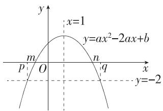

text_image

x=1
y=ax²-2ax+b
m
O
n
q
y=-2

由图可得 $p < m < 1 < n < q$ ，则 $A \subseteq B$ ，所以 $A \cap B = A, A \cup B = B$ ，所以 $A \cup B \subseteq B$ ，故 A 错误，B 正确；

又 $m + n = 2, p + q = 2$ ，所以 $m + n = p + q$ ，故 $\mathbb{C}$ 正确；

易得 $pq=\frac{b+2}{a}$ ,

又 $b < -2$ ，所以 $b + 2 < 0$ ，所以 $pq = \frac{b + 2}{a} > 0$

又 $p + q = 2$ ，所以 $p > 0,q > 0$

所以 $\frac{q}{p} +\frac{2}{q} = \frac{q}{p} +\frac{p + q}{q} = \frac{q}{p} +\frac{p}{q} +1\geqslant 2\sqrt{\frac{q}{p}\cdot\frac{p}{q}} +1 = 3$ ，当

且仅当 $\frac{q}{p} = \frac{p}{q}$ 即 $p = q = 1$ 时取等号，

因为 p<q，所以 $\frac{q}{p}+\frac{2}{q}>3$ ，故 D 错误.

11. 答案 $\left\{a \mid 0 < a \leqslant \frac{1}{2}\right\}$

解析 若关于 x 的不等式 $0 \leqslant ax^{2} + bx + c \leqslant 2 (a > 0)$ 的解集为 $\{x \mid -1 \leqslant x \leqslant 3\}$ ，则 x = -1 和 x = 3 是 $ax^{2} + bx + c = 2 (a > 0)$ 的两根，且当 x = 1 时， $y = ax^{2} + bx + c \geqslant 0$ ，即 $a + b + c \geqslant 0$ .

由根与系数的关系可知 $\left\{ \begin{array}{l} -\frac{b}{a} = 2, \\ \frac{c - 2}{a} = -3, \end{array} \right.$ 所以 $\left\{ \begin{array}{l} b = -2a, \\ c = 2 - 3a, \end{array} \right.$ ①

将①代入 $a+b+c \geqslant 0$ ，得 $a-2a+2-3a \geqslant 0$ ，解得 $a \leqslant \frac{1}{2}$ .

又 $a > 0$ ，所以 $a$ 的取值范围是 $\left\{a\mid 0 <   a\leqslant \frac{1}{2}\right\} .$

12.A 依题意, $\neg p:\exists x\in R,ax^{2}+2x+5\leqslant0$ 为真命题,

所以 $ax^2 + 2x + 5 \leqslant 0$ 在 $\mathbf{R}$ 上有解，

当 a=0 时, 原不等式为 $2x+5 \leqslant 0$ , 解得 $x \leqslant -\frac{5}{2}$ , 满足题意;

当 $a < 0$ 时，一元二次函数 $y = ax^{2} + 2x + 5$ 的图象开口向下，此时原不等式 $ax^{2} + 2x + 5 \leqslant 0$ 在 $\mathbf{R}$ 上一定有解，故 $a < 0$ 满足题意；

当 a>0 时, 若 $ax^{2}+2x+5\leqslant0$ 在 R 上有解, 则 $\Delta=4-20a\geqslant0$ , 所以 $0<a\leqslant\frac{1}{5}$ .

综上所述, $a \leqslant \frac{1}{5}$ .

因为 $\left\{a \mid a < \frac{1}{5}\right\} \subsetneq \left\{a \mid a \leqslant \frac{1}{5}\right\}$ ,

所以命题 $p: \forall x \in R, ax^{2} + 2x + 5 > 0$ 为假命题的一个充分
不必要条件是 $a<\frac{1}{5}$ .

13. 答案 $-2 < m < 4$

解析 因为 $2x + \frac{2}{x - 2} > m^2 - 2m$ 恒成立, 所以 $\left(2x + \frac{2}{x - 2}\right)_{\min} > m^2 - 2m$ .

由 $x > 2$ 得 $x - 2 > 0$ ，所以 $2x + \frac{2}{x - 2} = 2(x - 2) + \frac{2}{x - 2} +4\geqslant$ $2\sqrt{2(x - 2)\cdot\frac{2}{x - 2}} +4 = 8,$

当且仅当 x=3 时取等号, 故 $2x+\frac{2}{x-2}$ 的最小值为 8,

则 $m^2 - 2m < 8$ ，即 $m^2 - 2m - 8 = (m + 2)(m - 4) < 0$

所以-2<m<4.

14. 解析 (1) 由题可知 $a > 0$ , 且 $x = 1$ 和 $x = b$ 是方程 $ax^2 -$

$3x + 2 = 0$ 的两个根，所以 $\left\{ \begin{array}{l}a > 0,\\ 1 + b = \frac{3}{a},\\ 1\times b = \frac{2}{a}, \end{array} \right.$ 解得 $\left\{ \begin{array}{l}a = 1,\\ b = 2. \end{array} \right.$

(2)由(1)得 $\frac{1}{x}+\frac{2}{y}=1$ ,

所以 $2x + y = (2x + y)\left(\frac{1}{x} +\frac{2}{y}\right) = 4 + \frac{y}{x} +\frac{4x}{y}\geqslant 4+$

$2\sqrt{\frac{y}{x}\cdot\frac{4x}{y}}=8$ , 当且仅当 $\frac{y}{x}=\frac{4x}{y}$ ，即 2x=y=4 时等号成立，所以 $2x+y$ 的最小值为 8.

因为 $2x + y \geqslant k^2 - k + 2$ 恒成立，

所以 $k^2 - k + 2 \leqslant 8$

即 $k^2 - k - 6 \leqslant 0$ ，即 $(k + 2)(k - 3) \leqslant 0$

解得 $-2 \leqslant k \leqslant 3.$

所以满足题意的实数 $k$ 的取值范围为 $\{k \mid -2 \leqslant k \leqslant 3\}$ .

15. 答案 $\{k \mid -2 \leqslant k \leqslant -1\}$

解析 ① 当 $k = 0$ 时, 集合 $A = \{x \mid -2(2x - 5) > 0, x \in \mathbf{Z}\} = \left\{x \mid x < \frac{5}{2}, x \in \mathbf{Z}\right\}$ , 则 $A$ 中元素有无数个, 不符合题意.

②当 $k > 0$ 时， $(kx - k^2 -2k - 2)(2x - 5) > 0$ 的解集的形式为$\{x \mid x < x_{1}$ 或 $x > x_{2}\}$ （其中 $x_{1}, x_{2}$ 为对应方程的根，且 $x_{1} < x_{2}$ ），则 $A$ 中元素有无数个，不符合题意.

③当 $k < 0$ 时，易知 $A = \left\{x\mid 2 + k + \frac{2}{k} < x < \frac{5}{2},x\in \mathbf{Z}\right\} ,2 + k+$ $\frac{2}{k}\leqslant 2 - 2\sqrt{2}$ ，当且仅当 $k = -\sqrt{2}$ 时取等号.要使 $A$ 中元素个数最少，则 $2 + k + \frac{2}{k}\geqslant -1$ ，解得 $-2\leqslant k\leqslant -1.$

综上， $k$ 的取值范围为 $\{k\mid -2\leqslant k\leqslant -1\}$

16. 解析 (1) 设平均每个人形机器人的成本为 $y$ 万元, 根据题意有 $y = \frac{1000 + 10x + \frac{x^{2}}{10}}{x} = \frac{1000}{x} + \frac{x}{10} + 10 \geqslant 2\sqrt{\frac{1000}{x} \cdot \frac{x}{10}} + 10 = 30,$

当且仅当 $\frac{1\ 000}{x}=\frac{x}{10}$ ，即x=100时取等号.

所以该企业每月应生产 100 个人形机器人,才能使平均每个人形机器人的成本最低,最低为 30 万元.

(2) 设月利润为 W 万元, 则有 $W = x \left(23 + \frac{x}{5}\right) - 1000 - 10x - \frac{x^{2}}{10} = \frac{x^{2}}{10} + 13x - 1000$ ,

由题知 $\frac{x^{2}}{10}+13x-1\ 000\geqslant400$ ，整理得 $x^{2}+130x-14\ 000\geqslant0$ ，解得 $x\leqslant-200$ （舍去）或 $x\geqslant70$ .

所以该企业每月应生产不少于70个人形机器人,才能确保月利润不低于400万元.

17. 解析 (1) 由已知得 $x > 3$ .

由 $DC \parallel AM$ ，可得 $\frac{DN}{AN} = \frac{DC}{AM}$ ，则 $\frac{x - 3}{x} = \frac{4}{AM}$ ，则 $AM = \frac{4x}{x - 3}$ ，则花坛 AMPN 的面积（单位：平方米）为 $AM \cdot AN = \frac{4x^{2}}{x - 3}$ .

由已知得 $\frac{4x^{2}}{x-3}>54$ ，所以 $2x^{2}-27x+81>0$ ，即 $(2x-9)(x-9)>0$ ，又x>3，所以 $3<x<\frac{9}{2}$ 或x>9，

故 AN 的长(单位:米)的取值范围是 $\left\{x\mid3<x<\frac{9}{2}$ 或 x>9 $\right\}$ .

(2)根据题意,可得扩建部分的面积(单位:平方米)为 $\frac{4x^{2}}{x-3}-12,x>3.$

令 t=x-3，则 $t>0,\frac{4x^{2}}{x-3}-12=\frac{4(t+3)^{2}}{t}-12=4t+\frac{36}{t}+12\geqslant2\times\sqrt{4t\cdot\frac{36}{t}}+12=36$ ，当且仅当 t=3 时，等号成立，故 AN=x=6 米时，用料最省.

# 专题强化练 2 三个“二次”的应用

Q 对应主书 P30

1.D

2.B

3.A

4.ACD

5.AB

1.D 由一元二次不等式 $ax^2 + bx + c < 0 (a, b, c \in \mathbf{R})$ 的解集为 $\{x \mid -1 < x < 2\}$ , 可得 $a > 0, -1, 2$ 为 $ax^2 + bx + c = 0 (a, b, c \in \mathbf{R})$

的两个实数根,故 $\left\{\begin{aligned}-1+2&=-\frac{b}{a},\\ -1\times2&=\frac{c}{a},\\ a&>0,\end{aligned}\right.$ 即 $\left\{\begin{aligned}b&=-a,\\ c&=-2a,\\ a&>0,\end{aligned}\right.$

则 $b-c+\frac{4}{a}=a+\frac{4}{a}\geqslant2\sqrt{a\cdot\frac{4}{a}}=4$ ，当且仅当 $a=\frac{4}{a}$ ，即 a=2 时取等号，故 $b-c+\frac{4}{a}$ 的最小值为 4.

2.B 由 $x^{2} + x + 1 = \left(x + \frac{1}{2}\right)^{2} + \frac{3}{4} >0$ ，得原不等式可转化为 $x\leqslant a(x^2 +x + 1)$ ，即 $ax^{2} + (a - 1)x + a\geqslant 0$ 对任意的 $x\in \mathbf{R}$ 恒成立，

当 a=0 时, 不等式为 $-x \geqslant 0$ , 解得 $x \leqslant 0$ , 不符合题意;

当 $a \neq 0$ 时, 只需 $\left\{ \begin{array}{l} \Delta = (a - 1)^2 - 4a^2 \leqslant 0, \\ a > 0, \end{array} \right.$ 解得 $a \geqslant \frac{1}{3}$ .

综上,实数 a 的取值范围为 $\left\{a \mid a \geqslant \frac{1}{3}\right\}$ .

3.A 解法一:由题可得 $x_{1}+x_{2}=a+b$ , $x_{1}x_{2}=ab+1$ .

设 $x_{1} = a + m$ ，则 $x_{2} = b - m$ ，所以 $x_{1}x_{2} = (a + m)(b - m) = ab+$ $m(b - a) - m^2 = ab + 1$ ，所以 $m(b - a) - m^2 = 1$ ，所以 $m = \frac{1 + m^2}{b - a}$ 因为 $a < b$ ，所以 $b - a > 0$ ，所以 $m > 0$ ，故 $x_{1} > a, x_{2} < b.$ 又 $x_{1} < x_{2}$ 故 $a < x_{1} < x_{2} < b.$

解法二(数形结合): 不等式 $x^{2}-(a+b)x+ab+1<0$ 可化为 $(x-a)(x-b)<-1$ .

设 $y=(x-a)(x-b)$ ，画出函数 $y=(x-a)(x-b)$ 的大致图象与直线 y=-1，如图所示，

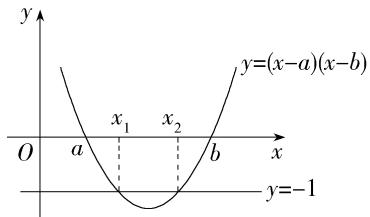

text_image

y
y=(x-a)(x-b)
O a x₁ x₂ b x
y=-1

由图象可知 $a < x_{1} < x_{2} < b$ .

4.ACD 由题图可知,该二次函数的图象开口向上,与 x 轴的交点为 $(-1,0)$ , $(2,0)$ ,

故 $y = ax^{2} + bx + c = a(x + 1)(x - 2) = ax^{2} - ax - 2a, a > 0,$

故 $b = -a, c = -2a$ .

对于 A, $abc = a \cdot (-a) \cdot (-2a) = 2a^{3} > 0$ , 故 A 正确.

对于 B, $a+b=a-a=0$ , 故 B 错误.

对于 C, $a+b+c=a-a-2a=-2a<0$ , 故 C 正确.

对于 D, 不等式 $cx^{2}-bx+a>0$ 可化为 $-2ax^{2}+ax+a>0$ ,即 $2x^{2} - x - 1 < 0$ ，即 $(2x + 1)(x - 1) < 0$ ，其解集为 $\left\{x\middle | - \frac{1}{2} < x <   1\right\}$ 故D正确.

5.AB 因为关于 $x$ 的不等式 $ax^2 + bx + c \geqslant 0$ 的解集为 $\{x \mid -3 \leqslant x \leqslant 4\}$ , 所以-3,4是方程 $ax^2 + bx + c = 0$ 的两根, 且 $a < 0$ , 故A正确;

由根与系数的关系得 $\left\{\begin{aligned}-\frac{b}{a}&=-3+4,\\ \frac{c}{a}&=-3\times4,\end{aligned}\right.$ 解得 $\left\{\begin{aligned}b&=-a,\\ c&=-12a,\end{aligned}\right.$

所以 $cx^{2}-bx+a<0$ 即 $-12ax^{2}+ax+a<0$ ，即 $12x^{2}-x-1<0$ ，解得 $-\frac{1}{4}<x<\frac{1}{3}$ ，所以不等式 $cx^{2}-bx+a<0$ 的解集为 $\left\{x\left|-\frac{1}{4}<x<\frac{1}{3}\right.\right\}$ ，故 B 正确；

$a+b+c=a-a-12a=-12a>0$ , 故 C 错误;

因为 $a < 0$ ，所以 $-3a + 4 > 4$ ，所以 $\frac{2}{3b + 4} +\frac{c}{2} = \frac{2}{-3a + 4} -6a =$ $\frac{2}{-3a + 4} +2(-3a + 4) - 8\geqslant 2\sqrt{\frac{2}{-3a + 4}\cdot 2(-3a + 4)} -8 = -4,$

当且仅当 $\frac{2}{-3a+4}=2(-3a+4)$ ，即 $-3a+4=1$ 时，等号成立，
又 $-3a+4>4$ ，所以 $\frac{2}{3b+4}+\frac{c}{2}>-4$ ，故D错误.

6. 答案 充分不必要

解析 当 a>0 时, 显然函数 $y=ax^{2}+2x+2$ 的图象开口向上, 对称轴为直线 $x=-\frac{1}{a}<0$ , 且当 x=0 时, y=2,

所以若 $ax^2 + 2x + 2 = 0$ 有根, 则根为负数,

所以 $\Delta = 4 - 8a\geqslant 0\Rightarrow a\leqslant \frac{1}{2}$ 即 $0 <   a\leqslant \frac{1}{2};$

当 a=0 时, 方程为 $2x+2=0 \Rightarrow x=-1$ , 此时有一个负数根; 当 a<0 时, 显然 $y=ax^{2}+2x+2$ 的图象开口向下, 且当 x=0 时, y=2, 所以 $ax^{2}+2x+2=0$ 有一正一负的两个实数根.

综上所述,方程 $ax^{2}+2x+2=0$ 至少有一个负数根的充要条件是 $a\leqslant\frac{1}{2}$ .

因为 $\{a \mid a < 0\} \subsetneq \left\{a \mid a \leqslant \frac{1}{2}\right\}$ ，所以“a < 0”是“关于 x 的方程 $ax^{2} + 2x + 2 = 0$ 至少有一个负数根”的充分不必要条件.

7. 答案 $\{a\mid-1<a<1\}$ ; $\left\{a\left|\frac{5}{4}<a<-1\right.\right\}$

解析 若方程 $x^{2}+2(a+2)x+a^{2}-1=0$ 的两根 $x_{1}, x_{2}$ 满足 $x_{1}<0<x_{2}$ ,

(二次函数的图象开口向上,与 x 轴的两个交点在 y 轴的两侧,则只需 x=0 时的函数值为负)

则 $a^{2}-1<0$ ，解得 -1<a<1，故 a 的取值范围为 $\{a\mid-1<a<1\}$ .

若方程 $x^{2} + 2(a + 2)x + a^{2} - 1 = 0$ 的两根 $x_{1}, x_{2}$ 满足 $-4 < x_{1} <$

$x_{2} < 0$

(两个根在同一范围内,结合二次函数图象,从0与-4处的函数值、判别式、对称轴三个方面列不等式组)

则 $\left\{\begin{aligned}a^{2}-8a-1>0,\\ a^{2}-1>0,\\ \Delta=4(a+2)^{2}-4(a^{2}-1)>0,\\ -4<-(a+2)<0,\end{aligned}\right.$ 解得 $-\frac{5}{4}<a<-1,$

故 $a$ 的取值范围为 $\left\{a\mid -\frac{5}{4} <  a <   - 1\right\} .$

8. 答案 $\left\{a\left|-\frac{4}{3}<a\leqslant-\frac{5}{4}\text{或}\frac{5}{4}\leqslant a<\frac{4}{3}\right.\right\}$

解析 由 $(ax - 1)^2 < x^2$ 得 $[(a + 1)x - 1][(a - 1)x - 1] < 0,$

由题意可知 $(a+1)(a-1)>0$ （恰有3个整数解说明对应的函数为二次函数，且其图象开口向上），解得a>1或a<-1.

当 $a > 1$ 时， $\left[(a + 1)x - 1\right]\left[(a - 1)x - 1\right] <   0$ 的解集为 $\left\{x\left|\frac{1}{a + 1} < x <   \frac{1}{a - 1}\right\} ,\text{且} 0 <   \frac{1}{a + 1} <  \frac{1}{2},\right.$

因为不等式有3个整数解,所以 $\left\{\begin{aligned}3&<\frac{1}{a-1},\\ 4&\geqslant\frac{1}{a-1},\end{aligned}\right.$ 解得 $\frac{5}{4}\leqslant a<\frac{4}{3}.$

当 $a < -1$ 时， $\left[(a + 1)x - 1\right]\left[(a - 1)x - 1\right] < 0$ 的解集为 $\left\{x\left|\frac{1}{a + 1} < x < \frac{1}{a - 1}\right.\right\}$ ，且 $-\frac{1}{2} < \frac{1}{a - 1} < 0$

因为不等式有3个整数解，所以 $\left\{ \begin{array}{l} \frac{1}{a + 1} < -3, \\ \frac{1}{a + 1} \geqslant -4, \end{array} \right.$ 解得 $-\frac{4}{3} < a \leqslant -\frac{5}{4}$ .

综上,实数 a 的取值范围是 $\left\{a\left|-\frac{4}{3}<a\leqslant-\frac{5}{4}\right.或\frac{5}{4}\leqslant a<\frac{4}{3}\right\}$ .

9. 解析 (1) 当 $k = 3$ 时, 原不等式组可化为 $\left\{ \begin{array}{l} (x + 1)(x - 2) > 0, \\ (2x + 5)(x + 3) < 0, \end{array} \right.$ 解得 $-3 < x < -\frac{5}{2}$ , 满足条件的整数 $x$ 不存在, 故 $A = \emptyset$ .

(2)由 $x^{2} - x - 2 > 0$ 得 $x < -1$ 或 $x > 2$ .

因为 $\left\{\begin{aligned}x^{2}-x-2&>0,\\ 2x^{2}+(2k+5)x&+5k<0\end{aligned}\right.$ 有唯一整数解x=-2,

且方程 $2x^{2}+(2k+5)x+5k=(2x+5)(x+k)=0$ 的两个根为 -k 和 $-\frac{5}{2}$ ，所以结合数轴可得 $-2<-k\leqslant3$ ，(借助数轴得到此不等式，要注意等号能否取到)

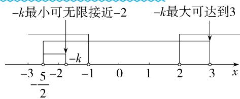

text_image

-k最小可无限接近-2
-k最大可达到3
-3/5/2
-1
0
1
2
3
x

所以 $-3 \leqslant k < 2$ .

(3) 当 $-k < -\frac{5}{2}$ 时, 由 A 中有 2019 个元素可得 $A = \{-3, -4, \cdots, -2021\}$ (借助数轴找到这 2019 个整数),

所以 $-2022 \leqslant -k < -2021$ ，解得 $2021 < k \leqslant 2022$ .

当 $-k > -\frac{5}{2}$ 时,由A中有2019个元素可得 $A = \{-2,3,4,\cdots,2020\}$ (借助数轴找到这2019个整数,注意-2是A中的元素),

所以 $2020 < -k \leqslant 2021$ ，解得 $-2021 \leqslant k < -2020$ .

所以实数 $k$ 的取值范围为 $\{k \mid 2021 < k \leqslant 2022$ 或 $-2021 \leqslant k < -2020\}$ .

# 本章复习提升

# 易混易错练

Q 对应主书 P31

<table><tr><td>1.D</td><td>3.AB</td><td>5.A</td><td>6.A</td><td></td><td></td><td></td><td></td></tr></table>

1.D 对于 A, 如 3 > 2, -3 < 0, 显然 $3 + (-3) < 2 + 0$ , A 不正确; 对于 B, 如 3 > 2, -4 > -5, 显然 $3 \times (-4) < 2 \times (-5)$ , B 不正确。易错点;

对于 C, 因为 bc-ad>0, $\frac{c}{a}-\frac{d}{b}=\frac{bc-ad}{ab}>0$ , 所以 ab>0, C 不正确;

对于 D, 因为 c > d > 0, 所以 $\frac{1}{d} > \frac{1}{c} > 0$ , 又 a > b > 0, 所以 $\frac{a}{d} > \frac{b}{c} > 0$ , 所以 $\sqrt{\frac{a}{d}} > \sqrt{\frac{b}{c}}$ , D 正确.

2. 答案 $-8 \leqslant 7a - 2b \leqslant 14$

解析 易得 $7a-2b=2\times(3a-2b)+a+2b$ ，因为 $-2\leqslant3a-2b\leqslant5,-4\leqslant a+2b\leqslant4$ ，所以 $-8\leqslant7a-2b\leqslant14$ .

# 易错警示

利用几个代数式的范围求某一个代数式的范围时,不可多次运用不等式的性质(如:先运用不等式的性质由条件求出a、b的范围,再运用不等式的性质求结论),否则易扩大范围.

3.AB 对于 A, $\forall x \in R$ , 都有 $x^{2}-2x+1=(x-1)^{2} \geqslant 0$ , 所以 $x^{2}-x \geqslant x-1$ 恒成立, 故 A 为真命题.

对于 B, 当 x=2 时, $x+\frac{4}{x-1}=6$ , 故 B 为真命题.

对于 C, 只有当 a, b 同号, 即 $\frac{b}{a}, \frac{a}{b} > 0$ 时, $\frac{b}{a} + \frac{a}{b} \geqslant$ 易错点

$2\sqrt{\frac{b}{a}\cdot\frac{a}{b}}=2$ （当且仅当 a=b 时取等号），故 C 为假命题.

对于 D, $\left|x\right|+2+\frac{1}{\left|x\right|+2}\geqslant2\sqrt{\left(\left|x\right|+2\right)\cdot\frac{1}{\left|x\right|+2}}=2$ ,

但方程 $|x|+2=\frac{1}{|x|+2}$ 无解,故等号不成立,易错点

所以 $|x|+2+\frac{1}{|x|+2}>2$ ，故D为假命题.

4. 答案 4

解析 设 $a = x, b + c = y$ ，问题转化为已知 $x > 0, y > 0$ ，且 $xy = 4$ ，求 $\frac{2}{x} + \frac{2}{y} + \frac{8}{x + y}$ 的最小值.

$$
\frac {2}{x} + \frac {2}{y} + \frac {8}{x + y} = \frac {1}{2} \left(\frac {4}{x} + \frac {4}{y}\right) + \frac {8}{x + y} = \frac {1}{2} (y + x) + \frac {8}{x + y} \geqslant 2 \sqrt {4} = 4,
$$

当且仅当 $\frac{1}{2} (y + x) = \frac{8}{x + y}$ , 即 $x = y = 2$ 时, 等号成立.

所以 $\frac{2}{x}+\frac{2}{y}+\frac{8}{x+y}$ 的最小值为4，即 $\frac{2}{a}+\frac{2}{b+c}+\frac{8}{a+b+c}$ 的最小值为4.

# 易错警示

利用基本不等式求最值时,在保证各项均为正数的情况下,必须考虑由条件得出两项和或两项积为定值.

5.A 因为关于 $x$ 的一元二次不等式 $ax^2 + bx + c > 0$ 的解集为 $\{x \mid -1 < x < 5\}$ ,

所以 $a < 0$ ，且-1,5是一元二次方程 $ax^2 + bx + c = 0$ 的两根，

于是 $\left\{\begin{aligned}&a<0,\\ &-1+5=-\frac{b}{a},\\ &-1\times5=\frac{c}{a},\end{aligned}\right.$ 解得 $\left\{\begin{aligned}&b=-4a,\\ &c=-5a,\\ &a<0,\end{aligned}\right.$

则不等式 $cx^{2}+bx+a\leqslant0$ 即为 $-5ax^{2}-4ax+a\leqslant0$ ，即 $5x^{2}+4x-1\leqslant0$ 易错点，解得 $-1\leqslant x\leqslant\frac{1}{5}$ ，

所以不等式 $cx^2 + bx + a \leqslant 0$ 的解集是 $\left\{x \mid -1 \leqslant x \leqslant \frac{1}{5}\right\}$ .

6.A 当 k=0 时易错点， $2kx^{2}+kx-\frac{3}{8}=-\frac{3}{8}<0$ 恒成立，满足题意；

当 $k \neq 0$ 时，有 $\left\{ \begin{array}{l} 2k < 0, \\ \Delta = k^2 + 3k < 0, \end{array} \right.$ 解得 $-3 < k < 0$ .

综上, $k$ 的取值范围是 $\{k \mid -3 < k \leqslant 0\}$ .

# 易错警示

二次项系数含参题目,经常出现以下错误:

(1)认定这个不等式就是一元二次不等式,忽视了对系数为0时的讨论;  
(2)忽视了对根的大小的讨论,特别是等根的讨论;  
(3) 只讨论根的大小关系, 忽视了二次项系数的正负对图象开口方向的影响.

7. 解析 (1) $\because \frac{2x - 1}{x + 2} \leqslant 1, \therefore \frac{2x - 1 - x - 2}{x + 2} \leqslant 0$ , 即 $\frac{x - 3}{x + 2} \leqslant 0$ ,

因此 $\left\{\begin{aligned}x-3&\leqslant0,\\ x+2&>0\end{aligned}\right.$ 或 $\left\{\begin{aligned}x-3&\geqslant0,\\ x+2&<0,\end{aligned}\right.$ 解得 $-2<x\leqslant3$ ,

故 $A = \{x\mid -2 <   x\leqslant 3\}$

(2) 由 $ax^2 + (a - 1)x - 1 \leqslant 0$ , 得 $(ax - 1)(x + 1) \leqslant 0$ ,

$$
\because A \cap B = B, \therefore B \subseteq A,
$$

当 $a = 0$ 时， $B = \{x \mid x \geqslant -1\}$ ，不符合题意，舍去。

当 $a > 0$ 时，不等式可化为 $(x + 1)\left(x - \frac{1}{a}\right) \leqslant 0$

注意到 $-1 < 0 < \frac{1}{a}, \therefore B = \left\{x \mid -1 \leqslant x \leqslant \frac{1}{a}\right\}$ ,

$$
\therefore \frac {1}{a} \leqslant 3, \text {又} a > 0, \therefore a \geqslant \frac {1}{3}.
$$

当 a<0 时, 不等式可化为 $(x+1)\left(x-\frac{1}{a}\right)\geqslant0$ , 不符合题意, 舍去.

综上, a 的取值范围是 $\left\{a \mid a \geqslant \frac{1}{3}\right\}$ .

# 易错警示

把含等号的分式不等式化为整式不等式求解时，切记不要忽略分母不等于零这一条件.

8. 解析 (1) 命题 $p: \forall x \in \mathbf{R}$ , 不等式 $2x^{2} + 4x + 7 - m > 0$ 恒成立为真命题, 则 $\Delta = 16 - 8(7 - m) = 8m - 40 < 0$ 易错点, 解得 $m < 5$ , 即实数 $m$ 的取值范围为 $m < 5$ .

(2) 当命题 $q: \exists x \in \mathbf{R}, x^2 - 2mx + m + 2 < 0$ 是真命题时，

$$
\Delta = 4 m ^ {2} - 4 (m + 2) = 4 m ^ {2} - 4 m - 8 > 0 \text {易错点},
$$

即 $4(m + 1)(m - 2) > 0$ ，解得 $m < -1$ 或 $m > 2$

当命题 p, q 中恰有一个为真命题时，

①p 为真命题, q 为假命题, 即 $\left\{\begin{aligned} m<5, \\ -1 \leqslant m \leqslant 2, \end{aligned}\right.$ 所以 $-1 \leqslant m \leqslant 2$ ;  
②p 为假命题, q 为真命题, 即 $\left\{\begin{aligned} m &\geqslant 5, \\ m &<-1 \text{ 或 } m > 2, \end{aligned}\right.$ 所以 $m \geqslant 5$ .

综上,实数 m 的取值范围是 $\{m\mid-1\leqslant m\leqslant2$ 或 $m\geqslant5\}$ .

# 易错警示

关于一元二次不等式能成立和恒成立问题,要注意结合一元二次函数图象的开口方向和一元二次方程的判别式综合考虑.

# 思想方法练

Q 对应主书 P32

1. 解析 (1) 由 $\frac{2x}{x - 2} \leqslant 1$ ，可得 $\frac{x + 2}{x - 2} \leqslant 0$

不等式 $\frac{x + 2}{x - 2} \leqslant 0 \Leftrightarrow \begin{cases} x - 2 \neq 0, \\ (x + 2)(x - 2) \leqslant 0, \end{cases}$ 解得 $-2 \leqslant x < 2$ .

所以不等式 $\frac{2x}{x - 2} \leqslant 1$ 的解集为 $\{x \mid -2 \leqslant x < 2\}$ .

(2) 对于方程 $ax^2 + 2x + 1 = 0, \Delta = 4 - 4a$

(不等式 $ax^{2}+2x+1>0$ 对应方程根的情况不确定, 要对判别式 $\Delta=4-4a$ 是大于 0、等于 0 还是小于 0 进行讨论)

当 $\Delta=0$ ，即 a=1 时，不等式为 $x^{2}+2x+1>0$ ，所以 $x\neq-1$ ，
即不等式 $ax^{2}+2x+1>0$ 的解集为 $\{x \mid x \neq -1\}$ ;

当 $\Delta<0$ , 即 a>1 时, 不等式的解集为 R;

当 $\Delta > 0$ ，即 $0 < a < 1$ 时，由 $ax^2 + 2x + 1 = 0$ 可得 $x_1 = \frac{-1 - \sqrt{1 - a}}{a}, x_2 = \frac{-1 + \sqrt{1 - a}}{a}$ ，

所以不等式 $ax^2 + 2x + 1 > 0$ 的解集为 $\left\{x \mid x < \frac{-1 - \sqrt{1 - a}}{a}\right.$ 或 $x > \frac{-1 + \sqrt{1 - a}}{a}\}$ .

综上, 当 a=1 时, 不等式的解集为 $\{x \mid x \neq -1\}$ ;

当 a>1 时, 不等式的解集为 R;

当 $0 < a < 1$ 时，不等式的解集为 $\left\{x\mid x < \frac{-1 - \sqrt{1 - a}}{a}\right.$ 或 $x>$ $\frac{-1 + \sqrt{1 - a}}{a}\Bigg\} .$

2. 解析 (1) $y \geqslant -2$ 对一切实数 $x$ 恒成立, 等价于 $\forall x \in \mathbf{R}$ , $ax^2 + (1 - a)x + a \geqslant 0$ 恒成立.

(二次项系数含有参数的一元二次不等式恒成立问题,要分二次项系数为0与不为0两种情况讨论)

当 a=0 时, 不等式可化为 $x \geqslant 0$ , 不满足题意.

当 $a \neq 0$ 时，有 $\left\{ \begin{array}{l} a > 0, \\ \Delta = (1 - a)^2 - 4a^2 \leqslant 0, \end{array} \right.$

即 $\left\{\begin{aligned}a>0,\\ 3a^{2}+2a-1\geqslant0,\end{aligned}\right.$ 解得 $a\geqslant\frac{1}{3}.$

综上, a 的取值范围是 $\left\{a \mid a \geqslant \frac{1}{3}\right\}$ .

(2)依题意,y<a-1等价于 $ax^{2}+(1-a)x-1<0$ .

(解二次项系数含有参数的一元二次不等式时,要对二次项系数为正、为负、为0进行分类讨论)

当 $a = 0$ 时，不等式可化为 $x < 1$ ，所以不等式的解集为 $\{x\mid x < 1\}$

当 $a > 0$ 时，不等式为 $(ax + 1)(x - 1) < 0$ ，即 $\left(x + \frac{1}{a}\right)(x - 1) < 0$ 所以不等式的解集为 $\left\{x\mid -\frac{1}{a} < x < 1\right\}$

当 a<0 时, 不等式为 $(ax+1)(x-1)<0$ , 即 $\left(x+\frac{1}{a}\right)(x-1)>0$ ,

$\left(-\frac{1}{a}\right.$ 与1都是正数，要对它们的大小进行分类讨论

①当 a = -1 时， $-\frac{1}{a} = 1$ ，不等式的解集为 $\{x \mid x \neq 1\}$ ;  
②当-1<a<0时， $-\frac{1}{a}>1$ ，不等式的解集为 $\left\{x\mid x>-\frac{1}{a}\right.$ 或 $x<1\}$ ;  
③当 $a < -1$ 时， $-\frac{1}{a} < 1$ ，不等式的解集为 $\left\{x \mid x > 1 \text{ 或 } x < -\frac{1}{a}\right\}$ .

综上, 当 a<-1 时, 原不等式的解集为 $\left\{x \mid x>1 \text{ 或 } x<-\frac{1}{a}\right\}$ ;

当 $a = -1$ 时，原不等式的解集为 $\{x \mid x \neq 1\}$ ；

当-1<a<0时,原不等式的解集为 $\left\{x\mid x>-\frac{1}{a}或x<1\right\}$ ;

当 $a = 0$ 时，原不等式的解集为 $\{x\mid x <   1\}$

当 $a > 0$ 时，原不等式的解集为 $\left\{x\mid -\frac{1}{a} < x < 1\right\}$

# 思想方法

在本章中,分类讨论思想主要应用于解含参数的不等式,有以下几种情况:

(1)二次项系数含参数且没有给出具体范围时,要分二次项系数大于0,等于0,小于0三种情况讨论;

(2) 对应方程的根无法判断大小时, 要分类讨论;

(3) 若判别式含参数, 则在确定解的情况时需分 $\Delta > 0, \Delta = 0, \Delta < 0$ 三种情况进行讨论.

3.ACD A 选项,由二次函数的图象开口向上,得 a>0,

由对称轴为直线 $x = -\frac{b}{2a} = 1$ ，得 $b = -2a < 0$

由图象与 y 轴的交点在 y 轴正半轴上, 得 c > 0,

所以 abc<0, 因此 $\left|abc\right|+abc=-abc+abc=0$ , 因此 A 正确;

B 选项, 因为 a>0, 所以 1-a<1,

由函数 $y = ax^{2} + bx + c$ 的图象知，当 $a \leqslant x \leqslant 1 - a < 1$ 时，

$ax^{2}+bx+c$ 的最大值为 $a\cdot a^{2}+a\cdot(-2a)+c=a^{3}-2a^{2}+c$ ，因此 B 错误；

C 选项, 因为 b = -2a, 所以 $ax^{4} + bx^{2} = ax^{4} - 2ax^{2}, a(x^{2} - 2)^{2} + b(x^{2} - 2) = ax^{4} - 4ax^{2} + 4a - 2a(x^{2} - 2) = ax^{4} - 6ax^{2} + 8a$ ,

故不等式 $ax^{4}+bx^{2}>a(x^{2}-2)^{2}+b(x^{2}-2)$ 可变形为 $4ax^{2}-8a>0$ ,

因为 a>0，所以不等式为 $x^{2}>2$ ，解得 $x>\sqrt{2}$ 或 $x<-\sqrt{2}$ ，因此 C 正确；

D 选项, $t=x^{2}+bx+1=\left(x+\frac{b}{2}\right)^{2}+1-\frac{b^{2}}{4}$ ，所以当 $x=-\frac{b}{2}$ 时，t 取得最小值，最小值为 $1-\frac{b^{2}}{4}$ ，故 $t\geqslant1-\frac{b^{2}}{4}$ .

$$
y = t ^ {2} + b t + 1 = \left(t + \frac {b}{2}\right) ^ {2} + 1 - \frac {b ^ {2}}{4},
$$

(根据两函数有相同的最小值以及 t 的取值范围求解)

所以当 $t = -\frac{b}{2}$ 时， $y$ 取得最小值，最小值为 $1 - \frac{b^2}{4}$ ，且 $-\frac{b}{2} \geqslant 1 - \frac{b^2}{4}$ ，因此 $b^2 - 2b - 4 \geqslant 0$ ，所以 $(b - 1)^2 \geqslant 5$ ，即 $|b - 1| \geqslant \sqrt{5}$ ，

因此 D 正确.

4. 答案 21

解析 二次函数 $y=x^{2}-6x+a$ 的图象开口向上, 对称轴为直线 x=3, 如图,

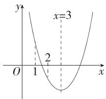

line

| x | y |
|---|---|
| 1 | 2 |
| 3 | 3 |

由图可知,若关于 x 的一元二次不等式 $x^{2}-6x+a\leqslant0$ 的解集中有且仅有 3 个整数,则这三个整数必为 2,3,4,

故 $\left\{\begin{aligned}y|_{x=2}&\leqslant0,\\ y|_{x=1}&>0,\end{aligned}\right.$ 根据二次函数图象的对称性,可以不用列$\left\{ \begin{array}{l} y|_{x=4} \leqslant 0, \\ y|_{x=5} > 0 \end{array} \right.$ 即 $\left\{ \begin{array}{l} 2^2 - 6 \times 2 + a \leqslant 0, \\ 1^2 - 6 \times 1 + a > 0, \end{array} \right.$ 解得 $5 < a \leqslant 8$

又 $a \in \mathbf{Z}$ , 故 $a$ 的值为 6,7,8,

则所有符合条件的 a 的值之和是 $6+7+8=21$ .

# 思想方法

利用数形结合思想解不等式,可以从图形上入手,将代数式转化为几何式,实现代数问题几何化.尤其在三个“二次”的关系中,解题时要充分利用二次函数的图象分析一元二次方程的根与一元二次不等式的解集.

5.AD 因为关于 x 的不等式 $0 \leqslant ax^{2} + bx + c \leqslant 1 (a > 0)$ 的解集为 $\{x \mid -1 \leqslant x \leqslant 2\}$ ,

(分析解集情况可知不等式 $0 \leqslant ax^{2} + bx + c$ 恒成立, 将条件进行转化)

所以不等式 $ax^2 + bx + c \leqslant 1 (a > 0)$ 的解集为 $\{x \mid -1 \leqslant x \leqslant 2\}$ ，且 $\Delta = b^2 - 4ac \leqslant 0$ .

(将不等式的解集的端点转化为对应一元二次方程的根)

由根与系数的关系知 $\left\{\begin{aligned}-1+2&=-\frac{b}{a},\\ -1\times2&=\frac{c-1}{a},\end{aligned}\right.$ 解得 $\left\{\begin{aligned}b&=-a,\\ c&=-2a+1,\end{aligned}\right.$

所以 $\Delta=(-a)^{2}-4a\cdot(-2a+1)=9a^{2}-4a\leqslant0$ , 解得 $0\leqslant a\leqslant\frac{4}{9}$ , 又 a>0 , 所以 $0<a\leqslant\frac{4}{9}$ .

$$
3 a + 2 b + c = 3 a - 2 a - 2 a + 1 = - a + 1,
$$

(利用 a 与 b、c 的关系, 将 $3a + 2b + c$ 转化为关于 a 的表达式, 进而求出范围)

由 $0 < a \leqslant \frac{4}{9}$ 得 $\frac{5}{9} \leqslant -a + 1 < 1$ ，因此 $\frac{5}{9} \leqslant 3a + 2b + c < 1$ ，结合选项知选 AD.

6. 解析 （不等式恒成立转化为求最值问题, $x(y+2)-4\sqrt{2}>$ $m^2 + 5m$ 恒成立，即 $[x(y + 2) - 4\sqrt{2}]_{\min} > m^2 + 5m)$

由 $2x + y - xy = 0$ 得 $y = xy - 2x = x(y - 2)$

$$
\because x > 0, y > 0, \therefore y - 2 > 0, \therefore x = \frac {y}{y - 2},
$$

$$
\therefore x (y + 2) = \frac {y}{y - 2} (y + 2) = \frac {(y - 2) ^ {2} + 6 (y - 2) + 8}{y - 2} = y - 2 + \frac {8}{y - 2} + 6
$$

(根据等式换元,将双变量问题转化为单变量问题)≥

$4\sqrt{2}+6$ , 当且仅当 $y-2=\frac{8}{y-2}$ , 即 $y=2\sqrt{2}+2$ 时取“=”,

$$
\therefore x (y + 2) - 4 \sqrt {2} \geqslant 6,
$$

∴ $6 > m^{2} + 5m$ ，即 $m^{2} + 5m - 6 = (m + 6)(m - 1) < 0$ ，

解得-6<m<1，

∴ 实数 m 的取值范围为 $\{m \mid -6 < m < 1\}$ .

# 思想方法

转化与化归思想在本章中的应用主要体现在不等式恒(能)成立问题与最值之间的转化,一元二次不等式与二次方程、二次函数之间的转化.

# 综合拔高练

# 五年高考练

Q 对应主书 P33

<table><tr><td>1.C</td><td>2.B</td><td>5.A</td><td>6.BC</td><td>10.B</td><td>12.A</td><td>13.B</td></tr></table>

1.C

# 考教衔接

本题结合了第一章的集合和第二章的一元二次不等式知识,来源于人教 A 版必修第一册 P55 习题 2.3 第 3、5 题,相同之处:均是集合运算与一元二次不等式的结合;不同之处:教材集合均采用描述法表示,高考题中集合采用了列举法和描述法两种表示方法,加强考查学生对概念的理解和掌握.

因为 $M = \{-2, -1, 0, 1, 2\}$ , $N = \{x \mid x^2 - x - 6 \geqslant 0\} = \{x \mid x \leqslant -2$ 或 $x \geqslant 3\}$ , 所以 $M \cap N = \{-2\}$ .

# 考场速决

取 $x = 0$ ，不满足 $x^{2} - x - 6\geqslant 0$ ，排除A，B；再取 $x = -2$ 可知 $-2\in N$ ，故C正确.

2.B 因为 $A = \{x\mid x^2 -x - 2 > 0\} = \{x\mid x > 2$ 或 $x <   - 1\}$ ，所以 $\complement_{\mathbb{R}}A = \{x\mid -1\leqslant x\leqslant 2\}$

# 考场速决

集合 A 中不等式无等号, 且满足“大于取两边”, 故 $C_{R}A$ 中不等式有等号, 且满足“在中间”.

3. 答案 $\left\{x\mid-1<x<\frac{2}{3}\right\}$

解析 $3x^{2} + x - 2 < 0 \Leftrightarrow (x + 1)(3x - 2) < 0$ ，所以 $-1 < x < \frac{2}{3}$ .

4. 答案 $\{x \mid -7 < x < 2\}$

解析 $\frac{2x + 5}{x - 2} < 1 \Leftrightarrow \frac{2x + 5}{x - 2} - 1 < 0 \Leftrightarrow \frac{x + 7}{x - 2} < 0 \Leftrightarrow (x + 7)(x - 2) < 0,$ 解得 $-7 < x < 2.$

5.A 由 a>0, b>0, 得 $4 \geqslant a + b \geqslant 2\sqrt{ab}$ , 即 $ab \leqslant 4$ (当且仅当 a=b=2 时取等号), 充分性成立;

当 a=4, b=1 时，满足 $ab \leqslant 4$ ，但 $a+b=5>4$ ，不满足 $a+b \leqslant 4$ ，必要性不成立.

故“ $a+b\leqslant4$ ”是“ $ab\leqslant4$ ”的充分不必要条件.

6.BC

# 考教衔接

本题以双变量为载体,使用基本不等式将等式进行放缩,求解表达式的取值范围,来源于人教A版必修第一册P58复习参考题2第5题,相同之处:条件等式均是双变量;不同之处:高考题中需要求解两个表达式的取值范围,且变形更复杂,加强考查学生转化与化归的数学思想和逻辑推理的思维能力.

对于 A, B, 在条件等式中构建 $x + y$ 的形式, 再利用关于 xy 和 $x + y$ 的不等式 $xy \leqslant \left( \frac{x + y}{2} \right)^{2}$ 进行放缩.

由 $x^{2} + y^{2} - xy = 1$ ，得 $(x + y)^{2} - 1 = 3xy,$

又因为 $xy \leqslant \left(\frac{x + y}{2}\right)^2$ ，所以 $(x + y)^2 - 1 \leqslant 3\left(\frac{x + y}{2}\right)^2$

所以 $(x+y)^{2}\leqslant4$ ，即 $-2\leqslant x+y\leqslant2$ ，当且仅当 $x=y=\pm1$ 时取等号，故A错误，B正确.

对于 C, D, 利用关于 xy 和 $x^{2} + y^{2}$ 的不等式 $xy \leqslant \frac{x^{2} + y^{2}}{2}$ 进行放缩.

由 $x^{2} + y^{2} - xy = 1$ ，得 $xy = x^{2} + y^{2} - 1$

又因为 $xy \leqslant \frac{x^2 + y^2}{2}$ , 所以 $x^2 + y^2 - 1 \leqslant \frac{x^2 + y^2}{2}$ ,

所以 $x^{2}+y^{2}\leqslant2$ , 当且仅当 $x=y=\pm1$ 时取等号, 故 C 正确, D 错误.

# 目一题多解

根据 $x^{2} + y^{2}\geqslant 2xy$ ，可得 $1 = x^{2} + y^{2} - xy\geqslant 2xy - xy$ ，即 $xy\leqslant$ 1，当且仅当 $x = y = \pm 1$ 时取等号，

对于 A, B, 由 $x^{2} + y^{2} - xy = 1$ , 得 $(x + y)^{2} = 3xy + 1$ ,

由 $xy \leqslant 1$ 得 $(x + y)^2 \leqslant 4$ ，即 $-2 \leqslant x + y \leqslant 2$ ，当且仅当 $x = y = \pm 1$ 时取等号，故A错误，B正确；

对于 C, D, 由 $x^{2} + y^{2} - xy = 1$ , 得 $x^{2} + y^{2} = xy + 1$ ,

由 $xy \leqslant 1$ 得 $x^{2} + y^{2} \leqslant 2$ ，当且仅当 $x = y = \pm 1$ 时取等号，故 C 正确，D 错误.

7. 答案 $2 \sqrt{2}$

解析 因为 $a > 0, b > 0$ ，所以 $\frac{1}{a} + \frac{a}{b^2} + b \geqslant 2\sqrt{\frac{1}{a} \cdot \frac{a}{b^2}} + b = \frac{2}{b} +$

$b \geqslant 2\sqrt{\frac{2}{b} \cdot b} = 2\sqrt{2}$ ，当且仅当 $\left\{\begin{aligned}\frac{1}{a}&=\frac{a}{b^{2}},\\ \frac{2}{b}&=b,\end{aligned}\right.$ 即 $a=b=\sqrt{2}$ 时，等号

成立,故 $\frac{1}{a}+\frac{a}{b^{2}}+b$ 的最小值为 $2\sqrt{2}$ .

8. 答案 $\frac{4}{5}$

解析 由 $5x^{2}y^{2} + y^{4} = 1$ 知 $y \neq 0, \therefore x^{2} = \frac{1 - y^{4}}{5y^{2}}, \therefore x^{2} + y^{2} = \frac{1 - y^{4}}{5y^{2}} +$

$y^{2} = \frac{1 + 4y^{4}}{5y^{2}} = \frac{1}{5y^{2}} +\frac{4y^{2}}{5}\geqslant 2\sqrt{\frac{4}{25}} = \frac{4}{5},$ 当且仅当 $\frac{1}{5y^2} = \frac{4y^2}{5}$ 即 $y^{2} =$

$\frac{1}{2},x^{2}=\frac{3}{10}$ 时取“=”，故 $x^{2}+y^{2}$ 的最小值为 $\frac{4}{5}$ .

9. 答案 4

解析 $\frac{1}{2a} +\frac{1}{2b} +\frac{8}{a + b} = \frac{a + b}{2ab} +\frac{8}{a + b} = \frac{a + b}{2} +\frac{8}{a + b}\geqslant$ $2\sqrt{\frac{a+b}{2}\cdot\frac{8}{a+b}}=4$ ，(难点:结合ab=1变形,为使用基本不等式创造条件)

当且仅当 $\frac{a+b}{2}=\frac{8}{a+b},ab=1$ ，即 $\left\{\begin{aligned}a&=2+\sqrt{3}\\ b&=2-\sqrt{3}\end{aligned}\right.$ ，或 $\left\{\begin{aligned}a&=2-\sqrt{3}\\ b&=2+\sqrt{3}\end{aligned}\right.$ 时取等号， $\therefore\frac{1}{2a}+\frac{1}{2b}+\frac{8}{a+b}$ 的最小值为4.

10.B 解法一(估算法): 估算是数学非常重要且基本的方法, 根据题目的设计需要找出过剩近似值和不足近似值. 由人体特征可知, 头顶至咽喉的长度应小于头顶至脖子下端的长度, 故咽喉至肚脐的长度应小于 $\frac{26}{0.618} \approx 42 \, cm$ , 可得到此人的身高应小于 $26 + 42 + \frac{26 + 42}{0.618} \approx 178 \, cm$ ;

同理,肚脐至足底的长度应大于腿长 105 cm, 故此人的身高应大于 $105 + 105 \times 0.618 \approx 170$ cm, 结合选项可知, 只有 B 选项符合题意.

解法二:用线段代替人,画出示意图,以形助数,然后设未知数,列不等式组.

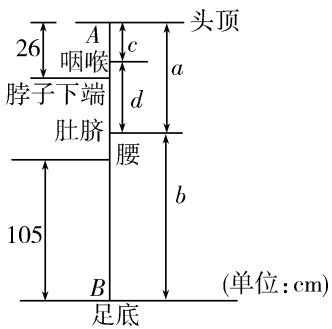

text_image

26
A
咽喉
c
d
a
头顶
脖子下端
肚脐
腰
b
105
B
(单位:cm)
足底

已知 $\frac{a}{b} = \frac{c}{d} = \frac{\sqrt{5} - 1}{2}\approx 0.618,c <   26,b > 105,c + d = a,$

设此人身高为 $h\mathrm{cm}$ ，则 $a + b = h$ ，由 $\left\{ \begin{array}{l}b > 105,\\ a\approx 0.618b \end{array} \right.\Rightarrow a > 64.89,$

由 $\left\{\begin{aligned}c<26,\\ c\approx0.618d\end{aligned}\right.\Rightarrow d<42.07,$

所以 $c + d < 26 + 42.07 = 68.07$ ，即 $a < 68.07$

由 $\left\{\begin{aligned}a<68.07,\\ a\approx0.618b\end{aligned}\right.\Rightarrow b<110.15,$

整理可得 $64.89+105<a+b<68.07+110.15$ ,

即 169.89<h<178.22(单位:cm).

# 名师点津

此题以著名的雕塑“断臂维纳斯”为背景,探讨人体黄金分割之美,此题不属于“偏、难、怪”题,是将简单的比例问题放置到了“维纳斯身高”这一陌生情景中.此题注重实际背景,考查学生理解和分析题意的能力,以及合情推理和数学运算的核心素养.

11. 答案 ①130 ②15

解析 ①x=10 时,一次购买草莓和西瓜各 1 盒,共 140 元,由题可知顾客需支付 140-10=130 元.

②设每笔订单金额为 m 元, 则只需考虑 $m \geqslant 120$ 时的情况.

根据题意得 $(m-x)80\%\geqslant m\times70\%$ ,

所以 $x \leqslant \frac{m}{8}$ , 而 $m \geqslant 120$ ,

为保证李明每笔订单得到的金额均不低于促销前总价的七折,则 $x \leqslant \left(\frac{m}{8}\right)_{\min}$ , 而 $\left(\frac{m}{8}\right)_{\min} = 15$ ,

所以 $x \leqslant 15$ . 所以 x 的最大值为 15.

12.A 由题意得 $b + c \geqslant a$ （若 $A, B, C$ 三点不共线，则 $\triangle ABC$ 中两边之和大于第三边；若 $A, B, C$ 三点共线，则当且仅当 $A$ 在 $B, C$ 中间时，等号成立），则 $\frac{c}{a + b} + \frac{b}{c} = \frac{c}{a + b} + \frac{b + c}{c} -$

$$
1 = \frac {c}{a + b} + \frac {b + c + b + c}{2 c} - 1 \geqslant \frac {c}{a + b} + \frac {a + b + c}{2 c} - 1 = \frac {c}{a + b} + \frac {a + b}{2 c} - \frac {1}{2} \geqslant
$$

$2\sqrt{\frac{c}{a+b}\cdot\frac{a+b}{2c}}-\frac{1}{2}=\sqrt{2}-\frac{1}{2}$ ，当且仅当 $b+c=a$ 且 $\frac{c}{a+b}=$ $\frac{a+b}{2c}$ ，即 $a=\frac{\sqrt{2}+1}{2}c, b=\frac{\sqrt{2}-1}{2}c$ 时取等号，

所以 $\frac{c}{a + b} +\frac{b}{c}$ 的最小值为 $\sqrt{2} -\frac{1}{2}$

13.B 不妨设 $a \geqslant b \geqslant c$

则 $\sqrt{|a-b|} + \sqrt{|b-c|} + \sqrt{|c-a|} = \sqrt{a-b} + \sqrt{b-c} + \sqrt{a-c}$ , $a-c\leqslant2,$

因为 $\sqrt{a-b} + \sqrt{b-c} \leqslant \sqrt{2(a-b+b-c)} = \sqrt{2(a-c)}$ （重要不等式：当 x, y > 0 时， $(x+y)^{2} \leqslant 2(x^{2}+y^{2}) \Leftrightarrow x+y \leqslant \sqrt{2(x^{2}+y^{2})}$ ），

当且仅当 $\sqrt{a-b} = \sqrt{b-c}$ 时取等号，

所以 $\sqrt{|a - b|} +\sqrt{|b - c|} +\sqrt{|c - a|} = \sqrt{a - b} +\sqrt{b - c} +$ $\sqrt{a - c}\leqslant \sqrt{2(a - c)} +\sqrt{a - c} = (\sqrt{2} +1)\sqrt{a - c}\leqslant 2 + \sqrt{2},$

当且仅当 $a = 2, b = 1, c = 0$ 时等号成立，

所以 $f(a,b,c)$ 的最大值为 $2 + \sqrt{2}$ .

14. 答案 2

解析 ①若 a, b, c 中没有 0，由基本不等式得 $\sqrt{\frac{a}{b+c}} = \frac{a}{\sqrt{a(b+c)}} \geqslant \frac{a}{\frac{a+b+c}{2}} = \frac{2a}{a+b+c}$ ,

同理， $\sqrt{\frac{b}{c + a}}\geqslant \frac{2b}{a + b + c},\sqrt{\frac{c}{a + b}}\geqslant \frac{2c}{a + b + c}$ 故 $f(a,b,c)\geqslant 2$

当且仅当 $\left\{\begin{aligned}a&=b+c,\\ b&=c+a,\\ c&=a+b\end{aligned}\right.$ 时，等号成立，又a,b,c中没有0，所以

该方程组无实数解,故 $f(a,b,c)>2$ ;

②若 a, b, c 中有 0，则至多有一个 0（若有两个或三个为 0，则分母无意义），不妨设 c = 0，此时 $f(a, b, c) = \sqrt{\frac{a}{b}} + \sqrt{\frac{b}{a}} \geqslant 2$ ，当且仅当 a = b, c = 0 时， $f(a, b, c)$ 取得最小值 2.

综上, 当 a, b, c 中有一个为 0, 另两个相等且均大于 0 时, $f(a, b, c)$ 取得最小值 2.

15. 解析 $\because 4abc = \frac{1}{a} + \frac{1}{b} + \frac{1}{c}, a, b, c > 0,$

$$
\begin{array}{l} \therefore \frac {1}{b} + \frac {1}{c} = 4 a b c - \frac {1}{a}, \left(\frac {1}{a} + \frac {1}{b}\right) \left(\frac {1}{a} + \frac {1}{c}\right) = \frac {1}{a ^ {2}} + \\ \frac {1}{a} \left(\frac {1}{b} + \frac {1}{c}\right) + \frac {1}{b c} = \frac {1}{a ^ {2}} + \frac {1}{a} \left(4 a b c - \frac {1}{a}\right) + \frac {1}{b c} = 4 b c + \frac {1}{b c} \geqslant \\ \end{array}
$$

$2\sqrt{4bc\cdot\frac{1}{bc}}=4$ , 当且仅当 $bc=\frac{1}{2}$ 时取等号.

$$
\because 4 a b c = \frac {1}{a} + \frac {1}{b} + \frac {1}{c},
$$

$\therefore 4bca^{2} - \left(\frac{1}{b} +\frac{1}{c}\right)a - 1 = 0$ （原式左、右两侧同时乘 $a$ ，整理得到关于 $a$ 的一元二次方程），此时 $\Delta = \left(\frac{1}{b} +\frac{1}{c}\right)^{2}+$ $16bc > 0$ ，即对任意的正数 $b,c$ ，方程均有解，故 $a > 0$ ，则 $\frac{1}{a} >0.$

将 $y=\frac{1}{a^{2}}+\left(\frac{1}{b}+\frac{1}{c}\right)\frac{1}{a}+\frac{1}{bc}$ 看作关于 $\frac{1}{a}$ 的二次函数, 其图象开口向上, 对称轴在 y 轴左侧, 所以无最大值.

综上, $\left(\frac{1}{a}+\frac{1}{b}\right)\left(\frac{1}{a}+\frac{1}{c}\right)$ 不存在最大值,存在最小值4.

# 三年模拟练

Q 对应主书 P34

<table><tr><td>1.A</td><td>2.B</td><td>3.D</td><td>4.B</td><td>5.A</td><td></td><td></td><td></td></tr></table>

1.A 因为 $x > 0, y > 0$ ，所以 $x + y \geqslant 2\sqrt{xy}$ ，所以 $xy - 1 = x + y \geqslant 2\sqrt{xy}$ ，所以 $\sqrt{xy} \geqslant 1 + \sqrt{2}$ ，所以 $xy \geqslant 3 + 2\sqrt{2}$ ，当且仅当 $x = y = 1 + \sqrt{2}$ 时等号成立，所以 $xy$ 有最小值 $3 + 2\sqrt{2}$ ，故 C, D 错误；

因为 x>0, y>0, 所以 $xy \leqslant \frac{(x+y)^{2}}{4}$ , 所以 $1+x+y = xy \leqslant \frac{(x+y)^{2}}{4}$ , 所以 $x+y \geqslant 2+2\sqrt{2}$ , 当且仅当 $x=y=1+\sqrt{2}$ 时等号成立, 所以 $x+y$ 有最小值 $2+2\sqrt{2}$ , 故 A 正确, B 错误.

2.B $x^{2}-(a+3)x+2a+2<0\Rightarrow(x-2)(x-a-1)<0.$

当 a=1 时, 不等式为 $(x-2)^{2}<0$ , 解集为空集, 不符合题意.

当 $a > 1$ 时，不等式 $(x - 2)(x - a - 1) < 0$ 的解集为 $\{x\mid 2 <   x <   a + 1\}$

要使关于 $x$ 的不等式 $x^{2} - (a + 3)x + 2a + 2 < 0$ 的解集中恰有

3个整数,只需满足 $\left\{\begin{aligned}a+1&>5,\\ a+1&\leqslant6,\end{aligned}\right.$ 解得 $4<a\leqslant5.$

当 $a < 1$ 时，不等式 $(x - 2)(x - a - 1) < 0$ 的解集为 $\{x \mid a + 1 < x < 2\}$ ，

要使关于 x 的不等式 $x^{2}-(a+3)x+2a+2<0$ 的解集中恰有 3 个整数, 只需满足 $\left\{\begin{aligned}a+1&<-1,\\ a+1&\geqslant-2,\end{aligned}\right.$ 解得 $-3\leqslant a<-2.$

综上,实数 a 的取值范围为 $\{a\mid-3\leqslant a<-2$ 或 $4<a\leqslant5\}$ .

3.D 若不等式 $x + \frac{y}{4} < m^2 - 3m$ 有解, 则 $m^2 - 3m > \left(x + \frac{y}{4}\right)_{\min}$ , 因为 $\frac{1}{x} + \frac{4}{y} = 1, x > 0, y > 0$ , 所以 $x + \frac{y}{4} = \left(x + \frac{y}{4}\right) \left(\frac{1}{x} + \frac{4}{y}\right) = 2 + \frac{4x}{y} + \frac{y}{4x} \geqslant 2 + 2\sqrt{\frac{4x}{y} \cdot \frac{y}{4x}} = 4$ , 当且仅当 $\frac{4x}{y} = \frac{y}{4x}$ , 即 $y = 4x$ 时, 等号成立, 故 $x + \frac{y}{4}$ 的最小值为 4,

所以 $m^{2}-3m>4$ ，解得 m>4 或 m<-1，

所以实数 $m$ 的取值范围是 $\{m \mid m < -1$ 或 $m > 4\}$ .

4.B 对于 A, 由 $ax^{2}+bx+c>0$ 无解, 得 a<0 且 $b^{2}-4ac\leqslant0$ , 故 A 正确;

对于 B, 令 $\frac{a}{a'} = \frac{b}{b'} = \frac{c}{c'} = k$ , 若 $k < 0$ 易错点, 则 $a' x^2 + b' x + c' > 0$ 等价于 $ax^2 + bx + c < 0$ , 此时, 关于 $x$ 的不等式 $a' x^2 + b' x + c' > 0$ 的解集不为 $M$ , 故 B 错误;

对于 C, 由题可知 a<0 且方程 $ax^{2}+bx+c=0$ 的两根分别

为-1,2，则 $\left\{\begin{aligned}a<0,\\-\frac{b}{a}=1,\\ \frac{c}{a}&=-2\end{aligned}\right.\Rightarrow\left\{\begin{aligned}a<0,\\b&=-a,\end{aligned}\right.$ 则 $a(x^{2}+1)+b(x-1)+c<$

2ax 等价于 $a(x^{2}+1)-a(x-1)-2a<2ax$ ，所以 $a(x^{2}-3x)<0$ ，所以 $x(x-3)>0$ ，解得 x<0 或 x>3，所以不等式 $a(x^{2}+1)+b(x-1)+c<2ax$ 的解集为 $\{x|x<0 \text{ 或 } x>3\}$ ，故 C 正确；

对于 D, 由题可得 $\left\{\begin{aligned}a&>0,\\ b^{2}&-4ac=0\end{aligned}\right.\Rightarrow\left\{\begin{aligned}a&>0,\\ b^{2}&=4ac,\end{aligned}\right.$ 则 $c=\frac{b^{2}}{4a}$ ，且 b>

$a > 0$ ，所以 $\frac{a + 3b + 4c}{b - a} = \frac{a + 3b + \frac{b^2}{a}}{b - a},$

令 $b - a = m$ ，则 $m > 0, b = m + a$

所以 $\frac{a+3b+4c}{b-a}=\frac{a+3(m+a)+\frac{(m+a)^{2}}{a}}{m}$

$$
= \frac {a ^ {2} + 3 a (m + a) + (m + a) ^ {2}}{m a} = \frac {5 a ^ {2} + 5 m a + m ^ {2}}{m a} = \frac {5 a}{m} + \frac {m}{a} + 5
$$

$\geqslant2\sqrt{\frac{5a}{m}\cdot\frac{m}{a}}+5=5+2\sqrt{5}$ ，当且仅当 $\frac{5a}{m}=\frac{m}{a}\Rightarrow m=\sqrt{5}a$ ，即 $b=(1+\sqrt{5})a,c=\frac{3+\sqrt{5}}{2}a$ 时等号成立，

所以 $\frac{a+3b+4c}{b-a}$ 的最小值为 $5+2\sqrt{5}$ ，故D正确.

5.A 对于方程 $x^{2} - 4x + m = 0$ 的2个整数解 $a,b$ ，有 $\left\{ \begin{array}{l}a + b = 4,\\ ab = m, \end{array} \right.$

所以 a, b 的可能取值为 2 和 2, 3 和 1, 4 和 0, 5 和 -1, 6 和 -2, 7 和 -3, 8 和 -4, 9 和 -5, 10 和 -6, … (和为 4 的整数),

则 $m=4,3,0,-5,-12,-21,-32,-45,-60,\cdots(c_{1},c_{2},c_{3},c_{4}$ 为 m 的某些值），

又 $c_{1} \leqslant c_{2} \leqslant c_{3} \leqslant c_{4}$ ，所以 $c_{4} = 4$ （根据 M 有 7 个元素可知 4 个一元二次方程 $x^{2} - 4x + c_{i} = 0 (i = 1, 2, 3, 4)$ 中，有一个方程有两个相等的根，另三个方程各有两个不相等的根，所以一定存在方程 $x^{2} - 4x + 4 = 0$ ），

易知当 $c_{1}=-5$ 时(易错点: $c_{1}$ 最大可取 -5), $c_{4}-c_{1}$ 取得最小值, 为 9, 所以 $c_{4}-c_{1}$ 的值不可能为 4.

6. 答案 $0 \leqslant x - 3y \leqslant 7$

解析 设 $x - 3y = m(x + y) + n(x - y)$ ，则 $\left\{ \begin{array}{l}m + n = 1,\\ m - n = -3, \end{array} \right.$

得 $m = -1, n = 2$ ，故 $x - 3y = -(x + y) + 2(x - y)$ ，

因为 $-1 \leqslant x + y \leqslant 4, 2 \leqslant x - y \leqslant 3$

所以 $-4 \leqslant -(x + y) \leqslant 1, 4 \leqslant 2(x - y) \leqslant 6,$

所以 $0 \leqslant -(x + y) + 2(x - y) \leqslant 7$ ，即 $0 \leqslant x - 3y \leqslant 7$ .

7. 答案 4

解析 因为关于 $x$ 的不等式 $mx^2 - x + 1 < 0$ 的解集为 $\{x \mid a < x < b\}$ ，

所以 m>0 且方程 $mx^{2}-x+1=0$ 的解为 a, b,

则 $a + b = \frac{1}{m}, ab = \frac{1}{m}$ ,

因为 $m > 0$ ，所以 $a > 0, b > 0$ ，且 $a + b = ab$ ，则 $\frac{1}{a} + \frac{1}{b} = 1$

所以 $b = \frac{a}{a - 1} >0$ ，所以 $a - 1 > 0$

则 $\frac{1}{a - 1} +\frac{4}{b - 1} = \frac{1}{a - 1} +4(a - 1)\geqslant 2\sqrt{\frac{1}{a - 1}\cdot 4(a - 1)} = 4,$

当且仅当 $\frac{1}{a - 1} = 4(a - 1)$ ，即 $a = \frac{3}{2}$ 时取等号，

所以 $\frac{1}{a - 1} +\frac{4}{b - 1}$ 的最小值为4.

8. 答案 $\{x \mid -2 < x < -1\}$

分析 将不等式进行变形,转化为关于 a 的一次不等式 $\left(x^{2}+x-\frac{3}{2}\right)a+x+1<0$ 对任意 $a\in\{a\mid0\leqslant a\leqslant2\}$ 恒成立,结合一次函数的图象(直线)列出不等式组,求解即可.

解析 由 $ax^2 + (a + 1)x + 1 - \frac{3}{2} a < 0$ 得 $\left(x^2 + x - \frac{3}{2}\right)a + x + 1 < 0$

故问题可转化为关于 a 的一次不等式 $\left(x^{2}+x-\frac{3}{2}\right)a+x+1<0$ 对任意 $a\in\{a\mid0\leqslant a\leqslant2\}$ 恒成立关键点，所以 $\left\{\begin{aligned}&x+1<0,\\ &2\left(x^{2}+x-\frac{3}{2}\right)+x+1<0,\end{aligned}\right.$ 解得 -2<x<-1，所以 x 的取值范围为 $\{x\mid-2<x<-1\}$ .

# 目方法技巧

# 变更主元法

一个恒成立的不等式中含有 $a$ 和 $x$ , 传统意义上, 习惯将 $x$ 看作变量, 将 $a$ 看作参数. 但是如果题目告诉 $a$ 的范围, 求 $x$ 的范围, 式子恰好是关于 $a$ 的一次函数, 那么此时要更换主元, 将 $a$ 看作变量, $x$ 看作参数. 式子是关于 $a$ 的一次函数, 要使这个式子恒大于零 (或恒小于零), 将 $a$ 的范围的两个端点值代入, 让它们都大于零 (或小于零), 进而求出 $x$ 的范围.

9. 解析 （1）由已知得当 $15 \leqslant x \leqslant 36$ 时， $y = \frac{-\frac{1}{10}x^{2} + 8x - 90}{x} \times$

$$
100 \% = \left(-\frac {1}{10} x - \frac {90}{x} + 8\right) \times 100 \% \leqslant \left(8 - 2 \sqrt {\frac {1}{10} x \cdot \frac {90}{x}}\right) \times
$$

$100\% = 200\%$ ，当且仅当 $\frac{1}{10} x = \frac{90}{x}$ 即 $x = 30$ 时取等号；

当 $36 < x \leqslant 40$ 时, $y = \frac{0.4x + 54}{x} \times 100\% = \left(0.4 + \frac{54}{x}\right) \times 100\%$ ,

$$
\because 3 6 <   x \leqslant 4 0, \therefore \frac {1}{4 0} \leqslant \frac {1}{x} <   \frac {1}{3 6}, \therefore \frac {2 7}{2 0} \leqslant \frac {5 4}{x} <   \frac {3}{2},
$$

$\therefore \frac{7}{4} \leqslant 0.4 + \frac{54}{x} < \frac{19}{10}, \therefore 175\% \leqslant y < 190\%$ .

∵ 200%>190%,∴ 当月研发经费为30万元时,研发利润率取得最大值200%.

(2) 由 (1) 可知, 此时研发利润率为 $\left(-\frac{1}{10}x - \frac{90}{x} + 8\right) \times 100\%$ ,

令 $-\frac{1}{10}x-\frac{90}{x}+8\geqslant1.9$ ，整理得 $x^{2}-61x+900\leqslant0$ ，解得 $25\leqslant x\leqslant36$ .

因此,当研发利润率不小于190%时,月研发经费x(单位:万元)的取值范围是 $\{x\mid25\leqslant x\leqslant36\}$ .

10. 解析 (1) 如图, 由图可得 $\left\{ \begin{array}{l} \Delta = a^2 - 4 > 0, \\ \frac{1}{2} < \frac{a}{2} < 2, \\ \frac{1}{4} - \frac{a}{2} + 1 > 0, \\ 4 - 2a + 1 > 0, \end{array} \right.$ 解得 $2 < a < \frac{5}{2}$ .

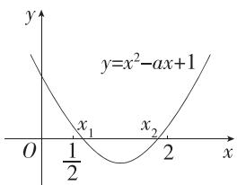

text_image

y
y=x²-ax+1
x₁
x₂
O
½
2
x

(2) 对于方程 $x^{2} - ax + 1 = 0, \Delta = a^{2} - 4$ .

①当 $\Delta=0$ ，即 a=2 或 a=-2 时，方程 $x^{2}-ax+1=0$ 有两个相等的实数根 $\frac{a}{2}$ ，此时原不等式的解集为 $\left\{x\mid x\neq\frac{a}{2}\right\}$ ;
②当 $\Delta<0$ ，即 -2<a<2 时，方程 $x^{2}-ax+1=0$ 无实数根，

此时原不等式的解集为 R;

③当 $\Delta > 0$ ，即 $a > 2$ 或 $a < -2$ 时，方程 $x^2 - ax + 1 = 0$ 有两个不相等的实数根 $\frac{a - \sqrt{a^2 - 4}}{2}, \frac{a + \sqrt{a^2 - 4}}{2}$ ，此时原不等式的解集为 $\left\{x \mid x < \frac{a - \sqrt{a^2 - 4}}{2} \text{或 } x > \frac{a + \sqrt{a^2 - 4}}{2}\right\}$ .

综上, 当 a=2 或 a=-2 时, 不等式的解集为 $\left\{x\mid x\neq\frac{a}{2}\right\}$ ; 当 a>2 或 a<-2 时, 不等式的解集为 $\left\{x\mid x<\frac{a-\sqrt{a^{2}-4}}{2}\text{或 }x>\frac{a+\sqrt{a^{2}-4}}{2}\right\}$ ; 当 -2<a<2 时, 不等式的解集为 R.

11. 解析 (1) 根据题意可得 $|2 - 1| > |3x - 4 - 1|$ ,

所以 $|3x-5|<1$ , 解得 $\frac{4}{3}<x<2$ .

(2)x 比 y 更远离 $\sqrt{2}$ ，理由如下：

要证 $x$ 比 $y$ 更远离 $\sqrt{2}$

只需证 $|x-\sqrt{2}|>\left|\frac{x+2}{x+1}-\sqrt{2}\right|$ ,

即证 $|x-\sqrt{2}|> \left|\frac{(1-\sqrt{2})(x-\sqrt{2})}{x+1}\right|$ ,

因为 $x > 0$ 且 $x \neq \sqrt{2}$ ,

所以 $|x-\sqrt{2}|>0$ ,

所以只需证 $1 > \frac{\sqrt{2} - 1}{|x + 1|}$ , 即证 $|x + 1| > \sqrt{2} - 1$ ,

因为 x>0, 所以 $x+1>1$ ,

所以 $|x+1|>1>\sqrt{2}-1$ ，

所以 $x$ 比 $y$ 更远离 $\sqrt{2}$ .

(3) 因为 $x^{2}+y^{2}\geqslant\frac{(x+y)^{2}}{2}=2$ ，当且仅当 x=y=1 时等号成立，

所以 $\left|x^{2}+y^{2}-\frac{1}{2}\right|=x^{2}+y^{2}-\frac{1}{2}.$

①当 $y \geqslant \frac{1}{2}$ 时， $\left| y - \frac{1}{2} \right| - \left| x^2 + y^2 - \frac{1}{2} \right| = y - \frac{1}{2} - \left( x^2 + y^2 - \frac{1}{2} \right) = y - x^2 - y^2 = y - (2 - y)^2 - y^2 = -2y^2 + 5y - 4 = -2\left( y - \frac{5}{4} \right)^2 - \frac{7}{8} < 0$ ，即 $\left| y - \frac{1}{2} \right| < \left| x^2 + y^2 - \frac{1}{2} \right|$ .

② 当 $y < \frac{1}{2}$ 时， $\left|y - \frac{1}{2}\right| - \left|x^2 + y^2 - \frac{1}{2}\right| = \left(\frac{1}{2} - y\right) - \left(x^2 + y^2 - \frac{1}{2}\right) = -y - x^2 - y^2 + 1 = -y - (2 - y)^2 - y^2 + 1 = -2y^2 + 3y - 3 = -2\left(y - \frac{3}{4}\right)^2 - \frac{15}{8} < 0$ ，即 $\left|y - \frac{1}{2}\right| < \left|x^2 + y^2 - \frac{1}{2}\right|$ .

综上， $\left|y - \frac{1}{2}\right| <   \left|x^2 +y^2 -\frac{1}{2}\right|$ ，即 $x^{2} + y^{2}$ 比 $y$ 更远离 $\frac{1}{2}$

# 目素养评析

本题第(1)问考查了学生的数学运算素养,根据定义直接列式 $|2-1|>|3x-4-1|$ ;第(2)(3)问考查了学生逻辑推理和数学运算素养,首先根据定义列式,然后判断符号去绝对值,分类讨论解不等式.

# 第三章 函数的概念与性质

# 3.1 函数的概念及其表示

# 3.1.1 函数的概念

# 基础过关练

Q 对应主书 P36

<table><tr><td>1.C</td><td>2.C</td><td>3.A</td><td>7.C</td><td></td><td></td><td></td><td></td></tr></table>

1. C 解题要点: ① 函数值域均为集合 B 的子集; ② 对每一个 x, 有唯一确定的 y 与其对应.

对于 A, D, 当 $0 \leqslant x \leqslant 4$ 时, $0 \leqslant y \leqslant 2$ , 且对每一个 x, 有唯一确定的 y 与其对应, 故能表示从 A 到 B 的函数;

对于 B, 当 $0 \leqslant x \leqslant 4$ 时, $0 \leqslant y \leqslant \frac{4}{3}$ , 因为 $\left[0, \frac{4}{3}\right] \subseteq [0, 2]$ , 且对每一个 x, 有唯一确定的 y 与其对应, 所以能表示从 A 到 B 的函数;

对于 C, 当 $0 \leqslant x \leqslant 4$ 时, $0 \leqslant y \leqslant \frac{8}{3}$ , 因为 $\left[0, \frac{8}{3}\right] \supseteq [0, 2]$ ,
所以不能表示从 A 到 B 的函数.

2. C 分别判断 $f(x)$ 和 $g(x)$ 的定义域和对应关系是否相同. 对于 A, 函数 $f(x)$ 与 $g(x)$ 的定义域均为 $(-∞, 0]$ ,

$f(x)=-x\sqrt{-2x},g(x)=x\sqrt{-2x}$ ，对应关系不同，所以不是同一个函数；

对于 B, $f(x)$ 的定义域为 R, $g(x)$ 的定义域为 $\{x \mid x \neq 0\}$ ，定义域不同，所以不是同一个函数；

对于 C, 定义域和对应关系均相同, 所以是同一个函数;

对于 D, 由 $\left\{\begin{aligned}x-1&\geqslant0,\\ x+1&\geqslant0,\end{aligned}\right.$ 解得 $x\geqslant1$ , 所以函数 $f(x)$ 的定义域为 $[1,+\infty)$ , 由 $(x+1)(x-1)\geqslant0$ , 解得 $x\leqslant-1$ 或 $x\geqslant1$ , 所以函数 $g(x)$ 的定义域为 $(-∞,-1]\cup[1,+∞)$ , 定义域不同, 所以不是同一个函数.

3.A 对于 A, 定义域符合、值域也符合, 故 A 正确;

对于 B, 定义域为 $\{x \mid -2 < x \leqslant 2\} \neq M$ , 值域为 $\{y \mid 0 \leqslant y < 2\} \neq N$ , 故 B 错误;

对于 C, 定义域为 $\{x \mid -2 \leqslant x \leqslant 0\} \neq M$ , 故 C 错误;

对于 D, 图象上存在 x, 有两个 y 的值与之对应, 不满足函数的定义, 故 D 错误.

4. 答案 $\left[-\frac{11}{3},0\right)\cup(0,+\infty)$

解析 由题意可得 $\left\{ \begin{array}{l}3x + 11\geqslant 0,\\ x\neq 0, \end{array} \right.$ 解得 $x\geqslant -\frac{11}{3}$ 且 $x\neq 0$ ，所以定义域为 $\left[-\frac{11}{3},0\right)\cup (0, + \infty)$

5. 答案 $(0,1) \cup (1,3)$

解析 由题意可知 $\left\{ \begin{array}{l} x^2 - 1 \neq 0, \\ 3x - x^2 > 0, \end{array} \right.$ 解得 $0 < x < 3$ 且 $x \neq 1$ , 所以定义域为 $(0,1) \cup (1,3)$ .

6. 答案 $S = -x^{2} + 40x (0 < x < 40) ; \{x \mid 12 \leqslant x \leqslant 28\}$

解析 设矩形另一边的长为 $y \mathrm{~m}$ ,

由三角形相似得 $\frac{x}{40} = \frac{40 - y}{40}$ 所以 $x + y = 40$

所以矩形草坪的面积 $S = xy = x(40 - x) = -x^{2} + 40x (0 < x < 40)$ ，由 $-x^{2} + 40x \geqslant 336$ ，解得 $12 \leqslant x \leqslant 28$ 。

7.C 由 $x \in [0,4]$ , 得 $\sqrt{-x^2 + 4x} = \sqrt{-(x - 2)^2 + 4} \in [0,2]$ , 所以 $y = 2 - \sqrt{-x^2 + 4x} \in [0,2]$ .

8. 答案 3

解析 对于 $f(xy) = f(x) + f(y)$ ,

令 $x = y = 2$ ，可得 $f(4) = f(2) + f(2) = 2$

令 $x = 2, y = 4$ ，可得 $f(8) = f(2) + f(4) = 3$ .

9. 答案 $-\frac{3}{2};2$

解析 $f(-3) = \frac{4\times(-3)-3}{(-3)^2 + 1} = -\frac{15}{10} = -\frac{3}{2}.$

由 $f(x) = \frac{4x - 3}{x^2 + 1} = 1$ 得 $4x - 3 = x^2 + 1$ ，整理得 $(x - 2)^2 = 0$ ，所以 $x = 2$ .

10. 答案 $\left[0, \frac{1}{4}\right]; \frac{1}{4}$

解析 易知 $\left\{\begin{aligned}x&\geqslant0,\\ 1-4x&\geqslant0,\end{aligned}\right.$ 解得 $0\leqslant x\leqslant\frac{1}{4}$ ，所以函数的定义域为 $\left[0,\frac{1}{4}\right]$ .

$$
\begin{array}{r l} & {y = \sqrt {x} \cdot \sqrt {1 - 4 x} = \sqrt {x - 4 x ^ {2}} = \sqrt {- 4 \left(x - \frac {1}{8}\right) ^ {2} + \frac {1}{1 6}}, 0 \leqslant x \leqslant} \\ & {\frac {1}{4}, \text {易知当} x = \frac {1}{8} \text {时}, y \text {取得最大值}, \text {最大值为} \frac {1}{4}.} \end{array}
$$

11. 答案 2024

解析 由 $f(x) = \frac{x}{1 + x}$ ，得 $f(x) + f\left(\frac{1}{x}\right) = \frac{x}{1 + x} + \frac{\frac{1}{x}}{1 + \frac{1}{x}} = \frac{x}{1 + x} +$

$$
\frac {1}{1 + x} = 1 \quad ,
$$

$$
\begin{array}{l} \dots + f (2 0 2 4) \\ = \left[ f \left(\frac {1}{2 0 2 4}\right) + f (2 0 2 4) \right] + \left[ f \left(\frac {1}{2 0 2 3}\right) + f (2 0 2 3) \right] + \dots + \\ \end{array}
$$

所以 $f\left(\frac{1}{2024}\right) + f\left(\frac{1}{2023}\right) + \dots +f\left(\frac{1}{2}\right) + f(1) + f(1) + f(2) +$

$$
\left[ f \left(\frac {1}{2}\right) + f (2) \right] + [ f (1) + f (1) ] = 1 \times 2 0 2 4 = 2 0 2 4.
$$

# 能力提升练

Q 对应主书 P37

<table><tr><td>1.A</td><td>2.D</td><td>3.C</td><td>4.D</td><td>5.D</td><td>6.BCD</td><td>7.C</td><td>8.D</td></tr><tr><td>9.C</td><td></td><td></td><td></td><td></td><td></td><td></td><td></td></tr></table>

1.A 当水面对应圆的直径 d 确定时,水面的高度 h 有两种可能,即 d 的一个值可能对应两个 h 的值,故 h 不是 d 的函数,故 A 错误;

当时间 t 确定时, 水面对应圆的直径 d 唯一确定, 水面的高度 h 也唯一确定, 故 d 是 t 的函数, h 是 t 的函数, 故 B, C 正确;

当水面高度 h 确定时, 水面对应圆的直径 d 唯一确定, 故 d 是 h 的函数, 故 D 正确.

2.D 对于 A, 当 x=1 时, $f(1)=1$ , 当 x=-1 时, $f(1)=-1$ , 与函数的定义不符, 故 A 不成立;

对于 B, 当 x=1 时, $f(2)=2$ , 当 x=-1 时, $f(2)=0$ , 与函数的定义不符, 故 B 不成立;

对于 C, 令 x=0, 则 $f(0)=0$ , 令 x=-1, 则 $f(0)=1$ , 与函数的定义不符, 故 C 不成立;

对于 D, $f(|x|)=x^{2}+1=|x|^{2}+1$ , 故 $\forall x\in\mathbf{R}, f(x)$ 唯一确定, 符合函数的定义, 故 D 成立.

3.C 因为 $f(x)$ 的定义域为(1,3)，所以 $\left\{\begin{aligned}1&<\frac{1}{x}<3,\\ 1&<x+\frac{5}{2}<3,\end{aligned}\right.$ （点）

拨:在括号内的式子的范围相同)所以 $\left\{\begin{aligned}\frac{1}{3}<x<1,\\-\frac{3}{2}<x<\frac{1}{2},\end{aligned}\right.$ 所以 $\frac{1}{3}<x<\frac{1}{2}$ ，所以 $f\left(\frac{1}{x}\right)+f\left(x+\frac{5}{2}\right)$ 的定义域为 $\left(\frac{1}{3},\frac{1}{2}\right)$ .

4.D 因为函数 $f(x+2)$ 的定义域为 $(-3,4)$ （点拨：给出的是 $x+2$ 中 x 的范围），所以函数 $f(x)$ 的定义域为 $(-1,6)$ （点拨：对应 $x+2$ 的范围），

对于函数 $g(x)=\frac{f(x+1)}{\sqrt{3x-1}}$ ，需满足 $\left\{\begin{aligned}-1<x+1&<6,\\ 3x&-1>0,\end{aligned}\right.$ 解得 $\frac{1}{3}<x<$

5, 即所求定义域为 $\left(\frac{1}{3}, 5\right)$ .

# 解题模版

对于函数 $y=f(g(x))$ :

(1) 若已知函数 $f(x)$ 的定义域为数集 $A$ ，则函数 $f(g(x))$ 的定义域由 $g(x) \in A$ 解出.  
(2) 若已知函数 $f(g(x))$ 的定义域为数集 $A$ ，则函数 $f(x)$ 的定义域为 $g(x)$ 在 $x \in A$ 时的值域.

5.D 问题转化为 $ax^{2}-2ax+1\geqslant0$ 恒成立, 分 a=0 与 $a\neq0$ 讨论.

因为 $f(x) = \sqrt{ax^2 - 2ax + 1}$ 的定义域为 R, 所以不等式 $ax^2 -$

$2ax+1\geqslant0$ 对任意 $x\in R$ 恒成立，

当 a=0 时易错点， $1 \geqslant 0$ 恒成立，满足题意；

当 $a \neq 0$ 时，有 $\left\{ \begin{array}{l} a > 0, \\ \Delta = 4a^2 - 4a \leqslant 0, \end{array} \right.$ 解得 $0 < a \leqslant 1$ .

综上, a 的取值范围是 $[0,1]$ .

6. BCD 令 $f(x) = 0$ ，解得 $x = 0$ （二重根），令 $f(x) = 36$ ，解得 $x = \pm 6$ ，结合 $f(x) = x^2$ 的图象可得 $f(x)$ 的定义域可能为 $[-2, 6]$ ， $[-6, 6]$ 或 $[0, 6]$ ，故 B，C，D 正确.

7.C 利用换元法转化为二次函数.

由 $2 - x \geqslant 0$ 得 $x \leqslant 2$ , 故函数的定义域为 $(- \infty, 2]$ , 令 $t = \sqrt{2 - x}$ , 则 $t \geqslant 0$ (易错点: 应注意换元后定义域的变化), $x = 2 - t^2$ , 所以 $y = x + \sqrt{2 - x}$ 即 $y = -t^2 + t + 2 = -\left(t - \frac{1}{2}\right)^2 + \frac{9}{4}$ , $t \geqslant 0$ , 显然当 $t = \frac{1}{2}$ 时, $y_{\max} = \frac{9}{4}$ , 当 $t \to +\infty$ 时, $y \to -\infty$ , 所以函数的值域为 $\left(-\infty, \frac{9}{4}\right]$ .

8.D 由题可知 $f(x)$ 的定义域为[1,2]，

∴ $\left\{\begin{aligned}1&\leqslant x\leqslant2,\\ 1&\leqslant x^{2}\leqslant2,\end{aligned}\right.$ 解得 $1\leqslant x\leqslant\sqrt{2}$ （易错点：注意定义域的变化），∴ $g(x)=2f(x)+f(x^{2})=\frac{2}{x}+\frac{1}{x^{2}}(1\leqslant x\leqslant\sqrt{2})$ .

令 $t = \frac{1}{x}$ 则 $\frac{\sqrt{2}}{2} \leqslant t \leqslant 1, \therefore g(x) = \frac{2}{x} + \frac{1}{x^2}$ 可转化为 $h(t) = t^2 + 2t = (t + 1)^2 - 1$ .

由函数 $y = h(t)$ 的图象知，当 $\frac{\sqrt{2}}{2} \leqslant t \leqslant 1$ 时， $h\left(\frac{\sqrt{2}}{2}\right) \leqslant h(t) \leqslant h(1)$ ，即 $\frac{1}{2} + \sqrt{2} \leqslant h(t) \leqslant 3$ .

∴ 函数 $g(x)=2f(x)+f(x^{2})$ 的值域为 $\left[\frac{1}{2}+\sqrt{2},3\right]$ .

9.C 当 $x = 0$ 时， $f(0) = \frac{1}{2}$ . 当 $x \neq 0$ 时， $f(x) = \frac{(x + 1)^2}{x^2 + 1} - \frac{1}{2} = \frac{2(x + 1)^2 - (x^2 + 1)}{2(x^2 + 1)} = \frac{x^2 + 4x + 1}{2(x^2 + 1)} = \frac{1}{2} + \frac{2x}{x^2 + 1} = \frac{1}{2} + \frac{2}{x + \frac{1}{x}}$ .

令 $t = x + \frac{1}{x}$ ，当 $x > 0$ 时， $t = x + \frac{1}{x} \geqslant 2\sqrt{x \cdot \frac{1}{x}} = 2$ ，当且仅当 $x = 1$ 时等号成立，

则 $0 < \frac{1}{t} \leqslant \frac{1}{2}$ , 故 $\frac{1}{2} < f(x) \leqslant \frac{3}{2}$ ;

当 $x < 0$ 时， $t = x + \frac{1}{x} \leqslant -2 \cdot \sqrt{(-x) \cdot \left(-\frac{1}{x}\right)} = -2$ ，当且仅当 $x = -1$ 时等号成立，

则 $-\frac{1}{2} \leqslant \frac{1}{t} < 0$ ，故 $-\frac{1}{2} \leqslant f(x) < \frac{1}{2}$ .

综上所述， $f(x)$ 的值域为 $\left[-\frac{1}{2},\frac{3}{2}\right]$

故 $y=[f(x)]$ 的值域是 $\{-1,0,1\}$ .

10. 答案 $\left[1, \frac{1 + \sqrt{13}}{2}\right]$

解析 $f(x) = x^{2} - 2ax + a^{2} - 9 = (x - a)^{2} - 9$ ，则有 $f(a) = -9$ $f(a - 3) = 0$

因为当 $x \in [a - 3, a^2] (a > 0)$ 时， $f(x) \in [-9, 0]$ ，

所以 $\left\{\begin{aligned}a-3<a\leqslant a^{2},\\ a-(a-3)\geqslant a^{2}-a,\\ a>0,\end{aligned}\right.$ 解得 $1\leqslant a\leqslant\frac{1+\sqrt{13}}{2},$

所以实数 $a$ 的取值范围是 $\left[1, \frac{1 + \sqrt{13}}{2}\right]$ .

11. 答案 $\left[-\frac{1}{2},4\right]$

解析 $f(x) = \frac{x^4 + kx^2 + 1}{x^4 + x^2 + 1} = 1 + \frac{(k - 1)x^2}{x^4 + x^2 + 1}, f(0) = 1,$

当 k=1 时, $f(x)=1$ , 符合题意.

当 $x \neq 0$ 时， $\frac{(k - 1)x^2}{x^4 + x^2 + 1} = \frac{k - 1}{x^2 + \frac{1}{x^2} + 1}$ ，

$\because x^{2}+\frac{1}{x^{2}}\geqslant2$ （当且仅当 $x=\pm1$ 时，等号成立），

$$
\therefore 0 <   \frac {1}{x ^ {2} + \frac {1}{x ^ {2}} + 1} \leqslant \frac {1}{3},
$$

(思维溯源: k-1 的符号决定了 $f(x)$ 的范围, 所以分 k>1, k<1 两种情况讨论)

若 $k < 1$ ，则 $1 + \frac{k - 1}{3} \leqslant f(x) < 1$

故只需 $2\left(1+\frac{k-1}{3}\right)\geqslant1$ ，(解法点睛:利用三角形中两边之和大于第三边)解得 $k\geqslant-\frac{1}{2},\therefore-\frac{1}{2}\leqslant k<1;$

若 $k > 1$ ，则 $1 < f(x) \leqslant 1 + \frac{k - 1}{3}$ 故只需 $2 \geqslant \frac{k - 1}{3} + 1$

解得 $1<k \leqslant 4.$

综上所述,实数 k 的取值范围为 $\left[-\frac{1}{2},4\right]$ .

# 3.1.2 函数的表示法

基础过关练 对应主书P38

1.C 2.D 4.B 5.A 6.A 9.C 10.BCD

1. C $y=\frac{x}{x+1}=\frac{-1}{x+1}+1$ , 则将反比例函数 $y=\frac{-1}{x}$ 的图象向左平移 1 个单位长度, 再向上平移 1 个单位长度, 即可得到函数 $y=\frac{x}{x+1}$ 的图象.

目考场速决

易知函数的定义域为 $\{x \mid x \neq -1\}$ , 排除 A, B; 当 $x = 0$ 时, $y = 0$ , 排除 D.

2.D 开始注水时,水注入烧杯中,正方体容器中无水,故水面高度为0;烧杯内注满水后,继续注水,正方体容器中水面开始上升,且上升速度较快;当正方体容器中水面和烧杯水面持平以后,继续注水,正方体容器中水面继续上升,且上升速度减慢.

3. 答案 $f(x)=6x, x \in \{1,2,3,4,5\}$

4.B $f\left(\frac{x+1}{x}\right)=\frac{2x+1}{x}=\frac{x+1+x}{x}=\frac{x+1}{x}+1$ ，因为 $x\neq0$ ，所以 $\frac{x+1}{x}\neq1$ ，所以 $f(x)=x+1(x\neq1)$ .

5.A 易知 $x^{2} + x = \left(x + \frac{1}{2}\right)^{2} - \frac{1}{4} \geqslant -\frac{1}{4}$ , 又 $f(x^{2} + x) = (x^{2} + x)^{2} - 2a$ , 所以 $f(x) = x^{2} - 2a\left(x \geqslant -\frac{1}{4}\right)$ , 则 $f(6) = 36 - 2a = 10$ , 解得 $a = 13$ .

6.A 设 $f(x) = ax + b (a \neq 0)$ ，则 $f(f(x) - 2x) = f(ax + b - 2x) = a(ax + b - 2x) + b = 3$ ，整理得 $(a^2 - 2a)x + ab + b - 3 = 0$ ，

所以 $\left\{\begin{aligned}a^{2}-2a=0,\\ ab+b-3=0,\end{aligned}\right.$ 解得 $\left\{\begin{aligned}a=0,\\ b=3\end{aligned}\right.$ （舍去）或 $\left\{\begin{aligned}a=2,\\ b=1,\end{aligned}\right.$

所以 $f(x)=2x+1$ ，所以 $f(5)=2\times5+1=11$ .

7. 答案 5

解析 解法一: 令 t=2x-1, 则 $x=\frac{t+1}{2}$ ,

故 $f(t)=\frac{3t+3}{2}-5=\frac{3}{2}t-\frac{7}{2}.$

因为 $f(x_{0})=4$ ，所以 $\frac{3}{2}x_{0}-\frac{7}{2}=4$ ，解得 $x_{0}=5$ .

解法二:由已知得 $\left\{\begin{aligned}&2x-1=x_{0},\\ &3x-5=4,\end{aligned}\right.$ 解得 $\left\{\begin{aligned}&x=3,\\ &x_{0}=5.\end{aligned}\right.$

8. 解析 (1) 设 $f(x) = ax^2 + bx + c (a \neq 0)$ ,

则 $f(x + 1) + f(x - 1) = a(x + 1)^2 +b(x + 1) + c + a(x - 1)^2 +b(x - 1) + c = 2ax^2 +2bx + 2a + 2c = 2x^2 -4x$

所以 $\left\{\begin{aligned}2a&=2,\\ 2b&=-4,\end{aligned}\right.$ 所以 $\left\{\begin{aligned}a&=1,\\ b&=-2,\end{aligned}\right.$ 因此 $f(x)=x^{2}-2x-1.$ $2a+2c=0,$

(2) 令 $t = \sqrt{x} + 1$ ，则 $x = (t - 1)^2, t \geqslant 1$

所以 $f(t) = (t - 1)^2 + 2(t - 1) = t^2 - 1 (t \geqslant 1)$ ,

因此 $f(x)$ 的解析式为 $f(x)=x^{2}-1(x\geqslant1)$ .

# 易错警示

用换元法求函数的解析式时,要先求出中间变量的取值范围,由此确定所求函数的定义域,解题时防止漏求函数的定义域导致解题不完整.

9.C 因为 $f(x)=\left\{\begin{aligned}x^{3}+1,x<1,\\ x^{2}-ax,x\geqslant1,\end{aligned}\right.$ 所以 $f(0)=0^{3}+1=1$ ,

所以 $f(f(0))=f(1)=1-a=-2$ , 解得 a=3.

10.BCD 因为函数 $f(x) = \begin{cases} 1, & x \text{ 为有理数,}\\ 0, & x \text{ 为无理数,} \end{cases}$ 所以 $f(x)$ 的定义域为 $\mathbf{R}$ ，值域为 $\{0,1\}$ ，故A错误，B正确；

因为 $\forall x\in \mathbf{R},f(x)\in \{0,1\}$ ，所以 $f(f(x)) = 1$ ，故C正确；

取 $x=\sqrt{2}$ , $y=-\sqrt{2}$ ，则 $f(x+y)=f(\sqrt{2}-\sqrt{2})=f(0)=1$ ，故 D 正确.

11. 答案 11

解析 $f(5) = f(5 + 7) = f(12) = 12 - 1 = 11.$

12. 解析 (1) $f(x)=\left\{\begin{aligned}x+2,x&>0,\\ x^{2},&x\leqslant0,\end{aligned}\right.$

当 $a > 0$ 时， $f(a) = a + 2 = \frac{25}{4}$ ，解得 $a = \frac{17}{4}$ ；

当 $a \leqslant 0$ 时, $f(a) = a^2 = \frac{25}{4}$ , 解得 $a = -\frac{5}{2}$ (正值舍去).

综上, $a=\frac{17}{4}$ 或 $a=-\frac{5}{2}$ .

(2) 易知 $f(x)$ 的值域为 $[0, +\infty)$ .

不妨令 $f(k) = t$ ，则 $f(t) = \frac{9}{4}$ 且 $t\geqslant 0.$

当 t>0 时， $f(t)=t+2=\frac{9}{4}$ ，解得 $t=\frac{1}{4}$ ，

所以 $f(k) = \frac{1}{4}$ ，所以 $\left\{ \begin{array}{l}k > 0,\\ k + 2 = \frac{1}{4} \end{array} \right.$ 或 $\left\{ \begin{array}{l}k\leqslant 0,\\ k^2 = \frac{1}{4}, \end{array} \right.$

所以 $k=-\frac{1}{2}$ .

当 t=0 时， $f(t)=t^{2}=0\neq\frac{9}{4}$ ，舍去.

综上, $k=-\frac{1}{2}$ .

13. 解析 (1) 当 $0 < x \leqslant 3$ 时, $f(x) = 11$ ,

当 $3 < x \leqslant 10$ 时， $f(x) = 11 + (x - 3) \times 2.2 = 2.2x + 4.4$

当 $10 < x \leqslant 30$ 时， $f(x) = 11 + 7 \times 2.2 + (x - 10) \times 2.8 = 2.8x - 1.6$ ,

所以 $f(x)=\left\{\begin{aligned}&11,0<x\leqslant3,\\ &2.2x+4.4,3<x\leqslant10,\\ &2.8x-1.6,10<x\leqslant30.\end{aligned}\right.$

(2) 方案①, $f(30)=2.8\times30-1.6=82.4$ ,

方案②, $2f(15)=2\times(2.8\times15-1.6)=80.8$ ,

方案③, $3f(10)=3\times(2.2\times10+4.4)=79.2$ ,

因为 82.4>80.8>79.2, 所以方案③最省钱.

# 能力提升练

Q 对应主书 P40

<table><tr><td>1.B</td><td>2.BCD</td><td>3.C</td><td>4.D</td><td>5.AB</td><td>6.AC</td><td>9.BCD</td><td>10.D</td></tr><tr><td>11.A</td><td>12.A</td><td></td><td></td><td></td><td></td><td></td><td></td></tr></table>

1.B 由题图可知 $f(-1)=0$ ，在 A, C 中， $f(-1)\neq0$ ，所以排除 A, C；

由题图得 $f(4)>0$ ，在D中， $f(4)=-(4-1)^{2}+2\times|4-1|= -3<0$ ，不符合题意，故排除D.

2.BCD 因为 $f(g(1))=f(3)=1$ , $f(g(2))=f(4)=2$ , $f(g(3))=f(1)=2$ , $f(g(4))=f(4)=2$ , 所以 a 的值可以是 2, 3, 4.

3.C 函数的定义域为 $\{x\mid x\in \mathbf{R},x\neq 0\}$ .当 $a = 0$ 时， $f(x) =$ $2|x|\left(x\neq 0\right)$ ，此时A满足.当 $a > 0$ 时，若 $x > 0$ ，则 $f(x) =$ $2x - \frac{a}{x}$ ，图象上升；若 $x <   0$ ，则 $f(x) = -\left(2x + \frac{a}{x}\right)$ ，其中 $y =$

$2x+\frac{a}{x}(x<0)$ 为对勾函数的一部分, 此时 D 满足. 当 a<0
时, 若 x>0, 则 $f(x)=2x+\frac{-a}{x}$ , 为对勾函数的一部分; 若 x<0, 则 $f(x)=-2x+\frac{-a}{x}$ , 图象下降, 此时 B 满足.

4.D 因为 BC=x 米, 篱笆总长为 10 米,

所以 AD = x 米, $CD = (10 - x)$ 米,

因此 $f(x)=x(10-x)=-x^{2}+10x$ ,

又因为这棵树在花圃内或边界上，

所以 $\left\{\begin{aligned}x&\geqslant3,\\ 10-x&\geqslant2,\end{aligned}\right.$ 解得 $3\leqslant x\leqslant8$

因此 $f(x)=-x^{2}+10x(3\leqslant x\leqslant8)$ .

5.AB $f(-x)=\frac{1+(-x)^{2}}{1-(-x)^{2}}=\frac{1+x^{2}}{1-x^{2}}=f(x)$ ，故 A 正确；

$f\left(\frac{1}{x}\right) = \frac{1 + \left(\frac{1}{x}\right)^2}{1 - \left(\frac{1}{x}\right)^2} = \frac{\frac{x^2 + 1}{x^2}}{\frac{x^2 - 1}{x^2}} = \frac{x^2 + 1}{x^2 - 1} = -f(x)$ , 故 B 正确, D

错误；

$f(2x) = \frac{1 + 4x^2}{1 - 4x^2}, 2f(x) = \frac{2 + 2x^2}{1 - x^2}$ , 显然 $f(2x) \neq 2f(x)$ , 故 C 错误.

6. AC 若 $f(x) = x^2$ ，则 $f(1) = 1$ 且 $\forall x, y \in \mathbf{R}$ ， $f(xy) = (xy)^2 = 2f(x)f(y) - x^2y^2$ ，故 A 正确；

对于 $f(xy)=xf(y)+yf(x)-2$ ，令 x=1, y=1，得 $f(1)=2$ ，与 $f(1)=1$ 矛盾，故 B 错误；

若 $f(x)=2x-1$ ，则 $f(1)=1$ 且 $\forall x,y\in\mathbf{R},f(x+y)=2(x+y)-1=f(x)+f(y)+1$ ，故C正确；

对于 $f(x+y)=xf(y)+yf(x)$ ，令x=1,y=0，得 $f(1)=f(0)$ ，又 $f(1)=1$ ，所以 $f(1)=f(0)=1$ ，令x=y=0，得 $f(0)=0$ ，矛盾，故D错误.

7. 答案 $x^{2}$ (答案不唯一)

解析 令 $f(x) = x^2$ ，则 $f(xy) = (xy)^2 = x^2y^2 = f(x)f(y)$ ，满足条件①；

$\forall x, y \in [0, +\infty)$ 且 $x \neq y, \frac{f(x) + f(y)}{2} = \frac{x^2 + y^2}{2} = \frac{x^2 + y^2 + x^2 + y^2}{4} > \frac{x^2 + y^2 + 2xy}{4} = \left(\frac{x + y}{2}\right)^2 = f\left(\frac{x + y}{2}\right)$ , 满足条件②. 故 $f(x) = x^2$ 满足题意(答案不唯一).

8. 解析 (1) $f(x) + 2f\left(\frac{1}{x}\right) = 3x - 2$ ①,

将 $x$ 用 $\frac{1}{x}$ 替换，可得 $2f(x) + f\left(\frac{1}{x}\right) = \frac{3}{x} - 2②,$

①②联立，消去 $f\left(\frac{1}{x}\right)$ ，解得 $f(x)=\frac{2}{x}-x-\frac{2}{3}(x\neq0)$ .

(2) 令 $t = \frac{1 - x}{1 + x}$ ，则 $x = \frac{1 - t}{t + 1} (t \neq -1)$ ，所以 $f(t) = \frac{1 - \left(\frac{1 - t}{1 + t}\right)^2}{1 + \left(\frac{1 - t}{1 + t}\right)^2} =$

$\frac{2t}{t^2 + 1} (t \neq -1)$ , 故 $f(x) = \frac{2x}{x^2 + 1} (x \neq -1)$ .

(3) 令 $x = y = 0$ ，可得 $f(0) - 2f(0) = 0$ ，则 $f(0) = 0$ ，令 $y = 0$ ，可得 $f(x) - 2f(0) = x^2 + 3x$ ，故 $f(x) = x^2 + 3x$ .

9.BCD $f(x)$ 的定义域是 $(-∞,2)$ ，故 A 错误.

当 $x \leqslant -1$ 时, $x + 2 \leqslant 1$ ; 当 $-1 < x < 2$ 时, $0 \leqslant x^2 < 4$ , $1 \leqslant x^2 + 1 < 5$ , 所以 $f(x)$ 的值域是 $(- \infty, 5)$ , 故 B 正确.

由 B 选项的分析可知, 若 $f(x)=3$ , 则 $\left\{\begin{aligned}-1<x<2,\\ x^{2}+1=3,\end{aligned}\right.$ 解得 x= $\sqrt{2}$ , 故 C 正确.

令 $f(x)=2$ ，得 $\left\{\begin{aligned}-1<x<2,\\ x^{2}+1=2,\end{aligned}\right.$ 解得x=1，故 $f(x)$ 的图象与直线y=2有一个交点 $(1,2)$ ，故D正确.

10.D 解法一: 由题意得 $f(x)=|x-5|+|x+3|=$

$\left\{ \begin{array}{l} -2x + 2, x < -3, \\ 8, -3 \leqslant x \leqslant 5, \text{当} x < -3 \text{时}, f(x) \geqslant 10 \text{可化为} -2x + 2 \geqslant \\ 2x - 2, x > 5. \end{array} \right.$

10, 解得 $x \leqslant -4$ ;

当 $-3 \leqslant x \leqslant 5$ 时， $f(x) \geqslant 10$ 可化为 $8 \geqslant 10$ ，显然不成立；

当 $x > 5$ 时， $f(x) \geqslant 10$ 可化为 $2x - 2 \geqslant 10$ ，解得 $x \geqslant 6$ .

因此 $f(x)\geqslant 10$ 的解集为 $(-\infty , - 4]\cup [6, + \infty)$

解法二:由绝对值的几何意义知 $f(x)=|x-5|+|x+3|$ 表示数轴上的点到 -3 和 5 的距离之和, 由 $5-(-3)=8$ 知满足 $f(x)\geqslant10$ 的 x 的范围是 $(-∞,-4]\cup[6,+∞)$ .

# 目小题速解

当 $x = 0$ 时， $f(x) = 8$ ，不满足 $f(x) \geqslant 10$ ，排除A，B；当 $x = -4$ 时， $f(x) = 10 \geqslant 10$ ，排除C.

11.A 当点 P 在 AB 上时, $y=\frac{1}{2}\cdot AP\cdot BC=\frac{x}{2},0\leqslant x\leqslant1$ ;

当点 $P$ 在 $BC$ 上时， $y = AB \cdot BC - \frac{1}{2} \cdot AB \cdot BP - \frac{1}{2} AD \cdot$

$$
D M - \frac {1}{2} M C \cdot C P = 1 - \frac {1}{2} \times 1 \times (x - 1) - \frac {1}{2} \times 1 \times \frac {1}{2} - \frac {1}{2} \times \frac {1}{2} (2 -
$$

$$
x) = \frac {3}{4} - \frac {x}{4}, 1 <   x <   2;
$$

当点 P 在 CM 上时, $y=\frac{1}{2}\times AD\times PM=\frac{1}{2}\left(\frac{5}{2}-x\right)=\frac{5}{4}-\frac{1}{2}x,2\leqslant x\leqslant\frac{5}{2}.$

结合选项知 A 正确.

12.A 因为 $x_0 \in A$ ，即 $0 \leqslant x_0 < \frac{1}{2}$ ，所以 $f(x_0) = x_0 + \frac{1}{2}$ ，

又 $\frac{1}{2} \leqslant x_0 + \frac{1}{2} < 1$ ，所以 $\frac{1}{2} \leqslant f(x_0) < 1$ ，即 $f(x_0) \in B$

所以 $f(f(x_0)) = 3[1 - f(x_0)] = \frac{3}{2} - 3x_0 \in A$

即 $0 \leqslant \frac{3}{2} - 3x_0 < \frac{1}{2}$ , 解得 $\frac{1}{3} < x_0 \leqslant \frac{1}{2}$ .

又 $0 \leqslant x_0 < \frac{1}{2}$ , 所以 $\frac{1}{3} < x_0 < \frac{1}{2}$ .

13. 答案 $[1, 1 + \sqrt{2}]$

解析 画出 $f(x) = \begin{cases} x^2 - 2x, & x \geqslant 2, \\ -x^2 + 2x, & x < 2 \end{cases}$ 的图象，如图：

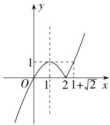

line

| x | y |
|---|---|
| 0 | 1 |
| 1 | 1 |
| 2 | 0 |
| √2 | 1 |

由 $x^{2} - 2x = 1$ ，解得 $x = 1 - \sqrt{2}$ （舍）或 $x = 1 + \sqrt{2}$

∴ 要使函数 $f(x)=\left\{\begin{aligned}x^{2}-2x,x&\geqslant2,\\ -x^{2}+2x,x&<2\end{aligned}\right.$ 在 $[0,a]$ 上的值域为 $[0,1]$ ，则实数 a 的取值范围是 $[1,1+\sqrt{2}]$ .

14. 答案 5

解析 在同一坐标系下画出函数 $y=2x+7, y=x^{2}-3x+1$ , $y=10-3x$ 的图象, 如图,

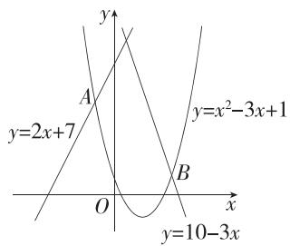

text_image

y
y=2x+7
A
y=x²-3x+1
O
B
x
y=10-3x

联立 $\left\{\begin{aligned}y=2x+7,\\ y=x^{2}-3x+1,\end{aligned}\right.$ 解得 $\left\{\begin{aligned}x=-1,\\ y=5\end{aligned}\right.$ 或 $\left\{\begin{aligned}x=6,\\ y=19,\end{aligned}\right.$ 所以A(-1,5),

联立 $\left\{\begin{aligned}y=10-3x,\\ y=x^{2}-3x+1,\end{aligned}\right.$ 解得 $\left\{\begin{aligned}x=-3,\\ y=19\end{aligned}\right.$ 或 $\left\{\begin{aligned}x=3,\\ y=1,\end{aligned}\right.$ 所以 $B(3,1)$ ,

由图可知, $m(x)=\left\{\begin{aligned}&2x+7,x\leqslant-1,\\&x^{2}-3x+1,-1<x<3,\\&10-3x,x\geqslant3,\end{aligned}\right.$

所以当 x = -1 时, $m(x)$ 有最大值 5.

15. 解析 (1) 由题意可得, 当 $a = \frac{1}{2}$ 时,

$$
f (x) = \left\{ \begin{array}{l} 2 x, 0 \leqslant x \leqslant \frac {1}{2}, \\ 2 (1 - x), \frac {1}{2} <   x \leqslant 1, \end{array} \right.
$$

$\therefore f\left(\frac{4}{5}\right)=2\times\left(1-\frac{4}{5}\right)=\frac{2}{5},$

因此 $f\left(f\left(\frac{4}{5}\right)\right)=f\left(\frac{2}{5}\right)=2\times\frac{2}{5}=\frac{4}{5}$ ,

又 $f\left(\frac{4}{5}\right)=\frac{2}{5}\neq\frac{4}{5},\therefore\frac{4}{5}$ 是 $f(x)$ 的回旋点.

(2) 当 $x \in (a, 1]$ 时, $f(x) = \frac{1 - x}{1 - a}$ , （对 $\frac{1 - x}{1 - a}$ 是否大于 $a$ 分

类讨论,求出 $y=f(f(x))$ 的解析式

$$
\because a <   x \leqslant 1,
$$

$$
\therefore 0 \leqslant 1 - x <   1 - a, \therefore 0 \leqslant \frac {1 - x}{1 - a} <   1,
$$

当 $a < \frac{1 - x}{1 - a} < 1$ ，即 $a < x < a^2 - a + 1$ 时， $f(f(x)) = f\left(\frac{1 - x}{1 - a}\right) = \frac{1}{1 - a}$

$$
\cdot \left(1 - \frac {1 - x}{1 - a}\right) = \frac {x - a}{(1 - a) ^ {2}};
$$

当 $0 \leqslant \frac{1 - x}{1 - a} \leqslant a$ ，即 $a^2 - a + 1 \leqslant x \leqslant 1$ 时， $f(f(x)) = f\left(\frac{1 - x}{1 - a}\right) = \frac{1}{a} \cdot \frac{1 - x}{1 - a} = \frac{1 - x}{a(1 - a)}$

$$
\therefore y = f (f (x)) = \left\{ \begin{array}{l} \frac {x - a}{(1 - a) ^ {2}}, a <   x <   a ^ {2} - a + 1, \\ \frac {1 - x}{a (1 - a)}, a ^ {2} - a + 1 \leqslant x \leqslant 1. \end{array} \right.
$$

当 $a < x < a^2 - a + 1$ 时，令 $\frac{x - a}{(1 - a)^2} = x$ ，解得 $x = \frac{1}{2 - a}$

(方程的解 $x_{0}$ 需满足两点:一是 $x_{0}$ 在分段函数对应的定义域内,二是 $f(x_{0})\neq x_{0}$ ,从而得到回旋点)

$$
\because 0 <   a <   1, \therefore \frac {1}{2 - a} - a = \frac {a ^ {2} - 2 a + 1}{2 - a} = \frac {(a - 1) ^ {2}}{2 - a} > 0, a ^ {2} - a + 1 -
$$

$$
\frac {1}{2 - a} = \frac {1 - a ^ {3} + 3 a ^ {2} - 3 a}{2 - a} = \frac {(1 - a) ^ {3}}{2 - a} > 0,
$$

$$
\therefore a <   \frac {1}{2 - a} <   a ^ {2} - a + 1.
$$

$\because f\left(\frac{1}{2 - a}\right) = \frac{1}{2 - a},\therefore x = \frac{1}{2 - a}$ 不是 $f(x)$ 的回旋点.

当 $a^2 - a + 1 \leqslant x \leqslant 1$ 时，

令 $\frac{1 - x}{a(1 - a)} = x$ ，解得 $x = \frac{1}{1 + a - a^2}$

$$
\because 0 <   a <   1, \therefore \frac {1}{1 + a - a ^ {2}} - (a ^ {2} - a + 1) = \frac {1 - [ 1 - (a ^ {2} - a) ^ {2} ]}{1 + a - a ^ {2}} =
$$

$$
\frac {\left(a ^ {2} - a\right) ^ {2}}{1 + a - a ^ {2}} > 0,
$$

$$
1 - \frac {1}{1 + a - a ^ {2}} = \frac {a - a ^ {2}}{1 + a - a ^ {2}} = \frac {a (1 - a)}{1 + a - a ^ {2}} > 0, \therefore a ^ {2} - a + 1 <   \frac {1}{1 + a - a ^ {2}} <   1.
$$

又 $f\left(\frac{1}{1 + a - a^2}\right) = \frac{1}{1 - a} \cdot \left(1 - \frac{1}{1 + a - a^2}\right) = \frac{a}{1 + a - a^2} \neq \frac{1}{1 + a - a^2},$

$\therefore x = \frac{1}{1 + a - a^2}$ 是 $f(x)$ 的回旋点.

综上, $y=f(f(x))=\begin{cases}\frac{x-a}{(1-a)^{2}},&a<x<a^{2}-a+1,\\\frac{1-x}{a(1-a)},&a^{2}-a+1\leqslant x\leqslant1,\end{cases}$

$f(x)$ 的回旋点为 $\frac{1}{1 + a - a^2}$ .

# 3.2 函数的基本性质

# 3.2.1 单调性与最大（小）值

# 第1课时 函数的单调性

# 基础过关练

Q 对应主书 P42

<table><tr><td>1.C</td><td>2.B</td><td>3.D</td><td>4.C</td><td>5.A</td><td>6.A</td><td>11.C</td><td>12.A</td></tr><tr><td>13.B</td><td></td><td></td><td></td><td></td><td></td><td></td><td></td></tr></table>

1.C 由题图知函数 $f(x)$ 的图象在区间 $(-3, -1)$ 和 $(1, 4)$ 上是下降的，在区间 $(-5, -3)$ 和 $(-1, 1)$ 上是上升的，因此该函数的单调递减区间为 $(-3, -1), (1, 4)$ .

2.B 对于 A, 由函数单调性的定义知, 应为对于任意的 $x_{1}$ , $x_{2} \in I$ , “任意”二字不可缺少, 故 A 错误;

对于 B, 该二次函数的图象是开口向上, 对称轴为直线 x = 0 的抛物线, 故函数 $f(x) = x^{2}$ 在 $[0, +\infty)$ 上单调递增,

(写单调区间时,可以包括端点,也可以不包括端点,但当某些点无意义时,单调区间就不包括这些点)

故 B 正确；

对于 C, 函数 $f(x) = -\frac{1}{x}$ 在 $(-∞, 0)$ 和 $(0, +∞)$ 上分别单调递增, 但 $f(x)$ 在定义域内不具有单调性, 故 C 错误;

对于 D, 函数 $f(x)=\frac{1}{x}$ 在 $(-∞,0)$ 和 $(0,+∞)$ 上分别单调

递减,故 $f(x)=\frac{1}{x}$ 的单调递减区间为 $(-∞,0),(0,+∞)$ ,
(易错点:具有相同单调性的区间不能用“∪”符号连接)
故 D 错误.

3.D 在 $(-∞,0)$ 上， $f(x)=x$ 单调递增， $f(x)=-\frac{1}{x}$ 单调递增. $f(x)=x^{2}+2x$ 在 $(-∞,-1)$ 上单调递减，在 $(-1,0)$ 上单调递增. $f(x)=|x|=\left\{\begin{aligned}-x,x&<0,\\ x,x&\geqslant0,\end{aligned}\right.$ 显然 $f(x)$ 在 $(-∞,0)$ 上单调递减.

4.C 易得 $f(x) = \frac{x - 2}{x - 1} = \frac{x - 1 - 1}{x - 1} = 1 - \frac{1}{x - 1}$ ,

画出函数 $f(x)$ 的图象,如图所示.

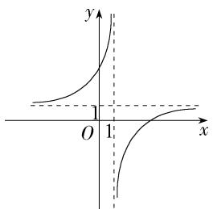

text_image

y
O 1 x

所以函数 $f(x)$ 在 $(-∞,1)$ 和 $(1,+∞)$ 上均单调递增.

# 目解题模板

对“一次分式”函数,常利用分离常数的方法转化解析式,然后通过反比例函数的图象结合平移变换解决问题.

5.A 令 $-x^{2} - 2x\geqslant 0$ ，解得 $-2\leqslant x\leqslant 0$ ，故 $f(x)$ 的定义域为[-2,0].

易知 $y = -x^{2} - 2x$ 的图象开口向下，对称轴方程为 x = -1，所以函数 $y = -x^{2} - 2x$ 在 $[-1, 0]$ 上单调递减，在 $[-2, -1]$ 上单调递增，又 $y = \sqrt{x}$ 在 $[0, +\infty)$ 上单调递增，因此函数 $f(x) = \sqrt{-x^{2} - 2x}$ 在 $[-1, 0]$ 上单调递减，在 $[-2, -1]$ 上单调递增，

所以函数 $f(x) = \sqrt{-x^2 - 2x}$ 的单调递减区间是[-1,0].

# 目方法技巧

复合函数单调性的判断方法是“同增异减”.

6.A $f(x) = (1 - x)|2 - x| = \left\{ \begin{array}{l}x^{2} - 3x + 2,x <   2,\\ -x^{2} + 3x - 2,x\geqslant 2, \end{array} \right.$

当 $x \geqslant 2$ 时， $f(x) = -x^2 + 3x - 2 = -\left(x - \frac{3}{2}\right)^2 + \frac{1}{4}$ ，显然 $f(x)$ 在 $[2, +\infty)$ 上单调递减，

当 $x < 2$ 时， $f(x) = x^2 - 3x + 2 = \left(x - \frac{3}{2}\right)^2 - \frac{1}{4}$ ，显然 $f(x)$ 在 $\left(-\infty, \frac{3}{2}\right)$ 上单调递减，在 $\left(\frac{3}{2}, 2\right)$ 上单调递增，

所以函数 $f(x)$ 的单调递增区间为 $\left(\frac{3}{2},2\right)$ .

7. 答案 $(- \infty, 3]$

解析 因为 $\forall x\in \mathbf{R}$ ，都有 $f(x)\leqslant f(3)$

所以 $f(x)$ 的图象开口向下, 对称轴是直线 x=3,

因此函数 $f(x)$ 的单调递增区间为 $(-∞,3]$ .

8. 答案 $(- \infty, 0)$ 和 $[0, 1]$

解析 由已知得函数 $f(x)$ 的定义域为 $\mathbf{R}$ ,

当 $x < 0$ 时， $f(x) = \frac{1}{x}$ 单调递减.

当 $x \geqslant 0$ 时， $f(x) = x^2 - 2x = (x - 1)^2 - 1$ ，在 $[0, 1]$ 上单调递减，在 $(1, +\infty)$ 上单调递增.

综上， $f(x)$ 的单调递减区间为 $(-\infty ,0)$ 和[0,1].

9. 解析 (1) 因为 $f(x)=\frac{7x^{2}+2}{3x}$ ，所以 $f(1)=\frac{7\times1^{2}+2}{3\times1}=3$ ，

所以 $f(f(1))=f(3)=\frac{7\times3^{2}+2}{3\times3}=\frac{65}{9}.$

(2) 证明: $g(x) = 3f(x) + \frac{5}{x} = \frac{7x^2 + 7}{x} = 7\left(x + \frac{1}{x}\right)$ ,

$\forall x_{1},x_{2}\in(0,1)$ ，且 $x_{1}<x_{2}$ ，(取值)

则 $g(x_{2}) - g(x_{1}) = 7\left(x_{2} + \frac{1}{x_{2}} - x_{1} - \frac{1}{x_{1}}\right)$ （作差）

$$
= 7 \left(x _ {2} - x _ {1}\right) \left(1 - \frac {1}{x _ {1} x _ {2}}\right) = \frac {7 \left(x _ {2} - x _ {1}\right) \left(x _ {1} x _ {2} - 1\right)}{x _ {1} x _ {2}}, (\text {变形})
$$

因为 $0 < x_{1} < x_{2} < 1$ ，所以 $0 < x_{1}x_{2} < 1, x_{1}x_{2} - 1 < 0, x_{2} - x_{1} > 0,$

所以 $g(x_{2})-g(x_{1})<0$ , 即 $g(x_{2})<g(x_{1})$ ,(定号)

因此函数 $g(x)$ 在 $(0,1)$ 上单调递减。(判断)

10. 解析 (1) 证明: $\forall x_{1}, x_{2} \in (1, +\infty)$ , 且 $x_{2} > x_{1}$ ,

则 $f(x_{2}) - f(x_{1}) = \frac{x_{2}}{x_{2} - 1} -\frac{x_{1}}{x_{1} - 1} = \frac{x_{1} - x_{2}}{(x_{2} - 1)(x_{1} - 1)},$

因为 $x_{2} > x_{1} > 1$ ，所以 $(x_{2} - 1)(x_{1} - 1) > 0, x_{1} - x_{2} < 0, f(x_{2}) -$

$f(x_{1}) < 0$ ，即 $f(x_{2}) < f(x_{1})$

故 $f(x)$ 在 $(1,+\infty)$ 上单调递减.

(2)由(1)得 $f(x)$ 在 $(1,+\infty)$ 上单调递减，

所以 $\left\{\begin{aligned}a^{2}&>1,\\ 2a+3&>1,\end{aligned}\right.$ 解得 $\left\{\begin{aligned}a&<-1\text{或}a>1,\\ a&>-1,\\ -1&<a<3,\end{aligned}\right.$

所以 1<a<3, 故实数 a 的取值范围是 $(1,3)$ .

11. C $f(x)=|x+2|+x-3=\left\{\begin{aligned}&2x-1,x\geqslant-2,\\ &-5,x<-2,\end{aligned}\right.$ 若 $f(a)>f(3-2a)$ ，则 $\left\{\begin{aligned}a>3-2a,\\ a>-2,\end{aligned}\right.$ 解得 a>1.

12.A 易知二次函数 $y = x^{2} - 2ax + 1$ 的图象的对称轴为直线 $x = a$ ，若 $y = x^{2} - 2ax + 1$ 在区间(2,3)内是单调递增函数，则有 $a \leqslant 2$ ；若 $y = x^{2} - 2ax + 1$ 在区间(2,3)内是单调递减函数，则有 $a \geqslant 3$ . 综上， $a$ 的取值范围是 $(- \infty, 2] \cup [3, +\infty)$ .

# 易错警示

解决二次函数的单调性问题,其关键是确定二次函数图象的对称轴与单调区间之间的位置关系.

13.B 根据题意,结合 $y=x^{2}-2ax(x\geqslant1)$ 的图象,知 $f(x)$ 必定为单调递增函数,

则有 $\left\{ \begin{array}{l} a > 0, \\ a \leqslant 1, \\ a - 1 \leqslant 1 - 2a, \end{array} \right.$ 解得 $0 < a \leqslant \frac{2}{3}$ , 即 $a$ 的取值范围为 $\left(0, \frac{2}{3}\right]$ .

# 易错警示

由分段函数的单调性确定参数的值时,不仅要利用每段函数的单调性列出不等式,还要根据在分界点处的函数值的大小关系列出不等式.

14. 答案 -1

解析 易得 $f(x)=x^{2}+2(a-2)x+2$ 的单调递增区间为 $[2-a,+\infty)$ , $\therefore 2-a=3, \therefore a=-1$ .

# 易错警示

注意函数在某区间上单调递增(减)与函数的单调递增(减)区间为某区间的区别,对“某区间”:前者为单调递增(减)区间的子集,后者即为单调递增(减)区间.

15. 答案 $\left[-\frac{5}{4}, +\infty\right)$

解析 若 $a = 0$ 易错点, 则 $f(x) = 5x + 2$ 在 $(1,2)$ 上单调递增, 满足题意.

若 $a \neq 0$ ，易知二次函数 $f(x) = ax^2 + 5x + 2$ 的图象关于直线 $x = -\frac{5}{2a}$ 对称，若 $f(x)$ 在 $(1, 2)$ 上单调递增，则当 $a < 0$ 时， $-\frac{5}{2a} \geqslant 2$ ，故 $-\frac{5}{4} \leqslant a < 0$ ；

当 $a > 0$ 时， $-\frac{5}{2a} \leqslant 1$ ，显然恒成立，故 $a > 0$

综上, a 的取值范围是 $\left[-\frac{5}{4}, +\infty\right)$ .

16. 答案 $(- \infty, -1) \cup (1, 2]$

解析 $f(x) = \frac{ax - 1}{x - a} = \frac{a(x - a) + a^2 - 1}{x - a} = a + \frac{a^2 - 1}{x - a},$

因为函数 $f(x) = \frac{ax - 1}{x - a}$ 在 $(2, +\infty)$ 上单调递减，所以 $a^2 - 1 > 0$ ，解得 $a < -1$ 或 $a > 1$ ，

则函数 $f(x)$ 的单调递减区间为 $(-\infty, a), (a, +\infty)$ ,

由题意可得 $(2, +\infty) \subseteq (a, +\infty)$ , 可得 $a \leqslant 2$ ,

所以实数 a 的取值范围是 $(-∞, -1) ∪ (1, 2]$ .

17. 解析 (1) 由关于 $x$ 的不等式 $f(x) < 0$ 的解集为 $(-2, 3)$ , 可得关于 $x$ 的一元二次方程 $f(x) = 0$ 的两根为 $-2$ 和 $3$ ,

所以 $\left\{\begin{aligned}-2+3&=3a-2,\\ -2\times3&=b,\end{aligned}\right.$ 解得 $\left\{\begin{aligned}a&=1,\\ b&=-6,\end{aligned}\right.$

当 a=1, b=-6 时， $f(x)=x^{2}-x-6=(x-3)(x+2)$ ，符合题意，故实数 a, b 的值分别为 1, -6.

(2)由已知得二次函数 $y=f(x)$ 的图象开口向上,且对称轴方程为 $x=\frac{3a-2}{2}$ ,

若函数 $f(x)$ 在 $\left[-\frac{10}{3}, +\infty\right)$ 上单调递增，

则 $\frac{3a - 2}{2} \leqslant -\frac{10}{3}$ , 解得 $a \leqslant -\frac{14}{9}$ ,

故实数 $a$ 的取值范围为 $\left(-\infty, -\frac{14}{9}\right]$ .

# 能力提升练

Q 对应主书 P44

<table><tr><td>1.B</td><td>2.CD</td><td>5.BCD</td><td>6.D</td><td>7.BD</td><td>8.C</td><td></td><td></td></tr></table>

1.B 由函数 $f(x) = \sqrt{x^2 - ax + 1}$ 在区间 $[2, +\infty)$ 上单调递增, 得 $\left\{ \begin{array}{l} \frac{a}{2} \leqslant 2, \\ 2^2 - 2a + 1 \geqslant 0, \end{array} \right.$ (点拨: 对称轴的位置及对称轴处有意义) 解得 $a \leqslant \frac{5}{2}$ ,

因为 $a \leqslant \frac{5}{2}$ 能推出 $a \leqslant 3, a \leqslant 3$ 不能推出 $a \leqslant \frac{5}{2}$ ,

所以“ $a \leqslant 3$ ”是“函数 $f(x) = \sqrt{x^2 - ax + 1}$ 在区间 $[2, +\infty)$ 上单调递增”的必要不充分条件.

2. CD 不妨设 $x_{1} > x_{2} > 0$ ，由 $\frac{x_{2} f(x_{1}) - x_{1} f(x_{2})}{x_{1} - x_{2}} > 0$ ，可得 $x_{2} f(x_{1}) - x_{1} f(x_{2}) > 0, \therefore \frac{f(x_{1})}{x_{1}} > \frac{f(x_{2})}{x_{2}}, \therefore$ 函数 $y = \frac{f(x)}{x}$ 在 $(0, +\infty)$ 上单调递增.

对于 $A, y = \frac{f(x)}{x} = \frac{1}{x}$ , 易知函数 $y = \frac{1}{x}$ 在 $(0, +\infty)$ 上单调递

减,所以 A 不符合题意;

对于 B, $y=\frac{f(x)}{x}=x+\frac{2}{x}$ ，易知函数 $y=x+\frac{2}{x}$ 在 $(0,\sqrt{2})$ 上单调递减，在 $(\sqrt{2},+\infty)$ 上单调递增，所以 B 不符合题意；

对于 C, $y=\frac{f(x)}{x}=x^{2}-1$ , 易知函数 $y=x^{2}-1$ 在 $(0,+\infty)$ 上单调递增, 所以 C 符合题意;

对于 D, $y=\frac{f(x)}{x}=x^{3}$ ，易知函数 $y=x^{3}$ 在 $(0,+\infty)$ 上单调递增，所以 D 符合题意.

3. 答案 $\left(1, \frac{3}{2}\right]$

解析 当 $x = 0$ 时, $f(0) = 0$ , 当 $x \neq 0$ 时, $f(x) = \frac{2}{x + \frac{4}{x}}$ ,

由对勾函数的性质可知函数 $f(x)$ 在 $[-2,0)$ 和 $(0,2]$ 上单调递增，当 $x \in [-2,0)$ 时， $f(x) < 0$ ，当 $x \in (0,2]$ 时， $f(x) > 0$ ，且 $f(0) = 0$ ，∴ 函数 $f(x)$ 的单调递增区间为 $[-2,2]$ .

$\because f(x)$ 在 $[m, 2m - 1]$ 上单调递增，

$\therefore \left\{ \begin{array}{l}m <   2m - 1,\\ m\geqslant -2,\quad \text{解得} 1 <   m\leqslant \frac{3}{2},\\ 2m - 1\leqslant 2, \end{array} \right.$

故实数 m 的取值范围为 $\left(1, \frac{3}{2}\right]$ .

4. 解析 (1) 因为 $\forall x, y \in \mathbf{R}$ , 都有 $f(x) + f(y) = f(x + y) + 2$ 且 $f(1) = 3$ ,

所以 $f(1) + f(1) = f(2) + 2$ ，则 $f(2) = 4$

$f(2) + f(2) = f(4) + 2$ ，则 $f(4) = 6$

所以 $f(2)+f(4)=10.$

(2) $f(x)$ 在 R 上单调递增,证明如下:

任取 $x_{1}, x_{2} \in \mathbf{R}$ , 且 $x_{1} > x_{2}$ , 则 $x_{2} - x_{1} < 0$ ,

所以 $f(x_{2} - x_{1}) < 2$ ，则 $f(x_{2} - x_{1}) - 2 < 0.$

所以 $f(x_{2}) = f((x_{2} - x_{1}) + x_{1}) = f(x_{2} - x_{1}) + f(x_{1}) - 2 <   f(x_{1}),$

所以函数 $f(x)$ 在R上单调递增.

(3) 由 $f(ax^2) > 6 - f((a - 2)x)$ ，得 $f(ax^2) + f((a - 2)x) > 6$ ，即 $f(ax^2 + (a - 2)x) + 2 > 6$ ，即 $f(ax^2 + (a - 2)x) > 4 = f(2)$ ，

由(2)知函数 $f(x)$ 在R上单调递增,所以不等式 $f(ax^{2}+(a-2)x)>f(2)$ 等价于 $ax^{2}+(a-2)x>2$ ,

即 $(ax-2)(x+1)>0$ ，又a<0，所以不等式 $(ax-2)(x+1)>0$ 等价于 $\left(x-\frac{2}{a}\right)(x+1)<0$ ，

当 $\frac{2}{a}=-1$ ，即a=-2时，不等式等价于 $(x+1)^{2}<0$ ，所以不等式的解集为 $\varnothing$ ；

当 $\left\{\begin{aligned}\frac{2}{a}>-1,\\ a<0,\end{aligned}\right.$ 即a<-2时,不等式的解集为 $\left(-1,\frac{2}{a}\right)$ ;

当 $\left\{\begin{aligned}\frac{2}{a}&<-1,\\ a&<0,\end{aligned}\right.$ 即-2<a<0时,不等式的解集为 $\left(\frac{2}{a},-1\right)$ .

综上, 当 a = -2 时, 不等式的解集为 $\varnothing$ ;

当 a<-2 时, 不等式的解集为 $\left(-1, \frac{2}{a}\right)$ ;

当-2<a<0时,不等式的解集为 $\left(\frac{2}{a},-1\right)$ .

归纳总结

# 判断抽象函数单调性的方法

(1)凑:凑定义或凑已知,利用定义或已知条件得出结论;   
(2) 赋值: 给变量赋值要根据条件与结论的关系, 有时可能要进行多次尝试.

5.BCD 由题图可知, $f(x)$ 在 $[0,2.8]$ , $[4,+\infty)$ 上单调递增,所以 $\left\{\begin{aligned}a&\geqslant0,\\ a&+2\leqslant2.8\end{aligned}\right.$ 或 $a\geqslant4$ ,解得 $0\leqslant a\leqslant0.8$ 或 $a\geqslant4$ ,

所以 a 的取值范围为 $[0,0.8] \cup [4,+\infty)$ .

结合选项可知 B,C,D 符合题意.

6.D 由题意设 $f(x) - \frac{1}{x} = c (c > 0)$ ，故 $f(x) = c + \frac{1}{x}$ ，且 $f(c) = c + \frac{1}{c} = 2$ ，所以 $c = 1$ ，所以 $f(x) = \frac{1}{x} + 1$ ，则 $f\left(\frac{1}{2024}\right) = 2025$ .  
7.BD 由 $x_{1}f(x_{1}) + x_{2}f(x_{2}) > x_{1}f(x_{2}) + x_{2}f(x_{1})$ 得 $(x_{1} - x_{2})[f(x_{1}) - f(x_{2})] > 0$

因此 $f(x)$ 在R上单调递增,A错误;

由-5<0<1,得 $f(-5)<f(0)<f(1)$ ,B正确;

如 $f(x)=2x+1$ ，满足 $f(x)$ 在R上单调递增，但 $f(0)=1$ ，C错误；

由 $f(2x - 1) < f(3 - x)$ , 得 $2x - 1 < 3 - x$ , 解得 $x < \frac{4}{3}$ , D 正确.

8.C 由 $f(x_{1})-\sqrt{x_{1}}>f(x_{2})-\sqrt{x_{2}}$ ，得 $f(x_{1})-\sqrt{x_{1}}-2>f(x_{2})-\sqrt{x_{2}}-2$ ，构建函数 $F(x)=f(x)-\sqrt{x}-2$ （破题关键），

可知 $\forall x_{1},x_{2}\in [0, + \infty)$ ，当 $x_{1} <   x_{2}$ 时， $F(x_{1}) > F(x_{2})$ ，故 $F(x)$ 在 $[0, + \infty)$ 上单调递减，

$$
\because f (2 x) <   \sqrt {2 x} + 2, f (4) = 4, \therefore F (2 x) = f (2 x) - \sqrt {2 x} - 2 <   0,
$$

且 $F(4)=f(4)-\sqrt{4}-2=0,\therefore 2x>4$ , 解得 x>2,

因此不等式 $f(2x) < \sqrt{2x} + 2$ 的解集为 $(2, +\infty)$ .

9. 答案 $c < b < a$

解析 由已知得 $f(x)$ 的定义域为 $(-1, 1)$ ，且 $\forall x, y \in$

$(-1, 1)$ , 都有 $f(x) - f(y) = f\left(\frac{x - y}{1 - xy}\right)$ , 所以 $\left\{ \begin{array}{l} -1 < x < 1, \\ -1 < y < 1, \\ -1 < \frac{x - y}{1 - xy} < 1, \end{array} \right.$ 不

妨设 x<y，则 $-1<\frac{x-y}{1-xy}<0$ ，

因为当 $x \in (-1, 0)$ 时， $f(x) < 0$ ，所以 $f\left(\frac{x - y}{1 - xy}\right) < 0$ ，即 $f(x) -$

$f(y) < 0$ ，所以 $f(x) < f(y)$

故函数 $f(x)$ 在 $(-1,1)$ 上单调递增，

因为 $f(x)-f(y)=f\left(\frac{x-y}{1-xy}\right)$ ,

所以 $f(x)=f(y)+f\left(\frac{x-y}{1-xy}\right)$ ，取 $y=\frac{3}{7}$ ， $\frac{x-y}{1-xy}=\frac{1}{3}$ ，则 $x=\frac{2}{3}$ ，
(思路溯源:结合 b, c 两值的特征,需要将 a 中两数合并,
所以做此变形和取值)

则 $a = f\left(\frac{3}{7}\right) + f\left(\frac{1}{3}\right) = f\left(\frac{2}{3}\right)$

因为 $0 < \frac{4}{7} < \frac{2}{3}$ , 所以 $f(0) < f\left(\frac{4}{7}\right) < f\left(\frac{2}{3}\right)$ , 即 $c < b < a$ .

# 第2课时 函数的最大（小）值

# 基础过关练

Q 对应主书 P45

<table><tr><td>1.A</td><td>2.A</td><td>3.D</td><td>4.D</td><td>6.A</td><td>7.D</td><td>8.C</td><td></td></tr></table>

1.A 若 $f(x)$ 在区间 $[0,1]$ 上单调递增，则 $f(x)$ 在区间 $[0,1]$ 上的最大值为 $f(1)$ ，故充分性成立；

若 $f(x)$ 在区间 $[0,1]$ 上的最大值为 $f(1)$ ，则 $f(x)$ 在区间 $[0,1]$ 上不一定单调，故必要性不成立.

所以“ $f(x)$ 在区间 $[0,1]$ 上单调递增”是“ $f(x)$ 在区间 $[0,1]$ 上的最大值为 $f(1)$ ”的充分不必要条件.

2.A 易知函数 $f(x) = \frac{1}{x} - 2x$ 在[1,2]上单调递减，

所以 $f(x)$ 在 $[1,2]$ 上的最小值为 $f(2) = \frac{1}{2} - 4 = -\frac{7}{2}$ .

3.D $y=\frac{3x+2}{x-1}=\frac{3(x-1)+5}{x-1}=3+\frac{5}{x-1}$ ，由反比例函数的图象可知，当 $x\in(m,n]$ 时，函数单调递减，

因此当 x=n 时, 函数取得最小值, 为 $3+\frac{5}{n-1}=8$ , 解得 n=2, 又 $x\neq1$ 易错点, 所以 $1\leqslant m<2$ .

4. D $f(x)=x^{2}-2x+3=(x-1)^{2}+2$ ,

所以当 x=1 时， $f(x)$ 有最小值，为 2，

令 $x^{2} - 2x + 3 = 18$ ，解得 $x = -3$ 或 $x = 5$

易知当 $x \in [-3, 1)$ 时， $f(x)$ 单调递减，当 $x \in (1, 5]$ 时， $f(x)$ 单调递增，

所以 n 的最大值为 5, m 的最小值为 -3,

所以 n-m 的最大值为 $5+3=8$ .

5. 解析 $f(x)=x^{2}-2ax+2=(x-a)^{2}+2-a^{2}$ ，其图象的对称轴方程为 x=a，

当 $a \leqslant \frac{1}{3}$ 时， $f(x)$ 在 $\left[\frac{1}{3}, 3\right]$ 上单调递增，最小值为 $f\left(\frac{1}{3}\right) = \frac{19}{9} - \frac{2a}{3}$ ;

当 $\frac{1}{3} < a \leqslant 2$ 时， $f(x)$ 在 $\left(\frac{1}{3}, a\right)$ 上单调递减，在 $(a, 3)$ 上单调递增，故 $f(x)$ 在 $\left[\frac{1}{3}, 3\right]$ 上的最小值为 $f(a) = 2 - a^2$ .

综上, 函数 $f(x)$ 在 $\left[\frac{1}{3}, 3\right]$ 上的最小值为 $g(a)$

$$
= \left\{ \begin{array}{l} \frac {1 9}{9} - \frac {2 a}{3}, a \leqslant \frac {1}{3}, \\ 2 - a ^ {2}, \frac {1}{3} <   a \leqslant 2. \end{array} \right.
$$

6.A 当 x=0 时, $f(0)=a^{2}$ ,

因为 $f(0)$ 是 $f(x)$ 的最小值，

所以 $f(x)$ 在 $(- \infty, 0]$ 上单调递减，即有 $-a \geqslant 0$ ，得 $a \leqslant 0$ ，且 $a^2 \leqslant x + \frac{1}{x} + a, x > 0$ 恒成立.

因为 $x+\frac{1}{x}\geqslant2\sqrt{x\cdot\frac{1}{x}}=2$ ，当且仅当 x=1 时取等号，所以 $a^{2}\leqslant2+a$ ，解得 $-1\leqslant a\leqslant2$ 。

综上, a 的取值范围为 $[-1,0]$ .

7.D 命题“ $\exists x \in [-1, 1], -x^2 + 3x + a > 0$ ”为真命题等价于 $a > x^2 - 3x$ 在 $x \in [-1, 1]$ 上有解， $\therefore a > (x^2 - 3x)_{\min}, x \in [-1, 1]$ .

令 $f(x)=x^{2}-3x,x\in[-1,1]$ ，易知 $f(x)$ 在 $[-1,1]$ 上单调递减， $\therefore f(x)_{\min}=f(1)=-2,\therefore a>-2.$

8.C 当 $x \leqslant 0$ 时, $f(x) = \frac{1}{3} x^2 - \frac{2}{3} x + 1 = \frac{1}{3} (x - 1)^2 + \frac{2}{3}$ ,

则 $f(x)$ 在 $(- \infty, 0]$ 上单调递减，此时 $f(x) \geqslant f(0) = 1$ 当 $x > 0$ 时， $f(x) = -x^2 + 2x + 1 = -(x - 1)^2 + 2$

则 $f(x)$ 在 $(0,1)$ 上单调递增，在 $[1, +\infty)$ 上单调递减，此时 $f(x) \leqslant f(1) = 2$

当 $x \leqslant 0$ 时，由 $f(x) = 2$ ，得 $\frac{1}{3} x^2 - \frac{2}{3} x + 1 = 2$ ，故 $x = -1$

当 x>0 时，由 $f(x)=1$ ，得 $-x^{2}+2x+1=1$ ，故 x=2，
画出函数 $f(x)$ 的图象,如图,

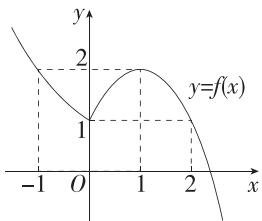

line

| x | y = f(x) |
|---|---|
| -1 | 2 |
| 0 | 1 |
| 1 | 2 |
| 2 | 1 |

由 $f(x)$ 在区间 $(a,b)$ 上既有最大值，又有最小值，得 $-1\leqslant a < 0,1 < b\leqslant 2$ ，因此 $1 < b - a\leqslant 3$

则 $b - a$ 的最大值为3.

9. 答案 $\left[0, \frac{-1+\sqrt{5}}{2}\right]$

解析 $f(x) = x|x| = \left\{ \begin{array}{l} -x^{2},x <   0,\\ x^{2},x\geqslant 0, \end{array} \right.$

易知 $y=-x^{2}$ 在 $(-∞,0)$ 上单调递增， $y=x^{2}$ 在 $[0,+∞)$ 上单调递增，且 $f(x)$ 的图象连续，

所以 $f(x)$ 在 $\mathbf{R}$ 上单调递增，

所以不等式 $f(x^{2} + t)\leqslant 4f(x)\Leftrightarrow f(x^{2} + t)\leqslant 4x|x| = 2x|2x| =$ $f(2x)\Leftrightarrow x^2 +t\leqslant 2x,$

所以对任意的 $x \in [t, t + 1]$ , $t \leqslant -x^2 + 2x$ 恒成立，

所以 $t \leqslant (-x^2 + 2x)_{\min}, x \in [t, t + 1]$ .

因为 $y = -x^{2} + 2x$ 的图象开口向下, 所以最小值必在区间端点处取到,

所以 $\left\{\begin{aligned}t&\leqslant-t^{2}+2t,\\ t&\leqslant-(t+1)^{2}+2(t+1),\end{aligned}\right.$ 解得 $0\leqslant t\leqslant\frac{-1+\sqrt{5}}{2}.$

10. 解析 (1) 解法一: $f(x) = x^2 - 2mx = (x - m)^2 - m^2$ ,

当 $m \leqslant 0$ 时，函数 $f(x)$ 在 $[0,1]$ 上单调递增，

所以 $f(x)_{\max}=f(1)=1-2m=3$ , 解得 m=-1 ;

当 $m \geqslant 1$ 时，函数 $f(x)$ 在 $[0,1]$ 上单调递减，

所以 $f(x)_{\max}=f(0)=0\neq3$ ，矛盾；

当 $0 < m < 1$ 时，函数 $f(x)$ 在 $[0, m)$ 上单调递减，在 $[m, 1]$ 上单调递增，

所以 $f(x)_{\max}=f(0)=0\neq3$ 或 $f(x)_{\max}=f(1)=1-2m=3$ ,
解得 m=-1，不符合 0<m<1。

综上, m = -1.

解法二: 因为函数 $f(x)$ 的图象开口向上, 所以最大值必在区间端点处取到, 又 $f(0)=0 \neq 3$ , 所以 $f(1)=1-2m=3$ , 得 m=-1.

(2) 当 $-1 \leqslant t \leqslant 1$ 时, 不等式 $f(t) > 2t - 2$ 恒成立,

即 $t^2 - 2mt > 2t - 2$ 在 $t \in [-1, 1]$ 上恒成立，

即 $t^2 - (2m + 2)t + 2 > 0$ 在 $t \in [-1, 1]$ 上恒成立，

即 $[t^2 - (2m + 2)t + 2]_{\min} > 0, t \in [-1, 1]$ .

令 $h(t)=t^{2}-(2m+2)t+2$ ，则其图象的对称轴方程为 $t=m+1$ ，

①当 $m + 1 \geqslant 1$ ，即 $m \geqslant 0$ 时，函数 $h(t)$ 在 $[-1, 1]$ 上单调递减，则 $h(t)_{\min} = h(1) = 1 - 2m > 0$ ，解得 $m < \frac{1}{2}$ ，即 $0 \leqslant m < \frac{1}{2}$ ；

②当 $-1<m+1<1$ ，即 $-2<m<0$ 时，

$h(t)$ 在 $[-1, m+1]$ 上单调递减，在 $[m+1, 1]$ 上单调递增，故 $h(t)_{\min}=h(m+1)=(m+1)^{2}-(2m+2)(m+1)+2=-m^{2}-2m+1>0$ ，解得 $-1-\sqrt{2}<m<-1+\sqrt{2}$ ，即 -2<m<0；

③当 $m + 1 \leqslant -1$ ，即 $m \leqslant -2$ 时，函数 $h(t)$ 在 $[-1, 1]$ 上单调递增，故 $h(t)_{\min} = h(-1) = 1 + (2m + 2) + 2 = 2m + 5 > 0$ ，解得 $m > -\frac{5}{2}$ ，即 $-\frac{5}{2} < m \leqslant -2$ .

综上, m 的取值范围为 $\left\{m\left|-\frac{5}{2}<m<\frac{1}{2}\right.\right\}$ .

# 能力提升练

Q 对应主书 P46

<table><tr><td>1.B</td><td>2.AD</td><td>3.C</td><td>4.D</td><td>5.D</td><td>6.B</td><td></td><td></td></tr></table>

1.B 令函数 $f(x) = x + \frac{1}{x}, x \in [2, +\infty)$ ,

易得函数 $f(x)$ 在区间 $[2, +\infty)$ 上单调递增，所以 $f(x)_{\min} = f(2) = \frac{5}{2}$ ，

因为不等式 $x + \frac{1}{x} >\frac{a + 1}{a - 1}$ 对任意的 $x\in [2, + \infty)$ 恒成立，所以 $\frac{a + 1}{a - 1} <  \left(x + \frac{1}{x}\right)_{\min} = \frac{5}{2},$

则 $\frac{a+1}{a-1}-\frac{5}{2}=\frac{-3a+7}{2(a-1)}<0$ ，即 $\frac{3a-7}{2(a-1)}>0$ ，解得a<1或 $a>\frac{7}{3}$ ，
所以实数 a 的取值范围是 $(-∞,1)∪\left(\frac{7}{3},+\infty\right)$ .

2.AD 易知函数 $f(x) = x + \frac{a^2}{x} (a > 0)$ 在 $(0, a)$ 上单调递减，在 $(a, +\infty)$ 上单调递增，

当 $0 < a \leqslant 2$ 时，函数 $f(x)$ 在 $[2,4]$ 上单调递增，所以 $f(x)_{\max} = f(4) = 4 + \frac{a^2}{4}, f(x)_{\min} = f(2) = 2 + \frac{a^2}{2}$ ，

所以 $4 + \frac{a^2}{4} - 2 - \frac{a^2}{2} = 1$ ，解得 $a = 2$ 或 $a = -2$ （舍去）.

当 $a \geqslant 4$ 时，函数 $f(x)$ 在 $[2,4]$ 上单调递减，所以 $f(x)_{\min} = f(4) = 4 + \frac{a^2}{4}, f(x)_{\max} = f(2) = 2 + \frac{a^2}{2}$ ，

所以 $2 + \frac{a^2}{2} - 4 - \frac{a^2}{4} = 1$ ，解得 $a = \pm 2\sqrt{3}$ （舍去）.

当 $2 < a < 4$ 时，函数 $f(x)$ 在 $[2, a]$ 上单调递减，在 $[a, 4]$ 上单调递增，

所以 $f(x)_{\min} = f(a) = 2a$ ，且 $f(2) = 2 + \frac{a^2}{2}, f(4) = 4 + \frac{a^2}{4}$

若 $4+\frac{a^{2}}{4}>2+\frac{a^{2}}{2}$ ，即 $2<a<2\sqrt{2}$ ，则 $4+\frac{a^{2}}{4}-2a=1$ ，解得 a=2 （舍去）或 a=6（舍去）；

若 $4 + \frac{a^2}{4} \leqslant 2 + \frac{a^2}{2}$ , 即 $2\sqrt{2} \leqslant a < 4$ , 则 $2 + \frac{a^2}{2} - 2a = 1$ , 解得 $a = 2 + \sqrt{2}$ 或 $a = 2 - \sqrt{2}$ (舍去).

综上所述, $a=2+\sqrt{2}$ 或a=2.

3. C $\frac{y-3}{x+1}=\frac{\frac{1}{5}x-\frac{3}{5}-3}{x+1}=\frac{x-18}{5(x+1)}=\frac{x+1-19}{5(x+1)}=\frac{1}{5}-\frac{19}{5(x+1)}$ ，令 $t=x+1$ ，则 $-1\leqslant t\leqslant4$ ，且 $t\neq0$ ，设 $z=\frac{1}{5}-\frac{19}{5t}, t\in[-1,0)\cup(0,4]$ .

当 $-1\leqslant t<0$ 时, $z=\frac{1}{5}-\frac{19}{5t}$ 单调递增,当t=-1时, $z_{\min}=\frac{1}{5}+\frac{19}{5}=4$ ,当 $t\rightarrow0^{-}$ 时, $z\rightarrow+\infty$ ,故 $\frac{y-3}{x+1}\in[4,+\infty)$ ;

当 $0 < t \leqslant 4$ 时, $z = \frac{1}{5} - \frac{19}{5t}$ 单调递增, 当 $t = 4$ 时, $z_{\max} = \frac{1}{5} - \frac{19}{20} = -\frac{3}{4}$ , 当 $t \to 0^{+}$ 时, $z \to -\infty$ , 故 $\frac{\gamma - 3}{x + 1} \in \left(-\infty, -\frac{3}{4}\right]$ .

综上, $\frac{y-3}{x+1}$ 的取值范围是 $\left(-\infty,-\frac{3}{4}\right]\cup\left[4,+\infty\right)$ ，结合选项知 $\frac{y-3}{x+1}$ 的值不可能是3.

4.D 因为 $a+b=1, a>0, b>0$ , 所以 0<a<1,

故 $f(a)f(b)=\left(a+\frac{1}{a}\right)\left(b+\frac{1}{b}\right)=\left(a+\frac{1}{a}\right)\left(1-a+\frac{1}{1-a}\right)=a-$ $a^{2}-1+\frac{a^{2}-a+2}{a(1-a)}$ ,①

设 $t = a - a^2 = -\left(a - \frac{1}{2}\right)^2 +\frac{1}{4}$ ，由 $0 <   a <   1$ ，可得 $0 <   t\leqslant \frac{1}{4}$ 则①式可转化为 $g(t) = t - 1 + \frac{2 - t}{t} = t + \frac{2}{t} -2,$

易知函数 $y = t + \frac{2}{t}$ 在 $\left(0, \frac{1}{4}\right]$ 上单调递减，故 $g(t)_{\min} = g\left(\frac{1}{4}\right) = \frac{1}{4} + 8 - 2 = \frac{25}{4}$ ，

此时 $a - a^2 = \frac{1}{4}$ , 解得 $a = \frac{1}{2}$ (二重根), 故 $b = \frac{1}{2}$ .

故当 $a = b = \frac{1}{2}$ 时， $f(a)f(b)$ 取得最小值，为 $\frac{25}{4}$ .

5.D 因为 $1 \leqslant x_{1} < x_{2}$ , 所以 $x_{1}x_{2} > 1$ , 在不等式 $x_{2}f(x_{1}) - x_{1}f(x_{2}) > ax_{1}x_{2}(x_{2}^{2} - x_{1}^{2})$ 两边同时除以 $x_{1}x_{2}$ , 可得 $\frac{f(x_1)}{x_1} - \frac{f(x_2)}{x_2} > ax_2^2 - ax_1^2$ , 则 $\frac{f(x_1)}{x_1} + ax_1^2 > \frac{f(x_2)}{x_2} + ax_2^2$ ,

构造函数 $g(x)=ax^{2}+\frac{f(x)}{x}=ax^{2}+x-1$ ，则 $g(x_{1})>g(x_{2})$ ，

所以函数 $g(x) = ax^{2} + x - 1$ 在 $[1, +\infty)$ 上单调递减，

当 a=0 时, $g(x)=x-1$ , 在 $[1,+\infty)$ 上单调递增, 不符合题意;

当 $a \neq 0$ 时, 要使函数 $g(x) = ax^2 + x - 1$ 在 $[1, +\infty)$ 上单调递减,只需 $\left\{\begin{aligned}a<0,\\ -\frac{1}{2a}\leqslant1,\end{aligned}\right.$ 解得 $a\leqslant-\frac{1}{2}.$

综上所述,实数 a 的取值范围是 $\left(-\infty, -\frac{1}{2}\right]$ .

6.B 由题意得 $f(x) - g(x) = 2x^{2} - 4ax + 2a^{2} - 2 = 2(x - a + 1) \cdot (x - a - 1)$ ，

故当 $x < a - 1$ 或 $x > a + 1$ 时， $f(x) - g(x) > 0$ ，当 $a - 1 \leqslant x \leqslant a + 1$ 时， $f(x) - g(x) \leqslant 0$

故当 $x < a - 1$ 或 $x > a + 1$ 时， $H_{1}(x) = g(x), H_{2}(x) = f(x)$ ，

当 $a - 1 \leqslant x \leqslant a + 1$ 时， $H_{1}(x) = f(x), H_{2}(x) = g(x)$ .

易得 $f(x)$ 的图象开口向上,对称轴方程为 $x=a+1$ , $g(x)$ 的图象开口向下,对称轴方程为x=a-1,

且 $g(a - 1) = f(a - 1) = -2a + 3, g(a + 1) = f(a + 1) = -2a - 1.$

综上, 当 x<a-1 时, $H_{1}(x)=g(x)$ , 单调递增,

当 $a - 1 \leqslant x \leqslant a + 1$ 时， $H_{1}(x) = f(x)$ ，单调递减，

当 $x > a + 1$ 时， $H_{1}(x) = g(x)$ ，单调递减，

故 $H_{1}(x)$ 的最大值为 $f(a - 1) = -2a + 3$

当 $x < a - 1$ 时， $H_{2}(x) = f(x)$ ，单调递减，

当 $a - 1 \leqslant x \leqslant a + 1$ 时， $H_{2}(x) = g(x)$ ，单调递减，

当 $x > a + 1$ 时， $H_{2}(x) = f(x)$ ，单调递增，

故 $H_{2}(x)$ 的最小值为 $g(a + 1) = -2a - 1$

故 $H_{1}(x)$ 的最大值与 $H_{2}(x)$ 的最小值的差为 $(-2a + 3) - (-2a - 1) = 4.$

7. 答案 $\sqrt{2} - 1$

解析 当 $a \leqslant 0$ 时, 如图①, 此时 $f(x)$ 在 $[0,1]$ 上单调递增,故 $g(a)=f(1)=1-2a.$

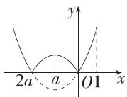  
图①

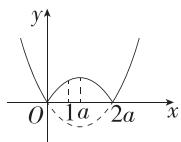  
图②

当 $a \geqslant 1$ 时, 如图②, 此时 $f(x)$ 在 $[0,1]$ 上单调递增, 故 $g(a) = f(1) = 2a - 1$ .

当 $\frac{1}{2} \leqslant a < 1$ 时, 如图③, 此时 $f(x)$ 在 $[0, a]$ 上单调递增, 在 $[a, 1]$ 上单调递减, 故 $g(a) = f(a) = a^2$ .

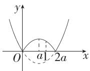  
图③

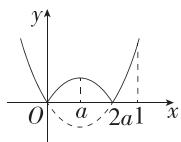  
图④

当 $0 < a < \frac{1}{2}$ 时，如图④，此时 $g(a) = \max \{f(a), f(1)\}$ ，易得 $f(a) = a^2, f(1) = 1 - 2a$

由 $f(a) > f(1)$ 得 $-1 + \sqrt{2} < a < \frac{1}{2}$ ，由 $f(a) \leqslant f(1)$ 得 $0 < a \leqslant -1 + \sqrt{2}$ ，

故 $g(a) = \begin{cases} a^2, -1 + \sqrt{2} < a < \frac{1}{2}, \\ 1 - 2a, 0 < a \leqslant -1 + \sqrt{2}. \end{cases}$

综上, $g(a)=\left\{\begin{aligned}&1-2a,a\leqslant-1+\sqrt{2},\\&a^{2},-1+\sqrt{2}<a<1,\\&2a-1,a\geqslant1,\end{aligned}\right.$ 如图⑤,由图可知当 $g(a)$ 取得最小值时, $a=\sqrt{2}-1$ .

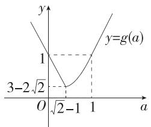

line

| x | y |
|---|---|
| 0 | 3 - 2√2 |
| √2 - 1 | 1 |
| 1 | y = g(a) |

图⑤

8. 答案 $\left[-\frac{1}{3}, \frac{1}{9}\right]$

解析 因为 $\forall x_{1} \in \left[\frac{1}{3}, 3\right]$ , $\exists x_{0} \in \left[\frac{1}{3}, 3\right]$ , 使得 $g(x_{1}) = f(x_{0})$ , 所以函数 $g(x)$ 在 $\left[\frac{1}{3}, 3\right]$ 上的值域是 $f(x)$ 在 $\left[\frac{1}{3}, 3\right]$ 上值域的子集.

易知 $f(x)$ 在 $\left(\frac{1}{3},1\right)$ 上单调递减，在(1,3)上单调递增，

所以 $f(x)_{\min} = f(1) = 2$ ，又 $f\left(\frac{1}{3}\right) = f(3) = \frac{10}{3}$ 所以 $f(x)_{\max} = \frac{10}{3}$ 故 $f(x)$ 的值域为 $\left[2,\frac{10}{3}\right]$

当 $m > 0$ 时， $g(x)$ 在 $\left[\frac{1}{3}, 3\right]$ 上单调递增，故 $g(x)$ 的值域为

$\left[\frac{m}{3} + 3, 3m + 3\right]$ , 则 $\left\{ \begin{array}{l} \frac{m}{3} + 3 \geqslant 2, \\ 3m + 3 \leqslant \frac{10}{3}, \\ m > 0, \end{array} \right.$ 得 $0 < m \leqslant \frac{1}{9}$ ;

当 $m < 0$ 时， $g(x)$ 在 $\left[\frac{1}{3}, 3\right]$ 上单调递减，故 $g(x)$ 的值域为

$\left[3m + 3, \frac{m}{3} + 3\right]$ , 则 $\begin{cases} 3m + 3 \geqslant 2, \\ \frac{m}{3} + 3 \leqslant \frac{10}{3}, \\ m < 0, \end{cases}$ 得 $-\frac{1}{3} \leqslant m < 0$ ;

当 m=0 时, $g(x)=3$ , 满足题意.

综上所述, m 的取值范围是 $\left[-\frac{1}{3}, \frac{1}{9}\right]$ .

9. 解析 (1) 当 $t = 1$ 时, $f(x) = x^2 - 2x + 1$ , $g(x) = -x^2 + 4x + 1$ , 令 $f(x) = g(x)$ , 解得 $x = 0$ 或 $x = 3$ , 易得 $f(0) = g(0) = 1$ , $f(3) = g(3) = 4$ , 画出 $F(x)$ 的图象, 如图 1,

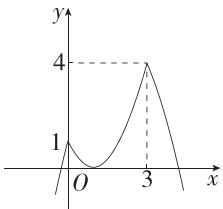

line

| x | y |
|---|---|
| 0 | 1 |
| 3 | 4 |

图1

由图可知, $F(x)$ 的值域为 $(-∞,4]$ .

(2) $h(x) = f(x) + tx - 1 + t^2 = x^2 -tx + t^2 = \left(x - \frac{1}{2} t\right)^2 +\frac{3}{4} t^2,$

由于 $x \in \left[\frac{1}{t}, t\right], t > 0$ ，所以 $\frac{1}{t} < t$ ，故 $t > 1$ .

当 $t > \sqrt{2}$ 时， $\frac{1}{t} < \frac{1}{2} t, h(x)$ 在 $\left[\frac{1}{t}, \frac{1}{2} t\right]$ 上单调递减，在 $\left[\frac{1}{2} t, t\right]$ 上单调递增，且 $t - \frac{1}{2} t > \frac{1}{2} t - \frac{1}{t}$ ，故 $h(x)$ 在 $x = t$ 处取得最大值，为 $t^2$ ，在 $x = \frac{1}{2} t$ 处取得最小值，为 $\frac{3}{4} t^2$ ，故 $h(x)$ 的值域是 $\left[\frac{3}{4} t^2, t^2\right]$ .

当 $1 < t \leqslant \sqrt{2}$ 时， $\frac{1}{t} \geqslant \frac{1}{2} t, h(x)$ 在 $\left[\frac{1}{t}, t\right]$ 上单调递增，故 $h(x)$ 的值域是 $\left[\frac{1}{t^2} + t^2 - 1, t^2\right]$ .

若对任意的 $x \in \left[\frac{1}{t}, t\right]$ , 总存在 $m \in \left[\frac{1}{2t}, 2t\right]$ , 使得 $h(x) = m$ 成立, 则 $h(x)$ 在 $\left[\frac{1}{t}, t\right]$ 上的值域为 $\left[\frac{1}{2t}, 2t\right]$ 的子集, 故 $\left[\frac{3}{4}t^2, t^2\right] \subseteq \left[\frac{1}{2t}, 2t\right]$ 或 $\left[\frac{1}{t^2} + t^2 - 1, t^2\right] \subseteq \left[\frac{1}{2t}, 2t\right]$ ,

故 $\left\{\begin{aligned}\frac{3t^{2}}{4}&\geqslant\frac{1}{2t},\\ t^{2}&\leqslant2t,\\ t&>\sqrt{2}\end{aligned}\right.$ 或 $\left\{\begin{aligned}\frac{1}{t^{2}}+t^{2}-1&\geqslant\frac{1}{2t},\\ t^{2}&\leqslant2t,\\ 1<t&\leqslant\sqrt{2},\end{aligned}\right.$ 解得 $\sqrt{2}<t\leqslant2$ 或 $1<t\leqslant\sqrt{2}$ ,

即 $1 < t \leqslant 2$ .

故 t 的取值范围为 $(1,2]$ .

(3) 令 $x^{2} - 2tx + 1 = -x^{2} + 4tx + 1$ ，解得 $x = 0$ 或 $x = 3t$ ，画出 $F(x)$ 的图象，如图2：

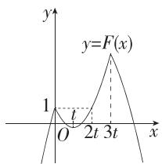

text_image

y
y=F(x)
1
O
l
2t 3t
x

图2

$\forall x \in [0,3], \left| F(x) - \frac{1}{2} \right| \leqslant \frac{3}{2}$ , 即 $\forall x \in [0,3], -1 \leqslant F(x) \leqslant 2$ ,

当 $t \geqslant 3$ 时, $F(x)$ 在 $[0,3]$ 上单调递减, 此时 $F(x)$ 在 $[0,3]$ 上的最小值为 $F(3) = f(3) = 10 - 6t$ , 最大值为 $F(0) = 1$ , 故只需 $10 - 6t \geqslant -1$ , 解得 $t \leqslant \frac{11}{6}$ , 不满足 $t \geqslant 3$ , 舍去;

当 $\frac{3}{2}<t<3$ 时,3<2t,此时 $F(x)$ 在 $[0,3]$ 上的最大值为 $F(0)=1$ ,最小值为 $F(t)=1-t^{2}$ ,故只需 $1-t^{2}\geqslant-1$ ,解得 $-\sqrt{2}\leqslant t\leqslant\sqrt{2}$ ,不满足 $\frac{3}{2}<t<3$ ,故舍去;

当 $1 < t \leqslant \frac{3}{2}$ 时, $2t \leqslant 3 < 3t$ , 此时 $F(x)$ 在 $[0, 3]$ 上的最大值为 $F(3) = f(3) = 10 - 6t$ , 最小值为 $F(t) = 1 - t^{2}$ , 故只需 $1 - t^{2} \geqslant -1$ , 且 $10 - 6t \leqslant 2$ , 解得 $\frac{4}{3} \leqslant t \leqslant \sqrt{2}$ ;

当 $0 < t \leqslant 1$ 时， $3t \leqslant 3$ ，此时 $F(x)$ 在 $[0,3]$ 上的最大值为 $F(3t) = 3t^2 + 1$ ，最小值为 $F(t) = 1 - t^2$ 或 $F(3) = g(3) = -8 + 12t$ ，

故只需 $\left\{\begin{aligned}1-t^{2}&\geqslant-1,\\ 3t^{2}+1&\leqslant2,\\ 1-t^{2}&\leqslant-8+12t\end{aligned}\right.$ 或 $\left\{\begin{aligned}-8+12t&\geqslant-1,\\ 3t^{2}+1&\leqslant2,\\ 1-t^{2}&>-8+12t,\end{aligned}\right.$ 无解.

综上, t 的取值范围是 $\left[\frac{4}{3}, \sqrt{2}\right]$ .

# 3.2.2 奇偶性

# 基础过关练

Q 对应主书 P47

<table><tr><td>1.D</td><td>2.C</td><td>3.C</td><td>4.D</td><td>5.A</td><td>6.B</td><td>7.A</td><td>8.B</td></tr></table>

1.D 函数 $f(x)=x$ 的定义域为 R，且 $f(-x)=-f(x)$ ，故 $f(x)=x$ 是奇函数；

函数 $f(x)=\sqrt{x}$ 的定义域为 $[0,+\infty)$ ，函数 $f(x)=\frac{1}{x-1}$ 的定义域为 $(-∞,1)∪(1,+∞)$ ，均不关于原点对称，故都不是偶函数；

函数 $f(x)=x^{2}+1$ 的定义域为R，且 $f(-x)=f(x)$ ，故 $f(x)=x^{2}+1$ 是偶函数.

2.C 对于 A, $f(x)=x+\frac{1}{x}$ 的定义域为 $\{x\mid x\neq0\}$ ，不为 R，故

不符合题意；

对于 B, $f(x)=x^{4}-2x^{2}$ 的定义域为 R，且 $f(-x)=(-x)^{4}-2(-x)^{2}=x^{4}-2x^{2}=f(x)$ ，故 $f(x)$ 为偶函数，不符合题意；对于 C, $f(x)=x^{5}+3x^{3}$ 的定义域为 R，且 $f(-x)=(-x)^{5}+3(-x)^{3}=-x^{5}-3x^{3}=-f(x)$ ，故 $f(x)$ 为奇函数，符合题意；对于 D, $f(x)=-x^{3}+x+1$ 的定义域为 R，且 $f(-x)=-(-x)^{3}+(-x)+1=x^{3}-x+1\neq-f(x)$ ，故 $f(x)$ 不为奇函数，不符合题意.

3.C 对于 $A, y = \frac{1}{|x|}$ , 是偶函数, 其值域为 $(0, +\infty)$ , 不符合题意;

对于 B, $y = |x + 1| = \begin{cases} x + 1, & x \geqslant -1, \\ -x - 1, & x < -1, \end{cases}$ 不是偶函数，不符合题意；

对于 C, 设 $f(x)=x^{2}+|x|$ , 其定义域为 R, $f(-x)=x^{2}+|x|=f(x)$ , 故 $f(x)$ 为偶函数,

易知 $f(x) \geqslant 0$ ，故 $f(x)$ 的值域为 $[0, +\infty)$ ，符合题意；

对于 D, 设 $g(x)=x^{2}-x^{3}$ , 其定义域为 R, 但 $g(-x)=x^{2}+x^{3}\neq g(x)$ , 故 $g(x)$ 不是偶函数, 不符合题意.

4.D 对于 A, 函数的定义域为 $\{x \mid x \neq -1\}$ , 不关于原点对称, 故不是奇函数, 不符合题意;

对于 B, C, 易知 $y = x^{2}$ , $y = |x|$ 均为偶函数, 不符合题意;

对于 D, 易知 $y=\left\{\begin{aligned}x^{2},&x\geqslant0,\\ -x^{2},&x<0\end{aligned}\right.$ 为奇函数且在定义域 R 上单调递增(图象法可以快速得出结论), 符合题意.

5.A 因为函数 $f(x)$ 在区间[3,7]上单调递增，且有最小值5，所以 $f(3) = 5$ ，

又 $f(x)$ 为奇函数，所以函数 $f(x)$ 在区间 $[-7, -3]$ 上单调递增，且有最大值 $f(-3) = -f(3) = -5$ .

# 归纳总结

奇函数在对称区间上的单调性相同;偶函数在对称区间上的单调性相反.

6.B 当 $x \in [0,5]$ 时，由题中图象可得 $f(x) \leqslant 0$ 的解集为 $[2,5], f(x) \geqslant 0$ 的解集为 $[0,2]$ ，

因为 $f(x)$ 为奇函数，

所以其图象关于原点对称，

所以当 $x \in [-5, 0]$ 时， $f(x) \leqslant 0$ 的解集为 $[-2, 0]$ ，

故 $f(x)\leqslant0$ 的解集为 $[-2,0]\cup[2,5]$ .

7.A ∵ 偶函数 $f(x)$ 在 $(-∞, -1]$ 上单调递增，

∴ 函数 $f(x)$ 在 $[1, +\infty)$ 上单调递减，

则 $f(2) < f\left(\frac{3}{2}\right) < f(1)$ ，即 $f(2) < f\left(-\frac{3}{2}\right) < f(-1)$ .

8.B 根据函数图象的对称性可知 $f(x)$ 为偶函数，且 $f(x)$ 的定义域为 $\{x \mid x \neq \pm 1\}$ .

对于 A, $f(x)=\frac{1}{|x-1|}$ 的定义域为 $\{x|x\neq1\}$ ，故 A 不满足题意；

对于 C, $f(x)=\frac{1}{|x+1|}$ 的定义域为 $\{x|x\neq-1\}$ ，故 C 不满足题意；

对于 D, $f(x)=\frac{1}{|x|+1}$ 的定义域为 R, 故 D 不满足题意.

9. 答案 $(-4, -2) \cup (0, 2)$

解析 设 $h(x) = f(x)g(x)$ ，则 $h(x)$ 的定义域为 $(-4, 4)$ ，且 $h(-x) = f(-x)g(-x) = -f(x)g(x) = -h(x)$ ，

∴ $h(x)$ 是奇函数, 由题图可知, 当 -4 < x < -2 时, $f(x) > 0$ , $g(x) < 0$ , 即 $h(x) < 0$ ; 当 -2 < x < 0 时, $f(x) < 0$ , $g(x) < 0$ , 即 $h(x) > 0$ .

由 $h(x)$ 的图象关于原点对称知, 当 0 < x < 2 时, $h(x) < 0$ ; 当 2 < x < 4 时, $h(x) > 0$ ,

∴ $h(x) < 0$ 即 $f(x)g(x) < 0$ 的解集为 $(-4, -2) \cup (0, 2)$ .

10. 答案 $f(x)=\left\{\begin{aligned}x^{3}-3x+4,x&>0\\ 0,x&=0\\ x^{3}-3x-4,x&<0\end{aligned}\right.$

解析 设 $x < 0$ ，则 $-x > 0, f(-x) = -x^3 + 3x + 4$

∵ $f(x)$ 是奇函数，∴ $f(x) = -f(-x) = x^{3} - 3x - 4$ ,

又 $f(0) = 0, \therefore f(x) = \begin{cases} x^3 - 3x + 4, & x > 0, \\ 0, & x = 0, \\ x^3 - 3x - 4, & x < 0. \end{cases}$

11. 答案 -10

解析 解法一: 当 x>0 时, -x<0, 可得 $f(-x)=x^{2}+4x+5$ , 因为 $f(x)$ 为奇函数, 所以 $f(x)=-f(-x)=-x^{2}-4x-5$ , 则 $f(1)=-1-4-5=-10$ .

解法二: 因为 $f(x)$ 是定义在 R 上的奇函数, 所以 $f(1) = -f(-1) = -\left[(-1)^{2} - 4 \times (-1) + 5\right] = -10$ .

# 能力提升练

Q 对应主书 P48

<table><tr><td>1.B</td><td>2.A</td><td>3.ABD</td><td>4.B</td><td>8.C</td><td>9.A</td><td></td><td></td></tr></table>

1.B 由函数 $f(x) = \frac{|x|}{x^2 - 1}$ ，可得 $x \neq \pm 1$ ，故函数的定义域为 $(- \infty, -1) \cup (-1, 1) \cup (1, +\infty)$ ，

又 $f(-x)=\frac{|-x|}{(-x)^{2}-1}=\frac{|x|}{x^{2}-1}=f(x)$ ，所以 $f(x)=\frac{|x|}{x^{2}-1}$ 是偶函数，其图象关于y轴对称，因此A,D错误；

当 0 < x < 1 时, $x^{2} - 1 < 0$ , $f(x) = \frac{|x|}{x^{2} - 1} < 0$ , 所以 C 错误.

# 目解题模板

已知函数解析式判断函数的图象,通常由解析式分析性质来选择图象,一般先写出函数的定义域,判断函数的奇偶性,再判断函数值的符号,函数的单调性、最大(小)值等,必要时还可用特殊值判断.

2.A 解法一: $f(x)=\frac{2-x}{2+x}=\frac{-(x+2)+4}{2+x}=-1+\frac{4}{x+2}$ ，易知 $f(x)$ 的定义域为 $\{x \mid x \neq -2\}$ ,

则 $f(-4 - x) + f(x) = -1 + \frac{4}{-x - 2} - 1 + \frac{4}{x + 2} = -2 (x \neq -2)$ ，所以

函数 $f(x)$ 图象的对称中心为 $(-2,-1)$ ，将函数 $f(x)$ 的图象向右平移2个单位长度，向上平移1个单位长度，得到函数 $y=f(x-2)+1$ 的图象，其对称中心为 $(0,0)$ ，故函数 $y=f(x-2)+1$ 为奇函数.

解法二: $f(x-2)+1=\frac{2-(x-2)}{2+x-2}+1=\frac{4}{x}$ ，易知其是奇函数；

$$
f (x - 2) + 2 = \frac {4}{x} + 1, f (x + 2) + 2 = \frac {4}{x + 4} + 1, f (x + 2) + 1 = \frac {4}{x + 4},
$$

均不是奇函数.

3.ABD 根据题意,若函数 $y=f(x)$ 的图象的对称中心为 $(a,b)$ , 则 $y=f(x+a)-b$ 为奇函数, 即 $y=(x+a)^{3}-3m(x+a)^{2}-b=x^{3}+(3a-3m)x^{2}+(3a^{2}-6ma)x+a^{3}-3ma^{2}-b$ 为奇函数, 故 $\left\{\begin{aligned}&3a-3m=0,\\ &a^{3}-3ma^{2}-b=0,\end{aligned}\right.$ 所以 $b=-2a^{3}$ , 观察选项可知 A, B, D 符合.

4.B 若 $f(2x - 1)$ 的图象关于直线 $x = 1$ 对称，则 $f(2x - 1) = f(2(-x + 2) - 1)$ （点拨：对称轴为直线 $x = 1$ ，则 $x \to -x + 2$ ），即 $f(2x - 1) = f(-2x + 3) = f(-(2x - 1) + 2)$ ，令 $t = 2x - 1$ ，则 $f(t) = f(-t + 2)$ ，即 $f(x) = f(-x + 2)$ ，则 $f(x)$ 的图象关于直线 $x = 1$ 对称.

若 $f(3x+2)$ 是奇函数,则 $f(3x+2)+f(-3x+2)=0$ ,即 $f(3x+2)+f(-(3x+2)+4)=0$ ,

令 $s = 3x + 2$ ，则 $f(s) + f(-s + 4) = 0$ ，即 $f(x) + f(-x + 4) = 0$ ，则 $f(x)$ 的图象关于点(2,0)对称，且 $f(2) = 0$

由以上分析可知 $f(-x + 2) = -f(-x + 4) = -[-f(-x + 6)] = f(-x + 6)$ ，

令 $m = -x + 2$ ，则 $f(m) = f(m + 4)$ ，即 $f(x) = f(x + 4)$

故 $f(x)$ 的周期为4,则 $f(2024)=f(0)=f(2)=0.$

无法确定 $f\left(\frac{7}{2}\right)$ ， $f(1)$ ， $f\left(\frac{3}{2}\right)$ 的值是不是0.

5. 答案 y 轴; $\pm\frac{1}{2024}$

解析 函数 $f(x) = \frac{1 + x^2}{1 - x^2}$ 的定义域为 $(- \infty, -1) \cup (-1, 1)$

$\cup(1,+\infty)$ ，关于原点对称，

因为 $f(-x)=\frac{1+(-x)^{2}}{1-(-x)^{2}}=\frac{1+x^{2}}{1-x^{2}}=f(x)$ ，所以 $f(x)$ 为偶函数，
图象关于 y 轴对称.

又 $f\left(\frac{1}{x}\right) = \frac{1 + \left(\frac{1}{x}\right)^2}{1 - \left(\frac{1}{x}\right)^2} = \frac{1 + x^2}{x^2 - 1} = -f(x)$ ，即 $f\left(\frac{1}{x}\right) + f(x) = 0$

所以 $f\left(\frac{1}{2024}\right)+f(2024)=0$ ,

又 $f(2024) + f(m) = 0$ ，所以 $f(m) = f\left(\frac{1}{2024}\right)$

又 $f(x)$ 为偶函数,所以 $f\left(-\frac{1}{2024}\right)=f(m)$ ,

所以 $m=\pm\frac{1}{2024}$ .

6. 答案 16

解析 $\because y=f(x+1)-3$ 为奇函数，

∴ 函数 $f(x)$ 的图象关于点 $(1,3)$ 对称，

$$
\because g (x) = \frac {3 x - 2}{x - 1} = \frac {3 (x - 1) + 1}{x - 1} = 3 + \frac {1}{x - 1},
$$

∴ 函数 $g(x)$ 的图象关于点 $(1,3)$ 对称，

$\therefore f(x)$ 与 $g(x)$ 的图象的 8 个交点关于点 $(1,3)$ 对称，不妨设 $x_{1}<x_{2}<\cdots<x_{8}$ ，

则 $\frac{x_1 + x_8}{2} = 1, \frac{x_2 + x_7}{2} = 1, \frac{x_3 + x_6}{2} = 1, \frac{x_4 + x_5}{2} = 1,$

可得 $x_{1} + x_{2} + x_{3} + x_{4} + x_{5} + x_{6} + x_{7} + x_{8} = 4 \times 2 \times 1 = 8$

同理可知 $y_{1} + y_{2} + y_{3} + y_{4} + y_{5} + y_{6} + y_{7} + y_{8} = 4 \times 2 \times 3 = 24$

则 $(y_{1}+y_{2}+\cdots+y_{8})-(x_{1}+x_{2}+\cdots+x_{8})=24-8=16.$

7. 解析 (1) 因为 $f(x) = \frac{x - 2}{2x + 1} = \frac{\frac{1}{2}(2x + 1) - \frac{5}{2}}{2x + 1} = \frac{1}{2} - \frac{\frac{5}{2}}{2x + 1} = \frac{1}{2} - \frac{\frac{5}{4}}{x + \frac{1}{2}}$ ，所以由反比例函数的图象特点及平移变换知 $f(x) = \frac{x - 2}{2x + 1}$ 的图象是中心对称图形，对称中心为 $\left(-\frac{1}{2}, \frac{1}{2}\right)$ .

(2) $f(1-x)=2|1-x-1|=2|x|$ , $f(1+x)=2|1+x-1|=2|x|$ , 即 $f(1-x)=f(1+x)$ , 故 $f(x)=2|x-1|$ 的图象关于直线 x=1 对称, 不是中心对称图形.

(3) 易知 $f(x)$ 的定义域为 R, 又 $f(-x) = |-x + 1| - |-x - 1| = |x - 1| - |x + 1| = -f(x)$ , 所以 $f(x) = |x + 1| - |x - 1|$ 是奇函数, 其图象是中心对称图形, 对称中心是 $(0, 0)$ .

(4) 设 $f(x)=x^{3}-6x^{2}$ 的图象是中心对称图形, 且对称中心为 $(a,b)$ ,

则函数 $y=f(x+a)-b$ 为奇函数，

可得 $f(-x + a) - b = -f(x + a) + b$

变形可得 $f(-x+a)+f(x+a)=2b$ ,

即 $(-x + a)^{3} - 6(-x + a)^{2} + (x + a)^{3} - 6(x + a)^{2} = 2b$

整理可得 $(3a-6)x^{2}+a^{3}-6a^{2}=b$ ，

所以 $\left\{\begin{aligned}3a-6&=0,\\ a^{3}-6a^{2}&=b,\end{aligned}\right.$ 解得 $\left\{\begin{aligned}a&=2,\\ b&=-16,\end{aligned}\right.$ 所以 $f(x)=x^{3}-6x^{2}$ 的图象是中心对称图形，对称中心为(2,-16).

8.C 当 $0 \leqslant x \leqslant 1$ 时, 易得 $f(x) = 2x$ , 由 $2x = \frac{2}{x}$ 得 x = 1 (负值舍去);

当 $1 < x \leqslant 3$ 时，设 $f(x) = kx + b$ ，将(1,2)，(3,0)代入，

得 $\left\{\begin{aligned}k+b=2,\\ 3k+b=0,\end{aligned}\right.$ 解得 $\left\{\begin{aligned}k=-1,\\ b=3,\end{aligned}\right.$ 所以 $f(x)=-x+3,$

由 $-x + 3 = \frac{2}{x}$ , 解得 $x = 1$ 或 $x = 2$ .

又 $f(x)$ 和 $y=\frac{2}{x}$ 都是奇函数,图象关于原点对称,

由此画出 $f(x)$ 和 $y = \frac{2}{x}$ 的图象如图所示，

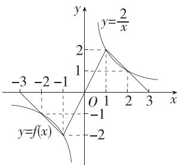

line

| x | y = f(x) | y = 2/x |
|---|---|---|
| -3 | -1.5 | 0 |
| -2 | -1.0 | 0.5 |
| -1 | -0.5 | 1 |
| 0 | 0 | 2 |
| 1 | 0.5 | 1.5 |
| 2 | 1 | 0.5 |
| 3 | 1.5 | 0 |

由图可知,不等式 $f(x)\leqslant\frac{2}{x}$ 的解集是 $[-2,-1]\cup(0,1]\cup[2,3]$ .

9.A 令 x=y=-1，则 $f(1)=-2f(1)+1$ ，所以 $f(1)=\frac{1}{3}$ ,

令 $x = y = 1$ ，则 $f(1) = 2f(-1) + 1$ ，所以 $f(-1) = -\frac{1}{3}$

令 $y = -1$ ，则 $f(-x) = -f(-x) + \frac{f(1)}{x} -\frac{1}{x} = -f(-x) + \frac{1}{3x}-$ $\frac{1}{x} = -f(-x) - \frac{2}{3x}$ 所以 $f(-x) = -\frac{1}{3x},$

令 $y = 1$ ，则 $f(x) = f(-x) + \frac{f(-1)}{x} +\frac{1}{x} = -\frac{1}{3x} -\frac{1}{3x} +\frac{1}{x} = \frac{1}{3x},$

因为 $f(-x)=-\frac{1}{3x}=-f(x)$ ，且定义域关于原点对称，所以函数 $f(x)$ 是奇函数，

由反比例函数的单调性可得函数 $f(x) = \frac{1}{3x}$ 在 $(0, +\infty)$ 和 $(- \infty, 0)$ 上单调递减.

10. 答案 4

解析 因为 $f(x) = \frac{2(x + 1)^2}{x^2 + 1} = \frac{2x^2 + 4x + 2}{x^2 + 1} = \frac{4x}{x^2 + 1} + 2$ ，令 $g(x) = \frac{4x}{x^2 + 1}, x \in [-2024, 2024]$ ，则 $f(x) = g(x) + 2$ ，

因为 $g(-x)=\frac{4(-x)}{(-x)^{2}+1}=\frac{-4x}{x^{2}+1}=-g(x)$ ，定义域关于原点对称，所以函数 $g(x)$ 为奇函数，

因为奇函数的图象关于原点对称,所以函数 $g(x)$ 在区间 $[-2\ 024,2\ 024]$ 上的最大值与最小值之和为 0,

即 $g(x)_{\max} + g(x)_{\min} = 0$ ，所以 $M + m = g(x)_{\max} + 2 + g(x)_{\min} + 2 = 4.$

11. 答案 $[-2, -1] \cup [3, 4]$

解析 $f(x) = 2x^{2} - 4x - \frac{1}{(x - 1)^{2}} = 2(x - 1)^{2} - \frac{1}{(x - 1)^{2}} - 2,$

(对式子进行变形,便于构造函数)

令 $t = x - 1$ ，则 $t \neq 0$ ，则 $f(x)$ 可转化为 $g(t) = 2t^2 - \frac{1}{t^2} - 2$ ，定义域为 $(- \infty, 0) \cup (0, +\infty)$ ，又因为 $g(-t) = 2(-t)^2 - \frac{1}{(-t)^2} - 2 = 2t^2 - \frac{1}{t^2} - 2 = g(t)$ ，所以函数 $g(t)$ 是偶函数，

易知函数 $g(t)$ 在 $(0, +\infty)$ 上单调递增，

不等式 $f(3)\leqslant f(a)\leqslant f(-2)$ ，即 $g(2)\leqslant g(a-1)\leqslant g(-3)$

$$
\Leftrightarrow g (2) \leqslant g (\mid a - 1 \mid) \leqslant g (3),
$$

因此 $2 \leqslant |a - 1| \leqslant 3$ ，解得 $-2 \leqslant a \leqslant -1$ 或 $3 \leqslant a \leqslant 4$

所以 a 的取值范围是 $[-2,-1] \cup [3,4]$ .

12. 解析 (1) 在 $f(x) = f(y) + f(x - y)$ 中, 令 $x = y = 0$ , 得 $f(0) = 0$ , 令 $x = 2, y = 1$ , 得 $f(2) = 2f(1)$ ,

$$
\therefore f (1) + f (2) = 3 f (1) = 6, \therefore f (1) = 2.
$$

(2) $f(x)$ 是奇函数,证明如下:

$f(x)$ 的定义域为 $\mathbf{R}$ , 关于原点对称. 在 $f(x) = f(y) + f(x - y)$ 中, 令 $x = 0$ , 得 $f(0) = f(y) + f(-y) = 0$ ,

$\therefore f(-y) = -f(y)$ , 即 $f(-x) = -f(x)$ ,

∴ 函数 $f(x)$ 是奇函数.

(3) $\because f(x)$ 是奇函数,且 $f(kx^{2}+x)+f(x-1)<0$ 在 $x\in\left(\frac{1}{2},1\right)$ 时恒成立,

$\therefore f(kx^{2} + x) < f(1 - x)$ 在 $x \in \left(\frac{1}{2}, 1\right)$ 时恒成立，

又∵ $f(x)$ 是定义在R上的单调函数,且 $f(0)=0<f(1)=2,\therefore f(x)$ 是R上的增函数,∴ $kx^{2}+x<1-x$ ,即 $k<\left(\frac{1}{x}\right)^{2}-2\cdot\frac{1}{x}$ 在 $x\in\left(\frac{1}{2},1\right)$ 上恒成立.

令 $g(x) = \left(\frac{1}{x}\right)^2 - 2 \cdot \frac{1}{x} = \left(\frac{1}{x} - 1\right)^2 - 1$

$$
\because x \in \left(\frac {1}{2}, 1\right), \therefore \frac {1}{x} \in (1, 2),
$$

$$
\therefore - 1 <   g (x) <   0, \therefore k \leqslant - 1.
$$

则实数 k 的取值范围为 $(-∞, -1]$ .

13. 解析 (1) 由 $p(-x) = p(x)$ ，得 $-x + 1 + \frac{1}{x} = x + 1 - \frac{1}{x}$ ，

则 $x - \frac{1}{x} = \frac{x^2 - 1}{x} = 0$ ，解得 $x = \pm 1$

所以函数 $p(x) = x + 1 - \frac{1}{x}$ 的偶点为 $\pm 1$

(2) 取 $h(x) = x^2 - x, H(x) = x^2 + 2x$ ，存在 $x_0 = 0$ ，使得 $h(-x_0) = h(x_0), H(x_0) = H(-x_0)$ ，则这两个函数均为定义在 $\mathbf{R}$ 上的“缺陷偶函数”，

$y=h(x)+H(x)=2x^{2}+x$ ，由 $2x^{2}+x=2x^{2}-x$ 可得x=0，故 $y=h(x)+H(x)$ 为“缺陷偶函数”，且偶点为0.

取 $h(x)=x^{2}-x$ , $H(x)=x^{2}+x$ , 易证这两个函数均为定义在 R 上的“缺陷偶函数”,

$y=h(x)+H(x)=2x^{2}$ ，定义域为R，因为 $2(-x)^{2}=2x^{2}$ ，所以 $y=h(x)+H(x)$ 为偶函数，

所以 $y=h(x)+H(x)$ 可能不是“缺陷偶函数”.

(3)由题意得 $f(x)+g(x)-x^{2}=-f(y)+2g(y)+y$ 对任意的 $x,y\in R$ 恒成立，

所以存在常数 a，使得 $f(x) + g(x) - x^{2} = -f(y) + 2g(y) + y = a.$

令 $y = x$ ，得 $\left\{ \begin{array}{l}f(x) + g(x) - x^2 = a,\\ -f(x) + 2g(x) + x = a, \end{array} \right.$

解得 $g(x)=\frac{x^{2}-x+2a}{3}$ .

① $g(0)=g(1)=\frac{2a}{3}.$   
② $y=\frac{g(x)}{x}=\frac{x}{3}+\frac{2a}{3x}-\frac{1}{3}$ ，设 $y=\frac{g(x)}{x}$ 的偶点为 $x_{1}(x_{1}\neq0)$ ，

则由 $\frac{g(-x_1)}{-x_1} = \frac{g(x_1)}{x_1}$ , 得 $x_1^2 = -2a$ ,

则-2a>0, 即 a<0, 则 $g(1)$ 的取值范围为 $(-∞,0)$ .

# 单元整合练 函数性质的综合应用 --- Q 对应主书 P50

<table><tr><td>1.C</td><td>2.D</td><td>3.B</td><td>4.ACD</td><td>5.D</td><td>6.ABD</td><td></td><td></td></tr></table>

1.C 因为当 $x_{1}, x_{2} \in [2, +\infty)$ 时， $[f(x_{1}) - f(x_{2})](x_{1} - x_{2}) < 0$ 恒成立，所以 $f(x)$ 在 $[2, +\infty)$ 上单调递减，

又函数 $f(x+2)$ 是偶函数,所以函数 $f(x)$ 的图象关于直线x=2对称,因此 $a=f(1)=f(3)$ , $c=f\left(-\frac{1}{2}\right)=f\left(\frac{9}{2}\right)$ ,

由函数 $f(x)$ 在 $[2, +\infty)$ 上单调递减，

得 $f\left(\frac{5}{2}\right)>f(3)>f\left(\frac{9}{2}\right)$ ，即 $f\left(\frac{5}{2}\right)>f(1)>f\left(-\frac{1}{2}\right)$ ，所以b>a>c.

2.D 对于 A, 因为 $g(x)$ 与 $t(x)$ 的图象关于 y 轴对称, 所以 $g(x) = t(-x) = -(-x)^{3} + 12(-x) = x^{3} - 12x$ , 故 A 错误.

对于 B, $g(x) = x^{3} - 12x$ ，定义域为 R, $g(-x) = (-x)^{3} - 12(-x) = -x^{3} + 12x = -g(x)$ ，所以 $g(x)$ 是奇函数，故 B 错误.

对于 C, 因为 $g(x)=f(x+2)+16$ , 所以 $f(x+2)=g(x)-16=x^{3}-12x-16$ , 所以 $f(x)=(x-2)^{3}-12(x-2)-16=x^{3}-6x^{2}+12x-8-12x+24-16=x^{3}-6x^{2}$ ,

因为 $f(-x) = (-x)^{3} - 6(-x)^{2} = -x^{3} - 6x^{2}$ , $f(-x) \neq -f(x)$ 且 $f(-x) \neq f(x)$ ,

所以 $f(x)$ 既不是奇函数也不是偶函数, 故 C 错误.

对于 D, 由 $g(x)=f(x+2)+16$ , 可知将 $g(x)$ 的图象向右平移 2 个单位长度, 再向下平移 16 个单位长度得到 $f(x)$ 的图象, 因为 $g(x)$ 是奇函数, 图象关于原点对称, 所以 $f(x)$ 的图象关于点 $(2,-16)$ 对称, 故 D 正确.

3.B 因为函数 $f(x)$ 的定义域为 R, 函数 $y = xf(x + 2)$ 是奇函数,

所以对任意的 $x \in R, -xf(-x+2) = -xf(x+2)$ ，可得 $f(2-x) = f(2+x)$ ，

所以函数 $f(x)$ 的图象关于直线 x=2 对称, 则 $f(2)$ 的值不确定, C 错误;

令 $g(x)=(x+2)f(x)$ ，因为函数 $y=(x+2)f(x)$ 的图象关于直线 x=-2 对称，

所以 $g(-2 + x) = g(-2 - x)$

即对任意的 $x \in R, xf(-2+x) = -xf(-2-x)$ ，即 $f(-2+x) = -f(-2-x)$ ，所以函数 $f(x-2)$ 为奇函数，

即函数 $f(x)$ 的图象关于点 $(-2,0)$ 对称，B正确；

无法判断函数 $f(x)$ 的奇偶性,A 错误;

因为函数 $f(x)$ 的图象关于直线 $x = 2$ 对称, 所以 $f(4 + x) = f(-x)$ ,

因为函数 $f(x)$ 的图象关于点 $(-2,0)$ 对称，所以 $f(-4+x)=-f(-x)$ ，

所以 $f(x + 4) = -f(x - 4)$ ，则 $f(x + 8) = -f(x)$

故 $f(x+16)=-f(x+8)=f(x)$ ，D错误.

# 知识积累

①函数 $f(x)$ 的图象关于点 $(a,b)$ 对称，则 $f(x)+f(2a-x)=2b$ ；  
②函数 $f(x)$ 的图象关于直线 $x = a$ 对称，则 $f(x) = f(2a - x)$ .

4.ACD 因为 $f(xy) = yf(x) + xf(y)$ ，所以令 x = y = 0，得 $f(0) = 0$ ，故 A 正确；

令 $x = y = 1$ ，得 $f(1) = f(1) + f(1)$ ，所以 $f(1) = 0$

令 $x = y = -1$ ，得 $f(1) = -f(-1) - f(-1)$ ，所以 $f(-1) = 0$

令 $y = -1$ ，得 $f(-x) = -f(x) + xf(-1)$ ，又 $f(-1) = 0$ ，所以 $f(-x) = -f(x)$

又因为 $f(x)$ 的定义域为R,所以函数 $f(x)$ 是奇函数,故B错误;

令 $x = y = 2$ ，得 $f(4) = 2f(2) + 2f(2) = 4f(2) = 8,$

令 $x = 4, y = \frac{1}{4}$ , 得 $f(1) = \frac{1}{4} f(4) + 4f\left(\frac{1}{4}\right)$ ,

所以 $f\left(\frac{1}{4}\right)=-\frac{1}{16}f(4)=-\frac{1}{2}$ ，故C正确；

当 x, y > 0 时，由 $f(xy) = yf(x) + xf(y)$ ，可得 $\frac{f(xy)}{xy} = \frac{f(x)}{x} + \frac{f(y)}{y}$ ,

又 $g(x) = \frac{f(x)}{x}$ , 所以 $g(xy) = g(x) + g(y)$ ,

$\forall x_{1},x_{2}\in (0, + \infty)$ ，且 $x_{1} <   x_{2}$

则 $g(x_{1}) - g(x_{2}) = g(x_{1}) - g\left(x_{1} \cdot \frac{x_{2}}{x_{1}}\right) = g(x_{1}) - g(x_{1}) - g\left(\frac{x_{2}}{x_{1}}\right) = -g\left(\frac{x_{2}}{x_{1}}\right),$

又 $0 < x_{1} < x_{2}$ , 所以 $\frac{x_{2}}{x_{1}} > 1$ , $g\left(\frac{x_{2}}{x_{1}}\right) = \frac{f\left(\frac{x_{2}}{x_{1}}\right)}{\frac{x_{2}}{x_{1}}} > 0$ , 故 $g(x_{1}) < g(x_{2})$ ,

所以 $g(x)=\frac{f(x)}{x}$ 在 $(0,+\infty)$ 上单调递增, 故 D 正确.

5.D 令 x=y=1，得 $f(1)=f(1)+f(1)$ ，故 $f(1)=0$ ，

令 $x = y = -1$ ，得 $f(1) = f(-1) + f(-1)$ ，故 $f(-1) = 0$

令 $y = -1$ ，得 $\frac{f(-x)}{x^2} = \frac{f(x)}{x^2} +\frac{f(-1)}{(-1)^2}$ 即 $\frac{f(-x)}{(-x)^2} = \frac{f(x)}{x^2},$

令 $g(x) = \frac{f(x)}{x^2}$ , 则 $g(x)$ 的定义域为 $\{x \mid x \neq 0\}$ , 且 $g(-x) = g(x)$ , 故 $g(x)$ 为偶函数.

$\forall x_{1},x_{2}\in (0, + \infty)$ ，且 $x_{1} > x_{2}$

则 $g(x_{1}) - g(x_{2}) = \frac{f(x_{1})}{x_{1}^{2}} -\frac{f(x_{2})}{x_{2}^{2}} = \frac{f\left(x_{2}\cdot\frac{x_{1}}{x_{2}}\right)}{x_{2}^{2}\cdot\frac{x_{1}^{2}}{x_{2}^{2}}} -\frac{f(x_{2})}{x_{2}^{2}} =$

$$
\frac {f \left(x _ {2}\right)}{x _ {2} ^ {2}} + \frac {f \left(\frac {x _ {1}}{x _ {2}}\right)}{\frac {x _ {1} ^ {2}}{x _ {2} ^ {2}}} - \frac {f \left(x _ {2}\right)}{x _ {2} ^ {2}} = \frac {f \left(\frac {x _ {1}}{x _ {2}}\right)}{\frac {x _ {1} ^ {2}}{x _ {2} ^ {2}}},
$$

$$
\because x _ {1} > x _ {2} > 0, \therefore \frac {x _ {1}}{x _ {2}} > 1,
$$

∵ 当 x>1 时， $f(x)>0,\therefore f\left(\frac{x_{1}}{x_{2}}\right)>0,\therefore g(x_{1})-g(x_{2})>0$ ，即 $g(x_{1})>g(x_{2}),\therefore g(x)$ 在 $(0,+\infty)$ 上单调递增，

由 $(2x-1)^{2}f(x)>x^{2}f(2x-1)$ 及 $f(x)$ 的定义域为 $\{x\mid x\in\mathbf{R},x\neq0\}$ 可得 $x\neq0,2x-1\neq0$ ，故 $\frac{f(x)}{x^{2}}>\frac{f(2x-1)}{(2x-1)^{2}}$ ，即 $g(x)>g(2x-1)$ ，又 $g(x)$ 为偶函数，

$\therefore \left\{ \begin{array}{l} x \neq 0, \\ 2x - 1 \neq 0, \\ |x| > |2x - 1|, \end{array} \right.$ 解得 $\frac{1}{3} < x < 1$ 且 $x \neq \frac{1}{2}$ , 故不等式的解集为 $\left(\frac{1}{3}, \frac{1}{2}\right) \cup \left(\frac{1}{2}, 1\right)$ .

6.ABD 对于 A, 令 x = y = 0, 得 $f(0) = f(0)g(0) - g(0)f(0) = 0$ ,

令 $x = 1, y = 0$ ，得 $f(1) = f(1)g(0) - g(1)f(0) = f(1)g(0)$ ，又 $f(1) \neq 0, \therefore g(0) = 1$ ，故 $\mathsf{A}$ 正确；

对于 B, 令 x=0, 得 $f(-y)=f(0)g(y)-g(0)f(y)$ ,

将 $f(0)=0, g(0)=1$ 代入上式，得 $f(-y)=-f(y)$ ，即 $f(-x)=-f(x)$ ，又 $f(x)$ 的定义域为R，∴函数 $f(x)$ 为奇函数，其图象关于 $(0,0)$ 对称，

∴ 函数 $f(2x-1)$ 的图象关于点 $\left(\frac{1}{2},0\right)$ 对称, 故 B 正确;

对于 C, 令 x = 1, y = -1, 得 $f(2) = f(1)g(-1) - g(1)f(-1)$ , $\because f(-1) = -f(1)$ ,

$$
\begin{array}{l} {\therefore f (2) = f (1) \left[ g (- 1) + g (1) \right], \text {又} \because f (2) = - f (- 2) =} \\ {- f (1), \therefore - f (1) = f (1) \left[ g (- 1) + g (1) \right],} \end{array}
$$

$\because f(1)\neq0,\therefore g(1)+g(-1)=-1,$ 故 C 错误；

对于 D, 令 y = -1, 得 $f(x + 1) = f(x)g(-1) - g(x)f(-1)$ , 令 y = 1, 得 $f(x - 1) = f(x)g(1) - g(x)f(1)$ ,

两式相加得 $f(x + 1) + f(x - 1) = -f(x)$ ，

$\therefore f(x + 2) + f(x) = -f(x + 1)$ ，即 $f(x) = -f(x + 1) - f(x + 2)$

故 $-f(x)+f(x)=f(x+1)+f(x-1)-f(x+1)-f(x+2)=0$ ，即 $f(x-1)=f(x+2),\therefore f(x)=f(x+3)$ ,

$\therefore f(x)$ 为周期函数，且周期为 $3, \because f(1) = \frac{\sqrt{3}}{2}, \therefore f(-2) =$

$$
\frac {\sqrt {3}}{2}, \therefore f (2) = - f (- 2) = - \frac {\sqrt {3}}{2}, f (3) = f (0) = 0,
$$

$$
\therefore f (1) + f (2) + f (3) = 0, \therefore f (1) + f (2) + f (3) + \dots +
$$

$$
f (2 0 2 4) = f (2 0 2 3) + f (2 0 2 4) = f (1) + f (2) = \frac {\sqrt {3}}{2} +
$$

$\left(-\frac{\sqrt{3}}{2}\right)=0$ ，故D正确.

7. 答案 $\left[-2, -\frac{1}{2}\right], (0, 3]; \left[\frac{1}{2}, 1\right]$

解析 当 c=0 时， $f(x)=\left\{\begin{aligned}x^{2}+x,-2&\leqslant x\leqslant0,\\ \frac{1}{x},&0<x\leqslant3,\end{aligned}\right.$

当 $-2\leqslant x\leqslant0$ 时， $f(x)=x^{2}+x=\left(x+\frac{1}{2}\right)^{2}-\frac{1}{4}$ ，其单调递减区间为 $\left[-2,-\frac{1}{2}\right]$ ，

当 $0 < x \leqslant 3$ 时， $f(x) = \frac{1}{x}$ 单调递减，

故当 $c = 0$ 时， $f(x)$ 的单调递减区间是 $\left[-2, -\frac{1}{2}\right], (0,3]$ .

因为函数 $y = \frac{1}{x}$ 在 $(- \infty, 0), (0, +\infty)$ 上单调递减，函数 $f(x)$ 的值域是 $\left[-\frac{1}{4}, 2\right]$ ，所以 $0 < c < 3$ .

当 $c < x \leqslant 3$ 时, 函数 $f(x)$ 单调递减, 所以 $f(x) \in \left[\frac{1}{3}, \frac{1}{c}\right) \subseteq \left[-\frac{1}{4}, 2\right]$ , 即有 $\frac{1}{c} \leqslant 2$ , 所以 $\frac{1}{2} \leqslant c < 3$ ,

故函数 $f(x)$ 在 $[-2,c]$ 上的值域为 $\left[-\frac{1}{4},2\right]$ .

易知 $f(x)=x^{2}+x=\left(x+\frac{1}{2}\right)^{2}-\frac{1}{4}$ 在 $x=-\frac{1}{2}$ 处取得最小值 $-\frac{1}{4}$ ,

令 $x^{2}+x=2$ ，解得 x=1 或 x=-2，所以函数 $f(x)=x^{2}+x$ 在 x=-2 处取得最大值 2，

当 $x = c$ 时， $f(c) = c^2 + c \leqslant 2$ ，解得 $-2 \leqslant c \leqslant 1$ .

综上,实数 c 的取值范围是 $\left[\frac{1}{2},1\right]$ .

8. 答案 $\left[\frac{1}{2},1\right)$

解析 易知 $[u] \leqslant u < [u] + 1$ ，即 $0 \leqslant u - [u] < 1$ .

$2x-\left[2x+t\right]=(2x+t)-\left[2x+t\right]-t$ ，令 $z=(2x+t)-\left[2x+t\right]$ ，则 $0 \leqslant z < 1, 2x - \left[2x + t\right] = z - t,$

故 $f(x)=|2x-[2x+t]|$ 可转化为 $g(z)=|z-t|$ ， $0\leqslant z<1$

当 $t \leqslant 0$ 时, $y = g(z)$ 的图象如图1所示, $g(z)$ 在 $z \in [0,1)$ 上有最小值, 无最大值, 不符合题意;

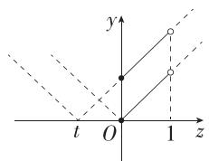

text_image

y
t O 1 z

图1

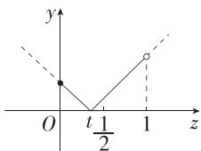  
图2

当 $0 < t < \frac{1}{2}$ 时， $y = g(z)$ 的图象如图2所示， $g(z)$ 在 $z \in [0, 1)$ 上有最小值，无最大值，不符合题意；

当 $\frac{1}{2}\leqslant t<1$ 时, $y=g(z)$ 的图象如图3所示, $g(z)$ 在 $z\in[0,$ 1) 上有最大值和最小值,符合题意;

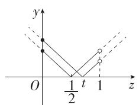

text_image

y
O 1/2 t 1 z

图 3

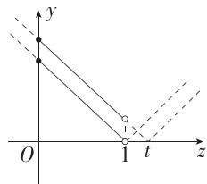

text_image

y
O
1 t z

图 4

当 $t \geqslant 1$ 时, $y = g(z)$ 的图象如图4所示, $g(z)$ 在 $z \in [0,1)$ 上有最大值, 无最小值, 不符合题意.

综上,实数 t 的取值范围为 $\left[\frac{1}{2},1\right)$ .

9. 答案 $\left[\frac{\sqrt{6}}{6},\sqrt{6}\right)$

解析 因为当 $x \in [1,4]$ 时， $f(x) = \frac{1}{x^{2}} + \frac{1}{2}$ 且 $f(x)$ 为“互倒函数”，

所以当 $x \in \left[\frac{1}{4}, 1\right]$ 时， $f(x) = f\left(\frac{1}{x}\right) = x^2 + \frac{1}{2}$ ，画出 $y = f(x)$ 在 $\left[\frac{1}{4}, 4\right]$ 上的图象，如图.

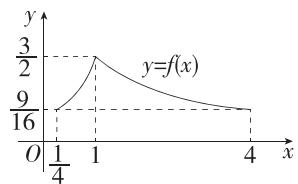

line

| x    | y     |
| ---- | ----- |
| 0    | 9/16  |
| 1/4  | 3/2   |
| 4    | 9/16  |

当 $n \leqslant 1$ 时， $f(x)$ 在 $[m, n]$ 上单调递增，故 $f(x)$ 在 $[m, n]$ 上的值域为 $\left[m^2 + \frac{1}{2}, n^2 + \frac{1}{2}\right]$ （设为 $D_1$ ），

则 $\frac{1}{f(x)}$ 在 $[m, n]$ 上的值域为 $\left[\frac{1}{n^2 + \frac{1}{2}}, \frac{1}{m^2 + \frac{1}{2}}\right]$ （设为 $D_2$ ），

由题意得 $D_{1} \subseteq D_{2}$ , 故 $m^{2} + \frac{1}{2} \geqslant \frac{1}{n^{2} + \frac{1}{2}}$ 且 $n^{2} + \frac{1}{2} \leqslant \frac{1}{m^{2} + \frac{1}{2}}$ ,

所以 $\left(m^2 +\frac{1}{2}\right)\left(n^2 +\frac{1}{2}\right) = 1$ ，所以 $n^2 = \frac{1}{m^2 + \frac{1}{2}} -\frac{1}{2}$ 其中 $\frac{1}{4}\leqslant$

$$
m <   n \leqslant 1,
$$

故 $\left\{\begin{aligned}m^{2}<\frac{1}{m^{2}+\frac{1}{2}}-\frac{1}{2}\leqslant1,\\ \frac{1}{4}\leqslant m<1,\end{aligned}\right.$

故 $\frac{1}{6} \leqslant m^2 < \frac{1}{2}$ , 所以 $m^2 n^2 = \frac{m^2}{m^2 + \frac{1}{2}} -$

$$
\frac {1}{2} m ^ {2} = \frac {5}{4} - \frac {1}{2} \left(m ^ {2} + \frac {1}{2} + \frac {1}{m ^ {2} + \frac {1}{2}}\right),
$$

易知 $\frac{2}{3} \leqslant m^2 + \frac{1}{2} < 1$ ，函数 $y = t + \frac{1}{t}$ 在 $\left[\frac{2}{3}, 1\right)$ 上单调递减，所以 $2 < m^2 + \frac{1}{2} + \frac{1}{m^2 + \frac{1}{2}} \leqslant \frac{13}{6}$ ，所以 $\frac{1}{6} \leqslant m^2 n^2 < \frac{1}{4}$ ，所以 $\frac{\sqrt{6}}{6} \leqslant mn < \frac{1}{2}$ .

当 $1 < n \leqslant 4$ 时， $f(x)$ 在 $[m, 1)$ 上单调递增，在 $[1, n]$ 上单调递减，故 $f(x)$ 在 $[m, n]$ 上的值域为 $\left[\min \left\{m^2 + \frac{1}{2}, \frac{1}{n^2} + \frac{1}{2}\right\}, \frac{3}{2}\right]$ ，

故 $\frac{1}{f(x)}$ 在 $[m, n]$ 上的值域为 $\left[\frac{2}{3}, \frac{1}{\min\left\{m^2 + \frac{1}{2}, \frac{1}{n^2} + \frac{1}{2}\right\}}\right]$ ,

由题意可得 $\min\left\{m^{2}+\frac{1}{2},\frac{1}{n^{2}}+\frac{1}{2}\right\}=\frac{2}{3}$ ,

若 $m < \frac{1}{n}$ ，则 $m^{2} + \frac{1}{2} = \frac{2}{3}$ ，故 $m^{2} = \frac{1}{6}$ ，即 $m = \frac{\sqrt{6}}{6}$ ，故 mn = $\frac{\sqrt{6}}{6} n$ ，又 $1 < n < \frac{1}{m} = \sqrt{6}$ ，故 $\frac{\sqrt{6}}{6} < nm < 1$ ;

若 $\frac{1}{n}\leqslant m$ ，则 $\frac{1}{n^{2}}+\frac{1}{2}=\frac{2}{3}$ ，故 $n^{2}=6$ ，即 $n=\sqrt{6}$ ，故 $mn=\sqrt{6}m$ ，
又 $\frac{\sqrt{6}}{6}\leqslant m<1$ ，故 $1\leqslant nm<\sqrt{6}$ .

综上,mn 的取值范围是 $\left[\frac{\sqrt{6}}{6},\sqrt{6}\right)$ .

10. 解析 (1) 当 $a = 0$ 时, $f(x) = (x - 1)^3$ ,

任取 $x_{1}, x_{2} \in \mathbf{R}$ , 且 $x_{1} < x_{2}$ ,

则 $f(x_{2})-f(x_{1})=(x_{2}-1)^{3}-(x_{1}-1)^{3}=(x_{2}-x_{1})[(x_{2}-1)^{2}+(x_{2}-1)(x_{1}-1)+(x_{1}-1)^{2}]$ ,

又 $x_{2} - x_{1} > 0, (x_{2} - 1)^{2} + (x_{2} - 1)(x_{1} - 1) + (x_{1} - 1)^{2} = \left[(x_{2} - x_{1})\right]$ .

$1) + \frac{1}{2} (x_{1} - 1)\Bigg]^{2} + \frac{3}{4} (x_{1} - 1)^{2} > 0,$

故 $f(x_{2})-f(x_{1})>0$ ,

故 $f(x)$ 在R上单调递增.

(2)①证明:由题意得 $g(x)=|f(x)|=|(x-1)^{3}+a(x-1)|$ ,

$$
\begin{array}{l} g (2 - x) = | (2 - x - 1) ^ {3} + a (2 - x - 1) | = | (1 - x) ^ {3} + a (1 - x) | = \\ | (x - 1) ^ {3} + a (x - 1) |, \end{array}
$$

故 $g(x) = g(2 - x)$

故函数 $g(x)$ 的图象关于直线 x=1 对称.

②因为 a>0，所以当 $x \geqslant 1$ 时， $g(x)=|(x-1)^{3}+a(x-1)|=(x-1)^{3}+a(x-1)$ ，

易知函数 $y = a(x - 1)$ 在 $[1, +\infty)$ 上单调递增，

由(1)知函数 $y=(x-1)^{3}$ 在 R 上单调递增，

故函数 $g(x)$ 在 $[1, +\infty)$ 上单调递增，

又函数 $g(x)$ 的图象关于直线 $x = 1$ 对称，

故函数 $g(x)$ 在 $(-\infty, 1]$ 上单调递减，

易知 $g(1)=0, g(-2)=3a+27>g(2)=a+1$ ,

故 $g(x)$ 在 $[-2, 2]$ 上的值域为 $[0, 3a + 27]$ .

11. 解析 (1) $f(x)$ 为奇函数, 证明如下:

$f(x)$ 的定义域是 $(-1, 1)$ , 关于原点对称,

令 $u = v = 0$ ，则 $f(0) + f(0) = f(0)$ ，所以 $f(0) = 0$

令 $v = -u$ ，则 $f(u) + f(-u) = f\left(\frac{u - u}{1 - u^2}\right) = f(0) = 0,$

所以 $f(u) = -f(-u)$ ，所以 $f(x)$ 为奇函数.

(2)不妨设 $-1 < x_{1} < x_{2} \leqslant 0$ ，由 $\frac{f(x_1) - f(x_2)}{x_2 - x_1} > 0$ ，得 $f(x_1) >$

$f(x_{2})$ ，则 $f(x)$ 在 $(-1,0]$ 上单调递减，

又 $f(x)$ 是定义在 $(-1,1)$ 上的奇函数.

所以 $f(x)$ 在 $(-1, 1)$ 上单调递减.

则 $f(2x) + f\left(-x - \frac{1}{4}\right) > 0$ 可变形为 $f(2x) > -f\left(-x - \frac{1}{4}\right) =$

$$
f \left(x + \frac {1}{4}\right),
$$

则 $\left\{\begin{aligned}-1&<2x<1,\\ -1&<x+\frac{1}{4}<1,\end{aligned}\right.$ 解得 $-\frac{1}{2}<x<\frac{1}{4},$ $2x<x+\frac{1}{4}$

故所求不等式的解集为 $\left\{x\left|\frac{1}{2}<x<\frac{1}{4}\right.\right\}$ .

(3)由(2)知 $f(x)$ 在(-1,1)上单调递减，且 $f(0)=0$ ，所以 $|f(x)|_{\min}=0$ ，

所以 $\forall x\in (-1,1), - x^2 +m|x| - \frac{1}{9}\leqslant 0,$

令 $t = |x|$ ，则 $t \in [0,1), -t^2 + mt - \frac{1}{9} \leqslant 0$ 恒成立，

当 t=0 时, 不等式为 $-\frac{1}{9} \leqslant 0$ , 显然恒成立, 故 $m \in R$ .

当 $t \neq 0$ 时, $m \leqslant t + \frac{1}{9t}$ 恒成立, 故 $m \leqslant \left(t + \frac{1}{9t}\right)_{\min}$ .

因为 $t + \frac{1}{9t}\geqslant 2\sqrt{t\cdot\frac{1}{9t}} = \frac{2}{3}$ ，当且仅当 $t = \frac{1}{3}$ 时等号成立，

所以 $m \leqslant \frac{2}{3}$ .

综上,实数 m 的取值范围是 $\left(-\infty, \frac{2}{3}\right]$ .

# 3.3 幂函数

# 基础过关练

Q 对应主书 P52

<table><tr><td>1.B</td><td>2.B</td><td>3.C</td><td>4.D</td><td>6.D</td><td>7.A</td><td>8.B</td><td>9.AB</td></tr></table>

1.B 根据幂函数的概念,可得①⑤为幂函数,②③④不符合幂函数的基本形式.

2.B 设 $f(x) = x^{\alpha}$ ( $\alpha$ 为常数), $\because f(x)$ 的图象经过点(2,

$$
\sqrt {2}), \therefore 2 ^ {\alpha} = \sqrt {2}, \therefore f (4) = 4 ^ {\alpha} = 2 ^ {2 \alpha} = \left(2 ^ {\alpha}\right) ^ {2} = 2.
$$

3.C 因为 $f(x)$ 是幂函数, 所以 a-1=1, 得 a=2, 则 $f(x)=x^{2}$ , 故 $f(-2)=4$ .

4.D 由函数 $f(x) = (m^2 - 3m + 1)x^{m-1}$ 是幂函数, 得 $m^2 - 3m + 1 = 1$ , 解得 $m = 3$ 或 $m = 0$ , 当 $m = 3$ 时, $f(x) = x^2$ , 是 $\mathbf{R}$ 上的偶函数, 不符合题意, 当 $m = 0$ 时, $f(x) = x^{-1}$ , 是 $(-\infty, 0) \cup (0, +\infty)$ 上的奇函数, 符合题意, 所以 $m = 0$ .

5. 答案 4

解析 由题意得 $m^2 - m - 1 = 1$ ，解得 $m = -1$ 或 $m = 2$ ，当 $m = -1$ 时， $f(x) = x$ ，是奇函数，不符合题意，当 $m = 2$ 时， $f(x) = x^4$ ，是偶函数，符合题意，故 $m = 2$ ， $f(\sqrt{2}) = (\sqrt{2})^4 = 4$ .

6.D 易知形如 $y=x^{\alpha}$ 的函数为幂函数, 显然 A, C 不符合定义;

又 $y=x^{2}$ 在 $(-∞,0)$ 上单调递减，在 $(0,+∞)$ 上单调递增，故 D 正确；

$y=x^{-2}$ 在 $(-∞,0)$ 上单调递增，在 $(0,+∞)$ 上单调递减，故B错误.

7.A 在第一象限内,幂函数 $y=x^{\alpha}$ 的图象在直线 x=1 的右侧的部分由下向上, $\alpha$ 逐渐增大,

且当 $\alpha>0$ 时, $y=x^{\alpha}$ 在第一象限内单调递增, 且递增速度以 $\alpha=1$ 为界点, 当 $\alpha<0$ 时, $y=x^{\alpha}$ 在第一象限内单调递减, 所以 $\alpha_{1}>1>\alpha_{2}>0>\alpha_{3}$ , 故 A 满足.

8.B $\because a^{6} = \frac{1}{8}, b^{6} = \frac{1}{9}, c^{6} = \frac{1}{4}, d^{6} = \frac{1}{27},$

$$
\therefore c ^ {6} > a ^ {6} > b ^ {6} > d ^ {6}, \text {又} a > 0, b > 0, c > 0, d > 0, \therefore c > a > b > d.
$$

9.AB 对于 A, 易知 $y = x^{-1}$ 在 $(-∞, 0)$ , $(0, +∞)$ 上单调递减, 但在整个定义域上不具有单调性, 故 A 错误;

对于 B, 根据幂函数的定义可知 $y = x^{0}$ 也是幂函数, 故 B 错误;

对于 C, 易知 $y = x^{2}$ 的定义域为 R, 且 $(-x)^{2} = x^{2}$ , 故 $y = x^{2}$ 为偶函数, 故 C 正确;

对于 D, 易知 $y = x^{3}$ 单调递增, 当且仅当 x = 0 时, y = 0, 故 $y = x^{3}$ 的图象与 x 轴有且只有一个交点, 故 D 正确.

10. 答案 $\frac{1}{4}$

解析 因为幂函数 $f(x) = (m^2 - 2m - 2)x^{m^2 + m - 2}$ 在 $(0, +\infty)$ 上单调递减，

所以 $\left\{ \begin{array}{l} m^2 - 2m - 2 = 1, \\ m^2 + m - 2 < 0, \end{array} \right.$ 解得 $m = -1$ ，所以 $f(x) = x^{-2}$ ，所以

$$
f (2 m) = f (- 2) = \frac {1}{4}.
$$

11. 答案 (1,2)

解析 因为 $f(x)=(m^{2}-4m+4)x^{m-2}$ 是幂函数, 所以 $m^{2}-4m+4=1$ , 解得 m=1 或 m=3.

又因为 $f(x)$ 在 $(0, +\infty)$ 上单调递减，所以 $m - 2 < 0$

所以 $m = 1, f(x) = \frac{1}{x}$ .

由 $f(2-x)=\frac{1}{2-x}>1$ , 解得 1<x<2 , 所以不等式 $f(2-x)>1$ 的解集是 $(1,2)$ .

12. 解析 (1) 由已知得 $2k^{2} + 5k - 2 = 1$ ，得 $k = -3$ 或 $k = \frac{1}{2}$ ，因为 $f(x)$ 在区间 $(0, +\infty)$ 上单调递增，所以 $k = \frac{1}{2}$ .

(2)由(1)可得 $f(x)=x^{\frac{1}{2}}$ .

(i) $f(a) + f\left(\frac{1}{a}\right) = a^{\frac{1}{2}} + a^{-\frac{1}{2}} = 2,$

$$
f \left(a ^ {2}\right) + f \left(\frac {1}{a ^ {2}}\right) = a + a ^ {- 1} = \left(a ^ {\frac {1}{2}} + a ^ {- \frac {1}{2}}\right) ^ {2} - 2 = 2.
$$

(ii) $y = f(a - 1) + 2a = (a - 1)^{\frac{1}{2}} + 2a$ ,

令 $t = (a - 1)^{\frac{1}{2}}$ ，则 $t\geqslant 0,t^2 = a - 1$ ，故 $y = 2t^{2} + t + 2 =$ $2\left(t + \frac{1}{4}\right)^{2} + \frac{15}{8},$

易知当 t=0 时, $y=2t^{2}+t+2$ 取得最小值,最小值为 2,

所以 $y=f(a-1)+2a$ 的值域为 $[2,+\infty)$ .

# 能力提升练

Q 对应主书 P53

<table><tr><td>1.B</td><td>2.D</td><td>3.C</td><td>4.D</td><td>5.A</td><td>6.D</td><td></td><td></td></tr></table>

1.B 根据题图可知,如果 $\frac{1}{a}>a>a^{2}$ ,那么0<a<1,A选项正确.

如果 $a^{2}>a>\frac{1}{a}$ ，那么-1<a<0 或 a>1，B 选项错误.

如果-1<a<0,那么 $a^{2}>a>\frac{1}{a}$ ,C选项正确.

如果 $a^2 > \frac{1}{a} > a$ ，那么 $a < -1$ ，D选项正确.

2.D 构造函数 $g(x)=x^{a}, h(x)=x^{b}$ ,

因为 $0 < a < b < 1$ ，所以 $g(x), h(x)$ 在 $(0, +\infty)$ 上均单调递增，所以 $g(a) < g(b), h(a) < h(b)$ ，即 $a^a < b^a, a^b < b^b$ .

3.C 对于 A, 因为函数 $y = x^{0.7}$ 在 $(0, +\infty)$ 上单调递增, $\frac{7}{6} > \frac{6}{7}$ , 所以 $\left(\frac{7}{6}\right)^{0.7} > \left(\frac{6}{7}\right)^{0.7}$ , 故 A 错误;

对于 B, 因为函数 $y = x^{-1}$ 在 $(-∞, 0)$ 上单调递减, $-\frac{2}{3} < -\frac{3}{5}$ , 所以 $\left(-\frac{2}{3}\right)^{-1} > \left(-\frac{3}{5}\right)^{-1}$ , 故 B 错误;

对于 C, $(-2.1)^{\frac{3}{7}} = \left(-\frac{21}{10}\right)^{\frac{3}{7}}$ , $(-2.2)^{-\frac{3}{7}} = \left(-\frac{10}{22}\right)^{\frac{3}{7}}$ , 又函数 $y = x^{\frac{3}{7}}$ 在 R 上单调递增, 且 $-\frac{21}{10} < -\frac{10}{22}$ , 所以 $\left(-\frac{21}{10}\right)^{\frac{3}{7}} < \left(-\frac{10}{22}\right)^{\frac{3}{7}}$ , 即 $(-2.1)^{\frac{3}{7}} < (-2.2)^{-\frac{3}{7}}$ , 故 C 正确;

对于 D, 因为函数 $y = x^{\frac{4}{3}}$ 在 $(0, +\infty)$ 上单调递增, $\frac{1}{2} > \frac{1}{3}$ , 所以 $\left(\frac{1}{2}\right)^{\frac{4}{3}} > \left(\frac{1}{3}\right)^{\frac{4}{3}}$ , 故 D 错误.

4.D 由题可知 $g(x) = x^2$ ，故 $f(x) = \frac{x^3}{x^2 + 1} + 1$ ，则 $f(-x) = -\frac{x^3}{x^2 + 1} + 1$

所以 $f(x)+f(-x)=2$ ，且 $f(0)=1$ ，

则 $f(-2\ 024)+f(-2\ 023)+\cdots+f(-1)+f(0)+f(1)+\cdots+$

$$
f (2 0 2 3) + f (2 0 2 4)
$$

$$
= 2 0 2 4 \times [ f (- 1) + f (1) ] + f (0) = 2 0 2 4 \times 2 + 1 = 4 0 4 9.
$$

5.A 由函数 $y = x^{3.1}$ 在 $(0, +\infty)$ 上单调递增，且 $\frac{1}{3} < \frac{1}{2} < 1$ ，得 $\left(\frac{1}{3}\right)^{3.1} < \left(\frac{1}{2}\right)^{3.1} < 1^{3.1} = 1,$

由函数 $y=x^{\frac{1}{2}}$ 在 $(0,+\infty)$ 上单调递增，且 3.1>1，得 $3.1^{\frac{1}{2}}>1^{\frac{1}{2}}=1$ ，

所以 $\left(\frac{1}{3}\right)^{3.1}<\left(\frac{1}{2}\right)^{3.1}<3.1^{\frac{1}{2}}$ ，即c<a<b.

6.D $h(x)$ 的定义域为 $(-∞,0)∪(0,+∞)$ ，在同一坐标系中分别作出函数 $y=x^{2},y=x^{3},y=\frac{1}{x}$ 的图象，取 $y=x^{2}$ 与 $y=x^{3}$ 的图象中较高的曲线段，再与 $y=\frac{1}{x}$ 的图象对比取较低的曲线段，得到函数 $h(x)$ 的图象，如图中实线部分所示，

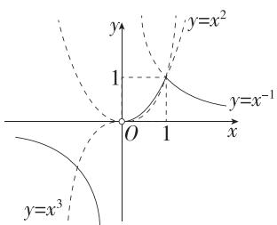

text_image

y
1
O 1 x
y=x²
y=x⁻¹
y=x³

因为 $h(x)$ 的图象不关于坐标原点对称, 所以 $h(x)$ 不是奇函数, 故 A 错误;

由图知若 $h(x)$ 在 $(0, a)$ 上有最大值，则 $a > 1$ ，且 $h(x)$ 在 $(0, a)$ 上的最大值是 1，故 B 错误，D 正确；由图象知 $h(x)$ 的值域是 $(- \infty, 0) \cup (0, 1]$ ，故 C 错误.

7. 答案 $f(x)=x^{2}$ (答案不唯一)

解析 由性质①可联想到幂函数，

由性质②可知该幂函数的指数大于0，

由性质③可考虑该幂函数的自变量加上绝对值,或指数为偶数.

综上,不妨取 $f(x)=x^{2}$ .

8. 答案 $(-∞, -1) ∪ \left( \frac{2}{3}, \frac{3}{2} \right)$

解析 因为幂函数 $y=x^{3m-9}(m\in\mathbf{N}^{*})$ 在 $(0,+\infty)$ 上单调递减,所以 3m-9<0,解得 m<3.

又因为 $m \in \mathbf{N}^*$ , 所以 $m = 1$ 或 $m = 2$ .

因为幂函数 $y = x^{3m - 9}(m \in \mathbf{N}^*)$ 的图象关于 $y$ 轴对称，

所以 3m-9 为偶数, 故 m=1.

不等式可化为 $(a + 1)^{-\frac{1}{3}} < (3 - 2a)^{-\frac{1}{3}}$

因为 $y=x^{-\frac{1}{3}}$ 在 $(-∞,0)$ ， $(0,+∞)$ 上单调递减，

所以 $a + 1 > 3 - 2a > 0$ 或 $3 - 2a < a + 1 < 0$ 或 $a + 1 < 0 < 3 - 2a$ (幂函数的定义域不是全体实数,其图象有两支,故要分三种情况考虑)

所以 $\frac{2}{3} < a < \frac{3}{2}$ 或 $a < -1$ .

故 $a$ 的取值范围是 $(- \infty, -1) \cup \left(\frac{2}{3}, \frac{3}{2}\right)$ .

9. 解析 (1) 因为 $f(x) = (2m^2 - 10m + 13)x^m$ 是幂函数, 所以 $2m^2 - 10m + 13 = 1$ , 解得 $m = 2$ 或 $m = 3$ ,

当 $m = 2$ 时， $f(x) = x^2$ ，不是奇函数，舍去，

当 m=3 时， $f(x)=x^{3}$ ，是奇函数，满足题意.

$$
\therefore g (x) = x ^ {3} + \frac {k}{x},
$$

$$
\because g (2) = 8 + \frac {k}{2} = 5, \therefore k = - 6.
$$

(2)关于 $x$ 的不等式 $g(x) - 2k^2 >0$ 在 $[1, + \infty)$ 上恒成立，

即 $x^{3} + \frac{k}{x} - 2k^{2} > 0$ 在 $[1, +\infty)$ 上恒成立，

令 $h(x) = x^3 + \frac{k}{x} - 2k^2$ ，下面先研究函数 $h(x)$ 的单调性.

$$
\forall   x _ {1}, x _ {2} \in [ 1, + \infty)  , \text {且}   x _ {1} > x _ {2}  ,
$$

则 $h(x_{1}) - h(x_{2}) = x_{1}^{3} + \frac{k}{x_{1}} -\left(x_{2}^{3} + \frac{k}{x_{2}}\right)$

$$
= \left(x _ {1} ^ {3} - x _ {2} ^ {3}\right) + \left(\frac {k}{x _ {1}} - \frac {k}{x _ {2}}\right) = \left(x _ {1} - x _ {2}\right) \left(x _ {1} ^ {2} + x _ {2} ^ {2} + x _ {1} x _ {2} - \frac {k}{x _ {1} x _ {2}}\right),
$$

$$
\begin{array}{l} \because x _ {1} > x _ {2} \geqslant 1, k \leqslant 3, \therefore x _ {1} - x _ {2} > 0, x _ {1} x _ {2} > 1, x _ {1} ^ {2} + x _ {2} ^ {2} + x _ {1} x _ {2} > 3, \\ \frac {k}{x _ {1} x _ {2}} <   3, \end{array}
$$

∴ $h(x_{1})-h(x_{2})>0$ , 即 $h(x_{1})>h(x_{2})$ ,

故 $h(x) = x^3 +\frac{k}{x} -2k^2$ 在 $[1, + \infty)$ 上单调递增， $\therefore h(x)_{\min} =$ $h(1) = 1 + k - 2k^{2},$

由题意得 $1+k-2k^{2}>0$ ，解得 $-\frac{1}{2}<k<1$ ，所以 k 的取值范围是 $\left(-\frac{1}{2},1\right)$ .

# 3.4 函数的应用（一）

# 基础过关练

Q 对应主书 P54

1. C 将 $(2,50)$ ， $(3,80)$ ， $(4,70)$ 分别代入 $p=at^{2}+bt+c$ 可得

$$
\left\{ \begin{array}{l} 4 a + 2 b + c = 5 0, \\ 9 a + 3 b + c = 8 0, \\ 1 6 a + 4 b + c = 7 0, \end{array} \text {解得} \left\{ \begin{array}{l} a = - 2 0, \\ b = 1 3 0, \\ c = - 1 3 0, \end{array} \right. \right.
$$

所以 $p = -20t^{2} + 130t - 130$ ,

所以当 $t = -\frac{b}{2a} = 3.25$ 时， $p$ 取得最大值

2. 答案 $y = -x + 120$ ; [60, 84]

解析 根据题意,得 $\left\{\begin{aligned}70k+b&=50,\\ 80k+b&=40,\end{aligned}\right.$ 解得 $\left\{\begin{aligned}k&=-1,\\ b&=120,\end{aligned}\right.$

∴一次函数的解析式为 $y=-x+120$ .

由题意可得 $60 \leqslant x \leqslant 60 \times (1 + 40\%)$ , $\therefore 60 \leqslant x \leqslant 84$ , 即 $x$ 的

取值范围为[60,84].

3. 答案 100

解析 当 $20 \leqslant x \leqslant 200$ 时，设 $v = kx + b (k \neq 0)$ ，则 $\left\{ \begin{array}{l} 60 = 20k + b, \\ 0 = 200k + b, \end{array} \right.$ 解得 $k = -\frac{1}{3}, b = \frac{200}{3}$ .

于是 $v=\left\{\begin{aligned}&60,0\leqslant x<20,\\&-\frac{1}{3}x+\frac{200}{3},20\leqslant x\leqslant200.\end{aligned}\right.$

设车流量为 $q$ 辆/时，

则 $q = v\cdot x = \left\{ \begin{array}{l}60x,0\leqslant x <   20,\\ -\frac{1}{3} x^2 +\frac{200}{3} x,20\leqslant x\leqslant 200, \end{array} \right.$

当 $0 \leqslant x < 20$ 时, q = 60x, 此时函数在区间 [0, 20) 上单调递增, 恒有 q < 1200;

当 $20 \leqslant x \leqslant 200$ 时, $q = -\frac{1}{3} x^2 + \frac{200}{3} x = -\frac{1}{3} (x - 100)^2 + \frac{10000}{3}$ , 此时函数在区间[20, 100]上单调递增, 在区间[100, 200]上单调递减,

因此当 x=100 时, q 取得最大值, 为 $\frac{10\ 000}{3}$ .

综上所述, 当 x=100 时, q 取得最大值, 即车流量最大, 约为 3333 辆/时.

4. 答案 ②③④

解析 对于①, $P(x)=R(x)-C(x)=-20x^{2}+2500x-4000$ ,

二次函数 $P(x)$ 的图象开口向下, 对称轴为直线 $x = \frac{2500}{40} = 62.5$ ,

因为 $x \in N^{*}$ ，所以 $P(x)$ 取得最大值时每月的产量为 63 台或 62 台，①错误；

对于②, $MP(x)=P(x+1)-P(x)=[-20(x+1)^{2}+2500(x+1)-4000]-(-20x^{2}+2500x-4000)=2480-40x(x\in\mathbf{N}^{*})$ ，②正确；

对于③, $P(x)_{\max}=P(62)=P(63)=74\ 120$ ,

因为函数 $MP(x)=2\ 480-40x$ 为减函数, 所以 $MP(x)_{\max}=MP(1)=2\ 440,74\ 120\neq2\ 440$ , ③正确;

对于④,因为函数 $MP(x)=2\ 480-40x$ 为减函数,

所以随着产量的增加,每台的利润与前一台利润的差额在减少,④正确.

5. 解析 (1) 因为购买 A 型笔记本电脑 x 台, 所以购买 B 型笔记本电脑 $(15-x)$ 台,

所以 $y = 5200x + 6400(15 - x) = -1200x + 96000$ ,

所以 y 关于 x 的函数解析式为 $y = -1200x + 96000 (0 \leqslant x \leqslant 15, x \in \mathbf{N})$ .

(2) 因为学校的预算不超过 9 万元, 购买 A 型笔记本电脑的数量不得比 B 型笔记本电脑数量的 2 倍还要多,

所以 $\left\{\begin{aligned}-1&200x+96\ 000\leqslant90\ 000,\\ x&\leqslant2(15-x),\end{aligned}\right.$ 解得 $5\leqslant x\leqslant10,$

又 $x \in N$ ，易错点，故 x 可取 5,6,7,8,9,10，学校共有 6 种购买方案.

易知 $y = -1200x + 96000$ 单调递减，

又 $5 \leqslant x \leqslant 10$ 且 $x \in \mathbf{N}$ , 所以当 $x = 10$ 时, $y$ 有最小值, 且 $y_{\min} = -1200 \times 10 + 96000 = 84000$ , 此时 $15 - x = 5$ .

故学校共有 6 种购买方案, 购买 A 型笔记本电脑 10 台、B 型笔记本电脑 5 台的方案所需费用最少, 该方案所需费用为 84 000 元.

6. 解析 (1) $P = \begin{cases} 120, & 0 \leqslant x \leqslant 100, \\ 120 - (x - 100) \times 0.04, & 100 < x \leqslant 600, \end{cases}$

即 $P=\left\{\begin{aligned}120, &0 \leqslant x \leqslant 100, \\ -0.04x + 124, &100 < x \leqslant 600\end{aligned}\right. (x \in \mathbf{N})$ .

(2)设该厂获得的利润为 $g(x)$ 元，则 $g(x) = (P - 80)\cdot$

$$
x = \left\{ \begin{array}{l} 4 0 x, 0 \leqslant x \leqslant 1 0 0, \\ - 0. 0 4 x ^ {2} + 4 4 x, 1 0 0 <   x \leqslant 6 0 0 \end{array} (x \in \mathbf {N}) \right..
$$

①当 $0 \leqslant x \leqslant 100$ 时, $g(x) \leqslant 4000$ ;

②当 $100 < x \leqslant 600$ 时, $g(x) = -0.04(x - 550)^2 + 12100 \leqslant 12100$ .

综合①②, 可知当 x=550 时, $g(x)$ 有最大值 12 100.

所以当销售商一次订购 550 件服装时,该服装厂获得的利润最大.

7.D 根据题意设 $f = \frac{k}{W^{\frac{1}{3}}} (k \neq 0)$ ，当 $W = 2, f = 210$ 时， $k = 210 \times 2^{\frac{1}{3}}$ ，当 $f = 70$ 时， $W^{\frac{1}{3}} = \frac{210 \times 2^{\frac{1}{3}}}{70} = 3 \times 2^{\frac{1}{3}}$ ，所以 $W = (3 \times 2^{\frac{1}{3}})^{3} = 27 \times 2 = 54$ .

8. 答案 30

解析 设日利润为 $y$ 元, 则 $y = (x - 20)P = (x - 20) \cdot \frac{10^5}{(x - 10)^2} = 10^5\left[\frac{1}{x - 10} - \frac{10}{(x - 10)^2}\right]$ , 令 $t = \frac{1}{x - 10}$ , 由 $x \in (20, 40]$ , 得 $t \in \left[\frac{1}{30}, \frac{1}{10}\right)$ , 设 $f(t) = t - 10t^2$ ,

易知二次函数 $f(t)$ 的图象的对称轴方程为 $t = \frac{1}{20} \in \left[\frac{1}{30}, \frac{1}{10}\right)$ ，故当 $t = \frac{1}{20}$ 时， $f(t)$ 取得最大值，此时日利润最大，故当 $\frac{1}{x - 10} = \frac{1}{20}$ ，即 $x = 30$ 时，日利润最大.

9. 解析 (1) 由题意得 $y = \frac{2}{x^2} + \frac{k}{1350 - x^2}, 0 < x < 18$ ,

因为当 x=10 时, y=0.06, 所以 $\frac{2}{100}+\frac{k}{1350-100}=0.06\Rightarrow k=50$ , 所以 $y=\frac{2}{x^{2}}+\frac{50}{1350-x^{2}}, 0<x<18$ .

(2) 因为 0 < x < 18, 所以 $1350 - x^{2} > 0$ ,

所以 $y=\frac{2}{x^{2}}+\frac{50}{1\ 350-x^{2}}=\frac{1}{1\ 350}\left[x^{2}+(1\ 350-x^{2})\right]$ $\left(\frac{2}{x^{2}}+\frac{50}{1\ 350-x^{2}}\right)=\frac{1}{1\ 350}\left[2+50+\frac{2(1\ 350-x^{2})}{x^{2}}+\frac{50x^{2}}{1\ 350-x^{2}}\right]\geqslant$

$\frac{1}{1350}\left[52 + 2\sqrt{\frac{2(1350 - x^2)}{x^2} \cdot \frac{50x^2}{1350 - x^2}}\right] = \frac{1}{1350} \times (52 + 20) = \frac{4}{75},$

当且仅当 $\frac{2(1\ 350-x^{2})}{x^{2}}=\frac{50x^{2}}{1\ 350-x^{2}}$ ，即x=15时取“=”，

所以当 x=15 时, 臭氧发生孔对左脚和右脚的干扰度之和最小, 为 $\frac{4}{75}$ .

# 能力提升练

Q 对应主书 P56

1.C 由已知得 $\tan \angle CAD = \frac{CD}{AD} = \frac{2}{3},\tan \angle CBD = \frac{CD}{BD} = 2.$

当 $0 < x \leqslant 4$ 时, 重合部分为三角形, 且三角形的边 AE 上的高 $h = x \tan \angle CAD = \frac{2}{3} x$ ,

$\therefore y=\frac{1}{2}xh=\frac{1}{3}x^{2}$ ，函数图象为开口向上的抛物线的一部分，故排除 A；

当 $4 < x \leqslant 9$ 时，重合部分为直角梯形，

上底长为 $(x - 4)\tan \angle CAD = \frac{2}{3} (x - 4)$

下底长为 $x\tan\angle CAD=\frac{2}{3}x$ ，高为4，

故 $y = \frac{1}{2}\times \left[\frac{2}{3} (x - 4) + \frac{2}{3} x\right]\times 4 = \frac{8}{3} x - \frac{16}{3},$

函数图象为一条直线的一段,故排除 D;

当 $9 < x \leqslant 12$ 时, 重合部分可以看作两个直角梯形 (当 x = 12 时, 右边为三角形),

左边直角梯形的上底长为 $(x - 4)\tan \angle CAD = \frac{2}{3} (x - 4)$

高为 $4-(x-9)=13-x$ ,

右边直角梯形的上底长为 $(12-x)\tan\angle CBD=2(12-x)$ ，高为x-9，

两个梯形的下底长均为 CD=6,

故 $y = \frac{1}{2} \times \left[ \frac{2}{3}(x - 4) + 6 \right] \times (13 - x) + \frac{1}{2} \times [2(12 - x) + 6] \times (x - 9) = -\frac{4}{3} x^2 + \frac{80}{3} x - \frac{340}{3}$ ,

图象为开口向下的抛物线的一部分,且抛物线的对称轴方程为 x=10, 故排除 B.

2. 答案 200;100

解析 设利润为 $P(x)$ 元, 当 $0 \leqslant x < 400$ 时, $P(x) = 400x - \frac{1}{2}x^{2} - 20\ 000 - 100x = -\frac{1}{2}x^{2} + 300x - 20\ 000$ ,

当 $x \geqslant 400$ 时, $P(x) = 80000 - 100x - 20000 = 60000 - 100x$ ,

故 $P(x) = \left\{ \begin{array}{ll} - \frac{1}{2} x^2 +300x - 20000, & 0\leqslant x <   400,\\ 60000 - 100x,x\geqslant 400. \end{array} \right.$

设零件的单位利润为 $g(x)$ 元，

则 $g(x)=\left\{\begin{aligned}-\frac{1}{2}x-\frac{20\ 000}{x}+300, &0 \leqslant x<400,\\ \frac{60\ 000}{x}-100, &x \geqslant 400,\end{aligned}\right.$

当 $0 \leqslant x < 400$ 时, $g(x) = 300 - \left(\frac{1}{2} x + \frac{20000}{x}\right) \leqslant 300 - 2\sqrt{\frac{x}{2} \cdot \frac{20000}{x}} = 100$ ,

当且仅当 $\frac{x}{2} = \frac{20000}{x}$ 即 $x = 200$ 时，等号成立，

当 $x \geqslant 400$ 时, $g(x) = \frac{60000}{x} - 100 \leqslant 50$ ,

故当 x=200 时,零件的单位利润最大,最大单位利润是 100 元.

3. 解析 (1) 由题意可知，

$$
f (x) = 2 1 W (x) - 3 0 x = \left\{ \begin{array}{l} 8 4 \left(x ^ {2} + 3\right) - 3 0 x, 0 \leqslant x \leqslant 2, \\ \frac {1 4 7 0 x}{2 x + 1} - 3 0 x, 2 <   x \leqslant 5. \end{array} \right.
$$

(2) 当 $0 \leqslant x \leqslant 2$ 时, $f(x) = 84(x^2 + 3) - 30x = 84\left(x - \frac{5}{28}\right)^2 + \frac{6981}{28}$ ,

则 $f(x)$ 在 $\left(0, \frac{5}{28}\right)$ 上单调递减，在 $\left(\frac{5}{28}, 2\right]$ 上单调递增，又 $f(0) = 252, f(2) = 528$ ，所以 $f(x)$ 的最大值为 528；

当 $2 < x \leqslant 5$ 时， $f(x) = \frac{1470x}{2x + 1} - 30x = 750 - \left[\frac{735}{2x + 1} + 15(2x + 1)\right] \leqslant 750 - 2\sqrt{\frac{735}{2x + 1} \times 15(2x + 1)} = 540,$

当且仅当 $\frac{735}{2x+1}=15(2x+1)$ ，即x=3时取等号，故 $f(x)$ 的最大值为540.

因为 528<540, 所以当施用肥料为 3 千克时, 单株水果树的利润最大, 最大利润是 540 元.

4. 解析 (1) 由题意知 $y = 30(1 - p)x - 10px = (30 - 40p)x$ ,

当 $0 < x \leqslant m$ 时, $p = \frac{1}{12 - x}$ , 故 $y = \left(30 - 40 \cdot \frac{1}{12 - x}\right)x = \frac{320x - 30x^2}{12 - x}$ ;

当 $x > m$ 时， $p = \frac{3}{4}$ ，故 $y = \left(30 - 40 \times \frac{3}{4}\right)x = 0$ .

综上, $y=\left\{\begin{aligned}&\frac{-30x^{2}+320x}{12-x},0<x\leqslant m,\\ &0,x>m,\end{aligned}\right.$ $m<12,m\in N^{*}$

(2) 当 $x > m$ 时, 每天的盈利额为 0 , 故只需求 $0 < x \leqslant m$ 时 $y$ 的最大值,

设 $u = 12 - x,0 <   x\leqslant m$ ，则 $x = 12 - u$ ，且 $u\in [12 - m,12)$

则 $y = \frac{-30(12 - u)^2 + 320(12 - u)}{u} = \frac{-30u^2 + 400u - 480}{u} = -30\left(u + \frac{16}{u}\right) + 400.$

①当 $0 < 12 - m \leqslant 4$ ，即 $8 \leqslant m < 12, m \in \mathbf{N}^*$ 时， $y = -30\left(u + \frac{16}{u}\right) + 400 \leqslant -30 \times 2\sqrt{u \times \frac{16}{u}} + 400 = 160$

当且仅当 $u = \frac{16}{u}$ 即 $u = 4$ 时， $y$ 取得最大值160，此时 $x = 8$ .

②当 $12 > 12 - m > 4$ ，即 $0 < m < 8, m \in \mathbf{N}^{*}$ 时，易知 $y = -30\left(u + \frac{16}{u}\right) + 400$ 在[12-m,12)上单调递减，

所以当 u=12-m，即 x=m 时，y 取得最大值.

综上所述,若0<m<8, $m\in N^{*}$ ,则当日产量为m万件时,可获得最大利润;

若 $8 \leqslant m < 12, m \in N^{*}$ ，则当日产量为 8 万件时，可获得最大利润.

5.A

信息提取 符合要求需满足四个条件:(1)自变量的取值范围是 $[0,100]$ ;(2)函数的值域为 $[0,100]$ 的子集;(3)函数在 $[0,100]$ 上恒有 $y\geqslant x$ ;(4)函数在 $[0,100]$ 上单调递增.逐一对照分析即可求解.

解析 函数 $y = -\frac{1}{20}x^{2} + 6x$ 的图象的对称轴方程为 x = $-\frac{6}{2\times\left(-\frac{1}{20}\right)}=60,$

所以 $y_{\max} = -\frac{1}{20} \times 60^{2} + 6 \times 60 = 180 > 100$ ，不符合题意；

对于 $y = \frac{1}{2} x + 50$ ，当 $x \in [0, 100]$ 时， $y \in [50, 100]$ ，

且 $y = \frac{1}{2} x + 50$ 在 $[0, 100]$ 上单调递增，

$y-x=-\frac{1}{2}x+50\in[0,50]$ ，即 $y\geqslant x$ ，符合题意；

函数 $y=|x-1|$ 在 $[0,1]$ 上单调递减，在 $[1,100]$ 上单调递增，故不符合题意；

函数 $y = 10\sqrt{x}$ 在 $[0,100]$ 上单调递增，且当 $x \in [0,100]$ 时， $y \in [0,100]$ ，

由 $0 \leqslant \sqrt{x} \leqslant 10$ ，得 $x \leqslant 10\sqrt{x}$ ，即 $y \geqslant x$ ，符合题意。

故满足此次联合调度要求的函数解析式的序号是②④.

6. 答案 $12 - 3\sqrt{15}$

解析 设圆弧的半径为 $x\left(0 < x \leqslant \frac{3}{2}\right)$ ,

根据题意可得 $BC = DE = AB - x = \frac{3}{2} -x$

$S = AE \cdot DE + (AB - DE) \cdot BC + \frac{1}{4}\pi \cdot x^2 = \frac{3}{2} \times \left(\frac{3}{2} - x\right) + x\left(\frac{3}{2} - x\right) + \frac{\pi x^2}{4} = \frac{9}{4} - x^2 + \frac{\pi x^2}{4},$

$$
L = 2 A B + B C + D E + \frac {\pi x}{2} = 6 - 2 x + \frac {\pi x}{2},
$$

$$
\because \pi = 3, \therefore S = \frac {9 - x ^ {2}}{4}, L = 6 - \frac {1}{2} x, \therefore \frac {S}{L} = \frac {9 - x ^ {2}}{2 4 - 2 x}, 0 <   x \leqslant \frac {3}{2},
$$

令 $t = 24 - 2x(21 \leqslant t < 24)$ ，则 $x = \frac{24 - t}{2}$ ， $\therefore \frac{S}{L} = \frac{9 - \left(\frac{24 - t}{2}\right)^2}{t} = -\left(\frac{t}{4} + \frac{135}{t}\right) + 12$ ，

由基本不等式可得 $\frac{t}{4} +\frac{135}{t}\geqslant 2\sqrt{\frac{135}{4}} = 3\sqrt{15}$ ，当且仅当 $\frac{t}{4} = \frac{135}{t}$ 即 $t = 6\sqrt{15}$ 时取“ $=$ ”.

$\because 6\sqrt{15}\in[21,24),\therefore$ 当 $t=6\sqrt{15}$ 时， $\left(\frac{S}{L}\right)_{\max}=12-3\sqrt{15}.$

7. 解析 （1）由题意可得， $y = 50x - \frac{x[12 + 12 + 4(x - 1)]}{2} - 98 = -2x^{2} + 40x - 98, x \in \mathbf{N}^{*}$

令 $-2x^{2} + 40x - 98 > 0$ ，解得 $10 - \sqrt{51} < x < 10 + \sqrt{51}$

因为 $x \in \mathbf{N}^*$ , 所以 $3 \leqslant x \leqslant 17$ , 故从第 3 年开始盈利.

(2) 方案 ①: $\frac{y}{x} = -2x + 40 - \frac{98}{x} = 40 - \left(2x + \frac{98}{x}\right) \leqslant 40 - 2\sqrt{2x \cdot \frac{98}{x}} = 12$ , 当且仅当 $2x = \frac{98}{x}$ , 即 $x = 7$ 时等号成立,

故第 7 年的年平均盈利额达到最大值,该设备共盈利 $12 \times 7 + 30 = 114$ 万元;

方案②:由 $y=-2x^{2}+40x-98=-2(x-10)^{2}+102$ ，可知当 x=10 时， $y_{\max}=102$ ，

故第 10 年的盈利额达到最大值,该设备共盈利 $102+12=$ 114 万元.

两种方案的盈利额相同,而方案①所用的时间较短,故方案①比较合理.

# 本章复习提升

# 易混易错练

Q 对应主书 P58

<table><tr><td>1.BC</td><td>2.C</td><td>3.C</td><td>4.A</td><td>9.ACD</td><td></td><td></td><td></td></tr></table>

1.BC 对于 A, 令 $t=\sqrt{x}+1(t\geqslant1)$ , (易错点: 注意换元后定义域的变化)

则 $x = (t - 1)^2$ ，则 $f(\sqrt{x} + 1) = x + 2\sqrt{x}\Leftrightarrow f(t) = (t - 1)^2 +2(t - 1) = t^2 -1(t\geqslant 1)$

即 $f(x)=x^{2}-1(x\geqslant1)$ (易混点: 函数三要素相同即为同一函数), 因此 A 错误;

对于 B, 由 $f(x)=x^{2}-1(x \geqslant 1)$ ，得 $f(2)=2^{2}-1=3$ ，因此 B 正确；

对于 C, 由 $f(x)$ 的定义域为 $[1, +\infty)$ ，可得 $2x - 3 \in [1, +\infty)$ ，即 $x \in [2, +\infty)$ ，故 $f(2x - 3)$ 的定义域为 $[2, +\infty)$ ，因此 C 正确；

对于 D, 由 $f(x)$ 的定义域为 $[1, +\infty)$ ，可得 $\frac{1}{x} \in [1, +\infty)$ ，即 $x \in (0, 1]$ ，故 $f\left(\frac{1}{x}\right)$ 的定义域为 $(0, 1]$ ，因此 D 错误.

2. C 令 $t = x^{2} - ax + 10, t \geqslant 0$ ，因为函数 $y = \sqrt{x^2 - ax + 10}$ 在区间[1,3]上单调递减，函数 $y = \sqrt{t}$ 在定义域内单调递增，

所以函数 $t=x^{2}-ax+10$ 在 $[1,3]$ 上单调递减，且 $t=x^{2}-ax+10\geqslant0$ 在 $[1,3]$ 上恒成立。易错点，

则有 $\left\{\begin{aligned}\frac{a}{2}&\geqslant3,\\ 3^{2}-3a+10&\geqslant0,\end{aligned}\right.$ 解得 $6\leqslant a\leqslant\frac{19}{3}$ ，所以a的取值范围是 $\left[6,\frac{19}{3}\right]$ .

3. C 对于 A, 因为 $f(x) = x$ 在 R 上单调递增, 所以当 $x \in [a, b]$ 时, 其值域为 $[a, b]$ , 由跟随区间的定义可知函数 $f(x) = x$ 存在无数个跟随区间, 故 A 正确;

对于 B, 因为 $[0, b]$ 为 $f(x) = x^{2}$ 的跟随区间, $f(x) = x^{2}$ 的图象的对称轴方程为 x = 0,

所以 $b^{2} = b$ ，解得 $b = 1$ 或 $b = 0$ （舍去），故B正确；

对于 C, 假设 $f(x)=1+\frac{1}{x}$ 存在跟随区间 $[a,b]$ , 则 a<b,

因为 $f(x)=1+\frac{1}{x}$ 在区间 $(-∞,0),(0,+∞)$ 上均单调递减，

所以 $\left\{ \begin{array}{l} f(a) = b, \\ f(b) = a, \end{array} \right.$ 即 $\left\{ \begin{array}{l} 1 + \frac{1}{a} = b, \\ 1 + \frac{1}{b} = a, \end{array} \right.$ 所以 $\left\{ \begin{array}{l} a + 1 = ab, \\ b + 1 = ab, \end{array} \right.$ 故 $a = b$

不符合 a < b，故 $f(x) = 1 + \frac{1}{x}$ 不存在跟随区间，故 C 不正确；

对于 D, 设函数 $f(x) = -\frac{1}{2}x^{2} + x$ 的定义域为 $[a, b]$ ，则值域为 $[2a, 2b]$ ，当 $a < b \leqslant 1$ 时，函数在 $[a, b]$ 上单调递增，则 $\left\{\begin{aligned}f(a)=2a,\\ f(b)=2b,\end{aligned}\right.$

故 a, b 是方程 $-\frac{1}{2}x^{2} + x = 2x$ 的两个不相等的实数根，解此方程得 x = 0 或 x = -2，故 $f(x) = -\frac{1}{2}x^{2} + x$ 存在 2 倍跟随区间 $[-2, 0]$ ，故 D 正确.

4.A 当 $x \geqslant 0$ 时, $f(x) = x^{2} - (a + 1)x + a + 2$ , 其图象的对称轴方程为 $x = \frac{a + 1}{2}$ ,

因为 $f(x)$ 在 $[0, +\infty)$ 上单调递增，所以 $\frac{a+1}{2} \leqslant 0$ ，解得 $a \leqslant -1$ ；

当 x<0 时， $f(x)=-ax$ ，因为 $f(x)$ 在 $(-∞,0)$ 上单调递增，所以 -a>0，即 a<0；

当 x=0 时， $f(0)=a+2$ ，因为函数 $f(x)$ 在 R 上单调递增，所以 $a+2\geqslant0$ 易错点，即 $a\geqslant-2$ .

综上, a 的取值范围是 $[-2, -1]$ .

5. 答案 $\left[-1, \frac{3+\sqrt{7}}{2}\right]$

解析 当 $a + 1 < 0$ ，即 $a < -1$ 时， $f(x) = (a + 1)x + 1$ 在 $(- \infty, a)$ 上单调递减，所以 $f(x)$ 没有最大值；

当 $a + 1 = 0$ ，即 $a = -1$ 时， $f(x) = \begin{cases} -x^2 + 4x - 3, & x \geqslant -1, \\ 1, & x < -1, \end{cases}$ $f(x)_{\max}=1$ , 符合题意;

当 $a + 1 > 0$ 且 $a \leqslant 2$ , 即 $-1 < a \leqslant 2$ 时, $f(x) = (a + 1)x + 1$ 在 $(- \infty, a)$ 上单调递增, 要使 $f(x)$ 有最大值,

则 $a(a + 1) + 1 \leqslant f(2) = 4 + 3a$ ，得 $-1 \leqslant a \leqslant 3$ ，所以 $-1 < a \leqslant 2$ ；

当 $a > 2$ 时， $f(x) = -x^2 + 4x + 3a$ 在 $[a, +\infty)$ 上单调递减，要使 $f(x)$ 有最大值，则 $a(a + 1) + 1 \leqslant f(a) = -a^2 + 7a$

得 $\frac{3 - \sqrt{7}}{2} \leqslant a \leqslant \frac{3 + \sqrt{7}}{2}$ , 所以 $2 < a \leqslant \frac{3 + \sqrt{7}}{2}$ .

综上, a 的取值范围为 $\left[-1, \frac{3+\sqrt{7}}{2}\right]$ .

# 易错警示

解决与分段函数有关的单调性或最大(小)值问题,不仅要考虑每一段函数的单调性,还要考虑分段点处函数值的大小.

6. 答案 $f(x)=\left\{\begin{aligned}x^{3}+x-1,x<0\\ 0,x=0\\ x^{3}+x+1,x>0\end{aligned}\right.$

解析 由 $f(x)$ 是 R 上的奇函数可知 $f(0)=0$ 易错点.设 $x < 0$ ，则 $-x > 0$

所以 $f(-x) = -x^3 - x + 1$ ，又函数 $f(x)$ 是奇函数，

所以 $f(x) = -f(-x) = x^{3} + x - 1$ ，故当 x < 0 时， $f(x)$ 的解析式为 $f(x) = x^{3} + x - 1$ .

因此 $f(x)=\left\{\begin{aligned}x^{3}+x-1,x<0,\\ 0,x=0,\\ x^{3}+x+1,x>0.\end{aligned}\right.$

7. 解析 (1) 函数 $f(x) = \frac{x}{x - 1}$ 的图象的对称中心为点(1,1)

$\frac{\left(\text{点拨: } f(x) = \frac{x}{x-1} = 1 + \frac{1}{x-1}, \text{通过将 } y = \frac{1}{x}\right. \text{的图象平移可}}{\text{得对称中心}}.$

验证如下: 设 $F(x)=f(x+1)-1$ ，则 $F(x)=\frac{x+1}{(x+1)-1}-1=\frac{1}{x}$ ，其定义域为 $\{x|x\neq0\}$ ，关于原点对称，

又 $F(-x) = -F(x)$ ，所以 $F(x)$ 是奇函数，

即函数 $f(x) = \frac{x}{x - 1}$ 的图象的对称中心为点(1,1).

(2) 证明: 记 $G(x) = g(x - 1) - 2$ , 则 $G(x) = (x - 1)^3 +$

$3(x-1)^{2}-2=x^{3}-3x$ , 其定义域为 R, 关于原点对称,

又 $G(-x)+G(x)=(-x)^{3}-3(-x)+x^{3}-3x=0$ , 所以 $G(x)$ 为奇函数，

所以 $g(x)$ 的图象的对称中心为点 $(-1,2)$ .

(3) $h(x) = x^{3} - ax^{2} + \frac{3 - 2x}{x - b} = x^{3} - ax^{2} + \frac{3 - 2(x - b) - 2b}{x - b} = x^{3} - ax^{2} +$ $\frac{3 - 2b}{x - b} -2,$

令 $H(x) = h(x + 1) + 4$ ，则 $H(x) = (x + 1)^{3} - a(x + 1)^{2}+$ $\frac{3 - 2b}{(x + 1) - b} +2 = x^3 +(3 - a)x^2 +(3 - 2a)x + 3 - a + \frac{3 - 2b}{x + 1 - b},$

由已知得 $H(x)=h(x+1)+4$ 是奇函数, 所以 $H(-x)+H(x)=0$ ,

即 $(-x)^{3} + (3 - a)(-x)^{2} + (3 - 2a)(-x) + 3 - a + \frac{3 - 2b}{(-x) + 1 - b} +$

$$
x ^ {3} + (3 - a) x ^ {2} + (3 - 2 a) x + 3 - a + \frac {3 - 2 b}{x + 1 - b} = 0,
$$

整理得 $2(3 - a)(1 + x^2) + \frac{2(3 - 2b)(1 - b)}{(1 - b)^2 - x^2} = 0$ ，进而得

$\left\{ \begin{array}{l}3 - a = 0,\\ (3 - 2b)(1 - b) = 0, \end{array} \right.$ 解得 $\left\{ \begin{array}{l}a = 3,\\ b = \frac{3}{2} \text{或}\left\{ \begin{array}{l}a = 3,\\ b = 1. \end{array} \right. \end{array} \right.$

8. 解析 (1) 因为 $f(x)$ 是定义在 $\left(-2, \frac{b - a}{2}\right)$ 上的奇函数, 所以 $f(0) = 0$ , 即 $\frac{b}{a} = 0$ , 所以 $b = 0$ .

又因为 $f(1) = -\frac{1}{3}, f(1) = \frac{1 + b}{1 + a} = \frac{1}{a + 1},$

所以 a = -4.

所以 $f(x)=\frac{x}{x^{2}-4}$ ，经验证此时 $f(x)$ 为奇函数.

$\frac{\left(\text{另解:由奇函数的定义域关于原点对称可知}\frac{b-a}{2}=2,\text{结合}b=0,\text{可得}a=-4\right)}{\text{合}b=0, \text{可得}a=-4}$

(2) $f(x)$ 在 $(-2,2)$ 上单调递减.证明如下：

$\forall x_{1},x_{2}\in (-2,2)$ ，且 $x_{1} <   x_{2}$ ，则 $f(x_{1}) - f(x_{2}) = \frac{x_{1}}{x_{1}^{2} - 4} -$ $\frac{x_2}{x_2^2 - 4} = \frac{x_1(x_2^2 - 4) - x_2(x_1^2 - 4)}{(x_1^2 - 4)(x_2^2 - 4)} = \frac{(x_1x_2^2 - 4x_1) - (x_2x_1^2 - 4x_2)}{(x_1^2 - 4)(x_2^2 - 4)} =$ $\frac{x_1x_2(x_2 - x_1) + 4(x_2 - x_1)}{(x_1^2 - 4)(x_2^2 - 4)} = \frac{(x_2 - x_1)(x_1x_2 + 4)}{(x_1^2 - 4)(x_2^2 - 4)},$

因为 $-2 < x_{1} < x_{2} < 2$ ，所以 $x_{2} - x_{1} > 0, x_{1}^{2} < 4, x_{2}^{2} < 4, x_{1}x_{2} + 4 > 0, (x_{1}^{2} - 4)(x_{2}^{2} - 4) > 0.$

所以 $f(x_{1})-f(x_{2})>0$ ，即 $f(x_{1})>f(x_{2})$ ，所以 $f(x)$ 在 $(-2,2)$ 上单调递减.

(3) 因为 $f(x)$ 是奇函数，

所以 $f(t-1)+f(-3-4t)>0$ 可化为 $f(t-1)>-f(-3-4t)=f(3+4t)$ .

又因为 $f(x)$ 在 $(-2,2)$ 上单调递减，所以 $\left\{ \begin{array}{l} -2 < t - 1 < 2, \\ -2 < 3 + 4t < 2, \\ t - 1 < 3 + 4t, \end{array} \right.$

解得 $-1 < t < -\frac{1}{4}$ .

故原不等式的解集为 $\left\{t\mid -1 < t < -\frac{1}{4}\right\}$

9.ACD 选项 A, $f(x) = \frac{1}{x}$ 的定义域是 $\{x \mid x \neq 0\}$ , $f(x + 1) = \frac{1}{x + 1}$ , 当 $x \in (-2, -1)$ 时, $x + 1 \in (-1, 0)$ ,

$\frac{1}{x}-\frac{1}{x+1}=\frac{1}{x(x+1)}>0$ (依据新定义,将问题转化为比较 $\frac{1}{x}$ 与 $\frac{1}{x+1}$ 的大小),即 $\frac{1}{x}>\frac{1}{x+1}$ ,满足 $f(x+1)<f(x)$ ,A正确.

选项 B, 易知 $f(x)$ 在 $(-∞,0)$ 上单调递减, 在 $[0,+∞)$ 上单调递增,

当 $x \in (-2, -1)$ 时， $x + t \in (-2 + t, -1 + t)$ ，

由 $f(x + t) < f(x)$ ，得 $(x + t)^2 < x^2$ ，即 $2tx + t^2 < 0$

当 t>0 时, $t<-2x$ 恒成立, 又 $-2x \in (2,4)$ , 所以 $0<t \leqslant 2$ ; 当 t<0 时, $t>-2x$ 恒成立, 故 $t \geqslant 4$ , 矛盾, 故 t 的取值范围是 $(0,2]$ , 即 t 的最大值是 2 (新定义转化为恒成立问题, 求得 t 的范围, 即可得最大值), B 错误.

选项 C, 作出 $y=f(x)$ 的大致图象, 如图 1, 把它向左平移 1 个单位长度得 $f(x+1)$ 的图象, 设 $g(x)=f(x+1)$ ,

因为 $f(x)$ 是 $(-2,-1)$ 上的“1-衰减函数”，所以在区间 $(-2,-1)$ 上， $g(x)$ 的图象在 $f(x)$ 图象的下方，

因此 $-2a \geqslant -1$ ，解得 $a \leqslant \frac{1}{2}$ ，故 $a$ 的最大值是 $\frac{1}{2}, C$ 正确.

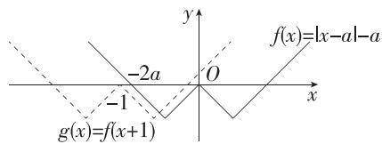

text_image

f(x)=|x-a|-a
-2a
O
-1
g(x)=f(x+1)
x
y

图1

(解题新思路:对于 C、D 这类形式较为复杂的函数,可以考虑作出函数图象,再进行图象平移,由新定义转化为图象的关系得出参数范围)

选项 D, 作出 $y=f(x)$ 的大致图象, 如图 2, 把它向左平移 1 个单位长度得 $f(x+1)$ 的图象, 设 $h(x)=f(x+1)$ ,

因为 $f(x)$ 是 $(-2,-1)$ 上的“1-衰减函数”，所以在区间 $(-2,-1)$ 上， $h(x)$ 的图象在 $f(x)$ 图象的下方，

易知当 $x < -a$ 时， $f(x) = x + 2a$ ，当 $-a - 1 < x < -1$ 时， $h(x) = -x - 1$ ，

由 $\left\{\begin{aligned}y=x+2a,\\ y=-x-1\end{aligned}\right.$ 得 $\left\{\begin{aligned}x&=-a-\frac{1}{2},\\ y=a-\frac{1}{2},\end{aligned}\right.$ 即 $A\left(-a-\frac{1}{2},a-\frac{1}{2}\right).$

因此有 $\left\{\begin{aligned}-a-\frac{1}{2}&\leqslant-2,\\ a-1&>-1,\end{aligned}\right.$

解得 $a \geqslant \frac{3}{2}$ , 即 $a$ 的最小值是 $\frac{3}{2}$ , D 正确.

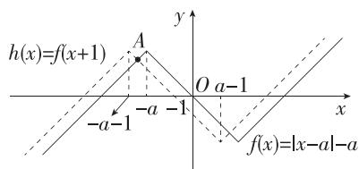

text_image

h(x)=f(x+1)
A
O a-1
-a-1
-a -1
f(x)=|x-a|-a
y
x

图2

10. 解析 (1) 由 $f\left(\frac{1}{x}\right) = -f(x)$ 得 $\frac{1}{x} + \frac{1}{2} = -x - \frac{1}{2}$ ，整理得 $x^2 + x + 1 = 0$ ，

因为 $\Delta=1-4=-3<0$ ,

所以此方程无实数解，

所以不存在实数 $x$ 满足 $f\left(\frac{1}{x}\right) = -f(x)$ ，

所以 $f(x)$ 不是“局部反比例对称函数”.

(2) 证明: $\forall x_{1}, x_{2} \in (1, +\infty)$ , 且 $x_{1} < x_{2}$ , 则 $f(x_{1}) - f(x_{2}) = \frac{1}{x_{1}} + x_{1} - \frac{1}{x_{2}} - x_{2} = \frac{(x_{1} - x_{2})(x_{1}x_{2} - 1)}{x_{1}x_{2}}$ ,

因为 $1 < x_{1} < x_{2}$ ，所以 $x_{1} - x_{2} < 0, x_{1}x_{2} > 1$ ，所以 $f(x_{1}) - f(x_{2}) < 0$ ，即 $f(x_{1}) < f(x_{2})$ ，

所以 $f(x)=\frac{1}{x}+x$ 在 $(1,+\infty)$ 上单调递增.

(3) 若 $f(x)=x^{2}-2mx+m^{2}-7$ 是定义在区间 $(0,+\infty)$ 上的“局部反比例对称函数”，则 $f\left(\frac{1}{x}\right)=-f(x)$ 在 $(0,+\infty)$ 上有解，（由新定义转化为方程有解）

即 $\frac{1}{x^2} -\frac{2m}{x} +m^2 -7 = -x^2 +2mx - m^2 +7$ 在 $(0, + \infty)$ 上有解，

整理得 $\frac{1}{x^2} + x^2 - 2m\left(\frac{1}{x} + x\right) + 2(m^2 - 7) = 0$

令 $t=\frac{1}{x}+x$ ，则上述方程可转化为 $t^{2}-2mt+2(m^{2}-8)=0$ ，
(利用换元法转化为一元二次方程有解,然后利用一元二次方程根的分布知识求解)

由 $x \in (0, +\infty)$ , 得 $t = x + \frac{1}{x} \geqslant 2$ , 当且仅当 $x = 1$ 时取“=”. 所以方程 $t^2 - 2mt + 2(m^2 - 8) = 0$ 在 $t \in [2, +\infty)$ 上有解, 设 $g(t) = t^2 - 2mt + 2m^2 - 16$ , 则其图象开口向上, 对称轴方程为 $t = m$ .

①若 $m \leqslant 2$ ，则 $g(t)$ 在 $[2, +\infty)$ 上单调递增，故 $g(2) = 4 - 4m + 2m^{2} - 16 \leqslant 0$ ，即 $m^{2} - 2m - 6 \leqslant 0$ ，

所以 $1 - \sqrt{7} \leqslant m \leqslant 1 + \sqrt{7}$ , 所以 $1 - \sqrt{7} \leqslant m \leqslant 2$ ;

②若 m>2，则 $g(t)$ 在 $[2,m)$ 上单调递减，在 $(m,+\infty)$ 上单调递增，故只需 $g(m)\leqslant0$ ，

即 $m^2 \leqslant 16$ ，所以 $-4 \leqslant m \leqslant 4$ ，所以 $2 < m \leqslant 4$ .

综上,实数 m 的取值范围为 $[1-\sqrt{7},4]$ .

# 思想方法练

Q 对应主书 P60

<table><tr><td>3.B</td><td>4.D</td><td>5.B</td><td>6.ABD</td><td>8.ABD</td><td></td><td></td><td></td></tr></table>

1. 答案 $\left(-\infty, -\frac{8}{3}\right]$

解析 $f(x) = |3x + 2| - |3x - 1| = \left\{ \begin{array}{l} -3, x < -\frac{2}{3}, \\ 6x + 1, -\frac{2}{3} \leqslant x \leqslant \frac{1}{3}, \\ 3, x > \frac{1}{3}, \end{array} \right.$

$f(x) = 0$ ，得 $x = -\frac{1}{6} .g(x) = |x - a| = \left\{ \begin{array}{ll}a - x,x <   a,\\ x - a,x\geqslant a, \end{array} \right.$ 令 $g(x) =$ 0，得 $x = a$

画出函数 $f(x)$ , $g(x)$ 的图象, 如图所示,

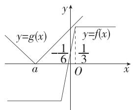

text_image

y
y=g(x)
-1/6
1/3
y=f(x)
a
O
x

若 $f(x) \leqslant g(x)$ 恒成立，则有 $\left\{\begin{aligned}a & \leqslant -\frac{1}{6},\\ g\left(\frac{1}{3}\right) & =\left|\frac{1}{3}-a\right| \geqslant 3,\end{aligned}\right.$ 解得

$a \leqslant -\frac{8}{3}$ ，所以实数 a 的取值范围为 $\left(-\infty, -\frac{8}{3}\right]$ .

2. 答案 $\left(-\infty, \frac{7}{3}\right]$

解析 $\because f(x+1)=2f(x),\therefore f(x)=2f(x-1)$ ，由此作出函数 $f(x)$ 的图象.

(依据:自变量增加1,函数值扩大到原来的2倍)

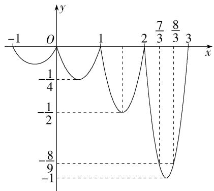

line

| x    | y      |
| ---- | ------ |
| -1   | -1/4   |
| 0    | 0      |
| 1    | -1/2   |
| 2    | 0.5    |
| 3    | -1     |

当 $x \in (1,2]$ 时， $x - 1 \in (0,1]$ ， $\therefore f(x) = 2f(x - 1) = 2(x - 1)$

$$
\cdot (x - 2) \in \left[ - \frac {1}{2}, 0 \right],
$$

当 $x \in (2,3]$ 时， $x - 1 \in (1,2]$ ， $\therefore f(x) = 2f(x - 1) = 4(x - 2)(x - 3) \in [-1,0]$ ，

(结合图象求出函数在各段上的值域,由此估计 m 所在的区间)

当 $x \in (2,3]$ 时，令 $4(x - 2)(x - 3) = -\frac{8}{9}$ ，

解得 $x=\frac{7}{3}$ 或 $x=\frac{8}{3}$ ,

若对任意 $x \in (-\infty, m]$ , 都有 $f(x) \geqslant -\frac{8}{9}$ ,

则 $f(x)_{\min} \geqslant -\frac{8}{9}$ , 结合图知 $m \leqslant \frac{7}{3}$ .

# 目 思想方法

数形结合可以利用函数图象直观地研究函数的有关性质,也可以利用函数性质进一步把握图象的特征,可避免复杂的计算和推理,实现快速准确解题.

3.B 函数 $f(x)$ 在 R 上单调, 可分单调递增和单调递减两种情况讨论:

若函数 $f(x) = \begin{cases} (a - 3)x + 2a, & x < 1, \\ ax^2 + (a + 1)x, & x \geqslant 1 \end{cases}$ 在 $\mathbf{R}$ 上单调递增，

则有 $\left\{\begin{aligned}a-3&>0,\\ a&>0,\\ -\frac{a+1}{2a}&\leqslant1,\\ (a-3)+2a&\leqslant a+(a+1),\end{aligned}\right.$ 解得 $3<a\leqslant4;$

若函数 $f(x) = \begin{cases} (a - 3)x + 2a, & x < 1, \\ ax^2 + (a + 1)x, & x \geqslant 1 \end{cases}$ 在 $\mathbf{R}$ 上单调递减，

则有 $\left\{\begin{aligned}a-3<0,\\ a<0,\\ -\frac{a+1}{2a}\leqslant1,\\ (a-3)+2a\geqslant a+(a+1),\end{aligned}\right.$ 无解.

综上,实数 a 的取值范围为(3,4].

4.D 思想索源:结合指数函数的单调性,需要讨论 a-1 与 1 的关系,即分别讨论 a>2,a=2,1<a<2.

若 $a > 2$ ，由指数函数的单调性可得 $y = (a - 1)^x, x \leqslant \frac{1}{2}$ 的取值范围为 $(0, \sqrt{a - 1}]$ ，易知 $(0, \sqrt{a - 1}] \subseteq \left[\frac{2}{5}, +\infty\right)$ 不成立，故舍去；

若 $a = 2$ ，则 $f(x) = \left\{ \begin{array}{ll}1,x\leqslant \frac{1}{2},\\ x + \frac{2}{x} -2,x > \frac{1}{2}, \end{array} \right.$ 当 $x\leqslant \frac{1}{2}$ 时， $f(x) = 1$

当 $x > \frac{1}{2}$ 时， $f(x) = x + \frac{2}{x} - 2 \geqslant 2\sqrt{2} - 2$ ，当且仅当 $x = \sqrt{2}$ 时，等号成立，此时 $D = [2\sqrt{2} - 2, +\infty)$ ，满足 $D \subseteq \left[\frac{2}{5}, +\infty\right)$ ;

若 $1 < a < 2$ ，则当 $x \leqslant \frac{1}{2}$ 时， $f(x) = (a - 1)^x$ 单调递减，所以 $f(x) \in [\sqrt{a - 1}, +\infty)$ ，

当 $x > \frac{1}{2}$ 时， $f(x) = x + \frac{a}{x} - 2 \geqslant 2\sqrt{a} - 2$ ，当且仅当 $x = \sqrt{a} > \frac{1}{2}$ 时，等号成立，

由 $D \subseteq \left[\frac{2}{5}, +\infty\right)$ 得 $\begin{cases} 1 < a < 2, \\ \sqrt{a} > \frac{1}{2}, \\ \sqrt{a - 1} \geqslant \frac{2}{5}, \\ 2\sqrt{a} - 2 \geqslant \frac{2}{5}, \end{cases}$ 解得 $\frac{36}{25} \leqslant a < 2$ .

综上, a 的取值范围是 $\left[\frac{36}{25}, 2\right]$ .

# 思想方法

当题干条件中变量或参数的取值不同会影响函数的图象、性质时，要依据题意对变量或参数进行合理的分类讨论。如分段函数的问题、含绝对值函数的问题，指数函数、对数函数的底数不定时，都要进行分类讨论。在运用分类讨论思想研究问题时，既要做到不重、不漏，又要按照相同的标准进行讨论。

5.B 函数 $f(x) = ax \mid 2x \mid$ 的图象经过点(2, -4)，则 $f(2) = 2 \times a \times 4 = -4$ ，则 $a = -\frac{1}{2}$ ，

故 $f(x)=-x|x|=\begin{cases}-x^{2},&x\geqslant0,\\x^{2},&x<0,\end{cases}$ 所以 $f(x)$ 在R上单调递减.

又 $f(-x) = x| - x| = x|x| = -f(x)$ ， $f(x)$ 的定义域为 $\mathbf{R}$ ，所以 $f(x)$ 是奇函数，

因为 $4f(x) = -4x \mid x \mid = -2x \mid 2x \mid = f(2x)$ ，所以 $4f(x) + f(3 - x^{2}) < 0$ 可转化为 $f(2x) + f(3 - x^{2}) < 0$ ，即 $f(2x) < -f(3 - x^{2}) = f(x^{2} - 3)$ ，

由 $f(x)$ 在 R 上单调递减可得 $2x > x^{2} - 3$ ,

(利用函数的单调性,将比较函数值的大小转化为比较自变量的大小,从而达到化简的目的)

解得-1<x<3.

6.ABD 因为 $\forall x_{1} \in [-2,0)$ , $\exists x_{2} \in [-2,1]$ , 使得 $g(x_{2}) = f(x_{1})$ , 所以 $f(x)$ 在 $[-2,0)$ 上的值域是 $g(x)$ 在 $[-2,1]$ 上值域的子集.

(将含有逻辑关系的两个函数的值域问题转化为两集合的包含问题)

由 $x \in [-2, 0)$ ，得 $x + 4 \in [2, 4)$ ，则 $f(x + 4) = \left\{ \begin{array}{l} - (x + 4)^2 + 4(x + 4), 2 \leqslant x + 4 \leqslant 3, \\ \frac{(x + 4)^2 + 2}{x + 4}, 3 < x + 4 < 4 \end{array} \right. = \left\{ \begin{array}{l} -x^2 - 4x, -2 \leqslant x \leqslant -1, \\ x + 4 + \frac{2}{x + 4}, -1 < x < 0, \end{array} \right.$

由 $f(x + 4) = 2f(x + 2) = 4f(x)$

得 $f(x)=\left\{\begin{aligned}&\frac{-x^{2}-4x}{4},-2\leqslant x\leqslant-1,\\&\frac{1}{4}\left(x+4+\frac{2}{x+4}\right),-1<x<0,\end{aligned}\right.$

当 $-2 \leqslant x \leqslant -1$ 时， $f(x) = -\frac{1}{4}(x + 2)^2 + 1$ ，易知 $f(x)$ 在 $[-2, -1]$ 上单调递减，

当-1<x<0时， $f(x)=\frac{1}{4}\left(x+4+\frac{2}{x+4}\right)\geqslant\frac{\sqrt{2}}{2}$

当且仅当 $x + 4 = \frac{2}{x + 4}$ 即 $x = \sqrt{2} -4$ 时，等号成立，

由 $-1 > \sqrt{2} - 4$ ，知等号不成立，且 $f(x)$ 在 $(-1,0)$ 上单调递增，

易得 $f(-2) = 1, f(-1) = \frac{3}{4}, \frac{1}{4} \times \left(-1 + 4 + \frac{2}{-1 + 4}\right) = \frac{11}{12}, \frac{1}{4} \times$ $\left(0 + 4 + \frac{2}{0 + 4}\right) = \frac{9}{8},$

故当 $x \in [-2, 0)$ 时， $f(x) \in \left[\frac{3}{4}, \frac{9}{8}\right)$ .

当 $a > 0$ 时， $g(x)$ 在 $[-2,1]$ 上单调递增，

则 $g(x)_{\min} = g(-2) = -2a + 1, g(x)_{\max} = g(1) = a + 1$ ，即 $g(x) \in [-2a + 1, a + 1]$ ，

所以 $\left[\frac{3}{4},\frac{9}{8}\right)\subseteq \left[-2a + 1,a + 1\right],$

则 $\left\{\begin{aligned}-2a+1&\leqslant\frac{3}{4},\\ \frac{9}{8}&\leqslant a+1,\end{aligned}\right.$ 解得 $a\geqslant\frac{1}{8};$

当 $a < 0$ 时， $g(x)$ 在 $[-2,1]$ 上单调递减，

则 $g(x)_{\min} = g(1) = a + 1, g(x)_{\max} = g(-2) = -2a + 1$ ，即 $g(x) \in [a + 1, -2a + 1]$ ，

所以 $\left[\frac{3}{4},\frac{9}{8}\right)\subseteq [a + 1, - 2a + 1]$ ，则 $\left\{ \begin{array}{ll}a + 1\leqslant \frac{3}{4},\\ \frac{9}{8}\leqslant -2a + 1, \end{array} \right.$ 解得

$$
a \leqslant - \frac {1}{4}.
$$

综上, a 的取值范围是 $\left(-\infty, -\frac{1}{4}\right] \cup \left[\frac{1}{8}, +\infty\right)$ ，结合选项可知 A, B, D 满足题意.

7. 解析 (1) 设 $f(x) = ax^2 + bx + c (a \neq 0)$ ，由 $f(0) = 4$ ，可得 $c = 4$ .

由 $f(x+2)-f(x)=4x+12$ ，得 $a(x+2)^{2}+b(x+2)-ax^{2}-bx=4ax+4a+2b=4x+12$ ，

所以 $\left\{\begin{aligned}4a&=4,\\ 4a&+2b&=12,\end{aligned}\right.$ 解得 $\left\{\begin{aligned}a&=1,\\ b&=4,\end{aligned}\right.$ 则 $f(x)=x^{2}+4x+4.$

(2)由题意得 $g(x) = f(x) - (4 + 2t)x = x^2 -2tx + 4$

则 $g(x)$ 的图象的对称轴为直线 $x = t$ .

(根据函数 $g(x)$ 的表达式, 对参数 t 的取值范围进行分类讨论, 再由二次函数的性质即可得出最小值的表达式)

若 $t \leqslant 3$ ，则 $g(x)$ 在 [3,6] 上单调递增，当 x = 3 时， $g(x)$ 取得最小值，为 13 - 6t；

若 $3 < t < 6$ ，则当 $x = t$ 时， $g(x)$ 取得最小值，为 $-t^2 + 4$

若 $t \geqslant 6$ ，则 $g(x)$ 在 $[3,6]$ 上单调递减，当 $x = 6$ 时， $g(x)$ 取得最小值，为 $40 - 12t$ .

故 $m(t) = \begin{cases} 13 - 6t, & t \leqslant 3, \\ -t^2 + 4, & 3 < t < 6, \\ 40 - 12t, & t \geqslant 6. \end{cases}$

(3) 因为对任意的 $t \in [0,8]$ , $|m(t)| \leqslant \lambda k^{2} + \lambda k + 4\lambda - 80$ 成立, (将不等式恒成立问题转化为最值问题)

所以 $|m(t)|_{\max} \leqslant \lambda k^2 + \lambda k + 4\lambda - 80.$

因为 $m(t)=\left\{\begin{aligned}&13-6t,t\leqslant3,\\&-t^{2}+4,3<t<6,\end{aligned}\right.$ 所以 $m(t)$ 在 $[0,8]$ 上单调 $40-12t, t \geqslant 6,$

递减，

因为 $m(0) = 13, m(8) = -56$ ，所以 $|m(t)|_{\max} = 56$ .

又因为存在 $\lambda\in[-2,4]$ ，使得 $56\leqslant\lambda k^{2}+\lambda k+4\lambda-80$ 成立，所以只要 $(\lambda k^{2}+\lambda k+4\lambda-80)_{\max}\geqslant56$ ，

即 $\left[\lambda (k^2 + k + 4) - 80\right]_{\max} \geqslant 56.$ （将 $\lambda (k^2 + k + 4) - 80$ 看作以 $\lambda$ 为自变量的一次函数）

易知 $k^{2}+k+4=\left(k+\frac{1}{2}\right)^{2}+\frac{15}{4}>0$ ，所以当 $\lambda=4$ 时， $\lambda(k^{2}+k+4)-80$ 取得最大值，为 $4k^{2}+4k-64$ ，

则 $4k^{2} + 4k - 64 \geqslant 56$ ，化简得 $k^{2} + k - 30 \geqslant 0$ ，解得 $k \leqslant -6$ 或 $k \geqslant 5$ ，即 $k$ 的取值范围为 $(- \infty, -6] \cup [5, +\infty)$ .

# 思想方法

转化与化归思想是指利用条件转化为其他函数或自变量的问题；利用函数的奇偶性、单调性，将函数值问题转化为自变量的相关问题；将不等式恒(能)成立问题转化为函数的最大(小)值问题等.

8.ABD 对于 A, 令 $x+3>0$ , 解得 x>-3,

所以 $f(x)>0$ 的解集为 $(-3,+\infty)$ ，故A正确.

对于 B, 当 a=1 时, $g(x)=(x+1)^{2}$ ,

分别作出 $f(x)$ , $g(x)$ 的图象, 可得 $M(x)$ 的图象(实线部分), 如图所示:

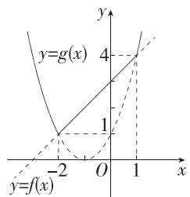

line

| x | y=f(x) | y=g(x) |
|---|---|---|
| -2 | 0 | 0 |
| 0 | 1 | 4 |
| 1 | 1 | 4 |

由图可知 $M(x)$ 的值域为 $[1, +\infty)$ ，故 B 正确.

对于 C, 若 a=0, 则 $M(x)=\left\{\begin{aligned}1,x<-2,\\ x+3,x\geqslant-2,\end{aligned}\right.$

此时 $M(x)$ 在 $\left[-\frac{2}{9}, +\infty\right)$ 上单调递增, 符合题意;

若 $a \neq 0$ ，令 $f(x) = g(x)$ ，即 $x + 3 = (ax + 1)^2$

整理可得 $a^{2}x^{2}+(2a-1)x-2=0$ ,

设 $h(x)=a^{2}x^{2}+(2a-1)x-2$ ,

(结合三个“二次”之间的关系,实现一元二次方程 $a^{2}x^{2}+(2a-1)x-2=0$ , 一元二次不等式 $a^{2}x^{2}+(2a-1)x-2>0$ 及一元二次函数 $h(x)=a^{2}x^{2}+(2a-1)x-2$ 的图象的相互转换)

易得 $h(0) = -2 < 0$ ,

可知函数 $y = h(x)$ 的图象与 $x$ 轴有 2 个交点, 分别设为

$(x_{1},0),(x_{2},0),x_{1}<0<x_{2},$

由题意可知 $x_{1} \leqslant -\frac{2}{9}$ , 则 $h\left(-\frac{2}{9}\right) = \frac{4}{81} a^{2} - \frac{2}{9}(2a - 1) - 2 \leqslant 0$ , 整理可得 $a^{2} - 9a - 36 \leqslant 0$ , 解得 $-3 \leqslant a \leqslant 12$ , 又 $a \neq 0$ , 所以 $a \in [-3, 0) \cup (0, 12]$ .

综上, a 的取值范围是 $[-3,12]$ , 故 C 错误.

对于 D, 不等式 $g(x) > \frac{1}{4}x^{2}$ 即 $(ax + 1)^{2} > \frac{1}{4}x^{2}$ ,

可得 $(4a^{2}-1)x^{2}+8ax+4=\left[(2a-1)x+2\right]\left[(2a+1)x+2\right]>0,$

若 $-\frac{1}{6} \leqslant a < 0$ ，则 $4a^{2} - 1 < 0$

令 $\left[(2a-1)x+2\right]\left[(2a+1)x+2\right]=0$ ，关键点，解得 $x=\frac{2}{1-2a}$ 或 $x=-\frac{2}{1+2a}$ ,

易得 $\frac{2}{1 - 2a}\in \left[\frac{3}{2},2\right), - \frac{2}{1 + 2a}\in [-3, - 2)$

则由 $(4a^{2} - 1)x^{2} + 8ax + 4 > 0$

解得 $-\frac{2}{1+2a}<x<\frac{2}{1-2a}$ ,

可知区间 $\left[-\frac{2}{1 + 2a},\frac{2}{1 - 2a}\right]$ 中包含整数-2,-1,0,1，所以不等式 $g(x) > \frac{1}{4} x^2$ 有4个整数解，故D正确.

# 思想方法

在函数中,常利用函数、方程、不等式三者之间的联系,通过解方程(组)、不等式解决函数中的相关问题,通过函数图象解决方程(组)、不等式的相关问题.

# 综合拔高练

# 五年高考练

Q 对应主书 P61

<table><tr><td>1.B</td><td>6.B</td><td>7.D</td><td>8.B</td><td>9.D</td><td>10.A</td><td>11.A</td><td></td></tr></table>

# 1.B

# 真题降维。

# 1. 试题分析

抽象函数是近两年高考考查热点,考查频率比较高的是抽象函数求值、奇偶性、周期性及与不等式的交汇问题,解题方法有赋值法、数形结合法、等价转化法等.

# 2. 关键突破

<table><tr><td>关键信息</td><td>信息处理</td><td>数学方法</td></tr><tr><td>当x&lt;3时,f(x)=x</td><td>f(1)=1,f(2)=2</td><td>赋值法</td></tr><tr><td>f(x)&gt;f(x-1)+f(x-2)</td><td>f(3)&gt;f(2)+f(1)=3,f(4)&gt;f(3)+f(2)&gt;5,......</td><td>列举法</td></tr></table>

因为当 $x < 3$ 时， $f(x) = x$ ，所以 $f(1) = 1, f(2) = 2$

又因为 $f(x) > f(x - 1) + f(x - 2)$

所以 $f(3) > f(2) + f(1) = 3, f(4) > f(3) + f(2) > 5,$

$f(5)>f(4)+f(3)>8$ , 依此类推得 $f(6)>13$ , $f(7)>21$ , $f(8)>34$ , $f(9)>55$ , $f(10)>89$ , $f(11)>144$ , $f(12)>233$ , $f(13)>377$ , $f(14)>610$ , $f(15)>987$ , $f(16)>1597>1000$ , 则依次下去可知 $f(20)>1000$ , 但 $f(10)$ , $f(20)$ 无上界, 故一定正确的是 B.

# 目考场速决

因为当 $x < 3$ 时， $f(x) = x$ ，所以 $f(1) = 1, f(2) = 2$

联想 $f(x)=f(x-1)+f(x-2)$ ，得到一列有规律的数：1,2,3,5,8,13,21,34,55,89,…，

易得 $f(10)=89$ , $f(16)=1597$ ,

又因为 $f(x) > f(x - 1) + f(x - 2)$ ，所以 $f(10) > 89$ ， $f(20) > f(16) > 1000$

不一定能得到 $f(10)>100$ , $f(10)<1\ 000$ , $f(20)<10\ 000$ .

2. 答案 $\{x \mid x \leqslant 1 \text{ 且 } x \neq 0\}$

解析 要使 $f(x) = \frac{1}{x} + \sqrt{1 - x}$ 有意义，

则 $\left\{\begin{aligned}x&\neq0,\\ 1-x&\geqslant0,\end{aligned}\right.$ 解得 $x\leqslant1$ 且 $x\neq0$ ,

$\therefore f(x)$ 的定义域为 $\{x \mid x \leqslant 1$ 且 $x \neq 0\}$ .

3. 答案 $(- \infty, 1]$

解析 根据题意知 $g(x)=\left\{\begin{aligned}x^{2},&x\geqslant0,\\ -x^{2},&x<0,\end{aligned}\right.$

所以当 $x \geqslant 0$ 时, $g(x) \leqslant 2 - x \Rightarrow x^2 + x - 2 \leqslant 0$ , 所以 $x \in [0, 1]$ ;

当 $x < 0$ 时， $g(x) \leqslant 2 - x \Rightarrow -x^2 + x - 2 \leqslant 0$ ，所以 $x \in (-\infty, 0)$ . 综上所述， $x$ 的取值范围是 $(- \infty, 1]$ .

# 目考场速决

依题意得 $g(x) = \begin{cases} x^2, & x \geqslant 0, \\ -x^2, & x < 0, \end{cases}$ 画出函数 $y = g(x)$ 与 $y = 2 - x$ 的图象如图所示，令 $x^2 = 2 - x$ ，得 $x = 1$ 或 $x = -2$ （舍去），所以不等式 $g(x) \leqslant 2 - x$ 的解集为 $(- \infty, 1]$ .

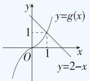

4. 答案 $\frac{37}{28}; 3 + \sqrt{3}$

# 真题降维

1. 试题分析

本题以分段函数为载体,考查复合函数的求值问题,属于基础题目.第一空是求值问题,常用思路是从内到外,逐层求值;第二空是求值域的逆向问题,考查逆向思维能力.

2. 关键突破 

<table><tr><td>关键信息</td><td>思维要点</td><td>思维缘由</td></tr><tr><td> $f(x)=\left\{-x^{2}+2,x\leqslant1,\ x+\frac{1}{x}-1,x>1\right.$ </td><td>分段研究,综合分析</td><td>分段函数的特征</td></tr><tr><td> $f\left(f\left(\frac{1}{2}\right)\right)$ </td><td>从内向外,分段代入</td><td>函数的定义</td></tr><tr><td>当 $x\in[a,b]$ 时, $1\leqslant f(x)\leqslant3$ </td><td>结合值域,利用分类讨论或数形结合求 $x$ 的范围</td><td>函数的表示</td></tr></table>

解析 $\because f\left(\frac{1}{2}\right) = -\left(\frac{1}{2}\right)^2 + 2 = \frac{7}{4} > 1$

$$
\therefore f \left(f \left(\frac {1}{2}\right)\right) = f \left(\frac {7}{4}\right) = \frac {7}{4} + \frac {4}{7} - 1 = \frac {3 7}{2 8}.
$$

由 $\left\{\begin{aligned}x&\leqslant1,\\ 1&\leqslant-x^{2}+2\leqslant3,\end{aligned}\right.$ 解得 $-1\leqslant x\leqslant1$ ,

由 $\left\{\begin{aligned}x>1,\\ 1&\leqslant x+\frac{1}{x}-1\leqslant3,\end{aligned}\right.$ 解得 $1<x\leqslant2+\sqrt{3}$ ,

∴ 不等式 $1 \leqslant f(x) \leqslant 3$ 的解集为 $\{x \mid -1 \leqslant x \leqslant 2 + \sqrt{3}\}$ ,
∴ b-a 的最大值为 $2+\sqrt{3}-(-1)=3+\sqrt{3}$ .

# 目一题多解

对于第二空,作出函数 $f(x)=$ $\left\{\begin{aligned}-x^{2}+2,x&\leqslant1,\\ x+\frac{1}{x}-1,x&>1\end{aligned}\right.$ 的图象,如图,

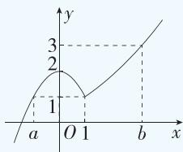

line

| Point | x | y |
|---|---|---|
| 1 | 0.5 | 1 |
| 2 | 0.75 | 2 |
| 3 | 1 | 3 |

易知 b-a 最大时 a, b 在图示
位置, 令 $b + \frac{1}{b} - 1 = 3$ , 可得 $b = 2 + \sqrt{3}$ 或 $b = 2 - \sqrt{3}$ (舍去), 令 $2 - a^{2} = 1$ , 可得 a = -1 或 a = 1 (舍去), 故 b-a 的最大值为 $2 + \sqrt{3} - (-1) = 3 + \sqrt{3}$ .

5. 答案 1(答案不唯一); 1

解析 当 a=0 时， $f(x)=\left\{\begin{aligned}1,x<0,\\ (x-2)^{2},x\geqslant0,\end{aligned}\right.$ 易知 $f(x)$ 的最小值为 0；

当 $a = 1$ 时， $f(x) = \begin{cases} -x + 1, & x < 1, \\ (x - 2)^2, & x \geqslant 1, \end{cases}$ 易知 $f(x)$ 的最小值为0；

当 a>1 时,作出 $f(x)$ 的图象,如图 1 所示,

由图 1 可知 $f(x)$ 无最小值；

当 0<a<1 时,作出 $f(x)$ 的图象,如图 2 所示,

由图 2 可知 $f(x)$ 的最小值为 0;

当 a<0 时,作出 $f(x)$ 的图象,如图 3 所示,

由图 3 可知 $f(x)$ 无最小值.

综上, a 可取 $[0,1]$ 内的任意实数, a 的最大值为 1.

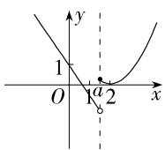  
图1

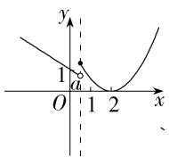  
图2

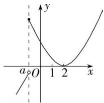

text_image

y
a O 1 2 x

图3

6.B 解法一: $f(x) = -1 + \frac{2}{x+1}$ , 其图象的对称中心为 (-1, -1), 将 $y = f(x)$ 的图象沿 $x$ 轴向右平移 1 个单位长度, 再沿 $y$ 轴向上平移 1 个单位长度可得函数 $f(x-1) + 1$ 的图象, 且该图象关于点 (0,0) 对称, 所以函数 $f(x-1) + 1$ 是奇函数.

解法二:选项 A, $f(x-1)-1=\frac{2}{x}-2$ , 此函数既不是奇函数
也不是偶函数;选项 B, $f(x-1)+1=\frac{2}{x}$ , 此函数为奇函数;
选项 C, $f(x+1)-1=\frac{-2x-2}{x+2}$ , 此函数既不是奇函数也不是偶函数;选项 D, $f(x+1)+1=\frac{2}{x+2}$ , 此函数既不是奇函数也不是偶函数.

7.D 函数 $f(x) = \frac{|x^2 - 1|}{x}$ 的定义域为 $\{x | x \neq 0\}$ ，关于原点对称，且 $f(-x) = \frac{|(-x)^2 - 1|}{-x} = -\frac{|x^2 - 1|}{x} = -f(x)$ ，

所以函数 $f(x)$ 为奇函数,A选项错误;

当 $x < 0$ 时， $f(x) = \frac{|x^2 - 1|}{x} \leqslant 0$ ，C选项错误；

当 x>1 时， $f(x)=\frac{|x^{2}-1|}{x}=\frac{x^{2}-1}{x}=x-\frac{1}{x}$ ，易知 $f(x)$ 单调递增，B 选项错误.

8.B ∵ 函数 $f(x)$ 的定义域为 R, 且 $f(2x+1)$ 为奇函数,

$\therefore f(2 \times 0 + 1) = 0$ ，即 $f(1) = 0$ ，且 $f(-2x + 1) = -f(2x + 1)$ .

设 $-2x + 1 = t$ ，则 $2x = 1 - t,\therefore f(t) = -f(2 - t).①$

又∵ $f(x+2)$ 为偶函数，∴ $f(-x+2)=f(x+2)$ .②

结合①②, 得 $f(t) = -f(2-t) = -f(t+2)$ ,

$$
\therefore f (- 1) = - f (1) = 0.
$$

9.D

# 名师点津

(1) 若函数 $y=f(x+a)$ 是偶函数, 则函数 $y=f(x)$ 的图象关于直线 x=a 对称. 若函数 $y=f(x+b)$ 是奇函数, 则函数 $y=f(x)$ 的图象关于点 $(b,0)$ 中心对称.  
(2) 若函数 $y = f(x)$ 的图象有一条对称轴 (方程为 $x = a$ ) 和一个对称中心 (坐标为 $(b,0)$ ), 则函数 $y = f(x)$ 是周期函数, 且周期 $T = 4|b - a|$ .

由题知 $\left\{\begin{aligned}f(-x+1)&=-f(x+1),\\ f(-x+2)&=f(x+2)\end{aligned}\right.$ ，即 $\left\{\begin{aligned}f(-x)&=-f(x+2),\\ f(-x)&=f(x+4)\end{aligned}\right.$

从而 $f(x + 4) = -f(x + 2)$ ，即 $f(x + 2) = -f(x)$

所以 $6 = f(0) + f(3) = -f(2) + [-f(1)] = -(4a + b) - (a + b) = -5a - 2b$ ，即 $5a + 2b = -6.$ ①

又因为 $f(x + 1)$ 为奇函数， $x \in \mathbf{R}$ ，

所以 $f(1)=0$ , 即 $a+b=0.②$

由①②得 $\left\{\begin{aligned}a&=-2,\\ b&=2,\end{aligned}\right.$ 从而 $f(x)=-2x^{2}+2,x\in[1,2].$

所以 $f\left(\frac{9}{2}\right) = f\left(\frac{5}{2} + 2\right) = -f\left(\frac{5}{2}\right) = f\left(\frac{1}{2}\right) = -f\left(\frac{3}{2}\right) =$

$$
- \left[ (- 2) \times \left(\frac {3}{2}\right) ^ {2} + 2 \right] = \frac {5}{2}.
$$

10.A 令 $y = 1$ ，得 $f(x + 1) + f(x - 1) = f(x)\cdot f(1) = f(x)$ ，则 $f(x + 1) = f(x) - f(x - 1)$ ，故 $f(x + 2) = f(x + 1) - f(x)$ $f(x + 3) = f(x + 2) - f(x + 1),$

故 $f(x+3)=-f(x)$ ，故 $f(x+6)=f(x)$ ，

故函数 $f(x)$ 的周期为6，

令 $x = 1, y = 0$ ，得 $f(1) + f(1) = f(1) \cdot f(0) \Rightarrow f(0) = 2$

则 $f(2)=f(1)-f(0)=-1$ ,

$$
f (3) = f (2) - f (1) = - 2,
$$

$$
f (4) = f (3) - f (2) = - 1,
$$

$$
f (5) = f (4) - f (3) = 1,
$$

$$
f (6) = f (5) - f (4) = 2,
$$

所以 $f(1) + f(2) + f(3) + f(4) + f(5) + f(6) = 0$

$$
\begin{array}{l} \sum_ {k = 1} ^ {2 2} f (k) = 3 [ f (1) + f (2) + \dots + f (6) ] + f (1 9) + f (2 0) + \\ f (2 1) + f (2 2) = f (1) + f (2) + f (3) + f (4) = - 3. \end{array}
$$

11.A 由函数 $y = x^3$ 和 $y = -\frac{1}{x^3}$ 都是奇函数, 知函数 $f(x) = x^3 - \frac{1}{x^3}$ 是奇函数. 由函数 $y = x^3$ 和 $y = -\frac{1}{x^3}$ 都在区间 (0, +∞) 上单调递增, 知函数 $f(x) = x^3 - \frac{1}{x^3}$ 在区间 (0, +∞) 上单调递增, 故函数 $f(x) = x^3 - \frac{1}{x^3}$ 是奇函数, 且在区间 (0, +∞) 上单调递增.

12. 解析 (1) 若 $a = 0$ , 则 $f(x) = \frac{x^2 + x + c}{x} = x + \frac{c}{x} + 1$ ,

要使函数有意义,则 $x \neq 0$ , 即 $f(x)$ 的定义域为 $\{x \mid x \neq 0\}$ ,
∵ $y = x + \frac{c}{x}$ 是奇函数, y = 1 是偶函数,

∴ 函数 $f(x)=x+\frac{c}{x}+1$ 既不是奇函数也不是偶函数, 故不存在实数 c, 使得 $f(x)$ 是奇函数.

(2) 若函数 $f(x)$ 的图象过点 $(1,3)$ ，则 $f(1)=\frac{1+3a+1+c}{1+a}=\frac{3a+2+c}{1+a}=3$ ，得 $3a+2+c=3+3a$ ，得 c=1，

此时 $f(x)=\frac{x^{2}+(3a+1)x+1}{x+a}$ ，若函数 $f(x)$ 的图象与x轴负半轴有两个不同的交点，

则 $\frac{x^{2}+(3a+1)x+1}{x+a}=0$ 即 $x^{2}+(3a+1)x+1=0$ 有两个不相等的负根，且 $x\neq-a$ ，设 $g(x)=x^{2}+(3a+1)x+1$ ，

则 $\left\{\begin{aligned}\Delta&=(3a+1)^{2}-4>0,\\ 1&>0,\\ -(3a+1)&<0,\\ -\frac{3a+1}{2}&<0,\end{aligned}\right.$ 解得 $a>\frac{1}{3},$

若 $x = -a$ 是方程 $x^{2} + (3a + 1)x + 1 = 0$ 的根，

则 $a^2 - (3a + 1)a + 1 = 0$ ，即 $2a^2 + a - 1 = 0$ ，得 $a = \frac{1}{2}$ 或 $a = -1$ ，

则实数 $a$ 的取值范围是 $a > \frac{1}{3}$ 且 $a \neq \frac{1}{2}$ ,

即 $a \in \left(\frac{1}{3}, \frac{1}{2}\right) \cup \left(\frac{1}{2}, +\infty\right)$ .

13. 答案 $\frac{1}{3}$

解析 若 $f(x) \geqslant 0$ 恒成立, 则 $\left\{\begin{aligned}a>0,\\ \Delta=b^{2}-4ac\leqslant0,\\ b>a,\end{aligned}\right.$

即 $\left\{\begin{aligned}a^{2}<b^{2}&\leqslant4ac,\\ c&\geqslant\frac{b^{2}}{4a},\end{aligned}\right.$

所以 $\frac{b - a}{a + b + c} \leqslant \frac{b - a}{a + b + \frac{b^2}{4a}} = \frac{4a(b - a)}{4a^2 + 4ab + b^2} = \frac{4a(b - a)}{\left[3a + (b - a)\right]^2} \leqslant$

$$
\frac {4 a (b - a)}{\left[ 2 \sqrt {3 a (b - a)} \right] ^ {2}} = \frac {4 a (b - a)}{1 2 a (b - a)} = \frac {1}{3},
$$

当且仅当 $\left\{\begin{aligned}3a&=b-a,\\ c&=\frac{b^{2}}{4a},\end{aligned}\right.$ 即 b=c=4a 时取等号，故 $\frac{b-a}{a+b+c}$ 的最大值为 $\frac{1}{3}$ .

# 三年模拟练

Q 对应主书 P62

<table><tr><td>1.B</td><td>2.B</td><td>3.D</td><td>4.D</td><td>5.ABD</td><td></td><td></td><td></td></tr></table>

1.B 令 $f(x) + \frac{3}{x} = m$ ，则 $f(m) = \frac{1}{2}$ ，由 $f(x)$ 是定义在 $(0, +\infty)$ 上的单调函数，知 $m$ 为大于0的常数，所以 $f(m) + \frac{3}{m} = \frac{1}{2} + \frac{3}{m} = m \Rightarrow 2m^2 - m - 6 = 0 \Rightarrow m = 2$ （负值舍去），

所以 $f(x) = 2 - \frac{3}{x}\Rightarrow f(1) + f(3) = 2 - 3 + 2 - 1 = 0.$

2.B 对于 $f(x) + xf(1 - x) + 1 = 0$ ①，将 $x$ 替换为 $1 - x$ 可得 $f(1 - x) + (1 - x)f(x) + 1 = 0$ ②，

① $-x\times②$ 得 $(x^{2}-x+1)f(x)=x-1$ ，因为 $x^{2}-x+1=\left(x-\frac{1}{2}\right)^{2}+\frac{3}{4}>0$ 恒成立，所以 $f(x)=\frac{x-1}{x^{2}-x+1}$

设 x-1=t，则 $t+1=x$ ，故 $f(x)$ 可转化为 $g(t)=\frac{t}{t^{2}+t+1}$ ，当 t=0 时， $g(t)=0$ ;

当 $t \neq 0$ 时, $g(t) = \frac{t}{t^2 + t + 1} = \frac{1}{t + \frac{1}{t} + 1} \leqslant \frac{1}{2 + 1} = \frac{1}{3}$ ,

当且仅当 t=1 时取“=”，所以 $g(t)$ 的最大值为 $\frac{1}{3}$ ，即函数 $f(x)$ 的最大值为 $\frac{1}{3}$ .

3.D 因为 $0 < x_{1} < x_{2}$ ，所以 $x_{2} f(x_{1}) - x_{1} f(x_{2}) < 0$ ，所以 $\frac{f(x_{1})}{x_{1}} < \frac{f(x_{2})}{x_{2}}$ .

设函数 $g(x)=\frac{f(x)}{x}$ ，则函数 $g(x)=\frac{f(x)}{x}$ 在 $(0,+\infty)$ 上单调递增，且 $g(2)=\frac{f(2)}{2}=1$ ，

当 x>0 时, 不等式 $f(x)-x>0$ 等价于 $f(x)>x$ , 即 $\frac{f(x)}{x}>1$ ,
即 $g(x) > g(2)$ ，则 x > 2.

又因为 $f(x)$ 是定义在 $\mathbf{R}$ 上的奇函数，所以 $f(0) = 0$ 易知当 $x = 0$ 时，不等式 $f(x) - x > 0$ 无解.

因为 $f(x)$ 是定义在 R 上的奇函数, 所以 $g(x)=\frac{f(x)}{x}$ 为偶函数, 且在 $(-∞,0)$ 上单调递减, $g(-2)=g(2)=1$ ,

当 x<0 时, 不等式 $f(x)-x>0$ 等价于 $f(x)>x$ , 即 $\frac{f(x)}{x}<1$ ,
即 $g(x)<g(-2)$ ，则 -2<x<0。

综上,不等式 $f(x)-x>0$ 的解集为 $(-2,0)\cup(2,+\infty)$ .

4.D 对任意不相等的实数 x, y, 恒有 $\frac{f(y)-f(x)}{x-y}>-2$ ,

即 $\frac{f(y)-f(x)+2x-2y}{x-y}>0$ ，(解题关键: 将条件不等式进行转化, 构造函数, 确定单调性)

令 $g(x) = f(x) - 2x$ ，则对任意不相等的实数 $x, y$ ，恒有 $\frac{g(y) - g(x)}{x - y} > 0$ ，即 $\frac{g(y) - g(x)}{y - x} < 0$

不妨设 $x > y$ ，则 $y - x < 0$ ，所以 $g(y) - g(x) > 0$ ，即 $g(x) < g(y)$ ，所以 $g(x)$ 在 $\mathbf{R}$ 上单调递减.

所以 $f(2x - 1) < 4x - 3$ 即为 $f(2x - 1) - 2(2x - 1) < -1$

又因为 $f(3)=5$ ，所以 $-1=f(3)-2\times3$ ，（技巧点拨：根据 $g(x)$ 的形式，构造特殊函数值）

所以 $f(2x - 1) - 2(2x - 1) < f(3) - 2 \times 3$

即 $g(2x - 1) < g(3)$ ，

因此 2x-1>3, 解得 x>2, 所以不等式 $f(2x-1)<4x-3$ 的解集为 $(2,+\infty)$ .

5.ABD 对于 A, 由 $f(2+x)+g(-x)=1$ 可得 $f(2-x)+g(x)=1$ ,

由 $g(x)$ 为奇函数可得 $g(-x) = -g(x)$ ，

联立 $\left\{\begin{aligned}f(2+x)-g(x)&=1,\\ f(2-x)+g(x)&=1,\end{aligned}\right.$

两式相加可得 $f(2 + x) + f(2 - x) = 2$ ，因此 $f(x)$ 的图象关于点(2,1)对称，故A正确；

对于 B, 由 A 可知 $f(x) + f(4 - x) = 2$ ,

又 $f(x)$ 为偶函数,所以 $f(x)+f(x-4)=2$ ,可得 $f(x+4)+f(x)=2$ ,即 $f(x+4)=f(x-4)$ ,所以 $f(x)=f(x+8)$ ,即 $f(x)$ 是以8为周期的周期函数,故B正确;

对于 C, 假设存在函数 $h(x)$ , 使得对任意的 $x \in R$ , 都有 $h(g(x)) = |x|$ ,

由 $f(2 + x) + f(2 - x) = 2, f(2 + x) + g(-x) = 1,$

可得 $f(2)=1, g(0)=0, f(6)+g(-4)=f(-2)+g(-4)=$ $f(2)+g(-4)=1$ , 可得 $g(-4)=0$ ,

因此 $h(g(0))=h(0)=|0|=0,$

又 $h(g(-4)) = h(0) = |-4| = 4$ ，所以 $h(0)$ 的值不唯一，不满足函数的定义，因此假设不成立，故C错误；

对于 D, 由 C 知 $f(2)=1$ , 所以 $f(10)=1$ ,

又 $f(2)=f(-6)=f(6)$ ，所以 $f(6)=1$ ，所以 $f(14)=1,\cdots\cdots,$

所以 $\sum_{k=1}^{2024}f(4k-2)=f(2)+f(6)+f(10)+\cdots+f(8094)=$

2024, 故 D 正确.

6. 答案 $[-2, 2]$

解析 由已知得 $f(x) = \begin{cases} 2x, & 0 < x < \frac{1}{2}, \\ 2 - 2x, & \frac{1}{2} \leqslant x < 1. \end{cases}$

由 $f(|x|+1)=2f(|x|-1)$ ，得 $f(|x+1|+1)=2f(|x+1|-1)$ ，故当x>-1时， $f(x+2)=2f(x)$ ，

(将函数 $f(x)$ 的图象向右平移两个单位长度后, 函数值变为原来的 2 倍)

又 $f(x)$ 是奇函数，所以函数 $f(x)$ 的图象关于原点对称，由此可得函数 $f(x)$ 在 $(-1,3)$ 上的图象如图所示：

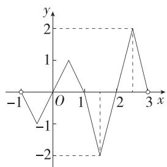

line

| x | y |
|---|---|
| -1 | -1 |
| 0 | 1 |
| 1 | 0 |
| 2 | -2 |
| 3 | 2 |

结合图象知， $f(x)$ 在区间 $(-1,3)$ 上的值域为 $[-2,2]$ .

7. 答案 $\left(-\infty, -\frac{1}{2}\right) \cup (1, +\infty)$

解析 不妨设 $0 \leqslant x_{1} < x_{2}$ , 则 $\frac{x_{1}f(x_{1}) - x_{2}f(x_{2})}{x_{1} - x_{2}} > 1 \Rightarrow x_{1}f(x_{1}) - x_{2}f(x_{2}) < x_{1} - x_{2}$ , 所以 $x_{1}f(x_{1}) - x_{1} < x_{2}f(x_{2}) - x_{2}$ ,

即 $x_{1}[f(x_{1}) - 1] <   x_{2}[f(x_{2}) - 1].$

(结合不等式的特征,构造函数,由函数值的大小比较转化为自变量的大小比较)

设 $g(x) = x[f(x) - 1]$ ，则 $g(x_{1}) < g(x_{2})$ ，故 $g(x)$ 在 $[0, +\infty)$ 上单调递增.

又 $f(x)$ 是定义在 $\mathbf{R}$ 上的偶函数，所以 $g(-x) = -x[f(-x) - 1] = -x[f(x) - 1] = -g(x)$ ，所以 $g(x)$ 为奇函数.

根据奇函数的性质可知, $g(x)$ 在R上单调递增.

由 $2t^{2}[f(2t^{2}) - 1] - (t + 1)[f(t + 1) - 1] > 0$ 得 $2t^{2}[f(2t^{2}) - 1] > (t + 1)[f(t + 1) - 1]$ ，

即 $g(2t^2) > g(t + 1)$ , 所以 $2t^2 > t + 1$ , 解得 $t < -\frac{1}{2}$ 或 $t > 1$ .

所以所求不等式的解集为 $\left(-\infty, -\frac{1}{2}\right) \cup (1, +\infty)$ .

8. 答案 $\frac{93}{2}$

解析 方程 $xf(x) - 6 = 0$ 在[1,32]内的所有实根，即方程 $f(x) = \frac{6}{x}$ 在[1,32]内的所有实根，即函数 $y = f(x)$ 与 $y = \frac{6}{x}$ 的图象在[1,32]内的所有交点的横坐标.

由已知得 $f(x) = \begin{cases} 8x - 8, & 1 \leqslant x < \frac{3}{2}, \\ 16 - 8x, & \frac{3}{2} \leqslant x \leqslant 2, \\ \frac{1}{2} f\left(\frac{x}{2}\right), & x > 2, \end{cases}$

作出 $y = f(x)$ 与 $y = \frac{6}{x}$ 的图象，如图，

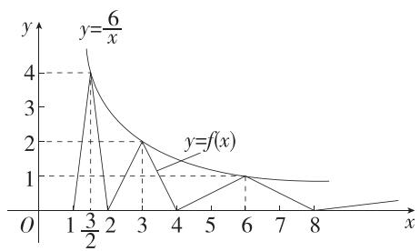

line

| x    | y=f(x) | y=6/x |
| ---- | ------ | ----- |
| 1    | 0      | 4     |
| 2    | 0      | 2     |
| 3    | 2      | 1     |
| 4    | 0      | 1     |
| 5    | 1      | 1     |
| 6    | 1      | 1     |
| 7    | 1      | 1     |
| 8    | 1      | 1     |

观察图象可知,函数 $y=f(x)$ 与 $y=\frac{6}{x}$ 的图象在 [1,32] 内的所有交点的横坐标为 $\frac{3}{2}$ , 3, 6, 12, 24,

所以函数 $y=f(x)$ 与 $y=\frac{6}{x}$ 的图象在 [1,32] 内的所有交点的横坐标之和为 $\frac{3}{2}+3+6+12+24=\frac{93}{2}$ ，即方程 $xf(x)-6=0$ 在 [1,32] 内的所有实根之和为 $\frac{93}{2}$ .

目解后反思

也可分段求出 $f(x)$ 在[1,32]上的解析式，通过解方程求出所有实根，相加可得结果，过程比较烦琐.

9. 解析 (1) 令 $m = n = 0$ ，则 $f(0) = f(0) + f(0) - 1$ ，得 $f(0) = 1$ ，

令 $m = 1, n = -1$ ，则 $f(0) = f(1) + f(-1) - 1 = 1$

即 $f(-1) = 2 - f(1) = 2 - 2 = 0.$

(2) 证明: 任取 $x_{1}, x_{2} \in \mathbf{R}$ , 且 $x_{1} < x_{2}$ , 则 $f(x_{2}) = f(x_{1} + (x_{2} - x_{1})) = f(x_{1}) + f(x_{2} - x_{1}) - 1$ ,

即 $f(x_{2}) - f(x_{1}) = f(x_{2} - x_{1}) - 1$

因为 $x_{2} - x_{1} > 0$ ，所以 $f(x_{2} - x_{1}) > 1$ ，则 $f(x_{2}) > f(x_{1})$

所以函数 $f(x)$ 在 $\mathbf{R}$ 上单调递增.

(3) 证明: $f(x)-1$ 的定义域为 $\mathbf{R}$ , 关于原点对称.

对于 $f(m + n) = f(m) + f(n) - 1$ ，令 $m = x, n = -x$ ，得 $f(0) = f(x) + f(-x) - 1$

由(1)知 $f(0)=1$ ，所以 $1=f(x)+f(-x)-1$ ，

所以 $f(x) - 1 = -f(-x) + 1 = -[f(-x) - 1]$

即 $f(x)-1$ 为奇函数.

10. 解析 (1) 函数 $y = f(x)$ 的图象的对称轴方程为 $x = -m$ ，因为 $f(x)$ 在区间 $[-1, 2]$ 上单调，所以 $-m \geqslant 2$ 或 $-m \leqslant -1$ ，解得 $m \leqslant -2$ 或 $m \geqslant 1$ ，

所以 $A = (-\infty, -2] \cup [1, +\infty)$ .

(2)由(1)知 $m \leqslant -2$ 或 $m \geqslant 1$ .

当 $m \leqslant -2$ 时，函数 $f(x)$ 在 $[-1, 2]$ 上单调递减，所以 $g(m) = f(-1) = -2m - 5$

当 $m \geqslant 1$ 时, 函数 $f(x)$ 在 $[-1, 2]$ 上单调递增, 所以 $g(m) = f(2) = 4m - 2$ .

综上, $g(m)=\left\{\begin{aligned}&4m-2,m\geqslant1,\\&-2m-5,m\leqslant-2.\end{aligned}\right.$

(3) 由 (1) 得 $A = (-\infty, -2] \cup [1, +\infty)$ , 则 $\complement_{\mathbb{R}} A = (-2, 1)$ , 又 $h(m) = m + 1$ ,

所以 $F(m)=\left\{\begin{aligned}&4m-2,m\geqslant1,\\ &m+1,-2<m<1,\\ &-2m-5,m\leqslant-2,\end{aligned}\right.$

问题转化为当 $m \in \left[-\frac{7}{2}, a\right]$ 时， $F(m)_{\max} - F(m)_{\min} \leqslant a + 3$ 恒成立.

①当 $-\frac{7}{2}<a\leqslant-2$ 时， $F(m)$ 在 $\left[-\frac{7}{2},a\right]$ 上单调递减，所以 $F(m)_{\max}=F\left(-\frac{7}{2}\right)=2,F(m)_{\min}=F(a)=-2a-5,$

由 $2 - (-2a - 5)\leqslant a + 3$ 得 $a\leqslant -4$ ，与 $-\frac{7}{2} < a\leqslant -2$ 矛盾.

②当-2<a<1时， $F(m)$ 在 $\left[-\frac{7}{2},-2\right]$ 上单调递减，在 $(-2,a]$ 上单调递增，

因为 $F\left(-\frac{7}{2}\right) = 2 > F(a) = a + 1$ ，所以 $F(m)_{\max} = F\left(-\frac{7}{2}\right) = 2, F(m)_{\min} = F(-2) = -1$ ，

由 $2 - (-1)\leqslant a + 3$ 得 $a\geqslant 0$ ，故 $0\leqslant a <   1.$

③当 $a \geqslant 1$ 时， $F(m)$ 在 $\left[-\frac{7}{2}, -2\right]$ 上单调递减，在 $(-2, 1)$ 上单调递增，在 $[1, a]$ 上单调递增，

因为 $F\left(-\frac{7}{2}\right) = 2 \leqslant F(a) = 4a - 2$ ，所以 $F(m)_{\max} = F(a) = 4a - 2, F(m)_{\min} = F(-2) = -1$ ，

由 $4a - 2 - (-1)\leqslant a + 3$ 得 $a\leqslant \frac{4}{3}$ 故 $1\leqslant a\leqslant \frac{4}{3}$

综上可知, a 的取值范围是 $\left[0, \frac{4}{3}\right]$ .

11. 解析 (1) $g(x)$ 是 $f(x)$ 在 $D$ 上的“L 函数”. 理由如下: 对任意的 $x_{1}, x_{2} \in \mathbf{R}$ , 且 $x_{1} \neq x_{2}$ ,

$$
\left| g \left(x _ {1}\right) - g \left(x _ {2}\right) \right| = 2 \left| x _ {1} - x _ {2} \right|, \left| f \left(x _ {1}\right) - f \left(x _ {2}\right) \right| = 4 \left| x _ {1} - x _ {2} \right|,
$$

显然有 $|g(x_{1})-g(x_{2})|<|f(x_{1})-f(x_{2})|$ ,

所以函数 $g(x)$ 是函数 $f(x)$ 在 D 上的“L 函数”.

(2) 因为函数 $g(x)$ 是函数 $f(x)$ 在 $D$ 上的“L 函数”，所以 $|g(x_1) - g(x_2)| < |f(x_1) - f(x_2)|$ 即 $|\sqrt{x_1^2 + m} - \sqrt{x_2^2 + m}| < 2|x_1^2 - x_2^2|$ 对任意的 $x_1, x_2 \in [0, +\infty)(x_1 \neq x_2)$ 恒成立，

得 $\frac{|x_{1}^{2}-x_{2}^{2}|}{\sqrt{x_{1}^{2}+m}+\sqrt{x_{2}^{2}+m}}<2|x_{1}^{2}-x_{2}^{2}|$ 即 $\sqrt{x_{1}^{2}+m}+\sqrt{x_{2}^{2}+m}>\frac{1}{2}$ 对任意的 $x_{1},x_{2}\in[0,+\infty)(x_{1}\neq x_{2})$ 恒成立，

易得 $\sqrt{x_1^2 + m} +\sqrt{x_2^2 + m} >2\sqrt{m}$

所以 $2\sqrt{m} \geqslant \frac{1}{2}$ , 解得 $m \geqslant \frac{1}{16}$ ,

故 $m$ 的取值范围是 $\left[\frac{1}{16}, +\infty\right)$ .

(3) $(|a| + |b|)^2 - |a + b|^2 = 2|ab| - 2ab,$

当 $ab \geqslant 0$ 时， $(|a| + |b|)^2 - |a + b|^2 = 2|ab| - 2ab = 0.$

当 $ab < 0$ 时， $(|a| + |b|)^2 - |a + b|^2 = 2|ab| - 2ab = -4ab > 0.$

综上， $(|a| + |b|)^2\geqslant |a + b|^2$

因为 $|a|+|b|\geqslant0,|a+b|\geqslant0,$

所以 $|a|+|b|\geqslant|a+b|$ .

对于任意的 $x_{1}, x_{2} \in [0, 2]$ , 不妨设 $x_{1} > x_{2}$ ,

(i) 当 $0 < x_{1} - x_{2} \leqslant 1$ 时, 因为函数 $g(x)$ 是函数 $f(x)$ 在 $[0, 2]$ 上的“L 函数”,

所以 $|g(x_{1})-g(x_{2})|<|x_{1}-x_{2}|\leqslant1$ ，此时 $|g(x_{1})-g(x_{2})|<1$ 成立；

(ii) 当 $x_{1} - x_{2} > 1$ 时，由 $x_{1}, x_{2} \in [0, 2]$ 得 $1 < x_{1} - x_{2} \leqslant 2$

因为 $g(0)=g(2)$ ，函数 $g(x)$ 是函数 $f(x)$ 在 $[0,2]$ 上的“L 函数”，

所以 $|g(x_{1})-g(x_{2})|=|g(x_{1})-g(2)+g(0)-g(x_{2})|\leqslant$ $|g(x_{1})-g(2)|+|g(0)-g(x_{2})|<|x_{1}-2|+|0-x_{2}|=(2-x_{1})+x_{2}=2-(x_{1}-x_{2})<1,$

此时 $|g(x_{1})-g(x_{2})|<1$ 也成立.

由(i)(ii)可知， $|g(x_{1})-g(x_{2})|<1$ 恒成立.

# 第四章 指数函数与对数函数

# 4.1 指数

# 4.1.1 $n$ 次方根与分数指数幂

# 4.1.2 无理数指数幂及其运算性质

# 基础过关练

Q 对应主书 P64

<table><tr><td>1.B</td><td>2.A</td><td>3.C</td><td>6.D</td><td>7.CD</td><td></td><td></td><td></td></tr></table>

1.B 由 $\sqrt{a^5} = (\sqrt{a})^5 = 32$ ，解得 $a = 4$

由 $\sqrt{(-b)^2} = 2$ 得 $|b| = 2$ ，又 $b < 0$ ，所以 $b = -2$

所以 $\frac{b}{a} = \frac{-2}{4} = -\frac{1}{2}$ .

2. A $\sqrt{(\pi-4)^{2}}+\sqrt[3]{(\pi-3)^{3}}=|\pi-4|+\pi-3=4-\pi+\pi-3=1.$

3.C 因为 a<-1, 所以 $a+1<0$ ,

所以 $\sqrt{(1 + a)^6}$ · $\sqrt[3]{(a + 1)^9} = \sqrt{[(1 + a)^3]^2}$

$$
\sqrt [ 3 ]{\left[ (a + 1) ^ {3} \right] ^ {3}} = - (a + 1) ^ {3} \cdot (a + 1) ^ {3} = - (a + 1) ^ {6}.
$$

# 名师点睛

n 为奇数时， $\left(\sqrt[n]{a}\right)^{n}=a,a$ 为任意实数均可；n 为偶数时， $a\geqslant0,\left(\sqrt[n]{a}\right)^{n}$ 才有意义，且 $\left(\sqrt[n]{a}\right)^{n}=a$ ，而 a 为任意实数 $\sqrt[n]{a^{n}}$ 均有意义，且 $\sqrt[n]{a^{n}}=\left\{\begin{aligned}|a|,n & \text{为偶数},\\ a,n & \text{为奇数}.\end{aligned}\right.$

4. 答案 $\pm \frac{2}{3}$

解析 由指数运算可知 $\left(\frac{2}{3}\right)^4 = \frac{16}{81},\left(-\frac{2}{3}\right)^4 = \frac{16}{81}$ 所以 $\frac{16}{81}$ 的四次方根是 $\frac{2}{3}$ 或 $-\frac{2}{3}$ .

5. 答案 $x$

解析 当 x<0 时， $3\sqrt[5]{x^{5}}+\sqrt[4]{x^{4}}+|x|=3x+|x|+|x|=3x-2x=x.$

6.D $a^{\frac{4}{3}}a^{\frac{3}{4}} = a^{\frac{4}{3} -\frac{1}{4}} = a^{\frac{25}{12}}$ ,A错误； $a\div a^{\frac{2}{3}} = a^{1 - \frac{2}{3}} = a^{\frac{1}{3}}$ B错误； $a^{\frac{2}{3}}a^{-\frac{2}{3}} = a^{\frac{2}{3} -\frac{2}{3}} = a^0 = 1,$ C错误； $(a^{\frac{1}{4}})^{4} = a^{\frac{1}{4}\times 4} = a,$ D正确.

7. CD 对于 A, $-\sqrt{x} = -x^{\frac{1}{2}} (x \geqslant 0)$ ，故 A 错误；对于 B, $\sqrt[6]{y^{2}} = -y^{\frac{1}{3}} (y < 0)$ ，故 B 错误；对于 C, $x^{-\frac{1}{3}} = \frac{1}{x^{\frac{1}{3}}} = \frac{1}{\sqrt[3]{x}} (x \neq 0)$ ，故 C 正确；对于 D, $\left[\sqrt[3]{(-x)^{2}}\right]^{\frac{3}{4}} = \left(\sqrt[3]{x^{2}}\right)^{\frac{3}{4}} = x^{\frac{2}{3} \times \frac{3}{4}} = x^{\frac{1}{2}} (x > 0)$ ，故 D 正确.

# 名师支招

# 根式与分数指数幂互化的规律

1. 根指数 $\xrightarrow{化为}$ 分数指数的分母, 被开方数(式)的指数 $\xrightarrow{化为}$ 分数指数的分子.  
2. 在具体计算时, 先把根式转化成分数指数幂, 然后利用实数指数幂的运算性质解题.

8. 答案 18

解析 $2\sqrt{3} \times 3\sqrt[3]{1.5} \times \sqrt[6]{12} = 2 \times 3^{\frac{1}{2}} \times 3 \times \left(\frac{3}{2}\right)^{\frac{1}{3}} \times (2^2 \times 3)^{\frac{1}{6}} =$

$$
2 ^ {1 - \frac {1}{3} + 2 \times \frac {1}{6}} \times 3 ^ {\frac {1}{2} + 1 + \frac {1}{3} + \frac {1}{6}} = 2 \times 3 ^ {2} = 1 8.
$$

9. 答案 $\frac{7}{2}$

解析 由已知得 $\sqrt[n]{x^3y^4} = x^{\frac{3}{n}}y^{\frac{4}{n}} = x^m y^n$ ，所以 $m = \frac{3}{n}, n = \frac{4}{n}$ ，又 $n \in \mathbf{N}^*$ , $n > 1$ ，所以 $n = 2, m = \frac{3}{2}$ ，所以 $m + n = \frac{7}{2}$ .

10. 答案 $\frac{1}{144}$

解析 原式 $= (2^{-2})^{3\sqrt{x} - 2\sqrt{y}} = \frac{2^{4\sqrt{y}}}{2^{6\sqrt{x}}} = \frac{(2^{\sqrt{y}})^4}{(2^{\sqrt{x}})^6} = \frac{\left(\frac{3}{2}\right)^4}{3^6} = \frac{1}{144}.$

11. 解析 (1) 原式 $= 1 + \left(\frac{2}{3}\right)^2 \times \left(\frac{27}{8}\right)^{\frac{2}{3}} - \frac{1}{0.1} + 9^{\frac{3}{2}} = 1 + \frac{4}{9} \times \left(\frac{3}{2}\right)^{\frac{2}{3} \times 3} - 10 + 3^{\frac{3}{2} \times 2} = 1 + \frac{4}{9} \times \frac{9}{4} - 10 + 27 = 19.$

(2) 原式 $= \frac{16 \cdot (ab)^{\frac{1}{2}} \cdot (a^2b^5)^{\frac{1}{3}}}{4 \cdot (a^2b^7)^{\frac{1}{6}} \cdot (a^2b^5)^{\frac{1}{4}}} = \frac{4a^{\frac{1}{2}}b^{\frac{1}{2}} \cdot a^{\frac{2}{3}}b^{\frac{5}{3}}}{a^{\frac{1}{3}}b^{\frac{7}{6}} \cdot a^{\frac{1}{2}}b^{\frac{5}{4}}} = 4a^{\frac{1}{2} + \frac{2}{3} - \frac{1}{3} - \frac{1}{2}} b^{\frac{1}{2} + \frac{5}{3} - \frac{7}{6} - \frac{5}{4}} = 4a^{\frac{1}{3}}b^{-\frac{1}{4}}.$

因为 a=27, b=16,

所以原式 $= 4 \times 27^{\frac{1}{3}} \times 16^{-\frac{1}{4}} = 6.$

12. 答案 $x^{2}$

解析 原式 $= x^{\frac{\sqrt{3}}{2} \times \sqrt{3} + \frac{1}{2}} = x^{2}$ .

13. 答案 1(答案不唯一)

解析 $a^{\frac{\pi}{3}}a^{\frac{2\pi}{3}}a^{-\pi} + \sqrt[4]{(a - 1)^4} = a^{\frac{\pi}{3} +\frac{2\pi}{3} -\pi} + |a - 1| = 1 + |a - 1| = a$ ，即 $|a - 1| = a - 1$ ，则 $a - 1\geqslant 0$ ，所以 $a\geqslant 1.$ 所以使等式成立的实数 $a$ 的值可以为1.

14. 解析 (1) 因为 $2^{a} = 5^{b} = m$ ，所以 $m^{\frac{1}{a}} = 2, m^{\frac{1}{b}} = 5$ ，所以 $m^{\frac{1}{a}} \cdot m^{\frac{1}{b}} = m^{\frac{1}{a} + \frac{1}{b}} = 10$ ，又 $\frac{1}{a} + \frac{1}{b} = 2$ ，所以 $m^{2} = 10$ ，所以

$(2^{\frac{\sqrt{2}}{2}}\sqrt{m^{\sqrt{2}}})^{2\sqrt{2}} = 2^{\frac{\sqrt{2}}{2}\times 2\sqrt{2}} \cdot m^{\frac{\sqrt{2}}{2}\times 2\sqrt{2}} = 4m^{2} = 40.$   
(2) $y = 1 + 4^{-\sqrt{3}} = 1 + 2^{-2\sqrt{3}} = 1 + (2^{\sqrt{3}})^{-2} = 1 + \frac{1}{(x - 1)^2}.$

# 能力提升练

Q 对应主书 P65

<table><tr><td>1.C</td><td>2.A</td><td>3.D</td><td>4.D</td><td>5.ABC</td><td></td><td></td><td></td></tr></table>

1. C 由 $\sqrt{-a}$ 可知 $a \leqslant 0$ , 则 $a \sqrt{-a} \leqslant 0$ , 且 $a \sqrt{-a} = -\sqrt{-a \cdot a^2} = -\sqrt{-a^3}$ , $\sqrt{a^3}$ 无意义, 故 A, B, D 错误, C 正确.

2.A 因为 $2^{2n + 1} + 4^n = 2^{2n}\cdot 2 + 2^{2n} = 3\times 2^{2n} = 192$ 所以 $2^{2n} = 64 = 2^6$ ，即 $2n = 6$ ，则 $n = 3$

3.D 根据题意, 得 $\left(10^{\frac{2m-2n}{2}}\right)^{2}=10^{3m-2n}=10^{3m}\times10^{-2n}=\left(10^{m}\right)^{3}\times\left(10^{n}\right)^{-2}=2^{3}\times3^{-2}=\frac{8}{9}$ ,

因为 $10^{\frac{3m - 2n}{2}} > 0$ ，所以 $10^{\frac{3m - 2n}{2}} = \sqrt{\frac{8}{9}} = \frac{2\sqrt{2}}{3}$ .

4.D 原式 $= \frac{2^{2n + 2} \cdot 2^{-2n - 1}}{(2^2)^n \cdot (2^3)^{-2}} = \frac{2}{2^{2n - 6}} = 2^{7 - 2n} = \left(\frac{1}{2}\right)^{2n - 7}$ .

5. ABC 因为 $a + a^{-1} = 4$ ，所以 a > 0.

对于 A, 因为 $\left(a^{\frac{1}{2}}+a^{-\frac{1}{2}}\right)^{2}=a+a^{-1}+2=6$ , 所以 $a^{\frac{1}{2}}+a^{-\frac{1}{2}}=\sqrt{6}$ , 故 A 正确;

对于 B, 因为 $(a+a^{-1})^{2}=a^{2}+a^{-2}+2=16$ , 所以 $a^{2}+a^{-2}=14$ , 故 B 正确;

对于 C, $a^{3} + a^{-3} = (a + a^{-1})(a^{2} + a^{-2} - 1) = 4 \times 13 = 52$ , 故 C 正确;

对于 D, 因为 $(a-a^{-1})^{2}=a^{2}+a^{-2}-2=12$ , 所以 $a-a^{-1}=\pm2\sqrt{3}$ , 故 D 错误.

6. 解析 (1) $\because x < \pi, \therefore x - \pi < 0$ ,

当 $n$ 为偶数时， $\sqrt[n]{(x - \pi)^n} = |x - \pi| = \pi - x;$

当 $n$ 为奇数时， $\sqrt[n]{(x - \pi)^n} = x - \pi.$

综上, $\sqrt[n]{(x-\pi)^{n}}=\left\{\begin{aligned}\pi-x,n& 为偶数且 n\in\mathbf{N}^{*},\\ x-\pi,n& 为奇数且 n\in\mathbf{N}^{*}\end{aligned}\right.$ (n>1).

(2) $\because a < b < 0, \therefore a - b < 0, a + b < 0,$

当 n 是奇数时, 原式 $=(a-b)+(a+b)=2a$ ;

当 n 是偶数时, 原式 $= |a - b| + |a + b| = (b - a) + (-a - b) = -2a$ .

综上， $\sqrt[n]{(a-b)^{n}}+\sqrt[n]{(a+b)^{n}}=\left\{\begin{aligned}&2a,n\text{为奇数且}n\in\mathbf{N}^{*},\\&-2a,n\text{为偶数且}n\in\mathbf{N}^{*}\end{aligned}\right.$ $(n>1)$ .

7. 解析 因为 a>0，且 $a^{2x}=\sqrt{2}+1$ ，

所以 $a^{-2x} = \frac{1}{a^{2x}} = \frac{1}{\sqrt{2} + 1} = \sqrt{2} - 1.$

(1) $\frac{a^x + a^{-x}}{a^x - a^{-x}} = \frac{(a^x + a^{-x})^2}{(a^x - a^{-x})(a^x + a^{-x})} = \frac{a^{2x} + 2 + a^{-2x}}{a^{2x} - a^{-2x}} = \frac{\sqrt{2} + 1 + 2 + \sqrt{2} - 1}{\sqrt{2} + 1 - \sqrt{2} + 1} = \sqrt{2} + 1.$

(2) $\frac{a^{3x} + a^{-3x}}{a^x + a^{-x}} = \frac{(a^x + a^{-x})(a^{2x} - 1 + a^{-2x})}{a^x + a^{-x}} = a^{2x} - 1 + a^{-2x} = \sqrt{2} + 1 - 1 + \sqrt{2} - 1 = 2\sqrt{2} - 1.$

8. 解析 (1) 原式 $= \frac{a^{\frac{\pi}{3} \times \frac{3}{\pi} \pi}}{a^{\frac{2\pi}{3}}} = a^{1 - \pi - \frac{2\pi}{3}} = a^{1 - \frac{5\pi}{3}}.$

(2) 原式 $= \frac{-4a^{1 - \pi}b^{\sqrt{3} - 1}}{12a^{-\sqrt{3}\times\sqrt{3}}b^{\sqrt{3}}} = -\frac{1}{3} a^{4 - \pi}b^{-1}.$

(3) 因为 $a^x = 70^w, x \neq 0, w \neq 0$ , 所以 $a^{\frac{1}{w}} = 70^{\frac{1}{x}}$ .

同理可得 $b^{\frac{1}{w}} = 70^{\frac{1}{y}}, c^{\frac{1}{w}} = 70^{\frac{1}{z}}$

所以 $a^{\frac{1}{w}}\cdot b^{\frac{1}{w}}\cdot c^{\frac{1}{w}} = 70^{\frac{1}{x}}\cdot 70^{\frac{1}{y}}\cdot 70^{\frac{1}{z}}$

即 $(abc)^{\frac{1}{w}} = 70^{\frac{1}{x} +\frac{1}{y} +\frac{1}{z}}$

又 $\frac{1}{x} +\frac{1}{y} +\frac{1}{z} = \frac{1}{w}$ 所以 $abc = 70 = 2\times 5\times 7$

又 $a, b, c$ 为正整数，且 $a^x = b^y = c^z \neq 1, x, y, z \neq 0,$

所以 a, b, c 均不为 1,

又因为 $a \leqslant b \leqslant c$ ，所以 $a = 2, b = 5, c = 7$ .

# 4.2 指数函数

# 4.2.1 指数函数的概念

# 基础过关练

Q 对应主书 P66

<table><tr><td>1.A</td><td>2.A</td><td>5.BCD</td><td></td><td></td><td></td><td></td><td></td></tr></table>

1.A 由 $f(x) = (2k + 1)^x$ 为指数函数, 得 $2k + 1 > 0$ 且 $2k + 1 \neq 1$ , 解得 $k > -\frac{1}{2}$ 且 $k \neq 0$ , 故 $k \in \left(-\frac{1}{2}, 0\right) \cup (0, +\infty)$ .

2.A $\because$ 函数 $f(x) = \left(\frac{1}{2} a - 3\right)a^{x}$ 是指数函数，

$\therefore \frac{1}{2} a - 3 = 1$ 且 $a > 0, a \neq 1$ , 解得 $a = 8$ ,

$$
\therefore f (x) = 8 ^ {x}, \therefore f \left(\frac {1}{3}\right) = 8 ^ {\frac {1}{3}} = 2.
$$

3. 答案 $\frac{1}{2}$

解析 因为 $f(x) = 4^x$ ，且 $f(b) = 2f(a)$ ，所以 $4^b = 2 \times 4^a$ ，即 $2^{2b} = 2^{1 + 2a}$ ，故 $2b = 1 + 2a$ ，所以 $b - a = \frac{1}{2}$ .

4. 答案 $f(x)=3 \cdot \left(\frac{1}{4}\right)^{x}$ (答案不唯一)

解析 根据 $\frac{f(0.5n)}{f(0.5(n+1))}=2$ 可考虑指数型函数,设出方程求解即可.

设 $f(x) = a \cdot b^{x}$ ( $b > 0$ 且 $b \neq 1$ ), 由 $\frac{f(0.5n)}{f(0.5(n + 1))} = 2$ 得 $\frac{a \cdot b^{0.5n}}{a \cdot b^{0.5(n + 1)}} = 2$ , 所以 $\frac{1}{b^{0.5}} = 2$ , 故 $b = \frac{1}{4}$ , 又 $f(0) = 3$ , 故 $a \cdot \left(\frac{1}{4}\right)^{0} = 3$ , 则 $a = 3$ , 所以 $f(x) = 3 \cdot \left(\frac{1}{4}\right)^{x}$ .

5. BCD 将(1,1)和(3,4)代入函数关系式 $y = ka^{t} (k \in \mathbb{R}$ 且 $k \neq 0, a > 0$ 且 $a \neq 1)$ ，得 $\left\{\begin{aligned}ka &= 1, \\ ka^{3} &= 4,\end{aligned}\right.$ $\therefore \left\{\begin{aligned}k &= \frac{1}{2}, \\ a &= 2,\end{aligned}\right.$

∴ 函数关系式为 $y=\frac{1}{2}\times2^{t}=2^{t-1}$ .

∵ 函数图象呈曲线形,∴ 浮萍每月增加的面积不相等,因此 A 错误.

当 t=6 时, $y=2^{5}=32$ , 浮萍的面积超过了 $30\ m^{2}$ , 因此 B 正确.

令 $y = 2$ ，得 $t = 2$ ，令 $y = 64$ ，得 $t = 7$ ，∴浮萍从 $2\mathrm{m}^2$ 蔓延到 $64\mathrm{m}^2$ 需要5个月，因此C正确.

依题意得 $2^{t_{1}-1}=4,2^{t_{2}-1}=6,2^{t_{3}-1}=9,\because4\times9=6^{2},\therefore2^{t_{1}-1}\times2^{t_{3}-1}=(2^{t_{2}-1})^{2}$ ，因此 $2^{t_{1}+t_{3}-2}=2^{2t_{2}-2},\therefore t_{1}+t_{3}=2t_{2}$ ，因此 D 正确.

6. 答案 27.1

解析 将 $t = 5, P = 0.9P_{0}$ 代入 $P = P_{0} \mathrm{e}^{-kt}$ , 得 $\mathrm{e}^{-5k} = 0.9$ .

将 t = 15 代入 $P = P_{0} e^{-kt}$ ，得 $P = P_{0} e^{-15k} = P_{0} (e^{-5k})^{3} = 0.9^{3} P_{0} = 0.729 P_{0}$ ，

所以前 15 h 消除了 $(1-0.729)\times100\%=27.1\%$ 的污染物，

则 $m = 27.1$

7. 解析 (1) 当 $0 \leqslant t < 2$ 时, $y$ 与 $t$ 成正比, 且对应图象过点 $(0,0)$ 和 $(2,1)$ , 所以 $y = \frac{1}{2} t$ .

当 $t \geqslant 2$ 时, $y = k a^{t} (a > 0, \text{且 } a \neq 1)$ , 且对应图象过点 $(2, 1)$ 和 $(4, 0.5)$ ,

所以 $\left\{\begin{aligned}1&=ka^{2},\\ 0.5&=ka^{4},\end{aligned}\right.$ 所以 $\left\{\begin{aligned}a&=\frac{\sqrt{2}}{2},\\ k&=2,\end{aligned}\right.$ 所以 $y=2^{1-\frac{1}{2}t}.$

所以 $y=\left\{\begin{aligned}&\frac{1}{2}t,0\leqslant t<2,\\ &2^{1-\frac{t}{2}},t\geqslant2.\end{aligned}\right.$

(2) 当 $0 \leqslant t < 2$ 时, 令 $\frac{1}{2} t \geqslant 0.25$ , 得 $0.5 \leqslant t < 2$ ;

当 $t \geqslant 2$ 时, 令 $2^{1 - \frac{t}{2}} \geqslant 0.25$ , 得 $2 \leqslant t \leqslant 6$ .

因此当 $0.5 \leqslant t \leqslant 6$ 时, 药物有效, 有效时长为 $6 - 0.5 = 5.5(\mathrm{h})$ .

# 4.2.2 指数函数的图象和性质

# 基础过关练

Q 对应主书 P67

<table><tr><td>1.A</td><td>2.C</td><td>3.AD</td><td>4.AD</td><td>5.A</td><td>7.C</td><td>8.A</td><td>9.A</td></tr><tr><td>10.D</td><td>13.A</td><td>14.C</td><td>15.C</td><td>16.B</td><td></td><td></td><td></td></tr></table>

1.A 由题图可知,函数 $f(x)$ 在定义域R上单调递增,且图象过点 $(0,0)$ .

因为 $f(x) = 2^{-x} - 1 = \left(\frac{1}{2}\right)^x - 1, f(x) = 2^{-x-1} = \left(\frac{1}{2}\right)^{x+1}$ 在定义域 R 上均单调递减，所以排除 C, D.

因为 $f(x)=2^{x-1}$ 的图象不过点 $(0,0)$ ，所以排除 B.

$f(x)=2^{x}-1$ 在定义域 R 上单调递增, 且 $2^{x}>0$ , 所以 $f(x)=2^{x}-1>-1$ , 故 A 符合题意.

2.C 因为函数 $f(x) = 2 - 3^{|x|}$ 的定义域为 $\mathbf{R}$ , $f(-x) = 2 - 3^{| - x|} = 2 - 3^{|x|} = f(x)$ , 所以函数 $f(x)$ 为偶函数, 其图象关于 $y$ 轴对称, 故排除 B, D. 又 $f(0) = 2 - 1 = 1$ , 故排除 A.

3. AD 当 x=0 时, $y=a^{0}+b-1=b$ .

由函数 $y=a^{x}+b-1(a>0,$ 且 $a\neq1)$ 的图象经过第一、三、四象限及指数函数的性质知，该函数单调递增，其图象与 y 轴的交点 $(0,b)$ 在 x 轴的下方，所以 b<0，且 a>1.

4. AD 当 x=1 时， $f(1)=a, g(1)=b$ ，由 a>b>0 可知 A、D 中图象满足.

5.A $f(x) = (3\alpha -1)^{-x} = \left(\frac{1}{3\alpha - 1}\right)^x.$

若当 x>0 时, 函数 $f(x)=(3\alpha-1)^{-x}$ 的值恒小于 1 (点拨: 可作出大致图象求解), 则 $0<\frac{1}{3\alpha-1}<1$ , 所以 $3\alpha-1>1$ , 所以 $\alpha>\frac{2}{3}$ ,

结合选项知, 当 x>0 时, 函数 $f(x)=(3\alpha-1)^{-x}$ 的值恒小于 1 的一个充分不必要条件是 $\alpha>1$ .

6. 解析 (1) 由函数 $f(x) = a^{x - 2}$ 的图象经过点 $\left(1, \frac{1}{2}\right)$ 可得

$a^{1 - 2} = \frac{1}{2}$ ，解得 $a = 2$ ，即 $f(x) = 2^{x - 2}$

又 $f(t + 2) = 4$ ，所以 $2^{t + 2 - 2} = 4$ ，可得 $2^{t} = 4$ ，解得 $t = 2$

(2) 易知 $g(x)=\left\{\begin{aligned}|x+1|, &x \leqslant 0, \\ 2^{x}-1, &x > 0,\end{aligned}\right.$ $g(x)$ 的图象如图：

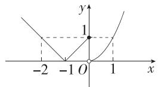

①根据图象可得该函数的单调递增区间为 $[-1,0]$ 和 $(0, +\infty)$ .  
②由 $g(x)=1$ 可得 x=-2 或 x=0 或 x=1，

结合图象可得 $g(x) \leqslant 1$ 的解集为 $[-2, 1]$ .

7.C $\because \frac{1}{3} > \frac{1}{5}, \therefore \left(\frac{1}{2}\right)^{\frac{1}{3}} < \left(\frac{1}{2}\right)^{\frac{1}{5}}, \therefore A$ 错误；

∵ 0.1 < 0.2, ∴ $2^{0.1} < 2^{0.2}$ , ∴ B 错误;

$\because -0.1 > -0.2, \therefore 2^{-0.1} > 2^{-0.2}, \therefore C$ 正确；

$\because -\frac{1}{5}>-\frac{1}{3},\therefore\left(\frac{1}{2}\right)^{-\frac{1}{5}}<\left(\frac{1}{2}\right)^{-\frac{1}{3}},\therefore D错误.$

8.A 易知 $y=\left(\frac{1}{4}\right)^{x}$ 在 R 上单调递减, 所以由 $\left(\frac{1}{4}\right)^{2a+1}<\left(\frac{1}{4}\right)^{8-2a}$ 得 $2a+1>8-2a$ , 解得 $a>\frac{7}{4}$ .

9.A 由题知 $f(x)$ 在 $\mathbf{R}$ 上单调递增，

所以 $\left\{\begin{aligned}\frac{a}{2}&\geqslant0,\\ 2^{0}-a&\geqslant0,\end{aligned}\right.$ 解得 $0\leqslant a\leqslant1.$

10.D 由 $-x^{2}-4x-3=-(x+3)(x+1)\geqslant0$ ，得 $-3\leqslant x\leqslant-1$ ，(易错点:要注意在定义域范围之内讨论函数的单调性)所以函数的定义域是[-3,-1].

易知 $y = \left(\frac{1}{3}\right)^x$ 在 $\mathbf{R}$ 上单调递减， $y = \sqrt{x}$ 在定义域上单调递增， $y = -x^2 - 4x - 3$ 的图象开口向下，对称轴方程为 $x = -2$ ，则 $y = -x^2 - 4x - 3$ 在 $[-3, -2]$ 上单调递增，在 $[-2, -1]$ 上单调递减，所以根据复合函数的单调性“同增异减”可知 $y = \left(\frac{1}{3}\right)^{\sqrt{-x^2 - 4x - 3}}$ 的单调递增区间是 $[-2, -1]$ .

11. 答案 $\frac{1}{2}$ 或 $\frac{3}{2}$

解析 当 a>1 时, 函数 $y=a^{x}$ 在 [1,2] 上单调递增, y 的最大值为 $a^{2}$ , 最小值为 a,

故有 $a^2 - a = \frac{a}{2}$ , 解得 $a = \frac{3}{2}$ 或 $a = 0$ (舍去);

当 0 < a < 1 时, 函数 $y = a^{x}$ 在 [1, 2] 上单调递减, y 的最大值为 a, 最小值为 $a^{2}$ ,

故有 $a - a^2 = \frac{a}{2}$ , 解得 $a = \frac{1}{2}$ 或 $a = 0$ (舍去).

综上, $a=\frac{3}{2}$ 或 $a=\frac{1}{2}$ .

# 易错警示

解决与指数函数单调性、最大(小)值有关的问题时,要注意底数对单调性的影响,当底数含有参数时,要注意对参数分类讨论.

12. 答案 $(- \infty, 2]$

解析 由题意知, $f(x)$ 在 $[1,+\infty)$ 上是单调函数.

$$
f (x) = 4 ^ {x} - 2 ^ {x + a} + 1 = 2 ^ {2 x} - 2 ^ {a} \cdot 2 ^ {x} + 1.
$$

令 $t = 2^{x}$ ，则 $t\in [2, + \infty)$

记 $g(t) = t^2 - 2^a t + 1$ ，则 $g(t)$ 在 $[2, +\infty)$ 上单调.

由 $t = 2^{x}$ 在 $\mathbf{R}$ 上单调递增， $g(t)$ 在 $(- \infty, 2^{a-1})$ 上单调递减，在 $[2^{a-1}, +\infty)$ 上单调递增，得 $[2, +\infty) \subseteq [2^{a-1}, +\infty)$ ，所以 $2^{a-1} \leqslant 2$ ，所以 $a \leqslant 2$ .

13.A 由题意得 $a^2 - 2a - 2 = 1$ 且 $a < 0$ , 解得 $a = -1$ ,

则 $g(x)=b^{x-1}-1$ (b>0 且 $b\neq1$ ). 令 x-1=0, 得 x=1, 此时 $g(1)=0$ ,

故 $g(x) = b^{x - 1} - 1 (b > 0$ 且 $b \neq 1)$ 的图象过定点 $(1,0)$ .

14.C 若对任意的 $x_{1} \in [0,1]$ , 总存在 $x_{2} \in [-1,4]$ , 使得 $g(x_{1}) \leqslant f(x_{2})$ 成立, 则 $g(x)$ 在 $[0,1]$ 上的最大值小于或等于 $f(x)$ 在 $[-1,4]$ 上的最大值.

易知 $g(x) = \left(\frac{1}{2}\right)^x - m$ 在 $[0,1]$ 上单调递减，

所以 $g(x)_{\max} = g(0) = \left(\frac{1}{2}\right)^0 - m = 1 - m.$

易知 $f(x) = x^{2} - 2x$ 在 $[-1, 1]$ 上单调递减，在 $[1, 4]$ 上单调递增，又 $f(-1) = (-1)^{2} - 2 \times (-1) = 3$ ， $f(4) = 4^{2} - 2 \times 4 = 8$ ，所以 $f(x)_{\max} = 8$ ，

所以 $1-m \leqslant 8$ ，解得 $m \geqslant -7$ ，

即 m 的取值范围是 $[-7, +\infty)$ .

15. C 由 $2023^{a} + 2024^{-b} < 2023^{b} + 2024^{-a}$ , 得 $2023^{a} - 2024^{-a} < 2023^{b} - 2024^{-b}$ .

令 $g(x) = 2023^{x} - 2024^{-x}$ ，易知 $y = 2023^{x}$ 在 $\mathbf{R}$ 上单调递增， $y = 2024^{-x}$ 在 $\mathbf{R}$ 上单调递减，

因此 $g(x)$ 在 R 上单调递增, 所以 a<b, 即 a-b<0.

16.B 因为 $f(x)$ 是定义在 R 上的奇函数, 所以由 $x[f(x) - 2f(-x)] < 0$ 得 $x[f(x) + 2f(x)] < 0$ , 故 $xf(x) < 0$ .

当 $x > 0$ 时， $f(x) = 2^x - 2$ 单调递增，令 $f(x) = 0$ ，得 $x = 1$ 再结合函数 $f(x)$ 为奇函数，可作出 $f(x)$ 的图象，如图.

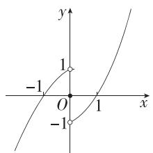

line

| Point | x | y |
|---|---|---|
| -1 | 0 | 0 |
| 1 | 0 | 1 |

由 $xf(x) < 0$ 可得 $\left\{ \begin{array}{l} x > 0, \\ f(x) < 0 \end{array} \right.$ 或 $\left\{ \begin{array}{l} x < 0, \\ f(x) > 0, \end{array} \right.$

由图象可得 $\left\{\begin{aligned}x&>0,\\ 0<x&<1\end{aligned}\right.$ 或 $\left\{\begin{aligned}x&<0,\\ -1&<x<0,\end{aligned}\right.$ 故0<x<1或-1<x<0,

故不等式的解集为 $(-1,0) \cup (0,1)$ .

17. 解析 (1) 易知 $f(x)$ 的定义域为 $\mathbf{R}$ . $\because$ 函数 $f(x) = \frac{3^x - a}{3^x + 1}$ 为奇函数, $\therefore f(0) = \frac{1 - a}{2} = 0$ , 解得 $a = 1$ , 经检验, 符合题意.

(2) $f(x)=\frac{3^{x}-1}{3^{x}+1}=1-\frac{2}{3^{x}+1}$ 在R上单调递增,证明如下:

任取 $x_{1}, x_{2} \in \mathbf{R}$ , 且 $x_{1} < x_{2}$ ,

则 $f(x_{1}) - f(x_{2}) = \frac{2}{3^{x_{2}} + 1} -\frac{2}{3^{x_{1}} + 1},\because x_{1} <   x_{2},\therefore 0 <   3^{x_{1}} <   3^{x_{2}},$

$$
\therefore \frac {2}{3 ^ {x _ {1}} + 1} > \frac {2}{3 ^ {x _ {2}} + 1}, \therefore f (x _ {1}) - f (x _ {2}) <   0,
$$

$\therefore f(x_{1}) < f(x_{2}), \therefore f(x)$ 在 $\mathbf{R}$ 上单调递增.

(3) $\because f(x)$ 是 R 上的奇函数，

∴ 由 $f(t^{2}-2t)+f(2t^{2}-1)<0$ , 得 $f(t^{2}-2t)<f(1-2t^{2})$

又 $f(x)$ 是R上的增函数，

$\therefore t^{2} - 2t <   1 - 2t^{2}$ ，解得 $-\frac{1}{3} <  t <   1$

∴ 原不等式的解集为 $\left(-\frac{1}{3},1\right)$ .

18. 解析 (1) $f(x)=1-\frac{2}{2^{x}+1}=\frac{2^{x}-1}{2^{x}+1}$ ，其定义域为 R，

又 $f(-x) = \frac{2^{-x} - 1}{2^{-x} + 1} = \frac{1 - 2^x}{1 + 2^x} = -f(x)$ ，所以 $f(x)$ 是奇函数.

(2) 因为 $y=2^{x}+1$ 是 R 上的增函数, 且 y>1 恒成立,
所以 $y=\frac{2}{2^{x}+1}$ 是 R 上的减函数,

所以 $f(x)=1-\frac{2}{2^{x}+1}$ 在 $[-1,1]$ 上单调递增，

所以 $f(x)_{\min} = f(-1) = -\frac{1}{3}, f(x)_{\max} = f(1) = \frac{1}{3}$ ,

所以 $f(x)$ 的值域为 $\left[-\frac{1}{3},\frac{1}{3}\right]$

(3)对任意的 $x \in [-1, 1]$ , 不等式 $f(x) \leqslant 2^x + a$ 恒成立, 即 $a \geqslant f(x) - 2^x$ 在 $[-1, 1]$ 上恒成立, 故 $a \geqslant [f(x) - 2^x]_{\max}, x \in [-1, 1]$ .

易知 $f(x)-2^{x}=1-\frac{2}{2^{x}+1}-2^{x}=2-\frac{2}{2^{x}+1}-(2^{x}+1)$ .

令 $t = 2^{x} + 1, x \in [-1, 1]$ ，则 $t \in \left[\frac{3}{2}, 3\right]$ ，问题转化为 $a \geqslant \left(2 - \frac{2}{t} - t\right)_{\max}$ .

由对勾函数的性质得 $y = \frac{2}{t} + t$ 在 $\left[\frac{3}{2}, 3\right]$ 上单调递增，

所以 $y = 2 - \frac{2}{t} - t$ 在 $\left[\frac{3}{2}, 3\right]$ 上单调递减，

所以 $y = 2 - \frac{2}{t} - t$ 在 $\left[\frac{3}{2}, 3\right]$ 上的最大值为 $2 - \frac{4}{3} - \frac{3}{2} = -\frac{5}{6}$ ,

所以 $a \geqslant -\frac{5}{6}$ , 即实数 $a$ 的取值范围为 $\left[-\frac{5}{6}, +\infty\right)$ .

# 能力提升练

Q 对应主书 P69

<table><tr><td>1.B</td><td>3.A</td><td>4.AB</td><td>6.B</td><td>7.D</td><td></td><td></td><td></td></tr></table>

1.B 在同一平面直角坐标系中作出 $y = 3^x, y = x^3, y = x$ 的图象，如图，

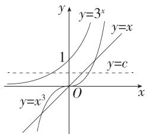

text_image

y
y=3^x
y=x
1
y=c
O
x
y=x^3

则 a, b, c 分别为 $y = 3^{x}$ , $y = x^{3}$ , y = x 的图象与直线 $y = c (0 < c < 1)$ 的交点的横坐标, 所以 a < c < b.

2. 答案 $\left(0, \frac{1}{2}\right] \cup (1, +\infty)$

解析 当 a>1 时, 指数函数 $f(x)=a^{x}$ 在 R 上单调递增, 由图象知, $f(x)$ 的图象和 $g(x)$ 的图象一定会相交.

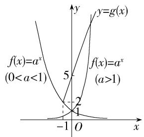

text_image

y=g(x)
f(x)=a^x
(0<a<1)
5
f(x)=a^x
(a>1)
-2
1
O
x
-1

当 0 < a < 1 时, 指数函数 $f(x) = a^{x}$ 在 R 上单调递减, 所以要使 $f(x)$ 的图象与 $g(x)$ 的图象相交, 只需 $a^{-1} \geqslant g(-1) = 3 \times (-1) + 5 = 2$ 即可, 可得 $0 < a \leqslant \frac{1}{2}$ .

所以 $a$ 的取值范围为 $\left(0, \frac{1}{2}\right] \cup (1, +\infty)$ .

3.A $\because \mathrm{e} > 1, \therefore y = \mathrm{e}^{x}$ 在 $\mathbf{R}$ 上单调递增.

$$
y - z = a \left(\mathrm{e} ^ {a} - \mathrm{e} ^ {b}\right), \because a > b > 0, \therefore \mathrm{e} ^ {a} > \mathrm{e} ^ {b}, \therefore y > z.
$$

$$
\begin{array}{l} z - x = (b - a) + (a - b) \mathrm{e} ^ {b} = (a - b) (\mathrm{e} ^ {b} - 1), \because a > b > 0, \therefore a - b > \\ 0, \mathrm{e} ^ {b} > 1, \therefore z > x. \end{array}
$$

综上， $x < z < y$ .

4.AB 由 $f(x) = \left|\left(\frac{1}{2}\right)^x + a\right|$ 得 $f(-x) = |2^x + a|$ .

由已知得 $f(x)$ 与 $f(-x)$ 在区间[1,2020]上同时单调递增或同时单调递减.

若同时单调递增,则 $\left\{\begin{aligned}\left(\frac{1}{2}\right)^{x}+a&\leqslant0,\\ 2^{x}+a&\geqslant0\end{aligned}\right.$ 在 $x\in[1,2020]$ 上恒

成立,可得 $\left\{\begin{aligned}a&\leqslant-\frac{1}{2},\\ a&\geqslant-2,\end{aligned}\right.$ 所以 $-2\leqslant a\leqslant-\frac{1}{2}.$

若同时单调递减,则 $\left\{\begin{aligned}\left(\frac{1}{2}\right)^{x}+a&\geqslant0,\\ 2^{x}+a&\leqslant0\end{aligned}\right.$ 在 $x\in[1,2020]$ 上恒

成立,可得 $\left\{\begin{aligned}a&\geqslant-\left(\frac{1}{2}\right)^{2020},\\ a&\leqslant-2^{2020},\end{aligned}\right.$ 该不等式组无解.

综上, $-2\leqslant a\leqslant-\frac{1}{2}.$

结合选项,实数 a 的取值可能是 $-\frac{3}{2}, -\frac{5}{6}$ .

5. 答案 (1,3]

解析 作出 $f(x)$ 的图象, 如图所示.

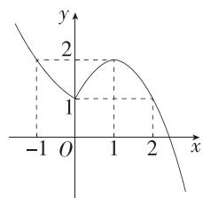

line

| x | y |
|---|---|
| -1 | 2 |
| 0 | 1 |
| 1 | 2 |
| 2 | 1 |

由 $f(x)$ 在区间 $(m,n)$ 上既有最大值，又有最小值，得 $-1\leqslant m < 0,1 < n\leqslant 2$ ，则 $0 < -m\leqslant 1$ ，所以 $1 < n - m\leqslant 3$ 所以 $n - m$ 的取值范围是(1,3].

6.B 作出曲线 $y = 2^{x} (x < 0)$ 关于 $y$ 轴对称的曲线 $C$ ，以及函数 $f(x)$ 的大致图象，如图所示，

由图可知,曲线 $y=x|x-2|(x\geqslant0)$ 与曲线 C 有 3 个交点,所以 $f(x)$ 图象上的“偶对称点”有 3 对.

7.D 令 t=x-2，则方程化为 $t^{2}-4+a(2^{t}+2^{-t})=0$ .

令 $g(t)=t^{2}-4+a(2^{t}+2^{-t})$ ，其定义域为 R，又 $g(-t)=(-t)^{2}-4+a(2^{-t}+2^{t})=g(t)$ ，所以函数 $g(t)$ 是偶函数，其图象关于 y 轴对称.

由题意知, $g(t)=0$ 有唯一实数解,所以 $g(0)=0$ ,即2a-4=0,所以a=2.

8. 答案 3

解析 由 $f(x) = \frac{(x - 1)(2^x - a)}{2^x - 2}$ 知 $2^x - 2 \neq 0$ ，即 $x \neq 1$ ，

所以函数的定义域为 $\{x \mid x \neq 1\}$ .

因为函数 $f(x) = \frac{(x - 1)(2^x - a)}{2^x - 2}$ 的图象关于直线 $x = b$ 对称，所以 $b = 1$ ，且 $f(x) = f(2 - x)$ 恒成立，

所以 $\frac{(x - 1)(2^x - a)}{2^x - 2} = \frac{(1 - x)(2^{2 - x} - a)}{2^{2 - x} - 2}$ $= \frac{(1 - x)(2 - a\cdot 2^{x - 1})}{2 - 2^x},$

所以 $2^{x}-a=2-a\cdot2^{x-1}$ ，整理得 $(a+2)(2^{x-1}-1)=0$ ，

所以 a = -2，故 $b - a = 1 + 2 = 3$ .

9. 解析 (1) 易知 $g(x)$ 的图象开口向上, 对称轴方程为 $x = 1$ , 所以 $g(x)$ 在 [2,3] 上单调递增, 所以 $g(x)_{\max} = g(3) = 5$ , $g(x)_{\min} = g(2) = 2$ ,

即 $\left\{\begin{aligned}9a-6a+b=5,\\ 4a-4a+b=2,\end{aligned}\right.$ 解得 $\left\{\begin{aligned}a=1,\\ b=2.\end{aligned}\right.$

(2)由(1)知, $g(x)=x^{2}-2x+2$ ,

则 $f(x)=g(|x|)=x^{2}-2|x|+2=\begin{cases}x^{2}-2x+2,x\geqslant0,\\x^{2}+2x+2,x<0.\end{cases}$

因为 $f(x)$ 的定义域为 R，且 $f(-x)=x^{2}-2|x|+2=f(x)$ ，所以 $f(x)$ 为偶函数.

作出函数 $f(x)$ 的图象,如图,

由图可知,不等式 $f(2^{k}-2)>f(2)$ 等价于 $|2^{k}-2|>2$ ,

即 $2^{k} - 2 > 2$ 或 $2^{k} - 2 < -2$ ，解得 $k > 2$

所以实数 k 的取值范围是 $(2, +\infty)$ .

(3) $f(x)$ 是[1,4]上的有界变差函数.

由(2)知函数 $f(x)$ 在[1,4]上单调递增，所以当 $x\in[1,4]$ 时， $f(x)_{\min}=f(1)=1,f(x)_{\max}=f(4)=10$

所以对任意分法 $T:1=x_{0}<x_{1}<\cdots<x_{n}=4$ ，有 $f(1)=f(x_{0})<f(x_{1})<\cdots<f(x_{n})=f(4)$ ，

所以 $\sum_{t=1}^{n}|f(x_{t})-f(x_{t-1})|=f(x_{1})-f(x_{0})+f(x_{2})-f(x_{1})+\cdots+f(x_{n})-f(x_{n-1})=f(x_{n})-f(x_{0})=f(4)-f(1)=9,$

所以当 $M \geqslant 9$ 时， $\sum_{t=1}^{n} |f(x_t) - f(x_{t-1})| \leqslant M$ 恒成立，

所以 $f(x)$ 是 $[1,4]$ 上的有界变差函数，且 $M$ 的最小值为9.

# 专题强化练 3 变换作图及其应用 ---- Q 对应主书 P70

<table><tr><td>1.A</td><td>2.D</td><td>3.B</td><td>4.B</td><td>5.ACD</td><td></td><td></td><td></td></tr></table>

1.A 由函数 $f(x) = (x - a)(x - b)$ （其中 $a > b$ ）的图象可知 $0 < a < 1, b < -1$ ，所以函数 $g(x) = a^x + b$ 是减函数，排除选项 C, D;

又因为函数 $g(x)$ 的图象是由 $y=a^{x}$ 的图象向下平移 $|b|$ 个单位长度得到的，且 $|b|>1$ ，所以 A 正确.

2.D 在 $f(x)=m^{x-2}(m>0,$ 且 $m\neq1)$ 中，令 x-2=0，解得 x=2，此时 $f(2)=1$ ，即函数 $f(x)$ 的图象过定点 $(2,1)$ ，

所以 $a = 2, b = 1$ ，所以 $g(x) = \left(\frac{1}{a}\right)^{|x + b|} = \left(\frac{1}{2}\right)^{|x + 1|}$ .

将 $y=\left(\frac{1}{2}\right)^{x}$ 的图象在 y 轴右侧的部分沿 y 轴翻折到左侧, 替换原 y 轴左侧部分的图象, 并保留 $y=\left(\frac{1}{2}\right)^{x}$ 的图象在 y 轴上及其右侧的部分, 得到 $y=\left(\frac{1}{2}\right)^{|x|}$ 的图象, 再将所得图象向左平移 1 个单位长度得到函数 $g(x)$ 的图象, 因此 D 符合.

3.B 作出函数 $f(x)$ 的图象,如图所示.

line

| x | y |
|---|---|
| a | 1 |
| b | 0 |
| 2 | 3 |
| c | 1 |
| 5 | 0 |

不妨设 $a < b < c$ ，由图可知 $1 - 2^{a} = 2^{b} - 1 = -c + 5 \in (0,1)$ ，

$$
\therefore 2 ^ {a} + 2 ^ {b} = 2, c \in (4, 5), \therefore 2 ^ {c} \in \left(2 ^ {4}, 2 ^ {5}\right) = (1 6, 3 2),
$$

$$
\therefore 1 8 = 1 6 + 2 <   2 ^ {a} + 2 ^ {b} + 2 ^ {c} <   3 2 + 2 = 3 4,
$$

即 $2^{a} + 2^{b} + 2^{c}$ 的取值范围是(18,34).

4.B 由 $2[f(x)]^2 -(2a + 3)f(x) + 3a = 0$ 得 $[2f(x) - 3]\cdot [f(x) - a] = 0$ ，解得 $f(x) = \frac{3}{2}$ 或 $f(x) = a.$

作出 $f(x)$ 的图象,如图所示.

text_image

y=\frac{3}{2}
y
2
y=a
1
O 1 x

因为方程 $2[f(x)]^2 - (2a + 3)f(x) + 3a = 0$ 有五个不同的实数解，所以 $a \neq \frac{3}{2}$ ，则 $f(x) = \frac{3}{2}$ 有2个不同的实数解， $f(x) = a$ 有3个不同的实数解，所以 $1 < a < \frac{3}{2}$ 或 $\frac{3}{2} < a < 2$ .

故 $a$ 的取值范围是 $\left(1, \frac{3}{2}\right) \cup \left(\frac{3}{2}, 2\right)$ .

5.ACD 作出函数 $f(x)$ 的图象,如图中实线部分所示,

line

| x | y=f(x) | y=f(x-2) |
|---|---|---|
| -2 | 0 | 0 |
| -1 | 1 | 0 |
| 0 | 0 | 0 |
| 1 | 1 | 0 |
| 2 | 0 | 0 |
| 3 | 0 | 0 |
| 4 | 0 | 0 |

由图可知， $f(x)=\left\{\begin{aligned}|x+2|,&x\leqslant-1,\\ x^{2},&-1<x<1,\quad 且其图象关于y轴对 \\ |x-2|,&x\geqslant1,\end{aligned}\right.$

称,所以函数 $f(x)$ 为偶函数,故A正确.

易知 $f(-1)=f(1)=1$ , $f(-3)=f(3)=1$ , 所以 $f(x)<1$ 的解集为 $(-3,-1)\cup(-1,1)\cup(1,3)$ , 故 B 错误.

将 $f(x)$ 的图象向右平移2个单位长度,得到函数 $f(x-2)$ 的图象,如图中虚线部分所示,

当 $x \in [1, +\infty)$ 时， $f(x - 2) \leqslant f(x)$ ，故 $\mathbb{C}$ 正确.

由图可知, 当 $x \in [0, +\infty)$ 时, $0 \leqslant f(x) \leqslant x$ , 又因为当 $x \in R$ 时, $f(x) \in [0, +\infty)$ , 所以 $0 \leqslant f(f(x)) \leqslant f(x)$ , 故 D 正确.

6. 答案 $(0,1]$ ; $\frac{1}{4}$

解析 作出函数 $f(x)$ 的图象, 如图所示.

line

| x | y |
|---|---|
| -4 | 2 |
| -3 | 1 |
| -2 | 0 |
| -1 | -2 |
| 0 | 0 |
| 1 | 1 |
| 2 | 2 |
| 3 | 3 |
| 4 | 4 |

由图可得, $0<k\leqslant1$ ,且 $x_{1},x_{2}$ 是方程 $\left|\frac{1}{2^{x}}-2\right|=k$ 的两个根, $x_{3},x_{4}$ 是方程 $x+\frac{1}{x}-2=k$ 的两个根.

由 $x_{1}, x_{2}$ 是方程 $\left|\frac{1}{2^x} - 2\right| = k$ 的两个根，且 $x_{1} < x_{2}$ ，得 $x_{1} < -1 < x_{2} \leqslant 0$ ，则 $\frac{1}{2^{x_1}} - 2 = 2 - \frac{1}{2^{x_2}}$ ，因此 $\frac{1}{2^{x_1}} + \frac{1}{2^{x_2}} = 4$ ，即 $\frac{2^{x_1 + x_2}}{2^{x_1} + 2^{x_2}} = \frac{1}{4}$ .

由 $x_{3}, x_{4}$ 是方程 $x + \frac{1}{x} - 2 = k$ 的两个根，得 $x_{3}, x_{4}$ 是方程 $x^{2} - (k + 2)x + 1 = 0$ 的两个根，所以 $x_{3}x_{4} = 1$ .

所以 $\frac{x_3x_4\cdot 2^{x_1 + x_2}}{2^{x_1} + 2^{x_2}} = \frac{1}{4}.$

7. 解析 (1) 因为 $f(x)$ 为偶函数, $g(x)$ 为奇函数,

所以 $f(-x) = f(x), g(-x) = -g(x)$ .

由 $f(x) - g(x) = 2^{1 - x}$ ①，得 $f(-x) - g(-x) = 2^{1 + x}$

即 $f(x)+g(x)=2^{1+x}$ ②.

①+②, 可得 $f(x)=2^{x}+2^{-x}$ ,

②-①, 可得 $g(x)=2^{x}-2^{-x}$ .

(2) 由 (1) 得 $h(x) = \left| \frac{1}{2} [f(x) + g(x)] - 1 \right| = |2^x - 1|$ .

由 $[h(x)]^2 - 2kh(x) + k - \frac{1}{4} = [h(x) - \frac{1}{2}]$

$\left[h(x) - 2\left(k - \frac{1}{4}\right)\right] = 0$ ，得 $h(x) = \frac{1}{2}$ 或 $h(x) = 2\left(k - \frac{1}{4}\right)$ 即 $|2^{x} - 1| = \frac{1}{2}$ 或 $|2^{x} - 1| = 2\left(k - \frac{1}{4}\right).$

作出函数 $h(x)=|2^{x}-1|$ 的图象, 如图所示.

text_image

h(x)=|2^x-1|
y=1/2
O
x
y

当 $|2^{x}-1|=\frac{1}{2}$ 时，由图可得 $h(x)=|2^{x}-1|$ 与 $y=\frac{1}{2}$ 的图象有两个交点，所以要使方程 $[h(x)]^{2}-2kh(x)+k-\frac{1}{4}=0$ 有三个不同的解，只需 $|2^{x}-1|=2\left(k-\frac{1}{4}\right)$ 有一个解即可，即 $h(x)=|2^{x}-1|$ 与 $y=2\left(k-\frac{1}{4}\right)$ 的图象只有一个交点.

由图可得 $2\left(k - \frac{1}{4}\right) \geqslant 1$ 或 $2\left(k - \frac{1}{4}\right) = 0$ ，解得 $k \geqslant \frac{3}{4}$ 或 $k = \frac{1}{4}$ . 所以实数 $k$ 的取值范围为 $\left\{k \mid k \geqslant \frac{3}{4} \text{或 } k = \frac{1}{4}\right\}$ .

# 4.3 对数

# 4.3.1 对数的概念 4.3.2 对数的运算

# 基础过关练

Q 对应主书 P71

<table><tr><td>1.A</td><td>2.C</td><td>3.A</td><td>4.C</td><td>5.C</td><td>6.D</td><td>12.A</td><td>13.C</td></tr></table>

1.A 当 a>0 且 $a\neq1$ 时, 由 $a^{b}=2$ 及对数的概念得 $\log_{a}2=b$ .

2. C $\because \log_{4}(\log_{5}x)=0,\therefore \log_{5}x=1,\therefore x=5.$

3.A 根据指数和对数的互化公式可知 $b=e^{a}\Leftrightarrow a=\ln b$ ,

所以“ $b=e^{a}$ ”是“ $a=\ln b$ ”的充要条件.

4. C 因为不等式 $x^{2}-21x+19<0$ 的解集为 $(2^{a},2^{b})$ ，所以 $2^{a}$ ， $2^{b}$ 为方程 $x^{2}-21x+19=0$ 的两根，所以 $2^{a}\cdot2^{b}=2^{a+b}=19$ ，所以 $a+b=\log_{2}19$ .

5. C $\log_{2}8=\log_{2}2^{3}=3$ ，因此 A 错误； $\log_{3}5+\log_{3}4=\log_{3}20\neq2$ ，因此 B 错误； $\lg(\lg10)=\lg1=0$ ，因此 C 正确； $4^{\log_{2}9}=2^{2\log_{2}9}=2^{\log_{2}9^{2}}=81$ ，因此 D 错误.

6.D $2\log_6\sqrt{2} + 3\log_6\sqrt[3]{3} = \log_6[(\sqrt{2})^2\times (\sqrt[3]{3})^3] = \log_66 = 1.$

7. 答案 $\frac{31}{15}$

解析 原式 $= \left[\left(\frac{5}{3}\right)^2\right]^{\frac{1}{2}} - \sqrt{4} + 2 + \lg 10^{\frac{2}{3}} = \frac{5}{3} - 2 + 2 + \frac{2}{5} = \frac{31}{15}.$

8. 答案 $\frac{13}{3}$

解析 原式 $= 3 + (\lg 5)^{2} + \lg 2 \cdot (\lg 25 + \lg 2) - \left(\frac{4}{9}\right)^{\frac{1}{2}} +$

$$
(\sqrt {\pi} - 1) ^ {0} = 3 + (\lg 5) ^ {2} + \lg 2 \cdot \lg 5 ^ {2} + (\lg 2) ^ {2} - \frac {2}{3} + 1 = \frac {1 0}{3} +
$$

$$
(\lg 5) ^ {2} + 2 \lg 2 \cdot \lg 5 + (\lg 2) ^ {2} = \frac {1 0}{3} + (\lg 5 + \lg 2) ^ {2} = \frac {1 3}{3}.
$$

9. 答案 $-\frac{3}{4}$

解析 $(\log_43 + \log_83)\times (\log_32 + \log_92) - \mathrm{e}^{\ln 2}$

$$
= \left(\log_ {2 ^ {2}} 3 + \log_ {2 ^ {3}} 3\right) \times \left(\log_ {3} 2 + \log_ {3 ^ {2}} 2\right) - e ^ {\ln 2}
$$

$$
= \left(\frac {1}{2} \log_ {2} 3 + \frac {1}{3} \log_ {2} 3\right) \times \left(\log_ {3} 2 + \frac {1}{2} \log_ {3} 2\right) - 2
$$

$$
= \frac {5}{6} \times \log_ {2} 3 \times \frac {3}{2} \times \log_ {3} 2 - 2 = \frac {5}{4} - 2 = - \frac {3}{4}.
$$

10. 答案 8

解析 易得 $a = \log_225, b = \log_34, c = \log_59$

所以 $abc = \frac{\lg 25}{\lg 2} \cdot \frac{\lg 4}{\lg 3} \cdot \frac{\lg 9}{\lg 5} = \frac{2\lg 5}{\lg 2} \cdot \frac{2\lg 2}{\lg 3} \cdot \frac{2\lg 3}{\lg 5} = 8.$

11. 解析 （1）由换底公式得 $\log_{5}12 = \frac{\lg 12}{\lg 5} = \frac{\lg 3 + 2\lg 2}{\lg 10 - \lg 2} = \frac{n + 2m}{1 - m}.$

(2) 原式 $= \left[\left(\frac{4}{3}\right)^{2}\right]^{-\frac{1}{2}} + 100^{\lg 3 - \lg 2} + \ln \mathrm{e}^{\frac{3}{4}} + \frac{\lg 8}{\lg 9} \cdot \frac{\lg \sqrt[3]{3}}{\lg 4}$

$$
= \left(\frac {4}{3}\right) ^ {- 1} + 1 0 ^ {2 \lg \frac {3}{2}} + \frac {3}{4} + \frac {3 \lg 2}{2 \lg 3} \cdot \frac {\frac {1}{3} \lg 3}{2 \lg 2} = \frac {3}{4} + \frac {9}{4} + \frac {3}{4} + \frac {1}{4} = 4.
$$

12.A $\because \lg 4^{x} + \lg 2^{y} = \lg 8, \therefore 4^{x} \cdot 2^{y} = 8, \therefore 2x + y = 3$ ，又 $x > 0$

$y > 0, \therefore \frac{1}{2x} + \frac{4}{y} = \left(\frac{1}{2x} + \frac{4}{y}\right)(2x + y) \times \frac{1}{3} = \frac{1}{3}\left(5 + \frac{y}{2x} + \frac{8x}{y}\right) \geqslant \frac{1}{3}\left(5 + 2\sqrt{\frac{y}{2x} \cdot \frac{8x}{y}}\right) = 3$ ，当且仅当 $\frac{y}{2x} = \frac{8x}{y}$ 且 $2x + y = 3$ ，即 $x = \frac{1}{2}, y = 2$ 时取等号，故 $\frac{1}{2x} + \frac{4}{y}$ 的最小值为 3.

13.C 由于 $N = 4^{5}\times 9^{10}$ ，所以 $\lg N = 5\lg 4 + 10\lg 9 = 10\lg 2+$ $20\lg 3\approx 12.552$ ，所以 $N\approx 10^{12.552}$ ，故 $N$ 所在的区间为

$(10^{12}, 10^{13})$ .

14. 答案 963

解析 易得 $\lg 3^{2018} = 2018 \times \lg 3 \approx 2018 \times 0.4771 = 962.7878$ ，所以 $3^{2018} \approx 10^{962.7878}$ ，因为 $962 + 1 = 963$ ，所以 $3^{2018}$ 是963位数.

15. 答案 2

解析 易知 $\log_2(2x) + \log_2(2y) = \log_2(4xy) = 1$ ，则 $xy = \frac{1}{2}$ ，且 $x > 0, y > 0$ ，所以 $\frac{x^2 + y^2}{x - y} = \frac{(x - y)^2 + 2xy}{x - y} = (x - y) + \frac{1}{x - y}$ ，又 $x > y$ ，所以 $x - y > 0$ ，

所以 $\frac{x^2 + y^2}{x - y} = (x - y) + \frac{1}{x - y}\geqslant 2\sqrt{(x - y)\cdot\frac{1}{x - y}} = 2,$

当且仅当 $x-y=\frac{1}{x-y}$ 且 $xy=\frac{1}{2}$ ，即 $x=\frac{\sqrt{3}}{2}+\frac{1}{2}$ ， $y=\frac{\sqrt{3}}{2}-\frac{1}{2}$ 时取等号，所以 $\frac{x^{2}+y^{2}}{x-y}$ 的最小值为 2.

# 能力提升练

Q 对应主书 P72

<table><tr><td>1.D</td><td>2.AD</td><td>3.A</td><td>8.D</td><td>9.BCD</td><td></td><td></td><td></td></tr></table>

1.D 因为 $\log_{8}5=b$ ，所以 $8^{b}=5$ ，即 $2^{3b}=5$ ，

所以 $2^{a - 3b} = 2^a\div 2^{3b} = \frac{3}{5}$ 所以 $4^{a - 3b} = (2^{a - 3b})^2 = \frac{9}{25}.$

2.AD 易得 $a=\lg4, b=\lg25, c=\log_{5}4$ ，所以 $a+b=\lg4+\lg25=\lg100=2$ ，故 A 正确； $b-a=\lg25-\lg4=\lg\frac{25}{4}\neq1$ ，故 B 错误；由基本不等式得 $ab=\lg4\times\lg25<\left(\frac{\lg4+\lg25}{2}\right)^{2}=1$ ，故 C 错误； $\frac{1}{a}-\frac{1}{c}=\frac{1}{\lg4}-\frac{1}{\log_{5}4}=\log_{4}10-\log_{4}5=\log_{4}2=\frac{1}{2}$ ，故 D 正确.

3.A 由题意知 $x_{1} = \log_{3}2 = \frac{\log_{7}2}{\log_{7}3} = \frac{2\log_{7}2}{2\log_{7}3} < \frac{2\log_{7}2 + 1}{2\log_{7}3 + 1} = \frac{\log_{7}28}{\log_{7}63} =$ $\log_{63}28 = x_3,x_3 = \log_{63}28 = \frac{2\log_72 + 1}{2\log_73 + 1} = \frac{2(\log_72 + 1) - 1}{2(\log_73 + 1) - 1} <$ $\frac{2(\log_72 + 1)}{2(\log_73 + 1)} = \frac{\log_72 + 1}{\log_73 + 1} = \frac{\log_714}{\log_721} = \log_{21}14 = x_2$ ，所以 $x_{1} <   x_{3} <   x_{2}$

4. 答案 $-\frac{7}{3}$

解析 因为 $\alpha, \beta$ 是方程 $(\lg x)^2 - \lg x - 3 = 0$ 的两根，所以 $\lg \alpha + \lg \beta = 1, \lg \alpha \lg \beta = -3$

所以 $\log_{\alpha}\beta +\log_{\beta}\alpha = \frac{\lg\beta}{\lg\alpha} +\frac{\lg\alpha}{\lg\beta} = \frac{(\lg\beta)^2 + (\lg\alpha)^2}{\lg\alpha\lg\beta} =$ $\frac{(\lg\beta + \lg\alpha)^2 - 2\lg\alpha\lg\beta}{\lg\alpha\lg\beta} = \frac{1 + 6}{-3} = -\frac{7}{3}.$

5. 答案 0

解析 $\because$ 正实数 $x_0$ 是关于 $x$ 的方程 $2^{x} + x = ax + \log_{2}(ax)$ 的根，

$\therefore 2^{x_0} + x_0 = ax_0 + \log_2(ax_0)$ ，即 $2^{x_0} + x_0 = 2^{\log_2(ax_0)} + \log_2(ax_0)$ ，令 $f(x) = 2^{x} + x$

则 $f(x_{0})=f(\log_{2}(ax_{0}))$ ，易知 $f(x)$ 在 $(0,+\infty)$ 上单调递增，

$\therefore x_{0} = \log_{2}(ax_{0})$ ，即 $2^{x_0} = ax_0,\therefore 2^{x_0} - ax_0 = 0.$

6. 答案 $-\frac{1}{6}$

解析 由 $\log_2\sqrt{3a + 1} +\frac{3}{2} a = 1$ ，得 $\log_2\sqrt{3a + 1} = 1 - \frac{3}{2} a$

所以 $\sqrt{3a + 1} = 2^{1 - \frac{3}{2} a}$ 所以 $3a + 1 = 2^{2 - 3a}$

所以 $2^{2-3a}+(2-3a)-3=0.$

由 $4^{b} + 2b = 3$ ，得 $2^{2b} + 2b - 3 = 0$

所以 $2 - 3a$ 和 $2b$ 是方程 $2^{x} + x - 3 = 0$ 的两个根.

令 $f(x)=2^{x}+x-3$ ，易知 $f(x)$ 在R上单调递增，且 $f(1)=0$ ，所以 $f(2-3a)=f(2b)=f(1)=0$ ，

所以 2-3a=2b=1, 解得 $a=\frac{1}{3}$ , $b=\frac{1}{2}$ ,

所以 $a-b=-\frac{1}{6}$ .

7. 解析 $(1)\log_{2}5\times \log_{\frac{1}{5}}4 + (\lg 5)^{2} + \lg 2\times (\lg 5 + 1)$

$$
= \log_ {2} 5 \times (- \log_ {5} 4) + (\lg 5) ^ {2} + \lg 2 \times \lg 5 + \lg 2
$$

$$
= \log_ {2} 5 \times (- 2 \log_ {5} 2) + \lg 5 \times (\lg 5 + \lg 2) + \lg 2
$$

$$
= - 2 + \lg 5 \times \lg 1 0 + \lg 2 = - 2 + \lg 5 + \lg 2
$$

$$
= - 2 + \lg 1 0 = - 2 + 1 = - 1.
$$

(2) 令 $t = \log_a b$ ，则 $t + \frac{1}{t} = \frac{5}{2}$ ，所以 $2t^2 - 5t + 2 = 0$

即 $(2t - 1)(t - 2) = 0$ ，所以 $t = \frac{1}{2}$ 或 $t = 2$

所以 $\log_a b = \frac{1}{2}$ 或 $\log_a b = 2$ ，所以 $a = b^2$ 或 $a^2 = b$ .

又 $a^b = b^a$ ，所以 $2b = a = b^2$ 或 $b = 2a = a^2$ ，所以 $b = 2, a = 4$ 或 $a = 2, b = 4$ ，所以 $\frac{a}{b} = 2$ 或 $\frac{a}{b} = \frac{1}{2}$ .

8.D 设 2025 年该企业的产值为 $a(a > 0)$ , 则 $n$ 年以后的产值为 $a(1 + 8\%)^n$ . 若 $n$ 年以后产值实现翻两番的目标,

则 $a(1 + 8\%)^n = 4a$ ，所以 $n = \log_{1.08}4 = \frac{\lg 4}{\lg 1.08} = \frac{2\lg 2}{\lg \frac{27}{25}} =$

$$
\frac {2 \lg 2}{3 \lg 3 - 2 \lg 5} = \frac {2 \lg 2}{3 \lg 3 - 2 (1 - \lg 2)} = \frac {2 \lg 2}{3 \lg 3 + 2 \lg 2 - 2} \approx
$$

$\frac{2\times 0.3010}{3\times 0.4771 + 2\times 0.3010 - 2}\approx 18$ ，所以到2043年产值基本实现翻两番的目标.

9.BCD 对于 A, 当 $\ln a - \ln b > 0$ 时, 由 $\sqrt{ab} < \frac{a - b}{\ln a - \ln b}$ 得 $\ln a-\ln b<\frac{a-b}{\sqrt{ab}}=\sqrt{\frac{a}{b}}-\sqrt{\frac{b}{a}}$ ，即 $\ln\frac{a}{b}<\sqrt{\frac{a}{b}}-\sqrt{\frac{b}{a}}$ ;

当 $\ln a - \ln b < 0$ 时，由 $\sqrt{ab} < \frac{a - b}{\ln a - \ln b}$ 得 $\ln a - \ln b > \frac{a - b}{\sqrt{ab}} = \sqrt{\frac{a}{b}} - \sqrt{\frac{b}{a}}$ ，即 $\ln \frac{a}{b} > \sqrt{\frac{a}{b}} - \sqrt{\frac{b}{a}}$ 故A错误.

对于 B, 由 $\frac{a - b}{\ln a - \ln b} < \frac{a + b}{2}$ 得 $\frac{\mathrm{e}^a - \mathrm{e}^b}{\ln \mathrm{e}^a - \ln \mathrm{e}^b} < \frac{\mathrm{e}^a + \mathrm{e}^b}{2}$ , 即 $\frac{\mathrm{e}^a - \mathrm{e}^b}{a - b} < \frac{\mathrm{e}^a + \mathrm{e}^b}{2}$ , 故 B 正确.

对于 C, 令 a=1.01, b=1, 代入 $\sqrt{ab}<\frac{a-b}{\ln a-\ln b}$ 中,

得 $\sqrt{1.01\times 1} < \frac{1.01 - 1}{\ln 1.01 - \ln 1}$ 即 $\sqrt{1.01} < \frac{0.01}{\ln 1.01}$

所以 $\ln 1.01 < \frac{0.01}{\sqrt{1.01}} = \frac{1}{\sqrt{10100}} < \frac{1}{\sqrt{10000}} = \frac{1}{100}$ , 故 C

正确.

对于 D, 令 a=3, b=e, 代入 $\frac{a-b}{\ln a-\ln b}<\frac{a+b}{2}$ 中,

得 $\frac{3 - \mathrm{e}}{\ln 3 - \ln \mathrm{e}} < \frac{3 + \mathrm{e}}{2}$ , 所以 $\ln 3 - 1 > \frac{2(3 - \mathrm{e})}{3 + \mathrm{e}}$ ,

化简, 得 $\frac{9-e}{3+e}<\ln3$ , 故 D 正确.

10. 答案 $\log_26$

解析 令 $m = 2^{x}, n = 2^{y}$ , 则 $m > 0, n > 0, x = \log_{2} m, y = \log_{2} n$ .

因为 $2^{x} - 4^{y} = 9$ ，所以 $m - n^2 = 9$ ，即 $m = n^2 + 9$

所以 $x - y = \log_2m - \log_2n = \log_2\frac{m}{n} = \log_2\frac{n^2 + 9}{n} =$

$\log_2\left(n + \frac{9}{n}\right) \geqslant \log_2 2 \sqrt{n \cdot \frac{9}{n}} = \log_2 6$ ，当且仅当 $n = 3, m =$

18 时, 等号成立, 故 x-y 的最小值为 $\log_{2}6$ .

11. 解析 (1) $f(1.02 \times 10^{2}) = 3$ , $f(1.02 \times 10^{-1}) = 1$ .

由题意知, 当 $n \geqslant 0, n \in Z$ 时, $a \times 10^{n}$ 的整数部分的位数为 $n + 1$ ;

当 $n < 0, n \in \mathbf{Z}$ 时， $a \times 10^{n}$ 的非有效数字的位数为 $-n$

所以 $f(a\times 10^{n}) = \left\{ \begin{array}{ll}n + 1,n\geqslant 0,\\ -n,n <   0, \end{array} \right.$ $n\in \mathbf{Z}$

(2) 因为 $x = 2^{100}$ , 所以 $\lg x = 100\lg 2 = 30 + 0.1$ ,

所以 $x=10^{30+0.1}=10^{0.1}\times10^{30}$ ,

所以 $a = 10^{0.1}, n = 30, f(10^{0.1} \times 10^{30}) = 31.$

# 4.4 对数函数

# 4.4.1 对数函数的概念

# 基础过关练

Q 对应主书 P73

<table><tr><td>1.D</td><td>2.B</td><td>3.B</td><td>6.A</td><td>7.B</td><td>8.C</td><td></td><td></td></tr></table>

1.D

2.B ∵ 函数 $f(x)=(a^{2}+a-5)\log_{a}x$ 为对数函数，

$\therefore \left\{ \begin{array}{l}a^{2} + a - 5 = 1,\\ a > 0,\\ a\neq 1, \end{array} \right.$ 解得 $a = 2,\therefore f(x) = \log_2x$

$$
\therefore f \left(\frac {1}{8}\right) = \log_ {2} \frac {1}{8} = - 3.
$$

3.B 由题意得 $f(6) = \log_a 8 = 3$ ，所以 $a = 2$ ，所以 $f(2) = \log_2 4 = 2$ .

4. 答案 $\log_{\frac{1}{2}} x$

解析 设 $f(x) = \log_a x (a > 0, a \neq 1)$ ，则 $\log_a \frac{1}{4} = 2$ ，即 $a^2 = \frac{1}{4} = \left(\frac{1}{2}\right)^2$ ， $\therefore a = \frac{1}{2}, \therefore f(x) = \log_{\frac{1}{2}} x$ 。

5. 解析 (1) 易知 $h(4)=\frac{4}{3}-\frac{1}{3}=1$ ，所以 $B(4,1)$ .

设 $f(x)=\log_{a}x$ (a>0 且 $a\neq1$ )，则 $f(4)=\log_{a}4=1$ ，解得 a=4，所以 $f(x)=\log_{4}x$ .

(2) 不等式 $4^{f(x)} < k$ ，即 $4^{\log_4 x} < k$ ，即 $x < k$ .

因为 $f(x)$ 的定义域为 $(0,+\infty)$ ,

所以关于 $x$ 的不等式 $4^{f(x)} < k$ 只有1个整数解1，

所以 $1 < k \leqslant 2$ ，即 $k$ 的取值范围为 $(1,2]$ .

6.A 要使函数有意义,则需 3x-2>0, 所以 $x>\frac{2}{3}$ , 故定义域为 $\left(\frac{2}{3}, +\infty\right)$ .

7.B 因为 $y=f(x)$ 的定义域为 $[-1,3]$ ,

所以在 $y=\frac{f(2x-1)}{\lg(x-1)}$ 中， $\left\{\begin{aligned}-1&\leqslant2x-1\leqslant3,\\ x-1&>0,\\ x&-1\neq1,\end{aligned}\right.$ 解得 1<x<2，

所以 $y=\frac{f(2x-1)}{\lg(x-1)}$ 的定义域为 $(1,2)$ .

8. C 当 a=0 时, $f(x)=\log_{3}1=0$ , 定义域为 R;

当 $a \neq 0$ 时, 由 $f(x)$ 的定义域为 R 可得 $\left\{\begin{aligned}a&>0,\\ a^{2}&-4a<0,\end{aligned}\right.$ (点拨: 开口方向, 判别式) 解得 0<a<4.

综上， $f(x)$ 的定义域为 $\mathbf{R}$ 时， $0\leqslant a <   4$

故“ $0 \leqslant a < 4$ ”是“函数 $f(x) = \log_{3}(ax^{2} - ax + 1)$ 的定义域为R”的充要条件.

# 目拓展延伸

若函数 $f(x) = \log_3(ax^2 - ax + 1)$ 的值域为 $\mathbf{R}$ ，则 $ax^2 - ax + 1$ 取遍所有的正实数。当 $a = 0$ 时， $f(x) = \log_3 1 = 0$ ，不符合要求；当 $a \neq 0$ 时，需满足 $\begin{cases} a > 0, \\ a^2 - 4a \geqslant 0, \end{cases}$ 解得 $a \geqslant 4$ 。所以 $a \geqslant 4$ 。（可在下一节中结合图象进行理解）

9. 答案 $(-∞, -2] \cup \left[\frac{1}{2}, 1\right)$

解析 由题意得 $\left\{\begin{aligned}&2-\frac{x+3}{x+1}\geqslant0,\\&x+1\neq0,\end{aligned}\right.$ 解得 x<-1 或 $x\geqslant1$ ,

即 $A = \{x\mid x <   - 1$ 或 $x\geqslant 1\}$

由题意得 $(x-a-1)(2a-x)>0$ ，因为a<1，所以 $a+1>2a$ ，所以 $2a<x<a+1$ ，即 $B=(2a,a+1)$ .

因为 $B \subseteq A$ ，所以 $a + 1 \leqslant -1$ 或 $2a \geqslant 1$ ，解得 $a \leqslant -2$ 或 $a \geqslant \frac{1}{2}$ ，又 $a < 1$ ，所以 $a \leqslant -2$ 或 $\frac{1}{2} \leqslant a < 1$ ，

即实数 $a$ 的取值范围是 $(- \infty, -2] \cup \left[\frac{1}{2}, 1\right)$ .

10. 答案 $[0, +\infty)$

解析 $f(x) = \lg \frac{8^x + 4^x + a \cdot 2^x}{2^x} = \lg (4^x + 2^x + a)$ .

依题意得 $4^{x} + 2^{x} + a > 0$ 在 $x\in (-\infty ,1)$ 上恒成立，

即 $a > - (4^{x} + 2^{x})$ 对任意的 $x \in (-\infty, 1)$ 都成立.

令 $t = 2^{x}, x \in (-\infty, 1)$ , 则 $t \in (0, 2)$ ,

易知 $y = -t^2 - t = -\left(t + \frac{1}{2}\right)^2 + \frac{1}{4}$ 在(0,2)上单调递减，

$$
\therefore - t ^ {2} - t \in (- 6, 0), \therefore a \geqslant 0.
$$

11. 答案 $(0,1) \cup (1,2)$

解析 设 $t = 3 - ax, \because a > 0, \therefore t = 3 - ax$ 为 $\mathbf{R}$ 上的减函数， $\therefore$ 当 $x \in \left[0, \frac{3}{2}\right]$ 时， $t = 3 - ax$ 的最小值为 $3 - \frac{3}{2} a$ .

当 $x \in \left[0, \frac{3}{2}\right]$ 时， $f(x)$ 恒有意义，即 $t > 0$ 在 $x \in \left[0, \frac{3}{2}\right]$ 上恒成立， $\therefore 3 - \frac{3}{2} a > 0, \therefore a < 2$ ，又 $a > 0$ ，且 $a \neq 1$ ， $\therefore$ 实数 $a$ 的取值范围为 $(0,1) \cup (1,2)$ .

# 4.4.2 对数函数的图象和性质

基础过关练  
Q 对应主书 P74

<table><tr><td>1.AB</td><td>2.D</td><td>5.A</td><td>6.B</td><td>7.D</td><td>8.D</td><td>11.A</td><td>12.B</td></tr><tr><td>16.A</td><td>17.ABD</td><td></td><td></td><td></td><td></td><td></td><td></td></tr></table>

1. AB 因为 $y=0.6^{x}$ 在定义域 R 内单调递减, 所以①符合, 故 A 正确;

因为 $y=2^{x}$ 在定义域 R 内单调递增, 所以②符合, 故 B 正确;

因为 $y=\log_{0.8}x$ 在定义域 $(0,+\infty)$ 内单调递减, 所以④符合, 故 C 错误;

因为 $y=\log_{1.3}x$ 在定义域 $(0,+\infty)$ 内单调递增, 所以③符合, 故 D 错误.

2.D 易知指数函数 $y = a^{x}$ 的图象与 x 轴没有交点, $y = \log_{\frac{1}{x}}\left(x + \frac{1}{2}\right)$ 的图象过点 $\left(\frac{1}{2}, 0\right)$ , 故排除 A, C.

因为两个函数的底数互为倒数,所以一个底数在 $(0,1)$ 内,另一个底数在 $(1,+\infty)$ 内,所以两个函数的单调性相反,故排除B.

3. 答案 (4,2); 4

解析 令 x-3=1，得 x=4，则 $f(4)=\log_{a}1+2=2$ ，所以函数 $f(x)$ 的图象恒过点 A(4,2).

由已知条件可得 $4m+2n=4$ ，即 $2m+n=2$ ，

又 $m, n$ 都为正数，所以 $\frac{1}{m} + \frac{2}{n} = \frac{1}{2}(2m + n)\left(\frac{1}{m} + \frac{2}{n}\right) = \frac{1}{2}\left(4 + \frac{4m}{n} + \frac{n}{m}\right) \geqslant \frac{1}{2}\left(4 + 2\sqrt{\frac{4m}{n} \cdot \frac{n}{m}}\right) = 4,$

当且仅当 $\left\{\begin{aligned}\frac{4m}{n}&=\frac{n}{m},\\2m+n&=2,\end{aligned}\right.$ 即 $\left\{\begin{aligned}m&=\frac{1}{2},\\n&=1\end{aligned}\right.$ 时,等号成立,

所以 $\frac{1}{m} +\frac{2}{n}$ 的最小值为4.

# 目解题模板

解决函数图象过定点问题时,应从定值入手,如 $a^{0}=1(a\neq0)$ , $\log_{b}1=0(b>0$ 且 $b\neq1)$ ,由此确定定点坐标.

4. 解析 (1) 函数 $y = \log_2(x - 1)$ 的图象是由函数 $y = \log_2 x$ 的图象向右平移 1 个单位长度得到的.

(2) $y = \left| \log_{2}(x - 1) \right|$ 的图象如图①所示.

line

| x   | y     |
| --- | ----- |
| 1   | 4     |
| 2   | 0     |
| 3   | 1     |
| 4   | 2     |

图①

  
图②

(3)不妨设 $x_{1} < x_{2}$ , 在同一平面直角坐标系中作出 $y = \left(\frac{1}{2}\right)^{x}$ 与 $y = |\log_2(x - 1)|$ 的图象, 如图②所示. 由图②知, $1 < x_{1} < 2 < x_{2} < 3$ , 所以 $M = (x_{1} - 2)(x_{2} - 2) < 0$ , 故 $M$ 的符号为负.

5. A $a = 2^{0.3} > 2^{0} = 1$ , $b = \log_{3}2 > \log_{3}\sqrt{3} = \frac{1}{2}$ ，且 $b = \log_{3}2 < \log_{3}3 = 1$ , $c = \log_{5}2 < \log_{5}\sqrt{5} = \frac{1}{2}$ , $\therefore a > b > c$ .

6.B 由题意得 $\left\{ \begin{array}{l} a > 0, \\ a - 2 \leqslant \ln 1, \end{array} \right.$ 即 $\left\{ \begin{array}{l} a > 0, \\ a - 2 \leqslant 0, \end{array} \right.$ 解得 $0 < a \leqslant 2$ ，故 $a$ 的取值范围为 $(0,2]$ .

7.D $\because f(x)=\ln|x-1|$ ,

$\therefore f(x + 1) = \ln |x|$ ，其定义域为 $(- \infty, 0) \cup (0, +\infty)$ .

又 $f(-x + 1) = \ln | - x| = \ln |x| = f(x + 1),\therefore f(x + 1)$ 是偶函数.当 $x > 0$ 时， $f(x + 1) = \ln x$ ，此时单调递增

8.D 易知 $x^{2}-3x+2=(x-1)(x-2)>0$ ，解得 x<1 或 x>2，所以函数 $y=\log_{\frac{1}{3}}(x^{2}-3x+2)$ 的定义域为 $(-∞,1)∪(2,+∞)$ .

设 $t = x^{2} - 3x + 2$ ，则 $y = \log_{\frac{1}{3}}t.$

因为函数 $y = \log_{\frac{1}{3}} t$ 在 $(0, +\infty)$ 上单调递减，

$t=x^{2}-3x+2$ 在 $(-∞,1)$ 上单调递减，在 $(2,+∞)$ 上单调递增，

所以函数 $y=\log_{\frac{1}{3}}(x^{2}-3x+2)$ 的单调递减区间为 $(2,+\infty)$ .
(单调区间应在定义域范围之内)

9. 答案 $(0,1) \cup (2, +\infty)$

解析 不等式 $f(x) < 0$ ，即 $\log_2 x - (x - 1)^2 < 0$

等价于求 $\log_2x < (x - 1)^2$ 在 $(0, +\infty)$ 上的解集.

令 $g(x) = \log_2x, h(x) = (x - 1)^2$ ，则 $g(x) < h(x)$ .

在同一平面直角坐标系中作出函数 $g(x), h(x)$ 的图象，如图所示，

text_image

y
y=h(x)
1
y=g(x)
O
1
2
x

易知 $g(1) = h(1) = 0, g(2) = h(2) = 1$ ，所以由图可得，不等式 $f(x) < 0$ 的解集为 $(0,1) \cup (2, +\infty)$ .

10. 解析 (1) 对任意的 $x \in \mathbf{R}, 4^x + 1 > 0$ ,

所以函数 $f(x)$ 的定义域为 $\mathbf{R}$ .

因为函数 $f(x)$ 为偶函数,所以 $f(-x)=f(x)$ ,

即 $\log_2(4^{-x} + 1) - ax = \log_2(4^x + 1) + ax$

所以 $2ax = \log_2\left(\frac{1}{4^x} + 1\right) - \log_2(4^x + 1) = \log_2\left(\frac{4^x + 1}{4^x} \cdot \frac{1}{4^x + 1}\right) = \log_2\frac{1}{4^x} = \log_22^{-2x} = -2x$ 对任意的 $x \in \mathbf{R}$ 恒成立，

所以 2a = -2, 解得 a = -1.

(2) 由 (1) 得 $f(x) = \log_2(4^x + 1) - x = \log_2(4^x + 1) - \log_22^x = \log_2\frac{4^x + 1}{2^x}$ .

由 $f(x)\leqslant \log_2\frac{17}{4}$ ，得 $\log_2\frac{4^x + 1}{2^x}\leqslant \log_2\frac{17}{4}$ 所以 $\frac{4^x + 1}{2^x}\leqslant \frac{17}{4}.$

设 $2^{x} = t(t > 0)$ ，则 $\frac{t^2 + 1}{t}\leqslant \frac{17}{4}$ 所以 $4t^{2} - 17t + 4\leqslant 0$ ，即（ $4t-$ 1） $(t - 4)\leqslant 0$ ，解得 $\frac{1}{4}\leqslant t\leqslant 4$ ，即 $\frac{1}{4}\leqslant 2^x\leqslant 4$ ，解得 $-2\leqslant$ $x\leqslant 2$

所以满足不等式 $f(x) \leqslant \log_2 \frac{17}{4}$ 的 $x$ 的取值集合为 $\{x \mid -2 \leqslant x \leqslant 2\}$ .

11. A 易知 $y = \ln x$ 在 $\left[\frac{1}{2}, 2\right]$ 上单调递增, 所以 $y \in \left[\ln \frac{1}{2}, \ln 2\right]$ .

易知 $y = \log_9 x$ 在 (2,4] 上单调递增，所以 $y \in (\log_9 2, \log_9 4]$ .

因为 $\ln \frac{1}{2} < \log_9 2 < \ln 2, \log_9 4 = \log_3 2 < \ln 2,$

所以函数 $f(x)$ 的值域是 $\left[\ln \frac{1}{2},\ln 2\right]$ .

12.B 易知 $y = \log_3 x$ 在 $[1, +\infty)$ 上单调递增，所以 $y = \log_3 x$ 在 $[1, +\infty)$ 上的值域为 $[0, +\infty)$ .

因为 $f(x)$ 的值域为 $\mathbf{R}$ , 所以 $y = (4 - a)x + 2a$ 在 $(- \infty, 1)$ 上的值域需包含 $(- \infty, 0)$ ,

所以 $\left\{\begin{aligned}4-a&>0,\\ 4-a+2a&\geqslant0,\end{aligned}\right.$ 解得 $-4\leqslant a<4.$

故实数 $a$ 的取值范围是[-4,4).

13. 答案 $\left(-\infty, -\frac{5}{4}\right)$

解析 设 $t = \log_3 x$ ，则 $t \in [-1, 1]$ ， $y = (\log_3 x)^2 - \log_3(3x) =$

$$
\left(\log_ {3} x\right) ^ {2} - \log_ {3} x - 1 = t ^ {2} - t - 1 = \left(t - \frac {1}{2}\right) ^ {2} - \frac {5}{4},
$$

∴ 当 $t=\frac{1}{2}$ 时, $y_{\min}=-\frac{5}{4},\therefore k<-\frac{5}{4}.$

14. 答案 6

解析 设 $t = -x^{2} + 4x + a - 1, t > 0.$

易知 $y=\log_{3}t$ 在定义域上单调递增, 所以当 $t=-x^{2}+4x+a-1$ 取得最大值时, 函数 $f(x)$ 取得最大值.

由二次函数的性质知, 当 x = 2 时, $t_{\max} = a + 3$ , 此时 $f(x)_{\max} = \log_{3}(a + 3)$ , 所以 $\log_{3}(a + 3) = 2$ , 解得 a = 6.

15. 解析 (1) 因为 $f(x) = \log_a x$ 在 $[a, 2a]$ 上为单调函数，所以由题意得 $|\log_a(2a) - \log_a a| = |\log_a 2| = 1$ ，即 $\log_a 2 = 1$ 或 $\log_a 2 = -1$ ，解得 $a = 2$ 或 $a = \frac{1}{2}$ .

(2) 因为函数 $y = \log_{\frac{1}{3}} x$ 是 $(0, +\infty)$ 上的减函数，

所以 $\left\{\begin{aligned}-ax-1&>0,\\ a-x^{2}&>0,\\ -ax&-1<a-x^{2},\end{aligned}\right.$ 即 $\left\{\begin{aligned}x&<-\frac{1}{a},\\ -\sqrt{a}&<x<\sqrt{a},\\ -1&<x<a+1.\end{aligned}\right.$

当 0 < a < 1 时， $-\frac{1}{a} < -1 < -\sqrt{a}$ ，所以原不等式的解集为 $\varnothing$ ；
当 a > 1 时， $-\frac{1}{a}>-1>-\sqrt{a}$ ，所以原不等式的解集为 $\left(-1,-\frac{1}{a}\right)$ .

16.A 易得 $f(x) = \log_a x (a > 0 \text{ 且 } a \neq 1)$ .

因为 $g(x)=a^{x}$ 的图象过点 $(-2,4)$ ，所以 $4=a^{-2}$ ，故 $a=\frac{1}{2}$ ，所以 $f(x)=\log_{\frac{1}{2}}x$ ，

所以 $f(1) + f(2) = \log_{\frac{1}{2}} 1 + \log_{\frac{1}{2}} 2 = 0 + (-1) = -1.$

17.ABD 对于 A, 根据同底数的指数函数与对数函数互为反函数可得 $g(x) = \log_{a} x (a > 0, \text{且 } a \neq 1)$ ，且定义域是 $(0, +\infty)$ ，故 A 正确。对于 B，根据反函数的特点知函数 $f(x)$ 与 $g(x)$ 的图象关于直线 y = x 对称，故 B 正确。对于 C，若 $f(2) = \frac{1}{4}$ ，则 $a^{2} = \frac{1}{4}$ ，解得 $a = \frac{1}{2}$ 或 $a = -\frac{1}{2}$ （舍去），则 $g(x) = \log_{\frac{1}{2}} x$ ，则 $g\left(\frac{\sqrt{2}}{2}\right) = \log_{\frac{1}{2}} \frac{\sqrt{2}}{2} = \frac{1}{2}$ ，故 C 错误。对于 D，在同一坐标系中作出 a > 1 时两函数的图象，如图 1, 2, 3，可知 $f(x)$ 与 $g(x)$ 的图象的交点个数可能为 0, 1, 2，故 D 正确。

text_image

y
y=a^x
y=x
y=log_a x
O
x

图1

text_image

y
y=a^x
y=x
y=log_a
O
x

图2

text_image

y
y=a^x
y=x
O
y=log_a x
x

图3

# 18. 答案 5

解析 由题意知 $5 - x_{1} = 2^{x_{1}}, 5 - x_{2} = \log_{2}x_{2}$ ，所以 $x_{1}$ 和 $x_{2}$ 是直线 $y = 5 - x$ 和曲线 $y = 2^{x}$ 、曲线 $y = \log_2x$ 交点的横坐标.

易知函数 $y=2^{x}$ 和函数 $y=\log_{2}x$ 互为反函数, 所以它们的图象关于直线 y=x 对称.

又直线 y=5-x 也关于直线 y=x 对称, 所以点 $(x_{1},5-x_{1})$ 和点 $(x_{2},5-x_{2})$ 构成的线段的中点在直线 y=x 上, 所以 $\frac{x_{1}+x_{2}}{2}=\frac{5-x_{1}+5-x_{2}}{2}$ , 解得 $x_{1}+x_{2}=5$ .

能力提升练  
对应主书P76

<table><tr><td>1.C</td><td>2.C</td><td>3.ACD</td><td>4.ABD</td><td>5.D</td><td>9.D</td><td>10.D</td><td>11.B</td></tr><tr><td>12.B</td><td></td><td></td><td></td><td></td><td></td><td></td><td></td></tr></table>

1. C 由题图可知函数 $y = \log_m(x + n)$ 是减函数, 所以 $0 < m < 1$ .

当 $x = 0$ 时， $\log_m(x + n) = \log_m n < 0$ ，所以 $n > 1$

2.C 对于 A, 因为 $f(x) = \mathrm{e}^{x} \cdot \ln |x|$ , 所以 $f(-1) = \mathrm{e}^{-1} \cdot$

$$
\ln | - 1 | = 0, f (- \mathrm{e}) = \mathrm{e} ^ {- \mathrm{e}} \cdot \ln | - \mathrm{e} | = \frac {1}{\mathrm{e} ^ {\mathrm{e}}}, f (- \mathrm{e} ^ {2}) = \mathrm{e} ^ {- \mathrm{e} ^ {2}} \cdot
$$

$\ln\left|-e^{2}\right|=\frac{2}{e^{e^{2}}}$ ，又 $2e^{e}<e^{2e}<e^{e^{2}}$ ，所以 $\frac{2}{e^{e^{2}}}<\frac{2}{2e^{e}}=\frac{1}{e^{e}}$

所以 $f(-\mathrm{e}^2) < f(-\mathrm{e})$ ，又 $-\mathrm{e}^2 < -\mathrm{e} < -1$ ，所以 $f(x)$ 在 $(- \infty, -1)$ 上不单调递减，故A不符合.

对于 B, 因为 $f(x)=\frac{\ln|x|}{e^{x}}$ , 所以 $f(1)=\frac{\ln|1|}{e^{1}}=0$ , $f(e)=$

$\frac{\ln|\mathrm{e}|}{\mathrm{e}^{\mathrm{e}}} = \frac{1}{\mathrm{e}^{\mathrm{e}}},f(\mathrm{e}^{2}) = \frac{\ln|\mathrm{e}^{2}|}{\mathrm{e}^{\mathrm{e}^{2}}} = \frac{2}{\mathrm{e}^{\mathrm{e}^{2}}}$ ，又 $1 <   \mathrm{e} <   \mathrm{e}^{2},f(\mathrm{e}) > f(\mathrm{e}^{2})$ ，所

以 $f(x)$ 在 $(1,+\infty)$ 上不单调递增,故B不符合.

对于 C, 易得 $f(x) = \mathrm{e}^{x} + \ln |x|$ 的定义域为 $\{x \mid x \neq 0\}$ ,

当 x>0 时， $f(x)=\mathrm{e}^{x}+\ln x$ ，易知 $f(x)$ 在 $(0,+\infty)$ 上单调递增；

当 $x < 0$ 时， $f(x) = \mathrm{e}^x + \ln (-x)$ ，易知 $y = \mathrm{e}^x$ 在 $(- \infty, 0)$ 上单调递增且 $0 < \mathrm{e}^x < 1, y = \ln (-x)$ 在 $(- \infty, 0)$ 上单调递减，且当 $x \to -\infty$ 时， $f(x) \to +\infty$ ，当 $x \to 0$ 时， $f(x) \to -\infty$ ，故 $\mathbb{C}$ 符合.

对于 D, 因为 $f(x) = \mathrm{e}^{x} - \ln |x|$ , 所以 $f(-1) = \mathrm{e}^{-1} - \ln |-1| = \frac{1}{\mathrm{e}}$ , $f(-\mathrm{e}) = \mathrm{e}^{-\mathrm{e}} - \ln |- \mathrm{e}| = \frac{1}{\mathrm{e}^{\mathrm{e}}} - 1$ , 又 $-\mathrm{e} < -1$ , $f(-\mathrm{e}) < f(-1)$ ,

所以 $f(x)$ 在 $(-\infty, 0)$ 上不单调递减，故D不符合.

3.ACD 令 $y_{1} = 2^{x}, y_{2} = \log_{\frac{1}{2}} x$ ，在同一平面直角坐标系中作出 $y_{1}, y_{2}$ 的图象，如图1，

易知当 $x = \frac{1}{4}$ 时， $y_{1} = 2^{\frac{1}{4}} < 2, y_{2} = \log_{\frac{1}{2}} \frac{1}{4} = 2$ ，此时 $y_{2} > y_{1}$ ；

当 $x = \frac{1}{2}$ 时， $y_{1} = 2^{\frac{1}{2}} > 1, y_{2} = \log_{\frac{1}{2}} \frac{1}{2} = 1$ ，此时 $y_{1} > y_{2}$ ，所以当 $2^{a} = \log_{\frac{1}{2}} a$ 时， $\frac{1}{4} < a < \frac{1}{2}$ ，故B错误.

line

| x | y₁ = 2^x | y₂ = log₁/₂ |
|---|---|---|
| 0.5 | 1.5 | - |
| 1/4 | 3.0 | - |
| 1/2 | 4.5 | - |
| 1 | 6.0 | - |
| 0.5 | 8.0 | - |
| 1/4 | 10.0 | - |
| 1/2 | 12.0 | - |
| 1 | 14.0 | - |
| 0.5 | 16.0 | - |
| 1/4 | 18.0 | - |
| 1/2 | 20.0 | - |
| 1 | 22.0 | - |
| 0.5 | 24.0 | - |
| 1/4 | 26.0 | - |
| 1/2 | 28.0 | - |
| 1 | 30.0 | - |
| 0.5 | 32.0 | - |
| 1/4 | 34.0 | - |
| 1/2 | 36.0 | - |
| 1 | 38.0 | - |
| 0.5 | 40.0 | - |
| 1/4 | 42.0 | - |
| 1/2 | 44.0 | - |
| 1 | 46.0 | - |
| 0.5 | 48.0 | - |
| 1/4 | 50.0 | - |
| 1/2 | 52.0 | - |
| 1 | 54.0 | - |
| 0.5 | 56.0 | - |
| 1/4 | 58.0 | - |
| 1/2 | 60.0 | - |
| 1 | 62.0 | - |
| 0.5 | 64.0 | - |
| 1/4 | 66.0 | - |
| 1/2 | 68.0 | - |
| 1 | 70.0 | - |
| 0.5 | 72.0 | - |
| 1/4 | 74.0 | - |
| 1/2 | 76.0 | - |
| 1 | 78.0 | - |
| 0.5 | 80.0 | - |
| 1/4 | 82.0 | - |
| 1/2 | 84.0 | - |
| 1 | 86.0 | - |
| 0.5 | 88.0 | - |
| 1/4 | 90.0 | - |
| 1/2 | 92.0 | - |
| 1 | 94.0 | - |
| 0.5 | 96.0 | - |
| 1/4 | 98.0 | - |
| 1/2 | 100.0 | - |
| 1.5 | ~98.0 | ~- |
| ~1/4, ~1/2, ~1/4, ~1/2, ~1/2, ~1/2, ~1/2, ~1/2, ~1/2, ~1/2, ~1/2, ~1/2, ~1/2, ~1/2, ~1/2, ~1/2, ~1/2, ~1/2, ~1/2, ~1/2, ~1/2, ~1/2, ~1/2, ~1/3, ~1/3, ~1/3, ~1/3, ~1/3, ~1/3, ~1/3, ~1/3, ~1/3, ~1/3, ~1/3, ~1/3, ~1/3, ~1/3, ~1/3, ~1/3, ~1/3, ~1/3, ~1/3, ~1/3, ~1/4, ~1/4, ~1/4, ~1/4, ~1/4, ~1/4, ~1/4, ~1/4, ~1/4, ~1/4, ~1/4, ~1/4, ~1/4, ~1/4, ~1/4, ~1/4, ~1/4, ~1/4, ~1/4, ~1/4, ~1/5, ~1/5, ~1/5, ~1/5, ~1/5, ~1/5, ~1/5, ~1/5, ~1/5, ~1/5, ~1/5, ~1/5, ~1/5, ~1/5, ~1/5, ~1/5, ~1/5, ~1/5, ~1 /5, ~1 /5

图1

text_image

y
1
y₃=(1/2)ˣ
1/2
O 1/2√2/2
x
y₂=log₁/₂x

图2

令 $y_{3}=\left(\frac{1}{2}\right)^{x}$ ，在同一平面直角坐标系中作出 $y_{2}, y_{3}$ 的图象，如图 2，

易知当 $x = \frac{1}{2}$ 时， $y_{3} = \left(\frac{1}{2}\right)^{\frac{1}{2}} = \frac{\sqrt{2}}{2}$ ，此时 $y_{2} > y_{3}$ ；当 $x = \frac{\sqrt{2}}{2}$ 时， $y_{2} = \log_{\frac{1}{2}}\frac{\sqrt{2}}{2} = \log_{\frac{1}{2}}\sqrt{\frac{1}{2}} = \frac{1}{2}, y_{3} = \left(\frac{1}{2}\right)^{\frac{\sqrt{2}}{2}} > \frac{1}{2}$ ，此时 $y_{3} > y_{2}$ ，所以当 $\left(\frac{1}{2}\right)^b = \log_{\frac{1}{2}} b$ 时， $\frac{1}{2} < b < \frac{\sqrt{2}}{2}$ ，故 A 正确，C 正确.

易得 $-\frac{1}{2}<-a<-\frac{1}{4}$ ，所以 $0<b-a<\frac{\sqrt{2}}{2}-\frac{1}{4}<\frac{1.5}{2}-\frac{1}{4}=\frac{1}{2}$ ，故D正确.

4.ABD 对于 A, 易知函数 $y = e^{x}$ 与 $y = \ln x$ 互为反函数, 所以 $y = e^{x}$ 与 $y = \ln x$ 的图象关于直线 y = x 对称, 所以点 A, B 也关于直线 y = x 对称, 所以 $x_{1} = y_{2}, x_{2} = y_{1}$ , 又因为 $A(x_{1}, y_{1})$ 在直线 $y = -x + 2$ 上, 所以 $x_{1} + y_{1} = 2$ , 即 $x_{1} + x_{2} = 2$ , 故 A 正确;

line

| x | y = -x + 2 | y = e^x | y = ln x |
|---|---|---|---|
| -3 | 0 | 0 | 0 |
| -2 | 1 | 1 | 0 |
| -1 | 2 | 2 | 0 |
| 0 | 3 | 3 | 0 |
| 1 | 4 | 4 | 0 |
| 2 | 5 | 5 | 0 |
| 3 | 6 | 6 | 0 |
| 4 | 7 | 7 | 0 |

对于 B, $e^{x_{1}} + e^{x_{2}} > 2\sqrt{e^{x_{1}}e^{x_{2}}} = 2\sqrt{e^{x_{1}+x_{2}}} = 2\sqrt{e^{2}} = 2e$ ，故 B 正确；
对于 C，因为 $-x_{1}+2=e^{x_{1}},-x_{2}+2=\ln x_{2}$

所以 $\ln (2x_{2}) = \ln 2 + \ln x_{2} = \ln 2 - x_{2} + 2,$

所以 $\mathrm{e}^{x_{1}}+\ln(2x_{2})=2-x_{1}+(\ln2-x_{2}+2)=4+\ln2-(x_{1}+x_{2})=2+\ln2>2$ ，故 C 错误；

对于 D, 因为 $y_{1}=e^{x_{1}}$ , 所以 $x_{1}=\ln y_{1}$ ,

由 A 可知 $x_{2}=y_{1}$ ，所以 $x_{1}=\ln x_{2}$ ，

所以 $x_{1} - \ln x_{1} = \ln x_{2} - \ln (\ln x_{2})$ ，故D正确.

5.D 因为正数 a, b 满足 $2^{a}-4^{b}=\log_{2}\frac{b}{a}=\log_{2}b-\log_{2}a$ ,

所以 $2^{a}+\log_{2}a=2^{2b}+\log_{2}b$ ，(变量分离)

所以 $2^{a} + \log_{2}a = 2^{2b} + \log_{2}(2b) - 1 < 2^{2b} + \log_{2}(2b)$ . (通过放缩将两边化为相同的结构)

令 $f(x)=2^{x}+\log_{2}x$ ，则 $f(x)$ 在 $(0,+\infty)$ 上单调递增，(构造

函数,利用单调性解决问题)

所以 a<2b.

6. 答案 2

解析 由 $\frac{\mathrm{e}}{x_2} -\ln x_2 = 1$ 得 $\ln \frac{\mathrm{e}}{x_2} +\mathrm{e}^{\ln \frac{\mathrm{e}}{x_2}} = 2.$

令 $y = x + \mathrm{e}^{x}$ ，易知其是增函数，

所以方程 $x + e^{x} = 2$ 有唯一解, 所以 $x_{1} = \ln \frac{e}{x_{2}}$ , 所以 $e^{x_{1}} = \frac{e}{x_{2}}$ ,
所以 $x_{1}+\frac{e}{x_{2}}=x_{1}+e^{x_{1}}=2.$

# 名师点睛

解决有关指数、对数问题时，为实现等式(不等式)的两边“结构”相同，需要对指数式、对数式进行“改头换面”，常用的形式有： $x=\mathrm{e}^{\ln x},x\mathrm{e}^{x}=\mathrm{e}^{\ln x+x},x^{2}\mathrm{e}^{x}=\mathrm{e}^{2\ln x+x},$ $\frac{e^{x}}{x}=e^{-\ln x+x},\ln x+\ln a=\ln(ax),\ln x-1=\ln\frac{x}{e}$ ，有时也需要对等式(不等式)的两边同时加、乘、减某式等.

7. 答案 $(0,1) \cup (1,3)$

解析 根据题意可得, $f(x)$ 在[1,2]上的最小值大于或等于 $g(x)$ 在[3,4]上的最小值.

由 $f(x) = \log_a(9 - a^x), x \in [1,2]$ ，可得 $\left\{ \begin{array}{l} 0 < a < 1, \\ 9 - a > 0 \end{array} \right.$ 或 $\left\{ \begin{array}{l} a > 1, \\ 9 - a^2 > 0, \end{array} \right.$ 解得 $0 < a < 1$ 或 $1 < a < 3$ .

由 $g(x)=\log_{a}(x^{2}-ax)$ , $x\in[3,4]$ ，可得 0<a<1 或 $\left\{\begin{aligned}&1<a<3,\\ &3^{2}-3a>0,\end{aligned}\right.$ 解得 0<a<1 或 1<a<3.

当 $0 < a < 1$ 时，由复合函数的单调性可知， $f(x)$ 在 $[1,2]$ 上单调递减， $g(x)$ 在 $[3,4]$ 上单调递减，所以 $f(x)_{\min} = f(2) = \log_a(9 - a^2), g(x)_{\min} = g(4) = \log_a(16 - 4a)$ ，所以 $\log_a(9 - a^2) \geqslant \log_a(16 - 4a)$ ，所以 $9 - a^2 \leqslant 16 - 4a$ ，即 $a^2 - 4a + 7 \geqslant 0$ ，所以 $0 < a < 1$ .

当 $1 < a < 3$ 时，由复合函数的单调性可知， $f(x)$ 在 $[1,2]$ 上单调递减， $g(x)$ 在 $[3,4]$ 上单调递增，所以 $f(x)_{\min} = f(2) = \log_a(9 - a^2), g(x)_{\min} = g(3) = \log_a(9 - 3a)$ ，所以 $\log_a(9 - a^2) \geqslant \log_a(9 - 3a)$ ，所以 $9 - a^2 \geqslant 9 - 3a$ ，即 $a^2 - 3a \leqslant 0$ ，所以 $1 < a < 3$ .

综上,实数 a 的取值范围为 $(0,1) \cup (1,3)$ .

8. 解析 (1) 因为 $f(x)$ 是定义在 $(-1, 1)$ 上的奇函数，

所以 $f(-x) = -f(x)$ ，即 $\log_2\frac{1 + bx}{-x + 1} = -\log_2\frac{1 - bx}{x + 1},$

所以 $\frac{1 + bx}{-x + 1} = \frac{x + 1}{1 - bx}$ 所以 $1 - b^{2}x^{2} = 1 - x^{2}$ 所以 $b^{2} = 1$

又 $b \neq -1$ ，所以 $b = 1$ .

经检验, b=1 符合题意.

(2)由(1)得 $f(x)=\log_{2}\frac{1-x}{x+1}$ ,

任取 $x_{1}, x_{2} \in (-1, 1)$ , 且 $x_{1} < x_{2}$ ,

则 $f(x_{1}) - f(x_{2}) = \log_{2}\frac{1 - x_{1}}{x_{1} + 1} -\log_{2}\frac{1 - x_{2}}{x_{2} + 1}$

$$
= \log_ {2} \left(\frac {1 - x _ {1}}{x _ {1} + 1} \cdot \frac {x _ {2} + 1}{1 - x _ {2}}\right) = \log_ {2} \frac {x _ {2} - x _ {1} + 1 - x _ {1} x _ {2}}{x _ {1} - x _ {2} + 1 - x _ {1} x _ {2}}.
$$

因为 $(x_{2} - x_{1} + 1 - x_{1}x_{2}) - (x_{1} - x_{2} + 1 - x_{1}x_{2}) = 2(x_{2} - x_{1}) > 0,$

所以 $x_{2} - x_{1} + 1 - x_{1}x_{2} > x_{1} - x_{2} + 1 - x_{1}x_{2}$

又 $x_{1} - x_{2} + 1 - x_{1}x_{2} = (x_{1} + 1)(1 - x_{2}) > 0,$

所以 $\frac{x_2 - x_1 + 1 - x_1x_2}{x_1 - x_2 + 1 - x_1x_2} >1$ ，所以 $\log_2\frac{x_2 - x_1 + 1 - x_1x_2}{x_1 - x_2 + 1 - x_1x_2} >0,$

即 $f(x_{1}) > f(x_{2})$

所以函数 $f(x)$ 的单调递减区间为 $(-1,1)$ ，无单调递增区间.

(3) 由 $f(a) - f(1 - a) \leqslant 2a - 1$ ，得 $f(a) - a \leqslant f(1 - a) - (1 - a)$ .

令 $g(x) = f(x) - x$ ，则 $g(x) = \log_2\frac{1 - x}{x + 1} -x,x\in (-1,1)$

所以 $g(a) \leqslant g(1 - a)$ .

由(2)知， $f(x)=\log_{2}\frac{1-x}{x+1}$ 在 $(-1,1)$ 上单调递减，

所以 $g(x) = f(x) - x$ 在 $(-1, 1)$ 上单调递减，

所以 $\left\{\begin{aligned}a&\geqslant1-a,\\ -1<a<1,\quad 解得\frac{1}{2}&\leqslant a<1,\\ -1<1-a<1,\end{aligned}\right.$

故实数 a 的取值范围为 $\left[\frac{1}{2},1\right)$ .

9.D 由 $\left\{ \begin{array}{l} 2x + 1 \neq 0, \\ 2x - 1 \neq 0, \end{array} \right.$ 得 $x \neq \pm \frac{1}{2}$ , 故 $f(x)$ 的定义域为 $\left\{ x \mid x \in \mathbf{R}, \text{且 } x \neq \pm \frac{1}{2} \right\}$ , 关于原点对称, 又 $f(-x) = \ln | - 2x + 1| - \ln | - 2x - 1| = - (\ln |2x + 1| - \ln |2x - 1|) = -f(x), \therefore f(x)$ 为奇函数.

$$
f (x) = \ln | 2 x + 1 | - \ln | 2 x - 1 | = \ln \frac {| 2 x + 1 |}{| 2 x - 1 |} = \ln \left| \frac {2 x + 1}{2 x - 1} \right|.
$$

设 $t = \left|\frac{2x + 1}{2x - 1}\right|$

则 $t = \left|\frac{2x + 1}{2x - 1}\right| = \left|\frac{2x - 1 + 2}{2x - 1}\right| = \left|1 + \frac{2}{2x - 1}\right| = \left|1 + \frac{1}{x - \frac{1}{2}}\right|$ .

画出函数 $t = \left|\frac{2x + 1}{2x - 1}\right|$ 的图象，如图：

line

| x       | t     |
| ------- | ----- |
| -1/2    | 0     |
| 0       | 1     |
| 1/2     | 0     |

由图可知, $t=\left|\frac{2x+1}{2x-1}\right|$ 在 $\left(-\infty,-\frac{1}{2}\right)$ 上单调递减,在 $\left(-\frac{1}{2},\frac{1}{2}\right)$ 上单调递增,在 $\left(\frac{1}{2},+\infty\right)$ 上单调递减.

又对数函数 $y = \ln x$ 是定义域内的增函数，所以由复合函数的单调性可得, $f(x)$ 在 $\left(-\infty,-\frac{1}{2}\right)$ 上单调递减,在 $\left(-\frac{1}{2},\frac{1}{2}\right)$ 上单调递增,在 $\left(\frac{1}{2},+\infty\right)$ 上单调递减.

10.D 令 $u(x) = \frac{1}{2^x} - a$ ，则 $u(x)$ 在 $[-2,0]$ 上单调递减，所以 $u(x)_{\max} = u(-2) = 4 - a, u(x)_{\min} = u(0) = 1 - a$ ，则 $u(x) \in [1 - a, 4 - a]$ ，又 $u(x) > 0$ 恒成立，所以 $1 - a > 0$ ，得 $a < 1$ .

设 $g(u) = \log_2 u$ ，则其在 $[1 - a, 4 - a]$ 上单调递增，所以 $g(u) \in [\log_2(1 - a), \log_2(4 - a)]$ .

因为存在 $x_{1}, x_{2} \in [-2, 0]$ ，满足 $|f(x_{1}) - f(x_{2})| \geqslant 3$ ，所以 $f(x)_{\max} - f(x)_{\min} \geqslant 3$ ，所以 $g(u)_{\max} - g(u)_{\min} = \log_{2}(4 - a) - \log_{2}(1 - a) = \log_{2}\frac{4 - a}{1 - a} \geqslant 3 = \log_{2}8$ ，所以 $\left\{ \begin{array}{l} \frac{4 - a}{1 - a} \geqslant 8, \\ a < 1, \end{array} \right.$ 解得 $\frac{4}{7} \leqslant a < 1$ .

11.B 解题关键: 求出 $\ln(x-b)=0$ 的根, 结合 $f(x)$ 的定义域分类讨论符号成立的条件, 得出结论.

易知函数 $f(x)$ 的定义域为 $(b, +\infty)$ .

令 $\ln(x-b)=0$ , 得 $x=b+1$ .

当 $x \in (b, b + 1)$ 时， $\ln (x - b) < 0$ ，又对任意的 $x > b$ ，都有 $f(x) \geqslant 0$ ，所以需满足 $2x + a \leqslant 0$ 在 $(b, b + 1)$ 上恒成立.

易知 $y=2x+a$ 在 $(b,b+1)$ 上单调递增, 所以只需 $2(b+1)+a\leqslant0$ 即可.

当 $x = b + 1$ 时， $f(x) = 0$ 恒成立.

当 $x \in (b + 1, +\infty)$ 时， $\ln (x - b) > 0$ ，又对任意的 $x > b$ ，都有 $f(x) \geqslant 0$ ，所以需满足 $2x + a \geqslant 0$ 在 $(b + 1, +\infty)$ 上恒成立.

易知 $y=2x+a$ 在 $(b+1,+\infty)$ 上单调递增, 所以只需 $2(b+1)+a\geqslant0$ 即可.

综上,需满足 $2(b+1)+a=0$ , 此时 $a=-2(b+1)$ ,

所以 $ab = -2b(b + 1) = -2(b^2 + b) = -2\left(b + \frac{1}{2}\right)^2 + \frac{1}{2} \leqslant \frac{1}{2}$ ,

当且仅当 $b=-\frac{1}{2}$ , a=-1 时, 等号成立, 所以 ab 的最大值为 $\frac{1}{2}$ .

# 目考场速决

因为对任意的 $x > b$ ，都有 $f(x) \geqslant 0$ ，所以 $2x + a$ 和 $\ln (x - b)$ “同号”，结合函数 $y = 2x + a$ 和 $y = \ln (x - b)$ 的单调性，必有 $-\frac{a}{2} = b + 1$ ，即 $a = -2(b + 1)$ . 以下解法同上.

12.B 令 x=y=1，得 $f(1)=2f(1)$ ，所以 $f(1)=0$ .

令 $x = y = -1$ ，得 $f(1) = 2f(-1)$ ，所以 $f(-1) = 0$

令 $y = -1$ ，得 $\frac{f(-x)}{x^2} = \frac{f(x)}{x^2} + f(-1)$ ，所以 $f(-x) = f(x)$

所以 $f(x)$ 是偶函数，

所以 $Q = (\lg m)^2 f(1 - \lg m) = (\lg m)^2 f(\lg m - 1)$ .

令 $g(x) = \frac{f(x)}{x^2}$ , 则 $g(xy) = g(x) + g(y)$ .

任取 $x_{1}, x_{2} \in (0, +\infty)$ ，且 $x_{1} > x_{2}$ ，则 $\frac{x_{1}}{x_{2}} > 1$ ，所以 $f\left(\frac{x_{1}}{x_{2}}\right) > 0$

所以 $g\left(\frac{x_{1}}{x_{2}}\right)=\frac{f\left(\frac{x_{1}}{x_{2}}\right)}{\left(\frac{x_{1}}{x_{2}}\right)^{2}}>0,$

所以 $g(x_{1}) = g\left(x_{2} \cdot \frac{x_{1}}{x_{2}}\right) = g(x_{2}) + g\left(\frac{x_{1}}{x_{2}}\right) > g(x_{2})$

所以 $g(x)$ 在 $(0, +\infty)$ 上单调递增.

当 $m > 10$ 时， $\lg m > \lg m - 1 > 0$

所以 $g(\lg m) > g(\lg m - 1)$ ，即 $\frac{f(\lg m)}{(\lg m)^2} > \frac{f(\lg m - 1)}{(\lg m - 1)^2}$ ，

所以 $(\lg m - 1)^2 f(\lg m) > (\lg m)^2 f(\lg m - 1)$ ，即 $P > Q$

13. 答案 $\left[4^{\frac{1}{16}},5^{\frac{1}{9}}\right)$

解析 设函数 $f(x) = 25 - x^2$ , $g(x) = \log_a (x + 1)$ ( $a > 0$ , 且 $a \neq 1$ ).

当 $0 < a < 1$ 时，若 $x \in \{0, 1, 2, 3, 4\}$ ，则 $f(x) > 0, g(x) \leqslant 0$ 满足 $25 - x^2 \geqslant \log_a(x + 1)$ ，但其整数解的个数大于4，故不符合题意.

当 $a > 1$ 时， $f(x)$ 在 $[0, +\infty)$ 上单调递减， $g(x)$ 在 $(-1, +\infty)$ 上单调递增，且 $f(0) = 25 > g(0) = 0$ ，所以4个整数解为0,1,2,3，所以 $\left\{ \begin{array}{l} f(3) \geqslant g(3), \\ f(4) < g(4), \end{array} \right.$ 即 $\left\{ \begin{array}{l} 16 \geqslant \log_a 4, \\ 9 < \log_a 5, \end{array} \right.$ 解得 $4^{\frac{1}{16}} \leqslant a < 5^{\frac{1}{9}}$ .

综上, a 的取值范围是 $\left[4^{\frac{1}{16}}, 5^{\frac{1}{9}}\right)$ .

14. 答案 ②③④

解析 对于 ①, $f(x) = \lg (\sqrt{x^2 - 2x + 2} - x + 1) = \lg [\sqrt{(x - 1)^2 + 1} - (x - 1)]$ .

因为 $\sqrt{(x - 1)^2 + 1} -(x - 1) > |x - 1| - (x - 1) \geqslant 0$ 恒成立，

所以函数 $f(x)$ 的定义域为 R，又 $f(0)=\lg(\sqrt{2}+1)\neq0$ ，所以 $f(x)$ 不是奇函数，故①错误.

对于②, $g(x)+g(2-x)=\frac{2^{x}+6}{2^{x}+2}+\frac{2^{2-x}+6}{2^{2-x}+2}=\frac{2^{x}+6}{2^{x}+2}+\frac{2+3\cdot2^{x}}{2+2^{x}}=$

4, 所以 $g(x)$ 的图象关于点 $(1,2)$ 对称, 故②正确.

对于③, 将函数 $f(x)$ 的图象向左平移一个单位长度, 得到 $f(x+1)=\lg(\sqrt{x^{2}+1}-x)$ 的图象.

设 $m(x) = \lg (\sqrt{x^2 + 1} -x)$ ，则其定义域为 $\mathbf{R}, m(-x) + m(x) = \lg (\sqrt{x^2 + 1} +x) + \lg (\sqrt{x^2 + 1} -x) = \lg 1 = 0$ ，即 $m(-x) = -m(x)$ ，所以函数 $m(x)$ 为奇函数，所以 $f(x)$ 的图象关于点(1,0)对称。因为 $m(x) = \lg (\sqrt{x^2 + 1} -x) = \lg \frac{1}{\sqrt{x^2 + 1} + x}$ ，所以根据复合函数的单调性知其在 $\mathbf{R}$ 上单调递减，即 $f(x)$ 在 $\mathbf{R}$ 上单调递减。

设 $h(x) = g(x) - 2 = \frac{2^x + 6}{2^x + 2} - 2$ ，由②知 $h(x)$ 的图象关于点

(1,0)对称.由 $h(x) = \frac{2^x + 6}{2^x + 2} - 2 = \frac{4}{2^x + 2} - 1$ ，结合复合函数的单调性知其在 $\mathbf{R}$ 上单调递减.

设 $G(x)=F(x)-2=f(x)+g(x)-2$ ，则 $G(x)$ 的图象关于点 $(1,0)$ 对称，且 $G(x)$ 在 R 上单调递减.

所以 $G(x)$ 在 $1+n$ 处取得最小值，在 1-n 处取得最大值，且 $G(x)_{\max} + G(x)_{\min} = 0$ ，所以 $F(x)_{\max} + F(x)_{\min} = 4$ ，即 $M + N = 4$ ，故③正确.

对于④,由 $F(a)+F(-2a+1)>4$ , 得 $G(a)+G(-2a+1)>0$ , 所以 $G(-2a+1)>-G(a)=G(2-a)$ , 又 $G(x)$ 为 R 上的减函数, 所以 $-2a+1<2-a$ , 解得 a>-1, 故④正确.

15. 解析 (1) 当 $a = 2$ 时, $4 \oplus 4 = \log_2(2^4 + 2^4) = \log_232 = 5$ .

(2) 证明: 因为 $(x \oplus y) \oplus z = \log_a (a^x + a^y) \oplus z = \log_a [a^{\log_a (a^x + a^y)} + a^z] = \log_a (a^x + a^y + a^z)$ ,

$$
\begin{array}{l} x \oplus (y \oplus z) = x \oplus \left[ \log_ {a} \left(a ^ {y} + a ^ {z}\right) \right] = \log_ {a} \left[ a ^ {x} + a ^ {\log_ {a} \left(a ^ {x} + a ^ {z}\right)} \right] = \\ \log_ {a} \left(a ^ {x} + a ^ {y} + a ^ {z}\right), \end{array}
$$

所以 $(x\oplus y)\oplus z = x\oplus (y\oplus z)$

(3) 由题意得, $f(x) = m \oplus m - \log_a 2 = \log_a (a^m + a^m) - \log_a 2 = m + \log_a 2 - \log_a 2 = m = \log_a (x^2 - 3ax + 2a^2)$ .

令 $g(x) = x^{2} - 3ax + 2a^{2}$

则 $g(x)$ 在 $(0, a)$ 上单调递减.

由于 $f(x)$ 在 $[s,t]$ 上的值域为 $[\log_a t,\log_a s]$

所以 $\log_{a}t<\log_{a}s(s<t)$ ，所以 0<a<1，

所以 $f(x)$ 在 $[s,t]$ 上单调递增，

所以 $\left\{\begin{aligned}g(s)&=t,\\ g(t)&=s,\end{aligned}\right.$ 即 $\left\{\begin{aligned}s^{2}-3as+2a^{2}&=t,\\ t^{2}-3at+2a^{2}&=s,\end{aligned}\right.$

整理, 得 $s^{2}-t^{2}-3a(s-t)=-(s-t)$ , 所以 $s+t-3a=-1$ , 即 t=3a-s-1, 代入 $s^{2}-3as+2a^{2}=t$ , 得 $s^{2}-(3a-1)s+2a^{2}-3a+1=0$ . 同理, 得 $t^{2}-(3a-1)t+2a^{2}-3a+1=0$ .

所以 s, t 是方程 $x^{2}-(3a-1)x+2a^{2}-3a+1=0$ 在 $(0, a)$ 上的两个不同的根，

所以 $\left\{\begin{aligned}&2a^{2}-3a+1>0, &(x=0\text{时})\\&-2a+1>0, &(x=a\text{时})\\&0<\frac{3a-1}{2}<a,\\&\Delta=(3a-1)^{2}-4(2a^{2}-3a+1)>0,\end{aligned}\right.$

解得 $\left\{\begin{aligned}a<\frac{1}{2}\text{或}a>1,\\ a<\frac{1}{2},\\ \frac{1}{3}<a<1,\\ a<-3-2\sqrt{3}\text{或}a>-3+2\sqrt{3},\end{aligned}\right.$

所以 $2\sqrt{3}-3<a<\frac{1}{2}$ ,

故实数 a 的取值范围为 $\left(2\sqrt{3}-3,\frac{1}{2}\right)$ .

# 4.4.3 不同函数增长的差异

# 基础过关练

Q 对应主书 P78

1.B 由题表中的数据,作出散点图,如图所示,

scatter

| x  | y |
|----|---|
| -2 | 0 |
| -10 | 1 |
| 1  | 2 |
| 2  | 4 |
| 3  | 8 |

由图可知,最能反映 x,y 之间的函数关系的是 $y=a+b^{x}$ .

2. ABC 在同一平面直角坐标系中, 作出函数 $f(x)$ , $g(x)$ , $h(x)$ 在区间 $(0, +\infty)$ 上的图象, 如图所示.

text_image

y
y=f(x)
1
y=h(x)
O
1
x
y=g(x)

根据指数函数、对数函数及幂函数的图象和性质可知，在区间 $(0, +\infty)$ 上， $f(x)$ 的递增速度越来越快，故A正确； $g(x)$ 的递减速度越来越慢，故B正确； $h(x)$ 的递减速度越来越慢，故C正确；在 $(1, +\infty)$ 上， $g(x)$ 的递减速度快于 $h(x)$ 的递减速度，故D错误.

3. 答案 ②③

解析 对于函数 $f_{1}(x)=2^{x}-1$ , $f_{2}(x)=x^{2}$ , $f_{3}(x)=x^{\frac{1}{2}}$ , 易知 $f_{1}(x)$ , $f_{2}(x)$ , $f_{3}(x)$ 在 $[0,+\infty)$ 上都单调递增, 结合图象 (图略) 可知, 方程 $f_{1}(x)=f_{2}(x)$ 有三个解: $0,1,x_{1}$ , 且 $4<x_{1}<5$ , 又 $f_{1}(x)$ , $f_{2}(x)$ , $f_{3}(x)$ 的图象均过点 $(1,1)$ , 所以当 $x_{1}>x>1$ 时, $f_{2}(x)>f_{1}(x)>f_{3}(x)$ ; 当 $x>x_{1}$ 时, $f_{1}(x)>f_{2}(x)>f_{3}(x)$ ; 当 $0<x<1$ 时, $f_{3}(x)>f_{1}(x)>f_{2}(x)$ , 故①错误, ②③正确.

4. 答案 1.375

解析 当选用函数 $y = ax^{2} + bx + c$ 时，

由题意得 $\left\{\begin{aligned}a+b+c=1,\\ 4a+2b+c=1.2,\end{aligned}\right.$ 解得 $\left\{\begin{aligned}a=-0.05,\\ b=0.35,\\ c=0.7,\end{aligned}\right.$

$\therefore y = -0.05x^{2} + 0.35x + 0.7.$ 将 $x = 4$ 代入，得 $y = 1.3$

当选用函数 $y = ab^{x} + c$ 时, 由题意得 $\left\{\begin{aligned}ab+c=1,\\ ab^{2}+c=1.2,\end{aligned}\right.$ 解得 $ab^{3}+c=1.3,$ $\left\{\begin{aligned}a=-0.8,\\ b=0.5,\therefore y=-0.8\times0.5^{x}+1.4.\text{ 将 }x=4\text{ 代入, 得 }y=1.35.\\ c=1.4,\end{aligned}\right.$

∵ 1.35 比 1.3 更接近 1.37, ∴ 选用函数 $y = ab^{x} + c$ 拟合较好.

将 x=5 代入 $y=-0.8\times0.5^{x}+1.4$ 中, 得 y=1.375, ∴ 5 月份的销售量为 1.375 万件.

5. 解析 （1）去掉函数模型④，理由：根据题表中所给数据，可推断函数 $W(m)$ 单调递增，而函数模型④是减函数，故函数模型④与表格数据不吻合.

(2)选择函数模型①:

将点 $(2,2)$ ， $(8,4)$ 代入函数模型①得 $\left\{\begin{aligned}b\cdot a^{2}&=2,\\ b\cdot a^{8}&=4,\end{aligned}\right.$ 解得 $\left\{\begin{aligned}a&=2^{\frac{1}{6}},\\ b&=2^{\frac{2}{3}}.\end{aligned}\right.$ 所以 $W(m)=2^{\frac{2}{3}}\cdot2^{\frac{m}{6}}=2^{\frac{4+m}{6}}$

所以 $W(4) = 2^{\frac{4}{3}} = \sqrt[3]{16} \approx 2.5198$

所以 $W(4) - 2.9974 = 2.5198 - 2.9974 = -0.4776.$

选择函数模型②:

将点(2,2)，(8,4)代入函数模型②得 $\left\{\begin{aligned}b\cdot2^{a}&=2,\\ b\cdot8^{a}&=4,\end{aligned}\right.$ 解得 $\left\{\begin{aligned}a=\frac{1}{2},\\ b=\sqrt{2},\end{aligned}\right.$ 所以 $W(m)=\sqrt{2}\cdot m^{\frac{1}{2}}$ ,

所以 $W(4)=\sqrt{2}\times4^{\frac{1}{2}}=2\sqrt{2}$ ,

所以 $W(4)-2.997\ 4=2\sqrt{2}-2.997\ 4\approx2.828\ 4-2.997\ 4=-0.169.$

选择函数模型③:

将点(2,2)，(8,4)代入函数模型③得 $\left\{\begin{aligned}&b+\log_{a}2=2,\\ &b+\log_{a}8=4,\end{aligned}\right.$

解得 $\left\{\begin{aligned}a=2,\\ b=1,\end{aligned}\right.$ 所以 $W(m)=1+\log_{2}m,$

所以 $W(4) = 1 + \log_24 = 3$

所以 $W(4)-2.997\ 4=3-2.997\ 4=0.002\ 6.$

(模型①②③中任选两个即可)

从与实际肉鸡数量作差的结果发现,函数模型①与实际差距最大,函数模型③与实际差距最小,所以如果选①③或②③时,函数模型③更好;如果选①②时,函数模型②更好.

# 单元整合练 幕函数、指数函数、对数函数的综合应用 …… Q 对应主书 P79

<table><tr><td>1.B</td><td>2.B</td><td>3.D</td><td>4.B</td><td>5.ACD</td><td></td><td></td><td></td></tr></table>

1.B 把 $M\left(\frac{1}{3}, \frac{2}{3}\right), N\left(\frac{2}{3}, \frac{1}{3}\right)$ 分别代入 $f(x) = x^a, g(x) = x^b$ ，得 $\frac{2}{3} = \left(\frac{1}{3}\right)^a, \frac{1}{3} = \left(\frac{2}{3}\right)^b$ ，所以 $\left(\frac{1}{3}\right)^{ab} = \left[\left(\frac{1}{3}\right)^a\right]^b = \left(\frac{2}{3}\right)^b = \frac{1}{3}$ ，故 $ab = 1$ .

2.B ∵ 函数 $f(x)=(m^{2}-3m-3)x^{2m-1}$ 是幂函数，

$\therefore m^{2} - 3m - 3 = 1$ ，解得 $m = 4$ 或 $m = -1$

∵ 对任意的 $x_{1}, x_{2} \in (-\infty, 0)$ ，且 $x_{1} \neq x_{2}$ ，都有 $\frac{f(x_{1}) - f(x_{2})}{x_{1} - x_{2}} > 0, \therefore f(x)$ 在 $(-∞, 0)$ 上单调递增，

$\therefore m = 4, \therefore f(x) = x^7.$ 易知 $f(x)$ 的定义域为 $\mathbf{R}$ ,

$$
\because f (- x) = (- x) ^ {7} = - x ^ {7} = - f (x),
$$

∴ $f(x)$ 为奇函数,且在 R 上单调递增.

$$
\begin{array}{l} \because a + b <   0, \therefore a <   - b, \therefore f (a) <   f (- b) = - f (b), \therefore f (a) + \\ f (b) <   0. \end{array}
$$

3.D 由 $a + \log_4a = 3$ ，得 $\log_2a = 6 - 2a$ ，所以 $a$ 是直线 $y = 6 - 2x$ 与曲线 $y = \log_2x$ 交点的横坐标.

同理, b 是直线 y=8-3x 与曲线 $y=\log_{2}x$ 交点的横坐标,
c 是直线 $y=7-\frac{5}{2}x$ 与曲线 $y=\log_{2}x$ 交点的横坐标.

在同一平面直角坐标系中作出直线 $y = 6 - 2x, y = 8 - 3x, y = 7 - \frac{5}{2} x$ 与曲线 $y = \log_2 x$ ，如图所示.

line

| x | y=6-2x | y=8-3x | y=7-5/2x | y=log₂x |
|---|---|---|---|---|
| 0 | 8 | 7 | 6 | 0 |
| 1 | 5 | 4 | 3 | 1 |
| 2 | 3 | 2 | 1 | 2 |
| 3 | 1 | 0 | 0 | 3 |
| 4 | 0 | 0 | 0 | 4 |

由图可知，a>c>b.

4.B $bc = \log_{0.2}2\times \log_25 = \frac{\log_22}{\log_2\frac{1}{5}}\times \log_25 = -1 > -\frac{3}{2}$ 故A错误

$$
a c = \log_ {0. 3} 2 \times \log_ {2} 5 = \log_ {0. 3} 2 \times \frac {\log_ {0 . 3} 5}{\log_ {0 . 3} 2} = \log_ {0. 3} 5, - \frac {4}{3} = \log_ {0. 3} 0. 3 ^ {- \frac {4}{3}}.
$$

$\because 5^{3} \times 3^{4} = 125 \times 81 > 125 \times 80 = 10^{4}, \therefore 5^{3} > \left(\frac{10}{3}\right)^{4}$ , 即 $5 > \left(\frac{3}{10}\right)^{-\frac{4}{3}}$ , $\therefore \log_{0.3} 5 < -\frac{4}{3}$ , 故 B 正确.

由 $(a+1)(b+1)>1$ ，得 $ab+a+b>0$ ，易知 a<0, b<0，∴ $\frac{1}{a}+\frac{1}{b}>-1$ ，而 $\frac{1}{a}+\frac{1}{b}=\log_{2}0.3+\log_{2}0.2=\log_{2}0.06<\log_{2}0.5=-1$ ，故 C 错误.

由 $(b+1)(2a-1)>-1$ ，得 $2ab+2a-b>0,\therefore\frac{1}{a}-\frac{2}{b}<2$ ，而 $\frac{1}{a}-\frac{2}{b}=\log_{2}0.3-2\log_{2}0.2=\log_{2}\frac{0.3}{0.04}=\log_{2}7.5>\log_{2}4=2$ ，故D错误.

5.ACD $L(\mathrm{e}^{-1},2)=L(\mathrm{e}^{-1},1)+L(1,2)=-L(1,\mathrm{e}^{-1})+\ln2=-\ln\mathrm{e}^{-1}+\ln2=1+\ln2$ ，故 A 正确；

$$
\because L (2, 3) = L (1, 3) - L (1, 2) = \ln 3 - \ln 2 = \ln \frac {3}{2},
$$

$$
L (4, 6) = L (1, 6) - L (1, 4) = \ln 6 - \ln 4 = \ln \frac {6}{4} = \ln \frac {3}{2},
$$

$\therefore L(2,3)=L(4,6)$ ，故 B 错误；

对任意正数 $k, u, v (1 < u < v)$ ,

$$
\because L (u, v) = L (1, v) - L (1, u) = \ln v - \ln u = \ln \frac {v}{u},
$$

$$
L (k u, k v) = L (1, k v) - L (1, k u) = \ln (k v) - \ln (k u) = \ln \frac {v}{u},
$$

$$
\begin{array}{l} L \left(u ^ {k}, v ^ {k}\right) = L \left(1, v ^ {k}\right) - L \left(1, u ^ {k}\right) = \ln v ^ {k} - \ln u ^ {k} = k (\ln v - \ln u) = \\ k L (u, v), \end{array}
$$

$\therefore L(u,v)=L(ku,kv),kL(u,v)=L(u^{k},v^{k})$ ，故 C,D 正确.

6. 答案 $3x < 4y < 5z$

解析 设 $3^{x} = 4^{y} = 5^{z} = k$ ，因为 $x, y, z$ 均为正数，所以 $k > 1$

所以 $x = \log_3k = \frac{1}{\log_k3}$

所以 $3x=\frac{3}{\log_{k}3}=\frac{1}{\frac{1}{3}\log_{k}3}=\frac{1}{\log_{k}3^{\frac{1}{3}}}$ .

同理, 得 $4y=\frac{4}{\log_{k}4}=\frac{1}{\frac{1}{4}\log_{k}4}=\frac{1}{\log_{k}4^{\frac{1}{4}}}$ ,

$$
5 z = \frac {5}{\log_ {k} 5} = \frac {1}{\frac {1}{5} \log_ {k} 5} = \frac {1}{\log_ {k} 5 ^ {\frac {1}{5}}},
$$

所以只需要比较 $3^{\frac{1}{3}}$ , $4^{\frac{1}{4}}$ , $5^{\frac{1}{5}}$ 的大小即可.

$3^{\frac{1}{3}} = 9^{\frac{1}{6}}, 4^{\frac{1}{4}} = 8^{\frac{1}{6}}$ ，因为 $9^{\frac{1}{6}} > 8^{\frac{1}{6}}$ ，所以 $3^{\frac{1}{3}} > 4^{\frac{1}{4}}$ .

$4^{\frac{1}{4}} = 32^{\frac{1}{10}},5^{\frac{1}{5}} = 25^{\frac{1}{10}}$ ，因为 $32^{\frac{1}{10}} > 25^{\frac{1}{10}}$ ，所以 $4^{\frac{1}{4}} > 5^{\frac{1}{5}} > 5^{0} = 1$

又 $k > 1$ ，所以 $\log_k3^{\frac{1}{3}} > \log_k4^{\frac{1}{4}} > \log_k5^{\frac{1}{5}} > 0,$

所以 $\frac{1}{\log_k 3^{\frac{1}{3}}} < \frac{1}{\log_k 4^{\frac{1}{4}}} < \frac{1}{\log_k 5^{\frac{1}{5}}}$ , 即 $3x < 4y < 5z$ .

7. 答案 1

解析 易知 $f(x)$ 的定义域为 $(-1,0) \cup (0, +\infty)$ .

当 $x \in (-1,0)$ 时， $\ln (x + 1) < 0$ ，则 $\frac{1}{x} + k < 0$ ，即 $k < -\frac{1}{x}$ ，又 $y = -\frac{1}{x}$ 在 $(-1,0)$ 内的值域为 $(1, +\infty)$ ，所以 $k \leqslant 1$ .

当 $x \in (0, +\infty)$ 时， $\ln (x + 1) > 0$ ，则 $\frac{1}{x} + k > 0$ ，即 $k > -\frac{1}{x}$ ，又 $y = -\frac{1}{x}$ 在 $(0, +\infty)$ 内的值域为 $(- \infty, 0)$ ，所以 $k \geqslant 0$ 。

综上, $0 \leqslant k \leqslant 1$ ,所以实数k的最大值为1.

8. 答案 $-\frac{1}{4}$ ; (9,16)

解析 因为 $2 - \frac{1}{2} < \frac{7}{4} \leqslant 2 + \frac{1}{2}$ , 所以 $\langle \frac{7}{4} \rangle = 2$ , 所以 $f\left(\frac{7}{4}\right) = \frac{7}{4} - 2 = -\frac{1}{4}$ .

$$
f (x) = x - \langle x \rangle = \left\{ \begin{array}{l} \dots , \\ x, - \frac {1}{2} <   x \leqslant \frac {1}{2}, \\ x - 1, \frac {1}{2} <   x \leqslant \frac {3}{2}, \\ x - 2, \frac {3}{2} <   x \leqslant \frac {5}{2}, \\ \dots . \end{array} \right.
$$

画出 $y=|f(x)|$ 的图象, 如图所示.

line

| x       | y=log_a(x+1/2) | y=f(x) |
|---------|----------------|--------|
| -1/2    | 0              | 0      |
| 0       | 1/2            | 1/2    |
| 1/2     | 0              | 0      |
| 3/2     | 1/2            | 1/2    |
| 5/2     | 0              | 0      |
| 7/2     | 1/2            | 1/2    |
| 9/4     | 0              | 0      |
| 11/8    | 1/2            | 1/2    |
| 13/4    | 0              | 0      |
| 15/2    | 1/2            | 1/2    |
| 17/8    | 0              | 0      |
| 19/4    | 1/2            | 1/2    |
| 21/2    | 0              | 0      |
| 23/8    | 1/2            | 1/2    |
| 25/4    | 0              | 0      |
| 27/2    | 1/2            | 1/2    |
| 29/8    | 0              | 0      |
| 31/4    | 1/2            | 1/2    |
| 33/2    | 0              | 0      |
| 35/8    | 1/2            | 1/2    |
| 37/4    | 0              | 0      |
| 39/2    | 1/2            | 1/2    |
| 41/8    | 0              | 0      |
| 43/4    | 1/2            | 1/2    |
| 45/2    | 0              | 0      |
| 47/8    | 1/2            | 1/2    |
| 49/4    | 0              | 0      |
| 51/2    | 1/2            | 1/2    |
| 53/8    | 0              | 0      |
| 55/4    | 1/2            | 1/2    |
| 57/2    | 0              | 0      |
| 59/8    | 1/2            | 1/2    |
| 61/4    | 0              | 0      |
| 63/2    | 1/2            | 1/2    |
| 65/8    | 0              | 0      |
| 67/4    | 1/2            | 1/2    |
| 69/2    | 0              | 0      |
| 71/8    | 1/2            | 1/2    |
| 73/4    | 0              | 0      |
| 75/2    | 1/2            | 1/2    |
| 77/8    | 0              | 0      |
| 79/4    | 1/2            | 1/2    |
| 81/2    | 0              | 0      |
| 83/8    | 1/2            | 1/2    |
| 85/4    | 0              | 0      |
| 87/2    | 1/2            | 1/2    |
| 89/8    | 0              | 0      |
| 91/4    | 1/2            | 1/2    |
| 93/2    | 0              | 0      |
| 95/8    | 1/2            | 1/2    |
| 97/4    | 0              | 0      |
| 99/2    | 1/2            | 1/2    |
|          |                |        |
|          | log_a         | log_a   |
|          | x+1/2          | x+1/2   |
|          | y=log_a        | y=log_a (x+1/2) |
|          | x=ln(a)       | ln(a)   |
|          | y=ln(a)       | y=ln(a) (x+1/2) |
|          | x=ln(b)       | x=ln(b) (x+1/2) |
|          | y=ln(b)       | y=ln(b) (x+1/a) |
|          | x=ln(c)       | x=ln(c) (a)   |
|          | y=ln(c)       | y=ln(c) (a/a) |
|          | x=ln(d)       | x=ln(d) (a/a) |
|          | y=ln(d)       | y=ln(d) (a/a) |
|          | x=ln(e)       | x=ln(e) (a/a) |
|          | y=ln(e)       | y=ln(e) (a/a) |
|          | x=ln(f)       | x=ln(f) (a/a) |
|          | y=ln(f)       | y=ln(f) (a/a) |
|          | x=ln(g)       | x=ln(g) (a/a) |
|          | y=ln(g)       | y=ln(g) (a/a) |
|          | x=ln(h)       | x=ln(h) (a/a) |
|          | y=ln(h)       | y=ln(h) (a/a) |
|          | x=ln(i)       | x=ln(i) (a/a) |
|          | y=ln(i)       | y=ln(i) (a/a) |
|          | x=ln(j)       | x=ln(j) (a/a) |
|          | y=ln(j)       | y=ln(j) (a/a) |
|          | x=ln(k)       | x=ln(k) (a/a) |
|          | y=ln(k)       | y=ln(k) (a/a) |
|          | x=ln(l)       | x=ln(l) (a/a) |
|          | y=ln(l)       | y=ln(l) (a/a) |
|          | x=ln(m)| x=ln(m)(a)/l|
|          | y=ln(m)| y=ln(m)(a)/l|
|          | x=ln(n)| x=ln(n)(a)/l|
|          | y=ln(n)| y=ln(n)(a)/l|
|          | x=ln(π)| x=ln(π)(a)/l|
|          | y=ln(π)| y=ln(π)(a)/l|
|          | x=ln(π-π)| x=ln(π)-π/(π)/(a)/l|
|          | y=ln(π-π)| x=ln(π)-π/(π)/(a)/(b)/l|
|          | x=ln(π-π)| x=ln(π)-π/(π)/(a)/(b)/(b)/(c)/l|
|          | y=ln(π-π)| x=ln(π)-π/(π)/(a)/(b)/(c)/(b)/(c)/(c)/(c)/(c)/(c)/(c)/(c)/(c)/(c)/(c)/(c)/(c)/(c)/(c)/(c)/(c)/(c)/(c)/(c)/(c)/(c)/(c)/(c)/(c)/(c)/(c)/(c)/(c)/(c)/(c)/(c)/(c)/(c)/(c)/(c)/(c)/(c)/(c)/(c)/(c)/(c)/(c)/(c)/(c)/(c)/(c)/(c)/(c)/(c)/(c)/(r)/(r)/(r)/(r)/(r)/(r)/(r)/(r)/(r)/(r)/(r)/(r)/(r)/(r)/(r)/(r)/(r)/(r)/(r)/(r)/(r)/(r)/(r)/(r)/(r)/(r)/(r)/(r)/(r)/(r)/(r)/(r)/(r)/(r)/(r)/(r)/(r)/(r)/(r)/(r)/(r)/(r)/(r)/(r)/(r)/(r)/(r)/(r)/(r)/(r)/(n)+(n)/(n)/(n)/(n)/(n)/(n)/(n)/(n)/(n)/(n)/(n)/(n)/(n)/(n)/(n)/(n)/(n)/(n)/(n)/(n)/(n)/(n)/(n)/(n)/(n)/(n)/(n)/(n)/(n)/(n)/(n)/(n)/(n)+(n)+(n)+(n)+(n)+(n)+(n)+(n)+(n)+(n)+(n)+(n)+(n)+(n)+(n)+(n)+(n)+(n)+(n)+(n)+(n)+(n)+(n)+(n)+(n)+(n)+(n)+(n)+(n)+(n)+(n)+(n)+(n)+(n)+(n)+(n)+(n)+(n)+(n)+(n)+(n)+(n)+(n)+(n)+(n)+(n)+(n)+(n)+(n)+(n)+(n+(n)+(n)+(n)+(n)+(n)+(n)+(n)+(n)+(n)+(n)+(n)+(n)+(n)+(n)+(n)+(n)+(n)+(n)+(n)+(n)+(n)+(n)+(n)+(n)+(n)+(n)+(n)+(n)+(n)+(n)+(n)+(n)+(n)+(n)+(n)+(n)+(n)+(n)+(n)+(n)+(n)+(n)+(n)+(n)+(n)+(n+(i)-(i),(i)-(i),(i)-(i),(i)-(i),(i)-(i),(i)-(i),(i)-(i),(i)-(i),(i)-(i),(i)-(i),(i)-(i),(i)-(i),(i)-(i),(i)-(i),(i)-(i),(i)-(i),(i)-(i),(i)-(i),(i)-(i),(i)-(i),(i)-(i),(i)-(i),(i)-(i),(i)-(i),(i)-(i),(i)-(i),

由图可知,要使方程 $\left|f(x)\right|=\log_{a}\left(x+\frac{1}{2}\right)$ 恰有 5 个实数根,

需满足 $\left\{\begin{aligned}&a>1,\\&\log_{a}3<\frac{1}{2},\\&\log_{a}4>\frac{1}{2},\end{aligned}\right.$ 解得9<a<16.

9. 解析 (1) $\because$ 函数 $f(x) = \log_4(4^x + 1) - kx$ 为偶函数，

$$
\therefore f (- x) = f (x),
$$

$$
\therefore \log_ {4} (4 ^ {- x} + 1) + k x = \log_ {4} (4 ^ {x} + 1) - k x,
$$

得 $2kx = \log_4(4^x + 1) - \log_4\frac{4^x + 1}{4^x} = \log_44^x = x$

所以 2k=1，即 $k=\frac{1}{2}$ .

(2) 若当 $x \in [-2, 0]$ 时，函数 $f(x)$ 的图象恒在 $g(x)$ 图象的上方，则 $f(x) > g(x)$ 恒成立，

即 $\log_4(4^x + 1) - \frac{1}{2} x > \frac{1}{2}(x + a)$ ，即 $\log_4(4^x + 1) - x > \frac{1}{2} a$

所以 $\frac{1}{2} a < \log_4(4^x + 1) - \log_44^x = \log_4\frac{4^x + 1}{4^x} = \log_4\left(1 + \frac{1}{4^x}\right)$ .

因为 $x \in [-2, 0]$ , 所以 $4^{x} \in \left[\frac{1}{16}, 1\right]$ , 所以 $1 + \frac{1}{4^{x}} \in [2, 17]$ , 所以 $\log_{4}\left(1 + \frac{1}{4^{x}}\right) \geqslant \log_{4}2 = \frac{1}{2}$ ,

所以 $\frac{1}{2}a<\frac{1}{2}$ ，得a<1。

故 a 的取值范围是 $(-∞,1)$ .

(3) $h(x) = -4^{\log_4(4' + 1)} + \frac{1}{2} (2^{x + 2} + a) = -(4^x + 1) + 2^{x + 1} + \frac{1}{2} a =$ $-(2^x - 1)^2 + \frac{1}{2} a,$

当 $x \in [-1, 2]$ 时， $2^x \in \left[\frac{1}{2}, 4\right]$ ，

所以当 $2^{x}=1$ 时, $h(x)$ 取得最大值, 为 $\frac{1}{2}a$ ; 当 $2^{x}=4$ 时, $h(x)$ 取得最小值, 为 $-9+\frac{1}{2}a$ ,

所以 $\frac{1}{2} a - 9 + \frac{1}{2} a = 2020$ ，解得 $a = 2029$

10. 解析 (1) 函数 $f(x)$ 是“2 步长”增函数. 理由如下:

易知 $f(x)=\log_{3}x-\frac{1}{3^{x}}$ 的定义域为 $(0,+\infty)$ ， $y=\log_{3}x,y=-\frac{1}{3^{x}}$ 在 $(0,+\infty)$ 上均单调递增，

所以 $f(x)$ 在 $(0,+\infty)$ 上单调递增，所以 $f(x+2)-f(x)>0$ ，所以 $f(x)$ 是“2步长”增函数.

(2) 因为 $h(x)=x^{3}+x^{2}-x$ 是“ $\lambda$ 步长”增函数，
所以 $h(x+\lambda)-h(x)>0$ 恒成立，

$$
\begin{array}{l} \text {即} \left(x + \lambda\right) ^ {3} + \left(x + \lambda\right) ^ {2} - \left(x + \lambda\right) - x ^ {3} - x ^ {2} + x \\ = x ^ {3} + 3 x ^ {2} \lambda + 3 x \lambda^ {2} + \lambda^ {3} + x ^ {2} + 2 x \lambda + \lambda^ {2} - x - \lambda - x ^ {3} - x ^ {2} + x \\ = 3 x ^ {2} \lambda + 3 x \lambda^ {2} + \lambda^ {3} + 2 x \lambda + \lambda^ {2} - \lambda > 0 \text {恒成立，} \\ \end{array}
$$

因为 $\lambda \in \mathbf{N}^*$ ，所以 $3x^{2} + (3\lambda + 2)x + \lambda^{2} + \lambda - 1 > 0$ 恒成立.

令 $\Delta=(3\lambda+2)^{2}-12(\lambda^{2}+\lambda-1)<0$ , 解得 $\lambda<-\frac{4\sqrt{3}}{3}$ 或 $\lambda>\frac{4\sqrt{3}}{3}$ , 又 $\lambda\in N^{*}$ , 所以 $\lambda$ 的最小值为 3.

(3) 若 $b \geqslant 0$ , 则 $f(x)$ 在 $\mathbf{R}$ 上单调递增, 所以 $f(x + 2024) - f(x) > 0$ 恒成立, 符合题意.

若 b<0, 分以下情况:

①当 x>0 时， $f(x)$ 单调递增，则 $f(x+2\ 024)-f(x)>0$ 恒成立；  
②当 x<-2024 时， $x<x+2024<0$ ， $f(x)$ 单调递增，则 $f(x+2024)-f(x)>0$ 恒成立；  
③当-2024<x<0时,若 $f(x+2024)-f(x)>0$ ,则 $2x+b+4048-(2x-3b)>0$ ,解得b>-1012;   
④当 x=0 或 x=-2 024 时, 若 $f(x+2\ 024)-f(x)>0$ , 则 $b>-\frac{4\ 048}{3}$ .

综上,实数 b 的取值范围是 $(-1\ 012,+\infty)$ .

11. 解析 (1) 证明: 由题意知, $a(4^x + 4^{-x}) + 2^{-x} + 1 - 2a > 0$ , 即 $a(4^x - 2 + 4^{-x}) + 2^{-x} + 1 > 0$ , 整理, 得 $a(2^x - 2^{-x})^2 + 2^{-x} + 1 > 0$ , 又 $a \geqslant 0, (2^x - 2^{-x})^2 \geqslant 0, 2^{-x} + 1 > 1$ , 所以 $a(2^x - 2^{-x})^2 + 2^{-x} + 1 > 0$ 对于任意的 $x \in \mathbf{R}$ 恒成立, 故 $f(x)$ 的定义域为 $\mathbf{R}$ .

(2) 因为 $f(x)$ 在 R 上仅有一个不动点, 所以方程 $\log_{2}[a(4^{x}+4^{-x})+2^{-x}+1-2a]=x$ 有且仅有一个解,
即 $a(4^{x}+4^{-x})+2^{-x}+1-2a=2^{x}$ 有且仅有一个解.

令 $t = 2^{x}(t > 0)$ ，则 $a\left(t^2 +\frac{1}{t^2}\right) - t + \frac{1}{t} +1 - 2a = 0$ 在 $t\in (0,$ $+\infty)$ 上有且仅有一个解，

整理,得 $a\left(t-\frac{1}{t}\right)^{2}-\left(t-\frac{1}{t}\right)+1=0.$

令 $u = t - \frac{1}{t}$ 则 $au^2 - u + 1 = 0$ .

易知 $u(t)$ 在 $(0, +\infty)$ 上单调递增, 所以 $u \in R$ .

当 a=0 时, u=1 , 即 $t-\frac{1}{t}=1$ , 整理, 得 $t^{2}-t-1=0$ , 又 t>0,
所以 $t=\frac{1+\sqrt{5}}{2}$ .

当 $a \neq 0$ 时, 方程 $au^2 - u + 1 = 0$ 有 2 个相等的解, 则 $\Delta = 1 - 4a = 0$ , 解得 $a = \frac{1}{4}$ , 此时 $\frac{1}{4} u^2 - u + 1 = 0$ , 所以 $u = 2$ , 即 $t - \frac{1}{t} = 2$ , 整理, 得 $t^2 - 2t - 1 = 0$ , 又 $t > 0$ , 所以 $t = 1 + \sqrt{2}$ .

综上, $a\in\left\{0,\frac{1}{4}\right\}$ .

(3)由(2)知,当 $0\leqslant x\leqslant2$ 时, $1\leqslant t\leqslant4$ ,则 $0\leqslant u\leqslant\frac{15}{4}$ ,

所以方程 $au^2 - u + 1 = 0$ 在 $u \in \left[0, \frac{15}{4}\right]$ 上有两个不同的解. 设 $g(u) = au^2 - u + 1$ ,

则 $\left\{\begin{aligned}a&>0,\\ g\left(\frac{15}{4}\right)&\geqslant0,\\ 0&<\frac{1}{2a}<\frac{15}{4},\\ \Delta&>0,\end{aligned}\right.$ 即 $\left\{\begin{aligned}a&>0,\\ a&\cdot\left(\frac{15}{4}\right)^{2}-\frac{15}{4}+1\geqslant0,\\ a&>\frac{2}{15},\\ 1&-4a>0,\end{aligned}\right.$

解得 $\frac{44}{225} \leqslant a < \frac{1}{4}$ , 即实数 $a$ 的取值范围为 $\left[\frac{44}{225}, \frac{1}{4}\right)$ .

# 4.5 函数的应用（二）

# 4.5.1 函数的零点与方程的解

# 基础过关练

Q 对应主书 P81

<table><tr><td>1.A</td><td>2.C</td><td>4.C</td><td>5.C</td><td>6.B</td><td>7.D</td><td>8.D</td><td>10.B</td></tr><tr><td>11.C</td><td></td><td></td><td></td><td></td><td></td><td></td><td></td></tr></table>

1.A 由 $2x+1>0$ , 得 $x>-\frac{1}{2}$ , 所以函数 $f(x)=\frac{x^{2}-1}{\sqrt{2x+1}}$ 的定义域为 $\left(-\frac{1}{2},+\infty\right)$ .

令 $f(x)=\frac{x^{2}-1}{\sqrt{2x+1}}=0$ ，解得x=-1（舍去）或x=1，

所以函数 $f(x) = \frac{x^2 - 1}{\sqrt{2x + 1}}$ 的零点是1.

2.C 由题意可得 $\left\{ \begin{array}{l} x > 0, \\ x + 20 > 0, \end{array} \right.$ 解得 $x > 0$ ，故 $f(x)$ 的定义域为 $(0, +\infty)$ .

令 $f(x) = \log_2x - \log_4(x + 20) = 0$ ，得 $\log_2x = \log_4(x + 20)$ ，即 $\log_2x = \log_2\sqrt{x + 20}.$

因为函数 $y = \log_2 x$ 在定义域内单调递增，

所以 $x = \sqrt{x + 20}$ ,

整理, 得 $x^{2}-x-20=0$ , 解得 x=5 或 x=-4,

又因为 x>0, 所以 x=5.

3. 答案 1000

解析 $\because m, n$ 是方程 $(\lg x)^2 - \lg x^3 + 1 = 0$ 即 $(\lg x)^2 - 3\lg x + 1 = 0$ 的两个实根， $\therefore \lg m + \lg n = 3$ ，可得 $mn = 10^3 = 1000$ .

# 易错分析

本题易误认为 m, n 是方程 $x^{2}-3x+1=0$ 的两个根.

4. C 由题意知, $f(-1) = -1 - 2 - 4 = -7 < 0$ , $f(0) = -4 < 0$ ,

$$
f (1) = 1 + 2 - 4 = - 1 <   0, f (2) = 8 + 4 - 4 = 8 > 0,
$$

所以 $f(1)f(2) < 0$ ，易知函数 $f(x)$ 为 $\mathbf{R}$ 上的增函数，所以由函数零点存在定理知, 函数 $f(x)$ 的零点所在的区间是 $(1,2)$ .

5.C 因为 $y = \ln x, y = -\frac{4}{x} + 1$ 在 $(0, +\infty)$ 上单调递增，

所以 $f(x)$ 是定义在 $(0, +\infty)$ 上的连续不断的递增函数，又 $f(2) = \ln 2 - 2 + 1 = \ln 2 - 1 < 0, f(3) = \ln 3 - \frac{4}{3} + 1 = \ln 3 - \frac{1}{3} > 0$ ，所以由函数零点存在定理可知，零点所在的区间为 $(2,3)$ .

6.B $2^{x+1}-x=5$ 即 $2^{x+1}=5+x$ ，所以方程的解为曲线 $y=2^{x+1}$ 与直线 $y=x+5$ 的交点的横坐标.

在同一平面直角坐标系中作出函数 $y=2^{x+1}, y=x+5$ 的图象, 如图所示.

line

| x | y = x + 5 | y = 2^(x+1) |
|---|---|---|
| -5 | 0 | 0 |
| 0 | 5 | 2 |
| 5 | 10 | 4 |

由图可知,两函数图象在 $(0,+\infty)$ 内只有1个交点.

设 $f(x)=2^{x+1}-x-5$ ，则 $f(1)=-2<0$ ， $f(2)=1>0$ ，

所以 $f(1)f(2)<0,$

所以函数 $f(x)$ 的零点所在的区间是(1,2).

7.D ∵ 函数 $f(x)$ 的图象在 $(-1,3)$ 上未必连续，∴ 由 $f(-1)f(3)<0$ 不一定能得出函数 $f(x)$ 在 $(-1,3)$ 上有零点，即方程 $f(x)=0$ 可能无实数解.

8.D 由 $y = |f(x)| - 1 = 0$ 得 $|f(x)| = 1$ ，所以 $f(x) = 1$ 或 $f(x) = -1$ .

当 $x > 0$ 时，由 $\ln x = 1$ 或 $\ln x = -1$ ，解得 $x = \mathrm{e}$ 或 $x = \frac{1}{\mathrm{e}}.$

当 $x \leqslant 0$ 时，由 $kx + 2 = 1$ 或 $kx + 2 = -1$ ，解得 $x = -\frac{1}{k}$ 或 $x$

$$
= - \frac {3}{k}.
$$

所以函数 $y = |f(x)| - 1$ 的零点个数是4.

9. 答案 1

解析 令 $x^{2} - [x] - 1 = 0$ ，得 $x^{2} - 1 = [x]$ ，所以 $f(x)$ 的零点个数即函数 $y = x^2 - 1$ 与 $y = [x]$ 的图象的交点个数.

易知 x=0 和 x=1 不是 $f(x)$ 的零点.

在同一平面直角坐标系中作出 $y = x^2 - 1$ 与 $y = [x] (x \neq 0$ 且 $x \neq 1)$ 的图象，如图，

line

| Point | x | y |
|---|---|---|
| -1 | -2 | -2 |
| -1 | 0 | -1 |
| 0 | 1 | 0 |
| 1 | 2 | 1 |
| 2 | 3 | 2 |
| 3 | 4 | 3 |
| 4 | 5 | 4 |
The graph shows a parabola (y=x²-1) and a line (y=[x]) intersecting at x=2 and x=3. The y-axis is labeled as 'y'.

由图可知,两函数图象只有一个交点,故 $f(x)$ 只有1个零点.

10.B 由题意可得 $\left\{\begin{aligned}f(2)<0,\\ f(0)>0,\end{aligned}\right.$ 即 $\left\{\begin{aligned}4+2(m-3)+2m<0,\\ 2m>0,\end{aligned}\right.$ 解得0<m< $\frac{1}{2}.$

11.C 易知函数 $f(x)$ 的定义域为 $(0, +\infty)$ ，且 $f(x)$ 在 $(0, +\infty)$ 上单调递增，其图象连续不断.

$\because f(1) = \lg 1 + 2 - 7 = -5 < 0, f(2) = \lg 2 + 4 - 7 = \lg 2 - 3 < 0,$ $f(3) = \lg 3 + 6 - 7 = \lg 3 - 1 < 0, f(4) = \lg 4 + 8 - 7 = \lg 4 + 1 > 0,$ $\therefore f(3)\cdot f(4) <   0,$ $\therefore f(x)$ 在(3,4)上存在唯一的零点， $\therefore k = 3.$

12. 答案 (0,1)

解析 关于 x 的方程 $f(x)=a$ 恰有三个实数根等价于函数 $y=f(x)$ 与 y=a 的图象的交点个数为 3.

作出 $y=f(x)$ 的图象, 如图所示.

由图可知,两个函数图象有3个交点时,a的取值范围为(0,1).

text_image

y
y=f(x)
1
y=a
O
x

13. 答案 $\left(1, \frac{5}{4}\right)$

解析 若函数 $f(x) = x^2 - 2ax + 1$ 在(0,2)上有两个零点，
则 $\left\{\begin{aligned}0<a<2,\\ f(0)=1>0,\\ f(2)=4-4a+1>0,\\ \Delta=4a^{2}-4>0,\end{aligned}\right.$ 解得 $1<a<\frac{5}{4}$ ，即a的取值范围为 $\left(1,\frac{5}{4}\right)$ .

# 能力提升练

Q 对应主书 P82

<table><tr><td>1.B</td><td>2.BCD</td><td>3.C</td><td>4.D</td><td>5.ABD</td><td></td><td></td><td></td></tr></table>

1.B 设 $a=f(x)-2^{x}$ ，则 $f(x)=2^{x}+a$ .

$\because f(a) = -\frac{1}{2}, \therefore 2^a + a = -\frac{1}{2}$ , 解得 $a = -1$ , (点拨: 可结合 $y = 2^x$ 与 $y = -x - \frac{1}{2}$ 的图象求解) $\therefore f(x) = 2^x - 1$ . 令 $2^{x_0} - 1 = 0$ , 解得 $x_0 = 0$ .

2. BCD 对于 A, 令 $f(x)=x^{2}, x \in [-1,1]$ , 显然 $f(-1)f(1)=1>0$ , 但 $f(0)=0$ , 故 A 错误;

对于 B, 令 $2^{x} + \log_{2}x = 0$ , 得 $2^{x} = -\log_{2}x$ , 在同一平面直角坐标系中作出 $y = 2^{x}$ 与 $y = -\log_{2}x$ 的图象(如图 1), 由图 1 可知, 两函数图象只有 1 个交点, 故函数 $f(x) = 2^{x} + \log_{2}x$ 有且只有 1 个零点, 故 B 正确;

对于 C, 令 $2^{x} \left| \log_{0.5} x \right| -1 = 0$ , 得 $\left( \frac{1}{2} \right)^{x} = \left| \log_{0.5} x \right|$ , 在同一平

面直角坐标系中作出 $y=\left(\frac{1}{2}\right)^{x}$ 与 $y=|\log_{0.5}x|$ 的图象（如图2），由图2可知，两函数图象有2个交点，故函数 $f(x)$ 有2个零点，故 C 正确；

line

| x | y (y=2^x) | y=-log₂x |
|---|---|---|
| 0 | 0 | 0 |
| 1 | 1 | -log₂x |

图1

  
图 2

对于 D, 由 $[f(x)]^2 - f(x) - 6 = 0$ 得 $f(x) = -2$ 或 $f(x) = 3$ , 由 $x + \frac{1}{x} = -2$ 得 $(x + 1)^2 = 0$ , 所以 $x_1 = x_2 = -1$ , 由 $x + \frac{1}{x} = 3$ 得 $x^2 - 3x + 1 = 0$ , 因为 $\Delta = 5 > 0$ , 所以该方程有两个不相等的实数根 $\frac{3 + \sqrt{5}}{2}, \frac{3 - \sqrt{5}}{2}$ , 所以原函数共有 3 个零点, 故 D 正确.

3. C 由 $m^{b}=c>0$ ，可得 $\log_{m}a>0$ ，因为 m>1，所以 a>1，故 A 正确.

当 $c = \mathrm{e}$ 时， $\log_m a = m^b = c = \mathrm{e}$ ，取 $m = \mathrm{e}^{\frac{1}{e}}$ ，满足 $m > 1$ ，则 $a = m^{\mathrm{e}} = \mathrm{e}, b = \log_{m} \mathrm{e} = \mathrm{e}$ ，此时 $a = b = c$ ，不满足 $a, b, c$ 互不相等，所以 $c \neq \mathrm{e}$ ，故 B 正确.

a, b, c 可看成函数 $y = \log_{m} x$ , $y = m^{x}$ , y = x 与 y = c 的图象的交点的横坐标.

当 m=1.1 时, 在同一平面直角坐标系中作出四个函数的图象, 如图 1, 图 2 所示,

line

| x    | y=log₁.₁x | y=x   |
| ---- | -------- | ----- |
| a    | c        | c     |
| b    | c        | c     |

图1  

text_image

y=log₁.₁x
y=x
y=1.1ˣ
y=c
b O c a x

图2

由图 1 可知, a < c < b, 所以 $(c - b)(c - a) < 0$ .

由图 2 可知, b < c < a, 所以 $(c - b)(c - a) < 0$ , 故 C 不正确, D 正确.

4. D 由 $M=\{x \mid f(x)=0\}=\{x_{1}, x_{2}, \cdots, x_{9}\} \subseteq \mathbf{N}^{*}$ 可得函数 $f(x)$ 有 9 个正整数零点.

对于函数 $y=x^{2}-c_{i}x+36(i=1,2,3,4,5)$ ，其零点个数为 1 或 2，其图象的对称轴方程为 $x=\frac{c_{i}}{2}(i=1,2,3,4,5)$ ，

对于方程 $x^{2} - c_{i}x + 36 = 0(i = 1,2,3,4,5)$ ，由根与系数的关系可知,两根之积为36,两根之和为 $c_{i}(i=1,2,3,4,5)$ ,则符合要求的两根有1,36;2,18;3,12;4,9;6,6.

$$
\text {又} c _ {1} \geqslant c _ {2} \geqslant c _ {3} \geqslant c _ {4} \geqslant c _ {5},
$$

所以 $c_{1}=1+36=37$ , $c_{2}=2+18=20$ , $c_{3}=3+12=15$ , $c_{4}=4+9=13$ , $c_{5}=6+6=12$ ,

所以 $c_{1}-c_{5}=37-12=25.$

5.ABD $f(x)=|3^{x}-1|=\begin{cases}3^{x}-1,x\geqslant0,\\1-3^{x},x<0.\end{cases}$

作出 $f(x)$ 的图象如图所示.

text_image

y
y=f(x)
1
y=m
x₁ O x₂ x

对于 A, 因为实数 $x_{1}, x_{2}$ 满足 $x_{1} < x_{2}$ ，且 $f(x_{1}) = f(x_{2}) = m$ ，所以 y = m 与 $y = f(x)$ 的图象有两个交点，由图可知 0 < m < 1，故 A 正确.

对于 B, 易知 $x_{1}<0<x_{2}, 1-3^{x_{1}}=3^{x_{2}}-1$ ,

所以 $3^{x_{2}}+3^{x_{1}}=2>2\sqrt{3^{x_{2}}\cdot3^{x_{1}}}=2\sqrt{3^{x_{2}+x_{1}}}$ ，所以 $3^{x_{1}+x_{2}}<3^{0}$ ，所以 $x_{1}+x_{2}<0$ ，即 $x_{1}<-x_{2}$ ，又 $x_{2}>0$ ，所以 $\frac{x_{1}}{x_{2}}<-1$ ，故 B 正确.

对于 C, 当 $0 < m < \frac{1}{2}$ 时, $3^{x_{2}} - 1 = m, 1 - 3^{x_{1}} = m$ , 即 $3^{x_{2}} = 1 + m$ , $3^{x_{1}} = 1 - m$ , 所以 $3^{x_{1}} \cdot 3^{x_{2}} = 3^{x_{1} + x_{2}} = (1 + m)(1 - m) = 1 - m^{2}$ , 所以 $x_{1} + x_{2} = \log_{3}(1 - m^{2})$ .

因为 $0 < m < \frac{1}{2}$ , 所以 $0 < m^2 < \frac{1}{4}$ , 所以 $\frac{3}{4} < 1 - m^2 < 1$ , 所以 $\log_3 \frac{3}{4} < \log_3 (1 - m^2) < \log_3 1$ , 又 $\log_3 \frac{3}{4} > \log_3 \frac{3}{5} > \log_3 \frac{3}{3\sqrt{3}} = \log_3 \frac{1}{\sqrt{3}} = \log_3 3^{-\frac{1}{2}} = -\frac{1}{2}$ , 所以 $-\frac{1}{2} < \log_3 (1 - m^2) < 0$ , 即 $-\frac{1}{2} < x_1 + x_2 < 0$ , 故 C 错误.

对于 D, 由 C 可知, $x_{1} + x_{2} = \log_{3}(1 - m^{2})$ . 因为 $\frac{\sqrt{6}}{3} < m < 1$ , 所以 $\frac{2}{3} < m^{2} < 1$ , 所以 $0 < 1 - m^{2} < \frac{1}{3}$ , 所以 $\log_{3}(1 - m^{2}) < \log_{3}\frac{1}{3} = -1$ , 即 $x_{1} + x_{2} < -1$ , 故 D 正确.

6. 答案 $\left(6, \frac{118}{9}\right]$

解析 因为方程 $f(x) - a = 0$ 有四个根 $x_{1}, x_{2}, x_{3}, x_{4}$ ,

所以函数 $f(x) = \begin{cases} |x + 2|, & x \leqslant 0, \\ |\log_3 x|, & x > 0 \end{cases}$ 的图象与直线 $y = a$ 有四个交点，且交点的横坐标分别为 $x_1, x_2, x_3, x_4$ ，如图所示.

line

| Point | x | y |
|---|---|---|
| x₁ | -2 | -2 |
| x₂ | 0 | 0 |
| x₃ | 1 | -2 |
| x₄ | 2 | 0 |
| y = f(x) | 2 | 2 |
| y = a | 3 | -2 |

当 $x \leqslant 0$ 时， $|x_1 + 2| = |x_2 + 2|$ ，且 $x_1 < x_2$ ，故 $x_1 + x_2 = -4$ .

当 $x > 0$ 时， $|\log_3 x_3| = |\log_3 x_4|$ ，且 $x_3 < x_4$ ，所以 $\log_3 x_3 = -\log_3 x_4$ ，解得 $x_3 x_4 = 1$ .

由图可得, $0<\log_{3}x_{4}\leqslant2$ ,故 $1<x_{4}\leqslant9$ ,

所以 $x_{3} - x_{1} + x_{4} - x_{2} = x_{3} + x_{4} + 4 = x_{4} + \frac{1}{x_{4}} + 4.$

令 $h(x) = x + \frac{1}{x} + 4, x \in (1,9]$ ,

易知 $h(x)=x+\frac{1}{x}+4$ 在 $(1,9]$ 上单调递增，所以 $h(1)<h(x)\leqslant h(9)$ ，即 $6<h(x)\leqslant\frac{118}{9}$ ，故 $x_{3}-x_{1}+x_{4}-x_{2}$ 的取值范围是 $\left(6,\frac{118}{9}\right]$ .

7. 答案 $\left[-\frac{3}{4},0\right)$

解析 $\because$ 关于 $x$ 的方程 $f(x) = m$ 恰有3个不同的实数解， $\therefore$ 函数 $y = f(x)$ 的图象与直线 $y = m$ 有3个不同的交点，且交点的横坐标分别为 $x_{1}, x_{2}, x_{3} (x_{1} < x_{2} < x_{3})$ .

作出函数 $f(x)=\left\{\begin{aligned}&3x^{2}-x,x\leqslant0,\\&-x^{2}+4x,x>0\end{aligned}\right.$ 的图象,如图所示.

line

| x    | y=f(x) | y=m |
| ---- | ------ | --- |
| -1   | 0      | 0   |
| 0    | 0      | 0   |
| 1    | 1      | 1   |
| 2    | 2      | 2   |
| 3    | 1      | 1   |
| 4    | 0      | 0   |

由图可得， $-1<x_{1}<0<x_{2}<2<x_{3}<4,0<m<4.$

由 $3x_{1}^{2} - x_{1} = m$ ，得 $x_{1} = \frac{1 - \sqrt{1 + 12m}}{6}$ 或 $x_{1} = \frac{1 + \sqrt{1 + 12m}}{6}$ （舍去）.

由题意得,方程 $-x^{2}+4x=m$ 的两根为 $x_{2}$ 和 $x_{3}$ ,

$$
\therefore x _ {2} + x _ {3} = 4, x _ {2} x _ {3} = m,
$$

$$
\therefore x _ {1} x _ {2} + x _ {1} x _ {3} + x _ {2} x _ {3} = x _ {1} \left(x _ {2} + x _ {3}\right) + x _ {2} x _ {3} = \frac {2}{3} (1 - \sqrt {1 + 1 2 m}) + m.
$$

设 $\sqrt{1 + 12m} = t$ ，则 $m = \frac{t^2 - 1}{12}$

$$
\begin{array}{l} \therefore \frac {2}{3} (1 - \sqrt {1 + 1 2 m}) + m = \frac {2}{3} (1 - t) + \frac {t ^ {2} - 1}{1 2} = \frac {t ^ {2}}{1 2} - \frac {2}{3} t + \frac {7}{1 2} = \\ \frac {1}{1 2} (t - 4) ^ {2} - \frac {3}{4}. \end{array}
$$

$$
\because 0 <   m <   4, \therefore 1 <   1 + 1 2 m <   4 9, \therefore 1 <   t <   7,
$$

∴ 当 t=4 时， $\frac{2}{3}(1-\sqrt{1+12m})+m$ 取得最小值 $-\frac{3}{4}$ ;

当 t=1 或 t=7 时， $\frac{2}{3}(1-\sqrt{1+12m})+m=0.$

$\therefore -\frac{3}{4} \leqslant x_{1}x_{2} + x_{1}x_{3} + x_{2}x_{3} < 0$ ，即 $x_{1}x_{2} + x_{1}x_{3} + x_{2}x_{3}$ 的取值范围是 $\left[-\frac{3}{4}, 0\right)$ .

8. 答案 10

解析 因为函数 $y=4f(x)+5$ 的零点为 4，所以 $4f(4)+5=0$ ，所以 $f(4)=-\frac{5}{4}$ ，又 $f(x)=\frac{a-x^{\frac{3}{2}}-8x^{\frac{1}{2}}}{x+8}$ ，所以 $f(4)=\frac{a-8-16}{12}=-\frac{5}{4}$ ，所以 a=9，所以 $f(x)=\frac{9-x^{\frac{3}{2}}-8x^{\frac{1}{2}}}{x+8}=\frac{9}{x+8}-x^{\frac{1}{2}}, x\in[0,+\infty)$ .

因为 $y = \frac{9}{x + 8}$ 在 $[0, +\infty)$ 上单调递减， $y = x^{\frac{1}{2}}$ 在 $[0, +\infty)$ 上单调递增，所以 $f(x)$ 在 $[0, +\infty)$ 上单调递减.

由 $8f(t^2 - 16) + 63 \geqslant 0$ 得 $f(t^2 - 16) \geqslant -\frac{63}{8}$ , 又 $f(64) = -\frac{63}{8}$ , 所以 $f(t^2 - 16) \geqslant f(64)$ , 所以 $0 \leqslant t^2 - 16 \leqslant 64$ ,

故 $t \in [-4\sqrt{5}, -4] \cup [4, 4\sqrt{5}]$ , 又 $t \in \mathbf{Z}$ ,

故 $t = \pm 8, \pm 7, \pm 6, \pm 5, \pm 4$ ，故整数 $t$ 的个数为10.

9. 答案 $(2-\sqrt{3},2-\sqrt{2}]\cup(1,2+\sqrt{2}]$

解析 如图,在同一平面直角坐标系中作出函数 $y=x^{2}-4x+2$ , $y=2^{x}$ 的图象.

line

| Point | x-axis | y-axis |
|---|---|---|
| 1 | 0 | 1 |
| 2 | 1 | 2 |
| 3 | 2 | 3 |
| 4 | 3 | 4 |
| 5 | 4 | 5 |
| 6 | 5 | 6 |
| 7 | 6 | 7 |
| 8 | 7 | 8 |
| 9 | 8 | 9 |
| 10 | 9 | 10 |
| 11 | 10 | 11 |
| 12 | 11 | 12 |
| 13 | 12 | 13 |
| 14 | 13 | 14 |
| 15 | 14 | 15 |
| 16 | 15 | 16 |
| 17 | 16 | 17 |
| 18 | 17 | 18 |
| 19 | 18 | 19 |
| 20 | 19 | 20 |
| 21 | 20 | 21 |
| 22 | 21 | 22 |
| 23 | 22 | 23 |
| 24 | 23 | 24 |
| 25 | 24 | 25 |
| 26 | 25 | 26 |
| 27 | 26 | 27 |
| 28 | 27 | 28 |
| 29 | 28 | 29 |
| 30 | 29 | 30 |
| 31 | 30 | 31 |
| 32 | 31 | 32 |
| 33 | 32 | 33 |
| 34 | 33 | 34 |
| 35 | 34 | 35 |
| 36 | 35 | 36 |
| 37 | 36 | 37 |
| 38 | 37 | 38 |
| 39 | 38 | 39 |
| 40 | 39 | 40 |
| 41 | 40 | 41 |
| 42 | 41 | 42 |
| 43 | 42 | 43 |
| 44 | 43 | 44 |
| 45 | 44 | 45 |
| 46 | 45 | 46 |
| 47 | 46 | 47 |
| 48 | 47 | 48 |
| 49 | 48 | 49 |
| 50 | 49 | 50 |
| Note: The x-axis is labeled as 'x', and the y-axis is labeled as 'y'. The chart includes a dashed vertical line at x=1. The y-axis label is 'y = x² - 4x + 2'. The x-axis label is 'O' and the y-axis label is 'y'. The chart contains multiple lines connecting the curves to the origin, forming a parabolic shape.

令 $t=f(x)$ ，则 $f(t)=2$ .

当 $0 < a \leqslant 1$ 时，由 $f(t) = 2$ ，得 $t = 0$ 或 $t = 1$ ，即 $f(x) = 0$ 或 $f(x) = 1$ .

若方程 $f(x)=1$ 只有一个解,方程 $f(x)=0$ 无解,

则 $\left\{\begin{aligned}a^{2}-4a+2&<1,\\ a^{2}-4a+2&\geqslant0,\\ 0<a&\leqslant1,\end{aligned}\right.$

所以 $2 - \sqrt{3} < a \leqslant 2 - \sqrt{2}$ .

若方程 $f(x)=0$ 只有一个解,方程 $f(x)=1$ 无解,

则 $\left\{\begin{aligned}0<a&\leqslant1,\\ a^{2}-4a+2&\geqslant1,\\ a^{2}-4a+2&<0,\end{aligned}\right.$ 无解.

当 $1 < a < 4$ 时，由 $f(t) = 2$ ，得 $t = 0$ ，即 $f(x) = 0$

令 $x^{2} - 4x + 2 = 0$ ，解得 $x = 2\pm \sqrt{2}$

要使方程 $f(x) = 0$ 只有一个解，则 $\left\{ \begin{array}{l}1 < a < 4,\\ 2 - \sqrt{2} < a\leqslant 2 + \sqrt{2}, \end{array} \right.$ 解得 $1 < a\leqslant 2 + \sqrt{2}.$

综上所述， $a$ 的取值范围是 $(2 - \sqrt{3}, 2 - \sqrt{2}] \cup (1, 2 + \sqrt{2}]$ .

10. 答案 2;6

解析 令 $f(x) = 0$ ，得 $\frac{2x - 3}{x - 2} = \mathrm{e}^x$ ；令 $g(x) = 0$ ，得 $\frac{2x - 3}{x - 2} = \ln x$ ，所以 $y = \frac{2x - 3}{x - 2} (x > 2)$ 与 $y = \mathrm{e}^x, y = \ln x$ 的图象的交点的横坐标即为 $x_1, x_2$ .

因为 $y=\frac{2x-3}{x-2}=2+\frac{1}{x-2}$ ，所以其图象是将 $y=\frac{1}{x}$ 的图象先向右平移 2 个单位长度，再向上平移 2 个单位长度得到的。如图所示。

text_image

y
y=\frac{2x-3}{x-2}
y=x
2
y=e^x
O
2
y=\ln x
x

由反比例函数的性质可知,曲线 $y=\frac{2x-3}{x-2}$ 的图象关于直线 y=x 对称, 又 $y=e^{x}, y=\ln x$ 的图象也关于直线 y=x 对称,

所以当 $x_{1} > 2, x_{2} > 2$ 时，点 $(x_{1}, \mathrm{e}^{x_{1}})$ 与点 $(x_{2}, \ln x_{2})$ 关于直线 $y = x$ 对称，所以 $x_{1} = \ln x_{2}, 2 + \frac{1}{x_{2} - 2} = \ln x_{2} = x_{1}$ ，所以 $x_{1} - \frac{1}{x_{2} - 2} = 2, x_{2} - x_{1} = x_{2} - 2 - \frac{1}{x_{2} - 2}$ .

令 $t = x_{2} - 2(t > 0)$ ，则 $x_{2} - 2 - \frac{1}{x_{2} - 2} = t - \frac{1}{t},$

因为 $y = t, y = -\frac{1}{t}$ 在 $(0, +\infty)$ 上均单调递增，

所以 $y = t - \frac{1}{t}$ 在 $(0, +\infty)$ 上单调递增.

由 $g(x) = \frac{2x - 3}{x - 2} -\ln x$ ，得 $g(8.5) = \frac{2\times 8.5 - 3}{8.5 - 2} -\ln 8.5 = \frac{14}{6.5}-$ $\ln \frac{17}{2} = \frac{28}{13} -(\ln 17 - \ln 2)\approx \frac{28}{13} -(2.8 - 0.7) > 0,$

$$
g (9) = \frac {2 \times 9 - 3}{9 - 2} - \ln 9 = \frac {1 5}{7} - 2 \ln 3 \approx \frac {1 5}{7} - 2. 2 <   0,
$$

所以由函数零点存在定理得 $8.5 < x_{2} < 9$ ，所以 6.5 < t < 7，所以 $6.5 - \frac{1}{6.5} < x_{2} - x_{1} < 7 - \frac{1}{7}$ ，又 $6.5 - \frac{1}{6.5} \in (6, 7)$ ， $7 - \frac{1}{7} \in (6, 7)$ ， $a < x_{2} - x_{1}$ 恒成立，所以整数 a 的最大值为 6.

# 4.5.2 用二分法求方程的近似解

# 基础过关练

Q 对应主书 P83

<table><tr><td>1.B</td><td>2.B</td><td>3.B</td><td>4.A</td><td>6.A</td><td>7.B</td><td></td><td></td></tr></table>

1.B 对于 A, 函数 $f(x)=\ln x-6$ 在 $(0,+\infty)$ 上单调递增, 当 $x\to0^{+}$ 时, $f(x)\to-\infty$ , 当 $x\to+\infty$ 时, $f(x)\to+\infty$ , 所以 $f(x)$ 有唯一零点 $x_{0}$ , 且函数值在零点两侧异号, 故可用二分法求零点.

对于 B, $f(x)=x^{2}+2\sqrt{2}x+2=(x+\sqrt{2})^{2}\geqslant0$ , 故函数值恒大于或等于零, 故不能用二分法求零点.

对于 C, 当 x < 0 时, $f(x) = x + \frac{1}{x} - 4 = -\left(-x + \frac{1}{-x}\right) - 4 \leqslant -2\sqrt{-x \cdot \frac{1}{-x}} - 4 = -6$ , 当且仅当 x = -1 时, 等号成立, 无

零点；

当 $x > 0$ 时， $f(x) = x + \frac{1}{x} - 4 \geqslant 2\sqrt{x \cdot \frac{1}{x}} - 4 = -2$ ，当且仅当 $x = 1$ 时，等号成立，易知 $f(x)$ 在 $(0,1)$ 上单调递减，在 $(1, +\infty)$ 上单调递增，当 $x \to 0^{+}$ 时， $f(x) \to +\infty$ ，当 $x \to +\infty$ 时， $f(x) \to +\infty$ ，故可用二分法求零点.

对于 D, 易得 $f(0)=1>0$ , $f(1)=\mathrm{e}-3<0$ , $f(2)=\mathrm{e}^{2}-6>0$ , 且 $f(x)$ 的图象连续不断, 故可用二分法求零点.

2.B 易得 $\log_34 + 4 - 5 = \log_34 - 1 > 0, \log_33.5 + 3.5 - 5 = \log_33.5 - 1.5 = \log_33.5 - \log_33^{1.5}$ .

由于 $3^{3}=27,3^{1.5}=\sqrt{27}>4$ ，所以 $3.5<3^{1.5}$ ，所以 $\log_{3}3.5-1.5<0$ ，所以下一步可断定该根所在的区间为(3.5,4).

3.B 开区间(0,1)的长度为 1, 每经过一次二分区间, 区间长度变为原来的一半, 经过 n 次操作后, 区间长度为 $\frac{1}{2^{n}}$ . 令 $\frac{1}{2^{n}} < 0.1$ , 解得 $n \geqslant 4$ , 所以所需二分区间次数最少为 4.

4.A ∵ 依次确定了零点所在区间为 $[a, b]$ , $\left[\frac{a+b}{2}, b\right]$ , $\left[\frac{4}{3}a, b-\frac{1}{4}\right]$ , ∴ $\begin{cases} b - \frac{1}{4} = \frac{\frac{a+b}{2} + b}{2}, \\ \frac{4}{3}a = \frac{a+b}{2}, \end{cases}$ 解得 $\begin{cases} a = \frac{3}{2}, \\ b = \frac{5}{2}. \end{cases}$

# 5. 答案 1.75

解析 根据“二分法”的定义,最初确定的区间是(1,2),又方程的近似解是1.8,所以后4个区间分别是(1.5,2),(1.75,2),(1.75,1.875),(1.75,1.8125),故他取的4个值分别为1.5,1.75,1.875,1.8125.

所以第二个值为 1.75.

6.A 因为 $f(1.50) \cdot f(1.625) < 0$ ，所以 $f(x)$ 的零点在区间 $(1.50, 1.625)$ 内.

因为 $1.625 - 1.50 = 0.125 > 0.1$ ，所以需要取区间（1.50, 1.625）的中点 1.5625，此时区间（1.50, 1.5625）和（1.5625, 1.625）中必有一个满足区间端点的函数值符号相异，此时区间长度为 0.0625 < 0.1，所以 1.5625 是一个近似解。

7.B 第一次,可去掉30个结果,从剩余的30个中继续应用二分法;第二次,可去掉15个结果,从剩余的15个中继续应用二分法;第三次,可去掉7或8个结果,考虑至多的情况,所以去掉7个结果,从剩余的8个中继续应用二分法;第四次,可去掉4个结果,从剩余的4个中继续应用二分法;第五次,可去掉2个结果,从剩余的2个中继续应用二分法;第六次,可去掉1个结果,得到最终结果,所以至多需要检测六次.

8. 解析 (1) 要使函数有意义, 则需 $\left\{ \begin{array}{l} 1 - x > 0, \\ 1 + x > 0, \end{array} \right.$ 解得 $-1 < x < 1$ , 故函数 $f(x) = \log_2(1 - x) - \log_2(1 + x)$ 的定义域为 $(-1, 1)$ .

(2)由(1)知函数 $f(x)$ 的定义域为(-1,1)，关于原点对称，又 $f(-x)=\log_{2}(1+x)-\log_{2}(1-x)=-\left[\log_{2}(1-x)-\log_{2}(1+x)\right]=-f(x)$ ，所以 $f(x)$ 为奇函数.  
(3) 方程 $f(x)=x+1$ ，即 $\log_{2}(1-x)-\log_{2}(1+x)=x+1$ ，即 $\log_{2}\frac{1-x}{1+x}=x+1$ ，所以 $(1+x)2^{x+1}+x-1=0, x\in(-1,1)$ .

设 $g(x) = (1 + x)2^{x + 1} + x - 1, x \in (-1, 1)$ ,

易得 $g\left(-\frac{1}{2}\right) = \left(1 - \frac{1}{2}\right)\times 2^{\frac{1}{2}} - \frac{1}{2} -1 = \frac{\sqrt{2} - 3}{2} < 0,g\left(-\frac{1}{4}\right) =$

$\frac{3}{4} \times 2^{\frac{3}{4}} - \frac{5}{4} = \frac{\sqrt[4]{648} - \sqrt[4]{625}}{4} > 0, g(x)$ 的图象连续不断，

所以 $g\left(-\frac{1}{2}\right)\cdot g\left(-\frac{1}{4}\right)<0,$

故方程 $f(x)=x+1$ 在 $\left(-\frac{1}{2},-\frac{1}{4}\right)$ 上必有实根,此时区间长度为 $-\frac{1}{4}-\left(-\frac{1}{2}\right)=\frac{1}{4}$ ,

所以满足题意的一个区间为 $\left(-\frac{1}{2},-\frac{1}{4}\right)$ .

# 专题强化练4 函数零点的综合应用

Q 对应主书 P84

<table><tr><td>1.A</td><td>2.D</td><td>3.B</td><td>4.C</td><td>5.BCD</td><td></td><td></td><td></td></tr></table>

1. A 当 $x > 0$ 时, 由 $(ax - 1)(x^2 - 2ax - 1) \geqslant 0$ 得 $\left(a - \frac{1}{x}\right)\left(x - \frac{1}{x} - 2a\right) \geqslant 0$ , 方程 $x^2 - 2ax - 1 = 0$ 必有一个正根.

函数 $y = a - \frac{1}{x}, y = x - \frac{1}{x} - 2a$ 在 $(0, +\infty)$ 上均单调递增，

所以函数 $y = a - \frac{1}{x}, y = x - \frac{1}{x} - 2a$ 在 $(0, +\infty)$ 上必有相同的零点，否则存在 $x_0 > 0$ ，使得 $\left(a - \frac{1}{x_0}\right)\left(x_0 - \frac{1}{x_0} - 2a\right) < 0$

因此函数 $y=a-\frac{1}{x}$ 在 $(0,+\infty)$ 上的零点 $\frac{1}{a}$ 是函数 y=x- $\frac{1}{x}-2a$ 的零点，即 $\frac{1}{a}-3a=0$ ，又 a>0，所以 $a=\frac{\sqrt{3}}{3}$ ，

所以实数 $a$ 的取值集合为 $\left\{\frac{\sqrt{3}}{3}\right\}$ .

2.D 作出函数 $f(x)$ 的大致图象,如图所示.

line

| x | y = f(x) |
|---|---|
| -2 | -1/2 |
| -1 | 1/e |
| 0 | 0 |
| 3 | -3 |
| 4 | -4 |

由图可知， $-4<k\leqslant-3$ ，故A正确.

令 $x^{2}+2x-3=-3$ , 得 x=-2 或 x=0 .

令 $\ln x - 2 = -3$ ，得 $x = \frac{1}{\mathrm{e}}.$ 令 $\ln x - 2 = -4$ ，得 $x = \frac{1}{\mathrm{e}^2}.$

所以 $-2 \leqslant x_{1} < -1 < x_{2} \leqslant 0, \frac{1}{\mathrm{e}^{2}} < x_{3} \leqslant \frac{1}{\mathrm{e}}$ ，故B正确.

由以上分析得 $x_{1} + x_{2} = -2$ ，则 $x_{1}x_{3} + x_{2}x_{3} = x_{3}(x_{1} + x_{2}) = -2x_{3}\in \left[-\frac{2}{\mathrm{e}}, - \frac{2}{\mathrm{e}^{2}}\right)$ 故C正确.

$x_{1}x_{2} = x_{1}(-2 - x_{1}) = 1 - (x_{1} + 1)^{2}$ ，又 $-2\leqslant x_1 <   - 1$ ，故 $0\leqslant x_{1}x_{2}<$ 1，故D错误.

3.B 在同一平面直角坐标系内画出 $y = \log_{\frac{1}{2}}(x + 3), y = -\log_2(x^2 + 1)$ 的图象, 如图所示:

line

| x    | y=log₁/₂(x+3) | y=-log₂(x²+1) |
| ---- | ------------- | ------------- |
| -3   | -           | -             |
| -2   | -           | -             |
| -1   | -           | -             |
| 0    | 0             | 0             |
| 1    | -           | -             |
| 2    | -           | -             |

因为 $f(x)$ 的值域为 R, 所以 m = -3.

若 $n \in (-3, -2)$ , 则不满足值域为 $\mathbf{R}$ .

若 $n \in [-2, 2)$ , 则满足值域为 $\mathbf{R}$ , 但不满足对于任意的实数 $t$ , 关于 $x$ 的方程 $f(x) = -t$ 有且只有一个实数解.

若 n=2，则满足值域为 R，也满足关于 x 的方程 $f(x)=-t$ 有且只有一个实数解.

若 $n > 2$ ，则 $y = f(x)$ 的值域不为 $\mathbf{R}$

综上, n=2. 故满足要求的 $(m,n)$ 只有 1 个, 为 $(-3,2)$ .

4.C 令 $f(x) = \mathrm{e}^{-x} - a(x + 1) = 0$ ，则有 $\mathrm{e}^{-x} = a(x + 1), \frac{1}{3\mathrm{e}^2} < a < 1$ . 当 $a = 1$ 时，有 $\mathrm{e}^{-x} = x + 1$ ，易得此方程只有一个根，为 $x = 0$ ，当 $a = \frac{1}{3\mathrm{e}^2}$ 时，有 $\mathrm{e}^{-x} = \frac{1}{3\mathrm{e}^2}(x + 1)$ ，即 $3\mathrm{e}^{2 - x} = x + 1$ ，易得此方程只有一个根，为 $x = 2$ ，如图所示，

text_image

y=(1/e)^x
y=x+1
y=a(x+1)
y=(1/3e^2)(x+1)
-1 O x_0 2 x

又因为 $x_0$ 是 $f(x)$ 的一个零点，

所以 $x_0 \in (0,2)$ ，且 $\mathrm{e}^{-x_0} = a(x_0 + 1)$ ，即 $\mathrm{e}^{x_0} = \frac{1}{a(x_0 + 1)}$

因此 $x_0 + a\mathrm{e}^{x_0} = x_0 + \frac{1}{x_0 + 1} = x_0 + 1 + \frac{1}{x_0 + 1} -1.$

令 $m = x_0 + 1$ ，则 $m\in (1,3)$

由对勾函数的性质可知 $y = m + \frac{1}{m} - 1$ 在(1,3)上单调递增，

所以 $m + \frac{1}{m} - 1 \in \left(1, \frac{7}{3}\right)$ , 即 $x_0 + ae^{x_0}$ 的取值范围是 $\left(1, \frac{7}{3}\right)$ .

5.BCD 令 $f(x) = x - (x - 1) \cdot 10^{x} = 0$ ，可得 $10^{x} = \frac{x}{x - 1}$ .

令 $g(x) = x - (x - 1)\cdot \lg x = 0$ ，可得 $\lg x = \frac{x}{x - 1}$

函数 $y=\frac{x}{x-1}=1+\frac{1}{x-1}$ ，其图象关于直线 y=x 对称，

函数 $y=10^{x}$ 与 $y=\lg x$ 互为反函数, 图象关于直线 y=x 对称, 如图所示:

text_image

y
A
y=10^x
y=1
B
y=lg x
O
x=1
x
y=x-1, x>1

设 $y=\frac{x}{x-1}(x>1)$ 与 $y=10^{x}$ 的图象的交点为 A, $y=\frac{x}{x-1}(x>1)$ 与 $y=\lg x$ 的图象的交点为 B，则 $A(x_{1},10^{x_{1}}),B(x_{2},\lg x_{2})$ ，且点 A, B 关于直线 y=x 对称，所以 $x_{1}=\lg x_{2},x_{2}=10^{x_{1}}$ ，因此 B 正确；

因为 $\frac{x_{1}}{x_{1}-1}-10^{x_{1}}=0$ ，所以 $\frac{x_{1}}{x_{1}-1}=10^{x_{1}}=x_{2}$ ，所以 $x_{1}=x_{1}x_{2}-x_{2}$ ，
即 $x_{1}+x_{2}=x_{1}x_{2}$ ，所以 $\frac{1}{x_{1}}+\frac{1}{x_{2}}=1$ ，因此 C 正确；

易得 $y=\frac{x}{x-1}(x>1)$ 的图象与直线 y=x 的交点为 $(2,2)$ ，所以 $x_{1}+x_{2}>4$ ，因此 D 正确；

因为 $x_{1}x_{2}=x_{1}\cdot10^{x_{1}}$ ，且 $x_{1}\in(1,2)$ ，所以 $10<x_{1}x_{2}<200$ ，因此 A 错误.

6. 答案 $\left(2e+\frac{1}{e}, e^{2}+2\right)$

解析 作出 $f(x)$ 的图象,如图所示.

line

| x       | y = f(x) |
| ------- | -------- |
| 0       | 1        |
| x₁      | 0        |
| x₂      | 1        |
| x₃      | 0        |
| e²      | 0        |

方程 $f(x)=m$ 有三个实数根 $x_{1}, x_{2}, x_{3}$ ，即 $y=f(x), y=m$ 的图象有 3 个交点，所以 0<m<1.

结合图象可知， $\frac{1}{e}<x_{1}<1<x_{2}<e<x_{3}<e^{2}$ ，且 $\left|\ln x_{1}\right|=\left|\ln x_{2}\right|=2-\ln x_{3}=m$ ，所以 $-\ln x_{1}=\ln x_{2}=2-\ln x_{3}=m$ ，即 $e^{-m}=x_{1}$ ， $e^{m}=x_{2},e^{2-m}=x_{3}$ ，所以 $\frac{1}{x_{1}}+\frac{1}{x_{2}}+x_{3}=e^{m}+e^{-m}+e^{2-m}$ .

令 $\mathrm{e}^{-m} = t(0 < m < 1)$ ，则 $t \in \left(\frac{1}{\mathrm{e}}, 1\right), \frac{1}{x_1} + \frac{1}{x_2} + x_3 = \frac{1}{t} + (\mathrm{e}^2 + 1)t.$

令 $g(t)=\frac{1}{t}+(\mathrm{e}^{2}+1)t=(\mathrm{e}^{2}+1)\left(t+\frac{\frac{1}{\mathrm{e}^{2}+1}}{t}\right), t \in \left(\frac{1}{\mathrm{e}},1\right)$ ,

由对勾函数可知, $g(t)$ 在 $\left(\sqrt{\frac{1}{\mathrm{e}^{2}+1}},+\infty\right)$ 上单调递增,

所以 $g(t)=\frac{1}{t}+(\mathrm{e}^{2}+1)t$ 在 $\left(\frac{1}{\mathrm{e}},1\right)$ 上单调递增，

故 $g(t) \in \left(2\mathrm{e} + \frac{1}{\mathrm{e}}, \mathrm{e}^2 + 2\right)$ ，即 $\frac{1}{x_1} + \frac{1}{x_2} + x_3$ 的取值范围是 $\left(2\mathrm{e} + \frac{1}{\mathrm{e}}, \mathrm{e}^2 + 2\right)$ .

7. 答案 (1) $(0,3]$ (2) $(- \infty, -\sqrt{2}) \cup \left[\frac{\sqrt{65}}{6}, +\infty\right)$

解析 (1) 画出 $f(x)$ 的图象, 如图所示:

line

| x    | y = f(x) | y = a |
| ---- | -------- | ----- |
| -3   | -        | -     |
| 0    | 0        | 0     |
| 1    | 1        | 1     |
| 2    | 2        | 2     |
| 3    | 3        | 3     |

方程 $f(x)=a$ 有四个解, 即 $y=f(x)$ 与y=a的图象有四个交点, 则 $0<a\leqslant3$ .

(2) 令 $\log_2 x = 3$ ，得 $x = 8$

所以结合图可得 $x_{4} \in (1,8]$ .

要使 $S=\frac{\sqrt{x_{4}^{2}+1}}{x_{4}-2}$ 有意义，

则 $x_{4}\in (1,2)\cup (2,8]$

设 $x_{4} - 2 = s$ ，则 $s\in (-1,0)\cup (0,6],S = \frac{\sqrt{(s + 2)^{2} + 1}}{s}.$

当 $s\in (0,6]$ 时， $S = \frac{\sqrt{(s + 2)^2 + 1}}{s} = \sqrt{\frac{s^2 + 4s + 5}{s^2}}$

令 $t = \frac{1}{s}$ ，则 $t\in \left[\frac{1}{6}, + \infty\right),S = \sqrt{5t^2 + 4t + 1},$

所以 $S \in \left[\frac{\sqrt{65}}{6}, +\infty\right)$ .

当 $s \in (-1, 0)$ 时， $S = \frac{\sqrt{(s + 2)^2 + 1}}{s} = -\sqrt{\frac{(s + 2)^2 + 1}{s^2}}$ ，同理，得 $S \in (-\infty, -\sqrt{2})$ 。

综上, S 的取值范围是 $(-∞, -\sqrt{2}) ∪ \left[\frac{\sqrt{65}}{6}, +∞\right)$ .

8. 答案 $-1 < a < 0$ 或 $1 < a < 2$

解析 因为函数 $y = f(x) - |ax|$ 恰有4个零点，

所以 $y=f(x)$ 的图象与 $y=|ax|$ 的图象有四个交点.
当 a=0 时, 如图 1 所示,

line

| x | y = f(x) |
|---|---|
| 0 | 4 |
| 1 | 0 |
| 2 | 1 |
| 3 | 0 |
| 4 | 0 |

图1

由图1可知， $y = f(x)$ 的图象与 $y = |ax| = 0$ 的图象仅有两

个交点,与题意不符.

当 a<0 时, 如图 2 所示,

text_image

y=f(x)
y=|ax|
4
O 1 4 x

图 2

联立 $\left\{\begin{aligned}y&=-x^{2}+5x-4,\\ y&=-ax,\end{aligned}\right.$ 得 $-x^{2}+5x+ax-4=0,$

则 $\Delta=(5+a)^{2}-16=0$ , 得 a=-1 或 a=-9 (舍去),

由图2可知，当 $a < -2$ 时， $y = |ax|$ 与 $y = f(x)$ 的图象在 $(- \infty, 0)$ 上有一个交点，在 $(0, +\infty)$ 上有两个交点，与题意不符；

当 $-2 \leqslant a < -1$ 时， $y = |ax|$ 与 $y = f(x)$ 的图象在 $(-\infty, 0)$ 上无交点，在 $(0, +\infty)$ 上有两个交点，与题意不符；

当 a=-1 时, $y=|ax|$ 与 $y=f(x)$ 的图象在 $(-∞,0)$ 上无交点, 在 $(0,+∞)$ 上有三个交点, 与题意不符;

当-1<a<0时， $y=|ax|$ 与 $y=f(x)$ 的图象在 $(-∞,0)$ 上无交点，在 $(0,+∞)$ 上有四个交点，符合题意.

当 a>0 时, 如图 3 所示,

text_image

y=f(x)
y=|ax|
O
1
4
x

图 3

联立 $\left\{\begin{aligned}y&=-x^{2}+5x-4,\\ y&=ax,\end{aligned}\right.$ 得 $-x^{2}+5x-ax-4=0,$

则 $\Delta=(5-a)^{2}-16=0$ , 得 a=1 或 a=9 (舍去),

由图3可知，当 $0 < a < 1$ 时， $y = |ax|$ 与 $y = f(x)$ 的图象在 $(- \infty, 0)$ 上有两个交点，在 $(0, +\infty)$ 上有四个交点，与题意不符；

当 a=1 时, $y=|ax|$ 与 $y=f(x)$ 的图象在 $(-∞,0)$ 上有两个交点，在 $(0,+∞)$ 上有三个交点，与题意不符；

当 1<a<2 时, $y=|ax|$ 与 $y=f(x)$ 的图象在 $(-∞,0)$ 上有两个交点, 在 $(0,+∞)$ 上有两个交点, 符合题意;

当 $a \geqslant 2$ 时, $y = |ax|$ 与 $y = f(x)$ 的图象在 $(- \infty, 0)$ 上有一个交点, 在 $(0, +\infty)$ 上有两个交点, 与题意不符.

综上所述，-1<a<0 或 1<a<2.

9. 解析 (1) 证明: 若 $m = 0$ , 则 $h(x) = f(x) - g(x) = x^2 - \mathrm{e}^{-x}$ .

因为当 $x > 0$ 时， $y = x^2, y = -\mathrm{e}^{-x}$ 都单调递增，

所以 $h(x)$ 在 $(0, +\infty)$ 上单调递增，

因为 $h(x)$ 的图象连续不断，且 $h(0) = -1 < 0, h(2) = 4 - \mathrm{e}^{-2} > 0$ ，所以存在唯一的 $x_0 \in (0,2)$ ，使得 $h(x_0) = 0$

所以函数 $h(x)=f(x)-g(x)$ 在 $(0,+\infty)$ 上恰有一个零点.

(2) 设 $t = |g(x)|$ ，作出函数 $t = |g(x)|$ 的图象，如图所示：

line

| x   | t    |
| --- | ---- |
| -3  | 5.0  |
| -2  | 3.0  |
| -1  | 1.0  |
| 0   | 0.0  |
| 1   | 1.0  |
| 2   | 1.5  |
| 3   | 2.0  |

对于方程 $t^2 - 2mt + m - 1 = 0, \Delta = (-2m)^2 - 4(m - 1) = 4\left(m - \frac{1}{2}\right)^2 + 3 > 0$ ，所以方程 $t^2 - 2mt + m - 1 = 0$ 必有两个不相等的实数根 $t_1, t_2$ ，不妨设 $t_1 < t_2$ ，若函数 $\varphi(x) = f(|g(x)|)$ 恰有三个零点，则 $0 < t_1 < 1, t_2 \geqslant 1$ 或 $t_1 = 0, 0 < t_2 < 1$ .

当 $0 < t_{1} < 1, t_{2} \geqslant 1$ 时， $\left\{ \begin{array}{l} 0^{2} - 0 + m - 1 > 0, \\ 1^{2} - 2m + m - 1 \leqslant 0, \end{array} \right. \therefore m > 1.$

当 $t_{1}=0$ 时, m=1, 此时 $t_{2}=2\notin(0,1)$ , 不符合题意.

综上所述,实数 m 的取值范围为 $(1, +\infty)$ .

# 4.5.3 函数模型的应用

# 基础过关练

Q 对应主书 P85

<table><tr><td>1.D</td><td>2.A</td><td>3.C</td><td>4.BCD</td><td>7.B</td><td></td><td></td><td></td></tr></table>

1.D 因为 $Q = \frac{T}{\lambda} + 1, Q = 6, T = 60$ ，所以 $\lambda = 12$ .

设初始时间为 $K_{1}$ ，累计繁殖数量是初始累计繁殖数量的8倍的时间为 $K_{2}$ ，则 $K_{2}-K_{1}=12\log_{3}(8n)-12\log_{3}n=12\log_{3}8=12\times\frac{\ln8}{\ln3}=12\times\frac{3\ln2}{\ln3}\approx23$ （天），

所以该物种累计繁殖数量是初始累计繁殖数量的 8 倍所需要的时间为 23 天.

2.A 由题意可得 $M_0 \times \left(\frac{1}{2}\right)^{\frac{1024}{T_1}} = 8M_0 \times \left(\frac{1}{2}\right)^{\frac{1024}{T_2}}$

所以 $\frac{1024}{T_1} = \frac{1024}{T_2} - 3$ ，所以 $\frac{1}{T_2} - \frac{1}{T_1} = \frac{3}{1024}$ .

3.C 由题意得, 当 t=0 时, y=2 000, 则 $2\ 000=500+10^{4}\lambda$ , 所以 $10^{4}\lambda=1\ 500$ , 所以 $y=500+1\ 500e^{-\frac{t}{9}}$ .

令 $y \leqslant 1000$ ，得 $500 + 1500\mathrm{e}^{-\frac{t}{9}} \leqslant 1000$ ，所以 $\mathrm{e}^{-\frac{t}{9}} \leqslant \frac{1}{3}$ ，

所以 $-\frac{t}{9} \leqslant -\ln 3$ ，所以 $t \geqslant 9\ln 3 \approx 9 \times 1.099 = 9.891$

所以需要开窗通风的时长至少为 10 min.

4.BCD 由 $r = t^{-1}\ln \frac{M_t}{M_0}$ , 得 $rt = \ln \frac{M_t}{M_0}$ , 所以 $\frac{M_t}{M_0} = e^{rt}$ , 所以 $M_t = M_0 e^{rt}$ . 由题意得 $t = 10$ , 所以 $M_t = M_0 e^{10r}$ .

设 $A, B, C$ 三市的年平均增长率分别为 $r_1, r_2, r_3$ ，则 $r_1 \in [0.02, 0.03]$ ， $r_2 \in [0.04, 0.05]$ ， $r_3 = 0.03$ .

对于 A, $\frac{M_{A}}{M_{C}}=\frac{2Me^{10r_{1}}}{3Me^{10r_{3}}}=\frac{2}{3}e^{10(r_{1}-r_{3})}$ ，因为 $r_{1}-r_{3}\leqslant0$ ，所以 $\frac{M_{A}}{M_{C}}\leqslant\frac{2}{3}$ ，故 A 错误，D 正确.

对于 B, $\frac{M_{B}}{M_{C}}=\frac{1.5Me^{10r_{2}}}{3Me^{10r_{3}}}=\frac{1}{2}e^{10(r_{2}-r_{3})}$ ，因为 $r_{2}-r_{3}>0$ ，所以 $\frac{M_{B}}{M_{C}}>\frac{1}{2}$ ，故 B 正确.

对于 C, $M_{C}=3Me^{10r_{3}}=3Me^{0.3}$ , 故 C 正确.

5. 答案 100

解析 由题意可得 $60 = 10\lg \frac{I_{60}}{I_0}, 40 = 10\lg \frac{I_{40}}{I_0}$ ,

因此 $60 - 40 = 10\lg \frac{I_{60}}{I_0} -10\lg \frac{I_{40}}{I_0}$ ，化简得 $\lg \frac{I_{60}}{I_{40}} = 2$

故 $\frac{I_{60}}{I_{40}}=100.$

6. 解析 (1) 由题意知, 当 $t \in (0, 14]$ 时, 曲线开口向下, 最高点为 (12, 82), 且过点 (14, 81), 所以设 $p = f(t) = a(t - 12)^2 + 82$ , 则 $a(14 - 12)^2 + 82 = 81$ , 解得 $a = -\frac{1}{4}$ , 所以 $p = f(t) = -\frac{1}{4}(t - 12)^2 + 82, t \in (0, 14]$ .

当 $t \in (14, 45]$ 时，曲线是函数 $y = \log_a(t - 5) + 83$ ( $a > 0$ 且 $a \neq 1$ ) 图象的一部分，且过点（14, 81），则 $y = \log_a9 = -2$ ，即 $a^{-2} = 9$ ，所以 $a = \frac{1}{3}$ ，

所以 $p = f(t) = \log_{\frac{1}{3}}(t - 5) + 83, t \in (14, 45]$ .

综上, $p=f(t)=\left\{\begin{aligned}-\frac{1}{4}(t-12)^{2}+82,t&\in(0,14],\\ \log_{\frac{1}{4}}(t-5)+83,t&\in(14,45].\end{aligned}\right.$

(2) 当 $t \in (0,14]$ 时，令 $-\frac{1}{4}(t - 12)^2 + 82 > 80$

所以 $12-2\sqrt{2}<t\leqslant14;$

当 $t \in (14, 45]$ 时，令 $\log_{\frac{1}{3}}(t - 5) + 83 > 80$ ，所以 $14 < t < 32$ .

综上, $t\in(12-2\sqrt{2},32)$ .

故老师在 $(12-2\sqrt{2},32)$ 这一时间段内讲解核心内容能使学生听课效果最佳.

7.B 根据题表中数据可知,自变量的变化量相同时,函数值增长越来越快,所以指数增长符合,故 B 符合.

8. 解析 (1) 由题表中数据可知, $P$ 随 $v$ 的增大而增大, 根据增长速度可知, 选择函数模型①或③.

若选模型①,则 $\left\{\begin{aligned}3&600a+60b+c=8.8,\\ 4&900a+70b+c=11,\end{aligned}\right.$ 解得 $\left\{\begin{aligned}a&=0.002,\\ b&=-0.04,\\ c&=4,\end{aligned}\right.$

所以 $P_{1}(v)=0.002v^{2}-0.04v+4$ . 把 $(90,16.6)$ ， $(100,20)$ 代入，也适合. 若选模型③，将 $(60,8.8)$ ， $(70,11)$ 代入可得 $a^{10}=\frac{11}{8.8}$ ，再将 $(80,13.6)$ ， $(90,16.6)$ 代入可得 $a^{10}=\frac{16.6}{13.6}\neq\frac{11}{8.8}$ . 故选择模型①.

(2) (i) $f(v) = P_{1}(v) \cdot \frac{500}{v} = v + \frac{2000}{v} - 20 (60 \leqslant v \leqslant 120)$ .

函数 $f(v)$ 在[60,120]上单调递增.

(ii) 易得 $f(v)_{\min}=f(60)=\frac{220}{3}>65-5$ ，即最小耗电量大于电池存量减去保障电量，所以该车要在服务区充电，否则不能到达 B 地.

设行驶时间与充电时间分别为 $t_{1}$ h, $t_{2}$ h, 总时间为 t h.

若能到达 B 地, 则初始电量 + 充电电量 - 消耗电量 $\geqslant$ 保障电量, 即 $65 + 16t_{2} - f(v) \geqslant 5$ , 则 $t_{2} \geqslant \frac{v}{16} + \frac{125}{v} - 5$ ,

所以总时间 $t = t_{1} + t_{2}\geqslant \frac{500}{v} +\frac{v}{16} +\frac{125}{v} -5 = \frac{v}{16} +\frac{625}{v} -5\geqslant$ $2\sqrt{\frac{v}{16}\cdot\frac{625}{v}} -5 = \frac{15}{2}$ ，当且仅当 $\frac{v}{16} = \frac{625}{v}$ 即 $v = 100$ 时，等号成立，

所以该电动汽车从 A 地到达 B 地所用时间的最小值为 $\frac{15}{2}$ h.

# 能力提升练

Q 对应主书 P87

1. C 在 $Q = AK^{\frac{1}{\alpha}} L^{\frac{1}{\beta}}$ 中，当 A 不变，K 与 L 均变为原来的 2 倍时， $Q = A(2K)^{\frac{1}{\alpha}}(2L)^{\frac{1}{\beta}} = AK^{\frac{1}{\alpha}} L^{\frac{1}{\beta}} \cdot 2^{\frac{1}{\alpha} + \frac{1}{\beta}}$ .

对于①, 若 Q 变为原来的 2 倍, 则 $2^{\frac{1}{\alpha}+\frac{1}{\beta}}=2$ , 所以 $\frac{1}{\alpha}+\frac{1}{\beta}=1$ . 当 $1<\alpha<2, 1<\beta<2$ 时, $\frac{1}{2}<\frac{1}{\alpha}<1, \frac{1}{2}<\frac{1}{\beta}<1$ , 所以 $1<\frac{1}{\alpha}+\frac{1}{\beta}<2$ , 所以 $\frac{1}{\alpha}+\frac{1}{\beta}=1$ 无解, 即不存在 $1<\alpha<2$ 和 $1<\beta<2$ , 使得 Q 变为原来的 2 倍, 故①为假命题;

对于②, 由 $2(\alpha^2 + \beta^2) = \alpha^2\beta^2$ , 得 $2\left(\frac{1}{\alpha^2} + \frac{1}{\beta^2}\right) = 1$ , 所以 $1 = 2\left(\frac{1}{\alpha^2} + \frac{1}{\beta^2}\right) = \left(\frac{1}{\alpha} + \frac{1}{\beta}\right)^2 + \left(\frac{1}{\alpha} - \frac{1}{\beta}\right)^2 \geqslant \left(\frac{1}{\alpha} + \frac{1}{\beta}\right)^2$ , 所以 $\frac{1}{\alpha} + \frac{1}{\beta} \leqslant 1$ , 当且仅当 $\frac{1}{\alpha} = \frac{1}{\beta}$ , 即 $\alpha = \beta = 2$ 时取等号, 所以 $2^{-\frac{1}{\alpha} + \frac{1}{\beta}} \leqslant 2$ , 所以 $Q$ 最多可变为原来的 2 倍, 故②为真命题.

2.B 由题表中数据可得,每分钟茶水温度的减少值呈现越来越小的变化趋势,故选用模型①.

将 $(0,90)$ ， $(1,84)$ 代入 $y=ka^{x}+30$ ，得 $\left\{\begin{aligned}&90=k+30,\\ &84=ka+30,\end{aligned}\right.$ 得 $\left\{\begin{aligned}k=60,\\ a=\frac{9}{10},\end{aligned}\right.$ 所以 $y=60\left(\frac{9}{10}\right)^{x}+30.$

令 $60\left(\frac{9}{10}\right)^x + 30 = 60$ ，得 $\left(\frac{9}{10}\right)^x = \frac{1}{2}$ ，即 $\lg \left(\frac{9}{10}\right)^x = x\lg \frac{9}{10} = \lg \frac{1}{2}$ ，解得 $x = \frac{\lg \frac{1}{2}}{\lg \frac{9}{10}} = \frac{-\lg 2}{2\lg 3 - 1} = \frac{\lg 2}{1 - 2\lg 3} \approx \frac{0.301}{1 - 2 \times 0.477} \approx 6.5$ ，

即刚泡好的茶水达到最佳口感所需放置的时间约为6.5 min.

3. 解析 (1) 甲型火箭的最大速度 $v = 2000 \times \ln 9 = 4000 \ln 3 \approx 4400 \, (\text{m/s})$ .

(2)由题意得材料更新和技术改进后,甲型火箭的最大速度 $v' = 2000 \times \frac{3}{2} \times \ln \frac{M}{2m} = 3000 \ln \frac{M}{2m} (\text{m/s})$ .

令 $3000\ln \frac{M}{2m} \geqslant 2000\ln \frac{M}{m} + 1000$ ，得 $\ln \frac{M}{m} \geqslant 1 + 3\ln 2$ ，所以 $\frac{M}{m} \geqslant \mathrm{e}^{1 + 3\ln 2} = 8\mathrm{e} \approx 22.$

所以在材料更新和技术改进前,总质比的最小整数值为 22.

4. 解析 (1) 当 $0 \leqslant t \leqslant 8$ 时, 设 $T = kt + 20$ , 将 $t = 8, T = 100$ 代入, 解得 $k = 10$ , 则 $T = 10t + 20$ .

将 $T=60, T_{c}=20, T_{0}=100, t=10$ 代入 $T-T_{c}=(T_{0}-T_{c})\cdot a^{t}$ ,
得 $a=\left(\frac{1}{2}\right)^{\frac{1}{10}}$ ,

所以 $T=f(t)=\left\{\begin{aligned}&10t+20,0\leqslant t\leqslant8,\\&80\cdot\left(\frac{1}{2}\right)^{\frac{t-8}{10}}+20,t>8.\end{aligned}\right.$

(2) 从 $100^{\circ}\mathrm{C}$ 降温至 $50^{\circ}\mathrm{C}$ , 则 $50 - 20 = (100 - 20) \cdot \left(\frac{1}{2}\right)^{\frac{t}{10}}$ , 得 $t = 10\log_{\frac{1}{2}}\frac{3}{8} = 10\log_{2}\frac{8}{3} = 10 \times (3 - \log_{2}3) = 10 \times \left(3 - \frac{\lg 3}{\lg 2}\right) \approx 14$ , 故经过 14 分钟后, 养生壶 (在保温状态下) 开始第一次加热.

从 $50^{\circ}$ C 加热至 $80^{\circ}$ C 需要 $\frac{80-50}{10}=3$ 分钟.

从 $80^{\circ}C$ 降温至 $50^{\circ}C$ ，则 $50-20=(80-20)\times\left(\frac{1}{2}\right)^{\frac{t}{10}}$ ，得 t=10。故 $14+3+10=27$ 分钟后养生壶（在保温状态下）开始第二次加热。

5. 解析 由题意可得, 当 $0 < t \leqslant 3$ 时, $f(t) = t^2 + 20t + 20a$ ,

且 $f(3)=3^{2}+20\times3+20a=69+20a$ ;

当 $3 < t \leqslant 5$ 时， $f(t) = 69 + 20a$ ；

当 $t > 5$ 时， $f(t) = 69 + 20a - 50(t - 5) = -50t + 20a + 319.$

综上， $f(t)=\left\{\begin{aligned}t^{2}+20t+20a, & 0<t\leqslant3,\\ 20a+69, & 3<t\leqslant5,\\ -50t+20a+319,t&>5.\end{aligned}\right.$

(1) 若 $a = 2$ ，则 $f(t) = \begin{cases} t^2 + 20t + 40, & 0 < t \leqslant 3, \\ 109, & 3 < t \leqslant 5, \\ 359 - 50t, & t > 5, \end{cases}$

所以 $f(6)=359-50\times6=59$ ，即游玩 6 小时的累计经验值为 59 EXP.

(2) ① 当 $0 < t \leqslant 3$ 时, $H(t) = t + \frac{20a}{t} + 20 = t + \frac{25}{4t} + 20 \geqslant 2\sqrt{\frac{25}{4}} + 20 = 25$ , 当且仅当 $t = \frac{25}{4t}$ , 即 $t = \frac{5}{2}$ 时, 等号成立.

当 $3 < t \leqslant 5$ 时, $H(t) = \frac{20 \times \frac{5}{16} + 69}{t} = \frac{301}{4t}$ , 此时 $H(t)$ 单调递减, 所以 $H(t)_{\min} = H(5) = \frac{301}{20}$ .

因为 $\frac{301}{20}<25$ ,所以当游玩时长为5小时时,“玩家愉悦指数”取得最小值,为 $\frac{301}{20}$ .

②由题意得,当 $0<t\leqslant3$ 时, $H(t)=t+\frac{20a}{t}+20\geqslant24$ 恒成立,
整理得, $t^{2}-4t+20a\geqslant0$ 对任意的 $t\in(0,3]$ 恒成立.

因为 $y=t^{2}-4t+20a$ 的图象开口向上, 对称轴方程为 t=2,
所以 t=2 时, $y=t^{2}-4t+20a$ 取得最小值, 为 20a-4,

所以 $20a - 4 \geqslant 0$ ，解得 $a \geqslant \frac{1}{5}$ ，

所以实数 a 的取值范围为 $\left[\frac{1}{5}, +\infty\right)$ .

# 本章复习提升

# 易混易错练

Q 对应主书 P89

<table><tr><td>1.D</td><td>2.A</td><td>4.C</td><td>5.D</td><td></td><td></td><td></td><td></td></tr></table>

1. D $f(x)=\left\{\begin{aligned}&2^{x}-1,x\geqslant0,\\ &1-2^{x},x<0.\end{aligned}\right.$ 作出函数 $f(x)=|2^{x}-1|$ 的图象，
如图，

text_image

y
1
O
x
-1

∵ a<b<c 且 $f(a)>f(c)>f(b)$ ，(点拨: a, b, c 应位于分段函数的两段上)

结合图象知, $0<f(a)<1,a<0,c>0,b$ 与0的大小关系不确定,故排除A,B.

(点拨:参数 a 最小,但 $f(a)$ 最大,必有 a<0,参数 c 最大,但 $f(c)$ 非最小,必有 c>0,参数 b 可正可负可为零)

因为 a<0，所以 -a>0，由函数在两段上增减速度不同知 $\left|a\right|>\left|c\right|$ ，故 -a>c, $2^{-a}>2^{c}$ ，故排除 C.

由以上分析得 $f(a)=1-2^{a}$ ， $f(c)=2^{c}-1$ ，

$$
\because f (a) > f (c), \therefore 1 - 2 ^ {a} > 2 ^ {c} - 1, \therefore 2 ^ {a} + 2 ^ {c} <   2.
$$

2.A 根据对数函数的单调性,分别讨论当 0 < a < 1 和 a > 1 时, $y = (a - 1)x^{2} - x$ 的图象的开口方向以及与 x 轴的交点情况.令 $(a - 1)x^{2} - x = 0$ ,得 $x_{1} = 0, x_{2} = \frac{1}{a - 1}$ .

对于 A, B, 由对数函数的图象得 a > 1, 则 a - 1 > 0, 二次函数的图象开口向上, 且 $x_{2} > 0$ , 故 A 可能, B 不可能; 对于 C, D, 由对数函数的图象得 0 < a < 1, 则 a - 1 < 0, 二次函数的图象开口向下, 且 $x_{2} < 0$ , 故 C, D 均不可能.

3. 解析 (1) $f(x)$ 不是“闭区间同域函数”.

理由如下: 易得 $f(x)$ 在 $[1,2]$ 上单调递增, 且 $f(1)=1$ , $f(2)=\frac{3}{2}$ , 故 $f(x)$ 的值域为 $\left[1,\frac{3}{2}\right]$ ,

所以 $f(x)$ 不是“闭区间同域函数”.

(2) 当 $0 < a < 1$ 时, 易知 $g(x)$ 在 $[2,4]$ 上单调递减,

则 $\left\{\begin{aligned}g(2)&=a^{2}+b=4,\\ g(4)&=a^{4}+b=2,\end{aligned}\right.$ 该方程组无解.

当 $a > 1$ 时，易知 $g(x)$ 在[2,4]上单调递增，

则 $\left\{\begin{aligned}g(2)&=a^{2}+b=2,\\ g(4)&=a^{4}+b=4,\end{aligned}\right.$ 所以 $\left\{\begin{aligned}a&=\sqrt{2},\\ b&=0.\end{aligned}\right.$

综上所述, $a=\sqrt{2},b=0.$

(3) $h(x)$ 的图象开口向上,对称轴为直线x=1.

结合“闭区间同域函数”的定义及 $h(x)$ 的单调性, 需分 $m \geqslant 1, m < 1 < n, n \leqslant 1$ 讨论.

当 $m \geqslant 1$ 时, $h(x)$ 在 $[m, n]$ 上单调递增,

则 $\left\{\begin{aligned}h(m)&=m^{2}-2m+1=m,\\ h(n)&=n^{2}-2n+1=n,\end{aligned}\right.$

则 $m, n (m < n)$ 是方程 $x^{2} - 2x + 1 = x$ 的两个不相等的实根，

故 $n = \frac{3 + \sqrt{5}}{2}, m = \frac{3 - \sqrt{5}}{2} < 1$ ，不符合题意.

当 $m < 1 < n$ 时， $h(x)$ 在 $[m, 1]$ 上单调递减，在 $[1, n]$ 上单调递增，则 $m = h(x)_{\min} = h(1) = 0$ .

①当 1 < n < 2 时, $n = h(x)_{\max} = h(m) = h(0) = 1$ , 不符合题意;  
②当 $n \geqslant 2$ 时， $n = h(x)_{\max} = h(n) = n^2 - 2n + 1$ ，可得

$$
n = \frac {3 + \sqrt {5}}{2}.
$$

当 $n \leqslant 1$ 时, $h(x)$ 在 $[m, n]$ 上单调递减,

则 $\left\{\begin{aligned}h(m)&=m^{2}-2m+1=n,\\ h(n)&=n^{2}-2n+1=m,\end{aligned}\right.$

两式相减得 $(m - n)(m + n - 1) = 0.$ 由 $m < n$ ，得 $m - n\neq 0$ ，故 $m + n - 1 = 0$ ，即 $m = 1 - n$

将 $m = 1 - n$ 代入 $n^2 - 2n + 1 = m$ ，得 $n = 0$ 或 $n = 1$ .

当 n=0 时, m=1, 不符合题意;

当 n=1 时, m=0, 符合题意.

综上, $m=0,n=\frac{3+\sqrt{5}}{2}$ 或m=0,n=1.

4.C 由已知得 $6 + x - 2x^{2} > 0$ ，解得 $-\frac{3}{2} < x < 2$ ，故函数的定义域为 $\left(-\frac{3}{2}, 2\right)$

(研究函数的单调性,应保证在函数的定义域内进行)

易知函数 $y = 6 + x - 2x^2$ 在 $\left(-\frac{3}{2}, \frac{1}{4}\right)$ 上单调递增，在 $\left(\frac{1}{4}, 2\right)$ 上单调递减，又 $y = \log_2 x$ 在定义域内单调递增，

故 $y = \log_2(6 + x - 2x^2)$ 的单调递减区间是 $\left(\frac{1}{4}, 2\right)$ .

5.D 若 $f(x)$ 的定义域为 R, 则 $ax^{2}+2x+3>0$ 恒成立,

显然 a=0 不合题意, 则 $\left\{\begin{aligned}a&>0,\\ 4&-12a<0,\end{aligned}\right.$ 解得 $a>\frac{1}{3}$ ,

即 $A = \left(\frac{1}{3}, +\infty\right)$ .

若 $f(x)$ 的值域为 R，则 $y=ax^{2}+2x+3$ 应取遍所有的正数，即 $y=ax^{2}+2x+3$ 的值域包含 $(0,+\infty)$ ，

当 a=0 时, $y=2x+3$ 的值域为 R, 符合题意;

当 $a \neq 0$ 时， $\left\{ \begin{array}{l} a > 0, \\ 4 - 12a \geqslant 0, \end{array} \right.$ 解得 $0 < a \leqslant \frac{1}{3}$ .

综上所述, $B=\left[0,\frac{1}{3}\right]$ ，则 $A\cap B=\varnothing,A\cup B=[0,+\infty)$ ，故D正确.

6. 解析 (1) 由题意可得 $\ln (3a + 1) + \ln 2 = 3\ln 2$ ，即 $\ln (3a + 1) = 2\ln 2 = \ln 4$ ，

所以 $3a + 1 = 4$ ，即 $a = 1$ ，则 $f(x) = \ln (x + 1) + \ln (x - 1)$

则 $\left\{\begin{aligned}x+1&>0,\\ x-1&>0,\end{aligned}\right.$ 解得x>1，故 $f(x)$ 的定义域为 $(1,+\infty)$ ，

定义域不关于原点对称,故函数 $f(x)$ 为非奇非偶函数.

(2)由(1)可得 $f(x)=\ln(x+1)+\ln(x-1)=\ln(x^{2}-1)$ ，x>1，
由 $g(x)$ 与 $y=e^{x}$ 互为反函数，可得 $g(x)=\ln x$

不等式 $f(x)\leqslant g(x)$ 可化为 $\ln (x^2 -1)\leqslant \ln x$

因为 $y=\ln x$ 在 $(0,+\infty)$ 上单调递增，

所以 $\left\{\begin{aligned}0<x^{2}-1&\leqslant x,\\ x&>1,\end{aligned}\right.$ 解得 $1<x\leqslant\frac{1+\sqrt{5}}{2},$

故原不等式的解集为 $\left\{x\mid 1 <   x\leqslant \frac{1 + \sqrt{5}}{2}\right\} .$

# 思想方法练

Q 对应主书 P90

1.B 函数的零点是对应方程的解,研究函数对应的方程即可.

对于 A, 当 a=0 时, 方程 $(x-1)(x-4)=0$ 的两实根为 $x_{1}=1, x_{2}=4$ , 故 A 正确;

对于 B, 由 $(x-1)(x-4)-a=0$ 得 $x^{2}-5x+4-a=0$ , 令 $\Delta=25-4(4-a)>0$ , 解得 $a>-\frac{9}{4}$ , 当 a>0 时, $x_{1}x_{2}=4-a<4$ , 无法确定 $x_{1}x_{2}$ 与 1 的大小关系, 故 B 错误;

对于 C, 令 $g(x)=(x-1)(x-4)$ , 依题意得 $x_{1}, x_{2}$ 是函数 $y=g(x)$ 的图象与直线 y=a 交点的横坐标, 在同一坐标系内作出函数 $y=g(x)$ 的图象与直线 y=a, 如图,

观察图象知, 当 a>0 时, $x_{1}<1<4<x_{2}$ , 故 C 正确;

对于 D, 结合 B 中分析, 知当 $-\frac{9}{4}<a<0$ 时, $x_{1}x_{2}=4-a\in\left(4,\frac{25}{4}\right)$ , 故 D 正确.

2. 解析 (1) 由 $f(x) = \frac{3^x + a}{3^x + 1}$ 是定义在 $\mathbf{R}$ 上的奇函数, 得

$f(0) = \frac{1 + a}{2} = 0$ ，解得 $a = -1$ ，所以 $f(x) = \frac{3^x - 1}{3^x + 1}$

检验： $f(x)$ 的定义域为 $\mathbf{R}, f(-x) + f(x) = \frac{3^{-x} - 1}{3^{-x} + 1} +\frac{3^x - 1}{3^x + 1} =$ $\frac{1 - 3^x}{1 + 3^x} +\frac{3^x - 1}{3^x + 1} = 0,$ 即 $f(x)$ 是奇函数，所以 $a = -1$

(2) 令 $f(x)+1=\lambda$ , (此处换元, 可以降低解方程的难度)

则方程 $2f(x) + \frac{2}{f(x) + 1} = 3$ 可转化为 $\lambda +\frac{1}{\lambda} = \frac{5}{2}$ 即 $\lambda +\frac{1}{\lambda} =$ $2 + \frac{1}{2}$ ，解得 $\lambda = \frac{1}{2}$ 或 $\lambda = 2$

由(1)知 $f(x)=\frac{3^{x}-1}{3^{x}+1}=1-\frac{2}{3^{x}+1}$ ,

当 $\lambda=\frac{1}{2}$ 时， $f(x)=-\frac{1}{2}$ ，即 $\frac{2}{3^{x}+1}=\frac{3}{2}$ ，解得 x=-1；

当 $\lambda = 2$ 时， $f(x) = 1$ ，即 $\frac{2}{3^x + 1} = 0$ ，无解，

所以原方程的解为 $x = -1$

(3)①探讨函数 $y=f(x)+t$ 的单调性;②结合已知构造方程;③利用一元二次方程实根的分布求范围.

易知函数 $y=3^{x}+1$ 在 R 上单调递增，且 y>1 恒成立，故函数 $f(x)=1-\frac{2}{3^{x}+1}$ 在 R 上单调递增，所以函数 $y=f(x)+t$ 在 $[m,n]$ 上单调递增，

依题意得 $\left\{\begin{aligned}f(m)+t=3^{m},\\ f(n)+t=3^{n},\end{aligned}\right.$ 即 $\left\{\begin{aligned}1-\frac{2}{3^{m}+1}+t=3^{m},\\ 1-\frac{2}{3^{n}+1}+t=3^{n},\end{aligned}\right.$

(由条件列等式,两等式的形式相同,构造一元二次方程)令 $3^{x}=u$ , 则 u>0, 因此 $u=3^{m}, u=3^{n}$ 是方程 $1-\frac{2}{u+1}+t=u$ 即 $u^{2}-tu+1-t=0$ 的两个不等的正根,

于是 $\left\{\begin{aligned}\Delta=t^{2}+4t-4>0,\\ t>0,\\ 1-t>0,\end{aligned}\right.$ 解得 $2\sqrt{2}-2<t<1$ ，所以t的取值范围是 $(2\sqrt{2}-2,1)$ .

# 思想方法

在指数函数与对数函数中,利用条件得到等式解决求值问题时,常运用代数手段构造方程,通过方程的知识结合指数、对数运算求解.

3.ACD 对于 A, 因为 $f(1+x) = -f(1-x)$ ，且函数 $f(x)$ 为偶函数，所以 $f(x)$ 的图象关于点 $(1,0)$ 中心对称，且 $f(x+4) = -f(-2-x) = -f(2+x) = f(1-(1+x)) = f(-x) = f(x)$ ，所以 A 正确；

对于 B, 由 A 知 4 是 $f(x)$ 的一个周期, 所以 $f(2026)=f(2)=-f(0)=2$ , $f(2025)=f(1)=0$ , 因此 $f(2025)+f(2026)=2$ , 所以 B 错误;

对于 C, 令 $f(x)-\log_{2}(x+1)=0$ , 可得 $f(x)=\log_{2}(x+1)$ ,

画出 $y = \log_2(x + 1)$ 和 $y = f(x)$ 的图象, 如图所示,

line

| x    | y=log₂(x+1) | y=f(x) |
| ---- | ----------- | ------ |
| -1   | -2          | -2     |
| 0    | 0           | 0      |
| 1    | 1           | 1      |
| 3    | 2           | 2      |
| 5    | 3           | 3      |

由图可知,两个函数图象有3个交点,所以C正确;

(借助图形,将函数零点问题转化为两个函数图象的交点问题)

对于 D, 当 $x \in [3,4]$ 时, $4 - x \in [0,1]$ , 所以 $f(x) = f(-x) = f(4 - x) = (4 - x)^{2} + (4 - x) - 2 = x^{2} - 9x + 18$ , 所以 D 正确.

4. 答案 1;4

解析 画出函数 $f(x)$ 的图象, 如图所示,

line

| x    | y = f(x) |
| ---- | -------- |
| -2   | 0        |
| -1   | 2        |
| 0    | 0        |
| 1/4  | 0        |
| 1/2  | 2        |
| 2    | 2        |
| 4    | 2        |

由图可知,要使方程 $f(x)=a$ 有四个不同的解,则需 $1\leqslant a<2$ ,故a的最小值为1.

(作出函数 $y=f(x)$ 的图象, 数形结合分析 $f(x)$ 的图象与直线 y=a 的交点情况, 进而得到解题思路)

由二次函数图象的对称性可知 $x_{1} + x_{2} = -2$ ，由对数函数的图象及性质可知 $\frac{1}{4} < x_3 \leqslant \frac{1}{2}, 2 \leqslant x_4 < 4, |\log_{0.5}x_3| = |\log_{0.5}x_4|$ ，则 $\log_{0.5}x_3 = -\log_{0.5}x_4$ ，即 $\log_{0.5}x_3 + \log_{0.5}x_4 = \log_{0.5}(x_3x_4) = 0$ ，得 $x_3x_4 = 1$

$$
\therefore x _ {4} \left(x _ {1} + x _ {2}\right) + \frac {1 6}{x _ {3} x _ {4} ^ {2}} = - 2 x _ {4} + \frac {1 6}{x _ {4}},
$$

易知函数 $y = -2x + \frac{16}{x}$ 在 [2,4) 上单调递减，故其最大值为 $-2 \times 2 + \frac{16}{2} = 4$ ，即 $x_{4}(x_{1} + x_{2}) + \frac{16}{x_{3}x_{4}^{2}}$ 的最大值是 4.

# 思想方法

在解决指数函数与对数函数的问题时要注意数形结合,利用图象可简化解题过程,使问题变得形象直观,同时,可结合函数的性质来分析、绘制函数的图象.

5. 答案 $(-∞,1)$

解析 由 $f(1 - x) = f(1 + x)$ 知, 函数 $f(x)$ 的图象关于直线 $x = 1$ 对称.

(数形结合可知,需要分 a>1, a=1, $0 \leqslant a < 1$ , -1 < a < 0, $a \leqslant -1$ 五种情况讨论)

当 $a > 1$ 时， $|f(x)| = f(x) \geqslant f(0) = a > 1$ ，函数 $y = |f(x)|$ 的图象与直线 $y = t, t \in [0,1]$ 无公共点，不满足题意；

当 $a = 1$ 时，函数 $y = |f(x)|$ 的图象与直线 $y = t, t \in [0,1]$ 最多只有两个公共点，不满足题意；

当 $0 \leqslant a < 1$ 时, 如图 1 所示,

函数 $y=|f(x)|$ 的图象与直线 $y=t, t \in [0,1]$ 可能有四个公共点，满足题意；

text_image

y
x=1
y=lf(x)l
1
O
y=t
x

图1

text_image

y
x=1
y=|f(x)|
1
O
x

图 2

当-1<a<0时,如图2所示,

存在 t=0，使函数 $y=|f(x)|$ 的图象与直线 y=t 有且仅有四个公共点，满足题意；

当 $a \leqslant -1$ 时, 如图3所示,

text_image

y
x=1
y=|f(x)|
1
O
y=t
x

图3

存在实数 $t \in [0,1]$ , 使函数 $y = |f(x)|$ 的图象与直线 $y = t$ 有且仅有四个公共点, 满足题意.

综上可知,实数 a 的取值范围是 $(-∞,1)$ .

6. 解析 (1) 当 $m = -3, x \in [0, +\infty)$ 时, $g(x) = 2^{x+3} + 3$ ,

当 $x < 0$ 时， $-x > 0$ ，则 $g(-x) = 2^{-x + 3} + 3$ ，又 $g(x)$ 为偶函数，

$$
\therefore g (x) = g (- x) = 2 ^ {3 - x} + 3, \therefore g (x) = \left\{ \begin{array}{l} 2 ^ {x + 3} + 3, x \geqslant 0, \\ 2 ^ {3 - x} + 3, x <   0. \end{array} \right.
$$

(2)∵ 函数 $f(x)=x^{2}-2mx+6$ 在 $(0,+\infty)$ 上单调递增，

$\therefore m \leqslant 0$ ，且 $f(x)$ 的值域为 $[6 - m^2, +\infty)$ ，

当 $x \in [0, +\infty)$ 时， $g(x) = 2^{x - m} + 3$ ，且 $g(x)$ 为偶函数，

∴ $g(x)$ 的值域为 $\left[2^{-m}+3,+\infty\right)$ ,

由题意知 $6 - m^2 = 2^{-m} + 3$ ，即 $3 - m^2 -2^{-m} = 0.$

令 $h(m)=3-m^{2}-2^{-m}, m \leqslant 0$ ，易知 $h(m)$ 在 $(-∞,0]$ 上单调递增，且 $h(-1)=0, ∴ m=-1$ .

(3)由(2)知 $m \leqslant 0$ ，令 $\varphi(x) = F(x) - m - 6$ ，则 $\varphi(x)$

$$
= \left\{ \begin{array}{l} x ^ {2} - 2 m x - m, x <   0, \\ 2 ^ {x - m} - m - 3, x > 0, \end{array} \right.
$$

以方程 $x^{2}-2mx-m=0$ 的判别式 $\Delta=4m^{2}+4m$ 为基础, 对 m 分类讨论.

①当 $m = 0$ 时， $\varphi(x) = \begin{cases} x^2, & x < 0, \\ 2^x - 3, & x > 0, \end{cases}$ 此时仅有一个零点 $x = \log_2 3$ .  
②当 $m = -1$ 时， $\varphi(x) = \begin{cases} x^2 + 2x + 1, & x < 0, \\ 2^{x+1} - 2, & x > 0, \end{cases}$ 此时仅有一个零点 $x = -1$ .  
③当-1<m<0时，在 $x\in(-\infty,0)$ 上， $\Delta=4m(m+1)<0$ ，故 $\varphi(x)=x^{2}-2mx-m$ 无零点；

在 $x \in (0, +\infty)$ 上， $\varphi(x) = 2^{x - m} - m - 3$ 单调递增，又 $\frac{1}{2^m} - m - 3 < 0, \varphi(2) = 2^{2 - m} - m - 3 > 0, \therefore \exists x_0 \in (0, 2)$ ，使 $\varphi(x_0) = 0$

即 $2^{x_0 - m} = m + 3$ ，得 $x_0 = m + \log_2(m + 3)$ ，此时仅有一个零点.

④当 m<-1 时，在 $x \in (-\infty, 0)$ 上， $\Delta = 4m(m+1) > 0$ ，令 $x^{2} - 2mx - m = 0$ ，得 $x = m \pm \sqrt{m^{2} + m}$ ，均为负数，故 $\varphi(x) = x^{2} - 2mx - m$ 有两个零点；

在 $x \in (0, +\infty)$ 上， $\varphi(x) = 2^{x - m} - m - 3$ 单调递增，又 $2^{-m} - m - 3 > 0$ ，故 $\varphi(x) = 2^{x - m} - m - 3$ 无零点.

综上所述, 当 m<-1 时, 方程 $F(x)=m+6$ 有两个实数根; 当 $-1 \leqslant m \leqslant 0$ 时, 方程 $F(x)=m+6$ 仅有一个实数根.

# 思想方法

在指数函数、对数函数的问题中,要注意底数对函数的图象和性质的影响,解题时通常需要对底数进行分类讨论;在解决函数零点问题时,通常对零点的个数与零点的范围进行分类讨论.

7. 答案 $2; \left(-\infty, \frac{1}{2}\right)$

解析 由题可知, $f(-1)=\frac{1}{9}$ , $f(0)=\frac{1}{3}$ , $f(1)=\frac{2}{3}$ , $f(2)=\frac{8}{9}$ ，所以 $f(-1)+f(0)+f(1)+f(2)=2$ . (借助函数值探索规律： $f(x)+f(1-x)=1$ )

易得 $f(1 - x) = \frac{4^{1 - x}}{4^{1 - x} + 2} = \frac{2}{4^x + 2}$ ,

显然 $f(x) + f(1 - x) = \frac{4^x}{4^x + 2} +\frac{2}{4^x + 2} = 1,$

所以 $2[f(x)]^{2}<f(1-x)=1-f(x)$ ,

(利用 $f(x)+f(1-x)=1$ 将不等式等价转化为与 $f(x)$ 有关的不等式)

得 $[2f(x) - 1][f(x) + 1] < 0$ ，显然 $f(x) = \frac{4^x}{4^x + 2} >0$

所以 $0 < f(x) < \frac{1}{2}$ ，即 $\frac{4^{x}}{4^{x} + 2} < \frac{1}{2}$ ，解得 $x < \frac{1}{2}$ ，故原不等式的解集为 $\left(-\infty, \frac{1}{2}\right)$ .

8. 答案 $\left(-\infty, -\frac{3}{4}\right]$

解析 因为 $a > 1$ ，所以 $h(x) = a^{|x|} - |f(x)| = \begin{cases} a^{-x}, & x \geqslant 0, \\ a^{x}, & x < 0, \end{cases}$

易知 $f(x)$ 是奇函数, 所以 $h(-x) = a^{|-x|} - |f(-x)| = a^{|x|} - |-f(x)| = a^{|x|} - |f(x)| = h(x)$ ,

又 $h(x)$ 的定义域为 R, 关于原点对称, 所以 $h(x)$ 是偶函数,

由指数函数的性质得 $h(x)$ 在 $(- \infty, 0)$ 上单调递增，在 $(0, +\infty)$ 上单调递减，

又 $[h(x)]^2 = \begin{cases} a^{-2x}, & x \geqslant 0, \\ a^{2x}, & x < 0, \end{cases}$ $h(2x) = \begin{cases} a^{-2x}, & x \geqslant 0, \\ a^{2x}, & x < 0, \end{cases}$

$\therefore h(x + \lambda) \leqslant [h(x)]^2 = h(2x)$ 对任意 $x \in [\lambda, \lambda + 1]$ 恒成立，即 $|2x| \leqslant |x + \lambda|$ 对任意 $x \in [\lambda, \lambda + 1]$ 恒成立，

(结合函数的奇偶性与单调性将问题转化为绝对值不等)

式恒成立问题)

左右同时平方得 $3x^{2} - 2\lambda x - \lambda^{2}\leqslant 0$ 对任意 $x\in [\lambda ,\lambda +1]$ 恒成立，

(绝对值不等式两边平方后转化为一元二次不等式恒成立问题)

$\therefore \left\{ \begin{array}{l}3\lambda^{2} - 2\lambda \cdot \lambda -\lambda^{2}\leqslant 0,\\ 3(\lambda +1)^{2} - 2\lambda (\lambda +1) - \lambda^{2}\leqslant 0, \end{array} \right.$ 解得 $\lambda \leqslant -\frac{3}{4}$ ，故 $\lambda$ 的取值范围是 $\left(-\infty , - \frac{3}{4}\right].$

# 思想方法

转化与化归思想在研究指数函数与对数函数中常见的运用:利用函数奇偶性对原点左右两侧函数值进行转化;利用换元法将复杂的函数解析式化归为简单的解析式;构造函数,将复杂的问题化为简单的问题;利用函数的最大(小)值解决不等式恒成立问题等.

# 综合拔高练

五年高考练   
Q 对应主书 P91

<table><tr><td>1.D</td><td>2.C</td><td>5.B</td><td>6.B</td><td>7.B</td><td>8.C</td><td>9.B</td><td>10.B</td></tr><tr><td>11.A</td><td>12.A</td><td>13.C</td><td>14.D</td><td>16.D</td><td>17.ACD</td><td></td><td></td></tr></table>

1.D 由题意得 $\frac{S - 1}{\ln N_1} = 2.1, \frac{S - 1}{\ln N_2} = 3.15,$

则 $2.1\ln N_{1} = 3.15\ln N_{2}$ ，即 $2\ln N_{1} = 3\ln N_{2}$ ，所以 $N_2^3 = N_1^2$

2.C 由 $\log_83 = b$ 得 $8^{b} = 3$ ，又 $2^{a} = 5$ ，所以 $4^{a - 3b} = \frac{4^a}{4^{3b}} = \frac{(2^a)^2}{(8^b)^2} = \frac{5^2}{3^2} = \frac{25}{9}$

# 一题多解

依题意得 $a = \log_25, a - 3b = \log_25 - \log_827 = \log_25 - \log_23 = \log_2\frac{5}{3} = \log_4\frac{25}{9}$ , 所以 $4^{a - 3b} = \frac{25}{9}$ .

3. 答案 64

# 真题降维

换底 $\rightarrow$ 化简 $\rightarrow$ 解“一元二次方程”.

解析 解法一: $\frac{1}{\log_8 a} - \frac{1}{\log_a 4} = \frac{3}{\log_2 a} - \frac{1}{2} \log_2 a = -\frac{5}{2}$ , 整理得 $(\log_2 a)^2 - 5 \log_2 a - 6 = 0$ ,

$$
\begin{array}{r l} & {\therefore (\log_ {2} a + 1) (\log_ {2} a - 6) = 0, \because a > 1, \therefore \log_ {2} a > 0, \therefore \log_ {2} a =} \\ & {6 = \log_ {2} 2 ^ {6}, \text {故} a = 2 ^ {6} = 6 4.} \end{array}
$$

解法二： $\frac{1}{\log_{8}a}-\frac{1}{\log_{a}4}=\frac{3\lg2}{\lg a}-\frac{\lg a}{2\lg2}=-\frac{5}{2}$ ，整理得 $(\lg a)^{2}-5\lg2\lg a-6(\lg2)^{2}=0$ ，

$$
\begin{array}{r l} & {\therefore (\lg a + \lg 2) (\lg a - 6 \lg 2) = 0, \because a > 1, \therefore \lg a > 0, \therefore \lg a =} \\ & {6 \lg 2 = \lg 2 ^ {6}, \text {故} a = 2 ^ {6} = 6 4.} \end{array}
$$

4. 答案 1

解析 因为 $f(x) = 4^{x} + \log_{2} x$ ，所以 $f\left(\frac{1}{2}\right) = 4^{\frac{1}{2}} + \log_{2}\frac{1}{2} = 2 -$

1 = 1.

5.B 因为 $f(x)$ 在 R 上单调递增, (需要满足三个条件: ① $x \geqslant 0$ 时单调递增, ② x < 0 时单调递增, ③ x < 0 时函数的 “最大值” 不大于 $x \geqslant 0$ 时函数的最小值)

所以 $\left\{\begin{aligned}-\frac{-2a}{2\times(-1)}&\geqslant0,\\-a&\leqslant e^{0}+\ln1,\end{aligned}\right.$ 解得 $-1\leqslant a\leqslant0$ ，即a的取值范围是 $[-1,0]$ .

6.B 对于 A, B, 由题意不妨设 $x_{1}<x_{2}$ ，因为函数 $y=2^{x}$ 是增函数，所以 $0<2^{x_{1}}<2^{x_{2}}$ ，即 $0<y_{1}<y_{2}$ .

又 $\frac{2^{x_1} + 2^{x_2}}{2} >\sqrt{2^{x_1}\cdot 2^{x_2}} = 2^{\frac{x_1 + x_2}{2}}$ 即 $\frac{y_1 + y_2}{2} >2^{\frac{x_1 + x_2}{2}} >0$

所以 $\log_2\frac{y_1 + y_2}{2} >\log_22^{\frac{x_1 + x_2}{2}} = \frac{x_1 + x_2}{2}$ 故A错误，B正确.

对于 C, 取 $x_{1} = -1, x_{2} = -2$ , 则 $y_{1} = \frac{1}{2}, y_{2} = \frac{1}{4}$ , 可得 $\log_{2}\frac{y_{1} + y_{2}}{2} = \log_{2}\frac{3}{8} = \log_{2}3 - 3 \in (-2, -1)$ , 即 $\log_{2}\frac{y_{1} + y_{2}}{2} > -3 = x_{1} + x_{2}$ , 故 C 错误.

对于 D, 取 $x_{1}=0, x_{2}=1$ , 则 $y_{1}=1, y_{2}=2$ , 可得 $\log_{2}\frac{y_{1}+y_{2}}{2}=$ $\log_{2}\frac{3}{2}\in(0,1)$ ，即 $\log_{2}\frac{y_{1}+y_{2}}{2}<1=x_{1}+x_{2}$ ，故D错误.

# 考场速决

令 $f(x)=y=2^{x}$ ，作出函数 $y=f(x)$ 的图象，如图，

text_image

y
B(x₂,y₂)
y₁+y₂/2
f(x₁+x₂)/2
A(x₁,y₁)
O
x₁+x₂/2
x

由图可知， $f\left(\frac{x_1 + x_2}{2}\right) <   \frac{y_1 + y_2}{2},$

$\therefore 2^{\frac{x_1 + x_2}{2}} < \frac{y_1 + y_2}{2}$ , 两边取对数得 $\log_2 2^{\frac{x_1 + x_2}{2}} < \log_2 \frac{y_1 + y_2}{2}$ ,

$$
\therefore \log_ {2} \frac {y _ {1} + y _ {2}}{2} > \frac {x _ {1} + x _ {2}}{2}.
$$

7.B 易知 $y = 4.2^{x}$ 在 $\mathbf{R}$ 上单调递增，且函数值恒大于0，因为 $-0.3 < 0 < 0.3$ ，所以 $0 < 4.2^{-0.3} < 4.2^{0} < 4.2^{0.3}$ ，即 $0 < a < 1 < b$ 易知 $y = \log_{4,2}x$ 在 $(0, + \infty)$ 上单调递增，又 $0 < 0.2 < 1$ ，所以 $\log_{4,2}0.2 < \log_{4,2}1 = 0$ ，即 $c < 0$ ，所以 $b > a > c.$

8.C 对于 A, 因为 $y = \ln x$ 在 $(0, +\infty)$ 上单调递增,
所以 $f(x) = -\ln x$ 在 $(0, +\infty)$ 上单调递减, 故 A 错误;
对于 B, 因为 $y=2^{x}$ 在 $(0,+\infty)$ 上单调递增, 且 $2^{x}>0$ ,

所以 $f(x)=\frac{1}{2^{x}}$ 在 $(0,+\infty)$ 上单调递减，故B错误；

对于 C, 因为 $y=\frac{1}{x}$ 在 $(0,+\infty)$ 上单调递减,

所以 $f(x) = -\frac{1}{x}$ 在 $(0, +\infty)$ 上单调递增，故 C 正确；

对于 D, 因为 $f\left(\frac{1}{2}\right)=3^{\left|\frac{1}{2}-1\right|}=3^{\frac{1}{2}}=\sqrt{3}$ , $f(1)=3^{|1-1|}=3^{0}=1$ , $f(2)=3^{|2-1|}=3$ , 显然 $f(x)=3^{|x-1|}$ 在 $(0,+\infty)$ 上不单调, 故 D 错误.

9.B 解法一:由 $f(x)$ 为偶函数,知 $f(x)=f(-x)$ ,

即 $(x + a)\ln \frac{2x - 1}{2x + 1} = (-x + a)\ln \frac{-2x - 1}{-2x + 1},$

即 $(x + a)\ln \frac{2x - 1}{2x + 1} = (-x + a)\ln \frac{2x + 1}{2x - 1} = (-x + a)$

$\ln\left(\frac{2x-1}{2x+1}\right)^{-1},\therefore x+a=-(-x+a)$ 恒成立, $\therefore a=0.$

解法二(特殊值法): 易知 $f(x)$ 的定义域为 $\left(-\infty, -\frac{1}{2}\right) \cup \left(\frac{1}{2}, +\infty\right)$ ，由已知得 $\forall x \in \left(-\infty, -\frac{1}{2}\right) \cup \left(\frac{1}{2}, +\infty\right)$ ， $f(-x) = f(x)$ 恒成立，

$$
\therefore f (1) = f (- 1), \therefore (1 + a) \ln \frac {1}{3} = (- 1 + a) \ln 3, \therefore a = 0.
$$

经检验符合题意.

解法三: 易知 $y=\ln\frac{2x-1}{2x+1}$ 为奇函数, 又 $f(x)$ 为偶函数,

$\therefore y=x+a$ 为奇函数, $\therefore a=0.$

10.B 设 $f(x) = \frac{\ln |x|}{x^2 + 2}$ ，易知 $f(x)$ 的定义域为 $\{x \mid x \neq 0\}$ ，且 $f(-x) = \frac{\ln |-x|}{(-x)^2 + 2} = f(x)$ ，所以 $f(x)$ 是偶函数，排除 A, C.
当 x > 1 时， $\ln x > 0, x^{2} + 2 > 0$ ，故 $f(x) > 0$ ，排除 D.

# 一题多解

设 $f(x)=\frac{\ln|x|}{x^{2}+2}$ ，易知 $x\neq0.f(e)=\frac{\ln e}{e^{2}+2}=\frac{1}{e^{2}+2}>0$ 故 C, D 不正确. $f(-e) = \frac{\ln|-e|}{(-e)^{2} + 2} = \frac{1}{e^{2} + 2} > 0$ , 故 A 不正确.

11.A

# 真题降维

本题给定条件较少,直接入手比较困难,从选项看,需要判定x与y的直接关系.所给条件是一个不等式,观察结构特征,将不等式转化为 $2^{x}-3^{-x}<2^{y}-3^{-y}$ ,两边可以看作变量分别取x和y的两个函数值,从而构造函数 $f(x)=2^{x}-3^{-x}$ ,利用函数 $f(x)$ 的单调性,可得到x,y的直接关系,从而解决问题.

因为 $2^{x} - 2^{y} < 3^{-x} - 3^{-y}$ , 所以 $2^{x} - 3^{-x} < 2^{y} - 3^{-y}$ .

设 $f(x)=2^{x}-3^{-x}$ ,

因为 $y = 2^{x}$ 与 $y = -3^{-x}$ 在 $\mathbf{R}$ 上都是增函数，

所以 $f(x)$ 在 $\mathbf{R}$ 上为增函数.

由 $2^{x} - 3^{-x} < 2^{y} - 3^{-y}$ 得 $x < y$

所以 $y-x+1>1$ ，所以 $\ln(y-x+1)>0$ .

12.A

# 名师点睛

由函数 $f(x) = \mathrm{e}^{-(x - 1)^2}$ 的解析式特征不难想到，把复合函数 $f(x)$ 拆成常见函数 $y = \mathrm{e}^t, t(x) = -(x - 1)^2$ ，因为函数 $y = \mathrm{e}^t$ 为定义在 $\mathbf{R}$ 上的增函数，所以只需比较 $t\left(\frac{\sqrt{2}}{2}\right), t\left(\frac{\sqrt{3}}{2}\right), t\left(\frac{\sqrt{6}}{2}\right)$ 的大小即可.

令 $t(x) = -(x - 1)^{2}$ ，则 $t(x)$ 的图象开口向下，对称轴为直线 x = 1。因为 $\frac{\sqrt{6}}{2} - 1 - \left(1 - \frac{\sqrt{3}}{2}\right) = \frac{\sqrt{6} + \sqrt{3}}{2} - 2, (\sqrt{6} + \sqrt{3})^{2} - 4^{2} = 9 + 6\sqrt{2} - 16 = 6\sqrt{2} - 7 > 0$ ，所以 $\frac{\sqrt{6} + \sqrt{3}}{2} - 2 > 0$ ，所以 $\frac{\sqrt{6}}{2} - 1 > 1 - \frac{\sqrt{3}}{2}$ ，由二次函数的性质知 $t\left(\frac{\sqrt{6}}{2}\right) < t\left(\frac{\sqrt{3}}{2}\right)$ 。因为 $\frac{\sqrt{6}}{2} - 1 - \left(1 - \frac{\sqrt{2}}{2}\right) = \frac{\sqrt{6} + \sqrt{2}}{2} - 2, (\sqrt{6} + \sqrt{2})^{2} - 4^{2} = 8 + 4\sqrt{3} - 16 = 4\sqrt{3} - 8 = 4(\sqrt{3} - 2) < 0$ ，所以 $\frac{\sqrt{6}}{2} - 1 < 1 - \frac{\sqrt{2}}{2}$ ，所以 $t\left(\frac{\sqrt{6}}{2}\right) > t\left(\frac{\sqrt{2}}{2}\right)$ 。

综上, $t\left(\frac{\sqrt{3}}{2}\right)>t\left(\frac{\sqrt{6}}{2}\right)>t\left(\frac{\sqrt{2}}{2}\right)$ . 又 $y=e^{x}$ 为增函数, 所以 b>c>a.

13. C

# 真题降维

<table><tr><td>关键信息</td><td>信息判断</td><td>思维要点</td></tr><tr><td> $f(x) \geqslant 0$ </td><td>讨论  $x + a, \ln (x + b)$  的符号</td><td>结合函数的定义域得出  $a,b$  的关系</td></tr><tr><td> $a^{2} + b^{2}$  的最小值</td><td>二元函数的最值</td><td>转化为一元函数的最值问题</td></tr></table>

解法一:由题意可知 $f(x)=(x+a)\ln(x+b)\geqslant0$ 对任意 x>-b 恒成立.

当 $x + a > 0$ ，即 $x > -a$ 时，要满足题意，则 $\ln (x + b)\geqslant 0$ ，即 $x+$ $b\geqslant 1$ ，解得 $x\geqslant 1 - b.$

当 $x + a < 0$ ，即 $x < -a$ 时，要满足题意，则 $\ln (x + b)\leqslant 0$ ，即 $0 < x + b\leqslant 1$ ，解得 $-b <   x\leqslant 1 - b.$

所以 $-a = 1 - b$ ，即 $a = b - 1$

所以 $a^2 + b^2 = (b - 1)^2 + b^2 = 2\left(b - \frac{1}{2}\right)^2 + \frac{1}{2} \geqslant \frac{1}{2}$ , 当且仅当 $b = \frac{1}{2}$ 时取等号.

解法二: 令 $\varphi(x)=x+a, Q(x)=\ln(x+b)$ ,

因为 $f(x) \geqslant 0$ ，且 $\varphi(x)$ 与 $Q(x)$ 在定义域上均单调递增，所以必有 $\varphi(x)$ 与 $Q(x)$ 在公共定义域的相同区间上的函数值同正、同负或同为零.

如图, 令 $\varphi(x)$ 与 $Q(x)$ 的图象交于 x 轴上同一点,

易知 $Q(1-b)=0$ ，设点 $A(1-b,0)$ ，将点 A 的坐标代入 $\varphi(x)=x+a$ ，得 $0=1-b+a$ ，即 a=b-1。

所以 $a^2 + b^2 = (b - 1)^2 + b^2 = 2\left(b - \frac{1}{2}\right)^2 + \frac{1}{2}$ ,

当且仅当 $b=\frac{1}{2}$ 时, $a^{2}+b^{2}$ 取最小值,为 $\frac{1}{2}$ .

# 目 解后反思

函数 $f(x), g(x)$ 在公共定义域上的单调性相同时，由 $f(x)g(x) \geqslant 0$ ，可得到两函数同零点。在解答小题时利用此结论可快速得解。

14.D 令 $h(x) = |kx^2 - 2x|$ , 函数 $g(x) = f(x) - |kx^2 - 2x| (k \in \mathbf{R})$ 恰有 4 个零点, 即 $y = f(x)$ 与 $y = h(x)$ 的图象恰有 4 个交点.

当 $k = -\frac{1}{2}$ 时， $h(x) = \left| -\frac{1}{2} x^2 - 2x \right| = \left| \frac{1}{2} x^2 + 2x \right|$ ，在同一平面直角坐标系中作出 $y = f(x), y = h(x)$ 的图象，如图1.

line

| x    | y=f(x) | y=h(x) |
| ---- | ------ | ------ |
| -6   | -      | -      |
| -4   | -      | 0      |
| -2   | -      | 1      |
| 0    | 0      | 0      |
| 1+√(33)/4 | -      | 1      |

图 1

由图可知 $y=f(x)$ 与 $y=h(x)$ 的图象恰有 4 个交点, 即函数 $g(x)=f(x)-1kx^{2}-2x$ 恰有 4 个零点, 排除 A, B.

当 k=1 时, $h(x)=|x^{2}-2x|$ , 作出 $y=h(x)$ 与 $y=f(x)$ 的图象, 如图 2 所示.

text_image

y
y=f(x)
1
O
1
2
y=h(x)

图2

此时, 函数 $y=f(x)$ 与 $y=h(x)$ 的图象仅有 2 个交点, 不合题意, 排除 C.

15. 答案 ①②④

解析 令 $f(x) = |\lg x| - kx - 2 = 0$ ，得 $|\lg x| = kx + 2$ ，

令 $g(x) = |\lg x|, h(x) = kx + 2,$

所以 $f(x)$ 的零点个数即函数 $g(x)$ 与 $h(x)$ 图象的交点

个数.

当 $k = 0$ 时，如图a, $g(x)$ 与 $h(x)$ 的图象有2个交点，则 $f(x)$ 有2个零点，故①正确；

当 $k > 0$ 时，如图b，存在 $h(x) = k_0x + 2$ 的图象与函数 $g(x) = |\lg x|(x > 1)$ 的图象相切的情况，此时 $h(x)$ 与 $g(x)$ 的图象有2个交点，当 $0 < k < k_{0}$ 时， $g(x)$ 与 $h(x)$ 的图象有3个交点，则 $f(x)$ 有3个零点，故④正确；

当 k<0 时, 如图 c, $g(x)$ 与 $h(x)$ 的图象最多有 2 个交点, $g(x)$ 与 $h(x)$ 的图象相切时有 1 个交点, 如图 d, 故②正确, ③不正确.

综上,正确结论的序号为①②④.

line

| x | y |
|---|---|
| 0 | 2 |
| 1 | 0 |

图a  

text_image

y
2
O 1 x

图b

text_image

y
2
O 1 x

图c

line

| x | y |
|---|---|
| 0 | 2 |
| 1 | 0 |

图d

16.D 把题图中散点用光滑曲线连接起来比较接近对数型函数的图象.

17. ACD $p_{0}, p_{1}, p_{2}, p_{3}$ 均大于 $0, \because L_{p_{1}} - L_{p_{2}} = 20 \times \lg \frac{p_{1}}{p_{0}} - 20 \times \lg \frac{p_{2}}{p_{0}} = 20 \times \lg \frac{p_{1}}{p_{2}} \geqslant 0, \therefore \frac{p_{1}}{p_{2}} \geqslant 1, \therefore p_{1} \geqslant p_{2}$ ，故 A 正确；

$$
\because L _ {p _ {2}} - L _ {p _ {3}} = 2 0 \times \lg \frac {p _ {2}}{p _ {3}} \geqslant 1 0, \therefore \lg \frac {p _ {2}}{p _ {3}} \geqslant \frac {1}{2}, \therefore \frac {p _ {2}}{p _ {3}} \geqslant \sqrt {1 0},
$$

$\therefore p_{2}\geqslant\sqrt{10}p_{3}$ ，故 B 错误；

$\because L_{p_3} = 20 \times \lg \frac{p_3}{p_0} = 40, \therefore \frac{p_3}{p_0} = 100, \therefore p_3 = 100p_0$ ，故 C 正确；

$$
\because L _ {p _ {1}} - L _ {p _ {2}} = 2 0 \times \lg \frac {p _ {1}}{p _ {2}} \leqslant 9 0 - 5 0 = 4 0, \therefore \lg \frac {p _ {1}}{p _ {2}} \leqslant 2, \therefore \frac {p _ {1}}{p _ {2}} \leqslant
$$

100, $\therefore p_{1} \leqslant 100p_{2}$ , 故 D 正确.

# 三年模拟练

Q 对应主书 P92

<table><tr><td>1.B</td><td>2.D</td><td>3.B</td><td>4.B</td><td>5.D</td><td></td><td></td><td></td></tr></table>

1.B 由题可知函数 $g(x)$ 的图象由 $f(x)$ 的图象向左平移1个单位长度得到， $f(x)$ 的图象与两坐标轴围成的图形面积即为 $g(x)$ 的图象与直线 $x = -1, y = 0$ 所围成的图形面积.

对于 $g(x)=\log_{3}\frac{2-x}{x+2}-x+2$ ，由 $\frac{2-x}{x+2}>0$ 得 $(x-2)(x+2)<0$ ，解得 -2<x<2，所以 $g(x)$ 的定义域为 $(-2,2)$ ，又 $g(-x)=\log_{3}\frac{2+x}{-x+2}+x+2$ ，所以 $g(x)+g(-x)=4$ ，则函数 $g(x)$ 的图象关于点 $(0,2)$ 中心对称.

易得 $g(x)=\log_{3}\frac{-(x+2)+4}{x+2}-x+2=\log_{3}\left(-1+\frac{4}{x+2}\right)-x+2$ ，由复合函数的单调性可得函数 $g(x)$ 在区间 $(-1,1)$ 上单调递减，易得 $g(-1)=4, g(1)=0$ ，如图，根据对称性可知 $g(x)$ 的图象与直线 x=-1, y=0 所围成的图形面积等于图中三角形（阴影部分）的面积，为 $\frac{1}{2}\times2\times4=4$ ，

即 $f(x)$ 的图象与两坐标轴围成的图形面积为4.

text_image

y
4
2
O
1
x
x=-1

2. D $f(x)=x\ln x-(a+b)\ln x=(x-a-b)\ln x,$

若 $a + b \leqslant 0$ ，则对任意的 $x > 0, x - a - b > 0$

则当 0<x<1 时， $f(x)<0$ ，不符合题意；

若 $0 < a + b < 1$ ，则当 $a + b < x < 1$ 时， $x - a - b > 0, \ln x < 0$ ，此时 $f(x) < 0$ ，不符合题意；

若 $a+b>1$ ，则当 $1<x<a+b$ 时， $x-a-b<0,\ln x>0$ ，此时 $f(x)<0$ ，不符合题意.

若 $a + b = 1$ ，则 $f(x) = (x - 1)\ln x,f(1) = 0,$

当 0 < x < 1 时, $x - 1 < 0$ , $\ln x < 0$ , 则 $f(x) > 0$ ; 当 x > 1 时, $x - 1 > 0$ , $\ln x > 0$ , 则 $f(x) > 0$ , 所以对任意的 x > 0, $f(x) = (x - 1) \ln x \geqslant 0$ , 符合题意.

由基本不等式可得 $5^{a}+5^{b}\geqslant2\sqrt{5^{a}\cdot5^{b}}=2\sqrt{5^{a+b}}=2\sqrt{5}$ ，当
且仅当 $\left\{\begin{aligned}&a=b,\\ &a+b=1,\end{aligned}\right.$ 即 $a=b=\frac{1}{2}$ 时，等号成立，

故 $5^{a}+5^{b}$ 的最小值为 $2\sqrt{5}$ .

# 考场速决

由 $f(x)=(x-a-b)\ln x\geqslant0$ 可知x-a-b, $\ln x$ “同号”，即y=x-a-b与 $y=\ln x$ 的零点相同，故有 $a+b=1$ ，同上，利用基本不等式求解最小值.

3.B 由题意,将信噪比 $\frac{S}{N}$ 从2000提升至10000,则最大信息传递速率C从 $C_{1}=W\log_{2}(1+2000)$ 增加至 $C_{2}=W\log_{2}(1+10000)$ ,所以 $\frac{C_{2}-C_{1}}{C_{1}}=\frac{W\log_{2}10001-W\log_{2}2001}{W\log_{2}2001}=$

$$
\begin{array}{l} \frac {\log_ {2} \frac {1 0 0 0 1}{2 0 0 1}}{\log_ {2} 2 0 0 1} = \frac {\lg \frac {1 0 0 0 1}{2 0 0 1}}{\lg 2 0 0 1} \approx \frac {\lg \frac {1 0 0 0 0}{2 0 0 0}}{\lg 2 0 0 0} = \frac {\lg \frac {1 0}{2}}{\lg 2 + \lg 1 0 ^ {3}} \approx \frac {1 - 0 . 3 0 1}{0 . 3 0 1 + 3} \\ \approx 0.21 = 21 \% . \\ \end{array}
$$

4.B 设 a=0.0766, 则由题意得 $a \cdot 2^{38}$ 毫米 =2.1 万公里, 设对折 x 次, 纸张厚度超过 38 万公里,

则 $a \cdot 2^{x} > 38 \Rightarrow \frac{2.1}{2^{38}} \cdot 2^{x} > 38 \Rightarrow 2^{x - 38} > \frac{38}{2.1} \approx 18.1$

因为 $2^{4}=16<18,2^{5}=32>18$ ，函数 $y=2^{x}$ 在 R 上单调递增，
所以 $x-38 \geqslant 5 \Rightarrow x \geqslant 43$ ,

因此理论上至少对折 43 次,纸张的厚度会超过地球到月亮的距离.

5.D 令 $t = f(x)$ ，记方程 $t^2 + mt + n = 0$ 的两根分别为 $t_1, t_2$ $(t_1 \leqslant t_2)$ .

当 $t_{1} \neq t_{2}$ 时， $\left[f(x)\right]^{2} + mf(x) + n = 0 (m, n \in \mathbf{R})$ 恰好有三个互不相等的实根等价于 $f(x)$ 的图象与直线 $y = t_{1}, y = t_{2}$ 共有三个不同的交点，

画出 $f(x)$ 的图象,如图,

line

| x | y |
|---|---|
| -2 | 0 |
| -1 | 1 |
| 0 | 0 |
| 1 | 1 |
| 2 | 0 |

由图可知, $t_{1}=0,t_{2}>1$ ,即 $\left\{\begin{aligned}n=t_{1}t_{2}&=0,\\ -m=t_{1}+t_{2}&=t_{2}>1,\end{aligned}\right.$ 得m<-1;

当 $t_{1}=t_{2}$ 时， $\left[f(x)\right]^{2}+mf(x)+n=0(m,n\in\mathbf{R})$ 恰好有三个互不相等的实根等价于 $f(x)$ 的图象与直线 $y=t_{1}$ 有三个不同的交点，

由图可知,此时 $t_{1}=t_{2}=0$ , 即 $\left\{\begin{aligned}n &= t_{1}t_{2} = 0, \\ -m &= t_{1} + t_{2} = 0, \\ m^{2} & -4n = 0,\end{aligned}\right.$ 得 m = 0.

综上,实数 m 的取值范围为 m=0 或 m<-1.

6. 答案 $(0,1)$ ; $\left(0,\frac{1}{2}\right)$

解析 根据题意作出函数 $y=f(x)$ 的图象, 如图所示,

line

| x-axis | y-axis |
|---|---|
| -1 | 0 |
| 0 | 0 |
| 1/2 | 0 |
| x₃ | 0 |
| x₄ | 0 |
| 2 | 0 |
| y=1 | 0 |
| y=f(x) | 0 |
| y=t | 0 |

当 $x > 0$ 时，令 $f(x) = |\log_2 x| = 1$ ，解得 $x = \frac{1}{2}$ 或 $x = 2$

由题意可知 $y=f(x)$ 的图象与直线 y=t 有 4 个交点，结合图象可知实数 t 的取值范围是 $(0,1)$ .

不妨设 $x_{1} < x_{2} < x_{3} < x_{4}$ ，则 $x_{1} + x_{2} = -2, \frac{1}{2} < x_{3} < 1, 1 < x_{4} < 2$ ，且 $\left|\log_2 x_3\right| = \left|\log_2 x_4\right|$ ，可得 $\log_2 x_3 + \log_2 x_4 = \log_2 (x_3 x_4) = 0$ ，则 $x_{3} x_{4} = 1$ ，即 $x_{3} = \frac{1}{x_{4}}$ ，可得 $x_{1} + x_{2} + x_{3} + x_{4} = x_{4} + \frac{1}{x_{4}} - 2$ ，

由对勾函数可知 $y=x+\frac{1}{x}$ 在 $(1,2)$ 上单调递增，且 $1+1=2,2+\frac{1}{2}=\frac{5}{2}$ ,

则 $2 < x + \frac{1}{x} < \frac{5}{2}$ , 即 $2 < x_{4} + \frac{1}{x_{4}} < \frac{5}{2}$ , 可得 $0 < x_{4} + \frac{1}{x_{4}} - 2 < \frac{1}{2}$ , 所以 $x_{1} + x_{2} + x_{3} + x_{4}$ 的取值范围为 $\left(0, \frac{1}{2}\right)$ .

7. 答案 $\left(1, \frac{5}{4}\right)$

解析 因为函数 $f(x) = \log_5(5^x + t - 1)$ 为“半缩函数”，

所以存在 $[a, b] \subseteq D$ ，使得 $y = f(x)$ 在 $[a, b]$ 上的取值范围是 $\left[\frac{a}{2}, \frac{b}{2}\right]$ ，

由复合函数的单调性可知， $y=f(x)$ 在 $[a,b]$ 上单调递增，

所以 $\left\{ \begin{array}{l} f(x)_{\min} = f(a) = \frac{a}{2}, \\ f(x)_{\max} = f(b) = \frac{b}{2}, \end{array} \right.$ 即 $\left\{ \begin{array}{l} \log_5(5^a + t - 1) = \frac{a}{2}, \\ \log_5(5^b + t - 1) = \frac{b}{2}, \end{array} \right.$

所以 $\left\{\begin{aligned}5^{a}+t-1&=5^{\frac{a}{2}}\\ 5^{b}+t-1&=5^{\frac{b}{2}}\end{aligned}\right.$

所以 $5^{x} - 5^{\frac{x}{2}} + t - 1 = 0$ 有两个不等的实数根，

令 $m=5^{\frac{x}{2}}$ ，则 $m^{2}+t-1>0$ ，当 $t\geqslant1$ 时，关于 m 的方程 $m^{2}-m+t-1=0$ 有两个不相等的正实数根，

可得 $\left\{\begin{aligned}\Delta&=1-4t+4>0,\\ t-1&>0,\\ 1&>0,\end{aligned}\right.$ 解得 $1<t<\frac{5}{4};$

当 t<1 时, 关于 m 的方程 $m^{2}-m+t-1=0$ 在 $(\sqrt{1-t},+\infty)$ 上有两个不相等的正实数根,

因为 t-1<0, 所以该方程不可能有两个正实数根.

综上, t 的取值范围是 $\left(1, \frac{5}{4}\right)$ .

8. 解析 (1) 当 $a = 3$ 时, $f(x) = \log_2\left(\frac{1}{x} + 3\right)$ , 不等式 $f(x) > 1$ , 即 $\log_2\left(\frac{1}{x} + 3\right) > 1$ , 所以 $\frac{1}{x} + 3 > 2$ , 即 $\frac{1 + x}{x} > 0$ ,

等价于 $x(x + 1) > 0$ ，解得 $x < -1$ 或 $x > 0$

所以不等式 $f(x) > 1$ 的解集为 $(- \infty, -1) \cup (0, +\infty)$ .

(2) 因为 $t \in \left[\frac{1}{2}, 1\right]$ ，所以当 $x \in [t, t+2]$ 时，函数 $y = \frac{1}{x} + a$ 单调递减，所以函数 $f(x) = \log_{2}\left(\frac{1}{x} + a\right)$ 在区间 $[t, t+2]$ 上单调递减，

又函数 $y = f(x)$ 在区间 $[t, t + 2]$ 上的最大值和最小值的差不超过1，

所以 $f(t) - f(t + 2)\leqslant 1$ ，即 $\log_2\left(\frac{1}{t} +a\right) - \log_2\left(\frac{1}{t + 2} +a\right)\leqslant 1$ ，即 $\log_2\left(\frac{1}{t} +a\right)\leqslant 1 + \log_2\left(\frac{1}{t + 2} +a\right) = \log_2\left[2\left(\frac{1}{t + 2} +a\right)\right],$

所以 $\frac{1}{t} + a \leqslant 2\left(\frac{1}{t + 2} + a\right)$ , 即 $a \geqslant \frac{1}{t} - \frac{2}{t + 2}$ ,

即存在 $t \in \left[\frac{1}{2}, 1\right]$ , 使 $a \geqslant \frac{1}{t} - \frac{2}{t + 2}$ 成立,

故只需 $a \geqslant \left(\frac{1}{t} - \frac{2}{t + 2}\right)_{\min}$ 即可，

对于 $y = \frac{1}{t} - \frac{2}{t + 2} = \frac{2 - t}{t^2 + 2t}, t \in \left[\frac{1}{2}, 1\right]$ ,

令 $r = 2 - t$ ，则 $r\in \left[1,\frac{3}{2}\right],t = 2 - r,$

则 $\frac{2 - t}{t^2 + 2t} = \frac{r}{r^2 - 6r + 8} = \frac{1}{r + \frac{8}{r} - 6}, r \in \left[1, \frac{3}{2}\right]$ ,

结合对勾函数可知 $y = r + \frac{8}{r} - 6$ 在 $r \in \left[1, \frac{3}{2}\right]$ 上单调递减，

所以 $r + \frac{8}{r} - 6 \in \left[\frac{5}{6}, 3\right]$ , 则 $\frac{1}{r + \frac{8}{r} - 6} \in \left[\frac{1}{3}, \frac{6}{5}\right]$ ,

所以 $\frac{2 - t}{t^2 + 2t} \in \left[\frac{1}{3}, \frac{6}{5}\right]$ , 故 $a \geqslant \frac{1}{3}$ ,

所以 $a$ 的取值范围为 $\left[\frac{1}{3}, +\infty\right)$ .

9. 解析 (1) 证明: 依题意得 $\cosh(2x)=\frac{\mathrm{e}^{2x}+\mathrm{e}^{-2x}}{2}$ ,

$\left(\cosh x\right)^2 + \left(\sinh x\right)^2 = \left(\frac{\mathrm{e}^x + \mathrm{e}^{-x}}{2}\right)^2 + \left(\frac{\mathrm{e}^x - \mathrm{e}^{-x}}{2}\right)^2 = \frac{\mathrm{e}^{2x} + 2 + \mathrm{e}^{-2x}}{4} + \frac{\mathrm{e}^{2x} - 2 + \mathrm{e}^{-2x}}{4} = \frac{\mathrm{e}^{2x} + \mathrm{e}^{-2x}}{2},$

所以 $\cosh (2x) = (\cosh x)^2 + (\sinh x)^2.$

(2) 易得 $f(x)=\mathrm{e}^{2x}+\mathrm{e}^{-2x}-2k(\mathrm{e}^{x}-\mathrm{e}^{-x})$ ,

令 $t = \mathrm{e}^{x} - \mathrm{e}^{-x}$ ，当 $x\in [0,\ln 2]$ 时， $t\in \left[0,\frac{3}{2}\right],$

于是 $f(x)$ 的最小值即 $\varphi(t) = t^2 - 2kt + 2 = (t - k)^2 - k^2 + 2$ 在 $t \in \left[0, \frac{3}{2}\right]$ 上的最小值，

当 $k > \frac{3}{2}$ 时， $\varphi(t)$ 在 $\left[0, \frac{3}{2}\right]$ 上单调递减，则 $h(k) = \varphi\left(\frac{3}{2}\right) = -3k + \frac{17}{4}$ ;

当 $0 \leqslant k \leqslant \frac{3}{2}$ 时， $h(k) = \varphi(k) = -k^2 + 2$ ；

当 $k < 0$ 时， $\varphi(t)$ 在 $\left[0, \frac{3}{2}\right]$ 上单调递增，则 $h(k) = \varphi(0) = 2$ .

综上, $h(k)=\left\{\begin{aligned}-3k+\frac{17}{4},&k>\frac{3}{2},\\-k^{2}+2,&0\leqslant k\leqslant\frac{3}{2},\\2,k<0.\end{aligned}\right.$

(3)依题意得 $g(x) = \mathrm{e}^{x} + x - 2, x \in \mathbf{R}$ ,显然 $g(x)=\mathrm{e}^{x}+x-2$ 在 R 上单调递增，且 $g(0)=-1<0$ ， $g\left(\frac{1}{2}\right)=\sqrt{e}-\frac{3}{2}>0,$

则在 $\left(0, \frac{1}{2}\right)$ 上存在唯一的实数 $x_0$ ，使 $g(x_0) = 0$

所以 $g(x)$ 有唯一的正零点 $x_{0}$ .

由 $\mathrm{e}^{x_0} + x_0 - 2 = 0$ ，得 $\mathrm{e}^{x_0} = 2 - x_0$ ，两边同时取对数得 $x_0 = \ln (2 - x_0)$

于是 $x_0 - \ln \frac{3}{4x_0} = \ln (2 - x_0) + \ln \frac{4x_0}{3} = \ln \left[\frac{4}{3} (-x_0^2 + 2x_0)\right]$ ,

又 $y=-x_{0}^{2}+2x_{0}=-(x_{0}-1)^{2}+1$ 在 $\left(0,\frac{1}{2}\right)$ 上单调递增, 所以 $0<-x_{0}^{2}+2x_{0}<\frac{3}{4}$ ,

因此 $\ln \left[\frac{4}{3} (-x_0^2 + 2x_0)\right] < \ln \left(\frac{4}{3} \times \frac{3}{4}\right) = 0$

所以 $x_{0}<\ln\frac{3}{4x_{0}}.$

10. 解析 (1) $f(x)=\lg x$ 是上凸函数, 理由如下:

任取 $x_{1}, x_{2} \in (0, +\infty)$ , $f\left(\frac{x_{1} + x_{2}}{2}\right) = \lg \frac{x_{1} + x_{2}}{2} \geqslant \lg \sqrt{x_{1}x_{2}}$ ，当且仅当 $x_{1} = x_{2}$ 时等号成立，

又 $\lg \sqrt{x_1x_2} = \frac{1}{2}\lg (x_1x_2) = \frac{\lg x_1 + \lg x_2}{2} = \frac{f(x_1) + f(x_2)}{2},$

所以 $f\left(\frac{x_{1}+x_{2}}{2}\right)\geqslant\frac{f(x_{1})+f(x_{2})}{2}$ ，当且仅当 $x_{1}=x_{2}$ 时等号成立，故 $f(x)=\lg x$ 是上凸函数.

(2) 证明: 由(1)知 $f(x)=\lg x$ 是上凸函数,

则对任意 $x_{1}, x_{2}, \cdots, x_{n} \in (0, +\infty)$ ，恒有

$$
f \left(\frac {x _ {1} + x _ {2} + \cdots + x _ {n}}{n}\right) \geqslant \frac {f (x _ {1}) + f (x _ {2}) + \cdots + f (x _ {n})}{n},
$$

即 $\lg \frac{x_1 + x_2 + \cdots + x_n}{n} \geqslant \frac{\lg x_1 + \lg x_2 + \cdots + \lg x_n}{n} =$

$$
\frac {\lg \left(x _ {1} x _ {2} \cdots x _ {n}\right)}{n} = \lg \sqrt [ n ]{x _ {1} x _ {2} \cdots x _ {n}},
$$

又 $f(x) = \lg x$ 在 $(0, +\infty)$ 上单调递增，

所以 $\frac{x_1 + x_2 + \cdots + x_n}{n} \geqslant \sqrt[n]{x_1 x_2 \cdots x_n} (\ast)$ ,

当且仅当 $x_{1}=x_{2}=\cdots=x_{n}$ 时等号成立，

将不等式（\*）中的 $x_{i}$ 替换成 $x_{i}^{n}(i=1,2,\cdots,n)$ ，所以 $\frac{x_{1}^{n}+x_{2}^{n}+\cdots+x_{n}^{n}}{n}\geqslant x_{1}x_{2}\cdots x_{n}.$

(3) $g(x)=\frac{x^{n}}{n}+\frac{1}{x}=\frac{x^{n}}{n}+\underbrace{\frac{1}{nx}+\frac{1}{nx}+\cdots+\frac{1}{nx}}_{n个}$ （点拨：将 $\frac{1}{x}$ 写成n

个 $\frac{1}{nx}$ 的和,利用(2)中的不等式(\*)求解 $\bigg)\geqslant(n+1)\cdot$

$$
\sqrt [ n + 1 ]{\frac {x ^ {n}}{n} \cdot \underbrace {\frac {1}{n x} \cdot \frac {1}{n x} \cdot \cdots \cdot \frac {1}{n x}} _ {n \text {个}}} = (n + 1) \cdot \sqrt [ n + 1 ]{\frac {1}{n ^ {n + 1}}} = \frac {n + 1}{n},
$$

当且仅当 $\frac{x^n}{n} = \frac{1}{nx}$ 即 $x = 1$ 时等号成立，

所以当 x=1 时, $g(x)$ 取得最小值, 为 $\frac{n+1}{n}$ .

# 目 思维提升

1. 问题(2)的证明,其实是问题(1)的升阶证明,均是以对数函数的上凸性质为背景,由基本不等式的二元形式引申为基本不等式的多元形式.2. 问题(1)(2)完成了基础知识到拓展知识的转变,问题(3)的解决除了必备的拓展知识外,还需要重新构造满足不等式证明的所需条件,体现了学生对所学知识的运用能力.

# 第五章 三角函数

# 5.1 任意角和弧度制

# 5.1.1 任意角

基础过关练 对应主书 P95

<table><tr><td>1.B</td><td>2.B</td><td>5.D</td><td>6.D</td><td>7.A</td><td>10.B</td><td>11.C</td><td></td></tr></table>

1.B 对于①,终边相同的角相差 $360^{\circ}$ 的整数倍,不一定相等,①错误;

对于②,锐角是大于 $0^{\circ}$ 且小于 $90^{\circ}$ 的角,一定是第一象限角,②正确;

对于③,第一象限角可能是正角,也可能是负角,③正确;对于④,小于90°的角可能是锐角,也可能是负角或零角,④错误.

综上,正确的个数是2.

2.B 如 $480^{\circ}$ 角是第二象限角且是大于 $90^{\circ}$ 的角,但它不是钝角,故 A 错误;

钝角一定是大于 $90^{\circ}$ 的角，但大于 $90^{\circ}$ 的角不一定是钝角，故 $B \subsetneq C$ ，故B正确，D错误；

如 $-210^{\circ}$ 角是第二象限角,但它是小于 $90^{\circ}$ 的角,故C错误.

3. 答案 $-60^{\circ}, -720^{\circ}$

解析 因为按顺时针方向旋转形成的角为负角,且 $\frac{2}{12}\times360^{\circ}=60^{\circ},2\times360^{\circ}=720^{\circ}$ ,所以钟表的时针、分针转过的角度分别为 $-60^{\circ},-720^{\circ}$ .

4. 答案 $96^{\circ}$ 或 $120^{\circ}$

解析 由题意得 $\left\{\begin{aligned}0^{\circ}<\theta<180^{\circ},\\ 180^{\circ}<2\theta<270^{\circ},\\ 15\theta=k\cdot360^{\circ}(k\in\mathbf{Z}),\end{aligned}\right.$

即 $\left\{\begin{aligned}90^{\circ}<\theta<135^{\circ},\\ \theta=k\cdot24^{\circ}(k\in\mathbf{Z}),\end{aligned}\right.$ 解得 $\theta=96^{\circ}$ 或 $\theta=120^{\circ}$ .

5.D 与 $-66^{\circ}$ 角终边相同的角为 $-66^{\circ} + k \cdot 360^{\circ}, k \in \mathbf{Z}$ , 令 $k = 1$ , 则 $-66^{\circ} + 360^{\circ} = 294^{\circ}$ , 其他选项均不符合题意.  
6.D 因为 $115^{\circ}$ 角的终边与 $65^{\circ}$ 角的终边关于 $y$ 轴对称, 所以 $\alpha = k \cdot 360^{\circ} + 115^{\circ} (k \in \mathbf{Z})$ .  
7.A $S_{1}$ 表示终边落在 $x$ 轴非正半轴上的角的集合, $S_{2}$ 表示终边落在 $y$ 轴上的角的集合, $S_{3}$ 表示终边落在 $x$ 轴上的角的集合, 故 $S_{1} \subseteq S_{3}$ .  
8. 答案 ③

解析 当 k=0 时, $45^{\circ} \leqslant \alpha \leqslant 90^{\circ}$ , 当 k=1 时, $225^{\circ} \leqslant \alpha \leqslant 270^{\circ}$ , 由此可得出角 $\alpha$ 的终边对应的区域为③.

9. 解析 题图(1)中, 终边落在射线 OA 上的角的集合是 $\{\beta|\beta=k\cdot360^{\circ}+210^{\circ}, k\in Z\}$ , 终边落在射线 OB 上的角的集合是 $\{\beta|\beta=k\cdot360^{\circ}+300^{\circ}, k\in Z\}$ ,

所以角 $\beta$ 的取值范围是 $\{\beta | k \cdot 360^\circ + 210^\circ \leqslant \beta \leqslant k \cdot 360^\circ + 300^\circ, k \in \mathbf{Z}\}$ .

题图(2)中, 终边落在 x 轴上方阴影部分的角的集合为 $\{\beta \mid k \cdot 360^{\circ} + 60^{\circ} \leqslant \beta < k \cdot 360^{\circ} + 105^{\circ}, k \in Z\} = \{\beta \mid 2k \cdot 180^{\circ} + 60^{\circ} \leqslant \beta < 2k \cdot 180^{\circ} + 105^{\circ}, k \in Z\}$ ，记为集合 M，

终边落在 $x$ 轴下方阴影部分的角的集合为 $\{\beta \mid k \cdot 360^{\circ} + 240^{\circ} \leqslant \beta < k \cdot 360^{\circ} + 285^{\circ}, k \in \mathbf{Z}\} = \{\beta \mid (2k + 1) \cdot 180^{\circ} + 60^{\circ} \leqslant \beta < (2k + 1) \cdot 180^{\circ} + 105^{\circ}, k \in \mathbf{Z}\}$ ，记为集合 $N$ ，

所以角 $\beta$ 的取值范围是 $M\cup N = \{\beta |n\cdot 180^{\circ} + 60^{\circ}\leqslant \beta < n\cdot$ $180^{\circ} + 105^{\circ},n\in \mathbf{Z}\}$

10.B 因为 $-2024^{\circ} = -6 \times 360^{\circ} + 136^{\circ}$ , 所以 $-2024^{\circ}$ 角的终边与 $136^{\circ}$ 角的终边相同.

又 $136^{\circ}$ 角为第二象限角,所以 $-2\ 024^{\circ}$ 角是第二象限角.

11. C 若 $\alpha$ 是第一象限角, 则 $k \cdot 360^{\circ} < \alpha < 90^{\circ} + k \cdot 360^{\circ}$ , $k \in \mathbf{Z}$ .

由 $-90^{\circ}-k\cdot360^{\circ}<-\alpha<-k\cdot360^{\circ},k\in\mathbf{Z}$ ，得 $-\alpha$ 是第四象限角，故D错误；

由 $-k\cdot 360^{\circ} <   90^{\circ} - \alpha <  90^{\circ} - k\cdot 360^{\circ},k\in \mathbf{Z}$ ，得 $90^{\circ} - \alpha$ 是第一象限角，故A错误；

由 $90^{\circ}-k\cdot360^{\circ}<180^{\circ}-\alpha<180^{\circ}-k\cdot360^{\circ},k\in\mathbf{Z}$ ，得 $180^{\circ}-\alpha$ 是第二象限角，故 B 错误；

由 $180^{\circ} - k\cdot 360^{\circ} <   270^{\circ} - \alpha <  270^{\circ} - k\cdot 360^{\circ},k\in \mathbf{Z}$ ，得 $270^{\circ} - \alpha$ 是第三象限角，故C正确.

# 目考场速决

取 $\alpha = 30^{\circ}$ ，得 $90^{\circ} - \alpha = 60^{\circ},180^{\circ} - \alpha = 150^{\circ},270^{\circ}-$ $\alpha = 240^{\circ}, - \alpha = -30^{\circ}$ ，故C正确.

12. 答案 一或三

解析 由 $\alpha$ 为第二象限角, 得 $k \cdot 360^{\circ} + 90^{\circ} < \alpha < k \cdot 360^{\circ} + 180^{\circ}, k \in \mathbf{Z}$ ,

则 $k \cdot 180^{\circ} + 45^{\circ} < \frac{\alpha}{2} < k \cdot 180^{\circ} + 90^{\circ}, k \in \mathbf{Z}$ ,

当 $k = 2n, n \in \mathbf{Z}$ 时， $n \cdot 360^{\circ} + 45^{\circ} < \frac{\alpha}{2} < n \cdot 360^{\circ} + 90^{\circ}$ ，

当 $k = 2n + 1, n \in \mathbf{Z}$ 时， $n \cdot 360^{\circ} + 225^{\circ} < \frac{\alpha}{2} < n \cdot 360^{\circ} + 270^{\circ}$ ，

故 $\frac{\alpha}{2}$ 是第一或第三象限角.

# 考场速决

将直角坐标系各象限二等分, 自 x 轴非负半轴的上方起, 按逆时针方向把 8 个区域依次标上一、二、三、四, 则标有二的区域即为 $\frac{\alpha}{2}$ 的终边所在区域(图略), 即 $\frac{\alpha}{2}$ 是第一或第三象限角.

# 5.1.2 弧度制

# 基础过关练

Q 对应主书 P96

<table><tr><td>1.B</td><td>2.D</td><td>3.C</td><td>4.AC</td><td>5.D</td><td>6.C</td><td>7.A</td><td>8.B</td></tr><tr><td>9.A</td><td></td><td></td><td></td><td></td><td></td><td></td><td></td></tr></table>

1.B $-\frac{8\pi}{3}=-\frac{8}{3}\times180^{\circ}=-480^{\circ}.$

2. D 由 $\pi \mathrm{rad} = 180^{\circ}$ , 得 $1^{\circ} = \frac{\pi}{180} \mathrm{rad}$ , 则 $1095^{\circ} = \frac{1095\pi}{180} = \frac{73\pi}{12}$ .

3. C $-\frac{55\pi}{12}=-\frac{7\pi}{12}-4\pi$ , 因为 $-\frac{7\pi}{12}\in\left(-\pi,-\frac{\pi}{2}\right)$ , 所以 $-\frac{55\pi}{12}$ 是第三象限角.

4. AC 设终边在直线 y = x 上的角为 $\alpha$ ，则 $\alpha = n\pi + \frac{\pi}{4}$ ， $n \in Z$ ，
当 n=0 时, $\alpha=\frac{\pi}{4}$ ; 当 n=-1 时, $\alpha=-\frac{3\pi}{4}$ , 结合选项知 A, C 正确.

5.D 对于 A, 当 $k \in Z$ 时, $k\pi + \frac{\pi}{2}$ 表示终边在 y 轴上的角, $\frac{k\pi}{2}$ 表示终边在坐标轴上的角, 故 A 错误;

对于 B, 当 $k \in Z$ 时, $k\pi \pm \frac{\pi}{3}$ 表示终边在直线 $y = \pm \sqrt{3}x$ 上的角, $\frac{k\pi}{3}$ 表示终边在直线 $y = \pm \sqrt{3}x$ 上的角以及终边在 x 轴上的角, 故 B 错误;

对于 C, 当 $k \in Z$ 时, $k\pi + \frac{\pi}{6}$ 表示终边在直线 $y = \frac{\sqrt{3}}{3}x$ 上的角, $k\pi \pm \frac{\pi}{6}$ 表示终边在直线 $y = \pm \frac{\sqrt{3}}{3}x$ 上的角, 故 C 错误; 对于 D, 当 $k \in Z$ 时, $(2k+1)\pi$ 表示终边在 x 轴非正半轴上的角, $(4k \pm 1)\pi$ 表示终边在 x 轴非正半轴上的角, 故 D 正确.

6.C 易知直线 $y=\frac{\sqrt{3}}{3}x$ 与 x 轴的夹角为 $\frac{\pi}{6}$ ，直线 $y=\sqrt{3}x$ 与 x 轴的夹角为 $\frac{\pi}{3}$ ，故终边落在直线 $y=\frac{\sqrt{3}}{3}x$ 上的角为 $\frac{\pi}{6}+$ $k\pi(k\in\mathbf{Z})$ ，终边落在直线 $y=\sqrt{3}x$ 上的角为 $\frac{\pi}{3}+k\pi(k\in\mathbf{Z})$ ，

故角 $\alpha$ 的集合为 $\left\{\alpha \mid \frac{\pi}{6} + k\pi < \alpha < \frac{\pi}{3} + k\pi, k \in \mathbf{Z}\right\}$ .

7.A 易得 $\angle AOB = \frac{\pi}{3} = \frac{\pi}{3}\times \left(\frac{180}{\pi}\right)^{\circ} = 60^{\circ}$ ，所以 $①$ 不正确；

由 $\angle AOB = \frac{\pi}{3}$ , 且 $OA = OB = 2$ , 可得 $\triangle OAB$ 为等边三角形, 所以 $AB = 2$ , 所以②不正确;

由扇形的弧长公式,可得 $\widehat{AB}$ 的长度为 $\frac{\pi}{3}\times2=\frac{2\pi}{3}$ ,

所以扇形的周长为 $\frac{2\pi}{3}+2+2=\frac{2\pi}{3}+4$ ，所以③正确；

由扇形的面积公式,可得扇形的面积为 $\frac{1}{2}\times\frac{\pi}{3}\times2^{2}=\frac{2\pi}{3}$ ,所以④不正确.

8.B 由大轮有 50 个齿, 小轮有 15 个齿, 大轮每分钟转 3 圈, 得小轮每分钟转 $\frac{50 \times 3}{15} = 10$ 圈,

因此小轮圆周上一点每秒转过的弧度数的绝对值为 $\frac{10\times2\pi}{60}=\frac{\pi}{3}$ ,

所以小轮圆周上一点每秒转过的弧长是 $\frac{\pi}{3} \times 2 = \frac{2\pi}{3} (\mathrm{cm})$

9.A 设扇形的半径为 r，弧长为 l，则 $l+2r=4$ ，即 l=4-2r (0<r<2)，

则扇形的面积 $S=\frac{1}{2}lr=\frac{1}{2}(4-2r)r=-r^{2}+2r=-(r-1)^{2}+1$ 0<r<2,

故当 r=1 时, S 有最大值, 最大值为 1.

10. 答案 $\frac{\pi}{3}$

解析 设扇形的半径为 r, 弧长为 l, 面积为 S. 易得 $30^{\circ} = 30 \times \frac{\pi}{180} = \frac{\pi}{6}$ .

因为 $\frac{\pi}{3}=\frac{\pi}{6}\times r$ ，所以r=2，

所以 $S = \frac{1}{2} lr = \frac{1}{2}\times \frac{\pi}{3}\times 2 = \frac{\pi}{3}.$

11. 答案 2;8

解析 设扇形的圆心角的弧度数为 $\alpha$ ，半径为 $r$ ，弧长为 $l$ ，则 $\frac{1}{2}\alpha \cdot 2^2 = 4$ ，所以 $\alpha = 2$ ，

所以 $l=\alpha r=2\times2=4$ ，故扇形的周长为 $l+2r=4+4=8$ 。

12. 答案 2

解析 设扇形的弧长为 l，半径为 r，面积为 S，则 $l=\frac{2\pi}{3}$ ， $S=\frac{1}{2}lr=\frac{1}{2}\times\frac{2\pi}{3}\times r=\frac{2\pi}{3}$ ，解得 r=2.

# 能力提升练

Q 对应主书 P97

<table><tr><td>1.C</td><td>2.A</td><td>4.D</td><td>5.B</td><td>6.D</td><td>7.D</td><td>8.A</td><td></td></tr></table>

1.C 因为 $-3 \in \left(-\pi, -\frac{\pi}{2}\right)$ , 所以 $\alpha$ 是第三象限角.

2.A 由题意得 1 密位= $\frac{2\pi}{6000}=\frac{1}{1000}$ 弧度,扇形的弧长近似等于54米,所以圆心角近似为 $\frac{54}{1800}=\frac{3}{100}$ 弧度,所以 $\alpha=\frac{3}{100}\div\frac{1}{1000}=30$ (密位),所以迫击炮转动的角度为30密位.

3.信息提取 ①红蚂蚁每秒爬过 $\alpha$ 弧度，黑蚂蚁每秒爬过 $\beta$ 弧度 $(0 < \alpha < \beta < \pi)$ ；②两只蚂蚁第2秒时均爬到第二象限；③第15秒时都回到点 $A$ .

数学建模 利用信息②列出不等式,确定 $\alpha,\beta$ 的范围,利用信息③列出等式,联立等式与不等式求出 $\alpha,\beta$ ; 利用第二次相遇时两只蚂蚁爬过的弧度之和为 2 倍周角求出时间,再利用黑蚂蚁的速度求出它爬过的路程.

解析 由已知得 $\left\{\begin{aligned}\frac{\pi}{2}<2\alpha<2\beta<\pi,\\15\alpha=2k\pi,k\in\mathbf{N}^{*},\\15\beta=2n\pi,n\in\mathbf{N}^{*},\\k<n,\end{aligned}\right.$ 即 $\left\{\begin{aligned}\frac{\pi}{4}<\alpha<\beta<\frac{\pi}{2},\\ \alpha=\frac{2}{15}k\pi,k\in\mathbf{N}^{*},\\ \beta=\frac{2}{15}n\pi,n\in\mathbf{N}^{*},\\ k<n,\end{aligned}\right.$

得 $\frac{15}{8}<k<n<\frac{15}{4},k,n\in N^{*}$ ，解得k=2,n=3，所以 $\alpha=\frac{4}{15}\pi,$ $\beta=\frac{2}{5}\pi,$

设它们从点 A 出发后到第二次相遇时,用的时间为 t 秒,
则 $(\alpha+\beta)t=2\times2\pi$ , 即 $\left(\frac{4}{15}\pi+\frac{2}{5}\pi\right)t=4\pi$ , 解得 t=6,

则黑蚂蚁爬过的路程 $l=\frac{2}{5}\pi\times6\times1=\frac{12}{5}\pi$ (cm).

4.D 设扇形的圆心为 O, 半径为 r, 弧长为 l, 圆 O 的内接正三角形为 $\triangle ABC$ , 如图.

连接 $OA, OB$ ，则 $\angle AOB = \frac{2\pi}{3}$ ，因为 $OA = OB$ ，所以 $\angle OAB = \angle OBA = \frac{\pi}{6}$ .

过点 O 作 $OM \perp AB$ ，垂足为 M，

在直角 $\triangle AOM$ 中， $AO = r, \angle OAM = \frac{\pi}{6}$ ，则 $OM = \frac{1}{2} OA = \frac{r}{2}$ ，所以 $AM = \frac{\sqrt{3}}{2} r, AB = \sqrt{3} r$ ，所以 $l = \sqrt{3} r$

所以该扇形圆心角的弧度数为 $\frac{l}{r} = \sqrt{3}$

5.B 设扇子对应的扇形的圆心角为 $\alpha(\alpha>0)$ ，内环的半径为 r cm，外环的半径为 R cm，则 R-r=24，

因为扇环外环的弧长为 $48 \, cm$ ，内环的弧长为 $16 \, cm$ ，

所以 $\left\{\begin{aligned}\alpha R=48,\\ \alpha r=16,\end{aligned}\right.$ 则 $\alpha(R+r)=64$ ，所以该扇子的油布面积

$$
\begin{array}{l} S = \frac {1}{2} \alpha (R ^ {2} - r ^ {2}) = \frac {1}{2} \alpha (R + r) (R - r) = \frac {1}{2} \times 6 4 \times 2 4 = 7 6 8 \\ (\mathrm{cm} ^ {2}). \end{array}
$$

6.D 由题意得劣弧 AB 的长为 2, 设 $\angle AOB = \alpha$ , 则 $\alpha = \frac{2}{1} = 2$ ,

扇形 AOB 的面积为 $\frac{1}{2} \times 2 \times 1^{2} = 1$ ,

过点 O 作 $OH \perp AB$ 于 H，则 $\angle AOH = \angle BOH = 1$ ，则 $\sin 1 = \frac{AH}{AO} = AH, \cos 1 = \frac{OH}{AO} = OH$ ，则 AB = 2AH = 2sin 1，

则 $S_{\triangle AOB} = \frac{1}{2}\times 2\sin 1\cos 1 = \sin 1\cos 1,$

所以圆材埋在墙壁内部的截面面积为 $1 - \sin 1\cos 1$

7.D 过点 O 作 $OH \perp AB$ 于 H, 连接 OA, OB.

可得 $OH=\frac{1}{2}OB$ (由折叠性质可得线段关系), $AB \parallel CD$ ,

所以 $\angle OBH = \frac{\pi}{6}$ 所以 $\angle BOD = \frac{\pi}{6}$ 所以 $\angle BOC = \frac{5\pi}{6}$

所以劣弧 $BC$ 的长是 $\frac{5\pi}{6} \times 2 = \frac{5\pi}{3}$ .

8.A 如图所示,延长 AB, DC 交于点 O, 过点 O 作 $OF \perp AD$ 于 F, 交 BC 于 E, 则点 E, F 分别为 BC, AD 的中点, 且 OB = OC,

因为 $BC \parallel AD$ ，所以 $\frac{OB}{OA} = \frac{BE}{AF}$ ，即 $\frac{OB}{OB + 4} = \frac{\frac{3}{2}}{\frac{7}{2}} = \frac{3}{7}$ ，解得 $OB =$

3, 所以 OA = 7, $\triangle OBC$ 是边长为 3 的等边三角形, 所以 $\angle BOC = \frac{\pi}{3}$ ,

所以玉佩的面积 $S = S_{\text{扇形}OAD} - S_{\triangle OBC} = \frac{1}{2}\angle BOC\cdot OA^2 -\frac{1}{2} BC$

$$
\cdot O E = \frac {1}{2} \times \frac {\pi}{3} \times 7 ^ {2} - \frac {1}{2} \times 3 \times \frac {3 \sqrt {3}}{2} = \frac {4 9 \pi}{6} - \frac {9 \sqrt {3}}{4}.
$$

9. 解析 (1) 如图所示,

由已知得 $\angle BDO = \frac{\pi}{2},\angle AOB = \frac{2\pi}{3},CD = 2,$

因为 OA=OB，所以 $\angle OBA=\angle OAB=\frac{\pi}{6}$ .

设扇形的半径为 R,

则 $AB = 2 \times \frac{\sqrt{3}}{2} OB = \sqrt{3} R, OD = \frac{1}{2} OB = \frac{R}{2}$ ,

$\therefore CD=OC-OD=R-\frac{R}{2}=2,$ 解得 R=4,

∴弧田的面积为 $S_{\text{扇形}AOB} - S_{\triangle AOB} = \frac{1}{2} \times \frac{2\pi}{3} \times R^2 - \frac{1}{2} OD \cdot AB =$

$$
\frac {\pi}{3} R ^ {2} - \frac {\sqrt {3}}{4} R ^ {2} = \frac {1 6 \pi}{3} - 4 \sqrt {3}.
$$

(2)设扇形的弧长为 l，则 $l=\alpha r$ ，故该扇形的周长为 $\alpha r+2r=c,\therefore r=\frac{c}{\alpha+2}$ ,

∴扇形的面积 $S=\frac{1}{2}\alpha r^{2}=\frac{\alpha c^{2}}{2(\alpha+2)^{2}}=\frac{c^{2}}{2\left(\alpha+\frac{4}{\alpha}\right)+8}\leqslant$

$$
\frac {c ^ {2}}{4 \sqrt {\alpha \cdot \frac {4}{\alpha} + 8}} = \frac {c ^ {2}}{1 6},
$$

当且仅当 $\alpha = \frac{4}{\alpha}$ , 即 $\alpha = 2$ 时, 等号成立,

故 $\alpha$ 为 2 弧度时,该扇形的面积最大.

10. 解析 （1）由扇形的面积公式可得 $\frac{1}{2}\theta \times 20^{2} - \frac{1}{2}\theta \cdot x^{2} = 100$ ，所以 $\theta = \frac{200}{400 - x^{2}} (0 < x < 20)$ .

(2)依题意可得 $\widehat{AD}$ 的长为 $x\theta,\widehat{BC}$ 的长为 $20\theta,$

所以 $y=x\theta+20\theta+2(20-x)$ ,

将 $\theta = \frac{200}{400 - x^2}$ 代入上式，整理可得 $y = 2(20 - x) + \frac{200}{20 - x},$

因为 0 < x < 20，所以 20 - x > 0，所以 $y = 2(20 - x) + \frac{200}{20 - x} \geqslant$

$2\sqrt{2(20-x)\cdot\frac{200}{20-x}}=40$ , 当且仅当 x=10 时取等号, 所以栅栏长度的最小值为 40 米.

# 5.2 三角函数的概念

# 5.2.1 三角函数的概念

# 基础过关练

Q 对应主书 P99

<table><tr><td>1.D</td><td>2.D</td><td>3.D</td><td>5.C</td><td>6.A</td><td>7.B</td><td>8.B</td><td>9.D</td></tr><tr><td>10.B</td><td>11.B</td><td></td><td></td><td></td><td></td><td></td><td></td></tr></table>

1.D 因为角 $\alpha$ 的终边经过点 $(3,-2)$ ,

所以 $\sin \alpha = \frac{-2}{\sqrt{3^2 + (-2)^2}} = -\frac{2\sqrt{13}}{13}.$

2.D 由题意得 $\left(-\frac{3}{5}\right)^{2}+y^{2}=1$ ，且 y>0，所以 $y=\frac{4}{5}$

所以 $\sin\alpha=\frac{y}{1}=y=\frac{4}{5}.$

3.D 设 $r=OM=\sqrt{x^{2}+1}$ (O 为坐标原点),

由三角函数的定义得 $\cos \alpha = \frac{x}{r} = \frac{x}{\sqrt{x^2 + 1}} = \frac{\sqrt{3}}{3} x,$

因为 $x > 0$ ，所以 $x = \sqrt{2}$ ，所以 $\tan \alpha = \frac{1}{x} = \frac{1}{\sqrt{2}} = \frac{\sqrt{2}}{2}$

4. 答案 $-\frac{\sqrt{10}}{2}$

解析 $\because$ 角 $\alpha$ 的终边经过点(1,-3)，

$$
\begin{array}{l} \therefore \sin \alpha = \frac {- 3}{\sqrt {1 ^ {2} + (- 3) ^ {2}}} = - \frac {3}{\sqrt {1 0}}, \cos \alpha = \frac {1}{\sqrt {1 ^ {2} + (- 3) ^ {2}}} = \frac {1}{\sqrt {1 0}}, \\ \tan \alpha = - 3, \end{array}
$$

$$
\therefore \sin \alpha + \cos \alpha + \frac {\tan \alpha}{\sqrt {1 0}} = - \frac {3}{\sqrt {1 0}} + \frac {1}{\sqrt {1 0}} - \frac {3}{\sqrt {1 0}} = - \frac {5}{\sqrt {1 0}} = - \frac {\sqrt {1 0}}{2}.
$$

5.C 根据三角函数值的符号与角所在象限间的关系可得角 $\theta$ 的终边位于第三象限.

6.A $\because |\cos \theta| = \cos \theta, \therefore \cos \theta \geqslant 0$ , 又 $\sin \theta \cos \theta > 0, \therefore \sin \theta > 0$ , 且 $\cos \theta > 0$ , 因此角 $\theta$ 是第一象限角.

7.B $180^{\circ}<223^{\circ}<270^{\circ}$ ，所以 $223^{\circ}$ 角是第三象限角，故 $\cos 223^{\circ}<0, \tan 223^{\circ}>0$ ,

故 $P(\cos 223^{\circ},\tan 223^{\circ})$ 位于第二象限.

8.B 若 $\tan \alpha > 0$ ，则 $\alpha$ 为第一或第三象限角，充分性不成立；

若 $\alpha$ 为第一象限角, 则 $\tan \alpha > 0$ , 必要性成立.

综上，“ $\tan \alpha > 0$ ”是“ $\alpha$ 为第一象限角”的必要不充分条件.

9.D $\sin \frac{2024\pi}{3} = \sin \left(674\pi +\frac{2\pi}{3}\right) = \sin \frac{2\pi}{3} = \frac{\sqrt{3}}{2}.$

$$
\begin{array}{l} \textbf {1 0 . B} \quad \sin (- 3 0 0 ^ {\circ}) \cos 4 2 0 ^ {\circ} = \sin (- 3 6 0 ^ {\circ} + 6 0 ^ {\circ}) \cos (3 6 0 ^ {\circ} + \\ \quad 6 0 ^ {\circ}) = \sin 6 0 ^ {\circ} \cos 6 0 ^ {\circ} = \frac {\sqrt {3}}{2} \times \frac {1}{2} = \frac {\sqrt {3}}{4}. \end{array}
$$

11.B 当 $\alpha=\frac{\pi}{3}+2k\pi(k\in\mathbf{Z})$ 时, 可得 $\sin\alpha=\frac{\sqrt{3}}{2}$ , 即必要性成立;

当 $\sin \alpha = \frac{\sqrt{3}}{2}$ 时，可得 $\alpha = \frac{\pi}{3} + 2k\pi (k \in \mathbf{Z})$ 或 $\alpha = \frac{2\pi}{3} + 2k\pi$

$(k \in \mathbf{Z})$ , 即充分性不成立.

综上，“ $\sin \alpha = \frac{\sqrt{3}}{2}$ ”是“ $\alpha = \frac{\pi}{3} + 2k\pi (k \in \mathbf{Z})$ ”的必要不充分条件.

# 易错警示

已知角可求出唯一确定的三角函数值(没有意义除外),但已知三角函数值,不能唯一确定角,解题时往往需要结合角的范围求解.

12. 解析 (1) 原式 $= \sin \frac{3\pi}{2} + \cos \frac{\pi}{2} + \cos \pi + 1 = -1 + 0 - 1 + 1 = -1.$

(2) 原式 $= a^{2}\sin 90^{\circ} - b^{2}\cos 180^{\circ} + 2ab\tan 45^{\circ} = a^{2} + b^{2} + 2ab = (a + b)^{2}$ .

# 能力提升练

Q 对应主书 P100

1.D

2.C

4.ABD

5. AC

7.A

1.D 由题意可得 $A(3,4)$

因为点 A 在角 $\theta$ 的终边上, 所以 $\sin \theta = \frac{4}{5}, \cos \theta = \frac{3}{5}$ ,

所以 $\frac{\sin\theta - \cos\theta}{\sin\theta + \cos\theta} = \frac{\frac{4}{5} - \frac{3}{5}}{\frac{4}{5} + \frac{3}{5}} = \frac{1}{7}$ .

2.C 由角 $\alpha$ 的终边经过点 $P(-\sqrt{5},1)$

结合角 $\alpha$ 与角 $\beta$ 的终边关于直线 y=x 对称，
可得角 $\beta$ 的终边必经过点 $(1, -\sqrt{5})$ .

所以 $\cos\beta=\frac{1}{\sqrt{1+5}}=\frac{\sqrt{6}}{6}.$

3. 解析 (1) 将 $x = 2$ 代入 $y = -2x$ , 得 $y = -4$ , 即点 $A$ 的坐标为 $(2, -4)$ ,

设坐标原点为 O，则 $OA=\sqrt{2^{2}+(-4)^{2}}=2\sqrt{5}$ ,

所以 $\sin \alpha = \frac{-4}{2\sqrt{5}} = -\frac{2\sqrt{5}}{5},\cos \alpha = \frac{2}{2\sqrt{5}} = \frac{\sqrt{5}}{5}.$

(2) 取 $\alpha$ 的终边上一点 $B(a, -2a), a \neq 0$ ,

则 $OB=\sqrt{a^{2}+(-2a)^{2}}=\sqrt{5}|a|$ ,

当 $a > 0$ 时， $OB = \sqrt{5} a$ ，所以 $\sin \alpha = \frac{-2a}{\sqrt{5}a} = \frac{-2}{\sqrt{5}} = -\frac{2\sqrt{5}}{5}, \cos \alpha = \frac{a}{\sqrt{5}a} = \frac{1}{\sqrt{5}} = \frac{\sqrt{5}}{5}$ ，

所以 $5\sin \alpha + \frac{2}{\cos \alpha} = -2\sqrt{5} + 2\sqrt{5} = 0$

当 $a < 0$ 时， $OB = -\sqrt{5} a$ ，所以 $\sin \alpha = \frac{-2a}{-\sqrt{5} a} = \frac{2}{\sqrt{5}} = \frac{2\sqrt{5}}{5}$ ，

$$
\cos \alpha = \frac {a}{- \sqrt {5} a} = - \frac {1}{\sqrt {5}} = - \frac {\sqrt {5}}{5},
$$

所以 $5\sin \alpha + \frac{2}{\cos \alpha} = 2\sqrt{5} - 2\sqrt{5} = 0.$

综上, $5\sin\alpha+\frac{2}{\cos\alpha}$ 的值为0.

4.ABD 由 $\alpha$ 是第二象限角, 可得 $\cos \alpha < 0, \frac{\pi}{2} + 2k\pi < \alpha < \pi + 2k\pi (k \in \mathbf{Z})$ , 即 $\frac{\pi}{4} + k\pi < \frac{\alpha}{2} < \frac{\pi}{2} + k\pi (k \in \mathbf{Z})$ .

当 $k$ 为偶数时， $\frac{\alpha}{2}$ 为第一象限角，此时 $\sin \frac{\alpha}{2} > 0, \cos \frac{\alpha}{2} > 0, \tan \frac{\alpha}{2} > 0;$

当 $k$ 为奇数时， $\frac{\alpha}{2}$ 为第三象限角，此时 $\sin \frac{\alpha}{2} < 0, \cos \frac{\alpha}{2} < 0, \tan \frac{\alpha}{2} > 0.$

故 A, B, D 不一定成立.

5. AC 当 x 是第一象限角时, $y = \frac{\sin x}{\sin x} + \frac{\cos x}{\cos x} - \frac{\tan x}{\tan x} = 1 + 1 - 1 = 1$ ;

当 x 是第二象限角时， $y=\frac{\sin x}{\sin x}+\frac{\cos x}{-\cos x}-\frac{\tan x}{-\tan x}=1-1+$ 1=1;

当 x 是第三象限角时， $y=\frac{\sin x}{-\sin x}+\frac{\cos x}{-\cos x}-\frac{\tan x}{\tan x}=-1-1-1=-3$ ;

当 x 是第四象限角时， $y=\frac{\sin x}{-\sin x}+\frac{\cos x}{\cos x}-\frac{\tan x}{-\tan x}=-1+1+1=1.$

综上,y 的值为 1 或 -3.

6. 解析 (1) $\because \frac{1}{|\sin \alpha|} = -\frac{1}{\sin \alpha}, \therefore \sin \alpha < 0.$ ①

∵ lg( cos α )有意义, ∴ cos α > 0.②

由①②得角 $\alpha$ 的终边位于第四象限.

(2)∵点 $M\left(\frac{3}{5},m\right)$ 在单位圆上，

$\therefore\left(\frac{3}{5}\right)^{2}+m^{2}=1$ , 解得 $m=\pm\frac{4}{5}$ .

由(1)知 $\alpha$ 是第四象限角, $\therefore m<0, \therefore m=-\frac{4}{5}$ .

由三角函数的定义知, $\sin\alpha=-\frac{4}{5}$ .

7.A $\because \sin \frac{\pi}{6} + \frac{\pi}{6} = \frac{1}{2} + \frac{\pi}{6} = \frac{3 + \pi}{6} > 1, \log_{3} \frac{1}{2} < \log_{3} 1 = 0, 0 < 0.2^{3.1} < 0.2^{0} = 1, \therefore b < c < a.$

8. 答案 0

解析 $\sin\frac{13\pi}{6}+\cos\frac{13\pi}{3}-\tan\left(-\frac{23\pi}{4}\right)$

$$
= \sin \left(2 \pi + \frac {\pi}{6}\right) + \cos \left(4 \pi + \frac {\pi}{3}\right) - \tan \left(- 6 \pi + \frac {\pi}{4}\right)
$$

$$
= \sin \frac {\pi}{6} + \cos \frac {\pi}{3} - \tan \frac {\pi}{4} = \frac {1}{2} + \frac {1}{2} - 1 = 0.
$$

9. 答案 $\left(\frac{\sqrt{2}}{2}, -\frac{\sqrt{2}}{2}\right)$

解析 易知点 $P\left(\frac{\sqrt{3}}{2},\frac{1}{2}\right)$ 在第一象限内, 因为 $\left(\frac{\sqrt{3}}{2}\right)^{2} + \left(\frac{1}{2}\right)^{2} = 1$ , 所以点 P 在单位圆上,

设以 x 轴非负半轴为始边, 以射线 OP 为终边的角为 $\alpha$ ,

且 $0^{\circ} < \alpha < 90^{\circ}$ , 则 $\tan \alpha = \frac{\frac{1}{2}}{\frac{\sqrt{3}}{2}} = \frac{\sqrt{3}}{3}$ , 故 $\alpha = 30^{\circ}$ ,

设以 x 轴非负半轴为始边, 以射线 $OP'$ 为终边的角为 $\beta$ , 且 $-90^{\circ}<\beta<0^{\circ}$ , 则 $\beta=30^{\circ}-75^{\circ}=-45^{\circ}$ , 所以点 $P'$ 的坐标为 $(\cos(-45^{\circ}),\sin(-45^{\circ}))$ , $P'$ 在直线 y=-x 上, 且位于第四象限,

不妨取直线 $y = -x$ 上一点 $(1, -1)$ ，则 $\sin (-45^{\circ}) = -\frac{\sqrt{2}}{2}$

$$
\cos (- 4 5 ^ {\circ}) = \frac {\sqrt {2}}{2},
$$

所以点 $P'$ 的坐标为 $\left(\frac{\sqrt{2}}{2}, -\frac{\sqrt{2}}{2}\right)$ .

10. 解析 (1) 当 $m = 2$ 时, $P(2, -4)$ ,

设坐标原点为 O，则 $OP=\sqrt{2^{2}+(-4)^{2}}=2\sqrt{5}$ ,

所以 $\sin \alpha = \frac{-4}{2\sqrt{5}} = -\frac{2\sqrt{5}}{5},\cos \alpha = \frac{2}{2\sqrt{5}} = \frac{\sqrt{5}}{5},\tan \alpha = \frac{-4}{2} = -2.$

(2) 因为点 $P(m, -4)$ ,

所以 $OP = \sqrt{m^2 + (-4)^2} = \sqrt{m^2 + 16}$

所以 $\cos\alpha=\frac{m}{\sqrt{m^{2}+16}}=\frac{3}{5}$ ，所以 m=3，则 OP=5，

所以 $\sin\alpha=\frac{-4}{5}=-\frac{4}{5}$ ,

所以 $\sin (\alpha - 6\pi) + m\tan \left(-\frac{7\pi}{4}\right) = \sin \alpha + 3\tan \frac{\pi}{4} = -\frac{4}{5} +$

$$
3 = \frac {1 1}{5}.
$$

# 5.2.2 同角三角函数的基本关系

# 基础过关练

Q 对应主书 P101

<table><tr><td>1.D</td><td>2.A</td><td>3.A</td><td>6.C</td><td>7.D</td><td>8.C</td><td>11.A</td><td>14.D</td></tr><tr><td>15.BC</td><td></td><td></td><td></td><td></td><td></td><td></td><td></td></tr></table>

1.D $\because \alpha$ 为第四象限角, $\therefore \sin \alpha < 0$ ,

$$
\because \cos \alpha = \frac {\sqrt {7}}{3}, \therefore \sin \alpha = - \sqrt {1 - \cos^ {2} \alpha} = - \frac {\sqrt {2}}{3}.
$$

2.A 解法一:由 $\left\{\begin{aligned}\sin^{2}\alpha+\cos^{2}\alpha=1,\\ \tan\alpha=\frac{\sin\alpha}{\cos\alpha}=-3,\end{aligned}\right.$ 解得 $\cos\alpha=\pm\frac{\sqrt{10}}{10}.$

又 $\alpha \in \left(\frac{\pi}{2},\pi\right)$ ，所以 $\cos \alpha = -\frac{\sqrt{10}}{10}$

解法二:由 $\alpha\in\left(\frac{\pi}{2},\pi\right)$ 可知 $\cos\alpha<0.$

又 $\cos^2\alpha = \frac{\cos^2\alpha}{\sin^2\alpha + \cos^2\alpha} = \frac{1}{\tan^2\alpha + 1} = \frac{1}{10},$

所以 $\cos \alpha = -\frac{\sqrt{10}}{10}$ .

3.A 因为 $0<\alpha<\pi$ , 所以 $\sin \alpha>0$ .

联立 $\left\{ \begin{array}{l} \sin^2\alpha + \cos^2\alpha = 1, \\ \tan \alpha = \frac{\sin \alpha}{\cos \alpha} = -2, \\ \sin \alpha > 0, \end{array} \right.$ 解得 $\left\{ \begin{array}{l} \sin \alpha = \frac{2\sqrt{5}}{5}, \\ \cos \alpha = -\frac{\sqrt{5}}{5}, \end{array} \right.$

故 $\cos \alpha -\sin \alpha = -\frac{\sqrt{5}}{5} -\frac{2\sqrt{5}}{5} = -\frac{3\sqrt{5}}{5}.$

4. 答案 $\frac{\sqrt{3}}{2}$

解析 因为 $2\cos^{2}\theta-\cos\theta=1$ ，所以 $\cos\theta=-\frac{1}{2}$ 或 $\cos\theta=1$ ，因为 $\theta \in (0, \pi)$ , 所以 $\cos \theta = -\frac{1}{2}$ 且 $\sin \theta > 0$ ,

所以 $\sin \theta = \sqrt{1 - \left(-\frac{1}{2}\right)^2} = \frac{\sqrt{3}}{2}.$

5. 解析 因为 $\cos \alpha = -\frac{4}{5}$ ，所以 $\alpha$ 在第二或第三象限内.

若 $\alpha$ 在第二象限内, 则 $\sin \alpha = \sqrt{1 - \cos^{2} \alpha} = \frac{3}{5}$ , $\tan \alpha = \frac{\sin \alpha}{\cos \alpha} = -\frac{3}{4}$ ;

若 $\alpha$ 在第三象限内，则 $\sin \alpha = -\sqrt{1 - \cos^{2} \alpha} = -\frac{3}{5}$ ， $\tan \alpha = \frac{\sin \alpha}{\cos \alpha} = \frac{3}{4}$ .

6.C 由 $\frac{\sin\alpha - 2\cos\alpha}{3\sin\alpha + 5\cos\alpha} = -5$ 可得 $\frac{\tan\alpha - 2}{3\tan\alpha + 5} = -5,$

解得 $\tan \alpha = -\frac{23}{16}$ .

7.D 取直线 y=3x 上一点 $P(m,3m)(m\neq0)$ ，因为 $\alpha$ 的终边在直线 y=3x 上，所以 $\tan\alpha=3$ ，

所以 $\frac{3\cos\alpha - 2\sin\alpha}{2\cos\alpha + 3\sin\alpha} = \frac{3 - 2\tan\alpha}{2 + 3\tan\alpha} = -\frac{3}{11}$ .

8.C 由 $\frac{\sin\alpha - 2\cos\alpha}{\sin\alpha - 3\cos\alpha} = \frac{\frac{\sin\alpha - 2\cos\alpha}{\cos\alpha}}{\frac{\sin\alpha - 3\cos\alpha}{\cos\alpha}} = \frac{\tan\alpha - 2}{\tan\alpha - 3} = \frac{3}{2}$ 可得

$\tan \alpha = 5$

因此 $\sin^2\alpha -\cos^2\alpha = \frac{\sin^2\alpha - \cos^2\alpha}{\sin^2\alpha + \cos^2\alpha} = \frac{\frac{\sin^2\alpha - \cos^2\alpha}{\cos^2\alpha}}{\frac{\sin^2\alpha + \cos^2\alpha}{\cos^2\alpha}} = \frac{\tan^2\alpha - 1}{\tan^2\alpha + 1} =$

$$
\frac {2 5 - 1}{2 5 + 1} = \frac {1 2}{1 3}.
$$

9. 答案 $\frac{9}{5}$

解析 由 $\frac{\tan\alpha + 1}{\tan\alpha - 1} = \frac{1}{2}$ 可得 $\tan \alpha = -3$

则 $\sin^2\alpha - 2\sin \alpha \cos \alpha + 3\cos^2\alpha = \frac{\sin^2\alpha - 2\sin \alpha \cos \alpha + 3\cos^2\alpha}{\sin^2\alpha + \cos^2\alpha}$

$$
= \frac {\tan^ {2} \alpha - 2 \tan \alpha + 3}{\tan^ {2} \alpha + 1} = \frac {9 + 6 + 3}{9 + 1} = \frac {9}{5}.
$$

10. 解析 (1) 因为 $\sqrt{3} \sin A, -\cos A$ 是方程 $x^{2} - x + 2a = 0$ 的两根, 所以 $\sqrt{3} \sin A - \cos A = 1$ ,

又 $\sin^{2}A+\cos^{2}A=1$ , 所以 $\sin^{2}A+(\sqrt{3}\sin A-1)^{2}=1$ , 因为 A 为 $\triangle ABC$ 的内角, 所以 $\sin A=\frac{\sqrt{3}}{2}$ ,

所以 $A = \frac{\pi}{3}$ 或 $A = \frac{2\pi}{3}$ ，易知 $A = \frac{2\pi}{3}$ 不满足 $\sqrt{3} \sin A - \cos A = 1$ ，

(易错点: $\cos A = \sqrt{3} \sin A - 1$ 与 $\cos^{2}A = (\sqrt{3} \sin A - 1)^{2}$ 不互为充要条件, 需要验证)

故 $A=\frac{\pi}{3}.$

(2) 由 $\frac{1 + 2\sin B\cos B}{\cos^2B - \sin^2B} = -3$ ，得 $\frac{\sin^2B + \cos^2B + 2\sin B\cos B}{\cos^2B - \sin^2B} = -3$ ，则 $\frac{\tan^2B + 1 + 2\tan B}{1 - \tan^2B} = -3$ ，则 $\tan^2B - \tan B - 2 = 0$

解得 $\tan B = 2$ 或 $\tan B = -1$

因为 $\cos^{2}B-\sin^{2}B\neq0$ , 所以 $\tan B\neq-1$

故 $\tan B=2.$

11.A 由 $\sin \alpha -\cos \alpha = \frac{1}{2}$ 得 $1 - 2\sin \alpha \cos \alpha = \frac{1}{4},$

$$
\therefore \sin \alpha \cos \alpha = \frac {3}{8},
$$

因此 $\frac{\sin\alpha}{1 - \tan\alpha} = \frac{\sin\alpha}{1 - \frac{\sin\alpha}{\cos\alpha}} = \frac{\sin\alpha\cos\alpha}{\cos\alpha - \sin\alpha} = -\frac{3}{4}.$

12. 解析 (1) 由 $\sin \theta + \cos \theta = \frac{1}{2}$ 两边平方得 $\sin^2\theta + 2\sin \theta \cos \theta + \cos^2\theta = \frac{1}{4}$ .

因为 $\sin^2\theta +\cos^2\theta = 1$ ，所以 $\sin \theta \cos \theta = -\frac{3}{8}.$

(2) $\sin^3\theta + \cos^3\theta = (\sin \theta + \cos \theta)(\sin^2\theta - \sin \theta \cos \theta + \cos^2\theta) = (\sin \theta + \cos \theta)(1 - \sin \theta \cos \theta) = \frac{1}{2} \times \left(1 + \frac{3}{8}\right) = \frac{11}{16}$ .

13. 解析 (1) 因为 $\sin \theta, \cos \theta$ 是方程 $5x^{2} - x + 5m = 0$ 的两个实数根, 所以 $\sin \theta + \cos \theta = \frac{1}{5}$ , 且 $\sin \theta \cos \theta = m$ ,

由 $(\sin \theta + \cos \theta)^2 = 1 + 2\sin \theta \cos \theta$ ，可得 $\frac{1}{25} = 1 + 2m$ ，则 $m = -\frac{12}{25}$ ，

经检验,符合题意,故 $m=-\frac{12}{25}$ .

(2) 因为 $\theta$ 为第二象限角，

所以 $\sin \theta > 0, \cos \theta < 0$ ，又 $\sin \theta \cos \theta = -\frac{12}{25}$ ，

所以 $\sin\theta-\cos\theta=\sqrt{\left(\sin\theta-\cos\theta\right)^{2}}=\sqrt{1-2\sin\theta\cos\theta}=$ $\sqrt{1-2\times\left(-\frac{12}{25}\right)}=\frac{7}{5}.$

14.D 原式 $= \frac{\cos\left(-2\pi + \frac{3\pi}{5}\right)}{\sqrt{\cos^2\frac{3\pi}{5}}} = \frac{\cos\frac{3\pi}{5}}{\left|\cos\frac{3\pi}{5}\right|} = -1.$

15.BC 由同角三角函数的基本关系, 知 $\tan \alpha = \frac{\sin \alpha}{\cos \alpha}$ , 所以 A 错误;

因为 $\alpha$ 是第二象限角, 所以 $\sin \alpha > 0, \cos \alpha < 0$ ,

所以 $\sin \alpha -\cos \alpha >0,\sin \alpha +\cos \alpha$ 的符号不确定，

因此 $\sqrt{1-2\sin\alpha\cos\alpha}=\sqrt{\left(\sin\alpha-\cos\alpha\right)^{2}}=\sin\alpha-\cos\alpha,$ $\sqrt{1+2\sin\alpha\cos\alpha}=\sqrt{\left(\sin\alpha+\cos\alpha\right)^{2}}=|\sin\alpha+\cos\alpha|$ ，所以B正确，D错误；

由 $\sin^{2}\alpha+\cos^{2}\alpha=1$ 及 $\cos\alpha<0$ 得 $\cos\alpha=-\sqrt{1-\sin^{2}\alpha}$ ，所以 C 正确.

16. 答案 $\frac{2}{3}$

解析 原式 $= \frac{\cos^2\alpha + \sin^2\alpha - \cos^4\alpha - \sin^4\alpha}{\cos^2\alpha + \sin^2\alpha - \cos^6\alpha - \sin^6\alpha}$

$$
\begin{array}{l} = \frac {\cos^ {2} \alpha (1 - \cos^ {2} \alpha) + \sin^ {2} \alpha (1 - \sin^ {2} \alpha)}{\cos^ {2} \alpha (1 - \cos^ {4} \alpha) + \sin^ {2} \alpha (1 - \sin^ {4} \alpha)} \\ = \frac {2 \cos^ {2} \alpha \sin^ {2} \alpha}{\cos^ {2} \alpha (1 - \cos^ {2} \alpha) (1 + \cos^ {2} \alpha) + \sin^ {2} \alpha (1 - \sin^ {2} \alpha) (1 + \sin^ {2} \alpha)} \\ = \frac {2 \cos^ {2} \alpha \sin^ {2} \alpha}{\cos^ {2} \alpha \sin^ {2} \alpha (1 + \cos^ {2} \alpha) + \sin^ {2} \alpha \cos^ {2} \alpha (1 + \sin^ {2} \alpha)} \\ = \frac {2}{1 + \cos^ {2} \alpha + 1 + \sin^ {2} \alpha} = \frac {2}{3}. \\ \end{array}
$$

17. 解析 原式 $= \cos x\sqrt{1 + \frac{\sin^2x}{\cos^2x}} = \cos x \cdot \sqrt{\frac{\cos^2x + \sin^2x}{\cos^2x}} =$ $\cos x\sqrt{\frac{1}{\cos^2x}}$ ，因为 $x \in \left(\frac{\pi}{2}, \pi\right)$ ，所以 $\cos x < 0$

所以原式 $= \cos x\cdot \left(-\frac{1}{\cos x}\right) = -1.$

18. 证明 证法一: 左边 = $\frac{2\sin x \cos x - (\sin^2 x + \cos^2 x)}{\cos^2 x - \sin^2 x}$

$$
= \frac {- (\sin^ {2} x - 2 \sin x \cos x + \cos^ {2} x)}{\cos^ {2} x - \sin^ {2} x}
$$

$$
= \frac {(\sin x - \cos x) ^ {2}}{\sin^ {2} x - \cos^ {2} x}
$$

$$
= \frac {(\sin x - \cos x) ^ {2}}{(\sin x - \cos x) (\sin x + \cos x)}
$$

$$
= \frac {\sin x - \cos x}{\sin x + \cos x} = \frac {\tan x - 1}{\tan x + 1} = \text {右边，}
$$

∴ 原等式成立.

证法二：∵右边= $\frac{\frac{\sin x}{\cos x}-1}{\frac{\sin x}{\cos x}+1}=\frac{\sin x-\cos x}{\sin x+\cos x}$ ,

左边 $= \frac{1 - 2\sin x\cos x}{\sin^2x - \cos^2x} = \frac{(\sin x - \cos x)^2}{\sin^2x - \cos^2x}$

$$
= \frac {(\sin x - \cos x) ^ {2}}{(\sin x - \cos x) (\sin x + \cos x)} = \frac {\sin x - \cos x}{\sin x + \cos x},
$$

∴ 左边 = 右边, 故原等式成立.

# 能力提升练

Q 对应主书 P103

<table><tr><td>1.D</td><td>2.A</td><td>3.B</td><td>6.C</td><td></td><td></td><td></td><td></td></tr></table>

1.D 设半径为 $r$

由已知得 $\cos \alpha = \frac{r - 1}{r},\sin \alpha = \frac{\sqrt{3}}{r},$

所以 $\cos^2\alpha +\sin^2\alpha = \left(\frac{r - 1}{r}\right)^2 +\left(\frac{\sqrt{3}}{r}\right)^2 = 1$ ，解得 $r = 2$

故 $\cos \alpha = \frac{1}{2},\sin \alpha = \frac{\sqrt{3}}{2},\tan \alpha = \frac{\sin \alpha}{\cos \alpha} = \sqrt{3}$

所以 $\frac{1}{2\sin\alpha\cos\alpha} +\tan \alpha = \frac{1}{2\times\frac{\sqrt{3}}{2}\times\frac{1}{2}} +\sqrt{3} = \frac{5\sqrt{3}}{3}.$

2.A 因为 $\tan \theta +\frac{1}{\tan\theta} = \frac{\sin\theta}{\cos\theta} +\frac{\cos\theta}{\sin\theta} = \frac{\sin^2\theta + \cos^2\theta}{\sin\theta\cos\theta} =$ $\frac{1}{\sin\theta\cos\theta} = 6,$ 所以 $\sin \theta \cos \theta = \frac{1}{6},$

所以 $(\sin \theta + \cos \theta)^2 = 1 + 2\sin \theta \cos \theta = \frac{4}{3}$ ,

因为 $\theta \in (0, \pi)$ , $\sin \theta \cos \theta = \frac{1}{6} > 0$ , 所以 $\sin \theta > 0$ , $\cos \theta > 0$ ,

所以 $\sin \theta +\cos \theta = \frac{2\sqrt{3}}{3}.$

# 目一题多解

因为 $\tan \theta +\frac{1}{\tan\theta} = \frac{\tan^2\theta + 1}{\tan\theta} = 6$ ，所以 $\tan^2\theta +1 =$ $6\tan \theta$ ，所以 $(\sin \theta +\cos \theta)^2 = \frac{\sin^2\theta + \cos^2\theta + 2\sin\theta\cos\theta}{\sin^2\theta + \cos^2\theta} =$ $\frac{\tan^2\theta + 1 + 2\tan\theta}{\tan^2\theta + 1} = \frac{6\tan\theta + 2\tan\theta}{6\tan\theta} = \frac{4}{3},$

又 $\theta \in (0, \pi)$ , $\tan \theta + \frac{1}{\tan \theta} = 6 > 0$ , 所以 $\tan \theta > 0$ , $\sin \theta > 0$ , $\cos \theta > 0$ , 所以 $\sin \theta + \cos \theta = \frac{2\sqrt{3}}{3}$ .

3.B 设大正方形的边长为 a,

由于 $0^{\circ} < \alpha < 45^{\circ}$ , 所以 $\cos \alpha > \sin \alpha > 0$ ,

因此直角三角形较短的直角边的长为 $a \sin \alpha$ ，较长的直角边的长为 $a \cos \alpha$ ，

从而小正方形的边长为 $a(\cos \alpha -\sin \alpha)$

因为小正方形与大正方形的面积之比为 1:25,

所以 $\frac{a^2(\cos\alpha - \sin\alpha)^2}{a^2} = (\cos\alpha - \sin\alpha)^2 = \frac{1}{25}$ ,

故 $\cos \alpha -\sin \alpha = \frac{1}{5}.$

由 $\left\{\begin{aligned}\cos\alpha-\sin\alpha&=\frac{1}{5},\\ \cos^{2}\alpha+\sin^{2}\alpha&=1,\\ \cos\alpha&>\sin\alpha>0,\end{aligned}\right.$ 解得 $\left\{\begin{aligned}\cos\alpha&=\frac{4}{5},\\ \sin\alpha&=\frac{3}{5},\end{aligned}\right.$

因此 $\tan \alpha = \frac{\sin \alpha}{\cos \alpha} = \frac{3}{4}$ .

# 4. 答案 1

解析 $\because \sin \alpha + \cos \alpha = 1, \therefore (\sin \alpha + \cos \alpha)^{2} = \sin^{2} \alpha + \cos^{2} \alpha + 2 \sin \alpha \cos \alpha = 1.$

又∵ $\sin^{2}\alpha+\cos^{2}\alpha=1,\therefore\sin\alpha\cos\alpha=0,$

∴ $\sin \alpha = 0$ 或 $\cos \alpha = 0$ .

当 $\sin \alpha = 0$ 时， $\cos \alpha = 1$ ，此时 $\sin^n \alpha + \cos^n \alpha = 1 (n \in \mathbf{N}^*)$ ；

当 $\cos \alpha = 0$ 时， $\sin \alpha = 1$ ，此时 $\sin^n \alpha + \cos^n \alpha = 1 (n \in \mathbf{N}^*)$ 。

综上, $\sin^{n}\alpha+\cos^{n}\alpha=1$ .

5. 解析 因为 $\sin \theta$ 和 $\cos \theta$ 是方程 $4x^{2} - 2(\sqrt{3} + 1)x + m = 0$ 的

两个根,所以 $\left\{\begin{aligned}\sin\theta+\cos\theta&=\frac{\sqrt{3}+1}{2},\\ \sin\theta\cos\theta&=\frac{m}{4}.\end{aligned}\right.$

(1) 原式 $=\frac{\sin^{2}\theta}{\sin\theta-\cos\theta}+\frac{\cos^{2}\theta}{\cos\theta-\sin\theta}=\frac{\sin^{2}\theta-\cos^{2}\theta}{\sin\theta-\cos\theta}=\sin\theta+$ $\cos\theta=\frac{\sqrt{3}+1}{2}.$

(2) 因为 $\sin \theta + \cos \theta = \frac{\sqrt{3} + 1}{2}$ ,

所以 $(\sin \theta + \cos \theta)^2 = 1 + 2\sin \theta \cos \theta = \left(\frac{\sqrt{3} + 1}{2}\right)^2,$

所以 $1 + 2 \times \frac{m}{4} = \left(\frac{\sqrt{3} + 1}{2}\right)^2$ ，解得 $m = \sqrt{3}$ .

(3)由(2)可知 $m = \sqrt{3}$ , 所以方程为 $4x^{2} - 2(\sqrt{3} + 1)x + \sqrt{3} = 0$ , 它的两根为 $x_{1} = \frac{\sqrt{3}}{2}, x_{2} = \frac{1}{2}$ ,

所以 $\left\{\begin{aligned}\sin\theta&=\frac{\sqrt{3}}{2},\\ \cos\theta&=\frac{1}{2}\end{aligned}\right.$ 或 $\left\{\begin{aligned}\sin\theta&=\frac{1}{2},\\ \cos\theta&=\frac{\sqrt{3}}{2},\end{aligned}\right.$

又因为 $\theta \in (-2\pi, 0)$ , 所以 $\theta = -\frac{5\pi}{3}$ 或 $\theta = -\frac{11\pi}{6}$ .

6.C 充分性:根据 $\alpha,\beta$ 都是第一象限角,

可知 $\sin \alpha > 0$ 且 $\sin \beta > 0, \cos \alpha > 0, \cos \beta > 0$ .

若 $\sin \alpha >\sin \beta$ ，则 $\sqrt{1 - \cos^2\alpha} >\sqrt{1 - \cos^2\beta}$

所以 $0 < \cos \alpha < \cos \beta$ ，故 $\frac{1}{\cos \alpha} > \frac{1}{\cos \beta} > 0$

又 $\sin \alpha >\sin \beta >0$ ，所以 $\frac{\sin\alpha}{\cos\alpha} >\frac{\sin\beta}{\cos\beta},$

即 $\tan \alpha > \tan \beta$ , 故充分性成立.

必要性:根据 $\alpha,\beta$ 都是第一象限角, 可知 $\tan\alpha>0$ 且 $\tan\beta>0,\sin\alpha>0,\sin\beta>0.$

若 $\tan \alpha >\tan \beta$ ，则 $1 + \tan^2\alpha >1 + \tan^2\beta$ ，即 $1 + \frac{\sin^2\alpha}{\cos^2\alpha} >1 + \frac{\sin^2\beta}{\cos^2\beta},$

即 $\frac{\cos^2\alpha + \sin^2\alpha}{\cos^2\alpha} > \frac{\cos^2\beta + \sin^2\beta}{\cos^2\beta}$ , 可得 $\frac{1}{\cos^2\alpha} > \frac{1}{\cos^2\beta}$ ,

所以 $\cos^{2}\alpha<\cos^{2}\beta,$ 即 $1-\sin^{2}\alpha<1-\sin^{2}\beta,$ 整理得 $\sin^{2}\alpha>\sin^{2}\beta,$ 故 $\sin\alpha>\sin\beta,$ 故必要性成立.

综上，“ $\sin\alpha>\sin\beta$ ”是“ $\tan\alpha>\tan\beta$ ”的充要条件.

7. 证明 左边 $= \frac{(\sin \alpha - \cos \alpha + 1)(\sin \alpha + \cos \alpha + 1)}{(\sin \alpha + \cos \alpha - 1)(\sin \alpha + \cos \alpha + 1)}$

$$
\begin{array}{l} = \frac {(\sin \alpha + 1) ^ {2} - \cos^ {2} \alpha}{(\sin \alpha + \cos \alpha) ^ {2} - 1} \\ = \frac {\left(\sin^ {2} \alpha + 2 \sin \alpha + 1\right) - \left(1 - \sin^ {2} \alpha\right)}{\sin^ {2} \alpha + \cos^ {2} \alpha + 2 \sin \alpha \cos \alpha - 1} \\ = \frac {2 \sin^ {2} \alpha + 2 \sin \alpha}{1 + 2 \sin \alpha \cos \alpha - 1} \\ = \frac {2 \sin \alpha (\sin \alpha + 1)}{2 \sin \alpha \cos \alpha} = \frac {1 + \sin \alpha}{\cos \alpha} = \text {右边，} \\ \end{array}
$$

所以原等式成立.

8. 解析 (1) 因为 $\cos^4\frac{\pi}{6} - \sin^4\frac{\pi}{6} = \left(\cos^2\frac{\pi}{6} + \sin^2\frac{\pi}{6}\right)$ .

$$
\begin{array}{l} \left(\cos^ {2} \frac {\pi}{6} - \sin^ {2} \frac {\pi}{6}\right) = \cos^ {2} \frac {\pi}{6} - \sin^ {2} \frac {\pi}{6} = \frac {3}{4} - \frac {1}{4} = \frac {1}{2}, \cos^ {2} \frac {\pi}{6} - \\ \sin^ {2} \frac {\pi}{6} = \frac {1}{2}, \cos \frac {\pi}{3} = \frac {1}{2}, \\ \end{array}
$$

所以 $\cos^4\frac{\pi}{6} -\sin^4\frac{\pi}{6},\cos^2\frac{\pi}{6} -\sin^2\frac{\pi}{6},\cos \frac{\pi}{3}$ 的值相等.

(2) 因为 $\cos^{4}\frac{\pi}{4}-\sin^{4}\frac{\pi}{4}=\left(\cos^{2}\frac{\pi}{4}+\sin^{2}\frac{\pi}{4}\right)\cdot\left(\cos^{2}\frac{\pi}{4}-\sin^{2}\frac{\pi}{4}\right)=\cos^{2}\frac{\pi}{4}-\sin^{2}\frac{\pi}{4}=\frac{1}{2}-\frac{1}{2}=0,\cos^{2}\frac{\pi}{4}-\sin^{2}\frac{\pi}{4}=0,$ $\cos\frac{\pi}{2}=0,$

所以 $\cos^{4}\frac{\pi}{4}-\sin^{4}\frac{\pi}{4},\cos^{2}\frac{\pi}{4}-\sin^{2}\frac{\pi}{4},\cos\frac{\pi}{2}$ 的值相等.

(3) 证明： $\forall x \in \mathbf{R}, \cos^4 x - \sin^4 x = (\cos^2 x + \sin^2 x) (\cos^2 x - \sin^2 x) = \cos^2 x - \sin^2 x.$

(4) 推测 $\forall x \in \mathbf{R}, \cos^2 x - \sin^2 x = \cos 2x$ .

# 5.3 诱导公式

# 基础过关练

Q 对应主书 P104

<table><tr><td>1.B</td><td>9.D</td><td>10.AC</td><td></td><td></td><td></td><td></td><td></td></tr></table>

1. B $\cos 510^{\circ} = \cos (360^{\circ} + 150^{\circ}) = \cos 150^{\circ} = \cos (180^{\circ} -$

$$
3 0 ^ {\circ}) = - \cos 3 0 ^ {\circ} = - \frac {\sqrt {3}}{2}.
$$

2. 答案 $-\frac{1}{2}$

解析 $\sin \left(-\frac{23\pi}{6}\right) + \cos \frac{23\pi}{7} \cdot \tan 2019\pi - 2\cos \frac{23\pi}{3}$

$$
= \sin \frac {\pi}{6} + \cos \frac {2 3 \pi}{7} \cdot \tan 0 - 2 \cos \left(- \frac {\pi}{3}\right)
$$

$$
= \frac {1}{2} + 0 - 2 \cos \frac {\pi}{3} = \frac {1}{2} - 2 \times \frac {1}{2} = - \frac {1}{2}.
$$

3. 答案 0

解析 $\sin 510^{\circ} + \cos 660^{\circ} - \tan 585^{\circ} = \sin 150^{\circ} + \cos (-60^{\circ}) -$

$\tan 45^{\circ} = \sin 30^{\circ} + \cos 60^{\circ} - \tan 45^{\circ} = \frac{1}{2} + \frac{1}{2} - 1 = 0.$

4. 答案 $\frac{2\sqrt{2}}{3}$

解析 $\because \sin\left(\frac{\pi}{6}+\alpha\right)=\frac{1}{3},\alpha\in\left(\frac{\pi}{3},\pi\right),$

$$
\therefore \frac {\pi}{6} + \alpha \in \left(\frac {\pi}{2}, \pi\right),
$$

$$
\therefore \cos \left(\frac {\pi}{6} + \alpha\right) = - \sqrt {1 - \sin^ {2} \left(\frac {\pi}{6} + \alpha\right)} = - \frac {2 \sqrt {2}}{3},
$$

$$
\therefore \cos \left(\frac {5}{6} \pi - \alpha\right) = \cos \left[ \pi - \left(\frac {\pi}{6} + \alpha\right) \right] = - \cos \left(\frac {\pi}{6} + \alpha\right) = \frac {2 \sqrt {2}}{3}.
$$

# 解题模板

解决条件求值问题的关键是找到已知角与待求角之间的关系,结合诱导公式进行转化求值.

5. 答案 $\frac{\sqrt{5}}{4}$

解析 $\cos \left(\frac{13\pi}{12} +\frac{\alpha}{2}\right) = -\cos \left(\frac{\pi}{12} +\frac{\alpha}{2}\right) = -\sin \left[\frac{\pi}{2} -\right.$

$$
\left. \left(\frac {\pi}{1 2} + \frac {\alpha}{2}\right) \right] = - \sin \left(\frac {5 \pi}{1 2} - \frac {\alpha}{2}\right) = \frac {\sqrt {5}}{4}.
$$

6. 答案 $-\frac{\sqrt{3}}{3}$

解析 由已知得 $\cos \alpha = \frac{\sqrt{3}}{3}$ ,

则 $\cos (\pi +\alpha) = -\cos \alpha = -\frac{\sqrt{3}}{3}.$

7. 答案 $-\frac{10}{13}$

解析 因为 $\cos (75^{\circ} + \alpha) = \frac{5}{13}$

所以 $\sin (195^{\circ} - \alpha) + \cos (105^{\circ} - \alpha)$

$$
= \sin [ 2 7 0 ^ {\circ} - (7 5 ^ {\circ} + \alpha) ] + \cos [ 1 8 0 ^ {\circ} - (7 5 ^ {\circ} + \alpha) ]
$$

$$
= - \cos (7 5 ^ {\circ} + \alpha) - \cos (7 5 ^ {\circ} + \alpha) = - 2 \cos (7 5 ^ {\circ} + \alpha) = - 2 \times
$$

$$
\frac {5}{1 3} = - \frac {1 0}{1 3}.
$$

8. 答案 $\frac{2\sqrt{2}-1}{3}$

解析 由 $\sin \left(\frac{\pi}{6} +\alpha\right) = -\frac{1}{3},\alpha$ 为第四象限角，可得 $\frac{\pi}{6} +\alpha$ 为第四象限角，

故 $\sin \left(-\alpha +\frac{\pi}{3}\right) = \sin \left[\frac{\pi}{2} -\left(\alpha +\frac{\pi}{6}\right)\right] = \cos \left(\frac{\pi}{6} +\alpha\right) =$

$$
\sqrt {1 - \sin^ {2} \left(\frac {\pi}{6} + \alpha\right)} = \frac {2 \sqrt {2}}{3},
$$

$$
\sin \left(\frac {5 \pi}{6} - \alpha\right) = \sin \left[ \pi - \left(\frac {\pi}{6} + \alpha\right) \right] = \sin \left(\frac {\pi}{6} + \alpha\right) = - \frac {1}{3},
$$

所以 $\sin \left(-\alpha +\frac{\pi}{3}\right) + \sin \left(\frac{5\pi}{6} -\alpha\right) = \frac{2\sqrt{2} - 1}{3}.$

9.D 若 $\sin 2A = \sin 2B$ ，则 $2A = 2B$ 或 $2A + 2B = \pi$

故 A=B 或 $A+B=\frac{\pi}{2}$ ,

故 $\triangle ABC$ 为等腰三角形或直角三角形,故充分性不成立;由 $\triangle ABC$ 为等腰三角形,不一定推出 $\sin2A=\sin2B$ ,

比如 $B = C = 70^{\circ}$ ，此时不能得到 $\sin 2A = \sin 2B$ ，故必要性不成立.

综上，“ $\sin 2A = \sin 2B$ ”是“ $\triangle ABC$ 为等腰三角形”的既不充分也不必要条件.

10. AC 对于 A, 因为 $\frac{5\pi}{4}<\alpha<\frac{3\pi}{2}$ ，所以 $\cos\alpha<0$ ，故 $\cos\alpha=-\sqrt{\frac{\cos^{2}\alpha}{\cos^{2}\alpha+\sin^{2}\alpha}}=-\sqrt{\frac{1}{1+\tan^{2}\alpha}}=-\frac{\sqrt{10}}{10}$ ，故 A 正确；

对于 B, 由 A 知 $\cos \alpha < 0$ , 故 $\tan \alpha = \frac{\sin \alpha}{\cos \alpha} = -\frac{\sin \alpha}{\sqrt{1 - \sin^{2} \alpha}}$ , 故 B 错误;

对于 C, 因为 $\sin \alpha \cos \alpha = \frac{2}{5}$ , 所以 $\frac{\sin \alpha \cos \alpha}{\sin^{2} \alpha + \cos^{2} \alpha} = \frac{2}{5}$ ,

故 $\frac{\tan\alpha}{\tan^2\alpha + 1} = \frac{2}{5}$ , 故 $2\tan^2\alpha - 5\tan \alpha + 2 = 0$ , 故 $\tan \alpha = 2$ 或 $\tan \alpha = \frac{1}{2}$ ,

因为 $\frac{5\pi}{4} < \alpha < \frac{3\pi}{2}$ , 所以 $\tan \alpha > 1$ , 故 $\tan \alpha = 2$ , 故 C 正确;

对于 D， $\tan\left(\frac{\pi}{4}-\alpha\right)\tan\left(\frac{\pi}{4}+\alpha\right)=\frac{\sin\left(\frac{\pi}{4}-\alpha\right)}{\cos\left(\frac{\pi}{4}-\alpha\right)}$

$\frac{\sin\left(\frac{\pi}{4}+\alpha\right)}{\cos\left(\frac{\pi}{4}+\alpha\right)}=\frac{\sin\left(\frac{\pi}{4}-\alpha\right)}{\cos\left(\frac{\pi}{4}-\alpha\right)}\cdot\frac{\cos\left(\frac{\pi}{4}-\alpha\right)}{\sin\left(\frac{\pi}{4}-\alpha\right)}=1,$ 故D错误.

11. 答案 $\frac{7}{4}$

解析 由 $\sin (\alpha - 3\pi) = 2\sin \left(-\alpha + \frac{3\pi}{2}\right)$ 得 $-\sin \alpha = -2\cos \alpha$ 即 $\sin \alpha = 2\cos \alpha$

故 $\frac{\sin(\pi - \alpha) - 5\sin\left(\frac{3\pi}{2} - \alpha\right)}{2\cos(2\pi - \alpha) - \sin(-\alpha)} = \frac{\sin\alpha + 5\cos\alpha}{2\cos\alpha + \sin\alpha}$

$$
= \frac {2 \cos \alpha + 5 \cos \alpha}{2 \cos \alpha + 2 \cos \alpha} = \frac {7}{4}.
$$

12. 解析 (1) $f(\alpha)=\frac{\sin\left(\alpha-\frac{\pi}{2}\right)\cos\left(\frac{3\pi}{2}+\alpha\right)\tan(\pi-\alpha)}{\tan(-\alpha-\pi)\sin(-\alpha-\pi)}$

$$
\begin{array}{l} = \frac {\left[ - \sin \left(\frac {\pi}{2} - \alpha\right) \right] \left[ - \cos \left(\frac {\pi}{2} + \alpha\right) \right] (- \tan \alpha)}{\left[ - \tan (\alpha + \pi) \right] \left[ - \sin (\alpha + \pi) \right]} \\ = \frac {- \cos \alpha \sin \alpha (- \tan \alpha)}{- \tan \alpha \sin \alpha} = - \cos \alpha . \\ \end{array}
$$

(2) 因为 $\alpha$ 为第二象限角, 所以 $\cos \alpha < 0$ ,

所以 $\sqrt{\frac{1 + \sin\alpha}{1 - \sin\alpha}} -\sqrt{\frac{1 - \sin\alpha}{1 + \sin\alpha}} = \sqrt{\frac{(1 + \sin\alpha)^2}{1 - \sin^2\alpha}}$

$$
\sqrt {\frac {(1 - \sin \alpha) ^ {2}}{1 - \sin^ {2} \alpha}} = \sqrt {\frac {(1 + \sin \alpha) ^ {2}}{\cos^ {2} \alpha}} - \sqrt {\frac {(1 - \sin \alpha) ^ {2}}{\cos^ {2} \alpha}} = \frac {1 + \sin \alpha}{- \cos \alpha} -
$$

$$
\frac {1 - \sin \alpha}{- \cos \alpha} = - \frac {2 \sin \alpha}{\cos \alpha} = \frac {3}{2},
$$

所以 $\sin\alpha=-\frac{3}{4}\cos\alpha,$

代入 $\sin^2\alpha +\cos^2\alpha = 1$ ，得 $\cos^2\alpha = \frac{16}{25}$

又 $\cos \alpha < 0$ ，所以 $\cos \alpha = -\frac{4}{5}$ 所以 $f(\alpha) = \frac{4}{5}$

# 能力提升练

Q 对应主书 P105

1.D

7.AC

8.C

1. D $a = 25^{\frac{1}{3}} = \sqrt[3]{25}$ , $b = \sin \frac{23\pi}{3} = \sin \left(-\frac{\pi}{3}\right) = -\frac{\sqrt{3}}{2} < 0$ , c = $\ln e^{3} = 3 = \sqrt[3]{27}$ ,

易知 $y=\sqrt[3]{x}$ 在 R 上单调递增, 所以 $0<\sqrt[3]{25}<\sqrt[3]{27}$ , 所以 c>a>b.

2. 答案 $\left(-\frac{\sqrt{3}}{2}, -\frac{1}{2}\right)$

解析 由已知得点 $P(0,1)$ 为 $\frac{\pi}{2}$ 角的终边上一点，因为 $\frac{\pi}{2} + \frac{2\pi}{9} \times 3 = \frac{7\pi}{6}$ ，所以点 $P'$ 落在 $\frac{7\pi}{6}$ 角的终边上，因为 $\cos \frac{7\pi}{6} = -\cos \frac{\pi}{6} = -\frac{\sqrt{3}}{2}, \sin \frac{7\pi}{6} = -\sin \frac{\pi}{6} = -\frac{1}{2}$ ，所以 $P'$ 的坐标为 $\left(-\frac{\sqrt{3}}{2}, -\frac{1}{2}\right)$ .

3. 答案 $\frac{7\pi}{6}; -\frac{\sqrt{3}}{2}$

解析 因为 $\sin (\pi +\alpha) = -\sin \alpha = \frac{1}{2}$ 所以 $\sin \alpha = -\frac{1}{2}$ 又 $\alpha \in \left(\pi ,\frac{3}{2}\pi\right)$ ，所以 $\alpha = \frac{7\pi}{6},$

所以 $\sin\left(\frac{\pi}{2}+\alpha\right)=\sin\left(\frac{\pi}{2}+\frac{7\pi}{6}\right)=\sin\frac{5\pi}{3}$

$$
= \sin \left(2 \pi - \frac {\pi}{3}\right) = - \sin \frac {\pi}{3} = - \frac {\sqrt {3}}{2}.
$$

4. 答案 $-\frac{a}{\sqrt{1-a^{2}}}$

解析 由 $\sin (-110^{\circ}) = a$ 得 $\sin 110^{\circ} = -a$

$$
\therefore \sin 7 0 ^ {\circ} = \sin (1 8 0 ^ {\circ} - 1 1 0 ^ {\circ}) = \sin 1 1 0 ^ {\circ} = - a,
$$

$$
\therefore \tan 7 0 ^ {\circ} = \frac {\sin 7 0 ^ {\circ}}{\sqrt {1 - \sin^ {2} 7 0 ^ {\circ}}} = - \frac {a}{\sqrt {1 - a ^ {2}}}.
$$

5. 答案 $\frac{3+2\sqrt{2}}{9}$

解析 因为 $0^{\circ} < \alpha < 90^{\circ}, \cos (37^{\circ} + \alpha) = \frac{1}{3} > 0$ ，所以 $37^{\circ} < 37^{\circ} + \alpha < 90^{\circ}$ ，所以 $\sin (37^{\circ} + \alpha) = \frac{2\sqrt{2}}{3}$ ，

所以 $\tan (37^{\circ} + \alpha)\sin^{2}(53^{\circ} - \alpha) - \cos (143^{\circ} - \alpha)$

$$
= \tan (3 7 ^ {\circ} + \alpha) \sin^ {2} [ 9 0 ^ {\circ} - (3 7 ^ {\circ} + \alpha) ] - \cos [ 1 8 0 ^ {\circ} - (3 7 ^ {\circ} + \alpha) ]
$$

$$
= \tan (3 7 ^ {\circ} + \alpha) \cos^ {2} (3 7 ^ {\circ} + \alpha) + \cos (3 7 ^ {\circ} + \alpha)
$$

$$
= \sin (3 7 ^ {\circ} + \alpha) \cos (3 7 ^ {\circ} + \alpha) + \cos (3 7 ^ {\circ} + \alpha)
$$

$$
= \frac {3 + 2 \sqrt {2}}{9}.
$$

6. 解析 (1) 由题意得 $f(\alpha) = \frac{-\sin \alpha \cdot (-\cos \alpha) \cdot (-\tan \alpha)}{\cos \alpha \cdot (-\tan \alpha)}$ $= \sin \alpha.$

(2)由(1)知 $f\left(\alpha+\frac{\pi}{6}\right)=\sin\left(\alpha+\frac{\pi}{6}\right)=\frac{1}{3}$ ,

故 $\cos \left(\frac{2\pi}{3} +\alpha\right) = \cos \left[\frac{\pi}{2} +\left(\alpha +\frac{\pi}{6}\right)\right] = -\sin \left(\alpha +\frac{\pi}{6}\right) = -\frac{1}{3},$

$$
\cos \left(\frac {5 \pi}{6} - \alpha\right) = \cos \left[ \pi - \left(\alpha + \frac {\pi}{6}\right) \right] = - \cos \left(\alpha + \frac {\pi}{6}\right),
$$

由 $\alpha \in \left(-\frac{\pi}{6},\frac{\pi}{3}\right)$ ，得 $\alpha +\frac{\pi}{6}\in \left(0,\frac{\pi}{2}\right),$

故 $\cos \left(\alpha +\frac{\pi}{6}\right) = \sqrt{1 - \left(\frac{1}{3}\right)^2} = \frac{2\sqrt{2}}{3},$

$\therefore \cos \left( \frac{5\pi}{6} - \alpha \right) = -\frac{2\sqrt{2}}{3},$

$$
\therefore \cos \left(\frac {2 \pi}{3} + \alpha\right) + 2 \cos \left(\frac {5 \pi}{6} - \alpha\right) = - \frac {1 + 4 \sqrt {2}}{3}.
$$

7. AC 因为角 $\alpha$ 和 $\beta$ 的终边关于 x 轴对称, 所以 $\alpha = -\beta + 2k\pi, k \in Z$ .

对于 A, $\sin \alpha = \sin (-\beta + 2k\pi) = -\sin \beta, k \in \mathbf{Z}$ ，所以 A 正确；对于 B, $\tan \alpha = \tan (-\beta + 2k\pi) = \tan (-\beta) = -\tan \beta, k \in \mathbf{Z}$ ，所以 B 错误；

对于 C, $\sin\left(\frac{\pi}{2}+\alpha\right)=\cos\alpha=\cos(-\beta+2k\pi)=\cos(-\beta)=$ $\cos\beta,k\in Z$ ,所以C正确;

对于 D, $\cos(\pi-\alpha)=-\cos\alpha=-\cos(-\beta+2k\pi)=-\cos\beta,k\in$ Z,所以D错误.

8.C 对于 $\cos x=1-\frac{x^{2}}{2!}+\frac{x^{4}}{4!}-\frac{x^{6}}{6!}+\cdots+(-1)^{n-1}\frac{x^{2n-2}}{(2n-2)!}+\cdots,$

令 x = 3，得 $\cos 3 = 1 - \frac{3^{2}}{2!} + \frac{3^{4}}{4!} - \frac{3^{6}}{6!} + \cdots + (-1)^{n-1} \cdot \frac{3^{2n-2}}{(2n-2)!} + \cdots,$

所以 $T = \cos 3 = \cos \left[3\times \left(\frac{180}{\pi}\right)^{\circ}\right]\approx \cos 172^{\circ} = -\cos 8^{\circ}.$

9. 答案 $\sqrt{2} - 1$

解析 由题意得 $\Delta = a^2 - 4a \geqslant 0$ ，则 $a \leqslant 0$ 或 $a \geqslant 4$ ，由根与系数的关系得 $\left\{ \begin{array}{l} \sin \theta + \cos \theta = a, \\ \sin \theta \cos \theta = a, \end{array} \right.$

又 $(\sin\theta+\cos\theta)^{2}=1+2\sin\theta\cos\theta$ ，所以 $a^{2}=1+2a$ ，解得 $a=1-\sqrt{2}$ 或 $a=1+\sqrt{2}$ （舍去），

则 $\sin \theta +\cos \theta = 1 - \sqrt{2}$

所以 $\cos\left(\theta-\frac{3\pi}{2}\right)+\sin\left(\frac{3\pi}{2}+\theta\right)=\cos\left(\theta-2\pi+\frac{\pi}{2}\right)+$

$$
\sin \left(\pi + \frac {\pi}{2} + \theta\right) = \cos \left(\theta + \frac {\pi}{2}\right) - \sin \left(\frac {\pi}{2} + \theta\right)
$$

$$
= - \sin \theta - \cos \theta = - (\sin \theta + \cos \theta) = \sqrt {2} - 1.
$$

10. 证明 (1) 左边 $= \frac{\tan(-\alpha)\sin(-\alpha)\cos(-\alpha)}{-\cos\alpha\sin\alpha} = \frac{(-\tan\alpha)(-\sin\alpha)\cos\alpha}{-\cos\alpha\sin\alpha} = -\tan \alpha =$ 右边, 所以原等式成立.

(2) 左边 = $\frac{\sin\left[\pi+\left(\frac{8\pi}{7}+\alpha\right)\right]+3\cos\left[\left(\alpha+\frac{8\pi}{7}\right)-3\pi\right]}{\sin\left[4\pi-\left(\alpha+\frac{8\pi}{7}\right)\right]-\cos\left[2\pi+\left(\alpha+\frac{8\pi}{7}\right)\right]}$ =

$$
\frac {- \sin \left(\frac {8 \pi}{7} + \alpha\right) - 3 \cos \left(\alpha + \frac {8 \pi}{7}\right)}{- \sin \left(\alpha + \frac {8 \pi}{7}\right) - \cos \left(\alpha + \frac {8 \pi}{7}\right)} = \frac {\tan \left(\alpha + \frac {8 \pi}{7}\right) + 3}{\tan \left(\alpha + \frac {8 \pi}{7}\right) + 1} = \frac {m + 3}{m + 1} = \text {右}
$$

边,所以原等式成立.

# 5.4 三角函数的图象与性质

# 5.4.1 正弦函数、余弦函数的图象

# 基础过关练

Q 对应主书 P106

<table><tr><td>1.D</td><td>2.A</td><td>4.A</td><td>5.A</td><td>6.D</td><td>8.C</td><td>9.A</td><td>10.C</td></tr></table>

1.D 由题意得 $f(x) = \sin \left( x + \frac{\pi}{2} \right) = \cos x$ ,

因为 $g(x)=\cos\left(x-\frac{\pi}{2}\right)$ ，所以将 $f(x)$ 的图象向右平移 $\frac{\pi}{2}$ 个单位长度，即可得到 $g(x)$ 的图象.

2.A 设 $f(x) = \cos x, x \in [0, 2\pi]$ ，令 $f(x) \geqslant 0$ ，得 $x \in \left[0, \frac{\pi}{2}\right] \cup \left[\frac{3\pi}{2}, 2\pi\right]$ ，令 $f(x) < 0$ ，得 $x \in \left(\frac{\pi}{2}, \frac{3\pi}{2}\right)$ .

因此 $y = \frac{1}{2} (|\cos x| - \cos x) = \left\{ \begin{array}{l} 0, x \in \left[0, \frac{\pi}{2}\right] \cup \left[\frac{3\pi}{2}, 2\pi\right], \\ -\cos x, x \in \left(\frac{\pi}{2}, \frac{3\pi}{2}\right). \end{array} \right.$

# 故 A 中图象符合.

3. 答案 $4 \pi$

解析 作出函数 $y = 2\sin x \left( \frac{\pi}{2} \leqslant x \leqslant \frac{5\pi}{2} \right)$ 的图象与直线 $y = 2$ (图略), 由图可知函数 $y = 2\sin x \left( \frac{\pi}{2} \leqslant x \leqslant \frac{5\pi}{2} \right)$ 的图象与直线 $y = 2$ 围成的封闭平面图形的面积相当于由直线 $x = \frac{\pi}{2}$ , 直线 $x = \frac{5\pi}{2}$ , 直线 $y = 0$ , 直线 $y = 2$ 围成的矩形面积 (割补), 故此封闭图形的面积为 $2 \times \left( \frac{5\pi}{2} - \frac{\pi}{2} \right) = 4\pi$ .

4.A 在 $\triangle ABC$ 中, 易知 $0 < A < \pi$ , 若 $\sin A > \frac{\sqrt{2}}{2}$ , 则 $\frac{\pi}{4} < A < \frac{3\pi}{4}$ , 所以 $A > \frac{\pi}{4}$ , 故充分性成立;

若 $A > \frac{\pi}{4}$ , 不妨取 $A = \frac{5\pi}{6}$ , 则 $\sin A = \frac{1}{2} < \frac{\sqrt{2}}{2}$ , 故必要性不成立.

所以“ $\sin A>\frac{\sqrt{2}}{2}$ ”是“ $A>\frac{\pi}{4}$ ”的充分不必要条件.

5.A 画出 $y = \sin x$ 和 $y = |\cos x|$ 在 $(0,2\pi)$ 上的图象，如图，由图可知，使 $\sin x > |\cos x|$ 的 $x$ 的取值范围是 $\left(\frac{\pi}{4}, \frac{3\pi}{4}\right)$ .

text_image

y=|cos x|
1
O
π/4
3π/4
2π x
y=sin x

6.D 要使函数 $y=\lg(2\sin x+1)$ 有意义, 则 $2\sin x+1>0$ ,
则 $\sin x > -\frac{1}{2}$ ，解得 $2k\pi - \frac{\pi}{6} < x < 2k\pi + \frac{7\pi}{6}, k \in Z$ ,

所以函数 $y = \lg (2\sin x + 1)$ 的定义域为 $\left\{x \mid 2k\pi - \frac{\pi}{6} < x < 2k\pi + \frac{7\pi}{6}, k \in \mathbf{Z}\right\}$ .

7. 答案 $\left\{x\mid2k\pi+\frac{2\pi}{3}\leqslant x\leqslant2k\pi+\frac{4\pi}{3},k\in\mathbf{Z}\right\}$

解析 由 $2\cos x + 1 \leqslant 0$ ，得 $\cos x \leqslant -\frac{1}{2}$ ，解得 $2k\pi + \frac{2\pi}{3} \leqslant x \leqslant 2k\pi + \frac{4\pi}{3}, k \in \mathbf{Z}$ ，故不等式的解集为 $\left\{x \mid 2k\pi + \frac{2\pi}{3} \leqslant x \leqslant 2k\pi + \frac{4\pi}{3}, k \in \mathbf{Z}\right\}$ .

8.C 画出 $y = \cos x$ 与 $y = |\lg x|$ 的图象,如图所示:

line

| x  | y=cos x | y=llg x |
|----|---------|---------|
| 0  | 1       | 1       |
| 1  | 0       | 0       |
| 2  | -1      | -1      |
| 3  | -2      | -2      |
| 4  | -1      | -1      |
| 5  | 0       | 0       |
| 6  | 1       | 1       |
| 7  | 0       | 0       |
| 8  | -1      | -1      |
| 9  | -2      | -2      |
| 10 | -1      | -1      |
| 11 | 0       | 0       |

根据图象可知,交点个数是4.

9.A 令 $2\sin \left(2x + \frac{\pi}{3}\right) + 1 = 0$ ，可得 $\sin \left(2x + \frac{\pi}{3}\right) = -\frac{1}{2},$

可把 $2x + \frac{\pi}{3}$ 看作 $t$ ，研究 $y = \sin t$ 的图象即可知 $t$ 的取值，

从而得 $2x + \frac{\pi}{3}$ 的取值

所以 $2x + \frac{\pi}{3} = -\frac{5\pi}{6} + 2k\pi, k \in \mathbf{Z}$ 或 $2x + \frac{\pi}{3} = -\frac{\pi}{6} + 2k\pi, k \in \mathbf{Z}$ ,

解得 $x = -\frac{7\pi}{12} + k\pi, k \in \mathbf{Z}$ 或 $x = -\frac{\pi}{4} + k\pi, k \in \mathbf{Z}$ .

令 $0 < -\frac{7\pi}{12} + k\pi < 2\pi, k \in \mathbf{Z}$ , 得 $k = 1$ 或 $k = 2$ .

当 $k = 1$ 时， $x = \frac{5\pi}{12}$ ；当 $k = 2$ 时， $x = \frac{17\pi}{12}$ .

令 $0 < -\frac{\pi}{4} + k\pi < 2\pi, k \in \mathbf{Z}$ , 得 $k = 1$ 或 $k = 2$ .

当 $k = 1$ 时， $x = \frac{3\pi}{4}$ ；当 $k = 2$ 时， $x = \frac{7\pi}{4}$ .

故 $f(x)$ 在区间 $(0,2\pi)$ 内的零点个数为4.

10.C 由 $f(x) = \cos x - a = 0$ ，得 $a = \cos x$

若函数 $f(x) = \cos x - a$ 在 $\left[-\frac{\pi}{3}, \frac{\pi}{2}\right]$ 上有两个不同的零点，则 $y = \cos x$ 与 $y = a$ 的图象在 $\left[-\frac{\pi}{3}, \frac{\pi}{2}\right]$ 上有两个交点.

画出函数 $y = \cos x$ 在区间 $\left[-\frac{\pi}{3}, \frac{\pi}{2}\right]$ 上的图象，如图所示，

text_image

y
1
1/2
-π/3 O π/2 x

由图可知, a 的取值范围是 $\left[\frac{1}{2}, 1\right)$ .

# 5.4.2 正弦函数、余弦函数的性质

# 第 1 课时 周期性、奇偶性与对称性

基础过关练  
Q 对应主书 P107

<table><tr><td>1.C</td><td>2.B</td><td>3.B</td><td>4.A</td><td>5.C</td><td>6.AC</td><td>9.A</td><td>10.C</td></tr><tr><td>11.BD</td><td></td><td></td><td></td><td></td><td></td><td></td><td></td></tr></table>

1. C $T=\frac{2\pi}{|\omega|}=\frac{2\pi}{2}=\pi.$

2.B 由题意可得 $\frac{2\pi}{|\omega|}=\frac{\pi}{2}$ ，则 $\omega=\pm4$ .

3.B 因为 $f(1+x)-f(x)=0$ ，所以 $f(1+x)=f(x)$ ，故函数 $f(x)$ 的周期为 1，

所以 $f\left(\frac{7}{4}\right) = f\left(\frac{7}{4} - 1\right) = f\left(\frac{3}{4}\right) = \sin \left(\frac{2\pi}{3} \times \frac{3}{4}\right) = 1.$

4.A 设函数 $f(x)$ 的最小正周期为 T,

因为 $f(x) = \cos \omega x (\omega > 0)$ , $f(x_1) = -1$ , $f(x_2) = 1$ , 且 $|x_1 - x_2|$ 的最小值为 $\pi$ ,

所以 $\frac{T}{2} = \pi$ ，即 $T = 2\pi$ ，故 $\omega = \frac{2\pi}{T} = \frac{2\pi}{2\pi} = 1.$

5.C 因为 $f(x) = \sin x + \frac{1}{2}\sin 2x + \frac{1}{3}\sin 3x$ ，

所以 $f(x + 2\pi) = \sin (x + 2\pi) + \frac{1}{2}\sin [2(x + 2\pi)] +$

$$
\frac {1}{3} \sin [ 3 (x + 2 \pi) ] = \sin x + \frac {1}{2} \sin (2 x + 4 \pi) + \frac {1}{3} \sin (3 x + 6 \pi) =
$$

$\sin x+\frac{1}{2}\sin 2x+\frac{1}{3}\sin 3x=f(x)$ ，故 $2\pi$ 是 $f(x)$ 的一个周期，

又 $y=\sin x$ 的最小正周期为 $2\pi$ ，所以函数 $f(x)=\sin x+\frac{1}{2}\sin 2x+\frac{1}{3}\sin 3x$ 的最小正周期为 $2\pi$ .

6. AC 对于 A, $f(x)$ 的定义域为 R, 因为 $f(-x) = |\cos(-x)| = |\cos x| = f(x)$ , 所以函数 $f(x)$ 为偶函数,

因为 $y = |\cos x|$ 的图象是把 $y = \cos x$ 的图象在 x 轴下方的部分翻折到 x 轴上方，并保留其在 x 轴及其上方的图象得到的，所以 $y = |\cos x|$ 的最小正周期为 $\pi$ ，所以 A 满足题意；

对于 B, $f(x)$ 的定义域为 R, 因为 $f(-x) = \sin(-2x) = -\sin 2x = -f(x)$ , 所以函数 $f(x)$ 为奇函数, 所以 B 不满足题意;

对于 C, $f(x)$ 的定义域为 R, $f(x)=\sin\left(2x+\frac{\pi}{2}\right)=\cos2x$ ,
最小正周期为 $\pi$ ，因为 $f(-x)=\cos(-2x)=\cos2x=f(x)$ ，
所以函数 $f(x)$ 为偶函数，所以 C 满足题意；

对于 D, 易知 $f(x)$ 的最小正周期为 $\frac{2\pi}{\frac{1}{2}} = 4\pi$ , 所以 D 不满足

题意.

7. 答案 充分不必要

解析 当 $\varphi=\frac{\pi}{2}$ 时， $f(x)=\sin\left(\omega x+\frac{\pi}{2}\right)=\cos\omega x$ ，故函数 $f(x)$ 为偶函数，即充分性成立；当 $f(x)=\sin(\omega x+\varphi)$ 为偶函数时， $\varphi=\frac{\pi}{2}+k\pi, k\in\mathbf{Z}$ ，此时 $\varphi=\frac{\pi}{2}$ 不一定成立，即必要性不成立，所以“ $\varphi=\frac{\pi}{2}$ ”是“ $f(x)$ 为偶函数”的充分不必要条件.

# 解题模板

与三角函数的奇偶性有关的结论

(1) 要使 $y = A \sin (\omega x + \varphi) (A, \omega \neq 0)$ 为奇函数，则 $\varphi = k \pi (k \in \mathbf{Z})$ ;  
(2) 要使 $y = A \sin (\omega x + \varphi) (A, \omega \neq 0)$ 为偶函数，则 $\varphi = k \pi + \frac{\pi}{2} (k \in \mathbf{Z})$ ;

(3) 要使 $y = A \cos(\omega x + \varphi) (A, \omega \neq 0)$ 为奇函数，则 $\varphi = k \pi + \frac{\pi}{2} (k \in \mathbf{Z})$ ;  
(4) 要使 $y = A \cos(\omega x + \varphi) (A, \omega \neq 0)$ 为偶函数，则 $\varphi = k \pi (k \in \mathbf{Z})$ .

8. 答案 $11 + 4\sqrt{6}$

解析 易知 $f(x)$ 的定义域为 R, 因为 $f(-x) = -x + \sin(-x) = -x - \sin x = -f(x)$ , 所以 $f(x)$ 为奇函数,

又 $f\left(\frac{1}{a}\right)+f\left(\frac{2}{b}-1\right)=0$ ,

所以 $\frac{1}{a} +\frac{2}{b} -1 = 0\Rightarrow \frac{1}{a} +\frac{2}{b} = 1$

则 $3a + 4b = (3a + 4b)\left(\frac{1}{a} +\frac{2}{b}\right) = 11 + \frac{4b}{a} +\frac{6a}{b}\geqslant 11+$   
$2\sqrt{\frac{4b}{a}\cdot\frac{6a}{b}}=11+4\sqrt{6}$ ，当且仅当 $\frac{4b}{a}=\frac{6a}{b}$ ，即 $a=1+\frac{2\sqrt{6}}{3}$ ， $b=2+\frac{\sqrt{6}}{2}$ 时取等号，故 $3a+4b$ 的最小值为 $11+4\sqrt{6}$ .

9.A 对于 A, 函数 $y=2\sin\left(2x-\frac{\pi}{6}\right)$ 的最小正周期为 $\frac{2\pi}{2}=\pi$ , 且当 $x=\frac{\pi}{3}$ 时, $2\sin\left(2\times\frac{\pi}{3}-\frac{\pi}{6}\right)=2$ , 即函数图象关于直线 $x=\frac{\pi}{3}$ 对称, A 满足题意;

对于 B, 当 $x=\frac{\pi}{3}$ 时, $2\sin\left(2\times\frac{\pi}{3}-\frac{\pi}{3}\right)=\sqrt{3}\neq\pm2$ , 即函数图象不关于直线 $x=\frac{\pi}{3}$ 对称, B 不满足题意;

对于 C, 当 $x=\frac{\pi}{3}$ 时, $2\sin\left(2\times\frac{\pi}{3}+\frac{\pi}{6}\right)=1\neq\pm2$ , 即函数图象不关于直线 $x=\frac{\pi}{3}$ 对称, C 不满足题意;

对于 D, 函数 $y=2\sin\left(\frac{x}{2}+\frac{\pi}{3}\right)$ 的最小正周期为 $\frac{2\pi}{\frac{1}{2}}=4\pi$ , D 不满足题意.

10.C 依题意得 $f\left(\frac{\pi}{6}\right)=\sin\left(\frac{\pi}{6}\omega+\frac{\pi}{6}\right)=\pm1$

所以 $\frac{\pi}{6}\omega +\frac{\pi}{6} = k\pi +\frac{\pi}{2},k\in \mathbf{Z}$ ，即 $\omega = 6k + 2,k\in \mathbf{Z}$ 又 $0 <   \omega <  8$ ，所以 $\omega = 2$

11.BD 对于 A, $f\left(-\frac{\pi}{2}\right)=-2$ , 故 A 错误.

对于 B, 由 $\sin x \neq 0$ 得 $x \neq k\pi, k \in Z$ , 故 $f(x)$ 的定义域为 $\{x \mid x \neq k\pi, k \in Z\}$ , 关于原点对称, 又 $f(-x) = \sin(-x) + \frac{1}{\sin(-x)} = -\sin x - \frac{1}{\sin x} = -f(x)$ ,

所以 $f(x)$ 为奇函数, 其图象关于原点对称, 故 B 正确.

对于 C, $f(\pi-x)=\sin(\pi-x)+\frac{1}{\sin(\pi-x)}=\sin x+\frac{1}{\sin x}$ ,

$f(\pi + x) = \sin (\pi + x) + \frac{1}{\sin (\pi + x)} = -\sin x - \frac{1}{\sin x}$ , 则 $f(\pi - x) \neq f(\pi + x)$ , 所以 $f(x)$ 的图象不关于直线 $x = \pi$ 对称, 故 C 错误.

对于 D, $f\left(\frac{\pi}{2}-x\right)=\sin\left(\frac{\pi}{2}-x\right)+\frac{1}{\sin\left(\frac{\pi}{2}-x\right)}=\cos x+\frac{1}{\cos x}$ ,

$$
f \left(\frac {\pi}{2} + x\right) = \sin \left(\frac {\pi}{2} + x\right) + \frac {1}{\sin \left(\frac {\pi}{2} + x\right)} = \cos x + \frac {1}{\cos x},
$$

则 $f\left(\frac{\pi}{2}-x\right)=f\left(\frac{\pi}{2}+x\right)$ ,

所以 $f(x)$ 的图象关于直线 $x=\frac{\pi}{2}$ 对称, 故 D 正确.

12. 答案 $\left(\frac{3}{2}+3k,0\right), k \in Z$

解析 因为 $f(x) = \sqrt{2}\sin \left(\frac{\pi}{3} x + \varphi\right)(0 < \varphi < \pi)$ 为偶函数，

所以 $\varphi = \frac{\pi}{2} + n\pi, n \in \mathbf{Z}$ , 又 $0 < \varphi < \pi$ , 所以 $\varphi = \frac{\pi}{2}$ ,

所以 $f(x) = \sqrt{2}\sin \left(\frac{\pi}{3} x + \frac{\pi}{2}\right) = \sqrt{2}\cos \frac{\pi}{3} x,$

由 $\frac{\pi}{3} x = \frac{\pi}{2} + k\pi, k \in \mathbf{Z}$ , 解得 $x = \frac{3}{2} + 3k, k \in \mathbf{Z}$ ,

所以 $f(x)$ 图象的对称中心为 $\left(\frac{3}{2} + 3k, 0\right), k \in \mathbf{Z}$ .

# 能力提升练

Q 对应主书 P108

<table><tr><td>1.A</td><td>2.B</td><td>3.AB</td><td>5.D</td><td>6.B</td><td>7.C</td><td>8.B</td><td></td></tr></table>

1.A 依题意得 $\left\{ \begin{array}{l} \frac{2\pi}{\omega} = 4\pi, \\ \frac{\pi}{3}\omega + \varphi = \frac{\pi}{2} + 2k\pi, k \in \mathbf{Z}, \end{array} \right.$

解得 $\left\{\begin{aligned}\omega=\frac{1}{2},\\ \varphi=\frac{\pi}{3}+2k\pi,k\in\mathbf{Z},\end{aligned}\right.$

又 $|\varphi|<\frac{\pi}{2}$ ，所以 $\varphi=\frac{\pi}{3}$ ，所以 $f(x)=\sin\left(\frac{1}{2}x+\frac{\pi}{3}\right)$

令 $\frac{1}{2} x + \frac{\pi}{3} = k\pi, k \in \mathbf{Z}$ , 解得 $x = -\frac{2\pi}{3} + 2k\pi, k \in \mathbf{Z}$ ,

令 $k = 0$ ，可得 $x = -\frac{2\pi}{3}$ 所以函数 $f(x) = \sin \left(\frac{1}{2} x + \frac{\pi}{3}\right)$ 的图象的一个对称中心为 $\left(-\frac{2\pi}{3},0\right)$

# 考场速决

由题知 $x = \frac{\pi}{3}$ 对应的点为图象的最高点，所以 $\left(\frac{\pi}{3},0\right)$ 向左或向右平移 $\frac{T}{4}$ 后均为图象的对称中心，即 $\left(\frac{\pi}{3} \pm \pi,0\right)$ 均是对称中心.

2. B $f(x)=\frac{x^{2}+x+1}{x^{2}+1}+\sin x=\frac{x}{x^{2}+1}+\sin x+1, x \in \mathbf{R}.$

令 $g(x) = \frac{x}{x^2 + 1} + \sin x, x \in \mathbf{R}$ .

因为函数 $f(x)$ 的最大值为M,最小值为N,

所以函数 $g(x)$ 的最大值为 M-1, 最小值为 N-1,

因为 $g(x)$ 的定义域为 $\mathbf{R}$ , 且 $g(-x) = \frac{-x}{x^2 + 1} + \sin (-x) = -\frac{x}{x^2 + 1} - \sin x = -g(x)$ , 所以函数 $g(x)$ 是奇函数,

所以 $g(x)_{\max} + g(x)_{\min} = 0$ ，即 $M - 1 + N - 1 = 0$ ，所以 $M + N = 2$

3.AB 若①正确,则 $\frac{2\pi}{\omega}=\pi$ ,解得 $\omega=2$ ;

若②正确,则 $f(0)=\cos\varphi+1=\frac{3}{2}$ ,即 $\cos\varphi=\frac{1}{2}$ ,因为 $|\varphi|<\pi$ ,所以 $\varphi=\pm\frac{\pi}{3}$ ;

若③正确,则 $\frac{5\pi\omega}{12}+\varphi=\frac{\pi}{2}+k_{1}\pi,k_{1}\in Z;$

若④正确,则 $-\frac{\pi\omega}{6}+\varphi=k_{2}\pi,k_{2}\in\mathbf{Z}.$

对于 A, $\omega=2$ , 取 $\varphi=-\frac{\pi}{3}$ , 则 $\frac{5\pi}{6}-\frac{\pi}{3}=\frac{\pi}{2}$ , 满足条件, 此时④不满足(易错点: 不要忘记验证④是否满足), 故 A 正确; 对于 B, $\omega=2$ , 取 $\varphi=\frac{\pi}{3}$ , 则 $-\frac{\pi}{3}+\frac{\pi}{3}=0$ , 满足条件, 此时③不满足, 故 B 正确;

对于 C, $\omega=2$ , 将由③④正确得到的式子作差, 得 $\frac{5\pi}{6}+\frac{\pi}{3}=\frac{7\pi}{6}=\frac{\pi}{2}+(k_{1}-k_{2})\pi$ (①③④中明确的条件是 $\omega=2$ , 故消掉 $\varphi$ 保留 $\omega$ ), $k_{1}, k_{2} \in Z$ , 则 $k_{1}-k_{2}=\frac{2}{3}, k_{1}, k_{2} \in Z$ , 显然不成立, 故 C 错误;

对于 D, 将由④正确得到的式子变形, 得 $\frac{5}{2}\left(-\frac{\pi\omega}{6}+\varphi\right)=$ $-\frac{5\pi\omega}{12}+\frac{5}{2}\varphi=\frac{5}{2}k_{2}\pi, k_{2}\in Z$ , 与由③正确得到的式子相加得 $\frac{7}{2}\varphi=\frac{\pi}{2}+k_{1}\pi+\frac{5}{2}k_{2}\pi$ (②③④中相对明确的条件是 $\varphi=\pm\frac{\pi}{3}$ , 故消掉 $\omega$ 保留 $\varphi$ ), $k_{1}, k_{2}\in Z$ , 整理得 $7\varphi=\pi+2k_{1}\pi+5k_{2}\pi, k_{1}, k_{2}\in Z$ , 将 $\varphi=\pm\frac{\pi}{3}$ 代入, 显然不成立, 故 D 错误.

4. 答案 -2

解析 易得 $f(x)$ 的最小正周期为 $\frac{2\pi}{\frac{\pi}{3}} = 6, f(1) = 1, f(2) =$

$$
- 1, f (3) = - 2, f (4) = - 1, f (5) = 1, f (6) = 2,
$$

$$
\therefore f (1) + f (2) + \dots + f (6) = 0,
$$

$$
\because 2 0 2 5 = 6 \times 3 3 7 + 3,
$$

$$
\therefore f (1) + f (2) + \dots + f (2 0 2 5) = 3 3 7 \times [ f (1) + f (2) + \dots +
$$

$$
f (6) ] + f (1) + f (2) + f (3) = 3 3 7 \times 0 + 1 - 1 - 2 = - 2.
$$

5.D 由已知得 $f(x)$ 的值域为[-1,1].

因为当 $x_{1}, x_{2}$ 满足 $|f(x_{1}) - f(x_{2})| = 2$ 时， $|x_{1} - x_{2}|$ 有最小值2，所以 $\frac{1}{2} T = \frac{\pi}{\omega} = 2$ ，则 $\omega = \frac{\pi}{2}$ ，所以 $f(x) = \cos \left(\frac{\pi}{2} x + \varphi\right)$ ，

又 $f(x)$ 是偶函数，所以 $\varphi = k\pi, k \in \mathbf{Z}$ ，又 $|\varphi| < \frac{\pi}{2}$ ，所以 $\varphi = 0$ 。

6.B 当 x>0 时, 令 $\log_{2}x+2x=0$ , 易得 $x=\frac{1}{2}$ ,

因为 $f(x)$ 有4个零点,所以当 $-\pi\leqslant x\leqslant0$ 时, $f(x)$ 有3个零点,

因为 $-\pi \leqslant x \leqslant 0, \omega > 0$ ，所以 $-\pi \omega + \frac{\pi}{3} \leqslant \omega x + \frac{\pi}{3} \leqslant \frac{\pi}{3}$ ，

因此有 $-3\pi < -\pi \omega + \frac{\pi}{3} \leqslant -2\pi$ ，解得 $\frac{7}{3} \leqslant \omega < \frac{10}{3}$ .

7.C 当 $x=\pi$ 时, $f(\pi)=1$ ;

当 $x \neq \pi$ 时，令 $f(x) = 0$ ，则 $\sin x = \frac{1}{x - \pi}$

易知 $y=\sin x(x\neq\pi)$ 的图象关于点 $(\pi,0)$ 对称， $y=\frac{1}{x-\pi}$ 的图象也关于点 $(\pi,0)$ 对称，作出两函数的图象，如图所示，

text_image

y
y=1/x-π
O
π
7π/2
x
y=sin x,x≠π

由图象可知, $y=\sin x(x\neq\pi)$ 与 $y=\frac{1}{x-\pi}$ 的图象在区间 $\left[-\frac{3\pi}{2},\frac{7\pi}{2}\right]$ 上共有四个交点,且两两关于点( $\pi,0$ )对称,

∴ 函数 $f(x)$ 在区间 $\left[-\frac{3\pi}{2}, \frac{7\pi}{2}\right]$ 上的所有零点之和为 $2 \times 2\pi = 4\pi$ .

8.B 因为 $f(2-x)$ 是偶函数, 所以 $f(2+x)=f(2-x)$ ,

又因为 $f(x)$ 是奇函数,所以 $f(2-x)=-f(x-2)$ ,

所以 $f(2 + x) = -f(x - 2)$ ，所以 $f(x + 4) = -f(x)$

所以 $f(x+8)=-f(x+4)=f(x)$ ，所以函数 $f(x)$ 是周期为 8 的周期函数，

所以 $f(14) = f(14 - 2 \times 8) = f(-2) = -f(2) = -(-2 \times 2^2) = 8.$

9. 答案 $\frac{\sqrt{2}}{2}$

解析 因为 $f(x + 2) = -f(x)$ ，所以 $f(x + 4) = -f(x + 2) = f(x)$ ，所以函数 $f(x)$ 的一个周期为4.

因为函数 $f(x)$ 为奇函数，且当 $x \in [0,1]$ 时， $f(x) = \sin \frac{\pi}{2} x$

所以 $f\left(\frac{11}{2}\right) = f\left(\frac{3}{2}\right) = f\left(-\frac{1}{2} + 2\right) = -f\left(-\frac{1}{2}\right) = f\left(\frac{1}{2}\right) =$ $\sin \frac{\pi}{4} = \frac{\sqrt{2}}{2}.$

10. 答案 $f(x)=\sin\pi x$ (答案不唯一)

解析 因为 $f(x)$ 的定义域为 R，且 $f(x)+f(-x)=0$ ，即 $f(-x)=-f(x)$ ，所以 $f(x)$ 为奇函数，由 $f(x+1)-f(-x)=0$ ，得 $f(x+1)=f(-x)=-f(x)$ ，所以 $f(x+2)=-f(x+1)=f(x)$ ，所以 $f(x)$ 是以 2 为周期的周期函数，所以可取 $f(x)=\sin\pi x$ .

# 第 2 课时 单调性与值域

# 基础过关练

Q 对应主书 P109

<table><tr><td>1.C</td><td>2.C</td><td>5.D</td><td>6.D</td><td>8.C</td><td>9.B</td><td>10.AC</td><td></td></tr></table>

1.C 因为函数 $f(x)$ 的周期为 $\pi$ ,

所以当 x 的系数 $\omega > 0$ 时, 对正、余弦函数来说, $\omega = \frac{2\pi}{\pi} = 2$ ,
故排除 A, B;

当 $x \in \left(\frac{\pi}{6}, \frac{\pi}{3}\right)$ 时， $2x - \frac{\pi}{3} \in \left(0, \frac{\pi}{3}\right)$ ，

易知 $y=\sin x$ 在 $\left(0,\frac{\pi}{3}\right)$ 上单调递增, $y=\cos x$ 在 $\left(0,\frac{\pi}{3}\right)$ 上单调递减, 故 C 正确, D 错误.

2.C 当 $x \in \left[0, \frac{\pi}{6}\right]$ 时， $\omega x + \frac{\pi}{3} \in \left[\frac{\pi}{3}, \frac{\omega\pi}{6} + \frac{\pi}{3}\right]$ ，

因为函数 $f(x) = \sin \left( \omega x + \frac{\pi}{3} \right)$ 在区间 $\left[0, \frac{\pi}{6}\right]$ 上单调递增，

所以 $\frac{\omega\pi}{6} +\frac{\pi}{3}\leqslant \frac{\pi}{2}$ ，解得 $\omega \leqslant 1$ ，又 $\omega >0$ ，所以 $\omega$ 的取值范围是(0,1].

3. 答案 $\left[\frac{\pi}{2}+2k\pi,\frac{5\pi}{6}+2k\pi\right], k\in Z$

解析 由已知得 $\sin x - \frac{1}{2} \geqslant 0$ ，即 $\sin x \geqslant \frac{1}{2}$ ，解得 $\frac{\pi}{6} + 2k\pi \leqslant x \leqslant \frac{5\pi}{6} + 2k\pi, k \in \mathbf{Z}$ ，

所以函数 $f(x)$ 的定义域为 $\left[\frac{\pi}{6}+2k\pi,\frac{5\pi}{6}+2k\pi\right],k\in\mathbf{Z},$

又 $y = \sqrt{x}$ 在 $[0, +\infty)$ 上单调递增，所以 $f(x)$ 的单调递减区间即为 $y = \sin x - \frac{1}{2}$ 在 $\left[\frac{\pi}{6} + 2k\pi, \frac{5\pi}{6} + 2k\pi\right], k \in \mathbf{Z}$ 上的单调递减区间，易知 $y = \sin x - \frac{1}{2}$ 在 $\left[\frac{\pi}{6} + 2k\pi, \frac{5\pi}{6} + 2k\pi\right], k \in \mathbf{Z}$ 上的单调递减区间为 $\left[\frac{\pi}{2} + 2k\pi, \frac{5\pi}{6} + 2k\pi\right], k \in \mathbf{Z}$ ，

所以函数 $f(x) = \sqrt{\sin x - \frac{1}{2}}$ 的单调递减区间为 $\left[\frac{\pi}{2} + 2k\pi, \frac{5}{6}\pi + 2k\pi\right], k \in \mathbf{Z}$ .

4. 答案 $\left[\frac{\pi}{2},\frac{2\pi}{3}\right],\left[\frac{7\pi}{6},\frac{3\pi}{2}\right]$

解析 当 $x \in \left[\frac{\pi}{2}, \frac{3\pi}{2}\right]$ 时, $2x - \frac{\pi}{3} \in \left[\frac{2\pi}{3}, \frac{8\pi}{3}\right]$ ,

结合余弦函数的性质可知, 当 $2x - \frac{\pi}{3} \in \left[\frac{2\pi}{3}, \pi\right]$ 和 $\left[2\pi, \frac{8\pi}{3}\right]$ ，即 $x \in \left[\frac{\pi}{2}, \frac{2\pi}{3}\right]$ ， $\left[\frac{7\pi}{6}, \frac{3\pi}{2}\right]$ 时，函数 $f(x)$ 单调递减.

故 $f(x)$ 的单调递减区间为 $\left[\frac{\pi}{2},\frac{2\pi}{3}\right]$ 和 $\left[\frac{7\pi}{6},\frac{3\pi}{2}\right]$ .

# 目一题多解

令 $2k\pi \leqslant 2x - \frac{\pi}{3} \leqslant \pi + 2k\pi (k \in \mathbf{Z})$ ，得 $\frac{\pi}{6} + k\pi \leqslant x \leqslant \frac{2\pi}{3} + k\pi (k \in \mathbf{Z})$ ，

因为 $x \in \left[\frac{\pi}{2}, \frac{3\pi}{2}\right]$ , 所以令 $k = 0$ , 得 $\frac{\pi}{2} \leqslant x \leqslant \frac{2\pi}{3}$ , 令 $k = 1$ , 得 $\frac{7\pi}{6} \leqslant x \leqslant \frac{3\pi}{2}$ ,

故 $f(x)$ 的单调递减区间为 $\left[\frac{\pi}{2},\frac{2\pi}{3}\right],\left[\frac{7\pi}{6},\frac{3\pi}{2}\right].$

5. D $a = \cos \frac{\pi}{3} = \frac{1}{2}$ ,

易知 $y = \sin x$ 在 $\left(0, \frac{\pi}{2}\right)$ 上单调递增，所以 $b = \sin \frac{\pi}{7} < \sin \frac{\pi}{6} = \frac{1}{2}$ ,

易知 $y=\log_{3}x$ 为增函数, 所以 $c=\log_{3}2>\log_{3}\sqrt{3}=\frac{1}{2}$ ,
所以 c > a > b.

6. D $n = \cos \frac{7\pi}{8} = -\cos \frac{\pi}{8}, t = \cos \left(-\frac{\pi}{5}\right) = \cos \frac{\pi}{5},$

易知 $y = \cos x$ 在 $\left(0, \frac{\pi}{2}\right)$ 上单调递减，

由 $0 < \frac{\pi}{8} < \frac{\pi}{6} < \frac{\pi}{5} < \frac{\pi}{2}$ , 得 $0 < \cos \frac{\pi}{5} < \cos \frac{\pi}{6} < \cos \frac{\pi}{8} < 1$ .

所以 0 < t < m < -n < 1，

又 $f(x)$ 在区间 $(0,1)$ 上单调递增，

所以 $f(t) < f(m) < f(-n)$ ,

又函数 $f(x)$ 为偶函数,所以 $f(-n)=f(n)$ ,

所以 $f(t) < f(m) < f(n)$ .

7. 答案 >

解析 $\sin\left(-\frac{20\pi}{7}\right)=\sin\frac{8\pi}{7}=-\sin\frac{\pi}{7},$

$\cos \left(-\frac{10\pi}{3}\right) = \cos \frac{2\pi}{3} = -\cos \frac{\pi}{3} = -\sin \frac{\pi}{6}.$

因为函数 $y=\sin x$ 在 $\left[-\frac{\pi}{2},\frac{\pi}{2}\right]$ 上单调递增，且 $-\frac{\pi}{2}<\frac{\pi}{7}<\frac{\pi}{6}<\frac{\pi}{2}$ ，所以 $\sin\frac{\pi}{7}<\sin\frac{\pi}{6}$ ，所以 $-\sin\frac{\pi}{7}>-\sin\frac{\pi}{6}$ ，

即 $\sin\left(-\frac{20\pi}{7}\right)>\cos\left(-\frac{10\pi}{3}\right).$

8.C 由题意得 $T=\frac{2\pi}{\omega}=\pi$ , 解得 $\omega=2$ ,

所以 $f(x) = \cos \left(2x + \frac{\pi}{3}\right) + 1$

当 $x \in \left[0, \frac{\pi}{2}\right]$ 时， $2x + \frac{\pi}{3} \in \left[\frac{\pi}{3}, \frac{4\pi}{3}\right]$ ，

所以 $f(x)$ 在区间 $\left[0, \frac{\pi}{2}\right]$ 上的最大值为 $\cos \frac{\pi}{3} + 1 = \frac{3}{2}$ .

9.B $f(x)=\sin^{2}x+4\cos x+1=(1-\cos^{2}x)+4\cos x+1=-\cos^{2}x+4\cos x+2,$

令 $t = \cos x, t \in [-1, 1]$ ，所以 $y = -t^2 + 4t + 2 = -(t - 2)^2 + 6$ ，该函数在 $[-1, 1]$ 上单调递增，所以 $y_{\max} = 5$ .

10. AC 对于 A, 易知 $\sin x \in [-1, 1]$ , 所以 $\forall x \in R, \sin x - 2 \neq 0$ , 即 $f(x) = \frac{\sin x + 1}{\sin x - 2}$ 的定义域为 R, 所以 A 正确;

对于 B, 解法一(举反例): 因为 $f(-\pi)=\frac{\sin(-\pi)+1}{\sin(-\pi)-2}=-\frac{1}{2}$ , $f(0)=\frac{\sin0+1}{\sin0-2}=-\frac{1}{2}=f(-\pi)$ , 所以 $f(x)$ 的图象不关于点 $\left(-\frac{\pi}{2},0\right)$ 中心对称, 所以 B 错误;

解法二: $f(-\pi-x)=\frac{\sin(-\pi-x)+1}{\sin(-\pi-x)-2}=\frac{\sin x+1}{\sin x-2}$ ，不满足 $f(-\pi-x)+f(x)=0$ ，故 $f(x)$ 的图象不关于点 $\left(-\frac{\pi}{2},0\right)$ 中心对称，所以B错误；

对于 C, 解法一 (分离常数): $f(x) = 1 + \frac{3}{\sin x - 2}$ , 因为 $\sin x \in [-1, 1]$ , 所以 $\sin x - 2 \in [-3, -1]$ , 则 $\frac{3}{\sin x - 2} \in [-3, -1]$ , 故 $f(x) \in [-2, 0]$ , 所以 C 正确;

解法二(利用正弦函数的有界性建立关于 y 的不等式): 由 $y=\frac{\sin x+1}{\sin x-2}$ ，得 $(y-1)\sin x=2y+1$ ，当 y=1 时，显然不成立，当 $y\neq1$ 时， $\sin x=\frac{2y+1}{y-1}$ ，则 $-1\leqslant\frac{2y+1}{y-1}\leqslant1$ ，解得 $-2\leqslant y\leqslant0$ ，所以 C 正确；

对于 D, 令 $t = \sin x$ , 易知 $t = \sin x$ 在区间 $\left(\frac{\pi}{4}, \frac{\pi}{2}\right)$ 上单调递增, 且 $t = \sin x \in \left(\frac{\sqrt{2}}{2}, 1\right)$ ,

又 $y = 1 + \frac{3}{t - 2}$ 在区间 $\left(\frac{\sqrt{2}}{2},1\right)$ 上单调递减，所以 $f(x)$ 在区间 $\left(\frac{\pi}{4},\frac{\pi}{2}\right)$ 上单调递减，所以D错误.

11. 解析 (1) 因为 $f(x) = \sin \left(2x + \frac{\pi}{6}\right)$ ,

所以 $f(x)$ 的最小正周期 $T = \frac{2\pi}{2} = \pi$

令 $2k\pi - \frac{\pi}{2} \leqslant 2x + \frac{\pi}{6} \leqslant 2k\pi + \frac{\pi}{2}, k \in \mathbf{Z}$ ,

解得 $k\pi - \frac{\pi}{3} \leqslant x \leqslant k\pi + \frac{\pi}{6}, k \in \mathbf{Z}$ ,

所以 $f(x)$ 的单调递增区间为 $\left[k\pi -\frac{\pi}{3},k\pi +\frac{\pi}{6}\right],k\in \mathbf{Z}.$

(2) 因为 $x \in \left[-\frac{\pi}{6}, \frac{\pi}{2}\right]$ , 所以 $2x + \frac{\pi}{6} \in \left[-\frac{\pi}{6}, \frac{7\pi}{6}\right]$ ,

当 $2x + \frac{\pi}{6} = \frac{\pi}{2}$ 即 $x = \frac{\pi}{6}$ 时， $f(x)$ 取得最大值，为1；

当 $2x + \frac{\pi}{6} = -\frac{\pi}{6}$ 或 $2x + \frac{\pi}{6} = \frac{7\pi}{6}$ , 即 $x = -\frac{\pi}{6}$ 或 $x = \frac{\pi}{2}$ 时, $f(x)$ 取得最小值, 为 $-\frac{1}{2}$ .

# 能力提升练

Q 对应主书 P110

1.ACD 2.BD 3.D 6.C 7.BD 8.B

1.ACD 选项 A, 当 $x \in \left[-\frac{\pi}{3}, \frac{\pi}{6}\right]$ 时, $2x + \frac{\pi}{6} \in \left[-\frac{\pi}{2}, \frac{\pi}{2}\right]$ ,
则 $f(x)$ 在区间 $\left[-\frac{\pi}{3},\frac{\pi}{6}\right]$ 上单调递增,故A正确;

选项B，令 $2x + \frac{\pi}{6} = n\pi ,n\in \mathbf{Z}$ ，则 $x = \frac{n\pi}{2} -\frac{\pi}{12},n\in \mathbf{Z},$

取 n=0，则 $x=-\frac{\pi}{12}$ ，因此 $f(x)$ 的图象关于点 $\left(-\frac{\pi}{12},1\right)$ 对称，故 B 不正确；

选项 C, 若 $f(x_{1})=3$ , $f(x_{2})=-1$ , 则 $f(x)$ 在 $x=x_{1}$ 和 $x=x_{2}$ 处分别取得最大值和最小值, 易得 $f(x)$ 的最小正周期 $T=\frac{2\pi}{2}=\pi$ , 故 $\left|x_{1}-x_{2}\right|_{\min}=\frac{T}{2}=\frac{\pi}{2}$ , 故 C 正确;

选项 D, 若 $f(x_{3}) = f(x_{4}) = 1$ ,

则 $x_{3}, x_{4}$ 是函数 $y = 2\sin \left(2x + \frac{\pi}{6}\right)$ 的零点，

故 $|x_{3}-x_{4}|=k\cdot\frac{\pi}{2}=\frac{k\pi}{2},k\in\mathbf{N}$ ，故D正确.

2.BD 当 $x \in (0, \pi)$ 时, $\omega x + \frac{\pi}{3} \in \left( \frac{\pi}{3}, \omega \pi + \frac{\pi}{3} \right)$ .

对于 A, 若 $f(x)$ 在区间 $(0, \pi)$ 上单调递减, 则 $\omega\pi + \frac{\pi}{3} \leqslant \pi$ ,
解得 $\omega \leqslant \frac{2}{3}$ ，又 $\omega > 0$ ，所以 $0 < \omega \leqslant \frac{2}{3}$ ，所以 A 错误；

对于 B, 若 $f(x)$ 在区间 $(0, \pi)$ 上只有两个零点, 则 $\frac{3\pi}{2} < \omega\pi + \frac{\pi}{3} \leqslant \frac{5\pi}{2}$ , 解得 $\frac{7}{6} < \omega \leqslant \frac{13}{6}$ , 所以 B 正确;

对于 C, 若 $f(x)$ 在区间 $(0, \pi)$ 上有且仅有一个最小值, 则 $\pi < \omega \pi + \frac{\pi}{3} \leqslant 3\pi$ , 解得 $\frac{2}{3} < \omega \leqslant \frac{8}{3}$ , 所以 C 错误;

对于 D, 若 $f(x)$ 在区间 $(0, \pi)$ 上有且仅有一个最大值, 则 $2\pi < \omega\pi + \frac{\pi}{3} \leqslant 4\pi$ , 解得 $\frac{5}{3} < \omega \leqslant \frac{11}{3}$ , 所以 D 正确.

3.D 因为函数 $f(x) = 2\cos (\omega x + \varphi) (\omega > 0, 0 < \varphi < \pi)$ 的图象关于原点对称，所以 $\varphi = \frac{\pi}{2} + k\pi (k \in \mathbf{Z})$ ，

又 $0 < \varphi < \pi$ ，所以 $\varphi = \frac{\pi}{2}$

所以 $f(x) = 2\cos \left(\omega x + \frac{\pi}{2}\right) = -2\sin \omega x,$

当 $-\frac{\pi}{2} \leqslant x \leqslant \frac{2\pi}{3}$ 时， $-\frac{\pi\omega}{2} \leqslant \omega x \leqslant \frac{2\pi\omega}{3}$ ，

因为函数 $f(x) = -2\sin \omega x$ 在区间 $\left[-\frac{\pi}{2}, \frac{2\pi}{3}\right]$ 上单调递减，

所以函数 $y = \sin \omega x$ 在区间 $\left[-\frac{\pi}{2}, \frac{2\pi}{3}\right]$ 上单调递增，

所以 $\left[-\frac{\pi\omega}{2},\frac{2\pi\omega}{3}\right] \subseteq \left[-\frac{\pi}{2},\frac{\pi}{2}\right]$ （ $\left[-\frac{\pi\omega}{2},\frac{2\pi\omega}{3}\right]$ 的左右端点

异号, 所以该区间包含于区间 $\left[-\frac{\pi}{2}, \frac{\pi}{2}\right]$ ，可得

$$
\left\{ \begin{array}{l} - \frac {\pi \omega}{2} \geqslant - \frac {\pi}{2}, \\ \frac {2 \pi \omega}{3} \leqslant \frac {\pi}{2}, \text {解得} 0 <   \omega \leqslant \frac {3}{4}. \\ \omega > 0, \end{array} \right.
$$

由 $f(x) = -2\sin \omega x = -2$ 可得 $\sin \omega x = 1$

当 $0 \leqslant x \leqslant \pi$ 时, $0 \leqslant \omega x \leqslant \pi \omega$ ,

由题意可得 $\frac{\pi}{2} \leqslant \pi \omega < \frac{5\pi}{2}$ , 解得 $\frac{1}{2} \leqslant \omega < \frac{5}{2}$ .

综上所述,实数 $\omega$ 的取值范围是 $\left[\frac{1}{2},\frac{3}{4}\right]$ .

4. 答案 $\left[-\frac{5}{4},1\right]$

解析 方程可化为 $a = \sin x - \cos^2 x$ ，设 $f(x) = \sin x - \cos^2 x$ ， $x \in \left(-\frac{\pi}{2}, \frac{\pi}{2}\right]$ ，则 $f(x) = \sin x - (1 - \sin^2 x) = \sin^2 x + \sin x - 1 = \left(\sin x + \frac{1}{2}\right)^2 - \frac{5}{4}, x \in \left(-\frac{\pi}{2}, \frac{\pi}{2}\right]$ .

由 $x \in \left(-\frac{\pi}{2}, \frac{\pi}{2}\right]$ 知， $\sin x \in (-1, 1]$ ， $\therefore$ 当 $\sin x = -\frac{1}{2}$ 时， $f(x)$ 取得最小值，为 $-\frac{5}{4}$ ，当 $\sin x = 1$ 时， $f(x)$ 取得最大值，为 $1, \therefore f(x)$ 的值域为 $\left[-\frac{5}{4}, 1\right]$ .

原方程在 $\left(-\frac{\pi}{2},\frac{\pi}{2}\right]$ 内有解等价于 $a=f(x)$ 有解，

∴ 实数 a 的取值范围是 $\left[-\frac{5}{4},1\right]$ .

5. 解析 (1) 当 $x \in \left[0, \frac{\pi}{2}\right]$ 时, $2x + \frac{\pi}{3} \in \left[\frac{\pi}{3}, \frac{4\pi}{3}\right]$ ,

所以 $\cos \left(2x + \frac{\pi}{3}\right) \in \left[-1, \frac{1}{2}\right]$ ,

又 $a > 0$ ，所以 $f(x)$ 的值域是 $\left[-a + b - 2, \frac{a}{2} + b - 2\right]$

由题意得 $\left\{\begin{aligned}-a+b-2&=-2,\\ \frac{a}{2}+b-2&=1,\end{aligned}\right.$ 解得 $\left\{\begin{aligned}a&=2,\\ b&=2,\end{aligned}\right.$

所以函数 $f(x) = 2\cos \left(2x + \frac{\pi}{3}\right)$ .

(2) 由题意得 $g(x) = \ln f(x) = \ln \left[ 2\cos \left( 2x + \frac{\pi}{3} \right) \right]$ ,

令 $2\cos\left(2x+\frac{\pi}{3}\right)>0$ ，得 $-\frac{\pi}{2}+2k\pi<2x+\frac{\pi}{3}<\frac{\pi}{2}+2k\pi, k\in\mathbf{Z}$ 得 $-\frac{5\pi}{12}+k\pi<x<\frac{\pi}{12}+k\pi,k\in\mathbf{Z}$

即 $g(x)$ 的定义域为 $\left(-\frac{5\pi}{12}+k\pi,\frac{\pi}{12}+k\pi\right), k\in\mathbf{Z}$ ，因为 $y=\ln x$ 在 $(0,+\infty)$ 上单调递增，所以求 $g(x)$ 的单调递增区间，即求 $f(x)$ 的单调递增区间。令 $-\pi+2k\pi<2x+\frac{\pi}{3}<2k\pi, k\in\mathbf{Z}$ ，得 $-\frac{2\pi}{3}+k\pi<x<-\frac{\pi}{6}+k\pi, k\in\mathbf{Z}$ ，结合 $g(x)$ 的定义域得函数 $g(x)$ 的单调递增区间为 $\left(-\frac{5\pi}{12}+k\pi,-\frac{\pi}{6}+k\pi\right), k\in\mathbf{Z}$ 。

6.C 当 $k$ 为偶数时, $\sin \left(\frac{5\pi}{12} + k\pi\right) = \sin \frac{5\pi}{12} \in \left(\frac{1}{2}, 1\right)$ , 所以 $f(k) = \left[2\sin \frac{5\pi}{12}\right] = 1$ ;

当 $k$ 为奇数时， $\sin \left(\frac{5\pi}{12} + k\pi\right) = -\sin \frac{5\pi}{12},$

所以 $f(k) = [0] = 0.$

综上， $f(k)$ 的值域为 $\{0,1\}$

7.BD 选项 A, 易得 $f\left(-\frac{\pi}{6}\right)=\sin\left|-\frac{\pi}{6}\right|+\left|\sin\left(-\frac{\pi}{6}\right)\right|=\frac{1}{2}+\frac{1}{2}=1$ , $f\left(-\frac{\pi}{6}+2\pi\right)=\sin\left|-\frac{\pi}{6}+2\pi\right|+\left|\sin\left(-\frac{\pi}{6}+2\pi\right)\right|=$ $-\frac{1}{2}+\frac{1}{2}=0$ , 此时 $f(x)\neq f(x+2\pi)$ , 故 A 错误;

选项 B, 当 $x \in \left(\frac{\pi}{2}, \pi\right)$ 时, $\sin x > 0$ , 所以 $f(x) = \sin |x| + |\sin x| = 2\sin x$ , 则 $f(x)$ 在区间 $\left(\frac{\pi}{2}, \pi\right)$ 上单调递减, 故 B 正确;

选项 C, $f(x)=\sin|x|+|\sin x|=\begin{cases}-2\sin x,x\in[-\pi,0),\\2\sin x,x\in[0,\pi]\end{cases}$

若 $x \in [-\pi, 0)$ ，令 $f(x) = 0$ ，得 $-2\sin x = 0$ ，解得 $x = -\pi$ ，若 $x \in [0, \pi]$ ，令 $f(x) = 0$ ，得 $2\sin x = 0$ ，解得 $x = 0$ 或 $x = \pi$ ，所以函数 $f(x)$ 在 $[- \pi, \pi]$ 上有3个零点，故C错误；

选项 D, 因为 $\sin|x| \leqslant 1, |\sin x| \leqslant 1$ , 所以 $f(x) = \sin|x| + |\sin x| \leqslant 2$ ,

又 $f\left(\frac{\pi}{2}\right)=\sin\left|\frac{\pi}{2}\right|+\left|\sin\frac{\pi}{2}\right|=2$ ，所以 $f(x)$ 的最大值为2，
故 D 正确.

8.B 由题意知 $f(0) = -1$ ，所以 $\sin \varphi = -\frac{1}{2}$ .

又 $|\varphi|<\frac{\pi}{2}$ ，所以 $\varphi=-\frac{\pi}{6}$ .

由已知得 $f(x)$ 图象的相邻两条对称轴方程分别为 $x=\frac{x_{1}+x_{2}}{2}=\frac{\pi}{3}, x=\frac{x_{2}+x_{3}}{2}=\frac{5\pi}{6}$ ,

所以函数 $f(x)$ 的最小正周期 $T = 2 \times \left(\frac{5\pi}{6} - \frac{\pi}{3}\right) = \pi$ ，所以 $\omega = \frac{2\pi}{T} = 2$ ，所以 $f(x) = 2\sin \left(2x - \frac{\pi}{6}\right)$ .

当 $x \in \left(0, \frac{\pi}{2}\right)$ 时， $2x - \frac{\pi}{6} \in \left(-\frac{\pi}{6}, \frac{5\pi}{6}\right), f(x) \in (-1, 2]$ .

由 $|f(x)-t|<3$ ，得 $-3<f(x)-t<3$ ，

所以 $-3 + t < f(x) < 3 + t$

所以 $\left\{\begin{aligned}-3+t&\leqslant-1,\\ 2&<3+t,\end{aligned}\right.$ 解得 $-1<t\leqslant2.$

9. 解析 (1) $f(x)$ 的最小正周期是 $\frac{2\pi}{\frac{1}{2}} = 4\pi$ ,

令 $\frac{\pi}{2} + 2k\pi \leqslant \frac{x}{2} + \frac{\pi}{6} \leqslant \frac{3\pi}{2} + 2k\pi, k \in \mathbf{Z}$ ,

得 $\frac{2\pi}{3} + 4k\pi \leqslant x \leqslant \frac{8\pi}{3} + 4k\pi, k \in \mathbf{Z}$ ,

所以函数 $f(x)$ 的单调递减区间是 $\left[\frac{2\pi}{3} + 4k\pi, \frac{8\pi}{3} + 4k\pi\right]$ , $k \in \mathbf{Z}$ .

(2) 由 $f(\alpha) = \sin\left(\frac{\alpha}{2} + \frac{\pi}{6}\right) + \frac{1}{2} = \frac{5}{6}$ ，得 $\sin\left(\frac{\alpha}{2} + \frac{\pi}{6}\right) = \frac{1}{3}$ ，

$$
\sin \left(\frac {\pi}{3} - \frac {\alpha}{2}\right) = \sin \left[ \frac {\pi}{2} - \left(\frac {\alpha}{2} + \frac {\pi}{6}\right) \right] = \cos \left(\frac {\alpha}{2} + \frac {\pi}{6}\right),
$$

因为 $\alpha \in (\pi, 2\pi)$ , 所以 $\frac{\alpha}{2} + \frac{\pi}{6} \in \left( \frac{2\pi}{3}, \frac{7\pi}{6} \right)$ ,

所以 $\cos \left(\frac{\alpha}{2} +\frac{\pi}{6}\right) = -\sqrt{1 - \sin^2\left(\frac{\alpha}{2} +\frac{\pi}{6}\right)} = -\frac{2\sqrt{2}}{3},$

即 $\sin \left(\frac{\pi}{3} -\frac{\alpha}{2}\right) = -\frac{2\sqrt{2}}{3}.$

(3) 令 $t = \frac{x}{2} + \frac{\pi}{6}$ , 因为 $x \in \left[0, \frac{7\pi}{3}\right]$ , 所以 $t \in \left[\frac{\pi}{6}, \frac{4\pi}{3}\right]$ ,

故函数 $y=\sin\left(\frac{x}{2}+\frac{\pi}{6}\right)+\frac{1}{2}-k$ 在区间 $\left[0,\frac{7\pi}{3}\right]$ 上有两个零点即 $y=\sin t$ 的图象与直线 $y=k-\frac{1}{2}$ 在区间 $\left[\frac{\pi}{6},\frac{4\pi}{3}\right]$ 上有两个交点，

如图,由图可知 $\frac{1}{2}\leqslant k-\frac{1}{2}<1$ ,解得 $1\leqslant k<\frac{3}{2}$ ,

故 $k$ 的取值范围是 $\left[1, \frac{3}{2}\right)$ .

line

| t         | y          |
| --------- | ---------- |
| 0         | 0          |
| π/6       | 1/2        |
| 4π/3      | 0          |
| √3/2      | -√3/2      |

10. 解析 (1) 因为 $t = \frac{2}{3}$ , 所以 $f(x) = -2\sin^2 x + 2\cos x + 2 = -2(1 - \cos^2 x) + 2\cos x + 2 = 2\cos^2 x + 2\cos x$ ,

当 $x \in \left(\frac{\pi}{2}, \frac{3\pi}{2}\right)$ 时, $\cos x \in [-1, 0)$ ,

令 $2\cos x(\cos x + 1) = 0$

得 $\cos x = -1$ 或 $\cos x = 0$ (舍去)，所以 $x = \pi$ .

(2) $f(x) = -2\sin^2 x + 2\cos x + 3t = 2\cos^2 x + 2\cos x + 3t - 2$ ,

令 $k = \cos x$ ，因为 $x\in \left(-\pi , - \frac{\pi}{2}\right)$ ，所以 $\cos x\in (-1,0)$ ，则 $k\in (-1,0)$

因为函数 $y=\cos x$ 在 $\left(-\pi,-\frac{\pi}{2}\right)$ 上单调递增（易错点：若 $y=\cos x$ 不是单调的，一个 k 有可能对应多个 x），

所以关于 k 的方程 $2k^{2}+2k+3t-2=0$ 在 $(-1,0)$ 上有两个不相等的实数根，

所以 $\left\{\begin{aligned}&3t-2>0,\\ &2\times(-1)^{2}+2\times(-1)+3t-2>0,\\ &\Delta=4-4\times2(3t-2)>0,\end{aligned}\right.$

解得 $\frac{2}{3} < t < \frac{5}{6}$ , 即 $t$ 的取值范围为 $\left(\frac{2}{3}, \frac{5}{6}\right)$ .

# 5.4.3 正切函数的性质与图象

基础过关练 对应主书 P112

<table><tr><td>1.C</td><td>4.B</td><td>5.ABD</td><td>7.A</td><td>8.C</td><td>9.BC</td><td></td><td></td></tr></table>

1.C 令 $2x + \frac{\pi}{4} = k\pi +\frac{\pi}{2} (k\in \mathbf{Z})$ ，得 $x = \frac{\pi}{8} +\frac{k\pi}{2} (k\in \mathbf{Z})$

令 $k = 0$ ，得 $x = \frac{\pi}{8}$ ，令 $k = 1$ ，得 $x = \frac{5\pi}{8}$ ，令 $k = 2$ ，得 $x = \frac{9\pi}{8}$

令 $k = -1$ ，得 $x = -\frac{3\pi}{8}$ ，令 $k = -2$ ，得 $x = -\frac{7\pi}{8}$

结合选项得函数 $y=\tan\left(2x+\frac{\pi}{4}\right)$ 的图象的一条渐近线为直线 $x=\frac{\pi}{8}$ ,

即直线 $x = \frac{\pi}{8}$ 与函数 $y = \tan \left(2x + \frac{\pi}{4}\right)$ 的图象不相交.

2. 答案 $\left(-\frac{\sqrt{3}}{3},1\right)$

解析 当 $x \in \left(0, \frac{5\pi}{12}\right)$ 时, $x - \frac{\pi}{6} \in \left(-\frac{\pi}{6}, \frac{\pi}{4}\right)$ , 所以 $y = \tan \left(x - \frac{\pi}{6}\right) \in \left(-\frac{\sqrt{3}}{3}, 1\right)$ .

3. 答案 $\pm\frac{\pi}{2};\left\{x\mid x\neq2k+\frac{1}{3}\text{且}x\neq-2k-\frac{1}{3},k\in\mathbf{Z}\right\}$

解析 因为 $f(x)$ 的最小正周期为2，所以 $\frac{\pi}{|\omega|} = 2, |\omega| = \frac{\pi}{2}$ ，所以 $\omega = \pm \frac{\pi}{2}$ ，故 $f(x) = \tan \left(\pm \frac{\pi}{2} x + \frac{\pi}{3}\right)$ ，

令 $\pm \frac{\pi}{2} x + \frac{\pi}{3} \neq k\pi + \frac{\pi}{2}, k \in \mathbf{Z}$ , 解得 $x \neq 2k + \frac{1}{3}, k \in \mathbf{Z}$ 且 $x \neq -2k - \frac{1}{3}, k \in \mathbf{Z}$ ,

所以 $f(x)$ 的定义域为 $\left\{x\mid x\neq 2k + \frac{1}{3}\text{且} x\neq -2k - \frac{1}{3},k\in \mathbf{Z}\right\} .$

4.B 令 $\tan x = 1$ ，得 $x = \frac{\pi}{4} + k\pi, k \in \mathbf{Z}$ ，因为 $x \in [0,3\pi]$ ，所以 $x = \frac{\pi}{4}, \frac{5\pi}{4}, \frac{9\pi}{4}$ ，所以两函数图象在 $[0,3\pi]$ 上的交点个数为 3.

5.ABD 由题图可知, $f(x)$ 的最小正周期 $T=\frac{\pi}{2}$ ,又 $\omega>0$ ,所以 $\frac{\pi}{\omega}=\frac{\pi}{2}$ ,故 $\omega=2,A$ 正确;

由题图可知, 当 $x=\frac{\pi}{3}$ 时, 函数无意义, 故 $\frac{2\pi}{3}-\varphi=\frac{\pi}{2}+k\pi$ , $k \in Z$ , 由 $0<\varphi<\pi$ , 得 $\varphi=\frac{\pi}{6}$ , B 正确;

由以上分析得 $f(x) = \frac{1}{2}\tan \left(2x - \frac{\pi}{6}\right)$ ，所以 $f(0) = -\frac{\sqrt{3}}{6}$ ，

即 $f(x)$ 的图象与 $y$ 轴的交点坐标为 $\left(0, -\frac{\sqrt{3}}{6}\right), C$ 错误；

因为 $|f(x)| = \frac{1}{2} \left| \tan\left(2x - \frac{\pi}{6}\right) \right|$ ,

所以 $\left|f\left(\frac{7\pi}{6} -x\right)\right| = \frac{1}{2}\left|\tan \left(\frac{7\pi}{3} -2x - \frac{\pi}{6}\right)\right|$

$$
= \frac {1}{2} \left| \tan \left(\frac {\pi}{6} - 2 x\right) \right| = \frac {1}{2} \left| \tan \left(2 x - \frac {\pi}{6}\right) \right| = | f (x) |,
$$

所以函数 $y=|f(x)|$ 的图象关于直线 $x=\frac{7\pi}{12}$ 对称, D 正确.

6. 答案 $\left\{x\left|\frac{k\pi}{2}-\frac{\pi}{6}\leqslant x<\frac{k\pi}{2}+\frac{\pi}{4},k\in\mathbf{Z}\right.\right\}$

解析 不等式 $3 + \sqrt{3}\tan 2x\geqslant 0$ ，即 $\tan 2x\geqslant -\sqrt{3}$ ，令 $t = 2x$ 则 $\tan t\geqslant -\sqrt{3}$ .如图所示，在同一平面直角坐标系中画出函数 $y = \tan t,t\in \left(-\frac{\pi}{2},\frac{\pi}{2}\right)$ 的图象和直线 $y = -\sqrt{3}$

line

| t | y |
|---|---|
| -π/2 | -π/3 |
| -π/3 | 0 |
| π/2 | 0 |
| y=-√3 | (constant) |

由图得,在区间 $\left(-\frac{\pi}{2},\frac{\pi}{2}\right)$ 内,不等式 $\tan t\geqslant-\sqrt{3}$ 的解集是 $\left\{t\left|-\frac{\pi}{3}\leqslant t<\frac{\pi}{2}\right.\right\}$ ,

∴ 不等式 $\tan t \geqslant -\sqrt{3}$ 在 R 上的解集是 $\left\{t \mid k\pi - \frac{\pi}{3} \leqslant t < k\pi + \frac{\pi}{2}, k \in Z\right\}$ .

令 $k\pi - \frac{\pi}{3} \leqslant 2x < k\pi + \frac{\pi}{2} (k \in \mathbf{Z})$

得 $\frac{k\pi}{2} -\frac{\pi}{6}\leqslant x <   \frac{k\pi}{2} +\frac{\pi}{4} (k\in \mathbf{Z})$

∴ 不等式 $3+\sqrt{3}\tan2x\geqslant0$ 的解集是 $\left\{x\left|\frac{k\pi}{2}-\frac{\pi}{6}\leqslant x<\frac{k\pi}{2}+\frac{\pi}{4},k\in\mathbf{Z}\right.\right\}$ .

7.A 根据题意得 $\frac{\pi}{|\omega|} = \pi$ ，可得 $\omega = 1$ 或 $\omega = -1$

8.C 因为函数 $f(x)=2\tan\left(\omega x-\frac{\pi}{3}\right)(\omega>0)$ 的图象的一个对称中心为 $\left(\frac{\pi}{6},0\right)$ ,

所以 $\frac{\pi\omega}{6} -\frac{\pi}{3} = \frac{k\pi}{2} (k\in \mathbf{Z})$ ，可得 $\omega = 3k + 2(k\in \mathbf{Z})$

因为 $\omega>0$ ，所以 $k\in N$ ，故函数 $f(x)$ 的最小正周期 $T=\frac{\pi}{3k+2}$ $(k\in\mathbf{N})$ ，

结合选项可知函数 $f(x)$ 的一个最小正周期为 $\frac{\pi}{5}$ .

9.BC 对于 A, B, 因为函数 $f(x) = \tan\left(\omega x - \frac{\pi}{4}\right) (\omega > 0)$ 的图象的相邻两个对称中心之间的距离为 $\frac{\pi}{4}$ ,

所以该函数的最小正周期 $T=\frac{\pi}{2}$ ，所以 $\omega=\frac{\pi}{T}=2$ ，A 错误，B 正确；

对于 C, 由以上分析得 $f(x)=\tan\left(2x-\frac{\pi}{4}\right)$ ，当 $x=\frac{3\pi}{8}$ 时， $2x-\frac{\pi}{4}=\frac{3\pi}{4}-\frac{\pi}{4}=\frac{\pi}{2}$ ，所以 $f(x)$ 的图象的一条渐近线为直线 $x=\frac{3\pi}{8}$ ，C 正确；

对于 D, 令 $k\pi - \frac{\pi}{2} < 2x - \frac{\pi}{4} < k\pi + \frac{\pi}{2} (k \in \mathbf{Z})$ ,

得 $\frac{k\pi}{2} -\frac{\pi}{8} < x <   \frac{k\pi}{2} +\frac{3\pi}{8} (k\in \mathbf{Z})$

所以 $f(x)$ 的单调递增区间为 $\left(\frac{k\pi}{2} -\frac{\pi}{8},\frac{k\pi}{2} +\frac{3\pi}{8}\right)(k\in \mathbf{Z})$ ,D错误.

10. 答案 $\left(2k-\frac{3}{2},2k+\frac{1}{2}\right)(k\in\mathbf{Z})$

解析 易知正切函数 $y = \tan x$ 的单调递增区间为 $\left(-\frac{\pi}{2} + k\pi, \frac{\pi}{2} + k\pi\right) (k \in \mathbf{Z})$ ,

所以令 $-\frac{\pi}{2} + k\pi < \frac{\pi}{2} x + \frac{\pi}{4} < \frac{\pi}{2} + k\pi (k \in \mathbf{Z})$

得 $2k - \frac{3}{2} < x < 2k + \frac{1}{2} (k \in \mathbf{Z})$

即该函数的单调递增区间为 $\left(2k - \frac{3}{2}, 2k + \frac{1}{2}\right) (k \in \mathbf{Z})$ .

11. 答案 >

解析 $\tan1420^{\circ}=\tan(180^{\circ}\times8-20^{\circ})=-\tan20^{\circ},$

$$
\tan 1 4 1 5 ^ {\circ} = \tan (1 8 0 ^ {\circ} \times 8 - 2 5 ^ {\circ}) = - \tan 2 5 ^ {\circ},
$$

易知 $\tan 20^{\circ} < \tan 25^{\circ}$ , 故 $-\tan 20^{\circ} > -\tan 25^{\circ}$ ,

故 $\tan 1420^{\circ} > \tan 1415^{\circ}$ .

# 能力提升练

Q 对应主书 P113

<table><tr><td>1.C</td><td>2.C</td><td>4.C</td><td>5.B</td><td>6.A</td><td>7.CD</td><td>8.B</td><td>9.ACD</td></tr></table>

1.C 由题意得 $1 - \tan \left(x - \frac{\pi}{4}\right) \geqslant 0$ ，得 $\tan \left(x - \frac{\pi}{4}\right) \leqslant 1$

所以 $k\pi - \frac{\pi}{2} < x - \frac{\pi}{4} \leqslant k\pi + \frac{\pi}{4}, k \in \mathbf{Z}$ , 得 $k\pi - \frac{\pi}{4} < x \leqslant k\pi + \frac{\pi}{2}, k \in \mathbf{Z}$ ,

故所求函数的定义域为 $\left(k\pi -\frac{\pi}{4},k\pi +\frac{\pi}{2}\right],k\in \mathbf{Z}.$

2. C 令 $t = \tan x$ ,

因为 $t = \tan x$ 在 $x\in \left(-\frac{\pi}{2},\frac{\pi}{4}\right]$ 上单调递增，且 $\tan \frac{\pi}{4} = 1$ 所以 $t = \tan x\in (-\infty ,1]$

又 $y = \left( \frac{1}{3} \right)^t$ 单调递减，且 $t \in (-\infty, 1]$ ，

所以 $y = \left(\frac{1}{3}\right)^t \in \left[\frac{1}{3}, +\infty\right)$ ，即 $f(x)$ 的值域是 $\left[\frac{1}{3}, +\infty\right)$ .

3. 答案 [-4, 4]

解析 $\because -\frac{\pi}{4} \leqslant x \leqslant \frac{\pi}{4}, \therefore -1 \leqslant \tan x \leqslant 1.$

令 $\tan x = t$ ，则 $t\in [-1,1]$

$$
\therefore y = - t ^ {2} + 4 t + 1 = - (t - 2) ^ {2} + 5, t \in [ - 1, 1 ],
$$

易知此函数在 $[-1, 1]$ 上单调递增，

∴ 当 t = -1 ，即 $x = -\frac{\pi}{4}$ 时， $y_{\min} = -4$ ，

当 t=1，即 $x=\frac{\pi}{4}$ 时， $y_{\max}=4$ .

故所求函数的值域为[-4,4].

4.C 令 $t = \omega x + \frac{\pi}{4}$ , 当 $x \in (0, \pi)$ 时, $t \in \left(\frac{\pi}{4}, \omega \pi + \frac{\pi}{4}\right)$ ,

则由题意可得 $\tan t-1=0$ 在 $t\in\left(\frac{\pi}{4},\omega\pi+\frac{\pi}{4}\right)$ 上有 3 个实数根,所以 $\frac{\pi}{4}+3\pi<\omega\pi+\frac{\pi}{4}\leqslant\frac{\pi}{4}+4\pi$ ,

解得 $3<\omega\leqslant4$ ，即 $\omega$ 的取值范围是 $(3,4]$ .

5.B 由 $f(x) = |\cos x| - |\tan x| = 0$ ，得 $|\cos x| = |\tan x|$ ，

作出 $y = |\cos x|, y = |\tan x|, x \in \left[0, \frac{\pi}{2}\right) \cup \left(\frac{\pi}{2}, \frac{3\pi}{2}\right) \cup \left(\frac{3\pi}{2}, 2\pi\right]$ 的图象，

text_image

y
y=|tan x|
y=|cos x|
O
π/2
π
3π/2
2π x

由图可知,两函数的图象的交点有4个,

则函数 $f(x) = |\cos x| - |\tan x|$ 在 $\left[0, \frac{\pi}{2}\right) \cup \left(\frac{\pi}{2}, \frac{3\pi}{2}\right) \cup \left(\frac{3\pi}{2}, 2\pi\right]$ 上的零点个数为4.

6.A 根据题意得 $f(x) = 2\tan \omega x (\omega > 0)$ 的周期为 $\pi$ ，则 $\omega = \frac{\pi}{\pi} = 1$ ，则 $f(x) = 2\tan x, f(x)\cos x = 2\sin x$ ，

所以 $h(x) = \max \{2\tan x, 2\sin x\}$ ,

由正弦函数和正切函数的图象结合题意可知 A 正确.

7. CD $f(x) = \tan x + |\tan x|$

$$
= \left\{ \begin{array}{l} 2 \tan x, x \in \left[ k \pi , \frac {\pi}{2} + k \pi\right), k \in \mathbf {Z}, \\ 0, x \in \left(- \frac {\pi}{2} + k \pi , k \pi\right), k \in \mathbf {Z}, \end{array} \right.
$$

作出 $f(x)$ 的图象,如图所示.

text_image

-5π/2
-3π/2
-π/2
O
π/2
3π/2
5π/2
x
y

由图可知 $f(x)$ 的最小正周期为 $\pi, A$ 错误； $f(x)$ 的图象没有对称中心，B 错误； $f(x)$ 的值域为 $[0, +\infty)$ ，C 正确；当 $x \in \left[k\pi, \frac{\pi}{2} + k\pi\right) (k \in \mathbf{Z})$ 时，令 $2\tan x > 2$ ，得 $\tan x > 1$ ，解得 $\frac{\pi}{4} + k\pi < x < \frac{\pi}{2} + k\pi (k \in \mathbf{Z})$ ，所以 $f(x) > 2$ 的解集为 $\left(\frac{\pi}{4} + k\pi, \frac{\pi}{2} + k\pi\right) (k \in \mathbf{Z})$ ，D 正确.

8.B 因为函数 $y=\tan\omega x$ 在 $\left(-\frac{\pi}{2},\frac{\pi}{2}\right)$ 上单调递减，

所以 $\omega < 0, \frac{\pi}{2}\omega < \omega x < -\frac{\pi}{2}\omega$ ，且 $\left(\frac{\pi}{2}\omega, -\frac{\pi}{2}\omega\right) \subseteq \left(-\frac{\pi}{2}, \frac{\pi}{2}\right)$ ，

所以 $\left\{\begin{aligned}\frac{\pi}{2}\omega&\geqslant-\frac{\pi}{2},\\-\frac{\pi}{2}\omega&\leqslant\frac{\pi}{2},\\ \omega&<0,\end{aligned}\right.$ 解得 $-1\leqslant\omega<0,$

故 $\omega$ 的取值范围是[-1,0).

9.ACD 由已知得 $\tan x = \frac{1}{2}$ , 则 $\frac{\sin x + \cos x}{5\cos x - \sin x} = \frac{\tan x + 1}{5 - \tan x} = \frac{\frac{1}{2} + 1}{5 - \frac{1}{2}} = \frac{1}{3}$ , 故 A 正确;

由 $f(x)\geqslant \frac{\sqrt{3}}{3}$ 得 $\tan x\geqslant \frac{\sqrt{3}}{3},\therefore k\pi +\frac{\pi}{6}\leqslant x <   \frac{\pi}{2} +k\pi (k\in \mathbf{Z})$

因此不等式 $f(x) \geqslant \frac{\sqrt{3}}{3}$ 的解集是 $\left[k\pi + \frac{\pi}{6}, \frac{\pi}{2} + k\pi\right) (k \in \mathbf{Z})$ ，故 B 错误；

由 $x \in \left[-\frac{\pi}{4}, \frac{\pi}{4}\right]$ , 得 $\tan x \in [-1, 1]$ ,

$$
y = - [ f (x) ] ^ {2} + 4 f (x) = - \tan^ {2} x + 4 \tan x = - (\tan x - 2) ^ {2} + 4,
$$

由二次函数的性质可知, 当 $\tan x = -1$ 时, y 取得最小值, 为 -5, 故 C 正确;

由 $f\left(\frac{\pi}{3} -x\right) = \frac{1}{2}$ ，得 $\tan \left(\frac{\pi}{3} -x\right) = \frac{\sin\left(\frac{\pi}{3} -x\right)}{\cos\left(\frac{\pi}{3} -x\right)} =$

$$
\frac {\sin \left[ \frac {\pi}{2} - \left(\frac {\pi}{6} + x\right) \right]}{\cos \left[ \frac {\pi}{2} - \left(\frac {\pi}{6} + x\right) \right]} = \frac {\cos \left(\frac {\pi}{6} + x\right)}{\sin \left(\frac {\pi}{6} + x\right)} = \frac {1}{2},
$$

$$
\therefore \cos \left(\frac {\pi}{6} + x\right) = \frac {1}{2} \sin \left(\frac {\pi}{6} + x\right),
$$

$$
\because 0 <   x <   \frac {\pi}{2}, \therefore \frac {\pi}{6} <   x + \frac {\pi}{6} <   \frac {2 \pi}{3}, \therefore \sin \left(\frac {\pi}{6} + x\right) > 0,
$$

又 $\cos^2\left(\frac{\pi}{6} +x\right) + \sin^2\left(\frac{\pi}{6} +x\right) = 1,$

$\therefore \sin \left( \frac{\pi}{6} + x \right) = \frac{2\sqrt{5}}{5}$ , 故 D 正确.

10. 解析 (1) 当 $\omega = 2$ 时, $f(x) = \tan \left(2x + \frac{\pi}{3}\right)$ ,

所以 $f(x + m) = \tan \left(2x + 2m + \frac{\pi}{3}\right)$

因为函数 $f(x + m)$ 的图象经过原点，

所以 $\tan\left(2m+\frac{\pi}{3}\right)=0,$

因此 $2m + \frac{\pi}{3} = k\pi, k \in \mathbf{Z}$ , 解得 $m = -\frac{\pi}{6} + \frac{k\pi}{2}, k \in \mathbf{Z}$ ,

又 m>0，所以当 k=1 时，m 取得最小值，为 $\frac{\pi}{3}$ ，即最小正数 m 的值为 $\frac{\pi}{3}$ .

(2)①方程 $f(x)=\sqrt{3}$ 在 $[a,b]$ 上至少存在2024个根，

即当 $x \in [a, b]$ 时， $\tan \left( \omega x + \frac{\pi}{3} \right) = \sqrt{3}$ 至少有2024个根，

即 $\omega x + \frac{\pi}{3} = k\pi +\frac{\pi}{3} (k\in \mathbf{Z})$ 至少有2024个根，即 $x = \frac{k\pi}{\omega}$

$(k \in \mathbf{Z})$ 至少有 2024 个根, 且在所有满足上述条件的 $[a, b]$ 中, $b-a$ 的最小值为 M,

因此 b-a 至少包含 2023 个周期, 即 $b-a \geqslant 2023 \times \frac{\pi}{\omega}$ , 故 $2023 \times \frac{\pi}{\omega} = M$ , 即 $M = \frac{2023\pi}{\omega}$ .

②若 $M$ 不小于2024，则 $M = \frac{2023\pi}{\omega} \geqslant 2024$

又 $\omega > 0$ ，所以 $0 < \omega \leqslant \frac{2023\pi}{2024}$ ，

即 $\omega$ 的取值范围为 $\left(0, \frac{2023\pi}{2024}\right]$ .

11. 解析 (1) 当 $\theta = -\frac{\pi}{6}$ 时, $f(x) = x^2 - \frac{2\sqrt{3}}{3} x - 1 = \left(x - \frac{\sqrt{3}}{3}\right)^2 - \frac{4}{3}, x \in [-1, \sqrt{3}]$ ,

易知当 $x=\frac{\sqrt{3}}{3}$ 时， $f(x)_{\min}=-\frac{4}{3}$ ;

当 $x = -1$ 时， $f(x)_{\max} = \frac{2\sqrt{3}}{3}$ .

(2)由题可得 $g(x) = x - \frac{1}{x} + 2\tan \theta$

∵ $g(x)$ 为奇函数，

$$
\begin{array}{l} \therefore g (- x) + g (x) = - x + \frac {1}{x} + 2 \tan \theta + x - \frac {1}{x} + 2 \tan \theta = 4 \tan \theta = \\ 0, \therefore \tan \theta = 0, \therefore \theta = k \pi , k \in \mathbf {Z}. \end{array}
$$

(3) 易知函数 $f(x)$ 的图象的对称轴为直线 $x = -\tan \theta$ .

$\because f(x)$ 在区间 $[-1,\sqrt{3}]$ 上单调，

$\therefore -\tan \theta \geqslant \sqrt{3}$ 或 $-\tan \theta \leqslant -1$ ，即 $\tan \theta \leqslant -\sqrt{3}$ 或 $\tan \theta \geqslant 1$

$\therefore -\frac{\pi}{2} + k\pi < \theta \leqslant -\frac{\pi}{3} + k\pi, k \in \mathbf{Z}$ 或 $\frac{\pi}{4} + k\pi \leqslant \theta < \frac{\pi}{2} + k\pi, k \in \mathbf{Z},$

故 $\theta$ 的取值范围是 $\left(-\frac{\pi}{2} + k\pi, -\frac{\pi}{3} + k\pi\right) \cup \left[\frac{\pi}{4} + k\pi, \frac{\pi}{2} + k\pi\right), k \in \mathbf{Z}$ .

# 5.5 三角恒等变换

# 5.5.1 两角和与差的正弦、余弦和正切公式 第 1 课时 两角差的余弦公式

# 基础过关练

Q 对应主书 P115

<table><tr><td>1.D</td><td>5.B</td><td>6.A</td><td>9.C</td><td>10.A</td><td></td><td></td><td></td></tr></table>

1.D $\sin 318^{\circ}\cos 162^{\circ}+\cos(-42^{\circ})\cos 72^{\circ}$

$$
= \sin (3 6 0 ^ {\circ} - 4 2 ^ {\circ}) \cos (9 0 ^ {\circ} + 7 2 ^ {\circ}) + \cos 4 2 ^ {\circ} \cos 7 2 ^ {\circ}
$$

$$
= (- \sin 4 2 ^ {\circ}) (- \sin 7 2 ^ {\circ}) + \cos 4 2 ^ {\circ} \cos 7 2 ^ {\circ}
$$

$$
= \cos 4 2 ^ {\circ} \cos 7 2 ^ {\circ} + \sin 4 2 ^ {\circ} \sin 7 2 ^ {\circ}
$$

$$
= \cos (7 2 ^ {\circ} - 4 2 ^ {\circ}) = \cos 3 0 ^ {\circ} = \frac {\sqrt {3}}{2}.
$$

2. 答案 $\frac{\sqrt{6} - \sqrt{2}}{4}$

解析 解法一: $\cos(-75^{\circ})=\cos(-30^{\circ}-45^{\circ})=\cos(-30^{\circ})\times$ $\cos 45^{\circ} + \sin (-30^{\circ}) \sin 45^{\circ} = \frac{\sqrt{3}}{2} \times \frac{\sqrt{2}}{2} - \frac{1}{2} \times \frac{\sqrt{2}}{2} = \frac{\sqrt{6} - \sqrt{2}}{4}.$

解法二： $\cos (-75^{\circ}) = \cos 75^{\circ} = \cos [30^{\circ} - (-45^{\circ})] =$ $\cos 30^{\circ}\cos (-45^{\circ}) + \sin 30^{\circ}\sin (-45^{\circ}) = \frac{\sqrt{3}}{2}\times \frac{\sqrt{2}}{2} -\frac{1}{2}\times$

$$
\frac {\sqrt {2}}{2} = \frac {\sqrt {6} - \sqrt {2}}{4}.
$$

3. 答案 $\frac{\sqrt{2}}{2}$

解析 原式 $= \sin 30^{\circ}\sin 75^{\circ} + \cos 30^{\circ}\cos 75^{\circ}$

$$
= \cos (7 5 ^ {\circ} - 3 0 ^ {\circ}) = \cos 4 5 ^ {\circ} = \frac {\sqrt {2}}{2}.
$$

4. 答案 $\sqrt{3}$

解析 $\frac{2\cos 10^{\circ} - \sin 20^{\circ}}{\cos 20^{\circ}} = \frac{2\cos(30^{\circ} - 20^{\circ}) - \sin 20^{\circ}}{\cos 20^{\circ}}$

$$
= \frac {\sqrt {3} \cos 2 0 ^ {\circ} + \sin 2 0 ^ {\circ} - \sin 2 0 ^ {\circ}}{\cos 2 0 ^ {\circ}} = \sqrt {3}.
$$

5.B 因为 $\sin \left(\alpha +\frac{\pi}{4}\right) = \frac{12}{13},\alpha \in \left(\frac{\pi}{4},\frac{\pi}{2}\right)$ 所以 $\frac{\pi}{2} <  \alpha +\frac{\pi}{4} <$ $\frac{3\pi}{4}$ ，则 $\cos \left(\alpha +\frac{\pi}{4}\right) = -\sqrt{1 - \sin^2\left(\alpha + \frac{\pi}{4}\right)} = -\frac{5}{13},$

所以 $\cos\alpha=\cos\left[\left(\alpha+\frac{\pi}{4}\right)-\frac{\pi}{4}\right]=\cos\left(\alpha+\frac{\pi}{4}\right)\cos\frac{\pi}{4}+$ $\sin\left(\alpha+\frac{\pi}{4}\right)\sin\frac{\pi}{4}=-\frac{5}{13}\times\frac{\sqrt{2}}{2}+\frac{12}{13}\times\frac{\sqrt{2}}{2}=\frac{7\sqrt{2}}{26}.$

6.A 因为 $\alpha, \beta$ 都是锐角, 所以 $0 < \alpha < \frac{\pi}{2}, 0 < \beta < \frac{\pi}{2}, 0 < \alpha + \beta < \pi$ ,

又 $\cos \alpha = \frac{1}{7},\cos (\alpha +\beta) = -\frac{11}{14},$

所以 $\sin \alpha = \sqrt{1 - \left(\frac{1}{7}\right)^2} = \frac{4\sqrt{3}}{7}$

$$
\sin (\alpha + \beta) = \sqrt {1 - \left(- \frac {1 1}{1 4}\right) ^ {2}} = \frac {5 \sqrt {3}}{1 4},
$$

所以 $\cos\beta=\cos[(\alpha+\beta)-\alpha]=\cos(\alpha+\beta)\cos\alpha+\sin(\alpha+\beta)$

$$
\sin \alpha = - \frac {1 1}{1 4} \times \frac {1}{7} + \frac {5 \sqrt {3}}{1 4} \times \frac {4 \sqrt {3}}{7} = \frac {1}{2}.
$$

7. 答案 $-\frac{1}{2}$

解析 由 $\cos \alpha + \cos \beta = \frac{\sqrt{10}}{10}$ 得 $\cos^2\alpha + 2\cos \alpha\cos \beta + \cos^2\beta = \frac{1}{10}$ , ①

由 $\sin \alpha +\sin \beta = \frac{3\sqrt{10}}{10}$ 得 $\sin^2\alpha +2\sin \alpha \sin \beta +\sin^2\beta = \frac{9}{10},$ ②

①+②得 $1+2\cos\alpha\cos\beta+2\sin\alpha\sin\beta+1=1$

所以 $2\cos (\alpha -\beta) = -1$ ，所以 $\cos (\alpha -\beta) = -\frac{1}{2}.$

8. 解析 (1) 由题意得, 点 $P$ 的坐标为 $\left(\frac{3}{5}, \frac{4}{5}\right)$ , 点 $Q$ 的坐标为 $\left(-\frac{3}{5}, \frac{4}{5}\right)$ ,

由三角函数的定义可得 $\cos\alpha=\frac{3}{5},\sin\alpha=\frac{4}{5},\cos\beta=-\frac{3}{5},$ $\sin\beta=\frac{4}{5}$ ,

所以 $\cos(\alpha-\beta)=\cos\alpha\cos\beta+\sin\alpha\sin\beta=\frac{3}{5}\times\left(-\frac{3}{5}\right)+\frac{4}{5}\times\frac{4}{5}=\frac{7}{25}.$

(2) 原式 $= \frac{\cos \alpha + \sin \beta}{-\sin \alpha - \cos \beta} = \frac{\frac{3}{5} + \frac{4}{5}}{-\frac{4}{5} + \frac{3}{5}} = -7.$

9. C $\because \cos(\alpha-\beta)=\frac{\sqrt{5}}{5},\cos2\alpha=\frac{\sqrt{10}}{10},\alpha\in\left(0,\frac{\pi}{2}\right),\beta\in\left(\frac{\pi}{2},\pi\right),\therefore\alpha-\beta\in\left(-\frac{\pi}{2},0\right),2\alpha\in\left(0,\frac{\pi}{2}\right),$

$$
\therefore \alpha + \beta \in \left(\frac {\pi}{2}, \pi\right), \sin (\alpha - \beta) = - \frac {2 \sqrt {5}}{5}, \sin 2 \alpha = \frac {3 \sqrt {1 0}}{1 0},
$$

$$
\therefore \cos (\alpha + \beta) = \cos [ 2 \alpha - (\alpha - \beta) ] = \cos 2 \alpha \cos (\alpha - \beta) +
$$

$$
\sin 2 \alpha \sin (\alpha - \beta) = \frac {\sqrt {1 0}}{1 0} \times \frac {\sqrt {5}}{5} + \frac {3 \sqrt {1 0}}{1 0} \times \left(- \frac {2 \sqrt {5}}{5}\right) = - \frac {\sqrt {2}}{2},
$$

$$
\because \alpha + \beta \in \left(\frac {\pi}{2}, \pi\right), \therefore \alpha + \beta = \frac {3 \pi}{4}.
$$

10.A 由已知得 $\cos x\cos \theta +\sin x\sin \theta = \sin x\cos \theta +$ $\cos x\sin \theta ,$

整理可得 $\sin x(\sin \theta - \cos \theta) = \cos x(\sin \theta - \cos \theta)$ ,
即 $(\sin x-\cos x)(\sin\theta-\cos\theta)=0,$

因为 $\forall x\in \mathbf{R},\sin x - \cos x = 0$ 不可能恒成立，

所以 $\sin\theta-\cos\theta=0$ , 即 $\tan\theta=1$ , 解得 $\theta=\frac{\pi}{4}+k\pi, k\in Z$ 结合选项知 A 符合.

11. 解析 由已知得 $\sin \gamma = \sin \beta - \sin \alpha$ ①,

$$
\cos \gamma = \cos \alpha - \cos \beta ②,
$$

① $^{2}$ +② $^{2}$ ，得 $1=(\sin\beta-\sin\alpha)^{2}+(\cos\alpha-\cos\beta)^{2}$

$$
\therefore - 2 \cos (\beta - \alpha) = - 1, \therefore \cos (\beta - \alpha) = \frac {1}{2},
$$

$$
\because \alpha , \beta \in \left(0, \frac {\pi}{2}\right), \therefore \beta - \alpha \in \left(- \frac {\pi}{2}, \frac {\pi}{2}\right), \therefore \beta - \alpha = \pm \frac {\pi}{3}.
$$

$$
\because \gamma \in \left(0, \frac {\pi}{2}\right), \therefore \sin \gamma = \sin \beta - \sin \alpha > 0,
$$

$$
\therefore \beta > \alpha , \therefore \beta - \alpha = \frac {\pi}{3}.
$$

# 易错警示

在解决三角函数求值问题时,既要注意角的范围对求值的影响,也要考虑三角函数值对角的范围的影响,如本题中“ $\sin\gamma=\sin\beta-\sin\alpha>0$ ”是舍去“ $\beta-\alpha=-\frac{\pi}{3}$ ”的依据.

# 第2课时 两角和与差的正弦、余弦、正切公式

# 基础过关练

Q 对应主书 P116

<table><tr><td>1.C</td><td>2.ACD</td><td>4.D</td><td>5.B</td><td>11.C</td><td></td><td></td><td></td></tr></table>

1. C $\sin 65^{\circ}\cos 35^{\circ}-\cos 65^{\circ}\cos 55^{\circ}$

$$
= \sin 6 5 ^ {\circ} \cos 3 5 ^ {\circ} - \cos 6 5 ^ {\circ} \cos (9 0 ^ {\circ} - 3 5 ^ {\circ})
$$

$$
= \sin 6 5 ^ {\circ} \cos 3 5 ^ {\circ} - \cos 6 5 ^ {\circ} \sin 3 5 ^ {\circ}
$$

$$
= \sin (6 5 ^ {\circ} - 3 5 ^ {\circ}) = \sin 3 0 ^ {\circ} = \frac {1}{2}.
$$

2. ACD $\sin 75^{\circ}\cos 15^{\circ}+\cos 75^{\circ}\sin 15^{\circ}=\sin(75^{\circ}+15^{\circ})=\sin 90^{\circ}=1$ , 故 A 满足题意;

$\cos 43^{\circ} \cos 137^{\circ} - \sin 43^{\circ} \sin 137^{\circ} = \cos (43^{\circ} + 137^{\circ}) = \cos 180^{\circ} = -1$ , 故 B 不满足题意;

$$
\frac {\sqrt {3} - \tan 1 5 ^ {\circ}}{1 + \sqrt {3} \tan 1 5 ^ {\circ}} = \frac {\tan 6 0 ^ {\circ} - \tan 1 5 ^ {\circ}}{1 + \tan 6 0 ^ {\circ} \tan 1 5 ^ {\circ}} = \tan (6 0 ^ {\circ} - 1 5 ^ {\circ}) = \tan 4 5 ^ {\circ} =
$$

1, 故 C 满足题意;

$\sin^{2}20^{\circ}+\cos^{2}340^{\circ}=\sin^{2}20^{\circ}+\cos^{2}(360^{\circ}-20^{\circ})=\sin^{2}20^{\circ}+\cos^{2}20^{\circ}=1$ , 故 D 满足题意.

3. 答案 (1) $\frac{1}{2}$ (2) 0 (3) $\sqrt{3}$

解析 (1) $\sin 72^{\circ}\cos 42^{\circ} - \cos 72^{\circ}\sin 42^{\circ} = \sin (72^{\circ} - 42^{\circ}) =$ $\sin 30^{\circ} = \frac{1}{2}.$

(2) $\cos 20^{\circ} \cos 70^{\circ} - \sin 20^{\circ} \sin 70^{\circ} = \cos (20^{\circ} + 70^{\circ}) = \cos 90^{\circ} = 0.$   
(3) $\frac{1 + \tan 15^{\circ}}{1 - \tan 15^{\circ}} = \frac{\tan 45^{\circ} + \tan 15^{\circ}}{1 - \tan 45^{\circ} \tan 15^{\circ}} = \tan (45^{\circ} + 15^{\circ}) = \tan 60^{\circ} = \sqrt{3}$ .

4.D ∵ 点 $P(3,-4)$ 是角 $\alpha$ 终边上一点，

$$
\therefore \cos \alpha = \frac {3}{\sqrt {3 ^ {2} + (- 4) ^ {2}}} = \frac {3}{5}, \sin \alpha = \frac {- 4}{\sqrt {3 ^ {2} + (- 4) ^ {2}}} = - \frac {4}{5},
$$

$$
\therefore \sin \left(\frac {5 \pi}{6} + \alpha\right) = \sin \frac {5 \pi}{6} \cos \alpha + \cos \frac {5 \pi}{6} \sin \alpha = \frac {1}{2} \times \frac {3}{5} + \left(- \frac {\sqrt {3}}{2}\right) \times
$$

$$
\left(- \frac {4}{5}\right) = \frac {3 + 4 \sqrt {3}}{1 0}.
$$

5.B 由 $\cos (\alpha -\beta) = 1,\tan \alpha \tan \beta = 2$

可得 $\left\{ \begin{array}{l} \cos \alpha \cos \beta + \sin \alpha \sin \beta = 1, \\ \tan \alpha \tan \beta = \frac{\sin \alpha \sin \beta}{\cos \alpha \cos \beta} = 2, \end{array} \right.$

解得 $\sin \alpha \sin \beta = \frac{2}{3},\cos \alpha \cos \beta = \frac{1}{3},$

故 $\cos (\alpha +\beta) = \cos \alpha \cos \beta -\sin \alpha \sin \beta = -\frac{1}{3}.$

6. 答案 $-\frac{3}{5}$

解析 因为 $\sin \left(\alpha +\frac{\pi}{3}\right)\cos \frac{\pi}{3} -\cos \left(\alpha +\frac{\pi}{3}\right)\sin \frac{\pi}{3} =$

$\sin\left(\alpha+\frac{\pi}{3}-\frac{\pi}{3}\right)=\sin\alpha=\frac{4}{5}$ ，且 $\alpha\in\left(\frac{\pi}{2},\pi\right)$ ,

所以 $\cos \alpha = -\sqrt{1 - \sin^2\alpha} = -\frac{3}{5}$

7. 答案 $\frac{2}{5}$

解析 $\because \alpha$ 是第一象限角， $\therefore 2k\pi < \alpha < 2k\pi + \frac{\pi}{2}, k \in \mathbf{Z}$ ，

$$
\therefore 2 k \pi - \frac {\pi}{4} <   \alpha - \frac {\pi}{4} <   2 k \pi + \frac {\pi}{4}, k \in \mathbf {Z},
$$

又∵ $\sin\left(\alpha-\frac{\pi}{4}\right)=\frac{\sqrt{17}}{17},\therefore2k\pi<\alpha-\frac{\pi}{4}<2k\pi+\frac{\pi}{4},k\in\mathbf{Z},$

$$
\begin{array}{l} \therefore \cos \left(\alpha - \frac {\pi}{4}\right) = \sqrt {1 - \sin^ {2} \left(\alpha - \frac {\pi}{4}\right)} = \sqrt {1 - \left(\frac {\sqrt {1 7}}{1 7}\right) ^ {2}} \\ = \frac {4 \sqrt {1 7}}{1 7}, \\ \end{array}
$$

则 $\tan \left(\alpha -\frac{\pi}{4}\right) = \frac{\sin\left(\alpha - \frac{\pi}{4}\right)}{\cos\left(\alpha - \frac{\pi}{4}\right)} = \frac{1}{4},$

$$
\therefore \tan (\alpha + \beta) = \tan \left[ \left(\alpha - \frac {\pi}{4}\right) + \left(\beta + \frac {\pi}{4}\right) \right]
$$

$$
= \frac {\tan \left(\alpha - \frac {\pi}{4}\right) + \tan \left(\beta + \frac {\pi}{4}\right)}{1 - \tan \left(\alpha - \frac {\pi}{4}\right) \tan \left(\beta + \frac {\pi}{4}\right)} = \frac {\frac {1}{4} + \frac {3}{2 2}}{1 - \frac {1}{4} \times \frac {3}{2 2}} = \frac {2}{5}.
$$

8. 答案 $\frac{\pi}{4}$

解析 因为 $\cos\beta=\frac{3\sqrt{10}}{10}$ , $\beta$ 为锐角,

所以 $\sin \beta = \sqrt{1 - \left(\frac{3\sqrt{10}}{10}\right)^2} = \frac{\sqrt{10}}{10},$

则 $\tan\beta=\frac{\sin\beta}{\cos\beta}=\frac{\frac{\sqrt{10}}{10}}{\frac{3\sqrt{10}}{10}}=\frac{1}{3}$ ,

故 $\tan (\alpha +\beta) = \frac{\tan\alpha + \tan\beta}{1 - \tan\alpha\tan\beta} = \frac{\frac{1}{2} + \frac{1}{3}}{1 - \frac{1}{2}\times\frac{1}{3}} = 1,$

由 $\alpha, \beta$ 均为锐角，得 $\alpha + \beta \in (0, \pi)$ ，所以 $\alpha + \beta = \frac{\pi}{4}$ .

9. 答案 $\frac{\pi}{6}$

解析 由 $\tan A \cdot \tan B - \sqrt{3} \tan A - \sqrt{3} \tan B = 1$

得 $\frac{\tan A + \tan B}{1 - \tan A\tan B} = -\frac{\sqrt{3}}{3}$ 即 $\tan (A + B) = -\frac{\sqrt{3}}{3},$

又 $A + B \in (0, \pi)$ , 所以 $A + B = \frac{5\pi}{6}$ , 则 $C = \pi - (A + B) = \frac{\pi}{6}$ .

10. 解析 (1) 因为 $\tan \left( \alpha + \frac{\pi}{3} \right) = \frac{13\sqrt{3}}{9}$ ,

所以 $\cos \left(\alpha +\frac{\pi}{3}\right) = \frac{3\sqrt{3}}{13}\sin \left(\alpha +\frac{\pi}{3}\right),$

由 $\alpha$ 为锐角, 得 $\alpha + \frac{\pi}{3} \in \left( \frac{\pi}{3}, \frac{5\pi}{6} \right)$ , 所以 $\sin \left( \alpha + \frac{\pi}{3} \right) > 0$ .

又 $\sin^2\left(\alpha +\frac{\pi}{3}\right) + \cos^2\left(\alpha +\frac{\pi}{3}\right) = 1$

所以 $\sin^2\left(\alpha +\frac{\pi}{3}\right) + \frac{27}{169}\sin^2\left(\alpha +\frac{\pi}{3}\right) = 1$

所以 $\sin \left(\alpha +\frac{\pi}{3}\right) = \frac{13}{14}.$

(2) 由 (1) 得 $\sin \left(\alpha + \frac{\pi}{3}\right) = \frac{13}{14}, \cos \left(\alpha + \frac{\pi}{3}\right) = \frac{3\sqrt{3}}{13} \times \frac{13}{14} = \frac{3\sqrt{3}}{14}$ ,

由 $\alpha,\beta$ 均为锐角得 $\alpha+\beta\in(0,\pi)$ ,

又 $\cos (\alpha +\beta) = \frac{11}{14}$ 所以 $\sin (\alpha +\beta) = \frac{5\sqrt{3}}{14},$

$$
\begin{array}{l} \cos \left(\beta - \frac {\pi}{3}\right) = \cos \left[ (\alpha + \beta) - \left(\alpha + \frac {\pi}{3}\right) \right] \\ = \cos (\alpha + \beta) \cdot \cos \left(\alpha + \frac {\pi}{3}\right) + \sin (\alpha + \beta) \sin \left(\alpha + \frac {\pi}{3}\right) \\ = \frac {1 1}{1 4} \times \frac {3 \sqrt {3}}{1 4} + \frac {5 \sqrt {3}}{1 4} \times \frac {1 3}{1 4} = \frac {\sqrt {3}}{2}, \\ \end{array}
$$

因为 $\beta \in \left(0, \frac{\pi}{2}\right)$ , 所以 $\beta - \frac{\pi}{3} \in \left(-\frac{\pi}{3}, \frac{\pi}{6}\right)$ , 所以 $\beta - \frac{\pi}{3} = -\frac{\pi}{6}$ , 解得 $\beta = \frac{\pi}{6}$ .

11. C $f(x) = \sin x \cos \frac{\pi}{6} - \cos x \sin \frac{\pi}{6} + \cos x \cos \frac{\pi}{3} +$

$$
\sin x \sin \frac {\pi}{3} = \frac {\sqrt {3}}{2} \sin x - \frac {1}{2} \cos x + \frac {1}{2} \cos x + \frac {\sqrt {3}}{2} \sin x = \sqrt {3} \sin x,
$$

$$
\because - 1 \leqslant \sin x \leqslant 1, \therefore - \sqrt {3} \leqslant f (x) \leqslant \sqrt {3},
$$

∴ 函数 $f(x)$ 的最大值是 $\sqrt{3}$ .

12. 答案 $-\frac{\sqrt{3}}{3}$

$$
\begin{array}{l} = \frac {\tan 3 0 ^ {\circ} - \tan 3 0 ^ {\circ} \tan 1 2 ^ {\circ} \tan 1 8 ^ {\circ} - \tan 3 0 ^ {\circ}}{\tan 1 2 ^ {\circ} \tan 1 8 ^ {\circ}} \\ = - \tan 3 0 ^ {\circ} = - \frac {\sqrt {3}}{3}. \\ \end{array}
$$

解析 原式 $= \frac{\tan(12^{\circ} + 18^{\circ})(1 - \tan 12^{\circ}\tan 18^{\circ}) - \tan 30^{\circ}}{\tan 12^{\circ}\tan 18^{\circ}}$

# 能力提升练

Q 对应主书 P117

1. C $\because 0<\alpha<\frac{\pi}{2},0<\beta<\frac{\pi}{2},\therefore \alpha+\beta\in(0,\pi)$ ,

又 $\cos (\alpha +\beta) = \frac{3}{5},\therefore \sin (\alpha +\beta) = \sqrt{1 - \cos^2(\alpha + \beta)} = \frac{4}{5},$

$\therefore \sin (\alpha +\beta) = \sin \alpha \cos \beta +\cos \alpha \sin \beta = \frac{4}{5},$

又 $\sin (\alpha -\beta) = \sin \alpha \cos \beta -\cos \alpha \sin \beta = \frac{1}{5},$

$\therefore \sin \alpha \cos \beta = \frac{1}{2}, \cos \alpha \sin \beta = \frac{3}{10},$

则 $\frac{\tan\alpha}{\tan\beta} = \frac{\sin\alpha\cos\beta}{\cos\alpha\sin\beta} = \frac{\frac{1}{2}}{\frac{3}{10}} = \frac{5}{3}.$

2. 答案 $\frac{1}{2}$

解析 由题意得 $\frac{\tan\alpha + 1}{1 - \tan\alpha} = 2 + 3\times \frac{1 - \tan\alpha}{1 + \tan\alpha},$

则 $(\tan \alpha + 1)^2 = 2(1 - \tan^2\alpha) + 3(1 - \tan \alpha)^2$

化简得 $8\tan\alpha=4$ , 解得 $\tan\alpha=\frac{1}{2}$ .

3. 答案 $-\frac{\sqrt{2}}{10}$

解析 因为 $\alpha$ 和 $\beta$ 都为锐角, 所以 $0 < \alpha + \beta < \pi$ ,

又 $\cos (\alpha +\beta) = -\frac{\sqrt{2}}{2}$ 所以 $\alpha +\beta = \frac{3\pi}{4}$ 则 $\sin (\alpha +\beta) = \frac{\sqrt{2}}{2},$

所以 $\sin \alpha \cos \beta +\cos \alpha \sin \beta = \frac{\sqrt{2}}{2}$ 又 $\sin \alpha \cos \beta = \frac{\sqrt{2}}{5},$

所以 $\cos \alpha \sin \beta = \frac{3\sqrt{2}}{10}$

所以 $\sin (\alpha -\beta) = \sin \alpha \cos \beta -\cos \alpha \sin \beta = -\frac{\sqrt{2}}{10}.$

4. 答案 $-\frac{1}{2}$

解析 由题意可得 $\left|\begin{array}{cc}\sin15^{\circ}&\frac{\sqrt{2}}{2}\\\cos15^{\circ}&\frac{\sqrt{2}}{2}\end{array}\right|=\frac{\sqrt{2}}{2}\sin15^{\circ}-\frac{\sqrt{2}}{2}\cos15^{\circ}$

$$
= \sin 4 5 ^ {\circ} \sin 1 5 ^ {\circ} - \cos 4 5 ^ {\circ} \cos 1 5 ^ {\circ} = - \cos 6 0 ^ {\circ} = - \frac {1}{2}.
$$

5. 答案 $-\frac{1}{3}$

解析 由题可得 $\tan \alpha + \tan \beta = 2\sqrt{2} (\tan \alpha \tan \beta - 1)$ ,

所以 $\frac{\tan\alpha + \tan\beta}{1 - \tan\alpha\tan\beta} = \tan (\alpha +\beta) = -2\sqrt{2},$

又 $\alpha, \beta$ 为锐角，所以 $\alpha + \beta \in \left(\frac{\pi}{2}, \pi\right)$ ，

故 $\alpha +\beta$ 的终边在第二象限，取终边上一点 $(-1,2\sqrt{2})$

所以 $\cos (\alpha +\beta) = \frac{-1}{\sqrt{(-1)^2 + (2\sqrt{2})^2}} = -\frac{1}{3}.$

6. 答案 $\frac{7\pi}{4}$

解析 因为 $\alpha \in \left[\frac{\pi}{4},\pi \right]$ ，所以 $2\alpha \in \left[\frac{\pi}{2},2\pi \right]$ 又 $\sin 2\alpha =$ $\frac{\sqrt{5}}{5} >0$ ，所以 $2\alpha \in \left(\frac{\pi}{2},\pi\right),\alpha \in \left(\frac{\pi}{4},\frac{\pi}{2}\right),$

所以 $\cos 2\alpha = -\sqrt{1 - \sin^2 2\alpha} = -\sqrt{1 - \left(\frac{\sqrt{5}}{5}\right)^2} = -\frac{2\sqrt{5}}{5},$

因为 $\beta \in \left[\pi, \frac{3\pi}{2}\right], \alpha \in \left(\frac{\pi}{4}, \frac{\pi}{2}\right), \sin (\beta - \alpha) = \frac{\sqrt{10}}{10}$ ,

所以 $\beta -\alpha \in \left(\frac{\pi}{2},\pi\right)$ ，所以 $\cos (\beta -\alpha) = -\sqrt{1 - \sin^2(\beta - \alpha)} =$

$$
- \sqrt {1 - \left(\frac {\sqrt {1 0}}{1 0}\right) ^ {2}} = - \frac {3 \sqrt {1 0}}{1 0}.
$$

因为 $\alpha\in\left(\frac{\pi}{4},\frac{\pi}{2}\right),\beta\in\left[\pi,\frac{3\pi}{2}\right]$ ，所以 $\alpha+\beta\in\left(\frac{5\pi}{4},2\pi\right)(\alpha+\beta$ 的终边在第三、四象限或 y 轴的非正半轴上，故求其余弦值).

因为 $\cos (\alpha +\beta) = \cos [(\beta -\alpha) + 2\alpha ] = \cos (\beta -\alpha)\cos 2\alpha -$

$\sin (\beta -\alpha)\sin 2\alpha = -\frac{3\sqrt{10}}{10}\times \left(-\frac{2\sqrt{5}}{5}\right) - \frac{\sqrt{10}}{10}\times \frac{\sqrt{5}}{5} = \frac{\sqrt{2}}{2},$

所以 $\alpha+\beta=\frac{7\pi}{4}$ .

# 易错警示

已知三角函数值求角时,角的范围是关键,一方面要利用已知的三角函数值对角的范围进行缩小,另一方面要由角的范围选择所求值的三角函数名称.

7. 解析 (1) 因为 $\cos (\alpha + \beta) = \frac{3}{5}, \cos (\alpha - \beta) = -\frac{1}{5}$ ,

所以 $\cos\alpha\cos\beta-\sin\alpha\sin\beta=\frac{3}{5},\cos\alpha\cos\beta+$ $\sin\alpha\sin\beta=-\frac{1}{5}$ ,

所以 $\cos \alpha \cos \beta = \frac{1}{5}, \sin \alpha \sin \beta = -\frac{2}{5}$ ,

所以 $\tan \alpha \tan \beta = \frac{\sin \alpha \sin \beta}{\cos \alpha \cos \beta} = -2.$

(2) 因为 $0 < \alpha < \frac{\pi}{2}, \sin \alpha = \frac{\sqrt{5}}{5}$ ,

所以 $\cos \alpha = \sqrt{1 - \sin^2\alpha} = \frac{2\sqrt{5}}{5},$

又 $0 < \alpha < \frac{\pi}{2}, 0 < \beta < \pi$ ，且 $\sin (\alpha + \beta) > 0$ ，所以 $0 < \alpha + \beta < \pi$

又因为 $\sin(\alpha+\beta)=\frac{\sqrt{10}}{10}<\sin\alpha=\frac{\sqrt{5}}{5}$ ，所以 $\frac{\pi}{2}<\alpha+\beta<\pi$ （根据正弦函数的单调性缩小角的范围），

所以 $\cos(\alpha+\beta)=-\sqrt{1-\sin^{2}(\alpha+\beta)}=-\frac{3\sqrt{10}}{10}$ ,

则 $\cos \beta = \cos (\alpha +\beta -\alpha) = \cos (\alpha +\beta)\cos \alpha +\sin (\alpha +\beta)\sin \alpha$

$$
= - \frac {3 \sqrt {1 0}}{1 0} \times \frac {2 \sqrt {5}}{5} + \frac {\sqrt {1 0}}{1 0} \times \frac {\sqrt {5}}{5} = - \frac {\sqrt {2}}{2},
$$

又 $0 < \beta < \pi$ ，所以 $\beta = \frac{3\pi}{4}$

8.D 由 $\tan \left(\alpha +\frac{\pi}{4}\right) = \frac{\tan\alpha + \tan\frac{\pi}{4}}{1 - \tan\alpha\tan\frac{\pi}{4}} = \frac{\tan\alpha + 1}{1 - \tan\alpha} = \frac{5}{3},$

解得 $\tan\alpha=\frac{1}{4}$ ,

则 $\frac{\cos\alpha}{\sin^3\alpha + \sin\alpha\cos^2\alpha + \cos\alpha} = \frac{\cos\alpha}{\sin\alpha(\sin^2\alpha + \cos^2\alpha) + \cos\alpha} =$

$\frac{\cos \alpha}{\sin \alpha + \cos \alpha} = \frac{1}{\tan \alpha + 1} = \frac{1}{\frac{1}{4} + 1} = \frac{4}{5}.$

9. 答案 $-\frac{1}{2}; A_{3}, A_{9}$

解析 $\because\frac{2\pi}{12}=\frac{\pi}{6}$ ，角 $\alpha$ 的始边与 x 轴的非负半轴重合，终边经过点 $A_{5}$ ，

$$
\therefore \alpha = (5 - 1) \times \frac {\pi}{6} + 2 k \pi = \frac {2 \pi}{3} + 2 k \pi , k \in \mathbf {Z},
$$

$\therefore \cos \alpha = \cos \left( \frac{2\pi}{3} + 2k\pi \right) = -\frac{1}{2}, k \in \mathbf{Z}$ .

若 $\sin\alpha=\sin\left(\alpha+\frac{\pi}{3}\right)$ ,

则 $\sin \alpha = \sin \alpha \cos \frac{\pi}{3} + \cos \alpha \sin \frac{\pi}{3} = \frac{1}{2} \sin \alpha + \frac{\sqrt{3}}{2} \cos \alpha,$

$\therefore \frac{1}{2}\sin \alpha = \frac{\sqrt{3}}{2}\cos \alpha ,\therefore \tan \alpha = \sqrt{3},$

$\therefore \alpha = \frac{\pi}{3} + 2k\pi, k \in \mathbf{Z}$ 或 $\alpha = \frac{4\pi}{3} + 2k\pi, k \in \mathbf{Z}$ .

由 $\frac{\pi}{3}=(3-1)\times\frac{\pi}{6},\frac{4\pi}{3}=(9-1)\times\frac{\pi}{6}$ ，知满足条件的点为 $A_{3},A_{9}$ .

10. 答案 -2

解析 因为 $A+B=\frac{3\pi}{4}$ ,

所以 $\tan (A + B) = \tan \frac{3\pi}{4} = -1$

所以 $\frac{\tan A + \tan B}{1 - \tan A\tan B} = -1$

所以 $\tan A + \tan B = -1 + \tan A \tan B,$

所以 $\tan A + \tan B - \tan A \tan B = -1$ ,

则 $\frac{\sin(A+B)-\cos(A-B)}{\cos A\cos B}$

$$
= \frac {\sin A \cos B + \cos A \sin B - \cos A \cos B - \sin A \sin B}{\cos A \cos B}
$$

$$
= \tan A + \tan B - 1 - \tan A \tan B = - 1 - 1 = - 2.
$$

# 第 3 课时 二倍角的正弦、余弦、正切公式

# 基础过关练

Q 对应主书 P118

<table><tr><td>1.D</td><td>2.C</td><td>3.B</td><td>4.C</td><td>6.A</td><td>7.A</td><td>8.B</td><td>9.D</td></tr><tr><td>10.A</td><td>13.C</td><td>14.B</td><td>15.B</td><td>16.B</td><td></td><td></td><td></td></tr></table>

1. D $\sin^{2}\frac{\pi}{12}-\sin^{2}\frac{7\pi}{12}=\sin^{2}\frac{\pi}{12}-\sin^{2}\left(\frac{\pi}{2}+\frac{\pi}{12}\right)=\sin^{2}\frac{\pi}{12}-$

$$
\cos^ {2} \frac {\pi}{1 2} = - \cos \frac {\pi}{6} = - \frac {\sqrt {3}}{2}.
$$

2. C $\sin 15^{\circ}\cos 15^{\circ}=\frac{1}{2}\sin 30^{\circ}=\frac{1}{4}$ ，故 A 不满足题意；

$\cos^{2}15^{\circ}-\sin^{2}15^{\circ}=\cos30^{\circ}=\frac{\sqrt{3}}{2}$ ，故 B 不满足题意；

$\frac{\tan 22.5^{\circ}}{1 - \tan^{2}22.5^{\circ}} = \frac{1}{2}\tan 45^{\circ} = \frac{1}{2}$ 故C满足题意；

$1-2\sin^{2}22.5^{\circ}=\cos45^{\circ}=\frac{\sqrt{2}}{2}$ ，故D不满足题意.

3.B $b = \cos^2\frac{\pi}{12} -\sin^2\frac{\pi}{12} = \cos \frac{\pi}{6} = \frac{\sqrt{3}}{2},$

$$
c = \frac {2 \tan \frac {3 \pi}{8}}{1 + \tan^ {2} \frac {3 \pi}{8}} = \frac {2 \sin \frac {3 \pi}{8} \cos \frac {3 \pi}{8}}{\cos^ {2} \frac {3 \pi}{8} + \sin^ {2} \frac {3 \pi}{8}} = \sin \left(2 \times \frac {3 \pi}{8}\right) = \sin \frac {3 \pi}{4} = \frac {\sqrt {2}}{2},
$$

$$
a = \left(\frac {1}{2}\right) ^ {1. 2} <   \frac {1}{2} <   \frac {\sqrt {2}}{2} <   \frac {\sqrt {3}}{2},
$$

所以 $a < c < b$ .

4. C $\sin 140^{\circ}(\tan 10^{\circ}-\sqrt{3})$

$$
= \sin 4 0 ^ {\circ} \left(\frac {\sin 1 0 ^ {\circ}}{\cos 1 0 ^ {\circ}} - \sqrt {3}\right)
$$

$$
= \frac {\sin 4 0 ^ {\circ} (\sin 1 0 ^ {\circ} - \sqrt {3} \cos 1 0 ^ {\circ})}{\cos 1 0 ^ {\circ}}
$$

$$
= \frac {2 \sin 4 0 ^ {\circ} (\sin 3 0 ^ {\circ} \sin 1 0 ^ {\circ} - \cos 3 0 ^ {\circ} \cos 1 0 ^ {\circ})}{\cos 1 0 ^ {\circ}}
$$

$$
= - \frac {2 \sin 4 0 ^ {\circ} \cos 4 0 ^ {\circ}}{\sin 8 0 ^ {\circ}} = - \frac {\sin 8 0 ^ {\circ}}{\sin 8 0 ^ {\circ}} = - 1.
$$

5. 解析 (1) 原式 $= \sin^2 15^\circ + \cos^2 15^\circ + \sin 15^\circ \cos 15^\circ = 1 +$

$$
\frac {1}{2} \sin (2 \times 1 5 ^ {\circ}) = 1 + \frac {1}{2} \sin 3 0 ^ {\circ} = 1 + \frac {1}{4} = \frac {5}{4}.
$$

(2) 原式 $= \frac{1}{2}\sin 10^{\circ}\sin 50^{\circ}\sin 70^{\circ}$

$$
= \frac {1}{2} \cos 8 0 ^ {\circ} \cos 4 0 ^ {\circ} \cdot \cos 2 0 ^ {\circ}
$$

$$
= \frac {1}{2} \cdot \frac {\sin 1 6 0 ^ {\circ}}{2 \sin 8 0 ^ {\circ}} \cdot \frac {\sin 8 0 ^ {\circ}}{2 \sin 4 0 ^ {\circ}} \cdot \frac {\sin 4 0 ^ {\circ}}{2 \sin 2 0 ^ {\circ}}
$$

$$
= \frac {1}{1 6} \cdot \frac {\sin 1 6 0 ^ {\circ}}{\sin 2 0 ^ {\circ}} = \frac {1}{1 6} \cdot \frac {\sin 2 0 ^ {\circ}}{\sin 2 0 ^ {\circ}} = \frac {1}{1 6}.
$$

6. A $\cos 2\alpha = \cos^{2}\alpha - \sin^{2}\alpha = \frac{\cos^{2}\alpha - \sin^{2}\alpha}{\sin^{2}\alpha + \cos^{2}\alpha}$

$$
= \frac {1 - \tan^ {2} \alpha}{\tan^ {2} \alpha + 1} = \frac {1 - 4}{4 + 1} = - \frac {3}{5}.
$$

# 目一题多解

由 $\tan \alpha = 2$ 得 $\sin \alpha = \pm \frac{2\sqrt{5}}{5}$ , 所以 $\cos 2\alpha = 1 - 2\sin^2\alpha = -\frac{3}{5}$ .

7.A ∵ 角 $\alpha$ 的终边经过点 $P(3,4)$ ,

$$
\therefore \cos \alpha = \frac {3}{\sqrt {3 ^ {2} + 4 ^ {2}}} = \frac {3}{5}, \sin \alpha = \frac {4}{\sqrt {3 ^ {2} + 4 ^ {2}}} = \frac {4}{5},
$$

$\therefore \cos 2\alpha = 2\cos^2\alpha - 1 = 2 \times \left(\frac{3}{5}\right)^2 - 1 = -\frac{7}{25},$

$\sin 2\alpha = 2\sin \alpha \cos \alpha = 2\times \frac{4}{5}\times \frac{3}{5} = \frac{24}{25},$

$$
\therefore \cos \left(2 \alpha + \frac {\pi}{4}\right) = \cos 2 \alpha \cos \frac {\pi}{4} - \sin 2 \alpha \sin \frac {\pi}{4} = - \frac {7}{2 5} \times \frac {\sqrt {2}}{2} - \frac {2 4}{2 5} \times
$$

$$
\frac {\sqrt {2}}{2} = - \frac {3 1 \sqrt {2}}{5 0}.
$$

# 一题多解

∵角 $\alpha$ 的终边经过点 $P(3,4)$ ，∴由三角函数的定义知 $\tan\alpha=\frac{4}{3}$ .

则 $\cos \left(2\alpha +\frac{\pi}{4}\right) = \cos 2\alpha \cos \frac{\pi}{4} -\sin 2\alpha \sin \frac{\pi}{4}$

$$
= \frac {\sqrt {2}}{2} \times \frac {\cos^ {2} \alpha - \sin^ {2} \alpha - 2 \sin \alpha \cos \alpha}{\sin^ {2} \alpha + \cos^ {2} \alpha}
$$

$$
= \frac {\sqrt {2}}{2} \times \frac {1 - \tan^ {2} \alpha - 2 \tan \alpha}{\tan^ {2} \alpha + 1} = \frac {\sqrt {2}}{2} \times \frac {1 - \left(\frac {4}{3}\right) ^ {2} - 2 \times \frac {4}{3}}{\left(\frac {4}{3}\right) ^ {2} + 1} = - \frac {3 1 \sqrt {2}}{5 0}.
$$

8.B 由 $\tan \left(\frac{\pi}{12} +\beta\right) = \frac{1}{3}$ 得 $\tan \left(\frac{\pi}{6} +2\beta\right) = \frac{2\tan\left(\frac{\pi}{12} + \beta\right)}{1 - \tan^2\left(\frac{\pi}{12} + \beta\right)} =$

$$
\frac {2 \times \frac {1}{3}}{1 - \left(\frac {1}{3}\right) ^ {2}} = \frac {3}{4},
$$

因此 $\tan (\alpha - 2\beta) = \tan \left[ \left( \alpha + \frac{\pi}{6} \right) - \left( 2\beta + \frac{\pi}{6} \right) \right]$

$$
= \frac {\tan \left(\alpha + \frac {\pi}{6}\right) - \tan \left(2 \beta + \frac {\pi}{6}\right)}{1 + \tan \left(\alpha + \frac {\pi}{6}\right) \tan \left(2 \beta + \frac {\pi}{6}\right)} = \frac {\frac {1}{2} - \frac {3}{4}}{1 + \frac {1}{2} \times \frac {3}{4}} = - \frac {2}{1 1}.
$$

9. D $\because \sin\left(\alpha+\frac{\pi}{12}\right)=\frac{1}{4},$

$$
\therefore \sin \left(2 \alpha + \frac {2 \pi}{3}\right) = \sin \left(2 \alpha + \frac {\pi}{2} + \frac {\pi}{6}\right) = \cos \left(2 \alpha + \frac {\pi}{6}\right)
$$

$$
= 1 - 2 \sin^ {2} \left(\alpha + \frac {\pi}{1 2}\right) = 1 - 2 \times \frac {1}{1 6} = \frac {7}{8}.
$$

# 目一题多解

设 $\beta = \alpha +\frac{\pi}{12}$ ，则 $\sin \beta = \frac{1}{4},\alpha = \beta -\frac{\pi}{12},$

所以 $\sin \left[2\left(\beta -\frac{\pi}{12}\right) + \frac{2\pi}{3}\right] = \sin \left(2\beta +\frac{\pi}{2}\right) = \cos 2\beta =$

$$
1 - 2 \sin^ {2} \beta = 1 - 2 \times \frac {1}{1 6} = \frac {7}{8}.
$$

10.A $\because \cos \theta -\sin \theta = -\frac{\sqrt{7}}{2},\therefore 1 - \sin 2\theta = \frac{7}{4},$

$$
\therefore \sin 2 \theta = - \frac {3}{4} \because \theta \in \left(\frac {3 \pi}{4}, \pi\right), \therefore \cos \theta + \sin \theta <   0,
$$

$$
\begin{array}{l} \therefore \sin \theta + \cos \theta = - \sqrt {(\sin \theta + \cos \theta) ^ {2}} = - \sqrt {1 + \sin 2 \theta} = \\ - \sqrt {1 - \frac {3}{4}} = - \frac {1}{2}, \quad \therefore \quad \frac {2 \cos^ {2} \theta - 1}{\cos \left(\frac {\pi}{4} + \theta\right)} = \frac {\cos^ {2} \theta - \sin^ {2} \theta}{\frac {\sqrt {2}}{2} (\cos \theta - \sin \theta)} \\ = \sqrt {2} (\cos \theta + \sin \theta) = - \frac {\sqrt {2}}{2}. \\ \end{array}
$$

11. 解析 (1) $\because \cos \alpha = -\frac{4}{5}, \alpha \in \left(\frac{\pi}{2}, \pi\right), \therefore \sin \alpha = \frac{3}{5}$ ,

$$
\therefore \tan \alpha = \frac {\sin \alpha}{\cos \alpha} = - \frac {3}{4}.
$$

(2) $\sin^2\frac{\alpha}{2} + \sin 2\alpha = \frac{1 - \cos \alpha}{2} + 2\sin \alpha \cos \alpha = \frac{9}{10} - \frac{24}{25} = -\frac{3}{50}$ .

(3) $\because \cos 2\alpha = \cos^2\alpha - \sin^2\alpha = \frac{7}{25}, \sin 2\alpha = 2\sin \alpha \cos \alpha = -\frac{24}{25}$ ,

$$
\begin{array}{l} \therefore \cos \left(2 \alpha - \frac {\pi}{3}\right) = \cos 2 \alpha \cos \frac {\pi}{3} + \sin 2 \alpha \sin \frac {\pi}{3} = \frac {7}{2 5} \times \frac {1}{2} + \\ \left(- \frac {2 4}{2 5}\right) \times \frac {\sqrt {3}}{2} = \frac {7 - 2 4 \sqrt {3}}{5 0}. \\ \end{array}
$$

12. 解析 (1) 因为 $\alpha \in \left(0, \frac{\pi}{2}\right), \sin \alpha = \frac{\sqrt{2}}{10}$ ,

所以 $\cos \alpha = \sqrt{1 - \sin^2\alpha} = \frac{7\sqrt{2}}{10},$

所以 $\tan \alpha = \frac{\sin \alpha}{\cos \alpha} = \frac{1}{7}$

所以 $\tan 2\alpha=\frac{2\tan\alpha}{1-\tan^{2}\alpha}=\frac{2\times\frac{1}{7}}{1-\frac{1}{49}}=\frac{7}{24}.$

(2) 因为 $\tan \beta = \frac{1}{3}$ ,

所以 $\tan 2\beta=\frac{2\tan\beta}{1-\tan^{2}\beta}=\frac{2\times\frac{1}{3}}{1-\frac{1}{9}}=\frac{3}{4}$ ,

所以 $\tan(\alpha+2\beta)=\frac{\tan\alpha+\tan2\beta}{1-\tan\alpha\tan2\beta}=\frac{\frac{1}{7}+\frac{3}{4}}{1-\frac{1}{7}\times\frac{3}{4}}=1$

因为 $\tan \alpha = \frac{1}{7} < 1$ ，且 $\alpha \in \left(0, \frac{\pi}{2}\right)$ ，所以 $0 < \alpha < \frac{\pi}{4}$ ，

因为 $\tan 2\beta = \frac{3}{4} < 1$ ，且 $\beta \in \left(0, \frac{\pi}{2}\right)$ ，所以 $0 < 2\beta < \frac{\pi}{4}$ ，

所以 $0 < \alpha + 2\beta < \frac{\pi}{2}$ , 所以 $\alpha + 2\beta = \frac{\pi}{4}$ .

13. C $y=2\sin3x\cos3x=\sin6x$ ,

当 $6x=\frac{\pi}{2}+2k\pi,k\in\mathbf{Z}$ ，即 $x=\frac{\pi}{12}+\frac{k\pi}{3},k\in\mathbf{Z}$ 时， $y=\sin6x$ 取得最大值，为1，

$y=\sin6x$ 的最小正周期 $T=\frac{2\pi}{6}=\frac{\pi}{3}$ .

14.B 易知 $y=1-2\sin^{2}x=\cos2x$ ,

所以其最小正周期为 $\frac{2\pi}{2}=\pi,$

因为 $y=\cos 2x$ 的定义域为 R, 且满足 $\cos(-2x)=\cos 2x$ ,
所以函数 $y=\cos 2x$ 为偶函数.

因此函数 $y=1-2\sin^{2}x$ 是最小正周期为 $\pi$ 的偶函数.

15.B $\sqrt{1 - \sin 2x} = \sqrt{\sin^2 x + \cos^2 x - 2\sin x\cos x} = \sqrt{(\sin x - \cos x)^2} = |\sin x - \cos x|,$

若角 $x$ 为第二象限角，则 $\sin x > 0, \cos x < 0$

可得 $\sin x - \cos x > 0$ ，所以 $\sqrt{1 - \sin 2x} = \sin x - \cos x$ ，即必要性成立；

取 $x = \frac{\pi}{2}$ ，则 $\sin 2x = 0, \sin x = 1, \cos x = 0,$

满足 $\sqrt{1-\sin 2x}=\sin x-\cos x$ ，但 $\frac{\pi}{2}$ 不为第二象限角，故充分性不成立.

综上, p 是 q 的必要不充分条件.

16.B 令 $f(x) = 0$ ，则 $\sin x + \sin 2x = \sin x + 2\sin x\cos x = \sin x(1 + 2\cos x) = 0$ ，

故 $\sin x = 0$ 或 $1 + 2\cos x = 0$

又 $x\in (0,3\pi)$

所以 $x=\pi$ 或 $x=2\pi$ 或 $x=\frac{2\pi}{3}$ 或 $x=\frac{4\pi}{3}$ 或 $x=\frac{8\pi}{3}$ ,

故函数 $f(x)$ 共有5个零点.

17. 答案 -4

解析 $f(x) = \sin \left(2x + \frac{3\pi}{2}\right) - 3\cos x = -\cos 2x - 3\cos x =$

$$
- 2 \cos^ {2} x - 3 \cos x + 1 = - 2 \left(\cos x + \frac {3}{4}\right) ^ {2} + \frac {1 7}{8},
$$

$\because -1 \leqslant \cos x \leqslant 1, \therefore$ 结合二次函数可知当 $\cos x = 1$ 时， $f(x)_{\min} = -4$ ，故函数 $f(x)$ 的最小值为-4.

18. 证明 左边 $= \frac{1 + \cos(2A + 2B)}{2} - \frac{1 - \cos(2A - 2B)}{2}$

$$
\begin{array}{l} = \frac {\cos (2 A + 2 B) + \cos (2 A - 2 B)}{2} \\ = \frac {1}{2} (\cos 2 A \cos 2 B - \sin 2 A \sin 2 B + \cos 2 A \cos 2 B + \\ \end{array}
$$

$\sin 2A \sin 2B) = \cos 2A \cos 2B =$ 右边，

∴ 原等式成立.

# 能力提升练

Q 对应主书 P120

<table><tr><td>1.A</td><td>2.CD</td><td>5.B</td><td>6.C</td><td>7.B</td><td>8.ABD</td><td>9.B</td><td>13.ACD</td></tr><tr><td>14.AD</td><td></td><td></td><td></td><td></td><td></td><td></td><td></td></tr></table>

1.A 由已知得 $m=2\sin18^{\circ}$ ,

$$
\begin{array}{l} \therefore \frac {2 m \sqrt {4 - m ^ {2}}}{1 - 2 \sin^ {2} 2 7 ^ {\circ}} = \frac {4 \sin 1 8 ^ {\circ} \sqrt {4 - (2 \sin 1 8 ^ {\circ}) ^ {2}}}{\cos 5 4 ^ {\circ}} \\ = \frac {4 \sin 1 8 ^ {\circ} \cdot 2 \cos 1 8 ^ {\circ}}{\sin 3 6 ^ {\circ}} = \frac {4 \sin 3 6 ^ {\circ}}{\sin 3 6 ^ {\circ}} = 4. \\ \end{array}
$$

2. CD 对于 A, $\frac{1}{2}\sin40^{\circ}+\frac{\sqrt{3}}{2}\cos40^{\circ}=\sin(40^{\circ}+60^{\circ})=$ $\sin 100^{\circ} = \sin 80^{\circ}$ ，故 A 错误；

对于 B, $\frac{2\sin^{2}55^{\circ}-1}{\sin 20^{\circ}}=\frac{-\cos 110^{\circ}}{\sin 20^{\circ}}=\frac{\sin 20^{\circ}}{\sin 20^{\circ}}=1$ ，故 B 错误；

对于 C, $\cos\frac{\pi}{7}\cos\frac{2\pi}{7}\cos\frac{4\pi}{7}=\frac{1}{\sin\frac{\pi}{7}}\cdot\sin\frac{\pi}{7}\cos\frac{\pi}{7}\cdot$

$$
\cos \frac {2 \pi}{7} \cos \frac {4 \pi}{7} = \frac {1}{2} \cdot \frac {1}{\sin \frac {\pi}{7}} \cdot \sin \frac {2 \pi}{7} \cos \frac {2 \pi}{7} \cos \frac {4 \pi}{7} = \frac {1}{4} \cdot
$$

$$
\frac {1}{\sin \frac {\pi}{7}} \cdot \sin \frac {4 \pi}{7} \cos \frac {4 \pi}{7} = \frac {1}{8} \cdot \frac {1}{\sin \frac {\pi}{7}} \cdot \sin \frac {8 \pi}{7} = \frac {1}{8} \cdot \frac {1}{\sin \frac {\pi}{7}}.
$$

$\left(-\sin\frac{\pi}{7}\right)=-\frac{1}{8}$ ，故 C 正确；

对于 D, $\tan 255^{\circ} = \tan (180^{\circ} + 75^{\circ}) = \tan 75^{\circ} = \tan (45^{\circ} +$

$30^{\circ}) = \frac{\tan 45^{\circ} + \tan 30^{\circ}}{1 - \tan 45^{\circ} \tan 30^{\circ}} = \frac{1 + \frac{\sqrt{3}}{3}}{1 - \frac{\sqrt{3}}{3}} = 2 + \sqrt{3}$ , 故 D 正确.

3. 答案 $\frac{1}{2}$

解析 $\frac{\sin10^{\circ}\cdot\sqrt{1+\cos20^{\circ}}}{\sqrt{2}\cos70^{\circ}}$

$$
\begin{array}{l} = \frac {\sin 1 0 ^ {\circ} \cdot \sqrt {1 + 2 \cos^ {2} 1 0 ^ {\circ} - 1}}{\sqrt {2} \cos (9 0 ^ {\circ} - 2 0 ^ {\circ})} = \frac {\sqrt {2} \sin 1 0 ^ {\circ} \cos 1 0 ^ {\circ}}{\sqrt {2} \sin 2 0 ^ {\circ}} \\ = \frac {\sqrt {2} \sin 1 0 ^ {\circ} \cos 1 0 ^ {\circ}}{2 \sqrt {2} \sin 1 0 ^ {\circ} \cos 1 0 ^ {\circ}} = \frac {1}{2}. \\ \end{array}
$$

4. 答案 -4

解析 $\frac{\sqrt{3}}{\cos 10^{\circ}} -\frac{1}{\sin 170^{\circ}} = \frac{\sqrt{3}}{\cos 10^{\circ}} -\frac{1}{\sin(180^{\circ} - 10^{\circ})}$

$$
\begin{array}{l} = \frac {\sqrt {3}}{\cos 1 0 ^ {\circ}} - \frac {1}{\sin 1 0 ^ {\circ}} = \frac {\sqrt {3} \sin 1 0 ^ {\circ} - \cos 1 0 ^ {\circ}}{\sin 1 0 ^ {\circ} \cos 1 0 ^ {\circ}} \\ = \frac {2 \left(\frac {\sqrt {3}}{2} \sin 1 0 ^ {\circ} - \frac {1}{2} \cos 1 0 ^ {\circ}\right)}{\sin 1 0 ^ {\circ} \cos 1 0 ^ {\circ}} = \frac {2 \sin (1 0 ^ {\circ} - 3 0 ^ {\circ})}{\sin 1 0 ^ {\circ} \cos 1 0 ^ {\circ}} \\ \end{array}
$$

$$
= \frac {- 2 \sin 2 0 ^ {\circ}}{\sin 1 0 ^ {\circ} \cos 1 0 ^ {\circ}} = \frac {- 4 \sin 1 0 ^ {\circ} \cos 1 0 ^ {\circ}}{\sin 1 0 ^ {\circ} \cos 1 0 ^ {\circ}} = - 4.
$$

5.B 由已知得 $\cos(\beta-\alpha)=\cos\beta\cos\alpha+\sin\beta\sin\alpha=\frac{3}{5}$ ,

$\tan \alpha \tan \beta = \frac{\sin \alpha \sin \beta}{\cos \alpha \cos \beta} = \frac{1}{2}$ , 则 $2 \sin \alpha \sin \beta = \cos \alpha \cos \beta$ ,

所以 $\sin \alpha \sin \beta = \frac{1}{5},\cos \alpha \cos \beta = \frac{2}{5},$

所以 $\cos [2(\alpha +\beta)] = 2\cos^2 (\alpha +\beta) - 1$

$$
\begin{array}{l} = 2 (\cos \alpha \cos \beta - \sin \alpha \sin \beta) ^ {2} - 1 \\ = 2 \times \frac {1}{2 5} - 1 = - \frac {2 3}{2 5}. \\ \end{array}
$$

6.C 因为 $\frac{\sin 2\alpha}{1 - \cos 2\alpha} = \frac{2\sin\alpha\cos\alpha}{1 - (1 - 2\sin^2\alpha)} = \frac{\cos\alpha}{\sin\alpha} = m, m \neq 0,$

所以 $\tan \alpha = \frac{1}{m}$

所以 $\tan\left(\alpha+\frac{\pi}{4}\right)=\frac{\tan\alpha+1}{1-\tan\alpha}=\frac{\frac{1}{m}+1}{1-\frac{1}{m}}=\frac{1+m}{m-1}.$

7.B 由 $\sin \left(\alpha +\frac{\pi}{3}\right) - \sin \alpha = \frac{2}{3},$

可得 $\frac{1}{2}\sin \alpha +\frac{\sqrt{3}}{2}\cos \alpha -\sin \alpha = \frac{2}{3},$

即 $\frac{\sqrt{3}}{2}\cos \alpha -\frac{1}{2}\sin \alpha = \frac{2}{3}$ 即 $\cos \left(\alpha +\frac{\pi}{6}\right) = \frac{2}{3},$

$$
\therefore \cos \left(2 \alpha + \frac {\pi}{3}\right) = 2 \cos^ {2} \left(\alpha + \frac {\pi}{6}\right) - 1 = 2 \times \frac {4}{9} - 1 = - \frac {1}{9}.
$$

8.ABD $\sin^2\alpha +\sin \left(\frac{3\pi}{2} -2\alpha\right) = \sin^2\alpha -\cos 2\alpha = \sin^2\alpha -(1 -$

$2\sin^{2}\alpha)=3\sin^{2}\alpha-1=-\frac{2}{3}$ ，则 $\sin^{2}\alpha=\frac{1}{9}$ ，故 A 正确；

因为 $\alpha$ 为锐角, 所以 $\sin \alpha > 0, \cos \alpha > 0$ , 所以 $\sin \alpha = \frac{1}{3}$ ,

$$
\cos \alpha = \sqrt {1 - \sin^ {2} \alpha} = \frac {2 \sqrt {2}}{3},
$$

所以 $\sin 2\alpha = 2\sin \alpha \cos \alpha = 2\times \frac{1}{3}\times \frac{2\sqrt{2}}{3} = \frac{4\sqrt{2}}{9}$ 故B正确；

$\cos 2\alpha=1-2\sin^{2}\alpha=1-2\times\frac{1}{9}=\frac{7}{9}$ ，故 C 错误；

$\tan\alpha=\frac{\sin\alpha}{\cos\alpha}=\frac{\frac{1}{3}}{\frac{2\sqrt{2}}{3}}=\frac{\sqrt{2}}{4}$ ，故D正确.

9.B 由 $\sin \left(\alpha +\frac{\pi}{6}\right) - \cos \alpha = \frac{\sqrt{5}}{5}$ 得 $\frac{\sqrt{3}}{2}\sin \alpha -\frac{1}{2}\cos \alpha = \frac{\sqrt{5}}{5},$

所以 $\cos \left(\alpha +\frac{\pi}{3}\right) = -\frac{\sqrt{5}}{5},$

所以 $\cos \left(2\alpha +\frac{2\pi}{3}\right) = 2\cos^2\left(\alpha +\frac{\pi}{3}\right) - 1 = 2\times \left(-\frac{\sqrt{5}}{5}\right)^2 -1 = -\frac{3}{5},$

所以 $\cos \left(2\alpha -\frac{\pi}{3}\right) = \cos \left(2\alpha +\frac{2\pi}{3} -\pi\right) = -\cos \left(2\alpha +\frac{2\pi}{3}\right) = \frac{3}{5},$

所以 $\frac{\cos\left(\alpha + \frac{\pi}{3}\right)}{\cos\left(2\alpha - \frac{\pi}{3}\right)} = \frac{-\frac{\sqrt{5}}{5}}{\frac{3}{5}} = -\frac{\sqrt{5}}{3}.$

10. 答案 $\frac{1}{8}$

解析 由已知得 $\cos^2\left(\alpha +\frac{\pi}{4}\right) = \frac{1 + \cos\left(2\alpha + \frac{\pi}{2}\right)}{2} =$

$$
\frac {1 - \sin 2 \alpha}{2} = \frac {1 - \frac {3}{4}}{2} = \frac {1}{8}.
$$

11. 答案 $\frac{7\pi}{4}$

解析 $\because \tan \alpha = -\frac{1}{3}, \therefore \tan 2\alpha = \frac{2\tan \alpha}{1 - \tan^{2}\alpha} = -\frac{3}{4},$

又 $\tan \beta = -\frac{1}{7}$

$$
\therefore \tan (2 \alpha + \beta) = \frac {\tan 2 \alpha + \tan \beta}{1 - \tan 2 \alpha \tan \beta} = \frac {- \frac {3}{4} + \left(- \frac {1}{7}\right)}{1 - \left(- \frac {3}{4}\right) \times \left(- \frac {1}{7}\right)} = - 1,
$$

由 $\frac{\pi}{2} < \alpha < \pi$ ，且 $\tan 2\alpha < 0$ 得 $\frac{3\pi}{2} < 2\alpha < 2\pi$

由 $-\pi < \beta < 0$ ，且 $\tan \beta < 0$ 得 $-\frac{\pi}{2} < \beta < 0$

因此 $2\alpha + \beta \in (\pi, 2\pi)$ , $\therefore 2\alpha + \beta = \frac{7\pi}{4}$ .

12. 解析 (1) 由题知 $\sin \alpha = \frac{2\sqrt{5}}{5}, \alpha$ 为锐角，

$$
\therefore \cos \alpha = \sqrt {1 - \sin^ {2} \alpha} = \sqrt {1 - \frac {4}{5}} = \frac {\sqrt {5}}{5},
$$

$$
\therefore \tan \alpha = \frac {\sin \alpha}{\cos \alpha} = \frac {\frac {2 \sqrt {5}}{5}}{\frac {\sqrt {5}}{5}} = 2,
$$

$$
\cos 2 \alpha = 1 - 2 \sin^ {2} \alpha = 1 - 2 \times \frac {4}{5} = - \frac {3}{5}.
$$

(2) $\because \alpha \in \left(0, \frac{\pi}{2}\right), \therefore 2\alpha \in (0, \pi)$ ,

$\because \cos 2\alpha = -\frac{3}{5}, \therefore \sin 2\alpha = \sqrt{1 - \cos^2 2\alpha} = \frac{4}{5}$ , 且 $2\alpha$

$$
\in \left(\frac {\pi}{2}, \pi\right).
$$

若选条件①: $\because \tan \beta = \frac{3}{4}, \therefore \frac{\sin \beta}{\cos \beta} = \frac{3}{4}$ ，又 $\sin^{2}\beta + \cos^{2}\beta =$

$$
1, \beta \in \left(0, \frac {\pi}{2}\right), \therefore \left\{ \begin{array}{l} \sin \beta = \frac {3}{5}, \\ \cos \beta = \frac {4}{5}, \end{array} \right.
$$

$\therefore \cos (2\alpha -\beta) = \cos 2\alpha \cos \beta +\sin 2\alpha \sin \beta = -\frac{3}{5}\times \frac{4}{5} +\frac{4}{5}\times$

$$
\frac {3}{5} = 0,
$$

$$
\because 0 <   \beta <   \frac {\pi}{2}, \therefore - \frac {\pi}{2} <   - \beta <   0, \therefore 0 <   2 \alpha - \beta <   \pi , \therefore 2 \alpha - \beta = \frac {\pi}{2}.
$$

若选条件②: $\because \beta \in \left(0, \frac{\pi}{2}\right), \therefore \sin \beta > 0,$

$$
\because \sin 2 \beta = 2 \sin \beta \cos \beta = \frac {8}{5} \sin \beta ,
$$

$$
\therefore \cos \beta = \frac {4}{5}, \therefore \sin \beta = \sqrt {1 - \cos^ {2} \beta} = \frac {3}{5},
$$

$$
\therefore \cos (2 \alpha - \beta) = \cos 2 \alpha \cos \beta + \sin 2 \alpha \sin \beta = 0,
$$

下同选条件①.

若选条件③: $\because \cos \frac{\beta}{2} = \frac{3\sqrt{10}}{10}, \therefore \cos \beta = 2\cos^{2}\frac{\beta}{2} - 1 = \frac{4}{5},$

$$
\because \beta \in \left(0, \frac {\pi}{2}\right), \therefore \sin \beta > 0, \therefore \sin \beta = \sqrt {1 - \cos^ {2} \beta} = \frac {3}{5},
$$

$$
\therefore \cos (2 \alpha - \beta) = \cos 2 \alpha \cos \beta + \sin 2 \alpha \sin \beta = 0,
$$

下同选条件①.

13.ACD 对于 A, 若 $\alpha$ 是第二或第三象限角,

则 $\cos \alpha < 0$ , 即充分性成立;

若 $\cos \alpha < 0$ ，不妨取 $\alpha = \pi$ ，则 $\cos \alpha = -1 < 0$ ，此时 $\alpha$ 不是第二或第三象限角，即必要性不成立，

故 p 是 q 的充分不必要条件, 故 A 正确.

对于 B, 因为 $\alpha$ 为第一象限角, 所以 $\cos \alpha > 0, \sin \alpha > 0$ , 所

以 $\frac{\cos\alpha}{\sqrt{1 + \cos 2\alpha}} +\frac{\sin\alpha}{\sqrt{1 - \cos 2\alpha}} = \frac{\cos\alpha}{\sqrt{1 + 2\cos^2\alpha - 1}} +$

$\frac{\sin\alpha}{\sqrt{1 - (1 - 2\sin^2\alpha)}} = \frac{\cos\alpha}{\sqrt{2}\cos\alpha} +\frac{\sin\alpha}{\sqrt{2}\sin\alpha} = \sqrt{2}$ 故B错误.

对于 C, 解法一: 在 $\triangle ABC$ 中, 若 $\tan A \cdot \tan B > 1 > 0$ , 则 A, B 是锐角, 所以 $\cos A > 0, \cos B > 0$ ,

所以 $\tan A\cdot \tan B = \frac{\sin A\sin B}{\cos A\cos B} >1$

所以 $\sin A\sin B>\cos A\cos B,$

所以 $\cos A\cos B-\sin A\sin B=\cos(A+B)=\cos(\pi-C)=-\cos C<0$ , 所以 $\cos C>0$ , 所以 C 也是锐角，

所以 $\triangle ABC$ 是锐角三角形, 故 C 正确.

解法二: 在 $\triangle ABC$ 中, 若 $\tan A \cdot \tan B > 1 > 0$ , 则 A, B 是锐角, $\tan A > 0$ , $\tan B > 0$ ,

所以 $\tan (A + B) = \frac{\tan A + \tan B}{1 - \tan A\cdot\tan B} < 0,$

又因为 $\tan (A + B) = \tan (\pi - C) = -\tan C$

所以 $\tan C > 0$ ，所以 C 也是锐角，所以 $\triangle ABC$ 是锐角三角形，故 C 正确.

对于 D, 因为 $\cos 2\alpha = \cos^{2}\alpha - \sin^{2}\alpha = \frac{\cos^{2}\alpha - \sin^{2}\alpha}{\cos^{2}\alpha + \sin^{2}\alpha} =$

$\frac{1 - \tan^2\alpha}{1 + \tan^2\alpha} = \frac{\sqrt{5}}{3}$ 所以 $3 - 3\tan^2\alpha = \sqrt{5} +\sqrt{5}\tan^2\alpha$

所以 $\tan^2\alpha = \frac{3 - \sqrt{5}}{3 + \sqrt{5}} = \frac{(3 - \sqrt{5})^2}{4},$

因为 $\alpha \in \left(0, \frac{\pi}{4}\right)$ , 所以 $\tan \alpha > 0$ , 所以 $\tan \alpha = \frac{3 - \sqrt{5}}{2}$ , 故 D 正确.

14.AD 由题意得 $f(x) = \sin x \cdot \sqrt{1 + 2\cos^2 x - 1} = \sqrt{2}\sin x \cdot |\cos x|$ .

对于 A, ∵ 函数 $f(x)$ 的定义域为 R, $f(-x) = \sqrt{2} \sin(-x)$

$$
\cdot | \cos (- x) | = - \sqrt {2} \sin x \cdot | \cos x | = - f (x),
$$

$\therefore f(x)$ 是奇函数, 故 $\mathsf{A}$ 正确.

对于 B, $\because f(x+\pi)=\sqrt{2}\sin(x+\pi)\cdot|\cos(x+\pi)|=-\sqrt{2}\sin x\cdot|\cos x|=-f(x)$ , $\therefore \pi$ 不是函数 $f(x)$ 的周期，故 B 错误.

对于 C, 当 $x \in \left[0, \frac{\pi}{2}\right]$ 时, $\cos x \geqslant 0$ , $f(x) = \sqrt{2} \sin x \cos x = \frac{\sqrt{2}}{2} \sin 2x$ , $2x \in [0, \pi]$ ,

$\therefore f(x)$ 在 $\left[0, \frac{\pi}{2}\right]$ 上不是单调递增函数（或举特例： $f(0) = f\left(\frac{\pi}{2}\right) = 0$ ），故C错误.

对于 D, 易得 $f(x)=\sqrt{2}\sin x \cdot |\cos x| \geqslant -|\sqrt{2}\sin x\cos x| = -\frac{\sqrt{2}}{2}|\sin 2x|$ ,

$$
\because x \in \mathbf {R}, \therefore - \frac {\sqrt {2}}{2} | \sin 2 x | \geqslant - \frac {\sqrt {2}}{2},
$$

$\therefore f(x)$ 的最小值为 $-\frac{\sqrt{2}}{2}$ , 故 D 正确.

15. 答案 $\frac{15\pi}{2}$

解析 由 $\sin x = \cos 2x$ 得 $\sin x = 1 - 2\sin^2 x$

即 $2\sin^2 x + \sin x - 1 = 0$ ，解得 $\sin x = -1$ 或 $\sin x = \frac{1}{2}$

因为 $x \in [0, 3\pi]$ ，所以 $x = \frac{3\pi}{2}$ 或 $\frac{\pi}{6}$ 或 $\frac{5\pi}{6}$ 或 $\frac{13\pi}{6}$ 或 $\frac{17\pi}{6}$ ，

所以方程 $\sin x = \cos 2x$ 在区间 $[0, 3\pi]$ 上的实数解之和为 $\frac{\pi}{6} + \frac{5\pi}{6} + \frac{3\pi}{2} + \frac{13\pi}{6} + \frac{17\pi}{6} = \frac{15\pi}{2}$ .

16. 解析 (1) $f(x) = \sin 2x + 2\cos^2 x = \sin 2x + \cos 2x + 1 = \sqrt{2}\sin \left(2x + \frac{\pi}{4}\right) + 1$ ,

令 $2k\pi + \frac{\pi}{2} \leqslant 2x + \frac{\pi}{4} \leqslant 2k\pi + \frac{3\pi}{2}, k \in \mathbf{Z}$ , 解得 $k\pi + \frac{\pi}{8} \leqslant x \leqslant k\pi + \frac{5\pi}{8}, k \in \mathbf{Z}$ ,

所以 $f(x)$ 的单调递减区间为 $\left[k\pi +\frac{\pi}{8},k\pi +\frac{5\pi}{8}\right],k\in \mathbf{Z}.$

(2)由(1)得 $f(\alpha)=\sqrt{2}\sin\left(2\alpha+\frac{\pi}{4}\right)+1=\frac{5+\sqrt{10}}{5}$ ,

所以 $\sin \left(2\alpha +\frac{\pi}{4}\right) = \frac{\sqrt{5}}{5}$ 又 $-\frac{\pi}{2} <  \alpha <  0$

所以 $0 < 2\alpha + \frac{\pi}{4} < \frac{\pi}{4}$ ,

所以 $\cos \left(2\alpha +\frac{\pi}{4}\right) = \sqrt{1 - \sin^2\left(2\alpha + \frac{\pi}{4}\right)} = \frac{2\sqrt{5}}{5},$

所以 $\sin 2\alpha = \sin \left[\left(2\alpha +\frac{\pi}{4}\right) - \frac{\pi}{4}\right] = \sin \left(2\alpha +\frac{\pi}{4}\right)\times \frac{\sqrt{2}}{2} -$

$$
\cos \left(2 \alpha + \frac {\pi}{4}\right) \times \frac {\sqrt {2}}{2} = - \frac {\sqrt {1 0}}{1 0}.
$$

17. 解析 (1) 证明: 在 $\triangle ABC$ 中, 易得 $C = \pi - (A + B)$ ,

$$
\therefore \tan C = \tan [ \pi - (A + B) ] = - \tan (A + B),
$$

$$
\therefore \tan C = - \frac {\tan A + \tan B}{1 - \tan A \tan B},
$$

$$
\therefore \tan C (1 - \tan A \tan B) = - (\tan A + \tan B),
$$

$$
\therefore \tan A + \tan B + \tan C = \tan A \tan B \tan C.
$$

(2)① $\frac{\tan 20^{\circ}+\tan 40^{\circ}+\tan 120^{\circ}}{\tan 20^{\circ}\tan 40^{\circ}}$

$$
= \frac {\tan 2 0 ^ {\circ} \tan 4 0 ^ {\circ} \tan 1 2 0 ^ {\circ}}{\tan 2 0 ^ {\circ} \tan 4 0 ^ {\circ}} = \tan 1 2 0 ^ {\circ} = - \sqrt {3}.
$$

② $\tan20^{\circ}+\tan40^{\circ}+\sqrt{3}\tan20^{\circ}\tan40^{\circ}$

$$
= \tan 2 0 ^ {\circ} + \tan 4 0 ^ {\circ} + \tan 1 2 0 ^ {\circ} + \sqrt {3} \tan 2 0 ^ {\circ} \tan 4 0 ^ {\circ} + \sqrt {3}
$$

$$
= \tan 2 0 ^ {\circ} \tan 4 0 ^ {\circ} \tan 1 2 0 ^ {\circ} + \sqrt {3} \tan 2 0 ^ {\circ} \tan 4 0 ^ {\circ} + \sqrt {3}
$$

$$
= - \sqrt {3} \tan 2 0 ^ {\circ} \tan 4 0 ^ {\circ} + \sqrt {3} \tan 2 0 ^ {\circ} \tan 4 0 ^ {\circ} + \sqrt {3} = \sqrt {3}.
$$

(3) $\because C = 135^{\circ}, \therefore 0^{\circ} < A < 45^{\circ}, 0^{\circ} < B < 45^{\circ}$ , 且 $A + B = 45^{\circ}$ ,

$$
\therefore \tan A > 0, \tan B > 0,
$$

$$
\therefore \tan A + \tan B = - \tan 1 3 5 ^ {\circ} + \tan A \tan B \tan 1 3 5 ^ {\circ}
$$

$$
= 1 - \tan A \tan B \geqslant 1 - \frac {(\tan A + \tan B) ^ {2}}{4},
$$

$$
\therefore (\tan A + \tan B) ^ {2} + 4 (\tan A + \tan B) - 4 \geqslant 0,
$$

解得 $\tan A + \tan B \geqslant 2\sqrt{2} - 2$ 或 $\tan A + \tan B \leqslant -2\sqrt{2} - 2,$ ∵ $\tan A > 0, \tan B > 0,$

∴ $\tan A + \tan B \geqslant 2\sqrt{2} - 2$ ，当且仅当 $\tan A = \tan B = \sqrt{2} - 1$ 时取等号，∴ $\tan A + \tan B$ 的最小值为 $2\sqrt{2} - 2$ .

# 5.5.2 简单的三角恒等变换

基础过关练 对应主书 P122

<table><tr><td>1.A</td><td>2.D</td><td>3.C</td><td>5.C</td><td>8.C</td><td>9.C</td><td></td><td></td></tr></table>

1.A 由已知及两角差的正弦公式得, $\sin\alpha=-\frac{5}{13}$ ,

∵ $\alpha$ 是第三象限角, ∴ $\cos \alpha = -\frac{12}{13}$ .

$$
\therefore \tan \frac {\alpha}{2} = \frac {\sin \alpha}{1 + \cos \alpha} = \frac {- \frac {5}{1 3}}{1 + \left(- \frac {1 2}{1 3}\right)} = - 5.
$$

2.D 由 $\sin \alpha + \sin \left( \alpha + \frac{\pi}{3} \right) = \frac{4\sqrt{3}}{5}$ 可得 $\sin \alpha + \sin \alpha \cos \frac{\pi}{3} + \cos \alpha \sin \frac{\pi}{3} = \frac{3}{2} \sin \alpha + \frac{\sqrt{3}}{2} \cos \alpha = \sqrt{3} \sin \left( \alpha + \frac{\pi}{6} \right) = \frac{4\sqrt{3}}{5}$ , 即 $\sin \left( \alpha + \frac{\pi}{6} \right) = \frac{4}{5}$ ,

因此 $\sin \left(\alpha -\frac{5\pi}{6}\right) = \sin \left(\alpha +\frac{\pi}{6} -\pi\right) = -\sin \left(\alpha +\frac{\pi}{6}\right) = -\frac{4}{5}.$

3.C 由积化和差公式得 $\sin (\alpha +\beta)\sin (\alpha -\beta) = -\frac{1}{2} (\cos 2\alpha-$ $\cos 2\beta) = \frac{1}{3}$ ，即 $\sin^2\alpha -\sin^2\beta = (\sin \alpha +\sin \beta)(\sin \alpha -$ $\sin \beta) = \frac{1}{3},$

又 $\sin \alpha +\sin \beta = m$ ，所以 $\sin \alpha -\sin \beta = \frac{1}{3m}.$

4. 答案 -8

解析 $\frac{\tan 12^{\circ} - \sqrt{3}}{\sin 12^{\circ} - 2\sin^{3}12^{\circ}} = \frac{\frac{\sin 12^{\circ}}{\cos 12^{\circ}} - \sqrt{3}}{\sin 12^{\circ}(1 - 2\sin^{2}12^{\circ})} =$

$$
\frac {\sin 1 2 ^ {\circ} - \sqrt {3} \cos 1 2 ^ {\circ}}{\sin 1 2 ^ {\circ} \cos 1 2 ^ {\circ} \cos 2 4 ^ {\circ}} = \frac {- 2 \sin 4 8 ^ {\circ}}{\frac {1}{4} \sin 4 8 ^ {\circ}} = - 8.
$$

5.C 由已知得 $\frac{3\pi}{4} < \frac{\alpha}{2} < \pi$ ，所以 $\tan \frac{\alpha}{2} < 0$

所以 $\sqrt{\frac{1 + \cos\alpha}{1 - \cos\alpha}} +\sqrt{\frac{1 - \cos\alpha}{1 + \cos\alpha}} = -\frac{1}{\tan\frac{\alpha}{2}} -\tan \frac{\alpha}{2}$

$$
= - \left(\frac {\cos \frac {\alpha}{2}}{\sin \frac {\alpha}{2}} + \frac {\sin \frac {\alpha}{2}}{\cos \frac {\alpha}{2}}\right) = - \frac {\cos^ {2} \frac {\alpha}{2} + \sin^ {2} \frac {\alpha}{2}}{\sin \frac {\alpha}{2} \cos \frac {\alpha}{2}} = - \frac {1}{\frac {1}{2} \sin \alpha} = - \frac {2}{\sin \alpha}.
$$

(点拨:脱根号时可利用 $\cos\alpha=2\cos^{2}\frac{\alpha}{2}-1=1-2\sin^{2}\frac{\alpha}{2}$ )

# 目一题多解

因为 $\frac{3\pi}{2} < \alpha < 2\pi$ ，所以 $\sin \alpha < 0$

所以 $\sqrt{\frac{1 + \cos\alpha}{1 - \cos\alpha}} +\sqrt{\frac{1 - \cos\alpha}{1 + \cos\alpha}} = \sqrt{\frac{(1 + \cos\alpha)^2}{1 - \cos^2\alpha}} +$

$$
\sqrt {\frac {(1 - \cos \alpha) ^ {2}}{1 - \cos^ {2} \alpha}} = \frac {1 + \cos \alpha + 1 - \cos \alpha}{| \sin \alpha |} = - \frac {2}{\sin \alpha}.
$$

6. 解析 (1) $2\cos x + 2\sqrt{3}\sin x = 4\left(\frac{1}{2}\cos x + \frac{\sqrt{3}}{2}\sin x\right) = 4\sin \left(x + \frac{\pi}{6}\right)$ .

(2) $\sqrt{3} \cos x \sin x + \sin^2 x = \frac{\sqrt{3}}{2} \sin 2x - \frac{1}{2} \cos 2x + \frac{1}{2} = \sin \left(2x - \frac{\pi}{6}\right) + \frac{1}{2}$ .

$$
\begin{array}{l} \frac {3}{2} \cos 2 x + \frac {\sqrt {3}}{2} \sin 2 x = \sqrt {3} \sin 2 x + \cos 2 x = \\ 2 \left(\frac {\sqrt {3}}{2} \sin 2 x + \frac {1}{2} \cos 2 x\right) = 2 \sin \left(2 x + \frac {\pi}{6}\right). \\ \end{array}
$$

(3) $\sin \left(2x - \frac{\pi}{6}\right) + \sqrt{3} \sin \left(\frac{\pi}{3} + 2x\right) = \frac{\sqrt{3}}{2} \sin 2x - \frac{1}{2} \cos 2x +$

7. 证明 (1) 由 $\sin A\cos^2\frac{C}{2} + \sin C\cos^2\frac{A}{2} = \frac{3}{2}\sin B,$

得 $\sin A\cdot \frac{1 + \cos C}{2} +\sin C\cdot \frac{1 + \cos A}{2} = \frac{3}{2}\sin B,$

即 $\sin A + \sin C + \sin A\cos C + \cos A\sin C = 3\sin B,$

$$
\therefore \sin A + \sin C + \sin (A + C) = 3 \sin B,
$$

$$
\therefore \sin A + \sin C + \sin (\pi - B) = 3 \sin B,
$$

即 $\sin A + \sin C + \sin B = 3\sin B$

$$
\therefore \sin A + \sin C = 2 \sin B.
$$

(2) $\because \sin \alpha = \frac{2\sin\frac{\alpha}{2}\cos\frac{\alpha}{2}}{\cos^2\frac{\alpha}{2} + \sin^2\frac{\alpha}{2}} = \frac{2\tan\frac{\alpha}{2}}{1 + \tan^2\frac{\alpha}{2}},$

$$
\cos \alpha = \frac {\cos^ {2} \frac {\alpha}{2} - \sin^ {2} \frac {\alpha}{2}}{\cos^ {2} \frac {\alpha}{2} + \sin^ {2} \frac {\alpha}{2}} = \frac {1 - \tan^ {2} \frac {\alpha}{2}}{1 + \tan^ {2} \frac {\alpha}{2}},
$$

$$
\frac {2 \tan \frac {\alpha}{2}}{+ 1}
$$

∴ 等式左边 = $\frac{1 + \tan^{2}\frac{\alpha}{2}}{1 + \frac{2\tan\frac{\alpha}{2}}{1 + \tan^{2}\frac{\alpha}{2}} + \frac{1 - \tan^{2}\frac{\alpha}{2}}{1 + \tan^{2}\frac{\alpha}{2}}}$

$$
= \frac {2 \tan \frac {\alpha}{2} + 1 + \tan^ {2} \frac {\alpha}{2}}{1 + \tan^ {2} \frac {\alpha}{2} + 2 \tan \frac {\alpha}{2} + 1 - \tan^ {2} \frac {\alpha}{2}} = \frac {\left(\tan \frac {\alpha}{2} + 1\right) ^ {2}}{2 \left(\tan \frac {\alpha}{2} + 1\right)}
$$

$= \frac{1}{2}\tan \frac{\alpha}{2} +\frac{1}{2} =$ 等式右边.

# 名师点睛

万能公式: $\sin 2\alpha=\frac{2\tan\alpha}{1+\tan^{2}\alpha},\cos 2\alpha=\frac{1-\tan^{2}\alpha}{1+\tan^{2}\alpha}.$

8. C $y=\frac{\sin x}{1+\cos x}=\frac{2\sin\frac{x}{2}\cos\frac{x}{2}}{2\cos^{2}\frac{x}{2}}=\tan\frac{x}{2}$ ，其最小正周期 T=

$$
\frac {\frac {\pi}{1}}{\frac {1}{2}} = 2 \pi .
$$

9.C $f(x) = \sin \frac{x}{3} +\cos \frac{x}{3} = \sqrt{2}\sin \left(\frac{x}{3} +\frac{\pi}{4}\right),$

所以 $f(x)$ 的最小正周期 $T = \frac{2\pi}{\frac{1}{3}} = 6\pi$ ，最大值为 $\sqrt{2}$

10. 答案 $\left[k\pi+\frac{5\pi}{12}, k\pi+\frac{11\pi}{12}\right](k\in\mathbf{Z})$

解析 由题意可得 $f(x) = 2\sin \left(2x - \frac{\pi}{3}\right)$ .

令 $2k\pi + \frac{\pi}{2} \leqslant 2x - \frac{\pi}{3} \leqslant 2k\pi + \frac{3\pi}{2} (k \in \mathbf{Z})$

解得 $k\pi + \frac{5\pi}{12} \leqslant x \leqslant k\pi + \frac{11\pi}{12} (k \in \mathbf{Z})$

则 $f(x)$ 的单调递减区间是 $\left[k\pi +\frac{5\pi}{12},k\pi +\frac{11\pi}{12}\right](k\in \mathbf{Z}).$

# 能力提升练

Q 对应主书 P123

<table><tr><td>1.D</td><td>2.C</td><td>3.D</td><td>4.A</td><td>9.D</td><td>10.BD</td><td>12.B</td><td>13.B</td></tr><tr><td>14.C</td><td></td><td></td><td></td><td></td><td></td><td></td><td></td></tr></table>

1.D $\because \tan \alpha - \tan \beta = 3$ , 且 $\alpha - \beta = \frac{\pi}{6}$ ,

$$
\therefore \frac {\sin \alpha}{\cos \alpha} - \frac {\sin \beta}{\cos \beta} = \frac {\sin \alpha \cos \beta - \cos \alpha \sin \beta}{\cos \alpha \cos \beta} = \frac {\sin (\alpha - \beta)}{\cos \alpha \cos \beta} =
$$

$$
\frac {\frac {1}{2}}{\cos \alpha \cos \beta} = 3, \therefore \cos \alpha \cos \beta = \frac {1}{6},
$$

又 $\alpha -\beta = \frac{\pi}{6},\therefore \cos (\alpha -\beta) = \cos \alpha \cos \beta +\sin \alpha \sin \beta = \frac{\sqrt{3}}{2},$

$\therefore \sin \alpha \sin \beta = \frac{\sqrt{3}}{2} - \frac{1}{6},$

$$
\therefore \cos (\alpha + \beta) = \cos \alpha \cos \beta - \sin \alpha \sin \beta = \frac {1}{6} - \frac {\sqrt {3}}{2} + \frac {1}{6} = \frac {1}{3} - \frac {\sqrt {3}}{2}.
$$

2.C 由积化和差公式得 $\cos (\alpha +\beta)\cos \beta = \frac{1}{2} [\cos (\alpha +\beta +$

$$
\beta) + \cos (\alpha + \beta - \beta) ] = \frac {1}{2} [ \cos (\alpha + 2 \beta) + \cos \alpha ] = \frac {1}{3},
$$

又 $\cos \alpha = \frac{5}{12}$ , 所以 $\cos (\alpha + 2\beta) = \frac{2}{3} - \frac{5}{12} = \frac{1}{4}$ .

3.D $\because \cos(140^{\circ}-\alpha)+\sin(110^{\circ}+\alpha)=\sin(130^{\circ}-\alpha)$ ,

$$
\therefore - \cos (4 0 ^ {\circ} + \alpha) + \cos (2 0 ^ {\circ} + \alpha) = \cos (4 0 ^ {\circ} - \alpha),
$$

$$
\therefore \cos (2 0 ^ {\circ} + \alpha) = \cos (4 0 ^ {\circ} - \alpha) + \cos (4 0 ^ {\circ} + \alpha),
$$

$$
\therefore \cos 2 0 ^ {\circ} \cos \alpha - \sin 2 0 ^ {\circ} \sin \alpha = 2 \cos 4 0 ^ {\circ} \cos \alpha ,
$$

$$
\therefore \cos 2 0 ^ {\circ} \cos \alpha - 2 \cos 4 0 ^ {\circ} \cos \alpha = \sin 2 0 ^ {\circ} \sin \alpha ,
$$

则 $\tan \alpha = \frac{\sin \alpha}{\cos \alpha} = \frac{\cos 20^{\circ} - 2\cos 40^{\circ}}{\sin 20^{\circ}}$

$$
= \frac {\cos (3 0 ^ {\circ} - 1 0 ^ {\circ}) - 2 \cos (3 0 ^ {\circ} + 1 0 ^ {\circ})}{\sin 2 0 ^ {\circ}}
$$

$$
= \frac {- \frac {\sqrt {3}}{2} \cos 1 0 ^ {\circ} + \frac {3}{2} \sin 1 0 ^ {\circ}}{\sin 2 0 ^ {\circ}} = \frac {\sqrt {3} \sin (1 0 ^ {\circ} - 3 0 ^ {\circ})}{\sin 2 0 ^ {\circ}}
$$

$$
= \frac {- \sqrt {3} \sin 2 0 ^ {\circ}}{\sin 2 0 ^ {\circ}} = - \sqrt {3}.
$$

4. A $\frac{\sin\alpha}{\cos\beta}+\frac{\cos\beta}{\sin\alpha}+\frac{\cos\alpha}{\sin\beta}+\frac{\sin\beta}{\cos\alpha}=\frac{\sin\alpha\sin\beta+\cos\alpha\cos\beta}{\sin\beta\cos\beta}+$

$$
\frac {\cos \alpha \cos \beta + \sin \alpha \sin \beta}{\sin \alpha \cos \alpha} = \frac {\cos (\alpha - \beta)}{\frac {1}{2} \sin 2 \beta} + \frac {\cos (\alpha - \beta)}{\frac {1}{2} \sin 2 \alpha} =
$$

$$
\frac {4}{3} \left(\frac {1}{\sin 2 \beta} + \frac {1}{\sin 2 \alpha}\right) = \frac {4}{3} \times \frac {\sin 2 \alpha + \sin 2 \beta}{\sin 2 \alpha \sin 2 \beta}.
$$

$$
\sin 2 \alpha = \sin [ (\alpha + \beta) + (\alpha - \beta) ] = \sin (\alpha + \beta) \cos (\alpha - \beta) +
$$

$$
\cos (\alpha + \beta) \sin (\alpha - \beta) = \frac {2}{9} + \cos (\alpha + \beta) \sin (\alpha - \beta),
$$

$$
\sin 2 \beta = \sin [ (\alpha + \beta) - (\alpha - \beta) ] = \sin (\alpha + \beta) \cos (\alpha - \beta) -
$$

$$
\cos (\alpha + \beta) \sin (\alpha - \beta) = \frac {2}{9} - \cos (\alpha + \beta) \sin (\alpha - \beta),
$$

$$
\therefore \sin 2 \alpha + \sin 2 \beta = \frac {4}{9}, \sin 2 \alpha \sin 2 \beta = \frac {4}{8 1} - \cos^ {2} (\alpha + \beta) \sin^ {2} (\alpha -
$$

$\beta)$ ，由 $\sin (\alpha +\beta) = \frac{1}{3},\cos (\alpha -\beta) = \frac{2}{3}$ 得 $\cos^2 (\alpha +\beta) = 1-$

$$
\sin^ {2} (\alpha + \beta) = \frac {8}{9}, \sin^ {2} (\alpha - \beta) = 1 - \cos^ {2} (\alpha - \beta) = \frac {5}{9},
$$

$\therefore \sin 2\alpha \sin 2\beta = \frac{4}{81} - \frac{8}{9} \times \frac{5}{9} = -\frac{4}{9}, \therefore$ 原式 $= \frac{4}{3} \times \frac{\frac{4}{9}}{-\frac{4}{9}} = -\frac{4}{3}$ .

5. 答案 $\frac{2\sqrt{15} - \sqrt{5}}{10}$

解析 因为 $\sin \left(-\frac{\pi}{2} + \alpha\right) = -\cos \alpha = -\frac{3}{5}$ , 所以 $\cos \alpha = \frac{3}{5}$ ,

因为 $\alpha \in \left(-\frac{\pi}{2},0\right)$ ，所以 $\frac{\alpha}{2}\in \left(-\frac{\pi}{4},0\right),$

所以 $\sin \frac{\alpha}{2} = -\sqrt{\frac{1 - \cos\alpha}{2}} = -\frac{\sqrt{5}}{5},\cos \frac{\alpha}{2} = \sqrt{\frac{1 + \cos\alpha}{2}}$

$$
= \frac {2 \sqrt {5}}{5},
$$

所以 $\sin \left(\frac{\alpha}{2} +\frac{\pi}{3}\right) = \sin \frac{\alpha}{2}\cos \frac{\pi}{3} +\cos \frac{\alpha}{2}\sin \frac{\pi}{3} = -\frac{\sqrt{5}}{5}\times \frac{1}{2} +$

$$
\frac {2 \sqrt {5}}{5} \times \frac {\sqrt {3}}{2} = \frac {2 \sqrt {1 5} - \sqrt {5}}{1 0}.
$$

6. 答案 $\frac{3\sqrt{10}}{10}$

解析 因为 $\sin \alpha, \cos \alpha$ 是方程 $5x^{2} - 7x + \frac{12}{5} = 0$ 的两个根，

所以 $\sin \alpha +\cos \alpha = \frac{7}{5},\sin \alpha \cos \alpha = \frac{12}{25},$

因为 $\alpha \in \left(0, \frac{\pi}{4}\right)$ , 所以 $\cos \alpha > \sin \alpha$ ,

所以 $\cos \alpha -\sin \alpha = \sqrt{(\cos\alpha - \sin\alpha)^2} =$

$$
\sqrt {1 - 2 \sin \alpha \cos \alpha} = \frac {1}{5},
$$

又 $\sin \alpha +\cos \alpha = \frac{7}{5}$ 所以 $\cos \alpha = \frac{4}{5}$

又 $\frac{\alpha}{2} \in \left(0, \frac{\pi}{8}\right)$ , 所以 $\cos \frac{\alpha}{2} = \sqrt{\frac{1 + \cos \alpha}{2}} = \frac{3\sqrt{10}}{10}$ .

7. 答案 2

解析 $\cos^2 20^\circ +\cos^2 40^\circ +\cos^2 80^\circ$

$$
\begin{array}{l} = \frac {1 + \cos 4 0 ^ {\circ}}{2} + \frac {1 + \cos 8 0 ^ {\circ}}{2} + \frac {1 + \cos 1 6 0 ^ {\circ}}{2} \\ = \frac {3}{2} + \frac {\cos 4 0 ^ {\circ} + \sin 1 0 ^ {\circ} - \cos 2 0 ^ {\circ}}{2} \\ = \frac {3}{2} + \frac {\cos (3 0 ^ {\circ} + 1 0 ^ {\circ}) + \sin 1 0 ^ {\circ} - \cos 2 0 ^ {\circ}}{2} \\ = \frac {3}{2} + \frac {\cos 3 0 ^ {\circ} \cos 1 0 ^ {\circ} + \sin 3 0 ^ {\circ} \sin 1 0 ^ {\circ} - \cos 2 0 ^ {\circ}}{2} \\ = \frac {3}{2} + \frac {\cos (3 0 ^ {\circ} - 1 0 ^ {\circ}) - \cos 2 0 ^ {\circ}}{2} = \frac {3}{2}, \\ \sin^ {2} 2 0 ^ {\circ} + \cos^ {2} 5 0 ^ {\circ} + \cos 5 0 ^ {\circ} \sin 2 0 ^ {\circ} \\ = \frac {1 - \cos 4 0 ^ {\circ}}{2} + \frac {1 + \cos 1 0 0 ^ {\circ}}{2} + \frac {1}{2} [ \sin (2 0 ^ {\circ} + 5 0 ^ {\circ}) + \sin (2 0 ^ {\circ} \\ - 5 0 ^ {\circ}) ] \\ = 1 - \frac {1}{2} \cos 4 0 ^ {\circ} + \frac {1}{2} \cos 1 0 0 ^ {\circ} + \frac {1}{2} \sin 7 0 ^ {\circ} - \frac {1}{4} \\ = \frac {3}{4} + \frac {1}{2} (\cos 1 0 0 ^ {\circ} - \cos 4 0 ^ {\circ}) + \frac {1}{2} \sin 7 0 ^ {\circ} \\ = \frac {3}{4} - \sin 3 0 ^ {\circ} \sin 7 0 ^ {\circ} + \frac {1}{2} \sin 7 0 ^ {\circ} = \frac {3}{4}, \\ \end{array}
$$

所以原式= $\frac{\frac{3}{2}}{\frac{3}{4}}=2.$

8. 答案 $\frac{3}{5}$

解析 因为 $\sin \alpha + \cos \beta = \frac{2}{3}, \cos \alpha + \sin \beta = \frac{1}{3}$ ,

所以 $(\sin \alpha + \cos \beta)^2 = \sin^2\alpha + \cos^2\beta + 2\sin \alpha \cos \beta = \frac{4}{9}$ ①，$\left(\cos \alpha + \sin \beta\right)^2 = \cos^2 \alpha + \sin^2 \beta + 2 \cos \alpha \sin \beta = \frac{1}{9}②,$

①+②得 $\sin^{2}\alpha+\sin^{2}\beta+\cos^{2}\alpha+\cos^{2}\beta+2\sin\alpha\cos\beta+2\cos\alpha\cdot$ $\sin \beta = \frac{5}{9}$ 即 $2 + 2\sin (\alpha +\beta) = \frac{5}{9}$ 所以 $\sin (\alpha +\beta) = -\frac{13}{18},$

又 $\sin \alpha +\sin \beta = 2\sin \frac{\alpha + \beta}{2}\cos \frac{\alpha - \beta}{2},\sin \alpha -\sin \beta = 2\cos \frac{\alpha + \beta}{2}\cdot$

$\sin \frac{\alpha - \beta}{2}$ , 所以 $\sin^2\alpha - \sin^2\beta = 2\sin \frac{\alpha + \beta}{2}\cos \frac{\alpha - \beta}{2} \cdot 2\cos \frac{\alpha + \beta}{2}$ .

$\sin \frac{\alpha - \beta}{2} = \sin (\alpha - \beta) \sin (\alpha + \beta) = -\frac{13}{18} \sin (\alpha - \beta)$ ,

①-②得 $\sin^2\alpha +\cos^2\beta -\cos^2\alpha -\sin^2\beta +2\sin \alpha \cos \beta -$ $2\cos \alpha \sin \beta = 2(\sin^{2}\alpha -\sin^{2}\beta) + 2(\sin \alpha \cos \beta -\cos \alpha \sin \beta) =$

$$
2 \left(\sin^ {2} \alpha - \sin^ {2} \beta\right) + 2 \sin (\alpha - \beta) = 2 \times \left(- \frac {1 3}{1 8}\right) \sin (\alpha - \beta) +
$$

$2\sin (\alpha - \beta) = \frac{1}{3}$ , 解得 $\sin (\alpha - \beta) = \frac{3}{5}$ .

9. D $\because \frac{\pi}{2}<\theta<\pi,\therefore \frac{\pi}{4}<\frac{\theta}{2}<\frac{\pi}{2},\therefore \sin\frac{\theta}{2}>\cos\frac{\theta}{2}>0.$

$$
\because 1 - \sin \theta = \sin^ {2} \frac {\theta}{2} + \cos^ {2} \frac {\theta}{2} - 2 \sin \frac {\theta}{2} \cos \frac {\theta}{2} =
$$

$$
\left(\sin \frac {\theta}{2} - \cos \frac {\theta}{2}\right) ^ {2}, \frac {1}{2} (1 - \cos \theta) = \sin^ {2} \frac {\theta}{2},
$$

$$
\therefore \sqrt {1 - \sin \theta} - \sqrt {\frac {1}{2} (1 - \cos \theta)}
$$

$$
= \sqrt {\left(\sin \frac {\theta}{2} - \cos \frac {\theta}{2}\right) ^ {2}} - \sqrt {\sin^ {2} \frac {\theta}{2}}
$$

$$
= \sin \frac {\theta}{2} - \cos \frac {\theta}{2} - \sin \frac {\theta}{2} = - \cos \frac {\theta}{2}.
$$

10.BD 对于 A, 因为 $\frac{\pi}{2}<\alpha<\pi, \cos 2\alpha=-\frac{3}{5}$ ,

所以 $\tan \alpha = -\sqrt{\frac{1 - \cos 2\alpha}{1 + \cos 2\alpha}} = -2$ ，故A错误；

对于 B, 由已知得 $-\pi < -\alpha < -\frac{\pi}{2}, 0 < \beta < \pi$ , 则 $-\pi < \beta - \alpha < \frac{\pi}{2}$ ,又 $\cos (\beta -\alpha) = -\frac{\sqrt{2}}{10} < 0$ ，所以 $-\pi <  \beta -\alpha <  - \frac{\pi}{2}$ 所以 $\sin (\beta -$ $\alpha) = -\sqrt{1 - \cos^2(\beta - \alpha)} = -\frac{7\sqrt{2}}{10}$ , 故 B 正确;

对于 C, 由 $\frac{\pi}{2}<\alpha<\pi,\cos2\alpha=-\frac{3}{5}$ 可得 $\pi<2\alpha<\frac{3\pi}{2}$ ,

则 $\sin 2\alpha = -\frac{4}{5}$

$$
\sin (\alpha + \beta) = \sin [ 2 \alpha + (\beta - \alpha) ]
$$

$$
= \sin 2 \alpha \cos (\beta - \alpha) + \cos 2 \alpha \sin (\beta - \alpha) = \frac {\sqrt {2}}{2},
$$

易得 $\frac{\pi}{2}<\alpha+\beta<\frac{7\pi}{4}$ ，所以 $\alpha+\beta=\frac{3\pi}{4}$ ，故C错误；

对于 D, 根据 C 选项知 $\alpha + \beta = \frac{3\pi}{4}$ ,

所以 $\cos \alpha \cos \beta = \frac{\cos(\alpha + \beta) + \cos(\beta - \alpha)}{2} = \frac{1}{2} \times \left(-\frac{\sqrt{2}}{2} - \right.$

$\frac{\sqrt{2}}{10}$ $= -\frac{3\sqrt{2}}{10}$ , 故 D 正确.

11. 证明 (1) $\because \alpha = \frac{\alpha + \beta}{2} + \frac{\alpha - \beta}{2}, \beta = \frac{\alpha + \beta}{2} - \frac{\alpha - \beta}{2}$ ,

$$
\therefore \cos \alpha + \cos \beta = \cos \left(\frac {\alpha + \beta}{2} + \frac {\alpha - \beta}{2}\right) + \cos \left(\frac {\alpha + \beta}{2} - \frac {\alpha - \beta}{2}\right)
$$

$$
= \cos \frac {\alpha + \beta}{2} \cos \frac {\alpha - \beta}{2} - \sin \frac {\alpha + \beta}{2} \sin \frac {\alpha - \beta}{2} + \cos \frac {\alpha + \beta}{2} \cos \frac {\alpha - \beta}{2} +
$$

$\sin \frac{\alpha + \beta}{2}\sin \frac{\alpha - \beta}{2} = 2\cos \frac{\alpha + \beta}{2}\cos \frac{\alpha - \beta}{2}$ , 得证.

(2) 在 $\triangle ABC$ 中, 易知 $A + B + C = \pi$ , 则 $C = \pi - (A + B)$ ,

$$
\therefore \cos A + \cos B + \cos C = \cos A + \cos B + \cos [ \pi - (A + B) ]
$$

$$
= \cos A + \cos B - \cos (A + B)
$$

$$
= 2 \cos \frac {A + B}{2} \cos \frac {A - B}{2} - \left(2 \cos^ {2} \frac {A + B}{2} - 1\right)
$$

$$
= 1 + 2 \cos \frac {A + B}{2} \left(\cos \frac {A - B}{2} - \cos \frac {A + B}{2}\right),
$$

易得 $\cos\frac{A-B}{2}-\cos\frac{A+B}{2}=-2\sin\frac{\frac{A-B}{2}+\frac{A+B}{2}}{2}\sin\frac{\frac{A-B}{2}-\frac{A+B}{2}}{2}=$ $2\sin\frac{A}{2}\sin\frac{B}{2},$

$$
\therefore \cos A + \cos B + \cos C = 1 + 4 \cos \frac {A + B}{2} \sin \frac {A}{2} \sin \frac {B}{2},
$$

又∵ $\cos\frac{A+B}{2}=\cos\left(\frac{\pi}{2}-\frac{C}{2}\right)=\sin\frac{C}{2}$ ,

$$
\therefore \cos A + \cos B + \cos C = 1 + 4 \sin \frac {A}{2} \sin \frac {B}{2} \sin \frac {C}{2}.
$$

12. B $f(x)=a\sin x+\cos x=\sqrt{a^{2}+1}\sin(x+\varphi)$ ，其中 $\sin\varphi=\frac{1}{\sqrt{a^{2}+1}}$ , $\cos\varphi=\frac{a}{\sqrt{a^{2}+1}}$ ,

若函数 $f(x)$ 的图象关于直线 $x = \frac{\pi}{4}$ 对称，

则 $\left|f\left(\frac{\pi}{4}\right)\right|$ 为函数 $f(x)$ 的最大值，

故 $\left|\frac{\sqrt{2}}{2}a+\frac{\sqrt{2}}{2}\right|=\sqrt{a^{2}+1}$ ，所以 a=1，

所以 $f\left(\frac{3\pi}{4}\right) = \sin \frac{3\pi}{4} +\cos \frac{3\pi}{4} = \frac{\sqrt{2}}{2} -\frac{\sqrt{2}}{2} = 0.$

13. B 易知 $f(x) = \cos 3x - \cos 2x = \cos \left(\frac{5x}{2} + \frac{x}{2}\right) - \cos \left(\frac{5x}{2} - \frac{x}{2}\right) = -2\sin \frac{5x}{2}\sin \frac{x}{2}, x \in (0, \pi)$ .

令 $f(x)=0$ , 得 $\sin\frac{5x}{2}\sin\frac{x}{2}=0$ ,

因为 $x \in (0, \pi)$ , 所以 $\frac{x}{2} \in \left(0, \frac{\pi}{2}\right)$ , 所以 $\sin \frac{x}{2} > 0$ ,

故 $\sin \frac{5x}{2} = 0$ ，可得 $\frac{5x}{2} = k\pi ,k\in \mathbf{Z},$

因为 $x \in (0, \pi)$ , 所以 $x = \frac{2\pi}{5}$ 或 $x = \frac{4\pi}{5}$ ,

又 $x_{1} < x_{2}$ , 所以 $x_{1} = \frac{2\pi}{5}, x_{2} = \frac{4\pi}{5}$ ,

所以 $\cos x_{1}\cos x_{2} = \cos \frac{2\pi}{5}\cos \frac{4\pi}{5}$

$$
= \frac {\sin \frac {2 \pi}{5} \cos \frac {2 \pi}{5} \cos \frac {4 \pi}{5}}{\sin \frac {2 \pi}{5}} = \frac {\sin \frac {4 \pi}{5} \cos \frac {4 \pi}{5}}{2 \sin \frac {2 \pi}{5}}
$$

$$
= \frac {\sin \frac {8 \pi}{5}}{4 \sin \frac {2 \pi}{5}} = \frac {- \sin \frac {2 \pi}{5}}{4 \sin \frac {2 \pi}{5}} = - \frac {1}{4}.
$$

14. C $f(x) = \sin \omega x + 2\cos^2 \frac{\omega x}{2} = \sin \omega x + \cos \omega x + 1$

$$
= \sqrt {2} \sin \left(\omega x + \frac {\pi}{4}\right) + 1 (\omega > 0),
$$

因为 $x \in \left(\frac{\pi}{2}, \frac{3\pi}{4}\right)$ , 所以 $\omega x + \frac{\pi}{4} \in \left(\frac{\pi}{2} \omega + \frac{\pi}{4}, \frac{3\pi}{4} \omega + \frac{\pi}{4}\right)$ , 令 $t = \omega x + \frac{\pi}{4}$ , 因为函数 $f(x)$ 在区间 $\left(\frac{\pi}{2}, \frac{3\pi}{4}\right)$ 上单调递增,

所以函数 $y = \sin t$ 在 $\left(\frac{\pi}{2}\omega + \frac{\pi}{4}, \frac{3\pi}{4}\omega + \frac{\pi}{4}\right)$ 上单调递增，且 $\frac{3\pi}{4} - \frac{\pi}{2} \leqslant \frac{1}{2} T = \frac{\pi}{\omega}$ ，即 $0 < \omega \leqslant 4$

则 $\left(\frac{\pi}{2}\omega +\frac{\pi}{4},\frac{3\pi}{4}\omega +\frac{\pi}{4}\right)\subseteq \left(\frac{\pi}{4},\frac{13\pi}{4}\right),$

所以函数 $y = \sin t$ 在 $\left(\frac{\pi}{2}\omega + \frac{\pi}{4}, \frac{3\pi}{4}\omega + \frac{\pi}{4}\right)$ 上单调递增等

价于 $\frac{3\pi}{4}\omega +\frac{\pi}{4}\leqslant \frac{\pi}{2}$ 或 $\left\{ \begin{array}{l} \frac{3\pi}{4}\omega +\frac{\pi}{4}\leqslant \frac{5\pi}{2},\\  \frac{\pi}{2}\omega +\frac{\pi}{4}\geqslant \frac{3\pi}{2}, \end{array} \right.$

所以 $0 < \omega \leqslant \frac{1}{3}$ 或 $\frac{5}{2} \leqslant \omega \leqslant 3$ ，所以 $\omega$ 的取值范围是 $\left(0, \frac{1}{3}\right] \cup \left[\frac{5}{2}, 3\right]$ .

15. 解析 (1) 因为 $f(x) = 2\sin x (a\cos x - \sin x) + 1$ ,

所以 $f\left(\frac{\pi}{4}\right) = 2 \times \frac{\sqrt{2}}{2} \times \left(\frac{\sqrt{2}}{2} a - \frac{\sqrt{2}}{2}\right) + 1 = a = 1.$

(2) $f(x)-a=2a\sin x\cos x+1-2\sin^{2}x-a$ ，令 $f(x)-a=0$ ，

可得 $a(1 - 2\sin x\cos x) = 1 - 2\sin^2 x = \cos^2 x - \sin^2 x$

即 $a(\cos x - \sin x)^2 = (\cos x - \sin x)(\cos x + \sin x)$

当 $x \in \left[\frac{\pi}{12}, \frac{\pi}{4}\right)$ 时，易知 $\cos x - \sin x \neq 0$

所以 $a = \frac{\cos x + \sin x}{\cos x - \sin x} = \frac{1 + \tan x}{1 - \tan x} = \frac{\tan x + \tan \frac{\pi}{4}}{1 - \tan x\tan\frac{\pi}{4}} =$ $\tan \left(x + \frac{\pi}{4}\right),$

因为 $x \in \left[\frac{\pi}{12}, \frac{\pi}{4}\right)$ , 所以 $\frac{\pi}{3} \leqslant x + \frac{\pi}{4} < \frac{\pi}{2}$ ,

则 $a = \tan \left(x + \frac{\pi}{4}\right) \geqslant \sqrt{3}$ , 因此实数 $a$ 的最小值为 $\sqrt{3}$ .

(3) $f(x)=2a\sin x\cos x+1-2\sin^{2}x=a\sin 2x+\cos 2x=\sqrt{a^{2}+1}\sin(2x+\varphi)$ ，其中 $\tan\varphi=\frac{1}{a}>0$ ，可取 $\varphi\in\left(0,\frac{\pi}{2}\right)\left(\sin\varphi=\frac{1}{\sqrt{a^{2}+1}}>0,\cos\varphi=\frac{a}{\sqrt{a^{2}+1}}>0,\varphi\right.$ 为第一象限角），

当 $\frac{\pi}{12}<x<\frac{\pi}{4}$ 时， $\frac{\pi}{6}+\varphi<2x+\varphi<\frac{\pi}{2}+\varphi$ ，且 $\frac{\pi}{6}<\frac{\pi}{6}+\varphi<\frac{2\pi}{3},\frac{\pi}{2}<\frac{\pi}{2}+\varphi<\pi,$

由题意可得 $\frac{\pi}{6} +\varphi <\frac{\pi}{2} < \frac{\pi}{2} +\varphi$ ，解得 $0 <   \varphi <  \frac{\pi}{3}$ 故 $\frac{1}{a} =$ $\tan \varphi \in (0,\sqrt{3})$ ，故 $a\in \left(\frac{\sqrt{3}}{3}, + \infty\right).$

因此实数 a 的取值范围是 $\left(\frac{\sqrt{3}}{3}, +\infty\right)$ .

16. 解析 (1) 由 $\alpha$ 是锐角, $\tan \alpha = \frac{3}{4}$ , 结合同角三角函数的基本关系得 $\sin \alpha = \frac{3}{5}, \cos \alpha = \frac{4}{5}$ ,

又 $\cos \beta = \frac{5}{13}$ , 且 $\beta$ 是锐角, 所以 $\sin \beta = \frac{12}{13}$ ,

所以 $\cos(\alpha+\beta)=\cos\alpha\cos\beta-\sin\alpha\sin\beta=\frac{4}{5}\times\frac{5}{13}-\frac{3}{5}\times\frac{12}{13}=-\frac{16}{65}.$

(2) 证明: 三角形的三边关系是任意两边之和大于第三边. 破题关键. 由三角函数的定义得, $AP = \sin \alpha$ , $BQ = \sin \beta$ , $CR = \sin (\alpha + \beta)$ ,

因为 $\alpha, \beta \in \left(0, \frac{\pi}{2}\right)$ ,

所以 $\cos\alpha\in(0,1)$ , $\cos\beta\in(0,1)$ ,

所以 $\sin (\alpha +\beta) = \sin \alpha \cos \beta +\cos \alpha \sin \beta <  \sin \alpha +\sin \beta ,$ ①

又因为 $\alpha +\beta \in (0,\pi)$ ，所以 $-1 <   \cos (\alpha +\beta) <   1$

$$
\begin{array}{l} \sin \alpha = \sin [ (\alpha + \beta) - \beta ] = \sin (\alpha + \beta) \cos \beta - \cos (\alpha + \beta) \\ \sin \beta <   \sin (\alpha + \beta) + \sin \beta , ② \end{array}
$$

同理, $\sin\beta<\sin(\alpha+\beta)+\sin\alpha,$ ③

由①②③可得,以 AP, BQ, CR 的长为三条边长能构成三角形.

# 单元整合练 三角函数式的恒等变形

Q 对应主书 P125

<table><tr><td>1.C</td><td>2.D</td><td>3.D</td><td></td><td></td><td></td><td></td><td></td></tr></table>

1.C 因为 $3\cos 2\alpha + 14\cos \alpha + 7 = 0$ ，所以 $3(2\cos^2\alpha - 1) + 14\cos \alpha + 7 = 0$ ，即 $3\cos^2\alpha + 7\cos \alpha + 2 = 0$

解得 $\cos \alpha = -\frac{1}{3}$ 或 $\cos \alpha = -2$ （舍去）.

因为 $\alpha \in (0, \pi)$ ，所以 $\sin \alpha = \sqrt{1 - \cos^2 \alpha} = \frac{2\sqrt{2}}{3}$ ，则 $\tan \alpha = \frac{\sin \alpha}{\cos \alpha} = -2\sqrt{2}$ ，

所以 $\tan 2\alpha = \frac{2\tan\alpha}{1 - \tan^2\alpha} = \frac{-4\sqrt{2}}{1 - 8} = \frac{4\sqrt{2}}{7}.$

2. D 易知 $a \neq 0$ . 函数 $f(x) = a \sin x + 2 \cos x = \sqrt{a^2 + 4} \sin (x + \varphi)$ , 其中 $\tan \varphi = \frac{2}{a}$ .

由函数 $f(x)$ 的图象关于直线 $x = \frac{\pi}{3}$ 对称，得 $\frac{\pi}{3} +\varphi = \frac{\pi}{2} +$ $k\pi ,k\in \mathbf{Z},$ 即 $\varphi = \frac{\pi}{6} +k\pi ,k\in \mathbf{Z}.$

所以 $\tan\varphi=\frac{\sqrt{3}}{3}=\frac{2}{a}\left(\frac{\pi}{6}+k\pi,k\in\mathbf{Z}\right.$ 的正切值是确定的，故从正切入手），所以 $a=2\sqrt{3}$ .

# 目一题多解

易知 $a \neq 0$ . 函数 $f(x) = a \sin x + 2 \cos x = \sqrt{a^2 + 4} \cdot \sin (x + \varphi)$ , 其中 $\tan \varphi = \frac{2}{a}$ .

由函数 $f(x)$ 的图象关于直线 $x = \frac{\pi}{3}$ 对称，得当 $x = \frac{\pi}{3}$ 时， $f(x)$ 取得最值，即 $\sqrt{a^2 + 4} = \left|f\left(\frac{\pi}{3}\right)\right|$ ，

因此 $\sqrt{a^2 + 4} = \left|\frac{\sqrt{3}}{2} a + 1\right|$ ，所以 $a = 2\sqrt{3}$

3.D 因为 $3\sin (\pi -\alpha) + \cos (\alpha -\beta)\sin (\pi +\beta) = \sin (\beta -\alpha)\cdot$ $\cos \beta$ ，所以 $3\sin \alpha -\cos (\alpha -\beta)\sin \beta = \sin (\beta -\alpha)\cos \beta ,$

所以 $3\sin \alpha = \sin (\beta -\alpha)\cos \beta +\cos (\alpha -\beta)\sin \beta = \sin (2\beta -\alpha),$

所以 $3\sin\alpha=\sin2\beta\cos\alpha-\cos2\beta\sin\alpha,$

所以 $(3 + \cos 2\beta)\sin \alpha = \sin 2\beta \cos \alpha$

当 $\cos\alpha=0$ 时, $\sin\alpha=\pm1$ , 等式变为 $\pm(3+\cos2\beta)=0$ , 显然不成立, 所以 $\cos\alpha\neq0$ , 所以 $(3+\cos2\beta)\tan\alpha=\sin2\beta$ ,

所以 $\tan \alpha = \frac{\sin 2\beta}{3 + \cos 2\beta} = \frac{2\sin\beta\cos\beta}{3(\sin^2\beta + \cos^2\beta) + \cos^2\beta - \sin^2\beta} =$

$\frac{2\sin\beta\cos\beta}{2\sin^{2}\beta+4\cos^{2}\beta}$ ，因为 $\beta\in\left(-\frac{\pi}{2},0\right)$ ，所以 $\cos^{2}\beta\neq0$ ，

所以 $\tan \alpha = \frac{2\tan\beta}{2\tan^2\beta + 4} = \frac{1}{\tan\beta + \frac{2}{\tan\beta}}$

因为 $\beta \in \left(-\frac{\pi}{2},0\right)$ ，所以 $\tan \beta < 0$ ，所以 $-\tan \beta -\frac{2}{\tan\beta}\geqslant$

$$
2 \sqrt {(- \tan \beta) \left(- \frac {2}{\tan \beta}\right)} = 2 \sqrt {2},
$$

当且仅当 $-\tan \beta = -\frac{2}{\tan \beta}$ , 即 $\tan \beta = -\sqrt{2}$ 时取等号,

所以 $\tan \beta + \frac{2}{\tan \beta} \leqslant -2\sqrt{2}$ , 所以 $\frac{1}{\tan \beta + \frac{2}{\tan \beta}} \geqslant \frac{1}{-2\sqrt{2}} = -\frac{\sqrt{2}}{4}$ .

所以 $\tan \alpha$ 的最小值为 $-\frac{\sqrt{2}}{4}$ .

4. 答案 ①②③

解析 由已知得 $\angle A O x = \alpha, \angle B O x = \beta, 0 < \alpha < \beta < \frac{\pi}{2}$ , 故 $\angle A O B = \beta - \alpha$ , ① 正确;

因为 M 为 AB 的中点, OA = OB, 所以 $OM \perp AB$ , 则 $\angle AOM = \frac{1}{2} \angle AOB = \frac{1}{2} (\beta - \alpha)$ , 故 $OM = OA \cos \angle AOM = \cos \frac{\beta - \alpha}{2}$ , ②正确;

因为 C 为劣弧 AB 的中点, 所以 $\angle COx = \alpha + \frac{\beta - \alpha}{2} = \frac{\alpha + \beta}{2}$ ,

又 OC = 1，所以点 C 的坐标为 $\left(\cos \frac{\alpha + \beta}{2}, \sin \frac{\alpha + \beta}{2}\right)$ ，③正确；

因为 $OM = \cos \frac{\beta - \alpha}{2}, \angle MOx = \angle COx = \frac{\alpha + \beta}{2}$ ,

所以点 M 的坐标为 $\left(\cos\frac{\alpha+\beta}{2}\cos\frac{\beta-\alpha}{2},\sin\frac{\alpha+\beta}{2}\cos\frac{\beta-\alpha}{2}\right)$ ,
④错误.

5. 答案 $\frac{1}{2} - \frac{\sqrt{3}}{4}$

解析 由三角函数的定义, 得 $P(\cos \theta, \sin \theta)$ , 则 $Q(\cos \theta, \sqrt{3} \cos \theta)$ ,

所以 $S_{\triangle OPQ} = \frac{1}{2} |\cos \theta | \cdot |\sqrt{3}\cos \theta - \sin \theta| = \frac{1}{2} |\sqrt{3}\cos^2\theta - \sin \theta \cos \theta| = \frac{1}{2} \left|\frac{\sqrt{3}}{2} + \frac{\sqrt{3}}{2}\cos 2\theta - \frac{1}{2}\sin 2\theta\right| = \frac{1}{2} \left|\frac{\sqrt{3}}{2} + \sin \left(\frac{\pi}{3} - 2\theta\right)\right|$ ,

因为 $\theta \in \left(0, \frac{\pi}{2}\right)$ , 所以 $\frac{\pi}{3} - 2\theta \in \left(-\frac{2\pi}{3}, \frac{\pi}{3}\right)$ , 所以当 $\frac{\pi}{3} - 2\theta = -\frac{\pi}{2}$ , 即 $\theta = \frac{5\pi}{12}$ 时 $\triangle OPQ$ 的面积取得最小值, 为 $\frac{1}{2} - \frac{\sqrt{3}}{4}$ .

6. 答案 $12 \sqrt{2}$

解析 根据根与系数的关系得 $x_{1}x_{2}=\frac{2}{3}, x_{1}+x_{2}=\frac{1}{\tan\beta}-\frac{1}{\tan(\alpha+\beta)}$ ，因为 $\alpha, \beta \in \left(0, \frac{\pi}{2}\right)$ ，所以 $\tan\alpha > 0, \tan\beta > 0$ ，
所以 $x_{1}+x_{2}=\frac{1}{\tan\beta}-\frac{1}{\tan(\alpha+\beta)}>0$ ，所以 $x_{1}>0, x_{2}>0.$

因为 $x_{1}=3x_{2}$ ，所以 $\left\{\begin{aligned}x_{1}&=\sqrt{2},\\ x_{2}&=\frac{\sqrt{2}}{3},\end{aligned}\right.$

因此 $x_{1} + x_{2} = \frac{1}{\tan\beta} -\frac{1}{\tan(\alpha + \beta)} = \frac{1}{\tan\beta} -\frac{1 - \tan\alpha\tan\beta}{\tan\alpha + \tan\beta} = \frac{4\sqrt{2}}{3},$

则 $\tan\alpha+\tan\beta-(1-\tan\alpha\tan\beta)\tan\beta=\frac{4\sqrt{2}}{3}(\tan\alpha+\tan\beta)\cdot\tan\beta,$

整理得 $\left(\tan\alpha-\frac{4\sqrt{2}}{3}\right)\tan^{2}\beta-\frac{4\sqrt{2}}{3}\tan\alpha\tan\beta+\tan\alpha=0$ ，(将其看作关于 $\tan\beta$ 的一元二次方程)

则 $\Delta=\frac{32}{9}\tan^{2}\alpha-4\tan\alpha\left(\tan\alpha-\frac{4\sqrt{2}}{3}\right)\geqslant0,$

即 $\tan^2\alpha - 12\sqrt{2}\tan \alpha \leqslant 0$ ，解得 $0 \leqslant \tan \alpha \leqslant 12\sqrt{2}$ ，

又 $\tan \alpha > 0$ ，所以 $0 < \tan \alpha \leqslant 12\sqrt{2}$ ，

因此 $\tan \alpha$ 的最大值为 $12\sqrt{2}$ .

7. 解析 (1) $\sigma = \sqrt{\frac{\sin^2\left(\frac{\pi}{6} - \frac{\pi}{4}\right) + \sin^2\left(\frac{\pi}{3} - \frac{\pi}{4}\right)}{2}} =$

$$
\sqrt {\frac {\sin^ {2} \left(- \frac {\pi}{1 2}\right) + \sin^ {2} \frac {\pi}{1 2}}{2}} = \sqrt {\frac {\sin^ {2} \frac {\pi}{1 2} + \sin^ {2} \frac {\pi}{1 2}}{2}} = \sin \frac {\pi}{1 2} =
$$

$\sin \left( \frac{\pi}{3} - \frac{\pi}{4} \right) = \sin \frac{\pi}{3} \cos \frac{\pi}{4} - \cos \frac{\pi}{3} \sin \frac{\pi}{4} = \frac{\sqrt{3}}{2} \times \frac{\sqrt{2}}{2} - \frac{1}{2} \times \frac{\sqrt{2}}{2} = \frac{\sqrt{6} - \sqrt{2}}{4}$ , 所以 $A$ 相对 $\theta_0$ 的“正弦标准差”为 $\frac{\sqrt{6} - \sqrt{2}}{4}$ .

(2) 存在 $\alpha=\frac{11\pi}{12},\beta=\frac{19\pi}{12}$ ，使得 A 相对任何常数 $\theta_{0}$ 的“正弦标准差”是一个与 $\theta_{0}$ 无关的定值。理由如下：

$\sin^2\left(\frac{\pi}{4} -\theta_0\right) + \sin^2 (\alpha -\theta_0) + \sin^2 (\beta -\theta_0) = \frac{1 - \cos\left(\frac{\pi}{2} -2\theta_0\right)}{2} +$ $\frac{1 - \cos(2\alpha - 2\theta_0)}{2} +\frac{1 - \cos(2\beta - 2\theta_0)}{2} = \frac{3}{2} -\frac{1}{2} (\sin 2\theta_0 +$ $\cos 2\alpha \cos 2\theta_0 + \sin 2\alpha \sin 2\theta_0 + \cos 2\beta \cos 2\theta_0 +$ $\sin 2\beta \sin 2\theta_0) = \frac{3}{2} -\frac{1}{2}\left[\sin 2\theta_0(1 + \sin 2\alpha +\sin 2\beta)+$ $\cos 2\theta_0(\cos 2\alpha +\cos 2\beta)]$

由已知得 $\left\{\begin{aligned}\sin2\alpha+\sin2\beta&=-1,\\ \cos2\alpha+\cos2\beta&=0,\end{aligned}\right.$

则 $(\cos 2\alpha + \cos 2\beta)^2 + (\sin 2\alpha + \sin 2\beta)^2 = 1$

即 $2 + 2\cos 2\alpha \cos 2\beta + 2\sin 2\alpha \sin 2\beta = 1$

整理得 $\cos(2\alpha-2\beta)=-\frac{1}{2}$ ,

因为 $\alpha \in \left[\frac{3\pi}{4},\pi\right),\beta \in \left[\frac{3\pi}{2},\frac{7\pi}{4}\right)$ ，所以 $2\alpha \in \left[\frac{3\pi}{2},2\pi\right)$ $2\beta \in \left[3\pi ,\frac{7\pi}{2}\right), - 2\beta \in \left(-\frac{7\pi}{2}, - 3\pi \right]$ ，则 $2\alpha -2\beta \in (-2\pi ,$ $-\pi)$ ，所以 $2\alpha -2\beta = -\frac{4\pi}{3}$ ，则 $2\beta = 2\alpha +\frac{4\pi}{3}$

所以 $\cos 2\alpha + \cos 2\beta = \cos 2\alpha + \cos\left(2\alpha + \frac{4\pi}{3}\right) = 0$ ,

即 $\cos 2\alpha - \frac{1}{2}\cos 2\alpha + \frac{\sqrt{3}}{2}\sin 2\alpha = 0$

整理得 $\sin\left(2\alpha+\frac{\pi}{6}\right)=0,$

因为 $2\alpha \in \left[\frac{3\pi}{2}, 2\pi\right)$ , 所以 $2\alpha + \frac{\pi}{6} \in \left[\frac{5\pi}{3}, \frac{13\pi}{6}\right)$ , 故 $2\alpha + \frac{\pi}{6} = 2\pi$ , 得 $\alpha = \frac{11\pi}{12}$ ,

则 $2\beta = 2\alpha + \frac{4\pi}{3} = \frac{11\pi}{6} + \frac{4\pi}{3} = \frac{19\pi}{6}, \beta = \frac{19\pi}{12}$ ,

故 $\sin 2\alpha + \sin 2\beta = \sin \frac{11\pi}{6} + \sin \frac{19\pi}{6} = \sin \left(-\frac{\pi}{6}\right) + \sin \frac{7\pi}{6} = -\frac{1}{2} + \left(-\frac{1}{2}\right) = -1$ ，满足要求，

故存在 $\alpha=\frac{11\pi}{12},\beta=\frac{19\pi}{12}$ ，使得 A 相对任何常数 $\theta_{0}$ 的“正弦标准差”是一个与 $\theta_{0}$ 无关的定值，

此时 $\sigma = \sqrt{\frac{\sin^2\left(\frac{\pi}{4} - \theta_0\right) + \sin^2(\alpha - \theta_0) + \sin^2(\beta - \theta_0)}{3}} = \frac{\sqrt{2}}{2}$ .

# 5.6 函数 $y = A \sin(\omega x + \varphi)$

# 5.6.1 匀速圆周运动的数学模型

# 5.6.2 函数 $y = A\sin (\omega x + \varphi)$ 的图象

# 基础过关练

Q 对应主书 P126

<table><tr><td>1.C</td><td>2.B</td><td>5.A</td><td>6.BC</td><td>8.A</td><td></td><td></td><td></td></tr></table>

1.C 将函数 $y = \sin 2x$ 的图象向右平移 $\frac{\pi}{6}$ 个单位长度, 得到 $y = \sin \left[2\left(x - \frac{\pi}{6}\right)\right] = \sin \left(2x - \frac{\pi}{3}\right)$ 的图象,

将 $y=\sin\left(2x-\frac{\pi}{3}\right)$ 的图象上所有点的横坐标伸长到原来的 2 倍（纵坐标不变），得到 $y=\sin\left(x-\frac{\pi}{3}\right)$ 的图象.

2. B $f(x)=\sqrt{3}\sin2x-2\cos^{2}x+1=\sqrt{3}\sin2x-(2\cos^{2}x-1)=\sqrt{3}\sin2x-\cos2x=2\sin\left(2x-\frac{\pi}{6}\right)$ ,

将函数 $f(x)$ 图象上所有点的横坐标缩短到原来的 $\frac{1}{2}$ ，纵坐标不变，得到 $y=2\sin\left(4x-\frac{\pi}{6}\right)$ 的图象，

再将所得图象向左平移 $\frac{\pi}{12}$ 个单位长度，得到函数 $g(x)$ 的图象，则 $g(x) = 2\sin \left[4\left(x + \frac{\pi}{12}\right) - \frac{\pi}{6}\right] = 2\sin \left(4x + \frac{\pi}{6}\right)$ .

3. 答案 $\frac{2\pi}{3}; \frac{1}{2}; \frac{1}{2}; \frac{\pi}{3}$

解析 将正弦曲线 $y=\sin x$ 先向右平移 $\frac{2\pi}{3}$ 个单位长度, 得到函数 $y=\sin\left(x-\frac{2\pi}{3}\right)$ 的图象,

再将所得图象上所有点的横坐标缩短到原来的 $\frac{1}{2}$ ，纵坐标不变，得到函数 $f(x)=\sin\left(2x-\frac{2\pi}{3}\right)$ 的图象.

将正弦曲线 $y=\sin x$ 上所有点的横坐标缩短到原来的 $\frac{1}{2}$ ，纵坐标不变，得到函数 $y=\sin 2x$ 的图象，再将所得图象向右平移 $\frac{\pi}{3}$ 个单位长度，得到函数 $f(x)=\sin\left(2x-\frac{2\pi}{3}\right)$ 的图象.

# 目解后反思

在图象变换时需要注意在先平移后伸缩和先伸缩后平移两种变换次序中,平移的量是不同的.

4. 答案 $2\sin\left(2x+\frac{5\pi}{12}\right)$

解析 将函数 $y=2\sin\left(4x-\frac{\pi}{4}\right)$ 的图象上各点的横坐标伸长到原来的 2 倍, 纵坐标不变, 得到 $y=2\sin\left(2x-\frac{\pi}{4}\right)$ 的图象, 再将其向左平移 $\frac{\pi}{3}$ 个单位长度, 即可得到 $f(x)=2\sin\left[2\left(x+\frac{\pi}{3}\right)-\frac{\pi}{4}\right]=2\sin\left(2x+\frac{5\pi}{12}\right)$ 的图象.

5.A 由题图可得 A=2, $\frac{T}{2}=\frac{5\pi}{12}-\left(-\frac{\pi}{12}\right)=\frac{\pi}{2}$ ，即 $T=\frac{2\pi}{\omega}=\pi$ ，解得 $\omega=2$ ，

所以 $f(x) = 2\sin (2x + \varphi)$ ，又 $f(x)$ 的图象过点 $\left(-\frac{\pi}{12}, 2\right)$ ，所以 $2\sin \left[2 \times \left(-\frac{\pi}{12}\right) + \varphi\right] = 2\sin \left(-\frac{\pi}{6} + \varphi\right) = 2$

所以 $-\frac{\pi}{6} + \varphi = 2k\pi + \frac{\pi}{2}, k \in \mathbf{Z}$ , 解得 $\varphi = 2k\pi + \frac{2\pi}{3}, k \in \mathbf{Z}$ ,

又 $0 < \varphi < \pi$ ，所以 $\varphi = \frac{2\pi}{3}$ 所以 $f(x) = 2\sin \left(2x + \frac{2\pi}{3}\right)$ .

6.BC 由题图知, $\frac{T}{2}=\frac{5\pi}{6}-\frac{\pi}{3}=\frac{\pi}{2}$ ，即 $\frac{\pi}{\omega}=\frac{\pi}{2}$ ，解得 $\omega=2$ ，则 $f(x)=2\cos(2x+\varphi)$ ,

由题图知, 当 $x=\frac{\frac{\pi}{3}+\frac{5\pi}{6}}{2}=\frac{7\pi}{12}$ 时, $f(x)$ 有最小值 -2, 所以 $f\left(\frac{7\pi}{12}\right)=2\cos\left(\frac{7\pi}{6}+\varphi\right)=-2$ , 则 $\frac{7\pi}{6}+\varphi=\pi+2k\pi, k\in Z$ ,

所以 $\varphi=2k\pi-\frac{\pi}{6}, k\in Z,$ 又 $|\varphi|<\frac{\pi}{2}$ ，所以 $\varphi=-\frac{\pi}{6}, A$ 错误；
由 $\frac{T}{2}=\frac{\pi}{2}$ 及余弦函数的性质知，当 $|x_{1}-x_{2}|<\frac{\pi}{2}$ 时，必有 $|f(x_{1})-f(x_{2})|<4,B$ 正确；

由 A 知 $f(x)=2\cos\left(2x-\frac{\pi}{6}\right)$ ，将 $f(x)$ 的图象向右平移 $\frac{\pi}{6}$ 个
单位长度,得到 $y=2\cos\left(2x-\frac{\pi}{2}\right)=2\sin2x$ 的图象，

再把所得图象上所有点的横坐标变为原来的 $\frac{1}{3}$ （纵坐标不变），得到 $y=2\sin6x$ 的图象，C正确；

易得 $f\left(-\frac{\pi}{6}\right)=2\cos\left(-\frac{\pi}{3}-\frac{\pi}{6}\right)=0$ ，故直线 $x=-\frac{\pi}{6}$ 不是 $f(x)$ 图象的对称轴，D 错误.

7. 答案 $f(x)=2\sin\left(\frac{1}{2}x+\frac{\pi}{6}\right);\frac{2\pi}{3}$

解析 由题意作出 $f(x)$ 的简图,如图.

由图象知 A=2，函数 $f(x)$ 的最小正周期 $T=2\times2\pi=4\pi$ ，

$$
\therefore \omega = \frac {2 \pi}{T} = \frac {1}{2}, \therefore f (x) = 2 \sin \left(\frac {1}{2} x + \varphi\right),
$$

$$
\text { 又 } f (0) = 2 \sin \varphi = 1, \therefore \sin \varphi = \frac {1}{2},
$$

$$
\text {又} \because | \varphi | <   \frac {\pi}{2}, \therefore \varphi = \frac {\pi}{6}, \therefore f (x) = 2 \sin \left(\frac {1}{2} x + \frac {\pi}{6}\right).
$$

$$
\because f \left(x _ {0}\right) = 2 \sin \left(\frac {1}{2} x _ {0} + \frac {\pi}{6}\right) = 2,
$$

$$
\therefore \frac {1}{2} x _ {0} + \frac {\pi}{6} = \frac {\pi}{2} + 2 k \pi , k \in \mathbf {Z}, \therefore x _ {0} = 4 k \pi + \frac {2 \pi}{3}, k \in \mathbf {Z},
$$

又 $(x_0,2)$ 是函数图象在 $y$ 轴右侧的第一个最高点，

$$
\therefore x _ {0} = \frac {2 \pi}{3}.
$$

8.A 由题意得 $g(x)=\tan\omega x,\omega>0$ ，设函数 $g(x)$ 的最小正周期为 T，

因为 $g\left(\frac{\pi}{6}\right) = g\left(\frac{\pi}{3}\right)$ , 所以 $\frac{\pi}{3} - \frac{\pi}{6} = kT, k \in \mathbf{N}^*$ ,

又 $T = \frac{\pi}{\omega},\omega >0$ ，所以 $\omega = 6k,k\in \mathbf{N}^{*}$ ，所以正数 $\omega$ 的最小值为6.

9.解析 (1)

<table><tr><td> $2x-\frac{\pi}{4}$ </td><td>0</td><td> $\frac{\pi}{2}$ </td><td> $\pi$ </td><td> $\frac{3\pi}{2}$ </td><td> $2\pi$ </td></tr><tr><td>x</td><td> $\frac{\pi}{8}$ </td><td> $\frac{3\pi}{8}$ </td><td> $\frac{5\pi}{8}$ </td><td> $\frac{7\pi}{8}$ </td><td> $\frac{9\pi}{8}$ </td></tr><tr><td>f(x)</td><td>0</td><td>2</td><td>0</td><td>-2</td><td>0</td></tr></table>

易得 $f(0)=f(\pi)=-\sqrt{2}$ ， $f(x)$ 在 $[0,\pi]$ 上的图象如图所示.

line

| x | y |
|---|---|
| 0 | -√2 |
| π/8 | 0 |
| 3π/8 | 2 |
| 5π/8 | 0 |
| 7π/8 | -2 |
| π | 0 |

(2) 令 $-\frac{\pi}{2} + 2k\pi \leqslant 2x - \frac{\pi}{4} \leqslant \frac{\pi}{2} + 2k\pi, k \in \mathbf{Z}$ ,

得 $-\frac{\pi}{8} + k\pi \leqslant x \leqslant \frac{3\pi}{8} + k\pi, k \in \mathbf{Z}$ .

所以函数 $f(x)$ 的单调递增区间为 $\left[-\frac{\pi}{8} + k\pi, \frac{3\pi}{8} + k\pi\right]$ , $k \in \mathbf{Z}$ .

(3) 因为 $x \in \left[-\frac{\pi}{4}, \frac{\pi}{4}\right]$ , 所以 $2x - \frac{\pi}{4} \in \left[-\frac{3\pi}{4}, \frac{\pi}{4}\right]$ .

所以 $\sin\left(2x-\frac{\pi}{4}\right)\in\left[-1,\frac{\sqrt{2}}{2}\right].$

所以函数 $f(x)$ 在区间 $\left[-\frac{\pi}{4},\frac{\pi}{4}\right]$ 上的值域为 $[-2,\sqrt{2} ]$

10. 解析 （1）由题知函数 $f(x)$ 的最小正周期 $T=\frac{\pi}{2}=\frac{2\pi}{\omega}$ ,
解得 $\omega=4$ ,

因为函数 $f(x)$ 在 $x=\frac{\pi}{3}$ 处取到最小值-2，

所以 $A = 2$ ，且 $f\left(\frac{\pi}{3}\right) = -2$ ，即 $2\sin \left(\frac{4\pi}{3} +\varphi\right) = -2,$

故 $\frac{4\pi}{3} +\varphi = 2k\pi +\frac{3\pi}{2},k\in \mathbf{Z}$ ，得 $\varphi = \frac{\pi}{6} +2k\pi ,k\in \mathbf{Z},$

又 $0 < \varphi < \pi$ ，所以 $\varphi = \frac{\pi}{6}$ 故 $f(x) = 2\sin \left(4x + \frac{\pi}{6}\right)$ .

(2) 将函数 $f(x)=2\sin\left(4x+\frac{\pi}{6}\right)$ 图象上所有点的横坐标伸长到原来的 2 倍 (纵坐标不变), 得到 $y=2\sin\left(2x+\frac{\pi}{6}\right)$ 的图象, 再将所得图象向左平移 $\frac{\pi}{6}$ 个单位长度, 可得 $g(x)=2\sin\left[2\left(x+\frac{\pi}{6}\right)+\frac{\pi}{6}\right]=2\cos2x$ 的图象,

令 $-\pi+2k\pi\leqslant2x\leqslant2k\pi,k\in\mathbf{Z}$ ，解得 $-\frac{\pi}{2}+k\pi\leqslant x\leqslant k\pi,$ $k \in Z$ ,

故 $g(x)$ 的单调递增区间为 $\left[-\frac{\pi}{2} + k\pi, k\pi\right](k \in \mathbf{Z})$ .

(3)由(2)得 $g(x)=2\cos2x$ . 因为方程 $g(x)=m+2$ 在 $x\in\left[0,\frac{9\pi}{8}\right)$ 上有两个不同的实根, 所以函数 $g(x)$ 与 $y=m+2$ 的图象在 $x\in\left[0,\frac{9\pi}{8}\right)$ 上有两个交点. (方程根的个数转化为函数图象交点的个数)

作出函数 $g(x) = 2\cos 2x, x \in \left[0, \frac{9\pi}{8}\right)$ 的图象，如图，

line

| x       | y     |
| ------- | ----- |
| 0       | 2     |
| 9π/8    | 0     |
| >9π/8   | -2    |

由图可知 $-2 < m + 2 \leqslant \sqrt{2}$ 或 $m + 2 = 2$

解得 $-4 < m \leqslant \sqrt{2} - 2$ 或 $m = 0$ .

故实数 $m$ 的取值范围是 $(-4, \sqrt{2} - 2] \cup \{0\}$ .

# 能力提升练

Q 对应主书 P128

<table><tr><td>1.B</td><td>2.B</td><td>3.B</td><td>4.B</td><td>5.A</td><td>6.C</td><td>7.ACD</td><td>8.D</td></tr></table>

1.B 因为 $f(x) = \sin \left(2x + \frac{\pi}{6}\right) = \sin \left[2\left(x + \frac{\pi}{12}\right)\right], g(x) = \cos \left(2x + \frac{\pi}{3}\right) = \cos \left(2x + \frac{5\pi}{6} - \frac{\pi}{2}\right) = \sin \left(2x + \frac{5\pi}{6}\right) = \sin \left[2\left(x + \frac{5\pi}{12}\right)\right],$

所以将 $f(x)$ 的图象向左平移 $\frac{5\pi}{12} -\frac{\pi}{12} = \frac{\pi}{3}$ 个单位长度可得

到 $g(x)$ 的图象.

# 目方法技巧

三角函数的图象变换必须在同名函数间进行, 将不同名的三角函数转化为同名函数, 随后才能进行相应的平移、伸缩变换. 通常利用 $\sin x = \cos\left(x - \frac{\pi}{2}\right)$ 将正弦化余弦, 利用 $\cos x = \sin\left(x + \frac{\pi}{2}\right)$ 将余弦化正弦.

2.B 由题意得 $g(x) = \cos \left[2\left(x - \frac{\pi}{6}\right) + \varphi \right] = \cos \left(2x + \varphi -\frac{\pi}{3}\right),$ $\because g(x)$ 为奇函数， $\therefore \varphi -\frac{\pi}{3} = \frac{\pi}{2} +k\pi (k\in \mathbf{Z})$

$$
\therefore \varphi = \frac {5 \pi}{6} + k \pi (k \in \mathbf {Z}), \because \varphi > 0, \therefore \varphi_ {\min} = \frac {5 \pi}{6}.
$$

# 目一题多解

由题意得 $f(x) = \cos (2x + \varphi)$ 图象的一个对称中心为 $\left(-\frac{\pi}{6},0\right)$ ，因此 $2\times \left(-\frac{\pi}{6}\right) + \varphi = \frac{\pi}{2} +k\pi (k\in \mathbf{Z})$ ，所以 $\varphi = \frac{5\pi}{6} +k\pi ,k\in \mathbf{Z}$ ，因为 $\varphi >0$ ，所以 $\varphi_{\min} = \frac{5\pi}{6}$ .

3.B 由题意得 $f(x + \varphi) = \cos \left[2(x + \varphi) - \frac{\pi}{3}\right] = \cos \left(2x + 2\varphi - \frac{\pi}{3}\right)$ 的图象关于直线 $x = \frac{\pi}{3}$ 对称，则 $2 \times \frac{\pi}{3} + 2\varphi - \frac{\pi}{3} = k\pi, k \in \mathbf{Z}$ ，解得 $\varphi = -\frac{\pi}{6} + \frac{k\pi}{2}, k \in \mathbf{Z}$ ，

又 $\varphi > 0$ ，所以 $\varphi$ 的最小值为 $-\frac{\pi}{6} + \frac{\pi}{2} = \frac{\pi}{3}$ .

4.B 由题意得 $f(x) = \sin \left[\omega \left(x - \frac{\pi}{3}\right)\right]$ ，当 $x \in \left[\frac{\pi}{3}, \pi\right]$ 时， $\omega \left(x - \frac{\pi}{3}\right) \in \left[0, \frac{2\pi\omega}{3}\right]$ ，

由 $f(x)$ 在区间 $\left[\frac{\pi}{3},\pi\right]$ 上恰有5个零点，得 $4\pi \leqslant \frac{2\pi\omega}{3} < 5\pi$ ，解得 $6\leqslant \omega < \frac{15}{2}$

5.A 由题图可知, A=2, 最小正周期 T=8, 则 $\omega=\frac{2\pi}{T}=\frac{\pi}{4}$ ,
故 $f(x)=2\sin\left(\frac{\pi}{4}x+\varphi\right)$ ,

又 $f(0) = 0, |\varphi| < \frac{\pi}{2}$ , 所以 $\varphi = 0$ , 故 $f(x) = 2\sin \frac{\pi}{4} x$ .

根据函数图象的对称性可知 $f(1)=f(3)=-f(5)=-f(7)=\sqrt{2}$ ， $f(2)=-f(6)=2$ ， $f(4)=f(8)=0$ ，

因此 $f(1)+f(2)+f(3)+\cdots+f(8)=0$ ,

所以 $f(1)+f(2)+f(3)+\cdots+f(2025)=253\times[f(1)+f(2)+f(3)+\cdots+f(8)]+f(1)=\sqrt{2}$ .

6.C 由题图得 $\left\{\begin{aligned}A+B&=5,\\ -A+B&=1,\end{aligned}\right.$

$$
\therefore \left\{ \begin{array}{l} A = 2, \\ B = 3, \end{array} \right. \therefore f (x) = 2 \sin (\omega x + \varphi) + 3,
$$

$\because f(x)$ 的图象过点 $(0,2),\therefore f(0) = 2\sin \varphi +3 = 2,$

$$
\therefore \sin \varphi = - \frac {1}{2},
$$

$$
\because | \varphi | <   \frac {\pi}{2}, \therefore \varphi = - \frac {\pi}{6}, \therefore f (x) = 2 \sin \left(\omega x - \frac {\pi}{6}\right) + 3,
$$

$\because f(x)$ 的图象过点 $\left(-\frac{\pi}{6},1\right)$ ,

$\therefore f\left(-\frac{\pi}{6}\right) = 2\sin \left(-\frac{\pi}{6}\omega -\frac{\pi}{6}\right) + 3 = 1$ ，即 $\sin \left(\frac{\pi}{6}\omega +\frac{\pi}{6}\right) = 1,$

$$
\therefore \frac {\pi}{6} \omega + \frac {\pi}{6} = 2 k \pi + \frac {\pi}{2}, k \in \mathbf {Z}, \therefore \omega = 2 + 1 2 k, k \in \mathbf {Z}.
$$

设 $f(x)$ 的最小正周期为T,

由题图可知 $\frac{T}{4} >\frac{\pi}{6},\therefore T > \frac{2\pi}{3}$ 即 $\frac{2\pi}{\omega} >\frac{2\pi}{3}$ 解得 $0 <   \omega <  3$

$$
\therefore \omega = 2, \therefore f (x) = 2 \sin \left(2 x - \frac {\pi}{6}\right) + 3.
$$

对于 A, $f\left(-\frac{\pi}{3}\right)=2\sin\left(-\frac{5\pi}{6}\right)+3=2$ , 不是最值, $\therefore f(x)$ 的图象不关于直线 $x=-\frac{\pi}{3}$ 对称, 故 A 错误;

对于 B, $f\left(\frac{\pi}{6}\right)=2\sin\frac{\pi}{6}+3=4\neq3$ , 故 B 错误;

对于 C, 令 $2k\pi + \frac{\pi}{2} \leqslant 2x - \frac{\pi}{6} \leqslant 2k\pi + \frac{3\pi}{2}, k \in Z$ ,

得 $k\pi + \frac{\pi}{3} \leqslant x \leqslant k\pi + \frac{5\pi}{6}, k \in \mathbf{Z}$ ,

$\therefore f(x)$ 的单调递减区间为 $\left[k\pi +\frac{\pi}{3},k\pi +\frac{5\pi}{6}\right],k\in \mathbf{Z},$

当 $k = 0$ 时， $f(x)$ 在 $\left[\frac{\pi}{3}, \frac{5\pi}{6}\right]$ 上单调递减，

又 $\left(\frac{2\pi}{3},\frac{5\pi}{6}\right)\subseteq\left[\frac{\pi}{3},\frac{5\pi}{6}\right]$ ，故C正确；

对于 D, $\because x \in \left(-\frac{5\pi}{12}, \frac{\pi}{12}\right)$ , $\therefore 2x - \frac{\pi}{6} \in (-\pi, 0)$ ,

可得 $\sin \left(2x - \frac{\pi}{6}\right) \in [-1,0)$ ,

$\therefore f(x) \in [1,3)$ ，故 D 错误.

7.ACD 由题意得 $\left\{\begin{aligned}A+B=3,\\ B=1,\end{aligned}\right.$ 解得 $\left\{\begin{aligned}A=2,\\ B=1,\end{aligned}\right.$

由题表可知,最小正周期 $T=2\times\left(\frac{5\pi}{6}-\frac{\pi}{3}\right)=\pi$ , 故 A 正确;

又 $T = \frac{2\pi}{\omega}$ 即 $\pi = \frac{2\pi}{\omega}$ 所以 $\omega = 2$

因为 $2 \times \frac{\pi}{3} + \varphi = \frac{\pi}{2}$ , 所以 $\varphi = -\frac{\pi}{6}$ ,

所以 $f(x) = 2\sin \left(2x - \frac{\pi}{6}\right) + 1$

当 $x = \frac{5\pi}{6}$ 时， $2x - \frac{\pi}{6} = \frac{3\pi}{2}$ ，故 $f\left(\frac{5\pi}{6}\right) = -1$ ，为最小值，故

$\left(\frac{5\pi}{6},0\right)$ 不是函数 $f(x)$ 图象的对称中心,故B错误;

当 $x=\frac{\pi}{3}$ 时, $2x-\frac{\pi}{6}=\frac{\pi}{2}$ , 故 $f\left(\frac{\pi}{3}\right)=3$ , 为最大值, 故直线 $x=\frac{\pi}{3}$ 为函数 $f(x)$ 图象的一条对称轴, 故 C 正确;

$$
\begin{array}{r l} & {f (x) = 2 \sin \left(2 x - \frac {\pi}{6}\right) + 1 = 2 \sin \left(2 x + \frac {\pi}{3} - \frac {\pi}{2}\right) + 1 =} \\ & {- 2 \cos \left(2 x + \frac {\pi}{3}\right) + 1 = g (x), \text {故} D \text {正确}.} \end{array}
$$

8.D 令 $y = [f(x)]^2 - 3af(x) - 4a^2 = 0$ ，得 $[f(x) - 4a][f(x) + a] = 0$ ，解得 $f(x) = 4a$ 或 $f(x) = -a$ ，

作出函数 $f(x)$ 的图象如图所示：

line

| x    | y     |
| ---- | ----- |
| 0    | 0     |
| 1/4  | 4     |
| 2    | 2     |
| 3    | 1     |
| 4    | 0     |
| 5    | 0     |

当 a=0 时, $f(x)=0$ 有无数个解, 不符合;

当 $a > 0$ 时，方程 $f(x) = -a$ 无解，

因为函数 $y=\left[f(x)\right]^{2}-3af(x)-4a^{2}$ 在 $[0,+\infty)$ 上有 8 个不同的零点，

所以方程 $f(x) = 4a$ 在 $[0, +\infty)$ 上有8个不同的实根，

即函数 $y = f(x)$ 与 $y = 4a$ 的图象在 $[0, +\infty)$ 上有8个不同的交点，

由图可知, $\frac{1}{4}<4a<\frac{1}{2}$ ,所以 $\frac{1}{16}<a<\frac{1}{8}$ ;

当 a<0 时, 方程 $f(x)=4a$ 无解,

则方程 $f(x) = -a$ 在 $[0, +\infty)$ 上有8个不同的实根，

即函数 $y = f(x)$ 与 $y = -a$ 的图象在 $[0, +\infty)$ 上有8个不同的交点，

由图可知, $\frac{1}{4}<-a<\frac{1}{2}$ ,所以 $-\frac{1}{2}<a<-\frac{1}{4}$ .

综上所述,实数 a 的取值范围是 $\left(-\frac{1}{2}, -\frac{1}{4}\right) \cup \left(\frac{1}{16}, \frac{1}{8}\right)$ .

9. 答案 $\left[\frac{\pi}{12}+k\pi,\frac{\pi}{3}+k\pi\right), k\in\mathbf{Z}$

解析 由 $f(x)$ 的图象可知 $A = 2, T = 4 \times \left[\frac{\pi}{12} - \left(-\frac{\pi}{6}\right)\right] = \pi$

又 $\omega > 0$ ，所以 $T = \frac{2\pi}{\omega} = \pi$ ，得 $\omega = 2$ ，则 $f(x) = 2\sin(2x + \varphi)$ ，

又 $f(x)$ 的图象经过点 $\left(\frac{\pi}{12}, 2\right)$ , 所以 $2\sin \left(\frac{\pi}{6} + \varphi\right) = 2$ ,

即 $\sin \left(\frac{\pi}{6} +\varphi\right) = 1$

所以 $\frac{\pi}{6} +\varphi = \frac{\pi}{2} +2k\pi ,k\in \mathbf{Z}$ ，即 $\varphi = \frac{\pi}{3} +2k\pi ,k\in \mathbf{Z},$

所以 $f(x) = 2\sin \left(2x + \frac{\pi}{3} + 2k\pi\right) = 2\sin \left(2x + \frac{\pi}{3}\right)$ ,

易知 $y = \log_{\frac{1}{2}} x$ 在 $(0, +\infty)$ 上单调递减，要求 $g(x) = \log_{\frac{1}{2}} f(x)$ 的单调递增区间，只需求 $f(x)$ 的单调递减区间，且在这个区间上 $f(x) > 0$ 恒成立（易错点：真数恒大于 0），

所以 $\frac{\pi}{2} + 2k\pi \leqslant 2x + \frac{\pi}{3} < \pi + 2k\pi, k \in \mathbf{Z}$ ,

解得 $\frac{\pi}{12} + k\pi \leqslant x < \frac{\pi}{3} + k\pi, k \in \mathbf{Z}$ ,

所以 $g(x) = \log_{\frac{1}{2}} f(x)$ 的单调递增区间为 $\left[\frac{\pi}{12} + k\pi, \frac{\pi}{3} + k\pi\right), k \in \mathbf{Z}$ .

10. 解析 (1) 由题意可知 $g(x) = \cos \left[2\omega \left(x - \frac{\pi}{6\omega}\right)\right] = \cos \left(2\omega x - \frac{\pi}{3}\right)$ ,

易知函数 $g(x)$ 的最大值为 1, 最小值为 -1,

根据使 $|g(x_{1})-g(x_{2})|=2$ 成立的 $|x_{1}-x_{2}|$ 的最小值为 $\frac{\pi}{2}$ 知函数 $g(x)$ 的最小正周期 T 满足 $\frac{T}{2} = \frac{\pi}{2}$ ,

解得 $T=\pi$ ，即 $\frac{2\pi}{2\omega}=\pi$ ，所以 $\omega=1$ ，

所以 $g(x)=\cos\left(2x-\frac{\pi}{3}\right)$ ,

令 $2k\pi \leqslant 2x - \frac{\pi}{3} \leqslant 2k\pi + \pi, k \in \mathbf{Z}$ ,

解得 $k\pi + \frac{\pi}{6} \leqslant x \leqslant k\pi + \frac{2\pi}{3}, k \in \mathbf{Z}$ ,

因此函数 $g(x)$ 的单调递减区间为 $\left[k\pi + \frac{\pi}{6}, k\pi + \frac{2\pi}{3}\right] (k \in \mathbf{Z})$ .

(2)由(1)知 $h(x) = \frac{\cos 2x}{2 + \sin x} = \frac{1 - 2\sin^2x}{2 + \sin x},$

令 $t = 2 + \sin x$ ，则 $t\in [1,3]$

所以 $h(x)=\frac{1-2\sin^{2}x}{2+\sin x}$ 可转化为 $H(t)=\frac{1-2(t-2)^{2}}{t}=$ $\frac{-2t^{2}+8t-7}{t}=-\left(2t+\frac{7}{t}\right)+8,1\leqslant t\leqslant3,$

由基本不等式得 $-\left(2t + \frac{7}{t}\right) + 8 \leqslant -2\sqrt{2t \cdot \frac{7}{t}} + 8 = 8 - 2\sqrt{14}$ , 当且仅当 $2t = \frac{7}{t}$ , 即 $t = \frac{\sqrt{14}}{2}$ 时取等号, 又 $\frac{\sqrt{14}}{2} \in [1,3]$ , 所以 $H(t)_{\max} = 8 - 2\sqrt{14}$ , 即函数 $h(x)$ 的最大值为 $8 - 2\sqrt{14}$ .

11. 解析 (1) 由题图知 $A = \frac{3 - (-1)}{2} = 2, B = \frac{3 + (-1)}{2} = 1$ ，且 $\frac{T}{2} = \frac{\pi}{12} - \left(-\frac{5\pi}{12}\right) = \frac{\pi}{2}$ ，故 $T = \pi, \omega = \frac{2\pi}{T} = 2$

由题图可知 $f\left(\frac{\pi}{12}\right) = 3$ ，即 $2\sin \left(2\times \frac{\pi}{12} +\varphi\right) + 1 = 3,$ 故

$\sin\left(\frac{\pi}{6}+\varphi\right)=1$ , 故 $\frac{\pi}{6}+\varphi=\frac{\pi}{2}+2k\pi, k\in Z$ , 得 $\varphi=2k\pi+\frac{\pi}{3}, k\in Z,$

又 $|\varphi|<\frac{\pi}{2}$ ，所以 $\varphi=\frac{\pi}{3}$ ，故 $f(x)=2\sin\left(2x+\frac{\pi}{3}\right)+1$ .

(2) 令 $2x + \frac{\pi}{3} = k\pi, k \in \mathbf{Z}$ , 解得 $x = \frac{k\pi}{2} - \frac{\pi}{6}, k \in \mathbf{Z}$ ,

所以函数 $f(x)$ 图象的对称中心的坐标为 $\left(\frac{k\pi}{2} -\frac{\pi}{6},1\right)(k\in \mathbf{Z})$

(3) 由 $x \in \left(-\frac{\pi}{6}, \frac{\pi}{3}\right)$ , 可得 $2x + \frac{\pi}{3} \in (0, \pi)$ ,

又方程 $f(x) = \frac{11}{5}$ 在 $x \in \left(-\frac{\pi}{6}, \frac{\pi}{3}\right)$ 上有两个不相等的实数根 $x_{1}, x_{2}$ ，且 $x_{1} < x_{2}$ ，

所以 $2x_{1}+\frac{\pi}{3}+2x_{2}+\frac{\pi}{3}=\frac{\pi}{2}\times2\left(\text{点拨:}\left(2x_{1}+\frac{\pi}{3},0\right)\text{与}\right.$ $\left(2x_{2}+\frac{\pi}{3},0\right)$ 关于直线 $x=\frac{\pi}{2}$ 对称），所以 $x_{1}+x_{2}=\frac{\pi}{6}$

且 $2x_{1} + \frac{\pi}{3}\in \left(0,\frac{\pi}{2}\right),2x_{2} + \frac{\pi}{3}\in \left(\frac{\pi}{2},\pi\right),$

又 $f(x_{1}) = f(x_{2}) = \frac{11}{5},$

即 $2\sin \left(2x_{1} + \frac{\pi}{3}\right) + 1 = 2\sin \left(2x_{2} + \frac{\pi}{3}\right) + 1 = \frac{11}{5},$

所以 $\sin \left(2x_{1} + \frac{\pi}{3}\right) = \sin \left(2x_{2} + \frac{\pi}{3}\right) = \frac{3}{5},$

又 $\sin (x_2 - x_1) = \sin \left(\frac{\pi}{6} - x_1 - x_1\right) = \sin \left(\frac{\pi}{6} - 2x_1\right) =$ $\cos \left(2x_1 + \frac{\pi}{3}\right)$ , 且 $2x_1 + \frac{\pi}{3} \in \left(0, \frac{\pi}{2}\right)$ ,

所以 $\sin (x_2 - x_1) = \cos \left(2x_1 + \frac{\pi}{3}\right) = \sqrt{1 - \sin^2\left(2x_1 + \frac{\pi}{3}\right)} =$ $\sqrt{1 - \left(\frac{3}{5}\right)^2} = \frac{4}{5}$ 故 $\sin (x_2 - x_1)$ 的值为 $\frac{4}{5}$ .

# 单元整合练 三角函数图象与性质的应用

Q 对应主书 P130

<table><tr><td>1.A</td><td>2.B</td><td>3.AC</td><td>4.BCD</td><td>5.ABD</td><td></td><td></td><td></td></tr></table>

1.A 由题表中的数据可得 A=2，

$\left\{ \begin{array}{l} \frac{2\pi}{9}\omega + \varphi = \frac{\pi}{2}, \\ \frac{13\pi}{18}\omega + \varphi = 2\pi, \end{array} \right.$ 解得 $\left\{ \begin{array}{l} \omega = 3, \\ \varphi = -\frac{\pi}{6}, \end{array} \right.$

所以 $f(x)=2\sin\left(3x-\frac{\pi}{6}\right)=2\sin\left[3\left(x-\frac{\pi}{18}\right)\right]$ ，因此需将 $f(x)$ 的图象向左平移 $\frac{\pi}{18}$ 个单位长度，即可得到 $y=2\sin3x$ 的图象.

2.B 把函数 $f(x) = \sin x$ 的图象向左平移 $\frac{\pi}{6}$ 个单位长度, 得

到 $y = \sin \left(x + \frac{\pi}{6}\right)$ 的图象，

再把所得图象上各点的横坐标变为原来的 $\frac{1}{\omega}(\omega>0)$ ，纵坐标不变，得到 $g(x)=\sin\left(\omega x+\frac{\pi}{6}\right)$ 的图象，

因为函数 $g(x)$ 在 $\left(\frac{\pi}{2},\frac{3\pi}{2}\right)$ 上没有零点，

所以 $\left\{\begin{aligned}\frac{\omega\pi}{2}+\frac{\pi}{6}&\geqslant2k\pi,\\ \frac{3\omega\pi}{2}+\frac{\pi}{6}&\leqslant2k\pi+\pi,\end{aligned}\right.$ $k\in Z$ 或 $\left\{\begin{aligned}\frac{\omega\pi}{2}+\frac{\pi}{6}&\geqslant2k\pi+\pi,\\ \frac{3\omega\pi}{2}+\frac{\pi}{6}&\leqslant2k\pi+2\pi,\end{aligned}\right.$ $k \in Z,$

解得 $4k - \frac{1}{3} \leqslant \omega \leqslant \frac{4k}{3} + \frac{5}{9}, k \in \mathbf{Z}$ 或 $4k + \frac{5}{3} \leqslant \omega \leqslant \frac{4k}{3} + \frac{11}{9},$ $k \in \mathbf{Z}$ .

又 $\omega > 0$ ，所以当 $k = 0$ 时， $0 < \omega \leqslant \frac{5}{9}$ 或 $\frac{5}{3} \leqslant \omega \leqslant \frac{11}{9}$ .

分析选项知 B 正确.

3. AC 由已知得函数 $f(x)$ 的周期为 $\frac{\pi}{2}$ , $OD = f(0) = \sqrt{3}\tan \varphi$ ,

因为 $\triangle DEF$ 的面积为 $\frac{\pi}{4}$ , 所以 $\frac{1}{2} \times \frac{\pi}{2} \times \sqrt{3} \tan \varphi = \frac{\pi}{4}$ ,

所以 $\tan\varphi=\frac{\sqrt{3}}{3}$ ，即点 D 的纵坐标为 $\sqrt{3}\tan\varphi=1$ ，故 A 正确；

由 $\tan\varphi=\frac{\sqrt{3}}{3},|\varphi|<\frac{\pi}{2}$ ，得 $\varphi=\frac{\pi}{6}$ ，故 $f(x)=\sqrt{3}\tan\left(2x+\frac{\pi}{6}\right)$ ，当 $x\in\left(-\frac{\pi}{6},\frac{\pi}{3}\right)$ 时， $2x+\frac{\pi}{6}\in\left(-\frac{\pi}{6},\frac{5\pi}{6}\right)$ ，易知 $y=\tan x$ 在 $\left(-\frac{\pi}{6},\frac{5\pi}{6}\right)$ 上不具有单调性，故 $f(x)$ 在 $\left(-\frac{\pi}{6},\frac{\pi}{3}\right)$ 上不单调递增，故 B 错误；

令 $2x + \frac{\pi}{6} = \frac{k\pi}{2}, k \in \mathbf{Z}$ , 得 $x = \frac{k\pi}{4} - \frac{\pi}{12}, k \in \mathbf{Z}$ ,

故对任意 $k \in \mathbf{Z}$ , 点 $\left(\frac{k\pi}{4} - \frac{\pi}{12}, 0\right)$ 都是 $f(x)$ 图象的对称中心, 当 $k = 1$ 时, $\frac{k\pi}{4} - \frac{\pi}{12} = \frac{\pi}{6}$ , 故点 $\left(\frac{\pi}{6}, 0\right)$ 是 $f(x)$ 图象的一个对称中心, 故 $\mathbb{C}$ 正确;

将 $y=\sqrt{3}\tan x$ 图象上各点的横坐标缩短为原来的 $\frac{1}{2}$ ，纵坐标不变，可得 $y=\sqrt{3}\tan 2x$ 的图象，再把所得图象向左平移 $\frac{\pi}{6}$ 个单位长度得到 $y=\sqrt{3}\tan\left(2x+\frac{\pi}{3}\right)$ 的图象，故 D 错误.

4. BCD 根据题中图象可知 A=2，又图象过点 $(0,\sqrt{3})$ ，

所以 $f(0) = 2\sin \varphi = \sqrt{3}$ , 即 $\sin \varphi = \frac{\sqrt{3}}{2}$ ,

又 $|\varphi|<\frac{\pi}{2}$ ，所以 $\varphi=\frac{\pi}{3}$ ，

由题图知 $f(x)$ 的图象关于直线 $x=\frac{0+\frac{7\pi}{2}}{2}=\frac{7\pi}{4}$ 对称,故B正确;

由题图可知最小正周期 $T=\frac{2\pi}{\omega}\in\left(\frac{7\pi}{4},\frac{7\pi}{2}\right)$ ，可得 $\frac{4}{7}<\omega<\frac{8}{7}$ ,

又 $f\left(\frac{7\pi}{2}\right) = 2\sin \left(\frac{7\pi}{2}\omega +\frac{\pi}{3}\right) = \sqrt{3}$ ，所以 $\sin \left(\frac{7\omega\pi}{2} +\frac{\pi}{3}\right) = \frac{\sqrt{3}}{2},$

结合图象可得 $\frac{7\omega\pi}{2} +\frac{\pi}{3} = \frac{2\pi}{3} +2k\pi ,k\in \mathbf{Z},$ 解得 $\omega = \frac{2}{21} +\frac{4}{7} k,$ $k\in \mathbf{Z},$ 由 $\frac{4}{7} <  \frac{2}{21} +\frac{4}{7} k <   \frac{8}{7},k\in \mathbf{Z},$ 得 $\frac{5}{6} <  k <   \frac{11}{6},k\in \mathbf{Z},$

故 k=1，此时 $\omega=\frac{2}{21}+\frac{4}{7}=\frac{14}{21}=\frac{2}{3}$ ，故 A 错误；

由以上分析得 $f(x) = 2\sin \left(\frac{2}{3} x + \frac{\pi}{3}\right)$ ，令 $f(x) = 0$ ，可得 $\frac{2}{3} x + \frac{\pi}{3} = k_0\pi, k_0 \in \mathbf{Z}$ ，即 $x = -\frac{\pi}{2} + \frac{3}{2} k_0\pi, k_0 \in \mathbf{Z}$ ，

由 $x \in [-\pi, \pi]$ ，可得 $-\frac{\pi}{2} + \frac{3}{2} k_0 \pi \in [-\pi, \pi], k_0 \in \mathbf{Z}$ ，故 $k_0 = 0, 1$ ，此时 $x = -\frac{\pi}{2}, \pi$ ，即 $f(x)$ 在区间 $[- \pi, \pi]$ 上有且只有 2 个零点，故 C 正确；

若 $f(x_{1})=f(x_{2})=-1(x_{1}\neq x_{2})$ ，则不妨取 $\frac{2}{3}x_{1}+\frac{\pi}{3}=-\frac{\pi}{6}+2k_{1}\pi,\frac{2}{3}x_{2}+\frac{\pi}{3}=-\frac{5\pi}{6}+2k_{2}\pi,k_{1},k_{2}\in\mathbf{Z}$

因此 $|x_{1}-x_{2}|=|\pi+3(k_{1}-k_{2})\pi|$ ， $k_{1},k_{2}\in Z$ ，显然当 $k_{1}-k_{2}=0$ 时， $|x_{1}-x_{2}|_{\min}=\pi$ ，故D正确.

# 考场速决

对于 A, 根据题图, 取满足 $y = \sin x = \frac{\sqrt{3}}{2}$ 的 x 为 $\frac{\pi}{3}$ 和 $\frac{8\pi}{3}$ , 按照同比例可列式 $\frac{\frac{8\pi}{3} - \frac{\pi}{3}}{\frac{7\pi}{2} - 0} = \frac{2\pi}{T}$ , 解得 $T = 3\pi$ , 所以 $\omega = \frac{2}{3}$ .

5.ABD 对于 A, 当 n=1 时, $f(\cos x)=1-\cos nx=1-\cos x$ , 令 $t=\cos x$ , 则 $f(t)=1-t, t\in[-1,1]$ , 所以 $f(\sin x)=1-\sin x$ , 故 A 正确;

对于 B, 当 n = 1 时, $f(\cos x) = 1 - \cos x$ , 因为 $\forall x \in R$ , $\cos x \in [-1, 1]$ , 所以 $f(\cos x) = 1 - \cos x \geqslant 0$ , 故 B 正确;

对于 C, 当 n=1 时, 由 $f(\sin x)=\frac{x}{10}$ 得 $1-\sin x=\frac{x}{10}$ ,

画出 $y=1-\sin x, y=\frac{x}{10}$ 的图象, 如图所示:

line

| x       | y=1-sin x | y=x/10 |
| ------- | --------- | ------ |
| 0       | 0         | 0      |
| π/2     | -π/2      | 0      |
| 3π/2    | 0         | 0      |
| 5π/2    | 1π/2      | 0      |
| 7π/2    | -π/2      | 0      |
| 9π/2    | 0         | 0      |
| 11π/2   | 1π/2      | 0      |
| 13π/2   | -π/2      | 0      |
| 15π/2   | 0         | 0      |
| 17π/2   | 1π/2      | 0      |

由图可得两函数图象有7个交点，

故方程 $f(\sin x)=\frac{x}{10}$ 有7个实数根,故C错误;

对于 D, 因为 $\sin x = \cos\left(\frac{\pi}{2}-x\right)$ ，所以 $f(\sin x) = f\left(\cos\left(\frac{\pi}{2}-x\right)\right) = 1 - \cos\left[n\left(\frac{\pi}{2}-x\right)\right] = 1 - \cos\left(\frac{n\pi}{2}-nx\right)$ ，又 $f(\cos x) = 1 - \cos nx$ ， $f(\sin x) = f(\cos x)$ ，所以 $\cos\left(\frac{n\pi}{2}-nx\right) = \cos nx$ ，所以 $\frac{\frac{n\pi}{2}-nx+nx}{2} = k\pi (k \in Z)$ ，所以 $n = 4k, k \in Z$ ，故 D 正确.

6. 答案 $\frac{104}{3}$

解析 由已知得 $f\left(\frac{1}{3}\right)=\frac{\sqrt{3}}{2}a+\frac{1}{2}b=0$ ，所以 $b=-\sqrt{3}a$ ，由 $b<0$ 得 $a>0$ ，

则 $f(x) = a\sin \pi x - \sqrt{3} a\cos \pi x = 2a\sin \left(\pi x - \frac{\pi}{3}\right)$

所以 $f(x)$ 的最大值为 2a, 最小值为 -2a.

令 $\pi x - \frac{\pi}{3} = \frac{\pi}{2} + k\pi, k \in Z$ ，得 $x = k + \frac{5}{6}, k \in Z$ ，即 $f(x)$ 图象的对称轴方程为 $x = k + \frac{5}{6}, k \in Z$ .

如图, 当 $\sum_{i=1}^{8}x_{i}$ 最小时, 易知 $f(x_{1})=f(x_{3})=f(x_{5})=f(x_{7})=2a$ , $f(x_{2})=f(x_{4})=f(x_{6})=f(x_{8})=-2a$ ,

故 $\sum_{i=1}^{8}x_{i}$ 的最小值为 $\frac{5}{6}+\left(\frac{5}{6}+1\right)+\left(\frac{5}{6}+2\right)+\cdots+\left(\frac{5}{6}+7\right)=$ $\frac{5}{6}\times8+28=\frac{104}{3}.$

text_image

y
2a
O
x₁ x₂ x₃ x₄ x₅ x₆ x₇ x₈
-2a

7. 解析 (1) 由题图得 $A = 1, \frac{T}{4} = \frac{\pi}{12} + \frac{\pi}{6} = \frac{\pi}{4} \Rightarrow T = \pi$ ,

则 $\frac{2\pi}{\omega} = \pi \Rightarrow \omega = 2$ ，所以 $f(x) = \sin (2x + \varphi)$

因为 $f(x)$ 的图象过点 $\left(\frac{\pi}{12},1\right)$ ，所以 $2\times\frac{\pi}{12}+\varphi=\frac{\pi}{2}+2k\pi$ $(k\in\mathbf{Z})$ ，可得 $\varphi=\frac{\pi}{3}+2k\pi(k\in\mathbf{Z})$

又 $-\frac{\pi}{2} < \varphi < \frac{\pi}{2}$ , 所以 $\varphi = \frac{\pi}{3}$ , 于是 $f(x) = \sin \left(2x + \frac{\pi}{3}\right)$ .

(2) 结合题图可知, 函数 $f(x)$ 图象的对称轴方程为 $x = \frac{\pi}{12} + \frac{k\pi}{2} (k \in \mathbf{Z})$ ,

令 $-\frac{\pi}{2} + 2k\pi \leqslant 2x + \frac{\pi}{3} \leqslant \frac{\pi}{2} + 2k\pi, k \in \mathbf{Z}$ , 解得 $-\frac{5\pi}{12} + k\pi \leqslant x \leqslant \frac{\pi}{12} + k\pi, k \in \mathbf{Z}$ , 即函数 $f(x)$ 的单调递增区间为 $\left[-\frac{5\pi}{12} + k\pi, \frac{\pi}{12} + k\pi\right] (k \in \mathbf{Z})$ .

(3) 将 $f(x)$ 的图象向右平移 $\frac{\pi}{3}$ 个单位长度, 得到 $y = \sin\left[2\left(x - \frac{\pi}{3}\right) + \frac{\pi}{3}\right] = \sin\left(2x - \frac{\pi}{3}\right)$ 的图象, 再将所得图象上所有点的横坐标伸长为原来的 2 倍 (纵坐标不变), 得到 $g(x) = \sin\left(x - \frac{\pi}{3}\right)$ 的图象, 画出 $y = g(x)$ 在 $\left[\frac{\pi}{2}, \frac{3\pi}{2}\right]$ 上的图象, 如图所示:

text_image

y
1
y=g(x)
1/2
O
π/2
3π/2
x

因为 $g(x) = a - 1$ 在 $x \in \left[\frac{\pi}{2}, \frac{3\pi}{2}\right]$ 上有两个解，所以 $\frac{1}{2} \leqslant a - 1 < 1$ ，得 $\frac{3}{2} \leqslant a < 2$ ，即 $a$ 的取值范围为 $\left[\frac{3}{2}, 2\right)$ .

8. 解析 (1) ∵ 函数 $f(x)$ 的最小正周期为 $\pi, \omega > 0$ ,

$$
\therefore \frac {2 \pi}{\omega} = \pi , \therefore \omega = 2.
$$

$$
\begin{array}{l} \because \cos^ {4} \varphi - \sin^ {4} \varphi = (\cos^ {2} \varphi - \sin^ {2} \varphi) (\cos^ {2} \varphi + \sin^ {2} \varphi) = \cos^ {2} \varphi - \\ \sin^ {2} \varphi = \frac {1}{2}, \cos^ {2} \varphi + \sin^ {2} \varphi = 1, \therefore \cos^ {2} \varphi = \frac {3}{4}. \end{array}
$$

又 $-\frac{\pi}{2} < \varphi < 0, \therefore \cos \varphi = \frac{\sqrt{3}}{2}, \varphi = -\frac{\pi}{6}$ .

$$
\therefore f (x) = 2 \sin \left(2 x - \frac {\pi}{6}\right).
$$

(2) 令 $z = 2x - \frac{\pi}{6}$ , 由 $x \in \left[-\frac{\pi}{2}, \frac{\pi}{2}\right]$ , 得 $z \in \left[-\frac{7\pi}{6}, \frac{5\pi}{6}\right]$ .

$\because z \in \left[-\frac{7\pi}{6}, \frac{5\pi}{6}\right], \therefore$ 函数 $y = 2\sin z$ 的单调递减区间是 $\left[-\frac{7\pi}{6}, -\frac{\pi}{2}\right], \left[\frac{\pi}{2}, \frac{5\pi}{6}\right]$ ,

$$
\therefore - \frac {7 \pi}{6} \leqslant 2 x - \frac {\pi}{6} \leqslant - \frac {\pi}{2}, \frac {\pi}{2} \leqslant 2 x - \frac {\pi}{6} \leqslant \frac {5 \pi}{6},
$$

解得 $-\frac{\pi}{2} \leqslant x \leqslant -\frac{\pi}{6}, \frac{\pi}{3} \leqslant x \leqslant \frac{\pi}{2}$ .

∴ 函数 $f(x)$ 在 $x \in \left[-\frac{\pi}{2}, \frac{\pi}{2}\right]$ 上的单调递减区间是

$\left[-\frac{\pi}{2}, - \frac{\pi}{6}\right],\left[\frac{\pi}{3},\frac{\pi}{2}\right].$

(3) $\because\left[f(x)\right]^{2}-(m+2)f(x)+2m=\left[f(x)-2\right]\left[f(x)-m\right]=0,\therefore f(x)=2$ 或 $f(x)=m,$

$\therefore \sin \left(2x - \frac{\pi}{6}\right) = 1$ 或 $\sin \left(2x - \frac{\pi}{6}\right) = \frac{m}{2}.$

$$
\because x \in \left[ - \frac {\pi}{2}, \frac {\pi}{3} \right], \therefore 2 x - \frac {\pi}{6} \in \left[ - \frac {7 \pi}{6}, \frac {\pi}{2} \right],
$$

由 $\sin\left(2x-\frac{\pi}{6}\right)=1$ , 得 $2x-\frac{\pi}{6}=\frac{\pi}{2}$ , 得 $x=\frac{\pi}{3},\because-\frac{\pi}{2}\leqslant x_{1}<x_{2}<x_{3}\leqslant\frac{\pi}{3},\therefore x_{3}=\frac{\pi}{3}.$

$\therefore \sin \left(2x - \frac{\pi}{6}\right) = \frac{m}{2}$ 有两个不同的解 $x_{1}, x_{2}, \therefore -1 < \frac{m}{2} \leqslant \frac{1}{2},$ $\therefore -2 < m \leqslant 1$ ，即 $m$ 的取值范围是 $(-2, 1]$ .

根据图象的对称性得 $2x_{1} - \frac{\pi}{6} + 2x_{2} - \frac{\pi}{6} = 2 \times \left(-\frac{\pi}{2}\right) = -\pi$ ，得 $x_{1} + x_{2} = -\frac{\pi}{3}, \therefore x_{1} + x_{2} + 2x_{3} = \frac{\pi}{3}, \therefore \tan (x_{1} + x_{2} + 2x_{3}) = \sqrt{3}$ .

9. 解析 (1) $f(x) = \frac{1}{2} \cos^4 2x + 2\sin x \cos^3 x - 2\sin^3 x \cos x -$

$$
\frac {1}{2} \sin^ {4} 2 x + m = \frac {1}{2} (\cos^ {2} 2 x + \sin^ {2} 2 x) (\cos^ {2} 2 x - \sin^ {2} 2 x) +
$$

$2\sin x\cos x(\cos^{2}x - \sin^{2}x) + m = \frac{1}{2} (\cos^{2}2x - \sin^{2}2x) +$

$\sin 2x\cos 2x + m = \frac{1}{2}\cos 4x + \frac{1}{2}\sin 4x + m = \frac{\sqrt{2}}{2}\sin \left(4x + \frac{\pi}{4}\right) + m,$

当 $x \in \left[-\frac{\pi}{4}, 0\right]$ 时， $4x + \frac{\pi}{4} \in \left[-\frac{3\pi}{4}, \frac{\pi}{4}\right]$ ，

所以当 $4x + \frac{\pi}{4} = \frac{\pi}{4}$ 即 $x = 0$ 时， $f(x)$ 有最大值，为 $\frac{\sqrt{2}}{2} \times \frac{\sqrt{2}}{2} + m = \frac{1}{2} + m = 2$ 得 $m = \frac{3}{2}$ .

(2) 对任意 $x_{1}, x_{2} \in [0, t]$ , 当 $x_{1} < x_{2}$ 时, 都有 $f(x_{1}) - f(x_{2}) < g(x_{1}) - g(x_{2})$ ,

即 $f(x_{1})-g(x_{1})<f(x_{2})-g(x_{2})$ （通过变形使 $x_{1},x_{2}$ 分别在同一侧，构造相同结构），

记 $h(x) = f(x) - g(x)$ ，则 $h(x_{1}) < h(x_{2})$

所以 $h(x)$ 在 $[0, t]$ 上单调递增.

由(1)得 $f(x)=\frac{\sqrt{2}}{2}\sin\left(4x+\frac{\pi}{4}\right)+\frac{3}{2}$ ，故 $g(x)=f\left(x+\frac{\pi}{8}\right)=\frac{\sqrt{2}}{2}\sin\left[4\left(x+\frac{\pi}{8}\right)+\frac{\pi}{4}\right]+\frac{3}{2}=\frac{\sqrt{2}}{2}\cos\left(4x+\frac{\pi}{4}\right)+\frac{3}{2}$ .

所以 $h(x) = f(x) - g(x) = \frac{\sqrt{2}}{2}\sin \left(4x + \frac{\pi}{4}\right) - \frac{\sqrt{2}}{2}\cos \left(4x + \frac{\pi}{4}\right) = \sin 4x,$

令 $2k\pi - \frac{\pi}{2} \leqslant 4x \leqslant 2k\pi + \frac{\pi}{2}, k \in \mathbf{Z}$ , 得 $\frac{k\pi}{2} - \frac{\pi}{8} \leqslant x \leqslant \frac{k\pi}{2} + \frac{\pi}{8}, k \in \mathbf{Z}$ ,

故 $h(x)$ 的单调递增区间为 $\left[\frac{k\pi}{2} -\frac{\pi}{8},\frac{k\pi}{2} +\frac{\pi}{8}\right],k\in \mathbf{Z},$

所以 $[0, t] \subseteq \left[\frac{k\pi}{2} - \frac{\pi}{8}, \frac{k\pi}{2} + \frac{\pi}{8}\right], k \in \mathbf{Z}$ ,

当且仅当 $k = 0$ 时满足条件，

所以 $0 < t \leqslant \frac{\pi}{8}$ , 所以实数 $t$ 的最大值为 $\frac{\pi}{8}$ .

# 5.7 三角函数的应用

基础过关练 对应主书P132

<table><tr><td>1.ABD</td><td>2.ABD</td><td>3.ABC</td><td>4.C</td><td>5.A</td><td>6.A</td><td>7.B</td><td>8.C</td></tr></table>

1.ABD 对于 A, 由题图可知 A=60, 故 A 正确;

对于 B, 由题图知 $\frac{T}{4} = \frac{1}{10} - \frac{7}{100} = \frac{3}{100}$ ，得 $T = \frac{3}{25}$ ，则 $\omega = \frac{2\pi}{T} = \frac{50\pi}{3}$ ，故 B 正确；

对于 C, 由题图知 $60\sin\left(\frac{50\pi}{3}\times\frac{1}{10}+\varphi\right)=-60$ , 得 $\frac{5\pi}{3}+\varphi=\frac{3\pi}{2}+2k\pi(k\in\mathbf{Z})$ , 得 $\varphi=-\frac{\pi}{6}+2k\pi(k\in\mathbf{Z})$ ,

因为 $|\varphi|<\frac{\pi}{2}$ ，所以 $\varphi=-\frac{\pi}{6}$ ，故C错误；

对于 D, 由 $60\sin\left(\frac{50\pi}{3}t-\frac{\pi}{6}\right)\leqslant30$ , 得 $\sin\left(\frac{50\pi}{3}t-\frac{\pi}{6}\right)\leqslant\frac{1}{2}$ ,

得 $\frac{5\pi}{6} + 2k\pi \leqslant \frac{50\pi}{3} t - \frac{\pi}{6} \leqslant \frac{13\pi}{6} + 2k\pi (k \in \mathbf{Z})$ ，得 $\frac{3}{50} + \frac{3}{25} k \leqslant t \leqslant \frac{7}{50} + \frac{3}{25} k (k \in \mathbf{Z})$ ，

所以在一个周期内,电流强度不超过 30 A 的时长为 $\frac{7}{50}-\frac{3}{50}=\frac{2}{25}$ s, 故 D 正确.

2.ABD 对于 A, 由题意得 $\frac{T}{2}=0.5, \therefore T=1, \therefore \omega=\frac{2\pi}{T}=2\pi$ ,
故 A 正确；

对于 B, 当 t=0 时, 小球位于最高点, 则 $\sin \varphi = 1$ , 又 $\varphi \in [0, \pi]$ , $\therefore \varphi = \frac{\pi}{2}$ , 故 B 正确;

对于 C, 由题意得 A=5, 当 $t \in [8,9]$ 时, 恰好为一个周期, 则小球经过的路程为 $4A=20(\text{cm})$ , 故 C 错误;

对于 D, 当 t = 9.75 时, $h = 5\sin\left(2\pi \times 9.75 + \frac{\pi}{2}\right) = 5\sin 20\pi = 0$ ,

由正弦函数的图象可知,图象自下而上穿过 x 轴,故小球正在向上运动,故 D 正确.

3. ABC 由题图知 $\frac{T}{4} = \pi - \frac{\pi}{4}$ , 则 $T = 3\pi$ , 故 A 正确;

由单摆运动的振幅为 2, 得 A=2, 由 $3\pi=\frac{2\pi}{\omega}$ , 解得 $\omega=\frac{2}{3}$ ,
所以 $y=2\sin\left(\frac{2}{3}t-\varphi\right)$ ，因为函数图象过点 $\left(\frac{\pi}{4},2\right)$

所以 $\frac{2}{3} \times \frac{\pi}{4} - \varphi = 2k\pi + \frac{\pi}{2}, k \in \mathbf{Z}$ , 解得 $\varphi = -\frac{\pi}{3} - 2k\pi, k \in \mathbf{Z}$ , 又 $-\pi < \varphi < 0$ , 所以 $\varphi = -\frac{\pi}{3}$ , 即 $y = 2\sin \left(\frac{2}{3}t + \frac{\pi}{3}\right)$ , 故该单摆运动的初相为 $\frac{\pi}{3}$ , 故 B 正确;

当 $t = \frac{\pi}{2}$ 时， $y = 2\sin \left(\frac{2}{3} \times \frac{\pi}{2} + \frac{\pi}{3}\right) = 2\sin \frac{2\pi}{3} = \sqrt{3}$ ，故 C 正确；

当 $t \in \left(0, \frac{\pi}{2}\right)$ 时，由题图知 $y = 2\sin \left(\frac{2}{3} t + \frac{\pi}{3}\right)$ 在 $\left(0, \frac{\pi}{4}\right)$ 上单调递增，在 $\left(\frac{\pi}{4}, \frac{\pi}{2}\right)$ 上单调递减，故D错误.

4.C 令 $2k\pi - \frac{\pi}{2} \leqslant \frac{t}{2} \leqslant 2k\pi + \frac{\pi}{2}, k \in \mathbf{Z}$ , 得 $4k\pi - \pi \leqslant t \leqslant 4k\pi + \pi, k \in \mathbf{Z}$ , 所以函数 $F(t) = 50 + 4\sin \frac{t}{2}$ 的单调递增区间为 $[4k\pi - \pi, 4k\pi + \pi], k \in \mathbf{Z}$ . 当 $k = 1$ 时, $t \in [3\pi, 5\pi]$ , 结合选项知 $[10, 15] \subseteq [3\pi, 5\pi]$ , 故当 $t \in [10, 15]$ 时, 人流量是增加的.

5.A 由题图可得 $\frac{2\pi}{\omega}=18-6=12$ ，则 $\omega=\frac{\pi}{6}$

当 $\sin(\omega x+\varphi)=-1$ 时, y 取得最小值, 为 $-A+5=2$ , 得 A=3,

$\because$ 函数 $y = 3\sin \left(\frac{\pi}{6} x + \varphi\right) + 5$ 的图象过点 $\left(6, \frac{13}{2}\right)$ ,

∴ $3\sin\left(\frac{\pi}{6}\times6+\varphi\right)+5=\frac{13}{2}$ ，即 $\sin\varphi=-\frac{1}{2}$ ，又 $|\varphi|<\frac{\pi}{2}$

$$
\therefore \varphi = - \frac {\pi}{6}, \therefore y = 3 \sin \left(\frac {\pi}{6} x - \frac {\pi}{6}\right) + 5.
$$

当 $x = 12$ 时， $y = 3\sin \left(2\pi - \frac{\pi}{6}\right) + 5 = -\frac{3}{2} + 5 = \frac{7}{2}$ .

6.A 由题意可知, 当 t=6 时, $y=A\sin\left(\frac{\pi}{6}t+\varphi\right)+k$ 取得最大值,

所以 $6 \times \frac{\pi}{6} + \varphi = 2k\pi + \frac{\pi}{2}, k \in \mathbf{Z}$ , 即 $\varphi = 2k\pi - \frac{\pi}{2}, k \in \mathbf{Z}$ .

又 $-\pi < \varphi < 0$ ，所以 $\varphi = -\frac{\pi}{2}$ ，

所以 $y = A \sin \left( \frac{\pi}{6} t - \frac{\pi}{2} \right) + k = -A \cos \frac{\pi}{6} t + k.$

因为全年月平均温度的最大值为 $32^{\circ}C$ ，所以 $A+k=32①$ .

又当 t=2 时, y=-1, 所以 $-A\cos\left(\frac{\pi}{6}\times2\right)+k=-1$ , 所以 A-2k=2②.

由①②解得 A=22, k=10, 所以 $y=-22\cos\frac{\pi}{6}t+10$ ,

则当 t=12 时, $y=-22\cos\left(\frac{\pi}{6}\times12\right)+10=-12$ , 故该地区 12 月份的平均温度为 $-12^{\circ}C$ .

7.B 由题意可知 $\left\{ \begin{array}{l} b + a = 126, \\ b - a = 78, \end{array} \right.$ 解得 $\left\{ \begin{array}{l} b = 102, \\ a = 24, \end{array} \right.$

$\omega=\frac{2\pi}{T}=2\pi\times\frac{4}{3}=\frac{8\pi}{3}$ ，则 $p(t)=24\sin\frac{8\pi}{3}t+102$ ，

令 $90 \leqslant 24\sin \frac{8\pi}{3} t + 102 \leqslant 114$ ，得 $-\frac{1}{2} \leqslant \sin \frac{8\pi}{3} t \leqslant \frac{1}{2}$ ，

令 $x = \frac{8\pi}{3} t$ ，由 $t\in [0,0.75]$ 得 $x\in [0,2\pi ]$

则 $-\frac{1}{2} \leqslant \sin x \leqslant \frac{1}{2}, x \in [0, 2\pi]$ ,

画出函数 $y = \sin x, x \in [0, 2\pi]$ 的图象，如图所示，

line

| x | y |
|---|---|
| 0 | 0 |
| π/6 | sin x |
| 5π/6 | sin x |
| 7π/6 | 0 |
| 11π/6 | sin x |
| 2π | 0 |
| y=1/2 | sin x |
| y=-1/2 | sin x |

由图可知,此人的血压在 $90 \, mmHg$ 到 $114 \, mmHg$ 的时长约为 $\left[\frac{\pi}{6} + \left(\frac{7\pi}{6} - \frac{5\pi}{6}\right) + \left(2\pi - \frac{11\pi}{6}\right)\right] \times \frac{3}{8\pi} = 0.25 \, (\text{s})$ .

8. C 根据题意, 设 $y = A \sin(\omega t + \varphi) (A > 0, \omega < 0, -\pi \leqslant \varphi < \pi)$ ,

由题意可知, $\varphi$ 为第一象限角,且 $\left\{\begin{aligned}\cos\varphi&=\frac{\sqrt{3}}{2},\\ \sin\varphi&=\frac{1}{2},\end{aligned}\right.$

又因为 $-\pi \leqslant \varphi < \pi$ ，所以 $\varphi = \frac{\pi}{6}, A = \sqrt{\left(\frac{\sqrt{3}}{2}\right)^2 + \left(\frac{1}{2}\right)^2} = 1$

函数 $y = \sin \left( \omega t + \frac{\pi}{6} \right) (\omega < 0)$ 的最小正周期 $T = 60$ ，

所以 $\omega=-\frac{2\pi}{T}=-\frac{2\pi}{60}=-\frac{\pi}{30}$ ,

所以点 $P$ 的纵坐标 $y$ 与时间 $t$ 的函数关系为 $y = \sin \left(-\frac{\pi}{30} t + \frac{\pi}{6}\right)$ .

9. 答案 40

解析 以 O 为坐标原点, 建立平面直角坐标系, 如图,

text_image

y
B
O
x
h
A

设吊箱 B 离地面的高度为 h m, 转动的时间为 t min, 由已知得 $h = 100 \sin \left( \frac{3\pi}{2} - \frac{2\pi}{24} t \right) + 108 = -100 \cos \frac{\pi}{12} t + 108$ ,

令 $h = 158$ ，得 $\cos \frac{\pi}{12} t = -\frac{1}{2}$

$\therefore \frac{\pi}{12} t = \frac{2\pi}{3} + 2k\pi, k \in \mathbf{Z}$ 或 $\frac{\pi}{12} t = \frac{4\pi}{3} + 2k\pi, k \in \mathbf{Z},$

$\therefore t = 8 + 24k, k \in \mathbf{Z}$ 或 $t = 16 + 24k, k \in \mathbf{Z}$ ,

当 $k = 0$ 时， $t = 8$ 或 $t = 16$ ，当 $k = 1$ 时， $t = 32$ 或 $t = 40$

∴ 当 t=40 时, 吊箱 B 第 4 次距离地面 158 m.

10. 解析 (1) 由题意, 得 $\omega = \frac{2\pi}{5}$ , 当 $t = 0$ 时, $h = 60$ .

所以 $\left\{\begin{aligned}A+B=140,\\ -A+B=60,\\ A\sin\varphi+B=60,\\ |\varphi|<\pi,\end{aligned}\right.$ 解得 $\left\{\begin{aligned}A=40,\\ B=100,\\ \varphi=-\frac{\pi}{2},\end{aligned}\right.$

$\therefore h(t) = 40 \sin \left( \frac{2\pi}{5} t - \frac{\pi}{2} \right) + 100 = -40 \cos \frac{2\pi}{5} t + 100 (0 \leqslant t \leqslant 5)$ .

(2) 令 $h(t) \geqslant 80$ , 得 $-40\cos \frac{2\pi}{5}t + 100 \geqslant 80$ , 即 $\cos \frac{2\pi}{5}t \leqslant \frac{1}{2}$ , 在一个周期内, 易得 $\frac{\pi}{3} \leqslant \frac{2\pi}{5}t \leqslant \frac{5\pi}{3}$ , 解得 $\frac{5}{6} \leqslant t \leqslant \frac{25}{6}$ , 则 $\frac{25}{6} - \frac{5}{6} = \frac{10}{3}$ ,

∴ 在转动一周的过程中, 点 P 离地面的高度不低于 80 米的时长为 $\frac{10}{3}$ 秒.

# 能力提升练

Q 对应主书 P134

1.ACD 因为该音叉在 $t=\frac{1}{110}$ s 时的位移为 $\frac{1}{4}$ cm,

所以 $\frac{1}{2}\sin \left(880\pi \times \frac{1}{110} +\varphi\right) = \frac{1}{4},$

所以 $\sin (8\pi +\varphi) = \frac{1}{2}$ 所以 $\sin \varphi = \frac{1}{2}$

因为 $0 < \varphi < \frac{\pi}{2}$ , 所以 $\varphi = \frac{\pi}{6}$ , 故 A 正确;

由 A 可得 $x=\frac{1}{2}\sin\left(880\pi t+\frac{\pi}{6}\right)$ ，其最小正周期 $T=\frac{2\pi}{880\pi}=\frac{1}{440}$ ，所以频率为 $\frac{1}{T}=440$ ，所以该音叉每秒钟往复振动 440 次，故 B 错误；

当 $\sin\left(880\pi t+\frac{\pi}{6}\right)=1$ 时, x 取得最大值, 为 $\frac{1}{2}$ , 所以该音叉离开平衡位置的最大距离为 $\frac{1}{2}$ cm, 故 C 正确;

当 $t = \frac{1}{1760}$ s 时， $x = \frac{1}{2}\sin \left(880\pi \times \frac{1}{1760} + \frac{\pi}{6}\right) = \frac{1}{2}\sin \left(\frac{\pi}{2} + \frac{\pi}{6}\right) = \frac{1}{2}\cos \frac{\pi}{6} = \frac{\sqrt{3}}{4},$

故该音叉在 $t=\frac{1}{1760}$ s 时的位移为 $\frac{\sqrt{3}}{4}$ cm, 故 D 正确.

2. 解析 (1) 由已知可得 $A = 2$ ，则 $f(x) = 2\sin \left(\frac{2\pi}{3} x + \varphi\right)$ ，

由噪声声波曲线经过点(1,-2)，得 $-2=2\sin\left(\frac{2\pi}{3}+\varphi\right)$ ，则

$\sin\left(\frac{2\pi}{3}+\varphi\right)=-1$ , 故 $\frac{2\pi}{3}+\varphi=\frac{3\pi}{2}+2k\pi, k\in Z$ , 得 $\varphi=\frac{5\pi}{6}+2k\pi, k\in Z$ ,

又 $0 \leqslant \varphi < \pi$ ，所以 $\varphi = \frac{5\pi}{6}$ ，则 $f(x) = 2\sin \left(\frac{2\pi}{3} x + \frac{5\pi}{6}\right)$ ，

又降噪声波曲线与噪声声波曲线的振幅相同、相位相反，

所以 $g(x) = -2\sin \left(\frac{2\pi}{3} x + \frac{5\pi}{6}\right)$ .

(2) 证明: 由(1)得 $g(x) = -2\sin\left(\frac{2\pi}{3}x + \frac{5\pi}{6}\right)$

$$
= - 2 \sin \left(\frac {2 \pi}{3} x + \frac {\pi}{3} + \frac {\pi}{2}\right) = - 2 \cos \left(\frac {2 \pi}{3} x + \frac {\pi}{3}\right),
$$

则 $g(x) + g(x + 1) + g(x + 2)$

$$
= - 2 \cos \left(\frac {2 \pi}{3} x + \frac {\pi}{3}\right) - 2 \cos \left(\frac {2 \pi}{3} x + \pi\right) - 2 \cos \left(\frac {2 \pi}{3} x + \frac {2 \pi}{3} + \pi\right)
$$

$$
= - 2 \cos \left(\frac {2 \pi}{3} x + \frac {\pi}{3}\right) + 2 \cos \frac {2 \pi}{3} x + 2 \cos \left(\frac {2 \pi}{3} x + \frac {2 \pi}{3}\right)
$$

$$
= - 2 \left(\frac {1}{2} \cos \frac {2 \pi}{3} x - \frac {\sqrt {3}}{2} \sin \frac {2 \pi}{3} x\right) + 2 \cos \frac {2 \pi}{3} x + 2 \left(- \frac {1}{2} \cos \frac {2 \pi}{3} x - \right.
$$

$$
\left. \frac {\sqrt {3}}{2} \sin \left. \frac {2 \pi}{3} x\right)\right)
$$

$$
= - \cos \frac {2 \pi}{3} x + \sqrt {3} \sin \frac {2 \pi}{3} x + 2 \cos \frac {2 \pi}{3} x - \cos \frac {2 \pi}{3} x - \sqrt {3} \sin \frac {2 \pi}{3} x = 0,
$$

即 $g(x)+g(x+1)+g(x+2)$ 为定值 0.

3. C 将点 $M\left(\frac{3}{4}\pi, \frac{3}{2}\right)$ 代入“葫芦曲线”的方程可得 $\left(2-\frac{1}{2}\left[\frac{3}{2}\right]\right)\left|\sin\frac{3\pi}{4}\omega\right|=\frac{3}{2}$ ，即 $\left|\sin\frac{3\pi}{4}\omega\right|=1$ ，由 $\omega\in(1,3)$ 可得 $\omega=2$ ，

因此曲线方程为 $|y| = \left(2 - \frac{1}{2}\left[\frac{2x}{\pi}\right]\right)|\sin 2x|$

当 $x = \frac{7}{6}\pi$ 时，可得 $|y| = \left(2 - \frac{1}{2}\left[\frac{2\times\frac{7}{6}\pi}{\pi}\right]\right)\left|\sin 2\times \frac{7}{6}\pi \right| =$ $\left(2 - \frac{1}{2}\left[\frac{7}{3}\right]\right)\left|\sin \frac{7}{3}\pi \right| = \left|\sin \frac{\pi}{3}\right| = \frac{\sqrt{3}}{2},$

所以交点的纵坐标为 $\pm \frac{\sqrt{3}}{2}$

4. 解析 (1) 由题意可得 $A = 4\sqrt{3}$ , $\frac{T}{4} = -1 - (-4) = 3$ , 则 $T = 12$ , 故 $\omega = \frac{2\pi}{12} = \frac{\pi}{6}$ ,

将 $(-1,4\sqrt{3})$ 代入 $y=4\sqrt{3}\cos\left(\frac{\pi}{6}x+\varphi\right)$ ，得 $\cos\left(-\frac{\pi}{6}+\varphi\right)=1$ ，所以 $\varphi=\frac{\pi}{6}+2k\pi,k\in Z$ ，

又 $0 < \varphi < \frac{\pi}{2}$ , 所以 $\varphi = \frac{\pi}{6}$ ,

故曲线段 $BCD$ 对应的函数解析式为 $y =$

$4\sqrt{3}\cos \left(\frac{\pi}{6} x + \frac{\pi}{6}\right), - 4\leqslant x\leqslant 0.$

令 $x = 0$ ，可得 $y = 6$ ，所以 $D(0,6),E(2\sqrt{3},6)$

所以 $\tan \angle EOD = \frac{DE}{OD} = \frac{2\sqrt{3}}{6} = \frac{\sqrt{3}}{3}$ , 则 $\angle EOD = \frac{\pi}{6}$ ,

所以 $\angle EOF = \frac{\pi}{2} -\angle EOD = \frac{\pi}{2} -\frac{\pi}{6} = \frac{\pi}{3}.$

(2)由(1)可知 $OE=\sqrt{12+36}=4\sqrt{3}$ ，故 $OP=4\sqrt{3}$ ，

由 $\angle POF = \theta$ ，得 $PQ = 4\sqrt{3}\sin \theta ,OQ = 4\sqrt{3}\cos \theta ,OM =$ $\frac{MN}{\tan\frac{\pi}{3}} = \frac{PQ}{\sqrt{3}} = 4\sin \theta ,$

所以矩形草坪 $PQMN$ 的面积 $S = PQ \cdot (OQ - OM) = 4\sqrt{3}\sin \theta (4\sqrt{3}\cos \theta - 4\sin \theta) = 16\sqrt{3} (\sqrt{3}\sin \theta \cos \theta - \sin^2 \theta) = 16\sqrt{3}\left(\frac{\sqrt{3}}{2}\sin 2\theta + \frac{1}{2}\cos 2\theta\right) - 8\sqrt{3} = 16\sqrt{3}\sin \left(2\theta + \frac{\pi}{6}\right) - 8\sqrt{3}$ ,

易知 $0 < \theta < \frac{\pi}{3}$ , 所以 $\frac{\pi}{6} < 2\theta + \frac{\pi}{6} < \frac{5\pi}{6}$ ,

故当 $2\theta + \frac{\pi}{6} = \frac{\pi}{2}$ , 即 $\theta = \frac{\pi}{6}$ 时, $S_{\max} = 16\sqrt{3} - 8\sqrt{3} = 8\sqrt{3}$ ,

故矩形草坪 PQMN 面积的最大值为 $8\sqrt{3}$ ，此时 $\theta=\frac{\pi}{6}$ .

5. 答案 $\frac{\pi}{2}$

解析 由题意可知,轮子的半径 r=0.5,

如图所示,设轮子的圆心为 O, 轮子滚动了 $x \, m$ 后点 A 到达点 $A'$ , 即 $\widehat{AA'} = x$ , 连接 OA, $OA'$ , 所以 $\angle AOA' = \frac{x}{r} = 2x$ ,

过点 $A'$ 作 $A'C$ 垂直于地面，垂足为 $C$ ，过点 $O$ 作 $OB \perp A'C$ ，垂足为 $B$ .

则 $A^{\prime}C = A^{\prime}B + BC = \frac{1}{2}\sin \left(2x - \frac{\pi}{2}\right) + \frac{1}{2} = \frac{1}{2} -\frac{1}{2}\cos 2x,$

所以 $h(x) = \frac{1}{2} -\frac{1}{2}\cos 2x$

令 $\frac{1}{2} -\frac{1}{2}\cos 2x = 0.5$ ，可得 $\cos 2x = 0$

所以 $2x = \frac{\pi}{2} + k\pi, k \in \mathbf{Z}$ , 解得 $x = \frac{\pi}{4} + \frac{k\pi}{2}, k \in \mathbf{Z}$ ,

令 $x_{1} = \frac{\pi}{4} +\frac{k_{1}\pi}{2},k_{1}\in \mathbf{Z},x_{2} = \frac{\pi}{4} +\frac{k_{2}\pi}{2},k_{2}\in \mathbf{Z},$

所以 $x_{2} - x_{1} = \frac{(k_{2} - k_{1})\pi}{2}, k_{1}, k_{2} \in \mathbf{Z}$ , 且 $k_{1} < k_{2}$ ,

所以当 $k_{2}-k_{1}=1$ 时， $x_{2}-x_{1}$ 取得最小值，为 $\frac{\pi}{2}$ .

6. 答案 $\left(-\frac{7}{9}, \frac{4\sqrt{2}}{9}\right)$ ; 6

解析 设沿逆时针方向运动 $t$ s. 当 $\varphi = 0$ 时, $A\left(\cos \frac{\pi}{3} t, \sin \frac{\pi}{3} t\right), B\left(3\cos \frac{\pi}{6} t, 3\sin \frac{\pi}{6} t\right)$ , 当 $A$ 位于 $B$ 的“大距点”时, $AB$ 与小圆相切, 此时 $\triangle ABO$ 为直角三角形, 所以 $\cos \angle AOB = \frac{OA}{OB} = \frac{1}{3}$ , 因为 $\omega_A > \omega_B$ , 所以 $\cos \angle AOB = \cos \left(\frac{\pi}{3} t - \frac{\pi}{6} t\right) = \cos \frac{\pi}{6} t = \frac{1}{3}$ , 因为 $A$ 第一次位于 $B$ 的“大距点”, 所以 $0 < \frac{\pi}{6} t < \frac{\pi}{2}$ , 所以 $\sin \frac{\pi}{6} t = \frac{2\sqrt{2}}{3}$ , 所以 $\cos \frac{\pi}{3} t = 2\cos^2 \frac{\pi}{6} t - 1 = 2 \times \left(\frac{1}{3}\right)^2 - 1 = -\frac{7}{9}, \sin \frac{\pi}{3} t = 2\sin \frac{\pi}{6} t\cos \frac{\pi}{6} t = \frac{4\sqrt{2}}{9}$ , 所以 $A\left(-\frac{7}{9}, \frac{4\sqrt{2}}{9}\right)$ .

$A\left(\cos\frac{\pi}{3}t,\sin\frac{\pi}{3}t\right),B\left(3\cos\left(\frac{\pi}{6}t+\varphi\right),3\sin\left(\frac{\pi}{6}t+\varphi\right)\right)$ ，对于任意 $\varphi\in[0,2\pi)$ ，当A位于B的“大距点”时，A,B两点坐标满足 $\cos\left|\frac{\pi}{3}t-\left(\frac{\pi}{6}t+\varphi\right)\right|=\frac{1}{3}$ ，即 $\cos\left(\frac{\pi}{6}t-\varphi\right)=\frac{1}{3}$ 。将求“大距点”个数的问题转化为直线 $y=\frac{1}{3}$ 与函数 $y=\cos\left(\frac{\pi}{6}t-\varphi\right)$ 的图象在 $t\in[0,30]$ 上的交点个数问题。

若直线 $y=\frac{1}{3}$ 与函数 $y=\cos\left(\frac{\pi}{6}t-\varphi\right)$ 的图象有 7 个交点，则第 1 个交点与第 7 个交点间隔恰好为 3 个周期，即 $3\times\frac{2\pi}{\pi}=36$ ，因为 30<36，所以两函数图象在 $t\in[0,30]$ 内不 $\frac{\pi}{6}$

可能有 7 个交点.

当 $\varphi=\frac{\pi}{2}$ 时, 作出直线 $y=\frac{1}{3}$ 和函数 $y=\cos\left(\frac{\pi}{6}t-\frac{\pi}{2}\right)=\sin\frac{\pi}{6}t$ 的图象, 如图所示,

line

| t  | y     |
|----|-------|
| 0  | 0     |
| 2  | 1/3   |
| 4  | 0     |
| 6  | -1/3  |
| 8  | 0     |
| 10 | 1/3   |
| 12 | 0     |
| 14 | -1/3  |
| 16 | 0     |
| 18 | 1/3   |
| 20 | 0     |
| 22 | -1/3  |
| 24 | 0     |
| 26 | 1/3   |
| 28 | 0     |
| 30 | -1/3  |

由图可知直线 $y=\frac{1}{3}$ 与函数 $y=\sin\frac{\pi}{6}t$ 的图象在 [0,30] 内有 6 个交点，

因此 A 最多有 6 次位于 B 的“大距点”.

7. 解析 (1) 设 $MN$ 与 $AB$ 相交于点 $E$ , 过 $P$ 作 $PF \perp MN$ , 垂足为 $F$ , 易知 $AE = PF$ . 在 Rt $\triangle OME$ 中, 易得 $ME = OM \cdot$

$$
\sin \frac {\pi}{3} = 5 0 \times \frac {\sqrt {3}}{2} = 2 5 \sqrt {3}, O E = O M \cdot \cos \frac {\pi}{3} = 5 0 \times \frac {1}{2} = 2 5,
$$

可得 $MN = ME + EN = 25\sqrt{3} + 50, AE = AO + OE = 50 + 25 = 75$ 所以 $S_{\triangle PMN} = \frac{1}{2} MN \cdot AE = \frac{1}{2} \times (25\sqrt{3} + 50) \times 75 = \frac{1}{2}(1875\sqrt{3} + 3750)$ ,

即 $\triangle PMN$ 的面积为 $\frac{1}{2} (1875\sqrt{3} + 3750)\mathrm{m}^2.$

text_image

M
O θ E
A B
P F
D N C

(2)由(1)得 $PF = AE = 50 + 50 \cos \theta$ ,

且 $MN = ME + EN = 50\sin \theta +50$ ，三角形区域PMN的面积 $S = \frac{1}{2} MN\cdot PF = \frac{1}{2} (50 + 50\sin \theta)(50 + 50\cos \theta) = 1250(1+$ $\sin \theta)(1 + \cos \theta) = 1250(1 + \sin \theta +\cos \theta +\sin \theta \cos \theta),$

设 $t = \sin \theta +\cos \theta = \sqrt{2}\sin \left(\theta +\frac{\pi}{4}\right)$ ，由 $\theta \in \left(0,\frac{\pi}{2}\right]$ 得 $\theta +\frac{\pi}{4}\in$ $\left(\frac{\pi}{4},\frac{3\pi}{4}\right]$ ，故 $t\in [1,\sqrt{2} ]$

结合 $\sin \theta \cos \theta = \frac{t^2 - 1}{2}$ , 可得 $S = 1250\left(1 + t + \frac{t^2 - 1}{2}\right) = 625(t + 1)^2, t \in [1, \sqrt{2}]$ .

易知当 $t = \sqrt{2}$ 时， $S$ 取得最大值，且 $S_{\max} = 625 \times (\sqrt{2} + 1)^2 = 1875 + 1250\sqrt{2}$ ，

即三角形区域 PMN 面积的最大值为 $(1875+1250\sqrt{2})$ m $^{2}$ .

# 本章复习提升

# 易混易错练

Q 对应主书 P136

<table><tr><td>1.ABD</td><td>3.A</td><td>5.A</td><td></td><td></td><td></td><td></td><td></td></tr></table>

1.ABD $\because \sin \theta +\cos \theta = \frac{\sqrt{5}}{5},\therefore (\sin \theta +\cos \theta)^2 = \frac{1}{5}$ 即 $1+$ $2\sin \theta \cdot \cos \theta = \frac{1}{5},\therefore \sin \theta \cdot \cos \theta = -\frac{2}{5} < 0,$ 故A正确.

$$
\because \theta \in (0, \pi), \therefore \sin \theta > 0, \therefore \cos \theta <   0, \theta \in \left(\frac {\pi}{2}, \pi\right) _ {\text {易错点}},
$$

$\therefore (\sin \theta - \cos \theta)^2 = 1 - 2\sin \theta \cdot \cos \theta = 1 + \frac{4}{5} = \frac{9}{5}, \therefore \sin \theta - \cos \theta = \frac{3\sqrt{5}}{5}$ , 故 B 正确.

由 $\sin\theta+\cos\theta=\frac{\sqrt{5}}{5},\sin\theta-\cos\theta=\frac{3\sqrt{5}}{5}$ 得 $\sin\theta=\frac{2\sqrt{5}}{5},$ $\cos\theta=-\frac{\sqrt{5}}{5}$ ，故C错误，D正确.

2. 答案 $\frac{5\pi}{4}$

解析 $\because \cos 2\beta = 2\cos^2\beta -1 = -\frac{4}{5},\therefore \cos^2\beta = \frac{1}{10},$

$$
\begin{array}{l} \text {又} \beta \in \left(\frac {\pi}{2}, \pi\right), \therefore \cos \beta = - \frac {\sqrt {1 0}}{1 0}, \therefore \sin \beta = \sqrt {1 - \cos^ {2} \beta} = \\ \frac {3 \sqrt {1 0}}{1 0}, \because \alpha \in \left(\frac {\pi}{2}, \frac {3 \pi}{2}\right), - \beta \in \left(- \pi , - \frac {\pi}{2}\right), \therefore \alpha - \beta \\ \in \left(- \frac {\pi}{2}, \pi\right), \\ \end{array}
$$

$$
\text { 又 } \cos (\alpha - \beta) = - \frac {\sqrt {5}}{5} <   0, \therefore \alpha - \beta \in \left(\frac {\pi}{2}, \pi\right) _ {\text { 易错点 }},
$$

$$
\therefore \sin (\alpha - \beta) = \frac {2 \sqrt {5}}{5},
$$

$$
\therefore \sin \alpha = \sin [ (\alpha - \beta) + \beta ] = \sin (\alpha - \beta) \cos \beta + \cos (\alpha - \beta) \sin \beta =
$$

$$
\frac {2 \sqrt {5}}{5} \times \left(- \frac {\sqrt {1 0}}{1 0}\right) + \left(- \frac {\sqrt {5}}{5}\right) \times \frac {3 \sqrt {1 0}}{1 0} = - \frac {\sqrt {2}}{2},
$$

结合 $\alpha \in \left(\frac{\pi}{2},\frac{3\pi}{2}\right)$ 可知 $\alpha = \frac{5\pi}{4}$ .

# 易错警示

除了根据题目中角的范围判断三角函数值的符号,有时还需要根据已知的三角函数值的符号深挖角的范围.

3.A 当 $x > 0$ 时，令 $\ln x = 0$ ，解得 $x = 1$ ，即 $f(x)$ 在 $(0, +\infty)$ 上有且仅有一个零点，

所以只需 $y=\sin\left(\omega x+\frac{\pi}{4}\right)$ 在 $(-π,0]$ 上有 3 个不同的零点即可，

当 $x \in (-\pi, 0]$ 时， $\omega x + \frac{\pi}{4} \in \left(-\omega \pi + \frac{\pi}{4}, \frac{\pi}{4}\right]$ ，

所以 $-3\pi \leqslant -\omega \pi + \frac{\pi}{4} < -2\pi$ ，即 $\omega \in \left(\frac{9}{4}, \frac{13}{4}\right]$ . 易错点

4. 答案 $\left[\frac{3}{4},\frac{4}{5}\right]$

解析 令 $f(x) = 0$ ，可得 $\cos 4\omega x = 1$ ，当 $0 < x < \frac{5\pi}{2}$ 时， $0 < 4\omega x < 10\pi\omega$ ，

因为函数 $f(x)=1-\cos 4\omega x(\omega>0)$ 在区间 $\left(0,\frac{5\pi}{2}\right)$ 上恰有3个零点，所以 $6\pi<10\pi\omega\leqslant8\pi$ （易错点），解得 $\frac{3}{5}<\omega\leqslant\frac{4}{5}$ .

当 $\frac{\pi}{3} < x < \frac{\pi}{2}$ 时， $\frac{4\pi\omega}{3} < 4\omega x < 2\pi\omega$

因为函数 $f(x) = 1 - \cos 4\omega x (\omega > 0)$ 在区间 $\left(\frac{\pi}{3}, \frac{\pi}{2}\right)$ 上单调递减，所以 $\left(\frac{4\pi\omega}{3}, 2\pi\omega\right) \subseteq (2k\pi + \pi, 2k\pi + 2\pi)$ ， $k \in \mathbb{N}$ ，

所以 $\left\{ \begin{array}{l} \frac{4\pi\omega}{3} \geqslant (2k+1)\pi, \\ 2\pi\omega \leqslant (2k+2)\pi, \end{array} \right.$ $k \in \mathbf{N}$ , 解得 $\frac{6k+3}{4} \leqslant \omega \leqslant k+1, k \in \mathbf{N}$ ,

由 $k + 1 \geqslant \frac{6k + 3}{4}$ 得 $k \leqslant \frac{1}{2}$ , 又 $k \in \mathbf{N}$ , 所以 $k = 0$ , 则 $\frac{3}{4} \leqslant \omega \leqslant 1$ .

综上所述,正实数 $\omega$ 的取值范围是 $\left[\frac{3}{4},\frac{4}{5}\right]$ .

# 易错警示

题目中出现关于单调性、对称轴的个数、零点个数或最值个数等限制条件时,要结合图象准确找出临界点,并判断是否可以取等号.

5. A $y=\cos x=\sin\left(x+\frac{\pi}{2}\right)$ ，先把 $y=\sin\left(x+\frac{\pi}{2}\right)$ 的图象向右平移 $\frac{\pi}{6}$ 个单位长度，得到 $y=\sin\left(x+\frac{\pi}{3}\right)$ 的图象，再将所得图象上所有点的横坐标变为原来的 $\frac{1}{2}$ ，纵坐标不变，可得 $y=\sin\left(2x+\frac{\pi}{3}\right)$ 的图象.

或先把 $y=\sin\left(x+\frac{\pi}{2}\right)$ 图象上所有点的横坐标变为原来的 $\frac{1}{2}$ ，纵坐标不变，得到 $y=\sin\left(2x+\frac{\pi}{2}\right)$ 的图象，再将所得图象向右平移 $\frac{\pi}{12}$ 个单位长度即可得到 $y=\sin\left(2x+\frac{\pi}{3}\right)$ 的图象.

# 目一题多解

$y = \sin\left(2x + \frac{\pi}{3}\right) = \cos\left(2x - \frac{\pi}{6}\right)$ ，分析由 $y = \cos x$ 的图象得到 $y = \cos\left(2x - \frac{\pi}{6}\right)$ 的图象即可，方法同上.

6. 答案 $\left[-\frac{\sqrt{2}}{2},1\right]$

解析 依题意得 $g(x) = f\left(x - \frac{\pi}{6}\right) = \sin \left[3\left(x - \frac{\pi}{6}\right) + \frac{\pi}{4}\right] =$ $-\cos \left(3x + \frac{\pi}{4}\right)$ 易错点，

当 $x \in \left[0, \frac{\pi}{3}\right]$ 时， $3x + \frac{\pi}{4} \in \left[\frac{\pi}{4}, \frac{5\pi}{4}\right]$ ，

则 $-1 \leqslant \cos \left(3x + \frac{\pi}{4}\right) \leqslant \frac{\sqrt{2}}{2}$ , 则 $-\frac{\sqrt{2}}{2} \leqslant -\cos \left(3x + \frac{\pi}{4}\right) \leqslant 1$ ,

所以 $g(x)$ 在区间 $\left[0, \frac{\pi}{3}\right]$ 上的值域为 $\left[-\frac{\sqrt{2}}{2}, 1\right]$ .

# 易错警示

解决图象变换相关问题时,要明确左右平移变换的对象是自变量 x, 即“x”变化多少, 而不是“ $\omega x$ ”变化多少.

7. 解析 (1) $f(x) = \sqrt{3} \sin \omega x \cos \omega x - \cos^2 \omega x = \frac{\sqrt{3}}{2} \sin 2\omega x - \frac{1}{2} (\cos 2\omega x + 1) = \sin \left(2\omega x - \frac{\pi}{6}\right) - \frac{1}{2}.$

由 $f(x)$ 的最小正周期 $T=\frac{2\pi}{2\omega}=\frac{\pi}{2}$ ，解得 $\omega=2$ ，

所以 $f(x) = \sin \left(4x - \frac{\pi}{6}\right) - \frac{1}{2}.$

(2) 将 $f(x)$ 图象上所有点的横坐标伸长到原来的 2 倍 (纵坐标不变), 可得 $y = \sin\left(2x - \frac{\pi}{6}\right) - \frac{1}{2}$ 的图象, 再将所得图象向左平移 $\frac{\pi}{6}$ 个单位长度, 可得 $y = \sin\left(2x + \frac{\pi}{6}\right) - \frac{1}{2}$ 的图象, 最后将所得图象向上平移 $\frac{3}{2}$ 个单位长度后得到函数 $g(x)$ 的图象,

所以 $g(x)=\sin\left(2x+\frac{\pi}{6}\right)+1.$

因为 $\forall x\in \left[\frac{\pi}{6},\frac{2\pi}{3}\right],|g(x) - m| <   2$ 恒成立，

所以 $g(x) - 2 < m < g(x) + 2$ 在 $x \in \left[\frac{\pi}{6}, \frac{2\pi}{3}\right]$ 时恒成立，

所以 $[g(x) - 2]_{\max} < m < [g(x) + 2]_{\min}$ .

易知当 $x \in \left[\frac{\pi}{6}, \frac{2\pi}{3}\right]$ 时, $g(x)$ 单调递减,

所以 $g(x)_{\max}=g\left(\frac{\pi}{6}\right)=1+1=2$ ,

$$
g (x) _ {\min} = g \left(\frac {2 \pi}{3}\right) = - 1 + 1 = 0,
$$

从而 $[g(x) - 2]_{\max} = 0, [g(x) + 2]_{\min} = 2$ ，即 $0 < m < 2$

故 $m$ 的取值范围是 $(0,2)$ .

# 思想方法练

Q 对应主书 P137

<table><tr><td>1.ACD</td><td>3.AC</td><td>4.C</td><td>5.C</td><td>7.B</td><td>10.B</td><td></td><td></td></tr></table>

1.ACD 由题图知 $A = 2, \frac{1}{4} T = \frac{\pi}{3} - \frac{\pi}{12}$ , 所以 $T = \pi$ ,

因此 $\omega = \frac{2\pi}{T} = 2$

由 $f(x)$ 的图象过点 $\left(\frac{\pi}{12}, 2\right)$ , 可得 $2\sin \left(2 \times \frac{\pi}{12} + \varphi\right) = 2$ , 则 $\sin \left(\frac{\pi}{6} + \varphi\right) = 1$ , 故 $\frac{\pi}{6} + \varphi = 2k\pi + \frac{\pi}{2}, k \in \mathbf{Z}$ , 则 $\varphi = 2k\pi + \frac{\pi}{3}, k \in \mathbf{Z}$ ,

(由图象过某点列出关于 $\varphi$ 的方程, 求出 $\varphi$ 的值)

因为 $|\varphi|<\frac{\pi}{2}$ ，所以 $\varphi=\frac{\pi}{3}$ ，故 $f(x)=2\sin\left(2x+\frac{\pi}{3}\right)$ .

对于 A, $f\left(-\frac{2\pi}{3}\right)=2\sin(-\pi)=0$ , 所以函数 $f(x)$ 的图象关于点 $\left(-\frac{2\pi}{3},0\right)$ 对称, 故 A 正确;

对于 B，当 $x = \frac{5\pi}{12}$ 时， $f\left(\frac{5\pi}{12}\right) = 2\sin\left(2 \times \frac{5\pi}{12} + \frac{\pi}{3}\right) = 2\sin\frac{7\pi}{6} = -1 \neq \pm2$ ，所以函数 $f(x)$ 的图象不关于直线 x =

$\frac{5\pi}{12}$ 对称,故 B 错误;

对于C, 若 $x \in \left[-\frac{5\pi}{12}, \frac{\pi}{12}\right]$ , 则 $2x + \frac{\pi}{3} \in \left[-\frac{\pi}{2}, \frac{\pi}{2}\right]$ ,

因为函数 $y = \sin x$ 在 $\left[-\frac{\pi}{2}, \frac{\pi}{2}\right]$ 上单调递增，

所以函数 $f(x) = 2\sin \left(2x + \frac{\pi}{3}\right)$ 在 $\left[-\frac{5\pi}{12}, \frac{\pi}{12}\right]$ 上单调递增，故C正确；

对于 D, 将 $f(x)$ 的图象向右平移 $\frac{\pi}{6}$ 个单位长度可得 y = 2sin $\left[2\left(x - \frac{\pi}{6}\right) + \frac{\pi}{3}\right] = 2\sin 2x$ 的图象, 故 D 正确.

2. 解析 (1) 由题意得 $\left\{ \begin{array}{l} 2R + R\alpha = 10, \\ \frac{1}{2}\alpha \cdot R^2 = 4, \end{array} \right.$ 解得 $\left\{ \begin{array}{l} R = 1, \\ \alpha = 8 \end{array} \right.$ （舍去）

或 $\left\{\begin{aligned}R&=4,\\ \alpha&=\frac{1}{2},\end{aligned}\right.$

(利用条件列出关于 $R, \alpha$ 的方程组, 求解方程组进而解决问题)

所以扇形的圆心角为 $\frac{1}{2}$ .

(2)由已知得 $\alpha R + 2R = 20, 0 < R < 10.$

所以 $S = \frac{1}{2}\alpha R^2 = \frac{1}{2}(20 - 2R)R = 10R - R^2 = -(R - 5)^2 +25,$

(构建 S 关于 R 的一元二次函数, 利用函数思想解题)

所以当 R=5 时, S 取得最大值, 为 25,

由 $\frac{1}{2}\alpha R^{2}=25$ , 解得 $\alpha=2$ .

故当扇形的圆心角为 2 弧度时, 这个扇形的面积最大, 为 25.

# 思想方法

在研究三角函数有关问题时,可根据条件列方程(组)解决,也可建立函数关系式,利用函数的知识求解相关问题.

3. AC 作出函数 $f(x) = |\sin x|$ 的图象, 如图:

text_image

y=|sin x|
-π/2 O π 3π/2 2π x

(由正弦曲线翻折变换得到 $y = |\sin x|$ 的图象, 利用图象研究函数的性质)

根据图象可知 $f(x)$ 的最大值为 1, 故 A 正确;

$f(x)$ 在 $\left(-\frac{\pi}{2},0\right)$ 上单调递减，故B错误；

$\pi$ 为 $f(x)$ 的一个周期, 故 C 正确;

$f(x)$ 在 $[0,2\pi]$ 上有三个零点, 故 D 错误.

4.C 方程 $\lg |x| = \sin \left(x + \frac{\pi}{3}\right)$ 的实数根的个数就是函数 $y =$

$\lg |x|$ 与 $y = \sin \left(x + \frac{\pi}{3}\right)$ 的图象的交点的个数，

作出 $y = \lg |x|, y = \sin \left(x + \frac{\pi}{3}\right)$ 的图象，如图.

(把方程实数根的个数转化为对应函数图象交点的个数)

由图可知两图象共有6个交点,从而方程有6个实数根.

5.C 当角 $\alpha$ 的终边在第一象限内时, 取终边上一点(1,

2), 此时 $\sin \alpha = \frac{2\sqrt{5}}{5}, \cos \alpha = \frac{\sqrt{5}}{5}, \tan \alpha = 2,$

则 $\sin 2\alpha = 2\sin \alpha \cos \alpha = 2\times \frac{2\sqrt{5}}{5}\times \frac{\sqrt{5}}{5} = \frac{4}{5};$

当角 $\alpha$ 的终边在第三象限内时, 取终边上一点 $(-1, -2)$ ,

此时 $\sin \alpha = -\frac{2\sqrt{5}}{5},\cos \alpha = -\frac{\sqrt{5}}{5},\tan \alpha = 2,$

则 $\sin 2\alpha = 2\sin \alpha \cos \alpha = 2\times \left(-\frac{2\sqrt{5}}{5}\right)\times \left(-\frac{\sqrt{5}}{5}\right) = \frac{4}{5}.$

6. 答案 $\frac{9}{5}$

解析 设 $f(x)$ 的最小正周期为 T,

因为 $f(x)$ 在 $\left[-\frac{\pi}{3},\frac{\pi}{6}\right]$ 上单调，所以 $\frac{T}{2} \geqslant \frac{\pi}{6} - \left(-\frac{\pi}{3}\right) = \frac{\pi}{2}$ ，可得 $T \geqslant \pi, \therefore \frac{2\pi}{\omega} \geqslant \pi, \therefore 0 < \omega \leqslant 2.$

因为 $f\left(\frac{\pi}{6}\right)=-f\left(-\frac{\pi}{3}\right)$ ，且 $\frac{-\frac{\pi}{3}+\frac{\pi}{6}}{2}=-\frac{\pi}{12}$ ，所以 $\left(-\frac{\pi}{12},0\right)$ 为 $f(x)$ 图象的对称中心，

不妨设 $f\left(\frac{\pi}{6}\right)=f\left(\frac{4\pi}{3}\right)>0$ ，如图所示：

text_image

-\frac{\pi}{3} O \quad \frac{\pi}{6} C \quad A \quad D \quad E
y=f(x)
x

求 $\omega$ 的最大值, 即求 $T$ 的最小值, 即区间 $\left[\frac{\pi}{6}, \frac{4\pi}{3}\right]$ 包含的周期最多.

易得 $\frac{4\pi}{3}-\frac{\pi}{6}=\frac{7\pi}{6}$ ，讨论 $x=\frac{4\pi}{3}$ 为点C,A,D,E等的横坐标的情况，

若 $x=\frac{4\pi}{3}$ 为点 E（或点 E 之后）的横坐标，则 $2T\leqslant\frac{7\pi}{6}$ ，即 $T\leqslant\frac{7\pi}{12}<\pi$ ，不合题意；

若 $x = \frac{4\pi}{3}$ 为点 $D$ 的横坐标, 则直线 $x = \frac{\frac{4\pi}{3} + \frac{\pi}{6}}{2} = \frac{3\pi}{4}$ 为 $f(x)$

图象的一条对称轴,且 $\frac{3\pi}{4}-\left(-\frac{\pi}{12}\right)=\frac{3}{4}T$ ,则 $T=\frac{10\pi}{9}$ ,满足 $T\geqslant\pi$ ;

若 $x=\frac{4\pi}{3}$ 为点 A 的横坐标，则 $T=\frac{7\pi}{6}>\frac{10\pi}{9}$ ;

若 $x = \frac{4\pi}{3}$ 为点 $C$ 的横坐标，则 $T > \frac{7\pi}{6}$ .

综上, $T$ 的最小值为 $\frac{10\pi}{9}$ , 所以 $\omega$ 的最大值为 $\frac{2\pi}{\frac{10\pi}{9}} = \frac{9}{5}$ .

# 目 思想方法

在三角函数中,参数的取值范围等对解题有影响时,要依据题意进行分类讨论.

7.B 因为 $\sin\left(\alpha-\frac{\pi}{6}\right)=\frac{3}{5}$ ,

所以 $\sin \left(2\alpha +\frac{\pi}{6}\right) = \sin \left[2\left(\alpha -\frac{\pi}{6}\right) + \frac{\pi}{2}\right]$

(将未知角的三角函数转化为已知角的三角函数)

$$
= \cos \left[ 2 \left(\alpha - \frac {\pi}{6}\right) \right] = 1 - 2 \sin^ {2} \left(\alpha - \frac {\pi}{6}\right) = 1 - 2 \times \left(\frac {3}{5}\right) ^ {2} = \frac {7}{2 5}.
$$

8. 解析 (1) 由题意得 $\left(-\frac{4}{5}\right)^2 + y_0^2 = 1$ ，则 $y_0 = \pm \frac{3}{5}$ .

因为 $\alpha \in \left(\frac{\pi}{2},\pi\right)$ ，所以 $y_0 = \frac{3}{5}$ 故 $\tan \alpha = -\frac{3}{4}$

所以 $\frac{2\cos\alpha + 3\sin\alpha}{3\sin\alpha - \cos\alpha} = \frac{2 + 3\tan\alpha}{3\tan\alpha - 1}$

(分子、分母同时除以 $\cos \alpha$ , 进行弦化切)

$$
= \frac {2 - 3 \times \frac {3}{4}}{- 3 \times \frac {3}{4} - 1} = \frac {1}{1 3}.
$$

(2)由角 $\theta$ 的终边与角 $\alpha$ 的终边关于原点中心对称, 得 $\tan\theta=-\frac{3}{4}$ ,

则 $-\cos 2\theta - 2\cos^2\theta - \sin 2\theta = \sin^2\theta - 3\cos^2\theta - 2\sin \theta \cos \theta$

$$
= \frac {\sin^ {2} \theta - 3 \cos^ {2} \theta - 2 \sin \theta \cos \theta}{\sin^ {2} \theta + \cos^ {2} \theta}
$$

(利用 $\sin^{2}\theta+\cos^{2}\theta=1$ 构造分式, 进行弦化切)

$$
= \frac {\tan^ {2} \theta - 3 - 2 \tan \theta}{\tan^ {2} \theta + 1} = \frac {\frac {9}{1 6} - 3 + \frac {3}{2}}{\frac {9}{1 6} + 1} = - \frac {3}{5}.
$$

9. 解析 (1) 函数 $f(x) = \sin x \left( \frac{\sqrt{3}}{2} \cos x + \frac{1}{2} \sin x \right) + \sin^2 x =$

$$
\frac {\sqrt {3}}{4} \sin 2 x + \frac {3}{2} \sin^ {2} x = \frac {\sqrt {3}}{4} \sin 2 x + \frac {3}{2} \cdot \frac {1 - \cos 2 x}{2} = \frac {\sqrt {3}}{4} \sin 2 x -
$$

$$
\frac {3}{4} \cos 2 x + \frac {3}{4} = \frac {\sqrt {3}}{2} \sin \left(2 x - \frac {\pi}{3}\right) + \frac {3}{4},
$$

(研究三角函数的图象与性质时,将函数解析式转化为 $y = A \sin(\omega x + \varphi) + B$ 的形式)

令 $-\frac{\pi}{2} + 2k\pi \leqslant 2x - \frac{\pi}{3} \leqslant \frac{\pi}{2} + 2k\pi, k \in \mathbf{Z}$ ,

得 $-\frac{\pi}{12} + k\pi \leqslant x \leqslant \frac{5\pi}{12} + k\pi, k \in \mathbf{Z}$ ,

所以函数 $f(x)$ 的单调递增区间是 $\left[-\frac{\pi}{12} + k\pi, \frac{5\pi}{12} + k\pi\right] (k \in \mathbf{Z})$ .

(2)由(1)知,函数 $f(x)$ 在 $\left[-\frac{\pi}{12},\frac{5\pi}{12}\right]$ 上单调递增,

易知 $|\sin x| \in [0,1]$ , $|\cos x| \in [0,1]$ , 且 $[0,1]$ $\subseteq \left[-\frac{\pi}{12}, \frac{5\pi}{12}\right]$ ,

于是 $f(\mid \cos x\mid) > f(\mid \sin x\mid)\Leftrightarrow \mid \cos x\mid >|\sin x|$

(利用单调性将含有“f”的不等式转化为不含“f”的不等式)

当 $0 < x < \frac{\pi}{2}$ 时，不等式即 $\cos x > \sin x$ ，则 $\tan x < 1$ ，可得 $0 < x < \frac{\pi}{4}$

(去绝对值符号,将含绝对值的不等式转化为不含绝对值的不等式,再将“弦”转化为“切”解不等式)

当 $x = \frac{\pi}{2}$ 时，不等式无解；

当 $\frac{\pi}{2}<x<\pi$ 时,不等式即 $-\cos x>\sin x$ ,则 $\tan x>-1$ ,可得 $\frac{3\pi}{4}<x<\pi,$

所以存在实数 $x \in (0, \pi)$ , 使得不等式 $f(|\cos x|) > f(|\sin x|)$ 成立, $x$ 的取值范围是 $\left(0, \frac{\pi}{4}\right) \cup \left(\frac{3\pi}{4}, \pi\right)$ .

# 思想方法

转化与化归思想在三角函数中的运用: 将任意角的三角函数化为锐角的三角函数进行求值; 将 $y = A \sin(\omega x + \varphi)$ 化为 $y = A \sin t$ 研究其图象和性质; 将未知角的三角函数化为已知角的三角函数; 进行恒等变形或者条件的等价转化等.

10.B 设第 $t \min$ 时点 $P$ 距离地面 $h \mathrm{~m}$ , 在转动过程中, 设点 $P$ 距离地面的高度关于时间的函数为 $h = A \sin (\omega t + \varphi) + B$ ,

(选模: 点 P 距离地面的高度与 P 的纵坐标有关, 可选择正弦函数模型)

由题意得 A=60, B=70, T=18, 则 $\omega=\frac{2\pi}{18}=\frac{\pi}{9}$ ,

又 $f(0) = 60\sin \varphi +70 = 130$ ，所以 $\sin \varphi = 1$

故 $\varphi = 2k\pi +\frac{\pi}{2},k\in \mathbf{Z},$

所以 $h=60\sin\left(\frac{\pi}{9}t+2k\pi+\frac{\pi}{2}\right)+70=60\cos\frac{\pi}{9}t+70, k \in Z.$

(求模:利用条件求出函数解析式)

选项 A, 转动 9 min 后, 点 P 距离地面的高度为 h = $60\cos\left(\frac{\pi}{9} \times 9\right) + 70 = 10(\text{ m})$ , 故 A 错误;

(用模:利用函数解析式解决相关问题)

选项 B, 当 t=16 时, $h=60\cos\frac{16\pi}{9}+70=60\cos\frac{2\pi}{9}+70$ ,

当 t=38 时, $h=60\cos\frac{38\pi}{9}+70=60\cos\frac{2\pi}{9}+70$ ,

所以第 16 min 和第 38 min 点 P 距离地面的高度相同，故 B 正确；

选项 C, 若摩天轮的转速减半, 则转动一圈所需的时间变为原来的 2 倍, 故 C 错误;

选项 D, 令 $60\cos \frac{\pi}{9}t + 70 \geqslant 100$ , 则 $\cos \frac{\pi}{9}t \geqslant \frac{1}{2}$ ,

故 $-\frac{\pi}{3}+2k\pi\leqslant\frac{\pi}{9}t\leqslant2k\pi+\frac{\pi}{3},k\in\mathbf{Z}$ ，解得 $-3+18k\leqslant t\leqslant18k+3,k\in\mathbf{Z}$

考虑第一圈点 P 距离地面的高度不低于 100 m 的时长，
可得当 k=0 时， $0 \leqslant t \leqslant 3$ ，当 k=1 时， $15 \leqslant t \leqslant 18$ ，

即摩天轮转动一圈,点 P 距离地面的高度不低于 100 m 的时长为 6 min, 故 D 错误.

11. 解析 (1) 当 $t = \frac{\pi}{4}$ 时, $\angle xOA = \frac{\pi}{3} + \frac{\pi}{2} = \frac{5\pi}{6}, \angle xOB = \frac{\pi}{2}$ ,

过点 A 作 $AD \perp BO$ ，交 BO 的延长线于点 D，则 $\angle AOD =$

$$
\frac {\pi}{3} \because O A = 1, \therefore O D = \frac {1}{2}, A D = \frac {\sqrt {3}}{2},
$$

$$
\because O B = 2, \therefore B D = 2 + \frac {1}{2} = \frac {5}{2},
$$

$$
\therefore A B = \sqrt {A D ^ {2} + B D ^ {2}} = \sqrt {\frac {3}{4} + \frac {2 5}{4}} = \sqrt {7},
$$

即 A, B 两点间的距离为 $\sqrt{7}$ .

(2)依题意知 $y_{1} = \sin \left(2t + \frac{\pi}{3}\right), y_{2} = -2\sin 2t$ ，

$$
\therefore y = y _ {1} + y _ {2} = \sin \left(2 t + \frac {\pi}{3}\right) - 2 \sin 2 t
$$

$$
= \frac {\sqrt {3}}{2} \cos 2 t - \frac {3}{2} \sin 2 t = \sqrt {3} \cos \left(2 t + \frac {\pi}{3}\right),
$$

(结合已知条件,构造三角函数模型,利用三角函数知识解决相关问题)

即函数关系式为 $y = \sqrt{3}\cos \left(2t + \frac{\pi}{3}\right) (t > 0)$ .

当 $t \in \left(0, \frac{\pi}{2}\right]$ 时， $2t + \frac{\pi}{3} \in \left(\frac{\pi}{3}, \frac{4\pi}{3}\right]$ ，

$$
\therefore \cos \left(2 t + \frac {\pi}{3}\right) \in \left[ - 1, \frac {1}{2}\right), \therefore y \in \left[ - \sqrt {3}, \frac {\sqrt {3}}{2}\right).
$$

# 目 思想方法

现实生活中与周期性相关的问题,常建立三角函数模型进行解决.

# 综合拔高练

五年高考练   
Q 对应主书 P139

<table><tr><td>1.A</td><td>2.B</td><td>3.B</td><td>4.D</td><td>5.B</td><td>6.C</td><td>9.B</td><td>10.C</td></tr><tr><td>11.C</td><td>12.D</td><td>14.B</td><td>15.D</td><td>16.BC</td><td>21.C</td><td></td><td></td></tr></table>

1.A

真题降维

<table><tr><td>关键信息</td><td>信息处理</td></tr><tr><td>求cos(α-β)</td><td>展开知,整体求解cos αcos β,sin αsin β即可</td></tr><tr><td>cos(α+β)=m,tan αtan β=2</td><td>根据余弦的和角公式,结合切化弦求解</td></tr></table>

由 $\cos (\alpha +\beta) = m$ ，得 $\cos \alpha \cos \beta -\sin \alpha \sin \beta = m$

由 $\tan \alpha \tan \beta = 2$ ，得 $\sin \alpha \sin \beta = 2\cos \alpha \cos \beta$

故 $\cos \alpha \cos \beta - 2\cos \alpha \cos \beta = m$ ，即 $\cos \alpha \cos \beta = -m$

从而 $\sin \alpha \sin \beta = -2m$

故 $\cos (\alpha -\beta) = \cos \alpha \cos \beta +\sin \alpha \sin \beta = -3m.$

2.B $\because \frac{\cos\alpha}{\cos\alpha - \sin\alpha} = \sqrt{3}, \therefore \frac{1}{1 - \tan\alpha} = \sqrt{3}, \therefore \tan \alpha = 1 - \frac{\sqrt{3}}{3},$

$$
\therefore \tan \left(\alpha + \frac {\pi}{4}\right) = \frac {\tan \alpha + 1}{1 - \tan \alpha} = 2 \sqrt {3} - 1.
$$

3. B $\because\left\{\begin{aligned}\sin^{2}\alpha+\sin^{2}\beta=1,\\ \sin^{2}\beta+\cos^{2}\beta=1,\end{aligned}\right.$ $\therefore\sin^{2}\alpha=\cos^{2}\beta,\therefore|\sin\alpha|=$

$\left|\cos\beta\right|$ ，推不出 $\sin\alpha+\cos\beta=0,\therefore$ 充分性不成立；

$$
\begin{array}{r l} & {\therefore \sin \alpha + \cos \beta = 0, \therefore \sin \alpha = - \cos \beta , \therefore \sin^ {2} \alpha + \sin^ {2} \beta =} \\ & {(- \cos \beta) ^ {2} + \sin^ {2} \beta = 1, \therefore \text {必要性成立}.} \end{array}
$$

∴ 甲是乙的必要条件但不是充分条件.

4.D $\because \alpha$ 为锐角, $\therefore \frac{\alpha}{2}$ 为锐角, $\therefore \sin \frac{\alpha}{2} > 0.$

$$
\because \cos \alpha = 1 - 2 \sin^ {2} \frac {\alpha}{2}, \therefore 2 \sin^ {2} \frac {\alpha}{2} = 1 - \cos \alpha = \frac {3 - \sqrt {5}}{4},
$$

$$
\therefore \sin^ {2} \frac {\alpha}{2} = \frac {3 - \sqrt {5}}{8} = \frac {6 - 2 \sqrt {5}}{1 6} = \frac {(\sqrt {5} - 1) ^ {2}}{1 6},
$$

$$
\therefore \sin {\frac {\alpha}{2}} = \frac {\sqrt {5} - 1}{4}.
$$

5.B 因为 $\sin(\alpha-\beta)=\sin\alpha\cos\beta-\cos\alpha\sin\beta=\frac{1}{3}$ ,

$\cos \alpha \sin \beta = \frac{1}{6}$ , 所以 $\sin \alpha \cos \beta = \frac{1}{3} + \frac{1}{6} = \frac{1}{2}$ ,

所以 $\sin (\alpha +\beta) = \sin \alpha \cos \beta +\cos \alpha \sin \beta = \frac{1}{2} +\frac{1}{6} = \frac{2}{3},$

所以 $\cos (2\alpha + 2\beta) = \cos [2(\alpha + \beta)] = 1 - 2\sin^2 (\alpha + \beta) = 1 - 2\times$

$$
\left(\frac {2}{3}\right) ^ {2} = \frac {1}{9}.
$$

6. C $\because \sin(\alpha+\beta)+\cos(\alpha+\beta)=\sqrt{2}\sin\left(\alpha+\beta+\frac{\pi}{4}\right)$

$$
= \sqrt {2} \sin \left[ \left(\alpha + \frac {\pi}{4}\right) + \beta \right] = \sqrt {2} \sin \left(\alpha + \frac {\pi}{4}\right) \cos \beta + \sqrt {2} \cdot
$$

$$
\cos \left(\alpha + \frac {\pi}{4}\right) \sin \beta = 2 \sqrt {2} \cos \left(\alpha + \frac {\pi}{4}\right) \sin \beta ,
$$

$$
\therefore \sqrt {2} \sin \left(\alpha + \frac {\pi}{4}\right) \cos \beta - \sqrt {2} \cos \left(\alpha + \frac {\pi}{4}\right) \sin \beta = 0,
$$

$$
\therefore \sin \left(\alpha + \frac {\pi}{4}\right) \cos \beta - \cos \left(\alpha + \frac {\pi}{4}\right) \sin \beta = 0,
$$

即 $\sin \left( \alpha + \frac{\pi}{4} - \beta \right) = 0$

于是 $\sin \left(\alpha -\beta +\frac{\pi}{4}\right) = \frac{\sqrt{2}}{2}\sin (\alpha -\beta) + \frac{\sqrt{2}}{2}\cos (\alpha -\beta) = 0,$

从而 $\sin (\alpha -\beta) = -\cos (\alpha -\beta)$ ，因此 $\tan (\alpha -\beta) = -1$

# 目考场速决

令 $\beta = 0$ ，则 $\sin \alpha +\cos \alpha = 0$ ，取 $\alpha = \frac{3\pi}{4}$ 排除A、B；令 $\alpha = 0$ ，则 $\sin \beta +\cos \beta = 2\sin \beta$ ，即 $\sin \beta = \cos \beta$ ，取 $\beta = \frac{\pi}{4}$ 排除D.

7. 答案 $-\frac{2\sqrt{2}}{3}$

解析 由题意得 $\tan (\alpha + \beta) = \frac{\tan \alpha + \tan \beta}{1 - \tan \alpha \tan \beta} = \frac{4}{1 - (\sqrt{2} + 1)} = -2\sqrt{2}$ ,

由已知得 $\alpha\in\left(2k\pi,2k\pi+\frac{\pi}{2}\right),\beta\in\left(2m\pi+\pi,2m\pi+\frac{3\pi}{2}\right),k,$ $m \in Z,$

所以 $\alpha +\beta \in ((2m + 2k)\pi +\pi ,(2m + 2k)\pi +2\pi),k,m\in \mathbf{Z},$ 又因为 $\tan (\alpha +\beta) = -2\sqrt{2} < 0$

所以 $\alpha +\beta \in \left((2m + 2k)\pi +\frac{3\pi}{2},(2m + 2k)\pi +2\pi\right),k,m\in \mathbf{Z}$ 则 $\sin (\alpha +\beta) <   0$

由 $\frac{\sin(\alpha + \beta)}{\cos(\alpha + \beta)} = -2\sqrt{2}$ , 及 $\sin^2 (\alpha + \beta) + \cos^2 (\alpha + \beta) = 1$ , 解得 $\sin (\alpha + \beta) = -\frac{2\sqrt{2}}{3}$ .

8. 答案 $-\frac{\sqrt{10}}{5}$

解析 解法一: 因为 $\tan\theta=\frac{\sin\theta}{\cos\theta}=\frac{1}{3}$ ，所以 $\cos\theta=3\sin\theta$ ，代入 $\sin^{2}\theta+\cos^{2}\theta=1$ 得 $\sin^{2}\theta=\frac{1}{10}$ ，因为 $\theta\in\left(0,\frac{\pi}{2}\right)$ ，所以 $\sin\theta=\frac{\sqrt{10}}{10}$ ，则 $\cos\theta=\frac{3\sqrt{10}}{10}$ ，所以 $\sin\theta-\cos\theta=-\frac{\sqrt{10}}{5}$ .

解法二: $(\sin\theta-\cos\theta)^{2}=1-2\sin\theta\cos\theta=1-\frac{2\sin\theta\cos\theta}{\sin^{2}\theta+\cos^{2}\theta}=$ $1-\frac{2\tan\theta}{\tan^{2}\theta+1}=\frac{2}{5}$ ，因为 $\tan\theta=\frac{1}{3}<1,0<\theta<\frac{\pi}{2}$ ，所以 $0<\theta<\frac{\pi}{4}$ ，
所以 $\sin\theta<\cos\theta$ ，所以 $\sin\theta-\cos\theta=-\frac{\sqrt{10}}{5}$ .

# 考场速决

设原点为 O，因为 $\theta\in\left(0,\frac{\pi}{2}\right)$ ， $\tan\theta=\frac{1}{3}$ ，所以角 $\theta$ 的终边经过点 $P(3,1)$ ，所以 $OP=\sqrt{10}$ ，所以 $\sin\theta-\cos\theta=\frac{1}{\sqrt{10}}-\frac{3}{\sqrt{10}}=-\frac{\sqrt{10}}{5}$ .

9.B 令 $f(x) = y = -x^2 + (\mathrm{e}^x - \mathrm{e}^{-x})\sin x, x \in [-2.8, 2.8]$ .

$\because f(x)$ 的定义域为 $[-2.8, 2.8]$ ，关于原点对称，且 $f(-x) = -x^2 + (\mathrm{e}^{-x} - \mathrm{e}^x)\sin (-x) = -x^2 + (\mathrm{e}^x - \mathrm{e}^{-x})\sin x = f(x)$ ， $\therefore$ 函数 $f(x)$ 为偶函数，可排除A、C.

$$
\begin{array}{l} {f (1) = - 1 + \left(\mathrm{e} - \frac {1}{\mathrm{e}}\right) \sin 1 > - 1 + \left(\mathrm{e} - \frac {1}{\mathrm{e}}\right) \sin \frac {\pi}{6} = \frac {\mathrm{e}}{2} - 1 - \frac {1}{2 \mathrm{e}} >} \\ {\frac {1}{4} - \frac {1}{2 \mathrm{e}} > 0, \text {故可排除D}.} \end{array}
$$

10.C 易知函数 $y = \sin x$ 的最小正周期为 $2\pi$ ，函数 $y = 2\sin \left(3x - \frac{\pi}{6}\right)$ 的最小正周期为 $\frac{2\pi}{3}$ ，所以在 $x \in [0, 2\pi]$ 上，函数 $y = 2\sin \left(3x - \frac{\pi}{6}\right)$ 有三个周期的图象，

画出两函数图象,如图所示,由图可知,两函数图象有6个交点.

line

| x     | y          |
|-------|------------|
| 0     | 0          |
| π/6   | 2          |
| 2π    | 0          |
| 4π    | -2         |
| 6π/6  | 0          |
| 8π/6  | 2          |
| 10π/6 | 0          |
| 12π/6 | -2         |
| 14π/6 | 0          |
| 16π/6 | 2          |
| 18π/6 | 0          |
| 2π    | -2         |

11. C 由题知, $f(x) = \cos \left[2\left(x + \frac{\pi}{6}\right) + \frac{\pi}{6}\right] = \cos \left(2x + \frac{\pi}{2}\right) = -\sin 2x$ ,

在同一平面直角坐标系中作出 $f(x) = -\sin 2x$ 的图象与直线 $y = \frac{1}{2} x - \frac{1}{2}$ , 如图所示,

line

| x       | y = f(x) |
| ------- | -------- |
| -π/2    | -1       |
| -1      | 1        |
| 0       | 0        |
| π/2     | 1        |
| 3       | 0        |

由图知 $y=f(x)$ 的图象与直线 $y=\frac{1}{2}x-\frac{1}{2}$ 共有 3 个交点.

12.D 由题意画出 $f(x)$ 的大致图象(如图).

line

| x | y |
|---|---|
| 0 | -1 |
| π/6 | -1 |
| 2π/3 | 1 |

由图可知点 $\left(\frac{\pi}{6}, -1\right)$ 和点 $\left(\frac{2\pi}{3}, 1\right)$ 为 $f(x)$ 图象的相邻最

低点和最高点，

设 $f(x)$ 的最小正周期为 T，由题意知 $\frac{T}{2}=\frac{2\pi}{3}-\frac{\pi}{6}=\frac{\pi}{2}$ ，又 $T=\frac{2\pi}{|\omega|}$ ，所以 $|\omega|=2$ ，不妨令 $\omega=2$ ，则 $f(x)=\sin(2x+\varphi)$ ，
将 $\left(\frac{\pi}{6},-1\right)$ 代入，得 $\sin\left(\frac{\pi}{3}+\varphi\right)=-1$

所以 $\frac{\pi}{3} +\varphi = -\frac{\pi}{2} +2k\pi ,k\in \mathbf{Z}$ ，所以 $\varphi = -\frac{5\pi}{6} +2k\pi ,k\in \mathbf{Z},$

所以 $f(x) = \sin \left(2x - \frac{5\pi}{6} + 2k\pi\right) = \sin \left(2x - \frac{5\pi}{6}\right), k \in \mathbf{Z},$

故 $f\left(-\frac{5\pi}{12}\right) = \sin \left(2\times \frac{-5\pi}{12} -\frac{5\pi}{6}\right) = \sin \left(-\frac{5\pi}{3}\right) = \sin \frac{\pi}{3} = \frac{\sqrt{3}}{2}.$

13. 答案 $-\frac{\sqrt{3}}{2}$

# 名师点津

A、B两点横、纵坐标的关系→ω
图象与x轴的交点→φ]→f(x)→f(π).

解析 第一步先求 $\omega$ ，通常考虑 $|\omega| = \frac{2\pi}{T}$ 但结合题图不能得出 $T$ ，思维受阻，由直线 $y = \frac{1}{2}$ 与曲线 $y = f(x)$ 交于点 $A, B$ ，可考虑特殊角的三角函数值，设点 $A\left(x_{1}, \frac{1}{2}\right)$ ， $B\left(x_{2}, \frac{1}{2}\right)$ ，则 $|AB| = x_{2} - x_{1} = \frac{\pi}{6}$ ，

由题图可知 $\left\{ \begin{array}{l} \omega x_{1} + \varphi = 2k_{1}\pi +\frac{\pi}{6},\\ \omega x_{2} + \varphi = 2k_{1}\pi +\frac{5\pi}{6} \end{array} \right.$ （ $k_{1}\in \mathbf{Z}$ ），则 $\omega (x_2 - x_1) =$ $\frac{2\pi}{3}$ ，故 $\omega = 4$

第二步求 $\varphi$ ，通常考虑用“五点作图法”，由题图知函数图象过点 $\left(\frac{2\pi}{3},0\right)$ ，且 $\frac{2\pi}{3}$ 在单调递增区间内，所以 $4\times\frac{2\pi}{3}+\varphi=2k\pi(k\in\mathbf{Z})$ ，即 $\varphi=2k\pi-\frac{8\pi}{3}(k\in\mathbf{Z})$ ，

故 $f(x)=\sin\left(4x-\frac{8\pi}{3}\right)$ ，将 $x=\pi$ 代入即得 $f(\pi)=-\frac{\sqrt{3}}{2}$ .

# 目考场速决

本题还可以这样求出 $\omega$ : 令 $\sin x = \frac{1}{2}$ , 在一个周期 $[0, 2\pi]$ 内的解为 $\frac{\pi}{6}$ 和 $\frac{5\pi}{6}$ , 则函数 $f(x) = \sin (\omega x + \varphi)$

$(\omega > 0)$ 的最小正周期 $T$ 满足 $\frac{\frac{\pi}{6}}{T} = \frac{\frac{5\pi}{6} - \frac{\pi}{6}}{2\pi}$ , 解得 $T = \frac{\pi}{2}$ , $\omega = 4$ .

14.B 由题意可知 $f(x_{1})$ 为 $f(x)$ 的最小值， $f(x_{2})$ 为 $f(x)$ 的

最大值, 则 $\left|x_{1}-x_{2}\right|_{\min}=\frac{T}{2}=\frac{\pi}{2}$ ，即 $T=\pi$ ，又 $\omega>0$ ，所以 $\omega=\frac{2\pi}{T}=2$ .

15.D 因为函数 $f(x)$ 的最小正周期为 $\pi$ ，所以 $T = \frac{2\pi}{\omega} = \pi$ ，

所以 $\omega = 2$ ，即 $f(x) = 3\sin \left(2x + \frac{\pi}{3}\right)$

当 $x \in \left[-\frac{\pi}{12}, \frac{\pi}{6}\right]$ 时， $2x + \frac{\pi}{3} \in \left[\frac{\pi}{6}, \frac{2\pi}{3}\right]$ ，

所以当 $2x + \frac{\pi}{3} = \frac{\pi}{6}$

即 $x = -\frac{\pi}{12}$ 时， $f(x)_{\min} = 3\sin \frac{\pi}{6} = \frac{3}{2}$ .

16. BC 令 $f(x) = \sin 2x = 0$ ,

解得 $x = \frac{k\pi}{2}, k \in \mathbf{Z}$ , 即为 $f(x)$ 的零点,

令 $g(x) = \sin \left(2x - \frac{\pi}{4}\right) = 0$

解得 $x = \frac{k\pi}{2} +\frac{\pi}{8},k\in \mathbf{Z}$ ，即为 $g(x)$ 的零点，

显然 $f(x)$ 与 $g(x)$ 的零点不同,故A错误;

$f(x)_{\max}=g(x)_{\max}=1$ , 故 B 正确;

$f(x), g(x)$ 的最小正周期均为 $\frac{2\pi}{2} = \pi$ ，故 $\mathbb{C}$ 正确；

令 $2x = k\pi + \frac{\pi}{2}, k \in \mathbf{Z}$ , 得 $x = \frac{k\pi}{2} + \frac{\pi}{4}, k \in \mathbf{Z}$ , 故 $f(x)$ 的图象的对称轴方程为 $x = \frac{k\pi}{2} + \frac{\pi}{4}, k \in \mathbf{Z}$ , 令 $2x - \frac{\pi}{4} = k\pi + \frac{\pi}{2}, k \in \mathbf{Z}$ , 得 $x = \frac{k\pi}{2} + \frac{3\pi}{8}, k \in \mathbf{Z}$ ,

故 $g(x)$ 的图象的对称轴方程为 $x = \frac{k\pi}{2} +\frac{3\pi}{8},k\in \mathbf{Z}$ ，显然 $f(x)$ 与 $g(x)$ 的图象的对称轴不同，故D错误.

17. 答案 2

解析 $f(x) = \sin x - \sqrt{3}\cos x = 2\sin \left(x - \frac{\pi}{3}\right)$ ，当 $x\in [0,\pi ]$

时, $x-\frac{\pi}{3}\in\left[-\frac{\pi}{3},\frac{2\pi}{3}\right]$ ,

当 $x - \frac{\pi}{3} = \frac{\pi}{2}$ 即 $x = \frac{5\pi}{6}$ 时， $f(x)_{\max} = 2.$

18. 答案 $-\frac{1}{2}$

解析 由题意得 $\beta = \alpha +\pi +2k\pi ,k\in \mathbf{Z},$

从而 $\cos \beta = \cos (\alpha +\pi +2k\pi) = -\cos \alpha ,k\in \mathbf{Z},$

因为 $\alpha \in \left[\frac{\pi}{6},\frac{\pi}{3}\right]$

所以 $\cos \alpha \in \left[\frac{1}{2},\frac{\sqrt{3}}{2}\right],\cos \beta \in \left[-\frac{\sqrt{3}}{2}, - \frac{1}{2}\right],$

所以 $\cos\beta$ 的最大值为 $-\frac{1}{2}$ .

# 目一题多解

依题意, 在 $[0,2\pi]$ 内, 若 $\alpha \in \left[\frac{\pi}{6}, \frac{\pi}{3}\right]$ , 则 $\beta \in \left[\frac{7\pi}{6}, \frac{4\pi}{3}\right]$ , 因为函数 $y = \cos x$ 在区间 $[\pi, 2\pi]$ 上单调递增, 所以 $\cos \beta \in \left[-\frac{\sqrt{3}}{2}, -\frac{1}{2}\right]$ , 即 $\cos \beta$ 的最大值为 $-\frac{1}{2}$ .

19. 答案 2

解析 $f(x) = x^{2} + (a - 2)x + \cos x + 1.$ 由 $f(x)$ 为偶函数得 $f(x) = f(-x)$ ，即 $x^{2} + (a - 2)x + \cos x + 1 = x^{2} - (a - 2)x+$ $\cos x + 1$ ，所以 $2(a - 2)x = 0$ ，所以 $a = 2$

# 目考场速决

$f(x)=x^{2}+(a-2)x+\cos x+1$ ，观察解析式结构，若 $f(x)$ 为偶函数，则a-2=0，得a=2。

20. 答案 [2,3)

真题降维

<table><tr><td>关键信息</td><td>信息处理</td></tr><tr><td> $f(x)=\cos \omega x-1$ 的零点</td><td> $\cos \omega x=1$ 的根</td></tr><tr><td> $y=\cos \omega x(\omega>0),x\in[0,2\pi]$ </td><td>画函数图象或列方程求解</td></tr><tr><td> $f(x)$ 在 $[0,2\pi]$ 上有且仅有3个零点</td><td>结合区间找两个函数图象的3个交点或根的临界情况</td></tr></table>

解析 解法一: 令 $t = \omega x$ ，因为 $0 \leqslant x \leqslant 2\pi$ ，所以 $0 \leqslant \omega x \leqslant 2\omega\pi$ ，则 $\cos t = 1$ 在 $[0, 2\omega\pi]$ 上有且仅有 3 个根，

结合余弦函数 $y=\cos t$ 的图象可得 $4\pi\leqslant2\omega\pi<6\pi$ ，故 $2\leqslant\omega<3$ .

text_image

y
1
O
2π
4π
6π t
y=cos t
2ωπ

解法二:依题意得 $\cos \omega x = 1$ 在区间 $[0, 2\pi]$ 上恰好有 3 个解, 即 $x = \frac{2k\pi}{\omega}, k \in Z, \omega > 0$ 在区间 $[0, 2\pi]$ 上恰好有 3 个解, 所以 k = 0, 1, 2, 当 k = 2 时, $x = \frac{4\pi}{\omega} \leqslant 2\pi$ , 解得 $\omega \geqslant 2$ , 当 k = 3 时, $x = \frac{6\pi}{\omega} > 2\pi$ , 解得 $\omega < 3$ .

综上所述, $\omega$ 的取值范围是[2,3).

21. C $\because x\in\left[0,\frac{\pi}{2}\right],\therefore0\leqslant\sin x\leqslant1,0\leqslant\cos x\leqslant1,$

设 $y = \sqrt{\sin x} + \sqrt{\cos x}$ ，则 $y^{2} = \sin x + 2\sqrt{\sin x \cdot \cos x} + \cos x.$

设 $t = \sin x + \cos x = \sqrt{2}\sin \left(x + \frac{\pi}{4}\right),\because x + \frac{\pi}{4}\in \left[\frac{\pi}{4},\frac{3\pi}{4}\right],$

$\therefore t \in [1, \sqrt{2}]$ , 且 $\sin x \cdot \cos x = \frac{t^2 - 1}{2}$ ,

$$
\therefore y ^ {2} = t + 2 \sqrt {\frac {t ^ {2} - 1}{2}} = t + \sqrt {2} \sqrt {t ^ {2} - 1}, t \in [ 1, \sqrt {2} ].
$$

观察可知, 当 $t \in [1, \sqrt{2}]$ 时, $y^{2}$ 随 t 的增大而增大, 当 t = 1 时, $y^{2} = 1$ , 当 $t = \sqrt{2}$ 时, $y^{2} = 2\sqrt{2}$ , $\therefore 1 \leqslant y^{2} \leqslant 2\sqrt{2}$ , 又 y > 0,

$$
\therefore 1 \leqslant y \leqslant \sqrt {2 \sqrt {2}} = \sqrt [ 4 ]{8}.
$$

22. 答案 $\frac{3-3\sqrt{5}}{16}$

解析 $\sin 3\theta = \sin (\theta +2\theta) = \sin \theta \cos 2\theta +\cos \theta \sin 2\theta =$ $\sin \theta (1 - 2\sin^2\theta) + 2\sin \theta (1 - \sin^2\theta) = 3\sin \theta -4\sin^3\theta ,$

$$
\therefore \sin^ {3} \theta = \frac {3}{4} \sin \theta - \frac {1}{4} \sin 3 \theta ,
$$

则 $\sin^3 6^\circ -\sin^3 114^\circ +\sin^3 126^\circ = \frac{3}{4} (\sin 6^\circ -\sin 114^\circ +$ $\sin 126^{\circ}) - \frac{1}{4} (\sin 18^{\circ} - \sin 342^{\circ} + \sin 378^{\circ}),$

又 $\sin 6^{\circ} - \sin 114^{\circ} + \sin 126^{\circ} = \sin 6^{\circ} - \sin (120^{\circ} - 6^{\circ}) + \sin (120^{\circ} + 6^{\circ}) = \sin 6^{\circ} + 2\cos 120^{\circ}\sin 6^{\circ} = \sin 6^{\circ} - \sin 6^{\circ} = 0,$

$\sin 18^{\circ} - \sin 342^{\circ} + \sin 378^{\circ} = \sin 18^{\circ} - \sin (360^{\circ} - 18^{\circ}) + \sin (360^{\circ} + 18^{\circ}) = 3\sin 18^{\circ},$

$$
\therefore \sin^ {3} 6 ^ {\circ} - \sin^ {3} 1 1 4 ^ {\circ} + \sin^ {3} 1 2 6 ^ {\circ} = - \frac {3}{4} \sin 1 8 ^ {\circ}.
$$

$\because \cos 3\theta = \cos (\theta +2\theta) = \cos \theta \cos 2\theta -\sin \theta \sin 2\theta = \cos \theta \cdot (2\cos^2\theta -1) - 2\cos \theta (1 - \cos^2\theta) = 4\cos^3\theta -3\cos \theta ,\sin 36^\circ = \cos 54^\circ ,$

∴ $2\sin18^{\circ}\cos18^{\circ}=4\cos^{3}18^{\circ}-3\cos18^{\circ}$ ，即 $4\sin^{2}18^{\circ}+2\sin18^{\circ}-1=0$ ，

解得 $\sin 18^{\circ} = \frac{\sqrt{5} - 1}{4}$ 或 $\sin 18^{\circ} = \frac{-\sqrt{5} - 1}{4}$ （舍去）.

$$
\therefore \sin^ {3} 6 ^ {\circ} - \sin^ {3} 1 1 4 ^ {\circ} + \sin^ {3} 1 2 6 ^ {\circ} = - \frac {3}{4} \times \frac {\sqrt {5} - 1}{4} = \frac {3 - 3 \sqrt {5}}{1 6}.
$$

23. 答案 $\frac{3}{4}$

解析 令 $t = \sin x$ ，则 $-1 \leqslant t \leqslant 1$ ，当 $t = 0$ 时， $y = 1$ 。当 $t \neq 0$ 时，原函数变形为 $y = 1 + \frac{1}{t + \frac{1}{t}}$ ，当 $t > 0$ 时， $t + \frac{1}{t} \geqslant 2$ ，当且仅

当 t=1 时取等号, 当 t<0 时, $t+\frac{1}{t}\leqslant-2$ , 当且仅当 t=-1 时取等号,

故 $0 < \frac{1}{t + \frac{1}{t}} \leqslant \frac{1}{2}$ 或 $-\frac{1}{2} \leqslant \frac{1}{t + \frac{1}{t}} < 0$ ，所以 $1 < y \leqslant \frac{3}{2}$ 或 $\frac{1}{2} \leqslant y < 1$ ，

综上, $\frac{1}{2}\leqslant y\leqslant\frac{3}{2}$ ,所以函数 $y=\frac{\sin^{2}x+\sin x+1}{\sin^{2}x+1}$ 的最大值为 $\frac{3}{2}$ ,最小值为 $\frac{1}{2}$ ,它们的积为 $\frac{3}{4}$ .

24. 答案 0 或 -1

解析 $\because f(\pi-x)=\sin(\pi-x)\sin[3(\pi-x)]=\sin x\cdot\sin3x=f(x),\therefore f(x)$ 的图象关于直线 $x=\frac{\pi}{2}$ 对称.

∵ 关于 x 的方程 $f(x)=a$ 在 $(0,\pi]$ 上有奇数个不同的实数解，

$\therefore y = f(x)$ 与 $y = a$ 的图象在 $(0, \pi]$ 上有奇数个不同的交点，又 $f(0) = f(\pi) = 0, f\left(\frac{\pi}{2}\right) = -1, f(x)$ 的图象关于直线 $x = \frac{\pi}{2}$ 对称， $\therefore a = f\left(\frac{\pi}{2}\right) = -1$ 时， $y = f(x)$ 与 $y = a$ 的图象在 $(0, \pi]$ 上有奇数个不同的交点.

∵ 区间 $(0,\pi]$ 是半开半闭区间，

$\therefore a = f(\pi) = 0$ 时， $y = f(x)$ 与 $y = a$ 的图象在 $(0, \pi]$ 上有奇数个不同的交点.

综上, a 的值为 0 或 -1.

25. 答案 $\pm \frac{\sqrt{3}}{6}$

解析 $f(x) = \left(\frac{1 + \cos 2x}{2}\right)^2 +\left(\frac{1 - \cos 2x}{2}\right)^2 +a\sin 4x - b = \frac{1}{2} +$ $\frac{1}{2}\cos^2 2x + a\sin 4x - b = \frac{1}{2} +\frac{1 + \cos 4x}{4} +a\sin 4x - b = a\sin 4x+$ $\frac{1}{4}\cos 4x + \frac{3}{4} -b,$

$\because f\left(x + \frac{\pi}{6}\right)$ 为奇函数， $\therefore f(x)$ 的图象关于点 $\left(\frac{\pi}{6},0\right)$ 对称， $\therefore \left\{ \begin{array}{l} \frac{3}{4} - b = 0, \\ f\left(\frac{\pi}{6}\right) = a\sin \frac{2}{3}\pi + \frac{1}{4}\cos \frac{2}{3}\pi = 0, \end{array} \right.$ （点拨：若函数 $y =$

$A\sin(\omega x+\varphi)+B$ 图象的对称中心的纵坐标为0，则必有 $B=0)$ , $\therefore a=\frac{\sqrt{3}}{12}$ , $b=\frac{3}{4}$ ,

$$
\therefore f (x) = \frac {\sqrt {3}}{1 2} \sin 4 x + \frac {1}{4} \cos 4 x = \frac {\sqrt {3}}{6} \sin \left(4 x + \frac {\pi}{3}\right),
$$

$\because x \in [0, \pi], \therefore 4x + \frac{\pi}{3} \in \left[\frac{\pi}{3}, \frac{13\pi}{3}\right]$ , 画出 $f(x)$ 在 $[0, \pi]$ 上的图象.

line

| x     | y         |
|-------|-----------|
| 0     | √3/6      |
| π/4   | 1/4       |
| π     | -√3/6     |

由已知得方程 $f(x) = -m$ 在 $[0, \pi]$ 上有四个不同的实数解 $x_{1}, x_{2}, x_{3}, x_{4}$ ,

结合图可得 $f(0) < -m < f(x)_{\max}$ 或 $f(x)_{\min} < -m < f(0)$ ，即 $\frac{1}{4} < -m < \frac{\sqrt{3}}{6}$ 或 $-\frac{\sqrt{3}}{6} < -m < \frac{1}{4}$ ，解得 $-\frac{\sqrt{3}}{6} < m < -\frac{1}{4}$ 或 $-\frac{1}{4} <$

$$
m <   \frac {\sqrt {3}}{6}.
$$

不妨设 $x_{1}<x_{2}<x_{3}<x_{4}$ . 当 $-\frac{\sqrt{3}}{6}<m<-\frac{1}{4}$ 时，由图象的对称性可得 $4x_{1}+\frac{\pi}{3}+4x_{2}+\frac{\pi}{3}=\pi,4x_{3}+\frac{\pi}{3}+4x_{4}+\frac{\pi}{3}=5\pi$ ，则 $x_{1}+x_{2}+x_{3}+x_{4}=\frac{7\pi}{6}$ ,

$$
\begin{array}{l} \therefore f \left(\frac {x _ {1} + x _ {2} + x _ {3} + x _ {4}}{4}\right) = \frac {\sqrt {3}}{6} \sin \left(4 \times \frac {x _ {1} + x _ {2} + x _ {3} + x _ {4}}{4} + \frac {\pi}{3}\right) \\ = \frac {\sqrt {3}}{6} \sin \frac {3 \pi}{2} = - \frac {\sqrt {3}}{6}; \\ \end{array}
$$

当 $-\frac{1}{4}<m<\frac{\sqrt{3}}{6}$ 时，由图象的对称性可得 $4x_{1}+\frac{\pi}{3}+4x_{2}+\frac{\pi}{3}=3\pi,4x_{3}+\frac{\pi}{3}+4x_{4}+\frac{\pi}{3}=7\pi$ ，则 $x_{1}+x_{2}+x_{3}+x_{4}=\frac{13\pi}{6}$

$$
\begin{array}{l} \therefore f \left(\frac {x _ {1} + x _ {2} + x _ {3} + x _ {4}}{4}\right) = \frac {\sqrt {3}}{6} \sin \left(4 \times \frac {x _ {1} + x _ {2} + x _ {3} + x _ {4}}{4} + \frac {\pi}{3}\right) \\ = \frac {\sqrt {3}}{6} \sin \frac {5 \pi}{2} = \frac {\sqrt {3}}{6}. \\ \end{array}
$$

综上， $f\left(\frac{x_1 + x_2 + x_3 + x_4}{4}\right) = \pm \frac{\sqrt{3}}{6}.$

# 三年模拟练

Q 对应主书 P141

<table><tr><td>1.BC</td><td>2.A</td><td>3.A</td><td>4.B</td><td>5.A</td><td>6.BD</td><td></td><td></td></tr></table>

1.BC 函数 $f(x)$ 的初相为 $-\frac{\pi}{6}$ ，故A错误；

由 $x \in \left[0, \frac{\pi}{3}\right]$ , 得 $2x - \frac{\pi}{6} \in \left[-\frac{\pi}{6}, \frac{\pi}{2}\right]$ , 因为 $y = \sin x$ 在 $\left[-\frac{\pi}{6}, \frac{\pi}{2}\right]$ 上单调递增, 所以函数 $f(x)$ 在 $\left[0, \frac{\pi}{3}\right]$ 上单调递增, 故 B 正确;

$$
f \left(- \frac {\pi}{6}\right) = 2 \sin \left[ 2 \times \left(- \frac {\pi}{6}\right) - \frac {\pi}{6} \right] = - 2, \text {故} C \text {正确};
$$

$f\left(\frac{\pi}{6}\right) = 2\sin \left(2\times \frac{\pi}{6} -\frac{\pi}{6}\right) = 1\neq 0$ ，故D错误.

$$
\begin{array}{l} \text { 2.A } \quad \because \tan \alpha - \tan \beta = 2, \alpha - \beta = \frac {\pi}{3}, \therefore \frac {\sin \alpha}{\cos \alpha} - \frac {\sin \beta}{\cos \beta} = \\ \frac {\sin \alpha \cos \beta - \sin \beta \cos \alpha}{\cos \alpha \cos \beta} = \frac {\sin (\alpha - \beta)}{\cos \alpha \cos \beta} = \frac {\sin \frac {\pi}{3}}{\cos \alpha \cos \beta} = 2, \\ \end{array}
$$

$\therefore \cos \alpha \cos \beta = \frac{\sqrt{3}}{4}$ , 又 $\cos (\alpha - \beta) = \cos \alpha \cos \beta + \sin \alpha \sin \beta = \frac{1}{2}, \therefore \sin \alpha \sin \beta = \frac{1}{2} - \frac{\sqrt{3}}{4}$ ,

$$
\begin{array}{l} \therefore \cos (\alpha + \beta) = \cos \alpha \cos \beta - \sin \alpha \sin \beta = \frac {\sqrt {3}}{4} - \left(\frac {1}{2} - \frac {\sqrt {3}}{4}\right) = \\ \frac {\sqrt {3} - 1}{2}. \\ \end{array}
$$

3.A 因为 $f(x)$ 的定义域为 R, $f(-x) = -f(x)$ , 所以 $f(x)$ 是奇函数, 排除 C, D; 当 $0 < x < \frac{\pi}{2}$ 时, $f(x) > 0$ , 排除 B.

4.B 令 $t = \sin x$ ，则 $0 \leqslant t \leqslant 1$ ，由题意得 $(m - 1)t^2 - mt + m - 1 > 0$ 在 $t \in [0,1]$ 上恒成立，即 $(t^2 - t + 1)m > t^2 + 1$ 在 $t \in [0,1]$ 上恒成立，当 $t = 0$ 时， $m > 1$ ，

当 $t \neq 0$ 时, $t^2 - t + 1 = \left(t - \frac{1}{2}\right)^2 + \frac{3}{4} > 0$ , $\therefore m > \frac{t^2 + 1}{t^2 - t + 1} = 1 + \frac{t}{t^2 - t + 1} = 1 + \frac{1}{t + \frac{1}{t} - 1}$ 在 $t \in (0,1]$ 上恒成立，

易得 $t + \frac{1}{t} \geqslant 2$ ，则 $1 + \frac{1}{t + \frac{1}{t} - 1} \leqslant 1 + \frac{1}{2 - 1} = 2$ ，当且仅当 $t = 1$ 时

取等号, $\therefore m>2.$

综上, m 的取值范围是 $(2, +\infty)$ .

5.A 令 $x + \varphi = t$ ，则函数 $y = A\sin (x + \varphi)(A > 0)$ 即为函数 $y = A\sin t(A > 0)$ ，

易知 $y=A\sin t(A>0)$ 的最小正周期为 $2\pi$ ,

作出函数 $y = A \sin t (A > 0)$ 的大致图象与直线 $y = m$ ，如图，

text_image

y
y=m
N'
y=A sin t
M'
P'
t
O

则函数 $y=A\sin(x+\varphi)(A>0)$ 的图象与直线 $y=m(0<m<A)$ 从左到右有三个连续的公共点 M, N, P，等价于 $y=A\sin t(A>0)$ 的图象与直线 $y=m(0<m<A)$ 从左到右有三个连续的公共点 $M', N', P'$ ,

由题意不妨设 $M'$ , $N'$ , $P'$ 的位置如图中所示,

易得 $M'$ , $N'$ 关于直线 $x=\frac{\pi}{2}+2k\pi, k\in Z$ 对称, $P'M'=2\pi$ ,
因为 PN=2MN, 所以 $P'N'=2M'N'$ ,

故 $M'N'=\frac{1}{3}P'M'=\frac{2\pi}{3}$ ,

又 $M'$ , $N'$ 关于直线 $x=\frac{\pi}{2}+2k\pi, k\in Z$ 对称, 故点 $M'$ 的横坐标为 $\frac{\pi}{6}+2k\pi, k\in Z$ ,

将点 $M'$ 的横坐标代入 $y = A \sin t (A > 0)$ ,

得 $A\sin \left(\frac{\pi}{6} + 2k\pi\right) = m, k \in \mathbf{Z}$ , 则 $\frac{m}{A} = \frac{1}{2}$ .

6.BD 对于 A, 假设函数 $f(x)$ 的图象关于点 $P(a, b)$ 中心对称, 则 $f(a + x) + f(a - x) = 2b$ 恒成立. 因为 $f(a + x) + f(a - x) = \cos[2\sin(a + x)] + \cos[2\sin(a - x)]$ , 其值不恒为常数, 所以不存在点 P, 使得 $f(x)$ 的图象关于点 P 中心对称, 故 A 错误.

对于 B，因为 $f(x + \pi) = \cos[2\sin(x + \pi)] = \cos[2(-\sin x)] = \cos(-2\sin x) = \cos(2\sin x) = f(x)$ ，所以 $\pi$ 是 $f(x)$ 的一个周期，故 B 正确.

对于 C, 因为 $-1 \leqslant \sin x \leqslant 1$ , 所以 $-2 \leqslant 2 \sin x \leqslant 2$ . 令 t = 2sin x, 则 $t \in [-2, 2]$ , 函数 $y = \cos t$ 在 $[-2, 2]$ 上的值域是 $[\cos 2, 1]$ , 即 $f(x)$ 的值域是 $[\cos 2, 1]$ , 故 C 错误.

对于 D, 令 $f(x)=\cos(2\sin x)=0$ , 则 $2\sin x=k\pi+\frac{\pi}{2}, k\in Z$ ,
即 $\sin x=\frac{k\pi}{2}+\frac{\pi}{4}, k\in\mathbf{Z}$ ，当 $x\in(0,\pi)$ 时， $\sin x\in(0,1]$ .

对于 $\sin x = \frac{k\pi}{2} +\frac{\pi}{4},k\in \mathbf{Z}$ ，当 $k = 0$ 时， $\frac{\pi}{4}\in (0,1)$

又 $y = \sin x$ 在 $\left(0, \frac{\pi}{2}\right)$ 上单调递增，在 $\left(\frac{\pi}{2}, \pi\right)$ 上单调递减，所以 $\sin x = \frac{\pi}{4}$ 在 $(0, \pi)$ 内有 2 个不相等的实数.

当 $k$ 取其他整数时， $\frac{k\pi}{2} +\frac{\pi}{4}\notin (0,1]$ .所以 $f(x)$ 在 $(0,\pi)$ 内有且仅有2个零点，故D正确.

7. 答案 $\left(\frac{9}{2}, \frac{15}{2}\right)$

解析 因为 $f(x) \leqslant f\left(\frac{\pi}{3}\right)$ 恒成立，

所以 $f\left(\frac{\pi}{3}\right) = 2\sin \left(\frac{\pi\omega}{3} +\varphi\right) = 2,$

所以 $\frac{\pi\omega}{3} +\varphi = 2k\pi +\frac{\pi}{2} (k\in \mathbf{Z})$ ，则 $\varphi = 2k\pi +\frac{\pi}{2} -\frac{\pi\omega}{3} (k\in \mathbf{Z})$ 当 $0 <   x <   \frac{\pi}{2}$ 时， $\varphi <  \omega x + \varphi <  \frac{\pi\omega}{2} +\varphi$ ，因为 $0 <   \varphi <  \pi$ ，所以 $f(0) =$ $2\sin \varphi >0$

因为 $f(x)$ 在区间 $\left(0, \frac{\pi}{2}\right)$ 上恰有3个零点，

所以 $\left\{\begin{aligned}0<\varphi<\pi,\\ 3\pi<\frac{\pi\omega}{2}+\varphi\leqslant4\pi,\end{aligned}\right.$

即 $\left\{ \begin{array}{l} 0 < 2k\pi + \frac{\pi}{2} - \frac{\pi\omega}{3} < \pi, \\ 3\pi < \frac{\pi\omega}{2} + 2k\pi + \frac{\pi}{2} - \frac{\pi\omega}{3} \leqslant 4\pi, \end{array} \right.$ $k \in \mathbf{Z}$ ,

解得 $\left\{\begin{aligned}&6k-\frac{3}{2}<\omega<6k+\frac{3}{2},\\ &15-12k<\omega\leqslant21-12k,\end{aligned}\right.$ $k\in Z,$

因为 $k \in \mathbf{Z}, \omega > 0$ ，所以 $k = 1$ ，所以 $\left\{ \begin{array}{l} \frac{9}{2} < \omega < \frac{15}{2}, \\ 3 < \omega \leqslant 9, \end{array} \right.$ 解得 $\frac{9}{2} < \omega < \frac{15}{2}$ . 故 $\omega$ 的取值范围是 $\left( \frac{9}{2}, \frac{15}{2} \right)$ .

8. 解析 (1) $g(x) = \sin^2 x - \cos x + a = -\cos^2 x - \cos x + a + 1$ , $x \in \left( \frac{\pi}{2}, \pi \right)$ ,

令 $t=\cos x,-1<t<0,$

依题意得 $f(t) = -t^2 - t + a + 1$ 的两个零点均在 $(-1,0)$ 内，

因此 $\left\{\begin{aligned}\Delta&=1+4a+4>0,\\ f(-1)&=-1+1+a+1<0,\end{aligned}\right.$ 解得 $-\frac{5}{4}<a<-1,$ $f(0)=a+1<0,$

故实数 $a$ 的取值范围为 $\left(-\frac{5}{4}, -1\right)$ .

(2) 证明: 设 $f(t)$ 的两个零点为 $t_1, t_2$ ,

不妨令 $t_1 = \cos x_1, t_2 = \cos x_2$

因为 $t_1, t_2$ 为 $t^2 + t = a + 1$ 的两个不同的实数解，

所以 $t_{1}+t_{2}=-1$ ，所以 $\cos x_{1}+\cos x_{2}=-1$ ，

等式两边同时平方得 $\cos^2 x_1 + 2\cos x_1\cos x_2 + \cos^2 x_2 = 1$

因为 $x_{1}, x_{2} \in \left(\frac{\pi}{2}, \pi\right)$ , 所以 $\cos x_{1} < 0, \cos x_{2} < 0$ ,

可得 $2\cos x_{1}\cos x_{2} > 0$ ，所以 $\cos^2 x_1 + \cos^2 x_2 <   1$

则 $\cos^2 x_1 < \sin^2 x_2 = \cos^2\left(\frac{3\pi}{2} - x_2\right)$ ,

又 $\frac{\pi}{2} < x_2 < \pi$ ，所以 $\frac{\pi}{2} < \frac{3\pi}{2} - x_2 < \pi$ ，此时 $\cos \left(\frac{3\pi}{2} - x_2\right) < 0$

所以 $\cos x_{1} > \cos\left(\frac{3\pi}{2} - x_{2}\right)$ ,

易知 $y = \cos x$ 在 $\left(\frac{\pi}{2}, \pi\right)$ 上单调递减，

则 $x_{1} < \frac{3\pi}{2} - x_{2}$ ，故 $x_{1} + x_{2} < \frac{3\pi}{2}$

9. 解析 $(1)f(x) = \sin \left(x + \frac{\pi}{3}\right)\cos x + \frac{1}{2}\sin \left(2x + \frac{\pi}{3}\right) - \frac{\sqrt{3}}{4} =$

$$
\left(\frac {1}{2} \sin x + \frac {\sqrt {3}}{2} \cos x\right) \cos x + \frac {1}{2} \sin \left(2 x + \frac {\pi}{3}\right) - \frac {\sqrt {3}}{4} = \frac {1}{4} \sin 2 x +
$$

$$
\frac {\sqrt {3} (1 + \cos 2 x)}{4} + \frac {1}{2} \sin \left(2 x + \frac {\pi}{3}\right) - \frac {\sqrt {3}}{4} = \frac {1}{2} \sin \left(2 x + \frac {\pi}{3}\right) +
$$

$$
\frac {1}{2} \sin \left(2 x + \frac {\pi}{3}\right) = \sin \left(2 x + \frac {\pi}{3}\right).
$$

令 $2x + \frac{\pi}{3} \in \left[-\frac{\pi}{2} + 2k\pi, \frac{\pi}{2} + 2k\pi\right], k \in \mathbf{Z}$ , 则 $x \in \left[-\frac{5\pi}{12} + k\pi, \frac{\pi}{12} + k\pi\right], k \in \mathbf{Z}$ ,

故 $f(x)$ 的单调递增区间为 $\left[-\frac{5\pi}{12} + k\pi, \frac{\pi}{12} + k\pi\right], k \in \mathbf{Z}$ .

(2) $af\left(\frac{1}{2}x-\frac{\pi}{6}\right)-f\left(\frac{1}{2}x+\frac{\pi}{12}\right)\geqslant2$ 即 $a\sin x-\cos x\geqslant2$ 对任意的 $x\in\left[\frac{\pi}{4},\frac{\pi}{3}\right]$ 恒成立，

则 $a \geqslant \frac{2 + \cos x}{\sin x}$ 对任意的 $x \in \left[\frac{\pi}{4}, \frac{\pi}{3}\right]$ 恒成立 ( $\sin x > 0$ , 进行参变分离),

令 $y = \frac{2 + \cos x}{\sin x} = \frac{\cos^2\frac{x}{2} - \sin^2\frac{x}{2} + 2(\cos^2\frac{x}{2} + \sin^2\frac{x}{2})}{2\sin\frac{x}{2}\cos\frac{x}{2}} =$

$$
\frac {3 \cos^ {2} \frac {x}{2} + \sin^ {2} \frac {x}{2}}{2 \sin \frac {x}{2} \cos \frac {x}{2}} = \frac {3}{2 \tan \frac {x}{2}} + \frac {\tan \frac {x}{2}}{2},
$$

设 $u = \tan \frac{x}{2}$ , 因为 $x \in \left[\frac{\pi}{4}, \frac{\pi}{3}\right]$ , 所以 $u = \tan \frac{x}{2} \in \left[\tan \frac{\pi}{8}, \tan \frac{\pi}{6}\right]$ ,

由对勾函数的性质知 $y=\frac{3}{2u}+\frac{u}{2}$ 在 $\left[\tan\frac{\pi}{8},\tan\frac{\pi}{6}\right]$ 上单调递减，

又 $\frac{2\tan\frac{\pi}{8}}{1 - \tan^2\frac{\pi}{8}} = \tan \frac{\pi}{4} = 1$ ，所以 $\tan \frac{\pi}{8} = \sqrt{2} -1$

则 $y=\frac{3}{2u}+\frac{u}{2}$ 的最大值为 $\frac{3}{2\times(\sqrt{2}-1)}+\frac{\sqrt{2}-1}{2}=2\sqrt{2}+1$ , 即 $y=\frac{2+\cos x}{\sin x}$ 的最大值为 $2\sqrt{2}+1$ , 故 $a\geqslant2\sqrt{2}+1$ .

(3) $g(x) = f\left(\frac{\pi}{8} x - \frac{\pi}{3}\right) = \sin \left[2\left(\frac{\pi}{8} x - \frac{\pi}{3}\right) + \frac{\pi}{3}\right] =$ $\sin \left(\frac{\pi}{4} x - \frac{\pi}{3}\right),$

$$
\because x \in [ 0, 2 1 ], \therefore \frac {\pi}{4} x - \frac {\pi}{3} \in \left[ - \frac {\pi}{3}, \frac {5 9 \pi}{1 2} \right],
$$

令 $t = \frac{\pi}{4} x - \frac{\pi}{3}$ 则 $t\in \left[-\frac{\pi}{3},\frac{59\pi}{12}\right]$ 易得 $\sin \frac{59\pi}{12} = \sin \frac{11\pi}{12} =$ $\sin \frac{\pi}{12} = \sin \left(\frac{\pi}{3} -\frac{\pi}{4}\right) = \frac{\sqrt{6} - \sqrt{2}}{4} <  \frac{1}{3},$

画出函数 $y = \sin t$ 在 $\left[-\frac{\pi}{3}, \frac{59\pi}{12}\right]$ 上的图象，如图所示，

line

| t       | y         |
| ------- | --------- |
| -π/3    | 0         |
| 0       | π/3       |
| π/3     | 0         |
| 2π      | -π/3      |
| 3π      | π         |
| 4π      | 0         |
| 5π/3    | π/3       |
| 6π/3    | 0         |
| π       | -π/3      |
| 59π/12  | π         |

由图可知, $y=\sin t$ 的图象与直线 $y=\frac{1}{3}$ 共有6个交点,即n=6,设这6个交点的横坐标从小到大依次为 $t_{1},t_{2},t_{3},t_{4},t_{5},t_{6}$ .

由图象的对称性得 $t_3 + 2t_4 + 2t_5 + t_6 = (t_3 + t_4) + (t_4 + t_5) + (t_5 + t_6) = 2 \times \frac{5\pi}{2} + 2 \times \frac{7\pi}{2} + 2 \times \frac{9\pi}{2} = 21\pi$

$$
\therefore x _ {3} + 2 x _ {4} + 2 x _ {5} + x _ {6} = \frac {4}{\pi} \left(t _ {3} + 2 t _ {4} + 2 t _ {5} + t _ {6}\right) + 6 \times \frac {4}{3} = 9 2.
$$

10. 解析 (1) $q(x + 2\pi) = 2(x + 2\pi) + 1 = 2x + 4\pi + 1, q(x) + q(2\pi) = 2x + 1 + 4\pi + 1 = 2x + 4\pi + 2,$

所以 $q(x+2\pi) \neq q(x)+q(2\pi)$ ，所以 $q(x)$ 不具有性质 P. $n(x+2\pi)=1-\cos(x+2\pi)=1-\cos x, n(x)+n(2\pi)=1-\cos x+1-1=1-\cos x,$

所以 $n(x+2\pi)=n(x)+n(2\pi)$ ，所以 $n(x)$ 具有性质 P.

(2)①若 $f(x)$ 具有性质P，则 $f(0+2\pi)=f(0)+f(2\pi)$ ，

则 $f(0)=\sin\varphi=0$ ，因为 $|\varphi|<\frac{\pi}{2}$ ，所以 $\varphi=0$ ，则 $f(x)=\sin\omega x$ ，

由 $f(x + 2\pi) = f(x) + f(2\pi)$ 得 $f(4\pi) = 2f(2\pi)$ ，

即 $\sin 4\omega \pi = 2\sin 2\omega \pi$ ，即 $2\sin 2\omega \pi \cos 2\omega \pi = 2\sin 2\omega \pi$ 解得 $\sin 2\omega \pi = 0$ 或 $\cos 2\omega \pi = 1.$

由 $\sin 2\omega \pi = 0$ ，解得 $\omega = \frac{k}{2}, k \in \mathbf{Z}$ ，因为 $\frac{3}{2} < \omega < \frac{5}{2}$ 所以 $\omega = 2.$

由 $\cos 2\omega\pi = 1$ ，解得 $\omega = k, k \in Z$ ，因为 $\frac{3}{2} < \omega < \frac{5}{2}$ ，所以 $\omega = 2$ .

综上, $\omega=2$ .

验证: 当 $\omega=2,\varphi=0$ 时, $f(x)=\sin2x(\omega,\varphi$ 是通过举特例求出来的, 需要验证),

则对任意 $x \in \mathbf{R}$ , $f(x + 2\pi) = \sin [2(x + 2\pi)] = \sin 2x$ , $f(x) + f(2\pi) = \sin 2x + \sin 4\pi = \sin 2x$ ,

所以 $f(x+2\pi)=f(x)+f(2\pi)$ 恒成立, 故当 $\omega=2, \varphi=0$ 时, $f(x)$ 具有性质 P.

②由①得 $f(x)=\sin2x$ ，所以 $g(x)=\sin\left(x+\frac{2\pi}{3}\right)$ ，由 $f(a)-f(b)<g(2a)-g(2b)$ 恒成立，得 $f(a)-g(2a)<f(b)-g(2b)$ 恒成立（移项变形，构造相同结构）.

设 $H(x) = f(x) - g(2x), x \in [2m, m + \pi]$ ,

则当 a > b 时, $H(a) < H(b)$ 恒成立, 故 $H(x)$ 在 $[2m, m + \pi]$ 上单调递减.

易得 $H(x) = \sin 2x - \sin \left(2x + \frac{2\pi}{3}\right) = \sin 2x -$ $\left(-\frac{1}{2}\sin 2x + \frac{\sqrt{3}}{2}\cos 2x\right) = \frac{3}{2}\sin 2x - \frac{\sqrt{3}}{2}\cos 2x =$ $\sqrt{3}\sin \left(2x - \frac{\pi}{6}\right),$

由 $x \in [2m, m + \pi]$ , 得 $2x - \frac{\pi}{6} \in \left[4m - \frac{\pi}{6}, 2m + \frac{11\pi}{6}\right]$ , 不妨设 $2x - \frac{\pi}{6} = t$ ,

则问题转化为 $y=\sin t$ 在区间 $\left[4m-\frac{\pi}{6},2m+\frac{11\pi}{6}\right](m>0)$ 上单调递减，

所以 $\left\{\begin{aligned}4m-\frac{\pi}{6}<2m+\frac{11\pi}{6},\\ 4m-\frac{\pi}{6}&\geqslant\frac{\pi}{2}+2k\pi,\\ 2m+\frac{11\pi}{6}&\leqslant\frac{3\pi}{2}+2k\pi,\\ k&\in\mathbf{Z},m>0,\end{aligned}\right.$ 解得 $\frac{2\pi}{3}\leqslant m\leqslant\frac{5\pi}{6}.$

故 $m$ 的取值范围是 $\left[\frac{2\pi}{3}, \frac{5\pi}{6}\right]$ .