# 教材习题答案

# 第六章 平面向量 及其应用

# 6.1 平面向量的概念

# 6.1.1 向量的实际背景与概念

# 6.1.2 向量的几何表示

# 6.1.3 相等向量与共线向量

# 练习

1. 解析 悬挂物受到的拉力, 摩擦力, 加速度.  
2. 解析 图①中的有向线段表示一个竖直向下、大小为 18 N 的力, 图②中的有向线段表示一个水平向左、大小为 28 N 的力.

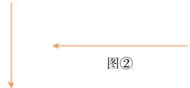

text_image

图②

图①

3. 解析 $\left|\overrightarrow{AB}\right|=2,\left|\overrightarrow{CD}\right|=2.5,\left|\overrightarrow{EF}\right|=3,\left|\overrightarrow{GH}\right|=2\sqrt{2}.$   
4. 解析 (1) 终点 M、N 的位置相同.

(2)由题意可知,当 $\overrightarrow{OM}$ 与 $\overrightarrow{ON}$ 同向时,如图1.

  
图1

$$
\because | \overrightarrow {O M} | = 2 | \overrightarrow {O N} | = 1, \therefore | \overrightarrow {M N} | = \frac {1}{2},
$$

向量 $\overrightarrow{MN}$ 与 $\overrightarrow{ON}$ 的方向相反.

当 $\overrightarrow{OM}$ 与 $\overrightarrow{ON}$ 反向时,如图2.

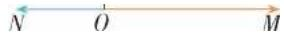  
图2

$$
\because | \overrightarrow {O M} | = 2 | \overrightarrow {O N} | = 1, \therefore | \overrightarrow {M N} | = \frac {3}{2},
$$

向量 $\overrightarrow{MN}$ 与 $\overrightarrow{ON}$ 的方向相同.

# 习题6.1

# 复习巩固

1. 解析 如图.

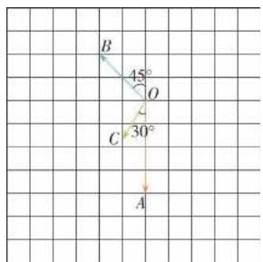

text_image

B
45°
O
C
30°
A

2. 解析 与 a 相等的向量有 $\overrightarrow{CO}, \overrightarrow{QP}, \overrightarrow{SR}$ ;

与 b 相等的向量有 $\overrightarrow{PM}, \overrightarrow{DO}$ ;

与 c 相等的向量有 $\overrightarrow{DC}, \overrightarrow{RQ}, \overrightarrow{ST}$ .

# 综合运用

3. 答案 (1) × (2) √ (3) × (4) ×

(5)√ (6)√ 理由略.

# 拓广探索

4. 解析 相等的向量共有 24 对.

模为 1 的相等向量有 18 对(其中与 $\overrightarrow{AM}$ 同向的共有 6 对, 与 $\overrightarrow{AM}$ 反向的也有 6 对, 与 $\overrightarrow{AD}$ 同向的共有 3 对, 与 $\overrightarrow{AD}$ 反向的也有 3 对); 模为 $\sqrt{2}$ 的相等向量有 4 对; 模为 2 的相等向量有 2 对.

# 6.2 平面向量的运算

# 6.2.1 向量的加法运算

# 练习

1. 解析 (1)

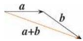  
(2)

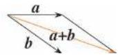

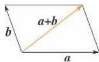

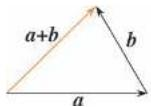

(3)   
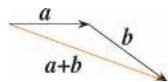  
(4)

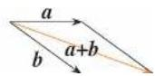

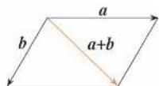

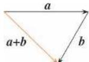

2. 解析 当 a 与 b 共线且方向相反时.  
3. 答案 (1) c (2) f (3) f (4) g   
4. 答案 (1) × (2) √ (3) ×   
5. 解析 如图, 设 $\overrightarrow{AD}$ 表示小船的速度, $\overrightarrow{AB}$ 表示河水的速度, 以 $\overrightarrow{AD}$ 、 $\overrightarrow{AB}$ 为邻边作平行四边形 ABCD, 则 AC 就是小船实际航行的速度.

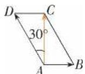

由已知条件可得

$$
| \overrightarrow {A C} | = 1 5 \cos 3 0 ^ {\circ} = \frac {1 5 \sqrt {3}}{2},
$$

∴ 小船实际航行速度的大小为 $\frac{15\sqrt{3}}{2}$ km/h，
方向与河水的速度间的夹角为 $90^{\circ}$ .

# 6.2.2 向量的减法运算

# 练习

1. 解析

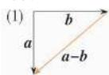

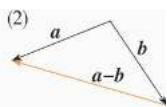

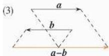

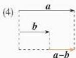

2. 答案 $\overrightarrow{DB};\overrightarrow{CA};\overrightarrow{AC};\overrightarrow{AD};\overrightarrow{BA}$   
3. 解析 当 a, b 其中有一个为 0 时, $-(a+b)=-a-b$ 显然成立;

当 a, b 不共线时, 作图如图 1 所示, 显然 -a-

$$
\boldsymbol {b} = \overrightarrow {O B ^ {\prime}} = - \overrightarrow {O B} = - (\boldsymbol {a} + \boldsymbol {b});
$$

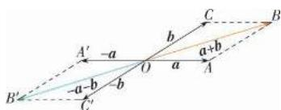

text_image

A'
-a
b
C
a+b
B
a-b
b
A
B'

图1

当 a, b 共线时, 作图如图 2 所示, 显然 $-(a + b) = -a - b$ .

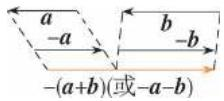  
图 2

# 6.2.3 向量的数乘运算

# 练习

1. 解析 如图.

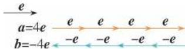

2. 答案 $\frac{5}{7}$ ; $-\frac{2}{7}$

3. 解析 (1) b = 2a. (2) $b = -\frac{7}{4}a$ .

(3) $b=-\frac{1}{2}a.$ (4) $b=\frac{8}{9}a.$

# 练习

1. 解析 (1) 因为 a = -b，所以 a, b 共线。

(2) 因为 b = -2a，所以 a, b 共线.

2. 解析 (1) 原式 = 3a - 2b.

(2) 原式 $= -\frac{11}{12} a + \frac{1}{3} b.$   
(3) 原式 = 2y a.

3. 解析 $\because a$ 与 b 是共线向量，

∴ 存在实数 $\lambda$ ，使 $b = \lambda a$ ，

即 $2\pmb{e}_1 + k\pmb{e}_2 = \lambda (\pmb{e}_1 - 2\pmb{e}_2)$

$$
\therefore \left\{ \begin{array}{l} 2 = \lambda , \\ k = - 2 \lambda , \end{array} \right. \therefore k = - 4.
$$

# 6.2.4 向量的数量积

# 练习

1. 解析 $p \cdot q = |p||q| \cos 60^{\circ} = 8 \times 6 \times \frac{1}{2} = 24.$   
2. 解析 $a \cdot b = |a||b|\cos\theta = |\overrightarrow{AB}||\overrightarrow{AC}|\cos A.$ 当 $a \cdot b < 0$ 时, $\cos A < 0, A$ 为钝角, $\triangle ABC$ 为钝角三角形;

当 $a \cdot b = 0$ 时, $\cos A = 0, A$ 为直角, $\triangle ABC$ 为直角三角形.

3. 解析 当 $\theta=45^{\circ}$ 时, 向量 a 在向量 e 上的投影向量为 $|a| \cos 45^{\circ} e = 6 \times \frac{\sqrt{2}}{2} e = 3 \sqrt{2} e$ ;

当 $\theta=90^{\circ}$ 时, 向量 a 在向量 e 上的投影向量为 $|a|\cos90^{\circ}e=0$ ;

当 $\theta = 135^{\circ}$ 时，向量 $\pmb{a}$ 在向量 $\pmb{e}$ 上的投影向量为 $|\pmb{a}| \cos 135^{\circ} \pmb{e} = 6 \times \left(-\frac{\sqrt{2}}{2}\right) \pmb{e} = -3\sqrt{2} \pmb{e}$ .

# 练习

1. 解析 设向量 a 与 b 的夹角为 $\theta$ ，向量 b 与 c 的夹角为 $\alpha$ .

(1) $\because \boldsymbol{a} \cdot \boldsymbol{b} = |\boldsymbol{a}| |\boldsymbol{b}| \cos \theta = 1 \times 2 \times \cos \frac{\pi}{6} =$

$$
\sqrt {3}, \therefore (\boldsymbol {a} \cdot \boldsymbol {b}) \boldsymbol {c} = \sqrt {3} \boldsymbol {c}.
$$

(2) $\because \boldsymbol{b} \cdot \boldsymbol{c} = |\boldsymbol{b}| |\boldsymbol{c}| \cos \alpha = 2 \times 3 \times \frac{\sqrt{2}}{2} = 3\sqrt{2}$ ,

$$
\therefore \boldsymbol {a} (\boldsymbol {b} \cdot \boldsymbol {c}) = 3 \sqrt {2} \boldsymbol {a}.
$$

2. 证明 $\because a - b$ 与 $a + 2b$ 垂直，

$$
\therefore (\boldsymbol {a} - \boldsymbol {b}) \cdot (\boldsymbol {a} + 2 \boldsymbol {b}) = 0,
$$

即 $|\pmb{a}|^2 +\pmb {a}\cdot \pmb {b} - 2|\pmb {b}|^2 = 0.$

$$
\text {又} \because | \pmb {a} | = \sqrt {2}, | \pmb {b} | = 1,
$$

$$
\therefore \boldsymbol {a} \cdot \boldsymbol {b} = 0, \therefore \boldsymbol {a} \perp \boldsymbol {b}.
$$

3. 证明 证法一: $(a + b)^2 - (a - b)^2$

$$
= (\boldsymbol {a} + \boldsymbol {b} + \boldsymbol {a} - \boldsymbol {b}) \cdot (\boldsymbol {a} + \boldsymbol {b} - \boldsymbol {a} + \boldsymbol {b})
$$

$$
= 2 \boldsymbol {a} \cdot 2 \boldsymbol {b} = 4 \boldsymbol {a} \cdot \boldsymbol {b}.
$$

证法二： $(a + b)^2 -(a - b)^2 = (a^2 +2a\cdot b + b^2) -$

$$
\left(\boldsymbol {a} ^ {2} - 2 \boldsymbol {a} \cdot \boldsymbol {b} + \boldsymbol {b} ^ {2}\right) = 4 \boldsymbol {a} \cdot \boldsymbol {b}.
$$

# 习题6.2

# 复习巩固

1. 解析 （1）向东走 10 km，再向东走 10 km，即向东走 20 km.

(2) 向东走 10 km, 再向西走 5 km, 即向东走 5 km.

(3) 向东走 10 km, 再向北走 10 km, 即向东北走 $10\sqrt{2}$ km.  
(4) 向西走 5 km, 再向南走 5 km, 即向西南走 $5\sqrt{2}$ km.  
(5) 向西走 5 km, 再向北走 10 km, 再向西走 5 km, 即向西北走 $10\sqrt{2}$ km.  
(6) 向南走 5 km, 再向东走 10 km, 再向南走 5 km, 即向东南走 $10\sqrt{2}$ km.

2. 解析 飞机飞行的路程为 700 km; 两次位移的合成是向北偏西约 $53^{\circ}$ 方向飞行 500 km.

3. 解析 如图, 设 $\overrightarrow{AD}$ 表示船垂直于对岸的速度, $\overrightarrow{AB}$ 表示水流的速度, 以 AD、AB 为邻边作 $\square ABCD$ , 则 $\overrightarrow{AC}$ 就是船实际航行的速度, 在 Rt $\triangle ABC$ 中, $|\overrightarrow{AB}| = 4$ , $|\overrightarrow{BC}| = 16$ ,

$$
\begin{array}{l} \therefore | \overrightarrow {A C} | = \sqrt {4 ^ {2} + 1 6 ^ {2}} = 4 \sqrt {1 7}, \\ \tan \angle C A B = 4, \\ \therefore \angle C A B \approx 7 6 ^ {\circ}. \\ \end{array}
$$

故船实际航行的速度大小为 $4 \sqrt{17}$ km/h，
方向与水流速度间的夹角约为 $76^{\circ}$ .

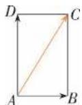

4. 解析 (1) 0. (2) $\overrightarrow{AB}$ . (3) $\overrightarrow{BA}$ . (4) 0.

(5)0. (6) $\overrightarrow{CB}$ . (7)0.

5. 证明 如图所示, 在平行四边形 ABCD 中,

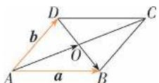

设 $\overrightarrow{AB} = \boldsymbol{a},\overrightarrow{AD} = \boldsymbol{b}$

(1) $\overrightarrow{AO} = \frac{1}{2} (\pmb {a} + \pmb {b}),\overrightarrow{OB} = \frac{1}{2} (\pmb {a} - \pmb {b}).$   
因为 $\overrightarrow{AO} +\overrightarrow{OB} = \overrightarrow{AB}$ 所以 $\frac{1}{2} (\pmb {a} + \pmb {b}) + \frac{1}{2} (\pmb {a} - \pmb {b}) = \pmb{a}.$   
(2) $\overrightarrow{AO} = \frac{1}{2} (\pmb {a} + \pmb {b}),\overrightarrow{OB} = \frac{1}{2} (\pmb {a} - \pmb {b})$   
因为 $\overrightarrow{AO}-\overrightarrow{OB}=\overrightarrow{AD}$ ，所以 $\frac{1}{2}(a+b)-\frac{1}{2}(a-b)=b.$

6. 解析 (1) 如图.

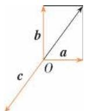

(2)不一定能构成三角形.结合向量加法的三角形法则知,当三个非零向量的和为零向量,且这三个向量不共线时,表示这三个向量的有向线段一定能构成三角形.本题不一定能构成三角形.

7. 解析 (1) 如图.

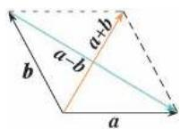

(2) 当 a、b 成垂直的位置关系时， $|a+b|=|a-b|$ .

8. 解析 (1) -2a - 2b. (2) $10a - 22b + 10c$ .

(3) $3a+\frac{1}{2}b.$ (4) $2(x-y)b.$

9. 证明 因为 $\overrightarrow{MN} = \overrightarrow{AN} - \overrightarrow{AM}$ ,

$$
\overrightarrow {A N} = \frac {1}{3} \overrightarrow {A C}, \overrightarrow {A M} = \frac {1}{3} \overrightarrow {A B},
$$

所以 $\overrightarrow{MN} = \frac{1}{3}\overrightarrow{AC} -\frac{1}{3}\overrightarrow{AB} = \frac{1}{3} (\overrightarrow{AC} -\overrightarrow{AB})$

$$
= \frac {1}{3} \overrightarrow {B C}.
$$

10. 答案 (1) 5; 1 (2) $|\mathbf{a}| = |\mathbf{b}|$

11. 解析 (1) $a \cdot b = -6\sqrt{3}, (a + b)^2 = |a|^2 + 2a$ $b + |b|^2 = 25 - 12\sqrt{3}, |a + b| = \sqrt{25 - 12\sqrt{3}}.$

(2) $|\pmb {a} + \pmb {b}| = \sqrt{\pmb{a}^2 + 2\pmb{a}\cdot\pmb{b} + \pmb{b}^2} = \sqrt{23},$

$|\boldsymbol{a} - \boldsymbol{b}| = \sqrt{\boldsymbol{a}^2 - 2\boldsymbol{a} \cdot \boldsymbol{b} + \boldsymbol{b}^2} = \sqrt{35}$ .

12. 证明 设 a 与 b 的夹角为 $\theta$ .

(1) 当 $\lambda=0$ 时, 等式显然成立.  
(2) 当 $\lambda > 0$ 时, $\lambda a$ 与 $b, a$ 与 $\lambda b$ 的夹角都为 $\theta$ , 则

$(\lambda\boldsymbol{a})\cdot\boldsymbol{b}=|\lambda\boldsymbol{a}||\boldsymbol{b}|\cos\theta=\lambda|\boldsymbol{a}||\boldsymbol{b}|\cos\theta,$

$$
\lambda (\boldsymbol {a} \cdot \boldsymbol {b}) = \lambda | \boldsymbol {a} | | \boldsymbol {b} | \cos \theta ,
$$

$$
\boldsymbol {a} \cdot (\lambda \boldsymbol {b}) = | \boldsymbol {a} | | \lambda \boldsymbol {b} | \cos \theta = \lambda | \boldsymbol {a} | | \boldsymbol {b} | \cos \theta ,
$$

所以 $(\lambda\boldsymbol{a})\cdot\boldsymbol{b}=\lambda(\boldsymbol{a}\cdot\boldsymbol{b})=\boldsymbol{a}\cdot(\lambda\boldsymbol{b})$ .

(3) 当 $\lambda < 0$ 时, $\lambda a$ 与 $b, a$ 与 $\lambda b$ 的夹角都为 $180^{\circ} - \theta$ , 则

$(\lambda\boldsymbol{a})\cdot\boldsymbol{b}=|\lambda\boldsymbol{a}||\boldsymbol{b}|\cos(180^{\circ}-\theta)=-|\lambda||\boldsymbol{a}|$ $\cdot |b| \cos \theta,$

$\lambda (\pmb {a}\cdot \pmb {b}) = \lambda |\pmb {a}||\pmb {b}|\cos \theta = -|\lambda ||\pmb {a}||\pmb {b}|\cdot$ $\cos \theta ,$

$a\cdot (\lambda b) = |a||\lambda b|\cos (180^{\circ} - \theta) = -|\lambda ||a|$ $\cdot |\pmb {b}|\cos \theta ,$

所以 $(\lambda\boldsymbol{a})\cdot\boldsymbol{b}=\lambda(\boldsymbol{a}\cdot\boldsymbol{b})=\boldsymbol{a}\cdot(\lambda\boldsymbol{b})$ .

# 综合运用

13. 解析 (1) 四边形 ABCD 为平行四边形, 证明略.

(2) 四边形 ABCD 为梯形.

证明如下: 因为 $\overrightarrow{AD} = \frac{1}{3} \overrightarrow{BC}$ ,

所以 $AD \parallel BC$ ，且 $AD \neq BC$

所以四边形 ABCD 为梯形.

(3) 四边形 ABCD 为菱形.

证明如下: 因为 $\overrightarrow{AB} = \overrightarrow{DC}$ ,

所以 $AB \parallel DC$ ，且 AB = DC，

所以四边形ABCD为平行四边形.

$$
\text { 又 } \mid \overrightarrow {A B} \mid = \mid \overrightarrow {A D} \mid ,
$$

所以四边形ABCD为菱形.

14. 解析 如图, $\overrightarrow{AE} = \frac{1}{4}\boldsymbol{b}, \overrightarrow{BC} = \boldsymbol{b} - \boldsymbol{a}, \overrightarrow{DE} =$

$$
\frac {1}{4} (\boldsymbol {b} - \boldsymbol {a}), \overrightarrow {D B} = \frac {3}{4} \boldsymbol {a}, \overrightarrow {E C} = \frac {3}{4} \boldsymbol {b}, \overrightarrow {D N} = \frac {1}{8} (\boldsymbol {b}
$$

$$
- \boldsymbol {a}), \overrightarrow {A N} = \frac {1}{4} \overrightarrow {A M} = \frac {1}{8} (\boldsymbol {a} + \boldsymbol {b}).
$$

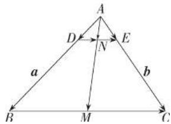

text_image

A
D
N
E
a
b
B
M
C

15. 证明 $\because \overrightarrow{EF} = \overrightarrow{EA} + \overrightarrow{AB} + \overrightarrow{BF}$ ,

$$
\overrightarrow {E F} = \overrightarrow {E D} + \overrightarrow {D C} + \overrightarrow {C F},
$$

$$
\therefore 2 \overrightarrow {E F} = (\overrightarrow {E A} + \overrightarrow {E D}) + \overrightarrow {A B} + \overrightarrow {D C} + (\overrightarrow {B F} + \overrightarrow {C F}).
$$

又∵ E、F 分别为 AD、BC 的中点，

$$
\therefore \overrightarrow {E A} + \overrightarrow {E D} = \mathbf {0}, \overrightarrow {B F} + \overrightarrow {C F} = \mathbf {0},
$$

$$
\therefore 2 \overrightarrow {E F} = \overrightarrow {A B} + \overrightarrow {D C},
$$

$$
\text { 即 } \overrightarrow {A B} + \overrightarrow {D C} = 2 \overrightarrow {E F}.
$$

16. 解析 如图, 丙地在甲地的北偏东 $45^{\circ}$ 方向, 距甲地 1400 km.

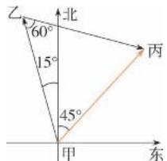

text_image

乙
60°
15°
45°
甲
乙
丙
东

17. 解析 (1) $\overrightarrow{AB} + \overrightarrow{BC} + \overrightarrow{CA} = 0.$

(2) $\overrightarrow{AB} +\overrightarrow{BC} +\overrightarrow{CD} +\overrightarrow{DA} = 0.$

(3) $\overrightarrow{A_{1}A_{2}}+\overrightarrow{A_{2}A_{3}}+\overrightarrow{A_{3}A_{4}}+\cdots+\overrightarrow{A_{n-1}A_{n}}+\overrightarrow{A_{n}A_{1}}=\mathbf{0}.$

证明: 原式= $\overrightarrow{A_{1}A_{3}}+\overrightarrow{A_{3}A_{4}}+\cdots+\overrightarrow{A_{n-1}A_{n}}+\overrightarrow{A_{n}A_{1}}$

$$
= \overrightarrow {A _ {1} A _ {4}} + \dots + \overrightarrow {A _ {n - 1} A _ {n}} + \overrightarrow {A _ {n} A _ {1}}
$$

$$
= \overrightarrow {A _ {1} A _ {n}} + \overrightarrow {A _ {n} A _ {1}} = \mathbf {0}.
$$

18. 解析 $(2a-3b)\cdot(2a+b)=4a^{2}-4a\cdot b-3b^{2}=61$ ，于是可得 $a\cdot b=-6$ ，

所以 $\cos \theta = \frac{\pmb{a} \cdot \pmb{b}}{|\pmb{a}| |\pmb{b}|} = -\frac{1}{2}$ , 所以 $\theta = 120^{\circ}$ .

19. 解析 $\because |a + b|^2 = a^2 + b^2 + 2a \cdot b = 64 + 100 +$

$$
1 6 0 \cos \theta = 2 5 6, \therefore \cos \theta = \frac {2 3}{4 0}, \therefore \theta \approx 5 5 ^ {\circ}.
$$

20. 证明 $a \cdot b = a \cdot c \Leftrightarrow a \cdot b - a \cdot c = 0 \Leftrightarrow a \cdot$

$$
(\boldsymbol {b} - \boldsymbol {c}) = \boldsymbol {0} \Leftrightarrow \boldsymbol {a} \perp (\boldsymbol {b} - \boldsymbol {c}).
$$

# 拓广探索

21.A 由 $2\overrightarrow{AO} = \overrightarrow{AB} +\overrightarrow{AC}$ ，得点 $O$ 为 $BC$ 的中点， $\therefore BC$ 为外接圆的直径，

$$
\therefore \angle B A C = 9 0 ^ {\circ}, O A = O B = O C.
$$

又∵ $|\overrightarrow{OA}|=|\overrightarrow{AB}|$ ,∴△ABO为等边三角形.

$$
\therefore B = 6 0 ^ {\circ}, | \overrightarrow {A B} | = \frac {1}{2} | \overrightarrow {B C} |,
$$

∴ 向量 $\overrightarrow{BA}$ 在向量 $\overrightarrow{BC}$ 上的投影向量为 $|\overrightarrow{AB}|$

$$
\cdot \cos 6 0 ^ {\circ} \frac {\overrightarrow {B C}}{| \overrightarrow {B C} |} = \frac {1}{4} \overrightarrow {B C}.
$$

22. 解析 $\overrightarrow{OD}=\overrightarrow{OA}+\overrightarrow{AD}=\overrightarrow{OA}+\overrightarrow{BC}=\overrightarrow{OA}+\overrightarrow{OC}-\overrightarrow{OB}.$

23. 解析

(1)

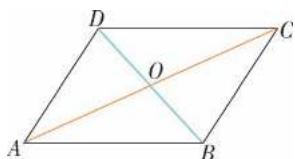

text_image

D
O
C
A
B

(2) 四边形 ABCD 为平行四边形.

证明：∵ $\overrightarrow{OA}+\overrightarrow{OC}=\overrightarrow{OB}+\overrightarrow{OD}$ ,

$$
\therefore \overrightarrow {O A} - \overrightarrow {O B} = \overrightarrow {O D} - \overrightarrow {O C},
$$

$$
\therefore \overrightarrow {B A} = \overrightarrow {C D},
$$

∴ 四边形 ABCD 为平行四边形.

24. 解析 $\overrightarrow{AB} \cdot \overrightarrow{AC}$ 的值只与弦 AB 的长度有关, 与圆的半径无关.

如图,取 AB 的中点 M, 连接 CM,

则 $CM \perp AB, \overrightarrow{AM} = \frac{1}{2}\overrightarrow{AB}$ .

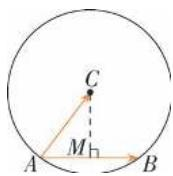

又 $\overrightarrow{AB}\cdot\overrightarrow{AC}=\left|\overrightarrow{AB}\right|\left|\overrightarrow{AC}\right|\cdot\cos\angle BAC,$

$$
\cos \angle B A C = \frac {| \overrightarrow {A M} |}{| \overrightarrow {A C} |},
$$

所以 $\overrightarrow{AB} \cdot \overrightarrow{AC} = |\overrightarrow{AB}| |\overrightarrow{AM}| = \frac{1}{2} |\overrightarrow{AB}|^2$ .

# 6.3 平面向量基本定理及坐标表示

# 6.3.1 平面向量基本定理

练习

1. 解析 $\overrightarrow{AB} = \overrightarrow{CB} - \overrightarrow{CA} = b - a;$

$$
\overrightarrow {A D} = \overrightarrow {C D} - \overrightarrow {C A} = \frac {1}{2} \boldsymbol {b} - \boldsymbol {a};
$$

$$
\overrightarrow {B E} = \overrightarrow {C E} - \overrightarrow {C B} = \frac {1}{2} a - b;
$$

$$
\overrightarrow {C F} = \overrightarrow {C A} + \overrightarrow {A F} = \overrightarrow {C A} + \frac {1}{2} \overrightarrow {A B}
$$

$$
= \boldsymbol {a} + \frac {1}{2} (\boldsymbol {b} - \boldsymbol {a})
$$

$$
= \frac {1}{2} a + \frac {1}{2} b.
$$

2. 解析 (1) $\overrightarrow{DE} = \overrightarrow{AE} - \overrightarrow{AD} = \frac{1}{4}\overrightarrow{AC} - \overrightarrow{AD} = \frac{1}{4} (\boldsymbol{a} +$

$$
\left. \boldsymbol {b}\right) - \boldsymbol {b} = \frac {1}{4} \boldsymbol {a} - \frac {3}{4} \boldsymbol {b}.
$$

$$
\overrightarrow {F B} = \overrightarrow {A B} - \overrightarrow {A F} = \overrightarrow {A B} - \frac {3}{4} \overrightarrow {A C} = a - \frac {3}{4} (a + b) = \frac {1}{4} a
$$

$$
- \frac {3}{4} b.
$$

$$
\overrightarrow {O G} = \overrightarrow {D G} - \overrightarrow {D O} = \frac {1}{3} \boldsymbol {a} - \frac {1}{2} (\boldsymbol {a} - \boldsymbol {b}) = - \frac {1}{6} \boldsymbol {a} + \frac {1}{2} \boldsymbol {b}.
$$

(2)由(1)得 $\overrightarrow{DE}=\overrightarrow{FB}$ ,

$\therefore DE = FB, DE \parallel FB.$

3. 解析 (1) $\overrightarrow{CD} = \overrightarrow{AD} - \overrightarrow{AC} = \frac{1}{4}\overrightarrow{AB} - \overrightarrow{AC} = \frac{1}{4}\boldsymbol{a} - \boldsymbol{b}$ .

∵ 点 E, F 分别是 AC, BC 的中点,

∴ $EF \parallel AB$ 且 $EF = \frac{1}{2} AB$ ,

$$
\therefore \overrightarrow {E F} = \frac {1}{2} \overrightarrow {A B} = \frac {1}{2} a.
$$

(2) $CD$ 与 $EF$ 垂直.

证明: $a \cdot b = |a||b|\cos 60^{\circ} = 2|b||b| \times \frac{1}{2} = |b|^{2}$ ,

$$
\overrightarrow {C D} \cdot \overrightarrow {E F} = \left(\frac {1}{4} a - b\right) \cdot \frac {1}{2} a = \frac {1}{8} | a | ^ {2} - \frac {1}{2} a
$$

$$
\cdot \boldsymbol {b} = \frac {1}{2} | \boldsymbol {b} | ^ {2} - \frac {1}{2} | \boldsymbol {b} | ^ {2} = 0,
$$

$\therefore \overrightarrow{CD} \perp \overrightarrow{EF}$ , 即 CD 与 EF 垂直.

# 6.3.2 平面向量的正交分解及坐标表示

# 6.3.3 平面向量加、减运算的坐标表示

练习

1. 解析 $(1)a+b=(-2,4)+(5,2)=(3,6)$ ,

$$
\boldsymbol {a} - \boldsymbol {b} = (- 2, 4) - (5, 2) = (- 7, 2).
$$

$$
(2) \boldsymbol {a} + \boldsymbol {b} = (4, 3) + (- 3, 8) = (1, 1 1),
$$

$$
\boldsymbol {a} - \boldsymbol {b} = (4, 3) - (- 3, 8) = (7, - 5).
$$

$$
(3) \boldsymbol {a} + \boldsymbol {b} = (2, 3) + (- 2, - 3) = (0, 0),
$$

$$
\boldsymbol {a} - \boldsymbol {b} = (2, 3) - (- 2, - 3) = (4, 6).
$$

$$
(4) \boldsymbol {a} + \boldsymbol {b} = (3, 0) + (0, 4) = (3, 4),
$$

$$
\boldsymbol {a} - \boldsymbol {b} = (3, 0) - (0, 4) = (3, - 4).
$$

2. 解析 $(1)\overrightarrow{AB}=(3,4),\overrightarrow{BA}=(-3,-4)$ .

$$
(2) \overrightarrow {A B} = (9, - 1), \overrightarrow {B A} = (- 9, 1).
$$

$$
(3) \overrightarrow {A B} = (0, 2), \overrightarrow {B A} = (0, - 2).
$$

$$
(4) \overrightarrow {A B} = (5, 0), \overrightarrow {B A} = (- 5, 0).
$$

3. 解析 $AB \parallel CD$ .

证明:由点 $A(0,1)$ , $B(1,0)$ , $C(1,2)$ , $D(2,$

1), 得 $\overrightarrow{AB} = (1, -1)$ , $\overrightarrow{CD} = (1, -1)$ , 所以 $\overrightarrow{AB} = \overrightarrow{CD}$ , 所以 $AB \parallel CD$ .

# 6.3.4 平面向量数乘运算的坐标表示

练习

1. 解析 $-2a + 4b = -2(3, 2) + 4(0, -1) = (-6, -4) + (0, -4) = (-6, -8)$ .

$$
\begin{array}{l} 4 \boldsymbol {a} + 3 \boldsymbol {b} = 4 (3, 2) + 3 (0, - 1) = (1 2, 8) + (0, \\ - 3) = (1 2, 5). \end{array}
$$

2. 解析 由已知得 3x = -12, ∴ x = -4.

3. 解析 $\overrightarrow{AB}=(2,2)-(-2,-3)=(4,5)$ ,

$$
\overrightarrow {C D} = (- 7, - 4. 5) - (- 1, 3) = (- 6, - 7. 5).
$$

$$
\because 4 \times (- 7. 5) = 5 \times (- 6) = - 3 0,
$$

∴ $\overrightarrow{AB}$ 与 $\overrightarrow{CD}$ 共线.

4. 解析 (1) 由 $A(2,1), B(4,3)$ , 得线段 $AB$ 的中点坐标为 $(3,2)$ .

(2)由 $A(-1,2)$ , $B(3,6)$ , 得线段 AB 的中点坐标为 $(1,4)$ .

(3)由 $A(5,-4)$ , $B(3,-6)$ ,得线段AB的中点坐标为 $(4,-5)$ .

5. 解析 如图, 点 P 是线段 AB 的三等分点, 有两种情况, 即 $\overrightarrow{AP} = \frac{1}{2} \overrightarrow{PB}$ 或 $\overrightarrow{AP} = 2 \overrightarrow{PB}$ .

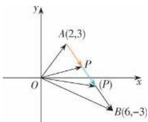

text_image

y
A(2,3)
P
O
x
(P)
B(6,-3)

当 $\overrightarrow{AP} = \frac{1}{2}\overrightarrow{PB}$ 时， $\overrightarrow{OP} = \overrightarrow{OA} +\overrightarrow{AP} = \frac{2}{3}\overrightarrow{OA} +\frac{1}{3}\overrightarrow{OB}$

$$
= \left(\frac {2 \times 2 + 6}{3}, \frac {2 \times 3 - 3}{3}\right) = \left(\frac {1 0}{3}, 1\right),
$$

即点 P 的坐标为 $\left(\frac{10}{3},1\right)$ .

$$
\text {当} \overrightarrow {A P} = 2 \overrightarrow {P B} \text {时,} \overrightarrow {O P} = \overrightarrow {O A} + \overrightarrow {A P} = \frac {1}{3} \overrightarrow {O A} + \frac {2}{3} \overrightarrow {O B}
$$

$$
= \left(\frac {2 + 2 \times 6}{3}, \frac {3 + 2 \times (- 3)}{3}\right) = \left(\frac {1 4}{3}, - 1\right),
$$

即点 P 的坐标为 $\left(\frac{14}{3}, -1\right)$ .

综上,点 P 是线段 AB 的三等分点时,坐标为

$$
\left({\frac {1 0}{3}}, 1\right) \text {或} \left({\frac {1 4}{3}}, - 1\right).
$$

# 6.3.5 平面向量数量积的坐标表示

练习

1. 解析 $|\pmb{a}| = \sqrt{\pmb{a}^2} = \sqrt{9 + 16} = 5, |\pmb{b}| = \sqrt{\pmb{b}^2} =$

$$
\sqrt {2 5 + 4} = \sqrt {2 9}, \boldsymbol {a} \cdot \boldsymbol {b} = (- 3, 4) \cdot (5, 2) =
$$

$$
- 1 5 + 8 = - 7.
$$

2. 解析 $\boldsymbol{a}=(2,3)$ , $\boldsymbol{b}=(-2,4)$ , $\boldsymbol{c}=(-1,-2)$ ,

$$
\therefore \boldsymbol {a} \cdot \boldsymbol {b} = 2 \times (- 2) + 3 \times 4 = 8.
$$

$$
\boldsymbol {a} + \boldsymbol {b} = (0, 7), \boldsymbol {a} - \boldsymbol {b} = (4, - 1),
$$

$$
\therefore (\boldsymbol {a} + \boldsymbol {b}) \cdot (\boldsymbol {a} - \boldsymbol {b}) = 0 \times 4 + 7 \times (- 1) = - 7.
$$

$$
\boldsymbol {b} + \boldsymbol {c} = (- 3, 2),
$$

$$
\therefore \boldsymbol {a} \cdot (\boldsymbol {b} + \boldsymbol {c}) = 2 \times (- 3) + 3 \times 2 = 0.
$$

$$
\boldsymbol {a} + \boldsymbol {b} = (0, 7), \therefore (\boldsymbol {a} + \boldsymbol {b}) ^ {2} = 0 ^ {2} + 7 ^ {2} = 4 9.
$$

3. 解析 $\because a=(3,2)$ , $b=(5,-7)$ ,

$$
\therefore \boldsymbol {a} \cdot \boldsymbol {b} = 3 \times 5 + 2 \times (- 7) = 1, | \boldsymbol {a} | = \sqrt {9 + 4} =
$$

$$
\sqrt {1 3}, | \boldsymbol {b} | = \sqrt {2 5 + 4 9} = \sqrt {7 4},
$$

$$
\therefore \cos \theta = \frac {\boldsymbol {a} \cdot \boldsymbol {b}}{| \boldsymbol {a} | | \boldsymbol {b} |} = \frac {1}{\sqrt {1 3} \cdot \sqrt {7 4}}, \therefore \theta \approx 8 8 ^ {\circ}.
$$

习题6.3

复习巩固

1. 解析 $\overrightarrow{CD}=\overrightarrow{AD}-\overrightarrow{AC}=\frac{1}{3}\overrightarrow{AB}-\overrightarrow{AC}=\frac{1}{3}\boldsymbol{a}-\boldsymbol{b}$

$$
\overrightarrow {A E} = \overrightarrow {A C} + \overrightarrow {C E} = \overrightarrow {A C} + \frac {1}{2} \overrightarrow {C D} = \boldsymbol {b} + \frac {1}{2} \left(\frac {1}{3} \boldsymbol {a} - \boldsymbol {b}\right) =
$$

$$
\frac {1}{6} a + \frac {1}{2} b.
$$

2. 解析 由 $F_{1}=(3,4)$ , $F_{2}=(2,-5)$ , $F_{3}=(3,1)$ , 得 $F_{1}+F_{2}+F_{3}=(3,4)+(2,-5)+(3,1)=$

(8,0), 所以作用在原点的合力 $F_{1} + F_{2} + F_{3}$ 的坐标为 (8,0).

3. 解析 设向量 a 的终点 B 的坐标为 $(x, y)$ .

(1)由 $(-2,1)=(x,y)$ ，得点B的坐标为 $(-2,1)$ .

(2)由 $(1,3)=(x+1,y-5)$ ，得点B的坐标为 $(0,8)$ .

(3)由 $(-2,-5)=(x-3,y-7)$ ，得点B的坐标为 $(1,2)$ .

4. 解析 由题意知 $\overrightarrow{AD} = \overrightarrow{BC}$ ，设 $D(x, y)$ ，

则 $\left\{\begin{aligned}x+1&=2,\\ y&+2&=7,\end{aligned}\right.$ 解得 $\left\{\begin{aligned}x&=1,\\ y&=5.\end{aligned}\right.$

所以点 D 的坐标为 $(1,5)$ .

5. 解析 设 $A'$ , $B'$ 的坐标分别为 $(x_{1}, y_{1})$ , $(x_{2}, y_{2})$ , 则 $\overrightarrow{OA'} = (x_{1}, y_{1})$ , $\overrightarrow{OB'} = (x_{2}, y_{2})$ .

由 $\overrightarrow{OA'}=2\overrightarrow{OA}$ ，得 $(x_{1},y_{1})=2(1,2)=(2,4)$ ，

所以点 $A'$ 的坐标为 $(2,4)$ .

由 $\overrightarrow{OB'}=3\overrightarrow{OB}$ ，得 $(x_{2},y_{2})=3(-1,3)=(-3,9)$ ，

所以点 $B'$ 的坐标为 $(-3,9)$ .

所以 $\overrightarrow{A'B'}=(-3,9)-(2,4)=(-5,5)$ .

6. 解析 由题意得 $\overrightarrow{AB}=(-2,4)$ ,

所以 $\overrightarrow{AC} = \frac{1}{2}\overrightarrow{AB} = (-1, 2)$ , $\overrightarrow{AD} = 2\overrightarrow{AB}$ $=( -4, 8)$ , $\overrightarrow{AE} = -\frac{1}{2}\overrightarrow{AB} = (1, -2)$ , 又 $\overrightarrow{OA} =$

(1,1)(O 为坐标原点), 则 $\overrightarrow{OC} = \overrightarrow{OA} + \overrightarrow{AC} = (0, 3)$ , 所以点 C 的坐标为 $(0, 3)$ ;

$\overrightarrow{OD}=\overrightarrow{OA}+\overrightarrow{AD}=(-3,9)$ ，所以点D的坐标为 $(-3,9)$ ;

$\overrightarrow{OE}=\overrightarrow{OA}+\overrightarrow{AE}=(2,-1)$ ，所以点E的坐标为
(2,-1).

7. 解析 (1) $A, B, C$ 三点共线.

证明: 因为 $\overrightarrow{AB}=(-4,-6)$ , $\overrightarrow{AC}=(1,1.5)$ , 所以 $\overrightarrow{AB}=-4\overrightarrow{AC}$ . 因为直线 AB 与直线 AC 有公共点 A, 所以 A、B、C 三点共线.

(2) $P, Q, R$ 三点共线.

证明: 因为 $\overrightarrow{PQ} = (1.5, -2)$ , $\overrightarrow{PR} = (6, -8)$ , 所以 $\overrightarrow{PR} = 4\overrightarrow{PQ}$ . 因为直线 PR 与直线 PQ 有公共点 P, 所以 P、Q、R 三点共线.

(3) $E, F, G$ 三点共线.

证明: 因为 $\overrightarrow{EF}=(-8,-4)$ , $\overrightarrow{EG}=(-1,-0.5)$ , 所以 $\overrightarrow{EF}=8\overrightarrow{EG}$ . 因为直线 EF 与直线 EG 有公共点 E, 所以 E、F、G 三点共线.

8. 解析 (1) $\triangle ABC$ 是直角三角形, $B$ 为直角, 图略.

证明: $\overrightarrow{BA}=(-6,-6),\overrightarrow{BC}=(-2,2)$ ,
由 $\overrightarrow{BC}\cdot\overrightarrow{BA}=0$ ,得 $BC\perp BA$ ,

∴ B 为直角, $\triangle ABC$ 为直角三角形.

(2) $\triangle ABC$ 是直角三角形, $A$ 为直角, 图略. 证明: $\overrightarrow{AB} = (21,7), \overrightarrow{AC} = (1,-3)$ , 由 $\overrightarrow{AB} \cdot \overrightarrow{AC} = 0$ , 得 $AB \perp AC$ , $\therefore A$ 为直角, $\triangle ABC$ 为直角三角形.

(3) $\triangle ABC$ 是直角三角形, $B$ 为直角, 图略. 证明: $\overrightarrow{BA} = (-3,3), \overrightarrow{BC} = (5,5)$ , 由 $\overrightarrow{BA} \cdot \overrightarrow{BC} = 0$ , 得 $BA \perp BC$ , $\therefore B$ 为直角, $\triangle ABC$ 为直角三角形.

9. 解析 设 $\boldsymbol{a}=(x,y)$ ，则由题意得

$\left\{ \begin{array}{l} x^{2} + y^{2} = 9, \\ x = \frac{y}{2}. \end{array} \right.$ 解得 $\left\{ \begin{array}{l} x = \frac{3\sqrt{5}}{5}, \\ y = \frac{6\sqrt{5}}{5} \end{array} \right.$ 或 $\left\{ \begin{array}{l} x = -\frac{3\sqrt{5}}{5}, \\ y = -\frac{6\sqrt{5}}{5}. \end{array} \right.$

于是 $a = \left( \frac{3\sqrt{5}}{5}, \frac{6\sqrt{5}}{5} \right)$ 或 $a = \left( -\frac{3\sqrt{5}}{5}, -\frac{6\sqrt{5}}{5} \right)$ .

10. 解析 设与 a 垂直的单位向量 $\boldsymbol{e} = (x, y)$ ,
则 $\left\{\begin{aligned}&x^{2}+y^{2}=1,\\ &4x+2y=0,\end{aligned}\right.$

解得 $\left\{\begin{aligned}x&=\frac{\sqrt{5}}{5},\\ y&=-\frac{2\sqrt{5}}{5}\end{aligned}\right.$ 或 $\left\{\begin{aligned}x&=-\frac{\sqrt{5}}{5},\\ y&=\frac{2\sqrt{5}}{5}.\end{aligned}\right.$

$$
\therefore   e = \left({\frac {\sqrt {5}}{5}}, - {\frac {2 \sqrt {5}}{5}}\right)   \text {或}   e = \left(- {\frac {\sqrt {5}}{5}}, {\frac {2 \sqrt {5}}{5}}\right).
$$

综合运用

11. 解析 (1) $\overrightarrow{EF} = \overrightarrow{AF} - \overrightarrow{AE} = \frac{1}{3}\overrightarrow{AD} - \frac{1}{2}\overrightarrow{AB} =$

$\frac{1}{3} b - \frac{1}{2} a,$ $\overrightarrow{EG} = \overrightarrow{EB} +\overrightarrow{BG} = \frac{1}{2}\overrightarrow{AB} +\frac{1}{3}\overrightarrow{AD} = \frac{1}{2} a + \frac{1}{3} b.$

(2) $EF \perp EG.$ 证明： $\overrightarrow{EF} \cdot \overrightarrow{EG} = \left(\frac{1}{3} b - \frac{1}{2} a\right) \cdot \left(\frac{1}{2} a + \frac{1}{3} b\right) = \frac{1}{9} |b|^2 - \frac{1}{4} |a|^2 = \frac{1}{9} \cdot \frac{9}{4} |a|^2 - \frac{1}{4} |a|^2 = 0,$

$\therefore \overrightarrow{EF} \perp \overrightarrow{EG}$ , 即 $EF \perp EG$ .

12. 解析 由题意得 $\overrightarrow{OA} = (1, 2)$ , $\overrightarrow{AB} = (3, 3)$ .

当 t=1 时， $\overrightarrow{OP}=\overrightarrow{OA}+\overrightarrow{AB}=(4,5)$ ，所以点 P 的坐标为 $(4,5)$ ;

当 $t=\frac{1}{2}$ 时， $\overrightarrow{OP}=\overrightarrow{OA}+\frac{1}{2}\overrightarrow{AB}=(1,2)+\left(\frac{3}{2},\frac{3}{2}\right)=\left(\frac{5}{2},\frac{7}{2}\right)$ ,

所以点 P 的坐标为 $\left(\frac{5}{2}, \frac{7}{2}\right)$ ;

当 t=-2 时， $\overrightarrow{OP}=\overrightarrow{OA}-2\overrightarrow{AB}=(1,2)-(6,6)=(-5,-4)$ ，所以点 P 的坐标为 $(-5,-4)$ ；
当 t=2 时， $\overrightarrow{OP}=\overrightarrow{OA}+2\overrightarrow{AB}=(1,2)+(6,6)=(7,8)$ ，所以点 P 的坐标为 $(7,8)$ .

13. 解析 设点 P 的坐标为 $(x, y)$ . 由点 P 在线段 AB 的延长线上, 且 $\left|\overrightarrow{AP}\right| = \frac{3}{2} \left|\overrightarrow{PB}\right|$ , 得 $\overrightarrow{AP} = \frac{3}{2} \overrightarrow{BP}$ ,

即 $(x-2,y-3)=\frac{3}{2}(x-4,y+3)$ ,

所以 $\left\{\begin{aligned}x-2&=\frac{3}{2}(x-4),\\ y-3&=\frac{3}{2}(y+3),\end{aligned}\right.$ 解得 $\left\{\begin{aligned}x&=8,\\ y&=-15.\end{aligned}\right.$

所以点 P 的坐标为 $(8, -15)$ .

14. 证明 因为 $\overrightarrow{AB} = (4, -2)$ , $\overrightarrow{BC} = (3, 6)$ ,

$\overrightarrow{DC}=(4,-2)$ ,
所以 $\overrightarrow{AB}=\overrightarrow{DC},\overrightarrow{AB}\cdot\overrightarrow{BC}=0.$

所以以 $A(1,0), B(5,-2), C(8,4), D(4,6)$ 为顶点的四边形是一个矩形.

拓广探索

15. 解析 (1) 如图.

$$
\overrightarrow {O A} = 3 \boldsymbol {e} _ {1}, \overrightarrow {O B} = 2 \boldsymbol {e} _ {2}, \angle A O B = 6 0 ^ {\circ},
$$

所以 $\angle OAP = 120^{\circ}, |\overrightarrow{OA}| = 3, |\overrightarrow{OB}| = 2.$

利用三角函数及勾股定理易得 $|\overrightarrow{OP}|=\sqrt{19}$ .

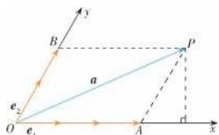

text_image

y
B
P
a
e₂
O
e₁
A
x

(2)对于任意向量 $\overrightarrow{OP}$ 都存在唯一一对实数x,y,使 $\overrightarrow{OP}=xe_{1}+ye_{2}$ ,

所以本题中对向量坐标的规定合理.

16. 证明 构造向量 $\boldsymbol{u}=(a,b)$ , $\boldsymbol{v}=(c,d)$ .

因为 $u \cdot v = |u||v| \cos \theta$ (其中 $\theta$ 为向量 u, v 的夹角),

所以 $ac + bd = \sqrt{a^2 + b^2} \cdot \sqrt{c^2 + d^2} \cdot \cos \theta,$ $(ac + bd)^2 = (a^2 + b^2) \cdot (c^2 + d^2) \cos^2\theta \leqslant$ $(a^2 + b^2) \cdot (c^2 + d^2),$

不等式中等号成立的条件是 u, v 同向或反向.

# 6.4 平面向量的应用

# 6.4.1 平面几何中的向量方法

练习

1. 证明 已知 AB = AC.

$$
\overrightarrow {B A} \cdot \overrightarrow {B C} = - \overrightarrow {A B} (\overrightarrow {A C} - \overrightarrow {A B}) = - \overrightarrow {A B} \cdot \overrightarrow {A C} + | \overrightarrow {A B} | ^ {2},
$$

$$
\overrightarrow {C A} \cdot \overrightarrow {C B} = - \overrightarrow {A C} (\overrightarrow {A B} - \overrightarrow {A C}) = - \overrightarrow {A B} \cdot \overrightarrow {A C} + | \overrightarrow {A C} | ^ {2},
$$

$$
\therefore \overrightarrow {B A} \cdot \overrightarrow {B C} = \overrightarrow {C A} \cdot \overrightarrow {C B}.
$$

又 $\cos B=\frac{\overrightarrow{BA}\cdot\overrightarrow{BC}}{|\overrightarrow{BA}||\overrightarrow{BC}|}$ ,

$$
\cos C = \frac {\overrightarrow {C A} \cdot \overrightarrow {C B}}{| \overrightarrow {C A} | | \overrightarrow {C B} |},
$$

$$
\therefore \cos B = \cos C, \therefore B = C.
$$

2. 解析 解法一: $\overrightarrow{DE} = \frac{1}{2} \overrightarrow{AB} - \overrightarrow{AD}$ ,

$$
\overrightarrow {A F} = \overrightarrow {A B} + \frac {1}{3} \overrightarrow {A D},
$$

$\therefore \overrightarrow{DE} \cdot \overrightarrow{AF} = \left( \frac{1}{2} \overrightarrow{AB} - \overrightarrow{AD} \right) \cdot \left( \overrightarrow{AB} + \frac{1}{3} \overrightarrow{AD} \right) = \frac{1}{2} a^2 - \frac{1}{3} a^2 = \frac{1}{6} a^2.$

$\therefore \cos \angle EMF = \frac{\overrightarrow{DE} \cdot \overrightarrow{AF}}{|\overrightarrow{DE}| |\overrightarrow{AF}|} = \frac{\frac{1}{6} a^2}{\frac{\sqrt{5}}{2} a \cdot \frac{\sqrt{10}}{3} a} = \frac{\sqrt{2}}{10}$ .

解法二:建立如图所示的直角坐标系.

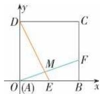

则 $A(0,0), D(0,a), E\left(\frac{1}{2} a,0\right)$ ,

$$
F \left(a, \frac {1}{3} a\right),
$$

则 $\overrightarrow{DE} = \left(\frac{1}{2} a, -a\right), \overrightarrow{AF} = \left(a, \frac{1}{3} a\right)$ ,

$\overrightarrow{DE} \cdot \overrightarrow{AF} = \frac{1}{2} a^2 - \frac{1}{3} a^2 = \frac{1}{6} a^2,$

$|\overrightarrow{DE}| = \sqrt{\left(\frac{1}{2}a\right)^2 + (-a)^2} = \frac{\sqrt{5}}{2} a,$

$|\overrightarrow{AF}| = \sqrt{a^2 + \left(\frac{1}{3} a\right)^2} = \frac{\sqrt{10}}{3} a,$

$$
\therefore \cos \angle E M F = \frac {\overrightarrow {D E} \cdot \overrightarrow {A F}}{| \overrightarrow {D E} | | \overrightarrow {A F} |} = \frac {\frac {1}{6} a ^ {2}}{\frac {\sqrt {5}}{2} a \cdot \frac {\sqrt {1 0}}{3} a} =
$$

$$
\frac {\sqrt {2}}{1 0}.
$$

3. 解析 ∵ 点 O 是 BC 的中点,

$$
\therefore \overrightarrow {A O} = \frac {1}{2} \overrightarrow {A B} + \frac {1}{2} \overrightarrow {A C} = \frac {1}{2} m \overrightarrow {A M} + \frac {1}{2} n \overrightarrow {A N}.
$$

又∵M,O,N三点共线，

$$
\therefore \frac {1}{2} m + \frac {1}{2} n = 1 \dots m + n = 2.
$$

# 6.4.2 向量在物理中的应用举例练习

1. 解析 $\overrightarrow{AB}=(7,0)-(20,15)=(-13,-15)$ ,

$$
W = \boldsymbol {F} \cdot \overrightarrow {A B} = (4, - 5) \cdot (- 1 3, - 1 5)
$$

$$
= 4 \times (- 1 3) + (- 5) \times (- 1 5) = 2 3.
$$

2. 解析 由已知得 OA = OB = 4, $OM = 4\sqrt{3}$ .

设 $\angle MOB = \theta$ ，则 $\cos \theta = \frac{2\sqrt{3}}{4} = \frac{\sqrt{3}}{2}$

$$
\therefore \theta = 3 0 ^ {\circ}, \therefore \angle A O B = 6 0 ^ {\circ}.
$$

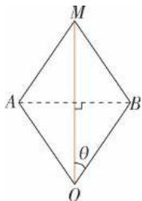

text_image

M
A
B
θ
O

3. 解析 （1）如图，设 $F_{1}, F_{2}$ 的合力为 F, F 与 $F_{1}$ 的夹角为 $\theta$ ，则利用三角函数及勾股定理解图中两个直角三角形易得 $\left|F\right| = (\sqrt{3} + 1)\mathrm{N}$ ， $\theta = 30^{\circ}$ ，所以 $\left|F_{3}\right| = (\sqrt{3} + 1)\mathrm{N}$ .

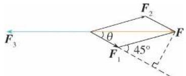

text_image

F₃
θ
F₁
45°
F₂

(2)由(1)知 $\theta=30^{\circ}$ ，所以 $F_{3}$ 与 $F_{1}$ 的夹角为 $150^{\circ}$ .

# 6.4.3 余弦定理、正弦定理

练习

1. 解析 (1) $a \approx 10.5 \mathrm{~cm}, B \approx 55.8^{\circ}, C = 81.9^{\circ}$ .

(2)由余弦定理,得 $c^{2}=a^{2}+b^{2}-2ab\cos C=5^{2}$

$$
+ 2 ^ {2} - 2 \times 5 \times 2 \times \cos \frac {\pi}{3} = 1 9, \therefore c = \sqrt {1 9}.
$$

2. 解析 由余弦定理的推论得

$$
\cos A = \frac {b ^ {2} + c ^ {2} - a ^ {2}}{2 b c} = \frac {(\sqrt {2}) ^ {2} + (\sqrt {3} + 1) ^ {2} - 2 ^ {2}}{2 \times \sqrt {2} \times (\sqrt {3} + 1)} =
$$

$$
\frac {\sqrt {2}}{2}, \therefore A = 4 5 ^ {\circ}.
$$

$$
\cos B = \frac {a ^ {2} + c ^ {2} - b ^ {2}}{2 a c} = \frac {2 ^ {2} + (\sqrt {3} + 1) ^ {2} - (\sqrt {2}) ^ {2}}{2 \times 2 \times (\sqrt {3} + 1)} =
$$

$$
\frac {\sqrt {3}}{2}, \therefore B = 3 0 ^ {\circ}, \therefore C = 1 0 5 ^ {\circ}.
$$

3. 解析 $\because \sin A=\frac{\sqrt{231}}{20},0^{\circ}<A<90^{\circ},$

$$
\therefore \cos A = \frac {1 3}{2 0}.
$$

由余弦定理得 $a^2 = b^2 + c^2 - 2bc\cos A = 5^2 + 2^2 - 2$

$$
\times 5 \times 2 \times \cos A = 2 5 + 4 - 2 0 \times \frac {1 3}{2 0} = 1 6, \therefore a = 4.
$$

由余弦定理的推论得

$$
\cos C = \frac {a ^ {2} + b ^ {2} - c ^ {2}}{2 a b} = \frac {1 6 + 2 5 - 4}{2 \times 4 \times 5} = 0. 9 2 5,
$$

$$
\therefore C \approx 2 2 ^ {\circ}.
$$

练习

1. 解析 (1) $a \approx 18 \mathrm{~cm}, b \approx 15 \mathrm{~cm}, C = 75^{\circ}$ .

(2)由正弦定理得 $\sin A=\frac{a\sin B}{b}=\frac{20\times\frac{1}{2}}{11}\approx$ 0.909 1.

∵ a > b, B 为锐角，

∴ A 有两解, $A \approx 65^{\circ}$ 或 $A \approx 115^{\circ}$ .

当 $A \approx 65^{\circ}$ 时， $C = 180^{\circ} - A - B = 85^{\circ}$ ，

$$
c = \frac {b \sin C}{\sin B} \approx 2 2 \mathrm{cm}.
$$

当 $A \approx 115^{\circ}$ 时, $C = 180^{\circ} - A - B = 35^{\circ}$ ,

$$
c = \frac {b \sin C}{\sin B} \approx 1 3 \mathrm{cm}.
$$

2. 解析 (1) 由正弦定理得 $\sin C = \frac{c\sin A}{a} =$

$$
\frac {\frac {2 \sqrt {3}}{3} \times \frac {\sqrt {3}}{2}}{2} = \frac {1}{2},
$$

$$
\because A = 1 2 0 ^ {\circ}, \therefore C = 3 0 ^ {\circ}, B = 3 0 ^ {\circ}.
$$

$$
\therefore b = c = \frac {2 \sqrt {3}}{3}.
$$

(2)由正弦定理得 $c=\frac{b\sin C}{\sin B}=\frac{2\times\frac{\sqrt{6}+\sqrt{2}}{4}}{\sin(45^{\circ}+75^{\circ})}$ $=\frac{2\times\frac{\sqrt{6}+\sqrt{2}}{4}}{\frac{\sqrt{3}}{2}}=\frac{3\sqrt{2}+\sqrt{6}}{3}.$

3. 解析 $\because \cos A=\frac{4}{5},\therefore \sin A=\frac{3}{5},$

$$
\sin C = \sin (A + B) = \sin A \cos B + \cos A \sin B = \frac {3}{5}
$$

$$
\times \frac {1}{2} + \frac {4}{5} \times \frac {\sqrt {3}}{2} = \frac {3 + 4 \sqrt {3}}{1 0}.
$$

由正弦定理得 $a=\frac{b\sin A}{\sin B}=\frac{\sqrt{3}\times\frac{3}{5}}{\frac{\sqrt{3}}{2}}=\frac{6}{5}.$

$$
c = \frac {b \sin C}{\sin B} = \frac {\sqrt {3} \times \frac {3 + 4 \sqrt {3}}{1 0}}{\frac {\sqrt {3}}{2}} = \frac {3 + 4 \sqrt {3}}{5}.
$$

练习

1. 解析 在 $\triangle ABS$ 中, $AB = 32.2 \times 0.5$

$$
= 1 6. 1 (\mathrm{nmile}), \angle A B S = 1 1 5 ^ {\circ}.
$$

由正弦定理得

$$
A S = \frac {A B \times \sin \angle A B S}{\sin (6 5 ^ {\circ} - 2 0 ^ {\circ})} = A B \times \sin \angle A B S \times \sqrt {2} = 1 6. 1
$$

$$
\times \sin 1 1 5 ^ {\circ} \times \sqrt {2} (\mathrm{nmile}).
$$

$S$ 到直线 $AB$ 的距离

$$
\begin{array}{l} d = A S \times \sin 2 0 ^ {\circ} = 1 6. 1 \times \sin 1 1 5 ^ {\circ} \times \sqrt {2} \times \sin 2 0 ^ {\circ} \approx \\ 7. 0 6 (\mathrm{nmile}). \end{array}
$$

因为 7.06 > 6.5，

所以这艘船可以继续沿正北方向航行.

2. 证明 在 $\triangle ABP$ 中, $\angle ABP = 180^{\circ} - \gamma + \beta$ ,

$$
\angle B P A = 1 8 0 ^ {\circ} - (\alpha - \beta) - \angle A B P = 1 8 0 ^ {\circ} - (\alpha - \beta)
$$

$$
- (1 8 0 ^ {\circ} - \gamma + \beta) = \gamma - \alpha .
$$

在 $\triangle ABP$ 中,根据正弦定理得

$$
A P = \frac {a \sin (1 8 0 ^ {\circ} - \gamma + \beta)}{\sin (\gamma - \alpha)} = \frac {a \sin (\gamma - \beta)}{\sin (\gamma - \alpha)}.
$$

所以山高为 $h=AP\times\sin\alpha=\frac{a\sin\alpha\sin(\gamma-\beta)}{\sin(\gamma-\alpha)}$ .

3. 解析 在 $\triangle ABC$ 中, $\angle ABC = 180^{\circ} - 75^{\circ} + 32^{\circ} = 137^{\circ}$ .

根据余弦定理得 AC =

$$
\sqrt {A B ^ {2} + B C ^ {2} - 2 A B \times B C \times \cos \angle A B C}
$$

$$
= \sqrt {6 7 . 5 ^ {2} + 5 4 ^ {2} - 2 \times 6 7 . 5 \times 5 4 \times \cos 1 3 7 ^ {\circ}}
$$

$$
\approx 1 1 3. 1 5.
$$

根据正弦定理得 $\sin\angle CAB=\frac{BC\sin\angle ABC}{AC}=$

$$
\frac {5 4 \times \sin 1 3 7 ^ {\circ}}{1 1 3 . 1 5} \approx 0. 3 2 5 5,
$$

$$
\therefore \angle C A B = 1 9. 0 ^ {\circ},
$$

$$
\therefore 7 5 ^ {\circ} - \angle C A B = 5 6. 0 ^ {\circ}.
$$

此船应该沿北偏东 $56.0^{\circ}$ 的方向航行, 需要航行 113.15 n mile.

# 习题6.4

复习巩固

1.D 由 $\left(\frac{\overrightarrow{AB}}{|\overrightarrow{AB}|} +\frac{\overrightarrow{AC}}{|\overrightarrow{AC}|}\right)\cdot \overrightarrow{BC} = 0$ ，知 $\angle A$ 的平分线与 $BC$ 边垂直，所以 $\triangle ABC$ 为等腰三角形，又 $\frac{\overrightarrow{AB}}{|\overrightarrow{AB}|}\cdot \frac{\overrightarrow{AC}}{|\overrightarrow{AC}|} = \frac{1}{2}$ ，所以 $\cos A = \frac{1}{2}$ 所以 $\angle A = 60^{\circ}$

所以 $\triangle ABC$ 为等边三角形.

2.C 若 $\left|\overrightarrow{OA}\right|=\left|\overrightarrow{OB}\right|=\left|\overrightarrow{OC}\right|$ ，则 O 为 $\triangle ABC$ 的外心；若 $\overrightarrow{NA}+\overrightarrow{NB}+\overrightarrow{NC}=0$ ，则 N 为 $\triangle ABC$ 的重心；若 $\overrightarrow{PA}\cdot\overrightarrow{PB}=\overrightarrow{PB}\cdot\overrightarrow{PC}=\overrightarrow{PC}\cdot\overrightarrow{PA}$ ，则 P 为 $\triangle ABC$ 的垂心。故选 C.

3. 证明 如图, BC 为圆的直径. 设圆的半径为 r, 则 $\overrightarrow{AB} \cdot \overrightarrow{AC} = (\overrightarrow{OB} - \overrightarrow{OA}) \cdot (\overrightarrow{OC} - \overrightarrow{OA}) = \overrightarrow{OB} \cdot \overrightarrow{OC} - \overrightarrow{OA} \cdot \overrightarrow{OB} - \overrightarrow{OA} \cdot \overrightarrow{OC} + \overrightarrow{OA}^{2} = -r^{2} - \overrightarrow{OA} \cdot (\overrightarrow{OB} + \overrightarrow{OC}) + r^{2} = 0$ ,

$\therefore \overrightarrow{AB} \perp \overrightarrow{AC}.$ 即直径所对的圆周角是直角.

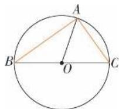

4. 解析 (1) $s = s_{B} - s_{A} = (2, 10) - (4, 3) = (-2, 7)$ .

(2) 设向量 s 与 $s_{A}$ 的夹角为 $\theta$ , s 在 $s_{A}$ 上的投影向量为 $\overrightarrow{OM}$ , 与 $s_{A}$ 方向相同的单位向量为 e, 则 $e = \left(\frac{4}{5}, \frac{3}{5}\right)$ .

则 $\cos\theta=\frac{s\cdot s_{A}}{|s||s_{A}|}$ ,

$$
\begin{array}{l} \therefore \overrightarrow {O M} = | s | \cos \theta \cdot e = \frac {s \cdot s _ {A}}{| s _ {A} |} \cdot e = \frac {1 3}{5} e = \\ \left(\frac {5 2}{2 5}, \frac {3 9}{2 5}\right). \end{array}
$$

5. 解析 （1）实际前进的速度的大小为 $\sqrt{2^{2}+(2\sqrt{3})^{2}}=4(\mathrm{~km/h})$ ，沿与水流方向成 $60^{\circ}$ 的方向前进.

(2) 设沿与水流方向成 $\theta$ 的方向游, 则 $\sin(\theta-90^{\circ})=\frac{2}{2\sqrt{3}}=\frac{\sqrt{3}}{3}$ , 由计算器计算得 $\theta-90^{\circ}\approx35^{\circ},\therefore\theta\approx125^{\circ},\therefore$ 沿与水流方向约成 $125^{\circ}$ 的方向游.

$v_{y}=2\sqrt{3}\cdot\cos(\theta-90^{\circ})=2\sqrt{2}$ (km/h), 实际前进的速度的大小为 $2\sqrt{2}$ km/h.

6. 解析 (1) $A \approx 49^{\circ}, B = 24^{\circ}, c \approx 62 \mathrm{~cm}$ .

$$
(2) A \approx 3 6 ^ {\circ}, B \approx 4 0 ^ {\circ}, C = 1 0 4 ^ {\circ}.
$$

7. 解析 (1) $a \approx 38 \mathrm{~cm}, b \approx 39 \mathrm{~cm}, B = 80^{\circ}$ .

(2) $B\approx43^{\circ},A=114^{\circ},a\approx35\ cm$ 或 $B\approx137^{\circ}$ , $A=20^{\circ},a\approx13\ cm.$

8. 解析 在 $\triangle BCD$ 中, 由正弦定理, 得

$$
B C = \frac {C D \sin \angle B D C}{\sin \angle C B D} = \frac {s \cdot \sin \beta}{\sin (\alpha + \beta)}.
$$

在 Rt $\triangle ABC$ 中，AB = BCtan $\angle ACB = \frac{\tan \theta \sin \beta}{\sin (\alpha + \beta)}$ .

9. 解析 (1) 以气象台为坐标原点, 正东方向为 $x$ 轴正方向, 建立直角坐标系, 现在台风中心 $B$ 的坐标为 $(-300, 0)$ , 设 $t$ 小时后台风中心移到 $B'$ ，则 $B'$ 的坐标为 $(-300+40t\cos45^{\circ}, 40t\sin45^{\circ})$ ，即 $(-300+20\sqrt{2}t, 20\sqrt{2}t)$ .

因为以台风中心为圆心,以 250 千米为半径的圆上或圆内的点将受台风影响,

所以 $|AB'| \leqslant 250$ ，即 $(-300 + 20\sqrt{2}t)^{2} + (20\sqrt{2}t)^{2} \leqslant 250^{2}$ ，整理得 $16t^{2} - 120\sqrt{2}t + 275 \leqslant 0$ ，

解得 $\frac{15\sqrt{2}-5\sqrt{7}}{4}\leqslant t\leqslant\frac{15\sqrt{2}+5\sqrt{7}}{4},$

即 $2.00 \leqslant t \leqslant 8.61$ .

故大约 2 小时后气象台 A 所在地将遭受台风影响, 大约持续 6 小时 37 分钟.

10. 解析 $S_{\triangle ABC} = \frac{1}{2} ab \sin C = \frac{1}{2} b c \sin A = \frac{1}{2} \cdot ac \sin B$ (其中 A, B, C 分别为三角形三个角, a, b, c 为相应对边).

# 综合运用

11. 解析 (1) 设 $P(x, y)$ , 则 $\overrightarrow{AP} = (x - 1, y - 2)$ . 将 $\overrightarrow{AB}$ 绕点 $A$ 沿顺时针方向旋转 $\frac{\pi}{4}$ 得到 $\overrightarrow{AP}$ , 相当于沿逆时针方向旋转 $\frac{7}{4}\pi$ 得到 $\overrightarrow{AP}$ , 又 $\overrightarrow{AB} = (\sqrt{2}, -2\sqrt{2})$ ,

于是 $\overrightarrow{AP} = \left( \sqrt{2} \cos \frac{7}{4} \pi + 2\sqrt{2} \sin \frac{7}{4} \pi, \right.$

$$
\sqrt {2} \sin \left. \frac {7}{4} \pi - 2 \sqrt {2} \cos \frac {7}{4} \pi\right) = (- 1, - 3).
$$

所以 $\left\{\begin{aligned}x-1&=-1,\\ y-2&=-3,\end{aligned}\right.$ 解得 $\left\{\begin{aligned}x&=0,\\ y&=-1,\end{aligned}\right.$ 所以 $P(0,-1)$ .

12. 解析 $\because \overrightarrow{AM} = \frac{1}{2} (\overrightarrow{AC} + \overrightarrow{AB}), \overrightarrow{BN} = \frac{1}{2} \overrightarrow{AC} - \overrightarrow{AB},$

$$
\overrightarrow {A B} \cdot \overrightarrow {A C} = | \overrightarrow {A B} | | \overrightarrow {A C} | \cos 6 0 ^ {\circ} = 5,
$$

$$
\therefore \overrightarrow {A M} \cdot \overrightarrow {B N} = \frac {1}{2} (\overrightarrow {A C} + \overrightarrow {A B}) \cdot \left(\frac {1}{2} \overrightarrow {A C} - \overrightarrow {A B}\right)
$$

$$
= \frac {1}{2} \left(\frac {1}{2} | \overrightarrow {A C} | ^ {2} - \frac {1}{2} \overrightarrow {A B} \cdot \overrightarrow {A C} - | \overrightarrow {A B} | ^ {2}\right)
$$

$$
= \frac {1}{2} \times \left(\frac {2 5}{2} - \frac {5}{2} - 4\right) = 3.
$$

$$
\because | \overrightarrow {A M} | ^ {2} = \frac {1}{4} (| \overrightarrow {A C} | ^ {2} + 2 \overrightarrow {A C} \cdot \overrightarrow {A B} + | \overrightarrow {A B} | ^ {2})
$$

$$
= \frac {1}{4} \times (2 5 + 2 \times 5 + 4) = \frac {3 9}{4},
$$

$$
\therefore | \overrightarrow {A M} | = \frac {\sqrt {3 9}}{2},
$$

$$
\vert \overrightarrow {B N} \vert^ {2} = \frac {1}{4} \vert \overrightarrow {A C} \vert^ {2} - \overrightarrow {A C} \cdot \overrightarrow {A B} + \vert \overrightarrow {A B} \vert^ {2} = \frac {2 5}{4} - 5
$$

$$
+ 4 = \frac {2 1}{4},
$$

$$
\therefore | \overrightarrow {B N} | = \frac {\sqrt {2 1}}{2},
$$

$$
\cos \angle M P N = \frac {\overrightarrow {A M} \cdot \overrightarrow {B N}}{| \overrightarrow {A M} | | \overrightarrow {B N} |} = \frac {3}{\frac {\sqrt {3 9}}{2} \times \frac {\sqrt {2 1}}{2}} =
$$

$$
\frac {4 \sqrt {9 1}}{9 1}.
$$

13. 解析 如图, 设 $v_{1}$ 与 $v_{2}$ 的夹角为 $\theta$ , 合速度为 $v, v_{2}$ 与 v 的夹角为 $\alpha$ , 行驶距离为 l, 则

$$
\sin \alpha = \frac {\left| v _ {1} \right| \sin \theta}{\left| v \right|} = \frac {1 0 \sin \theta}{\left| v \right|}, l = \frac {0 . 5}{\sin \alpha} =
$$

$$
\frac {| \boldsymbol {v} |}{2 0 \sin \theta}, \frac {l}{| \boldsymbol {v} |} = \frac {1}{2 0 \sin \theta}.
$$

所以当 $\theta=90^{\circ}$ ，即船垂直于对岸行驶时所

用时间最短.

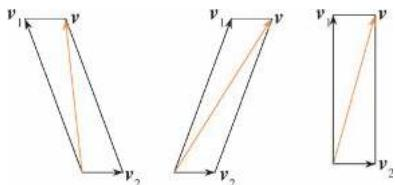

text_image

v₁
v
v₁
v
v₂
v₂
v₂

14. 解析 由已知, 得 $\tan\angle BAC=\frac{250\sqrt{3}}{250}=\sqrt{3}$ ,

$$
\therefore \angle B A C = 6 0 ^ {\circ}.
$$

∴ 合速度的方向为北偏西 $60^{\circ}$ .

$$
\begin{array}{l} \mid v \mid = \sqrt {(2 \sqrt {3}) ^ {2} + 6 ^ {2} - 2 \times 2 \sqrt {3} \times 6 \times \cos 1 5 0 ^ {\circ}} = \\ \sqrt {1 2 + 3 6 + 3 6} = 2 \sqrt {2 1}, \end{array}
$$

此时小货船航行速度的大小为 $2\sqrt{21}$ km/h.

15. 证明 根据余弦定理, 得

$$
\begin{array}{l} m _ {a} ^ {2} = \left(\frac {a}{2}\right) ^ {2} + c ^ {2} - 2 \times \frac {a}{2} \times c \times \cos B \\ = \left(\frac {a}{2}\right) ^ {2} + c ^ {2} - a \times c \times \frac {a ^ {2} + c ^ {2} - b ^ {2}}{2 a c} \\ = \left(\frac {1}{2}\right) ^ {2} \left[ a ^ {2} + 4 c ^ {2} - 2 \left(a ^ {2} + c ^ {2} - b ^ {2}\right) \right] \\ = \left(\frac {1}{2}\right) ^ {2} \left[ 2 \left(b ^ {2} + c ^ {2}\right) - a ^ {2} \right]. \\ \end{array}
$$

所以 $m_{a}=\frac{1}{2}\sqrt{2(b^{2}+c^{2})-a^{2}}$ .

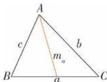

同理, $m_{b}=\frac{1}{2}\sqrt{2(a^{2}+c^{2})-b^{2}}$ ,

$$
m _ {c} = \frac {1}{2} \sqrt {2 (a ^ {2} + b ^ {2}) - c ^ {2}}.
$$

16. 证明 根据余弦定理的推论，

得 $\cos A=\frac{b^{2}+c^{2}-a^{2}}{2bc}$ ,

$$
\cos B = \frac {a ^ {2} + c ^ {2} - b ^ {2}}{2 a c},
$$

所以 $c(a\cos B - b\cos A)$

$$
= c \left(a \times \frac {a ^ {2} + c ^ {2} - b ^ {2}}{2 a c} - b \times \frac {b ^ {2} + c ^ {2} - a ^ {2}}{2 b c}\right)
$$

$$
= c \left(\frac {a ^ {2} + c ^ {2} - b ^ {2}}{2 c} - \frac {b ^ {2} + c ^ {2} - a ^ {2}}{2 c}\right)
$$

$$
= \frac {1}{2} (2 a ^ {2} - 2 b ^ {2}) = a ^ {2} - b ^ {2},
$$

所以所证等式成立.

17. 证明 只需证 $a = 2R \sin A$ ，其中 R 为 $\triangle ABC$ 外接圆的半径.

①若 A 为锐角(如图①所示),作直径 $BA'$ , 连接 $A'C$ , 则 $A=A'$ , 在 Rt $\triangle A'CB$ 中, $BC = A'B\sin A' = 2R\sin A$ , 即 $a = 2R\sin A$ ;

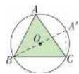  
图①

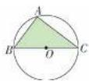  
图②

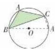  
图③

②若 A 是直角(如图②所示), 在 Rt $\triangle BAC$ 中, 可直接得 $a = 2R \sin A$ ;

③若 A 为钝角(如图③所示)，作直径 $BA'$ ，连接 $A'C$ ，则 $A' = \pi - A$ ，在 Rt $\triangle BCA'$ 中， $BC = A'B\sin A' = 2R\sin (\pi - A) = 2R\sin A$ ，即 $a = 2R\sin A$ .

由①②③得 $a=2R\sin A$ .

同理可证 $b=2R\sin B, c=2R\sin C.$

18. 证明 根据 $\frac{a}{\sin A} = \frac{b}{\sin B}$ , 得 $b = \frac{a \sin B}{\sin A}$ .

所以 $S = \frac{1}{2} ab\sin C = \frac{1}{2} a\times \frac{a\sin B}{\sin A}\times \sin C$

$$
= \frac {1}{2} a ^ {2} \frac {\sin B \sin C}{\sin A}.
$$

# 拓广探索

19. 解析 AR = RT = TC.

证明：∵ $\triangle ARE \sim \triangle CRB, E$ 为 AD 的中点，
∴ BR = 2ER,

$$
\begin{array}{l} \overrightarrow {A R} = \overrightarrow {A B} + \overrightarrow {B R} = \overrightarrow {A B} + \frac {2}{3} \overrightarrow {B E} \\ = \overrightarrow {A B} + \frac {2}{3} (\overrightarrow {A E} - \overrightarrow {A B}) \\ = \overrightarrow {A B} + \frac {2}{3} \left(\frac {1}{2} \overrightarrow {A D} - \overrightarrow {A B}\right) \\ = \frac {1}{3} \overrightarrow {A B} + \frac {1}{3} \overrightarrow {A D} = \frac {1}{3} \overrightarrow {A C}. \\ \end{array}
$$

同理 $\overrightarrow{TC}=\frac{1}{3}\overrightarrow{AC}$ ,

$$
\therefore A R = R T = T C.
$$

20. 证明 (1) 根据余弦定理的推论,

得 $\cos C=\frac{a^{2}+b^{2}-c^{2}}{2ab}$ ,

由同角三角函数之间的关系得，

$$
\sin C = \sqrt {1 - \cos^ {2} C}
$$

$$
= \sqrt {1 - \left(\frac {a ^ {2} + b ^ {2} - c ^ {2}}{2 a b}\right) ^ {2}},
$$

代入 $S=\frac{1}{2}ab\sin C$ ,

得 $S = \frac{1}{2} ab\sqrt{1 - \left(\frac{a^2 + b^2 - c^2}{2ab}\right)^2}$

$$
= \frac {1}{4} \sqrt {(2 a b) ^ {2} - (a ^ {2} + b ^ {2} - c ^ {2}) ^ {2}}
$$

$$
= \frac {1}{4} \sqrt {\left(2 a b + a ^ {2} + b ^ {2} - c ^ {2}\right) \left(2 a b - a ^ {2} - b ^ {2} + c ^ {2}\right)}
$$

$$
= \frac {1}{4} \sqrt {(a + b + c) (b + c - a) (c + a - b) (a + b - c)}, ①
$$

$$
\because p = \frac {1}{2} (a + b + c),
$$

$$
\therefore \frac {1}{2} (b + c - a) = p - a,
$$

$$
\frac {1}{2} (a + c - b) = p - b,
$$

$$
\frac {1}{2} (b + a - c) = p - c.
$$

代入①可证得，

$$
S = \sqrt {p (p - a) (p - b) (p - c)}.
$$

(2)三角形的面积 S 与三角形内切圆半径 r

之间有关系式 $S = \frac{1}{2} \times 2p \times r = pr$

所以 $r=\frac{S}{p}=\sqrt{\frac{(p-a)(p-b)(p-c)}{p}}$ .

(3) 根据三角形面积公式 $S=\frac{1}{2}ah_{a}$ ,

得 $h_a = \frac{2S}{a} = \frac{2}{a}\sqrt{p(p - a)(p - b)(p - c)}$

即 $h_{a}=\frac{2}{a}\sqrt{p(p-a)(p-b)(p-c)}$ .

同理, $h_{b}=\frac{2}{b}\sqrt{p(p-a)(p-b)(p-c)}$ ,

$$
h _ {c} = \frac {2}{c} \sqrt {p (p - a) (p - b) (p - c)}.
$$

21. 解析 方案一: (1) 需要测量的数据有: A点到 M, N 点的俯角 $\alpha_{1}, \beta_{1}; B$ 点到 M, N 的俯角 $\alpha_{2}, \beta_{2}; A, B$ 的距离 d (如图所示).

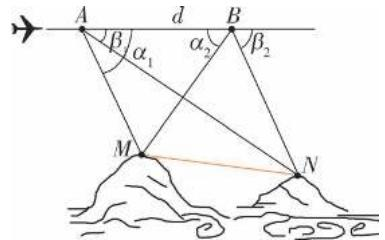

text_image

A
β
α₁
d
B
α₂
β₂
M
N
2
2e

(2) 第一步: 计算 AM. 由正弦定理得 AM =

$$
\frac {d \sin \alpha_ {2}}{\sin (\alpha_ {1} + \alpha_ {2})};
$$

第二步: 计算 AN. 由正弦定理得 $AN = \frac{d \sin \beta_{2}}{\sin (\beta_{2} - \beta_{1})}$ ;

第三步:计算 MN.由余弦定理得

$$
M N = \sqrt {A M ^ {2} + A N ^ {2} - 2 A M \times A N \cos (\alpha_ {1} - \beta_ {1})}.
$$

方案二:(1)需要测量的数据有:

$A$ 点到 $M, N$ 点的俯角 $\alpha_{1}, \beta_{1}; B$ 点到 $M, N$ 点的俯角 $\alpha_{2}, \beta_{2}; A, B$ 的距离 $d$ (如图所示).

(2)第一步:计算 BM. 由正弦定理得 BM = $\frac{d\sin\alpha_{1}}{\sin(\alpha_{1}+\alpha_{2})}$ ;

第二步: 计算 BN. 由正弦定理得 BN = $\frac{d\sin\beta_{1}}{\sin(\beta_{2}-\beta_{1})}$ ;

第三步: 计算 MN. 由余弦定理得 MN = $\sqrt{BM^{2}+BN^{2}+2BM\times BN\cos(\beta_{2}+\alpha_{2})}$ .

22. 解析 (1) 由正弦定理, 得

$$
\sin A \cos C + \sqrt {3} \sin A \sin C = \sin B + \sin C.
$$

$$
\because B = \pi - (A + C),
$$

$$
\therefore \sqrt {3} \sin A \sin C = \cos A \sin C + \sin C.
$$

$$
\text { 又 } \because \sin C \neq 0,
$$

$$
\therefore \sqrt {3} \sin A - \cos A = 1,
$$

$$
\text {即} \sin \left(A - {\frac {\pi}{6}}\right) = {\frac {1}{2}}.
$$

$$
\text { 又 } 0 <   A <   \pi , \therefore A = \frac {\pi}{3}.
$$

$$
(2) \because S _ {\triangle A B C} = \frac {1}{2} b c \sin A = \sqrt {3}, \therefore b c = 4.
$$

$$
\text {而} a ^ {2} = b ^ {2} + c ^ {2} - 2 b c \cos A,
$$

故 $b^{2}+c^{2}=8$ ，解得b=c=2（负值已舍去）.

23. 解析 略.

# 复习参考题6

复习巩固

1. 答案

(1) √

(2) √

(3) ×

(4) ×

2. 答案

(1) D

(2) B

(3) D

(4) C

(5)D (6)B

3. 解析 如图, AC 与 BD 交于点 M, 则 $\overrightarrow{DE} = \overrightarrow{BA}$

$$
= \overrightarrow {M A} - \overrightarrow {M B} = - \frac {2}{3} a + \frac {1}{3} b,
$$

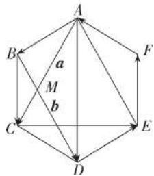

text_image

A
B
a
M
b
C
D
E
F

$$
\overrightarrow {A D} = \frac {2}{3} \boldsymbol {a} + \frac {2}{3} \boldsymbol {b}, \overrightarrow {B C} = \frac {1}{3} \boldsymbol {a} + \frac {1}{3} \boldsymbol {b},
$$

$$
\overrightarrow {E F} = - \overrightarrow {B C} = - \frac {1}{3} a - \frac {1}{3} b,
$$

$$
\overrightarrow {F A} = \overrightarrow {D C} = \frac {1}{3} a - \frac {2}{3} b,
$$

$$
\overrightarrow {A B} = \frac {2}{3} a - \frac {1}{3} b, \overrightarrow {C E} = - a + b.
$$

4. 解析 (1) $\overrightarrow{AB} = (8, -8)$ , $|\overrightarrow{AB}| = 8\sqrt{2}$ .

$$
(2) \overrightarrow {O C} = (2, - 1 6), \overrightarrow {O D} = (- 8, 8).
$$

$$
(3) \overrightarrow {O A} \cdot \overrightarrow {O B} = 3 3.
$$

5. 解析 设 $D(x,y)$ ，由题意知 $(-2,-1)=(x,y-1)$ ，所以 x=-2, y=0，所以 $D(-2,0)$ .

6. 解析 由题意得 $(-1,0) = \lambda(1,0) + \mu(1,1)$ , 整理得 $\left\{\begin{aligned}\mu+\lambda=-1,\\ 0+\mu=0,\end{aligned}\right.$ 解得 $\left\{\begin{aligned}\mu=0,\\ \lambda=-1.\end{aligned}\right.$

7. 解析 由题意得 $\overrightarrow{AB} = (3,0), \overrightarrow{AC} = (3,4), \overrightarrow{BC}$

$$
= (0, 4), \cos A = \frac {\overrightarrow {A B} \cdot \overrightarrow {A C}}{| \overrightarrow {A B} | | \overrightarrow {A C} |} = \frac {3}{5}, \cos B =
$$

$$
\frac {\overrightarrow {B A} \cdot \overrightarrow {B C}}{| \overrightarrow {B A} | | \overrightarrow {B C} |} = 0, \cos C = \frac {\overrightarrow {C A} \cdot \overrightarrow {C B}}{| \overrightarrow {C A} | | \overrightarrow {C B} |} = \frac {4}{5}.
$$

8. 解析 由题意得 $(\lambda + 1) \times 1 + \lambda \times 0 = 0$ ，解得 $\lambda = -1$ .

9. 解析 $|\pmb{a} + \pmb{b}| = \sqrt{(\pmb{a} + \pmb{b})^2}$

$$
= \sqrt {\left| \boldsymbol {a} \right| ^ {2} + 2 \boldsymbol {a} \cdot \boldsymbol {b} + \left| \boldsymbol {b} \right| ^ {2}}
$$

$$
= \sqrt {3 + 2 \times \sqrt {3} \times 2 \times \cos 3 0 ^ {\circ} + 4} = \sqrt {1 3},
$$

$$
\vert \boldsymbol {a} - \boldsymbol {b} \vert = \sqrt {\left(\boldsymbol {a} - \boldsymbol {b}\right) ^ {2}} = \sqrt {\vert \boldsymbol {a} \vert^ {2} - 2 \boldsymbol {a} \cdot \boldsymbol {b} + \vert \boldsymbol {b} \vert^ {2}}
$$

$$
= \sqrt {3 - 2 \times \sqrt {3} \times 2 \times \cos 3 0 ^ {\circ} + 4} = 1.
$$

10. 解析 如图, 过点 C 作 $CH \perp AD$ , 交 AD 的延长线于点 H.

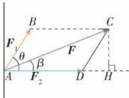

text_image

B
F₁
θ
β
A
F₂
D
H
C
F

设 $CH = x, DH = y$ ，则

$\left\{ \begin{array}{l} 100^{2} = (70 + y)^{2} + x^{2}, \\ 40^{2} = x^{2} + y^{2}, \end{array} \right.$ 解得 $y = 25$

$$
\therefore \cos \theta = \frac {D H}{D C} = \frac {2 5}{4 0} = \frac {5}{8},
$$

$$
\cos \beta = \frac {A H}{A C} = \frac {7 0 + 2 5}{1 0 0} = \frac {1 9}{2 0}.
$$

11. 解析 (1) $B \approx 21^{\circ}9'$ , $C \approx 38^{\circ}51'$ ,

$$
c \approx 8. 6 9 \mathrm{cm}.
$$

(2) $B\approx41^{\circ}49',C\approx108^{\circ}11',c\approx11.40\ cm$

或 $B \approx 138^{\circ}11', C \approx 11^{\circ}49', c \approx 2.46 \mathrm{~cm}$ .

(3) $A\approx11^{\circ}2^{\prime},B\approx38^{\circ}58^{\prime},c\approx28.02\ cm.$

(4) $A \approx 28^{\circ}57', B \approx 46^{\circ}34', C \approx 104^{\circ}29'$ .

12. 解析 设海轮在 B 处望见小岛在北偏东 $75^{\circ}$ ，在 C 处望见小岛在北偏东 $55^{\circ}$ ，从小岛 A 向海轮的航线 BD 作垂线段 AD，如图所示.

在 $\triangle ABC$ 中， $\angle ABC = 90^{\circ} - 75^{\circ} = 15^{\circ}$ ， $\angle ACB = 90^{\circ} + 55^{\circ} = 145^{\circ}$ ， $\angle BAC = 180^{\circ} - 15^{\circ} - 145^{\circ} = 20^{\circ}$ .

在 $\triangle ABC$ 中,由正弦定理,得

$$
A C = \frac {B C \sin \angle A B C}{\sin \angle B A C} = \frac {8 \times \sin 1 5 ^ {\circ}}{\sin 2 0 ^ {\circ}}.
$$

在 Rt△ACD 中, $AD=AC\sin\angle ACD=$

$$
\frac {8 \times \sin 1 5 ^ {\circ}}{\sin 2 0 ^ {\circ}} \times \sin 3 5 ^ {\circ} \approx 3. 4 7 > 3,
$$

所以这艘海轮不改变航向继续前进没有触礁的危险.

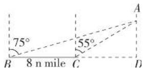

综合运用

13. 答案 (1) A (2) D (3) B (4) C

(5)D (6)C

14. 证明 (1) 先证 $a \perp b \Rightarrow |a + b| = |a - b|$ .

$$
\begin{array}{l} \vert \boldsymbol {a} + \boldsymbol {b} \vert = \sqrt {\left(\boldsymbol {a} + \boldsymbol {b}\right) ^ {2}} \\ = \sqrt {\left| \boldsymbol {a} \right| ^ {2} + \left| \boldsymbol {b} \right| ^ {2} + 2 \boldsymbol {a} \cdot \boldsymbol {b}}, \\ \vert \boldsymbol {a} - \boldsymbol {b} \vert = \sqrt {(\boldsymbol {a} - \boldsymbol {b}) ^ {2}} \\ = \sqrt {\left| \boldsymbol {a} \right| ^ {2} + \left| \boldsymbol {b} \right| ^ {2} - 2 \boldsymbol {a} \cdot \boldsymbol {b}}. \\ \end{array}
$$

因为 $a \perp b$ ，所以 $a \cdot b = 0$ ，

于是 $|\pmb {a} + \pmb {b}| = \sqrt{|\pmb{a}|^2 + |\pmb{b}|^2} = |\pmb {a} - \pmb {b}|$

再证 $|a+b|=|a-b|\Rightarrow a\perp b.$

由于 $|a+b|=\sqrt{|a|^{2}+2a\cdot b+|b|^{2}}$ ,

$$
\left| \boldsymbol {a} - \boldsymbol {b} \right| = \sqrt {\left| \boldsymbol {a} \right| ^ {2} - 2 \boldsymbol {a} \cdot \boldsymbol {b} + \left| \boldsymbol {b} \right| ^ {2}},
$$

所以由 $|a+b|=|a-b|$ 可得 $a\cdot b=0$ ,
于是 $a \perp b$ .

所以 $a \perp b \Leftrightarrow |a + b| = |a - b|$ .

几何意义是矩形的两条对角线相等.

(2) 先证 $|a| = |b| \Rightarrow c \perp d$ .

$$
\boldsymbol {c} \cdot \boldsymbol {d} = (\boldsymbol {a} + \boldsymbol {b}) \cdot (\boldsymbol {a} - \boldsymbol {b}) = | \boldsymbol {a} | ^ {2} - | \boldsymbol {b} | ^ {2},
$$

因为 $|a|=|b|$ ，所以 $c\cdot d=0$ .

所以 $c \perp d$ . 再证 $c \perp d \Rightarrow |a| = |b|$ .

由 $c \perp d$ 得 $c \cdot d = 0$ ,

即 $(a+b)\cdot(a-b)=|a|^{2}-|b|^{2}=0,$

所以 $|a|=|b|$ .

几何意义是菱形的对角线互相垂直.

15. 证明 如图, 设 $\overrightarrow{OD} = \overrightarrow{OP_{1}} + \overrightarrow{OP_{2}}$ ,

因为 $\overrightarrow{OP_1} +\overrightarrow{OP_2} +\overrightarrow{OP_3} = 0$

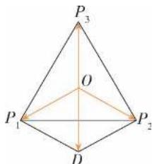

text_image

P₃
O
P₁ P₂
D

所以 $\overrightarrow{OP_3} = -\overrightarrow{OD}$

又 $|\overrightarrow{OP_1}| = |\overrightarrow{OP_2}| = |\overrightarrow{OP_3}|$

所以 $|\overrightarrow{OD}| = |\overrightarrow{OP_1}| = |\overrightarrow{P_1D}|$ .

易得 $\angle OP_{1}P_{2} = 30^{\circ}$

同理可得 $\angle OP_{1}P_{3}=30^{\circ}$

所以 $\angle P_{3}P_{1}P_{2}=60^{\circ}$

同理可得 $\angle P_{1}P_{2}P_{3} = 60^{\circ},\angle P_{2}P_{3}P_{1} = 60^{\circ}.$

所以 $\triangle P_{1}P_{2}P_{3}$ 为等边三角形.

16. 解析 连接 AB, 由对称性可知, AB 是 $\triangle SMN$ 的中位线,

$$
\text { 所以 } \overrightarrow {M N} = 2 \overrightarrow {A B} = 2 b - 2 a.
$$

17. 解析 如图, $AE = 9 + 6 = 15 \, km$ , $\angle AED = 120^{\circ}$ , DE = 10 km.

由余弦定理得 $AD^{2}=AE^{2}+DE^{2}-2AE\cdot ED\cdot$

$$
\cos 1 2 0 ^ {\circ} = 1 5 ^ {2} + 1 0 ^ {2} - 2 \times 1 5 \times 1 0 \times \left(- \frac {1}{2}\right) =
$$

$$
4 7 5, \therefore A D = 5 \sqrt {1 9} \mathrm{km}.
$$

由正弦定理得 $\sin A=\frac{DE\sin120^{\circ}}{AD}=\frac{10\times\frac{\sqrt{3}}{2}}{5\sqrt{19}}=$

$$
\frac {\sqrt {1 9 \times 3}}{1 9} \approx 0. 3 9 7 4, \therefore A \approx 2 3 ^ {\circ}. 9 0 ^ {\circ} - 2 3 ^ {\circ} = 6 7 ^ {\circ}.
$$

故由 A 地到 D 地位移的大小为 $5 \sqrt{19}$ km，方向约为北偏东 $67^{\circ}$ .

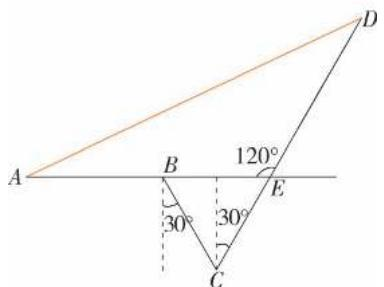

text_image

A
B
30°
C
120°
E
D
30°

拓广探索

18. 解析 略.

19. 解析 略.

# 第七章 复数

# 7.1 复数的概念

# 7.1.1 数系的扩充和复数的概念

练习

1. 解析 $-2+\frac{1}{3}i$ 的实部是 -2, 虚部是 $\frac{1}{3}$ ;

$\sqrt{2}+i$ 的实部是 $\sqrt{2}$ ，虚部是1；

$\frac{\sqrt{2}}{2}$ 的实部是 $\frac{\sqrt{2}}{2}$ ，虚部是0；

$-\sqrt{3}i$ 的实部是 0, 虚部是 $-\sqrt{3}$ ;

i 的实部是 0, 虚部是 1;

0 的实部和虚部都是 0.

2. 解析 $2+\sqrt{7}$ , 0.618, 0 是实数; $\frac{2}{7}i$ , i, $5i+8$ , $3-9\sqrt{2}i$ , $\mathrm{i}(1-\sqrt{3})$ , $\sqrt{2}-\sqrt{2}i$ 是虚数; $\frac{2}{7}i$ , i,

$i(1-\sqrt{3})$ 是纯虚数.理由略.

3. 解析 (1) 由 $\left\{ \begin{array}{l} x + y = 2x + 3y, \\ y - 1 = 2y + 1 \end{array} \right.$ 得 $\left\{ \begin{array}{l} x = 4, \\ y = -2. \end{array} \right.$

(2)由 $\left\{\begin{aligned}x+y-3&=0,\\ x-2&=0\end{aligned}\right.$ 得 $\left\{\begin{aligned}x&=2,\\ y&=1.\end{aligned}\right.$

# 7.1.2 复数的几何意义

练习

1. 解析 在复平面内, 点 A, B, C, D, E, F, G, H 对应的复数分别为 $4 + 3i$ , $3 - 3i$ , $-3 + 2i$ , $-3 - 3i$ , 5, -2, 5i, -5i.

2. 解析 略.

3. 解析 (1) 略.

(2) $|2+i|=\sqrt{5},|-2+4i|=2\sqrt{5},|-2i|=2,|4|$

$$
= 4, \left| \frac {3}{2} - 4 \mathrm{i} \right| = \frac {\sqrt {7 3}}{2}.
$$

习题7.1

复习巩固

1. 解析 (1) 存在, 如 $-\sqrt{2} + ai (a \neq 0 \text{ 且 } a \in \mathbf{R})$ .
(2) 存在, 如 $a - \sqrt{2} \mathrm{i} (a \in \mathbf{R})$ . (3) 存在, 只能是 $-\sqrt{2}i$ .

2. 解析 (1) m=0 或 m=3. (2) $m \neq 0$ 且 $m \neq 3$ .
(3)m=2.

3. 解析 (1) x=1, y=7. (2) x=4, y=-1.

4. 解析 (1) 点 P 在第一象限.

(2) 点 P 在第二象限.

(3) 点 P 在 y 轴的非正半轴上.

(4) 点 P 在 x 轴的下方 (不包括 x 轴).

5. 解析 $\left|z_{1}\right|=\left|3+4i\right|=\sqrt{3^{2}+4^{2}}=5,$

$$
\begin{array}{l} \left| z _ {2} \right| = \left| \frac {1}{2} - \sqrt {2} \mathrm{i} \right| = \sqrt {\left(\frac {1}{2}\right) ^ {2} + (- \sqrt {2}) ^ {2}} = \\ \begin{array}{c} \frac {3}{2}, \end{array} \\ \therefore | z _ {1} | > | z _ {2} |. \\ \end{array}
$$

综合运用

6. 解析 (1) 若位于第四象限, 则有

$$
\left\{ \begin{array}{l} {m ^ {2} - 8 m + 1 5 > 0,} \\ {m ^ {2} - 5 m - 1 4 <   0} \end{array} \right. \Rightarrow \left\{ \begin{array}{l} {m > 5 \text {或} m <   3,} \\ {- 2 <   m <   7} \end{array} \right. \Rightarrow
$$

$5 < m < 7$ 或 $-2 < m < 3$ .

(2) 若位于第一象限或第三象限, 则有 $(m^{2}-8m+15)\cdot(m^{2}-5m-14)>0$ ,

即 $(m-3)(m-5)(m+2)(m-7)>0,$

解得 m>7 或 3<m<5 或 m<-2.

(3) 若位于直线 y = x 上, 则实部与虚部相等, 必有 $m^{2} - 8m + 15 = m^{2} - 5m - 14$ , 解得 $m = \frac{29}{3}$ .

7. 解析 (1) 因为 $\overrightarrow{OA}$ 的起点在原点, 所以终点坐标为向量对应的坐标, 故 $A(2,1)$ , 而点 $A$ 关于实轴的对称点是 $B(2,-1)$ , 所以向量 $\overrightarrow{OB}$ 对应的复数为 2-i.

(2) $B(2, -1)$ 关于虚轴的对称点是 $C(-2, -1)$ , 故点 $C$ 对应的复数为 $-2 - i$ .

8. 解析 (1) 满足条件 $|z|=3$ 的点 Z 的集合是以原点 O 为圆心, 以 3 为半径的圆.

(2) 满足条件 $2 \leqslant |z| < 5$ 的点 Z 的集合是以原点为圆心, 分别以 2 和 5 为半径的两个圆所夹的圆环, 包括内圆的边界但不包括外圆的边界.

9. 解析 复数 z 对应的点应位于直线 $y=3(x>0)$ 上.

拓广探索

10. 解析 设 $z=a+\sqrt{3}\mathrm{i}(a\in\mathbf{R})$ .

$$
\because | z | = 2, \therefore a ^ {2} + 3 = 4, \therefore a = \pm 1,
$$

$$
\therefore z = 1 + \sqrt {3} \mathrm{i} \text {或} z = - 1 + \sqrt {3} \mathrm{i}.
$$

11. 解析 在复平面内指出复数对应的点 $Z_{1}$ ， $Z_{2}$ ， $Z_{3}$ ， $Z_{4}$ 略.

这4个点在同一个圆上.证明：因为 $|z_1| = |z_2| = |z_3| = |z_4| = \sqrt{5}$ ，所以这4个点在同一个圆上.

# 7.2 复数的四则运算

# 7.2.1 复数的加、减运算及其几何意义

练习

1. 解析 (1) $(2 + 4\mathrm{i}) + (3 - 4\mathrm{i}) = 5$ .

(2) $5-(3+2\mathrm{i})=2-2\mathrm{i}.$

(3) $(-3 - 4\mathrm{i}) + (2 + \mathrm{i}) - (1 - 5\mathrm{i}) = (-3 + 2 - 1) +$

$(-4 + 1 + 5)\mathrm{i} = -2 + 2\mathrm{i}$

(4) $(2 - \mathrm{i}) - (2 + 3\mathrm{i}) + 4\mathrm{i} = (2 - 2 + 0) + (-1 - 3+$

4) i = 0.

2. 解析 略.

3. 证明 设 $z_{1}=a_{1}+b_{1}\mathrm{i}(a_{1},b_{1}\in\mathbf{R})$ ,

$$
z _ {2} = a _ {2} + b _ {2} \mathrm{i} (a _ {2}, b _ {2} \in \mathbf {R}),
$$

$$
z _ {3} = a _ {3} + b _ {3} \mathrm{i} (a _ {3}, b _ {3} \in \mathbf {R}).
$$

(1) 交换律: $z_{1} + z_{2} = z_{2} + z_{1}$ .

$z_{1} + z_{2} = (a_{1} + b_{1}\mathrm{i}) + (a_{2} + b_{2}\mathrm{i}) = (a_{1} + a_{2}) + (b_{1} + b_{2})\mathrm{i},$

$z_{2} + z_{1} = (a_{2} + b_{2}\mathrm{i}) + (a_{1} + b_{1}\mathrm{i}) = (a_{2} + a_{1}) + (b_{2} + b_{1})\mathrm{i},$

$$
\therefore z _ {1} + z _ {2} = z _ {2} + z _ {1}.
$$

(2) 结合律: $(z_{1} + z_{2}) + z_{3} = z_{1} + (z_{2} + z_{3})$ .

$$
\left(z _ {1} + z _ {2}\right) + z _ {3} = \left[ \left(a _ {1} + b _ {1} \mathrm{i}\right) + \left(a _ {2} + b _ {2} \mathrm{i}\right) \right] + \left(a _ {3} + \right.
$$

$$
b _ {3} \mathrm{i}) = \left[ \left(a _ {1} + a _ {2}\right) + \left(b _ {1} + b _ {2}\right) \mathrm{i} \right] + \left(a _ {3} + b _ {3} \mathrm{i}\right) = \left(a _ {1} + b _ {3}\right)
$$

$$
\left. + a _ {2} + a _ {3}\right) + \left(b _ {1} + b _ {2} + b _ {3}\right) \mathrm{i},
$$

$$
z _ {1} + \left(z _ {2} + z _ {3}\right) = \left(a _ {1} + b _ {1} \mathrm{i}\right) + \left[ \left(a _ {2} + b _ {2} \mathrm{i}\right) + \left(a _ {3} + b _ {3} \mathrm{i}\right) \right.
$$

$$
\left. b _ {3} \mathrm{i}\right) ] = \left(a _ {1} + b _ {1} \mathrm{i}\right) + \left[ \left(a _ {2} + a _ {3}\right) + \left(b _ {2} + b _ {3}\right) \mathrm{i} \right] =
$$

$$
\left(a _ {1} + a _ {2} + a _ {3}\right) + \left(b _ {1} + b _ {2} + b _ {3}\right) \mathrm{i},
$$

$$
\therefore \left(z _ {1} + z _ {2}\right) + z _ {3} = z _ {1} + \left(z _ {2} + z _ {3}\right).
$$

4. 解析 $(1)|z_{1}-z_{2}|=|(2+i)-(3-i)|=|-1+2i|=\sqrt{5}.$

(2) $|z_{3} - z_{4}| = |(8 + 5\mathrm{i}) - (4 + 2\mathrm{i})| = |4 + 3\mathrm{i}| = 5.$

# 7.2.2 复数的乘、除运算

练习

1. 解析 (1)-18-21i.(2)6-17i.(3)-20-15i.

2. 解析 (1)-5.(2)-2i.(3)5.

3. 解析 (1)i.(2)-i.(3)1-i.(4)-1-3i.

4. 解析 (1) $x^{2}=-\frac{16}{9},\therefore x=\pm\frac{4}{3}i.$

(2) $\Delta=1^{2}-4\times1\times1=-3<0,$

$$
\therefore x = \frac {- 1 \pm \sqrt {3} \mathrm{i}}{2}.
$$

习题7.2

复习巩固

1. 解析 (1) 9-3i. (2) -2+3i.

(3) $\frac{7}{6} -\frac{5}{12}\mathrm{i.}(4)0.3 + 0.2\mathrm{i.}$

2. 解析 由题意得 $\overrightarrow{OA} = (6, 5)$ , $\overrightarrow{OB} = (-3, 4)$ , 所以 $\overrightarrow{AB} = \overrightarrow{OB} - \overrightarrow{OA} = (-9, -1)$ , 故 $\overrightarrow{AB}$ 对应的复数为 -9-i, 又因为 $\overrightarrow{BA} = -\overrightarrow{AB} = (9, 1)$ , 所以 $\overrightarrow{BA}$ 对应的复数为 $9 + i$ .

3. 解析 (1) $(-8 - 7\mathrm{i})(-3\mathrm{i}) = -21 + 24\mathrm{i}$ .

(2) $(4 - 3\mathrm{i})(-5 - 4\mathrm{i}) = -20 - 12 - 16\mathrm{i} + 15\mathrm{i} = -32 - \mathrm{i}$ .

(3) $\left(-\frac{1}{2} + \frac{\sqrt{3}}{2}\mathrm{i}\right)(1 + \mathrm{i}) = -\frac{1}{2} - \frac{\sqrt{3}}{2} - \frac{1}{2}\mathrm{i} + \frac{\sqrt{3}}{2}\mathrm{i}$ $= -\frac{\sqrt{3} + 1}{2} + \frac{\sqrt{3} - 1}{2}\mathrm{i}.$

(4) $\left(\frac{\sqrt{3}}{2}\mathrm{i} - \frac{1}{2}\right)\left(-\frac{1}{2} +\frac{\sqrt{3}}{2}\mathrm{i}\right) = -\frac{1}{2} -\frac{\sqrt{3}}{2}\mathrm{i}.$

(5) $(1 + \mathrm{i})(1 - \mathrm{i}) + (-1 + \mathrm{i}) = 1 + \mathrm{i}$ .

4. 解析 (1) $\frac{2\mathrm{i}}{2 - \mathrm{i}} = \frac{2\mathrm{i}(2 + \mathrm{i})}{(2 - \mathrm{i})(2 + \mathrm{i})} = \frac{4\mathrm{i} - 2}{5} = -\frac{2}{5} + \frac{4}{5}\mathrm{i}.$

(2) $\frac{2 + \mathrm{i}}{7 + 4\mathrm{i}} = \frac{(2 + \mathrm{i})(7 - 4\mathrm{i})}{(7 + 4\mathrm{i})(7 - 4\mathrm{i})} = \frac{18 - \mathrm{i}}{65} = \frac{18}{65} -\frac{1}{65}\mathrm{i}.$

(3) $\frac{1}{(2 - \mathrm{i})^2} = \frac{1}{3 - 4\mathrm{i}} = \frac{3 + 4\mathrm{i}}{25} = \frac{3}{25} +\frac{4}{25}\mathrm{i}.$

(4) $\frac{5(4 + \mathrm{i})^2}{\mathrm{i}(2 + \mathrm{i})} = \frac{5(15 + 8\mathrm{i})(-1 - 2\mathrm{i})}{(-1 + 2\mathrm{i})(-1 - 2\mathrm{i})} = 1 - 38\mathrm{i}.$

综合运用

5. 解析 由复数的几何意义, 知 A, B, C 分别对应复平面内的点 $(1,3)$ , $(0,-1)$ , $(2,1)$ , 因为四边形 ABCD 是平行四边形, 所以 $\overrightarrow{AB} = \overrightarrow{DC}$ , 设 $D(x,y)$ , 则有 $(-1,-4) = (2-x,1-y)$ , 所以 $\left\{\begin{aligned}&2-x=-1,\\ &1-y=-4\end{aligned}\right.\Rightarrow\left\{\begin{aligned}&x=3,\\ &y=5,\end{aligned}\right.$ 故点 D 对应的复数为 $3+5i$ .

6. 解析 (1) $\Delta = 4^{2} - 4 \times 1 \times 5 = -4 < 0$ ,

$$
\therefore x = \frac {- 4 \pm 2 \mathrm{i}}{2} = - 2 \pm \mathrm{i}.
$$

(2) $\Delta = (-3)^{2} - 4 \times 2 \times 4 = -23 < 0$ ,

$$
\therefore x = \frac {3 \pm \sqrt {2 3} \mathrm{i}}{4}.
$$

7. 解析 因为 2i-3 是关于 x 的方程 $2x^{2} + px + q = 0$ 的一个根, 所以有 $2(-3 + 2\mathrm{i})^{2} + p(-3 + 2\mathrm{i}) + q = 0$ , 整理得 $(10 - 3p + q) + (2p - 24)\mathrm{i} = 0$ .

故有 $\left\{\begin{aligned}&2p-24=0,\\ &10-3p+q=0\end{aligned}\right.\Rightarrow\left\{\begin{aligned}p=12,\\ &q=26.\end{aligned}\right.$

拓广探索

8. 解析 (1) $x^{2}+4=(x+2i)(x-2i)$ .

(2) $a^{4}-b^{4}=(a^{2}+b^{2})(a^{2}-b^{2})=(a+bi)(a-bi)(a+b)(a-b)$ .

9. 解析 $\because |z-(2+i)|=|(x+yi)-(2+i)|=$

$$
\left| (x - 2) + (y - 1) \mathrm{i} \right| = 3, \therefore \sqrt {(x - 2) ^ {2} + (y - 1) ^ {2}} = 3.
$$

表示点 $(x,y)$ 与点 $(2,1)$ 的距离为定长3，故复平面内满足 $|z-(2+i)|=3$ 的点Z的集合是以 $(2,1)$ 为圆心，3为半径的圆.

10. 解析 略.

# 7.3\* 复数的三角表示

# 7.3.1 复数的三角表示式

练习

1. 解析 (1) $4 = 4(\cos 0 + \mathrm{i}\sin 0)$ ，图略.

(2) $-i=\cos\frac{3\pi}{2}+i\sin\frac{3\pi}{2}$ ，图略.

(3) $2\sqrt{3}+2i=4\left(\frac{\sqrt{3}}{2}+\frac{1}{2}i\right)$ $=4\left(\cos\frac{\pi}{6}+\mathrm{i}\sin\frac{\pi}{6}\right)$ ，图略.

(4) $-\frac{1}{2}-\frac{\sqrt{3}}{2}i=\cos\frac{4\pi}{3}+i\sin\frac{4\pi}{3}$ ，图略.

2. 解析 (1) 不是,

原式 $= \frac{1}{2}\left[\cos \left(-\frac{\pi}{4}\right) + \mathrm{i}\sin \left(-\frac{\pi}{4}\right)\right].$

(2)不是,原式= $\frac{1}{2}\left(\cos\frac{4\pi}{3}+\mathrm{i}\sin\frac{4\pi}{3}\right)$ .

(3)不是,原式= $\frac{1}{2}\left(\cos\frac{\pi}{12}+\mathrm{i}\sin\frac{\pi}{12}\right).$ (4)是.

(5)不是, $2\left(\cos\frac{\pi}{3}+\mathrm{i}\sin\frac{\pi}{6}\right)=1+\mathrm{i}=\sqrt{2}\left(\cos\frac{\pi}{4}+\mathrm{i}\sin\frac{\pi}{4}\right).$

3. 解析 (1) $6\left(\cos \frac{3\pi}{2} + \mathrm{i}\sin \frac{3\pi}{2}\right) = 6(0 - \mathrm{i})$ $= -6\mathrm{i}$ .

(2) $2\left(\cos\frac{5\pi}{3}+\mathrm{i}\sin\frac{5\pi}{3}\right)=2\left(\frac{1}{2}-\frac{\sqrt{3}}{2}\mathrm{i}\right)$ $=1-\sqrt{3}\mathrm{i}.$

# 7.3.2 复数乘、除运算的三角表示及其几何意义

练习

1. 解析 （1）原式 = 16 $\left[\cos\left(\frac{\pi}{6}+\frac{\pi}{4}\right)+\sin\left(\frac{\pi}{6}+\frac{\pi}{4}\right)\right]=16\left(\cos\frac{5\pi}{12}+\sin\frac{5\pi}{12}\right)=16\left(\frac{\sqrt{6}-\sqrt{2}}{4}+\frac{\sqrt{6}+\sqrt{2}}{4}\mathrm{i}\right)=4\left(\sqrt{6}-\sqrt{2}\right)+4\left(\sqrt{6}+\frac{\sqrt{6}+\sqrt{2}}{4}\right)$

$\sqrt{2}$ i.

(2) 原式 = 8 $\left[\cos\left(\frac{4\pi}{3}+\frac{5\pi}{6}\right)+\mathrm{i}\sin\left(\frac{4\pi}{3}+\frac{5\pi}{6}\right)\right]=8\left(\cos\frac{13\pi}{6}+\mathrm{i}\sin\frac{13\pi}{6}\right)=8\left(\cos\frac{\pi}{6}+\mathrm{i}\sin\frac{\pi}{6}\right)=8\left(\frac{\sqrt{3}}{2}+\frac{1}{2}\mathrm{i}\right)=4\sqrt{3}+4\mathrm{i}.$

(3) 原式 $= \frac{\sqrt{6}}{2} [\cos (240^{\circ} + 60^{\circ}) + \mathrm{i}\sin (240^{\circ} + 60^{\circ})] = \frac{\sqrt{6}}{2} (\cos 300^{\circ} + \mathrm{i}\sin 300^{\circ}) = \frac{\sqrt{6}}{2} \left(\frac{1}{2} - \frac{\sqrt{3}}{2}\mathrm{i}\right) = \frac{\sqrt{6}}{4} - \frac{3\sqrt{2}}{4}\mathrm{i}$ .

(4) 原式 = 30 [ $\cos(18^{\circ} + 54^{\circ} + 108^{\circ}) + \sin(18^{\circ} + 54^{\circ} + 108^{\circ})$ ] = 30 ( $\cos180^{\circ} + \sin180^{\circ}$ ) = -30.

2. 解析 (1) 原式 = 2 $\left[\cos\left(\frac{7\pi}{4}-\frac{2\pi}{3}\right)+\sin\left(\frac{7\pi}{4}-\frac{2\pi}{3}\right)\right]=2\left(\cos\frac{13\pi}{12}+\sin\frac{13\pi}{12}\right)=2\left(-\frac{\sqrt{6}+\sqrt{2}}{4}-\frac{\sqrt{6}-\sqrt{2}}{4}\mathrm{i}\right)=-\frac{\sqrt{6}+\sqrt{2}}{2}-\frac{\sqrt{6}-\sqrt{2}}{2}\mathrm{i}.$

(2) 原式 $=\frac{\sqrt{6}}{2}\left[\cos(150^{\circ}-225^{\circ})+\sin(150^{\circ}-225^{\circ})\right]=\frac{\sqrt{6}}{2}\left(\cos75^{\circ}-\sin75^{\circ}\right)$ $=\frac{\sqrt{6}}{2}\left(\frac{\sqrt{6}-\sqrt{2}}{4}-\frac{\sqrt{6}+\sqrt{2}}{4}\mathrm{i}\right)$ $=\frac{3-\sqrt{3}}{4}-\frac{3+\sqrt{3}}{4}\mathrm{i}.$

(3) 原式 = 2 ( $\cos 0 + i\sin 0$ ) ÷ $\left(\cos \frac{\pi}{4} + i\sin \frac{\pi}{4}\right) = 2 \left[\cos \left(-\frac{\pi}{4}\right) + i\sin \left(-\frac{\pi}{4}\right)\right] = \sqrt{2} - \sqrt{2}i.$

(4) 原式 = $(\cos 270^{\circ} + \sin 270^{\circ}) \div [2(\cos 120^{\circ} + \sin 120^{\circ})] = \frac{1}{2} [\cos (270^{\circ} - 120^{\circ}) + \sin (270^{\circ} - 120^{\circ})] = \frac{1}{2} (\cos 150^{\circ} + \sin 150^{\circ}) = -\frac{\sqrt{3}}{4} + \frac{1}{4} i.$

3. 解析 $3-\sqrt{3}i=2\sqrt{3}\left(\frac{\sqrt{3}}{2}-\frac{1}{2}i\right)$

$= 2\sqrt{3}\left[\cos \left(-\frac{\pi}{6}\right) + \mathrm{i}\sin \left(-\frac{\pi}{6}\right)\right].$ $2\sqrt{3}\left[\cos \left(-\frac{\pi}{6} -\frac{\pi}{3}\right) + \mathrm{i}\sin \left(-\frac{\pi}{6} -\frac{\pi}{3}\right)\right]$ $= 2\sqrt{3}\left[\cos \left(-\frac{\pi}{2}\right) + \mathrm{i}\sin \left(-\frac{\pi}{2}\right)\right]$ $= -2\sqrt{3}\mathrm{i}.$

习题7.3

复习巩固

1. 解析 图略.

(1) $6 = 6(\cos 0 + \mathrm{i}\sin 0)$ .  
(2) $1 + \mathrm{i} = \sqrt{2}\left(\frac{\sqrt{2}}{2} +\frac{\sqrt{2}}{2}\mathrm{i}\right)$ $= \sqrt{2}\left(\cos \frac{\pi}{4} +\mathrm{i}\sin \frac{\pi}{4}\right).$ (3) $1 - \sqrt{3}\mathrm{i} = 2\left(\frac{1}{2} -\frac{\sqrt{3}}{2}\mathrm{i}\right)$

$$
= 2 \left(\cos \frac {5 \pi}{3} + \mathrm{i} \sin \frac {5 \pi}{3}\right).
$$

(4) $-\frac{\sqrt{3}}{2} + \frac{1}{2}\mathrm{i} = \cos \frac{5\pi}{6} + \mathrm{i}\sin \frac{5\pi}{6}$ .

2. 解析 (1) $3\sqrt{2}\left(\cos \frac{\pi}{4} + \mathrm{i}\sin \frac{\pi}{4}\right)$

$$
= 3 \sqrt {2} \left(\frac {\sqrt {2}}{2} + \frac {\sqrt {2}}{2} \mathrm{i}\right) = 3 + 3 \mathrm{i}.
$$

(2) 原式 $= 8\left(\frac{\sqrt{3}}{2} - \frac{1}{2}\mathrm{i}\right) = 4\sqrt{3} - 4\mathrm{i}$ .

(3) 原式 = 9(-1+0) = -9.

(4) 原式 $= 6\left(-\frac{1}{2} - \frac{\sqrt{3}}{2}\mathrm{i}\right) = -3 - 3\sqrt{3}\mathrm{i}.$

3. 解析 (1) 原式 =

$9\left[\cos \left(\frac{\pi}{3} +\frac{\pi}{6}\right) + \mathrm{i}\sin \left(\frac{\pi}{3} +\frac{\pi}{6}\right)\right]$ $= 9\left(\cos \frac{\pi}{2} +\mathrm{i}\sin \frac{\pi}{2}\right) = 9\mathrm{i}.$

(2) 原式 =

$2\sqrt{5}\left[\cos\left(\frac{\pi}{2}+\frac{\pi}{4}\right)+\mathrm{i}\sin\left(\frac{\pi}{2}+\frac{\pi}{4}\right)\right]$ $=2\sqrt{5}\left(\cos\frac{3\pi}{4}+\mathrm{i}\sin\frac{3\pi}{4}\right)$ $=-\sqrt{10}+\sqrt{10}i.$

(3) 原式 =

$2\left[\cos \left(\frac{2\pi}{3} -\frac{\pi}{3}\right) + \mathrm{i}\sin \left(\frac{2\pi}{3} -\frac{\pi}{3}\right)\right]$ $= 2\left(\cos \frac{\pi}{3} +\mathrm{i}\sin \frac{\pi}{3}\right)$ $= 2\left(\frac{1}{2} +\frac{\sqrt{3}}{2}\mathrm{i}\right)$ $= 1 + \sqrt{3}\mathrm{i}.$

(4) 原式 =

$2\left[\cos \left(\frac{3\pi}{2} -\frac{\pi}{6}\right) + \mathrm{i}\sin \left(\frac{3\pi}{2} -\frac{\pi}{6}\right)\right]$ $= 2\left(\cos \frac{4\pi}{3} +\mathrm{i}\sin \frac{4\pi}{3}\right)$ $= 2\left(-\frac{1}{2} -\frac{\sqrt{3}}{2}\mathrm{i}\right)$ $= -1 - \sqrt{3}\mathrm{i}.$

解析 (1) 原式 =

$4\left[\cos \left(\frac{2\pi}{3} +\frac{\pi}{3}\right) + \mathrm{i}\sin \left(\frac{2\pi}{3} +\frac{\pi}{3}\right)\right]$ $= 4(\cos \pi +\mathrm{i}\sin \pi)$ $= -4.$

(2) 原式 = 2 ( $\cos 75^{\circ} + i\sin 75^{\circ}$ ) × $\frac{\sqrt{2}}{2}$ ×[ $\cos(-45^{\circ})+i\sin(-45^{\circ})$ ]
= $\sqrt{2}(\cos30^{\circ}+i\sin30^{\circ})$ = $\sqrt{2}\left(\frac{\sqrt{3}}{2}+\frac{1}{2}\mathrm{i}\right)$ = $\frac{\sqrt{6}}{2}+\frac{\sqrt{2}}{2}\mathrm{i}.$

(3) 原式 $= 2\sqrt{2} \left[ \cos (300^{\circ} - 135^{\circ}) + \mathrm{i}\sin (300^{\circ} - 135^{\circ}) \right]$ $= 2\sqrt{2} (\cos 165^{\circ} + \mathrm{i}\sin 165^{\circ})$ $= 2\sqrt{2} \left( -\frac{\sqrt{6} + \sqrt{2}}{4} + \frac{\sqrt{6} - \sqrt{2}}{4} \mathrm{i} \right)$ $= -(\sqrt{3} + 1) + (\sqrt{3} - 1) \mathrm{i}$ .

(4) 原式 $= \left(\cos \frac{2\pi}{3} + \mathrm{i}\sin \frac{2\pi}{3}\right) \div$ $\left[2\left(\cos \frac{\pi}{3} + \mathrm{i}\sin \frac{\pi}{3}\right)\right]$

$$
\begin{array}{l} = \frac {1}{2} \left[ \cos \left(\frac {2 \pi}{3} - \frac {\pi}{3}\right) + \mathrm{i} \sin \left(\frac {2 \pi}{3} - \frac {\pi}{3}\right) \right] \\ = \frac {1}{2} \left(\cos \frac {\pi}{3} + \mathrm{i} \sin \frac {\pi}{3}\right) \\ = \frac {1}{2} \left(\frac {1}{2} + \frac {\sqrt {3}}{2} \mathrm{i}\right) \\ = \frac {1}{4} + \frac {\sqrt {3}}{4} \mathrm{i}. \\ \end{array}
$$

$$
\begin{array}{l} = \frac {1}{2} \left[ \cos \left(\frac {2 \pi}{3} - \frac {\pi}{3}\right) + \mathrm{i} \sin \left(\frac {2 \pi}{3} - \frac {\pi}{3}\right) \right] \\ = \frac {1}{2} \left(\cos \frac {\pi}{3} + \mathrm{i} \sin \frac {\pi}{3}\right) \\ = \frac {1}{2} \left(\frac {1}{2} + \frac {\sqrt {3}}{2} \mathrm{i}\right) \\ = \frac {1}{4} + \frac {\sqrt {3}}{4} \mathrm{i}. \\ \end{array}
$$

几何解释略.

综合运用

5. 解析 (1) 证明: $\frac{1}{\cos \theta + \mathrm{i} \sin \theta} =$

$$
\begin{array}{l} \frac {\cos \theta - \mathrm{i} \sin \theta}{(\cos \theta + \mathrm{i} \sin \theta) (\cos \theta - \mathrm{i} \sin \theta)} \\ = \frac {\cos \theta - \mathrm{i} \sin \theta}{\cos^ {2} \theta + \sin^ {2} \theta} \\ = \cos \theta - \mathrm{i} \sin \theta \\ \end{array}
$$

=右边.

(2) $z = 4\left(\cos \frac{\pi}{12} +\mathrm{i}\sin \frac{\pi}{12}\right),$

$$
\frac {1}{z} = \frac {1}{4} \left[ \cos \left(- \frac {\pi}{1 2}\right) + \mathrm{i} \sin \left(- \frac {\pi}{1 2}\right) \right],
$$

故 $\frac{1}{z}$ 的模为 $\frac{1}{4}$ ，辐角为 $-\frac{\pi}{12}+2k\pi,k\in\mathbf{Z}.$

$$
\begin{array}{l} z = \cos \frac {\pi}{6} - \mathrm{i} \sin \frac {\pi}{6}, \frac {1}{z} = \cos \frac {\pi}{6} + \mathrm{i} \sin \frac {\pi}{6}, \text { 故 } \\ \frac {1}{z} \text {的模为} 1, \text {辐角为} \frac {\pi}{6} + 2 k \pi , k \in \mathbf {Z}. \\ \end{array}
$$

$$
z = \frac {\sqrt {2}}{2} (1 - \mathrm{i}) = \cos \frac {\pi}{4} - \mathrm{i} \sin \frac {\pi}{4}, \frac {1}{z} = \cos \frac {\pi}{4} +
$$

$\sin\frac{\pi}{4}$ ，故 $\frac{1}{z}$ 的模为1，辐角为 $\frac{\pi}{4}+2k\pi,k\in Z.$

6. 证明 (1) 左边 = cos(75° + 15°) + isin(75° + 15°)

$= \cos 90^{\circ} + \mathrm{i}\sin 90^{\circ} = \mathrm{i} =$ 右边.

(2) 左边 = $\left[\cos(-3\theta) + \mathrm{i}\sin(-3\theta)\right] \times$

$$
[ \cos (- 2 \theta) + \mathrm{i} \sin (- 2 \theta) ] = \cos (- 5 \theta) +
$$

$\mathrm{isin}(-5\theta) = \cos 5\theta -\mathrm{isin}5\theta =$ 右边.

7. 解析 (1) 原式 $= \cos (7\theta + 2\theta - 5\theta - 3\theta) + \sin (7\theta + 2\theta - 5\theta - 3\theta) = \cos \theta + \sin \theta.$

(2) 原式= $\frac{\cos(-\varphi)+\mathrm{i}\sin(-\varphi)}{\cos\varphi+\mathrm{i}\sin\varphi}$

$$
= \cos (- 2 \varphi) + \mathrm{i} \sin (- 2 \varphi)
$$

$$
= \cos 2 \varphi - \mathrm{isin} 2 \varphi .
$$

8. 解析 $z=\sqrt{3}-i=2\left(\frac{\sqrt{3}}{2}-\frac{1}{2}i\right)$

$$
= 2 \left[ \cos (- 3 0 ^ {\circ}) + \mathrm{i} \sin (- 3 0 ^ {\circ}) \right].
$$

逆时针方向旋转 $45^{\circ}$ 所得的复数为

$$
z _ {1} = 2 \left[ \cos (- 3 0 ^ {\circ} + 4 5 ^ {\circ}) + \mathrm{isin} (- 3 0 ^ {\circ} + 4 5 ^ {\circ}) \right]
$$

$$
= 2 (\cos 1 5 ^ {\circ} + \mathrm{isin} 1 5 ^ {\circ})
$$

$$
= \frac {\sqrt {6} + \sqrt {2}}{2} + \frac {\sqrt {6} - \sqrt {2}}{2} \mathrm{i}.
$$

顺时针旋转 $60^{\circ}$ 所得的复数为

$$
z _ {2} = 2 \left[ \cos (- 3 0 ^ {\circ} - 6 0 ^ {\circ}) + \mathrm{isin} (- 3 0 ^ {\circ} - 6 0 ^ {\circ}) \right]
$$

$$
= 2 (\cos 9 0 ^ {\circ} - \mathrm{isin} 9 0 ^ {\circ})
$$

$$
= - 2 \mathrm{i}.
$$

拓广探索

9. 解析 向量 $\overrightarrow{AB}$ 对应的复数为

$$
z _ {1} = 1 + \mathrm{i} = \sqrt {2} (\cos 4 5 ^ {\circ} + \mathrm{i} \sin 4 5 ^ {\circ}),
$$

向量 $\overrightarrow{AC}$ 对应的复数为

$$
z _ {2} = \sqrt {2} [ \cos (4 5 ^ {\circ} - 6 0 ^ {\circ}) + \mathrm{isin} (4 5 ^ {\circ} - 6 0 ^ {\circ}) ]
$$

$$
= \sqrt {2} (\cos 1 5 ^ {\circ} - \mathrm{i} \sin 1 5 ^ {\circ})
$$

$$
= \frac {\sqrt {3} + 1}{2} - \frac {\sqrt {3} - 1}{2} \mathrm{i}.
$$

$$
\therefore \overrightarrow {A C} = \left(\frac {\sqrt {3} + 1}{2}, - \frac {\sqrt {3} - 1}{2}\right),
$$

$$
\therefore C \left(\frac {\sqrt {3} + 3}{2}, \frac {1 - \sqrt {3}}{2}\right).
$$

10. 证明 如图所示, 向量 $\overrightarrow{OA}$ 对应的复数

$$
z _ {1} = 1 + \mathrm{i} = \sqrt {2} (\cos \angle 1 + \mathrm{i} \sin \angle 1),
$$

向量 $\overrightarrow{OB}$ 对应的复数

$$
z _ {2} = 2 + \mathrm{i} = \sqrt {5} (\cos \angle 2 + \mathrm{i} \sin \angle 2),
$$

向量 $\overrightarrow{OC}$ 对应的复数

$$
z _ {3} = 3 + \mathrm{i} = \sqrt {1 0} (\cos \angle 3 + \mathrm{i} \sin \angle 3),
$$

$$
z _ {1} z _ {2} z _ {3} = 1 0 \left[ \cos (\angle 1 + \angle 2 + \angle 3) + \mathrm{i} \sin (\angle 1 + \right.
$$

$$
\left. \angle 2 + \angle 3\right) ] = (1 + \mathrm{i}) (2 + \mathrm{i}) (3 + \mathrm{i}),
$$

$$
\therefore 1 0 \cos (\angle 1 + \angle 2 + \angle 3) + 1 0 \mathrm{isin} (\angle 1 + \angle 2 +
$$

$$
\angle 3) = 1 0 \mathrm{i},
$$

$$
\therefore \left\{ \begin{array}{l} \cos (\angle 1 + \angle 2 + \angle 3) = 0, \\ \sin (\angle 1 + \angle 2 + \angle 3) = 1, \end{array} \right.
$$

$$
\therefore \angle 1 + \angle 2 + \angle 3 = \frac {\pi}{2}.
$$

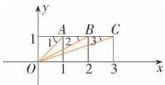

# 复习参考题7

复习巩固

1. 答案 (1) A (2) B (3) D (4) D

2. 答案 (1) 3-4i 或 -3-4i.

(2) $\frac{1}{5}-\frac{2}{5}i.$

(3)9+i.

(4) $-4+4i.$

3. 证明 设 $z = a + bi (a, b \in \mathbf{R})$

则 $\bar{z} = a - bi$

$$
\therefore z \cdot \bar {z} = (a + b \mathrm{i}) (a - b \mathrm{i}) = a ^ {2} + b ^ {2},
$$

$$
\left| z \right| ^ {2} = a ^ {2} + b ^ {2}, \left| \bar {z} \right| ^ {2} = a ^ {2} + b ^ {2},
$$

$$
\therefore z \cdot \bar {z} = | z | ^ {2} = | \bar {z} | ^ {2}.
$$

4. 解析 设 $z = b\mathrm{i}(b \neq 0$ ，且 $b \in \mathbf{R}$ ），则 $(z + 2)^2 - 8\mathrm{i} = (b\mathrm{i} + 2)^2 - 8\mathrm{i} = -b^2 + 4 + 4b\mathrm{i} - 8\mathrm{i} = (4 - b^2) +$

(4b-8)i,由题意知，

$$
\left\{ \begin{array}{l} 4 - b ^ {2} = 0, \\ 4 b - 8 \neq 0 \end{array} \Rightarrow \left\{ \begin{array}{l} b = \pm 2, \\ b \neq 2 \end{array} \right. \Rightarrow b = - 2. \right.
$$

所以 $z = bi = -2i.$

5. 解析 (1) $4x^{2}+9=0$ ,

$$
\therefore x ^ {2} = - \frac {9}{4}, \therefore x = \pm \frac {3}{2} \mathrm{i}.
$$

(2) $(x-3)(x-5)+2=0$ 可化为 $x^{2}-8x+17=0$ ,

$$
\Delta = (- 8) ^ {2} - 4 \times 1 7 = - 4 <   0,
$$

$$
\therefore x = \frac {8 \pm 2 \mathrm{i}}{2} = 4 \pm \mathrm{i}.
$$

综合运用

6. 解析 解法一: $\because \frac{1}{z} = \frac{1}{z_{1}} + \frac{1}{z_{2}}$ ,

$$
\therefore z = \frac {z _ {1} z _ {2}}{z _ {1} + z _ {2}} = \frac {(5 + 1 0 \mathrm{i}) (3 - 4 \mathrm{i})}{(5 + 1 0 \mathrm{i}) + (3 - 4 \mathrm{i})}
$$

$$
= \frac {5 (1 + 2 \mathrm{i}) (3 - 4 \mathrm{i})}{2 (4 + 3 \mathrm{i})} = 5 - \frac {5}{2} \mathrm{i}.
$$

解法二： $\frac{1}{z_1} +\frac{1}{z_2} = \frac{1}{5(1 + 2\mathrm{i})} +\frac{1}{3 - 4\mathrm{i}}$

$$
= \frac {1 - 2 \mathrm{i}}{2 5} + \frac {3 + 4 \mathrm{i}}{2 5} = \frac {4 + 2 \mathrm{i}}{2 5},
$$

$$
\therefore z = \frac {2 5}{2 (2 + \mathrm{i})} = \frac {2 5 (2 - \mathrm{i})}{1 0} = 5 - \frac {5}{2} \mathrm{i}.
$$

7. 解析 解法一: $\because (1 + 2\mathrm{i})\bar{z} = 4 + 3\mathrm{i}$ ,

$$
\therefore \bar {z} = \frac {4 + 3 \mathrm{i}}{1 + 2 \mathrm{i}} = 2 - \mathrm{i}, \therefore z = 2 + \mathrm{i},
$$

$$
\therefore \frac {z}{\bar {z}} = \frac {2 + \mathrm{i}}{2 - \mathrm{i}} = \frac {3}{5} + \frac {4}{5} \mathrm{i}.
$$

解法二: 设 $z=a+bi(a,b\in\mathbf{R})$ ，则 $\bar{z}=a-bi$ ，

$$
\begin{array}{l} \because (1 + 2 \mathrm{i}) \bar {z} = 4 + 3 \mathrm{i}, \\ \therefore (1 + 2 \mathrm{i}) (a - b \mathrm{i}) = 4 + 3 \mathrm{i} \text {, 即} (a + 2 b) + (2 a - b) \mathrm{i} \\ = 4 + 3 \mathrm{i}, \\ \end{array}
$$

则有 $\left\{\begin{aligned}a+2b&=4,\\ 2a-b&=3\end{aligned}\right.\Rightarrow\left\{\begin{aligned}a&=2,\\ b&=1.\end{aligned}\right.$

$$
\therefore z = 2 + \mathrm{i}, \therefore \frac {z}{\bar {z}} = \frac {2 + \mathrm{i}}{2 - \mathrm{i}} = \frac {(2 + \mathrm{i}) ^ {2}}{(2 - \mathrm{i}) (2 + \mathrm{i})} = \frac {3 + 4 \mathrm{i}}{5} =
$$

$$
\frac {3}{5} + \frac {4}{5} \mathrm{i}.
$$

8. 解析 (1) $\mathrm{i}^{1} = \mathrm{i}, \mathrm{i}^{2} = -1, \mathrm{i}^{3} = -\mathrm{i}, \mathrm{i}^{4} = 1, \mathrm{i}^{5} = \mathrm{i}, \mathrm{i}^{6}$

$$
= - 1, \mathrm{i} ^ {7} = - \mathrm{i}, \mathrm{i} ^ {8} = 1.
$$

(2) $\mathrm{i}^{4n - 3} = \mathrm{i},\mathrm{i}^{4n - 2} = -1,\mathrm{i}^{4n - 1} = -\mathrm{i},\mathrm{i}^{4n} = 1,n\in \mathbf{N}^*$ .

拓广探索

9. 解析 由 $z_{1} = z_{2}$ 得 $m + (4 - m^{2})\mathrm{i} = 2\cos \theta + (\lambda + 3\sin \theta)\mathrm{i}$ , 由复数相等的定义知,

$$
\left\{ \begin{array}{l l} {m = 2 \cos   \theta ,} \\ {4 - m ^ {2} = \lambda + 3 \sin   \theta ,} \end{array} \right. \text {得} 4 - 4 \mathrm{cos} ^ {2} \theta = \lambda + 3 \sin   \theta ,
$$

则 $\lambda = 4 - 4\cos^2\theta -3\sin \theta = 4 - 4(1 - \sin^2\theta) -$

$$
3 \sin \theta = 4 \sin^ {2} \theta - 3 \sin \theta = 4 \left(\sin^ {2} \theta - \frac {3}{4} \sin \theta\right)
$$

$$
= 4 \left(\sin \theta - \frac {3}{8}\right) ^ {2} - \frac {9}{1 6}.
$$

$$
\because \theta \in \mathbf {R}, \therefore \sin \theta \in [ - 1, 1 ],
$$

$$
\therefore \lambda_ {\max} = 4 \left(- 1 - \frac {3}{8}\right) ^ {2} - \frac {9}{1 6} = 7, \lambda_ {\min} = - \frac {9}{1 6}.
$$

故 $\lambda$ 的取值范围是 $\left[-\frac{9}{16}, 7\right]$ .

10. 解析 向量 $\overrightarrow{OB}$ 对应的复数为

$$
\begin{array}{l} (2 + \mathrm{i}) (\cos 6 0 ^ {\circ} + \mathrm{isin} 6 0 ^ {\circ}) \\ = (2 + \mathrm{i}) \left(\frac {1}{2} + \frac {\sqrt {3}}{2} \mathrm{i}\right) \\ = \left(1 - \frac {\sqrt {3}}{2}\right) + \left(\sqrt {3} + \frac {1}{2}\right) i, \\ \end{array}
$$

即点 $B$ 对应的复数为 $\left(1 - \frac{\sqrt{3}}{2}\right) +$

$$
\left(\sqrt {3} + \frac {1}{2}\right) \mathrm{i}.
$$

向量 $\overrightarrow{OC}$ 对应的复数为

$$
\begin{array}{l} (2 + \mathrm{i}) (\cos 1 2 0 ^ {\circ} + \mathrm{i} \sin 1 2 0 ^ {\circ}) \\ = (2 + \mathrm{i}) \left(- \frac {1}{2} + \frac {\sqrt {3}}{2} \mathrm{i}\right) \\ = \left(- 1 - \frac {\sqrt {3}}{2}\right) + \left(\sqrt {3} - \frac {1}{2}\right) i, \\ \end{array}
$$

即点 $C$ 对应的复数为 $\left(-1 - \frac{\sqrt{3}}{2}\right) +$

$$
\left(\sqrt {3} - \frac {1}{2}\right) \mathrm{i.}
$$

# 第八章 立体几何初步

# 8.1 基本立体图形

练习

1. 解析 略.

2. 答案 (1) × (2) √

3. 答案 (1) 直五棱柱 (2) 4; 三棱锥(四面体)

4. 解析

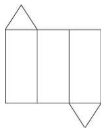

natural_image

Geometric diagram of a rectangle divided into three smaller rectangles by lines, with no text or symbols present.

练习

1. 解析 (1) 圆台. (2) 圆柱. (3) 球.

(4) 圆锥.

2. 解析 (1) 圆柱和圆锥组合而成.

(2) 正六棱柱内挖一个圆柱.

3. 解析

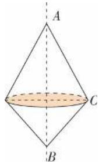

text_image

A
C
B

如图,是由两个圆锥组合而成的简单组合体.

4. 解析 略.

习题8.1

复习巩固

1. 解析 经过顶点 D 的棱:

$AD, D_{1}D, CD.$

经过顶点 $D$ 的面：

平面 $ADD_{1}A_{1}$ 、平面 ADCB、平面 $D_{1}DCC_{1}$ .

2. 答案 (1)(3)(5)

3.C

4. 解析 （1）不是台体，因为该几何体的“侧棱”的延长线不交于一点；

(2)(3)也不是台体,因为不是由平行于棱锥和圆锥底面的平面截得的几何体.

5. 解析 （1）由圆锥和圆台组合而成的简单组合体.

(2)由四棱柱和四棱锥组合而成的简单组合体.

综合运用

6. 答案 (1) √ (2) √ (3) √ (4) √

7.D

8. 解析 剩下的几何体为五棱柱 $ABFEA' - DCGHD'$ ，截去的几何体为三棱柱 $EFB' - HGC'$ .

9. 解析

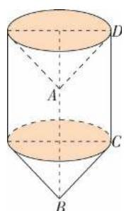

text_image

Geometric diagram of a cylinder with labeled points A, B, C, D and dashed lines indicating hidden edges.

这个几何体是从圆柱的上面挖去一个圆锥放到圆柱的下面.

拓广探索

10. 解析 (1) 不正确.

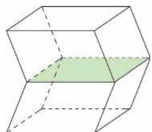

natural_image

3D geometric diagram of a cube with visible and hidden edges, no text or symbols present

虽然这个几何体满足题中条件,但这个几何体不是棱柱.

(2) 不正确.

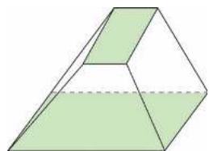

natural_image

Geometric diagram of a frustum with shaded faces and dashed base (no text or symbols)

如图几何体,满足题中条件,但不是棱台.

# 8.2 立体图形的直观图

练习

1. 答案 (1) × (2) √ (3) √ (4) ×

2. 解析 略.

练习

1. 解析

text_image

z
D₁
C₁
A₁
B₁
y
D
C
O(A)
B
x

text_image

析
z
E'
D'
F'
A'
B'
C'
y
E
O
D
x
A
B
C

3. 解析

text_image

z
O'
x'
O
x

习题8.2

复习巩固

1. 答案 (1) √ (2) √ (3) × (4) ×

2. 解析

(1)

(2)

3. 解析

text_image

z
A'
C'
B'
y
C
A
O
B
x

4. 解析

text_image

z
O'
x'
O
x

综合运用

5. 解析

6. 解析

text_image

z
O
x

7. 解析 上面是一个球, 下面是一个圆锥组成的几何体.

natural_image

Geometric diagram showing a cone with a sphere above it, no text or symbols present

拓广探索

8. 解析 略.

# 8.3 简单几何体的表面积与体积

# 8.3.1 棱柱、棱锥、棱台的 表面积和体积

练习

1. 解析 $S_{上表面}=\frac{1}{2}\times2\times\sqrt{3}\times6=6\sqrt{3}\left(\mathrm{~cm}^{2}\right)$ ,

$$
S _ {\text {下表面}} = \frac {1}{2} \times 6 \times 3 \sqrt {3} \times 6 = 5 4 \sqrt {3} (\mathrm{cm} ^ {2}),
$$

$$
S _ {\text {侧面}} = 6 \times \left[ \frac {1}{2} \times (2 + 6) \times \sqrt {2 1} \right] = 2 4 \sqrt {2 1}
$$

$$
\left(\mathrm{cm} ^ {2}\right).
$$

$$
\therefore S _ {\text {表}} = S _ {\text {上表面}} + S _ {\text {下表面}} + S _ {\text {侧面}} = (6 0 \sqrt {3} + 2 4 \sqrt {2 1}) \mathrm{cm} ^ {2}.
$$

2. 解析 (1)64.

(2)三面红色的小立方体位于大立方体8个顶点处,共8个,每个小立方体表面积为 $6\ cm^{2}$ ,故表面积之和为 $48\ cm^{2}$ .

(3)大立方体每条棱中间两个小立方体为两面红色,共有 $2\times12=24$ (个).表面积之和为 $144\ cm^{2}$ .  
(4)大立方体每个面中间4个小立方体为一面红色,共有 $4\times6=24$ (个).表面积之和为 $144\ cm^{2}$ .  
(5)六个面均没有颜色的小立方体共有8个,表面积之和为 $48\ cm^{2}$ ,占有 $8\ cm^{3}$ 的空间.

3. 解析 $V_{正方体} = 125\ 000\ cm^{3}$ ,

$$
8 V _ {\text {棱锥}} = \frac {1}{3} \times \frac {1}{2} \times 2 5 \times 2 5 \times 2 5 \times 8 = \frac {6 2 5 0 0}{3} \mathrm{cm} ^ {3},
$$

∴ 石凳的体积 $V = V_{正方体} - 8V_{棱锥} = \frac{312500}{3} \, cm^{3}$ .

4. 证明 设直三棱柱底面三角形三边分别为 a, b, c. 侧棱为 h.

则直三棱柱三个侧面积分别为 ah, bh, ch，因为三角形任意两边之和大于第三边，

所以任意两个侧面的面积和大于第三个侧面的面积.

# 8.3.2 圆柱、圆锥、圆台、球的表面积和体积

练习

1. 解析 设圆锥的母线长为 $l \, m$ ，底面半径为 $r \, m$ ，∵ 圆锥侧面展开图是一个半圆，如图所示，

∴ $2\pi r = \pi l$ ，即 l = 2r。由 $S_{\text{表}} = \pi r (r + l) = 3\pi r^{2} = a$ 得 $r = \sqrt{\frac{a}{3\pi}}$ ，∴ 底面直径为 $2r = 2\sqrt{\frac{a}{3\pi}} = \frac{2\sqrt{3\pi a}}{3\pi}$ m.

2. 解析 $S_{球}=4\pi R^{2}, V_{球}=\frac{4}{3}\pi R^{3}$ ,

$$
4 \pi R ^ {2} = \frac {4}{3} \pi R ^ {3},
$$

∴ R=3 时,体积和表面积的数值相等.

3. 解析 当 2R = 6 cm 即 R = 3 cm 时, 体积最大, 最大体积 $V = \frac{4}{3} \pi R^{3} = 36 \pi \, cm^{3}$ .

4. 解析 根据长方体的体积公式可得, 水槽的容积为 $V_{水槽} = 80 \times 60 \times 55 = 264\ 000\ cm^{3}$ ,

木球在水中部分的体积 $V=\frac{2}{3}\times\frac{4}{3}\pi\times\left(\frac{50}{2}\right)^{3}=\frac{125\ 000}{9}\pi\ cm^{3}$ ,

水槽中水的体积与木球在水中部分的体积之和为 $200\ 000 + \frac{125\ 000}{9} \pi < 264\ 000$ ,

故水不会从水槽中溢出.

# 习题8.3

复习巩固

1. 解析 该图形为正八面体, 每个面的面积 $S_{1}=\frac{\sqrt{3}}{4}\times30^{2}=225\sqrt{3}\ cm^{2}$ ,

则表面积 $S=8\times225\sqrt{3}=1\ 800\sqrt{3}\ cm^{2}$ .

2. 解析 设长方体的长、宽、高分别为 a、b、c，
则 $V_{三棱锥}=\frac{1}{3}\times\frac{1}{2}abc=\frac{abc}{6}$ ,

剩余几何体的体积 $V = V_{长方体} - V_{三棱锥} = abc - \frac{abc}{6} = \frac{5}{6} abc$ ,

所以棱锥的体积与剩下的几何体的体积之比为 1:5.

3. 解析 当三棱柱的侧面 $AA_{1}B_{1}B$ 水平放置时, 有水的部分是四棱柱形, 其高即为原三棱柱的高, 侧棱长 $A_{1}A=8$ , 设当底面 ABC 水平放置时, 水面高为 h, 由已知条件, 知四棱柱与三棱柱的底面面积之比为 3:4, 不妨设四棱柱和三棱柱的底面面积分别为 3a, 4a (a>0), 由于两种状态下水体积相等, 所以 $3a\times8=4a\times h$ , 解得 h=6. 即当底面 ABC 水平放置时, 水面高为 6.

4. 解析 圆锥 PO 的表面积 $S_{1} = \pi \cdot \frac{a}{2}$

$$
\left(\frac {a}{2} + \frac {\sqrt {5} a}{2}\right) = \frac {a ^ {2}}{4} \pi + \frac {\sqrt {5}}{4} a ^ {2} \pi ,
$$

体积 $V_{1}=\frac{1}{3}\cdot\frac{a^{2}}{4}\pi\cdot a=\frac{a^{3}}{12}\pi,$

挖去圆柱的半径 $r=\frac{a}{4}$ ,

则圆柱的侧面积 $S_{2}=2\pi\cdot\frac{a}{4}\cdot\frac{a}{2}=\frac{a^{2}}{4}\pi$ ,

圆柱的体积 $V_{2}=\pi\cdot\left(\frac{a}{4}\right)^{2}\cdot\frac{a}{2}=\frac{a^{3}}{32}\pi$ ,

则剩下几何体的表面积为圆锥的表面积与圆柱的侧面积之和,剩下几何体的体积为圆锥的体积减去圆柱的体积,

即 $S = \frac{a^2}{4}\pi +\frac{\sqrt{5}}{4} a^2\pi +\frac{a^2}{4}\pi$

$$
= \frac {a ^ {2}}{2} \pi + \frac {\sqrt {5}}{4} a ^ {2} \pi ,
$$

体积 $V=\frac{a^{3}}{12}\pi-\frac{a^{3}}{32}\pi=\frac{5a^{3}}{96}\pi.$

5. 解析 设球的半径为 R cm, 因为正方体的顶点都在球面上, 所以正方体的体对角线是球的一条直径, 如图所示, 由 $\sqrt{3}a = 2R$ , 得 $R = \frac{\sqrt{3}}{2}a$ cm, 所以球的体积 $V = \frac{4}{3}\pi R^{3} = \frac{4}{3}\pi \cdot \left(\frac{\sqrt{3}}{2}a\right)^{3} = \frac{\sqrt{3}}{2}\pi a^{3} \, cm^{3}$ .

text_image

a
O
2R
√2a

综合运用

6. 解析 $S_{四棱柱侧}=4\times40\times80=12\ 800(\mathrm{~cm}^{2})$ ,

四棱台的斜高 $h' = \sqrt{10^{2} - \left(\frac{50 - 40}{2}\right)^{2}} = 5\sqrt{3} \, (\text{cm})$ ,

$$
S _ {\text {四棱台侧}} = 4 \times \frac {4 0 + 5 0}{2} \times 5 \sqrt {3} \approx 1 5 5 9 (\mathrm{cm} ^ {2}),
$$

故需要瓷砖的面积约为 $12\ 800 + 1\ 559 = 14\ 359 \, (\text{cm}^2)$ .

7. 解析 一个六角螺母的体积是六棱柱体积

与圆柱体积的差，

即 $V=\frac{\sqrt{3}}{4}\times12^{2}\times6\times10-3.14\times\left(\frac{10}{2}\right)^{2}\times10\approx$ $2\ 956\ mm^{3}=2.956\times10^{-6}\ m^{3}$ ,

∴ 螺帽的个数为 $5.8 \div (2.956 \times 10^{-6} \times 7.9 \times 10^{3}) \approx 248$ .

8. 解析 (1) 以斜边所在直线为轴旋转而成的几何体的直观图如图(1).

(2)以较长直角边所在直线为轴旋转而成的几何体的直观图如图(2)所示.

(3)以较短直角边所在直线为轴旋转而成的几何体的直观图可类比(2)中所画图形(图略).

设直角三角形的两直角边长分别为 $a, b (a > b)$ ，斜边长为 c.

则(1)中所得几何体的体积为

$$
V _ {1} = \frac {1}{3} \pi \cdot \left(\frac {a b}{c}\right) ^ {2} \cdot c = \frac {\pi a ^ {2} b ^ {2}}{3 c},
$$

(2)中所得几何体的体积为 $V_{2}=\frac{1}{3}\pi b^{2}a$ ,

(3)中所得几何体的体积为 $V_{3}=\frac{1}{3}\pi a^{2}b.$

要比较 $V_{1}, V_{2}, V_{3}$ 的大小, 只需比较 $\frac{ab}{c}, a, b$ 的大小.

不妨设 a=4, b=3, c=5.

则 $\frac{ab}{c}=\frac{12}{5}$ ，所以 $\frac{12}{5}<3<4$ ，

即 $\frac{ab}{c}<b<a,$

所以 $V_{1}<V_{2}<V_{3}$ .

拓广探索

9. 解析 由三视图画出它的直观图如图所示，

text_image

Geometric diagram showing a cylinder intersecting a rectangular prism with labeled points and dashed lines indicating hidden edges.

且 $A_{1}B_{1}=C_{1}D_{1}=A^{\prime}B^{\prime}=C^{\prime}D^{\prime}=8\ cm,$

$A_{1}D_{1} = C_{1}B_{1} = A^{\prime}D^{\prime} = C^{\prime}B^{\prime} = 4\mathrm{cm},$

球的直径为 $4 \, cm, AB = CD = 20 \, cm$ ,

$EF = GH = 10 \text{ cm}, AD = BC = 16 \text{ cm}, EH = FG = 8 \text{ cm}, A_{1}A' = B_{1}B' = C_{1}C' = D_{1}D' = 20 \text{ cm}.$

四棱台的 ABFE 面上的斜高

$$
h _ {1} ^ {\prime} = \sqrt {\left(\frac {1 6 - 8}{2}\right) ^ {2} + 2 ^ {2}} = 2 \sqrt {5} (\mathrm{cm}),
$$

四棱台的 BFGC 面上的斜高

$$
h _ {2} ^ {\prime} = \sqrt {\left(\frac {2 0 - 1 0}{2}\right) ^ {2} + 2 ^ {2}} = \sqrt {2 9} (\mathrm{cm}),
$$

$$
S _ {\text {球}} = 4 \pi R ^ {2} = 4 \pi \cdot 2 ^ {2} = 1 6 \pi (\mathrm{cm} ^ {2}),
$$

$$
V _ {\text {球}} = \frac {4}{3} \pi R ^ {3} = \frac {4}{3} \pi \cdot 2 ^ {3} = \frac {3 2}{3} \pi (\mathrm{cm} ^ {3}),
$$

$$
S _ {\text {四棱柱侧}} = (8 + 4) \times 2 \times 2 0 = 4 8 0 (\mathrm{cm} ^ {2}),
$$

$$
V _ {\text { 四棱柱 }} = 4 \times 8 \times 2 0 = 6 4 0 \left(\mathrm{cm} ^ {3}\right),
$$

$$
S _ {\text { 四棱台全 }} = S _ {\text { 四棱台侧 }} + S _ {\text { 上底面 }} + S _ {\text { 下底面 }}
$$

$$
= 2 \times \frac {1 0 + 2 0}{2} \times 2 \sqrt {5} + 2 \times \frac {8 + 1 6}{2} \times \sqrt {2 9} + 1 0 \times 8 + 2 0 \times
$$

$$
1 6 = 6 0 \sqrt {5} + 2 4 \sqrt {2 9} + 4 0 0 \left(\mathrm{cm} ^ {2}\right),
$$

$$
V _ {\text {四棱台}} = \frac {1}{3} \times (1 0 \times 8 + 2 0 \times 1 6 +
$$

$$
\sqrt {1 0 \times 8 \times 2 0 \times 1 6}) \times 2 = \frac {1 1 2 0}{3} \left(\mathrm{cm} ^ {3}\right).
$$

∴奖杯的表面积 $S=S_{球}+S_{四棱柱侧}+S_{四棱台全}$

$$
= 1 6 \pi + 4 8 0 + 6 0 \sqrt {5} + 2 4 \sqrt {2 9} + 4 0 0 \approx
$$

$$
1 1 9 4 \left(\mathrm{cm} ^ {2}\right),
$$

奖杯的体积 $V = V_{\text{球}} + V_{\text{四棱柱}} + V_{\text{四棱台}}$

$$
= \frac {3 2}{3} \pi + 6 4 0 + \frac {1 1 2 0}{3} \approx 1 0 4 7 \left(\mathrm{cm} ^ {3}\right).
$$

∴ 奖杯的表面积约为 $1\ 194\ cm^{2}$ ，体积约为 $1\ 047\ cm^{3}$ .

# 8.4 空间点、直线、平面之间的位置关系

# 8.4.1 平面

# 练习

1. 答案 (1) × (2) × (3) √

2.D

3. 解析 不共面的四点可以确定 4 个平面.

text_image

P
A
C
B

4. 解析 (1) $A \in \alpha; B \notin \alpha$ .

(2) $M \notin \alpha; M \in a.$

(3) $a \subset \alpha; a \subset \beta.$

text_image

(1)
•B
•A
α
M
a
(2)
M
α
α
β
(3)

# 8.4.2 空间点、直线、平面 之间的位置关系

# 练习

1. 答案 (1) D (2) D

2. 解析 AB 与 AC 相交, AC 与 A'C' 平行, A'B

与 AC 异面, $A'B$ 与 $C'D$ 异面.

3. 答案 (1) × (2) × (3) × (4) √

4. 解析 直线 a 与 b 平行或异面. 理由略.

# 习题8.4

# 复习巩固

1. 解析 (1)

text_image

c
b
A
a
α

(2)

2. 答案 (1) C (2) B

3. 答案 (1) √ (2) × (3) ×

4. 答案 (1)2 (2)平行或在平面内 (3)平行或相交

5. 解析 正方体各面所在平面将空间分成 27 部分.

平面 ABCD 与平面 $A_{1}B_{1}C_{1}D_{1}$ 把空间分成三层, 每层中竖直的四个平面将空间分成 9 部分, 故正方体各面所在平面将空间分成 27 部分.

# 综合运用

6. 解析 共面.

理由如下:设平行直线为 a, b, 则 $a \parallel b$ .

则 a, b 共面, 设为平面 $\alpha$ .

设 $c \cap a = P, c \cap b = Q,$

则 $P \in a, \because a \subset \alpha, \therefore P \in \alpha,$

同理 $Q \in \alpha.$

$\therefore c\subset \alpha ,$

$\therefore a,b,c$ 共面于 $\alpha.$

7. 解析 若三条直线两两平行且不共面, 则一共可以确定三个平面; 若三条直线交于一点, 则最多可以确定三个平面.

8. 证明 如图，

text_image

A
B
C
P
Q
R
α

$\because AB\cap\alpha=P,AB\subset$ 平面ABC,

$\therefore P \in$ 平面 ABC.

又 $P\in \alpha$

∴ P 在平面 ABC 与平面 $\alpha$ 的交线上.

同理可证 Q 和 R 均在这条交线上，

所以 P, Q, R 三点共线.

# 拓广探索

9. 解析 如图, 把展开图还原成正方体.

text_image

C(G)
E
H
A
D
B(F)

可知 AB 与 CD, EF 与 GH, AB 与 GH 为异面直线.

10. 解析 略.

# 8.5 空间直线、平面的平行

# 8.5.1 直线与直线平行

# 练习

1. 解析 平行. 理由略.

2. 解析 与棱 $AA'$ 平行的棱共 3 条, 分别是 $BB', CC', DD'$ .

3. 证明 $\because AA' \parallel BB'$ 且 $AA' = BB'$ ,

∴ 四边形 $AA'B'B$ 为平行四边形，

$\therefore AB\underline{\parallel}A'B',$ 同理 $BC\underline{\parallel}B'C'$ ,

$\therefore AC\underline{\underline{//}}A^{\prime}C^{\prime},$

$\therefore \triangle ABC \cong \triangle A'B'C'.$

4. 解析 $\triangle EFG$ 和 $\triangle BCD$ 相似.

∵ EF∥BC, FG∥CD,

$\therefore \frac{EF}{BC}=\frac{AF}{AC}=\frac{FG}{CD}$ 且 $\angle EFG=\angle BCD,$

$\therefore \triangle EFG \sim \triangle BCD.$

# 8.5.2 直线与平面平行

# 练习

1. 答案 (1) 平面 $CC'D'D$ ，平面 $A'B'C'D'$

(2) 平面 $BB'C'C$ , 平面 $CC'D'D$

(3) 平面 $BCC'B'$ ，平面 $A'B'C'D'$

2. 解析 直线 $BD_{1} \parallel$ 平面 AEC. 理由如下: 如图, 连接 BD 交 AC 于点 O, 连接 OE,

text_image

Geometric diagram of a cube with labeled vertices and internal points, showing spatial relationships and triangles.

在 $\triangle DBD_{1}$ 中,OE为三角形的中位线,

$\therefore OE \parallel BD_{1}.$

∵ $BD_{1} \not\subset$ 平面 AEC, OE ⊂ 平面 AEC,

$\therefore BD_{1} \parallel$ 平面 AEC.

3. 答案 (1) × (2) × (3) × (4) √

4. 证明 $\because b \parallel c, c \subset \beta, b \not\subset \beta, \therefore b \parallel \beta,$

又 $\alpha \cap \beta = a\therefore a / / b$

$\therefore a \parallel b \parallel c.$

# 8.5.3 平面与平面平行

# 练习

1. 解析 (1) × 当 $m \parallel n$ 时, $\alpha$ 与 $\beta$ 可能相交.

(2)√ 理由略.

(3)× 可能相交.

(4)√ 理由略.

(5)√ 理由略.

2.D A 不正确. 以长方体为模型, 如图, 在平面 ABCD 内与 BC 平行的所有直线都与平面 BCC'B' 平行, 但平面 ABCD 与平面 BCC'B' 是相交的.

B 不正确. 以长方体为模型, 如图, $A'D' \parallel$ 平面 $ABCD$ , $A'D' \parallel$ 平面 $BCC'B'$ , 但平面 $ABCD$ 与平面 $BCC'B'$ 相交.

C 不正确. 以长方体为模型, 如图, $A'D' \parallel$ 平面 $BCC'B', BC \parallel$ 平面 $A'B'C'D'$ , 但平面 $BCC'B'$ 与平面 $A'B'C'D'$ 相交.

D 正确. 故选 D.

3. 证明 连接 $B_{1}D_{1}$ , 由已知得 $MN \parallel B_{1}D_{1}, EF \parallel B_{1}D_{1}$ ,

∴ MN∥ EF. ∵ MN∉平面 BDFE, EF⊂平面 BDFE, ∴ MN∥ 平面 BDFE.

连接 MF，则 $MF \parallel AD, \therefore$ 四边形 ADFM 为平行四边形，∴ $AM \parallel DF. \because AM \not\subset$ 平面 BDFE， $DF \subset$ 平面 BDFE，

∴ AM // 平面 BDFE.

又 $MN \cap AM = M, \therefore$ 平面 $AMN \parallel$ 平面 BDFE.

4. 解析 $c \parallel \alpha, c \parallel a.$ 理由如下:

$$
\begin{array}{l} \because \alpha / / \beta , \text { 又 } c \subset \beta , \therefore c / / \alpha . \\ \because \alpha / / \beta , r \cap \alpha = a, r \cap \beta = b, \\ \therefore a \parallel b, \text { 又 } b \parallel c, \\ \therefore a \parallel c. \\ \end{array}
$$

# 习题8.5

# 复习巩固

1. 答案 (1) D (2) C

2. 答案 平行或相交

解析 如图.

text_image

a
α
b
c
β
a
b
c
β

3. 解析 $\because C_{1}D_{1} \parallel CD, \therefore$ 可过点 P 画一条直线与 $C_{1}D_{1}$ 平行.

则此线与棱 CD 平行.

4. 证明 连接 AC.

∵ E、F 分别是 AB、BC 的中点，

$$
\therefore E F \parallel A C,
$$

$$
\because A C \parallel A ^ {\prime} C ^ {\prime},
$$

$$
\therefore E F \parallel A ^ {\prime} C ^ {\prime}.
$$

5. 证明 (1) $\because E, F, G$ 分别是 $AB, BC, CD$ 的中点, $\therefore FG \parallel BD$ .

又∵ $FG \subset$ 平面 EFG, BD ∉ 平面 EFG,

∴ BD // 平面 EFG.

(2) 同(1)可得 $AC \parallel$ 平面 EFG.

6. 解析 在直线 a 上任取一点 O, 过 O 作 $b' \parallel b$ , 则由 a 与 $b'$ 确定的平面 $\alpha$ 即为所求, 如图.

$\because b\parallel b',b'\subset\alpha$ 且 $b\not\subset\alpha,$

$$
\therefore b \parallel \alpha .
$$

7. 证明 $\because AB \parallel \alpha, AB \subset \beta, \alpha \cap \beta = CD,$

$\therefore AB \parallel CD,$ 同理 $AB \parallel EF,$

$$
\therefore C D \parallel E F.
$$

8. 证明 $\because AO = A'O, BO = B'O, \angle AOB = \angle A'OB'$ ,

$$
\therefore \triangle A O B \cong \triangle A ^ {\prime} O B ^ {\prime},
$$

$$
\therefore \angle A ^ {\prime} B ^ {\prime} O = \angle A B O,
$$

$$
\therefore A ^ {\prime} B ^ {\prime} \parallel A B.
$$

∵ $AB \subset$ 平面 ABC, $A'B' \not\subset$ 平面 ABC,

$\therefore A^{\prime}B^{\prime}\parallel$ 平面 ABC, 同理, $B^{\prime}C^{\prime}\parallel$ 平面 ABC.

$\because A^{\prime}B^{\prime}\cap B^{\prime}C^{\prime}=B^{\prime},$

∴ 平面 $A'B'C' \parallel$ 平面 ABC.

# 综合运用

9. 证明 连接 $EE'$ .

∵ E, $E'$ 分别为 AD, $A'D'$ 的中点,

∴ 四边形 $A'E'EA$ 为平行四边形，

$$
\therefore A ^ {\prime} A \underline {{\underline {{/ /}}}} E ^ {\prime} E.
$$

又 $A^{\prime}A \stackrel{\parallel}{=} B^{\prime}B, \therefore E^{\prime}E \parallel B^{\prime}B,$

∴ 四边形 $EE'B'B$ 为平行四边形，

$\therefore BE \parallel B'E'$ .

同理 $CE \parallel C'E'$ ,

又 $\angle BEC$ 与 $\angle B'E'C'$ 方向相同，

$$
\therefore \angle B E C = \angle B ^ {\prime} E ^ {\prime} C ^ {\prime}.
$$

10. 证明 连接 CD.

∵ AC∥BD, ∴ 由 AC、BD 可确定平面 β, 则

$$
A B \subset \beta , \text {且} \beta \text {与} \alpha \text {交于} C D.
$$

$$
\because A B \parallel \alpha , \therefore A B \parallel C D,
$$

∴ 四边形 ABDC 为平行四边形.

$$
\therefore A C = B D.
$$

11. 证明 设两条平行直线分别为 $a$ 和 $b$ , 其中 $a \parallel \alpha$ .

过直线 a 作平面 $\beta$ ，使其与平面 $\alpha$ 相交，交线为 c.

$$
\because a \parallel \alpha , a \subset \beta , \alpha \cap \beta = c,
$$

$$
\therefore a \parallel c.
$$

$$
\text { 又 } a \parallel b,
$$

$$
\therefore b \parallel c,
$$

又 $c \subset \alpha, b \not\subset \alpha, \therefore b \parallel \alpha.$

故另一条直线也平行于这个平面.

12. 解析 过点 P 作 $MN \parallel AC$ ，交 VA 于点 M，交 VC 于点 N，过点 M 作 $MO \parallel VB$ ，交 AB 于点 O，过点 N 作 $NQ \parallel VB$ ，交 BC 于点 Q，连接 OQ，则平面 MNQO 即为所求，如图所示.

text_image

V
P
N
B
M
Q
C
O
A

13. 证明 连接 AF 交 $\beta$ 于 M 点, 连接 MB, CF,

则 $MB \parallel CF, \therefore \frac{AB}{BC} = \frac{AM}{MF}.$

同理,连接 ME,AD,ME // AD,∴ $\frac{AM}{MF}=\frac{DE}{EF}$ ,

$$
\therefore \frac {A B}{B C} = \frac {D E}{E F}.
$$

# 拓广探索

14. 证明 过 $a$ 作平面 $\gamma$ 交 $\beta$ 于直线 $a'$ ,

$$
\because a \parallel \beta , \therefore a \parallel a ^ {\prime}, \therefore a ^ {\prime} \parallel \alpha .
$$

$$
\because a, b \text {异面，}
$$

$\therefore a'$ 与b相交，

$$
\therefore \alpha \mathbin {/ /} \beta .
$$

15. 答案 (1)(2)(4)(5)

解析 ∵ 平面 $ABB_{1}A_{1} \parallel$ 平面 $CDD_{1}C_{1}$ ,

∴ 有水的部分和无水的部分始终有两个面平行,而其余各面都易证是平行四边形(水面与两平行平面的交线互相平行),

∴(1)(2)是正确的.

在题图(1)中，

水面面积 $S_{1}=EF\cdot FG=EF\cdot BC$ ,

在题图(3)中, $S_{2}=EF\cdot BC$ ,而题图(1)中的EF小于题图(3)中的EF,

$\therefore S_{1}<S_{2},\therefore(3)$ 是错的.

由(1)(2)的正确性知(4)是正确的.

因为水的体积一定,形成柱体的高始终是BC,

∴ 底面 EFB 的面积是定值，

$\therefore \frac{1}{2}BE \cdot BF \cdot \sin \angle EBF$ 为定值, 而 $\angle EBF$ 为 $90^{\circ}$ ,

$\therefore BE \cdot BF$ 为定值，

∴(5)是正确的.

# 8.6 空间直线、平面的垂直

# 8.6.1 直线与直线垂直

# 练习

1. 答案 (1) √ (2) ×

2. 答案 (1)8 (2)4 (3)4 (4) $AA'$

3. 解析 (1) $\because BC \parallel B'C'$ ,

$\therefore \angle B^{\prime}C^{\prime}A^{\prime}$ 就是 BC 与 $A^{\prime}C^{\prime}$ 所成的角，

又 $AB = AD = 2\sqrt{3}$

$$
\begin{array}{l} \therefore \angle B ^ {\prime} C ^ {\prime} A ^ {\prime} = 4 5 ^ {\circ}, \\ (2) \because A A ^ {\prime} / / B B ^ {\prime}, \\ \therefore \tan \angle B ^ {\prime} B C = \frac {B ^ {\prime} C ^ {\prime}}{B B ^ {\prime}} = \sqrt {3}, \\ \therefore \angle B ^ {\prime} B C ^ {\prime} = 6 0 ^ {\circ}, \\ \end{array}
$$

∴ 直线 BC 与 $A^{\prime}C^{\prime}$ 所成的角是 $45^{\circ}$ .

$\therefore \angle B^{\prime}BC^{\prime}$ 就是 $AA^{\prime}$ 与 $BC^{\prime}$ 所成的角，

∴ 直线 $AA'$ 与 $BC'$ 所成的角是 $60^{\circ}$ .

4. 证明 取 $AC'$ 的中点 $E$ , 连接 $DE$ , 取 $B'B$ 的中点 $F$ , 连接 $AF, EF$ .

$$
\begin{array}{l} \therefore D E / / C C ^ {\prime}, D E = \frac {1}{2} C C ^ {\prime}, B F / / C C ^ {\prime}, B F = \\ \frac {1}{2} C C ^ {\prime}, \end{array}
$$

$$
\therefore D E \underline {{\underline {{\parallel}}}} B F,
$$

∴ 四边形 BDEF 为平行四边形，

$$
\therefore B D \parallel E F.
$$

$$
\text { 又 } A B = B B ^ {\prime} = 2,
$$

$$
\therefore A F = \sqrt {5}, A E = \sqrt {2}, E F = B D = \sqrt {3}.
$$

在 $\triangle AEF$ 中, $AE^{2}+EF^{2}=AF^{2}$ ,

$$
\therefore \angle A E F = 9 0 ^ {\circ},
$$

$$
\therefore E F \perp A C ^ {\prime},
$$

$$
\text { 又 } E F \parallel B D,
$$

$$
\therefore B D \perp A C ^ {\prime}.
$$

# 8.6.2 直线与平面垂直

# 练习

1. 解析 这两条直线不一定平行, 它们也可以相交, 也可以异面. 如图所示, 在正方体 $ABCD-A_{1}B_{1}C_{1}D_{1}$ 中, $E、F$ 分别是 $A_{1}D_{1}、B_{1}C_{1}$ 的中点, 易知 $AE、DE、BF$ 与平面 $ABCD$ 所成的角都相等, 其中 $AE \parallel BF, AE \cap DE = E, DE$ 与 $BF$ 异面.

text_image

D₁
E
A₁
F
B₁
D
C
A
B
C₁

2. 证明 $\because SD \perp$ 平面 $ABCD, AC \subset$ 平面 $ABCD$ , $\therefore SD \perp AC$ .

又底面 ABCD 为正方形，

$$
\therefore A C \perp B D.
$$

$$
\text { 又 } S D \cap B D = D,
$$

$$
\therefore A C \perp \text { 平面 } S D B.
$$

3. 解析 ∵ 四棱柱 $A'B'C'D'-ABCD$ 为直四棱柱, ∴ $B'D' \perp A'A$ .

若 $A^{\prime}C\perp B^{\prime}D^{\prime}$ ，则 $B^{\prime}D^{\prime}\perp$ 平面 $A^{\prime}ACC^{\prime}$

$$
\therefore B ^ {\prime} D ^ {\prime} \perp A C,
$$

$$
\text { 又 } B ^ {\prime} D ^ {\prime} \parallel B D,
$$

$$
\therefore B D \perp A C.
$$

∴ 当 $BD \perp AC$ ，即底面四边形 ABCD 的对角线互相垂直时， $A'C \perp B'D'$ .

4. 答案 (1) 外 (2) 中 (3) 垂

解析 ①连接 $OA, OB, OC$ .

∵ PA = PB = PC 且 PO 为公共边，

$$
\therefore \mathrm{Rt} \triangle A O P \cong \mathrm{Rt} \triangle B O P \cong \mathrm{Rt} \triangle C O P,
$$

$$
\therefore O A = O B = O C,
$$

$\therefore O$ 为 $\triangle ABC$ 的外心.

当 $\angle C=90^{\circ}$ 时, $\therefore O$ 为 $AB$ 边的中点.

∴(1)、(2)两问的答案即证出.

②连接 AO、CO 并延长分别交 BC、AB 于 D、E 两点.

$\because PA \perp PC, PB \perp PC, PA \cap PB = P,$

$\therefore PC \perp$ 平面 PAB,

$\therefore PC \perp AB.$

$\because PO \perp \alpha,$

$\therefore PO \perp AB,$ 又 $PO \cap PC = P,$

$\therefore AB \perp$ 平面 PCO,

$\therefore AB \perp CO,$ 同理, $BC \perp AO,$

∴ 点 O 为 $\triangle ABC$ 三条高的交点，

即点 O 为 $\triangle ABC$ 的垂心.

# 练习

1. 答案 $b \subset \alpha$ 或 $b \parallel \alpha$

2. 证明 过点 A、B 分别作 $AC \perp \alpha, BD \perp \alpha$ ，分

别交 $\alpha$ 于点 $C, D$ . 连接 $CD$ .

∵ A, B 与 $\alpha$ 距离相等, 即 AC = BD.

又 $AC \perp \alpha, BD \perp \alpha,$

$\therefore AC \parallel BD,$

∴ 四边形 ABDC 为平行四边形，

$\therefore AB \parallel CD,$ 又 $CD \subset \alpha,$

$\therefore AB \parallel \alpha.$

text_image

A
B
C
D
α

3. 证明 证法一: 取 AE 中点 H, 连接 DH、FH.

∵ EA=2DC, H 是 AE 中点,

则 CD=AH. 又 EA、DC 都垂直于平面 ABC,

$\therefore CD \parallel AH,$

∴ 四边形 DHAC 为平行四边形，

则 $DH \parallel AC$ .

又 F 是 EB 中点, ∴ $HF \parallel AB$ .

又 $DH \cap HF = H, AC \cap AB = A.$

则平面 HFD // 平面 ABC.

又 $DF \subset$ 平面 HFD, ∴ $DF \parallel$ 平面 ABC.

证法二:取 AB 的中点 G. 连接 GF、CG.

$$
\therefore G F \parallel A E, G F = \frac {1}{2} A E,
$$

又 $CD \parallel AE, CD = \frac{1}{2} AE,$

$\therefore CD\underline{\underline{//}}GF,$

∴ 四边形 CGFD 为平行四边形，

$\therefore DF \parallel CG.$

又 $CG \subset$ 平面 ABC,

DF∉平面ABC,

∴ $DF \parallel$ 平面 ABC.

4. 证明 设平面 $\alpha, \beta$ 都与直线 $l$ 垂直，

过直线 l 作平面 $\gamma$ ，与 $\alpha, \beta$ 分别相交于直线 a, b.

$\because a\perp l,b\perp l,$

又 a, b, l 都在平面 $\gamma$ 上, $\therefore a \parallel b$ ,

∴ a, b 分别是平面 $\alpha, \beta$ 上任意两条交线，

$\therefore \alpha // \beta.$

# 8.6.3 平面与平面垂直

# 练习

1. 解析 如图, 因为 $OA \perp OB, OA \perp OC, OB \subset \beta, OC \subset \beta$ 且 $OB \cap OC = O$ .

text_image

O
α
A
B
C
β'

根据线面垂直的判定定理,可得 $OA \perp \beta$ ,

又 $OA \subset \alpha$ , 根据面面垂直的判定定理, 可得 $\alpha \perp \beta$ .

# 2. D

3. 解析 平面 $ABD \perp$ 平面 BCD. 平面 $ABC \perp$ 平面 BCD. 平面 $ACD \perp$ 平面 ABC. 理由如下：

∵ AB ⊥ 平面 BCD, AB ⊂ 平面 ABD, AB ⊂ 平面 ABC,

∴ 平面 $ABD \perp$ 平面 BCD, 平面 $ABC \perp$ 平面 BCD.

由 $AB \perp$ 平面 BCD, 得 $AB \perp CD$ .

又 $BC \perp CD, \therefore CD \perp$ 平面 ABC,

∴ 平面 $ACD \perp$ 平面 ABC.

4. 证明 ∵ 三棱柱 $ABC-A'B'C'$ 为正三棱柱，

则 $\triangle ABC$ 为正三角形.

又 D 为棱 AC 中点，

$\therefore BD \perp AC.$

又 $AA' \perp$ 底面 ABC,

$\therefore AA' \perp BD.$

又 $AC \cap AA' = A$ ,

$\therefore BD \perp$ 平面 $ACC'A'$ ,

∴ 平面 $BDC' \perp$ 平面 $ACC'A'$ .

# 练习

1. 答案 (1) × (2) √ (3) √

2.B ①错误.若一平面内的已知直线垂直于另一个平面内的任意直线,则已知直线就垂直于另一平面,而一个平面内的直线与另一平面还存在平行和相交两种情况.

②正确.在另一平面内存在无数条与两平面的交线垂直的直线,而这些直线都与第一个平面的已知直线垂直.

③错误(参考①的分析).

④正确(参考性质定理).

故选 B.

3.B $\alpha\perp\beta$ 时,m 不一定垂直于 $\beta$ .∴ 是不充分条件.

$m \perp \beta$ 时, $\alpha$ 一定垂直于 $\beta$ .: 是必要条件. 故 “ $\alpha \perp \beta$ ” 是 “ $m \perp \beta$ ” 的必要不充分条件.

4. 解析 直线 a 与平面 $\beta$ 的位置关系是 $a \perp \beta$ .
理由如下：

设过直线 a 与平面 $\alpha$ 内的一点的平面与 $\alpha$ 的交线为 $a'$ .

$\because a \parallel \alpha, \therefore a \parallel a'.$

$\because a \perp AB, \therefore a' \perp AB.$

$\because a^{\prime}\subset\alpha,\alpha\perp\beta,\therefore a^{\prime}\perp\beta.$

∴ $a \perp \beta$ , 即直线 a 与平面 $\beta$ 的位置关系是 $a \perp \beta$ .

text_image

a
B
α
β
A

# 习题8.6

# 复习巩固

1. 答案 (1) D (2) A (3) C

2. 答案 (1) √ (2) × (3) √ (4) × (5) √

3. 解析 (1) 正确. 因为另一条直线与这个平面垂直, 则另一条直线垂直于这个平面内的任意一条直线. 所以另一条直线一定垂直于平面内与已知直线平行的直线. 故两条直线

互相垂直.

(2) 正确. 理由略.

(3) 错误. 比如正方体两个相对的侧面, 都垂直于底面, 但两侧面平行.

4. 证明 (1) 取 AB 中点 H. 连接 CH、PH.

∵ P、H 分别为 $A_{1}B$ 、AB 中点，

$$
\therefore P H \parallel A A _ {1}, P H = \frac {1}{2} A A _ {1}.
$$

又 $AA_{1} \perp$ 平面 ABC, ∴ PH⊥平面 ABC,

$\therefore PH \perp CH.$

由 $CC_{1} \perp$ 平面 ABC 可知 $QC \perp CH$ ,

∴ PH∥QC.

$$
\text { 又 } P H = \frac {1}{2} A A _ {1} = Q C,
$$

∴ 四边形 PHCQ 为平行四边形, ∴ PQ // HC.

又 CA = CB, H 为 AB 中点, ∴ $HC \perp AB$ ,

$\therefore PQ \perp AB.$

(2) $\because C_{1}C\perp$ 平面ABC, $\therefore C_{1}C\perp CH.$

又 $PQ \parallel CH, \therefore PQ \perp C_{1}C.$

(3) $\because B_{1}B\parallel C_{1}C,PQ\perp C_{1}C,\therefore B_{1}B\perp PQ.$

又 $AB \perp PQ, AB \cap B_{1}B = B, \therefore PQ \perp$ 平面 $ABB_{1}A_{1}$ ,

$\because A_{1}B\subset$ 平面 $ABB_{1}A_{1}$ ,

$\therefore PQ \perp A_{1}B.$

text_image

A₁
B₁
C₁
P
Q
A
H
B
C

5. 证明 $\because PO \perp$ 底面 $ABC, \therefore PO \perp AB$ .

又 $CD \perp AB, CD \cap PO = O,$

$\therefore AB \perp$ 平面 $POC, \therefore AB \perp PC.$

6. 解析 与平面 $ABB'A'$ 、平面 $DCC'D'$ 、平面 ABCD、平面 $A'B'C'D'$ 所成的二面角均为 $45^{\circ}$ 。与平面 $ADD'A'$ 、平面 $BCC'B'$ 所成的二面角均为 $90^{\circ}$ 。

7. 解析 平面 $VAB \perp$ 平面 VBC. 理由如下:

$\because \angle VAB = \angle VAC = 90^{\circ}, AB \cap AC = A,$

$\therefore VA \perp$ 平面 ABC, $\therefore VA \perp BC.$

又 $\angle ABC=90^{\circ},\therefore AB\perp BC,$

又 $VA \cap AB = A, \therefore BC \perp$ 平面 VAB,

∴ 平面 $VAB \perp$ 平面 VBC.

8. 证明 设 a, b, c 为两两互相垂直的直线, 且它们交于公共点 A.

a,b 确定一平面 $\alpha$ , a, c 确定一平面 $\beta$ .

$\because c \perp a, c \perp b, a \cap b = A.$

$\therefore c \perp \alpha.$

又 $c\in \beta ,\therefore \alpha \bot \beta .$

同理可证 b, c 确定的平面与 $\alpha, \beta$ 都垂直.

9. 证明 设 $\alpha \cap \gamma = l$ , 在平面 $\alpha$ 内作直线 $a \perp l$ .

$\because \alpha \perp \gamma, a \perp l, \therefore a \perp \gamma.$

过 a 作一平面与平面 $\beta$ 相交于直线 b，

$\because \beta \parallel \alpha, \therefore a \parallel b, \therefore b \perp \gamma.$

又 $b\subset \beta ,\therefore \beta \bot \gamma .$

10. 证明 $\because \alpha \perp \gamma, \beta \perp \gamma, \alpha \cap \beta = l$ ,

则三个面相交于一点,设为点 C,

过点 C 作直线 $l'$ ，满足 $l' \perp \gamma$ .

$\because \alpha \perp \gamma,$ 且点 C 在平面 $\alpha$ 上，

∴ 直线 $l'$ 在平面 $\alpha$ 内.

同理, $l'$ 在平面 $\beta$ 内. $\therefore l'=\alpha\cap\beta=l,\therefore l\perp\gamma.$

# 综合运用

11. 证明 取 BC 中点 $P'$ ，连接 $B_{1}P'$ 与 BQ 交于点 O.

$\therefore A_{1}P \parallel B_{1}P'$ ，又四边形 $B_{1}BCC_{1}$ 为正方形，Q 为 $CC_{1}$ 中点，

$$
\therefore \triangle B _ {1} B P ^ {\prime} \cong \triangle B C Q, \therefore \angle B B _ {1} P ^ {\prime} = \angle C B Q.
$$

$$
\text { 又 } \angle C B Q + \angle B _ {1} B Q = 9 0 ^ {\circ},
$$

$$
\therefore \angle B B _ {1} P ^ {\prime} + \angle B _ {1} B Q = 9 0 ^ {\circ},
$$

$$
\therefore \angle B _ {1} O B = 9 0 ^ {\circ}, \therefore B _ {1} P ^ {\prime} \perp B Q,
$$

$$
\therefore A _ {1} P \perp B Q.
$$

12. 证明 设 m, n 确定的平面为 $\alpha$ : $l_{1} \perp m, l_{1} \perp n, m, n$ 相交，

$$
\therefore l _ {1} \perp \alpha .
$$

$$
\text {同理}, l _ {2} \perp \alpha , \therefore l _ {1} / / l _ {2},
$$

$$
\therefore \angle 1 = \angle 2.
$$

13. 证明 设两平行直线 a、b 与平面 $\alpha$ 相交于 A、B 两点，与平面 $\alpha$ 所成的角为 $\theta_{1}$ 、 $\theta_{2}$ .

在 a, b 上分别取点 $A_{1}, B_{1}$ ，这两点在平面 $\alpha$ 的同侧。且 $AA_{1} = BB_{1}$ ，连接 AB 和 $A_{1}B_{1}$ 。

因为 $AA_{1} \parallel BB_{1}, AA_{1} = BB_{1}$ ，所以四边形 $AA_{1}B_{1}B$ 是平行四边形.

所以 $AB \parallel A_1B_1$ . 又 $A_1B_1 \subset \alpha, AB \not\subset \alpha$ , 所以 $AB \parallel \alpha$ .

设 $A_{2}, B_{2}$ 分别是平面 $\alpha$ 的垂线 $AA_{2}, BB_{2}$ 的垂足，连接 $A_{1}A_{2}, B_{1}B_{2}$ ，则 $AA_{2} = BB_{2}$ .

在 $\mathrm{Rt}\triangle AA_1A_2$ 和 $\mathrm{Rt}\triangle BB_1B_2$ 中，因为 $AA_{2} = BB_{2}$ ， $AA_{1} = BB_{1}$ ，所以 $\mathrm{Rt}\triangle AA_1A_2\cong$ $\mathrm{Rt}\triangle BB_1B_2$ ，所以 $\angle AA_1A_2 = \angle BB_1B_2$ ，即 $\theta_{1} = \theta_{2}$

14. 解析 能. 理由如下: 如图所示,

∵ $VO \perp$ 平面 ABC, ∴ $VO \perp AB$ .

$$
\because V A = V B, A D = B D, \therefore V D \perp A B.
$$

又∵ $VO \cap VD = V, \therefore AB \perp$ 平面 VDO.

∵ CD⊂平面 VDO, ∴ CD⊥AB.

∵ D 为 AB 的中点, ∴ AC = BC.

15. 解析 $SG \perp$ 平面 EFG, $EG \perp$ 平面 SGF, FG $\perp$ 平面 SGE. 证明如下：

折成的四面体如图所示，

由平面正方形可知 $SG_{1} \perp G_{1}E, SG_{3} \perp G_{3}F,$

∴ 折成四面体后, $SG \perp GE$ , $SG \perp GF$ ,

$$
\because G E \cap G F = G,
$$

∴ SG⊥平面 EFG.

同理, $EG\perp$ 平面SGF, $FG\perp$ 平面SGE.

text_image

S
G
F
D
E

16. 证明 设 $\alpha, \beta$ 为两个平行平面, 直线 $l \perp \alpha$ . 交点为 A.

过点 A 和平面 $\beta$ 内任意一条直线 b 作平面 $\gamma$ ，则 $\gamma$ 与 $\alpha$ 相交，设交线为 a.

$$
\because \alpha / / \beta , \alpha \cap \gamma = a, \beta \cap \gamma = b, \therefore a / / b.
$$

$$
\text { 又 } a \subset \alpha , l \perp \alpha , \therefore l \perp a, \therefore l \perp b.
$$

∵ b 是 $\beta$ 内任意一条直线，

$$
\therefore l \perp \beta .
$$

17. 证明 设三个平面为 $\alpha, \beta, \gamma$ .

$$
\alpha \cap \beta = l, \beta \cap \gamma = n, \gamma \cap \alpha = m.
$$

在平面 $\gamma$ 上任取一点 A，作 $AB \perp m$ 于 B, AC $\perp n$ 于 C.

由 $\alpha\perp\gamma,\therefore AB\perp\alpha,l$ 在平面 $\alpha$ 内, $\therefore l\perp AB.$ 同理, $l\perp AC$ ,

又 AB、AC 在平面 $\gamma$ 内，且相交于点 A，

$$
\therefore l \perp \gamma ,
$$

∵ m、n 在 γ 内，∴ $l \perp m, l \perp n$ .

同理, 可证 $m \perp n$ ,

∴三条交线两两垂直.

text_image

α
l
β
B
m
C
n
A
γ

18. 解析 由题意知, $\triangle ABC$ 、 $\triangle VAB$ 为边长为2的正三角形.

取 AB 中点 O, 连接 OC、OV, 则 $OC \perp AB$ , OV $\perp AB$ ,

∴ $\angle VOC$ 为二面角 V-AB-C 的平面角，

又易知 $OV=OC=\sqrt{3}$ ，且 VC=1，

$$
\therefore \cos \angle V O C = \frac {(\sqrt {3}) ^ {2} + (\sqrt {3}) ^ {2} - 1 ^ {2}}{2 \times \sqrt {3} \times \sqrt {3}} = \frac {5}{6}.
$$

# 拓广探索

19. 证明 连接 $A_{1}B$ .

∵ 三棱柱 $ABC-A_{1}B_{1}C_{1}$ 为直三棱柱, ∴ 四边形 $ABB_{1}A_{1}$ 为平行四边形, $BB_{1} \perp$ 平面 ABC. ∴ $BB_{1} \perp BC$ ,

$$
\text { 又 } A B \perp B C, A B \cap B B _ {1} = B,
$$

$\therefore BC \perp$ 平面 $ABB_{1}A_{1}$ ,

$$
\therefore A B _ {1} \perp B C.
$$

又 $AA_{1}=AB, AA_{1}\perp AB,\therefore$ 平行四边形 $ABB_{1}A_{1}$ 为正方形.

$$
\therefore A B _ {1} \perp A _ {1} B,
$$

$$
\text { 又 } A _ {1} B \cap B C = B,
$$

$\therefore AB_{1} \perp$ 平面 $A_{1}BC,$

$$
\therefore A _ {1} C \perp A B _ {1}.
$$

20. 解析 直线 DE 与平面 VBC 垂直. 理由如下:

∵ AB 是 $\odot O$ 的直径, 点 C 是 $\odot O$ 上的动点,

$$
\therefore A C \perp B C.
$$

又 VC 垂直于 $\odot O$ 所在的平面, AC 在 $\odot O$ 所在平面上,

$$
\therefore A C \perp V C.
$$

$$
\text { 又 } B C \cap V C = C,
$$

$$
\therefore A C \perp \text { 平面 } V B C.
$$

又 D, E 分别是 VA, VC 的中点,

$\therefore DE \parallel AC, \therefore DE \perp$ 平面 VBC.

21. 解析 平面 $AEF \perp$ 平面 PBC. 证明如下:

∵底面ABCD为正方形,∴ $BC\perp AB$ .

又 $PA \perp$ 底面 ABCD, $\therefore PA \perp BC$ .

$$
\text { 又 } P A \cap A B = A,
$$

$\therefore BC \perp$ 平面 $PAB, \therefore BC \perp AE$ .

又 PA=AB, E 为 PB 中点,

$\therefore AE \perp PB.$

又 $PB \cap BC = B$ ,

$\therefore AE \perp$ 平面 PBC,

∴ 平面 $AEF \perp$ 平面 PBC.

# 复习参考题8

# 复习巩固

1. 答案

<table><tr><td>多面体</td><td>顶点数V</td><td>棱数E</td><td>面数F</td><td>V+F-E</td></tr><tr><td>n棱柱</td><td>2n</td><td>3n</td><td>n+2</td><td>2</td></tr><tr><td>n棱锥</td><td>n+1</td><td>2n</td><td>n+1</td><td>2</td></tr><tr><td>n棱台</td><td>2n</td><td>3n</td><td>n+2</td><td>2</td></tr></table>

2. 解析 (1)

(2)三棱柱.

3. 答案 (1) $n^2; n^3$ (2) $n^2; n^3$

4. 解析 (1) 设所截等腰三角形的底边边长为 $x \mathrm{~cm}$ .

在 Rt△EOF 中, EF=5 cm, $OF=\frac{1}{2}x$ cm,

所以 $EO=\sqrt{25-\frac{1}{4}x^{2}}$ cm.

于是 $V = \frac{1}{3} x^2\sqrt{25 - \frac{1}{4} x^2}\mathrm{cm}^3.$

依题意函数的定义域为 $\{x\mid0<x<10\}$ .

text_image

Geometric diagram of a pyramid with labeled vertices and internal points, including a shaded triangular section.

5. 解析 ①当三个平面两两平行时, 可以把空间分成 4 部分;

②当两个平面平行,第三个平面分别与它们相交时;或三个平面同时交于一条直线时,可以把空间分成6部分;

③当三个平面两两相交且不共线时,可以把空间分成7部分;

④当三个平面相互垂直时,可以把空间分成8部分.

6. 解析 (1) 证明: $\because a \cap b = 0, \therefore O \in a, O \in b$ .

$$
\because \alpha \cap \beta = a, \alpha \cap \gamma = b, \therefore a \subset \beta , b \subset \gamma .
$$

$$
\therefore O \in \beta , O \in \gamma ,
$$

$$
\text { 又 } \because \beta \cap \gamma = c, \therefore O \in c, \therefore O \in a, O \in b, O \in c.
$$

$$
\therefore a, b, c \text { 三   线   共   点 }.
$$

$$
(2) a \parallel c, b \parallel c.
$$

理由如下：

$$
\because \alpha \cap \beta = a, \alpha \cap \gamma = b, a / / b, \therefore a \not \subset \gamma , b \subset \gamma ,
$$

$$
\text { 又 } \because a / / b, \therefore a / / \gamma ,
$$

$$
\text { 又 } \because a \subset \beta , \beta \cap \gamma = c, \therefore a / / c.
$$

$$
\text { 又 } a \parallel b, \therefore b \parallel c.
$$

7. 证明 $\because AA' \parallel BB' \parallel CC' \parallel DD'$ ,

$\therefore BB' \parallel$ 平面 $ADD'A'$ .

∵ 四边形 ABCD 是平行四边形，

$$
\therefore B C \parallel A D.
$$

又 $AD \subset$ 平面 $ADD'A'$ , BC ∉ 平面 $ADD'A'$ ,

$\therefore BC \parallel$ 平面 ADD'A'.

又 $BB' \cap BC = B$ ,

∴ 平面 $BCC'B' \parallel$ 平面 $ADD'A'$ .

∵ 平面 $BCC'B'\cap$ 平面 $A'B'C'D'=B'C'$ ,

平面 $ADD'A'\cap$ 平面 $A'B'C'D'=A'D'$ ,

$\therefore A^{\prime}D^{\prime}\parallel B^{\prime}C^{\prime}$ ，同理可证 $A^{\prime}B^{\prime}\parallel C^{\prime}D^{\prime}$

∴ 四边形 $A'B'C'D'$ 是平行四边形.

8. 解析 设经过点 E 在上底面画直线 l 与 CE 垂直.

text_image

D₁
A₁
E
B₁
G
D
C
A
B

∵ $ABCD-A_{1}B_{1}C_{1}D_{1}$ 是正方体，

$\therefore CC_{1} \perp$ 平面 $A_{1}B_{1}C_{1}D_{1}$ ,

$\because l\subset$ 平面 $A_{1}B_{1}C_{1}D_{1}$ ,

$\therefore CC_{1} \perp l,$

又 $CE \perp l$ ,

且 $CC_{1} \cap CE = C$ ,

$\therefore l \perp$ 平面 $CC_{1}E$ ,

$\because C_{1}E\subset$ 平面 $CC_{1}E,$

$\therefore l \perp C_{1}E.$

故在平面 $A_{1}B_{1}C_{1}D_{1}$ 中, 画出经过点 E 与 $C_{1}E$ 垂直的直线即可.

9. 证明 (1) ∵ D, E 分别是 AB, PB 的中点,

$\therefore DE \parallel PA.$

又∵ PA⊂平面 PAC, DE∉平面 PAC,

∴ DE // 平面 PAC.

(2) $\because PC\perp$ 底面ABC, $AB\subset$ 底面ABC,

$\therefore PC \perp AB,$

∵ $AB \perp BC, PC \cap BC = C, PC \subset$ 平面 PBC,

$BC \subset$ 平面 PBC,

$\therefore AB \perp$ 平面 PBC,

∵ $PB \subset$ 平面 PBC,

$\therefore AB \perp PB.$

# 综合运用

10. 解析 (1) 证明: 由正方形 ABCD 知,

$$
\angle D C F = \angle D A E = 9 0 ^ {\circ},
$$

$$
\therefore A ^ {\prime} D \perp A ^ {\prime} F, A ^ {\prime} D \perp A ^ {\prime} E.
$$

$\because A^{\prime}E\cap A^{\prime}F = A^{\prime},\therefore A^{\prime}D\perp$ 平面 $A^{\prime}EF.$

又 $EF \subset$ 平面 $A'EF, \therefore A'D \perp EF$ .

(2)

text_image

Geometric diagram of a square with internal points and lines, labeled with vertices A, B, C, D, E, F, H.

text_image

A'
E
H
G
F
D

连接 BD, 交 EF 于点 H.

∵ 正方形 ABCD 的边长为 2, E, F 分别为 AB, BC 的中点，

$$
\therefore B H = \frac {1}{4} B D = \frac {\sqrt {2}}{2},
$$

即 $A'H = BH = \frac{\sqrt{2}}{2}$ , $HD = \frac{3}{4} BD = \frac{3\sqrt{2}}{2}$ .

作 $A^{\prime}G \perp$ 底面 EFD.

∵ ED = FD, ∴ G 在直线 DH 上.

由(1)知 $A^{\prime}D \perp$ 平面 $A^{\prime}EF$ ,

$$
\therefore A ^ {\prime} D \perp A ^ {\prime} H,
$$

$$
\therefore A ^ {\prime} D \cdot A ^ {\prime} H = H D \cdot A ^ {\prime} G,
$$

可得 $A'G=\frac{2}{3}$ ,

$$
\therefore V _ {A ^ {\prime} - E F D} = \frac {1}{3} \cdot S _ {\triangle E F D} \cdot A ^ {\prime} G = \frac {1}{3}.
$$

11. 证明 取 BD 的中点 O, 在线段 CD 上取点 F, 使得 DF = 3FC, 连接 OP, OF, FQ.

text_image

Geometric diagram of a pyramid with labeled vertices and internal points, including a shaded base layer.

因为 AQ=3QC，所以 $QF \parallel AD$ ，且 $QF=\frac{1}{4} \times AD.$

因为 O, P 分别为 BD, BM 的中点, 所以 OP 是 $\triangle BDM$ 的中位线,

所以 $OP \parallel DM$ ，且 $OP = \frac{1}{2}DM$ .

又点 M 是 AD 的中点，

所以 $OP \parallel AD$ ，且 $OP = \frac{1}{4} AD.$

从而 $OP \parallel QF$ ，且 OP = QF，所以四边形 OPQF 是平行四边形，故 $PQ \parallel OF$ .

又 $OF \subset$ 平面 $BCD, \therefore PQ \parallel$ 平面 $BCD$ .

12. 证明 (1) 连接 $B_{1}D_{1}, BD$ , 则 $B_{1}D_{1} \perp A_{1}C_{1}$ .

又因为 $BB_{1}\perp$ 平面 $A_{1}B_{1}C_{1}D_{1}$

所以 $BB_{1}\perp A_{1}C_{1}$

又因为 $BB_{1} \cap B_{1}D_{1} = B_{1}$ ,

所以 $A_{1}C_{1}\perp$ 平面 $BB_{1}D_{1}D.$

又因为 $B_{1}D\subset$ 平面 $BB_{1}D_{1}D$

所以 $B_{1}D\perp A_{1}C_{1}$

同理， $B_{1}D\bot A_{1}B.$

又因为 $A_{1}B \cap A_{1}C_{1} = A_{1}$ ,

所以 $B_{1}D \perp$ 平面 $A_{1}BC_{1}$

(2) 连接 $BH, C_{1}H, A_{1}H$ ,

由(1)知 $A_{1}C_{1}\perp BH,A_{1}B\perp C_{1}H,$

所以 $H$ 为 $\triangle A_{1}C_{1}B$ 的高的交点.

又因为 $\triangle A_{1}C_{1}B$ 为正三角形

所以 $BH, C_{1}H, A_{1}H$ 为各边上的中线，

所以 $H$ 为 $\triangle A_{1}C_{1}B$ 的重心.

13. 解析 (1) 证明: ∵ PA ⊥ 底面 ABC, ∴ BC ⊥ PA.

$$
\because \angle A C B = 9 0 ^ {\circ}, \therefore B C \perp A C.
$$

∵ $PA \cap AC = A, \therefore BC \perp$ 平面 PAC.

∵ BC⊂平面 PBC, ∴ 平面 PAC⊥平面 PBC.

(2) 取 PC 的中点 D, 连接 AD, DM, AM.

$\because AC=PA,\therefore AD\perp PC.$

text_image

Geometric diagram of a triangular pyramid with labeled vertices and internal points, used for spatial geometry problems.

∵ 由(1)知平面 PAC⊥平面 PBC, 平面 PAC ∩ 平面 PBC = PC,

$\therefore AD \perp$ 平面 PBC, $\therefore \angle ADM = 90^{\circ}$ ,

则 $\angle AMD$ 就是 $AM$ 与平面 $PBC$ 所成的角.

设 $AC = BC = PA = a$ ，则 $AD = \frac{\sqrt{2}a}{2}$

$\therefore DM = \frac{a}{2}, \therefore$ 在 Rt $\triangle ADM$ 中, $\tan \angle AMD = \frac{AD}{DM} = \sqrt{2}$ .

∴ AM 与平面 PBC 所成角的正切值是 $\sqrt{2}$ .

14. 解析 (1) 证明: ∵ 平面 PAD ⊥ 平面 AB-CD, 交线为 AD.

又底面 ABCD 为正方形, $CD \perp AD$ ,

$\therefore CD \perp$ 平面 PAD.

又 $AM \subset$ 平面 PAD, ∴ $CD \perp AM$ .

又 $\triangle PAD$ 是正三角形,M是PD的中点,

$\therefore AM \perp PD.$

又 $PD \cap CD = D, \therefore AM \perp$ 平面 PCD.

(2) 取 BC、AD 的中点分别为 E、F，连接 EF、PE、PF.

text_image

Geometric diagram of a pyramid with labeled vertices and internal points, including a shaded triangular section.

由题意知 PA = PD, AB = CD, $AB \perp AD$ , $CD \perp AD$ , AD 为平面 PAD 与平面 ABCD 的交线，

$$
\therefore \angle P A B = \angle P D C = 9 0 ^ {\circ},
$$

$\therefore \triangle PAB \cong \triangle PDC,$

$\therefore PB=PC,\therefore PE\perp BC.$

又 $EF \perp BC$ ,

∴ $\angle FEP$ 为侧面 PBC 与底面 ABCD 所成的二面角.

设正方形边长为 $a$ ，可求得 $EF = a, PB = \sqrt{2}$

$$
\cdot a, \therefore P E = \frac {\sqrt {7}}{2} a.
$$

$$
\therefore \cos \angle F E P = \frac {E F}{P E} = \frac {2 \sqrt {7}}{7},
$$

即侧面 PBC 与底面 ABCD 所成二面角的余弦值为 $\frac{2\sqrt{7}}{7}$ .

# 拓广探索

15. 解析 略.

16.B 设 $\alpha // \beta$ , 则由 $m \perp \alpha$ 知 $m \perp \beta$ , 而 $n \perp \beta$ , 所以 $m // n$ , 与 $m, n$ 为异面直线矛盾, 所以平面 $\alpha$ 与平面 $\beta$ 相交.

由 $m \perp$ 平面 $\alpha, l \perp m$ , 且 $l \not\subset \alpha$ , 可知 $l // \alpha$ , 同理可知 $l // \beta$ , 所以 $l$ 与两平面 $\alpha, \beta$ 的交线平行. 故选 B.

# 第九章 统计

# 9.1 随机抽样

# 9.1.1 简单随机抽样

练习

1. 解析 （1）总体是一个班级的学生,个体是一个学生,适合用全面调查.

(2)总体是该地区所有的人,个体是该地区一个人,适合用抽样调查.

(3)总体是一批炮弹,个体是一个炮弹,适合用抽样调查.  
(4)总体是水库中所有鱼,个体是水库中一条鱼,适合用抽样调查.

例子:调查某批灯泡的使用寿命.理由:该调查具有破坏性,不宜用全面调查.

2. 解析 (1) 是等可能的.

(2) 是.

3. 解析 两种情况都属于简单随机抽样, 因为每次抽取时总体内的各个个体被抽到的概率都相等.  
4. 解析 略.   
5. 解析 抽签法的优点是简单易行,缺点是当总体的容量非常大时,费时、费力,又不方便,如果标号后的号签搅拌不均匀,会导致抽样不公平,随机数法的优点与抽签法相同,缺点是当总体容量较大时,仍不是很方便,但比抽签法公平,因此这两种方法只适合总体容量较少的抽样类型.

练习

1.D

2. 解析 小华. 不一定. 只有当数据相差不是很大时, 样本量越大对总体平均数的估计才越准确.  
3. 解析 略.

# 9.1.2 分层随机抽样

练习

1. 证明 $\frac{\sum_{i=1}^{m} x_i + \sum_{i=1}^{n} y_i}{m + n} = \frac{\sum_{i=1}^{m} x_i}{m + n} + \frac{\sum_{i=1}^{n} y_i}{m + n}$

$$
= \frac {m \bar {x}}{m + n} + \frac {n \bar {y}}{m + n} = \frac {m}{m + n} \bar {x} + \frac {n}{m + n} \bar {y}.
$$

2. 解析 有道理. 统计的基本思想方法是用样本估计总体, 样本对总体的代表性在能保证样本估计总体达到一定精度的前提下, 样本量越小越好, 操作也越方便.  
3. 解析 (1) 男生有 $\frac{490}{490 + 510} \times 100 = 49$ 人,

女生有 $\frac{510}{490+510}\times100=51$ 人，

全体学生的平均身高为 $\frac{170.2\times49+160.8\times51}{49+51}=165.406\ cm.$   
(2) 把多种抽样方法组合起来使用, 在层内再进行分层. 可将男生、女生样本按身高分层按比例抽取.  
4. 解析 不合理. 色盲是伴 X 染色体隐性遗传病, 男性发病率高于女性. 选择分层随机抽样时应注意, 使得各层间差异明显, 层内差异不大.

# 9.1.3 获取数据的途径

练习

1. 解析 略.   
2. 解析 略.

习题 9.1

复习巩固

1. 解析 (1) 调查范围大, 适合用抽样调查.

(2)调查的范围较小,适合用全面调查.   
(3)适合用全面调查,理由略.   
(4)调查玉米种子的发芽率,是具有破坏性的调查,因而适合用抽样调查.   
(5)调查范围大,适合用抽样调查.

(6)调查范围大,适合用抽样调查.

2. 解析 是一项抽样调查. 样本抽取不属于简单随机抽样. 因为该刊物仅对其读者进行抽取调查, 是定性的.  
3. 解析 可能性不大. 三种方案产生的样本有较大程度的片面性, 不能保证样本产生的随机性, 对总体的代表性较差.

4. 解析 (1) 是简单随机样本.

(2)不是简单随机样本.  
(3) 是简单随机样本.

5. 解析 男运动员应抽取 $\frac{28}{56+42}\times56=16$ 人，

女运动员应抽取 $\frac{28}{56+42}\times42=12$ 人.

所以男、女运动员应分别抽取 16 人、12 人.

综合运用

6. 证明 $\because y_{1} = ax_{1} + b, y_{2} = ax_{2} + b, \dots, y_{n} = ax_{n} + b,$

$$
\begin{array}{l} \begin{array}{l} \therefore y _ {1} + y _ {2} + \dots + y _ {n} = (a x _ {1} + b) + (a x _ {2} + b) + \dots + \\ (a x _ {n} + b) = a (x _ {1} + x _ {2} + \dots + x _ {n}) + n b, \end{array} \\ \begin{array}{l} \therefore \bar {y} = \frac {1}{n} (y _ {1} + y _ {2} + \dots + y _ {n}) = a \cdot \frac {x _ {1} + x _ {2} + \cdots + x _ {n}}{n} + \\ b = a \bar {x} + b. \end{array} \\ \end{array}
$$

7. 解析 (1) 不能. 还需要各层的样本量 $a, b, c$ ,

则总体平均数= $\frac{a\bar{x}+b\bar{y}+c\bar{z}}{a+b+c}$ .

(2) 证明: 因为样本量按比例分配, 设 L = al,
M = am, N = an,

$$
\begin{array}{l} \text {所以} \frac {L}{L + M + N} \overline {{x}} + \frac {M}{L + M + N} \overline {{y}} + \frac {N}{L + M + N} \overline {{z}} \\ = \frac {a l}{a l + a m + a n} \bar {x} + \frac {a m}{a l + a m + a n} \bar {y} + \frac {a n}{a l + a m + a n} \bar {z} \\ = \frac {l}{l + m + n} \bar {x} + \frac {m}{l + m + n} \bar {y} + \frac {n}{l + m + n} \bar {z}. \\ \end{array}
$$

8. 解析 略.

9. 解析 首先要掌握所在地区耕地的分布情况, 按田间管理水平划分小区, 在各小区内按土质的优劣划分等级, 确定抽取比例. 然后用分层随机抽样按比例确定各小区的抽取数目, 再用分层随机抽样确定各小区各等级的抽取数目, 在各等级内用简单随机抽样抽取, 最终取出样本.

拓广探索

10. 解析 略.   
11. 解析 略.   
12. 解析 略.

# 9.2 用样本估计总体

# 9.2.1 总体取值规律的估计

练习

1. 答案 (1) 0.0044 (2) 70

解析 (1) 由 $(0.0060 + x + 0.0036 + 0.0024 \times 2 + 0.0012) \times 50 = 1$ ，得 $x = 0.0044$ .  
(2) $(0.0036+0.0060+0.0044)\times50\times100=$ 70.

2. 解析 (1) $0.030 \times 5 \times 60 = 9$ ,

$$
0. 0 2 0 \times 1 0 \times 6 0 = 1 2,
$$

故通话时长在区间 $[15,20)$ , $[20,30)$ 内的次数分别为 9,12.  
(2)说明通话时长在区间[15,20)上的数据密度大于在区间[20,30)上的数据密度.

3. 解析 略.

练习

1. 解析 频率分布直方图如图所示.

histogram

| 空气质量指数 | 频率/组距 |
| :--- | :--- |
| 0-25 | 0.0040 |
| 25-50 | 0.0067 |
| 50-75 | 0.0133 |
| 75-100 | 0.0080 |
| 100-125 | 0.0040 |

通过图可以看出,该市2016年6月空气质量指数在区间 $[25,100)$ 内的天数最多,在区间 $[0,25)$ 内的空气质量为优的天数次之,在区间 $[100,125]$ 内的天数最少,故6月空气质量总体良好.

2. 解析 略.

# 9.2.2 总体百分位数的估计

练习

1. 解析 由书中表9.2-1可知,月均用水量在7.2 t以下的居民用户比例约为 $23\%+32\%=55\%$ ; 在10.2 t以下的居民用户比例约为 $55\%+13\%=68\%$ . 因此,60%分位数一定位于[7.2,10.2)内,由 $7.2+3\times\frac{0.60-0.55}{0.68-0.55}\approx8.4$ 可以估计月均用水量的样本数据60%分位数为8.4.所以居民用户月均用水量标准定为8.4 t合适.  
2. 解析 把 23 名男生的样本数据按从小到大排列, 由 $25\% \times 23 = 5.75, 50\% \times 23 = 11.5, 75\% \times 23 = 17.25$ , 可知样本数据的第 25, 50, 75 百分位数分别为第 6, 12, 18 项数据, 分别为 168.0, 172.0, 173.0. 如果要减少估计的误差, 应增加男生的样本量.  
3. 解析 由书中图 9.2-2(1) 可知, 80% 分位数一定位于 [10.2, 19.2) 内, 由书中图 9.2-2(2) 可知, 80% 分位数一定位于 [13.2, 14.2) 内, 与书中图 9.2-1 估计的结果不一样. 同理, 在估计 95% 分位数过程中也能发现, 由书中图 9.2-2(2) 估计更加准确, 因为当图中组数多、组距小时, 保留了较多的原始数据信息, 得出的估计月均用水量的样本数据越准确.

# 9.2.3 总体集中趋势的估计

练习

1. 解析 平均数:

$$
\begin{array}{l} \begin{array}{l} \frac {8 3 \times \left(\frac {0 + 5 0}{2}\right) + 1 2 1 \times \left(\frac {5 0 + 1 0 0}{2}\right) + 6 8 \times \left(\frac {1 0 0 + 1 5 0}{2}\right) + \cdots + 1 4 \times \left(\frac {3 0 0 + 4 0 0}{2}\right)}{3 6 5} \\ = \frac {2 0 7 5 + 9 0 7 5 + 8 5 0 0 + \cdots + 4 9 0 0}{3 6 5} \end{array} \\ \approx 1 1 1. 3 0. \\ \end{array}
$$

中位数:由书中图可知,中位数在区间(50,100]中,设中位数为x,则0.228+ $\frac{0.332(x-50)}{50}=0.5$ ,

解得 $x \approx 90.96$ .

第80百分位数:由书中图可知,第80%百分位数一定位于区间(150,200]中,设该数为x,则

$$
0. 2 2 8 + 0. 3 3 2 + 0. 1 8 6 + \frac {0 . 1 3 4 (x - 1 5 0)}{5 0} = 0. 8,
$$

解得 $x \approx 170.15$ .

2. 解析 因为一条公路建设投资 2 000 万元, 属极端情况, 大多数在 20 万元至 100 万元之间, 此时平均数难以正确客观反映各项目投资的实际分布状况, 不宜选用, 而众数 20万元只说明投资20万元的项目最多,不能反映其他项目的投资数额.中位数对极端值不敏感,能回避极端数额的影响.25万元比较客观,故选中位数25万元作为平均投资金额.

3. 解析 去掉一个最低分和一个最高分后的平均数分别为 $\bar{x}_{甲} = \frac{1}{8} \times (7.5 + 7.8 + 7.8 + 8.0 +$

$$
8. 0 + 8. 2 + 8. 3 + 8. 4) = 8,
$$

$$
\bar {x} _ {\text {乙}} = \frac {1}{8} \times (7. 8 + 7. 8 + 7. 8 + 8. 0 + 8. 0 + 8. 3 + 8. 3 +
$$

$$
8. 5) = 8. 0 6 2 5,
$$

$$
\therefore \overline {{{x}}} _ {\text {甲}} <   \overline {{{x}}} _ {\text {乙}},
$$

不去掉一个最低分和一个最高分的平均数分别为

$$
\bar {x} _ {\text {甲}} ^ {\prime} = \frac {1}{1 0} \times (7. 5 + 7. 5 + 7. 8 + 7. 8 + 8. 0 + 8. 0 + 8. 2 +
$$

$$
8. 3 + 8. 4 + 9. 9) = 8. 1 4,
$$

$$
\bar {x} _ {\text {乙}} ^ {\prime} = \frac {1}{1 0} \times (7. 5 + 7. 8 + 7. 8 + 7. 8 + 8. 0 + 8. 0 + 8. 3 +
$$

$$
8. 3 + 8. 5 + 8. 5) = 8. 0 5,
$$

$$
\therefore \overline {{x}} _ {\text {甲}} ^ {\prime} > \overline {{x}} _ {\text {乙}} ^ {\prime},
$$

甲、乙两位选手排名会发生变化.

第一种评分办法更好,去掉一个最低分、去掉一个最高分能够防止被数据中的极端值误导,使平均数更加准确地反映数据信息.

# 9.2.4 总体离散程度的估计

练习

1. 解析 $(4)>(3)>(2)>(1)$ .

2. 证明 (1) 因为 $s_x^2 = \frac{1}{n} \sum_{i=1}^{n} (x_i - \overline{x})^2$ ,

所以 $s_y^2 = \frac{1}{n}\sum_{i = 1}^{n}(y_i - \overline{y})^2$

$$
= \frac {1}{n} \sum_ {i = 1} ^ {n} \left[ (x _ {i} + b) - (\bar {x} + b) \right] ^ {2}
$$

$$
= \frac {1}{n} \sum_ {i = 1} ^ {n} \left(x _ {i} - \bar {x}\right) ^ {2} = s _ {x} ^ {2}.
$$

(2) $s_{y}^{2} = \frac{1}{n}\sum_{i = 1}^{n}(y_{i} - \bar{y})^{2} = \frac{1}{n}\sum_{i = 1}^{n}(ax_{i} - a\bar{x})^{2}$

$$
= a ^ {2} \cdot \frac {1}{n} \sum_ {i = 1} ^ {n} \left(x _ {i} - \bar {x}\right) ^ {2} = a ^ {2} s _ {x} ^ {2}.
$$

3. 解析 经计算可得 $\bar{x}_{甲} = 900, \bar{x}_{乙} = 900, s_{甲} \approx 23.80, s_{乙} \approx 41.63, s_{甲} < s_{乙}$ ，所以甲种水稻的产量比较稳定.

4. 解析 (1) 用科学计算器计算可得 21 袋白糖的平均质量 $\bar{x} \approx 496.86$ . 标准差 $s \approx 6.55$ .

(2)有 14 袋.所占的百分比约为 66.7%.

5. 解析 (1) 不能. 因为缺少男生样本量和女生样本量.

(2)男生：女生=320:180=16:9,

$$
\therefore \overline {{{x}}} = \frac {1 6 \times 1 7 3 . 5 + 9 \times 1 6 3 . 8 3}{2 5} \approx 1 7 0. 0 2.
$$

$$
s ^ {2} = \frac {1}{2 5} \left\{1 6 \times [ 1 7 + (1 7 3. 5 - 1 7 0. 0 2) ^ {2} ] + 9 \times \right.
$$

$$
[ 3 0. 0 3 + (1 6 3. 8 3 - 1 7 0. 0 2) ^ {2} ] \} \approx 4 3. 2 4.
$$

(3) $\overline{x}' = \frac{25 \times 173.5 + 25 \times 163.83}{50} = 168.665$ ,

$$
s ^ {\prime 2} = \frac {1}{2} \times [ 1 7 + (1 7 3. 5 - 1 6 8. 6 6 5) ^ {2} + 3 0. 0 3 +
$$

$$
(1 6 3. 8 3 - 1 6 8. 6 6 5) ^ {2} ] \approx 4 6. 8 9,
$$

它们分别作为总体平均数和方差的估计不合适.因为男、女生的身高差异较大,不能等量抽取样本.

# 习题9.2

# 复习巩固

1. 解析 (1) 作图略.

从频率分布直方图分析,发现这批棉花的纤维长度不是特别均匀,有一部分棉花的纤维长度比较短,所以抽取的样品中有一部分的棉花质量较差.

(2) $5\% \times 60 = 3,95\% \times 60 = 57$ , 则第 5 百分位数为第 3 项、第 4 项数据的平均值，为 $\frac{33 + 50}{2} = 41.5$ ，第 95 百分位数为第 57 项、第 58 项数据的平均值，为 $\frac{370 + 380}{2} = 375$ .

2. 解析 甲机床的平均数 $\overline{x}_{\text{甲}} = 1.5$ ，标准差 $s_{\text{甲}} \approx 1.2845$ ；乙机床的平均数 $\overline{x}_{\text{乙}} = 1.2$ ，标准差 $s_{\text{乙}} \approx 0.8718$ 。

比较发现乙机床的平均数小而且标准差也比较小,说明乙机床生产出的次品比甲机床少,而且更为稳定,所以乙机床的性能更好.

3. 解析 (1) 是正确的, 从平均数的角度考虑.

(2) 是正确的, 从标准差的角度考虑.

(3)是正确的,从平均数和标准差的角度考虑.

(4) 是正确的, 从平均数的角度考虑.

4. 证明 $s_y^2 = \frac{1}{n} \sum_{i=1}^{n} (y_i - \bar{y})^2 = \frac{1}{n} \sum_{i=1}^{n} [(ax_i +$

$$
b) - (a \bar {x} + b) ] ^ {2}
$$

$$
= \frac {1}{n} \sum_ {i = 1} ^ {n} \left(a x _ {i} - a \bar {x}\right) ^ {2} = a ^ {2} \cdot \frac {1}{n} \sum_ {i = 1} ^ {n} \left(x _ {i} - \bar {x}\right) ^ {2}
$$

$$
= a ^ {2} s _ {x} ^ {2},
$$

因为 $s_{y}^{2}=a^{2}s_{x}^{2}$ ,

所以 $s_{y}=|a|s_{x}$ .

5. 证明 设 $x_{1}, x_{2}, \cdots, x_{n}$ 的平均数为 $\bar{x}$ ,

则 $s^{2}=\frac{1}{n}\sum_{i=1}^{n}(x_{i}-\bar{x})^{2}=0$ ,

$$
\therefore x _ {i} - \bar {x} = 0,
$$

$$
\therefore x _ {i} = \overline {{x}},
$$

∴ 所有的 $x_{i}(i=1,2,\cdots,n)$ 都相同.

综合运用

6. 解析 先查阅一下这所大学招生的其他统计信息. 因为中位数 550 分约是录取新生的平均分, 520 分与 550 分差距不是很大. 应查录取的最低分.

7. 解析 甲班数学成绩的平均数 $\bar{x}_{甲}=80.5$ ，标准差 $s_{甲}\approx12.72$ ，乙班数学成绩的平均数 $\bar{x}_{乙}=80.5$ ，标准差 $s_{乙}\approx8.18$ ，说明这次考试成绩，甲、乙两班平均成绩相同，但甲班学生成绩差距比较大，乙班学生成绩差距比较小，成绩比较稳定。

8. 解析 (1) 列出频率分布表如下.

<table><tr><td>分组</td><td>频数</td><td>频率</td></tr><tr><td>[0,0.2)</td><td>1</td><td> $\frac{1}{30}$ </td></tr><tr><td>[0.2,0.4)</td><td>2</td><td> $\frac{1}{15}$ </td></tr><tr><td>[0.4,0.6)</td><td>1</td><td> $\frac{1}{30}$ </td></tr><tr><td>[0.6,0.8)</td><td>2</td><td> $\frac{1}{15}$ </td></tr><tr><td>[0.8,1.0)</td><td>7</td><td> $\frac{7}{30}$ </td></tr></table>

续表

<table><tr><td>分组</td><td>频数</td><td>频率</td></tr><tr><td>[1.0,1.2)</td><td>4</td><td> $\frac{2}{15}$ </td></tr><tr><td>[1.2,1.4)</td><td>6</td><td> $\frac{1}{5}$ </td></tr><tr><td>[1.4,1.6)</td><td>3</td><td> $\frac{1}{10}$ </td></tr><tr><td>[1.6,1.8)</td><td>2</td><td> $\frac{1}{15}$ </td></tr><tr><td>[1.8,2.0)</td><td>1</td><td> $\frac{1}{30}$ </td></tr><tr><td>[2.0,2.2]</td><td>1</td><td> $\frac{1}{30}$ </td></tr></table>

画出频率分布直方图如图所示：

histogram

| 汞含量 (ppm) | 频率/组距 |
|---|---|
| 0.2 | 1/3 |
| 0.4 | 1/2 |
| 0.6 | 1/3 |
| 0.8 | 7/6 |
| 1.0 | 2/3 |
| 1.2 | 1/4 |
| 1.4 | 1/3 |
| 1.6 | 1/3 |
| 1.8 | 1/2 |
| 2.0 | 1/2 |
| 2.2 | 1/2 |

汞含量分布偏向于大于 1.00 ppm 的方向, 即多数鱼的汞含量分布在大于 1.00 ppm 的区域.

(2)样本平均数 $\bar{x} \approx 1.08$ , 样本标准差 $s \approx 0.452$ .

(3)不一定.因为我们不知道各批鱼的汞含量分布是否都和这批鱼相同.即使各批鱼的汞含量分布相同,题中的数据只能为这个分布作出估计,不能保证平均汞含量大于1.00 ppm.

(4)有 28 条鱼的汞含量在以平均数为中心、2 倍标准差的范围内.

9. 解析 （1）能. 因为平均收入和最高收入相差太多, 说明高收入的职工只占极少数, 现在已经知道至少有一个人的收入为 $x_{50} = 200$ 万元, 那么其他员工的收入之和为 $\sum_{i=1}^{49} x_i = 10 \times 50 - 200 = 300$ (万元), 平均收入约为 6.12 万元. 如果再有几个收入特别高者, 那么其他员工的平均收入将更低. 年薪为 9 万元高于其他员工的平均收入, 算高收入者.

(2)不能.要看中位数是多少.

(3)根据这条信息可以确定有75%的员工工资在4.5万元及以上,有25%的员工工资在9.5万元及以上,所以可以决定受聘.

(4)收入的中位数大约是7万元,因为受年收入200万元这个极端值的影响,使得平均数比估计出的中位数高很多.

10. 解析 （1）总体平均数为 199.75，总体标准差约为 95.26.

(2) 可以使用抓阄法进行抽样, 样本平均数和标准差的计算结果和抽取的样本有关.

(3)结果不相同的可能性相当大,相同的可能性很小.理由略.

(4)随着样本容量的增加,用样本估计总体的精度越来越高.

拓广探索

11. 证明 (1) $\because l\bar{x} + m\bar{y} + n\bar{z} = (l + m + n)\overline{w}$ ,

$$
\therefore \overline {{w}} = \frac {l \bar {x} + m \bar {y} + n \bar {z}}{l + m + n} = \frac {l}{l + m + n} \bar {x} + \frac {m}{l + m + n} \bar {y} + \frac {n}{l + m + n} \bar {z}.
$$

$$
(2) s ^ {2} = \frac {1}{l + m + n} \left[ \left(w _ {1} - \overline {{w}}\right) ^ {2} + \left(w _ {2} - \overline {{w}}\right) ^ {2} + \dots + \right.
$$

$$
\left(w _ {l + m + n} - \overline {{{w}}}\right) ^ {2} ] = \frac {1}{l + m + n} \left\{l \left[ s _ {1} ^ {2} + (\bar {x} - \overline {{{w}}}) ^ {2} \right] + \right.
$$

$$
m \left[ s _ {2} ^ {2} + (\bar {y} - \bar {w}) ^ {2} \right] + n \left[ s _ {3} ^ {2} + (\bar {z} - \bar {w}) ^ {2} \right] \}.
$$

12. 解析 略.

# 复习参考题9

# 复习巩固

1.C 易知 C 正确.

2.C A 不正确,例如 1,1,2,5,6 满足选项 A,但不满足题意;B 不正确,例如 2,2,3,4,6 满足选项 B,但不满足题意;D 不正确,例如 2,3,3,6,6 满足选项 D,但不满足题意,故选 C.

3. 解析 (2) 一定是错误的. 如果数据是近似对称的, 那么中位数应与平均数相同或相近.

4. 答案 （1）该组中的数据个数；该组的频数除以全体数据总数

$$
(2) \frac {n m}{N}
$$

5. 解析 （1）这个结果只能说明 A 城市中光顾这家服装连锁店的人比其他人较少倾向于选择咖啡色, 因为光顾这家服装连锁店的人群是一个样本, 不能代表 A 城市其他人群的看法.

(2)这两种调查的差异是由样本的代表性所引起的.因为A城市的调查结果来自于该城市光顾这家服装连锁店的人群,这个样本不能很好地代表全国民众的观点.

# 综合运用

6. 解析 频率分布表略.

可以估计出句子中所含单词数的分布,以及与该分布有关的数字特征,如平均数、标准差等.

7. 解析 (1) 可以用样本标准差来衡量.

$$
s _ {A} \approx 3. 7 3 0, s _ {B} \approx 1 1. 7 8 9.
$$

(2)由于专业评判小组给分更符合专业规则,相似程度应该高,因此小组A更像是由专业人士组成的.

8. 解析 (1) 略.

(2) 平均数 = 9170.48, 中位数 = 8909.5, 标准差 = 3756.40.

9. 解析 (1) 由题目可知,

中位数= $\frac{87+89}{2}=88$ ,

平均数=89.2，

极差=117-55=62，

标准差≈12.58.

(2) 将 30 天苹果日销量由小到大排序, 则 $80\% \times 30 = 24$ , 可知样本数据的第 80 百分位数为第 24 项、25 项数据的平均数, 为 $\frac{99 + 100}{2} = 99.5$ . 所以每天应该进 99.5 千克苹果.

10. 解析 频率分布表如下:

<table><tr><td>分组</td><td>频数</td><td>频率</td><td>累计频率</td></tr><tr><td>[12.34,13.62]</td><td>2</td><td>0.04</td><td>0.04</td></tr><tr><td>(13.62,14.90]</td><td>4</td><td>0.08</td><td>0.12</td></tr><tr><td>(14.90,16.18]</td><td>3</td><td>0.06</td><td>0.18</td></tr><tr><td>(16.18,17.46]</td><td>8</td><td>0.16</td><td>0.34</td></tr></table>

续表

<table><tr><td>分组</td><td>频数</td><td>频率</td><td>累计频率</td></tr><tr><td>(17.46,18.74]</td><td>13</td><td>0.26</td><td>0.6</td></tr><tr><td>(18.74,20.02]</td><td>11</td><td>0.22</td><td>0.82</td></tr><tr><td>(20.02,21.30]</td><td>3</td><td>0.06</td><td>0.88</td></tr><tr><td>(21.30,22.58]</td><td>3</td><td>0.06</td><td>0.94</td></tr><tr><td>(22.58,23.86]</td><td>1</td><td>0.02</td><td>0.96</td></tr><tr><td>(23.86,25.14]</td><td>2</td><td>0.04</td><td>1</td></tr></table>

由表可知,当把指标定为 17.47 千元时,约 65% 的推销员能完成销售指标.

11. 解析 $\because 75\% \times 200 = 150, 95\% \times 200 = 190,$

则第 75 百分位数是第 150 项, 151 项数据的平均数, 为 $\frac{178 + 178}{2} = 178$ ,

第 95 百分位数是第 190 项, 191 项数据的平均数, 为 $\frac{289+304}{2}=296.5$ ,

则第一档为 $0 \sim 178 \, kW \cdot h$ ,

第二档为 $178 \sim 296.5 \, kW \cdot h$ ,

第三档为 $296.5 \, kW \cdot h$ 以上.

# 拓广探索

12. 解析 略.

# 第十章 概率

# 10.1 随机事件与概率

# 10.1.1 有限样本空间与随机事件

# 练习

1. 解析 (1) 样本空间 $\Omega=\{男,女\}$ .

(2)样本空间 $\Omega=\{A,B,O,AB\}$ .   
(3)样本空间 $\Omega=\{(\text{男},\text{男}),(\text{男},\text{女}),(\text{女},\text{女}),(\text{女},\text{男})\}$ .  
(4)用1表示“中靶”，用0表示“脱靶”，则样本空间 $\Omega = \{(1,1,1),(1,0,1),(1,1,0),(0,1,1),(1,0,0),(0,1,0),(0,0,1),(0,0,0)\}$ .  
(5)样本空间 $\Omega=\{0,1,2,3\}$ .

2. 解析 （1）样本空间 $\Omega=\left\{\left(\mathrm{A}\text{正常},\mathrm{B}\text{正常}\right),\left(\mathrm{A}\text{正常},\mathrm{B}\text{失效}\right),\left(\mathrm{A}\text{失效},\mathrm{B}\text{正常}\right),\left(\mathrm{A}\text{失效},\mathrm{B}\text{失效}\right)\right\}$ .

(2)事件 M=“电路是通路”包含的样本点是(A 正常,B 正常).  
(3)事件 N=“电路是断路”包含的样本点是 (A 失效, B 失效).

3. 解析 (1) 样本空间 $\Omega = \{1, 2, 3, 4, 5, 6, 7, 8, 9\}$ .

(2)事件 A 用集合表示为 $\{1,2,3,4\}$ ;

事件 B 用集合表示为 $\{5,6,7,8,9\}$ ;

事件 C 用集合表示为 $\{2,4,6,8\}$ .

# 10.1.2 事件的关系和运算

# 练习

1. D “至少一次中靶”表示两次射击中一次中靶, 另一次没中靶或两次都中靶, 其对立事件为两次都没有中靶. 故选 D.  
2. 解析 (1) 正确. (2) 不正确. (3) 正确. (4) 正确. (5) 正确. (6) 正确. (7) 正确. (8) 正确. (9) 正确. (10) 正确.

# 10.1.3 古典概型

# 练习

1. 解析 不正确. 理由如下:

样本空间所包含的样本点个数为 4, 但每一个样本点的可能性不一定相等. 所以这不一定是古典概型. 不能用 $P = \frac{1}{4} = 0.25$ 来计算.

2. 解析 从 52 张扑克牌(不含大小王)中随机地抽一张牌,样本空间 $\Omega$ 包含 52 个样本点.

(1) 设事件 A=“抽到的牌是 7”，则 $P(A)=\frac{4}{52}=\frac{1}{13}$ .  
(2) 设事件 B=“抽到的牌不是 7”，则 $P(B)=\frac{48}{52}=\frac{12}{13}$ .  
(3) 设事件 C=“抽到的牌是方片”，则 $P(C)=\frac{13}{52}=\frac{1}{4}$ .  
(4) 设事件 D=“抽到 J 或 Q 或 K”，则 $P(D)=\frac{12}{52}=\frac{3}{13}$ .  
(5)设事件 E=“抽到的牌既是红心又是草花”，则 $P(E)=0$ .  
(6)设事件 F=“抽到的牌比6大比9小”，则 $P(F)=\frac{8}{52}=\frac{2}{13}$ .  
(7)设事件 G=“抽到的牌是红花色”，则 $P(G)=\frac{26}{52}=\frac{1}{2}.$   
(8)设事件 H=“抽到的牌是红花色或黑花色”，则 $P(H)=1$ .

3. 解析 从 0\~9 这 10 个数中随机选择一个数的样本空间为 $\Omega=\{0,1,2,3,4,5,6,7,8,9\}$ ，所包含的样本点的个数为 10.

(1) 设事件 A = “这个数平方的个位数字为 1”，则事件 A 的样本点为 1, 9，共有 2 个样本点，所以 $P(A) = \frac{2}{10} = \frac{1}{5}$ .  
(2)设事件 B=“这个数的四次方的个位数字为 1”，则事件 B 的样本点为 1,3,7,9，共有 4 个样本点，所以 $P(B)=\frac{4}{10}=\frac{2}{5}$ .

# 10.1.4 概率的基本性质

# 练习

1. 答案 (1) 0.5; 0.3 (2) 0.8; 0

解析 (1) 因为 $B \subseteq A$ , 所以 $P(A \cup B) = P(A) = 0.5, P(AB) = P(B) = 0.3$ .

(2) 因为 A, B 互斥, 所以 $P(A \cup B) = P(A) + P(B) = 0.5 + 0.3 = 0.8$ ,

由于 A, B 互斥, 所以 A, B 不能同时发生, 即 $P(AB) = 0$ .

2. 解析 （1）因为明天下雨与明天不下雨是对立事件，且明天下雨的概率为 0.4，所以明天不下雨的概率为 0.6.

(2) 当事件 A 与事件 B 互斥且不对立时， $P(A)+P(B)<1$ ; 当事件 A 与事件 B 对立时， $P(A)+P(B)=1$ .

所以“如果事件 A 与事件 B 互斥,那么一定有 $P(A)+P(B)=1$ ”,这句表述是错误的.

3. 答案 0.52; 0.48; 1; 0; 0.35; 0.76; 0.07

解析 $P(\mathrm{M})=\frac{18+20+14}{100}=0.52,$

$$
P (\mathrm{F}) = \frac {1 7 + 2 4 + 7}{1 0 0} = 0. 4 8,
$$

$$
P (\mathrm{M} \cup \mathrm{F}) = 1,
$$

$$
P (\mathrm{MF}) = 0,
$$

$$
P \left(\mathrm{G} _ {1}\right) = \frac {1 8 + 1 7}{1 0 0} = 0. 3 5,
$$

$$
P (\mathrm{M} \cup \mathrm{G} _ {2}) = P (\mathrm{M}) + P (\mathrm{G} _ {2}) - P (\mathrm{MG} _ {2}) = 0. 5 2
$$

$$
+ \frac {2 0 + 2 4}{1 0 0} - \frac {2 0}{1 0 0} = 0. 7 6,
$$

$$
P (\mathrm{FG} _ {3}) = \frac {7}{1 0 0} = 0. 0 7.
$$

# 习题 10.1

# 复习巩固

1. 解析 (1) 分别用 a, b 表示蓝、黄两枚质地均匀的正四面体骰子底面上的数字, 试验结果用 $(a, b)$ 表示, 则该试验的所有可能结果如下:

<table><tr><td>(1,1)</td><td>(1,2)</td><td>(1,3)</td><td>(1,4)</td></tr><tr><td>(2,1)</td><td>(2,2)</td><td>(2,3)</td><td>(2,4)</td></tr><tr><td>(3,1)</td><td>(3,2)</td><td>(3,3)</td><td>(3,4)</td></tr><tr><td>(4,1)</td><td>(4,2)</td><td>(4,3)</td><td>(4,4)</td></tr></table>

(2)事件 A 包含的样本点有 $(1,1)$ , $(2,2)$ , $(3,3)$ , $(4,4)$ ;

事件 B 包含的样本点有 $(1,4)$ , $(2,3)$ , $(3,2)$ , $(4,1)$ ;

事件 C 包含的样本点有 $(2,1)$ , $(2,2)$ , $(2,3)$ , $(2,4)$ .

2. 解析 (1) 样本空间 $\Omega = \{\text{acbd, acdb, adbc, adcb, bcad, bcda, bdac, bdca, cabd, cadb, cbad, cbda, dabc, dacb, dbac, dbca}\}$ .

(2)事件 A 包含的所有可能结果为 acbd, acdb, adbc, adcb.

(3)事件 B 包含的所有可能结果为 acbd, acdb, adbc, adcb, cabd, cadb, dabc, dacb.

3. 解析 记“1”为硬币正面朝上, 记“0”为硬币反面朝上.

(1)第一次的结果记为 a, 第二次的结果记为 b, 用 $(a, b)$ 表示可能的结果, 则样本空间 $\Omega = \{(0, 0), (0, 1), (1, 0), (1, 1)\}$ ,

事件 A 包含的样本点为 $(1,0)$ , $(1,1)$ ，事件 B 包含的样本点为 $(1,0)$ , $(0,0)$ .

(2) D $P(A)=P(B)=\frac{1}{2}$ , 故选 D.

4. 解析 （1）错误. 互斥的事件不一定是对立事件, 对立事件一定是互斥事件. 例如: 掷一颗质地均匀的骰子, 事件 A = “1 点”, 事件 B = “2 点”, 则事件 A 与事件 B 是互斥事件, 但不是对立事件.

(2) 正确.

(3) 错误. 例如, P243 练习的第 3 题, 由于事件 M, F 为对立事件, 所以事件 M, F 中至少有一个发生的概率 $P(M \cup F) = 1$ , 事件 M, F 中恰有一个发生的概率 $P(M) + P(F) = 1$ , 所以 $P(M \cup F) = P(M) + P(F) = 1$ , 所以“事件 M, F 中至少有一个发生的概率一定比 M, F 中恰有一个发生的概率大”是错误的.

(4) 错误. 例如事件 A, B 是相同的, 且是概率大于 0 的事件, 那么 A、B 同时发生的概率就是 $P(A)$ , 且 $P(A) > 0$ , A、B 恰有一个发生是不可能事件, 其概率是 0, 所以“事件 A 与事件 B 同时发生的概率一定比 A 与 B 中恰有一个发生的概率小”是错误的.

5. 解析 $C = AB, D = \overline{A}B \cup A\overline{B} \cup \overline{A}\overline{B}.$

6. 解析 游戏 1: 甲获胜的概率为 $\frac{1}{2}$ , 乙获胜的概率为 $\frac{1}{2}$ , 所以游戏 1 是公平的.

游戏2:样本空间 $\Omega=\{(\text{红1,红2}),(\text{红1,白1}),(\text{红1,白2}),(\text{红2,红1}),(\text{红2,白1}),(\text{红2,白2}),(\text{白1,红1}),(\text{白1,红2}),(\text{白1,白2}),(\text{白2,红1}),(\text{白2,红2}),(\text{白2,白1})\}$ ，共有12个样本点，

事件“两个球同色”所包含的样本点有(红1,红2),(红2,红1),(白1,白2),(白2,白1),共4个,所以甲获胜的概率为 $\frac{4}{12}=\frac{1}{3}$ ,

乙获胜的概率为 $\frac{8}{12}=\frac{2}{3}$ ，所以游戏2是不公平的.

游戏3:样本空间 $\Omega=\left\{\left(\text{红1,红2}\right),\left(\text{红1,红3}\right),\left(\text{红1,白}\right),\left(\text{红2,红1}\right),\left(\text{红2,红3}\right),\left(\text{红2,白}\right),\left(\text{红3,红1}\right),\left(\text{红3,红2}\right),\left(\text{红3,白}\right),\left(\text{白,红1}\right),\left(\text{白,红2}\right),\left(\text{白,红3}\right)\right\}$ ，共有12个样本点.

事件“两个球同色”所包含的样本点有(红1,红2),(红1,红3),(红2,红1),(红2,红3),(红3,红1),(红3,红2),共6个.

甲获胜的概率为 $\frac{6}{12}=\frac{1}{2}$ ;乙获胜的概率为1 $-\frac{1}{2}=\frac{1}{2}$ ,所以游戏3公平.

综上所述,游戏公平的有游戏1和游戏3.

7. 解析 设事件 M 为“两张标签上的数字为相等整数”.

(1) 当标签的选取是不放回时, 样本空间 $\Omega = \{(1,2), (1,3), (1,4), (1,5), (2,3), (2,4), (2,5), (3,4), (3,5), (4,5)\}$ , 共有 10 个样本点.

事件 M 所包含的样本点为 0 个, 所以 $P(M) = 0$ .

(2) 当标签的选取是有放回时, 样本空间 $\Omega = \{(1,1), (1,2), (1,3), (1,4), (1,5), (2,1), (2,2), (2,3), (2,4), (2,5), (3,1), (3,2), (3,3), (3,4), (3,5), (4,1), (4,2), (4,3), (4,4), (4,5), (5,1), (5,2), (5,3), (5,4), (5,5)\}$ , 共有 25 个样本点.

事件 M 所包含的样本点为 $(1,1)$ , $(2,2)$ , $(3,3)$ , $(4,4)$ , $(5,5)$ , 共有 5 个, 所以 $P(M)=\frac{5}{25}=\frac{1}{5}$ .

8. 解析 样本空间 $\Omega=\{(1,3,5),(1,3,7),(1,3,9),(1,5,7),(1,5,9),(1,7,9),(3,5,7),(3,5,9),(3,7,9),(5,7,9)\}$ ，共有 10 个样本点，这三条线段能构成一个三角形的样本点为 $\{3,5,7\},\{3,7,9\},\{5,7,9\}$ ，所以所求概率为 $\frac{3}{10}$ .

# 综合运用

9. 解析 (1) $P(A)=\frac{9}{15}=\frac{3}{5}$ .

(2) $P(B) = \frac{3}{15} = \frac{1}{5}$ .

(3) $P(C) = \frac{10}{15} = \frac{2}{3}$ .

10. 解析 样本空间 $\Omega=\{(1,1),(1,2),(1,$

3), (1,4), (1,5), (1,6), (2,1), (2,2),

$(2,3),(2,4),(2,5),(2,6),(3,1),(3,$

2), (3, 3), (3, 4), (3, 5), (3, 6), (4, 1),

$(4,2),(4,3),(4,4),(4,5),(4,6),(5,$

1), (5,2), (5,3), (5,4), (5,5), (5,6),

(6,1),(6,2),(6,3),(6,4),(6,5),(6,

6) $\}$ ,共有36个样本点.

(1) $P(A)=\frac{5}{36};P(B)=\frac{11}{36};P(C)=\frac{12}{36}=$ $\frac{1}{3}.$

(2) $P(A \cap B) = \frac{2}{36} = \frac{1}{18}$ ;

$$
P (A \cup B) = P (A) + P (B) - P (A \cap B) = \frac {5}{3 6} +
$$

$$
\frac {1 1}{3 6} - \frac {1}{1 8} = \frac {1 4}{3 6} = \frac {7}{1 8}.
$$

11. 解析 随机地取一把钥匙试着开门, 若把不能开门的钥匙扔掉, 则第二次能打开门的概率为 $\frac{4}{12} = \frac{1}{3}$ ;

随机地取一把钥匙试着开门,若试过的钥匙又混进去,则第二次能打开门的概率为 $\frac{4}{16}=\frac{1}{4}$ .

12. 解析 样本空间 $\Omega=\{AB,AC,AD,AE,BC,BD,BE,CD,CE,DE\}$ ，共有 10 个样本点.

(1)女孩 A 得到一个职位包含的样本点为 AB, AC, AD, AE, 共有 4 个样本点.

所以女孩 A 得到一个职位的概率为 $\frac{4}{10} = \frac{2}{5}$ .

(2)女孩 A 和 B 各得到一个职位包含的样本点为 AB, 只有 1 个样本点, 所以女孩 A 和 B 各得到一个职位的概率为 $\frac{1}{10}$ .

(3)女孩 A 或 B 得到一个职位包含的样本点为 AB, AC, AD, AE, BC, BD, BE, 共有 7 个样本点,

所以女孩 A 或 B 得到一个职位的概率为 $\frac{7}{10}$ .

13. 解析 (1) 命中 10 环的概率为 0.2.

(2) 命中的环数大于 8 环的概率为 $0.2 + 0.3 = 0.5$ .

(3) 命中的环数小于 9 环的概率为 $0.1 + 0.15 + 0.25 = 0.5$ .

(4) 命中的环数不超过 5 环的概率为 0.

14. 解析 (1) 没有出现 6 点的概率为 $\frac{5 \times 5 \times 5}{6 \times 6 \times 6} = \frac{125}{216}$ .

(2) 至少出现一次 6 点的概率为 $1 - \frac{5 \times 5 \times 5}{6 \times 6 \times 6} = 1 - \frac{125}{216} = \frac{91}{216}$ .

(3)三个点数之和为9的概率为 $\frac{25}{6\times6\times6}=$ $\frac{25}{216}$

# 拓广探索

15. 解析 （1）区域 1 代表的事件为“数学、语文、英语学习资料都订阅”；

区域 4 代表的事件为“数学、语文学习资料

订阅但英语学习资料没有订阅”；

区域 5 代表的事件为“仅订阅语文学习资料”；

区域8代表的事件为“没有订阅数学、语文、英语学习资料”.

(2)①事件“至少订阅一种学习资料”可表示为 $A\cup B\cup C$ ;

②事件“恰好订阅一种学习资料”可表示为 $A\overline{B}\overline{C}\cup\overline{A}B\overline{C}\cup\overline{A}\overline{B}C$ ;

③事件“没有订阅任何学习资料”可表示为 $\overline{A}\cap\overline{B}\cap\overline{C}.$

16. 解析 事件 A 包含的样本点为 2, 4, 6, 8, 10, 12, 14, 16, 18, 20;

事件 B 包含的样本点为 3,6,9,12,15,18.

(1)设事件 M 为“这个数既能被 2 整除也能被 3 整除”，则事件 M 所包含的样本点为 6,12,18，故 $P(M)=P(AB)=\frac{3}{20}$ .

(2)设事件 N 为“这个数能被 2 整除或能被 3 整除”，则事件 N 的概率为 $P(N)=$

$$
P (A) + P (B) - P (A B) = \frac {1 0}{2 0} + \frac {6}{2 0} - \frac {3}{2 0} = \frac {1 3}{2 0}.
$$

(3)解法一:设事件 Q 为“这个数既不能被2整除也不能被3整除”,则事件 Q 所含的样本点为 1,5,7,11,13,17,19,故 $P(Q)=\frac{7}{20}$ .

解法二:设事件 Q 为“这个数既不能被 2 整除也不能被 3 整除”，

则 $P(Q)=1-P(N)=1-\frac{13}{20}=\frac{7}{20}.$

17. 解析 (1)

<table><tr><td>事件</td><td> $A_{0}$ </td><td> $A_{1}$ </td><td> $A_{2}$ </td><td> $A_{3}$ </td></tr><tr><td>概率</td><td>0.75</td><td>0.15</td><td>0.06</td><td>0.04</td></tr></table>

事件 $A_{0}, A_{1}, A_{2}, A_{3}$ 满足两两互斥, 但不满足等可能性.

(2)① $P(A)=0.15+0.06+0.04=0.25.$   
② $P(B)=0.75.$   
③ $P(C)=0.75+0.15=0.9.$

# 10.2 事件的相互独立性

练习

1. 解析 事件 A 与事件 B 相互独立.  
2. 解析 $\because A = \{a, b\}, B = \{a, c\}, C = \{a, d\}$ ,

$$
\therefore A B = \{a \}, A C = \{a \}, B C = \{a \}, A B C = \{a \},
$$

$$
\therefore P (A) = P (B) = P (C) = \frac {1}{2}, P (A B) =
$$

$$
P (A C) = P (B C) = \frac {1}{4},
$$

$$
\therefore P (A) P (B) P (C) = \frac {1}{8}, P (A B C) = \frac {1}{4},
$$

$$
\therefore P (A B) = P (A) P (B), P (A C) = P (A) \cdot
$$

$$
P (C), P (B C) = P (B) P (C),
$$

即 A, B, C 三个事件两两独立, 但 $P(ABC) \neq P(A)P(B)P(C)$ .

3. 解析 (1) 甲、乙两地都降雨的概率为 $0.2 \times 0.3 = 0.06$ .

(2)甲、乙两地都不降雨的概率为 $(1-0.2)\times(1-0.3)=0.8\times0.7=0.56.$   
(3) 解法一: 至少一个地方降雨的概率为 0.2 $\times0.3+(1-0.2)\times0.3+0.2\times(1-0.3)=0.44.$

解法二:由(2)知,甲、乙两地都不降雨的概率为0.56,

所以至少一个地方降雨的概率为 1 - 0.56 = 0.44.

4. 证明 必然事件 $\Omega$ 总会发生, 不会受任何事件是否发生的影响;

同样,不可能事件∅总不会发生,也不受任何事件是否发生的影响.

所以必然事件 $\Omega$ 和不可能事件 $\varnothing$ 与任意事件相互独立.

# 习题 10.2

复习巩固

1. C

2. 答案 0.56; 0.94

解析 $P(AB)=P(A)P(B)=0.7\times0.8=0.56;$ $P(A \cup B) = P(A) + P(B) - P(AB) = 0.7 + 0.8 - 0.56 = 0.94.$

3. 证明 假设事件 A, B 相互独立与 A, B 互斥能同时成立，

即 $P(A \cup B) = P(A) + P(B)$ 与 $P(A \cup B) = P(A) + P(B) - P(AB) = P(A) + P(B) - P(A) \cdot P(B)$ 同时成立.

所以 $P(A)P(B)=0$ ，所以 $P(A)=0$ 或 $P(B)=0$ ，

这与 $P(A)>0, P(B)>0$ 相矛盾, 所以假设不成立,

所以当 $P(A)>0, P(B)>0$ 时, 事件 A, B 相互独立与 A, B 互斥不能同时成立.

综合运用

4. 解析 设事件 A=“甲能独立破译一份密码”，B=“乙能独立破译一份密码”，则 $P(A)=\frac{1}{3}, P(B)=\frac{1}{4}$ .

(1) 设事件 C=“两人都成功破译”，则 $P(C)=P(A)P(B)=\frac{1}{3}\times\frac{1}{4}=\frac{1}{12}$ .  
(2) 设事件 D=“密码被成功破译”，则 $P(D)=1-P(\overline{A})P(\overline{B})=1-\frac{2}{3}\times\frac{3}{4}=\frac{1}{2}$ .

5. 解析 设事件 A=“数字为奇数”，事件 B=“数字小于 5”，事件 C=“数字为 3,4,6,8”，则 $P(A)=\frac{1}{2}, P(B)=\frac{1}{2}, P(C)=\frac{1}{2}$ ，所以

$$
P (A) P (B) P (C) = \frac {1}{2} \times \frac {1}{2} \times \frac {1}{2} = \frac {1}{8},
$$

而 $P(ABC)=\frac{1}{8}$ ，所以 $P(A)P(B)P(C)=P(ABC)$ ，

但 $P(AB)=\frac{1}{4}, P(AC)=\frac{1}{8}, P(BC)=\frac{1}{4}$ ,

所以 $P(AC) \neq P(A)P(C)$ ,

故不满足 A, B, C 两两独立.

拓广探索

6. 解析 (1) $\mathrm{E}_{1}$ : 抛掷两枚质地均匀的硬币的样本空间 $\Omega = \{(\text{正}, \text{正}), (\text{正}, \text{反}), (\text{反}, \text{正}), (\text{反}, \text{反})\}$ ,

$E_{2}$ : 向一个目标射击两次的样本空间 $\Omega=\left\{\left(\text{中},\text{不中}\right),\left(\text{中},\text{中}\right),\left(\text{不中},\text{中}\right),\left(\text{不中},\text{不中}\right)\right\}$ ,

$E_{3}$ :从包含2个红球、3个黄球的袋子中依次任意摸出两球的样本空间 $\Omega=\left\{\left(\text{红1,红2}\right),\left(\text{红1,黄1}\right),\left(\text{红1,黄2}\right),\left(\text{红1,黄3}\right),\right.$ (红2,红1),(红2,黄1),(红2,黄2),(红2,黄3),(黄1,红1),(黄1,红2),(黄1,黄2),(黄1,黄3),(黄2,红1),(黄2,红2),(黄2,黄1),(黄2,黄3),(黄3,红1),(黄

3,红2),(黄3,黄1),(黄3,黄2)}.

(2)这三个试验的共同特征:试验可以在相同条件下重复进行;试验的所有可能结果是明确可知的,并且不止一个;每次试验总是恰好出现这些可能结果中的一个,但事先不能确定出现哪一个结果.

这三个试验的区别:这三个试验的样本空间中的样本点不一样.

(3) $P(A) = \frac{1}{4}, P(B) = 0.6 \times 0.6 = 0.36, P(C)$

$$
= \frac {2}{2 0} = \frac {1}{1 0}.
$$

# 10.3 频率与概率

# 10.3.1 频率的稳定性

练习

1. 解析 (1) 不正确. 抛掷两枚硬币, 样本空间 $\Omega = \{(\text {正}, \text {正}), (\text {正}, \text {反}), (\text {反}, \text {正}), (\text {反}, \text {反})\}$ , 所以抛掷两枚硬币, 不一定是一次正面朝上, 一次反面朝上, 只能说“出现一次正面朝上, 一次反面朝上的概率为 0.25”.

(2)不正确.不能说概率为0.4,只能说正面朝上的频率为0.4.  
(3) 正确. 理由略.  
(4)不正确.一次试验,只能说事件发生和不发生的频率各是0.5.

2. 解析 这个游戏是公平的. 理由如下:

掷两枚质地均匀的硬币的样本空间 $\Omega=\left\{\left(\text{正},\text{正}\right),\left(\text{正},\text{反}\right),\left(\text{反},\text{正}\right),\left(\text{反},\text{反}\right)\right\}$ ，则两枚硬币同时出现正面或同时出现反面的概率为 $\frac{1}{2}$ ，即甲胜的概率为 $\frac{1}{2}$ ，

一个正面、一个反面的概率为 $\frac{1}{2}$ ，即乙胜的概率为 $\frac{1}{2}$ ，所以用掷两枚硬币做胜负游戏是公平的.

3. 解析 (1)

<table><tr><td>血型</td><td>A</td><td>B</td><td>O</td><td>AB</td></tr><tr><td>人数/人</td><td>7 704</td><td>10 765</td><td>8 970</td><td>3 049</td></tr><tr><td>频率</td><td>0.253</td><td>0.353</td><td>0.294</td><td>0.100</td></tr></table>

(2)他是O型血的概率大约是0.294.

4. 解析 事件“买福利彩票双色球中一等奖”的概率很小；

事件“每个初中生都能上高中或中职学习”的概率很大.

# 10.3.2 随机模拟

练习

1. 解析 (1) $P(A) = 6 \times \frac{1}{2} \times \frac{1}{2} \times \frac{1}{2} \times \frac{1}{2} = \frac{3}{8}$ .

(2)用计算机产生1\~2之间的随机数,当出现随机数为1时表示硬币正面朝上,当出现随机数为2时表示硬币反面朝上,然后产生80个数字,计算事件A发生的频率.

2. 解析 (1) 不可能事件. 它的概率为 0.

(2)随机事件.它的概率为 $\frac{4}{9}$ .   
(3)必然事件.它的概率为1.   
(4) 略.

3. 解析 (1) $P=\frac{6}{36}=\frac{1}{6}$ .

(2) 略.

(3) 相差不大. 因为概率是稳定值, 而频率随着试验次数增多越来越接近于概率.

# 习题 10.3

# 复习巩固

1. 解析 (1)0.

(2) $\frac{1}{5}.$

(3)1.

2. 解析 0.21.

3. 解析 (1) 略.

(2) 比较接近. 存在差异的原因是频率是个波动值, 跟每次试验的结果有关.

4. 解析

<table><tr><td rowspan="2">父母血型的基因类型组合</td><td colspan="4">子女血型的概率</td></tr><tr><td>O</td><td>A</td><td>B</td><td>AB</td></tr><tr><td>ai×bi</td><td> $\frac{1}{4}$ </td><td> $\frac{1}{4}$ </td><td> $\frac{1}{4}$ </td><td> $\frac{1}{4}$ </td></tr><tr><td>ai×bb</td><td>O</td><td>O</td><td> $\frac{1}{2}$ </td><td> $\frac{1}{2}$ </td></tr><tr><td>aa×bi</td><td>O</td><td> $\frac{1}{2}$ </td><td>O</td><td> $\frac{1}{2}$ </td></tr><tr><td>aa×bb</td><td>O</td><td>O</td><td>O</td><td>1</td></tr></table>

综合运用

5. 解析 正确. 举例略.

6. 解析 (1) 放回摸球: $P(A_{1}) = \frac{2}{5}$ ,

$$
P \left(A _ {2}\right) = \frac {6}{1 0} \times \frac {4}{1 0} + \frac {4}{1 0} \times \frac {4}{1 0} = \frac {2}{5},
$$

$$
P \left(A _ {3}\right) = \frac {6}{1 0} \times \frac {6}{1 0} \times \frac {4}{1 0} + \frac {6}{1 0} \times \frac {4}{1 0} \times \frac {4}{1 0} + \frac {4}{1 0} \times \frac {6}{1 0}
$$

$$
\times \frac {4}{1 0} + \frac {4}{1 0} \times \frac {4}{1 0} \times \frac {4}{1 0} = \frac {2}{5}.
$$

不放回摸球: $P(A_{1})=\frac{2}{5}$ ,

$$
P \left(A _ {2}\right) = \frac {6}{1 0} \times \frac {4}{9} + \frac {4}{1 0} \times \frac {3}{9} = \frac {2}{5},
$$

$$
P \left(A _ {3}\right) = \frac {6}{1 0} \times \frac {5}{9} \times \frac {4}{8} + \frac {6}{1 0} \times \frac {4}{9} \times \frac {3}{8} + \frac {4}{1 0} \times \frac {6}{9}
$$

$$
\times \frac {3}{8} + \frac {4}{1 0} \times \frac {3}{9} \times \frac {2}{8} = \frac {2}{5}.
$$

(2) 略.

(3)差别不大.差别不大.因为在两种摸球方式下,事件 $A_{1},A_{2},A_{3}$ 的概率相等,所以其频率的差别也不大.

# 复习参考题 10

# 复习巩固

1. 解析 (1) 试验的样本空间 $\Omega = \{(\text{蓝球, 蓝球}), (\text{蓝球, 红球}), (\text{蓝球, 绿球}), (\text{红球, 蓝球}), (\text{红球, 红球}), (\text{红球, 绿球}), (\text{绿球, 蓝球}), (\text{绿球, 红球}), (\text{绿球, 绿球})\}$ .

(2) $\left\{\left(\text{红球},\text{蓝球}\right),\left(\text{红球},\text{红球}\right),\left(\text{红球},\text{绿球}\right)\right\}$ .

(3) { (蓝球, 蓝球), (红球, 红球), (绿球, 绿球)}.

2. 答案 (1) $4; \frac{1}{6}; \frac{2}{3}; \frac{1}{3}$

解析 (1) $n(AB) = n(A) + n(B) - n(A \cup B)$ $= 12 + 8 - 16 = 4.$

$$
P (A B) = \frac {4}{2 4} = \frac {1}{6}.
$$

解法一: $P(A \cup B) = P(A) + P(B) - P(AB) = \frac{12}{24} + \frac{8}{24} - \frac{4}{24} = \frac{2}{3}.$

解法二: $P(A \cup B) = \frac{16}{24} = \frac{2}{3}.$

$$
P (\overline {{A}} \overline {{B}}) = 1 - P (A \cup B) = 1 - \frac {2}{3} = \frac {1}{3}.
$$

(2)事件 A 与 B 不互斥.事件 A 与 B 相互独立.

3. 解析 (1) $\frac{276}{500} = 0.552$ .

(2) $\frac{144}{500}=0.288.$

(3) $\frac{80}{500}=0.16.$

4. 解析 (1) $\frac{50 + 20 + 10}{130} = \frac{8}{13}$ .

(2) $\frac{33 + 12}{130} = \frac{45}{130} = \frac{9}{26}$ .

(3) $\frac{35}{130}=\frac{7}{26}.$

# 综合运用

5. 解析 (1) $\frac{6}{10} \times \frac{4}{9} + \frac{4}{10} \times \frac{3}{9} = \frac{2}{5}$ .

(2) $\frac{6}{10} \times \frac{5}{9} + \frac{4}{10} \times \frac{3}{9} = \frac{7}{15}$ .   
(3) $\frac{4}{n + 4} \times \frac{3}{n + 3} = \frac{1}{6}$ , 整理得 $n^2 + 7n - 60 = 0$ , 解得 $n = 5$ 或 $n = -12$ (舍去).

6. 解析 (1) $\frac{6 \times 5}{6 \times 6} = \frac{5}{6}$ .

(2) $\frac{6}{6\times6}=\frac{1}{6}.$

7. 解析 (1) 样本空间 $\Omega = \{a_{1}a_{2}, a_{1}b_{1}, a_{1}b_{2}, a_{1}c_{1}, a_{1}c_{2}, a_{2}b_{1}, a_{2}b_{2}, a_{2}c_{1}, a_{2}c_{2}, b_{1}b_{2}, b_{1}c_{1}, b_{1}c_{2}, b_{2}c_{1}, b_{2}c_{2}, c_{1}c_{2}\}$ , 共有 15 个样本点.

(2)① $P(A)=1-\frac{3}{15}=\frac{4}{5}.$   
② $P(B)=\frac{3}{15}=\frac{1}{5}.$   
③ $P(C)=\frac{6}{15}=\frac{2}{5}.$   
④ $P(D)=\frac{6}{15}=\frac{2}{5}.$

故 $B \subseteq C \subseteq A, D \subseteq A$ ，且 $C \cup D = A$ .

拓广探索

8. 解析 (1) 样本点从上到下依次为 Y, NY, NNY, NNN, 样本空间 $\Omega = \{Y, NY, NNY, NNN\}$ .

(2) 李明第二次答题通过面试的概率为 $0.4 \times 0.6 = 0.24$ .  
(3) 李明最终通过面试的概率为 $1-0.4 \times 0.4 \times 0.4 = 0.936$ .

9. 解析 如果摸到的是红球, 则选择的是 1 号盒子. 理由如下:

选择 1 号盒子摸到的是红球的概率为 $\frac{1}{2} \times \frac{95}{100} = 0.475$ ; 选择 2 号盒子摸到的是红球的概率为 $\frac{1}{2} \times \frac{5}{100} = 0.025$ . 所以如果摸到的是红球, 则选择的是 1 号盒子.