# 答案与解析

# 第六章 平面向量及其应用

<table><tr><td>1.B</td><td>2.B</td><td>3.D</td><td>4.D</td><td>5.D</td><td>6.D</td></tr><tr><td>7.D</td><td>8.D</td><td>9.BD</td><td>10.BD</td><td>11.BCD</td><td></td></tr></table>

1.B ∵ AD 为 BC 边上的中线, ∴ $\overrightarrow{AD} = \frac{1}{2} (\overrightarrow{AB} + \overrightarrow{AC})$ ,

又∵点 E 为 AD 的中点, ∴ $\overrightarrow{EB} = \overrightarrow{ED} + \overrightarrow{DB} = \frac{1}{2}\overrightarrow{AD} + \frac{1}{2}\overrightarrow{CB} = \frac{1}{4} (\overrightarrow{AB} + \overrightarrow{AC}) + \frac{1}{2} (\overrightarrow{AB} - \overrightarrow{AC}) = \frac{3}{4}\overrightarrow{AB} - \frac{1}{4}\overrightarrow{AC}.$

故选 B.

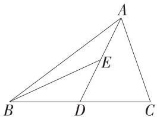

2.B 因为 $\overrightarrow{BD} = \overrightarrow{BC} +\overrightarrow{CD} = 5a + 4b + a + 2b = 6a + 6b$ ，且 $A,B,D$ 三点共线，所以存在实数 $\lambda$ ，使得 $\overrightarrow{AB} = \lambda \overrightarrow{BD}$ ，即 $a + mb = \lambda (6a + 6b)$ ，又 $\pmb {a},\pmb{b}$ 不共线，所以 $\left\{ \begin{array}{ll}1 = 6\lambda ,\\ m = 6\lambda , \end{array} \right.$ 解得 $m = 1.$ 故选B.  
3.D 因为 $a = 2c\cos B$ ，所以 $a = 2c \cdot \frac{a^2 + c^2 - b^2}{2ac}$ ，整理得 $b = c$ .

因为 $c\cos B + b\cos C = \sqrt{2} c$ ，所以 $\sin C\cos B + \sin B\cos C = \sqrt{2}\sin C,$

所以 $\sin (B + C) = \sqrt{2}\sin C$ ，即 $\sin A = \sqrt{2}\sin C$ ，所以 $a = \sqrt{2} c$

又 $a = 2c\cos B$ ，所以 $\sqrt{2} c = 2c\cos B$ ，所以 $\cos B = \frac{\sqrt{2}}{2}$

因为 $B \in (0, \pi)$ , 所以 $B = \frac{\pi}{4}$ , 所以 $C = \frac{\pi}{4}, A = \frac{\pi}{2}$ ,

故 $\triangle ABC$ 为等腰直角三角形.

故选 D.

4.D 由题意得 $a \cdot b = 1 \times 1 \times \cos \frac{\pi}{3} = \frac{1}{2}$ ,

故 $(a+2b)\cdot(a-b)=a^{2}+a\cdot b-2b^{2}=-\frac{1}{2}$ ,

$$
\left| \boldsymbol {a} + 2 \boldsymbol {b} \right| = \sqrt {\left(\boldsymbol {a} + 2 \boldsymbol {b}\right) ^ {2}} = \sqrt {\boldsymbol {a} ^ {2} + 4 \boldsymbol {a} \cdot \boldsymbol {b} + 4 \boldsymbol {b} ^ {2}} = \sqrt {7},
$$

$$
\left| \boldsymbol {a} - \boldsymbol {b} \right| = \sqrt {\left(\boldsymbol {a} - \boldsymbol {b}\right) ^ {2}} = \sqrt {\boldsymbol {a} ^ {2} - 2 \boldsymbol {a} \cdot \boldsymbol {b} + \boldsymbol {b} ^ {2}} = 1,
$$

所以 $\cos\langle\boldsymbol{a}+2\boldsymbol{b},\boldsymbol{a}-\boldsymbol{b}\rangle=\frac{(\boldsymbol{a}+2\boldsymbol{b})\cdot(\boldsymbol{a}-\boldsymbol{b})}{|\boldsymbol{a}+2\boldsymbol{b}||\boldsymbol{a}-\boldsymbol{b}|}=\frac{-\frac{1}{2}}{\sqrt{7}\times1}=-\frac{\sqrt{7}}{14}.$ 故选 D.

5.D $\because O, G, H$ 依次位于同一条直线上，且外心到重心的距离是垂心到重心距离的一半， $\therefore \overrightarrow{OG} = \frac{1}{2}\overrightarrow{GH}, \therefore \overrightarrow{OG} = \frac{1}{3}\overrightarrow{OH}, \overrightarrow{OH} = \frac{3}{2}\overrightarrow{GH}, A$ 错误，B错误；

$$
\overrightarrow {A G} = \overrightarrow {A O} + \overrightarrow {O G} = \overrightarrow {A O} + \frac {1}{3} \overrightarrow {O H} = \overrightarrow {A O} + \frac {1}{3} (\overrightarrow {A H} - \overrightarrow {A O}) = \frac {2 \overrightarrow {A O} + \overrightarrow {A H}}{3}, \mathrm{C} \text {错误};
$$

$$
\overrightarrow {B G} = \overrightarrow {B O} + \overrightarrow {O G} = \overrightarrow {B O} + \frac {1}{3} \overrightarrow {O H} = \overrightarrow {B O} + \frac {1}{3} (\overrightarrow {B H} - \overrightarrow {B O}) = \frac {2 \overrightarrow {B O} + \overrightarrow {B H}}{3}, \mathrm{D} \text {正确}.
$$

故选 D.

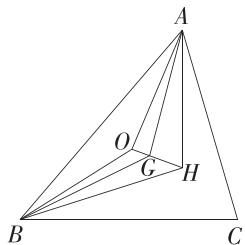

6.D 由 $\overrightarrow{OA} + 2\overrightarrow{OB} = m\overrightarrow{OC}$ 得 $\frac{1}{3}\overrightarrow{OA} +\frac{2}{3}\overrightarrow{OB} = \frac{m}{3}\overrightarrow{OC}$ 易知 $m <   0$

设 $\frac{m}{3}\overrightarrow{OC} = \overrightarrow{OD}$ ，则 $\frac{1}{3}\overrightarrow{OA} +\frac{2}{3}\overrightarrow{OB} = \overrightarrow{OD},$

$\therefore A, B, D$ 三点共线，且 $\overrightarrow{OC}, \overrightarrow{OD}$ 反向共线，如图所示，

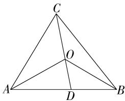

$\because \overrightarrow{OC}$ 与 $\overrightarrow{OD}$ 反向共线， $\therefore \frac{|\overrightarrow{OD}|}{|\overrightarrow{CD}|} = \frac{m}{m - 3},$

$\therefore \frac{S_{\triangle AOB}}{S_{\triangle ABC}} = \frac{|\overrightarrow{OD}|}{|\overrightarrow{CD}|} = \frac{m}{m - 3} = \frac{4}{7}$ 解得 $m = -4$

故选 D.

一题多解 奔驰定理: 已知 P 为 $\triangle ABC$ 内一点, 则有 $S_{\triangle PBC} \cdot \overrightarrow{PA} + S_{\triangle PAC}$

$$
\cdot \overrightarrow {P B} + S _ {\triangle P A B} \cdot \overrightarrow {P C} = 0.
$$

由题目条件整理可得 $\overrightarrow{OA} + 2\overrightarrow{OB} - m\overrightarrow{OC} = 0$

所以由奔驰定理可得 $S_{\triangle OAB}: S_{\triangle OAC}: S_{\triangle OBC} = -m: 2: 1$

$$
\text {即} S _ {\triangle O A B}: S _ {\triangle A B C} = - m: (- m + 3),
$$

$$
\text {所以} \frac {- m}{- m + 3} = \frac {4}{7}, \text {解得} m = - 4.
$$

7.D 设与 $\overrightarrow{DE}$ 方向相同的单位向量为i,

$$
\because \overrightarrow {A B} + \overrightarrow {B C} = \overrightarrow {A C},
$$

$$
\therefore \boldsymbol {i} \cdot (\overrightarrow {A B} + \overrightarrow {B C}) = \boldsymbol {i} \cdot \overrightarrow {A C},
$$

$$
\therefore \boldsymbol {i} \cdot \overrightarrow {A B} + \boldsymbol {i} \cdot \overrightarrow {B C} = \boldsymbol {i} \cdot \overrightarrow {A C},
$$

$$
\therefore c \cos (\pi - \theta) + a \cos (\theta - B) = b \cos [ \pi - (A + \theta) ],
$$

$$
\therefore - c \cos \theta + a \cos (B - \theta) = - b \cos (A + \theta),
$$

即 $a\cos (B - \theta) + b\cos (A + \theta) = c\cos \theta .$

故选 D.

8.D 设 AB=c, BC=a, AC=b.

$$
\because \sin B = \cos A \sin \angle A C B, \therefore \sin (A + \angle A C B) = \sin \angle A C B \cos A,
$$

即 $\sin A\cos \angle ACB + \cos A\sin \angle ACB = \sin \angle ACB\cos A$

$$
\therefore \sin A \cos \angle A C B = 0,
$$

$$
\because \sin A \neq 0, \therefore \cos \angle A C B = 0, \therefore \angle A C B = 9 0 ^ {\circ}.
$$

$$
\because \overrightarrow {A B} \cdot \overrightarrow {A C} = 9, S _ {\triangle A B C} = 6,
$$

$$
\therefore b c \cos A = 9, \frac {1}{2} b c \sin A = 6, \therefore \tan A = \frac {4}{3},
$$

根据三角形 ABC 是直角三角形可得 $\sin A=\frac{4}{5},\cos A=\frac{3}{5},\therefore bc=15,$

$$
\therefore c = 5, b = 3, a = 4.
$$

以 $C$ 为原点， $AC$ 所在直线为 $x$ 轴， $BC$ 所在直线为 $y$ 轴建立平面直角坐标系，如图，

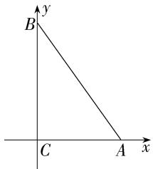

则 $C(0,0),A(3,0),B(0,4)$

$$
\therefore \overrightarrow {C A} = (3, 0), \overrightarrow {C B} = (0, 4).
$$

∵ P 为线段 AB 上一点(不含端点)，

∴ 存在实数 $\lambda$ ，使得 $\overrightarrow{CP} = \lambda \overrightarrow{CA} + (1 - \lambda) \overrightarrow{CB} = (3\lambda, 4 - 4\lambda) (0 < \lambda < 1)$ .

易得 $\frac{\overrightarrow{CA}}{|\overrightarrow{CA}|}=(1,0),\frac{\overrightarrow{CB}}{|\overrightarrow{CB}|}=(0,1)$ ,

$$
\therefore \overrightarrow {C P} = x \cdot \frac {\overrightarrow {C A}}{| \overrightarrow {C A} |} + y \cdot \frac {\overrightarrow {C B}}{| \overrightarrow {C B} |} = (x, 0) + (0, y) = (x, y),
$$

$$
\therefore x = 3 \lambda , y = 4 - 4 \lambda , \therefore 4 x + 3 y = 1 2 \text {, 且} x \in (0, 3), y \in (0, 4).
$$

$$
\text {则} \frac {1}{x} + \frac {1}{y} = \frac {1}{1 2} (4 x + 3 y) \left(\frac {1}{x} + \frac {1}{y}\right) = \frac {1}{1 2} \left(7 + \frac {3 y}{x} + \frac {4 x}{y}\right) \geqslant \frac {7}{1 2} + \frac {1}{1 2} \times 2 \sqrt {\frac {3 y}{x} \cdot \frac {4 x}{y}} =
$$

$\frac{7 + 4\sqrt{3}}{12}$ ，当且仅当 $\frac{3y}{x} = \frac{4x}{y}$ 即 $x = 12 - 6\sqrt{3}, y = 8\sqrt{3} - 12$ 时，等号成立，

故 $\frac{1}{x}+\frac{1}{y}$ 的最小值为 $\frac{7+4\sqrt{3}}{12}$ .故选D.

9.BD A 选项, $2a+b=(2n+1,3+m)=(2,6)$ ,

则 $\left\{\begin{aligned}&2n+1=2,\\ &3+m=6,\end{aligned}\right.$ 解得 $\left\{\begin{aligned}&m=3,\\ &n=\frac{1}{2},\end{aligned}\right.$ 则 $a=\left(\frac{1}{2},2\right),b=(1,2)$ ,

所以不存在实数 $\lambda$ ，使 $b = \lambda a$ ，即 a, b 不共线，A 错误；

B 选项, 若 a = -2b, 则 $\left\{\begin{aligned}n &= -2, \\ 2 &= -2(m-1),\end{aligned}\right.$ 解得 $\left\{\begin{aligned}m &= 0, \\ n &= -2,\end{aligned}\right.$

所以 $\boldsymbol{b}=(1,-1)$ , $\left|\boldsymbol{b}\right|=\sqrt{1^{2}+\left(-1\right)^{2}}=\sqrt{2}$ ,

所以与 b 同向的单位向量为 $\frac{b}{|b|}=\left(\frac{\sqrt{2}}{2},-\frac{\sqrt{2}}{2}\right)$ ，B 正确；

C 选项, 当 n=1 时, $\boldsymbol{a}=(1,2)$ , 因为 a 与 b 的夹角为锐角, 所以 $\left\{\begin{aligned}&\boldsymbol{a}\cdot\boldsymbol{b}=1\times1+2\times(m-1)>0,\\ &m-1\neq2,\end{aligned}\right.$ 解得 $m>\frac{1}{2}$ ，且 $m\neq3$ ，

故 $m$ 的取值范围为 $\left(\frac{1}{2},3\right)\cup (3, + \infty)$ ，C错误；

D 选项, 若 $a \perp b$ , 则 $a \cdot b = n + 2 (m - 1) = 2m + n - 2 = 0$ , 即 $2m + n = 2$ ,

所以 $z = 2^{n} + 4^{m} = 2^{n} + 2^{2m}\geqslant 2\sqrt{2^{n}\cdot 2^{2m}} = 2\sqrt{2^{2m + n}} = 4,$

当且仅当 $2^{n} = 2^{2m}$ ，即 $n = 2m = 1$ 时，等号成立，D正确.

故选 BD.

10.BD 对于 A, $\overrightarrow{CA} \cdot \overrightarrow{AB} = |\overrightarrow{CA}| \cdot |\overrightarrow{AB}| \cos(\pi - A) = -bc \cos A = -1$ , A 错误;

对于 B, $\left|\overrightarrow{AC}-t\overrightarrow{AB}\right|^{2}=\overrightarrow{AC}^{2}-2t\overrightarrow{AC}\cdot\overrightarrow{AB}+t^{2}\overrightarrow{AB}^{2}=b^{2}-2tbccos A+t^{2}c^{2}=4-2tc+t^{2}c^{2}=3+(1-tc)^{2}\geqslant3$ , 当且仅当 tc=1 时等号成立,

所以 $|\overrightarrow{AC} - t\overrightarrow{AB}| (t \in \mathbf{R})$ 的最小值为 $\sqrt{3}$ , B 正确;

对于C，由 $\frac{a}{\sin A} = \frac{b}{\sin B}$ 得 $\sin B = \frac{b\sin A}{a} = \frac{\sqrt{3}}{a}$ 当 $\triangle ABC$ 有两个解时，

$a < b$ 且 $0 < \frac{\sqrt{3}}{a} < 1$ ，故 $a$ 的取值范围是 $(\sqrt{3},2)$ ，C错误；

对于D，由 $A = \frac{\pi}{3}$ ，得 $C = \pi -A - B = \frac{2\pi}{3} -B$

当 $\triangle ABC$ 为锐角三角形时， $\left\{\begin{aligned}0&<B<\frac{\pi}{2},\\ 0&<\frac{2\pi}{3}-B<\frac{\pi}{2},\end{aligned}\right.$ 解得 $\frac{\pi}{6}<B<\frac{\pi}{2},$

则 $\frac{1}{2} < \sin B < 1, 1 < \frac{1}{\sin B} < 2,$

又 $a = \frac{b\sin A}{\sin B} = \frac{\sqrt{3}}{\sin B},$

所以 a 的取值范围是 $(\sqrt{3}, 2\sqrt{3})$ , D 正确.

故选 BD.

11.BCD 因为 $O$ 为外心, 所以 $OA = OB = OC$ , 所以当且仅当 $\angle AOB = \angle AOC = \angle BOC$ 时, 才有 $\overrightarrow{OA} \cdot \overrightarrow{OB} = \overrightarrow{OA} \cdot \overrightarrow{OC} = \overrightarrow{OB} \cdot \overrightarrow{OC}$ , 故 A 中结论错误;

因为 $\overrightarrow{AO} \cdot \overrightarrow{AB} = |\overrightarrow{AO}| |\overrightarrow{AB}| \cos \angle OAB, |\overrightarrow{AO}| \cos \angle OAB = \frac{|\overrightarrow{AB}|}{2},$

所以 $\overrightarrow{AO} \cdot \overrightarrow{AB} = \frac{1}{2}\overrightarrow{AB}^2$ ，故 B 中结论正确；

易得 $\left(\frac{\overrightarrow{AB}}{|\overrightarrow{AB}|\cos B} +\frac{\overrightarrow{AC}}{|\overrightarrow{AC}|\cos C}\right)\cdot \overrightarrow{BC} = \frac{\overrightarrow{AB}\cdot\overrightarrow{BC}}{|\overrightarrow{AB}|\cos B} +\frac{\overrightarrow{AC}\cdot\overrightarrow{BC}}{|\overrightarrow{AC}|\cos C}$

$$
= \frac {| \overrightarrow {A B} | | \overrightarrow {B C} | \cos (\pi - B)}{| \overrightarrow {A B} | \cos B} + \frac {| \overrightarrow {A C} | | \overrightarrow {B C} | \cos C}{| \overrightarrow {A C} | \cos C} = - | \overrightarrow {B C} | + | \overrightarrow {B C} | = 0,
$$

所以 $\frac{\overrightarrow{AB}}{|\overrightarrow{AB}|\cos B} +\frac{\overrightarrow{AC}}{|\overrightarrow{AC}|\cos C}$ 与 $\overrightarrow{BC}$ 垂直，又因为 $\overrightarrow{AH}\bot \overrightarrow{BC},$

所以 $\overrightarrow{AH}$ 与 $\frac{\overrightarrow{AB}}{|\overrightarrow{AB}|\cos B} +\frac{\overrightarrow{AC}}{|\overrightarrow{AC}|\cos C}$ 共线，故C中结论正确；

如图,取 BC 的中点 D, 连接 AD, 则 G 为 AD 上靠近 D 的三等分点,

所以 $\overrightarrow{AG} = \frac{2}{3}\overrightarrow{AD} = \frac{1}{3} (\overrightarrow{AB} +\overrightarrow{AC}) = \frac{1}{3\lambda}\overrightarrow{AE} +\frac{1}{3\mu}\overrightarrow{AF},$

因为 $E, G, F$ 三点共线，所以 $\frac{1}{3\lambda} + \frac{1}{3\mu} = 1$ ，故 $\frac{1}{\lambda} + \frac{1}{\mu} = 3$ ，故D中结论正确.

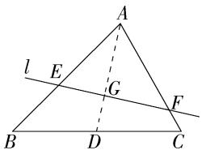

故选 BCD.

12. 答案 $\frac{5\pi}{6}$

解析 因为 $\overrightarrow{AB} \cdot \overrightarrow{AC} = |\overrightarrow{AB}| |\overrightarrow{AC}| \cos \angle BAC < 0$ ，所以 $\angle BAC > \frac{\pi}{2}$ ，

因为 $S_{\triangle ABC} = \frac{1}{2} |\overrightarrow{AB}| \cdot |\overrightarrow{AC}|\sin \angle BAC = \frac{1}{2}\times 3\times 5\sin \angle BAC = \frac{15}{4},$

所以 $\sin \angle BAC = \frac{1}{2}$ 故 $\angle BAC = \frac{5\pi}{6}$ .

13. 答案 16

解析 因为 $\overrightarrow{BD} = \frac{1}{3}\overrightarrow{BC}$ , 所以 $\overrightarrow{CB} = \frac{3}{2}\overrightarrow{CD}$ ,

因为 $\overrightarrow{CE} = x\overrightarrow{CA} +y\overrightarrow{CB}$

所以 $\overrightarrow{CE} = x\overrightarrow{CA} +\frac{3}{2} y\overrightarrow{CD},$

又因为 $A, D, E$ 三点共线，

所以 $x + \frac{3}{2} y = 1, x > 0, y > 0$

则 $\frac{6x + y}{xy} = \frac{6}{y} +\frac{1}{x} = \left(\frac{6}{y} +\frac{1}{x}\right)\left(x + \frac{3}{2} y\right) = \frac{6x}{y} +\frac{3y}{2x} +10\geqslant 2\sqrt{\frac{6x}{y}\cdot\frac{3y}{2x}} +10 = 16,$

当且仅当 $\left\{\begin{aligned}\frac{6x}{y}&=\frac{3y}{2x},\\ x+\frac{3}{2}y&=1,\end{aligned}\right.$ 即 $\left\{\begin{aligned}x&=\frac{1}{4},\\ y&=\frac{1}{2}\end{aligned}\right.$ 时,等号成立,

所以 $\frac{6x + y}{xy}$ 的最小值是16.

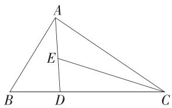

14. 答案 $\left(1, \frac{2\sqrt{3}}{3}\right)$

解析 因为 $b^{2} - a^{2} = ac, b^{2} = a^{2} + c^{2} - 2ac\cos B$ ，所以 $ac = c^{2} - 2ac\cos B$ ，所以 $a = c - 2ac\cos B$ ，

由正弦定理得 $\sin A = \sin C - 2\sin A\cos B$

即 $\sin A = \sin (A + B) - 2\sin A\cos B = \sin A\cos B + \cos A\sin B - 2\sin A\cos B =$ $\cos A\sin B - \sin A\cos B = \sin (B - A),$

因为 $\triangle ABC$ 为锐角三角形，

所以 $A, B \in \left(0, \frac{\pi}{2}\right)$ , 所以 $B - A \in \left(-\frac{\pi}{2}, \frac{\pi}{2}\right)$ , 所以 $A = B - A$ ,

所以 $B = 2A, C = \pi - 3A$ .

由 $A, B, C \in \left(0, \frac{\pi}{2}\right)$ , 可得 $A \in \left(\frac{\pi}{6}, \frac{\pi}{4}\right)$ , 故 $B \in \left(\frac{\pi}{3}, \frac{\pi}{2}\right)$ .

$$
\frac {1}{\tan A} - \frac {1}{\tan B} = \frac {\cos A}{\sin A} - \frac {\cos B}{\sin B} = \frac {\sin B \cos A - \cos B \sin A}{\sin A \sin B} = \frac {\sin (B - A)}{\sin A \sin B} =
$$

$$
\frac {\sin A}{\sin A \sin B} = \frac {1}{\sin B},
$$

易得 $\sin B\in \left(\frac{\sqrt{3}}{2},1\right)$ ，所以 $\frac{1}{\tan A} -\frac{1}{\tan B}\in \left(1,\frac{2\sqrt{3}}{3}\right).$

15. 解析 (1) 在 $\triangle ABC$ 中, 由 $\cos C = -\frac{\sqrt{3}}{3}$ , 可得 $\sin C = \sqrt{1 - \cos^2 C} = \frac{\sqrt{6}}{3}$ . (3 分)

由 $\frac{c}{\sin C} = \frac{b}{\sin B}$ 及 $b = \sqrt{2}, c = 2$ ，可得 $\sin B = \frac{\sqrt{3}}{3}$ . (6分)

由余弦定理得 $c^{2}=a^{2}+b^{2}-2ab\cos C$ ，即 $4=a^{2}+2+\frac{2\sqrt{6}}{3}a$ ，整理得 $3a^{2}+2\sqrt{6}a-6=0$ ，(9分)

由 $a > 0$ ，解得 $a = \frac{\sqrt{6}}{3}$ （10分）

(2)由(1)知 $a = \frac{\sqrt{6}}{3},\sin C = \frac{\sqrt{6}}{3},$

所以 $S_{\triangle ABC} = \frac{1}{2} ab\sin C = \frac{1}{2}\times \frac{\sqrt{6}}{3}\times \sqrt{2}\times \frac{\sqrt{6}}{3} = \frac{\sqrt{2}}{3}.$ (13分)

16. 解析 解法一: (1) ∵ M 为 BC 边上靠近 B 的四等分点,

$$
\therefore \overrightarrow {B M} = \frac {1}{4} \overrightarrow {B C} = \frac {1}{4} \overrightarrow {A C} - \frac {1}{4} \overrightarrow {A B}. \tag {2分}
$$

$$
\therefore \overrightarrow {A M} = \overrightarrow {A B} + \overrightarrow {B M} = \frac {1}{4} \overrightarrow {A C} + \frac {3}{4} \overrightarrow {A B}, \tag {4分}
$$

$$
\therefore \overrightarrow {A M} ^ {2} = \left(\frac {1}{4} \overrightarrow {A C} + \frac {3}{4} \overrightarrow {A B}\right) ^ {2} = \frac {1}{1 6} \overrightarrow {A C} ^ {2} + \frac {3}{8} \overrightarrow {A C} \cdot \overrightarrow {A B} + \frac {9}{1 6} \overrightarrow {A B} ^ {2},
$$

$$
\because A B = 2, A C = 6, \angle B A C = 6 0 ^ {\circ}, \therefore \overrightarrow {A C} \cdot \overrightarrow {A B} = 6,
$$

$$
\therefore \overrightarrow {A M ^ {2}} = \frac {1}{1 6} \times 6 ^ {2} + \frac {3}{8} \times 6 + \frac {9}{1 6} \times 2 ^ {2}, \therefore A M = \frac {3 \sqrt {3}}{2}. \tag {7分}
$$

(2) 易知 $\angle NPM$ 为向量 $\overrightarrow{AM}$ 与 $\overrightarrow{BN}$ 的夹角, $\therefore \cos \angle NPM = \frac{\overrightarrow{AM} \cdot \overrightarrow{BN}}{|\overrightarrow{AM}| |\overrightarrow{BN}|}$ .

∵ AC 边上的中线为 BN, ∴ $\overrightarrow{BN} = \overrightarrow{AN} - \overrightarrow{AB} = \frac{1}{2} \overrightarrow{AC} - \overrightarrow{AB}$ , (9 分)

$$
\therefore | \overrightarrow {B N} | ^ {2} = \left(\frac {1}{2} \overrightarrow {A C} - \overrightarrow {A B}\right) ^ {2} = \frac {1}{4} \overrightarrow {A C} ^ {2} + \overrightarrow {A B} ^ {2} - \overrightarrow {A C} \cdot \overrightarrow {A B} = \frac {1}{4} \times 6 ^ {2} + 2 ^ {2} - 6 = 7,
$$

$$
\therefore B N = \sqrt {7}. \tag {12分}
$$

$$
\because \overrightarrow {A M} = \frac {1}{4} \overrightarrow {A C} + \frac {3}{4} \overrightarrow {A B}, \overrightarrow {B N} = \frac {1}{2} \overrightarrow {A C} - \overrightarrow {A B},
$$

$$
\therefore \overrightarrow {A M} \cdot \overrightarrow {B N} = \left(\frac {1}{4} \overrightarrow {A C} + \frac {3}{4} \overrightarrow {A B}\right) \cdot \left(\frac {1}{2} \overrightarrow {A C} - \overrightarrow {A B}\right) = \frac {1}{8} \overrightarrow {A C ^ {2}} - \frac {3}{4} \overrightarrow {A B ^ {2}} + \frac {1}{8} \overrightarrow {A C} \cdot \overrightarrow {A B} =
$$

$$
\frac {9}{4}, \tag {14分}
$$

$$
\therefore \cos \angle N P M = \frac {\overrightarrow {A M} \cdot \overrightarrow {B N}}{| \overrightarrow {A M} | | \overrightarrow {B N} |} = \frac {\frac {9}{4}}{\frac {3 \sqrt {3}}{2} \times \sqrt {7}} = \frac {\sqrt {2 1}}{1 4}. \tag {15分}
$$

解法二:(1)以点 A 为坐标原点建立如图所示的平面直角坐标系,

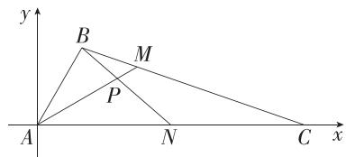

则 $A(0,0),B(1,\sqrt{3}),C(6,0)$

∵ AC 边上的中线为 BN, ∴ $N(3,0)$ , (3 分)

∵ M 为 BC 边上靠近 B 的四等分点, ∴ $M\left(\frac{9}{4}, \frac{3\sqrt{3}}{4}\right)$ . (6 分)

设 $\overrightarrow{AM} = x\overrightarrow{AC} +y\overrightarrow{AB} (x,y\in \mathbf{R})$ ，则 $\left(\frac{9}{4},\frac{3\sqrt{3}}{4}\right) = x(6,0) + y(1,\sqrt{3})$ ，所以

$$
\left\{ \begin{array}{l} 6 x + y = \frac {9}{4}, \\ \sqrt {3}   y = \frac {3 \sqrt {3}}{4}, \end{array} \text {解得} \left\{ \begin{array}{l} x = \frac {1}{4}, \\ y = \frac {3}{4}, \end{array} \right. \text {所以} \overrightarrow {A M} = \frac {1}{4} \overrightarrow {A C} + \frac {3}{4} \overrightarrow {A B}, \right.
$$

$$
| \overrightarrow {A M} | = \sqrt {\left(\frac {9}{4}\right) ^ {2} + \left(\frac {3 \sqrt {3}}{4}\right) ^ {2}} = \frac {3 \sqrt {3}}{2}, \text {即} A M \text {的长为} \frac {3 \sqrt {3}}{2}. \tag {9分}
$$

(2) 易知 $\angle NPM$ 为向量 $\overrightarrow{AM}$ 与 $\overrightarrow{BN}$ 的夹角, $\therefore \cos \angle NPM = \frac{\overrightarrow{AM} \cdot \overrightarrow{BN}}{|\overrightarrow{AM}| |\overrightarrow{BN}|}$ ,

$$
\text {易知} \overrightarrow {A M} = \left(\frac {9}{4}, \frac {3 \sqrt {3}}{4}\right), \overrightarrow {B N} = (2, - \sqrt {3}), \tag {12分}
$$

$$
\text {则} \overrightarrow {A M} \cdot \overrightarrow {B N} = \frac {9}{4} \times 2 + \frac {3 \sqrt {3}}{4} \times (- \sqrt {3}) = \frac {9}{4}, | \overrightarrow {B N} | = \sqrt {7}, \tag {14分}
$$

$$
\text {故} \cos \angle N P M = \frac {\overrightarrow {A M} \cdot \overrightarrow {B N}}{| \overrightarrow {A M} | | \overrightarrow {B N} |} = \frac {\frac {9}{4}}{\frac {3 \sqrt {3}}{2} \times \sqrt {7}} = \frac {\sqrt {2 1}}{1 4}. \tag {15分}
$$

17. 解析 (1) 因为 $2\cos A\cos C = \frac{\tan B}{\tan A + \tan C}$ ,

所以 $2\cos A\cos C\left(\frac{\sin A}{\cos A} +\frac{\sin C}{\cos C}\right) = \frac{\sin B}{\cos B},$

即 $2\cos C\sin A + 2\cos A\sin C = \frac{\sin B}{\cos B},$

所以 $2\sin (A + C) = \frac{\sin B}{\cos B},$ (4分)

又 $\sin (A + C) = \sin B$ ，且 $\sin B\neq 0$ ，所以 $\cos B = \frac{1}{2}$ （7分）

因为 $B \in (0, \pi)$ , 所以 $B = \frac{\pi}{3}$ . (9 分)

(2)由余弦定理的推论得 $\cos B = \frac{a^2 + c^2 - b^2}{2ac} = \frac{(a + c)^2 - 2ac - b^2}{2ac},$

$$
\text { 即 } \frac {(a + c) ^ {2} - 2 a c - 4}{2 a c} = \frac {1}{2}, \text { 故 } (a + c) ^ {2} - 4 = 3 a c, \tag {12分}
$$

因为 $ac \leqslant \frac{1}{4} (a + c)^2$ ，所以 $(a + c)^2 - 4 \leqslant \frac{3}{4} (a + c)^2$ ，解得 $0 < a + c \leqslant 4$

当且仅当 $a = c = 2$ 时，等号成立，

故 $a + c$ 的最大值为4. (15分)

18. 解析 （1）连接 $ST, RP$ ，如图，在四边形 $RSPT$ 中， $\angle PSR = 90^\circ, \angle PTR = 90^\circ, \angle SPT = 120^\circ$ ，则 $\angle SRT = 60^\circ$ ，

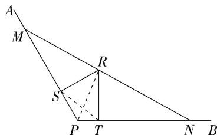

text_image

A
M
R
S
P T N B

在 $\triangle RST$ 中，由余弦定理知 $ST^2 = RS^2 + RT^2 - 2RS \cdot RT\cos \angle SRT = 4^2 + 6^2 - 2 \times 4 \times 6 \times \cos 60^\circ = 28$

$$
\therefore S T = 2 \sqrt {7}, \tag {3分}
$$

$$
\therefore \cos \angle S T R = \frac {S T ^ {2} + R T ^ {2} - R S ^ {2}}{2 S T \cdot R T} = \frac {2 8 + 3 6 - 1 6}{2 \times 2 \sqrt {7} \times 6} = \frac {2 \sqrt {7}}{7}. \tag {5分}
$$

$$
\because \angle P T S + \angle S T R = 9 0 ^ {\circ},
$$

$$
\therefore \sin \angle P T S = \cos \angle S T R = \frac {2 \sqrt {7}}{7}. \tag {7分}
$$

在 $\triangle PST$ 中，由正弦定理知 $\frac{SP}{\sin\angle PTS} = \frac{ST}{\sin\angle SPT}$ 即 $\frac{SP}{\frac{2\sqrt{7}}{7}} = \frac{2\sqrt{7}}{\sin 120^\circ},$

$$
\therefore S P = \frac {8 \sqrt {3}}{3}.
$$

在 Rt△SPR 中， $PR^{2}=RS^{2}+SP^{2}=4^{2}+\left(\frac{8\sqrt{3}}{3}\right)^{2}=\frac{112}{3}$

$\therefore PR = \frac{4\sqrt{21}}{3},\therefore$ 点 $P$ 到点 $R$ 的距离为 $\frac{4\sqrt{21}}{3}$ （9分）

(2)由三角形面积公式知 $S_{\triangle PMN}=\frac{1}{2}PM\cdot PN\cdot \sin120^{\circ}=\frac{\sqrt{3}}{4}PM\cdot PN.$ (12 分)

$$
\text {又} S _ {\triangle P M N} = S _ {\triangle P R M} + S _ {\triangle P R N} = \frac {1}{2} P M \cdot R S + \frac {1}{2} P N \cdot R T
$$

$$
= \frac {1}{2} P M \times 4 + \frac {1}{2} P N \times 6 = 2 P M + 3 P N,
$$

$$
\therefore \frac {\sqrt {3}}{4} P M \cdot P N = 2 P M + 3 P N \geqslant 2 \sqrt {6 P M \cdot P N},
$$

∴ $PM \cdot PN \geqslant 128$ ，当且仅当 $2PM = 3PN$ ，即 $PM = 8\sqrt{3}$ ， $PN = \frac{16\sqrt{3}}{3}$ 时，等号成立，(15 分)

$$
\therefore S _ {\triangle P M N} = \frac {\sqrt {3}}{4} P M \cdot P N \geqslant \frac {\sqrt {3}}{4} \times 1 2 8 = 3 2 \sqrt {3},
$$

故当 $PM$ 为 $8\sqrt{3}$ 时，三角形 $PMN$ 的面积最小，最小面积为 $32\sqrt{3}$ . (17分)

19. 解析 (1) $g(x) = \sin \left( x + \frac{5\pi}{6} \right) - \sin \left( \frac{3\pi}{2} - x \right) = \sin x \cos \frac{5\pi}{6} + \cos x \sin \frac{5\pi}{6} + \cos x = -\frac{\sqrt{3}}{2} \sin x + \frac{3}{2} \cos x,$

∴ $g(x)$ 的相伴特征向量 $\overrightarrow{OM} = \left(-\frac{\sqrt{3}}{2}, \frac{3}{2}\right)$ . (2 分)

(2) 向量 $\overrightarrow{ON} = (1, \sqrt{3})$ 的相伴函数为 $f(x) = \sin x + \sqrt{3} \cos x$ ,

令 $f(x) = \sin x + \sqrt{3}\cos x = \frac{8}{5}$ 即 $2\sin \left(x + \frac{\pi}{3}\right) = \frac{8}{5},\therefore \sin \left(x + \frac{\pi}{3}\right) = \frac{4}{5}.$

$$
\because x \in \left(- \frac {\pi}{3}, \frac {\pi}{6}\right),
$$

$$
\therefore x + \frac {\pi}{3} \in \left(0, \frac {\pi}{2}\right), \therefore \cos \left(x + \frac {\pi}{3}\right) = \frac {3}{5},
$$

$$
\therefore \sin x = \sin \left[ \left(x + \frac {\pi}{3}\right) - \frac {\pi}{3} \right] = \frac {1}{2} \sin \left(x + \frac {\pi}{3}\right) - \frac {\sqrt {3}}{2} \cos \left(x + \frac {\pi}{3}\right) = \frac {4 - 3 \sqrt {3}}{1 0}. \tag {5分}
$$

(3) 假设存在满足条件的点 P.

$\because h(x)=m\sin\left(x-\frac{\pi}{6}\right)=\frac{\sqrt{3}}{2}m\sin x-\frac{1}{2}m\cos x,\overrightarrow{OT}=(-\sqrt{3},1)$ 为 $h(x)$ 的相伴特征向量，∴ m=-2，

$$
\therefore \varphi (x) = h \left(\frac {x}{2} - \frac {\pi}{3}\right) = - 2 \sin \left[ \left(\frac {x}{2} - \frac {\pi}{3}\right) - \frac {\pi}{6} \right] = - 2 \sin \left(\frac {x}{2} - \frac {\pi}{2}\right) = 2 \cos \frac {x}{2}. \tag {7分}
$$

设 $P\left(x,2\cos \frac{x}{2}\right)$

$$
\because A (- 2, 3), B (2, 6),
$$

$$
\therefore \overrightarrow {A P} = (x + 2, 2 \cos \frac {x}{2} - 3), \overrightarrow {B P} = (x - 2, 2 \cos \frac {x}{2} - 6),
$$

$$
\because \overrightarrow {A P} \perp \overrightarrow {B P}, \therefore \overrightarrow {A P} \cdot \overrightarrow {B P} = 0,
$$

$$
\therefore (x + 2) (x - 2) + \left(2 \cos \frac {x}{2} - 3\right) \left(2 \cos \frac {x}{2} - 6\right) = 0,
$$

即 $x^{2} - 4 + 4\cos^{2}\frac{x}{2} -18\cos \frac{x}{2} +18 = 0,$ (9分）

$$
\therefore \left(2 \cos \frac {x}{2} - \frac {9}{2}\right) ^ {2} = \frac {2 5}{4} - x ^ {2},
$$

$$
\because - 2 \leqslant 2 \cos \frac {x}{2} \leqslant 2,
$$

$$
\therefore - \frac {1 3}{2} \leqslant 2 \cos \frac {x}{2} - \frac {9}{2} \leqslant - \frac {5}{2},
$$

$$
\therefore \frac {2 5}{4} \leqslant \left(2 \cos \frac {x}{2} - \frac {9}{2}\right) ^ {2} \leqslant \frac {1 6 9}{4}.
$$

又∵ $\frac{25}{4}-x^{2}\leqslant\frac{25}{4}$ ，当且仅当x=0时，等号成立，

$$
\therefore x = 0.
$$

∴ 在 $y=\varphi(x)$ 的图象上存在点 $P(0,2)$ ，使得 $\overrightarrow{AP} \perp \overrightarrow{BP}$ . (17 分)

# 第七章 复数

<table><tr><td>1.A</td><td>2.D</td><td>3.D</td><td>4.B</td><td>5.D</td><td>6.B</td></tr><tr><td>7.A</td><td>8.D</td><td>9.CD</td><td>10.BD</td><td>11.ACD</td><td></td></tr></table>

1.A $z=\frac{1+3i}{2+i}=\frac{(1+3i)(2-i)}{(2+i)(2-i)}=1+i$ ，所以 $z=\frac{1+3i}{2+i}$ 的实部和虚部分别是 1,1，
故选 A.

2.D 由题意得 $z = \frac{2 + 3\mathrm{i}}{\mathrm{i}} = -(2 + 3\mathrm{i})\mathrm{i} = 3 - 2\mathrm{i}$ ，其在复平面内对应的点为（3，-2），位于第四象限.

故选 D.

3. D 由 $-a + b\mathrm{i} = 2b - \mathrm{i}, a, b \in \mathbf{R}$ , 可得 $\left\{ \begin{array}{l} -a = 2b, \\ b = -1, \end{array} \right.$ 所以 $\left\{ \begin{array}{l} a = 2, \\ b = -1, \end{array} \right.$

则 $|a-b\mathrm{i}|=|2+\mathrm{i}|=\sqrt{5}$ .

故选 D.

4.B 因为 $(z+2i)(2-i)=5$ ，所以 $z=\frac{5}{2-i}-2i=\frac{5(2+i)}{(2-i)(2+i)}-2i=2+i-2i=2-i$ ，所以 $\bar{z}=2+i$ 。故选 B.

5.D 由 $1 - \mathrm{i}$ 是关于 $x$ 的方程 $x^{2} - mx + n = 0$ 的一个根，可得方程的另一个根为 $1 + \mathrm{i}$ ，则 $m = 1 - \mathrm{i} + 1 + \mathrm{i} = 2, n = (1 - \mathrm{i})(1 + \mathrm{i}) = 2$ ，所以 $m + n = 4$ ，故选D.

6.B 因为 $i \cdot z = 2022 + i^{2023} = 2022 + i^{3} = 2022 - i$ ,
所以 $z=\frac{2022-i}{i}=-1-2022i$ ，所以 $\bar{z}=-1+2022$

所以 $z - \bar{z} = -1 - 2022\mathrm{i} - (-1 + 2022\mathrm{i}) = -4044\mathrm{i}$

所以 $|z - \bar{z}| = |-4044\mathrm{i}| = 4044.$

故选 B.

7.A 设 $z = a + bi, a, b \in \mathbf{R}$ , 且 $a, b$ 不同时为 0,

当 $|z|=\sqrt{a^{2}+b^{2}}=1$ 时, $a^{2}+b^{2}=1$ ,

则 $z + \frac{1}{z} = a + bi + \frac{1}{a + bi} = a + bi + \frac{a - bi}{a^2 + b^2} = 2a\in \mathbf{R}$ ，故充分性成立；

取 $z = 2$ ，则 $z + \frac{1}{z} = \frac{5}{2}\in \mathbf{R}$ ，但 $|z| = 2$ ，故必要性不成立.

综上所述，“ $|z| = 1$ ”是“ $z + \frac{1}{z}\in \mathbf{R}$ ”的充分不必要条件.

故选 A.

8.D 因为 $|z_{1} + z_{2}|^{2} = (z_{1} + z_{2})\cdot \overline{z_{1} + z_{2}} = (z_{1} + z_{2})\cdot (\bar{z}_{1} + \bar{z}_{2})$ ，且 $|z_1 + z_2| = 4,|z_1|$ $= 3$

所以 $|z_{1} + z_{2}|^{2} = z_{1}\overline{z}_{1} + z_{1}\overline{z}_{2} + \overline{z}_{1}z_{2} + z_{2}\overline{z}_{2} = 9 + |z_{2}|^{2} + z_{1}\overline{z}_{2} + \overline{z}_{1}z_{2} = 16$ ，

所以 $|z_{2}|^{2}+z_{1}\bar{z}_{2}+\bar{z}_{1}z_{2}=7①$ ,

因为 $|z_{1}-z_{2}|^{2}=(z_{1}-z_{2})\cdot\overline{z_{1}-z_{2}}=(z_{1}-z_{2})\cdot(\bar{z}_{1}-\bar{z}_{2})$ ，且 $|z_{1}-z_{2}|=\sqrt{10}$

所以 $|z_{1} - z_{2}|^{2} = z_{1}\overline{z}_{1} - z_{1}\overline{z}_{2} - \overline{z}_{1}z_{2} + z_{2}\overline{z}_{2} = 9 + |z_{2}|^{2} - z_{1}\overline{z}_{2} - \overline{z}_{1}z_{2} = 10,$

所以 $|z_{2}|^{2}-z_{1}\bar{z}_{2}-\bar{z}_{1}z_{2}=1②$ ,

联立①②可得 $|z_{2}|^{2}=4,|z_{2}|=2$ ，所以 $|z_{1}\cdot z_{2}|=|z_{1}|\cdot|z_{2}|=3\times2=6.$

故选 D.

9.CD 由 $z(2 - \mathrm{i}) = \mathrm{i}^{2020}$ ，得 $z = \frac{(\mathrm{i}^2)^{1010}}{2 - \mathrm{i}} = \frac{2 + \mathrm{i}}{(2 - \mathrm{i})(2 + \mathrm{i})} = \frac{2 + \mathrm{i}}{5} = \frac{2}{5} +\frac{1}{5}\mathrm{i},$

$\therefore |z| = \sqrt{\left(\frac{2}{5}\right)^2 + \left(\frac{1}{5}\right)^2} = \frac{\sqrt{5}}{5}$ , 故 A 错误;

复数 z 的共轭复数为 $\frac{2}{5}-\frac{1}{5}i$ ，故 B 错误；

复数 z 的虚部为 $\frac{1}{5}$ ，故 C 正确；

复数 z 在复平面内对应的点为 $\left(\frac{2}{5}, \frac{1}{5}\right)$ ，位于第一象限，故 D 正确.

故选 CD.

10.BD 对于 A, 因为 $i^{2} = -1$ , 所以 $i^{4} = 1$ , 所以 $i^{2024} = (i^{4})^{506} = 1$ , A 错误;
对于 B, 设 $z = x + yi (x, y \in \mathbb{R})$ ，由 $|z| = 1$ ，得 $\sqrt{x^{2} + y^{2}} = 1$ ，所以 $x^{2} + y^{2} = 1$ ，故 $|z - 2| = \sqrt{(x - 2)^{2} + y^{2}} = \sqrt{(x - 2)^{2} + 1 - x^{2}} = \sqrt{-4x + 5}$

由 $x^{2} + y^{2} = 1$ ，得 $-1\leqslant x\leqslant 1$ ，则 $1\leqslant -4x + 5\leqslant 9$

故当 $x = 1$ 时， $|z - 2|$ 取得最小值1，B正确；

对于 C, 设复数 $z = a + bi (a, b \in \mathbf{R})$ ,

则 $z^2 = (a + b\mathrm{i})^2 = a^2 -b^2 +2ab\mathrm{i},|z|^2 = a^2 +b^2,\mathrm{C}$ 错误；

对于 D, 因为 $-4+3i$ 是关于 x 的方程 $x^{2}+px+q=0(p,q\in\mathbf{R})$ 的根，

所以 $(-4 + 3\mathrm{i})^2 +p(-4 + 3\mathrm{i}) + q = 0(p,q\in \mathbf{R})$ ，即 $7 - 4p + q + (3p - 24)\mathrm{i} = 0$

故 $\left\{\begin{aligned}7-4p+q&=0,\\ 3p-24&=0,\end{aligned}\right.$ 所以 $\left\{\begin{aligned}p&=8,\\ q&=25,\end{aligned}\right.$ D正确.故选BD.

11.ACD 对于 A, 设 $z = x + yi (x, y \in \mathbf{R})$ ，则 $z \cdot \bar{z} = (x + yi)(x - yi) = x^{2} + y^{2} = |z|^{2}$ ，故 A 正确；

对于 B, 令 z=i, 满足 $\left|z\right|=\left|i\right|=1$ , 故 B 错误;

对于 C, 设 $z_{1}=a+bi(a,b\in\mathbf{R})$ , $z_{2}=c+di(c,d\in\mathbf{R})$ ，则 $z_{1}z_{2}=(a+bi)(c+di)=ac-bd+(ad+bc)i$ ，所以 $\left|z_{1}z_{2}\right|=\sqrt{(ac-bd)^{2}+\left(ad+bc\right)^{2}}=\sqrt{(ac)^{2}+\left(bd\right)^{2}+\left(ad\right)^{2}+\left(bc\right)^{2}}=\sqrt{a^{2}+b^{2}}\cdot\sqrt{c^{2}+d^{2}}=\left|z_{1}\right|\left|z_{2}\right|$ ，故 C 正确；

对于 D, $|z-1|=1$ 表示复数 z 对应的点在以 $(1,0)$ 为圆心, 1 为半径的圆上, $|z+1|$ 表示圆上的点到 $(-1,0)$ 的距离, 故 $|z+1|$ 的最小值为点 $(-1,0)$ 到圆心 $(1,0)$ 的距离减去半径, 即为 2-1=1, 故 D 正确.

12. 答案 $2 \sqrt{2}$

解析 $|z| = \sqrt{(a - 1)^2 + (a + 3)^2} = \sqrt{a^2 - 2a + 1 + a^2 + 6a + 9} = \sqrt{2(a + 1)^2 + 8} \geqslant 2\sqrt{2}$ , 当且仅当 $a = -1$ 时取等号,

所以 $|z|$ 的最小值为 $2\sqrt{2}$ .

13. 答案 -i

解析 因为 $a = \frac{1 + \mathrm{i}}{1 - \mathrm{i}} = \frac{(1 + \mathrm{i})^2}{(1 - \mathrm{i})(1 + \mathrm{i})} = \mathrm{i},$

所以 $a^{2022} + a^{2023} + 1 = \mathrm{i}^{2022} + \mathrm{i}^{2023} + 1 = \mathrm{i}^{4\times 505 + 2} + \mathrm{i}^{4\times 505 + 3} + 1 = -1 - \mathrm{i} + 1 = -\mathrm{i}.$

14. 答案 1-i

解析 因为 $\frac{z}{2 - z}$ 为纯虚数, 所以可设 $\frac{z}{2 - z} = a\mathrm{i}(a \in \mathbf{R},$ 且 $a \neq 0)$ ,

则 $z = \frac{2ai}{1 + ai}, z + 2i = \frac{-2a + (2a + 2)i}{1 + ai}$ ,

因为 $|z| = |z + 2i|$ ,

所以 $\frac{|2ai|}{|1 + ai|} = \frac{| - 2a + (2a + 2)i|}{|1 + ai|}$

所以 $2|a| = \sqrt{(-2a)^2 + (2a + 2)^2}$ , 解得 $a = -1$ ,

所以 $z=\frac{-2i}{1-i}=1-i.$

15. 解析 (1) 由已知得 $z = (2m^2 - m - 3) + (-m^2 - 3m + 1)\mathrm{i}$ , (3 分)

若 z 为纯虚数, 则 $\left\{\begin{aligned}&2m^{2}-m-3=0,\\ &-m^{2}-3m+1\neq0,\end{aligned}\right.$ (6 分)

解得 m = -1 或 $m = \frac{3}{2}$ . (7 分)

(2) 当 $m = 2$ 时, $z = 3 - 9\mathrm{i}$ , 则 $\bar{z} = 3 + 9\mathrm{i}$ , (9 分)

所以 $z \cdot \bar{z} = (3 - 9\mathrm{i}) \cdot (3 + 9\mathrm{i}) = 3^2 - 81\mathrm{i}^2 = 9 + 81 = 90.$ (13分)

16. 解析 (1) 因为 $z = b\mathrm{i}(b \in \mathbf{R})$

所以 $\frac{z+3}{1-i}=\frac{3+bi}{1-i}=\frac{(3+bi)(1+i)}{2}=\frac{3-b+(b+3)i}{2},$ (2分)

因为 $\frac{z + 3}{1 - \mathrm{i}}$ 是实数，所以 $\frac{b + 3}{2} = 0$ ，解得 $b = -3$

故 $z = -3\mathrm{i}$ (5分）

(2)由(1)可知 $z = -3\mathrm{i}$

所以 $w=z^{2}+\bar{z}+5=(-3i)^{2}+3i+5=-4+3i$ ，(7分)

则 $|w| = |-4 + 3i| = \sqrt{(-4)^2 + 3^2} = 5.$ (9分)

(3) 因为 z = -3i,

所以 $(m - z)^2 - 8m = (m + 3\mathrm{i})^2 - 8m = m^2 - 8m - 9 + 6mi.$ (12分)

因为复数 $(m - z)^2 - 8m$ 对应的点位于第二象限，

所以 $\left\{\begin{aligned}m^{2}-8m-9<0,\\ 6m>0,\end{aligned}\right.$ 解得0<m<9,

所以实数 $m$ 的取值范围是(0,9). (15分)

17. 解析 (1) 因为 $z_{1} = (a + \mathrm{i})^{2} = a^{2} - 1 + 2a\mathrm{i}$ ,

所以复数 $z_{1}$ 在复平面内对应的点为 $(a^{2} - 1,2a)$ ，（4分）

因为该点位于第二象限,所以 $\left\{\begin{aligned}a^{2}-1&<0,\\ 2a&>0,\end{aligned}\right.$ 所以0<a<1,

故 $a$ 的取值范围为 $(0,1)$ . (7分)

(2) 因为 a=2，所以 $\frac{z_{1}}{z_{2}}=\frac{3+4i}{4-3i}=\frac{(3+4i)(4+3i)}{(4-3i)(4+3i)}=\frac{12+9i+16i-12}{25}=i$ ，
(11 分)

所以 $\frac{z_1}{z_2} +\left(\frac{z_1}{z_2}\right)^2 +\left(\frac{z_1}{z_2}\right)^3 +\dots +\left(\frac{z_1}{z_2}\right)^{2022}$

$$
= \mathrm{i} + \mathrm{i} ^ {2} + \mathrm{i} ^ {3} + \dots + \mathrm{i} ^ {2 0 2 2}
$$

$$
= \left(\mathrm{i} + \mathrm{i} ^ {2} + \mathrm{i} ^ {3} + \mathrm{i} ^ {4}\right) + \dots + \left(\mathrm{i} ^ {2 0 1 7} + \mathrm{i} ^ {2 0 1 8} + \mathrm{i} ^ {2 0 1 9} + \mathrm{i} ^ {2 0 2 0}\right) + \mathrm{i} ^ {2 0 2 1} + \mathrm{i} ^ {2 0 2 2}
$$

$$
= 0 + \mathrm{i} + \mathrm{i} ^ {2}
$$

$= -1 + \mathrm{i}$ (15分）

18. 解析 (1) 因为 $\Delta = 1^{2} - 4 \times 1 \times 1 = -3 < 0$ ,

所以方程 $x^{2} + x + 1 = 0$ 的根为 $x = -\frac{1}{2}\pm \frac{\sqrt{3}}{2}\mathrm{i}.$ (4分)

(2) 因为 $x^{2}+x+1=0$ ，所以 $x^{2}=-x-1$ ，

则 $x(x - 1) = x^2 - x = -2x - 1$ ， (7分)

由(1)知 $x=-\frac{1}{2}\pm\frac{\sqrt{3}}{2}i$ ,

故 $x(x - 1) = -2 \times \left(-\frac{1}{2} \pm \frac{\sqrt{3}}{2}\mathrm{i}\right) - 1 = \pm \sqrt{3}\mathrm{i}.$ (10分)

(3) 因为 $x^{2} + x + 1 = 0$ ，所以 $x + 1 = -x^{2}$ ， (13 分)

所以 $\left(\frac{x}{x + 1}\right)^{2024} + \left(\frac{1}{x + 1}\right)^{2024} = \left(-\frac{x}{x^2}\right)^{2024} + \left(-\frac{1}{x^2}\right)^{2024} = \frac{1}{x^{2024}} + \frac{1}{x^{4048}}$

$= \frac{1}{(x^3)^{674} \cdot x^2} + \frac{1}{(x^3)^{1349} \cdot x} = \frac{1}{x^2} + \frac{1}{x} = \frac{1 + x}{x^2} = -1.$ (17分）

19. 解析 $(1)z_{1} - z_{2} = (2a - 2b) - (\sqrt{3} + 1)\mathrm{i}$ ,

$\because z_{1} - z_{2}$ 为纯虚数， $\therefore 2a - 2b = 0$ ，即 $a = b$ （2分）

$\because z_{3}=a+bi,$ 且 $|z_{3}|=1,$

$\therefore a^{2} + b^{2} = 1$

由 $\left\{\begin{aligned}a^{2}+b^{2}&=1,\\ a=b,\end{aligned}\right.$ 解得 $\left\{\begin{aligned}a&=-\frac{\sqrt{2}}{2},\\ b&=-\frac{\sqrt{2}}{2}\end{aligned}\right.$ 或 $\left\{\begin{aligned}a&=\frac{\sqrt{2}}{2},\\ b&=\frac{\sqrt{2}}{2},\end{aligned}\right.$ (4分)

所以 $z_{3} = -\frac{\sqrt{2}}{2} -\frac{\sqrt{2}}{2}\mathrm{i}$ 或 $z_{3} = \frac{\sqrt{2}}{2} +\frac{\sqrt{2}}{2}\mathrm{i}.$ (5分）

(2)①存在,理由如下:

解法一:由题意知 $\left\{\begin{aligned}|&\overrightarrow{OA}|=|\overrightarrow{OB}|,\\&\overrightarrow{OA}\cdot\overrightarrow{OB}=0,\\&|z_{3}|=1,\end{aligned}\right.$ $\overrightarrow{OA}=(2a,-\sqrt{3}),\overrightarrow{OB}=(2b,1),$

所以 $\left\{ \begin{array}{l} \sqrt{4a^2 + 3} = \sqrt{4b^2 + 1}, \\ 4ab - \sqrt{3} = 0, \\ a^2 + b^2 = 1, \end{array} \right.$

解得 $\left\{\begin{aligned}a&=-\frac{1}{2},\\ b&=-\frac{\sqrt{3}}{2}\end{aligned}\right.$ 或 $\left\{\begin{aligned}a&=\frac{1}{2},\\ b&=\frac{\sqrt{3}}{2}.\end{aligned}\right.$ (7分)

因为向量 $\overrightarrow{OB}$ 逆时针旋转90°后与向量 $\overrightarrow{OA}$ 重合，

所以 $a = -\frac{1}{2}, b = -\frac{\sqrt{3}}{2}$ . (9分)

解法二: 易知 $A(2a, -\sqrt{3})$ , $B(2b, 1)$ , 设 $\left|\overrightarrow{OA}\right| = \left|\overrightarrow{OB}\right| = r (r > 0)$ , $\alpha$ 是以 x 轴非负半轴为始边, OB 为终边的角, 则 $\sin \alpha = \frac{1}{r}$ , $\cos \alpha = \frac{2b}{r}$ ,

所以 $\left\{\begin{aligned}r\cos\left(\alpha+\frac{\pi}{2}\right)=2a,\\ r\sin\left(\alpha+\frac{\pi}{2}\right)=-\sqrt{3},\end{aligned}\right.$ 即 $\left\{\begin{aligned}-r\sin\alpha=2a,\\ r\cos\alpha=-\sqrt{3},\end{aligned}\right.$

所以 $\left\{\begin{aligned}-r\cdot\frac{1}{r}&=2a,\\ r\cdot\frac{2b}{r}&=-\sqrt{3},\end{aligned}\right.$ 所以 $\left\{\begin{aligned}a&=-\frac{1}{2},\\ b&=-\frac{\sqrt{3}}{2},\end{aligned}\right.$ (7分)

当 $a = -\frac{1}{2}, b = -\frac{\sqrt{3}}{2}$ 时，满足 $|z_3| = \sqrt{a^2 + b^2} = 1$

所以 $a = -\frac{1}{2}, b = -\frac{\sqrt{3}}{2}$ . (9分)

②设向量 $\overrightarrow{OA},\overrightarrow{OB}$ 的夹角为 $\theta ,0 <   \theta <  \pi$ ，复数 $z_{3}$ 对应的向量为 $\overrightarrow{OC}$

则 $\overrightarrow{OC} = (a, b)$ ，且 $|\overrightarrow{OC}| = a^2 + b^2 = 1$ . (12分)

因为 $\overrightarrow{OA} = (2a, -\sqrt{3}),\overrightarrow{OB} = (2b,1)$

所以 $S(a,b) = \frac{1}{2} |\overrightarrow{OA}| |\overrightarrow{OB}|\sin \theta$

$$
= \frac {1}{2} | \overrightarrow {O A} | \cdot | \overrightarrow {O B} | \sqrt {1 - \cos^ {2} \theta}
$$

$$
= \frac {1}{2} \sqrt {| \overrightarrow {O A} | ^ {2} \cdot | \overrightarrow {O B} | ^ {2} - (| \overrightarrow {O A} | \cdot | \overrightarrow {O B} | \cos \theta) ^ {2}}
$$

$$
= \frac {1}{2} \sqrt {\left| \overrightarrow {O A} \right| ^ {2} \cdot \left| \overrightarrow {O B} \right| ^ {2} - (\overrightarrow {O A} \cdot \overrightarrow {O B}) ^ {2}}
$$

$$
= \frac {1}{2} \sqrt {\left(4 a ^ {2} + 3\right) \cdot \left(4 b ^ {2} + 1\right) - \left(4 a b - \sqrt {3}\right) ^ {2}}
$$

$= |a + \sqrt{3} b|$ ， (14分)

设 $\boldsymbol{n}=(1,\sqrt{3})$ ，则 $S(a,b)=|n\cdot\overrightarrow{OC}|\leqslant|n|\cdot|\overrightarrow{OC}|=2$

当且仅当 $b=\sqrt{3}a$ 且 $a^{2}+b^{2}=1$ ,

即 $\left\{\begin{aligned}b&=-\frac{\sqrt{3}}{2},\\ a&=-\frac{1}{2}\end{aligned}\right.$ 或 $\left\{\begin{aligned}b&=\frac{\sqrt{3}}{2},\\ a&=\frac{1}{2}\end{aligned}\right.$ 时等号成立，

所以 $S(a,b) = |a + \sqrt{3} b|$ ，其最大值为2. (17分)

# 第八章 立体几何初步

<table><tr><td>1.D</td><td>2.D</td><td>3.A</td><td>4.C</td><td>5.A</td><td>6.C</td></tr><tr><td>7.D</td><td>8.A</td><td>9.AC</td><td>10.AB</td><td>11.ABD</td><td></td></tr></table>

1.D 对于 A, 长方体是四棱柱, 底面不是长方形的直四棱柱不是长方体, A 错误;

对于 B, 棱台侧棱的延长线必须相交于一点, B 错误;

对于 C, 各侧面都是正方形, 底面不是正方形 (如菱形) 的四棱柱不是正方体, C 错误;

对于 D, 棱柱的侧棱相等, 侧面都是平行四边形, D 正确.

故选D.

2.D 画出原来的平面图形,如图,则四边形 OABC 为直角梯形, $OC=2OC'=2\sqrt{2}$ , $BC=B'C'=1$ ,

在等腰梯形 $O'A'B'C'$ 中， $O'A' = \sqrt{2} \times \frac{\sqrt{2}}{2} \times 2 + 1 = 3$ ，因此 $OA = 3$

所以 $S_{\text{四边形}OABC} = \frac{1}{2} \times (1 + 3) \times 2\sqrt{2} = 4\sqrt{2}$ . 故选 D.

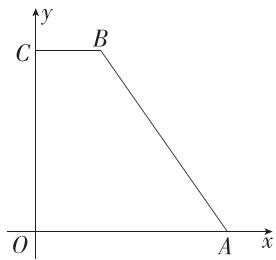

text_image

y
C B
O A x

3.A 设圆锥的底面半径为 r，母线长为 l，则 r=8，

由题意知, $2\pi r=\frac{\pi}{3}l$ ,解得l=48,

所以圆锥的侧面积为 $\pi rl = 8\times 48\pi = 384\pi .$

故选A.

4.C 圆台侧面展开图,如图.

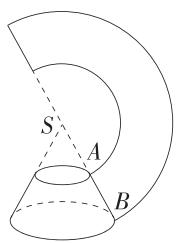

设圆台的上底面周长为 C，由扇环的圆心角为 $180^{\circ}$ ，得 $C = \pi \cdot SA$ ，

又 $C = 2\pi \times 10$ ，所以 $SA = 20$ ，同理 $SB = 40$ ，则 $AB = SB - SA = 20$ ，圆台的高 $h = \sqrt{AB^2 - (20 - 10)^2} = 10\sqrt{3}$

表面积 $S = \pi (10 + 20)\times 20 + 100\pi +400\pi = 1100\pi$

体积 $V = \frac{1}{3}\pi \times 10\sqrt{3}\times (10^{2} + 10\times 20 + 20^{2}) = \frac{7000\sqrt{3}}{3}\pi .$

故选C.

5.A 取 BD 的中点 E, 连接 $ED_{1}, AE$ ,

易得 $PD_{1} \parallel BE$ 且 $PD_{1} = BE$ ,

所以四边形 $BED_{1}P$ 为平行四边形, 所以 $PB \parallel D_{1}E$ ,

故 $\angle AD_{1}E$ （或其补角）为直线 $PB$ 与 $AD_{1}$ 所成的角.

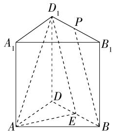

设 $AB = AD = AA_{1} = 2$ ，因为 $\angle ABD = 45^{\circ}$ ，所以 $\angle DAB = 90^{\circ}$ ，因为 $E$ 为 $BD$ 的中点，所以 $AE = DE = \frac{\sqrt{2}}{2} AB = \sqrt{2}$

易得 $AD_{1} = \sqrt{AD^{2} + DD_{1}^{2}} = 2\sqrt{2}, D_{1}E = \sqrt{DE^{2} + DD_{1}^{2}} = \sqrt{6}$

因为 $AD_{1}^{2}=AE^{2}+D_{1}E^{2}$ ，所以 $AE\perp D_{1}E$ .

故 $\cos \angle AD_{1}E = \frac{D_{1}E}{AD_{1}} = \frac{\sqrt{6}}{2\sqrt{2}} = \frac{\sqrt{3}}{2}$ 又 $0^{\circ} < \angle AD_{1}E < 180^{\circ}$ 所以 $\angle AD_{1}E = 30^{\circ}$ . 故选A.

6.C 在 $BB_{1}$ 上取一点 G, 使得 $B_{1}G=2BG$ , 连接 CG, AG, 如图所示.

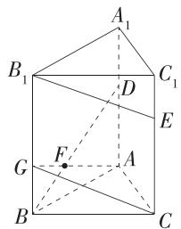

$\because CE = 2C_{1}E = 2, \therefore CC_{1} = BB_{1} = 3,$

∴ 在直三棱柱 $ABC-A_{1}B_{1}C_{1}$ 中， $B_{1}G \parallel CE$ ，且 $B_{1}G = CE = 2$ ，

∴ 四边形 $B_{1}GCE$ 为平行四边形, ∴ $B_{1}E \parallel CG$ ,

$\because B_{1}E\not\subset$ 平面 $ACG, CG\subset$ 平面 $ACG, \therefore B_{1}E//$ 平面 $ACG,$

若 $B_{1}E \parallel$ 平面 $ACF$ , 则 $F$ 在平面 $ACG$ 内, 又 $F$ 为 $BD$ 上一点, $\therefore F$ 为 $BD$ 与 $AG$ 的交点.

易知 $\triangle BFG \sim \triangle DFA, \therefore \frac{BF}{DF} = \frac{BG}{DA} = \frac{1}{2}$ ,

$\therefore \overrightarrow{BF} = \frac{1}{3}\overrightarrow{BD}$ 即 $\lambda$ 的值为 $\frac{1}{3}$ .

故选 C.

7.D 取 $AD$ 的中点 $M, AB$ 的中点 $N$ , 连接 $PD, MD_1, MN, NB_1, B_1D_1, A_1C_1, AC$ .

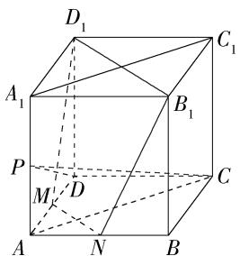

text_image

D₁
A₁
B₁
P
M
D
A
N
B
C₁

易知 $M, N, B_{1}, D_{1}$ 四点共面， $D_{1}M \perp PD, D_{1}M \perp CD, \because PD \cap CD = D, PD, CD \subset$ 平面 $PCD, \therefore D_{1}M \perp$ 平面 $PCD$ ，又 $CP \subset$ 平面 $PCD, \therefore CP \perp D_{1}M$ .

由 $AA_{1} \perp$ 平面ABCD， $MN \subset$ 平面ABCD，可得 $AA_{1} \perp MN$ ，易知 $MN \perp AC$

$\because AC \cap AA_{1} = A, AC, AA_{1} \subset$ 平面 $ACC_{1}A_{1}, \therefore MN \perp$ 平面 $ACC_{1}A_{1}$ ,

又 $CP \subset$ 平面 $ACC_{1}A_{1}, \therefore CP \perp MN,$

又 $D_{1}M\cap MN = M,D_{1}M,MN\subset$ 平面 $MNB_{1}D_{1}$

∴ $CP \perp$ 平面 $MNB_{1}D_{1}$ ，即平面 $\alpha$ 为平面 $MNB_{1}D_{1}$ .

由题意可知 $6AB^{2} = 96$ ，故 $AB = 4, \therefore MN = 2\sqrt{2}, B_{1}D_{1} = 4\sqrt{2}, B_{1}N = D_{1}M = 2\sqrt{5}, \therefore$ 截面图形的周长为 $6\sqrt{2} + 4\sqrt{5}$ . 故选D.

8.A 取 AD, BC 的中点 N, M, 正方形 ABCD 的中心 O, EF 的中点 $O_{2}$ , 连接 EN, MN, FM, $OO_{2}$ , 如图,

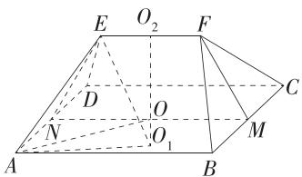

由题意知 $OO_{2} \perp$ 平面 ABCD, $EF \parallel AB \parallel MN$ , 点 O 是 MN 的中点, MN = AB = 4,

在等腰 $\triangle AED$ 中， $AD\bot EN,EN = \sqrt{AE^2 - AN^2} = 2\sqrt{2}$ ，同理 $FM = 2\sqrt{2}$

因此,等腰梯形 EFMN 的高 $OO_{2}=\sqrt{EN^{2}-\left(\frac{MN-EF}{2}\right)^{2}}=\sqrt{7}$ ,

由几何体的结构特征知,刍甍的外接球球心在直线 $OO_{2}$ 上,设外接球球心为 $O_{1}$ ,连接 $O_{1}E,O_{1}A,OA$ ,易知 $OA=2\sqrt{2}$ ,

则 $\left\{\begin{aligned}O_{1}A^{2}&=OA^{2}+OO_{1}^{2},\\ O_{1}E^{2}&=O_{2}E^{2}+O_{2}O_{1}^{2},\end{aligned}\right.$ 易得 $O_{1}A=O_{1}E,O_{2}E=\frac{1}{2}EF=1,$

当点 $O_{1}$ 在线段 $O_{2}O$ 的延长线(含点 O)上时, 视 $OO_{1}$ 为非负数; 当点 $O_{1}$ 在线段 $O_{2}O$ (不含点 O) 上时, 视 $OO_{1}$ 为负数, 即 $O_{2}O_{1}=O_{2}O+OO_{1}=\sqrt{7}+OO_{1}$ ,

所以 $(2\sqrt{2})^2 + OO_1^2 = 1 + (\sqrt{7} + OO_1)^2$ ，解得 $OO_1 = 0$

因此刍甍的外接球球心在点 O 处, 半径为 $OA = 2\sqrt{2}$ ,

所以刍甍的外接球的体积为 $\frac{4\pi}{3}\times(2\sqrt{2})^{3}=\frac{64\sqrt{2}\pi}{3}$ .故选A.

9. AC 对于 A, 因为圆锥的底面半径为 3, 所以圆锥的底面周长为 $2\pi \times 3 = 6\pi$ , 又因为圆锥的母线长为 4, 所以圆锥的侧面展开图的圆心角为 $\frac{6\pi}{4} = \frac{3\pi}{2}$ , 故 A 选项正确.

对于 B, 因为圆锥的底面半径为 3, 母线长为 4, 所以圆锥的高 $h = \sqrt{4^2 - 3^2} = \sqrt{7}$ , 故圆锥的体积 $V = \frac{1}{3} \times \pi \times 3^2 \times \sqrt{7} = 3\sqrt{7}\pi$ , 故 B 选项不正确.

对于 C, 设圆锥的两条母线的夹角为 $\theta$ , 则过这两条母线所作截面的面积为 $\frac{1}{2} \times 4 \times 4 \times \sin \theta = 8 \sin \theta$ , 易知过圆锥母线的截面中, 轴截面三角形对应的 $\theta$ 最大, 此时 $\cos \theta = \frac{4^{2} + 4^{2} - 6^{2}}{2 \times 4 \times 4} = -\frac{1}{8}$ , 所以 $\theta$ 最大是钝角, 所以当 $\theta = \frac{\pi}{2}$ 时, 截面的面积最大, 为 $8 \sin \frac{\pi}{2} = 8$ , 故 C 选项正确.

对于 D, 易知圆锥的轴截面的面积为 $\frac{1}{2} \times 6 \times \sqrt{7} = 3\sqrt{7}$ ，故 D 选项不正确.
故选 AC.

10.AB 如图,取 $BC_{1}$ 的中点 H, 连接 CH, 易证 $CH \perp$ 平面 $ABC_{1}D_{1}$ ,
所以 $\angle C_{1}BC$ 是直线 BC 与平面 $ABC_{1}D_{1}$ 所成的角,为 $\frac{\pi}{4}$ ,故A正确.

点 $C$ 到平面 $ABC_{1}D_{1}$ 的距离即为 $CH$ 的长，为 $\frac{\sqrt{2}}{2}$ ，故B正确.

易证 $BC_{1} / / AD_{1}$ ，所以异面直线 $D_{1}C$ 和 $BC_{1}$ 所成的角为 $\angle AD_{1}C$ （或其补角），连接 $AC$ ，易知 $\triangle ACD_{1}$ 为等边三角形，所以 $\angle AD_{1}C = \frac{\pi}{3}$ ，所以异面直线 $D_{1}C$ 和 $BC_{1}$ 所成的角为 $\frac{\pi}{3}$ ，故C错误.

连接 $DH$ ，易知 $BD = DC_{1}$ ，所以 $DH\bot BC_{1}$

又 $CH \perp BC_{1}$ , 所以 $\angle CHD$ 为二面角 $C - BC_{1} - D$ 的平面角,

易求得 $DH=\frac{\sqrt{6}}{2}$ ,

又 $CD = 1, CH = \frac{\sqrt{2}}{2}$ ,

所以由余弦定理的推论可得 $\cos \angle CHD = \frac{DH^2 + CH^2 - CD^2}{2DH\cdot CH} = \frac{\sqrt{3}}{3}$ 故D错误.

故选AB.

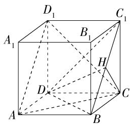

11.ABD 对于 A, 因为平面 $A^{\prime}D^{\prime}FE \perp$ 平面 BCFE, 平面 $A^{\prime}D^{\prime}FE \cap$ 平面 $BCFE = EF, BE \subset$ 平面 BCFE, $BE \perp EF$ , 所以 $BE \perp$ 平面 $A^{\prime}D^{\prime}FE$ ,
又因为 $A^{\prime}D^{\prime}\subset$ 平面 $A^{\prime}D^{\prime}FE$ ，所以 $BE\perp A^{\prime}D^{\prime}$ ，故 A 正确.

对于 B, 因为 $A'E \parallel D'F, A'E \not\subset$ 平面 $D'FC, D'F \subset$ 平面 $D'FC$ , 所以 $A'E \parallel$ 平面 $D'FC$ ,

因为 $BE \parallel CF, BE \not\subset$ 平面 $D'FC, CF \subset$ 平面 $D'FC$ , 所以 $BE \parallel$ 平面 $D'FC$ , 又因为 $A'E \cap BE = E, A'E, BE \subset$ 平面 $A'EB$ ,

所以平面 $A^{\prime}EB \parallel$ 平面 $D^{\prime}FC$ ，故 B 正确.

对于 C, 因为 $\frac{D'F}{A'E} = \frac{1}{3}, \frac{FC}{EB} = \frac{2}{4} = \frac{1}{2}$ ，则 $\frac{D'F}{A'E} \neq \frac{FC}{EB}$ ，所以多面体 $A'EBCD'F$ 不是三棱台，故 C 错误.

对于 D, 延长 $A^{\prime}D^{\prime}, EF$ , 相交于点 G,

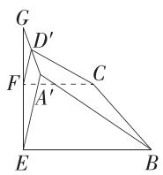

因为平面 $A'D'FE \perp$ 平面 BCFE, 平面 $A'D'FE \cap$ 平面 BCFE = EF, $A'E \subset$ 平面 $A'D'FE, A'E \perp EF$ ,

所以 $A^{\prime}E \perp$ 平面 $BCFE$ , 则 $\angle A^{\prime}GE$ 为直线 $A^{\prime}D^{\prime}$ 与平面 $BCFE$ 所成的角.

因为 $A'E \parallel D'F$ ，所以 $\frac{D'F}{A'E} = \frac{GF}{GF + FE}$ ，即 $\frac{1}{3} = \frac{GF}{GF + 2}$ ，

解得 $GF = 1$ ，则 $GE = 3$ ，则 $\tan \angle A'GE = \frac{A'E}{GE} = 1$

则 $\angle A^{\prime}GE = \frac{\pi}{4}$ 故D正确.

故选 ABD.

12. 答案 $\frac{3\sqrt{10}}{5}$

解析 设正方形 ABCD 的中心为 O, BC 的中点为 E, 如图所示.

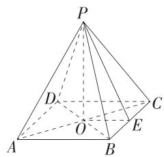

易知 $EO = 1$ ，高 $PO = 3$ ，所以斜高 $PE = \sqrt{3^2 + 1^2} = \sqrt{10}$

易知点 A 到侧面 PCD 的距离与点 A 到侧面 PBC 的距离相等，

易知 $S_{\triangle PDC} = S_{\triangle PBC} = \frac{1}{2}\times 2\times \sqrt{10} = \sqrt{10},$

正四棱锥 $P - ABCD$ 的体积 $V = \frac{1}{3} S_{\text{四边形}ABCD} \cdot PO = \frac{1}{3} \times 2 \times 2 \times 3 = 4$

设点 A 到侧面 PBC 的距离为 d，

则 $V = V_{A - PDC} + V_{A - PBC} = \frac{1}{3} S_{\triangle PDC}\cdot d + \frac{1}{3} S_{\triangle PBC}\cdot d = \frac{1}{3} d\times 2\sqrt{10} = 4,$

解得 $d = \frac{3\sqrt{10}}{5}$

故答案为 $\frac{3\sqrt{10}}{5}$

13. 答案 $\frac{2}{5}$

解析 过点 A 作 $AD \perp CP$ 于点 D, 连接 BD,

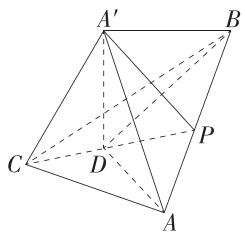

设 $\angle ACP = \alpha \left(0 < \alpha < \frac{\pi}{2}\right)$ , 则 $\angle PCB = \frac{\pi}{2} - \alpha$ ,

所以 $A^{\prime}D=2\sin\alpha, CD=2\cos\alpha,$

在 $\triangle BCD$ 中,由余弦定理可得

$$
B D ^ {2} = C D ^ {2} + B C ^ {2} - 2 C D \cdot B C \cos \left(\frac {\pi}{2} - \alpha\right) = 4 \cos^ {2} \alpha + 2 5 - 1 0 \sin 2 \alpha ,
$$

因为 $A^{\prime}-CP-B$ 为直二面角, 所以 $A^{\prime}D \perp$ 平面 BCP, 所以 $A^{\prime}D \perp BD$ ,

则 $A^{\prime}B^{2} = A^{\prime}D^{2} + BD^{2} = 4\sin^{2}\alpha +4\cos^{2}\alpha +25 - 10\sin 2\alpha = 29 - 10\sin 2\alpha$

当 $A'B^2$ 最小时， $A'B$ 最短， $2\alpha = \frac{\pi}{2}$ ，所以 $\alpha = \frac{\pi}{4}$ ，此时 $CP$ 平分 $\angle ACB$

由角平分线定理可得 $\frac{AP}{BP} = \frac{AC}{BC} = \frac{2}{5}$ 即 $\frac{A'P}{BP} = \frac{2}{5}$ .

14. 答案 $\frac{\sqrt{14}}{4}; \frac{5}{9}$

解析 对题图 1 中各点进行标记, 同时将题图 2 置于长方体中如下, 其中 A, B, C 三点重合.

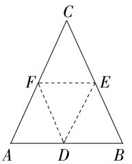

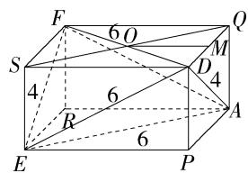

设 $EP = x \, \text{cm}, ER = y \, \text{cm}, SE = z \, \text{cm}$ ,

则 $\left\{\begin{aligned}x^{2}+y^{2}&=36,\\ x^{2}+z^{2}&=36,\end{aligned}\right.$ 解得 $\left\{\begin{aligned}x&=2\sqrt{7},\\ y&=z=2\sqrt{2},\end{aligned}\right.$

∴ 四面体 ADEF 的体积为 $\frac{1}{3}V_{长方体}=\frac{1}{3}xyz=\frac{16\sqrt{7}}{3}(cm^{3})$ ,

四面体 ADEF 的表面积 $S=4S_{\triangle DEF}=4\times\frac{1}{2}\times4\times4\sqrt{2}=32\sqrt{2}$ (cm $^{2}$ ).

当蛋黄与四面体各个面相切时,蛋黄的半径最大,

设此时蛋黄(近似于球)的半径为 r cm,

则 $V_{\text{长方体}} = \frac{1}{3} Sr, \therefore r = \frac{3V_{\text{长方体}}}{S} = \frac{16\sqrt{7}}{32\sqrt{2}} = \frac{\sqrt{14}}{4}$ .

设 $SQ \cap DF = O$ ，取 $DQ$ 的中点 $M$ ，连接 $OM$

则 $OQ = 3 \, cm, MQ = \sqrt{2} \, cm,$

在 Rt△OMQ 中， $\sin\angle QOM=\frac{MQ}{OQ}=\frac{\sqrt{2}}{3}$

$$
\therefore \cos \angle D O Q = \cos (2 \angle Q O M) = 1 - 2 \sin^ {2} \angle Q O M = 1 - \frac {4}{9} = \frac {5}{9},
$$

故长为 $6 \, cm$ 的两组对棱所成的角都为锐角,余弦值都是 $\frac{5}{9}$ ,

易知长为 $4 \, cm$ 的两条棱所成的角为直角.

∴ 所求最小的角的余弦值为 $\frac{5}{9}$ .

15. 解析 (1) $\because PO_{1} = 2\mathrm{m}$ , 正四棱柱的高 $O_{1}O$ 是正四棱锥的高 $PO_{1}$ 的 4 倍, $\therefore O_{1}O = 8\mathrm{m}$ . (2 分)

∴ 仓库的容积为 $\frac{1}{3} \times 6^{2} \times 2 + 6^{2} \times 8 = 312(\mathrm{~m}^{3})$ . (5 分)

(2) 连接 $A_{1}O_{1}$ ，设 $PO_{1}=x\ m,0<x<6$

则 $O_{1}O = 4x\mathrm{m},A_{1}O_{1} = \sqrt{36 - x^{2}}\mathrm{m},A_{1}B_{1} = \sqrt{72 - 2x^{2}}\mathrm{m}.$ (7分）

∴ 正四棱柱的侧面积 $S=4 \cdot 4x \cdot \sqrt{72-2x^{2}} = 16\sqrt{2}x \cdot \sqrt{36-x^{2}} \, (\text{m}^{2})$ ,
(9 分)

$$
\because 1 6 \sqrt {2} x \cdot \sqrt {3 6 - x ^ {2}} \leqslant 1 6 \sqrt {2} \cdot \frac {x ^ {2} + (\sqrt {3 6 - x ^ {2}}) ^ {2}}{2} = 2 8 8 \sqrt {2},
$$

当且仅当 $x = \sqrt{36 - x^2}$ ，即 $x = 3\sqrt{2}$ 时，等号成立，

$\therefore S_{\mathrm{max}} = 288\sqrt{2}.$ (12分)

所以当 $PO_{1}=3\sqrt{2}$ m 时, 正四棱柱的侧面积最大, 最大为 $288\sqrt{2}$ m $^{2}$ .
(13 分)

16. 证明 (1) 连接 $BD$ , 交 $AC$ 于点 $O$ , 连接 $OE$ , 则 $O$ 为 $BD$ 的中点, 又 $E$ 为 $PD$ 的中点, 所以 $OE \parallel PB$ , (3 分)

又 $OE \subset$ 平面 $ACE, PB \not\subset$ 平面 $ACE$ , 所以 $PB \parallel$ 平面 $ACE$ . (6分)

(2) 因为 $AF = \frac{1}{4} AC$ , 所以 $F$ 为 $AO$ 的中点,

因为 $EF \perp AO$ ，所以 $\triangle AEO$ 为等腰三角形，

则 $AE = OE$ ，又 $AE = \frac{1}{2} PD, OE = \frac{1}{2} PB,$

所以 $PB = PD$ ，连接 $OP$ ，则 $PO \perp BD$ ，(9分)

因为四边形 ABCD 为菱形, 所以 $AC \perp BD$ , 又 $PO \cap AC = O, PO, AC \subset$ 平面 PAC,

所以 $BD \perp$ 平面 PAC,

又 $PA \subset$ 平面 $PAC$ , 所以 $BD \perp PA$ . (11 分)

因为 $AE=\frac{1}{2}PD, E$ 为 PD 的中点, 所以 $\angle PAD=90^{\circ}$ , 即 $PA\perp AD$ ,

(13 分)

又 $AD \cap BD = D, AD, BD \subset$ 平面ABCD，

所以 $PA \perp$ 平面ABCD. (15分)

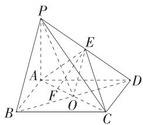

17. 解析 (1) 证明: $\because AC^{2} + BC^{2} = AB^{2}, \therefore AC \perp BC$ .

又∵ $C_{1}C\perp AC,C_{1}C\cap BC=C,\therefore AC\perp$ 平面 $BCC_{1}B_{1}.$ (3分)

∵ $BC_{1} \subset$ 平面 $BCC_{1}B_{1}, \therefore AC \perp BC_{1}.$ (5 分)

(2) 证明: 设 $CB_{1}$ 与 $C_{1}B$ 的交点为 $E$ , 则 $E$ 是 $BC_{1}$ 的中点, 连接 $DE$ ,

∵ D 是 AB 的中点，

∴ $DE \parallel AC_{1}$ . (8 分)

∵ $DE \subset$ 平面 $CDB_{1}, AC_{1} \not\subset$ 平面 $CDB_{1}$ ,

$\therefore AC_{1} // \text{平面 } CDB_{1}$ . (10 分)

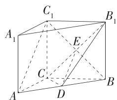

(3) $\because DE \parallel AC_{1}, \therefore \angle CED$ (或其补角) 为 $AC_{1}$ 与 $B_{1}C$ 所成的角.

在 $\mathrm{Rt}\triangle AA_1C_1$ 中， $AC_{1} = \sqrt{AA_{1}^{2} + A_{1}C_{1}^{2}} = 5,$

$\therefore ED=\frac{1}{2}AC_{1}=\frac{5}{2},$

易得 $CD = \frac{1}{2} AB = \frac{5}{2}, CE = \frac{1}{2} CB_{1} = 2\sqrt{2}$ （13分）

$\therefore \cos \angle CED = \frac{\sqrt{2}}{\frac{5}{2}} = \frac{2\sqrt{2}}{5}.$

∴ 异面直线 $AC_{1}$ 与 $B_{1}C$ 所成角的余弦值为 $\frac{2\sqrt{2}}{5}$ . (15 分)

18. 解析 (1) 假设存在满足条件的点 $P$ .

如图, 过点 P 作 $PM \parallel FD$ , 交 AF 于点 M, 连接 ME,

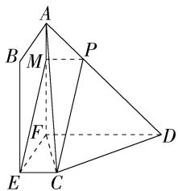

$\because CE \parallel FD, \therefore MP \parallel EC, \therefore M, P, C, E$ 四点共面. (2分)

∵ CP ∥ 平面 ABEF, CP ⊂ 平面 CEMP, 平面 ABEF ∩ 平面 CEMP = ME,

∴ CP // ME, ∴ 四边形 CEMP 为平行四边形， (4 分)

$\therefore MP = CE = 4 - BE = 1$

易得 FD=6-3=3，

由 $MP \parallel FD$ 可得 $\frac{AP}{AD} = \frac{MP}{FD} = \frac{1}{3}, \therefore \frac{AP}{PD} = \frac{1}{2}$ . (7分)

故存在点 P, 使得 $CP \parallel$ 平面 ABEF, 此时 $\frac{AP}{PD} = \frac{1}{2}$ . (8 分)

(2)由题意得 $BE \perp EF$ , 又 $BE \perp EC, EC \cap EF = E, EC, EF \subset$ 平面 $CEFD$ ,

$\therefore BE \perp$ 平面 CEFD,

又 $AF \parallel BE, \therefore AF \perp$ 平面 $CEFD$ . 设 $BE = x (0 < x \leqslant 4)$ , 则 $AF = x, FD = 6 - x$ , 故 $V_{A - CDF} = \frac{1}{3} \times \frac{1}{2} \times 2 \times (6 - x) \cdot x = -\frac{1}{3} (x - 3)^2 + 3$ ,

∴ 当 x=3 时, $V_{A-CDF}$ 取得最大值, 最大值为 3, (10 分)

此时 $EC = 1, AF = 3, FD = 3, DC = 2\sqrt{2}$ ,

$\therefore AD = \sqrt{AF^2 + FD^2} = 3\sqrt{2}, AC = \sqrt{EF^2 + EC^2 + AF^2} = \sqrt{14}$ （12分）

在 $\triangle ACD$ 中, 由余弦定理的推论得 $\cos \angle ADC = \frac{18 + 8 - 14}{2 \times 3\sqrt{2} \times 2\sqrt{2}} = \frac{1}{2}$ ,

$\therefore \sin \angle ADC = \frac{\sqrt{3}}{2},$

$\therefore S_{\triangle ACD} = \frac{1}{2} DC\cdot AD\cdot \sin \angle ADC = 3\sqrt{3}.$ (15分)

设 F 到平面 ACD 的距离为 h，

由 $V_{F - ACD} = V_{A - CDF}$ ，得 $\frac{1}{3} S_{\triangle ACD}\cdot h = 3$ ，解得 $h = \sqrt{3}$

综上,三棱锥 A-CDF 的体积的最大值为 3,此时点 F 到平面 ACD 的距离为 $\sqrt{3}$ . (17 分)

19. 解析 (1) 证明: 连接 $AB_{1}$ ,

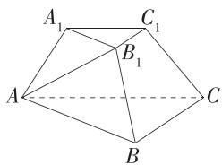

在三棱台 $ABC - A_{1}B_{1}C_{1}$ 中， $AB \parallel A_{1}B_{1}$ ，

$\because AB = 2AA_{1} = 2A_{1}B_{1} = 2BB_{1}, \therefore$ 四边形 $ABB_{1}A_{1}$ 为等腰梯形且 $\angle ABB_{1} = \angle BAA_{1} = 60^{\circ}$ , (1分)

设 AB=2x，则 $BB_{1}=x$ .

由余弦定理得 $AB_{1}^{2} = AB^{2} + BB_{1}^{2} - 2AB\cdot BB_{1}\cos 60^{\circ} = 3x^{2},$

$\therefore AB^{2} = AB_{1}^{2} + BB_{1}^{2}, \therefore AB_{1} \perp BB_{1}$ (2分)

∵ 平面 $ABB_{1}A_{1} \perp$ 平面 $BCC_{1}B_{1}$ ，平面 $ABB_{1}A_{1} \cap$ 平面 $BCC_{1}B_{1} = BB_{1}, AB_{1} \subset$ 平面 $ABB_{1}A_{1}$ ，

$\therefore AB_{1} \perp$ 平面 $BCC_{1}B_{1}$ , (3分)

又 $BC \subset$ 平面 $BCC_{1}B_{1}, \therefore AB_{1} \perp BC$ .

∵ $\triangle ABC$ 是以 B 为直角顶点的等腰直角三角形, ∴ $BC \perp AB$ ,

$\because AB \cap AB_{1} = A, AB, AB_{1} \subset$ 平面 $ABB_{1}A_{1}, \therefore BC \perp$ 平面 $ABB_{1}A_{1}$ . (4分)

(2) 延长 $AA_{1}, BB_{1}, CC_{1}$ 交于一点 P,

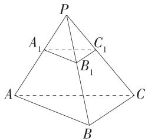

$$
\because A _ {1} B _ {1} = \frac {1}{2} A B, \therefore S _ {\triangle A B C} = 4 S _ {\triangle A _ {1} B _ {1} C _ {1}}, \therefore V _ {P - A B C} = 8 V _ {P - A _ {1} B _ {1} C _ {1}},
$$

$\therefore V_{P - ABC} = \frac{8}{7} V_{ABC - A_1B_1C_1} = \frac{8}{7}\times \frac{7\sqrt{3}}{12} = \frac{2\sqrt{3}}{3},$ (5分)

$\because BC \perp$ 平面 $ABB_{1}A_{1}$ 即 $BC \perp$ 平面 $PAB,$

∴ BC 的长即为点 C 到平面 PAB 的距离. (6 分)

由(1)知 AB=BC=2x， $\angle PAB=\angle PBA=60^{\circ}$

∴ $\triangle PAB$ 为等边三角形, ∴ PA = PB = AB = 2x,

$$
\therefore V _ {P - A B C} = \frac {1}{3} S _ {\triangle P A B} \cdot B C = \frac {1}{3} \times \frac {1}{2} \times (2 x) ^ {2} \times \frac {\sqrt {3}}{2} \cdot 2 x = \frac {2 \sqrt {3}}{3} x ^ {3} = \frac {2 \sqrt {3}}{3}, \therefore x = 1,
$$

$$
\therefore A B = B C = P A = P B = 2, \therefore A C = P C = 2 \sqrt {2},
$$

$\therefore S_{\triangle PAC} = \frac{1}{2}\times 2\times \sqrt{\left(2\sqrt{2}\right)^2 - 1^2} = \sqrt{7},$ (8分)

设点 $B$ 到平面 $ACC_{1}A_{1}$ 的距离为 $d$ ，即点 $B$ 到平面PAC的距离为 $d$

$\because V_{B - PAC} = V_{P - ABC}, \therefore \frac{1}{3} S_{\triangle PAC} \cdot d = \frac{\sqrt{7}}{3} d = \frac{2\sqrt{3}}{3}$ , 解得 $d = \frac{2\sqrt{21}}{7}$ .

即点 B 到平面 $ACC_{1}A_{1}$ 的距离为 $\frac{2\sqrt{21}}{7}$ . (10 分)

(3) 假设存在满足条件的点 $F$ .

∵ BC ⊥ 平面 PAB, BC ⊂ 平面 ABC,

∴ 平面 $ABC \perp$ 平面 PAB,

取 $AB$ 的中点 $N$ , 连接 $PN, NC$ , 则 $PN \perp AB$ ,

∵ 平面 $ABC \cap$ 平面 $PAB = AB, PN \subset$ 平面 PAB,

∴ $PN \perp$ 平面 ABC, (12 分)

作 $FE \parallel PN$ , 交 $CN$ 于点 $E$ , 则 $FE \perp$ 平面 $ABC$ ,

作 $ED \perp AB$ 于 $D$ , 连接 $FD$ , 则 $ED$ 即为 $FD$ 在平面 $ABC$ 上的射影,

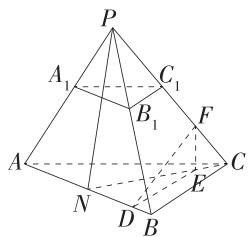

∵ $FE \perp$ 平面 ABC, $AB \subset$ 平面 ABC, ∴ $AB \perp FE$ ,

∵ $DE \cap FE = E, DE, FE \subset$ 平面 DEF, ∴ $AB \perp$ 平面 DEF,

∵ FD ⊂ 平面 DEF, ∴ AB ⊥ FD,

$\therefore \angle FDE$ 即为二面角 $F - AB - C$ 的平面角， $\therefore \angle FDE = \frac{\pi}{6}$ （14分）

$V_{P - ABC} = \frac{1}{3} S_{\triangle ABC}\cdot PN = \frac{1}{3}\times \frac{1}{2}\times 2\times 2PN = \frac{2\sqrt{3}}{3},$ 解得 $PN = \sqrt{3}$

由(2)知 $PC = 2\sqrt{2}$ , $\therefore NC = \sqrt{PC^2 - PN^2} = \sqrt{5}$ ,

设 $FE = \sqrt{3} t$ ，易得 $\frac{EF}{PN} = \frac{CE}{NC},\therefore CE = \sqrt{5} t,$

$\therefore EN=\sqrt{5}-\sqrt{5}t,$

易知 $DE \parallel BC, \therefore DE = \frac{EN}{CN} \cdot BC = \frac{\sqrt{5} - \sqrt{5}t}{\sqrt{5}} \times 2 = 2 - 2t$ ， (15分)

则 $\tan \angle FDE = \frac{FE}{DE} = \frac{\sqrt{3}t}{2 - 2t} = \frac{\sqrt{3}}{3}$ 解得 $t = \frac{2}{5}$

$\therefore CF = \sqrt{CE^2 + EF^2} = 2\sqrt{2} t = \frac{4\sqrt{2}}{5} < CC_1 = \sqrt{2}$

∴ 存在满足题意的点 F, $CF = \frac{4\sqrt{2}}{5}$ . (17 分)

# 第九章 统计

<table><tr><td>1.D</td><td>2.B</td><td>3.C</td><td>4.A</td><td>5.C</td><td>6.B</td></tr><tr><td>7.B</td><td>8.D</td><td>9.AC</td><td>10.AC</td><td>11.ABD</td><td></td></tr></table>

1.D 选出来的个体编号依次为 12, 13, 20, 26, 03, 所以选出来的第 5 个个体的编号为 03. 故选 D.

2.B 三个年级抽样人数的总时长为 $56 \times 3 + 62 \times 3.5 + 52 \times 4.5 = 619(\mathrm{h})$ ，三个年级抽样人数的平均时长为 $619 \div (56 + 62 + 52) \approx 3.64(\mathrm{h})$ ，

∴ 总体的平均时长约为 3.64 h. 故选 B.

3.C 这 10 个数据从小到大排列为 6,8,9,10,11,13,15,17,20,21,

又 $10 \times 75\% = 7.5$ ，所以 75% 分位数为从小到大排列的第 8 个数，即为 17。故选 C.

4.A 设接受调查市民的总人数为 $x$ ，由调查结果条形统计图可知选择 a 的人数为 300，通过调查结果的扇形统计图可知选择 a 的人数比例为 $15\% = \frac{300}{x} \times 100\%$ ，解得 $x = 2000$ .

∴ 选择 d 的人数为 $2000 \times 25\% = 500$ ,

∴ 扇形统计图中 e 的圆心角度数为 $(1-15\%-12\%-40\%-25\%) \times 360^{\circ} = 28.8^{\circ}$ . 故选 A.

5.C 对于 A, 由平均数的性质得 $2x_{1}+1, 2x_{2}+1, \cdots, 2x_{6}+1$ 的平均数为 $2\bar{x}+1$ , 错误;

对于 B, 由方差的性质得 $2x_{1}+1, 2x_{2}+1, \cdots, 2x_{6}+1$ 的方差为 $2^{2} \times s^{2} = 4s^{2}$ ，错误；

对于 C, $2x_{1}+1$ , $2x_{2}+1$ , $\cdots$ , $2x_{6}+1$ 的中位数为 $2x'+1$ , 正确;

对于 D, $2x_{1}+1$ , $2x_{2}+1$ , $\cdots$ , $2x_{6}+1$ 的极差为 $2(x_{6}-x_{1})$ , 错误.

故选 C.

6.B 设 2020 年参加“选择考”的总人数为 $a(a>0)$ ，则 2022 年参加“选择考”的总人数为 2a.

2020 年评定为 A, B, C, D, E 五个等级的人数分别为 0.28a, 0.32a, 0.30a, 0.08a, 0.02a;

2022 年评定为 A, B, C, D, E 五个等级的人数分别为 0.48a, 0.80a, 0.56a, 0.12a, 0.04a.

由此可知获得 A 等级的人数增加了,故 A 错误;

由于 $\frac{0.80a-0.32a}{0.32a}=1.5$ ，所以获得B等级的人数增加了1.5倍，故B正确；
获得 D 等级的人数增加了, 故 C 错误;

获得 E 等级的人数增加了 1 倍, 故 D 错误.

故选 B.

7.B 甲射击成绩的平均数 $\overline{x}_1 = \frac{1}{10} \times (5 + 7 + 3 \times 8 + 4 \times 9 + 10) = 8.2$

乙射击成绩的平均数 $\overline{x}_{2}=\frac{1}{10}\times(6+2\times7+2\times8+2\times9+3\times10)=8.4$

$\because \overline{x}_{1}<\overline{x}_{2},\therefore$ 乙的射击水平更高,故A错误;

甲射击成绩的方差 $s_{1}^{2}=\frac{1}{10}\times\left[(5-8.2)^{2}+(7-8.2)^{2}+3\times(8-8.2)^{2}+4\times(9-8.2)^{2}+(10-8.2)^{2}\right]=1.76$ ,

乙射击成绩的方差 $s_2^2 = \frac{1}{10} \times [(6 - 8.4)^2 + 2 \times (7 - 8.4)^2 + 2 \times (8 - 8.4)^2 + 2 \times (9 - 8.4)^2 + 3 \times (10 - 8.4)^2] = 1.84$ ,

$\because s_{1}^{2}<s_{2}^{2},\therefore$ 甲的射击水平更稳定，故B正确；

甲的射击成绩由小到大排列为 5,7,8,8,8,9,9,9,9,10,位于第 5、6 位的数分别是 8,9,所以甲射击成绩的中位数是 $\frac{8+9}{2}=8.5$ ,

乙的射击成绩由小到大排列为 6,7,7,8,8,9,9,10,10,10,位于第 5、6 位的数分别是 8,9,所以乙射击成绩的中位数是 $\frac{8+9}{2}=8.5$ ,故 C 错误;

甲射击成绩的众数为9,乙射击成绩的众数为10,故D错误.故选B.

8.D 设初中部 20 名党员的竞赛分数分别为 $x_1, x_2, \cdots, x_{20}$ , 高中部 50 名党员的竞赛分数分别为 $y_1, y_2, \cdots, y_{50}$ , 根据题意得 $\frac{1}{20} \times [(x_1 - a)^2 + (x_2 - a)^2 + \cdots + (x_{20} - a)^2] = 2$ , $\frac{1}{50} \times [(y_1 - b)^2 + (y_2 - b)^2 + \cdots + (y_{50} - b)^2] = \frac{14}{5}$ ,

又 $a = b$

所以 $(x_{1}-a)^{2}+(x_{2}-a)^{2}+\cdots+(x_{20}-a)^{2}=40,(y_{1}-a)^{2}+(y_{2}-a)^{2}+\cdots+(y_{50}-a)^{2}=140$ ，易知该学校全体参赛党员竞赛分数的平均数为a，

则该学校全体参赛党员竞赛分数的方差为 $\frac{1}{50+20}\times\left[(x_{1}-a)^{2}+(x_{2}-a)^{2}+\cdots+(x_{20}-a)^{2}+(y_{1}-a)^{2}+(y_{2}-a)^{2}+\cdots+(y_{50}-a)^{2}\right]=\frac{40+140}{70}=\frac{18}{7}$ .故选D.

9. AC 由题中折线图可得 12 个月的月度同比增速百分比(%)由小到大依次为-11.1,-6.7,-5.9,-3.5,-1.8,-0.5,2.5,2.7,3.1,3.5,5.4,6.7.

对于 A, 12 个月的月度同比增速百分比(%)的中位数为 $\frac{-0.5+2.5}{2}=1$ ，故 A 正确；

对于 B, 因为 $\frac{1}{12} \times \left[ (-11.1) + (-6.7) + (-5.9) + (-3.5) + (-1.8) + (-0.5) + \right.$ $2.5+2.7+3.1+3.5+5.4+6.7]=-\frac{7}{15}<0,$

所以 12 个月的月度同比增速百分比(%)的平均值小于 0, 故 B 错误; 对于 C, 由题中折线图可得前 6 个月的月度同比增速百分比先大幅度波动, 然后渐渐趋于稳定, 后 6 个月的波动整体较小,

所以前6个月的月度同比增速百分比的波动比后6个月大,故C正确;对于 $D,-\frac{7}{15}\approx-0.47$ ,大于-0.47的有2.5,2.7,3.1,3.5,5.4,6.7,共有6个,

所以共有 6 个月的月度同比增速百分比大于 12 个月的月度同比增速百分比的平均值, 故 D 错误. 故选 AC.

10. AC 对于 A, 平均分为 $0.05 \times 45 + 0.15 \times 55 + 0.2 \times 65 + 0.3 \times 75 + 0.2 \times 85 + 0.1 \times 95 = 72.5$ (分), 正确;

对于 B, 大于 60 分的频率为 $(0.02 + 0.03 + 0.02 + 0.01) \times 10 = 0.8$ ,

所以这次知识竞赛的及格率为 80%, 错误;

对于 C, 分数在区间 $[60,70)$ 内的频率为 $0.02 \times 10 = 0.2$ , 正确;

对于 D, 分数在区间 $[70, 80)$ 内的频率为 $0.03 \times 10 = 0.3$ , 所以成绩在区间 $[70, 80)$ 内的应抽取 $0.3 \times 200 = 60$ 人, 错误.

故选 AC.

11.ABD 对于 A, 剩下的 28 个样本数据的和为 $28\overline{x}_1$ , 去掉的两个数据的和为 $2\overline{x}_2$ , 原样本数据的和为 $30\overline{x}$ , 所以 $28\overline{x}_1 + 2\overline{x}_2 = 30\overline{x}$ , 因为 $\overline{x} = \overline{x}_2$ , 所以 $\overline{x} = \overline{x}_1$ , 故 A 正确;

对于 B, 设 $x_{1}<x_{2}<x_{3}<\cdots<x_{29}<x_{30}, s_{1}^{2}=\frac{1}{28}\left[\left(x_{2}-\overline{x}_{1}\right)^{2}+\left(x_{3}-\overline{x}_{1}\right)^{2}+\cdots+\left(x_{29}-\overline{x}_{1}\right)^{2}\right]$ ,

因为 $\overline{x}_1 = \overline{x}_2 = \overline{x}$ ，所以 $s_2^2 = \frac{1}{2}\big[(x_1 - \overline{x}_1)^2 + (x_{30} - \overline{x}_1)^2\big]$

所以 $28s_{1}^{2}+2s_{2}^{2}=(x_{1}-\overline{x}_{1})^{2}+(x_{2}-\overline{x}_{1})^{2}+(x_{3}-\overline{x}_{1})^{2}+\cdots+(x_{29}-\overline{x}_{1})^{2}+(x_{30}-\overline{x}_{1})^{2}=30s^{2}$

所以 $15s^{2} = 14s_{1}^{2} + s_{2}^{2}$ ，故B正确；

对于 C, 剩下 28 个数据的中位数等于原样本数据的中位数, 故 C 错误; 对于 D, $30 \times 22\% = 6.6$ , 所以原数据的 22% 分位数为从小到大排列后的第 7 个, $28 \times 22\% = 6.16$ , 所以剩下 28 个数据的 22% 分位数为从小到大排列后的第 7 个,

因为去掉了最小值,且各数据互不相同,则剩下28个数据的22%分位数不等于原样本数据的22%分位数,故D正确.

故选 ABD.

12. 答案 120

解析 由题意得志愿团队中的男性人数为 $200 \times \frac{40 - 16}{40} = 120$ .

13. 答案 ①③

解析 对于①,假设有数据大于或等于10,由极差小于或等于3,得数据中最小值为 $10-3=7$ ,此时数据的平均数必然大于7,与 $\bar{x}<4$ 矛盾,故假设错误,所以此组数据全部小于10,故①符合题意;

对于②,举反例:1,1,1,1,11,平均数 $\bar{x}=3<4$ , 标准差 s=4, 但不符合入冬标准, 故②不符合题意;

对于③,因为众数为5,极差小于或等于4,所以最大值不超过9,故③符合题意.

故答案为①③.

14. 答案 0

解析 依题意得 $\frac{x+y+z+m+n}{5}=9$ ,

$$
\frac {(9 - x) ^ {2} + (9 - y) ^ {2} + (9 - z) ^ {2} + (9 - m) ^ {2} + (9 - n) ^ {2}}{5} = 4,
$$

化简得 $x + y + z + m + n = 45, (9 - x)^2 + (9 - y)^2 + (9 - z)^2 + (9 - m)^2 + (9 - n)^2 = 20.$

易知 $n \geqslant m + 1 \geqslant z + 2 \geqslant y + 3 \geqslant x + 4, x + y + z + m + n \leqslant 5n - 10$ ，可得 $n \geqslant 11$ .

又因为 $(9 - x)^2 +(9 - y)^2 +(9 - z)^2 +(9 - m)^2 +(9 - n)^2 = 20$

所以 9-x, 9-y, 9-z, 9-m, 9-n 这 5 个数的绝对值不超过 4，所以 $9-n \geqslant -4$ ，即 $11 \leqslant n \leqslant 13$ ，

当 n=13 时，可得 $(9-x)^{2}+(9-y)^{2}+(9-z)^{2}+(9-m)^{2}=4$ ，无解；

当 $n = 12$ 时，可得 $(9 - x)^2 +(9 - y)^2 +(9 - z)^2 +(9 - m)^2 = 11$ ，由 $x < y < z < m < n, x, y, z, m, n \in \mathbf{N}^*$ ，得这四个平方数只能为9，1，0，1，则 $x = 6, y = 8, z = 9, m = 10$ ，符合题意，此时 $z - 9 = 0$

当 $n = 11$ 时， $(9 - x)^2 +(9 - y)^2 +(9 - z)^2 +(9 - m)^2 = 16$ ，无解.

综上, $z-9=0$ .

故答案为0.

15. 解析 (1) 设该校高一、高二、高三年级的人数分别为 $a, b, c$ ,

则去 A 会场的学生人数为 $0.25(a+b+c)$ ,

去 B 会场的学生人数为 $0.75(a+b+c)$ ，(3 分)

则对应人数如表：

<table><tr><td>会场</td><td>高一</td><td>高二</td><td>高三</td></tr><tr><td>A 会场</td><td>0.125(a+b+c)</td><td>0.1(a+b+c)</td><td>0.025(a+b+c)</td></tr><tr><td>B 会场</td><td>0.3(a+b+c)</td><td>0.375(a+b+c)</td><td>0.075(a+b+c)</td></tr></table>

则 $x:y:z = 0.425(a + b + c):0.475(a + b + c):0.1(a + b + c) = 17:19:4.$ (6分)

(2)依题意得, $n\times0.75\times0.5=75$ ,解得n=200,(8分)

故抽到的 A 会场的学生人数为 50， (10 分)

抽到的 A 会场高一年级人数为 $50 \times 50\% = 25$ ，高二年级人数为 $50 \times 40\% = 20$ ，高三年级人数为 $50 \times 10\% = 5$ . (13 分)

16. 解析 （1）由表中数据可知，A 品种的产量（单位：10 kg）从小到大排列为 50, 60, 63, 63, 64, 71, 75, 76, 85，故 A 品种的极差为 85 - 50 = 35，中位数为 $\frac{63 + 64}{2} = 63.5$ ; (2 分)

B 品种的产量(单位:10 kg)从小到大排列为 56,60,62,62,63,68,70,75,76,78,B 品种的极差为 78-56=22,中位数为 $\frac{63+68}{2}=65.5$ . (4 分)

(2)由题意得 $\bar{x} = \frac{60 + 63 + 50 + 76 + 71 + 85 + 75 + 63 + 64}{10} = 67$ ，（6分）

$\overline{y} = \frac{56 + 62 + 60 + 68 + 78 + 75 + 76 + 62 + 63 + 70}{10} = 67,$ (8分)

$s_{1}^{2}=\frac{1}{10}\times\left[(60-67)^{2}+(63-67)^{2}+\cdots+(64-67)^{2}\right]=88,$ (10分)

$$
s _ {2} ^ {2} = \frac {1}{1 0} \times \left[ (5 6 - 6 7) ^ {2} + (6 2 - 6 7) ^ {2} + \dots + (7 0 - 6 7) ^ {2} \right] = 5 1. 2. \tag {12分}
$$

(3)结合(2)知A,B两个品种水稻的产量平均数一样,但是B的方差较小,较稳定,所以推广B品种水稻更合适. (15分)

17. 解析 （1）由题中频率分布直方图可看出最高矩形底边中点的横坐标为 20，故众数是 20 h；（2 分）

$$
\text { 由 } (0. 0 2 + 0. 0 6 + 0. 0 7 5 + a + 0. 0 2 5) \times 4 = 1, \text { 解得 } a = 0. 0 7, \tag {4分}
$$

$$
\because (0. 0 2 + 0. 0 6) \times 4 = 0. 3 2 \text {, 且} (0. 0 2 + 0. 0 6 + 0. 0 7 5) \times 4 = 0. 6 2,
$$

∴ 中位数在 [18,22) 内, 设中位数为 x h,

$$
\text {则} \frac {x - 1 8}{2 2 - 1 8} = \frac {0 . 5 - 0 . 3 2}{0 . 6 2 - 0 . 3 2}, \text {解得} x = 2 0. 4, \text {故中位数是} 2 0. 4 \mathrm{h}. \tag {7分}
$$

$$
\text {平均数为} (0. 0 2 \times 1 2 + 0. 0 6 \times 1 6 + 0. 0 7 5 \times 2 0 + 0. 0 7 \times 2 4 + 0. 0 2 5 \times 2 8) \times 4 = 2 0. 3 2 (\mathrm{h}). \tag {9分}
$$

$$
(2) (0. 0 2 + 0. 0 6 + 0. 0 7 5 + 0. 0 7) \times 4 = 0. 9,
$$

∴ 结合(1)知第75百分位数在[22,26)内，

$$
\text { 设第 } 7 5 \text { 百分位数为 } y \mathrm{h}, \tag {12分}
$$

$$
\text {则} \frac {y - 2 2}{2 6 - 2 2} = \frac {0 . 7 5 - 0 . 6 2}{0 . 9 - 0 . 6 2}, \text {解得} y \approx 2 3. 8 6. \text {故第} 7 5 \text {百分位数约为} 2 3. 8 6 \mathrm{h}. \tag {15分}
$$

18. 解析 (1) 由题中频率分布直方图得 $10 \times (0.003 + 0.008 + 0.022 + 0.024 + 0.007 + 0.003 + 0.003 + 2t) = 1$ ，解得 $t = 0.015$ . (3 分)

(2)由题中频率分布直方图得，

前 4 组频率之和为 $0.03 + 0.08 + 0.15 + 0.22 = 0.48$ ，前 5 组频率之和为 0.48 + 0.24 = 0.72，所以 40 < m < 50，(9 分)

$$
\text {由} \frac {m - 4 0}{1 0} = \frac {0 . 6 - 0 . 4 8}{0 . 2 4}, \text {解得} m = 4 5. \tag {12分}
$$

(3)由题可知在区间 $[50,60), [60,70), [70,80), [80,90]$ 内的居民年用水量(单位:t)分别取 $55,65,75,85$ 为代表, 则他们的年用水量分别超出 $5\mathrm{t}, 15\mathrm{t}, 25\mathrm{t}, 35\mathrm{t}$ , (14分)

$$
\text {则} 1 0 ^ {6} \times (0. 1 5 \times 5 + 0. 0 7 \times 1 5 + 0. 0 3 \times 2 5 + 0. 0 3 \times 3 5) = 3. 6 \times 1 0 ^ {6} (\text {元}),
$$

$$
\text {所以估计该市居民每年缴纳的水资源改善基金总数为} 3. 6 \times 1 0 ^ {6} \text {元}. \tag {17分}
$$

19. 解析 （1）由题意得 $(0.005 + 0.010 + 0.020 + a + 0.025 + 0.010) \times 10 = 1$ ，解得 a = 0.030.
(4 分)

(2) 成绩落在 $[40,80)$ 内的频率为 $(0.005+0.010+0.020+0.030)\times10=0.65$ ,

落在[40,90)内的频率为 $(0.005 + 0.010 + 0.020 + 0.030 + 0.025)\times 10 = 0.9$ 故 $75\%$ 分位数在[80,90)内， (7分)

设 75% 分位数为 m 分，

则 $0.65 + (m - 80) \times 0.025 = 0.75$ ，解得 $m = 84$ ，故 $75\%$ 分位数为84分. (10分)

(3) 成绩落在 $[50,60)$ 内的市民人数为 $100 \times 0.1 = 10$ ，落在 $[60,70)$ 内的市民人数为 $100 \times 0.2 = 20$ ，(12 分)

$$
\text {故} \bar {z} = \frac {1 0 \times 5 4 + 2 0 \times 6 6}{1 0 + 2 0} = 6 2 (\text {分}). \tag {14分}
$$

由样本方差计算总体方差公式, 得总体方差 $s^{2}=\frac{1}{10+20}\left\{10\left[7+(54-62)^{2}\right]+20\left[4+(66-62)^{2}\right]\right\}=37.$

所以两组成绩的总平均数是 62 分, 总方差是 37. (17 分)

# 第十章 概率

<table><tr><td>1.C</td><td>2.A</td><td>3.D</td><td>4.C</td><td>5.B</td><td>6.D</td></tr><tr><td>7.D</td><td>8.C</td><td>9.BC</td><td>10.BCD</td><td>11.ABD</td><td></td></tr></table>

1.C 由题意得 $P(B) = 1 - P(\overline{B}) = 1 - \frac{2}{3} = \frac{1}{3}$ ,

∵ 事件 A, B 是互斥事件, ∴ $P(A \cup B) = P(A) + P(B) = \frac{1}{6} + \frac{1}{3} = \frac{1}{2}$ . 故选 C.

2.A 表示“3 例心脏手术全部成功”的随机数组有 569,989,共 2 组,

故估计“3例该种心脏手术全部成功”的概率为 $\frac{2}{10}=0.2$ .

故选A.

3.D 由题意可作 Venn 图,如图.

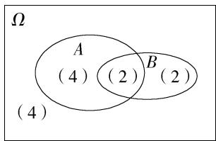

对于选项 A, $n(AB) = n(A) + n(B) - n(A \cup B) = 6 + 4 - 8 = 2$ ,

所以 $P(AB)=\frac{n(AB)}{n(\Omega)}=\frac{2}{12}=\frac{1}{6}$ ，故 A 中结论正确；

对于选项 B, $P(A \cup B) = \frac{n(A \cup B)}{n(\Omega)} = \frac{8}{12} = \frac{2}{3}$ ，故 B 中结论正确；

对于选项 C, $n(\overline{A}B)=n(B)-n(AB)=4-2=2$ , 所以 $P(\overline{A}B)=\frac{n(\overline{A}B)}{n(\Omega)}=\frac{2}{12}=$ $\frac{1}{6}$ ，故C中结论正确；

对于选项 D, $n(\overline{A}\overline{B}) = n(\Omega) - n(A \cup B) = 12 - 8 = 4$ , 所以 $P(\overline{A}\overline{B}) = \frac{n(\overline{A}\overline{B})}{n(\Omega)} = \frac{4}{12} = \frac{1}{3}$ , 故 D 中结论错误.

故选 D.

4.C 记两个零件中恰有一个被加工为 A 级产品为事件 M, 仅甲机器加工的零件为 A 级产品为事件 $M_{1}$ , 仅乙机器加工的零件为 A 级产品为事件 $M_{2}$ ,

$$
\text {则} P (M) = P (M _ {1}) + P (M _ {2}) = \frac {3}{4} \times \left(1 - \frac {4}{5}\right) + \left(1 - \frac {3}{4}\right) \times \frac {4}{5} = \frac {7}{2 0}.
$$

故选 C.

5.B 不超过12的素数有2,3,5,7,11,共5个,任取两个数的基本事件为(2,3),(2,5),(2,7),(2,11),(3,5),(3,7),(3,11),(5,7),(5,11),(7,11),共10个,其中是孪生素数的基本事件为(3,5),(5,7),共2个,故所求概率为 $\frac{2}{10}=\frac{1}{5}$ .故选B.

6.D 用 $A_{1}, A_{2}, A_{3}$ 分别表示 3 件一级品, $B_{1}, B_{2}$ 分别表示 2 件二级品,任取 2 件, 则样本空间 $\Omega = \{(A_{1}, A_{2}), (A_{1}, A_{3}), (A_{2}, A_{3}), (A_{1}, B_{1}), (A_{1}, B_{2}), (A_{2}, B_{1}), (A_{2}, B_{2}), (A_{3}, B_{1}), (A_{3}, B_{2}), (B_{1}, B_{2})\}$ , 共 10 个样本点,记事件 $A$ 为“2 件都是一级品”, 则 $A = \{(A_{1}, A_{2}), (A_{1}, A_{3}), (A_{2}, A_{3})\}$ , 共 3 个样本点, 则 $P(A) = \frac{3}{10}$ .

记事件 B 为“2 件都是二级品”，则 $B=\left\{(B_{1},B_{2})\right\}$ ，共 1 个样本点，则 $P(B)=\frac{1}{10}$ .

记事件 C 为“一级品和二级品各 1 件”，则 $C=\left\{(A_{1},B_{1}),(A_{1},B_{2}),(A_{2},B_{1}),(A_{2},B_{2}),(A_{3},B_{1}),(A_{3},B_{2})\right\}$ ，共 6 个样本点，则 $P(C)=\frac{6}{10}=\frac{3}{5}$ .

事件 A, B, C 两两互斥, 所以 $P(B) + P(C) = P(B \cup C) = \frac{7}{10}$ ,

易知 $B \cup C$ 表示事件“至少有 1 件二级品”. 故选 D.

7.D 以 $x, y$ 分别表示第1次、第2次摸出的球的标号，以 $(x, y)$ 为一个基本事件。摸球方式为不放回摸球，则所有的基本事件有 $(1, 2), (1, 3), (1, 4), (2, 1), (2, 3), (2, 4), (3, 1), (3, 2), (3, 4), (4, 1), (4, 2), (4, 3)$ ，共12种，

事件 A 包含的基本事件有 $(1,2)$ , $(1,3)$ , $(1,4)$ , $(2,1)$ , $(2,3)$ , $(2,4)$ ，共 6 种，

事件 B 包含的基本事件有 $(1,2)$ , $(2,1)$ , $(3,1)$ , $(3,2)$ , $(4,1)$ , $(4,2)$ ，共 6 种，

事件 AB 包含的基本事件有 $(1,2)$ , $(2,1)$ , 共 2 种,

事件 C 包含的基本事件有 $(1,2)$ , $(1,3)$ , $(1,4)$ , $(3,1)$ , $(3,2)$ , $(3,4)$ ，共 6 种，

事件 AC 包含的基本事件有 $(1,2)$ , $(1,3)$ , $(1,4)$ , 共 3 种,

则 $A \cap B \neq \varnothing$ ，根据互斥事件的概念可知 A 与 B 不互斥，A 错误；

$P(A)=P(B)=\frac{6}{12}=\frac{1}{2},P(AB)=\frac{2}{12}\neq P(A)P(B),A$ 与 B 不相互独立，B 错误；

$A \cap C \neq \emptyset$ ，根据互斥事件的概念可知 $A$ 与 $C$ 不互斥， $C$ 错误；

$P(A)=P(C)=\frac{6}{12}=\frac{1}{2},P(AC)=\frac{3}{12}=\frac{1}{4}=P(A)P(C),A$ 与 C 相互独立，D 正确.

故选 D.

8.C 因为小明的爷爷、奶奶的血型均为 AB 型,所以小明父亲的基因型可能是 AA, AB, BB, 它们对应的概率分别为 $\frac{1}{4}, \frac{1}{2}, \frac{1}{4}$ .

当小明父亲的基因型是 AA 时, 因为小明母亲的血型为 AB 型, 所以小明的基因型可能是 AA, AB, 它们对应的概率均为 $\frac{1}{2}$ , 则小明是 A 型血的概率为 $\frac{1}{4} \times \frac{1}{2} = \frac{1}{8}$ ;

当小明父亲的基因型是 AB 时, 因为小明母亲的血型为 AB 型, 所以小明的基因型可能是 AA, AB, BB, 它们对应的概率分别为 $\frac{1}{4}$ , $\frac{1}{2}$ , $\frac{1}{4}$ , 则小明是 A 型血的概率为 $\frac{1}{2} \times \frac{1}{4} = \frac{1}{8}$ ;

当小明父亲的基因型是 BB 时, 因为小明母亲的血型为 AB 型, 所以小明的血型不可能是 A 型.

所以小明是 A 型血的概率为 $\frac{1}{8} + \frac{1}{8} = \frac{1}{4}$ . 故选 C.

9.BC 如果是按照分层随机抽样法,甲班应抽取 $13 \times \frac{40}{40 + 50 + 40} = 4$ 人,但是用简单随机抽样法抽取不一定是该结果,故 A 错误;

丙班应抽取 $26 \times \frac{40}{40 + 50 + 40} = 8$ 人, 故 B 正确;

三个特长班的平均及格率为 $\frac{40\times 50\% + 50\times 60\% + 40\times 70\%}{40 + 50 + 40} = 60\%$ ，故C正确；

甲班及格的有 20 人,乙班及格的有 30 人,丙班及格的有 28 人,从中随机抽取 1 人,来自甲班的概率为 $\frac{20}{78} = \frac{10}{39}$ ,来自乙班的概率为 $\frac{30}{78} = \frac{5}{13}$ ,来自丙班的概率为 $\frac{28}{78} = \frac{14}{39}$ ,所以该学生来自乙班的概率最大,故 D 错误.

故选 BC.

10.BCD 对于 A, 文学社和话剧社均面试成功的概率为 $P_{1}=\frac{1}{3}\times\frac{1}{2}=\frac{1}{6}$ , A 错误;

对于 B, 话剧社与辩论社均面试成功的概率为 $P_{2}=\frac{1}{2}\times\frac{2}{3}=\frac{1}{3}$ , B 正确;
对于 C,有且只有辩论社面试成功的概率为 $P_{3}=\left(1-\frac{1}{3}\right)\times\left(1-\frac{1}{2}\right)\times\frac{2}{3}=$ $\frac{2}{9}$ , C 正确;

对于D,三个社团面试都不成功的概率为 $P_{4} = \left(1 - \frac{1}{3}\right)\times \left(1 - \frac{1}{2}\right)\times$ $\left(1 - \frac{2}{3}\right) = \frac{1}{9}$ ，所以三个社团至少一个面试成功的概率为 $P = 1 - P_4 = \frac{8}{9},$ D正确.

故选 BCD.

11.ABD 设四支足球队分别为 a, b, c, d.

因为四支足球队进行单循环比赛，

所以总共进行 6 场比赛, 比赛的结果共有 $2^{6}=64$ 种.

对于 A, 这 6 场比赛中, 若四支足球队在前 4 场比赛中各赢 1 场, 则剩下的 2 场比赛中必然有两支或一支队伍获胜, 那么所得成绩不可能都一样, 故四支球队并列第一名是不可能事件, 故 A 正确.

对于 B, 在 $(a,b)$ , $(b,c)$ , $(c,d)$ , $(a,d)$ , $(a,c)$ , $(b,d)$ 这 6 场比赛中, 依次获胜的可以是 a, b, c, a, c, b, 此时 a, b, c 三支球队所得成绩相同, 并列第一名, 故 B 正确.

对于 C, 在 $(a,b)$ , $(b,c)$ , $(c,d)$ , $(a,d)$ , $(a,c)$ , $(b,d)$ 这 6 场比赛中, 恰有两支球队并列第一名有 6 种可能, 若为 a, b, 则分两类, 第一类: a 赢 b, 有 2 种情况, 分别是 a, b, c, d, a, b 和 a, b, d, a, c, b, 同理, 第二类: b 赢 a, 也有 2 种情况, 即若 a, b 并列第一名, 则有 4 种情况. 故恰有两支球队并列第一名的概率为 $6 \times \frac{4}{64} = \frac{3}{8}$ , 故 C 错误.

对于 D, 在四支球队中选一支球队为第一名有 4 种可能, 此时这支球队比赛的 3 场都胜, 另外 3 场比赛有 $2^{3} = 8$ 种结果, 故只有一支球队名列第一名的概率为 $\frac{8}{64} \times 4 = \frac{1}{2}$ , 故 D 正确.

故选 ABD.

12. 答案 $\frac{1}{18}$

解析 由题意可知 $m, n \in \{1, 2, 3, 4, 5, 6\}$ , 故 $(m, n)$ 所有可能的情况共 36 种.

因为平面向量 $\boldsymbol{a}=(m,n)$ , $\boldsymbol{b}=(2,3)$ ，且 $a\parallel b$ ，所以 3m-2n=0，

则满足条件的 $(m,n)$ 有 $(2,3),(4,6)$ ，共2种，

所以事件“ $a / / b$ ”发生的概率为 $\frac{2}{36} = \frac{1}{18}$

13. 答案 $\frac{7}{24}$

解析 比赛结果为第一局甲胜且第二局乙胜,则第二局为乙执黑子先下,在第一局中谁执黑子先下需要分类讨论.

若第一局甲执黑子先下,则甲胜第一局的概率为 $\frac{2}{3}$ ,第二局乙执黑子先下,则乙胜的概率为 $\frac{1}{2}$ ;

若第一局乙执黑子先下,则甲胜第一局的概率为 $\frac{1}{2}$ ,第二局乙执黑子先下,则乙胜的概率为 $\frac{1}{2}$ ,

又第一局甲、乙执黑子先下是等可能的,所以所求概率为 $\frac{1}{2}\times\frac{2}{3}\times\frac{1}{2}+\frac{1}{2}$ $\times\frac{1}{2}\times\frac{1}{2}=\frac{7}{24}.$

14. 答案 $\frac{7}{12}; \frac{35}{1296}$

解析 若直接挑战第二关并过关,则需抛掷骰子2次,且2次点数之和大于 $2^{2}+2=6$ ,抛掷骰子2次的所有情况有 $6\times6=36$ (种),2次点数之和大于6的情况有(1,6),(2,5),(2,6),(3,4),(3,5),(3,6),(4,3),(4,4),(4,5),(4,6),(5,2),(5,3),(5,4),(5,5),(5,6),(6,1),(6,2),(6,3),(6,4),(6,5),(6,6),共21种,

则所求概率 $P_{1}=\frac{21}{36}=\frac{7}{12}$ .

若直接挑战第四关并过关,则需抛掷骰子4次,且4次点数之和大于 $2^{4}+4=20$ ,抛掷骰子4次的所有情况有 $6^{4}=1296$ 种,4次点数之和大于20的情况有:4次点数为5,5,5,6,有4种,4次点数为4,5,6,6,有12种,4次点数为5,5,6,6,有6种,4次点数为3,6,6,6,有4种,4次点数为4,6,6,6,有4种,4次点数为5,6,6,6,有4种,4次点数为6,6,6,6,有1种,共35种,故所求概率 $P_{2}=\frac{35}{1296}$ .

故答案为 $\frac{7}{12};\frac{35}{1296}.$

15. 解析 (1) 社区总数为 $18 + 27 + 9 = 54$ , 样本量与总体中的个体数比为 $\frac{6}{54} = \frac{1}{9}$ , (2分)

所以从A,B,C三个行政区中分别抽取的社区个数为2,3,1. (5分)

(2)①设 $A_{1}, A_{2}$ 为在A行政区中抽得的2个社区， $B_{1}, B_{2}, B_{3}$ 为在B行政区中抽得的3个社区， $C_{1}$ 为在C行政区中抽得的社区，（6分）

在这 6 个社区中随机抽取 2 个, 全部可能的结果有

$$
\left(A _ {1}, A _ {2}\right), \left(A _ {1}, B _ {1}\right), \left(A _ {1}, B _ {2}\right), \left(A _ {1}, B _ {3}\right), \left(A _ {1}, C _ {1}\right), \left(A _ {2}, B _ {1}\right), \left(A _ {2}, B _ {2}\right),
$$

$$
\left(A _ {2}, B _ {3}\right), \left(A _ {2}, C _ {1}\right), \left(B _ {1}, B _ {2}\right), \left(B _ {1}, B _ {3}\right), \left(B _ {1}, C _ {1}\right), \left(B _ {2}, B _ {3}\right), \left(B _ {2}, C _ {1}\right),
$$

$(B_{3},C_{1})$ ，共有15种. (9分)

②事件 $M$ 所包含的所有可能的结果有 $(A_{1}, A_{2})$ , $(A_{1}, B_{1})$ , $(A_{1}, B_{2})$ ,

$(A_{1},B_{3}),(A_{1},C_{1}),(A_{2},B_{1}),(A_{2},B_{2}),(A_{2},B_{3}),(A_{2},C_{1})$ ，共有9种，
(11 分)

所以 $P(M)=\frac{9}{15}=\frac{3}{5}.$ (13 分)

16. 解析 （1）设 $A_{1}$ = “甲在第一轮比赛中胜出”， $A_{2}$ = “甲在第二轮比赛中胜出”， $B_{1}$ = “乙在第一轮比赛中胜出”， $B_{2}$ = “乙在第二轮比赛中胜出”，A = “甲赢得比赛”，B = “乙赢得比赛”。 (2 分)

则 $P(A_{1}) = \frac{5}{6}, P(A_{2}) = \frac{2}{3}, P(B_{1}) = \frac{3}{5}, P(B_{2}) = \frac{3}{4}$ ,

$$
\therefore P (A) = P (A _ {1}) P (A _ {2}) = \frac {5}{6} \times \frac {2}{3} = \frac {5}{9}, \tag {4分}
$$

$$
P (B) = P (B _ {1}) P (B _ {2}) = \frac {3}{5} \times \frac {3}{4} = \frac {9}{2 0}. \tag {6分}
$$

$\because \frac{5}{9} > \frac{9}{20}, \therefore$ 派甲参赛赢得比赛的概率更大. (8分)

(2)由(1)知 $A \cup B =$ “两人中至少有一人赢得比赛”. (10分)

易得 $P(\overline{A}) = 1 - P(A) = 1 - \frac{5}{9} = \frac{4}{9}, P(\overline{B}) = 1 - P(B) = 1 - \frac{9}{20} = \frac{11}{20}$ , (13分)

$$
\therefore P (A \cup B) = 1 - P (\overline {{A}}) P (\overline {{B}}) = 1 - \frac {4}{9} \times \frac {1 1}{2 0} = \frac {3 4}{4 5}. \tag {15分}
$$

17. 解析 （1）设事件 A 为“甲加工的零件质检合格”，事件 $A_{1}$ 为“甲加工的零件首次质检合格”，事件 $A_{2}$ 为“甲重新加工的零件再次质检合格”，事件 B 为“乙加工的零件质检合格”，事件 $B_{1}$ 为“乙加工的零件首次质检合格”，事件 $B_{2}$ 为“乙重新加工的零件再次质检合格”。（2 分）由题意知 $A = A_{1} \cup (\overline{A}_{1} A_{2})$ ， $B = B_{1} \cup (\overline{B}_{1} B_{2})$ ，且事件 $A_{1}$ 与 $\overline{A}_{1} A_{2}$ ， $B_{1}$ 与 $\overline{B}_{1} B_{2}$ 互斥，事件 A 与 B， $A_{1}$ 与 $A_{2}$ ， $B_{1}$ 与 $B_{2}$ 相互独立。

则 $P(A)=P(A_{1})+P(\overline{A}_{1}A_{2})=P(A_{1})+P(\overline{A}_{1})P(A_{2})=\frac{3}{4}+\left(1-\frac{3}{4}\right)\times\frac{1}{2}=\frac{7}{8}$ (4分)

$P(B) = P(B_{1}) + P(\overline{B}_{1}B_{2}) = P(B_{1}) + P(\overline{B}_{1})P(B_{2}) = \frac{2}{3} +\left(1 - \frac{2}{3}\right)\times \frac{2}{3} = \frac{8}{9}.$ (6分）

所以 $P(AB)=P(A)P(B)=\frac{7}{8}\times\frac{8}{9}=\frac{7}{9}.$ (8 分)

(2)设事件 M 为“这 2 个零件的价格之和不低于 100 元”，

则 $M = (A_{1}\overline{B})\cup (\overline{A} B_{1})\cup (AB)$ ， (10分)

$$
P (A _ {1} \overline {{{B}}}) = P (A _ {1}) [ 1 - P (B) ] = \frac {3}{4} \times \left(1 - \frac {8}{9}\right) = \frac {1}{1 2}, \tag {12分}
$$

$$
P (\overline {{{A}}} B _ {1}) = [ 1 - P (A) ] P (B _ {1}) = \left(1 - \frac {7}{8}\right) \times \frac {2}{3} = \frac {1}{1 2}, \tag {14分}
$$

则 $P(M) = \frac{1}{12} +\frac{1}{12} +\frac{7}{9} = \frac{17}{18}.$ (15分）

18. 解析 (1) 设在区间 $[80, 90)$ 中应抽 $x$ 人, 在区间 $[90, 100]$ 中应抽 $y$ 人,

样本中成绩在[80,90)内的学生人数为 $0.045 \times 10 \times 100 = 45$

样本中成绩在[90,100]内的学生人数为 $0.03 \times 10 \times 100 = 30$ ，（2分）

所以 $\frac{5}{45 + 30} = \frac{x}{45} = \frac{y}{30}$ 解得 $x = 3, y = 2$

所以在区间[80,90)中应抽3人,在区间[90,100]中应抽2人.（4分）

(2)结合(1)，不妨记区间[80,90)中的3人为a,b,c，区间[90,100]中的2人为m,n， (5分)

则从中抽取2名学生(注意分先后)的基本事件为 $ab, ac, am, an, ba, bc, bm, bn, ca, cb, cm, cn, ma, mb, mc, mn, na, nb, nc, nm$ ，共20种，（7分）

其中第二个交流分享的学生成绩在区间[90,100]内(记为事件A)的基本事件为am,an,bm,bn,cm,cn,mn,nm,共8种， (9分)

故 $P(A) = \frac{8}{20} = \frac{2}{5}$ , 即第二个交流分享的学生成绩在区间[90,100]内的概率为 $\frac{2}{5}$ . (11分)

(3)由频率分布直方图得成绩落在[90,100]内的频率为 $0.03 \times 10 = 0.3$ 落在[80,100]内的频率为 $0.045 \times 10 + 0.3 = 0.75$

所以成绩良好的最低分数线落在区间[80,90)内， (13分)

不妨记为 $x_0$ ，故 $(90 - x_0)\times 0.045 + 0.3 = 0.6$ （15分）

解得 $x_{0}=83.33\dot{3}\approx83$ ,

所以成绩良好的最低分数线为83. (17分)

19. 解析 (1) 由题意知, 数据的中位数为 $\frac{0.98 + 1.02}{2} = 1$ , (1 分)

数据的众数为0.82， (2分)

数据的极差为 $1.68 - 0.07 = 1.61$ ，(3 分)

$30 \times 80\% = 24$

故估计这批鱼该项数据的 $80\%$ 分位数为 $\frac{1.31 + 1.37}{2} = 1.34.$ (5分)

(2)(i)记“两条鱼最终均在A水池”为事件M,

则 $P(M)=\frac{2}{3}\times\frac{1}{3}=\frac{2}{9}$ ，(7 分)

记“两条鱼最终均在 B 水池”为事件 N，

则 $P(N)=\frac{2}{3}\times\frac{1}{3}=\frac{2}{9}.$ (9 分)

∵ 事件 M 与事件 N 互斥，

∴ 两条鱼最终在同一水池的概率为 $P(M \cup N) = P(M) + P(N) = \frac{2}{9} + \frac{2}{9} = \frac{4}{9}$ .
(11 分)

(ii) 记“两条鱼同时从第一个小孔通过”为事件 $C_{1}$ ，“两条鱼同时从第二个小孔通过”为事件 $C_{2}$ ，……，“两条鱼同时从第十个小孔通过”为事件 $C_{10}$ ，

∵两鱼的游动互不影响,且等可能地从其中任意一个小孔通过,

$$
\therefore P (C _ {1}) = P (C _ {2}) = \dots = P (C _ {1 0}) = \frac {1}{1 0} \times \frac {1}{1 0} = \frac {1}{1 0 0}. \tag {13分}
$$

记“两条鱼由不同小孔从 A 水池进入 B 水池”为事件 C，

则 C 与 $C_{1} \cup C_{2} \cup \cdots \cup C_{10}$ 对立，

又事件 $C_{1}, C_{2}, \cdots, C_{10}$ 互斥，

$$
\therefore P (\overline {{C}}) = P (C _ {1} \cup C _ {2} \cup \dots \cup C _ {1 0}) = 1 0 \times \frac {1}{1 0 0} = \frac {1}{1 0}, \tag {15分}
$$

故 $P(C) = 1 - P(\overline{C}) = \frac{9}{10}$ . (17分)

# 全书综合测评

<table><tr><td>1.C</td><td>2.D</td><td>3.D</td><td>4.C</td><td>5.C</td><td>6.B</td></tr><tr><td>7.B</td><td>8.D</td><td>9.CD</td><td>10.ABC</td><td>11.ABD</td><td></td></tr></table>

1. C $z=\frac{5i}{1-2i}+i^{5}=\frac{5i(1+2i)}{(1-2i)(1+2i)}+i=\frac{5i-10}{5}+i=i-2+i=-2+2i$ ,

$\therefore |z| = \sqrt{(-2)^2 + 2^2} = 2\sqrt{2}$ . 故选 C.

2.D 若 $\alpha \perp \beta, m \parallel \alpha$ ，则 $m \parallel \beta$ 或 $m \subset \beta$ 或 $m$ 与 $\beta$ 相交（不一定垂直），A 错；

∵ $m \perp \beta, m \perp \alpha, \therefore \alpha \parallel \beta$ , 又∵ $n \parallel \alpha, \therefore n \parallel \beta$ 或 $n \subset \beta, B$ 错;

若 $m \perp \alpha, n \perp \beta, m \parallel n$ ，则 $\alpha \parallel \beta, C$ 错；

若 $\alpha \cap \beta = m, n \parallel \alpha, n \parallel \beta$ ，则 $n$ 与两平面 $\alpha, \beta$ 的交线 $m$ 平行，即 $m \parallel n$ ，D 对.

故选 D.

3.D $\because a = (1, - 1),\therefore |a| = \sqrt{2},$

$$
\because | \boldsymbol {b} | = 1, | \boldsymbol {a} + 2 \boldsymbol {b} | = \sqrt {2},
$$

$$
\therefore (a + 2 b) ^ {2} = a ^ {2} + 4 a \cdot b + 4 b ^ {2} = 2 + 4 a \cdot b + 4 = 2,
$$

$$
\therefore \boldsymbol {a} \cdot \boldsymbol {b} = - 1,
$$

$$
\therefore \boldsymbol {a} \cdot (\boldsymbol {a} + 2 \boldsymbol {b}) = \boldsymbol {a} ^ {2} + 2 \boldsymbol {a} \cdot \boldsymbol {b} = 2 - 2 = 0,
$$

∴ 向量 a 与向量 $a+2b$ 的夹角为 $\frac{\pi}{2}$ . 故选 D.

4.C 对于 A, 将 14 天的空气质量指数由小到大排列为 33, 38, 52, 53, 55, 65, 76, 81, 102, 102, 116, 122, 158, 163,

所以该市 14 天空气质量指数的中位数为 $\frac{76+81}{2}=78.5$ ，故 A 正确.

对于 B, 因为 $14 \times 30\% = 4.2$ , 所以该市 14 天空气质量指数的第 30 百分位数为 55, 故 B 正确;

对于 C, $\bar{x} = \frac{122 + 102 + 116 + 81 + 163 + 158 + 76 + 33 + 102 + 65 + 53 + 38 + 55 + 52}{14}$ $\approx87,$

则该市 14 天空气质量指数的平均值小于 100, 故 C 错误;

对于 D, 因为连续 3 天的空气质量指数, 6 日到 8 日的波动最大, 所以方差最大, 故 D 正确.

故选 C.

5.C 设圆锥的底面半径为 r，则 $2\pi r = 4\sqrt{2}\pi, \therefore r = 2\sqrt{2}$ ，又圆锥的高为 $2\sqrt{2}$ ，

故圆锥的体积为 $V_{1} = \frac{1}{3}\pi \times (2\sqrt{2})^{2}\times 2\sqrt{2} = \frac{16\sqrt{2}\pi}{3},$

圆柱的底面半径为 $2\sqrt{2}$ ，母线长即高，为 4，

则圆柱的体积为 $V_{2} = \pi \times (2\sqrt{2})^{2}\times 4 = 32\pi$

故该几何体的体积为 $V_{1} + V_{2} = \frac{16\sqrt{2}\pi}{3} + 32\pi = \frac{96 + 16\sqrt{2}}{3}\pi$

故选 C.

6.B 以 A 为坐标原点, 建立如图所示的平面直角坐标系,

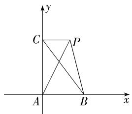

则 $A(0,0), B(t,0), C\left(0, \frac{1}{t}\right) (t > 0)$ ,

所以 $\overrightarrow{AB} = (t,0),\overrightarrow{AC} = \left(0,\frac{1}{t}\right),$

故 $\frac{\overrightarrow{AB}}{|\overrightarrow{AB}|} = (1,0),\frac{2\overrightarrow{AC}}{|\overrightarrow{AC}|} = (0,2),$

则 $\overrightarrow{AP} = \frac{\overrightarrow{AB}}{|\overrightarrow{AB}|} +\frac{2\overrightarrow{AC}}{|\overrightarrow{AC}|} = (1,2)$ ，即 $P(1,2)$

故 $\overrightarrow{PB} = (t - 1, -2),\overrightarrow{PC} = \left(-1,\frac{1}{t} -2\right),$

所以 $\overrightarrow{PB} \cdot \overrightarrow{PC} = 1 - t + 4 - \frac{2}{t} = 5 - \left(t + \frac{2}{t}\right) \leqslant 5 - 2\sqrt{2}$ ,

当且仅当 $t = \frac{2}{t}$ 即 $t = \sqrt{2}$ 时，等号成立

故选 B.

7.B 在正方体 $ABCD - A_{1}B_{1}C_{1}D_{1}$ 中， $BB_{1} \perp$ 平面 $A_{1}B_{1}C_{1}D_{1}$ ，因为 $B_{1}P \subset$ 平面 $A_{1}B_{1}C_{1}D_{1}$ ，所以 $BB_{1} \perp B_{1}P$

由 $BP = 3$ ，得 $B_{1}P = \sqrt{BP^{2} - BB_{1}^{2}} = \sqrt{3^{2} - 2^{2}} = \sqrt{5}$

在 Rt $\triangle B_{1}C_{1}P$ 中， $\angle B_{1}C_{1}P = 90^{\circ}$ ，则 $C_{1}P = \sqrt{(\sqrt{5})^{2} - 2^{2}} = 1$ ，即点 P 为 $C_{1}D_{1}$ 的中点，

又 $AA_{1} //BB_{1}, BB_{1} \subset$ 平面 $BB_{1}P, AA_{1} \not\subset$ 平面 $BB_{1}P$ , 因此 $AA_{1} //$ 平面 $BB_{1}P$ , 于是点 $A$ 到平面 $BB_{1}P$ 的距离等于点 $A_{1}$ 到平面 $BB_{1}P$ 的距离, 同理点 $C$ 到平面 $BB_{1}P$ 的距离等于点 $C_{1}$ 到平面 $BB_{1}P$ 的距离 (利用线面平行把点 $A, C$ 到平面 $BB_{1}P$ 的距离分别转化为点 $A_{1}, C_{1}$ 到平面 $BB_{1}P$ 的距离), 连接 $A_{1}P$ , 过 $A_{1}, C_{1}$ 分别作 $B_{1}P$ 的垂线, 垂足分别为 $O_{1}, O$ , 如图,

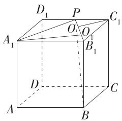

由 $S_{\triangle A_1PB_1} = \frac{1}{2} B_1P\cdot A_1O_1 = \frac{1}{2} A_1B_1\cdot A_1D_1$ ，得 $\sqrt{5} A_1O_1 = 2\times 2$ ，解得 $A_{1}O_{1}$ $= \frac{4\sqrt{5}}{5},$

在 $\mathrm{Rt}\triangle B_1C_1P$ 中， $C_1O = \frac{B_1C_1\cdot C_1P}{B_1P} = \frac{2\times 1}{\sqrt{5}} = \frac{2\sqrt{5}}{5},$

则 $A_{1}O_{1} + C_{1}O = \frac{4\sqrt{5}}{5} +\frac{2\sqrt{5}}{5} = \frac{6\sqrt{5}}{5},$

所以点 A, C 到平面 $BB_{1}P$ 的距离之和为 $\frac{6\sqrt{5}}{5}$ .

故选B.

8.D 由题意,结合正弦定理得 $\sin C - \sin B = 2\sin B\cos A$ ,

又 $\sin C = \sin [\pi - (A + B)] = \sin (A + B) = \sin A \cos B + \cos A \sin B,$

所以 $\sin A\cos B + \cos A\sin B - \sin B = 2\sin B\cos A$

则 $\sin B = \sin A\cos B - \sin B\cos A = \sin (A - B)$

又 $A \in (0, \pi), B \in (0, \pi)$ ，则 $A - B \in (-\pi, \pi)$ ，

所以 $B = A - B$ 或 $B + (A - B) = \pi$ ，即 $A = 2B$ 或 $A = \pi$ （舍去），

则 $C = \pi - A - B = \pi - 3B$

所以 $\left\{\begin{aligned}0&<2B<\pi,\\ 0&<\pi-3B<\pi,\end{aligned}\right.$ 解得 $0<B<\frac{\pi}{3}$ ，则 $\frac{1}{2}<\cos B<1$ ，

所以 $\frac{c}{a - b} = \frac{\sin C}{\sin A - \sin B} = \frac{\sin(\pi - 3B)}{\sin 2B - \sin B} = \frac{\sin 3B}{\sin 2B - \sin B}$

$$
= \frac {\sin (2 B + B)}{2 \sin B \cos B - \sin B} = \frac {\sin 2 B \cos B + \cos 2 B \sin B}{2 \sin B \cos B - \sin B}
$$

$$
= \frac {2 \sin B \cos^ {2} B + (2 \cos^ {2} B - 1) \sin B}{\sin B (2 \cos B - 1)} = 2 \cos B + 1 \in (2, 3),
$$

所以 $\frac{c}{a-b}$ 的取值范围是(2,3).

故选 D.

9. CD 用 $(a,b)$ 表示从甲罐、乙罐中抽取的小球标号的情况，

则所有的情况有(1,1),(1,2),(1,3),(1,5),(1,6),(2,1),(2,2),(2,3),(2,5),(2,6),(3,1),(3,2),(3,3),(3,5),(3,6),(4,1),(4,2),(4,3),(4,5),(4,6),共20种，

其中满足事件 A 的结果有 $(1,5)$ , $(1,6)$ , $(2,5)$ , $(2,6)$ , $(3,3)$ , $(3,5)$ , $(3,6)$ , $(4,2)$ , $(4,3)$ , $(4,5)$ , $(4,6)$ , 共 11 种,

其中满足事件 B 的结果有 $(2,5)$ , $(2,6)$ , $(3,3)$ , $(3,5)$ , $(3,6)$ , $(4,3)$ , $(4,5)$ , $(4,6)$ , 共 8 种, 故 A 错误;

因为事件 B 的结果均包含在事件 A 中, 故 $B \subseteq A$ , 故 B 错误;

因为 $A \cup B = A$ ，所以 $A \cup B$ 的结果有 11 种，

所以 $P(A\cup B) = \frac{11}{20}$ ，故C正确；

因为 $A \cap B = B$ ，所以 $A \cap B$ 的结果有 8 种，故 $P(A \cap B) = \frac{8}{20} = \frac{2}{5}$ ，故 D 正确.

故选 CD.

10.ABC 对于 A, 由 $\left|z+1-i\right|=1$ 的几何意义, 知复数 z 对应的点 Z 到定点 $(-1,1)$ 的距离为 1, 即动点 Z 的轨迹是以 $(-1,1)$ 为圆心, 1 为半径的圆, $\left|z-1-i\right|$ 表示动点 Z 与点 $(1,1)$ 间的距离, 由圆的性质知 $\left|z-1-i\right|_{\max}=\sqrt{\left(-1-1\right)^{2}+\left(1-1\right)^{2}}+1=3$ , A 正确;

对于 B, 设 $z_{1}=m+ni, z_{2}=c+d\mathrm{i}(m,n,c,d\in\mathbf{R})$ ，因为 $|z_{1}|=2, |z_{2}|=2, z_{1}+z_{2}=1+\sqrt{3}\mathrm{i}$ ,

所以 $m^2 + n^2 = 4, c^2 + d^2 = 4, m + c = 1, n + d = \sqrt{3}$ ,

所以 $mc + nd = -2$ ，所以 $\left|z_1 - z_2\right| = \left|\left(m - c\right) + (n - d)\mathrm{i}\right| = \sqrt{(m - c)^2 + (n - d)^2}$

$= \sqrt{m^2 + c^2 + n^2 + d^2 - 2(mc + nd)} = \sqrt{4 + 4 - 2\times(-2)} = 2\sqrt{3}$ ，B正确；

对于 C, 由正弦定理得 $AC \cdot \sin C = AB \cdot \sin B$ , 即 $|\overrightarrow{AC}| \sin C = |\overrightarrow{AB}| \sin B$ , $\therefore \overrightarrow{AP} = \lambda \left( \frac{\overrightarrow{AB}}{|\overrightarrow{AB}| \sin B} + \frac{\overrightarrow{AC}}{|\overrightarrow{AC}| \sin C} \right) = \frac{\lambda}{|\overrightarrow{AB}| \sin B} (\overrightarrow{AB} + \overrightarrow{AC})$ , 设 BC 的中点

为 E, 如图,

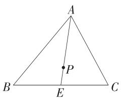

则 $\overrightarrow{AB} +\overrightarrow{AC} = 2\overrightarrow{AE}$ ，则 $\overrightarrow{AP} = \frac{2\lambda}{|\overrightarrow{AB}|\sin B}\overrightarrow{AE}$ ，由平面向量共线定理得 $A,P,E$ 三点共线，即点 $P$ 在边 $BC$ 上的中线所在直线上，故点 $P$ 的轨迹经过 $\triangle ABC$ 的重心，C正确；

对于D,如图,由已知易得,点D在与AB平行的 $\triangle ABC$ 的中位线上,且点D与AB的三等分点(靠近A)的连线平行于AC,故有 $S_{\triangle ABD}=\frac{1}{2}S_{\triangle ABC},S_{\triangle ACD}=\frac{1}{3}S_{\triangle ABC},S_{\triangle BCD}=\left(1-\frac{1}{2}-\frac{1}{3}\right)S_{\triangle ABC}=\frac{1}{6}S_{\triangle ABC}$ ,所以 $\frac{S_{\triangle BCD}}{S_{\triangle ABD}}=\frac{1}{3}$ ,D错误.

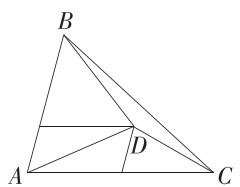

故选 ABC.

11.ABD 因为 $PA = PC = AB = BC = 2$ ，点 $O, M$ 分别为 $AC, BC$ 的中点，所以 $BO \perp AC, PO \perp AC$ ，又 $BO, PO \subset$ 平面 $BOP$ ，且 $BO \cap PO = O$ ，所以 $AC \perp$ 平面 $BOP$ ，

已知 $AC=2\sqrt{3}$ ，利用勾股定理可得 BO=PO=1，

又平面 $PAC \perp$ 平面 ABC, 平面 $PAC \cap$ 平面 $ABC = AC, PO \perp AC$ , 所以 $PO \perp$ 平面 ABC,

因为 $BO \subset$ 平面 $ABC$ , 所以 $PO \perp BO$ , 则由勾股定理可得 $PB = \sqrt{2}$ .

取 PC, OC 的中点 E, F, 连接 ME, MF, EF, 如图所示:

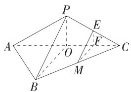

易得 $MF \parallel BO, EF \parallel PO$ ，所以 $MF \perp AC, EF \perp AC$ ，又 $MF \cap EF = F$ ，所以 $AC \perp$ 平面 $MEF$ .

N 为三棱锥 P-ABC 表面上一动点，

若 $AC \perp MN$ ，则 $N$ 点的轨迹为线段 $ME, MF, EF$ 上除去 $M$ 之外的点，

所以点 $N$ 的轨迹长度为 $ME + MF + EF = \frac{\sqrt{2}}{2} +\frac{1}{2} +\frac{1}{2} = 1 + \frac{\sqrt{2}}{2},\mathrm{A}$ 正确.

若 $ON = \frac{1}{2}$ 则 $N$ 点的轨迹是以 $O$ 为球心， $\frac{1}{2}$ 为半径的球与三棱锥 $P - ABC$ 表面的交线，

易知在平面 PAC 内, N 点的轨迹是以 O 为圆心, $\frac{1}{2}$ 为半径的半圆弧,

同理在平面 $ABC$ 内， $N$ 点的轨迹是以 $O$ 为圆心， $\frac{1}{2}$ 为半径的半圆弧，

设点 O 到平面 PBC 的距离为 d，由等体积法可得 $\frac{1}{3}S_{\triangle BOC} \cdot PO = \frac{1}{3}S_{\triangle PBC}$

$$
\cdot d, \text {即} \frac {1}{3} \times \frac {1}{2} \times 1 \times \sqrt {3} \times 1 = \frac {1}{3} \times \frac {1}{2} \times \sqrt {2} \times \sqrt {2 ^ {2} - \left(\frac {\sqrt {2}}{2}\right) ^ {2}} \cdot d,
$$

解得 $d = \frac{\sqrt{21}}{7} >\frac{1}{2}$ ，由对称性可知 $O$ 到平面 $PAB$ 的距离也为 $\frac{\sqrt{21}}{7}$

即以 O 为球心, $\frac{1}{2}$ 为半径的球与平面 PBC 和平面 PAB 无交点,

所以 N 点的轨迹是在平面 PAC 和平面 ABC 内的两个半圆弧, B 正确.

将平面 PAC 沿 AC 旋转至与平面 ABC 在同一平面内, 如图所示:

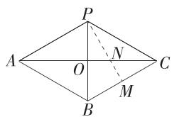

易知四边形 PABC 为菱形, 连接 PM 交 AC 于 N, 此时 $MN + NP$ 最短, 为 PM 的长,

因为 $PB = BC = PC = 2$ ，所以 $PM = \sqrt{3}$

可得 $MN+NP$ 的最小值为 $\sqrt{3}$ ，C 错误.

作 $AQ \parallel BC, QC \parallel AB$ ，则易知四边形 $ABCQ$ 为菱形，显然 $Q$ 点即为 $\triangle ABC$ 外接圆的圆心 ( $QA = QB = QC = 2$ )，

设三棱锥 P-ABC 的外接球的球心为 $O_{1}$ ，半径为 R，

易知球心 $O_{1}$ 在 Q 点正下方, 如图所示:

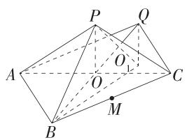

设 $O_{1}Q = h$ ，在 $\mathrm{Rt}\triangle O_1QB$ 中，由勾股定理得 $h^2 +2^2 = R^2$

结合 $(h + 1)^2 + 1^2 = R^2$ （点 $O_1$ 到点 $P$ 的垂直距离为 $O_1Q + OP = h + 1$ ，点 $O_1$ 到点 $P$ 的水平距离为 $1, O_1P = R$ ），解得 $h = 1, R = \sqrt{5}$ ，所以三棱锥 $P - ABC$ 的外接球的表面积为 $4\pi R^2 = 20\pi$ ，D正确.故选ABD.

12. 答案 $\frac{13}{15}$

解析 至少有 1 人解对题的概率 $P = 1 - \left(1 - \frac{2}{3}\right)\left(1 - \frac{3}{5}\right) = \frac{13}{15}$ .

13. 答案 $\frac{16\pi}{3}$

解析 在 $\triangle ABC$ 中, $AB = BC = 1$ , $AC = \sqrt{3}$ , 则 $\cos \angle BAC = \frac{\frac{1}{2}AC}{AB} = \frac{\sqrt{3}}{2}$ , $\sin \angle BAC = \frac{1}{2}$ ,

由正弦定理得 $\triangle ABC$ 外接圆半径 $r = \frac{1}{2} \times \frac{1}{\sin \angle BAC} = 1$ ，设球的半径为 $R$ ，于是 $R^2 = \left(\frac{1}{2} R\right)^2 + 1$ ，解得 $R^2 = \frac{4}{3}$ ，所以球的表面积是 $4\pi R^2 = \frac{16\pi}{3}$ .

14. 答案 $\frac{\pi}{3}; \frac{37}{7}$

解析 $\because \overrightarrow{AE} = 2\overrightarrow{BE},\overrightarrow{CD} = 4\overrightarrow{AC},$

$$
\therefore \overrightarrow {A E} = 2 \overrightarrow {A B}, \overrightarrow {A D} = 5 \overrightarrow {A C}.
$$

$$
\text { 又 } \because A B = 2, A C = 1, \overrightarrow {B D} \cdot \overrightarrow {C E} = - 2,
$$

$$
\therefore (\overrightarrow {A D} - \overrightarrow {A B}) \cdot (\overrightarrow {A E} - \overrightarrow {A C}) = (5 \overrightarrow {A C} - \overrightarrow {A B}) \cdot (2 \overrightarrow {A B} - \overrightarrow {A C})
$$

$$
= 1 1 \overrightarrow {A B} \cdot \overrightarrow {A C} - 5 \overrightarrow {A C ^ {2}} - 2 \overrightarrow {A B ^ {2}}
$$

$$
= 1 1 \times 2 \times 1 \times \cos \angle B A C - 5 \times 1 - 2 \times 4
$$

$$
= 2 2 \cos \angle B A C - 1 3 = - 2,
$$

$$
\therefore \cos \angle B A C = \frac {1}{2},
$$

$$
\because \angle B A C \in (0, \pi), \therefore \angle B A C = \frac {\pi}{3}.
$$

设 $\overrightarrow{EP} = \lambda \overrightarrow{ED},\lambda \in [0,1]$

$$
\because \overrightarrow {A E} = 2 \overrightarrow {B E}, \overrightarrow {C D} = \frac {4}{5} \overrightarrow {A D},
$$

$$
\therefore \overrightarrow {B P} \cdot \overrightarrow {C P} = (\overrightarrow {B E} + \overrightarrow {E P}) \cdot (\overrightarrow {C D} + \overrightarrow {D P})
$$

$$
= \left[ \frac {1}{2} \overrightarrow {A E} + \lambda (\overrightarrow {A D} - \overrightarrow {A E}) \right] \cdot \left[ \frac {4}{5} \overrightarrow {A D} + (1 - \lambda) (\overrightarrow {A E} - \overrightarrow {A D}) \right]
$$

$$
= \left(\lambda^ {2} - \frac {3}{2} \lambda + \frac {1}{2}\right) \overrightarrow {A E ^ {2}} + \left(\lambda^ {2} - \frac {1}{5} \lambda\right) \overrightarrow {A D ^ {2}} + \left(\frac {1 7}{1 0} \lambda - \frac {1}{1 0} - 2 \lambda^ {2}\right) \overrightarrow {A D} \cdot \overrightarrow {A E}
$$

$$
= 1 6 \left(\lambda^ {2} - \frac {3}{2} \lambda + \frac {1}{2}\right) + 2 5 \left(\lambda^ {2} - \frac {1}{5} \lambda\right) + \left(\frac {1 7}{1 0} \lambda - \frac {1}{1 0} - 2 \lambda^ {2}\right) \times 5 \times 4 \times \cos \frac {\pi}{3}
$$

$$
= 2 1 \lambda^ {2} - 1 2 \lambda + 7
$$

$$
= 2 1 \left(\lambda - \frac {2}{7}\right) ^ {2} + \frac {3 7}{7},
$$

∴ 当 $\lambda=\frac{2}{7}$ 时, $\overrightarrow{BP}\cdot\overrightarrow{CP}$ 有最小值, 为 $\frac{37}{7}$ .

15. 解析 (1) $\because a // b, \therefore x - 2 \times 3 = 0$ , 得 $x = 6, \therefore b = (3, 6)$ , (3 分)

$$
\because \pmb {a} \perp \pmb {c}, \therefore 1 \times 2 + 2 y = 0, \text {得} y = - 1, \therefore \pmb {c} = (2, - 1). \tag {6分}
$$

(2) 由 (1) 可知 $m = 2a + b = (5, 10), n = a + c = (3, 1)$ ，(8 分)

则 $\cos \langle m, n \rangle = \frac{m \cdot n}{|m||n|} = \frac{5 \times 3 + 10 \times 1}{\sqrt{5^2 + 10^2} \times \sqrt{3^2 + 1^2}} = \frac{\sqrt{2}}{2}$ , (11分)

$$
\because \langle \boldsymbol {m}, \boldsymbol {n} \rangle \in [ 0, \pi ], \therefore \langle \boldsymbol {m}, \boldsymbol {n} \rangle = \frac {\pi}{4}.
$$

∴ m 与 n 的夹角为 $\frac{\pi}{4}$ . (13 分)

16. 解析 (1) 由题意得 $b \cos A = 3 - a \cos B$ ，即 $b \cos A + a \cos B = 3$ ，(1 分)

由余弦定理的推论得 $b \cdot \frac{b^2 + c^2 - a^2}{2bc} + a \cdot \frac{a^2 + c^2 - b^2}{2ac} = 3$ ，（3分）

所以 $c = 3$ （6分）

(2)若选①:

记 $\angle BAC = 2\theta$

则有 $S_{\triangle ABC} = S_{\triangle ACD} + S_{\triangle ABD}$

即 $\frac{1}{2} bc\sin 2\theta = \frac{1}{2} b\cdot AD\sin \theta +\frac{1}{2} c\cdot AD\sin \theta ,$ (9分)

即 $6\sin2\theta=\frac{12}{5}\sin\theta+\frac{18}{5}\sin\theta$ ，即 $\sin2\theta=\sin\theta$ ，所以 $2\sin\theta\cos\theta=\sin\theta$ ，
(11 分)

因为 $\theta \in \left(0, \frac{\pi}{2}\right)$ , 所以 $\sin \theta \neq 0$ , 从而 $\cos \theta = \frac{1}{2}$ , 即 $\theta = \frac{\pi}{3}$ , (13 分)

所以 $\angle BAC=\frac{2\pi}{3}.$ (15 分)

若选②:

由于 D 为 BC 的中点, 所以 $\overrightarrow{AD} = \frac{1}{2} (\overrightarrow{AB} + \overrightarrow{AC})$ , (8 分)

即 $4\overrightarrow{AD}^2 = \overrightarrow{AB}^2 +\overrightarrow{AC}^2 +2\overrightarrow{AB}\cdot \overrightarrow{AC},$

又因为 $|\overrightarrow{AD}|=\frac{\sqrt{7}}{2},|\overrightarrow{AB}|=3,|\overrightarrow{AC}|=2$ ，所以 $\overrightarrow{AB}\cdot\overrightarrow{AC}=-3$ ，(11分)

即 $|\overrightarrow{AB}|\cdot|\overrightarrow{AC}|\cdot\cos\angle BAC=-3$ ，所以 $\cos\angle BAC=-\frac{1}{2}$ ，(13分)

又因为 $\angle BAC\in (0,\pi)$ ，所以 $\angle BAC = \frac{2\pi}{3}$ （15分）

若选③:

由于 AH 为 BC 边上的高，

在 Rt△BAH 中， $BH^{2}=AB^{2}-AH^{2}=9-\frac{9\times57}{19\times19}=\frac{144}{19}$ ，所以 $BH=\frac{12\sqrt{19}}{19}$ ，(8分)

在 Rt△CAH 中， $CH^{2}=AC^{2}-AH^{2}=4-\frac{9\times57}{19\times19}=\frac{49}{19}$ ，所以 $CH=\frac{7\sqrt{19}}{19}$ ，(10 分)

所以 $BC = BH + CH = \sqrt{19}$ ,

由余弦定理的推论得 $\cos\angle BAC=\frac{AB^{2}+AC^{2}-BC^{2}}{2AB\cdot AC}=\frac{9+4-19}{2\times3\times2}=-\frac{1}{2}$ ,
(13 分)

又因为 $\angle BAC\in (0,\pi)$ ，所以 $\angle BAC = \frac{2\pi}{3}$ （15分）

17. 解析 (1) 由题意得 $(0.005 + 0.010 + 0.025 + a + 0.020) \times 10 = 1$

解得 a=0.040，(2 分)

设综合评分的平均数为 $\bar{x}$ 分，

则 $\overline{x} = 10\times (55\times 0.005 + 65\times 0.010 + 75\times 0.025 + 85\times 0.040 + 95\times 0.020) = 81$

所以综合评分的平均数为81分. (5分)

(2)该样本中一等品的频率为 $(0.040 + 0.020)\times 10 = 0.6$ ，则从中抽取5个产品，其中一等品有3个，分别记为 $a,b,c$ ，非一等品有2个，分别记为 $D,E$

从这5个产品中随机抽取2个,样本空间 $\Omega=\{ab,ac,aD,aE,bc,bD,bE,cD,cE,DE\},n(\Omega)=10.$ (7分)

记事件 A=“抽取的这 2 个产品中最多有 1 个一等品”，

则 $A = \{aD, aE, bD, bE, cD, cE, DE\}, n(A) = 7$ ，（8分）

所以所求概率为 $\frac{7}{10}$ . (11分)

(3)由题意可知,落在[50,60)内的频率为0.05,落在[60,70)内的频率为0.1,

所以 $\bar{z} = \frac{0.05}{0.05 + 0.1}\times 54 + \frac{0.1}{0.05 + 0.1}\times 63 = 60$ （分）， (13分)

$s^2 = \frac{0.05}{0.05 + 0.1}\left[3 + (54 - 60)^2\right] + \frac{0.1}{0.05 + 0.1}\left[3 + (63 - 60)^2\right] = 21.$ （15分）

18. 解析 (1) 证明: 连接 $PM, AC$ , 因为 $\triangle PAB$ 是边长为 2 的等边三角形, 点 $M$ 为 $AB$ 的中点, 所以 $PM \perp AB$ .

因为四边形 ABCD 为菱形, $\angle ABC = 60^{\circ}$ , 所以 $\triangle ABC$ 为等边三角形, 所以 $CM \perp AB$ ,
(2 分)

因为 $PM \cap MC = M, PM, MC \subset$ 平面 $PMC$ , 所以 $AB \perp$ 平面 $PMC$ , (4分)

因为 $PC \subset$ 平面 $PMC$ , 所以 $AB \perp PC$ . (5分)

(2) 在 $PM$ 上取点 $Q$ , 使得 $PQ = 2QM$ , 设 $DB \cap MC = F$ , 连接 $BQ, QF$ ,

因为 $BM \parallel CD$ ，所以 $\frac{BF}{DF} = \frac{MF}{CF} = \frac{BM}{CD} = \frac{1}{2}$ ，

在 $\triangle PMC$ 中， $\frac{MF}{CF} = \frac{QM}{PQ} = \frac{1}{2}$ ，所以 $QF \parallel PC$

所以 $\angle BFQ$ 或其补角为异面直线 $BD$ 与 $PC$ 所成的角， (7分)

因为 $\frac{QF}{PC} = \frac{1}{3}$ 所以 $QF = \frac{1}{3} \times 3 = 1$

易得 $BF = \frac{1}{3} BD = \frac{1}{3}\sqrt{BC^2 + CD^2 - 2BC\cdot CD\cdot\cos 120^\circ} = \frac{1}{3}\times \sqrt{4 + 4 + 4}$

$$
= \frac {2 \sqrt {3}}{3},
$$

$$
B Q = \sqrt {B M ^ {2} + \left(\frac {1}{3} P M\right) ^ {2}} = \sqrt {1 + \frac {1}{3}} = \frac {2 \sqrt {3}}{3}, \tag {10分}
$$

在 $\triangle BFQ$ 中，由余弦定理的推论得 $\cos \angle BFQ = \frac{BF^2 + QF^2 - BQ^2}{2BF\cdot QF} =$

$$
\frac {\frac {4}{3} + 1 - \frac {4}{3}}{2 \times \frac {2 \sqrt {3}}{3} \times 1} = \frac {\sqrt {3}}{4},
$$

所以异面直线 $BD$ 与 $PC$ 所成角的余弦值为 $\frac{\sqrt{3}}{4}$ . (12分)

(3) 假设线段 PD 上存在点 N, 使得 PB // 平面 MCN.

连接 NF, 因为 $PB \parallel$ 平面 MCN, $PB \subset$ 平面 PBD, 平面 $PBD \cap$ 平面 MCN = NF, 所以 $PB \parallel NF$ , (14 分)

又 $\frac{BF}{DF} = \frac{BM}{CD} = \frac{1}{2}$ 所以 $\frac{BF}{FD} = \frac{PN}{ND} = \frac{1}{2}$ . (16分)

所以线段 $PD$ 上存在点 $N$ , 使得 $PB \parallel$ 平面 $MCN$ , 且 $\frac{PN}{PD} = \frac{1}{3}$ . (17 分)

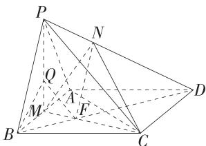

19. 解析 (1) A 获得冠军: A、B 组 A 获胜, 再由 A 与 C、D 组胜者决赛并胜出, (2 分)

A获得冠军的概率为 $P_{1} = \frac{3}{4}\times \frac{1}{2}\times \frac{3}{4} +\frac{3}{4}\times \frac{1}{2}\times \frac{3}{4} = \frac{9}{16};$ (4分)

C获得冠军：C、D组C获胜，再由C与A、B组胜者决赛并胜出，(6分)

C获得冠军的概率为 $P_{2} = \frac{1}{2}\times \frac{3}{4}\times \left(1 - \frac{3}{4}\right) + \frac{1}{2}\times \left(1 - \frac{3}{4}\right)\times \frac{1}{2} = \frac{5}{32}.$ （8分）

(2)淘汰赛赛制下，A获得冠军的概率为 $p \times \frac{1}{2} \times p + p \times \frac{1}{2} \times p = p^2$ 。（10分）“双败赛制”下，讨论A进入胜者组、败者组两种情况，

当 A 进入胜者组时, 若在胜者组 A 失败, 后两局都胜, 方可得冠军,

若在胜者组 A 胜利,后一局(与败者组胜者比赛)胜,方可得冠军;

当 A 进入败者组时,后三局都胜,方可得冠军. (12 分)

综上，A获得冠军的概率为 $p^3 (1 - p) + p^3 +(1 - p)p^3 = p^3 (3 - 2p)$ （14分）

令 $f(p) = p^3 (3 - 2p) - p^2 = p^2 (-2p^2 +3p - 1) = p^2 (2p - 1)(1 - p)$ ，（16分）

若 A 为强队, 则 $\frac{1}{2}<p<1$ , 故 $f(p)>0$ ,

所以“双败赛制”下对强者更有利. (17 分)