# 第六章 平面向量及其应用

# 6.1 平面向量的概念

# 6.1.1 向量的实际背景与概念

# 6.1.2 向量的几何表示

# 6.1.3 相等向量与共线向量

基础过关练  
Q 对应主书 P1

<table><tr><td>1.D</td><td>2.A</td><td>3.C</td><td>7.C</td><td>8.B</td><td>9.C</td><td>10.D</td><td>11.AC</td></tr></table>

1.D

2.A 对于(1),若两向量方向不同,则终点不同,(1)错误;

对于(2)，零向量的方向是任意的，(2)错误；

对于(3)，零向量的模为0，不是正数，(3)错误；

对于(4)，与任意非零向量共线的单位向量有两个，它们的方向相反，(4)错误.

故选 A.

3. C 对于 A, 因为 $\overrightarrow{CD} = -\overrightarrow{DC}$ , 所以 $|\overrightarrow{CD}| = |\overrightarrow{DC}|$ , 故 A 中说法正确;

对于 B, 由单位向量的定义知 $\left|e_{1}\right|=\left|e_{2}\right|=1$ , 故 B 中说法正确;

对于 C, 向量不能比较大小, 故 C 中说法错误;

对于 D, 非零向量可以自由移动, 故 D 中说法正确.

故选 C.

4. 答案 $\sqrt{2}$

解析 由正方形 ABCD 的边长为 2, 得其对角线长为 $2\sqrt{2}$ , 所以 $\left|\overrightarrow{OA}\right|=\sqrt{2}$ .

5. 解析 如图所示.

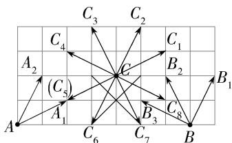

text_image

C₃ C₂
C₁
C₄
A₂ (C₅) C C₁
B₂ B₁
A₁ C₆ C₇ C₈ B

6. 解析 (1) ① 向量 $\overrightarrow{OA}$ 如图所示.

②向量 $\overrightarrow{OB}$ 如图所示.

(2) 向量 $\overrightarrow{AB}$ 如图所示. 易知 $\angle BAO = 90^{\circ}$ , 故 $|\overrightarrow{AB}| = \sqrt{|\overrightarrow{OB}|^{2} - |\overrightarrow{OA}|^{2}} = \sqrt{(3\sqrt{2})^{2} - 3^{2}} = 3$ .

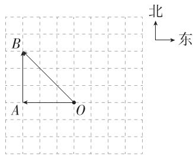

text_image

B
A
O
北
东

7. C 对于 A, B, 若 a = -b, 则 $a \neq b$ , $|a| = |b|$ , A, B 错误; 对于 C, D, 向量相等具有传递性, 但平行不具有传递性 (考虑 b = 0), C 正确, D 错误. 故选 C.

8.B 因为 O 是正三角形 ABC 的中心, 所以 $\left|\overrightarrow{AO}\right|=\left|\overrightarrow{BO}\right|=\left|\overrightarrow{CO}\right|$ , 所以向量 $\overrightarrow{AO}, \overrightarrow{BO}, \overrightarrow{CO}$ 是模相等的向量, 但方向不同. 故选 B.

9.C 由 $\overrightarrow{AB} // \overrightarrow{DC}, \overrightarrow{AD} // \overrightarrow{BC}$ , 可得四边形 $ABCD$ 为平行四边形, 则 $\overrightarrow{AD} = \overrightarrow{BC}, \overrightarrow{OB} = \overrightarrow{DO}, \overrightarrow{AO} = \overrightarrow{OC}, \overrightarrow{AC} \neq \overrightarrow{BD}$ . 故选 C.

10.D 对于 A, 四边形 ABCD 可以是平行四边形, 也可以是梯形, A 错误;

对于 B, 四边形 ABCD 的对角线相等不能保证四边形为矩形, B 错误;

对于 C, 四边形 ABCD 可以是等腰梯形, 也可以是矩形, C 错误;

对于 D, 若 $\overrightarrow{AB} = \overrightarrow{DC}$ , 则 $|\overrightarrow{AB}| = |\overrightarrow{DC}|$ 且 $\overrightarrow{AB} \parallel \overrightarrow{DC}$ , 则四边形 ABCD 为平行四边形, D 正确. 故选 D.

11. AC 因为 $A \cap B$ 除了包含 a, 还包含与 a 长度相等且方向相反的向量, 所以 B, D 中的关系错误. 易知 A, C 正确.

12. 答案 0

解析 由题意知 $\overrightarrow{AB}$ 与 $\overrightarrow{BC}$ 不共线, 且 $m \parallel \overrightarrow{AB}, m \parallel \overrightarrow{BC}$ , 所以 $m = 0$ . (零向量的方向是任意的, 它与任意向量平行, 所以唯有零向量才能同时与两个不共线向量平行)

13. 答案 ①②

解析 ∵ 四边形 ABCD, CEFG, CGHD 是全等的菱形, ∴ AB = EF, 即 $\left|\overrightarrow{AB}\right| = \left|\overrightarrow{EF}\right|$ , ① 正确;

由题意知 $\overrightarrow{AB}\parallel\overrightarrow{CD}\parallel\overrightarrow{HG}\parallel\overrightarrow{FH}$ ，②正确；

若 $\overrightarrow{BD} \parallel \overrightarrow{EH}$ ，则 $BD \parallel EH, \therefore \angle BDC = \angle DEH$ ，而当四边形 ABCD, CEFG, CGHD 都是全等的正方形时， $\tan \angle BDC = 1, \tan \angle DEH = \frac{1}{2}, \angle BDC \neq \angle DEH,$ ③错误；

易知 $|\overrightarrow{DC}| = |\overrightarrow{EC}|, \overrightarrow{DC} \parallel \overrightarrow{EC}$ ，但 $\overrightarrow{DC}, \overrightarrow{EC}$ 的方向不同，④错误.

故答案为①②.

14. 解析 (1) 与 $\overrightarrow{FE}$ 共线的向量有 $\overrightarrow{BC}, \overrightarrow{OA}$ .

(2)由于 $\overrightarrow{BC}$ 与 $\overrightarrow{FE}$ 长度相等且方向相同，所以 $\overrightarrow{BC} = \overrightarrow{FE}$ .

(3) 显然 $\overrightarrow{OA} \parallel \overrightarrow{BC}$ ，且 $\left|\overrightarrow{OA}\right| = \left|\overrightarrow{BC}\right|$ ，但 $\overrightarrow{OA}$ 与 $\overrightarrow{BC}$ 的方向相反，所以这两个向量不相等.

# 6.2 平面向量的运算

# 6.2.1 向量的加法运算

# 6.2.2 向量的减法运算

# 基础过关练

Q 对应主书 P3

<table><tr><td>1.B</td><td>2.D</td><td>3.A</td><td>7.A</td><td>8.B</td><td>9.A</td><td>11.B</td><td>12.C</td></tr></table>

1. B $\overrightarrow{AB} + (\overrightarrow{OM} + \overrightarrow{BO}) + \overrightarrow{MB} = \overrightarrow{AB} + \overrightarrow{BO} + \overrightarrow{OM} + \overrightarrow{MB} = \overrightarrow{AB}.$ 故选 B.   
2.D 因为 $f_{1}+f_{2}+f_{3}=0$ ，所以 $f_{1}+f_{2}=-f_{3}$ ，所以 $f_{1}$ 与 $f_{2}$ 的合力的方向与 $f_{3}$ 的方向相反，长度相等，由向量加法的平行四边形法则可知 D 正确。故选 D.  
3.A 易得 $|\overrightarrow{AB} +\overrightarrow{BE}| = |\overrightarrow{AE} |$ ，显然当 $E$ 为斜边 $BC$ 的中点时， $AE$ 最短，此时 $AE\perp BC, AE = \frac{BC}{2} = \frac{\sqrt{2}}{2}$ ，即 $|\overrightarrow{AB} +\overrightarrow{BE} |$ 的最小值为 $\frac{\sqrt{2}}{2}$ .故选A.

4. 答案 $b_{6}$ (或 $-b_{2}$ )

解析 由题可知, $a_{2}+a_{5}+b_{2}+b_{5}+b_{7}$

$$
\begin{array}{l} = \overrightarrow {A _ {2} A _ {3}} + \overrightarrow {A _ {5} A _ {6}} + \overrightarrow {O A _ {2}} + \overrightarrow {O A _ {5}} + \overrightarrow {O A _ {7}} \\ = \left(\overrightarrow {O A _ {5}} + \overrightarrow {A _ {5} A _ {6}}\right) + \left(\overrightarrow {O A _ {2}} + \overrightarrow {A _ {2} A _ {3}}\right) + \overrightarrow {O A _ {7}} \\ = \overrightarrow {O A _ {6}} + \overrightarrow {O A _ {3}} + \overrightarrow {O A _ {7}} \\ = \overrightarrow {O A _ {6}} + \overrightarrow {A _ {7} O} + \overrightarrow {O A _ {7}} = \overrightarrow {O A _ {6}} = \boldsymbol {b} _ {6} (\text {或} - \boldsymbol {b} _ {2}). \\ \end{array}
$$

5. 解析 (1) $\overrightarrow{DG} + \overrightarrow{EA} + \overrightarrow{CB} = \overrightarrow{GC} + \overrightarrow{BE} + \overrightarrow{CB}$

$$
= \overrightarrow {G C} + \overrightarrow {C B} + \overrightarrow {B E} = \overrightarrow {G B} + \overrightarrow {B E} = \overrightarrow {G E}.
$$

(2) $\overrightarrow{EG} +\overrightarrow{CG} +\overrightarrow{DA} +\overrightarrow{EB} = \overrightarrow{EG} +\overrightarrow{GD} +\overrightarrow{DA} +\overrightarrow{AE}$

$$
= \overrightarrow {E D} + \overrightarrow {D A} + \overrightarrow {A E} = \overrightarrow {E A} + \overrightarrow {A E} = \mathbf {0}.
$$

6. 解析 如图, 设水流的速度为 $\overrightarrow{OA}$ , 小船航行的速度为 $\overrightarrow{OB}$ , 以 OA, OB 为邻边作 $\square AOBC$ , 则 $\overrightarrow{OC}$ 表示船实际航行的速度,

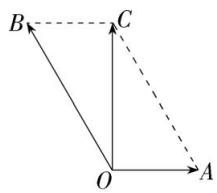

text_image

B
C
O
A

由题意可得 $|\overrightarrow{OA}| = 10, |\overrightarrow{OB}| = 20, OC \perp OA$

则 $|\overrightarrow{OC}| = \sqrt{20^2 - 10^2} = 10\sqrt{3}$

所以船的实际航行速度的大小为 $10\sqrt{3}$ m/min, 方向与水流速度方向间的夹角为 $90^{\circ}$ ,

故该船的实际航程是 $10\sqrt{3} \times 3 \times 60 = 1800\sqrt{3}$ (m).

7.A $\overrightarrow{AB} +\overrightarrow{BC} -\overrightarrow{AD} = \overrightarrow{AC} -\overrightarrow{AD} = \overrightarrow{DC}.$ 故选A.

8. B $\overrightarrow{OA}-\overrightarrow{ED}=\overrightarrow{EO}-\overrightarrow{ED}=\overrightarrow{DO}$ . 故选 B.

9.A $\overrightarrow{AC} = \overrightarrow{AO} +\overrightarrow{OC} = -\overrightarrow{OA} -\overrightarrow{OB} = -m - n$ ，故选A.

10. 答案 10;5

解析 因为 $a - b = |\overrightarrow{OA}| - |\overrightarrow{OB}| \leqslant |\overrightarrow{OA} - \overrightarrow{OB}| = |\overrightarrow{BA}| \leqslant |\overrightarrow{OA}| + |\overrightarrow{OB}| = a + b$

所以 $\left\{\begin{aligned}a+b=15,\\ a-b=5,\end{aligned}\right.$ 解得 $\left\{\begin{aligned}a=10,\\ b=5.\end{aligned}\right.$

11.B 对于 A, $\overrightarrow{AB} + \overrightarrow{BC} + \overrightarrow{CA} = \overrightarrow{AC} + \overrightarrow{CA} = 0$ , 故该选项运算结果正确;

对于 B, $\overrightarrow{AB}-\overrightarrow{BD}-\overrightarrow{DA}=\overrightarrow{AB}-(\overrightarrow{BD}+\overrightarrow{DA})=\overrightarrow{AB}-\overrightarrow{BA}=2\overrightarrow{AB}$ ，故该选项运算结果错误；

对于 C, $\overrightarrow{OA}-\overrightarrow{OD}+\overrightarrow{AD}=\overrightarrow{OA}+\overrightarrow{AD}-\overrightarrow{OD}=\overrightarrow{OD}-\overrightarrow{OD}=0$ , 故该选项运算结果正确;

对于 D, $\overrightarrow{AB}-\overrightarrow{AC}+\overrightarrow{BD}-\overrightarrow{CD}=\overrightarrow{AB}+\overrightarrow{BD}-(\overrightarrow{AC}+\overrightarrow{CD})=\overrightarrow{AD}-\overrightarrow{AD}=0$ , 故该选项运算结果正确. 故选 B.

12.C 由向量三角不等式可知,当且仅当非零向量 a,b 同向时,有 $\left|a\right|+\left|b\right|=\left|a+b\right|,\left|\left|a\right|-\left|b\right|\right|=\left|a-b\right|$ , 故 A,D 中说法正确; 当且仅当非零向量 a,b 反向时,有 $\left|a+b\right|=\left|\left|a\right|-\left|b\right|\right|,\left|a\right|+\left|b\right|=\left|a-b\right|$ , 故 B 中说法正确,C 中说法错误. 故选 C.

13. 答案 0

解析 $\overrightarrow{BE} -\overrightarrow{DC} +\overrightarrow{ED} = \overrightarrow{BE} +\overrightarrow{ED} -\overrightarrow{DC} = \overrightarrow{BD} -\overrightarrow{DC}.$

因为 D 是 BC 边的中点, 所以 $\overrightarrow{BD} = \overrightarrow{DC}$ .

所以 $\overrightarrow{BE} -\overrightarrow{DC} +\overrightarrow{ED} = \mathbf{0}.$

14. 答案 $\left(\frac{\pi}{3}, \frac{5\pi}{6}\right)$

解析 由题意得 $\overrightarrow{OC} = -\overrightarrow{OA} -\overrightarrow{OB} = -(\overrightarrow{OA} +\overrightarrow{OB})$

如图,以 OA, OB 为邻边作平行四边形 OADB, 连接 OD, 则由向量加法的几何意义得 $\overrightarrow{OC} = -\overrightarrow{OD}$ , 所以 $\overrightarrow{OC}$ 与 x 轴的非负半轴的夹角的取值介于 $-\overrightarrow{OB}$ 和 $-\overrightarrow{OA}$ 与 x 轴的非负半轴的夹角之间. 由题意得, $-\overrightarrow{OA}, -\overrightarrow{OB}$ 与 x 轴的非负半轴的夹角分别为 $\frac{5\pi}{6}$ 和 $\frac{\pi}{3}$ , 故 $\overrightarrow{OC}$ 与 x 轴的非负半轴的夹角的取值范围为 $\left(\frac{\pi}{3}, \frac{5\pi}{6}\right)$ .

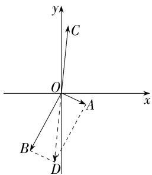

text_image

y
C
O
A
x
B
D

15. 解析 (1) $|\overrightarrow{AB}| = |\overrightarrow{AB} + \overrightarrow{BC} + \overrightarrow{CD}| = |\overrightarrow{AD}|$ , 故平行四边形 $ABCD$ 是菱形.

(2) 因为 E 为 AB 的中点, 所以 $\overrightarrow{AE} = \overrightarrow{EB}$ .

又 F 为 BC 的中点, 所以由三角形中位线定理知 EF
// AC, $EF = \frac{1}{2} AC$ , 故 $\overrightarrow{GC} = \overrightarrow{EF}$ .

所以 $\overrightarrow{AD} -\overrightarrow{GC} -\overrightarrow{EB} = \overrightarrow{AD} -\overrightarrow{EF} -\overrightarrow{AE} = \overrightarrow{AD} -(\overrightarrow{AE} +\overrightarrow{EF}) = \overrightarrow{AD}-$ $\overrightarrow{AF} = \overrightarrow{FD}.$

作出向量 $\overrightarrow{FD}$ ,如图所示.

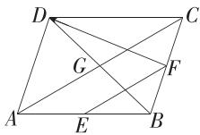

# 6.2.3 向量的数乘运算

基础过关练  
Q 对应主书 P5

<table><tr><td>1.D</td><td>2.C</td><td>3.ABC</td><td>5.D</td><td>6.D</td><td>7.CD</td><td>8.BCD</td><td>11.A</td></tr><tr><td>12.C</td><td>13.D</td><td></td><td></td><td></td><td></td><td></td><td></td></tr></table>

1.D $\because a = -\frac{1}{2} b (b \neq 0), -\frac{1}{2} < 0, \therefore a$ 和 $b$ 方向相反，且 $|a| = \left|\frac{-1}{2} b\right| = \frac{1}{2} |b|, \therefore |b| = 2|a|$ . 故选 D.

2.C 当 $\lambda < 0$ 时， $|\lambda a| = \lambda |a|$ 不成立，故A错误； $|\lambda a|$ 是一个非负实数，而 $|\lambda |a$ 是一个向量，故B错误；当 $\lambda = 0$ 或 $a = 0$ 时， $|\lambda a| = 0$ ，故D错误.故选C.

3. ABC 由题图可知 $\overrightarrow{AP}, \overrightarrow{AQ}$ 与 $\overrightarrow{AB}$ 方向相同，且 $|\overrightarrow{AP}| = \frac{1}{3} |\overrightarrow{AB}|, |\overrightarrow{AQ}| = \frac{2}{3} |\overrightarrow{AB}|$ ，故 $\overrightarrow{AP} = \frac{1}{3} \overrightarrow{AB}, \overrightarrow{AQ} = \frac{2}{3} \overrightarrow{AB}$ ，故 A, B 正确；

$\overrightarrow{BP},\overrightarrow{AB}$ 方向相反，且 $|\overrightarrow{BP}|=\frac{2}{3}|\overrightarrow{AB}|$ ，故 $\overrightarrow{BP}=-\frac{2}{3}\overrightarrow{AB}$ ，故C正确；

$\overrightarrow{BP},\overrightarrow{AQ}$ 大小相等,方向相反,故 $\overrightarrow{AQ}=-\overrightarrow{BP}$ ,故D错误.故选ABC.

4. 答案 $\pm\frac{3}{5}$

解析 由 $a = \lambda b$ 得 $|\pmb{a}| = |\lambda \pmb{b}| = |\lambda ||\pmb{b}|$ , 因为 $|\pmb{a}| = 3$ , $|\pmb{b}| = 5$ , 所以 $|\lambda| = \frac{3}{5}$ , 即 $\lambda = \pm \frac{3}{5}$ .

5. D $2(a+b)-(a-b)=2a+2b-a+b=a+3b$ . 故选 D.

6.D $\because \overrightarrow{BA} = 2\overrightarrow{DB} -2\overrightarrow{DC},\therefore \overrightarrow{BC} +\overrightarrow{CA} = 2(\overrightarrow{DC} +\overrightarrow{CB}) - 2\overrightarrow{DC},$ 即 $3\overrightarrow{BC} = \overrightarrow{AC},\therefore 3|\overrightarrow{BC}| = |\overrightarrow{AC} |,\therefore \frac{|\overrightarrow{AC}|}{|\overrightarrow{BC}|} = 3.$ 故选D.

7. CD 设 BC 的中点为 D, 连接 AD, 因为点 P 是 $\triangle ABC$

的重心,所以 $\overrightarrow{AP}=\frac{2}{3}\overrightarrow{AD}=\frac{2}{3}\times\frac{1}{2}(\overrightarrow{AB}+\overrightarrow{AC})=\frac{1}{3}\overrightarrow{AB}+\frac{1}{3}\overrightarrow{AC}=\frac{1}{3}\overrightarrow{AB}+\frac{1}{3}(\overrightarrow{AB}+\overrightarrow{BC})=\frac{2}{3}\overrightarrow{AB}+\frac{1}{3}\overrightarrow{BC}=\frac{2}{3}(\overrightarrow{AC}+\overrightarrow{CB})+\frac{1}{3}\overrightarrow{BC}=\frac{2}{3}\overrightarrow{AC}-\frac{1}{3}\overrightarrow{BC}.$ 故选CD.

8. BCD 对于 A, $\overrightarrow{BC} = \overrightarrow{AC} - \overrightarrow{AB}$ , 故 A 错误;

对于 B, $\overrightarrow{CD} = \overrightarrow{CA} + \overrightarrow{AD} = \overrightarrow{CA} + \frac{2}{3}\overrightarrow{AB} = \overrightarrow{CA} + \frac{2}{3} (\overrightarrow{CB} - \overrightarrow{CA}) = \frac{1}{3}\overrightarrow{CA} + \frac{2}{3}\overrightarrow{CB}$ ，故 B 正确；

对于 C, $\overrightarrow{AE} = \overrightarrow{AC} + \overrightarrow{CE} = \overrightarrow{AC} + \frac{1}{2} \overrightarrow{CD} = \overrightarrow{AC} + \frac{1}{2} \left( \overrightarrow{CA} + \frac{2}{3} \overrightarrow{AB} \right) = \frac{1}{3} \overrightarrow{AB} + \frac{1}{2} \overrightarrow{AC}$ ，故 C 正确；

对于 D, $\overrightarrow{AC} = \overrightarrow{BC} - \overrightarrow{BA} = \overrightarrow{BC} - 3 \overrightarrow{BD} = \overrightarrow{BC} - 3 (\overrightarrow{CD} - \overrightarrow{CB}) = 2 \overrightarrow{CB} - 3 \overrightarrow{CD}$ , 故 D 正确.

故选 BCD.

9. 答案 6

解析 易得 $\overrightarrow{AC} +\overrightarrow{AB} = \overrightarrow{AD} +\overrightarrow{DC} +4\overrightarrow{DC} = \overrightarrow{AD} -5\overrightarrow{CD},$

又 $\overrightarrow{AC}+\overrightarrow{AB}=x\overrightarrow{AD}+y\overrightarrow{CD}$ ，所以x=1,y=-5，所以 $x-y=1-(-5)=6.$

10. 解析 $\because \overrightarrow{BA} = \overrightarrow{OA} - \overrightarrow{OB} = a - b$

$$
\begin{array}{l} \therefore \overrightarrow {O M} = \overrightarrow {O B} + \overrightarrow {B M} = \overrightarrow {O B} + \frac {1}{3} \overrightarrow {B C} = \overrightarrow {O B} + \frac {1}{6} \overrightarrow {B A} = \boldsymbol {b} + \frac {1}{6} (\boldsymbol {a} - \\ \boldsymbol {b}) = \frac {1}{6} \boldsymbol {a} + \frac {5}{6} \boldsymbol {b}. \end{array}
$$

$$
\begin{array}{l} \because \overrightarrow {O D} = \boldsymbol {a} + \boldsymbol {b}, \therefore \overrightarrow {O N} = \overrightarrow {O C} + \overrightarrow {C N} = \overrightarrow {O C} + \frac {1}{3} \overrightarrow {C D} = \frac {1}{2} \overrightarrow {O D} + \\ \frac {1}{6} \overrightarrow {O D} = \frac {2}{3} \overrightarrow {O D} = \frac {2}{3} \boldsymbol {a} + \frac {2}{3} \boldsymbol {b}, \end{array}
$$

$$
\therefore \overrightarrow {M N} = \overrightarrow {O N} - \overrightarrow {O M} = \frac {2}{3} a + \frac {2}{3} b - \frac {1}{6} a - \frac {5}{6} b = \frac {1}{2} a - \frac {1}{6} b.
$$

11.A 对于①, 在 $\square ABCD$ 中, $\overrightarrow{AB} = \overrightarrow{DC}$ , 但是它们的起点、终点均不相同, 故①错误;

对于②, 若 b=0, 则 a 与 c 不一定共线, 故②错误;
对于③, 因为 $\overrightarrow{AB}$ 与 $\overrightarrow{BC}$ 共线, 且有公共点 B, 所以 A, B, C 三点共线, 故③正确;

易知④正确；

对于⑤, 若 $\lambda = \mu = 0$ , 则 $\lambda a = \mu b = 0$ , 但 a 与 b 不一定共线, 故⑤错误.

故选A.

12. C 由题意可得 $\overrightarrow{AD} = \overrightarrow{AB} + \overrightarrow{BC} + \overrightarrow{CD} = -8a - 2b$ ，则 $\overrightarrow{AD} = 2\overrightarrow{BC}$ ，故 $\overrightarrow{AD}$ 与 $\overrightarrow{BC}$ 共线，且 $|\overrightarrow{AD}| = 2|\overrightarrow{BC}|$ ，∴ 四边形 $ABCD$ 是梯形。故选 C.

13.D $\because A, B, C$ 三点共线, $\therefore \overrightarrow{AB}, \overrightarrow{BC}$ 共线, 故设 $\overrightarrow{AB} = k \overrightarrow{BC} (k \neq 0)$ ,

由题意得 $\overrightarrow{AB}=\overrightarrow{OB}-\overrightarrow{OA}=a-2b$ ，

$$
\overrightarrow {B C} = \overrightarrow {O C} - \overrightarrow {O B} = (\lambda - 2) \boldsymbol {a} + (\mu + 1) \boldsymbol {b},
$$

则 $a-2b=k(\lambda-2)a+k(\mu+1)\cdot b$ ,

即 $[1 - k(\lambda - 2)]\pmb{a} = [k(\mu + 1) + 2]\pmb{b}$ ,

∴ $\left\{\begin{aligned}1-k(\lambda-2)=0,\\ k(\mu+1)+2=0,\end{aligned}\right.$ 则 $\lambda-2=\frac{\mu+1}{-2}$ ，故 $2\lambda+\mu=3$ ，

故选 D.

14. 解析 (1) $\overrightarrow{MN} = \overrightarrow{ON} - \overrightarrow{OM} = \boldsymbol{m} - 3\boldsymbol{n} - (3\boldsymbol{m} - 2\boldsymbol{n}) = -2\boldsymbol{m} - \boldsymbol{n}$ .

(2) 因为 $\overrightarrow{OM} // \overrightarrow{OQ}$ , 所以 $\exists t \in \mathbf{R}$ , 使得 $\overrightarrow{OM} = t \overrightarrow{OQ}$ ,

即 $3m - 2n = t(2m + \lambda n)$ ，所以 $(3 - 2t)m = (t\lambda + 2)n$

又 m, n 不共线, 所以 $\left\{\begin{aligned}3-2t &= 0, \\ t\lambda &= 2 = 0,\end{aligned}\right.$ 解得 $\left\{\begin{aligned}t &= \frac{3}{2}, \\ \lambda &= -\frac{4}{3},\end{aligned}\right.$

故 $\lambda$ 的值为 $-\frac{4}{3}$ .

15. 解析 （1）证明：由题意得 $\overrightarrow{AB} = \overrightarrow{OB} - \overrightarrow{OA} = 6a + 2b - (4a - 2b) = 2a + 4b$ ,

$$
\overrightarrow {B C} = \overrightarrow {O C} - \overrightarrow {O B} = 2 a - 6 b - (6 a + 2 b) = - 4 a - 8 b = - 2 \overrightarrow {A B},
$$

所以 $\overrightarrow{AB}\parallel\overrightarrow{BC}$ ，又 $\overrightarrow{AB},\overrightarrow{BC}$ 有公共点B，

所以 A, B, C 三点共线.

(2) 因为 $4a + \frac{1}{2} kb$ 与 $\frac{1}{2} ka + b$ 共线，

所以存在实数 $\lambda$ ，使得 $4a + \frac{1}{2}kb = \lambda\left(\frac{1}{2}ka + b\right)$ ，

即 $\left(4-\frac{1}{2}\lambda k\right)\boldsymbol{a}=\left(\lambda-\frac{1}{2}k\right)\boldsymbol{b}$ ,

又 a, b 是两个不共线的向量，

所以 $\left\{\begin{aligned}4-\frac{1}{2}\lambda k=0,\\ \lambda-\frac{1}{2}k=0,\end{aligned}\right.$ 解得 $\left\{\begin{aligned}\lambda=2,\\ k=4\end{aligned}\right.$ 或 $\left\{\begin{aligned}\lambda=-2,\\ k=-4,\end{aligned}\right.$

故实数 $k$ 的值是 $\pm 4$ .

# 能力提升练 对应主书P7

<table><tr><td>1.AC</td><td>2.C</td><td>3.A</td><td>4.CD</td><td>5.C</td><td></td><td></td><td></td></tr></table>

1. AC $\overrightarrow{AC}=\overrightarrow{AD}+\overrightarrow{DC}=\overrightarrow{AD}+\frac{1}{2}\overrightarrow{AB}$ ，故 A 正确；

$$
\overrightarrow {M C} = \overrightarrow {M A} + \overrightarrow {A C} = \frac {1}{2} \overrightarrow {B A} + \overrightarrow {A C} = \frac {1}{2} (\overrightarrow {B C} + \overrightarrow {C A}) + \overrightarrow {A C} = \frac {1}{2} \overrightarrow {A C} +
$$

$\frac{1}{2}\overrightarrow{BC}$ , 故 B 错误;

$\overrightarrow{MN}=\overrightarrow{MA}+\overrightarrow{AD}+\overrightarrow{DN}=-\frac{1}{2}\overrightarrow{AB}+\overrightarrow{AD}+\frac{1}{4}\overrightarrow{AB}=\overrightarrow{AD}-\frac{1}{4}\overrightarrow{AB}$ ，故C正确；

$\overrightarrow{BC}=\overrightarrow{BA}+\overrightarrow{AD}+\overrightarrow{DC}=-\overrightarrow{AB}+\overrightarrow{AD}+\frac{1}{2}\overrightarrow{AB}=\overrightarrow{AD}-\frac{1}{2}\overrightarrow{AB}$ ，故 D 错误。故选 AC.

2. C 连接 AB, CO, 如图所示,

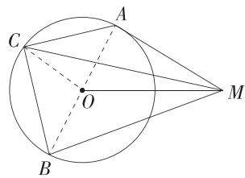

text_image

Geometric diagram showing a circle with inscribed triangle ABC and external point M, including dashed lines indicating auxiliary construction.

因为 $AC \perp BC$ ，所以 AB 为圆 O 的直径，故 O 为 AB 的中点，所以 $\overrightarrow{MA} + \overrightarrow{MB} = 2\overrightarrow{MO}$ ，

所以 $\left|\overrightarrow{MA}+\overrightarrow{MB}+2\overrightarrow{MC}\right|=\left|2\overrightarrow{MO}+2\left(\overrightarrow{MO}+\overrightarrow{OC}\right)\right|=$ $\left|4\overrightarrow{MO}+2\overrightarrow{OC}\right|\leqslant4\left|\overrightarrow{MO}\right|+2\left|\overrightarrow{OC}\right|=4\times2+2\times1=10,$

当且仅当 M, O, C 三点共线且 $\overrightarrow{MO}, \overrightarrow{OC}$ 同向时，等号成立，

因此 $|\overrightarrow{MA} +\overrightarrow{MB} +2\overrightarrow{MC} |$ 的最大值是10.故选C.

3.A $\overrightarrow{BP} -\overrightarrow{TS} = \overrightarrow{TE} -\overrightarrow{TS} = \overrightarrow{SE} = \frac{\sqrt{5} + 1}{2}\overrightarrow{RS}$ ，故A正确；

$\overrightarrow{CQ}+\overrightarrow{TP}=\overrightarrow{PA}+\overrightarrow{TP}=\overrightarrow{TA}=\frac{\sqrt{5}+1}{2}\overrightarrow{ST}$ ，故 B 错误；

$\overrightarrow{ES}-\overrightarrow{AP}=\overrightarrow{RC}-\overrightarrow{QC}=\overrightarrow{RQ}=\frac{\sqrt{5}-1}{2}\overrightarrow{QB}$ ，故 C 错误；

$\overrightarrow{AT}+\overrightarrow{BQ}=\overrightarrow{SD}+\overrightarrow{RD},\frac{\sqrt{5}-1}{2}\overrightarrow{CR}=\overrightarrow{RS}=\overrightarrow{RD}-\overrightarrow{SD}$ ，若 $\overrightarrow{AT}+\overrightarrow{BQ}=$ $\frac{\sqrt{5}-1}{2}\overrightarrow{CR}$ ，则 $\overrightarrow{SD}=0$ ，不合题意，故D错误.故选A.

4. CD 因为 P 为 $\triangle ABC$ 所在平面内一点, E 为 AC 的中点, F 为 BC 的中点,

所以 $\overrightarrow{PA} +\overrightarrow{PC} = 2\overrightarrow{PE},\overrightarrow{PB} +\overrightarrow{PC} = 2\overrightarrow{PF},$

又 $\overrightarrow{PA} + 2\overrightarrow{PB} + 3\overrightarrow{PC} = \mathbf{0}$ 即 $(\overrightarrow{PA} + \overrightarrow{PC}) + 2(\overrightarrow{PB} + \overrightarrow{PC}) = \mathbf{0},$

所以 $2 \overrightarrow{PE} + 4 \overrightarrow{PF} = 0$ ，即 $\overrightarrow{EP} = 2 \overrightarrow{PF}$ ，所以点 P 在线段 EF 上，且 $PE : PF = 2 : 1$ ，故 B 错误，C, D 正确；

易知 P, A, C 三点不共线，则向量 $\overrightarrow{PA}$ 与 $\overrightarrow{PC}$ 不可能平行，故 A 错误。故选 CD.

5. C 因为 $\overrightarrow{BD} = \frac{2}{3} \overrightarrow{BC}$ ，所以 $\overrightarrow{CD} = \frac{1}{3} \overrightarrow{CB}$ ，

因为 $\overrightarrow{CE} = x\overrightarrow{CA} +y\overrightarrow{CB}$ ，所以 $\overrightarrow{CE} = x\overrightarrow{CA} +3y\overrightarrow{CD},$

由题意知 $\exists \lambda \in (0,1)$ ，使 $\overrightarrow{AE} = \lambda \overrightarrow{AD}$

即 $\overrightarrow{CE} -\overrightarrow{CA} = \lambda (\overrightarrow{CD} -\overrightarrow{CA})$ ，即 $\overrightarrow{CE} = \lambda \overrightarrow{CD} +(1 - \lambda)\overrightarrow{CA},$

所以 $x\overrightarrow{CA} + 3y\overrightarrow{CD} = \lambda \overrightarrow{CD} + (1 - \lambda)\overrightarrow{CA},$

即 $(3y - \lambda)\overrightarrow{CD} = (1 - \lambda -x)\overrightarrow{CA},$

又 $\overrightarrow{CA},\overrightarrow{CD}$ 不共线，

所以 $\left\{ \begin{array}{l} 1 - \lambda - x = 0, \\ 3y - \lambda = 0, \end{array} \right.$ 即 $x + 3y = 1, x > 0, y > 0$

所以 $\frac{2}{x} +\frac{6}{y} = \left(\frac{2}{x} +\frac{6}{y}\right)\cdot (x + 3y) = 20 + \frac{6y}{x} +\frac{6x}{y}\geqslant 20+$

$$
2 \sqrt {\frac {6 y}{x} \cdot \frac {6 x}{y}} = 2 0 + 1 2 = 3 2,
$$

当且仅当 $\frac{6y}{x} = \frac{6x}{y}$ 即 $x = y = \frac{1}{4}$ 时取等号，

所以 $\frac{2}{x} +\frac{6}{y}$ 的最小值是32.故选C.

6. 答案 14

解析 由 $3\overrightarrow{PA} + 4\overrightarrow{PC} = m\overrightarrow{AB}$ ，可得 $\frac{3}{7}\overrightarrow{PA} +\frac{4}{7}\overrightarrow{PC} =$ $\frac{m}{7}\overrightarrow{AB},$

令 $\overrightarrow{PH} = \frac{3}{7}\overrightarrow{PA} +\frac{4}{7}\overrightarrow{PC}$ ，则 $\overrightarrow{PH} = \frac{m}{7}\overrightarrow{AB}$ ，且 $\frac{3}{7}\overrightarrow{PH} -\frac{3}{7}\overrightarrow{PA} =$ $\frac{4}{7}\overrightarrow{PC} -\frac{4}{7}\overrightarrow{PH}$ 即 $3\overrightarrow{AH} = 4\overrightarrow{HC}$ ，则 $PH / / AB,H$ 在线段 $AC$ 上，且 $\frac{CH}{AH} = \frac{3}{4}$ 所以 $S_{\triangle ABP} = S_{\triangle ABH},\frac{S_{\triangle ABH}}{S_{\triangle BCH}} = \frac{4}{3},$

所以 $S_{\triangle ABC} = \frac{7}{4} S_{\triangle ABH} = \frac{7}{4} S_{\triangle ABP} = 14.$

7. 解析 (1) 由题可得 $\overrightarrow{CA} = \overrightarrow{AB} = a$

又 $\overrightarrow{AO} = \boldsymbol{b},\therefore \overrightarrow{OC} = \overrightarrow{OA} +\overrightarrow{AC} = -\boldsymbol {b} - \boldsymbol {a},$

$$
\begin{array}{l} \overrightarrow {C D} = \overrightarrow {C B} + \overrightarrow {B D} = 2 \overrightarrow {A B} + \frac {1}{3} \overrightarrow {B O} = 2 \overrightarrow {A B} + \frac {1}{3} (\overrightarrow {B A} + \overrightarrow {A O}) \\ = 2 a + \frac {1}{3} (- a + b) = \frac {5}{3} a + \frac {1}{3} b. \\ \end{array}
$$

(2) 证明: $\because \overrightarrow{CE} = \overrightarrow{OE} - \overrightarrow{OC} = -\frac{4}{5} \boldsymbol{b} + \boldsymbol{a} + \boldsymbol{b} = \boldsymbol{a} + \frac{1}{5} \boldsymbol{b} = \frac{3}{5} \overrightarrow{CD}$ , $\therefore \overrightarrow{CE}$ 与 $\overrightarrow{CD}$ 平行,

又∵ $\overrightarrow{CE}$ 与 $\overrightarrow{CD}$ 有公共点 C, ∴ C, D, E 三点共线.

# 专题强化练1 平面向量的线性运算

Q 对应主书 P8

<table><tr><td>1.B</td><td>2.B</td><td>3.ACD</td><td>4.B</td><td>5.ABD</td><td></td><td></td><td></td></tr></table>

1.B 由题意得 $|\overrightarrow{OA} -\overrightarrow{OC} -2\overrightarrow{OB}| = |\overrightarrow{OA} +\overrightarrow{OC} -2(\overrightarrow{OC} +\overrightarrow{OB})| =$   
$|2\overrightarrow{OD} -4\overrightarrow{OE}| = 2|\overrightarrow{OD} -\overrightarrow{OE} -\overrightarrow{OE}| = 2|\overrightarrow{ED} +\overrightarrow{EO}| = 2,$   
所以 $|\overrightarrow{ED}+\overrightarrow{EO}|=1$ . 故选 B.

2. B $\overrightarrow{EP}=\overrightarrow{EC}+\overrightarrow{CP}=\frac{1}{2}\overrightarrow{BC}+\frac{2}{3}\overrightarrow{CD}=\frac{1}{2}(\overrightarrow{AC}-\overrightarrow{AB})-\frac{4}{3}\overrightarrow{AB}=$ $\frac{1}{2}\overrightarrow{AC}-\frac{11}{6}\overrightarrow{AB}=\frac{1}{2}(\overrightarrow{AD}+2\overrightarrow{AB})-\frac{11}{6}\overrightarrow{AB}=\frac{1}{2}\overrightarrow{AD}-\frac{5}{6}\overrightarrow{AB},$

又因为 $\overrightarrow{EP} = \lambda \overrightarrow{AB} +\mu \overrightarrow{AD}$ ，所以 $\lambda = -\frac{5}{6},\mu = \frac{1}{2},$

所以 $\lambda +\mu = -\frac{5}{6} +\frac{1}{2} = -\frac{1}{3}$ 故选B.

3.ACD 由题可得 $BD = \sqrt{3} BC$ ，故 $GH = GA + AE + EH = 2BC + BD = \left(\frac{2\sqrt{3}}{3} +1\right)BD,$ 又 $\overrightarrow{GH}$ 与 $\overrightarrow{BD}$ 方向相同，所以 $\overrightarrow{GH} = \left(\frac{2\sqrt{3}}{3} +1\right)\overrightarrow{BD},$ 故A正确；

由题可得 $\overrightarrow{CF}=2\overrightarrow{DE}$ ，则 $\overrightarrow{BE}=\overrightarrow{BD}+\overrightarrow{DE}=\overrightarrow{BD}+\frac{1}{2}\overrightarrow{CF}$ ，故B错误；

$\overrightarrow{GB} = \overrightarrow{GA} +\overrightarrow{AB} = \frac{\sqrt{3}}{3}\overrightarrow{BD} -\frac{1}{2}\overrightarrow{CF}$ ，故C正确；

易知 $\overrightarrow{IC} = \overrightarrow{IB} +\overrightarrow{BC},\overrightarrow{BC} = \frac{1}{2}\overrightarrow{BD} -\frac{1}{4}\overrightarrow{CF}$ ，连接 $BF$ ，则 $\overrightarrow{IB} =$ $\frac{\sqrt{3}}{3}\overrightarrow{BF} = \frac{\sqrt{3}}{3} (\overrightarrow{BC} +\overrightarrow{CF}) = \frac{\sqrt{3}}{3}\left(\frac{1}{2}\overrightarrow{BD} +\frac{3}{4}\overrightarrow{CF}\right) = \frac{\sqrt{3}}{6}\overrightarrow{BD}+$ $\frac{\sqrt{3}}{4}\overrightarrow{CF},$

所以 $\overrightarrow{IC} = \frac{3 + \sqrt{3}}{6}\overrightarrow{BD} +\frac{\sqrt{3} - 1}{4}\overrightarrow{CF}$ 故D正确.

故选 ACD.

4.B 如图,作 $PE \perp AB$ 于点 E, $PF \perp AD$ 于点 F,

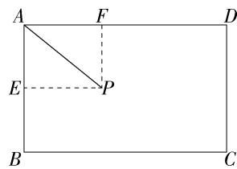

text_image

A
F
D
E
P
B
C

则 $\overrightarrow{AP} = \overrightarrow{AE} +\overrightarrow{AF}$ ，由 $\overrightarrow{AP} = \lambda \overrightarrow{AB} +\mu \overrightarrow{AD}$ ，知 $\lambda = \frac{AE}{AB},\mu = \frac{AF}{AD}.$

$\therefore \lambda + \sqrt{3} \mu = \frac{AE}{AB} + \frac{\sqrt{3} AF}{AD} = AE + AF$ ，设 $\angle EAP = \theta$ ，则 $0 \leqslant \theta \leqslant \frac{\pi}{2}, \lambda + \sqrt{3} \mu = \frac{\sqrt{3}}{2} (\cos \theta + \sin \theta) = \frac{\sqrt{6}}{2} \sin \left( \theta + \frac{\pi}{4} \right)$ ,

$$
\because \theta \in \left[ 0, \frac {\pi}{2} \right], \therefore \theta + \frac {\pi}{4} \in \left[ \frac {\pi}{4}, \frac {3 \pi}{4} \right],
$$

$$
\therefore \frac {\sqrt {2}}{2} \leqslant \sin \left(\theta + \frac {\pi}{4}\right) \leqslant 1, \text {故} \frac {\sqrt {3}}{2} \leqslant \frac {\sqrt {6}}{2} \sin \left(\theta + \frac {\pi}{4}\right) \leqslant \frac {\sqrt {6}}{2},
$$

$\therefore \lambda + \sqrt{3} \mu$ 的最大值为 $\frac{\sqrt{6}}{2}$ . 故选 B.

5.ABD 由题意得 $\overrightarrow{BE} = \overrightarrow{BA} +\overrightarrow{AE} = \overrightarrow{BA} +\frac{1}{3}\overrightarrow{AC} = \overrightarrow{BA}+$ $\frac{1}{3} (\overrightarrow{BC} -\overrightarrow{BA}) = \frac{2}{3}\overrightarrow{BA} +\frac{1}{3}\overrightarrow{BC},A$ 正确；

设 G 为 CE 的中点, 连接 DG, 如图,在 $\triangle BCE$ 中,因为D,G分别为BC,CE的中点,所以 $DG\parallel BE$ 且 $DG=\frac{1}{2}BE$ ,

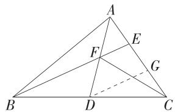

text_image

Geometric diagram of triangle ABC with internal points D, E, F, G and connecting lines, including a dashed extension from D to C.

在 $\triangle ADG$ 中, 易知 E 为 AG 的中点, 则由 $DG \parallel EF$ , 可得 F 为 AD 的中点, $EF = \frac{1}{2} DG$ ,

所以 $EF=\frac{1}{4}BE$ ，即 $BF=\frac{3}{4}BE$ ，所以 $\overrightarrow{BF}=\frac{3}{4}\overrightarrow{BE}=\frac{3}{4}\cdot\left(\frac{2}{3}\overrightarrow{BA}+\frac{1}{3}\overrightarrow{BC}\right)=\frac{1}{2}\overrightarrow{BA}+\frac{1}{4}\overrightarrow{BC}=\frac{1}{2}\overrightarrow{BA}+\frac{1}{2}\overrightarrow{BD}$ ，B 正确；
由 $EF=\frac{1}{4}BE$ ，可得 BF=3EF，

又因为 $\angle AFE = \angle BFD, AF = DF$ ，所以 $3S_{\triangle AEF} = S_{\triangle BDF}$ （A 和 D 到 BE 的距离相等），C 不正确；

因为 $\overrightarrow{BF} = \frac{1}{2}\overrightarrow{BA} +\frac{1}{4}\overrightarrow{BC},\overrightarrow{AF} = \frac{1}{2}\overrightarrow{AD} = \frac{1}{2} (\overrightarrow{BD} -\overrightarrow{BA}) =$ $\frac{1}{4}\overrightarrow{BC} -\frac{1}{2}\overrightarrow{BA},\overrightarrow{CF} = \overrightarrow{DF} -\overrightarrow{DC} = \frac{1}{2}\overrightarrow{DA} -\frac{1}{2}\overrightarrow{BC} =$ $\frac{1}{2}\left(\overrightarrow{BA} -\frac{1}{2}\overrightarrow{BC}\right) - \frac{1}{2}\overrightarrow{BC} = \frac{1}{2}\overrightarrow{BA} -\frac{3}{4}\overrightarrow{BC},$ 所以 $\overrightarrow{BF} +2\overrightarrow{AF}+$ $\overrightarrow{CF} = 0,\mathsf{D}$ 正确.故选ABD.

6. 答案 $\frac{1}{4}$

解析 由 $\overrightarrow{AD} = \frac{1}{4}\overrightarrow{AB} +\frac{3}{4}\overrightarrow{AC}$ ，得 $4\overrightarrow{AD} = \overrightarrow{AB} +3\overrightarrow{AC}$ 即 $3(\overrightarrow{AD}-$ $\overrightarrow{AC}) + (\overrightarrow{AD} -\overrightarrow{AB}) = \mathbf{0}$ ，故 $3\overrightarrow{CD} +\overrightarrow{BD} = \mathbf{0}$ ，即 $\overrightarrow{BD} = 3\overrightarrow{DC}$ ，故 $B,$ $C,D$ 三点共线，且 $D$ 为 $BC$ 上靠近点 $C$ 的四等分点.如图，取 $BC$ 的中点 $E$ ，连接 $AE$

则 $\overrightarrow{AG} = \frac{1}{3} (\overrightarrow{AB} +\overrightarrow{AC}) = \frac{1}{3}\times 2\overrightarrow{AE} =$ $\frac{2}{3}\overrightarrow{AE}$ ，故 A, G, E 三点共线，且 G 为 AE 上靠近点 E 的三等分点，则 $S_{\triangle BDG} = \frac{1}{3}S_{\triangle ABD} = \frac{1}{3} \times \frac{3}{4} \times$

$$
S _ {\triangle A B C} = \frac {1}{4} S _ {\triangle A B C}, \text {故} \frac {S _ {\triangle B D G}}{S _ {\triangle A B C}} = \frac {1}{4}.
$$

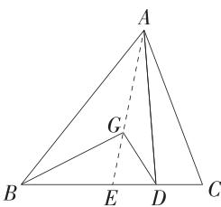

text_image

Geometric diagram of triangle ABC with internal points D, E, G and dashed auxiliary lines

7. 解析 (1) 由题意得 $\overrightarrow{AM} = \frac{2}{3}\overrightarrow{AB} = \frac{2}{3} (\overrightarrow{OB} -\overrightarrow{OA}) =$ $\frac{2}{3} (\overrightarrow{OC} +\overrightarrow{CB}) - \frac{2}{3}\overrightarrow{OA} = \frac{2}{3}\overrightarrow{OC} +\frac{2}{3}\times \frac{1}{2}\overrightarrow{OA} -\frac{2}{3}\overrightarrow{OA} = \frac{2}{3}\overrightarrow{OC}-$ $\frac{1}{3}\overrightarrow{OA},$

$$
\therefore \overrightarrow {O M} = \overrightarrow {O A} + \overrightarrow {A M} = \overrightarrow {O A} + \left(\frac {2}{3} \overrightarrow {O C} - \frac {1}{3} \overrightarrow {O A}\right) = \frac {2}{3} \overrightarrow {O A} + \frac {2}{3} \overrightarrow {O C}.
$$

(2) 设 $\overrightarrow{OD}=t\overrightarrow{OM}, t\in(0,1)$ ,

则 $\overrightarrow{OD} = t\left(\frac{2}{3}\overrightarrow{OA} +\frac{2}{3}\overrightarrow{OC}\right) = \frac{2t}{3}\overrightarrow{OA} +\frac{2t}{3}\overrightarrow{OC}.$

∵ A, D, C 三点共线，∴ ∃ $\lambda \in R$ ，使 $\overrightarrow{AD} = \lambda \overrightarrow{AC}$ ，即 $\overrightarrow{OD} - \overrightarrow{OA} = \lambda (\overrightarrow{OC} - \overrightarrow{OA})$ ，整理得 $\overrightarrow{OD} = (1 - \lambda) \overrightarrow{OA} + \lambda \overrightarrow{OC}$ ，

则 $\frac{2t}{3}\overrightarrow{OA} +\frac{2t}{3}\overrightarrow{OC} = (1 - \lambda)\overrightarrow{OA} +\lambda \overrightarrow{OC},$

即 $\left(\frac{2t}{3} +\lambda -1\right)\overrightarrow{OA} = \left(\lambda -\frac{2t}{3}\right)\overrightarrow{OC},$

又 $\overrightarrow{OA},\overrightarrow{OC}$ 不共线，

$\therefore \left\{ \begin{array}{l} \frac{2t}{3} + \lambda - 1 = 0, \\ \lambda - \frac{2t}{3} = 0, \end{array} \right.$ 解得 $\left\{ \begin{array}{l} t = \frac{3}{4}, \\ \lambda = \frac{1}{2}, \end{array} \right.$

$\therefore \overrightarrow{OD} = \frac{3}{4}\overrightarrow{OM}$ 则 $\overrightarrow{OD} = 3\overrightarrow{DM},\therefore \frac{|\overrightarrow{OD}|}{|\overrightarrow{DM}|} = 3.$

# 6.2.4 向量的数量积

# 基础过关练

Q 对应主书 P9

<table><tr><td>1.B</td><td>2.B</td><td>3.C</td><td>4.D</td><td>5.C</td><td>8.B</td><td>9.ABD</td><td>12.C</td></tr><tr><td>13.A</td><td></td><td></td><td></td><td></td><td></td><td></td><td></td></tr></table>

1.B

2.B 设 a 与 b 的夹角为 $\theta$ ，则 $\cos\theta=\frac{1}{5}$ ，故 $(a+2b)\cdot(2a-b)=2|a|^{2}+3|a||b|\cos\theta-2|b|^{2}=2\times4+3\times2\times5\times\frac{1}{5}-2\times25=-36.$ 故选 B.

3. C $\overrightarrow{AE} \cdot \overrightarrow{EB} = \left( \overrightarrow{AD} + \frac{1}{2} \overrightarrow{AB} \right) \cdot \left( \frac{1}{2} \overrightarrow{AB} - \overrightarrow{AD} \right) = \frac{1}{4} |\overrightarrow{AB}|^{2} - |\overrightarrow{AD}|^{2} = \frac{1}{4} - 1 = -\frac{3}{4}.$ 故选 C.

4.D 由 $|a| = 4, |b| = 3$ ，可得 $(2a - 3b) \cdot (2a + b) = 4a^2 - 4a \cdot b - 3b^2 = 37 - 4a \cdot b = 61$ ，所以 $a \cdot b = -6$ ，则 $a$ 在 $b$ 上的投影向量为 $\frac{a \cdot b}{|b|} \cdot \frac{b}{|b|} = \frac{-6}{3} \times \frac{1}{3} b = -\frac{2}{3} b.$ 故选D.

5.C 设 BC 的中点为 M, 则 $\overrightarrow{AB} + \overrightarrow{AC} = 2\overrightarrow{AM}$ , 所以 $\overrightarrow{AO} = \overrightarrow{AM}$ , 所以外心 O 与点 M 重合, 故 $\triangle ABC$ 是以 A 为直角顶点的直角三角形.

设 $|\overrightarrow{AB}|=3x,x>0$ ，则 $|\overrightarrow{AC}|=x$ ，

所以 $|\overrightarrow{BC}|=\sqrt{10}x,\cos B=\frac{3\sqrt{10}}{10}$ ,

设 e 为 $\overrightarrow{BC}$ 方向上的单位向量, 则 $e=\frac{\overrightarrow{BC}}{|\overrightarrow{BC}|}$ ,

故 $\overrightarrow{BA}$ 在 $\overrightarrow{BC}$ 上的投影向量为 $|\overrightarrow{BA}|\cos B\boldsymbol{e} = 3x\cdot \frac{3\sqrt{10}}{10}$ $\frac{\overrightarrow{BC}}{\sqrt{10}x} = \frac{9}{10}\overrightarrow{BC}.$ 故选C.

6. 答案 4

解析 由题意得 $|b| = 1$ ，则 $a \cdot b = |a| \cdot |b| \cos 120^\circ = -\frac{1}{2} |a|$ ，因为 $a$ 在 $b$ 上的投影向量为 $-2b$ ，所以 $\frac{a \cdot b}{|b|^2} \cdot b = -2b$ ，所以 $\frac{a \cdot b}{|b|^2} = -2$ ，即 $a \cdot b = -2$ ，所以 $-\frac{1}{2} |a| = -2$ ，则 $|a| = 4$ .

7. 答案 3

解析 $\overrightarrow{AB} \cdot \overrightarrow{AP_{i}} = |\overrightarrow{AB}| |\overrightarrow{AP_{i}}| \cos\langle \overrightarrow{AB}, \overrightarrow{AP_{i}} \rangle,$

结合题图可知， $|\overrightarrow{AP_{i}}|\cos\langle\overrightarrow{AB},\overrightarrow{AP_{i}}\rangle$ 表示 $\overrightarrow{AP_{i}}(i=1,2,\cdots,7)$ 在 $\overrightarrow{AB}$ 上的投影向量的长度，

$\overrightarrow{AP}_i (i = 2,5)$ 在 $\overrightarrow{AB}$ 上的投影向量相同，

$\overrightarrow{AP}_i (i = 1,3,6)$ 在 $\overrightarrow{AB}$ 上的投影向量相同，

$\overrightarrow{AP}_{i}(i=4,7)$ 在 $\overrightarrow{AB}$ 上的投影向量相同，

所以 $\overrightarrow{AB}\cdot\overrightarrow{AP_{i}}$ 的不同值有3个.

8.B 由 $|2a + b| = 2\sqrt{3}$ , 得 $|2a + b|^2 = 4a^2 + b^2 + 4a \cdot b = 12$ , 又 $|a| = 1, |b| = 2$ , 所以 $a \cdot b = 1$ ,

设 a 与 b 的夹角为 $\theta, \theta \in [0, \pi]$ ,

则 $a \cdot b = |a| |b| \cos \theta = 1 \times 2 \cos \theta = 1$ ,

所以 $\cos \theta = \frac{1}{2}$ , 故 $\theta = \frac{\pi}{3}$ . 故选 B.

9.ABD 由题得 $e_1 \cdot e_2 = 1 \times 1 \times \cos \frac{2\pi}{3} = -\frac{1}{2}$ , 所以 $|a| = \sqrt{(e_1 - 2e_2)^2} = \sqrt{e_1^2 - 4e_1 \cdot e_2 + 4e_2^2} = \sqrt{7}$ , A 正确;

$$
\begin{array}{l} {\pmb {a} \cdot \pmb {b} = (\pmb {e} _ {1} - 2 \pmb {e} _ {2}) \cdot (\pmb {e} _ {1} + \pmb {e} _ {2}) = \pmb {e} _ {1} ^ {2} - \pmb {e} _ {1} \cdot \pmb {e} _ {2} - 2 \pmb {e} _ {2} ^ {2} = - \frac {1}{2}, B} \\ {\text {正确；}} \end{array}
$$

设 a 与 b 的夹角为 $\theta$ ，易得 $\left|b\right|=\sqrt{\left(\boldsymbol{e}_{1}+\boldsymbol{e}_{2}\right)^{2}}=\sqrt{\boldsymbol{e}_{1}^{2}+2\boldsymbol{e}_{1}\cdot\boldsymbol{e}_{2}+\boldsymbol{e}_{2}^{2}}=1$ ，所以 $\cos\theta=\frac{a\cdot b}{\left|a\right|\left|b\right|}=\frac{-\frac{1}{2}}{\sqrt{7}}=-\frac{\sqrt{7}}{14}$ ，C 错误；

a 在 b 上的投影向量为 $\left| a \right| \cos \theta \cdot \frac{b}{\left| b \right|} = \sqrt{7} \times \left( -\frac{\sqrt{7}}{14} \right) b = -\frac{1}{2} b, D$ 正确.

故选 ABD.

10. 答案 $\frac{1}{8}$

解析 $\because \overrightarrow{DF} = \frac{1}{2}\overrightarrow{FA},\therefore \overrightarrow{AF} = \frac{2}{3}\overrightarrow{AD},$

$$
\therefore \overrightarrow {B F} = \overrightarrow {B A} + \overrightarrow {A F} = - \overrightarrow {A B} + \frac {2}{3} \overrightarrow {A D}.
$$

$$
\because \overrightarrow {A E} = \overrightarrow {A D} + \overrightarrow {D E} = \overrightarrow {A D} + \frac {1}{2} \overrightarrow {A B},
$$

$$
\therefore \overrightarrow {A E} \cdot \overrightarrow {B F} = (\overrightarrow {A D} + \frac {1}{2} \overrightarrow {A B}) \cdot (- \overrightarrow {A B} + \frac {2}{3} \overrightarrow {A D})
$$

$$
= \frac {2}{3} \overrightarrow {A D ^ {2}} - \frac {2}{3} \overrightarrow {A B} \cdot \overrightarrow {A D} - \frac {1}{2} \overrightarrow {A B ^ {2}}
$$

$$
= \frac {2}{3} \times 3 ^ {2} - \frac {2}{3} \times 4 \times 3 \times \cos \angle D A B - \frac {1}{2} \times 4 ^ {2} = - 3,
$$

$$
\therefore \cos \angle D A B = \frac {1}{8}.
$$

11. 解析 (1) 由 $(a + 2b) \cdot (2a - b) = 2a^2 - a \cdot b + 4a \cdot b - 2b^2 = 3a \cdot b - 6 = -3$ ，得 $a \cdot b = 1$

则 $|a-b|=\sqrt{(a-b)^{2}}=\sqrt{a^{2}+b^{2}-2a\cdot b}=\sqrt{1+4-2}=\sqrt{3}.$ (2) 因为 b 与 $\lambda a + b$ 的夹角为锐角，所以 $\boldsymbol{b} \cdot (\lambda \boldsymbol{a} + \boldsymbol{b}) > 0$ ，且 b 与 $\lambda a + b$ 不共线，即 $\lambda + 4 > 0$ ，且 $\lambda \neq 0$ ，解得 $\lambda > -4$ 且 $\lambda \neq 0$ ，

故 $\lambda$ 的取值范围为 $(-4,0)\cup(0,+\infty)$ .

# 解题模板

若向量 a 与 b 的夹角为锐角, 则 $a \cdot b > 0$ 且 a $\neq \lambda b (\lambda \in \mathbb{R})$ , 若向量 a 与 b 的夹角为钝角, 则 $a \cdot b < 0$ 且 $a \neq \lambda b (\lambda \in \mathbb{R})$ , 注意结果要排除两向量共线的情况.

12.C 因为 $a \perp b$ ，所以 $a \cdot b = 0$ ，即 $\log_{2}3 \times \log_{3}8 + m \sin \frac{4\pi}{3} = 0$ ，所以 $3 - \frac{\sqrt{3}}{2} m = 0$ ，解得 $m = 2\sqrt{3}$ 。故选 C.

13. A $a \cdot b = |a| |b| \cos 120^{\circ} = 5 \times 4 \times \left(-\frac{1}{2}\right) = -10.$

因为 $(ka-2b)\perp(a+b)$ ,

所以 $(ka-2b)\cdot(a+b)=ka^{2}-2b^{2}+(k-2)a\cdot b=25k-2\times16-10(k-2)=15k-12=0$ ，解得 $k=\frac{4}{5}$ .故选A.

14. 答案 $\frac{5\pi}{6}$

解析 因为 $a \perp (3a + 2b)$ ，所以 $a \cdot (3a + 2b) = 3|a|^2 + 2a \cdot b = 0$ ，所以 $a \cdot b = -\frac{3}{2}|a|^2$ .

因为 $|\pmb{b}|^2 = 3|\pmb{a}|^2$ ，所以 $|\pmb {b}| = \sqrt{3} |\pmb {a}|$

设 a 与 b 的夹角为 $\theta(\theta \in [0, \pi])$ ,

则 $\cos \theta = \frac{\pmb{a} \cdot \pmb{b}}{|\pmb{a}| |\pmb{b}|} = \frac{-\frac{3}{2} |\pmb{a}|^2}{\sqrt{3} |\pmb{a}|^2} = -\frac{\sqrt{3}}{2}$ , 所以 $\theta = \frac{5\pi}{6}$ .

15. 答案 4

解析 如图, 令 $\overrightarrow{AD} = a, \overrightarrow{AB} = b$ , 以 AD, AB 为邻边作平行四边形 ABCD, 连接 AC, BD,

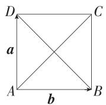

由 $a \perp b$ , 可得 $AD \perp AB, \therefore$ 四边形 ABCD 为矩形.

$$
\because \boldsymbol {a} + \boldsymbol {b} + \boldsymbol {c} = \mathbf {0}, \therefore \boldsymbol {c} = - (\boldsymbol {a} + \boldsymbol {b}) = \overrightarrow {C A}.
$$

$$
\because (\boldsymbol {a} - \boldsymbol {b}) \perp \boldsymbol {c}, \overrightarrow {B D} = \boldsymbol {a} - \boldsymbol {b}, \therefore C A \perp B D,
$$

∴ 四边形 ABCD 为正方形.

$$
\therefore | \boldsymbol {a} | = | \boldsymbol {b} | = 1, | \boldsymbol {c} | = \sqrt {2}, \therefore | \boldsymbol {a} | ^ {2} + | \boldsymbol {b} | ^ {2} + | \boldsymbol {c} | ^ {2} = 4.
$$

16. 解析 (1) $\overrightarrow{AB} = \overrightarrow{OB} - \overrightarrow{OA} = -5e_{1} + e_{2}$ ,

因为 $|\pmb{e}_1| = |\pmb{e}_2| = 1, \pmb{e}_1 \cdot \pmb{e}_2 = |\pmb{e}_1||\pmb{e}_2| \cos 60^\circ = \frac{1}{2}$ ,

所以 $|\overrightarrow{AB}| = \sqrt{(-5\pmb{e}_1 + \pmb{e}_2)^2} = \sqrt{25 + 1 - 10\times\frac{1}{2}} = \sqrt{21}$

(2) $\overrightarrow{OA} \cdot \overrightarrow{OB} = (2\boldsymbol{e}_1 + \boldsymbol{e}_2) \cdot (-3\boldsymbol{e}_1 + 2\boldsymbol{e}_2) = -6\boldsymbol{e}_1^2 + 2\boldsymbol{e}_2^2 +$

$$
\boldsymbol {e} _ {1} \cdot \boldsymbol {e} _ {2} = - \frac {7}{2},
$$

$$
\mid \overrightarrow {O A} \mid = \sqrt {\left(2 \boldsymbol {e} _ {1} + \boldsymbol {e} _ {2}\right) ^ {2}} = \sqrt {4 \boldsymbol {e} _ {1} ^ {2} + \boldsymbol {e} _ {2} ^ {2} + 4 \boldsymbol {e} _ {1} \cdot \boldsymbol {e} _ {2}} = \sqrt {7},
$$

$$
\left| \overrightarrow {O B} \right| = \sqrt {\left(- 3 \boldsymbol {e} _ {1} + 2 \boldsymbol {e} _ {2}\right) ^ {2}} = \sqrt {9 \boldsymbol {e} _ {1} ^ {2} + 4 \boldsymbol {e} _ {2} ^ {2} - 1 2 \boldsymbol {e} _ {1} \cdot \boldsymbol {e} _ {2}} = \sqrt {7},
$$

所以 $\cos\langle\overrightarrow{OA},\overrightarrow{OB}\rangle=\frac{\overrightarrow{OA}\cdot\overrightarrow{OB}}{|\overrightarrow{OA}||\overrightarrow{OB}|}=-\frac{1}{2},$

又 $\langle \overrightarrow{OA},\overrightarrow{OB}\rangle \in [0,\pi ]$ ，所以 $\langle \overrightarrow{OA},\overrightarrow{OB}\rangle = \frac{2\pi}{3}.$

(3)由题意可知 $\overrightarrow{AB} \perp \overrightarrow{BC}$ , 由 (1) 知 $\overrightarrow{AB} = -5e_1 + e_2$ ,

又 $\overrightarrow{BC} = \overrightarrow{OC} -\overrightarrow{OB} = (t + 3)\boldsymbol {e}_1 - 2\boldsymbol {e}_2$

所以 $\overrightarrow{AB} \cdot \overrightarrow{BC} = (-5\boldsymbol{e}_1 + \boldsymbol{e}_2) \cdot [(t + 3)\boldsymbol{e}_1 - 2\boldsymbol{e}_2] = -5(t +$

3) $e_{1}^{2}-2e_{2}^{2}+(t+13)e_{1}\cdot e_{2}=0,$

即 $-5(t+3)-2+\frac{1}{2}(t+13)=0$ , 解得 $t=-\frac{7}{3}$ .

# 能力提升练

Q 对应主书 P11

<table><tr><td>1.BC</td><td>2.B</td><td>3.C</td><td>5.B</td><td>6.B</td><td>7.BD</td><td></td><td></td></tr></table>

1.BC 设向量 a 与 b 的夹角为 $\theta$ ,

则 a 在 b 上的投影向量为 $\left|a\right|\cos\theta \cdot \frac{b}{\left|b\right|}$ ,

故 $m = |a|\cos \theta \cdot \frac{b}{|b|} = |a|\cdot \frac{a\cdot b}{|a||b|}\cdot \frac{b}{|b|} = \frac{a\cdot b}{|b|^2}\cdot b,$

故 A 错误, B 正确;

$m \cdot b = \frac{a \cdot b}{|b|^2} \cdot b \cdot b = \frac{a \cdot b}{|b|^2} \cdot |b|^2 = a \cdot b$ , 故 C 正确, D

错误.故选 BC.

2.B 连接 $BC$ ，由对称性可知 $BA = BC$ ，取 $AC$ 的中点 $H$ 连接 $BH$ ，则 $AC \perp BH, AH = \frac{1}{2} AC$

因为正六边形的边长为1,所以 $AC=2$ ,所以 $\overrightarrow{AB}\cdot\overrightarrow{AC}=|\overrightarrow{AC}|\cdot|\overrightarrow{AB}|\cos\angle BAC=|\overrightarrow{AC}|\cdot|\overrightarrow{AH}|=2$ ,故选B.

# 目方法技巧

若已知向量 b 的模及 a 在 b 上的投影向量 c 的模, 则可根据 $a \cdot b = |b| \cdot |c|$ 求数量积, 这种方法避免了求 a 与 b 的夹角.

3.C 连接 AC, 在 $\triangle ACE$ 中, AE = CE = 4, $\angle AEC = 120^{\circ}$ , 则 $\angle CAE = \angle ACE = 30^{\circ}, AC = 4\sqrt{3}$ , 由题得 AD = 8,

则 $\overrightarrow{AC} \cdot \overrightarrow{AP} = \overrightarrow{AC} \cdot (\overrightarrow{AD} + \overrightarrow{DP}) = \overrightarrow{AC} \cdot \overrightarrow{AD} + \overrightarrow{AC} \cdot \overrightarrow{DP}$

$$
\begin{array}{l} = | \overrightarrow {A C} | | \overrightarrow {A D} | \cos 3 0 ^ {\circ} + | \overrightarrow {A C} | | \overrightarrow {D P} | \cos \langle \overrightarrow {A C}, \overrightarrow {D P} \rangle \\ = 4 \sqrt {3} \times 8 \times \frac {\sqrt {3}}{2} + 4 \sqrt {3} \times \sqrt {3} \cos \langle \overrightarrow {A C}, \overrightarrow {D P} \rangle \\ = 4 8 + 1 2 \cos \left\langle \overrightarrow {A C}, \overrightarrow {D P} \right\rangle , \\ \end{array}
$$

易知 $\langle \overrightarrow{AC},\overrightarrow{DP}\rangle \in [0,\pi ]$ ，所以 $\cos \langle \overrightarrow{AC},\overrightarrow{DP}\rangle \in [-1,$ $1]$ ，所以 $\overrightarrow{AC}\cdot \overrightarrow{AP}\in [36,60]$

所以 $\overrightarrow{AC}\cdot\overrightarrow{AP}$ 的最大值为60.故选C.

4. 答案 $\frac{5}{6}$

解析 设圆 O 的半径为 r，过 O 作 $OD \perp AB, OE \perp AC$ ，垂足分别为 D, E，则 $AD = \frac{1}{2} AB = 1, AE = \frac{1}{2} AC = \frac{1}{2}$ .

因为 $\overrightarrow{AO}=x\overrightarrow{AB}+y\overrightarrow{AC}$ ，所以 $\overrightarrow{AO}\cdot\overrightarrow{AB}=x\overrightarrow{AB^{2}}+y\overrightarrow{AC}\cdot\overrightarrow{AB}$ ， $\overrightarrow{AO}$ 与 $\overrightarrow{AB}$ 的夹角为 $\angle OAD$ ，且 $\cos\angle OAD=\frac{AD}{AO}=\frac{1}{r}$

则 $r \times 2 \times \frac{1}{r} = 4x + y \times 1 \times 2 \times \left(-\frac{1}{2}\right)$ , 即 $4x - y = 2①$ .

$$
\overrightarrow {A O} \cdot \overrightarrow {A C} = x \overrightarrow {A B} \cdot \overrightarrow {A C} + y \overrightarrow {A C ^ {2}}, \cos \angle O A C = \frac {1}{2 r},
$$

则 $r \times 1 \times \frac{1}{2r} = x \times 2 \times 1 \times \left(-\frac{1}{2}\right) + y$ ，即 $-x + y = \frac{1}{2}$ ②，

联立①②, 可得 $x=\frac{5}{6}$ , $y=\frac{4}{3}$ .

5.B 由 $3a + 4b + 5c = 0$ ，得 $3a + 4b = -5c$

则 $9a^{2} + 24a\cdot b + 16b^{2} = 25c^{2}$ ，所以 $\pmb {a}\cdot \pmb {b} = 0$

又 $c = -\frac{3}{5} a - \frac{4}{5} b$

所以 $(\pmb{a} - \pmb{b}) \cdot \pmb{c} = (\pmb{a} - \pmb{b}) \cdot \left(-\frac{3}{5}\pmb{a} - \frac{4}{5}\pmb{b}\right) = -\frac{3}{5}\pmb{a}^2 +$

$$
\frac {4}{5} \boldsymbol {b} ^ {2} - \frac {1}{5} \boldsymbol {a} \cdot \boldsymbol {b} = \frac {1}{5},
$$

易知 $|\boldsymbol{a} - \boldsymbol{b}| = \sqrt{(\boldsymbol{a} - \boldsymbol{b})^2} = \sqrt{\boldsymbol{a}^2 + \boldsymbol{b}^2 - 2\boldsymbol{a} \cdot \boldsymbol{b}} = \sqrt{2}$ ,

所以 $\cos\langle\boldsymbol{a}-\boldsymbol{b},\boldsymbol{c}\rangle=\frac{(\boldsymbol{a}-\boldsymbol{b})\cdot\boldsymbol{c}}{|\boldsymbol{a}-\boldsymbol{b}||\boldsymbol{c}|}=\frac{\frac{1}{5}}{\sqrt{2}\times1}=\frac{\sqrt{2}}{10}.$

故选 B.

6.B 设 $\overrightarrow{AB} = a, \overrightarrow{AC} = b$ ，则 $|a| = |b| = 6, a \cdot b = 6 \times 6 \times \cos 60^\circ = 18$

设 $AE = \lambda AB(0\leqslant \lambda \leqslant 1)$ ，则 $\overrightarrow{AE} = \lambda \overrightarrow{AB} = \lambda a$

因为 AD=2DC，所以 $\overrightarrow{AD}=\frac{2}{3}\overrightarrow{AC}=\frac{2}{3}b$ ，

则 $\overrightarrow{BD} = \overrightarrow{AD} -\overrightarrow{AB} = \frac{2}{3}\pmb {b} - \pmb{a}$ ，所以 $\overrightarrow{AE} +\overrightarrow{BD} = (\lambda -1)\pmb {a} + \frac{2}{3}\pmb{b},$

则 $|\overrightarrow{AE} +\overrightarrow{BD}|^2 = \left[(\lambda -1)\pmb {a} + \frac{2}{3}\pmb {b}\right]^2 = (\lambda -1)^2\pmb {a}^2 +\frac{4}{3} (\lambda -$

1) $a \cdot b + \frac{4}{9}b^{2} = 36(\lambda - 1)^{2} + 24(\lambda - 1) + 16 = 4(3\lambda - 2)^{2} + 12$ ,

所以当 $\lambda=\frac{2}{3}$ 时， $\left|\overrightarrow{AE}+\overrightarrow{BD}\right|^{2}$ 取得最小值，为 12，当 $\lambda=0$ 时， $\left|\overrightarrow{AE}+\overrightarrow{BD}\right|^{2}$ 取得最大值，为 28，

所以 $|\overrightarrow{AE} +\overrightarrow{BD} |$ 的取值范围为 $[2\sqrt{3},2\sqrt{7} ]$ .故选B.

7.BD 设 $e_{1}$ 与 $e_{2}$ 的夹角为 $\theta, \left|e_{1}+\frac{1}{2}e_{2}\right|\leqslant\left|e_{1}+te_{2}\right|$ 两边平方，可得 $\frac{5}{4}+\cos\theta\leqslant t^{2}+2t\cos\theta+1$ ，即 $t^{2}+2t\cos\theta-\frac{1}{4}-\cos\theta\geqslant0①$ ，由题知，不等式①对任意的实数 t 都成立，

所以 $4\cos^2\theta + 4\cos \theta + 1 \leqslant 0$ ，即 $(2\cos \theta + 1)^2 \leqslant 0$

则 $\cos \theta = -\frac{1}{2}$ 又 $\theta \in [0,\pi ]$ ，所以 $\theta = \frac{2\pi}{3}$ 故A错误；

$$
\left| \boldsymbol {e} _ {1} + \frac {1}{2} \boldsymbol {e} _ {2} \right| = \sqrt {\left(\boldsymbol {e} _ {1} + \frac {1}{2} \boldsymbol {e} _ {2}\right) ^ {2}} = \sqrt {\boldsymbol {e} _ {1} ^ {2} + \frac {1}{4} \boldsymbol {e} _ {2} ^ {2} + \boldsymbol {e} _ {1} \cdot \boldsymbol {e} _ {2}} =
$$

$\sqrt{1+\frac{1}{4}-\frac{1}{2}}=\frac{\sqrt{3}}{2}$ ，故 B 正确；

$$
\left| \boldsymbol {e} _ {2} - t \boldsymbol {e} _ {1} \right| = \sqrt {\boldsymbol {e} _ {2} ^ {2} + t ^ {2} \boldsymbol {e} _ {1} ^ {2} - 2 t \boldsymbol {e} _ {1} \cdot \boldsymbol {e} _ {2}} = \sqrt {t ^ {2} + t + 1}
$$

$= \sqrt{\left(t + \frac{1}{2}\right)^2 + \frac{3}{4}}\geqslant \frac{\sqrt{3}}{2},$ 当且仅当 $t = -\frac{1}{2}$ 时取等号，故C错误；

$$
\left| \boldsymbol {e} _ {2} + t \left(\boldsymbol {e} _ {1} - \boldsymbol {e} _ {2}\right) \right| = \sqrt {t ^ {2} \boldsymbol {e} _ {1} ^ {2} + (1 - t) ^ {2} \boldsymbol {e} _ {2} ^ {2} + 2 t (1 - t) \boldsymbol {e} _ {1} \cdot \boldsymbol {e} _ {2}}
$$

$= \sqrt{3t^2 - 3t + 1} = \sqrt{3\left(t - \frac{1}{2}\right)^2 + \frac{1}{4}} \geqslant \frac{1}{2}$ , 当且仅当 $t = \frac{1}{2}$ 时取等号,故 $\left|e_{2}+t\left(e_{1}-e_{2}\right)\right|$ 的最小值为 $\frac{1}{2}$ ,故D正确.

故选 BD.

8. 答案 [11, 13]

解析 因为 $|\overrightarrow{OA}| = |\overrightarrow{OB}| = |\overrightarrow{OC}| = 1$ ,

所以 A, B, C 三点在以 O 为圆心, 1 为半径的圆上,

因为 $(\overrightarrow{OA} -\overrightarrow{OB})\cdot (\overrightarrow{OB} -\overrightarrow{OC}) = 0,$

所以 $\overrightarrow{BA} \cdot \overrightarrow{CB} = 0$ ，所以 $BA \perp CB$

所以 AC 是圆 O 的直径, 所以 $\overrightarrow{OA} = -\overrightarrow{OC}$ ,

所以 $|\overrightarrow{PA} +\overrightarrow{PB} +\overrightarrow{PC}| = |\overrightarrow{OA} -\overrightarrow{OP} +\overrightarrow{OB} -\overrightarrow{OP} +\overrightarrow{OC} -\overrightarrow{OP}| =$

$$
\left| \overrightarrow {O B} - 3 \overrightarrow {O P} \right|,
$$

设 $\overrightarrow{OB}$ 与 $\overrightarrow{OP}$ 的夹角为 $\theta,\theta\in[0,\pi]$ ,

则 $|\overrightarrow{OB} - 3\overrightarrow{OP}| = \sqrt{(\overrightarrow{OB} - 3\overrightarrow{OP})^2}$

$$
= \sqrt {\overrightarrow {O B} ^ {2} - 6 \overrightarrow {O B} \cdot \overrightarrow {O P} + 9 \overrightarrow {O P} ^ {2}}
$$

$$
= \sqrt {\left| \overrightarrow {O B} \right| ^ {2} - 6 \overrightarrow {O B} \cdot \overrightarrow {O P} + 9 \left| \overrightarrow {O P} \right| ^ {2}} = \sqrt {1 4 5 - 2 4 \cos \theta},
$$

因为 $\theta \in [0,\pi]$ ，所以 $\cos \theta \in [-1,1]$

所以 $145 - 24\cos \theta \in [121, 169]$ ,

所以 $|\overrightarrow{OB}-3\overrightarrow{OP}|\in[11,13]$

即 $|\overrightarrow{PA}+\overrightarrow{PB}+\overrightarrow{PC}|$ 的取值范围是[11,13].

9. 解析 (1) $\because E$ 是 $BC$ 的中点, 点 $F$ 是 $CD$ 上靠近 $C$ 的三等分点,

$$
\therefore \overrightarrow {E C} = \frac {1}{2} \overrightarrow {B C} = \frac {1}{2} \overrightarrow {A D}, \overrightarrow {C F} = - \frac {1}{3} \overrightarrow {D C} = - \frac {1}{3} \overrightarrow {A B},
$$

$$
\therefore \overrightarrow {E F} = \overrightarrow {E C} + \overrightarrow {C F} = \frac {1}{2} \overrightarrow {A D} - \frac {1}{3} \overrightarrow {A B},
$$

又 $\overrightarrow{EF} = \lambda \overrightarrow{AB} +\mu \overrightarrow{AD},\therefore \left(\lambda +\frac{1}{3}\right)\overrightarrow{AB} = \left(\frac{1}{2} -\mu\right)\overrightarrow{AD},$

又 $\overrightarrow{AB},\overrightarrow{AD}$ 不共线， $\therefore \lambda +\frac{1}{3} = \frac{1}{2} -\mu = 0,$

$\therefore \lambda = -\frac{1}{3}, \mu = \frac{1}{2}$ , 故 $\lambda + \mu = -\frac{1}{3} + \frac{1}{2} = \frac{1}{6}$ .

(2) 设 $\overrightarrow{CF} = m\overrightarrow{CD}(0 \leqslant m \leqslant 1)$ , 则 $\overrightarrow{BF} = \overrightarrow{BC} + \overrightarrow{CF} = \overrightarrow{AD} - m\overrightarrow{AB}$ ,

又 $\overrightarrow{AE} = \overrightarrow{AB} +\overrightarrow{BE} = \overrightarrow{AB} +\frac{1}{2}\overrightarrow{AD},\overrightarrow{AB}\cdot \overrightarrow{AD} = 0,$

$$
\therefore \overrightarrow {A E} \cdot \overrightarrow {B F} = (\overrightarrow {A B} + \frac {1}{2} \overrightarrow {A D}) \cdot (\overrightarrow {A D} - m \overrightarrow {A B})
$$

$$
= - m \overrightarrow {A B ^ {2}} + \frac {1}{2} \overrightarrow {A D ^ {2}} = - 4 m + 2 = 1, \text {故} m = \frac {1}{4}.
$$

$$
\therefore \overrightarrow {A E} \cdot \overrightarrow {A F} = (\overrightarrow {A B} + \frac {1}{2} \overrightarrow {A D}) \cdot (\overrightarrow {A D} + \frac {3}{4} \overrightarrow {A B})
$$

$$
= \frac {3}{4} \overrightarrow {A B ^ {2}} + \frac {1}{2} \overrightarrow {A D ^ {2}} = 3 + 2 = 5,
$$

易得 $|\overrightarrow{AE}|=\sqrt{5}$ ， $|\overrightarrow{AF}|=\frac{5}{2}$

$$
\therefore \cos \angle E A F = \frac {\overrightarrow {A E} \cdot \overrightarrow {A F}}{| \overrightarrow {A E} | | \overrightarrow {A F} |} = \frac {5}{\sqrt {5} \times \frac {5}{2}} = \frac {2 \sqrt {5}}{5}.
$$

10. 解析 (1) 当 $\lambda = \frac{2}{3}$ 时, $\overrightarrow{BF} = \frac{2}{3}\overrightarrow{BC}, \overrightarrow{DE} = \frac{1}{3}\overrightarrow{DC}$ .

由题知 $\overrightarrow{DC} = \frac{1}{2}\overrightarrow{AB}$ 所以 $\overrightarrow{AC} = \overrightarrow{AD} +\overrightarrow{DC} = \overrightarrow{AD} +\frac{1}{2}\overrightarrow{AB},$

则 $\overrightarrow{BC} = \overrightarrow{AC} -\overrightarrow{AB} = \overrightarrow{AD} -\frac{1}{2}\overrightarrow{AB}.$

所以 $\overrightarrow{AF} = \overrightarrow{AB} +\overrightarrow{BF} = \overrightarrow{AB} +\frac{2}{3}\overrightarrow{BC} = \overrightarrow{AB} +\frac{2}{3}\left(\overrightarrow{AD} -\frac{1}{2}\overrightarrow{AB}\right) =$ $\frac{2}{3} (\overrightarrow{AD} +\overrightarrow{AB})$

又 $\overrightarrow{AE} = \overrightarrow{AD} +\overrightarrow{DE} = \overrightarrow{AD} +\frac{1}{3}\overrightarrow{DC} = \overrightarrow{AD} +\frac{1}{6}\overrightarrow{AB},$

所以 $\overrightarrow{EF} = \overrightarrow{AF} -\overrightarrow{AE} = -\frac{1}{3}\overrightarrow{AD} +\frac{1}{2}\overrightarrow{AB}.$

因此 $\overrightarrow{AC} \cdot \overrightarrow{EF} = \left(\overrightarrow{AD} + \frac{1}{2}\overrightarrow{AB}\right) \cdot \left(-\frac{1}{3}\overrightarrow{AD} + \frac{1}{2}\overrightarrow{AB}\right) = -\frac{1}{3}\overrightarrow{AD^2} + \frac{1}{4}\overrightarrow{AB^2} + \frac{1}{3}\overrightarrow{AB} \cdot \overrightarrow{AD}$ .

因为 $\overrightarrow{AB} = 2\overrightarrow{DC},|\overrightarrow{CD}| = 1,AD\perp AB,$

所以 $|\overrightarrow{AB}|=2,\overrightarrow{AD}\cdot\overrightarrow{AB}=0,$

所以 $\overrightarrow{AC}\cdot\overrightarrow{EF}=\frac{2}{3}.$

(2)由(1)知 $\overrightarrow{BC} = \overrightarrow{AD} -\frac{1}{2}\overrightarrow{AB}.$

因为 $\overrightarrow{BF} = \lambda \overrightarrow{BC},\overrightarrow{DE} = (1 - \lambda)\overrightarrow{DC},$

所以 $\overrightarrow{AE} = \overrightarrow{AD} +\overrightarrow{DE} = \overrightarrow{AD} +(1 - \lambda)\overrightarrow{DC} = \overrightarrow{AD} +\frac{1 - \lambda}{2}\overrightarrow{AB},$

$$
\begin{array}{l} \overrightarrow {A F} = \overrightarrow {A B} + \overrightarrow {B F} = \overrightarrow {A B} + \lambda \overrightarrow {B C} = \overrightarrow {A B} + \lambda \left(\overrightarrow {A D} - \frac {1}{2} \overrightarrow {A B}\right) = \lambda \overrightarrow {A D} + \\ \left(1 - \frac {\lambda}{2}\right) \overrightarrow {A B}. \end{array}
$$

则 $\overrightarrow{EF} = \overrightarrow{AF} -\overrightarrow{AE} = (\lambda -1)\overrightarrow{AD} +\frac{1}{2}\overrightarrow{AB}.$

因为 $|\overrightarrow{AB}|=2,|\overrightarrow{AD}|=1,\overrightarrow{AD}\cdot\overrightarrow{AB}=0,$

所以 $\overrightarrow{AE}\cdot\overrightarrow{EF}=(\lambda-1)\overrightarrow{AD^{2}}+\frac{1-\lambda}{4}\overrightarrow{AB^{2}}=\lambda-1+1-\lambda=0,$ 所以 $\overrightarrow{AE}\perp\overrightarrow{EF}$ ，故向量 $\overrightarrow{AE}$ 与 $\overrightarrow{EF}$ 的夹角为 $90^{\circ}$ .

(3) 由 (2) 可知 $\overrightarrow{AE} = \overrightarrow{AD} + \frac{1 - \lambda}{2}\overrightarrow{AB}, \overrightarrow{AF} = \lambda \overrightarrow{AD} + \left(1 - \frac{\lambda}{2}\right)\overrightarrow{AB}$ ,

所以 $\overrightarrow{AE} +\frac{1}{2}\overrightarrow{AF} = \left(1 + \frac{\lambda}{2}\right)\overrightarrow{AD} +\left(1 - \frac{3\lambda}{4}\right)\overrightarrow{AB}$ （用已知长度和夹角的 $\overrightarrow{AD},\overrightarrow{AB}$ 表示出 $\overrightarrow{AE} +\frac{1}{2}\overrightarrow{AF}$ ）.

因为 $|\overrightarrow{AB}|=2,|\overrightarrow{AD}|=1,\overrightarrow{AD}\cdot\overrightarrow{AB}=0,$

所以 $\left|\overrightarrow{AE} +\frac{1}{2}\overrightarrow{AF}\right|^2 = \left(1 + \frac{\lambda}{2}\right)^2\overrightarrow{AD}^2 +\left(1 - \frac{3\lambda}{4}\right)^2\overrightarrow{AB}^2$

$$
= \left(1 + \frac {\lambda}{2}\right) ^ {2} + \left(1 - \frac {3 \lambda}{4}\right) ^ {2} \times 4 = \frac {5}{2} \lambda^ {2} - 5 \lambda + 5 = \frac {5}{2} (\lambda - 1) ^ {2} +
$$

$\frac{5}{2}$ (利用模长计算公式转化为关于 $\lambda$ 的一元二次函数),

由题意知 $\lambda \in [0,1]$ ,

所以 $\left|\overrightarrow{AE}+\frac{1}{2}\overrightarrow{AF}\right|^{2}$ 的取值范围是 $\left[\frac{5}{2},5\right]$ ,

故 $\left|\overrightarrow{AE} +\frac{1}{2}\overrightarrow{AF}\right|$ 的取值范围是 $\left[\frac{\sqrt{10}}{2},\sqrt{5}\right]$

# 6.3 平面向量基本定理及坐标表示

# 6.3.1 平面向量基本定理

# 基础过关练

Q 对应主书 P13

<table><tr><td>1.A</td><td>2.B</td><td>3.ABC</td><td>4.D</td><td>5.D</td><td>7.A</td><td>8.B</td><td>9.D</td></tr><tr><td>10.D</td><td>11.A</td><td></td><td></td><td></td><td></td><td></td><td></td></tr></table>

1.A 由基底的定义可知, $e_{1}$ 和 $e_{2}$ 是平面内不共线的两个向量,所以若存在实数 $\lambda_{1},\lambda_{2}$ 使 $\lambda_{1}e_{1}+\lambda_{2}e_{2}=0$ ,则 $\lambda_{1}=\lambda_{2}=0,A$ 正确;易知平面内的任一向量a都可以表示为 $a=\lambda_{1}e_{1}+\lambda_{2}e_{2}$ ,其中实数 $\lambda_{1},\lambda_{2}$ 有且只有一对,B、D错误; $\lambda_{1}e_{1}+\lambda_{2}e_{2}(\lambda_{1},\lambda_{2}\neq0)$ 一定在该平面内,C错误.故选A.  
2.B 由基底的概念可知,构成基底的一组向量不能共线.由题图可知, $\overrightarrow{OA}$ 与 $\overrightarrow{BC}$ 共线, $\overrightarrow{AB}$ 与 $\overrightarrow{CF}$ 共线, $\overrightarrow{AB}$ 与 $\overrightarrow{DE}$ 共线, $\overrightarrow{OA}$ 与 $\overrightarrow{CD}$ 不共线,故选B.  
3.ABC 对于 $\mathrm{A},\pmb{e}_1 - \pmb{e}_2 = -(e_2 - e_1)$ ，则 $e_1 - e_2$ 与 $e_2 - e_1$ 共线，不能作为基底，故A符合题意；

对于 B, $2e_{1}-e_{2}=2\left(e_{1}-\frac{1}{2}e_{2}\right)$ ，则 $2e_{1}-e_{2}$ 与 $e_{1}-\frac{1}{2}e_{2}$ 共线，不能作为基底，故 B 符合题意；

对于 C, $2e_{1}-3e_{2}=-\frac{1}{2}(6e_{2}-4e_{1})$ ，则 $2e_{1}-3e_{2}$ 与 $6e_{2}-4e_{1}$ 共线，不能作为基底，故 C 符合题意；

对于 D, 若 $e_{1} + e_{2}$ 与 $e_{1} + 3e_{2}$ 共线, 则存在实数 $\lambda$ , 使得 $e_{1} + e_{2} = \lambda (e_{1} + 3e_{2})$ , 则 $\left\{\begin{aligned}\lambda &= 1, \\ 3\lambda &= 1,\end{aligned}\right.$ 无解, 故两向量不共线, 可以作为基底, 故 D 不符合题意. 故选 ABC.

4.D 由题可得 M 为 BC 中点, 又 $\overrightarrow{AN} = \frac{3}{4}\overrightarrow{BC} = \frac{3}{4}\overrightarrow{AD}$ , 所以 $\overrightarrow{MN} = \overrightarrow{MC} + \overrightarrow{CD} + \overrightarrow{DN} = \frac{1}{2}\overrightarrow{AD} + \overrightarrow{CD} - \frac{1}{4}\overrightarrow{AD} = \frac{1}{4}\overrightarrow{AD} + \overrightarrow{CD} = a + \frac{1}{4}b$ , 故选 D.  
5. D $\overrightarrow{BE}=\overrightarrow{AE}-\overrightarrow{AB}=\frac{1}{2}\overrightarrow{AC}-(\overrightarrow{AC}+\overrightarrow{CB})=-\frac{1}{2}\overrightarrow{AC}-3\overrightarrow{CD}=$

$-\frac{1}{2}\overrightarrow{AC}-3(\overrightarrow{AD}-\overrightarrow{AC})=\frac{5}{2}\overrightarrow{AC}-3\overrightarrow{AD}=\frac{5}{2}\boldsymbol{m}-3\boldsymbol{n}$ , 故选 D.

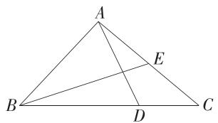

text_image

A
B
D
C
E

6. 解析 (1) $\overrightarrow{AE} = \overrightarrow{AD} + \overrightarrow{DE} = \overrightarrow{AD} + \frac{1}{2}\overrightarrow{DC} = \overrightarrow{AD} + \frac{1}{2}\overrightarrow{AB} = \frac{1}{2} a +$

$$
\boldsymbol {b}, \overrightarrow {A F} = \overrightarrow {A B} + \overrightarrow {B F} = \overrightarrow {A B} + \frac {1}{4} \overrightarrow {B C} = \overrightarrow {A B} + \frac {1}{4} \overrightarrow {A D} = \boldsymbol {a} + \frac {1}{4} \boldsymbol {b},
$$

$$
\overrightarrow {E F} = \overrightarrow {A F} - \overrightarrow {A E} = \left(\boldsymbol {a} + \frac {1}{4} \boldsymbol {b}\right) - \left(\frac {1}{2} \boldsymbol {a} + \boldsymbol {b}\right) = \frac {1}{2} \boldsymbol {a} - \frac {3}{4} \boldsymbol {b}.
$$

(2) 证明: $\overrightarrow{EG} = \overrightarrow{AG} - \overrightarrow{AE} = \left(\frac{3}{2}a - \frac{1}{2}b\right) - \left(\frac{1}{2}a + b\right) = a - \frac{3}{2}b, \therefore \overrightarrow{EG} = 2\overrightarrow{EF}, \therefore \overrightarrow{EG} // \overrightarrow{EF}$ ,

又 $\overrightarrow{EG}$ 与 $\overrightarrow{EF}$ 有公共点E,∴E,G,F三点共线，
∴E,G,F三点不能构成三角形的三个顶点.

7.A 由 $\overrightarrow{BD} = 5\overrightarrow{DC}$ 可得 $BD:DC = 5:1$ ，利用分点恒等式，可得 $\overrightarrow{AD} = \frac{1}{6}\overrightarrow{AB} +\frac{5}{6}\overrightarrow{AC}.$ 故选A.

# 目 记忆结论

分点恒等式: 在 $\triangle ABC$ 中, D 是 BC 上的点 (不包含端点), 若 BD : CD = m : n, 则 $\overrightarrow{AD} = \frac{m}{m + n} \overrightarrow{AC} + \frac{n}{m + n} \overrightarrow{AB}.$

8.B 如图所示，

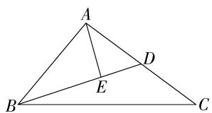

text_image

A
B
E
D
C

由 $\overrightarrow{BD} = -3\overrightarrow{DE}$ 得 $BE:ED = 2:1,\therefore \overrightarrow{AE} = \frac{1}{3}\overrightarrow{AB} +\frac{2}{3}\overrightarrow{AD},$ $\because D$ 是 $AC$ 的中点， $\therefore \overrightarrow{AD} = \frac{1}{2}\overrightarrow{AC},\therefore \overrightarrow{AE} = \frac{1}{3}\overrightarrow{AB} +\frac{1}{3}\overrightarrow{AC}.$ 又 $\overrightarrow{AE} = \lambda \overrightarrow{AB} +\mu \overrightarrow{AC},\overrightarrow{AB},\overrightarrow{AC}$ 不共线，

$$
\therefore \lambda = \frac {1}{3}, \mu = \frac {1}{3}, \therefore \frac {\lambda}{2} + \mu = \frac {1}{2}.
$$

9.D 由题意得 AH:HF=3:1, ∴ $\overrightarrow{BH}=\frac{3}{4}\overrightarrow{BF}+\frac{1}{4}\overrightarrow{BA}$ ,
由 $\overrightarrow{BF}=3\overrightarrow{FC}$ ，可得 $\overrightarrow{BF}=\frac{3}{4}\overrightarrow{BC}$ ，∴ $\overrightarrow{BH}=\frac{9}{16}\overrightarrow{BC}+\frac{1}{4}\overrightarrow{BA}$ 又 $\overrightarrow{BH}=\lambda\overrightarrow{BA}+\mu\overrightarrow{BC},\overrightarrow{BA},\overrightarrow{BC}$ 不共线，∴ $\lambda=\frac{1}{4},\mu=\frac{9}{16}$ ∴ $\lambda\mu=\frac{1}{4}\times\frac{9}{16}=\frac{9}{64}$ . 故选 D.

# 一题多解

由题意得 $\overrightarrow{BH} = \overrightarrow{BF} +\overrightarrow{FH} = \frac{3}{4}\overrightarrow{BC} +\frac{1}{4}\overrightarrow{FA} = \frac{3}{4}\overrightarrow{BC}+$ $\frac{1}{4} (\overrightarrow{BA} -\overrightarrow{BF}) = \frac{3}{4}\overrightarrow{BC} +\frac{1}{4}\left(\overrightarrow{BA} -\frac{3}{4}\overrightarrow{BC}\right) = \frac{1}{4}\overrightarrow{BA} +\frac{9}{16}\overrightarrow{BC},$ 由 $\overrightarrow{BH} = \lambda \overrightarrow{BA} +\mu \overrightarrow{BC}$ ，结合平面向量基本定理可知 $\lambda = \frac{1}{4},\mu = \frac{9}{16},\therefore \lambda \mu = \frac{1}{4}\times \frac{9}{16} = \frac{9}{64}.$ 故选D.

10.D 解法一: 因为 F 为 CD 的中点, G 为 EF 的中点, 所以 $\overrightarrow{DF} = \frac{1}{2} \overrightarrow{DC} = \frac{1}{2} \overrightarrow{AB}, \overrightarrow{FG} = \frac{1}{2} \overrightarrow{FE}$ ,

又 $\overrightarrow{EC} = \frac{1}{3}\overrightarrow{BC}$ 所以 $\overrightarrow{AG} = \overrightarrow{AD} +\overrightarrow{DF} +\overrightarrow{FG} = \overrightarrow{AD} +\frac{1}{2}\overrightarrow{AB}+$ $\frac{1}{2}\overrightarrow{FE} = \overrightarrow{AD} +\frac{1}{2}\overrightarrow{AB} +\frac{1}{2} (\overrightarrow{CE} -\overrightarrow{CF}) = \overrightarrow{AD} +\frac{1}{2}\overrightarrow{AB}+$ $\frac{1}{2}\left(-\frac{1}{3}\overrightarrow{AD} +\frac{1}{2}\overrightarrow{AB}\right) = \frac{3}{4}\overrightarrow{AB} +\frac{5}{6}\overrightarrow{AD}.$

故 $\lambda = \frac{3}{4},\mu = \frac{5}{6}.$

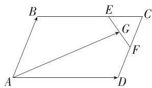

text_image

B
E
C
G
F
A
D

解法二： $\overrightarrow{AG} = \frac{1}{2} (\overrightarrow{AF} +\overrightarrow{AE}) = \frac{1}{2} (\overrightarrow{AD} +\overrightarrow{DF} +\overrightarrow{AB} +\overrightarrow{BE}) =$ $\frac{1}{2}\left(\overrightarrow{AD} +\frac{1}{2}\overrightarrow{AB} +\overrightarrow{AB} +\frac{2}{3}\overrightarrow{AD}\right) = \frac{3}{4}\overrightarrow{AB} +\frac{5}{6}\overrightarrow{AD},$

故 $\lambda = \frac{3}{4},\mu = \frac{5}{6}.$

11.A 因为 G 是 AD 的中点, 且 $\overrightarrow{AB}=x\overrightarrow{AM},\overrightarrow{AC}=y\overrightarrow{AN}$ ,
所以 $\overrightarrow{AG}=\frac{1}{2}\times\frac{1}{2}(\overrightarrow{AB}+\overrightarrow{AC})=\frac{1}{4}(x\overrightarrow{AM}+y\overrightarrow{AN}).$

又因为 M, G, N 三点共线, 所以 $\frac{1}{4}(x+y)=1$ (三点共线的结论), 易知 x>0, y>0,

所以 $\frac{1}{x}+\frac{1}{y}=\frac{1}{4}(x+y)\cdot\left(\frac{1}{x}+\frac{1}{y}\right)=\frac{1}{4}\left(2+\frac{x}{y}+\frac{y}{x}\right)\geqslant\frac{1}{4}\left(2+2\sqrt{\frac{x}{y}\cdot\frac{y}{x}}\right)=1$ , 当且仅当 x=y=2 时等号成立. 故选 A.

# 目 记忆结论

若 $\overrightarrow{PA},\overrightarrow{PB}$ 为平面内两个不共线的向量，设 $\overrightarrow{PC} = x\overrightarrow{PA} +y\overrightarrow{PB}(x,y\in \mathbf{R})$ ，则 $A,B,C$ 三点共线的充要条件是 $x + y = 1$

12. 答案 $\frac{1}{2} a + \frac{1}{2} b; \frac{2}{5} a + \frac{2}{5} b$

解析 $\overrightarrow{AM} = \frac{1}{2} (\overrightarrow{AB} +\overrightarrow{AC}) = \frac{1}{2}\pmb {a} + \frac{1}{2}\pmb {b}.$

设 $\overrightarrow{BP} = \lambda \overrightarrow{BN},\lambda \in (0,1)$

则 $\overrightarrow{AP} = \overrightarrow{AB} +\overrightarrow{BP} = \overrightarrow{AB} +\lambda \overrightarrow{BN} = \overrightarrow{AB} +\lambda (\overrightarrow{AN} -\overrightarrow{AB}) = \overrightarrow{AB} +$

$$
\lambda \left(\frac {2}{3} \overrightarrow {A C} - \overrightarrow {A B}\right) = (1 - \lambda) a + \frac {2 \lambda}{3} b,
$$

设 $\overrightarrow{AP} = \mu \overrightarrow{AM},\mu \in (0,1)$ ，则 $\overrightarrow{AP} = \frac{\mu}{2}\pmb {a} + \frac{\mu}{2}\pmb {b}$

所以 $\left\{\begin{aligned}1-\lambda&=\frac{\mu}{2},\\ \frac{2\lambda}{3}&=\frac{\mu}{2},\end{aligned}\right.$ 解得 $\left\{\begin{aligned}\lambda&=\frac{3}{5},\\ \mu&=\frac{4}{5},\end{aligned}\right.$

所以 $\overrightarrow{AP}=\frac{2}{5}\boldsymbol{a}+\frac{2}{5}\boldsymbol{b}.$

13. 解析 (1) 由题意得 $\overrightarrow{AP} \cdot \overrightarrow{AC} = \overrightarrow{AP} \cdot 2\overrightarrow{AO} = 2\overrightarrow{AP}$ .

$$
(\overrightarrow {A P} + \overrightarrow {P O}) = 2 \overrightarrow {A P ^ {2}} + 0 = 8,
$$

$\therefore \overrightarrow{AP}^2 = |\overrightarrow{AP}|^2 = 4$ ，解得 $|\overrightarrow{AP}| = 2$ ，故 $AP$ 的长为2.

(2) $\because \overrightarrow{AP} = x\overrightarrow{AB} +y\overrightarrow{AC} = x\overrightarrow{AB} +2y\overrightarrow{AO}$ ，且 $B,P,O$ 三点共线， $\therefore x + 2y = 1①$

$$
\because | \overrightarrow {A B} | = 6, | \overrightarrow {A C} | = 8, \angle B A C = \frac {\pi}{3},
$$

$$
\therefore \overrightarrow {A B} \cdot \overrightarrow {A O} = | \overrightarrow {A B} | \cdot \frac {1}{2} | \overrightarrow {A C} | \cos \angle B A C = 1 2,
$$

由 $AP \perp BD$ 可知 $\overrightarrow{AP} \cdot \overrightarrow{BO} = (x\overrightarrow{AB} + 2y\overrightarrow{AO}) \cdot (\overrightarrow{AO} - \overrightarrow{AB}) = 0$ ，即 $2y\overrightarrow{AO}^2 - x\overrightarrow{AB}^2 + (x - 2y)\overrightarrow{AB} \cdot \overrightarrow{AO} = 0, \therefore y = 3x$ ②，

联立①②解得 $x=\frac{1}{7}, y=\frac{3}{7}$ ，故 $y-x=\frac{2}{7}$ .

# 能力提升练

对应主书P15

<table><tr><td>1.D</td><td>2.C</td><td>3.D</td><td>4.A</td><td>5.B</td><td></td><td></td><td></td></tr></table>

1.D 如图, 过点 F 作 FN 平行于 BC, 交 BE 于点 M, 交 AB 于点 N,

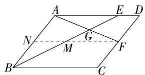

text_image

A
E D
N
G
M
F
B
C

因为 $DF = FC$ ，所以 $F$ 为 $DC$ 的中点，则 $N$ 为 $AB$ 的中点，所以 $MN / / AE$ 且 $MN = \frac{1}{2} AE = \frac{1}{2}\times \frac{3}{4} AD = \frac{3}{8} AD,$

易知 $NF = AD$ ，所以 $MF = NF - MN = AD - \frac{3}{8} AD = \frac{5}{8} AD,$

易知 $\triangle AEG\sim \triangle FMG$ ，所以 $\frac{AG}{FG} = \frac{AE}{FM} = \frac{\frac{3}{4}AD}{\frac{5}{8}AD} = \frac{6}{5},$

所以 $\overrightarrow{AG} = \frac{6}{11}\overrightarrow{AF} = \frac{6}{11} (\overrightarrow{AD} +\overrightarrow{DF}) = \frac{6}{11}\left(\overrightarrow{AD} +\frac{1}{2}\overrightarrow{AB}\right) =$

$\frac{3}{11}\overrightarrow{AB}+\frac{6}{11}\overrightarrow{AD}=\frac{3}{11}\boldsymbol{a}+\frac{6}{11}\boldsymbol{b}.$ 故选 D.

2. C 因为 $\overrightarrow{AG} + \overrightarrow{BG} + \overrightarrow{CG} = 0$ ，所以点 $G$ 是 $\triangle ABC$ 的重心，如图，取 $AC$ 的中点 $D$ ，连接 $GD$ ，易知 $B, G, D$ 三点共线，

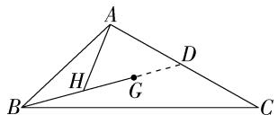

text_image

A
H
G
D
B
C

因为 $\overrightarrow{AC} = 2\overrightarrow{AD}$ ，所以 $\overrightarrow{AH} = x\overrightarrow{AB} +\gamma \overrightarrow{AC} = x\overrightarrow{AB} +2\gamma \overrightarrow{AD}.$

又 B, H, D 三点共线, 所以 $x + 2y = 1$ ,

所以 $x^{2}+4y^{2}=x^{2}+(2y)^{2}\geqslant\frac{(x+2y)^{2}}{2}=\frac{1}{2}$ ，当且仅当 $x=\frac{1}{2}, y=\frac{1}{4}$ 时取等号，故 $x^{2}+4y^{2}$ 的最小值是 $\frac{1}{2}$ . 故选 C.

3.D 取 $A_{0}A_{2025}$ 的中点 A，则 $\overrightarrow{OA_{0}} + \overrightarrow{OA_{2025}} = 2\overrightarrow{OA} = a + b$ ，因为 $A_{0}, A_{1}, A_{2}, A_{3}, \cdots, A_{2025}$ 中任意相邻两点间的距离相等，

所以点 A 也是 $A_{1}A_{2024}, A_{2}A_{2023}, \cdots, A_{1012}A_{1013}$ 的中点，

则 $\overrightarrow{OA_1} +\overrightarrow{OA_{2024}} = \overrightarrow{OA_2} +\overrightarrow{OA_{2023}} = \dots = \overrightarrow{OA_{1012}} +\overrightarrow{OA_{1013}} =$ $2\overrightarrow{OA} = \pmb {a} + \pmb {b},$

则 $\overrightarrow{OA_0} +\overrightarrow{OA_1} +\overrightarrow{OA_2} +\dots +\overrightarrow{OA_{2025}} = \frac{2026}{2} (\pmb {a} + \pmb {b}) = 1013(\pmb {a}+$

b). 故选 D.

# 方法技巧

处理多个向量的和的问题,大多是将相关具有对称性的两个向量分别相加,再按规律求所有向量的和,本题中 $A_{0},A_{1},A_{2},A_{3},\cdots,A_{2025}$ 中任意相邻两点间的距离相等,所以 $A_{0}A_{2025},A_{1}A_{2024},A_{2}A_{2023},\cdots,A_{1012}A_{1013}$ 的中点相同,再利用向量加法的平行四边形法则求解.

4. A $\because \overrightarrow{BE}=3\overrightarrow{EA},\overrightarrow{BF}=3\overrightarrow{FC},\therefore \overrightarrow{BA}=\frac{4}{3}\overrightarrow{BE},\overrightarrow{BC}=\frac{4}{3}\overrightarrow{BF},$

$$
\begin{array}{l} \therefore \overrightarrow {D M} = \frac {1}{2} \overrightarrow {D C} + x \overrightarrow {D A} = \frac {1}{2} \overrightarrow {A B} + x \overrightarrow {C B} = - \frac {1}{2} \overrightarrow {B A} - x \overrightarrow {B C} = \\ - \frac {2}{3} \overrightarrow {B E} - \frac {4 x}{3} \overrightarrow {B F}, \\ \end{array}
$$

$$
\therefore \overrightarrow {B M} = \overrightarrow {B D} + \overrightarrow {D M} = \overrightarrow {B A} + \overrightarrow {B C} + \overrightarrow {D M} = \frac {2}{3} \overrightarrow {B E} + \frac {4}{3} (1 - x) \overrightarrow {B F},
$$

又 $E, M, F$ 三点共线， $\therefore \frac{2}{3} + \frac{4}{3} (1 - x) = 1$ ，解得 $x = \frac{3}{4}$ ，

$$
\therefore \overrightarrow {D M} = - \frac {1}{2} \overrightarrow {B A} - \frac {3}{4} \overrightarrow {B C},
$$

$$
\therefore \overrightarrow {D M} \cdot \overrightarrow {C A} = \left(- \frac {1}{2} \overrightarrow {B A} - \frac {3}{4} \overrightarrow {B C}\right) \cdot (\overrightarrow {B A} - \overrightarrow {B C}) = - \frac {1}{2} \overrightarrow {B A ^ {2}} -
$$

$\frac{1}{4}\overrightarrow{BA}\cdot\overrightarrow{BC}+\frac{3}{4}\overrightarrow{BC^{2}}=-8-4\cos60^{\circ}+12=2.$ 故选 A.

5.B 设 $\overrightarrow{DC} = a, \overrightarrow{DA} = b$ ，则 $\overrightarrow{AE} = \overrightarrow{AB} + \overrightarrow{BE} = a - \frac{1}{2}b, \overrightarrow{AF} = \overrightarrow{AD} + \overrightarrow{DF} = \frac{1}{3}a - b$

联立 $\left\{ \begin{array}{l} \overrightarrow{AE} = a - \frac{1}{2} b, \\ \overrightarrow{AF} = \frac{1}{3} a - b, \end{array} \right.$ 解得 $\left\{ \begin{array}{l} a = \frac{6}{5}\overrightarrow{AE} -\frac{3}{5}\overrightarrow{AF}, \\ b = \frac{2}{5}\overrightarrow{AE} -\frac{6}{5}\overrightarrow{AF}, \end{array} \right.$

因为点 $P$ 在线段 $BD$ 上运动，

所以可设 $\overrightarrow{AP} = t\overrightarrow{AB} + (1 - t)\overrightarrow{AD}, 0 \leqslant t \leqslant 1$

则 $\overrightarrow{AP} = t\overrightarrow{AB} + (1 - t)\overrightarrow{AD} = t\boldsymbol {a} - (1 - t)\boldsymbol {b}$

$$
= t \left(\frac {6}{5} \overrightarrow {A E} - \frac {3}{5} \overrightarrow {A F}\right) - (1 - t) \left(\frac {2}{5} \overrightarrow {A E} - \frac {6}{5} \overrightarrow {A F}\right)
$$

$$
= \left(- \frac {2}{5} + \frac {8 t}{5}\right) \overrightarrow {A E} + \left(\frac {6}{5} - \frac {9 t}{5}\right) \overrightarrow {A F},
$$

又 $\overrightarrow{AP} = \lambda \overrightarrow{AE} +\mu \overrightarrow{AF} (\lambda ,\mu \in \mathbf{R})$ ，所以 $\left\{ \begin{array}{l}\lambda = -\frac{2}{5} +\frac{8t}{5},\\ \mu = \frac{6}{5} -\frac{9t}{5}, \end{array} \right.$

故 $\lambda +\mu = -\frac{2}{5} +\frac{8t}{5} +\frac{6}{5} -\frac{9t}{5} = \frac{4}{5} -\frac{1}{5} t,$

因为 $0 \leqslant t \leqslant 1$ ，所以 $\lambda + \mu = \frac{4}{5} - \frac{1}{5} t \in \left[\frac{3}{5}, \frac{4}{5}\right]$ .

故选 B.

6. 解析 (1) 因为 $\overrightarrow{PC}=2\overrightarrow{BP}$ ，所以 $\overrightarrow{BP}=\frac{1}{3}\overrightarrow{BC}$ ，

所以 $\overrightarrow{AP} = \overrightarrow{AB} +\overrightarrow{BP} = \overrightarrow{AB} +\frac{1}{3}\overrightarrow{BC} = \overrightarrow{AB} +\frac{1}{3} (\overrightarrow{BA} +\overrightarrow{AC}) =$ $\frac{2}{3}\overrightarrow{AB} +\frac{1}{3}\overrightarrow{AC},$

因为 O 是 AP 的中点, 所以 $\overrightarrow{AO} = \frac{1}{2}\overrightarrow{AP} = \frac{1}{3}\overrightarrow{AB} + \frac{1}{6}\overrightarrow{AC}$ ,

设 $\overrightarrow{AB}=x\overrightarrow{AE}(x>1)$ ，因为 $\overrightarrow{AF}=\frac{2}{3}\overrightarrow{AC}$ ，所以 $\overrightarrow{AO}=\frac{x}{3}\overrightarrow{AE}+\frac{1}{4}\overrightarrow{AF}$ ，又E,O,F三点共线，所以 $\frac{x}{3}+\frac{1}{4}=1$ ，解得 $x=\frac{9}{4}$ ,

故 $\overrightarrow{AE}=\frac{4}{9}\overrightarrow{AB}$ ，所以 $\frac{AE}{EB}=\frac{4}{5}$ .

(2) $\overrightarrow{AB} = \overrightarrow{AE} +\overrightarrow{EB} = \overrightarrow{AE} +\lambda \overrightarrow{AE} = (1 + \lambda)\overrightarrow{AE},\overrightarrow{AC} = \overrightarrow{AF} +\overrightarrow{FC} =$ $\overrightarrow{AF} +\mu \overrightarrow{AF} = (1 + \mu)\overrightarrow{AF},$

由(1)可知 $\overrightarrow{AO} = \frac{1}{3}\overrightarrow{AB} +\frac{1}{6}\overrightarrow{AC},$

所以 $\overrightarrow{AO} = \frac{1 + \lambda}{3}\overrightarrow{AE} +\frac{1 + \mu}{6}\overrightarrow{AF},$

又因为 E, O, F 三点共线, 所以 $\frac{1+\lambda}{3} + \frac{1+\mu}{6} = 1$ , 整理得

$2\lambda+\mu=3$ , 故 $2\lambda+\mu+1=4\left(\frac{1}{\lambda},\frac{1}{\mu+1}\right.$ 的分母分别为 $\lambda$ 和 $\mu+1$ , 要构造对应的形式),

所以 $\frac{1}{\lambda} +\frac{1}{\mu + 1} = \frac{1}{4}\left(\frac{1}{\lambda} +\frac{1}{\mu + 1}\right)\cdot (2\lambda +\mu +1) =$ $\frac{1}{4}\left(3 + \frac{\mu + 1}{\lambda} +\frac{2\lambda}{\mu + 1}\right)\geqslant \frac{1}{4}\left(3 + 2\sqrt{\frac{\mu + 1}{\lambda}\cdot\frac{2\lambda}{\mu + 1}}\right) = \frac{3 + 2\sqrt{2}}{4},$

当且仅当 $\lambda=4-2\sqrt{2},\mu=4\sqrt{2}-5$ 时取等号，

所以 $\frac{1}{\lambda}+\frac{1}{\mu+1}$ 的最小值为 $\frac{3+2\sqrt{2}}{4}$ .

# 6.3.2 平面向量的正交分解及坐标表示

# 6.3.3 平面向量加、减运算的坐标表示

# 6.3.4 平面向量数乘运算的坐标表示

基础过关练 对应主书 P16

<table><tr><td>1.ABD</td><td>2.D</td><td>3.C</td><td>5.A</td><td>9.D</td><td>10.D</td><td>11.AC</td><td>12.A</td></tr><tr><td>14.BCD</td><td></td><td></td><td></td><td></td><td></td><td></td><td></td></tr></table>

1.ABD 由向量坐标的定义可得一个坐标可对应无数个相等的向量,故 C 错误. 易知 A,B,D 正确.

2.D

3.C 由题图可知 $a = 2e_{1} + 3e_{2}, b = 2e_{1} - 2e_{2}$ , $\therefore a = (2,3), b = (2,-2)$ . 故选 C.

4. 答案 四

解析 由题意得 $A(x^{2} + x + 1, - x^{2} + x - 1)$

$\because x^{2}+x+1=\left(x+\frac{1}{2}\right)^{2}+\frac{3}{4}>0,-x^{2}+x-1=-\left(x-\frac{1}{2}\right)^{2}-\frac{3}{4}<0,\therefore$ 点 A 位于第四象限.

5.A $\overrightarrow{CB} = \overrightarrow{AB} -\overrightarrow{AC} = (3,5) - (-1,2) = (4,3)$ .故选A.

6. 答案 (2,2); (0,3)

解析 由题意得 $\overrightarrow{OB} = \overrightarrow{OA} +\overrightarrow{AB} = (1,0) + (1,2) = (2,$ $2),\therefore$ 点 $B$ 的坐标为(2,2).

$\overrightarrow{CB} = \overrightarrow{AB} -\overrightarrow{AC} = (1,2) - (1, - 1) = (0,3).$

7. 答案 -1

解析 因为 $A(1,2), B(3,2)$ ,

所以 $\overrightarrow{AB} = (3,2) - (1,2) = (2,0)$

又 $\overrightarrow{AB} = \boldsymbol{a} = (x + 3, x^2 - 3x - 4)$ ，

所以 $\left\{\begin{aligned}x+3&=2,\\ x^{2}-3x-4&=0,\end{aligned}\right.$ 解得x=-1.

# 解题模板

坐标形式下向量相等,可以通过对应坐标相等建立等量关系,由此可求出参数的值或点的坐标.

8. 解析 设点 D 的坐标为 $(x, y)$ ,

当平行四边形为 ABCD 时, $\overrightarrow{AB} = \overrightarrow{DC}, \therefore (4, 6) - (3,$

7) $= (1, - 2) - (x,y)$ ，即 $(1, - 1) = (1 - x, - 2 - y)$

$\therefore\left\{\begin{aligned}1-x&=1,\\ -2-y&=-1,\end{aligned}\right.$ 解得 $\left\{\begin{aligned}x&=0,\\ y&=-1,\end{aligned}\right.$ $\therefore D(0,-1).$

当平行四边形为 ABDC 时, $\overrightarrow{AB} = \overrightarrow{CD}, \therefore (4, 6) - (3,$

7) $= (x, y) - (1, -2)$ , 即 $(1, -1) = (x - 1, y + 2)$ ,

$\therefore \left\{ \begin{array}{l} x - 1 = 1, \\ y + 2 = -1, \end{array} \right.$ 解得 $\left\{ \begin{array}{l} x = 2, \\ y = -3, \end{array} \right.\therefore D(2, - 3).$

当平行四边形为 $ADBC$ 时， $\overrightarrow{AD} = \overrightarrow{CB},\therefore (x,y) - (3,$

7) = (4, 6) - (1, -2)，即 $(x - 3, y - 7) = (3, 8)$ ,

$\therefore \left\{\begin{aligned}x-3&=3,\\ y-7&=8,\end{aligned}\right.$ 解得 $\left\{\begin{aligned}x&=6,\\ y&=15,\end{aligned}\right.$ $\therefore D(6,15).$

综上,点 D 的坐标为 $(0,-1)$ 或 $(2,-3)$ 或 $(6,15)$ .

9.D 设 $c=(x,y)$ , $\because a-2b+3c=0$ ,

$$
\therefore (5, - 2) - 2 (- 4, - 3) + 3 (x, y) = (0, 0),
$$

即 $(13+3x,4+3y)=(0,0)$ , $\therefore\left\{\begin{aligned}13+3x&=0,\\ 4+3y&=0,\end{aligned}\right.$

解得 $\left\{\begin{aligned}x&=-\frac{13}{3},\\ y&=-\frac{4}{3},\end{aligned}\right.$ ∴ $c=\left(-\frac{13}{3},-\frac{4}{3}\right)$ . 故选 D.

10.D 由 $\overrightarrow{BD} = 2\overrightarrow{DA} -3\overrightarrow{DC}$ ，得 $\overrightarrow{BD} +\overrightarrow{DA} = 3\overrightarrow{DA} -3\overrightarrow{DC}$ ，即

$\overrightarrow{BA} = 3\overrightarrow{CA}$ 即 $\overrightarrow{AB} = 3\overrightarrow{AC}$

又 $\overrightarrow{AC} = (-2,1)$ ，所以 $\overrightarrow{AB} = 3\overrightarrow{AC} = (-6,3)$ .故选D.

11. AC 因为 $\overrightarrow{OA} = (2, 3)$ , $\overrightarrow{OB} = (6, -3)$ ,

所以 $\overrightarrow{AB} = \overrightarrow{OB} -\overrightarrow{OA} = (4, - 6)$

因为 $P$ 是线段 $AB$ 的三等分点，

所以 $\overrightarrow{AP} = \frac{2}{3}\overrightarrow{AB}$ 或 $\overrightarrow{AP} = \frac{1}{3}\overrightarrow{AB}$ .

当 $\overrightarrow{AP} = \frac{2}{3}\overrightarrow{AB}$ 时， $\overrightarrow{AP} = \left(\frac{8}{3}, - 4\right)$ ，所以 $\overrightarrow{OP} = \overrightarrow{OA} +\overrightarrow{AP} =$

$\left(\frac{14}{3},-1\right)$ ，则点P的坐标为 $\left(\frac{14}{3},-1\right)$ ;

当 $\overrightarrow{AP} = \frac{1}{3}\overrightarrow{AB}$ 时， $\overrightarrow{AP} = \left(\frac{4}{3}, - 2\right)$ ，所以 $\overrightarrow{OP} = \overrightarrow{OA} +\overrightarrow{AP} =$

$\left(\frac{10}{3}, 1\right)$ , 则点 $P$ 的坐标为 $\left(\frac{10}{3}, 1\right)$ .

综上,点 P 的坐标为 $\left(\frac{14}{3},-1\right)$ 或 $\left(\frac{10}{3},1\right)$ .

故选 AC.

# 易错警示

若 P 是线段 AB 的三等分点, 则 P 有两种可能: 一种是靠近 A 的三等分点, 一种是靠近 B 的三等分点.

12.A 解法一:建立平面直角坐标系,转化为坐标运算.

以 $D$ 为原点, $DC, DA$ 所在直线分别为 $x$ 轴, $y$ 轴建立平面直角坐标系,如图,

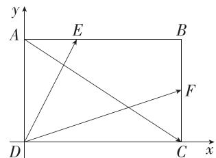

text_image

y
A	E	B
D	C	x
F

设 $DC = a, DA = b, a, b > 0$ ，则 $D(0,0), E\left(\frac{a}{3}, b\right)$ ，

$F\left(a,\frac{b}{2}\right),A(0,b),C(a,0)$

设 $\overrightarrow{DE}=\lambda_{1}\overrightarrow{DF}+\lambda_{2}\overrightarrow{AC}(\lambda_{1},\lambda_{2}\in\mathbf{R})$ ,

则 $\left(\frac{a}{3},b\right)=\lambda_{1}\left(a,\frac{b}{2}\right)+\lambda_{2}(a,-b)$ ,

所以 $\left\{\begin{aligned}(\lambda_{1}+\lambda_{2})a&=\frac{a}{3},\\ \left(\frac{\lambda_{1}}{2}-\lambda_{2}\right)b=b,\end{aligned}\right.$ 解得 $\left\{\begin{aligned}\lambda_{1}&=\frac{8}{9},\\ \lambda_{2}&=-\frac{5}{9},\end{aligned}\right.$

故 $\overrightarrow{DE}=\frac{8}{9}\overrightarrow{DF}-\frac{5}{9}\overrightarrow{AC}$ . 故选 A.

解法二: 利用平面向量基本定理求解.

依题意得 $\overrightarrow{DE} = \overrightarrow{DA} +\frac{1}{3}\overrightarrow{DC}$ ①， $\overrightarrow{DF} = \overrightarrow{DC} +\frac{1}{2}\overrightarrow{DA}$ ②， $\overrightarrow{AC} =$

$$
\overrightarrow {D C} - \overrightarrow {D A} ③,
$$

由②③得 $\overrightarrow{DA} = \frac{2}{3}\overrightarrow{DF} -\frac{2}{3}\overrightarrow{AC},\overrightarrow{DC} = \frac{2}{3}\overrightarrow{DF} +\frac{1}{3}\overrightarrow{AC},$

将这两个式子代入①, 得 $\overrightarrow{DE} = \frac{8}{9} \overrightarrow{DF} - \frac{5}{9} \overrightarrow{AC}$ .

13. 答案 $\frac{4 + \sqrt{3}}{2}$

解析 以 A 为原点建立平面直角坐标系, 如图,

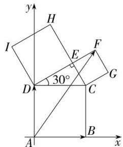

text_image

y
H
I
E
F
30°
D
C
G
A
B
x

设正方形ABCD的边长为 $2a(a > 0)$ ，则正方形DEHI的边长为 $\sqrt{3} a$ ，正方形EFGC的边长为 $a$

故 $A(0,0), B(2a,0), D(0,2a), DF = (\sqrt{3} + 1)a$

则 $x_{F} = (\sqrt{3} + 1)a\cdot \cos 30^{\circ} = \frac{3 + \sqrt{3}}{2} a,y_{F} = (\sqrt{3} +1)a$

$\sin 30^{\circ} + 2a = \frac{5 + \sqrt{3}}{2} a$ 即 $F\left(\frac{3 + \sqrt{3}}{2} a, \frac{5 + \sqrt{3}}{2} a\right)$ .

$\because \overrightarrow{AF} = x\overrightarrow{AB} +y\overrightarrow{AD},$

$$
\begin{array}{l} \therefore \left(\frac {3 + \sqrt {3}}{2} a, \frac {5 + \sqrt {3}}{2} a\right) = x (2 a, 0) + y (0, 2 a) = (2 a x, \\ 2 a y), \end{array}
$$

$$
\therefore \left\{ \begin{array}{l} 2 a x = \frac {3 + \sqrt {3}}{2} a, \\ 2 a y = \frac {5 + \sqrt {3}}{2} a, \end{array} \right. \therefore \left\{ \begin{array}{l} x = \frac {3 + \sqrt {3}}{4}, \\ y = \frac {5 + \sqrt {3}}{4}, \end{array} \right. \therefore x + y = \frac {4 + \sqrt {3}}{2}.
$$

14.BCD 对于 A, 零向量与任意向量共线, 所以 $e_{1}$ 与 $e_{2}$ 共线, 不能作为基底, 故 A 不符合题意;

对于 B, 由 $1 \times 1 - 2 \times (-2) = 5 \neq 0$ , 得 $e_{1}$ 与 $e_{2}$ 不共线, 能作为基底, 故 B 符合题意;

对于 C, 由 $-3 \times \left(-\frac{3}{5}\right) -4 \times \frac{4}{5} = -\frac{7}{5} \neq 0$ , 得 $e_{1}$ 与 $e_{2}$ 不共线, 能作为基底, 故 C 符合题意;

对于 D, 由 $2 \times 3 - 6 \times (-1) = 12 \neq 0$ , 得 $e_{1}$ 与 $e_{2}$ 不共线, 能作为基底, 故 D 符合题意.

故选 BCD.

15. 答案 $\{m \mid m \neq 2\}$

解析 由题知 A, B, C 三点不共线，即 $\overrightarrow{AB}, \overrightarrow{AC}$ 不共线，易得 $\overrightarrow{AB} = (-3, m + 1)$ ，又 $\overrightarrow{AC} = (-1, m - 1)$ ，

所以 $-(m+1)\neq-3(m-1)$ ，所以 $m\neq2$ .

所以实数 $m$ 的取值范围为 $\{m \mid m \neq 2\}$ .

16. 答案 (6, -9) 或 (-2, 15)

解析 解法一:由题意得 $\overrightarrow{AB}=(2,-6)$ ,

设 $M(x,y)$ ，可得 $\overrightarrow{AM} = (x - 2,y - 3)$

因为点 M 在直线 AB 上, 且 $\left|\overrightarrow{AM}\right|=2\left|\overrightarrow{AB}\right|$ ,

所以 $\overrightarrow{AM} = \pm 2\overrightarrow{AB}$

当 $\overrightarrow{AM}=2\overrightarrow{AB}$ 时， $\left\{\begin{aligned}x-2&=4,\\ y-3&=-12,\end{aligned}\right.$ 解得 $\left\{\begin{aligned}x&=6,\\ y&=-9,\end{aligned}\right.$ 即点 $M(6,-9)$ ;

当 $\overrightarrow{AM}=-2\overrightarrow{AB}$ 时, $\left\{\begin{aligned}x-2&=-4,\\ y-3&=12,\end{aligned}\right.$ 解得 $\left\{\begin{aligned}x&=-2,\\ y&=15,\end{aligned}\right.$ 即点 $M(-2,$ 15).

综上,点 M 的坐标为 $(6,-9)$ 或 $(-2,15)$ .

解法二: 设 $M(x, y)$ ，因为点 M 在直线 AB 上，且 $|\overrightarrow{AM}| = 2|\overrightarrow{AB}|$ ，所以 $\overrightarrow{AM} = \pm 2\overrightarrow{AB}$ ，

当 $\overrightarrow{AM} = 2\overrightarrow{AB}$ 时， $\overrightarrow{AM} = -2\overrightarrow{MB}$ ，由定比分点坐标公式可知 $x = \frac{1}{1 + (-2)}\times 2 + \frac{-2}{1 + (-2)}\times 4 = 6,y = \frac{1}{1 + (-2)}\times 3+$

$\frac{-2}{1+(-2)}\times(-3)=-9$ ,所以点 $M(6,-9)$ ;

当 $\overrightarrow{AM} = -2\overrightarrow{AB}$ 时， $\overrightarrow{AM} = -\frac{2}{3}\overrightarrow{MB}$ ，由定比分点坐标公式

可知 $x = \frac{1}{1 + \left(-\frac{2}{3}\right)}\times 2 + \frac{-\frac{2}{3}}{1 + \left(-\frac{2}{3}\right)}\times 4 = -2,y =$

$\frac{1}{1 + \left(-\frac{2}{3}\right)}\times 3 + \frac{-\frac{2}{3}}{1 + \left(-\frac{2}{3}\right)}\times (-3) = 15$ 所以点 $M(-2,15)$

综上,点 M 的坐标为 $(6,-9)$ 或 $(-2,15)$ .

# 目 记忆结论

定比分点的坐标表示

已知 $A(x_{1},y_{1}),B(x_{2},y_{2})$ ，若存在一个实数 $\lambda$ （ $\lambda \neq -1$ )，使 $\overrightarrow{AM} = \lambda \overrightarrow{MB},O$ 为坐标原点，则有 $\overrightarrow{OM} =$ $\frac{1}{1 + \lambda}\overrightarrow{OA} +\frac{\lambda}{1 + \lambda}\overrightarrow{OB}$ ，点 $M$ 的坐标为 $\left(\frac{x_1 + \lambda x_2}{1 + \lambda},\frac{y_1 + \lambda y_2}{1 + \lambda}\right)$

17. 解析 (1) 因为 $a = (1,0), b = (2,1)$ , 所以 $ka + b = (k+2,1)$ , 又 $(ka + b) // c, c = (3,-4)$ , 所以 $-4(k+2) = 3$ , 解得 $k = -\frac{11}{4}$ .

(2) 易得 $\overrightarrow{AB}=2a+3b=(8,3)$ , $\overrightarrow{BC}=a+mb=(1+2m, m)$ ,

因为 A, B, C 三点共线, 所以 $\overrightarrow{AB} \parallel \overrightarrow{BC}$ ,

所以 $8m=3(1+2m)$ ，解得 $m=\frac{3}{2}$ .

# 能力提升练

Q 对应主书 P18

1.B

2.D

3.C

1.B 以 C 为坐标原点, $\overrightarrow{DC}, \overrightarrow{CA}$ 的方向分别为 x 轴, y 轴的正方向建立直角坐标系(图略),

则 $A(0,2\sqrt{2}), B(\sqrt{2},\sqrt{2}), C(0,0), D(-2,0)$ ，所以 $\overrightarrow{AB} = (\sqrt{2}, -\sqrt{2}), \overrightarrow{AC} = (0, -2\sqrt{2}), \overrightarrow{DB} = (\sqrt{2} + 2, \sqrt{2})$ 。

因为 $\overrightarrow{DB}=\lambda\overrightarrow{AB}+\mu\overrightarrow{AC}$ ，所以 $\left\{\begin{aligned}\sqrt{2}+2&=\sqrt{2}\lambda,\\ \sqrt{2}&=-\sqrt{2}\lambda-2\sqrt{2}\mu,\end{aligned}\right.$

解得 $\left\{\begin{aligned}\lambda&=\sqrt{2}+1,\\ \mu&=-1-\frac{\sqrt{2}}{2},\end{aligned}\right.$ 所以 $\lambda+\mu=\frac{\sqrt{2}}{2}.$ 故选B.

2.D 对于 A, 若 a 与 b 共线, 则 mq = np, 所以 $a \otimes b = mq - np = 0$ , 故 A 中说法正确;

对于 B, $a \otimes b = mq - np$ , $a \cdot b = mp + nq$ ，则 $(a \otimes b)^{2} + (a \cdot b)^{2} = (mq - np)^{2} + (mp + nq)^{2} = (mq)^{2} + (np)^{2} - 2mnqp + (mp)^{2} + (nq)^{2} + 2mnqp = m^{2}(q^{2} + p^{2}) + n^{2}(q^{2} + p^{2}) = (m^{2} + n^{2})(q^{2} + p^{2}) = |a|^{2} \cdot |b|^{2}$ ，故 B 中说法正确；

对于 C, $(\lambda\boldsymbol{a})\otimes\boldsymbol{b}=\lambda mq-\lambda np=\lambda(\boldsymbol{a}\otimes\boldsymbol{b})$ ，故 C 中说法正确；

对于 D, $a \otimes b = mq - np$ , $b \otimes a = pn - qm$ , 不一定相等, 故 D 中说法错误. 故选 D.

3.C 不妨设 $|\overrightarrow{OA}| = |\overrightarrow{OB}| = 1, |\overrightarrow{OC}| = t (t > 0)$ , 以 $O$ 为原点建立平面直角坐标系,如图所示,

则 $A(1,0)$ ，由 $\tan \alpha = 7$ 可得

$$
\cos \alpha = \frac {1}{5 \sqrt {2}}, \sin \alpha = \frac {7}{5 \sqrt {2}},
$$

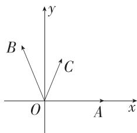

text_image

y
B
C
O
A
x

则 $C\left(\frac{t}{5\sqrt{2}}, \frac{7t}{5\sqrt{2}}\right)$ ,

$$
\cos (\alpha + 4 5 ^ {\circ}) = \cos \alpha \cos 4 5 ^ {\circ} - \sin \alpha \sin 4 5 ^ {\circ} = - \frac {3}{5},
$$

$$
\sin (\alpha + 4 5 ^ {\circ}) = \sin \alpha \cos 4 5 ^ {\circ} + \cos \alpha \sin 4 5 ^ {\circ} = \frac {4}{5},
$$

$$
\therefore B \left(- \frac {3}{5}, \frac {4}{5}\right),
$$

$$
\because \overrightarrow {O C} = m \overrightarrow {O A} + n \overrightarrow {O B}, \therefore \left(\frac {t}{5 \sqrt {2}}, \frac {7 t}{5 \sqrt {2}}\right) = m (1, 0) +
$$

$$
n \left(- \frac {3}{5}, \frac {4}{5}\right) = \left(m - \frac {3}{5} n, \frac {4 n}{5}\right), \therefore m - \frac {3}{5} n = \frac {t}{5 \sqrt {2}}, \frac {4 n}{5} = \frac {7 t}{5 \sqrt {2}},
$$

解得 $m = \frac{5t}{4\sqrt{2}}, n = \frac{7t}{4\sqrt{2}}, \therefore \frac{m}{n} = \frac{5}{7}$ . 故选 C.

4. 答案 $2; \sqrt{2} + \frac{3}{2}$

解析 由题意得 $\overrightarrow{AB} = \overrightarrow{OB} -\overrightarrow{OA} = (-a + 2, - 2),\overrightarrow{AC} = \overrightarrow{OC}-$ $\overrightarrow{OA} = (b + 2, - 4)$ ，若 $A,B,C$ 三点共线，则 $\overrightarrow{AB}$ 与 $\overrightarrow{AC}$ 共线，所以 $(-a + 2)\times (-4) - (-2)\times (b + 2) = 0$ ，即 $2a + b = 2$ ，则

$$
\frac {1}{a} + \frac {1}{b} = \frac {1}{2} \left(\frac {1}{a} + \frac {1}{b}\right) (2 a + b) = \frac {1}{2} \left(\frac {b}{a} + \frac {2 a}{b} + 3\right) \geqslant
$$

$$
\frac {1}{2} \left(2 \sqrt {\frac {b}{a} \cdot \frac {2 a}{b}} + 3\right) = \sqrt {2} + \frac {3}{2},
$$

当且仅当 $\left\{ \begin{array}{l} 2a + b = 2, \\ \frac{b}{a} = \frac{2a}{b}, \end{array} \right.$ 即 $\left\{ \begin{array}{l} a = 2 - \sqrt{2}, \\ b = 2\sqrt{2} - 2 \end{array} \right.$ 时取等号.

5. 答案 [-6,1]

解析 易知 $2\pmb {b} = (2m,m + 2\sin \alpha)$

又 $\boldsymbol{a}=(\lambda+2,\lambda^{2}-\cos^{2}\alpha)$ , $a=2b$ ,

$$
\therefore \left\{ \begin{array}{l} \lambda + 2 = 2 m, \\ \lambda^ {2} - \cos^ {2} \alpha = m + 2 \sin \alpha , \end{array} \right.
$$

$$
\therefore (2 m - 2) ^ {2} - m = \cos^ {2} \alpha + 2 \sin \alpha ,
$$

即 $4m^{2} - 9m + 4 = 1 - \sin^{2}\alpha +2\sin \alpha ,$

$$
\because 1 - \sin^ {2} \alpha + 2 \sin \alpha = - (\sin \alpha - 1) ^ {2} + 2, \sin \alpha \in [ - 1, 1 ],
$$

$$
\therefore - (\sin \alpha - 1) ^ {2} + 2 \in [ - 2, 2 ],
$$

$\therefore -2 \leqslant 4m^{2} - 9m + 4 \leqslant 2$ ，解得 $\frac{1}{4} \leqslant m \leqslant 2$

$$
\therefore \frac {1}{2} \leqslant \frac {1}{m} \leqslant 4, \because \lambda = 2 m - 2, \therefore \frac {\lambda}{m} = 2 - \frac {2}{m},
$$

$\therefore -6 \leqslant \frac{\lambda}{m} \leqslant 1$ ，即 $\frac{\lambda}{m}$ 的取值范围是 $[-6, 1]$ .

6. 解析 (1) 设 $D(x, y) (x, y > 0)$ , 依题意可得 $\overrightarrow{AB} = \overrightarrow{CD}$ , $\overrightarrow{AB} = (4, 4)$ , $\overrightarrow{CD} = (x + 1, y - 1)$ ,

所以 $\left\{\begin{aligned}x+1&=4,\\ y-1&=4,\end{aligned}\right.$ 解得 $\left\{\begin{aligned}x&=3,\\ y&=5,\end{aligned}\right.$ 即 $D(3,5)$ .

(2) 设 $\overrightarrow{AE} = \lambda \overrightarrow{AC}, \lambda \in [0,1]$ ，则 $(m+2, n+4) = \lambda (1,5)$ ，
所以 $\left\{\begin{aligned}m+2&= \lambda,\\ n+4&=5\lambda,\end{aligned}\right.$ 则 $\left\{\begin{aligned}m&=\lambda-2,\\ n&=5\lambda-4,\end{aligned}\right.$

所以 $(m - 2)^{2} + n^{2} = (\lambda -4)^{2} + (5\lambda -4)^{2} = 26\lambda^{2} - 48\lambda +$ $32 = 26\left(\lambda -\frac{12}{13}\right)^{2} + \frac{128}{13},$

因为 $\lambda\in[0,1]$ ，所以当 $\lambda=\frac{12}{13}$ 时， $(m-2)^{2}+n^{2}$ 取得最小值，为 $\frac{128}{13}$ ，当 $\lambda=0$ 时， $(m-2)^{2}+n^{2}$ 取得最大值，为 32，

所以 $(m - 2)^{2} + n^{2}$ 的取值范围为 $\left[\frac{128}{13},32\right]$ .

7. 解析 (1) 易得 $\overrightarrow{AB}=(-1,1)$ , $\overrightarrow{AC}=(\cos\alpha,\sin\alpha)$ .

∵ A, B, C 三点共线, ∴ $\overrightarrow{AB} \parallel \overrightarrow{AC}$ ,

$\therefore -\sin \alpha -\cos \alpha = 0$ ，即 $\tan \alpha = -1$

又 $\alpha \in (0, \pi), \therefore \alpha = \frac{3\pi}{4}$ .

(2)∵ 四边形 ABCD 为平行四边形，

$\therefore \overrightarrow{AB} = \overrightarrow{DC}$ 且 $\overrightarrow{AB}$ 与 $\overrightarrow{AC}$ 不共线.

易知 $\overrightarrow{AB} = (-1, 1), \overrightarrow{DC} = (\cos \alpha - s, \sin \alpha - t)$ ,

$$
\therefore \cos \alpha - s = - 1, \sin \alpha - t = 1,
$$

$$
\therefore s = \cos \alpha + 1, t = \sin \alpha - 1,
$$

$$
\therefore s + t = \sin \alpha + \cos \alpha = \sqrt {2} \sin \left(\alpha + \frac {\pi}{4}\right).
$$

$$
\because \alpha \in (0, \pi), \therefore \alpha + \frac {\pi}{4} \in \left(\frac {\pi}{4}, \frac {5 \pi}{4}\right),
$$

$$
\therefore \sin \left(\alpha + \frac {\pi}{4}\right) \in \left(- \frac {\sqrt {2}}{2}, 1 \right],
$$

$$
\therefore \sqrt {2} \sin \left(\alpha + \frac {\pi}{4}\right) \in (- 1, \sqrt {2} ],
$$

结合(1)可知, $\alpha\neq\frac{3\pi}{4},\therefore s+t\neq0.$

故 $s + t$ 的取值范围是 $(-1,0)\cup (0,\sqrt{2} ]$

# 6.3.5 平面向量数量积的坐标表示

# 基础过关练

Q 对应主书 P19

<table><tr><td>1.C</td><td>2.C</td><td>3.C</td><td>4.A</td><td>5.D</td><td>8.B</td><td>11.C</td><td>12.C</td></tr><tr><td>13.AB</td><td></td><td></td><td></td><td></td><td></td><td></td><td></td></tr></table>

1. C $\because a=(1,-1)$ , $b=(-1,2)$ , $\therefore 2a+b=(1,0)$ ,

$$
\therefore (2 \boldsymbol {a} + \boldsymbol {b}) \cdot \boldsymbol {a} = 1 \times 1 + 0 \times (- 1) = 1.
$$

2. C $\overrightarrow{BC}=\overrightarrow{AC}-\overrightarrow{AB}=(2,1)-(1,0)=(1,1)$ ，因为四边形 ABCD 为平行四边形，所以 $\overrightarrow{DC}=\overrightarrow{AB}=(1,0)$ ，所以 $\overrightarrow{BC}\cdot\overrightarrow{DC}=1\times1+1\times0=1$ ，故选 C.

3.C 建立平面直角坐标系,如图所示:

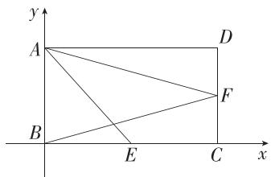

text_image

y
A
D
B
E
C
x

则 $A(0,\sqrt{3}),B(0,0),C(2,0),D(2,\sqrt{3}),E(1,0)$ 设 $F(2,y),0\leqslant y\leqslant \sqrt{3}$ ，则 $\overrightarrow{AE} = (1, - \sqrt{3}),\overrightarrow{BF} = (2,y)$ 由 $\overrightarrow{AE} \cdot \overrightarrow{BF} = 1$ ，可得 $1 \times 2 - \sqrt{3} y = 1$ ，解得 $y = \frac{\sqrt{3}}{3}$ ，所以 $F\left(2, \frac{\sqrt{3}}{3}\right)$ ，则 $\overrightarrow{AF} = \left(2, -\frac{2\sqrt{3}}{3}\right)$ ，

又 $\overrightarrow{AB} = (0, -\sqrt{3})$ ，所以 $\overrightarrow{AB} \cdot \overrightarrow{AF} = 0 \times 2 - \sqrt{3} \times \left(-\frac{2\sqrt{3}}{3}\right) =$

2, 故选 C.

4.A 由题意得 $\overrightarrow{AB} = (-4, - 9),\overrightarrow{CD} = \left(\frac{7}{2},5\right)$ ，所以 $\overrightarrow{AB} +$ $2\overrightarrow{CD} = (3,1)$

故与向量 $\overrightarrow{AB} + 2\overrightarrow{CD}$ 同向的单位向量为 $\frac{\overrightarrow{AB} + 2\overrightarrow{CD}}{|\overrightarrow{AB} + 2\overrightarrow{CD}|} =$ $\frac{1}{\sqrt{9 + 1}} (3,1) = \left(\frac{3\sqrt{10}}{10},\frac{\sqrt{10}}{10}\right).$ 故选A.

5.D 由题意可得 b 在 a 上的投影向量为 $\frac{a \cdot b}{|a|} \cdot \frac{a}{|a|} = \frac{2\lambda + 3}{2^2 + 1}(2, 1) = (10, 5)$ ，所以 $\frac{2\lambda + 3}{2^2 + 1} = 5$ ，解得 $\lambda = 11$ ，则 $b = (11, 3)$ ，所以 $b - 2a = (7, 1)$ ，故 $|b - 2a| = \sqrt{49 + 1} = 5\sqrt{2}$ 。故选 D.

6. 答案 $3\sqrt{2}$

解析 因为 $\boldsymbol{a}=(x-1,2)$ , $\boldsymbol{b}=(x,1)$ ，且 $a \parallel b$ ，所以 x-1-2x=0，解得 x=-1，则 $\boldsymbol{a}+\boldsymbol{b}=(2x-1,3)=(-3,3)$ ，所以 $\left|\boldsymbol{a}+\boldsymbol{b}\right|=\sqrt{\left(-3\right)^{2}+3^{2}}=3\sqrt{2}$ .

7. 答案 $4 \sqrt{3}$

解析 因为 a 与 b 方向相反, 所以存在 k<0, 使 a=kb,
即 $\left\{\begin{aligned}m=k,\\ 3=km,\end{aligned}\right.$ 解得 $\left\{\begin{aligned}m&=-\sqrt{3}\\ k&=-\sqrt{3}\end{aligned}\right.$ ，或 $\left\{\begin{aligned}m&=\sqrt{3}\\ k&=\sqrt{3}\end{aligned}\right.$ （舍去），

故 $m = k = -\sqrt{3}$

则 $a = (-\sqrt{3}, 3), b = (1, -\sqrt{3})$ ，所以 $a - \sqrt{3}b = (-2\sqrt{3},$

6), 故 $\left|a-\sqrt{3}b\right|=\sqrt{\left(-2\sqrt{3}\right)^{2}+6^{2}}=4\sqrt{3}$ .

8.B 由题意得 $b=2a+b-2a=(2,0)$ ，所以 $a\cdot b=1\times2+1\times0=2$ ，

易得 $|b|=2,|a|=\sqrt{2}$ ，设a与b的夹角为 $\theta$ ，则 $\cos\theta=\frac{a\cdot b}{|a||b|}=\frac{2}{\sqrt{2}\times2}=\frac{\sqrt{2}}{2}$ ，又因为 $\theta\in[0,\pi]$ ，所以 $\theta=\frac{\pi}{4}$ ，故选B.

9. 答案 $\frac{\sqrt{2}}{10}$

解析 以 A 为原点, $\overrightarrow{AB}, \overrightarrow{AD}$ 的方向分别为 x 轴, y 轴正方向建立平面直角坐标系(图略),

则 $A(0,0),D(0,6),E(3,0),F(6,2)$

$$
\therefore \overrightarrow {D E} = (3, - 6), \overrightarrow {A F} = (6, 2).
$$

易知向量 $\overrightarrow{DE}$ 与 $\overrightarrow{AF}$ 的夹角等于 $\angle EMF$ ,

$$
\therefore \cos \angle E M F = \frac {\overrightarrow {D E} \cdot \overrightarrow {A F}}{| \overrightarrow {D E} | | \overrightarrow {A F} |} = \frac {1 8 - 1 2}{\sqrt {9 + 3 6} \times \sqrt {3 6 + 4}} = \frac {\sqrt {2}}{1 0}.
$$

10. 答案 $(-∞,0)∪(0,\frac{5}{14})$

解析 由题意得 $\boldsymbol{a} + \lambda \boldsymbol{b} = (1, -2) + \lambda (-2, 6) = (1 - 2\lambda, -2 + 6\lambda)$ ,

因为 a 与 $a + \lambda b$ 的夹角为锐角, 所以 $a \cdot (a + \lambda b) > 0$ , 且 a 与 $a + \lambda b$ 不共线易错点,

由 $\boldsymbol{a} \cdot (\boldsymbol{a} + \lambda \boldsymbol{b}) > 0$ ，得 $1 - 2\lambda + (-2) \times (-2 + 6\lambda) > 0$ ，解得 $\lambda < \frac{5}{14}$ ,

由 a 与 $a+\lambda b$ 共线, 得 $-2\times(1-2\lambda)-(-2+6\lambda)=0$ , 解得 $\lambda=0$ , 故 $\lambda\neq0$ .

综上, $\lambda$ 的取值范围为 $(-∞,0)∪\left(0,\frac{5}{14}\right)$ .

11. C 因为 $\overrightarrow{AB} = (2, 1)$ , $\overrightarrow{AC} = (3, -6)$ , 所以 $\overrightarrow{AB} \cdot \overrightarrow{AC} = 2 \times 3 - 6 = 0$ , 即 $\overrightarrow{AB} \perp \overrightarrow{AC}$ ,

所以 $S_{\triangle ABC}=\frac{1}{2}|\overrightarrow{AB}|\cdot|\overrightarrow{AC}|=\frac{1}{2}\times\sqrt{4+1}\times\sqrt{9+36}=$ $\frac{15}{2}$ ，故选 C.

12. C 以 A 为原点, AB 所在直线为 x 轴, AD 所在直线为 y 轴, 建立如图所示的平面直角坐标系,

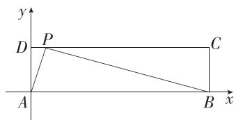

text_image

y
P
D
C
A
B
x

则 $A(0,0), B(4,0)$ , 设 $P(t,1) (0 \leqslant t \leqslant 4)$ ,

则 $\overrightarrow{AP} = (t,1),\overrightarrow{BP} = (t - 4,1)$

因为 $AP \perp BP$ ，所以 $\overrightarrow{AP} \cdot \overrightarrow{BP} = 0$ ，即 $t(t - 4) + 1 = 0$

解得 $t=2\pm\sqrt{3}$ ，即满足条件的点 P 有 2 个。故选 C.

13.AB $|\pmb {a}| = \sqrt{t^2 + 1}$ ，则当 $t = 0$ 时， $|\pmb {a}|$ 取最小值，为1，故A正确；

若 $a \perp b$ ，则 $2t + t = 0$ ，解得 t = 0，故 B 正确；

若 t=1，则 $\boldsymbol{a}=(1,1)$ ，

设与 a 垂直的单位向量为 $\boldsymbol{m}=(x,y)$ ,

则 $\left\{\begin{aligned}x+y=0,\\\sqrt{x^{2}+y^{2}}=1,\end{aligned}\right.$ 解得 $\left\{\begin{aligned}x=\frac{\sqrt{2}}{2},\\\sqrt{x^{2}+y^{2}}=1,\end{aligned}\right.$ 或 $\left\{\begin{aligned}x=-\frac{\sqrt{2}}{2},\\\sqrt{x^{2}+y^{2}}=1,\end{aligned}\right.$

故与 a 垂直的单位向量为 $\left(\frac{\sqrt{2}}{2}, -\frac{\sqrt{2}}{2}\right)$ 或 $\left(-\frac{\sqrt{2}}{2}, \frac{\sqrt{2}}{2}\right)$ ，故 C 错误；

若 a 与 b 的夹角为钝角, 则 $\cos\langle a,b\rangle=\frac{a\cdot b}{|a||b|}=$ $\frac{3t}{\sqrt{1+t^{2}}\cdot\sqrt{4+t^{2}}}<0$ , 且向量 a 与 b 不共线, 即 $t^{2}-2\neq0$ , 解得 t<0 且 $t\neq-\sqrt{2}$ , 故 D 错误.

14. 答案 -1

解析 因为 $(a+\lambda b)\perp b$ ，所以 $(a+\lambda b)\cdot b=0$ ，即 $a\cdot b+\lambda b^{2}=0$ ，由题意得 $a\cdot b=3\times(-1)+5\times1=2,b^{2}=(-1)^{2}+1^{2}=2$ ，所以 $2+2\lambda=0$ ，解得 $\lambda=-1$ 。

# 能力提升练

Q 对应主书 P20

<table><tr><td>1.C</td><td>2.ABD</td><td>5.B</td><td>6.ABD</td><td></td><td></td><td></td><td></td></tr></table>

1.C 设表示向量 a, b 的有向线段的起点均为 $O(O$ 为坐标原点 $)$ ，终点分别为 A, B。由题意可知， $\overrightarrow{OA} = (1, 1)$ ，即 $A(1, 1)$ 。如图所示，当点 B 位于 $B_{1}$ 或 $B_{2}$ 时，a 与 b 的夹角为 $\frac{\pi}{12}$ ，即 $\angle AOB_{1} = \angle AOB_{2} = \frac{\pi}{12}$ ，此时 $\angle B_{1}Ox = \frac{\pi}{4} - \frac{\pi}{12} = \frac{\pi}{6}$ ， $\angle B_{2}Ox = \frac{\pi}{4} + \frac{\pi}{12} = \frac{\pi}{3}$ ，故 $B_{1}\left(1, \frac{\sqrt{3}}{3}\right), B_{2}(1, \sqrt{3})$ ，因为 a 与 b 的夹角不为 0，所以 $m \neq 1$ 。所以 m 的取值范围是 $\left(\frac{\sqrt{3}}{3}, 1\right) \cup (1, \sqrt{3})$ 。

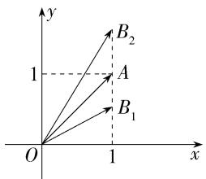

text_image

y
B₂
1
A
B₁
O
1
x

2.ABD 由题意得 $c = a + \lambda b = (1 - 3\lambda, 2 + 4\lambda)$ ，则 $|c|^2 = (1 - 3\lambda)^2 + (2 + 4\lambda)^2 = 5 + 10\lambda + 25\lambda^2 = 25\left(\lambda + \frac{1}{5}\right)^2 + 4$ ，当 $\lambda = -\frac{1}{5}$ 时， $|c|$ 取得最小值，故 A 正确；

当 $|c|$ 最小时, $c=\left(\frac{8}{5},\frac{6}{5}\right)$ ,所以 $b\cdot c=-3\times\frac{8}{5}+4\times\frac{6}{5}=0$ ,所以 $b\perp c$ ,故B正确;

设向量 a 与 c 的夹角为 $\theta$ ，则 $\cos\theta=\frac{a\cdot c}{|a||c|}=$ $\frac{5+5\lambda}{\sqrt{5}\times\sqrt{5+10\lambda+25\lambda^{2}}}=\frac{1+\lambda}{\sqrt{1+2\lambda+5\lambda^{2}}}$ ,

要使向量 a 与 c 的夹角最小, 则 $\cos \theta$ 最大, 由于 $\theta \in [0, \pi]$ , 所以 $\cos \theta$ 的最大值为 1, 令 $\frac{1 + \lambda}{\sqrt{1 + 2\lambda + 5\lambda^{2}}} = 1$ , 解得 $\lambda = 0$ , 所以当 $\lambda = 0$ 时, a 与 c 的夹角最小, 此时 a = c, 故 C 错误, D 正确.

故选 ABD.

3. 答案 $\sqrt{3}$

解析 由题意得 $\overrightarrow{OA} = (1,0),\overrightarrow{OB} = (1, - \sqrt{3})$

$$
\therefore | \overrightarrow {O A} | = \sqrt {1 ^ {2} + 0 ^ {2}} = 1, | \overrightarrow {O B} | = \sqrt {1 ^ {2} + (- \sqrt {3}) ^ {2}} = 2,
$$

$$
\therefore \cos \langle \overrightarrow {O A}, \overrightarrow {O B} \rangle = \frac {\overrightarrow {O A} \cdot \overrightarrow {O B}}{| \overrightarrow {O A} | | \overrightarrow {O B} |} = \frac {1 \times 1 + 0 \times (- \sqrt {3})}{1 \times 2} = \frac {1}{2},
$$

$$
\because \langle \overrightarrow {O A}, \overrightarrow {O B} \rangle \in [ 0, \pi ], \therefore \langle \overrightarrow {O A}, \overrightarrow {O B} \rangle = \frac {\pi}{3},
$$

$$
\begin{array}{l} \therefore | \overrightarrow {O A} \times \overrightarrow {O B} | = | \overrightarrow {O A} | | \overrightarrow {O B} | \sin \langle \overrightarrow {O A}, \overrightarrow {O B} \rangle = 1 \times 2 \times \\ \sin \frac {\pi}{3} = \sqrt {3}. \end{array}
$$

4. 解析 (1) 由 $\overrightarrow{OA} \cdot \overrightarrow{OB} = 0$ , 得 $\overrightarrow{OA} \perp \overrightarrow{OB}$ , 以 $O$ 为原点, $OA, OB$ 所在直线分别为 $x$ 轴, $y$ 轴, $y_{\uparrow}$

建立平面直角坐标系,如图所示,
则 $O(0,0)$ , $A(2,0)$ , $B(0,4)$ , $D(0,2)$ , 故 $\overrightarrow{AD}=(-2,2)$ ,

因为 $\overrightarrow{AE} = \frac{1}{2}\overrightarrow{AB}$ ，所以 $E$ 为 $AB$ 的中点，故 $E(1,2)$

所以 $\overrightarrow{OE}=(1,2)$ ,

设 $\overrightarrow{AD}$ 与 $\overrightarrow{OE}$ 的夹角为 $\theta$ ,

则 $\cos\theta=\frac{\overrightarrow{AD}\cdot\overrightarrow{OE}}{|\overrightarrow{AD}||\overrightarrow{OE}|}=\frac{-2\times1+2\times2}{2\sqrt{2}\times\sqrt{5}}=\frac{\sqrt{10}}{10}$ ,

所以直线 AD 与 OE 相交所成的较小的角的余弦值是 $\frac{\sqrt{10}}{10}$ .

(2) 解法一: 由 (1) 知 $\overrightarrow{AB} = (-2, 4)$ , $\overrightarrow{AO} = (-2, 0)$ , 则 $\overrightarrow{AE} = t \overrightarrow{AB} = (-2t, 4t)$ ,

则 $\left|\overrightarrow{AE}-\overrightarrow{AO}\right|=\sqrt{\left(-2t+2\right)^{2}+\left(4t\right)^{2}}=\sqrt{20t^{2}-8t+4}$ $=\sqrt{20\left(t-\frac{1}{5}\right)^{2}+\frac{16}{5}}$

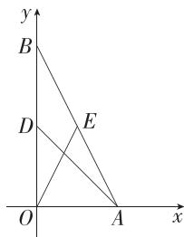

text_image

y
B
D
E
O
A
x

故当 $t=\frac{1}{5}$ 时， $\left|\overrightarrow{AE}-\overrightarrow{AO}\right|$ 取得最小值，为 $\frac{4\sqrt{5}}{5}$ .

解法二: $\overrightarrow{AE}=t\overrightarrow{AB}(t\in\mathbf{R})$ 表示 E 是直线 AB 上任意一点, $|\overrightarrow{AE}-\overrightarrow{AO}|=|\overrightarrow{OE}|$ , 其最小值就是原点 O 到直线 AB 的距离, 设为 d,

则 $|\overrightarrow{AB}|\cdot d = |\overrightarrow{OA}|\cdot |\overrightarrow{OB}|$ ，可得 $d = \frac{2\times 4}{\sqrt{2^2 + 4^2}} = \frac{4\sqrt{5}}{5},$

此时 $|\overrightarrow{AE}| = \sqrt{|\overrightarrow{OA}|^2 - d^2} = \frac{2\sqrt{5}}{5}$ , 则 $t = \frac{|\overrightarrow{AE}|}{|\overrightarrow{AB}|} = \frac{1}{5}$ ,

故当 $t=\frac{1}{5}$ 时， $\left|\overrightarrow{AE}-\overrightarrow{AO}\right|$ 取得最小值，为 $\frac{4\sqrt{5}}{5}$ .

5.B

思路点拨

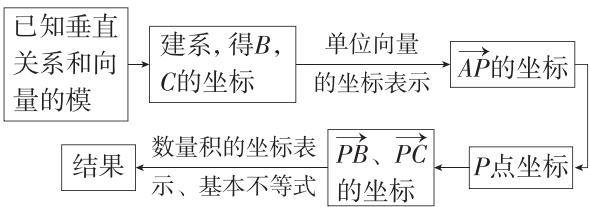

flowchart

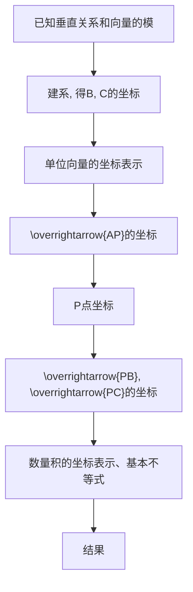

解析 以 A 为坐标原点, 建立如图所示的平面直角坐标系,

则 $A(0,0)$ , $B(t,0)$ , $C\left(0,\frac{1}{t}\right)$ (t>0),

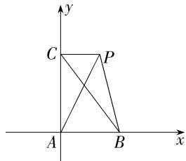

text_image

y
C P
A B x

所以 $\overrightarrow{AB} = (t,0),\overrightarrow{AC} = \left(0,\frac{1}{t}\right),$

故 $\frac{\overrightarrow{AB}}{|\overrightarrow{AB}|}=(1,0),\frac{2\overrightarrow{AC}}{|\overrightarrow{AC}|}=(0,2)$ ,

则 $\overrightarrow{AP} = \frac{\overrightarrow{AB}}{|\overrightarrow{AB}|} +\frac{2\overrightarrow{AC}}{|\overrightarrow{AC}|} = (1,2)$ ，即 $P(1,2)$

故 $\overrightarrow{PB} = (t - 1, -2),\overrightarrow{PC} = \left(-1,\frac{1}{t} -2\right),$

所以 $\overrightarrow{PB} \cdot \overrightarrow{PC} = 1 - t + 4 - \frac{2}{t} = 5 - \left(t + \frac{2}{t}\right) \leqslant 5 - 2\sqrt{2}$ ,

当且仅当 $t = \frac{2}{t}$ 即 $t = \sqrt{2}$ 时，等号成立

故选 B.

6.ABD 以 O 为坐标原点, OC 所在直线为 x 轴, 建立如图所示的平面直角坐标系,

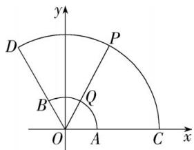

text_image

y
D
P
B
Q
O
A
C
x

则 $A(1,0),C(3,0),B\left(-\frac{1}{2},\frac{\sqrt{3}}{2}\right),D\left(-\frac{3}{2},\frac{3\sqrt{3}}{2}\right)$

设 $Q(\cos \theta, \sin \theta), \theta \in \left[0, \frac{2\pi}{3}\right]$ ，则 $P(3\cos \theta, 3\sin \theta)$ ，

由 $\overrightarrow{OQ} = x\overrightarrow{OC} +y\overrightarrow{OD}$ ，可得 $(\cos \theta ,\sin \theta) = \left(3x - \frac{3}{2} y,\frac{3\sqrt{3}}{2} y\right),$

即 $\cos \theta = 3x - \frac{3}{2} y, \sin \theta = \frac{3\sqrt{3}}{2} y$ ，易知 $x \geqslant 0, y \geqslant 0$

若 $y = x$ ，则 $\cos^2\theta +\sin^2\theta = \left(3x - \frac{3}{2} x\right)^2 +\left(\frac{3\sqrt{3}}{2} x\right)^2 = 1,$

解得 $x=\frac{1}{3}$ （负值舍去），故 $x+y=2x=\frac{2}{3}$ ，A 正确；

若 $y = 2x$ ，则 $\cos \theta = 3x - \frac{3}{2} y = 0$ ，故 $\sin \theta = 1$ ，则 $P(0,$

3), 所以 $\overrightarrow{OA} \cdot \overrightarrow{OP} = (1, 0) \cdot (0, 3) = 0$ , 故 B 正确;

$\overrightarrow{AB} \cdot \overrightarrow{QP} = \left(-\frac{3}{2}, \frac{\sqrt{3}}{2}\right) \cdot (2\cos \theta, 2\sin \theta) = \sqrt{3} \sin \theta -$

$3\cos \theta = 2\sqrt{3}\sin \left(\theta -\frac{\pi}{3}\right),$

因为 $\theta \in \left[0, \frac{2\pi}{3}\right]$ , 所以 $\theta - \frac{\pi}{3} \in \left[-\frac{\pi}{3}, \frac{\pi}{3}\right]$ ,

故 $2\sqrt{3}\sin \left(\theta -\frac{\pi}{3}\right)\in [-3,3]$ ，故C错误；

$\overrightarrow{AP} = (3\cos \theta - 1, 3\sin \theta), \overrightarrow{BP} = \left(3\cos \theta + \frac{1}{2}, 3\sin \theta - \frac{\sqrt{3}}{2}\right)$ ,

故 $\overrightarrow{AP} \cdot \overrightarrow{BP} = (3\cos \theta - 1) \left(3\cos \theta + \frac{1}{2}\right) + 3\sin \theta \cdot$

$\left(3\sin \theta -\frac{\sqrt{3}}{2}\right) = \frac{17}{2} -3\sin \left(\theta +\frac{\pi}{6}\right),$

易得 $\theta +\frac{\pi}{6}\in \left[\frac{\pi}{6},\frac{5\pi}{6}\right]$ ，所以 $\sin \left(\theta +\frac{\pi}{6}\right)\in \left[\frac{1}{2},1\right],$

故 $\overrightarrow{AP} \cdot \overrightarrow{BP} = \frac{17}{2} - 3\sin\left(\theta + \frac{\pi}{6}\right) \in \left[\frac{11}{2}, 7\right]$ , 故 D 正确.

故选 ABD.

7. 答案 5; $\frac{23}{52}$

解析 解法一:由题意得 DE=2, BM=1. 以 A 为坐标原点, AB, AD 所在直线分别为 x 轴, y 轴, 建立如图所示的平面直角坐标系,

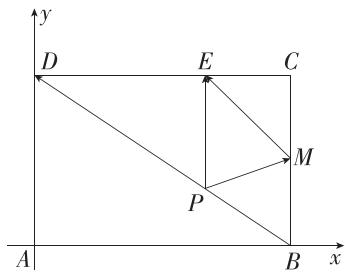

text_image

y
D	E	C
A	P	B	x

则 $A(0,0),B(3,0),D(0,2),E(2,2),M(3,1)$ ，则

$\overrightarrow{ME} = (-1, 1), \overrightarrow{BD} = (-3, 2), \overrightarrow{AB} = (3, 0), \overrightarrow{AD} = (0, 2)$

所以 $\overrightarrow{ME} \cdot \overrightarrow{BD} = (-1) \times (-3) + 1 \times 2 = 5$ .

由题意可设 $\overrightarrow{AP} = \lambda \overrightarrow{AB} + (1 - \lambda) \overrightarrow{AD} = (3\lambda, 2 - 2\lambda), 0 \leqslant \lambda \leqslant 1$ ，（点 $P$ 在线段 $BD$ 上运动，可设 $\overrightarrow{DP} = \lambda \overrightarrow{DB}, 0 \leqslant \lambda \leqslant 1$ ，则 $\overrightarrow{AP} = \overrightarrow{AD} + \lambda (\overrightarrow{AB} - \overrightarrow{AD}) = \lambda \overrightarrow{AB} + (1 - \lambda) \overrightarrow{AD}$ ）

故 $P(3\lambda, 2 - 2\lambda)$ , 则 $\overrightarrow{PE} = (2 - 3\lambda, 2\lambda), \overrightarrow{PM} = (3 - 3\lambda, 2\lambda - 1)$ ,

所以 $\overrightarrow{PE} \cdot \overrightarrow{PM} = (2 - 3\lambda)(3 - 3\lambda) + 2\lambda(2\lambda - 1) = 13\lambda^2 - 17\lambda + 6 = 13\left(\lambda - \frac{17}{26}\right)^2 + \frac{23}{52},$

所以当 $\lambda=\frac{17}{26}$ 时， $\overrightarrow{PE}\cdot\overrightarrow{PM}$ 取得最小值，为 $\frac{23}{52}$ .

解法二:由题意知 CE = CM = 1, 则 $\overrightarrow{ME} \cdot \overrightarrow{BD} = (\overrightarrow{MC} + \overrightarrow{CE}) \cdot (\overrightarrow{BC} + \overrightarrow{CD}) = \overrightarrow{MC} \cdot \overrightarrow{BC} + \overrightarrow{MC} \cdot \overrightarrow{CD} + \overrightarrow{CE} \cdot \overrightarrow{BC} + \overrightarrow{CE} \cdot \overrightarrow{CD} = 2 + 0 + 0 + 3 = 5.$

设 $\overrightarrow{PB} = t\overrightarrow{DB}(0\leqslant t\leqslant 1)$ ，则 $\overrightarrow{PB} = -t\overrightarrow{BD},\overrightarrow{PD} = (1 - t)\overrightarrow{BD},$

故 $\overrightarrow{PE} \cdot \overrightarrow{PM} = (\overrightarrow{PD} + \overrightarrow{DE}) \cdot (\overrightarrow{PB} + \overrightarrow{BM}) = [(1 - t) \overrightarrow{BD} + \overrightarrow{DE}] \cdot (-t \overrightarrow{BD} + \overrightarrow{BM}) = -t(1 - t) \overrightarrow{BD}^2 + (1 - t) \overrightarrow{BD} \cdot \overrightarrow{BM} - t \overrightarrow{BD} \cdot \overrightarrow{DE} + \overrightarrow{DE} \cdot \overrightarrow{BM}$ ,

又 $|\overrightarrow{BD}| = \sqrt{13},\overrightarrow{BD} = \overrightarrow{AD} -\overrightarrow{AB},$

所以 $\overrightarrow{PE} \cdot \overrightarrow{PM} = -13t(1 - t) + (1 - t)\overrightarrow{AD} \cdot \overrightarrow{BM} + t\overrightarrow{AB}\cdot$ $\overrightarrow{DE} = 13t^2 -9t + 2 = 13\left(t - \frac{9}{26}\right)^2 +\frac{23}{52},$

所以 $t=\frac{9}{26}$ 时, $\overrightarrow{PE}\cdot\overrightarrow{PM}$ 取得最小值, 为 $\frac{23}{52}$ .

8. 解析 (1) $\overrightarrow{AB} \cdot \overrightarrow{BC} = |\overrightarrow{AB}| \cdot |\overrightarrow{BC}|\cos 120^{\circ} = 3 \times 6 \times$ $\left(-\frac{1}{2}\right) = -9.$

(2) 因为 $\overrightarrow{AD} = \lambda \overrightarrow{BC}$ ,

所以 $AD \parallel BC$ ，所以 $\angle BAD = 120^{\circ}$ ，

所以 $\overrightarrow{AD} \cdot \overrightarrow{AB} = |\overrightarrow{AD}| |\overrightarrow{AB}| \cos \angle BAD = -\frac{3}{2} |\overrightarrow{AD}| = -\frac{3}{2}$ ,

解得 $|\overrightarrow{AD}|=1$ ，又 $|\overrightarrow{BC}|=6$ ，所以 $\overrightarrow{AD}=\frac{1}{6}\overrightarrow{BC}$ ，即 $\lambda=\frac{1}{6}$ .

(3)以 B 为原点, BC 所在直线为 x 轴, 建立如图所示的平面直角坐标系,

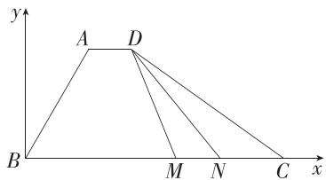

text_image

y
A D
B M N C x

因为 $\angle ABC = 60^{\circ}, AB = 3$

所以 $A\left(\frac{3}{2}, \frac{3\sqrt{3}}{2}\right)$ , 则 $D\left(\frac{5}{2}, \frac{3\sqrt{3}}{2}\right)$ ,

不妨设 $M(x,0)$ , $N(x+1,0)$ ,

因为 M, N 是线段 BC 上的两个动点，

所以 $\left\{\begin{aligned}0&\leqslant x\leqslant6,\\ 0&\leqslant x+1\leqslant6,\end{aligned}\right.$ 解得 $0\leqslant x\leqslant5,$

易得 $\overrightarrow{DM} = \left(x - \frac{5}{2}, -\frac{3\sqrt{3}}{2}\right),\overrightarrow{DN} = \left(x - \frac{3}{2}, - \frac{3\sqrt{3}}{2}\right),$

所以 $\overrightarrow{DM} \cdot \overrightarrow{DN} = \left(x - \frac{5}{2}\right) \left(x - \frac{3}{2}\right) + \frac{27}{4} = (x - 2)^2 + \frac{13}{2}$ ,

所以当 $x = 2$ 时， $\overrightarrow{DM}\cdot \overrightarrow{DN}$ 取得最小值，为 $\frac{13}{2}$

9. 解析 （1）由题意知 $\left|e_{1}\right|=\left|e_{2}\right|=1, e_{1} \cdot e_{2}=1 \times 1 \times \cos 60^{\circ}=\frac{1}{2}$ ,

因为 $\overrightarrow{OA} = (1,2),\overrightarrow{OB} = (3,4)$

所以 $\overrightarrow{OA} = e_1 + 2e_2, \overrightarrow{OB} = 3e_1 + 4e_2,$

所以 $\overrightarrow{OA} \cdot \overrightarrow{OB} = (\boldsymbol{e}_1 + 2\boldsymbol{e}_2) \cdot (3\boldsymbol{e}_1 + 4\boldsymbol{e}_2) = 3\boldsymbol{e}_1^2 + 10\boldsymbol{e}_1 \cdot$

$$
\boldsymbol {e} _ {2} + 8 \boldsymbol {e} _ {2} ^ {2} = 3 \times 1 ^ {2} + 1 0 \times \frac {1}{2} + 8 \times 1 ^ {2} = 1 6.
$$

(2) 若 $\overrightarrow{OA} \perp \overrightarrow{OB}$ , 则 $\overrightarrow{OA} \cdot \overrightarrow{OB} = 0$ ,

即 $(\pmb{e}_1 + 2\pmb{e}_2) \cdot (m\pmb{e}_1 + 4\pmb{e}_2) = 0,$

即 $me_{1}^{2}+(2m+4)e_{1}\cdot e_{2}+8e_{2}^{2}=m\times1^{2}+(2m+4)\times\frac{1}{2}+8\times1^{2}=2m+10=0,$

所以 $m = -5$ ，故 $\overrightarrow{OB} = (-5,4)$

(3)设所求向量为 $\boldsymbol{n}=(x_{0},y_{0})$ ，则 $n=x_{0}\boldsymbol{e}_{1}+y_{0}\boldsymbol{e}_{2}$

所以 $\boldsymbol{n}^{2}=(x_{0}\boldsymbol{e}_{1}+y_{0}\boldsymbol{e}_{2})^{2}=x_{0}^{2}\boldsymbol{e}_{1}^{2}+2x_{0}y_{0}\boldsymbol{e}_{1}\cdot\boldsymbol{e}_{2}+y_{0}^{2}\boldsymbol{e}_{2}^{2}=x_{0}^{2}+x_{0}y_{0}+y_{0}^{2}=1①,$

因为 $n \cdot \overrightarrow{OA} = 0$ ，所以 $(x_{0}e_{1} + y_{0}e_{2}) \cdot (e_{1} + 2e_{2}) = 0$ ，

即 $x_0\pmb{e}_1^2 + (2x_0 + y_0)\pmb{e}_1 \cdot \pmb{e}_2 + 2y_0\pmb{e}_2^2 = x_0 + x_0 + \frac{1}{2} y_0 + 2y_0 =$

$$
2 x _ {0} + \frac {5}{2} y _ {0} = 0 (2),
$$

由①②解得 $\left\{\begin{aligned}x_{0}&=-\frac{5\sqrt{21}}{21},\\ y_{0}&=\frac{4\sqrt{21}}{21}\end{aligned}\right.$ 或 $\left\{\begin{aligned}x_{0}&=\frac{5\sqrt{21}}{21},\\ y_{0}&=-\frac{4\sqrt{21}}{21},\end{aligned}\right.$

所以 $\boldsymbol{n}=\left(-\frac{5\sqrt{21}}{21},\frac{4\sqrt{21}}{21}\right)$ 或 $\boldsymbol{n}=\left(\frac{5\sqrt{21}}{21},-\frac{4\sqrt{21}}{21}\right)$ ,

即与 $\overrightarrow{OA}$ 垂直的单位向量的坐标为 $\left(-\frac{5\sqrt{21}}{21},\frac{4\sqrt{21}}{21}\right),\left(\frac{5\sqrt{21}}{21},-\frac{4\sqrt{21}}{21}\right).$

10. 解析 (1) 由题可得 $\overrightarrow{AB} = (6, -4), \overrightarrow{AC} = (0, -3)$ .

设 $D(x,y)$ ，则 $\overrightarrow{DC} = (1 - x,2 - y)$

因为四边形 ABCD 为平行四边形, 所以 $\overrightarrow{AB} = \overrightarrow{DC}$ ,所以 $\left\{\begin{aligned}1-x=6,\\ 2-y=-4,\end{aligned}\right.$ 解得 $\left\{\begin{aligned}x=-5,\\ y=6,\end{aligned}\right.$ 即 $D(-5,6)$ ,

所以 $\overrightarrow{DB} = (12, -5)$ .

设 $\overrightarrow{AC}$ 与 $\overrightarrow{DB}$ 的夹角为 $\theta$ ，则 $\cos \theta = \frac{\overrightarrow{AC} \cdot \overrightarrow{DB}}{|\overrightarrow{AC}| |\overrightarrow{DB} |}$

$$
= \frac {0 \times 1 2 + (- 3) \times (- 5)}{\sqrt {0 ^ {2} + (- 3) ^ {2}} \times \sqrt {1 2 ^ {2} + (- 5) ^ {2}}} = \frac {5}{1 3},
$$

所以 $\overrightarrow{AC}$ 与 $\overrightarrow{DB}$ 夹角的余弦值为 $\frac{5}{13}$ .

(2) 因为 M, N 分别是线段 AC, BC 的中点,

所以 $M\left(1,\frac{7}{2}\right)$ , $N\left(4,\frac{3}{2}\right)$ ,

所以 $\overrightarrow{MN} = (3, -2), \overrightarrow{MA} = \left(0, \frac{3}{2}\right), \overrightarrow{MB} = \left(6, -\frac{5}{2}\right)$ ,

因为点 P 在线段 MN 上运动, 所以可设 $\overrightarrow{MP} = \lambda \overrightarrow{MN}$ , $\lambda \in [0,1]$ , 则 $\overrightarrow{MP} = (3\lambda, -2\lambda)$ ,

所以 $\overrightarrow{PA} = \overrightarrow{MA} -\overrightarrow{MP} = \left(-3\lambda ,\frac{3}{2} +2\lambda\right),\overrightarrow{PB} = \overrightarrow{MB} -\overrightarrow{MP}$

$$
= \left(6 - 3 \lambda , 2 \lambda - \frac {5}{2}\right),
$$

所以 $\overrightarrow{PA} \cdot \overrightarrow{PB} = -3\lambda (6 - 3\lambda) + \left(\frac{3}{2} + 2\lambda\right)\left(2\lambda - \frac{5}{2}\right) =$

$$
1 3 \lambda^ {2} - 2 0 \lambda - \frac {1 5}{4}, 0 \leqslant \lambda \leqslant 1.
$$

令 $f(\lambda) = 13\lambda^2 - 20\lambda - \frac{15}{4}, \lambda \in [0,1]$ ,

因为函数 $y = 13\lambda^2 - 20\lambda - \frac{15}{4}$ 的图象的对称轴方程为

$$
\lambda = \frac {1 0}{1 3}, \frac {1 0}{1 3} \in [ 0, 1 ], f (0) = - \frac {1 5}{4}, f (1) = - \frac {4 3}{4},
$$

所以当 $\lambda=0$ 时, $f(\lambda)$ 取得最大值, 为 $-\frac{15}{4}$ ,

即 $\overrightarrow{PA}\cdot\overrightarrow{PB}$ 的最大值为 $-\frac{15}{4}$ .

# 专题强化练 2 平面向量的数量积及其应用

Q 对应主书 P22

<table><tr><td>1.B</td><td>2.BC</td><td>3.C</td><td>4.C</td><td>5.ABD</td><td></td><td></td><td></td></tr></table>

1. B 解法一: 由 $a-2b+2c=0$ , 得 a=2b-2c.

因为 a, b, c 是单位向量, 所以设 $\boldsymbol{a} = (1, 0)$ , $\boldsymbol{b} = (x_{1}, y_{1})$ , $\boldsymbol{c} = (x_{2}, y_{2})$ , 且 $x_{1}^{2} + y_{1}^{2} = 1$ , $x_{2}^{2} + y_{2}^{2} = 1$ , 则 $(1, 0) = (2x_{1} - 2x_{2}, 2y_{1} - 2y_{2})$ ,

解得 $\left\{\begin{aligned}x_{1}&=\frac{1}{4},\\ x_{2}&=-\frac{1}{4}\end{aligned}\right.$ 或 $\left\{\begin{aligned}x_{1}&=-\frac{1}{4},\\ x_{2}&=\frac{1}{4},\end{aligned}\right.$ $y_{1}=y_{2}=\pm\frac{\sqrt{15}}{4}.$

不妨取 $b=\left(\frac{1}{4},\frac{\sqrt{15}}{4}\right)$ , $c=\left(-\frac{1}{4},\frac{\sqrt{15}}{4}\right)$ ,

则 $b-2c=\left(\frac{3}{4},-\frac{\sqrt{15}}{4}\right)$ .

所以 $\boldsymbol{a} \cdot (\boldsymbol{b}-2\boldsymbol{c}) = 1 \times \frac{3}{4} + 0 \times \left(-\frac{\sqrt{15}}{4}\right) = \frac{3}{4}$ ,

$$
\vert \boldsymbol {b} - 2 \boldsymbol {c} \vert = \frac {\sqrt {6}}{2},
$$

所以 $\cos\langle\boldsymbol{a},\boldsymbol{b}-2\boldsymbol{c}\rangle=\frac{\boldsymbol{a}\cdot(\boldsymbol{b}-2\boldsymbol{c})}{|\boldsymbol{a}||\boldsymbol{b}-2\boldsymbol{c}|}=\frac{\frac{3}{4}}{1\times\frac{\sqrt{6}}{2}}=\frac{\sqrt{6}}{4}$ . 故选 B.

解法二: 因为 $a-2b+2c=0$ ，所以 a=2b-2c，故 $a^{2}=4b^{2}+4c^{2}-8b\cdot c$ .

由 a, b, c 是单位向量, 得 $a^{2}=b^{2}=c^{2}=1$ , 故 $b \cdot c=\frac{7}{8}$ .

所以 $|b-2c|^{2}=b^{2}-4b\cdot c+4c^{2}=1-\frac{7}{2}+4=\frac{3}{2}$ ，所以 $|b-$

$$
2 c \mid = \frac {\sqrt {6}}{2}.
$$

因为 $a \cdot (b - 2c) = (2b - 2c) \cdot (b - 2c) = 2b^2 + 4c^2 - 6b$

$$
\cdot c = 6 - \frac {2 1}{4} = \frac {3}{4},
$$

所以 $\cos\langle a,b-2c\rangle=\frac{a\cdot(b-2c)}{|a||b-2c|}=\frac{\sqrt{6}}{4}$ . 故选 B.

2. BC 对于 A, 当 t=6 时, $\boldsymbol{b}=(2,6)$ , 所以 $a \cdot b = -2 \times 2 + 1 \times 6 = 2 > 0$ , 且 a 与 b 不共线, 所以向量 a 与 b 的夹角为锐角, 故 A 中说法正确;

对于 B, 若 $\left|a\right|=\left|b\right|$ , 则 $\sqrt{(-2)^{2}+1^{2}}=\sqrt{2^{2}+t^{2}}$ , 解得 $t=\pm1$ , 故 B 中说法错误;

对于 C, 因为 $\boldsymbol{a}=(-2,1)$ , 所以 $\left|\boldsymbol{a}\right|=\sqrt{\left(-2\right)^{2}+1^{2}}=\sqrt{5}$ ,

所以 a 方向上的单位向量为 $\frac{a}{|a|} = \frac{1}{\sqrt{5}} (-2, 1) =$

$\left(-\frac{2\sqrt{5}}{5},\frac{\sqrt{5}}{5}\right)$ ，故 C 中说法错误；

对于 D, 当 t=3 时, $\boldsymbol{b}=(2,3)$ , 所以 $\boldsymbol{a}\cdot\boldsymbol{b}=-2\times2+1\times3=-1$ , $|b|=\sqrt{2^{2}+3^{2}}=\sqrt{13}$ ,

所以向量 a 在 b 上的投影向量的模为 $\frac{|a \cdot b|}{|b|} = \frac{\sqrt{13}}{13}$ ，故 D 中说法正确.

故选 BC.

3.C 将围棋棋盘放在平面直角坐标系中,并使最下面一行在直线 y=1 上,最左边一列在直线 x=1 上,如图,

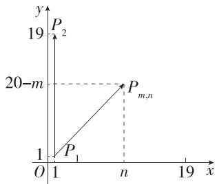

line

| Point | x | y |
|---|---|---|
| P | 1 | 1 |
| P_m,n | n | 20-m |
| O | 1 | 1 |
The chart displays a line graph with a vertical dashed line at y=20-m, indicating a slope of 1 unit of change.

则 $P(19,1)$ 对应坐标系中的点 $(1,1)$ （记为 $P_{1}$ ）， $P(1,1)$ 对应坐标系中的点 $(19,1)$ （记为 $P_{2}$ ），点 $P(m,n)$ 对应坐标系中的点 $(20 - m,n)$ （记为 $P_{m,n}$ ）.

所以 $\overrightarrow{P(19,1)P(1,1)} = \overrightarrow{P_{1}P_{2}}$ , $\overrightarrow{P(19,1)P(m,n)} = \overrightarrow{P_{1}P_{m,n}}$ ,

所以 $\overrightarrow{P(19,1)P(1,1)}\cdot \overrightarrow{P(19,1)P(m,n)} = \overrightarrow{P_1P_2}$

$$
\overrightarrow {P _ {1} P _ {m , n}} = \left| \overrightarrow {P _ {1} P _ {2}} \right| \left| \overrightarrow {P _ {1} P _ {m , n}} \right| \cos \left\langle \overrightarrow {P _ {1} P _ {2}}, \overrightarrow {P _ {1} P _ {m , n}} \right\rangle .
$$

$\left|\overrightarrow{P_{1}P_{m,n}}\right|\cos\left\langle\overrightarrow{P_{1}P_{2}},\overrightarrow{P_{1}P_{m,n}}\right\rangle$ 为 $\overrightarrow{P_{1}P_{m,n}}$ 在 $\overrightarrow{P_{1}P_{2}}$ 上的投影向量的长度, 共有 19 个不同数值,

所以在 $\overrightarrow{P(19,1)P(1,1)}\cdot \overrightarrow{P(19,1)P(m,n)} (1\leqslant m\leqslant$ $19,1\leqslant n\leqslant 19,m,n\in \mathbf{N})$ 中，不同值有19个.故选C.

4.C 过点 D 作 $DO \perp AB$ ，垂足为 O，以 O 为坐标原点，建立如图所示的平面直角坐标系，连接 DE, EP，

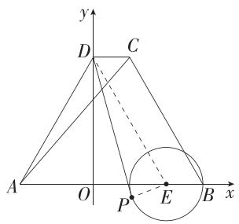

text_image

y
D C
A O P E B x

则 $A(-2,0), C(1,2\sqrt{3}), D(0,2\sqrt{3}), E(2,0)$ .

$$
\overrightarrow {D P} \cdot \overrightarrow {A C} = (\overrightarrow {D E} + \overrightarrow {E P}) \cdot \overrightarrow {A C} = \overrightarrow {D E} \cdot \overrightarrow {A C} + \overrightarrow {E P} \cdot \overrightarrow {A C},
$$

易得 $\overrightarrow{DE}\cdot\overrightarrow{AC}=(2,-2\sqrt{3})\cdot(3,2\sqrt{3})=6-12=-6,$

$\overrightarrow{EP} \cdot \overrightarrow{AC} = |\overrightarrow{EP}| |\overrightarrow{AC}| \cos \langle \overrightarrow{EP}, \overrightarrow{AC} \rangle = 1 \times \sqrt{9 + 12} \cos \langle \overrightarrow{EP}, \overrightarrow{AC} \rangle = \sqrt{21} \cos \langle \overrightarrow{EP}, \overrightarrow{AC} \rangle$ （利用数量积的定义计算，避免了设动点 P 的坐标），

因为 $\cos\langle\overrightarrow{EP},\overrightarrow{AC}\rangle\in[-1,1]$ ，所以 $\overrightarrow{EP}\cdot\overrightarrow{AC}\in[-\sqrt{21}$ ， $\sqrt{21}]$ ，所以 $\overrightarrow{DP}\cdot\overrightarrow{AC}$ 的最大值为 $\sqrt{21}-6$ 。故选 C.

# 解题技法

向量数量积的运算一般有两种方法,一种是基底法,选取适当的基底(基底中的向量尽量已知模或夹角),将题中涉及的向量用基底表示,利用向量的数量积计算;另一种是坐标法,通过建立恰当的平面直角坐标系,利用坐标运算解决数量积问题.

5.ABD 对于 A, $\overrightarrow{AE} = \overrightarrow{AC} + \overrightarrow{CE} = \overrightarrow{AC} + \frac{1}{3}\overrightarrow{CB} = \overrightarrow{AC} + \frac{1}{3} (\overrightarrow{AB} -$

$\overrightarrow{AC})=\frac{1}{3}\overrightarrow{AB}+\frac{2}{3}\overrightarrow{AC}$ ，故 A 正确；

对于 B, 若 $AB \perp AC$ , 则 $\overrightarrow{AB} \cdot \overrightarrow{AC} = 0$ ,

易知 $\overrightarrow{AD} = \overrightarrow{AC} +\overrightarrow{CD} = \overrightarrow{AC} +\frac{2}{3}\overrightarrow{CB} = \overrightarrow{AC} +\frac{2}{3} (\overrightarrow{AB} -\overrightarrow{AC}) =$

$$
\frac {2}{3} \overrightarrow {A B} + \frac {1}{3} \overrightarrow {A C}, \overrightarrow {A E} = \frac {1}{3} \overrightarrow {A B} + \frac {2}{3} \overrightarrow {A C},
$$

所以 $\overrightarrow{AD} \cdot \overrightarrow{AE} = \left(\frac{2}{3}\overrightarrow{AB} + \frac{1}{3}\overrightarrow{AC}\right) \cdot \left(\frac{1}{3}\overrightarrow{AB} + \frac{2}{3}\overrightarrow{AC}\right) = \frac{2}{9} (\overrightarrow{AB^2} + \overrightarrow{AC^2}) = \frac{2}{9} \times 12^2 = 32$ ，故 B 正确；

对于 C，易得 $\overrightarrow{AD} \cdot \overrightarrow{AE} = \left( \frac{2}{3} \overrightarrow{AB} + \frac{1}{3} \overrightarrow{AC} \right) \cdot$

$\left(\frac{1}{3}\overrightarrow{AB} +\frac{2}{3}\overrightarrow{AC}\right) = \frac{2}{9}\overrightarrow{AB}^2 +\frac{2}{9}\overrightarrow{AC}^2 +\frac{5}{9}\overrightarrow{AB}\cdot \overrightarrow{AC} = \frac{2}{9}\overrightarrow{AB}^2+$ $\frac{2}{9}\overrightarrow{AC}^2 +5,$

因为 $\overrightarrow{CB} = \overrightarrow{AB} -\overrightarrow{AC}$ ，所以 $\overrightarrow{CB}^2 = \overrightarrow{AB}^2 +\overrightarrow{AC}^2 -2\overrightarrow{AB}\cdot \overrightarrow{AC} = 144,$

所以 $\overrightarrow{AB^{2}}+\overrightarrow{AC^{2}}=2\overrightarrow{AB}\cdot\overrightarrow{AC}+144=162$ ，故 $\overrightarrow{AD}\cdot\overrightarrow{AE}=\frac{2}{9}\times162+5=41$ ，故C错误；

对于 D, $\overrightarrow{AD} \cdot \overrightarrow{AE} = \frac{2}{9} \overrightarrow{AB^{2}} + \frac{2}{9} \overrightarrow{AC^{2}} + \frac{5}{9} \overrightarrow{AB} \cdot \overrightarrow{AC} = 4$ ,

由 C 中分析知 $\overrightarrow{AB^{2}} + \overrightarrow{AC^{2}} - 2\overrightarrow{AB} \cdot \overrightarrow{AC} = 144$ ,

所以 $\frac{2}{9}\overrightarrow{AB}^2 +\frac{2}{9}\overrightarrow{AC}^2 +\frac{5}{9}\left[\frac{1}{2} (\overrightarrow{AB}^2 +\overrightarrow{AC}^2) - 72\right] = 4,$

则 $\overrightarrow{AB}^2 +\overrightarrow{AC}^2 = 88$ ，故D正确.

故选 ABD.

6. 答案 3; $\frac{99}{20}$

解析 如图, 设 $BE = x, x \in \left(0, \frac{3}{2}\right)$ ,

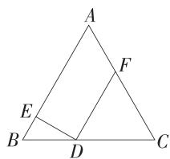

text_image

A
F
E
B
D
C

∵ $\triangle ABC$ 是边长为 3 的等边三角形, $DE \perp AB$ ,

$$
\therefore \angle B D E = 3 0 ^ {\circ}, B D = 2 x, D E = \sqrt {3} x, D C = 3 - 2 x.
$$

∵ $DF \parallel AB, \therefore \triangle DFC$ 是边长为 3-2x 的等边三角形， $DE \perp DF$ ,

$\therefore (2 \overrightarrow{BE} + \overrightarrow{DF})^2 = 4 \overrightarrow{BE}^2 + 4 \overrightarrow{BE} \cdot \overrightarrow{DF} + \overrightarrow{DF}^2 = 4x^2 + 4x(3 - 2x) + (3 - 2x)^2 = 9, \therefore |2 \overrightarrow{BE} + \overrightarrow{DF}| = 3.$

$(\overrightarrow{DE} + \overrightarrow{DF}) \cdot \overrightarrow{DA} = (\overrightarrow{DE} + \overrightarrow{DF}) \cdot (\overrightarrow{DE} + \overrightarrow{EA}) = \overrightarrow{DE}^2 + \overrightarrow{DF} \cdot$

$\overrightarrow{EA} = (\sqrt{3} x)^2 + (3 - 2x)(3 - x) = 5x^2 - 9x + 9 =$

$$
5 \left(x - \frac {9}{1 0}\right) ^ {2} + \frac {9 9}{2 0},
$$

所以当 $x=\frac{9}{10}$ 时， $(\overrightarrow{DE}+\overrightarrow{DF})\cdot\overrightarrow{DA}$ 取得最小值，为 $\frac{99}{20}$ .

7. 答案 $1; \frac{3}{2}$

解析 $\overrightarrow{AB} = \overrightarrow{AC} -\overrightarrow{BC}$ ，则 $|\overrightarrow{AB}| = \sqrt{(\overrightarrow{AC} - \overrightarrow{BC})^2}$

$$
= \sqrt {\overrightarrow {A C} ^ {2} - 2 \overrightarrow {A C} \cdot \overrightarrow {B C} + \overrightarrow {B C} ^ {2}}
$$

$$
= \sqrt {\left| \overrightarrow {A C} \right| ^ {2} - 2 \left| \overrightarrow {A C} \right| \cdot \left| \overrightarrow {B C} \right| \cos \angle A C B + \left| \overrightarrow {B C} \right| ^ {2}}
$$

$$
= \sqrt {4 - 2 \times 2 \times \sqrt {3} \times \frac {\sqrt {3}}{2} + 3} = 1.
$$

$$
\because (\overrightarrow {O A} - \overrightarrow {O B}) \cdot \overrightarrow {B M} = \overrightarrow {B A} \cdot \overrightarrow {B M} = | \overrightarrow {B A} | | \overrightarrow {B M} | \cos \angle A B M =
$$

$|\overrightarrow{BM}|\cos\angle ABM$ ，显然 $\angle ABM$ 为锐角时 $|\overrightarrow{BM}|\cos\angle ABM$ 存在最大值， $|\overrightarrow{BM}|\cos\angle ABM$ 是向量 $\overrightarrow{BM}$ 在 $\overrightarrow{BA}$ 上的投影向量的长度，

易得 $\triangle ABC$ 为直角三角形， $O$ 为 $AC$ 的中点，如图，过点 $M$ 作圆的切线，当切线与 $BA$ 垂直且 $\angle ABM$ 为锐角时， $\overrightarrow{BM}$ 在 $\overrightarrow{BA}$ 上的投影向量的长度最大，设切线交 $BA$ 的延长线于 $D$ ，则 $|\overrightarrow{BM}|\cos \angle ABM = |\overrightarrow{BD}|$ ，

连接 MO, MA, 由 MD 与圆相切, 且 $MD \perp AB$ 得 OM // AB,

易得 $OM = OB = AB = 1$ ，所以四边形OMAB是菱形

由同弧所对的圆周角相等知 $\angle AMB = \angle ACB = 30^{\circ}$ 所以 $\angle ABM = 30^{\circ}, BM = 2AB\cos 30^{\circ} = \sqrt{3}$ ，故 $|\overrightarrow{BD}| = |\overrightarrow{BM}|\cos 30^{\circ} = \frac{3}{2}$ .

故 $(\overrightarrow{OA} -\overrightarrow{OB})\cdot \overrightarrow{BM}$ 的最大值为 $\frac{3}{2}$

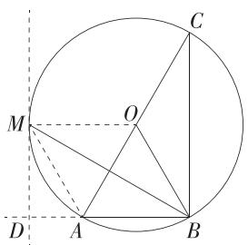

text_image

C
M
O
D
A
B

8. 解析 解法一: (1) 因为 $AB \parallel CD, AB = 2CD$ ,
所以 AO = 2OC,

$$
\text {则} \overrightarrow {A M} \cdot \overrightarrow {B D} = (\overrightarrow {A O} + \overrightarrow {O M}) \cdot \overrightarrow {B D} = \overrightarrow {A O} \cdot \overrightarrow {B D} + \overrightarrow {O M} \cdot \overrightarrow {B D}
$$

$$
= \overrightarrow {A O} \cdot \overrightarrow {B D} = \frac {2}{3} \overrightarrow {A C} \cdot \overrightarrow {B D} = \frac {2}{3} (\overrightarrow {A D} + \overrightarrow {D C}) \cdot (\overrightarrow {A D} - \overrightarrow {A B})
$$

$$
= \frac {2}{3} (\overrightarrow {A D ^ {2}} - \overrightarrow {D C} \cdot \overrightarrow {A B}) = \frac {2}{3} \times (4 - 2 \times 4 \times 1) = - \frac {8}{3}.
$$

(2) 设 $\overrightarrow{AM} = \lambda \overrightarrow{AB} (0 < \lambda < 1)$ ,

由(1)可得 $\overrightarrow{AM} \cdot \overrightarrow{BD} = \lambda \overrightarrow{AB} \cdot \overrightarrow{BD} = \lambda \overrightarrow{AB} \cdot (\overrightarrow{AD} -$ $\overrightarrow{AB}) = -\lambda \overrightarrow{AB^2} = -16\lambda = -\frac{8}{3}$ , 解得 $\lambda = \frac{1}{6}$ , 即 $\overrightarrow{AM} = \frac{1}{6}\overrightarrow{AB}$ .

易知 $\angle CAB = 45^{\circ}$

所以 $\overrightarrow{AN} \cdot \overrightarrow{MN} = \overrightarrow{AN} \cdot (\overrightarrow{AN} - \overrightarrow{AM}) = \overrightarrow{AN}^2 - \overrightarrow{AN} \cdot \overrightarrow{AM}$

$$
= \overrightarrow {A N} ^ {2} - | \overrightarrow {A N} | \times | \overrightarrow {A M} | \times \cos \angle C A B
$$

$$
= \overrightarrow {A N} ^ {2} - \frac {1}{6} \times | \overrightarrow {A N} | \times | \overrightarrow {A B} | \times \cos 4 5 ^ {\circ}
$$

$$
= | \overrightarrow {A N} | ^ {2} - \frac {\sqrt {2}}{3} | \overrightarrow {A N} |.
$$

令 $|\overrightarrow{AN}|=t$ ，则 $0<t<2\sqrt{2}$ ，

则 $\overrightarrow{AN} \cdot \overrightarrow{MN} = t^2 - \frac{\sqrt{2}}{3} t = \left(t - \frac{\sqrt{2}}{6}\right)^2 - \frac{1}{18}$ ,

所以当 $t=\frac{\sqrt{2}}{6}$ 时， $\overrightarrow{AN}\cdot\overrightarrow{MN}$ 有最小值，为 $-\frac{1}{18}$ .

解法二:(1)以 A 为坐标原点, $\overrightarrow{AB},\overrightarrow{AD}$ 的方向分别为 x 轴,y 轴的正方向建立平面直角坐标系(图略),则 A(0,0),B(4,0),C(2,2),D(0,2),所以 $\overrightarrow{BD}=(-4,2)$ ,因为 AB//CD,AB=2CD,所以 AO=2OC,所以 $\overrightarrow{AO}=2\overrightarrow{OC}$ ,易得 $O\left(\frac{4}{3},\frac{4}{3}\right)$ .

设 $M(m,0),0 < m < 4$ ，则 $\overrightarrow{OM} = \left(m - \frac{4}{3}, - \frac{4}{3}\right)$

因为 $OM \perp BD$ ，所以 $\overrightarrow{OM} \cdot \overrightarrow{BD} = \left(m - \frac{4}{3}\right) \times (-4) + \left(-\frac{4}{3}\right) \times 2 = -4m + \frac{8}{3} = 0$ ，解得 $m = \frac{2}{3}$ ，

所以 $\overrightarrow{AM} = \left(\frac{2}{3},0\right)$ ，所以 $\overrightarrow{AM}\cdot \overrightarrow{BD} = \frac{2}{3}\times (-4) + 0\times 2 =$ $-\frac{8}{3}.$

(2) 易知 $\angle CAB = 45^{\circ}$ , 故可设 $N(a, a), 0 < a < 2$ ,

则 $\overrightarrow{AN} \cdot \overrightarrow{MN} = (a, a) \cdot \left(a - \frac{2}{3}, a\right)$

$$
= 2 a ^ {2} - \frac {2}{3} a = 2 \left(a - \frac {1}{6}\right) ^ {2} - \frac {1}{1 8},
$$

所以当 $a=\frac{1}{6}$ 时, $\overrightarrow{AN}\cdot\overrightarrow{MN}$ 有最小值, 为 $-\frac{1}{18}$ .

# 6.4 平面向量的应用

# 6.4.1 平面几何中的向量方法

# 6.4.2 向量在物理中的应用举例

基础过关练

Q 对应主书 P23

<table><tr><td>1.B</td><td>2.BD</td><td>7.D</td><td>8.A</td><td>9.D</td><td>10.AD</td><td></td><td></td></tr></table>

1.B 易知 $\overrightarrow{AC} = \left(\frac{3}{2},\frac{\sqrt{3}}{2}\right),\overrightarrow{BC} = \left(-\frac{1}{2},\frac{\sqrt{3}}{2}\right)$ ，则 $\overrightarrow{AC}\cdot \overrightarrow{BC} =$

$\frac{3}{2}\times\left(-\frac{1}{2}\right)+\frac{\sqrt{3}}{2}\times\frac{\sqrt{3}}{2}=0,$ 故 $\overrightarrow{AC} \perp \overrightarrow{BC},$ 又 $|\overrightarrow{AC}|=\sqrt{3} \neq |\overrightarrow{BC}|=1,$ 所以 $\triangle ABC$ 是直角三角形. 故选 B.

2.BD 由题可知 M, N 分别为 BC, AC 的中点, 则 $\overrightarrow{AM} = \frac{1}{2} (\overrightarrow{AB} + \overrightarrow{AC})$ , 所以 $\overrightarrow{AM}^{2} = \frac{1}{4} (\overrightarrow{AB}^{2} + \overrightarrow{AC}^{2} + 2\overrightarrow{AB} \cdot \overrightarrow{AC}) = \frac{1}{4} (|\overrightarrow{AB}|^{2} + |\overrightarrow{AC}|^{2} + 2|\overrightarrow{AB}| \cdot |\overrightarrow{AC}| \cos \angle BAC) = \frac{1}{4} \times \left(4 + 25 + 2 \times 2 \times 5 \times \frac{1}{2}\right) = \frac{39}{4}$ , 则 $|\overrightarrow{AM}| = \frac{\sqrt{39}}{2}$ , 故 A 错误; $\overrightarrow{BN} = \overrightarrow{AN} - \overrightarrow{AB}$ , 则 $\overrightarrow{BN}^{2} = (\overrightarrow{AN} - \overrightarrow{AB})^{2} = \overrightarrow{AN}^{2} + \overrightarrow{AB}^{2} - 2\overrightarrow{AN} \cdot \overrightarrow{AB} = \frac{25}{4} + 4 - 2 \times \frac{5}{2} \times 2 \times \frac{1}{2} = \frac{21}{4}$ , 则 $|\overrightarrow{BN}| = \frac{\sqrt{21}}{2}$ , 故 B 正确;

由题可知 P 为 $\triangle ABC$ 的重心，

则 $\cos \angle MPN = \frac{\overrightarrow{PM} \cdot \overrightarrow{PN}}{|\overrightarrow{PM}| |\overrightarrow{PN}|} = \frac{\frac{1}{3}\overrightarrow{AM} \cdot \frac{1}{3}\overrightarrow{BN}}{\frac{1}{3}|\overrightarrow{AM}| \cdot \frac{1}{3}|\overrightarrow{BN}|}$

$$
= \frac {\frac {1}{2} (\overrightarrow {A B} + \overrightarrow {A C}) \cdot \left(\frac {1}{2} \overrightarrow {A C} - \overrightarrow {A B}\right)}{| \overrightarrow {A M} | \cdot | \overrightarrow {B N} |}
$$

$$
= \frac {1}{2} \times \frac {- \overrightarrow {A B ^ {2}} + \frac {1}{2} \overrightarrow {A C ^ {2}} - \frac {1}{2} \overrightarrow {A B} \cdot \overrightarrow {A C}}{| \overrightarrow {A M} | \cdot | \overrightarrow {B N} |}
$$

$$
= \frac {1}{2} \times \frac {- 4 + \frac {2 5}{2} - \frac {1}{2} \times 2 \times 5 \times \frac {1}{2}}{\frac {\sqrt {3 9}}{2} \times \frac {\sqrt {2 1}}{2}} = \frac {4 \sqrt {9 1}}{9 1}, \text {故C错误；}
$$

$$
\begin{array}{l} \overrightarrow {P A} + \overrightarrow {P B} + \overrightarrow {P C} = - \overrightarrow {A P} + (\overrightarrow {A B} - \overrightarrow {A P}) + (\overrightarrow {A C} - \overrightarrow {A P}) = \overrightarrow {A B} + \overrightarrow {A C} - \\ 3 \overrightarrow {A P} = \overrightarrow {A B} + \overrightarrow {A C} - 3 \times \frac {2}{3} \overrightarrow {A M} = \overrightarrow {A B} + \overrightarrow {A C} - 3 \times \frac {2}{3} \times \frac {1}{2} (\overrightarrow {A B} + \\ \overrightarrow {A C}) = \mathbf {0} \text {, 故} D \text {正确. 故选} B D. \\ \end{array}
$$

3. 答案 $\sqrt{6}$

解析 设 $\overrightarrow{AD}=a,\overrightarrow{AB}=b$ ，则 $\overrightarrow{BD}=a-b,\overrightarrow{AC}=a+b$ ，

$$
\begin{array}{r l} & {\therefore | \overrightarrow {B D} | = | \boldsymbol {a} - \boldsymbol {b} | = \sqrt {\boldsymbol {a} ^ {2} - 2 \boldsymbol {a} \cdot \boldsymbol {b} + \boldsymbol {b} ^ {2}} = \sqrt {1 + 4 - 2 \boldsymbol {a} \cdot \boldsymbol {b}} =} \\ & {\sqrt {5 - 2 \boldsymbol {a} \cdot \boldsymbol {b}} = 2, \text {则} \boldsymbol {a} \cdot \boldsymbol {b} = \frac {1}{2},} \end{array}
$$

$$
\begin{array}{r l} & {\therefore | \overrightarrow {A C} | ^ {2} = | \pmb {a} + \pmb {b} | ^ {2} = \pmb {a} ^ {2} + 2 \pmb {a} \cdot \pmb {b} + \pmb {b} ^ {2} = | \pmb {a} | ^ {2} + 2 \pmb {a} \cdot \pmb {b} +} \\ & {| \pmb {b} | ^ {2} = 1 + 4 + 2 \pmb {a} \cdot \pmb {b} = 6, \therefore | \overrightarrow {A C} | = \sqrt {6}, \text {即} A C = \sqrt {6}.} \end{array}
$$

4. 答案 30

解析 易得 $\overrightarrow{BC} = \overrightarrow{AC} - \overrightarrow{AB} = (3, 6) = \overrightarrow{AD}$ ，所以四边形 ABCD 为平行四边形。因为 $\overrightarrow{AB} \cdot \overrightarrow{BC} = (4, -2) \cdot (3, 6) = 0$ ，所以 $\overrightarrow{AB} \perp \overrightarrow{BC}$ ，所以四边形 ABCD 为矩形，

易得 $|\overrightarrow{AB}| = \sqrt{4^2 + (-2)^2} = 2\sqrt{5}, |\overrightarrow{BC}| = \sqrt{3^2 + 6^2} = 3\sqrt{5}$ 所以 $S_{\text{四边形}ABCD} = |\overrightarrow{AB}| |\overrightarrow{BC}| = 2\sqrt{5} \times 3\sqrt{5} = 30.$

5. 解析 (1) 记 $\overrightarrow{AB} = a, \overrightarrow{AC} = b$ , 则 $|a| = 2, |b| = 4, a \cdot b = 2 \times 4 \cos 60^\circ = 4$ , 因为 $\overrightarrow{BF} = \frac{1}{3} \overrightarrow{BC}$ ,

所以 $\overrightarrow{AF} = \overrightarrow{AB} +\overrightarrow{BF} = \overrightarrow{AB} +\frac{1}{3}\overrightarrow{BC} = \overrightarrow{AB} +\frac{1}{3} (\overrightarrow{AC} -\overrightarrow{AB}) =$ $\frac{2}{3}\overrightarrow{AB} +\frac{1}{3}\overrightarrow{AC} = \frac{2}{3}\pmb {a} + \frac{1}{3}\pmb {b},$

则 $|\overrightarrow{AF}|^2 = \left(\frac{2}{3}\pmb {a} + \frac{1}{3}\pmb {b}\right)^2 = \frac{4}{9}\pmb {a}^2 +\frac{4}{9}\pmb {a}\cdot \pmb {b} + \frac{1}{9}\pmb {b}^2 = \frac{4}{9}\times 4+$ $\frac{4}{9}\times 4 + \frac{1}{9}\times 16 = \frac{16}{3}$ ，故 $|\overrightarrow{AF}| = \frac{4\sqrt{3}}{3}.$

(2) 证明: 因为 $\overrightarrow{AE} = \frac{1}{2}\overrightarrow{AC}$ ，所以 $\overrightarrow{BE} = \overrightarrow{BA} + \frac{1}{2}\overrightarrow{AC} = -\overrightarrow{AB} + \frac{1}{2}\overrightarrow{AC} = -\boldsymbol{a} + \frac{1}{2}\boldsymbol{b}$ ,

所以 $\overrightarrow{AF} \cdot \overrightarrow{BE} = \left(\frac{2}{3}\boldsymbol{a} + \frac{1}{3}\boldsymbol{b}\right) \cdot \left(-\boldsymbol{a} + \frac{1}{2}\boldsymbol{b}\right) = -\frac{2}{3}\boldsymbol{a}^2 + \frac{1}{6}\boldsymbol{b}^2 = -\frac{2}{3} \times 4 + \frac{1}{6} \times 16 = 0$ ，则 $\overrightarrow{AF} \perp \overrightarrow{BE}$ ，即 $AF \perp BE$ .

(3) 因为 $\overrightarrow{AE} = \frac{1}{2}\overrightarrow{AC}$ ，所以 E 是 AC 的中点，

故 $\overrightarrow{PA} +\overrightarrow{PC} = 2\overrightarrow{PE}$

因为 $2 \overrightarrow{PB} + \overrightarrow{PA} + \overrightarrow{PC} = 0$ ，所以 $2 \overrightarrow{PB} + 2 \overrightarrow{PE} = 0$ ，即 $\overrightarrow{PB} = -\overrightarrow{PE}$ ，

所以 P 是线段 BE 的中点.

6. 解析 (1) 若 $t = \frac{1}{2}$ , 则 $\overrightarrow{CD} = \frac{1}{2}\overrightarrow{CB}$ , 即 $D$ 为 $BC$ 的中点, 所以 $\overrightarrow{AD} = \frac{1}{2} (\overrightarrow{AB} + \overrightarrow{AC})$ ,

因为 $\angle BAC = \frac{2\pi}{3}, AC = 2, AB = 4$

所以 $|\overrightarrow{AD}| = \sqrt{\frac{1}{4} (\overrightarrow{AB}^2 + \overrightarrow{AC}^2 + 2\overrightarrow{AB}\cdot\overrightarrow{AC})}$

$$
= \sqrt {\frac {1}{4} \times \left[ 4 ^ {2} + 2 ^ {2} + 2 \times 4 \times 2 \times \left(- \frac {1}{2}\right) \right]} = \sqrt {3}.
$$

(2) 若 $t = \frac{1}{5}$ , 则 $\overrightarrow{CD} = \frac{1}{5}\overrightarrow{CB} = \frac{1}{5} (\overrightarrow{AB} - \overrightarrow{AC})$ ,

因为 AD 恰为 BC 边上的高, 所以 $\overrightarrow{AD} \perp \overrightarrow{BC}$ ,

因为 $\overrightarrow{AD}=\overrightarrow{AC}+\overrightarrow{CD}=\overrightarrow{AC}+\frac{1}{5}\left(\overrightarrow{AB}-\overrightarrow{AC}\right)=\frac{4}{5}\overrightarrow{AC}+\frac{1}{5}\overrightarrow{AB},$ $\overrightarrow{BC}=\overrightarrow{AC}-\overrightarrow{AB},$

所以 $\overrightarrow{AD} \cdot \overrightarrow{BC} = \left( \frac{4}{5} \overrightarrow{AC} + \frac{1}{5} \overrightarrow{AB} \right) \cdot (\overrightarrow{AC} - \overrightarrow{AB})$

$$
\begin{array}{l} = \frac {4}{5} \overrightarrow {A C ^ {2}} - \frac {3}{5} \overrightarrow {A C} \cdot \overrightarrow {A B} - \frac {1}{5} \overrightarrow {A B ^ {2}} \\ = \frac {4}{5} \times 2 ^ {2} - \frac {3}{5} \times 2 \times 4 \times \cos \angle B A C - \frac {1}{5} \times 4 ^ {2} = 0, \\ \end{array}
$$

所以 $\cos \angle BAC = 0$ ，则 $\angle BAC = \frac{\pi}{2}$

(3) 由题意得 $\overrightarrow{AD} = \overrightarrow{AC} + \overrightarrow{CD} = \overrightarrow{AC} + t$ $\overrightarrow{CB} = \overrightarrow{AC} + t (\overrightarrow{AB} - \overrightarrow{AC}) = t \overrightarrow{AB} + (1 - t) \overrightarrow{AC}$ ,

所以 $\overrightarrow{AD}^2 = t^2\overrightarrow{AB}^2 + (1 - t)^2\overrightarrow{AC}^2 + 2t(1 - t)\overrightarrow{AB}\cdot \overrightarrow{AC},$

即 $9 = 16t^{2} + 4(1 - 2t + t^{2}) + (16t - 16t^{2})\cos \angle BAC$

易知 0 < t < 1，所以 $\cos \angle BAC = \frac{20t^{2} - 8t - 5}{16t^{2} - 16t}$ （用 t 表示 $\cos \angle BAC$ ，利用余弦函数的有界性求 t 的范围），

因为 $\angle BAC\in (0,\pi)$ ，所以 $-1 <   \cos \angle BAC <   1$ ，即 $-1<$ $\frac{20t^2 - 8t - 5}{16t^2 - 16t} <  1$ ，又 $0 <   t <   1$ ，所以 $\frac{1}{2} <  t <   \frac{5}{6}$

所以 t 的取值范围是 $\left(\frac{1}{2}, \frac{5}{6}\right)$ .

7. D 因为 $A(-1,-1)$ , $B(1,-1)$ , 所以 $\overrightarrow{AB}=(2,0)$ , 又 $F=(6,24)$ , 所以力 F 对冰球所做的功为 $F \cdot \overrightarrow{AB}=12$ . 故选 D.

8.A 如图, $\overrightarrow{AB}$ 为水流速度, $\overrightarrow{AC}$ 为小船航行速度,以AB,AC为邻边作平行四边形ABDC,则 $\overrightarrow{AD}$ 为小船实际的航行速度,

易知 $\angle ADC = 90^{\circ}$ ， $\angle CAD =$ $30^{\circ},|\overrightarrow{AC}| = 15,|\overrightarrow{AB}| = 7.5,$

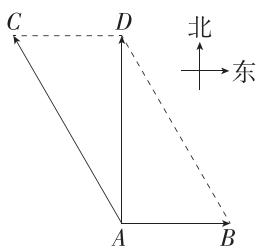

text_image

C
D
北
东
A
B

∴ $\left|\overrightarrow{AD}\right|=\sqrt{15^{2}-7.5^{2}}=\frac{15\sqrt{3}}{2}$ . 小船实际航行的速度的大小为 $\frac{15\sqrt{3}}{2}$ km/h, 方向为正北.

9.D 如图, $|\overrightarrow{OA}| = |\overrightarrow{OB}| = 200\sqrt{3}, \angle AOB = 60^{\circ}$ , 作平行四边形 $OACB$ , 则平行四边形

OACB 是菱形, $\overrightarrow{OC}=\overrightarrow{OA}+\overrightarrow{OB}$ ,

$$
\mid \overrightarrow {O C} \mid = 2 \mid \overrightarrow {O A} \mid \sin 6 0 ^ {\circ} = 6 0 0,
$$

所以 $|G|=|\overrightarrow{OC}|=600$ ,

因此该学生的体重为 $\frac{|G|}{g}=60(kg)$ . 故选 D.

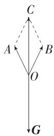

10. AD 根据题意得 $\left|G\right|=\left|F_{1}+F_{2}\right|$ ，所以 $\left|G\right|^{2}=\left|F_{1}\right|^{2}+\left|F_{2}\right|^{2}+2\left|F_{1}\right|\left|F_{2}\right|\cos\theta=2\left|F_{1}\right|^{2}(1+\cos\theta)$ ，易知 $\theta\in(0,\pi)$ ，

解得 $\left|F_{1}\right|^{2}=\frac{\left|G\right|^{2}}{2(1+\cos\theta)}$ ，当 $\theta\in(0,\pi)$ 时， $y=\cos\theta$ 单调递减，所以 $\left|F_{1}\right|^{2}$ 随 $\theta$ 的增大而增大，故 $\theta$ 越大越

费力, $\theta$ 越小越省力,故A正确,B错误;

当 $\theta=\frac{\pi}{2}$ 时， $|F_{1}|^{2}=\frac{|G|^{2}}{2}$ ，所以 $|F_{1}|=\frac{\sqrt{2}}{2}|G|$ ，故 C 错误；

当 $\theta = \frac{2\pi}{3}$ 时， $|F_1|^2 = |G|^2$ ，所以 $|F_1| = |G|$ ，故 D 正确.

故选 AD.

11. 答案 25e; 1000 J

解析 $\because |F| = 50$ ，且 $F$ 与小车位移方向的夹角为 $60^{\circ}$ ∴ $F$ 在小车位移上的投影向量为 $|F|\cos 60^{\circ}e = 25e.$

∵ 力 F 作用于小车 G, 使小车 G 发生了 40 m 的位移, ∴ 力 F 做的功为 $25 \times 40 = 1\ 000(\mathrm{J})$ .

12. 解析 （1）要使此人游的路程最短，只需此人的游泳速度与水流速度的和速度与对岸垂直，如图 1.

此人游泳的方向与水流方向的夹角 $\alpha = \angle ACB$ ，此时

$$
\left| \boldsymbol {v} _ {2} \right| = \sqrt {\left| \boldsymbol {v} _ {1} \right| ^ {2} - \left| \boldsymbol {v} _ {0} \right| ^ {2}} = 1 \mathrm{m} / \mathrm{s}, \alpha = \angle A C B = \frac {3 \pi}{4}.
$$

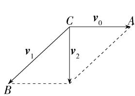

text_image

C
v₀
A
v₁
v₂
B

图 1

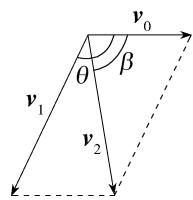

text_image

v₀
θ
β
v₁
v₂

图 2

(2)如图2,由题意知 $v_{0}$ 与 $v_{2}$ 的夹角为 $\beta$ ,设 $v_{0}$ 与 $v_{1}$ 的夹角为 $\theta$ ,实际游泳的路程为 $s\ m$ ,

则 $|\pmb{v}_1| \sin (\pi - \theta) = |\pmb{v}_2| \sin \beta$ ，即 $|\pmb{v}_1| \sin \theta = |\pmb{v}_2| \sin \beta$ ， $\sin \beta = \frac{d}{s}$ ，（过 $\pmb{v}_1, \pmb{v}_2$ 的终点作 $\pmb{v}_0$ 所在直线的垂线，构造直角三角形即可得到）

$\therefore \frac{s}{|\pmb{v}_2|} = \frac{d}{|\pmb{v}_1|\sin\theta},\left(\frac{s}{|\pmb{v}_2|}\right.$ 为实际的路程除以实际的速度,即所用的时间,当 $\sin\theta$ 最大时,时间最短

∴ 当 $\theta=\frac{\pi}{2}$ 时, 此人游到对岸用时最短,

此时 $\left|\boldsymbol{v}_{2}\right|=\sqrt{\left|\boldsymbol{v}_{1}\right|^{2}+\left|\boldsymbol{v}_{0}\right|^{2}}=2\ m/s,\tan\beta=\sqrt{3}$ ，故 $\beta=\frac{\pi}{3}$ .

# 6.4.3 余弦定理、正弦定理

# 第 1 课时 余弦定理、正弦定理

# 基础过关练

Q 对应主书 P25

<table><tr><td>1.B</td><td>2.C</td><td>3.D</td><td>6.B</td><td>7.C</td><td>8.A</td><td>9.AC</td><td>10.ABC</td></tr><tr><td>12.C</td><td>13.D</td><td>14.A</td><td>15.BC</td><td>16.A</td><td>17.D</td><td></td><td></td></tr></table>

1.B 因为 $(a + c)(a - c) = b(b - \sqrt{3} c)$ ，所以 $a^2 - c^2 = b^2 - \sqrt{3} bc$ ，即 $b^2 + c^2 - a^2 = \sqrt{3} bc$ ，

由余弦定理的推论可得 $\cos A=\frac{b^{2}+c^{2}-a^{2}}{2bc}=\frac{\sqrt{3}bc}{2bc}=\frac{\sqrt{3}}{2}$ ，又 $0^{\circ}<A<180^{\circ}$ ，所以 $A=30^{\circ}$ . 故选 B.

2.C 由题意不妨设 a=5, b=7, c=8, 根据大边对大角可知 A<B<C,

由余弦定理的推论可得 $\cos B = \frac{a^{2} + c^{2} - b^{2}}{2ac} = \frac{25 + 64 - 49}{2 \times 5 \times 8} = \frac{1}{2}$ ，又因为 $0^{\circ} < B < 180^{\circ}$ ，所以 $B = 60^{\circ}$ ，

所以 $A + C = 180^{\circ} - B = 180^{\circ} - 60^{\circ} = 120^{\circ}$

所以 $\triangle ABC$ 的最大内角与最小内角之和为 $120^{\circ}$ . 故选 C.

3.D 因为 1,2,a 是三角形的三边长,所以 $1+2>a$ 且 $a+1>2$ , 得 1<a<3,

因为该三角形为锐角三角形，

所以由余弦定理的推论得 $\left\{\begin{aligned}&\frac{1^{2}+a^{2}-2^{2}}{2\times1\times a}>0,\\&\frac{1^{2}+2^{2}-a^{2}}{2\times1\times2}>0,\end{aligned}\right.$

解得 $\sqrt{3} < a < \sqrt{5}$ .

所以实数 a 的取值范围是 $(\sqrt{3}, \sqrt{5})$ . 故选 D.

4. 答案 $\frac{\pi}{3}$

解析 由题意得 $\cos B = \frac{a^2 + c^2 - b^2}{2ac} = \frac{a^2 + 1^2 - b^2}{2a} = \frac{a^2 + 1}{4a} = \frac{1}{4}\left(a + \frac{1}{a}\right) \geqslant \frac{1}{2}$ , 当且仅当 $a = 1$ 时, 等号成立,

又 $B \in (0, \pi)$ , 所以 $0 < B \leqslant \frac{\pi}{3}$ , 所以角 $B$ 的最大值为 $\frac{\pi}{3}$ .

5. 答案 3

解析 因为 b>c，所以 B>C，又 C 是三角形的内角，所以 C 为锐角，因为 $\sin C = \frac{3\sqrt{3}}{14}$ ，所以 $\cos C = \sqrt{1 - \sin^{2}C} = \sqrt{1 - \left(\frac{3\sqrt{3}}{14}\right)^{2}} = \frac{13}{14}$ 。由余弦定理得 $c^{2} = a^{2} + b^{2} - 2ab\cos C = 7^{2} + 8^{2} - 2 \times 7 \times 8 \times \frac{13}{14} = 9$ ，所以 c = 3（负值舍去）。

6.B 易知 $A = 180^{\circ} - 105^{\circ} - 45^{\circ} = 30^{\circ}$ ，由 $\frac{a}{\sin A} = \frac{c}{\sin C}$ 得 $c = \frac{a\sin C}{\sin A} = 2.$ 故选B.

7.C 在 $\triangle ABD$ 中, 由正弦定理得 $\frac{AD}{\sin \angle ABD} = \frac{BD}{\sin \angle BAD}$ ,

即 $\frac{6}{\sin 45^{\circ}} = \frac{3}{\sin \angle BAD}$ , 故 $\sin \angle BAD = \frac{\sqrt{2}}{4}$ ,

因为 BD<AD, 所以 $\angle BAD<\angle ABD$ , 故 $\angle BAD$ 为锐角,
故 $\cos\angle BAD=\frac{\sqrt{14}}{4}$ ,

所以 $\sin\angle ADC=\sin(\angle BAD+\angle ABD)=\sin(\angle BAD+45^{\circ})=\frac{\sqrt{2}}{4}\times\frac{\sqrt{2}}{2}+\frac{\sqrt{14}}{4}\times\frac{\sqrt{2}}{2}=\frac{1+\sqrt{7}}{4}$ ，故选 C.

8.A $\because a=\sqrt{3},\therefore c-2b+2a\cos C=0,$

由正弦定理得 $\sin C - 2\sin B + 2\sin A\cos C = 0$

即 $\sin C-2\sin(A+C)+2\sin A\cos C=0,$

$$
\therefore \sin C - 2 \sin A \cos C - 2 \sin C \cos A + 2 \sin A \cos C = 0,
$$

$$
\therefore \sin C - 2 \sin C \cos A = 0,
$$

又 $\sin C > 0, \therefore \cos A = \frac{1}{2}$ , 又 $A \in (0, \pi), \therefore A = \frac{\pi}{3}$ ,

设该三角形外接圆的半径为 r，则 $2r=\frac{a}{\sin A}=\frac{\sqrt{3}}{\frac{\sqrt{3}}{2}}=2$ ，

$\therefore r = 1.$ 故选A.

9. AC 解法一: 对于 A, 由 $\frac{a}{\sin A} = \frac{c}{\sin C}$ , 得 $\frac{2\sqrt{2}}{\sin 30^{\circ}} = \frac{4}{\sin C}$ , 所以 $\sin C = \frac{\sqrt{2}}{2}$ , 又因为 $0^{\circ} < C < 180^{\circ}, c > a$ , 所以 $C = 45^{\circ}$ 或 $C = 135^{\circ}$ , 所以三角形有两解, 故 A 正确;

对于 B, 由正弦定理得 $\sin B = \frac{b \sin A}{a} = \frac{7 \times \frac{\sqrt{3}}{2}}{5} = \frac{7\sqrt{3}}{10} > 1$ ,
无解, 故 B 错误;

对于 C, 由正弦定理得 $\sin B = \frac{b \sin A}{a} = \frac{4 \times \frac{1}{2}}{\sqrt{2}} = \sqrt{2} > 1$ , 无解, 故 C 正确;

对于 D, 由正弦定理得 $\sin B = \frac{b \sin A}{a} = \frac{4 \times \frac{\sqrt{3}}{2}}{6} = \frac{\sqrt{3}}{3} < \frac{\sqrt{3}}{2}$ ，因为 b < a，所以 B 为锐角，所以此三角形只有一解，故 D 错误。故选 AC.

解法二: $c \sin A = 4 \times \frac{1}{2} = 2, \because c \sin A < a < c, \therefore$ 三角形有两解, A 正确;

$b\sin A = 7 \times \frac{\sqrt{3}}{2} = \frac{7\sqrt{3}}{2}, \because a < b\sin A, \therefore$ 三角形无解，B错误；

$b\sin A=4\times\frac{1}{2}=2,\because a<b\sin A,\therefore$ 三角形无解，C正确；
∵a>b，且A为锐角，∴三角形有一解，D错误.故选AC.

# 解题模板

在 $\triangle ABC$ 中, 已知 $a, b$ 和 $A$ , 以角 $A$ 一边上的点 $C$ 为圆心, $a$ 为半径画弧, 此弧与角 $A$ 另一边的公共点 (不包含点 $A$ ) 的个数即为三角形解的个数. 解的个数总结如下表:

<table><tr><td colspan="2">条件</td><td>A为钝角</td><td>A为直角</td><td>A为锐角</td></tr><tr><td colspan="2">a&gt;b</td><td>一解</td><td>一解</td><td>一解</td></tr><tr><td colspan="2">a=b</td><td>无解</td><td>无解</td><td>一解</td></tr><tr><td rowspan="3">a0.5sin A</td><td>a&gt;bsin A</td><td rowspan="3">无解</td><td rowspan="3">无解</td><td>两解</td></tr><tr><td>a=bsin A</td><td>一解</td></tr><tr><td>aa0.5sin A</td><td>无解</td></tr></table>

10. ABC 对于 A, 若 A > B, 则 a > b, 由正弦定理可得 $\sin A > \sin B$ 成立, 故 A 正确;

对于 B, 因为 $\triangle ABC$ 为锐角三角形, 所以 $A + B > \frac{\pi}{2}, 0 < A < \frac{\pi}{2}, 0 < B < \frac{\pi}{2}$ , 所以 $\frac{\pi}{2} > A > \frac{\pi}{2} - B > 0$ ,

由正弦函数 $y=\sin x$ 在 $\left(0,\frac{\pi}{2}\right)$ 上单调递增, 得 $\sin A>\sin\left(\frac{\pi}{2}-B\right)=\cos B$ , 故 B 正确.

对于 C, 由正弦定理得 $a^{2} + b^{2} < c^{2}$ , 所以 C 为钝角, 即 $\triangle ABC$ 是钝角三角形, 故 C 正确;

对于 D, 如图, 若 $\triangle ABC$ 有两解, 则 $a \sin B < b < a$ ,

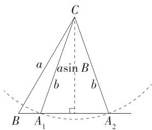

text_image

C
a
asin B
b
b
B A₁ A₂

所以 $3 < b < 2\sqrt{3}$ ，则 b 的取值范围是 $(3, 2\sqrt{3})$ ，故 D 错误.

故选 ABC.

11. 解析 (1) $\because (a + b)(\sin A - \sin B) + (b - c)\sin C = 0,$ $\therefore$ 由正弦定理得 $(a + b)(a - b) + (b - c)c = 0,$

即 $b^{2} + c^{2} - a^{2} = bc, \therefore \cos A = \frac{b^{2} + c^{2} - a^{2}}{2bc} = \frac{1}{2}$ ,

又∵ $0<A<\pi,\therefore A=\frac{\pi}{3}.$

(2) $\because 0 < C < \pi, \therefore 0 < \frac{C}{2} < \frac{\pi}{2},$

故 $\cos \frac{C}{2} = \sqrt{1 - \sin^2\frac{C}{2}} = \frac{2\sqrt{5}}{5},$

$$
\therefore \sin C = 2 \sin \frac {C}{2} \cos \frac {C}{2} = \frac {4}{5},
$$

由 $\frac{a}{\sin A} = \frac{c}{\sin C}$ 得 $c = \frac{a\sin C}{\sin A} = \frac{5\times\frac{4}{5}}{\frac{\sqrt{3}}{2}} = \frac{8\sqrt{3}}{3}.$

12. C 由题意可知 $A + B + C = 3C = 180^{\circ}$ ，则 $C = 60^{\circ}$ ，

因为 $\sin^{2}C=\sin A\sin B,$

所以由正弦定理得 $c^{2}=ab$ ，

由余弦定理得 $c^{2}=a^{2}+b^{2}-2ab\cos C=a^{2}+b^{2}-ab=ab$ 则 $(a-b)^{2}=0$ ，所以a=b，所以a=b=c，
故 $\triangle ABC$ 为等边三角形.

13.D 由 $\cos A - \cos B + \frac{a - b}{c} = 0$ ，得 $a - c\cos B = b - c\cos A$

由余弦定理的推论得 $a - c \cdot \frac{a^2 + c^2 - b^2}{2ac} = b - c \cdot \frac{b^2 + c^2 - a^2}{2bc}$ , 化简得 $\frac{a^2 + b^2 - c^2}{a} = \frac{a^2 + b^2 - c^2}{b}$ .

当 $a^{2}+b^{2}-c^{2}=0$ ，即 $a^{2}+b^{2}=c^{2}$ 时， $\triangle ABC$ 为直角三角形；

当 $a^2 + b^2 - c^2 \neq 0$ 时, $a = b$ , 则 $\triangle ABC$ 为等腰三角形. 故 $\triangle ABC$ 为等腰三角形或直角三角形, 故选 D.

14.A 设直角三角形的三边长分别为 $a, b, c$ ，且 $a^2 + b^2 = c^2$ ，令三边都增加 $x(x > 0)$ ，则 $(a + x)^2 + (b + x)^2 - (c + x)^2 = a^2 + b^2 + 2x^2 + 2(a + b)x - c^2 - 2cx - x^2 = 2(a + b - c)x + x^2 > 0$ ，所以由余弦定理的推论可知新三角形中最大边所对的角是锐角，所以新三角形是锐角三角形。故选A.

15.BC 对于 A, 由正弦定理得 $\sin A\cos A = \sin B\cos B$ 即 $\sin 2A = \sin 2B$ ，又 $A, B \in (0, \pi)$ ，所以 $2A = 2B$ 或 $2A + 2B = \pi$ ，即 $A = B$ 或 $A + B = \frac{\pi}{2}$ ，所以三角形为等腰三角形或直角三角形，故 A 错误；

对于 B, 由正弦定理得 $\sin B\cos C + \sin C\cos B = \sin B$ ,
即 $\sin(B+C)=\sin B$ , 即 $\sin A=\sin B$ ,

又 $A, B \in (0, \pi)$ , 所以 $A = B$ , 所以 $\triangle ABC$ 是等腰三角形, 故 B 正确;

对于 C, 由正弦定理得 $\frac{\sin A}{\cos A} = \frac{\sin B}{\cos B} = \frac{\sin C}{\cos C}$ ，即 $\tan A = \tan B = \tan C$ ,

又 A, B, C 为三角形的内角, 所以 A = B = C, 所以 $\triangle ABC$ 是等边三角形, 故 C 正确;

对于 D, 由余弦定理可得 $ac = b^{2} = a^{2} + c^{2} - ac$ , 可得 $(a - c)^{2} = 0$ , 解得 a = c, 又 $B = 60^{\circ}$ , 所以 b = a = c, 故 $\triangle ABC$ 是等边三角形, 故 D 错误.

故选 BC.

# 方法总结

利用正、余弦定理判断三角形的形状一般有两种方法：一是角化边，利用正、余弦定理把条件转化为边的关系，再结合因式分解、配方等方法得到边的相应关系，从而判断三角形的形状；二是边化角，利用正、余弦定理把条件转化为角的关系，再结合三角恒等变换得相应内角的关系，从而判断三角形的形状.

16.A 由题意得 $S_{\triangle ABC} = \frac{1}{2} bc\sin A = \frac{1}{2}\times 5c\times \frac{\sqrt{3}}{2} = \frac{15\sqrt{3}}{4},$ 解得 $c = 3$

由余弦定理得 $a^{2}=b^{2}+c^{2}-2bc\cos A=5^{2}+3^{2}-2\times5\times3\times\left(-\frac{1}{2}\right)=49$ ，所以 a=7，

则 $\triangle ABC$ 的周长为 $a + b + c = 15$ . 故选A.

17.D 因为 $\cos B=\frac{a^{2}+c^{2}-b^{2}}{2ac}=\frac{3}{5}, ac=2$ ，所以 $a^{2}+c^{2}-b^{2}=4\times\frac{3}{5}=\frac{12}{5}$ ,

则 $S_{\triangle ABC} = \frac{1}{2}\sqrt{(ac)^2 - \left(\frac{a^2 + c^2 - b^2}{2}\right)^2} = \frac{1}{2} \times$ $\sqrt{4 - \left(\frac{6}{5}\right)^2} = \frac{4}{5}$ , 故选 D.

18. 解析 (1) 因为 $m \parallel n$ , 所以 $a \sin B - \sqrt{3} b \cos A = 0$ , 由正弦定理得 $\sin A \sin B - \sqrt{3} \sin B \cos A = 0$ ,

又 $B \in (0, \pi)$ , 所以 $\sin B \neq 0$ , 所以 $\sin A - \sqrt{3} \cos A = 0$ , 则 $\tan A = \sqrt{3}$ ,

又 $A \in (0, \pi)$ , 所以 $A = \frac{\pi}{3}$ .

(2) 解法一(余弦定理): 由余弦定理可得 $a^{2}=b^{2}+c^{2}-2bc\cos A$ ，因为 $a=\sqrt{7}, b=2, A=\frac{\pi}{3}$ ,

所以 $7 = 4 + c^2 - 2c$ ，解得 $c = 3$ 或 $c = -1$ （舍），

所以 $\triangle ABC$ 的面积 $S = \frac{1}{2} bc\sin A = \frac{1}{2}\times 2\times 3\times \frac{\sqrt{3}}{2} = \frac{3\sqrt{3}}{2}.$

解法二(正弦定理): 由 $\frac{a}{\sin A}=\frac{b}{\sin B}$ ，得 $\frac{\sqrt{7}}{\frac{\sqrt{3}}{2}}=\frac{2}{\sin B}$ ，所

以 $\sin B = \frac{\sqrt{21}}{7}$

由 $a > b$ ，知 $A > B$ ，所以 $\cos B = \sqrt{1 - \sin^2B} = \frac{2\sqrt{7}}{7}$

故 $\sin C = \sin (A + B) = \sin A\cos B + \cos A\sin B = \frac{3\sqrt{21}}{14},$

所以 $\triangle ABC$ 的面积 $S = \frac{1}{2} ab \sin C = \frac{1}{2} \times \sqrt{7} \times 2 \times \frac{3\sqrt{21}}{14} = \frac{3\sqrt{3}}{2}$ .

19. 解析 (1) 由题意及正弦定理得 $2\sin A\cos C - \sin C\cos B = \sin B\cos C$

所以 $2\sin A\cos C = \sin B\cos C + \sin C\cos B = \sin (B + C) = \sin A$ ，易知 $\sin A \neq 0$ ，

所以 $\cos C=\frac{1}{2}$ ，又 $C\in(0,\pi)$ ，所以 $C=\frac{\pi}{3}$ .

(2) 由 $S_{\triangle ABC} = \frac{1}{2} ab \sin \frac{\pi}{3} = \frac{\sqrt{3}}{4} ab = 18\sqrt{3}$ , 得 $ab = 72$ ,

因为 $CD$ 平分 $\angle ACB, \angle ACB = \frac{\pi}{3}$ , 所以 $\angle ACD = \angle BCD = \frac{\pi}{6}$ ,

则 $S_{\triangle ABC} = S_{\triangle ACD} + S_{\triangle BCD} = \frac{1}{2} b \cdot CD\sin \frac{\pi}{6} + \frac{1}{2} a \cdot$

$$
C D \sin \frac {\pi}{6} = \frac {1}{2} \times 4 \sqrt {3} \times (a + b) \times \frac {1}{2} = \sqrt {3} (a + b) = 1 8 \sqrt {3},
$$

所以 $a+b=18$ ，

由余弦定理得 $c^{2}=a^{2}+b^{2}-2ab\cos\frac{\pi}{3}=(a+b)^{2}-3ab=18^{2}-3\times72=108$ ,

所以 $c=6\sqrt{3}$ .

# 能力提升练

Q 对应主书 P27

<table><tr><td>1.A</td><td>2.ACD</td><td>6.B</td><td>7.B</td><td>8.D</td><td></td><td></td><td></td></tr></table>

1.A

信息提取 当伞完全收拢时, $AB=BD=\frac{1}{2}AD'$ ;

当伞完全张开时, $AD=AD'-24,\angle BAC=2\angle BAD.$

解析 依题意知 $AD' = 60 \, cm$ ，当伞完全张开时，AD = 60 - 24 = 36 (cm)，

当伞完全收拢时，B 为 $AD'$ 的中点，故 AB = AC = BD = $\frac{1}{2}AD' = 30 \, (\text{cm})$ .

当伞完全张开时，在 $\triangle ABD$ 中， $\cos \angle BAD = \frac{AB^2 + AD^2 - BD^2}{2AB \cdot AD} = \frac{900 + 1296 - 900}{2 \times 30 \times 36} = \frac{3}{5}$ ，

故 $\cos\angle BAC=\cos2\angle BAD=2\cos^{2}\angle BAD-1=2\times\left(\frac{3}{5}\right)^{2}-1=-\frac{7}{25}$ ，故选 A.

2.ACD 因为 $(a+b):(a+c):(b+c)=9:10:11$ ，所以可设 $\left\{\begin{aligned}a+b&=9x,\\ a+c&=10x,(x>0),\\ b+c&=11x\end{aligned}\right.$ 解得 $\left\{\begin{aligned}a&=4x,\\ b&=5x,\end{aligned}\right.$ 所以由正弦定c=6x，

理可得 $\sin A : \sin B : \sin C = a : b : c = 4 : 5 : 6$ ，故 A 正确.

易知 c 最大, 所以 $\triangle ABC$ 中角 C 最大, 又 $\cos C = \frac{a^{2} + b^{2} - c^{2}}{2ab} = \frac{(4x)^{2} + (5x)^{2} - (6x)^{2}}{2 \times 4x \times 5x} = \frac{1}{8} > 0$ , 所以 C 为锐角, 所以 $\triangle ABC$ 为锐角三角形, 故 B 错误.

易知 a 最小, 所以 $\triangle ABC$ 中角 A 最小,

又 $\cos A = \frac{c^2 + b^2 - a^2}{2cb} = \frac{(6x)^2 + (5x)^2 - (4x)^2}{2\times 6x\times 5x} = \frac{3}{4},$

所以 $\cos 2A = 2\cos^2 A - 1 = \frac{1}{8}$ , 所以 $\cos 2A = \cos C$ ,

由 $\triangle ABC$ 中角 $C$ 最大且 $C$ 为锐角可得 $2A \in (0, \pi)$ , $C \in \left(0, \frac{\pi}{2}\right)$ , 所以 $2A = C$ , 故 $\mathbb{C}$ 正确.

设 $\triangle ABC$ 外接圆的半径为 $R$ ，则 $2R = \frac{c}{\sin C}$ 又 $c = 6$ $\sin C = \sqrt{1 - \cos^2C} = \frac{3\sqrt{7}}{8}$ 所以 $2R = \frac{6}{\frac{3\sqrt{7}}{8}}$ 解得 $R = \frac{8\sqrt{7}}{7},$

故 D 正确. 故选 ACD.

# 3. 答案 20-00

思路点拨 （1）根据角平分线的性质得到 $\frac{AC}{AB}=$ $\frac{CD}{BD}=2;$

(2) 在 $\triangle ABD, \triangle ACD$ 中分别利用余弦定理表示出 $\cos \angle ADB, \cos \angle ADC$ ;  
(3) 由 $\cos \angle ADB + \cos \angle ADC = 0$ 解方程, 求出 $AB^2$ ;  
(4) 求出 $\cos \angle ADC$ , 从而得到 $\angle ADC$ 的大小, 再化成密位制.

解析 因为 AD 是 $\triangle ABC$ 的内角 A 的平分线, 所以 $\angle BAD = \angle CAD$ ,

所以 $\frac{S_{\triangle ADC}}{S_{\triangle ADB}} = \frac{\frac{1}{2}AD\cdot AC\sin\angle CAD}{\frac{1}{2}AD\cdot AB\sin\angle BAD} = \frac{AC}{AB} = \frac{CD}{BD} = 2,$

设 $AB = m(m > 0)$ ，则 $AC = 2m$

在 $\triangle ABD$ 中,由余弦定理可得 $m^{2}=AD^{2}+BD^{2}-2AD\cdot BD\cos\angle ADB$ ,即 $m^{2}=4^{2}+2^{2}-2\times4\times2\cos\angle ADB$ ,

所以 $\cos\angle ADB=\frac{20-m^{2}}{16}$ ,

在 $\triangle ACD$ 中，由余弦定理可得 $4m^{2} = AD^{2} + CD^{2} - 2AD\cdot CD\cos \angle ADC$ ，即 $4m^{2} = 4^{2} + 4^{2} - 2\times 4\times 4\cos \angle ADC$

所以 $\cos\angle ADC=\frac{8-m^{2}}{8}$ ,

因为 $\angle ADB + \angle ADC = \pi$

所以 $\cos\angle ADB+\cos\angle ADC=0$

所以 $\frac{20-m^{2}}{16}+\frac{8-m^{2}}{8}=0$ , 解得 $m^{2}=12$ , 所以 $\cos\angle ADC=-\frac{1}{2}$ ,
又 $0 < \angle ADC < \pi$ ，所以 $\angle ADC = \frac{2\pi}{3}$ ,

易得 $\frac{2\pi}{3}\times\frac{6\ 000}{2\pi}=2\ 000$ ，所以 $\angle ADC$ 的大小用密位制表示为20-00.

4. 答案 $\frac{\sqrt{7}}{2}, \sqrt{2}$

解析 由①②结合正弦定理可得 $\sin A = \sqrt{2}\sin C = \frac{\sqrt{2}}{2}$ , 此时 $A = \frac{\pi}{4}$ 或 $\frac{3\pi}{4}$ .

若选①②③,则由 $\cos B = -\frac{\sqrt{2}}{4} < 0$ 知 B 为钝角,故 A = $\frac{\pi}{4}$ ,此时 $B = \pi - A - C = \frac{7\pi}{12}$ , $\cos B = \frac{\sqrt{2} - \sqrt{6}}{4} \neq -\frac{\sqrt{2}}{4}$ ,矛盾,
∴△ABC不存在,不符合题意.

若选①②④,则 A 有两解,不符合题意.

若选①③④,则由余弦定理的推论得 $-\frac{\sqrt{2}}{4}=\frac{c^{2}+2c^{2}-7}{2c\cdot\sqrt{2}c}$ ,
解得 $c=\frac{\sqrt{7}}{2}$ (负值舍去).

若选②③④, $\because \cos B = -\frac{\sqrt{2}}{4}, B \in (0, \pi)$ ,

$$
\therefore \sin B = \sqrt {1 - \cos^ {2} B} = \sqrt {1 - \frac {2}{1 6}} = \frac {\sqrt {1 4}}{4},
$$

由 $\frac{b}{\sin B} = \frac{c}{\sin C}$ , 得 $c = \frac{b \sin C}{\sin B} = \frac{\sqrt{7} \times \frac{1}{2}}{\frac{\sqrt{14}}{4}} = \sqrt{2}$ .

故满足条件的所有 c 的值为 $\frac{\sqrt{7}}{2}, \sqrt{2}$ .

5. 解析 （1）由 $b \cos A = \sqrt{2} a \sin B$ 得 $\sin B \cos A = \sqrt{2} \sin A \sin B$ ，又 $\sin B \neq 0$ ，所以 $\cos A = \sqrt{2} \sin A > 0$ ，所以 A 为锐角，又 $\sin^{2}A + \cos^{2}A = 1$ ，所以 $\sin A = \frac{\sqrt{3}}{3}$ .

(2)若选条件①,由(1)可得 $\cos A=\sqrt{2}\sin A=\frac{\sqrt{6}}{3}$ ,

由余弦定理得 $a^{2}=b^{2}+c^{2}-2bc\cos A$ ，又 $a=\sqrt{3}, b=\sqrt{6}c$ ，
所以 $3=6c^{2}+c^{2}-4c^{2}$ ，所以 c=1，所以 $b=\sqrt{6}$ ，

所以 $\triangle ABC$ 唯一确定, $S_{\triangle ABC} = \frac{1}{2} bc\sin A = \frac{\sqrt{2}}{2}$ .

若选条件②,由 $\frac{a}{\sin A}=\frac{b}{\sin B}$ ,得 $\sin B=\frac{\sqrt{6}\times\frac{\sqrt{3}}{3}}{\sqrt{3}}=\frac{\sqrt{6}}{3}$ ,

由 $b = \sqrt{6} > a = \sqrt{3}$ ，得 $B > A$

因此角 B 有两解, 分别对应两个三角形, 不符合题意.

若选条件③,由(1)可得 $\cos A=\sqrt{2}\sin A=\frac{\sqrt{6}}{3}$ ,

因为 $\sin A = \frac{\sqrt{3}}{3} >\sin C = \frac{1}{3}$ 所以 $a > c$

所以 A > C，则 $\cos C = \frac{2\sqrt{2}}{3}$ ,

因此 $\sin B = \sin (A + C) = \sin A\cos C + \cos A\sin C = \frac{\sqrt{6}}{3}$ $\triangle ABC$ 唯一确定，

由 $\frac{a}{\sin A}=\frac{c}{\sin C}$ ，得 $c=\frac{\sqrt{3}\times\frac{1}{3}}{\frac{\sqrt{3}}{3}}=1$ ，

所以 $S_{\triangle ABC} = \frac{1}{2} ac\sin B = \frac{\sqrt{2}}{2}.$

6.B 由 $c - b = 2b\cos A$ ，结合正弦定理得 $\sin C - \sin B = 2\sin B\cos A$

又 $\sin C = \sin (A + B) = \sin A\cos B + \cos A\sin B,$

所以 $\sin A\cos B + \cos A\sin B - \sin B = 2\sin B\cos A$

则 $\sin B = \sin A\cos B - \sin B\cos A = \sin (A - B)$

因为 $\triangle ABC$ 是锐角三角形,所以 $0<A<\frac{\pi}{2},0<B<\frac{\pi}{2}$ ,

则 $-\frac{\pi}{2} < A - B < \frac{\pi}{2}$

所以 B=A-B，即 A=2B，则 $C=\pi-A-B=\pi-3B$ ，

所以 $\left\{\begin{aligned}0&<2B<\frac{\pi}{2},\\ 0&<\pi-3B<\frac{\pi}{2},\end{aligned}\right.$ 解得 $\frac{\pi}{6}<B<\frac{\pi}{4}$ ，则 $\frac{\sqrt{2}}{2}<\cos B<\frac{\sqrt{3}}{2}$

所以 $\frac{a}{b} = \frac{\sin A}{\sin B} = \frac{\sin 2B}{\sin B} = 2\cos B\in (\sqrt{2},\sqrt{3}).$

故选 B.

7.B 设 $\angle AOP = \theta$ ，则 $0 < \theta < \frac{\pi}{4}$

$$
\because A B \parallel O P, \angle P O Q = \frac {\pi}{4},
$$

$$
\therefore \angle A B O = \frac {3 \pi}{4}, \angle O A B = \theta , \angle A O B = \frac {\pi}{4} - \theta ,
$$

在 $\triangle OAB$ 中, 由正弦定理得 $OB = \frac{OA \cdot \sin \angle OAB}{\sin \angle ABO} =$

$$
\frac {2 \sin \theta}{\frac {\sqrt {2}}{2}} = 2 \sqrt {2} \sin \theta ,
$$

$$
\therefore S _ {\triangle O A B} = \frac {1}{2} O A \cdot O B \sin \angle A O B = 2 \sqrt {2} \sin \theta \sin \left(\frac {\pi}{4} - \theta\right)
$$

$$
= 2 \sqrt {2} \sin \theta \left(\frac {\sqrt {2}}{2} \cos \theta - \frac {\sqrt {2}}{2} \sin \theta\right) = 2 \sin \theta \cos \theta - 2 \sin^ {2} \theta
$$

$$
= \sin 2 \theta - 1 + \cos 2 \theta = \sqrt {2} \sin \left(2 \theta + \frac {\pi}{4}\right) - 1,
$$

$$
\because \theta \in \left(0, \frac {\pi}{4}\right), \therefore 2 \theta + \frac {\pi}{4} \in \left(\frac {\pi}{4}, \frac {3 \pi}{4}\right),
$$

$$
\therefore \text {当} 2 \theta + \frac {\pi}{4} = \frac {\pi}{2},
$$

即 $\theta = \frac{\pi}{8}$ 时， $S_{\triangle OAB}$ 取得最大值 $\sqrt{2} - 1$

故选 B.

# 目解后反思

本题考查几何图形中面积最值的求解, 解题关键是能够将所求三角形面积表示为关于变量 $\theta$ 的函数, 结合三角恒等变换和三角函数的性质得到最值.

8.D 对于 A, 由余弦定理的推论得 $b \cos A + a \cos B = \frac{b (b^{2} + c^{2} - a^{2})}{2bc} + \frac{a (a^{2} + c^{2} - b^{2})}{2ac} = \frac{2c^{2}}{2c} = c$ ,

则 $\frac{b\cos A + a\cos B}{\sin C} = \frac{c}{\sin C} = 2R = \frac{4\sqrt{3}}{3}$ 故A错误；

对于 B, 由 $\frac{c}{\sin C}=2R$ 得 $\frac{2}{\sin C}=\frac{4\sqrt{3}}{3}$ ，解得 $\sin C=\frac{\sqrt{3}}{2}$ ，又 C 为锐角，所以 $C=\frac{\pi}{3}$ ，

则 $\triangle ABC$ 的周长为 $a + b + c = 2R\left[\sin A + \sin \left(\frac{2\pi}{3} -A\right)\right] + 2 = \frac{4\sqrt{3}}{3}\left(\sin A + \frac{\sqrt{3}}{2}\cos A + \frac{1}{2}\sin A\right) + 2 = \frac{4\sqrt{3}}{3}\left(\frac{3}{2}\sin A + \frac{\sqrt{3}}{2}\cos A\right) + 2 = 4\sin \left(A + \frac{\pi}{6}\right) + 2,$

因为 $0 < A < \frac{2\pi}{3}$ ，所以 $\frac{\pi}{6} < A + \frac{\pi}{6} < \frac{5\pi}{6}$ ，所以 $4\sin\left(A + \frac{\pi}{6}\right) + 2 \in (4,6]$ ，故 $\triangle ABC$ 周长的最大值为 6，故 B 错误；

对于 C, $\frac{\cos B}{\cos A} = \frac{\cos\left(\frac{2\pi}{3} - A\right)}{\cos A} =$

$\frac{\cos \frac{2\pi}{3}\cos A + \sin \frac{2\pi}{3}\sin A}{\cos A} = -\frac{1}{2} + \frac{\sqrt{3}}{2} \tan A, A \in (0, \frac{\pi}{2}) \cup (\frac{\pi}{2}, \frac{2\pi}{3}),$

故 $\tan A\in (-\infty , - \sqrt{3})\cup (0, + \infty)$

所以 $\frac{\cos B}{\cos A}$ 的取值范围为 $(-∞,-2)∪\left(-\frac{1}{2},+∞\right)$ ，故C错误；

对于 D, 由正弦定理得 $\frac{b}{\sin B} = \frac{b}{\sin\left(\frac{2\pi}{3} - A\right)} = \frac{b}{\sin\left(A + \frac{\pi}{3}\right)} = \frac{4\sqrt{3}}{3}$ , 所以 $b = \frac{4\sqrt{3}}{3}\sin\left(A + \frac{\pi}{3}\right)$ ,

则 $\overrightarrow{AB} \cdot \overrightarrow{AC} = 2b\cos A = 2 \times \frac{4\sqrt{3}}{3}\sin \left(A + \frac{\pi}{3}\right)\cos A = \frac{8\sqrt{3}}{3}\left(\frac{1}{2}\sin A\cos A + \frac{\sqrt{3}}{2}\cos^2 A\right) = \frac{8\sqrt{3}}{3}\left(\frac{1}{4}\sin 2A + \frac{\sqrt{3} + \sqrt{3}\cos 2A}{4}\right) = \frac{4\sqrt{3}}{3}\sin \left(2A + \frac{\pi}{3}\right) + 2,$

因为 $0 < A < \frac{2\pi}{3}$ , 所以 $\frac{\pi}{3} < 2A + \frac{\pi}{3} < \frac{5\pi}{3}$ ,

则当 $2A + \frac{\pi}{3} = \frac{\pi}{2}$ 时， $(\overrightarrow{AB} \cdot \overrightarrow{AC})_{\max} = \frac{4\sqrt{3}}{3} + 2$ ，故 D 正确.
故选 D.

9. 解析 (1) 由 $a^2 - \sqrt{2} ac + c^2 = b^2$ 及余弦定理得 $2ac\cos B = \sqrt{2} ac$ ，所以 $\cos B = \frac{\sqrt{2}}{2}$ ，又 $B \in (0, \pi)$ ，所以 $B = \frac{\pi}{4}$ .

(2) 因为 $B = \frac{\pi}{4}$ , 所以 $\sqrt{2} \cos A + \cos C = \sqrt{2} \cos A + \cos \left(\frac{3\pi}{4} - A\right) = \frac{\sqrt{2}}{2} \sin A + \frac{\sqrt{2}}{2} \cos A = \sin \left(A + \frac{\pi}{4}\right)$ ,

因为 $0 < A < \frac{3\pi}{4}$ , 所以 $A + \frac{\pi}{4} \in \left(\frac{\pi}{4}, \pi\right)$ ,

所以 $\sin\left(A+\frac{\pi}{4}\right)\in(0,1]$ ,

所以 $\sqrt{2}\cos A + \cos C\in (0,1]$

故 $\sqrt{2}\cos A+\cos C$ 的取值范围为(0,1].

10. 解析 (1) 由 $(2a - b) \cdot \cos C - c\cos B = 0$ 及正弦定理得 $(2\sin A - \sin B)\cos C - \sin C\cos B = 0$

则 $2\sin A\cos C - \sin (B + C) = 0$

$\because A + B + C = \pi, \therefore \sin (B + C) = \sin (\pi - A) = \sin A$ ，则有 $2\sin A\cos C - \sin A = 0$

$$
\because A \in (0, \pi),
$$

$$
\therefore \sin A > 0, \therefore \cos C = \frac {1}{2},
$$

又 $C\in (0,\pi),\therefore C = \frac{\pi}{3}.$

(2) 解法一 (余弦定理 + 不等式): 由余弦定理得 $c^{2} = a^{2} + b^{2} - 2ab \cos C$ , 即 $(a + b)^{2} - 3ab = 7$ ,

即 $ab=\frac{(a+b)^{2}-7}{3}$ ,

$\because ab \leqslant \frac{(a+b)^2}{4}$ , 当且仅当 $a = b$ 时等号成立, [建立关

于 $(a + b)^2$ 和 $ab$ 的不等式]

$\therefore \frac{(a + b)^2 - 7}{3} \leqslant \frac{(a + b)^2}{4}, [\text{变形为关于}(a + b)^2 \text{的不等式, 通过解不等式求}(a + b)^2 \text{的最大值}]$

解得 $0 < a + b \leqslant 2\sqrt{7}$ ,

又∵ $a+b>c=\sqrt{7}$ ，∴ $\sqrt{7}<a+b\leqslant2\sqrt{7}$ ，

∴ $\triangle ABC$ 的周长的取值范围为 $(2\sqrt{7}, 3\sqrt{7}]$ .

解法二(正弦定理+三角函数):由正弦定理得 $\frac{a}{\sin A}=\frac{b}{\sin B}=\frac{c}{\sin C}=\frac{\sqrt{7}}{\sin\frac{\pi}{3}}=\frac{2\sqrt{21}}{3}$ ,

$$
\therefore a = \frac {2 \sqrt {2 1}}{3} \sin A, b = \frac {2 \sqrt {2 1}}{3} \sin B,
$$

由 $A + B + C = \pi, C = \frac{\pi}{3}$ , 得 $A + B = \frac{2\pi}{3}$ , 即 $B = \frac{2\pi}{3} - A$ , 且 $0 < A < \frac{2\pi}{3}$ ,

$$
\therefore a + b = \frac {2 \sqrt {2 1}}{3} (\sin A + \sin B) = \frac {2 \sqrt {2 1}}{3} \times
$$

$$
\left[ \sin A + \sin \left(\frac {2 \pi}{3} - A\right) \right] = \frac {2 \sqrt {2 1}}{3} \left(\sin A + \frac {\sqrt {3}}{2} \cos A + \right.
$$

$$
\left. \frac {1}{2} \sin A\right) = \frac {2 \sqrt {2 1}}{3} \left(\frac {3}{2} \sin A + \frac {\sqrt {3}}{2} \cos A\right) = 2 \sqrt {7} \times
$$

$\left(\frac{\sqrt{3}}{2}\sin A+\frac{1}{2}\cos A\right)=2\sqrt{7}\sin\left(A+\frac{\pi}{6}\right)$ . (利用三角恒等变换, 将 $a+b$ 的范围问题转化为三角函数的值域问题)

$$
\because 0 <   A <   \frac {2 \pi}{3}, \therefore \frac {\pi}{6} <   A + \frac {\pi}{6} <   \frac {5 \pi}{6},
$$

$$
\therefore \frac {1}{2} <   \sin \left(A + \frac {\pi}{6}\right) \leqslant 1, \therefore \sqrt {7} <   2 \sqrt {7} \sin \left(A + \frac {\pi}{6}\right) \leqslant 2 \sqrt {7},
$$

∴ $\triangle ABC$ 的周长的取值范围为 $(2\sqrt{7}, 3\sqrt{7}]$ .

(3) 解法一 (余弦定理 + 不等式): 由余弦定理得 $c^{2} = a^{2} + b^{2} - 2ab \cos C$ ，即 $a^{2} + b^{2} = ab + 7$ ，

∵ $a^{2}+b^{2}\geqslant2ab$ ，当且仅当 a=b 时等号成立，(建立关于 $a^{2}+b^{2}$ 和 ab 的不等式)

∴ $ab + 7 \geqslant 2ab$ , ∴ $0 < ab \leqslant 7$ , (变形为关于 ab 的不等式, 通过解不等式求 ab 的最大值)

又∵ $S_{\triangle ABC}=\frac{1}{2}ab\sin C=\frac{1}{2}ab\times\frac{\sqrt{3}}{2}=\frac{\sqrt{3}}{4}ab$

$$
\therefore S _ {\triangle A B C} \in \left(0, \frac {7 \sqrt {3}}{4} \right].
$$

解法二(正弦定理+三角函数):由正弦定理得

$$
\frac {a}{\sin A} = \frac {b}{\sin B} = \frac {c}{\sin C} = \frac {\sqrt {7}}{\sin \frac {\pi}{3}} = \frac {2 \sqrt {2 1}}{3},
$$

$$
\therefore a = \frac {2 \sqrt {2 1}}{3} \sin A, b = \frac {2 \sqrt {2 1}}{3} \sin B,
$$

由 $A + B + C = \pi, C = \frac{\pi}{3}$ , 得 $A + B = \frac{2\pi}{3}$ , 即 $B = \frac{2\pi}{3} - A$ , 且 $0 < A < \frac{2\pi}{3}$ ,

$$
\therefore a b = \frac {2 8}{3} \sin A \sin B = \frac {2 8}{3} \sin A \sin \left(\frac {2 \pi}{3} - A\right)
$$

$$
= \frac {2 8}{3} \sin A \left(\frac {\sqrt {3}}{2} \cos A + \frac {1}{2} \sin A\right) = \frac {2 8}{3} \left(\frac {\sqrt {3}}{2} \sin A \cos A + \right.
$$

$$
\left. \frac {1}{2} \sin^ {2} A\right) = \frac {2 8}{3} \left(\frac {\sqrt {3}}{4} \sin 2 A - \frac {1}{4} \cos 2 A + \frac {1}{4}\right) = \frac {1 4}{3} \sin (2 A -
$$

$\left.\frac{\pi}{6}\right)+\frac{7}{3}$ .(利用三角恒等变换,将ab的范围问题转化为三角函数的值域问题)

$$
\because 0 <   A <   \frac {2 \pi}{3}, \therefore - \frac {\pi}{6} <   2 A - \frac {\pi}{6} <   \frac {7 \pi}{6},
$$

$$
\therefore - \frac {1}{2} <   \sin \left(2 A - \frac {\pi}{6}\right) \leqslant 1,
$$

$$
\therefore 0 <   \frac {1 4}{3} \sin \left(2 A - \frac {\pi}{6}\right) + \frac {7}{3} \leqslant 7,
$$

∴ ab 的取值范围是 $(0,7]$ ,

又∵ $S_{\triangle ABC}=\frac{1}{2}ab\sin C=\frac{1}{2}ab\times\frac{\sqrt{3}}{2}=\frac{\sqrt{3}}{4}ab$

$$
\therefore S _ {\triangle A B C} \in \left(0, \frac {7 \sqrt {3}}{4} \right].
$$

# 目 导师点睛

解三角形中的最值或范围问题,一般采用以下两种方法:①余弦定理结合基本不等式构造不等关系求解;②先利用正弦定理将边化为角,再利用三角函数的性质求出最值或范围,如果三角形为锐角三角形或角有其他的限制条件,通常采用这种方法.

# 第2课时 余弦定理、正弦定理的实际应用

# 基础过关练 对应主书P29

<table><tr><td>1.C</td><td>2.B</td><td>3.A</td><td>5.B</td><td>8.ACD</td><td></td><td></td><td></td></tr></table>

1.C ①测量 $\angle A, \angle B, \angle C$ ，即知道三个角的度数，则三角形有无数组解，不能唯一确定 $A, B$ 两地之间的距离；②测量 $\angle A, \angle B, BC$ ，即已知两角及其中一角的对边，则由正弦定理可知，三角形有唯一的解，能唯一确定 $A, B$ 两地之间的距离；③测量 $\angle A, AC, BC$ ，即已知两边及其中一边的对角，则由正弦定理可知，三角形可能有2个解，不能唯一确定 $A, B$ 两地之间的距离；④测量 $\angle C, AC, BC$ ，即已知两边及其夹角，则由余弦定理可知，三角形有唯一的解，能唯一确定 $A, B$ 两地

之间的距离.

综上可得,能唯一确定A,B两地之间距离的方案的序号是②④.

故选 C.

2.B 由题意得 $\angle ACB = 180^{\circ} - 45^{\circ} - 60^{\circ} = 75^{\circ}$ ,

在 $\triangle ABC$ 中，由正弦定理得 $\frac{AB}{\sin\angle ACB} = \frac{BC}{\sin\angle CAB}$

$$
\therefore B C = \frac {6 0 \sin 4 5 ^ {\circ}}{\sin 7 5 ^ {\circ}} = \frac {6 0 \sin 4 5 ^ {\circ}}{\sin (3 0 ^ {\circ} + 4 5 ^ {\circ})} = 6 0 (\sqrt {3} - 1) (\mathrm{m}).
$$

故 $CD = BC\sin \angle CBA = 60(\sqrt{3} -1)\times \frac{\sqrt{3}}{2} = 30(3 - \sqrt{3})(\mathrm{m}).$

故选 B.

3.A 在 $\triangle ACD$ 中， $\angle CAD = 180^{\circ} - 105^{\circ} - 30^{\circ} = 45^{\circ}$

由正弦定理得 $\frac{CD}{\sin 45^{\circ}} = \frac{AD}{\sin 105^{\circ}}$

则 $AD = \frac{CD\times\sin 105^{\circ}}{\sin 45^{\circ}} = \frac{20\times(\sin 60^{\circ}\cos 45^{\circ} + \cos 60^{\circ}\sin 45^{\circ})}{\sin 45^{\circ}}$

$$
= 1 0 (\sqrt {3} + 1),
$$

在 $\triangle BCD$ 中，易知 $\angle BCD = 45^{\circ},\angle BDC = 90^{\circ}$

所以 $\angle CBD=45^{\circ}$ ，所以 BD=CD=20，

在 $\triangle ABD$ 中，由余弦定理得 AB =

$$
\sqrt {A D ^ {2} + B D ^ {2} - 2 \times A D \times B D \times \cos 6 0 ^ {\circ}} = \sqrt {6 0 0} = 1 0 \sqrt {6}.
$$

故 A, B 两个基站间的距离为 $10\sqrt{6}$ km.

故选 A.

# 规律总结

1. 当 A, B 两点不相通, 但均可到达时, 选取点 C, 测出 AC, BC, $\angle ACB$ , 用余弦定理求解 AB;  
2. 当 A, B 两点间可视, 但有一点 B 不可到达时, 选取点 C, 测出 $\angle CAB$ , $\angle ACB$ 和 AC, 用正弦定理求解 AB;  
3. 当 A, B 两点都不可到达时, 选取对 A, B 可视的点 C, D, 测出 $\angle BCA, \angle BDA, \angle ACD, \angle BDC$ 和 CD, 用正弦定理和余弦定理求解 AB.

# 4. 答案 60

解析 由题意得 $AD = 46 \mathrm{~m}, \angle ACD = 30^{\circ}, \angle BAC = 37^{\circ}, \angle ABC = 113^{\circ}$ .

在 Rt $\triangle ACD$ 中, 因为 $\angle ACD = 30^{\circ}$ , 所以 AC = 2AD = 92 m,

在 $\triangle ABC$ 中，由正弦定理可得 $\frac{BC}{\sin\angle BAC} = \frac{AC}{\sin\angle ABC}$

即 $\frac{BC}{\sin 37^\circ} = \frac{92}{\sin 113^\circ}$

所以 $BC=\frac{92\sin37^{\circ}}{\sin113^{\circ}}=\frac{92\sin37^{\circ}}{\sin67^{\circ}}\approx\frac{92\times0.60}{0.92}=60(\mathrm{~m})$

所以河流的宽度 BC 约为 60 m.

5.B 在 Rt△ADC 中, $\angle DAC = 30^{\circ}, \angle DCA = 90^{\circ}$ , 则 AC = $\sqrt{3}CD$ ,

在 Rt $\triangle BDC$ 中， $\angle DBC = 45^{\circ}$ ， $\angle DCB = 90^{\circ}$ ，则 BC = CD，

由 $AC - BC = AB$ ，得 $\sqrt{3} CD - CD = 14$ ，所以 $CD = \frac{14}{\sqrt{3} - 1} = 7(\sqrt{3} + 1) \approx 19.124(\mathrm{~m})$ ，所以岳阳楼的高度 $CD$ 约为 $19\mathrm{~m}$ . 故选B.

6. 答案 $100 \sqrt{6}$

解析 由题可得 $\angle CAB = 30^{\circ}$ , $\angle CBA = 180^{\circ} - 75^{\circ} = 105^{\circ}$ , 则 $\angle BCA = 45^{\circ}$ .

在 $\triangle ABC$ 中，由正弦定理得 $\frac{AB}{\sin\angle BCA} = \frac{CB}{\sin\angle CAB}$ ，则

$$
C B = \frac {A B \cdot \sin \angle C A B}{\sin \angle B C A} = \frac {6 0 0 \times \frac {1}{2}}{\frac {\sqrt {2}}{2}} = 3 0 0 \sqrt {2} (\mathrm{m}).
$$

在 Rt△CBD 中，∠CBD=30°，∠DCB=90°，

所以 $\tan \angle CBD = \frac{CD}{CB} = \frac{\sqrt{3}}{3}$ , 则 $CD = \frac{\sqrt{3}}{3} CB = 100\sqrt{6} (\mathrm{~m})$ .

7. 答案 $30\sqrt{3}$

解析 由题意知 $\angle CAM = 45^{\circ}$ , $\angle AMC = 180^{\circ} - 15^{\circ} - 60^{\circ} = 105^{\circ}$ , 所以 $\angle ACM = 180^{\circ} - 105^{\circ} - 45^{\circ} = 30^{\circ}$ ,

在 Rt△ABM 中, $AM=\frac{AB}{\sin\angle AMB}=\frac{AB}{\sin15^{\circ}}$ ,

在 $\triangle ACM$ 中，由正弦定理得 $\frac{AM}{\sin 30^\circ} = \frac{CM}{\sin 45^\circ}$

所以 $CM = \frac{AM\sin 45^{\circ}}{\sin 30^{\circ}} = \frac{AB\sin 45^{\circ}}{\sin 15^{\circ}\cdot\sin 30^{\circ}},$

在 Rt $\triangle DCM$ 中， $CD = CM\cdot \sin 60^{\circ} =$

$$
\frac {A B \cdot \sin 4 5 ^ {\circ} \cdot \sin 6 0 ^ {\circ}}{\sin 1 5 ^ {\circ} \cdot \sin 3 0 ^ {\circ}} = \frac {(1 5 \sqrt {3} - 1 5) \times \frac {\sqrt {2}}{2} \times \frac {\sqrt {3}}{2}}{\frac {\sqrt {6} - \sqrt {2}}{4} \times \frac {1}{2}} = 3 0 \sqrt {3} (\mathrm{m}),
$$

所以小明估算圣·索菲亚教堂的高度为 $30\sqrt{3}$ m.

8. ACD A 中, $\angle ABD = \angle ABC + \angle CBD = 30^{\circ} + 45^{\circ} = 75^{\circ}$ , 因为 $B$ 在 $D$ 的正北方向, 所以 $B$ 位于 $A$ 的北偏东 $75^{\circ}$ 方向, 故 $\mathsf{A}$ 正确.

B 中, 在 $\triangle BCD$ 中, $\angle CDB = \angle ADC + \angle ADB = 30^{\circ} + 60^{\circ} = 90^{\circ}$ , $\angle CBD = 45^{\circ}$ , BD = 2 n mile, 所以 $BC = 2\sqrt{2}$ n mile, 故 B 错误.

C 中, 在 $\triangle ABD$ 中, $\angle ADB = 60^{\circ}$ , $\angle BAD = 180^{\circ} - 75^{\circ} - 60^{\circ} = 45^{\circ}$ ,

由正弦定理得 $\frac{AB}{\sin\angle ADB} = \frac{BD}{\sin\angle BAD}$ 即 $AB =$

$\frac{BD\sin60^{\circ}}{\sin45^{\circ}}=\sqrt{6}$ n mile, 故 C 正确.

D 中, 在 $\triangle ABC$ 中, 由余弦定理得 $AC^{2}=AB^{2}+BC^{2}-2AB\cdot$

$BC \cdot \cos \angle ABC = 6 + 8 - 2 \times \sqrt{6} \times 2\sqrt{2} \times \frac{\sqrt{3}}{2} = 2$ , 则 AC = $\sqrt{2}$ n mile, 故 D 正确.

故选 ACD.

9. 答案 2; $\frac{5\sqrt{3}}{14}$

解析 设红方侦察艇经过 $x\mathrm{h}$ 后在 $C$ 处追上蓝方的小艇, 则 $AC = 14x$ n mile, $BC = 10x$ n mile,

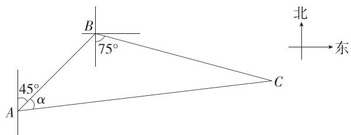

text_image

北
45°
α
A
B
75°
C
东

易知 $\angle ABC = 120^{\circ}$

在 $\triangle ABC$ 中,根据余弦定理得 $(14x)^{2}=12^{2}+(10x)^{2}-240x\times\cos120^{\circ}$ ,解得x=2(负值舍去),

故 AC=28 n mile, BC=20 n mile.

根据正弦定理得 $\frac{BC}{\sin\alpha} = \frac{AC}{\sin 120^\circ}$ ，解得 $\sin \alpha =$

$$
\frac {2 0 \sin 1 2 0 ^ {\circ}}{2 8} = \frac {5 \sqrt {3}}{1 4}.
$$

10. 解析 根据题意, 画出示意图如图,

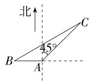

在 $\triangle ABC$ 中，由余弦定理得 $BC^{2} = AB^{2} + AC^{2} - 2AB\cdot$

$$
A C \cdot \cos 1 3 5 ^ {\circ} = (\sqrt {3} - 1) ^ {2} + (\sqrt {2}) ^ {2} - 2 \times (\sqrt {3} - 1) \times \sqrt {2} \times
$$

$\left(-\frac{\sqrt{2}}{2}\right)=4$ , 所以 BC=2 n mile,

由正弦定理得 $\frac{AB}{\sin C} = \frac{BC}{\sin\angle BAC}$

即 $\frac{\sqrt{3} - 1}{\sin C} = \frac{2}{\sin 135^\circ}$

所以 $\sin C = \frac{\sqrt{6} - \sqrt{2}}{4}$

易知 $C$ 为锐角，

又 $\sin 15^{\circ} = \sin (45^{\circ} - 30^{\circ}) = \sin 45^{\circ}\cos 30^{\circ} -$

$$
\cos 4 5 ^ {\circ} \sin 3 0 ^ {\circ} = \frac {\sqrt {6} - \sqrt {2}}{4},
$$

所以 $C=15^{\circ}$ .

故乙船的航行距离为 2 n mile, 方向为南偏西 $15^{\circ} + 45^{\circ} = 60^{\circ}$ .

# 能力提升练

Q 对应主书 P31

<table><tr><td>1.A</td><td>2.B</td><td>3.D</td><td></td><td></td><td></td><td></td><td></td></tr></table>

1. A 连接 $E_0E_1$ ，在 $\triangle SE_0E_1$ 中， $SE_0 = SE_1 = R$ ，又 $\angle E_1SE_0 = \frac{\pi}{3}$ ，所以 $\triangle SE_0E_1$ 是正三角形， $E_0E_1 = R$ ，

由 $\angle SE_0M = \frac{2\pi}{3},\angle SE_1M = \frac{3\pi}{4}$ 得 $\angle E_1E_0M = \frac{\pi}{3},$ $\angle E_0E_1M = \frac{5\pi}{12}$ ，在 $\triangle ME_0E_1$ 中，易得 $\angle E_0ME_1 = \frac{\pi}{4}$

由正弦定理得 $\frac{E_1M}{\sin\frac{\pi}{3}} = \frac{E_0E_1}{\sin\frac{\pi}{4}}$ ，则 $E_{1}M = \frac{\frac{\sqrt{3}}{2}R}{\frac{\sqrt{2}}{2}} = \frac{\sqrt{3}}{\sqrt{2}} R,$

在 $\triangle SME_{1}$ 中，由余弦定理得 $SM = \sqrt{R^2 + \left(\frac{\sqrt{3}}{\sqrt{2}} R\right)^2 - 2R\cdot\frac{\sqrt{3}}{\sqrt{2}} R\cdot\left(-\frac{\sqrt{2}}{2}\right)} = \sqrt{\frac{5}{2} R^2 + \sqrt{3} R^2}\approx$

$\sqrt{4.2}R\approx2.05R.$ 故最接近的是 A 选项.

故选 A.

2.B 在 $\triangle ABD$ 中, $\angle BAD=45^{\circ},\angle ABD=120^{\circ}$ ,

则 $\angle ADB = 15^{\circ}$ ，由题意知 $AB = 24.4$

在 $\triangle ABD$ 中，由正弦定理得 $\frac{AD}{\sin 120^\circ} = \frac{AB}{\sin 15^\circ}$ ，则 $AD =$

$$
\frac {\frac {\sqrt {3}}{2} A B}{\sin (4 5 ^ {\circ} - 3 0 ^ {\circ})} = \frac {\frac {\sqrt {3}}{2} A B}{\frac {\sqrt {2}}{2} \times \frac {\sqrt {3}}{2} - \frac {\sqrt {2}}{2} \times \frac {1}{2}} = \frac {3 \sqrt {2} + \sqrt {6}}{2} A B,
$$

在 Rt△ACD 中, $DC \perp AC, \angle DAC = 45^{\circ}$ ,

则 $DC = AC = \frac{\sqrt{2}}{2} AD = \frac{3 + \sqrt{3}}{2} AB$

在 Rt $\triangle BCD$ 中， $\angle CBD = 60^{\circ}$ ，则 $BC = \frac{DC}{\tan 60^{\circ}} = \frac{\sqrt{3} + 1}{2} \cdot AB$ ，在 Rt $\triangle BCE$ 中， $\angle CBE = 30^{\circ}$ ，则 $CE = BC \cdot \tan 30^{\circ} = \frac{3 + \sqrt{3}}{6} AB$ ，所以 DE = DC - CE = $\frac{3 + \sqrt{3}}{3} AB \approx \frac{3 + 1.7}{3} \times 24.4 \approx 38.23 \, (\text{m})$ ，

所以该塔的高约为 38.23 m.

故选 B.

3.D 设 A 炮台第一次发射炮弹命中点为 C, 依题意
AB = 14, AC = BC = AM = 18, $\angle CBA = \angle CAB = \theta$ , $\angle MAB=\frac{\theta}{2}$ ,

在 $\triangle ABC$ 中，由余弦定理得 $BC^2 = AC^2 + AB^2 - 2AC \cdot AB\cos \theta$ ，即 $18^2 = 18^2 + 14^2 - 2 \times 18 \times 14\cos \theta$

解得 $\cos\theta=\frac{7}{18}$ ，所以 $\cos\theta=2\cos^{2}\frac{\theta}{2}-1=\frac{7}{18}$ ，又 $\theta$ 为锐角，所以 $\cos\frac{\theta}{2}=\frac{5}{6}$ ，

在 $\triangle ABM$ 中,由余弦定理得 $BM^{2}=AM^{2}+AB^{2}-2AM\cdot AB\cos\frac{\theta}{2}=18^{2}+14^{2}-2\times18\times14\times\frac{5}{6}=100$ ,

所以 BM=10，即 B 炮台与弹着点 M 的距离为 10 km.
故选 D.

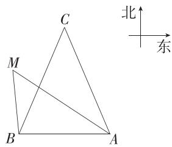

text_image

C
M
B
A
北
东

4. 答案 $4 \sqrt{2} + 4$

解析 如图, 设 MN 与扇形的切点为 P, 连接 OP.

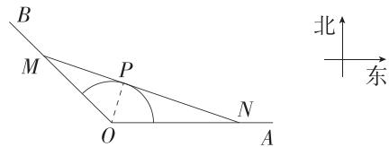

text_image

B
M
P
O
N
A
北
东

由题意得 $\angle MON = 135^{\circ}$ ，设 $OM = a\mathrm{km},ON = b\mathrm{km},$

在 $\triangle OMN$ 中， $MN^2 = a^2 + b^2 - 2ab\cos 135^\circ = a^2 + b^2 + \sqrt{2}ab \geqslant (2 + \sqrt{2})ab$ ，当且仅当 $a = b$ 时取等号.

设 $\angle OMN = \alpha$ ，则 $\angle ONM = 45^{\circ} - \alpha$

所以 $a = \frac{2}{\sin\alpha}, b = \frac{2}{\sin(45^{\circ} - \alpha)}$

故 $ab = \frac{4}{\sin\alpha\sin(45^{\circ} - \alpha)} = \frac{16}{2\sin(2\alpha + 45^{\circ}) - \sqrt{2}} \geqslant \frac{16}{2 - \sqrt{2}}$

当且仅当 $\alpha=22.5^{\circ}$ 时取等号，

所以 $MN^{2} \geqslant \frac{16(2 + \sqrt{2})}{2 - \sqrt{2}} = 16(\sqrt{2} + 1)^{2}$ ，解得 $MN \geqslant 4(\sqrt{2} + 1)$ ，所以 MN 的最小值为 $(4\sqrt{2} + 4)$ km.

5. 答案 $475-25\sqrt{3}$ ; $\frac{50\sqrt{3}}{3}$

解析 如图, 在 $\triangle ACD$ 中, $CD = 50 \, m$ , $\angle ACD = 45^{\circ}$ , $\angle ADC = 105^{\circ}$ , $\angle CAD = 30^{\circ}$ ,

由正弦定理得 $\frac{AC}{\sin\angle ADC} = \frac{CD}{\sin\angle CAD} = \frac{AD}{\sin\angle ACD}$

又 $\sin 105^{\circ} = \sin 75^{\circ} = \sin (45^{\circ} + 30^{\circ}) = \frac{\sqrt{2}}{2}\times \frac{\sqrt{3}}{2} +\frac{\sqrt{2}}{2}\times$

$\frac{1}{2} = \frac{\sqrt{6} + \sqrt{2}}{4}$ , 所以 $AC = \frac{50}{\frac{1}{2}} \times \frac{\sqrt{6} + \sqrt{2}}{4} = 25(\sqrt{6} + \sqrt{2})(\mathrm{m})$

延长 AB 交 CE 于 H，则 $AH = AC \sin \angle ACD = 25 (\sqrt{6} + \sqrt{2}) \times \frac{\sqrt{2}}{2} = 25 (\sqrt{3} + 1) (\mathrm{~m})$ ,

又无人机飞行的海拔高度为 $500 \, m$ ，所以该座小山的海拔为 $500 - 25(\sqrt{3} + 1) = (475 - 25\sqrt{3}) \, \text{m}$ .

在 $\triangle ABC$ 中， $\angle ACB = 45^{\circ} - 30^{\circ} = 15^{\circ}$ ， $\angle ABC = 120^{\circ}$

且 $\sin\angle ACB=\sin(45^{\circ}-30^{\circ})=\frac{\sqrt{2}}{2}\times\frac{\sqrt{3}}{2}-\frac{\sqrt{2}}{2}\times\frac{1}{2}$ $=\frac{\sqrt{6}-\sqrt{2}}{4}$ ,

由正弦定理得 $\frac{AB}{\sin 15^{\circ}} = \frac{AC}{\sin 120^{\circ}}$ ，则 $AB = \frac{25(\sqrt{6} + \sqrt{2})}{\frac{\sqrt{3}}{2}} \times \frac{\sqrt{6} - \sqrt{2}}{4} = \frac{50\sqrt{3}}{3} (\mathrm{m})$ .

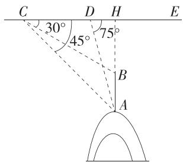

text_image

C D H E
30° 45° 75°
B
A

6. 解析 (1) 由题意知 $\angle BCP = 90^{\circ}$ , $\angle PBC = 60^{\circ}$ , $PC = 2\sqrt{3}$ ,

在 Rt△BCP 中, $\tan\angle PBC=\frac{PC}{BC}$ , 则 $BC=\frac{2\sqrt{3}}{\tan60^{\circ}}=2$ ,
在 $\triangle ABC$ 中， $\angle BCA=60^{\circ}-15^{\circ}=45^{\circ}$

由正弦定理得 $\frac{BC}{\sin\angle BAC} = \frac{AB}{\sin\angle BCA}$

即 $\frac{2}{\sin 15^{\circ}} = \frac{AB}{\sin 45^{\circ}}$ ，所以 $AB = \frac{2\sin 45^{\circ}}{\sin 15^{\circ}} = 2(\sqrt{3} +1)$

故汽车的行驶速度是 $\frac{2(\sqrt{3}+1)}{\frac{20}{60}}=6(\sqrt{3}+1)$ (km/h).

(2) 易得 $BD = \sqrt{3} + 1$ ,

在 $\triangle BCD$ 中，由余弦定理得 $CD^2 = BC^2 + BD^2 - 2BC \times BD\cos \angle DBC = 2^2 + (\sqrt{3} + 1)^2 - 2 \times 2 \times (\sqrt{3} + 1) \times \frac{1}{2} = 6$ ，故 $CD = \sqrt{6}$ ，

在 $\triangle BCD$ 中，由正弦定理得 $\frac{CD}{\sin\angle DBC} = \frac{BC}{\sin\angle CDB}$ 即 $\frac{\sqrt{6}}{\sin 60^{\circ}} = \frac{2}{\sin\angle CDB}$ ，解得 $\sin \angle CDB = \frac{\sqrt{2}}{2}$ ，

因为 CD>BC, 所以 $\angle CDB$ 为锐角, 所以 $\angle CDB=45^{\circ}$ , 故点 C 位于 D 的南偏东 $45^{\circ}$ 方向.

7. 解析 (1) 在 $\triangle ABC$ 中, $\angle CAB = 45^{\circ} + 75^{\circ} = 120^{\circ}$ ,

由余弦定理得 $BC^{2}=AB^{2}+AC^{2}-2AB\cdot AC\cos\angle CAB=(\sqrt{3}-1)^{2}+2^{2}-2\times(\sqrt{3}-1)\times2\times\left(-\frac{1}{2}\right)=6$ ,

所以 $BC=\sqrt{6}$ n mile.

(2)在 $\triangle ABC$ 中，由正弦定理得 $\frac{AB}{\sin\angle ACB} = \frac{BC}{\sin 120^\circ}$

所以 $\sin \angle ACB = \frac{AB\cdot\sin 120^{\circ}}{BC} = \frac{\sqrt{3} - 1}{2\sqrt{2}} = \frac{\sqrt{6} - \sqrt{2}}{4}.$

易知 $0^{\circ}<\angle ACB<60^{\circ}$ ，所以 $\angle ACB=15^{\circ}$ .

(3)设缉私船用 $t\mathrm{h}$ 在 $D$ 处追上走私船，如图，

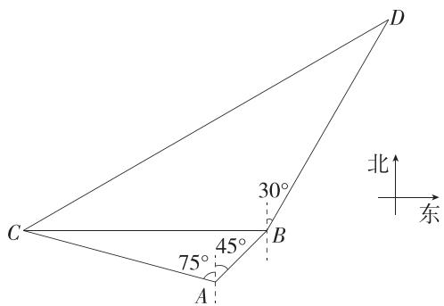

text_image

C
75°
45°
A
B
30°
D
北
东

则有 $CD=10\sqrt{3}t$ n mile, BD=10t n mile.

在 $\triangle BCD$ 中， $\angle CBD = 90^{\circ} + 30^{\circ} = 120^{\circ}$ ，由正弦定理得

$$
\sin \angle B C D = \frac {B D \cdot \sin \angle C B D}{C D} = \frac {1 0 t \cdot \sin 1 2 0 ^ {\circ}}{1 0 \sqrt {3} t} = \frac {1}{2}.
$$

易知 $0^{\circ}<\angle BCD<60^{\circ}$ ，所以 $\angle BCD=30^{\circ}$ ，所以缉私船沿北偏东 $60^{\circ}$ 的方向能最快追上走私船.

又 $\angle D = 180^{\circ} - 120^{\circ} - 30^{\circ} = 30^{\circ} = \angle BCD$ ，所以 $BD = BC$

即 $10t = \sqrt{6}$ ，解得 $t = \frac{\sqrt{6}}{10}$

所以缉私船追上走私船最快需要 $\frac{\sqrt{6}}{10}\mathrm{h}$

# 专题强化练 3 余弦定理、正弦定理的综合应用 …… Q 对应主书 P33

<table><tr><td>1.A</td><td>2.D</td><td>3.ABD</td><td>4.BC</td><td></td><td></td><td></td><td></td></tr></table>

1. A $\because b^{2}+c^{2}-a^{2}=\sqrt{3}bc,\therefore\cos\angle BAC=\frac{b^{2}+c^{2}-a^{2}}{2bc}=\frac{\sqrt{3}}{2},$

又∵ $\angle BAC \in (0, \pi)$ , ∴ $\angle BAC = \frac{\pi}{6}$ ,

又 $B = \frac{2\pi}{3},\therefore C = \frac{\pi}{6},$

由正弦定理得 $\frac{c}{\sin C} = \frac{b}{\sin B}, \therefore c = \frac{b \sin C}{\sin B} = \frac{2\sqrt{3} \times \frac{1}{2}}{\frac{\sqrt{3}}{2}} = 2.$

∵ AE 平分 $\angle BAC, \therefore \angle BAE = \frac{1}{2} \angle BAC = \frac{\pi}{12},$

$$
\therefore \angle A E B = \pi - \frac {2 \pi}{3} - \frac {\pi}{1 2} = \frac {\pi}{4}, \because \frac {c}{\sin \angle A E B} = \frac {A E}{\sin B},
$$

$$
\therefore A E = \frac {c \sin B}{\sin \angle A E B} = \frac {2 \times \frac {\sqrt {3}}{2}}{\frac {\sqrt {2}}{2}} = \sqrt {6}.
$$

2.D 过点 M 作 $MD \perp BN$ 于点 D，则 MD = AB，

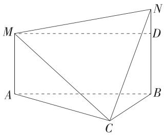

text_image

M
N
D
A
B
C

在 Rt△ACM 中, AM=15, ∠ACM=30°,

$$
\therefore A C = \sqrt {3} A M = 1 5 \sqrt {3},
$$

在 Rt△BCN 中, $BN=21,\angle BCN=60^{\circ}$ ,

$$
\therefore B C = \frac {B N}{\sqrt {3}} = 7 \sqrt {3},
$$

在 $\triangle ACB$ 中， $\angle ACB = 120^{\circ}$ ，由余弦定理得

$$
A B = \sqrt {A C ^ {2} + B C ^ {2} - 2 A C \cdot B C \cos \angle A C B}
$$

$$
= \sqrt {(1 5 \sqrt {3}) ^ {2} + (7 \sqrt {3}) ^ {2} - 2 \times 1 5 \sqrt {3} \times 7 \sqrt {3} \cos 1 2 0 ^ {\circ}}
$$

$$
= \sqrt {1 1 3 7},
$$

$\therefore DM=AB=\sqrt{1\ 137}$ ，易知 BD=AM=15，DN=BN-BD=6，

在 Rt△DMN 中，∠MDN = 90°，由勾股定理得 MN = $\sqrt{DM^{2} + DN^{2}} = \sqrt{\left(\sqrt{1137}\right)^{2} + 6^{2}} = \sqrt{1173}$ ，

故 M, N 之间的距离为 $\sqrt{1\ 173}$ m, 故选 D.

3.ABD 对于 A, 由 $c = b(2 \cos A + 1)$ 及正弦定理得 $\sin C = 2 \sin B \cos A + \sin B$ ,

由 $\sin C=\sin(A+B)$ ，得 $\sin A\cos B-\cos A\sin B=\sin B$ ，
即 $\sin(A-B)=\sin B$ ,

由 $0 < B < \pi$ ，得 $\sin B > 0$ ，又 $0 < A < \pi$ ，所以 $0 < A - B < \pi$

所以 A-B=B 或 $A-B+B=\pi$ ,

即 A=2B 或 $A=\pi$ （舍去），A 正确；

对于 B, 由 A=2B 和正弦定理知 $\frac{a}{\sin A}=\frac{\sqrt{3}b}{\sin 2B}=\frac{b}{\sin B}$ ,

所以 $\cos B=\frac{\sqrt{3}}{2}$ ，又 $0<B<\pi$ ，所以 $B=\frac{\pi}{6}$ ，所以 A=2B= $\frac{\pi}{3}$ ， $C=\frac{\pi}{2}$ ，B 正确；

对于 C, 在锐角 $\triangle ABC$ 中, $0 < B < \frac{\pi}{2}$ , $0 < A = 2B < \frac{\pi}{2}$ , $0 < C = \pi - 3B < \frac{\pi}{2}$ , 即 $\frac{\pi}{6} < B < \frac{\pi}{4}$ , 所以 $\frac{\sqrt{3}}{3} < \tan B < 1$ ,

故 $\frac{1}{\tan B} - \frac{1}{\tan A} = \frac{1}{\tan B} - \frac{1 - \tan^2 B}{2\tan B} = \frac{1 + \tan^2 B}{2\tan B} = \frac{1}{2}\left(\frac{1}{\tan B} + \tan B\right) > \frac{1}{2} \times 2 = 1, C$ 错误；

对于 D, 在锐角 $\triangle ABC$ 中, 由 $\frac{\pi}{6}<B<\frac{\pi}{4}$ , 得 $\frac{\sqrt{2}}{2}<\cos B<\frac{\sqrt{3}}{2}$ , $\frac{c}{a}=\frac{\sin C}{\sin A}=\frac{\sin 3B}{\sin 2B}=\frac{\sin 2B\cos B+\cos 2B\sin B}{\sin 2B}=2\cos B-\frac{1}{2\cos B}$ ,

令 $\cos B = t$ ，则 $t\in \left(\frac{\sqrt{2}}{2},\frac{\sqrt{3}}{2}\right)$ ，令 $f(t) = 2t - \frac{1}{2t},$

易知函数 $f(t) = 2t - \frac{1}{2t}$ 单调递增, 所以 $\frac{c}{a} \in \left(\frac{\sqrt{2}}{2}, \frac{2\sqrt{3}}{3}\right)$ , D 正确.

故选 ABD.

4.BC 对于 A, 由余弦定理的推论得 $a \cdot \frac{a^{2} + b^{2} - c^{2}}{2ab} = b + \frac{c}{2}$ ，化简得 $a^{2} - b^{2} - c^{2} = bc$ ，所以 $\cos A = \frac{b^{2} + c^{2} - a^{2}}{2bc} = -\frac{1}{2}$ ，又 $A \in (0, \pi)$ ，所以 $A = \frac{2\pi}{3}$ ，故 A 不符合题意；

对于 B, 由正弦定理得 $\sin B\cos\frac{A}{2}=\sin A\sin B$ ,

又 $\sin B > 0$ ，所以 $\cos \frac{A}{2} = 2\sin \frac{A}{2}\cos \frac{A}{2}$ 又 $\frac{A}{2}\in$ $\left(0,\frac{\pi}{2}\right)$ ，所以 $\sin \frac{A}{2} = \frac{1}{2}$ ，所以 $\frac{A}{2} = \frac{\pi}{6}$ 故 $A = \frac{\pi}{3}$ 故B符合题意；

对于 C, 由 $\frac{|\overrightarrow{AB}-\overrightarrow{AC}|}{|\overrightarrow{AB}+\overrightarrow{AC}|}=\frac{\sqrt{3}}{3}$ ，得 $\sqrt{3}| \overrightarrow{AB}-\overrightarrow{AC}|=|\overrightarrow{AB}+\overrightarrow{AC}|$ ，
两边平方得 $3(\overrightarrow{AB^{2}}-2\overrightarrow{AB}\cdot\overrightarrow{AC}+\overrightarrow{AC^{2}})=\overrightarrow{AB^{2}}+2\overrightarrow{AB}\cdot\overrightarrow{AC}+\overrightarrow{AC^{2}}$ ，即 $8\overrightarrow{AB}\cdot\overrightarrow{AC}=4$ ，所以 $\overrightarrow{AB}\cdot\overrightarrow{AC}=\frac{1}{2}$

所以 $\cos A = \frac{\overrightarrow{AB} \cdot \overrightarrow{AC}}{|\overrightarrow{AB}| |\overrightarrow{AC}|} = \frac{1}{2}$ ,

又 $A \in (0, \pi)$ , 所以 $A = \frac{\pi}{3}$ , 故 $\mathbb{C}$ 符合题意;

对于 D, 因为 m 在 n 上的投影向量为 $\frac{m \cdot n}{|n|} \cdot \frac{n}{|n|} = -\frac{n}{2}$ ，所以 $\frac{m \cdot n}{|n|^{2}} = -\frac{1}{2}$ ，又 $m = \overrightarrow{AB} - 2 \overrightarrow{AC}, n = \overrightarrow{AB} + \overrightarrow{AC}$ ，所以 $\frac{(\overrightarrow{AB} - 2 \overrightarrow{AC}) \cdot (\overrightarrow{AB} + \overrightarrow{AC})}{(\overrightarrow{AB} + \overrightarrow{AC})^{2}} = -\frac{1}{2}$ ，化简得 $\overrightarrow{AB^{2}} = \overrightarrow{AC^{2}}$ ，无法推出 $A = \frac{\pi}{3}$ ，故 D 不符合题意。故选 BC.

5. 答案 $\sqrt{3}; \frac{5\sqrt{3}}{4}$

解析 由题意得 $S_{\triangle ABC} = S_{\triangle ABD} + S_{\triangle ACD}$

即 $\frac{1}{2} bc\sin \frac{2\pi}{3} = \frac{1}{2} c\cdot AD\sin \frac{\pi}{3} +\frac{1}{2} b\cdot AD\sin \frac{\pi}{3},$

整理得 $bc=b+c$ ，所以 $bc=b+c\geqslant2\sqrt{bc}$ ，所以 $bc\geqslant4$ ，当且仅当 b=c 时，等号成立，所以 $(S_{\triangle ABC})_{\min}=\frac{1}{2}\times4\times\frac{\sqrt{3}}{2}=\sqrt{3}$ .

因为 $a^{2}=b^{2}+c^{2}-2bc\cos\angle BAC$ ，所以 $20=b^{2}+c^{2}+bc=(b+c)^{2}-bc$ ，又因为 $b+c=bc$ ，所以 $(bc)^{2}-bc-20=0$ ，即 $(bc-5)(bc+4)=0$ ，又因为 bc>0，所以 bc=5，

因此 $S_{\triangle ABC}=\frac{1}{2}bc\sin\angle BAC=\frac{1}{2}\times5\times\frac{\sqrt{3}}{2}=\frac{5\sqrt{3}}{4}.$

6. 解析 (1) 由已知得 $2b\cos B = c\cos A + \frac{c\sin A}{\tan C}$ ,

根据正弦定理得 $2\sin B\cos B = \sin C\cos A + \frac{\sin C\sin A}{\tan C}$

即 $2\sin B\cos B = \sin A\cos C + \cos A\sin C,$

即 $2\sin B\cos B = \sin (A + C) = \sin B,$

因为 $0<B<\pi$ , 所以 $\sin B>0$ ,

所以 $\cos B = \frac{1}{2}$ , 所以 $B = \frac{\pi}{3}$ .

(2) 因为 $S_{\triangle ABC} = S_{\triangle ABD} + S_{\triangle BCD}$ ,

所以 $\frac{1}{2}ac\sin\angle ABC=\frac{1}{2}BD\cdot c\cdot\sin\angle ABD+\frac{1}{2}BD\cdot a\cdot\sin\angle CBD,$

因为射线 BD 为 $\angle ABC$ 的平分线, 所以 $\angle ABD = \angle CBD = \frac{1}{2} \angle ABC = \frac{\pi}{6}$ ,

所以 $\frac{1}{2} ac \times \frac{\sqrt{3}}{2} = \frac{1}{2} \times \frac{2\sqrt{2}}{3} c \times \frac{1}{2} + \frac{1}{2} \times \frac{2\sqrt{2}}{3} a \times \frac{1}{2}$ ,

则 $\sqrt{3} ac = \frac{2\sqrt{2}}{3} (a + c)$ ，即 $ac = \frac{2\sqrt{2}}{3\sqrt{3}} (a + c)$

由余弦定理得 $b^{2}=a^{2}+c^{2}-2ac\cos\angle ABC$ ，即 $16=a^{2}+c^{2}-ac$ ，所以 $16=(a+c)^{2}-3ac=(a+c)^{2}-\frac{2\sqrt{2}}{\sqrt{3}}(a+c)$ ，

解得 $a+c=2\sqrt{6}$ 或 $a+c=\frac{-4\sqrt{6}}{3}$ (舍去)，

故 $\triangle ABC$ 的周长为 $2\sqrt{6}+4$ .

# 专题强化练4 三角形的奔驰定理和四心问题

Q 对应主书 P34

<table><tr><td>1.A</td><td>2.A</td><td>3.ACD</td><td>4.ABD</td><td>5.BCD</td><td></td><td></td><td></td></tr></table>

1.A 由 $\overrightarrow{DA} +\overrightarrow{DB} +\frac{1}{2}\overrightarrow{DC} = 0$ ，结合奔驰定理可得 $S_{\triangle ABD} =$

$$
\frac {\frac {1}{2}}{1 + 1 + \frac {1}{2}} S _ {\triangle A B C} = \frac {1}{5} S _ {\triangle A B C},
$$

所以 $\triangle ABC$ 的面积是 $\triangle ABD$ 面积的5倍.

故选 A.

# 目一题多解

设 AB 的中点为 M, 因为 $\overrightarrow{DA} + \overrightarrow{DB} + \frac{1}{2}\overrightarrow{DC} = 0$ ,

所以 $\overrightarrow{CD} = 2(\overrightarrow{DA} +\overrightarrow{DB})$ ，所以 $\overrightarrow{CD} = 4\overrightarrow{DM}$

所以点 D 是线段 CM 的五等分点（靠近点 M），所以 $\frac{S_{\triangle ABC}}{S_{\triangle ABD}} = \frac{|\overrightarrow{CM}|}{|\overrightarrow{DM}|} = 5$ ，所以 $\triangle ABC$ 的面积是 $\triangle ABD$ 面积的 5 倍.

2.A 延长 $CO, BO, AO$ ，分别交边 $AB, AC, BC$ 于点 $P, M, N$ ，如图，

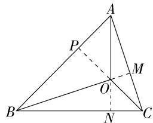

text_image

Geometric diagram of triangle ABC with internal points P, M, N, O and auxiliary lines, labeled for mathematical analysis.

因为 O 是 $\triangle ABC$ 的垂心, 所以 $CP \perp AB, BM \perp AC, AN \perp BC, \angle BOP = \angle BAC, \angle AOP = \angle ABC, \angle AOM = \angle ACB,$

因此， $\frac{S_{\triangle BOC}}{S_{\triangle AOC}} = \frac{BP}{AP} = \frac{OP\tan\angle BOP}{OP\tan\angle AOP} = \frac{\tan\angle BAC}{\tan\angle ABC},$

同理可得, $\frac{S_{\triangle BOC}}{S_{\triangle AOB}}=\frac{\tan\angle BAC}{\tan\angle ACB}$ ,

所以 $\tan\angle BAC:\tan\angle ABC:\tan\angle ACB=S_{\triangle BOC}:S_{\triangle AOC}$ $: S_{\triangle AOB}$ ,

由 $\overrightarrow{OA} + 2\overrightarrow{OB} + 3\overrightarrow{OC} = 0$ 及奔驰定理可得 $S_{\triangle BOC}:S_{\triangle AOC}:S_{\triangle AOB} = 1:2:3,$

所以 $\tan \angle BAC:\tan \angle ABC:\tan \angle ACB = 1:2:3.$

故选 A.

# 目一题多解

若 $O$ 为锐角 $\triangle ABC$ 的垂心, 则 $\tan A \cdot \overrightarrow{OA} + \tan B \cdot \overrightarrow{OB} + \tan C \cdot \overrightarrow{OC} = 0$ , 再结合题目已知条件 $\overrightarrow{OA} + 2\overrightarrow{OB} + 3\overrightarrow{OC} = 0$ , 可推出 $\tan \angle BAC: \tan \angle ABC: \tan \angle ACB = 1:2:3$ .

3.ACD 对于 A, ∵ 2 $\overrightarrow{OA}$ +3 $\overrightarrow{OB}$ +4 $\overrightarrow{OC}$ =0,

$\therefore 2 \overrightarrow{AO} = 3 \overrightarrow{OA} + 3 \overrightarrow{AB} + 4 \overrightarrow{OA} + 4 \overrightarrow{AC},$

$\therefore \overrightarrow{AO}=\frac{1}{3}\overrightarrow{AB}+\frac{4}{9}\overrightarrow{AC}$ ，故 A 正确；

对于 B, 若直线 AO 过 BC 边的中点 D, 则 $\overrightarrow{AO} = \lambda \overrightarrow{AD} =$

$\lambda\times\frac{1}{2}(\overrightarrow{AB}+\overrightarrow{AC})(\lambda\in\mathbf{R})$ ，与A矛盾，故B错误；

对于 C, 由奔驰定理得 $S_{\triangle BOC} \times \overrightarrow{OA} + S_{\triangle AOC} \times \overrightarrow{OB} + S_{\triangle AOB} \times \overrightarrow{OC} = 0, \therefore S_{\triangle BOC}: S_{\triangle AOC}: S_{\triangle AOB} = 2:3:4, \therefore S_{\triangle AOB}: S_{\triangle BOC} = 2:1$ , 故 C 正确;

对于 D, ∵ 2 $\overrightarrow{OA} + 3 \overrightarrow{OB} + 4 \overrightarrow{OC} = 0$ , ∴ 2 $\overrightarrow{OA} + 3 \overrightarrow{OB} = -4 \overrightarrow{OC}$ ,

∴ $4|\overrightarrow{OA}|^{2}+12\overrightarrow{OA}\cdot\overrightarrow{OB}+9|\overrightarrow{OB}|^{2}=16|\overrightarrow{OC}|^{2},\therefore\overrightarrow{OA}\cdot\overrightarrow{OB}=\frac{1}{4}$ ，故 $\overrightarrow{OC}\cdot\overrightarrow{AB}=\left(-\frac{1}{2}\overrightarrow{OA}-\frac{3}{4}\overrightarrow{OB}\right)\cdot(\overrightarrow{OB}-\overrightarrow{OA})=\frac{1}{2}\overrightarrow{OA}^{2}-\frac{3}{4}\overrightarrow{OB}^{2}+\frac{1}{4}\overrightarrow{OA}\cdot\overrightarrow{OB}=\frac{1}{2}-\frac{3}{4}+\frac{1}{4}\times\frac{1}{4}=-\frac{3}{16}$ ，故 D 正确。故选 ACD.

4.ABD 设 BC, AC, AB 的中点分别为 D, E, F, 连接 OD, OE, OF.

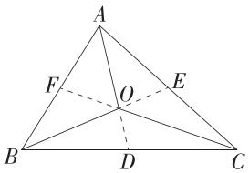

text_image

A
F
O
E
B
D
C

对于 A, $\overrightarrow{OB} + \overrightarrow{OC} = 2\overrightarrow{OD}$ , 则 $\overrightarrow{OA} + 2\overrightarrow{OD} = 0$ , 所以 $\overrightarrow{OA} = -2\overrightarrow{OD}$ , 所以 A, O, D 三点共线, 即点 O 在中线 AD 上, 同理可得点 O 在中线 BE, CF 上, 所以点 O 是 $\triangle ABC$ 的重心, 故 A 正确;

对于 B, 若 $\left|\overrightarrow{OA}\right|=\left|\overrightarrow{OB}\right|=\left|\overrightarrow{OC}\right|$ , 则点 O 为 $\triangle ABC$ 的外心, 故 B 正确;

对于 C, $(\overrightarrow{OA}+\overrightarrow{OB})\cdot\overrightarrow{AB}=0$ ,则 $2\overrightarrow{OF}\cdot\overrightarrow{AB}=0$ ,所以直线 OF 为线段 AB 的垂直平分线,同理可得直线 OE,OD 分别为线段 AC,BC 的垂直平分线,所以 O 为 $\triangle ABC$ 三边垂直平分线的交点,所以点 O 为 $\triangle ABC$ 的外心,故 C 错误;

对于 D, 由已知可得 $\overrightarrow{OA} \cdot \overrightarrow{OB} - \overrightarrow{OB} \cdot \overrightarrow{OC} = \overrightarrow{OB} \cdot (\overrightarrow{OA} - \overrightarrow{OC}) = \overrightarrow{OB} \cdot \overrightarrow{CA} = 0$ , 即 $OB \perp CA$ ,

所以点 O 在 AC 边上的高线所在直线上, 同理可得 O 在 AB 边上的高线所在直线上, O 在 BC 边上的高线所在直线上, 所以点 O 是 $\triangle ABC$ 的垂心, 故 D 正确. 故选 ABD.

5. BCD 对于 A, 由 $S_{A} \cdot \overrightarrow{MA} + S_{B} \cdot \overrightarrow{MB} + S_{C} \cdot \overrightarrow{MC} = 0$ , $3 \overrightarrow{MA} + 4 \overrightarrow{MB} + 5 \overrightarrow{MC} = 0$ , 可得 $S_{A} : S_{B} : S_{C} = 3 : 4 : 5$ , 故 A 错误;

对于 B, 由 $S_A: S_B: S_C = 1:1:1$ 可得 $\overrightarrow{MA} + \overrightarrow{MB} + \overrightarrow{MC} = \mathbf{0}$ ①, 如图, 取 BC 的中点 D, 连接 MD, 则有 $\overrightarrow{MB} + \overrightarrow{MC} = 2\overrightarrow{MD}$ , 代入①式, 得 $\overrightarrow{MA} = -2\overrightarrow{MD}$ , 即 A, M, D 三点共线, 且点 M 是 AD 上靠近点 D 的三等分点, 同理可知点 M 也是另两边上的中线的三等分点(靠近各边中点),所以点 M 是 $\triangle ABC$ 的重心,故 B 正确;

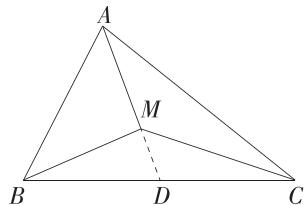

text_image

A
M
B
D
C

对于 C, 设 $\triangle ABC$ 的内切圆半径为 r, 则 $S_{A} = \frac{1}{2} BC \cdot r$ , $S_{B} = \frac{1}{2} AC \cdot r$ , $S_{C} = \frac{1}{2} AB \cdot r$ , 代入 $S_{A} \cdot \overrightarrow{MA} + S_{B} \cdot \overrightarrow{MB} + S_{C} \cdot \overrightarrow{MC} = 0$ , 可得 $\frac{1}{2} BC \cdot r \cdot \overrightarrow{MA} + \frac{1}{2} AC \cdot r \cdot \overrightarrow{MB} + \frac{1}{2} AB \cdot r \cdot \overrightarrow{MC} = 0$ , 整理得 $BC \cdot \overrightarrow{MA} + AC \cdot \overrightarrow{MB} + AB \cdot \overrightarrow{MC} = 0$ , 故 C 正确;

对于 D, 设 $\triangle ABC$ 的外接圆半径为 R, 因为 M 为 $\triangle ABC$ 的外心,

所以 $\angle BMC = 2\angle BAC = 90^{\circ},\angle AMC = 2\angle ABC = 120^{\circ},$ $\angle AMB = 360^{\circ} - 120^{\circ} - 90^{\circ} = 150^{\circ},$

则 $S_{A} = \frac{1}{2} R^{2}\sin 90^{\circ} = \frac{1}{2} R^{2}, S_{B} = \frac{1}{2} R^{2}\sin 120^{\circ} = \frac{\sqrt{3}}{4} R^{2},$ $S_{C} = \frac{1}{2} R^{2}\sin 150^{\circ} = \frac{1}{4} R^{2}.$

故 $S_{A}:S_{B}:S_{C}=\frac{1}{2}:\frac{\sqrt{3}}{4}:\frac{1}{4}=2:\sqrt{3}:1$ , 故 D 正确.
故选 BCD.

# 目方法技巧

三角形四心的向量统一形式

已知 $\triangle ABC$ 的三个内角 $A, B, C$ 所对的边分别为 $a, b, c, X$ 是 $\triangle ABC$ 内一点，且 $m\overrightarrow{XA} + n\overrightarrow{XB} + p\overrightarrow{XC} = 0$ .

若 X 为 $\triangle ABC$ 的重心, 则 m:n:p=1:1:1;
若 X 为 $\triangle ABC$ 的内心, 则 m:n:p=a:b:c;
若 X 为 $\triangle ABC$ 的外心, 则 m:n:p=sin 2A : sin 2B : sin 2C ;

若 X 为 $\triangle ABC$ 的垂心, 则 m : n : p = tan A : tan B : tan C.

6. 答案 5:6

解析 由题意得 $\overrightarrow{AP}=\frac{2}{5}(\overrightarrow{PB}-\overrightarrow{PA})+\frac{1}{3}(\overrightarrow{PC}-\overrightarrow{PA})$ ，整理得 $\frac{4}{15}\overrightarrow{PA}+\frac{2}{5}\overrightarrow{PB}+\frac{1}{3}\overrightarrow{PC}=0$ ，由奔驰定理得 $\frac{S_{\triangle ABP}}{S_{\triangle ACP}}=\frac{\frac{1}{3}}{\frac{2}{5}}=\frac{5}{6}$ .故答案为5:6.

# 一题多解

如图, 延长 AP 交 BC 于点 D,

设 $\overrightarrow{AD} = \lambda \overrightarrow{AP} (\lambda \in \mathbf{R})$ ，则 $\overrightarrow{AD} = \frac{2\lambda}{5}\overrightarrow{AB} +\frac{\lambda}{3}\overrightarrow{AC},$

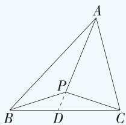

text_image

A
P
B D C

因为 B, C, D 三点共线, 所以 $\frac{2\lambda}{5} + \frac{\lambda}{3} = 1$ , 解得 $\lambda = \frac{15}{11}$ , 所以 $\overrightarrow{AP} = \frac{11}{15}\overrightarrow{AD}, \overrightarrow{AD} = \frac{6}{11}\overrightarrow{AB} + \frac{5}{11}\overrightarrow{AC}$ ,

则 $S_{\triangle ABP} = \frac{11}{15} S_{\triangle ABD}, S_{\triangle ACP} = \frac{11}{15} S_{\triangle ACD}$ , 由 $\overrightarrow{AD} = \frac{6}{11}\overrightarrow{AB} + \frac{5}{11}\overrightarrow{AC}$ , 得 $\frac{6}{11} (\overrightarrow{AD} - \overrightarrow{AB}) = \frac{5}{11} (\overrightarrow{AC} - \overrightarrow{AD})$ , 即 $\frac{6}{11}\overrightarrow{BD} = \frac{5}{11}\overrightarrow{DC}$ , 所以 $\frac{BD}{CD} = \frac{5}{6}$ , 所以 $\frac{S_{\triangle ABD}}{S_{\triangle ACD}} = \frac{5}{6}$ , 所以 $\frac{S_{\triangle ABP}}{S_{\triangle ACP}} = \frac{\frac{11}{15}S_{\triangle ABD}}{\frac{11}{15}S_{\triangle ACD}} = \frac{5}{6}$ .

故答案为 5:6.

# 7. 答案 $60^{\circ}$

解析 $\because G$ 是 $\triangle ABC$ 的重心, $\therefore \overrightarrow{GA} + \overrightarrow{GB} + \overrightarrow{GC} = 0$ , 即 $\overrightarrow{GA} = -(\overrightarrow{GB} + \overrightarrow{GC})$ , 将其代入 $\sin A \cdot \overrightarrow{GA} + \sin B \cdot \overrightarrow{GB} + \sin C \cdot \overrightarrow{GC} = 0$ , 得 $(\sin B - \sin A) \overrightarrow{GB} + (\sin C - \sin A) \cdot \overrightarrow{GC} = 0$ , 又 $\overrightarrow{GB}, \overrightarrow{GC}$ 不共线, $\therefore \sin B - \sin A = 0, \sin C - \sin A = 0, \therefore \sin B = \sin A = \sin C$ . 结合正弦定理得 $b = a = c, \therefore \triangle ABC$ 是等边三角形, 故 $B = 60^\circ$ .

# 目一题多解

∵ G 为 $\triangle ABC$ 的重心, ∴ $\overrightarrow{GA} + \overrightarrow{GB} + \overrightarrow{GC} = 0$ ,

又∵ $\sin A \cdot \overrightarrow{GA} + \sin B \cdot \overrightarrow{GB} + \sin C \cdot \overrightarrow{GC} = 0$ ,

$\therefore \sin A = \sin B = \sin C, \therefore \triangle ABC$ 是等边三角形, 故 $B = 60^{\circ}$ .

# 8. 答案 2,2

解析 由题意得 $EF \parallel BC$ ,

故点 P 到 BC 的距离等于 $\triangle ABC$ 的边 BC 上的高的 $\frac{1}{5}$ ,

则 $S_{1} = \frac{1}{5} S$ ，所以 $S_{2} + S_{3} = \frac{4}{5} S, \lambda_{2} + \lambda_{3} = \frac{4}{5}$

则 $\lambda_{2}\lambda_{3}\leqslant\left(\frac{\lambda_{2}+\lambda_{3}}{2}\right)^{2}=\frac{4}{25}$ ，当且仅当 $\lambda_{2}=\lambda_{3}=\frac{2}{5}$ 时取等号，此时 P 为 EF 的中点，

延长 $AP$ 交 $BC$ 于点 $D$ , 则 $D$ 为 $BC$ 的中点,

则 $\overrightarrow{AP} = 4\overrightarrow{PD} = 2(\overrightarrow{PB} +\overrightarrow{PC}) = 2\overrightarrow{PB} +2\overrightarrow{PC},$

所以 $\overrightarrow{PA}+2\overrightarrow{PB}+2\overrightarrow{PC}=\mathbf{0}$ ，又 $\overrightarrow{PA}+x\overrightarrow{PB}+y\overrightarrow{PC}=\mathbf{0}$ ，
所以 x=y=2，

故当 $\lambda_{2}\lambda_{3}$ 取得最大值时, x, y 的值分别为 2, 2.

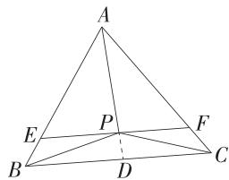

text_image

A
E
P
F
B
D
C

# 本章复习提升

# 易混易错练

Q 对应主书 P35

1.AD 2.ACD 4.C 5.C

1. AD 由题意知 $|\boldsymbol{a}| = \sqrt{1^2 + 1^2} = \sqrt{2}$ , $|\boldsymbol{b}| = \sqrt{(-3)^2 + 4^2} = 5, \boldsymbol{a} \cdot \boldsymbol{b} = 1 \times (-3) + 1 \times 4 = 1$ .

对于 A, $\cos\langle a,b\rangle=\frac{a\cdot b}{|a|\cdot|b|}=\frac{1}{\sqrt{2}\times5}=\frac{\sqrt{2}}{10}$ ，故 A 正确；

对于 B, b 在 a 上的投影向量为 $\frac{a \cdot b}{|a|} \cdot \frac{a}{|a|} = \frac{a \cdot b}{|a|^{2}} \cdot a = \frac{1}{2} a$ ，故 B 错误；

对于 C, 设与 b 垂直的单位向量的坐标为 $(x_{0}, y_{0})$ ,

可得 $\left\{\begin{aligned}x_{0}^{2}+y_{0}^{2}=1,\\ -3x_{0}+4y_{0}=0,\end{aligned}\right.$ 解得 $\left\{\begin{aligned}x_{0}&=\frac{4}{5},\\ y_{0}&=\frac{3}{5}\end{aligned}\right.$ 或 $\left\{\begin{aligned}x_{0}&=-\frac{4}{5},\\ y_{0}&=-\frac{3}{5},\end{aligned}\right.$

所以与 b 垂直的单位向量的坐标为 $\left(\frac{4}{5}, \frac{3}{5}\right)$ 或 $\left(-\frac{4}{5}, -\frac{3}{5}\right)$ ，故 C 错误；

对于 D, 因为向量 $a + \lambda b$ 与 $a - \lambda b$ 共线,

所以存在 $t \in R$ ，使得 $\boldsymbol{a} + \lambda \boldsymbol{b} = t (\boldsymbol{a} - \lambda \boldsymbol{b}) = t \boldsymbol{a} - \lambda t \boldsymbol{b}$ ，则 $\left\{\begin{aligned}&t=1,\\ &\lambda=-\lambda t,\end{aligned}\right.$ 解得 $\left\{\begin{aligned}&t=1,\\ &\lambda=0,\end{aligned}\right.$ 故 D 正确.

故选 AD.

2.ACD 对于 A, 若 $a \parallel b$ , 则 $\sqrt{2}\sin\theta = 2\cos\theta$ ,

可得 $\tan\theta=\sqrt{2}$ ，故A正确；

对于 B, 若 a, b 的夹角为钝角, 则 $\left\{\begin{aligned}m-6&<0,\\ 3m&\neq-2\end{aligned}\right.$ 易错点, 解得 m<6 且 $m\neq-\frac{2}{3}$ , 故 B 错误;

对于 C, 若 $\left|a+b\right|=\left|a\right|+\left|b\right|$ ，且 a, b 为非零向量，则由向量加法的三角形法则可知 a, b 同向，即 a 与 b 同向共线，故 C 正确；

对于 D, 若 $\overrightarrow{OA} + 3\overrightarrow{OB} + 4\overrightarrow{OC} = 0$ , 则 $(\overrightarrow{OA} + \overrightarrow{OC}) + 3(\overrightarrow{OB} + \overrightarrow{OC}) = 0$ , 可得 $2\overrightarrow{OD} + 6\overrightarrow{OE} = 0$ (D, E 分别为 AC, BC 的中点), 即 $\overrightarrow{OD} = -3 \overrightarrow{OE}$ , 故点 O 在线段 DE 上, 且 $OD = \frac{3}{4} DE$ ,

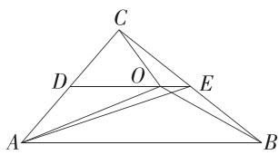

text_image

C
D O E
A B

则 $S_{\triangle ABC}=2S_{\triangle ACE}=2\times\frac{4}{3}S_{\triangle AOC}=\frac{8}{3}S_{\triangle AOC}$ ，即 $\frac{S_{\triangle AOC}}{S_{\triangle ABC}}=\frac{3}{8}$ ，
所以 $\triangle AOC$ 和 $\triangle ABC$ 的面积之比为 3:8，故 D 正确.
故选 ACD.

# 目 选项速解

对于 D, 由 $\overrightarrow{OA} + 3 \overrightarrow{OB} + 4 \overrightarrow{OC} = 0$ 及奔驰定理得 $S_{\triangle BOC} : S_{\triangle AOC} : S_{\triangle AOB} = 1 : 3 : 4$ , 所以 $S_{\triangle AOC} : S_{\triangle ABC} = 3 : 8$ .

3. 答案 $\frac{1}{3};\left(-\frac{5}{3},\frac{1}{3}\right)\cup\left(\frac{1}{3},+\infty\right)$

解析 因为 $|a| = |b| = 1, (a + 2b) \cdot (a - b) = -\frac{2}{3}$ ,

所以 $a^{2}+a\cdot b-2b^{2}=-\frac{2}{3}$ ，即 $1+a\cdot b-2=-\frac{2}{3}$ ，则 $a\cdot b=\frac{1}{3}$ ，则 $\cos\langle a,b\rangle=\frac{a\cdot b}{|a||b|}=\frac{1}{3}$ ，即 a 与 b 夹角的余弦值为 $\frac{1}{3}$ .

若 $ka+b$ 与 $a+3b$ 的夹角为锐角，则 $(ka+b)\cdot(a+3b)>0$ 且 $ka+b$ 与 $a+3b$ 不共线易错点，

当 $ka + b$ 与 $a + 3b$ 共线时，有 $ka + b = \lambda (a + 3b)(\lambda \in \mathbf{R})$ ，即 $ka + b = \lambda a + 3\lambda b (\lambda \in \mathbf{R})$ ，

易知 a 与 b 不共线, 所以 $\left\{\begin{aligned} k &= \lambda, \\ 1 &= 3\lambda, \end{aligned}\right.$ 解得 $k = \frac{1}{3}$ ,

所以当 $k\pmb {a} + \pmb{b}$ 与 $\pmb {a} + 3\pmb{b}$ 不共线时， $k\neq \frac{1}{3},$

由 $(k\boldsymbol{a}+\boldsymbol{b})\cdot(\boldsymbol{a}+3\boldsymbol{b})>0$ ，得 $k\boldsymbol{a}^{2}+(3k+1)\boldsymbol{a}\cdot\boldsymbol{b}+3\boldsymbol{b}^{2}>0$ 即 $k+(3k+1)\times\frac{1}{3}+3>0$ ，解得 $k > -\frac{5}{3}$ ,

所以 $k > -\frac{5}{3}$ 且 $k \neq \frac{1}{3}$ , 即实数 $k$ 的取值范围为 $\left(-\frac{5}{3}, \frac{1}{3}\right) \cup \left(\frac{1}{3}, +\infty\right)$ .

# 易错警示

若向量 a 与 b 的夹角为锐角, 则 $a \cdot b > 0$ , 但 $a \cdot b > 0$ 时, a 与 b 的夹角为锐角或零角. 同理, 若向量 a 与 b 的夹角为钝角, 则 $a \cdot b < 0$ , 但 $a \cdot b < 0$ 时, a 与 b 的夹角为钝角或平角. 已知两向量夹角为锐角(或钝角)求参数时, 要排除向量共线的情况.

4.C 对于 A, 由 $a \parallel b$ , 得 $\sin \alpha = \sqrt{3} \cos \alpha$ 易错点, 因此 $\tan \alpha = \sqrt{3}$ , A 中结论正确;

对于 B, 由 $a \perp b$ , 得 $\cos \alpha + \sqrt{3} \sin \alpha = 0$ 易错点, 因此 $\tan \alpha = -\frac{\sqrt{3}}{3}$ , B 中结论正确;

对于 C, 因为 a 与 b 的夹角为 $\frac{\pi}{3}$ , $\left|a\right|=\sqrt{1^{2}+\left(\sqrt{3}\right)^{2}}=2$ , $\left|b\right|=\sqrt{\cos^{2}\alpha+\sin^{2}\alpha}=1$ , 所以 $a\cdot b=2\times1\times\frac{1}{2}=1$ ,

因此 $|a-b|=\sqrt{a^{2}+b^{2}-2a\cdot b}=\sqrt{3}$ ，C中结论错误；

对于 D, 因为 a 与 b 方向相反, 所以 a 与 b 的夹角为 $\pi$ , 所以 $a \cdot b = 2 \times 1 \times (-1) = -2$ , 则 b 在 a 上的投影向量为 $\frac{a \cdot b}{|a|} \cdot \frac{a}{|a|} = -\frac{1}{2} a = \left(-\frac{1}{2}, -\frac{\sqrt{3}}{2}\right)$ , D 中结论正确.

故选 C.

# 易错警示

已知非零向量 $\boldsymbol{a}=(x_{1},y_{1}),\boldsymbol{b}=(x_{2},y_{2})$ ，若 $a \parallel b$ ，则 $x_{1}y_{2}-x_{2}y_{1}=0$ ，若 $a \perp b$ ，则 $x_{1}x_{2}+y_{1}y_{2}=0$ 。两个坐标表示形式相似，容易混淆，可分别用口诀记忆：纵横交错积相等，横横纵纵积相反。

5.C 因为 $c=b\tan C$ ，所以由正弦定理得 $\sin C=\sin B\cdot\frac{\sin C}{\cos C}$ ，易知 $\sin C\neq0$ ，所以 $\sin B=\cos C$ ，

又因为 $\triangle ABC$ 为钝角三角形，

所以 $B=\frac{\pi}{2}+C$ ，即 B 为钝角，

所以 $\sin A - 3\cos C = \sin (B + C) - 3\cos C$

$$
= \sin \left(\frac {\pi}{2} + C + C\right) - 3 \cos C = \cos 2 C - 3 \cos C
$$

$$
= 2 \cos^ {2} C - 3 \cos C - 1 = 2 \left(\cos C - \frac {3}{4}\right) ^ {2} - \frac {1 7}{8},
$$

由 $\left\{\begin{aligned}0&C<C<\frac{\pi}{2},\\ 0&C=A=\pi-\left(C+\frac{\pi}{2}+C\right)<\frac{\pi}{2}\end{aligned}\right.$ 易错点

解得 $0 < C < \frac{\pi}{4}$ , 则 $\frac{\sqrt{2}}{2} < \cos C < 1$ ,

故当 $\cos C=\frac{3}{4}$ 时， $2\left(\cos C-\frac{3}{4}\right)^{2}-\frac{17}{8}$ 取得最小值 $-\frac{17}{8}$ ，
即 $\sin A-3\cos C$ 的最小值为 $-\frac{17}{8}$ ，故选 C.

6. 答案 $(4\sqrt{3}, 6\sqrt{3}]$

解析 由正弦定理得 $\frac{b}{\sin B} = \frac{c}{\sin C} = \frac{a}{\sin A} = \frac{2\sqrt{3}}{\sin \frac{\pi}{3}} = 4,$

$$
\therefore b = 4 \sin B, c = 4 \sin C,
$$

由 $A + B + C = \pi, A = \frac{\pi}{3}$ 得 $B + C = \frac{2\pi}{3}$ ,

故 $C = \frac{2\pi}{3} - B$ ，且 $0 <   B <   \frac{2\pi}{3}$ 易错点

$$
\begin{array}{l} \therefore b + c = 4 (\sin B + \sin C) = 4 \left[ \sin B + \sin \left(\frac {2 \pi}{3} - B\right) \right] = \\ 4 \left(\sin B + \frac {\sqrt {3}}{2} \cos B + \frac {1}{2} \sin B\right) = 4 \left(\frac {3}{2} \sin B + \frac {\sqrt {3}}{2} \cos B\right) = \\ 4 \sqrt {3} \left(\frac {\sqrt {3}}{2} \sin B + \frac {1}{2} \cos B\right) = 4 \sqrt {3} \sin \left(B + \frac {\pi}{6}\right), \\ \end{array}
$$

$$
\because 0 <   B <   \frac {2 \pi}{3}, \therefore \frac {\pi}{6} <   B + \frac {\pi}{6} <   \frac {5 \pi}{6},
$$

$$
\therefore \frac {1}{2} <   \sin \left(B + \frac {\pi}{6}\right) \leqslant 1, \therefore 2 \sqrt {3} <   4 \sqrt {3} \sin \left(B + \frac {\pi}{6}\right) \leqslant 4 \sqrt {3},
$$

∴ $\triangle ABC$ 周长的取值范围为 $(4\sqrt{3}, 6\sqrt{3}]$ .

# 易错警示

在三角形中隐含着一些角的范围,三角形内角和为 $\pi$ , 若已知一个角的大小, 则另外两个角的范围不能是 $(0, \pi)$ , 如 $A = \frac{\pi}{3}$ , 则 $B \in \left(0, \frac{2\pi}{3}\right)$ , 特别是在求值域问题时会用到.

7. 解析 (1) 由题意, 结合正弦定理得 $\frac{\sqrt{7}}{\sin A} = \frac{3}{\sin B}$ , $\therefore \sqrt{7} \sin B = 3 \sin A$ ,

根据 $\sqrt{7}\sin B + \sin A = 2\sqrt{3}$ ，得 $\sin A = \frac{\sqrt{3}}{2}$

∵ $\triangle ABC$ 为锐角三角形, ∴ $A \in \left(0, \frac{\pi}{2}\right)$ , ∴ $A = \frac{\pi}{3}$ .

(2)由题意,结合余弦定理得 $a^{2}=c^{2}+9-6c\cdot\cos\frac{\pi}{3}=$ 7, 解得 c=1 或 c=2. 当 c=1 时, $\cos B=\frac{a^{2}+c^{2}-b^{2}}{2ac}=$ $-\frac{\sqrt{7}}{14}<0$ , 故 B 为钝角, 这与 $\triangle ABC$ 为锐角三角形矛盾, 故不满足条件.

当 c=2 时, 满足题意, 此时 $\triangle ABC$ 的面积为 $\frac{1}{2}bc \cdot \sin A=\frac{1}{2}\times3\times2\times\frac{\sqrt{3}}{2}=\frac{3\sqrt{3}}{2}.$

# 易错警示

在解三角形时,若三角形有两解,则要根据题中条件进行检验,否则可能会产生增根,如本题中求出 c 有 2 个值后进行检验,舍去 c=1 的情形.

# 思想方法练

Q 对应主书 P36

<table><tr><td>1.D</td><td>3.B</td><td>5.A</td><td></td><td></td><td></td><td></td><td></td></tr></table>

1.D 由余弦定理的推论得 $a - c \times \frac{a^2 + c^2 - b^2}{2ac} = b - c \times$

$\frac{b^{2}+c^{2}-a^{2}}{2bc}$ ，化简得 $\frac{a^{2}+b^{2}-c^{2}}{a}=\frac{a^{2}+b^{2}-c^{2}}{b}$

即 $(a^2 + b^2 - c^2)\left(\frac{1}{a} - \frac{1}{b}\right) = 0.$

两个因式的乘积等于0,故分情况讨论.

当 $a^{2}+b^{2}-c^{2}=0$ 时， $a^{2}+b^{2}=c^{2}$ ，则 $\triangle ABC$ 为直角三角形；

当 $a^2 + b^2 - c^2 \neq 0$ 时, $a = b$ , 则 $\triangle ABC$ 为等腰三角形.

综上, $\triangle ABC$ 为等腰或直角三角形,故D正确.

故选 D.

2. 答案 $\sqrt{3} + 1$ 或 $\sqrt{3} - 1$

解析 $\because \frac{a}{\sin A} = \frac{c}{\sin C}, c = \sqrt{6}, A = 45^{\circ}, a = 2,$

$$
\therefore \sin C = \frac {c \sin A}{a} = \frac {\sqrt {6} \sin 4 5 ^ {\circ}}{2} = \frac {\sqrt {3}}{2},
$$

∴ $C=60^{\circ}$ 或 $C=120^{\circ}$ .

角 C 有两个解,需分类讨论.

当 $C=60^{\circ}$ 时, $B=75^{\circ}$ ,

则 $b = \frac{c\sin B}{\sin C} = \frac{\sqrt{6}\sin 75^{\circ}}{\sin 60^{\circ}} = \sqrt{3} +1;$

当 $C=120^{\circ}$ 时, $B=15^{\circ}$ ,

则 $b = \frac{c\sin B}{\sin C} = \frac{\sqrt{6}\sin 15^{\circ}}{\sin 120^{\circ}} = \sqrt{3} - 1.$

# 思想方法

在应用正、余弦定理解三角形时,会根据题中信息进行分类讨论,特别是在已知三角形两边及一边的对角解三角形时,需要注意解的个数,若有两个解,则需分类讨论.

3. B 由 $\overrightarrow{AM} = 3\overrightarrow{MB}$ 得 $\overrightarrow{AM} = \frac{3}{4}\overrightarrow{AB}$ , 由 $\overrightarrow{AN} = \overrightarrow{NC}$ 得 $\overrightarrow{AN} = \frac{1}{2}\overrightarrow{AC}$ ,

由 C, P, M 三点共线, 可得 $\overrightarrow{AP} = \lambda \overrightarrow{AC} + (1 - \lambda) \overrightarrow{AM} (\lambda \in \mathbf{R})$ , 即 $\overrightarrow{AP} = \lambda \overrightarrow{AC} + \frac{3(1 - \lambda)}{4} \overrightarrow{AB}$ ,

由 N, P, B 三点共线，可得 $\overrightarrow{AP} = \mu \overrightarrow{AN} + (1 - \mu) \overrightarrow{AB} (\mu \in \mathbf{R})$ ，即 $\overrightarrow{AP} = \frac{\mu}{2} \overrightarrow{AC} + (1 - \mu) \overrightarrow{AB}$ ,

故 $\left\{\begin{aligned}\lambda&=\frac{\mu}{2},\\ \frac{3(1-\lambda)}{4}&=1-\mu,\end{aligned}\right.$ 解得 $\left\{\begin{aligned}\lambda&=\frac{1}{5},\\ \mu&=\frac{2}{5},\end{aligned}\right.$

根据平面向量基本定理的唯一性建立方程组.

故 $\overrightarrow{AP}=\frac{3}{5}a+\frac{1}{5}b.$ 故选 B.

4. 解析 (1) 过 $C$ 作 $CH \perp AB$ 于 $H$ , 易知 $HB = AB - CD = 1$ , 又 $\angle CBA = 45^{\circ}$ , 所以 $HC = 1$ ,

以 A 为坐标原点, 建立平面直角坐标系, 如图所示:

text_image

y
D	C
A	H	B x

则 $A(0,0)$ , $B(3,0)$ , $D(0,1)$ , $C(2,1)$ ，则 $\overrightarrow{AC} = (2,1)$ , $\overrightarrow{BD}=(-3,1)$ ,

故 $\overrightarrow{AC}\cdot\overrightarrow{BD}=2\times(-3)+1\times1=-5.$

(2)由(1)可知 $\overrightarrow{AB}=(3,0),\overrightarrow{AD}=(0,1),\overrightarrow{AC}=(2,1)$ ,
故 $k \overrightarrow{AB}-\overrightarrow{AD}=(3k,0)-(0,1)=(3k,-1)$ ,

若 $k\overrightarrow{AB} -\overrightarrow{AD}$ 与 $\overrightarrow{AC}$ 共线，则 $3k\times 1 = -2$

根据向量共线列关于 k 的方程, 解方程求值.

解得 $k=-\frac{2}{3}$ .

(3) 设 $\overrightarrow{CP} = \lambda \overrightarrow{CB}, \lambda \in (0,1)$ ，则 $\overrightarrow{CP} = \lambda \overrightarrow{CB} = (\lambda, -\lambda)$ ，易知 $P(\lambda + 2, 1 - \lambda)$ ，

则 $\overrightarrow{PA} = (-\lambda -2,\lambda -1),\overrightarrow{PB} = (1 - \lambda ,\lambda -1),\overrightarrow{PC} = (-\lambda ,\lambda)$

则 $\left(\overrightarrow{PA}+\overrightarrow{PB}\right)\cdot\overrightarrow{PC}=(-2\lambda-1,2\lambda-2)\cdot(-\lambda,\lambda)=2\lambda^{2}+\lambda+2\lambda^{2}-2\lambda=4\lambda^{2}-\lambda$

通过坐标运算, 将 $(\overrightarrow{PA} + \overrightarrow{PB}) \cdot \overrightarrow{PC}$ 表示成关于 $\lambda$ 的二次函数, 利用函数的性质求得最值.

对于 $y=4\lambda^{2}-\lambda,\lambda\in(0,1)$ ，其图象的对称轴为直线 $\lambda=\frac{1}{8}$ ，故其最小值为 $4\times\left(\frac{1}{8}\right)^{2}-\frac{1}{8}=-\frac{1}{16}$ ，

故 $(\overrightarrow{PA}+\overrightarrow{PB})\cdot\overrightarrow{PC}$ 的最小值为 $-\frac{1}{16}$ .

# 思想方法

一般运用方程思想解决平面向量中的线性运算问题,解题的关键在于设置变量,然后利用已知条件或公式、定理构造方程(组)求解.

一般运用函数思想解决平面向量中的最值问题,解题的关键在于设置变量,然后将所求用变量表示出来,构造关于变量的函数,函数一般为二次函数、反比例函数等.在利用函数性质求解最值时,要注意变量的取值范围.

5.A 根据直角三角形的特点,建立平面直角坐标系,利用数量积的坐标运算求最值,可以化繁为简.

以 A 为坐标原点, $\overrightarrow{AC}, \overrightarrow{AB}$ 的方向分别为 x 轴, y 轴的正方向建立平面直角坐标系,

text_image

y
B
D
P
A
C
x

所以 $A(0,0),B(0,2),C(4,0)$

因为 D 为 BC 的中点, 所以 $D(2,1)$ ,

则 $\overrightarrow{AD} = (2,1)$ ，设 $\overrightarrow{AP} = \lambda \overrightarrow{AD} (0\leqslant \lambda \leqslant 1)$

所以 $\overrightarrow{AP} = \lambda (2,1) = (2\lambda ,\lambda)$ ，则 $P(2\lambda ,\lambda)$

可得 $\overrightarrow{PB}=(0,2)-(2\lambda,\lambda)=(-2\lambda,2-\lambda),\overrightarrow{PC}=(4,0)-(2\lambda,\lambda)=(4-2\lambda,-\lambda)$ ,

所以 $\overrightarrow{PB} \cdot \overrightarrow{PC} = -10\lambda + 5\lambda^2 = 5(\lambda - 1)^2 - 5$

因为 $0 \leqslant \lambda \leqslant 1$ ，所以 $\overrightarrow{PB} \cdot \overrightarrow{PC} = 5(\lambda - 1)^2 - 5 \in [-5, 0]$ .

故选 A.

6. 答案 12

解析 根据向量的几何表示和向量的减法作出图形，再由几何图形特征求解,可以化难为易.

如图, 设 $\overrightarrow{OA} = a, \overrightarrow{OB} = b, \overrightarrow{OC} = c$ , 则 $\overrightarrow{BA} = a - b, \overrightarrow{CA} = a - c$ ,
由 $|a|=|a-b|=2, |a-c|=1$ ，得点 B 在以 A 为圆心，2 为半径的圆上，点 C 在以 A 为圆心，1 为半径的圆上，

text_image

O
A
B
C'
B'
C

$b \cdot c = |\overrightarrow{OB}| |\overrightarrow{OC}| \cos \langle \overrightarrow{OB}, \overrightarrow{OC} \rangle$ ，由图可知，当 A, B, C 三点共线 (B, C 的位置如图中的 $B', C'$ ) 时， $|\overrightarrow{OB}|$ 取最大值 4， $|\overrightarrow{OC}|$ 取最大值 3， $\cos \langle \overrightarrow{OB}, \overrightarrow{OC} \rangle$ 取最大值 1，所以 $b \cdot c$ 的最大值为 12.

7. 答案 $\frac{7}{2} - \sqrt{3}$

解析 根据向量的几何表示画出 a, b, c，由题意结合图形特征求解.

如图, 令 $\overrightarrow{OA} = a, \overrightarrow{OB} = b, \overrightarrow{OC} = c, D, E$ 分别为 OB, AB 的中点, F 为 OD 的中点,

由 $|a|=\frac{1}{2}|b|=a\cdot b=1$ ，得 $|a|=1$ ，

$|b|=2,\cos\langle a,b\rangle=\frac{1}{2}$ ，所以 $\triangle OAB$

text_image

Geometric diagram with labeled points and lines, including a circle and triangle constructions

为直角三角形,则 $AB=\sqrt{3}$ ,

由 $2|c|^2 = b \cdot c$ ，得 $2\overrightarrow{OC} \cdot \overrightarrow{OC} - \overrightarrow{OB} \cdot \overrightarrow{OC} = 2\overrightarrow{OC}$ · $\left(\overrightarrow{OC} - \frac{1}{2}\overrightarrow{OB}\right) = 2\overrightarrow{OC} \cdot (\overrightarrow{OC} - \overrightarrow{OD}) = 2\overrightarrow{OC} \cdot \overrightarrow{DC} = 0,$

即 $OC \perp CD$ ，故点 C 的轨迹是以 OD 为直径的圆，

在 $\triangle BCE$ 中,由余弦定理得 $CB^{2}=BE^{2}+CE^{2}-2BE\cdot CE\cos\angle BEC$ ,

在 $\triangle ACE$ 中,由余弦定理得 $CA^{2}=AE^{2}+CE^{2}-2AE\cdot CE\cos(180^{\circ}-\angle BEC)$ ,

故 $CA^2 + CB^2 = AE^2 + BE^2 + 2CE^2$

则 $|c-a|^{2}+|c-b|^{2}=\frac{3}{2}+2CE^{2}$ ,

易知当 F、C、E 三点共线，且点 C 在点 F、E 之间时，CE 最短， $CE_{\min}=EF-\frac{1}{2}OD$ （圆外一点到圆上的点的最小距离为圆外一点到圆心的距离减去半径），

由余弦定理得 $EF = \sqrt{BF^{2} + BE^{2} - 2BF \cdot BE\cos\angle EBF} = \frac{\sqrt{3}}{2}$ ，则 $CE_{\min} = \frac{\sqrt{3}}{2} - \frac{1}{2}$ ，

故 $|\pmb {c} - \pmb{a}|^{2} + |\pmb {c} - \pmb{b}|^{2} = \frac{3}{2} + 2CE^{2}\geqslant \frac{3}{2} + 2\times \left(\frac{\sqrt{3}}{2} -\frac{1}{2}\right)^{2} =$ $\frac{7}{2} -\sqrt{3}.$

# 思想方法

数形结合思想作为一种重要的数学思想方法,在平面向量中有重要的应用:

1. 以数解形, 化繁为简. 可以通过建立平面直角坐标系, 利用向量的坐标运算解决几何问题.  
2. 以形助数, 化难为易. 可以利用平面向量的几何表示、三角形法则、平行四边形法则和模的几何意义等将给出的向量在几何图形中表示出来, 根据几何图形的相关知识, 解决平面向量的相关计算问题.

8. 答案 $(\sqrt{2}, \sqrt{3})$

解析 因为 $\frac{\cos C}{c}=\frac{\cos B-\cos C}{c-b}$ ,

所以 $(c-b)\cos C=c(\cos B-\cos C)$ ,

所以 $2c\cos C = b\cos C + c\cos B$

由正弦定理得 $2\sin C\cos C = \sin B\cos C + \sin C\cos B = \sin(B+C)$ ,

通过正弦定理将边转化为角.

又 $B + C = \pi - A$ ，所以 $\sin A = \sin 2C$

因为在锐角 $\triangle ABC$ 中, $0 < A < \frac{\pi}{2}, 0 < 2C < \pi$ , 所以 $A = 2C$ 或 $A = \pi - 2C$ .

当 $A = 2C$ 时， $B = \pi - A - C = \pi - 3C$

所以 $\left\{\begin{aligned}0<\pi-3C<\frac{\pi}{2},\\ 0<2C<\frac{\pi}{2},\end{aligned}\right.$ 解得 $\frac{\pi}{6}<C<\frac{\pi}{4}$ ，符合题意；

当 $A=\pi-2C$ 时, $B=\pi-A-C=\pi-(\pi-2C)-C=C$ , 此时 b=c, 不合题意.

所以 $\frac{\pi}{6}<C<\frac{\pi}{4}$ ,

又 $\frac{a}{c} = \frac{\sin A}{\sin C} = \frac{\sin 2C}{\sin C} = 2\cos C,$

将长度比值的范围问题,通过正弦定理和三角恒等变换转化为关于 C 的三角函数的值域问题.

而 $\frac{\sqrt{2}}{2} < \cos C < \frac{\sqrt{3}}{2}$ , 所以 $\frac{a}{c} = 2\cos C \in (\sqrt{2}, \sqrt{3})$

则 $\frac{a}{c}$ 的取值范围为 $(\sqrt{2},\sqrt{3})$ .

9. 解析 (1) 因为 $S = \frac{1}{2} bc\sin A$ ,

所以由正弦定理及已知得 $2 \times \frac{1}{2} b c \sin A \left( \frac{c}{b} + \frac{a}{c} \right) = (a^{2} + b^{2}) \sin A$ ,

通过正弦定理将角转化为边.

易知 $\sin A \neq 0$ ，所以 $a^2 + b^2 - c^2 = ab$

故 $\cos C = \frac{a^2 + b^2 - c^2}{2ab} = \frac{1}{2}$

通过余弦定理的推论将边的关系转化为角的余弦值.

又 $0 < C < \pi$ ，所以 $C = \frac{\pi}{3}$

(2) 将周长的范围问题, 通过正弦定理和三角恒等变换转化为关于 A 的三角函数的值域问题.

因为 $a = \sqrt{3}, C = \frac{\pi}{3}$ , 所以由正弦定理得 $c = \frac{3}{2\sin A}$ ,

$$
b = \frac {\sqrt {3} \sin B}{\sin A} = \frac {\sqrt {3} \sin \left(\frac {2 \pi}{3} - A\right)}{\sin A} = \frac {3 \cos A}{2 \sin A} + \frac {\sqrt {3}}{2},
$$

故 $\triangle ABC$ 的周长为 $a + b + c = \sqrt{3} +\frac{3\cos A}{2\sin A} +\frac{\sqrt{3}}{2} +\frac{3}{2\sin A}$

$$
= \frac {3 (1 + \cos A)}{2 \sin A} + \frac {3 \sqrt {3}}{2} = \frac {6 \cos^ {2} \frac {A}{2}}{4 \sin \frac {A}{2} \cos \frac {A}{2}} + \frac {3 \sqrt {3}}{2} = \frac {3}{2 \tan \frac {A}{2}}
$$

$$
+ \frac {3 \sqrt {3}}{2},
$$

易知 $A \in \left(0, \frac{2\pi}{3}\right)$ , 则 $\frac{A}{2} \in \left(0, \frac{\pi}{3}\right)$ ,

故 $0 < \tan \frac{A}{2} < \sqrt{3}$ ,

所以 $\frac{3}{2\tan\frac{A}{2}}+\frac{3\sqrt{3}}{2}>2\sqrt{3}$ ,

即 $\triangle ABC$ 的周长的取值范围是 $(2\sqrt{3}, +\infty)$ .

# 思想方法

转化与化归思想在解三角形中应用得非常广泛,如解三角形时,常用正弦定理或余弦定理进行边角互化;求范围或最值问题时,将所涉及的元素转化为某个角的三角函数值;实际应用中也常建立数学模型,将实际问题转化为数学问题来解决.

# 综合拔高练

# 五年高考练

Q 对应主书 P37

# 高考风向

# 1. 考查内容

高考对本章的考查主要以平面向量的基础知识、基本运算，正、余弦定理为主，考查与平面向量基本定理相关的线性运算、向量的数量积运算、向量的夹角、向量的模以及解三角形.

# 2. 考查形式

试题以中低档题为主,平面向量以选择题或填空题的形式出现,解三角形主要以解答题的形式出现.

# 3.备考策略

本章概念和公式比较多,在备考时注意:

(1) 理解并熟记概念、定理、公式及推论, 提高对基本公式的运用能力;  
(2) 注意考虑题目隐含条件以及容易被忽略的多解情况；  
(3)重视数形结合思想、函数与方程思想、转化与化归思想在解题中的应用.

<table><tr><td>1.B</td><td>2.B</td><td>3.C</td><td>4.D</td><td>5.D</td><td>10.D</td><td>11.C</td><td>12.D</td></tr><tr><td>13.C</td><td>20.A</td><td></td><td></td><td></td><td></td><td></td><td></td></tr></table>

1. B $\because |a+2b|=2,\therefore(a+2b)^{2}=4,$

即 $|\pmb{a}|^2 + 4\pmb{a} \cdot \pmb{b} + 4|\pmb{b}|^2 = 4.$ ①

$$
\because (\boldsymbol {b} - 2 \boldsymbol {a}) \perp \boldsymbol {b}, \therefore (\boldsymbol {b} - 2 \boldsymbol {a}) \cdot \boldsymbol {b} = 0,
$$

$\therefore |b|^2 - 2a \cdot b = 0$ ，即 $2a \cdot b = |b|^2$ .

代入①得 $|a|^{2}+6|b|^{2}=4$ ，又 $|a|=1,\therefore|b|=\frac{\sqrt{2}}{2}.$

2.B 解法一:由题意知, $\overrightarrow{EC}=\overrightarrow{EB}+\overrightarrow{BC}=\frac{1}{2}\overrightarrow{AB}+\overrightarrow{BC}$ ,

$$
\overrightarrow {E D} = \overrightarrow {E A} + \overrightarrow {A D} = - \frac {1}{2} \overrightarrow {A B} + \overrightarrow {B C},
$$

$$
\therefore \overrightarrow {E C} \cdot \overrightarrow {E D} = \left(\frac {1}{2} \overrightarrow {A B} + \overrightarrow {B C}\right) \cdot \left(- \frac {1}{2} \overrightarrow {A B} + \overrightarrow {B C}\right)
$$

$= \overrightarrow{BC}^{2} - \frac{1}{4}\overrightarrow{AB}^{2} = 2^{2} - \frac{1}{4}\times 2^{2} = 3.$ 故选B.

解法二:以 D 为原点,建立如图所示的平面直角坐标系,

text_image

y
A E B
D C x

则 $E(1,2),C(2,0),D(0,0)$

$$
\therefore \overrightarrow {E C} = (1, - 2), \overrightarrow {E D} = (- 1, - 2),
$$

$\therefore \overrightarrow{EC} \cdot \overrightarrow{ED} = 1 \times (-1) + (-2) \times (-2) = 3.$ 故选 B.

3.C 由题意可得 $c=(3+t,4)$ ,

由 $\langle a, c \rangle = \langle b, c \rangle$ 得 $\cos \langle a, c \rangle = \cos \langle b, c \rangle$ ,

即 $\frac{3(3 + t) + 4\times 4}{5\sqrt{(3 + t)^2 + 4^2}} = \frac{3 + t}{\sqrt{(3 + t)^2 + 4^2}}$ ，解得 $t = 5$ ，故选C.

4.D $\because a + b + c = 0, \therefore a + b = -c, \therefore a^2 + b^2 + 2a \cdot b = c^2,$ $\because |a| = |b| = 1, |c| = \sqrt{2}, \therefore 1 + 1 + 2a \cdot b = 2$ ，解得 $a \cdot b = 0$ . 同理， $a \cdot c = -1, b \cdot c = -1, \therefore (a - c) \cdot (b - c) = a \cdot b - a \cdot c - b \cdot c + c^2 = 4.$ $\because |a - c|^2 = a^2 + c^2 - 2a \cdot c = 1 + 2 + 2 = 5, \therefore |a - c| = \sqrt{5}$ ，同理， $|b - c| = \sqrt{5}, \therefore \cos \langle a - c, b - c \rangle = \frac{(a - c) \cdot (b - c)}{|a - c||b - c|} = \frac{4}{\sqrt{5} \times \sqrt{5}} = \frac{4}{5}$ ，故选 D.

# 目一题多解

$$
\because \boldsymbol {a} + \boldsymbol {b} + \boldsymbol {c} = \mathbf {0}, \therefore \text {可设} \overrightarrow {O A} = \boldsymbol {a}, \overrightarrow {A B} = \boldsymbol {b}, \overrightarrow {B O} = \boldsymbol {c},
$$

$\because |a|^{2}+|b|^{2}=|c|^{2},|a|=|b|,\therefore\triangle OAB$ 为等腰直角三角形,以 O 为坐标原点, $\overrightarrow{OA}$ 的方向为 x 轴正方向建立平面直角坐标系,如图所示,

则 $O(0,0),A(1,0),B(1,1)$ ，故 $\pmb {a} = \overrightarrow{OA} = (1,$ 0）， $\pmb {b} = \overrightarrow{AB} = (0,1),\pmb {c} = \overrightarrow{BO} = (-1, - 1)$ ，则 $\pmb {a} - \pmb {c} = (2,$ 1）， $\pmb {b} - \pmb {c} = (1,2)$

$\therefore |a - c| = |b - c| = \sqrt{5}, \therefore \cos \langle a - c, b - c \rangle = \frac{(a - c) \cdot (b - c)}{|a - c||b - c|} = \frac{2 \times 1 + 1 \times 2}{\sqrt{5} \times \sqrt{5}} = \frac{4}{5}$ , 故选 D.

5.D 解法一: 取 AB 的中点 D, 连接 CD, 则 $\overrightarrow{PA} \cdot \overrightarrow{PB} = (\overrightarrow{PC} + \overrightarrow{CA}) \cdot (\overrightarrow{PC} + \overrightarrow{CB}) = \overrightarrow{PC}^{2} + (\overrightarrow{CA} + \overrightarrow{CB}) \cdot \overrightarrow{PC} + \overrightarrow{CA} \cdot \overrightarrow{CB} = \overrightarrow{PC}^{2} + 2 \overrightarrow{CD} \cdot \overrightarrow{PC} = 1 + 5 \times 1 \times \cos \langle \overrightarrow{CD}, \overrightarrow{PC} \rangle = 1 + 5 \cos \langle \overrightarrow{CD}, \overrightarrow{PC} \rangle$ , 因为 $\langle \overrightarrow{CD}, \overrightarrow{PC} \rangle \in [0, \pi]$ , 所以 $\overrightarrow{PA} \cdot \overrightarrow{PB} \in [-4, 6]$ .

解法二:建立如图所示的平面直角坐标系,

text_image

y
A
P
B
C
x

则 $A(0,3), B(-4,0)$ ，设 $P(\cos \theta, \sin \theta), \theta \in [0,2\pi)$ ，则 $\overrightarrow{PA} \cdot \overrightarrow{PB} = (-\cos \theta, 3 - \sin \theta) \cdot (-4 - \cos \theta, -\sin \theta) = \cos^2\theta + 4\cos \theta + \sin^2\theta - 3\sin \theta = 1 + 4\cos \theta - 3\sin \theta = 1 + 5\cos (\theta + \varphi)$ ，其中 $\tan \varphi = \frac{3}{4}$ ，

因为 $\theta \in [0,2\pi)$ , 所以 $\overrightarrow{PA} \cdot \overrightarrow{PB} \in [-4,6]$ . 故选 D.

6. 答案 $\sqrt{3}$

解析 由 $|a + b| = |2a - b|$ ，得 $a^2 + 2a \cdot b + b^2 = 4a^2 - 4a \cdot b + b^2$ ，即 $a^2 = 2a \cdot b$ ，则由 $|a - b| = \sqrt{3}$ ，得 $a^2 - 2a \cdot b + b^2 = b^2 = 3$ ，所以 $|b| = \sqrt{3}$ .

7. 答案 $-\frac{9}{2}$

解析 解法一: 由 $a+b+c=0$ , 得 $b+c=-a$ , 则 $a\cdot(b+c)=-a^{2}$ , 所以 $a\cdot b+c\cdot a=-1^{2}=-1$ .

由 $b+c=-a$ ，得 $(b+c)^{2}=(-a)^{2}$ ，则 $b^{2}+2b\cdot c+c^{2}=a^{2}$ ，即 $2^{2}+2b\cdot c+2^{2}=1^{2}$ ，所以 $b\cdot c=-\frac{7}{2}$ ，则 $a\cdot b+b\cdot c+c\cdot a=-\frac{9}{2}$ .

解法二:由 $a+b+c=0$ , 得 $a\cdot(a+b+c)=a\cdot0$ , $b\cdot(a+b+c)=b\cdot0$ , $c\cdot(a+b+c)=c\cdot0$ , 则 $a^{2}+a\cdot b+c\cdot a=0$ , $a\cdot b+b^{2}+b\cdot c=0$ , $c\cdot a+b\cdot c+c^{2}=0$ , 即 $1^{2}+a\cdot b+c\cdot a=0$ , $a\cdot b+2^{2}+b\cdot c=0$ , $c\cdot a+b\cdot c+2^{2}=0$ ,

三式相加, 得 $2(a \cdot b + b \cdot c + c \cdot a) + 9 = 0$ ,

则 $a \cdot b + b \cdot c + c \cdot a = -\frac{9}{2}$ .

解法三:由 $a+b+c=0$ , 得 $a+b=-c$ , 两边平方, 得 $a^{2}+2a\cdot b+b^{2}=c^{2}$ , 即 $1^{2}+2a\cdot b+2^{2}=2^{2}$ , 所以 $a\cdot b=-\frac{1}{2}$ .
同理可得 $b \cdot c = -\frac{7}{2}, c \cdot a = -\frac{1}{2}$ ,

所以 $a \cdot b + b \cdot c + c \cdot a = -\frac{9}{2}$ .

8. 答案 $\overrightarrow{AE}=\frac{1}{4}a+\frac{1}{2}b;\frac{13}{24}$

解析 $\because E$ 为 $CD$ 的中点, $D$ 为 $AB$ 的中点,

$\therefore \overrightarrow{AE} = \frac{1}{2} (\overrightarrow{AC} +\overrightarrow{AD}) = \frac{1}{2}\left(\overrightarrow{AC} +\frac{1}{2}\overrightarrow{AB}\right) = \frac{1}{2}\overrightarrow{AC} +\frac{1}{4}\overrightarrow{AB} =$ $\frac{1}{4}\pmb {a} + \frac{1}{2}\pmb {b}.$

若 $\overrightarrow{BF} = \frac{1}{3}\overrightarrow{BC}$ ，则 $\overrightarrow{AF} = \frac{2}{3}\pmb {a} + \frac{1}{3}\pmb {b}$ . 设 $|\pmb {a}| = x, |\pmb {b}| = y$

则 $\overrightarrow{AE} \cdot \overrightarrow{AF} = \left(\frac{1}{4}\boldsymbol{a} + \frac{1}{2}\boldsymbol{b}\right) \cdot \left(\frac{2}{3}\boldsymbol{a} + \frac{1}{3}\boldsymbol{b}\right) = \frac{1}{12}(2\boldsymbol{a}^2 + 5\boldsymbol{a} \cdot \boldsymbol{b} + 2\boldsymbol{b}^2) = \frac{1}{12}\left(2x^2 + \frac{5}{2}xy + 2y^2\right)$ .①

$\because \overrightarrow{BC} = \overrightarrow{AC} -\overrightarrow{AB} = \boldsymbol {b} - \boldsymbol {a}$ ，且 $|\overrightarrow{BC}| = 1$

$$
\therefore (\boldsymbol {b} - \boldsymbol {a}) ^ {2} = \boldsymbol {b} ^ {2} - 2 \boldsymbol {a} \cdot \boldsymbol {b} + \boldsymbol {a} ^ {2} = y ^ {2} - x y + x ^ {2} = 1. \tag {②}
$$

将②代入①得 $\overrightarrow{AE}\cdot\overrightarrow{AF}=\frac{1}{12}\left(\frac{9}{2}xy+2\right)$ ,

由②得 $x^{2}+y^{2}=1+xy\geqslant2xy,\therefore xy\leqslant1$ , 当且仅当 x=y=1 时取等号，

$\therefore \overrightarrow{AE} \cdot \overrightarrow{AF} = \frac{1}{12}\left(\frac{9}{2}xy + 2\right) \leqslant \frac{13}{24}.$

故 $\overrightarrow{AE}\cdot\overrightarrow{AF}$ 的最大值为 $\frac{13}{24}$ .

text_image

Geometric diagram of triangle ABC with internal points D, E, F and line segments AD, BE, EF labeled

9. 答案 $[2\sqrt{2}+12,16]$

解析 如图, O 为单位圆圆心,

text_image

A₁
A₂ P A₈
A₃ O A₇
A₄ A₆
A₅

$$
\because \overrightarrow {P A _ {1}} + \overrightarrow {P A _ {5}} = 2 \overrightarrow {P O}, \overrightarrow {P A _ {1}} - \overrightarrow {P A _ {5}} = \overrightarrow {A _ {5} A _ {1}},
$$

$$
\therefore \left(\overrightarrow {P A _ {1}} + \overrightarrow {P A _ {5}}\right) ^ {2} + \left(\overrightarrow {P A _ {1}} - \overrightarrow {P A _ {5}}\right) ^ {2} = (2 \overrightarrow {P O}) ^ {2} + \overrightarrow {A _ {5} A _ {1}} ^ {2},
$$

$$
\therefore \overrightarrow {P A _ {1}} ^ {2} + \overrightarrow {P A _ {5}} ^ {2} = 2 \overrightarrow {P O} ^ {2} + 2,
$$

同理， $\overrightarrow{PA_2}^2 +\overrightarrow{PA_6}^2 = \overrightarrow{PA_3}^2 +\overrightarrow{PA_7}^2 = \overrightarrow{PA_4}^2 +\overrightarrow{PA_8}^2 = 2\overrightarrow{PO}^2 +2,$

$$
\therefore \overrightarrow {P A _ {1}} ^ {2} + \overrightarrow {P A _ {2}} ^ {2} + \dots + \overrightarrow {P A _ {8}} ^ {2} = 8 \overrightarrow {P O} ^ {2} + 8.
$$

在正八边形 $A_{1}A_{2}\cdots A_{8}$ 中， $\angle A_{1}OA_{2}=\frac{2\pi}{8}=\frac{\pi}{4}$ ,

则 $|\overrightarrow{PO}| \in \left[\cos \frac{\pi}{8}, 1\right]$ ,

又 $\cos^2\frac{\pi}{8} = \frac{1 + \cos\frac{\pi}{4}}{2} = \frac{1}{2} +\frac{\sqrt{2}}{4},$

$$
\therefore 8 \overrightarrow {P O} ^ {2} + 8 \in [ 2 \sqrt {2} + 1 2, 1 6 ].
$$

10.D 解法一: 因为 $\boldsymbol{b}=(2,x)$ , $\boldsymbol{a}=(0,1)$ , 所以 $\boldsymbol{b}-4\boldsymbol{a}=(2,x-4)$ , 所以 $\boldsymbol{b}\cdot(\boldsymbol{b}-4\boldsymbol{a})=4+x(x-4)=0$ , 即 $(x-2)^{2}=0$ , 故 x=2, 故选 D.

解法二: 因为 $\boldsymbol{b} \perp (\boldsymbol{b}-4\boldsymbol{a})$ ，所以 $\boldsymbol{b} \cdot (\boldsymbol{b}-4\boldsymbol{a}) = 0$ ，即 $b^{2} = 4a \cdot b$ ，所以 $4 + x^{2} = 4x$ ，即 $(x-2)^{2} = 0$ ，故 x = 2，故选 D.

11. C $a \perp b \Leftrightarrow a \cdot b = 0 \Leftrightarrow (x + 1) \cdot x + 2x = 0 \Leftrightarrow x = 0$ 或 x = -3,

对于 A, x = -3 是 x = 0 或 x = -3 的充分条件, ∴ A 不正确,

对于 C, x = 0 是 x = 0 或 x = -3 的充分条件, ∴ C 正确.

$a \parallel b \Leftrightarrow 2(x+1) = x^{2} \Leftrightarrow x^{2}-2x-2=0 \Leftrightarrow x=1+\sqrt{3}$ 或 $x=1-\sqrt{3}$ ,

对于 B, $x=1+\sqrt{3}$ 是 $x=1+\sqrt{3}$ 或 $x=1-\sqrt{3}$ 的充分条件，
∴ B 不正确，

对于 D, $x = -1 + \sqrt{3}$ 是 $x = 1 + \sqrt{3}$ 或 $x = 1 - \sqrt{3}$ 的既不充分也不必要条件, ∴ D 不正确.

12.D 由题意得 $(a+\lambda b)\cdot(a+\mu b)=0$ ,

即 $\boldsymbol{a}^{2}+(\lambda+\mu)\boldsymbol{a}\cdot\boldsymbol{b}+\lambda\mu\boldsymbol{b}^{2}=0,$

$$
\because \boldsymbol {a} = (1, 1), \boldsymbol {b} = (1, - 1), \therefore \boldsymbol {a} ^ {2} = 2, \boldsymbol {b} ^ {2} = 2, \boldsymbol {a} \cdot \boldsymbol {b} = 0,
$$

$\therefore 2+2\lambda\mu=0$ , 解得 $\lambda\mu=-1$ , 故选 D.

# 高考风向

已知向量的坐标形式和位置关系(一般是平行或垂直), 利用向量的坐标运算求解参数, 这是向量最基础也是比较简单的内容之一, 在近几年高考中都有涉及, 也是学生必拿分的题目, 这类题目的解题关键就是熟记公式, 设 $a = (x_1, y_1)$ , $b = (x_2, y_2)$ , 若 $a \parallel b$ , 则 $x_1y_2 - x_2y_1 = 0$ ; 若 $a \perp b$ , 则 $x_1x_2 + y_1y_2 = 0$ .

13.C 解法一:由已知及余弦定理得 $b^{2}=a^{2}+c^{2}-2ac\cos B=a^{2}+c^{2}-ac,\therefore(a+c)^{2}=b^{2}+3ac.$

$$
\because b ^ {2} = \frac {9}{4} a c, \therefore a c = \frac {4}{9} b ^ {2},
$$

$$
\therefore (a + c) ^ {2} = b ^ {2} + 3 \times \frac {4}{9} b ^ {2} = \frac {7}{3} b ^ {2}, \therefore a + c = \frac {\sqrt {2 1}}{3} b,
$$

由正弦定理得 $\frac{a}{\sin A} = \frac{b}{\sin B} = \frac{c}{\sin C} = \frac{a + c}{\sin A + \sin C}$

$$
\therefore \sin A + \sin C = \frac {a + c}{b} \cdot \sin B = \frac {a + c}{b} \cdot \sin 6 0 ^ {\circ} = \frac {\frac {\sqrt {2 1}}{3} b}{b} \cdot
$$

$\frac{\sqrt{3}}{2} = \frac{\sqrt{7}}{2}$ . 故选 C.

解法二:由余弦定理得 $b^{2}=a^{2}+c^{2}-2ac\cdot\cos60^{\circ}$ ,

$$
\therefore a ^ {2} + c ^ {2} - a c = b ^ {2} = \frac {9}{4} a c, \therefore a ^ {2} + c ^ {2} = \frac {1 3}{4} a c,
$$

由正弦定理得 $\sin^{2}A+\sin^{2}C=\frac{13}{4}\sin A\cdot\sin C,$

$$
\because b ^ {2} = \frac {9}{4} a c, \therefore \sin^ {2} B = \frac {9}{4} \sin A \cdot \sin C = \left(\frac {\sqrt {3}}{2}\right) ^ {2} = \frac {3}{4},
$$

$$
\therefore \sin A \cdot \sin C = \frac {1}{3}, \therefore \sin^ {2} A + \sin^ {2} C = \frac {1 3}{1 2},
$$

$$
\therefore (\sin A + \sin C) ^ {2} = \sin^ {2} A + \sin^ {2} C + 2 \sin A \cdot \sin C = \frac {1 3}{1 2} +
$$

$2\times\frac{1}{3}=\frac{21}{12}=\frac{7}{4},\therefore\sin A+\sin C=\frac{\sqrt{7}}{2}$ （舍负），故选C.

解法三: 由 $b^{2}=\frac{9}{4}ac$ 及正弦定理可得 $\sin A\sin C=\frac{4}{9}\sin^{2}B$ ,

又 $B = 60^{\circ}$ ，所以 $\sin A\sin C = \sin A\sin (A + 60^{\circ}) = \sin A$

$$
\cdot \left(\frac {1}{2} \sin A + \frac {\sqrt {3}}{2} \cos A\right) = \frac {1 - \cos 2 A}{4} + \frac {\sqrt {3}}{4} \sin 2 A = \frac {1}{4} + \frac {1}{2}
$$

$$
\cdot \left(- \frac {1}{2} \cos 2 A + \frac {\sqrt {3}}{2} \sin 2 A\right) = \frac {1}{4} + \frac {1}{2} \cos (2 A - 1 2 0 ^ {\circ}) =
$$

$$
\frac {4}{9} \times \left(\frac {\sqrt {3}}{2}\right) ^ {2} = \frac {1}{3},
$$

即 $\cos(2A-120^{\circ})=2\cos^{2}(A-60^{\circ})-1=\frac{1}{6}$ ,

即 $\cos(A-60^{\circ})=\sqrt{\frac{7}{12}}$ (易知 $0^{\circ}<A<120^{\circ}$ ，则 $-60^{\circ}<A-60^{\circ}<60^{\circ}$ ，故 $\cos(A-60^{\circ})>0$ ).

所以 $\sin A + \sin C = \sin A + \sin (A + 60^{\circ}) = \frac{3}{2}\sin A + \frac{\sqrt{3}}{2}\cos A$

$$
= \sqrt {3} \cos (A - 6 0 ^ {\circ}) = \sqrt {3} \times \sqrt {\frac {7}{1 2}} = \frac {\sqrt {7}}{2}.
$$

14. 答案 2

解析 在 $\triangle ABC$ 中,由余弦定理得 $BC^{2}=AB^{2}+AC^{2}-2AB\cdot AC\cos\angle BAC$ ,即 $(\sqrt{6})^{2}=2^{2}+AC^{2}-2\times2\times AC\times\cos 60^{\circ}$ ,即 $AC^{2}-2AC-2=0$ ,解得 $AC=1+\sqrt{3}$ 或 $AC=1-\sqrt{3}$ (舍去),因为 $AD$ 平分 $\angle BAC$ ,且 $\angle BAC=60^{\circ}$ ,所以 $\angle BAD=\angle CAD=30^{\circ}$ . $S_{\triangle ABC}=S_{\triangle ABD}+S_{\triangle ACD}$ ,即 $\frac{1}{2}\times2\times(\sqrt{3}+1)\times\frac{\sqrt{3}}{2}=\frac{1}{2}\times2\times AD\times\frac{1}{2}+\frac{1}{2}\times(\sqrt{3}+1)\times AD\times\frac{1}{2}$ ,即 $\sqrt{3}\times(\sqrt{3}+1)=AD+\frac{\sqrt{3}+1}{2}AD$ ,解得 $AD=2$ .

# 目一题多解

在 $\triangle ABC$ 中，由正弦定理得 $\frac{AB}{\sin C} = \frac{BC}{\sin \angle BAC}$ 即 $\frac{2}{\sin C} = \frac{\sqrt{6}}{\sin 60^\circ}$ ，得 $\sin C = \frac{\sqrt{2}}{2}$ ，

易知 $0^{\circ} < C < 120^{\circ}, \therefore C = 45^{\circ}, \therefore B = 75^{\circ}$ ,

在 $\triangle ABD$ 中， $\angle BAD = 30^{\circ}$ ， $\therefore \angle ADB = 180^{\circ} - 30^{\circ} - 75^{\circ} = 75^{\circ}$ ， $\therefore \triangle ABD$ 为等腰三角形， $\therefore AD = AB$ ，又 $AB = 2, \therefore AD = 2$ .

15. 答案 $\sqrt{3} - 1$

解析 设 $BD = m(m > 0)$ , 则 $CD = 2m$ .

在 $\triangle ABD$ 中,根据余弦定理及已知,得 $AB^{2}=AD^{2}+BD^{2}-2AD\cdot BD\cdot\cos\angle ADB=m^{2}+2m+4$ ,

在 $\triangle ACD$ 中,根据余弦定理及已知,得 $AC^{2}=AD^{2}+CD^{2}-2AD\cdot CD\cdot\cos\angle ADC=4m^{2}-4m+4$ ,

$\therefore \frac{AC^2}{AB^2} = \frac{4m^2 - 4m + 4}{m^2 + 2m + 4} = 4 - \frac{12(m + 1)}{m^2 + 2m + 4} = 4 - \frac{12}{m + 1 + \frac{3}{m + 1}}$

$\because m > 0, \therefore m + 1 > 1, \therefore m + 1 + \frac{3}{m + 1} \geqslant 2\sqrt{3}$ （当且仅当 $m+$ $1 = \frac{3}{m + 1}$ ，即 $m = \sqrt{3} - 1$ 时取“=”），

∴ 当 $m = \sqrt{3} - 1$ 时, $\frac{AC^{2}}{AB^{2}}$ 取得最小值, 即 $\frac{AC}{AB}$ 取得最

小值.

故当 $\frac{AC}{AB}$ 取得最小值时, $BD=\sqrt{3}-1$ .

16. 解析 (1) 由已知得 $2\left(\frac{1}{2}\sin A + \frac{\sqrt{3}}{2}\cos A\right) = 2$

故 $\sin \left(A + \frac{\pi}{3}\right) = 1.$

易知 $A \in (0, \pi)$ , $\therefore A + \frac{\pi}{3} \in \left( \frac{\pi}{3}, \frac{4\pi}{3} \right)$ ，易错点

$$
\therefore A + \frac {\pi}{3} = \frac {\pi}{2}, \therefore A = \frac {\pi}{6}.
$$

(2) $\because \sqrt{2} b\sin C = c\sin 2B,$

∴ 由正弦定理得 $\sqrt{2}\sin B\sin C=\sin C\cdot2\sin B\cos B.$

$\because B,C\in(0,\pi),\therefore\sin B\neq0,\sin C\neq0,$

$\therefore \cos B = \frac{\sqrt{2}}{2}, \therefore B = \frac{\pi}{4}$ . 又 $\because A + B + C = \pi, A = \frac{\pi}{6}$ ,

$\therefore \sin C = \sin \left( \pi - \frac{\pi}{4} - \frac{\pi}{6} \right) = \sin \left( \frac{\pi}{4} + \frac{\pi}{6} \right) = \frac{\sqrt{2}}{2} \times \frac{\sqrt{3}}{2} +$

$\frac{\sqrt{2}}{2}\times \frac{1}{2} = \frac{\sqrt{6} + \sqrt{2}}{4},$

由正弦定理得 $\frac{2}{\sin\frac{\pi}{6}} = \frac{b}{\sin\frac{\pi}{4}} = \frac{c}{\sin C},$

$\therefore b = 2\sqrt{2}, c = \sqrt{6} + \sqrt{2}$ .

∴ $\triangle ABC$ 的周长为 $a+b+c=2+\sqrt{6}+3\sqrt{2}$ .

17. 解析 (1) 易知 $\cos C = \frac{a^2 + b^2 - c^2}{2ab}$ ,

又 $a^2 + b^2 - c^2 = \sqrt{2} ab$ ，所以 $\cos C = \frac{\sqrt{2}}{2}$ ，

又因为 $C \in (0, \pi)$ , 所以 $C = \frac{\pi}{4}$ , 所以 $\sin C = \frac{\sqrt{2}}{2}$ ,

又因为 $\sin C = \sqrt{2}\cos B$ ，所以 $\cos B = \frac{1}{2}$

又因为 $B \in (0, \pi)$ , 所以 $B = \frac{\pi}{3}$ .

(2) 在 $\triangle ABC$ 中, $A = \pi - B - C$ , 所以结合 (1) 得 $\sin A = \sin(B + C) = \frac{\sqrt{6} + \sqrt{2}}{4}$ .

解法一:由正弦定理得 $a=\frac{c\sin A}{\sin C}, b=\frac{c\sin B}{\sin C}$ ,

所以 $\triangle ABC$ 的面积 $S = \frac{1}{2} ab\sin C = \frac{1}{2}\cdot \frac{c\sin A}{\sin C}$

$\frac{c\sin B}{\sin C}\cdot\sin C=\frac{c^{2}\sin A\sin B}{2\sin C}=3+\sqrt{3}$ ，解得 $c=2\sqrt{2}$ .

解法二:由正弦定理可得 $b: c = \sin B: \sin C = \frac{\sqrt{3}}{2}$ :

$\frac{\sqrt{2}}{2}=\sqrt{3}:\sqrt{2}$ ，故可设 $b=\sqrt{3}k,c=\sqrt{2}k$ ，其中k>0，

则 $\triangle ABC$ 的面积 $S = \frac{1}{2} bc\sin A = \frac{1}{2}\times \sqrt{3} k\times \sqrt{2} k\times$ $\frac{\sqrt{6} + \sqrt{2}}{4} = 3 + \sqrt{3}$ ，解得 $k = 2$ （舍负），故 $c = 2\sqrt{2}$

18. 解析 (1) 由题意得 $2\sin B \cos B = \frac{\sqrt{3}}{7} b \cos B$

因为 A 为钝角, 所以 $\cos B \neq 0$ ,

则 $2\sin B = \frac{\sqrt{3}}{7} b$ ，则 $\frac{b}{\sin B} = \frac{2}{\frac{\sqrt{3}}{7}} = \frac{a}{\sin A} = \frac{7}{\sin A}$ ，

解得 $\sin A = \frac{\sqrt{3}}{2}$

因为 A 为钝角, 所以 $A=\frac{2\pi}{3}$ .

(2)选择①b=7,因为a=b=7,所以 $A=B=\frac{2\pi}{3}$ ,则 $A+B>\pi$ ,三角形不存在,故不能选①.

选择② $\cos B=\frac{13}{14}$ ，因为B为三角形的内角，

所以 $\sin B = \sqrt{1 - \left(\frac{13}{14}\right)^2} = \frac{3\sqrt{3}}{14},$

代入 $2\sin B = \frac{\sqrt{3}}{7} b$ 得 $2\times \frac{3\sqrt{3}}{14} = \frac{\sqrt{3}}{7} b$ ，解得 $b = 3$

故 $\sin C = \sin (A + B) = \sin \left(\frac{2\pi}{3} +B\right) = \sin \frac{2\pi}{3}\cos B +$

$\cos \frac{2\pi}{3}\sin B = \frac{\sqrt{3}}{2}\times \frac{13}{14} +\left(-\frac{1}{2}\right)\times \frac{3\sqrt{3}}{14} = \frac{5\sqrt{3}}{14},$

则 $S_{\triangle ABC} = \frac{1}{2} ab\sin C = \frac{1}{2}\times 7\times 3\times \frac{5\sqrt{3}}{14} = \frac{15\sqrt{3}}{4}.$

选择③ $c\sin A=\frac{5\sqrt{3}}{2}$ ，则 $c\times\frac{\sqrt{3}}{2}=\frac{5\sqrt{3}}{2}$

解得 c=5，

由正弦定理得 $\frac{a}{\sin A} = \frac{c}{\sin C}$ 即 $\frac{7}{\frac{\sqrt{3}}{2}} = \frac{5}{\sin C},$

解得 $\sin C=\frac{5\sqrt{3}}{14}$ ,

因为 C 为三角形的内角且角 A 为钝角，

所以 $\cos C = \sqrt{1 - \left(\frac{5\sqrt{3}}{14}\right)^2} = \frac{11}{14},$

则 $\sin B = \sin (A + C) = \sin \left(\frac{2\pi}{3} +C\right) = \sin \frac{2\pi}{3}\cos C +$

$\cos \frac{2\pi}{3}\sin C = \frac{\sqrt{3}}{2}\times \frac{11}{14} +\left(-\frac{1}{2}\right)\times \frac{5\sqrt{3}}{14} = \frac{3\sqrt{3}}{14},$

故 $S_{\triangle ABC} = \frac{1}{2} ac\sin B = \frac{1}{2}\times 7\times 5\times \frac{3\sqrt{3}}{14} = \frac{15\sqrt{3}}{4}.$

19. 解析 由题意知 $S_{\triangle ABC} = \sqrt{3}, BD = DC$

$$
\therefore S _ {\triangle A D C} = \frac {1}{2} S _ {\triangle A B C} = \frac {\sqrt {3}}{2}.
$$

(1) $\because S_{\triangle ADC} = \frac{1}{2} DA \cdot DC \cdot \sin \angle ADC = \frac{\sqrt{3}}{2}, DA = 1,$

$$
\angle A D C = \frac {\pi}{3}, \therefore \frac {1}{2} D C \times \frac {\sqrt {3}}{2} = \frac {\sqrt {3}}{2}, \therefore D C = 2,
$$

$\therefore BD=2$ , 易知 $\angle ADB=\frac{2\pi}{3}$ ,

在 $\triangle ADB$ 中，由余弦定理可知， $AB^{2} = BD^{2} + DA^{2} - 2DA$ - $DB\cos \angle ADB$ ，即 $AB^{2} = 2^{2} + 1^{2} - 2 \times 1 \times 2 \times \left(-\frac{1}{2}\right) = 7$ ，

$$
\therefore A B = \sqrt {7},
$$

$$
\therefore \cos B = \frac {A B ^ {2} + B D ^ {2} - A D ^ {2}}{2 A B \cdot B D} = \frac {7 + 4 - 1}{2 \sqrt {7} \times 2} = \frac {5 \sqrt {7}}{1 4},
$$

$$
\therefore \sin B = \sqrt {1 - \cos^ {2} B} = \sqrt {1 - \frac {2 5}{2 8}} = \frac {\sqrt {2 1}}{1 4},
$$

$$
\therefore \tan B = \frac {\sin B}{\cos B} = \frac {\sqrt {3}}{5}.
$$

(2) 如图所示, 延长 AD 至 E, 使 DE = AD, 连接 BE, CE,

text_image

A
B
D
C
E

易得四边形 $ABEC$ 为平行四边形， $\therefore AB = CE, AC = BE$ ，由余弦定理得 $BC^2 = AB^2 + AC^2 - 2AB \cdot AC \cdot \cos \angle BAC, AE^2 = AC^2 + CE^2 - 2AC \cdot CE \cos \angle ACE$ ，两式相加得 $BC^2 + AE^2 = 2(AB^2 + AC^2)$ ，即 $BC^2 + AE^2 = 2(b^2 + c^2) = 16$ ，

又 $AE = 2AD = 2, \therefore BC^2 = 12, \therefore BC = 2\sqrt{3}, \therefore DC = \sqrt{3}$ ,

$$
\because S _ {\triangle A D C} = \frac {1}{2} A D \cdot D C \cdot \sin \angle A D C = \frac {\sqrt {3}}{2}, A D = 1,
$$

$\therefore \sin \angle ADC = 1, \therefore \angle ADC = 90^{\circ}$ , 即 $AD \perp BC, \therefore b = c$ ,

又 $b^{2} + c^{2} = 8, \therefore b = c = 2.$

20.A 连接 FD 并延长,交 AB 于点 M,

则 $AB = AM + BM, MF \parallel AC$ .

设 $\angle BDM = \alpha, \angle BFM = \beta,$

则 $MF - MD = \frac{MB}{\tan\beta} -\frac{MB}{\tan\alpha} = DF.$

又 $\tan \beta = \frac{GF}{GC},\tan \alpha = \frac{ED}{EH},$

所以 $\frac{MB}{\tan\beta} -\frac{MB}{\tan\alpha} = MB\left(\frac{1}{\tan\beta} -\frac{1}{\tan\alpha}\right) = MB\left(\frac{GC}{GF} -\frac{EH}{ED}\right),$

因为 GF=ED，所以 $\frac{GC}{GF}-\frac{EH}{ED}=\frac{GC-EH}{ED}$ ，

所以 $\frac{MB}{\tan\beta} -\frac{MB}{\tan\alpha} = MB\cdot \frac{GC - EH}{ED} = DF,$

易知 $DF = EG$ ，所以 $MB = \frac{ED\cdot DF}{GC - EH} = \frac{ED\cdot EG}{GC - EH}$ $= \frac{\text{表高}\times\text{表距}}{\text{表目距的差}},$

所以海岛的高 $AB=\frac{表高\times表距}{表目距的差}+表高,$ 故选 A.

text_image

B
M
α
D
β
F
A
E
H
G
C

# 三年模拟练

Q 对应主书 P39

<table><tr><td>1.B</td><td>2.C</td><td>3.AC</td><td>4.A</td><td>5.C</td><td>6.C</td><td></td><td></td></tr></table>

1.B 如图,以 BC 所在直线为 x 轴, BC 的垂直平分线为 y 轴,建立平面直角坐标系,

由 $AB = AC = 2, BC = 2\sqrt{3}$ , 得 $OA = \sqrt{2^2 - (\sqrt{3})^2} = 1$ ,

text_image

y
A
B O P C x

所以 $A(0,1),B(-\sqrt{3},0),C(\sqrt{3},0)$

设 $P(x,0), -\sqrt{3} \leqslant x \leqslant \sqrt{3}$ ,

则 $\overrightarrow{PA} = (-x,1),\overrightarrow{PB} = (-\sqrt{3} -x,0)$

则 $\overrightarrow{PA} \cdot \overrightarrow{PB} = -x \cdot (-\sqrt{3} - x) = x^2 + \sqrt{3}x = \left(x + \frac{\sqrt{3}}{2}\right)^2 - \frac{3}{4}$ ,

因为 $-\sqrt{3}\leqslant x\leqslant\sqrt{3}$ ，所以当 $x=-\frac{\sqrt{3}}{2}$ 时， $\overrightarrow{PA}\cdot\overrightarrow{PB}$ 取得最小值，此时 $\overrightarrow{PA}=\left(\frac{\sqrt{3}}{2},1\right),PA=|\overrightarrow{PA}|=\sqrt{\left(\frac{\sqrt{3}}{2}\right)^{2}+1^{2}}=\frac{\sqrt{7}}{2}$ .故选B.

2. C $\because b^{2}+c^{2}=a^{2}+bc,\therefore\cos A=\frac{b^{2}+c^{2}-a^{2}}{2bc}=\frac{1}{2},$

又 $A \in (0, \pi), \therefore A = \frac{\pi}{3}$ .

$$
\because \sin B \sin C = \sin^ {2} A, \therefore b c = a ^ {2},
$$

$\therefore b^{2} + c^{2} = a^{2} + bc = 2bc$ ，即 $(b - c)^{2} = 0, \therefore b = c, \therefore B = C = \frac{\pi}{3}$ ，从而 $a = b = c$ ，故 $\triangle ABC$ 为等边三角形，故选 C.

3. AC 对于 A, $\left|a\times(-b)\right|=\left|a\right|\left|-b\right|\sin\left(\pi-\left\langle a,b\right\rangle\right)=\left|a\right|\left|b\right|\sin\left\langle a,b\right\rangle=\left|a\times b\right|$ ，所以 A 正确；

对于 B, 由 $\left|a\times b\right|=\left|a\cdot b\right|$ , 可得 $\left|a\right|\left|b\right|\sin\left\langle a,b\right\rangle=\left|a\right|\left|b\right|\left|\cos\left\langle a,b\right\rangle\right|$ , 即 $\sin\left\langle a,b\right\rangle=\pm\cos\left\langle a,b\right\rangle$ , 解得 $\left\langle a,b\right\rangle=\frac{\pi}{4}$ 或 $\left\langle a,b\right\rangle=\frac{3\pi}{4}$ , 所以 B 错误;

对于 C, 因为 $S=\frac{1}{2}|\overrightarrow{AB}||\overrightarrow{AC}|\sin\langle\overrightarrow{AB},\overrightarrow{AC}\rangle$ ,

所以 $\left|\overrightarrow{AB}\times\overrightarrow{AC}\right|=2S$ , 所以 C 正确；

对于 D, 由 $\left|a\times b\right|=\sqrt{3}a\cdot b$ , 可得 $\sin\left\langle a,b\right\rangle=\sqrt{3}\cos\left\langle a,b\right\rangle$ , 所以 $\tan\left\langle a,b\right\rangle=\sqrt{3}$ , 由 $\left\langle a,b\right\rangle\in[0,\pi]$ , 可得 $\left\langle a,b\right\rangle=\frac{\pi}{3}$ , 所以 $\left|a\times b\right|=\left|a\right|\left|b\right|\sin\left\langle a,b\right\rangle=\left|a\right|\left|b\right|\times\frac{\sqrt{3}}{2}=3$ , 则 $\left|a\right|\left|b\right|=2\sqrt{3}$ ,

则 $|\pmb {a} + \pmb {b}|^{2} = |\pmb {a}|^{2} + 2\pmb {a}\cdot \pmb {b} + |\pmb {b}|^{2} = 2\sqrt{3} +|\pmb {a}|^{2} + |\pmb {b}|^{2}\geqslant$ $2\sqrt{3} +2|\pmb {a}||\pmb {b}| = 6\sqrt{3},$

当且仅当 $|a|=|b|$ 时等号成立,所以 $|a+b|^{2}\geqslant6\sqrt{3}$ ,所以D错误.

故选 AC.

4.A $\because a\overrightarrow{OA} +b\overrightarrow{OB} +c\overrightarrow{OC} = \overrightarrow{CB},\therefore a\overrightarrow{OA} +b\overrightarrow{OB} +c\overrightarrow{OC} =$ $\overrightarrow{OB} -\overrightarrow{OC},\therefore a\overrightarrow{OA} +(b - 1)\overrightarrow{OB} +(c + 1)\overrightarrow{OC} = \mathbf{0}.$

如图, 设 $\overrightarrow{OA_{1}} = a \overrightarrow{OA}, \overrightarrow{OB_{1}} = (b - 1) \overrightarrow{OB}, \overrightarrow{OC_{1}} = (c + 1) \overrightarrow{OC}$ ,

text_image

A₁
A
O
B
C
B₁
C₁

则 $\overrightarrow{OA_1} +\overrightarrow{OB_1} +\overrightarrow{OC_1} = \mathbf{0}$ ，即 $O$ 是 $\triangle A_{1}B_{1}C_{1}$ 的重心，

$$
\therefore S _ {\triangle O A _ {1} B _ {1}} = S _ {\triangle O A _ {1} C _ {1}} = S _ {\triangle O B _ {1} C _ {1}},
$$

易得 $\frac{S_{\triangle OAB}}{S_{\triangle OA_1B_1}} = \frac{\frac{1}{2}OA\cdot OB\sin\angle AOB}{\frac{1}{2}OA_1\cdot OB_1\sin\angle A_1OB_1} = \frac{OA\cdot OB}{OA_1\cdot OB_1} =$

$$
\frac {1}{a (b - 1)}, \therefore S _ {\triangle O A B} = \frac {1}{a (b - 1)} S _ {\triangle O A _ {1} B _ {1}},
$$

同理可得, $S_{\triangle OAC}=\frac{1}{a(c+1)}S_{\triangle OA_{1}C_{1}}$ ,

$$
S _ {\triangle O B C} = \frac {1}{(b - 1) (c + 1)} S _ {\triangle O B _ {1} C _ {1}},
$$

$$
\therefore S _ {\triangle O A B}: S _ {\triangle O A C}: S _ {\triangle O B C} = \frac {1}{a (b - 1)}: \frac {1}{a (c + 1)}:
$$

$$
\frac {1}{(b - 1) (c + 1)} = (c + 1): (b - 1): a.
$$

故选 A.

# 目一题多解

奔驰定理: 已知 P 为 $\triangle ABC$ 内一点, 且满足 $x \overrightarrow{PA} + y \overrightarrow{PB} + z \overrightarrow{PC} = 0$ , 则 $S_{\triangle PAB} : S_{\triangle PBC} : S_{\triangle PCA} = z : x : y$ . 由题目条件整理可得 $a \overrightarrow{OA} + (b - 1) \overrightarrow{OB} + (c + 1) \cdot \overrightarrow{OC} = 0$ , 所以 $S_{\triangle OAB} : S_{\triangle OAC} : S_{\triangle OBC} = (c + 1) : (b - 1) : a$ .

5. C 对于 A, 由题意, 结合正弦定理得 $\sin C - \sin B = 2\sin B \cos A$ ,

又 $\sin C = \sin (A + B) = \sin A\cos B + \cos A\sin B,$

所以 $\sin A\cos B - \cos A\sin B = \sin B$

即 $\sin (A - B) = \sin B$

因为 $\triangle ABC$ 是锐角三角形, 所以 $0 < B < \frac{\pi}{2}, 0 < A < \frac{\pi}{2}$ , 所以 $\sin B > 0$ , 故 $0 < A - B < \frac{\pi}{2}$ ,

所以 A-B=B，即 A=2B，故 A 错误；

对于 B, 因为 $\triangle ABC$ 为锐角三角形, A = 2B, 所以 C = $\pi - 3B$ ,

由 $\left\{\begin{aligned}0&<B<\frac{\pi}{2},\\ 0&<2B<\frac{\pi}{2},\\ 0&<\pi-3B<\frac{\pi}{2}\end{aligned}\right.$ 易错点

解得 $B \in \left(\frac{\pi}{6}, \frac{\pi}{4}\right)$ , 故 B 错误;

对于 C, $\frac{a}{b} = \frac{\sin A}{\sin B} = \frac{\sin 2B}{\sin B} = 2\cos B$

因为 $B \in \left(\frac{\pi}{6}, \frac{\pi}{4}\right)$ , 所以 $\cos B \in \left(\frac{\sqrt{2}}{2}, \frac{\sqrt{3}}{2}\right)$ , 则 $2\cos B \in (\sqrt{2}, \sqrt{3})$ , 即 $\frac{a}{b}$ 的取值范围为 $(\sqrt{2}, \sqrt{3})$ , 故 C 正确;

对于 D, $\frac{1}{\tan B}-\frac{1}{\tan A}+2\sin A=\frac{\cos B}{\sin B}-\frac{\cos A}{\sin A}+2\sin A=$ $\frac{\sin(A-B)}{\sin A\sin B}+2\sin A=\frac{1}{\sin A}+2\sin A\geqslant2\sqrt{\frac{1}{\sin A}\times2\sin A}=$

$2\sqrt{2}$ ，当且仅当 $\frac{1}{\sin A}=2\sin A$ ，即 $\sin A=\frac{\sqrt{2}}{2}$ 时取等号，
因为 $B \in \left(\frac{\pi}{6}, \frac{\pi}{4}\right)$ ，所以 $A = 2B \in \left(\frac{\pi}{3}, \frac{\pi}{2}\right)$ ，则 $\sin A \in \left(\frac{\sqrt{3}}{2}, 1\right)$ ，无法取到等号，故 D 错误.

故选 C.

6.C 由题意得 $\cos A = 2\sin \left(C - \frac{\pi}{6}\right)\cos B = 2\left(\frac{\sqrt{3}}{2}\sin C - \frac{1}{2}\cos C\right)\cos B = \sqrt{3}\sin C\cos B - \cos C\cos B,$

$$
\begin{array}{l} \because A + B + C = \pi , \therefore \cos A = - \cos (B + C) = - \cos B \cos C + \\ \sin B \sin C, \end{array}
$$

$\therefore -\cos B \cos C + \sin B \sin C = \sqrt{3} \sin C \cos B - \cos C \cos B,$ 即 $\sin B \sin C = \sqrt{3} \sin C \cos B,$

又∵ $\sin C \neq 0, \therefore \sin B = \sqrt{3} \cos B$ ，即 $\tan B = \frac{\sin B}{\cos B} = \sqrt{3}$ 又 $B \in (0, \pi)$ , $\therefore B = \frac{\pi}{3}$ ,

∴ $\triangle ABC$ 的内角均小于 $\frac{2\pi}{3}$ （由 $B = \frac{\pi}{3}$ 可知 A 和 C 均小于 $\frac{2\pi}{3}$ ）.

结合已知可得点 P 一定在 $\triangle ABC$ 的内部, 且 $\angle APB = \angle BPC = \angle APC = \frac{2\pi}{3}$ .

由 $\cos\angle ABC=\frac{a^{2}+c^{2}-b^{2}}{2ac}=\frac{1}{2}$ 及 $b^{2}-(a-c)^{2}=6$ ，可得 ac=6，

$$
\begin{array}{l} \therefore S _ {\triangle A B C} = S _ {\triangle P A B} + S _ {\triangle P B C} + S _ {\triangle P A C} = \frac {1}{2} | \overrightarrow {P A} | | \overrightarrow {P B} | \sin \frac {2 \pi}{3} + \frac {1}{2} \\ \cdot | \overrightarrow {P B} | | \overrightarrow {P C} | \sin \frac {2 \pi}{3} + \frac {1}{2} | \overrightarrow {P A} | | \overrightarrow {P C} | \sin \frac {2 \pi}{3} = \\ \frac {1}{2} a c \sin \angle A B C = \frac {1}{2} \times 6 \times \sin \frac {\pi}{3} = \frac {3 \sqrt {3}}{2}, \\ \end{array}
$$

$$
\therefore | \overrightarrow {P A} | | \overrightarrow {P B} | + | \overrightarrow {P B} | | \overrightarrow {P C} | + | \overrightarrow {P A} | | \overrightarrow {P C} | = 6,
$$

$$
\therefore | \overrightarrow {P A} | | \overrightarrow {P B} | \cos \frac {2 \pi}{3} + | \overrightarrow {P B} | | \overrightarrow {P C} | \cos \frac {2 \pi}{3} + | \overrightarrow {P A} | | \overrightarrow {P C} | \cdot
$$

$$
\cos \frac {2 \pi}{3} = 6 \times \cos \frac {2 \pi}{3} = - 3,
$$

$\therefore \overrightarrow{PA} \cdot \overrightarrow{PB} + \overrightarrow{PB} \cdot \overrightarrow{PC} + \overrightarrow{PA} \cdot \overrightarrow{PC} = -3.$ 故选C.

7. 答案 $\left(\frac{2\sqrt{3}}{3}, +\infty\right)$

解析 由 $(a + b + c)(a + b - c) = 3ab$ ，得 $a^2 +b^2 -c^2 = ab$

由余弦定理的推论得 $\cos C=\frac{a^{2}+b^{2}-c^{2}}{2ab}=\frac{1}{2}$ ,

又 $C \in (0, \pi)$ , 所以 $C = \frac{\pi}{3}$ ,

所以 $\frac{\sin A}{\cos B} = \frac{\sin\left(\frac{2\pi}{3} - B\right)}{\cos B} = \frac{\frac{\sqrt{3}}{2}\cos B + \frac{1}{2}\sin B}{\cos B} = \frac{\sqrt{3}}{2} + \frac{1}{2}\tan B,$

因为 $\triangle ABC$ 为锐角三角形，

所以 $\left\{\begin{aligned}0&<B<\frac{\pi}{2},\\ 0&<\frac{2\pi}{3}-B<\frac{\pi}{2}\end{aligned}\right.$ ，即 $\frac{\pi}{6}<B<\frac{\pi}{2}$ ，

所以 $\tan B > \frac{\sqrt{3}}{3}$ , 所以 $\frac{\sin A}{\cos B} = \frac{\sqrt{3}}{2} + \frac{1}{2} \tan B > \frac{2\sqrt{3}}{3}$ ,

所以 $\frac{\sin A}{\cos B}$ 的取值范围为 $\left(\frac{2\sqrt{3}}{3}, +\infty\right)$ .

8. 答案 $[-8 - 8\sqrt{2}, 8 + 8\sqrt{2}]$

解析 以 O 为原点, $\overrightarrow{OC}$ 的方向为 x 轴的正方向建立平面直角坐标系, 如图所示.

text_image

y
P
D
E
A
O
C
x
B

因为正方形 ABCD 的边长为 4, 所以 $AC = BD = 4\sqrt{2}$ ,

则 $A(-2\sqrt{2},0),C(2\sqrt{2},0)$ ，则 $\overrightarrow{AC} = (4\sqrt{2},0)$

设 $AD$ 的中点为 $E$ , 则 $E(-\sqrt{2}, \sqrt{2}), |\overrightarrow{AE}| = 2$ .

当点 P 在半圆弧 AD 上(包含点 D, A)运动时, 可设点 $P(-\sqrt{2} + 2\cos \theta, \sqrt{2} + 2\sin \theta)$ (拓展: 若圆的圆心为 $(a, b)$ , 半径为 r, P 为该圆上一点, 则 P 的坐标可设为 $(a + r\cos \theta, b + r\sin \theta)$ , $\theta$ 为参数), 其中 $\frac{\pi}{4} \leqslant \theta \leqslant \frac{5\pi}{4}$ ,

则 $\overrightarrow{OP} = (-\sqrt{2} + 2\cos \theta, \sqrt{2} + 2\sin \theta)$ ,

所以 $\overrightarrow{AC} \cdot \overrightarrow{OP} = -8 + 8\sqrt{2}\cos \theta$ ，易知 $-1 \leqslant \cos \theta \leqslant \frac{\sqrt{2}}{2}$ ，故 $\overrightarrow{AC} \cdot \overrightarrow{OP} \in [-8 - 8\sqrt{2}, 0]$ ，

由对称性可知,当点 P 在半圆弧 AB 上(包含点 A,B)运动时,

$\overrightarrow{AC} \cdot \overrightarrow{OP} \in [-8 - 8\sqrt{2}, 0]$ .

当点 P 在半圆弧 CD 上(包含点 C, D)运动时, CD 的中点为 $(\sqrt{2}, \sqrt{2})$ , 半圆所在圆的半径为 2,

可设点 $P(\sqrt{2} + 2\cos \alpha, \sqrt{2} + 2\sin \alpha)$ ，其中 $-\frac{\pi}{4} \leqslant \alpha \leqslant \frac{3\pi}{4}$ ，则 $\overrightarrow{OP} = (\sqrt{2} + 2\cos \alpha, \sqrt{2} + 2\sin \alpha)$ ，

则 $\overrightarrow{AC} \cdot \overrightarrow{OP} = 8 + 8\sqrt{2}\cos \alpha$ ，易知 $-\frac{\sqrt{2}}{2} \leqslant \cos \alpha \leqslant 1$

故 $\overrightarrow{AC} \cdot \overrightarrow{OP} \in [0, 8 + 8\sqrt{2}]$ ,

同理可知,当点 P 在半圆弧 BC 上(包含点 B,C)运动时, $\overrightarrow{AC}\cdot\overrightarrow{OP}\in[0,8+8\sqrt{2}]$ .

综上可知, $\overrightarrow{AC}\cdot\overrightarrow{OP}$ 的取值范围是 $[-8-8\sqrt{2},8+8\sqrt{2}]$ .

9. 解析 (1) 因为 $a = (\cos \alpha, \sin \alpha), b = (-\sin \beta, \cos \beta)$ , $c = \left(-\frac{1}{2}, \frac{\sqrt{3}}{2}\right)$ ,

所以 $|a|=|b|=|c|=1$ ，且 $a\cdot b=-\cos\alpha\sin\beta+$ $\sin\alpha\cos\beta=\sin(\alpha-\beta)$ .

因为 $|a+b|=|c|$ ,

所以 $|a+b|^{2}=|c|^{2}$ ，即 $a^{2}+b^{2}+2a\cdot b=1$ ，

所以 $1 + 1 + 2\sin (\alpha -\beta) = 1$ ，即 $\sin (\alpha -\beta) = -\frac{1}{2}.$

(2) 因为 $\alpha=\frac{5\pi}{6}$ ，所以 $a=\left(-\frac{\sqrt{3}}{2},\frac{1}{2}\right)$ .

易得 $b+c=\left(-\sin\beta-\frac{1}{2},\cos\beta+\frac{\sqrt{3}}{2}\right)$ .

因为 $a \parallel (b+c)$ ,

所以 $-\frac{\sqrt{3}}{2}\left(\cos \beta +\frac{\sqrt{3}}{2}\right) - \frac{1}{2}\left(-\sin \beta -\frac{1}{2}\right) = 0,$

整理得 $\frac{1}{2}\sin \beta -\frac{\sqrt{3}}{2}\cos \beta = \frac{1}{2},$

所以 $\sin\left(\beta-\frac{\pi}{3}\right)=\frac{1}{2}.$

因为 $0 < \beta < \pi$ ，所以 $-\frac{\pi}{3} < \beta - \frac{\pi}{3} < \frac{2\pi}{3}$

所以 $\beta -\frac{\pi}{3} = \frac{\pi}{6}$ 即 $\beta = \frac{\pi}{2}$

10. 解析 (1) 取 BC 的中点 D, 连接 PD,

则 $|\overrightarrow{PD}| \in \left(0, \frac{\sqrt{3}}{2}\right), |\overrightarrow{DB}| = \frac{1}{2},$

因为 $\overrightarrow{PB} = \overrightarrow{PD} +\overrightarrow{DB},\overrightarrow{PC} = \overrightarrow{PD} +\overrightarrow{DC} = \overrightarrow{PD} -\overrightarrow{DB},$

所以 $\overrightarrow{PB}\cdot\overrightarrow{PC}=(\overrightarrow{PD}+\overrightarrow{DB})\cdot(\overrightarrow{PD}-\overrightarrow{DB})=\overrightarrow{PD^{2}}-\overrightarrow{DB^{2}}=$ $\overrightarrow{PD^{2}}-\frac{1}{4},$

又 $|\overrightarrow{PD}| \in \left(0, \frac{\sqrt{3}}{2}\right)$ , 所以 $|\overrightarrow{PD}|^2 \in \left(0, \frac{3}{4}\right)$ , 则 $\overrightarrow{PB} \cdot \overrightarrow{PC} = \overrightarrow{PD}^2 - \frac{1}{4} \in \left(-\frac{1}{4}, \frac{1}{2}\right)$ , 故 $\overrightarrow{PB} \cdot \overrightarrow{PC}$ 的取值范围为 $\left(-\frac{1}{4}, \frac{1}{2}\right)$ .

(2) 连接 OD, 易知 A, O, D 三点共线,

text_image

A
M
O
N
B
D
C

则 $\overrightarrow{AD}=\frac{1}{2}(\overrightarrow{AB}+\overrightarrow{AC})$ ，易知 $\overrightarrow{AO}=\frac{2}{3}\overrightarrow{AD}$ ，则 $\overrightarrow{AO}=\frac{1}{3}(\overrightarrow{AB}+\overrightarrow{AC})$ ，

设 AN=m，因为 AC=1，所以 $AC=\frac{1}{m}AN$ ，

因为 $AM=\frac{3}{4}$ ，所以 $AB=\frac{4}{3}AM$ ，

所以 $\overrightarrow{AO} = \frac{1}{3} (\overrightarrow{AB} +\overrightarrow{AC}) = \frac{4}{9}\overrightarrow{AM} +\frac{1}{3m}\overrightarrow{AN},$

因为 M, O, N 三点共线, 所以 $\frac{4}{9} + \frac{1}{3m} = 1$ , 解得 $m = \frac{3}{5}$ ,
即 AN 的长为 $\frac{3}{5}$ .

(3) 因为正三角形 $ABC$ 的边长为 $1, O$ 为正三角形的中心，

所以 $OA = \frac{\sqrt{3}}{3},\angle MAO = \angle NAO = \frac{\pi}{6},$

设 $\angle MOA = \alpha$ ，则 $\frac{\pi}{3} \leqslant \alpha \leqslant \frac{2\pi}{3}$ .

$\frac{\left( \text{当 } N \text{ 与 } C \text{ 重合时, } \alpha \text{ 取最小值 }\frac{\pi}{3} ; \text{ 当 } M \text{ 与 } B \text{ 重合时, } \alpha \text{ 取最大值 }\frac{2\pi}{3} \right)}{2}$

在 $\triangle MOA$ 中,由正弦定理可得

$$
\frac {O M}{\sin \frac {\pi}{6}} = \frac {O A}{\sin \left[ \pi - \left(\alpha + \frac {\pi}{6}\right) \right]},
$$

所以 $OM=\frac{\frac{\sqrt{3}}{6}}{\sin\left(\alpha+\frac{\pi}{6}\right)}=\frac{1}{3\sin\alpha+\sqrt{3}\cos\alpha}$ ,

同理可得 $ON = \frac{\frac{\sqrt{3}}{6}}{\sin\left(\alpha - \frac{\pi}{6}\right)} = \frac{1}{3\sin\alpha - \sqrt{3}\cos\alpha},$

所以 $OM^2 + ON^2$

$$
= \frac {1}{(3 \sin \alpha + \sqrt {3} \cos \alpha) ^ {2}} + \frac {1}{(3 \sin \alpha - \sqrt {3} \cos \alpha) ^ {2}}
$$

$$
= \frac {1}{3} \cdot \frac {6 \sin^ {2} \alpha + 2 \cos^ {2} \alpha}{\left[ (\sqrt {3} \sin \alpha + \cos \alpha) (\sqrt {3} \sin \alpha - \cos \alpha) \right] ^ {2}}
$$

$$
= \frac {2}{3} \cdot \frac {3 \sin^ {2} \alpha + \cos^ {2} \alpha}{(3 \sin^ {2} \alpha - \cos^ {2} \alpha) ^ {2}} = \frac {2}{3} \cdot \frac {2 \sin^ {2} \alpha + 1}{(4 \sin^ {2} \alpha - 1) ^ {2}},
$$

令 $t = 2\sin^2\alpha + 1$ ，则 $\sin^2\alpha = \frac{t - 1}{2}$ ，

所以 $OM^2 + ON^2 = \frac{2}{3} \cdot \frac{t}{\left(4 \cdot \frac{t - 1}{2} - 1\right)^2} = \frac{2}{3}$

$$
\frac {t}{4 t ^ {2} - 1 2 t + 9} = \frac {2}{3} \cdot \frac {1}{4 t + \frac {9}{t} - 1 2},
$$

因为 $\frac{\pi}{3} \leqslant \alpha \leqslant \frac{2\pi}{3}$ ,

所以 $\frac{\sqrt{3}}{2} \leqslant \sin \alpha \leqslant 1, \frac{3}{4} \leqslant \sin^2 \alpha \leqslant 1,$

所以 $\frac{5}{2} \leqslant 2\sin^2\alpha + 1 \leqslant 3$ ，即 $\frac{5}{2} \leqslant t \leqslant 3$

易知 $y = 4t + \frac{9}{t}$ 在 $\left[\frac{5}{2}, 3\right]$ 上单调递增，

则 $\frac{68}{5} \leqslant 4t + \frac{9}{t} \leqslant 15$ ，所以 $\frac{8}{5} \leqslant 4t + \frac{9}{t} - 12 \leqslant 3$ ，所以 $\frac{1}{3} \leqslant$

$$
\frac {1}{4 t + \frac {9}{t} - 1 2} \leqslant \frac {5}{8}, \text {故} \frac {2}{9} \leqslant \frac {2}{3} \cdot \frac {1}{4 t + \frac {9}{t} - 1 2} \leqslant \frac {5}{1 2},
$$

所以 $\frac{2}{9} \leqslant OM^2 + ON^2 \leqslant \frac{5}{12}$ ,

所以 $OM^{2}+ON^{2}$ 的最大值为 $\frac{5}{12}$ ，最小值为 $\frac{2}{9}$ .

11. 解析 (1) 因为 $\alpha, \beta \in P^n, n \geqslant 3, n \in \mathbf{N}^*$ , $\alpha = (1, -1, 1, 1, \cdots, 1)$ , $\beta = (-1, 1, 1, 1, \cdots, 1)$ ,

所以 $\boldsymbol{\alpha}+\boldsymbol{\beta}=(0,0,2,2,\cdots,2)$ .

① $\left|\left|\boldsymbol{\alpha}+\boldsymbol{\beta}\right|\right|=\sqrt{2^{2}+2^{2}+\cdots+2^{2}}=2\sqrt{n-2}.$

②因为 $\boldsymbol{\alpha}\cdot(\boldsymbol{\alpha}+\boldsymbol{\beta})=2(n-2),\left|\left|\boldsymbol{\alpha}\right|\right|=\sqrt{n}$

所以 $\cos\theta=\frac{\boldsymbol{\alpha}\cdot(\boldsymbol{\alpha}+\boldsymbol{\beta})}{||\boldsymbol{\alpha}||\cdot||\boldsymbol{\alpha}+\boldsymbol{\beta}||}=\frac{2(n-2)}{\sqrt{n}\times2\sqrt{n-2}}$ $=\frac{\sqrt{n(n-2)}}{n}.$

(2)①根据题意,结合 n 维信号向量的定义知两两垂直的 4 维信号向量可以为 $(1,1,1,1)$ , $(-1,-1,1,1)$ , $(-1,1,-1,1)$ , $(-1,1,-1,1)$ .  
②证明:假设存在14个两两垂直的14维信号向量 $\eta_{1},\eta_{2},\cdots,\eta_{14}$ ,

因为将这 14 个向量的某个分量同时变号或将某两个位置的分量同时互换位置,任意两个向量的数量积不变,

所以不妨设 $\boldsymbol{\eta}_{1}=(1,1,\cdots,1)$ , $\boldsymbol{\eta}_{2}=(1,1,1,1,1,1,-1,-1,-1,-1,-1,-1,-1)$ ,

因为 $\eta_{1} \cdot \eta_{3} = 0$ ,

所以 $\eta_{3}$ 有 7 个分量为 -1，

设 $\eta_{3}$ 的前 7 个分量中有 $r(r \in \mathbf{N}^{*})$ 个 -1，则后 7 个分量中有 $(7-r)$ 个 -1，

所以 $\eta_{2} \cdot \eta_{3} = r \cdot (-1) + (7 - r) + (7 - r) + r \cdot (-1) = 0,$ 可得 $r=\frac{7}{2}\notin N^{*}$

所以不存在 14 个两两垂直的 14 维信号向量.

# 目素养评析

本题第(1)问考查了学生的数学抽象素养,能够在关联的情境中抽象出n维向量的数量积和模的计算公式,达到了水平二;

第(2)问考查了学生逻辑推理的素养,能够通过反证法证明结论正确,达到了水平二.

# 第七章 复数

# 7.1 复数的概念

# 7.1.1 数系的扩充和复数的概念

基础过关练 对应主书P42

<table><tr><td>1.B</td><td>2.D</td><td>3.A</td><td>4.A</td><td>5.D</td><td>6.ABD</td><td>7.A</td><td>9.D</td></tr><tr><td>10.D</td><td></td><td></td><td></td><td></td><td></td><td></td><td></td></tr></table>

1.B   
2.D 由复数 $x + y + (2 - x)\mathrm{i}$ 的实部和虚部分别为3和4， $x, y \in \mathbf{R}$ ，可得 $\left\{ \begin{array}{l} x + y = 3, \\ 2 - x = 4, \end{array} \right.$ 解得 $\left\{ \begin{array}{l} x = -2, \\ y = 5. \end{array} \right.$ 故选D.  
3.A $i^{2}=-1$ , 所以 -1 的平方根为 $\pm i$ , ①错误; 5i-1 的虚部为 5, ②错误; 2i 的实部为 0, ③错误; ④显然错误; 当 x=i, y=1 时, $x^{2}+y^{2}=i^{2}+1^{2}=0$ , 但 x, y 都不为 0, ⑤错误.  
4.A 由题意得 $a^{2}-a-2=0$ ，且 $\left|a-1\right|-1\neq0$ ，解得 a=-1.  
5.D 集合 A, B, C 的关系如下图，

text_image

C
A
B

由图可知, 只有 $(\complement_{C}A) \cup (\complement_{C}B) = C$ 正确. 故选 D.

6.ABD 对于 A, 当且仅当 $a=0, b \neq 0$ 时, $a+bi$ 为纯虚数, 故 A 中说法错误;

对于 B, 若 z=3-2i, 则 a=3, b=-2, 故 B 中说法错误; 对于 C, 若 b=0, 则 $a+bi$ 为实数, 故 C 中说法正确;

对于 D, 若 a=b=0, 则 z=0, 是复数, 故 D 中说法错误. 故选 ABD.

7.A 由 $z_{1} > z_{2}$ 知 $z_{1}, z_{2}$ 是实数，则 $\left\{ \begin{array}{l} 2a^{2} + 3a = 0, \\ a^{2} + a = 0, \\ -4a + 1 > 2a, \end{array} \right.$ 解得

$$
a = 0.
$$

8. 解析 (1) 当 $x$ 满足 $\left\{ \begin{array}{l} x^2 - 2x - 15 = 0, \\ x + 3 \neq 0, \end{array} \right.$ 即 $x = 5$ 时, $z$ 是实数.

(2) 当 $x$ 满足 $\left\{ \begin{array}{l} x^2 - 2x - 15 \neq 0, \\ x + 3 \neq 0, \end{array} \right.$ 即 $x \neq -3$ 且 $x \neq 5$ 时, $z$ 是虚数.  
(3) 当 $x$ 满足 $\left\{ \begin{array}{l} \frac{x^2 - x - 6}{x + 3} = 0, \\ x^2 - 2x - 15 \neq 0, \end{array} \right.$ 即 $x = -2$ 或 $x = 3$ 时， $z$ 是纯虚数.

9.D 因为 $z_{1}=z_{2}$ ，所以 $2-ai=b-1+2i(a,b\in\mathbf{R})$ ，所以 $\left\{\begin{aligned}&2=b-1,\\ &-a=2,\end{aligned}\right.$ 解得 $\left\{\begin{aligned}&a=-2,\\ &b=3.\end{aligned}\right.$ 故选 D.

10.D 因为 $2 + ai = b - i, a, b \in \mathbf{R}$ , 所以 $a = -1, b = 2$ , 故复数 $z = a + bi = -1 + 2i$ , 其虚部为 2, 故选 D.

11. 答案 1

11. 答案 1

解析 由 $A \subseteq B$ , 得 $2m + (m - 1)i = -2i$ ①或 $2m + (m - 1)i = 2$ ②, 易知①无解, 由②可得 $m = 1$ . 故 $m = 1$ .

12. 答案 -2; [2,6]

解析 若 $z_{1}$ 为纯虚数, 则 $\left\{\begin{aligned}4-m^{2}&=0,\\ m&-2\neq0,\end{aligned}\right.$ 解得 m=-2.

若 $z_{1} = z_{2}$ ，则 $\left\{ \begin{array}{l}4 - m^2 = \lambda +2\sin \theta ,\\ m - 2 = \cos \theta -2, \end{array} \right.$

$$
\begin{array}{l} \therefore \lambda = 4 - \cos^ {2} \theta - 2 \sin \theta = \sin^ {2} \theta - 2 \sin \theta + 3 = (\sin \theta - \\ 1) ^ {2} + 2. \end{array}
$$

$$
\because - 1 \leqslant \sin \theta \leqslant 1,
$$

∴ 当 $\sin \theta = 1$ 时, $\lambda_{\min} = 2$ , 当 $\sin \theta = -1$ 时, $\lambda_{\max} = 6$ ,
∴ 实数 $\lambda$ 的取值范围为 [2,6].

# 7.1.2 复数的几何意义

# 基础过关练

对应主书P43

<table><tr><td>1.C</td><td>2.B</td><td>3.B</td><td>4.C</td><td>5.ABD</td><td>8.C</td><td>9.ABD</td><td>12.B</td></tr><tr><td>13.C</td><td>16.D</td><td>17.B</td><td>18.D</td><td>19.AB</td><td></td><td></td><td></td></tr></table>

1. C 因为 $z=i^{2}-i=-1-i$ ，所以在复平面内 z 对应的点 Z 的坐标为 $(-1,-1)$ ，位于第三象限，故选 C.  
2.B 在复平面内复数 $a - bi$ 对应的点为 $(a, -b), -a - bi$ 对应的点为 $(-a, -b)$ ，两点关于 $y$ 轴对称.  
3.B 由题意得 $\left\{ \begin{array}{l} m + 1 > 0, \\ m - 1 < 0, \end{array} \right.$ 解得 $-1 < m < 1$ ，又 $m$ 为整数，所以 $m = 0$ . 故选 B.  
4. C 复数 $z_{1}=1-bi$ 在复平面内对应的点为 $(1,-b)$ ，因为该点在直线 $x+y-1=0$ 上，所以 1-b-1=0，解得 b=0，则 $z_{2}=b+i=i$ ，其在复平面内对应的点为 $(0,1)$ ，在虚轴正半轴上。故选 C.  
5.ABD 若 z 为纯虚数, 则 $\left\{\begin{aligned}m^{2}-1&=0,\\ m+1&\neq0,\end{aligned}\right.$ 解得 m=1, 故 A 中说法正确;

若 z 为实数, 则 $m+1=0$ , 解得 m=-1, 则 z=0, 故 B 中说法正确;

z 在复平面内对应的点的坐标为 $(m^{2}-1, m+1)$ ，若该点在直线 y=2x 上，则 $m+1=2(m^{2}-1)$ ，解得 m=-1 或 $m=\frac{3}{2}$ ，故 C 中说法错误；

令 $\left\{\begin{aligned}m^{2}-1<0,\\ m+1<0,\end{aligned}\right.$ 得 $\left\{\begin{aligned}-1<m<1,\\ m<-1,\end{aligned}\right.$ 无解，所以z在复平面内对应的点不可能位于第三象限，故D中说法正确.

6. 答案 4-8i

解析 由题意可得 $A(4,1), B(3,4), C(3,-5)$ ,

设平行四边形 ABCD 的对角线的交点为 $M(x_{M}, y_{M})$ ，点 $D(x, y)$ ，

结合中点坐标公式可得 $\left\{\begin{aligned}x_{M}&=\frac{4+3}{2}=\frac{3+x}{2},\\ y_{M}&=\frac{1-5}{2}=\frac{4+y}{2},\end{aligned}\right.$ 解得 $\left\{\begin{aligned}x&=4,\\ y&=-8,\end{aligned}\right.$

即点 $D(4, -8)$ , 故点 $D$ 对应的复数是 4-8i.

7. 解析 (1) 要使复数 $z$ 在复平面内对应的点位于第三象限, 需满足 $\left\{ \begin{array}{l} m^2 - 8m + 15 < 0, \\ m^2 + 3m - 28 < 0, \end{array} \right.$ 即 $\left\{ \begin{array}{l} 3 < m < 5, \\ -7 < m < 4, \end{array} \right.$ $\therefore 3 < m < 4$ .

(2)要使复数 z 在复平面内对应的点在实轴负半轴上, 需满足 $\left\{\begin{aligned} m^{2}-8m+15&<0,\\ m^{2}+3m-28&=0,\end{aligned}\right.$ 即 $\left\{\begin{aligned}3<m&<5,\\ m&=-7\text{ 或 }m=4,\end{aligned}\right.$ ∴ m = 4.

(3)要使复数 z 在复平面内对应的点位于上半平面(含实轴)，需满足 $m^{2}+3m-28\geqslant0$ ，解得 $m\geqslant4$ 或 $m\leqslant-7$ .

8.C 由题意可得 $O'(1,0), \overrightarrow{O'A'} = \overrightarrow{OA} = (1,1), \therefore \overrightarrow{O'A'}$

对应的复数为 $1+i,\overrightarrow{OA'}=\overrightarrow{OO'}+\overrightarrow{O'A'}=(1,0)+(1,1)=(2,1)$ ，∴点 $A'$ 对应的复数为 $2+i$ 。故选 C.

9.ABD 设 $z=a+bi(a,b\in\mathbf{R})$ ，则 $\bar{z}=a-bi$ .

对于 A, 当 z 为纯虚数时, $z = bi (b \neq 0)$ , $\bar{z} = -bi$ , 则 z, $\bar{z}$ 对应的点分别为 $P(0, b)$ , $Q(0, -b)$ , O, P, Q 均在虚轴上, $\therefore P, O, Q$ 三点共线, 故 A 正确;

对于 B, 当 $z=1+i$ 时, $\bar{z}=1-i$ , $\therefore \overrightarrow{OP}=(1,1)$ , $\overrightarrow{OQ}=(1,-1)$ , $\therefore \overrightarrow{OP} \cdot \overrightarrow{OQ}=0$ , 且 $|\overrightarrow{OP}|=|\overrightarrow{OQ}|=\sqrt{2}$ , $\therefore \triangle POQ$ 为等腰直角三角形, 故 B 正确;

对于 C, $\overrightarrow{OP} = (a, b)$ , $\overrightarrow{OQ} = (a, -b)$ , 当 b = 0 时, $\overrightarrow{OP} = \overrightarrow{OQ}$ , 故 C 错误;

对于 D, 当 z 为实数时, $z = \bar{z} = a$ , $\overrightarrow{OP} = \overrightarrow{OQ} = (a, 0)$ , 故 D 正确. 故选 ABD.

10. 答案 $\frac{\pi}{4}$

解析 根据题意得 $\overrightarrow{OA}=(1,1),\overrightarrow{OB}=(0,3)$ ,

$$
\therefore \cos \langle \overrightarrow {O A}, \overrightarrow {O B} \rangle = \frac {\overrightarrow {O A} \cdot \overrightarrow {O B}}{| \overrightarrow {O A} | | \overrightarrow {O B} |} = \frac {3}{\sqrt {2} \times 3} = \frac {\sqrt {2}}{2},
$$

又 $0 \leqslant \langle \overrightarrow{OA}, \overrightarrow{OB} \rangle \leqslant \pi, \therefore$ 向量 $\overrightarrow{OA}$ 与 $\overrightarrow{OB}$ 的夹角为 $\frac{\pi}{4}$ .

11. 解析 (1) 因为点 A 对应的复数为 -1, 所以 A(-1,0).

因为 $\bar{z} = 4 + 4\mathrm{i}$ ，所以 $z = 4 - 4\mathrm{i}$ ，所以 $\overrightarrow{BC} = (4, - 4)$

设 $D(x,y)$ ，则 $\overrightarrow{AD} = (x + 1,y)$

因为四边形 ABCD 为平行四边形, 所以 $\overrightarrow{AD} = \overrightarrow{BC}$ , 即 $(x + 1, y) = (4, -4)$ , 解得 x = 3, y = -4, 即 $D(3, -4)$ , 故点 D 对应的复数为 3-4i.

(2)由题意及(1)可知 $\overrightarrow{AB} = (2,2),\overrightarrow{BC} = (4, - 4)$

所以 $\overrightarrow{AB} \cdot \overrightarrow{BC} = 0$ ，故 $\overrightarrow{AB} \perp \overrightarrow{BC}$ ，

则平行四边形 ABCD 为矩形.

易得 $|\overrightarrow{AB}| = 2\sqrt{2}, |\overrightarrow{BC}| = 4\sqrt{2}$

故平行四边形 ABCD 的面积为 $2\sqrt{2} \times 4\sqrt{2} = 16$ .

12.B 若 $|z| = \sqrt{2}$ , 则 $\sqrt{(2a - 1)^2 + (a + 1)^2} = \sqrt{2}$ , 化简得 $5a^2 - 2a = 0$ , 解得 $a = 0$ 或 $a = \frac{2}{5}$ , 故“ $|z| = \sqrt{2}$ ”是“ $a = \frac{2}{5}$ ”的必要不充分条件. 故选 B.

13.C 由题意知点 Z 的集合对应的图形是以原点为圆心,1 和 2 为半径的两个圆所夹的圆环(包括圆环边界),所以所求面积为 $\pi \times 2^{2} - \pi \times 1^{2} = 3\pi$ ,故选 C.

14. 答案 $\left[\frac{3\sqrt{2}}{2},3\right)$

解析 易知复数 $z=(a-2)+(a+1)\mathrm{i}(a\in\mathbf{R})$ 在复平面内对应的点为 $(a-2,a+1)$ ,

因为该点位于第二象限,所以 $\left\{\begin{aligned}a-2&<0,\\ a+1&>0,\end{aligned}\right.$ 解得-1<a<2.

$$
\begin{array}{l} \vert z \vert = \sqrt {(a - 2) ^ {2} + (a + 1) ^ {2}} = \sqrt {2 a ^ {2} - 2 a + 5} \\ = \sqrt {2 \left(a - \frac {1}{2}\right) ^ {2} + \frac {9}{2}}, \\ \end{array}
$$

因为-1<a<2,所以 $|z|\in\left[\frac{3\sqrt{2}}{2},3\right)$ .

15. 解析 (1) 因为 $|z| = \sqrt{5}$ , 所以 $|\overrightarrow{OZ}| = \sqrt{5}$ ( $O$ 为原点), 所以满足 $|z| = \sqrt{5}$ 的点 $Z$ 的集合是以 $O$ 为圆心, $\sqrt{5}$ 为半径的圆, 如图①.

(2) $2<|z|\leqslant3$ 可化为不等式组 $\left\{\begin{aligned}|z|&>2,\\ |z|\leqslant3,\end{aligned}\right.$ $|z|>2$ 的解集是以原点为圆心，2为半径的圆的外部所有的点组成的集合； $|z|\leqslant3$ 的解集是以原点为圆心，3为半径的圆的内部及圆上所有的点组成的集合，这两个集合的交集就是不等式组的解集.

因此,满足 $2<|z|\leqslant3$ 的点 Z 的集合是以原点为圆心,2 和 3 为半径的两个圆所夹的圆环,包括圆环的外边界但不包括内边界,如图②.

text_image

y
√5
O
√5
x

图①

text_image

y
3
2
O
2
3
x

图②

16.D 由题可知 $z=5+12i$ ，所以 $\bar{z}=5-12i$ 。故选 D.  
17.B 因为复数 $a+i$ 与 $-1+bi$ 互为共轭复数，

所以 $\left\{\begin{aligned}a&=-1,\\ b&=-1,\end{aligned}\right.$ 故选B.

18.D 设复数 $z = x + yi, x, y \in R$ ，则 $\overrightarrow{OZ} = (x, y)$ ，

∵ $\overrightarrow{OZ}$ 与 $\boldsymbol{a}=(3,4)$ 共线，∴ $4x-3y=0①$

由 $|z|=10$ 得 $x^{2}+y^{2}=100②$ ,

由①②可得 x=6, y=8 或 x=-6, y=-8.

∵ z 对应的点 Z 位于第三象限，

∴ x = -6, y = -8, ∴ z = -6 - 8i, ∴ $\bar{z} = -6 + 8i$ . 故选 D.

19.AB 对于 A, $e^{3i} = \cos 3 + i \sin 3$ , 则 $e^{3i}$ 对应的点为 $(\cos 3, \sin 3)$ , $\because 3 \in \left(\frac{\pi}{2}, \pi\right)$ , $\therefore \cos 3 < 0$ , $\sin 3 > 0$ ,

∴ $e^{3i}$ 对应的点位于第二象限, 故 A 正确;

对于 B, $e^{2\pi i} = \cos 2\pi + i \sin 2\pi = 1$ , 为实数, 故 B 正确;

对于 C, $\because e^{xi} = \cos x + i \sin x, \therefore |e^{xi}| = \sqrt{\cos^{2}x + \sin^{2}x} = 1$ , 故 C 错误;

对于 D, $e^{\frac{\pi}{3}i} = \cos \frac{\pi}{3} + i \sin \frac{\pi}{3} = \frac{1}{2} + \frac{\sqrt{3}}{2} i$ , 则 $e^{\frac{\pi}{3}i}$ 的共轭复数为 $\frac{1}{2} - \frac{\sqrt{3}}{2} i$ , 故 D 错误. 故选 AB.

# 7.2 复数的四则运算

# 7.2.1 复数的加、减运算及其几何意义

基础过关练 对应主书 P45

1.A 2.A 3.C 4.AD 5.C 7.B 8.A 9.B

1.A $(a + 3\mathrm{i}) + (-1 + b\mathrm{i}) = 0$ 即 $(a - 1) + (3 + b)\mathrm{i} = 0$

则 $\left\{\begin{aligned}a-1&=0,\\ 3+b&=0,\end{aligned}\right.$ 解得 $\left\{\begin{aligned}a&=1,\\ b&=-3.\end{aligned}\right.$ 故选A.

2.A 由题意得 $z_{1} + z_{2} = a - 4 + (3 + b)\mathrm{i},z_{1} - z_{2} = a + 4 + (3 - b)\mathrm{i},$

因为 $z_{1}+z_{2}$ 为实数, $z_{1}-z_{2}$ 为纯虚数, 所以 $\left\{\begin{aligned}&3+b=0,\\ &a+4=0,\\ &3-b\neq0,\end{aligned}\right.$

解得 $\left\{\begin{aligned}a&=-4,\\ b&=-3,\end{aligned}\right.$ 所以 $a+b=-7$ .故选A.

3.C 由题意得 $\mathrm{e}^{\mathrm{i}\theta} - 3 = \cos \theta - 3 + \mathrm{i}\sin \theta$ ，故 $|\mathrm{e}^{\mathrm{i}\theta} - 3| = \sqrt{(\cos \theta - 3)^2 + \sin^2\theta} = \sqrt{10 - 6\cos \theta}$ ，

又 $\cos \theta \in [-1, 1]$ , 所以 $\sqrt{10 - 6\cos \theta} \in [2, 4]$ ,

故 $\left|e^{i\theta}-3\right|$ 的最小值为2.故选C.

4. AD 因为 $z+4-i=8+i$ ，所以 $z=8+i-(4-i)=4+2i$ ，

所以 $\bar{z} = 4 - 2\mathrm{i}$ ，则 $\bar{z}$ 的虚部为-2，故A正确；

$z-2=2+2i$ , 不是纯虚数, 故 B 错误;

若 $z$ 与复数 $a^2 + 3a + (a^2 + 5a + 6)\mathrm{i}(a \in \mathbf{R})$ 相等，

则 $\left\{\begin{aligned}a^{2}+3a=4,\\ a^{2}+5a+6=2,\end{aligned}\right.$ 解得a=-4，故C错误；

复数 z 在复平面内对应的点为 $(4,2)$ ，位于第一象限，故 D 正确。故选 AD.

5. C 由 $z = x + yi(x, y \in \mathbf{R})$ 且 $|z - 4i| = |z + 2|$ ，得 $|x + (y - 4)i| = |x + 2 + yi|$ ，

$\therefore x^{2} + (y - 4)^{2} = (x + 2)^{2} + y^{2}$ 整理得 $x + 2y = 3$

$$
\therefore 2 ^ {x} + 4 ^ {y} = 2 ^ {x} + 2 ^ {2 y} \geqslant 2 \sqrt {2 ^ {x} \cdot 2 ^ {2 y}} = 2 \sqrt {2 ^ {x + 2 y}} = 4 \sqrt {2},
$$

当且仅当 $2^{x} = 2^{2y}$ ，即 $x = \frac{3}{2}, y = \frac{3}{4}$ 时，等号成立，

∴ $2^{x} + 4^{y}$ 的最小值为 $4\sqrt{2}$ . 故选 C.

6. 解析 (1) 易得 $z_{1} - z_{2} = (m^{2} - m) + (m^{2} - 2)\mathrm{i}$ ,

因为 $z_{1} - z_{2}$ 在复平面内对应的点位于第三象限，

所以 $\left\{\begin{aligned}m^{2}-m<0,\\ m^{2}-2<0,\end{aligned}\right.$ 解得0<m<1，

所以 $m$ 的取值范围为 $(0,1)$ .

(2)由题意得 $\overrightarrow{OA}=(m^{2}+m,m^{2}-1),\overrightarrow{OB}=(2m,1)$ ,

因为 $\overrightarrow{OA} \cdot \overrightarrow{OB} = 0$ ，所以 $2m(m^2 + m) + m^2 - 1 = 0$

即 $(m + 1)^2 (2m - 1) = 0$ ，解得 $m = -1$ 或 $m = \frac{1}{2}$

当 $m = -1$ 时， $A(0,0)$ ，与 $O$ 重合，不符合题意，

当 $m=\frac{1}{2}$ 时， $A\left(\frac{3}{4},-\frac{3}{4}\right)$ ， $B(1,1)$ ，符合题意，

此时 $z_{1} = \frac{3}{4} -\frac{3}{4}\mathrm{i},z_{2} = 1 + \mathrm{i}$ ，故 $\bar{z}_2 = 1 - \mathrm{i}$

所以 $|z_{1} - \bar{z}_{2}| = \left| -\frac{1}{4} +\frac{1}{4}\mathrm{i}\right| = \frac{\sqrt{2}}{4}.$

7. B 因为 $\overrightarrow{BD} = \overrightarrow{AD} - \overrightarrow{AB}$ ，所以 $\overrightarrow{BD}$ 对应的复数为 $1 + i - (1 - i) = 2i$ ，故 B, D 之间的距离为 $|\overrightarrow{BD}| = 2$ 。故选 B.

8.A $\because |z - z_1| = |z - z_2| = |z - z_3|$

∴ z 对应的点到 $\triangle ABC$ 的三个顶点的距离相等，
∴ z 对应的点是 $\triangle ABC$ 的外心, 故选 A.

9.B 设复数 z 在复平面内对应的点为 Z,

因为复数 z 满足 $\left|z+i\right|=\left|z-i\right|$ ，所以由复数加、减法的几何意义可知，点 Z 到点 $(0,-1)$ 和 $(0,1)$ 的距离相等，所以点 Z 的轨迹为 x 轴，

又 $|z + 1 + 2\mathrm{i}|$ 表示点 $Z$ 到点 $(-1, - 2)$ （记为 $P$ )的距离，所以问题转化为求 $x$ 轴上的动点 $Z$ 到定点 $P(-1,$ -2)的距离的最小值，易知 $\left|PZ\right|_{\min} = 2$

所以 $|z+1+2i|$ 的最小值为2.故选B.

10. 答案 2

解析 设 $z_{1}$ 对应的向量为 $\overrightarrow{OA}, z_{2}$ 对应的向量为 $\overrightarrow{OB}$ ，则 $z_{1}-z_{2}$ 对应的向量为 $\overrightarrow{BA}$ ，

以 OA, OB 为邻边作平行四边形 OACB, 则 $z_{1} + z_{2}$ 对应的向量为 $\overrightarrow{OC}$ ,

则由题意可得 $|\overrightarrow{OA}|^2 + |\overrightarrow{OB}|^2 = |\overrightarrow{BA}|^2, \therefore \overrightarrow{OA} \perp \overrightarrow{OB}, \therefore$ 平行四边形 $OACB$ 为矩形，

$\therefore |\overrightarrow{BA}| = |\overrightarrow{OC}|$ 故 $|z_{1} + z_{2}| = |z_{1} - z_{2}| = 2.$

11. 答案 -3

解析 $|z - 1 - \mathrm{i}| = 2$ 表示点 $Z$ 到点(1,1)的距离恒为2，故点 $Z$ 的轨迹是以点(1,1)(记为 $Q$ )为圆心，2为半径的圆，如图，

$$
\overrightarrow {O Z} \cdot \overrightarrow {O M} = (\overrightarrow {O Q} + \overrightarrow {Q Z}) \cdot \overrightarrow {O M} = \overrightarrow {O Q} \cdot \overrightarrow {O M} + \overrightarrow {Q Z} \cdot \overrightarrow {O M},
$$

又 $\overrightarrow{OQ} \cdot \overrightarrow{OM} = (1, 1) \cdot (-1, 0) = -1$

$$
\begin{array}{l} \overrightarrow {Q Z} \cdot \overrightarrow {O M} = | \overrightarrow {Q Z} | | \overrightarrow {O M} | \cos \langle \overrightarrow {Q Z}, \overrightarrow {O M} \rangle = 2 \cos \langle \overrightarrow {Q Z}, \overrightarrow {O M} \rangle \in \\ [ - 2, 2 ], \end{array}
$$

所以 $\overrightarrow{OZ} \cdot \overrightarrow{OM} \in [-3,1]$ , 故 $\overrightarrow{OZ} \cdot \overrightarrow{OM}$ 的最小值为-3.

text_image

y
Q
O
M
x
Z

# 7.2.2 复数的乘、除运算

# 基础过关练

Q 对应主书 P46

<table><tr><td>1.B</td><td>2.A</td><td>3.D</td><td>4.AC</td><td>5.D</td><td>6.BC</td><td>9.A</td><td>10.A</td></tr></table>

1.B 由 $(z - 1)\mathrm{i} = -1$ 可得 $z\mathrm{i} - \mathrm{i} = -1$ ，则 $z = \frac{-1 + \mathrm{i}}{\mathrm{i}} = 1 - \frac{1}{\mathrm{i}} = 1 + \mathrm{i}$ 所以 $|z| = \sqrt{2}$ 故选B.

2. A $z_{1} \cdot z_{2} = (1 - 2\mathrm{i})(a + 2\mathrm{i}) = a + 4 + (2 - 2a)\mathrm{i}$ ，因为 $z_{1} \cdot z_{2}$ 是纯虚数，所以 $\left\{\begin{aligned}a + 4 &= 0,\\ 2 - 2a &\neq 0,\end{aligned}\right.$ 解得 a = -4。故选 A.

3.D 由 $\left| \begin{array}{cc}z & -\mathrm{i}\\ 1 - \mathrm{i} & -2\mathrm{i} \end{array} \right| = 0$ 可得 $-2\mathrm{i}z + \mathrm{i}(1 - \mathrm{i}) = 0$ ，即 $-2\mathrm{i}z + \mathrm{i}+$ $1 = 0$ ，所以 $z = \frac{1 + \mathrm{i}}{2\mathrm{i}} = \frac{(1 + \mathrm{i})(- \mathrm{i})}{-2\mathrm{i}^2} = \frac{1}{2} -\frac{1}{2}\mathrm{i},$

故 z 在复平面内对应的点为 $\left(\frac{1}{2}, -\frac{1}{2}\right)$ ，位于第四象限。故选 D.

4. AC 对于 A, B, 当 a = 1 时, $z = \frac{1 - i}{2 + i} = \frac{(1 - i)(2 - i)}{(2 + i)(2 - i)} = \frac{1 - 3i}{5} = \frac{1}{5} - \frac{3}{5}i$ , 则 $\bar{z} = \frac{1 + 3i}{5}$ , z 的虚部为 $-\frac{3}{5}$ , 故 A 正确, B 错误;

$$
z = \frac {(a - \mathrm{i}) (2 - \mathrm{i})}{(2 + \mathrm{i}) (2 - \mathrm{i})} = \frac {2 a - 1 - (a + 2) \mathrm{i}}{5} = \frac {2 a - 1}{5} - \frac {a + 2}{5} \mathrm{i},
$$

若 z 为纯虚数, 则 $\left\{\begin{aligned}\frac{2a-1}{5}&=0,\\-\frac{a+2}{5}&\neq0,\end{aligned}\right.$ 解得 $a=\frac{1}{2}$ , 故 C 正确;

若 $|z|=1$ ，则 $\left(\frac{2a-1}{5}\right)^{2}+\left(-\frac{a+2}{5}\right)^{2}=1$ ，解得a=2或a=-2，故D错误.故选AC.

5.D 因为 $i^{2027}=(i^{4})^{506}\cdot i^{3}=-i$ ,

所以 $z \cdot (2 + i) = 3 - i^{2027} = 3 + i,$

所以 $z = \frac{3 + \mathrm{i}}{2 + \mathrm{i}} = \frac{(3 + \mathrm{i})(2 - \mathrm{i})}{(2 + \mathrm{i})(2 - \mathrm{i})} = \frac{7}{5} -\frac{1}{5}\mathrm{i},$

所以 z 的虚部为 $-\frac{1}{5}$ . 故选 D.

6.BC 依题意得 $M = \{1, i, -1, -i\}$ .

$(1-i)(1+i)=1+1=2\notin M$ , A 错误;

$\frac{1-\mathrm{i}}{1+\mathrm{i}}=\frac{(1-\mathrm{i})^{2}}{(1+\mathrm{i})(1-\mathrm{i})}=\frac{-2\mathrm{i}}{2}=-\mathrm{i}\in M,$ B 正确；

$\frac{1+i}{1-i}=\frac{(1+i)^{2}}{(1-i)(1+i)}=\frac{2i}{2}=i\in M,C$ 正确；

$(1 - \mathrm{i})^2 = -2\mathrm{i}\notin M,\mathrm{D}$ 错误.故选BC.

7. 答案 -i

解析 $\because \mathrm{i}^{4n} = 1, \mathrm{i}^{4n + 1} = \mathrm{i}, \mathrm{i}^{4n + 2} = -1, \mathrm{i}^{4n + 3} = -\mathrm{i}, n \in \mathbf{N},$

$$
\begin{array}{l} \therefore \mathrm{i} ^ {2} + \mathrm{i} ^ {3} + \dots + \mathrm{i} ^ {2 0 2 4} = (- 1 - \mathrm{i} + 1) + (\mathrm{i} - 1 - \mathrm{i} + 1) + \dots + (\mathrm{i} - 1 - \\ \mathrm{i} + 1) = - \mathrm{i}. \end{array}
$$

8. 答案 14+6i

解析 因为 $\frac{1 + \mathrm{i}}{1 - \mathrm{i}} = \frac{(1 + \mathrm{i})^2}{(1 - \mathrm{i})(1 + \mathrm{i})} = \frac{2\mathrm{i}}{2} = \mathrm{i}$ 且 $\mathrm{i}^4 = 1$

所以 $\left(\frac{1 + \mathrm{i}}{1 - \mathrm{i}}\right)^{2021} = \mathrm{i}^{2021} = (\mathrm{i}^4)^{505}\cdot \mathrm{i} = \mathrm{i},$

所以 $\left(\frac{1 + \mathrm{i}}{1 - \mathrm{i}}\right)^{2021} + (2 - 3\mathrm{i})(1 + 4\mathrm{i}) = \mathrm{i} + (14 + 5\mathrm{i}) = 14 + 6\mathrm{i}.$

9.A 对于方程 $x^{2}-4x+5=0,\Delta=(-4)^{2}-4\times1\times5=-4<0,$

∴ 方程 $x^{2}-4x+5=0$ 的两个虚根为 $\frac{4+\sqrt{4}i}{2}=2+i$ , $\frac{4-\sqrt{4}i}{2}=2-i,$

不妨取 $\alpha = 2 + \mathrm{i},\beta = 2 - \mathrm{i}$ ，则 $|\alpha | = \sqrt{2^2 + 1^2} = \sqrt{5},|\beta | =$ $\sqrt{2^2 + (-1)^2} = \sqrt{5}$

$\therefore \frac{|\alpha| + |\beta|}{\alpha + \beta} = \frac{\sqrt{5} + \sqrt{5}}{2 + i + 2 - i} = \frac{\sqrt{5}}{2}$ . 故选 A.

10.A 解法一:由方程 $x^{2}+x+2=0$ 得 $\Delta=1-4\times2=-7<0$ ,
所以 $x=\frac{-1\pm\sqrt{7}i}{2}.$

不妨设 $z_{1} = \frac{-1 + \sqrt{7}\mathrm{i}}{2}, z_{2} = \frac{-1 - \sqrt{7}\mathrm{i}}{2}$ , 则 $\bar{z}_1 = \frac{-1 - \sqrt{7}\mathrm{i}}{2}, \bar{z}_2 = \frac{-1 + \sqrt{7}\mathrm{i}}{2}$ , 所以 $\frac{1}{\bar{z}_1 + \bar{z}_2} = \frac{1}{-1} = -1$ . 故选 A.

解法二:由题意得 $z_{1}+z_{2}=-1$ ，且 $z_{1}=\bar{z}_{2}, z_{2}=\bar{z}_{1}$ ，所以 $\frac{1}{\bar{z}_{1}+\bar{z}_{2}}=\frac{1}{z_{2}+z_{1}}=-1.$

# 目方法技巧

如果实系数一元二次方程有虚根,那么(1)虚根以共轭复数的形式成对出现;(2)根与系数的关系仍然成立.

11. 解析 $(1)z = 1 + bi$ 在复平面内对应的点为 $(1, b)$ , 因为该点位于第四象限, 所以 $b < 0$ ,

由 $z\bar{z} = 4$ ，得 $(1 + bi)(1 - bi) = 4$ ，即 $b^{2} = 3$

所以 $b = -\sqrt{3}$ .

(2)由(1)知 $z = 1 - \sqrt{3}\mathrm{i}$

因为复数 z 是关于 x 的方程 $px^{2}+2x+q=0$ 的一个根，
所以 $p(1-\sqrt{3}\mathrm{i})^{2}+2(1-\sqrt{3}\mathrm{i})+q=0$

整理得 $(-2p+q+2)+(-2\sqrt{3}p-2\sqrt{3})i=0$ ，又 $p,q\in R$

所以 $\left\{\begin{aligned}-2p+q+2&=0,\\ -2\sqrt{3}p-2\sqrt{3}&=0,\end{aligned}\right.$ 解得 $\left\{\begin{aligned}p&=-1,\\ q&=-4,\end{aligned}\right.$ 所以 $p+q=-5.$

# 能力提升练

Q 对应主书 P47

<table><tr><td>1.B</td><td>2.BD</td><td>3.BCD</td><td>5.ABD</td><td>6.AC</td><td></td><td></td><td></td></tr></table>

1. B $z=1+2i+3i^{2}+4i^{3}+\cdots+2024i^{2023}$

$$
\begin{array}{l} = (1 + 2 \mathrm{i} - 3 - 4 \mathrm{i}) + (5 + 6 \mathrm{i} - 7 - 8 \mathrm{i}) + \dots + (2 0 2 1 + 2 0 2 2 \mathrm{i} - \\ 2 0 2 3 - 2 0 2 4 \mathrm{i}) \\ \end{array}
$$

$$
= \underbrace {(- 2 - 2 \mathrm{i}) + (- 2 - 2 \mathrm{i}) + \cdots + (- 2 - 2 \mathrm{i})} _ {5 0 6 \text {个}} = - 1 0 1 2 - 1 0 1 2 \mathrm{i},
$$

其虚部为-1012.故选B.

2.BD $\because (1 + \mathrm{i})^2 = 1 + 2\mathrm{i} - 1 = 2\mathrm{i},(1 - \mathrm{i})^2 = 1 - 2\mathrm{i} - 1 = -2\mathrm{i},$

$$
\therefore (1 + \mathrm{i}) ^ {n} = [ (1 + \mathrm{i}) ^ {2} ] ^ {\frac {n}{2}} = (2 \mathrm{i}) ^ {\frac {n}{2}}, (1 - \mathrm{i}) ^ {n} = [ (1 -
$$

$\mathrm{i})^{2}\big]^{\frac{n}{2}} = (-2\mathrm{i})^{\frac{n}{2}},$

若 $(1 + \mathrm{i})^n = (1 - \mathrm{i})^n$ ，则 $(2\mathrm{i})^{-\frac{n}{2}} = (-2\mathrm{i})^{-\frac{n}{2}}$

∴ $\frac{n}{2}$ 为偶数. 故选 BD.

3. BCD 对于 A, $z=\frac{i}{1+i}=\frac{i(1-i)}{(1+i)(1-i)}=\frac{1+i}{2}=\frac{1}{2}+\frac{1}{2}i$ ，则 $\bar{z}=\frac{1}{2}-\frac{1}{2}i$ ，其在复平面内对应的点为 $\left(\frac{1}{2},-\frac{1}{2}\right)$ ，位于第四象限，A 错误.

对于 $\mathrm{B},z = \frac{2 + \mathrm{i}}{1 + 2\mathrm{i}} = \frac{(2 + \mathrm{i})(1 - 2\mathrm{i})}{(1 + 2\mathrm{i})(1 - 2\mathrm{i})} = \frac{2 + 2 - 4\mathrm{i} + \mathrm{i}}{5} = \frac{4}{5} -\frac{3}{5}\mathrm{i},$

所以 $|z| = \sqrt{\left(\frac{4}{5}\right)^2 + \left(-\frac{3}{5}\right)^2} = 1$ ，B正确.

对于 C, 因为 $3+2i$ 是方程 $2x^{2}+mx+n=0$ 的一个复数根, 所以方程的另一个复数根为 3-2i, 则 $\frac{n}{2}=(3+2i)\cdot(3-2i)=13$ , 解得 n=26, C 正确.

对于 D, 由 $|z|=1$ 得复数 z 在复平面内对应的点的集合是以原点为圆心, 1 为半径的圆,

$|z-3-4i|$ 表示圆上的点到点(3,4)的距离，则 $|z-3-4i|_{\min}=\sqrt{3^{2}+4^{2}}-1=4,D$ 正确.

故选 BCD.

4. 答案 8

解析 对于 $x=i^{n}+i^{-n}, n\in N^{*}$ ，当 n=1 时， $x=i+i^{-1}=0$ ；当 n=2 时， $x=i^{2}+i^{-2}=-2$ ；当 n=3 时， $x=i^{3}+i^{-3}=0$ ；当 n=4 时， $x=i^{4}+i^{-4}=2$ 。

结合 $\mathrm{i}^n$ 的周期性，可知 $x = \mathrm{i}^n +\mathrm{i}^{-n},n\in \mathbf{N}^{*}$ 以4为周期，所以 $\{x\mid x = \mathrm{i}^n +\mathrm{i}^{-n},n\in \mathbf{N}^{*}\} = \{-2,0,2\}$ ，其子集个数为 $2^{3} = 8.$ 故满足条件的集合 $M$ 的个数为8.

5.ABD 易得 $(x - \mathrm{i})(x^{2} - 2x + 4) = 0$ 的三个复数根分别为 $\mathrm{i},1 - \sqrt{3}\mathrm{i},1 + \sqrt{3}\mathrm{i}$

当 $z_{1} = \mathrm{i}$ 时， $z_{1}$ 为纯虚数，故A正确；

三个根的虚部分别为 $1, -\sqrt{3}, \sqrt{3}$ ，它们的乘积为 -3，故 B 正确；

$$
\begin{array}{l} {{| z _ {1} | + | z _ {2} | + | z _ {3} | = \sqrt {1 ^ {2}} + \sqrt {1 ^ {2} + (- \sqrt {3}) ^ {2}} + \sqrt {1 ^ {2} + (\sqrt {3}) ^ {2}} =}} \\ {{5, \text {   故   C   不正确;   }}} \end{array}
$$

三个根的实部分别为 0,1,1, 它们的和为 2, 故 D 正确. 故选 ABD.

6. AC 由题设知 $ax^{4}+bx^{3}+cx^{2}+dx+e=a(x-x_{1})(x-x_{2})\cdot(x-x_{3})(x-x_{4})$ ,

$$
\therefore a x ^ {4} + b x ^ {3} + c x ^ {2} + d x + e = a \left[ x ^ {2} - \left(x _ {1} + x _ {2}\right) x + x _ {1} x _ {2} \right] \left[ x ^ {2} - \left(x _ {3} + x _ {4}\right) x + x _ {3} x _ {4} \right],
$$

$$
\begin{array}{l} \therefore a x ^ {4} + b x ^ {3} + c x ^ {2} + d x + e = a \left[ x ^ {4} - \left(x _ {1} + x _ {2} + x _ {3} + x _ {4}\right) x ^ {3} + \left(x _ {1} x _ {2} + x _ {1} x _ {3} + x _ {1} x _ {4} + x _ {2} x _ {3} + x _ {2} x _ {4} + x _ {3} x _ {4}\right) x ^ {2} - \left(x _ {1} x _ {2} x _ {3} + x _ {1} x _ {2} x _ {4} + x _ {1} x _ {3} x _ {4} + x _ {2} x _ {3} x _ {4}\right) x + x _ {1} x _ {2} x _ {3} x _ {4} \right], \end{array}
$$

$$
\therefore x _ {1} + x _ {2} + x _ {3} + x _ {4} = - \frac {b}{a}, x _ {1} x _ {2} + x _ {1} x _ {3} + x _ {1} x _ {4} + x _ {2} x _ {3} + x _ {2} x _ {4} +
$$

$$
x _ {3} x _ {4} = \frac {c}{a}, x _ {1} x _ {2} x _ {3} + x _ {1} x _ {2} x _ {4} + x _ {1} x _ {3} x _ {4} + x _ {2} x _ {3} x _ {4} = - \frac {d}{a},
$$

$x_{1}x_{2}x_{3}x_{4} = \frac{e}{a}$ . 故选AC.

7. 解析 (1) 因为关于 $x$ 的方程 $x^{2} - 3ax - 3a = 0 (a \in \mathbf{R})$ 的两个虚数根分别为 $x_{1}, x_{2}$ ,

所以 $\Delta=9a^{2}+12a<0$ ，解得 $-\frac{4}{3}<a<0, x_{1}+x_{2}=3a, x_{1}\cdot x_{2}=-3a$ ，且复数 $x_{1}, x_{2}$ 互为共轭复数，即 $x_{2}=\bar{x}_{1}$ ，故 $x_{1}\cdot x_{2}=x_{1}\cdot\bar{x}_{1}=|x_{1}|^{2}=-3a$ ，

则 $|x_{1}|=\sqrt{-3a}$ ,

因为 $-\frac{4}{3} < a < 0$ ，所以 $0 < \sqrt{-3a} < 2$

所以 $|x_{1}|$ 的取值范围是(0,2).

(2) $|x_{1} - x_{2}|^{2} = |(x_{1} - x_{2})^{2}| = |(x_{1} + x_{2})^{2} - 4x_{1}x_{2}| = |9a^{2} + 12a| = 1$ ,

因为 $9a^{2}+12a<0$ ，所以 $9a^{2}+12a=-1$ ，

所以 $a=-\frac{2}{3}\pm\frac{\sqrt{3}}{3}.$

8. 解析 (1) 因为 $z^3 = 1$ ，所以 $z^3 - 1 = 0$ ，由立方差公式得 $(z - 1)(z^2 + z + 1) = 0$ ，由于 $z$ 为虚数，故 $z - 1 \neq 0$

所以 $z^{2}+z+1=0$ ，即 $\left(z+\frac{1}{2}\right)^{2}=-\frac{3}{4}$ ，所以 $z+\frac{1}{2}=\pm\frac{\sqrt{3}}{2}i$ ，
所以 $z = -\frac{1}{2} \pm \frac{\sqrt{3}}{2} i.$

(2) $z^{2024} + z^{1012} = (z^3)^{674}\cdot z^2 +(z^3)^{337}\cdot z = z^2 +z,$

由(1)知 $z^{2}+z+1=0$ ，所以 $z^{2}+z=-1$ ，故 $z^{2024}+z^{1012}=-1$ 。

# 常用结论

在复数相关计算中,熟记一些常用结论能简化运算过程,如 $\frac{1+i}{1-i}=i,\quad\frac{1-i}{1+i}=-i,\quad\frac{1}{i}=-i,$ $\left(-\frac{1}{2}\pm\frac{\sqrt{3}}{2}i\right)^{3}=1$ 等.

# 7.3\* 复数的三角表示

# 7.3.1 复数的三角表示式

# 7.3.2 复数乘、除运算的三角表示及其几何意义基础过关练 对应主书P48

<table><tr><td>1.C</td><td>2.B</td><td>3.BCD</td><td>4.B</td><td>6.D</td><td>7.B</td><td>8.AD</td><td>13.A</td></tr><tr><td>14.ABD</td><td></td><td></td><td></td><td></td><td></td><td></td><td></td></tr></table>

1. C 因为 $z = -\sin \frac{\pi}{7} + i \cos \frac{\pi}{7} = \cos \left( \frac{\pi}{2} + \frac{\pi}{7} \right) + i \sin \left( \frac{\pi}{2} + \frac{\pi}{7} \right) = \cos \frac{9\pi}{14} + i \sin \frac{9\pi}{14}$ ，且 $\frac{9\pi}{14} \in [0, 2\pi)$ ，所以复数 z 的辅角主值为 $\frac{9\pi}{14}$ . 故选 C.

2.B 因为 $z = \frac{4\mathrm{i}}{1 + \mathrm{i}} = \frac{4\mathrm{i}(1 - \mathrm{i})}{(1 + \mathrm{i})(1 - \mathrm{i})} = 2\mathrm{i}(1 - \mathrm{i}) = 2 + 2\mathrm{i}$ ，所以

$\bar{z} = 2 - 2\mathrm{i}$ ，则 $r = \sqrt{2^2 + (-2)^2} = 2\sqrt{2},\cos \theta = \frac{2}{2\sqrt{2}} = \frac{\sqrt{2}}{2}$ 因为 $2 - 2\mathrm{i}$ 在复平面内对应的点位于第四象限，所以 $\arg (2 - 2\mathrm{i}) = \frac{7\pi}{4}$ 故选B.

3. BCD 因为 $z=1+i$ ，所以 $\bar{z}=1-i$ ，故 A 错误；

$|z|=\sqrt{1+1}=\sqrt{2}$ ，故 B 正确；

$z=\sqrt{2}\left(\cos\frac{\pi}{4}+\mathrm{i}\sin\frac{\pi}{4}\right)$ ，所以 $\arg z=\frac{\pi}{4}$ ，故 C 正确；

$\frac{2i}{z}=\frac{2i}{1+i}=\frac{2i(1-i)}{2}=1+i$ , 故 D 正确.

故选 BCD.

4.B 设 $z=a+bi(a,b\in\mathbf{R})$ ,

$\because z-1=a-1+bi$ 的一个辐角为 $\frac{5\pi}{6}$ ,

$$
\therefore \frac {b}{a - 1} = \tan \frac {5 \pi}{6} = - \frac {\sqrt {3}}{3}, ①
$$

$\because z + 1 = a + 1 + bi$ 的一个辐角为 $\frac{\pi}{3}$

$$
\therefore \frac {b}{a + 1} = \tan \frac {\pi}{3} = \sqrt {3}, ②
$$

联立①②, 得 $\left\{\begin{aligned}a&=-\frac{1}{2},\\ b&=\frac{\sqrt{3}}{2},\end{aligned}\right.$ $\therefore z=-\frac{1}{2}+\frac{\sqrt{3}}{2}i.$ 故选 B.

5. 解析 (1) $z_{1} = 3\cos \frac{\pi}{4} + \left(3\sin \frac{\pi}{4}\right)\mathrm{i} = \frac{3\sqrt{2}}{2} + \frac{3\sqrt{2}}{2}\mathrm{i}.$

(2) $z_{2} = \sqrt{3}\cos \frac{4\pi}{3} +\left(\sqrt{3}\sin \frac{4\pi}{3}\right)\mathrm{i} = -\frac{\sqrt{3}}{2} -\frac{3}{2}\mathrm{i}.$

(3) $z_{3} = 2\sqrt{2}\cos \frac{7\pi}{6} -\left(2\sqrt{2}\sin \frac{7\pi}{6}\right)\mathrm{i} = -\sqrt{6} +\sqrt{2}\mathrm{i}.$

6.D $z_{1}z_{2} = \sqrt{2}\left(\cos \frac{\pi}{12} +\mathrm{i}\sin \frac{\pi}{12}\right)\times \sqrt{3}\left(\cos \frac{\pi}{6} +\mathrm{i}\sin \frac{\pi}{6}\right)$

$$
= \sqrt {6} \left[ \cos \left(\frac {\pi}{1 2} + \frac {\pi}{6}\right) + \mathrm{i} \sin \left(\frac {\pi}{1 2} + \frac {\pi}{6}\right) \right]
$$

$= \sqrt{6}\left(\cos \frac{\pi}{4} +\mathrm{i}\sin \frac{\pi}{4}\right) = \sqrt{3} +\sqrt{3}\mathrm{i}.$ 故选D.

7.B $\because 1 - \sqrt{3}\mathrm{i} = 2\left(\frac{1}{2} -\frac{\sqrt{3}}{2}\mathrm{i}\right) = 2\left[\cos \left(-\frac{\pi}{3}\right) + \mathrm{i}\sin \left(-\frac{\pi}{3}\right)\right],$

$\therefore (1 - \sqrt{3} \mathrm{i})^{2022} = 2^{2022}\left[\cos \left(-\frac{2022}{3}\pi\right) + \mathrm{i}\sin \left(-\frac{2022}{3}\pi\right)\right]$ $= 2^{2022}$ . 故选 B.

8.AD 设复数 $z_{1}=\cos\theta_{1}+\mathrm{i}\sin\theta_{1},z_{2}=\cos\theta_{2}+\mathrm{i}\sin\theta_{2},\theta_{1},$ $\theta_{2}\in R,$

因为 $\overrightarrow{OZ_1} \cdot \overrightarrow{OZ_2} = 0$ ，所以 $\overrightarrow{OZ_1} \perp \overrightarrow{OZ_2}$ ，即 $\theta_1 - \theta_2 = \pm \frac{\pi}{2} + 2k\pi, k \in \mathbf{Z}$ ，

所以 $\frac{z_1}{z_2} = \frac{\cos\theta_1 + \mathrm{i}\sin\theta_1}{\cos\theta_2 + \mathrm{i}\sin\theta_2} = \cos (\theta_1 - \theta_2) + \mathrm{i}\sin (\theta_1 - \theta_2) =$ $\cos \left(\pm \frac{\pi}{2}\right) + \mathrm{i}\sin \left(\pm \frac{\pi}{2}\right) = \pm \mathrm{i}.$ 故选AD.

9. 答案 $-\frac{1}{2}+\frac{\sqrt{3}}{2}i$

解析 因为 $\omega = -\frac{1}{2} + \frac{\sqrt{3}}{2}\mathrm{i} = \cos \frac{2\pi}{3} + \mathrm{i}\sin \frac{2\pi}{3},$

所以 $\omega^{10} = \left(\cos \frac{2\pi}{3} +\mathrm{i}\sin \frac{2\pi}{3}\right)^{10} = \cos \frac{20\pi}{3} +\mathrm{i}\sin \frac{20\pi}{3} =$

$$
\cos \frac {2 \pi}{3} + \mathrm{i} \sin \frac {2 \pi}{3} = - \frac {1}{2} + \frac {\sqrt {3}}{2} \mathrm{i}.
$$

10. 答案 $\frac{\pi}{3}$

解析 $\because z=\sqrt{3}+i,\therefore\bar{z}=\sqrt{3}-i,$

$$
\begin{array}{l} \therefore \frac {z}{\bar {z}} = \frac {\sqrt {3} + \mathrm{i}}{\sqrt {3} - \mathrm{i}} = \frac {2 \left(\cos \frac {\pi}{6} + \mathrm{i} \sin \frac {\pi}{6}\right)}{2 \left[ \cos \left(- \frac {\pi}{6}\right) + \mathrm{i} \sin \left(- \frac {\pi}{6}\right) \right]} \\ = \cos \left[ \frac {\pi}{6} - \left(- \frac {\pi}{6}\right) \right] + \mathrm{i} \sin \left[ \frac {\pi}{6} - \left(- \frac {\pi}{6}\right) \right] \\ = \cos \frac {\pi}{3} + \mathrm{i} \sin \frac {\pi}{3}, \\ \end{array}
$$

∴ 复数 $z=\sqrt{3}+i$ 与它的共轭复数 $\bar{z}$ 对应的两个向量的夹角为 $\frac{\pi}{3}$ .

11. 解析 (1) $8\left(\cos \frac{4\pi}{3} + \mathrm{i}\sin \frac{4\pi}{3}\right) \times 4\left(\cos \frac{5\pi}{6} + \mathrm{i}\sin \frac{5\pi}{6}\right)$

$$
\begin{array}{l} = 3 2 \left[ \cos \left(\frac {4 \pi}{3} + \frac {5 \pi}{6}\right) + \mathrm{i} \sin \left(\frac {4 \pi}{3} + \frac {5 \pi}{6}\right) \right] \\ = 3 2 \left(\cos \frac {1 3 \pi}{6} + \mathrm{i} \sin \frac {1 3 \pi}{6}\right) = 3 2 \left(\cos \frac {\pi}{6} + \mathrm{i} \sin \frac {\pi}{6}\right) \\ = 3 2 \left(\frac {\sqrt {3}}{2} + \frac {1}{2} \mathrm{i}\right) = 1 6 \sqrt {3} + 1 6 \mathrm{i}. \\ \end{array}
$$

(2) $\sqrt{3} (\cos 225^{\circ} + \mathrm{i}\sin 225^{\circ})\div [\sqrt{2} (\cos 150^{\circ} + \mathrm{i}\sin 150^{\circ})]$

$$
\begin{array}{l} = \frac {\sqrt {3}}{\sqrt {2}} \left[ \cos (2 2 5 ^ {\circ} - 1 5 0 ^ {\circ}) + \mathrm{i} \sin (2 2 5 ^ {\circ} - 1 5 0 ^ {\circ}) \right] \\ = \frac {\sqrt {6}}{2} (\cos 7 5 ^ {\circ} + \mathrm{i} \sin 7 5 ^ {\circ}) = \frac {\sqrt {6}}{2} \left(\frac {\sqrt {6} - \sqrt {2}}{4} + \frac {\sqrt {6} + \sqrt {2}}{4} \mathrm{i}\right) \\ = \frac {3 - \sqrt {3}}{4} + \frac {3 + \sqrt {3}}{4} \mathrm{i}. \\ \end{array}
$$

$$
\begin{array}{l} = 4 (\cos 0 + \mathrm{i} \sin 0) \div \left(\cos \frac {\pi}{4} + \mathrm{i} \sin \frac {\pi}{4}\right) \\ = 4 \left[ \cos \left(- \frac {\pi}{4}\right) + \mathrm{i} \sin \left(- \frac {\pi}{4}\right) \right] = 2 \sqrt {2} - 2 \sqrt {2} \mathrm{i}. \\ \end{array}
$$

(3) $4 \div \left( \cos \frac{\pi}{4} + \mathrm{i}\sin \frac{\pi}{4} \right)$

12. 解析 (1) $z = 1 - \mathrm{i}$ 在复平面内对应的点为 $(1, -1)$ , 所以 $z$ 对应的向量如图所示.

易得 $r=\sqrt{1^{2}+(-1)^{2}}=\sqrt{2}$ ，设 z 的辐角的主值为 $\theta,\frac{3\pi}{2}<\theta<2\pi$ ，

text_image

y
1
O
x
-1
1-i

则 $\tan \theta = -1$ ，所以 $\theta = \frac{7\pi}{4}$

所以 $1 - \mathrm{i} = \sqrt{2}\left(\cos \frac{7\pi}{4} +\mathrm{i}\sin \frac{7\pi}{4}\right).$

(2) 因为 $\cos(\pi+\theta_{1}+\theta_{2})=-\cos(\theta_{1}+\theta_{2})=\frac{3}{5}$ ,

所以 $\cos (\theta_1 + \theta_2) = -\frac{3}{5}.$

因为 $\theta_{1},\theta_{2}\in \left(0,\frac{\pi}{2}\right)$ ，所以 $\theta_1 + \theta_2\in \left(\frac{\pi}{2},\pi\right),$

所以 $\sin\left(\theta_{1}+\theta_{2}\right)=\sqrt{1-\cos^{2}\left(\theta_{1}+\theta_{2}\right)}=\sqrt{1-\left(-\frac{3}{5}\right)^{2}}=\frac{4}{5},$

所以 $z_{1}z_{2} = (\cos \theta_{1} + \mathrm{i}\sin \theta_{1})(\cos \theta_{2} + \mathrm{i}\sin \theta_{2})$

$$
= \cos \left(\theta_ {1} + \theta_ {2}\right) + \mathrm{i} \sin \left(\theta_ {1} + \theta_ {2}\right) = - \frac {3}{5} + \frac {4}{5} \mathrm{i}.
$$

13.A 把复数 $1+2i$ 对应的向量绕原点 O 按逆时针方向旋转 $90^{\circ}$ ，所得的向量对应的复数为 $(1+2i)\cdot(\cos 90^{\circ}+\mathrm{i}\sin 90^{\circ})=(1+2i)\mathrm{i}=-2+\mathrm{i}$ 。故选 A.

14.ABD 把向量 $\overrightarrow{OA}$ 绕点 $O$ 按逆时针方向旋转 $45^{\circ}$ , 再把模变为原来的 $\sqrt{2}$ 倍即得 $\overrightarrow{OB}$ ,

故向量 $\overrightarrow{OB}$ 对应的复数为 $\sqrt{2}(2+i)(\cos45^{\circ}+\sin45^{\circ})=(2+i)(1+i)=1+3i$ ，故点 B 对应的复数为 $1+3i$ ，故 A 正确；

把向量 $\overrightarrow{OA}$ 绕点O按逆时针方向旋转90°即得向量 $\overrightarrow{OC}$ ，故 $\overrightarrow{OC}$ 对应的复数为 $(2+i)(\cos90^{\circ}+\mathrm{i}\sin90^{\circ})=(2+i)\mathrm{i}=-1+2\mathrm{i}$ ，故B正确；

由四边形 OABC 是正方形可知, $\overrightarrow{BC}$ 对应的复数为 $\overrightarrow{AO}$ 对应的复数, 即 $-(2+i) = -2-i$ , 故 C 不正确;

$|\overrightarrow{AC}|=|\overrightarrow{OB}|=\sqrt{10}$ ，故D正确.

故选 ABD.

15. 答案 $\left(-\frac{3}{2}, \frac{3\sqrt{3}}{2}\right)$

解析 设向量 $\overrightarrow{OA}$ 对应的复数是z，

则 $z = -3\cos \frac{\pi}{12} + 3\mathrm{i}\sin \frac{\pi}{12} = 3\left(\cos \frac{11\pi}{12} +\mathrm{i}\sin \frac{11\pi}{12}\right),$

所以 $\overrightarrow{OB}$ 对应的复数是 $\frac{z}{\cos\frac{\pi}{4}+\mathrm{i}\sin\frac{\pi}{4}}$

$$
= \frac {3 \left(\cos \frac {1 1 \pi}{1 2} + \mathrm{i} \sin \frac {1 1 \pi}{1 2}\right)}{\cos \frac {\pi}{4} + \mathrm{i} \sin \frac {\pi}{4}}
$$

$$
\begin{array}{l} = 3 \left[ \cos \left(\frac {1 1 \pi}{1 2} - \frac {\pi}{4}\right) + \mathrm{i} \sin \left(\frac {1 1 \pi}{1 2} - \frac {\pi}{4}\right) \right] \\ = 3 \left(\cos \frac {2 \pi}{3} + \mathrm{i} \sin \frac {2 \pi}{3}\right) = - \frac {3}{2} + \frac {3 \sqrt {3}}{2} \mathrm{i}, \\ \end{array}
$$

所以点 B 的坐标是 $\left(-\frac{3}{2}, \frac{3\sqrt{3}}{2}\right)$ .

# 专题强化练5 复数四则运算的综合应用

Q 对应主书 P50

<table><tr><td>1.B</td><td>2.A</td><td>3.ACD</td><td>4.BCD</td><td>5.BC</td><td></td><td></td><td></td></tr></table>

1.B 设 $z = a + bi (a, b \in \mathbf{R})$ ，则 $\bar{z} = a - bi$ ，因为 $|z + 2i| = |z|$ ，所以 $|a + (b + 2)i| = |a + bi|$ ，可得 $a^2 + (b + 2)^2 = a^2 + b^2$ ，解得 $b = -1$ ，所以复数 $\bar{z}$ 的虚部为 $-b = 1$ . 故选 B.

2.A $|z|=2$ 表示复数 z 在复平面内对应的点的集合是以原点 O 为圆心,2 为半径的圆,

$|z+3+4i|=|z-(-3-4i)|$ 表示圆上的点到点 $(-3,-4)$ （记为A）的距离，

易得 $|OA|=\sqrt{3^{2}+4^{2}}=5>2$ ，所以 $|z+3+4i|$ 的最小值是 $|OA|-2=3$ 。故选A.

3. ACD $\because -2 < b < 2, \therefore \Delta = b^{2} - 4 < 0, \therefore$ 方程 $x^{2} + bx + 1 = 0$ 的根为 $x = \frac{-b \pm \sqrt{4 - b^{2}} i}{2}$ ，不妨设 $z_{1} = -\frac{b}{2} + \frac{\sqrt{4 - b^{2}} i}{2}$ ， $z_{2} = -\frac{b}{2} - \frac{\sqrt{4 - b^{2}}}{2} i$ ，则 $\bar{z}_{1} = z_{2}$ ，A 正确；

$$
| z _ {1} | = | z _ {2} | = \sqrt {\left(- \frac {b}{2}\right) ^ {2} + \left(\frac {\sqrt {4 - b ^ {2}}}{2}\right) ^ {2}} = 1, \mathbf {C} \text {正确};
$$

易得 $z_{1}z_{2}=1,\therefore\frac{z_{1}}{z_{2}}=\frac{z_{1}^{2}}{z_{1}z_{2}}=z_{1}^{2}=\frac{b^{2}-2}{2}-\frac{b\sqrt{4-b^{2}}}{2}\mathrm{i}$ ，当 $b\neq0$ 时， $\frac{z_{1}}{z_{2}}\notin R, B$ 错误；

当 $b = 1$ 时， $z_{1} = -\frac{1}{2} + \frac{\sqrt{3}}{2}\mathrm{i}, z_{2} = -\frac{1}{2} - \frac{\sqrt{3}}{2}\mathrm{i}$ ，计算得 $z_{1}^{2} = -\frac{1}{2} - \frac{\sqrt{3}}{2}\mathrm{i} = z_{2}, z_{2}^{2} = z_{1}, \therefore z_{1}^{3} = z_{1}z_{2} = 1, z_{2}^{3} = z_{1}z_{2} = 1, D$ 正确.

故选 ACD.

4. BCD 设 $z_{1}=a+bi, z_{2}=c+di, a, b, c, d \in R$ ,

则 $z_{1}^{2}=(a+bi)^{2}=a^{2}-b^{2}+2abi,|z_{1}|^{2}=a^{2}+b^{2}$ ，当 $b\neq0$ 时， $z_{1}^{2}\neq|z_{1}|^{2}$ ，A 不正确；

因为 $z_{1} \cdot z_{2} = (a + bi)(c + di) = (ac - bd) + (ad + bc)\mathrm{i}$ ,

所以 $\overline{z_{1}\cdot z_{2}}=(ac-bd)-(ad+bc)i,$

又 $\bar{z}_1\cdot \bar{z}_2 = (a - bi)(c - di) = (ac - bd) - (ad + bc)\mathrm{i},$

所以 $\overline{z_{1}\cdot z_{2}}=\overline{z}_{1}\cdot\overline{z}_{2}$ ，B正确；

$$
\begin{array}{l} \left| z _ {1} z _ {2} \right| = \left| (a + b \mathrm{i}) (c + d \mathrm{i}) \right| = \left| (a c - b d) + (a d + b c) \mathrm{i} \right| = \\ \sqrt {(a c - b d) ^ {2} + (a d + b c) ^ {2}} = \sqrt {a ^ {2} c ^ {2} + b ^ {2} d ^ {2} + a ^ {2} d ^ {2} + b ^ {2} c ^ {2}}, \\ \end{array}
$$

$$
\left| z _ {1} \right| \cdot \left| z _ {2} \right| = \sqrt {a ^ {2} + b ^ {2}} \cdot \sqrt {c ^ {2} + d ^ {2}} = \sqrt {\left(a ^ {2} + b ^ {2}\right) \left(c ^ {2} + d ^ {2}\right)}
$$

$$
= \sqrt {a ^ {2} c ^ {2} + b ^ {2} d ^ {2} + a ^ {2} d ^ {2} + b ^ {2} c ^ {2}},
$$

所以 $|z_{1}z_{2}|=|z_{1}|\cdot|z_{2}|$ ，C正确；

$$
\frac {z _ {1}}{\bar {z} _ {1}} = \frac {a + b \mathrm{i}}{a - b \mathrm{i}} = \frac {(a + b \mathrm{i}) ^ {2}}{(a - b \mathrm{i}) (a + b \mathrm{i})} = \frac {a ^ {2} - b ^ {2} + 2 a b \mathrm{i}}{a ^ {2} + b ^ {2}},
$$

$$
\frac {z _ {1} ^ {2}}{\left| z _ {1} \right| ^ {2}} = \frac {(a + b \mathrm{i}) ^ {2}}{a ^ {2} + b ^ {2}} = \frac {a ^ {2} - b ^ {2} + 2 a b \mathrm{i}}{a ^ {2} + b ^ {2}},
$$

所以 $\frac{z_1}{\bar{z}_1} = \frac{z_1^2}{|z_1|^2}$ , D 正确. 故选 BCD.

# 规律总结

关于复数有以下几个常用结论,在小题中可以直接使用,提高解题速度.

(1) $\overline{z_1 \cdot z_2} = \overline{z}_1 \cdot \overline{z}_2$ ; (2) $\overline{\left(\frac{z_1}{z_2}\right)} = \frac{\overline{z}_1}{\overline{z}_2} (z_2 \neq 0)$ ;

(3) $|z_{1}z_{2}| = |z_{1}||z_{2}|$ ; (4) $\frac{z}{\bar{z}} = \frac{z^{2}}{|z|^{2}} (z \neq 0)$ .

5.BC 设 $z = a + bi(a, b \in \mathbf{R})$ ，由 $z^2 + z + 1 = 0$ 得 $(a + bi)^2 + (a + bi) + 1 = 0$ ，即 $(a^2 - b^2 + a + 1) + (2ab + b)i = 0$

所以 $\left\{\begin{aligned}a^{2}-b^{2}+a+1=0,\\ 2ab+b=0,\end{aligned}\right.$ 解得 $\left\{\begin{aligned}a&=-\frac{1}{2},\\ b&=\frac{\sqrt{3}}{2}\end{aligned}\right.$ 或 $\left\{\begin{aligned}a&=-\frac{1}{2},\\ b&=-\frac{\sqrt{3}}{2},\end{aligned}\right.$

所以 $z = -\frac{1}{2} + \frac{\sqrt{3}}{2}\mathrm{i}$ 或 $z = -\frac{1}{2} - \frac{\sqrt{3}}{2}\mathrm{i}$ , 故 A 错误.

由 $z = -\frac{1}{2} \pm \frac{\sqrt{3}}{2}\mathrm{i}$ , 得 $|z| = \sqrt{\left(-\frac{1}{2}\right)^2 + \left(\pm\frac{\sqrt{3}}{2}\right)^2} = 1$ , 故 B 正确.

当 $z = -\frac{1}{2} + \frac{\sqrt{3}}{2}\mathrm{i}$ 时， $z^2 = \left(-\frac{1}{2} + \frac{\sqrt{3}}{2}\mathrm{i}\right)^2 = -\frac{1}{2} - \frac{\sqrt{3}}{2}\mathrm{i}, \bar{z} = -\frac{1}{2} - \frac{\sqrt{3}}{2}\mathrm{i}$ ，所以 $z^2 = \bar{z}$ ；

当 $z = -\frac{1}{2} - \frac{\sqrt{3}}{2}\mathrm{i}$ 时， $z^2 = \left(-\frac{1}{2} - \frac{\sqrt{3}}{2}\mathrm{i}\right)^2 = -\frac{1}{2} + \frac{\sqrt{3}}{2}\mathrm{i}, \bar{z} = -\frac{1}{2} + \frac{\sqrt{3}}{2}\mathrm{i}$ ，所以 $z^2 = \bar{z}$ ，故C正确.

因为 $z^{3}-1=(z-1)(z^{2}+z+1)=0$ ，所以 $z^{3}=1$ ，所以 $z+z^{2}+z^{3}+\cdots+z^{2024}=(z+z^{2}+z^{3})+(z^{4}+z^{5}+z^{6})+\cdots+(z^{2020}+z^{2021}+z^{2022})+z^{2023}+z^{2024}=(z+z^{2}+1)+z^{3}(z+z^{2}+1)+\cdots+z^{2019}(z+z^{2}+1)+z+z^{2}=0+0+\cdots+0+(-1)=-1$ ，故 D 错误.

故选 BC.

6. 答案 $\sqrt{2}$

解析 $\left|\left(\frac{\sqrt{2}}{1 - \mathrm{i}}\right)^{2022} + \left(\frac{1 + \mathrm{i}}{1 - \mathrm{i}}\right)^{2022}\right| = \left|\left(\frac{2}{-2\mathrm{i}}\right)^{1011} + \left(\frac{2\mathrm{i}}{-2\mathrm{i}}\right)^{1011}\right|$

$$
= \left| i ^ {1 0 1 1} + (- 1) ^ {1 0 1 1} \right| = | - i - 1 | = \sqrt {2}.
$$

7. 解析 (1) 由已知得 $z_{1} + z_{2} = (-1 + 3\mathrm{i}) + (1 + 2\mathrm{i}) = 5\mathrm{i}$ ,

$$
z _ {1} z _ {2} = (- 1 + 3 \mathrm{i}) (1 + 2 \mathrm{i}) = (- 1 - 6) + (3 - 2) \mathrm{i} = - 7 + \mathrm{i},
$$

所以 $\frac{1}{z} = \frac{1}{z_1} +\frac{1}{z_2} = \frac{z_1 + z_2}{z_1z_2} = \frac{5\mathrm{i}}{-7 + \mathrm{i}}$ ，所以 $z = \frac{-7 + \mathrm{i}}{5\mathrm{i}} =$ $\frac{(-7 + \mathrm{i})( - \mathrm{i})}{5\mathrm{i}\cdot(-\mathrm{i})} = \frac{1}{5} +\frac{7}{5}\mathrm{i}.$

(2)依题意得向量 $\overrightarrow{OA} = (-1,3),\overrightarrow{OB} = (1,2)$

则 $\overrightarrow{OA} \cdot \overrightarrow{OB} = -1 \times 1 + 3 \times 2 = 5, |\overrightarrow{OA}| = \sqrt{(-1)^2 + 3^2} = \sqrt{10}, |\overrightarrow{OB}| = \sqrt{1^2 + 2^2} = \sqrt{5}$ ,

因为 $\angle AOB$ 为 $\overrightarrow{OA}$ 与 $\overrightarrow{OB}$ 的夹角，

所以 $\cos\angle AOB=\frac{\overrightarrow{OA}\cdot\overrightarrow{OB}}{|\overrightarrow{OA}||\overrightarrow{OB}|}=\frac{5}{\sqrt{10}\times\sqrt{5}}=\frac{\sqrt{2}}{2}$ ,

因为 $\angle AOB\in [0,\pi ]$ ，所以 $\angle AOB = \frac{\pi}{4}.$

8. 解析 (1) 设 $z_{1} = a + b\mathrm{i}(a, b \in \mathbf{R}, b > 0)$ , 则 $z_{2} = a - b\mathrm{i}$ , 故 $z_{1} + z_{2} = 2a = 2$ , 所以 $a = 1$ ,

因为 $|z_{1}-z_{2}|=2$ ，所以 $|2bi|=2$ ，即 $4b^{2}=4$ ，

解得 b=1 或 b=-1(舍去).

故 $z_{1} = 1 + \mathrm{i}, z_{2} = 1 - \mathrm{i}$ , 所以 $k = z_{1}z_{2} = 2$ .

(2) 因为 $\frac{z_{1}}{z_{2}} = \frac{1 + i}{1 - i} = i, i^{4n} = 1, i^{4n+1} = i, i^{4n+2} = -1, i^{4n+3} = -i,$ $n \in N,$

所以 $\frac{z_{1}}{z_{2}}+\left(\frac{z_{1}}{z_{2}}\right)^{2}+\left(\frac{z_{1}}{z_{2}}\right)^{3}+\cdots+\left(\frac{z_{1}}{z_{2}}\right)^{2025}=i+i^{2}+i^{3}+\cdots+i^{2025}=(i-1-i+1)\times506+i=i.$

# 本章复习提升

# 易混易错练

Q 对应主书 P51

1. D $z=i+2i^{2}+3i^{3}=i-2-3i=-2-2i$ , 故 z 的虚部为 -2. 故选 D.

# 易错警示

复数 $z = a + b\mathrm{i}(a,b\in \mathbf{R})$ 的虚部是 $b$ ，而不是bi.

2. 解析 (1) 因为 $z = a^{2} - 2a - 3 + (a - 3)i$ 是纯虚数，

所以 $\left\{\begin{aligned}a^{2}-2a-3&=0,\\ a-3&\neq0\end{aligned}\right.$ 易错点，解得 a=-1.

(2) $z+i=a^{2}-2a-3+(a-2)i$ ，其在复平面内对应的点为 $(a^{2}-2a-3,a-2)$ ，因为该点位于第二象限，

所以 $\left\{\begin{aligned}a^{2}-2a-3&<0,\\ a-2&>0,\end{aligned}\right.$ 解得2<a<3，

故 a 的取值范围为 $(2,3)$ .

# 易错警示

复数 $z = a + \mathrm{bi}(a, b \in \mathbf{R})$ 为纯虚数的条件是 $a = 0$ , 且 $b \neq 0$ , 两者缺一不可.

3. 答案 6

解析 $|z - \mathrm{i}| = 1$ 表示复数 $z$ 在复平面内对应的点在以(0,1)为圆心，1为半径的圆上，

$|z+3-5i|$ 表示圆上一点到点 $(-3,5)$ 的距离, 如图所示，

text_image

(-3,5)
(0,1)
O
x
y

显然距离的最大值是点 $(-3,5)$ 到圆心 $(0,1)$ 的距离加上半径长易错点，

故 $|z+3-5i|$ 的最大值为 $\sqrt{(-3-0)^{2}+(5-1)^{2}}+1=5+1=6.$

4. 解析 由复数及其运算的几何意义可得 $|z + 2\mathrm{i}| \leqslant 1$ 表示复数 $z$ 对应的点的集合是以点 $(0, -2)$ 为圆心，1为半径的圆及其内部易错点， $|z|$ 表示复数 $z$ 对应的点到原点的距离，所以 $|z|$ 的最大值为 $\sqrt{(0 - 0)^2 + (-2 - 0)^2} + 1 = 3.$

# 易错警示

若复数 $z$ 在复平面内对应的点为 $Z$ , 则 $|z|$ 表示点 $Z$ 到原点的距离; $|z| = r (r > 0)$ 表示点 $Z$ 的集合是以原点为圆心, $r$ 为半径的圆; $|z - a - bi|(a, b \in \mathbf{R})$ 表示点 $Z$ 到点 $(a, b)$ 的距离. 遇到与此相关的题目时, 可以借助复数及其运算的几何意义从几何角度解题.

5.A 由 b 是方程 $x^{2}+(4+\mathrm{i})x+4+ai=0(a\in\mathbf{R})$ 的根可得 $b^{2}+(4+\mathrm{i})b+4+a\mathrm{i}=0$ ，即 $(b+a)\mathrm{i}+(b^{2}+4b+4)=0$ ，

所以 $\left\{\begin{aligned}b+a&=0,\\ b^{2}&+4b+4&=0,\end{aligned}\right.$ 解得 $\left\{\begin{aligned}a&=2,\\ b&=-2,\end{aligned}\right.$ 所以z=2-2i.

故选 A.

# 易错警示

只有实系数一元二次方程才能利用判别式 $\Delta$ 讨论方程根的存在性. 对于复系数一元二次方程 $ax^2 + bx + c = 0$ , 讨论其根的情况时, 应先设方程的根为 $x = m + n\mathrm{i}(m, n \in \mathbf{R})$ , 再代入方程, 利用复数相等的充要条件转化为实数方程解决.

6. 解析 (1) 因为复数 $z = (m + 1)(m - 2) + (m - 2)\mathrm{i}(m \in$

R) 是纯虚数, 所以 $\left\{\begin{aligned}(m+1)(m-2)=0,\\ m-2\neq0,\end{aligned}\right.$ 解得 m=-1.

(2) 当 $m = 3$ 时, $z = 4 + \mathrm{i}$ .

因为 z 是关于 x 的实系数方程 $x^{2} + ax + b = 0$ 的一个复数根，所以 z 的共轭复数 $\bar{z} = 4 - i$ 也是实系数方程 $x^{2} + ax + b = 0$ 的根，

所以 $(4 + \mathrm{i}) + (4 - \mathrm{i}) = -a, (4 + \mathrm{i})(4 - \mathrm{i}) = b,$

解得 a = -8, b = 17.

# 易错警示

实系数一元二次方程中的虚根是以共轭复数的形式成对出现的,但如果题设中没有直接交代一元二次方程的系数是实数,就不能得出上述结论.

# 思想方法练

对应主书P52

<table><tr><td>1.B</td><td>3.B</td><td>5.A</td><td>6.BD</td><td></td><td></td><td></td><td></td></tr></table>

1.B 令 $z = x + yi, x, y \in \mathbf{R}$ ,

由 $|z - 1| = |z + \mathrm{i}|$ 得 $\sqrt{(x - 1)^2 + y^2} = \sqrt{x^2 + (y + 1)^2}$ ,

所以 y = -x，

所以 $|z - 1| = \sqrt{(x - 1)^2 + y^2} = \sqrt{x^2 - 2x + 1 + x^2} =$

$$
\sqrt {2 x ^ {2} - 2 x + 1} = \sqrt {2 \left(x - \frac {1}{2}\right) ^ {2} + \frac {1}{2}},
$$

通过变量代换,将所求问题转化为二次函数的最值问题,利用二次函数的性质进行求解,体现了函数思想.

所以当 $x=\frac{1}{2}$ 时， $|z-1|$ 取得最小值 $\frac{\sqrt{2}}{2}$ .

故选 B.

2. 答案 1; (0,3)

解析 若 z 是方程 $x^{2}-2x+10=0$ 的一个根, 则 $(a-3\mathrm{i})^{2}-$ $2(a-3i)+10=0$ , 所以 $a^{2}-2a+1+(6-6a)i=0$ ,

由复数相等的充要条件建立方程组求解.

所以 $\left\{\begin{aligned}a^{2}-2a+1&=0,\\ 6-6a&=0,\end{aligned}\right.$ 解得a=1.

因为 $z = a - 3\mathrm{i}$ ，所以 $z^2 = (a - 3\mathrm{i})^2 = a^2 -9 - 6\mathrm{ai},$

所以复数 $z^{2}$ 在复平面内对应的点为 $(a^{2}-9,-6a)$ ,

若该点位于第三象限,则 $\left\{\begin{aligned}a^{2}-9<0,\\ -6a<0,\end{aligned}\right.$ 解得0<a<3,

所以 a 的取值范围为 $(0,3)$ .

# 思想方法

一般运用方程思想解决复数分类及复数相等中的参数问题,一般应用函数思想解决复数模的最值或者范围问题,求解时可根据题目条件,结合复数相关概念列式,再转化为函数(一般为二次函数)问题解决.

3.B 因为 $i^{1}=i, i^{2}=-1, i^{3}=-i, i^{4}=1, \cdots, i^{4k+1}=i,$ $i^{4k+2}=-1, i^{4k+3}=-i, i^{4k+4}=1, k\in N,$

$i^{n}$ 具有周期性, 它的周期是 4, 确定 $|z|$ 时需分 $n=4k+1, n=4k+2, n=4k+3, n=4k+4 (k \in \mathbf{N})$ 四种情况讨论.

所以当 $n = 4k + 1 (k \in \mathbf{N})$ 时, $z = \mathrm{i}$ , 则 $|z| = 1$ ,

当 $n = 4k + 2(k\in \mathbf{N})$ 时， $z = -1 + \mathrm{i}$ ，则 $|z| = \sqrt{2}$

当 $n = 4k + 3(k\in \mathbf{N})$ 时， $z = -1$ ，则 $|z| = 1$

当 $n = 4k + 4(k\in \mathbf{N})$ 时， $z = 0$ ，则 $|z| = 0.$

所以 $|z|$ 的最大值为 $\sqrt{2}$ . 故选 B.

4. 解析 (1) 因为 $4kx^{2} - 4kx + k + 1 = 0$ 是关于 $x$ 的实系数一元二次方程, 所以 $k \neq 0$ ,

因为 a 是方程 $4kx^{2}-4kx+k+1=0$ 的一个根，

所以分 a 是实数根还是虚数根两种情况讨论.

当 $a \in \mathbf{R}$ 时, 由 $|a| = 1$ 可得 $a = 1$ 或 $a = -1$ ,

若 $a = 1$ ，代入方程得 $4k - 4k + k + 1 = 0$ ，解得 $k = -1$

若 $a = -1$ ，代入方程得 $4k + 4k + k + 1 = 0$ ，解得 $k = -\frac{1}{9}$

当 a 为虚数时, $\Delta=(-4k)^{2}-4\times4k(k+1)=-16k<0$ , 解得 k>0, 易知方程 $4kx^{2}-4kx+k+1=0$ 的另一个根为 $\bar{a}$ ,
故 $a \cdot \bar{a} = \frac{k+1}{4k}$ ，因为 $|a| = 1$ ，所以 $a \cdot \bar{a} = 1$ ，

故 $\frac{k+1}{4k}=1$ , 解得 $k=\frac{1}{3}$ .

综上, k = -1 或 $k = -\frac{1}{9}$ 或 $k = \frac{1}{3}$ .

(2)由题意得 $\Delta=(-4k)^{2}-4\times4k(k+1)=-16k>0$ ，所以 k<0。由根与系数的关系可知 $x_{1}+x_{2}=1, x_{1}x_{2}=\frac{k+1}{4k}$ ,

所以 $\frac{x_1}{x_2} +\frac{x_2}{x_1} = \frac{x_1^2 + x_2^2}{x_1x_2} = \frac{(x_1 + x_2)^2 - 2x_1x_2}{x_1x_2} = \frac{(x_1 + x_2)^2}{x_1x_2} -2 =$

$\frac{4k}{k + 1} -2 = \frac{4k + 4 - 4}{k + 1} -2 = \frac{-4}{k + 1} +2,$

因为 $\frac{x_1}{x_2} +\frac{x_2}{x_1} = \frac{-4}{k + 1} +2$ 为整数， $k\in \mathbf{Z}$

所以 $k+1$ 能整除 -4，故 $k+1$ 的值可能为 -4, -2, -1, 1, 2, 4，则实数 k 的值可能为 -5, -3, -2, 0, 1, 3，

又 k<0, 所以 k 的所有可能取值为 -5, -3, -2.

# 思想方法

分类讨论思想在复数问题中的应用非常广泛，如在研究与复数有关的方程问题时，要注意对根的情况进行分类讨论； $\mathrm{i}^{n}(n\in\mathbf{N}^{*})$ 具有周期性，周期为4，含有 $i^{n}$ 的复数运算问题，一般会按照n被4除余数为0,1,2,3进行讨论.

5.A 设复数 z 在复平面内对应的点为 Z,

因为 z 满足 $\left|z+3i\right|=\left|z-i\right|$ ，所以由复数及其运算的几何意义可知，点 Z 到点 $(0,-3)$ （记为 A）和 $(0,1)$ （记为 B）的距离相等，所以点 Z 在 AB 的垂直平分线上，即点 Z 的轨迹为直线 y=-1，如图，

根据复数及其运算的几何意义画出图形求解.

$|z+1+2i|$ 表示点 Z 到点 $(-1,-2)$ 的距离，

易知当 $Z(-1,-1)$ 时， $|z+1+2i|$ 最小，最小值为 1. 故选 A.

text_image

-1
-1,-2
-3
A
B
O
y=-1
x
y

6.BD 对于 A, 当 $z = \frac{\sqrt{2}}{2} + \frac{\sqrt{2}}{2}$ i 时, 满足 $|z| =$

$\sqrt{\left(\frac{\sqrt{2}}{2}\right)^{2}+\left(\frac{\sqrt{2}}{2}\right)^{2}}=1$ , 故 A 错误.

对于 B, 因为 $\left|z-(2+i)\right|=1$ , 所以 z 对应的点的集合是圆心为 $(2,1)$ (记为 A), 半径为 1 的圆 (如图 1), $\left|z\right|$ 表示圆上的点到原点 $(0,0)$ 的距离,

由复数及其运算的几何意义画出 $z$ 对应的点所表示

的图形,利用几何图形的性质解决最值问题.

易知当 z 对应的点为 B 时, $|z|$ 取得最小值,

则 $|z|_{\min} = \sqrt{4 + 1} - 1 = \sqrt{5} - 1$ ，故B正确.

对于 C, $|z| = \sqrt{3+4} = \sqrt{7}$ , 故 C 错误.

对于 D, 点 Z 的集合是以原点为圆心, 1 和 $\sqrt{2}$ 为半径的两个圆所夹的圆环 (包括圆环的边界), 即图 2 中的阴影部分, 其面积为 $\pi \times (\sqrt{2})^{2} - \pi \times 1^{2} = \pi$ , 故 D 正确. 故选 BD.

text_image

y
B
A
O
x

图1

text_image

y
O 1 √2 x

图2

# 思想方法

在求复数模的最值问题时,可以利用复数及其运算的几何意义建立复数、复平面内的点的关系.

若复数 $z$ 在复平面内对应的点为 $Z, r > 0$ ，则 $|z - (a + bi)| = r$ 表示点 $Z$ 的集合是以点 $(a, b)$ 为圆心， $r$ 为半径的圆； $|z - (a + bi)| < r$ 表示点 $Z$ 的集合为上述圆内部所有的点组成的集合； $|z - (a + bi)| > r$ 表示点 $Z$ 的集合为上述圆外部所有的点组成的集合； $|z - (a + bi)| = |z - (c + di)|$ 表示点 $Z$ 的集合是以点 $(a, b)$ 和 $(c, d)$ 为端点的线段的垂直平分线。（ $a, b, c, d, r \in \mathbf{R}$ ）

7. 答案 $-\frac{\sqrt{3}}{2}; [\sqrt{2}-1, \sqrt{2}+1]$

解析 $z_{1}=\left(-\frac{1}{2}+\frac{\sqrt{3}}{2}\mathrm{i}\right)^{2}=\frac{1}{4}-\frac{\sqrt{3}}{2}\mathrm{i}-\frac{3}{4}=-\frac{1}{2}-\frac{\sqrt{3}}{2}\mathrm{i}$ ，故复数 $z_{1}$ 的虚部是 $-\frac{\sqrt{3}}{2}$ .

因为 $|z_{2}|=1$ ，所以可设 $z_{2}=\cos\theta+\mathrm{i}\sin\theta,\theta\in\mathbf{R}$

设出复数的三角形式,将复数问题转化为三角函数问题求解.

则 $\bar{z}_2 = \cos \theta -\mathrm{i}\sin \theta ,$

$$
\begin{array}{l} \sqrt {(1 + \cos \theta) ^ {2} + (1 - \sin \theta) ^ {2}} = \sqrt {3 - 2 (\sin \theta - \cos \theta)} \\ = \sqrt {3 - 2 \sqrt {2} \sin \left(\theta - \frac {\pi}{4}\right)}, \\ \end{array}
$$

因此 $|\bar{z}_2 + 1 + \mathrm{i}| = |(1 + \cos \theta) + (1 - \sin \theta)\mathrm{i}| =$

当 $\theta \in \mathbf{R}$ 时， $-1 \leqslant \sin \left( \theta - \frac{\pi}{4} \right) \leqslant 1$

所以 $3 - 2\sqrt{2} \leqslant 3 - 2\sqrt{2}\sin \left(\theta - \frac{\pi}{4}\right) \leqslant 3 + 2\sqrt{2}$ ,

即 $(\sqrt{2} - 1)^2 \leqslant 3 - 2\sqrt{2}\sin \left(\theta - \frac{\pi}{4}\right) \leqslant (\sqrt{2} + 1)^2,$

故 $\sqrt{2} - 1 \leqslant |\bar{z}_2 + 1 + \mathrm{i}| \leqslant \sqrt{2} + 1$

所以 $|\bar{z}_2 + 1 + \mathrm{i}|$ 的取值范围为 $[\sqrt{2} - 1, \sqrt{2} + 1]$ .

8. 解析 设 $z = a + b\mathrm{i}(a, b \in \mathbf{R}$ , 且 $b \neq 0$

设出复数 z 的代数形式, 将复数问题实数化.

(1) 由题得 $\omega = a + b\mathrm{i} + \frac{1}{a + b\mathrm{i}} = \left(a + \frac{a}{a^2 + b^2}\right) + \left(b - \frac{b}{a^2 + b^2}\right)\mathrm{i}.$

∵ $\omega$ 是实数, ∴ $b - \frac{b}{a^{2} + b^{2}} = 0$ ,

$$
\because b \neq 0, \therefore a ^ {2} + b ^ {2} = 1, \therefore | z | = 1, \omega = 2 a.
$$

又 $-1 < \omega < 2, \therefore -\frac{1}{2} < a < 1$

∴ z 的实部的取值范围为 $\left(-\frac{1}{2},1\right)$ .

(2) 证明: $\mu = \frac{1 - z}{1 + z} = \frac{1 - a - bi}{1 + a + bi} = \frac{1 - a^2 - b^2 - 2bi}{(1 + a)^2 + b^2} = -\frac{b}{a + 1}\mathrm{i}$ .

$\because a \in \left(-\frac{1}{2}, 1\right), b \neq 0, \therefore \mu$ 为纯虚数.

(3) $\omega - \mu^2 = 2a + \frac{b^2}{(a + 1)^2} = 2a + \frac{1 - a^2}{(a + 1)^2} = 2a - \frac{a - 1}{a + 1} = 2a -$

$$
1 + \frac {2}{a + 1} = 2 \left[ (a + 1) + \frac {1}{a + 1} \right] - 3, \because a \in \left(- \frac {1}{2}, 1\right), \therefore a + 1 >
$$

$$
0, \therefore \omega - \mu^ {2} \geqslant 2 \times 2 \sqrt {(a + 1) \cdot \frac {1}{a + 1}} - 3 = 4 - 3 = 1,
$$

当且仅当 $a+1=\frac{1}{a+1}$ ，即 $a=0(a=-2$ 舍去 $)$ 时取等号.
故 $\omega-\mu^{2}$ 的最小值为 1.

# 思想方法

在解决复数问题时,通过把复数z设成 $z=a+bi(a,b\in\mathbf{R})$ 或者 $z=r(\cos\theta+\mathrm{i}\sin\theta)(r>0,\theta\in\mathbf{R})$ 的形式,实现复数问题实数化;复数的几何意义也是很明显的转化与化归思想的应用,通过把复数转化为复平面内的点或向量,将复数问题几何化.

# 综合拔高练

# 五年高考练

Q 对应主书 P53

<table><tr><td>1.A</td><td>2.B</td><td>3.D</td><td>4.A</td><td>5.A</td><td>6.C</td><td>7.C</td><td>8.A</td></tr><tr><td>9.C</td><td>10.A</td><td>11.B</td><td>12.C</td><td>13.D</td><td>14.C</td><td>15.B</td><td>16.D</td></tr></table>

1.A 依题意可得 $1 - 2\mathrm{i} + a(1 + 2\mathrm{i}) + b = 0$ ，即 $1 + a + b + (2a - 2)\mathrm{i} = 0$ ，故 $\left\{ \begin{array}{l}1 + a + b = 0,\\ 2a - 2 = 0, \end{array} \right.$ 解得 $\left\{ \begin{array}{l}a = 1,\\ b = -2, \end{array} \right.$ 故选A.

2. B $\because a+3i=bi+i^{2}=-1+bi,\therefore a=-1,b=3.$ 故选 B.

3.D 由题知复数 $z = -1 + \sqrt{3}i$ ，则 $\bar{z} = -1 - \sqrt{3}i$ 。故选 D.

4.A $(1+3i)(3-i)=6+8i$ , 其对应的点为 $(6,8)$ , 位于第一象限, 故选 A.

5.A 因为 $\frac{2 - \mathrm{i}}{1 - 3\mathrm{i}} = \frac{(2 - \mathrm{i})(1 + 3\mathrm{i})}{(1 - 3\mathrm{i})(1 + 3\mathrm{i})} = \frac{5 + 5\mathrm{i}}{10} = \frac{1}{2} +\frac{1}{2}\mathrm{i},$ 所以在复平面内, 复数 $\frac{2-i}{1-3i}$ 对应的点为 $\left(\frac{1}{2}, \frac{1}{2}\right)$ , 位于第一象限. 故选 A.

# 高考风向

判断复数对应的点位于第几象限是复数中常考题型,也是学生易得分的题目.由复数的几何意义得 $z=a+bi(a,b\in\mathbf{R})$ 对应复平面上的点 $Z(a,b)$ ,实现复数和复平面内点的互相转化.如果题目中并未直接给出 $z=a+bi(a,b\in\mathbf{R})$ 的形式,需要先利用复数的四则运算进行化简整理,再判断对应点所在象限.

6.C 由已知可得 $z = (1 + \mathrm{i})\cdot (z - 1)$ ，即 $z\cdot \mathrm{i} = 1 + \mathrm{i}$ ，故 $z = \frac{1}{\mathrm{i}} +1 = 1 - \mathrm{i}$ ，故选C.  
7. C $z=i\cdot(-1-i)=-i+1=1-i$ , 故选 C.   
8.A $\because z = 5 + \mathrm{i},\therefore \bar{z} = 5 - \mathrm{i},\therefore \mathrm{i}(\bar{z} +z) = 10\mathrm{i}$ ，故选A.  
9. C $\left|2+i^{2}+2i^{3}\right|=\left|2-1-2i\right|=\left|1-2i\right|=\sqrt{5}$ ，故选 C.  
10. A $z=\frac{1-i}{2(1+i)}=\frac{(1-i)^{2}}{2(1+i)(1-i)}=\frac{-2i}{4}=-\frac{1}{2}i,\therefore\bar{z}=\frac{1}{2}i,$ ∴ $z - \bar{z} = -i$ , 故选 A.   
11.B $z=\frac{2+i}{1+i^{2}+i^{5}}=\frac{2+i}{1-1+i}=\frac{(2+i)i}{i^{2}}=-(2i-1)=1-2i$ ，则 $\bar{z}=1+2i$ ，故选 B.  
12. C $\frac{5(1+i^{3})}{(2+i)(2-i)}=\frac{5(1-i)}{4-i^{2}}=\frac{5(1-i)}{5}=1-i.$ 故选 C.   
13. D $\because z=1+i,\therefore iz=i-1,3\bar{z}=3(1-i)=3-3i,$ $\therefore iz+3\bar{z}=2-2i,\therefore |iz+3\bar{z}|=2\sqrt{2}.$ 故选 D.   
14. C 因为 $z = -1 + \sqrt{3}i$ ,

所以 $\frac{z}{z\bar{z} - 1} = \frac{-1 + \sqrt{3}\mathrm{i}}{(-1 + \sqrt{3}\mathrm{i})(-1 - \sqrt{3}\mathrm{i}) - 1}$

$$
= \frac {- 1 + \sqrt {3} \mathrm{i}}{1 + 3 - 1} = - \frac {1}{3} + \frac {\sqrt {3}}{3} \mathrm{i}, \text {故选C.}
$$

15. B $z = \frac{3 - 4i}{i} = \frac{(3 - 4i)(-i)}{i(-i)} = -4 - 3i$ ，故 $|z| = \sqrt{(-4)^{2} + (-3)^{2}} = 5$ 。故选 B.  
16.D 由题意知 $1 - z = \frac{1}{\mathrm{i}} = -\mathrm{i}$ 所以 $z = 1 + \mathrm{i}$ ，则 $\bar{z} = 1 - \mathrm{i}$ 所以 $z + \bar{z} = (1 + \mathrm{i}) + (1 - \mathrm{i}) = 2$ 故选D.  
17. 答案 4+i

解析 $\frac{5+14i}{2+3i}=\frac{(5+14i)(2-3i)}{(2+3i)(2-3i)}=\frac{52+13i}{13}=4+i.$

# 三年模拟练

对应主书 P54

<table><tr><td>1.A</td><td>2.B</td><td>3.C</td><td>4.D</td><td>5.ACD</td><td></td><td></td><td></td></tr></table>

1.A 复数 $z=m+(m+1)\mathrm{i}(m\in\mathbf{R})$ 在复平面内对应的点为 $(m,m+1)$ ，依题意可得 $m+1=2m$ ，解得 m=1。故选 A.  
2. B $z=m^{2}-1+(m+i^{2})\cdot i=m^{2}-1+(m-1)i$ , 因为复数 z

为纯虚数,所以 $\left\{\begin{aligned}m^{2}-1&=0,\\ m-1&\neq0,\end{aligned}\right.$ 解得m=-1.故选B.

3. C 因为 $i^{2024}=1$ ，所以 $z=\frac{-3+i}{1-i}=\frac{(-3+i)(1+i)}{(1-i)(1+i)}=\frac{-4-2i}{2}=-2-i$ ，则 $\bar{z}=-2+i$ ，故 $\bar{z}$ 的虚部为 1。故选 C.  
4.D 设 $z=a+bi(a,b\in\mathbf{R})$ ，则 $\bar{z}=a-bi$ ，

则 $\left\{\begin{aligned}(a+bi)(a-bi)&=4,\\ a+bi+a-bi+\sqrt{a^{2}+b^{2}}&=0,\end{aligned}\right.$ 即 $\left\{\begin{aligned}a^{2}+b^{2}&=4,\\ 2a+\sqrt{a^{2}+b^{2}}&=0,\end{aligned}\right.$

所以 $a = -1, b = \pm \sqrt{3}$ , 所以 $z = -1 \pm \sqrt{3} \mathrm{i}$ ,

易得 $z^{2022} = (z^3)^{674}$

当 $z = -1 + \sqrt{3}i$ 时， $z^{3} = (-1 + \sqrt{3}i)^{3} = (-1 + \sqrt{3}i)^{2} (-1 + \sqrt{3}i) = (-2 - 2\sqrt{3}i)(-1 + \sqrt{3}i) = 8 = 2^{3}$ ,

当 $z = -1 - \sqrt{3}i$ 时， $z^{3} = (-1 - \sqrt{3}i)^{3} = (-1 - \sqrt{3}i)^{2} (-1 - \sqrt{3}i) = (-2 + 2\sqrt{3}i)(-1 - \sqrt{3}i) = 8 = 2^{3}$ ,

故 $z^{2022} = (z^3)^{674} = (2^3)^{674} = 2^{2022}$ . 故选 D.

5.ACD 对于 A, $\left|z_{1}\right|=\sqrt{\left(\sqrt{3}\right)^{2}+\left(-1\right)^{2}}=2$ , A 正确;

对于 B, 由复数的几何意义得 $\overrightarrow{OZ_{1}} = (\sqrt{3}, -1)$ , $\overrightarrow{OZ_{2}} = (x, y)$ , $\because \overrightarrow{OZ_{1}} \parallel \overrightarrow{OZ_{2}}$ , $\therefore \sqrt{3}y + x = 0$ , B 错误;

对于 C, $\because \overrightarrow{OZ_{1}} \perp \overrightarrow{OZ_{2}}, \therefore \sqrt{3} x - y = 0$ , 即 $y = \sqrt{3} x$ ①,

$\because |z_{2}|=1,\therefore x^{2}+y^{2}=1②,$ 由①②可得 $x^{2}=\frac{1}{4}$ ，解得 $x=\pm\frac{1}{2}$ ，C正确；

对于 D, 由 $|z_1 - z_2| = \sqrt{3}$ 得 $|\overrightarrow{OZ_1} - \overrightarrow{OZ_2}| = \sqrt{3}$ , 即 $|\overrightarrow{Z_2Z_1}| = \sqrt{3}$ , 则点 $Z_2(x, y)$ 到 $Z_1(\sqrt{3}, -1)$ 的距离等于 $\sqrt{3}$ , 故点 $Z_2$ 的集合是以 $Z_1$ 为圆心, $\sqrt{3}$ 为半径的圆, 又 $|z_2|$ 表示 $Z_2(x, y)$ 到原点的距离, 所以 $|z_2|_{\max} = |OZ_1| + \sqrt{3} = 2 + \sqrt{3}$ , D 正确.

故选 ACD.

6. 答案 1

解析 $z=\frac{1-\mathrm{i}}{1+\mathrm{i}}=\frac{(1-\mathrm{i})^{2}}{(1+\mathrm{i})(1-\mathrm{i})}=-\mathrm{i}$ ，则 $z^{4}+z^{3}+z^{2}+z=1+\mathrm{i}-1-\mathrm{i}=0$ ，

所以 $f(z)=z^{2020}(z^{4}+z^{3}+z^{2}+z)+z^{2016}(z^{4}+z^{3}+z^{2}+z)+\cdots+(z^{4}+z^{3}+z^{2}+z)+1=1.$

7. 答案 4

解析 设复数 z 在复平面内对应的点为 Z，由 $\left|z-2-3i\right|=\left|z-(2+3i)\right|=1$ ，可得点 Z 到点 $(2,3)$ （记为 A）的距离等于 1，即点 Z 的集合是以 A 为圆心，1 为半径的圆.

$|z+1+i|=|z-(-1-i)|$ 表示动

点 Z 到点 $(-1, -1)$ (记为 B) 的距离, 如图,

text_image

y
4
3
A
2
C
1
0 1 2 3 4 x
-1 -1
B

由图可知当点 Z 位于 C 时， $|z+1+i|$ 取得最小值，

因为 $|AB|=\sqrt{(-1-2)^{2}+(-1-3)^{2}}=5$ ，

所以 $|z+1+i|$ 的最小值为 $|AB|-1=4.$

8. 解析 (1) $z_{1}=\frac{\sqrt{3}-\mathrm{i}}{1-\sqrt{3}\mathrm{i}}=\frac{(\sqrt{3}-\mathrm{i})(1+\sqrt{3}\mathrm{i})}{(1-\sqrt{3}\mathrm{i})(1+\sqrt{3}\mathrm{i})}=\frac{2\sqrt{3}+2\mathrm{i}}{4}=$

$$
\frac {\sqrt {3}}{2} + \frac {1}{2} \mathrm{i}.
$$

(2) 设 $z_{2}=a+bi(a,b\in\mathbf{R})$ ,

则 $z_{1} \cdot z_{2} = \frac{(a + bi)(\sqrt{3} + i)}{2} = \frac{\sqrt{3} a - b + (a + \sqrt{3} b) i}{2}$ .

因为 $z_{1} \cdot z_{2} \in \mathbf{R}$ , 所以 $\frac{a + \sqrt{3}b}{2} = 0$ , 即 $a = -\sqrt{3}b$ ,

故 $z_{2} = -\sqrt{3} b + bi$

则 $|2z_{1} + z_{2}| = |\sqrt{3}(1 - b) + (1 + b)\mathrm{i}| =$

$$
\sqrt {3 (1 - b) ^ {2} + (1 + b) ^ {2}} = \sqrt {4 \left(b - \frac {1}{2}\right) ^ {2} + 3} \geqslant \sqrt {3}.
$$

故 $|2z_{1}+z_{2}|$ 的最小值为 $\sqrt{3}$ .

9. 解析 (1) 设 $z = a + bi, a, b \in \mathbf{R}$ ,

由 $|z|=\sqrt{2}$ 得 $a^{2}+b^{2}=2①$ ,

$$
z ^ {2} = (a + b \mathrm{i}) ^ {2} = a ^ {2} - b ^ {2} + 2 a b \mathrm{i},
$$

$\because z^{2}$ 的虚部为 $2, \therefore 2ab = 2②$

联立①②, 解得 $\left\{\begin{aligned}a=1,\\ b=1\end{aligned}\right.$ 或 $\left\{\begin{aligned}a=-1,\\ b=-1,\end{aligned}\right.$ 故 $z=1+i$ 或 $z=-1-i.$

(2) 当 $z=1+i$ 时, 易知 $\bar{z}=1-i$ 也是方程 $x^{2}+mx+2=0$ 的一个复数根,

由根与系数的关系知 $z + \bar{z} = -m = 2$ ，故 $m = -2$

当 z = -1 - i 时, 易知 $\bar{z} = -1 + i$ 也是方程 $x^{2} + mx + 2 = 0$ 的一个复数根,

由根与系数的关系知 $z + \bar{z} = -m = -2$ ，故 $m = 2$

综上, $m$ 的值为 $\pm 2$ .

(3) $\because z$ 的实部大于0, $\therefore z=1+i$ ,

则 $z^3 = (1 + \mathrm{i})^3 = 1 + 3\mathrm{i} + 3\mathrm{i}^2 +\mathrm{i}^3 = -2 + 2\mathrm{i},$

$$
\therefore z - z ^ {3} = (1 + \mathrm{i}) - (- 2 + 2 \mathrm{i}) = 3 - \mathrm{i},
$$

则 $A(1,1),B(-2,2),C(3,-1)$

$$
\therefore \overrightarrow {A B} = (- 3, 1), \overrightarrow {A C} = (2, - 2),
$$

设 $\angle BAC = \theta$ ，则 $\cos \theta = \frac{\overrightarrow{AB} \cdot \overrightarrow{AC}}{|\overrightarrow{AB}| |\overrightarrow{AC}|} = \frac{-8}{\sqrt{10} \times 2\sqrt{2}} = -\frac{2\sqrt{5}}{5}$

$$
\therefore \sin \theta = \sqrt {1 - \cos^ {2} \theta} = \frac {\sqrt {5}}{5},
$$

故 $\triangle ABC$ 的面积为 $\frac{1}{2} |\overrightarrow{AB}| \times |\overrightarrow{AC}|\sin \theta = \frac{1}{2} \times \sqrt{10} \times$

$$
2 \sqrt {2} \times \frac {\sqrt {5}}{5} = 2.
$$

10. 答案 i; $\frac{a+b\mathrm{i}}{b-a\mathrm{i}}=\mathrm{i}(a,b\in\mathbb{R},$ 且 a,b 不同时为零

解析 ① $\frac{2 + \mathrm{i}}{1 - 2\mathrm{i}} = \frac{(2 + \mathrm{i})(1 + 2\mathrm{i})}{(1 - 2\mathrm{i})(1 + 2\mathrm{i})} = \frac{2 + 4\mathrm{i} + \mathrm{i} - 2}{5} = \mathrm{i}.$

② $\frac{-4 + 3\mathrm{i}}{3 + 4\mathrm{i}} = \frac{(-4 + 3\mathrm{i})(3 - 4\mathrm{i})}{(3 + 4\mathrm{i})(3 - 4\mathrm{i})} = \frac{-12 + 16\mathrm{i} + 9\mathrm{i} + 12}{25} = \mathrm{i}.$   
③ $\frac{-1-i}{-1+i}=\frac{(-1-i)^{2}}{(-1+i)(-1-i)}=\frac{1+2i-1}{2}=i.$ （选择其中一个即可）

根据三个式子的结构特征及计算结果,可以得到 $\frac{a+bi}{b-ai}=i(a,b\in\mathbf{R}$ ，且a,b不同时为零).

# 目素养点评

本题第1个空考查了学生的数学运算素养，能够运用复数的运算法则正确进行运算，达到了水平一；第2个空考查了学生逻辑推理的素养，能够进行类比、归纳，得出数学结论，达到了水平二.

# 第八章 立体几何初步

# 8.1 基本立体图形

# 第 1 课时 棱柱、棱锥、棱台

# 基础过关练 对应主书 P55

<table><tr><td>1.C</td><td>2.B</td><td>3.B</td><td>4.B</td><td>6.C</td><td>7.ACD</td><td></td><td></td></tr></table>

1. C 根据棱柱的定义, 知①②③④⑤中的几何体是棱柱, 共 5 个. 故选 C.

# 目方法归纳

判断一个几何体是不是棱柱,关键是看这个几何体是否满足棱柱的定义:①看“面”,即观察这个几何体是否有两个互相平行的面,且其余各面都是四边形;②看“线”,即观察相邻两个四边形的公共边是否都互相平行.

2. B 把正方体还原, 如图, 故“九”的对面是“市”. 故选 B.

3.B 由棱锥的定义知①正确;②中没有强调三角形有一个公共顶点,故②错误;四面体是由四个三角形面所围成的封闭几何体,因此以四面体的任何一个面作底面的几何体都是三棱锥,故③正确;棱锥的侧棱长可以相等,也可以不相等,故④错误.故选B.  
4. B 剩余的部分是四棱锥 $A^{\prime}-BCC^{\prime}B^{\prime}$ . 故选 B.  
5. 解析 (1) 折起后的几何体是三棱锥, 如图, 这个几

何体共有 4 个面.

text_image

P
D
F
E

(2) 由题意知 $AD = CD = 8, AE = BE = BF = CF = 4, DE = DF = 4\sqrt{5}, EF = 4\sqrt{2}$ , 所以 $PD = 8, PE = PF = 4$ ,

易知 $\angle DPE = \angle EPF = \angle DPF = 90^{\circ}$

所以 $\triangle PEF$ 为等腰直角三角形, $\triangle DEF$ 为等腰三角形, $\triangle DPE$ 和 $\triangle DPF$ 均为直角三角形.

则 $S_{\triangle PEF} = \frac{1}{2}\times 4^2 = 8,S_{\triangle DPF} = S_{\triangle DPE} = \frac{1}{2}\times 8\times 4 = 16,$

$$
S _ {\triangle D E F} = S _ {\text {正方形} A B C D} - S _ {\triangle P E F} - S _ {\triangle D P F} - S _ {\triangle D P E} = 8 ^ {2} - 8 - 2 \times 1 6 = 2 4.
$$

6.C 因为棱锥的侧棱长不一定相等,所以截得的棱台的侧棱也不一定相等.

7.ACD 若四棱台 $ABCD-A_{1}B_{1}C_{1}D_{1}$ 是正四棱台, 则四边形 $A_{1}B_{1}C_{1}D_{1}$ 是正方形, $O_{1}O$ 是高, 所以由正棱锥的定义知棱锥 $O-A_{1}B_{1}C_{1}D_{1}$ 是正四棱锥, A 正确;

几何体 $C_{1}D_{1}D-B_{1}A_{1}A$ 中不存在两个平面平行, 故不是三棱柱, B 错误;

几何体 $A_{1}C_{1}D_{1}-ACD$ 是三棱台, C 正确;

三棱锥 $O-A_{1}B_{1}C_{1}$ 的高和四棱锥 $O_{1}-ABCD$ 的高都与四棱台 $ABCD-A_{1}B_{1}C_{1}D_{1}$ 的高相等, D 正确.

故选 ACD.

8. 答案 6;42

解析 因为正 n 棱台的侧棱有 n 条, 底面有 2n 条边, 所以正 n 棱台共有 3n 条棱,

由 $3n > 15$ ，得 $n > 5$ ，又 $n\in \mathbf{N}^*$ ，所以 $n$ 的最小值为6.

当 $n = 6$ ，上底面边长为2，侧棱长为2，下底面边长为3时，该棱台各棱的长度之和取得最小值，为 $2\times 12 + 3\times$ $6 = 42$

# 能力提升练

Q 对应主书 P56

<table><tr><td>4.D</td><td>5.A</td><td>7.C</td><td>8.D</td><td></td><td></td><td></td><td></td></tr></table>

1. 答案 $2\sqrt{2}$

解析 如图, 在正三棱锥 P-ABC 中, $PA=3,AB=\sqrt{3}$ ,

由正三棱锥的性质可知,顶点 P 在底面内的射影为正三角形 ABC 的中心,记为 O,

取 BC 的中点 D, 连接 AD,

text_image

P
C
O
D
A
B

则 $AO=\frac{2}{3}AD=\frac{2}{3}AB\cdot\sin60^{\circ}=\frac{2}{3}\times\sqrt{3}\times\frac{\sqrt{3}}{2}=1$

所以 $PO = \sqrt{PA^{2} - AO^{2}} = \sqrt{3^{2} - 1^{2}} = 2\sqrt{2}.$

2. 答案 $2\sqrt{2}$

解析 如图,在正四棱台 ABCD-EFGH 中, $EQ\perp AB$ 于点 Q, $EN\perp AC$ 于点 N,O,M 分别为上、下底面的中心,

text_image

Geometric diagram of a 3D polyhedron with labeled vertices and internal points, used for spatial geometry problems.

设棱台的上、下底面的边长分别为 a, b，则 4b-4a=16，即 b-a=4，由题知 $EQ=2\sqrt{3}$ ，则 $EA=\sqrt{EQ^{2}+AQ^{2}}=\sqrt{EQ^{2}+\left(\frac{b-a}{2}\right)^{2}}=\sqrt{(2\sqrt{3})^{2}+2^{2}}=4$ ，

所以 $OM = EN = \sqrt{EA^2 - AN^2} = \sqrt{4^2 - \left(\frac{AC - EG}{2}\right)^2} = \sqrt{16 - \left(\frac{\sqrt{2}b - \sqrt{2}a}{2}\right)^2} = 2\sqrt{2}$

故棱台的高为 $2\sqrt{2}$ .

3. 解析 （1）由于四棱锥 V-ABCD 的侧面是全等的等腰三角形，底面为正方形，故该四棱锥是正四棱锥，如图，连接 AC, BD，交于点 O，连接 VO，

text_image

V
D
O
A
B
C

则 $VO$ 为正四棱锥的高， $\triangle VCO$ 为直角三角形，且 $VO \perp AC$ ，易知正方形 $ABCD$ 的边长为 4，则 $AC = 4\sqrt{2}$ ，所以 $OC = 2\sqrt{2}$ ，所以 $VO = \sqrt{(6\sqrt{2})^2 - (2\sqrt{2})^2} = 8$ ，

故四棱锥 V-ABCD 的高为 8.

(2)由于正四棱锥的侧面是等腰三角形，

故四棱锥 $V - ABCD$ 的斜高为 $\sqrt{(6\sqrt{2})^2 - \left(\frac{4}{2}\right)^2} = 2\sqrt{17}$ .

# 目 导师点睛

在正棱锥的计算问题中要善于应用由高、斜高、斜高在底面内的射影构成的直角三角形和由高、侧棱、侧棱在底面内的射影构成的直角三角形.

4.D 将正三棱柱 $ABC-A_{1}B_{1}C_{1}$ 沿侧棱 $AA_{1}$ 展开, 再拼接一次(因为绕行两周, 所以需要再拼接一次), 如图所示,

<table><tr><td></td><td></td><td></td><td></td><td></td><td></td></tr></table>

所求最短路线的长即为六个小矩形拼成的大矩形的对角线的长度,易得拼成的矩形的长为 $6 \times 4 = 24 \, (\text{cm})$ , 宽为 $10 \, cm$ ，所以最短路线的长为 $\sqrt{24^{2} + 10^{2}} = 26 \, (\text{cm})$ .

5.A 连接 $D_{1}C$ ，将四边形 $A_{1}BCD_{1}$ 绕 $A_{1}B$ 旋转至与三角形 $A_{1}AB$ 在同一平面内（动线段 $D_{1}P$ 始终在四边形 $A_{1}BCD_{1}$ 内，将空间问题转化为平面问题），则当且仅当 A, P, $D_{1}$ 三点共线时， $AP + D_{1}P$ 取得最小值，为 $AD_{1}$ 的长，如图所示：

text_image

A₁
A
P
B
C
D₁

$$
\because A A _ {1} \perp A B, A A _ {1} = 1, A B = \sqrt {3},
$$

$$
\therefore \angle A A _ {1} B = \frac {\pi}{3},
$$

$$
\therefore \angle A A _ {1} D _ {1} = \frac {\pi}{3} + \frac {\pi}{2} = \frac {5 \pi}{6},
$$

在 $\triangle A_{1}AD_{1}$ 中，由余弦定理得 $AD_{1}^{2} = AA_{1}^{2} + A_{1}D_{1}^{2} - 2AA_{1}$

$$
A _ {1} D _ {1} \cos \frac {5 \pi}{6} = 7,
$$

$\therefore AD_{1} = \sqrt{7}$ ，即 $AP + D_{1}P$ 的最小值为 $\sqrt{7}$ .故选A.

6. 答案 $\frac{11}{4}$

解析 正三棱锥 A-BCD 的侧面展开图如图所示:

text_image

A
B E F B'
C D

若 $\triangle BEF$ 的周长最小,则B,E,F,B'共线,即周长的最小值为BB'的长.

易知 $BB' \parallel CD, \therefore \angle B'FD = \angle ADC = \angle ADB'$ ,

$$
\therefore B ^ {\prime} F = B ^ {\prime} D = 1,
$$

同理可得 BE = BC = 1.

$$
\because \angle A B ^ {\prime} D = \angle A D B ^ {\prime} = \angle B ^ {\prime} F D, \angle A D B ^ {\prime} = \angle B ^ {\prime} D F,
$$

$$
\therefore \triangle A D B ^ {\prime} \sim \triangle B ^ {\prime} D F,
$$

$$
\therefore \frac {D F}{B ^ {\prime} D} = \frac {D B ^ {\prime}}{A D} = \frac {1}{2}, \therefore D F = \frac {1}{2} B ^ {\prime} D = \frac {1}{2}, \therefore A F = \frac {3}{2},
$$

$$
\because E F \parallel C D, \therefore \frac {E F}{C D} = \frac {A F}{A D}, \therefore E F = \frac {\frac {3}{2}}{2} \times 1 = \frac {3}{4},
$$

$$
\therefore B B ^ {\prime} = B E + E F + B ^ {\prime} F = 1 + \frac {3}{4} + 1 = \frac {1 1}{4}.
$$

7.C 如图, 设 P 在底面 ABC 内的射影为 O, 则 O 为 $\triangle ABC$ 的中心, PO = 1, 取 AB 的中点 D, 连接 CD, 则 $CO = \frac{2}{3}CD = \frac{2}{3}AC\sin60^{\circ} = \sqrt{3}$ , 故 $PC = \sqrt{PO^{2} + CO^{2}} = 2$ ,

设 $\frac{AE}{AP} = \lambda (0 < \lambda < 1)$ ，则 $\frac{EH}{PC} = \frac{AE}{AP}$

$= \lambda$ ，且 $\frac{EF}{AB} = \frac{GH}{AB} = 1 - \lambda$ ，所以

text_image

Geometric diagram of a tetrahedron with labeled vertices and internal points, used for spatial geometry problems.

$$
E H = 2 \lambda , E F = 3 (1 - \lambda),
$$

所以 $S_{\text{矩形} EFGH} = EH \cdot EF = 2\lambda \cdot 3(1 - \lambda) = 6\lambda (1 - \lambda) \leqslant$

$$
6 \times \left(\frac {\lambda + 1 - \lambda}{2}\right) ^ {2} = \frac {3}{2},
$$

当且仅当 $\lambda = 1 - \lambda$ ，即 $\lambda = \frac{1}{2}$ 时取等号.

故矩形 EFGH 面积的最大值为 $\frac{3}{2}$ . 故选 C.

8.D 如图,延长 GF,交 $D_{1}A_{1}$ 的延长线于点 M,延长 FG,交 $D_{1}C_{1}$ 的延长线于点 N,

连接 ME 并延长, 交 AD 于点 K, 交 $D_{1}D$ 的延长线于点 T,

连接 TN, 分别交 CD, $CC_{1}$ 于点 I, H, 连接 KI, GH, 则过点 E, F, G 的平面截正四棱柱 ABCD- $A_{1}B_{1}C_{1}D_{1}$ 所得的截面为六边形 EFGHIK,

text_image

T
D I C
K
A B H
E D C₁ N
A₁ G
M F B₁

易知 K, I, H 分别为 AD, CD, $CC_{1}$ 的中点，

因为 $AA_{1}=2AB=4$ ，所以 EF=GH=EK=HI= $\sqrt{5}$ ，FG= $KI=\sqrt{2}$ ，

所以六边形 EFGHIK 的周长为 $2\sqrt{2} + 4\sqrt{5}$ . 故选 D.

# 方法技巧

作截面的步骤：

(1) 确定截面与多面体的哪些棱相交；  
(2) 找到截面与多面体的交点；  
(3) 将这些点依次连接起来, 即得截面.

# 第 2 课时 圆柱、圆锥、圆台与球

# 基础过关练

Q 对应主书 P57

1.C

2.D

3.D

5.C

6.A

8.D

9.B

1.C 过圆锥顶点的截面为等腰三角形,且两腰长为母线长,设该等腰三角形的顶角为 $\theta$ , 圆锥的母线长为 l, 则截面三角形的面积为 $\frac{1}{2}l^{2}\sin\theta$ , 显然当 $\theta=\frac{\pi}{2}$ 时, 面积最大, 故当圆锥的轴截面三角形的顶角大于 $\frac{\pi}{2}$ 时, 圆锥的轴截面面积不是最大的, 故①错误;

根据圆柱母线的定义可知②错误；

根据圆台的定义知③正确.故选C.

2.D 用一个不平行于圆锥底面的平面去截圆锥,截面可能为椭圆;

用一个平行于圆锥底面的平面去截圆锥,截面为圆;
用一个过圆锥的轴的平面去截圆锥,截面为等腰三角

形.故选D.

3.D 若 4 为底面周长, 则高为 2, 此时圆柱的底面直径为 $\frac{4}{\pi}$ , 故轴截面面积为 $2 \times \frac{4}{\pi} = \frac{8}{\pi}$ ;

若 2 为底面周长, 则高为 4, 此时圆柱的底面直径为 $\frac{2}{\pi}$ , 故轴截面面积为 $4 \times \frac{2}{\pi} = \frac{8}{\pi}$ . 故选 D.

4. 答案 12

解析 如图,由题意可知, $\frac{CD}{AB}=\frac{1}{4},BD=9,$

设原圆锥的母线长为 l，根据相似三角形的性质可得 $\frac{ED}{EB} = \frac{CD}{AB}$ ，即 $\frac{l - 9}{l} = \frac{1}{4}$ ，解得 l = 12，故原圆锥的母线长为 12.

text_image

E
C
D
A
B

5. C 圆柱的截面可能是矩形,圆锥的截面可能是三角形,圆台的截面可能是梯形,故选 C.

6.A 设截面圆的半径为 r，则 $r=\sqrt{2^{2}-(\sqrt{3})^{2}}=1$ ，
所以球 O 被平面 $\alpha$ 截得的截面面积为 $\pi r^{2} = \pi$ . 故选 A.

7. 答案 130

解析 由题意得 $(R-h)^{2}+250^{2}=R^{2}$ ,

则 $2Rh = h^{2} + 250^{2}$

故 $2\pi Rh = \pi h^{2} + 250^{2}\pi = 250000$

所以 $h^2 = \frac{250000 - 250^2\pi}{\pi} = 250^2\left(\frac{4}{\pi} -1\right),$

所以 $h = 250\sqrt{\frac{4}{\pi} - 1}\approx 250\times 0.52 = 130(\mathrm{m})$

8.D 从较短的底边的端点向另一底边作垂线,两条垂线把等腰梯形分成两个全等的直角三角形和一个矩形,故旋转后的几何体是由一个圆柱和两个圆锥组成的,如图所示.

9.B 正八面体共有 6 个顶点, 每个面均为等边三角形, 且每个面的面角和为 $\pi$ ,

所以该正八面体的总曲率为 $6 \times 2\pi - 8\pi = 4\pi$ . 故选 B.

# 能力提升练

Q 对应主书 P58

<table><tr><td>1.AB</td><td>5.C</td><td>6.C</td><td></td><td></td><td></td><td></td><td></td></tr></table>

1. AB 该组合体可由一个长方体挖去一个四棱柱而成,也可以由一个长方体与两个四棱柱组合而成.故选 AB.

2. 答案 $26; \sqrt{2} - 1$

解析 半正多面体面数从上至下依次为 1,8,8,8,1, 故共有 $1+8+8+8+1=26$ 个面. 如图 1, 正方体被半正多面体顶点 A, B, C 所在平面所截, 截得的图形如图 2, 八边形 ABCDEFGH 为正八边形.

natural_image

Geometric diagram of a polyhedron with labeled vertices A, B, C, D, E (no text or symbols beyond labels)

图1

text_image

G F
H E
A a C D
√2/2a a √2/2a

图2

设 AB=a，则 $1=2\times\frac{\sqrt{2}}{2}a+a$ ，解得 $a=\sqrt{2}-1$ ，即该半正多面体的棱长为 $\sqrt{2}-1$ .

3. 答案 $\sqrt{\pi^2 + 9}$

解析 将圆柱侧面沿 AD 展开, 如图, 其中 $AB = \pi$ , AD = 2, 则问题转化为在 CD 上找一点 Q, 使 $AQ + PQ$ 的值最小, 作 P 关于 CD 的对称点 E, 连接 AE, QE, CE, 则 QE = PQ, 所以 $AQ + PQ = AQ + QE \geqslant AE = \sqrt{\pi^{2} + 9}$ .

text_image

Geometric diagram with labeled points and lines, including rectangle ABCD' and auxiliary points A, B, C, D, E, P, Q

4. 答案 $\frac{2}{3}$

解析 把圆锥侧面沿母线 OP 展开成如图所示的扇形 $OPP'$ ，则 $PP'$ 的长为小虫爬行的最短路线长，

text_image

O
P
P'

所以 $PP' = 2\sqrt{3}$ ，又 $OP = OP' = 2$ ，所以 $\angle POP' = \frac{2\pi}{3}$ ，

则由弧长公式得 $l_{\widehat{PP'}}=\frac{2\pi}{3}\times2=\frac{4\pi}{3}$ .

设圆锥底面圆的半径为 r，

则 $2\pi r=\frac{4\pi}{3}$ ，解得 $r=\frac{2}{3}$ .

5. C 在圆锥 $SO_{1}$ 中, $2\pi \cdot O_{1}A = \frac{1}{2} \times 2\pi \cdot SA = 2\pi$ , 所以 $O_{1}A = 1$ ,

在圆锥 SO 中, $2\pi \cdot OB = \frac{1}{2} \times 2\pi \cdot SB = 4\pi$ , 所以 OB = 2,

所以该圆台的高为 $\sqrt{AB^2 - (OB - O_1A)^2} =$

$$
\sqrt {(S B - S A) ^ {2} - (O B - O _ {1} A) ^ {2}} = \sqrt {(4 - 2) ^ {2} - (2 - 1) ^ {2}} = \sqrt {3},
$$

故选 C.

6. C 截面应为圆面挖去一个正方形,且圆面的半径是2,面积为 $4\pi$ .

设正四棱锥的底面正方形的边长为 a，易知 $a=2\sqrt{2}$ ，故正四棱锥的底面正方形的面积为 $(2\sqrt{2})^{2}=8$ ，

由棱锥中截面的性质,可得圆面中挖去的正方形与正四棱锥的底面正方形相似,设圆面中挖去的正方形的面积为 $S'$ ,正四棱锥的底面正方形的面积为 S,

则 $\frac{S'}{S}=\frac{S'}{8}=\frac{1}{4}$ ，所以 $S'=2$ ，

所以截面的面积为 $4\pi-2$ . 故选 C.

7. 答案 $\frac{9}{2}$

解析 因为圆锥轴截面三角形的顶角为 $\frac{2\pi}{3}$ ,

所以任意两条母线的夹角的范围是 $\left(0,\frac{2\pi}{3}\right]$ ,

设截面三角形的顶角为 $\theta$ ,

则过圆锥顶点的轴截面面积为 $\frac{1}{2}\times3^{2}\times\sin\theta=\frac{9}{2}\sin\theta,$

因为 $\theta \in \left(0, \frac{2\pi}{3}\right]$ , 所以 $\sin \theta \in (0,1]$ ,

所以轴截面面积的最大值是 $\frac{9}{2}$ .

8. 答案 1 或 17

解析 因为球 O 的两个平行截面的面积分别为 $19\pi$ 和 $36\pi$ ，所以这两个平行截面的半径分别为 $\sqrt{19}$ 和 6，则球心到两个平行截面的距离分别为 $\sqrt{10^{2}-(\sqrt{19})^{2}}=9,\sqrt{10^{2}-6^{2}}=8.$

当两个平行截面在球心 O 的同侧时, 如图 1 所示, 则这两个平行截面之间的距离为 $\left|O_{1}O_{2}\right|=9-8=1$ ;当两个平行截面在球心 O 的两侧时,如图 2 所示,则这两个平行截面之间的距离为 $\left|O_{1}O_{2}\right|=9+8=17$ . 故答案为 1 或 17.

text_image

C A
O₁ O₂
O
B D

图1

text_image

A
O₁
B
O
O₂
C
D

图2

# 8.2 立体图形的直观图

基础过关练 对应主书P59

<table><tr><td>1.C</td><td>2.C</td><td>4.C</td><td>6.D</td><td>7.BCD</td><td></td><td></td><td></td></tr></table>

1.C

2.C 根据斜二测画法,把直观图中的 $\triangle A_{1}B_{1}C_{1}$ 还原成

原图形,如图所示:

text_image

A
B (O) D C x
y

则 $\triangle ABC$ 为直角三角形, $AB \perp BC$ , 且 $AB = 2BC$ , $BD = DC$ , 所以 $AC > AD > AB$ . 故选 C.

3. 解析 （1）如图①，在边长为 2 cm 的正三角形 ABC 中，取 AB 所在直线为 x 轴，AB 的垂直平分线为 y 轴，两轴相交于点 O，如图②，画出相应的 $x'$ 轴， $y'$ 轴，两轴相交于点 $O'$ ，使 $\angle x'O'y'=45^{\circ}$ ;

(2) 在图②中, 以 $O'$ 为中点, 在 $x'$ 轴上取 $A'B' = AB$ , 在 $y'$ 轴上取 $O'C' = \frac{1}{2} OC$ , 连接 $A'C', B'C'$ ;  
(3) 擦去辅助线, 所得三角形 $A'B'C'$ 即为正三角形 ABC 水平放置的直观图, 如图③.

text_image

y
C
A O B x

图①

  
图②

  
图③

4.C 由比例尺可知,所画长方体的长、宽、高和四棱锥的高分别为4 cm,1 cm,2 cm和1.6 cm,再结合斜二测画法可知,直观图的相应尺寸分别为4 cm,0.5 cm,2 cm和1.6 cm.

5. 解析 （1）画轴. 如图①, 画 x 轴, y 轴, z 轴, 三轴相交于 O, 使 $\angle xOy = 45^{\circ}, \angle xOz = 90^{\circ}$ .

(2) 画底面. 在 x 轴上以 O 为中点截取线段 FC, 使 FC = 2 cm, 在 y 轴上以 O 为中点取线段 GH, 使 $GH = \frac{\sqrt{3}}{2}$ cm, 分别过点 G, H 作 x 轴的平行线, 并在平行线上分别以 G, H 为中点截取 AB = 1 cm, ED = 1 cm,

连接 BC, CD, EF, FA, 则六边形 ABCDEF 就是正六棱柱的底面的直观图.

(3)画侧棱.过 A, B, C, D, E, F 分别作 z 轴的平行线，并在这些平行线上分别截取 3 cm 长的线段 $AA'$ , $BB'$ , $CC'$ , $DD'$ , $EE'$ , $FF'$ .

(4) 成图. 顺次连接 $A', B', C', D', E', F'$ , 并加以整理 (去掉辅助线, 将被遮挡的部分改为虚线), 就得到所要求作的正六棱柱的直观图了, 如图②所示.

text_image

z
E'
D'
F'
A'
B'
C'
y
E
O
H D
F
A G B C x

图①

text_image

E'
D'
F'
A'
B'
C'
E
D
F
A
B
C

图②

6.D 因为 $A'(1,0)$ , $C'(-1,0)$ ，所以直观图中正方形的边长为 $\sqrt{2}$ ，
结合直观图的特征,可得原图形如下,

text_image

B
y
A
C O x
D

因为直观图中 $B^{\prime}C^{\prime}=\sqrt{2}$ ，且 $B^{\prime}C^{\prime}$ 与 $y^{\prime}$ 轴平行，所以原图形中 $BC=2\sqrt{2}$ 且 BC 与 y 轴平行，

因为 $AC = A' C' = 2$ ，所以 $AB = \sqrt{2^{2} + (2\sqrt{2})^{2}} = 2\sqrt{3}$ ，易知四边形 ABCD 为平行四边形，

所以四边形 ABCD 的周长为 $4\sqrt{2} + 4\sqrt{3}$ . 故选 D.

7.BCD 画出原平面图形如图所示，

text_image

y
B
C O A x

在 $\triangle A'B'C'$ 中， $O'C' = O'A' = 2O'B' = 2$

$$
\therefore S _ {\triangle A ^ {\prime} B ^ {\prime} C ^ {\prime}} = 2 \times \frac {1}{2} \times 1 \times 2 \times \sin 4 5 ^ {\circ} = \sqrt {2},
$$

$$
\because O B = 2 O ^ {\prime} B ^ {\prime} = 2, O A = O ^ {\prime} A ^ {\prime} = 2, O C = O ^ {\prime} C ^ {\prime} = 2,
$$

$$
\therefore S _ {\triangle A B C} = \frac {1}{2} \times 4 \times 2 = 4,
$$

故 $\triangle A^{\prime}B^{\prime}C^{\prime}$ 的面积是 $\triangle ABC$ 的面积的 $\frac{\sqrt{2}}{4}$ ，故B正确；
在 $\triangle ABC$ 中， $AC=4,AB=BC=\sqrt{2^{2}+2^{2}}=2\sqrt{2}$

$$
\therefore A B ^ {2} + B C ^ {2} = A C ^ {2}, \therefore \angle A B C = 9 0 ^ {\circ},
$$

∴ $\triangle ABC$ 是等腰直角三角形, 故 A 错误, C 正确;

$\triangle ABC$ 的周长为 $AB + BC + AC = 2\sqrt{2} + 2\sqrt{2} + 4 = 4\sqrt{2} + 4$ 故D正确.故选BCD.

# 选项速解

本题B选项，可直接根据 $S_{\text{直观图}} = \frac{\sqrt{2}}{4} S_{\text{原图}}$ 判断.

8. 答案 $2 + \frac{\sqrt{2}}{2}$

解析 $\because \angle ABC = 45^{\circ}, AB = AD = 1, DC \perp BC,$

$$
\therefore B C = 1 + \frac {\sqrt {2}}{2}.
$$

易知原平面图形为直角梯形,其上底为1,下底为 $1+\frac{\sqrt{2}}{2}$ ,高为2,

故这块菜地的面积为 $\frac{1}{2} \times \left(1 + 1 + \frac{\sqrt{2}}{2}\right) \times 2 = 2 + \frac{\sqrt{2}}{2}$ .

# 目一题多解

$$
\because \angle A B C = 4 5 ^ {\circ}, A B = A D = 1, D C \perp B C,
$$

$$
\therefore B C = 1 + \frac {\sqrt {2}}{2}, D C = \frac {\sqrt {2}}{2},
$$

$$
\therefore S _ {\text {直观图}} = \frac {1}{2} \times \left(1 + 1 + \frac {\sqrt {2}}{2}\right) \times \frac {\sqrt {2}}{2} = \frac {1}{4} + \frac {\sqrt {2}}{2},
$$

$$
\therefore S _ {\text {原图}} = 2 \sqrt {2} \times \left(\frac {1}{4} + \frac {\sqrt {2}}{2}\right) = 2 + \frac {\sqrt {2}}{2}.
$$

故这块菜地的面积为 $2+\frac{\sqrt{2}}{2}$ .

# 8.3 简单几何体的表面积与体积

# 8.3.1 棱柱、棱锥、棱台的表面积和体积

# 基础过关练

Q 对应主书 P60

<table><tr><td>1.C</td><td>2.B</td><td>3.B</td><td>4.B</td><td>5.D</td><td>6.D</td><td>7.D</td><td></td></tr></table>

1.C 由斜二测画法可得 $\triangle ABC$ 如图所示, 其中 $OA = 2$ , $OB = OC = 1$ , 所以 $AB = AC = \sqrt{5}$ , 所以所求三棱柱的表面积为 $2 \times \frac{1}{2} \times 2 \times 2 + (2 + 2\sqrt{5}) \times 2 = 8 + 4\sqrt{5}$ . 故选 C.

text_image

A
y
B O C x

2.B 设正方体的棱长为 a，则正四面体的棱长为 $\sqrt{2}a$ ，正方体的表面积为 $6a^{2}$ ，

正四面体的表面积为 $4 \times \frac{1}{2} \times (\sqrt{2} a)^{2} \sin \frac{\pi}{3} = 2\sqrt{3} a^{2}$ ,

两者的比值为 $\frac{6a^{2}}{2\sqrt{3}a^{2}}=\sqrt{3}$ ，故选B.

3.B 如图,设正四棱台上、下底面的中心为 $O, O_{1}$ , 侧面上、下底边的中点为 C, D, 过 C 作 $CE \perp O_{1}D$ , 交 $O_{1}D$ 于点 E, 则 $O_{1}O = 3, OC = 1, O_{1}D = 2$ , 所以 $CD = \sqrt{9 + 1} = \sqrt{10}$ , 所以正四棱台的侧面积为 $\frac{2 + 4}{2} \times \sqrt{10} \times 4 = 12\sqrt{10}$ , 又正四棱台的上、下底面的面积和为 $2^{2} + 4^{2} = 20$ , 所以正四棱台的表面积为 $20 + 12\sqrt{10}$ . 故选 B.

text_image

O
C
O₁
E
D

4.B 如图所示,将该房屋顶部看成正四棱锥 P-ABCD, PO 是四棱锥的高, 设 AB=a, 则底面四边形的对角线长为 $\sqrt{2}a$ , 侧棱长为 a, 则正四棱锥 P-ABCD 的一个侧面的面积为 $\frac{\sqrt{3}}{4}a^{2}$ ,

又 $S_{四边形ABCD}=a^{2}$ ，所以该正四棱锥的一个侧面面积与底面面积的比值为 $\frac{\sqrt{3}}{4}$ 。故选 B.

5.D 由题意得 $S_{\text{四边形} EFGH} = 8 \times 12 - 4 \times \frac{1}{2} \times 4 \times 6 = 48(\mathrm{~cm}^2)$ ，且四棱锥 $O - EFGH$ 的高为 $6\mathrm{~cm}$ ，

所以 $V_{O - EFGH} = \frac{1}{3}\times 48\times 6 = 96(\mathrm{cm}^3)$

又 $V_{\text{长方体}ABCD - A_1B_1C_1D_1} = 12 \times 12 \times 8 = 1152(\mathrm{cm}^3)$ ，

所以该模型的体积为 $1\ 152-96=1\ 056(\mathrm{~cm}^{3})$ ，故制作该模型所需原料的质量为 $1\ 056\times0.9=950.4(\mathrm{~g})$ 。故选 D.

6.D 棱长为 a 的正四面体的底面正三角形的外接圆半径 $r=\frac{2}{3}\times\frac{\sqrt{3}}{2}a=\frac{\sqrt{3}}{3}a$ ,

则该正四面体的高 $h=\sqrt{a^{2}-r^{2}}=\frac{\sqrt{6}}{3}a$ ,

所以该正四面体的体积 $V=\frac{1}{3}\times\frac{1}{2}a^{2}\sin60^{\circ}\times h=\frac{\sqrt{3}}{12}a^{2}\times$ $\frac{\sqrt{6}}{3}a=\frac{\sqrt{2}}{12}a^{3}$ ,

所以该截角四面体的体积 $V'=\frac{\sqrt{2}}{12}\times6^{3}-4\times\frac{\sqrt{2}}{12}\times2^{3}=$ $\frac{46\sqrt{2}}{3}$ . 故选 D.

7.D 如图，

text_image

D₁
C₁
A₁
B₁
D
C
A
B

设正四棱台的高为 $h(h>0)$ ，则 $V_{B_{1}-ABC}=\frac{1}{3}S_{\triangle ABC}\cdot h=$ 12, $\therefore S_{\triangle ABC}=\frac{36}{h},\therefore S_{\text{正方形ABCD}}=2S_{\triangle ABC}=\frac{72}{h},$

$$
\because A B = 3 A _ {1} B _ {1}, \therefore S _ {\text {正方形} A _ {1} B _ {1} C _ {1} D _ {1}} = \frac {1}{9} S _ {\text {正方形} A B C D} = \frac {8}{h},
$$

故正四棱台的体积 $V = \frac{1}{3} \left( S_{\text{正方形ABCD}} + \right.$

$$
\sqrt {S _ {\text {正方形} A B C D} \cdot S _ {\text {正方形} A _ {1} B _ {1} C _ {1} D _ {1}}} + S _ {\text {正方形} A _ {1} B _ {1} C _ {1} D _ {1}}) \cdot h = \frac {1}{3} \times
$$

$\left(\frac{72}{h} + \sqrt{\frac{72}{h} \cdot \frac{8}{h}} + \frac{8}{h}\right) \cdot h = \frac{1}{3} \times \frac{104}{h} \times h = \frac{104}{3}$ . 故选 D.

8. 答案 $\frac{1\ 000\sqrt{2}}{3}$

解析 由题意可知该八面体是由两个正四棱锥构成的,且正四棱锥的高 $h=\sqrt{10^{2}-(5\sqrt{2})^{2}}=5\sqrt{2}$ ,

所以该八面体的体积 $V=2V_{E-ABCD}=2\times\frac{1}{3}\times S_{正方形ABCD}$

$$
h = 2 \times \frac {1}{3} \times 1 0 \times 1 0 \times 5 \sqrt {2} = \frac {1 0 0 0 \sqrt {2}}{3}.
$$

# 能力提升练

Q 对应主书 P61

<table><tr><td>1.A</td><td>2.A</td><td>3.A</td><td>5.D</td><td>6.D</td><td>7.ACD</td><td></td><td></td></tr></table>

1.A 设正三棱锥的底面边长为 a，侧棱长为 b，则底面面积 $S_{1}=\frac{\sqrt{3}}{4}a^{2}$ ，侧面积 $S_{2}=3\times\frac{1}{2}a\times\sqrt{b^{2}-\frac{1}{4}a^{2}}$ ，

因为表面积是底面积的5倍,所以侧面积是底面积的4倍,即 $4S_{1}=S_{2}$ ,化简可得 $\sqrt{b^{2}-\frac{1}{4}a^{2}}=\frac{2\sqrt{3}}{3}a$ ,即 $\frac{b}{a}=\frac{\sqrt{57}}{6}$ ,所以 $\frac{PA}{AB}=\frac{b}{a}=\frac{\sqrt{57}}{6}$ .故选A.

2.A 过点 E 的正三棱柱如图所示, 设其上、下底面的中心为 $O, O'$ , 底面边长为 $x, x \in (0, 2)$ ,

text_image

A
E
O
G
F
B
E'
θ'
F'
C
D
G'

由题意可知 $\triangle AEG$ 为正三角形，故 $AE = EG = x$

所以 $BE = 2 - x$

连接 $O'B$ ，易知 $E'$ 在 $O'B$ 上， $O'B=\frac{2}{3}\times\frac{\sqrt{3}}{2}\times2=\frac{2\sqrt{3}}{3}$

$$
O ^ {\prime} E ^ {\prime} = \frac {2}{3} \times \frac {\sqrt {3}}{2} x = \frac {\sqrt {3} x}{3},
$$

故 $BE' = O'B - O'E' = \frac{2\sqrt{3}}{3} -\frac{\sqrt{3}x}{3},$

所以 $EE' = \sqrt{BE^{2} - BE'^{2}} = \sqrt{(2 - x)^{2} - \left(\frac{2\sqrt{3}}{3} - \frac{\sqrt{3}x}{3}\right)^{2}} = \frac{\sqrt{6}}{3}(2 - x)$ ,

故该正三棱柱的侧面积 $S=3\times\frac{\sqrt{6}}{3}(2-x)x=\sqrt{6}(2-x)$ • $x=\sqrt{6}(-x^{2}+2x)=-\sqrt{6}(x-1)^{2}+\sqrt{6}$ ,

所以当 x=1 时, S 取得最大值 $\sqrt{6}$ .

故选 A.

3.A 如图, 因为 PA = PB = 2, $\angle APB = \frac{\pi}{3}$ , 所以 $\triangle PAB$ 为

等边三角形,AB=2, $S_{\triangle APB}=\frac{1}{2}\times2\times2\times\sin\frac{\pi}{3}=\sqrt{3}$ .

在 $\triangle PBC$ 中,由余弦定理得 $BC^{2}=PC^{2}+PB^{2}-2PB\cdot PC\cdot$

$$
\cos \angle B P C = 1 6 + 4 - 2 \times 2 \times 4 \times \frac {1}{2} = 1 2,
$$

所以 $BC=2\sqrt{3}$ ，同理可得 $AC=2\sqrt{3}$ .

因为 $BC^{2}+PB^{2}=PC^{2}, AC^{2}+PA^{2}=PC^{2}$ ,

所以由勾股定理的逆定理可得 $BC \perp BP, AC \perp AP,$

所以 $S_{\triangle APC} = S_{\triangle BPC} = \frac{1}{2}\times 2\sqrt{3}\times 2 = 2\sqrt{3}.$

取 AB 的中点 M, 连接 CM, 则 AM = BM = 1,

因为 $AC = BC = 2\sqrt{3}$ ，所以 $CM \perp AB$ ，

故 $CM = \sqrt{AC^2 - AM^2} = \sqrt{11}$

故 $S_{\triangle ABC} = \frac{1}{2} AB\cdot CM = \sqrt{11}$

所以三棱锥 P-ABC 的表面积为 $5\sqrt{3} + \sqrt{11}$ .

故选 A.

text_image

P
A
M
B
C

4. 答案 $5 + 3 \sqrt{15}$

解析 正四棱锥如图所示, 设截面为四边形 $A_{1}B_{1}C_{1}D_{1}$ ,

text_image

P
A₁ D₁ C₁
B₁ C
D
A E B

由题意可知，四边形 $A_{1}B_{1}C_{1}D_{1}$ 与四边形ABCD相似且面积之比为 $1:4$ ，则 $\frac{PA_1}{PA} = \frac{PB_1}{PB} = \frac{A_1B_1}{AB} = \frac{1}{2}$ 又 $PA_{1} = PB_{1} = 2$ ，所以 $PA = PB = 4$ ，从而 $AA_{1} = BB_{1} = 2$ ，由 $AB = 2$ ，可得 $A_{1}B_{1} = 1$ ，作 $B_{1}E\bot AB$ 于 $E$ ，则 $B_{1}E$ 为正四棱台 $ABCD - A_{1}B_{1}C_{1}D_{1}$ 的斜高，易得 $B_{1}E = \sqrt{2^{2} - \left(\frac{1}{2}\right)^{2}} =$ $\frac{\sqrt{15}}{2}$ .故此棱台的表面积为 $1\times 1 + 2\times 2 + 4\times \frac{1}{2}\times (1 + 2)\times$ $\frac{\sqrt{15}}{2} = 5 + 3\sqrt{15}.$

5.D 取 $AA_{1}, BB_{1}, CC_{1}, DD_{1}$ 的中点分别为 $A_{2}, B_{2}, C_{2}, D_{2}$ ，如图所示，

text_image

D
A
B
C
D₂
B₂
C₁
A₁
B₁
A₂
C₂

由题可知,四边形 $AA_{1}B_{1}B$ 为等腰梯形,设 $A_{1}B_{1}=a$ , 因为 $AB=2A_{1}B_{1}$ , 所以 $A_{2}B_{2}=\frac{AB+A_{1}B_{1}}{2}=\frac{3a}{2}$ ,

设棱台 $A_{1}B_{1}C_{1}D_{1}-A_{2}B_{2}C_{2}D_{2}$ 的高为 h，体积为 $V_{1}$ ，棱台 $A_{1}B_{1}C_{1}D_{1}-ABCD$ 的体积为 V，则棱台 $A_{1}B_{1}C_{1}D_{1}-ABCD$ 的高为 2h，

则 $V_{1} = \frac{1}{3}\left(a^{2} + \frac{9}{4} a^{2} + \frac{3}{2} a^{2}\right)h = \frac{19}{12} a^{2}h,$

$V = \frac{1}{3} (a^2 + 4a^2 + 2a^2) \cdot 2h = \frac{14}{3} a^2 h$ ，所以 $\frac{V}{V_1} = \frac{56}{19}$ ,

因为棱台 $A_{1}B_{1}C_{1}D_{1} - A_{2}B_{2}C_{2}D_{2}$ 可盛米 $38\mathrm{kg}$

所以棱台 $A_{1}B_{1}C_{1}D_{1}-ABCD$ 可盛米的总质量为 $\frac{56}{19}\times38=112(\text{kg})$ . 故选 D.

6.D 设三棱柱的高为 h，一个底面的面积为 S，体积为 V，则 $V = V_{1} + V_{2} = Sh$ ，

因为 $E, F$ 分别为 $AB, AC$ 上靠近点 $A$ 的三等分点，

所以 $S_{\triangle AEF}=\frac{1}{9}S,$

则 $V_{1} = \frac{1}{3}\left(S + \frac{1}{9} S + \sqrt{S\cdot\frac{1}{9} S}\right)h = \frac{13}{27} Sh,$

所以 $V_{2}=V-V_{1}=\frac{14}{27}Sh$ ，所以 $V_{1}:V_{2}=13:14$ 。故选 D.

7.ACD 由题意得, $\triangle ABC$ 和 $\triangle A_{1}B_{1}C_{1}$ 是等腰直角三角形,直三棱柱的侧面全是矩形,所以直三棱柱的侧面积为 $1\times2\times2+\sqrt{1^{2}+1^{2}}\times2=4+2\sqrt{2}$ ,故A正确;

直三棱柱的体积为 $S_{\triangle ABC} \cdot AA_{1} = \frac{1}{2} \times 1 \times 1 \times 2 = 1$ ，故 B 不正确；

易得 $V_{E-AA_{1}O}=V_{O-AA_{1}E}=\frac{1}{3}\times\frac{1}{2}BC\times S_{\triangle AA_{1}E}=\frac{1}{3}\times\frac{1}{2}\times\frac{1}{2}\times2\times$ $1=\frac{1}{6}$ ，为定值，故 C 正确；

将侧面 $BB_{1}C_{1}C$ 翻折至与平面 $AA_{1}B_{1}B$ 在同一平面内, 如图, 则四边形 $AA_{1}C_{1}C$ 为正方形, 连接 $AC_{1}$ , 交 $BB_{1}$ 于点 E, 此时 $AE + EC_{1}$ 的值最小, 为 $2\sqrt{2}$ , 故 D 正确.

text_image

C
B
E
B₁
A
A₁
C₁

# 8.3.2 圆柱、圆锥、圆台、球的表面积和体积

基础过关练  
Q 对应主书 P62

<table><tr><td>1.B</td><td>2.B</td><td>3.A</td><td>5.B</td><td>6.D</td><td>9.CD</td><td>10.C</td><td>12.C</td></tr><tr><td>13.B</td><td></td><td></td><td></td><td></td><td></td><td></td><td></td></tr></table>

1.B 依题意圆柱的底面半径 r=1，高 h=2，

所以圆柱的表面积 $S=2\pi r^{2}+2\pi rh=2\pi\times1^{2}+2\pi\times1\times2=6\pi$ . 故选 B.

2.B 需要分类讨论,一种是绕直角边所在直线旋转,另一种是绕斜边所在直线旋转.

如果绕直角边所在直线旋转,那么形成的几何体是圆锥,圆锥的底面半径 r=1,高 h=1,母线长 $l=\sqrt{r^{2}+h^{2}}=\sqrt{2}$ ,

故所形成的几何体的表面积为 $\pi rl + \pi r^{2} = \pi \times 1 \times \sqrt{2} + \pi \times 1^{2} = (1 + \sqrt{2})\pi;$

如果绕斜边所在直线旋转,那么形成的几何体是由两个圆锥组合而成的,每个圆锥的底面半径都等于直角三角形斜边上的高,则半径 $R=\frac{\sqrt{2}}{2}$ ,两个圆锥的母线长都等于直角三角形的直角边长,即母线长 L=1,

故所形成的几何体的表面积为 $2\pi RL = 2\pi \times \frac{\sqrt{2}}{2} \times 1 = \sqrt{2}\pi.$

综上所述,所形成的几何体的表面积为 $\sqrt{2}\pi$ 或 $(1+\sqrt{2})\pi$ .故选B.

3.A 设原圆柱的底面半径为 r，高为 h，依题意可得 2rh = 10，所以原圆柱的侧面积为 $2\pi rh = 10\pi$ 。故选 A.

4. 答案 5

解析 如图, 设圆台的上、下底面圆的半径分别为 r, R, 母线长为 l, 因为中截面的半径为 3, 所以 $r + R = 2 \times 3 = 6$ .

因为中截面将该圆台的侧面分成了面积比为 1:2 的两部分，

所以 $\frac{\pi(r + 3)\cdot\frac{l}{2}}{\pi(3 + R)\cdot\frac{l}{2}} = \frac{r + 3}{9 - r} = \frac{1}{2},$

解得 r=1, 所以 R=5.

又圆台的高为 3, 所以圆台的母线长为 $\sqrt{3^{2}+(R-r)^{2}}=\sqrt{3^{2}+4^{2}}=5.$

text_image

O₁
r
3
3
O₂
R

5.B 设该圆台的母线长为 l, 高为 h,

则其侧面积为 $\pi \times (1 + 2)\times l = 3\sqrt{2}\pi$

解得 $l = \sqrt{2}$

则 $h = \sqrt{(\sqrt{2})^2 - (2 - 1)^2} = 1$

所以圆台的体积为 $\frac{1}{3}\pi\times(1^{2}+1\times2+2^{2})\times1=\frac{7\pi}{3}.$

故选 B.

6.D 直径为 $10 \, cm$ 的圆柱形量筒的半径为 $5 \, cm = 50 \, mm$ ,

故所收集的雨水的体积 $V \approx 3.14 \times 50^{2} \times 13.1 = 102\ 835 \approx 1.03 \times 10^{5} (\text{mm}^{3})$ . 故选 D.

7. 答案 $9\pi$

解析 设该圆锥底面半径为 r，高为 h，母线长为 l，根据直角圆锥的轴截面为等腰直角三角形可得 $h = r, l = \sqrt{2}r$ ，

则圆锥的侧面积为 $\pi rl = \sqrt{2}\pi r^2 = 9\sqrt{2}\pi$ ，所以 $r = 3$

所以圆锥的体积为 $\frac{1}{3}\pi r^{2}h=\frac{1}{3}\pi\times3^{2}\times3=9\pi.$

8. 解析 (1) 由题意知 $S_{1} = 2\pi \times 2a \times \sqrt{3} a + 2\pi \times (2a)^{2} = (4\sqrt{3} + 8)\pi a^{2}$ ,

挖去的圆锥的母线长为 $\sqrt{3a^2 + 3a^2} = \sqrt{6} a$

所以 $S_{2}=S_{1}+\pi\times\sqrt{3}a\times\sqrt{6}a-\pi(\sqrt{3}a)^{2}=(4\sqrt{3}+3\sqrt{2}+5)\pi a^{2}.$

(2) 原圆柱的体积 $V_{1} = \pi \times (2a)^{2} \times \sqrt{3} a = 4\sqrt{3} \pi a^{3}$ ,

挖去的圆锥的体积 $V_{2}=\frac{1}{3}\times\pi\times(\sqrt{3}a)^{2}\times\sqrt{3}a=\sqrt{3}\pi a^{3}$ ,

所以剩余几何体的体积 $V=4\sqrt{3}\pi a^{3}-\sqrt{3}\pi a^{3}=3\sqrt{3}\pi a^{3}$ .

9. CD 由题意得圆柱的侧面积为 $2\pi R \cdot 2R = 4\pi R^2$ ，A 错误；

圆锥的母线长 $l=\sqrt{R^{2}+(2R)^{2}}=\sqrt{5}R$ ，则侧面积为 $\pi Rl=\sqrt{5}\pi R^{2}$ ，B 错误；

球的表面积为 $4\pi R^{2}$ ，故圆柱的侧面积与球的表面积相等，C 正确；

$$
\because V _ {\text {圆柱}} = \pi R ^ {2} \cdot 2 R = 2 \pi R ^ {3}, V _ {\text {圆锥}} = \frac {1}{3} \pi R ^ {2} \cdot 2 R = \frac {2}{3} \pi R ^ {3},
$$

$$
V _ {\text {球}} = \frac {4}{3} \pi R ^ {3},
$$

$$
\therefore V _ {\text {圆柱}}: V _ {\text {圆锥}}: V _ {\text {球}} = 2 \pi R ^ {3}: \frac {2}{3} \pi R ^ {3}: \frac {4}{3} \pi R ^ {3} = 3: 1:
$$

2, D 正确.

故选 CD.

10.C 设球的半径为 R, 则圆柱的底面圆的半径为 R, 高为 2R,

所以圆柱的表面积 $S_{1}=2\pi R^{2}+2\pi R\cdot2R=6\pi R^{2}$ ，体积 $V_{1}=\pi R^{2}\cdot2R=2\pi R^{3}$ ，

球的表面积 $S_{2}=4\pi R^{2}$ ，体积 $V_{2}=\frac{4}{3}\pi R^{3}$ ，

所以 $\frac{S_1}{S_2} = \frac{6\pi R^2}{4\pi R^2} = \frac{3}{2},\frac{V_1}{V_2} = \frac{2\pi R^3}{\frac{4}{3}\pi R^3} = \frac{3}{2}.$

11. 答案 $\frac{32}{3}\pi$

解析 设球 O 的半径为 R，则 $R^{2}-\left(\frac{R}{2}\right)^{2}=(\sqrt{3})^{2}$ ，解得 R=2 或 R=-2（舍去），

∴ 球 O 的体积 $V=\frac{4}{3}\pi R^{3}=\frac{32}{3}\pi$ .

12.C 由题意可知圆锥体部分的母线长为 $\sqrt{4^{2}+6^{2}}=2\sqrt{13}$ (cm),

所以这个陀螺的表面积是 $\pi \times 6^{2} + 2\pi \times 6\times 6 + \pi \times$ $2\sqrt{13}\times 6 = (108 + 12\sqrt{13})\pi (\mathrm{cm}^2)$ .故选C.

13.B 如图所示,连接 EB,EC,AC,

text_image

Geometric diagram of a triangular prism with labeled vertices A, B, C, D, E, F and dashed internal lines indicating hidden edges.

则该多面体的体积 $V = V_{E-ABCD} + V_{F-EBC}$ ,

易得 $V_{E-ABCD}=\frac{1}{3}\times3^{2}\times2=6.$

$$
\because A B = 2 E F, E F / / A B, \therefore S _ {\triangle E A B} = 2 S _ {\triangle B E F},
$$

$$
\therefore V _ {F - E B C} = V _ {C - E F B} = \frac {1}{2} V _ {C - A B E} = \frac {1}{2} V _ {E - A B C} = \frac {1}{2} \times
$$

$$
\frac {1}{2} V _ {E - A B C D} = \frac {3}{2}.
$$

故该多面体的体积 $V = V_{E - ABCD} + V_{F - EBC} = 6 + \frac{3}{2} = \frac{15}{2}$

14. 解析 由题意知,形成的几何体是一个圆台从上面挖去一个半球,其表面由圆台下底面、侧面和一半球面组成.

在直角梯形 ABCD 中, 过 D 点作 $DE \perp BC$ , 垂足为 E,

text_image

A
D
B
E
C

则 $DE = AB = 4, CE = BC - AD = 3.$

在 Rt△DEC 中, $CD=\sqrt{CE^{2}+DE^{2}}=5$ ,

则 $S_{\text{圆台侧}} = \pi \times (2 \times 5 + 5 \times 5) = 35\pi$

又 $S_{\text{圆台下底面}} = 25\pi, S_{\text{半球}} = \frac{1}{2} \times 4\pi \times 2^2 = 8\pi,$

∴ 所求几何体的表面积为 $8\pi + 35\pi + 25\pi = 68\pi$ .

∵ 圆台的体积 $V=\frac{1}{3}\pi\times(2^{2}+2\times5+5^{2})\times4=52\pi$ ，半球的体积 $V_{1}=\frac{1}{2}\times\frac{4}{3}\times\pi\times2^{3}=\frac{16}{3}\pi$ ，

∴ 所求几何体的体积为 $V-V_{1}=\frac{140}{3}\pi$ .

# 能力提升练

Q 对应主书 P64

<table><tr><td>1.A</td><td>2.BCD</td><td>3.BD</td><td>5.A</td><td>6.C</td><td>7.B</td><td>8.ACD</td><td></td></tr></table>

1.A 设圆锥底面圆的半径为 R, 易知四边形 ABCD 为正方形, 且边长为 $\sqrt{2}R$ ,

则四棱锥 S-ABCD 的体积为 $\frac{1}{3} \times (\sqrt{2} R)^{2} \times \sqrt{3} = \frac{2\sqrt{3}}{3}$ ,

解得 R=1 或 R=-1（舍去），

所以圆锥 $SO$ 的轴截面面积为 $\frac{1}{2} \times 2R \times \sqrt{3} = \sqrt{3}$ .

故选A.

2. BCD 作 $BE \perp CD$ 于 $E$ , 则 $CE = \frac{CD - AB}{2} = 1(\mathrm{~cm})$ , 则 $BE = \sqrt{2^2 - 1^2} = \sqrt{3} (\mathrm{~cm})$ , 故圆台的高为 $\sqrt{3} \mathrm{~cm}$ , A 错误;

圆台的轴截面面积为 $\frac{1}{2}\times(2+4)\times\sqrt{3}=3\sqrt{3}\left(\mathrm{cm}^{2}\right)$ ，B

正确；

圆台的侧面积为 $\pi \times (1 + 2)\times 2 = 6\pi (\mathrm{cm}^2)$ ，C正确；

圆台的体积为 $\frac{1}{3}\times\sqrt{3}\times(\pi+4\pi+\sqrt{\pi\times4\pi})=\frac{7\sqrt{3}\pi}{3}(cm^{3})$ ,
D 正确.

故选 BCD.

3.BD 设圆锥的母线长为 l，则以 S 为圆心，SA 为半径的圆的面积为 $\pi l^{2}$ ，圆锥的侧面积为 $3\pi l$ ，

因为圆锥在平面内转回到原位置时,圆锥滚动了3周(相当于侧面展开了3次),

所以圆锥的侧面展开图的圆心角为 $\frac{360^{\circ}}{3}=120^{\circ},\pi l^{2}=3\times3\pi l$ ，解得l=9，故A,C错误；

圆锥的表面积为 $3 \times \pi \times 9 + \pi \times 3^{2} = 36\pi$ ，故 B 正确；

将圆锥沿 SA 展开, 如图, 连接 $AA'$ , 则 $\triangle ASA'$ 为等腰三角形,

text_image

A'
S
A

所以蚂蚁爬行的最短距离为 $AA' = 2 \times 9 \times \sin 60^{\circ} = 9\sqrt{3}$ ，故 D 正确。故选 BD.

4. 解析 （1）由题意得圆锥的侧面展开图是以 $4\sqrt{3}$ 为半径的半圆，设 OB = R，因为半圆的弧长为 $4\sqrt{3}\pi$ ，

所以 $2\pi R = 4\sqrt{3}\pi$ ，所以 $R = 2\sqrt{3}$ ，

故圆锥的底面积为 $\pi R^{2}=12\pi.$

(2) 设圆柱的高 $OO_{1}=h, OD=r,$

在 Rt△AOB 中, $AO=\sqrt{AB^{2}-OB^{2}}=6$ ,

易知 $\triangle AO_{1}D_{1}\sim \triangle AOB$

所以 $\frac{AO_1}{AO} = \frac{O_1D_1}{OB}$ 即 $\frac{6 - h}{6} = \frac{r}{2\sqrt{3}}$ 所以 $h = 6 - \sqrt{3} r$

所以圆柱的侧面积 $S=2\pi rh=2\pi r(6-\sqrt{3}r)=-2\sqrt{3}\pi\times(r^{2}-2\sqrt{3}r)=-2\sqrt{3}\pi(r-\sqrt{3})^{2}+6\sqrt{3}\pi$ ，易得 $0<r<2\sqrt{3}$ ，

所以当 $r=\sqrt{3}$ 时, 圆柱的侧面积最大,

此时 $h = 3$ ，所以 $V_{\text{圆柱}} = \pi r^2 h = 9\pi .$

5.A 由题意可得未放入小铁球时水面正方形的边长为 $\frac{1}{2}\times(2+10)=6\left(\mathrm{cm}\right)$ ，水的体积 $V_{1}=\frac{1}{3}\times\left(6^{2}+10^{2}+\sqrt{6^{2}\times10^{2}}\right)\times6=392\left(\mathrm{cm}^{3}\right)$

放入铁球后,水的高度为9 cm,过 $A_{1}B_{1}$ 作垂直于底面的截面 $A_{1}B_{1}FE$ ,设水面与 $A_{1}E$ 交于点M,与 $B_{1}F$ 交于点N,如图,过 $B_{1}$ 作 $B_{1}H\perp EF$ 于H,交MN于G,

text_image

A₁ B₁
M G N
E H F

则 $EF = 10\mathrm{cm},B_{1}H = 12\mathrm{cm},GH = 9\mathrm{cm},$

所以 $HF = 4\mathrm{cm},\frac{GN}{HF} = \frac{B_1G}{B_1H} = \frac{1}{4}$ ，可得 $GN = 1\mathrm{cm}$ ，则 $MN = 4\mathrm{cm}$

所以水和 57 个小球的体积之和为 $\frac{1}{3} \times (4^{2} + 10^{2} + \sqrt{4^{2} \times 10^{2}}) \times 9 = 468(\text{cm}^{3})$ ,

故放入的 57 个小铁球的体积为 $468-392=76(\text{cm}^{3})$ ,

设小铁球的半径为 $r\mathrm{cm}$ ，则 $57\times \frac{4}{3}\pi r^3 = 76$ ，解得 $r = \sqrt[3]{\frac{1}{\pi}}.$ 故选A.

6.C 过 B, D, O 作几何体的截面, 如图所示, 连接 $B_{1}D_{1}$ ,

由已知得四边形 $A_{1}B_{1}C_{1}D_{1}$ 是边长为 $4\sqrt{2}$ 的正方形, 则 $B_{1}D_{1}=8$ ,

设正方形 $A_{1}B_{1}C_{1}D_{1}$ 的外接圆圆心为 $O_{1}$ ，则 $D_{1}O_{1}=B_{1}O_{1}=4$ ，

连接 $O_{1}O$ 并延长,交球面于点 E,则 $OO_{1}\perp B_{1}D_{1}$ ,

text_image

D
B
D₁
O₁
O
B₁
E

因为该艺术吊灯总高度为 14, $DD_{1}=6$ , 所以 $O_{1}E=8$ ,
设球 O 的半径为 R，则 $OO_{1}=8-R$ ，

连接 $OB_{1}$ ，在 Rt $\triangle OO_{1}B_{1}$ 中， $(8-R)^{2}+4^{2}=R^{2}$ ，解得 R=5，

所以球 O 的体积为 $\frac{4}{3}\pi R^{3}=\frac{4}{3}\pi\times5^{3}=\frac{500\pi}{3}$ .

故选 C.

7.B 设截面圆的半径为 r, 球的半径为 R, 球冠的高为 h,

易知球心到某一截面的距离为正方体棱长的一半,即为2,

因为截面圆的周长为 $2\pi$ ，所以 $2\pi r = 2\pi$ ，解得 $r = 1$ ，故 $R^2 = 2^2 +1^2 = 5$ ，得 $R = \sqrt{5}$

所以球的表面积 $S=20\pi, h=R-2=\sqrt{5}-2$ ,

则所截的一个球冠的表面积 $S_{1} = 2\pi Rh = 2\pi \times \sqrt{5}\times$ $(\sqrt{5} -2) = 10\pi -4\sqrt{5}\pi ,$

又一个截面圆的面积为 $\pi \times 1^{2} = \pi$ ,

所以工艺品的表面积 $S' = S - 6S_{1} + 6\pi = 20\pi - 60\pi + 24\sqrt{5}\pi + 6\pi = (24\sqrt{5} - 34)\pi$ . 故选 B.

8.ACD 设弧 AD 所在圆的半径为 R, 弧 BC 所在圆的半径为 r,

∵弧AD的长度是弧BC长度的3倍，∴ $\frac{\pi}{2}R=3\times\frac{\pi}{2}r$ ，
即 $R=3r, \therefore CD=R-r=2r=2, \therefore r=1, R=3,$

∴弧AD的长度为 $\frac{3\pi}{2}$ ，故A正确；

曲池的体积为 $\left(\frac{1}{4}\pi R^{2}-\frac{1}{4}\pi r^{2}\right)\times AA_{1}=\left(\frac{1}{4}\pi\times3^{2}-\frac{1}{4}\pi\times1^{2}\right)\times5=10\pi$ ，故B错误；

曲池的表面积为 $\left(\frac{1}{4}\pi R^{2}-\frac{1}{4}\pi r^{2}\right)\times2+\left(\frac{\pi}{2}R+\frac{\pi}{2}r\right)\times5+$ $2\times5\times2=\left(\frac{1}{4}\pi\times3^{2}-\frac{1}{4}\pi\times1^{2}\right)\times2+\left(\frac{\pi}{2}\times3+\frac{\pi}{2}\times1\right)\times5+$ $20=20+14\pi$ , 故 C 正确;

$V_{A - CC_1D} = V_{C_1 - ACD} = \frac{1}{3}\times \frac{1}{2}\times 2\times 3\times 5 = 5$ ，故D正确.

故选 ACD.

9. 答案 $\frac{32}{3}$

解析 设平面截帐篷所得截面为四边形 $A^{\prime}B^{\prime}C^{\prime}D^{\prime}$ ，截面与底面的距离为 h，正方形 ABCD 的中心为 O，正方形 $A^{\prime}B^{\prime}C^{\prime}D^{\prime}$ 的中心为 $O^{\prime}$ ，连接 $OO^{\prime}, OC^{\prime}, A^{\prime}C^{\prime}$ ，如图①，则 $OC^{\prime}=2, O^{\prime}C^{\prime}=\sqrt{4-h^{2}}, B^{\prime}C^{\prime}=\sqrt{2(4-h^{2})}$ ，所以截面 $A^{\prime}B^{\prime}C^{\prime}D^{\prime}$ 的面积为 $2(4-h^{2})$ .

text_image

Geometric diagram showing a 3D polyhedron with labeled vertices and projection planes, including a cube with internal points and dashed lines.

图①  
图②

如图②, 设平面截正四棱柱所得截面为四边形 $A_{1}B_{1}C_{1}D_{1}$ ，截正四棱锥所得截面为四边形 $A_{2}B_{2}C_{2}D_{2}$ ，正四棱柱的底面中心为 $O_{1}$ ，四边形 $A_{2}B_{2}C_{2}D_{2}$ 的中心为 $O_{2}, O_{1}O_{2}=h$ ，

在正四棱柱中,底面正方形 $A_{0}B_{0}C_{0}D_{0}$ 的边长为 $2\sqrt{2}$ ,
高为 $2, A_{0}O_{1}=2$ ,

所以 $\angle A_0O_1A_2 = \angle C_0O_1C_2 = 45^\circ$ ，所以 $\angle A_{2}O_{1}C_{2} = 90^{\circ}$ 则 $\triangle A_2O_1C_2$ 为等腰直角三角形，

所以 $A_{2}C_{2}=2O_{1}O_{2}=2h$ ，所以四边形 $A_{2}B_{2}C_{2}D_{2}$ 的边长为 $\sqrt{2}h$ ，所以四边形 $A_{2}B_{2}C_{2}D_{2}$ 的面积为 $2h^{2}$ ，

所以图 ② 中阴影部分的面积为 $S_{\text{四边形} A_1 B_1 C_1 D_1} - S_{\text{四边形} A_2 B_2 C_2 D_2} = 8 - 2h^2$ ，与截面 $A'B'C'D'$ 的面积相等，

(先证明等高处的水平截面截两个几何体的截面面积相等,再利用祖暅原理得帐篷的体积为正四棱柱的体积减去正四棱锥的体积)

故 $V_{\text{帐篷}} = V_{\text{正四棱柱}} - V_{\text{正四棱锥}} = (2\sqrt{2})^2 \times 2 - \frac{1}{3} \times (2\sqrt{2})^2 \times 2 = \frac{32}{3}$ .

10. 解析 (1) 所得几何体为半球挖掉两个半圆锥, 过点 $C$ 作 $CO_{1} \perp AB$ , 垂足为 $O_{1}$ , 如图.

text_image

A
O
O₁
C
B

因为 $AC=\sqrt{3}$ , BC=1, 所以 AB=2, 故 $CO_{1}=\frac{\sqrt{3}}{2}$ .

以 AB 所在直线为轴将 $Rt \triangle AO_{1}C$ 旋转 $180^{\circ}$ 得到一个半圆锥, 其体积 $V_{1} = \frac{1}{2} \times \frac{1}{3} \pi \times CO_{1}^{2} \times AO_{1}$ ,

以 AB 所在直线为轴将 $Rt\triangle BO_{1}C$ 旋转 $180^{\circ}$ 得到一个半圆锥, 其体积 $V_{2}=\frac{1}{2}\times\frac{1}{3}\pi\times CO_{1}^{2}\times BO_{1}$ ,

则 $V_{1}+V_{2}=\frac{1}{6}\pi\times CO_{1}^{2}\times AO_{1}+\frac{1}{6}\pi\times CO_{1}^{2}\times BO_{1}=\frac{1}{6}\pi\times$ $CO_{1}^{2}\times AB=\frac{1}{6}\pi\times\frac{3}{4}\times2=\frac{\pi}{4}$

以 AB 所在直线为轴将半圆旋转 $180^{\circ}$ 得到一个半球, 其体积 $V_{3}=\frac{1}{2}\times\frac{4}{3}\pi\times1^{3}=\frac{2}{3}\pi$ ,

故 $V_{\text{几何体}} = V_{3} - V_{1} - V_{2} = \frac{2}{3}\pi - \frac{\pi}{4} = \frac{5}{12}\pi.$

(2) 以 AB 所在直线为轴将 Rt△AO₁C 旋转 180° 得到一个半圆锥, 其侧面积 $S_{1}=\frac{1}{2}\times\pi\times\frac{\sqrt{3}}{2}\times\sqrt{3}=\frac{3}{4}\pi$ , 以 AB 所在直线为轴将 Rt△BO₁C 旋转 180° 得到一个半圆锥, 其侧面积 $S_{2}=\frac{1}{2}\times\pi\times\frac{\sqrt{3}}{2}\times1=\frac{\sqrt{3}}{4}\pi$ ,

以 AB 所在直线为轴将半圆旋转 $180^{\circ}$ 得到一个半球, 其表面积 $S_{3}=\frac{1}{2}\times4\pi\times1^{2}=2\pi$ ,

该几何体的表面中非曲面的部分为一个圆去掉两个三角形,其面积 $S_{4}=\pi\times1^{2}-2\times\frac{1}{2}\times1\times\sqrt{3}=\pi-\sqrt{3}$ ,

故 $S_{\text{几何体}} = S_1 + S_2 + S_3 + S_4 = \frac{3}{4}\pi + \frac{\sqrt{3}}{4}\pi + 2\pi + \pi - \sqrt{3} = \frac{15 + \sqrt{3}}{4}\pi - \sqrt{3}$ .

# 易错警示

这个几何体是旋转 $180^{\circ}$ 得到的，在计算体积的时候，不要忘记乘 $\frac{1}{2}$ ；在求表面积的时候，需要求四个部分，即两个半圆锥的侧面积 $S_{1}, S_{2}$ ，半球的表面积 $S_{3}$ ，圆挖掉两个三角形后的面积 $S_{4}$ ，在计算的时候 $S_{4}$ 容易被忽略，需要注意。

# 专题强化练6 空间几何体的外接球和内切球

Q 对应主书 P66

# 解题模板

解决与球相关的切、接问题,其通法是作出截面,将空间几何问题转化为平面几何问题求解,其解题思路如下:

(1) 定球心: 如果是内切球, 球心到切点的距离相等且为球的半径; 如果是外接球, 球心到接点的距离相等且为半径.  
(2)作截面:选准最佳角度作出截面(要使这个截面尽可能多的包含球、几何体的各种元素),达到空间问题平面化的目的.  
(3) 求半径, 下结论: 根据截面中的几何元素, 建立关于球的半径的关系式, 并求解.

1.C 2.B 3.C 4.B 5.ACD 6.D

1.C 与该正方体每个面都相切的球的直径为正方体的棱长, 故 $R_{1}=\frac{1}{2}$ ,

与该正方体每条棱都相切的球的直径为正方体的面对角线长,故 $R_{2}=\frac{\sqrt{1+1}}{2}=\frac{\sqrt{2}}{2}$ ,

过该正方体所有顶点的球的直径为正方体的体对角线长,故 $R_{3}=\frac{\sqrt{1+1+1}}{2}=\frac{\sqrt{3}}{2}$ ,

则 $R_{1}:R_{2}:R_{3}=1:\sqrt{2}:\sqrt{3}$ ，A 错误； $R_{1}^{2}+R_{2}^{2}=R_{3}^{2}$ ，故 C 正确，易知 B，D 错误。故选 C.

2.B 设圆锥的底面半径为 r, 母线长为 l,

由圆锥的侧面展开图是一个半圆得 $\pi l = 2\pi r$ ，所以 l = 2r.

由圆锥的高为3, 得 $\sqrt{l^{2}-r^{2}}=3$ , 即 $\sqrt{l^{2}-\left(\frac{1}{2}l\right)^{2}}=3$ , 解得 $l=2\sqrt{3}$ ,

因此球 O 的半径 $R = l = 2\sqrt{3}$ ，球 O 的体积为 $\frac{4\pi}{3}R^{3} = 32\sqrt{3}\pi$ 。故选 B.

3.C 在原矩形 ABCD 中, BD = AC = 5, 设 DB 与 AC 交于点 O, 连接 PO, 如图,

text_image

P
D
O
A
B
C

则 $OA = OB = OC = OP = \frac{5}{2}$

所以 O 为四面体 P-ABC 的外接球的球心,且外接球半径为 $\frac{5}{2}$

则在折起的过程中,四面体 P-ABC 的外接球的体积为 $\frac{4}{3} \times \pi \times \left( \frac{5}{2} \right)^{3} = \frac{125\pi}{6}$ . 故选 C.

# 目方法技巧

三角形三边垂直平分线的交点是三角形外接圆的圆心.同理,分别过多面体每个面的外接圆的圆心且与该面垂直的直线的交点是多面体的外接球球心.

4.B 设圆台 $O_{1}O_{2}$ 的高为 4h，则由题意得 $\left|\overrightarrow{O_{1}O}\right|=3\left|\overrightarrow{OO_{2}}\right|=3h$ ，作出圆台的轴截面如图：

text_image

O₁
O
O₂

由圆台 $O_{1}O_{2}$ 的上、下底面面积分别为 $4\pi,36\pi$ ，得圆 $O_{1},O_{2}$ 的半径分别为 2,6，

设外接球半径为 R，由勾股定理得 $R^{2}=4+9h^{2}=36+h^{2}$ ，解得 $h=2, R=2\sqrt{10}$ ，

故所求体积的比值为 $\frac{\frac{4}{3}\pi \times (2\sqrt{10})^3}{\frac{1}{3} \times (4\pi + 36\pi + \sqrt{4\pi \times 36\pi}) \times 8} =$

$\frac{10\sqrt{10}}{13}$ . 故选 B.

5.ACD 如图,取 BC 的中点 M, 连接 AM, PM, 作 P 在底面 ABC 内的射影 H,

text_image

Geometric diagram of a pyramid with labeled vertices and internal points, used in spatial geometry problems.

则 $H$ 在 $AM$ 上，且 $AH = 2HM = 2\sqrt{3}$ ，则 $PH = \sqrt{6^2 - (2\sqrt{3})^2} = 2\sqrt{6}$ ，

故三棱锥 P-ABC 的体积 $V=\frac{1}{3}\times\frac{\sqrt{3}}{4}\times6^{2}\times2\sqrt{6}=18\sqrt{2}$ ，故 A 正确.

设三棱锥 P-ABC 内切球的半径为 r，则 $V_{P-ABC} = \frac{1}{3}(S_{\triangle PAB} + S_{\triangle PAC} + S_{\triangle PBC} + S_{\triangle ABC}) \cdot r = \frac{4}{3} S_{\triangle ABC} \cdot r,$

所以 $r=\frac{3V_{P-ABC}}{4S_{\triangle ABC}}=\frac{3\times18\sqrt{2}}{4\times9\sqrt{3}}=\frac{\sqrt{6}}{2}$ ，故 B 错误.

设三棱锥 P-ABC 外接球的半径为 R, 球心为 O,

则 $R^2 = AH^2 + OH^2$ ，即 $R^2 = 12 + (2\sqrt{6} - R)^2$

解得 $R=\frac{3\sqrt{6}}{2}$ ，则三棱锥 P-ABC 外接球的体积是 $\frac{4}{3}\pi\times\left(\frac{3\sqrt{6}}{2}\right)^{3}=27\sqrt{6}\pi$ ,

显然 DE 长度的取值范围是 $\left[\sqrt{6},2\sqrt{6}\right]$ ，故 C,D 正确.

6.D 如图 1 所示, 设 $O, O_{1}$ 分别为正方形 ABCD, 正方形 $A_{1}B_{1}C_{1}D_{1}$ 的中心, 连接 $OO_{1}, BO, B_{1}O_{1}$ , 过点 O 作 $OE \perp CD$ 于点 E, 过点 $O_{1}$ 作 $O_{1}E_{1} \perp C_{1}D_{1}$ 于点 $E_{1}$ , 连接 $EE_{1}$ , 则 $OO_{1}$ 为正四棱台的高, $EE_{1}$ 为其斜高,

text_image

A₁
B₁
O
C
D₁
E₁
A
O
B
C
D
E

图1

因为正四棱台的上、下底面边长分别为2,8,侧棱长为 $3\sqrt{5}$ ,

所以 $B_{1}O_{1} = \sqrt{2}, BO = 4\sqrt{2}, OO_{1} = \sqrt{(3\sqrt{5})^{2} - (4\sqrt{2} - \sqrt{2})^{2}} = 3\sqrt{3}$

因为 $OO_{1}=3\sqrt{3}>\frac{2+8}{2}=5$ (5 是以正四棱台侧棱中点为顶点的正方形的边长, 即若球与棱台的上、下底面均相切, 则球面超出了四棱台侧面), 所以半径最大的球不与上、下底面同时相切.

易得 $EE_{1} = \sqrt{(3\sqrt{5})^{2} - \left(\frac{8 - 2}{2}\right)^{2}} = 6$ ，则 $\sin \angle OEE_{1} = \frac{OO_{1}}{EE_{1}} = \frac{\sqrt{3}}{2}$ 则 $\angle OEE_{1} = \frac{\pi}{3}$

如图2, 过 $O, E, E_{1}, O_{1}$ 作正四棱台的截面, 截面截球得大圆, 则该圆与等腰梯形两腰和下底相切, 设大圆圆心为 $O_{2}$ , 则 $\angle O_{2}EO = \frac{\pi}{6}$ ,

text_image

O₁
E₁
O₂
O
E

图 2

则 $OO_{2}=OE\tan\frac{\pi}{6}=\frac{4\sqrt{3}}{3}<\frac{OO_{1}}{2}=\frac{3\sqrt{3}}{2}$ (球与四个侧面及下底面相切,且球面没有超出上底面),故最大内切球与四个侧面及下底面相切，

故该正四棱台内半径最大的球的半径为 $\frac{4\sqrt{3}}{3}$ ，其表面积为 $4\pi\times\left(\frac{4\sqrt{3}}{3}\right)^{2}=\frac{64\pi}{3}$ 。故选D.

7. 答案 $12 \pi$

解析 如图, 设球心为 O, 圆柱下底面圆心为 C, B 为下底面圆上一点, 球的半径为 R, 圆柱的底面半径为 r, 母线长为 l,

text_image

O
R
r
B
C

因为球的表面积为 $24\pi$ ，所以 $4\pi R^2 = 24\pi$ ，解得 $R = \sqrt{6}$

因为圆柱的两个底面的圆周都在球面上,所以 $OC^{2} + BC^{2} = BO^{2}$ , 即 $\left(\frac{l}{2}\right)^{2} + r^{2} = R^{2} = 6$ ,

又 $\left(\frac{l}{2}\right)^{2}+r^{2}\geqslant2\times\frac{l}{2}r=lr$ ，所以 $lr\leqslant6$ ，

当且仅当 $\frac{l}{2} = r$ ，即 $r = \sqrt{3}, l = 2\sqrt{3}$ 时等号成立，

所以圆柱的侧面积 $S=2\pi rl \leqslant 12\pi$ ，故圆柱的侧面积的最大值为 $12\pi$ .

8. 答案 $\frac{4\pi}{3}; 9\pi$

解析 设正四面体的棱长为 x，高为 h， $\triangle BCD$ 外接圆的半径为 r，

则 $\frac{x}{\sin 60^{\circ}} = 2r$ ，故 $r = \frac{\sqrt{3}}{3} x$ ，所以 $h = \sqrt{x^2 - r^2} = \frac{\sqrt{6}}{3} x,$

所以 $V_{A-BCD}=\frac{1}{3}S_{\triangle BCD}\cdot h=\frac{1}{3}\times\frac{1}{2}x^{2}\times\sin60^{\circ}\times\frac{\sqrt{6}}{3}x=8\sqrt{3}$ ，解得 $x=2\sqrt{6}$ .

如图,取 BC 的中点 E, 连接 DE, AE,

text_image

Geometric diagram of a pyramid with labeled vertices and internal points, used in spatial geometry problems.

则 $CE = BE = \sqrt{6}, AE = DE = \sqrt{24 - 6} = 3\sqrt{2}$

取 DE 的三等分点 F，且 $DF = 2EF = 2\sqrt{2}$ ，连接 AF，则正四面体的高为 $AF = \frac{\sqrt{6}}{3}x = 4$ ，

设最大球的球心为 O，半径为 R，中间球的球心为 K，半径为 b，最小球的球心为 J，半径为 a，三球均与直线 AE 相切，切点分别为 M, G, H，连接 OM, KG, JH，

易知 Rt $\triangle AOM \sim$ Rt $\triangle AEF, OF = OM = R$ ，所以 $\frac{AO}{AE} = \frac{OM}{EF}$ ，即 $\frac{4-R}{3\sqrt{2}} = \frac{R}{\sqrt{2}}$ ，解得 R = 1，

所以最大球的体积为 $\frac{4}{3}\pi R^{3}=\frac{4}{3}\pi$ ，且OM=OF=1，则
AO=4-1=3, $\sin\angle EAF=\frac{OM}{AO}=\frac{1}{3}$ ,

则 $AJ = 3HJ = 3a, AK = 3GK = 3b$ ，则 $JK = AK - AJ = 3b - 3a$ ，

又 $JK = a + b$ ，所以 $3b - 3a = a + b$ ，解得 $b = 2a$

因为 OK = AO - AK，所以 $R + b = 3 - 3b$ ，所以 4b = 3 - R = 2，
解得 $b=\frac{1}{2}$ ，所以 $a=\frac{1}{4}$ ，

故模型中九个球的表面积和为 $4\pi R^2 + 4\pi b^2 \times 4 + 4\pi a^2 \times 4 = 4\pi + 4\pi + \pi = 9\pi.$

# 8.4 空间点、直线、平面之间的位置关系

# 8.4.1 平面

# 基础过关练

Q 对应主书 P67

<table><tr><td>1.B</td><td>2.A</td><td>3.B</td><td>4.D</td><td>5.D</td><td>6.B</td><td>7.ABC</td><td></td></tr></table>

1.B

2.A 平面 $\alpha$ 与平面 $\beta$ 相交于直线 m，直线 n 在平面 $\alpha$ 内，直线 m 和直线 n 相交于点 A，故用符号语言可表示为 $\alpha \cap \beta = m, n \subset \alpha, m \cap n = A$ ，故选 A.  
3.B 两条相交直线和两条平行直线均能确定一个平面,①②正确;在同一直线上的三个点不能确定一个平面,③错误;直线和直线上一点不能确定一个平面,④错误.所以正确判断的个数为2.故选B.  
4.D 对于 A, B, 当三条直线交于同一点时, 三条直线可能不共面, 故 A, B 错误;

对于 C, 当三条直线相互平行时, 三条直线可能不共面, 故 C 错误;

对于 D, 一条直线与两条平行直线都相交, 则这三条直线确定一个平面, 故 D 正确.

故选 D.

5.D 对于 A, B, 易得 $A, B \notin \beta$ , 故 A, B 不在 $\gamma$ 与 $\beta$ 的交线上, 故 A, B 错误.

对于 C, D, 因为过 A, B, C 三点的平面记作 $\gamma$ , 所以 $AB \subset$ 平面 $\gamma, C \in \gamma$ . 因为 $AB \cap l = M$ , 所以 $M \in AB$ , 则 $M \in \gamma$ , 又 $C \in \gamma$ , 所以 $MC \subset \gamma$ .

因为 $AB \cap l = M, \alpha \cap \beta = l$ ，所以 $M \in l \subset \beta$ ，又 $C \in \beta$ ，所以 $MC \subset \beta$ ，所以 $\beta \cap \gamma = MC$ ，

所以 $\gamma$ 与 $\beta$ 的交线必过点 $C$ 和点 $M$ , 故 $C$ 错误, $D$ 正

确.故选D.

6.B 如图，

text_image

Geometric diagram with labeled points A, B, C, D, E, F, G, H, P and connecting lines, likely from a math problem or proof.

∵ $EF \subset$ 平面 ABC, GH ⊂ 平面 ACD, $EF \cap GH = P$ ,

∴ $P \in$ 平面 ABC, $P \in$ 平面 ACD,

又平面 $ABC \cap$ 平面 ACD = AC，

∴ $P \in AC$ , 即点 P 一定在直线 AC 上. 故选 B.

7. ABC 连接 $A_{1}C_{1}, AC, AO$ ，因为 O 为 $B_{1}D_{1}$ 的中点，所以 $A_{1}C_{1} \cap B_{1}D_{1} = O$ ，平面 $AA_{1}C_{1}C \cap$ 平面 $AB_{1}D_{1} = AO$ ，

text_image

D₁
O
C₁
A₁
M
B₁
E
D
O₄
C
A
B

因为 $A_{1}C \cap$ 平面 $AB_{1}D_{1} = M, A_{1}C \subset$ 平面 $AA_{1}C_{1}C$ , 所以点 $M$ 在平面 $AA_{1}C_{1}C$ 和平面 $AB_{1}D_{1}$ 的交线上, 即 $M \in AO, A, M, O$ 三点共线, 故 $\mathsf{A}$ 正确;

因为 A, M, O 三点共线, 所以 A, M, O, $A_{1}$ 四点共面, A, M, O, C 四点共面, 故 B, C 正确;

取 $AC$ 的中点 $O_{1}$ , 连接 $OO_{1}$ , 交 $A_{1}C$ 于点 $E$ , 则 $E$ 为 $A_{1}C$ 的中点, 易得 $\triangle A_{1}OM \sim \triangle CAM$ ,

所以 $\frac{A_{1}M}{CM}=\frac{A_{1}O}{AC}=\frac{1}{2}$ ，即M为 $A_{1}C$ 上靠近 $A_{1}$ 的三等分点，连接BD，因为平面 $BB_{1}D_{1}D\cap A_{1}C=E$ ，所以点 $M\notin$ 平面 $BB_{1}D_{1}D$ ，因为 $O,B_{1},B$ 不共线， $O,B_{1},B\in$ 平面 $BB_{1}D_{1}D$ ，所以 $B,B_{1},O,M$ 四点不共面，故D错误.

故选 ABC.

8. 证明 在梯形 ABCD 中, AD // BC,

所以 AB, CD 是梯形 ABCD 的两腰，

所以 AB, CD 必相交于一点.

设 $AB \cap CD = M$ ，因为 $AB \subset \alpha, CD \subset \beta$

所以 $M \in \alpha, M \in \beta$ ，所以 $M \in \alpha \cap \beta$ .

又因为 $\alpha\cap\beta=l$ , 所以 $M\in l$ , 即 AB, CD, l 相交于一点.

# 8.4.2 空间点、直线、平面之间的位置关系

# 基础过关练

Q 对应主书 P68

<table><tr><td>1.A</td><td>2.B</td><td>3.D</td><td>4.B</td><td>5.A</td><td>6.ABD</td><td>7.BD</td><td>8.D</td></tr></table>

1. A 两条异面直线指的是不同在任何一个平面内的两条直线, 故 A 正确;

空间中不相交的两条直线可能平行或异面,故 B

错误；

分别在两个不同平面内的两条直线可能平行、相交或异面,故 C 错误;

某平面内的一条直线和这个平面外的一条直线可能平行、相交或异面，故 D 错误.

故选 A.

2.B

3.D 与直线 $D_{1}E$ 异面的直线为 $AB, AD, AA_{1}, CD, B_{1}C_{1}, BB_{1}, CC_{1}, A_{1}B_{1}$ , 共8条. 故选 D.

# 目方法技巧

判定两条直线是异面直线的方法:①与一个平面相交的直线和这个平面内不经过交点的直线是异面直线;②定义法:不同在任何一个平面内的两条直线为异面直线;③排除法:既不平行也不相交的两条直线为异面直线.

4.B 还原正方体如图,由图可知 AB 与 EF 为异面直线,GH 与 CD 为异面直线,故选 B.

text_image

Geometric diagram of a cube with labeled vertices and internal points, used for spatial geometry problems.

5.A 因为几何体为棱台,所以三条侧棱 $AA'$ , $BB'$ , $CC'$ 的延长线交于一点,记为 P, 则直线 $AA'$ 与平面 $BCC'B'$ 相交于点 P, 且直线 $AA'$ 在平面 $BCC'B'$ 外. 故选 A.  
6.ABD 直线 $l \not\subset$ 平面 $\alpha$ , 则 $l$ 与平面 $\alpha$ 平行或相交, 故 A 中说法错误; 直线 $l$ 与 $m$ 可以异面, 也可以相交或平行, 但不可能重合, 所以 $l$ 与 $m$ 至多有一个公共点, 故 B 中说法错误, C 中说法正确; $l$ 与 $m$ 可能垂直, 故 D 中说法错误. 故选 ABD.  
7. BD 对于 A, l 与 $\alpha$ 相交或 $l \subset \alpha$ , 故 A 错误;

对于 B, l 在 $\alpha$ 外, 则 l 与 $\alpha$ 平行或相交, 故 l 与 $\alpha$ 无交点或仅有 1 个交点, 故 B 正确;

对于 C, 若 l 与 $\alpha$ 相交, 则 l 上仍存在两个位于平面 $\alpha$ 两侧的点到 $\alpha$ 的距离相等, 故 C 错误;

对于 D, 如果 a, b 是异面直线, $A, B \in a, C, D \in b$ , 则 A, B, C, D 不共面, 所以 AC, BD 是异面直线, 故 D 正确.

故选 BD.

8.D 在如图所示的正方体中判断 A, B, C,

text_image

D₁
A₁
B₁
C₁
D
A
B
C

对于 A, 设 $m = A_{1}D_{1}, n = A_{1}B_{1}, \alpha$ 为平面 AC, 则 $m \parallel \alpha$ ,

$n \parallel \alpha$ ，但 $m \cap n = A_{1}$ ，故A错误；

对于 B, 设 $m = A_{1}D_{1}, n = AD, \alpha$ 为平面 AC, 则 $m \parallel n, m \parallel \alpha$ , 但 $n \subset \alpha$ , 故 B 错误;

对于 C, 设 $m = A_{1}D_{1}, n = AD, \alpha, \beta$ 分别为平面 $A_{1}C_{1}$ , 平面 AC, 显然 $m \subset \alpha, n \subset \beta$ , 但 $m \parallel n$ , 故 C 错误;

对于 D, 若 $\alpha \parallel \beta$ , 则平面 $\alpha, \beta$ 没有交点, 又 $m \subset \alpha, n \subset \beta$ , 所以 $m \parallel n$ 或 m, n 是异面直线, 故 D 正确. 故选 D.

# 目方法技巧

点、线、面在平面几何和立体几何中的位置关系有很多的不同,可以借助立体模型(正方体、长方体等)讨论点、线、面在空间中的位置关系.

9. 答案 平行或直线在平面内

10. 答案 相交

解析 $\because A\in \alpha ,B\notin \alpha ,C\notin \alpha ,$

∴ 平面 ABC 与平面 $\alpha$ 有公共点, 且不重合,

∴ 平面 ABC 与平面 $\alpha$ 的位置关系是相交.

# 8.5 空间直线、平面的平行

# 8.5.1 直线与直线平行

# 基础过关练

Q 对应主书 P69

4.C 5.BD 6.D

1. 答案 $c \parallel d$

解析 因为 $a \parallel b$ ，且 $a \parallel c$

所以 $b \parallel c$ 或 $b$ 与 $c$ 重合，

又因为 $b \parallel d$ ，所以 $c \parallel d$ 或 $c$ 与 $d$ 重合，

又因为 c, d 为不重合的两条直线, 所以 $c \parallel d$ .

2. 答案 ①③④

解析 对于题图①, 如图 a, 取 GD 的中点 F, 连接 BF, EF,

∵ B, F 均为所在棱的中点, ∴ $BF \parallel HG$ ,

又∵ $HG \parallel AE, \therefore BF \parallel AE,$

∴ 四边形 ABFE 为平行四边形, ∴ AB // EF.

同理, $CD \parallel EF$ ,

$\therefore AB \parallel CD$ ，故 $A, B, C, D$ 四点共面，题图①符合.

对于题图②,显然 AB 与 CD 异面,故题图②不符合.

对于题图③,如图 b,连接 AC,BD,EF,

∵ $BE \parallel FD, \therefore$ 四边形 BDFE 为平行四边形，

$\therefore BD \parallel EF.$

∵ A, C 分别为所在棱的中点, ∴ AC∥EF,

∴ BD∥AC, 故 A, B, C, D 四点共面, 题图③符合.

对于题图④,如图 c,连接 AC,BD,EF,GH,

∵ GE∥HF, ∴ 四边形 GEFH 为平行四边形,

∴ GH∥EF,

∵ A, C 分别为所在棱的中点, ∴ AC∥EF, ∴ GH∥AC,

∵ B, D 分别为所在棱的中点, ∴ BD∥GH,

$\therefore BD \parallel AC$ ，故 $A, B, C, D$ 四点共面，题图④符合.

  
图 a  
图b  
图c

故答案为①③④.

3. 证明 如图, 连接 $PD, PE$ 并延长, 分别交 $AB$ 于点 $G$ , 交 $BC$ 于点 $H$ ,

text_image

C
H
B
G
E
A
D
P

则 G,H 分别是 AB,BC 的中点,

连接 GH, 则 $GH \parallel AC$ , 且 $GH = \frac{1}{2} AC$ .

在 $\triangle PHG$ 中， $\frac{PE}{PH} = \frac{PD}{PG} = \frac{2}{3}$ ，

所以 $DE \parallel GH$ ，且 $DE = \frac{2}{3} GH$

所以 $DE \parallel AC, DE = \frac{1}{3} AC.$

4. C 若两个角的两边分别对应平行, 则这两个角相等或互补, 所以 $\angle B'A'C'$ 的大小为 $30^{\circ}$ 或 $150^{\circ}$ . 故选 C.

5.BD 由等角定理可知，A 错误，B 正确；由基本事实4可知，D 正确；对于 C，如图，在正方体 ABCD - A₁B₁C₁D₁ 中，A₁D₁⊥A₁B, C₁D₁⊥C₁B，但 ∠A₁D₁C₁ = π/2, ∠A₁BC₁ = π/3，故 C 错误. 故选 BD.

text_image

D₁
A₁
B₁
C₁
D
A
B
C

6.D 在 $\triangle ABC$ 中,由中位线定理得 $MN//AC$ ,且 $MN=\frac{1}{2}AC$ ,同理,在 $\triangle ADC$ 中, $QP//AC$ ,且 $QP=\frac{1}{2}AC$ ,

所以 $MN \parallel QP, MN = QP$ ，故四边形 MNPQ 为平行四边形，所以 M, N, P, Q 四点共面，A 中说法正确，D 中说法不正确；

在 $\triangle ABC$ 中,由中位线定理得 $ME\parallel BC$ ,

在 $\triangle ABD$ 中,由中位线定理得 $MQ \parallel BD$ ,

所以由等角定理知 $\angle QME = \angle DBC$ ，B中说法正确；

在 $\triangle ADC$ 中,由中位线定理得 $QE\parallel DC$ ,所以由等角

定理知 $\angle QEM = \angle DCB$ ，又 $\angle QME = \angle DBC$

所以 $\triangle BCD \sim \triangle MEQ, C$ 中说法正确. 故选 D.

7. 证明 (1) 在正方体 $ABCD - A_{1}B_{1}C_{1}D_{1}$ 中, $M, M_{1}$ 分别是棱 $AD, A_{1}D_{1}$ 的中点, $\therefore MM_{1} \underline{\underline{AA}_{1}}$ ,

又 $AA_{1} \underline{\underline{\underline{\underline{\underline{\underline{BB}}}}}}_{1}, \therefore MM_{1} \underline{\underline{\underline{\underline{\underline{BB}}}}}_{1}$ ,

∴ 四边形 $BB_{1}M_{1}M$ 是平行四边形.

(2)证法一:由(1)知四边形 $BB_{1}M_{1}M$ 是平行四边形， $\therefore B_{1}M_{1}\parallel BM.$

同(1)可得四边形 $CC_{1}M_{1}M$ 是平行四边形，

$$
\therefore C _ {1} M _ {1} \mathbin {/ /} C M,
$$

又 $\angle BMC$ 的两边和 $\angle B_{1}M_{1}C_{1}$ 的两边方向相同，

$$
\therefore \angle B M C = \angle B _ {1} M _ {1} C _ {1}.
$$

证法二:由(1)知四边形 $BB_{1}M_{1}M$ 是平行四边形，

$$
\therefore B _ {1} M _ {1} = B M.
$$

同(1)可得四边形 $CC_{1}M_{1}M$ 是平行四边形，

$$
\therefore C _ {1} M _ {1} = C M,
$$

又∵ $B_{1}C_{1}=BC,\therefore\triangle BCM\cong\triangle B_{1}C_{1}M_{1}(SSS)$ ,

$$
\therefore \angle B M C = \angle B _ {1} M _ {1} C _ {1}.
$$

# 目方法归纳

证明两个角相等的常用方法:(1)三角形相似;(2)三角形全等;(3)等角定理.

# 8.5.2 直线与平面平行

# 基础过关练

Q 对应主书 P70

<table><tr><td>1.ABC</td><td>2.AC</td><td>5.C</td><td>6.C</td><td></td><td></td><td></td><td></td></tr></table>

1. ABC 对于 A, $a \parallel \alpha$ 或 $a \subset \alpha$ , 故 A 中命题错误;

对于 B, $a \parallel \alpha$ , 所以 a 与 $\alpha$ 没有公共点, 又 $b \subset \alpha$ , 所以 a 与 b 没有公共点, 所以 a 与 b 可能平行也可能异面, 故 B 中命题错误;

对于 C, $b \parallel \alpha$ 或 $b \subset \alpha$ , 故 C 中命题错误;

对于 D, 由线面平行的判定定理知 D 中命题正确.

故选 ABC.

2. AC 由题意知 O 是 BD 的中点, 又 M 为 PB 的中点, ∴ OM // PD, ∵ OM ∉ 平面 PDA, PD ⊂ 平面 PDA, ∴ OM // 平面 PDA, 故 A, C 正确; OM 与平面 PAC 有公共点 O, 与平面 PBA 有公共点 M, 故 OM 与平面 PAC, 平面 PBA 都不平行, 故 B, D 错误. 故选 AC.

3. 答案 平行; $\frac{\sqrt{3}}{12}$

解析 在 $\triangle AB_{1}C_{1}$ 中, $D, E$ 分别为 $B_{1}C_{1}$ 和 $AB_{1}$ 的中点, 所以 $ED \parallel AC_{1}$ ,

因为 $DE\not\subset$ 平面 $A_{1}ACC_{1},AC_{1}\subset$ 平面 $A_{1}ACC_{1}$ ，所以 $DE$ //平面 $A_{1}ACC_{1}$

因为 $\triangle A_{1}B_{1}C_{1}$ 是边长为1的正三角形，所以 $S_{\triangle A_1B_1C_1} = \frac{1}{2}\times 1\times 1\times \sin 60^{\circ} = \frac{\sqrt{3}}{4},$

因为 $ABC - A_{1}B_{1}C_{1}$ 为直三棱柱，所以 $V_{C_1 - AA_1B_1} = V_{A - A_1B_1C_1} =$

$$
\frac {1}{3} S _ {\triangle A _ {1} B _ {1} C _ {1}} \cdot A A _ {1} = \frac {1}{3} \times \frac {\sqrt {3}}{4} \times 1 = \frac {\sqrt {3}}{1 2}.
$$

4. 证明 证法一: 如图所示, 作 $ME \parallel BC$ , 交 $BB_{1}$ 于点 E, 作 $NF \parallel AD$ , 交 AB 于点 F, 连接 EF,

text_image

D₁
C₁
A₁
B₁
M
D
E
C
N
A
F
B

则 $\frac{ME}{BC} = \frac{B_1M}{B_1C},\frac{NF}{AD} = \frac{BN}{BD}.$

易知 $B_{1}C = BD$ ，又 $CM = DN,\therefore B_1M = BN.$

$$
\therefore \frac {M E}{B C} = \frac {B N}{B D} = \frac {N F}{A D}.
$$

又 $BC = AD, \therefore ME = NF.$

$$
\because M E \parallel B C, N F \parallel A D, A D \parallel B C, \therefore M E \parallel N F,
$$

∴ 四边形 MNFE 为平行四边形, ∴ MN∥EF.

又 $MN\not\subset$ 平面 $ABB_{1}A_{1},EF\subset$ 平面 $ABB_{1}A_{1}$

∴ $MN \parallel$ 平面 $ABB_{1}A_{1}$ .

证法二:如图所示,连接 CN 并延长,交 BA 的延长线于点 P,连接 $B_{1}P$ .

text_image

D₁
C₁
A₁
B₁
M
D
C
P
A
N
B

易知 $\triangle DNC \sim \triangle BNP, \therefore \frac{DN}{BN} = \frac{CN}{PN}$ .

$$
\because C M = D N, B _ {1} C = B D, \therefore B _ {1} M = B N,
$$

$$
\therefore \frac {C M}{B _ {1} M} = \frac {D N}{B N} = \frac {C N}{P N}, \therefore M N / / B _ {1} P.
$$

又 $MN \not\subset$ 平面 $ABB_{1}A_{1}, B_{1}P \subset$ 平面 $ABB_{1}A_{1}$ ,

∴ $MN \parallel$ 平面 $ABB_{1}A_{1}$ .

# 技巧点拨

判定线面平行,应遵循“先找后作”的原则,即先在平面内找已知直线的平行线,若找不到再作辅助线.

5. C 因为 $BC \parallel AD, AD \subset$ 平面 PAD, $BC \not\subset$ 平面 PAD, 所以 $BC \parallel$ 平面 PAD,

因为 $BC \subset$ 平面 EFBC, 平面 $EFBC \cap$ 平面 PAD = EF,
所以 $BC \parallel EF$ ，则 $EF \parallel AD$ ，由题意知 EF < AD，

因为 BC=AD, 所以 EF<BC,

所以四边形 EFBC 为梯形, 故选 C.

6.C 如图, 连接 CD, 交 PE 于点 G, 连接 FG,

text_image

P
D
G
A
F
C
B
E

因为 $AD \parallel$ 平面 $PEF, AD \subset$ 平面 $ADC$ , 平面 $ADC \cap$ 平面 $PEF = FG$ , 所以 $AD \parallel FG$ , 所以 $\frac{AF}{FC} = \frac{DG}{GC}$ .

因为点 D, E 分别为 PB, BC 的中点, 所以 G 是 $\triangle PBC$ 的重心, 所以 $\frac{DG}{GC} = \frac{1}{2}$ , 即 $\frac{AF}{FC} = \frac{1}{2}$ .

7. 解析 (1) $MN \parallel$ 平面 PAD, 证明如下:

取 PD 的中点 E, 连接 AE, NE,

因为 N, E 分别为 PC, PD 的中点,

所以 $NE \parallel DC$ ，且 $NE = \frac{1}{2} DC$ ，

因为 M 为 AB 的中点, $AB \parallel DC$ , AB = DC, 所以 $AM \parallel DC$ , 且 $AM = \frac{1}{2}DC$ , 所以 $AM \parallel NE$ , 且 AM = NE,

所以四边形 AMNE 为平行四边形, 则 $AE \parallel MN$ ,
又 $AE \subset$ 平面 PAD, $MN \not\subset$ 平面 PAD,

所以 $MN \parallel$ 平面 PAD.

(2) $BC \parallel l$ , 证明如下:

因为 $AD \parallel BC, AD \subset$ 平面 PAD, BC ∉ 平面 PAD，
所以 $BC \parallel$ 平面 PAD，

又 $BC \subset$ 平面 $PBC$ , 且平面 $PAD \cap$ 平面 $PBC = l$ , 所以根据线面平行的性质定理可得 $BC // l$ .

# 解题技法

证明线线平行的常用方法:(1)基本事实4;(2)三角形、梯形中位线定理;(3)平行四边形的性质;(4)平行线分线段成比例;(5)线面平行的性质定理.

# 能力提升练

Q 对应主书 P71

1.B

2.BD

.ABC

5.C

6.BCD

1.B 由题意知,该几何体是底面为正方形的四棱锥,如图所示,连接 AE, EF, BF, DF,

text_image

Geometric diagram of a pyramid with labeled vertices and internal points, used for spatial geometry problems.

易得 $EF \parallel BC, BC \parallel AD$ , 则 $EF \parallel AD$ , 故 $EF, AD$ 共面, 则 $AE, DF$ 共面, 故 B 中结论错误;

因为 $F \in$ 平面 $AEFD, B \notin$ 平面 $AEFD, F$ 不在直线 $AE$ 上,所以直线 AE 与直线 BF 异面,故 A 中结论正确;由 $EF \parallel AD, EF \not\subset$ 平面 PAD, $AD \subset$ 平面 PAD, 得直线 $EF \parallel$ 平面 PAD, 故 C 中结论正确;

由 $EF \parallel AD, EF \not\subset$ 平面ABCD, $AD \subset$ 平面ABCD, 得直线 $EF \parallel$ 平面ABCD, 故D中结论正确.

故选 B.

2. BD 对于 A, 如图(1), 连接 BD, 则 $BD \parallel PQ$ ,

又 $BD \cap$ 平面 ABC = B，所以 PQ 与平面 ABC 不平行，故 A 不符合题意；

对于 B, 易得 $PQ \parallel AC$ , 又 $PQ \not\subset$ 平面 ABC, $AC \subset$ 平面 ABC, 所以 $PQ \parallel$ 平面 ABC, 故 B 符合题意;

对于 C, 如图(2), 取 FN 的中点 D, 连接 EF, MN, CD, BD, DQ, CP,

则 $AB \parallel EF, PQ \parallel MN, EF \parallel MN \parallel CD$ , 故 $AB \parallel CD \parallel PQ$ , 则 $A, B, C, D$ 四点共面, 易得 $AC \parallel DQ$ , 又 $D \in$ 平面 $ABDC$ , 所以 $DQ \subset$ 平面 $ABDC$ , 同理可得 $CP \subset$ 平面 $ABDC$ , 所以 $A, B, C, D, P, Q$ 六点共面 (易错点: 虽然 $PQ \parallel AB$ , 但是 $PQ \subset$ 平面 $ABC$ ), 故 C 不符合题意;

text_image

P
Q
A
B
C
D

图(1)

text_image

Geometric diagram of a cube with labeled vertices and internal diagonals, used for spatial geometry problems.

图(2)

对于 D, 如图(3), 连接 PD, 交 AB 于点 O, 连接 OC,

text_image

Geometric diagram of a cube with labeled vertices and internal points, used for spatial geometry problems.

图(3)

则 O 为 PD 的中点，

又 C 为 DQ 的中点, 所以 OC // PQ,

因为 $PQ \not\subset$ 平面 ABC, $OC \subset$ 平面 ABC, 所以 $PQ \parallel$ 平面 ABC, 故 D 符合题意.

故选 BD.

3. ABC 对于 A, 连接 $A_{1}B, CD_{1}$ , 因为 N, P 分别是 $CC_{1}, C_{1}D_{1}$ 的中点, 所以 $PN \parallel CD_{1}$ .

易知 $CD_{1} \parallel A_{1}B$ ，所以 $A_{1}B \parallel PN$ ，所以 $A_{1}, B, N, P$ 四点共面，故当 Q 与 $A_{1}$ 重合时，B, N, P, Q 四点共面，故 A 正确.

对于 B, 连接 $PQ, A_{1}C_{1}$ ，当 Q 是 $D_{1}A_{1}$ 的中点时， $PQ \parallel A_{1}C_{1}$ ，又 $A_{1}C_{1} \parallel MN$ ，所以 $PQ \parallel MN$ ，因为 $PQ \not\subset$ 平面 $BMN, MN \subset$ 平面 BMN，所以 $PQ \parallel$ 平面 BMN，故 B 正确.

对于 C, 连接 $D_{1}M, D_{1}N, D_{1}B$ , 易知 $D_{1}M \parallel BN$ , 则 $V_{P-MBN} = V_{M-PBN} = V_{D_{1}-PBN} = V_{B-D_{1}PN} = \frac{1}{3} \times \frac{1}{2} \times 1 \times 1 \times 2 = \frac{1}{3}$ , 故 C 正确.

对于 D, 分别取 $BB_{1}, DD_{1}$ 的中点 E, F, 连接 ME, EN, NF, MF,

则经过 C, M, B, N 四点的球即为长方体 MADF-EBCN 的外接球, 设球的直径为 2R, 则 $(2R)^{2} = AB^{2} + BC^{2} + CN^{2} = 4 + 4 + 1 = 9$ (长方体的体对角线长为外接球的直径),

所以经过 C, M, B, N 四点的球的表面积为 $4\pi R^{2} = 9\pi$ ，故 D 错误.

故选 ABC.

text_image

D₁ P C₁
Q
A₁ B₁ N
F
M D E C
A B

4. 解析 (1) 证明: 取 $PC$ 的中点 $H$ , 连接 $GH, FH$ , 在 $\triangle PBC$ 中, $H, F$ 分别为 $PC, PB$ 的中点,

∴ $FH \parallel BC$ , 且 $FH = \frac{1}{2} BC$ .

∵ $AD \parallel BC, G$ 为 AD 的中点，

$\therefore AG \parallel BC$ ，且 $AG = \frac{1}{2} BC, \therefore AG \underline{\parallel} FH,$

∴ 四边形 AGHF 为平行四边形, ∴ AF∥GH.

又 $GH \subset$ 平面 $PCG, AF \not\subset$ 平面 $PCG, \therefore AF \parallel$ 平面 $PCG$ .

text_image

Geometric diagram of a pyramid with labeled vertices and internal points, showing solid and dashed lines for edges and diagonals.

(2) 存在, 证明如下:

连接 BD, 设 $BD \cap CG = O$ , 取 OB 的中点 K, 连接 OP, FK.

在 $\triangle POB$ 中，F,K分别为PB,OB的中点，

∴ FK∥OP,

又 $OP \subset$ 平面 $PCG, FK \not\subset$ 平面 $PCG,$

∴ FK//平面 PCG.

易知 $\triangle DOG \sim \triangle BOC, \therefore \frac{BO}{DO} = \frac{BC}{DG} = 2,$

$\therefore BO=2DO$ , 又 BO=2KB,

∴ K 为 BD 上靠近点 B 的三等分点.

∴ N 在点 K 处时满足 $FN \parallel$ 平面 PCG,即线段 BD 上存在满足条件的点 N, 且点 N 为线段 BD 上靠近点 B 的三等分点.

5.C 如图, 连接 MB, 交 AC 于点 D, 连接 ND, NA, NC, MC, BC, 则平面 NAC 即为平面 $\alpha$ .

因为 $SB \parallel$ 平面 $\alpha$ ，平面 $SMB \cap$ 平面 $\alpha = DN, SB \subset$ 平面 SMB，所以 $SB \parallel DN.$

因为 AB 为底面圆的直径, 点 M, C 将弧 AB 三等分,

所以 $\angle ABM = \angle MBC = \angle BMC =$ $\angle BAC = 30^{\circ},MC = BC = \frac{1}{2} AB$ ，所

以 $MC \parallel AB$ ，所以 $\frac{DM}{DB} = \frac{MC}{AB} = \frac{1}{2}$ ，又因为 $SB \parallel DN$ ，所以 $\frac{MN}{SN} = \frac{DM}{DB} = \frac{1}{2}$ ，所以 $\frac{SN}{SM} = \frac{2}{3}$ . 故选 C.

text_image

S
A
N
B
M
C
B

# 方法技巧

利用线面平行的性质定理解决计算问题的三个关键点:(1)根据已知线面平行关系推出线线平行关系;(2)利用三角形中位线定理、平行线分线段成比例等推出有关线段的关系;(3)利用所得关系计算求值.

6. BCD 对于 A, 由 $AF \cap DE = P$ , 知平面 ABF 与平面 DCE 不平行, 则多面体 ABFDCE 中不存在互相平行的两个面, 则该多面体不是三棱柱, A 错误;

对于 B, 由 E, F 分别是 PD, PA 的中点, 得 $EF \parallel AD$ , 又 $AD \parallel BC$ , $\therefore EF \parallel BC$ , 故 EF, BC 共面, $\because BF \subset$ 平面 BCEF, $C \in$ 平面 BCEF, $P \notin$ 平面 BCEF, $C \notin BF$ , $\therefore$ 直线 BF 与 PC 是异面直线, B 正确;

对于 C, 设平面 $PBC \cap$ 平面 PAD = l, 由 $AD \parallel BC, BC \subset$ 平面 PBC, $AD \not\subset$ 平面 PBC, 得 $AD \parallel$ 平面 PBC, 又 $AD \subset$ 平面 PAD, 平面 $PBC \cap$ 平面 PAD = l, ∴ $l \parallel AD$ , 又 $AD \parallel EF, \therefore l \parallel EF, C$ 正确;

对于 D, 连接 AC, CF, 设四棱锥 P-ABCD 的体积为 V, 由 E, F 分别是棱 PD, PA 的中点, 得 $V_{P-BCF} = V_{B-PCF} = \frac{1}{2} V_{B-PCA} = \frac{1}{2} V_{P-ABC} = \frac{1}{4} V, V_{P-CEF} = V_{C-PEF} = \frac{1}{4} V_{C-PDA} = \frac{1}{4} V_{P-ADC} = \frac{1}{8} V,$

因此 $V_{P-BCEF}=V_{P-BCF}+V_{P-CEF}=\frac{3}{8}V$ , D 正确. 故选 BCD.

text_image

Geometric diagram of a triangular pyramid with labeled vertices and internal points, used for spatial geometry problems.

7. 答案 $\frac{1}{24}$

解析 如图, 连接 $AD_{1}, \because P_{1}P_{2} \parallel$ 平面 $A_{1}ADD_{1}$ , 平面 $ABD_{1} \cap$ 平面 $A_{1}ADD_{1} = AD_{1}, P_{1}P_{2} \subset$ 平面 $ABD_{1}, \therefore$ 由线面平行的性质定理知 $P_{1}P_{2} \parallel AD_{1}$ ,

$\therefore \triangle P_{1}P_{2}B \sim \triangle AD_{1}B$ ，则 $\frac{P_{1}B}{AB} = \frac{P_{1}P_{2}}{AD_{1}} = \frac{P_{2}B}{BD_{1}}$

设 $P_{1}B=x, x \in (0,1)$ , $P_{2}$ 到平面 $AA_{1}B_{1}B$ 的距离为 h，
则 $\frac{h}{A_{1}D_{1}}=\frac{P_{2}B}{BD_{1}}$ ，所以h=x，

所以 $V_{P_{1}-P_{2}AB_{1}}=V_{P_{2}-P_{1}AB_{1}}=\frac{1}{3}\times\frac{1}{2}\times(1-x)\times1\times x=\frac{1}{6}(x-x^{2})=-\frac{1}{6}\left(x-\frac{1}{2}\right)^{2}+\frac{1}{24},$

当 $x=\frac{1}{2}$ 时，四面体 $P_{1}-P_{2}AB_{1}$ 的体积取得最大值，
为 $\frac{1}{24}$ .

text_image

D₁
C₁
A₁
P₂
B₁
D
C
A
P₁
B

8. 解析 (1) 因为 $PM: MA = 1:1$ , 所以 $M$ 为 $PA$ 的中点, 作 $MG \parallel AD$ , 交 $PD$ 于 $G$ , 则 $G$ 为 $PD$ 的中点,

连接 MB, GC, 由题意知四边形 ABCD 为正方形, 所以 BC // AD, 故 GM // BC, 即 B, M, G, C 共面,

故要经过点 M 和棱 BC 将木料锯开, 在木料表面沿线段 BM, MG, GC 画线即可.

(2) 假设在线段 BD 上存在一点 N, 使直线 $MN \parallel$ 平面 PBC, 如图, 连接 AN 并延长, 交 BC 于 E, 连接 PE,

text_image

Geometric diagram of a pyramid with labeled vertices and internal points, used in spatial geometry problems.

因为 $MN \parallel$ 平面 $PBC, MN \subset$ 平面 $PAE$ , 平面 $PAE \cap$ 平面 $PBC = PE$ ,

所以 $MN \parallel PE$ ，则 $\frac{PM}{MA} = \frac{NE}{NA} = \frac{5}{8}$ ，

由题意知 $BC \parallel AD$ ，所以 $\frac{BN}{ND} = \frac{NE}{NA} = \frac{5}{8}$ ，

故在线段 BD 上存在一点 N, 使直线 $MN \parallel$ 平面 PBC,
此时 $\frac{BN}{ND}=\frac{5}{8}.$

由 $BC \parallel AD$ ，得 $\frac{BE}{AD} = \frac{BN}{ND} = \frac{5}{8}$ ，又 $AD = 13$ ，所以 $BE = \frac{65}{8}$ ，在 $\triangle PBE$ 中，由余弦定理得 $PE^2 = PB^2 + BE^2 - 2PB\cdot$

$$
B E \cos 6 0 ^ {\circ} = 1 3 ^ {2} + \left(\frac {6 5}{8}\right) ^ {2} - 2 \times 1 3 \times \frac {6 5}{8} \times \frac {1}{2} = \frac {8 2 8 1}{6 4},
$$

所以 $PE=\frac{91}{8}$ ，因为 $MN\parallel PE,PM:MA=5:8$ ，

所以 $\frac{MN}{PE} = \frac{MA}{PA} = \frac{8}{13}$ , 则 $MN = \frac{8}{13} \times \frac{91}{8} = 7$ .

# 方法技巧

解决探索性问题的基本方法是假设结论成立或对象存在,然后在这个前提下进行逻辑推理,若能推导出正确的结果,则说明假设成立,即存在,并可进一步证明,否则不成立,即不存在.

9. 解析 (1) 证明: 连接 AC, 交 BD 于点 G, 连接 GE,

因为四边形ABCD为平行四边形，

所以 G 为 AC 的中点，

又 E 为 PC 的中点, 所以 GE // PA.

又 $GE \subset$ 平面 $BDE, PA \not\subset$ 平面 $BDE$ ,

所以 $PA \parallel$ 平面 $BDE$ .

(2) 证明: 因为 $CD \parallel AB, AB \subset$ 平面 $ABEF, CD \not\subset$ 平面 $ABEF$ , 所以 $CD \parallel$ 平面 $ABEF$ ,

又 $CD \subset$ 平面 $PDC$ , 平面 $PDC \cap$ 平面 $ABEF = EF$ , 所以 $CD \parallel EF$ , 又 $E$ 为 $PC$ 的中点, 所以 $F$ 为 $PD$ 的中点.

(3) 取 AB 的中点 H, 连接 FH,

则 $BH = \frac{1}{2} AB = \frac{1}{2} CD$ ，且 $BH \parallel CD$ ，

由(2)知 $CD \parallel EF$ , 且 $EF = \frac{1}{2} CD$ ,

所以 $BH \parallel EF$ ，所以四边形 $BHFE$ 为平行四边形，

所以 $FH \parallel BE$ ，而 $BE \subset$ 平面 $BDE, FH \not\subset$ 平面 $BDE$ ，

所以 $FH \parallel$ 平面 BDE, 故所求点 N 即为点 H,

故在棱 AB 上存在点 N, 使得 $FN \parallel$ 平面 BDE, 且

$$
\frac {A N}{N B} = 1.
$$

text_image

Geometric diagram of a pyramid with labeled vertices and internal points, showing solid and dashed edges for spatial relationships.

# 8.5.3 平面与平面平行

# 基础过关练

Q 对应主书 P73

<table><tr><td>1.B</td><td>2.D</td><td>4.B</td><td>5.A</td><td>6.D</td><td></td><td></td><td></td></tr></table>

1.B 由面面平行的判定定理知 B 正确; 对于 A, 若 $\alpha$ 内的无数条直线均平行, 则无法推出 $\alpha \parallel \beta$ ;

对于 C, 如图, $\alpha, \beta$ 平行于同一条直线 m, 但 $\alpha, \beta$ 不平行. 故选 B.

2.D 易得经过 P, Q, R 三点的平面即为平面 PSRHNQ (S 为 $AA_{1}$ 的中点), 如图所示.

text_image

D₁
H
C₁
R
A₁
B₁
N
S
D
C
A
P
B
Q

对于 A, $MC_{1}$ 与 QN 相交, 所以 A 不符合;

对于 B,C, 点 N 在平面 PQR 上, 所以 B,C 不符合;对于 D, 因为 $A_{1}C_{1} \parallel RH, A_{1}C_{1} \not\subset$ 平面 PQR, $RH \subset$ 平面PQR, 所以 $A_{1}C_{1} \parallel$ 平面 PQR, 同理, $BC_{1} \parallel$ 平面 PQR, 又因为 $A_{1}C_{1}\cap BC_{1} = C_{1},A_{1}C_{1},BC_{1}\subset$ 平面 $A_{1}C_{1}B$

所以平面 $A_{1}C_{1}B \parallel$ 平面 PQR, 所以 D 符合. 故选 D.

3. 证明 (1) 如图, 连接 $BD$ , 交 $AC$ 于点 $O$ , 连接 $OE$ , 则 $O$ 为 $BD$ 的中点.

text_image

D₁
A₁
E
B₁
C₁
F
D
O
A
B
C

因为 E 为 $DD_{1}$ 的中点, 所以 $BD_{1} \parallel OE$ ,

又因为 $BD_{1} \notin$ 平面 $AEC, OE \subset$ 平面 $AEC$ ,所以 $BD_{1} / /$ 平面AEC.

(2) 因为 $CC_{1} \parallel DD_{1}$ ，且 $CC_{1} = DD_{1}, E$ 为 $DD_{1}$ 的中点，F 为 $CC_{1}$ 的中点，所以 $CF \parallel D_{1}E$ ，且 $CF = D_{1}E$ ，

所以四边形 $CED_{1}F$ 为平行四边形, 所以 $D_{1}F \parallel CE$ .

又因为 $D_{1}F\not\subset$ 平面 $AEC, CE \subset$ 平面 $AEC,$

所以 $D_{1}F \parallel$ 平面 AEC. 由(1)知 $BD_{1} \parallel$ 平面 AEC,

又 $BD_{1} \cap D_{1}F = D_{1}, BD_{1}, D_{1}F \subset$ 平面 $BFD_{1}$ ,

所以平面 $AEC \parallel$ 平面 $BFD_{1}$ .

4.B 由 $\alpha \cap \gamma = l, \beta \cap \gamma = m, l // m$ 推不出 $\alpha // \beta$ , 故充分性不成立; 由面面平行的性质定理知必要性成立, 故 “ $l // m$ ” 是 “ $\alpha // \beta$ ” 的必要不充分条件. 故选 B.

5.A ∵ 平面 $BCC_{1}B_{1} \parallel$ 平面 $ADD_{1}A_{1}$ ，平面 $BCC_{1}B_{1} \cap$ 平面 $AB_{1}C = B_{1}C$ ，平面 $AB_{1}C \cap$ 平面 $ADD_{1}A_{1} = l, \therefore l \parallel B_{1}C.$

对于 A, $\because A_{1}D \parallel B_{1}C, l \parallel B_{1}C, \therefore l \parallel A_{1}D$ , 故 A 正确;

对于 B, $\because B_{1}D$ 与 $B_{1}C$ 相交, $l \parallel B_{1}C$ , $\therefore l$ 与 $B_{1}D$ 不平行, 故 B 错误;

对于 C, $\because C_{1}D$ 与 $B_{1}C$ 不平行, $l \parallel B_{1}C$ , $\therefore l$ 与 $C_{1}D$ 不平行, 故 C 错误;

对于 D, ∵ $DD_{1}$ 与 $B_{1}C$ 不平行, $l \parallel B_{1}C$ , ∴ l 与 $DD_{1}$ 不平行, 故 D 错误.

# 故选 A.

6.D ∵ 平面 $\alpha \parallel$ 平面 ABC, 平面 $PAB \cap \alpha = A'B'$ , 平面 $PAB \cap$ 平面 ABC = AB,

∴ 根据面面平行的性质定理可得 $AB \parallel A'B'$ ,

又 $PA^{\prime}:AA^{\prime} = 2:3,\therefore \frac{A^{\prime}B^{\prime}}{AB} = \frac{PA^{\prime}}{PA} = \frac{2}{5}.$

同理可得, $BC \parallel B'C', AC \parallel A'C'$ .

根据等角定理可得 $\angle B^{\prime}A^{\prime}C^{\prime} = \angle BAC, \angle A^{\prime}B^{\prime}C^{\prime} = \angle ABC, \angle A^{\prime}C^{\prime}B^{\prime} = \angle ACB$ ，则 $\triangle ABC \sim \triangle A^{\prime}B^{\prime}C^{\prime}$ .

故 $S_{\triangle A'B'C'}: S_{\triangle ABC} = A'B'^2: AB^2 = 4: 25$ . 故选 D.

7. 答案 15

解析 利用平行平面分线段成比例, 得 $\frac{DE}{EF} = \frac{AB}{BC} = \frac{1}{3}$ ,
又 DF=20, 所以 $\frac{20-EF}{EF}=\frac{1}{3}$ , 解得 EF=15.

# 能力提升练

Q 对应主书 P74

<table><tr><td>1.ABC</td><td>5.D</td><td>6.A</td><td>7.C</td><td>8.AC</td><td></td><td></td><td></td></tr></table>

1. ABC 连接 $AC_{1}, ED$ ，如图所示，

text_image

A₁
B₁ E C₁
F N M
A
B D C

易得 N 为 $AC_{1}$ 的中点，

又 E 是 $B_{1}C_{1}$ 的中点, 所以 $EN \parallel AB_{1}$ ,

又因为 $AB_{1} \subset$ 平面 $ADB_{1}, EN \not\subset$ 平面 $ADB_{1}$ ,

所以 $EN \parallel$ 平面 $ADB_{1}$ .

易知四边形 $BCC_{1}B_{1}$ 是平行四边形，又 $D,E$ 分别为 $BC,B_1C_1$ 的中点，所以 $DE\underline{\underline{\underline{\underline{\underline{\underline{BB}}}}}}_1\underline{\underline{\underline{\underline{\underline{AA}}}}}_1$

所以四边形 $ADEA_{1}$ 是平行四边形，所以 $A_{1}E \parallel AD$

又 $AD \subset$ 平面 $ADB_{1}, A_{1}E \not\subset$ 平面 $ADB_{1}$ ,

所以 $A_{1}E \parallel$ 平面 $ADB_{1}$ ,

又 $A_{1}E, EN \subset$ 平面 $A_{1}EN, A_{1}E \cap EN = E$ ,

所以平面 $A_{1}EN \parallel$ 平面 $ADB_{1}$ ，故 D 中判断正确.

因为 $EF, A_{1}M, MN$ 均与平面 $A_{1}EN$ 相交，所以 $EF, A_{1}M, MN$ 均与平面 $ADB_{1}$ 相交，所以平面 $EMN$ 与平面 $ADB_{1}$ 不平行，故 $\mathsf{A}, \mathsf{B}, \mathsf{C}$ 中判断不正确.

故选 ABC.

2. 解析 (1) 证明: 因为 $O, E$ 分别是 $BD, PD$ 的中点, 所以 $EO \parallel PB$ ,

又 $EO \not\subset$ 平面 $PBC, PB \subset$ 平面 $PBC$ ,

所以 $EO \parallel$ 平面 $PBC$ .

(2) 存在, 点 $F$ 是 $PA$ 的中点. 连接 $EF, OF$ , 如图所示,

text_image

Geometric diagram of a pyramid with labeled vertices and internal points, used for spatial geometry problems.

因为 O, F 分别是 AC, AP 的中点,

所以 $OF \parallel PC$ ，又 $OF \not\subset$ 平面 $PBC, PC \subset$ 平面 $PBC$

所以 $OF \parallel$ 平面 PBC,

由(1)可知 $EO \parallel$ 平面PBC, 又 $OF \cap EO = O$ , 且 $OF, EO \subset$ 平面 $OEF$ ,

所以平面 $OEF \parallel$ 平面 PBC,

所以 PA 上存在点 F, 使平面 $OEF \parallel$ 平面 PBC, F 为 PA 的中点.

3. 答案 $\frac{1}{3}$

解析 如图, 连接 BD, 交 AC 于点 O, 连接 OE,

text_image

Geometric diagram of a pyramid with labeled vertices and internal points, showing solid and dashed edges for spatial relationships.

由四边形 ABCD 是正方形, 得 BO = OD.

在线段 PE 上取一点 G, 使得 GE = ED, 连接 BG, FG, 易知 $BG \parallel OE$ , 又因为 $OE \subset$ 平面 ACE, $BG \not\subset$ 平面 ACE, 所以 $BG \parallel$ 平面 ACE,

又 $BF \parallel$ 平面 $ACE, BG \cap BF = B, BG, BF \subset$ 平面 $BGF$ , 所以平面 $BGF \parallel$ 平面 $ACE$ ,

又平面 $PCD \cap$ 平面 ACE = EC，平面 $PCD \cap$ 平面 BGF = GF，所以 $GF \parallel EC$ ，所以 $\frac{PF}{PC} = \frac{PG}{PE}$ ，

因为 $GE = ED, PE = \frac{3}{5} PD$ ，所以 $\frac{PG}{PE} = \frac{1}{3}$ ，即 $\lambda = \frac{PF}{PC} = \frac{1}{3}$ .

4. 解析 如图, 设平面 $D_{1}BQ \cap$ 平面 $ADD_{1}A_{1} = D_{1}M$ ,

text_image

D₁
A₁
P
B₁
Q
M
D
O
C
A
B

因为平面 $D_{1}BQ \cap$ 平面 $BCC_{1}B_{1} = BQ$ ，平面 $ADD_{1}A_{1} \parallel$ 平面 $BCC_{1}B_{1}$ ，所以 $BQ \parallel D_{1}M$ .

假设平面 $D_{1}BQ \parallel$ 平面 PAO,

则由平面 $D_{1}BQ \cap$ 平面 $ADD_{1}A_{1} = D_{1}M$ ，平面 $PAO \cap$ 平面 $ADD_{1}A_{1} = AP$ ，可得 $AP \parallel D_{1}M$ ，

所以 $BQ \parallel AP$ ，则 $A, B, Q, P$ 四点共面.

连接 PQ，因为平面 $ABB_{1}A_{1} \parallel$ 平面 $CDD_{1}C_{1}$ ，平面 $ABQP \cap$ 平面 $ABB_{1}A_{1} = AB$ ，平面 $ABQP \cap$ 平面 $CDD_{1}C_{1} = PQ$ ，所以 $PQ \parallel AB$ ，

又 $AB \parallel CD$ , 所以 $PQ \parallel CD$ .

又因为 P 为 $DD_{1}$ 的中点，

所以 Q 为 $CC_{1}$ 的中点.

故当 Q 为 $CC_{1}$ 的中点时, 平面 $D_{1}BQ \parallel$ 平面 PAO.

5.D 若 $a \parallel b, b \subset \alpha$ ，则 $a \parallel \alpha$ 或 $a \subset \alpha$ ，故 A 错误；

若 $a \subset \alpha, b \subset \beta, a \parallel b$ ，则 $\alpha \parallel \beta$ 或 $\alpha$ 与 $\beta$ 相交，故 B 错误；

若 $\alpha // \beta, a // \alpha$ ，则 $a // \beta$ 或 $a \subset \beta$ ，故 C 错误；

对于 D, $\because a \parallel b, a \not\subset \gamma, b \subset \gamma, \therefore a \parallel \gamma,$

又 $a \subset \alpha$ ，且 $\alpha \cap \gamma = c, \therefore a \parallel c, \therefore b \parallel c$ ，故 D 正确.

故选 D.

6.A 如图, 连接 $BC_{1}$ , 设平面 $AD_{1}E$ 与 BC 交于点 F, 连接 EF, 则平面 $AD_{1}E \cap$ 平面 $BCC_{1}B_{1} = EF$ ,

text_image

D₁
A₁
B₁
C₁
E
D
C
A
B
F

因为平面 $BCC_{1}B_{1} \parallel$ 平面 $ADD_{1}A_{1}$ ，平面 $AD_{1}E \cap$ 平面 $ADD_{1}A_{1} = AD_{1}$ ，所以 $EF \parallel AD_{1}$ ，

又 $AD_{1} \parallel BC_{1}$ , 所以 $EF \parallel BC_{1}$ ,

又 E 是棱 $CC_{1}$ 的中点，

所以 F 是 BC 的中点, 则截面为梯形 $AD_{1}EF$ .

易知几何体 $ADD_{1}-FCE$ 为棱台, $S_{\triangle CEF}=\frac{1}{2}\times1\times1=\frac{1}{2}$ ,

$$
S _ {\triangle A D D _ {1}} = \frac {1}{2} \times 2 \times 2 = 2,
$$

故 $V_{FCE - ADD_1} = \frac{1}{3}\times \left(\frac{1}{2} +2 + \sqrt{2\times\frac{1}{2}}\right)\times 2 = \frac{7}{3},$

$V_{剩余}=V_{正方体}-V_{FCE-ADD_{1}}=8-\frac{7}{3}=\frac{17}{3}$ ，故所求体积的比值为 $\frac{17}{7}$ .

故选 A.

7.C 分别取棱 $BB_{1}, B_{1}C_{1}$ 的中点 $M, N$ , 连接 $A_{1}M, A_{1}N, MN, BC_{1}, NE$ , 如图所示,

text_image

D₁
A₁
N
C₁
B₁
F
D
M
C
A
B
E

则 $MN \parallel BC_{1}, EF \parallel BC_{1}, \therefore MN \parallel EF,$

又 $MN \not\subset$ 平面 $AEF, EF \subset$ 平面 $AEF, \therefore MN \parallel$ 平面 $AEF$ . 易知 $AA_{1} \parallel NE, AA_{1} = NE, \therefore$ 四边形 $AENA_{1}$ 为平行四边形, $\therefore A_{1}N \parallel AE$ ,

又 $A_{1}N\not\subset$ 平面 $AEF, AE \subset$ 平面 $AEF,$

$\therefore A_{1}N\parallel$ 平面 AEF,

又 $A_{1}N \cap MN = N, A_{1}N, MN \subset$ 平面 $A_{1}MN$ ,

∴ 平面 $A_{1}MN \parallel$ 平面 AEF,

∵ Q 是侧面 $BCC_{1}B_{1}$ 内一点，且 $A_{1}Q \parallel$ 平面 AEF，

∴ Q 必在线段 MN 上，

易得 $A_{1}N = A_{1}M = \sqrt{1 + \left(\frac{1}{2}\right)^{2}} = \frac{\sqrt{5}}{2},$

故 $\triangle A_{1}MN$ 为等腰三角形，

则当 $Q$ 为 $MN$ 的中点时， $A_{1}Q \perp MN, A_{1}Q$ 最短，此时

$$
A _ {1} Q = \sqrt {A _ {1} M ^ {2} - \left(\frac {M N}{2}\right) ^ {2}} = \sqrt {\left(\frac {\sqrt {5}}{2}\right) ^ {2} - \left(\frac {\sqrt {2}}{4}\right) ^ {2}} = \frac {3 \sqrt {2}}{4},
$$

当 Q 在 M 或 N 处时, $A_{1}Q$ 最长, 此时 $A_{1}Q = A_{1}M = A_{1}N = \frac{\sqrt{5}}{2}$ ,

所以线段 $A_{1}Q$ 长度的最大值与最小值之和为 $\frac{3\sqrt{2}}{4} + \frac{\sqrt{5}}{2} = \frac{2\sqrt{5} + 3\sqrt{2}}{4}$ . 故选 C.

8. AC 对于 A, 因为 $A'N \subset$ 平面 $A'C'CA, C' \in$ 平面 $A'C'CA, P \notin$ 平面 $A'C'CA$ , 且 $C' \notin A'N$ , 所以 $A'N, PC'$ 是异面直线, 故 A 中结论错误;

对于 B, 因为 $AC \subset$ 平面 $A'C'CA, A' \in$ 平面 $A'C'CA, P \notin$ 平面 $A'C'CA$ , 且 $A' \notin AC$ , 所以 $A'P$ 与 AC 为异面直线, 故 B 中结论正确;

对于 C, 连接 MP, 因为 M, P 分别为 AB, BC 的中点, 所以 $AC \parallel MP$ , 又 $AC \parallel A'C'$ , 所以 $MP \parallel A'C'$ , 所以点 M 在平面 $A'C'P$ 内, 则 $AB \cap$ 平面 $A'C'P = M$ , 故 C 中结论错误;

对于 D, 因为点 M, N 分别为 AB, AC 的中点, 所以 $MN \parallel BC$ , 又因为 $MN \not\subset$ 平面 $BCC'B'$ , $BC \subset$ 平面 $BCC'B'$ , 所以 $MN \parallel$ 平面 $BCC'B'$ ,

因为 $NC \parallel A'C'$ , $A'C' = \frac{1}{2}AC = NC$ , 所以四边形 $A'C'CN$ 为平行四边形, 所以 $A'N \parallel C'C$ ,

又因为 $A'N\not\subset$ 平面 $BCC'B', C'C \subset$ 平面 $BCC'B'$ ，所以 $A'N//$ 平面 $BCC'B'$ ，

又因为 $MN \cap A'N = N, MN, A'N \subset$ 平面 $A'MN$ ，所以平面 $A'MN \parallel$ 平面 $BCC'B'$ ，故 D 中结论正确.

故选 AC.

9. 解析 (1) 证明: $\because E, F$ 分别是 $BC, PB$ 的中点,

$$
\therefore E F \parallel P C.
$$

∵ PC ⊂ 平面 PAC, EF ∉ 平面 PAC,

∴ EF // 平面 PAC.

(2) 证明: $\because E, G$ 分别是 $BC, AD$ 的中点, $AD \parallel BC$ ,

$\therefore AG \underline{\underline{}} CE,$

∴ 四边形 AECG 为平行四边形, ∴ AE∥CG.

∵ AE ∉ 平面 PCG, CG ⊂ 平面 PCG, ∴ AE ∥ 平面 PCG.

∵ $EF \parallel PC, PC \subset$ 平面 PCG, $EF \not\subset$ 平面 PCG,

∴ EF // 平面 PCG.

∵ $AE \cap EF = E, AE, EF \subset$ 平面 AEF,

∴ 平面 $PCG \parallel$ 平面 AEF.

(3) H 为 BD 与 AE 的交点, 理由如下: 如图, 设 BD 与 AE 交于点 N, 连接 FN.

text_image

Geometric diagram of a pyramid with labeled vertices and internal points, used in spatial geometry problems.

由(2)知平面 $AEF \parallel$ 平面 PCG, ∵ FN⊂平面 AEF, ∴ FN∥平面 PCG, ∴ 点 N 即为所找的点 H.

10. 解析 (1) 证明: 如图, 连接 CP 并延长, 与 DA 的延长线交于点 M, 连接 $D_{1}M$ .

text_image

Geometric diagram of a cube with labeled vertices and internal points, used for spatial geometry problems.

因为四边形 ABCD 为正方形, 所以 BC // AD,

所以 $\triangle PBC \sim \triangle PDM$ ，所以 $\frac{CP}{PM} = \frac{BP}{PD}$ .

又因为 $\frac{CQ}{QD_{1}}=\frac{BP}{PD}$ ，所以 $\frac{CQ}{QD_{1}}=\frac{CP}{PM}$

所以 $PQ \parallel MD_{1}$ .

又 $MD_{1} \subset$ 平面 $A_{1}D_{1}DA, PQ \not\subset$ 平面 $A_{1}D_{1}DA$ ,
所以 $PQ \parallel$ 平面 $A_{1}D_{1}DA$ .

(2) 当 $\frac{AR}{AB} = \frac{3}{5}$ 时, 平面 $PQR \parallel$ 平面 $A_{1}D_{1}DA$ .

证明如下: 连接 PR, RQ. 因为 $\frac{AR}{AB} = \frac{3}{5}$ , 所以 $\frac{BR}{AR} = \frac{2}{3}$ ,故 $\frac{BR}{AR}=\frac{BP}{PD}$ ，所以 $PR \parallel DA$ .

又因为 $DA \subset$ 平面 $A_{1}D_{1}DA, PR \not\subset$ 平面 $A_{1}D_{1}DA$ ,
所以 $PR \parallel$ 平面 $A_{1}D_{1}DA$ .

由(1)知 $PQ \parallel$ 平面 $A_{1}D_{1}DA$ ，又因为 $PQ \cap PR = P$ ，
PQ, PR⊂平面 PQR,

所以平面 $PQR \parallel$ 平面 $A_{1}D_{1}DA$ .

text_image

D₁
C₁
A₁
B₁
Q
D
P
C
A
R
B

# 专题强化练7 空间中的平行关系

Q 对应主书 P76

1.BC 2.ABC 3.B

1.BC 对于 A, 若 $\alpha \cap \beta = b, a \subset \alpha$ , 则 $a \parallel \beta$ 或 a 与 $\beta$ 相交, A 错误;

对于 B, 若 $\alpha \parallel \beta, a \subset \alpha$ , 则由面面平行的性质可得 $a \parallel \beta$ , B 正确;

对于 C, 若 $a \parallel b, b \subset \alpha$ , 则 $a \parallel \alpha$ 或 $a \subset \alpha$ , 故 a 平行于 $\alpha$ 内的无数条直线, C 正确;

对于 D, 若 $\alpha \parallel \beta, a \subset \alpha, b \subset \beta$ , 则 $a \parallel b$ 或 a 与 b 是异面直线, 故 D 错误.

故选 BC.

2. ABC 由三棱柱 $ABC-A_{1}B_{1}C_{1}$ 的性质可知平面 $ABC \parallel$ 平面 $A_{1}B_{1}C_{1}$ ，又平面 $BCHG \cap$ 平面 ABC = BC，平面 $BCHG \cap$ 平面 $A_{1}B_{1}C_{1} = GH$ ，所以 $BC \parallel GH$ ，

因为点 E, F 分别是 AB, AC 的中点, 所以 $BC \parallel EF$ , 故 $EF \parallel GH$ , A 正确;

由 $EF \parallel GH, EF \subset$ 平面 $A_{1}EF, GH \not\subset$ 平面 $A_{1}EF$ , 得 $GH \parallel$ 平面 $A_{1}EF, B$ 正确;

因为 GH 经过 $\triangle A_{1}B_{1}C_{1}$ 的重心, $GH \parallel BC \parallel B_{1}C_{1}$ , 所以 $\frac{GH}{BC} = \frac{GH}{B_{1}C_{1}} = \frac{2}{3}$ , 易知 $\frac{EF}{BC} = \frac{1}{2}$ , 则 $\frac{GH}{EF} = \frac{4}{3}$ , C 正确;

因为 $A_{1}, E, B, B_{1}$ 四点共面，且 $A_{1}E$ 与 $BB_{1}$ 相交，所以平面 $A_{1}EF$ 与平面 $BCC_{1}B_{1}$ 相交，D 错误.

故选 ABC.

3.B 对于①, 连接 $AC, A_{1}C_{1}, MP$ , 则 $AC \parallel A_{1}C_{1}$ ,

∵ M, P 分别是 $C_{1}D_{1}, A_{1}D_{1}$ 的中点，

$$
\therefore M P \parallel A _ {1} C _ {1}, M P = \frac {1}{2} A _ {1} C _ {1},
$$

∴ $MP \parallel AC, MP = \frac{1}{2}AC, \therefore$ 四边形 ACMP 是梯形，

∴ AP 与 CM 是相交直线, ∴ ① 错误;

对于②, ∵ 平面 $A_{1}ADD_{1} \cap$ 平面 $C_{1}CDD_{1} = DD_{1}, AP \subset$ 平面 $A_{1}ADD_{1}, CM \subset$ 平面 $C_{1}CDD_{1}$ ，且 AP 与 CM 是相交直线，∴ AP, CM, $DD_{1}$ 相交于一点，∴ ② 正确；

对于③, 设 $AC \cap BD = O$ , 则 O 为 BD 的中点, 连接 ON, $OD_{1}$ ,

∵ M, N 分别是 $C_{1}D_{1}$ , BC 的中点,

$$
\therefore O N = \frac {1}{2} C D = D _ {1} M, O N / / C D / / D _ {1} M,
$$

∴ 四边形 $MNOD_{1}$ 是平行四边形, ∴ $MN \parallel OD_{1}$ ,

∵ $OD_{1}$ 与 $BD_{1}$ 相交，∴ MN 与 $BD_{1}$ 不平行，∴ ③错误；对于④，∵ MN ∉ 平面 $BB_{1}D_{1}D, OD_{1} \subset$ 平面 $BB_{1}D_{1}D,$ ∴ MN∥平面 $BB_{1}D_{1}D,$ ∴ ④正确.故选 B.

text_image

D₁ M C₁
P
A₁ B₁
D O C
A B N

4. 答案 $3\sqrt{2}$

解析 动点 $M$ 满足 $BM \parallel$ 平面 $AD_{1}C$ , 则由面面平行的性质得 $BM$ 始终在一个与平面 $AD_{1}C$ 平行的面内, 连接 $A_{1}B, BC_{1}, A_{1}C_{1}$ , 如图,

text_image

D₁
M
C₁
A₁
B₁
D
C
A
B

因为 $AB \parallel C_{1}D_{1}$ 且 $AB = C_{1}D_{1}$ ，所以四边形 $ABC_{1}D_{1}$ 为平行四边形，所以 $AD_{1} \parallel BC_{1}$ ，同理 $A_{1}B \parallel D_{1}C$ ，

因为 $AD_{1} \not\subset$ 平面 $A_{1}BC_{1}, BC_{1} \subset$ 平面 $A_{1}BC_{1}$ ，所以 $AD_{1} \parallel$ 平面 $A_{1}BC_{1}$ ，同理 $D_{1}C \parallel$ 平面 $A_{1}BC_{1}$ ，

又因为 $AD_{1} \cap D_{1}C = D_{1}, AD_{1}, D_{1}C \subset$ 平面 $AD_{1}C$ ,

所以平面 $A_{1}BC_{1} //$ 平面 $AD_{1}C$

又 $B \in$ 平面 $A_{1}BC_{1}, M$ 是该正方体表面上一个动点, 所以动点 $M$ 的轨迹为 $\triangle A_{1}BC_{1}$ .

易得 $A_{1}B=BC_{1}=A_{1}C_{1}=\sqrt{2}$ ，所以动点 M 的轨迹的长度为 $3\sqrt{2}$ .

5. 答案 $\frac{\sqrt{2}}{2}$

解析 分三种情况: ①如图1, 延长MP交 $B_{1}C_{1}$ 于点N, 过点N作AM的平行线交 $A_{1}C_{1}$ 于点S, 连接AS, 则所求截面为四边形AMNS;

②如图2,延长MP交 $B_{1}C_{1}$ 于点 $N_{1}$ ,过点 $N_{1}$ 作AM的平行线交 $A_{1}B_{1}$ 于点 $S_{1}$ ,连接 $AS_{1}$ ,则所求截面为四边形 $AMN_{1}S_{1}$ ;

③如图3,延长MP交 $BB_{1}$ 于点 $N_{2}$ ,连接 $AN_{2}$ ,则所求截面为 $\triangle AMN_{2}$ .

text_image

C₁
S
N
A₁
P
B₁
C
M
A
B

图1

text_image

C₁
A₁ S₁ N₁ B₁
C P
M A B

图2

text_image

C₁
A₁ B₁
C N₂
P
M
A B

图3

显然①②中的截面面积均大于或等于③中的截面面积,故只需考虑①②中的情况,根据对称性可知①②中的情况相同,故只考虑情况①即可.

在①中, 易知 $AM=\frac{\sqrt{2}}{2}$ , $AM\perp MN$ , $\triangle SC_{1}N$ 为等腰直角三角形,

设 $C_{1}N = x \left(0 \leqslant x \leqslant \frac{\sqrt{2}}{2}\right)$ ，则 $SN = x, MN = \sqrt{1 + \left(\frac{\sqrt{2}}{2} - x\right)^{2}}$ （过 N 作 BC 的垂线，构造直角三角形，利用勾股定理求 MN 的长度），

所以所求截面面积 $S = \frac{1}{2}\left(x + \frac{\sqrt{2}}{2}\right)\times \sqrt{1 + \left(\frac{\sqrt{2}}{2} - x\right)^2} =$ $\frac{1}{2}\sqrt{\left(x^2 - \frac{1}{2}\right)^2 + \left(x + \frac{\sqrt{2}}{2}\right)^2} = \frac{1}{2}\sqrt{x^4 + \sqrt{2}x + \frac{3}{4}},$

因为 $y = x^4, y = \sqrt{2}x + \frac{3}{4}$ 在 $\left[0, \frac{\sqrt{2}}{2}\right]$ 上均单调递增，

所以函数 $y = x^4 + \sqrt{2}x + \frac{3}{4}$ 在 $\left[0, \frac{\sqrt{2}}{2}\right]$ 上单调递增，

故 $S_{\mathrm{max}} = \frac{1}{2}\times \sqrt{\left(\frac{\sqrt{2}}{2}\right)^4 + \sqrt{2}\times\frac{\sqrt{2}}{2} + \frac{3}{4}} = \frac{\sqrt{2}}{2},$

故所求截面面积的最大值为 $\frac{\sqrt{2}}{2}$ .

6. 解析 (1) 证明: 因为 $BC = BD = DC = 2\sqrt{3}$ , 所以 $\triangle BCD$ 为等边三角形, 因为 M 为 DC 的中点, 所以 $BM \perp CD$ , 因为 $AD = AB = 2, BD = 2\sqrt{3}$ , 所以 $\angle ADB = \angle ABD = 30^{\circ}$ , 所以 $\angle ADC = 90^{\circ}$ , 即 $AD \perp CD$ , 所以 $AD \parallel BM$ ,

因为 $BM \not\subset$ 平面 $PAD, AD \subset$ 平面 $PAD$ ,

所以 $BM \parallel$ 平面 $PAD$ ,

因为 E 为 PC 的中点, M 为 DC 的中点,

所以 $PD \parallel EM$

因为 $EM \not\subset$ 平面 $PAD, PD \subset$ 平面 $PAD$ ,

所以 $EM \parallel$ 平面 PAD,

又 $EM\cap BM = M,EM,BM\subset$ 平面BEM，

所以平面 BEM// 平面 PAD.

(2)如图,过A作 $AN \parallel BC$ ,交CD于N,过N作 $NH \parallel PC$ ,交PD于H,连接AH,

text_image

Geometric diagram of a triangular pyramid with labeled vertices and internal points, used for spatial geometry problems.

因为 $NH \parallel PC, NH \not\subset$ 平面 PBC, $PC \subset$ 平面 PBC,
所以 $NH \parallel$ 平面 PBC,

同理 AN// 平面 PBC,

因为 $AN \cap NH = N, NH, AN \subset$ 平面 $ANH$ ,

所以平面 ANH// 平面 PBC,

因为 $AH \subset$ 平面 ANH, 所以 $AH \parallel$ 平面 PBC,

则点 H 即为点 F.

易知 $\angle ABC = 30^{\circ} + 60^{\circ} = 90^{\circ},\angle ABM = 60^{\circ},$

所以 $\angle NAB = 90^{\circ},\angle DAB = 120^{\circ},$

所以 $\angle DAN=120^{\circ}-90^{\circ}=30^{\circ}$ ,

在 Rt△ADN 中, $DN=AD\cdot\tan30^{\circ}=\frac{2\sqrt{3}}{3}$ ,

则 $CN = 2\sqrt{3} - \frac{2\sqrt{3}}{3} = \frac{4\sqrt{3}}{3}$

因为 $NF \parallel PC$ ，所以 $\frac{PF}{FD} = \frac{CN}{DN} = 2.$

故存在满足条件的点 F, 且 $\frac{PF}{FD}=2$ .

# 7. 解析 (1) 连接 PR, RQ,

因为平面 $ABB_{1}A_{1} \parallel$ 平面 $CDD_{1}C_{1}$ ，平面 $ABB_{1}A_{1} \cap$ 平面 PQC = RQ，平面 $CDD_{1}C_{1} \cap$ 平面 PQC = PC，

所以 $RQ \parallel PC$ ，结合等角定理可得 $\triangle ARQ \sim \triangle DPC$ ，则 $\frac{AR}{DP}=\frac{AQ}{DC},$

又 $DC = a, DP = \frac{1}{2} a, AQ = \frac{1}{2} a$ ，所以 $\frac{AR}{\frac{1}{2}a} = \frac{\frac{1}{2}a}{a}$ ，所以

$AR = \frac{1}{4} a$ ，则 $A_{1}R = \frac{3}{4} a$ ，所以 $\frac{AR}{A_1R} = \frac{1}{3}$

text_image

D₁
A₁
F
P
B₁
E
D
R
Q
A
C₁
M
C

(2) 取 $AA_{1}$ 的中点 E，则 R 为 AE 的中点，连接 EM，BE，则 $BE \parallel RQ$ ，

因为 $RQ \subset$ 平面 PCQ, BE $\not\subset$ 平面 PCQ,

所以 $BE \parallel$ 平面 $PCQ$ .

又 $BM \parallel$ 平面 $PCQ, BM \cap BE = B, BM, BE \subset$ 平面 $BME$ , 所以平面 $BME \parallel$ 平面 $PCQ$ .

设 $DD_{1} \cap$ 平面 BME = F, 连接 EF, FM,

因为平面 $BME \parallel$ 平面 $PCQ$ , 平面 $BME \cap$ 平面 $CDD_{1}C_{1}=FM$ , 平面 $PCQ \cap$ 平面 $CDD_{1}C_{1}=PC$ ,

所以 $FM \parallel PC$ , 又 $CM \parallel PF$ , 所以四边形 $CPFM$ 为平行四边形, 同理, 四边形 $PREF$ 也是平行四边形,

所以 $CM = PF = ER = \frac{1}{4} a$ ，所以 $\lambda = \frac{CM}{CC_1} = \frac{\frac{1}{4}a}{a} = \frac{1}{4}.$

8. 解析 (1) 证明: $\because M, N$ 分别为 $SE, SF$ 的中点,

$\therefore MN//EF,$

又∵MN∉平面AEF,EF⊂平面AEF,

∴ MN// 平面 AEF.

∵ R, M 分别为 SA, SE 的中点, ∴ RM∥AE,

又∵ RM∉平面 AEF, AE⊂平面 AEF,

∴ RM // 平面 AEF.

又∵ $MN \cap RM = M, MN, RM \subset$ 平面 MNR,

∴ 平面 $MNR \parallel$ 平面 AEF.

(2)由(1)知,平面 MNR// 平面 AEF,

若平面 SBC 内存在一点 Q, 使 $RQ \parallel$ 平面 AEF, 则 Q 在线段 MN 上, 当 $RQ \perp MN$ 时, 线段 RQ 最短.

∵ E, F 分别为 SB, SC 的中点, M, N 分别为 SE, SF 的中点,

$$
\therefore M N = \frac {1}{2} E F = \frac {1}{4} B C = 1.
$$

$$
\because A S = A B = S B = 4,
$$

$$
\therefore A E \perp S B, A E = \sqrt {A B ^ {2} - B E ^ {2}} = 2 \sqrt {3},
$$

∵ R, M 分别为 SA, SE 的中点, ∴ $RM = \frac{1}{2} AE = \sqrt{3}$ ,

同理, $RN=\sqrt{3}$ ,∴ $\triangle MRN$ 为等腰三角形,

∴ 当 Q 为 MN 的中点时, $RQ \perp MN$ , $|RQ|$ 取最小值,

$$
\therefore | R Q | _ {\min} = \sqrt {(\sqrt {3}) ^ {2} - \left(\frac {1}{2}\right) ^ {2}} = \frac {\sqrt {1 1}}{2}.
$$

# 8.6 空间直线、平面的垂直

# 8.6.1 直线与直线垂直

# 基础过关练

Q 对应主书 P78

<table><tr><td>1.B</td><td>2.C</td><td>3.A</td><td>5.BD</td><td>6.D</td><td></td><td></td><td></td></tr></table>

1.B 连接 AC, 取 AC 的中点 O, 连接 OE, OB, 则 $EO \parallel PC, EO = \frac{1}{2}PC = 1$ , 故异面直线 BE 与 PC 所成的角为 $\angle BEO$ (或其补角),

在 $\triangle BEO$ 中， $EO = 1, BO = \sqrt{2}, BE = \sqrt{3}$ ，则由余弦定理的推论得 $\cos \angle BEO = \frac{BE^2 + EO^2 - BO^2}{2BE\cdot EO} = \frac{\sqrt{3}}{3}$

故异面直线 BE 与 PC 所成角的余弦值为 $\frac{\sqrt{3}}{3}$ .

# 故选 B.

# 解题模板

求异面直线所成角的一般步骤：

(1)作:通过作平行线或平移其中一条直线,构造异面直线所成角或其补角;  
(2)证:证明所作的角或其补角为异面直线所成角;   
(3) 计算: 一般在三角形中求角.

2. C 如图, 因为 E, F 分别为棱 BC, $B_{1}C_{1}$ 的中点, 所以 $BB_{1} \parallel EF$ ,

因为 $EF \subset$ 平面 $AEF, BB_{1} \not\subset$ 平面 AEF, 所以 $BB_{1} \parallel$ 平面 AEF,

又平面 $DBB_{1} \cap$ 平面 $AEF = l, BB_{1} \subset$ 平面 $DBB_{1}$ ，所以 $BB_{1} \parallel l$ ，

又 $AA_{1} // BB_{1}$ ，所以 $AA_{1} // l$ ，所以 $l$ 与直线 $AD_{1}$ 所成的角为 $\angle A_{1}AD_{1} = \frac{\pi}{4}$ . 故选 C.

text_image

D₁
A₁
F
C₁
B₁
D
A
B
E
C

3.A 如图所示,取 AB 的中点 N,连接 $B_{1}N,CN,$

因为点 M 为 $A_{1}B_{1}$ 的中点， $A_{1}B_{1}=AB$ ，所以 $MB_{1}=AN$ ，又 $MB_{1}\parallel AN$ ，所以四边形 $ANB_{1}M$ 为平行四边形，所以 $AM\parallel B_{1}N$ ，

所以异面直线 AM 与 $B_{1}C$ 所成的角为 $\angle CB_{1}N$ （或其补角），设 $\angle CB_{1}N = \theta$ ，

在正 $\triangle ABC$ 中，由 $AB = 4$ ，可得 $CN = 2\sqrt{3}$

在直角 $\triangle BNB_{1}$ 中， $BB_{1} = 3, BN = 2$ ，所以 $B_{1}N = \sqrt{2^{2} + 3^{2}} = \sqrt{13}$ ，

在直角 $\triangle BCB_{1}$ 中， $BC = 4$ ， $BB_{1} = 3$ ，所以 $B_{1}C = \sqrt{4^{2} + 3^{2}} = 5$

在 $\triangle B_{1}CN$ 中，由余弦定理的推论可得 $\cos \theta = \frac{B_1C^2 + B_1N^2 - CN^2}{2B_1C\cdot B_1N} = \frac{5^2 + (\sqrt{13})^2 - (2\sqrt{3})^2}{2\times 5\times\sqrt{13}} = \frac{\sqrt{13}}{5}$ . 故选A.

text_image

C₁
A₁ M B₁
C
A N B

4. 解析 (1) 连接 $A_{1}B, A_{1}C_{1}$ ,

因为 $A_{1}D_{1}=BC$ 且 $A_{1}D_{1}\parallel BC$ ，所以四边形 $A_{1}D_{1}CB$ 为平行四边形，所以 $CD_{1}\parallel A_{1}B$ ，

则 $\angle A_{1}BC_{1}$ 或其补角为异面直线 $CD_{1}$ 与 $BC_{1}$ 所成的角，易知 $A_{1}C_{1} = A_{1}B = BC_{1}$ ，所以 $\triangle A_{1}C_{1}B$ 为等边三角形，所以 $\angle A_{1}BC_{1} = 60^{\circ}$ ，所以异面直线 $CD_{1}$ 与 $BC_{1}$ 所成的角为 $60^{\circ}$ .

text_image

D₁
C₁
A₁
B₁
N
M
D
C
A
B

(2) 证明: 连接 $C_{1}D, BD$ , 则 $N$ 为 $C_{1}D$ 的中点,

又 M 为 $BC_{1}$ 的中点, 所以 $MN \parallel BD$ ,

又 $MN \not\subset$ 平面 $ABCD, BD \subset$ 平面 $ABCD,$

所以 $MN \parallel$ 平面ABCD.

5.BD 如图,取 AC 的中点 H,连接 EH,FH,

text_image

P
E
A
H
C
F
B

因为 E, F 分别为 PA, BC 的中点, PC = 6, AB = 8,

所以 $AB \parallel HF, HE \parallel PC, HF = 4, HE = 3,$

所以异面直线 PC 与 AB 所成的角即为 $\angle EHF$ (或其补角)，所以 $\angle EHF = 60^{\circ}$ 或 $\angle EHF = 120^{\circ}$ .

当 $\angle EHF = 60^{\circ}$ 时，根据余弦定理的推论得 $\cos \angle EHF = \frac{HE^2 + HF^2 - EF^2}{2HE\cdot HF} = \frac{9 + 16 - EF^2}{24} = \frac{1}{2}$ 解得 $EF = \sqrt{13}$

当 $\angle EHF = 120^{\circ}$ 时，根据余弦定理的推论得 $\cos \angle EHF = \frac{HE^2 + HF^2 - EF^2}{2HE\cdot HF} = \frac{9 + 16 - EF^2}{24} = -\frac{1}{2}$ ，解得 $EF = \sqrt{37}$ . 故选BD.

# 易错警示

通过立体图形无法直接判断 $\angle EHF$ 是锐角还是钝角, 因此 $\angle EHF$ 可能是异面直线所成的角, 也可能是其补角, 所以需要进行分类讨论.

6.D $\because AB\parallel DC,\therefore \angle A_{1}CD$ （或其补角）即为异面直线 $AB$ 与 $A_{1}C$ 所成的角，由图可知 $\angle A_{1}CD$ 为锐角，

$$
\therefore \angle A _ {1} C D = \frac {\pi}{3}.
$$

设 $DD_{1}=x$ ，连接 $A_{1}D$ ，则 $A_{1}C=\sqrt{1^{2}+1^{2}+x^{2}}=\sqrt{2+x^{2}}$ ， $A_{1}D=\sqrt{x^{2}+1}$ .

在 $\triangle A_{1}CD$ 中， $\cos \frac{\pi}{3} = \frac{x^2 + 2 + 1 - (x^2 + 1)}{2\sqrt{x^2 + 2}} = \frac{1}{2}$ ，解得 $x = \sqrt{2}$ （负值舍去），

∴ 长方体的表面积 $S=2+4\times\sqrt{2}=2+4\sqrt{2}$ ，体积 $V=\sqrt{2}$ ，

∴该长方体的表面积与体积的比值为 $\frac{2+4\sqrt{2}}{\sqrt{2}}=4+\sqrt{2}$ .

故选 D.

text_image

D₁
C₁
A₁
B₁
D
C
A
B

7. 答案 2 或 $\sqrt{2}$

解析 如图, 过点 A 作 AD 垂直于上底面于点 D, 则 AD 是圆柱的母线, 连接 DB, $DO_{1}$ ,

text_image

D
O₁
B
A
O₂

易知 $AD \parallel O_{1}O_{2}, AD = O_{1}O_{2}$ ,

则四边形 $ADO_{1}O_{2}$ 是平行四边形， $\therefore O_{1}D\parallel O_{2}A$ ， $\therefore O_{2}A$ 与 $O_{1}B$ 所成的角就是 $\angle DO_{1}B$ 或其补角， $\therefore \angle DO_{1}B = \frac{\pi}{3}$ 或 $\angle DO_{1}B = \frac{2\pi}{3}$ .

当 $\angle DO_{1}B = \frac{\pi}{3}$ 时， $\triangle DO_{1}B$ 是等边三角形， $BD = 1$ ，在 Rt $\triangle ABD$ 中， $AB = \sqrt{BD^2 + AD^2} = \sqrt{2}$ ；

当 $\angle DO_{1}B = \frac{2\pi}{3}$ 时，在 $\triangle DO_{1}B$ 中， $BD = 2\times \frac{\sqrt{3}}{2} = \sqrt{3}$ ，在 Rt $\triangle ABD$ 中， $AB = \sqrt{BD^2 + AD^2} = 2.$

综上,AB=2 或 $AB=\sqrt{2}$ .

# 能力提升练

Q 对应主书 P79

<table><tr><td>1.A</td><td>2.A</td><td>3.C</td><td>4.A</td><td>6.A</td><td></td><td></td><td></td></tr></table>

1.A 取 $SM$ 的中点 $E$ , 连接 $EN, AE$ , 如图,

text_image

Geometric diagram of a pyramid with labeled vertices and internal points, used in spatial geometry problems.

∵ N 是 SB 的中点, ∴ $EN \parallel MB$ , $EN = \frac{1}{2}MB$ ,

∴ $\angle ANE$ 或其补角即为异面直线 BM 与 AN 所成的角. 设正四面体的棱长为 4,

∵ M 是 SC 的中点, N 是 SB 的中点, $\triangle SAB$ 和 $\triangle SBC$ 均为正三角形, ∴ $BM \perp SC, AN \perp SB$ , 且 $BM = AN = 2\sqrt{3}$ , ∴ $EN = \sqrt{3}$ ,

在 $\triangle ASE$ 中,由余弦定理得 $AE^{2}=SA^{2}+SE^{2}-2SA\cdot SE\cdot\cos\angle ASE=16+1-2\times4\times1\times\frac{1}{2}=13$ ,

在 $\triangle ANE$ 中，由余弦定理的推论得 $\cos \angle ANE = \frac{AN^2 + NE^2 - AE^2}{2AN\cdot NE} = \frac{12 + 3 - 13}{2\times 2\sqrt{3}\times\sqrt{3}} = \frac{1}{6},$

∴ 异面直线 BM 与 AN 所成角的余弦值为 $\frac{1}{6}$ . 故选 A.

2.A 如图, 过点 A 作 AN//OM, 交圆 O 于点 N, 连接 ON, PN, 则 $\angle PAN$ 或其补角即为异面直线 OM 与 AP 所成的角,

设 AO = ON = 1, 易知 $\angle OAN =$

text_image

P
A
O
M
N
B

$\angle ONA = \angle AOM = 30^{\circ}$ ，则 $AN = \sqrt{3}$

因为轴截面 PAB 为等腰直角三角形, 所以 PN = PA = $\sqrt{2}$ ,

在 $\triangle APN$ 中，由余弦定理的推论得 $\cos \angle PAN = \frac{PA^2 + AN^2 - PN^2}{2PA\cdot AN} = \frac{2 + 3 - 2}{2\sqrt{6}} = \frac{\sqrt{6}}{4},$

所以异面直线 OM 与 AP 所成角的余弦值为 $\frac{\sqrt{6}}{4}$ .

故选 A.

3.C 如图, 连接 $AD_{1}, AP$ ,

易得 $AD_{1} \parallel BC_{1}$ ，所以 $\angle AD_{1}P$ （或其补角）即为异面直线 $D_{1}P$ 与 $BC_{1}$ 所成的角.

设正方体的棱长为 $1, DP = x, x \in [0, 1]$ ,

text_image

D₁
A₁
B₁
C₁
D
P
A
B
C

在 $\triangle AD_{1}P$ 中， $AD_{1} = \sqrt{2},AP = D_{1}P = \sqrt{1 + x^{2}}$

故 $\cos\angle AD_{1}P=\frac{\left(\sqrt{2}\right)^{2}+\left(\sqrt{1+x^{2}}\right)^{2}-\left(\sqrt{1+x^{2}}\right)^{2}}{2\sqrt{2}\cdot\sqrt{1+x^{2}}}$

$$
= \frac {\frac {\sqrt {2}}{2}}{\sqrt {1 + x ^ {2}}},
$$

$$
\because x \in [ 0, 1 ], \therefore \cos \angle A D _ {1} P = \frac {\frac {\sqrt {2}}{2}}{\sqrt {1 + x ^ {2}}} \in \left[ \frac {1}{2}, \frac {\sqrt {2}}{2} \right],
$$

又 $\angle AD_{1}P$ 是 $\triangle AD_{1}P$ 的内角，

$\therefore \angle AD_{1}P\in \left[\frac{\pi}{4},\frac{\pi}{3}\right]$ ，故选C.

4.A 如图所示, 将直三棱柱 $ABC-A_{1}B_{1}C_{1}$ 补成直三棱柱 $ABC-A_{2}B_{2}C_{2}$ , 且 $AA_{1}=A_{1}A_{2}$ , 连接 $B_{1}C_{2}, A_{1}C_{2}$ ,

text_image

A₂
B₂
C₂
A₁
B₁
C₁
A
B
C

则 $B_{1}C_{2} / / BC_{1}, A_{1}B_{1} / / AB,$

因为 $B_{1}C_{2}\not\subset$ 平面 $ABC_{1},BC_{1}\subset$ 平面 $ABC_{1}$ ，所以 $B_{1}C_{2} / /$ 平面 $ABC_{1}$ ，因为 $A_{1}B_{1}\not\subset$ 平面 $ABC_{1},AB\subset$ 平面 $ABC_{1}$ 所以 $A_{1}B_{1} / /$ 平面 $ABC_{1}$

又因为 $B_{1}C_{2}\cap A_{1}B_{1} = B_{1}$ ，且 $B_{1}C_{2},A_{1}B_{1}\subset$ 平面 $A_{1}B_{1}C_{2}$ 所以平面 $A_{1}B_{1}C_{2} / /$ 平面 $ABC_1$ ，又 $B_{1}\in$ 平面 $A_{1}B_{1}C_{2}$ 所以平面 $A_{1}B_{1}C_{2}$ 即为平面 $\alpha$ ，所以 $l$ 即为直线 $B_{1}C_{2}$ 因为 $B_{1}C_{2} / / BC_{1}$ ，所以 $A_{1}B$ 与 $l$ 所成的角为 $\angle A_1BC_1$ （或其补角），

由 $AA_{1} = AB = BC, AB \perp BC$ ，可得 $A_{1}C_{1} = BC_{1} = BA_{1}$ 所以 $\triangle A_{1}BC_{1}$ 为等边三角形，所以 $\angle A_{1}BC_{1} = 60^{\circ}$ ，所以 $\sin \angle A_{1}BC_{1} = \frac{\sqrt{3}}{2}$ ，即 $A_{1}B$ 与 $l$ 所成角的正弦值为 $\frac{\sqrt{3}}{2}$ .

故选A.

# 目小题速解

因为平面 $\alpha //$ 平面 $ABC_{1}$ , 平面 $\alpha \cap$ 平面 $BB_{1}C_{1}C = l$ , 平面 $ABC_{1} \cap$ 平面 $BB_{1}C_{1}C = BC_{1}$ ,

所以 $l \parallel BC_{1}$ , 则 $A_{1}B$ 与 $l$ 所成的角为 $\angle A_{1}BC_{1}$ (或其补角),

下同解析.

5. 答案 $\frac{5}{14}$

解析 设正三棱柱的底面边长为 a, 高为 h, 外接球的半径为 R, 由题意知 3ah = 12, 即 ah = 4,

易得 $\triangle ABC$ 外接圆的半径 $r = \frac{a}{2\sin\frac{\pi}{3}} = \frac{a}{\sqrt{3}}$

则 $R^{2}=r^{2}+\frac{h^{2}}{4}=\frac{a^{2}}{3}+\frac{h^{2}}{4}\geqslant\frac{ah}{\sqrt{3}}=\frac{4}{\sqrt{3}}$ ，当且仅当 $a=\frac{\sqrt{3}}{2}h$ 时取等号，此时外接球的表面积最小.

将三棱柱补成一个四棱柱,如图,连接 $DB_{1},DC$ ,

text_image

A₁
C₁
D₁
B₁
A
C
D
B

则 $AC_{1} \parallel DB_{1}, \therefore \angle DB_{1}C$ (或其补角) 为异面直线 $AC_{1}$ 与 $B_{1}C$ 所成的角, 易得 $B_{1}C = DB_{1} = \sqrt{a^{2} + h^{2}}, DC = \sqrt{3}a$ ,

$$
\therefore \cos \angle D B _ {1} C = \frac {2 (a ^ {2} + h ^ {2}) - 3 a ^ {2}}{2 (a ^ {2} + h ^ {2})} = \frac {5}{1 4}.
$$

# 目 解题技法

补形平移是常用的一种作平行线的方法,一般是补一个相同形状的几何体,构成一个特殊的几何体,方便作平行线,如此题将三棱柱补成一个四棱柱.

6.A 因为 $DD_{1} \parallel CC_{1}$ ，所以直线 $D_{1}P$ 与 $CC_{1}$ 所成的角即为 $DD_{1}$ 与 $D_{1}P$ 所成的角，

易知 $DD_{1} \perp PD$ ，所以 $DD_{1}$ 与 $D_{1}P$ 所成的角为 $\angle DD_{1}P$ ，即 $\angle DD_{1}P = \frac{\pi}{6}$ ，故 $\tan \angle DD_{1}P = \frac{DP}{DD_{1}} = \frac{\sqrt{3}}{3}$ ，即 $DP = \frac{\sqrt{3}}{3}$ ，所以点 $P$ 的轨迹是以 $D$ 为圆心， $\frac{\sqrt{3}}{3}$ 为半径的圆的四

分之一，

故线段 $DP$ 扫过的面积为 $\frac{1}{4}\pi \times \left(\frac{\sqrt{3}}{3}\right)^2 = \frac{\pi}{12}.$

故选 A.

text_image

D₁
C₁
A₁
B₁
D
P
C
A
B

7. 答案 $\frac{16\pi}{3}$ 或 $8\pi$

解析 由题意,可以将四面体 A-BCD 补成一个直三棱柱,如图所示.

natural_image

Geometric diagram of a cube with labeled vertices (A, B, C, D, E, F) and internal diagonals (no text or symbols)

∵ CD∥BE, ∴ 直线 AB 与 CD 所成的角为 ∠ABE 或其补角，

∵ 异面直线 AB 与 CD 所成的角为 $\frac{\pi}{3}$ ,

∴ $\angle ABE = \frac{\pi}{3}$ 或 $\angle ABE = \frac{2\pi}{3}$ .

设 $\triangle ABE$ 外接圆的半径为 r，当 $\angle ABE=\frac{\pi}{3}$ 时，AE= $BE=AB=1$ ，则 $2r=\frac{1}{\sin\frac{\pi}{3}}$ ，解得 $r=\frac{\sqrt{3}}{3}$ ;

当 $\angle ABE = \frac{2\pi}{3}$ 时， $AE = \sqrt{3}$ ，

则 $2r = \frac{\sqrt{3}}{\sin\frac{2\pi}{3}}$ ，解得 $r = 1$

设四面体外接球的半径为 R，

则 $R = \sqrt{r^2 + \left(\frac{BC}{2}\right)^2} = \sqrt{r^2 + 1}, \therefore R = \frac{2\sqrt{3}}{3}$ 或 $R = \sqrt{2}$ ,

则外接球的表面积为 $\frac{16\pi}{3}$ 或 $8\pi$ .

8. 解析 如图, 连接 AC, $CD_{1}$ ,在四棱柱 $ABCD-A_{1}B_{1}C_{1}D_{1}$ 中， $A_{1}D_{1} \parallel BC$ 且 $A_{1}D_{1}=BC$ ，所以四边形 $A_{1}BCD_{1}$ 为平行四边形，所以 $A_{1}B \parallel CD_{1}$ ，所以异面直线 $A_{1}B$ 和 $AD_{1}$ 所成的角为 $\angle AD_{1}C$ ，故 $\angle AD_{1}C=90^{\circ}$ ，

text_image

D₁
A₁
B₁
C₁
D
A
B
C

因为四边形 $ADD_{1}A_{1}$ ，四边形 $CDD_{1}C_{1}$ 均为矩形，所以 $DD_{1}\bot AD,DD_{1}\bot CD$

设 $DD_{1}=a$ ，则 $AD_{1}=CD_{1}=\sqrt{DD_{1}^{2}+AD^{2}}=\sqrt{a^{2}+12}$ ，
在 $\triangle ABC$ 中，由余弦定理可得 AC = $\sqrt{AB^{2}+BC^{2}-2AB\cdot BC\cos120^{\circ}}=6$

因为 $\angle AD_{1}C = 90^{\circ}$ ，所以 $AD_{1}^{2} + CD_{1}^{2} = AC^{2}$ ，即 $2(a^{2} + 12) = 36$ ，解得 $a = \sqrt{6}$ （负值舍去）.

故 $AA_{1}=DD_{1}=\sqrt{6}.$

# 8.6.2 直线与平面垂直

# 基础过关练

Q 对应主书 P80

<table><tr><td>1.D</td><td>2.D</td><td>3.D</td><td>4.BC</td><td>7.A</td><td>11.C</td><td></td><td></td></tr></table>

1.D 对于 A, 当 $n \parallel \alpha$ 时, 过 n 作平面 $\gamma$ , 使 $\alpha \cap \gamma = l$ , 则 $n \parallel l$ , 因为 $m \perp \alpha, l \subset \alpha$ , 所以 $m \perp l$ , 所以 $m \perp n$ , 故 A 中说法正确;

对于 B, 由线面垂直的性质定理可知 B 中说法正确; 对于 C, 因为 $m \parallel n, n \perp \beta$ , 所以 $m \perp \beta$ , 又 $m \perp \alpha$ , 所以 $\alpha \parallel \beta$ , 故 C 中说法正确;

对于 D, 当 $m \perp \alpha, m \perp n$ 时, $n \parallel \alpha$ 或 n 在平面 $\alpha$ 内, 故 D 中说法错误. 故选 D.

2.D 由题意知点 D 为等边 $\triangle OBC$ 的中心, 则 $OD = \frac{2}{3} \times 1 \times \sin \frac{\pi}{3} = \frac{\sqrt{3}}{3}$ ,

由 $AD \perp$ 底面 OBC, $OD \subset$ 底面 OBC, 可得 $AD \perp OD$ ,

故 $AD = \sqrt{OA^2 - OD^2} = \sqrt{1 - \frac{1}{3}} = \frac{\sqrt{6}}{3}.$

3.D 因为 $PA \perp$ 平面 ABC, AB, AC, BC ⊂ 平面 ABC，
所以 $PA \perp AB, PA \perp AC, PA \perp BC$ ，所以 $\triangle PAB, \triangle PAC$ 为直角三角形.

因为 AB 是圆 O 的直径, 所以 $BC \perp AC$ , 所以 $\triangle ABC$ 为直角三角形.

因为 $PA, AC \subset$ 平面 $PAC, PA \cap AC = A$ , 所以 $BC \perp$ 平面 $PAC$ , 又 $PC \subset$ 平面 $PAC$ , 所以 $BC \perp PC$ , 所以 $\triangle PBC$ 为直角三角形.

综上,四面体 P-ABC 的四个面都是直角三角形.

故选 D.

4.BC 由题意知,题图2中 $AH \perp HE, AH \perp HF$ ,
∵ $HE \cap HF = H, HE, HF \subset$ 平面 EFH, ∴ $AH \perp$ 平面 EFH, ∴ B 正确;

过点 A 只有一条直线与平面 EFH 垂直, ∴ A 不正确;
易知 $AG \perp EF, GH \perp EF, \because AG \cap GH = G, AG, GH \subset$ 平面

$AGH, \therefore EF \perp \text{平面 } AGH, \therefore C \text{ 正确;}$

∵ AH⊥平面 EFH, HG⊂平面 EFH, ∴ AH⊥HG, ∴ HG 与 AG 不垂直, ∴ HG 与平面 AEF 不垂直, ∴ D 不正确. 故选 BC.

# 5. 答案 外; 垂

解析 如图, 连接 OA, OB, OC.

text_image

P
A
O
C
B

当三条侧棱相等时，

∵ $PO \perp$ 底面 ABC, ∴ $PO \perp OA, PO \perp OB, PO \perp OC$ ,
又 PA = PB = PC, ∴ $\triangle POA, \triangle POB, \triangle POC$ 是全等的直角三角形, ∴ OA = OB = OC. 故 O 为 $\triangle ABC$ 的外心.

当三条侧棱两两垂直时，

$\because PA \perp PB, PA \perp PC, PB \cap PC = P, PB, PC \subset$ 平面 $PBC$ , $\therefore PA \perp$ 平面 $PBC$ . 又 $BC \subset$ 平面 $PBC, \therefore PA \perp BC$ .

由题意知 $PO \perp$ 平面 ABC,

∵ BC ⊂ 平面 ABC, ∴ PO ⊥ BC.

又 $PA \cap PO = P, PA, PO \subset$ 平面 $PAO$ ,

$\therefore BC \perp$ 平面 PAO,

又 $OA \subset$ 平面 $PAO, \therefore BC \perp OA$ .

同理可得 $AB \perp OC, AC \perp OB,$

故 O 为 $\triangle ABC$ 的垂心.

# 目 规律总结

若三棱锥的三条侧棱相等,则顶点在底面上的射影为底面三角形的外心;若三棱锥的三条侧棱两两垂直,则顶点在底面上的射影为底面三角形的垂心.

6. 证明 (1) 因为 $AB \parallel$ 平面 $DEC_{1}, AB \subset$ 平面 $ABC$ , 平面 $DEC_{1} \cap$ 平面 $ABC = DE$ , 所以 $DE \parallel AB$ ,

又在直三棱柱 $ABC - A_{1}B_{1}C_{1}$ 中， $AB \parallel A_{1}B_{1}$ ，

所以 $DE \parallel A_{1}B_{1}$ .

(2)由(1)知 $DE \parallel AB$ , 因为 $D$ 为 $BC$ 的中点, 所以 $E$ 为 $AC$ 的中点,

又 AB=BC, 所以 $BE \perp AC$ ,

因为三棱柱 $ABC - A_{1}B_{1}C_{1}$ 是直三棱柱，

所以 $CC_{1} \perp$ 平面 ABC.

又 $BE \subset$ 平面 $ABC$ , 所以 $CC_{1} \perp BE$ .

因为 $CC_{1}, AC \subset$ 平面 $A_{1}ACC_{1}, CC_{1} \cap AC = C$ ，所以 $BE \perp$ 平面 $A_{1}ACC_{1}$ ，

因为 $C_1E \subset$ 平面 $A_1ACC_1$ , 所以 $BE \perp C_1E$ .

7.A 连接 $B_{1}D_{1}$ ，交 $A_{1}C_{1}$ 于点 $O$ ，连接 $AO$ ，如图，因为四边形 $A_{1}B_{1}C_{1}D_{1}$ 为正方形，所以 $B_{1}O \perp A_{1}C_{1}$ . 因为 $AA_{1} \perp$ 平面 $A_{1}B_{1}C_{1}D_{1}, B_{1}O \subset$ 平面 $A_{1}B_{1}C_{1}D_{1}$ ，所以 $B_{1}O \perp AA_{1}$ .

text_image

D₁
O
A₁
B₁
C₁
D
A
B
C

又 $AA_{1}\cap A_{1}C_{1} = A_{1},AA_{1},A_{1}C_{1}\subset$ 平面 $ACC_1A_1$

所以 $B_{1}O \perp$ 平面 $ACC_{1}A_{1}$ ,

则 $\angle B_{1}AO$ 是直线 $AB_{1}$ 与平面 $ACC_{1}A_{1}$ 所成的角.

在 Rt△AB₁O 中，∠AOB₁=90°, B₁O= $\frac{1}{2}$ B₁D₁= $\frac{1}{2}$ AB₁，所以 ∠B₁AO=30°，所以直线 AB₁ 与平面 ACC₁A₁ 所成的角为 30°. 故选 A.

8. 答案 $\frac{4\sqrt{3}}{3}+\frac{\sqrt{3}\pi}{6}$

解析 因为直线 AP 与平面 ABCD 所成的角为 $60^{\circ}$ ,所以点 P 的轨迹在顶点为 A, 底面圆的半径为 $\frac{\sqrt{3}}{3}$ , 高为 1 的圆锥的侧面上,

又因为点 P 是正方体表面上的一个动点, 所以点 P 的轨迹为扇形 AEF, 如图,

text_image

D₁
E
P
A₁
F
B₁
C₁
D
A
B

则点 P 的轨迹长度为 $2 \times \sqrt{1 + \left(\frac{\sqrt{3}}{3}\right)^{2}} + \frac{1}{4} \times 2\pi \times \frac{\sqrt{3}}{3} = \frac{4\sqrt{3}}{3} + \frac{\sqrt{3}\pi}{6}.$

9. 答案 $\frac{\sqrt{2}}{3}$

解析 如图，

text_image

B₁
C₁
A₁
B
C
A

易知 $A_{1}B_{1}\perp C_{1}B_{1}$ ，因为 $BB_{1}\perp$ 平面 $A_{1}B_{1}C_{1},A_{1}B_{1}\subset$ 平面 $A_{1}B_{1}C_{1}$ ，所以 $BB_{1}\perp A_{1}B_{1}$

又 $B_{1}B\cap C_{1}B_{1} = B_{1},B_{1}B,C_{1}B_{1}\subset$ 平面 $B_{1}BCC_{1}$

所以 $A_{1}B_{1}\perp$ 平面 $B_{1}BCC_{1}$

连接 $B_{1}C$ ，则 $\angle A_{1}CB_{1}$ 为 $A_{1}C$ 与平面 $B_{1}BCC_{1}$ 所成的角，即 $\angle A_{1}CB_{1}=30^{\circ}$ ，

所以 $B_{1}C = \frac{A_{1}B_{1}}{\tan\angle A_{1}CB_{1}} = \frac{1}{\frac{\sqrt{3}}{3}} = \sqrt{3}$

又 $BC = 1$ ，所以 $BB_{1} = \sqrt{(\sqrt{3})^{2} - 1^{2}} = \sqrt{2}$

所以 $V_{A_{1}-BCC_{1}B_{1}}=\frac{1}{3}\times1\times1\times\sqrt{2}=\frac{\sqrt{2}}{3}.$

10. 解析 （1）证明：∵ 平面 ABE 与直线 PC 相交于点 F，∴ 平面 $ABE \cap$ 平面 PCD = EF.

∵ 四边形 ABCD 是菱形, ∴ $AB \parallel CD$ ,

∵ AB∉平面 PCD, CD⊂平面 PCD,

∴ AB // 平面 PCD,

∵ $AB \subset$ 平面 ABE, 平面 $ABE \cap$ 平面 PCD = EF,

∴ $AB \parallel EF$ , 故 $EF \parallel CD$ .

(2) 连接 BD, 取 AD 的中点 H, 连接 BH, EH,

text_image

Geometric diagram of a pyramid with labeled vertices and internal points, used in spatial geometry problems.

$\because AB = AD, \angle DAB = 60^{\circ}, \therefore \triangle ABD$ 是等边三角形，

∵ H 是 AD 的中点, ∴ $BH \perp AD$ .

∵ $PD \perp$ 平面 ABCD, $BH \subset$ 平面 ABCD, ∴ $BH \perp PD$ ,

∵ PD, AD ⊂ 平面 PAD, PD ∩ AD = D,

$\therefore BH \perp$ 平面 PAD.

∴ $\angle BEH$ 是直线 BE 与平面 PAD 所成的角.

∵ E 是 PD 的中点, $PD = 4\sqrt{2}$ , ∴ $DE = \frac{1}{2}PD = 2\sqrt{2}$ .

∵ $PD \perp$ 平面 ABCD, $AD \subset$ 平面 ABCD, ∴ $PD \perp AD$ ,

∵ H 为 AD 的中点, ∴ $DH = \frac{1}{2} AD = 1$ ,

∴ 在 Rt△DEH 中, $EH = \sqrt{DE^{2} + DH^{2}} = 3$ .

在等边 $\triangle ABD$ 中， $BH = \frac{\sqrt{3}}{2} AB = \sqrt{3}$ ，

∴ 在 Rt△BEH 中, $\tan\angle BEH=\frac{BH}{EH}=\frac{\sqrt{3}}{3}$ ,

$$
\therefore \angle B E H = \frac {\pi}{6},
$$

故直线 BE 与平面 PAD 所成的角为 $\frac{\pi}{6}$ .

11. C 如图, 连接 $B_{1}D_{1}$ , 交 $A_{1}C_{1}$ 于点 $O$ , 则 $A_{1}C_{1} \perp B_{1}D_{1}$ ,

因为 $AA_{1} \perp$ 平面 $A_{1}B_{1}C_{1}D_{1}, B_{1}D_{1} \subset$ 平面 $A_{1}B_{1}C_{1}D_{1}$ ，所以 $AA_{1} \perp B_{1}D_{1}$ ，

因为 $AA_{1} \cap A_{1}C_{1} = A_{1}, AA_{1}, A_{1}C_{1} \subset$ 平面 $AA_{1}C_{1}C$ ,
所以 $B_{1}D_{1}\perp$ 平面 $AA_{1}C_{1}C$ .

易知 $BB_{1} //$ 平面 $AA_{1}C_{1}C$ , 所以点 $B_{1}$ 到平面 $AA_{1}C_{1}C$ 的距离即为棱 $BB_{1}$ 到平面 $AA_{1}C_{1}C$ 的距离 (将线面距转化为点面距), 为 $B_{1}O$ 的长, 易知 $B_{1}O = \frac{\sqrt{2}}{2} a$ , 所以所求距离为 $\frac{\sqrt{2}}{2} a$ . 故选 C.

text_image

D₁
A₁ O C₁
B₁
D
C
A B

# 解题模板

求解直线到平面的距离时,需要先证明线面平行,当直线与平面平行时,直线上任意一点到平面的距离都相等,都是线面距离,所以求线面距离的关键是选准恰当的点,转化为求点面距离.而求点面距常用的方法有利用定义过点作垂线段或等体积法.

# 12. 答案 4.8

解析 因为 $AB \perp$ 平面 BDC, BD, CD ⊂ 平面 BDC, 所以 $AB \perp BD, AB \perp CD$ ,

因为 $\angle BDC = 90^{\circ}$ ，所以 $CD\bot BD$ ，又 $AB\cap BD = B,AB,$ $BD\subset$ 平面ABD，所以 $CD\bot$ 平面ABD，

又 $AD \subset$ 平面 $ABD$ , 所以 $CD \perp AD$ .

因为 AB=8, BD=6, 所以 AD=10.

设 B 到平面 ACD 的距离为 h，因为 $V_{A-BCD}=V_{B-ACD}$ ，

所以 $\frac{1}{3}\times\frac{1}{2}\times6\times CD\times8=\frac{1}{3}\times\frac{1}{2}\times10\times CD\times h$ ，解得h=4.8.

13. 解析 （1）连接 AM, 因为 $PA \perp$ 平面 ABC, 所以 $\angle PMA$ 为直线 PM 与平面 ABC 所成的角,

由 $AB = 3, AC = 4, AB \perp AC$ ，可得 $BC = 5$

因为 M 为 BC 的中点, 所以 $AM=\frac{5}{2}$ ,

所以 $\tan \angle PMA = \frac{PA}{AM} = \frac{6}{5}$

即直线 PM 与平面 ABC 所成角的正切值为 $\frac{6}{5}$ .

(2)由题知 $ME \parallel$ 平面PAB, $MF \parallel$ 平面PAB,

因为 $ME \cap MF = M, ME, MF \subset$ 平面 MEF,

所以平面 $MEF \parallel$ 平面 PAB.

因为 $PA \perp$ 平面 ABC, $AC \subset$ 平面 ABC, 所以 $PA \perp AC$ , 又 $AC \perp AB, AB, PA \subset$ 平面 PAB, $AB \cap PA = A$ ,

所以 $AC \perp$ 平面 PAB, 又 $ME \parallel$ 平面 PAB,

所以 AE 的长就是直线 ME 到平面 PAB 的距离.

因为 $ME \parallel$ 平面 PAB, $ME \subset$ 平面 ABC, 平面 $PAB \cap$ 平面 ABC = AB, 所以 $ME \parallel AB$ ,

又 M 为 BC 的中点, 所以 E 为 AC 的中点, 所以 $AE = \frac{1}{2}AC = 2$ , 即直线 ME 到平面 PAB 的距离为 2.

# 能力提升练

Q 对应主书 P82

1.C 2.D 3.C 5.D 6.C 8.C 9.ACD

1.C 连接 AC, 交 BD 于 O, 连接 $A_{1}C_{1}, OC_{1}$ , 如图,

text_image

P
D₁
A₁
B₁
C₁
D
O
A
B
C

因为 $PA_{1} = PC_{1} = 2, A_{1}C_{1} = 2\sqrt{2}, OC = CC_{1} = \sqrt{2}$

所以 $\angle PA_{1}C_{1} = \angle A_{1}C_{1}O = \angle C_{1}OC = \frac{\pi}{4}$ 易知 $P$ 在平面 $ACC_1A_1$ 内，

所以 $PA_{1} \parallel OC_{1}$ ，又 $PA_{1} \not\subset$ 平面 $BDC_{1}, OC_{1} \subset$ 平面 $BDC_{1}$ ，所以 $PA_{1} \parallel$ 平面 $BDC_{1}$ ，所以 $PA_{1}$ 不平行于平面 $ABC_{1}D_{1}$ ，故 A 错误；

连接 $OD_{1}, B_{1}D_{1}$ ，同理 $PB_{1} \parallel OD_{1}$ ，因为 $PB_{1} \not\subset$ 平面 $AOD_{1}, OD_{1} \subset$ 平面 $AOD_{1}$ ，所以 $PB_{1} \parallel$ 平面 $AOD_{1}$ ，所以 $PB_{1}$ 不平行于平面 $ABC_{1}D_{1}$ ，故 B 错误；

连接 $PO$ ，易得 $PO = \sqrt{2} +\sqrt{2} = 2\sqrt{2},PC_{1} = C_{1}O = 2,$

所以 $PC_{1}^{2} + C_{1}O^{2} = PO^{2}$ ，所以 $PC_{1}\bot C_{1}O$

因为 $BD \perp AC, BD \perp CC_{1}, AC \cap CC_{1} = C, AC, CC_{1} \subset$ 平面 $PC_{1}O$ ，所以 $BD \perp$ 平面 $PC_{1}O$ ，

因为 $PC_{1} \subset$ 平面 $PC_{1}O$ ，所以 $PC_{1} \perp BD$ ，又 $BD \cap C_{1}O = O, BD, C_{1}O \subset$ 平面 $BDC_{1}$ ，

所以 $PC_{1} \perp$ 平面 $BDC_{1}$ ，故 C 正确；

因为 $PC_{1} \cap PD_{1} = P$ ，且过一点有且仅有一条直线与已知平面垂直，所以 $PD_{1}$ 不垂直于平面 $BDC_{1}$ ，故 D 错误.

故选 C.

2.D 如图,作 $PQ \perp BC$ 于点 Q,作 $QM \perp BD$ 于点 M,连接 PM,

text_image

Geometric diagram of a pyramid with labeled vertices and internal points, likely for a math problem or proof.

则 $PQ \parallel AB, QM \parallel CD$ ,

因为 $AB \perp$ 平面 BCD, 所以 $PQ \perp$ 平面 BCD,

因为 $BD \subset$ 平面 $BCD$ , 所以 $PQ \perp BD$ .

又 $QM \perp BD, QM \cap PQ = Q, QM, PQ \subset$ 平面 $PQM$ ,

所以 $BD \perp$ 平面 PQM,

因为 $PM \subset$ 平面 PQM, 所以 $PM \perp BD$ .

易得 $CB=\sqrt{3}$ ，设 $CQ=x,0\leqslant x\leqslant\sqrt{3}$ .

因为 $PQ \parallel AB$ ，所以 $\frac{PQ}{AB} = \frac{CQ}{CB}$ ，即 $\frac{PQ}{1} = \frac{x}{\sqrt{3}}$ ，所以 $PQ = \frac{x}{\sqrt{3}}$ .

因为 $QM \parallel CD$ ，所以 $\frac{BQ}{BC} = \frac{QM}{CD}$ ，即 $\frac{\sqrt{3} - x}{\sqrt{3}} = \frac{QM}{\sqrt{2}}$ ，

所以 $QM=\frac{\sqrt{6}-\sqrt{2}x}{\sqrt{3}}.$

故 $PM = \sqrt{PQ^2 + QM^2} = \sqrt{\frac{x^2}{3} + \frac{6 - 4\sqrt{3}x + 2x^2}{3}}$

$$
= \sqrt {x ^ {2} - \frac {4 \sqrt {3} x}{3} + 2} = \sqrt {\left(x - \frac {2 \sqrt {3}}{3}\right) ^ {2} + \frac {2}{3}},
$$

所以当 $x = \frac{2\sqrt{3}}{3}$ 时， $PM$ 的长度最小，为 $\frac{\sqrt{6}}{3}$ ，

所以 $(S_{\triangle PBD})_{\min} = \frac{1}{2}\times 1\times \frac{\sqrt{6}}{3} = \frac{\sqrt{6}}{6}.$ 故选D.

3.C 对于 A, 易知四边形 $ABC_{1}D_{1}$ 为平行四边形,

所以 $BC_{1} \parallel AD_{1}$ ，因为 $AD_{1} \subset$ 平面 $ACD_{1}, BC_{1} \not\subset$ 平面 $ACD_{1}$ ，所以 $BC_{1} \parallel$ 平面 $ACD_{1}$ ，

所以点 P 到平面 $ACD_{1}$ 的距离等于点 B 到平面 $ACD_{1}$ 的距离, 为定值,

又 $\triangle ACD_{1}$ 的面积是定值， $V_{A - D_1PC} = V_{P - ACD_1}$ ，所以三棱锥 $A - D_{1}PC$ 的体积为定值，故A中结论正确；

对于 B, 连接 $BD, A_{1}C_{1}, A_{1}B$ , 则 $BD \perp AC$ ,

text_image

D₁
A₁
B₁
P
D
A
B
C₁

因为 $BB_{1} \perp$ 平面 ABCD, AC ⊂ 平面 ABCD,
所以 $BB_{1} \perp AC$ ,

又 $BB_{1}\cap BD = B,BB_{1},BD\subset$ 平面 $BB_{1}D$

所以 $AC \perp$ 平面 $BB_{1}D$ ,

又 $B_{1}D\subset$ 平面 $BB_{1}D$ ，所以 $AC\bot B_1D$

又 $A_{1}C_{1} // AC$ ，所以 $A_{1}C_{1} \perp B_{1}D$ ，同理 $A_{1}B \perp B_{1}D$

因为 $A_{1}B\cap A_{1}C_{1} = A_{1},A_{1}B,A_{1}C_{1}\subset$ 平面 $A_{1}C_{1}B,$

所以 $B_{1}D \perp$ 平面 $A_{1}C_{1}B$ ,

因为 $A_{1}P \subset$ 平面 $A_{1}C_{1}B$ ，所以 $DB_{1} \perp A_{1}P$ ，故 B 中结论正确；

对于 C, 连接 $C_{1}D$ , 易知 $\triangle BC_{1}D$ 是正三角形, 则当且

仅当 P 为 $BC_{1}$ 的中点时， $DP \perp BC_{1}$ ，C 中结论不正确；对于 D，由 A 中分析知 $BC_{1} \parallel$ 平面 $ACD_{1}$ ，同理 $BA_{1} \parallel$ 平面 $ACD_{1}$ ，因为 $BC_{1} \cap BA_{1} = B, BC_{1}, BA_{1} \subset$ 平面 $A_{1}BC_{1}$ ，所以平面 $A_{1}BC_{1} \parallel$ 平面 $ACD_{1}$ ，

又 $A_{1}P\subset$ 平面 $A_{1}BC_{1}$ ，所以 $A_{1}P / /$ 平面 $ACD_{1}$

所以 $A_{1}P$ 与平面 $ACD_{1}$ 所成的角始终为 0, D 中结论正确.

故选 C.

4. 解析 (1) 证明: $\because BC = 1, CC_{1} = 2, \angle BCC_{1} = 60^{\circ}$ ,

∴ 在 $\triangle BCC_{1}$ 中，由余弦定理得 $BC_{1} = \sqrt{BC^{2} + CC_{1}^{2} - 2BC \cdot CC_{1} \cdot \cos \angle BCC_{1}} = \sqrt{3}$ ,

$$
\therefore B C ^ {2} + B C _ {1} ^ {2} = C C _ {1} ^ {2}, \therefore B C \perp B C _ {1}.
$$

∵ $AB \perp$ 平面 $BB_{1}C_{1}C, BC_{1} \subset$ 平面 $BB_{1}C_{1}C, \therefore AB \perp BC_{1}.$

$\because BC\cap AB=B,AB,BC\subset$ 平面ABC,

$\therefore BC_{1} \perp$ 平面 ABC.

(2) 易得 $S_{\triangle ABC} = \frac{1}{2} AB \cdot BC = \frac{1}{2} \times \sqrt{2} \times 1 = \frac{\sqrt{2}}{2}$ ,

由(1)知 $BC_{1} \perp$ 平面 ABC, $BC_{1} = \sqrt{3}$ ,

∴ 三棱柱 $ABC-A_{1}B_{1}C_{1}$ 的体积 $V=S_{\triangle ABC}\cdot BC_{1}=\frac{\sqrt{2}}{2}\times\sqrt{3}=\frac{\sqrt{6}}{2}$ .

(3)如图,在棱 $CC_{1}$ (不包含端点 $C, C_{1}$ ) 上取一点 E, 使得 $EA \perp EB_{1}$ , 连接 BE.

text_image

A
A₁
B′
C
E
C₁
B₁

∵ $AB \perp$ 平面 $BB_{1}C_{1}C, B_{1}E \subset$ 平面 $BB_{1}C_{1}C, \therefore AB \perp B_{1}E,$ ∵ $EA \perp EB_{1}, AB \cap EA = A, AB, EA \subset$ 平面 ABE, ∴ $EB_{1} \perp$ 平面 ABE.

∵ $BE \subset$ 平面 ABE, ∴ $BE \perp EB_{1}$ .

设 $CE = x (0 < x < 2)$ ，则 $C_{1}E = 2 - x$ ，

在 $\triangle BCE$ 中,由余弦定理得 $BE^{2}=BC^{2}+CE^{2}-2BC\cdot CE\cdot\cos\angle BCE=1+x^{2}-x$ ,

在 $\triangle B_{1}C_{1}E$ 中， $\angle B_{1}C_{1}E = 120^{\circ}$ ，由余弦定理得 $EB_{1}^{2} = B_{1}C_{1}^{2} + C_{1}E^{2} - 2B_{1}C_{1} \cdot C_{1}E \cdot \cos \angle B_{1}C_{1}E = x^{2} - 5x + 7$

在 Rt△BEB₁ 中， $EB_{1}^{2}+BE^{2}=B_{1}B^{2}$ ，即 $(x^{2}-5x+7)+(1+x^{2}-x)=4$ ，解得 x=1 或 x=2（舍去）.

故当 E 为 $CC_{1}$ 的中点时, $EA \perp EB_{1}$ .

5.D 如图所示,取 AC 的中点 D, 连接 OD, BD, 作 $OE \perp BD$ 于 E,

text_image

B
O
E
A
D
C

因为 $BO \perp OA, BO \perp OC$ ，且 $OA \cap OC = O, OA, OC \subset$ 平面 OAC，所以 $BO \perp$ 平面 OAC，

又 $AC \subset$ 平面 $OAC$ , 所以 $BO \perp AC$ .

因为 $OA = OC, D$ 为 $AC$ 的中点，所以 $OD \perp AC$ .

因为 $BO \cap OD = O, BO, OD \subset$ 平面 OBD,

所以 $AC \perp$ 平面 OBD, 又 $OE \subset$ 平面 OBD, 所以 $OE \perp AC$ .

因为 $BD \cap AC = D, BD, AC \subset$ 平面 ABC，所以 $OE \perp$ 平面 ABC，

所以 $\angle OBD$ 就是直线 OB 与平面 ABC 所成的角.

因为 $BO \perp OD, OD = \frac{1}{2} AC = \frac{3\sqrt{2}}{2}$ ,

所以 $\tan\angle OBD=\frac{OD}{OB}=\frac{\frac{3\sqrt{2}}{2}}{2}=\frac{3\sqrt{2}}{4}$ . 故选 D.

6.C 如图 1, 沿着棱 $AA_{1}$ 将棱柱的侧面展开成一个矩形, 则 $A_{1}D + DE + EA \geqslant A_{1}'A$ ,

text_image

A₁ C₁ B₁ A′₁
E D
A C B A′

图1

所以当 $A_{1}D+DE+EA$ 取得最小值时, $B_{1}D=1, C_{1}E=2$ .

如图 2, 在 $C_{1}C$ 上取 F 点, 使得 $C_{1}F=1$ , 连接 $B_{1}F$ ,

text_image

C₁
G
A₁
F
E
D
C
A
B

图 2

因为 $B_{1}D \parallel EF, B_{1}D = EF,$

所以四边形 $EFB_{1}D$ 为平行四边形，

则 $B_{1}F \parallel DE, B_{1}F = DE$

所以 $B_{1}F$ 与平面 $AA_{1}C_{1}C$ 所成的角即为 DE 与平面 $AA_{1}C_{1}C$ 所成的角.

(过 DE 上一点作平面 $AA_{1}C_{1}C$ 的垂线并不直观, 所以选择过 DE 的平行线 $B_{1}F$ 上一点作平面的垂线)

取 $A_{1}C_{1}$ 的中点 G, 连接 GF, $B_{1}G$ ,

易知 $B_{1}G\bot A_{1}C_{1},B_{1}G\bot AA_{1}$ ，又 $A_{1}C_{1}\cap AA_{1} = A_{1},A_{1}C_{1},$ $AA_{1}\subset$ 平面 $AA_{1}C_{1}C$ ，所以 $B_{1}G\bot$ 平面 $AA_{1}C_{1}C$

则 $\angle B_{1}FG$ 为 $B_{1}F$ 与平面 $AA_{1}C_{1}C$ 所成的角，

易得 $B_{1}G = \frac{3\sqrt{3}}{2}, B_{1}F = \sqrt{10}$ ,

所以 $\sin \angle B_{1}FG = \frac{B_{1}G}{B_{1}F} = \frac{3\sqrt{30}}{20}$ . 故选 C.

7. 解析 (1) 证明: 取 AB 的中点 N, 连接 $NB_{1}, NM$ , 因为 M 为 AC 的中点, 所以 $NM \parallel BC$ .

又 $AB \perp BC$ ，所以 $AB \perp MN$ .

因为 $B_{1}C_{1} // BC$ ，所以 $B_{1}C_{1} // MN$ ，所以 $M, N, B_{1}, C_{1}$ 四点共面.

因为 $AB \perp MN, MB_{1} \perp AB, MB_{1} \cap MN = M, MB_{1}, MN \subset$ 平面 $MNB_{1}C_{1}$ ，所以 $AB \perp$ 平面 $MNB_{1}C_{1}$ ，

又因为 $MC_{1} \subset$ 平面 $MNB_{1}C_{1}$ , 所以 $MC_{1} \perp AB$ .

(2)由(1)知 $AB \perp$ 平面 $MNB_{1}C_{1}, NB_{1} \subset$ 平面 $MNB_{1}C_{1}$ , 所以 $AB \perp NB_{1}$ .

在 Rt△BB₁N 中, $BB_{1}=4, BN=1$ , 则 $NB_{1}=\sqrt{4^{2}-1^{2}}=\sqrt{15}$ ,
因为 $MN=\frac{BC}{2}=1, MB_{1}=\sqrt{14}$

所以 $MB_{1}^{2}+MN^{2}=B_{1}N^{2}$ ，则 $MB_{1}\perp MN$ .

又 $AB \perp MB_{1}, MN \cap AB = N, MN, AB \subset$ 平面 $ABC$ , 所以 $MB_{1} \perp$ 平面 $ABC$ , 又 $MC \subset$ 平面 $ABC$ , 所以 $MB_{1} \perp MC$ , 在 Rt $\triangle ABC$ 中, $AB = BC = 2$ , 则 $AC = \sqrt{2^{2} + 2^{2}} = 2\sqrt{2}$ ,

因为 M 为 AC 的中点, 所以 $MC = \sqrt{2}$ ,

在 Rt△B₁CM 中， $B_{1}C=\sqrt{14+2}=4$ .

因为 $BC \parallel MN, BC \not\subset$ 平面 $MB_{1}C_{1}, MN \subset$ 平面 $MB_{1}C_{1}$ , 所以 $BC \parallel$ 平面 $MB_{1}C_{1}$ , 所以 $C$ 到平面 $MB_{1}C_{1}$ 的距离等于 $B$ 到平面 $MB_{1}C_{1}$ 的距离,

设 C 到平面 $MB_{1}C_{1}$ 的距离为 d,

由(1)得 $AB \perp$ 平面 $MB_{1}C_{1}$ ，所以 d = BN = 1。

设直线 $B_{1}C$ 与平面 $MB_{1}C_{1}$ 所成的角为 $\theta$ ，则 $\sin\theta=\frac{d}{B_{1}C}=\frac{1}{4}$ .

所以直线 $B_{1}C$ 与平面 $MB_{1}C_{1}$ 所成角的正弦值为 $\frac{1}{4}$ .

8.C 这种鲁班锁玩具可以看作一个正方体截去 8 个正三棱锥所剩下的几何体,如图所示,

text_image

A
C
D
B
M

由题意可知 AB=2，所以 $AD=BD=2\sin\frac{\pi}{4}=\sqrt{2}$ .

故正方体的棱长为 $2+2\sqrt{2}$ ，被截去的正三棱锥的底面边长为 2，侧棱长为 $\sqrt{2}$ .

设点 D 到平面 ABC 的距离为 h，由 $V_{D-ABC} = V_{A-BCD}$ ，得 $\frac{1}{3} \times \frac{\sqrt{3}}{4} \times 2^{2} \times h = \frac{1}{3} \times \frac{1}{2} \times \sqrt{2} \times \sqrt{2} \times \sqrt{2}$ ，所以 $h = \frac{\sqrt{6}}{3}$ .

易知鲁班锁玩具两个相对的三角形面平行,且体对角线 MD 垂直于两个相对的三角形面,故两个相对的三角形面间的距离 $d=(2+2\sqrt{2})\times\sqrt{3}-\frac{2\sqrt{6}}{3}=2\sqrt{3}+\frac{4\sqrt{6}}{3}$ .

故选 C.

9. ACD 对于 A, 在正方体 $ABCD-A_{1}B_{1}C_{1}D_{1}$ 中, $A_{1}B_{1} \parallel$ 平面 ABCD, $A_{1}A \perp$ 平面 ABCD, $AA_{1}=1$ , 故直线 $A_{1}B_{1}$ 到平面 ABCD 的距离为 1, 故 A 正确;

对于 B, 设 $O_{1}, O_{2}$ 分别是上、下底面的中心, 则 $O_{1} \in B_{1}D_{1}, O_{2} \in AC$ , 易知 $O_{1}O_{2} \perp$ 平面 ABCD, 又 $AC \subset$ 平面 ABCD, 所以 $O_{1}O_{2} \perp AC$ , 同理 $O_{1}O_{2} \perp B_{1}D_{1}$ ,

所以 $O_{1}O_{2}$ 是异面直线 $B_{1}D_{1}, AC$ 的公共垂线段，故 $B_{1}D_{1}$ 到 AC 的距离为 $O_{1}O_{2}$ 的长，为 1，故 B 错误；

对于 C, 如图 1, 连接 $BC_{1}$ , 作 $BH \perp AC_{1}$ 于 H, 因为 AB ⊥ 平面 $BCC_{1}B_{1}, BC_{1} \subset$ 平面 $BCC_{1}B_{1}$ , 所以 $BC_{1} \perp AB$ , 在 Rt $\triangle ABC_{1}$ 中, $BC_{1} = \sqrt{2}, AB = 1, AC_{1} = \sqrt{3}$ , 故 BH = $\frac{1 \times \sqrt{2}}{\sqrt{3}} = \frac{\sqrt{6}}{3}$ , 故 C 正确;

对于 D, 如图 2, 连接 $BD_{1}, BD$ , 因为 $AC \parallel A_{1}C_{1}, A_{1}C_{1} \subset$ 平面 $C_{1}DA_{1}, AC \not\subset$ 平面 $C_{1}DA_{1}$ , 所以 $AC \parallel$ 平面 $C_{1}DA_{1}$ , 同理 $AB_{1} \parallel$ 平面 $C_{1}DA_{1}$ , 又 $AC \cap AB_{1} = A, AC, AB_{1} \subset$ 平面 $AB_{1}C$ , 所以平面 $C_{1}DA_{1} \parallel$ 平面 $AB_{1}C$ ,

因为 $DD_{1} \perp$ 平面 ABCD, AC ⊂ 平面 ABCD, 所以 $DD_{1} \perp AC$ , 又 $BD \perp AC, BD \cap DD_{1} = D, BD, DD_{1} \subset$ 平面 $BDD_{1}$ , 所以 $AC \perp$ 平面 $BDD_{1}$ ,

又 $BD_{1} \subset$ 平面 $BDD_{1}$ , 所以 $AC \perp BD_{1}$ , 同理可得 $B_{1}C \perp BD_{1}$ , 又 $AC \cap B_{1}C = C, AC, B_{1}C \subset$ 平面 $AB_{1}C$ , 所以 $BD_{1} \perp$ 平面 $AB_{1}C$ , 所以 $BD_{1} \perp$ 平面 $C_{1}DA_{1}$ ,

设 B 到平面 $AB_{1}C$ 的距离为 h，则 $D_{1}$ 到平面 $C_{1}DA_{1}$ 的距离也为 h，

则 $\frac{1}{3}\times\frac{1}{2}\times1\times1\times1=\frac{1}{3}\times\frac{1}{2}\times\sqrt{2}\times\sqrt{2}\times\frac{\sqrt{3}}{2}\times h$ ，解得h $=\frac{\sqrt{3}}{3}$ ,

故平面 $C_{1}DA_{1}$ 与平面 $AB_{1}C$ 间的距离为 $\sqrt{3}-\frac{\sqrt{3}}{3}-\frac{\sqrt{3}}{3}=$ $\frac{\sqrt{3}}{3}$ , 故 D 正确.

text_image

D₁
A₁ B₁ C₁
H
D
A B C

图 1

text_image

D₁
A₁ B₁ C₁
A D C
B

图 2

故选 ACD.

10. 解析 （1）证明: 因为 $PO \perp$ 平面 ABCD, $AC \subset$ 平面 ABCD, 所以 $PO \perp AC$ ,

又 $AC \perp BD, PO \cap BD = O, PO, BD \subset$ 平面 $PBD$ , 所以 $AC \perp$ 平面 $PBD$ , 又 $PD \subset$ 平面 $PBD$ , 所以 $PD \perp AC$ .

(2)由题意得 $S_{\triangle BCD}=\frac{1}{2}BD\cdot OC=\frac{1}{2}\times4\times4=8$ ，且

$$
B C = \sqrt {2 ^ {2} + 4 ^ {2}} = 2 \sqrt {5},
$$

因为 $PO = \frac{1}{2} OA = 1$ ，所以 $PB = \sqrt{OB^{2} + PO^{2}} = \sqrt{2^{2} + 1^{2}} = \sqrt{5}$ ， $PC = \sqrt{OC^{2} + PO^{2}} = \sqrt{4^{2} + 1^{2}} = \sqrt{17}$ ，

所以 $\cos\angle PBC = \frac{BC^{2} + PB^{2} - PC^{2}}{2BC \cdot PB} =$

$$
\frac {(2 \sqrt {5}) ^ {2} + (\sqrt {5}) ^ {2} - (\sqrt {1 7}) ^ {2}}{2 \times 2 \sqrt {5} \times \sqrt {5}} = \frac {2}{5},
$$

所以 $\sin \angle PBC = \sqrt{1 - \cos^2\angle PBC} = \frac{\sqrt{21}}{5},$

所以 $S_{\triangle PBC}=\frac{1}{2}PB\cdot BC\cdot\sin\angle PBC=\frac{1}{2}\times\sqrt{5}\times2\sqrt{5}\times$ $\frac{\sqrt{21}}{5}=\sqrt{21}$ ,

设点 D 到平面 PBC 的距离为 d,

由 $V_{D-PBC}=V_{P-BCD}$ ，得 $\frac{1}{3}S_{\triangle PBC}\cdot d=\frac{1}{3}S_{\triangle BCD}\cdot PO$ ，即 $\frac{\sqrt{21}}{3}d=\frac{8}{3}$ ，所以 $d=\frac{8\sqrt{21}}{21}$ .

所以点 D 到平面 PBC 的距离为 $\frac{8\sqrt{21}}{21}$ .

# 8.6.3 平面与平面垂直

# 基础过关练

Q 对应主书 P84

<table><tr><td>1.CD</td><td>2.A</td><td>3.A</td><td>5.D</td><td>6.ACD</td><td>9.B</td><td>10.C</td><td>11.C</td></tr><tr><td>12.D</td><td></td><td></td><td></td><td></td><td></td><td></td><td></td></tr></table>

1. CD 对于 A, 从一条直线出发的两个半平面所组成的图形叫做二面角, 故 A 错误;

对于 B, 二面角的平面角 $\theta$ 的取值范围是 $0^{\circ} \leqslant \theta \leqslant 180^{\circ}$ , 故 B 错误;

对于 C, 由定义知二面角的大小与其平面角的顶点在棱上的位置没有关系, 故 C 正确;

对于 D, 因为异面直线所成的角为锐角或直角, 所以 a, b 所成的角与这个二面角相等或互补, 故 D 正确.

故选 CD.

2.A 取 AC 的中点 E, 连接 DE, BE, 因为 AB = BC = AD = CD, 所以 $AC \perp DE$ , $BE \perp AC$ , 故 $\angle DEB$ 为二面角 B - AC - D 的平面角,

由题意得 $AC=2\sqrt{2}$ ,

所以 $DE = BE = \sqrt{\left(\frac{4\sqrt{3}}{3}\right)^2 - (\sqrt{2})^2} = \frac{\sqrt{30}}{3},$

在 $\triangle ABD$ 中, $AB=AD,\angle BAD=60^{\circ}$ ,所以 $\triangle ABD$ 为等边三角形,所以 $BD=\frac{4\sqrt{3}}{3}$ .

在 $\triangle BDE$ 中, 由余弦定理的推论得 $\cos \angle DEB = \frac{\frac{10}{3} + \frac{10}{3} - \frac{16}{3}}{2 \times \frac{10}{3}} = \frac{1}{5}$ . 故选 A.

3.A 取 BC 的中点 E, 连接 AE, DE, 过点 A 作 $AF \perp ED$ , 垂足为 F,

text_image

Geometric diagram with labeled points A, B, C, D, E, F and connecting lines, likely from a math problem or proof.

因为 $\triangle ABC, \triangle DBC$ 均为等边三角形, 所以 $AE \perp BC$ , $DE \perp BC$ , 故 $\angle AED$ 为二面角 $A - BC - D$ 的平面角,

因为 $AE \cap DE = E, AE, DE \subset$ 平面 AED,

所以 $BC \perp$ 平面 AED,

又 $AF \subset$ 平面 $AED$ , 所以 $BC \perp AF$ ,

又 $AF \perp ED, DE \cap BC = E, DE, BC \subset$ 平面 $BCD$ ,

所以 $AF \perp$ 平面 BCD, 则点 A 到平面 BCD 的距离为$AF=\frac{\sqrt{6}}{2}$ ，易得 $AE=2\sin\frac{\pi}{3}=\sqrt{3}$ ，

故在 Rt△AFE 中, $\sin\angle AEF=\frac{AF}{AE}=\frac{\frac{\sqrt{6}}{2}}{\sqrt{3}}=\frac{\sqrt{2}}{2}$ ,

则 $\angle AEF = \frac{\pi}{4}$ 即 $\angle AED = \frac{\pi}{4}$ 故选A.

4. 答案 $\frac{2\sqrt{3}}{3}$

解析 不妨设直三棱柱的所有棱长均为 2, 取 AB 的中点 M, 连接 CM, $C_{1}M$ , 则 $CM \perp AB$ ,

text_image

C₁
A₁ B₁
C
A M B

因为 $CC_{1} \perp$ 平面 $ABC, AB \subset$ 平面 $ABC$ , 所以 $CC_{1} \perp AB$ , 又 $CM \cap CC_{1} = C, CM, CC_{1} \subset$ 平面 $CC_{1}M$ , 所以 $AB \perp$ 平面 $CC_{1}M$ ,

又 $C_1M \subset$ 平面 $CC_1M$ , 所以 $AB \perp C_1M$ ,

则 $\angle C_{1}MC$ 为二面角 $C_1 - AB - C$ 的平面角，

易得 $CM=\sqrt{3}$ ，则 $\tan\angle C_{1}MC=\frac{C_{1}C}{CM}=\frac{2}{\sqrt{3}}=\frac{2\sqrt{3}}{3}$

即二面角 $C_{1}-AB-C$ 的正切值为 $\frac{2\sqrt{3}}{3}$ .

5.D 对于①,如图1,满足 $m//\alpha,n//\beta$ ,且 $m//n$ ,但 $\alpha,\beta$ 不平行,①错误;

text_image

α
n
β
m

图1

  
图 2

对于②,如图2,满足 $m//\alpha,n//\beta$ ,且 $m\perp n$ ,但 $\alpha,\beta$ 不垂直,②错误;

对于③, 因为 $m \perp \alpha$ , 且 $m \parallel n$ , 所以 $n \perp \alpha$ , 又 $n \perp \beta$ , 所以 $\alpha \parallel \beta$ , ③正确;

对于④, 因为 $m \perp \alpha, n \perp \beta$ , 所以直线 m, n 所成的角或其补角即为平面 $\alpha, \beta$ 所成的角, 又 $m \perp n$ , 所以 $\alpha \perp \beta$ , ④正确.

故选 D.

6.ACD 对于 A, 因为四边形 ABCD 为正方形, 所以 CD ⊥ AD,

因为 $PA \perp$ 平面 $ABCD, CD \subset$ 平面 $ABCD$ , 所以 $PA \perp CD$ , 因为 $PA \cap AD = A, PA, AD \subset$ 平面 $PAD$ , 所以 $CD \perp$ 平面 $PAD$ ,

又因为 $CD \subset$ 平面 PCD, 所以平面 $PCD \perp$ 平面 PAD, 故 A 中关系正确;

对于 B, 平面 PCD 与平面 PBC 显然不垂直, 故 B 中关系错误;

对于 C, 因为四边形 ABCD 为正方形, 所以 $BC \perp AB$ , 因为 $PA \perp$ 平面 ABCD, $BC \subset$ 平面 ABCD, 所以 $PA \perp BC$ , 因为 $PA \cap AB = A, PA, AB \subset$ 平面 PAB, 所以 $BC \perp$ 平面 PAB, 又因为 $BC \subset$ 平面 PBC, 所以平面 $PAB \perp$ 平面 PBC, 故 C 中关系正确;

对于 D, 因为 $AD \parallel BC, BC \perp$ 平面 PAB, 所以 $AD \perp$ 平面 PAB,

因为 $AD \subset$ 平面 PAD, 所以平面 $PAB \perp$ 平面 PAD, 故 D 中关系正确.

故选 ACD.

7. 答案 ①②, ①⑤, ②⑤

解析 $\because PA = PB, AC = BC, O$ 为 $AB$ 的中点，

$$
\therefore O P \perp A B, O C \perp A B,
$$

又 $OP \cap OC = O, OP, OC \subset$ 平面 $POC$ ,

$\therefore AB \perp$ 平面 POC,

∵ $AB \subset$ 平面 PAB, $AB \subset$ 平面 ABC,

∴ 平面 $PAB \perp$ 平面 POC, 平面 $ABC \perp$ 平面 POC.

∵ 底面 ABC 为等腰直角三角形, PA = PC,

$$
\therefore P C ^ {2} = P A ^ {2} = P O ^ {2} + O A ^ {2} = P O ^ {2} + O C ^ {2}, \therefore P O \perp O C,
$$

又 $PO \perp OA, OC \cap OA = O, OC, OA \subset$ 平面 ABC, ∴ $PO \perp$ 平面 ABC,

∵ PO⊂平面 PAB, ∴ 平面 PAB⊥平面 ABC.

8. 解析 (1) 证明: 延长 AO, 交 BC 于点 M, 由 $\triangle ABC$ 为等边三角形, 得 O 是 $\triangle ABC$ 的中心, 则 $AO \perp BC$ ,

易知 $PO \perp$ 平面 $ABC$ , 因为 $BC \subset$ 平面 $ABC$ , 所以 $PO \perp$

$BC$ ，又 $PO\cap AO = O,PO,AO\subset$ 平面 $POA$

所以 $BC \perp$ 平面 POA，

又 $BC \subset$ 平面 $PBC$ , 所以平面 $POA \perp$ 平面 $PBC$ .

text_image

P
H
B
M
O
A
C

(2) 连接 $PM$ , 作 $AH \perp PM$ 于 $H$ , 由 (1) 知 $BC \perp$ 平面 $POA$ , 因为 $AH \subset$ 平面 $POA$ , 所以 $BC \perp AH$ ,

因为 $BC \cap PM = M, BC, PM \subset$ 平面 $PBC$ ,

所以 $AH \perp$ 平面 PBC. 故 A 到平面 PBC 的距离为 AH 的长，

易知 $AM = \frac{3}{2} AO = 3, MO = \frac{1}{2} AO = 1$ ，又 $PO = 2\sqrt{2}$ ，

所以 $PM = \sqrt{PO^2 + MO^2} = 3$ ，所以 $PM = AM$

又 $\angle AMH = \angle PMO$ ，所以 $\mathrm{Rt}\triangle AMH\cong \mathrm{Rt}\triangle PMO$

故 $AH = PO = 2\sqrt{2}$

所以点 A 到平面 PBC 的距离为 $2\sqrt{2}$ .

9.B 由题意知 $\alpha \perp \beta, \alpha \cap \beta = l$ ,

若 $m \perp l$ , 当 $m \subset \beta$ 时, 有 $m \perp \alpha$ ; 当 $m \not\subset \beta$ 时, $m$ 与 $\alpha$ 的关系为相交、平行或 $m$ 在 $\alpha$ 内.

若 $m \perp \alpha$ ，由 $l \subset \alpha$ ，得 $m \perp l$ .

故“ $m \perp l$ ”是“ $m \perp \alpha$ ”的必要不充分条件. 故选 B.

10.C 取 BD 的中点 E, 连接 AE,

因为 AB = AD，所以 $AE \perp BD$ ，

又平面 $ABD \perp$ 平面 $BCD$ , 平面 $ABD \cap$ 平面 $BCD = BD$ , $AE \subset$ 平面 $ABD$ , 所以 $AE \perp$ 平面 $BCD$ .

因为 $AB = AD = 4, BD = 2$ ，所以 $AE = \sqrt{4^2 - 1^2} = \sqrt{15}$ ，

又 $S_{\triangle BCD} = \frac{1}{2} BC\cdot BD\cdot \sin \angle CBD = \frac{1}{2}\times 2\times 2\times \frac{\sqrt{3}}{2} =$

$\sqrt{3}$ ，所以 $V_{A-BCD}=\frac{1}{3}S_{\triangle BCD}\cdot AE=\frac{1}{3}\times\sqrt{3}\times\sqrt{15}=\sqrt{5}$

故选 C.

11.C 连接 AG, 如图所示.

text_image

Geometric diagram with labeled points and lines, showing a rectangle ABCD and extended diagonals to point A

∵ 四边形 ACDE 为正方形, ∴ AE ⊥ AC, AE ∥ CD.

∴ CD 与 GF 所成的角等于 AE 与 GF 所成的角.

∵ 平面 $ACDE \perp$ 平面 ABC, 平面 $ACDE \cap$ 平面 ABC = AC, $AE \perp AC$ , $AE \subset$ 平面 ACDE, ∴ $AE \perp$ 平面 ABC.

∵ AG⊂平面 ABC, ∴ AE⊥AG.

$\because AC = BC = 2, \angle ACB = 90^{\circ}, F, G$ 分别是线段 $AE, BC$ 的中点， $\therefore AG = \sqrt{AC^{2} + CG^{2}} = \sqrt{5}, AF = 1,$

$$
\therefore F G = \sqrt {A G ^ {2} + A F ^ {2}} = \sqrt {6}, \therefore \cos \angle A F G = \frac {A F}{F G} = \frac {\sqrt {6}}{6}.
$$

∴ CD 与 GF 所成角的余弦值为 $\frac{\sqrt{6}}{6}$ . 故选 C.

12.D 对于 A, 由二面角 A-BC-D 为直二面角, 可得平面 ABC⊥平面 BCD,

因为平面 $ABC \cap$ 平面 BCD = BC, $CD \perp BC$ , 且 $CD \subset$ 平面 BCD, 所以 $CD \perp$ 平面 ABC, A 中判断正确;

对于 B, 由 $CD \perp$ 平面 ABC, $AB \subset$ 平面 ABC, 可得 $CD \perp AB$ , 又因为 $AB \perp AC$ , 且 $AC \cap CD = C$ , $AC \subset$ 平面 ACD, 所以 $AB \perp$ 平面 ACD, B 中判断正确;

对于 C, 由 $AB \perp$ 平面 ACD, $AB \subset$ 平面 ABD, 得平面 $ABD \perp$ 平面 ACD, 故 C 中判断正确;

对于 D, 假设平面 $ABD \perp$ 平面 BCD, 过 C 作 $CE \perp BD$ 于 E, 因为平面 $ABD \cap$ 平面 BCD = BD, $CE \subset$ 平面 BCD, 所以 $CE \perp$ 平面 ABD, 因为 $AB \subset$ 平面 ABD, 所以 $AB \perp CE$ , 又 $AB \perp CD$ , $CE \cap CD = C$ , CE, $CD \subset$ 平面 BCD, 所以 $AB \perp$ 平面 BCD, 又 $BC \subset$ 平面 BCD, 所以 $AB \perp BC$ , 与 $AB \perp AC$ 矛盾, 所以平面 ABD 与平面 BCD 不垂直, 故 D 中判断错误.

故选 D.

13. 证明 (1) 连接 $AC$ , 易知 $F$ 为 $AC$ 与 $BD$ 的交点, 且 $F$ 为 $AC$ 的中点, $\because E$ 为 $PC$ 的中点, $\therefore EF \parallel PA$ ,

又 $PA \subset$ 平面 $PAD, EF \not\subset$ 平面 $PAD, \therefore EF \parallel$ 平面 $PAD$ .

text_image

Geometric diagram of a pyramid with labeled vertices and internal points, showing solid and dashed edges for 3D perspective.

(2)∵平面 PAD⊥平面 ABCD, 平面 PAD∩平面 ABCD=AD, CD⊥AD, CD⊂平面 ABCD,

$\therefore CD \perp$ 平面 PAD,

又 $PA \subset$ 平面 PAD, $\therefore CD \perp PA$ .

$\because PA=PD=\frac{\sqrt{2}}{2}AD,\therefore\triangle PAD$ 是等腰直角三角形,且 $\angle APD=\frac{\pi}{2}$ , 即 $PA \perp PD$ ,

又 $CD \cap PD = D$ ，且 $CD, PD \subset$ 平面 $PCD$

∴ PA ⊥ 平面 PDC,

∵ PA ⊂ 平面 PAB, ∴ 平面 PAB ⊥ 平面 PDC.

# 能力提升练

Q 对应主书 P86

1.AC 2.C 3.A 5.BD 8.D

1. AC 对于 A, 由 $\angle APB = \frac{2\pi}{3}, PA = 4$ , 得 $OP = 2, OA =$

$$
O B = 2 \sqrt {3},
$$

所以圆锥的体积为 $\frac{1}{3}\times\pi\times(2\sqrt{3})^{2}\times2=8\pi,A$ 正确；

对于 B, 圆锥的侧面积为 $\pi \times 2\sqrt{3} \times 4 = 8\sqrt{3}\pi$ , B 错误; 对于 C, 取 AC 的中点 D, 连接 OD, PD, 如图, 则 $AC \perp OD, AC \perp PD$ ,

text_image

P
A D O B
C

所以 $\angle PDO$ 是二面角 P-AC-O 的平面角，则 $\angle PDO = \frac{\pi}{4}$ ，所以 OD = OP = 2，故 $AD = CD = \sqrt{(2\sqrt{3})^{2} - 2^{2}} = 2\sqrt{2}$ ，则 $AC = 4\sqrt{2}$ ，C 正确；

对于 D, $PD = \sqrt{2^{2} + 2^{2}} = 2\sqrt{2}$ ，所以 $S_{\triangle PAC} = \frac{1}{2} \times 2\sqrt{2} \times 4\sqrt{2} = 8$ , D 错误.

故选 AC.

2. C 如图, 连接 AC, 交 BD 于点 O, 连接 EF, 易知 EF 过点 O, 取 AB 的中点 G, 连接 EG, FG,

text_image

Geometric diagram of a tetrahedron with labeled vertices and internal points, used in spatial geometry problems.

则 $EG \perp AB, FG \perp AB$

所以 $\angle EGF$ 为二面角 $E - AB - F$ 的平面角.

易知 $EF \perp$ 平面ABCD，因为 $AC \subset$ 平面ABCD，所以 $EF \perp AC$ ，所以 $\triangle AOE$ 是直角三角形，又 $AO = \sqrt{2}, AE = 2$ 所以 $OE = \sqrt{2}$ ，所以 $EF = 2\sqrt{2}$

在 $\triangle AEB$ 中， $EG = \frac{\sqrt{3}}{2} AB = \sqrt{3}$ ，同理 $GF = \sqrt{3}$

在 $\triangle EGF$ 中，由余弦定理的推论得 $\cos \angle EGF = \frac{EG^2 + FG^2 - EF^2}{2EG\cdot FG} = \frac{3 + 3 - 8}{2\times\sqrt{3}\times\sqrt{3}} = -\frac{1}{3}$ 故选C.

3.A 如图,在正四棱台 $ABCD-A_{1}B_{1}C_{1}D_{1}$ 中,AB=38, $A_{1}B_{1}=32, BB_{1}=23$ , 设上、下底面的中心分别为 $O_{1}, O, B_{1}C_{1}, BC$ 的中点分别为 E,H, 连接 $EH, O_{1}E, OH, OO_{1}$ , 过 E 作 $EF \perp OH$ , 垂足为 F,

text_image

D₁
C₁
A₁ O₁ E
B₁
D
O F H
A B C

易得 $O_{1}E \parallel OH$ ，所以 O, H, E, $O_{1}$ 四点共面.

因为侧面 $BB_{1}C_{1}C$ 为等腰梯形, 所以 $EH \perp BC$ ,
易得 $OH \perp BC$ ,

所以 $\angle EHF$ 即为侧面 $BB_{1}C_{1}C$ 与底面 ABCD 所成二面角的平面角，

易知 $O_{1}E=16, OH=19$ ，所以 FH=19-16=3，

在等腰梯形 $BCC_{1}B_{1}$ 中， $BB_{1} = 23$ ，则 $EH = \sqrt{BB_{1}^{2} - (BH - B_{1}E)^{2}} = \sqrt{23^{2} - (19 - 16)^{2}} = 2\sqrt{130}$ ，

在 Rt△EFH 中, $\cos\angle EHF=\frac{FH}{EH}=\frac{3}{2\sqrt{130}}=\frac{3\sqrt{130}}{260}$ ,

所以斗的侧面与底面所成二面角的余弦值为 $\frac{3\sqrt{130}}{260}$ ，故选 A.

4. 解析 (1) 证明: 因为 $DE \perp AB$ , 所以 $PE \perp ED$ , 又 $PE \perp EB, EB \cap ED = E, EB, ED \subset$ 平面 $EBCD$ ,

所以 $PE \perp$ 平面 EBCD，

因为 $BC \subset$ 平面 EBCD, 所以 $PE \perp BC$ .

因为 $BC \perp EB, EB \cap PE = E, PE, EB \subset$ 平面 $PEB$ ,

所以 $BC \perp$ 平面 PEB，

因为 $EM \subset$ 平面 PEB, 所以 $BC \perp EM$ .

因为 $PE = EB, M$ 为 $PB$ 的中点，所以 $EM \perp PB$ .

因为 $BC \cap PB = B, BC, PB \subset$ 平面 $PBC$ ,

所以 $EM \perp$ 平面 PBC.

(平面 EMN 是动平面, 欲证平面 $EMN \perp$ 平面 PBC, 需要从动平面 EMN 内找一条垂直于平面 PBC 的直线) 因为 $EM \subset$ 平面 EMN, 所以平面 $EMN \perp$ 平面 PBC.

(2) 假设存在点 $N$ 满足题意, 如图, 过 $M$ 作 $MQ \perp EB$ 于 $Q$ , 因为 $PE \perp EB$ , 所以 $PE \parallel MQ$ ,

由(1)知 $PE \perp$ 平面 EBCD, 所以 $MQ \perp$ 平面 EBCD,
因为 $EN \subset$ 平面 EBCD, 所以 $MQ \perp EN$ .

过 Q 作 $QR \perp EN$ 于 R, 连接 MR, 因为 $MQ \cap QR = Q$ , $MQ, QR \subset$ 平面 MQR, 所以 $EN \perp$ 平面 MQR,

因为 $MR \subset$ 平面 MQR, 所以 $EN \perp MR$ ,

所以 $\angle MRQ$ 为二面角 B-EN-M 的平面角.

设 $PE = EB = BC = 2$ ，则 $MQ = 1, EQ = 1$

设 $BN = x (0 < x < 2)$ ，易知 Rt△EBN ∼ Rt△ERQ，

所以 $\frac{BN}{RQ} = \frac{EN}{EQ}$ 所以 $\frac{x}{RQ} = \frac{\sqrt{2^2 + x^2}}{1}$ 得 $RQ = \frac{x}{\sqrt{4 + x^2}}$

所以 $\tan\angle MRQ=\frac{MQ}{RQ}=\frac{\sqrt{4+x^{2}}}{x}=\sqrt{5}$ ，解得 x=1，

即 N 为 BC 的中点.

故存在点 N, 使得二面角 B-EN-M 的正切值为 $\sqrt{5}$ , N 为 BC 的中点.

text_image

Geometric diagram of a pyramid with labeled vertices and internal points, including dashed lines indicating hidden edges.

5.BD 对于 A, 如图, 设 H, Q, K 分别为 $BC, CC_{1}, C_{1}D_{1}$ 的中点, 连接 EF, EM, MH, HQ, QK, FK, 易知经过 E, F, M 三点的平面截正方体所得的截面是正六边形 FEMHQK, ∵ 点 P 在平面 FEMHQK 外, ∴ E, F, M, P 四点不共面, A 错误;

对于 B, 连接 $BC_{1}$ , BE, 易知 $EF \parallel BC_{1}$ , $EF = \frac{1}{2} BC_{1}$ , $BE=C_{1}F$ , 则平面 PEF 即为平面 $C_{1}BEF$ , 故平面 PEF 截正方体所得截面为等腰梯形 $C_{1}BEF$ , B 正确；

对于 C, 取 $BB_{1}$ 的中点 G, 连接 GQ, MG, MN, NQ, 易知 $GQ \parallel MN$ , 则平面 PMN 即为平面 QGMN,

易知 $HQ \parallel EF$ , 又 $HQ$ 与平面 $PMN$ 相交,

∴ EF 不平行于平面 PMN, C 错误;

对于 D, ∵ △AEM, △BMG 都是等腰直角三角形,

$\therefore \angle AME = \angle BMG = 45^{\circ}, \therefore \angle EMG = 90^{\circ}, \therefore EM \perp MG, \because M, N$ 分别是 $AB, CD$ 的中点， $\therefore MN \parallel AD$ ，又 $AD \perp$ 平面 $ABB_{1}A_{1}, \therefore MN \perp$ 平面 $ABB_{1}A_{1}, \because EM \subset$ 平面 $ABB_{1}A_{1}, \therefore EM \perp MN,$

∵ $MG \cap MN = M, MG, MN \subset$ 平面 PMN, ∴ $EM \perp$ 平面 PMN,

∵ EM⊂平面 MEF, ∴ 平面 MEF⊥平面 PMN, D 正确.
故选 BD.

text_image

Geometric diagram of a cube with labeled vertices and internal points, used for spatial geometry problems.

6. 解析 (1) 证明: 易知 $AB \parallel DE$ , $\because AB \subset$ 平面 $PAB, DE \not\subset$ 平面 $PAB$ , $\therefore DE \parallel$ 平面 $PAB$ . $\because DE \subset$ 平面 $CDE$ , 平面 $PAB \cap$ 平面 $DEF = MN$ , $\therefore DE \parallel MN$ , 又 $MN \not\subset$ 平面 $CDE, DE \subset$ 平面 $CDE$ , $\therefore MN \parallel$ 平面 $CDE$ .

(2) 分别取线段 $AB, DE$ 的中点 $G, H$ , 连接 $CG, GH, CH, PG$ , 则 $GH \parallel CP, \therefore P, C, G, H$ 四点共面.

易得 Rt△PCA≌Rt△PCB, ∴ PA=PB, ∴ PG⊥AB.

$$
\because A B \parallel D E, \therefore P G \perp D E.
$$

若 $PG \perp CH$ , 则 $PG \perp$ 平面 CDE,

则平面 $PAB \perp$ 平面 CDE,

此时 $\angle CPG = \angle HCG$ ，则 $\triangle PCG\sim \triangle CGH,\therefore \frac{PC}{CG} = \frac{CG}{GH}.$

∵ $\triangle ABC$ 是边长为 2 的正三角形，

$$
\therefore C G = 2 \sin 6 0 ^ {\circ} = \sqrt {3}.
$$

又 $GH = 1, \therefore PC = \frac{CG^2}{GH} = 3$

$$
\therefore P F = P C - F C = 2,
$$

∴ 当 PF=2 时, 平面 $PAB \perp$ 平面 CDE.

text_image

Geometric diagram with labeled points and lines, likely from a math problem or proof

7. 解析 (1) 证明: 因为 AB = AD, M 是 BD 的中点, 所以 $AM \perp BD$ ,

在 $\triangle BCD$ 中，由余弦定理得 $DC = \sqrt{BD^2 + BC^2 - 2BD\cdot BC\cdot\cos 45^\circ} = 2,$

所以 $BD^{2}+DC^{2}=BC^{2}$ ，所以 $BD\perp DC$ ，

因为 M, N 分别是 BD, BC 的中点，

所以 $MN \parallel DC$ ，所以 $BD \perp MN$ ，

因为 $AM \cap MN = M, AM, MN \subset$ 平面 $AMN$ ,

所以 $BD \perp$ 平面 AMN,

又 $BD \subset$ 平面 $BCD$ , 所以平面 $BCD \perp$ 平面 $AMN$ .

(2) 取 BN 的中点 E, 连接 ME, AE, 则 $ME \parallel DN$ ,

因为 $DB = DC$ ，所以 $DN\bot BC$ ，所以 $ME\bot BC$

因为平面 $BCD \perp$ 平面 ABD, 且平面 $BCD \cap$ 平面 $ABD = BD, AM \perp BD, AM \subset$ 平面 ABD, 所以 $AM \perp$ 平面 BCD, 因为 $BC \subset$ 平面 BCD, 所以 $AM \perp BC$ .

因为 $AM \cap ME = M, AM, ME \subset$ 平面 AME, 所以 $BC \perp$ 平面 AME, 又 $AE \subset$ 平面 AME, 所以 $BC \perp AE$ .

所以 $\angle AEM$ 为二面角 A-BC-D 的平面角 $\theta$ ,

则 $\tan\theta=\frac{AM}{ME}=\frac{1}{\frac{\sqrt{2}}{2}}=\sqrt{2}.$

(3) 在线段 BN 上取点 R，连接 PR, RQ，使得 $\frac{NR}{RB} = \frac{AP}{PB} = \frac{NQ}{QD} = \lambda (\lambda \in \mathbf{R})$ ，则 $PR \parallel AN$ 且 $RQ \parallel BD$ ，

因为 $BD \perp$ 平面 $AMN, AN \subset$ 平面 $AMN$ ,

所以 $BD \perp AN$ ，所以 $RQ \perp PR$ ，所以 $\angle PRQ = \frac{\pi}{2}$ ，

所以 $\theta_{1} = \angle PQR, \theta_{2} = \angle QPR, \theta_{1} + \theta_{2} = \frac{\pi}{2}$ ,

则 $\sin \theta_{1} + \sin \theta_{2} = \sin \theta_{1} + \cos \theta_{1} = \sqrt{2}\sin \left(\theta_{1} + \frac{\pi}{4}\right),$

因为 $\theta_{1}\in\left(0,\frac{\pi}{2}\right)$ ，所以 $\theta_{1}+\frac{\pi}{4}\in\left(\frac{\pi}{4},\frac{3\pi}{4}\right)$ ，

所以 $\sin \theta_{1} + \sin \theta_{2}\in (1,\sqrt{2} ].$

text_image

A
P
D
M
Q
B
E
R
N
C

8.D ∵ 平面 PAC⊥平面 PBC, AC⊥PC, AC⊂平面 PAC,

平面 $PAC \cap$ 平面 $PBC = PC, \therefore AC \perp$ 平面 $PBC$ .

$\because BC \subset$ 平面 $PBC, \therefore AC \perp BC, \therefore \angle ACB = 90^{\circ}$ ,

∴ 动点 C 的运动轨迹是以 AB 为直径的圆(除去 A, B 两点).

9. 答案 $\frac{1}{3}; \frac{2\sqrt{5}}{5}$

解析 取 AB 的中点 O, 连接 PO,

因为 PA = PB，所以 $PO \perp AB$ ，

又因为平面 $PAB \perp$ 平面 ABC, 平面 $PAB \cap$ 平面 ABC = AB, $PO \subset$ 平面 PAB, 所以 $PO \perp$ 平面 ABC,

易得 $PO = 1$ ，又 $BC = 1$ ，所以 $V_{P - ABC} = \frac{1}{3} S_{\triangle ABC}\cdot PO =$ $\frac{1}{3}\times \frac{1}{2} AB\cdot BC\cdot \sin \angle ABC\cdot PO = \frac{1}{3}\sin \angle ABC.$

因为 $\angle ABC \in (0, \pi)$ , 所以 $0 < \sin \angle ABC \leqslant 1$ , 所以 $V_{P-ABC} \leqslant \frac{1}{3}$ , 当且仅当 $\sin \angle ABC = 1$ , 即 $\angle ABC = \frac{\pi}{2}$ 时,

等号成立,故三棱锥 P-ABC 的体积的最大值为 $\frac{1}{3}$ .

由 $PO \perp$ 平面 $ABC, AC \subset$ 平面 $ABC$ , 得 $PO \perp AC$ , 过 $O$ 作 $OD \perp AC$ 于 $D$ , 连接 $PD$ ,

因为 $PO,OD\subset$ 平面 $POD,PO\cap OD = O$

所以 $AC \perp$ 平面 POD,

又 $PD \subset$ 平面 $POD$ , 所以 $PD \perp AC$ ,

所以 $\angle PDO$ 为二面角 P-AC-B 的平面角，

在 Rt△PDO 中, $\tan\angle PDO=\frac{PO}{OD}=\frac{1}{OD}$ ,

因为 C 在以 B 为圆心, 1 为半径的圆上, 所以 $0 < OD \leqslant \frac{1}{2} BC = \frac{1}{2}$ , 当且仅当 $BC \perp AC$ 时等号成立, 所以 $\tan \angle PDO$ 的最小值为 2, 此时 $\sin \angle PDO$ 取得最小值 $\frac{2\sqrt{5}}{5}$ , 故二面角 P-AC-B 的正弦值的最小值为 $\frac{2\sqrt{5}}{5}$ .

text_image

P
D
A O B C

10. 解析 当 F 为 PC 的中点时, 平面 $DEF \perp$ 平面 ABCD.
证明如下：

取 AD 的中点 G, 连接 PG, BG, 如图.

text_image

Geometric diagram of a pyramid with labeled vertices and internal points, used for spatial geometry problems.

∵ E, F 分别为 BC, PC 的中点, ∴ FE∥PB.

∵ FE∉平面 PGB, PB⊂平面 PGB, ∴ FE∥平面 PGB.
在菱形 ABCD 中, AD∥BC,

∵ G, E 分别为 AD, BC 的中点, ∴ $GD \parallel BE$ ,

∴ 四边形 BEDG 为平行四边形, ∴ GB // DE.

∵ DE ∉ 平面 PGB, GB ⊂ 平面 PGB, ∴ DE ∥ 平面 PGB.

∵ FE, DE ⊂ 平面 DEF, EF ∩ DE = E,

∴ 平面 $DEF \parallel$ 平面 PGB.

∵ $\triangle PAD$ 为正三角形, G 为 AD 的中点, ∴ $PG \perp AD$ .

∵ 平面 $PAD \perp$ 平面 ABCD, 平面 $PAD \cap$ 平面 ABCD = AD, $PG \subset$ 平面 PAD, ∴ $PG \perp$ 平面 ABCD.

又 $PG \subset$ 平面 $PGB, \therefore$ 平面 $PGB \perp$ 平面 $ABCD$ ,

∴ 平面 $DEF \perp$ 平面 ABCD.

# 专题强化练8 空间中的垂直关系

Q 对应主书 P88

<table><tr><td>1.C</td><td>2.AC</td><td>3.C</td><td>4.AD</td><td>5.C</td><td></td><td></td><td></td></tr></table>

1.C 对于 A, 若 $\alpha \perp \beta, l \subset \alpha, m \subset \beta$ , 则 l 与 m 可能平行、相交或异面, A 不正确;

对于 B, 若 $\alpha \parallel \beta, l \subset \alpha, m \subset \beta$ , 则 l 与 m 平行或异面, B 不正确;

对于 C, 如图, 过 l 作平面 $\gamma, \gamma \cap \beta = l', \because l \parallel \beta, l \subset \gamma, \gamma \cap \beta = l', \therefore l \parallel l', \because l \perp \alpha, \therefore l' \perp \alpha,$ 又 $l' \subset \beta, \therefore \alpha \perp \beta, C$ 正确;

text_image

β
l'
l
γ
α

对于 D, 当 $l \subset \alpha, l \perp m, l \perp n, m \parallel \beta, n \parallel \beta$ 时, $\alpha$ 与 $\beta$ 还可能平行或斜交, D 不正确. 故选 C.

2. AC 对于 A, 由题意得 $PE \perp$ 平面 ABCD,

连接 AC, 交 BD 于点 H, 若 E 与 H 不重合, 则 AH = CH, $EH \perp AC$ , 所以 AE = EC,

当 E 与 H 重合时, 显然 AE = EC, 又 $PA = \sqrt{PE^{2} + AE^{2}}$ , $PC = \sqrt{PE^{2} + CE^{2}}$ , 所以 PA = PC, A 正确;

对于 B, $PD = \sqrt{PE^{2} + ED^{2}}$ , $PB = \sqrt{PE^{2} + EB^{2}}$ , 由于 ED 与 EB 不一定相等, 所以 PB, PD 不一定相等, B 错误;

对于 C, 因为 $PE \perp$ 平面 ABCD, $AC \subset$ 平面 ABCD, 所以 $PE \perp AC$ , 又因为 $AC \perp BD$ , $PE \cap BD = E$ , $PE$ , $BD \subset$ 平面 PBD, 所以 $AC \perp$ 平面 PBD, C 正确;

对于 D, 连接 PH, 若 E, H 不重合, 则 PH 与 EH 不垂直, 故 BD 与 PH 不垂直, 则 BD 与平面 PAC 不垂直, D 错误.

text_image

P
D
E
H
A
B
C

故选 AC.

3. C ∵ 平面 $ACD \perp$ 平面 ABC, 平面 $ABC \cap$ 平面 $ACD = AC, AC \perp BC, BC \subset$ 平面 ABC, ∴ $BC \perp$ 平面 ACD.

∵ $AD \subset$ 平面 ACD, ∴ $AD \perp BC$ ,

又∵ $AD \perp DC, BC \cap DC = C, BC, DC \subset$ 平面 BCD,

$\therefore AD \perp$ 平面 BCD.

∵ BD⊂平面 BCD, ∴ AD⊥BD, 即 ∠ADB 为直角.

取 AB 的中点 O, 连接 OC, OD, 如图,

text_image

Geometric diagram of a tetrahedron with labeled vertices A, B, C, D and center O, showing solid and dashed edges.

$$
\because \angle A D B = \angle A C B = 9 0 ^ {\circ}, \therefore O A = O B = O C = O D,
$$

故 O 为三棱锥 D-ABC 外接球的球心，

由三棱锥 D-ABC 外接球的表面积为 $4\pi$ ，可得外接球的半径为 1，即 OA=OB=1，∴ AB=2，

又 $\angle BAC = \angle DAC = 30^{\circ}$

$$
\therefore B C = 1, A C = \sqrt {3}, C D = \frac {\sqrt {3}}{2}, A D = \frac {3}{2}.
$$

∵ BC⊥平面 ACD, ∠ADC 为直角,

$$
\therefore V _ {D - A B C} = V _ {B - A C D} = \frac {1}{3} B C \cdot S _ {\triangle A C D} = \frac {1}{3} \times 1 \times \frac {1}{2} \times \frac {3}{2} \times
$$

$$
\frac {\sqrt {3}}{2} = \frac {\sqrt {3}}{8}.
$$

故选 C.

4.AD ∵ AB 是圆的直径, C 在圆上, ∴ AC ⊥ BC,

∵ PA ⊥ 平面 ABC, BC ⊂ 平面 ABC, ∴ PA ⊥ BC,

又 $PA \cap AC = A, PA, AC \subset$ 平面 PAC, ∴ BC ⊥ 平面 PAC,
又 PC ⊂ 平面 PAC, ∴ PC ⊥ BC, 故 A 正确;

∵ BC ⊂ 平面 PBC, ∴ 平面 PBC ⊥ 平面 PAC, 故 D 正确;

若 $AC \perp$ 平面 PCB，则 $AC \perp PC, \because PA \perp$ 平面 ABC，∴ $PA \perp AC$ ，与 $AC \perp PC$ 矛盾，故 B 错误；

如图, 过点 C 作 $CD \perp PB$ 于 D,

text_image

Geometric diagram of a triangle with labeled points P, A, B, C, D and dashed/solid lines indicating internal segments.

∵ 平面 $PAB \cap$ 平面 $PBC = PB, CD \subset$ 平面 $PBC, \therefore$ 若平面 $PAB \perp$ 平面 $PBC,$ 则 $CD \perp$ 平面 $PAB,$

又 $PA \subset$ 平面 $PAB, \therefore CD \perp PA,$

又 $PA \perp BC, CD \cap BC = C, CD, BC \subset$ 平面 $PBC$ ,

∴ PA ⊥ 平面 PBC, ∵ PC ⊂ 平面 PBC,

∴ $PA \perp PC$ , 与 $PA \perp AC$ 矛盾, 故 C 错误. 故选 AD.

5. C

思路点拨 ①过点 $D_{1}$ 作 $AF$ 的垂面，确定点 $P$ 的轨迹，

$B_{1}D_{1}\perp$ 平面 $A_{1}ACC_{1}\rightarrow B_{1}D_{1}\perp AF$ $B_{1}E\perp$ 平面 $ABF\rightarrow B_{1}E\perp AF$ $\rightarrow AF\perp$ 平面 $D_{1}B_{1}E$ ;

②等腰梯形 $D_{1}GEB_{1}$ 中最长线段即为 $D_{1}E$ ，在 $\mathrm{Rt}\triangle D_1C_1E$ 中利用勾股定理求解 $D_{1}E$ 的长度.

解析 连接 $AC, BD, A_{1}C_{1}, B_{1}D_{1}$ , 因为 $AA_{1} \perp$ 平面 $A_{1}B_{1}C_{1}D_{1}, B_{1}D_{1} \subset$ 平面 $A_{1}B_{1}C_{1}D_{1}$ , 所以 $AA_{1} \perp B_{1}D_{1}$ ,

又 $A_{1}C_{1}\perp B_{1}D_{1},AA_{1}\cap A_{1}C_{1} = A_{1},AA_{1},A_{1}C_{1}\subset$ 平面 $A_{1}ACC_{1}$ ，所以 $B_{1}D_{1}\perp$ 平面 $A_{1}ACC_{1}$

因为 $AF \subset$ 平面 $A_{1}ACC_{1}$ ，所以 $B_{1}D_{1} \perp AF$ ，

取 BC 的中点 E, 连接 $BF, B_{1}E, C_{1}E, D_{1}E$ ,

易得 $BF \perp B_{1}E$ ，因为 $AB \perp$ 平面 $B_{1}BCC_{1}, B_{1}E \subset$ 平面 $B_{1}BCC_{1}$ ，所以 $AB \perp B_{1}E$ ，因为 $AB \cap BF = B$ ，且 $AB, BF \subset$ 平面 $ABF$ ，所以 $B_{1}E \perp$ 平面 $ABF$ ，又 $AF \subset$ 平面 $ABF$ ，所以 $B_{1}E \perp AF$ ，

因为 $B_{1}E\cap B_{1}D_{1} = B_{1},B_{1}D_{1},B_{1}E\subset$ 平面 $D_{1}B_{1}E$

所以 $AF \perp$ 平面 $D_{1}B_{1}E$ ，设平面 $D_{1}B_{1}E \cap$ 平面 ABCD = GE，易得 $GE \parallel D_{1}B_{1}$ ，又 $DB \parallel D_{1}B_{1}$ ，所以 $GE \parallel DB$ ，

则 $G$ 是棱 $CD$ 的中点，

所以当点 P 在线段 $D_{1}B_{1}, B_{1}E, EG, GD_{1}$ 上时（点 $D_{1}$ 除外）， $D_{1}P \perp AF$ ，

在梯形 $D_{1}GEB_{1}$ 中， $D_{1}B_{1} = \sqrt{2}, D_{1}G = B_{1}E = \frac{\sqrt{5}}{2}, EG =$

$$
\frac {\sqrt {2}}{2}, D _ {1} E = \sqrt {D _ {1} C _ {1} ^ {2} + C _ {1} E ^ {2}} = \sqrt {1 + \frac {5}{4}} = \frac {3}{2},
$$

所以线段 $D_{1}P$ 长度的最大值是 $D_{1}E=\frac{3}{2}$ . 故选 C.

text_image

Geometric diagram of a cube with labeled vertices and internal diagonals, used for spatial geometry problems.

6. 答案 $\frac{\sqrt{6}}{3}$

解析 在 Rt△ABC 中, $BC=\frac{\sqrt{3}}{3}$ , ∠BAC= $\frac{\pi}{6}$ , AC⊥BC,

则 $AB=\frac{2\sqrt{3}}{3}$ ,

因为平面 $ABC \perp$ 平面 $\alpha$ , 平面 $ABC \cap$ 平面 $\alpha = AC, AC \perp BC, BC \subset$ 平面 $ABC$ , 所以 $BC \perp$ 平面 $\alpha$ ,

因为 $CP \subset$ 平面 $\alpha$ ，所以 $BC \perp CP$ ，则 $CP = \sqrt{BP^{2} - BC^{2}} = \sqrt{BP^{2} - \frac{1}{3}}$ （在 Rt $\triangle BCP$ 中，CP 最短，即 BP 最短），

设 $\angle ABP = \theta (0 <   \theta <  \pi)$

则 $S_{\triangle ABP} = \frac{1}{2} AB\cdot BP\sin \theta$ ，即 $\frac{\sqrt{3}}{3} = \frac{1}{2}\times \frac{2\sqrt{3}}{3} BP\cdot \sin \theta ,$

得 $BP=\frac{1}{\sin\theta}$ ,

当 $\sin\theta=1$ , 即 $\theta=\frac{\pi}{2}$ , 即 $AB\perp BP$ 时, BP 的长度取得最小值 1, 此时 CP 的长度取得最小值, 为 $\sqrt{1^{2}-\frac{1}{3}}=\frac{\sqrt{6}}{3}$ .

7. 答案 $2\sqrt{3}$

解析 设 $BC = 2a (a > 0)$ , BC 的中点为 O, 连接 AO, OD, 则 $AO \perp BC$ ,

因为平面 $ABC \perp$ 平面 BCD, 平面 $ABC \cap$ 平面 BCD = BC, AO ⊂ 平面 ABC, 所以 AO ⊥ 平面 BCD,

因为 $BD \perp CD$ ，所以 BC 是 $\triangle BCD$ 外接圆的直径，O 为外接圆圆心，

又等边 $\triangle ABC$ 的外接圆圆心为线段 $AO$ 上靠近 $O$ 点的三等分点，

所以该三棱锥的外接球球心为线段 AO 上靠近 O 点的三等分点，

则该外接球的半径 $R = 2a \times \frac{\sqrt{3}}{2} \times \frac{2}{3} = \frac{2\sqrt{3}}{3} a.$

因为 $4\pi R^2 = 16\pi$ ，所以 $R = 2$ ，即 $\frac{2\sqrt{3}}{3} a = 2$ ，解得 $a = \sqrt{3}$

在 Rt△BCD 中, $OD=\frac{1}{2}BC=\sqrt{3}$ ,

所以在 Rt△AOD 中, $AD=\sqrt{AO^{2}+OD^{2}}=2\sqrt{3}$ .

# 目小题速解

求解有两个面互相垂直的三棱锥外接球的半径 R 可以应用公式 $(2R)^{2}=(2r_{1})^{2}+(2r_{2})^{2}-l^{2}(r_{1},r_{2}$ 为两个垂直面的外接圆半径，l 为两个垂直面的交线长），此公式称为双半径单交线公式.

因此此题求外接球半径时可列式为 $(2R)^{2} = (2\times a)^{2} + \left(2\times \frac{2\sqrt{3}}{3} a\right)^{2} - (2a)^{2}$ ，解得 $R = \frac{2\sqrt{3}}{3} a.$

8. 解析 (1) 证明: $\because SA \perp$ 底面 $ABCD, DC \subset$ 底面 $ABCD$ , $\therefore DC \perp SA$ , 又 $DC \perp DA, SA, DA \subset$ 平面 $SAD, SA \cap DA = A, \therefore DC \perp$ 平面 $SAD$ ,

又 $AM \subset$ 平面 $SAD, \therefore AM \perp DC$ .

∵ SA=AD, M 是 SD 的中点, ∴ $AM \perp SD$ ,

又 $DC, SD \subset$ 平面 $SDC, DC \cap SD = D$ ,

∴ $AM \perp$ 平面 SDC, ∵ SC ⊂ 平面 SDC, ∴ SC ⊥ AM.

又 $SC \perp AN$ ，且 $AM, AN \subset$ 平面 $AMN, AM \cap AN = A$

∴ SC ⊥ 平面 AMN.

又 $SC \subset$ 平面 $SAC, \therefore$ 平面 $SAC \perp$ 平面 $AMN$ .

(2) 取 AD 的中点 F, 连接 MF, 则 $MF \parallel SA$ , 作 $FQ \perp AC$ 于 Q, 连接 MQ, BD.

∵ SA ⊥ 底面 ABCD, ∴ MF ⊥ 底面 ABCD.

$\because AC\subset$ 底面ABCD, $\therefore AC\perp MF$ ,又 $AC\perp FQ,FQ\cap MF=F,FQ,MF\subset$ 平面MFQ, $\therefore AC\perp$ 平面MFQ,又MQ $\subset$ 平面MFQ, $\therefore AC\perp MQ$ ,

∴ $\angle FQM$ 为二面角 D-AC-M 的平面角.

设 SA = AB = a，

在 Rt△MFQ 中， $MF=\frac{1}{2}SA=\frac{a}{2}$ ， $FQ=\frac{1}{4}BD=\frac{\sqrt{2}a}{4}$

$$
\therefore \tan \angle F Q M = \frac {\frac {a}{2}}{\frac {\sqrt {2} a}{4}} = \sqrt {2},
$$

∴ 二面角 D-AC-M 的正切值为 $\sqrt{2}$ .

text_image

Geometric diagram of a pyramid with labeled vertices and internal points, used for spatial geometry problems.

9. 解析 (1) 当 $a = 2$ 时, $BD \perp$ 平面 PAC. 证明如下: 当 $a = 2$ 时, 矩形 ABCD 为正方形, 则 $BD \perp AC$ .

∵ PA ⊥ 平面 ABCD, BD ⊂ 平面 ABCD, ∴ BD ⊥ PA.
又 $AC \cap PA = A, AC, PA \subset$ 平面 PAC,

$\therefore BD \perp$ 平面 PAC.

故当 $a = 2$ 时， $BD \perp$ 平面 $PAC$ .

(2) 连接 AM.

∵ PA ⊥ 平面 ABCD, DM ⊂ 平面 ABCD, ∴ DM ⊥ PA,
又 PM ⊥ DM, PA ∩ PM = P, PA, PM ⊂ 平面 PAM,
∴ DM ⊥ 平面 PAM,

∵ AM⊂平面 PAM, ∴ DM⊥AM,

∴ 点 M 是以 AD 为直径的圆和棱 BC 的交点，

∴ 圆的半径 $r=\frac{AD}{2}\geqslant AB$ ，即 $a\geqslant4$ ，

∴ a 的取值范围是 $[4, +\infty)$ .

# 专题强化练 9 空间角和距离----Q对应主书 P90

<table><tr><td>1.D</td><td>2.CD</td><td>3.ACD</td><td>4.ABD</td><td></td><td></td><td></td><td></td></tr></table>

1.D 如图, 连接 DN, 取 DN 的中点 P, 连接 PM, PC,

text_image

Geometric diagram of a tetrahedron with labeled vertices and internal points, used in spatial geometry problems.

则 $PM \parallel AN$ ，所以 $\angle PMC$ （或其补角）为异面直线 $AN$ ， $CM$ 所成的角，

易得 $CM = DN = AN = \sqrt{AC^2 - CN^2} = 4\sqrt{2}, PN = PM =$

$$
\frac {1}{2} A N = 2 \sqrt {2}, P C = \sqrt {P N ^ {2} + C N ^ {2}} = 2 \sqrt {3},
$$

所以 $\cos\angle PMC=\frac{CM^{2}+PM^{2}-PC^{2}}{2CM\cdot PM}=\frac{32+8-12}{32}=\frac{7}{8}$ ，即异面直线 AN, CM 所成角的余弦值为 $\frac{7}{8}$ . 故选 D.

2. CD 正三棱柱的体积为 $2 \times \frac{\sqrt{3}}{4} \times 2^{2} = 2\sqrt{3}$ ，A 错误；

正三棱柱的侧面积为 $3 \times 2 \times 2 = 12$ , B 错误;

因为 $CC_{1} \perp$ 平面 ABC, 所以 $AC_{1}$ 与平面 ABC 所成的角即为 $\angle C_{1}AC = 45^{\circ}$ , C 正确;

如图, 过 A 作 $AD \perp BC$ 于 D,

text_image

C₁
A₁ B₁
C
D
A B

因为 $BB_{1} \perp$ 平面 $ABC, AD \subset$ 平面 $ABC$ , 所以 $BB_{1} \perp AD$ , 因为 $AD \perp BC, BC \cap BB_{1} = B$ , 所以 $AD \perp$ 平面 $BCC_{1}B_{1}$ , 又 $AA_{1} //$ 平面 $BCC_{1}B_{1}$ , 所以 $AD$ 的长为 $AA_{1}$ 与平面 $BCC_{1}B_{1}$ 之间的距离, 易得 $AD = \sqrt{3}$ , D 正确.

故选 CD.

3.ACD 连接 BN 并延长,与 $CC_{1}$ 交于 E,连接 $A_{1}E,AC$ , $A_{1}C_{1}$ , 如图 1.

因为 $BB_{1} \parallel CE$ ，所以 $\triangle BB_{1}N \sim \triangle ECN$ ，又 $A_{1}M = CN$ ， $A_{1}B = CB_{1}$ ，所以 $\frac{NE}{BN} = \frac{CN}{B_{1}N} = \frac{A_{1}M}{BM}$ ，所以 $MN \parallel A_{1}E$ ，

因为 $MN\not\subset$ 平面 $A_{1}ACC_{1},A_{1}E\subset$ 平面 $A_{1}ACC_{1}$ ，所以 $MN$ //平面 $A_{1}ACC_{1},\mathsf{A}$ 正确；

text_image

D₁
A₁
B₁
C₁
E
M
N
D
A
B
C

图1

text_image

D₁
C₁(E)
A₁
B₁
M
N
D
C
A
B

图 2

当 E 与 $C_{1}$ 重合, 即 M, N 分别为线段 $A_{1}B, B_{1}C$ 的中点时, 如图 2, 连接 BD, $B_{1}D_{1}$ ,

由四边形 $A_{1}B_{1}C_{1}D_{1}$ 为正方形可得 $A_{1}C_{1} \perp B_{1}D_{1}$ , 又 $BB_{1} \perp$ 平面 $A_{1}B_{1}C_{1}D_{1}, A_{1}C_{1} \subset$ 平面 $A_{1}B_{1}C_{1}D_{1}$ , 所以 $BB_{1} \perp A_{1}C_{1}$ , 又 $BB_{1} \cap B_{1}D_{1} = B_{1}, BB_{1}, B_{1}D_{1} \subset$ 平面 $BB_{1}D_{1}D$ , 所以 $A_{1}C_{1} \perp$ 平面 $BB_{1}D_{1}D$ , 又 $MN \parallel A_{1}C_{1}$ , 所以 $MN \perp$ 平面 $BB_{1}D_{1}D$ , B 错误;

易知 $BM=B_{1}N$ ，直线 $A_{1}B$ 和 $B_{1}C$ 与平面 $BB_{1}D_{1}D$ 所成的角相等，所以点 M, N 到平面 $BB_{1}D_{1}D$ 的距离相等，

C 正确；

直线 MN 与平面 $A_{1}ADD_{1}$ 所成的角即直线 $A_{1}E$ 与平面 $A_{1}ADD_{1}$ 所成的角，设为 $\theta$ ，则 $\sin\theta=\frac{1}{A_{1}E}$ （1 为 E 到平面 $A_{1}ADD_{1}$ 的距离），当 $A_{1}E$ 最小时， $\theta$ 最大，显然 $(A_{1}E)_{\min}=A_{1}C_{1}=\sqrt{2}$ ，此时 $\sin\theta=\frac{\sqrt{2}}{2}$ ，故 $\theta$ 的最大值为 $\frac{\pi}{4}$ ，D 正确.

故选 ACD.

4.ABD 对于 A, 当 $\alpha \perp \beta$ 时, 因为 $\alpha \cap \beta = l, AC \perp l, AC \subset$ 平面 $\alpha$ , 所以 $AC \perp \beta$ , 所以直线 CD 与平面 $\beta$ 所成的角为 $\angle CDA, AC \perp AD$ ,

因为 $BD \perp l, AC = AB = BD$ ，所以 $AD = \sqrt{2}AB = \sqrt{2}AC$ ，

所以 $\sin\angle CDA=\frac{AC}{CD}=\frac{AC}{\sqrt{AC^{2}+(\sqrt{2}AC)^{2}}}=\frac{\sqrt{3}}{3}$ ，故 A 正确.

过 A 作 $AE \parallel BD$ ，且 AE = BD，连接 ED, EC，则四边形 ABDE 为正方形，所以 $AB \parallel DE$ ，所以 $\angle CDE$ （或其补角）即为直线 AB 与 CD 所成角，

因为 $BD \perp l, AE \parallel BD$ ，所以 $AE \perp l$ ，又因为 $AC \perp l$ ，所以 $\angle CAE$ 即为二面角 $\alpha - l - \beta$ 的平面角，

由 $AC \perp l, AE \perp l, AC \cap AE = A, AC, AE \subset$ 平面 ACE，得 $l \perp$ 平面 ACE，又 $DE \parallel l$ ，所以 $DE \perp$ 平面 ACE，又 $CE \subset$ 平面 ACE，所以 $DE \perp CE$ .

对于 B, 如图 1, 当二面角 $\alpha - l - \beta$ 的大小为 $60^{\circ}$ , 即 $\angle CAE = 60^{\circ}$ 时, 由 AC = BD 且四边形 ABDE 为正方形, 得 $CE = AC = AE = DE$ , 所以 $\tan \angle CDE = 1$ , 即 $\angle CDE = 45^{\circ}$ , 即直线 AB 与 CD 所成的角为 $45^{\circ}$ , 故 B 正确.

text_image

α
C
l
A
B
β
E
D

图 1

text_image

α
C
β
E
D
A
O
B
H

图 2

对于 D, 不妨取 CD = 2AB = 2,

则在 Rt△DEC 中, $CE=\sqrt{CD^{2}-DE^{2}}=\sqrt{3}$ ,

在 $\triangle ACE$ 中,由余弦定理的推论得 $\cos\angle CAE=-\frac{1}{2}$ ,故 $\angle CAE=120^{\circ}$ ,

如图 2, 过点 C 作 $CO \perp EA$ , 交 EA 的延长线于点 O, 则 $CO \perp$ 平面 ABDE,

过点 O 作 $OH \perp DB$ ，交 DB 的延长线于点 H，连接 CH，则 $\angle CHO$ 为二面角 C-BD-A 的平面角，

易得 $CO = \frac{\sqrt{3}}{2}, HO = 1, CH = \frac{\sqrt{7}}{2}$ ,

所以 $\cos \angle CHO = \frac{OH}{CH} = \frac{2\sqrt{7}}{7}$ , 故 D 正确.

对于 C, 同 D 可知 $\angle CAE = 120^{\circ}$ , 如图 3, 分别取线段 AD, AE 的中点 G, M, 连接 GM, 过点 G 作平面 $\beta$ 的垂线,

text_image

O'
α
C
β
M
l
E
D
G
A
B

图 3

则三棱锥 A-BCD 外接球的球心必在该垂线上, 设球心为 $O'$ , 球的半径为 R, 易知三棱锥 A-BCD 的外接球即为四棱锥 C-ABDE 的外接球, 连接 $O'E$ , 则 $O'E = R$ , 易得 $\triangle ACE$ 的外接圆半径 $r = \frac{1}{2} \times \frac{\sqrt{3}}{\sin 120^{\circ}} = 1$ , 平面 $ACE \perp$ 平面 ABDE, 所以 $O'G \parallel$ 平面 ACE,

易得 MG 的长为点 $O'$ 到平面 ACE 的距离, 则 $R^{2}=1+\left(\frac{1}{2}\right)^{2}=\frac{5}{4}$ ,

所以三棱锥 A-BCD 的外接球的体积为 $\frac{4}{3}\pi R^{3}=\frac{5\sqrt{5}\pi}{6}$ ，故 C 错误.

故选 ABD.

5. 答案 $\frac{\sqrt{21}}{7}$

解析 在正三棱柱 $ABC - A_{1}B_{1}C_{1}$ 中， $B_{1}C_{1} \parallel BC$ ，又 $BC \subset$ 平面 $A_{1}BC, B_{1}C_{1} \not\subset$ 平面 $A_{1}BC$ ，

所以 $B_{1}C_{1} / /$ 平面 $A_{1}BC$

因为动点 P 在棱 $B_{1}C_{1}$ 上, 所以 P 到平面 $A_{1}BC$ 的距离等于 $B_{1}$ 到平面 $A_{1}BC$ 的距离,

由勾股定理可得 $A_{1}B = A_{1}C = \sqrt{1^{2} + 1^{2}} = \sqrt{2}$

在等腰三角形 $A_{1}BC$ 中, 底边 BC 上的高为 $\sqrt{(\sqrt{2})^{2}-\left(\frac{1}{2}\times1\right)^{2}}=\frac{\sqrt{7}}{2}$ ,

所以等腰三角形 $A_{1}BC$ 的面积为 $\frac{1}{2}\times 1\times \frac{\sqrt{7}}{2} = \frac{\sqrt{7}}{4},$

连接 $B_{1}C$ ，易得 $S_{\triangle B_{1}BC}=\frac{1}{2}\times1\times1=\frac{1}{2}$ ， $A_{1}$ 到平面 $B_{1}BC$ 的距离为 $A_{1}$ 到 $B_{1}C_{1}$ 的距离，为 $\frac{\sqrt{3}}{2}$ ,

设点 $B_{1}$ 到平面 $A_{1}BC$ 的距离为 $h$

由 $V_{B_{1}-A_{1}BC}=V_{A_{1}-B_{1}BC}$ ，得 $\frac{1}{3}h\times\frac{\sqrt{7}}{4}=\frac{1}{3}\times\frac{1}{2}\times\frac{\sqrt{3}}{2}\times1$ ，解得 $h=\frac{\sqrt{21}}{7}$ .

6. 答案 $\left[\sqrt{2}-1,1\right];\frac{35-10\sqrt{2}}{4}\pi$

解析 过点 P 作 $PO \perp$ 底面 ABCD, 垂足为 O, 连接 $OA, A_{1}P$ , 如图 1, 则 $\angle PAO$ 为直线 AP 与平面 ABCD 所成的角, 则 $\frac{OP}{OA} = 2$ ,

因为 OP=2，所以 OA=1，易知 $A_{1}P=OA$ ，所以 $A_{1}P=1$ ，即点 P 的轨迹是底面 $A_{1}B_{1}C_{1}D_{1}$ 内，以 $A_{1}$ 为圆心，1 为半径的圆弧，

当 P 位于 $A_{1}C_{1}$ 与圆弧的交点时, $PC_{1}$ 的长度最小, 为 $\sqrt{2}-1$ ;

当 P 位于 $B_{1}$ 或 $D_{1}$ 时, $PC_{1}$ 的长度最大, 为 1, 所以 $PC_{1}$ 的长度的取值范围为 $[\sqrt{2}-1,1]$ .

text_image

A₁
D₁
B₁
P
C₁
A
O
B
C
D

图1

text_image

A₁
D₁
B₁
E
P
C₁
M
A
F
D
B
C

图 2

如图2,连接 $A_{1}C_{1},D_{1}B_{1}$ ,交于点E,连接AC,BD,交于点F,连接EF,则四棱锥P-ABCD的外接球球心在EF上,设球心为M,

连接 $MP, MA$ ，设 $EM = x$ ，球的半径为 $R$ ，则 $MP = MA =$

$$
R, E P = \frac {\sqrt {2}}{2} - (\sqrt {2} - 1) = 1 - \frac {\sqrt {2}}{2},
$$

由勾股定理可得 $\left\{\begin{aligned}x^{2}+\left(1-\frac{\sqrt{2}}{2}\right)^{2}&=R^{2},\\ (2-x)^{2}+\left(\frac{\sqrt{2}}{2}\right)^{2}&=R^{2},\end{aligned}\right.$

解得 $R^{2}=\frac{35-10\sqrt{2}}{16}$ ，所以外接球的表面积为 $4\pi R^{2}=\frac{35-10\sqrt{2}}{4}\pi.$

7. 解析 （1）证明：设 $AC \cap BD = O$ ，连接 OP，因为四边形 ABCD 为正方形，所以 $AC \perp BD$ ，且 O 为 BD 的中点，

因为 $PB = PD$ ，所以 $OP \perp BD$

又 $AC \cap OP = O, AC, OP \subset$ 平面 $PAC$ ,

所以 $BD \perp$ 平面 PAC，

又 $BD \subset$ 平面 $PBD$ , 所以平面 $PBD \perp$ 平面 $PAC$ .

(2) 过点 P 作 $PH \perp AC$ 于点 H,

因为 $BD \perp$ 平面 $PAC, PH \subset$ 平面 $PAC$ , 所以 $BD \perp PH$ , 又 $AC \cap BD = O, AC, BD \subset$ 平面 $ABCD$ , 所以 $PH \perp$ 平面

ABCD, 所以 $\angle PAH$ 即为 PA 与平面 ABCD 所成的角,
即 $\angle PAH=\frac{\pi}{4}$ ,

又 $PA = 1$ ，所以 $AH = PH = \frac{\sqrt{2}}{2}$

过点 H 作 $HE \perp BC$ 于点 E, 连接 PE,

因为 $PH \perp$ 平面 ABCD, BC ⊂ 平面 ABCD, 所以 $PH \perp BC$ ,

又 $PH \cap HE = H, PH, HE \subset$ 平面 $PHE$ ,

所以 $BC \perp$ 平面 PHE,

又 $PE \subset$ 平面 $PHE$ , 所以 $BC \perp PE$ ,

所以 $\angle PEH$ 即为二面角 $P - BC - A$ 的平面角.

易得 $AC = \sqrt{2^2 + 2^2} = 2\sqrt{2}$ 所以 $CH = 2\sqrt{2} - \frac{\sqrt{2}}{2} = \frac{3\sqrt{2}}{2}$ .

因为 $AB \perp BC$ ，所以 $AB \parallel HE$ ，

所以 $\frac{CH}{AC} = \frac{EH}{AB}$ 即 $\frac{\frac{3\sqrt{2}}{2}}{2\sqrt{2}} = \frac{EH}{2}$ 解得 $EH = \frac{3}{2}$

因为 $PH \perp$ 平面 ABCD, $EH \subset$ 平面 ABCD, 所以 $PH \perp EH$ ,

所以 $PE = \sqrt{PH^2 + EH^2} = \sqrt{\left(\frac{\sqrt{2}}{2}\right)^2 + \left(\frac{3}{2}\right)^2} = \frac{\sqrt{11}}{2},$

所以 $\sin\angle PEH=\frac{PH}{PE}=\frac{\frac{\sqrt{2}}{2}}{\frac{\sqrt{11}}{2}}=\frac{\sqrt{22}}{11}$ ,

所以二面角 P-BC-A 的正弦值为 $\frac{\sqrt{22}}{11}$ .

text_image

P
A
H
O
B
E
C
D

# 专题强化练 10 平面图形的翻折问题

Q 对应主书 P91

<table><tr><td>1.A</td><td>2.A</td><td>3.C</td><td>4.ACD</td><td>5.BC</td><td></td><td></td><td></td></tr></table>

1.A 依题意得 $A^{\prime}D \perp A^{\prime}E, A^{\prime}E \perp A^{\prime}F, A^{\prime}D \perp A^{\prime}F$ ，且 $A^{\prime}D = 4, A^{\prime}E = A^{\prime}F = 2$

于是三棱锥 $A^{\prime}-DEF$ 可以补形成以 $A^{\prime}D, A^{\prime}E, A^{\prime}F$ 为相邻三条棱的长方体，该长方体与三棱锥 $A^{\prime}-DEF$ 的外接球相同，

设三棱锥 $A^{\prime}-DEF$ 的外接球的半径为 R，则 2R 为长方体的体对角线长，即 $2R=\sqrt{A^{\prime}D^{2}+A^{\prime}E^{2}+A^{\prime}F^{2}}=2\sqrt{6}$ ，所以 $R=\sqrt{6}$ ，

所以三棱锥 $A^{\prime}-DEF$ 的外接球体积为 $\frac{4}{3}\pi\times(\sqrt{6})^{3}=8\sqrt{6}\pi.$ 故选 A.

2.A 因为异面直线所成角的范围是 $\left(0,\frac{\pi}{2}\right]$ ，故当 $C^{\prime}B \perp AD$ 时， $C^{\prime}B$ 与 AD 所成角最大，

因为四边形 ABCD 是矩形, 所以 $AB \perp AD$ ,

因为 $AB \cap C'B = B, AB, C'B \subset$ 平面 $ABC'$ ,

所以 $AD \perp$ 平面 $ABC'$ ,

因为 $AC' \subset$ 平面 $ABC'$ ，所以 $AD \perp AC'$ ，

在直角三角形 $ADC'$ 中， $AC' = \sqrt{2^{2} - 1^{2}} = \sqrt{3}$ ，

所以 $BC'^{2}+AC'^{2}=AB^{2}$ ，所以 $BC'\perp AC'$ ，

所以 $V_{C' - ABD} = V_{D - ABC'} = \frac{1}{3} S_{\triangle ABC'}\cdot AD = \frac{1}{3}\times \frac{1}{2}\times 1\times \sqrt{3}\times$

$1=\frac{\sqrt{3}}{6}$ . 故选 A.

3.C 由题意知 $D^{\prime}K \perp$ 平面 $ABC$ , 又 $D^{\prime}K \subset$ 平面 $AED^{\prime}$ , 所以平面 $AED^{\prime} \perp$ 平面 $ABC$ , 如图1, 连接 $DK$ , 则 $DK \perp AE$ , 故点 $K$ 在以 $AD$ 为直径的圆上,

取 AD 的中点 O, 连接 KO, 则 $KO = \frac{1}{2}$ .

text_image

Geometric diagram with labeled points and lines, showing a pyramid and quadrilateral structure

图 1

text_image

D'
D
C(E)
O
K(M)
A
B

图 2

如图2, 当 E 与 C 重合时, $\triangle AKD \sim \triangle CBA$ , 所以 $\frac{AK}{BC} = \frac{AD}{AC}$ , 则 $AK = \frac{1}{2}$ .

设 M 在 AC 上, 且 $AM=\frac{1}{2}$ , 则点 K 的轨迹是以 AD 为直径的圆弧 DM (不含点 D).

易知 $\triangle OAM$ 是正三角形, 所以 $\angle MOA = \frac{\pi}{3}$ , 所以 $\angle MOD = \frac{2\pi}{3}$ , 则 $l_{\widehat{DM}} = \frac{1}{2} \times \frac{2\pi}{3} = \frac{\pi}{3}$ . 故选 C.

4.ACD 对于 A, 在 $\triangle ABC$ 中, 若 $CD \perp AB$ , 则在三棱锥 B-ACD 中, $CD \perp DA$ , $CD \perp DB$ ,

又 $DA, DB \subset$ 平面 $DAB$ , 且 $DA \cap DB = D$ ,

所以 $CD \perp$ 平面 DAB, 又 $AB \subset$ 平面 DAB, 所以 $CD \perp AB$ , 故 A 选项正确;

对于 B, D, 设 $\angle ACD = \theta (0^{\circ} < \theta < 90^{\circ})$ , 则 $\angle BCD = 90^{\circ} - \theta$ , 如图, 作 $AM \perp CD$ 于 M, $BN \perp CD$ 于 N, 连接 BM, 则 $AM = 3\sin \theta$ , $CM = 3\cos \theta$ , $CN = 2\sin \theta$ , $BN = 2\cos \theta$ ,

所以 $MN = |CM - CN| = |3\cos \theta - 2\sin \theta|$ ，

因为二面角 A-CD-B 是直二面角, 且 $AM \perp CD$ , 平面 CBD $\cap$ 平面 $ACD = CD, AM \subset$ 平面 ACD, 所以 $AM \perp$ 平面 BCM, 又 BM, BC $\subset$ 平面 BCM, 所以 $AM \perp BM, AM \perp BC$ ,

所以 $AB = \sqrt{AM^2 + BN^2 + MN^2}$

$= \sqrt{9\sin^2\theta + 4\cos^2\theta + (3\cos\theta - 2\sin\theta)^2} = \sqrt{13 - 6\sin 2\theta}$ 因为 $0^\circ < \theta < 90^\circ$ ，所以 $0^\circ < 2\theta < 180^\circ$ ，故 $0 < \sin 2\theta \leqslant 1$ ，所以 $AB \in [\sqrt{7}, \sqrt{13})$ ，故 $AB$ 的最小值是 $\sqrt{7}$

若存在点 D 使得 $CB \perp AB$ ，则 $AB = \sqrt{AC^{2} - BC^{2}} = \sqrt{5}$ ，取不到，故不存在点 D 使得 $CB \perp AB$ ，故 B 选项错误，D 选项正确；

text_image

B
M
C
θ
N
D
A

对于 C, 在原三角形 ABC 中, 当 $CD \perp AB$ 时, $\cos B = \frac{BD}{BC} = \frac{BC}{BA} = \frac{2}{\sqrt{13}}$ , 故 $BD = \frac{4}{\sqrt{13}}$ , 则 $AD = \frac{9}{\sqrt{13}}$ , $CD = \frac{6}{\sqrt{13}}$ ,

易知 $CD \perp BD, AD \perp CD, AD \perp BD$ ，则三棱锥 B-ACD 的外接球是以 AD, CD, BD 为相邻三条棱的长方体的外接球 (BD, AD, CD 两两垂直，补成长方体后，外接球的直径即为长方体的体对角线长)，设其半径为 R，则

$$
2 R = \sqrt {B D ^ {2} + A D ^ {2} + C D ^ {2}} = \sqrt {\frac {1 6}{1 3} + \frac {8 1}{1 3} + \frac {3 6}{1 3}} = \sqrt {\frac {1 3 3}{1 3}},
$$

所以外接球的表面积为 $4\pi R^{2}=\frac{133\pi}{13}$ ，故 C 选项正确.

故选 ACD.

# 解后反思

平面图形翻折后,一般在折线同一侧的关系不会发生变化,不在折线同一侧的关系可能会发生变化.解决平面图形翻折问题要充分利用翻折前后不变的位置关系和长度解题.

5.BC 对于 A, 当平面 $ABC \perp$ 平面 BCD 时,

∵ $CD \perp BC$ , 平面 $ABC \cap$ 平面 BCD = BC, $CD \subset$ 平面 BCD, ∴ $CD \perp$ 平面 ABC,

又 $AC \subset$ 平面 $ABC, \therefore CD \perp AC$ , 故 A 错误;

对于 B, 连接 DE, ∵ AB ⊥ CD, BC ⊥ CD, AB ∩ BC = B, AB, BC ⊂ 平面 ABC, ∴ CD ⊥ 平面 ABC,

又 $AE \subset$ 平面 $ABC, \therefore AE \perp CD$ ,

∵ AB = AC, E 为 BC 的中点, ∴ $AE \perp BC$ ,

又 $BC \cap CD = C, BC, CD \subset$ 平面 $BCD, \therefore AE \perp$ 平面 $BCD$ , 则 $\angle ADE$ 即为 $AD$ 与平面 $BCD$ 所成角的平面角,

在 Rt△BCD 中, $CD = 2$ , $\angle BDC = 60^{\circ}$ , 则 $BC = 2\sqrt{3}$ ,

$DE=\sqrt{CE^{2}+CD^{2}}=\sqrt{7}$ ，故 $AE=\frac{1}{2}BC=\sqrt{3}$

故 $\tan \angle ADE = \frac{AE}{DE} = \frac{\sqrt{21}}{7}$ , 即 $AD$ 与平面 $BCD$ 所成角

的正切值为 $\frac{\sqrt{21}}{7}$ ，故 B 正确；

对于 C, 当三棱锥 A-BCD 的体积取得最大值时, 顶点 A 到底面 BCD 的距离最大, 此时平面 $ABC \perp$ 平面 BCD,

由 A 可知, $CD \perp$ 平面 ABC, 故 AD 与平面 ABC 所成的角为 $\angle CAD$ ,

由 $BC = 2\sqrt{3}$ ，可得 $AB = AC = \sqrt{6}$

$$
\therefore A D = \sqrt {4 + 6} = \sqrt {1 0},
$$

$\therefore \sin \angle CAD = \frac{CD}{AD} = \frac{2}{\sqrt{10}} = \frac{\sqrt{10}}{5}$ , 即 $AD$ 与平面 $ABC$ 所

成角的正弦值为 $\frac{\sqrt{10}}{5}$ ，故C正确；

对于 D, 连接 EF, 当 AB = AD 时, ∵ F 为 BD 的中点, ∴ $AF \perp BD$ , 则 $AF = \sqrt{6-4} = \sqrt{2}$ ,

易得 $EF=\frac{1}{2}CD=1$ ,

又 $AE = \sqrt{3},\therefore EF^2 +AF^2 = AE^2,\therefore AF\bot EF$

如图, 将 $\triangle AEF$ 沿 AE 旋转, 使其与 $\triangle ACE$ 在同一平面内, 则 $CM + MF \geqslant CF$ , 当且仅当 C, M, F 三点共线时取等号,

text_image

A
M
C
F
E

在 Rt△AEF 中， $\sin\angle AEF=\frac{AF}{AE}=\frac{\sqrt{6}}{3}$

则 $\cos \angle CEF = \cos (\angle AEF + \angle AEC) = -\sin \angle AEF =$

$-\frac{\sqrt{6}}{3}$ , 故 $CF = \sqrt{1 + 3 - 2 \times 1 \times \sqrt{3} \times \left(-\frac{\sqrt{6}}{3}\right)} = \sqrt{4 + 2\sqrt{2}}$ ,

∴ $CM + FM$ 的最小值为 $\sqrt{4 + 2\sqrt{2}}$ ，故 D 错误.

故选 BC.

# 目解后反思

计算多面体或旋转体的表面上折线段的长度的最值问题时,一般将侧面展开化为平面图形,即“化折为直”或“化曲为直”来解决,要熟练掌握多面体与旋转体的侧面展开图的形状.

# 6. 答案 $\frac{1}{5}$

解析 如图, 当平面 $A_{1}BD \perp$ 平面 BCD 时, 四面体 $A_{1}-BCD$ 的体积最大.

过 $A_{1}$ 作 $A_{1}H \perp BD$ 于 $H$ , 连接 $AH$ , 由面面垂直的性质定理可知 $A_{1}H \perp$ 平面 $BCD$ ,

易得 $AH = A_{1}H = \frac{2}{\sqrt{5}}$ ,

所以 $A_{1}A=\frac{2\sqrt{2}}{\sqrt{5}}$ ,

因为 $AB \parallel CD$ ，所以 $\angle A_{1}BA$ 或其补角为异面直线 $A_{1}B$ 与 CD 所成的角.

在 $\triangle A_{1}BA$ 中，由余弦定理的推论得 $\cos \angle A_{1}BA =$

$$
\frac {A B ^ {2} + A _ {1} B ^ {2} - A _ {1} A ^ {2}}{2 A B \cdot A _ {1} B} = \frac {1 + 1 - \frac {8}{5}}{2 \times 1 \times 1} = \frac {1}{5},
$$

所以异面直线 $A_{1}B$ 与 CD 所成角的余弦值为 $\frac{1}{5}$ .

text_image

A₁
A
B
H
C
D

7. 答案 $45^{\circ}$

解析 作 $CE \perp AB$ 于 $E$ , 由题意知 $CE \perp$ 平面 $ABD$ , 故 $\angle CBE$ 即为 $BC$ 与平面 $ABD$ 所成的角, $\because BD \subset$ 平面 $ABD, \therefore BD \perp CE$ ,

作 $OC \perp BD$ 于 O, 连接 OE,

$\because CE \cap OC = C, CE, OC \subset$ 平面 $COE, \therefore BD \perp$ 平面 $COE, \because OE \subset$ 平面 $COE, \therefore BD \perp OE$ .

易得 $BD = \sqrt{BC^2 + CD^2} = 2\sqrt{3}$ , $OC = \frac{BC \cdot CD}{BD} = \frac{2\sqrt{6}}{3}$ ,

$$
O B = \sqrt {B C ^ {2} - O C ^ {2}} = \frac {2 \sqrt {3}}{3},
$$

$$
\because B E = \frac {O B}{\cos \angle O B E}, \cos \angle O B E = \frac {A B}{B D} = \frac {\sqrt {6}}{3}, \therefore B E = \sqrt {2},
$$

$\therefore \cos\angle CBE=\frac{BE}{BC}=\frac{\sqrt{2}}{2}$ ，故 $\angle CBE=45^{\circ}$ ，即直线BC与平面ABD所成的角为 $45^{\circ}$ .

text_image

C
O
B
E
A
D

一题多解

作 $CE \perp AB$ 于 $E$ , 由题意知 $CE \perp$ 平面 $ABD$ ,故 $\angle CBE$ 即为 $BC$ 与平面ABD所成的角，

由三余弦定理得 $\cos \angle CBD = \cos \angle ABD$

$$
\cos \angle C B E, \text {即} \frac {2}{2 \sqrt {3}} = \frac {2 \sqrt {2}}{2 \sqrt {3}} \cdot \cos \angle C B E,
$$

故 $\cos \angle CBE = \frac{\sqrt{2}}{2},\therefore \angle CBE = 45^{\circ},$

∴ 直线 BC 与平面 ABD 所成的角为 $45^{\circ}$ .

目 熟记结论

三余弦定理: 设 A 为平面 $\alpha$ 外一点, 过 A 的斜线 AO 在平面 $\alpha$ 上的射影为 OB, OC 为平面 $\alpha$ 内的一条直线, 如图,

text_image

A
O
B
α
C

则 $\cos \angle AOC = \cos \angle AOB\cdot \cos \angle BOC.$

8. 解析 (1) 证明: $\because BC \parallel DA, BC \not\subset$ 平面 $DAE$ , 且 $DA \subset$ 平面 $DAE, \therefore BC \parallel$ 平面 $DAE$ .

(2) 证明: 由已知条件可知 $DA \perp AB$ ,

∵ 平面 $ABCD \perp$ 平面 ABE, 平面 $ABCD \cap$ 平面 $ABE = AB, DA \subset$ 平面 ABCD,

$\therefore DA \perp$ 平面 ABE.

取 EB 的中点 N, 连接 AN, MN,

text_image

Geometric diagram of a triangular pyramid with labeled vertices and internal points

在 $\triangle ABE$ 中，∵AE=AB,N为EB的中点，∴ $AN\perp BE$ .

在 $\triangle EBC$ 中， $\because M, N$ 分别为 $EC, EB$ 的中点， $\therefore MN \parallel BC$ ，

又∵ $BC \parallel DA, DA \perp$ 平面 ABE, ∴ $MN \perp$ 平面 ABE,

∵ $BE \subset$ 平面 ABE, ∴ $MN \perp BE$ ,

又∵ $AN\cap MN=N,AN,MN\subset$ 平面AMN,

$\therefore BE \perp$ 平面 $AMN, \because AM \subset$ 平面 $AMN, \therefore AM \perp BE.$

(3)由题意知 $AE \perp AB$ . ∵ 平面 $ABCD \perp$ 平面 ABE, 平面 $ABCD \cap$ 平面 $ABE = AB, AE \subset$ 平面 ABE, ∴ $AE \perp$ 平面 ABCD,

设点 D 到平面 BCE 的距离为 h，

由 $V_{D - BCE} = V_{E - BCD}$ ，得 $\frac{1}{3} S_{\triangle BCE}\cdot h = \frac{1}{3} S_{\triangle BCD}\cdot AE,$

即 $h = \frac{S_{\triangle BCD} \cdot AE}{S_{\triangle BCE}} = \frac{\frac{1}{2} \times 1 \times 2 \times 2}{\frac{1}{2} \times 1 \times \sqrt{2^2 + 2^2}} = \sqrt{2}$ ,

故点 D 到平面 BCE 的距离为 $\sqrt{2}$ .

9. 解析 (1) 证明: 易得 O 是 AC 的中点, 即 $O_{1}$ 是 $A_{1}C_{1}$ 的中点, $\therefore O_{1}F_{1}$ 是 $\triangle A_{1}B_{1}C_{1}$ 的中位线,

$$
\therefore A _ {1} B _ {1} / / O _ {1} F _ {1},
$$

又 $O_{1}F_{1}\subset$ 平面 $O_{1}E_{1}F_{1},A_{1}B_{1}\not\subset$ 平面 $O_{1}E_{1}F_{1}$

$\therefore A_{1}B_{1} \parallel$ 平面 $O_{1}E_{1}F_{1}$ .

(2) 证明: 取 AB 的中点 G, 连接 CG, 如图,

$$
\because A B = 2 D C = 4, A B \parallel D C, \therefore A G \underline {{\parallel}} D C,
$$

∴ 四边形 ADCG 为平行四边形，

$$
\therefore C G = A D = 2, \therefore C G = A G = G B,
$$

$\therefore \angle ACB = 90^{\circ}$ ，即 $C_1B_1\perp C_1A_1$

由题意知平面 $D_{1}A_{1}C_{1}\perp$ 平面 $A_{1}C_{1}B_{1}$

又平面 $D_{1}A_{1}C_{1}\cap$ 平面 $A_{1}C_{1}B_{1} = A_{1}C_{1},C_{1}B_{1}\subset$ 平面 $A_{1}B_{1}C_{1},\therefore C_{1}B_{1}\bot$ 平面 $D_{1}A_{1}C_{1}$

又 $D_{1}A_{1}\subset$ 平面 $D_{1}A_{1}C_{1},\therefore C_{1}B_{1}\bot D_{1}A_{1}.$

(3)如图,假设存在满足条件的点M.

$\because \angle ADC = 60^{\circ}, AD = DC, \therefore \triangle ACD$ 是等边三角形，

$$
\therefore A C = 2, \angle B A C = 6 0 ^ {\circ},
$$

在 $\triangle ABC$ 中,由余弦定理可得 $BC^{2}=2^{2}+4^{2}-2\times2\times4\times\cos60^{\circ}=12$ ,故 $BC=2\sqrt{3}$ .

由(2)知, $C_{1}B_{1}\perp$ 平面 $D_{1}A_{1}C_{1}$ .

$$
\therefore V _ {D _ {1} - A _ {1} B _ {1} C _ {1}} = V _ {B _ {1} - D _ {1} A _ {1} C _ {1}} = \frac {1}{3} \times \frac {1}{2} \times 2 \times \sqrt {3} \times 2 \sqrt {3} = 2.
$$

又∵ $V_{D_{1}-A_{1}C_{1}M}=\frac{4}{3},\therefore V_{M-A_{1}B_{1}C_{1}}=2-\frac{4}{3}=\frac{2}{3},$

$$
\because V _ {M - A _ {1} B _ {1} C _ {1}} = \frac {1}{3} V _ {D _ {1} - A _ {1} B _ {1} C _ {1}}, \therefore \frac {M B _ {1}}{D _ {1} B _ {1}} = \frac {1}{3}, \therefore \frac {D _ {1} M}{D _ {1} B _ {1}} = \frac {2}{3}.
$$

故在线段 $D_{1}B_{1}$ 上存在点 M，使得三棱锥 $D_{1}-A_{1}C_{1}M$ 的体积为 $\frac{4}{3}$ ，此时 $\frac{D_{1}M}{D_{1}B_{1}}=\frac{2}{3}$ .

text_image

D₁
E₁
A₁
O₁
C₁
M
B₁
F₁

# 本章复习提升

# 易混易错练

Q 对应主书 P93

<table><tr><td>1.A</td><td>2.B</td><td>3.ABD</td><td>4.C</td><td>5.D</td><td>8.ACD</td><td></td><td></td></tr></table>

1.A 设圆锥的高为 $h \mathrm{~m}$ , 则 $6h = 12$ , 解得 $h = 2$ ,

所以圆柱的体积 $V_{1}=\pi\times\left(\frac{10}{2}\right)^{2}\times4h=200\pi\left(\mathrm{~m}^{3}\right)$ ,

两个圆锥的体积之和 $V_{2} = 2 \times \frac{1}{3} \pi \times \left(\frac{10}{2}\right)^{2} \times h = \frac{100\pi}{3} (\mathrm{m}^{3})$

所以该组合体的体积 $V = V_{1} + V_{2} = 200\pi +\frac{100\pi}{3} =$

$\frac{700\pi}{3}(m^{3})$ 易错点，

所以该粮仓最多可装水稻 $0.75V = \frac{3}{4} \times \frac{700\pi}{3} = 175\pi(t)$ . 故选 A.

2.B 由题意知,剩下的几何体是一个圆锥挖去一个圆柱后的几何体.设圆柱的底面半径为 r, 高为 h,

则 $r = \frac{1}{2}\times 1 = \frac{1}{2},h = \frac{1}{2}\times 2 = 1,$

所以圆柱的侧面积为 $2\pi \times \frac{1}{2} \times 1 = \pi$ ,

因为圆锥的母线长为 $\sqrt{2^2 + 1^2} = \sqrt{5}$

所以圆锥的侧面积为 $\pi \times 1 \times \sqrt{5} = \sqrt{5}\pi$ ,

又圆锥的底面积为 $\pi \times 1^{2} = \pi$

所以剩下的几何体的表面积为 $\pi +\sqrt{5}\pi +\pi = (2+\sqrt{5})\pi .$

故选 B.

# 易错警示

求组合体的表面积、体积时,要正确分析几何体的结构特征,若是拼接而成的,则要注意衔接部分的处理;若是挖去一个几何体,则要注意中空部分的处理.

3. ABD 如图 1, $AB \parallel$ 平面 $A_{1}B_{1}C_{1}D_{1}, BB_{1} \perp$ 平面 $ABCD, AB \perp BB_{1}$ , 平面 $ABCD \parallel$ 平面 $A_{1}B_{1}C_{1}D_{1}$ , 故 $\mathsf{A}$ 中说法错误; $A_{1}B_{1} \perp BC, A_{1}B_{1} \subset$ 平面 $A_{1}B_{1}C_{1}D_{1}, BC \subset$ 平面 $ABCD$ , 但平面 $ABCD \parallel$ 平面 $A_{1}B_{1}C_{1}D_{1}$ , 故 $\mathsf{B}$ 中说法错误; $A_{1}B_{1} \parallel$ 平面 $ABCD, A_{1}B_{1} \parallel$ 平面 $DCC_{1}D_{1}$ , 但是平面 $ABCD \cap$ 平面 $DCC_{1}D_{1} = CD$ , 故 $\mathsf{D}$ 中说法错误;

text_image

D₁
C₁
A₁
B₁
D
C
A
B

图1

text_image

a
α
c
γ
β
b

图 2

对于 C, 如图 2, 设 $\alpha \cap \gamma = c, \beta \cap \gamma = b$ , 因为 $b \parallel \alpha$ , 所以根据线面平行的性质定理可得 $b \parallel c$ , 因为 $c \subset \alpha, c \not\subset \beta$ , 所以 $c \parallel \beta$ , 由 $a, b$ 异面可得 $a, c$ 必相交, 又 $a \subset \alpha, c \subset \alpha, a \parallel \beta, c \parallel \beta$ , 所以 $\alpha \parallel \beta$ , 故 C 中说法正确.

故选 ABD.

# 易错警示

判断空间位置关系的基本思路有两个:一是逐个寻找反例作出否定的判断或逐个进行逻辑证明作出肯定的判断;二是结合长方体(正方体)模型或实际空间位置(如课桌、教室)作出判断,注意定理应用要准确、考虑问题要全面细致.

4. C 设 AB=6，延长 AE，交 $A_{1}B_{1}$ 的延长线于点 G，则 $B_{1}G=3$ ，连接 FG，交 $B_{1}C_{1}$ 于 H，连接 EH，

设平面 $AEF \cap$ 平面 $DCC_{1}D_{1} = l$ , 则 $F \in l$ ,

因为平面 $ABB_{1}A_{1} \parallel$ 平面 $DCC_{1}D_{1}$ ，平面 $AEF \cap$ 平面 $ABB_{1}A_{1} = AE$ ，平面 $AEF \cap$ 平面 $DCC_{1}D_{1} = l$ ，所以 $l \parallel AE$ ，

设 $l \cap D_{1}D = I$ ，则 $FI \parallel AE$

易得 $\triangle FD_{1}I\sim \triangle ABE$ ，所以 $\frac{ID_1}{BE} = \frac{FD_1}{AB}$ 故 $ID_{1} = \frac{4}{3}$

连接 AI, 则五边形 AIFHE 为所求截面图形.

故选 C.

text_image

D₁ F C₁
A₁ I H G
B₁ E
D₂ C
A B

# 易错警示

在构造截面图形时,不能只通过直观感知进行构造,我们一方面要明确截面的定义,另一方面要熟练应用点、线、面位置关系的相关定理严谨判断.

5.D 对于 A, 连接 $B_{1}D_{1}$ , 交 $A_{1}C_{1}$ 于 E, 连接 BD, 易知 O 为 BD 的中点, 四边形 $D_{1}OBE$ 为平行四边形, 故 $D_{1}O \parallel BE$ ,

又∵ $D_{1}O\not\subset$ 平面 $A_{1}BC_{1},BE\subset$ 平面 $A_{1}BC_{1}$ 易错点，

$\therefore D_{1}O \parallel$ 平面 $A_{1}BC_{1}$ ，故A中结论正确；

对于 B, 连接 $B_{1}D, B_{1}C, \because O$ 为 BD 的中点, M 为 $BB_{1}$ 的中点, $\therefore MO \parallel B_{1}D, \because CD \perp$ 平面 $B_{1}C_{1}CB, C_{1}B \subset$ 平面 $B_{1}C_{1}CB, \therefore C_{1}B \perp CD$ ,

又 $B_{1}C \perp C_{1}B, CD \cap B_{1}C = C$ 易错点， $B_{1}C, CD \subset$ 平面 $CDB_{1}, \therefore BC_{1} \perp$ 平面 $CDB_{1}$ ，

又∵ $DB_{1}\subset$ 平面 $CDB_{1},\therefore DB_{1}\perp BC_{1}$ ,

同理可得 $DB_{1} \perp BA_{1}$ ,

又∵ $C_{1}B \cap BA_{1} = B, C_{1}B, BA_{1} \subset$ 平面 $A_{1}BC_{1}, \therefore B_{1}D \perp$ 平面 $A_{1}BC_{1}, \therefore MO \perp$ 平面 $A_{1}BC_{1}, B$ 中结论正确；

对于 C, $\because AC \parallel A_{1}C_{1}, \therefore \angle A_{1}C_{1}B$ (或其补角) 为异面直线 $BC_{1}$ 与 AC 所成的角，

易知 $\triangle A_{1}C_{1}B$ 为等边三角形， $\therefore \angle A_{1}C_{1}B = 60^{\circ}$ ，故 C 中结论正确；

对于 D, ∵ MB ⊥ 平面 ABCD, ∴ ∠ MOB 为直线 OM 与平面 ABCD 所成的角, 易知 $MB = \frac{1}{2} AB$ , $OB = \frac{\sqrt{2}}{2} AB$ ,

$\therefore \tan \angle MOB = \frac{MB}{OB} = \frac{\sqrt{2}}{2}$ , 故 $\angle MOB$ 不等于 $45^{\circ}$ , 故 D 中结论错误. 故选 D.

text_image

Geometric diagram of a cube with labeled vertices and internal points, used for spatial geometry problems.

# 易错警示

在证明线面平行时要注意判定定理中是平面外一条直线与平面内一条直线平行，在证明线面垂直时要注意判定定理中是一条直线与一个平面内的两条相交直线都垂直，尤其是“相交”这一条件不可缺少。解这类问题时要注意推理严谨，使用定理时保证条件的完整性，书写规范等。

# 6. 答案 3 或 $3 \sqrt{3}$

解析 取 AD 的中点 E, 连接 NE, ME, 如图所示,

text_image

A
E
M
B
N
D
C

因为 M, N, E 分别是 AC, BD, AD 的中点，

所以 $ME \parallel CD, NE \parallel AB$ ，且 $ME = \frac{1}{2}CD = 3, NE = \frac{1}{2}AB = 3$ ,

所以 $\angle MEN$ 为直线 $AB, CD$ 所成的角或其补角，

又异面直线 AB, CD 所成角的大小为 $60^{\circ}$ ,

所以 $\angle MEN = 60^{\circ}$ 或 $\angle MEN = 120^{\circ}$ 易错点.

当 $\angle MEN = 60^{\circ}$ 时， $\triangle MEN$ 为等边三角形，所以 $MN = 3$ ；

当 $\angle MEN = 120^{\circ}$ 时，在 $\triangle MEN$ 中，由余弦定理可得 $MN^{2} = ME^{2} + NE^{2} - 2\times ME\times NE\cos 120^{\circ} = 3^{2} + 3^{2} + 2\times 3\times 3\times$ $\frac{1}{2} = 27$ ，所以 $MN = 3\sqrt{3}$

综上所述, $MN=3$ 或 $MN=3\sqrt{3}$ .

# 易错分析

通过立体图形无法直接判断 $\angle MEN$ 是锐角还是钝角，则 $\angle MEN$ 可能是异面直线 $AB, CD$ 所成的角，也可能是其补角，在求异面直线所成的角时要注意这点.

7. 解析 (1) 证明: 因为 $\angle ADP = 90^{\circ}$ , 所以 $PD \perp AD$ ,

又平面 $ADP \perp$ 平面 ABCD, $PD \subset$ 平面 ADP, 平面 $ADP \cap$ 平面 ABCD = AD, 所以 $PD \perp$ 平面 ABCD,

又因为 $AC \subset$ 平面 ABCD, 所以 $PD \perp AC$ .

因为四边形 ABCD 为菱形, 所以 $AC \perp BD$ ,

又 $PD \cap BD = D, PD, BD \subset$ 平面 $PBD$ ,

所以 $AC \perp$ 平面 PBD,

又因为 $AC \subset$ 平面 FAC, 所以平面 $FAC \perp$ 平面 PBD.

(2) 设 PD = a,

由(1)知 $PD \perp$ 平面 ABCD,

所以 $\angle PBD$ 就是直线 PB 与平面 ABCD 所成的角.

由题意得, $\triangle BDC$ 为等边三角形,

如图, 过 B 作 $BH \perp CD$ 于 H, 则 H 为 CD 的中点,

text_image

P
F
G
D
H
C
A
B

因为 $PD \perp$ 平面 ABCD, $BH \subset$ 平面 ABCD, 所以 $PD \perp BH$ ,

又 $PD\cap CD = D,PD,CD\subset$ 平面 $PDC$

所以 $BH \perp$ 平面 PDC.

过 $H$ 作 $HG \perp FC$ 于 $G$ , 连接 $BG$ , 则 $CF \perp BG$ , 故 $\angle BGH$ 就是二面角 $D - FC - B$ 的平面角,

(平面 PDC 的垂线比较明显,用垂线法找二面角 D-FC-B 的平面角)

则 $\cos \angle BGH = \frac{\sqrt{2}}{4}$ 所以 $\tan \angle BGH = \sqrt{7}$

易得 $BH=\sqrt{3}$ ，所以 $GH=\frac{\sqrt{21}}{7}$ .

因为 $\sin\angle GCH=\frac{GH}{HC}=\frac{FD}{FC}$ ，所以 $\frac{\frac{\sqrt{21}}{7}}{1}=\frac{\frac{a}{2}}{\sqrt{\left(\frac{a}{2}\right)^{2}+2^{2}}}$

所以 $a = 2\sqrt{3}$

所以 $\tan \angle PBD = \frac{PD}{BD} = \frac{2\sqrt{3}}{2} = \sqrt{3}$ 所以 $\angle PBD = 60^{\circ}$

即直线 $PB$ 与平面ABCD所成的角为 $60^{\circ}$

# 易错警示

对于异面直线所成的角、线面角、二面角问题，一定要紧扣概念，注意角的范围，异面直线所成角的范围为 $\left(0, \frac{\pi}{2}\right]$ ，直线与平面所成角的范围为 $\left[0, \frac{\pi}{2}\right]$ ，二面角的范围为 $[0, \pi]$ . 此外，用平移法构造出来的角有可能是异面直线所成的角，也有可能是其补角，要注意分类讨论.

8.ACD 对于 A, 由题意得 $CD \perp AB$ , 且 AB = 4, CD = AD = BD = $\frac{1}{2}AB = 2$ ,

则在三棱锥 $A^{\prime}-BCD$ 中， $CD \perp A^{\prime}D, CD \perp BD$ 易错点，

又因为 $A^{\prime}D \cap BD = D, A^{\prime}D, BD \subset$ 平面 $A^{\prime}BD$ ，所以 $CD \perp$ 平面 $A^{\prime}BD$ ，

又 $A'B \subset$ 平面 $A'BD$ , 所以 $CD \perp A'B$ , 故 $\mathsf{A}$ 正确;

对于 B, 当 $A^{\prime}D \perp BD$ 时, 因为 $A^{\prime}D = BD = 2$ 易错点, 所以

$$
S _ {\triangle A ^ {\prime} B D} = \frac {1}{2} \times A ^ {\prime} D \times B D = \frac {1}{2} \times 2 \times 2 = 2,
$$

故 $V_{A'-BCD}=V_{C-A'BD}=\frac{1}{3}S_{\triangle A'BD}\cdot CD=\frac{1}{3}\times2\times2=\frac{4}{3}$ ，故 B 错误；

对于 C, 因为 $CD \perp A'D$ , $CD \perp BD$ , 所以 $\angle A'DB$ 即为二面角 $A'-CD-B$ 的平面角,

当 $A'B = 2\sqrt{3}$ 时，在 $\triangle A'DB$ 中，由余弦定理的推论得

$$
\cos \angle A ^ {\prime} D B = \frac {A ^ {\prime} D ^ {2} + B D ^ {2} - A ^ {\prime} B ^ {2}}{2 \times A ^ {\prime} D \times B D} = \frac {4 + 4 - 1 2}{2 \times 2 \times 2} = - \frac {1}{2},
$$

又 $\angle A^{\prime}DB\in (0,\pi)$ ，所以 $\angle A^{\prime}DB = \frac{2\pi}{3}$

故二面角 $A^{\prime}-CD-B$ 的大小为 $\frac{2\pi}{3}$ ，故 C 正确；

对于 D, 当 $\angle A^{\prime}DB=\frac{2\pi}{3}$ 时,

$$
\begin{array}{l} A ^ {\prime} B = \sqrt {A ^ {\prime} D ^ {2} + B D ^ {2} - 2 A ^ {\prime} D \cdot B D \cos \angle A ^ {\prime} D B} = \sqrt {4 + 4 + 4} = \\ 2 \sqrt {3}, \end{array}
$$

设 $\triangle A^{\prime}DB$ 的外接圆圆心为 $O^{\prime}$ ，半径为 $r$ ，则 $2r = \frac{A'B}{\sin\angle A'DB} = \frac{2\sqrt{3}}{\frac{\sqrt{3}}{2}} = 4$ ，解得 $r = 2$

设三棱锥 $A^{\prime} - BCD$ 的外接球球心为 $O$ , 连接 $OO^{\prime}$ , 则 $OO^{\prime} \perp$ 平面 $A^{\prime}BD$ , 所以 $OO^{\prime} // CD$ ,

取 $CD$ 的中点 $E$ , 连接 $OE$ , 则 $OE \perp CD$ ,

则四边形 $OO^{\prime}DE$ 为矩形，

故 $OO' = ED = \frac{1}{2} CD = 1$ ,

设棱锥 $A^{\prime}-BCD$ 的外接球的半径为 R, 连接 OD,

则 $R^{2}=OD^{2}=OO^{\prime2}+O^{\prime}D^{2}=1+4=5$ , 解得 $R=\sqrt{5}$

故三棱锥 $A^{\prime}-BCD$ 的外接球的表面积为 $4\pi R^{2}=20\pi$ ，故 D 正确.

故选 ACD.

text_image

C
E
D
O'
A'
O'
B

# 易错警示

在折叠过程中注意平面图形与空间图形中变与不变的量,在变化的量中不仅要注意长度的变化,还要注意位置关系的变化.

9. 解析 （1）由题意得 $AA_{1}=AC=6, S_{\triangle ABC}=\frac{1}{2}AB \cdot AC=$ 24,所以直三棱柱 $ABC-A_{1}B_{1}C_{1}$ 的体积为 $S_{\triangle ABC} \cdot AA_{1}=144$ .

(2) 证明: 连接 $A_{1}B$ , 交 $AB_{1}$ 于 $E$ , 连接 $DE$ , 如图,因为四边形 $ABB_{1}A_{1}$ 是矩形，所以 $E$ 是 $A_{1}B$ 的中点，又 $D$ 是 $BC$ 的中点，所以 $DE \parallel A_{1}C$ ，又 $A_{1}C\not\subset$ 平面 $AB_{1}D$ $DE\subset$ 平面 $AB_{1}D$ ，所以 $A_{1}C \parallel$ 平面 $AB_{1}D.$

text_image

A₁
B₁ E C₁
A
B D C

(3) 把矩形 $BCC_{1}B_{1}$ 与 $\triangle A_{1}B_{1}C_{1}$ 置于同一平面内, 如图 1, 连接 $A_{1}D$ , 过 $A_{1}$ 作 $A_{1}F \perp BC$ 于 $F$ , 交 $B_{1}C_{1}$ 于点 $O$ ,

text_image

A₁
B₁ O C₁
B D F C

图1

由 $BC \parallel B_{1}C_{1}$ , 得 $A_{1}O \perp B_{1}C_{1}$ , 则 $A_{1}O = \frac{A_{1}B_{1} \cdot A_{1}C_{1}}{B_{1}C_{1}} = \frac{8 \times 6}{\sqrt{8^{2} + 6^{2}}} = \frac{24}{5}, A_{1}F = \frac{24}{5} + 6 = \frac{54}{5}$ ,

$OC_{1} = A_{1}C_{1}\cos \angle A_{1}C_{1}B_{1} = A_{1}C_{1}\cdot \frac{A_{1}C_{1}}{B_{1}C_{1}} = \frac{18}{5},$ 则 $DF =$ $CD - CF = CD - OC_1 = 5 - \frac{18}{5} = \frac{7}{5},$

因此 $A_{1}D = \sqrt{A_{1}F^{2} + DF^{2}} = \sqrt{\frac{593}{5}}.$

把正方形 $ACC_{1}A_{1}$ 与 $\triangle ABC$ 置于同一平面内, 如图 2, 显然 B, A, $A_{1}$ 共线, 连接 $A_{1}D$ , 取 AB 的中点 G, 连接 DG, 则 $DG \parallel AC$ , $DG = \frac{1}{2}AC = 3$ , $DG \perp AB$ ,

又 $A_{1}G = AA_{1} + AG = 10$ ，所以 $A_{1}D = \sqrt{A_{1}G^{2} + DG^{2}} = \sqrt{10^{2} + 3^{2}} = \sqrt{109}$

text_image

A₁
A
G
B
D
C
C₁

图 2

text_image

B₁
C₁
A₁
B
D
C
A

图 3

把正方形 $ACC_{1}A_{1}$ 与矩形 $BCC_{1}B_{1}$ 置于同一平面内，如图 3，连接 $A_{1}D, AD = AC + CD = 11$ ，则 $A_{1}D = \sqrt{A_{1}A^{2} + AD^{2}} = \sqrt{6^{2} + 11^{2}} = \sqrt{157}$ .

把矩形 $ABB_{1}A_{1}$ 与 $\triangle ABC$ 置于同一平面内, 如图 4, 显然 C, A, $A_{1}$ 共线, 连接 $A_{1}D$ , 取 AC 的中点 H, 连接 DH, 则 $DH \parallel AB, DH = \frac{1}{2}AB = 4, DH \perp AC$ ,

又 $A_{1}H = AA_{1} + AH = 9$ ，所以 $A_{1}D = \sqrt{A_{1}H^{2} + DH^{2}} = \sqrt{9^{2} + 4^{2}} = \sqrt{97}$

text_image

A₁
B₁ A
H
B D C

图 4

text_image

A₁ B₁ C₁
A B D C

图 5

把矩形 $ABB_{1}A_{1}$ 与矩形 $BCC_{1}B_{1}$ 置于同一平面内，如图5，连接 $A_{1}D, AD = AB + BD = 13, A_{1}D = \sqrt{A_{1}A^{2} + AD^{2}} = \sqrt{6^{2} + 13^{2}} = \sqrt{205}.$

因为 $\sqrt{97} < \sqrt{109} < \sqrt{\frac{593}{5}} < \sqrt{157} < \sqrt{205}$

所以小虫爬行的最短距离为 $\sqrt{97}$ .

# 易错警示

求多面体表面上的最短距离一般是把多面体表面展开到一个平面上,利用平面上两点之间的最短距离是连接两点的线段的长度求解,但要注意多面体的展开方式可能有多种.

# 思想方法练

Q 对应主书 P94

1. AC 圆柱的侧面展开图是长为 $6 \, cm$ ，宽为 $4 \, cm$ 的矩形，有两种情况：

①圆柱的高为4 cm, 则底面周长为6 cm, 设底面半径为 $r_{1}$ cm, 则 $2\pi r_{1}=6$ , 得 $r_{1}=\frac{3}{\pi}$ ,

此时圆柱的体积为 $\pi \times \left(\frac{3}{\pi}\right)^2 \times 4 = \frac{36}{\pi} (\mathrm{cm}^3)$ .

②圆柱的高为6 cm, 则底面周长为4 cm, 设底面半径为 $r_{2}$ cm, 则 $2\pi r_{2}=4$ , 得 $r_{2}=\frac{2}{\pi}$ ,

此时圆柱的体积为 $\pi \times \left(\frac{2}{\pi}\right)^2 \times 6 = \frac{24}{\pi} (\mathrm{cm}^3)$ .

综上,圆柱的体积为 $\frac{24}{\pi}~cm^{3}$ 或 $\frac{36}{\pi}~cm^{3}$ ,故选AC.

# 2. 答案 $\left(0, \frac{\sqrt{15}}{3}\right)$

解析 当拼成一个三棱柱时,有三种情况,如图①②③所示:

text_image

2/a
4a 3a
5a
2/a
4a 3a
5a

图①

text_image

2/a
4a 3a 5a
2/a
4a 4a
5a

图②

  
图③

图①中三棱柱的表面积为 $2 \times \frac{1}{2} \times 3a \times 4a + (3a + 4a +$

$$
5 a) \times \frac {4}{a} = 1 2 a ^ {2} + 4 8.
$$

图②中三棱柱的表面积为 $2 \times 2 \times \frac{1}{2} \times 3a \times 4a + 2(5a + 4a) \times \frac{2}{a} = 24a^2 + 36$ .

图③中三棱柱的表面积为 $2 \times 2 \times \frac{1}{2} \times 3a \times 4a + 2(5a + 3a) \times \frac{2}{a} = 24a^2 + 32$ .

当拼成一个四棱柱时,有四种情况,如图④⑤⑥⑦所示:

  
图④

text_image

2/a
5a
4a
3a
4a
5a

图⑤

text_image

2/a
3a 4a
5a
4a
3a

图⑥

text_image

2/a
5a
3a
4a
3a
3a
5a

图⑦

其上、下底面面积之和都是 $2 \times 2 \times \frac{1}{2} \times 3a \times 4a = 24a^2$

侧面积分别为 $2(3a + 4a) \times \frac{2}{a} = 28, 2(5a + 4a) \times \frac{2}{a} = 36, 2(3a + 4a) \times \frac{2}{a} = 28, 2(5a + 3a) \times \frac{2}{a} = 32,$

显然,四种情况中表面积最小是 $24a^{2}+28$ (在四棱柱中找到表面积最小的);

易知 $24a^{2} + 28$ 比 $24a^{2} + 32,24a^{2} + 36$ 都小，

则结合题意得 $12a^{2}+48>24a^{2}+28$ ，又 a>0，所以得 $0<a<\frac{\sqrt{15}}{3}$ .

# 思想方法

立体几何主要研究空间几何体的组成元素的数量关系和位置关系等.在立体几何问题中,注意分类讨论思想的应用,主要是对点、线、面相对位置关系,角相等或互补等进行分类讨论.

# 3. 答案 $\sqrt{5}$

解析 取 BC 的中点 G, 连接 $AG, D_{1}G, AD_{1}$ , 如图所示,

text_image

D₁
C₁
F
A₁
B₁
E
D
C
P
A
B
G

由 E, F 分别是 $AA_{1}, A_{1}D_{1}$ 的中点, 得 $EF \parallel AD_{1}$ ,

又因为 $EF \subset$ 平面 $BEF, AD_{1} \not\subset$ 平面 $BEF$ ,

所以 $AD_{1} \parallel$ 平面 BEF.

因为 $FD_{1} \parallel BG, FD_{1} = BG$ ，所以四边形 $FBGD_{1}$ 为平行四边形，所以 $FB \parallel GD_{1}$ .

又因为 $FB \subset$ 平面 BEF, $GD_{1} \not\subset$ 平面 BEF, 所以 $GD_{1} \parallel$ 平面 BEF.

又因为 $GD_{1} \cap AD_{1} = D_{1}, GD_{1}, AD_{1} \subset$ 平面 $AD_{1}G$ ,

所以平面 $AD_{1}G / /$ 平面BEF.

直线 $D_{1}P$ 与平面 BEF 没有交点, 转化为寻找过直线 $D_{1}P$ 且与平面 BEF 平行的平面 $AD_{1}G$ .

因为点 P 为底面四边形 ABCD 内(包括边界)一动点, 且 $D_{1}P$ 与平面 BEF 无公共点, 所以 P 的轨迹为线段 AG, $AG = \sqrt{2^{2} + 1^{2}} = \sqrt{5}$ .

4. 解析 (1) 证明: $\because AD \parallel BC, BC = \frac{1}{2} AD, Q$ 是 $AD$ 的中点, $\therefore DQ \parallel BC$ , $\therefore$ 四边形 $BCDQ$ 为平行四边形,

$$
\therefore C D \parallel B Q.
$$

$\because \angle ADC = 90^{\circ}, \therefore \angle AQB = 90^{\circ}$ , 即 $BQ \perp AD$ .

∵ 平面 PAD⊥平面 ABCD, 且平面 PAD∩平面 ABCD=AD, BQ⊂平面 ABCD, ∴ BQ⊥平面 PAD.

将证明面面垂直转化为证明线面垂直.

又 $BQ \subset$ 平面 $BQM, \therefore$ 平面 $BQM \perp$ 平面 $PAD$ .

(2) 连接 $CQ$ . 由题可得 $V_{P - BQM} = V_{C - BQM} = V_{M - BCQ} = \frac{1}{2} V_{P - BCQ}$ .

利用等体积法转化为易求解的几何体的体积.

由(1)可知,四边形 BCDQ 为矩形,

$$
\therefore S _ {\triangle B C Q} = \frac {1}{2} Q B \cdot B C = \sqrt {3}.
$$

∵ PA = PD, Q 为 AD 的中点, ∴ $PQ \perp AD$ .

∵ 平面 PAD⊥平面 ABCD, 且平面 PAD∩平面 ABCD=AD, PQ⊂平面 PAD, ∴ PQ⊥平面 ABCD.

在 Rt△PDQ 中, $PQ=\sqrt{PD^{2}-DQ^{2}}=2\sqrt{3}$ ,

$$
\therefore V _ {P - B Q M} = \frac {1}{2} V _ {P - B C Q} = \frac {1}{2} \times \frac {1}{3} \times \sqrt {3} \times 2 \sqrt {3} = 1.
$$

# 思想方法

转化与化归思想在证明平行和垂直时应用最为广泛,通过平行的判定定理和性质定理实现线线平行、线面平行、面面平行的相互转化;通过垂直的判定定理和性质定理实现线线垂直、线面垂直、面面垂直的相互转化.在求三棱锥的体积时,等体积法也充分体现了转化与化归思想.此外,在研究立体几何问题时,可以合理选择补形法,转化为长方体等规则几何体进行求解.

# 5. 答案

$$
\frac {\sqrt {3}}{2}
$$

解析 如图所示,设平面 $\alpha \cap$ 平面 PAB = DM, 因为 AP

//平面 $\alpha, AP \subset$ 平面 PAB, 所以 DM // AP,

设平面 $\alpha \cap$ 平面 PAC = NE, 同理可得 $NE \parallel AP$ , 所以 $DM \parallel NE$ .

text_image

P
D
N
B
O
C
M
E
A

设 $PD = AE = x(0 < x < 2)$ ，则 $\frac{DM}{AP} = \frac{NE}{AP} = \frac{BD}{PB} = \frac{2 - x}{2}$ 即

$$
D M = N E = \frac {\sqrt {3}}{2} (2 - x),
$$

所以四边形 DMEN 为平行四边形, 所以 DN//ME,又 $DN\not\subset$ 平面 $ABC, ME\subset$ 平面 $ABC$ , 所以 $DN \parallel$ 平面 $ABC$ ,

又因为 $DN \subset$ 平面 $PBC$ , 平面 $PBC \cap$ 平面 $ABC = BC$ ,所以 $DN \parallel BC$ ，所以 $ME \parallel BC$ ，且 DN = x，

取 BC 的中点 O, 连接 PO, OA, 易得 $PO \perp BC, OA \perp BC$ , 又 $PO \cap OA = O, PO, OA \subset$ 平面 POA, 所以 $BC \perp$ 平面 POA, 又因为 $PA \subset$ 平面 POA, 所以 $BC \perp PA$ , 所以 $DN \perp NE$ , 所以四边形 DMEN 为矩形,

所以平面 $\alpha$ 与三棱锥 $P - ABC$ 的交线围成的图形为矩形 DMEN, 其面积 $S=\frac{\sqrt{3}}{2}(2-x)x=-\frac{\sqrt{3}}{2}(x-1)^{2}+\frac{\sqrt{3}}{2}$ ,

将面积表示为关于 x 的二次函数, 结合二次函数的性质求解, 体现了函数思想.

当 x=1 时, 面积最大, 为 $\frac{\sqrt{3}}{2}$ .

6. 解析 (1) 点 E 是 PC 的中点, 理由如下:

连接 AC, 交 BD 于点 O, 连接 OE,

∵ 底面 ABCD 是正方形, ∴ O 是 AC 的中点.

∵ PA∥平面 EBD, PA⊂平面 PAC, 平面 PAC∩平面 BDE=OE, ∴ PA∥OE,

又∵ O 是 AC 的中点, ∴ E 是 PC 的中点.

(2)由(1)知 E 为 PC 的中点,

$$
\therefore V _ {E - B P D} = \frac {1}{2} V _ {C - B P D} = \frac {1}{2} V _ {P - D B C}.
$$

若 $V_{E-BPD}=\frac{4}{3}$ ，则 $V_{P-DBC}=\frac{8}{3}$ ，

∵ $PD \perp$ 底面 ABCD, $PD = \lambda CD = 2\lambda$ , $S_{\triangle BCD} = \frac{1}{2} \times 2 \times 2 = 2$ ,

$\therefore V_{P-DBC} = \frac{1}{3} S_{\triangle BCD} \cdot 2\lambda = \frac{1}{3} \times 2 \times 2\lambda = \frac{8}{3}$ , 解得 $\lambda = 2$ .

利用三棱锥的体积公式构建关于 $\lambda$ 的方程.

∴ 存在 $\lambda=2$ ，使三棱锥 E-BPD 的体积为 $\frac{4}{3}$ .

7. 解析 (1) 在正方体 $ABCD - A_{1}B_{1}C_{1}D_{1}$ 中, $BB_{1} \perp$ 平面 $ABCD$ ,

故 $V_{B_1 - BEF} = \frac{1}{3} S_{\triangle BEF}\cdot BB_1 = \frac{1}{3}\times \frac{1}{2} (2 - x)x\times 2 = \frac{1}{3} (-x^2 +$

$$
2 x) = - \frac {1}{3} (x - 1) ^ {2} + \frac {1}{3}, 0 <   x <   2,
$$

将三棱锥 $B_{1}-BEF$ 的体积表示成关于 x 的二次函数，体现了函数思想.

故当 x = 1 时, 三棱锥 $B_{1} - BEF$ 的体积取得最大值, 为 $\frac{1}{3}$ .

(2)由(1)知,当 E,F 分别为 AB,BC 的中点时,三棱锥 $B_{1}-BEF$ 的体积最大,取 EF 的中点 O,连接 OB, $OB_{1}$ ,如图,

text_image

Geometric diagram of a cube with labeled vertices and internal points, used for spatial geometry problems.

则 $BO \perp EF$ ，易得 $B_{1}E = B_{1}F$ ，所以 $B_{1}O \perp EF$

则 $\angle B_{1}OB$ 是二面角 $B_{1} - EF - B$ 的平面角.

在 Rt△BEF 中, $BO=\frac{1}{2}EF=\frac{\sqrt{2}}{2}$ ,

在 Rt△BB₁O 中, $\tan\angle B_{1}OB=\frac{BB_{1}}{BO}=2\sqrt{2}$ ,

即三棱锥 $B_{1}-BEF$ 的体积最大时,二面角 $B_{1}-EF-B$ 的正切值为 $2\sqrt{2}$ .

(3) 在 AD 上取点 H，使 AH = BF = AE，连接 $A_{1}H$ ，EH，FH，如图，

text_image

D₁
C₁
A₁
B₁
D
C
H
E
F
A
B

易知 $HF = AB = A_{1}B_{1}, HF \parallel AB \parallel A_{1}B_{1}$ ,

故四边形 $A_{1}B_{1}FH$ 是平行四边形，则 $A_{1}H \parallel B_{1}F$

故 $\angle HA_{1}E$ (或其补角) 即为异面直线 $A_{1}E$ 与 $B_{1}F$ 所成的角.

在 Rt△A₁AH 中， $A_{1}H=\sqrt{4+x^{2}}$

在 Rt△A₁AE 中，A₁E = √4+x²，

在 Rt△HAE 中, $EH=\sqrt{x^{2}+x^{2}}=\sqrt{2}x$ ,

在 $\triangle HA_{1}E$ 中，由余弦定理的推论得 $\cos \angle HA_{1}E = \frac{A_{1}H^{2} + A_{1}E^{2} - EH^{2}}{2A_{1}H\cdot A_{1}E} = \frac{4}{4 + x^{2}},$

将异面直线所成角的余弦值表示成关于 x 的函数, 通过变量 x 的范围求异面直线所成角的取值范围, 体现了函数思想.

易知 $0 < x \leqslant 2$ ，则 $4 < x^{2} + 4 \leqslant 8$ ，即 $\frac{1}{2} \leqslant \frac{4}{x^{2} + 4} < 1$ ，即 $\frac{1}{2} \leqslant \cos \angle HA_{1}E < 1$ ，则 $0 < \angle HA_{1}E \leqslant \frac{\pi}{3}$ ，所以异面直线 $A_{1}E$ 与 $B_{1}F$ 所成角的取值范围为 $\left(0, \frac{\pi}{3}\right]$ .

# 思想方法

函数思想在立体几何中的应用常体现在求线段的长度范围,体积、角度、面积的最值等,通过引入合适的变量把所研究的问题转化为函数问题,通过函数性质解决,达到化难为易,化繁为简的目的,做题时应注意所引入的变量的取值范围.

方程思想主要应用于①分析立体几何中变量间的等量关系,通过建立方程或方程组求解问题;②动中求静,研究运动中的等量关系等.

# 综合拔高练

# 五年高考练

Q 对应主书 P96

# 高考风向

# 1. 考查内容

立体几何始终是高考考查的重点和难点,考查内容主要有点、线、面的位置关系的推导与证明;线线、线面、面面的平行与垂直关系的证明;几何体的表面积与体积的计算;线线、线面、面面角的求解;几何体外接球、内切球、棱切球等.

# 2. 考查形式

立体几何是新高考中比较重要的知识点,小题、大题中都可能出现.小题有时不给图,以“想图”“画图”“用图”等方式考查学生的空间想象能力;大题主要以基本几何体为载体,考查平行、垂直关系的证明和空间角、空间距离、体积等知识点,有时会以不规则组合体为载体,考查割补思想的运用.

# 3.备考策略

本章概念和公式比较多,在备考时注意:

(1) 熟悉基本图形,能够快速画出符合题目要求的图形;  
(2) 理解并熟记基本事实、判定定理、性质定理，掌握定理的使用，熟记表（侧）面积、体积公式，并知道公式中字母的含义；  
(3)重视分类讨论思想、转化与化归思想、函数与方程思想在解题中的应用.

<table><tr><td>1.B</td><td>2.C</td><td>3.B</td><td>4.C</td><td>5.A</td><td>6.C</td><td>7.CD</td><td>10.A</td></tr><tr><td>11.C</td><td>12.ABD</td><td>15.A</td><td>16.D</td><td>17.A</td><td>20.B</td><td>21.ABD</td><td></td></tr></table>

# 1.B 设圆锥的母线长为 l, 由题意得 $\pi l = 2\pi \times \sqrt{2}$ ,

所以 $l=2\sqrt{2}$ . 故选 B.

2. C 如图, 过点 P 作 $PO \perp$ 平面 ABCD, 交平面 ABCD 于点 O, 取 DC 的中点 E, 连接 PE, OE,

text_image

P
D
E
O
A
F
B
C

∵ PC=PD, ∴ PE⊥CD, ∵ PO⊥平面 ABCD, AB, CD⊂平面 ABCD, ∴ PO⊥AB, PO⊥CD, 又 PE∩PO=P, PO, PE⊂平面 PEO, ∴ CD⊥平面 PEO, 又 OE⊂平面 PEO, ∴ CD⊥OE,

延长 EO, 交 AB 于点 F, 则 F 为 AB 的中点, 且 $OF \perp AB$ , 连接 PF,

∵ $AB \parallel CD, \therefore AB \perp$ 平面 PEO, 又 $PF \subset$ 平面 PEO,
∴ $AB \perp PF$ , 又 F 为 AB 的中点, ∴ PA = PB.

在 $\triangle PAC$ 中， $PC = 3,AC = 4\sqrt{2},\angle PCA = 45^{\circ},$

则由余弦定理得 $PA^2 = PC^2 + AC^2 - 2PC \cdot AC \cdot \cos \angle PCA =$

$$
\begin{array}{l} 3 ^ {2} + (4 \sqrt {2}) ^ {2} - 2 \times 3 \times 4 \sqrt {2} \times \frac {\sqrt {2}}{2} = 1 7, \therefore P A = \sqrt {1 7}, \\ \therefore P B = \sqrt {1 7}, \\ \end{array}
$$

在 $\triangle PBC$ 中, 由余弦定理的推论得 $\cos \angle PCB =$

$$
\frac {P C ^ {2} + B C ^ {2} - P B ^ {2}}{2 P C \cdot B C} = \frac {3 ^ {2} + 4 ^ {2} - (\sqrt {1 7}) ^ {2}}{2 \times 3 \times 4} = \frac {1}{3},
$$

$$
\therefore \sin \angle P C B = \frac {2 \sqrt {2}}{3}, \therefore S _ {\triangle P B C} = \frac {1}{2} B C \cdot P C \cdot \sin \angle P C B =
$$

$$
\frac {1}{2} \times 4 \times 3 \times \frac {2 \sqrt {2}}{3} = 4 \sqrt {2}, \text {   故选   } C.
$$

3.B 设圆锥、圆柱的底面半径为 r，圆锥的母线长为 l，则圆锥的侧面积为 $\pi rl$ ，圆柱的侧面积为 $2\pi r \times \sqrt{3} = 2\sqrt{3}\pi r$ ，所以 $2\sqrt{3}\pi r = \pi rl$ ，则 $l = 2\sqrt{3}$ ，

易知 $l^{2}=r^{2}+(\sqrt{3})^{2}$ ，所以 r=3，

所以圆锥的体积 $V=\frac{1}{3}\pi r^{2}\times\sqrt{3}=3\sqrt{3}\pi.$

4.C 如图所示,分别延长 AD, BE, CF 到 $A_{1}, B_{1}, C_{1}$ , 使得 $A_{1}D = CF = 3, B_{1}E = BE = 2, C_{1}F = AD = 1$ ,

则多面体 ABCDEF 与多面体 $A_{1}B_{1}C_{1}DEF$ 全等, 多面体 $ABCA_{1}B_{1}C_{1}$ 为三棱柱, 侧棱 $AA_{1}=4$ ,

过点 C 作垂直于侧棱的平面 CMN, 交棱 $AA_{1}, BB_{1}$ 分别于 N, M,

则 MN, CM, CN 与三条侧棱都垂直, 所以 MN = CM = CN = 1,

所以 $V_{\text{三棱柱}ABC - A_1B_1C_1} = S_{\triangle CMN}\cdot AA_1 = \frac{\sqrt{3}}{4}\times 4 = \sqrt{3},$

所以 $V_{五面体ABCDEF}=\frac{1}{2}V_{三棱柱ABC-A_{1}B_{1}C_{1}}=\frac{\sqrt{3}}{2}.$

text_image

A₁
B₁
C₁
D
E
N
A
M
C
B

5. A 如图, 取 AB 的中点 D, 连接 CD, PD,

由题意知 $\triangle ABC, \triangle PAB$ 为等边三角形，∴ $CD \perp AB, PD \perp AB$ ，

$$
\therefore P D = C D = \sqrt {2 ^ {2} - 1 ^ {2}} = \sqrt {3},
$$

又∵ $PC = \sqrt{6}$ , ∴ $PD^{2} + CD^{2} = PC^{2}$ , ∴ $PD \perp CD$ ,

又∵ $CD \cap AB = D, CD, AB \subset$ 平面 ABC,

∴ $PD \perp$ 平面 ABC, ∴ PD 为三棱锥 P-ABC 的高,

$$
\therefore V _ {P - A B C} = \frac {1}{3} S _ {\triangle A B C} \cdot P D = \frac {1}{3} \times \frac {1}{2} \times 2 \times \sqrt {3} \times \sqrt {3} = 1.
$$

故选 A.

6.C 由题意可知,棱台的下底面面积 $S_{1}=140\times10^{6}\ m^{2}$ , 棱台的上底面面积 $S_{2}=180\times10^{6}\ m^{2}$ , 棱台的高 h=157.5-148.5=9(m),

故此棱台的体积 $V=\frac{1}{3}(S_{1}+\sqrt{S_{1}S_{2}}+S_{2})\cdot h$

$$
= \frac {1}{3} \times (1 4 0 + \sqrt {1 4 0 \times 1 8 0} + 1 8 0) \times 1 0 ^ {6} \times 9
$$

$$
= 3 \times (3 2 0 + 6 0 \sqrt {7}) \times 1 0 ^ {6} \approx 1. 4 3 7 \times 1 0 ^ {9} \left(\mathrm{m} ^ {3}\right),
$$

即增加的水量约为 $1.4 \times 10^{9} \, m^{3}$ . 故选 C.

7. CD 设 AB = ED = 2FB = 2，则 $V_{1} = \frac{1}{3} \times \frac{1}{2} \times 2 \times 2 \times 2 = \frac{4}{3}$ ,

$$
V _ {2} = \frac {1}{3} \times \frac {1}{2} \times 2 \times 2 \times 1 = \frac {2}{3}.
$$

连接 BD, 交 AC 于 M, 连接 FM, EM,

易知 $AC = 2\sqrt{2}, FM = \sqrt{3}, EM = \sqrt{6}, EF = 3$

因为 $FM^{2} + EM^{2} = EF^{2}$ ，所以 $\triangle EMF$ 为直角三角形，

故 $S_{\triangle EMF} = \frac{1}{2}\times \sqrt{3}\times \sqrt{6} = \frac{3\sqrt{2}}{2}$ 易得 $AC\perp$ 平面EMF，

所以 $V_{3} = \frac{1}{3} S_{\triangle EMF}\cdot AC = 2$ ，所以 $V_{3} = V_{1} + V_{2},2V_{3} = 3V_{1}$

故选 CD.

8. 答案 $\sqrt{6}: 4$

解析 易得圆台甲的高 $h_{1} = \sqrt{\left[2\left(r_{2}-r_{1}\right)\right]^{2}-\left(r_{2}-r_{1}\right)^{2}}=\sqrt{3}\left(r_{2}-r_{1}\right)$ ,

圆台乙的高 $h_2 = \sqrt{[3(r_2 - r_1)]^2 - (r_2 - r_1)^2} = 2\sqrt{2}(r_2 - r_1)$ ，

$$
\therefore \frac {V _ {\text {圆台甲}}}{V _ {\text {圆台乙}}} = \frac {\frac {1}{3} \pi \left(r _ {1} ^ {2} + r _ {1} r _ {2} + r _ {2} ^ {2}\right) \cdot h _ {1}}{\frac {1}{3} \pi \left(r _ {1} ^ {2} + r _ {1} r _ {2} + r _ {2} ^ {2}\right) \cdot h _ {2}} = \frac {h _ {1}}{h _ {2}} = \frac {\sqrt {3} \left(r _ {2} - r _ {1}\right)}{2 \sqrt {2} \left(r _ {2} - r _ {1}\right)}
$$

$$
= \frac {\sqrt {6}}{4}.
$$

9. 答案 $\frac{7\sqrt{6}}{6}$

解析 正四棱台 $ABCD-A_{1}B_{1}C_{1}D_{1}$ 如图所示. 设其上、下底面的中心分别为 $O_{1}, O$ ，连接 $O_{1}O, O_{1}A_{1}, OA$ ，则 $O_{1}O \perp$ 平面 ABCD.

$$
\because A B = 2, A _ {1} B _ {1} = 1, \therefore A O = \sqrt {2},
$$

$$
A _ {1} O _ {1} = \frac {\sqrt {2}}{2},
$$

text_image

A₁
B₁
O₁
C₁
A
O
B
C
D
D₁

易知 $AO \parallel A_{1}O_{1}$ , 又 $\because AA_{1} = \sqrt{2}$ ,

$$
\therefore O _ {1} O = \sqrt {(\sqrt {2}) ^ {2} - \left(\sqrt {2} - \frac {\sqrt {2}}{2}\right) ^ {2}} = \frac {\sqrt {6}}{2},
$$

$$
\therefore V _ {\text {正四棱台} A B C D - A _ {1} B _ {1} C _ {1} D _ {1}} = \frac {1}{3} \times (1 + 4 + \sqrt {1 \times 4}) \times \frac {\sqrt {6}}{2} = \frac {7 \sqrt {6}}{6}.
$$

10.A 由题意易得上底面所在平面截球面所得圆的半径为3,下底面所在平面截球面所得圆的半径为4,设该球的半径为R,当正三棱台的上、下底面在球心异侧时,有 $\sqrt{R^{2}-3^{2}}+\sqrt{R^{2}-4^{2}}=1$ ,无解,

所以正三棱台的上、下底面在球心同侧，所以 $\sqrt{R^2 - 3^2} -\sqrt{R^2 - 4^2} = 1$ ，解得 $R^2 = 25$ ，因此该球的表面积 $S = 4\pi R^2 = 100\pi$ ，故选A.

11.C 设该四棱锥底面为四边形 ABCD, 四边形 ABCD 所在小圆半径为 r,

当四边形 ABCD 为正方形时, 底面 ABCD 面积最大, 为 $2r^{2}$ , 设四棱锥的高为 h, 易知 $r^{2} + h^{2} = 1$ ,

则 $V_{四棱锥O-ABCD}=\frac{1}{3}\cdot2r^{2}\cdot h=\frac{\sqrt{2}}{3}\times\sqrt{r^{2}\cdot r^{2}\cdot2h^{2}}\leqslant$ $\frac{\sqrt{2}}{3}\times\sqrt{\left(\frac{r^{2}+r^{2}+2h^{2}}{3}\right)^{3}}=\frac{4\sqrt{3}}{27}$ ，当且仅当 $r^{2}=2h^{2}$ ，即 $h=\frac{\sqrt{3}}{3}$ 时等号成立，故选 C.

12.ABD 选项 A, 正方体的棱长为 1 m, 能完全放入的最大球体为其内切球, 易知其内切球的直径为 1 m, 所以直径为 0.99 m 的球体可以完全放入, 故选项 A 正确;

选项 B, 棱长为 1 m 的正方体 6 条面对角线构成的四面体为正四面体, 其棱长为 $\sqrt{2}$ m, 又因为 $1.4 < \sqrt{2}$ , 所以棱长均为 1.4 m 的四面体可以完全放入, 故选项 B 正确;

选项 C, 底面直径为 0.01 m, 高为 1.8 m 的圆柱体由于其底面直径远小于高, 故可忽略不计, 则该圆柱体能否被整体放入棱长为 1 m 的正方体容器中等价于长度为 1.8 m 的线段能否完全在棱长为 1 m 的正方体的内部,由于正方体内最长的线段为体对角线,故棱长为 1 m 的正方体内最长的线段长度为 $\sqrt{3}$ m, 因为 $\sqrt{3}<1.8$ , 所以该圆柱体无法完全放入, 故选项 C 错误;

选项 D, 底面直径为 1.2 m, 高为 0.01 m 的圆柱体由于其高远小于底面直径, 故可忽略不计, 则该圆柱体能否被整体放入棱长为 1 m 的正方体容器中等价于直径是 1.2 m 的圆面能否完全放入棱长为 1 m 的正方体的内部, 需要寻找正方体内最大的截面, 如图 1 所示, 取 6 条棱的中点 A, B, C, D, E, F, 则正六边形 ABCDEF 是正方体内最大的截面图形, 在图 2 中, 连接 BD, 易知 $BC = \frac{\sqrt{2}}{2}$ m, 截面 ABCDEF 的内切圆的直径为 BD, 在 $\triangle BCD$ 中, $BC = CD = \frac{\sqrt{2}}{2}$ m, $\angle BCD = 120^{\circ}$ , 所以 $BD = \frac{\sqrt{6}}{2}$ m, 又因为 $\frac{\sqrt{6}}{2} > 1.2$ , 所以底面直径为 1.2 m, 高为 0.01 m 的圆柱体可以完全放入, 故选项 D 正确. 故选 ABD.

text_image

A
B
F
C
E
D

图1

text_image

A
B
F
C
E
D

图2

13. 答案 $[2\sqrt{2}, 2\sqrt{3}]$

解析 由该正方体的棱与球 O 的球面有公共点, 可知最小球为与棱相切的球, 最大球为正方体的外接球. 当球与棱相切时, 设球的半径为 $R_{1}$ ,

则有 $2R_{1}=\sqrt{2}\times4$ ，所以 $R_{1}=2\sqrt{2}$ ；
当球为正方体的外接球时，设球的半径为 $R_{2}$ ，
则有 $(2R_{2})^{2}=4^{2}+4^{2}+4^{2}$ ，所以 $R_{2}=2\sqrt{3}$ .

所以球 O 的半径的取值范围是 $\left[2\sqrt{2},2\sqrt{3}\right]$ .

14. 答案 12

解析 如图, 易知 $BE \parallel C_{1}F$ , 所以四边形 $BEFC_{1}$ 为平行四边形, 所以 $EF \parallel BC_{1}$ .

由 $AB \perp$ 平面 $BCC_{1}B_{1}$ 知 $AB \perp BC_{1}$ ，所以 $EF \perp AB$ .
设点 P 为棱 AB 上除点 E 外任一点, EF 的中点为 O,
连接 OP.

在 Rt△OEP 中,有 OP>OE. 又易知 EF 的中点 O 为球心, OE 为球 O 的半径,所以点 P 在球 O 外,所以棱 AB 上恰有一点 E 在球面上. 又点 O 为正方体中心,所以由对称性知正方体各棱均与球面恰有一个公共点(各棱中点),共计12个.

text_image

D₁ F C₁
A₁ B₁
O
D C
A E P B

# 考场速决

由题可知,以 EF 为直径的球为正方体的棱切球,所以共有 12 个公共点.

15.A 对于①, $\because \alpha \cap \beta = m, \therefore m \subset \alpha$ 且 $m \subset \beta$ , 又 $m \parallel n$ , $\therefore$ 当 $n \not\subset \alpha$ 时, 由线面平行的判定定理可得 $n \parallel \alpha$ , 当 $n \not\subset \beta$ 时, 由线面平行的判定定理可得 $n \parallel \beta$ , $\therefore n \parallel \alpha$ 或 $n \parallel \beta, \therefore$ ①正确.

对于②,如图,

text_image

P
n
α A H
m β

当 $\alpha, \beta$ 成锐二面角时，设 $m \cap n = A, n \subset \alpha$

过 $n$ 上异于 $A$ 的一点 $P$ 作 $PH \perp \beta$ , 交平面 $\beta$ 于 $H$ , 连接 $AH$ , 由 $n \subset \alpha$ , 且 $n \perp m$ , 易得 $\angle PAH$ 为二面角 $\alpha - m - \beta$ 的平面角, 显然 $n$ 与 $\beta$ 不垂直, $\therefore$ ②不正确.

对于③, 设 $n \subset \gamma, \gamma \cap \alpha = c$ , 又 $n \parallel \alpha, \therefore n \parallel c$ .

设 $n \subset \delta, \delta \cap \beta = d$ ，又 $n \parallel \beta, \therefore n \parallel d$ .

$\therefore c \parallel d$ ，又 $d \subset \beta, c \notin \beta, \therefore c \parallel \beta$ ，又 $c \subset \alpha, \alpha \cap \beta = m$ ， $\therefore c \parallel m, \therefore n \parallel m, \therefore ③$ 正确.

对于④, 当 $n \parallel \alpha$ 且 $n \parallel \beta$ 时, n 与 $\alpha, \beta$ 所成角相等, 均为零角, 此时 $m \parallel n, \therefore$ ④ 不正确.

16.D 如图,取 AB 的中点 E, CD 的中点 F, 连接 EF, PE, PF,

text_image

Geometric diagram of a pyramid with labeled vertices and internal points, used in spatial geometry problems.

易知 $EF \perp CD, \because PC = PD, F$ 为 CD 的中点, $\therefore CD \perp PF$ , 又 $PF \cap EF = F, PF, EF \subset$ 平面 PEF, $\therefore CD \perp$ 平面 PEF, 又 $CD \subset$ 平面 ABCD, $\therefore$ 平面 $PEF \perp$ 平面 ABCD, 在平面 PEF 内过 P 作 $PH \perp EF$ , 交 EF 于点 H, 则 PH $\perp$ 平面 ABCD, 则该棱锥的高为 PH,

易得 $PE = 2\sqrt{3}$ , PF = 2, EF = 4, 则 $PE^{2} + PF^{2} = EF^{2}$ ,
∴ $PE \perp PF$ ,

$$
\therefore S _ {\triangle P E F} = \frac {1}{2} P E \cdot P F = \frac {1}{2} E F \cdot P H,
$$

$\therefore PH = \frac{PE \cdot PF}{EF} = \frac{2\sqrt{3} \times 2}{4} = \sqrt{3}$ . 故选 D.

17.A 对于 A, ∵ E, F 分别为 AB, BC 的中点,

$\therefore EF \parallel AC$ ，又 $AC \perp BD$ ， $\therefore EF \perp BD$

易知 $DD_{1} \perp$ 平面 ABCD, ∵ $EF \subset$ 平面 ABCD,

$$
\therefore E F \perp D D _ {1},
$$

又 $BD \cap DD_{1} = D, BD, DD_{1} \subset$ 平面 $BDD_{1}$ ,

$\therefore EF \perp$ 平面 $BDD_{1}$ , 又 $EF \subset$ 平面 $B_{1}EF$ ,

∴ 平面 $B_{1}EF \perp$ 平面 $BDD_{1}$ ，故 A 正确；

对于 B, 易得 $AC_{1} \perp$ 平面 $A_{1}BD$ , 且 $AC_{1}$ 与平面 $B_{1}EF$ 相交, 故平面 $B_{1}EF \perp$ 平面 $A_{1}BD$ 不成立, 故 B 错误; 对于 C, 直线 $AA_{1}$ 与 $B_{1}E$ 必相交, 且 $AA_{1} \subset$ 平面 $A_{1}AC, B_{1}E \subset$ 平面 $B_{1}EF$ , 故平面 $B_{1}EF$ 与平面 $A_{1}AC$ 有公共点, 故平面 $B_{1}EF$ 与平面 $A_{1}AC$ 不平行, 故 C 错误;

对于 D, 连接 $AB_{1}, B_{1}C$ , 易知 $A_{1}D \parallel B_{1}C, A_{1}C_{1} \parallel AC$ , 由线面平行的判定定理得 $A_{1}D \parallel$ 平面 $AB_{1}C, A_{1}C_{1} \parallel$ 平面 $AB_{1}C$ , 又 $A_{1}D \cap A_{1}C_{1} = A_{1}, A_{1}D, A_{1}C_{1} \subset$ 平面 $A_{1}C_{1}D$ , ∴ 平面 $A_{1}C_{1}D \parallel$ 平面 $AB_{1}C$ , 又∵ 点 $B_{1}$ 既在平面 $B_{1}EF$ 内, 又在平面 $AB_{1}C$ 内, ∴ 平面 $A_{1}C_{1}D$ 与平面 $B_{1}EF$ 不平行, 故 D 错误. 故选 A.

18. 解析 (1) 证明: $\because A_{1}C \perp$ 平面 $ABC, BC \subset$ 平面 $ABC$ ,

$$
\therefore A _ {1} C \perp B C. \because \angle A C B = 9 0 ^ {\circ}, \therefore A C \perp B C,
$$

又∵ $A_{1}C,AC\subset$ 平面 $ACC_{1}A_{1}$ ，且 $A_{1}C\cap AC=C$ ，

$\therefore BC \perp$ 平面 $ACC_{1}A_{1}$ , 又 $\because BC \subset$ 平面 $BB_{1}C_{1}C$ ,

∴ 平面 $ACC_{1}A_{1} \perp$ 平面 $BB_{1}C_{1}C$ .

(2)如图,过 $A_{1}$ 作 $A_{1}O\perp CC_{1}$ ,垂足为O,

text_image

C₁
A₁
O
C
A
B₁
B

∵ 平面 $ACC_{1}A_{1} \perp$ 平面 $BB_{1}C_{1}C$ ，且平面 $ACC_{1}A_{1} \cap$ 平面 $BB_{1}C_{1}C = CC_{1}, A_{1}O \subset$ 平面 $ACC_{1}A_{1}$ ，

$\therefore A_{1}O \perp$ 平面 $BB_{1}C_{1}C$ ，即 $A_{1}O$ 是四棱锥 $A_{1}-BB_{1}C_{1}C$ 的高.

由(1)知 $\angle A_{1}CB = \angle BCA = 90^{\circ}$

在 Rt△A₁CB 与 Rt△ACB 中，A₁B=AB, BC=BC,

$$
\therefore \mathrm{Rt} \triangle A _ {1} C B \cong \mathrm{Rt} \triangle A C B,
$$

$$
\therefore A _ {1} C = A C, \therefore A _ {1} C = A _ {1} C _ {1},
$$

易知 $A_{1}C\perp A_{1}C_{1}$

$\therefore \triangle CA_{1}C_{1}$ 为等腰直角三角形， $\therefore A_{1}O = \frac{1}{2} CC_{1} = \frac{1}{2} AA_{1} = 1$ ，即四棱锥 $A_{1} - BB_{1}C_{1}C$ 的高为1.

# 教材溯源

利用定理证明直线与平面、平面与平面之间的平行、垂直关系是立体几何最基础的内容，也是高考的必考考点，解决这类问题的关键是作辅助线，注意定理中“平面内”“相交”等易错点，保证条件的完整性，答题时要书写规范.

19. 解析 (1) 证明: 过点 $E$ 作 $EE' \perp AB$ , 交 $AB$ 于点 $E'$ ,

过点 F 作 $FF' \perp BC$ ，交 BC 于点 $F'$ ，连接 $E'F'$ ，由于底面四边形 ABCD 为正方形， $\triangle EAB, \triangle FBC$ 均为正三角形，故 $EE' = FF'$ ，

由面面垂直的性质可知 $EE'$ , $FF'$ 均与平面 ABCD 垂直, 则 $EE' \parallel FF'$ ,

故四边形 $EE'F'F$ 为平行四边形, 则 $EF \parallel E'F'$ ,

又 $EF \not\subset$ 平面 $ABCD, E'F' \subset$ 平面 $ABCD$ ,

所以 $EF \parallel$ 平面 ABCD.

(2) 解法一(补形法): 如图 1 所示, 将几何体补形为长方体 $ABCD-A_{1}B_{1}C_{1}D_{1}$ ,

text_image

Geometric diagram of a cube with labeled vertices and internal points, used for spatial geometry problems.

图1

易知该包装盒的容积为长方体的体积减去四个全等的三棱锥的体积，

因为 $\triangle EAB$ 是边长为8 cm的正三角形，

所以 $EE' = 4\sqrt{3}$ cm,

故长方体的高 $AA_{1}=EE'=4\sqrt{3}$ cm,

则长方体的体积 $V_{1} = 8 \times 8 \times 4\sqrt{3} = 256\sqrt{3}(\mathrm{cm}^{3})$

一个三棱锥的体积 $V_{2}=\frac{1}{3}\times\frac{1}{2}\times4\times4\times4\sqrt{3}=\frac{32\sqrt{3}}{3}$ $(\mathrm{cm}^{3})$ ,

故该包装盒的容积 $V = V_{1} - 4V_{2} = 256\sqrt{3} - 4 \times \frac{32\sqrt{3}}{3} = \frac{640\sqrt{3}}{3} (\text{cm}^{3})$ .

解法二(分割法): 如图 2 所示, 分别取 AD, DC 的中点 K, L, 连接 $KE', LF', KL, HK, GL$ ,

text_image

Geometric diagram of a polyhedron with labeled vertices and internal points, used in spatial geometry problems.

图 2

由(1)知 $EF \parallel E'F'$ 且 $EF = E'F'$ ，同理可得 $HE \parallel KE'$ ， $HE = KE'$ ， $HG \parallel KL$ ， $HG = KL$ ， $GF \parallel LF'$ ， $GF = LF'$ ，易知 $BD \perp E'F'$ ， $E'F' \perp E'K$ ， $KE' = E'F' = F'L = LK$ ，所以该包装盒的容积等于长方体 $KE'F'L - HEFG$ 的体积加上四棱锥 $B - E'F'FE$ 体积的4倍.

易得 $E^{\prime}F^{\prime} = F^{\prime}L = LK = KE^{\prime} = 4\sqrt{2}\mathrm{cm},EE^{\prime} = 8\sin 60^{\circ} =$

$4\sqrt{3}$ cm, 点 B 到平面 $E'F'FE$ 的距离即为点 B 到直线 $E'F'$ 的距离, 为 $2\sqrt{2}$ cm, 所以该包装盒的容积 $V = (4\sqrt{2})^2 \times 4\sqrt{3} + 4 \times \frac{1}{3} \times 4\sqrt{2} \times 4\sqrt{3} \times 2\sqrt{2} = \frac{640\sqrt{3}}{3} (\text{cm}^3)$ .

20. B 如图, 分别取 $BC, B_{1}C_{1}$ 的中点 $D, D_{1}$ , 连接 $AD, A_{1}D_{1}$ ,

text_image

A₁
C₁
B₁
D₁
A
M
N
D
B
C

则 $AD \perp BC, A_{1}D_{1} \perp B_{1}C_{1}, AD = 3\sqrt{3}, A_{1}D_{1} = \sqrt{3}$ ,

故 $S_{\triangle ABC} = \frac{1}{2}\times 6\times 3\sqrt{3} = 9\sqrt{3},S_{\triangle A_1B_1C_1} = \frac{1}{2}\times 2\times \sqrt{3} = \sqrt{3},$

设正三棱台 $ABC - A_{1}B_{1}C_{1}$ 的高为 $h$

则 $V_{ABC - A_1B_1C_1} = \frac{1}{3}\times (9\sqrt{3} +\sqrt{3} +\sqrt{9\sqrt{3}\times\sqrt{3}})h = \frac{52}{3},$

解得 $h=\frac{4\sqrt{3}}{3}$ ,

分别过 $A_{1}, D_{1}$ 作底面 ABC 的垂线, 垂足为 M, N, 则 M, N 在 AD 上, 设 AM = x,

则 $AA_{1} = \sqrt{AM^{2} + A_{1}M^{2}} = \sqrt{x^{2} + \frac{16}{3}}, DN = AD - AM - MN = 2\sqrt{3} - x,$

故 $DD_{1} = \sqrt{DN^{2} + D_{1}N^{2}} = \sqrt{(2\sqrt{3} - x)^{2} + \frac{16}{3}}$

在等腰梯形 $BCC_{1}B_{1}$ 中，可得 $BB_{1}^{2} = \left(\frac{6 - 2}{2}\right)^{2} + DD_{1}^{2},$

即 $x^{2} + \frac{16}{3} = 4 + (2\sqrt{3} - x)^{2} + \frac{16}{3}$ , 解得 $x = \frac{4\sqrt{3}}{3}$ ,

所以 $A_{1}A$ 与平面 ABC 所成角的正切值为 $\tan\angle A_{1}AD=\frac{A_{1}M}{AM}=1.$

# 一题多解

将正三棱台 $ABC-A_{1}B_{1}C_{1}$ 补成正三棱锥 P-ABC，如图，

text_image

P
A₁ C₁
B₁
A O C
B

则 $A_{1}A$ 与平面ABC所成的角即为 $PA$ 与平面ABC所成的角，

易知 $\frac{PA_1}{PA} = \frac{A_1B_1}{AB} = \frac{1}{3}$ 所以 $\frac{V_{P - A_1B_1C_1}}{V_{P - ABC}} = \frac{1}{27},$

则 $V_{\text{三棱台}ABC - A_1B_1C_4} = \frac{26}{27} V_{P - ABC} = \frac{52}{3}$ ，所以 $V_{P - ABC} = 18$ ，

设正三棱锥 P-ABC 的高为 d，则 $V_{P-ABC} = \frac{1}{3}d \times \frac{1}{2} \times 6 \times 6 \times \frac{\sqrt{3}}{2} = 18$ ，解得 $d = 2\sqrt{3}$ ，

取底面 ABC 的中心 O, 连接 PO, 则 $PO \perp$ 底面 ABC, 且 $AO = 2\sqrt{3}$ ,

所以 PA 与平面 ABC 所成角的正切值为 $\tan\angle PAO=\frac{PO}{AO}=1.$ 故选 B.

21.ABD 如图,对于 A, 连接 $B_{1}C$ , 易得 $B_{1}C \perp BC_{1}$ , 四边形 $A_{1}B_{1}CD$ 为平行四边形,

$$
\therefore B _ {1} C \parallel A _ {1} D, \therefore B C _ {1} \perp A _ {1} D,
$$

∴ 直线 $BC_{1}$ 与 $DA_{1}$ 所成的角为 $90^{\circ}$ , ∴ A 正确.

对于 B, $\because A_{1}B_{1} \perp$ 平面 $BB_{1}C_{1}C, \therefore A_{1}B_{1} \perp BC_{1},$

又 $B_{1}C \perp BC_{1}, A_{1}B_{1} \cap B_{1}C = B_{1}, B_{1}C, A_{1}B_{1} \subset$ 平面 $A_{1}B_{1}CD, \therefore BC_{1} \perp$ 平面 $A_{1}B_{1}CD,$

又∵ $CA_{1}\subset$ 平面 $A_{1}B_{1}CD,\therefore CA_{1}\perp BC_{1},$

∴ 直线 $BC_{1}$ 与 $CA_{1}$ 所成的角为 $90^{\circ}$ ，∴ B 正确.

对于 C, 连接 $A_{1}C_{1}$ , 设 $A_{1}C_{1} \cap B_{1}D_{1} = O$ , 连接 BO,

易得 $A_{1}C_{1} \perp B_{1}D_{1}, A_{1}C_{1} \perp BB_{1}$ ，又 $B_{1}D_{1} \cap BB_{1} = B_{1}$ ， $B_{1}D_{1}, BB_{1} \subset$ 平面 $BB_{1}D_{1}D, \therefore A_{1}C_{1} \perp$ 平面 $BB_{1}D_{1}D,$ ∴ OB 为 $BC_{1}$ 在平面 $BB_{1}D_{1}D$ 内的射影，

$\therefore \angle C_{1}BO$ 即为直线 $BC_{1}$ 与平面 $BB_{1}D_{1}D$ 所成的角，在 Rt $\triangle C_{1}BO$ 中， $\sin \angle C_{1}BO = \frac{C_{1}O}{BC_{1}} = \frac{1}{2}, \therefore \angle C_{1}BO = 30^{\circ}, \therefore C$ 错误.

对于 D, $\because CC_{1} \perp$ 平面 ABCD, $\therefore BC$ 为 $BC_{1}$ 在平面 ABCD 内的射影,

$\therefore \angle C_{1}BC$ 即为直线 $BC_{1}$ 与平面ABCD所成的角，易知 $\angle C_1BC = 45^\circ \therefore D$ 正确.

text_image

D₁
O
C₁
A₁
B₁
D
C
A
B

22. 解析 (1) 证明: 在 $\triangle ABC$ 中, $AB = \sqrt{3}$ , $BC = 1$ , $AC = 2$ , 所以 $AB^2 + BC^2 = AC^2$ , 所以 $AB \perp BC$ .

因为 $PA \perp$ 底面 ABCD, $AD \subset$ 平面 ABCD,
所以 $PA \perp AD$ ,

又因为 $AD \perp PB, PB \cap PA = P, PB, PA \subset$ 平面 PAB，
所以 $AD \perp$ 平面 PAB，

又因为 $AB \subset$ 平面 PAB, 所以 $AD \perp AB$ ,

又因为 $AB \perp BC, A, B, C, D$ 在同一平面内，

所以 $AD \parallel BC.$

又因为 $BC \subset$ 平面 $PBC, AD \not\subset$ 平面 $PBC$ ,

所以 $AD \parallel$ 平面 $PBC$ .

(2)如图所示,过点 D 作 $DE \perp AC$ 于 E, 过点 E 作 $EF \perp CP$ 于 F, 连接 DF,

因为 $PA \perp$ 平面 $ABCD, DE \subset$ 平面 $ABCD$ , 所以 $PA \perp DE$ , 又 $PA \cap AC = A, PA, AC \subset$ 平面 $PAC$ , 所以 $DE \perp$ 平面 $PAC$ , 又因为 $CP \subset$ 平面 $PAC$ , 所以 $DE \perp CP$ , 又 $EF \perp CP, DE \cap EF = E, DE, EF \subset$ 平面 $DEF$ , 所以 $CP \perp$ 平面 $DEF$ , 则 $DF \perp CP$ ,

故 $\angle DFE$ 即为二面角 $A - CP - D$ 的平面角，

则 $\sin \angle DFE = \frac{\sqrt{42}}{7}$ , 所以 $\tan \angle DFE = \sqrt{6}$ .

设 $AD = x (0 < x < 2)$ ，则 $CD = \sqrt{4 - x^{2}}$ ，由等面积法可得

$$
D E = \frac {x \sqrt {4 - x ^ {2}}}{2},
$$

则 $CE = \sqrt{4 - x^2 - \frac{x^2(4 - x^2)}{4}} = \frac{4 - x^2}{2}$

易知 $\triangle EFC$ 为等腰直角三角形, 所以 $EF = \frac{4 - x^2}{2\sqrt{2}}$ ,

故 $\tan \angle DFE = \frac{DE}{EF} = \frac{\frac{x\sqrt{4 - x^2}}{2}}{\frac{4 - x^2}{2\sqrt{2}}} = \sqrt{6}$ ，解得 $x = \sqrt{3}$ ，即

$AD = \sqrt{3}$

text_image

P
A
E
B
C
D
F

23. 解析 （1）证明：由题意得 $EF \parallel MC$ ，且 EF = MC，
所以四边形 EFCM 是平行四边形，所以 $EM \parallel FC$ ，
又 $CF \subset$ 平面 BCF, EM ∉ 平面 BCF,
所以 EM// 平面 BCF.

(2)如图,取DM的中点O,连接OA,OE,

text_image

A
B
D
O
M
C
E
F

因为 $AB \parallel MC$ ，且 AB = MC，

所以四边形 AMCB 是平行四边形，

所以 AM=BC= $\sqrt{10}$ ,

又 $AD = \sqrt{10}$ ，所以 $\triangle ADM$ 是等腰三角形，

同理 $\triangle EDM$ 是等腰三角形，

则 $OA \perp DM, OE \perp DM, OA = \sqrt{AD^2 - \left(\frac{DM}{2}\right)^2} = 3, OE =$

$$
\sqrt {D E ^ {2} - \left(\frac {D M}{2}\right) ^ {2}} = \sqrt {3},
$$

又 $AE = 2\sqrt{3}$ ，所以 $OA^2 +OE^2 = AE^2$ ，故 $OA\bot OE$

又 $OA \perp DM, OE \cap DM = O, OE, DM \subset$ 平面 $EDM$ ,

所以 $OA \perp$ 平面 EDM.

易知 $S_{\triangle EDM} = \frac{1}{2}\times 2\times \sqrt{3} = \sqrt{3}.$

在 $\triangle ADE$ 中， $\cos \angle DEA = \frac{4 + 12 - 10}{2 \times 2 \times 2\sqrt{3}} = \frac{\sqrt{3}}{4}$ ，

所以 $\sin \angle DEA = \frac{\sqrt{13}}{4}$

则 $S_{\triangle ADE} = \frac{1}{2}\times 2\times 2\sqrt{3}\times \frac{\sqrt{13}}{4} = \frac{\sqrt{39}}{2}.$

设点 M 到平面 ADE 的距离为 d，由 $V_{M-ADE}=V_{A-EDM}$ ，

得 $\frac{1}{3} S_{\triangle ADE}\cdot d = \frac{1}{3} S_{\triangle EDM}\cdot OA$ ，解得 $d = \frac{6\sqrt{13}}{13},$

故点 M 到平面 ADE 的距离为 $\frac{6\sqrt{13}}{13}$ .

# 三年模拟练

Q 对应主书 P99

<table><tr><td>1.A</td><td>2.A</td><td>3.A</td><td>4.C</td><td>5.ABD</td><td>6.CD</td><td>7.ABD</td><td></td></tr></table>

1.A 因为圆 $O_{2}$ 的周长为 $2\pi$ ，所以圆 $O_{2}$ 的半径 $AO_{2} = 1$ ，又 $AO_{2} = 2BO_{1}$ ，所以 $BO_{1} = \frac{1}{2}$ ，

将圆台的侧面沿着母线 AB 剪开, 展成平面图形, 延长 AB, 交 $A_{1}B_{1}$ 的延长线于点 O, 连接 AC, 如图,

text_image

O
B₁ B
C
A₁ A

则蚂蚁爬行的最短路程为 AC 的长, 易知 $l_{\widehat{AA}_{1}} = 2\pi$ , $l_{\widehat{BB}_{1}} = \pi$ , 设 $\angle BOB_{1} = \alpha$ , 则 $\alpha \cdot OA = 2\pi, \alpha \cdot OB = \pi$ , 则 OA = 2OB,

又 $AB = 3$ ，所以 $OA = 6$ ，故 $\alpha = \frac{\pi}{3}, OC = 3 + \frac{3}{2} = \frac{9}{2}$

在 $\triangle AOC$ 中,由余弦定理得

$$
A C = \sqrt {O A ^ {2} + O C ^ {2} - 2 O A \cdot O C \cos \alpha}
$$

$$
= \sqrt {6 ^ {2} + \left(\frac {9}{2}\right) ^ {2} - 2 \times 6 \times \frac {9}{2} \times \frac {1}{2}} = \frac {3 \sqrt {1 3}}{2},
$$

所以蚂蚁爬行的最短路程为 $\frac{3\sqrt{13}}{2}$ .故选A.

2.A 设三棱柱的棱长均为 a，将三棱柱 $ABC-A_{1}B_{1}C_{1}$ 补成正三棱柱 $A_{2}B_{2}C_{2}-A_{1}B_{1}C_{1}$ （采用补形法，方便作平行线），且 $AA_{1}=AA_{2}$ ，如图，

text_image

A₁
B₁
C₁
M
A
B
C
A₂
B₂
C₂

连接 $A_{2}B, A_{2}M$ ，易得 $AB_{1} // A_{2}B$ ，则 $\angle MBA_{2}$ （或其补角）即为 $AB_{1}$ 与 $BM$ 所成的角，

在 $\triangle A_{2}BM$ 中， $A_{2}B = \sqrt{2} a, BM = \sqrt{a^{2} + \left(\frac{a}{2}\right)^{2}} = \frac{\sqrt{5}}{2} a,$

$$
A _ {2} M = \sqrt {a ^ {2} + \left(\frac {3 a}{2}\right) ^ {2}} = \frac {\sqrt {1 3}}{2} a,
$$

$$
\therefore \cos \angle M B A _ {2} = \frac {A _ {2} B ^ {2} + B M ^ {2} - A _ {2} M ^ {2}}{2 A _ {2} B \cdot B M} = 0, \therefore \angle M B A _ {2} = \frac {\pi}{2}.
$$

故选A.

# 目方法技巧

通过平移直线构造异面直线所成的角(或其补角)时,若平移后的直线不在原几何体内,则通常采用补形法,一般是补一个相同形状的几何体,或者将不常见的几何体补成一个常见的几何体,如将三棱锥或四棱锥补成一个正方体(或长方体)等.

3.A 如图,取 $AA_{1}$ 的中点 M, 连接 $D_{1}M, MF, C_{1}F$ ,

text_image

D₁
A₁ B₁ C₁
E
M D F C
A B

易知 $MF \parallel AB \parallel C_1D_1, \therefore M, F, C_1, D_1$ 四点共面， $\because MF \not\subset$ 平面 $ABE, AB \subset$ 平面 $ABE, \therefore MF \parallel$ 平面 $ABE$ .

易知 $MA \parallel D_{1}E$ 且 $MA = D_{1}E, \therefore$ 四边形 $AMD_{1}E$ 是平行四边形, $\therefore D_{1}M \parallel EA,$

又 $D_{1}M\not\subset$ 平面 $ABE,EA\subset$ 平面 $ABE,$

$\therefore D_{1}M \parallel$ 平面 $ABE$ .

又 $D_{1}M\cap MF = M,D_{1}M,MF\subset$ 平面 $D_{1}C_{1}FM,$

∴ 平面 $D_{1}C_{1}FM \parallel$ 平面 ABE,

∴ 过点 F 且平行于平面 ABE 的平面截正方体所得截面为四边形 $D_{1}C_{1}FM$ ,

∵ $D_{1}C_{1} \perp$ 平面 $ADD_{1}A_{1}, D_{1}M \subset$ 平面 $ADD_{1}A_{1}$ ,

$$
\therefore D _ {1} C _ {1} \perp D _ {1} M,
$$

又 $D_{1}C_{1} / / MF$ ，且 $D_{1}C_{1} = MF$

∴ 四边形 $D_{1}C_{1}FM$ 是矩形，

易得 $MF = 2, D_{1}M = \sqrt{5}, \therefore S_{\text{矩形}D_{1}C_{1}FM} = 2 \times \sqrt{5} = 2\sqrt{5}$ .

故选 A.

4.C 由题意知 BE=2, CD=3, 如图, 在 CD 上取点 $M_{1}$ , 使得 $M_{1}D=2, M_{1}C=1$ , 连接 $BM_{1}$ ,

text_image

A
M₂
C M₁ D C₁
E
B₁
A₁

则 $M_{1}D \parallel BE$ 且 $M_{1}D = BE$ ，所以四边形 $BEDM_{1}$ 为平行四边形，故 $BM_{1} \parallel DE$ ，

又 $BM_{1} \not\subset$ 平面 $ADE, DE \subset$ 平面 $ADE$ ,

所以 $BM_{1} / /$ 平面ADE.

在 AC 上取点 $M_{2}$ ，使得 $M_{2}A = 2, M_{2}C = 1$ ，连接 $BM_{2}, M_{1}M_{2}$ ，

则 $\frac{M_1C}{M_1D} = \frac{M_2C}{M_2A} = \frac{1}{2}$ 所以 $M_{1}M_{2} / / AD$

又 $M_{1}M_{2}\not\subset$ 平面 $ADE,AD\subset$ 平面 $ADE,$

所以 $M_{1}M_{2} \parallel$ 平面 ADE,

又 $BM_{1}\cap M_{1}M_{2} = M_{1},BM_{1},M_{1}M_{2}\subset$ 平面 $BM_{1}M_{2}$

所以平面 $BM_{1}M_{2} //$ 平面 $ADE$ ,

则点 M 的轨迹为线段 $M_{1}M_{2}$ .

在 $\triangle CM_{1}M_{2}$ 中， $CM_{1} = CM_{2} = 1,\angle M_{1}CM_{2} = 120^{\circ},$

所以 $M_{1}M_{2}=\sqrt{3}$ ，即点 M 的轨迹长度为 $\sqrt{3}$ 。故选 C.

5.ABD 不妨令 $PA \perp$ 底面 $ABCD$ , 则 $PA, AD, AB$ 两两垂直, 又 $AB = AD, PA = PA$ , 所以 Rt $\triangle PAB \cong$ Rt $\triangle PAD$ , 所以 $PB = PD$ , 结合题意知 $PB = PD = 3$ .

在 Rt△PAB 中, $PA=\sqrt{PB^{2}-AB^{2}}=\sqrt{9-4}=\sqrt{5}$ .

所以 $V_{P-ABCD}=\frac{1}{3}\times2\times2\times\sqrt{5}=\frac{4\sqrt{5}}{3}$ ，故 A 正确.

易得 $CD \perp PD, CB \perp PB$ ，所以 $S_{表} = 2 \times 2 + 2 \times \frac{1}{2} \times 2 \times \sqrt{5} + 2 \times \frac{1}{2} \times 2 \times 3 = 10 + 2\sqrt{5}$ ，故 B 正确.

连接 AC, 因为 $\triangle PCB, \triangle PDC, \triangle PAC$ 都是以 PC 为斜边的直角三角形, 所以 P, A, B, C, D 都在以 PC 为直径的球上 (PA, AB, AD 两两垂直, 属于“墙角模型”, 可以补成长方体, PC 为长方体的体对角线), 所以该阳

马的外接球的半径 $R=\frac{\sqrt{2^{2}+2^{2}+(\sqrt{5})^{2}}}{2}=\frac{\sqrt{13}}{2}$ ，故 C 错误.

设该阳马的内切球的半径为 r，球心为 O，则点 O 到四棱锥各面的距离相等，均为 r，连接 OP, OA, OB, OC, OD，

则 $V_{P-ABCD}=V_{O-PAD}+V_{O-PAB}+V_{O-PBC}+V_{O-PCD}+V_{O-ABCD}=\frac{1}{3}\times$ $(S_{\triangle PAD}+S_{\triangle PAB}+S_{\triangle PBC}+S_{\triangle PCD}+S_{\text{正方形ABCD}})\times r=\frac{2\sqrt{5}+10}{3}r=$ $\frac{4\sqrt{5}}{3}$ ，解得 $r=\frac{\sqrt{5}-1}{2}$ （利用等体积法求内切球半径），故 D 正确. 故选 ABD.

text_image

P
A
O
B
C
D

# 解后反思

当遇到球的内切与外接问题时,解题时要认真分析图形,明确切点和接点的位置,确定有关元素间的数量关系,适当情况下可作出合适的截面图,将立体几何问题转化为平面几何问题进行分析.

6. CD 对于 A, 连接 $AD_{1}$ , 由正方体的性质知 $AB \parallel C_{1}D_{1}$ , 所以 A, B, $C_{1}$ , $D_{1}$ 四点共面, 又 $PM, BC_{1} \subset$ 平面 $ABC_{1}D_{1}$ , 所以 PM, $BC_{1}$ 共面, 故 A 不正确;

对于 B, 取 CD 的中点 Q, 连接 MQ, PQ, NQ, 如图 1,

text_image

D₁ P C₁
A₁ B₁
D Q
N
A M B C

图1

若 P 为 $C_{1}D_{1}$ 的中点, 则 $PQ \perp$ 平面 ABCD,
又 $MN \subset$ 平面 ABCD, 所以 $PQ \perp MN$ ,

在 $\triangle NMQ$ 中， $MN = NQ = \sqrt{\left(\frac{1}{2}\right)^2 + \left(\frac{1}{2}\right)^2} = \frac{\sqrt{2}}{2}, MN = 1$ ，所以 $MN^2 + NQ^2 = MQ^2$ ，故 $MN \perp NQ$ ，

又 $PQ \cap NQ = Q, PQ, NQ \subset$ 平面 NPQ，
所以 $MN \perp$ 平面 NPQ，

又 $NP \subset$ 平面 NPQ, 所以 $MN \perp NP$ , 故 B 不正确;

对于 C, 过点 P 作 $PH \perp CD$ 于 H, 连接 NH, 如图 2,

text_image

D₁ P C₁
A₁ B₁
D H
N
A M B C

图 2

则 $PH \perp$ 平面 ABCD, 所以直线 NP 与平面 ABCD 所成的角为 $\angle PNH$

$$
\tan \angle P N H = \frac {P H}{N H} = \frac {1}{\sqrt {\left(\frac {1}{2}\right) ^ {2} + D H ^ {2}}} = \frac {1}{\sqrt {\frac {1}{4} + D H ^ {2}}},
$$

当 P 在点 $C_{1}$ 处时, DH 的长度最大, 为 1,

所以 $(\tan \angle PNH)_{\min} = \frac{1}{\sqrt{\frac{1}{4} + 1}} = \frac{2\sqrt{5}}{5}$ , 故 C 正确;

对于 D, 因为正方体是中心对称图形, 所以当过 MN 的截面经过对称中心(体对角线的交点)时, 所得截面面积最大, 此时截面交于棱 $DD_{1}, BB_{1}, B_{1}C_{1}, C_{1}D_{1}$ 的中点,

所以当 P 为 $C_{1}D_{1}$ 的中点时, 过 M, N, P 三点的平面截正方体所得截面面积最大,

取 $DD_{1}$ 的中点 $E, B_{1}C_{1}$ 的中点 $F, BB_{1}$ 的中点 G，连接 NE, EP, PF, FG, GM，如图 3，

text_image

D₁
P
C₁
A₁
B₁
F
E
D
G
N
A
M
B
C

图 3

则截面为正六边形 MNEPFG, 其面积为 $6 \times \frac{\sqrt{3}}{4} NM^{2} = 6 \times \frac{\sqrt{3}}{4} \times \frac{1}{2} = \frac{3\sqrt{3}}{4}$ , 故 D 正确.

故选 CD.

7.ABD 对于 A, 由题意得 $\angle BEC = \angle CED = \frac{\pi}{4}$ , 所以 $\angle BED = \frac{\pi}{2}$ , 即 $DE \perp BE$ , 又 $DE \perp A_{1}B, A_{1}B \cap BE = B$ , $A_{1}B, BE \subset$ 平面 $A_{1}BE$ , 所以 $DE \perp$ 平面 $A_{1}BE$ , 又 $DE \subset$ 平面 $BCDE$ , 所以平面 $BCDE \perp$ 平面 $A_{1}BE$ , 故 A 正确; 对于 B, 若 O 为 BE 的中点, 则 $OC \perp BE$ , 又 $DE \perp BE$ , 所以 $OC \parallel DE$ , 又 $DE \not\subset$ 平面 $FOC, OC \subset$ 平面 $FOC$ , 所以 $DE \parallel$ 平面 $FOC$ , 故 B 正确;

对于 C, 因为 $CD \perp DE, CD = DE = \sqrt{2}$ , 所以 $CE = \sqrt{\left(\sqrt{2}\right)^{2} + \left(\sqrt{2}\right)^{2}} = 2$ ,

过点 F 作 $FG \perp BE$ 于点 G，则 $FG = \frac{\sqrt{2}}{2} BF = \frac{\sqrt{2}}{2}$ ,

所以折起过程中, F 点的轨迹是圆心为 G, 半径为 $\frac{\sqrt{2}}{2}$ ,
圆心角为 $\frac{\pi}{2}$ 的圆弧，

所以 F 点的运动轨迹的长度为 $\frac{\pi}{2} \times \frac{\sqrt{2}}{2} = \frac{\sqrt{2}\pi}{4}$ ，故 C 错误；

对于 D, 取 BE 的中点 M, 连接 $A_{1}M$ , CM, 则 $A_{1}M \perp BE$ (折叠前后, 垂直关系不变), 又平面 $BCDE \perp$ 平面 $A_{1}BE$ , 平面 $BCDE \cap$ 平面 $A_{1}BE = BE$ , $A_{1}M \subset$ 平面 $A_{1}BE$ , 所以 $A_{1}M \perp$ 平面 BCDE,

易知四边形 MCDE 是边长为 $\sqrt{2}$ 的正方形, 则三棱锥 $A_{1}-CDE$ 的外接球即为四棱锥 $A_{1}-MCDE$ 的外接球, 即下底面为正方形 MCDE, 上底面的一个顶点为 $A_{1}$ 的正方体的外接球,

设四棱锥 $A_{1}-MCDE$ 的外接球的半径为 R，则 $(2R)^{2}=A_{1}M^{2}+MC^{2}+ME^{2}=6$ ，所以 $R=\frac{\sqrt{6}}{2}$ ，所以外接球的体积 $V=\frac{4}{3}\pi R^{3}=\frac{4}{3}\pi\times\left(\frac{\sqrt{6}}{2}\right)^{3}=\sqrt{6}\pi$ ，故 D 正确.

故选 ABD.

8. 答案 3 892

解析 如图所示, 在正四棱锥 P-ABCD 中, O 为正方形 ABCD 的中心, $O'$ 为正方形 $A'B'C'D'$ 的中心, 且 AB=20 尺, PO=30 尺.

text_image

P
A'
D'
O'
C'
B'
H'
D
O
C
A
B
H

截去一段后,得正四棱台 $ABCD-A'B'C'D'$ , 且 $A'B'=6$ 尺,

过 P 作 $PH \perp BC$ 于点 H, 交 $B'C'$ 于点 $H'$ , 连接 $O'H'$ , OH, 易得 $\triangle PO'H' \sim \triangle POH$ ,

所以 $\frac{PO'}{PO} = \frac{O'H'}{OH}$ , 即 $\frac{PO - OO'}{PO} = \frac{\frac{1}{2}A'B'}{\frac{1}{2}AB}$ , 即 $\frac{30 - OO'}{30} =$

$\frac{\frac{1}{2}\times6}{\frac{1}{2}\times20}$ , 解得 $OO'=21$ 尺,

所以截得的正四棱台的体积 $V=\frac{1}{3}\times21\times(20^{2}+20\times6+6^{2})=3892$ (立方尺).

9. 答案 $\sqrt{3}$

解析 设 $\triangle ABC$ 的外接圆的圆心为 H, 取 SA 的中点 E, 连接 OE, OH, AH, 如图所示,

text_image

Geometric diagram of a triangular pyramid with labeled vertices and internal points, used in spatial geometry problems.

则 $OH \perp$ 平面 ABC, $OE \perp SA$ ,

因为 $SA \perp$ 平面 $ABC, AH \subset$ 平面 $ABC$ , 所以 $SA \perp AH, OH \parallel SA$ , 故 $E, A, O, H$ 四点共面, 因为 $OE \perp SA, AH \perp SA$ , 所以 $AH \parallel EO$ , 故四边形 $EAHO$ 为矩形, 所以 $OH = EA = \frac{1}{2}SA = 2$ ,

易得 $2AH = \frac{BC}{\sin\angle BAC}$ ，故 $AH = \frac{1}{2}\times \frac{BC}{\frac{\sqrt{3}}{2}} = \frac{BC}{\sqrt{3}}$

则 $\left(\frac{BC}{\sqrt{3}}\right)^{2}+2^{2}=16$ ，故 BC=6.

在 $\triangle ABC$ 中, 由余弦定理得 $BC^{2} = AB^{2} + AC^{2} - 2AB \cdot AC\cos \angle BAC$ , 即 $36 = 12 + AC^{2} + 2\sqrt{3}AC$ , 解得 $AC = 2\sqrt{3}$ , 故 $AC = AB$ , 所以 $\angle CBA = \angle ACB = \frac{\pi}{6}$ ,

因为 $SA \perp$ 平面 $ABC$ , 所以 $\angle SMA$ 为直线 $SM$ 与平面 $ABC$ 所成的角, 当 $AM$ 的长度最小时, $\angle SMA$ 取得最大值, 此时 $AM \perp BC$ , $AM = 2\sqrt{3} \times \frac{1}{2} = \sqrt{3}$ .

10. 解析 （1）证明：因为 $\angle PDA = 90^{\circ}$ ，所以 $PD \perp AD$ ，又平面 $PAD \perp$ 平面 PCD，平面 $PAD \cap$ 平面 PCD = PD， $AD \subset$ 平面 PAD，所以 $AD \perp$ 平面 PCD，又 $PC \subset$ 平面 PCD，所以 $AD \perp PC$ .

(2) 如图, 延长 AD, 交 BC 的延长线于点 M, 连接 PM, 则平面 $PAD \cap$ 平面 PBC = PM,

text_image

P
M
D C
A B

因为 $DC \parallel AB, DC = 2, AB = 4$ ，所以 D 是 AM 的中点，又因为 PD = AD，所以 $\angle APM = 90^{\circ}$ ，即 $AP \perp PM$ .

因为平面 $PAD \perp$ 平面 PCD，平面 $PAD \cap$ 平面 $PCD = PD, CD \perp PD, CD \subset$ 平面 PCD，所以 $CD \perp$ 平面 PAD，所以 $AB \perp$ 平面 PAD，

又 $PA, PM \subset$ 平面 $PAD$ , 所以 $AB \perp PM, AB \perp AP$ , 又 $AP \cap AB = A, AP, AB \subset$ 平面 $PAB$ ,

所以 $PM \perp$ 平面 PAB,

又 $PB \subset$ 平面 PAB, 所以 $PM \perp PB$ ,

所以 $\angle APB$ 为平面 PAD 与平面 PBC 所成角的平面角，

在 Rt△PAD 中, 由 PD=AD=2, 可得 $PA=2\sqrt{2}$ ,

在 Rt $\triangle PAB$ 中，由 $PA = 2\sqrt{2}$ ，AB = 4，可得 PB = $\sqrt{8 + 16} = 2\sqrt{6}$ ，

所以 $\cos \angle APB = \frac{PA}{PB} = \frac{2\sqrt{2}}{2\sqrt{6}} = \frac{\sqrt{3}}{3}$

所以平面 PAD 与平面 PBC 所成角的余弦值为 $\frac{\sqrt{3}}{3}$ .

11. 解析 (1) 证明: 在梯形 ABCD 中, 连接 DE,

因为 E 是 BC 的中点，

所以 $CD = AB = AD = BE = EC = \frac{1}{2} BC = 2$

又因为 $AD \parallel BE, AD \parallel EC$ ，所以四边形 ABED，四边形 ADCE 均为菱形，从而 $AE \perp MD, CD \parallel AE$ ，所以 $MD \perp CD$ ，

因为 $B_{1}M \perp$ 平面 $AECD, CD \subset$ 平面 $AECD$ ,

所以 $B_{1}M\perp CD$

又 $B_{1}M\cap MD = M,B_{1}M,MD\subset$ 平面 $B_{1}DM$

所以 $CD \perp$ 平面 $B_{1}DM$ .

(2)由(1)知 $CD \perp$ 平面 $B_{1}DM, AE \parallel CD$ , 所以 $AE \perp$ 平面 $B_{1}MD$ , 所以 $B_{1}E$ 在平面 $B_{1}MD$ 内的射影为 $B_{1}M$ , 所以 $B_{1}E$ 与平面 $B_{1}MD$ 所成的角为 $\angle EB_{1}M$ , 易知 $\triangle B_{1}AE$ 是正三角形, $M$ 为 $AE$ 的中点,

所以 $\angle EB_{1}M = 30^{\circ}$

所以 $B_{1}E$ 与平面 $B_{1}MD$ 所成的角为 $30^{\circ}$ .

(3) 假设线段 $B_{1}C$ 上存在点 P, 使得 $MP \parallel$ 平面 $B_{1}AD$ ,

过点 P 作 $PQ \parallel CD$ ，交 $B_{1}D$ 于 Q，连接 AQ，如图所示，

text_image

B₁
Q
P
A
M
E
D
C

因为 $AM \parallel CD$ ，所以 $AM \parallel PQ$ ，

所以 $A, M, P, Q$ 四点共面，

因为 $MP \parallel$ 平面 $B_{1}AD, MP \subset$ 平面 AMPQ，平面 $B_{1}AD \cap$ 平面 AMPQ = AQ，所以 $MP \parallel AQ$ ，则四边形 AMPQ 为平行四边形，

所以 $PQ = AM = \frac{1}{2} CD$ ，故 $P$ 是 $B_{1}C$ 的中点，

故在线段 $B_{1}C$ 上存在点 P，使得 $MP \parallel$ 平面 $B_{1}AD$ ，且 $\frac{B_{1}P}{B_{1}C} = \frac{1}{2}$ .

12. 解析 (1) 设 $BC = r$ ，则 $BO = \sqrt{R^2 - r^2}$ ， $BD = \sqrt{R^2 - r^2} + R, CD = \sqrt{2R^2 + 2R\sqrt{R^2 - r^2}}$

则圆锥 $DB$ 的侧面展开图的圆心角为

$$
\frac {2 \pi r}{\sqrt {2 R ^ {2} + 2 R \sqrt {R ^ {2} - r ^ {2}}}} = \frac {\sqrt {1 0}}{5} \pi ,
$$

所以 $\sqrt{5}r = \sqrt{R^{2} + R\sqrt{R^{2} - r^{2}}}$ ，化简得 $5r^{2} - R^{2} = R\sqrt{R^{2} - r^{2}}$ ，即 $25r^{4} - 9r^{2}R^{2} = 0$ ，

所以 $r=\frac{3R}{5}$ , BD= $\frac{9}{5}$ R, CD= $\frac{3\sqrt{10}}{5}$ R,

则圆锥 $DB$ 的表面积为 $\pi \left(\frac{3}{5} R\right)^2 + \pi \cdot \frac{3}{5} R \cdot \frac{3\sqrt{10}}{5} R = \frac{9 + 9\sqrt{10}}{25}\pi R^2$ ，体积为 $\frac{1}{3}\pi \cdot \left(\frac{3}{5} R\right)^2 \cdot \frac{9}{5} R = \frac{27}{125}\pi R^3$ .

(2)如图②,构造一个与半球(如图①)同底等高的圆柱,内部挖去一个倒置的等底等高的圆锥(根据祖暅原理构造图形).

text_image

r
h
R
K
A
θ
F
B
N
P
h₁
θ′

图①  
图②

取同一高度 h 的截面, 设球缺的截面半径为 $r_{1}$ , 面积为 $S_{1}$ , 圆锥的截面半径为 $r_{2}$ , 面积为 $S_{2}$ .

则 $r_{1}=\sqrt{R^{2}-h^{2}}$ , $S_{1}=\pi(R^{2}-h^{2})$ . $\frac{r_{2}}{R}=\frac{h}{R}$ ，即 $r_{2}=h$ ，则 $S_{2}=\pi h^{2}$ ，则圆柱与圆锥形成的圆环的截面面积为 $\pi(R-h)^{2}$ ，

所以球缺的截面与构造的几何体的截面面积(圆环的面积)相同,根据祖暅原理得两者体积相等.

由(1)得 $BO=\sqrt{R^{2}-r^{2}}=\sqrt{R^{2}-\left(\frac{3}{5}R\right)^{2}}=\frac{4}{5}R$ ，即球缺的高度为 $\frac{1}{5}R$ ，圆台的高度为 $\frac{1}{5}R$ ，圆台的上、下底面圆半径分别为 $\frac{4}{5}R$ 和 R，

所以圆台的体积为 $\frac{1}{3}\left[\pi R^{2}+\pi\left(\frac{4}{5}R\right)^{2}+\pi\cdot\frac{4}{5}R^{2}\right]\times\frac{1}{5}R=\frac{61}{375}\pi R^{3}$ ,

所以球缺的体积为 $\pi R^2\times \frac{1}{5} R - \frac{61}{375}\pi R^3 = \frac{14}{375}\pi R^3.$

# 目素养评析

本题第(1)问考查了学生的数学运算素养,能够针对表面积和体积问题,设置合理的变量r,构造等式,解决问题,达到了水平二;第(2)问考查了学生直观想象素养,能够根据祖暅原理构造图形,将复杂问题进行转化,找到解决问题的思路,达到了水平三.

# 第九章 统计

# 9.1 随机抽样

# 9.1.1 简单随机抽样

# 基础过关练

Q 对应主书 P102

<table><tr><td>1.D</td><td>2.ACD</td><td>4.C</td><td>5.B</td><td>6.B</td><td>7.A</td><td>8.A</td><td>10.D</td></tr><tr><td>11.C</td><td>12.D</td><td></td><td></td><td></td><td></td><td></td><td></td></tr></table>

1. D A, B 中要调查的总体数量和工作量都较大, 适合采用抽样调查; C 中检测具有破坏性, 适合抽样调查; D 中要调查的总体数量较小, 工作量较小, 适合采用普查. 故选 D.

2.ACD 对于 A, 1000 名运动员的年龄是总体, 故 A 正确;

对于 B, 所抽取的 10 名运动员的年龄是一个样本, 故 B 错误;

对于 C, 样本容量为 10, 故 C 正确;

对于 D, 每个运动员被抽到的机会相等, 故 D 正确.

故选 ACD.

3. 答案 950

4. C 在简单随机抽样中,每个个体每次被抽中的可能性都相等,与第几次抽样无关,故选 C.

5.B 对于 A, D, 总体中的个体有明显差异, 不适合用简单随机抽样; 对于 C, 全国人数较多, 且人口太分散, 不适合用简单随机抽样; 对于 B, 总体中的个体数较少, 且个体之间无明显差异, 适合用简单随机抽样. 故选 B.

6.B 对于选项 A, D, 总体中的个体数较多, 不适合用抽签法;

对于 C, 甲、乙两厂生产的产品质量可能差别较大, 不适合用抽签法;

对于 B, 总体中的个体数较少, 样本容量较小, 且个体之间无明显差异, 适合用抽签法. 故选 B.

7.A 由题意得 $\frac{1}{N} = \frac{1}{8}$ , 解得 $N = 8$ , 故选 A.

8.A 从第5行第6列开始向右读取数据,依次为253,313,457,860(不符合要求,舍去),736(不符合要求,舍去),253(重复,舍去),007,328,623,故选A.

9. 解析 （1）将 50 名志愿者编号，号码分别是 1, 2, …, 50.

(2) 将号码分别写在外观、质地等完全相同的小纸片上作为号签.

(3) 将小纸片揉成纸团, 放入一个不透明的盒子里, 充分搅匀.

(4)从盒子中不放回地逐个抽取8个号签,使与号签上编号对应的志愿者进入样本,组成志愿服务小组.

# 易错点拨

利用抽签法抽取样本时应注意以下问题：(1)编号时，如果已有编号（如学号、标号等）可不必重新编号；(2)号签要求大小、形状、质地等完全相同；(3)号签要搅拌均匀；(4)抽取号签时要逐一、不放回抽取.

10.D 总体平均数是确定的数,样本平均数总是在总体平均数附近波动,在样本容量小于总体容量时,无法判断样本平均数与总体平均数之间的大小关系,故选 D.

11.C 去掉的数据有 9.3, 9.2, 8.7, 8.8,

所以剩下8个分数的平均数为

$$
\frac {8 . 9 + 9 . 0 + 8 . 9 + 9 . 0 + 9 . 1 + 9 . 2 + 9 . 0 + 9 . 1}{8} = 9. 0 2 5.
$$

故选 C.

12.D 由题目所给数据可知抽取的40名学生一周读书时间的平均数为 $\frac{7\times 6 + 8\times 10 + 9\times 9 + 10\times 8 + 11\times 7}{40} =$ $9(\mathrm{h})$ ，用样本平均数估计总体平均数，可知该校学生一周读书时间的平均数约为 $9\mathrm{h}$

13. 解析 $(1)\frac{1}{200}\times(1\times15+2\times60+3\times65+4\times35+5\times20+6\times5)=\frac{1}{200}\times600=3.$

故当日这 200 户家庭平均每户丢弃塑料袋的个数为 3.

(2) $3 \times 365 \times 100 = 109\ 500$ (万个).

故估计全市所有家庭每年丢弃塑料袋 109 500 万个.

# 9.1.2 分层随机抽样

# 9.1.3 获取数据的途径

# 基础过关练

Q 对应主书 P104

<table><tr><td>1.A</td><td>2.A</td><td>3.BCD</td><td>6.B</td><td>9.C</td><td>10.C</td><td></td><td></td></tr></table>

1. A ①总体中的个体数较少,宜用抽签法;②总体由差异明显的几部分组成,宜用分层随机抽样.故选 A.

2.A ∵ 简单随机抽样中每个个体被抽到的可能性相等，

∴ 选取分层随机抽样抽取样本时总体中每个个体被抽到的可能性仍为 $\frac{1}{5}$ ，故选 A.

3.BCD 抽样方式不影响每个样本被抽到的可能性, 张三与李四被抽到的可能性一样大, 故 A 错误;

理学专业应抽取的人数为 $100 \times \frac{30}{100} = 30$ ，工学专业应抽取的人数为 $100 \times \frac{20}{100} = 20$ ，故 B 正确；

因为各专业差异比较大,所以采用按比例分配的分层随机抽样更合理,故 C 正确;

问题中的样本容量为 100, 故 D 正确.

故选 BCD.

4. 答案 120

解析 因为从 7\~12 岁年龄段回收了 180 份问卷, 而样本在 7\~12 岁年龄段的问卷中抽取了 60 份, 所以抽样比为 $\frac{1}{3}$ . 因为样本容量为 300, 故回收的问卷总数为 $\frac{300}{\frac{1}{3}} = 900$ (份), 可得 x = 900 - 120 - 180 - 240 = 360, 所以

在 16～18 岁年龄段中抽取的问卷为 $360 \times \frac{1}{3} = 120$ (份). 故答案为 120.

5. 解析 可以采用分层随机抽样的方法, 按照收入水平分成三层: 高收入者、中等收入者、低收入者.

从题中数据可以看出高收入者为 50 名, 占所有员工的比例为 $\frac{50}{1\ 000} \times 100\% = 5\%$ ,

为保证样本具有代表性,在所抽取的100名员工中,高收入者所占的比例也应为5%,人数为 $100\times5\%=5$ ,所以应抽取5名高层管理人员.

同理,中层管理人员应抽取 $\frac{150}{1\ 000}\times100\%\times100=$ 15(名),一般员工应抽取 $\frac{800}{1\ 000}\times100\%\times100=80$ (名),再对收入情况分别进行调查.

6.B 由题意得三所学校高三年级参加的总人数为 $500 + 800 + 700 = 2000$

故三所学校高三年级学生数学成绩的总平均数约为 $\frac{500}{2000}\times92+\frac{800}{2000}\times105+\frac{700}{2000}\times100=100$ ，故选B.

7. 答案 8.43 环

解析 该武警大队共有 $30+30+40=100$ （人），

则第一中队参加考核的人数为 $\frac{30}{100}\times30=9$ ,

第二中队参加考核的人数为 $\frac{30}{100}\times30=9$ ，

第三中队参加考核的人数为 $\frac{40}{100}\times30=12.$

所以参加考核的30人的平均射击环数为 $\frac{9}{30}\times8.8+\frac{9}{30}\times8.5+\frac{12}{30}\times8.1=8.43$ ，所以估计该武警大队三支中队的平均射击水平为8.43环.

8. 解析 分配比例为 $\frac{40}{800} = \frac{1}{20}$ ，所以抽取的具有高级职

称、中级职称、初级职称的人数分别为 $160 \times \frac{1}{20} = 8$ , $400\times\frac{1}{20}=20,240\times\frac{1}{20}=12.$

故所抽取的职工的平均月收入是 $\frac{8}{40}\times8\ 000+\frac{20}{40}\times6\ 400+\frac{12}{40}\times5\ 600=6\ 480$ （元）.

所以在具有高级职称、中级职称、初级职称的职工中分别抽取了8人,20人,12人,估计该单位全体职工的平均月收入为6480元.

9. C

10. C 小凉可通过观察获取数据;小爽可通过试验获取数据;小夏可通过调查获取数据;小天可通过查询获取数据.故选 C.

11. 答案 观察;24.3

解析 由题意可知气象台获取数据的途径是观察.该地6月份的日最高气温的平均数为 $\frac{1}{30} \times (20 \times 5 + 22 \times 4 + 24 \times 6 + 25 \times 6 + 26 \times 4 + 28 \times 2 + 29 \times 2 + 30 \times 1) \approx 24.3$ (℃).

12. 答案 ③

解析 ①中,少年体校的男子篮球、排球队员的身高普遍高于一般情况,因此不能用这些男生的身高结果去估计总体的结果;②中,外地学生的身高不能准确反映本地学生身高的实际情况;③中的调查方案比较合理,能达到估计本市初中这三个年级男生身高分布的目的.

# 9.2 用样本估计总体

# 9.2.1 总体取值规律的估计

# 9.2.2 总体百分位数的估计

基础过关练  
Q 对应主书 P106

<table><tr><td>1.C</td><td>2.C</td><td>3.ABC</td><td>4.ABC</td><td>7.B</td><td>8.C</td><td>9.D</td><td>10.B</td></tr><tr><td>11.B</td><td>12.D</td><td></td><td></td><td></td><td></td><td></td><td></td></tr></table>

1.C 根据题意,得 $\left\{\begin{aligned}a+b&=72-22-3,\\ 7\times3&+8a+9b+10\times22=9.125\times72,\end{aligned}\right.$

化简得 $\left\{\begin{aligned}a+b=47,\\ 8a+9b=416,\end{aligned}\right.$ 解得 $\left\{\begin{aligned}a=7,\\ b=40,\end{aligned}\right.$

故所求频率为 $\frac{40+22}{72}=\frac{31}{36}\approx0.86$ , 故选 C.

2. C 由已知得 $5(a+0.06+0.04+0.02+0.01)=1$ ，
所以 a=0.07，因为第五组的员工人数为 80，

所以第二组的员工人数为 $80 \times \frac{0.07}{0.02} = 280$ . 故选 C.

3. ABC 对于 A, 样本数据分布在 [6,10) 内的频率为

$0.08 \times 4 = 0.32$ , 故 A 正确;

对于 B, 样本数据分布在 $[10, 14)$ 内的频数为 $100 \times 0.1 \times 4 = 40$ , 故 B 正确;

对于 C, 样本数据分布在 $[2,10)$ 内的频数为 $100 \times (0.02 + 0.08) \times 4 = 40$ , 故 C 正确;

对于 D, 总体数据分布在 [10, 14) 内的比例约为 $0.1 \times 4 \times 100\% = 40\%$ , 故 D 错误.

故选 ABC.

4. ABC 根据题中频率分布直方图可得样本中消费支出在 50 元到 60 元范围内的频率为 $1 - 10 \times (0.01 + 0.024 + 0.036) = 0.3$ , A 正确；

$n=\frac{60}{0.3}=200$ , C 正确;

样本中消费支出不少于 40 元的人数为 $200 \times (0.036 \times 10 + 0.3) = 132$ , B 正确；

样本中消费支出在20元到30元范围内的频率为0.1，故若该校有2000名学生参加研学活动，则消费支出在20元到30元范围内的约为 $2000\times0.1=200$ （人），D错误.

故选 ABC.

5. 答案 30;0.035

解析 由题中频率分布直方图知,年龄在 $[25,35)$ 内的频率为 $0.015\times10=0.15$ ,所以 $n=0.15\times200=30$ .

由于 $(0.010+0.015+a+0.030+0.010)\times10=1$ ，所以a=0.035。故答案为30；0.035。

6. 解析 (1) 由 $(0.02 + 0.04 + 0.06 + 0.07 + 0.09 + 0.10 + x) \times 2 = 1$ ，解得 $x = 0.12$ .

(2) 估计 200 件该产品中尺寸在 [98,100) 内的件数为 $200 \times 0.09 \times 2 = 36$ .

(3)由题意可得,这批产品中优等品有 $3000 \times (0.18 + 0.20) = 1140$ (件),

不合格品有 $3000 \times 0.04 = 120$ （件），

合格品有 3 000-1 140-120=1 740(件)，

所以每台机器在一个月内生产的产品所获得的利润为 $1\ 140\times5+1\ 740\times3-120\times2=10\ 680$ （元），

因为 10 680<11 000, 所以需要对该工厂设备实施升级改造.

7.B 对于 A, 在 200 m 项目中, A 班的得分为 4 分, B 班的得分为 3 分, A 班的得分比 B 班高, A 中的说法正确;

对于 B, 在铅球项目中, A 班的得分为 3 分, B 班的得分为 4 分, A 班的得分比 B 班低, B 中的说法错误;

对于 C, 在跳高项目中, B 班的得分为 4 分, A 班的得分为 3 分, B 班的得分比 A 班高, C 中的说法正确;

对于 D, B 班的总分为 $5+3+4+5+3+4=24$ (分), A 班的总分为 $4+4+3+5+4+3=23$ (分), B 班的总分比 A班高,D 中的说法正确.

故选 B.

8. C 对于 A,2024 年 1\~2 月份,商品零售总额同比增长 2.9%,故 A 错误;

对于 B,2023 年 8 月份,餐饮收入总额同比增加,故 B 错误;

对于 C,2023 年 6\~10 月份,商品零售总额同比都增加,故 C 正确;

对于 D,2023 年 12 月,餐饮收入总额环比增速并未告知,故 D 错误.

故选 C.

# 解后反思

读折线统计图时,首先要看清楚横、纵坐标表示的意义,其次要明确图中的数量及其单位.在折线统计图中,从折线的上升、下降可分析统计量的增、减变化情况,从陡峭程度上,可分析统计量增长或下降的幅度.

9.D 对于 A,2015 年至 2022 年,知识付费用户数量逐年增加,故 A 错误.

对于 B、C, 知识付费用户数量的逐年增加量(单位: 亿人次)分别为:

2016年:0.96-0.48=0.48;2017年:1.88-0.96=0.92;

2018年:2.95-1.88=1.07;2019年:3.56-2.95=0.61;

2020 年: 4.15-3.56=0.59; 2021 年: 4.77-4.15=0.62;
2022 年: 5.27-4.77=0.5,

则知识付费用户数量逐年增加量 2018 年最多,且不是递增的,故 B、C 错误.

对于 D, 由 $5.27 > 10 \times 0.48$ , 则 2022 年知识付费用户数量超过 2015 年知识付费用户数量的 10 倍, 故 D 正确.

故选 D.

10.B 由题图2无法确定乙户的各项具体支出,故无法比较甲、乙两户的各项支出,故A,C错误;

对于 B, 乙户的教育支出占全年总支出的百分比为 25%, 甲户的教育支出占全年总支出的百分比为 $\frac{1\ 200}{1\ 200+2\ 000+1\ 200+1\ 600}\times100\%=20\%$ , 故 B 正确;

对于 D, 甲户的其他支出占全年总支出的百分比为 $\frac{1\ 600}{1\ 200+2\ 000+1\ 200+1\ 600} \times 100\% \approx 26.7\%$ , 乙户的其他支出占全年总支出的百分比为 20%, 故 D 错误.

故选 B.

11.B 因为 $1200 \times 80\% = 960$ ，所以数学成绩低于 103 分的学生最多有 960 人，所以数学成绩不低于 103 分的学生至少有 $1200 - 960 = 240$ （人）。故选 B.

12.D 第三四分位数即 75% 分位数，

把20个数据按从小到大排序为1,2,3,3,3,3,4,4,4,4,5,5,5,5,6,6,6,6,6,6,因为 $20\times75\%=15$ ,所以75%分位数为第15和16个数的平均数,即 $\frac{5+6}{2}=5.5$ ,故选D.

13. 答案 84.55

解析 由题意得 $(0.004+a+0.018+2\times0.022+0.028)\times10=1$ ，解得a=0.006，

因为前4组数据的频率之和为 $(0.004 + 0.006 + 0.022 + 0.028) \times 10 = 0.6$

前 5 组数据的频率之和为 $0.6 + 0.022 \times 10 = 0.82$ ,

所以 70% 分位数在 [80,90) 内, 设 70% 分位数为 x,
则 $0.6+(x-80)\times0.022=0.7$ , 解得 $x\approx84.55$ ,

所以 70% 分位数约为 84.55.

# 能力提升练

Q 对应主书 P109

<table><tr><td>1.C</td><td>2.C</td><td>3.ACD</td><td>5.C</td><td>6.C</td><td></td><td></td><td></td></tr></table>

1.C 由题意结合题中频率分布直方图可得,第一组与第二组的频率之和为 $(0.01+0.07)\times5=0.4$ ,第三组的频率为 $0.06\times5=0.3$ .

因为第一组与第二组共有32人，

所以样本容量为 $\frac{32}{0.4}=80$ ，

所以第三组的人数为 $80 \times 0.3 = 24$ ，故第三组中男性球迷人数为 24 - 4 = 20。故选 C.

2. C 设 2022 年总收入为 m，则 2023 年总收入为 2m.

对于 A,2022 年种植收入为 0.4m,2023 年种植收入为 $0.2 \times 2m = 0.4m$ , A 中说法正确；

对于 B,2023 年养殖收入与第三产业收入之和为 $0.35 \times 2m + 0.2 \times 2m = 1.1m$ , B 中说法正确;

对于 C,2022 年外出务工收入为 0.15m,2023 年外出务工收入为 $0.05 \times 2m = 0.1m$ , 是 2022 年外出务工收入的 $\frac{2}{3}$ , C 中说法不正确;

对于 D,2022 年其他收入为 0.15m,2023 年其他收入为 $0.2 \times 2m = 0.4m$ ,由于 $0.4m > 2 \times 0.15m$ ,故 2023 年其他收入比 2022 年其他收入的 2 倍还多,D 中说法正确.

故选 C.

3.ACD 由题图1可知,丁险种参保人数所占比例为 $1-2\%-4\%-10\%-30\%=54\%$ ,超过五成,故A正确;

由题图 2 可知,41 岁以上参保人数所占比例为 35%+10%=45%,不到五成,故 B 错误;

由题图 2 与题图 3 可知,18\~29 周岁参保人数所占比例为 15%,人均参保费用在区间(3 000,4 000)(单位:元)内,54 周岁及以上参保人数所占比例最少,为

10%,人均参保费用为6 000元,所以18\~29周岁人群参保的总费用最少,故C正确;

由题图 2 与题图 3 可知,人均参保费用不超过 5 000 元,故 D 正确.

故选 ACD.

4. 解析 （1）设样本中停车时长在区间 $(400,500]$ 内的频率为 x，由题意得 $(0.0002 + 0.0013 + 0.0016 + 0.0032 + 0.0034) \times 100 + x = 1$ ，解得 x = 0.03。所以样本中停车时长在区间 $(400,500]$ 内的频率为 0.03。

(2)根据题中频率分布直方图可知停车时长在区间(100,400]内的频率为 $(0.003\ 2+0.003\ 4+0.001\ 6)\times100=0.82$ ，所以估计该天停车时长在区间(100,400]内的车辆数为 $0.82\times1\ 000=820$ .

(3) 因为停车时长在 $(0,100]$ 内的频率为 0.13，停车时长在 $(0,200]$ 内的频率为 0.45，所以免费停车时长标准在 $(100,200]$ 内，设免费停车时长标准为 $y \min$ ，则 $0.13 + (y - 100) \times 0.0032 = 0.25$ ，解得 y = 137.5.

故免费停车时长标准定为 137.5 min.

5.C 因为 $10 \times 60\% = 6$ ，所以第 60 百分位数为 $\frac{169 + x}{2}$ ，
由题意知 $\frac{169+x}{2}=170$ ,所以x=171.故选C.

6.C 甲组数据的第 50 百分位数为 14, 乙组数据的第 50 百分位数为 n, 则 n=14,

由 $5 \times 80\% = 4$ ，得甲组数据的第 80 百分位数为 $\frac{m + 22}{2}$ ，乙组数据的第 80 百分位数为 $\frac{18 + 20}{2} = 19$ ，因此 $\frac{m + 22}{2} = 19$ ，解得 m = 16，所以 $m + n = 30$ 。故选 C.

7. 解析 （1）根据题意得 $(0.005 + a + 0.020 + 0.025 + 0.040) \times 10 = 1$ ，解得 a = 0.010，

所以样本中男生身高(单位:cm)在[185,195]内的人数为 $40\times0.010\times10=4$ .

(2) 因为 $(0.005+0.020+0.040)\times10=0.65<0.85$ ,

$$
0. 6 5 + 0. 0 2 5 \times 1 0 = 0. 9 > 0. 8 5,
$$

所以样本数据的 85% 分位数落在 [175, 185) 内, 设其为 x, 则 $(x-175) \times 0.025 = 0.85 - 0.65$ , 解得 x = 183,

所以估计该校男生身高的 85% 分位数为 183 cm.

# 9.2.3 总体集中趋势的估计

# 9.2.4 总体离散程度的估计

# 基础过关练

Q 对应主书 P111

<table><tr><td>1.D</td><td>2.B</td><td>3.D</td><td>4.B</td><td>5.ACD</td><td>7.C</td><td>8.B</td><td>9.B</td></tr><tr><td>11.B</td><td>12.D</td><td>13.D</td><td>14.D</td><td></td><td></td><td></td><td></td></tr></table>

1.D 设 11 位评委的评分按从小到大排列为 $x_{1}, x_{2}, x_{3}$ ， $x_{4}, \cdots, x_{8}, x_{9}, x_{10}, x_{11}$ .

则原始数据的中位数为 $x_{6}$ ，去掉最低分 $x_{1}$ ，最高分 $x_{11}$ ，剩余 $x_{2}, x_{3}, x_{4}, \cdots, x_{8}, x_{9}, x_{10}$ ，中位数仍为 $x_{6}$ ，其余数字特征可能改变。故选 D.

2.B 易得 21 名同学成绩的中位数是第 11 名同学的成绩,取前 10 名参加决赛,小明同学已经知道了自己的成绩,为了判断自己是否能进入决赛,他还需要知道第 11 名同学的成绩.故选 B.

3.D 这组数据的平均数为 $\frac{1 + 2 + 2 + m + 6 + 2 + 8}{7} = \frac{21 + m}{7}$ , 除 $m$ 外, 将数据按从小到大排列为 $1, 2, 2, 2, 6, 8$ , 结合 $m$ 的任意性可知中位数为 $2$ , 则 $\frac{21 + m}{7} = 2 \times 2$ , 解得 $m = 7$ . 故选 D.

4.B 依题意知这组数据一共有5个数,中位数为8,则将数据从小到大排列,8是第3个数,
又唯一的众数为9,所以有两个9,其余数字均只出现一次,且这5个数中的最大数为9,
因为极差为3,所以最小的数为6,

故这组数据为6,7,8,9,9,则平均数为 $\frac{6+7+8+9+9}{5}=$ 7.8.

# 故选 B.

5.ACD 由题表可知,党史学习时间为8 h的人最多,为8人,故众数是8 h,A正确;

$\because 30\times40\%=12,\therefore$ 第40百分位数为 $\frac{8+9}{2}=8.5(h)$ ，故B错误；

平均数为 $\frac{1}{30}\times(7\times4+8\times8+9\times7+10\times6+11\times5)=9(h)$ ，故C正确；

∵ $30 \times 75\% = 22.5$ , ∴ 上四分位数为 10 h, 故 D 正确.
故选 ACD.

6. 解析 (1) 平均数 $\bar{x} = 4000 + \frac{1}{33} \times (7000 + 6000 + 5000 \times 2 + 4000 + 2500 \times 5 + 1500 \times 3 + 0 \times 20) \approx 5333$ （元），

中位数是 4 000 元, 众数是 4 000 元.

(2) 平均数 $\bar{y}=4\ 000+\frac{1}{33}\times(26\ 000+16\ 000+5\ 000\times2+$ $4\ 000+2\ 500\times5+1\ 500\times3+0\times20)\approx6\ 212(\text{元})$ ,

中位数是 4 000 元, 众数是 4 000 元.

(3) 中位数和众数均能反映该公司员工的工资水平，因为公司中职员与董事长的工资相差较多，

这样导致平均数与中位数(众数)偏差较大(平均数受极端值影响较大)，

所以平均数不能反映这个公司员工的工资水平.

# 解后反思

众数、中位数和平均数的比较

<table><tr><td>名称</td><td>优点</td><td>缺点</td></tr><tr><td>平均数</td><td>与中位数相比,平均数反映出样本数据中更多的信息,对样本中的极端值更加敏感</td><td>样本中的任何一个数据的改变都会引起平均数的改变.数据越“离群”,对平均数的影响越大</td></tr><tr><td>中位数</td><td>不受少数几个极端数据(即排序靠前或靠后的数据)的影响</td><td>对极端值不敏感</td></tr><tr><td>众数</td><td>体现了样本数据的最大集中点</td><td>只能传递数据中一部分信息,对极端值不敏感</td></tr></table>

7. C 题图 1 是对称的, 所以平均数 = 中位数 = 众数, 故 A 中判断正确;

题图 2 中众数最小,“右拖尾”表现为平均数大于中位数,故 B 中判断正确,C 中判断错误;

题图 3“左拖尾”表现为众数最大,平均数小于中位数,故 D 中判断正确.

# 故选 C.

8.B 由题图知,支出在[40,50)内的小矩形最高,故估计众数为45元,A错;

支出在[50,60)内的频率为 $1 - (0.01 + 0.024 + 0.036)\times$ $10 = 0.3,\mathrm{D}$ 错；

因为 $10 \times (0.01 + 0.024) = 0.34 < 0.5, 0.34 + 10 \times 0.036 = 0.7$ ，所以中位数在 [40, 50) 内，设中位数为 x 元，则 $0.34 + (x - 40) \times 0.036 = 0.5$ ，解得 $x = \frac{400}{9}$ ，故中位数是 $\frac{400}{9}$ 元，B 正确；

平均数为 $10 \times (0.01 \times 25 + 0.024 \times 35 + 0.036 \times 45) + 0.3 \times 55 = 43.6$ 元，C 错.

# 故选 B.

9.B 由题中频率分布直方图可知众数为 65, 即 b=65, 平均数为 $45 \times 0.15 + 55 \times 0.2 + 65 \times 0.25 + 75 \times 0.2 + 85 \times 0.1 + 95 \times 0.1 = 67$ , 即 c=67,

因为 $10 \times (0.015 + 0.020) = 0.35 < 0.5, 0.35 + 0.025 \times 10 = 0.6 > 0.5$ ，所以中位数位于区间 [60,70)，

则有 $0.35+(a-60)\times0.025=0.5$ ，解得 a=66，

所以 b<a<c. 故选 B.

10. 解析 (1) 由题图可得 $(0.04 + 0.08 \times 2 + 0.12 + 0.16 + 2a + 0.42 + 0.50) \times 0.5 = 1$ ，解得 $a = 0.3$ .

估计该市居民月均用水量不少于 3 t 的人数为 $(0.12+0.08+0.04)\times0.5\times60\times10^{4}=72\ 000$ .

(2)由题图可估计该市居民月均用水量的众数为 $(2+2.5)\div2=2.25(t)$ .设中位数为x t,

因为 $(0.08+0.16+0.3+0.42)\times0.5=0.48<0.5,0.48+0.50\times0.5=0.73>0.5$ ，所以2<x<2.5，

由 $0.48 + (x - 2) \times 0.5 = 0.5$ ，解得 $x = 2.04$

故估计该市居民月均用水量的中位数为 2.04 t.

11.B 方差表示数据波动性的大小、稳定程度. 数据越靠近平均数, 方差越小, 结合题图可知, B 中数据主要集中在 70\~80 内, 且波动性小, 故方差最小.

12.D 设数据 $x_{1}, x_{2}, \cdots, x_{n}$ 的平均数和方差分别为 $\bar{x}$ 和 $s^{2}$ ，则数据 $ax_{1} + b, ax_{2} + b, \cdots, ax_{n} + b$ 的平均数和方差分别为 $a\bar{x} + b$ 和 $a^{2}s^{2}$ ，所以 $y_{1}, y_{2}, \cdots, y_{2022}$ 的平均数为 $2 \times 3 + 3 = 9$ ，方差为 $2^{2} \times 56 = 224$ 。故选 D.

13.D 由题中折线图得到甲六次测试的成绩(单位:分)依次为90,93,92,94,96,93,

乙六次测试的成绩(单位:分)依次为93,94,91,95,92,93,

则甲的平均成绩为 $\frac{1}{6}\times(90+93+92+94+96+93)$ = 93,

乙的平均成绩为 $\frac{1}{6}\times(93+94+91+95+92+93)=93$ ,
故 A, B 均错误;

甲成绩的极差为 96-90=6，乙成绩的极差为 95-91=4，故 C 错误；

甲成绩的方差 $s_{1}^{2}=\frac{1}{6}\times\left[(-3)^{2}+0^{2}+(-1)^{2}+1^{2}+3^{2}+0^{2}\right]=\frac{10}{3}$ ,

乙成绩的方差 $s_2^2 = \frac{1}{6}\times [0^2 +1^2 +(-2)^2 +2^2 +(-1)^2 +$ $0^{2}] = \frac{5}{3},$

因为 $s_{1}^{2}>s_{2}^{2}$ ，所以乙的成绩比甲的成绩稳定，D 正确。故选 D.

14.D 按照分层随机抽样的方法从甲队中抽取 $10 \times \frac{60}{100} = 6$ 人, 从乙队中抽取 $10 \times \frac{40}{100} = 4$ 人,

这 10 人答对题目的平均数为 $\frac{1}{10} \times (6 \times 1 + 4 \times 1.5) = 1.2$ ,

所以这 10 人答对题目的方差为 $\frac{1}{10} \times \{6 \times [1 + (1 - 1.2)^2] + 4 \times [0.4 + (1.5 - 1.2)^2]\} = 0.82$ .

故选 D.

# 解题模板

若一个总体划分为两层,各层抽取的样本量、样本平均数和样本方差分别为 $m,\overline{x},s_{1}^{2};n,\overline{y},s_{2}^{2}$ . 记总的样本平均数为 $\overline{w}$ , 样本方差为 $s^{2}$ , 则 $\overline{w}=\frac{m}{m+n}\overline{x}+\frac{n}{m+n}\overline{y};s^{2}=\frac{1}{m+n}\left\{m\left[s_{1}^{2}+\left(\overline{x}-\overline{w}\right)^{2}\right]+n\left[s_{2}^{2}+\left(\overline{y}-\overline{w}\right)^{2}\right]\right\}$ .

15. 答案 2

解析 由题意得数据 $x_{1}, x_{2}, \cdots, x_{10}$ 的方差 $s^{2} = \frac{1}{10} \sum_{i=1}^{10} x_{i}^{2} - \bar{x}^{2} = 3 - 1^{2} = 2.$

故答案为 2.

# 目解后反思

方差的计算公式有两种形式, 即 $s^{2}=\frac{1}{n}\sum_{i=1}^{n}(x_{i}-\bar{x})^{2}$ 和 $s^{2}=\frac{1}{n}\sum_{i=1}^{n}x_{i}^{2}-\bar{x}^{2}$ , 可以根据题目条件灵活选择.

16. 解析 (1) $\overline{x}_{\text{甲}} = \frac{99 + 100 + 98 + 100 + 100 + 103}{6} = 100$

$$
\overline {{x}} _ {\text {乙}} = \frac {9 9 + 1 0 0 + 1 0 2 + 9 9 + 1 0 0 + 1 0 0}{6} = 1 0 0,
$$

$$
s _ {\text {甲}} ^ {2} = \frac {(9 9 - 1 0 0) ^ {2} + (1 0 0 - 1 0 0) ^ {2} + \cdots + (1 0 3 - 1 0 0) ^ {2}}{6} = \frac {7}{3},
$$

$$
s _ {\text {乙}} ^ {2} = \frac {(9 9 - 1 0 0) ^ {2} + (1 0 0 - 1 0 0) ^ {2} + \cdots + (1 0 0 - 1 0 0) ^ {2}}{6} = 1.
$$

(2)∵两台机床所加工的零件的直径的平均值相同, $s_{甲}^{2}>s_{乙}^{2}$ ,

∴ 乙机床加工的零件的质量更稳定.

# 能力提升练

Q 对应主书 P114

1.AC 2.ABD 3.BCD

1. AC 依题意得 $(0.015+0.025+0.035+0.005+2a)\times10=$ 1, 解得 a=0.010.

∵ 最高小矩形底边中点的横坐标为 75,

∴ 众数是 75, 故 A 正确;

设样本的 71% 分位数为 x, ∵ $10 \times (0.010 + 0.015 + 0.025) = 0.5$ , $0.5 + 10 \times 0.035 = 0.85$ , ∴ $0.5 + (x - 70) \times 0.035 = 0.71$ , 解得 x = 76, 故 B 错误;

平均值为 $45 \times 0.1 + 55 \times 0.15 + 65 \times 0.25 + 75 \times 0.35 + 85 \times 0.1 + 95 \times 0.05 = 68.5$ ，故 C 正确；

样本中得分低于 60 分的占 $(0.010 + 0.015) \times 10 \times 100\% = 25\%$ , ∴ 该校学生中得分低于 60 分的约占 25%, 故 D 错误.

故选 AC.

2.ABD 设甲: $x_{1}, x_{2}, \cdots, x_{10}$ , 乙: $y_{1}, y_{2}, \cdots, y_{10}$ , 新数据为

$$
z _ {1}, z _ {2}, \dots , z _ {2 0}.
$$

对于 $\mathrm{A},\bar{z} = \frac{1}{20} (z_1 + z_2 + \dots +z_{20}) = \frac{1}{20} (10a + 10a) = a,\mathsf{A}$

正确；

对于 B, 设甲: 1, 2, …, 10, 乙: 21, 22, …, 30, 则甲、乙两组数据的极差均为 9, 但混合后数据的极差为 29, B正确；

对于 C, 因为 $\frac{1}{10}(x_{1}^{2}+x_{2}^{2}+\cdots+x_{10}^{2}-10\overline{x}^{2})=\frac{1}{10}(y_{1}^{2}+y_{2}^{2}+\cdots+$ $y_{10}^{2} - 10\overline{y}^{2}) = c$ ，所以 $x_{1}^{2} + x_{2}^{2} + \dots +x_{10}^{2} = 10c + 10\overline{x}^{2},y_{1}^{2} + y_{2}^{2}+$

$$
\dots + y _ {1 0} ^ {2} = 1 0 c + 1 0 \bar {y} ^ {2}, \bar {z} = \frac {\bar {x} + \bar {y}}{2},
$$

所以新数据的方差为 $\frac{1}{20}(x_{1}^{2}+x_{2}^{2}+\cdots+x_{10}^{2}+y_{1}^{2}+y_{2}^{2}+\cdots+$

$$
\left. y _ {1 0} ^ {2} - 2 0 \bar {z} ^ {2}\right) = \frac {1}{2 0} \left(1 0 c + 1 0 \bar {x} ^ {2} + 1 0 c + 1 0 \bar {y} ^ {2} - 2 0 \bar {z} ^ {2}\right) = c
$$

$$
+ \frac {\overline {{{x}}} ^ {2} + \overline {{{y}}} ^ {2} - 2 \overline {{{z}}} ^ {2}}{2},
$$

因为 $\overline{x}^2 +\overline{y}^2 -2\overline{z}^2 = \overline{x}^2 +\overline{y}^2 -2\times \left(\frac{\overline{x} + \overline{y}}{2}\right)^2 = \frac{(\overline{x} - \overline{y})^2}{2}\geqslant 0,$

所以新数据的方差一定不小于 $c, \mathrm{C}$ 错误；

对于D,不妨设 $x_{1}\leqslant x_{2}\leqslant \dots \leqslant x_{10},y_{1}\leqslant y_{2}\leqslant \dots \leqslant y_{10}$ ，则

$$
d = \frac {x _ {5} + x _ {6}}{2} = \frac {y _ {5} + y _ {6}}{2},
$$

将混合后的数据按从小到大排列，

若 $x_{5} \leqslant y_{5}$ , 则 $x_{6} \geqslant y_{6}$ , 所以第 10, 11 个数为 $y_{5}$ 和 $y_{6}$ ,若 $x_{5} > y_{5}$ ，则 $x_{6} <   y_{6}$ ，所以第10,11个数为 $x_{5}$ 和 $x_{6}$ 两种情形下,新数据的中位数都等于 d,D 正确.

故选 ABD.

3.BCD 对于甲, 中位数为 4, 极差为 3, 所以这 7 个数可以是 4, 4, 4, 4, 4, 4, 7, 则甲不符合题意;

对于乙,中位数为3,众数为5,所以这7个数从小到大排列后,第4个数是3,

所以 1,2,3 中一定有一个数出现 2 次,5 出现 3 次,所以这 7 个数中一定没有出现 7,则乙符合题意;

对于丙,若出现1个7,则这7个数从小到大排列后,后4个数之和最小为19,前3个数之和最小为3,从而这 7 个数的平均数最小为 $\frac{22}{7} > 3$ ，即这 7 个数的平均数不可能为 3, 所以数据中不可能出现 7, 故丙符合题意;

对于丁,设这7个数分别为 $x_{1},x_{2},x_{3},x_{4},x_{5},x_{6},x_{7}$ ，则 $x_{1}+x_{2}+x_{3}+x_{4}+x_{5}+x_{6}+x_{7}=21$ ，

$$
\left(x _ {1} - 3\right) ^ {2} + \left(x _ {2} - 3\right) ^ {2} + \left(x _ {3} - 3\right) ^ {2} + \left(x _ {4} - 3\right) ^ {2} + \left(x _ {5} - 3\right) ^ {2} + \left(x _ {6} - \right.
$$

$$
3) ^ {2} + \left(x _ {7} - 3\right) ^ {2} = 2 1,
$$

若 $x_{1} = 7$ ，则 $x_{2} + x_{3} + x_{4} + x_{5} + x_{6} + x_{7} = 14,$

$(x_{2} - 3)^{2} + (x_{3} - 3)^{2} + (x_{4} - 3)^{2} + (x_{5} - 3)^{2} + (x_{6} - 3)^{2} + (x_{7} - 3)^{2} = 5,$

从而 $x_{2}, x_{3}, x_{4}, x_{5}, x_{6}, x_{7}$ 这6个数可能是4,4,4,4,4,3或4,4,4,4,3,2或4,4,4,3,2,2或4,4,3,2,2,2或4,3,2,2,2,2或3,2,2,2,2,2或5,4,3,3,3,3或5,3,3,3,3,2或4,3,3,3,3,1或3,3,3,3,2,1，这与 $x_{2} + x_{3} + x_{4} + x_{5} + x_{6} + x_{7} = 14$ 矛盾，

即这 7 个数中一定没有出现 7, 故丁符合题意.

故选 BCD.

4. 答案 4;1.5

解析 由高中三个年级学生的总样本平均数为4.1，

可得 $\frac{40\times 5 + 30\overline{x}_2 + 30\times 3}{40 + 30 + 30} = 4.1$ ，解得 $\overline{x}_2 = 4.$

因为总样本方差为 3.14, 所以 $\frac{40}{100} \times [3.5 + (5 - 4.1)^2] +$

$$
\frac {3 0}{1 0 0} \times [ 2 + (4 - 4. 1) ^ {2} ] + \frac {3 0}{1 0 0} \times \left[ s _ {3} ^ {2} + (3 - 4. 1) ^ {2} \right] = 3. 1 4,
$$

解得 $s_{3}^{2}=1.5$ .

故答案为 4;1.5.

5. 答案 5

解析 设样本数据为 a, b, c, d，且 a < b < c < d, a, b, c, $d \in N^{*}$ ,

则样本平均数为 $\frac{12}{4}=3$ ，样本方差为 $\frac{1}{4}\times\left[(a-3)^{2}+(b-3)\right]$ $3)^{2} + (c - 3)^{2} + (d - 3)^{2}] = \frac{5}{2},$

则 $(a - 3)^2 +(b - 3)^2 +(c - 3)^2 +(d - 3)^2 = 10$

所以 $(d - 3)^2 \leqslant 10$ ，解得 $d \leqslant \sqrt{10} + 3$ .

当 d=6 时， $(a-3)^{2}+(b-3)^{2}+(c-3)^{2}=1$ ，因为样本数据互不相同，所以不存在 a, b, c 使得等式成立.

当 d=5 时， $(a-3)^{2}+(b-3)^{2}+(c-3)^{2}=6$ ，存在 a=1, b=2, c=4，使得等式成立，故样本数据中的最大值为 5.

6. 解析 (1) 由题中频率分布直方图知 $(0.01 + m + 0.04 + 0.02) \times 10 = 1$ ，解得 $m = 0.03$ .

设此次知识竞赛活动学生分数的中位数为 $x_0$

因为数据落在[60,80)内的频率为0.4,落在[60,90)内的频率为0.8,所以 $80<x_{0}<90$ .

由 $(x_0 - 80)\times 0.04 = 0.5 - 0.4$ ，得 $x_0 = 82.5$

故估计此次知识竞赛活动学生分数的中位数为 82.5.

(2)由题中频率分布直方图及(1)知数据落在[60,70), [70,80), [80,90), [90,100]内的频率分别为0.1, 0.3, 0.4, 0.2, 则估计此次知识竞赛活动学生分数的平均数为 $65 \times 0.1 + 75 \times 0.3 + 85 \times 0.4 + 95 \times 0.2 = 82$ .

此次知识竞赛活动学生分数不低于82的频率为 $0.2+\frac{10 - 2}{10}\times 0.4 = 0.52$

故估计参赛的 500 名学生中获奖的人数为 $500 \times 0.52 = 260$ .

7. 解析 （1）由题意可知，甲方案日薪 y 与送货单数 n 的函数关系式为 $y = n \times 1 + 100 = n + 100, n \in N$ .

对于乙方案, 当 $n \leqslant 55, n \in N$ 时, y = 150;

当 $n > 55, n \in \mathbf{N}$ 时， $y = 150 + (n - 55) \times 10 = 10n - 400$ .

故乙方案日薪 $y$ 与送货单数 $n$ 的函数关系式为

$$
y = \left\{ \begin{array}{l} 1 5 0, n \leqslant 5 5, n \in \mathbf {N}, \\ 1 0 n - 4 0 0, n > 5 5, n \in \mathbf {N}. \end{array} \right.
$$

(2) ① 甲方案日薪 X 的平均数 $\overline{X}_{甲} = \frac{150 \times 2 + 154 \times 3 + 156 \times 2 + 158 \times 2 + 160 \times 1}{10} = 155$ (元),

方差 $s_{\text{甲}}^{2} = \frac{1}{10}\times [2\times (150 - 155)^{2} + 3\times (154 - 155)^{2} + 2\times$

$$
(1 5 6 - 1 5 5) ^ {2} + 2 \times (1 5 8 - 1 5 5) ^ {2} + (1 6 0 - 1 5 5) ^ {2} ]
$$

$$
= \frac {1}{1 0} \times (5 0 + 3 + 2 + 1 8 + 2 5) = 9. 8.
$$

乙方案日薪 X 的平均数 $\overline{X}_{乙} = \frac{150 \times 2 + 150 \times 3 + 160 \times 2 + 180 \times 2 + 200}{10} = 163$ (元),

方差 $s_{\text{乙}}^{2} = \frac{1}{10}\times [2\times (150 - 163)^{2} + 3\times (150 - 163)^{2} + 2\times$

$$
(1 6 0 - 1 6 3) ^ {2} + 2 \times (1 8 0 - 1 6 3) ^ {2} + (2 0 0 - 1 6 3) ^ {2} ]
$$

$$
= \frac {1}{1 0} \times (3 3 8 + 5 0 7 + 1 8 + 5 7 8 + 1 3 6 9) = 2 8 1.
$$

②答案一:由①可知 $\overline{X}_{甲}<\overline{X}_{乙}$ ，则选择乙方案比较合适.
答案二:由①可知, $\overline{X}_{甲}<\overline{X}_{乙}$ ，二者相差不大, $s_{乙}^{2}>s_{甲}^{2}$ ，二者相差较大，即甲方案日薪波动情况比乙小得多，则选择甲方案比较合适.

# 专题强化练 11 统计思想的应用

Q 对应主书 P116

<table><tr><td>1.C</td><td>2.B</td><td>3.B</td><td>4.BD</td><td>5.BD</td><td></td><td></td><td></td></tr></table>

1. C 对于 A, 了解生产的产品是否合格, 合理的调查方式为抽样调查, 故 A 中结论正确;

对于 B, 总样本容量为 $\frac{63}{420} \times (480 + 420) = 135$ , 故 B 中结论正确;

对于 C, 因为 $s_{甲} < s_{乙}$ , 所以甲的数据更稳定, 故 C 中结论不正确;

对于 D, 由平均数的性质可知 $y_{i}=ax_{i}-b$ 的平均数为 $a\bar{x}-b$ , 故 D 中结论正确.

2.B 将这 10 位居民的得分从低到高排列, 得 65, 65, 72, 76, 76, 83, 88, 90, 90, 95, 则这 10 位居民得分的极差为 95 - 65 = 30, 故 A 中说法正确; 中位数为 $\frac{76 + 83}{2} =$

79.5, 故 B 中说法不正确; 平均数为 $\frac{1}{10} \times (72 + 83 + 65 + 76 + 88 + 90 + 65 + 90 + 95 + 76) = 80$ , 79.5 < 80, 故 C 中说法正确; 方差为 $\frac{1}{10} \times [(72 - 80)^{2} + (83 - 80)^{2} + (65 - 80)^{2} + (76 - 80)^{2} + (88 - 80)^{2} + (90 - 80)^{2} + (65 - 80)^{2} + (90 - 80)^{2} + (95 - 80)^{2} + (76 - 80)^{2}] = 104.4$ , 故 D 中说法正确. 故选 B.

3.B 由题中频率分布直方图可知, $10\times(0.005+a+0.02+0.04+0.02)=1$ , 解得 a=0.015, 故 A 错误;

这 1 000 名学生的平均分数约为 $(55 \times 0.005 + 65 \times 0.015 + 75 \times 0.02 + 85 \times 0.04 + 95 \times 0.02) \times 10 = 80.5$ ，故 B 正确；

设 75% 分位数为 x, 易得 $x \in [80, 90)$ ,

则 $10 \times 0.005 + 10 \times 0.015 + 10 \times 0.02 + (x - 80) \times 0.04 = 0.75$ ，解得 x = 88.75，故 C 错误；

体能测试分数在[80,100]内的频率为 $10\times0.04+10\times0.02=0.6$ ,

故估计全市高一学生体能测试成绩优异(80分及以上)的人数为 $12\ 000\times0.6=7\ 200$ ，故D错误.

故选 B.

4.BD 10个数据从小到大排列为30,32,34,40,41,45,48,60,78,80,

因为 $10 \times 80\% = 8$ ，所以这 10 天 $PM_{2.5}$ 的日均值的 80%
分位数为 $\frac{60+78}{2}=69(\mu g/m^{3})$ ，A选项错误.

前 5 天 $PM_{2.5}$ 的日均值的极差为 $41-30=11\left(\mu g/m^{3}\right)$ ，后 5 天 $PM_{2.5}$ 的日均值的极差为 $80-45=35\left(\mu g/m^{3}\right)$ ，B 选项正确.

这 10 天 $PM_{2.5}$ 的日均值的中位数是 $\frac{41+45}{2}=43(\mu g/m^{3})$ ，C 选项错误.

根据题中折线图可知,前5天数据波动幅度小于后5天数据波动幅度,所以D选项正确.

故选 BD.

5.BD 设这 5 个数字为 $x_{1}, x_{2}, x_{3}, x_{4}, x_{5}$ , 其方差为 $s^{2}$ .

对于 A, 若取到数字 4, 不妨设 $x_{1}=4$ ,

则 $\frac{4 + x_2 + x_3 + x_4 + x_5}{5} = 2$ ，可得 $x_{2} + x_{3} + x_{4} + x_{5} = 6$

可知这 4 个数字中至少有 2 个 1, 不妨设 $x_{2} = x_{3} = 1$ ,

则这5个数字的方差 $s^2 = \frac{1}{5}\left[(x_1 - 2)^2 + (x_2 - 2)^2 + \right.$

$$
\left(x _ {3} - 2\right) ^ {2} + \left(x _ {4} - 2\right) ^ {2} + \left(x _ {5} - 2\right) ^ {2} ] \geqslant \frac {1}{5} \times [ (4 - 2) ^ {2} +
$$

$(1-2)^{2}+(1-2)^{2}]=\frac{6}{5}>1$ , 不合题意, 故 A 错误;

对于 C, 因为这 5 个数字的平均数为 2, 且极差不为 0,

所以这 5 个数字至少有 1 个 1, 不妨设 $x_{1}=1$ ,

若极差是4,则最大数为5,不妨设 $x_{2}=5$ ,

则这5个数字的平均数 $\overline{x} = \frac{1}{5} (x_1 + x_2 + x_3 + x_4 + x_5) =$ $\frac{1}{5} (1 + 5 + x_3 + x_4 + x_5) = 2$ ，则 $x_{3} + x_{4} + x_{5} = 4$ ，可知这3个数有2个1,1个2，

此时这5个数字的方差 $s^2 = \frac{1}{5} \times [(1 - 2)^2 + (5 - 2)^2 + (1 - 2)^2 + (1 - 2)^2 + (2 - 2)^2] = \frac{12}{5} > 1$ ，不合题意，故C错误；

对于 B、D, 例如 2, 2, 2, 2, 2, 这 5 个数字的平均数为 2, 方差为 0, 且中位数是 2, 众数是 2, 故 B、D 正确.

故选 BD.

6. 答案 21;89

解析 C 车间应抽取的件数为 $70 \times 30\% = 21$ .

总的样本平均数 $\bar{x}=20\%\times200+50\%\times220+30\%\times210=213$

故总的样本方差 $s^2 = \frac{2}{10} \times [30 + (200 - 213)^2] + \frac{5}{10} \times [20 + (220 - 213)^2] + \frac{3}{10} \times [40 + (210 - 213)^2] = 89.$

故答案为 21;89.

7. 解析 （1）第二组的频率为 $\frac{120}{1000}=0.12$ ，则第二组矩形的高为 $\frac{0.12}{5}=0.024$ ，

第四组的频率为 $\frac{180}{1\ 000}=0.18$ ，则第四组矩形的高为 $\frac{0.18}{5}=0.036$ ，

补全频率分布直方图(略).

(2)由已知得样本数据分布在[10,25)内的频率为 $\frac{100+120+130}{1000}=0.35<0.5,$

样本数据分布在 [10, 30) 内的频率为 $\frac{100+120+130+180}{1\ 000}=0.53>0.5,$

设样本数据的中位数为 $x$ ，则 $x\in [25,30)$

则 $\frac{x-25}{30-25}\times\frac{180}{1000}=0.5-0.35$ , 解得 $x\approx29.2$ , 故样本数据的中位数约为 29.2.

(3) 被调查的 1 000 人中, 普通骑手共有 $100 + 120 = 220$ (名), 精英骑手共有 $130 + 180 + 220 + 150 = 680$ (名), 王牌骑手共有 $60 + 30 + 10 = 100$ (名),

所以这 1 000 名外卖骑手购买装备的平均成本为

$$
\frac {2 2 0 \times 2 5 0 0 + 6 8 0 \times 4 0 0 0 + 1 0 0 \times 4 8 0 0}{1 0 0 0} = 3 7 5 0 (\text {元}),
$$

所以估计该市外卖骑手购买装备的平均成本为3750元.

# 本章复习提升

# 易混易错练

Q 对应主书 P118

1.C

2.B

4.C

5.AD

7.ABD

8.AC

1. C 由题意可设高三抽取的人数为 $2a$ ，则高二抽取的人数为 $2a - 2$ ，高一抽取的人数为 $2a - 4$ ，

因为样本容量为 60，

所以 $2a+2a-2+2a-4=60$ ，解得 a=11，

设该校高二年级的人数为 x，

根据分层随机抽样得 $\frac{x}{6000} = \frac{22 - 2}{60}$ ，解得 x = 2000，故选 C.

# 易错警示

解决有关分层随机抽样的问题时,先根据题目条件得出或计算出相应比例,或者各部分的权重,再列式求解.

2.B 初中生和高中生的权重分别为 $\frac{800}{800 + 1200} = \frac{2}{5}$ 和 $\frac{1200}{800 + 1200} = \frac{3}{5}$ , 则估计该地区中学生每天睡眠时间的均值为 $\frac{2}{5} \times 9 + \frac{3}{5} \times 8 = 8.4(\mathrm{~h})$ , 则估计该地区中学生每天睡眠时间的方差为 $\frac{2}{5} \times [1 + (9 - 8.4)^2] + \frac{3}{5} \times [0.5 + (8 - 8.4)^2] = 0.94$ . 故选 B.

3. 答案 250

解析 设从小学生中抽取的人数为 $n_{1}$ ，从高中生中抽取的人数为 $n_{3}$ ，则从初中生中抽取的人数为 $n_{3} + 60$ ，

所以 $\frac{n_{1}}{11\ 000}=\frac{n_{3}+60}{10\ 000}=\frac{n_{3}}{4\ 000}$ ，解得 $n_{3}=40, n_{1}=110$ ，从而 $n=n_{1}+n_{3}+60+n_{3}=250$ .

故答案为 250.

4.C 对于 A, 小区月用电量的平均数为 $50 \times 0.0024 \times 75 + 50 \times 0.0036 \times 125 + 50 \times 0.0060 \times 175 + 50 \times 0.0044 \times 225 + 50 \times 0.0024 \times 275 + 50 \times 0.0012 \times 325 = 186$ , 极差为 300, 故 A 错误;

对于 B, 小区月用电量的众数为 $\frac{150+200}{2}=175$ ,

因为 $50 \times (0.0024 + 0.0036) = 0.3, 50 \times (0.0024 + 0.0036 + 0.0060) = 0.6,$

所以小区月用电量的中位数在[150,200)内，设中位数为 $m$ ，

则 $0.3 + (m - 150) \times 0.0060 = 0.5$ ，解得 $m = \frac{550}{3}$ ，故 B 错误；

对于 C, 因为 $50 \times (0.0024 + 0.0036 + 0.0060 + 0.0044) = 0.82 < 0.85$ ,

$$
\begin{array}{l} 5 0 \times (0. 0 0 2 4 + 0. 0 0 3 6 + 0. 0 0 6 0 + 0. 0 0 4 4 + 0. 0 0 2 4) = \\ 0. 9 4 > 0. 8 5, \end{array}
$$

所以估计小区居民月用电量的 85% 分位数在 [250, 300) 内, 设为 x, 则 $0.82 + (x - 250) \times 0.0024 = 0.85$ , 解得 x = 262.5, 故 C 正确;

对于 D, 样本中小区月用电量不低于 $250 \, kW \cdot h$ 的频率为 $0.0024 \times 50 + 0.0012 \times 50 = 0.18$ ,

所以小区月用电量不低于 $250 \, kW \cdot h$ 的约有 $2000 \times 0.18 = 360$ 户, 故 D 错误.

故选 C.

# 易错警示

利用频率分布直方图解决相关问题时,要注意纵坐标并不是频率,而是 $\frac{频率}{组距}$ ,频率分布直方图中小矩形的面积才是频率.

5.AD 对于 A, 由 $(x+0.030+0.040+0.010+0.004)\times10=$ 1, 解得 x=0.016, 故 A 正确;

对于 B, 因为成绩落在区间 $[50,60)$ 内的人数为 16,

所以样本容量 $n=16\div(0.016\times10)=100$ ，故 B 不正确；

对于 C, 估计该市全体学生成绩的平均数为 0.016×

$$
\begin{array}{l} {1 0 \times 5 5 + 0. 0 3 0 \times 1 0 \times 6 5 + 0. 0 4 0 \times 1 0 \times 7 5 + 0. 0 1 0 \times 1 0 \times 8 5 +} \\ {0. 0 0 4 \times 1 0 \times 9 5 = 7 0. 6, \text {故C不正确；}} \end{array}
$$

对于 D, 设学生考试成绩的 75% 分位数为 y 分,

因为 $(0.016+0.030)\times10=0.46<0.75,0.46+0.040\times10=0.86>0.75$ ，所以 $y\in[70,80)$ ，

则 $0.46 + (y - 70) \times 0.040 = 0.75$ ，解得 $y = 77.25$

所以最低考试成绩大约为 77.25 分的学生能被授予“优秀学生”称号, 故 D 正确.

故选 AD.

6. 解析 （1）依题意，A, B 两种新配方中药的样本容量相同，设为 n，

因为 B 配方中药的废品有 6 件, 所以 $\frac{6}{n}=0.006\times10$ ,
解得 n=100,

则 $a = 100 - (8 + 36 + 24 + 8) = 24.$

由 $(0.006+b+0.038+0.022+0.008)\times10=1$ ，

解得 b=0.026.

(2) A 配方中药的质量指标值的平均数 $\overline{x}_{A} = \frac{1}{100} \times (80 \times$

$$
8 + 9 0 \times 2 4 + 1 0 0 \times 3 6 + 1 1 0 \times 2 4 + 1 2 0 \times 8) = 1 0 0,
$$

方差 $s_{\mathrm{A}}^{2} = \frac{1}{100}\times \left[(-20)^{2}\times 8 + (-10)^{2}\times 24 + 10^{2}\times 24 + 20^{2}\times \right.$ $8] = 112.$

B 配方中药的质量指标值的平均数 $\bar{x}_{B} = 80 \times 0.06 + 90 \times 0.26 + 100 \times 0.38 + 110 \times 0.22 + 120 \times 0.08 = 100$ ,

方差 $s_{\mathrm{B}}^{2}=(-20)^{2}\times0.06+(-10)^{2}\times0.26+10^{2}\times0.22+20^{2}\times0.08=104.$

综上， $\overline{x}_{A}=\overline{x}_{B},s_{A}^{2}>s_{B}^{2}$ ，即两种新配方中药的质量指标值的平均数相等，但B配方中药的质量指标值比A配方中药的稳定，所以选择B配方中药进行推广比较好.

7.ABD A 市 2023 年地区生产总值比 B 市多, 故 A 正确;

因为 $11 \times 40\% = 4.4$ ，所以 $40\%$ 分位数为从小到大排列后的第5个数据（易错点），即为 $5.92\%$ ，故B正确；

因为 $11 \times 70\% = 7.7$ ，所以 70% 分位数为从小到大排列后的第 8 个数据（易错点），即为 10.1%，故 C 错误；

若该省 2024 年各地市地区生产总值的增长率相等，则该省 2024 年各地市地区生产总值的占比不变，D 正确.

故选 ABD.

8. AC 将除 x 外的 6 个数据从小到大排列为 46,50,54,58,62,80 易错点.

$$
7 \times 20 \% = 1.4, 7 \times 40 \% = 2.8,
$$

若 $x \leqslant 46$ ，则这组数据的第 20 百分位数与第 40 百分位数分别是 46 和 50, $50 - 46 \neq 3$ ，不符合题意；

若 $x \geqslant 54$ ，则这组数据的第 20 百分位数与第 40 百分位数分别是 50 和 54, $54 - 50 \neq 3$ ，不符合题意.

所以 46<x<54, 则这组数据的第 20 百分位数与第 40 百分位数分别是 x 和 50, 或 50 和 x, 则 $\left|50-x\right|=3$ , 解得 x=47 或 x=53. 故选 AC.

9. 解析 这组数据的极差为 $a_4 - a_1$ ，中位数为 $\frac{a_2 + a_3}{2}$ ，

由题意得 $a_4 - a_1 = 2 \times \frac{a_2 + a_3}{2} = a_2 + a_3$

即 $a_{4}=a_{1}+a_{2}+a_{3}$ ,

又 $a_1 + a_2 + a_3 + a_4 = 12$

所以 $2a_{4}=12$ ，解得 $a_{4}=6$ ，

则 $a_1 + a_2 + a_3 = 6.$

因为 $a_1, a_2, a_3$ 为正整数且互不相等，

所以 $a_{1}=1, a_{2}=2, a_{3}=3.$

因为 $75\% \times 4 = 3$ ，所以这4个数据的第75百分位数为 $a_3$ 和 $a_4$ 的平均数易错点，

即 $\frac{a_3 + a_4}{2} = \frac{3 + 6}{2} = \frac{9}{2}$

# 易错警示

当计算 n 个数据的第 p 百分位数时, 首先按从小到大排列原始数据, 然后计算 $i=n\times p\%$ , 若 i 是整数, 则第 p 百分位数为第 i 项与第 $(i+1)$ 项数据的平均数, 若 i 不是整数, 而大于 i 的比邻整数为 j, 则第 p 百分位数为第 j 项数据.

# 思想方法练

Q 对应主书 P120

# 1. 答案 $s_{2} < s_{3} < s_{1}$

解析 观察题中三个频率分布直方图,可得甲的数据绝大部分都处在两端,数据大多离平均数远,表现得最分散,所以其标准差最大;乙的数据绝大部分都在平均数左右,数据最集中,所以其标准差最小;丙的数据分布均匀,数据偏离平均数的程度比甲低,集中程度比乙低,故其标准差介于甲、乙之间.故答案为 $s_{2}<s_{3}<s_{1}$ .

# 2. 答案 ①④

解析 甲城市 7 天的日均气温分别为 $5^{\circ}C$ , $3^{\circ}C$ , $6^{\circ}C$ , $3^{\circ}C$ , $7^{\circ}C$ , $5^{\circ}C$ , $6^{\circ}C$ ;

乙城市 7 天的日均气温分别为 $5^{\circ}C$ , $4^{\circ}C$ , $6^{\circ}C$ , $5^{\circ}C$ , $5^{\circ}C$ , $4^{\circ}C$ , $6^{\circ}C$ .

由题中折线图读出原始数据,进而利用相关公式得出中位数、平均数、众数、极差等,体现了数形结合思想.对于①,甲城市日均气温的中位数为5℃,平均数为 $\frac{5+3+6+3+7+5+6}{7}=5(℃)$ ,故①正确;

对于②,根据题中折线图知乙城市的日均气温更稳定,故②错误;

对于③,乙城市日均气温的极差为 $2^{\circ}C$ , 故③错误;
对于④,乙城市日均气温的众数为 $5^{\circ}C$ , 故④正确.

# 思想方法

数形结合思想是统计学中很重要的一种思想方法.一方面用图形可以直观表示相关统计量;另一方面可以借助图形分析样本数据的分布状况、变化趋势、变量间的关系等,进而估计总体的状况.常见的统计图有条形图、扇形图、折线图、频率分布直方图等,要熟练掌握它们的特点.

# 3. 答案 92

解析 根据频率分布直方图中小矩形的面积之和为1列方程.

由 $(0.002+0.004+0.014+0.020+0.035+a)\times10=1$ ,
解得 a=0.025.

因为 $0.02+0.04+0.14+0.2+0.35=0.75$ ,

所以该次体能测试成绩的 80% 分位数落在 [90, 100] 内, 设 80% 分位数为 x 分,

根据百分位数的定义列方程.

则 $(x-90)\times0.025=0.8-0.75$ , 解得 x=92.

4. 解析 根据平均数和方差的性质, 可得数据 $2(x_{1}+1)$ , $2(x_{2}+1)$ , $\cdots$ , $2(x_{2022}+1)$ 的平均数为 $2(\bar{x}+1)$ , 方差为 $2^{2}s^{2}=4s^{2}$ .

根据题意列式, 将 $s^{2}-\bar{x}^{2}$ 转化为关于 $\bar{x}$ 的一元二次函数, 利用二次函数的性质求最值.

由题意得, $2(\bar{x}+1)-4s^{2}=4$ ,即 $s^{2}=\frac{1}{2}\bar{x}-\frac{1}{2}$ ,

则 $s^2 -\overline{x}^2 = \frac{1}{2}\overline{x} -\frac{1}{2} -\overline{x}^2 = -\left(\overline{x} -\frac{1}{4}\right)^2 -\frac{7}{16}.$

利用方差的性质求 $\bar{x}$ 的取值范围.

因为 $s^2 \geqslant 0$ ，所以 $\frac{1}{2}\bar{x} - \frac{1}{2} \geqslant 0$ ，即 $\bar{x} \geqslant 1$

故当 $\bar{x}=1$ 时, $s^{2}-\bar{x}^{2}$ 取得最大值, 最大值是 -1.

# 思想方法

在统计中,利用相关计算公式列出方程(组),进而解决统计问题是一种最基本的方法.

# 综合拔高练

# 五年高考练

Q 对应主书 P121

<table><tr><td>1.D</td><td>2.C</td><td>3.AC</td><td>4.C</td><td>5.BD</td><td>6.B</td><td>7.CD</td><td>8.B</td></tr></table>

1.D 根据题意得,评分在区间[82,86)内的影视作品数量是 $400\times0.05\times4=80$ .故选D.

2.C 由题中频率分布直方图可得,该地农户家庭年收入低于4.5万元和不低于10.5万元的频率分别为0.06和0.1,则农户比率分别为6%和10%,故A,B中结论正确;家庭年收入介于4.5万元和8.5万元之间的频率为 $0.1+0.14+0.2+0.2=0.64$ ,故D中结论正确;家庭年收入的平均值为 $0.02\times3+0.04\times4+0.1\times5+0.14\times6+0.2\times7+0.2\times8+0.1\times9+0.1\times10+0.04\times11+0.02\times12+0.02\times13+0.02\times14=7.68$ (万元),因为7.68>6.5,所以估计该地农户家庭年收入的平均值超过6.5万元,故C中结论不正确.故选C.

3. AC 标准差、极差反映数据的离散程度, 中位数、平均数反映数据的集中趋势. 故选 AC.

4.C 对于 A, 根据题中频数分布表可知 $6+12+18=36<50$ ,

所以亩产量的中位数不小于 $1050 \, kg$ ，故 A 错误；

对于 B, 亩产量不低于 1 100 kg 的频数为 $24 + 10 = 34$ ，所以亩产量低于 1 100 kg 的稻田占比为 $\frac{100 - 34}{100} \times 100\% = 66\%$ , 故 B 错误;

对于 C, 因为 1200-900=300, 1150-950=200, 所以 100 块稻田亩产量的极差介于 200 kg 至 300 kg 之间,

故 C 正确；

对于 D,100 块稻田亩产量的平均值为 $\frac{1}{100} \times (6 \times 925 + 12 \times 975 + 18 \times 1025 + 30 \times 1075 + 24 \times 1125 + 10 \times 1175) = 1067(\text{kg})$ ，故 D 错误。故选 C.

5.BD 对于 A, 如 1, 2, 2, 2, 2, 4 的平均数不等于 2, 2, 2, 2 的平均数, 故 A 错误;

对于 B, 不妨设 $x_{2} \leqslant x_{3} \leqslant x_{4} \leqslant x_{5}, x_{2}, x_{3}, x_{4}, x_{5}$ 的中位数为 $\frac{x_{3} + x_{4}}{2}, x_{1}, x_{2}, \cdots, x_{6}$ 的中位数为 $\frac{x_{3} + x_{4}}{2}$ ，故 B 正确；

对于 $C, x_{1}, x_{2}, \cdots, x_{6}$ 的数据波动性更大，故 C 错误；

对于 D, 不妨设 $x_{2} \leqslant x_{3} \leqslant x_{4} \leqslant x_{5}$ ，则 $x_{1} \leqslant x_{2} \leqslant x_{3} \leqslant x_{4} \leqslant x_{5} \leqslant x_{6}$ ，所以 $x_{5} - x_{2} \leqslant x_{6} - x_{1}$ ，故 D 正确.

故选 BD.

6.B 对于 A, 将讲座前的 10 个数据从小到大排列依次为 60%, 60%, 65%, 65%, 70%, 75%, 80%, 85%, 90%, 95%, 易知这 10 个数据的中位数是第 5 个与第 6 个数据的平均数, 为 $\frac{70\% + 75\%}{2} = 72.5\% > 70\%$ , 故 A 错误;

对于 B, $\bar{x}_{后}=\frac{1}{10}\times(90\%+85\%+80\%+90\%+85\%+85\%+95\%+100\%+85\%+100\%)=89.5\%>85\%$ , 故 B 正确；对于 C, 由题图可知，讲座前的数据与讲座后的数据相比较分散，因此标准差较大，故 C 错误；

对于 D, 讲座前问卷答题的正确率的极差为 95%-60%=35%, 讲座后问卷答题的正确率的极差为 100%-80%=20%, 20%<35%, 故 D 错误. 故选 B.

7. CD A 项, 设 $\bar{x} = \frac{1}{n} \sum_{i=1}^{n} x_{i}$ , 则 $\bar{y} = \frac{1}{n} \sum_{i=1}^{n} y_{i} = \frac{1}{n} \sum_{i=1}^{n} (x_{i} + c) = \frac{1}{n} \sum_{i=1}^{n} x_{i} + c$ , 所以 $\bar{y} = \bar{x} + c$ , 因为 $c \neq 0$ , 所以 $\bar{x} \neq \bar{y}$ , 所以 A 选项错误.

B 项, 因为 $y_{i}=x_{i}+c(i=1,2,\cdots,n)$ , 所以 $y_{1}, y_{2}, \cdots, y_{n}$ 的中位数是 $x_{1}, x_{2}, \cdots, x_{n}$ 的中位数加 c, 所以 B 选项错误.

C项,设 $s_{1}^{2}=\frac{1}{n}\sum_{i=1}^{n}(x_{i}-\bar{x})^{2},s_{2}^{2}=\frac{1}{n}\sum_{i=1}^{n}(y_{i}-\bar{y})^{2}$

则 $s_2^2 = \frac{1}{n}\sum_{i = 1}^{n}(x_i + c - \overline{x} -c)^2 = \frac{1}{n}\sum_{i = 1}^{n}(x_i - \overline{x})^2,$

所以 $s_{1}^{2}=s_{2}^{2}$ ，所以两组数据的方差相同，从而这两组数据的标准差相同，所以 C 选项正确.

D 项, 不妨设 $x_{1} \leqslant x_{2} \leqslant \cdots \leqslant x_{n}$ , 则第一组数据的极差为 $x_{n} - x_{1}$ , 另设 $y_{1} \leqslant y_{2} \leqslant \cdots \leqslant y_{n}$ , 则第二组数据的极差为 $y_{n} - y_{1} = (x_{n} + c) - (x_{1} + c) = x_{n} - x_{1}$ , 所以两组数据的极差相同, 所以 D 选项正确. 故选 CD.

8.B 根据平均数 $\overline{x} = \sum_{i=1}^{4} x_i p_i$ ，方差 $s^2 = \sum_{i=1}^{4} (x_i - \overline{x})^2 p_i$ 以及

方差与标准差的关系,得各选项对应样本的标准差如下表.

<table><tr><td>选项</td><td>平均数 $\bar{x}$ </td><td>方差 $s^2$ </td><td>标准差s</td></tr><tr><td>A</td><td>2.5</td><td>0.65</td><td> $\sqrt{0.65}$ </td></tr><tr><td>B</td><td>2.5</td><td>1.85</td><td> $\sqrt{1.85}$ </td></tr><tr><td>C</td><td>2.5</td><td>1.05</td><td> $\sqrt{1.05}$ </td></tr><tr><td>D</td><td>2.5</td><td>1.45</td><td> $\sqrt{1.45}$ </td></tr></table>

由此可知选项 B 对应样本的标准差最大,故选 B.

9. 解析 $(1)z_{i}=x_{i}-y_{i}(i=1,2,\cdots,10)$ 的值依次为 9,6,
8,-8,15,11,19,18,20,12,则 $\bar{z}=\frac{1}{10}\times(9+6+8-8+15+11+19+18+20+12)=11$ ,

$$
s ^ {2} = \frac {1}{1 0} \times [ (9 - 1 1) ^ {2} + (6 - 1 1) ^ {2} + (8 - 1 1) ^ {2} + (- 8 - 1 1) ^ {2} +
$$

$(15 - 11)^2 + (11 - 11)^2 + (19 - 11)^2 + (18 - 11)^2 + (20 - 11)^2 + (12 - 11)^2] = 61.$

(2)由(1)知 $\bar{z}=11, s^{2}=61$ ，则 $\bar{z}-2\sqrt{\frac{s^{2}}{10}}=11-2\sqrt{\frac{61}{10}}>0, \therefore \bar{z}>2\sqrt{\frac{s^{2}}{10}}$ ，即甲工艺处理后的橡胶产品的伸缩率较乙工艺处理后的橡胶产品的伸缩率有显著提高.

10. 解析 $(1)\bar{x}=\frac{1}{10}\times(9.8+10.3+10.0+10.2+9.9+9.8+10.0+10.1+10.2+9.7)=10.0.$

$$
\begin{array}{l} \overline {{y}} = \frac {1}{1 0} \times (1 0. 1 + 1 0. 4 + 1 0. 1 + 1 0. 0 + 1 0. 1 + 1 0. 3 + 1 0. 6 + \\ 1 0. 5 + 1 0. 4 + 1 0. 5) = 1 0. 3. \end{array}
$$

$$
\begin{array}{l}s _ {1} ^ {2} = \frac {1}{1 0} \times \left[ \right. (9. 8 - 1 0. 0) ^ {2} + (1 0. 3 - 1 0. 0) ^ {2} + (1 0. 0 -\\1 0. 0) ^ {2} + (1 0. 2 - 1 0. 0) ^ {2} + (9. 9 - 1 0. 0) ^ {2} + (9. 8 - 1 0. 0) ^ {2} +\\(1 0. 0 - 1 0. 0) ^ {2} + (1 0. 1 - 1 0. 0) ^ {2} + (1 0. 2 - 1 0. 0) ^ {2} + (9. 7 -\\(1 0. 0) ^ {2} ] = 0. 0 3 6.\end{array}
$$

$$
s _ {2} ^ {2} = \frac {1}{1 0} \times \left[ (1 0. 1 - 1 0. 3) ^ {2} + (1 0. 4 - 1 0. 3) ^ {2} + (1 0. 1 - 1 0. 3) ^ {2} + (1 0. 0 - 1 0. 3) ^ {2} + (1 0. 1 - 1 0. 3) ^ {2} + (1 0. 3 - 1 0. 3) ^ {2} + (1 0. 6 - 1 0. 3) ^ {2} + (1 0. 5 - 1 0. 3) ^ {2} + (1 0. 4 - 1 0. 3) ^ {2} + (1 0. 5 - 1 0. 3) ^ {2} \right] = 0. 0 4.
$$

(2)由(1)得 $\overline{y} -\overline{x} = 0.3,s_1^2 +s_2^2 = 0.076,$

从而 $(\overline{y} -\overline{x})^2 = 0.09,\left(2\sqrt{\frac{s_1^2 + s_2^2}{10}}\right)^2 = \frac{2}{5}\left(s_1^2 +s_2^2\right) =$

0.0304, 所以 $(\bar{y} - \bar{x})^2 > \left(2\sqrt{\frac{s_1^2 + s_2^2}{10}}\right)^2$ ，又 $\bar{y} > \bar{x}$ ，故 $\bar{y} - \bar{x} > 2\sqrt{\frac{s_1^2 + s_2^2}{10}}$ ，因此新设备生产产品的该项指标的均值较旧设备有显著提高.

# 三年模拟练

对应主书P123

<table><tr><td>1.C</td><td>2.ACD</td><td>3.BCD</td><td>4.AC</td><td>5.C</td><td>6.C</td><td>7.A</td><td></td></tr></table>

1.C 设增加的数为 k，原来的 9 个数分别为 $a_{1}, a_{2}, \cdots, a_{9}$ ，则 $a_{1} + a_{2} + \cdots + a_{9} = 72, a_{1} + a_{2} + \cdots + a_{9} + k = 90$ ，所以 k = 18，

因为 $\frac{1}{9}\sum_{i = 1}^{9}(a_i - 8)^2 = 12$ ，所以 $\sum_{i = 1}^{9}(a_i - 8)^2 = 108,$

所以 $\frac{1}{10}\left[\sum_{i=1}^{9}(a_i - 9)^2 + (k - 9)^2\right] = \frac{1}{10}\left[\sum_{i=1}^{9}(a_i - 8)^2 - \right.$

$2\sum_{i=1}^{9}(a_{i}-8)+9+81$ =19.8.故选C.

2. ACD 对于 A, $\frac{35.17\%}{11.60\%} \approx 3.03$ , 故 A 正确;

对于 B, 在华中地区的三省中, 河南省的营收额最少, 所以河南省的营收额占营收总额的 6.19%, 19.34% - (13.41% + 6.19%) = -0.26% < 0, 故 B 不正确;

对于 C, 因为在华中地区的三省中, 湖北省的营收额最多, 河南省的营收额最少, 所以湖南省的营收额占营收总额的 7%, 又湖南省的营收额约为 1421 万元, 所以该公司 2021 年的营收总额约为 $\frac{1421}{7.00\%} = 20300$ (万元), 故 C 正确;

对于 D, 因为 $\frac{7.00\%}{20.48\%} \times 100\% \approx 34.18\%$ , 所以估计该公司在湖南省的营收额占华中地区营收额的 34.18%, 故 D 正确.

故选 ACD.

3. BCD 对于 A, 由题图可知, 从 2018 年到 2019 年, 我国新能源汽车年产量在下降, A 错误;

对于 B,2017\~2022 年我国新能源汽车年产量的极差为 705.8-79.4=626.4(万辆),B 正确;

对于 C,2022 年我国汽车年总产量为 $\frac{705.8}{0.256} \approx 2\ 757$ (万辆), C 正确;

对于 D,2019 年我国汽车年总产量为 $\frac{124.2}{0.048}=2\ 587.5$ (万辆),

2018 年我国汽车年总产量为 $\frac{127}{0.045} \approx 2\ 822.22$ (万辆)，所以 2019 年我国汽车年总产量低于 2018 年我国汽车年总产量，D 正确.

故选 BCD.

4. AC 对于 A, 由 $(2a+0.02+0.03+0.04)\times10=1$ , 解得 a=0.005, 故 A 正确;

对于 B, 低于 70 分的考生人数约为 $(0.005 + 0.04) \times 10 \times 100 = 45$ , 故 B 错误;

对于 C, 考生成绩的平均分约为 $0.005 \times 10 \times 55 + 0.04 \times 10 \times 65 + 0.03 \times 10 \times 75 + 0.02 \times 10 \times 85 + 0.005 \times 10 \times 95 = 73$ (分), 故 C 正确;

对于 D, 成绩落在 $[50, 80)$ 内的频率为 $(0.005 + 0.04 + 0.03) \times 10 = 0.75$ ,

成绩落在[50,90)内的频率为 $(0.005 + 0.04 + 0.03 + 0.02)\times 10 = 0.95$

故考生成绩的第80百分位数落在[80,90)内，设为 $m$ 分，

由 $0.75 + (m - 80) \times 0.02 = 0.8$ ，解得 $m = 82.5$

故估计考生成绩的第 80 百分位数为 82.5 分, 故 D 错误.

故选 AC.

5.C 不妨设原始分为 $x_{1}, x_{2}, x_{3}, x_{4}, x_{5}, x_{6}, x_{7}, x_{8}$ , 且 $x_{1} \leqslant x_{2} \leqslant x_{3} \leqslant x_{4} \leqslant x_{5} \leqslant x_{6} \leqslant x_{7} \leqslant x_{8}, x_{1} \neq x_{8}$ , 则中位数为 $\frac{x_4 + x_5}{2}$ , 有效分为 $x_{2}, x_{3}, x_{4}, x_{5}, x_{6}, x_{7}$ , 其中位数为 $\frac{x_4 + x_5}{2}$ , 两者相等, 所以中位数不变.

当原始分为 2,2,2,2,2,2,2,3 时,平均数为 2.125,则有效分为 2,2,2,2,2,2,其平均数为 2,两者不相等,此时平均数改变;

当原始分为 1,2,2,2,2,2,2,3 时,平均数为 2,则有效分为 2,2,2,2,2,2,其平均数为 2,两者相等,此时平均数不变,故平均数可能不变.

从 8 个原始分中去掉 1 个最高分和 1 个最低分, 即把波动最大的两个值去掉, 则有效分比原始分更集中, 波动性减小, 故有效分的方差小于原始分的方差, 即方差变小. 故选 C.

6.C 若插入两个整数后众数不变,则插入的数可以两个都是3,或一个为3,另一个不是3,或两个数不同且都不是3,8,11,28(从众数保持不变的角度进行分类讨论).

因为新的一组数的极差为原来的两倍,所以插入的两个数不可能都是3.

因为中位数保持不变,所以若插入的数一个为3,则另一个数不小于8,又因为极差为原来的两倍,所以另一个数为53,此时 $m+n=56$ ;若插入的两个数不同且都不是3,8,11,28,不妨令m<n,由题知新的数据的极差为50,中位数保持不变,

则 $\left\{\begin{aligned}m=7,\\n=53\end{aligned}\right.$ 或 $\left\{\begin{aligned}m=6,\\n=53\end{aligned}\right.$ 或 $\left\{\begin{aligned}m=5,\\n=53\end{aligned}\right.$ 或 $\left\{\begin{aligned}m=4,\\n=53\end{aligned}\right.$ 或 $\left\{\begin{aligned}m=2,\\n=52\end{aligned}\right.$ 或 $\left\{\begin{aligned}m=1,\\n=51\end{aligned}\right.$ 或 $\left\{\begin{aligned}m=0,\\n=50\end{aligned}\right.$ 此时 $m+n$ 的最大值为60.

综上, $m+n$ 的最大值为60.故选C.

7.A 常德:5个数据的中位数是20,众数是18,则 5 个数据中必有 2 个 18, 1 个 20, 设剩余的两个数为 x, y, 且 x < y,

则将 5 个数据从小到大排列为 18,18,20,x,y,

显然满足连续 5 天日平均气温不低于 $18^{\circ}$ C, 故常德地区进入了春季.

长沙:5个数据有1个是27,平均数是21,方差是10.2.

设5个数据依次为 $z, w, e, f, 27$ ，则 $\frac{z + w + e + f + 27}{5} = 21$

且 $\frac{(z - 21)^2 + (w - 21)^2 + (e - 21)^2 + (f - 21)^2 + 36}{5} = 10.2$

即 $z + w + e + f = 78, (z - 21)^2 + (w - 21)^2 + (e - 21)^2 + (f - 21)^2 = 15$

由于数据都是正整数,所以若 z, w, e, f 中有数据小于或等于 17, 则 $(z - 21)^{2} + (w - 21)^{2} + (e - 21)^{2} + (f - 21)^{2} \geqslant 16$ , 不合要求,

故数据 z, w, e, f 均大于或等于 18，显然满足连续 5 天日平均气温不低于 $18^{\circ}C$ ，故长沙地区进入了春季。

故选 A.

# 8. 答案 1

解析 设员工总人数为 n，

由题中条形图可得女员工人数为 $20 + 60 + 70 + 50 =$ 200, 所以 $\frac{200}{n}=1-\frac{3}{5}$ ，解得 n=500，

所以男员工人数为 500-200=300.

对于①, 女员工得分在 A 区间内的占比为 $\frac{20}{200} \times 100\% = 10\%$ , 男员工得分在 A 区间内的占比为 $100\% - 40\% - 35\% - 15\% = 10\%$ , 故①正确;

对于②,女员工得分在 A 区间内的有 20 人,在 B 区间内的有 60 人,在 C 区间内的有 70 人,在 D 区间内的有 50 人,

男员工得分在 A 区间内的有 $300 \times 10\% = 30$ （人），在 B 区间内的有 $300 \times 40\% = 120$ （人），在 C 区间内的有 $300 \times 35\% = 105$ （人），在 D 区间内的有 $300 \times 15\% = 45$ （人），

所以 D 区间男员工的人数少于女员工的人数, 故②错误;

对于③,得分在 B 区间内的员工有 $60 + 120 = 180$ (人),在 C 区间内的员工有 $70 + 105 = 175$ (人),所以 B 区间的员工人数比 C 区间的员工人数多,故③错误;

对于④,得分在 D 区间内的有 $50+45=95$ (人),所以得分在 D 区间内的员工人数占总人数的 $\frac{95}{500}\times100\%=19\%$ ,故④错误.

综上,正确结论的个数是1.

9. 解析 (1) 由题中频率分布直方图可知, $(2a + 0.04 + 0.03 + 0.02) \times 10 = 1$ , 解得 $a = 0.005$ .

估计本次考试的平均分为 $55 \times 0.05 + 65 \times 0.4 + 75 \times 0.3 + 85 \times 0.2 + 95 \times 0.05 = 73$ (分).

(2) A 等级所占的人数比例为 15%, 由题中频率分布直方图知, 原始分位于区间 [90, 100] 的占比为 5%, 位于区间 [80, 90) 的占比为 20%, 所以最低原始分在 [80, 90) 内, 设最低原始分为 x, 则 $(90 - x) \times 0.02 = 15\% - 5\%$ , 解得 x = 85, 所以估计此次化学考试成绩中 A 等级的原始分区间为 [85, 98].

(3)由(2)知,化学成绩的原始分为90分是A等级,则 $T_{1}=86,T_{2}=100,Y_{1}=85,Y_{2}=98,Y=90$ ,代入公式,得 $\frac{98-90}{90-85}=\frac{100-T}{T-86}$ ,解得 $T=\frac{1\ 188}{13}\approx91$ ,故该学生的等级分为91分.

10. 解析 (1) 由题图得 $(0.010 + 0.020 + a + 0.050 + 0.065 + a + 0.015 + 0.010 + 0.005) \times 4 = 1$

解得 a=0.037 5.

(2)居民用水量为 $20 \, m^{3}$ 时,收费为 60 元,

所以月均用水费用不超过 60 元即月均用水量小于或等于 $20 \, m^{3}$ ,

月均用水量在 $[0,20)$ 内的频率为 $(0.010 + 0.020 + 0.0375 + 0.050 + 0.065)\times 4 = 0.73$

$20 \times 0.73 = 14.6$ （万户），

所以估计全市居民中月均用水费用不超过 60 元的用户数为 14.6 万.

(3)月均用水量不超过 $28 \, m^{3}$ 的频率为 $1 - (0.005 + 0.010) \times 4 = 0.94$ ,

0.94<0.95,所以现行收费标准不符合要求,

月均用水量不超过 $32 \, m^{3}$ 的频率为 $1 - 0.005 \times 4 = 0.98$ ,

$$
\frac {0 . 9 5 - 0 . 9 4}{0 . 9 8 - 0 . 9 4} \times (3 2 - 2 8) = 1,
$$

故应将第二阶段用水量的上限至少上调到 $29 \, m^{3}$ .

11. 解析 （1）由题意知 $0.016^{2}=0.008a$ ，解得 a=0.032，则 $(0.008+0.016+0.032+0.04+b)\times10=1$ ，解得 b=0.004。

所以 a=0.032, b=0.004,

(2) 成绩落在 $[50,70)$ 内的频率为 $0.16+0.32=0.48$ ，成绩落在 $[50,80)$ 内的频率为 $0.16+0.32+0.40=0.88$ ，

设第80百分位数为 $m$ 分, 则 $m \in [70, 80)$ ,

故 $(m-70)\times0.04=0.8-0.48$ ,

解得 m=78，

所以晋级分数线划为 78 分合理.

(3) 由 $\bar{x}=90$ , 得 $x_{1}+x_{2}+x_{3}+\cdots+x_{10}=10\times90=900$ .

又 $s^{2}=\frac{1}{10}(x_{1}^{2}+x_{2}^{2}+\cdots+x_{10}^{2})-90^{2}=6^{2}$

$$
\therefore x _ {1} ^ {2} + x _ {2} ^ {2} + \dots + x _ {1 0} ^ {2} = 8 1 3 6 0,
$$

设剔除95和85两个分数后剩余的8个分数为 $x_{1}^{\prime}$ ， $x_{2}^{\prime},x_{3}^{\prime},\cdots,x_{8}^{\prime}$ ，其平均数为 $\bar{x}_{0}$ ，标准差为 $s_{0}$ ，

则 $\overline{x}_{0}=\frac{x_{1}^{\prime}+x_{2}^{\prime}+x_{3}^{\prime}+\cdots+x_{8}^{\prime}}{8}=\frac{900-95-85}{8}=90,$

$$
s _ {0} ^ {2} = \frac {1}{8} \left(x _ {1} ^ {\prime 2} + x _ {2} ^ {\prime 2} + \dots + x _ {8} ^ {\prime 2}\right) - 9 0 ^ {2} = \frac {1}{8} \times (8 1 3 6 0 - 9 5 ^ {2} -
$$

$$
\left. 8 5 ^ {2}\right) - 9 0 ^ {2} = 3 8. 7 5.
$$

# 第十章 概率

# 10.1 随机事件与概率

# 10.1.1 有限样本空间与随机事件

# 基础过关练

Q 对应主书 P127

<table><tr><td>1.D</td><td>2.C</td><td>3.D</td><td>5.D</td><td>8.B</td><td>9.AB</td><td></td><td></td></tr></table>

1.D 由样本点、样本空间和随机事件的定义可知 A、B、C 中说法均正确. 因为随机事件是样本空间的子集, 所以随机事件中样本点的个数不可能比样本空间中的多, D 中说法错误. 故选 D.  
2. C 该试验的样本空间为 {(正面, 正面), (正面, 反面), (反面, 正面), (反面, 反面)}, 共有 4 个样本点. 故选 C.  
3.D 从 $A, B$ 中各任意取一个数构成一个两位数的样本空间 $\Omega = \{21, 22, 24, 31, 32, 34, 12, 13, 23, 42, 43\}$ , 共11个样本点, 故选D.

4. 答案 {110, 101, 011}

5.D 掷两枚大小、质地均相同的骰子,第一枚骰子可能出现的结果用 x 表示,第二枚骰子可能出现的结果用 y 表示,试验的样本点用 $(x,y)$ 表示,则事件 $A=\{(1,1),(1,2),(1,3),(2,1),(2,2),(3,1)\}$ ,共6个样本点.故选 D.

6. 答案 3

解析 分别用 $x_{1}, x_{2}$ 表示元件 A, B 的可能状态, 则这个电路的工作状态可用 $(x_{1}, x_{2})$ 表示, 设元件正常为 1, 失效为 0, 则事件 $M$ 包含的样本点为 $(1, 1), (1, 0), (0, 1)$ , 共 3 个.

7. 解析 (1) 该试验的样本空间 $\Omega = \{(1,1), (1,2)$ ,  
(1,3),(1,4),(2,1),(2,2),(2,3),(2,4),(3,1),(3,2),(3,3),(3,4),(4,1),(4,2),(4,3),(4,4)}. (2)事件“所得点数之和大于3”包含的样本点为(1,3),(1,4),(2,2),(2,3),(2,4),(3,1),(3,2),(3,3),(3,4),(4,1),(4,2),(4,3),(4,4).   
(3)事件“所得点数相等”包含的样本点为(1,1)，(2,2)，(3,3)，(4,4).  
8.B ①④为随机事件；②为必然事件；③为不可能事件.因此随机事件的个数为2.故选B.  
9.AB A、B选项中的事件是随机事件;有2件次品,所

以不可能取出 3 件次品, C 中事件是不可能事件; 25 件产品中有 2 件次品, 从中任取 5 件, 则“至少有 3 件正品”为必然事件. 故选 AB.

# 10.1.2 事件的关系和运算

# 基础过关练

Q 对应主书 P128

<table><tr><td>1.D</td><td>2.B</td><td>3.B</td><td>4.B</td><td>5.B</td><td>6.B</td><td>7.B</td><td>8.ABC</td></tr><tr><td>10.AB</td><td></td><td></td><td></td><td></td><td></td><td></td><td></td></tr></table>

1.D 因为 $B \subseteq C$ ，所以事件 B 发生一定导致事件 C 发生，因为 $A \subseteq B$ ，所以事件 A 发生一定导致事件 B 发生，所以事件 A 发生一定导致事件 C 发生，A, B 中说法正确；

因为 $A \subseteq C$ ，所以 $\overline{C} \subseteq \overline{A}$ ，所以事件 $\overline{A}$ 发生不一定导致事件 $\overline{C}$ 发生，C 中说法正确；

因为 $B \subseteq C$ , 所以 $\overline{C} \subseteq \overline{B}$ , 所以事件 $\overline{C}$ 发生一定导致事件 $\overline{B}$ 发生, D 中说法不正确. 故选 D.

2.B 事件 F 包含“只去甲草原”“只去乙草原”“甲、乙两个草原都去”三种情况；

事件 G 包含“只去甲草原”“只去乙草原”“一个草原也不去”三种情况；

事件 H 包含“只去乙草原”“一个草原也不去”两种情况.

对于 A, C, D, 两个事件均有可能同时发生, 都不是互斥事件;

对于 B, 事件 F 与 I 不可能同时发生, 且必有一个发生, 是对立事件, 故 B 正确. 故选 B.

# 目 导师点睛

互斥事件与对立事件的关系:对立事件一定是互斥事件,但互斥事件不一定是对立事件,两者所包含的事件都不可能同时发生,但对立事件还需要满足其中必有一个事件发生.

3.B 抛掷一颗质地均匀的骰子,朝上的点数可能为 1, 2,3,4,5,6,

对于①②,事件A与B不可能同时发生,但可以都不发生,故A与B互斥,但不对立,故①正确,②错误;

对于③,事件A与C不可能同时发生,但一定有一个

会发生,故 A 与 C 对立,故③正确;

对于④,事件A与D可以同时发生,如出现4点,故A与D不互斥,故④错误.

故正确的有 2 个. 故选 B.

4.B 可能出现的情况有 0 奇 3 偶,1 奇 2 偶,2 奇 1 偶,3 奇 0 偶,共 4 种.

对于 A, 恰有一个是奇数和恰有两个是偶数是同一个事件, 故 A 不符合题意;

对于 B, 至少有两个是偶数包括 0 奇 3 偶, 1 奇 2 偶两种情况, 至少有两个是奇数包括 2 奇 1 偶, 3 奇 0 偶两种情况, 故两个事件有且仅有一个发生, 是对立事件, 故 B 符合题意;

对于 C, 至多有一个是奇数包括 0 奇 3 偶, 1 奇 2 偶两种情况, 恰有一个是偶数为 2 奇 1 偶, 故两个事件不能同时发生, 但可以同时不发生, 是互斥事件但不是对立事件, 故 C 不符合题意;

对于 D, 至少有一个是奇数包括 1 奇 2 偶, 2 奇 1 偶, 3 奇 0 偶三种情况, 至少有一个是偶数包括 0 奇 3 偶, 1 奇 2 偶, 2 奇 1 偶三种情况, 故两个事件能同时发生, 不是对立事件, 故 D 不符合题意. 故选 B.

5.B $A = A_{1}\cup A_{2}\cup A_{3}$ 表示的含义是 $A_{1},A_{2},A_{3}$ 这三个事件至少有一个发生，即可能击中1次、2次或3次，即至少击中1次.故选B.

6.B $\overline{A}\cap B$ 表示“点数为 2”， $A\cap\overline{B}$ 表示“点数为 5”， $A\cup B$ 表示“点数为 1 或 2 或 3 或 4 或 6”， $A\cup\overline{B}$ 表示“点数为 1 或 3 或 4 或 5 或 6”，故选 B.

7. B 如图所示,集合 E 表示事件 A,集合 F 表示事件 B,集合 I 表示样本空间.

对于 A, $E+F$ 不是全集, A 错误;

对于 B, $(\complement_{I}E) \cup (\complement_{I}F) = I$ , 即 $\overline{A} + \overline{B}$ 是必然事件, B 正确;

对于 C, $(\complement_{I}E)\cap(\complement_{I}F)$ 不一定是空集,即 $\overline{A}$ 与 $\overline{B}$ 可以同时发生,C错误;

对于 D, 若 $(\complement_{I}E) \cap (\complement_{I}F) = \varnothing$ , 则 $\overline{A}$ 与 $\overline{B}$ 互斥, D 错误. 故选 B.

8. ABC “恰有一枚炮弹击中飞机”包含两种情况: 第一枚击中且第二枚没击中; 第一枚没击中且第二枚击中.“至少有一枚炮弹击中飞机”包含两种情况: 恰有一枚炮弹击中; 两枚炮弹都击中. 故 $A \subseteq D, A \cup C = D$ , 故 A, C 正确. 易知事件 B, D 为互斥事件, 所以 $B \cap D = \varnothing$ , 故 B 正确. $A \cup B$ =“两次都击中飞机或两次都没击中飞机”, $B \cup D$ 为必然事件, 这两者不相等, 故 D 错误.

故选 ABC.

9. 答案 4

解析 事件 $AB \overline{C}$ 表示参加数学兴趣小组,且参加语文兴趣小组,但不参加英语兴趣小组,故表示的区域为 4.

10.AB 抽奖者从中任取一个球的样本空间 $\Omega = \{1,2,3,4,5,6,7,8\}$

则事件 $A = \{1,3,5,7\}$ ， $B = \{2,4,6,8\}$ ， $C = \{6,7,8\}$ ， $D = \{1,2,3,4\}$

所以 $A \cap C = \{7\} \neq \emptyset, A \cup B = \Omega$ 且 $A \cap B = \emptyset, B \cap C = \{6, 8\} \neq \emptyset, C \cap D = \emptyset$ 且 $C \cup D = \{1, 2, 3, 4, 6, 7, 8\} \neq \Omega,$

所以事件 A 与 C 不互斥, 事件 A 与 B 互为对立事件, 事件 B 与 C 不互斥, 事件 C 与 D 互斥但不对立. 故选 AB.

# 解题模板

借助集合知识解决事件的关系问题时,可将事件中的样本点列举出来,进而利用集合间的关系判断事件的关系.

11. 解析 (1) 甲未中靶: $\overline{A}$ .

(2)甲中靶而乙未中靶: $A\cap\overline{B}$ ,即 $A\overline{B}$ .   
(3)三人中只有丙未中靶: $A\cap B\cap\overline{C}$ ,即 $AB\overline{C}$ .   
(4)三人中至少有一人未中靶: $\overline{ABC}$ .   
(5) 三人中恰有两人中靶: $(AB\overline{C}) \cup (A\overline{B}C) \cup (\overline{A}BC)$ .

12. 解析 由题意得 $A = \{(1,1),(2,2),(3,3),(4,4), (5,5),(6,6)\}$ , $B = \{(1,3),(2,2),(3,1)\}$ , $C = \{(1,5),(2,6),(5,1),(6,2)\}$ , $D = \{(1,5),(2,4), (3,3),(4,2),(5,1)\}$ .

(1) $C \cap D = \{(1,5), (5,1)\}, A \cup B = \{(1,1), (1,3)\}$ ,   
(2,2),(3,1),(3,3),(4,4),(5,5),(6,6)}.   
(2) $E=B\cup C.$

# 10.1.3 古典概型

# 基础过关练

Q 对应主书 P130

<table><tr><td>1.ACD</td><td>2.ABD</td><td>3.C</td><td>4.B</td><td>5.B</td><td>6.BD</td><td>7.C</td><td></td></tr></table>

1. ACD 由古典概型的概念可知,样本空间的样本点总数有限,且每个样本点发生的可能性相等,故 A,C 正确;每个事件不一定是一个样本点,可能包含若干个样本点,所以 B 不正确;根据古典概型的概率计算公式可知 D 正确.故选 ACD.  
2.ABD A, D 中不满足“等可能性”, B 中不满足“有限

性”, C 满足“有限性”和“等可能性”, 是古典概型. 故选 ABD.

3.C 在 1,2,3,4,6 共 5 个整数中任取 2 个不同的数，所有的情况有 (1,2)，(1,3)，(1,4)，(1,6)，(2,3)，(2,4)，(2,6)，(3,4)，(3,6)，(4,6)，共 10 种，这两个数互质的情况有 (1,2)，(1,3)，(1,4)，(1,6)，(2,3)，(3,4)，共 6 种，故所求概率 $P = \frac{6}{10} = \frac{3}{5}$ .

故选 C.

4.B 由题意可知 $m, n \in \{1,2,3,4,5,6\}$ ,

若函数 $y = mx^{2} - 4nx + 1$ 在 $[1, +\infty)$ 上单调递增，则 $-\frac{-4n}{2m} \leqslant 1$ ，即 $m \geqslant 2n$ .

以 $(m,n)$ 表示试验的一个样本点,则共有36个样本点,

满足 $m \geqslant 2n$ 的有 $(2,1),(3,1),(4,1),(4,2),(5,1),(5,2),(6,1),(6,2),(6,3)$ , 共9个,

故所求概率 $P=\frac{9}{36}=\frac{1}{4}$ . 故选 B.

5.B 由题中频率分布直方图知,成绩在[60,65)内的有 $40\times0.01\times5=2$ 人,不妨记为a,b;成绩在[65,70)内的有 $40\times0.02\times5=4$ 人,不妨记为1,2,3,4.从6人中任取2人的样本空间为 $\{(a,b),(a,1),(a,2),(a,3),(a,4),(b,1),(b,2),(b,3),(b,4),(1,2),(1,3),(1,4),(2,3),(2,4),(3,4)\}$ ,共15个样本点,事件“恰有一人的成绩在[60,65)内”的样本点有8个,所以所求的概率为 $\frac{8}{15}$ .故选B.

# 解后反思

在列举样本点时,经常借助字母或数字.此题中成绩在[60,65)内的人用字母表示,在[65,70)内的人用数字表示,不仅方便书写,而且方便查找符合“恰有一人的成绩在[60,65)内”的样本点.

6.BD 随机排列数字 1,5,6 可以得到的三位数有 156, 165,516,561,615,651,共 6 个,故 A 不正确;

奇数有 165,561,615,651,共 4 个,所以所得的三位数是奇数的概率为 $\frac{4}{6}=\frac{2}{3}$ , 故 B 正确;

偶数有 156,516, 共 2 个, 所以所得的三位数是偶数的概率为 $\frac{2}{6} = \frac{1}{3}$ , 故 C 不正确;

大于 400 的数有 516,561,615,651, 共 4 个, 所以所得的三位数大于 400 的概率为 $\frac{4}{6} = \frac{2}{3}$ , 故 D 正确.

故选 BD.

7.C 不超过25的素数有2,3,5,7,11,13,17,19,23,共

9个,中位数为11,

随机选取2个不同的数,样本空间 $\Omega=\{(2,3),(2,5),(2,7),(2,11),(2,13),(2,17),(2,19),(2,23),(3,5),(3,7),(3,11),(3,13),(3,17),(3,19),(3,23),(5,7),(5,11),(5,13),(5,17),(5,19),(5,23),(7,11),(7,13),(7,17),(7,19),(7,23),(11,13),(11,17),(11,19),(11,23),(13,17),(13,19),(13,23),(17,19),(17,23),(19,23)\}$ ,共36个样本点,记事件A为“这2个数恰好含有这组数的中位数”,则 $A=\{(2,11),(3,11),(5,11),(7,11),(11,13),(11,17),(11,19),(11,23)\}$ ,共8个样本点,所以 $P(A)=\frac{8}{36}=\frac{2}{9}$ .

8. 答案 $\frac{3}{5}$

解析 记另外3位棋手分别为 $A, B, C$ ，则样本空间 $\Omega = \{(\text{甲乙 } A, BC), (\text{甲乙 } B, AC), (\text{甲乙 } C, AB), (\text{甲 } AB, \text{乙 } C), (\text{甲 } AC, \text{乙 } B), (\text{甲 } BC, \text{乙 } A), (\text{乙 } AB, \text{甲 } C), (\text{乙 } AC, \text{甲 } B), (\text{乙 } BC, \text{甲 } A), (ABC, \text{甲乙})\}$ ，共10个样本点，设事件 $E$ 为“甲和乙分在不同小组”，则 $E = \{(\text{甲 } AB, \text{乙 } C), (\text{甲 } AC, \text{乙 } B), (\text{甲 } BC, \text{乙 } A), (\text{乙 } AB, \text{甲 } C), (\text{乙 } AC, \text{甲 } B), (\text{乙 } BC, \text{甲 } A)\}$ ，共6个样本点，所以 $P(E) = \frac{6}{10} = \frac{3}{5}$ .

9. 解析 从 5 名学生中任意选取 2 名学生参加机器人大赛, 所包含的样本点有 $(a_{1}, a_{2}), (a_{1}, a_{3}), (a_{1}, b_{1}), (a_{1}, b_{2}), (a_{2}, a_{3}), (a_{2}, b_{1}), (a_{2}, b_{2}), (a_{3}, b_{1}), (a_{3}, b_{2}), (b_{1}, b_{2})$ , 共 10 个.

(1) 记“参赛学生中恰好有 1 名女生”为事件 A, 则事件 A 包含的样本点有 $(a_{1}, b_{1})$ , $(a_{1}, b_{2})$ , $(a_{2}, b_{1})$ , $(a_{2}, b_{2})$ , $(a_{3}, b_{1})$ , $(a_{3}, b_{2})$ , 共 6 个,

所以 $P(A)=\frac{6}{10}=\frac{3}{5}.$

(2) 记“参赛学生中至少有 1 名女生”为事件 B, 则事件 B 包含的样本点有 $(a_{1}, b_{1})$ , $(a_{1}, b_{2})$ , $(a_{2}, b_{1})$ , $(a_{2}, b_{2})$ , $(a_{3}, b_{1})$ , $(a_{3}, b_{2})$ , $(b_{1}, b_{2})$ , 共 7 个,

所以 $P(B)=\frac{7}{10}.$

10. 解析 （1）标签的选取是不放回的，则样本空间 $\Omega_{1}=\{(1,2),(1,3),(1,4),(2,1),(2,3),(2,4),(3,1),(3,2),(3,4),(4,1),(4,2),(4,3)\}$ ，共 12 个样本点，

记“两张标签上的数字为相邻整数”为事件 A，则 $A=\{(1,2),(2,1),(2,3),(3,2),(3,4),(4,3)\}$ ，共 6 个样本点，

所以 $P(A)=\frac{6}{12}=\frac{1}{2}.$

(2)标签的选取是有放回的,则样本空间 $\Omega_{2}=\{(1,1),(1,2),(1,3),(1,4),(2,1),(2,2),(2,3),(2,4),(3,1),(3,2),(3,3),(3,4),(4,1),(4,2),(4,3),(4,4)\}$ ，共16个样本点，

记“两张标签上的数字为相邻整数”为事件 B，则 $B=\{(1,2),(2,1),(2,3),(3,2),(3,4),(4,3)\}$ ，共 6 个样本点，所以 $P(B)=\frac{6}{16}=\frac{3}{8}$ .

# 目解题模板

“有放回”抽取相当于在相同条件下把一个试验重复进行多次，“不放回”抽取是抽取后不放回，前面的抽取结果会影响后面的抽取结果。解决这类古典概型问题，一定要注意两者的区别，将事件一一列清，再根据公式求解。

11. 解析 (1) 该班的总人数为 $20 \div 0.4 = 50$ ,

则 $y = 50 \times 0.12 = 6, x = 50 - (4 + 20 + 6) = 20$

所以该班学生的平均日睡眠时间为 $\frac{1}{50}\times(7.25\times4+7.75\times20+8.25\times20+8.75\times6)=8.03(h)$ .

(2) 结合 (1) 可得该班日睡眠时间在 [7, 7.5) 和 [8.5, 9] 内的频率比为 $2:3$ ,

故从睡眠时间在[7,7.5)和[8.5,9]内的两组学生中分别抽取2人,3人,记在[7,7.5)内抽取的2人为a,b,在[8.5,9]内抽取的3人为c,d,e,

从 5 人中抽取 2 人的样本空间 $\Omega=\{(a,b),(a,c),(a,d),(a,e),(b,c),(b,d),(b,e),(c,d),(c,e),(d,e)\}$ ，共 10 个样本点.

设“2人中至少有1人的日睡眠时间在[7,7.5)内”为事件 $A$ ，

则 $A = \{(a,b),(a,c),(a,d),(a,e),(b,c),(b,d),$ $(b,e)\}$ ，共7个样本点，

所以 $P(A)=\frac{7}{10}$ ,

所以 2 人中至少有 1 人的日睡眠时间在 [7,7.5) 内的概率为 $\frac{7}{10}$ .

# 能力提升练

Q 对应主书 P132

<table><tr><td>1.C</td><td>2.B</td><td>3.C</td><td>4.D</td><td></td><td></td><td></td><td></td></tr></table>

1.C 用 $(x,y)$ 表示可能的结果,则所有可能情况有(1,1),(1,3),(1,5),(1,7),(3,1),(3,3),(3,5),(3,7),共8种,

其中 $\log_{3}(xy)$ 为整数的情况有 $(1,1)$ ， $(1,3)$ ， $(3,1)$ ， $(3,3)$ ，共 4 种，

所以 $\log_{3}(xy)$ 为整数的概率 $P=\frac{4}{8}=\frac{1}{2}$ . 故选 C.

2.B 记“两个加数都大于 2”为事件 A，“两个加数都为素数”为事件 B，

则 $A=\left\{(3,7),(4,6),(5,5),(6,4),(7,3)\right\}$ , $n(A)=5$ , $B=\left\{(3,7),(5,5),(7,3)\right\}$ , $n(B)=3$ , 故所求概率 $P=\frac{n(B)}{n(A)}=\frac{3}{5}$ . 故选 B.

3.C 由题意可知,传球的所有情况如下:

flowchart

(把球传给下一个人,相邻之间不能重复,适合用树状图来表示)

故所求概率为 $\frac{2}{8}=\frac{1}{4}$ . 故选 C.

# 目 解题模板

当样本点个数没有很明显的规律,且涉及的样本点又不是太多时,可借助树状图直观地将其表示出来.树状图可以清晰准确地列出所有的样本点,并且画出一个树枝之后可猜想其余的情况.

4.D 若 $\theta$ 为钝角, 则 $a \cdot b < 0$ , 且 a, b 不共线,

所以 \( \left\{\begin{aligned}(2m-3)\times1+(n-1)\times(-1)<0,\\(2m-3)\times(-1)-(n-1)\times1\neq0,\end{aligned}\right. \)

即 $n > 2m - 2$ ，且 $n \neq 4 - 2m$ .

当 m=1 时, n>0 且 $n\neq2$ , 所以 n 可取 1, 3, 4, 5, 6;

当 m=2 时, n>2, 所以 n 可取 3, 4, 5, 6;

当 m=3 时, n>4, 所以 n 可取 5,6;

当 $m = 4,5,6$ 时， $n > 2m - 2 \geqslant 6$ ，无解.

综上所述,满足条件的 $(m,n)$ 有11种可能.

易知先后抛掷两次得到的样本点个数为 36，

所以 $\theta$ 为钝角的概率 $P=\frac{11}{36}$ . 故选 D.

5. 答案 $\frac{1}{4}$

解析 将算盘的个位、十位、百位、千位分别随机拨动一粒珠子至梁上,表示出四位数,

则样本空间 $\Omega=\{1\ 111,1\ 115,1\ 151,1\ 155,1\ 511,$ 1 515,1 551,1 555,5 111,5 115,5 151,5 155,5 511,
5 515,5 551,5 555},n(Ω)=16,

则 $A = \{5511, 5515, 5551, 5555\}, n(A) = 4$

所以 $P(A)=\frac{n(A)}{n(\Omega)}=\frac{4}{16}=\frac{1}{4}.$

6. 答案 $\frac{1}{6}; \frac{1}{2}$

解析 设齐王的上、中、下等马分别为 $a_{1}, a_{2}, a_{3}$ ，田忌的上、中、下等马分别为 $b_{1}, b_{2}, b_{3}$ ，

齐王与田忌赛马,双方对阵的情况如下:

$(a_{1},b_{1}),(a_{2},b_{2}),(a_{3},b_{3})$ ，齐王获胜；

$(a_{1},b_{1}),(a_{2},b_{3}),(a_{3},b_{2})$ ，齐王获胜；

$(a_{2},b_{1}),(a_{1},b_{2}),(a_{3},b_{3})$ ，齐王获胜；

$(a_{2},b_{1}),(a_{1},b_{3}),(a_{3},b_{2})$ ，田忌获胜；

$(a_{3},b_{1}),(a_{1},b_{2}),(a_{2},b_{3})$ ，齐王获胜；

$(a_{3},b_{1}),(a_{2},b_{2}),(a_{1},b_{3})$ ，齐王获胜，共6种.

其中田忌获胜的情况只有1种，

所以田忌获胜的概率为 $\frac{1}{6}$ .

若已知田忌的上等马与齐王的中等马分在一组，

则双方对阵的情况为 $(a_{2},b_{1}),(a_{1},b_{2}),(a_{3},b_{3})$ 和 $(a_{2},b_{1}),(a_{1},b_{3}),(a_{3},b_{2})$ ，共2种，

其中田忌获胜的情况只有1种，

所以田忌获胜的概率为 $\frac{1}{2}$ .

7. 解析 （1）估计本次考试成绩的平均数 $\bar{x} = (45 \times 0.01 + 55 \times 0.026 + 65 \times 0.02 + 75 \times 0.03 + 85 \times 0.008 + 95 \times 0.006) \times 10 = 66.8$ (分).

(2)∵成绩在[40,70)内的频率为 $(0.01+0.026+0.02)\times10=0.56$ ，成绩在[40,80)内的频率为 $0.56+0.03\times10=0.86$ ，

∴ 第 65 百分位数在 [70,80) 内, 设其为 x,

则 $0.56 + (x - 70) \times 0.03 = 0.65$ ，解得 $x = 73$

∴ 估计样本的第 65 百分位数为 73.

(3) 第 5 组有 $50 \times 0.008 \times 10 = 4$ 人, 分别记为 A, B, C, D; 第 6 组有 $50 \times 0.006 \times 10 = 3$ 人, 分别记为 a, b, c.

从中随机抽取2人,所有的情况有 $(A,B)$ , $(A,C)$ , $(A,D)$ , $(A,a)$ , $(A,b)$ , $(A,c)$ , $(B,C)$ , $(B,D)$ , $(B,a)$ , $(B,b)$ , $(B,c)$ , $(C,D)$ , $(C,a)$ , $(C,b)$ , $(C,c)$ , $(D,a)$ , $(D,b)$ , $(D,c)$ , $(a,b)$ , $(a,c)$ , $(b,c)$ ,共21种,

其中至少1人成绩优秀的情况有 $(A,a),(A,b),(A,c),(B,a),(B,b),(B,c),(C,a),(C,b),(C,c),(D,a),(D,b),(D,c),(a,b),(a,c),(b,c)$ ，共15种，

∴ 至少 1 人成绩优秀的概率 $P=\frac{15}{21}=\frac{5}{7}$ .

8. 解析 (1) 从袋子中随机抽取 1 个小球, 共有 $(n + 2)$ 种结果, 每种结果出现的可能性相同, 其中事件 $M$ 发生有 $n$ 种结果, 所以 $P(M) = \frac{n}{n + 2} = \frac{1}{2}$ , 解得 $n = 2$ .

(2) 记红球为 A, 黄球为 B, 蓝球分别为 $C_{1}, C_{2}$ , 则不放回地取出 2 个小球的可能情况如下:

<table><tr><td rowspan="2">第一次</td><td colspan="4">第二次</td></tr><tr><td>A</td><td>B</td><td> $C_1$ </td><td> $C_2$ </td></tr><tr><td>A</td><td>×</td><td>(A,B)</td><td>(A, $C_1$ )</td><td>(A, $C_2$ )</td></tr><tr><td>B</td><td>(B,A)</td><td>×</td><td>(B, $C_1$ )</td><td>(B, $C_2$ )</td></tr><tr><td> $C_1$ </td><td>(C1,A)</td><td>(C1,B)</td><td>×</td><td>(C1, $C_2$ )</td></tr><tr><td> $C_2$ </td><td>(C2,A)</td><td>(C2,B)</td><td>(C2, $C_1$ )</td><td>×</td></tr></table>

共12种，

其中事件 N 包含的情况有 $(A, C_{1})$ , $(A, C_{2})$ , $(C_{1}, A)$ , $(C_{2}, A)$ , 共 4 种,

所以 $P(N)=\frac{4}{12}=\frac{1}{3}.$

9. 解析 3 个红球分别记为 1,2,3,1 个黑球记为 a,1 个黄球记为 b.

(1)从袋中不放回地依次取出2个球,所包含的样本点为(1,2),(1,3),(2,3),(1,a),(2,a),(3,a),(1,b),(2,b),(3,b),(a,b),(2,1),(3,1),(3,2),(a,1),(a,2),(a,3),(b,1),(b,2),(b,3),(b,a),共20个,

取出的两个球中有黄球的样本点为 $(1,b),(2,b)$ ， $(3,b),(a,b),(b,1),(b,2),(b,3),(b,a)$ ，共8个，所以这位顾客能获得一件价值10元的礼品的概率为 $\frac{8}{20}=\frac{2}{5}$ .

(2)从袋中连续取两次球,每次取1个球后放回,所包含的样本点为 $(1,1)$ , $(1,2)$ , $(1,3)$ , $(1,a)$ , $(1,b)$ , $(2,1)$ , $(2,2)$ , $(2,3)$ , $(2,a)$ , $(2,b)$ , $(3,1)$ , $(3,2)$ , $(3,3)$ , $(3,a)$ , $(3,b)$ , $(a,1)$ , $(a,2)$ , $(a,3)$ , $(a,a)$ , $(a,b)$ , $(b,1)$ , $(b,2)$ , $(b,3)$ , $(b,a)$ , $(b,b)$ ,共25个,

取出的2个球中没有红球的样本点为 $(a, a), (a, b)$ , $(b, a), (b, b)$ , 共4个,

所以这位顾客能获得一件价值50元的礼品的概率为 $\frac{4}{25}$ .因为 $\frac{4}{25}\times100\%=16\%<20\%$ ,

所以这位顾客获得一件价值 50 元的礼品的可能性不会超过20%.

# 10.1.4 概率的基本性质

# 基础过关练

Q 对应主书 P134

1.A

2.BD

4.C

5.C

1.A 因为事件 $A$ 和 $B$ 是互斥事件, 所以 $P(A + B) = P(A) + P(B) = 0.1 + P(B)$ , 又 $0 \leqslant P(A + B) \leqslant 1$ , 所以 $0 \leqslant 0.1 + P(B) \leqslant 1$ , 即 $-0.1 \leqslant P(B) \leqslant 0.9$ , 又 $P(B) \geqslant 0$ , 所以 $0 \leqslant P(B) \leqslant 0.9$ , 故选 A.

2.BD 对于 A, 每位同学被抽到的概率都是 $\frac{1}{3}$ , 与抽签顺序无关, 故 A 错误;

对于 B, 由概率的性质知 $0 \leqslant P(A) \leqslant 1$ , 故 B 正确;

对于 C, 如果事件 A 与 B 对立, 那么 $P(A) + P(B) = 1$ ,
但互斥事件不一定是对立事件, 故 C 错误;

对于 D, 因为 $P(A)=0.3$ , 所以 $P(\overline{A})=1-0.3=0.7$ , 故 D 正确.

故选 BD.

3.BCD 易知 A 是真命题;

对于 B, 当 A 与 B 为互斥事件时, $P(A \cup B) = P(A) + P(B)$ , 当 A 与 B 为任意两个事件时, $P(A \cup B) = P(A) + P(B) - P(A \cap B)$ , B 是假命题;

对于 C, 设事件 A, B, C 分别表示掷一次骰子试验中的事件“掷出 1 点”“掷出 2 点”“掷出 3 点”, 则事件 A, B, C 两两互斥, 但 $P(A \cup B \cup C) = \frac{1}{2}$ , C 是假命题;

对于 D, 例如, 袋中有除颜色外完全相同的红、黄、黑、蓝 4 个球, 从袋中任摸一个球, 设事件 A = “摸到红球或黄球”, 事件 B = “摸到黄球或黑球”,

则 $P(A)=\frac{1}{2}, P(B)=\frac{1}{2}, P(A)+P(B)=1$ ，但事件 A 与 B 不对立，D 是假命题.

故选 BCD.

4. C 因为 $P(C)=0.6, B$ 与 C 对立, 所以 $P(B)=0.4$ , 又 $P(A)=0.3, A$ 与 B 互斥, 所以 $P(A+B)=P(A)+P(B)=0.3+0.4=0.7$ , 故选 C.

5.C 由题意得 $1 - P(A) - P(B) = 1 - 2P(B) - P(B) = \frac{2}{5}$ , 解得 $P(B) = \frac{1}{5}$ , 所以 $P(A) = 2P(B) = \frac{2}{5}$ ,

则 $P(\overline{A}) = 1 - P(A) = 1 - \frac{2}{5} = \frac{3}{5}$ .

故选 C.

6. 答案 0.95

解析 设事件 A=“语文成绩及格”，事件 B=“数学成绩及格”，则 $A \cap B=$ “语文和数学成绩都及格”， $A \cup B=$ “语文和数学至少有一科成绩及格”，

由题意知 $P(A)=0.8, P(B)=0.9, P(A \cap B)=0.75,$

所以 $P(A \cup B) = P(A) + P(B) - P(A \cap B) = 0.8 + 0.9 - 0.75 = 0.95.$

7. 解析 记射击一次, 命中 10 环, 9 环, 8 环, 7 环分别为事件 A, B, C, D, 则 A, B, C, D 两两互斥, $P(A) = 0.32$ , $P(B) = 0.28$ , $P(C) = 0.18$ , $P(D) = 0.12$ .

(1) 命中 9 环或 10 环的概率为 $P(A \cup B) = P(A) + P(B) = 0.32 + 0.28 = 0.60$ .

(2) 至少命中 8 环的概率为 $P(A \cup B \cup C) = P(A) +$

$$
P (B) + P (C) = 0. 3 2 + 0. 2 8 + 0. 1 8 = 0. 7 8.
$$

(3) 记“射击一次, 命中环数小于 8”为事件 E,

则其对立事件 $\overline{E}$ 为“射击一次, 至少命中 8 环”, 即 $\overline{E}=A\cup B\cup C$ ,

根据对立事件的概率公式得 $P(E)=1-P(\overline{E})=1-P(A\cup B\cup C)=0.22$ (注意: $P(E)\neq P(D)$ , $P(A\cup B\cup C\cup D)\neq1$ ).

# 解题模板

一般地,如果事件 $A_{1}, A_{2}, \cdots, A_{n}$ 彼此互斥,那么事件 $A_{1} + A_{2} + \cdots + A_{n}$ 发生(即 $A_{1}, A_{2}, \cdots, A_{n}$ 中有一个发生)的概率,等于这 n 个事件分别发生的概率的和,即 $P(A_{1} + A_{2} + \cdots + A_{n}) = P(A_{1}) + P(A_{2}) + \cdots + P(A_{n})$ .

8. 解析 记 3 道选择题分别为 $x_{1}, x_{2}, x_{3}, 2$ 道判断题分别为 $p_{1}, p_{2}$ ，用 x 表示甲抽到的题，y 表示乙抽到的题， $(x, y)$ 表示可能的结果，

则“甲抽到选择题，乙抽到判断题”的情况有 $(x_{1},p_{1})$ ， $(x_{1},p_{2}),(x_{2},p_{1}),(x_{2},p_{2}),(x_{3},p_{1}),(x_{3},p_{2})$ ，共6种；“甲抽到判断题，乙抽到选择题”的情况有 $(p_{1},x_{1})$ ， $(p_{1},x_{2}),(p_{1},x_{3}),(p_{2},x_{1}),(p_{2},x_{2}),(p_{2},x_{3})$ ，共6种；“甲、乙两人都抽到选择题”的情况有 $(x_{1},x_{2}),(x_{1},x_{3}),(x_{2},x_{1}),(x_{2},x_{3}),(x_{3},x_{1}),(x_{3},x_{2})$ ，共6种；

“甲、乙两人都抽到判断题”的情况有 $(p_{1}, p_{2})$ ， $(p_{2}, p_{1})$ ，共2种.

所以样本点总数为 $6+6+6+2=20$ .

(1) 记“甲抽到选择题, 乙抽到判断题”为事件 A, 则 $P(A)=\frac{6}{20}=\frac{3}{10}$ .

记“甲抽到判断题,乙抽到选择题”为事件 B,

则 $P(B) = \frac{6}{20} = \frac{3}{10}$ .

显然事件 A 与事件 B 互斥, 故所求概率为 $P(A \cup B) = \frac{3}{10} + \frac{3}{10} = \frac{3}{5}$ .

(2) 记“甲、乙两人中至少有一人抽到选择题”为事件 C，则 $\overline{C}$ 为“甲、乙两人都抽到判断题”，易得 $P(\overline{C}) = \frac{2}{20} = \frac{1}{10}$ ，故 $P(C) = 1 - P(\overline{C}) = 1 - \frac{1}{10} = \frac{9}{10}$ .

# 解题模板

在求事件的概率时,会遇到含“至少”或“至多”的事件的概率问题,如果从正面考虑比较烦琐或情况比较多,那么可先求事件的对立事件的概率,再用1减去对立事件的概率即为所求概率,这是“正难则反”思想的具体体现.

# 能力提升练

对应主书P135

<table><tr><td>1.B</td><td>2.A</td><td>3.CD</td><td></td><td></td><td></td><td></td><td></td></tr></table>

1.B 因为事件 A, B, C 两两互斥，

所以 $P(B)=P(A\cup B)-P(A)=\frac{8}{15}-\frac{1}{5}=\frac{1}{3}$ ,

所以 $P(B \cup C) = P(B) + P(C) = \frac{1}{3} + \frac{1}{3} = \frac{2}{3}.$

故选 B.

2.A 设事件 A=“摸出红球”，事件 B=“摸出白球”，事件 C=“摸出黄球”，则 A, B, C 两两互斥，

由题意得, $P(A \cup B) = P(A) + P(B) = 0.4$ , $P(A \cup C) = P(A) + P(C) = 0.9$ ,且 $P(A) + P(B) + P(C) = 1$ ,

则 $P(C) = 0.6, P(B) = 0.1$

所以 $P(B \cup C) = P(B) + P(C) = 0.7$ . 故选 A.

3. CD 由题图知参加兴趣小组的人数为 $6+7+8+8+10+10+11=60$ ,

只参加数学、英语、音乐小组的人数分别为 10,6,8,

故此人只参加音乐小组的概率为 $\frac{8}{60}=\frac{2}{15}$ ，只参加英语小组的概率为 $\frac{6}{60}=\frac{1}{10}$ ，

“参加至少2个小组”包含“参加2个小组”和“参加3个小组”两种情况，

故此人参加至少2个小组的概率为 $\frac{11+10+7+8}{60}=\frac{3}{5}$ ，“参加不超过2个小组”包含“参加1个小组”和“参加2个小组”两种情况，其对立事件是“参加3个小组”，故此人参加不超过2个小组的概率是 $1-\frac{8}{60}=\frac{13}{15}$

故选 CD.

4. 答案 ③

解析 易得事件 $\overline{A} \cap \overline{B}$ 与 $A \cup B$ 是对立事件，

则 $P(\overline{A} \cap \overline{B}) = 1 - P(A \cup B) = 1 - 0.9 = 0.1$

所以事件 $\overline{A} \cap \overline{B}$ 发生的概率为 0.1, 事件 $\overline{A} \cap \overline{B}$ 不发生的概率为 0.9, 故小明猜对的可能性更大.

5. 答案 $\frac{5}{12}$

解析 设事件 A=“甲跑第一棒”，事件 B=“乙跑第四棒”(A 与 B 并不是互斥事件)，则 $P(A)=\frac{1}{4}, P(B)=\frac{1}{4}$ .

记甲跑第 x 棒, 乙跑第 y 棒, 则可以用 $(x, y)$ 表示甲、乙的接力情况, 所有可能的结果有 $(1, 2)$ , $(1, 3)$ , $(1, 4)$ , $(2, 1)$ , $(2, 3)$ , $(2, 4)$ , $(3, 1)$ , $(3, 2)$ , $(3, 4)$ , $(4, 1)$ , $(4, 2)$ , $(4, 3)$ , 共 12 种,

其中甲跑第一棒,乙跑第四棒只有一种结果,即(1,4),故 $P(A\cap B)=\frac{1}{12}$ ,

所以甲跑第一棒或乙跑第四棒的概率为 $P(A \cup B) =$

$$
P (A) + P (B) - P (A \cap B) = \frac {1}{4} + \frac {1}{4} - \frac {1}{1 2} = \frac {5}{1 2}.
$$

6. 解析 (1) 从袋中任取 1 个球, 记得到黑球、黄球、绿球分别为事件 $A, B, C$ , 则 $A, B, C$ 两两互斥,

所以 $\left\{\begin{aligned}P(A+B)&=P(A)+P(B)=\frac{5}{9},\\ P(B+C)&=P(B)+P(C)=\frac{2}{3},\\ P(A+B+C)&=P(A)+P(B)+P(C)=1,\end{aligned}\right.$

解得 $P(A) = \frac{1}{3}, P(B) = \frac{2}{9}, P(C) = \frac{4}{9}$ ,

所以袋中黑球的个数为 $9 \times \frac{1}{3} = 3$ ，黄球的个数为 $9 \times \frac{2}{9} = 2$ ，绿球的个数为 $9 \times \frac{4}{9} = 4$ .

(2)用 $A_{1}, A_{2}, A_{3}$ 分别表示3个黑球， $B_{1}, B_{2}$ 分别表示2个黄球，则从所有黑球、黄球中任取2个球的样本空间 $\Omega_{1} = \{A_{1}A_{2}, A_{1}A_{3}, A_{1}B_{1}, A_{1}B_{2}, A_{2}A_{3}, A_{2}B_{1}, A_{2}B_{2}, A_{3}B_{1}, A_{3}B_{2}, B_{1}B_{2}\}$ ，共10个样本点，

记“黑球与黄球各1个”为事件D，则 $D=\{A_{1}B_{1},A_{1}B_{2},A_{2}B_{1},A_{2}B_{2},A_{3}B_{1},A_{3}B_{2}\}$ ，共6个样本点，所以 $P(D)=\frac{6}{10}=\frac{3}{5}$ .

(3)用 $C_1, C_2, C_3, C_4$ 分别表示4个绿球，则从袋中任取2个球的样本空间 $\Omega_2 = \{A_1A_2, A_1A_3, A_1B_1, A_1B_2, A_1C_1, A_1C_2, A_1C_3, A_1C_4, A_2A_3, A_2B_1, A_2B_2, A_2C_1, A_2C_2, A_2C_3, A_2C_4, A_3B_1, A_3B_2, A_3C_1, A_3C_2, A_3C_3, A_3C_4, B_1B_2, B_1C_1, B_1C_2, B_1C_3, B_1C_4, B_2C_1, B_2C_2, B_2C_3, B_2C_4, C_1C_2, C_1C_3, C_1C_4, C_2C_3, C_2C_4, C_3C_4\}$ ，共36个样本点，

记“2个球都是黑球”为事件 $E$ ，则 $E = \{A_{1}A_{2}, A_{1}A_{3}, A_{2}A_{3}\}$ ，共3个样本点，记“2个球都是黄球”为事件 $F$ ，则 $F = \{B_{1}B_{2}\}$ ，共1个样本点，记“2个球都是绿球”为事件 $G$ ，则 $G = \{C_{1}C_{2}, C_{1}C_{3}, C_{1}C_{4}, C_{2}C_{3}, C_{2}C_{4}, C_{3}C_{4}\}$ ，共6个样本点，

则 $P(E) = \frac{3}{36} = \frac{1}{12}, P(F) = \frac{1}{36}, P(G) = \frac{6}{36} = \frac{1}{6}$ ,

所以从袋中任取 2 个球, 这 2 个球颜色相同的概率

$$
P = P (E) + P (F) + P (G) = \frac {1}{1 2} + \frac {1}{3 6} + \frac {1}{6} = \frac {5}{1 8},
$$

则这 2 个球颜色不相同的概率是 $1 - \frac{5}{18} = \frac{13}{18}$ .

# 10.2 事件的相互独立性

# 基础过关练

Q 对应主书 P136

<table><tr><td>1.ACD</td><td>2.BC</td><td>3.D</td><td>4.ACD</td><td>5.C</td><td>6.AB</td><td>7.B</td><td>8.C</td></tr></table>

1.ACD 对于 A, 两个事件不可能同时发生, 二者不相互独立; 对于 B, “甲射中 10 环” 发生与否对“乙射中

9 环”的概率没有影响,二者是相互独立事件;对于 C,两事件不可能同时发生,二者不相互独立;对于 D,设“至少有 1 人射中目标”为事件 A,“甲射中目标但乙未射中目标”为事件 B,则 AB=B,因为 $P(A) \neq 1$ ,所以 $P(AB) \neq P(A)P(B)$ ,故事件 A,B 不相互独立.

2.BC 对于 A, 若 A, B 是互斥事件, 则 $P(A \cup B) = P(A) + P(B) = \frac{1}{3} + \frac{1}{2} = \frac{5}{6}$ , 故 A 错误;

对于 B, 若 A, B 是对立事件, 则 $P(A \cup B) = P(A) + P(B) = 1$ , 故 B 正确;

对于 C, 若事件 A 与 B 相互独立, 则 A, $\overline{B}$ 也相互独立, 易得 $P(\overline{B}) = \frac{1}{3}$ , 则 $P(A\overline{B}) = P(A)P(\overline{B}) = \frac{1}{3} \times \frac{1}{3} = \frac{1}{9}$ , 故 C 正确;

对于 D, 由 $P(\overline{B}) = \frac{1}{2}$ , 得 $P(B) = \frac{1}{2}$ , 又 $P(\overline{A}) = \frac{1}{3}$ , 所以 $P(\overline{A})P(B) = \frac{1}{3} \times \frac{1}{2} = \frac{1}{6} \neq P(\overline{A}B)$ , 则 $\overline{A}, B$ 不相互独立, 故 A, B 也不相互独立, 故 D 错误.

故选 BC.

3.D 随机选两人参加比赛,样本空间 $\Omega=\left\{\left(\text{甲},\text{乙}\right),\left(\text{甲},\text{丙}\right),\left(\text{甲},\text{丁}\right),\left(\text{乙},\text{丙}\right),\left(\text{乙},\text{丁}\right),\left(\text{丙},\text{丁}\right)\right\}$ ，则 $n(\Omega)=6$ ,

$A = \{(\text{甲},\text{乙}), (\text{甲},\text{丙}), (\text{甲},\text{丁})\}$ , 则 $n(A) = 3$ ,

$$
\therefore P (A) = \frac {n (A)}{n (\Omega)} = \frac {1}{2},
$$

$B = \{(\text{甲},\text{丙}), (\text{甲},\text{丁}), (\text{丙},\text{丁})\}$ , 则 $n(B) = 3$ ,

$$
\therefore P (B) = \frac {n (B)}{n (\Omega)} = \frac {1}{2},
$$

$C = \{(\text{甲},\text{乙}), (\text{丙},\text{丁})\}$ , 则 $n(C) = 2$ ,

$$
\therefore P (C) = \frac {n (C)}{n (\Omega)} = \frac {1}{3},
$$

$AB=\left\{\left(\text{甲},\text{丙}\right),\left(\text{甲},\text{丁}\right)\right\}$ ，则 $n(AB)=2$ ，

$$
\therefore P (A B) = \frac {n (A B)}{n (\Omega)} = \frac {1}{3},
$$

$AC = \{(\text{甲},\text{乙})\}$ ，则 $n(AC) = 1$

$$
\therefore P (A C) = \frac {n (A C)}{n (\Omega)} = \frac {1}{6}.
$$

对于 A, ∵ $n(AB) = 2 \neq 0$ , ∴ A 与 B 不互斥, 故 A 错误; 对于 B, ∵ $P(AB) \neq P(A)P(B)$ , ∴ A 与 B 不独立, 故 B 错误;

对于 C, ∵ $n(AC) \neq 0$ , ∴ A 与 C 不互斥, 故 C 错误;

对于 D, ∵ $P(AC) = P(A)P(C)$ , ∴ A 与 C 独立, 故 D 正确. 故选 D.

4.ACD 由题意得 $\left\{\begin{aligned}&\left[1-P(A)\right]P(B)=\frac{1}{6},\\ &P(A)P(B)=\frac{1}{12},\end{aligned}\right.$

解得 $P(A)=\frac{1}{3}, P(B)=\frac{1}{4}$ , A 正确, B 错误;

$$
P (A \overline {{B}}) = P (A) [ 1 - P (B) ] = \frac {1}{3} \times \frac {3}{4} = \frac {1}{4}, \mathrm{C} \text {正确};
$$

$$
P (\overline {{{A}}} \overline {{{B}}}) = [ 1 - P (A) ] [ 1 - P (B) ] = \frac {2}{3} \times \frac {3}{4} = \frac {1}{2}, D \text {正确}.
$$

故选 ACD.

5.C 记“c,d 至少有一个闭合”为事件 M, 则 $P(M)=1-\left(\frac{1}{2}\right)^{2}=\frac{3}{4}$ , 所以灯泡亮的概率 $P=\frac{1}{2}\times\frac{1}{2}\times\frac{3}{4}=\frac{3}{16}$ . 故选 C.

6.AB 都没有命中的概率为 $(1 - 0.8) \times (1 - 0.9) = 0.02$ ，A 正确；

都命中的概率为 $0.8 \times 0.9 = 0.72$ , B 正确;

至少一人命中的概率为 $1-0.02=0.98$ , C 错误;

恰有一人命中的概率为 $0.8 \times (1 - 0.9) + (1 - 0.8) \times 0.9 = 0.26$ , D 错误.

故选 AB.

7.B 乙最终获胜有两种情况：

①前两局乙获胜,概率为 $0.4 \times 0.4 = 0.16$ ,  
②前两局乙胜一局,第三局乙获胜,概率为 $2 \times 0.4 \times 0.6 \times 0.4 = 0.192$ .

所以乙最终获胜的概率为 $0.16 + 0.192 = 0.352$ 故选B.

8.C 记第 $i$ 次取到的是红球为事件 $A_{i}(i = 1,2,3,4)$ 则获得二等奖的概率 $P = 2[P(A_1\overline{A}_1A_2A_3A_4) + P(A_1\overline{A}_2A_3A_4) + P(A_1A_2\overline{A}_3A_4)] = 2\times \left(\frac{1}{2}\times \frac{3}{5}\times \frac{2}{4}\times \frac{1}{3} +\right.$ $\frac{1}{2}\times \frac{3}{5}\times \frac{2}{4}\times \frac{1}{3} +\frac{1}{2}\times \frac{2}{5}\times \frac{3}{4}\times \frac{1}{3}) = \frac{3}{10}.$ 故选C.

9. 答案 $\frac{13}{16}$

解析 到达第3阶台阶的方法有两种：

①走两步,每步上一个台阶,其概率为 $\frac{3}{4}\times\frac{3}{4}=\frac{9}{16}$ ;  
②只走一步且一步上两个台阶,其概率为 $\frac{1}{4}$ .

故到达第3阶台阶的概率为 $\frac{9}{16} +\frac{1}{4} = \frac{13}{16}.$

10. 解析 设甲、乙、丙三人 100 m 跑的成绩合格分别为事件 A, B, C，则事件 A, B, C 相互独立，且 $P(A) = \frac{2}{5}$ ， $P(B) = \frac{3}{4}$ ， $P(C) = \frac{1}{3}$ .

(1)三人都合格的概率为 $P(ABC) = P(A)P(B)P(C) = \frac{2}{5}\times \frac{3}{4}\times \frac{1}{3} = \frac{1}{10}.$   
(2) 三人都不合格的概率为 $P(\overline{A} \overline{B} \overline{C}) =$

$$
P (\overline {{{A}}}) P (\overline {{{B}}}) P (\overline {{{C}}}) = \frac {3}{5} \times \frac {1}{4} \times \frac {2}{3} = \frac {1}{1 0}.
$$

(3)三人中恰有两人合格的概率为 $P(AB\overline{C}) + P(A\overline{B} C) + P(\overline{A} BC) = \frac{2}{5}\times \frac{3}{4}\times \frac{2}{3} +\frac{2}{5}\times \frac{1}{4}\times \frac{1}{3} +\frac{3}{5}\times \frac{3}{4}\times$ $\frac{1}{3} = \frac{23}{60}.$

11. 解析 （1）记事件 A 为“产品需要进行第 2 个过程”. 在第 1 个过程中, 只有 1 位质检员的检验结果为合格的概率 $P_{1} = \frac{2}{3} \times \frac{1}{3} \times \frac{1}{3} + \frac{1}{3} \times \frac{2}{3} \times \frac{1}{3} + \frac{1}{3} \times \frac{1}{3} \times \frac{2}{3} = \frac{2}{9}$ ,

在第1个过程中,只有2位质检员的检验结果为合格的概率 $P_{2}=\frac{2}{3}\times\frac{2}{3}\times\frac{1}{3}+\frac{2}{3}\times\frac{1}{3}\times\frac{2}{3}+\frac{1}{3}\times\frac{2}{3}\times\frac{2}{3}=\frac{4}{9}$ ，故 $P(A)=P_{1}+P_{2}=\frac{2}{3}$ .

(2)记事件 B 为“产品不可以出厂”.

在第1个过程中,3位质检员的检验结果均为不合格的概率 $P_{3}=\frac{1}{3}\times\frac{1}{3}\times\frac{1}{3}=\frac{1}{27}$ ,

产品需要进行第2个过程,且在第2个过程中,产品不可以出厂的概率 $P_{4}=P(A)\times\left(1-\frac{2}{3}\times\frac{2}{3}\right)=\frac{2}{3}\times\frac{5}{9}=\frac{10}{27}$ ,

故 $P(B) = P_{3} + P_{4} = \frac{11}{27}$ .

# 能力提升练

Q 对应主书 P138

<table><tr><td>1.B</td><td>2.ABD</td><td>3.D</td><td></td><td></td><td></td><td></td><td></td></tr></table>

1.B 因为此人至少通过一个社团考核的概率为 $\frac{11}{15}$ , 所以三个社团考核都没有通过的概率为 $\frac{4}{15}$ ,

则 $\left\{\begin{aligned}\frac{1}{3}mn&=\frac{1}{30},\\ \left(1-\frac{1}{3}\right)\left(1-m\right)\left(1-n\right)&=\frac{4}{15},\end{aligned}\right.$

即 $\left\{ \begin{array}{l} mn = \frac{1}{10}, \\ 1 - (m + n) + mn = \frac{2}{5}, \end{array} \right.$ 所以 $m + n = \frac{7}{10}$ . 故选 B.

2.ABD 对于 A, 甲、乙两人恰有一人购买 A 品牌手机的概率为 $0.8 \times 0.1 + 0.2 \times 0.9 = 0.26$ , 故 A 正确;

对于 B, 甲购买 A 品牌手机, 但不是黑色的概率为 $0.8 \times 0.3 = 0.24$ , 故 B 正确;

对于 C, 甲、乙两人都没有购买黑色手机的概率为

$0.3 \times 0.5 = 0.15$ , 故 C 错误;

对于 D, 甲购买 A 品牌黑色手机的概率为 $0.8 \times 0.7 = 0.56$ , 乙购买 A 品牌黑色手机的概率为 $0.9 \times 0.5 = 0.45$ , 则甲、乙两人至少有一人购买 A 品牌黑色手机的概率为 $1 - (1 - 0.56) \times (1 - 0.45) = 0.758$ , 故 D 正确. 故选 ABD.

3.D 投掷 3 次骰子后, 球在甲手中, 共有 4 种情况:

①甲→甲→甲→甲,其概率为 $\frac{1}{2}\times\frac{1}{2}\times\frac{1}{2}=\frac{1}{8}$ ;  
②甲→甲→乙→甲,其概率为 $\frac{1}{2}\times\frac{1}{2}\times\frac{1}{3}=\frac{1}{12}$ ;   
③甲→乙→甲→甲,其概率为 $\frac{1}{2}\times\frac{1}{3}\times\frac{1}{2}=\frac{1}{12}$ ;   
④甲→乙→丙→甲,其概率为 $\frac{1}{2}\times\frac{2}{3}\times\frac{1}{2}=\frac{1}{6}.$

所以投掷 3 次骰子后, 球在甲手中的概率为 $\frac{1}{8} + \frac{1}{12} + \frac{1}{12} + \frac{1}{6} = \frac{11}{24}$ . 故选 D.

4. 答案 0.776

解析 设元件 X, Y, Z 正常工作分别为事件 A, B, C,
则 $P(A)=0.8, P(B)=0.7, P(C)=0.9$ ,

Y,Z 中至少有一个正常工作的概率为 $1-P(\overline{B})P(\overline{C})=1-0.3\times0.1=0.97$ ,

所以系统 N 正常工作的概率为 $0.8 \times 0.97 = 0.776$ .

5. 答案 $\frac{1}{3}$

解析 设 $A_{1}, A_{2}$ 分别表示甲两轮猜对 1 个, 2 个谜语的事件, $B_{1}, B_{2}$ 分别表示乙两轮猜对 1 个, 2 个谜语的事件, 则 $P(A_{1}) = \frac{2}{3} \times \frac{1}{3} + \frac{1}{3} \times \frac{2}{3} = \frac{4}{9}, P(A_{2}) = \left(\frac{2}{3}\right)^{2} = \frac{4}{9}, P(B_{1}) = \frac{1}{2} \times \frac{1}{2} + \frac{1}{2} \times \frac{1}{2} = \frac{1}{2}, P(B_{2}) = \left(\frac{1}{2}\right)^{2} = \frac{1}{4}$ .

设 A=“甲、乙两人在此次比赛中共猜对 3 个谜语”，则 $A=A_{1}B_{2}\cup A_{2}B_{1}$ ，且 $A_{1}B_{2}$ 与 $A_{2}B_{1}$ 互斥， $A_{1}$ 与 $B_{2},A_{2}$ 与 $B_{1}$ 分别相互独立，所以 $P(A)=P(A_{1}B_{2})+P(A_{2}B_{1})=P(A_{1})P(B_{2})+P(A_{2})P(B_{1})=\frac{4}{9}\times\frac{1}{4}+\frac{4}{9}\times\frac{1}{2}=\frac{1}{3}.$

6. 答案 $\frac{7}{9}; \frac{1}{18}$

解析 该同学恰好能通过其中2所大学的“强基计划”招生考试的概率 $P = \frac{1}{2} xy + \frac{1}{2} x(1 - y) + \frac{1}{2} y(1 - x) = \frac{1}{2} x + \frac{1}{2} y - \frac{1}{2} xy = \frac{5}{18}$ ,

∴该同学至少通过1所大学的“强基计划”招生考试

的概率为 $1-\frac{1}{2}(1-x)(1-y)=\frac{1}{2}+\frac{1}{2}x+\frac{1}{2}y-\frac{1}{2}xy=$ $\frac{1}{2}+\frac{5}{18}=\frac{7}{9}.$

该同学恰好通过 A, B 两所大学的“强基计划”招生考试的概率为 $\frac{1}{2}xy$ ,

由 $\frac{1}{2} x + \frac{1}{2} y - \frac{1}{2} xy = \frac{5}{18}$ 得 $x + y - xy = \frac{5}{9}$

$\therefore x + y = \frac{5}{9} + xy \geqslant 2\sqrt{xy}$ （当且仅当 $x = y$ 时，等号成立），

即 $xy - 2\sqrt{xy} + \frac{5}{9} \geqslant 0$ ，解得 $xy \leqslant \frac{1}{9}$ 或 $xy \geqslant \frac{25}{9}$ ，

又∵ 0<x<1,0<y<1,∴ 0<xy<1,∴ 0<xy≤ $\frac{1}{9}$ ,

$$
\therefore 0 <   \frac {1}{2} x y \leqslant \frac {1}{1 8}.
$$

∴ 该同学恰好通过 A, B 两所大学的“强基计划”招生考试的概率的最大值为 $\frac{1}{18}$ .

# 10.3 频率与概率

# 10.3.1 频率的稳定性

# 10.3.2 随机模拟

# 基础过关练

Q 对应主书 P139

<table><tr><td>1.B</td><td>2.B</td><td>3.D</td><td>4.D</td><td>8.B</td><td>9.D</td><td></td><td></td></tr></table>

1.B 由题意得出现正面朝上的频率为 $\frac{560}{1000}=0.56$ ,

由于每次抛硬币时,正面朝上和反面朝上的可能性相等,故出现正面朝上的概率为0.5.故选B.

2.B 对于 A, 中心城区和郊区面积不一定相同, 故整个城市明天的平均降水概率不一定为 50%, 故 A 错误; 对于 B, 明天郊区的降水概率较大, 所以不带伞出门很可能淋雨, 故 B 正确;

对于 C, 不管郊区还是中心城区都可能会出现降水, 故 C 错误;

对于 D, 降水量并不取决于降水概率, 故 D 错误. 故选 B.

3.D 对于 A, 产品的次品率指产品中出现次品的可能性大小, 200 件产品中不一定有 10 件次品, 故 A 错误;

对于 B,0.51 是出现正面朝上的频率,不是概率,故 B 错误;

对于 C, 随机事件发生的概率不随试验次数的多少而发生变化, 而随机事件发生的频率会发生变化, 随着试验次数的增加, 频率会稳定于概率, 但频率只是概率的近似值, 故 C 错误;

易知 D 正确. 故选 D.

4.D 根据题图 1 可知,试验结果的频率在 0.33 附近波动,则其概率近似为 $\frac{1}{3}$ .

对于 A, 抛一枚质地均匀的硬币, 出现正面朝上的概率为 $\frac{1}{2}$ , 不符合题意;

对于 B, 掷一枚质地均匀的正六面体骰子, 出现 1 点的概率为 $\frac{1}{6}$ , 不符合题意;

对于 C, 转动转盘, 转到数字为奇数的概率为 $\frac{2}{3}$ , 不符合题意;

对于 D, 任取一个球恰好是蓝球的概率为 $\frac{1}{3}$ , 符合题意.

故选 D.

5. 答案 0.14

解析 由题意得 $a = 0.1 - (0.001 + 0.002 \times 2 + 0.006 + 0.017 \times 2 + 0.020 + 0.023) = 0.012$

故估计该地区这种疾病患者的年龄位于[10,30)的概率为 $(0.002 + 0.012)\times 10 = 0.14$

6. 答案 白

解析 取了 10 次,有 7 次是白球,则取出白球的频率是 0.7,估计其概率是 0.7,那么取出黄球的概率约为 0.3,取出白球的概率大于取出黄球的概率,所以估计袋中数量较多的是白球.

7. 解析 （1）将数据从小到大排列为 10.4, 10.5, 12.0, 12.1, 12.5, 14.1, 14.3, 14.3, 16.7, 18.1,

又 $10 \times 40\% = 4$ ，所以第 40 百分位数 $m = \frac{12.1 + 12.5}{2} = 12.3 \, (\text{mm})$ ，

平均数 $\bar{x}=\frac{1}{10}\times(10.4+10.5+12.0+12.1+12.5+14.1+14.3+14.3+16.7+18.1)=13.5(\text{mm})$ .

(2)由题知12个月中降水量低于 $12.0\mathrm{mm}$ 的有2个月，低于 $15.0\mathrm{mm}$ 的有8个月，

所以甲、乙两种植物都需要浇水的概率为 $\frac{2}{12}=\frac{1}{6}$ ，二者中有植物需要浇水的概率为 $\frac{8}{12}=\frac{2}{3}$ .

8.B 由题意可知表示今后的3天中恰有2天发布高温橙色预警信号的随机数组有116,812,730,217,109,361,284,147,318,027,共10组,故所求概率约为 $\frac{10}{20}=\frac{1}{2}$ ,故选B.

9.D 事件“三只豚鼠中至少一只被感染”的对立事件为“三只豚鼠都没被感染”，随机数组中满足三只豚鼠都没被感染的有 907,966,569,556,989,共 5 组,故三只豚鼠都没被感染的概率为 $\frac{5}{20}=0.25$ , 则三只豚鼠中至少一只被感染的概率约为 1-0.25=0.75, 故选 D.

10. 答案 $\frac{1}{2}$

解析 表示两次投掷飞镖恰有一次正中靶心的随机数组是93,28,45,25,73,93,02,48,30,35,共10组，因此所求的概率约为 $\frac{10}{20}=\frac{1}{2}$ .

11. 解析 利用计算机或计算器产生 0\~9 之间的整数随机数, 用 1,2,3,4,5,6 表示投中, 7,8,9,0 表示未投中, 这样可以体现投中的概率是 60%, 因为投篮 4 次, 所以每 4 个随机数为一组, 例如 5727,7895,0123,…,4560,4581,4698, 共 100 组这样的随机数, 若所有数组中没有 7,8,9,0 或只有 7,8,9,0 中的一个数的数组的个数为 n, 则至少投中 3 次的概率的近似值为 $\frac{n}{100}$ .

# 能力提升练

Q 对应主书 P141

1. 答案 $\frac{11}{25}$

解析 甲的这5次训练成绩中比12.8大的有2个,则抽取的甲的成绩大于12.8的概率 $P_{1}=\frac{2}{5}$ ,

乙的这5次训练成绩中比12.8大的有1个,则抽取的乙的成绩大于12.8的概率 $P_{2}=\frac{1}{5}$ ,

故抽取的成绩中仅有一个比12.8大的概率 $P = P_{1}\overline{P}_{2}+$ $\overline{P}_1P_2 = \frac{2}{5}\times \frac{4}{5} +\frac{3}{5}\times \frac{1}{5} = \frac{11}{25}.$

2. 答案 132

解析 调查的学生有 1200 名, 在准备的两个问题中每一个问题被问到的概率相同, ∴ 第一个问题被询问了 600 次,

∵ 在被询问的 600 人中有 300 人的学号是奇数, 而有 366 人回答了“是”,

∴ 估计有 366-300=66 名学生闯过红灯, 即 600 名学生中有 66 名学生闯过红灯,

∴ 估计这 1 200 人中闯过红灯的人数是 $1\ 200 \times \frac{66}{600} = 132.$

3. 答案 6%

解析 被调查者回答两个问题的概率均为 $\frac{5}{10}=\frac{1}{2}$ ，所以随机抽出的200名学生中，回答两个问题的人数均为 $200\times\frac{1}{2}=100$ ，

一年 365 天中,阳历日期是偶数的有 179 天,

所以第一个问题回答为“是”的概率为 $\frac{179}{365} \approx 0.49$

故 200 人中摸到白球并回答第一个问题为“是”的学生有 $100 \times 0.49 = 49$ （人），

所以摸到红球并回答第二个问题为“是”的学生有55-49=6(人)，

由此估计此中学学生中有 A 习惯的人数的百分比为 $\frac{6}{100} \times 100\% = 6\%$ .

4. 解析 (1) 由题中折线图可知, 对于文章 M 的读者, $f(90) + f(100) = 0.3 + 0.1 = 0.4$ ,

所以随机选取一名文章 M 的读者,估计他退出页面时阅读量大于文章总量的 80% 的概率为 0.4.

(2)阅读量没有达到30%的文章N的读者,即阅读量为该篇文章总量的10%和20%时退出该页面的读者,易得阅读跳转率均为0.05,所以抽取的6人中有3人阅读至文章总量的10%时退出,分别记为A,B,C,有3人阅读至文章总量的20%时退出,分别记为a,b,c,则任取2人的样本空间 $\Omega=\{AB,AC,Aa,Ab,Ac,BC,Ba,Bb,Bc,Ca,Cb,Cc,ab,ac,bc\}$ ,共15个样本点,且每个样本点是等可能发生的,其中两个都阅读至文章总量的10%时退出的有AB,AC,BC,共3个样本点,由古典概型的概率公式可得所求概率为 $\frac{3}{15}=\frac{1}{5}$ ,故这两人退出页面时阅读量都为文章总量的10%的概率为 $\frac{1}{5}$ .

# 单元整合练 概率与统计的综合应用

Q 对应主书 P142

1.C 2.B 3.BCD 4.AB

1.C 删去的两个数的可能情况有(1,3)，(1,5)，(1,7)，(1,9)，(3,5)，(3,7)，(3,9)，(5,7)，(5,9)，(7,9)，共10种（相对于剩下的三个数，删去的两个数的情况更容易列举），要使剩下的三个数的平均数大于5，则删去的两个数可以是(1,3)，(1,5)，(1,7)，(3,5)，共有4种情况（设删去的两数之和为x，则 $\frac{1+3+5+7+9-x}{3}>5$ ，解得x<10），所以剩下的三个数的平均数大于5的概率 $P=\frac{4}{10}=\frac{2}{5}$ ，故选C.

2.B 甲的积分的众数为 30 分,乙的积分的众数为 20 分,所以甲的积分的众数大于乙的积分的众数,A 中结论正确;

由题中条形图可知,甲的积分不如乙的积分稳定,所以甲的积分的方差大于乙的积分的方差,B中结论

错误；

在这 5 天中,有 3 天乙的积分大于 30 分,故乙的积分大于 30 分的概率为 $\frac{3}{5}=0.6$ , C 中结论正确;

在这 5 天中,有 2 天甲的积分大于 30 分,故甲的积分大于 30 分的概率为 $\frac{2}{5}=0.4$ , D 中结论正确.

故选 B.

3.BCD 对于 A, 在抛掷一枚质地均匀的骰子的试验中, 记事件 A 为朝上的点数小于或等于 5, 事件 B 为朝上的点数大于或等于 2, 则 $P(A)=\frac{5}{6}, P(B)=\frac{5}{6}$ ,

事件 A, B 同时发生即朝上的点数小于或等于 5 且大于或等于 2, 共 4 种情况, 其概率为 $\frac{4}{6} = \frac{2}{3}$ ,

A, B 中恰有一个发生的概率为 $P(A \overline{B}) + P(\overline{A}B) = \frac{5}{6} \times \frac{1}{6} + \frac{1}{6} \times \frac{5}{6} = \frac{5}{18}, \frac{2}{3} > \frac{5}{18}$ ，故 A 错误；

对于 B, 抽查 10 件产品, “至少有 2 件次品” 即次品件数大于或等于 2, “至多有一件次品” 即次品件数小于或等于 1, 两个事件有且仅有一个会发生, 互为对立事件, 故 B 正确;

对于 C, 该组数据共有 12 个数, $12 \times 0.8 = 9.6$ , 所以该组数据从小到大排列后的第 10 个数是该组数据的第 80 百分位数, 为 34, 故 C 正确;

对于 D, 因为 $P(\overline{B}) = \frac{2}{3}$ , 所以 $P(B) = \frac{1}{3}$ , 所以 $P(AB) = \frac{1}{12} = P(A)P(B)$ , 所以 A, B 是相互独立事件, 故 D 正确.

故选 BCD.

4.AB 对于 A, 在乙队以 2:0 领先的前提下, 若甲队获胜, 则第三、四、五局均为甲队获胜, 所以甲队获胜的概率为 $\left(\frac{2}{3}\right)^{3} = \frac{8}{27}$ , 故 A 正确;

对于 B, 乙队以 3:0 获胜即第三局乙队获胜, 概率为 $\frac{1}{3}$ , 故 B 正确;

对于 C, 乙队以 3:1 获胜即第三局甲队获胜, 第四局乙队获胜, 概率为 $\frac{2}{3} \times \frac{1}{3} = \frac{2}{9}$ , 故 C 错误;

对于 D, 若乙队以 3:2 获胜, 则第五局为乙队获胜, 第三、四局甲队获胜, 所以乙队以 3:2 获胜的概率为 $\frac{2}{3} \times \frac{2}{3} \times \frac{1}{3} = \frac{4}{27}$ , 故 D 错误. 故选 AB.

5. 解析 记 3 个红球为 A, B, C, 2 个白球为 a, b.

(1)从盒子中随机取出2个球的样本空间 $\Omega = \{(A,$

$B), (A, C), (A, a), (A, b), (B, C), (B, a), (B, b), (C, a), (C, b), (a, b) \}$ ，共10个样本点，

记事件 M 为“至少取到一个白球”，则其对立事件 $\overline{M}$ 为“一个白球也没有”，即“两个球都是红球”，则 $\overline{M} = \{(A, B), (A, C), (B, C)\}$ ，共 3 个样本点，故 $P(M) = 1 - P(\overline{M}) = 1 - \frac{3}{10} = \frac{7}{10}$ .

(2)最后一次取出红球有两种情形:①前两次取出红球,第三次取出红球,有1种情况;②前三次取出2个红球,第四次取出红球,有3种情况.故共有4种不同的情况.

最后一次取出白球有三种情形:①第一次取出白球,第二次也取出白球,有1种情况;②前两次取出1个白球,第三次取出白球,有2种情况;③前三次取出1个白球,第四次取出白球,有3种情况.故共有6种不同的情况.

故最后一次取出的是红球的概率 $P=\frac{4}{4+6}=\frac{2}{5}$ .

6. 解析 （1）由题意得， $a=\frac{1}{2}\times(0.1-0.015-0.035-0.03)=0.01$ ，所以第2组和第5组的频率分别为0.15，0.1，故第2组和第5组所抽取的人数分别为 $0.15\times20=3,0.1\times20=2$ ，

不妨将第2组中的3人记为A,B,C,第5组中的2人记为甲,乙,

则样本空间 $\Omega=\{ABC,AB$ 甲, AB 乙, AC 甲, AC 乙, A 甲乙, BC 甲, BC 乙, B 甲乙, C 甲乙\}, 共 10 个样本点，设事件 M 为“从 [25,35) 中至少抽到 2 人进行问卷调查”，则 $M=\{ABC,AB$ 甲, AB 乙, AC 甲, AC 乙, BC 甲, BC 乙\}, 共 7 个样本点，所以 $P(M)=\frac{7}{10}$ .

(2)设第2组中参与调查的人的年龄的平均数为 $\overline{x}$ 方差为 $s_1^2$ ，则 $\overline{x} = 30,s_1^2 = 6$

设第3组中参与调查的人的年龄的平均数为 $\bar{y}$ ，方差为 $s_{2}^{2}$ ，则 $\bar{y}=40, s_{2}^{2}=6$ ，

设第2组和第3组所有参与调查的人的年龄的平均数为 $\bar{z}$ ，方差为 $s^{2}$ ，

则 $\overline{z} = \frac{3\overline{x}}{10} +\frac{7\overline{y}}{10} = \frac{3\times 30 + 7\times 40}{10} = 37,$

则 $s^2 = \frac{3}{10}\times \left[s_1^2 +(\overline{x} -\overline{z})^2\right] + \frac{7}{10}\times \left[s_2^2 +(\overline{y} -\overline{z})^2\right] = 27.$

故估计这次参与调查的人中年龄在第 2 组和第 3 组的人的年龄方差为 27.

7. 解析 (1) 设方式①②③的样本空间分别为 $\Omega_{1}$ , $\Omega_{2}, \Omega_{3}$ ,

则 $n(\Omega_{1})=8\times8=64, n(\Omega_{2})=8\times7=56, n(\Omega_{3})=4\times4+4\times4=32$ ,

设事件 A=“抽到一张红 10 和一张红 K”，则 $A=\{(红桃 10, 红桃 K), (红桃 10, 方块 K), (方块 10, 红桃 K), (方块 10, 方块 K), (红桃 K, 红桃 10), (方块 K, 红桃 10), (红桃 K, 方块 10), (方块 K, 方块 10)\}$ ，共 8 种情况，

故 $p_1 = \frac{n(A)}{n(\Omega_1)} = \frac{8}{64} = \frac{1}{8}, p_2 = \frac{n(A)}{n(\Omega_2)} = \frac{8}{56} = \frac{1}{7}, p_3 = \frac{n(A)}{n(\Omega_3)} = \frac{8}{32} = \frac{1}{4}$ .

(2)(i)记这三次抽取中至少有一次成功为事件 B,

则 $P(B) = 1 - (1 - p_{1})(1 - p_{2})(1 - p_{3}) = 1 - \frac{7}{8}\times \frac{6}{7}\times$ $\frac{3}{4} = \frac{7}{16}.$

(ii)有关,按方式②③①或①③②抽取概率p最大.

解法一:若方式②在第2步(按照第2步为方式几进行分类),即按①②③或③②①的顺序抽取,

则 $p = \frac{1}{8}\times \frac{1}{7}\times \frac{3}{4} +\frac{7}{8}\times \frac{1}{7}\times \frac{1}{4} = \frac{5}{112},$

若方式①在第2步,即按②①③或③①②的顺序抽取,

则 $p = \frac{1}{7}\times \frac{1}{8}\times \frac{3}{4} +\frac{6}{7}\times \frac{1}{8}\times \frac{1}{4} = \frac{9}{224},$

若方式③在第2步,即按①③②或②③①的顺序抽取,

则 $p = \frac{1}{8}\times \frac{1}{4}\times \frac{6}{7} +\frac{7}{8}\times \frac{1}{4}\times \frac{1}{7} = \frac{13}{224},$

故此概率与三种方式的先后顺序有关,按方式②③①或①③②抽取概率p最大.

解法二:设三次抽取成功的概率分别为 a, b, c,

则 $p=ab(1-c)+(1-a)bc=b(a+c)-2abc(2abc$ 均相同, 只需要比较 $b(a+c)$ 的大小关系)

因为 $p_{3}>p_{2}>p_{1}$ ，所以 $p_{3}(p_{1}+p_{2})>p_{2}(p_{1}+p_{3})>p_{1}(p_{2}+p_{3})$ ，

故此概率与三种方式的先后顺序有关,按方式②③①或①③②抽取概率p最大.

# 本章复习提升

# 易混易错练

Q 对应主书 P144

<table><tr><td>1.C</td><td>3.BD</td><td>4.AD</td><td>5.BD</td><td></td><td></td><td></td><td></td></tr></table>

1.C 由题意得,有序数对 $(m,n)$ 的所有可能结果有 $(1,1),(1,2),(1,3),(1,4),(2,1),(2,2),(2,3),(2,4),(3,1),(3,2),(3,3),(3,4),(4,1),(4,2),(4,3),(4,4)$ ，共16种，

因为 $\boldsymbol{a}=(m,1)$ , $\boldsymbol{b}=(2,n)$ ，所以 $\boldsymbol{a}-\boldsymbol{b}=(m-2,1-n)$ ,

若 $\boldsymbol{a} \perp (\boldsymbol{a}-\boldsymbol{b})$ ，则 $\boldsymbol{a} \cdot (\boldsymbol{a}-\boldsymbol{b}) = m(m-2) + 1 - n = 0$ ，即 $(m-1)^{2} = n$ ，

只有 m=2, n=1 和 m=3, n=4 满足上式, 即事件 A 包含的样本点为 $(2,1)$ 和 $(3,4)$ , 共 2 个,

故所求的概率为 $\frac{2}{16}=\frac{1}{8}$ ，故选C.

2. 答案 $\frac{3}{4}$

解析 由题意,选出通晓日语、韩语、葡萄牙语的志愿者各一名,包含下列样本点:

$(A_{1},B_{1},C_{1}),(A_{1},B_{1},C_{2}),(A_{1},B_{2},C_{1}),(A_{1},B_{2},C_{2})$

$(A_{2},B_{1},C_{1}),(A_{2},B_{1},C_{2}),(A_{2},B_{2},C_{1}),(A_{2},B_{2},C_{2})$

$(A_{3},B_{1},C_{1}),(A_{3},B_{1},C_{2}),(A_{3},B_{2},C_{1}),(A_{3},B_{2},C_{2})$

共12个，

若 N 表示事件“ $B_{1}, C_{1}$ 不全被选中”，则 $\overline{N}$ 表示事件“ $B_{1}, C_{1}$ 全被选中”，事件 $\overline{N}$ 包含的样本点有 $(A_{1}, B_{1}, C_{1})$ ， $(A_{2}, B_{1}, C_{1})$ ， $(A_{3}, B_{1}, C_{1})$ ，共 3 个，所以 $P(\overline{N}) = \frac{3}{12} = \frac{1}{4}$ ，

所以 $P(N) = 1 - P(\overline{N}) = 1 - \frac{1}{4} = \frac{3}{4}$ .

# 易错警示

解决古典概型概率问题的关键是准确确定随机试验,不重不漏地列出样本点,列样本点时要按照一定的顺序,有时也可以借助表格或树状图列样本点.

3.BD 第一枚正面朝上的概率是 $\frac{1}{2}$ , 故 A 错误;

记“第一枚正面朝上”为事件 A，“三枚硬币朝上的面相同”为事件 B，则“三枚硬币都正面朝上”为事件 AB，易知 $P(A)=\frac{1}{2}$ ， $P(B)=2\times\frac{1}{2}\times\frac{1}{2}\times\frac{1}{2}=\frac{1}{4}$ ， $P(AB)=\frac{1}{2}\times\frac{1}{2}\times\frac{1}{2}=\frac{1}{8}$ ，因为 $P(AB)=P(A)P(B)$ ，
所以事件 A 与事件 B 相互独立, 故 B 正确;

C 中两个事件可能同时发生, 即三枚硬币都正面朝上, 不是互斥事件, 故 C 错误;

D 中两个事件有且只有一个发生, 是对立事件, 故 D 正确. 故选 BD.

4.AD 对于 A, 若 A 与 B 互斥, 则 $P(A \cup B) = P(A) + P(B) = 0.5 + 0.6 = 1.1 > 1$ , 不成立, 故 A 与 B 一定不互斥, 故 A 正确;

易知 B 错误；

对于 C, 因为 $P(\overline{A}) = 0.5$ , $P(B) = 0.6$ , $\overline{A}$ 与 B 不一定相互独立, 所以 $P(\overline{A}B) = P(\overline{A})P(B) = 0.3$ 不一定成立, 故 C 错误;

对于 D, 因为 A 与 B 相互独立, 所以 A 与 $\overline{B}$ 也相互独立, 则 $P(A\overline{B}) = P(A)P(\overline{B}) = 0.5 \times (1 - n) = 0.4$ , 解得

$n = 0.2$ ，故D正确

故选 AD.

# 易错警示

已知同一随机试验中的两个随机事件 A, B, 若 $A \cap B = \varnothing$ , 即两事件不能同时发生, 则 A 与 B 互斥, 此时 $P(A \cup B) = P(A) + P(B)$ ; 若 $A \cup B = \Omega$ 且 $A \cap B = \varnothing$ , 即两事件必有一个发生, 且不能同时发生, 则 A 与 B 对立, 此时 $P(A) = 1 - P(B)$ , 对立事件一定是互斥事件, 互斥事件不一定是对立事件; 若 A (或 B) 是否发生对 B (或 A) 发生的概率无影响, 则 A 与 B 相互独立, 此时 $P(AB) = P(A)P(B)$ .

5.BD 对于 A, 若 A 与 B 互斥, 则 $P(AB)=0$ , A 错误; 对于 B, 若 A 与 B 互斥, 则 $P(A \cup B)=P(A)+P(B)=0.9$ , B 正确;

对于 C, 若 $A \subseteq B$ , 则 $P(AB) = P(A) = 0.3$ , C 错误;

对于 D, 若 A 与 B 相互独立, 则 $P(AB) = P(A)P(B) = 0.18$ , D 正确. 故选 BD.

# 易错警示

求 $A \cup B$ 和 $AB$ 的概率时, 要注意判断事件 $A$ 与 $B$ 的关系:

<table><tr><td rowspan="2">事件</td><td colspan="3">概率</td></tr><tr><td>A,B互斥</td><td>A,B相互独立</td><td>A⊆B</td></tr><tr><td>A∪B</td><td>P(A)+P(B)</td><td>1-P( $\overline{A}$  $\overline{B}$ )</td><td>P(B)</td></tr><tr><td>AB</td><td>0</td><td>P(A)P(B)</td><td>P(A)</td></tr></table>

6. 解析 (1) 设事件 $A$ 为“甲答对”, $B$ 为“乙答对”,

则 $P(A) = \frac{3}{5}, P(B) = \frac{2}{5}, P(\overline{A}) = \frac{2}{5}, P(\overline{B}) = \frac{3}{5}$ ,

“甲、乙两位同学恰有一个人答对”的事件为 $A\overline{B} \cup \overline{A}B$ ，且 $A\overline{B}$ 与 $\overline{A}B$ 互斥，

因为三人答题互不影响,所以 A 与 B 相互独立,则 A 与 $\overline{B},\overline{A}$ 与 B 均相互独立,

则 $P(A\overline{B}\cup \overline{A} B) = P(A\overline{B}) + P(\overline{A} B) = P(A)P(\overline{B})+$

$$
P (\overline {{{A}}}) P (B) = \frac {3}{5} \times \frac {3}{5} + \frac {2}{5} \times \frac {2}{5} = \frac {1 3}{2 5}.
$$

所以甲、乙两位同学恰有一个人答对此题的概率为 $\frac{13}{25}$ .

(2) 设事件 C 为“丙答对”，则 $P(C)=p, P(\overline{C})=1-p$ ，设事件 D 为“甲、乙、丙三个人中至少有一个人答对”，

则 $P(D) = 1 - P(\overline{D}) = 1 - P(\overline{A})P(\overline{B})P(\overline{C}) = 1 - \frac{2}{5}\times \frac{3}{5}\times$

$(1-p)=\frac{22}{25}$ , 解得 $p=\frac{1}{2}$ .

所以 $p$ 的值为 $\frac{1}{2}$ .

# 易错警示

解决本题的关键是准确区分互斥事件与相互独立事件,正确选用加法公式和乘法公式.

# 思想方法练

Q 对应主书 P145

1. 解析 (1) 按甲、乙两人的租车时间均未超过 $2 \mathrm{~h}$ , 均超过 $2 \mathrm{~h}$ 且不超过 $3 \mathrm{~h}$ , 均超过 $3 \mathrm{~h}$ 三种情况分类讨论求解.

甲、乙两人的租车时间均未超过 2 h 的概率 $P_{1}=\frac{1}{3}\times\frac{1}{2}=\frac{1}{6}$ ,

甲、乙两人的租车时间均超过 2 h 且不超过 3 h 的概率 $P_{2}=\frac{1}{2}\times\frac{1}{3}=\frac{1}{6}$ ,

甲、乙两人的租车时间均超过 $3\mathrm{h}$ 的概率 $P_{3} = \left(1 - \frac{1}{3} -\frac{1}{2}\right)\times \left(1 - \frac{1}{2} -\frac{1}{3}\right) = \frac{1}{36},$

故甲、乙两人所付租车费用相同的概率 $P_{4}=P_{1}+P_{2}+$ $P_{3}=\frac{1}{6}+\frac{1}{6}+\frac{1}{36}=\frac{13}{36}.$

(2) 按甲免费、乙租车费用为 4 元, 乙免费、甲租车费用为 4 元, 甲、乙租车费用均为 2 元三种情况分类讨论求解.

甲免费、乙租车费用为 4 元的概率 $P_{5} = \frac{1}{3} \times \left(1 - \frac{1}{2} - \frac{1}{3}\right) = \frac{1}{18}$ ,

乙免费、甲租车费用为 4 元的概率 $P_{6}=\frac{1}{2}\times\left(1-\frac{1}{3}-\frac{1}{2}\right)=\frac{1}{12}$ ,

甲、乙租车费用均为2元的概率 $P_{7}=\frac{1}{2}\times\frac{1}{3}=\frac{1}{6}$ ,

故甲、乙两人所付租车费用之和为4元的概率 $P_{8}=\frac{1}{18}+\frac{1}{12}+\frac{1}{6}=\frac{11}{36}$ .

# 思想方法

在概率问题中,事件可能包含多种情况,常常需要分类,注意选择正确的分类标准,做到不重不漏.

2. 解析 （1）有关键字眼“至少猜对一个”，可考虑其反面，即“一个也没猜对”，转化为求其对立事件的概率。设事件 F 为“甲两轮至少猜对一个数学名词”，则其对立事件 $\overline{F}$ 为“甲两轮一个数学名词也没猜对”，则 $P(\overline{F}) = \frac{1}{3} \times \frac{1}{3} = \frac{1}{9}$ ，故 $P(F) = 1 - P(\overline{F}) = 1 - \frac{1}{9} = \frac{8}{9}$ .

故甲两轮至少猜对一个数学名词的概率为 $\frac{8}{9}$ .

(2)设事件 A 为“甲第一轮猜对”, B 为“乙第一轮猜对”, C 为“甲第二轮猜对”, D 为“乙第二轮猜对”, E 为“‘九章队’在两轮比赛中猜对三个数学名词”,

则 $P(A)=P(C)=\frac{2}{3}, P(B)=P(D)=\frac{3}{4}, P(\overline{A})=$ $P(\overline{C})=\frac{1}{3},P(\overline{B})=P(\overline{D})=\frac{1}{4},$

$$
E = \bar {A} B C D \cup A \bar {B} C D \cup A B \bar {C} D \cup A B C \bar {D},
$$

故 $P(E) = P(\overline{A} BCD) + P(A\overline{B} CD) + P(AB\overline{C} D) + P(ABC\overline{D})$

$$
= P (\bar {A}) P (B) P (C) P (D) + P (A) P (\bar {B}) P (C) P (D) +
$$

$$
P (A) P (B) P (\overline {{{C}}}) P (D) + P (A) P (B) P (C) P (\overline {{{D}}})
$$

$$
= \frac {1}{3} \times \frac {3}{4} \times \frac {2}{3} \times \frac {3}{4} + \frac {2}{3} \times \frac {1}{4} \times \frac {2}{3} \times \frac {3}{4} + \frac {2}{3} \times \frac {3}{4} \times \frac {1}{3} \times \frac {3}{4} + \frac {2}{3} \times
$$

$$
\frac {3}{4} \times \frac {2}{3} \times \frac {1}{4} = \frac {5}{1 2}.
$$

故“九章队”在两轮比赛中猜对三个数学名词的概率为 $\frac{5}{12}$ .

# 思想方法

转化与化归思想在概率问题中的应用主要体现在：

(1) 正难则反: 当事件的概率直接计算比较复杂时, 可转化为其对立事件的概率进行求解.  
(2)化繁为简:对复杂事件进行分解,将需要计算概率的事件分解为互斥的几类简单事件.

3. 解析 本题属于对号入座问题, 情况较为复杂, 没有明显规律, 为清楚地列举出所有可能的基本事件, 可利用数形结合思想, 借助树状图处理.

A, B, C, D 四位小朋友就座情况用下面的树状图表示：

flowchart

由图可知,本题中的等可能的基本事件共有24个.

(1) 记“这四位小朋友恰好都坐在自己的座位上”为事件 E，由图知事件 E 只包含 1 个基本事件，所以 $P(E)=\frac{1}{24}$ .  
(2) 记“这四位小朋友都没坐在自己的座位上”为事件 F，由图可知事件 F 包含 9 个基本事件，所以 $P(F)=\frac{9}{24}=\frac{3}{8}$ .  
(3)记“这四位小朋友恰好有1人坐在自己的座位上”为事件 $G$ ，由图可知事件 $G$ 包含8个基本事件，所以 $P(G) = \frac{8}{24} = \frac{1}{3}$

# 思想方法

数形结合思想在概率问题中的应用主要体现在利用树状图列举样本点.当样本点没有明显的规律,而且数量不太多时,可借助树状图直观地将其表示出来.

# 综合拔高练

# 五年高考练

Q 对应主书 P146

<table><tr><td>1.C</td><td>2.B</td><td>3.B</td><td>4.D</td><td>5.A</td><td>6.D</td><td>7.A</td><td>11.B</td></tr><tr><td>12.ABD</td><td>13.D</td><td></td><td></td><td></td><td></td><td></td><td></td></tr></table>

1.C 记“该中学学生喜欢足球”为事件 A，“该中学学生喜欢游泳”为事件 B，则“该中学学生喜欢足球或游泳”为事件 $A \cup B$ ，“该中学学生既喜欢足球又喜欢游泳”为事件 $A \cap B$ .

根据题意, $P(A)=0.6,P(B)=0.82,P(A\cup B)=0.96$ ,
所以 $P(A \cap B) = P(A) + P(B) - P(A \cup B) = 0.46.$

所以该中学既喜欢足球又喜欢游泳的学生数占该校学生总数的比例是 46%.

2.B 由题意得第二天订单不超过1600份的概率为1-0.05=0.95,故第一天积压订单加上第二天的新订单不超过 $1600+500=2100$ 份的概率为0.95,因为超市本身能完成1200份订单的配货,

所以需要志愿者完成的订单不超过2 100-1 200=900份的概率为0.95，

因为 $900 \div 50 = 18$ ，所以至少需要 18 名志愿者，故选 B.

3.B 画出树状图,如图,

flowchart

flowchart

flowchart

flowchart

共有 24 种排法,其中丙不在排头,且甲或乙在排尾的排法共有 8 种,

故所求概率 $P=\frac{8}{24}=\frac{1}{3}$ .

故选 B.

# 高考风向

古典概型的概率是概率最基础的内容,也是高考的常考考点,解决这类题目的关键是正确求出基本事件总数和所求事件包含的基本事件数.当基本事件总数较少时,用列举法把所有基本事件一一列出,要做到不重复、不遗漏,可借助“树状图”列举.

4.D 记高一年级的2名学生分别为 $a_1, a_2$ ，高二年级的2名学生分别为 $b_1, b_2$ ，从4名学生中随机选2名有以下6种选法： $a_1a_2, a_1b_1, a_1b_2, a_2b_1, a_2b_2, b_1b_2$

其中 2 名学生来自不同年级有如下 4 种选法: $a_{1}b_{1}$ , $a_{1}b_{2}$ , $a_{2}b_{1}$ , $a_{2}b_{2}$ ,

则由古典概型的概率公式可得所求概率 $P=\frac{4}{6}=\frac{2}{3}$ .
故选 D.

5.A 由题意可知甲、乙各抽一个主题共有36种情况，其中甲、乙两位同学抽到相同主题有6种情况，所以抽到不同主题的概率 $P = \frac{36 - 6}{36} = \frac{5}{6}$ ，故选A.

6.D 从2至8的7个整数中随机取2个不同的数的样本空间 $\Omega = \{(2,3),(2,4),(2,5),(2,6),(2,7),(2,8),(3,4),(3,5),(3,6),(3,7),(3,8),(4,5),(4,6),(4,7),(4,8),(5,6),(5,7),(5,8),(6,7),(6,8),(7,8)\}$ , 共21个样本点，

设事件 A 为“所取的 2 个数互质”，则 $A=\{(2,3),(2,5),(2,7),(3,4),(3,5),(3,7),(3,8),(4,5),(4,7),(5,6),(5,7),(5,8),(6,7),(7,8)\}$ ，共 14 个样本点，则 $P(A)=\frac{14}{21}=\frac{2}{3}$ .

故选 D.

7.A 从 $O, A, B, C, D$ 中任取3点的情况有 $(O, A, B)$ , $(O, A, C)$ , $(O, A, D)$ , $(O, B, C)$ , $(O, B, D)$ , $(O, C, D)$ , $(A, B, C)$ , $(A, B, D)$ , $(A, C, D)$ , $(B, C, D)$ , 共10种, 由图可知取到的3点共线有 $(O, A, C)$ 和 $(O, B, D)$

2种情况,所以所求概率为 $\frac{2}{10}=\frac{1}{5}$ .

故选A.

8. 答案 $\frac{3}{5}; \frac{1}{2}$

解析 从五个活动中选三个参加的情况有 ABC, ABD, ABE, ACD, ACE, ADE, BCD, BCE, BDE, CDE, 共 10 种,

其中甲选到 A 的情况有 ABC, ABD, ABE, ACD, ACE, ADE, 共 6 种,

所以甲选到 A 的概率 $P=\frac{6}{10}=\frac{3}{5}$ .

乙选了 A 活动的情况有 ABC, ABD, ABE, ACD, ACE, ADE, 其中乙再选择 B 活动的情况有 ABC, ABD, ABE, 共 3 种,

故乙选了 A 活动,他再选择 B 活动的概率为 $\frac{3}{6} = \frac{1}{2}$ .

9. 答案 24;112

解析 用 a, b, c, d 分别表示第一、二、三、四列选出的数字，则选出的数字情况可用 $(a, b, c, d)$ 表示，

则所有的可能结果为(11,22,33,44)，(11,22,34,43)，(11,22,33,44)，(11,22,34,42)，(11,24,33,43)，(11,24,33,42)，(12,21,33,44)，(12,21,34,43)，(12,22,31,44)，(12,22,34,40)，(12,24,31,43)，(12,24,33,40)，(13,21,33,44)，(13,21,34,42)，(13,22,31,44)，(13,22,34,40)，(13,24,31,42)，(13,24,33,40)，(15,21,33,43)，(15,21,33,42)，(15,22,31,43)，(15,22,33,40)，(15,22,31,42)，(15,22,33,40)，故共有24种选法.

选中的方格中，(15,21,33,43)中的4个数之和最大，为 $15+21+33+43=112$ .

# 考场速决

本题第2空,先按列分析,每列必选出一个数,所以所选4个数的十位数字分别为1,2,3,4,再按行分析,第一、二、三、四行个位上的数字的最大值分别为1,3,3,5,所以第一行选21,第二行选33,第三行选43,第四行选15时个位上的数字之和最大,所以选中方格中的4个数之和的最大值为 $21+33+43+15=112$ .

10. 答案 $\frac{1}{2}$

解析 记标有数字 i 的卡片为 $i(i=1,2,\cdots,8)$ .

甲选 1 时一定会输, 所以甲最多得 3 分.

要得 3 分, 就只有 1 种情况: 1 对 8, 3 对 2, 5 对 4, 7 对 6.

要得 2 分,有三类情况,分别列举如下:

(1)甲选3和选5时赢,选其他时输,有:1对6,3对2,5对4,7对8,共1种情况.  
(2)甲选3和选7时赢,选其他时输,有:①1对4,3对2,5对8,7对6;②1对8,3对2,5对6,7对4;③1对6,3对2,5对8,7对4,共3种情况.   
(3)甲选5和选7时赢,选其他时输,有:①1对2,3对8,5对4,7对6;②1对4,3对8,5对2,7对6;③1对8,3对4,5对2,7对6;④1对6,3对8,5对2,7对4;⑤1对8,3对6,5对2,7对4;⑥1对6,3对8,5对4,7对2;⑦1对8,3对6,5对4,7对2,共7种情况.

所以共有 $1+1+3+7=12$ 种情况，

而甲、乙四轮比赛所有的情况共有 24 种, 所以甲的总得分不小于 2 的概率为 $\frac{12}{24} = \frac{1}{2}$ .

11.B 第一次取出的球的数字用 x 表示,第二次取出的球的数字用 y 表示,则试验的样本点可用 $(x,y)$ 表示,共有 36 种不同结果: $(1,1)$ , $(1,2)$ , $(1,3)$ , $(1,4)$ , $(1,5)$ , $(1,6)$ , $(2,1)$ , $(2,2)$ , $(2,3)$ , $(2,4)$ , $(2,5)$ , $(2,6)$ , $(3,1)$ , $(3,2)$ , $(3,3)$ , $(3,4)$ , $(3,5)$ , $(3,6)$ , $(4,1)$ , $(4,2)$ , $(4,3)$ , $(4,4)$ , $(4,5)$ , $(4,6)$ , $(5,1)$ , $(5,2)$ , $(5,3)$ , $(5,4)$ , $(5,5)$ , $(5,6)$ , $(6,1)$ , $(6,2)$ , $(6,3)$ , $(6,4)$ , $(6,5)$ , $(6,6)$ , 易得 $P(\text{甲})=\frac{6}{36}=\frac{1}{6}$ , $P(\text{乙})=\frac{6}{36}=\frac{1}{6}$ , $P(\text{丙})=\frac{5}{36}$ , $P(\text{丁})=\frac{6}{36}=\frac{1}{6}$ ,

丁事件包含 $\{(1,6)\}$ , $\{(6,1)\}$ , $\{(2,5)\}$ , $\{(5,2)\}$ , $\{(3,4)\}$ , $\{(4,3)\}$ , 共 6 个基本事件, 丙事件包含 $\{(2,6)\}$ , $\{(6,2)\}$ , $\{(3,5)\}$ , $\{(5,3)\}$ , $\{(4,4)\}$ , 共 5 个基本事件.

易知“甲、丙同时发生”的基本事件有0个，“丙、丁同时发生”的基本事件有0个，则甲与丙不相互独立，丙与丁不相互独立.

“乙、丙同时发生”的基本事件为 $\{(6,2)\}$ ，共1个，
∴ $P(\text{乙丙})=\frac{1}{36}$ ,

又 $P(\text{乙}) \cdot P(\text{丙}) = \frac{1}{6} \times \frac{5}{36} \neq \frac{1}{36}$ ,

∴ 乙、丙不相互独立.

“甲、丁同时发生”的基本事件为 $\{(1,6)\}$ ，共1个，
∴ $P(\text{甲丁})=\frac{1}{36}$ ,

又 $P(\text{甲}) \cdot P(\text{丁}) = \frac{1}{6} \times \frac{1}{6} = \frac{1}{36}$ ,

$\therefore P(\text{甲丁}) = P(\text{甲}) \cdot P(\text{丁}),$

∴ 甲与丁相互独立. 故选 B.

12.ABD 对于 A, 所求概率为 $(1-\beta)(1-\alpha)(1-\beta)=(1-\alpha)(1-\beta)^{2}$ , 故 A 正确.

对于 B, 所求概率为 $(1-\beta)\beta(1-\beta)=\beta(1-\beta)^{2}$ , 故 B 正确.

对于 C, 若译码为 1, 则收到的信号有 $(1,1,1)$ , $(1,0,1)$ , $(0,1,1)$ , $(1,1,0)$ , 共四种情况, 所以所求概率为 $3\beta(1-\beta)^{2}+(1-\beta)^{3}$ , 故 C 错误.

对于 D, 若采用单次传输方案, 则译码为 0 的概率 $P_{1} = 1 - \alpha$ , 若采用三次传输方案, 译码为 0, 则收到的信号有 $(0,0,0), (1,0,0), (0,1,0), (0,0,1)$ , 共四种情况, 故译码为 0 的概率 $P_{3} = 3\alpha(1 - \alpha)^{2} + (1 - \alpha)^{3}$ , $P_{3} - P_{1} = (1 - \alpha)\alpha(1 - 2\alpha)$ , 又 $0 < \alpha < 0.5$ , 所以 $P_{3} - P_{1} > 0$ , 即 $P_{3} > P_{1}$ , 故 D 正确. 故选 ABD.

13.D 棋手与甲、乙、丙比赛顺序有以下6种情况：

①比赛顺序为甲、乙、丙时， $p=p_{1}p_{2}(1-p_{3})+(1-p_{1})\cdot p_{2}p_{3}=p_{1}p_{2}+p_{2}p_{3}-2p_{1}p_{2}p_{3}$ ;

②比赛顺序为甲、丙、乙时， $p=p_{1}p_{3}(1-p_{2})+(1-p_{1})\cdot p_{3}p_{2}=p_{1}p_{3}+p_{2}p_{3}-2p_{1}p_{2}p_{3}$ ;

③比赛顺序为乙、甲、丙时， $p=p_{2}p_{1}(1-p_{3})+(1-p_{2})\cdot p_{1}p_{3}=p_{1}p_{2}+p_{1}p_{3}-2p_{1}p_{2}p_{3}$ ;

④比赛顺序为乙、丙、甲时， $p=p_{2}p_{3}(1-p_{1})+(1-p_{2})\cdot p_{3}p_{1}=p_{2}p_{3}+p_{1}p_{3}-2p_{1}p_{2}p_{3}$ ;

⑤比赛顺序为丙、甲、乙时， $p=p_{3}p_{1}(1-p_{2})+(1-p_{3})\cdot$ $p_{1}p_{2}=p_{1}p_{3}+p_{1}p_{2}-2p_{1}p_{2}p_{3};$

⑥比赛顺序为丙、乙、甲时， $p=p_{3}p_{2}(1-p_{1})+(1-p_{3})\cdot p_{2}p_{1}=p_{2}p_{3}+p_{1}p_{2}-2p_{1}p_{2}p_{3}.$

易得情况①与⑥，②与④，③与⑤的概率分别相等，又 $p_{3}>p_{2}>p_{1}>0,\therefore p_{1}p_{2}<p_{1}p_{3},p_{2}p_{3}>p_{1}p_{3}$

∴ ②与④的概率最大, 即棋手在第二盘与丙比赛, p 最大, 故选 D.

# 目一题多解

设棋手在第二盘与甲比赛连胜两盘的概率为 $p_{\text{甲}}$ ，在第二盘与乙比赛连胜两盘的概率为 $p_{\text{乙}}$ ，在第二盘与丙比赛连胜两盘的概率为 $p_{\text{丙}}$ 。由题意得， $p_{\text{甲}} = p_1[p_2(1 - p_3) + p_3(1 - p_2)] = p_1p_2 + p_1p_3 - 2p_1p_2p_3, p_{\text{乙}} = p_2[p_1(1 - p_3) + p_3(1 - p_1)] = p_1p_2 + p_2p_3 - 2p_1p_2p_3, p_{\text{丙}} = p_3[p_1(1 - p_2) + p_2(1 - p_1)] = p_1p_3 + p_2p_3 - 2p_1p_2p_3$ 。由 $p_3 > p_2 > p_1 > 0$ ，得 $p_{\text{丙}} - p_{\text{甲}} = p_2p_3 - p_1p_2 = p_2 \cdot (p_3 - p_1) > 0, p_{\text{丙}} - p_{\text{乙}} = p_1p_3 - p_1p_2 = p_1(p_3 - p_2) > 0, \therefore p_{\text{丙}}$ 最大。故选 D.

14. 解析 (1) 甲连胜四场的概率为 $\frac{1}{2} \times \frac{1}{2} \times \frac{1}{2} \times \frac{1}{2} = \frac{1}{16}$ .

(2)根据赛制,至少需要进行四场比赛,至多需要进行五场比赛,

比赛四场结束,共有三种情况:甲连胜四场,乙连胜四场,丙上场后连胜三场,其概率分别为 $\frac{1}{16},\frac{1}{16},\frac{1}{8}$ .

所以需要进行第五场比赛的概率为 $1 - \frac{1}{16} - \frac{1}{16} - \frac{1}{8} = \frac{3}{4}$ .

(3)丙最终获胜,有两种情况:

①比赛四场结束且丙最终获胜,其概率为 $\frac{1}{8}$ ;  
②比赛五场结束且丙最终获胜,则从第二场开始的四场比赛按照丙的胜、负、轮空结果有三种情况:胜胜负胜,胜负空胜,负空胜胜,概率分别为 $\frac{1}{16},\frac{1}{8},\frac{1}{8}$ .

因此丙最终获胜的概率为 $\frac{1}{8}+\frac{1}{16}+\frac{1}{8}+\frac{1}{8}=\frac{7}{16}.$

15. 解析 （1）由题表知, 甲分厂加工出来的一件产品为 A 级品的概率的估计值为 $\frac{40}{100}=0.4$ ;

乙分厂加工出来的一件产品为 A 级品的概率的估计值为 $\frac{28}{100}=0.28$ .

(2)由题可得甲分厂加工出来的100件产品利润的频数分布表为

<table><tr><td>利润/元</td><td>65</td><td>25</td><td>-5</td><td>-75</td></tr><tr><td>频数</td><td>40</td><td>20</td><td>20</td><td>20</td></tr></table>

因此甲分厂加工出来的 100 件产品的平均利润为 $\frac{65\times40+25\times20-5\times20-75\times20}{100}=15$ （元）.

易得乙分厂加工出来的 100 件产品利润的频数分布表为

<table><tr><td>利润/元</td><td>70</td><td>30</td><td>0</td><td>-70</td></tr><tr><td>频数</td><td>28</td><td>17</td><td>34</td><td>21</td></tr></table>

因此乙分厂加工出来的 100 件产品的平均利润为 $\frac{70\times28+30\times17+0\times34-70\times21}{100}=10$ （元）.

比较甲、乙两分厂加工的产品的平均利润,应选甲分厂承接加工业务.

16. 解析 （1）由题表得这 40 天内该农产品价格“上涨”的天数为 16，所以估计该农产品价格“上涨”的概率为 $\frac{16}{40} = \frac{2}{5}$ .

(2)在这40天内,该农产品的价格有16天“上涨”,14天“下跌”,10天“不变”,相应的频率分别是0.4,0.35,0.25,未来的日子里任取4天,分别用 $A_{i},B_{i},C_{i}$ 表示第i天“上涨”“下跌”“不变”(i=1,2,3,4),则4天中2天“上涨”、1天“下跌”、1天“不变”的所有情况为 $A_{1}A_{2}B_{3}C_{4},A_{1}A_{2}C_{3}B_{4},A_{1}B_{2}A_{3}C_{4},A_{1}C_{2}A_{3}B_{4},A_{1}B_{2}C_{3}A_{4},A_{1}C_{2}B_{3}A_{4},B_{1}A_{2}A_{3}C_{4},C_{1}A_{2}A_{3}B_{4},B_{1}A_{2}C_{3}A_{4},C_{1}A_{2}B_{3}A_{4},B_{1}C_{2}A_{3}A_{4},C_{1}B_{2}A_{3}A_{4}$ ,共12种,每种情况发生的概率均为 $0.4^{2}\times0.35\times0.25=0.014$ ,所以估计该农产品价格在这4天中2天“上涨”、1天“下跌”、1天“不变”的概率为 $0.014\times12=0.168$ .

(3)第41天该农产品价格“不变”的概率估计值最大.

详解:因为该农产品每天的价格变化只受前一天价格变化的影响,且第40天的价格“上涨”,所以只需统计前40天中价格“上涨”的次日的价格变化情况.由题表知价格“上涨”的次日价格“上涨”的天数为4,价格“下跌”的天数为2,价格“不变”的天数为9,所以第41天该农产品价格“不变”的概率估计值最大.

# 三年模拟练

Q 对应主书 P149

<table><tr><td>1.CD</td><td>2.A</td><td>3.B</td><td>4.ACD</td><td>5.A</td><td>6.AB</td><td></td><td></td></tr></table>

1. CD 对于 A, 若 A 与 B 相互独立, 则 $P(AB) = P(A)P(B) = \frac{1}{3} \times \frac{1}{6} = \frac{1}{18}$ , 所以 $P(A \cup B) = P(A) +$

$P(B)-P(AB)=\frac{1}{3}+\frac{1}{6}-\frac{1}{18}=\frac{4}{9}$ ，故 A 中说法正确；

对于 B, 易得 $P(\overline{A}) = 1 - P(A) = 1 - \frac{1}{3} = \frac{2}{3}$ ，则 $P(\overline{A})P(B)=\frac{2}{3}\times\frac{1}{6}=\frac{1}{9}$ ，所以 $P(\overline{A}B)=P(\overline{A})P(B)$

所以事件 $\bar{A}$ 与 B 相互独立, 故 B 中说法正确;

对于 C, 若 A 与 B 互斥, 则 $P(A \cup B) = P(A) + P(B) = \frac{1}{3} + \frac{1}{6} = \frac{1}{2}$ , 故 C 中说法不正确;

对于 D, 若 B 发生时 A 一定发生, 则 $B \subseteq A$ , 则 $P(AB) = P(B) = \frac{1}{6}$ , 故 D 中说法不正确.

故选 CD.

2.A 依题意可知,甲进入决赛的概率为 $\frac{1}{2}\times\frac{2}{3}=\frac{1}{3}$ ，乙进入决赛的概率为 $\frac{2}{3}\times\frac{3}{4}=\frac{1}{2}$ ，丙进入决赛的概率为 $\frac{3}{4}\times\frac{7}{12}=\frac{7}{16}$ ，所以甲、乙、丙三人中恰有两人进入决赛

的概率 $P = \frac{1}{3} \times \frac{1}{2} \times \left(1 - \frac{7}{16}\right) + \frac{1}{3} \times \left(1 - \frac{1}{2}\right) \times \frac{7}{16} + \left(1 - \frac{1}{3}\right) \times \frac{1}{2} \times \frac{7}{16} = \frac{5}{16}$ . 故选A.

3.B 数据 1, 2, 3, 4, x (0 < x < 5) 的平均数为 $\frac{1+2+3+4+x}{5}=2+\frac{x}{5}$ ，所以中位数为 $2+\frac{x}{5}$ ，

由 0<x<5 得 $2+\frac{x}{5}\in(2,3)$ ,

所以 $2+\frac{x}{5}=x$ (中位数在数据 1,2,3,4,x 中)，解得 $x=\frac{5}{2}$ ,

从这5个数据中任取2个的所有情况有(1,2)，

$$
\left(1, \frac {5}{2}\right), (1, 3), (1, 4), \left(2, \frac {5}{2}\right), (2, 3), (2, 4),
$$

$\left(\frac{5}{2},3\right),\left(\frac{5}{2},4\right),(3,4)$ ，共10种，

其中这2个数据之积大于5的情况有(2,3)，(2,4)， $\left(\frac{5}{2},3\right),\left(\frac{5}{2},4\right),(3,4)$ 共5种，

故所求概率 $P = \frac{5}{10} = \frac{1}{2}$ . 故选 B.

4.ACD 从甲袋中任取1个球,该球是白球的概率为 $\frac{2}{3}$ ,是红球的概率为 $\frac{1}{3}$ ,

从乙袋中任取 1 个球,该球是白球的概率为 $\frac{1}{2}$ , 是红球的概率为 $\frac{1}{2}$ .

对于 A,2 个球颜色相同的概率为 $\frac{2}{3} \times \frac{1}{2} + \frac{1}{3} \times \frac{1}{2} = \frac{1}{2}$ ,
A 正确；

对于 B,2 个球不都是红球的概率为 $1-\frac{1}{3}\times\frac{1}{2}=\frac{5}{6}$ ，B 错误；

对于 C, 至少有 1 个红球的概率为 $1 - \frac{2}{3} \times \frac{1}{2} = \frac{2}{3}$ , C 正确;

对于 D,2 个球中恰有 1 个红球的概率为 $\frac{2}{3} \times \frac{1}{2} + \frac{1}{3} \times \frac{1}{2} = \frac{1}{2}$ , D 正确.

故选 ACD.

5.A

思路分析 两次取球后,盒子 A 中恰有 8 个球,则两次取球均为甲胜,即两次取球均为同色,两次取球的所有情况如图:

flowchart

注意完成一次取球后盒子中球的个数的变化.

解析 若两次取球后,盒子 A 中恰有 8 个球,则两次取球均为甲胜,即两次取球均为同色.

若第一次取球甲、乙都取到红球,概率为 $\frac{3}{6}\times\frac{3}{6}=\frac{1}{4}$ ,
则第一次取球后盒子 A 中有 4 个红球和 3 个白球, 盒子 B 中有 2 个红球和 3 个白球,

第二次取球包括甲、乙均取到红球和均取到白球两种情况,概率为 $\frac{4}{7}\times\frac{2}{5}+\frac{3}{7}\times\frac{3}{5}=\frac{17}{35}$ ,

故第一次取球甲、乙都取到红球且两次取球后,盒子A中有8个球的概率为 $\frac{1}{4}\times\frac{17}{35}=\frac{17}{140}$ ,

同理,第一次取球甲、乙都取到白球且两次取球后,盒子A中有8个球的概率为 $\frac{17}{140}$ ,

所以两次取球后,盒子 A 中恰有 8 个球的概率是 $\frac{17}{140} + \frac{17}{140} = \frac{17}{70}$ . 故选 A.

6.AB 对于 A, 把一枚质地均匀的骰子连续抛掷两次, 共有 36 个样本点,

两次掷出的点数之和是2,3,4,5,6,10,12的样本点有(1,1),(1,2),(2,1),(1,3),(3,1),(2,2),(1,4),(4,1),(2,3),(3,2),(1,5),(5,1),(2,4),(4,2),(3,3),(4,6),(6,4),(5,5),(6,6),共19个,则甲获胜的概率为 $\frac{19}{36},\frac{19}{36}>\frac{1}{2}$ ,故此游戏规则对甲有利,

A 正确；

对于 B, 两次掷出的点数中最大的点数大于 4, 即最大的点数为 5 或 6, 最大的点数为 5 时, 样本点有 9 个, 最大的点数为 6 时, 样本点有 11 个, 故共有 20 个样本点, 则甲获胜的概率为 $\frac{20}{36} = \frac{5}{9}, \frac{5}{9} > \frac{1}{2}$ , 故此游戏规则对甲有利, B 正确;

对于 C, 两次掷出的点数之和是偶数有 $(1,1)$ , $(1,3)$ , $(3,1)$ , $(2,2)$ , $(1,5)$ , $(5,1)$ , $(2,4)$ , $(4,2)$ , $(3,3)$ , $(2,6)$ , $(6,2)$ , $(3,5)$ , $(5,3)$ , $(4,4)$ , $(4,6)$ , $(6,4)$ , $(5,5)$ , $(6,6)$ , 共 18 个样本点, 则两次掷出的点数之和是奇数也有 18 个样本点, 此时甲、乙获胜的概率均为 $\frac{1}{2}$ , 不符合题意, C 错误;

对于 D, 两次掷出的点数是一奇一偶的样本点有 18 个, 则两次掷出的点数均是奇数或者偶数的样本点也是 18 个, 此时甲、乙获胜的概率均为 $\frac{1}{2}$ , 不符合题意, D 错误.

故选 AB.

7. 答案 $\frac{7}{10}$

解析 按照题中运算规律,6的运算过程为 $6 \rightarrow 3 \rightarrow 10$ $\rightarrow 5 \rightarrow 16 \rightarrow 8 \rightarrow 4 \rightarrow 2 \rightarrow 1$ , 运算次数为 8;

7 的部分运算过程为 $7 \rightarrow 22 \rightarrow 11 \rightarrow 34 \rightarrow 17 \rightarrow 52 \rightarrow 26 \rightarrow 13 \rightarrow 40 \rightarrow 20 \rightarrow 10$ ，运算到 10 时，运算次数为 10，结合 6 的运算过程可知，总的运算次数为 $10 + 6 = 16$ ；

9的部分运算过程为 $9 \rightarrow 28 \rightarrow 14 \rightarrow 7$ ，运算到7时，运算次数为3，结合7的运算次数得总的运算次数为 $3 + 16 = 19$ ;

易知 8 的运算次数为 3,10 的运算次数为 6.

故正整数 6,7,8,9,10 的运算次数分别为偶数、偶数、奇数、奇数、偶数，

从正整数6,7,8,9,10中任取2个数的所有情况为(6,7),(6,8),(6,9),(6,10),(7,8),(7,9),(7,10),(8,9),(8,10),(9,10),共10种，

其中运算次数均为偶数的有 $(6,7)$ ， $(6,10)$ ， $(7,10)$ ，共3种，

故运算次数均为偶数的概率为 $\frac{3}{10}$ ,

故所求概率 $P=1-\frac{3}{10}=\frac{7}{10}.$

8. 解析 （1）设事件 A 为“甲同学答对第一题”，B 为“乙同学答对第一题”，C 为“甲、乙两人均答对第一题”，D 为“甲、乙两人恰有一人答对第一题”，

则 $P(A)=p, P(B)=q, C=AB, D=A\overline{B}\cup\overline{A}B$ ，且 A 与 B 相互独立， $A\overline{B}$ 与 $\overline{A}B$ 互斥，

$$
\therefore P (C) = P (A B) = P (A) P (B) = p q = \frac {1}{2} ①,
$$

$$
P (D) = P (A \overline {{B}}) + P (\overline {{A}} B) = P (A) [ 1 - P (B) ] +
$$

$$
[ 1 - P (A) ] P (B) = p (1 - q) + (1 - p) q = \frac {5}{1 2} \textcircled {2},
$$

由①②可得 $\left\{\begin{aligned}p&=\frac{3}{4},\\ q&=\frac{2}{3}\end{aligned}\right.$ 或 $\left\{\begin{aligned}p&=\frac{2}{3},\\ q&=\frac{3}{4}.\end{aligned}\right.$

$$
\because p > q, \therefore p = \frac {3}{4}, q = \frac {2}{3}.
$$

(2)设事件 $A_{i}$ 为“甲同学答对了i道题”， $B_{i}$ 为“乙同学答对了i道题”，i=0,1,2，

则 $P(A_{1}) = \frac{3}{4}\times \frac{1}{4} +\frac{1}{4}\times \frac{3}{4} = \frac{3}{8},P(A_{2}) = \frac{3}{4}\times \frac{3}{4} = \frac{9}{16},$

$$
P \left(B _ {1}\right) = \frac {2}{3} \times \frac {1}{3} + \frac {1}{3} \times \frac {2}{3} = \frac {4}{9}, P \left(B _ {2}\right) = \frac {2}{3} \times \frac {2}{3} = \frac {4}{9}.
$$

设事件 E 为“甲、乙两人共答对 3 道题”，则 $E = A_{1}B_{2} \cup A_{2}B_{1}$ ，且 $A_{1}B_{2}$ 与 $A_{2}B_{1}$ 互斥，

$$
\therefore P (E) = P \left(A _ {1} B _ {2}\right) + P \left(A _ {2} B _ {1}\right) = \frac {3}{8} \times \frac {4}{9} + \frac {9}{1 6} \times \frac {4}{9} = \frac {5}{1 2},
$$

∴ 甲、乙两人共答对 3 道题的概率为 $\frac{5}{12}$ .

9. 解析 (1) 设 80% 分位数为 a,

因为 $(0.01+0.07+0.06)\times5=0.7<0.8,0.7+0.04\times5=0.9>0.8$ ,

所以 a 位于第四组: [35,40),

所以 $0.7+(a-35)\times0.04=0.8$ ，解得 a=37.5。

所以这 m 人的 80% 分位数为 37.5.

(2)①由题中频率分布直方图可得各组人数之比为1:7:6:4:2,故第四组应抽取4人,除甲外其余3人记为A,B,C,第五组应抽取2人,除乙外另一人记为D,

则样本空间 $\Omega=\{(A,B),(A,C),(A,\text{甲}),(A,\text{乙}),(A,D),(B,C),(B,\text{甲}),(B,\text{乙}),(B,D),(C,\text{甲}),(C,\text{乙}),(C,D),(\text{甲},\text{乙}),(\text{甲},D),(\text{乙},D)\}$ ，共15个样本点.

设事件 M 为“甲、乙两人至少有一人被选上”，

则 $M = \{(A, \text{甲}), (A, \text{乙}), (B, \text{甲}), (B, \text{乙}), (C, \text{甲}), (C, \text{乙}), (\text{甲}, \text{乙}), (\text{甲}, D), (\text{乙}, D)\}$ ，共9个样本点，

所以 $P(M)=\frac{9}{15}=\frac{3}{5}.$

②设第四组、第五组的宣传使者的年龄的平均数分别为 $\bar{x}_{4}, \bar{x}_{5}$ ，方差分别为 $s_{4}^{2}, s_{5}^{2}$ ，

则 $\overline{x}_4 = 37, \overline{x}_5 = 43, s_4^2 = \frac{5}{2}, s_5^2 = 1.$

设第四组和第五组所有宣传使者的年龄的平均数为 $\bar{z}$ ，方差为 $s^{2}$ ，

则 $\overline{z} = \frac{4\overline{x}_4 + 2\overline{x}_5}{6} = 39$

$$
s ^ {2} = \frac {4}{6} \times \left[ s _ {4} ^ {2} + \left(\bar {x} _ {4} - \bar {z}\right) ^ {2} \right] + \frac {2}{6} \times \left[ s _ {5} ^ {2} + \left(\bar {x} _ {5} - \bar {z}\right) ^ {2} \right] = 1 0.
$$

因此,第四组和第五组所有宣传使者的年龄的方差为10,

所以估计这 m 人中年龄在 $[35,45]$ 内的所有人的年龄的方差为 10.