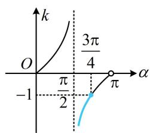
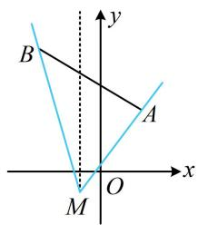
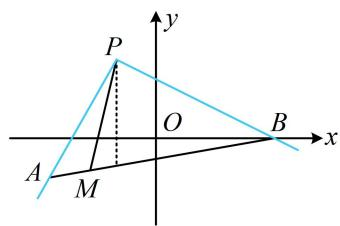
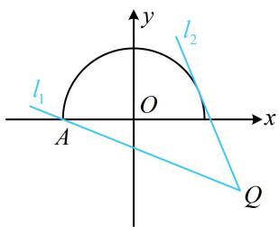
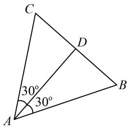
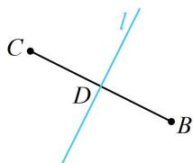
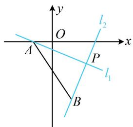

# 模块一 直线与方程

# 第1节 直线的方程（★☆）

# 内容提要

# 1. 直线的倾斜角与斜率

①倾斜角: 直线朝上的方向与 $x$ 轴正向形成的夹角, 叫做直线的倾斜角; 当直线与 $x$ 轴平行或重合时, 规定直线的倾斜角为 $0^{\circ}$ , 所以直线倾斜角 $\alpha$ 的取值范围为 $0^{\circ} \leq \alpha < 180^{\circ}$ .

②直线的斜率 $k$ 与倾斜角 $\alpha$ 的关系： $k = \tan \alpha$ ，当 $\alpha = 90^{\circ}$ 时，称直线的斜率不存在.

③两点连线斜率公式：设 $A(x_{1},y_{1})$ ， $B(x_{2},y_{2})$ ， $x_{1}\neq x_{2}$ ，则直线 $AB$ 的斜率 $k = \frac{y_2 - y_1}{x_2 - x_1}$

④斜率与方向向量的关系: 当直线 $l$ 的斜率为 $k$ 时, $l$ 的一个方向向量为 $\boldsymbol{m} = (1, k)$ ; 当直线 $l$ 的斜率不存在时, $l$ 的一个方向向量为 $\boldsymbol{m} = (0, 1)$ ; 若已知直线 $l$ 的一个方向向量为 $\boldsymbol{m} = (x, y)$ , 则当 $x \neq 0$ 时, 其斜率 $k = \frac{y}{x}$ ; 当 $x = 0$ 时, 其斜率不存在.

⑤计算两直线的夹角余弦: 设直线 $l_{1}$ 的一个方向向量为 $\pmb{m}$ , 直线 $l_{2}$ 的一个方向向量为 $\pmb{n}$ , $l_{1}$ 与 $l_{2}$ 的夹角为 $\theta$ , 则 $\cos \theta = |\cos < m, n| = \frac{|m \cdot n|}{|m| \cdot |n|}$ .

# 2. 直线的方程:

<table><tr><td>名称</td><td>条件</td><td>方程形式</td><td>表示范围</td></tr><tr><td>点斜式</td><td>斜率k,点P(x0,y0)</td><td>y-y0=k(x-x0)</td><td>不含斜率不存在的直线</td></tr><tr><td>斜截式</td><td>斜率k,y轴上的截距b</td><td>y=kx+b</td><td>不含斜率不存在的直线</td></tr><tr><td>横截式</td><td>倒斜率m(m=1/k或m=0),x轴上的截距t</td><td>x=my+t</td><td>不含斜率为0的直线</td></tr><tr><td>截距式</td><td>x轴、y轴上的截距a、b</td><td>x/a+y/b=1</td><td>不与坐标轴垂直且不过原点的直线</td></tr><tr><td>两点式</td><td>A(x1,y1),B(x2,y2)</td><td>y-y1/y2-y1=x-x1/x2-x1</td><td>不与坐标轴垂直的直线</td></tr><tr><td>一般式</td><td>/</td><td>Ax+By+C=0(A,B不同时为0)</td><td>所有直线</td></tr></table>

3. 直线 $l_{1}: A_{1}x + B_{1}y + C_{1} = 0$ 和 $l_{2}: A_{2}x + B_{2}y + C_{2} = 0$ 的平行与垂直：

①当 $l_{1} \parallel l_{2}$ 时， $A_{1}B_{2} = A_{2}B_{1}$ ，但需注意，当两直线重合时也满足此式，故应检验是否重合。特别地，当两直线斜率存在时，若它们的斜率分别为 $k_{1}, k_{2}$ ，则两直线平行时有 $k_{1} = k_{2}$ 。

② $l_{1} \perp l_{2} \Leftrightarrow A_{1}A_{2} + B_{1}B_{2} = 0$ ，此式包括两直线斜率都存在且乘积为-1的一般情况，和一条直线

斜率为 0，另一条直线斜率不存在的特殊情况。注：当两直线斜率都存在时， $l_{1} \perp l_{2} \Leftrightarrow k_{1}k_{2} = -1$ 。

4. 若直线方程只含 1 个参数，则该直线很可能过定点。例如，直线 $l$ 的方程为 $x - my + 1 - m = 0$ ，则可变形为 $x + 1 - m(y + 1) = 0$ ，无论 $m$ 如何变化，点 $A(-1, -1)$ 始终满足该方程，所以直线 $l$ 过定点 $A$ 。

# 类型 I：直线的倾斜角与斜率

【例 1】直线 l 经过点 $(0,2)$ 和 $(3,-1)$ ，则直线 l 的倾斜角 $\alpha$ 为 \_\_\_\_.

解析：已知两点，可先求斜率，再求倾斜角， $k=\frac{-1-2}{3-0}=-1\Rightarrow\tan\alpha=-1$ ，结合 $\alpha\in[0,\pi)$ 知 $\alpha=\frac{3\pi}{4}$ .

答案： $\frac{3\pi}{4}$

【变式1】已知直线 $l$ 经过 $A(2\sqrt{2} x, - 2)$ ， $B(0,x^{2})$ 两点，其中 $x \geq 0$ ，则直线 $l$ 的倾斜角 $\alpha$ 的取值范围是（）

A. $\left[\frac{\pi}{2},\frac{3\pi}{4}\right]$

B. $\left(\frac{\pi}{2},\frac{3\pi}{4}\right]$

C. $\left[\frac{\pi}{2},\pi\right)$

D. $\left[\frac{3\pi}{4},\pi\right)$

解析：已知两点坐标，可求出斜率的范围，再求倾斜角的范围，先考虑斜率不存在的情形，

当 $x = 0$ 时， $A(0, -2)$ ， $B(0, 0)$ ， $l \perp x$ 轴，所以直线 $l$ 的倾斜角 $\alpha = \frac{\pi}{2}$ ；

当 $x > 0$ 时， $l$ 不与 $x$ 轴垂直，其斜率 $k = \frac{-2 - x^2}{2\sqrt{2}x - 0} = -\frac{2 + x^2}{2\sqrt{2}x} = -\frac{\sqrt{2}}{4}\left(\frac{2}{x} + x\right) \leq -\frac{\sqrt{2}}{4} \times 2\sqrt{\frac{2}{x} \cdot x} = -1$

当且仅当 $\frac{2}{x} = x$ ，即 $x = \sqrt{2}$ 时取等号，所以 $k = \tan \alpha \in (-\infty, -1]$

如图，由图可知 $\alpha \in \left(\frac{\pi}{2},\frac{3\pi}{4}\right]$

综上所述， $\alpha$ 的取值范围是 $\left[\frac{\pi}{2},\frac{3\pi}{4}\right]$

答案: A

line

| α | k |
|---|---|
| -1 | 0 |
| π/2 | 0 |
| π | 0 |

【变式2】设 $A(2,3)$ ， $B(-3,6)$ ，直线 $l$ 过点 $M(-1,-1)$ 且与线段 $AB$ 相交，则 $l$ 的斜率 $k$ 的取值范围是（）

A. $\left(-\infty, -\frac{7}{2}\right] \cup \left[\frac{4}{3}, +\infty\right)$

B. $\left[-\frac{7}{2}, \frac{4}{3}\right]$

C. $\left(-\infty, -\frac{2}{7}\right] \cup \left[\frac{3}{4}, +\infty\right)$

D. $\left[-\frac{7}{2}, \frac{3}{4}\right]$

解析：要求斜率的范围，不妨先画图分析直线 $l$ 的变动范围，找到临界状态，

如图，直线 $l$ 从 $MA$ 绕点 $M$ 逆时针旋转至 $MB$ ，与线段 $AB$ 有交点，

两个临界状态的斜率分别为 $k_{MA} = \frac{-1 - 3}{-1 - 2} = \frac{4}{3}$ ， $k_{MB} = \frac{-1 - 6}{-1 - (-3)} = -\frac{7}{2}$

最后分析范围应取两者之间，还是两者之外，可分两部分考虑，

当直线 l 从 MA 旋转到图中虚线时，斜率 k 从 $\frac{4}{3}$ 变到 $+\infty$ ;

当直线从虚线继续旋转到 $MB$ 时，斜率从 $-\infty$ 变到 $-\frac{7}{2}$ ；故 $k \in \left(-\infty, -\frac{7}{2}\right] \cup \left[\frac{4}{3}, +\infty\right)$ .

text_image

B
y
A
M
O
x

答案: A

【反思】①若题目与 $l$ 有关的条件改为 $l$ 的方程为 $x - my + 1 - m = 0$ ，还会做吗？根据内容提要第4点，直线 $l$ 隐藏了过定点 $(-1, -1)$ 这一条件，接下来的过程和本题相同；②当直线 $l$ 从 $l_{1}$ 绕定点旋转到 $l_{2}$ 时，若旋转过程中经过了竖直线，则斜率的变化范围取两者之外；若没有经过竖直线，则取两者之间。

# 类型Ⅱ：斜率的几何意义的运用

【例 2】已知点 $A(-1-\sqrt{3},-1)$ ， $B(3,0)$ ，若点 $M(x,y)$ 在线段 AB 上，则 $\frac{y-2}{x+1}(x\neq-1)$ 的取值范围是（）

A. $\left(-\infty, -\frac{1}{2}\right] \cup [\sqrt{3}, +\infty)$

B. $\left[-1, -\frac{1}{2}\right]$

C. $[-1, \sqrt{3}]$

D. $\left[-\frac{1}{2}, \frac{1}{2}\right]$

解析：出现关于 $x, y$ 的一次分式结构，可考虑用两点连线的斜率来分析，

因为 $\frac{y - 2}{x + 1} = \frac{y - 2}{x - (-1)}$ ，所以 $\frac{y - 2}{x + 1}$ 可以看成动点 $M(x,y)$ 与定点 $P(-1,2)$ 的连线斜率，

如图，当 $M$ 从 $A$ 运动到 $B$ ，直线 $PM$ 就从 $PA$ 绕点 $P$ 逆时针旋转至 $PB$

由题意， $k_{PA} = \frac{-1 - 2}{-1 - \sqrt{3} - (-1)} = \sqrt{3}$ ， $k_{PB} = \frac{2 - 0}{-1 - 3} = -\frac{1}{2}$

因为旋转过程中经过了竖直线，所以斜率的变化范围是 $\left(-\infty, -\frac{1}{2}\right] \cup [\sqrt{3}, +\infty)$ .

text_image

P
y
O
B
x
A
M

答案: A

【反思】根据两点连线的斜率公式 $k = \frac{y_2 - y_1}{x_2 - x_1}$ 所展现的形式，解析几何中涉及关于 $x, y$ 的一次分式结构，都可以尝试运用斜率的几何意义来分析问题.

【变式】已知实数 $x$ ， $y$ 满足 $x^{2} + y^{2} = 4 (y \geq 0)$ ，则 $\frac{x + y - 1}{x - 3}$ 的取值范围是 \_\_\_\_.

解析：出现关于 $x, y$ 的一次分式结构，考虑运用斜率来分析，要凑出斜率，得先把分子的 $x$ 拆掉，因为 $\frac{x + y - 1}{x - 3} = \frac{(x - 3) + y + 2}{x - 3} = 1 + \frac{y + 2}{x - 3}$ ，记 $t = \frac{y + 2}{x - 3}$ ，则 $\frac{x + y - 1}{x - 3} = 1 + t$ ，

关键是求 t 的范围， $t=\frac{y-(-2)}{x-3}$ ，它表示动点 $P(x,y)$ 和定点 $Q(3,-2)$ 连线的斜率，故可考虑画图分析，因为 $x^{2}+y^{2}=4(y\geq0)$ ，所以点 P 在如图所示的半圆上运动，直线 PQ 的临界状态为图中的 $l_{1}$ 和 $l_{2}$ ，其中直线 $l_{1}$ 过点 $A(-2,0)$ 和点 Q，其斜率为 $\frac{-2-0}{3-(-2)}=-\frac{2}{5}$ ，

直线 $l_{2}$ 与半圆相切，设其斜率为 $k$ ，则其方程为 $y - (-2) = k(x - 3)$ ，即 $kx - y - 3k - 2 = 0$

所以圆心 O 到 $l_{2}$ 的距离 $d=\frac{|-3k-2|}{\sqrt{k^{2}+1}}=2$ ,

解得： $k = -\frac{12}{5}$ 或 0（舍去，图中 $l_{2}$ 的斜率显然为负），

当 $P$ 在半圆上运动时，直线 $PQ$ 的扫动范围是从 $l_{2}$ 绕点 $Q$ 逆时针旋转至 $l_{1}$ ，过程中不经过竖直线，

故其斜率 $t$ 的变化范围是 $\left[-\frac{12}{5}, -\frac{2}{5}\right]$ ，所以 $\frac{x + y - 1}{x - 3} = 1 + t \in \left[-\frac{7}{5}, \frac{3}{5}\right]$ .

答案： $\left[-\frac{7}{5},\frac{3}{5}\right]$

text_image

y
l₂
l₁
O
x
A
Q

# 类型III：用方向向量解决夹角问题

【例 3】已知正三角形某内角的平分线所在直线的斜率为 $\frac{2 \sqrt{3}}{3}$ , 写出该内角的两边中, 其中一边所在直线的斜率: \_\_\_\_.

解析：如图，设 $AD$ 是正 $\triangle ABC$ 的内角 $A$ 的平分线，则 $AD$ 与 $AB$ 和 $AC$ 的夹角均为 $30^{\circ}$ ，

涉及直线与直线的夹角，考虑用直线的方向向量来计算，

直线 AD 的斜率为 $\frac{2\sqrt{3}}{3} \Rightarrow$ 其方向向量可取 $m = \left(1, \frac{2\sqrt{3}}{3}\right)$ ,

设直线 $AB$ 的斜率为 $k$ ，则其方向向量可取 $\pmb{n} = (1, k)$ ，

所以 $|\cos < m, n >| = \frac{|m \cdot n|}{|m| \cdot |n|} = \frac{\left|1 + \frac{2\sqrt{3}}{3}k\right|}{\frac{\sqrt{21}}{3} \cdot \sqrt{1 + k^2}} = \cos 30^\circ = \frac{\sqrt{3}}{2}$ ，解得： $k = \frac{\sqrt{3}}{5}$ 或 $3\sqrt{3}$ .

答案： $\frac{\sqrt{3}}{5}$ （或 $3\sqrt{3}$ ）

text_image

C
D
30°
30°
A
B

【反思】涉及直线与直线的夹角问题，常考虑用直线的方向向量来处理.

# 类型IV：求直线的方程

【例 4】直线 l 过点(1,1)，倾斜角为 $\alpha$ ，且 $\sin\alpha=\frac{2\sqrt{5}}{5}$ ，则直线 l 的方程为 \_\_\_\_.

解析：已知 $\sin \alpha$ 可求出 $\tan \alpha$ ，得到斜率，用点斜式写出直线的方程，

由题意， $\alpha \in [0,\pi)$ 且 $\sin \alpha = \frac{2\sqrt{5}}{5}\Rightarrow \cos \alpha = \pm \sqrt{1 - \sin^2\alpha} = \pm \frac{\sqrt{5}}{5}\Rightarrow \tan \alpha = \pm 2$

所以直线 l 的方程为 $y-1=2(x-1)$ 或 $y-1=-2(x-1)$ ，整理得：y=2x-1 或 $y=-2x+3$ .

答案： $y = 2x - 1$ 或 $y = -2x + 3$

【例 5】已知△ABC 中，已知 B(2,1)，C(-2,3)，则边 BC 的中垂线 l 的方程为 \_\_\_\_.

解析：如图，中垂线 $l$ 过 $BC$ 中点 $D(0,2)$ ，还差斜率，可先求 $BC$ 的斜率，再由 $l \perp BC$ 求 $l$ 的斜率，

由题意， $k_{BC} = \frac{3 - 1}{-2 - 2} = -\frac{1}{2}$ ，所以 $-\frac{1}{2} k_l = -1$ ，从而 $k_{l} = 2$

故 $l$ 的方程为 $y - 2 = 2(x - 0)$ ，即 $2x - y + 2 = 0$ 。

答案： $2x - y + 2 = 0$

text_image

C
D
l
B

【例 6】直线 l 过点(1,2)，且在两坐标轴上截距相等，则直线 l 的方程为 \_\_\_\_.

解析：涉及截距，可设直线的截距式方程，该方程不能表示截距为0的情形，故先考虑这种特殊情况，当直线 $l$ 过原点时，其斜率为2，故其方程为 $y = 2x$ ，即 $2x - y = 0$

此时直线 l 在两坐标轴上截距均为 0，满足题意；

当直线 l 不过原点时，可设其方程为 $\frac{x}{a} + \frac{y}{a} = 1 (a \neq 0)$ ，将点 $(1,2)$ 代入可得 $\frac{1}{a} + \frac{2}{a} = 1$ ，解得：a = 3，

所以直线 $l$ 的方程为 $\frac{x}{3} +\frac{y}{3} = 1$ ，即 $x + y - 3 = 0$ ；综上所述，直线 $l$ 的方程为 $2x - y = 0$ 或 $x + y - 3 = 0$

答案： $2x - y = 0$ 或 $x + y - 3 = 0$

# 类型V：直线的平行与垂直

【例 7】设直线 $l_{1}:(a+1)x+a^{2}y-3=0$ ， $l_{2}:2x+ay-2a-1=0$ ，则 “a=0” 是 “ $l_{1}//l_{2}$ ” 的（）

A. 充分不必要条件

B. 必要不充分条件

C. 充要条件

D. 既不充分也不必要条件

解析：涉及 $l_{1} / / l_{2}$ ，可先用 $A_{1}B_{2} = A_{2}B_{1}$ 求出参数 $a$ 的值并检验是否重合，得到 $l_{1} / / l_{2}$ 的充要条件再看， $l_{1} / / l_{2} \Rightarrow (a + 1)a = 2a^{2} \Rightarrow a = 0$ 或1，经检验， $a = 1$ 时 $l_{1}$ 与 $l_{2}$ 重合，故“ $a = 0$ ”是“ $l_{1} / / l_{2}$ ”的充要条件.

答案: C

【例8】设直线 $l_{1}:(a + 2)x + (1 - a)y - 3 = 0$ ， $l_{2}:(a - 1)x + (2a + 3)y + 2 = 0$ ，则“ $a = 1$ ”是“ $l_{1}\bot l_{2}$ ”的（）

A. 充分不必要条件

B. 必要不充分条件

C. 充要条件

D. 既不充分也不必要条件

解析：涉及 $l_{1} \perp l_{2}$ ，可用 $A_{1}A_{2} + B_{1}B_{2} = 0$ 求参数的值，由题意， $l_{1} \perp l_{2} \Leftrightarrow (a + 2)(a - 1) + (1 - a)(2a + 3) = 0$ ，解得： $a = \pm 1$ ，所以“ $a = 1$ ”是“ $l_{1} \perp l_{2}$ ”的充分不必要条件.

答案: A

【变式】若直线 $l_{1}: x - my + 1 = 0$ 过定点 $A, l_{2}: mx + y - m + 3 = 0$ 过定点 $B, l_{1}$ 与 $l_{2}$ 交于点 $P$ ，则 $\left|PA\right|^2 + \left|PB\right|^2 =$ \_\_\_\_.

解析：为了找到两直线所过的定点，常先把参数集中起来再看，

由题意，直线 $l_{1}$ 过定点 $A(-1,0)$ ， $mx + y - m + 3 = 0 \Rightarrow m(x - 1) + (y + 3) = 0$

所以直线 $l_{2}$ 过定点 $B(1,-3)$ ,

接下来若先求交点 $P$ ，再算 $\left|PA\right|^2 + \left|PB\right|^2$ ，则计算量大。而 $\left|PA\right|^2 + \left|PB\right|^2$ 的结构让我们联想到勾股定理，故来看看 $PA$ ， $PB$ 是否垂直，

因为两直线方程的系数满足 $A_{1}A_{2} + B_{1}B_{2} = 1\times m + (-m)\times 1 = 0$ ，所以 $l_{1}\bot l_{2}$ ，如图，

故 $\left|PA\right|^{2}+\left|PB\right|^{2}=\left|AB\right|^{2}=(-1-1)^{2}+[0-(-3)]^{2}=13.$

text_image

y
O
A
P
l₁
l₂
x
B

答案: 13

【反思】当两直线都含参时，应通过分析系数来判断两直线是否隐藏了垂直、平行这些特殊的位置关系.

# 强化训练

1. (2023·浙江温州三模·★)

已知直线 $l_{1}: x + y = 0$ ， $l_{2}: ax + by + 1 = 0$ ，若 $l_{1} \perp l_{2}$ ，则 $a + b = (\quad)$

A. -1

B. 0

C. 1

D. 2

2. (★)

过点(5,2)，且在 $x$ 轴上截距是在 $y$ 轴上截距2倍的直线 $l$ 的方程是（）

A. $2x + y - 12 = 0$   
B. $2x + y - 12 = 0$ 或 $2x - 5y = 0$   
C. $x - 2y - 1 = 0$   
D. $x + 2y - 9 = 0$ 或 $2x - 5y = 0$

3. (2022·重庆月考·★★)

已知两条直线 $l_{1}$ ， $l_{2}$ 的斜率分别为 $k_{1}$ ， $k_{2}$ ，倾斜角分别为 $\alpha$ ， $\beta$ ，若 $\alpha <  \beta$ ，则下列关系不可能成立的是（）

A. $0 < k_{1} < k_{2}$

B. $k_{1} < k_{2} < 0$

C. $k_{2} < k_{1} < 0$

D. $k_{2} < 0 < k_{1}$

4. (2025·山东菏泽模拟·★★☆)

已知直线 $l$ 的方程为 $(\sin \alpha)x - y + 3\sqrt{2} = 0$ ， $\alpha \in \left(-\frac{\pi}{2},\frac{\pi}{2}\right)$ ，则直线 $l$ 的倾斜角 $\theta$ 的取值范围是（）

A. $\left[0, \frac{\pi}{4}\right) \cup \left(\frac{3\pi}{4}, \pi\right)$

B. $\left(-\frac{\pi}{4},\frac{\pi}{4}\right)$

C. $\left[0, \frac{\pi}{4}\right] \cup \left[\frac{3\pi}{4}, \pi\right]$

D. $\left[-\frac{\pi}{4}, \frac{\pi}{4}\right]$

5. (★★☆)

已知 $A(-1,1)$ ， $B(2,2)$ ，若直线 $l: x + my - 1 = 0$ 与线段 $AB$ 有交点，则实数 $m$ 的取值范围为 \_\_\_\_.

6. (★★★)

已知 $A(-1,0)$ ， $B(0,3)$ ，若直线 $l: ax + y + 2a - 1 = 0$ 上存在点 $P$ ，满足 $|PA| + |PB| = |AB|$ ，则 $l$ 的倾斜角的取值范围是（）

A. $\left[0, \frac{\pi}{4}\right] \cup \left[\frac{3\pi}{4}, \pi\right)$

B. $\left[\frac{\pi}{4},\frac{3\pi}{4}\right]$

C. $\left[0, \frac{\pi}{6}\right] \cup \left[\frac{5\pi}{6}, \pi\right)$

D. $\left[\frac{\pi}{6},\frac{5\pi}{6}\right]$

7.（★★★）（多选）

实数 $x$ ， $y$ 满足 $x^{2} + y^{2} + 2x = 0$ ，则下列关于 $\frac{y}{x - 1}$ 的判断正确的是（）

A. $\frac{y}{x - 1}$ 的最大值为 $\sqrt{3}$

B. $\frac{y}{x - 1}$ 的最小值为 $-\sqrt{3}$

C. $\frac{y}{x - 1}$ 的最大值为 $\frac{\sqrt{3}}{3}$

D. $\frac{y}{x - 1}$ 的最小值为 $-\frac{\sqrt{3}}{3}$

8. (2022·河北保定月考·★★★)

若正三角形的一条高所在直线的斜率为3，则该正三角形的三边所在直线的斜率之和为\_\_\_\_。

9.（2023·山东青岛三模·★★★）

瑞士数学家欧拉在《三角形的几何学》一书中提出：任意三角形的外心、重心、垂心在同一条直线上，这条直线被称为欧拉线。已知 $\triangle ABC$ 的顶点 $A(-3,0)$ ， $B(3,0)$ ， $C(3,3)$ ，若直线 $l: ax + (a^2 - 3)y - 9 = 0$ 与 $\triangle ABC$ 的欧拉线平行，则实数 $a$ 的值为（）

A. -2

B. -1

C. -1或3

D. 3