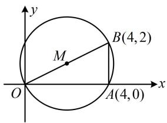
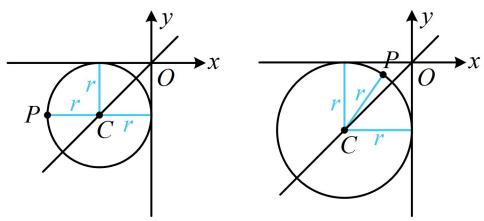
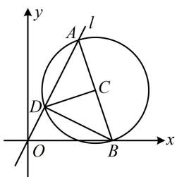

# 强化训练

1. (2022·广东广州三模·★)

设甲：实数 $a < 3$ ；乙：方程 $x^{2} + y^{2} - x + 3y + a = 0$ 是圆，则甲是乙的（）

A. 充分不必要条件  
B. 必要不充分条件  
C. 充要条件

D. 既不充分也不必要条件

1. B

解析：方程 $x^{2} + y^{2} - x + 3y + a = 0$ 表示圆等价于

$(-1)^{2} + 3^{2} - 4a > 0$ ，解得： $a <   \frac{5}{2}$ ，所以乙： $a <   \frac{5}{2}$

因为 $a < 3 \Rightarrow a < \frac{5}{2}$ ，所以甲不是乙的充分条件，

又 $a < \frac{5}{2} \Rightarrow a < 3$ ，所以甲是乙的必要条件，故选B.

2. (2024·广东模拟·★☆)

曲线 $C:(x^{2} + y^{2} - 1)^{2} - 8(x^{2} + y^{2}) + 15 = 0$ 的周长为（）

A. $3 \sqrt{2} \pi$

B. $4 \sqrt{2} \pi$

C. $6 \sqrt{2} \pi$

D. $12 \sqrt{2} \pi$

2. C

解析：直接研究 C 显然不便，观察发现含 x，y 的部分以 $x^{2} + y^{2}$ 整体出现，可考虑将其换元，看能否简化曲线 C 的方程，令 $t = x^{2} + y^{2}$ ，则曲线 C 的方程即为 $(t - 1)^{2} - 8t + 15 = 0$ ，所以 $t^{2} - 10t + 16 = 0 \Rightarrow (t - 2)(t - 8) = 0$ ，故 t = 2 或 8，

所以 $x^{2} + y^{2} = 2$ 或 $x^{2} + y^{2} = 8$

故曲线 $C$ 由圆心都是原点，半径分别为 $\sqrt{2}$ 和 $2\sqrt{2}$ 的两个圆构成，其周长为 $2\pi \times \sqrt{2} + 2\pi \times 2\sqrt{2} = 6\sqrt{2}\pi$

3. (2025·福建福州模拟·★☆)

已知点 $A(-1,0)$ 在圆 $x^{2} + y^{2} + 2x + 3y + m = 0$ 外，则实数 $m$ 的取值范围是（）

A. $(1, +\infty)$   
B. $\left(1,\frac{13}{4}\right)$   
C. $\left(-\infty,\frac{13}{4}\right)$

D. $\left(1, \frac{13}{4}\right) \cup \left(\frac{13}{4}, +\infty\right)$

3. B

解析：点 $A(-1,0)$ 在所给圆外 $\Rightarrow (-1)^2 + 0^2 + 2 \times (-1) +$

$3 \times 0 + m > 0$ ，解得：m > 1 ①，

还需考虑圆的方程本身对 $m$ 的限制，

方程 $x^{2} + y^{2} + 2x + 3y + m = 0$ 表示圆，应有 $2^{2} + 3^{2} - 4m$

>0，解得： $m<\frac{13}{4}$ ，结合①可得 $1<m<\frac{13}{4}$ .

4. (2022·全国乙卷·★)

过四点(0,0)，(4,0)，(-1,1)，(4,2)中的三点的一个圆的方程为\_\_\_\_。

4. $(x - 2)^{2} + (y - 1)^{2} = 5$ （答案不唯一，详见解析）

解法 1: 任选三点, 设圆的一般式方程, 把三点的坐标代入, 都可用待定系数法求得圆的方程,

若选 $(0,0)$ ，(4,0)，(-1,1)，设过该三点的圆的方程为

$$
x ^ {2} + y ^ {2} + D x + E y + F = 0,
$$

将上述三点的坐标代入可得 $\left\{ \begin{array}{l} F = 0 \\ 16 + 4D + F = 0 \\ 2 - D + E + F = 0 \end{array} \right.$

解得： $D = -4$ ， $E = -6$ ， $F = 0$

故过上述三点的圆的方程为 $x^{2} + y^{2} - 4x - 6y = 0$

同理，若选(0,0)，(4,0)，(4,2)，

则可求得圆的方程为 $x^{2} + y^{2} - 4x - 2y = 0$

若选 $(0,0)$ ， $(-1,1)$ ， $(4,2)$

则可求得圆的方程为 $x^{2} + y^{2} - \frac{8}{3} x - \frac{14}{3} y = 0$

若选(4,0)， $(-1,1)$ ， $(4,2)$ ，

则可求得圆的方程为 $x^{2} + y^{2} - \frac{16}{5} x - 2y - \frac{16}{5} = 0$

解法2：所给的点都是整点，容易画到坐标系下，故可先画图观察，看能否选择三点，快速找到圆心和半径，

如图，记 $O(0,0)$ ， $A(4,0)$ ， $B(4,2)$ ，则 $AB\bot OA$

所以过 $O, A, B$ 三点的圆即为以 $OB$ 为直径的圆，该圆的方程易于计算，于是就选这三点，

圆心为 $OB$ 中点 $M(2,1)$ ，半径 $r = |OM| = \sqrt{5}$ ，

故该圆的方程为 $(x - 2)^{2} + (y - 1)^{2} = 5$

text_image

y
B(4,2)
M
O
A(4,0)
x

5. (★★)

过点 $A(1, - 1)$ ， $B(-1,1)$ ，且圆心在直线 $x + y - 2 = 0$ 上的圆的方程为

5. $(x - 1)^{2} + (y - 1)^{2} = 4$

解法 1: 圆过 $A, B$ 两点, 则圆心在弦 $A B$ 的中垂线上, 可将其与直线 $x + y - 2 = 0$ 联立求圆心,

由题意， $AB$ 中点为 $O(0,0)$ ， $k_{AB} = \frac{-1 - 1}{1 - (-1)} = -1$

所以 $AB$ 中垂线的斜率为1，其方程为 $y = x$

联立 $\left\{\begin{aligned}y&=x\\ x+y-2&=0\end{aligned}\right.$ 解得： $\left\{\begin{aligned}x&=1\\ y&=1\end{aligned}\right.$

所以圆心为 $C(1,1)$ ，半径 $r = |CA| = 2$

故所求圆的方程为 $(x - 1)^2 +(y - 1)^2 = 4$

解法2：由所给直线方程可将圆心 $C$ 的坐标设为单变量形式，翻译 $\vert CA\vert = \vert CB\vert$ 即可求得圆心坐标，

$x + y - 2 = 0 \Rightarrow y = 2 - x$ ，因为圆心在直线 $y = 2 - x$ 上，所以可设圆心为 $C(a, 2 - a)$ ，设半径为 $r$ 因为圆 $C$ 过 $A$ ， $B$ 两点，所以 $\left|CA\right| = \left|CB\right| = r$

故 $\sqrt{(a - 1)^2 + (2 - a + 1)^2} = \sqrt{(a + 1)^2 + (2 - a - 1)^2}$

解得： $a = 1$ ，所以 $C(1,1)$ ，半径 $r = |CA| = 2$

故所求圆的方程为 $(x - 1)^2 +(y - 1)^2 = 4$

6. (2023·河南模拟（改）·★★)

过 $P(-2, -1)$ 且与两坐标轴都相切的圆的方程为 \_\_\_\_.

6. $(x + 1)^2 +(y + 1)^2 = 1$ 或 $(x + 5)^2 +(y + 5)^2 = 25$

解析：如图，过点 $P$ 且与两坐标轴都相切的圆，圆心在第三象限且在直线 $y = x$ 上，

故可设圆心坐标，利用圆心到任意一条坐标轴的距离与到点 $P$ 的距离相等建立方程求圆心，

由图知可设圆心为 $C(-r, - r)(r > 0)$ ，则由题意，

$r = \sqrt{(-r + 2)^2 + (-r + 1)^2}$ ，解得： $r = 1$ 或5，所以圆 $C$ 的

方程为 $(x + 1)^2 +(y + 1)^2 = 1$ 或 $(x + 5)^2 +(y + 5)^2 = 25$

text_image

y
x
P
r
r
C
r
P
O
x
y
r
r
C
r

7. (2022·浙江模拟·★★★)

在平面直角坐标系中，第一象限内的点 A 在直线 l: y = 2x 上， $B(5,0)$ ，以 AB 为直径的圆 C 与直线 l 的另一个交点为 D，若 $AB \perp CD$ ，则圆 C 的方程为 \_\_\_\_.

7. $(x - 4)^{2} + (y - 3)^{2} = 10$

解析：如图，因为 $AB$ 是直径，所以 $AD \perp BD$

由这一垂直关系, 结合已知 $l$ 的斜率, 可求得 $B D$ 的斜率, $B$ 又已知, 故可求得点 $D$ 的坐标,

由题意，直线 $AD$ 的斜率为2，故直线 $BD$ 的斜率为 $-\frac{1}{2}$

设 $D(a,2a)$ ，则 $k_{BD} = \frac{2a}{a - 5} = -\frac{1}{2}$ ，解得： $a = 1$ ，故 $D(1,2)$

再求圆心 C，C 是 AB 中点，故可设 A 的坐标，利用 $AB \perp CD$ 来建立方程求解，

设 $A(b,2b)$ ，则 $C\left(\frac{b + 5}{2},b\right)$ ，因为 $AB\bot CD$

所以 $k_{AB} \cdot k_{CD} = \frac{2b}{b - 5} \cdot \frac{b - 2}{\frac{b + 5}{2} - 1} = -1$ ，解得： $b = 3$ 或-1，

因为 $A$ 在第一象限，所以 $b > 0$ ，从而 $b = 3$ ，故 $C(4,3)$

$$
\left| C D \right| = \sqrt {(4 - 1) ^ {2} + (3 - 2) ^ {2}} = \sqrt {1 0},
$$

所以圆 C 的方程为 $(x-4)^{2}+(y-3)^{2}=10$ .

text_image

y
A
l
C
D
O
B
x

