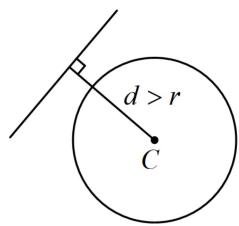
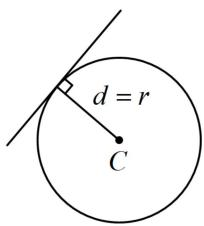
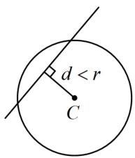
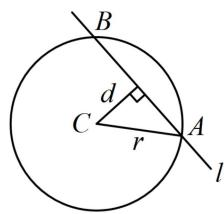
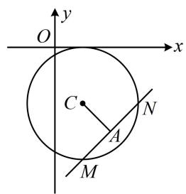
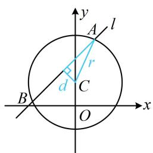
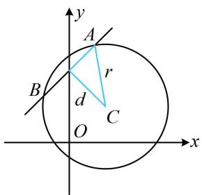
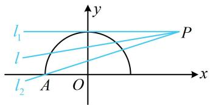

# 第2节 直线与圆的位置关系（★★）

# 内容提要

1. 判断直线 $l: Ax + By + C = 0$ 与圆 $C: (x - a)^2 + (y - b)^2 = r^2$ 的位置关系的步骤：

①计算圆心 $C(a, b)$ 到直线 $l$ 的距离 $d$ ;

②将 $d$ 和 $r$ 进行比较: 若 $d > r$ , 则直线和圆相离, 它们没有交点, 如图 1; 若 $d = r$ , 则直线和圆相切, 它们有 1 个交点, 如图 2; 若 $d < r$ , 则直线和圆相交, 它们有 2 个交点, 如图 3.

text_image

d > r
C

图1

text_image

d = r
C

图2

text_image

d < r
C

图3

text_image

B
C
d
r
A
l

图4

2. 当直线与圆相交时，如上图4，两个交点之间的线段长度，称为直线被圆截得的弦长，计算的步骤是：

① 计算圆心 $C$ 到直线 $l$ 的距离 $d$ ; ② 弦长 $\left|AB\right| = 2\sqrt{r^2 - d^2}$ .

# 类型 I：判断直线与圆的位置关系

【例1】直线 $y = x + 6$ 与圆 $x^{2} + y^{2} - 2y - 4 = 0$ 的位置关系是（）

A. 相离 
B. 相切 
C. 相交且过圆心 
D. 相交且不过圆心

解析： $y = x + 6 \Rightarrow x - y + 6 = 0$ ， $x^{2} + y^{2} - 2y - 4 = 0 \Rightarrow x^{2} + (y - 1)^{2} = 5$ ，

圆心 $(0,1)$ 到直线 $x - y + 6 = 0$ 的距离 $d = \frac{|-1 + 6|}{\sqrt{2}} = \frac{5}{\sqrt{2}} >\sqrt{5}$ ，所以直线与圆相离.

答案: A

【变式1】 $\forall k\in \mathbf{R}$ ，直线 $l:kx - y - 4k + 3 = 0$ 与圆 $C:x^{2} + y^{2} - 6x - 8y + 21 = 0$ 的位置关系是（）

A. 相交 B. 相切 C. 相离 D. 与 $k$ 有关

解析：直线 l 含参，先看它是否过定点， $kx - y - 4k + 3 = 0 \Rightarrow k(x - 4) - (y - 3) = 0 \Rightarrow$ 直线 l 过定点 $P(4,3)$ ，注意到 $4^2 + 3^2 - 6 \times 4 - 8 \times 3 + 21 = -2 < 0$ ，所以点 P 在圆 C 内部，故直线 l 与圆 C 始终相交.

答案: A

【反思】判定含参直线与圆的位置关系，除了直接比较 $d$ 与 $r$ 外，往往还可以通过判断直线是否过定点来得出结论.

【变式 2】(2021·新高考Ⅱ卷)(多选)已知直线 $l: ax + by - r^2 = 0$ 与圆 $C: x^2 + y^2 = r^2$ ，点 $A(a, b)$ ，则下列说法正确的是（）

A. 若点 $A$ 在圆 $C$ 上, 则直线 $l$ 与圆 $C$ 相切

B. 若点 $A$ 在圆 $C$ 内, 则直线 $l$ 与圆 $C$ 相离

C. 若点 $A$ 在圆 $C$ 外, 则直线 $l$ 与圆 $C$ 相离  
D. 若点 $A$ 在直线 $l$ 上，则直线 $l$ 与圆 $C$ 相切

解析：判断直线 $l$ 与圆 $C$ 的位置关系，可将圆心 $C$ 到直线 $l$ 的距离 $d$ 与半径 $r$ 比较，先把 $d$ 算出来，

由题意， $d = \frac{\left| - r^2\right|}{\sqrt{a^2 + b^2}} = \frac{r^2}{\sqrt{a^2 + b^2}}$ ①，

A 项，点 A 在圆 C 上 $\Rightarrow a^{2} + b^{2} = r^{2}$ ，代入①得 $d = \frac{r^{2}}{\sqrt{r^{2}}} = r \Rightarrow l$ 与圆 C 相切，故 A 项正确；  
B 项，点 A 在圆 C 内 $\Rightarrow a^{2} + b^{2} < r^{2}$ ，结合①得 $d > \frac{r^{2}}{\sqrt{r^{2}}} = r \Rightarrow l$ 与圆 C 相离，故 B 项正确；  
C 项，点 A 在圆 C 外 $\Rightarrow a^{2} + b^{2} > r^{2}$ ，结合①得 $d < \frac{r^{2}}{\sqrt{r^{2}}} = r \Rightarrow l$ 与圆 C 相交，故 C 项错误；  
D 项，点 A 在 l 上 $\Rightarrow a^{2} + b^{2} - r^{2} = 0 \Rightarrow a^{2} + b^{2} = r^{2}$ ，代入①得 $d = \frac{r^{2}}{\sqrt{r^{2}}} = r \Rightarrow l$ 与圆 C 相切，故 D 项正确.

答案: ABD

# 类型Ⅱ：用垂径定理计算弦的方程

【例 2】若圆 $C: x^{2} + y^{2} - 2x + 4y + 1 = 0$ 的弦 MN 的中点为 $A(2, -3)$ ，则直线 MN 的方程是（）

A. $2x - y - 7 = 0$

B. $x - y - 5 = 0$

C. $x + y + 1 = 0$

D. $x - 2y - 8 = 0$

解析： $x^{2} + y^{2} - 2x + 4y + 1 = 0\Rightarrow (x - 1)^{2} + (y + 2)^{2} = 4\Rightarrow$ 圆心为 $C(1, - 2)$ ，

在圆中涉及弦中点，想到垂径定理，如图，A 为弦 MN 的中点 $\Rightarrow AC \perp MN$ ，因为 $k_{AC} = \frac{-3 - (-2)}{2 - 1} = -1$ ，所以 $k_{MN} = 1$ ，

故直线 $MN$ 方程是 $y - (-3) = x - 2$ ，整理得： $x - y - 5 = 0$

答案: B

text_image

y
O
x
C
A
N
M

# 类型III：直线被圆截得的弦长

【例 3】直线 $l: x - y + 2 = 0$ 被圆 $C: x^{2} + (y - 1)^{2} = 4$ 截得的弦长为 \_\_\_\_.

解析：涉及圆的弦长，一般在如图所示的蓝色直角三角形中由勾股定理来算，下面先求 $d$ ，

由题意，圆心 $C(0,1)$ 到直线 $l$ 的距离 $d = \frac{|-1 + 2|}{\sqrt{1^2 + (-1)^2}} = \frac{\sqrt{2}}{2}$ ，

所以弦长 $|AB|=2\sqrt{r^{2}-d^{2}}=2\sqrt{4-\frac{1}{2}}=\sqrt{14}$ .

答案: $\sqrt{14}$

text_image

y
A
l
r
d
C
B
O
x

【变式】（2022·天津卷）若直线 $x - y + m = 0 (m > 0)$ 与圆 $(x - 1)^{2} + (y - 1)^{2} = 3$ 相交所得的弦长为 $m$ ，则 $m =$ \_\_\_\_.

解析：涉及圆的弦长，先算 $d$ ，如图，圆心为 $C(1,1)$ ，半径 $r = \sqrt{3}$ ， $d = \frac{|1 - 1 + m|}{\sqrt{1^2 + (-1)^2}} = \frac{|m|}{\sqrt{2}}$ 所以直线与圆相交所得弦长 $\left|AB\right|=2\sqrt{r^{2}-d^{2}}=2\sqrt{3-\frac{m^{2}}{2}}$ ，

由题意， $2\sqrt{3-\frac{m^{2}}{2}}=m$ ，解得：m=2。

答案: 2

【反思】从例 3 和它的变式可以看出, 求弦长基本都会转化到点到直线的距离 d 上来.

text_image

y
A
r
B
d
C
O
x

# 类型IV：由直线与圆的位置关系求参数范围

【例 4】直线 $l: y = kx + 1 - 2k$ 与函数 $y = \sqrt{1 - x^2}$ 的图象有 2 个公共点，则 $k$ 的取值范围为（）

A. $k > \frac{1}{3}$

B. $0 < k < 3$

C. $0 < k \leq \frac{1}{3}$

D. $-3 \leq k < 0$

解析：所给函数带根号，为了弄清楚其图象的样子，先通过平方去根号，

$y=\sqrt{1-x^{2}}\Rightarrow y^{2}=1-x^{2}\Rightarrow x^{2}+y^{2}=1(y\geq0)$ ，其图象为以原点为圆心，1为半径的圆的上半部分， $y=kx+1-2k\Rightarrow y=k(x-2)+1\Rightarrow$ 直线 l 过定点 $P(2,1)$ ，两个图象都不复杂，故可画图找临界状态，如图，当直线 l 从 $l_{1}$ （不可取）绕点 P 逆时针旋转至 $l_{2}$ （可取）的过程中，能与半圆有 2 个交点，下面求解临界状态， $l_{1}$ 与半圆相切，结合图形可知其斜率 $k_{1} = 0$

$l_{2}$ 经过 P 和 A(-1,0)，其斜率 $k_{2}=\frac{0-1}{-1-2}=\frac{1}{3}$ ;

直线 l 在旋转过程中不经过竖直线，故其斜率 k 的变化范围是 $\left(0, \frac{1}{3}\right]$ .

text_image

l₁
l
l₂ A O x
y
P

答案: C

【反思】①解析几何中出现根式，可尝试通过平方变形成圆、椭圆等二次曲线，由于根号的范围限制，曲线往往只能取一半；②原题其实为“若方程 $kx + 1 - 2k = \sqrt{1 - x^2}$ 有2个实数根，求 $k$ 的范围”，你会做吗？只需数形结合，即可转化为本题的公共点问题.

# 强化训练

1. (2024·浙江宁波二模·★)

已知直线 $l: x - y + 1 = 0$ 与圆 $C: x^2 + y^2 - 2x - m =$

0相离，则实数 $m$ 的取值范围是（）

A. $m <   1$

B. $-1 < m < 1$

C. $m > 1$

D. $m > - 1$

2. (2025·湖南模拟·★★)

已知直线 $l: kx - y - k + 1 = 0$ 和圆 $C: x^2 + y^2 - 2x + 4y + 4 = 0$ ，则直线 $l$ 与圆 $C$ 的位置关系是（）

A. 相切

B. 相离

C. 相交

D. 与 $k$ 有关

3.（2022·内蒙古呼和浩特模拟·★★）

已知直线 $l: x + 3y + 5 = 0$ 与圆 $C: x^2 + y^2 + 2x - 4y - 20 = 0$ 相交于 $A, B$ 两点，若圆 $C$ 的一条直径过弦 $AB$ 的中点，则该直径所在直线的方程为（）

A. $3x + y + 1 = 0$

B. $3x - y + 3 = 0$

C. $3x - y + 5 = 0$

D. $x + 3y - 5 = 0$

4. (2025·天津卷·★★)

直线 $l: x - y + 6 = 0$ 与 $x$ 轴交于点 $A$ ，与 $y$ 轴交于点 $B$ ，与圆 $(x + 1)^2 + (y - 3)^2 = r^2 (r > 0)$ 交于 $C$ ， $D$ 两点，若 $\left|AB\right| = 3\left|CD\right|$ ，则 $r =$ \_\_\_\_.

5.（2023·江苏省苏北七市一调·★★☆）

已知圆 $O: x^2 + y^2 = r^2 (r > 0)$ ，设直线 $x + \sqrt{3} y - \sqrt{3} = 0$ 与两坐标轴的交点分别为 $A, B$ ，若圆 $O$ 上有且只有一个点 $P$ 满足 $|AP| = |BP|$ ，则 $r =$ \_\_\_\_.

6. (★★☆)

圆 $C: x^{2} + y^{2} + 2y - 3 = 0$ 被直线 $l: x + y - k = 0$ 分成长度之比为1:3的两段圆弧，则实数 $k =$ \_\_\_\_.

7. (2022·河南洛宁月考·★★★)

若关于 $y$ 的方程 $y - b = \sqrt{1 - y^2}$ 恰有1个实数解，则实数 $b$ 的取值范围是（）

A. $[- \sqrt{2}, \sqrt{2}]$

B. $[-1, \sqrt{2}]$

C. $(-1,1] \cup \{\sqrt{2}\}$

D. $(-1,1] \cup \{-\sqrt{2}\}$

8. (2025·全国Ⅰ卷·★★★)

若圆 $x^{2} + (y + 2)^{2} = r^{2}(r > 0)$ 上到直线 $y = \sqrt{3} x + 2$ 的距离为1的点有且仅有2个，则 $r$ 的取值范围是（）

A. (0,1)

B. (1,3)

C. $(3, +\infty)$

D. $(0, +\infty)$