# 内容提要

1. 求圆 $C: (x - a)^2 + (y - b)^2 = r^2$ 过点 $P(x_0, y_0)$ 的切线：

①若点 $P$ 在圆上, 如图1, 可由 $PC \perp l$ 找到切线 $l$ 的斜率 (斜率可能不存在, 此时切线即为 $x = x_0$ ), 结合点 $P$ 可求得切线方程.  
②若点 $P$ 在圆外, 如图2, 可设切线斜率为 $k$ (需先考虑斜率不存在的情况), 结合点 $P$ 写出切线的方程, 并由圆心到直线的距离 $d = r$ 来解 $k$ .

2. 计算切线长：如图2，切线长 $|PA| = |PB| = \sqrt{|PC|^2 - r^2}$ .

3. 计算切点弦方程: 如图 3, 点 $P(x_{0}, y_{0})$ 在圆 $C: (x - a)^{2} + (y - b)^{2} = r^{2}$ 外, $PA$ , $PB$ 是两条切线, $A$ , $B$ 是切点, 则 $PA \perp AC$ , $PB \perp BC$ , 所以 $P$ , $A$ , $C$ , $B$ 四点都在以 $PC$ 为直径的圆上 (如图 4), $AB$ 恰好为该圆与圆 $C$ 的公共弦, 故可由两圆的方程作差求得直线 $AB$ 的方程.  
4. 切线和切点弦方程的结论：设点 $P(x_0, y_0)$ ，将圆的标准方程 $(x - a)^2 + (y - b)^2 = r^2$ 变成 $(x - a)(x_0 - a) + (y - b)(y_0 - b) = r^2$ ，或在圆的一般式方程 $x^2 + y^2 + Dx + Ey + F = 0$ 中，用 $x_0x$ 替换 $x^2$ ，用 $y_0y$ 替换 $y^2$ ，用 $\frac{x + x_0}{2}$ 替换 $x$ ，用 $\frac{y + y_0}{2}$ 替换 $y$ ，可以得到一个新方程，当 $P$ 在圆上时，如图1，该方程表示切线 $l$ ；当 $P$ 在圆外时，如图3，该方程表示切点弦 $AB$ 所在直线的方程。  
5. 如图3，四边形 $PACB$ 的面积 $S = S_{\triangle PAC} + S_{\triangle PBC} = \frac{1}{2}\big|PC\big|\cdot \big|AD\big| + \frac{1}{2}\big|PC\big|\cdot \big|BD\big|$ $= \frac{1}{2}\big|PC\big|\cdot (\big|AD\big| + \big|BD\big|) = \frac{1}{2}\big|PC\big|\cdot \big|AB\big|$ .

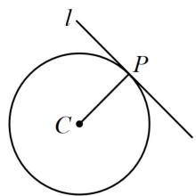

text_image

l
P
C

图1

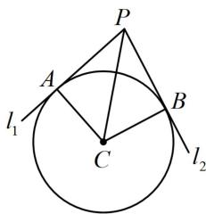

text_image

P
A
l₁
B
C
l₂

图2

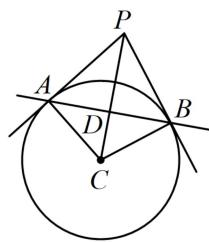

text_image

Geometric diagram showing a circle with points A, B, C, D, P and intersecting lines forming triangles and chords.

图3

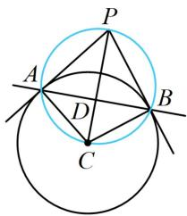

text_image

Geometric diagram showing a circle with inscribed triangle and intersecting lines, labeled with points A, B, C, D, P.

图4

# 类型Ⅰ：求圆的切线方程

【例 1】圆 $C:(x-1)^{2}+y^{2}=4$ 过点 $P(2,\sqrt{3})$ 的切线方程为 \_\_\_\_.

解法1：过 $P$ 能作几条切线？由点 $P$ 在圆上还是圆外决定，故先分析， $(2 - 1)^{2} + (\sqrt{3})^{2} = 4\Rightarrow P$ 在圆 $C$ 上，故可由 $PC\bot$ 切线来算切线斜率，如图， $C(1,0)$ ， $k_{PC} = \frac{\sqrt{3} - 0}{2 - 1} = \sqrt{3}\Rightarrow$ 切线的斜率为 $-\frac{\sqrt{3}}{3}$

所以切线方程为 $y - \sqrt{3} = -\frac{\sqrt{3}}{3} (x - 2)$ ，整理得： $x + \sqrt{3} y - 5 = 0$ .

解法2：按解法1判断出点 $P$ 在圆上后，也可直接用内容提要第4点的结论来写切线的方程，

所求切线的方程为 $(2 - 1)(x - 1) + (\sqrt{3} - 0)(y - 0) = 4$ ，整理得： $x + \sqrt{3} y - 5 = 0$ .

答案： $x + \sqrt{3} y - 5 = 0$

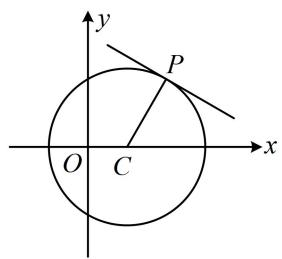

text_image

y
P
O C x

【变式】过 $P(0,2)$ 作与圆 $C: x^{2} + y^{2} - 2x = 0$ 相切的直线 $l$ ，则 $l$ 的方程为 \_\_\_\_.

解析： $x^{2} + y^{2} - 2x = 0\Rightarrow (x - 1)^{2} + y^{2} = 1\Rightarrow$ 圆心为 $C(1,0)$ ，半径 $r = 1$

如图， $P$ 在圆外，求切线可设斜率，并由 $d = r$ 求解斜率，先考虑斜率不存在的情况，

当 $l \perp x$ 轴时，其方程是x=0，由图可知满足l与圆C相切；

当 l 不与 x 轴垂直时，设其方程为 $y = kx + 2$ ，即 $kx - y + 2 = 0$ ①，

圆心 $C$ 到直线 $l$ 的距离 $d = \frac{|k + 2|}{\sqrt{k^2 + 1}}$

若 $l$ 与圆 $C$ 相切，则 $d = r$ ，即 $\frac{|k + 2|}{\sqrt{k^2 + 1}} = 1$ ，解得： $k = -\frac{3}{4}$

代入①整理得： $3x+4y-8=0$ ；

综上所述， $l$ 的方程为 $x = 0$ 或 $3x + 4y - 8 = 0$

答案： $x = 0$ 或 $3x + 4y - 8 = 0$

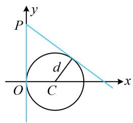

text_image

y
P
d
O C x

# 类型 II：切线长有关计算

【例 2】已知圆 $C:(x-1)^{2}+(y-1)^{2}=1$ ，过点 $P(3,3)$ 作直线与圆 C 相切于点 A，则 $\left|PA\right|=\underline{\hspace{2cm}}$ .

解析：如图，切线长 $|PA|$ 可在 $\triangle PAC$ 中由勾股定理计算，所以只需求出 $|PC|$ 即可，

$$
C (1, 1) \Rightarrow | P C | = \sqrt {(3 - 1) ^ {2} + (3 - 1) ^ {2}} = 2 \sqrt {2} \Rightarrow | P A | = \sqrt {| P C | ^ {2} - r ^ {2}} = \sqrt {7}.
$$

答案: $\sqrt{7}$

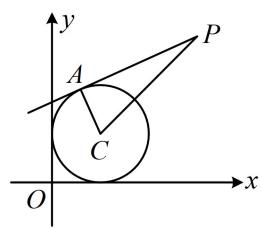

text_image

y
A
P
C
O
x

【变式1】已知直线 $l: x + 2y - 1 = 0$ 和圆 $C: (x + 1)^2 + (y + 2)^2 = 4$ ，过直线 $l$ 上的动点 $P$ 作圆 $C$ 的切线 $PA$ ， $A$ 为切点，则 $|PA|$ 的最小值为（）

A. $\frac{4\sqrt{5}}{5}$

B. $\frac{2 \sqrt{5}}{5}$

C. $\frac{4 \sqrt{70}}{5}$

D. $\frac{2 \sqrt{70}}{5}$

解析：如图， $\left|PA\right|=\sqrt{\left|PC\right|^{2}-\left|AC\right|^{2}}=\sqrt{\left|PC\right|^{2}-4}$ ①，

要使 $|PA|$ 最小，只需 $|PC|$ 最小，而 $|PC|$ 的最小值即为点 $C(-1, -2)$ 到 $l$ 的距离，

所以 $\left|PC\right|_{\min}=\frac{\left|-1+2\times(-2)-1\right|}{\sqrt{1^{2}+2^{2}}}=\frac{6}{\sqrt{5}}$ ，代入①得 $\left|PA\right|_{\min}=\frac{4\sqrt{5}}{5}$ .

答案: A

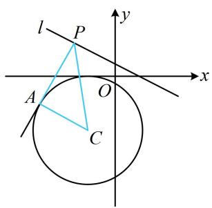

text_image

l
P
y
x
A
O
C

【变式 2】(2021·新高考 I 卷)(多选)已知点 P 在圆 $(x-5)^{2}+(y-5)^{2}=16$ 上，点 A(4,0)，B(0,2)，

则（ ）

A. 点 $P$ 到直线 $AB$ 的距离小于 10  
B. 点 $P$ 到直线 $AB$ 的距离大于 2  
C. 当 $\angle PBA$ 最小时, $|PB| = 3\sqrt{2}$   
D. 当 $\angle PBA$ 最大时， $|PB| = 3\sqrt{2}$

解析：要判断选项 A、B，可直接画图来分析点 P 到直线 AB 距离的取值范围，先求直线 AB 的方程，由题意，直线 AB 的截距式方程为 $\frac{x}{4} + \frac{y}{2} = 1$ ，整理得： $x + 2y - 4 = 0$ ，

如图1，点 $P$ 到直线 $AB$ 的距离 $d$ 的最大、最小值分别在 $P_{1}$ ， $P_{2}$ 处取得，其中 $P_{1}P_{2} \perp AB$ ，

因为圆心 $C(5,5)$ 到 $AB$ 的距离为 $\frac{|5 + 2\times 5 - 4|}{\sqrt{1^2 + 2^2}} = \frac{11\sqrt{5}}{5}$ ，半径 $r = 4$ ，所以 $d_{\max} = \frac{11\sqrt{5}}{5} + 4$ ， $d_{\min} = \frac{11\sqrt{5}}{5} - 4$ ，故 $\frac{11\sqrt{5}}{5} - 4 \leq d \leq \frac{11\sqrt{5}}{5} + 4$ ，因为 $\frac{11\sqrt{5}}{5} - 4 < 2$ ， $\frac{11\sqrt{5}}{5} + 4 < 10$ ，所以 A 项正确，B 项错误；

对于选项C、D，如图2，当 $\angle PBA$ 最小时， $P$ 位于 $P_{3}$ 处，当 $\angle PBA$ 最大时， $P$ 位于 $P_{4}$ 处，

其中 $P_{3}B$ 和 $P_{4}B$ 均与圆 $C$ 相切，且 $\left|P_{3}B\right| = \left|P_{4}B\right|$ ，它们都是切线长，可先求 $|BC|$ ，再由勾股定理求它们，因为 $\left|BC\right| = \sqrt{(5 - 0)^2 + (5 - 2)^2} = \sqrt{34}$ ，所以 $\left|P_{3}B\right| = \left|P_{4}B\right| = \sqrt{\left|BC\right|^2 - 16} = 3\sqrt{2}$ ，故 C 项和 D 项均正确.

答案: ACD

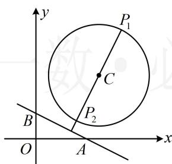

text_image

y
P₁
C
P₂
B
O
A
x

图1

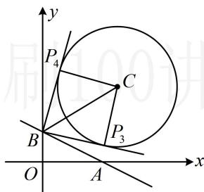

text_image

y
P₄
C
P₃
B
O
A
x

图2

【反思】从例2及两个变式可以看出，算切线长，关键是算圆外的点与圆心的距离.

# 类型III：切点弦相关计算

【例 3】过点 $P(3,1)$ 作圆 $C:(x-1)^{2}+y^{2}=1$ 的两条切线，切点分别为 A, B，则直线 AB 的方程为（）

A. $2x + y - 3 = 0$

B. $2x - y - 3 = 0$

C. $4x - y - 3 = 0$

D. $4x + y - 3 = 0$

解法1：切点弦的方程，可按两圆的公共弦来算，如图，由题意， $PA \perp AC$ ， $PB \perp BC$

所以 $P, C, A, B$ 四点都在以 $PC$ 为直径的圆上，

又 $C(1,0)$ ，所以 $PC$ 中点为 $\left(2,\frac{1}{2}\right)$ ， $\left|PC\right| = \sqrt{(3 - 1)^2 + (1 - 0)^2} = \sqrt{5}$

故以 $PC$ 为直径的圆的方程为 $(x - 2)^{2} + \left(y - \frac{1}{2}\right)^{2} = \frac{5}{4}$

与圆 $C$ 的方程作差整理得直线 $AB$ 的方程为 $2x + y - 3 = 0$ .

解法 2: 也可用内容提要第 4 点的结论,

直线 $AB$ 的方程为 $(3 - 1)(x - 1) + 1 \times y = 1$ ，整理得： $2x + y - 3 = 0$ .

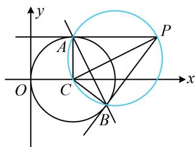

text_image

y
A
P
O
C
x
B

答案: A

【反思】上述解法 1 的过程中，为什么用两圆方程作差就能得到公共弦 AB 所在直线的方程？因为作差得到的必为直线方程，且两交点 A, B 都满足该方程，故该方程即为公共弦 AB 所在直线的方程.

【变式1】若圆 $C:(x - 1)^2 +(y - 2)^2 = 2$ ，过原点作 $C$ 的切线，切点分别为 $A,B$ ，则 $\vert AB\vert = \_$ 解析：如图，可先用结论求出切点弦 $AB$ 的方程，按直线 $AB$ 被圆截得的弦长来算 $\vert AB\vert$

由题意，切点弦 $AB$ 的方程为 $(0 - 1)(x - 1) + (0 - 2)(y - 2) = 2$

整理得： $x + 2y - 3 = 0$ ，圆心 $C(1,2)$ 到直线 $AB$ 的距离 $d = \frac{|1 + 2\times 2 - 3|}{\sqrt{1^2 + 2^2}} = \frac{2}{\sqrt{5}}$

所以 $\left|AB\right| = 2\sqrt{r^2 - d^2} = 2\sqrt{2 - \frac{4}{5}} = \frac{2\sqrt{30}}{5}$

答案： $\frac{2\sqrt{30}}{5}$

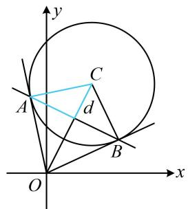

text_image

y
A
C
d
B
O
x

【变式2】（多选）已知圆 $M: (x + 1)^2 + y^2 = 2$ ，直线 $l: x - y - 3 = 0$ ，点 $P$ 在直线 $l$ 上运动，直线 $PA$ ， $PB$ 分别与圆 $M$ 相切于点 $A$ 和 $B$ ，则（）

A. 四边形 $PAMB$ 的面积的最小值为 $2 \sqrt{3}$   
B. $|PA|$ 最短时，直线 $AB$ 的方程为 $x - y - 1 = 0$   
C. $|PA|$ 最短时， $|AB| = \sqrt{6}$   
D. 直线 $AB$ 过定点 $\left(-\frac{1}{2}, -\frac{1}{2}\right)$

解析：A项，如图， $M(-1,0)$ ， $\left|AM\right| = \left|BM\right| = \sqrt{2}$ ，设四边形PAMB的面积为 $S$

则 $S = 2S_{\triangle PAM} = 2 \times \frac{1}{2}|AM| \cdot |PA| = \sqrt{2}|PA|$ ， $|PA|$ 是切线长，可在 $\triangle PAM$ 中用勾股定理转化为 $|PM|$ 来算，又 $|PA| = \sqrt{|PM|^2 - |AM|^2} = \sqrt{|PM|^2 - 2}$ ，所以 $S = \sqrt{2} \cdot \sqrt{|PM|^2 - 2}$ ①，

故当 $|PM|$ 最小时，S 也最小，由图可知当 $PM \perp l$ 时， $|PM|$ 最小，故 $|PM|_{\min} = \frac{|-1 - 3|}{\sqrt{1^2 + (-1)^2}} = 2\sqrt{2}$ ，代入①得 $S_{\min} = 2\sqrt{3}$ ，故 A 项正确；

B项，由 $|PA| = \sqrt{|PM|^2 - 2}$ 知 $|PA|$ 最短时， $|PM|$ 也最短，此时 $PM\perp l$

可由此求得 $PM$ 的方程，与 $l$ 联立求出 $P$ 的坐标，直线 $l$ 的斜率为1，所以 $PM$ 的斜率为-1，

结合 $M(-1,0)$ 可得 $PM$ 的方程为 $y = -(x + 1)$ ，即 $x + y + 1 = 0$ ，联立 $\left\{ \begin{array}{l} x + y + 1 = 0 \\ x - y - 3 = 0 \end{array} \right.$ 解得： $\left\{ \begin{array}{l} x = 1 \\ y = -2 \end{array} \right.$ ，故 $P(1, -2)$ ，求出了点 $P$ ，就可由切点弦结论写出直线 $AB$ 的方程，

直线 $AB$ 的方程为 $(1 + 1)(x + 1) - 2y = 2$ ，整理得： $x - y = 0$ ，故B项错误；

C 项， $|PA|$ 最短时，AB 的方程是 x-y=0， $|AB|$ 可按直线被圆 M 截得的弦长来算，先求 d，

圆心 $M$ 到直线 $AB$ 的距离 $d = \frac{|-1|}{\sqrt{1^2 + (-1)^2}} = \frac{\sqrt{2}}{2}$ ，所以 $|AB| = 2\sqrt{r^2 - d^2} = 2\sqrt{2 - \frac{1}{2}} = \sqrt{6}$ ，故C项正确；

D 项，找直线 $AB$ 所过定点需要 $AB$ 的方程，可先设 $P$ 的坐标，用切点弦结论来写 $AB$ 的方程， $x - y - 3 = 0 \Rightarrow y = x - 3$ ，因为点 $P$ 在直线 $y = x - 3$ 上，所以可设 $P(a, a - 3)$ ，

由切点弦结论，直线 $AB$ 的方程为 $(a + 1)(x + 1) + (a - 3)y = 2$

整理得： $a(x + y + 1) + (x - 3y - 1) = 0$ ，令 $\left\{ \begin{array}{l}x + y + 1 = 0\\ x - 3y - 1 = 0 \end{array} \right.$ 解得： $\left\{ \begin{array}{l}x = -\frac{1}{2}\\ y = -\frac{1}{2} \end{array} \right.,$

所以直线 $AB$ 过定点 $\left(-\frac{1}{2}, -\frac{1}{2}\right)$ ，故D项正确.

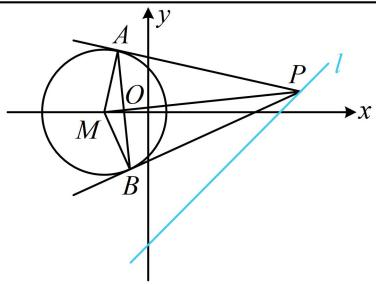

text_image

A
y
O
M
B
P
x
l

答案: ACD

【反思】切点弦的结论在选填题中用起来很方便，但例3解法1给出的推导方法，也需要掌握.若遇到解答题，则可用该方法来求切点弦方程.

# 强化训练

1. (2025·河北石家庄模拟·★)

过点 $P(1, - 1)$ 且与圆 $C:x^{2} + y^{2} - 4x + 2 = 0$ 相切的直线的方程为（）

A. $x + y = 0$

B. $x - y - 2 = 0$

C. $x - y = 0$

D. $x - y + 2 = 0$

2. (★★)

已知圆 C 的圆心坐标是 $(0, m)$ ，半径长是 r。若直线 $2x - y + 3 = 0$ 与圆相切于点 $A(-2, -1)$ ，则 m = \_\_\_\_，
r = \_\_\_\_.

3. (2022·辽宁模拟·★★)

已知圆 $C: x^{2} + y^{2} + 2x - 4y + m = 0$ 与 $y$ 轴相切，过点 $P(-2,4)$ 作圆 $C$ 的切线 $l$ ，则 $l$ 的方程为 \_\_\_\_.

4. (2023·湖北模拟·★★)

已知过点 $P(3,3)$ 作圆 $O: x^{2} + y^{2} = 2$ 的切线，则切线长为 \_\_\_\_.

5. (2024·陕西模拟·★★★)

由直线 $y = x + 1$ 上的一点向圆 $x^{2} + y^{2} - 6x + 8 = 0$ 引切线，则切线长的最小值为（）

A. 3

B. $2 \sqrt{2}$

C. $\sqrt{7}$

D. $\sqrt{6}$

6.（2022·湖北模拟·★★★）

若圆 $C:(x - 2)^{2} + (y + 1)^{2} = 2$ 关于直线 $l:ax + 2by + 6 = 0$ 对称，过 $P(a,b)$ 作圆 $C$ 的一条切线，切点为 $A$ ，则 $\left|PA\right|$ 的最小值为（）

A. 2

B. 3

C. 4

D. 6

7. (★★☆)

若圆 $C:(x - 2)^{2} + (y - 4)^{2} = 16$ ，过点 $P(-1,0)$ 作圆 $C$ 的两条切线，切点分别为 $A,B$ ，则 $\vert AB\vert = \_$ .

8. (2022·浙江温州模拟·★★★)

过 $x$ 轴正半轴上一点 $P(x_0, 0)$ 作圆 $C: x^2 + (y - \sqrt{3})^2 = 1$ 的两条切线，切点分别为 $A, B$ ，若 $|AB| \geq \sqrt{3}$ ，则 $x_0$ 的最小值为（）

A. 1

B. $\sqrt{2}$

C. 2

D. 3

9. (2020·新课标Ⅰ卷·★★★★)

已知圆 $M: x^2 + y^2 - 2x - 2y - 2 = 0$ ，直线 $l: 2x + y + 2 = 0$ ， $P$ 为 $l$ 上的动点，过点 $P$ 作圆 $M$ 的切线 $PA$ ， $PB$ ，切点为 $A$ ， $B$ ，当 $|PM| \cdot |AB|$ 最小时，直线 $AB$ 的方程为（）

A. $2x - y - 1 = 0$

B. $2x + y - 1 = 0$

C. $2x - y + 1 = 0$

D. $2x + y + 1 = 0$