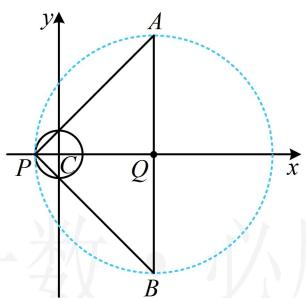
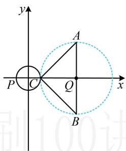
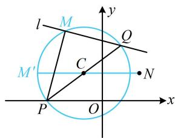
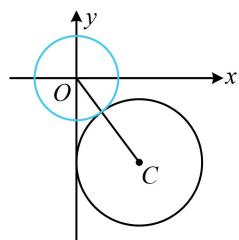
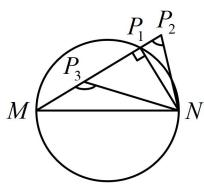

# 强化训练

1. (2024·山东济南二模·★★☆)

已知圆 $C: x^2 + y^2 = 1$ ， $A(4, a)$ ， $B(4, -a)$ ，若圆 $C$ 上有且仅有一点 $P$ 使 $PA \perp PB$ ，则正实数 $a$ 的取值为（）

A. 2 或 4

B. 2 或 3

C. 4 或 5

D. 3 或 5

1. D

解析： $PA \perp PB$ 意味着点 P 在以 AB 为直径的圆上，所以题设条件等价于圆 C 上有且仅有一点在以 AB 为直径的圆上，这可按两圆的位置关系问题处理，且有外切和内切两种情况，下面分别考虑，

由题意， $AB$ 的中点为 $Q(4,0)$ ， $\left|QA\right| = a$

$PA \perp PB \Rightarrow$ 点 P 在以点 Q 为圆心，a 为半径的圆上，

如图1，若圆 $Q$ 与圆 $C$ 内切，则 $\left|QC\right| = a - 1$ ①，

又圆 $C$ 的圆心为 $C(0,0)$ ，所以 $\left|QC\right| = 4$

代入①得 4 = a - 1，故 a = 5；

如图2，若圆 $Q$ 与圆 $C$ 外切，则 $\left|QC\right| = a + 1$

即 $4 = a + 1$ ，故 $a = 3$

综上所述，正实数 $a$ 的取值为3或5.

text_image

y
A
P C Q x
B

图1

text_image

y
A
P C Q x
B

图2

2. (★★★)

若圆 $C: x^{2} + y^{2} - 6x - 6y - m = 0$ 上有到点 $P(-1,0)$ 的距离为1的点，则实数 $m$ 的取值范围是（）

A. $[-18,6]$

B. $[-2,6]$

C. $[-2,18]$

D. [4,18]

2. C

解析：圆 $C$ 的方程可化为 $(x - 3)^2 +(y - 3)^2 = 18 + m$

所以其圆心为 $C(3,3)$ ，半径 $r_1 = \sqrt{18 + m} (m > - 18)$

到点 $P$ 的距离为1的点在圆 $P: (x + 1)^2 + y^2 = 1$ 上，故问题等价于圆 $C$ 与该圆有交点，可由此求 $m$ 的范围，

圆 $P$ 的半径 $r_2 = 1$ ，圆心距 $\left|PC\right| = \sqrt{(-1 - 3)^2 + (0 - 3)^2} = 5$

两圆有交点，所以 $\left|r_1 - r_2\right|\leq \left|PC\right|\leq r_1 + r_2$

故 $\left|\sqrt{18 + m} - 1\right| \leq 5 \leq \sqrt{18 + m} + 1$

此不等式右侧较为简单，先解右侧，

$$
5 \leq \sqrt {1 8 + m} + 1 \Leftrightarrow \sqrt {1 8 + m} \geq 4 \Leftrightarrow 1 8 + m \geq 1 6 \Leftrightarrow m \geq - 2,
$$

再解左边，此时可判断出 $\sqrt{18+m}-1>0$ ，

$$
\left| \sqrt {1 8 + m} - 1 \right| \leq 5 \Leftrightarrow \sqrt {1 8 + m} - 1 \leq 5 \Leftrightarrow \sqrt {1 8 + m} \leq 6
$$

$$
\Leftrightarrow 1 8 + m \leq 3 6 \Leftrightarrow m \leq 1 8, \text {所以} - 2 \leq m \leq 1 8.
$$

3. (★★★)

在平面直角坐标系 $xOy$ 中，已知点 $A(1,0)$ ， $B(4,0)$ ，若直线 $x - y + m = 0$ 上存在点 $P$ 使 $\left|PB\right| = 2\left|PA\right|$ ，则实数 $m$ 的取值范围为 \_\_\_\_.

3. $[-2\sqrt{2}, 2\sqrt{2}]$

解析： $A$ ， $B$ 是定点，所以由 $\left|PB\right| = 2\left|PA\right|$ 可约束 $P$ 的轨迹，故先求出轨迹方程，设 $P(x,y)$ ，因为 $\left|PB\right| = 2\left|PA\right|$ ，所以 $\sqrt{(x - 4)^2 + y^2} = 2\sqrt{(x - 1)^2 + y^2}$ ，整理得： $x^{2} + y^{2} = 4$ ，

直线 $x - y + m = 0$ 上存在点 $P$ 使得 $\left|PB\right| = 2\left|PA\right|$ 等价于直线 $x - y + m = 0$ 与圆 $x^{2} + y^{2} = 4$ 有交点，

所以 $\frac{|m|}{\sqrt{2}} \leq 2$ ，解得： $-2\sqrt{2} \leq m \leq 2\sqrt{2}$ .

4. (2022·安徽黄山模拟·★★★☆)

已知点 $P(-3,0)$ 在动直线 $l: mx + ny - (m + 3n) = 0$ 上的投影为 $M$ ，若点 $N\left(2, \frac{3}{2}\right)$ ，则 $\left|MN\right|$ 的最大值为（）

A. 1 B. $\frac{3}{2}$ C. 2 D. $\frac{11}{2}$

4. D

解析：直线 l 含参，先看它是否过定点，

$$
m x + n y - (m + 3 n) = 0 \Rightarrow m (x - 1) + n (y - 3) = 0,
$$

令 $\left\{ \begin{array}{l}x - 1 = 0\\ y - 3 = 0 \end{array} \right.$ 可得： $\left\{ \begin{array}{l}x = 1\\ y = 3 \end{array} \right.$ ，所以直线 $l$ 过定点 $Q(1,3)$

直线 $l$ 绕定点 $Q$ 旋转，可画图看看，如图， $PM \perp MQ$

所以 M 在以 PQ 为直径的圆上，该圆的圆心为 $C\left(-1, \frac{3}{2}\right)$ ,

半径 $r = \frac{1}{2}\big|PQ\big| = \frac{1}{2}\sqrt{(-3 - 1)^2 + (0 - 3)^2} = \frac{5}{2},$

接下来就是圆上动点 $M$ 与定点 $N$ 的距离的最值问题了，图中 $M'$ 处即为该距离最大的情形，

因为 $\left|CN\right|=\sqrt{(-1-2)^{2}+\left(\frac{3}{2}-\frac{3}{2}\right)^{2}}=3$ ，

所以 $\left|MN\right|_{\max}=\left|M'N\right|=\left|M'C\right|+\left|CN\right|=\frac{5}{2}+3=\frac{11}{2}$ .

text_image

l
M
y
Q
C
M'
N
P
O
x

5.（2022·河南模拟·★★★★）

已知点 $M(0, -a)$ ， $N(0, a)$ ， $a > 0$ ，若圆 $C: (x - 3)^2 + (y + 4)^2 = 9$ 上存在点 $P$ 使得 $\angle MPN$ 为钝角，则 $a$ 的取值范围是 \_\_\_\_.

5. $(2, +\infty)$

解析：钝角这种条件怎么翻译？我们知道直角可翻译成“圆上”，那钝角呢？翻译成“圆内”即可，

若 $\angle MPN$ 为钝角，则点 $P$ 在以 $MN$ 为直径的圆内，该圆的圆心为原点 $O$ ，半径 $r_1 = a$ ，这样问题就可表述为圆 $C$ 上存在点 $P$ 在上述圆 $O$ 内部，先画图看看，

临界状态如图，两圆外切，因为圆 $C$ 的圆心为 $C(3, - 4)$

半径 $r_2 = 3$ ，所以 $\left|OC\right| = \sqrt{3^2 + (-4)^2} = 5$

当两圆外切时， $\left|OC\right|=r_{1}+r_{2}$ ，即 $5=a+3$ ，解得：a=2，

由图可知，当 $a > 2$ 时，圆 $C$ 上有点在圆 $O$ 内部，

故 $a$ 的取值范围是 $(2, +\infty)$ .

text_image

y
O
x
C

【反思】对于以 $MN$ 为直径的圆, 如图, 若 $\angle MP_{1}N$ 为直角, 则点 $P_{1}$ 在该圆上; 若 $\angle MP_{2}N$ 为锐角, 则点 $P_{2}$ 在该圆外; 若 $\angle MP_{3}N$ 为钝角, 则点 $P_{3}$ 在该圆内.

